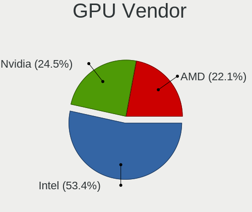
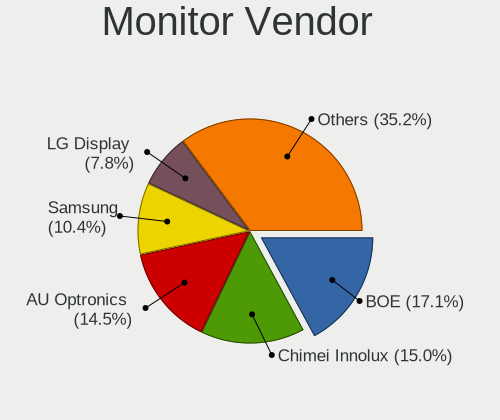
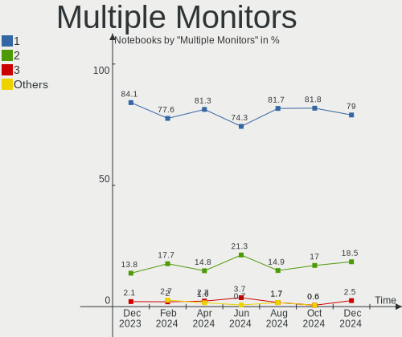

Arch Hardware Trends (Notebook)
-------------------------------

A project to identify most popular hardware characteristics and track their change
over time based on data collected by Arch users at https://Linux-Hardware.org.

Anyone can contribute to the study by uploading probes of their computers by
the [hw-probe](https://github.com/linuxhw/hw-probe) tool:

    sudo hw-probe -all -upload

Full-feature report is available here: https://linux-hardware.org/?view=trends&formfactor=notebook

Period: Apr, 2020.

Contents
--------

- [ OS                       ](#os)
- [ OS Family                ](#os-family)
- [ Kernel                   ](#kernel)
- [ Kernel Family            ](#kernel-family)
- [ Kernel Major Ver.        ](#kernel-major-ver)
- [ Arch                     ](#arch)
- [ DE                       ](#de)
- [ Display Server           ](#display-server)
- [ Display Manager          ](#display-manager)
- [ OS Lang                  ](#os-lang)
- [ Boot Mode                ](#boot-mode)
- [ Filesystem               ](#filesystem)
- [ Dual Boot with Linux/BSD ](#dual-boot-with-linux/bsd)
- [ Dual Boot (Win)          ](#dual-boot-win)
- [ Country                  ](#country)
- [ City                     ](#city)
- [ Vendor                   ](#vendor)
- [ Model                    ](#model)
- [ Model Family             ](#model-family)
- [ MFG Year                 ](#mfg-year)
- [ Form Factor              ](#form-factor)
- [ Secure Boot              ](#secure-boot)
- [ Coreboot                 ](#coreboot)
- [ RAM Size                 ](#ram-size)
- [ RAM Used                 ](#ram-used)
- [ Drive Vendor             ](#drive-vendor)
- [ Drive Model              ](#drive-model)
- [ Drive Kind               ](#drive-kind)
- [ Drive Connector          ](#drive-connector)
- [ Drive Size               ](#drive-size)
- [ Space Total              ](#space-total)
- [ Space Used               ](#space-used)
- [ Malfunc. Drives          ](#malfunc-drives)
- [ Malfunc. Drive Vendor    ](#malfunc-drive-vendor)
- [ Malfunc. Drive Kind      ](#malfunc-drive-kind)
- [ Failed Drives            ](#failed-drives)
- [ Failed Drive Vendor      ](#failed-drive-vendor)
- [ Drive Status             ](#drive-status)
- [ Storage Vendor           ](#storage-vendor)
- [ Storage Model            ](#storage-model)
- [ Storage Kind             ](#storage-kind)
- [ CPU Vendor               ](#cpu-vendor)
- [ CPU Model                ](#cpu-model)
- [ CPU Model Family         ](#cpu-model-family)
- [ CPU Cores                ](#cpu-cores)
- [ CPU Sockets              ](#cpu-sockets)
- [ CPU Threads              ](#cpu-threads)
- [ CPU Op-Modes             ](#cpu-op-modes)
- [ CPU Microarch            ](#cpu-microarch)
- [ CPU Microcode            ](#cpu-microcode)
- [ GPU Vendor               ](#gpu-vendor)
- [ GPU Model                ](#gpu-model)
- [ GPU Combo                ](#gpu-combo)
- [ GPU Driver               ](#gpu-driver)
- [ GPU Memory               ](#gpu-memory)
- [ Monitor Vendor           ](#monitor-vendor)
- [ Monitor Model            ](#monitor-model)
- [ Monitor Resolution       ](#monitor-resolution)
- [ Monitor Diagonal         ](#monitor-diagonal)
- [ Monitor Width            ](#monitor-width)
- [ Aspect Ratio             ](#aspect-ratio)
- [ Monitor Area             ](#monitor-area)
- [ Pixel Density            ](#pixel-density)
- [ Multiple Monitors        ](#multiple-monitors)
- [ Net Controller Vendor    ](#net-controller-vendor)
- [ Net Controller Model     ](#net-controller-model)
- [ Net Controller Kind      ](#net-controller-kind)
- [ Used Controller          ](#used-controller)
- [ NICs                     ](#nics)
- [ Unsupported Devices      ](#unsupported-devices)
- [ Unsupported Device Types ](#unsupported-device-types)

OS
--

Installed operating systems

| Name         | Computers | Percent |
|--------------|-----------|---------|
| Arch         | 54        | 78.26%  |
| Arch Rolling | 15        | 21.74%  |

OS Family
---------

OS without a version

| Name | Computers | Percent |
|------|-----------|---------|
| Arch | 69        | 100%    |

Kernel
------

Version of the Linux kernel

| Version                   | Computers | Percent |
|---------------------------|-----------|---------|
| 5.6.4-arch1-1             | 12        | 17.39%  |
| 5.5.13-arch2-1            | 11        | 15.94%  |
| 5.6.3-arch1-1             | 9         | 13.04%  |
| 5.6.7-arch1-1             | 7         | 10.14%  |
| 5.6.6-arch1-1             | 6         | 8.7%    |
| 5.6.5-arch3-1             | 5         | 7.25%   |
| 5.6.2-arch1-2             | 3         | 4.35%   |
| 5.4.31-1-lts              | 2         | 2.9%    |
| 5.4.28-2-lts              | 2         | 2.9%    |
| 5.6.7-zen1-1-zen          | 1         | 1.45%   |
| 5.6.3-zen1-1-zen          | 1         | 1.45%   |
| 5.5.9-arch1-2             | 1         | 1.45%   |
| 5.5.7-arch1-1             | 1         | 1.45%   |
| 5.5.13.ll53-1-lingruby-ll | 1         | 1.45%   |
| 5.5.13-zen2-1-zen         | 1         | 1.45%   |
| 5.5.11-arch1-1            | 1         | 1.45%   |
| 5.4.34-1-lts              | 1         | 1.45%   |
| 5.4.32-1-lts              | 1         | 1.45%   |
| 5.4.30-1-lts              | 1         | 1.45%   |
| 5.4.28-1-lts              | 1         | 1.45%   |
| 5.4.27-1-lts              | 1         | 1.45%   |

Kernel Family
-------------

Linux kernel without a distro release

| Version | Computers | Percent |
|---------|-----------|---------|
| 5.5.13  | 13        | 18.84%  |
| 5.6.4   | 12        | 17.39%  |
| 5.6.3   | 10        | 14.49%  |
| 5.6.7   | 8         | 11.59%  |
| 5.6.6   | 6         | 8.7%    |
| 5.6.5   | 5         | 7.25%   |
| 5.6.2   | 3         | 4.35%   |
| 5.4.28  | 3         | 4.35%   |
| 5.4.31  | 2         | 2.9%    |
| 5.5.9   | 1         | 1.45%   |
| 5.5.7   | 1         | 1.45%   |
| 5.5.11  | 1         | 1.45%   |
| 5.4.34  | 1         | 1.45%   |
| 5.4.32  | 1         | 1.45%   |
| 5.4.30  | 1         | 1.45%   |
| 5.4.27  | 1         | 1.45%   |

Kernel Major Ver.
-----------------

Linux kernel major version

| Version | Computers | Percent |
|---------|-----------|---------|
| 5.6     | 44        | 63.77%  |
| 5.5     | 16        | 23.19%  |
| 5.4     | 9         | 13.04%  |

Arch
----

OS architecture (x86_64, i586, etc.)

| Name   | Computers | Percent |
|--------|-----------|---------|
| x86_64 | 69        | 100%    |

DE
--

Desktop Environment

| Name          | Computers | Percent |
|---------------|-----------|---------|
| GNOME         | 36        | 52.17%  |
| KDE5          | 9         | 13.04%  |
| XFCE          | 6         | 8.7%    |
| KDE           | 6         | 8.7%    |
| Budgie        | 3         | 4.35%   |
| Unknown       | 3         | 4.35%   |
| X-Cinnamon    | 2         | 2.9%    |
| i3            | 1         | 1.45%   |
| GNOME Classic | 1         | 1.45%   |
| Deepin        | 1         | 1.45%   |
| Cinnamon      | 1         | 1.45%   |

Display Server
--------------

X11 or Wayland

| Name    | Computers | Percent |
|---------|-----------|---------|
| X11     | 41        | 59.42%  |
| Wayland | 23        | 33.33%  |
| Tty     | 5         | 7.25%   |

Display Manager
---------------

SDDM, LightDM, etc.

| Name    | Computers | Percent |
|---------|-----------|---------|
| Unknown | 43        | 62.32%  |
| LightDM | 10        | 14.49%  |
| SDDM    | 8         | 11.59%  |
| GDM     | 7         | 10.14%  |
| SLiM    | 1         | 1.45%   |

OS Lang
-------

Language

| Lang       | Computers | Percent |
|------------|-----------|---------|
| en_US      | 26        | 37.68%  |
| de_DE      | 7         | 10.14%  |
| ru_RU      | 5         | 7.25%   |
| en_GB      | 5         | 7.25%   |
| pt_BR      | 3         | 4.35%   |
| fr_FR      | 3         | 4.35%   |
| pl_PL      | 2         | 2.9%    |
| C          | 2         | 2.9%    |
| ru_RU.utf8 | 1         | 1.45%   |
| ro_RO      | 1         | 1.45%   |
| pl_PL.utf8 | 1         | 1.45%   |
| nb_NO      | 1         | 1.45%   |
| it_IT      | 1         | 1.45%   |
| hu_HU      | 1         | 1.45%   |
| fr_CH      | 1         | 1.45%   |
| es_MX      | 1         | 1.45%   |
| es_ES      | 1         | 1.45%   |
| es_CO      | 1         | 1.45%   |
| en_US.utf8 | 1         | 1.45%   |
| en_GB.utf8 | 1         | 1.45%   |
| en_DK      | 1         | 1.45%   |
| en_CA.utf8 | 1         | 1.45%   |
| en_CA      | 1         | 1.45%   |
| en_AU      | 1         | 1.45%   |

Boot Mode
---------

EFI or BIOS

| Mode | Computers | Percent |
|------|-----------|---------|
| EFI  | 39        | 56.52%  |
| BIOS | 30        | 43.48%  |

Filesystem
----------

Type of filesystem

| Type  | Computers | Percent |
|-------|-----------|---------|
| Ext4  | 62        | 89.86%  |
| Btrfs | 5         | 7.25%   |
| Xfs   | 1         | 1.45%   |
| F2fs  | 1         | 1.45%   |

Dual Boot with Linux/BSD
------------------------

Hosting more than one Linux/BSD

| Dual boot | Computers | Percent |
|-----------|-----------|---------|
| No        | 64        | 92.75%  |
| Yes       | 5         | 7.25%   |

Dual Boot (Win)
---------------

Hosting Linux and Windows

| Dual boot | Computers | Percent |
|-----------|-----------|---------|
| No        | 59        | 85.51%  |
| Yes       | 10        | 14.49%  |

Country
-------

Geographic location (country)

| Country      | Computers | Percent |
|--------------|-----------|---------|
| USA          | 8         | 11.59%  |
| Russia       | 8         | 11.59%  |
| Germany      | 7         | 10.14%  |
| Canada       | 5         | 7.25%   |
| UK           | 4         | 5.8%    |
| Switzerland  | 3         | 4.35%   |
| Poland       | 3         | 4.35%   |
| France       | 3         | 4.35%   |
| Brazil       | 3         | 4.35%   |
| Qatar        | 2         | 2.9%    |
| Italy        | 2         | 2.9%    |
| Colombia     | 2         | 2.9%    |
| Austria      | 2         | 2.9%    |
| Taiwan       | 1         | 1.45%   |
| Sri Lanka    | 1         | 1.45%   |
| Spain        | 1         | 1.45%   |
| South Africa | 1         | 1.45%   |
| Romania      | 1         | 1.45%   |
| Norway       | 1         | 1.45%   |
| Netherlands  | 1         | 1.45%   |
| Mexico       | 1         | 1.45%   |
| Kazakhstan   | 1         | 1.45%   |
| India        | 1         | 1.45%   |
| Hungary      | 1         | 1.45%   |
| Hong Kong    | 1         | 1.45%   |
| Greece       | 1         | 1.45%   |
| Egypt        | 1         | 1.45%   |
| Bulgaria     | 1         | 1.45%   |
| Belgium      | 1         | 1.45%   |
| Australia    | 1         | 1.45%   |

City
----

Geographic location (city)

| City                  | Computers | Percent |
|-----------------------|-----------|---------|
| Waren                 | 2         | 2.9%    |
| St Petersburg         | 2         | 2.9%    |
| Penrith               | 2         | 2.9%    |
| Juiz de Fora          | 2         | 2.9%    |
| Doha                  | 2         | 2.9%    |
| Bogotá               | 2         | 2.9%    |
| Zell unter Aichelberg | 1         | 1.45%   |
| Yukon                 | 1         | 1.45%   |
| Yoshkar-Ola           | 1         | 1.45%   |
| Wrocław              | 1         | 1.45%   |
| Warsaw                | 1         | 1.45%   |
| Waiblingen            | 1         | 1.45%   |
| Vladivostok           | 1         | 1.45%   |
| Vienna                | 1         | 1.45%   |
| Victoria              | 1         | 1.45%   |
| Tsuen Wan             | 1         | 1.45%   |
| Taipei                | 1         | 1.45%   |
| São Paulo            | 1         | 1.45%   |
| Sofiemyr              | 1         | 1.45%   |
| Sibiu                 | 1         | 1.45%   |
| Sherbrooke            | 1         | 1.45%   |
| Schweinfurt           | 1         | 1.45%   |
| Regina                | 1         | 1.45%   |
| Reggio Calabria       | 1         | 1.45%   |
| Pune                  | 1         | 1.45%   |
| Puerto del Rosario    | 1         | 1.45%   |
| Plouharnel            | 1         | 1.45%   |
| Parndorf              | 1         | 1.45%   |
| Orenburg              | 1         | 1.45%   |
| Novosibirsk           | 1         | 1.45%   |
| New Bedford           | 1         | 1.45%   |
| Munich                | 1         | 1.45%   |
| Moscow                | 1         | 1.45%   |
| Montreal              | 1         | 1.45%   |
| Mira                  | 1         | 1.45%   |
| Mexicali              | 1         | 1.45%   |
| Manchester            | 1         | 1.45%   |
| Les Pieux             | 1         | 1.45%   |
| Lausanne              | 1         | 1.45%   |
| Lage                  | 1         | 1.45%   |
| La Chaux-de-Fonds     | 1         | 1.45%   |
| Kostroma              | 1         | 1.45%   |
| Homagama              | 1         | 1.45%   |
| Hillsdale             | 1         | 1.45%   |
| Heraklion             | 1         | 1.45%   |
| Gabrovo               | 1         | 1.45%   |
| Fontenay-le-Fleury    | 1         | 1.45%   |
| Erembodegem           | 1         | 1.45%   |
| Durham                | 1         | 1.45%   |
| Dietwil               | 1         | 1.45%   |
| Cardiff               | 1         | 1.45%   |
| Cape Town             | 1         | 1.45%   |
| Budapest              | 1         | 1.45%   |
| Brisbane              | 1         | 1.45%   |
| Boston                | 1         | 1.45%   |
| Bialystok             | 1         | 1.45%   |
| Bend                  | 1         | 1.45%   |
| Austin                | 1         | 1.45%   |
| Anoka                 | 1         | 1.45%   |
| Amsterdam             | 1         | 1.45%   |

Vendor
------

Motherboard manufacturer

| Name                | Computers | Percent |
|---------------------|-----------|---------|
| Lenovo              | 17        | 24.64%  |
| Dell                | 16        | 23.19%  |
| Hewlett-Packard     | 11        | 15.94%  |
| Acer                | 9         | 13.04%  |
| ASUSTek Computer    | 4         | 5.8%    |
| Sony                | 3         | 4.35%   |
| Notebook            | 3         | 4.35%   |
| Samsung Electronics | 2         | 2.9%    |
| MSI                 | 2         | 2.9%    |
| Mediacom            | 1         | 1.45%   |
| Apple               | 1         | 1.45%   |

Model
-----

Motherboard model

| Name                                     | Computers | Percent |
|------------------------------------------|-----------|---------|
| HP ProBook 6470b                         | 2         | 2.9%    |
| Dell Studio 1558                         | 2         | 2.9%    |
| Acer Aspire E5-571                       | 2         | 2.9%    |
| Sony VPCEJ2Z1E                           | 1         | 1.45%   |
| Sony VGN-CR590E                          | 1         | 1.45%   |
| Sony SVP13215CDB                         | 1         | 1.45%   |
| Samsung Electronics RF511/RF411/RF711    | 1         | 1.45%   |
| Samsung Electronics 530U4E/540U4E        | 1         | 1.45%   |
| Notebook W65_67SZ                        | 1         | 1.45%   |
| Notebook W54_55_94_95_97AU,AUQ           | 1         | 1.45%   |
| Notebook P65_P67RGRERA                   | 1         | 1.45%   |
| MSI GX720                                | 1         | 1.45%   |
| MSI GE70 2PE                             | 1         | 1.45%   |
| Mediacom SmartBook 14 FullHD - SB14UC    | 1         | 1.45%   |
| Lenovo Z50-70 20354                      | 1         | 1.45%   |
| Lenovo ThinkPad X260 20F5S5MQ00          | 1         | 1.45%   |
| Lenovo ThinkPad X230 232578G             | 1         | 1.45%   |
| Lenovo ThinkPad X1 Carbon 2nd 20A8S0ET00 | 1         | 1.45%   |
| Lenovo ThinkPad T490 20N2000BRT          | 1         | 1.45%   |
| Lenovo ThinkPad T430 2349PT4             | 1         | 1.45%   |
| Lenovo ThinkPad T420 4236A72             | 1         | 1.45%   |
| Lenovo ThinkPad S1 Yoga 12 20DK001XMZ    | 1         | 1.45%   |
| Lenovo ThinkPad P53 20QNCTO1WW           | 1         | 1.45%   |
| Lenovo ThinkPad E480 20KN005CBM          | 1         | 1.45%   |
| Lenovo ThinkPad E470 20H2S00700          | 1         | 1.45%   |
| Lenovo Legion Y540-15IRH-PG0 81SY        | 1         | 1.45%   |
| Lenovo IdeaPad Z575 12992PU              | 1         | 1.45%   |
| Lenovo IdeaPad Y510P 20217               | 1         | 1.45%   |
| Lenovo IdeaPad 330-15ARR 81D2            | 1         | 1.45%   |
| Lenovo G700 20251                        | 1         | 1.45%   |
| Lenovo Flex 3-1480                       | 1         | 1.45%   |
| HP Stream Laptop 14-cb0XX                | 1         | 1.45%   |
| HP Pavilion Notebook                     | 1         | 1.45%   |
| HP Pavilion Gaming Laptop 15-dk0xxx      | 1         | 1.45%   |
| HP Pavilion Gaming Laptop 15-cx0xxx      | 1         | 1.45%   |
| HP Mini 110-3100                         | 1         | 1.45%   |
| HP ENVY Laptop 13-aq0xxx                 | 1         | 1.45%   |
| HP EliteBook 840 G6                      | 1         | 1.45%   |
| HP EliteBook 830 G6                      | 1         | 1.45%   |
| HP 250 G6 Notebook PC                    | 1         | 1.45%   |
| Dell XPS 15 9570                         | 1         | 1.45%   |
| Dell XPS 13 9370                         | 1         | 1.45%   |
| Dell XPS 13 7390                         | 1         | 1.45%   |
| Dell Vostro 5471                         | 1         | 1.45%   |
| Dell Precision 7540                      | 1         | 1.45%   |
| Dell Precision 5510                      | 1         | 1.45%   |
| Dell Latitude E6530                      | 1         | 1.45%   |
| Dell Latitude E6430                      | 1         | 1.45%   |
| Dell Latitude 7490                       | 1         | 1.45%   |
| Dell Inspiron 7348                       | 1         | 1.45%   |
| Dell Inspiron 5558                       | 1         | 1.45%   |
| Dell Inspiron 3558                       | 1         | 1.45%   |
| Dell Inspiron 11-3162                    | 1         | 1.45%   |
| Dell G7 7588                             | 1         | 1.45%   |
| ASUS X411UA                              | 1         | 1.45%   |
| ASUS X301A1                              | 1         | 1.45%   |
| ASUS U47A                                | 1         | 1.45%   |
| ASUS ROG Strix G531GT_G531GT             | 1         | 1.45%   |
| Apple MacBookPro9,2                      | 1         | 1.45%   |
| Acer Nitro AN515-51                      | 1         | 1.45%   |

Model Family
------------

Motherboard model prefix

| Name                       | Computers | Percent |
|----------------------------|-----------|---------|
| Lenovo ThinkPad            | 10        | 14.49%  |
| Acer Aspire                | 8         | 11.59%  |
| Dell Inspiron              | 4         | 5.8%    |
| Lenovo IdeaPad             | 3         | 4.35%   |
| HP Pavilion                | 3         | 4.35%   |
| Dell XPS                   | 3         | 4.35%   |
| Dell Latitude              | 3         | 4.35%   |
| HP ProBook                 | 2         | 2.9%    |
| HP EliteBook               | 2         | 2.9%    |
| Dell Studio                | 2         | 2.9%    |
| Dell Precision             | 2         | 2.9%    |
| Sony VPCEJ2Z1E             | 1         | 1.45%   |
| Sony VGN-CR590E            | 1         | 1.45%   |
| Sony SVP13215CDB           | 1         | 1.45%   |
| Samsung Electronics RF511  | 1         | 1.45%   |
| Samsung Electronics 530U4E | 1         | 1.45%   |
| Notebook W65               | 1         | 1.45%   |
| Notebook W54               | 1         | 1.45%   |
| Notebook P65               | 1         | 1.45%   |
| MSI GX720                  | 1         | 1.45%   |
| MSI GE70                   | 1         | 1.45%   |
| Mediacom SmartBook         | 1         | 1.45%   |
| Lenovo Z50-70              | 1         | 1.45%   |
| Lenovo Legion              | 1         | 1.45%   |
| Lenovo G700                | 1         | 1.45%   |
| Lenovo Flex                | 1         | 1.45%   |
| HP Stream                  | 1         | 1.45%   |
| HP Mini                    | 1         | 1.45%   |
| HP ENVY                    | 1         | 1.45%   |
| HP 250                     | 1         | 1.45%   |
| Dell Vostro                | 1         | 1.45%   |
| Dell G7                    | 1         | 1.45%   |
| ASUS X411UA                | 1         | 1.45%   |
| ASUS X301A1                | 1         | 1.45%   |
| ASUS U47A                  | 1         | 1.45%   |
| ASUS ROG                   | 1         | 1.45%   |
| Apple MacBookPro9          | 1         | 1.45%   |
| Acer Nitro                 | 1         | 1.45%   |

MFG Year
--------

Motherboard manufacture year

| Year | Computers | Percent |
|------|-----------|---------|
| 2019 | 19        | 27.54%  |
| 2014 | 8         | 11.59%  |
| 2018 | 6         | 8.7%    |
| 2016 | 6         | 8.7%    |
| 2015 | 6         | 8.7%    |
| 2013 | 6         | 8.7%    |
| 2017 | 4         | 5.8%    |
| 2012 | 4         | 5.8%    |
| 2020 | 3         | 4.35%   |
| 2011 | 3         | 4.35%   |
| 2010 | 3         | 4.35%   |
| 2008 | 1         | 1.45%   |

Form Factor
-----------

Physical design of the computer

| Name     | Computers | Percent |
|----------|-----------|---------|
| Notebook | 69        | 100%    |

Secure Boot
-----------

Enabled or disabled

| State    | Computers | Percent |
|----------|-----------|---------|
| Disabled | 69        | 100%    |

Coreboot
--------

Have coreboot on board

| Used | Computers | Percent |
|------|-----------|---------|
| No   | 69        | 100%    |

RAM Size
--------

Total RAM memory

| Size in GB  | Computers | Percent |
|-------------|-----------|---------|
| 4.01-8.0    | 20        | 28.99%  |
| 16.01-24.0  | 18        | 26.09%  |
| 8.01-16.0   | 16        | 23.19%  |
| 3.01-4.0    | 7         | 10.14%  |
| 32.01-64.0  | 3         | 4.35%   |
| 1.01-2.0    | 3         | 4.35%   |
| 24.01-32.0  | 1         | 1.45%   |
| 64.01-256.0 | 1         | 1.45%   |

RAM Used
--------

Used RAM memory

| Used GB   | Computers | Percent |
|-----------|-----------|---------|
| 1.01-2.0  | 26        | 37.68%  |
| 2.01-3.0  | 14        | 20.29%  |
| 3.01-4.0  | 13        | 18.84%  |
| 4.01-8.0  | 11        | 15.94%  |
| 0.01-1.0  | 3         | 4.35%   |
| 8.01-16.0 | 2         | 2.9%    |

Drive Vendor
------------

Hard drive vendors

| Vendor              | Computers | Drives  | Percent |
|---------------------|-----------|---------|---------|
| Seagate             | 21        | 21      | 24.14%  |
| Samsung Electronics | 14        | 15      | 16.09%  |
| WDC                 | 8         | 8       | 9.2%    |
| Unknown             | 8         | 8       | 9.2%    |
| Toshiba             | 6         | 7       | 6.9%    |
| SanDisk             | 4         | 4       | 4.6%    |
| HGST                | 4         | 4       | 4.6%    |
| Crucial             | 4         | 4       | 4.6%    |
| A-DATA Technology   | 4         | 4       | 4.6%    |
| Intel               | 3         | 3       | 3.45%   |
| SK Hynix            | 2         | 2       | 2.3%    |
| HL-DT-ST            | 2         | Unknown | 2.3%    |
| Silicon Motion      | 1         | 1       | 1.15%   |
| LITEON              | 1         | 1       | 1.15%   |
| Kingston            | 1         | 1       | 1.15%   |
| INDMEM              | 1         | 1       | 1.15%   |
| Hitachi             | 1         | 1       | 1.15%   |
| GOODRAM             | 1         | 1       | 1.15%   |
| Fujitsu             | 1         | 1       | 1.15%   |

Drive Model
-----------

Hard drive models

| Model                            | Computers | Percent |
|----------------------------------|-----------|---------|
| ST500LT012-1DG142 500GB          | 3         | 3.37%   |
| ST2000LM015-2E8174 2TB           | 3         | 3.37%   |
| MMC Card  32GB                   | 3         | 3.37%   |
| ST1000LM048-2E7172 1TB           | 2         | 2.25%   |
| ST1000LM035-1RK172 1TB           | 2         | 2.25%   |
| ST1000LM024 HN-M101MBB 1TB       | 2         | 2.25%   |
| MZ7TY256HDHP-000L7 256GB SSD     | 2         | 2.25%   |
| MQ01ABD100 1TB                   | 2         | 2.25%   |
| HTS721010A9E630 1TB              | 2         | 2.25%   |
| DVDRAM GUC0N 1GB                 | 2         | 2.25%   |
| WDS500G2B0B-00YS70 500GB SSD     | 1         | 1.12%   |
| WDS200T3X0C-00SJG0 2TB           | 1         | 1.12%   |
| WD7500BPVX-22JC3T0 752GB         | 1         | 1.12%   |
| WD7500BPKX-00HPJT0 752GB         | 1         | 1.12%   |
| WD5000BPVT-24HXZT3 500GB         | 1         | 1.12%   |
| WD10SPZX-21Z10T0 1TB             | 1         | 1.12%   |
| WD10JPVX-22JC3T0 1TB             | 1         | 1.12%   |
| TR150 240GB SSD                  | 1         | 1.12%   |
| THNSNC256GBSJ SSD                | 1         | 1.12%   |
| SU800 256GB SSD                  | 1         | 1.12%   |
| SU750 512GB SSD                  | 1         | 1.12%   |
| SU750 256GB SSD                  | 1         | 1.12%   |
| SU650 120GB SSD                  | 1         | 1.12%   |
| ST9500420AS 500GB                | 1         | 1.12%   |
| ST9250315AS 250GB                | 1         | 1.12%   |
| ST500LT012-9WS142 500GB          | 1         | 1.12%   |
| ST500LM030-1RK17D 500GB          | 1         | 1.12%   |
| ST500LM012 HN-M500MBB 500GB      | 1         | 1.12%   |
| ST320LT020-9YG142 320GB          | 1         | 1.12%   |
| ST2000LX001-1RG174 2TB           | 1         | 1.12%   |
| ST1000LM049-2GH172 1TB           | 1         | 1.12%   |
| ST1000LM014-SSHD-8GB             | 1         | 1.12%   |
| SSDPR-CL100-120 120GB            | 1         | 1.12%   |
| SSDPEKNW020T8 2TB                | 1         | 1.12%   |
| SSDPEKNW010T8H 1TB               | 1         | 1.12%   |
| SSDPEKKF256G8L 256GB             | 1         | 1.12%   |
| SSD mSATA 256GB                  | 1         | 1.12%   |
| SSD i100 24GB                    | 1         | 1.12%   |
| SSD 970 EVO Plus 500GB           | 1         | 1.12%   |
| SSD 970 EVO Plus 1TB             | 1         | 1.12%   |
| SSD 970 EVO 250GB                | 1         | 1.12%   |
| SSD 860 EVO 250GB                | 1         | 1.12%   |
| SSD 850 EVO 250GB                | 1         | 1.12%   |
| SSD 850 EVO 1TB                  | 1         | 1.12%   |
| SDSSDP128G 128GB                 | 1         | 1.12%   |
| SDSSDHP128G 128GB                | 1         | 1.12%   |
| SD7SB3Q128G1001 128GB SSD        | 1         | 1.12%   |
| SD  8GB                          | 1         | 1.12%   |
| SA400S37120G 120GB SSD           | 1         | 1.12%   |
| PM981a NVMe 1024GB               | 1         | 1.12%   |
| PM981 NVMe 1024GB                | 1         | 1.12%   |
| PC SN520 SDAPMUW-128G-1101 128GB | 1         | 1.12%   |
| NE-128 128GB                     | 1         | 1.12%   |
| NCard  32GB                      | 1         | 1.12%   |
| MZVLB512HAJQ-000H1 512GB         | 1         | 1.12%   |
| MZVLB256HBHQ-000L7 256GB         | 1         | 1.12%   |
| MZVLB256HAHQ-000H1 256GB         | 1         | 1.12%   |
| MZNTD128HAGM-00000 128GB SSD     | 1         | 1.12%   |
| MZMPC128HBFU-000MV 128GB SSD     | 1         | 1.12%   |
| MMC Card  7GB                    | 1         | 1.12%   |

Drive Kind
----------

HDD or SSD

| Kind    | Computers | Drives  | Percent |
|---------|-----------|---------|---------|
| HDD     | 33        | 35      | 38.82%  |
| SSD     | 28        | 29      | 32.94%  |
| NVMe    | 14        | 15      | 16.47%  |
| MMC     | 8         | 8       | 9.41%   |
| Unknown | 2         | Unknown | 2.35%   |

Drive Connector
---------------

SATA, SAS, NVMe, etc.

| Type | Computers | Drives  | Percent |
|------|-----------|---------|---------|
| SATA | 53        | 64      | 68.83%  |
| NVMe | 14        | 15      | 18.18%  |
| MMC  | 8         | 8       | 10.39%  |
| SAS  | 2         | Unknown | 2.6%    |

Drive Size
----------

Size of hard drive

| Size in TB | Computers | Drives | Percent |
|------------|-----------|--------|---------|
| 0.01-0.5   | 50        | 57     | 62.5%   |
| 0.51-1.0   | 22        | 22     | 27.5%   |
| 1.01-2.0   | 7         | 7      | 8.75%   |
| 2.01-3.0   | 1         | 1      | 1.25%   |

Space Total
-----------

Amount of disk space available on the file system

| Size in GB | Computers | Percent |
|------------|-----------|---------|
| 101-250    | 31        | 44.93%  |
| 251-500    | 13        | 18.84%  |
| 501-1000   | 13        | 18.84%  |
| 1001-2000  | 6         | 8.7%    |
| 21-50      | 4         | 5.8%    |
| 2001-3000  | 1         | 1.45%   |
| 51-100     | 1         | 1.45%   |

Space Used
----------

Amount of used disk space

| Used GB   | Computers | Percent |
|-----------|-----------|---------|
| 1-20      | 19        | 27.54%  |
| 21-50     | 15        | 21.74%  |
| 51-100    | 12        | 17.39%  |
| 101-250   | 9         | 13.04%  |
| 501-1000  | 8         | 11.59%  |
| 251-500   | 4         | 5.8%    |
| 1001-2000 | 2         | 2.9%    |

Malfunc. Drives
---------------

Drive models with a malfunction

| Model                        | Computers | Drives | Percent |
|------------------------------|-----------|--------|---------|
| ST9250315AS 250GB            | 1         | 1      | 20%     |
| ST2000LX001-1RG174 2TB       | 1         | 1      | 20%     |
| SD7SB3Q128G1001 128GB SSD    | 1         | 1      | 20%     |
| MK3276GSX 320GB              | 1         | 1      | 20%     |
| HFS128G39TND-N210A 128GB SSD | 1         | 1      | 20%     |

Malfunc. Drive Vendor
---------------------

Vendors of faulty drives

| Vendor   | Computers | Drives | Percent |
|----------|-----------|--------|---------|
| Seagate  | 2         | 2      | 40%     |
| Toshiba  | 1         | 1      | 20%     |
| SK Hynix | 1         | 1      | 20%     |
| SanDisk  | 1         | 1      | 20%     |

Malfunc. Drive Kind
-------------------

Kinds of faulty drives

| Kind | Computers | Drives | Percent |
|------|-----------|--------|---------|
| HDD  | 3         | 3      | 60%     |
| SSD  | 2         | 2      | 40%     |

Failed Drives
-------------

Failed drive models

Zero info for selected period =(

Failed Drive Vendor
-------------------

Failed drive vendors

Zero info for selected period =(

Drive Status
------------

Number of failed and malfunc. drives

| Status   | Computers | Drives | Percent |
|----------|-----------|--------|---------|
| Detected | 38        | 48     | 56.72%  |
| Works    | 24        | 34     | 35.82%  |
| Malfunc  | 5         | 5      | 7.46%   |

Storage Vendor
--------------

Storage controller vendors

| Vendor                       | Computers | Percent |
|------------------------------|-----------|---------|
| Intel                        | 58        | 74.36%  |
| Samsung Electronics          | 8         | 10.26%  |
| Toshiba America Info Systems | 3         | 3.85%   |
| AMD                          | 3         | 3.85%   |
| Sandisk                      | 2         | 2.56%   |
| SK Hynix                     | 1         | 1.28%   |
| Silicon Motion               | 1         | 1.28%   |
| Phison Electronics           | 1         | 1.28%   |
| Micron Technology            | 1         | 1.28%   |

Storage Model
-------------

Storage controller models

| Model                                                                    | Computers | Percent |
|--------------------------------------------------------------------------|-----------|---------|
| 7 Series Chipset Family 6-port SATA Controller [AHCI mode]               | 9         | 11.25%  |
| Sunrise Point-LP SATA Controller [AHCI mode]                             | 8         | 10%     |
| NVMe SSD Controller SM981/PM981/PM983                                    | 8         | 10%     |
| 8 Series SATA Controller 1 [AHCI mode]                                   | 7         | 8.75%   |
| Wildcat Point-LP SATA Controller [AHCI Mode]                             | 6         | 7.5%    |
| Cannon Lake Mobile PCH SATA AHCI Controller                              | 6         | 7.5%    |
| Non-Volatile memory controller                                           | 4         | 5%      |
| 8 Series/C220 Series Chipset Family 6-port SATA Controller 1 [AHCI mode] | 4         | 5%      |
| 82801 Mobile SATA Controller [RAID mode]                                 | 3         | 3.75%   |
| 6 Series/C200 Series Chipset Family 6 port Mobile SATA AHCI Controller   | 3         | 3.75%   |
| SSD 660P Series                                                          | 2         | 2.5%    |
| HM170/QM170 Chipset SATA Controller [AHCI Mode]                          | 2         | 2.5%    |
| FCH SATA Controller [AHCI mode]                                          | 2         | 2.5%    |
| 5 Series/3400 Series Chipset 4 port SATA AHCI Controller                 | 2         | 2.5%    |
| WD Black 2018/PC SN720 NVMe SSD                                          | 1         | 1.25%   |
| Toshiba America Info Non-Volatile memory controller                      | 1         | 1.25%   |
| SSD Pro 7600p/760p/E 6100p Series                                        | 1         | 1.25%   |
| SB7x0/SB8x0/SB9x0 SATA Controller [AHCI mode]                            | 1         | 1.25%   |
| Q170/Q150/B150/H170/H110/Z170/CM236 Chipset SATA Controller [AHCI Mode]  | 1         | 1.25%   |
| NVMe Controller                                                          | 1         | 1.25%   |
| NM10/ICH7 Family SATA Controller [AHCI mode]                             | 1         | 1.25%   |
| E12 NVMe Controller                                                      | 1         | 1.25%   |
| Celeron N3350/Pentium N4200/Atom E3900 Series SATA AHCI Controller       | 1         | 1.25%   |
| BG3 NVMe SSD Controller                                                  | 1         | 1.25%   |
| 82801IBM/IEM (ICH9M/ICH9M-E) 4 port SATA Controller [AHCI mode]          | 1         | 1.25%   |
| 82801HM/HEM (ICH8M/ICH8M-E) SATA Controller [IDE mode]                   | 1         | 1.25%   |
| 7 Series Chipset Family 4-port SATA Controller [IDE mode]                | 1         | 1.25%   |
| 7 Series Chipset Family 2-port SATA Controller [IDE mode]                | 1         | 1.25%   |

Storage Kind
------------

Kind of storage controller (IDE, SATA, NVMe, SAS, ...)

| Kind | Computers | Percent |
|------|-----------|---------|
| SATA | 54        | 69.23%  |
| NVMe | 19        | 24.36%  |
| RAID | 3         | 3.85%   |
| IDE  | 2         | 2.56%   |

CPU Vendor
----------

Processor vendors

| Vendor | Computers | Percent |
|--------|-----------|---------|
| Intel  | 66        | 95.65%  |
| AMD    | 3         | 4.35%   |

CPU Model
---------

Processor models

| Model                                         | Computers | Percent |
|-----------------------------------------------|-----------|---------|
| Intel Core i5-5200U CPU @ 2.20GHz             | 5         | 7.25%   |
| Intel Core i7-9750H CPU @ 2.60GHz             | 3         | 4.35%   |
| Intel Core i7-8750H CPU @ 2.20GHz             | 2         | 2.9%    |
| Intel Core i7-8550U CPU @ 1.80GHz             | 2         | 2.9%    |
| Intel Core i7-3520M CPU @ 2.90GHz             | 2         | 2.9%    |
| Intel Core i5-8265U CPU @ 1.60GHz             | 2         | 2.9%    |
| Intel Core i5-8250U CPU @ 1.60GHz             | 2         | 2.9%    |
| Intel Core i5-3320M CPU @ 2.60GHz             | 2         | 2.9%    |
| Intel Core i5-3230M CPU @ 2.60GHz             | 2         | 2.9%    |
| Intel Core i3-4005U CPU @ 1.70GHz             | 2         | 2.9%    |
| Intel Xeon E-2286M CPU @ 2.40GHz              | 1         | 1.45%   |
| Intel Xeon CPU E3-1505M v5 @ 2.80GHz          | 1         | 1.45%   |
| Intel Pentium CPU B970 @ 2.30GHz              | 1         | 1.45%   |
| Intel Pentium 3556U @ 1.70GHz                 | 1         | 1.45%   |
| Intel Core i9-9880H CPU @ 2.30GHz             | 1         | 1.45%   |
| Intel Core i7-8665U CPU @ 1.90GHz             | 1         | 1.45%   |
| Intel Core i7-8650U CPU @ 1.90GHz             | 1         | 1.45%   |
| Intel Core i7-8565U CPU @ 1.80GHz             | 1         | 1.45%   |
| Intel Core i7-7700HQ CPU @ 2.80GHz            | 1         | 1.45%   |
| Intel Core i7-7500U CPU @ 2.70GHz             | 1         | 1.45%   |
| Intel Core i7-6700HQ CPU @ 2.60GHz            | 1         | 1.45%   |
| Intel Core i7-6500U CPU @ 2.50GHz             | 1         | 1.45%   |
| Intel Core i7-5500U CPU @ 2.40GHz             | 1         | 1.45%   |
| Intel Core i7-4712MQ CPU @ 2.30GHz            | 1         | 1.45%   |
| Intel Core i7-4702MQ CPU @ 2.20GHz            | 1         | 1.45%   |
| Intel Core i7-4700MQ CPU @ 2.40GHz            | 1         | 1.45%   |
| Intel Core i7-4700HQ CPU @ 2.40GHz            | 1         | 1.45%   |
| Intel Core i7-4600U CPU @ 2.10GHz             | 1         | 1.45%   |
| Intel Core i7-4510U CPU @ 2.00GHz             | 1         | 1.45%   |
| Intel Core i7-2640M CPU @ 2.80GHz             | 1         | 1.45%   |
| Intel Core i7 CPU Q 720 @ 1.60GHz             | 1         | 1.45%   |
| Intel Core i5-8300H CPU @ 2.30GHz             | 1         | 1.45%   |
| Intel Core i5-7200U CPU @ 2.50GHz             | 1         | 1.45%   |
| Intel Core i5-6300U CPU @ 2.40GHz             | 1         | 1.45%   |
| Intel Core i5-6200U CPU @ 2.30GHz             | 1         | 1.45%   |
| Intel Core i5-4200U CPU @ 1.60GHz             | 1         | 1.45%   |
| Intel Core i5-3340M CPU @ 2.70GHz             | 1         | 1.45%   |
| Intel Core i5-3337U CPU @ 1.80GHz             | 1         | 1.45%   |
| Intel Core i5-3210M CPU @ 2.50GHz             | 1         | 1.45%   |
| Intel Core i5-2520M CPU @ 2.50GHz             | 1         | 1.45%   |
| Intel Core i5-2430M CPU @ 2.40GHz             | 1         | 1.45%   |
| Intel Core i5-2410M CPU @ 2.30GHz             | 1         | 1.45%   |
| Intel Core i5-10210U CPU @ 1.60GHz            | 1         | 1.45%   |
| Intel Core i5 CPU M 430 @ 2.27GHz             | 1         | 1.45%   |
| Intel Core i3-4010U CPU @ 1.70GHz             | 1         | 1.45%   |
| Intel Core 2 Duo CPU T8300 @ 2.40GHz          | 1         | 1.45%   |
| Intel Core 2 Duo CPU T6400 @ 2.00GHz          | 1         | 1.45%   |
| Intel Celeron CPU N3350 @ 1.10GHz             | 1         | 1.45%   |
| Intel Celeron CPU N3060 @ 1.60GHz             | 1         | 1.45%   |
| Intel Celeron CPU N3050 @ 1.60GHz             | 1         | 1.45%   |
| Intel Atom x5-Z8300 CPU @ 1.44GHz             | 1         | 1.45%   |
| Intel Atom CPU N455 @ 1.66GHz                 | 1         | 1.45%   |
| AMD Ryzen 3 2200U with Radeon Vega Mobile Gfx | 1         | 1.45%   |
| AMD Phenom II N930 Quad-Core Processor        | 1         | 1.45%   |
| AMD A6-3420M APU with Radeon HD Graphics      | 1         | 1.45%   |

CPU Model Family
----------------

Processor model prefix

| Model            | Computers | Percent |
|------------------|-----------|---------|
| Intel Core i5    | 26        | 37.68%  |
| Intel Core i7    | 25        | 36.23%  |
| Intel Core i3    | 3         | 4.35%   |
| Intel Celeron    | 3         | 4.35%   |
| Intel Xeon       | 2         | 2.9%    |
| Intel Pentium    | 2         | 2.9%    |
| Intel Core 2 Duo | 2         | 2.9%    |
| Intel Atom       | 2         | 2.9%    |
| Intel Core i9    | 1         | 1.45%   |
| AMD Ryzen 3      | 1         | 1.45%   |
| AMD Phenom II    | 1         | 1.45%   |
| AMD A6           | 1         | 1.45%   |

CPU Cores
---------

Number of processor cores

| Number | Computers | Percent |
|--------|-----------|---------|
| 2      | 39        | 56.52%  |
| 4      | 22        | 31.88%  |
| 6      | 5         | 7.25%   |
| 8      | 2         | 2.9%    |
| 1      | 1         | 1.45%   |

CPU Sockets
-----------

Number of sockets

| Number | Computers | Percent |
|--------|-----------|---------|
| 1      | 69        | 100%    |

CPU Threads
-----------

Threads per core (Hyper-Threading)

| Number | Computers | Percent |
|--------|-----------|---------|
| 2      | 57        | 82.61%  |
| 1      | 12        | 17.39%  |

CPU Op-Modes
------------

CPU Operation Modes (32-bit, 64-bit)

| Op mode        | Computers | Percent |
|----------------|-----------|---------|
| 32-bit, 64-bit | 69        | 100%    |

CPU Microarch
-------------

Microarchitecture

| Name        | Computers | Percent |
|-------------|-----------|---------|
| Skylake     | 21        | 30.43%  |
| Haswell     | 11        | 15.94%  |
| IvyBridge   | 9         | 13.04%  |
| Broadwell   | 6         | 8.7%    |
| SandyBridge | 5         | 7.25%   |
| KabyLake    | 5         | 7.25%   |
| Silvermont  | 3         | 4.35%   |
| Core        | 2         | 2.9%    |
| Zen         | 1         | 1.45%   |
| Westmere    | 1         | 1.45%   |
| Nehalem     | 1         | 1.45%   |
| K10 Llano   | 1         | 1.45%   |
| K10         | 1         | 1.45%   |
| Goldmont    | 1         | 1.45%   |
| Bonnell     | 1         | 1.45%   |

CPU Microcode
-------------

Microcode number

| Number     | Computers | Percent |
|------------|-----------|---------|
| Unknown    | 11        | 15.94%  |
| 0x306a9    | 7         | 10.14%  |
| 0x906ea    | 6         | 8.7%    |
| 0x40651    | 6         | 8.7%    |
| 0x806ec    | 5         | 7.25%   |
| 0x306d4    | 5         | 7.25%   |
| 0x806ea    | 3         | 4.35%   |
| 0x406e3    | 3         | 4.35%   |
| 0x306c3    | 3         | 4.35%   |
| 0x206a7    | 3         | 4.35%   |
| 0x906ed    | 2         | 2.9%    |
| 0x406c3    | 2         | 2.9%    |
| 0x906e9    | 1         | 1.45%   |
| 0x806e9    | 1         | 1.45%   |
| 0x506e3    | 1         | 1.45%   |
| 0x506c9    | 1         | 1.45%   |
| 0x406c4    | 1         | 1.45%   |
| 0x20652    | 1         | 1.45%   |
| 0x106e5    | 1         | 1.45%   |
| 0x106ca    | 1         | 1.45%   |
| 0x1067a    | 1         | 1.45%   |
| 0x10676    | 1         | 1.45%   |
| 0x0810100b | 1         | 1.45%   |
| 0x03000027 | 1         | 1.45%   |
| 0x010000b6 | 1         | 1.45%   |

GPU Vendor
----------

Vendors of graphics cards

| Vendor | Computers | Percent |
|--------|-----------|---------|
| Intel  | 62        | 67.39%  |
| Nvidia | 25        | 27.17%  |
| AMD    | 5         | 5.43%   |

GPU Model
---------

Graphics card models

| Model                                                                              | Computers | Percent |
|------------------------------------------------------------------------------------|-----------|---------|
| UHD Graphics 630 (Mobile)                                                          | 8         | 8.6%    |
| 3rd Gen Core processor Graphics Controller                                         | 8         | 8.6%    |
| Haswell-ULT Integrated Graphics Controller                                         | 7         | 7.53%   |
| HD Graphics 5500                                                                   | 6         | 6.45%   |
| UHD Graphics 620                                                                   | 5         | 5.38%   |
| UHD Graphics 620 (Whiskey Lake)                                                    | 4         | 4.3%    |
| 4th Gen Core Processor Integrated Graphics Controller                              | 4         | 4.3%    |
| 2nd Generation Core Processor Family Integrated Graphics Controller                | 4         | 4.3%    |
| TU117M [GeForce GTX 1650 Mobile / Max-Q]                                           | 3         | 3.23%   |
| Skylake GT2 [HD Graphics 520]                                                      | 3         | 3.23%   |
| GP107M [GeForce GTX 1050 Ti Mobile]                                                | 3         | 3.23%   |
| Atom/Celeron/Pentium Processor x5-E8000/J3xxx/N3xxx Integrated Graphics Controller | 3         | 3.23%   |
| TU104GLM [Quadro RTX 4000 Mobile / Max-Q]                                          | 2         | 2.15%   |
| Park [Mobility Radeon HD 5430/5450/5470]                                           | 2         | 2.15%   |
| HD Graphics 620                                                                    | 2         | 2.15%   |
| GK208BM [GeForce 920M]                                                             | 2         | 2.15%   |
| GF117M [GeForce 610M/710M/810M/820M / GT 620M/625M/630M/720M]                      | 2         | 2.15%   |
| UHD Graphics                                                                       | 1         | 1.08%   |
| Topaz XT [Radeon R7 M260/M265 / M340/M360 / M440/M445 / 530/535 / 620/625 Mobile]  | 1         | 1.08%   |
| Sumo [Radeon HD 6520G]                                                             | 1         | 1.08%   |
| Raven Ridge [Radeon Vega Series / Radeon Vega Mobile Series]                       | 1         | 1.08%   |
| Mobile GM965/GL960 Integrated Graphics Controller (secondary)                      | 1         | 1.08%   |
| Mobile GM965/GL960 Integrated Graphics Controller (primary)                        | 1         | 1.08%   |
| HD Graphics P530                                                                   | 1         | 1.08%   |
| HD Graphics 630                                                                    | 1         | 1.08%   |
| HD Graphics 530                                                                    | 1         | 1.08%   |
| HD Graphics 500                                                                    | 1         | 1.08%   |
| GP106M [GeForce GTX 1060 Mobile]                                                   | 1         | 1.08%   |
| GM204M [GeForce GTX 970M]                                                          | 1         | 1.08%   |
| GM108M [GeForce 940MX]                                                             | 1         | 1.08%   |
| GM108M [GeForce 840M]                                                              | 1         | 1.08%   |
| GM107M [GeForce GTX 860M]                                                          | 1         | 1.08%   |
| GM107GLM [Quadro M1000M]                                                           | 1         | 1.08%   |
| GM107 [GeForce 940MX]                                                              | 1         | 1.08%   |
| GK107M [GeForce GT 755M]                                                           | 1         | 1.08%   |
| GK107M [GeForce GT 750M]                                                           | 1         | 1.08%   |
| GF119M [GeForce 410M]                                                              | 1         | 1.08%   |
| GF108M [GeForce GT 540M]                                                           | 1         | 1.08%   |
| GF108GLM [NVS 5200M]                                                               | 1         | 1.08%   |
| G96CM [GeForce 9600M GT]                                                           | 1         | 1.08%   |
| Core Processor Integrated Graphics Controller                                      | 1         | 1.08%   |
| Atom Processor D4xx/D5xx/N4xx/N5xx Integrated Graphics Controller                  | 1         | 1.08%   |

GPU Combo
---------

Combinations of graphics cards

| Name           | Computers | Percent |
|----------------|-----------|---------|
| 1 x Intel      | 39        | 56.52%  |
| Intel + Nvidia | 22        | 31.88%  |
| 1 x AMD        | 4         | 5.8%    |
| 1 x Nvidia     | 3         | 4.35%   |
| Intel + AMD    | 1         | 1.45%   |

GPU Driver
----------

Free vs proprietary

| Driver      | Computers | Percent |
|-------------|-----------|---------|
| Free        | 57        | 82.61%  |
| Proprietary | 12        | 17.39%  |

GPU Memory
----------

Total video memory

| Size in GB | Computers | Percent |
|------------|-----------|---------|
| Unknown    | 53        | 76.81%  |
| 1.01-2.0   | 5         | 7.25%   |
| 0.01-0.5   | 4         | 5.8%    |
| 3.01-4.0   | 3         | 4.35%   |
| 0.51-1.0   | 3         | 4.35%   |
| 5.01-6.0   | 1         | 1.45%   |

Monitor Vendor
--------------

Monitor vendors

| Vendor               | Computers | Percent |
|----------------------|-----------|---------|
| AU Optronics         | 19        | 23.46%  |
| LG Display           | 15        | 18.52%  |
| Chimei Innolux       | 13        | 16.05%  |
| BOE                  | 7         | 8.64%   |
| Samsung Electronics  | 6         | 7.41%   |
| Sharp                | 3         | 3.7%    |
| Iiyama               | 2         | 2.47%   |
| Sony                 | 1         | 1.23%   |
| PANDA                | 1         | 1.23%   |
| Panasonic            | 1         | 1.23%   |
| Orion                | 1         | 1.23%   |
| ITE                  | 1         | 1.23%   |
| InnoLux Display      | 1         | 1.23%   |
| InfoVision           | 1         | 1.23%   |
| Hewlett-Packard      | 1         | 1.23%   |
| HannStar             | 1         | 1.23%   |
| Goldstar             | 1         | 1.23%   |
| Dell                 | 1         | 1.23%   |
| CPT                  | 1         | 1.23%   |
| BenQ                 | 1         | 1.23%   |
| Apple                | 1         | 1.23%   |
| Ancor Communications | 1         | 1.23%   |
| Acer                 | 1         | 1.23%   |

Monitor Model
-------------

Monitor models

| Model                                              | Computers | Percent |
|----------------------------------------------------|-----------|---------|
| LCD Monitor LGD033A 1366x768 340x190mm 15.3-inch   | 2         | 2.47%   |
| LCD Monitor CMN15BF 1366x768 344x193mm 15.5-inch   | 2         | 2.47%   |
| LCD Monitor CMN14C9 1920x1080 309x173mm 13.9-inch  | 2         | 2.47%   |
| LCD Monitor AUO423D 1920x1080 309x173mm 13.9-inch  | 2         | 2.47%   |
| LCD Monitor AUO40EC 1366x768 340x190mm 15.3-inch   | 2         | 2.47%   |
| LCD Monitor AUO213E 1600x900 309x174mm 14.0-inch   | 2         | 2.47%   |
| VVX13F009G00 MEI96A2 1920x1080 290x170mm 13.2-inch | 1         | 1.23%   |
| TV SNYE903 1920x1080 1600x900mm 72.3-inch          | 1         | 1.23%   |
| SMB2430L SAM0645 1920x1080 521x293mm 23.5-inch     | 1         | 1.23%   |
| PLX2283H IVM5638 1920x1080 477x268mm 21.5-inch     | 1         | 1.23%   |
| PL2409HD IVM560C 1920x1080 521x293mm 23.5-inch     | 1         | 1.23%   |
| ORION ORN1208 1920x540                             | 1         | 1.23%   |
| LM05 HSP0013 1440x900 408x255mm 18.9-inch          | 1         | 1.23%   |
| LG FULL HD GSM5AB9 1680x1050 480x270mm 21.7-inch   | 1         | 1.23%   |
| LCD Monitor SHP148D 3840x2160 344x194mm 15.5-inch  | 1         | 1.23%   |
| LCD Monitor SHP1453 1920x1080 346x194mm 15.6-inch  | 1         | 1.23%   |
| LCD Monitor SEC4256 1600x900 382x215mm 17.3-inch   | 1         | 1.23%   |
| LCD Monitor SEC3847 1440x900 367x230mm 17.1-inch   | 1         | 1.23%   |
| LCD Monitor SEC334D 1600x900 382x214mm 17.2-inch   | 1         | 1.23%   |
| LCD Monitor SDC4852 3840x2160 340x190mm 15.3-inch  | 1         | 1.23%   |
| LCD Monitor SDC334D 1920x1080 309x174mm 14.0-inch  | 1         | 1.23%   |
| LCD Monitor NCP0036 1920x1080 344x194mm 15.5-inch  | 1         | 1.23%   |
| LCD Monitor LGD05E5 1920x1080 344x194mm 15.5-inch  | 1         | 1.23%   |
| LCD Monitor LGD0590 1920x1080 344x194mm 15.5-inch  | 1         | 1.23%   |
| LCD Monitor LGD0503 1366x768 340x190mm 15.3-inch   | 1         | 1.23%   |
| LCD Monitor LGD04F0 2560x1440 310x174mm 14.0-inch  | 1         | 1.23%   |
| LCD Monitor LGD0484 1366x768 344x194mm 15.5-inch   | 1         | 1.23%   |
| LCD Monitor LGD046F 1920x1080 344x194mm 15.5-inch  | 1         | 1.23%   |
| LCD Monitor LGD0464 1366x768 290x160mm 13.0-inch   | 1         | 1.23%   |
| LCD Monitor LGD0437 1920x1080 276x156mm 12.5-inch  | 1         | 1.23%   |
| LCD Monitor LGD03CD 1366x768 277x156mm 12.5-inch   | 1         | 1.23%   |
| LCD Monitor LGD0386 1366x768 309x174mm 14.0-inch   | 1         | 1.23%   |
| LCD Monitor LGD033E 1366x768 309x174mm 14.0-inch   | 1         | 1.23%   |
| LCD Monitor LGD0323 1920x1080 345x194mm 15.6-inch  | 1         | 1.23%   |
| LCD Monitor LGD02D8 1366x768 277x156mm 12.5-inch   | 1         | 1.23%   |
| LCD Monitor IVO03F4 1920x1200 263x164mm 12.2-inch  | 1         | 1.23%   |
| LCD Monitor INL000A 1366x768 344x194mm 15.5-inch   | 1         | 1.23%   |
| LCD Monitor COR0207 1366x768 309x174mm 14.0-inch   | 1         | 1.23%   |
| LCD Monitor CMNAE0D 1600x900 388x219mm 17.5-inch   | 1         | 1.23%   |
| LCD Monitor CMN1735 1920x1080 382x215mm 17.3-inch  | 1         | 1.23%   |
| LCD Monitor CMN15E8 1920x1080 344x193mm 15.5-inch  | 1         | 1.23%   |
| LCD Monitor CMN15A9 1366x768 344x193mm 15.5-inch   | 1         | 1.23%   |
| LCD Monitor CMN1510 1920x1080 344x193mm 15.5-inch  | 1         | 1.23%   |
| LCD Monitor CMN14B6 1920x1080 308x173mm 13.9-inch  | 1         | 1.23%   |
| LCD Monitor CMN1497 1366x768 309x174mm 14.0-inch   | 1         | 1.23%   |
| LCD Monitor CMN1493 1366x768 310x170mm 13.9-inch   | 1         | 1.23%   |
| LCD Monitor CMN1132 1366x768 260x140mm 11.6-inch   | 1         | 1.23%   |
| LCD Monitor BOE0868 1920x1080 309x174mm 14.0-inch  | 1         | 1.23%   |
| LCD Monitor BOE0853 1920x1080 344x194mm 15.5-inch  | 1         | 1.23%   |
| LCD Monitor BOE07A3 1920x1080 344x193mm 15.5-inch  | 1         | 1.23%   |
| LCD Monitor BOE07A1 1920x1080 344x193mm 15.5-inch  | 1         | 1.23%   |
| LCD Monitor BOE06EE 1920x1080 309x173mm 13.9-inch  | 1         | 1.23%   |
| LCD Monitor BOE0696 1366x768 309x173mm 13.9-inch   | 1         | 1.23%   |
| LCD Monitor BOE0615 1366x768 309x173mm 13.9-inch   | 1         | 1.23%   |
| LCD Monitor AUO71EC 1366x768 340x190mm 15.3-inch   | 1         | 1.23%   |
| LCD Monitor AUO63ED 1920x1080 344x193mm 15.5-inch  | 1         | 1.23%   |
| LCD Monitor AUO5B2D 1920x1080 293x162mm 13.2-inch  | 1         | 1.23%   |
| LCD Monitor AUO572D 1920x1080 293x165mm 13.2-inch  | 1         | 1.23%   |
| LCD Monitor AUO4B2D 1920x1080 293x165mm 13.2-inch  | 1         | 1.23%   |
| LCD Monitor AUO36ED 1920x1080 340x190mm 15.3-inch  | 1         | 1.23%   |

Monitor Resolution
------------------

Monitor screen resolution

| Resolution       | Computers | Percent |
|------------------|-----------|---------|
| 1920x1080 (FHD)  | 32        | 43.24%  |
| 1366x768 (WXGA)  | 29        | 39.19%  |
| 1600x900 (HD+)   | 5         | 6.76%   |
| 3840x2160 (4K)   | 2         | 2.7%    |
| 2560x1440 (QHD)  | 2         | 2.7%    |
| 1440x900 (WXGA+) | 2         | 2.7%    |
| 1920x540         | 1         | 1.35%   |
| 1280x800 (WXGA)  | 1         | 1.35%   |

Monitor Diagonal
----------------

Diagonal size in inches

| Inches  | Computers | Percent |
|---------|-----------|---------|
| 15      | 30        | 37.04%  |
| 13      | 18        | 22.22%  |
| 14      | 10        | 12.35%  |
| 17      | 5         | 6.17%   |
| 23      | 4         | 4.94%   |
| 21      | 3         | 3.7%    |
| 12      | 3         | 3.7%    |
| 27      | 2         | 2.47%   |
| 72      | 1         | 1.23%   |
| 31      | 1         | 1.23%   |
| 24      | 1         | 1.23%   |
| 18      | 1         | 1.23%   |
| 11      | 1         | 1.23%   |
| Unknown | 1         | 1.23%   |

Monitor Width
-------------

Physical width

| Width in mm | Computers | Percent |
|-------------|-----------|---------|
| 301-350     | 50        | 61.73%  |
| 201-300     | 12        | 14.81%  |
| 501-600     | 7         | 8.64%   |
| 351-400     | 5         | 6.17%   |
| 401-500     | 4         | 4.94%   |
| 601-700     | 1         | 1.23%   |
| 1501-2000   | 1         | 1.23%   |
| Unknown     | 1         | 1.23%   |

Aspect Ratio
------------

Proportional relationship between the width and the height

| Ratio | Computers | Percent |
|-------|-----------|---------|
| 16/9  | 67        | 94.37%  |
| 16/10 | 3         | 4.23%   |
| 32/9  | 1         | 1.41%   |

Monitor Area
------------

Area in inch²

| Area in inch² | Computers | Percent |
|----------------|-----------|---------|
| 101-110        | 30        | 37.04%  |
| 81-90          | 20        | 24.69%  |
| 71-80          | 8         | 9.88%   |
| 201-250        | 6         | 7.41%   |
| 61-70          | 3         | 3.7%    |
| 151-200        | 3         | 3.7%    |
| 121-130        | 3         | 3.7%    |
| 301-350        | 2         | 2.47%   |
| 131-140        | 2         | 2.47%   |
| More than 1000 | 1         | 1.23%   |
| 51-60          | 1         | 1.23%   |
| 351-500        | 1         | 1.23%   |
| Unknown        | 1         | 1.23%   |

Pixel Density
-------------

Pixels per inch

| Density       | Computers | Percent |
|---------------|-----------|---------|
| 101-120       | 32        | 40%     |
| 121-160       | 28        | 35%     |
| 51-100        | 10        | 12.5%   |
| 161-240       | 6         | 7.5%    |
| More than 240 | 2         | 2.5%    |
| 1-50          | 1         | 1.25%   |
| Unknown       | 1         | 1.25%   |

Multiple Monitors
-----------------

Total monitors connected

| Total | Computers | Percent |
|-------|-----------|---------|
| 1     | 56        | 81.16%  |
| 2     | 12        | 17.39%  |
| 3     | 1         | 1.45%   |

Net Controller Vendor
---------------------

Controller vendors

| Vendor                            | Computers | Percent |
|-----------------------------------|-----------|---------|
| Intel                             | 12        | 75%     |
| Realtek Semiconductor             | 3         | 18.75%  |
| Ericsson Business Mobile Networks | 1         | 6.25%   |

Net Controller Model
--------------------

Controller models

| Model                                                     | Computers | Percent |
|-----------------------------------------------------------|-----------|---------|
| Wi-Fi 6 AX200                                             | 5         | 23.81%  |
| Centrino Advanced-N 6205 [Taylor Peak]                    | 5         | 23.81%  |
| 82579LM Gigabit Network Connection (Lewisville)           | 5         | 23.81%  |
| RTL8153 Gigabit Ethernet Adapter                          | 2         | 9.52%   |
| 82579V Gigabit Network Connection                         | 2         | 9.52%   |
| RTL8111/8168/8411 PCI Express Gigabit Ethernet Controller | 1         | 4.76%   |
| H5321 gw Mobile Broadband Driver                          | 1         | 4.76%   |

Net Controller Kind
-------------------

Ethernet, WiFi or modem

| Kind     | Computers | Percent |
|----------|-----------|---------|
| WiFi     | 10        | 50%     |
| Ethernet | 10        | 50%     |

Used Controller
---------------

Currently used network controller

| Kind     | Computers | Percent |
|----------|-----------|---------|
| WiFi     | 7         | 77.78%  |
| Ethernet | 2         | 22.22%  |

NICs
----

Total network controllers on board

| Total | Computers | Percent |
|-------|-----------|---------|
| 2     | 55        | 79.71%  |
| 1     | 12        | 17.39%  |
| 0     | 2         | 2.9%    |

Unsupported Devices
-------------------

Total unsupported devices on board

| Total | Computers | Percent |
|-------|-----------|---------|
| 0     | 43        | 62.32%  |
| 1     | 21        | 30.43%  |
| 2     | 5         | 7.25%   |

Unsupported Device Types
------------------------

Types of unsupported devices

| Type                     | Computers | Percent |
|--------------------------|-----------|---------|
| Fingerprint reader       | 8         | 26.67%  |
| Graphics card            | 5         | 16.67%  |
| Chipcard                 | 5         | 16.67%  |
| Camera                   | 5         | 16.67%  |
| Communication controller | 2         | 6.67%   |
| Storage                  | 1         | 3.33%   |
| Sound                    | 1         | 3.33%   |
| Net/wireless             | 1         | 3.33%   |
| Net/ethernet             | 1         | 3.33%   |
| Card reader              | 1         | 3.33%   |

