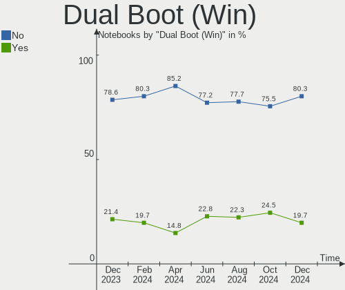
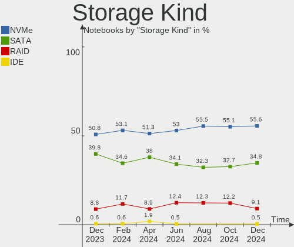

Arch - Hardware Trends (Notebooks)
----------------------------------

A project to identify most popular hardware characteristics and track their change
over time based on data collected by Linux users at https://Linux-Hardware.org.

Anyone can contribute to this report by the [hw-probe](https://github.com/linuxhw/hw-probe) tool:

    sudo -E hw-probe -all -upload

This report is for one last month. Overall report since the beginning of time: [TestDays](https://github.com/linuxhw/TestDays)

Period: Dec, 2024.

Contents
--------

* [ System ](#system)
  - [ OS                       ](#os)
  - [ OS Family                ](#os-family)
  - [ Kernel                   ](#kernel)
  - [ Kernel Family            ](#kernel-family)
  - [ Kernel Major Ver.        ](#kernel-major-ver)
  - [ Arch                     ](#arch)
  - [ DE                       ](#de)
  - [ Display Server           ](#display-server)
  - [ Display Manager          ](#display-manager)
  - [ OS Lang                  ](#os-lang)
  - [ Boot Mode                ](#boot-mode)
  - [ Filesystem               ](#filesystem)
  - [ Part. scheme             ](#part-scheme)
  - [ Dual Boot with Linux/BSD ](#dual-boot-with-linuxbsd)
  - [ Dual Boot (Win)          ](#dual-boot-win)

* [ Board ](#board)
  - [ Vendor                   ](#vendor)
  - [ Model                    ](#model)
  - [ Model Family             ](#model-family)
  - [ MFG Year                 ](#mfg-year)
  - [ Form Factor              ](#form-factor)
  - [ Secure Boot              ](#secure-boot)
  - [ Coreboot                 ](#coreboot)
  - [ RAM Size                 ](#ram-size)
  - [ RAM Used                 ](#ram-used)
  - [ Total Drives             ](#total-drives)
  - [ Has CD-ROM               ](#has-cd-rom)
  - [ Has Ethernet             ](#has-ethernet)
  - [ Has WiFi                 ](#has-wifi)
  - [ Has Bluetooth            ](#has-bluetooth)

* [ Location ](#location)
  - [ Country                  ](#country)
  - [ City                     ](#city)

* [ Drives ](#drives)
  - [ Drive Vendor             ](#drive-vendor)
  - [ Drive Model              ](#drive-model)
  - [ HDD Vendor               ](#hdd-vendor)
  - [ SSD Vendor               ](#ssd-vendor)
  - [ Drive Kind               ](#drive-kind)
  - [ Drive Connector          ](#drive-connector)
  - [ Drive Size               ](#drive-size)
  - [ Space Total              ](#space-total)
  - [ Space Used               ](#space-used)
  - [ Malfunc. Drives          ](#malfunc-drives)
  - [ Malfunc. Drive Vendor    ](#malfunc-drive-vendor)
  - [ Malfunc. HDD Vendor      ](#malfunc-hdd-vendor)
  - [ Malfunc. Drive Kind      ](#malfunc-drive-kind)
  - [ Failed Drives            ](#failed-drives)
  - [ Failed Drive Vendor      ](#failed-drive-vendor)
  - [ Drive Status             ](#drive-status)

* [ Storage controller ](#storage-controller)
  - [ Storage Vendor           ](#storage-vendor)
  - [ Storage Model            ](#storage-model)
  - [ Storage Kind             ](#storage-kind)

* [ Processor ](#processor)
  - [ CPU Vendor               ](#cpu-vendor)
  - [ CPU Model                ](#cpu-model)
  - [ CPU Model Family         ](#cpu-model-family)
  - [ CPU Cores                ](#cpu-cores)
  - [ CPU Sockets              ](#cpu-sockets)
  - [ CPU Threads              ](#cpu-threads)
  - [ CPU Op-Modes             ](#cpu-op-modes)
  - [ CPU Microcode            ](#cpu-microcode)
  - [ CPU Microarch            ](#cpu-microarch)

* [ Graphics ](#graphics)
  - [ GPU Vendor               ](#gpu-vendor)
  - [ GPU Model                ](#gpu-model)
  - [ GPU Combo                ](#gpu-combo)
  - [ GPU Driver               ](#gpu-driver)
  - [ GPU Memory               ](#gpu-memory)

* [ Monitor ](#monitor)
  - [ Monitor Vendor           ](#monitor-vendor)
  - [ Monitor Model            ](#monitor-model)
  - [ Monitor Resolution       ](#monitor-resolution)
  - [ Monitor Diagonal         ](#monitor-diagonal)
  - [ Monitor Width            ](#monitor-width)
  - [ Aspect Ratio             ](#aspect-ratio)
  - [ Monitor Area             ](#monitor-area)
  - [ Pixel Density            ](#pixel-density)
  - [ Multiple Monitors        ](#multiple-monitors)

* [ Network ](#network)
  - [ Net Controller Vendor    ](#net-controller-vendor)
  - [ Net Controller Model     ](#net-controller-model)
  - [ Wireless Vendor          ](#wireless-vendor)
  - [ Wireless Model           ](#wireless-model)
  - [ Ethernet Vendor          ](#ethernet-vendor)
  - [ Ethernet Model           ](#ethernet-model)
  - [ Net Controller Kind      ](#net-controller-kind)
  - [ Used Controller          ](#used-controller)
  - [ NICs                     ](#nics)
  - [ IPv6                     ](#ipv6)

* [ Bluetooth ](#bluetooth)
  - [ Bluetooth Vendor         ](#bluetooth-vendor)
  - [ Bluetooth Model          ](#bluetooth-model)

* [ Sound ](#sound)
  - [ Sound Vendor             ](#sound-vendor)
  - [ Sound Model              ](#sound-model)

* [ Memory ](#memory)
  - [ Memory Vendor            ](#memory-vendor)
  - [ Memory Model             ](#memory-model)
  - [ Memory Kind              ](#memory-kind)
  - [ Memory Form Factor       ](#memory-form-factor)
  - [ Memory Size              ](#memory-size)
  - [ Memory Speed             ](#memory-speed)

* [ Printers & scanners ](#printers--scanners)
  - [ Printer Vendor           ](#printer-vendor)
  - [ Printer Model            ](#printer-model)
  - [ Scanner Vendor           ](#scanner-vendor)
  - [ Scanner Model            ](#scanner-model)

* [ Camera ](#camera)
  - [ Camera Vendor            ](#camera-vendor)
  - [ Camera Model             ](#camera-model)

* [ Security ](#security)
  - [ Fingerprint Vendor       ](#fingerprint-vendor)
  - [ Fingerprint Model        ](#fingerprint-model)
  - [ Chipcard Vendor          ](#chipcard-vendor)
  - [ Chipcard Model           ](#chipcard-model)

* [ Unsupported ](#unsupported)
  - [ Unsupported Devices      ](#unsupported-devices)
  - [ Unsupported Device Types ](#unsupported-device-types)

System
------

OS
--

Installed operating systems

| Name         | Notebooks | Percent |
|--------------|-----------|---------|
| Arch Rolling | 157       | 100%    |

OS Family
---------

OS without a version

| Name | Notebooks | Percent |
|------|-----------|---------|
| Arch | 157       | 100%    |

Kernel
------

Version of the Linux kernel

| Version                      | Notebooks | Percent |
|------------------------------|-----------|---------|
| 6.12.1-arch1-1               | 37        | 23.57%  |
| 6.12.4-arch1-1               | 33        | 21.02%  |
| 6.12.6-arch1-1               | 22        | 14.01%  |
| 6.12.7-arch1-1               | 17        | 10.83%  |
| 6.12.1-zen1-1-zen            | 11        | 7.01%   |
| 6.10.6-arch1-1               | 3         | 1.91%   |
| 6.6.65-1-lts                 | 2         | 1.27%   |
| 6.6.63-1-lts                 | 2         | 1.27%   |
| 6.12.6-zen1-1-zen            | 2         | 1.27%   |
| 6.12.3-arch1-1               | 2         | 1.27%   |
| 6.12.1-arch1-1.1-g14         | 2         | 1.27%   |
| 6.6.7-arch1-1                | 1         | 0.64%   |
| 6.6.67-1-lts                 | 1         | 0.64%   |
| 6.6.64-1-lts                 | 1         | 0.64%   |
| 6.6.63-0-evil-lts            | 1         | 0.64%   |
| 6.6.54-1-lts                 | 1         | 0.64%   |
| 6.13.0-rc4-1-mainline        | 1         | 0.64%   |
| 6.12.7-zen1-1-zen            | 1         | 0.64%   |
| 6.12.6-273-linux-tkg         | 1         | 0.64%   |
| 6.12.6-1-cachyos             | 1         | 0.64%   |
| 6.12.4-zen1-1-zen            | 1         | 0.64%   |
| 6.12.4-1-cachyos             | 1         | 0.64%   |
| 6.12.3-zen1-custom           | 1         | 0.64%   |
| 6.12.1-2-cachyos             | 1         | 0.64%   |
| 6.12.1-1-cachyos-bore        | 1         | 0.64%   |
| 6.11.9-arch1-1               | 1         | 0.64%   |
| 6.11.8-arch1-2               | 1         | 0.64%   |
| 6.11.7-arch1-1               | 1         | 0.64%   |
| 6.11.3-zen1-1-zen            | 1         | 0.64%   |
| 6.11.2-2-cachyos             | 1         | 0.64%   |
| 6.11.11-hardened1-1-hardened | 1         | 0.64%   |
| 6.11.10-hardened1-1-hardened | 1         | 0.64%   |
| 6.10.2-rt14-arch1-2-rt       | 1         | 0.64%   |
| 6.10.10-zen1-1-zen           | 1         | 0.64%   |
| 6.10.10-arch1-1              | 1         | 0.64%   |

Kernel Family
-------------

Linux kernel without a distro release

| Version | Notebooks | Percent |
|---------|-----------|---------|
| 6.12.1  | 52        | 33.12%  |
| 6.12.4  | 35        | 22.29%  |
| 6.12.6  | 26        | 16.56%  |
| 6.12.7  | 18        | 11.46%  |
| 6.6.63  | 3         | 1.91%   |
| 6.12.3  | 3         | 1.91%   |
| 6.10.6  | 3         | 1.91%   |
| 6.6.65  | 2         | 1.27%   |
| 6.10.10 | 2         | 1.27%   |
| 6.6.7   | 1         | 0.64%   |
| 6.6.67  | 1         | 0.64%   |
| 6.6.64  | 1         | 0.64%   |
| 6.6.54  | 1         | 0.64%   |
| 6.13.0  | 1         | 0.64%   |
| 6.11.9  | 1         | 0.64%   |
| 6.11.8  | 1         | 0.64%   |
| 6.11.7  | 1         | 0.64%   |
| 6.11.3  | 1         | 0.64%   |
| 6.11.2  | 1         | 0.64%   |
| 6.11.11 | 1         | 0.64%   |
| 6.11.10 | 1         | 0.64%   |
| 6.10.2  | 1         | 0.64%   |

Kernel Major Ver.
-----------------

Linux kernel major version

| Version | Notebooks | Percent |
|---------|-----------|---------|
| 6.12    | 134       | 85.35%  |
| 6.6     | 9         | 5.73%   |
| 6.11    | 7         | 4.46%   |
| 6.10    | 6         | 3.82%   |
| 6.13    | 1         | 0.64%   |

Arch
----

OS architecture (x86_64, i586, etc.)

| Name   | Notebooks | Percent |
|--------|-----------|---------|
| x86_64 | 157       | 100%    |

DE
--

Desktop Environment

| Name       | Notebooks | Percent |
|------------|-----------|---------|
| KDE6       | 49        | 31.21%  |
| GNOME      | 37        | 23.57%  |
| Hyprland   | 18        | 11.46%  |
| Unknown    | 12        | 7.64%   |
| i3         | 11        | 7.01%   |
| KDE        | 10        | 6.37%   |
| XFCE       | 6         | 3.82%   |
| sway       | 4         | 2.55%   |
| MATE       | 2         | 1.27%   |
| LXQt       | 2         | 1.27%   |
| Budgie     | 2         | 1.27%   |
| xmonad     | 1         | 0.64%   |
| X-Cinnamon | 1         | 0.64%   |
| openbox    | 1         | 0.64%   |
| Cinnamon   | 1         | 0.64%   |

Display Server
--------------

X11 or Wayland

| Name    | Notebooks | Percent |
|---------|-----------|---------|
| Wayland | 90        | 57.32%  |
| X11     | 48        | 30.57%  |
| Unknown | 15        | 9.55%   |
| Tty     | 4         | 2.55%   |

Display Manager
---------------

SDDM, LightDM, etc.

| Name    | Notebooks | Percent |
|---------|-----------|---------|
| Unknown | 74        | 47.13%  |
| SDDM    | 40        | 25.48%  |
| LightDM | 17        | 10.83%  |
| GDM     | 14        | 8.92%   |
| GREETD  | 6         | 3.82%   |
| LY-DM   | 4         | 2.55%   |
| XDM     | 1         | 0.64%   |
| Ly      | 1         | 0.64%   |

OS Lang
-------

Language

| Lang        | Notebooks | Percent |
|-------------|-----------|---------|
| en_US       | 82        | 52.23%  |
| en_GB       | 10        | 6.37%   |
| de_DE       | 10        | 6.37%   |
| it_IT       | 9         | 5.73%   |
| C           | 9         | 5.73%   |
| es_ES       | 5         | 3.18%   |
| ru_RU       | 4         | 2.55%   |
| pt_BR       | 4         | 2.55%   |
| fr_FR       | 4         | 2.55%   |
| en_CA       | 3         | 1.91%   |
| Unknown     | 3         | 1.91%   |
| zh_CN       | 2         | 1.27%   |
| pl_PL       | 2         | 1.27%   |
| es_CL       | 2         | 1.27%   |
| tr_TR       | 1         | 0.64%   |
| nl_NL       | 1         | 0.64%   |
| fi_FI       | 1         | 0.64%   |
| es_MX       | 1         | 0.64%   |
| en_US.UFT-8 | 1         | 0.64%   |
| en_AU       | 1         | 0.64%   |
| de_AT       | 1         | 0.64%   |
| cs_CZ       | 1         | 0.64%   |

Boot Mode
---------

EFI or BIOS

| Mode | Notebooks | Percent |
|------|-----------|---------|
| EFI  | 84        | 53.5%   |
| BIOS | 73        | 46.5%   |

Filesystem
----------

Type of filesystem

| Type  | Notebooks | Percent |
|-------|-----------|---------|
| Ext4  | 104       | 66.24%  |
| Btrfs | 45        | 28.66%  |
| Xfs   | 7         | 4.46%   |
| Zfs   | 1         | 0.64%   |

Part. scheme
------------

Scheme of partitioning

| Type    | Notebooks | Percent |
|---------|-----------|---------|
| GPT     | 92        | 58.6%   |
| Unknown | 57        | 36.31%  |
| MBR     | 8         | 5.1%    |

Dual Boot with Linux/BSD
------------------------

Hosting more than one Linux/BSD

| Dual boot | Notebooks | Percent |
|-----------|-----------|---------|
| No        | 140       | 89.17%  |
| Yes       | 17        | 10.83%  |

Dual Boot (Win)
---------------

Hosting Linux and Windows

| Dual boot | Notebooks | Percent |
|-----------|-----------|---------|
| No        | 126       | 80.25%  |
| Yes       | 31        | 19.75%  |

Board
-----

Vendor
------

Motherboard manufacturer

| Name                | Notebooks | Percent |
|---------------------|-----------|---------|
| Lenovo              | 44        | 28.03%  |
| ASUSTek Computer    | 24        | 15.29%  |
| Hewlett-Packard     | 16        | 10.19%  |
| Acer                | 14        | 8.92%   |
| Dell                | 13        | 8.28%   |
| MSI                 | 9         | 5.73%   |
| Apple               | 6         | 3.82%   |
| TUXEDO              | 5         | 3.18%   |
| HUAWEI              | 5         | 3.18%   |
| XIAOMI              | 2         | 1.27%   |
| Samsung Electronics | 2         | 1.27%   |
| Google              | 2         | 1.27%   |
| Gigabyte Technology | 2         | 1.27%   |
| Framework           | 2         | 1.27%   |
| System76            | 1         | 0.64%   |
| Notebook            | 1         | 0.64%   |
| MECHREVO            | 1         | 0.64%   |
| Maibenben           | 1         | 0.64%   |
| HASEE Computer      | 1         | 0.64%   |
| Fujitsu             | 1         | 0.64%   |
| CyberPowerPC        | 1         | 0.64%   |
| Compumax Computer   | 1         | 0.64%   |
| Chuwi               | 1         | 0.64%   |
| Avell               | 1         | 0.64%   |
| AMI                 | 1         | 0.64%   |

Model
-----

Motherboard model

| Name                                        | Notebooks | Percent |
|---------------------------------------------|-----------|---------|
| XIAOMI Redmi Book Pro 15 2023               | 2         | 1.27%   |
| TUXEDO Stellaris Slim 15 Intel Gen6         | 2         | 1.27%   |
| TUXEDO InfinityBook Pro AMD Gen9            | 2         | 1.27%   |
| MSI Prestige 15 A12SC                       | 2         | 1.27%   |
| Lenovo LOQ 15IRH8 82XV                      | 2         | 1.27%   |
| HUAWEI FLMH-XX                              | 2         | 1.27%   |
| ASUS ROG Zephyrus G14 GA402RJ_GA402RJ       | 2         | 1.27%   |
| Apple MacBookAir7,2                         | 2         | 1.27%   |
| Acer Predator PHN16-71                      | 2         | 1.27%   |
| TUXEDO InfinityBook S 15 Gen6               | 1         | 0.64%   |
| System76 Darter Pro                         | 1         | 0.64%   |
| Samsung 750XGK                              | 1         | 0.64%   |
| Samsung 700Z3C/700Z5C                       | 1         | 0.64%   |
| Notebook L2x0TU                             | 1         | 0.64%   |
| MSI Thin GF63 12UC                          | 1         | 0.64%   |
| MSI Prestige 13 AI+ Evo A2VMG               | 1         | 0.64%   |
| MSI Modern 15 A11M                          | 1         | 0.64%   |
| MSI Katana GF76 12UEOK                      | 1         | 0.64%   |
| MSI GT73EVR 7RD                             | 1         | 0.64%   |
| MSI GF65 Thin 9SD                           | 1         | 0.64%   |
| MSI Bravo 17 A4DDR                          | 1         | 0.64%   |
| MECHREVO WUJIE14 PRO                        | 1         | 0.64%   |
| Maibenben Perfectum Series                  | 1         | 0.64%   |
| Lenovo V580c 20160                          | 1         | 0.64%   |
| Lenovo V14 G4 ABP 82YX                      | 1         | 0.64%   |
| Lenovo ThinkPad X280 20KES2EW08             | 1         | 0.64%   |
| Lenovo ThinkPad X230 23252UG                | 1         | 0.64%   |
| Lenovo ThinkPad X1 Carbon Gen 11 21HMCTO1WW | 1         | 0.64%   |
| Lenovo ThinkPad W541 20EGS1FB00             | 1         | 0.64%   |
| Lenovo ThinkPad W520 4284FK4                | 1         | 0.64%   |
| Lenovo ThinkPad T495 20NKS2JD00             | 1         | 0.64%   |
| Lenovo ThinkPad T495 20NJCTO1WW             | 1         | 0.64%   |
| Lenovo ThinkPad T480s 20L8S78900            | 1         | 0.64%   |
| Lenovo ThinkPad T480s 20L7S0BM00            | 1         | 0.64%   |
| Lenovo ThinkPad T480s 20L7002HUS            | 1         | 0.64%   |
| Lenovo ThinkPad T480 20L6SJUS2J             | 1         | 0.64%   |
| Lenovo ThinkPad T450s 20BX000WGE            | 1         | 0.64%   |
| Lenovo ThinkPad T450 20BUS3GN02             | 1         | 0.64%   |
| Lenovo ThinkPad T450 20BUS35B00             | 1         | 0.64%   |
| Lenovo ThinkPad T450 20BUS05A09             | 1         | 0.64%   |

Model Family
------------

Motherboard model prefix

| Name                    | Notebooks | Percent |
|-------------------------|-----------|---------|
| Lenovo ThinkPad         | 29        | 18.47%  |
| ASUS VivoBook           | 7         | 4.46%   |
| Acer Aspire             | 7         | 4.46%   |
| Lenovo IdeaPad          | 5         | 3.18%   |
| Dell Inspiron           | 5         | 3.18%   |
| ASUS ASUS               | 5         | 3.18%   |
| HP EliteBook            | 4         | 2.55%   |
| TUXEDO InfinityBook     | 3         | 1.91%   |
| MSI Prestige            | 3         | 1.91%   |
| Lenovo ThinkBook        | 3         | 1.91%   |
| Lenovo LOQ              | 3         | 1.91%   |
| ASUS ROG                | 3         | 1.91%   |
| Acer Nitro              | 3         | 1.91%   |
| XIAOMI Redmi            | 2         | 1.27%   |
| TUXEDO Stellaris        | 2         | 1.27%   |
| HUAWEI FLMH-XX          | 2         | 1.27%   |
| HP Pavilion             | 2         | 1.27%   |
| HP 240                  | 2         | 1.27%   |
| Framework Laptop        | 2         | 1.27%   |
| Dell XPS                | 2         | 1.27%   |
| Dell Vostro             | 2         | 1.27%   |
| Dell Precision          | 2         | 1.27%   |
| ASUS Zenbook            | 2         | 1.27%   |
| Apple MacBookAir7       | 2         | 1.27%   |
| Acer Predator           | 2         | 1.27%   |
| System76 Darter         | 1         | 0.64%   |
| Samsung 750XGK          | 1         | 0.64%   |
| Samsung 700Z3C          | 1         | 0.64%   |
| Notebook L2x0TU         | 1         | 0.64%   |
| MSI Thin                | 1         | 0.64%   |
| MSI Modern              | 1         | 0.64%   |
| MSI Katana              | 1         | 0.64%   |
| MSI GT73EVR             | 1         | 0.64%   |
| MSI GF65                | 1         | 0.64%   |
| MSI Bravo               | 1         | 0.64%   |
| MECHREVO WUJIE14        | 1         | 0.64%   |
| Maibenben Perfectum     | 1         | 0.64%   |
| Lenovo V580c            | 1         | 0.64%   |
| Lenovo V14              | 1         | 0.64%   |
| Lenovo Legion-S7-16APH8 | 1         | 0.64%   |

MFG Year
--------

Motherboard manufacture year

| Year | Notebooks | Percent |
|------|-----------|---------|
| 2024 | 23        | 14.65%  |
| 2023 | 22        | 14.01%  |
| 2022 | 19        | 12.1%   |
| 2020 | 19        | 12.1%   |
| 2021 | 18        | 11.46%  |
| 2014 | 11        | 7.01%   |
| 2018 | 8         | 5.1%    |
| 2011 | 7         | 4.46%   |
| 2019 | 6         | 3.82%   |
| 2013 | 4         | 2.55%   |
| 2012 | 4         | 2.55%   |
| 2016 | 3         | 1.91%   |
| 2015 | 3         | 1.91%   |
| 2010 | 3         | 1.91%   |
| 2017 | 2         | 1.27%   |
| 2008 | 2         | 1.27%   |
| 2007 | 2         | 1.27%   |
| 2009 | 1         | 0.64%   |

Form Factor
-----------

Physical design of the computer

| Name     | Notebooks | Percent |
|----------|-----------|---------|
| Notebook | 157       | 100%    |

Secure Boot
-----------

Enabled or disabled

| State    | Notebooks | Percent |
|----------|-----------|---------|
| Disabled | 151       | 96.18%  |
| Enabled  | 6         | 3.82%   |

Coreboot
--------

Have coreboot on board

| Used | Notebooks | Percent |
|------|-----------|---------|
| No   | 153       | 97.45%  |
| Yes  | 4         | 2.55%   |

RAM Size
--------

Total RAM memory

| Size in GB  | Notebooks | Percent |
|-------------|-----------|---------|
| 16.01-24.0  | 40        | 25.48%  |
| 8.01-16.0   | 39        | 24.84%  |
| 4.01-8.0    | 30        | 19.11%  |
| 32.01-64.0  | 22        | 14.01%  |
| 24.01-32.0  | 10        | 6.37%   |
| 3.01-4.0    | 7         | 4.46%   |
| 64.01-256.0 | 7         | 4.46%   |
| 2.01-3.0    | 1         | 0.64%   |
| 1.01-2.0    | 1         | 0.64%   |

RAM Used
--------

Used RAM memory

| Used GB    | Notebooks | Percent |
|------------|-----------|---------|
| 4.01-8.0   | 60        | 38.22%  |
| 3.01-4.0   | 27        | 17.2%   |
| 2.01-3.0   | 25        | 15.92%  |
| 1.01-2.0   | 25        | 15.92%  |
| 8.01-16.0  | 10        | 6.37%   |
| 16.01-24.0 | 5         | 3.18%   |
| 0.51-1.0   | 4         | 2.55%   |
| 0.01-0.5   | 1         | 0.64%   |

Total Drives
------------

Number of drives on board

| Drives | Notebooks | Percent |
|--------|-----------|---------|
| 1      | 106       | 67.52%  |
| 2      | 42        | 26.75%  |
| 3      | 8         | 5.1%    |
| 5      | 1         | 0.64%   |

Has CD-ROM
----------

Has CD-ROM on board

| Presented | Notebooks | Percent |
|-----------|-----------|---------|
| No        | 131       | 83.44%  |
| Yes       | 26        | 16.56%  |

Has Ethernet
------------

Has Ethernet on board

| Presented | Notebooks | Percent |
|-----------|-----------|---------|
| Yes       | 121       | 77.07%  |
| No        | 36        | 22.93%  |

Has WiFi
--------

Has WiFi module

| Presented | Notebooks | Percent |
|-----------|-----------|---------|
| Yes       | 147       | 93.63%  |
| No        | 10        | 6.37%   |

Has Bluetooth
-------------

Has Bluetooth module

| Presented | Notebooks | Percent |
|-----------|-----------|---------|
| Yes       | 145       | 92.36%  |
| No        | 12        | 7.64%   |

Location
--------

Country
-------

Geographic location (country)

| Country         | Notebooks | Percent |
|-----------------|-----------|---------|
| USA             | 26        | 16.56%  |
| Germany         | 12        | 7.64%   |
| France          | 12        | 7.64%   |
| Italy           | 11        | 7.01%   |
| UK              | 8         | 5.1%    |
| Russia          | 8         | 5.1%    |
| India           | 8         | 5.1%    |
| Canada          | 7         | 4.46%   |
| Spain           | 5         | 3.18%   |
| Norway          | 5         | 3.18%   |
| Brazil          | 5         | 3.18%   |
| Vietnam         | 4         | 2.55%   |
| Switzerland     | 4         | 2.55%   |
| Poland          | 3         | 1.91%   |
| Japan           | 3         | 1.91%   |
| Sweden          | 2         | 1.27%   |
| Lithuania       | 2         | 1.27%   |
| Iran            | 2         | 1.27%   |
| Hong Kong       | 2         | 1.27%   |
| Chile           | 2         | 1.27%   |
| Turkey          | 1         | 0.64%   |
| Thailand        | 1         | 0.64%   |
| Sri Lanka       | 1         | 0.64%   |
| South Korea     | 1         | 0.64%   |
| Slovakia        | 1         | 0.64%   |
| Serbia          | 1         | 0.64%   |
| Panama          | 1         | 0.64%   |
| North Macedonia | 1         | 0.64%   |
| Netherlands     | 1         | 0.64%   |
| Nepal           | 1         | 0.64%   |
| Mexico          | 1         | 0.64%   |
| Israel          | 1         | 0.64%   |
| Indonesia       | 1         | 0.64%   |
| Hungary         | 1         | 0.64%   |
| Finland         | 1         | 0.64%   |
| Estonia         | 1         | 0.64%   |
| Egypt           | 1         | 0.64%   |
| Czechia         | 1         | 0.64%   |
| Croatia         | 1         | 0.64%   |
| Colombia        | 1         | 0.64%   |

City
----

Geographic location (city)

| City              | Notebooks | Percent |
|-------------------|-----------|---------|
| Moscow            | 4         | 2.55%   |
| Ho Chi Minh City  | 3         | 1.91%   |
| Scandolara Ravara | 2         | 1.27%   |
| San Jose          | 2         | 1.27%   |
| London            | 2         | 1.27%   |
| Drammen           | 2         | 1.27%   |
| Bengaluru         | 2         | 1.27%   |
| Zaragoza          | 1         | 0.64%   |
| Zajecov           | 1         | 0.64%   |
| York              | 1         | 0.64%   |
| Windsor           | 1         | 0.64%   |
| Whitby            | 1         | 0.64%   |
| Warsaw            | 1         | 0.64%   |
| Wari              | 1         | 0.64%   |
| Wandsworth        | 1         | 0.64%   |
| Wallenhorst       | 1         | 0.64%   |
| Vilnius           | 1         | 0.64%   |
| Vaudreuil-Dorion  | 1         | 0.64%   |
| Tranby            | 1         | 0.64%   |
| Toulouse          | 1         | 0.64%   |
| Toronto           | 1         | 0.64%   |
| Tijuana           | 1         | 0.64%   |
| Thousand Oaks     | 1         | 0.64%   |
| Thornhill         | 1         | 0.64%   |
| Thalwil           | 1         | 0.64%   |
| Telde             | 1         | 0.64%   |
| Tel Aviv          | 1         | 0.64%   |
| Tehran            | 1         | 0.64%   |
| St Petersburg     | 1         | 0.64%   |
| Sollentuna        | 1         | 0.64%   |
| Skopje            | 1         | 0.64%   |
| Seattle           | 1         | 0.64%   |
| Schonbuhl         | 1         | 0.64%   |
| Sarlat-la-Canéda | 1         | 0.64%   |
| Santiago          | 1         | 0.64%   |
| Santaluz          | 1         | 0.64%   |
| San Mateo         | 1         | 0.64%   |
| Salyan            | 1         | 0.64%   |
| Saint-Denis       | 1         | 0.64%   |
| Rybinsk           | 1         | 0.64%   |

Drives
------

Drive Vendor
------------

Hard drive vendors

| Vendor                         | Notebooks | Drives | Percent |
|--------------------------------|-----------|--------|---------|
| Samsung Electronics            | 38        | 39     | 18.45%  |
| Sandisk                        | 21        | 21     | 10.19%  |
| SK hynix                       | 15        | 15     | 7.28%   |
| Kingston                       | 14        | 14     | 6.8%    |
| Unknown                        | 13        | 15     | 6.31%   |
| Micron Technology              | 12        | 12     | 5.83%   |
| Intel                          | 9         | 9      | 4.37%   |
| WDC                            | 7         | 7      | 3.4%    |
| Seagate                        | 7         | 8      | 3.4%    |
| KIOXIA                         | 6         | 6      | 2.91%   |
| Micron/Crucial Technology      | 5         | 5      | 2.43%   |
| Kingston Technology Company    | 5         | 6      | 2.43%   |
| Crucial                        | 5         | 5      | 2.43%   |
| Apple                          | 4         | 5      | 1.94%   |
| Toshiba                        | 3         | 3      | 1.46%   |
| Shenzhen Longsys Electronics   | 3         | 3      | 1.46%   |
| HGST                           | 3         | 3      | 1.46%   |
| Patriot                        | 2         | 2      | 0.97%   |
| MAXIO Technology (Hangzhou)    | 2         | 2      | 0.97%   |
| LITEON                         | 2         | 2      | 0.97%   |
| Hitachi                        | 2         | 2      | 0.97%   |
| GOODRAM                        | 2         | 2      | 0.97%   |
| China                          | 2         | 3      | 0.97%   |
| Yangtze Memory Technologies    | 1         | 2      | 0.49%   |
| Union Memory (Shenzhen)        | 1         | 1      | 0.49%   |
| Union Memory                   | 1         | 1      | 0.49%   |
| Transcend                      | 1         | 1      | 0.49%   |
| TARGET                         | 1         | 1      | 0.49%   |
| T-FORCE                        | 1         | 1      | 0.49%   |
| Solid State Storage Technology | 1         | 1      | 0.49%   |
| Solid State Storage            | 1         | 1      | 0.49%   |
| Silicon Motion                 | 1         | 1      | 0.49%   |
| Realtek Semiconductor          | 1         | 1      | 0.49%   |
| Phison                         | 1         | 1      | 0.49%   |
| Origin                         | 1         | 1      | 0.49%   |
| ORICO                          | 1         | 1      | 0.49%   |
| Netac                          | 1         | 1      | 0.49%   |
| Maxone                         | 1         | 1      | 0.49%   |
| Lexar                          | 1         | 1      | 0.49%   |
| Lenovo                         | 1         | 1      | 0.49%   |

Drive Model
-----------

Hard drive models

| Model                                                | Notebooks | Percent |
|------------------------------------------------------|-----------|---------|
| Samsung NVMe SSD Controller SM981/PM981/PM983 512GB  | 7         | 3.3%    |
| Samsung NVMe SSD Controller PM9A1/PM9A3/980PRO 512GB | 6         | 2.83%   |
| Unknown MMC Card  64GB                               | 5         | 2.36%   |
| Intel SSDPEKNU512GZ 512GB                            | 5         | 2.36%   |
| Unknown MMC Card  512GB                              | 3         | 1.42%   |
| Samsung SSD 990 PRO 1TB                              | 3         | 1.42%   |
| Samsung SSD 980 1TB                                  | 3         | 1.42%   |
| Kingston Company SNV2S1000G 1TB                      | 3         | 1.42%   |
| Kingston SA400S37480G 480GB SSD                      | 3         | 1.42%   |
| WDC WDS100T2B0A-00SM50 1TB SSD                       | 2         | 0.94%   |
| Unknown NVMe SSD Drive 1024GB                        | 2         | 0.94%   |
| Unknown MMC Card  16GB                               | 2         | 0.94%   |
| SK hynix PC801 NVMe 1TB                              | 2         | 0.94%   |
| SK hynix HFS512GEJ9X125N 512GB                       | 2         | 0.94%   |
| Sandisk WD_BLACK SN850X 2000GB                       | 2         | 0.94%   |
| Sandisk WD PC SN740 SDDPNQD-512G-1127 512GB          | 2         | 0.94%   |
| Sandisk WD PC SN740 SDDPMQD-512G-1101 512GB          | 2         | 0.94%   |
| Samsung SSD 990 EVO 1TB                              | 2         | 0.94%   |
| Samsung MZ7LN256HCHP-000L7 256GB SSD                 | 2         | 0.94%   |
| Patriot Burst 240GB SSD                              | 2         | 0.94%   |
| Micron/Crucial P2 NVMe PCIe SSD 500GB                | 2         | 0.94%   |
| Micron MTFDKBA1T0QFM-1BD1AABGB 1024GB                | 2         | 0.94%   |
| Micron MTFDHBA512QFD 512GB                           | 2         | 0.94%   |
| Micron 2450_MTFDKBA512TFK 512GB                      | 2         | 0.94%   |
| KIOXIA KXG80ZNV1T02 LS 1TB                           | 2         | 0.94%   |
| Kingston SNV2S500G 500GB                             | 2         | 0.94%   |
| Kingston SKC3000D2048G 2TB                           | 2         | 0.94%   |
| Kingston SA400S37240G 240GB SSD                      | 2         | 0.94%   |
| Crucial CT500MX500SSD1 500GB                         | 2         | 0.94%   |
| Yangtze Memory ZHITAI TiPlus5000 1TB                 | 1         | 0.47%   |
| Yangtze Memory YMTC PC300-1TB-B                      | 1         | 0.47%   |
| WDC WDS500G2B0A-00SM50 500GB SSD                     | 1         | 0.47%   |
| WDC WD5000LPLX-60ZNTT2 500GB                         | 1         | 0.47%   |
| WDC WD5000BPVT-22HXZT3 500GB                         | 1         | 0.47%   |
| WDC WD3200BEKT-75F3T0 320GB                          | 1         | 0.47%   |
| WDC WD32 00BEVT-11ZCT0 320GB                         | 1         | 0.47%   |
| Unknown NVMe SSD Drive 512GB                         | 1         | 0.47%   |
| Unknown MMC Card  8GB                                | 1         | 0.47%   |
| Unknown MMC Card  128GB                              | 1         | 0.47%   |
| Union Memory UMIS RPJTJ128MEE1MWX 128GB              | 1         | 0.47%   |

HDD Vendor
----------

Hard disk drive vendors

| Vendor  | Notebooks | Drives | Percent |
|---------|-----------|--------|---------|
| Seagate | 7         | 8      | 36.84%  |
| WDC     | 4         | 4      | 21.05%  |
| HGST    | 3         | 3      | 15.79%  |
| Toshiba | 2         | 2      | 10.53%  |
| Hitachi | 2         | 2      | 10.53%  |
| Maxone  | 1         | 1      | 5.26%   |

SSD Vendor
----------

Solid state drive vendors

| Vendor              | Notebooks | Drives | Percent |
|---------------------|-----------|--------|---------|
| Samsung Electronics | 10        | 10     | 20.41%  |
| Kingston            | 8         | 8      | 16.33%  |
| Crucial             | 5         | 5      | 10.2%   |
| SanDisk             | 4         | 4      | 8.16%   |
| WDC                 | 3         | 3      | 6.12%   |
| Apple               | 3         | 3      | 6.12%   |
| Patriot             | 2         | 2      | 4.08%   |
| LITEON              | 2         | 2      | 4.08%   |
| GOODRAM             | 2         | 2      | 4.08%   |
| China               | 2         | 3      | 4.08%   |
| Origin              | 1         | 1      | 2.04%   |
| ORICO               | 1         | 1      | 2.04%   |
| Netac               | 1         | 1      | 2.04%   |
| Lexar               | 1         | 1      | 2.04%   |
| KingSpec            | 1         | 1      | 2.04%   |
| Drevo               | 1         | 1      | 2.04%   |
| Apacer              | 1         | 1      | 2.04%   |
| A-DATA Technology   | 1         | 1      | 2.04%   |

Drive Kind
----------

HDD or SSD

| Kind    | Notebooks | Drives | Percent |
|---------|-----------|--------|---------|
| NVMe    | 110       | 128    | 58.2%   |
| SSD     | 45        | 50     | 23.81%  |
| HDD     | 19        | 20     | 10.05%  |
| MMC     | 11        | 12     | 5.82%   |
| Unknown | 4         | 4      | 2.12%   |

Drive Connector
---------------

SATA, SAS, NVMe, etc.

| Type | Notebooks | Drives | Percent |
|------|-----------|--------|---------|
| NVMe | 110       | 128    | 61.11%  |
| SATA | 54        | 69     | 30%     |
| MMC  | 11        | 12     | 6.11%   |
| SAS  | 5         | 5      | 2.78%   |

Drive Size
----------

Size of hard drive

| Size in TB | Notebooks | Drives | Percent |
|------------|-----------|--------|---------|
| 0.01-0.5   | 41        | 47     | 67.21%  |
| 0.51-1.0   | 15        | 17     | 24.59%  |
| 1.01-2.0   | 2         | 2      | 3.28%   |
| 3.01-4.0   | 1         | 2      | 1.64%   |
| 10.01-20.0 | 1         | 1      | 1.64%   |
| 4.01-10.0  | 1         | 1      | 1.64%   |

Space Total
-----------

Amount of disk space available on the file system

| Size in GB     | Notebooks | Percent |
|----------------|-----------|---------|
| 251-500        | 42        | 26.75%  |
| 501-1000       | 37        | 23.57%  |
| 101-250        | 29        | 18.47%  |
| 1001-2000      | 14        | 8.92%   |
| 2001-3000      | 13        | 8.28%   |
| More than 3000 | 11        | 7.01%   |
| 51-100         | 5         | 3.18%   |
| 1-20           | 3         | 1.91%   |
| Unknown        | 3         | 1.91%   |

Space Used
----------

Amount of used disk space

| Used GB        | Notebooks | Percent |
|----------------|-----------|---------|
| 251-500        | 29        | 18.47%  |
| 1-20           | 29        | 18.47%  |
| 101-250        | 28        | 17.83%  |
| 21-50          | 21        | 13.38%  |
| 51-100         | 21        | 13.38%  |
| 501-1000       | 16        | 10.19%  |
| More than 3000 | 5         | 3.18%   |
| 1001-2000      | 5         | 3.18%   |
| Unknown        | 3         | 1.91%   |

Malfunc. Drives
---------------

Drive models with a malfunction

| Model                                           | Notebooks | Drives | Percent |
|-------------------------------------------------|-----------|--------|---------|
| Samsung Electronics SSD 980 1TB                 | 2         | 2      | 50%     |
| Micron Technology MTFDKBA512TFK-1BC1AABHA 512GB | 1         | 1      | 25%     |
| Apple SSD SD0256F 256GB                         | 1         | 1      | 25%     |

Malfunc. Drive Vendor
---------------------

Vendors of faulty drives

| Vendor              | Notebooks | Drives | Percent |
|---------------------|-----------|--------|---------|
| Samsung Electronics | 2         | 2      | 50%     |
| Micron Technology   | 1         | 1      | 25%     |
| Apple               | 1         | 1      | 25%     |

Malfunc. HDD Vendor
-------------------

Vendors of faulty HDD drives

Zero info for selected period =(

Malfunc. Drive Kind
-------------------

Kinds of faulty drives

| Kind | Notebooks | Drives | Percent |
|------|-----------|--------|---------|
| NVMe | 3         | 3      | 75%     |
| SSD  | 1         | 1      | 25%     |

Failed Drives
-------------

Failed drive models

Zero info for selected period =(

Failed Drive Vendor
-------------------

Failed drive vendors

Zero info for selected period =(

Drive Status
------------

Number of failed and malfunc. drives

| Status   | Notebooks | Drives | Percent |
|----------|-----------|--------|---------|
| Works    | 83        | 107    | 51.55%  |
| Detected | 74        | 103    | 45.96%  |
| Malfunc  | 4         | 4      | 2.48%   |

Storage controller
------------------

Storage Vendor
--------------

Storage controller vendors

| Vendor                                  | Notebooks | Percent |
|-----------------------------------------|-----------|---------|
| Intel                                   | 77        | 37.75%  |
| Samsung Electronics                     | 30        | 14.71%  |
| SanDisk                                 | 17        | 8.33%   |
| SK hynix                                | 15        | 7.35%   |
| Micron Technology                       | 12        | 5.88%   |
| Kingston Technology Company             | 11        | 5.39%   |
| AMD                                     | 9         | 4.41%   |
| KIOXIA                                  | 6         | 2.94%   |
| Micron/Crucial Technology               | 5         | 2.45%   |
| Shenzhen Longsys Electronics            | 3         | 1.47%   |
| Transcend                               | 2         | 0.98%   |
| Solid State Storage Technology          | 2         | 0.98%   |
| MAXIO Technology (Hangzhou)             | 2         | 0.98%   |
| INNOGRIT                                | 2         | 0.98%   |
| Yangtze Memory Technologies             | 1         | 0.49%   |
| Union Memory (Shenzhen)                 | 1         | 0.49%   |
| Toshiba America Info Systems            | 1         | 0.49%   |
| Silicon Motion                          | 1         | 0.49%   |
| Shenzhen Unionmemory Information System | 1         | 0.49%   |
| Realtek Semiconductor                   | 1         | 0.49%   |
| Phison Electronics                      | 1         | 0.49%   |
| Marvell Technology Group                | 1         | 0.49%   |
| Lenovo                                  | 1         | 0.49%   |
| Apple                                   | 1         | 0.49%   |
| Unknown                                 | 1         | 0.49%   |

Storage Model
-------------

Storage controller models

| Model                                                                          | Notebooks | Percent |
|--------------------------------------------------------------------------------|-----------|---------|
| Intel Volume Management Device NVMe RAID Controller                            | 13        | 6.02%   |
| AMD FCH SATA Controller [AHCI mode]                                            | 9         | 4.17%   |
| Intel 7 Series Chipset Family 6-port SATA Controller [AHCI mode]               | 8         | 3.7%    |
| Samsung NVMe SSD Controller SM981/PM981/PM983                                  | 7         | 3.24%   |
| Samsung NVMe SSD Controller 980 (DRAM-less)                                    | 7         | 3.24%   |
| Intel SSD 670p Series [Keystone Harbor]                                        | 7         | 3.24%   |
| Intel 6 Series/C200 Series Chipset Family 6 port Mobile SATA AHCI Controller   | 7         | 3.24%   |
| SK hynix Platinum P41/PC801 NVMe Solid State Drive                             | 6         | 2.78%   |
| Samsung NVMe SSD Controller PM9A1/PM9A3/980PRO                                 | 6         | 2.78%   |
| Intel Wildcat Point-LP SATA Controller [AHCI Mode]                             | 6         | 2.78%   |
| SanDisk WD Black SN770 / PC SN740 256GB / PC SN560 (DRAM-less) NVMe SSD        | 5         | 2.31%   |
| Intel Alder Lake-P SATA AHCI Controller                                        | 5         | 2.31%   |
| SK hynix Gold P31/BC711/PC711 NVMe Solid State Drive                           | 4         | 1.85%   |
| Samsung NVMe SSD Controller S4LV008[Pascal]                                    | 4         | 1.85%   |
| Micron 2450 NVMe SSD [HendrixV] (DRAM-less)                                    | 4         | 1.85%   |
| Micron 2400 NVMe SSD (DRAM-less)                                               | 4         | 1.85%   |
| Micron 2210 NVMe SSD [Cobain]                                                  | 4         | 1.85%   |
| Intel Sunrise Point-LP SATA Controller [AHCI mode]                             | 4         | 1.85%   |
| Intel 8 Series/C220 Series Chipset Family 6-port SATA Controller 1 [AHCI mode] | 4         | 1.85%   |
| KIOXIA NVMe SSD Controller XG8                                                 | 3         | 1.39%   |
| Intel Volume Management Device NVMe RAID Controller Intel Corporation          | 3         | 1.39%   |
| Intel 8 Series SATA Controller 1 [AHCI mode]                                   | 3         | 1.39%   |
| Transcend NVMe PCIe SSD 110S/112S/120S/MTE300S/MTE400S/MTE652T2 (DRAM-less)    | 2         | 0.93%   |
| Shenzhen Longsys FORESEE XP2000, Lexar NM760 NVME SSD (DRAM-less)              | 2         | 0.93%   |
| Sandisk WD PC SN740 NVMe SSD 512GB (DRAM-less)                                 | 2         | 0.93%   |
| Sandisk WD Black SN850X NVMe SSD                                               | 2         | 0.93%   |
| Samsung S4LN058A01[SSUBX] AHCI SSD Controller (Apple slot)                     | 2         | 0.93%   |
| Samsung NVMe SSD Controller PM9C1a (DRAM-less)                                 | 2         | 0.93%   |
| Samsung NVMe SSD Controller PM9B1 (DRAM-less)                                  | 2         | 0.93%   |
| Micron/Crucial T500 NVMe PCIe SSD                                              | 2         | 0.93%   |
| Micron/Crucial P2 [Nick P2] / P3 / P3 Plus NVMe PCIe SSD (DRAM-less)           | 2         | 0.93%   |
| KIOXIA NVMe SSD Controller BG5 (DRAM-less)                                     | 2         | 0.93%   |
| Kingston Company NV2 NVMe SSD [TC2200] (DRAM-less)                             | 2         | 0.93%   |
| Kingston Company NV2 NVMe SSD [SM2267XT] (DRAM-less)                           | 2         | 0.93%   |
| Kingston Company NV2 NVMe SSD [E21T] (DRAM-less)                               | 2         | 0.93%   |
| Kingston Company KC3000/FURY Renegade NVMe SSD [E18]                           | 2         | 0.93%   |
| Intel Tiger Lake-LP SATA Controller                                            | 2         | 0.93%   |
| Intel SATA controller                                                          | 2         | 0.93%   |
| Intel Q170/Q150/B150/H170/H110/Z170/CM236 Chipset SATA Controller [AHCI Mode]  | 2         | 0.93%   |
| Intel 82801IBM/IEM (ICH9M/ICH9M-E) 4 port SATA Controller [AHCI mode]          | 2         | 0.93%   |

Storage Kind
------------

Kind of storage controller (IDE, SATA, NVMe, SAS, ...)

| Kind | Notebooks | Percent |
|------|-----------|---------|
| NVMe | 110       | 55.56%  |
| SATA | 69        | 34.85%  |
| RAID | 18        | 9.09%   |
| IDE  | 1         | 0.51%   |

Processor
---------

CPU Vendor
----------

Processor vendors

| Vendor | Notebooks | Percent |
|--------|-----------|---------|
| Intel  | 115       | 73.25%  |
| AMD    | 42        | 26.75%  |

CPU Model
---------

Processor models

| Model                                      | Notebooks | Percent |
|--------------------------------------------|-----------|---------|
| Intel 12th Gen Core i7-12700H              | 4         | 2.55%   |
| Intel 11th Gen Core i7-1165G7 @ 2.80GHz    | 4         | 2.55%   |
| AMD Ryzen 7 7840HS w/ Radeon 780M Graphics | 4         | 2.55%   |
| AMD Ryzen 7 5700U with Radeon Graphics     | 4         | 2.55%   |
| Intel Core i9-14900HX                      | 3         | 1.91%   |
| Intel Core i5-3210M CPU @ 2.50GHz          | 3         | 1.91%   |
| Intel Core i5-1035G1 CPU @ 1.00GHz         | 3         | 1.91%   |
| Intel 11th Gen Core i5-1135G7 @ 2.40GHz    | 3         | 1.91%   |
| AMD Ryzen 9 6900HS with Radeon Graphics    | 3         | 1.91%   |
| AMD Ryzen 5 5500U with Radeon Graphics     | 3         | 1.91%   |
| AMD Ryzen 5 4600H with Radeon Graphics     | 3         | 1.91%   |
| Intel N100                                 | 2         | 1.27%   |
| Intel Core Ultra 5 125H                    | 2         | 1.27%   |
| Intel Core i7-8650U CPU @ 1.90GHz          | 2         | 1.27%   |
| Intel Core i7-7820HQ CPU @ 2.90GHz         | 2         | 1.27%   |
| Intel Core i7-4710HQ CPU @ 2.50GHz         | 2         | 1.27%   |
| Intel Core i5-8250U CPU @ 1.60GHz          | 2         | 1.27%   |
| Intel Core i5-6200U CPU @ 2.30GHz          | 2         | 1.27%   |
| Intel Core i5-5300U CPU @ 2.30GHz          | 2         | 1.27%   |
| Intel Core i5-5250U CPU @ 1.60GHz          | 2         | 1.27%   |
| Intel Core i5-5200U CPU @ 2.20GHz          | 2         | 1.27%   |
| Intel Core i5-2430M CPU @ 2.40GHz          | 2         | 1.27%   |
| Intel Core i5-10300H CPU @ 2.50GHz         | 2         | 1.27%   |
| Intel 13th Gen Core i7-13620H              | 2         | 1.27%   |
| Intel 13th Gen Core i5-13420H              | 2         | 1.27%   |
| Intel 12th Gen Core i7-1280P               | 2         | 1.27%   |
| Intel 12th Gen Core i5-1240P               | 2         | 1.27%   |
| Intel 12th Gen Core i3-1215U               | 2         | 1.27%   |
| Intel 11th Gen Core i7-11800H @ 2.30GHz    | 2         | 1.27%   |
| AMD Ryzen 7 PRO 4750U with Radeon Graphics | 2         | 1.27%   |
| AMD Ryzen 7 8845HS w/ Radeon 780M Graphics | 2         | 1.27%   |
| AMD Ryzen 7 7730U with Radeon Graphics     | 2         | 1.27%   |
| AMD Ryzen 5 PRO 5650U with Radeon Graphics | 2         | 1.27%   |
| Intel Pentium CPU 5405U @ 2.30GHz          | 1         | 0.64%   |
| Intel Pentium CPU 4417U @ 2.30GHz          | 1         | 0.64%   |
| Intel Core Ultra 9 185H                    | 1         | 0.64%   |
| Intel Core Ultra 7 258V                    | 1         | 0.64%   |
| Intel Core Ultra 7 155H                    | 1         | 0.64%   |
| Intel Core Ultra 5 125U                    | 1         | 0.64%   |
| Intel Core i7-9750H CPU @ 2.60GHz          | 1         | 0.64%   |

CPU Model Family
----------------

Processor model prefix

| Model           | Notebooks | Percent |
|-----------------|-----------|---------|
| Other           | 44        | 28.03%  |
| Intel Core i5   | 31        | 19.75%  |
| Intel Core i7   | 20        | 12.74%  |
| AMD Ryzen 7     | 18        | 11.46%  |
| Intel Core      | 7         | 4.46%   |
| AMD Ryzen 5     | 7         | 4.46%   |
| Intel Celeron   | 5         | 3.18%   |
| AMD Ryzen 9     | 4         | 2.55%   |
| AMD Ryzen 7 PRO | 4         | 2.55%   |
| AMD Ryzen 5 PRO | 4         | 2.55%   |
| Intel Core i9   | 3         | 1.91%   |
| Intel Core i3   | 3         | 1.91%   |
| Intel Pentium   | 2         | 1.27%   |
| AMD Ryzen 3     | 2         | 1.27%   |
| Intel Atom      | 1         | 0.64%   |
| AMD A6          | 1         | 0.64%   |
| AMD A4          | 1         | 0.64%   |

CPU Cores
---------

Number of processor cores

| Number | Notebooks | Percent |
|--------|-----------|---------|
| 4      | 40        | 25.48%  |
| 2      | 36        | 22.93%  |
| 8      | 32        | 20.38%  |
| 14     | 13        | 8.28%   |
| 6      | 12        | 7.64%   |
| 12     | 9         | 5.73%   |
| 10     | 7         | 4.46%   |
| 24     | 3         | 1.91%   |
| 16     | 3         | 1.91%   |
| 1      | 2         | 1.27%   |

CPU Sockets
-----------

Number of sockets

| Number | Notebooks | Percent |
|--------|-----------|---------|
| 1      | 157       | 100%    |

CPU Threads
-----------

Threads per core (Hyper-Threading)

| Number | Notebooks | Percent |
|--------|-----------|---------|
| 2      | 146       | 92.99%  |
| 1      | 11        | 7.01%   |

CPU Op-Modes
------------

CPU Operation Modes (32-bit, 64-bit)

| Op mode        | Notebooks | Percent |
|----------------|-----------|---------|
| 32-bit, 64-bit | 157       | 100%    |

CPU Microcode
-------------

Microcode number

| Number     | Notebooks | Percent |
|------------|-----------|---------|
| Unknown    | 154       | 98.09%  |
| 0x0a50000d | 1         | 0.64%   |
| 0x08600104 | 1         | 0.64%   |
| 0x07030106 | 1         | 0.64%   |

CPU Microarch
-------------

Microarchitecture

| Name              | Notebooks | Percent |
|-------------------|-----------|---------|
| Unknown           | 43        | 27.39%  |
| Alderlake Hybrid  | 19        | 12.1%   |
| KabyLake          | 15        | 9.55%   |
| TigerLake         | 9         | 5.73%   |
| IvyBridge         | 8         | 5.1%    |
| Haswell           | 8         | 5.1%    |
| Broadwell         | 8         | 5.1%    |
| Zen 2             | 7         | 4.46%   |
| SandyBridge       | 7         | 4.46%   |
| Zen 3             | 6         | 3.82%   |
| Meteorlake Hybrid | 5         | 3.18%   |
| Zen+              | 4         | 2.55%   |
| Westmere          | 3         | 1.91%   |
| IceLake           | 3         | 1.91%   |
| Skylake           | 2         | 1.27%   |
| Penryn            | 2         | 1.27%   |
| Goldmont plus     | 2         | 1.27%   |
| CometLake         | 2         | 1.27%   |
| Puma              | 1         | 0.64%   |
| Gracemont         | 1         | 0.64%   |
| Goldmont          | 1         | 0.64%   |
| Excavator         | 1         | 0.64%   |

Graphics
--------

GPU Vendor
----------

Vendors of graphics cards

| Vendor | Notebooks | Percent |
|--------|-----------|---------|
| Intel  | 109       | 53.43%  |
| Nvidia | 50        | 24.51%  |
| AMD    | 45        | 22.06%  |

GPU Model
---------

Graphics card models

| Model                                                                     | Notebooks | Percent |
|---------------------------------------------------------------------------|-----------|---------|
| Nvidia AD107M [GeForce RTX 4060 Max-Q / Mobile]                           | 9         | 4.31%   |
| Intel Alder Lake-P GT2 [Iris Xe Graphics]                                 | 9         | 4.31%   |
| Intel TigerLake-LP GT2 [Iris Xe Graphics]                                 | 8         | 3.83%   |
| Intel 3rd Gen Core processor Graphics Controller                          | 8         | 3.83%   |
| Nvidia TU117M [GeForce GTX 1650 Mobile / Max-Q]                           | 7         | 3.35%   |
| AMD Renoir [Radeon Vega Series / Radeon Vega Mobile Series]               | 7         | 3.35%   |
| AMD Lucienne                                                              | 7         | 3.35%   |
| Intel UHD Graphics 620                                                    | 6         | 2.87%   |
| Intel HD Graphics 5500                                                    | 6         | 2.87%   |
| AMD Phoenix3                                                              | 6         | 2.87%   |
| Intel Raptor Lake-P [Iris Xe Graphics]                                    | 5         | 2.39%   |
| Intel 2nd Generation Core Processor Family Integrated Graphics Controller | 5         | 2.39%   |
| Intel Raptor Lake-S UHD Graphics                                          | 4         | 1.91%   |
| Intel Raptor Lake-P [UHD Graphics]                                        | 4         | 1.91%   |
| Intel Meteor Lake-P [Intel Arc Graphics]                                  | 4         | 1.91%   |
| Intel Haswell-ULT Integrated Graphics Controller                          | 4         | 1.91%   |
| AMD Rembrandt [Radeon 680M]                                               | 4         | 1.91%   |
| AMD Picasso/Raven 2 [Radeon Vega Series / Radeon Vega Mobile Series]      | 4         | 1.91%   |
| AMD Phoenix1                                                              | 4         | 1.91%   |
| Nvidia GA106M [GeForce RTX 3060 Mobile / Max-Q]                           | 3         | 1.44%   |
| Intel TigerLake-H GT1 [UHD Graphics]                                      | 3         | 1.44%   |
| Intel Iris Plus Graphics G1 (Ice Lake)                                    | 3         | 1.44%   |
| AMD Cezanne [Radeon Vega Series / Radeon Vega Mobile Series]              | 3         | 1.44%   |
| Nvidia GK208BM [GeForce 920M]                                             | 2         | 0.96%   |
| Nvidia GA107M [GeForce RTX 3050 Ti Mobile]                                | 2         | 0.96%   |
| Nvidia GA107BM / GN20-P0-R-K2 [GeForce RTX 3050 6GB Laptop GPU]           | 2         | 0.96%   |
| Intel Skylake GT2 [HD Graphics 520]                                       | 2         | 0.96%   |
| Intel Mobile 4 Series Chipset Integrated Graphics Controller              | 2         | 0.96%   |
| Intel HD Graphics 630                                                     | 2         | 0.96%   |
| Intel HD Graphics 6000                                                    | 2         | 0.96%   |
| Intel GeminiLake [UHD Graphics 600]                                       | 2         | 0.96%   |
| Intel Core Processor Integrated Graphics Controller                       | 2         | 0.96%   |
| Intel CometLake-H GT2 [UHD Graphics]                                      | 2         | 0.96%   |
| Intel CoffeeLake-H GT2 [UHD Graphics 630]                                 | 2         | 0.96%   |
| Intel Alder Lake-UP3 GT1 [UHD Graphics]                                   | 2         | 0.96%   |
| Intel Alder Lake-P Integrated Graphics Controller                         | 2         | 0.96%   |
| Intel Alder Lake-P GT1 [UHD Graphics]                                     | 2         | 0.96%   |
| Intel Alder Lake-N [UHD Graphics]                                         | 2         | 0.96%   |
| Intel 4th Gen Core Processor Integrated Graphics Controller               | 2         | 0.96%   |
| AMD Navi 23 [Radeon RX 6650 XT / 6700S / 6800S]                           | 2         | 0.96%   |

GPU Combo
---------

Combinations of graphics cards

| Name           | Notebooks | Percent |
|----------------|-----------|---------|
| 1 x Intel      | 67        | 42.68%  |
| Intel + Nvidia | 37        | 23.57%  |
| 1 x AMD        | 32        | 20.38%  |
| AMD + Nvidia   | 8         | 5.1%    |
| 1 x Nvidia     | 5         | 3.18%   |
| 2 x Intel      | 3         | 1.91%   |
| 2 x AMD        | 3         | 1.91%   |
| Intel + AMD    | 2         | 1.27%   |

GPU Driver
----------

Free vs proprietary

| Driver      | Notebooks | Percent |
|-------------|-----------|---------|
| Free        | 101       | 64.33%  |
| Proprietary | 33        | 21.02%  |
| Unknown     | 23        | 14.65%  |

GPU Memory
----------

Total video memory

| Size in GB | Notebooks | Percent |
|------------|-----------|---------|
| Unknown    | 120       | 76.43%  |
| 0.01-0.5   | 15        | 9.55%   |
| 1.01-2.0   | 6         | 3.82%   |
| 3.01-4.0   | 5         | 3.18%   |
| 0.51-1.0   | 5         | 3.18%   |
| 7.01-8.0   | 2         | 1.27%   |
| 5.01-6.0   | 2         | 1.27%   |
| 2.01-3.0   | 1         | 0.64%   |
| 8.01-16.0  | 1         | 0.64%   |

Monitor
-------

Monitor Vendor
--------------

Monitor vendors

| Vendor                  | Notebooks | Percent |
|-------------------------|-----------|---------|
| BOE                     | 33        | 17.1%   |
| Chimei Innolux          | 29        | 15.03%  |
| AU Optronics            | 28        | 14.51%  |
| Samsung Electronics     | 20        | 10.36%  |
| LG Display              | 15        | 7.77%   |
| Apple                   | 6         | 3.11%   |
| Dell                    | 5         | 2.59%   |
| TMX                     | 4         | 2.07%   |
| Sharp                   | 4         | 2.07%   |
| Lenovo                  | 4         | 2.07%   |
| InfoVision              | 4         | 2.07%   |
| Acer                    | 4         | 2.07%   |
| Philips                 | 3         | 1.55%   |
| Hewlett-Packard         | 3         | 1.55%   |
| Goldstar                | 3         | 1.55%   |
| BenQ                    | 3         | 1.55%   |
| PANDA                   | 2         | 1.04%   |
| Mi                      | 2         | 1.04%   |
| Gigabyte Technology     | 2         | 1.04%   |
| EDO                     | 2         | 1.04%   |
| CSO                     | 2         | 1.04%   |
| Chi Mei Optoelectronics | 2         | 1.04%   |
| VXN                     | 1         | 0.52%   |
| ViewSonic               | 1         | 0.52%   |
| Unknown                 | 1         | 0.52%   |
| TMA                     | 1         | 0.52%   |
| Sceptre Tech            | 1         | 0.52%   |
| MStar                   | 1         | 0.52%   |
| KDB                     | 1         | 0.52%   |
| HKC                     | 1         | 0.52%   |
| GreenWood               | 1         | 0.52%   |
| CS_                     | 1         | 0.52%   |
| CMT                     | 1         | 0.52%   |
| ASUSTek Computer        | 1         | 0.52%   |
| AOC                     | 1         | 0.52%   |

Monitor Model
-------------

Monitor models

| Model                                                                 | Notebooks | Percent |
|-----------------------------------------------------------------------|-----------|---------|
| Chimei Innolux LCD Monitor CMN1521 1920x1080 344x193mm 15.5-inch      | 5         | 2.58%   |
| BOE LCD Monitor BOE0C8E 2560x1600 329x206mm 15.3-inch                 | 4         | 2.06%   |
| BOE LCD Monitor BOE095F 2256x1504 285x190mm 13.5-inch                 | 3         | 1.55%   |
| TMX TL156MDMP31-0 TMX2005 3200x2000 336x210mm 15.6-inch               | 2         | 1.03%   |
| Samsung Electronics T24C370 SAM0ADB 1920x1080 521x293mm 23.5-inch     | 2         | 1.03%   |
| Samsung Electronics LCD Monitor SDC416D 2880x1800 312x195mm 14.5-inch | 2         | 1.03%   |
| Mi monitor XMI2001 3440x1440 810x350mm 34.7-inch                      | 2         | 1.03%   |
| LG Display LCD Monitor LGD02DC 1366x768 344x194mm 15.5-inch           | 2         | 1.03%   |
| EDO EDO142 EDO0142                                                    | 2         | 1.03%   |
| Dell P2418HZm DELD0C5 1920x1080 527x296mm 23.8-inch                   | 2         | 1.03%   |
| Chimei Innolux LCD Monitor CMN152D 1920x1080 344x193mm 15.5-inch      | 2         | 1.03%   |
| Chimei Innolux LCD Monitor CMN14D4 1920x1080 309x173mm 13.9-inch      | 2         | 1.03%   |
| BOE LCD Monitor BOE0AE3 1920x1080 344x194mm 15.5-inch                 | 2         | 1.03%   |
| BOE LCD Monitor BOE08D7 1920x1080 309x174mm 14.0-inch                 | 2         | 1.03%   |
| BOE LCD Monitor BOE0791 1920x1080 309x173mm 13.9-inch                 | 2         | 1.03%   |
| Apple LCD Monitor APP9CC5 1280x800 286x179mm 13.3-inch                | 2         | 1.03%   |
| Apple Color LCD APP9CF0 1440x900 290x180mm 13.4-inch                  | 2         | 1.03%   |
| VXN VisN236HUZ15 VXN1421                                              | 1         | 0.52%   |
| ViewSonic VG2719-2K VSC1935 2560x1440 597x336mm 27.0-inch             | 1         | 0.52%   |
| Unknown LCD Monitor FFFF 2288x1287 2550x2550mm 142.0-inch             | 1         | 0.52%   |
| TMX TL140ADXP01 TMX1481 2560x1600 301x188mm 14.0-inch                 | 1         | 0.52%   |
| TMX LCD Monitor TMX1430 2520x1680 300x200mm 14.2-inch                 | 1         | 0.52%   |
| TMA TL140ADXP24-0 TMA2004 2880x1800 300x190mm 14.0-inch               | 1         | 0.52%   |
| Sharp LQ156M1JW26 SHP1532 1920x1080 344x194mm 15.5-inch               | 1         | 0.52%   |
| Sharp LCD Monitor SHP1516 3840x2400 336x210mm 15.6-inch               | 1         | 0.52%   |
| Sharp LCD Monitor SHP1453 1920x1080 346x194mm 15.6-inch               | 1         | 0.52%   |
| Sharp LCD Monitor SHP141C 3200x1800 346x194mm 15.6-inch               | 1         | 0.52%   |
| Sceptre Tech E248W-1920 SPT099D 1920x1080 443x249mm 20.0-inch         | 1         | 0.52%   |
| Samsung Electronics SA300/SA350 SAM0849 1920x1080 477x268mm 21.5-inch | 1         | 0.52%   |
| Samsung Electronics S22C200 SAM09B7 1920x1080 477x268mm 21.5-inch     | 1         | 0.52%   |
| Samsung Electronics LS27C33xG SAM7437 1920x1080 598x336mm 27.0-inch   | 1         | 0.52%   |
| Samsung Electronics LF27T35 SAM707F 1920x1080 598x337mm 27.0-inch     | 1         | 0.52%   |
| Samsung Electronics LF24T35 SAM707D 1920x1080 528x297mm 23.9-inch     | 1         | 0.52%   |
| Samsung Electronics LCD Monitor SEC3152 1366x768 344x194mm 15.5-inch  | 1         | 0.52%   |
| Samsung Electronics LCD Monitor SEC314B 1600x900 344x194mm 15.5-inch  | 1         | 0.52%   |
| Samsung Electronics LCD Monitor SEC3047 1366x768 277x156mm 12.5-inch  | 1         | 0.52%   |
| Samsung Electronics LCD Monitor SDC4D42 1366x768 309x174mm 14.0-inch  | 1         | 0.52%   |
| Samsung Electronics LCD Monitor SDC41A8 2880x1800 286x179mm 13.3-inch | 1         | 0.52%   |
| Samsung Electronics LCD Monitor SDC419F 2880x1800 302x189mm 14.0-inch | 1         | 0.52%   |
| Samsung Electronics LCD Monitor SDC419D 2880x1800 302x189mm 14.0-inch | 1         | 0.52%   |

Monitor Resolution
------------------

Monitor screen resolution

| Resolution        | Notebooks | Percent |
|-------------------|-----------|---------|
| 1920x1080 (FHD)   | 93        | 50%     |
| 1366x768 (WXGA)   | 25        | 13.44%  |
| 2560x1600         | 10        | 5.38%   |
| 2880x1800         | 9         | 4.84%   |
| 2560x1440 (QHD)   | 9         | 4.84%   |
| 1920x1200 (WUXGA) | 8         | 4.3%    |
| 3840x2160 (4K)    | 5         | 2.69%   |
| Unknown           | 4         | 2.15%   |
| 2256x1504         | 3         | 1.61%   |
| 1440x900 (WXGA+)  | 3         | 1.61%   |
| 3440x1440         | 2         | 1.08%   |
| 3200x2000         | 2         | 1.08%   |
| 1600x900 (HD+)    | 2         | 1.08%   |
| 1280x800 (WXGA)   | 2         | 1.08%   |
| 3840x2400         | 1         | 0.54%   |
| 3200x1800 (QHD+)  | 1         | 0.54%   |
| 3072x1920         | 1         | 0.54%   |
| 2880x1620         | 1         | 0.54%   |
| 2520x1680         | 1         | 0.54%   |
| 2304x1440         | 1         | 0.54%   |
| 2288x1287         | 1         | 0.54%   |
| 2160x1440         | 1         | 0.54%   |
| 1680x945          | 1         | 0.54%   |

Monitor Diagonal
----------------

Diagonal size in inches

| Inches  | Notebooks | Percent |
|---------|-----------|---------|
| 15      | 66        | 34.38%  |
| 14      | 34        | 17.71%  |
| 13      | 28        | 14.58%  |
| 24      | 12        | 6.25%   |
| 27      | 11        | 5.73%   |
| 17      | 7         | 3.65%   |
| 16      | 7         | 3.65%   |
| 23      | 5         | 2.6%    |
| 21      | 5         | 2.6%    |
| Unknown | 4         | 2.08%   |
| 31      | 3         | 1.56%   |
| 12      | 3         | 1.56%   |
| 34      | 2         | 1.04%   |
| 142     | 1         | 0.52%   |
| 52      | 1         | 0.52%   |
| 25      | 1         | 0.52%   |
| 18      | 1         | 0.52%   |
| 11      | 1         | 0.52%   |

Monitor Width
-------------

Physical width

| Width in mm    | Notebooks | Percent |
|----------------|-----------|---------|
| 301-350        | 117       | 61.26%  |
| 501-600        | 28        | 14.66%  |
| 201-300        | 21        | 10.99%  |
| 351-400        | 8         | 4.19%   |
| 401-500        | 6         | 3.14%   |
| Unknown        | 4         | 2.09%   |
| 601-700        | 3         | 1.57%   |
| 801-900        | 2         | 1.05%   |
| More than 2000 | 1         | 0.52%   |
| 1001-1500      | 1         | 0.52%   |

Aspect Ratio
------------

Proportional relationship between the width and the height

| Ratio   | Notebooks | Percent |
|---------|-----------|---------|
| 16/9    | 126       | 71.59%  |
| 16/10   | 38        | 21.59%  |
| 3/2     | 5         | 2.84%   |
| Unknown | 4         | 2.27%   |
| 21/9    | 2         | 1.14%   |
| 1.00    | 1         | 0.57%   |

Monitor Area
------------

Area in inch²

| Area in inch² | Notebooks | Percent |
|----------------|-----------|---------|
| 101-110        | 66        | 34.55%  |
| 81-90          | 52        | 27.23%  |
| 201-250        | 16        | 8.38%   |
| 301-350        | 11        | 5.76%   |
| 111-120        | 7         | 3.66%   |
| 71-80          | 6         | 3.14%   |
| 121-130        | 6         | 3.14%   |
| 351-500        | 5         | 2.62%   |
| 251-300        | 4         | 2.09%   |
| 91-100         | 4         | 2.09%   |
| Unknown        | 4         | 2.09%   |
| 61-70          | 3         | 1.57%   |
| More than 1000 | 2         | 1.05%   |
| 151-200        | 2         | 1.05%   |
| 51-60          | 1         | 0.52%   |
| 141-150        | 1         | 0.52%   |
| 131-140        | 1         | 0.52%   |

Pixel Density
-------------

Pixels per inch

| Density       | Notebooks | Percent |
|---------------|-----------|---------|
| 121-160       | 77        | 40.96%  |
| 101-120       | 37        | 19.68%  |
| 161-240       | 32        | 17.02%  |
| 51-100        | 25        | 13.3%   |
| More than 240 | 11        | 5.85%   |
| Unknown       | 4         | 2.13%   |
| 1-50          | 2         | 1.06%   |

Multiple Monitors
-----------------

Total monitors connected

| Total | Notebooks | Percent |
|-------|-----------|---------|
| 1     | 124       | 78.98%  |
| 2     | 29        | 18.47%  |
| 3     | 4         | 2.55%   |

Network
-------

Net Controller Vendor
---------------------

Controller vendors

| Vendor                                 | Notebooks | Percent |
|----------------------------------------|-----------|---------|
| Realtek Semiconductor                  | 87        | 35.95%  |
| Intel                                  | 85        | 35.12%  |
| MediaTek                               | 19        | 7.85%   |
| Qualcomm Atheros                       | 16        | 6.61%   |
| Broadcom Limited                       | 6         | 2.48%   |
| Broadcom                               | 6         | 2.48%   |
| Suzhou Motorcomm Electronic Technology | 4         | 1.65%   |
| ASIX Electronics                       | 3         | 1.24%   |
| TP-Link                                | 2         | 0.83%   |
| Lenovo                                 | 2         | 0.83%   |
| Unknown                                | 2         | 0.83%   |
| ZTE WCDMA Technologies MSM             | 1         | 0.41%   |
| Ralink                                 | 1         | 0.41%   |
| Qualcomm                               | 1         | 0.41%   |
| OPPO Electronics                       | 1         | 0.41%   |
| Motorola PCS                           | 1         | 0.41%   |
| Microsoft                              | 1         | 0.41%   |
| Marvell Technology Group               | 1         | 0.41%   |
| Huawei Technologies                    | 1         | 0.41%   |
| Fibocom                                | 1         | 0.41%   |
| Ericsson Business Mobile Networks      | 1         | 0.41%   |

Net Controller Model
--------------------

Controller models

| Model                                                                  | Notebooks | Percent |
|------------------------------------------------------------------------|-----------|---------|
| Realtek RTL8111/8168/8211/8411 PCI Express Gigabit Ethernet Controller | 55        | 18.84%  |
| Realtek RTL8153 Gigabit Ethernet Adapter                               | 13        | 4.45%   |
| Intel Alder Lake-P PCH CNVi WiFi                                       | 13        | 4.45%   |
| Intel Wireless 8265 / 8275                                             | 10        | 3.42%   |
| Realtek RTL8822CE 802.11ac PCIe Wireless Network Adapter               | 8         | 2.74%   |
| MediaTek MT7921 802.11ax PCI Express Wireless Network Adapter          | 8         | 2.74%   |
| Intel Wi-Fi 6E(802.11ax) AX210/AX1675* 2x2 [Typhoon Peak]              | 8         | 2.74%   |
| Realtek RTL8852BE PCIe 802.11ax Wireless Network Controller            | 6         | 2.05%   |
| MediaTek MT7922 802.11ax PCI Express Wireless Network Adapter          | 6         | 2.05%   |
| Intel Wi-Fi 6 AX201                                                    | 6         | 2.05%   |
| Intel Wi-Fi 6 AX200                                                    | 6         | 2.05%   |
| Intel Raptor Lake PCH CNVi WiFi                                        | 6         | 2.05%   |
| Realtek RTL8821CE 802.11ac PCIe Wireless Network Adapter               | 5         | 1.71%   |
| Realtek RTL810xE PCI Express Fast Ethernet controller                  | 5         | 1.71%   |
| Qualcomm Atheros QCA9377 802.11ac Wireless Network Adapter             | 5         | 1.71%   |
| Intel Wireless 7265                                                    | 5         | 1.71%   |
| Intel 82579LM Gigabit Network Connection (Lewisville)                  | 5         | 1.71%   |
| Suzhou Motorcomm Electronic YT6801 Gigabit Ethernet Controller         | 4         | 1.37%   |
| Realtek Killer E2600 GbE Controller                                    | 4         | 1.37%   |
| Intel Raptor Lake-S PCH CNVi WiFi                                      | 4         | 1.37%   |
| Intel Meteor Lake PCH CNVi WiFi                                        | 4         | 1.37%   |
| Realtek RTL8852AE 802.11ax PCIe Wireless Network Adapter               | 3         | 1.03%   |
| Realtek RTL8125 2.5GbE Controller                                      | 3         | 1.03%   |
| Qualcomm Atheros QCA9565 / AR9565 Wireless Network Adapter             | 3         | 1.03%   |
| Qualcomm Atheros AR9485 Wireless Network Adapter                       | 3         | 1.03%   |
| Intel Wireless 7260                                                    | 3         | 1.03%   |
| Intel Ethernet Connection (4) I219-V                                   | 3         | 1.03%   |
| Intel Ethernet Connection (4) I219-LM                                  | 3         | 1.03%   |
| Intel Ethernet Connection (3) I218-LM                                  | 3         | 1.03%   |
| Broadcom Limited BCM4360 802.11ac Dual Band Wireless Network Adapter   | 3         | 1.03%   |
| ASIX AX88179 Gigabit Ethernet                                          | 3         | 1.03%   |
| Realtek RTL88x2bu [AC1200 Techkey]                                     | 2         | 0.68%   |
| Qualcomm Atheros QCA6174 802.11ac Wireless Network Adapter             | 2         | 0.68%   |
| MediaTek MT7630e 802.11bgn Wireless Network Adapter                    | 2         | 0.68%   |
| Intel Wi-Fi 5(802.11ac) Wireless-AC 9x6x [Thunder Peak]                | 2         | 0.68%   |
| Intel Ethernet Controller I225-V                                       | 2         | 0.68%   |
| Intel Ethernet Connection I217-LM                                      | 2         | 0.68%   |
| Intel Centrino Advanced-N 6235                                         | 2         | 0.68%   |
| Intel Centrino Advanced-N 6205 [Taylor Peak]                           | 2         | 0.68%   |
| Broadcom NetXtreme BCM57765 Gigabit Ethernet PCIe                      | 2         | 0.68%   |

Wireless Vendor
---------------

Wireless vendors

| Vendor                | Notebooks | Percent |
|-----------------------|-----------|---------|
| Intel                 | 79        | 51.3%   |
| Realtek Semiconductor | 27        | 17.53%  |
| MediaTek              | 17        | 11.04%  |
| Qualcomm Atheros      | 15        | 9.74%   |
| Broadcom Limited      | 5         | 3.25%   |
| Broadcom              | 5         | 3.25%   |
| TP-Link               | 2         | 1.3%    |
| Ralink                | 1         | 0.65%   |
| Qualcomm              | 1         | 0.65%   |
| Microsoft             | 1         | 0.65%   |
| Fibocom               | 1         | 0.65%   |

Wireless Model
--------------

Wireless models

| Model                                                                | Notebooks | Percent |
|----------------------------------------------------------------------|-----------|---------|
| Intel Alder Lake-P PCH CNVi WiFi                                     | 13        | 8.44%   |
| Intel Wireless 8265 / 8275                                           | 10        | 6.49%   |
| Realtek RTL8822CE 802.11ac PCIe Wireless Network Adapter             | 8         | 5.19%   |
| MediaTek MT7921 802.11ax PCI Express Wireless Network Adapter        | 8         | 5.19%   |
| Intel Wi-Fi 6E(802.11ax) AX210/AX1675* 2x2 [Typhoon Peak]            | 8         | 5.19%   |
| Intel Wi-Fi 6 AX201                                                  | 6         | 3.9%    |
| Intel Wi-Fi 6 AX200                                                  | 6         | 3.9%    |
| Intel Raptor Lake PCH CNVi WiFi                                      | 6         | 3.9%    |
| Realtek RTL8852BE PCIe 802.11ax Wireless Network Controller          | 5         | 3.25%   |
| Realtek RTL8821CE 802.11ac PCIe Wireless Network Adapter             | 5         | 3.25%   |
| Qualcomm Atheros QCA9377 802.11ac Wireless Network Adapter           | 5         | 3.25%   |
| Intel Wireless 7265                                                  | 5         | 3.25%   |
| MediaTek MT7922 802.11ax PCI Express Wireless Network Adapter        | 4         | 2.6%    |
| Intel Raptor Lake-S PCH CNVi WiFi                                    | 4         | 2.6%    |
| Intel Meteor Lake PCH CNVi WiFi                                      | 4         | 2.6%    |
| Realtek RTL8852AE 802.11ax PCIe Wireless Network Adapter             | 3         | 1.95%   |
| Qualcomm Atheros QCA9565 / AR9565 Wireless Network Adapter           | 3         | 1.95%   |
| Qualcomm Atheros AR9485 Wireless Network Adapter                     | 3         | 1.95%   |
| Intel Wireless 7260                                                  | 3         | 1.95%   |
| Broadcom Limited BCM4360 802.11ac Dual Band Wireless Network Adapter | 3         | 1.95%   |
| Realtek RTL88x2bu [AC1200 Techkey]                                   | 2         | 1.3%    |
| Qualcomm Atheros QCA6174 802.11ac Wireless Network Adapter           | 2         | 1.3%    |
| MediaTek MT7630e 802.11bgn Wireless Network Adapter                  | 2         | 1.3%    |
| Intel Wi-Fi 5(802.11ac) Wireless-AC 9x6x [Thunder Peak]              | 2         | 1.3%    |
| Intel Centrino Advanced-N 6235                                       | 2         | 1.3%    |
| Intel Centrino Advanced-N 6205 [Taylor Peak]                         | 2         | 1.3%    |
| Broadcom Limited BCM4312 802.11b/g LP-PHY                            | 2         | 1.3%    |
| Broadcom BCM4331 802.11a/b/g/n                                       | 2         | 1.3%    |
| TP-Link AC600 wireless Realtek RTL8811AU [Archer T2U Nano]           | 1         | 0.65%   |
| TP-Link 802.11ac NIC                                                 | 1         | 0.65%   |
| Realtek RTL8812AU 802.11a/b/g/n/ac 2T2R DB WLAN Adapter              | 1         | 0.65%   |
| Realtek RTL8723BE PCIe Wireless Network Adapter                      | 1         | 0.65%   |
| Realtek RTL8188CE 802.11b/g/n WiFi Adapter                           | 1         | 0.65%   |
| Realtek 802.11ac NIC                                                 | 1         | 0.65%   |
| Ralink RT3090 Wireless 802.11n 1T/1R PCIe                            | 1         | 0.65%   |
| Qualcomm QCNFA765 Wireless Network Adapter                           | 1         | 0.65%   |
| Qualcomm Atheros AR9287 Wireless Network Adapter (PCI-Express)       | 1         | 0.65%   |
| Qualcomm Atheros AR9285 Wireless Network Adapter (PCI-Express)       | 1         | 0.65%   |
| Microsoft Xbox Wireless Adapter for Windows                          | 1         | 0.65%   |
| MediaTek WLAN controller                                             | 1         | 0.65%   |

Ethernet Vendor
---------------

Ethernet vendors

| Vendor                                 | Notebooks | Percent |
|----------------------------------------|-----------|---------|
| Realtek Semiconductor                  | 78        | 60.47%  |
| Intel                                  | 27        | 20.93%  |
| Suzhou Motorcomm Electronic Technology | 4         | 3.1%    |
| Qualcomm Atheros                       | 3         | 2.33%   |
| Broadcom                               | 3         | 2.33%   |
| ASIX Electronics                       | 3         | 2.33%   |
| MediaTek                               | 2         | 1.55%   |
| Lenovo                                 | 2         | 1.55%   |
| Unknown                                | 2         | 1.55%   |
| OPPO Electronics                       | 1         | 0.78%   |
| Motorola PCS                           | 1         | 0.78%   |
| Marvell Technology Group               | 1         | 0.78%   |
| Huawei Technologies                    | 1         | 0.78%   |
| Broadcom Limited                       | 1         | 0.78%   |

Ethernet Model
--------------

Ethernet models

| Model                                                                  | Notebooks | Percent |
|------------------------------------------------------------------------|-----------|---------|
| Realtek RTL8111/8168/8211/8411 PCI Express Gigabit Ethernet Controller | 55        | 40.44%  |
| Realtek RTL8153 Gigabit Ethernet Adapter                               | 13        | 9.56%   |
| Realtek RTL810xE PCI Express Fast Ethernet controller                  | 5         | 3.68%   |
| Intel 82579LM Gigabit Network Connection (Lewisville)                  | 5         | 3.68%   |
| Suzhou Motorcomm Electronic YT6801 Gigabit Ethernet Controller         | 4         | 2.94%   |
| Realtek Killer E2600 GbE Controller                                    | 4         | 2.94%   |
| Realtek RTL8125 2.5GbE Controller                                      | 3         | 2.21%   |
| Intel Ethernet Connection (4) I219-V                                   | 3         | 2.21%   |
| Intel Ethernet Connection (4) I219-LM                                  | 3         | 2.21%   |
| Intel Ethernet Connection (3) I218-LM                                  | 3         | 2.21%   |
| ASIX AX88179 Gigabit Ethernet                                          | 3         | 2.21%   |
| MediaTek MT7922 802.11ax PCI Express Wireless Network Adapter          | 2         | 1.47%   |
| Intel Ethernet Controller I225-V                                       | 2         | 1.47%   |
| Intel Ethernet Connection I217-LM                                      | 2         | 1.47%   |
| Broadcom NetXtreme BCM57765 Gigabit Ethernet PCIe                      | 2         | 1.47%   |
| Unknown                                                                | 2         | 1.47%   |
| Realtek USB 10/100/1G/2.5G LAN                                         | 1         | 0.74%   |
| Realtek RTL8852CE PCIe 802.11ax Wireless Network Controller            | 1         | 0.74%   |
| Realtek RTL8852BE PCIe 802.11ax Wireless Network Controller [1T1R]     | 1         | 0.74%   |
| Realtek RTL8852BE PCIe 802.11ax Wireless Network Controller            | 1         | 0.74%   |
| Realtek RTL8152 Fast Ethernet Adapter                                  | 1         | 0.74%   |
| Qualcomm Atheros Killer E2500 Gigabit Ethernet Controller              | 1         | 0.74%   |
| Qualcomm Atheros Killer E2400 Gigabit Ethernet Controller              | 1         | 0.74%   |
| Qualcomm Atheros AR8151 v2.0 Gigabit Ethernet                          | 1         | 0.74%   |
| OPPO OnePlus Nord 4                                                    | 1         | 0.74%   |
| Motorola PCS moto g play - 2023                                        | 1         | 0.74%   |
| Marvell Group 88E8040 PCI-E Fast Ethernet Controller                   | 1         | 0.74%   |
| Lenovo USB-C Hub                                                       | 1         | 0.74%   |
| Lenovo ThinkPad TBT 3 Dock                                             | 1         | 0.74%   |
| Intel Wi-Fi 6E AX231 160MHz                                            | 1         | 0.74%   |
| Intel Ethernet Controller I219-V                                       | 1         | 0.74%   |
| Intel Ethernet Connection (5) I219-LM                                  | 1         | 0.74%   |
| Intel Ethernet Connection (3) I218-V                                   | 1         | 0.74%   |
| Intel Ethernet Connection (23) I219-V                                  | 1         | 0.74%   |
| Intel Ethernet Connection (23) I219-LM                                 | 1         | 0.74%   |
| Intel Ethernet Connection (16) I219-LM                                 | 1         | 0.74%   |
| Intel Ethernet Connection (13) I219-LM                                 | 1         | 0.74%   |
| Intel CNVi: Wi-Fi                                                      | 1         | 0.74%   |
| Huawei E353/E3131                                                      | 1         | 0.74%   |
| Broadcom NetXtreme BCM57786 Gigabit Ethernet PCIe                      | 1         | 0.74%   |

Net Controller Kind
-------------------

Ethernet, WiFi or modem

| Kind     | Notebooks | Percent |
|----------|-----------|---------|
| WiFi     | 147       | 54.44%  |
| Ethernet | 121       | 44.81%  |
| Modem    | 2         | 0.74%   |

Used Controller
---------------

Currently used network controller

| Kind     | Notebooks | Percent |
|----------|-----------|---------|
| WiFi     | 125       | 74.4%   |
| Ethernet | 43        | 25.6%   |

NICs
----

Total network controllers on board

| Total | Notebooks | Percent |
|-------|-----------|---------|
| 2     | 99        | 63.06%  |
| 1     | 53        | 33.76%  |
| 3     | 4         | 2.55%   |
| 0     | 1         | 0.64%   |

IPv6
----

IPv6 vs IPv4

| Used | Notebooks | Percent |
|------|-----------|---------|
| No   | 109       | 69.43%  |
| Yes  | 48        | 30.57%  |

Bluetooth
---------

Bluetooth Vendor
----------------

Controller vendors

| Vendor                          | Notebooks | Percent |
|---------------------------------|-----------|---------|
| Intel                           | 75        | 50.68%  |
| Realtek Semiconductor           | 20        | 13.51%  |
| IMC Networks                    | 11        | 7.43%   |
| Foxconn / Hon Hai               | 9         | 6.08%   |
| Lite-On Technology              | 6         | 4.05%   |
| Qualcomm Atheros Communications | 5         | 3.38%   |
| Apple                           | 5         | 3.38%   |
| MediaTek                        | 4         | 2.7%    |
| Broadcom                        | 4         | 2.7%    |
| TP-Link                         | 2         | 1.35%   |
| Cambridge Silicon Radio         | 2         | 1.35%   |
| USI                             | 1         | 0.68%   |
| SINO WEALTH                     | 1         | 0.68%   |
| Realtek                         | 1         | 0.68%   |
| Ralink Technology               | 1         | 0.68%   |
| Hewlett-Packard                 | 1         | 0.68%   |

Bluetooth Model
---------------

Controller models

| Model                                               | Notebooks | Percent |
|-----------------------------------------------------|-----------|---------|
| Intel AX201 Bluetooth                               | 18        | 12.16%  |
| Intel Bluetooth wireless interface                  | 17        | 11.49%  |
| Intel AX211 Bluetooth                               | 17        | 11.49%  |
| Realtek Bluetooth Radio                             | 14        | 9.46%   |
| Intel AX210 Bluetooth                               | 8         | 5.41%   |
| Intel AX200 Bluetooth                               | 6         | 4.05%   |
| IMC Networks Wireless_Device                        | 6         | 4.05%   |
| Realtek 802.11ac WLAN Adapter                       | 5         | 3.38%   |
| MediaTek Wireless_Device                            | 4         | 2.7%    |
| Foxconn / Hon Hai Wireless_Device                   | 4         | 2.7%    |
| Apple Bluetooth USB Host Controller                 | 4         | 2.7%    |
| Intel Bluetooth 9460/9560 Jefferson Peak (JfP)      | 3         | 2.03%   |
| IMC Networks Bluetooth Radio                        | 3         | 2.03%   |
| Foxconn / Hon Hai MediaTek Bluetooth Adapter        | 3         | 2.03%   |
| TP-Link TP-Link Bluetooth USB Adapter               | 2         | 1.35%   |
| Qualcomm Atheros  Bluetooth Device                  | 2         | 1.35%   |
| Qualcomm Atheros QCA61x4 Bluetooth 4.0              | 2         | 1.35%   |
| Lite-On Wireless_Device                             | 2         | 1.35%   |
| Lite-On Qualcomm Atheros QCA9377 Bluetooth          | 2         | 1.35%   |
| Intel Centrino Bluetooth Wireless Transceiver       | 2         | 1.35%   |
| Intel Bluetooth Device                              | 2         | 1.35%   |
| Foxconn / Hon Hai BT                                | 2         | 1.35%   |
| Cambridge Silicon Radio Bluetooth Dongle (HCI mode) | 2         | 1.35%   |
| Broadcom BCM2045B (BDC-2.1)                         | 2         | 1.35%   |
| USI Bluetooth Device                                | 1         | 0.68%   |
| SINO WEALTH RK Bluetooth Keyboar                    | 1         | 0.68%   |
| Realtek  Bluetooth 4.2 Adapter                      | 1         | 0.68%   |
| Realtek Bluetooth Radio                             | 1         | 0.68%   |
| Ralink Motorola BC4 Bluetooth 3.0+HS Adapter        | 1         | 0.68%   |
| Qualcomm Atheros AR9462 Bluetooth                   | 1         | 0.68%   |
| Lite-On Qualcomm Atheros Bluetooth                  | 1         | 0.68%   |
| Lite-On Atheros AR3012 Bluetooth                    | 1         | 0.68%   |
| Intel Wireless-AC 9260 Bluetooth Adapter            | 1         | 0.68%   |
| Intel Centrino Advanced-N 6230 Bluetooth adapter    | 1         | 0.68%   |
| IMC Networks Bluetooth USB Host Controller          | 1         | 0.68%   |
| IMC Networks Bluetooth Device                       | 1         | 0.68%   |
| HP Broadcom 2070 Bluetooth Combo                    | 1         | 0.68%   |
| Broadcom BCM43142A0 Bluetooth 4.0                   | 1         | 0.68%   |
| Broadcom BCM20702 Bluetooth 4.0 [ThinkPad]          | 1         | 0.68%   |
| Apple Bluetooth Host Controller                     | 1         | 0.68%   |

Sound
-----

Sound Vendor
------------

Sound card vendors

| Vendor                  | Notebooks | Percent |
|-------------------------|-----------|---------|
| Intel                   | 115       | 52.75%  |
| AMD                     | 44        | 20.18%  |
| Nvidia                  | 36        | 16.51%  |
| Realtek Semiconductor   | 3         | 1.38%   |
| C-Media Electronics     | 3         | 1.38%   |
| Razer USA               | 2         | 0.92%   |
| Kingston Technology     | 2         | 0.92%   |
| Hewlett-Packard         | 2         | 0.92%   |
| Conexant Systems        | 2         | 0.92%   |
| Synaptics               | 1         | 0.46%   |
| Sony                    | 1         | 0.46%   |
| RODE Microphones        | 1         | 0.46%   |
| Lenovo                  | 1         | 0.46%   |
| Generalplus Technology  | 1         | 0.46%   |
| bestechnic              | 1         | 0.46%   |
| BEHRINGER International | 1         | 0.46%   |
| Apple                   | 1         | 0.46%   |
| - KTMicro -             | 1         | 0.46%   |

Sound Model
-----------

Sound card models

| Model                                                                      | Notebooks | Percent |
|----------------------------------------------------------------------------|-----------|---------|
| AMD Family 17h/19h/1ah HD Audio Controller                                 | 38        | 14.02%  |
| Intel Alder Lake PCH-P High Definition Audio Controller                    | 17        | 6.27%   |
| AMD Rembrandt Radeon High Definition Audio Controller                      | 16        | 5.9%    |
| AMD Renoir Radeon High Definition Audio Controller                         | 15        | 5.54%   |
| Intel Sunrise Point-LP HD Audio                                            | 11        | 4.06%   |
| Nvidia AD107 High Definition Audio Controller                              | 10        | 3.69%   |
| Intel Raptor Lake-P/U/H cAVS                                               | 10        | 3.69%   |
| Intel Tiger Lake-LP Smart Sound Technology Audio Controller                | 9         | 3.32%   |
| Intel Wildcat Point-LP High Definition Audio Controller                    | 8         | 2.95%   |
| Intel Broadwell-U Audio Controller                                         | 8         | 2.95%   |
| Intel 7 Series/C216 Chipset Family High Definition Audio Controller        | 8         | 2.95%   |
| Intel Raptor Lake High Definition Audio Controller                         | 7         | 2.58%   |
| Intel 6 Series/C200 Series Chipset Family High Definition Audio Controller | 7         | 2.58%   |
| Intel Meteor Lake-P HD Audio Controller                                    | 5         | 1.85%   |
| Nvidia TU107 GeForce GTX 1650 High Definition Audio Controller             | 4         | 1.48%   |
| Nvidia GA106 High Definition Audio Controller                              | 4         | 1.48%   |
| Intel Haswell-ULT HD Audio Controller                                      | 4         | 1.48%   |
| Intel 8 Series/C220 Series Chipset High Definition Audio Controller        | 4         | 1.48%   |
| Intel 8 Series HD Audio Controller                                         | 4         | 1.48%   |
| AMD Raven/Raven2/Fenghuang HDMI/DP Audio Controller                        | 4         | 1.48%   |
| AMD Navi 21/23 HDMI/DP Audio Controller                                    | 4         | 1.48%   |
| Nvidia GA107 High Definition Audio Controller                              | 3         | 1.11%   |
| Intel Tiger Lake-H HD Audio Controller                                     | 3         | 1.11%   |
| Intel Ice Lake-LP Smart Sound Technology Audio Controller                  | 3         | 1.11%   |
| Intel CM238 HD Audio Controller                                            | 3         | 1.11%   |
| Intel 5 Series/3400 Series Chipset High Definition Audio                   | 3         | 1.11%   |
| Realtek Semiconductor USB Audio                                            | 2         | 0.74%   |
| Nvidia GK208 HDMI/DP Audio Controller                                      | 2         | 0.74%   |
| Nvidia GF108 High Definition Audio Controller                              | 2         | 0.74%   |
| Nvidia GA104 High Definition Audio Controller                              | 2         | 0.74%   |
| Kingston Technology HyperX Cloud Stinger Core Wireless + 7.1               | 2         | 0.74%   |
| Intel Xeon E3-1200 v3/4th Gen Core Processor HD Audio Controller           | 2         | 0.74%   |
| Intel Comet Lake PCH cAVS                                                  | 2         | 0.74%   |
| Intel Celeron/Pentium Silver Processor High Definition Audio               | 2         | 0.74%   |
| Intel Cannon Lake PCH cAVS                                                 | 2         | 0.74%   |
| Intel Alder Lake-N PCH High Definition Audio Controller                    | 2         | 0.74%   |
| Intel 82801I (ICH9 Family) HD Audio Controller                             | 2         | 0.74%   |
| Conexant Systems P2418HZm                                                  | 2         | 0.74%   |
| Synaptics KM-HIFI-384KHZ                                                   | 1         | 0.37%   |
| Sony DualShock 4 [CUH-ZCT2x]                                               | 1         | 0.37%   |

Memory
------

Memory Vendor
-------------

Memory module vendors

| Vendor              | Notebooks | Percent |
|---------------------|-----------|---------|
| Samsung Electronics | 37        | 27.61%  |
| SK hynix            | 26        | 19.4%   |
| Micron Technology   | 26        | 19.4%   |
| Crucial             | 10        | 7.46%   |
| Kingston            | 9         | 6.72%   |
| Unknown             | 7         | 5.22%   |
| Ramaxel Technology  | 3         | 2.24%   |
| Unknown             | 2         | 1.49%   |
| Smart               | 2         | 1.49%   |
| G.Skill             | 2         | 1.49%   |
| Elpida              | 2         | 1.49%   |
| Corsair             | 2         | 1.49%   |
| A-DATA Technology   | 2         | 1.49%   |
| Unknown (0x0F94)    | 1         | 0.75%   |
| Nanya Technology    | 1         | 0.75%   |
| Lexar               | 1         | 0.75%   |
| Hikvision           | 1         | 0.75%   |

Memory Model
------------

Memory module models

| Model                                                                     | Notebooks | Percent |
|---------------------------------------------------------------------------|-----------|---------|
| Unknown                                                                   | 7         | 4.9%    |
| Samsung RAM M471B5173EB0-YK0 4GB SODIMM DDR3 1600MT/s                     | 3         | 2.1%    |
| Samsung RAM M425R1GB4BB0-CQKOD 8GB SODIMM DDR5 4800MT/s                   | 3         | 2.1%    |
| Micron RAM 4ATF1G64HZ-3G2E1 8GB SODIMM DDR4 3200MT/s                      | 3         | 2.1%    |
| SK hynix RAM Module 4GB SODIMM DDR3 1600MT/s                              | 2         | 1.4%    |
| SK hynix RAM HMT451S6BFR8A-PB 4096MB SODIMM DDR3 1600MT/s                 | 2         | 1.4%    |
| SK hynix RAM HMAA1GS6CJR6N-XN 8GB SODIMM DDR4 3200MT/s                    | 2         | 1.4%    |
| SK hynix RAM HMA81GS6DJR8N-XN 8GB SODIMM DDR4 3200MT/s                    | 2         | 1.4%    |
| Samsung RAM M471B1G73DB0-YK0 8GB SODIMM DDR3 1600MT/s                     | 2         | 1.4%    |
| Samsung RAM M471A2K43CB1-CRC 16GB SODIMM DDR4 2667MT/s                    | 2         | 1.4%    |
| Samsung RAM M425R2GA3PB0-CWMOL 16GB SODIMM DDR5 5600MT/s                  | 2         | 1.4%    |
| Samsung RAM M425R2GA3BB0-CQKOL 16GB SODIMM DDR5 4800MT/s                  | 2         | 1.4%    |
| Micron RAM MTC4C10163S1SC48BA1 8GB SODIMM DDR5 4800MT/s                   | 2         | 1.4%    |
| Kingston RAM 99U5428-040.A01LF 4GB SODIMM DDR3 1334MT/s                   | 2         | 1.4%    |
| Unknown RAM Module 8GB SODIMM DDR4 2400MT/s                               | 1         | 0.7%    |
| Unknown RAM Module 2GB Row Of Chips LPDDR4 4267MT/s                       | 1         | 0.7%    |
| Unknown (0x0F94) RAM SMS4WEC3C1J0446SAG 8GB SODIMM DDR4 3200MT/s          | 1         | 0.7%    |
| Smart RAM SMS4WEC8C1K0446FCG 8GB SODIMM DDR4 3200MT/s                     | 1         | 0.7%    |
| Smart RAM SH564128FJ8NWRNSQR 4GB SODIMM DDR3 1600MT/s                     | 1         | 0.7%    |
| Smart RAM SF564128CJ8NWMNSEG 4GB SODIMM DDR3 1600MT/s                     | 1         | 0.7%    |
| SK hynix RAM Module 8GB SODIMM DDR3 1333MT/s                              | 1         | 0.7%    |
| SK hynix RAM HYMP112S64CP6-S6 1GB SODIMM DDR 975MT/s                      | 1         | 0.7%    |
| SK hynix RAM HMT451S6BFR8A-PB 4GB SODIMM DDR3 1600MT/s                    | 1         | 0.7%    |
| SK hynix RAM HMT451S6AFR8A-PB 4GB SODIMM DDR3 1600MT/s                    | 1         | 0.7%    |
| SK hynix RAM HMT41GS6BFR8C-PB 8GB SODIMM DDR3 1600MT/s                    | 1         | 0.7%    |
| SK hynix RAM HMT325S6BFR8C-H9 2048MB SODIMM DDR3 1600MT/s                 | 1         | 0.7%    |
| SK hynix RAM HMT112S6BFR6C-G7 1GB SODIMM DDR3 1067MT/s                    | 1         | 0.7%    |
| SK hynix RAM HMCG88AGBSA095N 32GB SODIMM DDR5 5600MT/s                    | 1         | 0.7%    |
| SK hynix RAM HMCG78AGBSA092N 16GB SODIMM DDR5 5600MT/s                    | 1         | 0.7%    |
| SK hynix RAM HMCG66MEBSA092N 8GB SODIMM DDR5 4800MT/s                     | 1         | 0.7%    |
| SK hynix RAM HMAA1GS6CJR6N-XN 8GB Row Of Chips DDR4 3200MT/s              | 1         | 0.7%    |
| SK hynix RAM HMA851S6DJR6N-VK 4GB SODIMM DDR4 2667MT/s                    | 1         | 0.7%    |
| SK hynix RAM HMA81GS6AFR8N-UH 8GB SODIMM DDR4 2667MT/s                    | 1         | 0.7%    |
| SK hynix RAM HMA81GS6AFR8N-UH 8GB SODIMM DDR4 2400MT/s                    | 1         | 0.7%    |
| SK hynix RAM H9HCNNNCPMMLXR-NEE 2GB Row Of Chips LPDDR4 4267MT/s          | 1         | 0.7%    |
| SK hynix RAM H58G78BK7BX114 8GB SODIMM LPDDR5 6400MT/s                    | 1         | 0.7%    |
| SK hynix RAM H58G66BK7BX067 8GB Row Of Chips LPDDR5 7500MT/s              | 1         | 0.7%    |
| SK hynix RAM A9A9A9A9A9A9A9A9A9A9A9A9A9A9A9A9A9A9 2GB SODIMM DDR2 800MT/s | 1         | 0.7%    |
| SK hynix RAM 9A9A9A9A9A9A9A9A9A9A9A9A9A9A9A9A9A9A 2GB SODIMM DDR2 800MT/s | 1         | 0.7%    |
| Samsung RAM Module 3GB Row Of Chips LPDDR5 6400MT/s                       | 1         | 0.7%    |

Memory Kind
-----------

Memory module kinds

| Kind   | Notebooks | Percent |
|--------|-----------|---------|
| DDR4   | 44        | 44%     |
| DDR3   | 20        | 20%     |
| DDR5   | 16        | 16%     |
| LPDDR5 | 14        | 14%     |
| LPDDR4 | 4         | 4%      |
| DDR2   | 2         | 2%      |

Memory Form Factor
------------------

Physical design of the memory module

| Name         | Notebooks | Percent |
|--------------|-----------|---------|
| SODIMM       | 84        | 81.55%  |
| Row Of Chips | 18        | 17.48%  |
| DIMM         | 1         | 0.97%   |

Memory Size
-----------

Memory module size

| Size  | Notebooks | Percent |
|-------|-----------|---------|
| 8192  | 48        | 41.38%  |
| 4096  | 28        | 24.14%  |
| 16384 | 21        | 18.1%   |
| 2048  | 9         | 7.76%   |
| 32768 | 6         | 5.17%   |
| 1024  | 2         | 1.72%   |
| 12288 | 1         | 0.86%   |
| 3072  | 1         | 0.86%   |

Memory Speed
------------

Memory module speed

| Speed | Notebooks | Percent |
|-------|-----------|---------|
| 3200  | 29        | 27.62%  |
| 1600  | 14        | 13.33%  |
| 2667  | 13        | 12.38%  |
| 4800  | 8         | 7.62%   |
| 5600  | 7         | 6.67%   |
| 6400  | 5         | 4.76%   |
| 1334  | 5         | 4.76%   |
| 8533  | 4         | 3.81%   |
| 7500  | 4         | 3.81%   |
| 4267  | 4         | 3.81%   |
| 2400  | 4         | 3.81%   |
| 7467  | 1         | 0.95%   |
| 5200  | 1         | 0.95%   |
| 3800  | 1         | 0.95%   |
| 2133  | 1         | 0.95%   |
| 1333  | 1         | 0.95%   |
| 1067  | 1         | 0.95%   |
| 975   | 1         | 0.95%   |
| 800   | 1         | 0.95%   |

Printers & scanners
-------------------

Printer Vendor
--------------

Printer device vendors

| Vendor              | Notebooks | Percent |
|---------------------|-----------|---------|
| Seiko Epson         | 1         | 50%     |
| Samsung Electronics | 1         | 50%     |

Printer Model
-------------

Printer device models

| Model                      | Notebooks | Percent |
|----------------------------|-----------|---------|
| Seiko Epson ET-2810 Series | 1         | 50%     |
| Samsung ML-1660 Series     | 1         | 50%     |

Scanner Vendor
--------------

Scanner device vendors

Zero info for selected period =(

Scanner Model
-------------

Scanner device models

Zero info for selected period =(

Camera
------

Camera Vendor
-------------

Camera device vendors

| Vendor                                 | Notebooks | Percent |
|----------------------------------------|-----------|---------|
| Chicony Electronics                    | 40        | 27.97%  |
| Bison Electronics                      | 13        | 9.09%   |
| IMC Networks                           | 12        | 8.39%   |
| Realtek Semiconductor                  | 9         | 6.29%   |
| Microdia                               | 9         | 6.29%   |
| Luxvisions Innotech Limited            | 9         | 6.29%   |
| Sonix Technology                       | 7         | 4.9%    |
| Quanta                                 | 7         | 4.9%    |
| kingcome                               | 5         | 3.5%    |
| Cheng Uei Precision Industry (Foxlink) | 5         | 3.5%    |
| Sunplus Innovation Technology          | 3         | 2.1%    |
| Logitech                               | 3         | 2.1%    |
| Acer                                   | 3         | 2.1%    |
| Unknown (3000595910700011708)          | 2         | 1.4%    |
| Syntek                                 | 2         | 1.4%    |
| SunplusIT                              | 2         | 1.4%    |
| ShineTech                              | 2         | 1.4%    |
| Lite-On Technology                     | 2         | 1.4%    |
| Apple                                  | 2         | 1.4%    |
| Y Media                                | 1         | 0.7%    |
| Suyin                                  | 1         | 0.7%    |
| Silicon Motion                         | 1         | 0.7%    |
| Samsung Electronics                    | 1         | 0.7%    |
| Ricoh                                  | 1         | 0.7%    |
| Qtech                                  | 1         | 0.7%    |

Camera Model
------------

Camera device models

| Model                                                       | Notebooks | Percent |
|-------------------------------------------------------------|-----------|---------|
| Chicony Integrated Camera                                   | 11        | 7.64%   |
| Luxvisions Innotech Limited Integrated Camera               | 6         | 4.17%   |
| IMC Networks USB2.0 HD UVC WebCam                           | 6         | 4.17%   |
| Microdia Integrated_Webcam_HD                               | 5         | 3.47%   |
| IMC Networks Integrated Camera                              | 5         | 3.47%   |
| Sonix USB2.0 HD UVC WebCam                                  | 4         | 2.78%   |
| kingcome FHD WebCam                                         | 4         | 2.78%   |
| Bison Integrated Camera                                     | 4         | 2.78%   |
| Bison HD Webcam                                             | 4         | 2.78%   |
| Realtek Integrated_Webcam_HD                                | 3         | 2.08%   |
| Chicony Integrated IR Camera                                | 3         | 2.08%   |
| Chicony Integrated Camera (1280x720@30)                     | 3         | 2.08%   |
| Chicony Chicony USB2.0 Camera                               | 3         | 2.08%   |
| Unknown (3000595910700011708) FHD Camera                    | 2         | 1.39%   |
| SunplusIT XiaoMi USB 2.0 Webcam                             | 2         | 1.39%   |
| Sunplus HD WebCam                                           | 2         | 1.39%   |
| Sonix USB2.0 FHD UVC WebCam                                 | 2         | 1.39%   |
| Realtek Dell_Monitor_IR_Webcam                              | 2         | 1.39%   |
| Quanta HD User Facing                                       | 2         | 1.39%   |
| Quanta ACER HD User Facing                                  | 2         | 1.39%   |
| Chicony USB2.0 HD UVC WebCam                                | 2         | 1.39%   |
| Chicony HP TrueVision HD Camera                             | 2         | 1.39%   |
| Chicony HD User Facing                                      | 2         | 1.39%   |
| Bison HD Camera                                             | 2         | 1.39%   |
| Apple FaceTime HD Camera                                    | 2         | 1.39%   |
| Acer Integrated Camera                                      | 2         | 1.39%   |
| Y Media USB Camera                                          | 1         | 0.69%   |
| Syntek USB Video Device                                     | 1         | 0.69%   |
| Syntek Integrated Camera                                    | 1         | 0.69%   |
| Suyin 1.3M WebCam (notebook emachines E730, Acer sub-brand) | 1         | 0.69%   |
| Sunplus HP HD Webcam [Fixed]                                | 1         | 0.69%   |
| Sonix ASUS FHD webcam                                       | 1         | 0.69%   |
| Silicon Motion WebCam SC-13HDL12131N                        | 1         | 0.69%   |
| ShineTech USB2.0 HD UVC WebCam                              | 1         | 0.69%   |
| Shinetech USB2.0 FHD UVC WebCam                             | 1         | 0.69%   |
| Samsung Galaxy series, misc. (MTP mode)                     | 1         | 0.69%   |
| Ricoh Integrated Webcam                                     | 1         | 0.69%   |
| Realtek Laptop Camera                                       | 1         | 0.69%   |
| Realtek HP Truevision HD integrated webcam                  | 1         | 0.69%   |
| Realtek HD WebCam                                           | 1         | 0.69%   |

Security
--------

Fingerprint Vendor
------------------

Fingerprint sensor vendors

| Vendor                             | Notebooks | Percent |
|------------------------------------|-----------|---------|
| Synaptics                          | 11        | 45.83%  |
| Validity Sensors                   | 7         | 29.17%  |
| Shenzhen Goodix Technology         | 5         | 20.83%  |
| Realtek USB2.0 Finger Print Bridge | 1         | 4.17%   |

Fingerprint Model
-----------------

Fingerprint sensor models

| Model                                                                      | Notebooks | Percent |
|----------------------------------------------------------------------------|-----------|---------|
| Shenzhen Goodix  Fingerprint Device                                        | 5         | 20.83%  |
| Synaptics Metallica MIS Touch Fingerprint Reader                           | 4         | 16.67%  |
| Synaptics Prometheus MIS Touch Fingerprint Reader                          | 3         | 12.5%   |
| Validity Sensors VFS 5011 fingerprint sensor                               | 2         | 8.33%   |
| Synaptics WBDI Fingerprint Reader USB 086                                  | 2         | 8.33%   |
| Validity Sensors VFS495 Fingerprint Reader                                 | 1         | 4.17%   |
| Validity Sensors VFS491                                                    | 1         | 4.17%   |
| Validity Sensors VFS471 Fingerprint Reader                                 | 1         | 4.17%   |
| Validity Sensors VFS451 Fingerprint Reader                                 | 1         | 4.17%   |
| Validity Sensors Synaptics VFS7552 Touch Fingerprint Sensor with PurePrint | 1         | 4.17%   |
| Synaptics WBDI                                                             | 1         | 4.17%   |
| Synaptics Prometheus Fingerprint Reader                                    | 1         | 4.17%   |
| Realtek USB2.0 Finger Print Bridge FocalTech Fingerprint Device            | 1         | 4.17%   |

Chipcard Vendor
---------------

Chipcard module vendors

| Vendor      | Notebooks | Percent |
|-------------|-----------|---------|
| Alcor Micro | 4         | 50%     |
| Broadcom    | 2         | 25%     |
| Upek        | 1         | 12.5%   |
| Aktiv       | 1         | 12.5%   |

Chipcard Model
--------------

Chipcard module models

| Model                                                      | Notebooks | Percent |
|------------------------------------------------------------|-----------|---------|
| Alcor Micro AU9540 Smartcard Reader                        | 4         | 50%     |
| Broadcom 58200                                             | 2         | 25%     |
| Upek TouchChip Fingerprint Coprocessor (WBF advanced mode) | 1         | 12.5%   |
| Aktiv Rutoken lite                                         | 1         | 12.5%   |

Unsupported
-----------

Unsupported Devices
-------------------

Total unsupported devices on board

| Total | Notebooks | Percent |
|-------|-----------|---------|
| 0     | 105       | 66.88%  |
| 1     | 45        | 28.66%  |
| 2     | 7         | 4.46%   |

Unsupported Device Types
------------------------

Types of unsupported devices

| Type                     | Notebooks | Percent |
|--------------------------|-----------|---------|
| Fingerprint reader       | 24        | 40.68%  |
| Graphics card            | 9         | 15.25%  |
| Multimedia controller    | 7         | 11.86%  |
| Chipcard                 | 7         | 11.86%  |
| Net/ethernet             | 4         | 6.78%   |
| Net/wireless             | 3         | 5.08%   |
| Bluetooth                | 3         | 5.08%   |
| Communication controller | 2         | 3.39%   |

