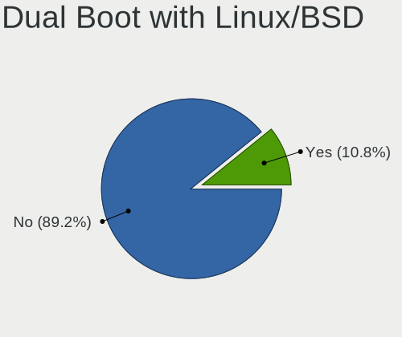
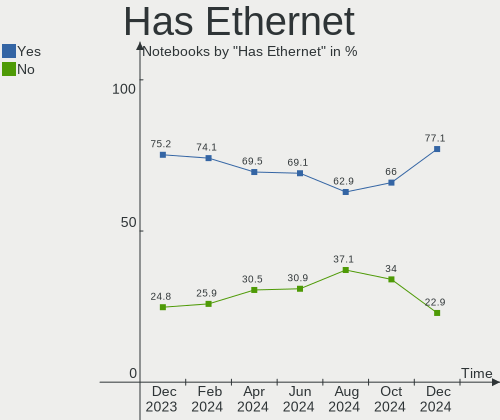
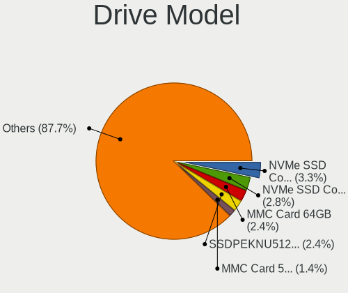
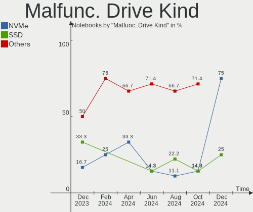
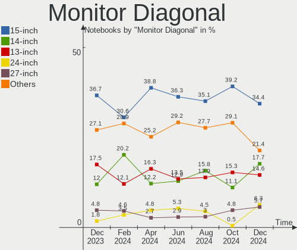
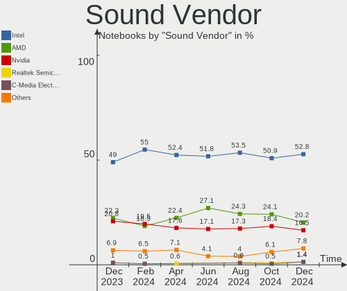

Arch - Hardware Trends (Notebooks)
----------------------------------

A project to identify most popular hardware characteristics and track their change
over time based on data collected by Linux users at https://Linux-Hardware.org.

Anyone can contribute to this report by the [hw-probe](https://github.com/linuxhw/hw-probe) tool:

    sudo -E hw-probe -all -upload

This report is for one last month. Overall report since the beginning of time: [TestDays](https://github.com/linuxhw/TestDays)

Period: Feb, 2023.

Contents
--------

* [ System ](#system)
  - [ OS                       ](#os)
  - [ OS Family                ](#os-family)
  - [ Kernel                   ](#kernel)
  - [ Kernel Family            ](#kernel-family)
  - [ Kernel Major Ver.        ](#kernel-major-ver)
  - [ Arch                     ](#arch)
  - [ DE                       ](#de)
  - [ Display Server           ](#display-server)
  - [ Display Manager          ](#display-manager)
  - [ OS Lang                  ](#os-lang)
  - [ Boot Mode                ](#boot-mode)
  - [ Filesystem               ](#filesystem)
  - [ Part. scheme             ](#part-scheme)
  - [ Dual Boot with Linux/BSD ](#dual-boot-with-linuxbsd)
  - [ Dual Boot (Win)          ](#dual-boot-win)

* [ Board ](#board)
  - [ Vendor                   ](#vendor)
  - [ Model                    ](#model)
  - [ Model Family             ](#model-family)
  - [ MFG Year                 ](#mfg-year)
  - [ Form Factor              ](#form-factor)
  - [ Secure Boot              ](#secure-boot)
  - [ Coreboot                 ](#coreboot)
  - [ RAM Size                 ](#ram-size)
  - [ RAM Used                 ](#ram-used)
  - [ Total Drives             ](#total-drives)
  - [ Has CD-ROM               ](#has-cd-rom)
  - [ Has Ethernet             ](#has-ethernet)
  - [ Has WiFi                 ](#has-wifi)
  - [ Has Bluetooth            ](#has-bluetooth)

* [ Location ](#location)
  - [ Country                  ](#country)
  - [ City                     ](#city)

* [ Drives ](#drives)
  - [ Drive Vendor             ](#drive-vendor)
  - [ Drive Model              ](#drive-model)
  - [ HDD Vendor               ](#hdd-vendor)
  - [ SSD Vendor               ](#ssd-vendor)
  - [ Drive Kind               ](#drive-kind)
  - [ Drive Connector          ](#drive-connector)
  - [ Drive Size               ](#drive-size)
  - [ Space Total              ](#space-total)
  - [ Space Used               ](#space-used)
  - [ Malfunc. Drives          ](#malfunc-drives)
  - [ Malfunc. Drive Vendor    ](#malfunc-drive-vendor)
  - [ Malfunc. HDD Vendor      ](#malfunc-hdd-vendor)
  - [ Malfunc. Drive Kind      ](#malfunc-drive-kind)
  - [ Failed Drives            ](#failed-drives)
  - [ Failed Drive Vendor      ](#failed-drive-vendor)
  - [ Drive Status             ](#drive-status)

* [ Storage controller ](#storage-controller)
  - [ Storage Vendor           ](#storage-vendor)
  - [ Storage Model            ](#storage-model)
  - [ Storage Kind             ](#storage-kind)

* [ Processor ](#processor)
  - [ CPU Vendor               ](#cpu-vendor)
  - [ CPU Model                ](#cpu-model)
  - [ CPU Model Family         ](#cpu-model-family)
  - [ CPU Cores                ](#cpu-cores)
  - [ CPU Sockets              ](#cpu-sockets)
  - [ CPU Threads              ](#cpu-threads)
  - [ CPU Op-Modes             ](#cpu-op-modes)
  - [ CPU Microcode            ](#cpu-microcode)
  - [ CPU Microarch            ](#cpu-microarch)

* [ Graphics ](#graphics)
  - [ GPU Vendor               ](#gpu-vendor)
  - [ GPU Model                ](#gpu-model)
  - [ GPU Combo                ](#gpu-combo)
  - [ GPU Driver               ](#gpu-driver)
  - [ GPU Memory               ](#gpu-memory)

* [ Monitor ](#monitor)
  - [ Monitor Vendor           ](#monitor-vendor)
  - [ Monitor Model            ](#monitor-model)
  - [ Monitor Resolution       ](#monitor-resolution)
  - [ Monitor Diagonal         ](#monitor-diagonal)
  - [ Monitor Width            ](#monitor-width)
  - [ Aspect Ratio             ](#aspect-ratio)
  - [ Monitor Area             ](#monitor-area)
  - [ Pixel Density            ](#pixel-density)
  - [ Multiple Monitors        ](#multiple-monitors)

* [ Network ](#network)
  - [ Net Controller Vendor    ](#net-controller-vendor)
  - [ Net Controller Model     ](#net-controller-model)
  - [ Wireless Vendor          ](#wireless-vendor)
  - [ Wireless Model           ](#wireless-model)
  - [ Ethernet Vendor          ](#ethernet-vendor)
  - [ Ethernet Model           ](#ethernet-model)
  - [ Net Controller Kind      ](#net-controller-kind)
  - [ Used Controller          ](#used-controller)
  - [ NICs                     ](#nics)
  - [ IPv6                     ](#ipv6)

* [ Bluetooth ](#bluetooth)
  - [ Bluetooth Vendor         ](#bluetooth-vendor)
  - [ Bluetooth Model          ](#bluetooth-model)

* [ Sound ](#sound)
  - [ Sound Vendor             ](#sound-vendor)
  - [ Sound Model              ](#sound-model)

* [ Memory ](#memory)
  - [ Memory Vendor            ](#memory-vendor)
  - [ Memory Model             ](#memory-model)
  - [ Memory Kind              ](#memory-kind)
  - [ Memory Form Factor       ](#memory-form-factor)
  - [ Memory Size              ](#memory-size)
  - [ Memory Speed             ](#memory-speed)

* [ Printers & scanners ](#printers--scanners)
  - [ Printer Vendor           ](#printer-vendor)
  - [ Printer Model            ](#printer-model)
  - [ Scanner Vendor           ](#scanner-vendor)
  - [ Scanner Model            ](#scanner-model)

* [ Camera ](#camera)
  - [ Camera Vendor            ](#camera-vendor)
  - [ Camera Model             ](#camera-model)

* [ Security ](#security)
  - [ Fingerprint Vendor       ](#fingerprint-vendor)
  - [ Fingerprint Model        ](#fingerprint-model)
  - [ Chipcard Vendor          ](#chipcard-vendor)
  - [ Chipcard Model           ](#chipcard-model)

* [ Unsupported ](#unsupported)
  - [ Unsupported Devices      ](#unsupported-devices)
  - [ Unsupported Device Types ](#unsupported-device-types)

System
------

OS
--

Installed operating systems

| Name         | Notebooks | Percent |
|--------------|-----------|---------|
| Arch Rolling | 103       | 100%    |

OS Family
---------

OS without a version

| Name | Notebooks | Percent |
|------|-----------|---------|
| Arch | 103       | 100%    |

Kernel
------

Version of the Linux kernel

| Version            | Notebooks | Percent |
|--------------------|-----------|---------|
| 6.1.9-arch1-1      | 16        | 15.53%  |
| 6.1.12-arch1-1     | 13        | 12.62%  |
| 6.1.9-arch1-2      | 9         | 8.74%   |
| 6.1.11-arch1-1     | 8         | 7.77%   |
| 6.1.10-arch1-1     | 7         | 6.8%    |
| 5.15.94-1-lts      | 6         | 5.83%   |
| 6.2.1-arch1-1      | 5         | 4.85%   |
| 6.1.8-arch1-1      | 4         | 3.88%   |
| 6.1.11-zen1-1-zen  | 4         | 3.88%   |
| 6.1.9-zen1-1-zen   | 3         | 2.91%   |
| 6.1.13-1-lts       | 3         | 2.91%   |
| 6.1.8-zen1-1-zen   | 2         | 1.94%   |
| 6.1.12-zen1-1-zen  | 2         | 1.94%   |
| 6.1.12-1-lts       | 2         | 1.94%   |
| 6.1.1-arch1-1      | 2         | 1.94%   |
| 5.15.91-1-lts      | 2         | 1.94%   |
| 6.2.0-zen1-1-zen   | 1         | 0.97%   |
| 6.2.0-arch1-1      | 1         | 0.97%   |
| 6.2.0-1-mainline   | 1         | 0.97%   |
| 6.1.9-zen1-2-zen   | 1         | 0.97%   |
| 6.1.9-273-tkg-cfs  | 1         | 0.97%   |
| 6.1.6-arch1-g14-1  | 1         | 0.97%   |
| 6.1.4-arch1-1      | 1         | 0.97%   |
| 6.1.12-lqx4-1-lqx  | 1         | 0.97%   |
| 6.1.12-1-ck        | 1         | 0.97%   |
| 6.1.11-lqx1-1-lqx  | 1         | 0.97%   |
| 6.1.11-arch1-1.1   | 1         | 0.97%   |
| 6.1.11-273-tkg-cfs | 1         | 0.97%   |
| 6.1.10-zen1-1-zen  | 1         | 0.97%   |
| 5.15.91-4-lts      | 1         | 0.97%   |
| 5.15.90-1-lts      | 1         | 0.97%   |

Kernel Family
-------------

Linux kernel without a distro release

| Version | Notebooks | Percent |
|---------|-----------|---------|
| 6.1.9   | 30        | 29.13%  |
| 6.1.12  | 19        | 18.45%  |
| 6.1.11  | 15        | 14.56%  |
| 6.1.10  | 8         | 7.77%   |
| 6.1.8   | 6         | 5.83%   |
| 5.15.94 | 6         | 5.83%   |
| 6.2.1   | 5         | 4.85%   |
| 6.2.0   | 3         | 2.91%   |
| 6.1.13  | 3         | 2.91%   |
| 5.15.91 | 3         | 2.91%   |
| 6.1.1   | 2         | 1.94%   |
| 6.1.6   | 1         | 0.97%   |
| 6.1.4   | 1         | 0.97%   |
| 5.15.90 | 1         | 0.97%   |

Kernel Major Ver.
-----------------

Linux kernel major version

| Version | Notebooks | Percent |
|---------|-----------|---------|
| 6.1     | 85        | 82.52%  |
| 5.15    | 10        | 9.71%   |
| 6.2     | 8         | 7.77%   |

Arch
----

OS architecture (x86_64, i586, etc.)

| Name   | Notebooks | Percent |
|--------|-----------|---------|
| x86_64 | 103       | 100%    |

DE
--

Desktop Environment

| Name       | Notebooks | Percent |
|------------|-----------|---------|
| GNOME      | 39        | 37.86%  |
| KDE5       | 29        | 28.16%  |
| XFCE       | 8         | 7.77%   |
| Unknown    | 8         | 7.77%   |
| X-Cinnamon | 3         | 2.91%   |
| sway       | 3         | 2.91%   |
| Hyprland   | 3         | 2.91%   |
| i3         | 2         | 1.94%   |
| Deepin     | 2         | 1.94%   |
| qtile      | 1         | 0.97%   |
| LXQt       | 1         | 0.97%   |
| LXDE       | 1         | 0.97%   |
| LeftWM     | 1         | 0.97%   |
| Cinnamon   | 1         | 0.97%   |
| chadwm     | 1         | 0.97%   |

Display Server
--------------

X11 or Wayland

| Name    | Notebooks | Percent |
|---------|-----------|---------|
| X11     | 48        | 46.6%   |
| Wayland | 37        | 35.92%  |
| Unknown | 13        | 12.62%  |
| Tty     | 5         | 4.85%   |

Display Manager
---------------

SDDM, LightDM, etc.

| Name    | Notebooks | Percent |
|---------|-----------|---------|
| Unknown | 42        | 40.78%  |
| LightDM | 22        | 21.36%  |
| SDDM    | 19        | 18.45%  |
| GDM     | 15        | 14.56%  |
| SLiM    | 2         | 1.94%   |
| Ly      | 2         | 1.94%   |
| GREETD  | 1         | 0.97%   |

OS Lang
-------

Language

| Lang        | Notebooks | Percent |
|-------------|-----------|---------|
| en_us       | 45        | 43.69%  |
| en_GB       | 9         | 8.74%   |
| C           | 9         | 8.74%   |
| it_IT       | 6         | 5.83%   |
| de_DE       | 6         | 5.83%   |
| zh_CN       | 4         | 3.88%   |
| pt_BR       | 4         | 3.88%   |
| ru_RU       | 3         | 2.91%   |
| fr_FR       | 3         | 2.91%   |
| Unknown     | 3         | 2.91%   |
| pl_PL       | 2         | 1.94%   |
| pt_BRutf8   | 1         | 0.97%   |
| nl_NL       | 1         | 0.97%   |
| lv_LV       | 1         | 0.97%   |
| fi_FI       | 1         | 0.97%   |
| es_PE       | 1         | 0.97%   |
| en_US.utf-8 | 1         | 0.97%   |
| en_PH       | 1         | 0.97%   |
| en_IN       | 1         | 0.97%   |
| en_DK       | 1         | 0.97%   |

Boot Mode
---------

EFI or BIOS

| Mode | Notebooks | Percent |
|------|-----------|---------|
| EFI  | 65        | 63.11%  |
| BIOS | 38        | 36.89%  |

Filesystem
----------

Type of filesystem

| Type    | Notebooks | Percent |
|---------|-----------|---------|
| Ext4    | 76        | 73.79%  |
| Btrfs   | 23        | 22.33%  |
| Xfs     | 2         | 1.94%   |
| F2fs    | 1         | 0.97%   |
| Unknown | 1         | 0.97%   |

Part. scheme
------------

Scheme of partitioning

| Type    | Notebooks | Percent |
|---------|-----------|---------|
| GPT     | 69        | 66.99%  |
| Unknown | 28        | 27.18%  |
| MBR     | 6         | 5.83%   |

Dual Boot with Linux/BSD
------------------------

Hosting more than one Linux/BSD

| Dual boot | Notebooks | Percent |
|-----------|-----------|---------|
| No        | 97        | 94.17%  |
| Yes       | 6         | 5.83%   |

Dual Boot (Win)
---------------

Hosting Linux and Windows

| Dual boot | Notebooks | Percent |
|-----------|-----------|---------|
| No        | 74        | 71.84%  |
| Yes       | 29        | 28.16%  |

Board
-----

Vendor
------

Motherboard manufacturer

| Name                   | Notebooks | Percent |
|------------------------|-----------|---------|
| Lenovo                 | 31        | 30.1%   |
| Dell                   | 17        | 16.5%   |
| ASUSTek Computer       | 12        | 11.65%  |
| Hewlett-Packard        | 9         | 8.74%   |
| Acer                   | 7         | 6.8%    |
| MSI                    | 4         | 3.88%   |
| Toshiba                | 3         | 2.91%   |
| HUAWEI                 | 3         | 2.91%   |
| Apple                  | 3         | 2.91%   |
| Sony                   | 2         | 1.94%   |
| TUXEDO                 | 1         | 0.97%   |
| Timi                   | 1         | 0.97%   |
| Star Labs              | 1         | 0.97%   |
| Schenker               | 1         | 0.97%   |
| Monster                | 1         | 0.97%   |
| Medion                 | 1         | 0.97%   |
| MECHREVO               | 1         | 0.97%   |
| Intel Client Systems   | 1         | 0.97%   |
| Google                 | 1         | 0.97%   |
| Compaq                 | 1         | 0.97%   |
| Avell High Performance | 1         | 0.97%   |
| Unknown                | 1         | 0.97%   |

Model
-----

Motherboard model

| Name                                        | Notebooks | Percent |
|---------------------------------------------|-----------|---------|
| Dell XPS 15 9520                            | 3         | 2.91%   |
| HUAWEI NBD-WXX9                             | 2         | 1.94%   |
| ASUS Zenbook UX535QE_UM535QE                | 2         | 1.94%   |
| Unknown                                     | 2         | 1.94%   |
| Toshiba Satellite Pro L510                  | 1         | 0.97%   |
| Toshiba Satellite P870                      | 1         | 0.97%   |
| Toshiba Satellite P500                      | 1         | 0.97%   |
| Timi Xiaomi Book Pro 14 2022                | 1         | 0.97%   |
| Star Labs StarBook                          | 1         | 0.97%   |
| Sony VPCEH1M1E                              | 1         | 0.97%   |
| Sony SVE1712C1EW                            | 1         | 0.97%   |
| Schenker VISION (E22)                       | 1         | 0.97%   |
| MSI Modern 14 B11SBU                        | 1         | 0.97%   |
| MSI Modern 14 B11MOU                        | 1         | 0.97%   |
| MSI GL65 9SD                                | 1         | 0.97%   |
| MSI GE63 Raider RGB 9SE                     | 1         | 0.97%   |
| Monster ABRA A7 V11.1                       | 1         | 0.97%   |
| Medion S17405                               | 1         | 0.97%   |
| MECHREVO Jiaolong Series MRID6              | 1         | 0.97%   |
| Lenovo ThinkPad Z13 Gen 1 21D2CTO1WW        | 1         | 0.97%   |
| Lenovo ThinkPad X61s 7667CG7                | 1         | 0.97%   |
| Lenovo ThinkPad X280 20KEA0VCUK             | 1         | 0.97%   |
| Lenovo ThinkPad X240 20AMS1FW00             | 1         | 0.97%   |
| Lenovo ThinkPad X1 Carbon Gen 10 21CB00AGMZ | 1         | 0.97%   |
| Lenovo ThinkPad T490 20N3S3UL00             | 1         | 0.97%   |
| Lenovo ThinkPad T480 20L6S3PV00             | 1         | 0.97%   |
| Lenovo ThinkPad T460s 20FAS2K13B            | 1         | 0.97%   |
| Lenovo ThinkPad T16 Gen 1 21CH000JUS        | 1         | 0.97%   |
| Lenovo ThinkPad T15p Gen 3 21DACTO1WW       | 1         | 0.97%   |
| Lenovo ThinkPad T14 Gen 3 21CFCTO1WW        | 1         | 0.97%   |
| Lenovo ThinkPad E490 20N9S2AS00             | 1         | 0.97%   |
| Lenovo ThinkBook 15-IIL 20SM                | 1         | 0.97%   |
| Lenovo ThinkBook 14 G4+ IAP 21CX            | 1         | 0.97%   |
| Lenovo Legion S7 15ACH6 82K8                | 1         | 0.97%   |
| Lenovo Legion 5 Pro 16IAH7H 82RF            | 1         | 0.97%   |
| Lenovo Legion 5 15ACH6H 82JU                | 1         | 0.97%   |
| Lenovo IdeaPad Slim 7 14ITL05 82A6          | 1         | 0.97%   |
| Lenovo IdeaPad S145-15IWL 81S9              | 1         | 0.97%   |
| Lenovo IdeaPad L340-15IRH Gaming 81LK       | 1         | 0.97%   |
| Lenovo IdeaPad Gaming 3 15ARH05 82EY        | 1         | 0.97%   |

Model Family
------------

Motherboard model prefix

| Name                          | Notebooks | Percent |
|-------------------------------|-----------|---------|
| Lenovo ThinkPad               | 12        | 11.65%  |
| Lenovo IdeaPad                | 10        | 9.71%   |
| Dell XPS                      | 6         | 5.83%   |
| Dell Latitude                 | 6         | 5.83%   |
| ASUS ROG                      | 5         | 4.85%   |
| Acer Aspire                   | 4         | 3.88%   |
| Toshiba Satellite             | 3         | 2.91%   |
| Lenovo Legion                 | 3         | 2.91%   |
| HP Laptop                     | 3         | 2.91%   |
| MSI Modern                    | 2         | 1.94%   |
| Lenovo ThinkBook              | 2         | 1.94%   |
| HUAWEI NBD-WXX9               | 2         | 1.94%   |
| HP ProBook                    | 2         | 1.94%   |
| HP EliteBook                  | 2         | 1.94%   |
| ASUS Zenbook                  | 2         | 1.94%   |
| Acer Nitro                    | 2         | 1.94%   |
| Unknown                       | 2         | 1.94%   |
| Timi Xiaomi                   | 1         | 0.97%   |
| Star Labs StarBook            | 1         | 0.97%   |
| Sony VPCEH1M1E                | 1         | 0.97%   |
| Sony SVE1712C1EW              | 1         | 0.97%   |
| Schenker VISION               | 1         | 0.97%   |
| MSI GL65                      | 1         | 0.97%   |
| MSI GE63                      | 1         | 0.97%   |
| Monster ABRA                  | 1         | 0.97%   |
| Medion S17405                 | 1         | 0.97%   |
| MECHREVO Jiaolong             | 1         | 0.97%   |
| Lenovo G505                   | 1         | 0.97%   |
| Lenovo G50-80                 | 1         | 0.97%   |
| Lenovo G50-70                 | 1         | 0.97%   |
| Lenovo B40-70                 | 1         | 0.97%   |
| Intel Client Systems LAPRC510 | 1         | 0.97%   |
| HUAWEI MACHC-WAX9             | 1         | 0.97%   |
| HP Stream                     | 1         | 0.97%   |
| HP Pavilion                   | 1         | 0.97%   |
| Google Celes                  | 1         | 0.97%   |
| Dell Venue                    | 1         | 0.97%   |
| Dell Precision                | 1         | 0.97%   |
| Dell Inspiron                 | 1         | 0.97%   |
| Dell G3                       | 1         | 0.97%   |

MFG Year
--------

Motherboard manufacture year

| Year | Notebooks | Percent |
|------|-----------|---------|
| 2022 | 25        | 24.27%  |
| 2021 | 19        | 18.45%  |
| 2019 | 13        | 12.62%  |
| 2018 | 10        | 9.71%   |
| 2020 | 7         | 6.8%    |
| 2013 | 5         | 4.85%   |
| 2016 | 4         | 3.88%   |
| 2012 | 4         | 3.88%   |
| 2017 | 3         | 2.91%   |
| 2014 | 3         | 2.91%   |
| 2011 | 3         | 2.91%   |
| 2023 | 2         | 1.94%   |
| 2015 | 2         | 1.94%   |
| 2009 | 2         | 1.94%   |
| 2007 | 1         | 0.97%   |

Form Factor
-----------

Physical design of the computer

| Name     | Notebooks | Percent |
|----------|-----------|---------|
| Notebook | 103       | 100%    |

Secure Boot
-----------

Enabled or disabled

| State    | Notebooks | Percent |
|----------|-----------|---------|
| Disabled | 100       | 97.09%  |
| Enabled  | 3         | 2.91%   |

Coreboot
--------

Have coreboot on board

| Used | Notebooks | Percent |
|------|-----------|---------|
| No   | 101       | 98.06%  |
| Yes  | 2         | 1.94%   |

RAM Size
--------

Total RAM memory

| Size in GB  | Notebooks | Percent |
|-------------|-----------|---------|
| 16.01-24.0  | 26        | 25.24%  |
| 4.01-8.0    | 22        | 21.36%  |
| 8.01-16.0   | 21        | 20.39%  |
| 32.01-64.0  | 13        | 12.62%  |
| 3.01-4.0    | 12        | 11.65%  |
| 64.01-256.0 | 4         | 3.88%   |
| 24.01-32.0  | 3         | 2.91%   |
| 2.01-3.0    | 1         | 0.97%   |
| 1.01-2.0    | 1         | 0.97%   |

RAM Used
--------

Used RAM memory

| Used GB    | Notebooks | Percent |
|------------|-----------|---------|
| 4.01-8.0   | 28        | 27.18%  |
| 2.01-3.0   | 24        | 23.3%   |
| 3.01-4.0   | 18        | 17.48%  |
| 1.01-2.0   | 18        | 17.48%  |
| 8.01-16.0  | 9         | 8.74%   |
| 0.51-1.0   | 4         | 3.88%   |
| 24.01-32.0 | 1         | 0.97%   |
| 0.01-0.5   | 1         | 0.97%   |

Total Drives
------------

Number of drives on board

| Drives | Notebooks | Percent |
|--------|-----------|---------|
| 1      | 70        | 67.96%  |
| 2      | 30        | 29.13%  |
| 3      | 3         | 2.91%   |

Has CD-ROM
----------

Has CD-ROM on board

| Presented | Notebooks | Percent |
|-----------|-----------|---------|
| No        | 91        | 88.35%  |
| Yes       | 12        | 11.65%  |

Has Ethernet
------------

Has Ethernet on board

| Presented | Notebooks | Percent |
|-----------|-----------|---------|
| Yes       | 70        | 67.96%  |
| No        | 33        | 32.04%  |

Has WiFi
--------

Has WiFi module

| Presented | Notebooks | Percent |
|-----------|-----------|---------|
| Yes       | 103       | 100%    |

Has Bluetooth
-------------

Has Bluetooth module

| Presented | Notebooks | Percent |
|-----------|-----------|---------|
| Yes       | 92        | 89.32%  |
| No        | 11        | 10.68%  |

Location
--------

Country
-------

Geographic location (country)

| Country                | Notebooks | Percent |
|------------------------|-----------|---------|
| USA                    | 17        | 16.5%   |
| Germany                | 11        | 10.68%  |
| Russia                 | 8         | 7.77%   |
| Brazil                 | 8         | 7.77%   |
| Italy                  | 7         | 6.8%    |
| UK                     | 5         | 4.85%   |
| India                  | 5         | 4.85%   |
| Poland                 | 4         | 3.88%   |
| France                 | 4         | 3.88%   |
| Vietnam                | 3         | 2.91%   |
| Switzerland            | 3         | 2.91%   |
| Australia              | 3         | 2.91%   |
| Turkey                 | 2         | 1.94%   |
| Indonesia              | 2         | 1.94%   |
| Canada                 | 2         | 1.94%   |
| Thailand               | 1         | 0.97%   |
| Taiwan                 | 1         | 0.97%   |
| Sweden                 | 1         | 0.97%   |
| Spain                  | 1         | 0.97%   |
| Singapore              | 1         | 0.97%   |
| Romania                | 1         | 0.97%   |
| Philippines            | 1         | 0.97%   |
| Peru                   | 1         | 0.97%   |
| Netherlands            | 1         | 0.97%   |
| Malta                  | 1         | 0.97%   |
| Latvia                 | 1         | 0.97%   |
| Kazakhstan             | 1         | 0.97%   |
| Hungary                | 1         | 0.97%   |
| Hong Kong              | 1         | 0.97%   |
| Finland                | 1         | 0.97%   |
| Colombia               | 1         | 0.97%   |
| China                  | 1         | 0.97%   |
| Bosnia and Herzegovina | 1         | 0.97%   |
| Bangladesh             | 1         | 0.97%   |

City
----

Geographic location (city)

| City                | Notebooks | Percent |
|---------------------|-----------|---------|
| Warsaw              | 3         | 2.91%   |
| Zurich              | 2         | 1.94%   |
| Vladivostok         | 2         | 1.94%   |
| Tillsonburg         | 2         | 1.94%   |
| San Francisco       | 2         | 1.94%   |
| Paris               | 2         | 1.94%   |
| Moscow              | 2         | 1.94%   |
| Milan               | 2         | 1.94%   |
| Melbourne           | 2         | 1.94%   |
| Hanoi               | 2         | 1.94%   |
| Cologne             | 2         | 1.94%   |
| Bengaluru           | 2         | 1.94%   |
| Walnutport          | 1         | 0.97%   |
| Utica               | 1         | 0.97%   |
| Uberlândia         | 1         | 0.97%   |
| Tonyrefail          | 1         | 0.97%   |
| Tirupati            | 1         | 0.97%   |
| Sydney              | 1         | 0.97%   |
| Swansea             | 1         | 0.97%   |
| Stuttgart           | 1         | 0.97%   |
| Stepnogorsk         | 1         | 0.97%   |
| Statham             | 1         | 0.97%   |
| Stadskanaal         | 1         | 0.97%   |
| St Petersburg       | 1         | 0.97%   |
| Southampton         | 1         | 0.97%   |
| Sollentuna          | 1         | 0.97%   |
| Snohomish           | 1         | 0.97%   |
| Singapore           | 1         | 0.97%   |
| Schwarzenbek        | 1         | 0.97%   |
| Sao Luís           | 1         | 0.97%   |
| Santa Clarita       | 1         | 0.97%   |
| Round Rock          | 1         | 0.97%   |
| Riga                | 1         | 0.97%   |
| Rheinbach           | 1         | 0.97%   |
| Presidente Epitacio | 1         | 0.97%   |
| Pierre              | 1         | 0.97%   |
| Pekanbaru           | 1         | 0.97%   |
| Nördlingen         | 1         | 0.97%   |
| Newark              | 1         | 0.97%   |
| New Taipei          | 1         | 0.97%   |

Drives
------

Drive Vendor
------------

Hard drive vendors

| Vendor                         | Notebooks | Drives | Percent |
|--------------------------------|-----------|--------|---------|
| Samsung Electronics            | 32        | 37     | 24.24%  |
| SK hynix                       | 10        | 10     | 7.58%   |
| Micron Technology              | 10        | 10     | 7.58%   |
| Seagate                        | 8         | 8      | 6.06%   |
| Sandisk                        | 8         | 9      | 6.06%   |
| Intel                          | 7         | 7      | 5.3%    |
| Unknown                        | 6         | 7      | 4.55%   |
| WDC                            | 5         | 5      | 3.79%   |
| Phison Electronics             | 5         | 5      | 3.79%   |
| Toshiba                        | 4         | 4      | 3.03%   |
| A-DATA Technology              | 4         | 4      | 3.03%   |
| TO Exter                       | 3         | 3      | 2.27%   |
| Solid State Storage Technology | 3         | 3      | 2.27%   |
| Transcend                      | 2         | 2      | 1.52%   |
| Realtek                        | 2         | 2      | 1.52%   |
| KIOXIA                         | 2         | 2      | 1.52%   |
| Kingston                       | 2         | 2      | 1.52%   |
| Crucial                        | 2         | 2      | 1.52%   |
| ADATA Technology               | 2         | 2      | 1.52%   |
| WDC WDS2                       | 1         | 1      | 0.76%   |
| VISIPRO                        | 1         | 1      | 0.76%   |
| USB3.0                         | 1         | 1      | 0.76%   |
| SPCC                           | 1         | 1      | 0.76%   |
| ShiJi                          | 1         | 1      | 0.76%   |
| Phison                         | 1         | 1      | 0.76%   |
| OWC                            | 1         | 1      | 0.76%   |
| MAXIO Technology (Hangzhou)    | 1         | 1      | 0.76%   |
| Kingston Technology Company    | 1         | 1      | 0.76%   |
| Intenso                        | 1         | 1      | 0.76%   |
| Hitachi                        | 1         | 1      | 0.76%   |
| Hewlett-Packard                | 1         | 1      | 0.76%   |
| Apple                          | 1         | 2      | 0.76%   |
| 2.5                            | 1         | 1      | 0.76%   |
| Unknown                        | 1         | 1      | 0.76%   |

Drive Model
-----------

Hard drive models

| Model                                                | Notebooks | Percent |
|------------------------------------------------------|-----------|---------|
| Samsung NVMe SSD Controller SM981/PM981/PM983 250GB  | 10        | 7.3%    |
| Samsung NVMe SSD Controller PM9A1/PM9A3/980PRO 960GB | 7         | 5.11%   |
| Phison PS5013 E13 NVMe Controller 500GB              | 4         | 2.92%   |
| Unknown MMC Card  64GB                               | 3         | 2.19%   |
| Unknown MMC Card  32GB                               | 3         | 2.19%   |
| TO Exter nal USB 3.0 240GB                           | 3         | 2.19%   |
| Solid State Storage CA6-8D2048-Q11 NVMe SSSTC 2048GB | 3         | 2.19%   |
| Intel SSD 660P Series 1024GB                         | 3         | 2.19%   |
| SK hynix BC501 NVMe Solid State Drive 512GB          | 2         | 1.46%   |
| Seagate ST500LM021-1KJ152 500GB                      | 2         | 1.46%   |
| Seagate ST1000LM049-2GH172 1TB                       | 2         | 1.46%   |
| Sandisk WD Black SN750 / PC SN730 NVMe SSD 512GB     | 2         | 1.46%   |
| Samsung SSD 980 500GB                                | 2         | 1.46%   |
| Samsung SSD 870 EVO 250GB                            | 2         | 1.46%   |
| Samsung NVMe SSD Controller SM961/PM961/SM963 512GB  | 2         | 1.46%   |
| Micron 2450_MTFDKBA1T0TFK 1TB                        | 2         | 1.46%   |
| Intel SSDPEKNU512GZ 512GB                            | 2         | 1.46%   |
| Crucial CT240BX500SSD1 240GB                         | 2         | 1.46%   |
| WDC WDS2 40G2G0A-00JH30 240GB SSD                    | 1         | 0.73%   |
| WDC WD5000LPCX-24C6HT0 500GB                         | 1         | 0.73%   |
| WDC WD10SPZX-24Z10T0 1TB                             | 1         | 0.73%   |
| WDC WD10SPZX-24Z10 1TB                               | 1         | 0.73%   |
| WDC WD10JPCX-24UE4T0 1TB                             | 1         | 0.73%   |
| WDC WD Blue SA510 M.2 2280 1000GB SSD                | 1         | 0.73%   |
| VISIPRO SDVPSA181024 240GB                           | 1         | 0.73%   |
| USB3.0 Super Speed 960GB                             | 1         | 0.73%   |
| Unknown MMC Card  128GB                              | 1         | 0.73%   |
| Transcend TS480GMTS420S 480GB SSD                    | 1         | 0.73%   |
| Transcend TS2TMTE220S 2TB                            | 1         | 0.73%   |
| Toshiba XG4 NVMe SSD Controller 512GB                | 1         | 0.73%   |
| Toshiba NVMe Controller 512GB                        | 1         | 0.73%   |
| Toshiba MK5055GSX 500GB                              | 1         | 0.73%   |
| Toshiba MK2556GSY 250GB                              | 1         | 0.73%   |
| SPCC Solid State Disk 128GB                          | 1         | 0.73%   |
| SK hynix SKHynix_HFS512GDE9X084N 512GB               | 1         | 0.73%   |
| SK hynix SKHynix_HFS512GD9TNI-L2A0B 512GB            | 1         | 0.73%   |
| SK hynix SKHynix_HFS256GDE9X081N 256GB               | 1         | 0.73%   |
| SK hynix SKHynix_HFS256GD9TNG-L3A0B 256GB            | 1         | 0.73%   |
| SK hynix SKHynix_HFS001TDE9X084N 1TB                 | 1         | 0.73%   |
| SK hynix PC711 HFS512GDE9X073N 512GB                 | 1         | 0.73%   |

HDD Vendor
----------

Hard disk drive vendors

| Vendor  | Notebooks | Drives | Percent |
|---------|-----------|--------|---------|
| Seagate | 8         | 8      | 50%     |
| WDC     | 4         | 4      | 25%     |
| Toshiba | 2         | 2      | 12.5%   |
| USB3.0  | 1         | 1      | 6.25%   |
| Hitachi | 1         | 1      | 6.25%   |

SSD Vendor
----------

Solid state drive vendors

| Vendor              | Notebooks | Drives | Percent |
|---------------------|-----------|--------|---------|
| Samsung Electronics | 10        | 10     | 34.48%  |
| TO Exter            | 3         | 3      | 10.34%  |
| SanDisk             | 2         | 2      | 6.9%    |
| Crucial             | 2         | 2      | 6.9%    |
| A-DATA Technology   | 2         | 2      | 6.9%    |
| WDC WDS2            | 1         | 1      | 3.45%   |
| WDC                 | 1         | 1      | 3.45%   |
| Transcend           | 1         | 1      | 3.45%   |
| SPCC                | 1         | 1      | 3.45%   |
| OWC                 | 1         | 1      | 3.45%   |
| Intenso             | 1         | 1      | 3.45%   |
| Intel               | 1         | 1      | 3.45%   |
| Hewlett-Packard     | 1         | 1      | 3.45%   |
| 2.5                 | 1         | 1      | 3.45%   |
| Unknown             | 1         | 1      | 3.45%   |

Drive Kind
----------

HDD or SSD

| Kind    | Notebooks | Drives | Percent |
|---------|-----------|--------|---------|
| NVMe    | 73        | 86     | 58.87%  |
| SSD     | 28        | 29     | 22.58%  |
| HDD     | 15        | 16     | 12.1%   |
| MMC     | 6         | 7      | 4.84%   |
| Unknown | 2         | 2      | 1.61%   |

Drive Connector
---------------

SATA, SAS, NVMe, etc.

| Type | Notebooks | Drives | Percent |
|------|-----------|--------|---------|
| NVMe | 72        | 84     | 59.02%  |
| SATA | 34        | 39     | 27.87%  |
| SAS  | 10        | 10     | 8.2%    |
| MMC  | 6         | 7      | 4.92%   |

Drive Size
----------

Size of hard drive

| Size in TB | Notebooks | Drives | Percent |
|------------|-----------|--------|---------|
| 0.01-0.5   | 31        | 34     | 73.81%  |
| 0.51-1.0   | 10        | 10     | 23.81%  |
| 1.01-2.0   | 1         | 1      | 2.38%   |

Space Total
-----------

Amount of disk space available on the file system

| Size in GB     | Notebooks | Percent |
|----------------|-----------|---------|
| 101-250        | 28        | 27.18%  |
| 251-500        | 22        | 21.36%  |
| 501-1000       | 21        | 20.39%  |
| 1001-2000      | 15        | 14.56%  |
| 51-100         | 6         | 5.83%   |
| More than 3000 | 4         | 3.88%   |
| 2001-3000      | 4         | 3.88%   |
| Unknown        | 2         | 1.94%   |
| 21-50          | 1         | 0.97%   |

Space Used
----------

Amount of used disk space

| Used GB        | Notebooks | Percent |
|----------------|-----------|---------|
| 1-20           | 27        | 26.21%  |
| 101-250        | 20        | 19.42%  |
| 21-50          | 17        | 16.5%   |
| 251-500        | 13        | 12.62%  |
| 51-100         | 13        | 12.62%  |
| 501-1000       | 6         | 5.83%   |
| 1001-2000      | 3         | 2.91%   |
| More than 3000 | 2         | 1.94%   |
| Unknown        | 2         | 1.94%   |

Malfunc. Drives
---------------

Drive models with a malfunction

| Model                                                           | Notebooks | Drives | Percent |
|-----------------------------------------------------------------|-----------|--------|---------|
| Samsung Electronics NVMe SSD Controller SM981/PM981/PM983 250GB | 2         | 2      | 20%     |
| WDC WD5000LPCX-24C6HT0 500GB                                    | 1         | 1      | 10%     |
| Toshiba MK5055GSX 500GB                                         | 1         | 1      | 10%     |
| SK hynix PC711 HFS512GDE9X073N 512GB                            | 1         | 1      | 10%     |
| Seagate ST9500325AS 500GB                                       | 1         | 1      | 10%     |
| Seagate ST9160821AS 160GB                                       | 1         | 1      | 10%     |
| Seagate ST500LM021-1KJ152 500GB                                 | 1         | 1      | 10%     |
| Seagate ST1000LM049-2GH172 1TB                                  | 1         | 1      | 10%     |
| Hitachi HTS545025B9A300 250GB                                   | 1         | 1      | 10%     |

Malfunc. Drive Vendor
---------------------

Vendors of faulty drives

| Vendor              | Notebooks | Drives | Percent |
|---------------------|-----------|--------|---------|
| Seagate             | 4         | 4      | 40%     |
| Samsung Electronics | 2         | 2      | 20%     |
| WDC                 | 1         | 1      | 10%     |
| Toshiba             | 1         | 1      | 10%     |
| SK hynix            | 1         | 1      | 10%     |
| Hitachi             | 1         | 1      | 10%     |

Malfunc. HDD Vendor
-------------------

Vendors of faulty HDD drives

| Vendor  | Notebooks | Drives | Percent |
|---------|-----------|--------|---------|
| Seagate | 4         | 4      | 57.14%  |
| WDC     | 1         | 1      | 14.29%  |
| Toshiba | 1         | 1      | 14.29%  |
| Hitachi | 1         | 1      | 14.29%  |

Malfunc. Drive Kind
-------------------

Kinds of faulty drives

| Kind | Notebooks | Drives | Percent |
|------|-----------|--------|---------|
| HDD  | 6         | 7      | 66.67%  |
| NVMe | 3         | 3      | 33.33%  |

Failed Drives
-------------

Failed drive models

Zero info for selected period =(

Failed Drive Vendor
-------------------

Failed drive vendors

Zero info for selected period =(

Drive Status
------------

Number of failed and malfunc. drives

| Status   | Notebooks | Drives | Percent |
|----------|-----------|--------|---------|
| Detected | 53        | 71     | 46.49%  |
| Works    | 52        | 59     | 45.61%  |
| Malfunc  | 9         | 10     | 7.89%   |

Storage controller
------------------

Storage Vendor
--------------

Storage controller vendors

| Vendor                         | Notebooks | Percent |
|--------------------------------|-----------|---------|
| Intel                          | 47        | 36.15%  |
| Samsung Electronics            | 24        | 18.46%  |
| SK hynix                       | 10        | 7.69%   |
| Micron Technology              | 10        | 7.69%   |
| AMD                            | 9         | 6.92%   |
| SanDisk                        | 7         | 5.38%   |
| Phison Electronics             | 6         | 4.62%   |
| ADATA Technology               | 4         | 3.08%   |
| Solid State Storage Technology | 3         | 2.31%   |
| Kingston Technology Company    | 3         | 2.31%   |
| Toshiba America Info Systems   | 2         | 1.54%   |
| KIOXIA                         | 2         | 1.54%   |
| Transcend                      | 1         | 0.77%   |
| MAXIO Technology (Hangzhou)    | 1         | 0.77%   |
| Apple                          | 1         | 0.77%   |

Storage Model
-------------

Storage controller models

| Model                                                                         | Notebooks | Percent |
|-------------------------------------------------------------------------------|-----------|---------|
| Samsung NVMe SSD Controller SM981/PM981/PM983                                 | 11        | 8.15%   |
| Micron Non-Volatile memory controller                                         | 10        | 7.41%   |
| AMD FCH SATA Controller [AHCI mode]                                           | 9         | 6.67%   |
| Samsung NVMe SSD Controller PM9A1/PM9A3/980PRO                                | 8         | 5.93%   |
| SK hynix Gold P31/PC711 NVMe Solid State Drive                                | 6         | 4.44%   |
| Intel Sunrise Point-LP SATA Controller [AHCI mode]                            | 6         | 4.44%   |
| Intel 82801 Mobile SATA Controller [RAID mode]                                | 6         | 4.44%   |
| Samsung NVMe SSD Controller 980                                               | 4         | 2.96%   |
| Phison PS5013 E13 NVMe Controller                                             | 4         | 2.96%   |
| Intel Volume Management Device NVMe RAID Controller                           | 4         | 2.96%   |
| Intel Cannon Lake Mobile PCH SATA AHCI Controller                             | 4         | 2.96%   |
| Intel 8 Series SATA Controller 1 [AHCI mode]                                  | 4         | 2.96%   |
| Solid State Storage Non-Volatile memory controller                            | 3         | 2.22%   |
| Intel SSD 660P Series                                                         | 3         | 2.22%   |
| Intel Non-Volatile memory controller                                          | 3         | 2.22%   |
| Intel Cannon Point-LP SATA Controller [AHCI Mode]                             | 3         | 2.22%   |
| SK hynix Non-Volatile memory controller                                       | 2         | 1.48%   |
| SK hynix BC501 NVMe Solid State Drive                                         | 2         | 1.48%   |
| SanDisk WD Blue SN570 NVMe SSD                                                | 2         | 1.48%   |
| SanDisk WD Black SN750 / PC SN730 NVMe SSD                                    | 2         | 1.48%   |
| SanDisk Non-Volatile memory controller                                        | 2         | 1.48%   |
| Samsung NVMe SSD Controller SM961/PM961/SM963                                 | 2         | 1.48%   |
| Kingston Company Company Non-Volatile memory controller                       | 2         | 1.48%   |
| Intel Wildcat Point-LP SATA Controller [AHCI Mode]                            | 2         | 1.48%   |
| Intel Tiger Lake-LP SATA Controller                                           | 2         | 1.48%   |
| Intel 7 Series Chipset Family 6-port SATA Controller [AHCI mode]              | 2         | 1.48%   |
| Intel 6 Series/C200 Series Chipset Family 6 port Mobile SATA AHCI Controller  | 2         | 1.48%   |
| ADATA A Non-Volatile memory controller                                        | 2         | 1.48%   |
| Transcend Non-Volatile memory controller                                      | 1         | 0.74%   |
| Toshiba America Info Systems XG4 NVMe SSD Controller                          | 1         | 0.74%   |
| Toshiba America Info Systems NVMe Controller                                  | 1         | 0.74%   |
| SanDisk PC SN520 NVMe SSD                                                     | 1         | 0.74%   |
| Phison Electronics Non-Volatile memory controller                             | 1         | 0.74%   |
| Phison E18 PCIe4 NVMe Controller                                              | 1         | 0.74%   |
| MAXIO (Hangzhou) NVMe SSD Controller MAP1202                                  | 1         | 0.74%   |
| KIOXIA NVMe SSD Controller BG4                                                | 1         | 0.74%   |
| KIOXIA Non-Volatile memory controller                                         | 1         | 0.74%   |
| Kingston Company A2000 NVMe SSD                                               | 1         | 0.74%   |
| Intel Q170/Q150/B150/H170/H110/Z170/CM236 Chipset SATA Controller [AHCI Mode] | 1         | 0.74%   |
| Intel Ice Lake-LP SATA Controller [AHCI mode]                                 | 1         | 0.74%   |

Storage Kind
------------

Kind of storage controller (IDE, SATA, NVMe, SAS, ...)

| Kind | Notebooks | Percent |
|------|-----------|---------|
| NVMe | 72        | 57.14%  |
| SATA | 43        | 34.13%  |
| RAID | 10        | 7.94%   |
| IDE  | 1         | 0.79%   |

Processor
---------

CPU Vendor
----------

Processor vendors

| Vendor | Notebooks | Percent |
|--------|-----------|---------|
| Intel  | 79        | 76.7%   |
| AMD    | 24        | 23.3%   |

CPU Model
---------

Processor models

| Model                                      | Notebooks | Percent |
|--------------------------------------------|-----------|---------|
| Intel 12th Gen Core i7-12700H              | 7         | 6.8%    |
| AMD Ryzen 9 5900HX with Radeon Graphics    | 4         | 3.88%   |
| Intel Core i7-9750H CPU @ 2.60GHz          | 3         | 2.91%   |
| Intel Core i5-8350U CPU @ 1.70GHz          | 3         | 2.91%   |
| Intel 11th Gen Core i5-1135G7 @ 2.40GHz    | 3         | 2.91%   |
| AMD Ryzen 7 PRO 6850U with Radeon Graphics | 3         | 2.91%   |
| Intel Core i7-8565U CPU @ 1.80GHz          | 2         | 1.94%   |
| Intel Core i7-1065G7 CPU @ 1.30GHz         | 2         | 1.94%   |
| Intel Core i5-8300H CPU @ 2.30GHz          | 2         | 1.94%   |
| Intel Core i5-8265U CPU @ 1.60GHz          | 2         | 1.94%   |
| Intel 12th Gen Core i7-1260P               | 2         | 1.94%   |
| Intel 11th Gen Core i7-1165G7 @ 2.80GHz    | 2         | 1.94%   |
| Intel 11th Gen Core i5-1155G7 @ 2.50GHz    | 2         | 1.94%   |
| Intel 11th Gen Core i3-1115G4 @ 3.00GHz    | 2         | 1.94%   |
| AMD Ryzen 7 6800H with Radeon Graphics     | 2         | 1.94%   |
| Intel Pentium CPU N4200 @ 1.10GHz          | 1         | 0.97%   |
| Intel Pentium CPU B980 @ 2.40GHz           | 1         | 0.97%   |
| Intel Core i7-9750HF CPU @ 2.60GHz         | 1         | 0.97%   |
| Intel Core i7-8665U CPU @ 1.90GHz          | 1         | 0.97%   |
| Intel Core i7-7820HQ CPU @ 2.90GHz         | 1         | 0.97%   |
| Intel Core i7-7500U CPU @ 2.70GHz          | 1         | 0.97%   |
| Intel Core i7-6700HQ CPU @ 2.60GHz         | 1         | 0.97%   |
| Intel Core i7-6600U CPU @ 2.60GHz          | 1         | 0.97%   |
| Intel Core i7-5500U CPU @ 2.40GHz          | 1         | 0.97%   |
| Intel Core i7-4940MX CPU @ 3.10GHz         | 1         | 0.97%   |
| Intel Core i7-4770HQ CPU @ 2.20GHz         | 1         | 0.97%   |
| Intel Core i7-3630QM CPU @ 2.40GHz         | 1         | 0.97%   |
| Intel Core i7-10510U CPU @ 1.80GHz         | 1         | 0.97%   |
| Intel Core i7 CPU Q 720 @ 1.60GHz          | 1         | 0.97%   |
| Intel Core i5-8365U CPU @ 1.60GHz          | 1         | 0.97%   |
| Intel Core i5-8250U CPU @ 1.60GHz          | 1         | 0.97%   |
| Intel Core i5-7300HQ CPU @ 2.50GHz         | 1         | 0.97%   |
| Intel Core i5-7200U CPU @ 2.50GHz          | 1         | 0.97%   |
| Intel Core i5-6360U CPU @ 2.00GHz          | 1         | 0.97%   |
| Intel Core i5-6300U CPU @ 2.40GHz          | 1         | 0.97%   |
| Intel Core i5-5200U CPU @ 2.20GHz          | 1         | 0.97%   |
| Intel Core i5-4300U CPU @ 1.90GHz          | 1         | 0.97%   |
| Intel Core i5-4210U CPU @ 1.70GHz          | 1         | 0.97%   |
| Intel Core i5-4200U CPU @ 1.60GHz          | 1         | 0.97%   |
| Intel Core i5-3210M CPU @ 2.50GHz          | 1         | 0.97%   |

CPU Model Family
----------------

Processor model prefix

| Model            | Notebooks | Percent |
|------------------|-----------|---------|
| Other            | 25        | 24.27%  |
| Intel Core i5    | 21        | 20.39%  |
| Intel Core i7    | 19        | 18.45%  |
| AMD Ryzen 9      | 7         | 6.8%    |
| AMD Ryzen 7      | 6         | 5.83%   |
| Intel Core i3    | 5         | 4.85%   |
| AMD Ryzen 5      | 5         | 4.85%   |
| Intel Celeron    | 3         | 2.91%   |
| AMD Ryzen 7 PRO  | 3         | 2.91%   |
| Intel Pentium    | 2         | 1.94%   |
| Intel Core 2 Duo | 2         | 1.94%   |
| Intel Atom       | 2         | 1.94%   |
| AMD Ryzen 3      | 1         | 0.97%   |
| AMD E1           | 1         | 0.97%   |
| AMD A6           | 1         | 0.97%   |

CPU Cores
---------

Number of processor cores

| Number | Notebooks | Percent |
|--------|-----------|---------|
| 4      | 38        | 36.89%  |
| 2      | 25        | 24.27%  |
| 8      | 16        | 15.53%  |
| 6      | 10        | 9.71%   |
| 14     | 8         | 7.77%   |
| 12     | 3         | 2.91%   |
| 10     | 2         | 1.94%   |
| 1      | 1         | 0.97%   |

CPU Sockets
-----------

Number of sockets

| Number | Notebooks | Percent |
|--------|-----------|---------|
| 1      | 103       | 100%    |

CPU Threads
-----------

Threads per core (Hyper-Threading)

| Number | Notebooks | Percent |
|--------|-----------|---------|
| 2      | 90        | 87.38%  |
| 1      | 13        | 12.62%  |

CPU Op-Modes
------------

CPU Operation Modes (32-bit, 64-bit)

| Op mode        | Notebooks | Percent |
|----------------|-----------|---------|
| 32-bit, 64-bit | 103       | 100%    |

CPU Microcode
-------------

Microcode number

| Number     | Notebooks | Percent |
|------------|-----------|---------|
| Unknown    | 44        | 42.72%  |
| 0x806c1    | 7         | 6.8%    |
| 0x906a3    | 6         | 5.83%   |
| 0x806ec    | 6         | 5.83%   |
| 0x40651    | 4         | 3.88%   |
| 0x0a50000c | 4         | 3.88%   |
| 0x806ea    | 3         | 2.91%   |
| 0x0a404102 | 3         | 2.91%   |
| 0x906ea    | 2         | 1.94%   |
| 0x906e9    | 2         | 1.94%   |
| 0x206a7    | 2         | 1.94%   |
| 0x0a404101 | 2         | 1.94%   |
| 0xa0652    | 1         | 0.97%   |
| 0x906ed    | 1         | 0.97%   |
| 0x806eb    | 1         | 0.97%   |
| 0x806e9    | 1         | 0.97%   |
| 0x806d1    | 1         | 0.97%   |
| 0x706a8    | 1         | 0.97%   |
| 0x6fb      | 1         | 0.97%   |
| 0x506c9    | 1         | 0.97%   |
| 0x406e3    | 1         | 0.97%   |
| 0x30678    | 1         | 0.97%   |
| 0x106e5    | 1         | 0.97%   |
| 0x1067a    | 1         | 0.97%   |
| 0x0a50000d | 1         | 0.97%   |
| 0x0a50000b | 1         | 0.97%   |
| 0x08608102 | 1         | 0.97%   |
| 0x08600106 | 1         | 0.97%   |
| 0x08600104 | 1         | 0.97%   |
| 0x08108109 | 1         | 0.97%   |

CPU Microarch
-------------

Microarchitecture

| Name             | Notebooks | Percent |
|------------------|-----------|---------|
| KabyLake         | 23        | 22.33%  |
| Unknown          | 18        | 17.48%  |
| TigerLake        | 10        | 9.71%   |
| Zen 3            | 7         | 6.8%    |
| Alderlake Hybrid | 7         | 6.8%    |
| Haswell          | 6         | 5.83%   |
| Skylake          | 5         | 4.85%   |
| Silvermont       | 3         | 2.91%   |
| SandyBridge      | 3         | 2.91%   |
| Icelake          | 3         | 2.91%   |
| Zen+             | 2         | 1.94%   |
| Zen 2            | 2         | 1.94%   |
| IvyBridge        | 2         | 1.94%   |
| Goldmont plus    | 2         | 1.94%   |
| CometLake        | 2         | 1.94%   |
| Broadwell        | 2         | 1.94%   |
| Piledriver       | 1         | 0.97%   |
| Penryn           | 1         | 0.97%   |
| Nehalem          | 1         | 0.97%   |
| Jaguar           | 1         | 0.97%   |
| Goldmont         | 1         | 0.97%   |
| Core             | 1         | 0.97%   |

Graphics
--------

GPU Vendor
----------

Vendors of graphics cards

| Vendor | Notebooks | Percent |
|--------|-----------|---------|
| Intel  | 75        | 50.68%  |
| Nvidia | 44        | 29.73%  |
| AMD    | 29        | 19.59%  |

GPU Model
---------

Graphics card models

| Model                                                                                    | Notebooks | Percent |
|------------------------------------------------------------------------------------------|-----------|---------|
| Intel Alder Lake-P Integrated Graphics Controller                                        | 11        | 7.38%   |
| AMD Rembrandt [Radeon 680M]                                                              | 9         | 6.04%   |
| Intel TigerLake-LP GT2 [Iris Xe Graphics]                                                | 8         | 5.37%   |
| Nvidia GA107M [GeForce RTX 3050 Ti Mobile]                                               | 7         | 4.7%    |
| Intel WhiskeyLake-U GT2 [UHD Graphics 620]                                               | 6         | 4.03%   |
| AMD Cezanne [Radeon Vega Series / Radeon Vega Mobile Series]                             | 6         | 4.03%   |
| Nvidia GA107M [GeForce RTX 3050 Mobile]                                                  | 5         | 3.36%   |
| Intel CoffeeLake-H GT2 [UHD Graphics 630]                                                | 5         | 3.36%   |
| Intel UHD Graphics 620                                                                   | 4         | 2.68%   |
| Intel Haswell-ULT Integrated Graphics Controller                                         | 4         | 2.68%   |
| Nvidia TU117M [GeForce GTX 1650 Mobile / Max-Q]                                          | 3         | 2.01%   |
| Nvidia GA106M [GeForce RTX 3060 Mobile / Max-Q]                                          | 3         | 2.01%   |
| Nvidia GA104 [Geforce RTX 3070 Ti Laptop GPU]                                            | 3         | 2.01%   |
| Intel HD Graphics 620                                                                    | 3         | 2.01%   |
| Nvidia TU116M [GeForce GTX 1660 Ti Mobile]                                               | 2         | 1.34%   |
| Nvidia GP107M [GeForce GTX 1050 Ti Mobile]                                               | 2         | 1.34%   |
| Intel TigerLake-H GT1 [UHD Graphics]                                                     | 2         | 1.34%   |
| Intel Tiger Lake-LP GT2 [UHD Graphics G4]                                                | 2         | 1.34%   |
| Intel Skylake GT2 [HD Graphics 520]                                                      | 2         | 1.34%   |
| Intel Iris Plus Graphics G7                                                              | 2         | 1.34%   |
| Intel HD Graphics 630                                                                    | 2         | 1.34%   |
| Intel HD Graphics 5500                                                                   | 2         | 1.34%   |
| Intel GeminiLake [UHD Graphics 600]                                                      | 2         | 1.34%   |
| Intel CometLake-U GT2 [UHD Graphics]                                                     | 2         | 1.34%   |
| Intel CometLake-H GT2 [UHD Graphics]                                                     | 2         | 1.34%   |
| Intel Atom/Celeron/Pentium Processor x5-E8000/J3xxx/N3xxx Integrated Graphics Controller | 2         | 1.34%   |
| Intel 3rd Gen Core processor Graphics Controller                                         | 2         | 1.34%   |
| Intel 2nd Generation Core Processor Family Integrated Graphics Controller                | 2         | 1.34%   |
| AMD Renoir                                                                               | 2         | 1.34%   |
| AMD Picasso/Raven 2 [Radeon Vega Series / Radeon Vega Mobile Series]                     | 2         | 1.34%   |
| AMD Lucienne                                                                             | 2         | 1.34%   |
| Nvidia TU117M [GeForce MX450]                                                            | 1         | 0.67%   |
| Nvidia TU106M [GeForce RTX 2060 Mobile]                                                  | 1         | 0.67%   |
| Nvidia TU104 [GeForce RTX 2070 SUPER]                                                    | 1         | 0.67%   |
| Nvidia GT216M [GeForce GT 330M]                                                          | 1         | 0.67%   |
| Nvidia GP108BM [GeForce MX250]                                                           | 1         | 0.67%   |
| Nvidia GP107M [GeForce MX350]                                                            | 1         | 0.67%   |
| Nvidia GP107M [GeForce GTX 1050 Mobile]                                                  | 1         | 0.67%   |
| Nvidia GM108M [GeForce MX110]                                                            | 1         | 0.67%   |
| Nvidia GM108M [GeForce 940MX]                                                            | 1         | 0.67%   |

GPU Combo
---------

Combinations of graphics cards

| Name           | Notebooks | Percent |
|----------------|-----------|---------|
| 1 x Intel      | 42        | 40.78%  |
| Intel + Nvidia | 28        | 27.18%  |
| 1 x AMD        | 13        | 12.62%  |
| AMD + Nvidia   | 12        | 11.65%  |
| Intel + AMD    | 4         | 3.88%   |
| 1 x Nvidia     | 3         | 2.91%   |
| 2 x Intel      | 1         | 0.97%   |

GPU Driver
----------

Free vs proprietary

| Driver      | Notebooks | Percent |
|-------------|-----------|---------|
| Free        | 72        | 69.9%   |
| Proprietary | 31        | 30.1%   |

GPU Memory
----------

Total video memory

| Size in GB | Notebooks | Percent |
|------------|-----------|---------|
| Unknown    | 74        | 71.84%  |
| 0.01-0.5   | 12        | 11.65%  |
| 3.01-4.0   | 9         | 8.74%   |
| 0.51-1.0   | 3         | 2.91%   |
| 7.01-8.0   | 2         | 1.94%   |
| 1.01-2.0   | 2         | 1.94%   |
| 5.01-6.0   | 1         | 0.97%   |

Monitor
-------

Monitor Vendor
--------------

Monitor vendors

| Vendor               | Notebooks | Percent |
|----------------------|-----------|---------|
| Chimei Innolux       | 27        | 21.6%   |
| AU Optronics         | 20        | 16%     |
| BOE                  | 18        | 14.4%   |
| Samsung Electronics  | 12        | 9.6%    |
| LG Display           | 10        | 8%      |
| Sharp                | 6         | 4.8%    |
| CSO                  | 4         | 3.2%    |
| Goldstar             | 3         | 2.4%    |
| Apple                | 3         | 2.4%    |
| Hewlett-Packard      | 2         | 1.6%    |
| Dell                 | 2         | 1.6%    |
| BOE Technology Group | 2         | 1.6%    |
| ASUSTek Computer     | 2         | 1.6%    |
| Toshiba              | 1         | 0.8%    |
| Philips              | 1         | 0.8%    |
| PANDA                | 1         | 0.8%    |
| NEC Computers        | 1         | 0.8%    |
| Lenovo               | 1         | 0.8%    |
| JDI                  | 1         | 0.8%    |
| InfoVision           | 1         | 0.8%    |
| G-Story              | 1         | 0.8%    |
| Envision Peripherals | 1         | 0.8%    |
| Eizo                 | 1         | 0.8%    |
| CPT                  | 1         | 0.8%    |
| AOC                  | 1         | 0.8%    |
| Ancor Communications | 1         | 0.8%    |
| Acer                 | 1         | 0.8%    |

Monitor Model
-------------

Monitor models

| Model                                                                 | Notebooks | Percent |
|-----------------------------------------------------------------------|-----------|---------|
| Sharp LCD Monitor SHP1515 1920x1200 336x210mm 15.6-inch               | 2         | 1.6%    |
| Samsung Electronics LCD Monitor SDC4161 1920x1080 344x194mm 15.5-inch | 2         | 1.6%    |
| Chimei Innolux LCD Monitor CMN15E7 1920x1080 344x193mm 15.5-inch      | 2         | 1.6%    |
| Chimei Innolux LCD Monitor CMN15DB 1366x768 344x193mm 15.5-inch       | 2         | 1.6%    |
| Chimei Innolux LCD Monitor CMN1540 2560x1440 344x193mm 15.5-inch      | 2         | 1.6%    |
| Chimei Innolux LCD Monitor CMN1521 1920x1080 344x193mm 15.5-inch      | 2         | 1.6%    |
| Chimei Innolux LCD Monitor CMN14D6 1366x768 309x173mm 13.9-inch       | 2         | 1.6%    |
| Chimei Innolux LCD Monitor CMN14D4 1920x1080 309x173mm 13.9-inch      | 2         | 1.6%    |
| Toshiba TV TSB0206 1920x1080 886x498mm 40.0-inch                      | 1         | 0.8%    |
| Sharp LQ156M1JW25 SHP152C 1920x1080 344x194mm 15.5-inch               | 1         | 0.8%    |
| Sharp LCD Monitor SHP14FA 3840x2400 288x180mm 13.4-inch               | 1         | 0.8%    |
| Sharp LCD Monitor SHP1453 1920x1080 346x194mm 15.6-inch               | 1         | 0.8%    |
| Sharp LCD Monitor SHP144A 3200x1800 294x165mm 13.3-inch               | 1         | 0.8%    |
| Samsung Electronics SA300/SA350 SAM0795 1920x1080 521x293mm 23.5-inch | 1         | 0.8%    |
| Samsung Electronics S24R35x SAM100E 1920x1080 527x296mm 23.8-inch     | 1         | 0.8%    |
| Samsung Electronics S24D340 SAM0BBB 1920x1080 531x299mm 24.0-inch     | 1         | 0.8%    |
| Samsung Electronics LCD Monitor SEC3941 1600x900 382x214mm 17.2-inch  | 1         | 0.8%    |
| Samsung Electronics LCD Monitor SEC324B 1680x945 409x230mm 18.5-inch  | 1         | 0.8%    |
| Samsung Electronics LCD Monitor SDC4852 1366x768 344x194mm 15.5-inch  | 1         | 0.8%    |
| Samsung Electronics LCD Monitor SDC416A 2880x1800 302x189mm 14.0-inch | 1         | 0.8%    |
| Samsung Electronics LCD Monitor SDC415D 3840x2400 344x215mm 16.0-inch | 1         | 0.8%    |
| Samsung Electronics LCD Monitor SDC414D 3456x2160 336x210mm 15.6-inch | 1         | 0.8%    |
| Samsung Electronics C24F390 SAM0D2C 1920x1080 521x293mm 23.5-inch     | 1         | 0.8%    |
| Philips PHL 345E2 PHLC237 3440x1440 800x335mm 34.1-inch               | 1         | 0.8%    |
| PANDA LCD Monitor NCP0029 1920x1080 344x194mm 15.5-inch               | 1         | 0.8%    |
| NEC Computers EA243WM NEC6866 1920x1200 519x324mm 24.1-inch           | 1         | 0.8%    |
| LG Display LCD Monitor LGD06ED 1920x1200 302x188mm 14.0-inch          | 1         | 0.8%    |
| LG Display LCD Monitor LGD0521 1920x1080 309x174mm 14.0-inch          | 1         | 0.8%    |
| LG Display LCD Monitor LGD050B 1920x1080 309x174mm 14.0-inch          | 1         | 0.8%    |
| LG Display LCD Monitor LGD0490 1920x1080 309x174mm 14.0-inch          | 1         | 0.8%    |
| LG Display LCD Monitor LGD046F 1920x1080 344x194mm 15.5-inch          | 1         | 0.8%    |
| LG Display LCD Monitor LGD045C 1366x768 345x194mm 15.6-inch           | 1         | 0.8%    |
| LG Display LCD Monitor LGD03CD 1366x768 277x156mm 12.5-inch           | 1         | 0.8%    |
| LG Display LCD Monitor LGD0354 1366x768 293x165mm 13.2-inch           | 1         | 0.8%    |
| LG Display LCD Monitor LGD01E8 1366x768 344x194mm 15.5-inch           | 1         | 0.8%    |
| LG Display LCD Monitor LGD01E6 1366x768 309x174mm 14.0-inch           | 1         | 0.8%    |
| Lenovo LCD Monitor LEN4000 1024x768 246x185mm 12.1-inch               | 1         | 0.8%    |
| JDI LCD Monitor JDI422A 3000x2000 293x196mm 13.9-inch                 | 1         | 0.8%    |
| InfoVision LCD Monitor IVO8C42 1920x1080 309x174mm 14.0-inch          | 1         | 0.8%    |
| Hewlett-Packard ZR24w HWP2869 1920x1200 546x352mm 25.6-inch           | 1         | 0.8%    |

Monitor Resolution
------------------

Monitor screen resolution

| Resolution        | Notebooks | Percent |
|-------------------|-----------|---------|
| 1920x1080 (FHD)   | 59        | 50%     |
| 1366x768 (WXGA)   | 21        | 17.8%   |
| 1920x1200 (WUXGA) | 9         | 7.63%   |
| 2560x1440 (QHD)   | 6         | 5.08%   |
| 2880x1800         | 5         | 4.24%   |
| 3840x2400         | 3         | 2.54%   |
| 3840x2160 (4K)    | 2         | 1.69%   |
| 3440x1440         | 2         | 1.69%   |
| 2560x1600         | 2         | 1.69%   |
| 3456x2160         | 1         | 0.85%   |
| 3200x1800 (QHD+)  | 1         | 0.85%   |
| 3000x2000         | 1         | 0.85%   |
| 1920x550          | 1         | 0.85%   |
| 1680x945          | 1         | 0.85%   |
| 1600x900 (HD+)    | 1         | 0.85%   |
| 1360x768          | 1         | 0.85%   |
| 1280x800 (WXGA)   | 1         | 0.85%   |
| 1280x1024 (SXGA)  | 1         | 0.85%   |

Monitor Diagonal
----------------

Diagonal size in inches

| Inches  | Notebooks | Percent |
|---------|-----------|---------|
| 15      | 50        | 40.32%  |
| 13      | 22        | 17.74%  |
| 14      | 14        | 11.29%  |
| 24      | 6         | 4.84%   |
| 17      | 5         | 4.03%   |
| 27      | 4         | 3.23%   |
| 23      | 4         | 3.23%   |
| 16      | 3         | 2.42%   |
| Unknown | 3         | 2.42%   |
| 34      | 2         | 1.61%   |
| 25      | 2         | 1.61%   |
| 19      | 2         | 1.61%   |
| 18      | 2         | 1.61%   |
| 12      | 2         | 1.61%   |
| 11      | 2         | 1.61%   |
| 74      | 1         | 0.81%   |

Monitor Width
-------------

Physical width

| Width in mm | Notebooks | Percent |
|-------------|-----------|---------|
| 301-350     | 79        | 63.71%  |
| 501-600     | 15        | 12.1%   |
| 201-300     | 14        | 11.29%  |
| 351-400     | 6         | 4.84%   |
| 401-500     | 3         | 2.42%   |
| Unknown     | 3         | 2.42%   |
| 701-800     | 2         | 1.61%   |
| 601-700     | 1         | 0.81%   |
| 1501-2000   | 1         | 0.81%   |

Aspect Ratio
------------

Proportional relationship between the width and the height

| Ratio   | Notebooks | Percent |
|---------|-----------|---------|
| 16/9    | 84        | 74.34%  |
| 16/10   | 22        | 19.47%  |
| 21/9    | 2         | 1.77%   |
| Unknown | 2         | 1.77%   |
| 5/4     | 1         | 0.88%   |
| 32/9    | 1         | 0.88%   |
| 3/2     | 1         | 0.88%   |

Monitor Area
------------

Area in inch²

| Area in inch² | Notebooks | Percent |
|----------------|-----------|---------|
| 101-110        | 48        | 38.4%   |
| 81-90          | 28        | 22.4%   |
| 71-80          | 9         | 7.2%    |
| 201-250        | 8         | 6.4%    |
| 121-130        | 5         | 4%      |
| 111-120        | 5         | 4%      |
| 301-350        | 4         | 3.2%    |
| 251-300        | 4         | 3.2%    |
| Unknown        | 3         | 2.4%    |
| 61-70          | 2         | 1.6%    |
| 51-60          | 2         | 1.6%    |
| 351-500        | 2         | 1.6%    |
| 151-200        | 2         | 1.6%    |
| 141-150        | 2         | 1.6%    |
| More than 1000 | 1         | 0.8%    |

Pixel Density
-------------

Pixels per inch

| Density       | Notebooks | Percent |
|---------------|-----------|---------|
| 121-160       | 56        | 45.9%   |
| 101-120       | 22        | 18.03%  |
| 51-100        | 16        | 13.11%  |
| 161-240       | 13        | 10.66%  |
| More than 240 | 11        | 9.02%   |
| Unknown       | 3         | 2.46%   |
| 1-50          | 1         | 0.82%   |

Multiple Monitors
-----------------

Total monitors connected

| Total | Notebooks | Percent |
|-------|-----------|---------|
| 1     | 81        | 78.64%  |
| 2     | 18        | 17.48%  |
| 3     | 3         | 2.91%   |
| 0     | 1         | 0.97%   |

Network
-------

Net Controller Vendor
---------------------

Controller vendors

| Vendor                          | Notebooks | Percent |
|---------------------------------|-----------|---------|
| Intel                           | 60        | 37.27%  |
| Realtek Semiconductor           | 51        | 31.68%  |
| Qualcomm Atheros                | 15        | 9.32%   |
| MediaTek                        | 9         | 5.59%   |
| Qualcomm                        | 4         | 2.48%   |
| Broadcom                        | 4         | 2.48%   |
| ASIX Electronics                | 4         | 2.48%   |
| Broadcom Limited                | 3         | 1.86%   |
| Samsung Electronics             | 2         | 1.24%   |
| Qualcomm Atheros Communications | 2         | 1.24%   |
| Dell                            | 2         | 1.24%   |
| Xiaomi                          | 1         | 0.62%   |
| Lenovo                          | 1         | 0.62%   |
| Hewlett-Packard                 | 1         | 0.62%   |
| Google                          | 1         | 0.62%   |
| DisplayLink                     | 1         | 0.62%   |

Net Controller Model
--------------------

Controller models

| Model                                                             | Notebooks | Percent |
|-------------------------------------------------------------------|-----------|---------|
| Realtek RTL8111/8168/8411 PCI Express Gigabit Ethernet Controller | 25        | 13.66%  |
| Intel Alder Lake-P PCH CNVi WiFi                                  | 11        | 6.01%   |
| Intel Wi-Fi 6 AX201                                               | 9         | 4.92%   |
| Realtek RTL8125 2.5GbE Controller                                 | 5         | 2.73%   |
| Intel Wireless 8265 / 8275                                        | 5         | 2.73%   |
| Intel Cannon Lake PCH CNVi WiFi                                   | 5         | 2.73%   |
| Realtek RTL8822CE 802.11ac PCIe Wireless Network Adapter          | 4         | 2.19%   |
| Qualcomm Atheros QCA9377 802.11ac Wireless Network Adapter        | 4         | 2.19%   |
| MediaTek MT7922 802.11ax PCI Express Wireless Network Adapter     | 4         | 2.19%   |
| Intel Wireless-AC 9260                                            | 4         | 2.19%   |
| Intel Wi-Fi 6 AX200                                               | 4         | 2.19%   |
| ASIX AX88179 Gigabit Ethernet                                     | 4         | 2.19%   |
| Realtek RTL8821CE 802.11ac PCIe Wireless Network Adapter          | 3         | 1.64%   |
| Realtek RTL8153 Gigabit Ethernet Adapter                          | 3         | 1.64%   |
| Realtek RTL810xE PCI Express Fast Ethernet controller             | 3         | 1.64%   |
| Qualcomm QCNFA765 Wireless Network Adapter                        | 3         | 1.64%   |
| Qualcomm Atheros QCA9565 / AR9565 Wireless Network Adapter        | 3         | 1.64%   |
| MediaTek MT7921 802.11ax PCI Express Wireless Network Adapter     | 3         | 1.64%   |
| Intel Wireless 8260                                               | 3         | 1.64%   |
| Intel Ethernet Connection (4) I219-LM                             | 3         | 1.64%   |
| Intel Ethernet Connection (16) I219-V                             | 3         | 1.64%   |
| Intel Cannon Point-LP CNVi [Wireless-AC]                          | 3         | 1.64%   |
| Realtek RTL8191SEvB Wireless LAN Controller                       | 2         | 1.09%   |
| Realtek RTL8152 Fast Ethernet Adapter                             | 2         | 1.09%   |
| Realtek Realtek Network controller                                | 2         | 1.09%   |
| Realtek Killer E2600 Gigabit Ethernet Controller                  | 2         | 1.09%   |
| Qualcomm Atheros AR9271 802.11n                                   | 2         | 1.09%   |
| Qualcomm Atheros AR9485 Wireless Network Adapter                  | 2         | 1.09%   |
| Intel Ice Lake-LP PCH CNVi WiFi                                   | 2         | 1.09%   |
| Intel Ethernet Connection I219-LM                                 | 2         | 1.09%   |
| Intel Comet Lake PCH-LP CNVi WiFi                                 | 2         | 1.09%   |
| Intel Comet Lake PCH CNVi WiFi                                    | 2         | 1.09%   |
| Dell DW5811e Snapdragon™ X7 LTE                              | 2         | 1.09%   |
| Xiaomi Mi/Redmi series (RNDIS)                                    | 1         | 0.55%   |
| Samsung GT-I9070 (network tethering, USB debugging enabled)       | 1         | 0.55%   |
| Samsung Galaxy series, misc. (tethering mode)                     | 1         | 0.55%   |
| Realtek USB 10/100/1G/2.5G LAN                                    | 1         | 0.55%   |
| Realtek RTL8822BE 802.11a/b/g/n/ac WiFi adapter                   | 1         | 0.55%   |
| Realtek RTL8811AU 802.11a/b/g/n/ac WLAN Adapter                   | 1         | 0.55%   |
| Realtek RTL8723BE PCIe Wireless Network Adapter                   | 1         | 0.55%   |

Wireless Vendor
---------------

Wireless vendors

| Vendor                          | Notebooks | Percent |
|---------------------------------|-----------|---------|
| Intel                           | 56        | 52.34%  |
| Realtek Semiconductor           | 15        | 14.02%  |
| Qualcomm Atheros                | 12        | 11.21%  |
| MediaTek                        | 9         | 8.41%   |
| Qualcomm                        | 4         | 3.74%   |
| Broadcom                        | 4         | 3.74%   |
| Broadcom Limited                | 3         | 2.8%    |
| Qualcomm Atheros Communications | 2         | 1.87%   |
| Dell                            | 2         | 1.87%   |

Wireless Model
--------------

Wireless models

| Model                                                          | Notebooks | Percent |
|----------------------------------------------------------------|-----------|---------|
| Intel Alder Lake-P PCH CNVi WiFi                               | 11        | 10.19%  |
| Intel Wi-Fi 6 AX201                                            | 9         | 8.33%   |
| Intel Wireless 8265 / 8275                                     | 5         | 4.63%   |
| Intel Cannon Lake PCH CNVi WiFi                                | 5         | 4.63%   |
| Realtek RTL8822CE 802.11ac PCIe Wireless Network Adapter       | 4         | 3.7%    |
| Qualcomm Atheros QCA9377 802.11ac Wireless Network Adapter     | 4         | 3.7%    |
| MediaTek MT7922 802.11ax PCI Express Wireless Network Adapter  | 4         | 3.7%    |
| Intel Wireless-AC 9260                                         | 4         | 3.7%    |
| Intel Wi-Fi 6 AX200                                            | 4         | 3.7%    |
| Realtek RTL8821CE 802.11ac PCIe Wireless Network Adapter       | 3         | 2.78%   |
| Qualcomm QCNFA765 Wireless Network Adapter                     | 3         | 2.78%   |
| Qualcomm Atheros QCA9565 / AR9565 Wireless Network Adapter     | 3         | 2.78%   |
| MediaTek MT7921 802.11ax PCI Express Wireless Network Adapter  | 3         | 2.78%   |
| Intel Wireless 8260                                            | 3         | 2.78%   |
| Intel Cannon Point-LP CNVi [Wireless-AC]                       | 3         | 2.78%   |
| Realtek RTL8191SEvB Wireless LAN Controller                    | 2         | 1.85%   |
| Realtek Realtek Network controller                             | 2         | 1.85%   |
| Qualcomm Atheros AR9271 802.11n                                | 2         | 1.85%   |
| Qualcomm Atheros AR9485 Wireless Network Adapter               | 2         | 1.85%   |
| Intel Ice Lake-LP PCH CNVi WiFi                                | 2         | 1.85%   |
| Intel Comet Lake PCH-LP CNVi WiFi                              | 2         | 1.85%   |
| Intel Comet Lake PCH CNVi WiFi                                 | 2         | 1.85%   |
| Dell DW5811e Snapdragon™ X7 LTE                           | 2         | 1.85%   |
| Realtek RTL8822BE 802.11a/b/g/n/ac WiFi adapter                | 1         | 0.93%   |
| Realtek RTL8811AU 802.11a/b/g/n/ac WLAN Adapter                | 1         | 0.93%   |
| Realtek RTL8723BE PCIe Wireless Network Adapter                | 1         | 0.93%   |
| Realtek RTL8723AE PCIe Wireless Network Adapter                | 1         | 0.93%   |
| Realtek 802.11n WLAN Adapter                                   | 1         | 0.93%   |
| Qualcomm QCA6390 Wireless Network Adapter                      | 1         | 0.93%   |
| Qualcomm Atheros AR9462 Wireless Network Adapter               | 1         | 0.93%   |
| Qualcomm Atheros AR9285 Wireless Network Adapter (PCI-Express) | 1         | 0.93%   |
| Qualcomm Atheros AR5212 802.11abg NIC                          | 1         | 0.93%   |
| MediaTek MT7921K (RZ608) Wi-Fi 6E 80MHz                        | 1         | 0.93%   |
| MediaTek MT7612U 802.11a/b/g/n/ac Wireless Adapter             | 1         | 0.93%   |
| Intel Wireless 7265                                            | 1         | 0.93%   |
| Intel Wireless 7260                                            | 1         | 0.93%   |
| Intel Wireless 3165                                            | 1         | 0.93%   |
| Intel Tiger Lake PCH CNVi WiFi                                 | 1         | 0.93%   |
| Intel Dual Band Wireless-AC 3165 Plus Bluetooth                | 1         | 0.93%   |
| Intel Centrino Ultimate-N 6300                                 | 1         | 0.93%   |

Ethernet Vendor
---------------

Ethernet vendors

| Vendor                | Notebooks | Percent |
|-----------------------|-----------|---------|
| Realtek Semiconductor | 41        | 56.16%  |
| Intel                 | 16        | 21.92%  |
| Qualcomm Atheros      | 5         | 6.85%   |
| ASIX Electronics      | 4         | 5.48%   |
| Samsung Electronics   | 2         | 2.74%   |
| Xiaomi                | 1         | 1.37%   |
| Lenovo                | 1         | 1.37%   |
| Google                | 1         | 1.37%   |
| DisplayLink           | 1         | 1.37%   |
| Broadcom              | 1         | 1.37%   |

Ethernet Model
--------------

Ethernet models

| Model                                                             | Notebooks | Percent |
|-------------------------------------------------------------------|-----------|---------|
| Realtek RTL8111/8168/8411 PCI Express Gigabit Ethernet Controller | 25        | 33.78%  |
| Realtek RTL8125 2.5GbE Controller                                 | 5         | 6.76%   |
| ASIX AX88179 Gigabit Ethernet                                     | 4         | 5.41%   |
| Realtek RTL8153 Gigabit Ethernet Adapter                          | 3         | 4.05%   |
| Realtek RTL810xE PCI Express Fast Ethernet controller             | 3         | 4.05%   |
| Intel Ethernet Connection (4) I219-LM                             | 3         | 4.05%   |
| Intel Ethernet Connection (16) I219-V                             | 3         | 4.05%   |
| Realtek RTL8152 Fast Ethernet Adapter                             | 2         | 2.7%    |
| Realtek Killer E2600 Gigabit Ethernet Controller                  | 2         | 2.7%    |
| Intel Ethernet Connection I219-LM                                 | 2         | 2.7%    |
| Xiaomi Mi/Redmi series (RNDIS)                                    | 1         | 1.35%   |
| Samsung GT-I9070 (network tethering, USB debugging enabled)       | 1         | 1.35%   |
| Samsung Galaxy series, misc. (tethering mode)                     | 1         | 1.35%   |
| Realtek USB 10/100/1G/2.5G LAN                                    | 1         | 1.35%   |
| Realtek Realtek Ethernet controller                               | 1         | 1.35%   |
| Qualcomm Atheros QCA8172 Fast Ethernet                            | 1         | 1.35%   |
| Qualcomm Atheros Killer E2500 Gigabit Ethernet Controller         | 1         | 1.35%   |
| Qualcomm Atheros AR8161 Gigabit Ethernet                          | 1         | 1.35%   |
| Qualcomm Atheros AR8151 v2.0 Gigabit Ethernet                     | 1         | 1.35%   |
| Qualcomm Atheros AR8131 Gigabit Ethernet                          | 1         | 1.35%   |
| Lenovo ThinkPad TBT 3 Dock                                        | 1         | 1.35%   |
| Intel Ethernet Connection I219-V                                  | 1         | 1.35%   |
| Intel Ethernet Connection I218-LM                                 | 1         | 1.35%   |
| Intel Ethernet Connection I217-LM                                 | 1         | 1.35%   |
| Intel Ethernet Connection (6) I219-V                              | 1         | 1.35%   |
| Intel Ethernet Connection (6) I219-LM                             | 1         | 1.35%   |
| Intel Ethernet Connection (5) I219-LM                             | 1         | 1.35%   |
| Intel 82579LM Gigabit Network Connection (Lewisville)             | 1         | 1.35%   |
| Intel 82566MM Gigabit Network Connection                          | 1         | 1.35%   |
| Google Nexus/Pixel Device (tether)                                | 1         | 1.35%   |
| DisplayLink Quad Video Dock                                       | 1         | 1.35%   |
| Broadcom NetXtreme BCM57765 Gigabit Ethernet PCIe                 | 1         | 1.35%   |

Net Controller Kind
-------------------

Ethernet, WiFi or modem

| Kind     | Notebooks | Percent |
|----------|-----------|---------|
| WiFi     | 103       | 59.54%  |
| Ethernet | 69        | 39.88%  |
| Unknown  | 1         | 0.58%   |

Used Controller
---------------

Currently used network controller

| Kind     | Notebooks | Percent |
|----------|-----------|---------|
| WiFi     | 90        | 82.57%  |
| Ethernet | 19        | 17.43%  |

NICs
----

Total network controllers on board

| Total | Notebooks | Percent |
|-------|-----------|---------|
| 2     | 56        | 54.37%  |
| 1     | 45        | 43.69%  |
| 4     | 1         | 0.97%   |
| 0     | 1         | 0.97%   |

IPv6
----

IPv6 vs IPv4

| Used | Notebooks | Percent |
|------|-----------|---------|
| No   | 75        | 72.82%  |
| Yes  | 28        | 27.18%  |

Bluetooth
---------

Bluetooth Vendor
----------------

Controller vendors

| Vendor                          | Notebooks | Percent |
|---------------------------------|-----------|---------|
| Intel                           | 53        | 57.61%  |
| Realtek Semiconductor           | 10        | 10.87%  |
| Qualcomm Atheros Communications | 6         | 6.52%   |
| Foxconn / Hon Hai               | 6         | 6.52%   |
| Lite-On Technology              | 4         | 4.35%   |
| USI                             | 3         | 3.26%   |
| Toshiba                         | 2         | 2.17%   |
| IMC Networks                    | 2         | 2.17%   |
| Apple                           | 2         | 2.17%   |
| TP-Link                         | 1         | 1.09%   |
| Opticis                         | 1         | 1.09%   |
| MediaTek                        | 1         | 1.09%   |
| Broadcom                        | 1         | 1.09%   |

Bluetooth Model
---------------

Controller models

| Model                                           | Notebooks | Percent |
|-------------------------------------------------|-----------|---------|
| Intel AX201 Bluetooth                           | 14        | 15.22%  |
| Intel Bluetooth wireless interface              | 11        | 11.96%  |
| Intel Bluetooth Device                          | 10        | 10.87%  |
| Intel Bluetooth 9460/9560 Jefferson Peak (JfP)  | 10        | 10.87%  |
| Realtek Bluetooth Radio                         | 7         | 7.61%   |
| Intel Wireless-AC 9260 Bluetooth Adapter        | 4         | 4.35%   |
| Intel AX200 Bluetooth                           | 4         | 4.35%   |
| Foxconn / Hon Hai Wireless_Device               | 4         | 4.35%   |
| USI Bluetooth Device                            | 3         | 3.26%   |
| Qualcomm Atheros AR3012 Bluetooth 4.0           | 3         | 3.26%   |
| Qualcomm Atheros  Bluetooth Device              | 2         | 2.17%   |
| Lite-On Qualcomm Atheros QCA9377 Bluetooth      | 2         | 2.17%   |
| IMC Networks Wireless_Device                    | 2         | 2.17%   |
| Apple Bluetooth Host Controller                 | 2         | 2.17%   |
| TP-Link TPuLink UB500 Adapter                   | 1         | 1.09%   |
| Toshiba RT Bluetooth Radio                      | 1         | 1.09%   |
| Toshiba Integrated Bluetooth HCI                | 1         | 1.09%   |
| Realtek RTL8822BE Bluetooth 4.2 Adapter         | 1         | 1.09%   |
| Realtek RTL8723B Bluetooth                      | 1         | 1.09%   |
| Realtek  Bluetooth 4.2 Adapter                  | 1         | 1.09%   |
| Qualcomm Atheros AR3011 Bluetooth               | 1         | 1.09%   |
| Opticis Bluetooth Radio                         | 1         | 1.09%   |
| MediaTek Wireless_Device                        | 1         | 1.09%   |
| Lite-On Wireless_Device                         | 1         | 1.09%   |
| Lite-On Broadcom BCM43142A0 Bluetooth Device    | 1         | 1.09%   |
| Foxconn / Hon Hai Bluetooth USB Host Controller | 1         | 1.09%   |
| Foxconn / Hon Hai BCM20702A0                    | 1         | 1.09%   |
| Broadcom BCM20703A1 Bluetooth 4.1 + LE          | 1         | 1.09%   |

Sound
-----

Sound Vendor
------------

Sound card vendors

| Vendor                  | Notebooks | Percent |
|-------------------------|-----------|---------|
| Intel                   | 77        | 55.4%   |
| Nvidia                  | 25        | 17.99%  |
| AMD                     | 24        | 17.27%  |
| C-Media Electronics     | 3         | 2.16%   |
| Lenovo                  | 2         | 1.44%   |
| GN Netcom               | 2         | 1.44%   |
| Realtek Semiconductor   | 1         | 0.72%   |
| Nektar                  | 1         | 0.72%   |
| Logitech                | 1         | 0.72%   |
| JMTek                   | 1         | 0.72%   |
| Cambridge Silicon Radio | 1         | 0.72%   |
| Alesis                  | 1         | 0.72%   |

Sound Model
-----------

Sound card models

| Model                                                                      | Notebooks | Percent |
|----------------------------------------------------------------------------|-----------|---------|
| AMD Family 17h/19h HD Audio Controller                                     | 22        | 13.41%  |
| Intel Alder Lake PCH-P High Definition Audio Controller                    | 13        | 7.93%   |
| Intel Sunrise Point-LP HD Audio                                            | 11        | 6.71%   |
| Intel Tiger Lake-LP Smart Sound Technology Audio Controller                | 10        | 6.1%    |
| AMD Renoir Radeon High Definition Audio Controller                         | 7         | 4.27%   |
| AMD Rembrandt Radeon High Definition Audio Controller                      | 7         | 4.27%   |
| Intel Cannon Point-LP High Definition Audio Controller                     | 6         | 3.66%   |
| Intel Cannon Lake PCH cAVS                                                 | 6         | 3.66%   |
| Nvidia GA104 High Definition Audio Controller                              | 5         | 3.05%   |
| Nvidia GA106 High Definition Audio Controller                              | 4         | 2.44%   |
| Nvidia Audio device                                                        | 4         | 2.44%   |
| Intel Haswell-ULT HD Audio Controller                                      | 4         | 2.44%   |
| Intel 8 Series HD Audio Controller                                         | 4         | 2.44%   |
| Nvidia TU107 GeForce GTX 1650 High Definition Audio Controller             | 3         | 1.83%   |
| Intel 7 Series/C216 Chipset Family High Definition Audio Controller        | 3         | 1.83%   |
| Nvidia TU116 High Definition Audio Controller                              | 2         | 1.22%   |
| Intel Wildcat Point-LP High Definition Audio Controller                    | 2         | 1.22%   |
| Intel Tiger Lake-H HD Audio Controller                                     | 2         | 1.22%   |
| Intel Ice Lake-LP Smart Sound Technology Audio Controller                  | 2         | 1.22%   |
| Intel Comet Lake PCH-LP cAVS                                               | 2         | 1.22%   |
| Intel Comet Lake PCH cAVS                                                  | 2         | 1.22%   |
| Intel CM238 HD Audio Controller                                            | 2         | 1.22%   |
| Intel Celeron/Pentium Silver Processor High Definition Audio               | 2         | 1.22%   |
| Intel Broadwell-U Audio Controller                                         | 2         | 1.22%   |
| Intel 8 Series/C220 Series Chipset High Definition Audio Controller        | 2         | 1.22%   |
| Intel 6 Series/C200 Series Chipset Family High Definition Audio Controller | 2         | 1.22%   |
| AMD FCH Azalia Controller                                                  | 2         | 1.22%   |
| Realtek Semiconductor USB Audio                                            | 1         | 0.61%   |
| Nvidia TU106 High Definition Audio Controller                              | 1         | 0.61%   |
| Nvidia TU104 HD Audio Controller                                           | 1         | 0.61%   |
| Nvidia GT216 HDMI Audio Controller                                         | 1         | 0.61%   |
| Nvidia GP107GL High Definition Audio Controller                            | 1         | 0.61%   |
| Nvidia GK106 HDMI Audio Controller                                         | 1         | 0.61%   |
| Nvidia GF119 HDMI Audio Controller                                         | 1         | 0.61%   |
| Nvidia GF108 High Definition Audio Controller                              | 1         | 0.61%   |
| Nektar Impact LX Mini                                                      | 1         | 0.61%   |
| Logitech USB Headset H540                                                  | 1         | 0.61%   |
| Lenovo ThinkPad Thunderbolt 4 Dock USB Audio                               | 1         | 0.61%   |
| Lenovo ThinkPad Thunderbolt 3 Dock USB Audio                               | 1         | 0.61%   |
| JMTek JOUNIVO JV601PRO                                                     | 1         | 0.61%   |

Memory
------

Memory Vendor
-------------

Memory module vendors

| Vendor                       | Notebooks | Percent |
|------------------------------|-----------|---------|
| Samsung Electronics          | 27        | 31.4%   |
| SK hynix                     | 21        | 24.42%  |
| Micron Technology            | 9         | 10.47%  |
| Unknown                      | 5         | 5.81%   |
| Kingston                     | 5         | 5.81%   |
| A-DATA Technology            | 4         | 4.65%   |
| Team                         | 3         | 3.49%   |
| Crucial                      | 3         | 3.49%   |
| GOODRAM                      | 2         | 2.33%   |
| Unknown (ABCD)               | 1         | 1.16%   |
| Smart Brazil                 | 1         | 1.16%   |
| Ramaxel Technology           | 1         | 1.16%   |
| Patriot Memory (PDP Systems) | 1         | 1.16%   |
| GSkill                       | 1         | 1.16%   |
| ASint Technology             | 1         | 1.16%   |
| Unknown                      | 1         | 1.16%   |

Memory Model
------------

Memory module models

| Model                                                            | Notebooks | Percent |
|------------------------------------------------------------------|-----------|---------|
| SK hynix RAM HMA851S6AFR6N-UH 4GB SODIMM DDR4 2667MT/s           | 3         | 3.33%   |
| Samsung RAM M471A1K43CB1-CTD 8GB SODIMM DDR4 2667MT/s            | 3         | 3.33%   |
| Micron RAM MT62F2G32D8DR-031 WT 8GB SODIMM LPDDR5 6400MT/s       | 3         | 3.33%   |
| SK hynix RAM HMCG78MEBSA095N 16GB SODIMM DDR5 4800MT/s           | 2         | 2.22%   |
| SK hynix RAM HMA81GS6DJR8N-XN 8GB SODIMM DDR4 3200MT/s           | 2         | 2.22%   |
| Samsung RAM M471A5244CB0-CWE 4GB SODIMM DDR4 3200MT/s            | 2         | 2.22%   |
| Samsung RAM M471A5244CB0-CWE 4GB Row Of Chips DDR4 3200MT/s      | 2         | 2.22%   |
| Samsung RAM M471A1G44AB0-CWE 8GB SODIMM DDR4 3200MT/s            | 2         | 2.22%   |
| Samsung RAM M425R2GA3BB0-CQKOL 16GB SODIMM DDR5 4800MT/s         | 2         | 2.22%   |
| Samsung RAM M425R1GB4BB0-CQKOL 8GB SODIMM DDR5 4800MT/s          | 2         | 2.22%   |
| Unknown RAM Module 4GB SODIMM DDR4 2400MT/s                      | 1         | 1.11%   |
| Unknown RAM Module 4GB SODIMM DDR3                               | 1         | 1.11%   |
| Unknown RAM Module 4GB Row Of Chips LPDDR4 4267MT/s              | 1         | 1.11%   |
| Unknown RAM Module 2GB SODIMM DDR3 1333MT/s                      | 1         | 1.11%   |
| Unknown RAM Module 2GB SODIMM DDR2 667MT/s                       | 1         | 1.11%   |
| Unknown (ABCD) RAM 123456789012345678 2GB SODIMM LPDDR4 2400MT/s | 1         | 1.11%   |
| Team RAM TEAMGROUP-SD4-3200 16GB SODIMM DDR4 3200MT/s            | 1         | 1.11%   |
| Team RAM TEAMGROUP-SD4-2400 8GB SODIMM DDR4 8400MT/s             | 1         | 1.11%   |
| Team RAM TEAMGROUP-SD3-1600 8GB SODIMM DDR3 1600MT/s             | 1         | 1.11%   |
| Smart Brazil RAM SMS4TDC3C0K0446SCG 4GB SODIMM DDR4 2667MT/s     | 1         | 1.11%   |
| SK hynix RAM Module 8GB SODIMM DDR3 1600MT/s                     | 1         | 1.11%   |
| SK hynix RAM Module 2GB SODIMM DDR3 1333MT/s                     | 1         | 1.11%   |
| SK hynix RAM Module 16GB SODIMM DDR4 3200MT/s                    | 1         | 1.11%   |
| SK hynix RAM HMT451S6BFR8A-PB 4GB SODIMM DDR3 1600MT/s           | 1         | 1.11%   |
| SK hynix RAM HMT451S6AFR8A-PB 4GB SODIMM DDR3 1600MT/s           | 1         | 1.11%   |
| SK hynix RAM HMT325S6BFR8C-H9 2GB SODIMM 1600MT/s                | 1         | 1.11%   |
| SK hynix RAM HMAB2GS6AMR6N-XN 16GB SODIMM DDR4 3200MT/s          | 1         | 1.11%   |
| SK hynix RAM HMAA1GS6CJR6N-XN 8GB SODIMM DDR4 3200MT/s           | 1         | 1.11%   |
| SK hynix RAM HMAA1GS6CJR6N-XN 8GB Row Of Chips DDR4 3200MT/s     | 1         | 1.11%   |
| SK hynix RAM HMAA1GS6CJR6N-XN 8192MB SODIMM DDR4 3200MT/s        | 1         | 1.11%   |
| SK hynix RAM HMA851S6DJR6N-XN 4GB SODIMM DDR4 3200MT/s           | 1         | 1.11%   |
| SK hynix RAM HMA41GS6AFR8N-TF 8GB SODIMM DDR4 2667MT/s           | 1         | 1.11%   |
| SK hynix RAM H9JCNNNCP3MLYR-N6E 2GB Row Of Chips LPDDR5 6400MT/s | 1         | 1.11%   |
| SK hynix RAM H9HCNNNCPMMLXR-NEE 8GB SODIMM LPDDR4 4266MT/s       | 1         | 1.11%   |
| SK hynix RAM H9HCNNNCPMALHR-NEE 8GB Row Of Chips LPDDR4 4800MT/s | 1         | 1.11%   |
| Samsung RAM U6E3S4AA-MGCR 1GB Row Of Chips LPDDR4 4267MT/s       | 1         | 1.11%   |
| Samsung RAM Module 8GB SODIMM DDR4 2667MT/s                      | 1         | 1.11%   |
| Samsung RAM M471B5673FH0-CF8 2GB SODIMM DDR3 1067MT/s            | 1         | 1.11%   |
| Samsung RAM M471B5173QH0-YK0 4GB SODIMM DDR3 1600MT/s            | 1         | 1.11%   |
| Samsung RAM M471A5244CB0-CTD 4GB SODIMM DDR4 3266MT/s            | 1         | 1.11%   |

Memory Kind
-----------

Memory module kinds

| Kind   | Notebooks | Percent |
|--------|-----------|---------|
| DDR4   | 41        | 53.95%  |
| DDR3   | 11        | 14.47%  |
| LPDDR4 | 8         | 10.53%  |
| DDR5   | 8         | 10.53%  |
| LPDDR5 | 6         | 7.89%   |
| LPDDR3 | 1         | 1.32%   |
| DDR2   | 1         | 1.32%   |

Memory Form Factor
------------------

Physical design of the memory module

| Name         | Notebooks | Percent |
|--------------|-----------|---------|
| SODIMM       | 67        | 84.81%  |
| Row Of Chips | 12        | 15.19%  |

Memory Size
-----------

Memory module size

| Size  | Notebooks | Percent |
|-------|-----------|---------|
| 8192  | 37        | 45.12%  |
| 4096  | 18        | 21.95%  |
| 16384 | 14        | 17.07%  |
| 2048  | 7         | 8.54%   |
| 32768 | 5         | 6.1%    |
| 1024  | 1         | 1.22%   |

Memory Speed
------------

Memory module speed

| Speed   | Notebooks | Percent |
|---------|-----------|---------|
| 3200    | 22        | 27.85%  |
| 2667    | 16        | 20.25%  |
| 4800    | 9         | 11.39%  |
| 2400    | 7         | 8.86%   |
| 1600    | 7         | 8.86%   |
| 6400    | 6         | 7.59%   |
| 4267    | 2         | 2.53%   |
| 1333    | 2         | 2.53%   |
| 8400    | 1         | 1.27%   |
| 4266    | 1         | 1.27%   |
| 3266    | 1         | 1.27%   |
| 2933    | 1         | 1.27%   |
| 2133    | 1         | 1.27%   |
| 1067    | 1         | 1.27%   |
| 667     | 1         | 1.27%   |
| Unknown | 1         | 1.27%   |

Printers & scanners
-------------------

Printer Vendor
--------------

Printer device vendors

| Vendor          | Notebooks | Percent |
|-----------------|-----------|---------|
| Hewlett-Packard | 1         | 100%    |

Printer Model
-------------

Printer device models

| Model            | Notebooks | Percent |
|------------------|-----------|---------|
| HP LaserJet 1022 | 1         | 100%    |

Scanner Vendor
--------------

Scanner device vendors

Zero info for selected period =(

Scanner Model
-------------

Scanner device models

Zero info for selected period =(

Camera
------

Camera Vendor
-------------

Camera device vendors

| Vendor                                 | Notebooks | Percent |
|----------------------------------------|-----------|---------|
| Chicony Electronics                    | 19        | 20.65%  |
| Acer                                   | 13        | 14.13%  |
| Microdia                               | 10        | 10.87%  |
| Realtek Semiconductor                  | 9         | 9.78%   |
| Quanta                                 | 9         | 9.78%   |
| IMC Networks                           | 9         | 9.78%   |
| Syntek                                 | 4         | 4.35%   |
| Sunplus Innovation Technology          | 3         | 3.26%   |
| Logitech                               | 3         | 3.26%   |
| Cheng Uei Precision Industry (Foxlink) | 3         | 3.26%   |
| Apple                                  | 2         | 2.17%   |
| Suyin                                  | 1         | 1.09%   |
| Sonix Technology                       | 1         | 1.09%   |
| Luxvisions Innotech Limited            | 1         | 1.09%   |
| Importek                               | 1         | 1.09%   |
| Hewlett-Packard                        | 1         | 1.09%   |
| BRS 2Mp Camera                         | 1         | 1.09%   |
| Bison Electronics                      | 1         | 1.09%   |
| Unknown                                | 1         | 1.09%   |

Camera Model
------------

Camera device models

| Model                                             | Notebooks | Percent |
|---------------------------------------------------|-----------|---------|
| Microdia Integrated_Webcam_HD                     | 7         | 7.61%   |
| Chicony Integrated Camera                         | 7         | 7.61%   |
| IMC Networks USB2.0 HD UVC WebCam                 | 5         | 5.43%   |
| Syntek Integrated Camera                          | 4         | 4.35%   |
| Chicony HD Webcam                                 | 4         | 4.35%   |
| IMC Networks Integrated Camera                    | 3         | 3.26%   |
| Acer Integrated Camera                            | 3         | 3.26%   |
| Acer HD Webcam                                    | 3         | 3.26%   |
| Realtek USB Camera                                | 2         | 2.17%   |
| Realtek Integrated_Webcam_HD                      | 2         | 2.17%   |
| Realtek Integrated Webcam                         | 2         | 2.17%   |
| Quanta HP TrueVision HD Camera                    | 2         | 2.17%   |
| Quanta HD User Facing                             | 2         | 2.17%   |
| Microdia Integrated Webcam                        | 2         | 2.17%   |
| Logitech HD Pro Webcam C920                       | 2         | 2.17%   |
| Acer Lenovo EasyCamera                            | 2         | 2.17%   |
| Acer Integrated RGB Camera                        | 2         | 2.17%   |
| Suyin Sony Visual Communication Camera            | 1         | 1.09%   |
| Sunplus XiaoMi WebCam                             | 1         | 1.09%   |
| Sunplus Integrated_Webcam_HD                      | 1         | 1.09%   |
| Sunplus FHD Camera Microphone                     | 1         | 1.09%   |
| Sonix USB2.0 HD UVC WebCam                        | 1         | 1.09%   |
| Realtek MTD camera                                | 1         | 1.09%   |
| Realtek Lenovo EasyCamera                         | 1         | 1.09%   |
| Realtek Integrated Webcam_HD                      | 1         | 1.09%   |
| Quanta ov9734_techfront_camera                    | 1         | 1.09%   |
| Quanta HP Webcam                                  | 1         | 1.09%   |
| Quanta HP HD Camera                               | 1         | 1.09%   |
| Quanta HD Webcam                                  | 1         | 1.09%   |
| Quanta ACER HD User Facing                        | 1         | 1.09%   |
| Microdia Webcam Vitade AF                         | 1         | 1.09%   |
| Luxvisions Innotech Limited Integrated RGB Camera | 1         | 1.09%   |
| Logitech C922 Pro Stream Webcam                   | 1         | 1.09%   |
| Importek USB 2.0 Camera                           | 1         | 1.09%   |
| IMC Networks HD Camera                            | 1         | 1.09%   |
| HP Webcam HD 2300                                 | 1         | 1.09%   |
| Chicony USB2.0 UVC WebCam                         | 1         | 1.09%   |
| Chicony USB2.0 HD UVC WebCam                      | 1         | 1.09%   |
| Chicony USB2.0 Camera                             | 1         | 1.09%   |
| Chicony Integrated Camera (1280x720@30)           | 1         | 1.09%   |

Security
--------

Fingerprint Vendor
------------------

Fingerprint sensor vendors

| Vendor                     | Notebooks | Percent |
|----------------------------|-----------|---------|
| Synaptics                  | 6         | 35.29%  |
| Shenzhen Goodix Technology | 6         | 35.29%  |
| Validity Sensors           | 2         | 11.76%  |
| LighTuning Technology      | 1         | 5.88%   |
| Elan Microelectronics      | 1         | 5.88%   |
| AuthenTec                  | 1         | 5.88%   |

Fingerprint Model
-----------------

Fingerprint sensor models

| Model                                             | Notebooks | Percent |
|---------------------------------------------------|-----------|---------|
| Shenzhen Goodix  Fingerprint Device               | 4         | 23.53%  |
| Synaptics Prometheus MIS Touch Fingerprint Reader | 2         | 11.76%  |
| Unknown                                           | 2         | 11.76%  |
| Validity Sensors VFS7500 Touch Fingerprint Sensor | 1         | 5.88%   |
| Validity Sensors VFS5011 Fingerprint Reader       | 1         | 5.88%   |
| Synaptics  WBDI                                   | 1         | 5.88%   |
| Synaptics Metallica MIS Touch Fingerprint Reader  | 1         | 5.88%   |
| Shenzhen Goodix Fingerprint Reader                | 1         | 5.88%   |
| Shenzhen Goodix FingerPrint                       | 1         | 5.88%   |
| LighTuning EgisTec Touch Fingerprint Sensor       | 1         | 5.88%   |
| Elan ELAN:ARM-M4                                  | 1         | 5.88%   |
| AuthenTec AES2550 Fingerprint Sensor              | 1         | 5.88%   |

Chipcard Vendor
---------------

Chipcard module vendors

| Vendor                | Notebooks | Percent |
|-----------------------|-----------|---------|
| Broadcom              | 5         | 62.5%   |
| Alcor Micro           | 2         | 25%     |
| Realtek Semiconductor | 1         | 12.5%   |

Chipcard Model
--------------

Chipcard module models

| Model                                             | Notebooks | Percent |
|---------------------------------------------------|-----------|---------|
| Broadcom 5880                                     | 3         | 37.5%   |
| Alcor Micro AU9540 Smartcard Reader               | 2         | 25%     |
| Realtek Semiconductor Smart Card Reader Interface | 1         | 12.5%   |
| Broadcom BCM5880 Secure Applications Processor    | 1         | 12.5%   |
| Broadcom 58200                                    | 1         | 12.5%   |

Unsupported
-----------

Unsupported Devices
-------------------

Total unsupported devices on board

| Total | Notebooks | Percent |
|-------|-----------|---------|
| 0     | 64        | 62.14%  |
| 1     | 31        | 30.1%   |
| 2     | 7         | 6.8%    |
| 5     | 1         | 0.97%   |

Unsupported Device Types
------------------------

Types of unsupported devices

| Type                  | Notebooks | Percent |
|-----------------------|-----------|---------|
| Fingerprint reader    | 17        | 36.96%  |
| Graphics card         | 13        | 28.26%  |
| Chipcard              | 5         | 10.87%  |
| Net/wireless          | 4         | 8.7%    |
| Multimedia controller | 4         | 8.7%    |
| Storage               | 1         | 2.17%   |
| Camera                | 1         | 2.17%   |
| Bluetooth             | 1         | 2.17%   |

