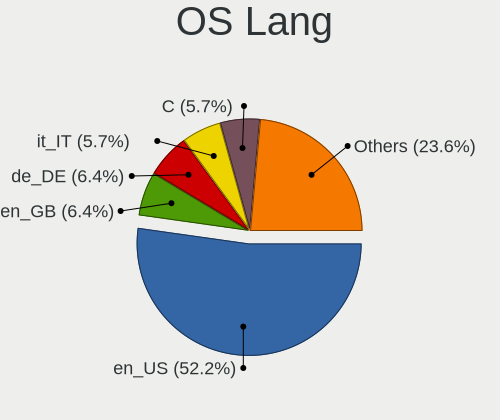
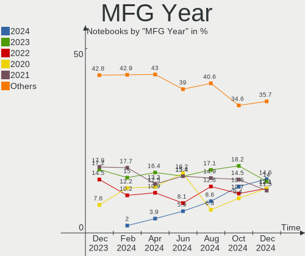
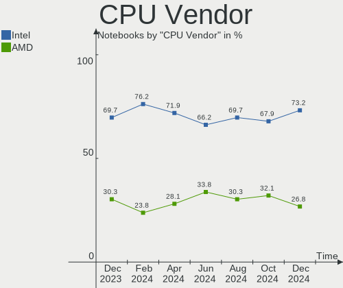

Arch Hardware Trends (Notebook)
-------------------------------

A project to identify most popular hardware characteristics and track their change
over time based on data collected by Arch users at https://Linux-Hardware.org.

Anyone can contribute to the study by uploading probes of their computers by
the [hw-probe](https://github.com/linuxhw/hw-probe) tool:

    sudo -E hw-probe -all -upload

Full-feature report is available here: https://linux-hardware.org/?view=trends&formfactor=notebook

Period: Jun, 2021.

Contents
--------

- [ OS                       ](#os)
- [ OS Family                ](#os-family)
- [ Kernel                   ](#kernel)
- [ Kernel Family            ](#kernel-family)
- [ Kernel Major Ver.        ](#kernel-major-ver)
- [ Arch                     ](#arch)
- [ DE                       ](#de)
- [ Display Server           ](#display-server)
- [ Display Manager          ](#display-manager)
- [ OS Lang                  ](#os-lang)
- [ Boot Mode                ](#boot-mode)
- [ Filesystem               ](#filesystem)
- [ Part. scheme             ](#part-scheme)
- [ Dual Boot with Linux/BSD ](#dual-boot-with-linux/bsd)
- [ Dual Boot (Win)          ](#dual-boot-win)
- [ Country                  ](#country)
- [ City                     ](#city)
- [ Vendor                   ](#vendor)
- [ Model                    ](#model)
- [ Model Family             ](#model-family)
- [ MFG Year                 ](#mfg-year)
- [ Form Factor              ](#form-factor)
- [ Secure Boot              ](#secure-boot)
- [ Coreboot                 ](#coreboot)
- [ RAM Size                 ](#ram-size)
- [ RAM Used                 ](#ram-used)
- [ Has CD-ROM               ](#has-cd-rom)
- [ Total Drives             ](#total-drives)
- [ Has Ethernet             ](#has-ethernet)
- [ Has WiFi                 ](#has-wifi)
- [ Has Bluetooth            ](#has-bluetooth)
- [ Drive Vendor             ](#drive-vendor)
- [ Drive Model              ](#drive-model)
- [ HDD Vendor               ](#hdd-vendor)
- [ SSD Vendor               ](#ssd-vendor)
- [ Drive Kind               ](#drive-kind)
- [ Drive Connector          ](#drive-connector)
- [ Drive Size               ](#drive-size)
- [ Space Total              ](#space-total)
- [ Space Used               ](#space-used)
- [ Malfunc. Drives          ](#malfunc-drives)
- [ Malfunc. Drive Vendor    ](#malfunc-drive-vendor)
- [ Malfunc. HDD Vendor      ](#malfunc-hdd-vendor)
- [ Malfunc. Drive Kind      ](#malfunc-drive-kind)
- [ Failed Drives            ](#failed-drives)
- [ Failed Drive Vendor      ](#failed-drive-vendor)
- [ Drive Status             ](#drive-status)
- [ Storage Vendor           ](#storage-vendor)
- [ Storage Model            ](#storage-model)
- [ Storage Kind             ](#storage-kind)
- [ CPU Vendor               ](#cpu-vendor)
- [ CPU Model                ](#cpu-model)
- [ CPU Model Family         ](#cpu-model-family)
- [ CPU Cores                ](#cpu-cores)
- [ CPU Sockets              ](#cpu-sockets)
- [ CPU Threads              ](#cpu-threads)
- [ CPU Op-Modes             ](#cpu-op-modes)
- [ CPU Microcode            ](#cpu-microcode)
- [ CPU Microarch            ](#cpu-microarch)
- [ GPU Vendor               ](#gpu-vendor)
- [ GPU Model                ](#gpu-model)
- [ GPU Combo                ](#gpu-combo)
- [ GPU Driver               ](#gpu-driver)
- [ GPU Memory               ](#gpu-memory)
- [ Monitor Vendor           ](#monitor-vendor)
- [ Monitor Model            ](#monitor-model)
- [ Monitor Resolution       ](#monitor-resolution)
- [ Monitor Diagonal         ](#monitor-diagonal)
- [ Monitor Width            ](#monitor-width)
- [ Aspect Ratio             ](#aspect-ratio)
- [ Monitor Area             ](#monitor-area)
- [ Pixel Density            ](#pixel-density)
- [ Multiple Monitors        ](#multiple-monitors)
- [ Net Controller Vendor    ](#net-controller-vendor)
- [ Net Controller Model     ](#net-controller-model)
- [ Wireless Vendor          ](#wireless-vendor)
- [ Wireless Model           ](#wireless-model)
- [ Ethernet Vendor          ](#ethernet-vendor)
- [ Ethernet Model           ](#ethernet-model)
- [ Net Controller Kind      ](#net-controller-kind)
- [ Used Controller          ](#used-controller)
- [ NICs                     ](#nics)
- [ IPv6                     ](#ipv6)
- [ Memory Vendor            ](#memory-vendor)
- [ Memory Model             ](#memory-model)
- [ Memory Kind              ](#memory-kind)
- [ Memory Form Factor       ](#memory-form-factor)
- [ Memory Size              ](#memory-size)
- [ Memory Speed             ](#memory-speed)
- [ Sound Vendor             ](#sound-vendor)
- [ Sound Model              ](#sound-model)
- [ Camera Vendor            ](#camera-vendor)
- [ Camera Model             ](#camera-model)
- [ Fingerprint Vendor       ](#fingerprint-vendor)
- [ Fingerprint Model        ](#fingerprint-model)
- [ Chipcard Vendor          ](#chipcard-vendor)
- [ Chipcard Model           ](#chipcard-model)
- [ Printer Vendor           ](#printer-vendor)
- [ Printer Model            ](#printer-model)
- [ Scanner Vendor           ](#scanner-vendor)
- [ Scanner Model            ](#scanner-model)
- [ Bluetooth Vendor         ](#bluetooth-vendor)
- [ Bluetooth Model          ](#bluetooth-model)
- [ Unsupported Devices      ](#unsupported-devices)
- [ Unsupported Device Types ](#unsupported-device-types)

OS
--

Installed operating systems

| Name         | Notebooks | Percent |
|--------------|-----------|---------|
| Arch         | 40        | 61.54%  |
| Arch Rolling | 25        | 38.46%  |

OS Family
---------

OS without a version

| Name | Notebooks | Percent |
|------|-----------|---------|
| Arch | 65        | 100%    |

Kernel
------

Version of the Linux kernel

| Version                      | Notebooks | Percent |
|------------------------------|-----------|---------|
| 5.12.9-arch1-1               | 15        | 23.08%  |
| 5.12.8-arch1-1               | 8         | 12.31%  |
| 5.12.13-arch1-2              | 6         | 9.23%   |
| 5.12.10-arch1-1              | 6         | 9.23%   |
| 5.12.11-arch1-1              | 4         | 6.15%   |
| 5.12.12-arch1-1              | 3         | 4.62%   |
| 5.12.10-zen1-1-zen           | 3         | 4.62%   |
| 5.12.8-zen1-1-zen            | 2         | 3.08%   |
| 5.10.41-1-lts                | 2         | 3.08%   |
| 5.10.39-1-lts                | 2         | 3.08%   |
| 5.4.72-1-lts                 | 1         | 1.54%   |
| 5.4.114-1-lts54              | 1         | 1.54%   |
| 5.12.9-zen1-1-zen            | 1         | 1.54%   |
| 5.12.9-1-ck-haswell          | 1         | 1.54%   |
| 5.12.8.ll46-1-lin-git+       | 1         | 1.54%   |
| 5.12.7-hardened1-1-hardened  | 1         | 1.54%   |
| 5.12.13-zen1-2-zen           | 1         | 1.54%   |
| 5.12.12-xanmod1-1            | 1         | 1.54%   |
| 5.12.11-zen1-1-zen           | 1         | 1.54%   |
| 5.10.46-1-lts                | 1         | 1.54%   |
| 5.10.45-1-lts                | 1         | 1.54%   |
| 5.10.43-1-lts                | 1         | 1.54%   |
| 5.10.42-1-lts                | 1         | 1.54%   |
| 5.10.33-1mbp-16.1-linux-wifi | 1         | 1.54%   |

Kernel Family
-------------

Linux kernel without a distro release

| Version | Notebooks | Percent |
|---------|-----------|---------|
| 5.12.9  | 17        | 26.15%  |
| 5.12.8  | 11        | 16.92%  |
| 5.12.10 | 9         | 13.85%  |
| 5.12.13 | 7         | 10.77%  |
| 5.12.11 | 5         | 7.69%   |
| 5.12.12 | 4         | 6.15%   |
| 5.10.41 | 2         | 3.08%   |
| 5.10.39 | 2         | 3.08%   |
| 5.4.72  | 1         | 1.54%   |
| 5.4.114 | 1         | 1.54%   |
| 5.12.7  | 1         | 1.54%   |
| 5.10.46 | 1         | 1.54%   |
| 5.10.45 | 1         | 1.54%   |
| 5.10.43 | 1         | 1.54%   |
| 5.10.42 | 1         | 1.54%   |
| 5.10.33 | 1         | 1.54%   |

Kernel Major Ver.
-----------------

Linux kernel major version

| Version | Notebooks | Percent |
|---------|-----------|---------|
| 5.12    | 54        | 83.08%  |
| 5.10    | 9         | 13.85%  |
| 5.4     | 2         | 3.08%   |

Arch
----

OS architecture (x86_64, i586, etc.)

| Name   | Notebooks | Percent |
|--------|-----------|---------|
| x86_64 | 65        | 100%    |

DE
--

Desktop Environment

| Name           | Notebooks | Percent |
|----------------|-----------|---------|
| GNOME          | 24        | 36.92%  |
| KDE5           | 11        | 16.92%  |
| Unknown        | 8         | 12.31%  |
| KDE            | 5         | 7.69%   |
| i3             | 5         | 7.69%   |
| XFCE           | 4         | 6.15%   |
| X-Cinnamon     | 2         | 3.08%   |
| MATE           | 2         | 3.08%   |
| i3-with-shmlog | 1         | 1.54%   |
| DWM            | 1         | 1.54%   |
| Budgie         | 1         | 1.54%   |
| awesome        | 1         | 1.54%   |

Display Server
--------------

X11 or Wayland

| Name    | Notebooks | Percent |
|---------|-----------|---------|
| X11     | 42        | 64.62%  |
| Wayland | 12        | 18.46%  |
| Unknown | 7         | 10.77%  |
| Tty     | 4         | 6.15%   |

Display Manager
---------------

SDDM, LightDM, etc.

| Name    | Notebooks | Percent |
|---------|-----------|---------|
| Unknown | 30        | 46.15%  |
| SDDM    | 15        | 23.08%  |
| TDM     | 10        | 15.38%  |
| GDM     | 8         | 12.31%  |
| LightDM | 2         | 3.08%   |

OS Lang
-------

Language

| Lang    | Notebooks | Percent |
|---------|-----------|---------|
| en_US   | 31        | 47.69%  |
| en_GB   | 6         | 9.23%   |
| C       | 6         | 9.23%   |
| Unknown | 3         | 4.62%   |
| zh_CN   | 2         | 3.08%   |
| ru_RU   | 2         | 3.08%   |
| pt_BR   | 2         | 3.08%   |
| pl_PL   | 2         | 3.08%   |
| it_IT   | 2         | 3.08%   |
| ja_JP   | 1         | 1.54%   |
| hu_HU   | 1         | 1.54%   |
| et_EE   | 1         | 1.54%   |
| es_MX   | 1         | 1.54%   |
| en_PH   | 1         | 1.54%   |
| en_IN   | 1         | 1.54%   |
| en_IE   | 1         | 1.54%   |
| en_DK   | 1         | 1.54%   |
| de_DE   | 1         | 1.54%   |

Boot Mode
---------

EFI or BIOS

| Mode | Notebooks | Percent |
|------|-----------|---------|
| EFI  | 40        | 61.54%  |
| BIOS | 25        | 38.46%  |

Filesystem
----------

Type of filesystem

| Type    | Notebooks | Percent |
|---------|-----------|---------|
| Ext4    | 53        | 81.54%  |
| Btrfs   | 10        | 15.38%  |
| Zfs     | 1         | 1.54%   |
| Unknown | 1         | 1.54%   |

Part. scheme
------------

Scheme of partitioning

| Type    | Notebooks | Percent |
|---------|-----------|---------|
| GPT     | 43        | 66.15%  |
| Unknown | 19        | 29.23%  |
| MBR     | 3         | 4.62%   |

Dual Boot with Linux/BSD
------------------------

Hosting more than one Linux/BSD

| Dual boot | Notebooks | Percent |
|-----------|-----------|---------|
| No        | 62        | 95.38%  |
| Yes       | 3         | 4.62%   |

Dual Boot (Win)
---------------

Hosting Linux and Windows

| Dual boot | Notebooks | Percent |
|-----------|-----------|---------|
| No        | 48        | 73.85%  |
| Yes       | 17        | 26.15%  |

Country
-------

Geographic location (country)

| Country     | Notebooks | Percent |
|-------------|-----------|---------|
| USA         | 7         | 10.77%  |
| Brazil      | 6         | 9.23%   |
| Russia      | 5         | 7.69%   |
| UK          | 3         | 4.62%   |
| Poland      | 3         | 4.62%   |
| India       | 3         | 4.62%   |
| Germany     | 3         | 4.62%   |
| Romania     | 2         | 3.08%   |
| Netherlands | 2         | 3.08%   |
| Japan       | 2         | 3.08%   |
| Italy       | 2         | 3.08%   |
| Finland     | 2         | 3.08%   |
| Belgium     | 2         | 3.08%   |
| Tunisia     | 1         | 1.54%   |
| Switzerland | 1         | 1.54%   |
| Slovakia    | 1         | 1.54%   |
| Réunion    | 1         | 1.54%   |
| Qatar       | 1         | 1.54%   |
| Portugal    | 1         | 1.54%   |
| Philippines | 1         | 1.54%   |
| Paraguay    | 1         | 1.54%   |
| Norway      | 1         | 1.54%   |
| New Zealand | 1         | 1.54%   |
| Nepal       | 1         | 1.54%   |
| Mexico      | 1         | 1.54%   |
| Lithuania   | 1         | 1.54%   |
| Iran        | 1         | 1.54%   |
| Hungary     | 1         | 1.54%   |
| Hong Kong   | 1         | 1.54%   |
| France      | 1         | 1.54%   |
| Denmark     | 1         | 1.54%   |
| China       | 1         | 1.54%   |
| Canada      | 1         | 1.54%   |
| Belarus     | 1         | 1.54%   |
| Australia   | 1         | 1.54%   |
| Argentina   | 1         | 1.54%   |

City
----

Geographic location (city)

| City                  | Notebooks | Percent |
|-----------------------|-----------|---------|
| Zalău                | 2         | 3.08%   |
| Warsaw                | 2         | 3.08%   |
| Helsinki              | 2         | 3.08%   |
| Chennai               | 2         | 3.08%   |
| Zurich                | 1         | 1.54%   |
| Vilnius               | 1         | 1.54%   |
| Tunis                 | 1         | 1.54%   |
| Toronto               | 1         | 1.54%   |
| Tajrīsh              | 1         | 1.54%   |
| São Paulo            | 1         | 1.54%   |
| Sutton                | 1         | 1.54%   |
| St Petersburg         | 1         | 1.54%   |
| Severodvinsk          | 1         | 1.54%   |
| Seattle               | 1         | 1.54%   |
| Scunthorpe            | 1         | 1.54%   |
| Santo Tirso           | 1         | 1.54%   |
| Santa Isabel          | 1         | 1.54%   |
| Sainte-Clotilde       | 1         | 1.54%   |
| Rosbach vor der Hoehe | 1         | 1.54%   |
| Potsdam               | 1         | 1.54%   |
| Porirua               | 1         | 1.54%   |
| Paris                 | 1         | 1.54%   |
| Overland Park         | 1         | 1.54%   |
| North Wales           | 1         | 1.54%   |
| Nijmegen              | 1         | 1.54%   |
| Moscow                | 1         | 1.54%   |
| Mogilev               | 1         | 1.54%   |
| Milton Keynes         | 1         | 1.54%   |
| Menen                 | 1         | 1.54%   |
| Ludhiana              | 1         | 1.54%   |
| Lodz                  | 1         | 1.54%   |
| Korolyov              | 1         | 1.54%   |
| Kollnburg             | 1         | 1.54%   |
| Koganei               | 1         | 1.54%   |
| Kobenhavn N           | 1         | 1.54%   |
| Kobe                  | 1         | 1.54%   |
| Kirov                 | 1         | 1.54%   |
| Kirkland              | 1         | 1.54%   |
| Kathmandu             | 1         | 1.54%   |
| Hong Kong             | 1         | 1.54%   |
| Harvest               | 1         | 1.54%   |
| Guadalajara           | 1         | 1.54%   |
| Embu                  | 1         | 1.54%   |
| Doha                  | 1         | 1.54%   |
| Codroipo              | 1         | 1.54%   |
| Charlotte             | 1         | 1.54%   |
| Caico                 | 1         | 1.54%   |
| Buenos Aires          | 1         | 1.54%   |
| Budapest              | 1         | 1.54%   |
| Brisbane              | 1         | 1.54%   |
| Brescello             | 1         | 1.54%   |
| Binghamton            | 1         | 1.54%   |
| Biguacu               | 1         | 1.54%   |
| Bergen                | 1         | 1.54%   |
| Belusa                | 1         | 1.54%   |
| Beijing               | 1         | 1.54%   |
| Asunción             | 1         | 1.54%   |
| Assen                 | 1         | 1.54%   |
| Antwerp               | 1         | 1.54%   |
| Angeles City          | 1         | 1.54%   |

Vendor
------

Motherboard manufacturer

| Name                 | Notebooks | Percent |
|----------------------|-----------|---------|
| Lenovo               | 22        | 33.85%  |
| Hewlett-Packard      | 9         | 13.85%  |
| Acer                 | 9         | 13.85%  |
| Dell                 | 7         | 10.77%  |
| ASUSTek Computer     | 7         | 10.77%  |
| Samsung Electronics  | 2         | 3.08%   |
| MSI                  | 2         | 3.08%   |
| Timi                 | 1         | 1.54%   |
| System76             | 1         | 1.54%   |
| Sony                 | 1         | 1.54%   |
| Schenker             | 1         | 1.54%   |
| Positivo             | 1         | 1.54%   |
| Intel Client Systems | 1         | 1.54%   |
| Apple                | 1         | 1.54%   |

Model
-----

Motherboard model

| Name                                     | Notebooks | Percent |
|------------------------------------------|-----------|---------|
| ASUS X751LJ                              | 2         | 3.08%   |
| Timi RedmiBook 13 R                      | 1         | 1.54%   |
| System76 Oryx Pro                        | 1         | 1.54%   |
| Sony SVS13112FXB                         | 1         | 1.54%   |
| Schenker XMG CORE (REN/E21)              | 1         | 1.54%   |
| Samsung RV411/RV511/E3511/S3511          | 1         | 1.54%   |
| Samsung 900X3G                           | 1         | 1.54%   |
| Positivo S14CT01                         | 1         | 1.54%   |
| MSI GL75 Leopard 10SER                   | 1         | 1.54%   |
| MSI GF65 Thin 10UE                       | 1         | 1.54%   |
| Lenovo Yoga 14sARH 2021 82LB             | 1         | 1.54%   |
| Lenovo Y520-15IKBN 80WK                  | 1         | 1.54%   |
| Lenovo ThinkPad X240 20AMS1RR0L          | 1         | 1.54%   |
| Lenovo ThinkPad X220 4291LR8             | 1         | 1.54%   |
| Lenovo ThinkPad X1 Extreme 20MF000BUS    | 1         | 1.54%   |
| Lenovo ThinkPad X1 Carbon 7th 20QD003CRT | 1         | 1.54%   |
| Lenovo ThinkPad T490 20N2CT01WW          | 1         | 1.54%   |
| Lenovo ThinkPad T480 20L5CTO1WW          | 1         | 1.54%   |
| Lenovo ThinkPad T460s 20F90043GE         | 1         | 1.54%   |
| Lenovo ThinkPad T440p 20AWA08500         | 1         | 1.54%   |
| Lenovo ThinkPad T420 4236PFG             | 1         | 1.54%   |
| Lenovo ThinkPad T15 Gen 1 20S6001XMH     | 1         | 1.54%   |
| Lenovo ThinkPad T14s Gen 1 20UH001ART    | 1         | 1.54%   |
| Lenovo ThinkPad T14 Gen 1 20S0CTO1WW     | 1         | 1.54%   |
| Lenovo ThinkPad P14s Gen 1 20Y2CTO1WW    | 1         | 1.54%   |
| Lenovo ThinkPad P14s Gen 1 20S40017RT    | 1         | 1.54%   |
| Lenovo Legion Y530-15ICH 81FV            | 1         | 1.54%   |
| Lenovo Legion 5 15IMH05 82AU             | 1         | 1.54%   |
| Lenovo IdeaPad Gaming 3 15IMH05 81Y4     | 1         | 1.54%   |
| Lenovo IdeaPad FLEX-14API 81SS           | 1         | 1.54%   |
| Lenovo IdeaPad 5 15ITL05 82FG            | 1         | 1.54%   |
| Lenovo IdeaPad 320S-14IKB 80X4           | 1         | 1.54%   |
| Intel Client Systems LAPBC710            | 1         | 1.54%   |
| HP ProBook 430 G7                        | 1         | 1.54%   |
| HP Pavilion Laptop 13-an0xxx             | 1         | 1.54%   |
| HP Pavilion Gaming Laptop 15-dk0xxx      | 1         | 1.54%   |
| HP Pavilion dv5                          | 1         | 1.54%   |
| HP Laptop 15-da0xxx                      | 1         | 1.54%   |
| HP Laptop 15-bw0xx                       | 1         | 1.54%   |
| HP Laptop 14-dk0xxx                      | 1         | 1.54%   |
| HP Laptop 14-cm0xxx                      | 1         | 1.54%   |
| HP 250 G6 Notebook PC                    | 1         | 1.54%   |
| Dell XPS 15 9550                         | 1         | 1.54%   |
| Dell XPS 13 9370                         | 1         | 1.54%   |
| Dell XPS 13 7390                         | 1         | 1.54%   |
| Dell Precision M4800                     | 1         | 1.54%   |
| Dell Latitude E5470                      | 1         | 1.54%   |
| Dell Inspiron 5583                       | 1         | 1.54%   |
| Dell Inspiron 3583                       | 1         | 1.54%   |
| ASUS VivoBook_ASUSLaptop X512DA_F512DA   | 1         | 1.54%   |
| ASUS TUF Gaming FX505DT_FX505DT          | 1         | 1.54%   |
| ASUS ROG Zephyrus GX550LXS_GX550LXS      | 1         | 1.54%   |
| ASUS N53SV                               | 1         | 1.54%   |
| ASUS N53SM                               | 1         | 1.54%   |
| Apple MacBookPro16,1                     | 1         | 1.54%   |
| Acer Swift SF314-52                      | 1         | 1.54%   |
| Acer Nitro AN515-43                      | 1         | 1.54%   |
| Acer Nitro AN515-42                      | 1         | 1.54%   |
| Acer Extensa 5635ZG                      | 1         | 1.54%   |
| Acer Aspire V3-372                       | 1         | 1.54%   |

Model Family
------------

Motherboard model prefix

| Name                          | Notebooks | Percent |
|-------------------------------|-----------|---------|
| Lenovo ThinkPad               | 14        | 21.54%  |
| Acer Aspire                   | 5         | 7.69%   |
| Lenovo IdeaPad                | 4         | 6.15%   |
| HP Laptop                     | 4         | 6.15%   |
| HP Pavilion                   | 3         | 4.62%   |
| Dell XPS                      | 3         | 4.62%   |
| Lenovo Legion                 | 2         | 3.08%   |
| Dell Inspiron                 | 2         | 3.08%   |
| ASUS X751LJ                   | 2         | 3.08%   |
| Acer Nitro                    | 2         | 3.08%   |
| Timi RedmiBook                | 1         | 1.54%   |
| System76 Oryx                 | 1         | 1.54%   |
| Sony SVS13112FXB              | 1         | 1.54%   |
| Schenker XMG                  | 1         | 1.54%   |
| Samsung RV411                 | 1         | 1.54%   |
| Samsung 900X3G                | 1         | 1.54%   |
| Positivo S14CT01              | 1         | 1.54%   |
| MSI GL75                      | 1         | 1.54%   |
| MSI GF65                      | 1         | 1.54%   |
| Lenovo Yoga                   | 1         | 1.54%   |
| Lenovo Y520-15IKBN            | 1         | 1.54%   |
| Intel Client Systems LAPBC710 | 1         | 1.54%   |
| HP ProBook                    | 1         | 1.54%   |
| HP 250                        | 1         | 1.54%   |
| Dell Precision                | 1         | 1.54%   |
| Dell Latitude                 | 1         | 1.54%   |
| ASUS VivoBook                 | 1         | 1.54%   |
| ASUS TUF                      | 1         | 1.54%   |
| ASUS ROG                      | 1         | 1.54%   |
| ASUS N53SV                    | 1         | 1.54%   |
| ASUS N53SM                    | 1         | 1.54%   |
| Apple MacBookPro16            | 1         | 1.54%   |
| Acer Swift                    | 1         | 1.54%   |
| Acer Extensa                  | 1         | 1.54%   |

MFG Year
--------

Motherboard manufacture year

| Year | Notebooks | Percent |
|------|-----------|---------|
| 2020 | 20        | 30.77%  |
| 2021 | 14        | 21.54%  |
| 2019 | 11        | 16.92%  |
| 2017 | 5         | 7.69%   |
| 2015 | 4         | 6.15%   |
| 2018 | 3         | 4.62%   |
| 2012 | 3         | 4.62%   |
| 2011 | 2         | 3.08%   |
| 2014 | 1         | 1.54%   |
| 2010 | 1         | 1.54%   |
| 2009 | 1         | 1.54%   |

Form Factor
-----------

Physical design of the computer

| Name     | Notebooks | Percent |
|----------|-----------|---------|
| Notebook | 65        | 100%    |

Secure Boot
-----------

Enabled or disabled

| State    | Notebooks | Percent |
|----------|-----------|---------|
| Disabled | 65        | 100%    |

Coreboot
--------

Have coreboot on board

| Used | Notebooks | Percent |
|------|-----------|---------|
| No   | 65        | 100%    |

RAM Size
--------

Total RAM memory

| Size in GB | Notebooks | Percent |
|------------|-----------|---------|
| 8.01-16.0  | 22        | 33.85%  |
| 4.01-8.0   | 14        | 21.54%  |
| 16.01-24.0 | 12        | 18.46%  |
| 32.01-64.0 | 9         | 13.85%  |
| 3.01-4.0   | 6         | 9.23%   |
| 24.01-32.0 | 1         | 1.54%   |
| 1.01-2.0   | 1         | 1.54%   |

RAM Used
--------

Used RAM memory

| Used GB    | Notebooks | Percent |
|------------|-----------|---------|
| 1.01-2.0   | 18        | 27.69%  |
| 3.01-4.0   | 13        | 20%     |
| 2.01-3.0   | 12        | 18.46%  |
| 4.01-8.0   | 11        | 16.92%  |
| 8.01-16.0  | 7         | 10.77%  |
| 16.01-24.0 | 2         | 3.08%   |
| 0.51-1.0   | 2         | 3.08%   |

Has CD-ROM
----------

Has CD-ROM on board

| Presented | Notebooks | Percent |
|-----------|-----------|---------|
| No        | 56        | 86.15%  |
| Yes       | 9         | 13.85%  |

Total Drives
------------

Number of drives on board

| Drives | Notebooks | Percent |
|--------|-----------|---------|
| 1      | 44        | 67.69%  |
| 2      | 18        | 27.69%  |
| 0      | 2         | 3.08%   |
| 3      | 1         | 1.54%   |

Has Ethernet
------------

Has Ethernet on board

| Presented | Notebooks | Percent |
|-----------|-----------|---------|
| Yes       | 52        | 80%     |
| No        | 13        | 20%     |

Has WiFi
--------

Has WiFi module

| Presented | Notebooks | Percent |
|-----------|-----------|---------|
| Yes       | 64        | 98.46%  |
| No        | 1         | 1.54%   |

Has Bluetooth
-------------

Has Bluetooth module

| Presented | Notebooks | Percent |
|-----------|-----------|---------|
| Yes       | 54        | 83.08%  |
| No        | 11        | 16.92%  |

Drive Vendor
------------

Hard drive vendors

| Vendor                | Notebooks | Drives | Percent |
|-----------------------|-----------|--------|---------|
| Samsung Electronics   | 20        | 22     | 24.1%   |
| WDC                   | 12        | 12     | 14.46%  |
| Toshiba               | 10        | 11     | 12.05%  |
| Seagate               | 6         | 6      | 7.23%   |
| SanDisk               | 5         | 5      | 6.02%   |
| Unknown               | 4         | 4      | 4.82%   |
| SPCC                  | 4         | 4      | 4.82%   |
| SK Hynix              | 4         | 4      | 4.82%   |
| A-DATA Technology     | 3         | 3      | 3.61%   |
| Micron Technology     | 2         | 2      | 2.41%   |
| Intel                 | 2         | 2      | 2.41%   |
| ROG                   | 1         | 1      | 1.2%    |
| Realtek Semiconductor | 1         | 1      | 1.2%    |
| Netac                 | 1         | 1      | 1.2%    |
| LITEON                | 1         | 1      | 1.2%    |
| Lenovo                | 1         | 1      | 1.2%    |
| Kingston              | 1         | 1      | 1.2%    |
| GOODRAM               | 1         | 1      | 1.2%    |
| Crucial               | 1         | 2      | 1.2%    |
| BHT                   | 1         | 1      | 1.2%    |
| Apple                 | 1         | 1      | 1.2%    |
| ADATA Technology      | 1         | 1      | 1.2%    |

Drive Model
-----------

Hard drive models

| Model                                     | Notebooks | Percent |
|-------------------------------------------|-----------|---------|
| Toshiba MQ04ABF100 1TB                    | 3         | 3.49%   |
| SPCC Solid State Disk 512GB               | 3         | 3.49%   |
| Samsung SSD 860 EVO 1TB                   | 3         | 3.49%   |
| Unknown MMC Card  32GB                    | 2         | 2.33%   |
| Sandisk NVMe SSD Drive 512GB              | 2         | 2.33%   |
| Samsung SSD 970 EVO Plus 1TB              | 2         | 2.33%   |
| Samsung NVMe SSD Drive 256GB              | 2         | 2.33%   |
| WDC WDS240G2G0A-00JH30 240GB SSD          | 1         | 1.16%   |
| WDC WDS100T3X0C-00SJG0 1TB                | 1         | 1.16%   |
| WDC WDS100T2B0C-00PXH0 1TB                | 1         | 1.16%   |
| WDC WD5000LPVX-22V0TT0 500GB              | 1         | 1.16%   |
| WDC WD1600BEVS-75RST0 160GB               | 1         | 1.16%   |
| WDC WD10SPZX-21Z10T0 1TB                  | 1         | 1.16%   |
| WDC WD10JPVX-60JC3T1 1TB                  | 1         | 1.16%   |
| WDC WD10JPVX-22JC3T0 1TB                  | 1         | 1.16%   |
| WDC WD10JPLX-00MBPT0 1TB                  | 1         | 1.16%   |
| WDC PC SN730 SDBPNTY-512G-1101 512GB      | 1         | 1.16%   |
| WDC PC SN720 SDAQNTW-256G-1001 256GB      | 1         | 1.16%   |
| WDC PC SN520 SDAPNUW-256G-1006 256GB      | 1         | 1.16%   |
| Unknown SD/MMC/MS PRO 128GB               | 1         | 1.16%   |
| Unknown HX256GSSDSATA3 256GB              | 1         | 1.16%   |
| Toshiba THNSN5256GPUK NVMe 256GB          | 1         | 1.16%   |
| Toshiba THNSFJ256GDNU A 256GB SSD         | 1         | 1.16%   |
| Toshiba NVMe SSD Drive 512GB              | 1         | 1.16%   |
| Toshiba NVMe SSD Drive 256GB              | 1         | 1.16%   |
| Toshiba NVMe SSD Drive 1TB                | 1         | 1.16%   |
| Toshiba MQ01ABF050 500GB                  | 1         | 1.16%   |
| Toshiba KXG6AZNV1T02 1TB                  | 1         | 1.16%   |
| Toshiba KBG40ZNT512G MEMORY 512GB         | 1         | 1.16%   |
| SPCC Solid State Disk 1TB                 | 1         | 1.16%   |
| SK Hynix SKHynix_HFS256GD9TNI-L2B0B 256GB | 1         | 1.16%   |
| SK Hynix NVMe SSD Drive 256GB             | 1         | 1.16%   |
| SK Hynix HFS128G39TND-N210A 128GB SSD     | 1         | 1.16%   |
| SK Hynix BC501 NVMe 128GB                 | 1         | 1.16%   |
| Seagate ST9500420AS 500GB                 | 1         | 1.16%   |
| Seagate ST750LM022 HN-M750MBB 752GB       | 1         | 1.16%   |
| Seagate ST640LM001 HN-M640MBB 640GB       | 1         | 1.16%   |
| Seagate ST1000LM049-2GH172 1TB            | 1         | 1.16%   |
| Seagate ST1000LM035-1RK172 1TB            | 1         | 1.16%   |
| Seagate ST1000LM014-SSHD-8GB              | 1         | 1.16%   |
| SanDisk SDSSDA240G 240GB                  | 1         | 1.16%   |
| Sandisk NVMe SSD Drive 500GB              | 1         | 1.16%   |
| Sandisk NVMe SSD Drive 128GB              | 1         | 1.16%   |
| Samsung SSD 970 EVO Plus 500GB            | 1         | 1.16%   |
| Samsung SSD 970 EVO Plus 250GB            | 1         | 1.16%   |
| Samsung SSD 860 PRO 256GB                 | 1         | 1.16%   |
| Samsung SSD 860 EVO mSATA 500GB           | 1         | 1.16%   |
| Samsung SSD 860 EVO 500GB                 | 1         | 1.16%   |
| Samsung SSD 850 PRO 256GB                 | 1         | 1.16%   |
| Samsung SSD 850 EVO 500GB                 | 1         | 1.16%   |
| Samsung NVMe SSD Drive 512GB              | 1         | 1.16%   |
| Samsung NVMe SSD Drive 1TB                | 1         | 1.16%   |
| Samsung MZVLW128HEGR-000L2 128GB          | 1         | 1.16%   |
| Samsung MZVLB512HBJQ-000L7 512GB          | 1         | 1.16%   |
| Samsung MZVLB1T0HBLR-00000 1TB            | 1         | 1.16%   |
| Samsung MZNLN128HAHQ-000H1 128GB SSD      | 1         | 1.16%   |
| Samsung MZMTE128HMGR-000 128GB SSD        | 1         | 1.16%   |
| ROG ESD-S1C 500GB                         | 1         | 1.16%   |
| Realtek NVMe SSD Drive 512GB              | 1         | 1.16%   |
| Netac NVMe SSD 512GB                      | 1         | 1.16%   |

HDD Vendor
----------

Hard disk drive vendors

| Vendor  | Notebooks | Drives | Percent |
|---------|-----------|--------|---------|
| WDC     | 6         | 6      | 37.5%   |
| Seagate | 6         | 6      | 37.5%   |
| Toshiba | 4         | 4      | 25%     |

SSD Vendor
----------

Solid state drive vendors

| Vendor              | Notebooks | Drives | Percent |
|---------------------|-----------|--------|---------|
| Samsung Electronics | 10        | 10     | 40%     |
| SPCC                | 4         | 4      | 16%     |
| A-DATA Technology   | 2         | 2      | 8%      |
| WDC                 | 1         | 1      | 4%      |
| Unknown             | 1         | 1      | 4%      |
| Toshiba             | 1         | 1      | 4%      |
| SK Hynix            | 1         | 1      | 4%      |
| SanDisk             | 1         | 1      | 4%      |
| LITEON              | 1         | 1      | 4%      |
| GOODRAM             | 1         | 1      | 4%      |
| Crucial             | 1         | 1      | 4%      |
| BHT                 | 1         | 1      | 4%      |

Drive Kind
----------

HDD or SSD

| Kind    | Notebooks | Drives | Percent |
|---------|-----------|--------|---------|
| NVMe    | 32        | 42     | 42.11%  |
| SSD     | 24        | 25     | 31.58%  |
| HDD     | 16        | 16     | 21.05%  |
| MMC     | 2         | 2      | 2.63%   |
| Unknown | 2         | 2      | 2.63%   |

Drive Connector
---------------

SATA, SAS, NVMe, etc.

| Type | Notebooks | Drives | Percent |
|------|-----------|--------|---------|
| SATA | 36        | 41     | 50%     |
| NVMe | 32        | 42     | 44.44%  |
| SAS  | 2         | 2      | 2.78%   |
| MMC  | 2         | 2      | 2.78%   |

Drive Size
----------

Size of hard drive

| Size in TB | Notebooks | Drives | Percent |
|------------|-----------|--------|---------|
| 0.01-0.5   | 20        | 22     | 51.28%  |
| 0.51-1.0   | 19        | 19     | 48.72%  |

Space Total
-----------

Amount of disk space available on the file system

| Size in GB     | Notebooks | Percent |
|----------------|-----------|---------|
| 101-250        | 21        | 32.31%  |
| 501-1000       | 17        | 26.15%  |
| 251-500        | 12        | 18.46%  |
| 1001-2000      | 6         | 9.23%   |
| 51-100         | 4         | 6.15%   |
| More than 3000 | 2         | 3.08%   |
| 21-50          | 1         | 1.54%   |
| 2001-3000      | 1         | 1.54%   |
| Unknown        | 1         | 1.54%   |

Space Used
----------

Amount of used disk space

| Used GB   | Notebooks | Percent |
|-----------|-----------|---------|
| 1-20      | 14        | 21.54%  |
| 251-500   | 12        | 18.46%  |
| 51-100    | 12        | 18.46%  |
| 101-250   | 11        | 16.92%  |
| 21-50     | 8         | 12.31%  |
| 501-1000  | 6         | 9.23%   |
| 1001-2000 | 1         | 1.54%   |
| Unknown   | 1         | 1.54%   |

Malfunc. Drives
---------------

Drive models with a malfunction

| Model                                 | Notebooks | Drives | Percent |
|---------------------------------------|-----------|--------|---------|
| SK Hynix HFS128G39TND-N210A 128GB SSD | 1         | 1      | 100%    |

Malfunc. Drive Vendor
---------------------

Vendors of faulty drives

| Vendor   | Notebooks | Drives | Percent |
|----------|-----------|--------|---------|
| SK Hynix | 1         | 1      | 100%    |

Malfunc. HDD Vendor
-------------------

Vendors of faulty HDD drives

Zero info for selected period =(

Malfunc. Drive Kind
-------------------

Kinds of faulty drives

| Kind | Notebooks | Drives | Percent |
|------|-----------|--------|---------|
| SSD  | 1         | 1      | 100%    |

Failed Drives
-------------

Failed drive models

| Model                                        | Notebooks | Drives | Percent |
|----------------------------------------------|-----------|--------|---------|
| Samsung Electronics MZVLW128HEGR-000L2 128GB | 1         | 1      | 100%    |

Failed Drive Vendor
-------------------

Failed drive vendors

| Vendor              | Notebooks | Drives | Percent |
|---------------------|-----------|--------|---------|
| Samsung Electronics | 1         | 1      | 100%    |

Drive Status
------------

Number of failed and malfunc. drives

| Status   | Notebooks | Drives | Percent |
|----------|-----------|--------|---------|
| Works    | 36        | 48     | 51.43%  |
| Detected | 32        | 37     | 45.71%  |
| Malfunc  | 1         | 1      | 1.43%   |
| Failed   | 1         | 1      | 1.43%   |

Storage Vendor
--------------

Storage controller vendors

| Vendor                       | Notebooks | Percent |
|------------------------------|-----------|---------|
| Intel                        | 39        | 47.56%  |
| Samsung Electronics          | 11        | 13.41%  |
| Sandisk                      | 8         | 9.76%   |
| AMD                          | 8         | 9.76%   |
| Toshiba America Info Systems | 4         | 4.88%   |
| SK Hynix                     | 3         | 3.66%   |
| Micron Technology            | 2         | 2.44%   |
| Silicon Motion               | 1         | 1.22%   |
| Realtek Semiconductor        | 1         | 1.22%   |
| Lenovo                       | 1         | 1.22%   |
| KIOXIA                       | 1         | 1.22%   |
| Kingston Technology Company  | 1         | 1.22%   |
| Apple                        | 1         | 1.22%   |
| ADATA Technology             | 1         | 1.22%   |

Storage Model
-------------

Storage controller models

| Model                                                                            | Notebooks | Percent |
|----------------------------------------------------------------------------------|-----------|---------|
| Samsung NVMe SSD Controller SM981/PM981/PM983                                    | 9         | 10.84%  |
| AMD FCH SATA Controller [AHCI mode]                                              | 8         | 9.64%   |
| Intel Sunrise Point-LP SATA Controller [AHCI mode]                               | 5         | 6.02%   |
| Intel 82801 Mobile SATA Controller [RAID mode]                                   | 4         | 4.82%   |
| Intel 6 Series/C200 Series Chipset Family 6 port Mobile SATA AHCI Controller     | 4         | 4.82%   |
| Intel Cannon Point-LP SATA Controller [AHCI Mode]                                | 3         | 3.61%   |
| Intel 8 Series SATA Controller 1 [AHCI mode]                                     | 3         | 3.61%   |
| Intel 400 Series Chipset Family SATA AHCI Controller                             | 3         | 3.61%   |
| SK Hynix BC501 NVMe Solid State Drive                                            | 2         | 2.41%   |
| Sandisk WD Blue SN500 / PC SN520 NVMe SSD                                        | 2         | 2.41%   |
| Sandisk WD Black SN750 / PC SN730 NVMe SSD                                       | 2         | 2.41%   |
| Micron Non-Volatile memory controller                                            | 2         | 2.41%   |
| Intel Wildcat Point-LP SATA Controller [AHCI Mode]                               | 2         | 2.41%   |
| Intel HM170/QM170 Chipset SATA Controller [AHCI Mode]                            | 2         | 2.41%   |
| Intel Cannon Lake Mobile PCH SATA AHCI Controller                                | 2         | 2.41%   |
| Intel 8 Series/C220 Series Chipset Family 6-port SATA Controller 1 [AHCI mode]   | 2         | 2.41%   |
| Intel 5 Series/3400 Series Chipset 4 port SATA AHCI Controller                   | 2         | 2.41%   |
| Toshiba America Info Systems XG6 NVMe SSD Controller                             | 1         | 1.2%    |
| Toshiba America Info Systems XG4 NVMe SSD Controller                             | 1         | 1.2%    |
| Toshiba America Info Systems Toshiba America Info Non-Volatile memory controller | 1         | 1.2%    |
| Toshiba America Info Systems BG3 NVMe SSD Controller                             | 1         | 1.2%    |
| SK Hynix Non-Volatile memory controller                                          | 1         | 1.2%    |
| Silicon Motion SM2263EN/SM2263XT SSD Controller                                  | 1         | 1.2%    |
| Sandisk WD Blue SN550 NVMe SSD                                                   | 1         | 1.2%    |
| Sandisk WD Black SN850                                                           | 1         | 1.2%    |
| Sandisk WD Black 2018/SN750 / PC SN720 NVMe SSD                                  | 1         | 1.2%    |
| Sandisk Non-Volatile memory controller                                           | 1         | 1.2%    |
| Samsung NVMe SSD Controller SM961/PM961/SM963                                    | 1         | 1.2%    |
| Samsung NVMe Controller                                                          | 1         | 1.2%    |
| Realtek RTS5763DL NVMe SSD Controller                                            | 1         | 1.2%    |
| Lenovo Non-Volatile memory controller                                            | 1         | 1.2%    |
| KIOXIA Non-Volatile memory controller                                            | 1         | 1.2%    |
| Kingston Company KC2000 NVMe SSD                                                 | 1         | 1.2%    |
| Intel Volume Management Device NVMe RAID Controller                              | 1         | 1.2%    |
| Intel Tiger Lake-LP SATA Controller [AHCI mode]                                  | 1         | 1.2%    |
| Intel SSD 660P Series                                                            | 1         | 1.2%    |
| Intel SSD 600P Series                                                            | 1         | 1.2%    |
| Intel Q170/Q150/B150/H170/H110/Z170/CM236 Chipset SATA Controller [AHCI Mode]    | 1         | 1.2%    |
| Intel Comet Lake SATA AHCI Controller                                            | 1         | 1.2%    |
| Intel 82801IBM/IEM (ICH9M/ICH9M-E) 4 port SATA Controller [AHCI mode]            | 1         | 1.2%    |
| Intel 7 Series Chipset Family 6-port SATA Controller [AHCI mode]                 | 1         | 1.2%    |
| Apple ANS2 NVMe Controller                                                       | 1         | 1.2%    |
| ADATA Non-Volatile memory controller                                             | 1         | 1.2%    |

Storage Kind
------------

Kind of storage controller (IDE, SATA, NVMe, SAS, ...)

| Kind | Notebooks | Percent |
|------|-----------|---------|
| SATA | 41        | 52.56%  |
| NVMe | 32        | 41.03%  |
| RAID | 5         | 6.41%   |

CPU Vendor
----------

Processor vendors

| Vendor | Notebooks | Percent |
|--------|-----------|---------|
| Intel  | 51        | 78.46%  |
| AMD    | 14        | 21.54%  |

CPU Model
---------

Processor models

| Model                                         | Notebooks | Percent |
|-----------------------------------------------|-----------|---------|
| Intel Core i7-8565U CPU @ 1.80GHz             | 4         | 6.15%   |
| Intel Core i7-10750H CPU @ 2.60GHz            | 3         | 4.62%   |
| Intel Core i7-10510U CPU @ 1.80GHz            | 3         | 4.62%   |
| Intel Core i7-8750H CPU @ 2.20GHz             | 2         | 3.08%   |
| Intel Core i5-8250U CPU @ 1.60GHz             | 2         | 3.08%   |
| Intel Core i5-5200U CPU @ 2.20GHz             | 2         | 3.08%   |
| Intel Core i5-10210U CPU @ 1.60GHz            | 2         | 3.08%   |
| AMD Ryzen 7 PRO 4750U with Radeon Graphics    | 2         | 3.08%   |
| AMD Ryzen 7 4800H with Radeon Graphics        | 2         | 3.08%   |
| AMD Ryzen 5 3500U with Radeon Vega Mobile Gfx | 2         | 3.08%   |
| Intel Pentium Dual-Core CPU T4300 @ 2.10GHz   | 1         | 1.54%   |
| Intel Core i7-9750H CPU @ 2.60GHz             | 1         | 1.54%   |
| Intel Core i7-8650U CPU @ 1.90GHz             | 1         | 1.54%   |
| Intel Core i7-8550U CPU @ 1.80GHz             | 1         | 1.54%   |
| Intel Core i7-7700HQ CPU @ 2.80GHz            | 1         | 1.54%   |
| Intel Core i7-6700HQ CPU @ 2.60GHz            | 1         | 1.54%   |
| Intel Core i7-6600U CPU @ 2.60GHz             | 1         | 1.54%   |
| Intel Core i7-6500U CPU @ 2.50GHz             | 1         | 1.54%   |
| Intel Core i7-4800MQ CPU @ 2.70GHz            | 1         | 1.54%   |
| Intel Core i7-2670QM CPU @ 2.20GHz            | 1         | 1.54%   |
| Intel Core i7-2640M CPU @ 2.80GHz             | 1         | 1.54%   |
| Intel Core i7-2630QM CPU @ 2.00GHz            | 1         | 1.54%   |
| Intel Core i7-10875H CPU @ 2.30GHz            | 1         | 1.54%   |
| Intel Core i5-9300H CPU @ 2.40GHz             | 1         | 1.54%   |
| Intel Core i5-8300H CPU @ 2.30GHz             | 1         | 1.54%   |
| Intel Core i5-8265U CPU @ 1.60GHz             | 1         | 1.54%   |
| Intel Core i5-7300HQ CPU @ 2.50GHz            | 1         | 1.54%   |
| Intel Core i5-7200U CPU @ 2.50GHz             | 1         | 1.54%   |
| Intel Core i5-6440HQ CPU @ 2.60GHz            | 1         | 1.54%   |
| Intel Core i5-6200U CPU @ 2.30GHz             | 1         | 1.54%   |
| Intel Core i5-4300U CPU @ 1.90GHz             | 1         | 1.54%   |
| Intel Core i5-4300M CPU @ 2.60GHz             | 1         | 1.54%   |
| Intel Core i5-4200U CPU @ 1.60GHz             | 1         | 1.54%   |
| Intel Core i5-3210M CPU @ 2.50GHz             | 1         | 1.54%   |
| Intel Core i5-2520M CPU @ 2.50GHz             | 1         | 1.54%   |
| Intel Core i5-10300H CPU @ 2.50GHz            | 1         | 1.54%   |
| Intel Core i3-6006U CPU @ 2.00GHz             | 1         | 1.54%   |
| Intel Core i3-4005U CPU @ 1.70GHz             | 1         | 1.54%   |
| Intel Core i3 CPU M 380 @ 2.53GHz             | 1         | 1.54%   |
| Intel Core i3 CPU M 350 @ 2.27GHz             | 1         | 1.54%   |
| Intel Atom x5-Z8300 CPU @ 1.44GHz             | 1         | 1.54%   |
| Intel 11th Gen Core i7-1165G7 @ 2.80GHz       | 1         | 1.54%   |
| Intel 11th Gen Core i5-1135G7 @ 2.40GHz       | 1         | 1.54%   |
| AMD Ryzen 7 4700U with Radeon Graphics        | 1         | 1.54%   |
| AMD Ryzen 7 3750H with Radeon Vega Mobile Gfx | 1         | 1.54%   |
| AMD Ryzen 7 2700U with Radeon Vega Mobile Gfx | 1         | 1.54%   |
| AMD Ryzen 5 3550H with Radeon Vega Mobile Gfx | 1         | 1.54%   |
| AMD Ryzen 3 3200U with Radeon Vega Mobile Gfx | 1         | 1.54%   |
| AMD A9-9420 RADEON R5, 5 COMPUTE CORES 2C+3G  | 1         | 1.54%   |
| AMD A4-9125 RADEON R3, 4 COMPUTE CORES 2C+2G  | 1         | 1.54%   |
| AMD 3020e with Radeon Graphics                | 1         | 1.54%   |

CPU Model Family
----------------

Processor model prefix

| Model                   | Notebooks | Percent |
|-------------------------|-----------|---------|
| Intel Core i7           | 24        | 36.92%  |
| Intel Core i5           | 19        | 29.23%  |
| AMD Ryzen 7             | 5         | 7.69%   |
| Other                   | 4         | 6.15%   |
| Intel Core i3           | 4         | 6.15%   |
| AMD Ryzen 5             | 3         | 4.62%   |
| AMD Ryzen 7 PRO         | 2         | 3.08%   |
| Intel Pentium Dual-Core | 1         | 1.54%   |
| Intel Atom              | 1         | 1.54%   |
| AMD Ryzen 3             | 1         | 1.54%   |
| AMD A4                  | 1         | 1.54%   |

CPU Cores
---------

Number of processor cores

| Number | Notebooks | Percent |
|--------|-----------|---------|
| 4      | 32        | 49.23%  |
| 2      | 21        | 32.31%  |
| 8      | 6         | 9.23%   |
| 6      | 6         | 9.23%   |

CPU Sockets
-----------

Number of sockets

| Number | Notebooks | Percent |
|--------|-----------|---------|
| 1      | 65        | 100%    |

CPU Threads
-----------

Threads per core (Hyper-Threading)

| Number | Notebooks | Percent |
|--------|-----------|---------|
| 2      | 57        | 87.69%  |
| 1      | 8         | 12.31%  |

CPU Op-Modes
------------

CPU Operation Modes (32-bit, 64-bit)

| Op mode        | Notebooks | Percent |
|----------------|-----------|---------|
| 32-bit, 64-bit | 65        | 100%    |

CPU Microcode
-------------

Microcode number

| Number     | Notebooks | Percent |
|------------|-----------|---------|
| Unknown    | 29        | 44.62%  |
| 0x806ec    | 7         | 10.77%  |
| 0x806ea    | 3         | 4.62%   |
| 0x08600106 | 3         | 4.62%   |
| 0xa0652    | 2         | 3.08%   |
| 0x906ea    | 2         | 3.08%   |
| 0x906e9    | 2         | 3.08%   |
| 0x806c1    | 2         | 3.08%   |
| 0x306d4    | 2         | 3.08%   |
| 0x20655    | 2         | 3.08%   |
| 0x806eb    | 1         | 1.54%   |
| 0x506e3    | 1         | 1.54%   |
| 0x406e3    | 1         | 1.54%   |
| 0x40651    | 1         | 1.54%   |
| 0x306c3    | 1         | 1.54%   |
| 0x206a7    | 1         | 1.54%   |
| 0x08200103 | 1         | 1.54%   |
| 0x08108109 | 1         | 1.54%   |
| 0x08108102 | 1         | 1.54%   |
| 0x0810100b | 1         | 1.54%   |
| 0x06006705 | 1         | 1.54%   |

CPU Microarch
-------------

Microarchitecture

| Name        | Notebooks | Percent |
|-------------|-----------|---------|
| KabyLake    | 22        | 33.85%  |
| Skylake     | 6         | 9.23%   |
| Zen+        | 5         | 7.69%   |
| Zen 2       | 5         | 7.69%   |
| Haswell     | 5         | 7.69%   |
| CometLake   | 5         | 7.69%   |
| SandyBridge | 4         | 6.15%   |
| Zen         | 2         | 3.08%   |
| Westmere    | 2         | 3.08%   |
| TigerLake   | 2         | 3.08%   |
| Excavator   | 2         | 3.08%   |
| Broadwell   | 2         | 3.08%   |
| Silvermont  | 1         | 1.54%   |
| Penryn      | 1         | 1.54%   |
| IvyBridge   | 1         | 1.54%   |

GPU Vendor
----------

Vendors of graphics cards

| Vendor | Notebooks | Percent |
|--------|-----------|---------|
| Intel  | 47        | 50.54%  |
| Nvidia | 29        | 31.18%  |
| AMD    | 17        | 18.28%  |

GPU Model
---------

Graphics card models

| Model                                                                                    | Notebooks | Percent |
|------------------------------------------------------------------------------------------|-----------|---------|
| AMD Picasso                                                                              | 6         | 6.38%   |
| Intel WhiskeyLake-U GT2 [UHD Graphics 620]                                               | 5         | 5.32%   |
| Intel CometLake-U GT2 [UHD Graphics]                                                     | 5         | 5.32%   |
| AMD Renoir                                                                               | 5         | 5.32%   |
| Intel UHD Graphics 620                                                                   | 4         | 4.26%   |
| Intel Skylake GT2 [HD Graphics 520]                                                      | 4         | 4.26%   |
| Intel CometLake-H GT2 [UHD Graphics]                                                     | 4         | 4.26%   |
| Intel CoffeeLake-H GT2 [UHD Graphics 630]                                                | 4         | 4.26%   |
| Intel 2nd Generation Core Processor Family Integrated Graphics Controller                | 4         | 4.26%   |
| Nvidia GP107M [GeForce GTX 1050 Mobile]                                                  | 3         | 3.19%   |
| Intel Haswell-ULT Integrated Graphics Controller                                         | 3         | 3.19%   |
| Nvidia TU117M [GeForce GTX 1650 Mobile / Max-Q]                                          | 2         | 2.13%   |
| Nvidia GK208BM [GeForce 920M]                                                            | 2         | 2.13%   |
| Nvidia GA106M [GeForce RTX 3060 Mobile / Max-Q]                                          | 2         | 2.13%   |
| Intel TigerLake-LP GT2 [Iris Xe Graphics]                                                | 2         | 2.13%   |
| Intel HD Graphics 630                                                                    | 2         | 2.13%   |
| Intel HD Graphics 5500                                                                   | 2         | 2.13%   |
| Intel HD Graphics 530                                                                    | 2         | 2.13%   |
| Intel 4th Gen Core Processor Integrated Graphics Controller                              | 2         | 2.13%   |
| AMD Stoney [Radeon R2/R3/R4/R5 Graphics]                                                 | 2         | 2.13%   |
| Nvidia TU117M [GeForce GTX 1650 Ti Mobile]                                               | 1         | 1.06%   |
| Nvidia TU117M                                                                            | 1         | 1.06%   |
| Nvidia TU106M [GeForce RTX 2070 Mobile]                                                  | 1         | 1.06%   |
| Nvidia TU106M [GeForce RTX 2060 Mobile]                                                  | 1         | 1.06%   |
| Nvidia TU104BM [GeForce RTX 2080 SUPER Mobile / Max-Q]                                   | 1         | 1.06%   |
| Nvidia GT218M [GeForce 315M]                                                             | 1         | 1.06%   |
| Nvidia GP108M [GeForce MX250]                                                            | 1         | 1.06%   |
| Nvidia GP108M [GeForce MX150]                                                            | 1         | 1.06%   |
| Nvidia GP108GLM [Quadro P520]                                                            | 1         | 1.06%   |
| Nvidia GP107M [GeForce GTX 1050 Ti Mobile]                                               | 1         | 1.06%   |
| Nvidia GP107M [GeForce GTX 1050 3 GB Max-Q]                                              | 1         | 1.06%   |
| Nvidia GM108M [GeForce MX130]                                                            | 1         | 1.06%   |
| Nvidia GM108M [GeForce MX110]                                                            | 1         | 1.06%   |
| Nvidia GM108M [GeForce 940M]                                                             | 1         | 1.06%   |
| Nvidia GM108M [GeForce 920MX]                                                            | 1         | 1.06%   |
| Nvidia GM107M [GeForce GTX 960M]                                                         | 1         | 1.06%   |
| Nvidia GF119M [Quadro NVS 4200M]                                                         | 1         | 1.06%   |
| Nvidia GF108M [GeForce GT 620M/630M/635M/640M LE]                                        | 1         | 1.06%   |
| Nvidia GF108M [GeForce GT 550M]                                                          | 1         | 1.06%   |
| Nvidia G98M [GeForce G 105M]                                                             | 1         | 1.06%   |
| Intel HD Graphics 620                                                                    | 1         | 1.06%   |
| Intel Core Processor Integrated Graphics Controller                                      | 1         | 1.06%   |
| Intel Atom/Celeron/Pentium Processor x5-E8000/J3xxx/N3xxx Integrated Graphics Controller | 1         | 1.06%   |
| Intel 3rd Gen Core processor Graphics Controller                                         | 1         | 1.06%   |
| AMD Raven Ridge [Radeon Vega Series / Radeon Vega Mobile Series]                         | 1         | 1.06%   |
| AMD Navi 14 [Radeon RX 5500/5500M / Pro 5500M]                                           | 1         | 1.06%   |
| AMD Jet PRO [Radeon R5 M230 / R7 M260DX / Radeon 520 Mobile]                             | 1         | 1.06%   |
| AMD Baffin [Radeon RX 460/560D / Pro 450/455/460/555/555X/560/560X]                      | 1         | 1.06%   |
| AMD Baffin [Radeon Pro WX 4130/4150]                                                     | 1         | 1.06%   |

GPU Combo
---------

Combinations of graphics cards

| Name           | Notebooks | Percent |
|----------------|-----------|---------|
| Intel + Nvidia | 23        | 35.38%  |
| 1 x Intel      | 22        | 33.85%  |
| 1 x AMD        | 11        | 16.92%  |
| 1 x Nvidia     | 3         | 4.62%   |
| AMD + Nvidia   | 3         | 4.62%   |
| Intel + AMD    | 2         | 3.08%   |
| 2 x AMD        | 1         | 1.54%   |

GPU Driver
----------

Free vs proprietary

| Driver      | Notebooks | Percent |
|-------------|-----------|---------|
| Free        | 47        | 72.31%  |
| Proprietary | 18        | 27.69%  |

GPU Memory
----------

Total video memory

| Size in GB | Notebooks | Percent |
|------------|-----------|---------|
| Unknown    | 53        | 81.54%  |
| 3.01-4.0   | 4         | 6.15%   |
| 1.01-2.0   | 4         | 6.15%   |
| 0.01-0.5   | 3         | 4.62%   |
| 5.01-6.0   | 1         | 1.54%   |

Monitor Vendor
--------------

Monitor vendors

| Vendor              | Notebooks | Percent |
|---------------------|-----------|---------|
| AU Optronics        | 22        | 24.18%  |
| BOE                 | 15        | 16.48%  |
| LG Display          | 10        | 10.99%  |
| Chimei Innolux      | 9         | 9.89%   |
| Samsung Electronics | 5         | 5.49%   |
| Philips             | 5         | 5.49%   |
| Sharp               | 3         | 3.3%    |
| Goldstar            | 3         | 3.3%    |
| Dell                | 3         | 3.3%    |
| CSO                 | 2         | 2.2%    |
| AOC                 | 2         | 2.2%    |
| Vizio               | 1         | 1.1%    |
| ViewSonic           | 1         | 1.1%    |
| Sceptre Tech        | 1         | 1.1%    |
| NEC Computers       | 1         | 1.1%    |
| Lenovo              | 1         | 1.1%    |
| IPS                 | 1         | 1.1%    |
| Hewlett-Packard     | 1         | 1.1%    |
| GDH                 | 1         | 1.1%    |
| Belinea             | 1         | 1.1%    |
| ASUSTek Computer    | 1         | 1.1%    |
| Apple               | 1         | 1.1%    |
| Acer                | 1         | 1.1%    |

Monitor Model
-------------

Monitor models

| Model                                                                | Notebooks | Percent |
|----------------------------------------------------------------------|-----------|---------|
| AU Optronics LCD Monitor AUO21ED 1920x1080 344x194mm 15.5-inch       | 3         | 3.3%    |
| LG Display LCD Monitor LGD04BA 1600x900 382x215mm 17.3-inch          | 2         | 2.2%    |
| Chimei Innolux LCD Monitor CMN14D4 1920x1080 309x173mm 13.9-inch     | 2         | 2.2%    |
| AU Optronics LCD Monitor AUO38ED 1920x1080 340x190mm 15.3-inch       | 2         | 2.2%    |
| Vizio VW32L HDTV20A VIZ0027 1280x720 700x390mm 31.5-inch             | 1         | 1.1%    |
| ViewSonic VX2758-P-MHD VSC5538 1920x1080 598x336mm 27.0-inch         | 1         | 1.1%    |
| Sharp LQ156M1JW26 SHP1532 1920x1080 344x194mm 15.5-inch              | 1         | 1.1%    |
| Sharp LCD Monitor SHP148B 3840x2160 294x165mm 13.3-inch              | 1         | 1.1%    |
| Sharp LCD Monitor SHP143E 3840x2160 346x194mm 15.6-inch              | 1         | 1.1%    |
| Sceptre Tech Sceptre T27 SPT0AD7 1920x1080 600x330mm 27.0-inch       | 1         | 1.1%    |
| Samsung Electronics S24R35x SAM100E 1920x1080 530x300mm 24.0-inch    | 1         | 1.1%    |
| Samsung Electronics S22F350 SAM0D1A 1920x1080 480x270mm 21.7-inch    | 1         | 1.1%    |
| Samsung Electronics LCD Monitor SEC5441 1366x768 344x194mm 15.5-inch | 1         | 1.1%    |
| Samsung Electronics LCD Monitor SEC4154 1366x768 322x181mm 14.5-inch | 1         | 1.1%    |
| Samsung Electronics C24FG7x SAM0E44 1920x1080 530x300mm 24.0-inch    | 1         | 1.1%    |
| Philips PHL 273V7 PHLC156 1920x1080 598x336mm 27.0-inch              | 1         | 1.1%    |
| Philips PHL 272E1GZ PHLC24D 1920x1080 598x336mm 27.0-inch            | 1         | 1.1%    |
| Philips PHL 240V5A PHLC10C 1920x1080 527x296mm 23.8-inch             | 1         | 1.1%    |
| Philips PHL 230B8Q PHL0936 1920x1200 488x297mm 22.5-inch             | 1         | 1.1%    |
| Philips 200VW PHL0852 1680x1050 474x296mm 22.0-inch                  | 1         | 1.1%    |
| NEC Computers EA244WMi NEC68D6 1920x1200 519x324mm 24.1-inch         | 1         | 1.1%    |
| LG Display LCD Monitor LGD065A 1920x1080 344x194mm 15.5-inch         | 1         | 1.1%    |
| LG Display LCD Monitor LGD0608 1920x1080 309x174mm 14.0-inch         | 1         | 1.1%    |
| LG Display LCD Monitor LGD05EE 2560x1440 309x174mm 14.0-inch         | 1         | 1.1%    |
| LG Display LCD Monitor LGD05E5 1920x1080 344x194mm 15.5-inch         | 1         | 1.1%    |
| LG Display LCD Monitor LGD0590 1920x1080 344x194mm 15.5-inch         | 1         | 1.1%    |
| LG Display LCD Monitor LGD0533 1920x1080 344x194mm 15.5-inch         | 1         | 1.1%    |
| LG Display LCD Monitor LGD04FF 1920x1080 309x174mm 14.0-inch         | 1         | 1.1%    |
| LG Display LCD Monitor LGD02D3 1366x768 277x156mm 12.5-inch          | 1         | 1.1%    |
| Lenovo LCD Monitor LEN40BA 1920x1080 344x194mm 15.5-inch             | 1         | 1.1%    |
| IPS SONGREN 240E IPS2380 2560x1440 452x254mm 20.4-inch               | 1         | 1.1%    |
| Hewlett-Packard Z27 HPN3535 3840x2160 597x336mm 27.0-inch            | 1         | 1.1%    |
| Goldstar LG FULL HD GSM5AB9 1680x1050 480x270mm 21.7-inch            | 1         | 1.1%    |
| Goldstar IPS FULLHD GSM5AB8 1920x1080 480x270mm 21.7-inch            | 1         | 1.1%    |
| Goldstar 27GL850 GSM5B80 2560x1440 697x392mm 31.5-inch               | 1         | 1.1%    |
| GDH Smart TV GDH0030 3840x2160 708x398mm 32.0-inch                   | 1         | 1.1%    |
| Dell SE2416H DELD082 1920x1080 527x296mm 23.8-inch                   | 1         | 1.1%    |
| Dell P2418D DELD0C2 2560x1440 526x296mm 23.8-inch                    | 1         | 1.1%    |
| Dell P2418D DELD0C1 2560x1440 526x296mm 23.8-inch                    | 1         | 1.1%    |
| CSO LCD Monitor CSO1402 2880x1800 302x188mm 14.0-inch                | 1         | 1.1%    |
| CSO LCD Monitor CSO1400 3840x2160 309x174mm 14.0-inch                | 1         | 1.1%    |
| Chimei Innolux LCD Monitor CMN15DC 1366x768 344x193mm 15.5-inch      | 1         | 1.1%    |
| Chimei Innolux LCD Monitor CMN15CA 1366x768 340x190mm 15.3-inch      | 1         | 1.1%    |
| Chimei Innolux LCD Monitor CMN15BF 1366x768 344x193mm 15.5-inch      | 1         | 1.1%    |
| Chimei Innolux LCD Monitor CMN1521 1920x1080 344x193mm 15.5-inch     | 1         | 1.1%    |
| Chimei Innolux LCD Monitor CMN14E5 1920x1080 309x173mm 13.9-inch     | 1         | 1.1%    |
| Chimei Innolux LCD Monitor CMN14E3 1366x768 309x173mm 13.9-inch      | 1         | 1.1%    |
| Chimei Innolux LCD Monitor CMN139E 1920x1080 293x165mm 13.2-inch     | 1         | 1.1%    |
| BOE LCD Monitor BOE08F5 1920x1080 344x194mm 15.5-inch                | 1         | 1.1%    |
| BOE LCD Monitor BOE08E8 1920x1080 340x190mm 15.3-inch                | 1         | 1.1%    |
| BOE LCD Monitor BOE0898 1920x1080 294x165mm 13.3-inch                | 1         | 1.1%    |
| BOE LCD Monitor BOE085F 3840x1100 340x100mm 14.0-inch                | 1         | 1.1%    |
| BOE LCD Monitor BOE0852 1920x1080 344x194mm 15.5-inch                | 1         | 1.1%    |
| BOE LCD Monitor BOE07DB 1920x1080 309x174mm 14.0-inch                | 1         | 1.1%    |
| BOE LCD Monitor BOE07B6 1920x1080 382x215mm 17.3-inch                | 1         | 1.1%    |
| BOE LCD Monitor BOE0792 1920x1080 344x194mm 15.5-inch                | 1         | 1.1%    |
| BOE LCD Monitor BOE0791 1920x1080 309x173mm 13.9-inch                | 1         | 1.1%    |
| BOE LCD Monitor BOE06F3 1920x1080 309x173mm 13.9-inch                | 1         | 1.1%    |
| BOE LCD Monitor BOE06C6 1920x1080 340x190mm 15.3-inch                | 1         | 1.1%    |
| BOE LCD Monitor BOE0697 1366x768 309x173mm 13.9-inch                 | 1         | 1.1%    |

Monitor Resolution
------------------

Monitor screen resolution

| Resolution         | Notebooks | Percent |
|--------------------|-----------|---------|
| 1920x1080 (FHD)    | 40        | 50.63%  |
| 1366x768 (WXGA)    | 15        | 18.99%  |
| 3840x2160 (4K)     | 8         | 10.13%  |
| 2560x1440 (QHD)    | 5         | 6.33%   |
| 1600x900 (HD+)     | 4         | 5.06%   |
| 3840x1100          | 1         | 1.27%   |
| 3072x1920          | 1         | 1.27%   |
| 2880x1800          | 1         | 1.27%   |
| 1920x1200 (WUXGA)  | 1         | 1.27%   |
| 1680x1050 (WSXGA+) | 1         | 1.27%   |
| 1280x720 (HD)      | 1         | 1.27%   |
| 1280x1024 (SXGA)   | 1         | 1.27%   |

Monitor Diagonal
----------------

Diagonal size in inches

| Inches | Notebooks | Percent |
|--------|-----------|---------|
| 15     | 29        | 31.87%  |
| 13     | 16        | 17.58%  |
| 14     | 13        | 14.29%  |
| 27     | 7         | 7.69%   |
| 24     | 7         | 7.69%   |
| 17     | 5         | 5.49%   |
| 21     | 4         | 4.4%    |
| 31     | 2         | 2.2%    |
| 23     | 2         | 2.2%    |
| 22     | 2         | 2.2%    |
| 12     | 2         | 2.2%    |
| 32     | 1         | 1.1%    |
| 16     | 1         | 1.1%    |

Monitor Width
-------------

Physical width

| Width in mm | Notebooks | Percent |
|-------------|-----------|---------|
| 301-350     | 49        | 55.06%  |
| 501-600     | 16        | 17.98%  |
| 201-300     | 10        | 11.24%  |
| 401-500     | 6         | 6.74%   |
| 351-400     | 5         | 5.62%   |
| 601-700     | 2         | 2.25%   |
| 701-800     | 1         | 1.12%   |

Aspect Ratio
------------

Proportional relationship between the width and the height

| Ratio | Notebooks | Percent |
|-------|-----------|---------|
| 16/9  | 63        | 90%     |
| 16/10 | 5         | 7.14%   |
| 5/4   | 1         | 1.43%   |
| 3.40  | 1         | 1.43%   |

Monitor Area
------------

Area in inch²

| Area in inch² | Notebooks | Percent |
|----------------|-----------|---------|
| 101-110        | 27        | 30%     |
| 81-90          | 20        | 22.22%  |
| 201-250        | 12        | 13.33%  |
| 71-80          | 8         | 8.89%   |
| 301-350        | 7         | 7.78%   |
| 121-130        | 4         | 4.44%   |
| 351-500        | 3         | 3.33%   |
| 61-70          | 2         | 2.22%   |
| 251-300        | 2         | 2.22%   |
| 91-100         | 2         | 2.22%   |
| 51-60          | 1         | 1.11%   |
| 141-150        | 1         | 1.11%   |
| 111-120        | 1         | 1.11%   |

Pixel Density
-------------

Pixels per inch

| Density       | Notebooks | Percent |
|---------------|-----------|---------|
| 121-160       | 38        | 44.71%  |
| 101-120       | 16        | 18.82%  |
| 51-100        | 16        | 18.82%  |
| 161-240       | 9         | 10.59%  |
| More than 240 | 5         | 5.88%   |
| 1-50          | 1         | 1.18%   |

Multiple Monitors
-----------------

Total monitors connected

| Total | Notebooks | Percent |
|-------|-----------|---------|
| 1     | 40        | 61.54%  |
| 2     | 21        | 32.31%  |
| 3     | 3         | 4.62%   |
| 0     | 1         | 1.54%   |

Net Controller Vendor
---------------------

Controller vendors

| Vendor                            | Notebooks | Percent |
|-----------------------------------|-----------|---------|
| Realtek Semiconductor             | 37        | 34.26%  |
| Intel                             | 37        | 34.26%  |
| Qualcomm Atheros                  | 18        | 16.67%  |
| Lenovo                            | 3         | 2.78%   |
| TP-Link                           | 2         | 1.85%   |
| Sierra Wireless                   | 2         | 1.85%   |
| Broadcom                          | 2         | 1.85%   |
| Apple                             | 2         | 1.85%   |
| Xiaomi                            | 1         | 0.93%   |
| SEGGER                            | 1         | 0.93%   |
| Ericsson Business Mobile Networks | 1         | 0.93%   |
| Broadcom Limited                  | 1         | 0.93%   |
| ASIX Electronics                  | 1         | 0.93%   |

Net Controller Model
--------------------

Controller models

| Model                                                             | Notebooks | Percent |
|-------------------------------------------------------------------|-----------|---------|
| Realtek RTL8111/8168/8411 PCI Express Gigabit Ethernet Controller | 31        | 24.41%  |
| Qualcomm Atheros QCA6174 802.11ac Wireless Network Adapter        | 7         | 5.51%   |
| Intel Wi-Fi 6 AX200                                               | 5         | 3.94%   |
| Intel Comet Lake PCH CNVi WiFi                                    | 5         | 3.94%   |
| Intel Comet Lake PCH-LP CNVi WiFi                                 | 4         | 3.15%   |
| Intel Cannon Point-LP CNVi [Wireless-AC]                          | 4         | 3.15%   |
| Realtek RTL8822BE 802.11a/b/g/n/ac WiFi adapter                   | 3         | 2.36%   |
| Qualcomm Atheros QCA9377 802.11ac Wireless Network Adapter        | 3         | 2.36%   |
| Intel Wireless 7260                                               | 3         | 2.36%   |
| Intel Ethernet Connection (10) I219-V                             | 3         | 2.36%   |
| TP-Link Archer T3U [Realtek RTL8812BU]                            | 2         | 1.57%   |
| Realtek RTL8821CE 802.11ac PCIe Wireless Network Adapter          | 2         | 1.57%   |
| Realtek RTL810xE PCI Express Fast Ethernet controller             | 2         | 1.57%   |
| Qualcomm Atheros QCA9565 / AR9565 Wireless Network Adapter        | 2         | 1.57%   |
| Qualcomm Atheros AR9485 Wireless Network Adapter                  | 2         | 1.57%   |
| Qualcomm Atheros AR9285 Wireless Network Adapter (PCI-Express)    | 2         | 1.57%   |
| Lenovo ThinkPad TBT 3 Dock                                        | 2         | 1.57%   |
| Intel Wireless 8260                                               | 2         | 1.57%   |
| Intel Wi-Fi 6 AX201                                               | 2         | 1.57%   |
| Intel Ethernet Connection I217-LM                                 | 2         | 1.57%   |
| Intel Ethernet Connection (6) I219-V                              | 2         | 1.57%   |
| Intel Dual Band Wireless-AC 3168NGW [Stone Peak]                  | 2         | 1.57%   |
| Intel Centrino Ultimate-N 6300                                    | 2         | 1.57%   |
| Intel Cannon Lake PCH CNVi WiFi                                   | 2         | 1.57%   |
| Intel 82579LM Gigabit Network Connection (Lewisville)             | 2         | 1.57%   |
| Xiaomi Mi/Redmi series (RNDIS)                                    | 1         | 0.79%   |
| Sierra Wireless EM7455                                            | 1         | 0.79%   |
| Sierra Wireless EM7345 4G LTE                                     | 1         | 0.79%   |
| SEGGER J-Link Ultra                                               | 1         | 0.79%   |
| Realtek RTL8723DE Wireless Network Adapter                        | 1         | 0.79%   |
| Realtek RTL8188EE Wireless Network Adapter                        | 1         | 0.79%   |
| Realtek RTL8153 Gigabit Ethernet Adapter                          | 1         | 0.79%   |
| Realtek RTL8125 2.5GbE Controller                                 | 1         | 0.79%   |
| Qualcomm Atheros AR9462 Wireless Network Adapter                  | 1         | 0.79%   |
| Qualcomm Atheros AR928X Wireless Network Adapter (PCI-Express)    | 1         | 0.79%   |
| Qualcomm Atheros AR8131 Gigabit Ethernet                          | 1         | 0.79%   |
| Lenovo USB-C Dock Ethernet                                        | 1         | 0.79%   |
| Intel Wireless 8265 / 8275                                        | 1         | 0.79%   |
| Intel Wireless 7265                                               | 1         | 0.79%   |
| Intel Ethernet Connection I219-LM                                 | 1         | 0.79%   |
| Intel Ethernet Connection I218-LM                                 | 1         | 0.79%   |
| Intel Ethernet Connection (7) I219-V                              | 1         | 0.79%   |
| Intel Ethernet Connection (4) I219-LM                             | 1         | 0.79%   |
| Intel Ethernet Connection (2) I219-LM                             | 1         | 0.79%   |
| Intel Dual Band Wireless-AC 3165 Plus Bluetooth                   | 1         | 0.79%   |
| Intel Centrino Advanced-N 6235                                    | 1         | 0.79%   |
| Intel Centrino Advanced-N 6205 [Taylor Peak]                      | 1         | 0.79%   |
| Ericsson Business Mobile Networks F5521gw                         | 1         | 0.79%   |
| Broadcom Limited BCM4352 802.11ac Wireless Network Adapter        | 1         | 0.79%   |
| Broadcom BCM4364 802.11ac Wireless Network Adapter                | 1         | 0.79%   |
| Broadcom BCM43602 802.11ac Wireless LAN SoC                       | 1         | 0.79%   |
| ASIX AX88772B Fast Ethernet Controller                            | 1         | 0.79%   |
| Apple iBridge                                                     | 1         | 0.79%   |
| Apple Ethernet Adapter [A1277]                                    | 1         | 0.79%   |

Wireless Vendor
---------------

Wireless vendors

| Vendor                | Notebooks | Percent |
|-----------------------|-----------|---------|
| Intel                 | 36        | 52.94%  |
| Qualcomm Atheros      | 18        | 26.47%  |
| Realtek Semiconductor | 7         | 10.29%  |
| TP-Link               | 2         | 2.94%   |
| Sierra Wireless       | 2         | 2.94%   |
| Broadcom              | 2         | 2.94%   |
| Broadcom Limited      | 1         | 1.47%   |

Wireless Model
--------------

Wireless models

| Model                                                          | Notebooks | Percent |
|----------------------------------------------------------------|-----------|---------|
| Qualcomm Atheros QCA6174 802.11ac Wireless Network Adapter     | 7         | 10.29%  |
| Intel Wi-Fi 6 AX200                                            | 5         | 7.35%   |
| Intel Comet Lake PCH CNVi WiFi                                 | 5         | 7.35%   |
| Intel Comet Lake PCH-LP CNVi WiFi                              | 4         | 5.88%   |
| Intel Cannon Point-LP CNVi [Wireless-AC]                       | 4         | 5.88%   |
| Realtek RTL8822BE 802.11a/b/g/n/ac WiFi adapter                | 3         | 4.41%   |
| Qualcomm Atheros QCA9377 802.11ac Wireless Network Adapter     | 3         | 4.41%   |
| Intel Wireless 7260                                            | 3         | 4.41%   |
| TP-Link Archer T3U [Realtek RTL8812BU]                         | 2         | 2.94%   |
| Realtek RTL8821CE 802.11ac PCIe Wireless Network Adapter       | 2         | 2.94%   |
| Qualcomm Atheros QCA9565 / AR9565 Wireless Network Adapter     | 2         | 2.94%   |
| Qualcomm Atheros AR9485 Wireless Network Adapter               | 2         | 2.94%   |
| Qualcomm Atheros AR9285 Wireless Network Adapter (PCI-Express) | 2         | 2.94%   |
| Intel Wireless 8260                                            | 2         | 2.94%   |
| Intel Wi-Fi 6 AX201                                            | 2         | 2.94%   |
| Intel Dual Band Wireless-AC 3168NGW [Stone Peak]               | 2         | 2.94%   |
| Intel Centrino Ultimate-N 6300                                 | 2         | 2.94%   |
| Intel Cannon Lake PCH CNVi WiFi                                | 2         | 2.94%   |
| Sierra Wireless EM7455                                         | 1         | 1.47%   |
| Sierra Wireless EM7345 4G LTE                                  | 1         | 1.47%   |
| Realtek RTL8723DE Wireless Network Adapter                     | 1         | 1.47%   |
| Realtek RTL8188EE Wireless Network Adapter                     | 1         | 1.47%   |
| Qualcomm Atheros AR9462 Wireless Network Adapter               | 1         | 1.47%   |
| Qualcomm Atheros AR928X Wireless Network Adapter (PCI-Express) | 1         | 1.47%   |
| Intel Wireless 8265 / 8275                                     | 1         | 1.47%   |
| Intel Wireless 7265                                            | 1         | 1.47%   |
| Intel Dual Band Wireless-AC 3165 Plus Bluetooth                | 1         | 1.47%   |
| Intel Centrino Advanced-N 6235                                 | 1         | 1.47%   |
| Intel Centrino Advanced-N 6205 [Taylor Peak]                   | 1         | 1.47%   |
| Broadcom Limited BCM4352 802.11ac Wireless Network Adapter     | 1         | 1.47%   |
| Broadcom BCM4364 802.11ac Wireless Network Adapter             | 1         | 1.47%   |
| Broadcom BCM43602 802.11ac Wireless LAN SoC                    | 1         | 1.47%   |

Ethernet Vendor
---------------

Ethernet vendors

| Vendor                | Notebooks | Percent |
|-----------------------|-----------|---------|
| Realtek Semiconductor | 35        | 61.4%   |
| Intel                 | 14        | 24.56%  |
| Lenovo                | 3         | 5.26%   |
| Apple                 | 2         | 3.51%   |
| Xiaomi                | 1         | 1.75%   |
| Qualcomm Atheros      | 1         | 1.75%   |
| ASIX Electronics      | 1         | 1.75%   |

Ethernet Model
--------------

Ethernet models

| Model                                                             | Notebooks | Percent |
|-------------------------------------------------------------------|-----------|---------|
| Realtek RTL8111/8168/8411 PCI Express Gigabit Ethernet Controller | 31        | 54.39%  |
| Intel Ethernet Connection (10) I219-V                             | 3         | 5.26%   |
| Realtek RTL810xE PCI Express Fast Ethernet controller             | 2         | 3.51%   |
| Lenovo ThinkPad TBT 3 Dock                                        | 2         | 3.51%   |
| Intel Ethernet Connection I217-LM                                 | 2         | 3.51%   |
| Intel Ethernet Connection (6) I219-V                              | 2         | 3.51%   |
| Intel 82579LM Gigabit Network Connection (Lewisville)             | 2         | 3.51%   |
| Xiaomi Mi/Redmi series (RNDIS)                                    | 1         | 1.75%   |
| Realtek RTL8153 Gigabit Ethernet Adapter                          | 1         | 1.75%   |
| Realtek RTL8125 2.5GbE Controller                                 | 1         | 1.75%   |
| Qualcomm Atheros AR8131 Gigabit Ethernet                          | 1         | 1.75%   |
| Lenovo USB-C Dock Ethernet                                        | 1         | 1.75%   |
| Intel Ethernet Connection I219-LM                                 | 1         | 1.75%   |
| Intel Ethernet Connection I218-LM                                 | 1         | 1.75%   |
| Intel Ethernet Connection (7) I219-V                              | 1         | 1.75%   |
| Intel Ethernet Connection (4) I219-LM                             | 1         | 1.75%   |
| Intel Ethernet Connection (2) I219-LM                             | 1         | 1.75%   |
| ASIX AX88772B Fast Ethernet Controller                            | 1         | 1.75%   |
| Apple iBridge                                                     | 1         | 1.75%   |
| Apple Ethernet Adapter [A1277]                                    | 1         | 1.75%   |

Net Controller Kind
-------------------

Ethernet, WiFi or modem

| Kind     | Notebooks | Percent |
|----------|-----------|---------|
| WiFi     | 64        | 54.24%  |
| Ethernet | 52        | 44.07%  |
| Modem    | 2         | 1.69%   |

Used Controller
---------------

Currently used network controller

| Kind     | Notebooks | Percent |
|----------|-----------|---------|
| WiFi     | 57        | 65.52%  |
| Ethernet | 30        | 34.48%  |

NICs
----

Total network controllers on board

| Total | Notebooks | Percent |
|-------|-----------|---------|
| 2     | 47        | 72.31%  |
| 1     | 15        | 23.08%  |
| 0     | 2         | 3.08%   |
| 3     | 1         | 1.54%   |

IPv6
----

IPv6 vs IPv4

| Used | Notebooks | Percent |
|------|-----------|---------|
| No   | 48        | 73.85%  |
| Yes  | 17        | 26.15%  |

Memory Vendor
-------------

Memory module vendors

| Vendor              | Notebooks | Percent |
|---------------------|-----------|---------|
| Samsung Electronics | 14        | 23.73%  |
| SK Hynix            | 13        | 22.03%  |
| Micron Technology   | 8         | 13.56%  |
| Kingston            | 5         | 8.47%   |
| Crucial             | 5         | 8.47%   |
| A-DATA Technology   | 4         | 6.78%   |
| Corsair             | 3         | 5.08%   |
| Ramaxel Technology  | 2         | 3.39%   |
| Unknown             | 1         | 1.69%   |
| Smart               | 1         | 1.69%   |
| Nanya Technology    | 1         | 1.69%   |
| Goldkey             | 1         | 1.69%   |
| Apacer              | 1         | 1.69%   |

Memory Model
------------

Memory module models

| Model                                                            | Notebooks | Percent |
|------------------------------------------------------------------|-----------|---------|
| SK Hynix RAM HMT451S6BFR8A-PB 4GB SODIMM DDR3 1600MT/s           | 3         | 4.55%   |
| SK Hynix RAM HMAB2GS6AMR6N-XN 16GB SODIMM DDR4 3200MT/s          | 2         | 3.03%   |
| Micron RAM 8ATF1G64HZ-2G6E1 8GB SODIMM DDR4 2667MT/s             | 2         | 3.03%   |
| Corsair RAM CMSO8GX3M1C1600C11 8GB SODIMM DDR3 1600MT/s          | 2         | 3.03%   |
| A-DATA RAM Module 8GB SODIMM DDR4 2667MT/s                       | 2         | 3.03%   |
| Unknown RAM Module 4GB SODIMM DDR3                               | 1         | 1.52%   |
| Smart RAM SH564568FH8NZPHSCG 2GB SODIMM DDR3 1333MT/s            | 1         | 1.52%   |
| Smart RAM SH564568FH8NWPHSFG 2GB SODIMM DDR3 1067MT/s            | 1         | 1.52%   |
| SK Hynix RAM Module 8GB Row Of Chips LPDDR3 2133MT/s             | 1         | 1.52%   |
| SK Hynix RAM HMT351S6CFR8C-PB 4GB SODIMM DDR3 1600MT/s           | 1         | 1.52%   |
| SK Hynix RAM HMAA1GS6CMR6N-XN 8192MB Row Of Chips DDR4 3200MT/s  | 1         | 1.52%   |
| SK Hynix RAM HMA851S6JJR6N-VK 4GB SODIMM DDR4 2400MT/s           | 1         | 1.52%   |
| SK Hynix RAM HMA851S6CJR6N-VK 4GB SODIMM DDR4 2667MT/s           | 1         | 1.52%   |
| SK Hynix RAM HMA82GS6AFR8N-UH 16384MB SODIMM DDR4 2667MT/s       | 1         | 1.52%   |
| SK Hynix RAM HMA81GS6JJR8N-VK 8192MB SODIMM DDR4 2667MT/s        | 1         | 1.52%   |
| SK Hynix RAM H9CCNNNBJTALAR-NVD 4GB Row Of Chips LPDDR3 2133MT/s | 1         | 1.52%   |
| Samsung RAM Module 4GB SODIMM DDR3 1600MT/s                      | 1         | 1.52%   |
| Samsung RAM M471B5273DH0-CH9 4096MB SODIMM DDR3 1334MT/s         | 1         | 1.52%   |
| Samsung RAM M471B5173DB0-YK0 4096MB SODIMM DDR3 1600MT/s         | 1         | 1.52%   |
| Samsung RAM M471B1G73EB0-YK0 8192MB SODIMM DDR3 1600MT/s         | 1         | 1.52%   |
| Samsung RAM M471B1G73BH0-YK0 8GB SODIMM DDR3 1600MT/s            | 1         | 1.52%   |
| Samsung RAM M471A5244CB0-CWE 4GB Row Of Chips DDR4 3200MT/s      | 1         | 1.52%   |
| Samsung RAM M471A5244CB0-CTD 4096MB SODIMM DDR4 2667MT/s         | 1         | 1.52%   |
| Samsung RAM M471A5244BB0-CRC 4GB SODIMM DDR4 2400MT/s            | 1         | 1.52%   |
| Samsung RAM M471A2K43DB1-CWE 16GB SODIMM DDR4 3200MT/s           | 1         | 1.52%   |
| Samsung RAM M471A2K43CB1-CTD 16384MB SODIMM DDR4 2667MT/s        | 1         | 1.52%   |
| Samsung RAM M471A2G44AM0-CWE 16GB SODIMM DDR4 3200MT/s           | 1         | 1.52%   |
| Samsung RAM M471A1K43DB1-CWE 8GB SODIMM DDR4 3200MT/s            | 1         | 1.52%   |
| Samsung RAM M471A1K43CB1-CRC 8192MB SODIMM DDR4 2667MT/s         | 1         | 1.52%   |
| Samsung RAM M471A1K43BB1-CTD 8GB SODIMM DDR4 2667MT/s            | 1         | 1.52%   |
| Samsung RAM M471A1G44AB0-CWE 8GB SODIMM DDR4 3200MT/s            | 1         | 1.52%   |
| Samsung RAM M471A1G44AB0-CTD 8GB SODIMM DDR4 2667MT/s            | 1         | 1.52%   |
| Ramaxel RAM RMSA3320MJ78HAF-3200 8192MB SODIMM DDR4 3200MT/s     | 1         | 1.52%   |
| Ramaxel RAM RMSA3260MD78HAF-2666 8GB SODIMM DDR4 2667MT/s        | 1         | 1.52%   |
| Nanya RAM NT4GC64B8HB0NS-CG 4GB SODIMM DDR3 1334MT/s             | 1         | 1.52%   |
| Micron RAM MT40A1G16KNR-075:E 8192MB Row Of Chips DDR4 2667MT/s  | 1         | 1.52%   |
| Micron RAM 8KTF51264HZ-1G6P1 4096MB SODIMM DDR3 1600MT/s         | 1         | 1.52%   |
| Micron RAM 8KTF51264HZ-1G6E1 4096MB SODIMM DDR3 1600MT/s         | 1         | 1.52%   |
| Micron RAM 8ATF2G64HZ-3G2B1 16GB SODIMM DDR4 3200MT/s            | 1         | 1.52%   |
| Micron RAM 53E1G32D4NQ-046 2GB Row Of Chips LPDDR4 4267MT/s      | 1         | 1.52%   |
| Micron RAM 4ATS2G64HZ-3G2B1 16GB SODIMM DDR4 3200MT/s            | 1         | 1.52%   |
| Micron RAM 16KTF1G64HZ-1G6E1 8192MB SODIMM DDR3 1600MT/s         | 1         | 1.52%   |
| Micron RAM 16ATF2G64HZ-3G2J1 16384MB SODIMM DDR4 3200MT/s        | 1         | 1.52%   |
| Kingston RAM Module 16GB SODIMM DDR4 2667MT/s                    | 1         | 1.52%   |
| Kingston RAM KHX2400C14S4/16G 16384MB SODIMM DDR4 2667MT/s       | 1         | 1.52%   |
| Kingston RAM KHX2133C11S3L/8G 8GB SODIMM DDR3 2133MT/s           | 1         | 1.52%   |
| Kingston RAM ACR16D3LS1KNG/4G 4GB SODIMM DDR3 1600MT/s           | 1         | 1.52%   |
| Kingston RAM 9905700-026.A00G 8GB SODIMM DDR4 2667MT/s           | 1         | 1.52%   |
| Kingston RAM 9905469-157.A00LF 4GB SODIMM DDR3 1600MT/s          | 1         | 1.52%   |
| Goldkey RAM GKE160SO102408-2666 16GB SODIMM DDR4 2667MT/s        | 1         | 1.52%   |
| Crucial RAM CT8G4SFS8266.C8FD1 8192MB SODIMM DDR4 2667MT/s       | 1         | 1.52%   |
| Crucial RAM CT8G4SFD824AC16FBD1 8GB SODIMM DDR4 2400MT/s         | 1         | 1.52%   |
| Crucial RAM CT16G4SFRA266.C8FB 16GB SODIMM DDR4 2667MT/s         | 1         | 1.52%   |
| Crucial RAM CT16G4SFD824A.C16FDD 16GB SODIMM DDR4 2400MT/s       | 1         | 1.52%   |
| Crucial RAM CT102464BF186D.C16 8GB SODIMM DDR3 1333MT/s          | 1         | 1.52%   |
| Corsair RAM CM4X8GF3200C22S2 8GB SODIMM DDR4 3200MT/s            | 1         | 1.52%   |
| Apacer RAM 78.D2GF2.AU30B 16384MB SODIMM DDR4 2400MT/s           | 1         | 1.52%   |
| A-DATA RAM AO1P24HC8T1-BPGS 8192MB SODIMM DDR4 2400MT/s          | 1         | 1.52%   |
| A-DATA RAM AO1P21FC8T1-BSKS 8GB SODIMM DDR4 2133MT/s             | 1         | 1.52%   |
| A-DATA RAM AM1P26KC8T1-BAAS 8GB SODIMM DDR4 2667MT/s             | 1         | 1.52%   |

Memory Kind
-----------

Memory module kinds

| Kind   | Notebooks | Percent |
|--------|-----------|---------|
| DDR4   | 32        | 68.09%  |
| DDR3   | 12        | 25.53%  |
| LPDDR3 | 2         | 4.26%   |
| LPDDR4 | 1         | 2.13%   |

Memory Form Factor
------------------

Physical design of the memory module

| Name         | Notebooks | Percent |
|--------------|-----------|---------|
| SODIMM       | 41        | 87.23%  |
| Row Of Chips | 6         | 12.77%  |

Memory Size
-----------

Memory module size

| Size  | Notebooks | Percent |
|-------|-----------|---------|
| 8192  | 24        | 47.06%  |
| 4096  | 14        | 27.45%  |
| 16384 | 11        | 21.57%  |
| 2048  | 2         | 3.92%   |

Memory Speed
------------

Memory module speed

| Speed   | Notebooks | Percent |
|---------|-----------|---------|
| 2667    | 17        | 32.69%  |
| 3200    | 11        | 21.15%  |
| 1600    | 9         | 17.31%  |
| 2400    | 6         | 11.54%  |
| 2133    | 4         | 7.69%   |
| 1334    | 2         | 3.85%   |
| 4267    | 1         | 1.92%   |
| 1333    | 1         | 1.92%   |
| Unknown | 1         | 1.92%   |

Sound Vendor
------------

Sound card vendors

| Vendor                      | Notebooks | Percent |
|-----------------------------|-----------|---------|
| Intel                       | 49        | 53.85%  |
| Nvidia                      | 17        | 18.68%  |
| AMD                         | 16        | 17.58%  |
| Lenovo                      | 3         | 3.3%    |
| Razer USA                   | 1         | 1.1%    |
| Micronas                    | 1         | 1.1%    |
| GN Netcom                   | 1         | 1.1%    |
| FiiO Electronics Technology | 1         | 1.1%    |
| C-Media Electronics         | 1         | 1.1%    |
| Apple                       | 1         | 1.1%    |

Sound Model
-----------

Sound card models

| Model                                                                      | Notebooks | Percent |
|----------------------------------------------------------------------------|-----------|---------|
| AMD Family 17h (Models 10h-1fh) HD Audio Controller                        | 12        | 10.91%  |
| Intel Sunrise Point-LP HD Audio                                            | 9         | 8.18%   |
| AMD Raven/Raven2/Fenghuang HDMI/DP Audio Controller                        | 6         | 5.45%   |
| Intel Comet Lake PCH-LP cAVS                                               | 5         | 4.55%   |
| Intel Comet Lake PCH cAVS                                                  | 5         | 4.55%   |
| Intel Cannon Point-LP High Definition Audio Controller                     | 5         | 4.55%   |
| Nvidia GP107GL High Definition Audio Controller                            | 4         | 3.64%   |
| Intel Cannon Lake PCH cAVS                                                 | 4         | 3.64%   |
| Intel 6 Series/C200 Series Chipset Family High Definition Audio Controller | 4         | 3.64%   |
| AMD Renoir Radeon High Definition Audio Controller                         | 4         | 3.64%   |
| Intel Haswell-ULT HD Audio Controller                                      | 3         | 2.73%   |
| Intel 8 Series HD Audio Controller                                         | 3         | 2.73%   |
| Nvidia TU107 GeForce GTX 1650 High Definition Audio Controller             | 2         | 1.82%   |
| Nvidia TU106 High Definition Audio Controller                              | 2         | 1.82%   |
| Nvidia GK208 HDMI/DP Audio Controller                                      | 2         | 1.82%   |
| Nvidia GF108 High Definition Audio Controller                              | 2         | 1.82%   |
| Nvidia Audio device                                                        | 2         | 1.82%   |
| Lenovo ThinkPad Thunderbolt 3 Dock USB Audio                               | 2         | 1.82%   |
| Intel Xeon E3-1200 v3/4th Gen Core Processor HD Audio Controller           | 2         | 1.82%   |
| Intel Wildcat Point-LP High Definition Audio Controller                    | 2         | 1.82%   |
| Intel Tiger Lake-LP Smart Sound Technology Audio Controller                | 2         | 1.82%   |
| Intel CM238 HD Audio Controller                                            | 2         | 1.82%   |
| Intel Broadwell-U Audio Controller                                         | 2         | 1.82%   |
| Intel 8 Series/C220 Series Chipset High Definition Audio Controller        | 2         | 1.82%   |
| Intel 5 Series/3400 Series Chipset High Definition Audio                   | 2         | 1.82%   |
| Intel 100 Series/C230 Series Chipset Family HD Audio Controller            | 2         | 1.82%   |
| AMD High Definition Audio Controller                                       | 2         | 1.82%   |
| AMD Family 15h (Models 60h-6fh) Audio Controller                           | 2         | 1.82%   |
| Razer USA Razer Seiren X                                                   | 1         | 0.91%   |
| Nvidia TU104 HD Audio Controller                                           | 1         | 0.91%   |
| Nvidia High Definition Audio Controller                                    | 1         | 0.91%   |
| Nvidia GF119 HDMI Audio Controller                                         | 1         | 0.91%   |
| Micronas BLUE USB Audio 2.0                                                | 1         | 0.91%   |
| Lenovo ThinkPad USB-C Dock Gen2 USB Audio                                  | 1         | 0.91%   |
| Intel 82801I (ICH9 Family) HD Audio Controller                             | 1         | 0.91%   |
| Intel 7 Series/C216 Chipset Family High Definition Audio Controller        | 1         | 0.91%   |
| GN Netcom Jabra SPEAK 510                                                  | 1         | 0.91%   |
| FiiO Electronics Technology K5 Pro                                         | 1         | 0.91%   |
| C-Media Electronics USB Audio Device                                       | 1         | 0.91%   |
| Apple Audio Device                                                         | 1         | 0.91%   |
| AMD Navi 10 HDMI Audio                                                     | 1         | 0.91%   |
| AMD Baffin HDMI/DP Audio [Radeon RX 550 640SP / RX 560/560X]               | 1         | 0.91%   |

Camera Vendor
-------------

Camera device vendors

| Vendor                                 | Notebooks | Percent |
|----------------------------------------|-----------|---------|
| Chicony Electronics                    | 15        | 23.81%  |
| IMC Networks                           | 8         | 12.7%   |
| Realtek Semiconductor                  | 7         | 11.11%  |
| Quanta                                 | 6         | 9.52%   |
| Syntek                                 | 4         | 6.35%   |
| Microdia                               | 4         | 6.35%   |
| Logitech                               | 4         | 6.35%   |
| Acer                                   | 4         | 6.35%   |
| Silicon Motion                         | 2         | 3.17%   |
| Cheng Uei Precision Industry (Foxlink) | 2         | 3.17%   |
| YGTek                                  | 1         | 1.59%   |
| Suyin                                  | 1         | 1.59%   |
| Sunplus Innovation Technology          | 1         | 1.59%   |
| Razer USA                              | 1         | 1.59%   |
| Luxvisions Innotech Limited            | 1         | 1.59%   |
| Lite-On Technology                     | 1         | 1.59%   |
| Apple                                  | 1         | 1.59%   |

Camera Model
------------

Camera device models

| Model                                                                      | Notebooks | Percent |
|----------------------------------------------------------------------------|-----------|---------|
| IMC Networks Integrated Camera                                             | 6         | 9.52%   |
| Chicony Integrated Camera                                                  | 5         | 7.94%   |
| Realtek Integrated_Webcam_HD                                               | 3         | 4.76%   |
| Chicony HD WebCam                                                          | 3         | 4.76%   |
| Syntek Integrated Camera                                                   | 2         | 3.17%   |
| Realtek USB Camera                                                         | 2         | 3.17%   |
| Quanta HP TrueVision HD Camera                                             | 2         | 3.17%   |
| Quanta HD Webcam                                                           | 2         | 3.17%   |
| Microdia Integrated_Webcam_HD                                              | 2         | 3.17%   |
| Chicony EasyCamera                                                         | 2         | 3.17%   |
| YGTek Webcam                                                               | 1         | 1.59%   |
| Syntek USB Video Device                                                    | 1         | 1.59%   |
| Syntek HP Webcam                                                           | 1         | 1.59%   |
| Suyin Acer/HP Integrated Webcam [CN0314]                                   | 1         | 1.59%   |
| Sunplus USB2.0 Camera                                                      | 1         | 1.59%   |
| Silicon Motion WebCam SCB-0385N                                            | 1         | 1.59%   |
| Silicon Motion WebCam SC-10HDL13824N                                       | 1         | 1.59%   |
| Realtek HP Webcam                                                          | 1         | 1.59%   |
| Realtek HD Webcam - Realtek                                                | 1         | 1.59%   |
| Razer USA Gaming Webcam [Kiyo]                                             | 1         | 1.59%   |
| Quanta VGA WebCam                                                          | 1         | 1.59%   |
| Quanta HD User Facing                                                      | 1         | 1.59%   |
| Microdia Webcam Vitade AF                                                  | 1         | 1.59%   |
| Microdia Dell Integrated HD Webcam                                         | 1         | 1.59%   |
| Luxvisions Innotech Limited Integrated Camera                              | 1         | 1.59%   |
| Logitech Webcam C925e                                                      | 1         | 1.59%   |
| Logitech Webcam C310                                                       | 1         | 1.59%   |
| Logitech Webcam C270                                                       | 1         | 1.59%   |
| Logitech C922 Pro Stream Webcam                                            | 1         | 1.59%   |
| Lite-On Integrated Camera                                                  | 1         | 1.59%   |
| IMC Networks USB2.0 HD UVC WebCam                                          | 1         | 1.59%   |
| IMC Networks 2M Integrated Webcam                                          | 1         | 1.59%   |
| Chicony USB2.0 Camera                                                      | 1         | 1.59%   |
| Chicony ThinkPad T490 Webcam                                               | 1         | 1.59%   |
| Chicony Integrated Camera (1280x720@30)                                    | 1         | 1.59%   |
| Chicony HP Wide Vision HD Camera                                           | 1         | 1.59%   |
| Chicony HP HD Camera                                                       | 1         | 1.59%   |
| Cheng Uei Precision Industry (Foxlink) HP Wide Vision HD Integrated Webcam | 1         | 1.59%   |
| Cheng Uei Precision Industry (Foxlink) HP TrueVision HD Camera             | 1         | 1.59%   |
| Apple FaceTime HD Camera (Built-in)                                        | 1         | 1.59%   |
| Acer VGA WebCam                                                            | 1         | 1.59%   |
| Acer ThinkPad P50 Integrated Camera                                        | 1         | 1.59%   |
| Acer Integrated Camera                                                     | 1         | 1.59%   |
| Acer HD Webcam                                                             | 1         | 1.59%   |

Fingerprint Vendor
------------------

Fingerprint sensor vendors

| Vendor                     | Notebooks | Percent |
|----------------------------|-----------|---------|
| Synaptics                  | 8         | 50%     |
| Shenzhen Goodix Technology | 3         | 18.75%  |
| Elan Microelectronics      | 2         | 12.5%   |
| Validity Sensors           | 1         | 6.25%   |
| Upek                       | 1         | 6.25%   |
| LighTuning Technology      | 1         | 6.25%   |

Fingerprint Model
-----------------

Fingerprint sensor models

| Model                                                  | Notebooks | Percent |
|--------------------------------------------------------|-----------|---------|
| Synaptics Prometheus MIS Touch Fingerprint Reader      | 5         | 31.25%  |
| Synaptics Metallica MIS Touch Fingerprint Reader       | 2         | 12.5%   |
| Shenzhen Goodix Fingerprint Reader                     | 2         | 12.5%   |
| Elan ELAN:Fingerprint                                  | 2         | 12.5%   |
| Validity Sensors VFS7500 Touch Fingerprint Sensor      | 1         | 6.25%   |
| Upek Biometric Touchchip/Touchstrip Fingerprint Sensor | 1         | 6.25%   |
| Shenzhen Goodix  FingerPrint Device                    | 1         | 6.25%   |
| LighTuning EgisTec Touch Fingerprint Sensor            | 1         | 6.25%   |
| Unknown                                                | 1         | 6.25%   |

Chipcard Vendor
---------------

Chipcard module vendors

| Vendor           | Notebooks | Percent |
|------------------|-----------|---------|
| Alcor Micro      | 6         | 75%     |
| SCM Microsystems | 1         | 12.5%   |
| Broadcom         | 1         | 12.5%   |

Chipcard Model
--------------

Chipcard module models

| Model                                                                        | Notebooks | Percent |
|------------------------------------------------------------------------------|-----------|---------|
| Alcor Micro AU9540 Smartcard Reader                                          | 6         | 75%     |
| SCM Microsystems SCR3340 - ExpressCard54 Smart Card Reader                   | 1         | 12.5%   |
| Broadcom BCM5880 Secure Applications Processor with fingerprint swipe sensor | 1         | 12.5%   |

Printer Vendor
--------------

Printer device vendors

Zero info for selected period =(

Printer Model
-------------

Printer device models

Zero info for selected period =(

Scanner Vendor
--------------

Scanner device vendors

Zero info for selected period =(

Scanner Model
-------------

Scanner device models

Zero info for selected period =(

Bluetooth Vendor
----------------

Controller vendors

| Vendor                          | Notebooks | Percent |
|---------------------------------|-----------|---------|
| Intel                           | 31        | 57.41%  |
| Lite-On Technology              | 8         | 14.81%  |
| Qualcomm Atheros Communications | 5         | 9.26%   |
| Realtek Semiconductor           | 4         | 7.41%   |
| Broadcom                        | 3         | 5.56%   |
| IMC Networks                    | 1         | 1.85%   |
| Foxconn / Hon Hai               | 1         | 1.85%   |
| Dell                            | 1         | 1.85%   |

Bluetooth Model
---------------

Controller models

| Model                                          | Notebooks | Percent |
|------------------------------------------------|-----------|---------|
| Intel Bluetooth Device                         | 10        | 18.52%  |
| Intel Bluetooth wireless interface             | 8         | 14.81%  |
| Lite-On Bluetooth Device                       | 5         | 9.26%   |
| Intel Bluetooth 9460/9560 Jefferson Peak (JfP) | 5         | 9.26%   |
| Intel AX200 Bluetooth                          | 5         | 9.26%   |
| Realtek  Bluetooth 4.2 Adapter                 | 2         | 3.7%    |
| Qualcomm Atheros  Bluetooth Device             | 2         | 3.7%    |
| Intel Wireless-AC 3168 Bluetooth               | 2         | 3.7%    |
| Broadcom BCM2045B (BDC-2.1)                    | 2         | 3.7%    |
| Realtek RTL8822BE Bluetooth 4.2 Adapter        | 1         | 1.85%   |
| Realtek Bluetooth Radio                        | 1         | 1.85%   |
| Qualcomm Atheros QCA61x4 Bluetooth 4.0         | 1         | 1.85%   |
| Qualcomm Atheros AR3012 Bluetooth 4.0          | 1         | 1.85%   |
| Qualcomm Atheros AR3011 Bluetooth              | 1         | 1.85%   |
| Lite-On Qualcomm Atheros QCA9377 Bluetooth     | 1         | 1.85%   |
| Lite-On Qualcomm Atheros Bluetooth             | 1         | 1.85%   |
| Lite-On Atheros AR3012 Bluetooth               | 1         | 1.85%   |
| Intel Centrino Bluetooth Wireless Transceiver  | 1         | 1.85%   |
| IMC Networks Bluetooth Radio                   | 1         | 1.85%   |
| Foxconn / Hon Hai Bluetooth Device             | 1         | 1.85%   |
| Dell Broadcom BCM20702A0 Bluetooth             | 1         | 1.85%   |
| Broadcom BCM20703A1 Bluetooth 4.1 + LE         | 1         | 1.85%   |

Unsupported Devices
-------------------

Total unsupported devices on board

| Total | Notebooks | Percent |
|-------|-----------|---------|
| 0     | 36        | 55.38%  |
| 1     | 22        | 33.85%  |
| 2     | 4         | 6.15%   |
| 3     | 3         | 4.62%   |

Unsupported Device Types
------------------------

Types of unsupported devices

| Type                     | Notebooks | Percent |
|--------------------------|-----------|---------|
| Fingerprint reader       | 16        | 41.03%  |
| Chipcard                 | 8         | 20.51%  |
| Net/wireless             | 4         | 10.26%  |
| Multimedia controller    | 4         | 10.26%  |
| Graphics card            | 4         | 10.26%  |
| Communication controller | 1         | 2.56%   |
| Camera                   | 1         | 2.56%   |
| Bluetooth                | 1         | 2.56%   |

