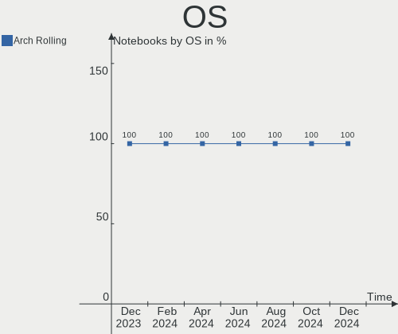
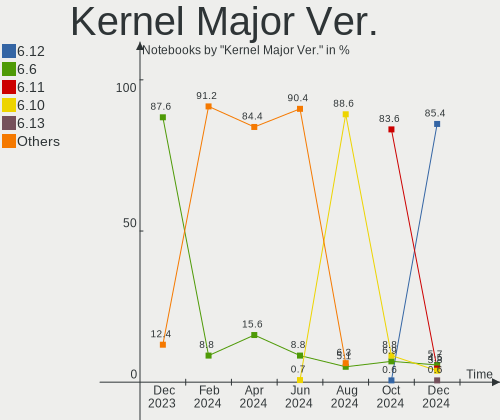
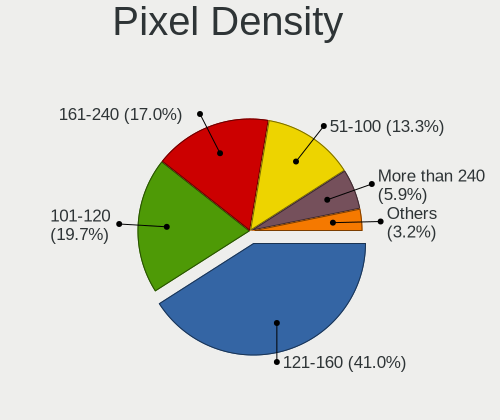
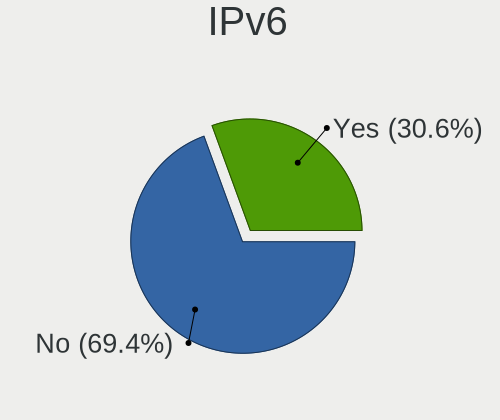
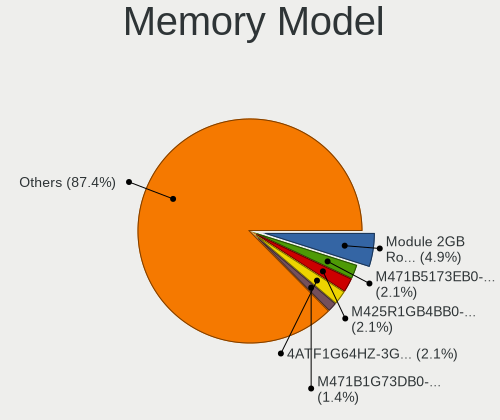

Arch - Hardware Trends (Notebooks)
----------------------------------

A project to identify most popular hardware characteristics and track their change
over time based on data collected by Linux users at https://Linux-Hardware.org.

Anyone can contribute to this report by the [hw-probe](https://github.com/linuxhw/hw-probe) tool:

    sudo -E hw-probe -all -upload

This report is for one last month. Overall report since the beginning of time: [TestCoverage](https://github.com/linuxhw/TestCoverage)

Period: Dec, 2022.

Contents
--------

* [ System ](#system)
  - [ OS                       ](#os)
  - [ OS Family                ](#os-family)
  - [ Kernel                   ](#kernel)
  - [ Kernel Family            ](#kernel-family)
  - [ Kernel Major Ver.        ](#kernel-major-ver)
  - [ Arch                     ](#arch)
  - [ DE                       ](#de)
  - [ Display Server           ](#display-server)
  - [ Display Manager          ](#display-manager)
  - [ OS Lang                  ](#os-lang)
  - [ Boot Mode                ](#boot-mode)
  - [ Filesystem               ](#filesystem)
  - [ Part. scheme             ](#part-scheme)
  - [ Dual Boot with Linux/BSD ](#dual-boot-with-linuxbsd)
  - [ Dual Boot (Win)          ](#dual-boot-win)

* [ Board ](#board)
  - [ Vendor                   ](#vendor)
  - [ Model                    ](#model)
  - [ Model Family             ](#model-family)
  - [ MFG Year                 ](#mfg-year)
  - [ Form Factor              ](#form-factor)
  - [ Secure Boot              ](#secure-boot)
  - [ Coreboot                 ](#coreboot)
  - [ RAM Size                 ](#ram-size)
  - [ RAM Used                 ](#ram-used)
  - [ Total Drives             ](#total-drives)
  - [ Has CD-ROM               ](#has-cd-rom)
  - [ Has Ethernet             ](#has-ethernet)
  - [ Has WiFi                 ](#has-wifi)
  - [ Has Bluetooth            ](#has-bluetooth)

* [ Location ](#location)
  - [ Country                  ](#country)
  - [ City                     ](#city)

* [ Drives ](#drives)
  - [ Drive Vendor             ](#drive-vendor)
  - [ Drive Model              ](#drive-model)
  - [ HDD Vendor               ](#hdd-vendor)
  - [ SSD Vendor               ](#ssd-vendor)
  - [ Drive Kind               ](#drive-kind)
  - [ Drive Connector          ](#drive-connector)
  - [ Drive Size               ](#drive-size)
  - [ Space Total              ](#space-total)
  - [ Space Used               ](#space-used)
  - [ Malfunc. Drives          ](#malfunc-drives)
  - [ Malfunc. Drive Vendor    ](#malfunc-drive-vendor)
  - [ Malfunc. HDD Vendor      ](#malfunc-hdd-vendor)
  - [ Malfunc. Drive Kind      ](#malfunc-drive-kind)
  - [ Failed Drives            ](#failed-drives)
  - [ Failed Drive Vendor      ](#failed-drive-vendor)
  - [ Drive Status             ](#drive-status)

* [ Storage controller ](#storage-controller)
  - [ Storage Vendor           ](#storage-vendor)
  - [ Storage Model            ](#storage-model)
  - [ Storage Kind             ](#storage-kind)

* [ Processor ](#processor)
  - [ CPU Vendor               ](#cpu-vendor)
  - [ CPU Model                ](#cpu-model)
  - [ CPU Model Family         ](#cpu-model-family)
  - [ CPU Cores                ](#cpu-cores)
  - [ CPU Sockets              ](#cpu-sockets)
  - [ CPU Threads              ](#cpu-threads)
  - [ CPU Op-Modes             ](#cpu-op-modes)
  - [ CPU Microcode            ](#cpu-microcode)
  - [ CPU Microarch            ](#cpu-microarch)

* [ Graphics ](#graphics)
  - [ GPU Vendor               ](#gpu-vendor)
  - [ GPU Model                ](#gpu-model)
  - [ GPU Combo                ](#gpu-combo)
  - [ GPU Driver               ](#gpu-driver)
  - [ GPU Memory               ](#gpu-memory)

* [ Monitor ](#monitor)
  - [ Monitor Vendor           ](#monitor-vendor)
  - [ Monitor Model            ](#monitor-model)
  - [ Monitor Resolution       ](#monitor-resolution)
  - [ Monitor Diagonal         ](#monitor-diagonal)
  - [ Monitor Width            ](#monitor-width)
  - [ Aspect Ratio             ](#aspect-ratio)
  - [ Monitor Area             ](#monitor-area)
  - [ Pixel Density            ](#pixel-density)
  - [ Multiple Monitors        ](#multiple-monitors)

* [ Network ](#network)
  - [ Net Controller Vendor    ](#net-controller-vendor)
  - [ Net Controller Model     ](#net-controller-model)
  - [ Wireless Vendor          ](#wireless-vendor)
  - [ Wireless Model           ](#wireless-model)
  - [ Ethernet Vendor          ](#ethernet-vendor)
  - [ Ethernet Model           ](#ethernet-model)
  - [ Net Controller Kind      ](#net-controller-kind)
  - [ Used Controller          ](#used-controller)
  - [ NICs                     ](#nics)
  - [ IPv6                     ](#ipv6)

* [ Bluetooth ](#bluetooth)
  - [ Bluetooth Vendor         ](#bluetooth-vendor)
  - [ Bluetooth Model          ](#bluetooth-model)

* [ Sound ](#sound)
  - [ Sound Vendor             ](#sound-vendor)
  - [ Sound Model              ](#sound-model)

* [ Memory ](#memory)
  - [ Memory Vendor            ](#memory-vendor)
  - [ Memory Model             ](#memory-model)
  - [ Memory Kind              ](#memory-kind)
  - [ Memory Form Factor       ](#memory-form-factor)
  - [ Memory Size              ](#memory-size)
  - [ Memory Speed             ](#memory-speed)

* [ Printers & scanners ](#printers--scanners)
  - [ Printer Vendor           ](#printer-vendor)
  - [ Printer Model            ](#printer-model)
  - [ Scanner Vendor           ](#scanner-vendor)
  - [ Scanner Model            ](#scanner-model)

* [ Camera ](#camera)
  - [ Camera Vendor            ](#camera-vendor)
  - [ Camera Model             ](#camera-model)

* [ Security ](#security)
  - [ Fingerprint Vendor       ](#fingerprint-vendor)
  - [ Fingerprint Model        ](#fingerprint-model)
  - [ Chipcard Vendor          ](#chipcard-vendor)
  - [ Chipcard Model           ](#chipcard-model)

* [ Unsupported ](#unsupported)
  - [ Unsupported Devices      ](#unsupported-devices)
  - [ Unsupported Device Types ](#unsupported-device-types)

System
------

OS
--

Installed operating systems

| Name         | Notebooks | Percent |
|--------------|-----------|---------|
| Arch Rolling | 109       | 100%    |

OS Family
---------

OS without a version

| Name | Notebooks | Percent |
|------|-----------|---------|
| Arch | 109       | 100%    |

Kernel
------

Version of the Linux kernel

| Version                | Notebooks | Percent |
|------------------------|-----------|---------|
| 6.0.12-arch1-1         | 22        | 20.18%  |
| 6.1.1-arch1-1          | 18        | 16.51%  |
| 6.0.11-arch1-1         | 15        | 13.76%  |
| 6.0.10-arch2-1         | 9         | 8.26%   |
| 6.0.11-zen1-1-zen      | 8         | 7.34%   |
| 6.0.9-arch1-1          | 5         | 4.59%   |
| 6.0.12-zen1-1-zen      | 5         | 4.59%   |
| 6.1.1-zen1-1-zen       | 4         | 3.67%   |
| 5.15.80-1-lts          | 4         | 3.67%   |
| 6.1.0-arch1-1          | 2         | 1.83%   |
| 5.15.85-1-lts          | 2         | 1.83%   |
| 5.15.81-1-lts          | 2         | 1.83%   |
| 5.15.79-1-lts          | 2         | 1.83%   |
| 6.1.0-x64v1-xanmod1-1  | 1         | 0.92%   |
| 6.0.6-zen1-2-zen       | 1         | 0.92%   |
| 6.0.11-x64v1-xanmod1-1 | 1         | 0.92%   |
| 6.0.10-zen2-1-zen      | 1         | 0.92%   |
| 6.0.10-mykernel        | 1         | 0.92%   |
| 6.0.10-arch2-1.1       | 1         | 0.92%   |
| 5.19.13-custom         | 1         | 0.92%   |
| 5.15.84-1-lts          | 1         | 0.92%   |
| 5.15.83-1-lts          | 1         | 0.92%   |
| 5.15.82-1-lts          | 1         | 0.92%   |
| 5.15.52-1.0-lts        | 1         | 0.92%   |

Kernel Family
-------------

Linux kernel without a distro release

| Version | Notebooks | Percent |
|---------|-----------|---------|
| 6.0.12  | 27        | 24.77%  |
| 6.0.11  | 24        | 22.02%  |
| 6.1.1   | 22        | 20.18%  |
| 6.0.10  | 12        | 11.01%  |
| 6.0.9   | 5         | 4.59%   |
| 5.15.80 | 4         | 3.67%   |
| 6.1.0   | 3         | 2.75%   |
| 5.15.85 | 2         | 1.83%   |
| 5.15.81 | 2         | 1.83%   |
| 5.15.79 | 2         | 1.83%   |
| 6.0.6   | 1         | 0.92%   |
| 5.19.13 | 1         | 0.92%   |
| 5.15.84 | 1         | 0.92%   |
| 5.15.83 | 1         | 0.92%   |
| 5.15.82 | 1         | 0.92%   |
| 5.15.52 | 1         | 0.92%   |

Kernel Major Ver.
-----------------

Linux kernel major version

| Version | Notebooks | Percent |
|---------|-----------|---------|
| 6.0     | 69        | 63.3%   |
| 6.1     | 25        | 22.94%  |
| 5.15    | 14        | 12.84%  |
| 5.19    | 1         | 0.92%   |

Arch
----

OS architecture (x86_64, i586, etc.)

| Name   | Notebooks | Percent |
|--------|-----------|---------|
| x86_64 | 108       | 99.08%  |
| i686   | 1         | 0.92%   |

DE
--

Desktop Environment

| Name         | Notebooks | Percent |
|--------------|-----------|---------|
| GNOME        | 47        | 43.12%  |
| KDE5         | 34        | 31.19%  |
| XFCE         | 8         | 7.34%   |
| Unknown      | 5         | 4.59%   |
| i3           | 3         | 2.75%   |
| X-Cinnamon   | 2         | 1.83%   |
| sway         | 2         | 1.83%   |
| MATE         | 2         | 1.83%   |
| LXQt         | 2         | 1.83%   |
| LXDE         | 1         | 0.92%   |
| herbstluftwm | 1         | 0.92%   |
| Cinnamon     | 1         | 0.92%   |
| bspwm        | 1         | 0.92%   |

Display Server
--------------

X11 or Wayland

| Name    | Notebooks | Percent |
|---------|-----------|---------|
| X11     | 58        | 53.21%  |
| Wayland | 39        | 35.78%  |
| Unknown | 9         | 8.26%   |
| Tty     | 3         | 2.75%   |

Display Manager
---------------

SDDM, LightDM, etc.

| Name    | Notebooks | Percent |
|---------|-----------|---------|
| Unknown | 43        | 39.45%  |
| SDDM    | 23        | 21.1%   |
| LightDM | 21        | 19.27%  |
| GDM     | 19        | 17.43%  |
| XDM     | 1         | 0.92%   |
| Ly      | 1         | 0.92%   |
| LXDM    | 1         | 0.92%   |

OS Lang
-------

Language

| Lang      | Notebooks | Percent |
|-----------|-----------|---------|
| en_US     | 58        | 53.21%  |
| it_IT     | 8         | 7.34%   |
| ru_RU     | 7         | 6.42%   |
| C         | 6         | 5.5%    |
| fr_FR     | 5         | 4.59%   |
| en_GB     | 4         | 3.67%   |
| Unknown   | 4         | 3.67%   |
| pt_BR     | 2         | 1.83%   |
| es_MX     | 2         | 1.83%   |
| de_DE     | 2         | 1.83%   |
| tr_TR     | 1         | 0.92%   |
| pt_BRutf8 | 1         | 0.92%   |
| nl_BE     | 1         | 0.92%   |
| es_PE     | 1         | 0.92%   |
| es_ES     | 1         | 0.92%   |
| es_AR     | 1         | 0.92%   |
| en_NZ     | 1         | 0.92%   |
| en_CA     | 1         | 0.92%   |
| en_AU     | 1         | 0.92%   |
| cs_CZ     | 1         | 0.92%   |
| bg_BG     | 1         | 0.92%   |

Boot Mode
---------

EFI or BIOS

| Mode | Notebooks | Percent |
|------|-----------|---------|
| EFI  | 60        | 55.05%  |
| BIOS | 49        | 44.95%  |

Filesystem
----------

Type of filesystem

| Type    | Notebooks | Percent |
|---------|-----------|---------|
| Ext4    | 73        | 66.97%  |
| Btrfs   | 30        | 27.52%  |
| Xfs     | 2         | 1.83%   |
| Zfs     | 1         | 0.92%   |
| Overlay | 1         | 0.92%   |
| F2fs    | 1         | 0.92%   |
| Unknown | 1         | 0.92%   |

Part. scheme
------------

Scheme of partitioning

| Type    | Notebooks | Percent |
|---------|-----------|---------|
| GPT     | 70        | 64.22%  |
| Unknown | 32        | 29.36%  |
| MBR     | 7         | 6.42%   |

Dual Boot with Linux/BSD
------------------------

Hosting more than one Linux/BSD

| Dual boot | Notebooks | Percent |
|-----------|-----------|---------|
| No        | 97        | 88.99%  |
| Yes       | 12        | 11.01%  |

Dual Boot (Win)
---------------

Hosting Linux and Windows

| Dual boot | Notebooks | Percent |
|-----------|-----------|---------|
| No        | 76        | 69.72%  |
| Yes       | 33        | 30.28%  |

Board
-----

Vendor
------

Motherboard manufacturer

| Name                  | Notebooks | Percent |
|-----------------------|-----------|---------|
| Lenovo                | 29        | 26.61%  |
| Hewlett-Packard       | 18        | 16.51%  |
| ASUSTek Computer      | 16        | 14.68%  |
| Dell                  | 12        | 11.01%  |
| Acer                  | 9         | 8.26%   |
| HUAWEI                | 5         | 4.59%   |
| MSI                   | 4         | 3.67%   |
| Google                | 2         | 1.83%   |
| Gigabyte Technology   | 2         | 1.83%   |
| Alienware             | 2         | 1.83%   |
| WYSE                  | 1         | 0.92%   |
| Toshiba               | 1         | 0.92%   |
| System76              | 1         | 0.92%   |
| Sony                  | 1         | 0.92%   |
| Positivo Bahia - VAIO | 1         | 0.92%   |
| Packard Bell          | 1         | 0.92%   |
| Notebook              | 1         | 0.92%   |
| LG Electronics        | 1         | 0.92%   |
| HONOR                 | 1         | 0.92%   |
| eMachines             | 1         | 0.92%   |

Model
-----

Motherboard model

| Name                                      | Notebooks | Percent |
|-------------------------------------------|-----------|---------|
| HUAWEI BOHK-WAX9X                         | 2         | 1.83%   |
| HP Pavilion Aero Laptop 13-be0xxx         | 2         | 1.83%   |
| WYSE XM CLASS                             | 1         | 0.92%   |
| Toshiba Satellite R630                    | 1         | 0.92%   |
| System76 Darter Pro                       | 1         | 0.92%   |
| Sony VPCEB3D4R                            | 1         | 0.92%   |
| Positivo Bahia - VAIO VJFE42F11X-XXXXXX   | 1         | 0.92%   |
| Packard Bell EasyNote LJ65                | 1         | 0.92%   |
| Notebook PCX0DX                           | 1         | 0.92%   |
| MSI Vector GP76 12UGS                     | 1         | 0.92%   |
| MSI Modern 14 B11MOU                      | 1         | 0.92%   |
| MSI GL75 Leopard 10SDK                    | 1         | 0.92%   |
| MSI Alpha 15 A4DEK                        | 1         | 0.92%   |
| LG 15Z95N-G.AAC6U1                        | 1         | 0.92%   |
| Lenovo Yoga Slim 7 ProX 14IAH7 82TK       | 1         | 0.92%   |
| Lenovo Yoga Slim 7 14ITL05 82A3           | 1         | 0.92%   |
| Lenovo ThinkPad X240 20AMA40QLM           | 1         | 0.92%   |
| Lenovo ThinkPad X13 Gen 1 20UFCTO1WW      | 1         | 0.92%   |
| Lenovo ThinkPad X1 Extreme 2nd 20QWS18X00 | 1         | 0.92%   |
| Lenovo ThinkPad X1 Carbon 6th 20KGS0YB00  | 1         | 0.92%   |
| Lenovo ThinkPad T470s 20HF003QUS          | 1         | 0.92%   |
| Lenovo ThinkPad T440p 20AW007QMS          | 1         | 0.92%   |
| Lenovo ThinkPad T15p Gen 3 21DACTO1WW     | 1         | 0.92%   |
| Lenovo ThinkPad P51 20HJS1G900            | 1         | 0.92%   |
| Lenovo ThinkPad P51 20HJS16Q0K            | 1         | 0.92%   |
| Lenovo ThinkPad P50 20EQS3BT1R            | 1         | 0.92%   |
| Lenovo ThinkPad P15v Gen 1 20TQ004AFR     | 1         | 0.92%   |
| Lenovo ThinkPad L14 Gen 3 21C5CTO1WW      | 1         | 0.92%   |
| Lenovo ThinkPad E580 20KS001RIX           | 1         | 0.92%   |
| Lenovo ThinkPad E14 Gen 4 21E3S02R00      | 1         | 0.92%   |
| Lenovo ThinkBook 15-IIL 20SM              | 1         | 0.92%   |
| Lenovo ThinkBook 15 G3 ACL 21A4           | 1         | 0.92%   |
| Lenovo Legion R9000P ARH7H 82RG           | 1         | 0.92%   |
| Lenovo Legion 7 16ARHA7 82UH              | 1         | 0.92%   |
| Lenovo IdeaPad S145-15IWL 81S9            | 1         | 0.92%   |
| Lenovo IdeaPad Gaming 3 15IHU6 82K1       | 1         | 0.92%   |
| Lenovo IdeaPad Gaming 3 15ARH05 82EY      | 1         | 0.92%   |
| Lenovo IdeaPad 520-15IKB 80YL             | 1         | 0.92%   |
| Lenovo IdeaPad 5 Pro 14ACN6 82L7          | 1         | 0.92%   |
| Lenovo IdeaPad 320-15IKB 81BT             | 1         | 0.92%   |

Model Family
------------

Motherboard model prefix

| Name                                    | Notebooks | Percent |
|-----------------------------------------|-----------|---------|
| Lenovo ThinkPad                         | 14        | 12.84%  |
| Lenovo IdeaPad                          | 8         | 7.34%   |
| HP Pavilion                             | 5         | 4.59%   |
| HP Laptop                               | 5         | 4.59%   |
| Dell XPS                                | 4         | 3.67%   |
| Dell Latitude                           | 4         | 3.67%   |
| ASUS ASUS                               | 4         | 3.67%   |
| Acer Swift                              | 4         | 3.67%   |
| Acer Aspire                             | 4         | 3.67%   |
| HP ProBook                              | 3         | 2.75%   |
| ASUS Zenbook                            | 3         | 2.75%   |
| ASUS VivoBook                           | 3         | 2.75%   |
| Lenovo Yoga                             | 2         | 1.83%   |
| Lenovo ThinkBook                        | 2         | 1.83%   |
| Lenovo Legion                           | 2         | 1.83%   |
| HUAWEI BOHK-WAX9X                       | 2         | 1.83%   |
| HP EliteBook                            | 2         | 1.83%   |
| Dell Inspiron                           | 2         | 1.83%   |
| ASUS ROG                                | 2         | 1.83%   |
| WYSE XM                                 | 1         | 0.92%   |
| Toshiba Satellite                       | 1         | 0.92%   |
| System76 Darter                         | 1         | 0.92%   |
| Sony VPCEB3D4R                          | 1         | 0.92%   |
| Positivo Bahia - VAIO VJFE42F11X-XXXXXX | 1         | 0.92%   |
| Packard Bell EasyNote                   | 1         | 0.92%   |
| Notebook PCX0DX                         | 1         | 0.92%   |
| MSI Vector                              | 1         | 0.92%   |
| MSI Modern                              | 1         | 0.92%   |
| MSI GL75                                | 1         | 0.92%   |
| MSI Alpha                               | 1         | 0.92%   |
| LG 15Z95N-G.AAC6U1                      | 1         | 0.92%   |
| Lenovo B40-70                           | 1         | 0.92%   |
| HUAWEI NBLB-WAX9N                       | 1         | 0.92%   |
| HUAWEI KLVL-WXXW                        | 1         | 0.92%   |
| HUAWEI BOM-WXX9                         | 1         | 0.92%   |
| HONOR NMH-WCX9                          | 1         | 0.92%   |
| HP ZBook                                | 1         | 0.92%   |
| HP Compaq                               | 1         | 0.92%   |
| HP 250                                  | 1         | 0.92%   |
| Google Lick                             | 1         | 0.92%   |

MFG Year
--------

Motherboard manufacture year

| Year | Notebooks | Percent |
|------|-----------|---------|
| 2022 | 22        | 20.18%  |
| 2021 | 20        | 18.35%  |
| 2020 | 19        | 17.43%  |
| 2019 | 14        | 12.84%  |
| 2018 | 9         | 8.26%   |
| 2017 | 6         | 5.5%    |
| 2015 | 3         | 2.75%   |
| 2013 | 3         | 2.75%   |
| 2010 | 3         | 2.75%   |
| 2014 | 2         | 1.83%   |
| 2012 | 2         | 1.83%   |
| 2011 | 2         | 1.83%   |
| 2009 | 2         | 1.83%   |
| 2016 | 1         | 0.92%   |
| 2008 | 1         | 0.92%   |

Form Factor
-----------

Physical design of the computer

| Name     | Notebooks | Percent |
|----------|-----------|---------|
| Notebook | 109       | 100%    |

Secure Boot
-----------

Enabled or disabled

| State    | Notebooks | Percent |
|----------|-----------|---------|
| Disabled | 108       | 99.08%  |
| Enabled  | 1         | 0.92%   |

Coreboot
--------

Have coreboot on board

| Used | Notebooks | Percent |
|------|-----------|---------|
| No   | 106       | 97.25%  |
| Yes  | 3         | 2.75%   |

RAM Size
--------

Total RAM memory

| Size in GB  | Notebooks | Percent |
|-------------|-----------|---------|
| 4.01-8.0    | 30        | 27.52%  |
| 8.01-16.0   | 22        | 20.18%  |
| 32.01-64.0  | 21        | 19.27%  |
| 16.01-24.0  | 18        | 16.51%  |
| 3.01-4.0    | 7         | 6.42%   |
| 64.01-256.0 | 4         | 3.67%   |
| 2.01-3.0    | 3         | 2.75%   |
| 24.01-32.0  | 2         | 1.83%   |
| 1.01-2.0    | 2         | 1.83%   |

RAM Used
--------

Used RAM memory

| Used GB    | Notebooks | Percent |
|------------|-----------|---------|
| 4.01-8.0   | 28        | 25.69%  |
| 2.01-3.0   | 27        | 24.77%  |
| 1.01-2.0   | 19        | 17.43%  |
| 3.01-4.0   | 16        | 14.68%  |
| 8.01-16.0  | 13        | 11.93%  |
| 0.51-1.0   | 5         | 4.59%   |
| 16.01-24.0 | 1         | 0.92%   |

Total Drives
------------

Number of drives on board

| Drives | Notebooks | Percent |
|--------|-----------|---------|
| 1      | 73        | 66.97%  |
| 2      | 32        | 29.36%  |
| 3      | 3         | 2.75%   |
| 5      | 1         | 0.92%   |

Has CD-ROM
----------

Has CD-ROM on board

| Presented | Notebooks | Percent |
|-----------|-----------|---------|
| No        | 95        | 87.16%  |
| Yes       | 14        | 12.84%  |

Has Ethernet
------------

Has Ethernet on board

| Presented | Notebooks | Percent |
|-----------|-----------|---------|
| Yes       | 77        | 70.64%  |
| No        | 32        | 29.36%  |

Has WiFi
--------

Has WiFi module

| Presented | Notebooks | Percent |
|-----------|-----------|---------|
| Yes       | 109       | 100%    |

Has Bluetooth
-------------

Has Bluetooth module

| Presented | Notebooks | Percent |
|-----------|-----------|---------|
| Yes       | 100       | 91.74%  |
| No        | 9         | 8.26%   |

Location
--------

Country
-------

Geographic location (country)

| Country      | Notebooks | Percent |
|--------------|-----------|---------|
| USA          | 16        | 14.68%  |
| Italy        | 16        | 14.68%  |
| Russia       | 11        | 10.09%  |
| Germany      | 8         | 7.34%   |
| France       | 7         | 6.42%   |
| India        | 4         | 3.67%   |
| Brazil       | 4         | 3.67%   |
| Turkey       | 3         | 2.75%   |
| Spain        | 3         | 2.75%   |
| Indonesia    | 3         | 2.75%   |
| UK           | 2         | 1.83%   |
| Portugal     | 2         | 1.83%   |
| Mexico       | 2         | 1.83%   |
| Croatia      | 2         | 1.83%   |
| Azerbaijan   | 2         | 1.83%   |
| Australia    | 2         | 1.83%   |
| Argentina    | 2         | 1.83%   |
| Vietnam      | 1         | 0.92%   |
| South Africa | 1         | 0.92%   |
| Slovenia     | 1         | 0.92%   |
| Serbia       | 1         | 0.92%   |
| Romania      | 1         | 0.92%   |
| Poland       | 1         | 0.92%   |
| Peru         | 1         | 0.92%   |
| New Zealand  | 1         | 0.92%   |
| Netherlands  | 1         | 0.92%   |
| Nepal        | 1         | 0.92%   |
| Kyrgyzstan   | 1         | 0.92%   |
| Kazakhstan   | 1         | 0.92%   |
| Guatemala    | 1         | 0.92%   |
| Denmark      | 1         | 0.92%   |
| Czechia      | 1         | 0.92%   |
| Cyprus       | 1         | 0.92%   |
| Canada       | 1         | 0.92%   |
| Bulgaria     | 1         | 0.92%   |
| Belgium      | 1         | 0.92%   |
| Austria      | 1         | 0.92%   |

City
----

Geographic location (city)

| City            | Notebooks | Percent |
|-----------------|-----------|---------|
| Paris           | 5         | 4.59%   |
| Moscow          | 5         | 4.59%   |
| Stuttgart       | 2         | 1.83%   |
| St Petersburg   | 2         | 1.83%   |
| Milan           | 2         | 1.83%   |
| Madrid          | 2         | 1.83%   |
| Lisbon          | 2         | 1.83%   |
| Baku            | 2         | 1.83%   |
| Wausau          | 1         | 0.92%   |
| Vyara           | 1         | 0.92%   |
| Vienna          | 1         | 0.92%   |
| Veruno          | 1         | 0.92%   |
| Valencia        | 1         | 0.92%   |
| Utica           | 1         | 0.92%   |
| Ulyanovsk       | 1         | 0.92%   |
| Uberlândia     | 1         | 0.92%   |
| Turin           | 1         | 0.92%   |
| Trebon          | 1         | 0.92%   |
| Tamil Nadu      | 1         | 0.92%   |
| Tamansari       | 1         | 0.92%   |
| Sugar Grove     | 1         | 0.92%   |
| St Louis        | 1         | 0.92%   |
| Sousa           | 1         | 0.92%   |
| Sleman          | 1         | 0.92%   |
| Silvi           | 1         | 0.92%   |
| Semlin          | 1         | 0.92%   |
| Sao Paulo       | 1         | 0.92%   |
| Ryazan          | 1         | 0.92%   |
| Rome            | 1         | 0.92%   |
| Reggio Calabria | 1         | 0.92%   |
| Reading         | 1         | 0.92%   |
| Raleigh         | 1         | 0.92%   |
| Port Elizabeth  | 1         | 0.92%   |
| Porcari         | 1         | 0.92%   |
| Popovaca        | 1         | 0.92%   |
| Pomezia         | 1         | 0.92%   |
| Plovdiv         | 1         | 0.92%   |
| Philadelphia    | 1         | 0.92%   |
| Pavia           | 1         | 0.92%   |
| Parker          | 1         | 0.92%   |

Drives
------

Drive Vendor
------------

Hard drive vendors

| Vendor                         | Notebooks | Drives | Percent |
|--------------------------------|-----------|--------|---------|
| Samsung Electronics            | 36        | 39     | 24.32%  |
| Sandisk                        | 15        | 15     | 10.14%  |
| SK hynix                       | 11        | 11     | 7.43%   |
| Toshiba                        | 9         | 9      | 6.08%   |
| Seagate                        | 7         | 7      | 4.73%   |
| Micron Technology              | 7         | 7      | 4.73%   |
| Kingston                       | 7         | 7      | 4.73%   |
| Phison Electronics             | 6         | 6      | 4.05%   |
| Intel                          | 6         | 6      | 4.05%   |
| WDC                            | 5         | 5      | 3.38%   |
| Crucial                        | 5         | 5      | 3.38%   |
| Unknown                        | 4         | 4      | 2.7%    |
| A-DATA Technology              | 4         | 4      | 2.7%    |
| Micron/Crucial Technology      | 3         | 3      | 2.03%   |
| KIOXIA                         | 3         | 3      | 2.03%   |
| TO Exter                       | 2         | 2      | 1.35%   |
| Lenovo                         | 2         | 2      | 1.35%   |
| Kingston Technology Company    | 2         | 2      | 1.35%   |
| HGST                           | 2         | 2      | 1.35%   |
| XPG                            | 1         | 1      | 0.68%   |
| Solid State Storage Technology | 1         | 1      | 0.68%   |
| Silicon Motion                 | 1         | 1      | 0.68%   |
| OCZ                            | 1         | 1      | 0.68%   |
| Lexar                          | 1         | 1      | 0.68%   |
| LaCie                          | 1         | 1      | 0.68%   |
| JMicron Technology             | 1         | 1      | 0.68%   |
| Hitachi                        | 1         | 1      | 0.68%   |
| HGST HTS                       | 1         | 1      | 0.68%   |
| Emtec                          | 1         | 1      | 0.68%   |
| China                          | 1         | 1      | 0.68%   |
| ADATA Technology               | 1         | 1      | 0.68%   |

Drive Model
-----------

Hard drive models

| Model                                               | Notebooks | Percent |
|-----------------------------------------------------|-----------|---------|
| Samsung NVMe SSD Controller SM981/PM981/PM983 500GB | 10        | 6.71%   |
| Sandisk WD Black SN750 / PC SN730 NVMe SSD 512GB    | 5         | 3.36%   |
| SK hynix BC501 NVMe Solid State Drive 512GB         | 3         | 2.01%   |
| Seagate ST1000LM035-1RK172 1TB                      | 3         | 2.01%   |
| Samsung NVMe SSD Controller PM9A1/PM9A3/980PRO 2TB  | 3         | 2.01%   |
| Phison PS5013 E13 NVMe Controller 512GB             | 3         | 2.01%   |
| Micron/Crucial P2 NVMe PCIe SSD 500GB               | 3         | 2.01%   |
| Intel SSD 660P Series 1024GB                        | 3         | 2.01%   |
| Toshiba XG6 NVMe SSD Controller 256GB               | 2         | 1.34%   |
| Toshiba MQ04ABF100 1TB                              | 2         | 1.34%   |
| TO Exter nal USB 3.0 512GB                          | 2         | 1.34%   |
| SK hynix HFM001TD3JX013N 1TB                        | 2         | 1.34%   |
| Sandisk WD Black SN850 1TB                          | 2         | 1.34%   |
| Samsung MZVLQ512HALU-000H1 512GB                    | 2         | 1.34%   |
| Phison E12 NVMe Controller 1TB                      | 2         | 1.34%   |
| Lenovo LENSE20256GMSP34MEAT2TA 256GB                | 2         | 1.34%   |
| Kingston SA400S37240G 240GB SSD                     | 2         | 1.34%   |
| Intel SSDPEKNU512GZ 512GB                           | 2         | 1.34%   |
| XPG NVMe SSD Drive 1024GB                           | 1         | 0.67%   |
| WDC WDS240G2G0A-00JH30 240GB SSD                    | 1         | 0.67%   |
| WDC WD5000LPLX-60ZNTT1 500GB                        | 1         | 0.67%   |
| WDC WD5000BEVT-22ZAT0 500GB                         | 1         | 0.67%   |
| WDC WD20SPZX-22CRAT0 2TB                            | 1         | 0.67%   |
| WDC WD1003FZEX-00MK2A0 1TB                          | 1         | 0.67%   |
| Unknown MMC Card  64GB                              | 1         | 0.67%   |
| Unknown MMC Card  32GB                              | 1         | 0.67%   |
| Unknown MMC Card  16GB                              | 1         | 0.67%   |
| Unknown MMC Card  128GB                             | 1         | 0.67%   |
| Toshiba XG4 NVMe SSD Controller 512GB               | 1         | 0.67%   |
| Toshiba THNSNJ512GDNU A 512GB SSD                   | 1         | 0.67%   |
| Toshiba MQ01ACF050 500GB                            | 1         | 0.67%   |
| Toshiba MK2035GSS 200GB                             | 1         | 0.67%   |
| Toshiba A100 120GB SSD                              | 1         | 0.67%   |
| Solid State Storage CL4-3D256-Q11 NVMe SSSTC 256GB  | 1         | 0.67%   |
| SK hynix SKHynix_HFS256GDE9X081N 256GB              | 1         | 0.67%   |
| SK hynix SKHynix_HFS001TD9TNI-L2B0B 1TB             | 1         | 0.67%   |
| SK hynix PC801 NVMe 2TB                             | 1         | 0.67%   |
| SK hynix PC801 NVMe 1TB                             | 1         | 0.67%   |
| SK hynix BC711 HFM256GD3JX013N 256GB                | 1         | 0.67%   |
| SK hynix BC511 256GB                                | 1         | 0.67%   |

HDD Vendor
----------

Hard disk drive vendors

| Vendor              | Notebooks | Drives | Percent |
|---------------------|-----------|--------|---------|
| Seagate             | 6         | 6      | 31.58%  |
| WDC                 | 4         | 4      | 21.05%  |
| Toshiba             | 4         | 4      | 21.05%  |
| HGST                | 2         | 2      | 10.53%  |
| Samsung Electronics | 1         | 1      | 5.26%   |
| Hitachi             | 1         | 1      | 5.26%   |
| HGST HTS            | 1         | 1      | 5.26%   |

SSD Vendor
----------

Solid state drive vendors

| Vendor              | Notebooks | Drives | Percent |
|---------------------|-----------|--------|---------|
| Samsung Electronics | 7         | 7      | 21.21%  |
| Kingston            | 5         | 5      | 15.15%  |
| Crucial             | 4         | 4      | 12.12%  |
| A-DATA Technology   | 4         | 4      | 12.12%  |
| SanDisk             | 3         | 3      | 9.09%   |
| Toshiba             | 2         | 2      | 6.06%   |
| TO Exter            | 2         | 2      | 6.06%   |
| WDC                 | 1         | 1      | 3.03%   |
| OCZ                 | 1         | 1      | 3.03%   |
| Lexar               | 1         | 1      | 3.03%   |
| JMicron Technology  | 1         | 1      | 3.03%   |
| Emtec               | 1         | 1      | 3.03%   |
| China               | 1         | 1      | 3.03%   |

Drive Kind
----------

HDD or SSD

| Kind    | Notebooks | Drives | Percent |
|---------|-----------|--------|---------|
| NVMe    | 83        | 94     | 61.48%  |
| SSD     | 29        | 33     | 21.48%  |
| HDD     | 18        | 19     | 13.33%  |
| MMC     | 4         | 4      | 2.96%   |
| Unknown | 1         | 1      | 0.74%   |

Drive Connector
---------------

SATA, SAS, NVMe, etc.

| Type | Notebooks | Drives | Percent |
|------|-----------|--------|---------|
| NVMe | 83        | 94     | 62.88%  |
| SATA | 40        | 48     | 30.3%   |
| SAS  | 5         | 5      | 3.79%   |
| MMC  | 4         | 4      | 3.03%   |

Drive Size
----------

Size of hard drive

| Size in TB | Notebooks | Drives | Percent |
|------------|-----------|--------|---------|
| 0.01-0.5   | 29        | 34     | 61.7%   |
| 0.51-1.0   | 15        | 15     | 31.91%  |
| 1.01-2.0   | 2         | 2      | 4.26%   |
| 4.01-10.0  | 1         | 1      | 2.13%   |

Space Total
-----------

Amount of disk space available on the file system

| Size in GB     | Notebooks | Percent |
|----------------|-----------|---------|
| 251-500        | 31        | 28.44%  |
| 101-250        | 28        | 25.69%  |
| 1001-2000      | 17        | 15.6%   |
| 501-1000       | 13        | 11.93%  |
| More than 3000 | 6         | 5.5%    |
| 51-100         | 6         | 5.5%    |
| Unknown        | 4         | 3.67%   |
| 2001-3000      | 2         | 1.83%   |
| 1-20           | 2         | 1.83%   |

Space Used
----------

Amount of used disk space

| Used GB        | Notebooks | Percent |
|----------------|-----------|---------|
| 1-20           | 25        | 22.94%  |
| 101-250        | 20        | 18.35%  |
| 21-50          | 17        | 15.6%   |
| 251-500        | 14        | 12.84%  |
| 51-100         | 13        | 11.93%  |
| 501-1000       | 8         | 7.34%   |
| 1001-2000      | 4         | 3.67%   |
| Unknown        | 4         | 3.67%   |
| More than 3000 | 3         | 2.75%   |
| 2001-3000      | 1         | 0.92%   |

Malfunc. Drives
---------------

Drive models with a malfunction

| Model                             | Notebooks | Drives | Percent |
|-----------------------------------|-----------|--------|---------|
| Toshiba MK2035GSS 200GB           | 1         | 1      | 50%     |
| A-DATA Technology SU650 240GB SSD | 1         | 1      | 50%     |

Malfunc. Drive Vendor
---------------------

Vendors of faulty drives

| Vendor            | Notebooks | Drives | Percent |
|-------------------|-----------|--------|---------|
| Toshiba           | 1         | 1      | 50%     |
| A-DATA Technology | 1         | 1      | 50%     |

Malfunc. HDD Vendor
-------------------

Vendors of faulty HDD drives

| Vendor  | Notebooks | Drives | Percent |
|---------|-----------|--------|---------|
| Toshiba | 1         | 1      | 100%    |

Malfunc. Drive Kind
-------------------

Kinds of faulty drives

| Kind | Notebooks | Drives | Percent |
|------|-----------|--------|---------|
| SSD  | 1         | 1      | 50%     |
| HDD  | 1         | 1      | 50%     |

Failed Drives
-------------

Failed drive models

Zero info for selected period =(

Failed Drive Vendor
-------------------

Failed drive vendors

Zero info for selected period =(

Drive Status
------------

Number of failed and malfunc. drives

| Status   | Notebooks | Drives | Percent |
|----------|-----------|--------|---------|
| Detected | 58        | 77     | 51.33%  |
| Works    | 53        | 72     | 46.9%   |
| Malfunc  | 2         | 2      | 1.77%   |

Storage controller
------------------

Storage Vendor
--------------

Storage controller vendors

| Vendor                         | Notebooks | Percent |
|--------------------------------|-----------|---------|
| Intel                          | 55        | 35.71%  |
| Samsung Electronics            | 28        | 18.18%  |
| AMD                            | 14        | 9.09%   |
| SanDisk                        | 12        | 7.79%   |
| SK hynix                       | 11        | 7.14%   |
| Micron Technology              | 7         | 4.55%   |
| Phison Electronics             | 6         | 3.9%    |
| Micron/Crucial Technology      | 4         | 2.6%    |
| Kingston Technology Company    | 4         | 2.6%    |
| Toshiba America Info Systems   | 3         | 1.95%   |
| KIOXIA                         | 3         | 1.95%   |
| Lenovo                         | 2         | 1.3%    |
| ADATA Technology               | 2         | 1.3%    |
| Solid State Storage Technology | 1         | 0.65%   |
| Silicon Motion                 | 1         | 0.65%   |
| Seagate Technology             | 1         | 0.65%   |

Storage Model
-------------

Storage controller models

| Model                                                                         | Notebooks | Percent |
|-------------------------------------------------------------------------------|-----------|---------|
| AMD FCH SATA Controller [AHCI mode]                                           | 13        | 8.07%   |
| Samsung NVMe SSD Controller 980                                               | 11        | 6.83%   |
| Intel Volume Management Device NVMe RAID Controller                           | 11        | 6.83%   |
| Samsung NVMe SSD Controller SM981/PM981/PM983                                 | 10        | 6.21%   |
| Intel 82801 Mobile SATA Controller [RAID mode]                                | 8         | 4.97%   |
| Micron Non-Volatile memory controller                                         | 7         | 4.35%   |
| SanDisk WD Black SN750 / PC SN730 NVMe SSD                                    | 5         | 3.11%   |
| SK hynix Gold P31/PC711 NVMe Solid State Drive                                | 4         | 2.48%   |
| Samsung NVMe SSD Controller PM9A1/PM9A3/980PRO                                | 4         | 2.48%   |
| Micron/Crucial P2 NVMe PCIe SSD                                               | 4         | 2.48%   |
| Intel Tiger Lake-LP SATA Controller                                           | 4         | 2.48%   |
| Intel Sunrise Point-LP SATA Controller [AHCI mode]                            | 4         | 2.48%   |
| SK hynix Non-Volatile memory controller                                       | 3         | 1.86%   |
| SK hynix BC501 NVMe Solid State Drive                                         | 3         | 1.86%   |
| SanDisk WD PC SN810 / Black SN850 NVMe SSD                                    | 3         | 1.86%   |
| Phison PS5013 E13 NVMe Controller                                             | 3         | 1.86%   |
| Kingston Company Company Non-Volatile memory controller                       | 3         | 1.86%   |
| Intel SSD 660P Series                                                         | 3         | 1.86%   |
| Intel Non-Volatile memory controller                                          | 3         | 1.86%   |
| Intel HM170/QM170 Chipset SATA Controller [AHCI Mode]                         | 3         | 1.86%   |
| Intel 82801IBM/IEM (ICH9M/ICH9M-E) 4 port SATA Controller [AHCI mode]         | 3         | 1.86%   |
| Intel 8 Series SATA Controller 1 [AHCI mode]                                  | 3         | 1.86%   |
| Intel 5 Series/3400 Series Chipset 4 port SATA AHCI Controller                | 3         | 1.86%   |
| Toshiba America Info Systems XG6 NVMe SSD Controller                          | 2         | 1.24%   |
| Samsung NVMe SSD Controller SM961/PM961/SM963                                 | 2         | 1.24%   |
| Phison E12 NVMe Controller                                                    | 2         | 1.24%   |
| Lenovo Non-Volatile memory controller                                         | 2         | 1.24%   |
| KIOXIA NVMe SSD Controller BG4                                                | 2         | 1.24%   |
| Intel Q170/Q150/B150/H170/H110/Z170/CM236 Chipset SATA Controller [AHCI Mode] | 2         | 1.24%   |
| Intel Comet Lake SATA AHCI Controller                                         | 2         | 1.24%   |
| Intel Cannon Point-LP SATA Controller [AHCI Mode]                             | 2         | 1.24%   |
| Intel 7 Series Chipset Family 6-port SATA Controller [AHCI mode]              | 2         | 1.24%   |
| Intel 400 Series Chipset Family SATA AHCI Controller                          | 2         | 1.24%   |
| ADATA XPG SX8200 Pro PCIe Gen3x4 M.2 2280 Solid State Drive                   | 2         | 1.24%   |
| Toshiba America Info Systems XG4 NVMe SSD Controller                          | 1         | 0.62%   |
| Solid State Storage Non-Volatile memory controller                            | 1         | 0.62%   |
| SK hynix BC511                                                                | 1         | 0.62%   |
| Silicon Motion SM2263EN/SM2263XT SSD Controller                               | 1         | 0.62%   |
| Seagate FireCuda 520 SSD                                                      | 1         | 0.62%   |
| SanDisk WD Blue SN570 NVMe SSD                                                | 1         | 0.62%   |

Storage Kind
------------

Kind of storage controller (IDE, SATA, NVMe, SAS, ...)

| Kind | Notebooks | Percent |
|------|-----------|---------|
| NVMe | 83        | 54.61%  |
| SATA | 49        | 32.24%  |
| RAID | 20        | 13.16%  |

Processor
---------

CPU Vendor
----------

Processor vendors

| Vendor | Notebooks | Percent |
|--------|-----------|---------|
| Intel  | 75        | 68.81%  |
| AMD    | 34        | 31.19%  |

CPU Model
---------

Processor models

| Model                                         | Notebooks | Percent |
|-----------------------------------------------|-----------|---------|
| AMD Ryzen 5 5500U with Radeon Graphics        | 6         | 5.5%    |
| Intel 11th Gen Core i5-1135G7 @ 2.40GHz       | 5         | 4.59%   |
| AMD Ryzen 5 3500U with Radeon Vega Mobile Gfx | 5         | 4.59%   |
| Intel Core i7-8565U CPU @ 1.80GHz             | 4         | 3.67%   |
| Intel 12th Gen Core i7-12700H                 | 4         | 3.67%   |
| Intel Core i7-8550U CPU @ 1.80GHz             | 3         | 2.75%   |
| AMD Ryzen 7 4800H with Radeon Graphics        | 3         | 2.75%   |
| AMD Ryzen 5 5600U with Radeon Graphics        | 3         | 2.75%   |
| AMD Ryzen 5 3550H with Radeon Vega Mobile Gfx | 3         | 2.75%   |
| Intel Core i7-7700HQ CPU @ 2.80GHz            | 2         | 1.83%   |
| Intel Core i7-10750H CPU @ 2.60GHz            | 2         | 1.83%   |
| Intel Core i7-1065G7 CPU @ 1.30GHz            | 2         | 1.83%   |
| Intel Core i5-8250U CPU @ 1.60GHz             | 2         | 1.83%   |
| Intel Core i5-7200U CPU @ 2.50GHz             | 2         | 1.83%   |
| Intel Core i5-10210U CPU @ 1.60GHz            | 2         | 1.83%   |
| Intel 12th Gen Core i5-12500H                 | 2         | 1.83%   |
| Intel 11th Gen Core i7-11800H @ 2.30GHz       | 2         | 1.83%   |
| Intel Genuine CPU 575 @ 2.00GHz               | 1         | 0.92%   |
| Intel Core i9-10885H CPU @ 2.40GHz            | 1         | 0.92%   |
| Intel Core i7-9850H CPU @ 2.60GHz             | 1         | 0.92%   |
| Intel Core i7-7820HQ CPU @ 2.90GHz            | 1         | 0.92%   |
| Intel Core i7-7600U CPU @ 2.80GHz             | 1         | 0.92%   |
| Intel Core i7-6820HQ CPU @ 2.70GHz            | 1         | 0.92%   |
| Intel Core i7-6700HQ CPU @ 2.60GHz            | 1         | 0.92%   |
| Intel Core i7-6600U CPU @ 2.60GHz             | 1         | 0.92%   |
| Intel Core i7-4500U CPU @ 1.80GHz             | 1         | 0.92%   |
| Intel Core i7-10875H CPU @ 2.30GHz            | 1         | 0.92%   |
| Intel Core i7-10850H CPU @ 2.70GHz            | 1         | 0.92%   |
| Intel Core i7-10510U CPU @ 1.80GHz            | 1         | 0.92%   |
| Intel Core i5-8350U CPU @ 1.70GHz             | 1         | 0.92%   |
| Intel Core i5-8300H CPU @ 2.30GHz             | 1         | 0.92%   |
| Intel Core i5-7300HQ CPU @ 2.50GHz            | 1         | 0.92%   |
| Intel Core i5-4300M CPU @ 2.60GHz             | 1         | 0.92%   |
| Intel Core i5-3320M CPU @ 2.60GHz             | 1         | 0.92%   |
| Intel Core i5-1035G4 CPU @ 1.10GHz            | 1         | 0.92%   |
| Intel Core i3-8145U CPU @ 2.10GHz             | 1         | 0.92%   |
| Intel Core i3-4030U CPU @ 1.90GHz             | 1         | 0.92%   |
| Intel Core i3-4010U CPU @ 1.70GHz             | 1         | 0.92%   |
| Intel Core i3-2310M CPU @ 2.10GHz             | 1         | 0.92%   |
| Intel Core i3 CPU M 370 @ 2.40GHz             | 1         | 0.92%   |

CPU Model Family
----------------

Processor model prefix

| Model                   | Notebooks | Percent |
|-------------------------|-----------|---------|
| Other                   | 25        | 22.94%  |
| Intel Core i7           | 23        | 21.1%   |
| AMD Ryzen 5             | 19        | 17.43%  |
| Intel Core i5           | 12        | 11.01%  |
| AMD Ryzen 7             | 8         | 7.34%   |
| Intel Core i3           | 7         | 6.42%   |
| Intel Celeron           | 4         | 3.67%   |
| AMD Ryzen 9             | 3         | 2.75%   |
| AMD Ryzen 7 PRO         | 2         | 1.83%   |
| Intel Genuine           | 1         | 0.92%   |
| Intel Core i9           | 1         | 0.92%   |
| Intel Core 2 Duo        | 1         | 0.92%   |
| Intel Celeron Dual-Core | 1         | 0.92%   |
| AMD Ryzen 3             | 1         | 0.92%   |
| AMD G                   | 1         | 0.92%   |

CPU Cores
---------

Number of processor cores

| Number | Notebooks | Percent |
|--------|-----------|---------|
| 4      | 43        | 39.45%  |
| 2      | 22        | 20.18%  |
| 8      | 17        | 15.6%   |
| 6      | 15        | 13.76%  |
| 14     | 5         | 4.59%   |
| 12     | 3         | 2.75%   |
| 10     | 3         | 2.75%   |
| 1      | 1         | 0.92%   |

CPU Sockets
-----------

Number of sockets

| Number | Notebooks | Percent |
|--------|-----------|---------|
| 1      | 109       | 100%    |

CPU Threads
-----------

Threads per core (Hyper-Threading)

| Number | Notebooks | Percent |
|--------|-----------|---------|
| 2      | 98        | 89.91%  |
| 1      | 11        | 10.09%  |

CPU Op-Modes
------------

CPU Operation Modes (32-bit, 64-bit)

| Op mode        | Notebooks | Percent |
|----------------|-----------|---------|
| 32-bit, 64-bit | 109       | 100%    |

CPU Microcode
-------------

Microcode number

| Number     | Notebooks | Percent |
|------------|-----------|---------|
| Unknown    | 44        | 40.37%  |
| 0x906a3    | 6         | 5.5%    |
| 0x806c1    | 5         | 4.59%   |
| 0x08108109 | 5         | 4.59%   |
| 0x906e9    | 4         | 3.67%   |
| 0x806ea    | 4         | 3.67%   |
| 0x806ec    | 3         | 2.75%   |
| 0x706e5    | 3         | 2.75%   |
| 0xa0652    | 2         | 1.83%   |
| 0x806e9    | 2         | 1.83%   |
| 0x806d1    | 2         | 1.83%   |
| 0x506e3    | 2         | 1.83%   |
| 0x40651    | 2         | 1.83%   |
| 0x20652    | 2         | 1.83%   |
| 0x0a50000d | 2         | 1.83%   |
| 0x0a50000c | 2         | 1.83%   |
| 0x0a404102 | 2         | 1.83%   |
| 0x08108102 | 2         | 1.83%   |
| 0x906ea    | 1         | 0.92%   |
| 0x906a4    | 1         | 0.92%   |
| 0x706a8    | 1         | 0.92%   |
| 0x6fd      | 1         | 0.92%   |
| 0x506c9    | 1         | 0.92%   |
| 0x406c4    | 1         | 0.92%   |
| 0x306a9    | 1         | 0.92%   |
| 0x206a7    | 1         | 0.92%   |
| 0x1067a    | 1         | 0.92%   |
| 0x0a404101 | 1         | 0.92%   |
| 0x08608103 | 1         | 0.92%   |
| 0x08608102 | 1         | 0.92%   |
| 0x08600106 | 1         | 0.92%   |
| 0x08600104 | 1         | 0.92%   |
| 0x08600102 | 1         | 0.92%   |

CPU Microarch
-------------

Microarchitecture

| Name             | Notebooks | Percent |
|------------------|-----------|---------|
| KabyLake         | 23        | 21.1%   |
| Unknown          | 15        | 13.76%  |
| TigerLake        | 12        | 11.01%  |
| Zen 3            | 9         | 8.26%   |
| Zen+             | 8         | 7.34%   |
| Alderlake Hybrid | 7         | 6.42%   |
| Zen 2            | 6         | 5.5%    |
| CometLake        | 5         | 4.59%   |
| IceLake          | 4         | 3.67%   |
| Haswell          | 4         | 3.67%   |
| Westmere         | 3         | 2.75%   |
| Skylake          | 3         | 2.75%   |
| SandyBridge      | 2         | 1.83%   |
| Penryn           | 2         | 1.83%   |
| Silvermont       | 1         | 0.92%   |
| IvyBridge        | 1         | 0.92%   |
| Goldmont plus    | 1         | 0.92%   |
| Goldmont         | 1         | 0.92%   |
| Core             | 1         | 0.92%   |
| Bobcat           | 1         | 0.92%   |

Graphics
--------

GPU Vendor
----------

Vendors of graphics cards

| Vendor | Notebooks | Percent |
|--------|-----------|---------|
| Intel  | 72        | 47.37%  |
| Nvidia | 42        | 27.63%  |
| AMD    | 38        | 25%     |

GPU Model
---------

Graphics card models

| Model                                                                     | Notebooks | Percent |
|---------------------------------------------------------------------------|-----------|---------|
| Intel TigerLake-LP GT2 [Iris Xe Graphics]                                 | 10        | 6.41%   |
| Intel Alder Lake-P Integrated Graphics Controller                         | 8         | 5.13%   |
| AMD Picasso/Raven 2 [Radeon Vega Series / Radeon Vega Mobile Series]      | 8         | 5.13%   |
| AMD Cezanne [Radeon Vega Series / Radeon Vega Mobile Series]              | 8         | 5.13%   |
| Intel UHD Graphics 620                                                    | 6         | 3.85%   |
| AMD Lucienne                                                              | 6         | 3.85%   |
| Nvidia GA106M [GeForce RTX 3060 Mobile / Max-Q]                           | 5         | 3.21%   |
| Intel WhiskeyLake-U GT2 [UHD Graphics 620]                                | 5         | 3.21%   |
| Intel CometLake-H GT2 [UHD Graphics]                                      | 5         | 3.21%   |
| AMD Renoir                                                                | 5         | 3.21%   |
| Intel HD Graphics 630                                                     | 3         | 1.92%   |
| Intel HD Graphics 620                                                     | 3         | 1.92%   |
| Intel Haswell-ULT Integrated Graphics Controller                          | 3         | 1.92%   |
| Intel CometLake-U GT2 [UHD Graphics]                                      | 3         | 1.92%   |
| AMD Rembrandt [Radeon 680M]                                               | 3         | 1.92%   |
| Nvidia TU117M [GeForce GTX 1650 Ti Mobile]                                | 2         | 1.28%   |
| Nvidia TU117M [GeForce GTX 1650 Mobile / Max-Q]                           | 2         | 1.28%   |
| Nvidia GP107M [GeForce GTX 1050 Mobile]                                   | 2         | 1.28%   |
| Nvidia GA107M [GeForce RTX 3050 Ti Mobile]                                | 2         | 1.28%   |
| Nvidia GA104M [GeForce RTX 3080 Mobile / Max-Q 8GB/16GB]                  | 2         | 1.28%   |
| Intel TigerLake-H GT1 [UHD Graphics]                                      | 2         | 1.28%   |
| Intel Tiger Lake-LP GT2 [UHD Graphics G4]                                 | 2         | 1.28%   |
| Intel Mobile 4 Series Chipset Integrated Graphics Controller              | 2         | 1.28%   |
| Intel Iris Plus Graphics G7                                               | 2         | 1.28%   |
| Intel HD Graphics 530                                                     | 2         | 1.28%   |
| Intel Core Processor Integrated Graphics Controller                       | 2         | 1.28%   |
| Intel CoffeeLake-H GT2 [UHD Graphics 630]                                 | 2         | 1.28%   |
| Intel 2nd Generation Core Processor Family Integrated Graphics Controller | 2         | 1.28%   |
| Nvidia TU117M [GeForce MX450]                                             | 1         | 0.64%   |
| Nvidia TU117M                                                             | 1         | 0.64%   |
| Nvidia TU117 [GeForce GTX 1650]                                           | 1         | 0.64%   |
| Nvidia TU116M [GeForce GTX 1660 Ti Mobile]                                | 1         | 0.64%   |
| Nvidia TU106M [GeForce RTX 2060 Mobile]                                   | 1         | 0.64%   |
| Nvidia TU104GLM [Quadro RTX 4000 Mobile / Max-Q]                          | 1         | 0.64%   |
| Nvidia GP108M [GeForce MX250]                                             | 1         | 0.64%   |
| Nvidia GP108M [GeForce MX230]                                             | 1         | 0.64%   |
| Nvidia GP108M [GeForce MX150]                                             | 1         | 0.64%   |
| Nvidia GP108BM [GeForce MX250]                                            | 1         | 0.64%   |
| Nvidia GP107M [GeForce GTX 1050 Ti Mobile]                                | 1         | 0.64%   |
| Nvidia GP107M [GeForce GTX 1050 3 GB Max-Q]                               | 1         | 0.64%   |

GPU Combo
---------

Combinations of graphics cards

| Name           | Notebooks | Percent |
|----------------|-----------|---------|
| 1 x Intel      | 36        | 33.03%  |
| Intel + Nvidia | 31        | 28.44%  |
| 1 x AMD        | 24        | 22.02%  |
| AMD + Nvidia   | 9         | 8.26%   |
| Intel + AMD    | 3         | 2.75%   |
| 2 x Intel      | 2         | 1.83%   |
| 2 x AMD        | 2         | 1.83%   |
| 2 x Nvidia     | 1         | 0.92%   |
| 1 x Nvidia     | 1         | 0.92%   |

GPU Driver
----------

Free vs proprietary

| Driver      | Notebooks | Percent |
|-------------|-----------|---------|
| Free        | 80        | 73.39%  |
| Proprietary | 29        | 26.61%  |

GPU Memory
----------

Total video memory

| Size in GB | Notebooks | Percent |
|------------|-----------|---------|
| Unknown    | 83        | 76.15%  |
| 0.01-0.5   | 9         | 8.26%   |
| 1.01-2.0   | 7         | 6.42%   |
| 7.01-8.0   | 3         | 2.75%   |
| 5.01-6.0   | 2         | 1.83%   |
| 3.01-4.0   | 2         | 1.83%   |
| 2.01-3.0   | 1         | 0.92%   |
| 8.01-16.0  | 1         | 0.92%   |
| 0.51-1.0   | 1         | 0.92%   |

Monitor
-------

Monitor Vendor
--------------

Monitor vendors

| Vendor                  | Notebooks | Percent |
|-------------------------|-----------|---------|
| AU Optronics            | 30        | 23.44%  |
| BOE                     | 21        | 16.41%  |
| Chimei Innolux          | 16        | 12.5%   |
| LG Display              | 14        | 10.94%  |
| Samsung Electronics     | 12        | 9.38%   |
| Sharp                   | 8         | 6.25%   |
| Dell                    | 6         | 4.69%   |
| PANDA                   | 4         | 3.13%   |
| Goldstar                | 4         | 3.13%   |
| AOC                     | 2         | 1.56%   |
| TMX                     | 1         | 0.78%   |
| Sony                    | 1         | 0.78%   |
| Lenovo                  | 1         | 0.78%   |
| Kogan                   | 1         | 0.78%   |
| Gigabyte Technology     | 1         | 0.78%   |
| GDH                     | 1         | 0.78%   |
| CTO                     | 1         | 0.78%   |
| CSO                     | 1         | 0.78%   |
| Chi Mei Optoelectronics | 1         | 0.78%   |
| BenQ                    | 1         | 0.78%   |
| Acer                    | 1         | 0.78%   |

Monitor Model
-------------

Monitor models

| Model                                                                 | Notebooks | Percent |
|-----------------------------------------------------------------------|-----------|---------|
| AU Optronics LCD Monitor AUO61ED 1920x1080 344x194mm 15.5-inch        | 5         | 3.82%   |
| BOE LCD Monitor BOE0872 1920x1080 344x194mm 15.5-inch                 | 3         | 2.29%   |
| Sharp LQ156M1JW26 SHP1532 1920x1080 344x194mm 15.5-inch               | 2         | 1.53%   |
| Samsung Electronics LCD Monitor SDC4171 2880x1800 302x189mm 14.0-inch | 2         | 1.53%   |
| Chimei Innolux LCD Monitor CMN15F5 1920x1080 344x193mm 15.5-inch      | 2         | 1.53%   |
| Chimei Innolux LCD Monitor CMN14D4 1920x1080 309x173mm 13.9-inch      | 2         | 1.53%   |
| BOE LCD Monitor BOE0A9B 2560x1600 344x215mm 16.0-inch                 | 2         | 1.53%   |
| AU Optronics LCD Monitor AUO38ED 1920x1080 344x193mm 15.5-inch        | 2         | 1.53%   |
| AU Optronics LCD Monitor AUO21ED 1920x1080 344x193mm 15.5-inch        | 2         | 1.53%   |
| TMX TL140BDXP01-0 TMX1400 2560x1440 310x174mm 14.0-inch               | 1         | 0.76%   |
| Sony NvidiaDefault SNY05FA 1366x768 290x170mm 13.2-inch               | 1         | 0.76%   |
| Sharp LQ134R1JW51 SHP151B 3840x2400 288x180mm 13.4-inch               | 1         | 0.76%   |
| Sharp LCD Monitor SHP154D 1920x1080 309x174mm 14.0-inch               | 1         | 0.76%   |
| Sharp LCD Monitor SHP1515 1920x1200 336x210mm 15.6-inch               | 1         | 0.76%   |
| Sharp LCD Monitor SHP14F9 1920x1200 288x180mm 13.4-inch               | 1         | 0.76%   |
| Sharp LCD Monitor SHP14D0 3840x2400 336x210mm 15.6-inch               | 1         | 0.76%   |
| Sharp LCD Monitor SHP143E 3840x2160 346x194mm 15.6-inch               | 1         | 0.76%   |
| Samsung Electronics S24D330 SAM0D92 1920x1080 531x299mm 24.0-inch     | 1         | 0.76%   |
| Samsung Electronics LCD Monitor SEC4542 1366x768 309x174mm 14.0-inch  | 1         | 0.76%   |
| Samsung Electronics LCD Monitor SEC4351 1366x768 344x194mm 15.5-inch  | 1         | 0.76%   |
| Samsung Electronics LCD Monitor SEC3945 1280x800 331x207mm 15.4-inch  | 1         | 0.76%   |
| Samsung Electronics LCD Monitor SDC4C46 3840x2160 344x194mm 15.5-inch | 1         | 0.76%   |
| Samsung Electronics LCD Monitor SDC4172 2880x1800 289x186mm 13.5-inch | 1         | 0.76%   |
| Samsung Electronics LCD Monitor SDC4161 1920x1080 344x194mm 15.5-inch | 1         | 0.76%   |
| Samsung Electronics LCD Monitor SDC4141 3840x2160 344x194mm 15.5-inch | 1         | 0.76%   |
| Samsung Electronics LCD Monitor SAM0B30 1920x1080 885x498mm 40.0-inch | 1         | 0.76%   |
| Samsung Electronics C27R50x SAM0F9D 1920x1080 600x340mm 27.2-inch     | 1         | 0.76%   |
| PANDA LCD Monitor NCP004D 1920x1080 344x194mm 15.5-inch               | 1         | 0.76%   |
| PANDA LCD Monitor NCP004B 1920x1080 344x194mm 15.5-inch               | 1         | 0.76%   |
| PANDA LCD Monitor NCP0040 1920x1080 344x194mm 15.5-inch               | 1         | 0.76%   |
| PANDA LCD Monitor NCP0035 1920x1080 309x174mm 14.0-inch               | 1         | 0.76%   |
| LG Display LCD Monitor LGD065A 1920x1080 344x194mm 15.5-inch          | 1         | 0.76%   |
| LG Display LCD Monitor LGD0645 1920x1080 344x194mm 15.5-inch          | 1         | 0.76%   |
| LG Display LCD Monitor LGD0615 1920x1080 382x215mm 17.3-inch          | 1         | 0.76%   |
| LG Display LCD Monitor LGD060F 1920x1080 309x174mm 14.0-inch          | 1         | 0.76%   |
| LG Display LCD Monitor LGD05F6 1920x1080 309x174mm 14.0-inch          | 1         | 0.76%   |
| LG Display LCD Monitor LGD05F2 1920x1080 344x194mm 15.5-inch          | 1         | 0.76%   |
| LG Display LCD Monitor LGD05D0 1920x1080 344x194mm 15.5-inch          | 1         | 0.76%   |
| LG Display LCD Monitor LGD059D 1920x1080 309x174mm 14.0-inch          | 1         | 0.76%   |
| LG Display LCD Monitor LGD0590 1920x1080 344x194mm 15.5-inch          | 1         | 0.76%   |

Monitor Resolution
------------------

Monitor screen resolution

| Resolution         | Notebooks | Percent |
|--------------------|-----------|---------|
| 1920x1080 (FHD)    | 72        | 60.5%   |
| 1366x768 (WXGA)    | 13        | 10.92%  |
| 3840x2160 (4K)     | 6         | 5.04%   |
| 1920x1200 (WUXGA)  | 5         | 4.2%    |
| 2560x1440 (QHD)    | 4         | 3.36%   |
| 2880x1800          | 3         | 2.52%   |
| 2560x1600          | 3         | 2.52%   |
| 1600x900 (HD+)     | 3         | 2.52%   |
| 3840x2400          | 2         | 1.68%   |
| 3072x1920          | 1         | 0.84%   |
| 2560x1080          | 1         | 0.84%   |
| 2240x1400          | 1         | 0.84%   |
| 2160x1440          | 1         | 0.84%   |
| 1680x1050 (WSXGA+) | 1         | 0.84%   |
| 1360x768           | 1         | 0.84%   |
| 1280x800 (WXGA)    | 1         | 0.84%   |
| 1280x1024 (SXGA)   | 1         | 0.84%   |

Monitor Diagonal
----------------

Diagonal size in inches

| Inches | Notebooks | Percent |
|--------|-----------|---------|
| 15     | 55        | 42.31%  |
| 14     | 26        | 20%     |
| 13     | 14        | 10.77%  |
| 17     | 7         | 5.38%   |
| 24     | 6         | 4.62%   |
| 27     | 4         | 3.08%   |
| 16     | 3         | 2.31%   |
| 31     | 2         | 1.54%   |
| 23     | 2         | 1.54%   |
| 21     | 2         | 1.54%   |
| 11     | 2         | 1.54%   |
| 54     | 1         | 0.77%   |
| 52     | 1         | 0.77%   |
| 34     | 1         | 0.77%   |
| 22     | 1         | 0.77%   |
| 19     | 1         | 0.77%   |
| 18     | 1         | 0.77%   |
| 12     | 1         | 0.77%   |

Monitor Width
-------------

Physical width

| Width in mm | Notebooks | Percent |
|-------------|-----------|---------|
| 301-350     | 89        | 69.53%  |
| 501-600     | 11        | 8.59%   |
| 201-300     | 11        | 8.59%   |
| 351-400     | 8         | 6.25%   |
| 401-500     | 4         | 3.13%   |
| 601-700     | 2         | 1.56%   |
| 1001-1500   | 2         | 1.56%   |
| 701-800     | 1         | 0.78%   |

Aspect Ratio
------------

Proportional relationship between the width and the height

| Ratio | Notebooks | Percent |
|-------|-----------|---------|
| 16/9  | 94        | 81.03%  |
| 16/10 | 19        | 16.38%  |
| 5/4   | 1         | 0.86%   |
| 3/2   | 1         | 0.86%   |
| 21/9  | 1         | 0.86%   |

Monitor Area
------------

Area in inch²

| Area in inch² | Notebooks | Percent |
|----------------|-----------|---------|
| 101-110        | 53        | 40.77%  |
| 81-90          | 33        | 25.38%  |
| 201-250        | 8         | 6.15%   |
| 121-130        | 7         | 5.38%   |
| 71-80          | 6         | 4.62%   |
| 301-350        | 4         | 3.08%   |
| 111-120        | 4         | 3.08%   |
| 351-500        | 3         | 2.31%   |
| More than 1000 | 2         | 1.54%   |
| 51-60          | 2         | 1.54%   |
| 251-300        | 2         | 1.54%   |
| 151-200        | 2         | 1.54%   |
| 91-100         | 2         | 1.54%   |
| 61-70          | 1         | 0.77%   |
| 141-150        | 1         | 0.77%   |

Pixel Density
-------------

Pixels per inch

| Density       | Notebooks | Percent |
|---------------|-----------|---------|
| 121-160       | 74        | 58.27%  |
| 51-100        | 15        | 11.81%  |
| 101-120       | 14        | 11.02%  |
| 161-240       | 13        | 10.24%  |
| More than 240 | 9         | 7.09%   |
| 1-50          | 2         | 1.57%   |

Multiple Monitors
-----------------

Total monitors connected

| Total | Notebooks | Percent |
|-------|-----------|---------|
| 1     | 91        | 83.49%  |
| 2     | 15        | 13.76%  |
| 3     | 2         | 1.83%   |
| 4     | 1         | 0.92%   |

Network
-------

Net Controller Vendor
---------------------

Controller vendors

| Vendor                   | Notebooks | Percent |
|--------------------------|-----------|---------|
| Intel                    | 62        | 38.51%  |
| Realtek Semiconductor    | 59        | 36.65%  |
| Qualcomm Atheros         | 15        | 9.32%   |
| MediaTek                 | 8         | 4.97%   |
| Broadcom Limited         | 3         | 1.86%   |
| Broadcom                 | 3         | 1.86%   |
| TP-Link                  | 2         | 1.24%   |
| Lenovo                   | 2         | 1.24%   |
| Xiaomi                   | 1         | 0.62%   |
| Samsung Electronics      | 1         | 0.62%   |
| Qualcomm                 | 1         | 0.62%   |
| Marvell Technology Group | 1         | 0.62%   |
| HTC (High Tech Computer) | 1         | 0.62%   |
| DisplayLink              | 1         | 0.62%   |
| D-Link                   | 1         | 0.62%   |

Net Controller Model
--------------------

Controller models

| Model                                                                          | Notebooks | Percent |
|--------------------------------------------------------------------------------|-----------|---------|
| Realtek RTL8111/8168/8411 PCI Express Gigabit Ethernet Controller              | 37        | 19.27%  |
| Realtek RTL8822CE 802.11ac PCIe Wireless Network Adapter                       | 11        | 5.73%   |
| Intel Wi-Fi 6 AX200                                                            | 11        | 5.73%   |
| Intel Alder Lake-P PCH CNVi WiFi                                               | 10        | 5.21%   |
| Realtek RTL8821CE 802.11ac PCIe Wireless Network Adapter                       | 8         | 4.17%   |
| Qualcomm Atheros QCA6174 802.11ac Wireless Network Adapter                     | 7         | 3.65%   |
| Intel Wi-Fi 6 AX201                                                            | 7         | 3.65%   |
| Intel Wireless 8265 / 8275                                                     | 6         | 3.13%   |
| MediaTek MT7922 802.11ax PCI Express Wireless Network Adapter                  | 5         | 2.6%    |
| Realtek RTL8153 Gigabit Ethernet Adapter                                       | 3         | 1.56%   |
| Realtek RTL810xE PCI Express Fast Ethernet controller                          | 3         | 1.56%   |
| Qualcomm Atheros QCA9377 802.11ac Wireless Network Adapter                     | 3         | 1.56%   |
| Intel Wireless 8260                                                            | 3         | 1.56%   |
| Intel Ethernet Connection (4) I219-LM                                          | 3         | 1.56%   |
| Intel Ethernet Connection (16) I219-V                                          | 3         | 1.56%   |
| Intel Comet Lake PCH CNVi WiFi                                                 | 3         | 1.56%   |
| Realtek RTL8125 2.5GbE Controller                                              | 2         | 1.04%   |
| Qualcomm Atheros AR9485 Wireless Network Adapter                               | 2         | 1.04%   |
| Qualcomm Atheros AR9285 Wireless Network Adapter (PCI-Express)                 | 2         | 1.04%   |
| MediaTek MT7921 802.11ax PCI Express Wireless Network Adapter                  | 2         | 1.04%   |
| Intel Wireless 7260                                                            | 2         | 1.04%   |
| Intel Ice Lake-LP PCH CNVi WiFi                                                | 2         | 1.04%   |
| Intel Dual Band Wireless-AC 3165 Plus Bluetooth                                | 2         | 1.04%   |
| Intel Comet Lake PCH-LP CNVi WiFi                                              | 2         | 1.04%   |
| Xiaomi Mi/Redmi series (RNDIS)                                                 | 1         | 0.52%   |
| TP-Link TL-WN823N v2/v3 [Realtek RTL8192EU]                                    | 1         | 0.52%   |
| TP-Link AC600 wireless Realtek RTL8811AU [Archer T2U Nano]                     | 1         | 0.52%   |
| Samsung GT-I9070 (network tethering, USB debugging enabled)                    | 1         | 0.52%   |
| Realtek RTL8852AE 802.11ax PCIe Wireless Network Adapter                       | 1         | 0.52%   |
| Realtek RTL8821AE 802.11ac PCIe Wireless Network Adapter                       | 1         | 0.52%   |
| Realtek RTL8812AU 802.11a/b/g/n/ac 2T2R DB WLAN Adapter                        | 1         | 0.52%   |
| Realtek RTL8723BE PCIe Wireless Network Adapter                                | 1         | 0.52%   |
| Realtek RTL8152 Fast Ethernet Adapter                                          | 1         | 0.52%   |
| Realtek Realtek Network controller                                             | 1         | 0.52%   |
| Realtek Killer E3000 2.5GbE Controller                                         | 1         | 0.52%   |
| Qualcomm QCA6390 Wireless Network Adapter                                      | 1         | 0.52%   |
| Qualcomm Atheros AR93xx Wireless Network Adapter                               | 1         | 0.52%   |
| MediaTek MT7921K (RZ608) Wi-Fi 6E 80MHz                                        | 1         | 0.52%   |
| Marvell Group Yukon Optima 88E8059 [PCIe Gigabit Ethernet Controller with AVB] | 1         | 0.52%   |
| Lenovo ThinkPad Lan                                                            | 1         | 0.52%   |

Wireless Vendor
---------------

Wireless vendors

| Vendor                | Notebooks | Percent |
|-----------------------|-----------|---------|
| Intel                 | 58        | 51.33%  |
| Realtek Semiconductor | 24        | 21.24%  |
| Qualcomm Atheros      | 15        | 13.27%  |
| MediaTek              | 8         | 7.08%   |
| TP-Link               | 2         | 1.77%   |
| Broadcom Limited      | 2         | 1.77%   |
| Broadcom              | 2         | 1.77%   |
| Qualcomm              | 1         | 0.88%   |
| D-Link                | 1         | 0.88%   |

Wireless Model
--------------

Wireless models

| Model                                                                | Notebooks | Percent |
|----------------------------------------------------------------------|-----------|---------|
| Realtek RTL8822CE 802.11ac PCIe Wireless Network Adapter             | 11        | 9.73%   |
| Intel Wi-Fi 6 AX200                                                  | 11        | 9.73%   |
| Intel Alder Lake-P PCH CNVi WiFi                                     | 10        | 8.85%   |
| Realtek RTL8821CE 802.11ac PCIe Wireless Network Adapter             | 8         | 7.08%   |
| Qualcomm Atheros QCA6174 802.11ac Wireless Network Adapter           | 7         | 6.19%   |
| Intel Wi-Fi 6 AX201                                                  | 7         | 6.19%   |
| Intel Wireless 8265 / 8275                                           | 6         | 5.31%   |
| MediaTek MT7922 802.11ax PCI Express Wireless Network Adapter        | 5         | 4.42%   |
| Qualcomm Atheros QCA9377 802.11ac Wireless Network Adapter           | 3         | 2.65%   |
| Intel Wireless 8260                                                  | 3         | 2.65%   |
| Intel Comet Lake PCH CNVi WiFi                                       | 3         | 2.65%   |
| Qualcomm Atheros AR9485 Wireless Network Adapter                     | 2         | 1.77%   |
| Qualcomm Atheros AR9285 Wireless Network Adapter (PCI-Express)       | 2         | 1.77%   |
| MediaTek MT7921 802.11ax PCI Express Wireless Network Adapter        | 2         | 1.77%   |
| Intel Wireless 7260                                                  | 2         | 1.77%   |
| Intel Ice Lake-LP PCH CNVi WiFi                                      | 2         | 1.77%   |
| Intel Dual Band Wireless-AC 3165 Plus Bluetooth                      | 2         | 1.77%   |
| Intel Comet Lake PCH-LP CNVi WiFi                                    | 2         | 1.77%   |
| TP-Link TL-WN823N v2/v3 [Realtek RTL8192EU]                          | 1         | 0.88%   |
| TP-Link AC600 wireless Realtek RTL8811AU [Archer T2U Nano]           | 1         | 0.88%   |
| Realtek RTL8852AE 802.11ax PCIe Wireless Network Adapter             | 1         | 0.88%   |
| Realtek RTL8821AE 802.11ac PCIe Wireless Network Adapter             | 1         | 0.88%   |
| Realtek RTL8812AU 802.11a/b/g/n/ac 2T2R DB WLAN Adapter              | 1         | 0.88%   |
| Realtek RTL8723BE PCIe Wireless Network Adapter                      | 1         | 0.88%   |
| Realtek Realtek Network controller                                   | 1         | 0.88%   |
| Qualcomm QCA6390 Wireless Network Adapter                            | 1         | 0.88%   |
| Qualcomm Atheros AR93xx Wireless Network Adapter                     | 1         | 0.88%   |
| MediaTek MT7921K (RZ608) Wi-Fi 6E 80MHz                              | 1         | 0.88%   |
| Intel Wireless-AC 9260                                               | 1         | 0.88%   |
| Intel Wireless 7265                                                  | 1         | 0.88%   |
| Intel Wireless 3160                                                  | 1         | 0.88%   |
| Intel WiFi Link 5100                                                 | 1         | 0.88%   |
| Intel Wi-Fi 6 AX210/AX211/AX411 160MHz                               | 1         | 0.88%   |
| Intel Tiger Lake PCH CNVi WiFi                                       | 1         | 0.88%   |
| Intel Gemini Lake PCH CNVi WiFi                                      | 1         | 0.88%   |
| Intel Centrino Advanced-N 6205 [Taylor Peak]                         | 1         | 0.88%   |
| Intel Cannon Point-LP CNVi [Wireless-AC]                             | 1         | 0.88%   |
| Intel Cannon Lake PCH CNVi WiFi                                      | 1         | 0.88%   |
| D-Link DWA-131 Wireless N Nano Adapter (Rev. E1) [Realtek RTL8192EU] | 1         | 0.88%   |
| Broadcom Limited BCM43224 802.11a/b/g/n                              | 1         | 0.88%   |

Ethernet Vendor
---------------

Ethernet vendors

| Vendor                   | Notebooks | Percent |
|--------------------------|-----------|---------|
| Realtek Semiconductor    | 46        | 59.74%  |
| Intel                    | 22        | 28.57%  |
| Broadcom                 | 2         | 2.6%    |
| Xiaomi                   | 1         | 1.3%    |
| Samsung Electronics      | 1         | 1.3%    |
| Marvell Technology Group | 1         | 1.3%    |
| Lenovo                   | 1         | 1.3%    |
| HTC (High Tech Computer) | 1         | 1.3%    |
| DisplayLink              | 1         | 1.3%    |
| Broadcom Limited         | 1         | 1.3%    |

Ethernet Model
--------------

Ethernet models

| Model                                                                          | Notebooks | Percent |
|--------------------------------------------------------------------------------|-----------|---------|
| Realtek RTL8111/8168/8411 PCI Express Gigabit Ethernet Controller              | 37        | 47.44%  |
| Realtek RTL8153 Gigabit Ethernet Adapter                                       | 3         | 3.85%   |
| Realtek RTL810xE PCI Express Fast Ethernet controller                          | 3         | 3.85%   |
| Intel Ethernet Connection (4) I219-LM                                          | 3         | 3.85%   |
| Intel Ethernet Connection (16) I219-V                                          | 3         | 3.85%   |
| Realtek RTL8125 2.5GbE Controller                                              | 2         | 2.56%   |
| Xiaomi Mi/Redmi series (RNDIS)                                                 | 1         | 1.28%   |
| Samsung GT-I9070 (network tethering, USB debugging enabled)                    | 1         | 1.28%   |
| Realtek RTL8152 Fast Ethernet Adapter                                          | 1         | 1.28%   |
| Realtek Killer E3000 2.5GbE Controller                                         | 1         | 1.28%   |
| Marvell Group Yukon Optima 88E8059 [PCIe Gigabit Ethernet Controller with AVB] | 1         | 1.28%   |
| Lenovo ThinkPad Lan                                                            | 1         | 1.28%   |
| Intel I210 Gigabit Network Connection                                          | 1         | 1.28%   |
| Intel Ethernet Controller I225-V                                               | 1         | 1.28%   |
| Intel Ethernet Connection I219-LM                                              | 1         | 1.28%   |
| Intel Ethernet Connection I218-LM                                              | 1         | 1.28%   |
| Intel Ethernet Connection I217-LM                                              | 1         | 1.28%   |
| Intel Ethernet Connection (7) I219-LM                                          | 1         | 1.28%   |
| Intel Ethernet Connection (5) I219-V                                           | 1         | 1.28%   |
| Intel Ethernet Connection (5) I219-LM                                          | 1         | 1.28%   |
| Intel Ethernet Connection (4) I219-V                                           | 1         | 1.28%   |
| Intel Ethernet Connection (2) I219-LM                                          | 1         | 1.28%   |
| Intel Ethernet Connection (16) I219-LM                                         | 1         | 1.28%   |
| Intel Ethernet Connection (11) I219-V                                          | 1         | 1.28%   |
| Intel Ethernet Connection (10) I219-LM                                         | 1         | 1.28%   |
| Intel 82579V Gigabit Network Connection                                        | 1         | 1.28%   |
| Intel 82579LM Gigabit Network Connection (Lewisville)                          | 1         | 1.28%   |
| Intel 82577LC Gigabit Network Connection                                       | 1         | 1.28%   |
| HTC (High Tech Computer) Desire HD (modem mode)                                | 1         | 1.28%   |
| DisplayLink Dell D3100 Docking Station                                         | 1         | 1.28%   |
| Broadcom NetLink BCM57785 Gigabit Ethernet PCIe                                | 1         | 1.28%   |
| Broadcom NetLink BCM57780 Gigabit Ethernet PCIe                                | 1         | 1.28%   |
| Broadcom Limited NetLink BCM5784M Gigabit Ethernet PCIe                        | 1         | 1.28%   |

Net Controller Kind
-------------------

Ethernet, WiFi or modem

| Kind     | Notebooks | Percent |
|----------|-----------|---------|
| WiFi     | 109       | 58.29%  |
| Ethernet | 77        | 41.18%  |
| Modem    | 1         | 0.53%   |

Used Controller
---------------

Currently used network controller

| Kind     | Notebooks | Percent |
|----------|-----------|---------|
| WiFi     | 98        | 89.09%  |
| Ethernet | 12        | 10.91%  |

NICs
----

Total network controllers on board

| Total | Notebooks | Percent |
|-------|-----------|---------|
| 2     | 69        | 63.3%   |
| 1     | 40        | 36.7%   |

IPv6
----

IPv6 vs IPv4

| Used | Notebooks | Percent |
|------|-----------|---------|
| No   | 81        | 74.31%  |
| Yes  | 28        | 25.69%  |

Bluetooth
---------

Bluetooth Vendor
----------------

Controller vendors

| Vendor                          | Notebooks | Percent |
|---------------------------------|-----------|---------|
| Intel                           | 54        | 54%     |
| Realtek Semiconductor           | 17        | 17%     |
| Foxconn / Hon Hai               | 8         | 8%      |
| Qualcomm Atheros Communications | 6         | 6%      |
| IMC Networks                    | 5         | 5%      |
| Realtek                         | 4         | 4%      |
| Lite-On Technology              | 3         | 3%      |
| Toshiba                         | 1         | 1%      |
| MediaTek                        | 1         | 1%      |
| Dell                            | 1         | 1%      |

Bluetooth Model
---------------

Controller models

| Model                                                                               | Notebooks | Percent |
|-------------------------------------------------------------------------------------|-----------|---------|
| Intel Bluetooth wireless interface                                                  | 14        | 14%     |
| Intel AX201 Bluetooth                                                               | 13        | 13%     |
| Realtek Bluetooth Radio                                                             | 11        | 11%     |
| Intel AX200 Bluetooth                                                               | 11        | 11%     |
| Intel Bluetooth Device                                                              | 8         | 8%      |
| Intel Bluetooth 9460/9560 Jefferson Peak (JfP)                                      | 6         | 6%      |
| Foxconn / Hon Hai Wireless_Device                                                   | 6         | 6%      |
| Realtek  Bluetooth 4.2 Adapter                                                      | 4         | 4%      |
| Realtek Bluetooth Radio                                                             | 4         | 4%      |
| Qualcomm Atheros  Bluetooth Device                                                  | 4         | 4%      |
| IMC Networks Bluetooth Radio                                                        | 3         | 3%      |
| Qualcomm Atheros QCA61x4 Bluetooth 4.0                                              | 2         | 2%      |
| Lite-On Qualcomm Atheros QCA9377 Bluetooth                                          | 2         | 2%      |
| Toshiba Askey Bluetooth Module                                                      | 1         | 1%      |
| Realtek RTL8821A Bluetooth                                                          | 1         | 1%      |
| Realtek RTL8723B Bluetooth                                                          | 1         | 1%      |
| MediaTek Wireless_Device                                                            | 1         | 1%      |
| Lite-On Bluetooth Device                                                            | 1         | 1%      |
| Intel Wireless-AC 9260 Bluetooth Adapter                                            | 1         | 1%      |
| Intel AX210 Bluetooth                                                               | 1         | 1%      |
| IMC Networks Wireless_Device                                                        | 1         | 1%      |
| IMC Networks Bluetooth USB Host Controller                                          | 1         | 1%      |
| Foxconn / Hon Hai Foxconn T77H114 BCM2070 [Single-Chip Bluetooth 2.1 + EDR Adapter] | 1         | 1%      |
| Foxconn / Hon Hai Bluetooth Device                                                  | 1         | 1%      |
| Dell BCM20702A0 Bluetooth Module                                                    | 1         | 1%      |

Sound
-----

Sound Vendor
------------

Sound card vendors

| Vendor              | Notebooks | Percent |
|---------------------|-----------|---------|
| Intel               | 75        | 52.08%  |
| AMD                 | 37        | 25.69%  |
| Nvidia              | 23        | 15.97%  |
| Logitech            | 2         | 1.39%   |
| C-Media Electronics | 2         | 1.39%   |
| GN Netcom           | 1         | 0.69%   |
| Creative Technology | 1         | 0.69%   |
| Corsair             | 1         | 0.69%   |
| CMX Systems         | 1         | 0.69%   |
| ASUSTek Computer    | 1         | 0.69%   |

Sound Model
-----------

Sound card models

| Model                                                                                             | Notebooks | Percent |
|---------------------------------------------------------------------------------------------------|-----------|---------|
| AMD Family 17h/19h HD Audio Controller                                                            | 30        | 16.85%  |
| AMD Renoir Radeon High Definition Audio Controller                                                | 18        | 10.11%  |
| Intel Tiger Lake-LP Smart Sound Technology Audio Controller                                       | 12        | 6.74%   |
| Intel Alder Lake PCH-P High Definition Audio Controller                                           | 11        | 6.18%   |
| Intel Sunrise Point-LP HD Audio                                                                   | 10        | 5.62%   |
| Nvidia GA104 High Definition Audio Controller                                                     | 6         | 3.37%   |
| AMD Raven/Raven2/Fenghuang HDMI/DP Audio Controller                                               | 6         | 3.37%   |
| Nvidia GA106 High Definition Audio Controller                                                     | 5         | 2.81%   |
| Intel Comet Lake PCH cAVS                                                                         | 5         | 2.81%   |
| Intel Cannon Point-LP High Definition Audio Controller                                            | 5         | 2.81%   |
| Nvidia TU107 GeForce GTX 1650 High Definition Audio Controller                                    | 4         | 2.25%   |
| Intel CM238 HD Audio Controller                                                                   | 4         | 2.25%   |
| Intel Ice Lake-LP Smart Sound Technology Audio Controller                                         | 3         | 1.69%   |
| Intel Haswell-ULT HD Audio Controller                                                             | 3         | 1.69%   |
| Intel Comet Lake PCH-LP cAVS                                                                      | 3         | 1.69%   |
| Intel 82801I (ICH9 Family) HD Audio Controller                                                    | 3         | 1.69%   |
| Intel 8 Series HD Audio Controller                                                                | 3         | 1.69%   |
| Intel 5 Series/3400 Series Chipset High Definition Audio                                          | 3         | 1.69%   |
| AMD Rembrandt Radeon High Definition Audio Controller                                             | 3         | 1.69%   |
| Nvidia GP107GL High Definition Audio Controller                                                   | 2         | 1.12%   |
| Nvidia GM107 High Definition Audio Controller [GeForce 940MX]                                     | 2         | 1.12%   |
| Intel Tiger Lake-H HD Audio Controller                                                            | 2         | 1.12%   |
| Intel Cannon Lake PCH cAVS                                                                        | 2         | 1.12%   |
| Intel 7 Series/C216 Chipset Family High Definition Audio Controller                               | 2         | 1.12%   |
| Intel 100 Series/C230 Series Chipset Family HD Audio Controller                                   | 2         | 1.12%   |
| AMD Navi 21/23 HDMI/DP Audio Controller                                                           | 2         | 1.12%   |
| Nvidia TU116 High Definition Audio Controller                                                     | 1         | 0.56%   |
| Nvidia TU106 High Definition Audio Controller                                                     | 1         | 0.56%   |
| Nvidia TU104 HD Audio Controller                                                                  | 1         | 0.56%   |
| Nvidia GM206 High Definition Audio Controller                                                     | 1         | 0.56%   |
| Nvidia GF108 High Definition Audio Controller                                                     | 1         | 0.56%   |
| Logitech G733 Gaming Headset                                                                      | 1         | 0.56%   |
| Logitech G432 Gaming Headset                                                                      | 1         | 0.56%   |
| Intel Xeon E3-1200 v3/4th Gen Core Processor HD Audio Controller                                  | 1         | 0.56%   |
| Intel Celeron/Pentium Silver Processor High Definition Audio                                      | 1         | 0.56%   |
| Intel Celeron N3350/Pentium N4200/Atom E3900 Series Audio Cluster                                 | 1         | 0.56%   |
| Intel Atom/Celeron/Pentium Processor x5-E8000/J3xxx/N3xxx Series High Definition Audio Controller | 1         | 0.56%   |
| Intel 8 Series/C220 Series Chipset High Definition Audio Controller                               | 1         | 0.56%   |
| Intel 6 Series/C200 Series Chipset Family High Definition Audio Controller                        | 1         | 0.56%   |
| GN Netcom Jabra Speak 710                                                                         | 1         | 0.56%   |

Memory
------

Memory Vendor
-------------

Memory module vendors

| Vendor              | Notebooks | Percent |
|---------------------|-----------|---------|
| Samsung Electronics | 27        | 28.13%  |
| SK hynix            | 24        | 25%     |
| Micron Technology   | 21        | 21.88%  |
| Crucial             | 9         | 9.38%   |
| Kingston            | 7         | 7.29%   |
| Team                | 2         | 2.08%   |
| Unknown             | 1         | 1.04%   |
| Smart Brazil        | 1         | 1.04%   |
| Nanya Technology    | 1         | 1.04%   |
| fef5                | 1         | 1.04%   |
| Corsair             | 1         | 1.04%   |
| 4ea5                | 1         | 1.04%   |

Memory Model
------------

Memory module models

| Model                                                            | Notebooks | Percent |
|------------------------------------------------------------------|-----------|---------|
| Samsung RAM M471A1G44AB0-CWE 8GB SODIMM DDR4 3200MT/s            | 3         | 3.03%   |
| Micron RAM 4ATF1G64HZ-3G2E1 8GB SODIMM DDR4 3200MT/s             | 3         | 3.03%   |
| SK hynix RAM HMCG78MEBSA092N 16GB SODIMM DDR5 4800MT/s           | 2         | 2.02%   |
| SK hynix RAM HMAA4GS6AJR8N-XN 32GB SODIMM DDR4 3200MT/s          | 2         | 2.02%   |
| SK hynix RAM HMAA1GS6CJR6N-XN 8GB SODIMM DDR4 3200MT/s           | 2         | 2.02%   |
| SK hynix RAM HMA851S6CJR6N-VK 4GB SODIMM DDR4 2667MT/s           | 2         | 2.02%   |
| SK hynix RAM HMA81GS6DJR8N-XN 8GB SODIMM DDR4 3200MT/s           | 2         | 2.02%   |
| SK hynix RAM H9JCNNNCP3MLYR-N6E 2GB Row Of Chips 6400MT/s        | 2         | 2.02%   |
| Samsung RAM M471A5244CB0-CWE 4GB SODIMM DDR4 3200MT/s            | 2         | 2.02%   |
| Samsung RAM M471A5244CB0-CRC 4GB SODIMM DDR4 2667MT/s            | 2         | 2.02%   |
| Micron RAM 8ATF1G64HZ-2G6E1 8GB SODIMM DDR4 2667MT/s             | 2         | 2.02%   |
| Micron RAM 16ATF2G64HZ-2G3E1 16GB SODIMM DDR4 2667MT/s           | 2         | 2.02%   |
| Unknown RAM Module 2GB Row Of Chips LPDDR4 4267MT/s              | 1         | 1.01%   |
| Team RAM TEAMGROUP-SD4-3200 16GB SODIMM DDR4 3200MT/s            | 1         | 1.01%   |
| Team RAM TEAMGROUP-SD3-1600 8GB SODIMM DDR3 1600MT/s             | 1         | 1.01%   |
| Smart Brazil RAM SMS4TDC3C0K0446SCG 4096MB SODIMM DDR4 2667MT/s  | 1         | 1.01%   |
| SK hynix RAM Module 4GB Row Of Chips LPDDR4 3733MT/s             | 1         | 1.01%   |
| SK hynix RAM Module 16GB SODIMM DDR4 2667MT/s                    | 1         | 1.01%   |
| SK hynix RAM HYMP112S64CP6-Y5 1GB SODIMM DDR2 667MT/s            | 1         | 1.01%   |
| SK hynix RAM HMT425S6CFR6A-PB 2GB SODIMM DDR3 1600MT/s           | 1         | 1.01%   |
| SK hynix RAM HMAA4GS6CJR8N-XN 32GB SODIMM DDR4 3200MT/s          | 1         | 1.01%   |
| SK hynix RAM HMAA2GS6AJR8N-XN 16GB SODIMM DDR4 3200MT/s          | 1         | 1.01%   |
| SK hynix RAM HMAA1GS6CJR6N-XN 8GB Row Of Chips DDR4 3200MT/s     | 1         | 1.01%   |
| SK hynix RAM HMA851S6JJR6N-VK 4GB SODIMM DDR4 2667MT/s           | 1         | 1.01%   |
| SK hynix RAM HMA851S6CJR6N-VK 4GB Row Of Chips DDR4 2667MT/s     | 1         | 1.01%   |
| SK hynix RAM HMA82GS6MFR8N-TF 16GB SODIMM DDR4 2133MT/s          | 1         | 1.01%   |
| SK hynix RAM HMA81GS6JJR8N-VK 8GB SODIMM DDR4 2667MT/s           | 1         | 1.01%   |
| SK hynix RAM HMA81GS6CJR8N-VK 8GB SODIMM DDR4 2667MT/s           | 1         | 1.01%   |
| SK hynix RAM H9CCNNNCLGALAR-NVD 8GB Row Of Chips LPDDR3 2133MT/s | 1         | 1.01%   |
| Samsung RAM Module 8GB SODIMM DDR4 2400MT/s                      | 1         | 1.01%   |
| Samsung RAM M471B5773DH0-CH9 2GB SODIMM DDR3 1600MT/s            | 1         | 1.01%   |
| Samsung RAM M471B5673FH0-CF8 2GB SODIMM DDR3 1067MT/s            | 1         | 1.01%   |
| Samsung RAM M471B5673EH1-CF8 2GB SODIMM DDR3 4199MT/s            | 1         | 1.01%   |
| Samsung RAM M471B5273EB0-YK0 4GB SODIMM DDR3 1600MT/s            | 1         | 1.01%   |
| Samsung RAM M471B5173QH0-YK0 4GB SODIMM DDR3 1600MT/s            | 1         | 1.01%   |
| Samsung RAM M471A5244CB0-CTD 4GB Row Of Chips DDR4 2667MT/s      | 1         | 1.01%   |
| Samsung RAM M471A2K43DB1-CWE 16GB SODIMM DDR4 3200MT/s           | 1         | 1.01%   |
| Samsung RAM M471A2K43CB1-CTD 16GB SODIMM DDR4 8400MT/s           | 1         | 1.01%   |
| Samsung RAM M471A2K43CB1-CRC 16GB SODIMM DDR4 2667MT/s           | 1         | 1.01%   |
| Samsung RAM M471A2K43BB1-CRC 16GB SODIMM DDR4 2400MT/s           | 1         | 1.01%   |

Memory Kind
-----------

Memory module kinds

| Kind    | Notebooks | Percent |
|---------|-----------|---------|
| DDR4    | 52        | 65%     |
| DDR3    | 7         | 8.75%   |
| LPDDR5  | 5         | 6.25%   |
| LPDDR4  | 5         | 6.25%   |
| DDR5    | 4         | 5%      |
| SDRAM   | 2         | 2.5%    |
| LPDDR3  | 2         | 2.5%    |
| DDR2    | 2         | 2.5%    |
| Unknown | 1         | 1.25%   |

Memory Form Factor
------------------

Physical design of the memory module

| Name         | Notebooks | Percent |
|--------------|-----------|---------|
| SODIMM       | 63        | 81.82%  |
| Row Of Chips | 12        | 15.58%  |
| Unknown      | 2         | 2.6%    |

Memory Size
-----------

Memory module size

| Size  | Notebooks | Percent |
|-------|-----------|---------|
| 8192  | 31        | 35.63%  |
| 16384 | 20        | 22.99%  |
| 4096  | 19        | 21.84%  |
| 2048  | 11        | 12.64%  |
| 32768 | 4         | 4.6%    |
| 1024  | 2         | 2.3%    |

Memory Speed
------------

Memory module speed

| Speed | Notebooks | Percent |
|-------|-----------|---------|
| 3200  | 26        | 29.55%  |
| 2667  | 20        | 22.73%  |
| 2400  | 11        | 12.5%   |
| 6400  | 5         | 5.68%   |
| 2133  | 5         | 5.68%   |
| 1600  | 5         | 5.68%   |
| 4800  | 4         | 4.55%   |
| 2933  | 2         | 2.27%   |
| 667   | 2         | 2.27%   |
| 8400  | 1         | 1.14%   |
| 4267  | 1         | 1.14%   |
| 4266  | 1         | 1.14%   |
| 4199  | 1         | 1.14%   |
| 3733  | 1         | 1.14%   |
| 2048  | 1         | 1.14%   |
| 1334  | 1         | 1.14%   |
| 1067  | 1         | 1.14%   |

Printers & scanners
-------------------

Printer Vendor
--------------

Printer device vendors

Zero info for selected period =(

Printer Model
-------------

Printer device models

Zero info for selected period =(

Scanner Vendor
--------------

Scanner device vendors

Zero info for selected period =(

Scanner Model
-------------

Scanner device models

Zero info for selected period =(

Camera
------

Camera Vendor
-------------

Camera device vendors

| Vendor                        | Notebooks | Percent |
|-------------------------------|-----------|---------|
| Chicony Electronics           | 25        | 23.36%  |
| Acer                          | 16        | 14.95%  |
| IMC Networks                  | 15        | 14.02%  |
| Quanta                        | 11        | 10.28%  |
| Microdia                      | 10        | 9.35%   |
| Luxvisions Innotech Limited   | 5         | 4.67%   |
| Sunplus Innovation Technology | 3         | 2.8%    |
| Sonix Technology              | 3         | 2.8%    |
| Logitech                      | 3         | 2.8%    |
| Lite-On Technology            | 3         | 2.8%    |
| Syntek                        | 2         | 1.87%   |
| Suyin                         | 2         | 1.87%   |
| Samsung Electronics           | 2         | 1.87%   |
| Realtek Semiconductor         | 2         | 1.87%   |
| Primax Electronics            | 1         | 0.93%   |
| Google                        | 1         | 0.93%   |
| Dell                          | 1         | 0.93%   |
| Apple                         | 1         | 0.93%   |
| ALi                           | 1         | 0.93%   |

Camera Model
------------

Camera device models

| Model                                                | Notebooks | Percent |
|------------------------------------------------------|-----------|---------|
| Microdia Integrated_Webcam_HD                        | 7         | 6.48%   |
| Chicony Integrated Camera                            | 7         | 6.48%   |
| Acer Integrated Camera                               | 7         | 6.48%   |
| IMC Networks USB2.0 HD UVC WebCam                    | 5         | 4.63%   |
| IMC Networks Integrated Camera                       | 4         | 3.7%    |
| Sunplus Integrated_Webcam_HD                         | 3         | 2.78%   |
| Sonix USB2.0 HD UVC WebCam                           | 3         | 2.78%   |
| Luxvisions Innotech Limited Integrated RGB Camera    | 3         | 2.78%   |
| Chicony USB2.0 HD UVC WebCam                         | 3         | 2.78%   |
| Chicony HP TrueVision HD Camera                      | 3         | 2.78%   |
| Acer HD Webcam                                       | 3         | 2.78%   |
| Samsung Galaxy A5 (MTP)                              | 2         | 1.85%   |
| Quanta VGA WebCam                                    | 2         | 1.85%   |
| Quanta USB2.0 HD UVC WebCam                          | 2         | 1.85%   |
| Quanta HP TrueVision HD Camera                       | 2         | 1.85%   |
| Quanta HP HD Camera                                  | 2         | 1.85%   |
| Quanta HD Camera                                     | 2         | 1.85%   |
| Microdia USB 2.0 Camera                              | 2         | 1.85%   |
| IMC Networks ov9734_azurewave_camera                 | 2         | 1.85%   |
| IMC Networks HD Camera                               | 2         | 1.85%   |
| Chicony USB2.0 Camera                                | 2         | 1.85%   |
| Chicony HP HD Camera                                 | 2         | 1.85%   |
| Chicony HD WebCam                                    | 2         | 1.85%   |
| Acer EasyCamera                                      | 2         | 1.85%   |
| Syntek Integrated Camera                             | 1         | 0.93%   |
| Syntek EasyCamera                                    | 1         | 0.93%   |
| Suyin HD WebCam                                      | 1         | 0.93%   |
| Suyin Acer/HP Integrated Webcam [CN0314]             | 1         | 0.93%   |
| Realtek USB Camera                                   | 1         | 0.93%   |
| Realtek Realtek USB MIC                              | 1         | 0.93%   |
| Realtek Integrated_Webcam_HD                         | 1         | 0.93%   |
| Quanta HP Wide Vision HD Camera                      | 1         | 0.93%   |
| Primax HP HD Webcam [Fixed]                          | 1         | 0.93%   |
| Microdia Integrated Webcam                           | 1         | 0.93%   |
| Luxvisions Innotech Limited Integrated Camera        | 1         | 0.93%   |
| Luxvisions Innotech Limited HP Wide Vision HD Camera | 1         | 0.93%   |
| Logitech Webcam C930e                                | 1         | 0.93%   |
| Logitech Webcam C170                                 | 1         | 0.93%   |
| Logitech C920 PRO HD Webcam                          | 1         | 0.93%   |
| Lite-On Integrated Camera                            | 1         | 0.93%   |

Security
--------

Fingerprint Vendor
------------------

Fingerprint sensor vendors

| Vendor                     | Notebooks | Percent |
|----------------------------|-----------|---------|
| Shenzhen Goodix Technology | 8         | 29.63%  |
| Validity Sensors           | 7         | 25.93%  |
| Synaptics                  | 7         | 25.93%  |
| Elan Microelectronics      | 3         | 11.11%  |
| LighTuning Technology      | 2         | 7.41%   |

Fingerprint Model
-----------------

Fingerprint sensor models

| Model                                                     | Notebooks | Percent |
|-----------------------------------------------------------|-----------|---------|
| Shenzhen Goodix  Fingerprint Device                       | 6         | 22.22%  |
| Synaptics Prometheus MIS Touch Fingerprint Reader         | 3         | 11.11%  |
| Validity Sensors VFS 5011 fingerprint sensor              | 2         | 7.41%   |
| Validity Sensors Synaptics WBDI                           | 2         | 7.41%   |
| Shenzhen Goodix FingerPrint                               | 2         | 7.41%   |
| LighTuning EgisTec Touch Fingerprint Sensor               | 2         | 7.41%   |
| Elan ELAN:ARM-M4                                          | 2         | 7.41%   |
| Validity Sensors VFS7500 Touch Fingerprint Sensor         | 1         | 3.7%    |
| Validity Sensors VFS5011 Fingerprint Reader               | 1         | 3.7%    |
| Validity Sensors VFS471 Fingerprint Reader                | 1         | 3.7%    |
| Synaptics  FS7604 Touch Fingerprint Sensor with PurePrint | 1         | 3.7%    |
| Synaptics Metallica MOH Touch Fingerprint Reader          | 1         | 3.7%    |
| Synaptics Metallica MIS Touch Fingerprint Reader          | 1         | 3.7%    |
| Elan ELAN:Fingerprint                                     | 1         | 3.7%    |
| Unknown                                                   | 1         | 3.7%    |

Chipcard Vendor
---------------

Chipcard module vendors

| Vendor      | Notebooks | Percent |
|-------------|-----------|---------|
| Alcor Micro | 5         | 83.33%  |
| Broadcom    | 1         | 16.67%  |

Chipcard Model
--------------

Chipcard module models

| Model                                                                        | Notebooks | Percent |
|------------------------------------------------------------------------------|-----------|---------|
| Alcor Micro AU9540 Smartcard Reader                                          | 5         | 83.33%  |
| Broadcom BCM5880 Secure Applications Processor with fingerprint swipe sensor | 1         | 16.67%  |

Unsupported
-----------

Unsupported Devices
-------------------

Total unsupported devices on board

| Total | Notebooks | Percent |
|-------|-----------|---------|
| 0     | 63        | 57.8%   |
| 1     | 38        | 34.86%  |
| 2     | 6         | 5.5%    |
| 4     | 1         | 0.92%   |
| 3     | 1         | 0.92%   |

Unsupported Device Types
------------------------

Types of unsupported devices

| Type                  | Notebooks | Percent |
|-----------------------|-----------|---------|
| Fingerprint reader    | 26        | 45.61%  |
| Graphics card         | 12        | 21.05%  |
| Multimedia controller | 6         | 10.53%  |
| Net/wireless          | 5         | 8.77%   |
| Chipcard              | 5         | 8.77%   |
| Camera                | 2         | 3.51%   |
| Card reader           | 1         | 1.75%   |

