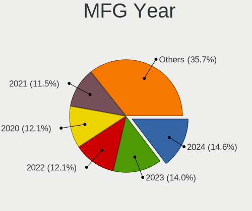
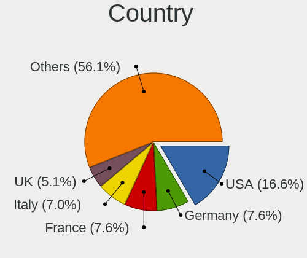
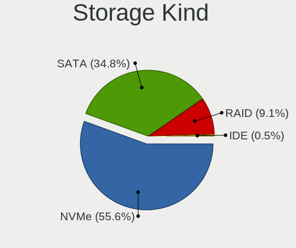
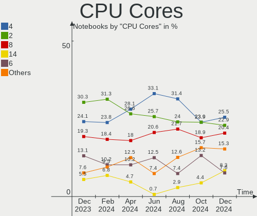
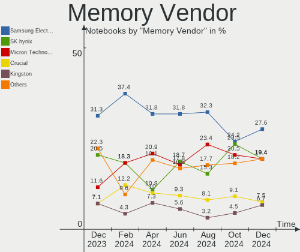

Arch - Hardware Trends (Notebooks)
----------------------------------

A project to identify most popular hardware characteristics and track their change
over time based on data collected by Linux users at https://Linux-Hardware.org.

Anyone can contribute to this report by the [hw-probe](https://github.com/linuxhw/hw-probe) tool:

    sudo -E hw-probe -all -upload

This report is for one last month. Overall report since the beginning of time: [TestDays](https://github.com/linuxhw/TestDays)

Period: Apr, 2023.

Contents
--------

* [ System ](#system)
  - [ OS                       ](#os)
  - [ OS Family                ](#os-family)
  - [ Kernel                   ](#kernel)
  - [ Kernel Family            ](#kernel-family)
  - [ Kernel Major Ver.        ](#kernel-major-ver)
  - [ Arch                     ](#arch)
  - [ DE                       ](#de)
  - [ Display Server           ](#display-server)
  - [ Display Manager          ](#display-manager)
  - [ OS Lang                  ](#os-lang)
  - [ Boot Mode                ](#boot-mode)
  - [ Filesystem               ](#filesystem)
  - [ Part. scheme             ](#part-scheme)
  - [ Dual Boot with Linux/BSD ](#dual-boot-with-linuxbsd)
  - [ Dual Boot (Win)          ](#dual-boot-win)

* [ Board ](#board)
  - [ Vendor                   ](#vendor)
  - [ Model                    ](#model)
  - [ Model Family             ](#model-family)
  - [ MFG Year                 ](#mfg-year)
  - [ Form Factor              ](#form-factor)
  - [ Secure Boot              ](#secure-boot)
  - [ Coreboot                 ](#coreboot)
  - [ RAM Size                 ](#ram-size)
  - [ RAM Used                 ](#ram-used)
  - [ Total Drives             ](#total-drives)
  - [ Has CD-ROM               ](#has-cd-rom)
  - [ Has Ethernet             ](#has-ethernet)
  - [ Has WiFi                 ](#has-wifi)
  - [ Has Bluetooth            ](#has-bluetooth)

* [ Location ](#location)
  - [ Country                  ](#country)
  - [ City                     ](#city)

* [ Drives ](#drives)
  - [ Drive Vendor             ](#drive-vendor)
  - [ Drive Model              ](#drive-model)
  - [ HDD Vendor               ](#hdd-vendor)
  - [ SSD Vendor               ](#ssd-vendor)
  - [ Drive Kind               ](#drive-kind)
  - [ Drive Connector          ](#drive-connector)
  - [ Drive Size               ](#drive-size)
  - [ Space Total              ](#space-total)
  - [ Space Used               ](#space-used)
  - [ Malfunc. Drives          ](#malfunc-drives)
  - [ Malfunc. Drive Vendor    ](#malfunc-drive-vendor)
  - [ Malfunc. HDD Vendor      ](#malfunc-hdd-vendor)
  - [ Malfunc. Drive Kind      ](#malfunc-drive-kind)
  - [ Failed Drives            ](#failed-drives)
  - [ Failed Drive Vendor      ](#failed-drive-vendor)
  - [ Drive Status             ](#drive-status)

* [ Storage controller ](#storage-controller)
  - [ Storage Vendor           ](#storage-vendor)
  - [ Storage Model            ](#storage-model)
  - [ Storage Kind             ](#storage-kind)

* [ Processor ](#processor)
  - [ CPU Vendor               ](#cpu-vendor)
  - [ CPU Model                ](#cpu-model)
  - [ CPU Model Family         ](#cpu-model-family)
  - [ CPU Cores                ](#cpu-cores)
  - [ CPU Sockets              ](#cpu-sockets)
  - [ CPU Threads              ](#cpu-threads)
  - [ CPU Op-Modes             ](#cpu-op-modes)
  - [ CPU Microcode            ](#cpu-microcode)
  - [ CPU Microarch            ](#cpu-microarch)

* [ Graphics ](#graphics)
  - [ GPU Vendor               ](#gpu-vendor)
  - [ GPU Model                ](#gpu-model)
  - [ GPU Combo                ](#gpu-combo)
  - [ GPU Driver               ](#gpu-driver)
  - [ GPU Memory               ](#gpu-memory)

* [ Monitor ](#monitor)
  - [ Monitor Vendor           ](#monitor-vendor)
  - [ Monitor Model            ](#monitor-model)
  - [ Monitor Resolution       ](#monitor-resolution)
  - [ Monitor Diagonal         ](#monitor-diagonal)
  - [ Monitor Width            ](#monitor-width)
  - [ Aspect Ratio             ](#aspect-ratio)
  - [ Monitor Area             ](#monitor-area)
  - [ Pixel Density            ](#pixel-density)
  - [ Multiple Monitors        ](#multiple-monitors)

* [ Network ](#network)
  - [ Net Controller Vendor    ](#net-controller-vendor)
  - [ Net Controller Model     ](#net-controller-model)
  - [ Wireless Vendor          ](#wireless-vendor)
  - [ Wireless Model           ](#wireless-model)
  - [ Ethernet Vendor          ](#ethernet-vendor)
  - [ Ethernet Model           ](#ethernet-model)
  - [ Net Controller Kind      ](#net-controller-kind)
  - [ Used Controller          ](#used-controller)
  - [ NICs                     ](#nics)
  - [ IPv6                     ](#ipv6)

* [ Bluetooth ](#bluetooth)
  - [ Bluetooth Vendor         ](#bluetooth-vendor)
  - [ Bluetooth Model          ](#bluetooth-model)

* [ Sound ](#sound)
  - [ Sound Vendor             ](#sound-vendor)
  - [ Sound Model              ](#sound-model)

* [ Memory ](#memory)
  - [ Memory Vendor            ](#memory-vendor)
  - [ Memory Model             ](#memory-model)
  - [ Memory Kind              ](#memory-kind)
  - [ Memory Form Factor       ](#memory-form-factor)
  - [ Memory Size              ](#memory-size)
  - [ Memory Speed             ](#memory-speed)

* [ Printers & scanners ](#printers--scanners)
  - [ Printer Vendor           ](#printer-vendor)
  - [ Printer Model            ](#printer-model)
  - [ Scanner Vendor           ](#scanner-vendor)
  - [ Scanner Model            ](#scanner-model)

* [ Camera ](#camera)
  - [ Camera Vendor            ](#camera-vendor)
  - [ Camera Model             ](#camera-model)

* [ Security ](#security)
  - [ Fingerprint Vendor       ](#fingerprint-vendor)
  - [ Fingerprint Model        ](#fingerprint-model)
  - [ Chipcard Vendor          ](#chipcard-vendor)
  - [ Chipcard Model           ](#chipcard-model)

* [ Unsupported ](#unsupported)
  - [ Unsupported Devices      ](#unsupported-devices)
  - [ Unsupported Device Types ](#unsupported-device-types)

System
------

OS
--

Installed operating systems

| Name         | Notebooks | Percent |
|--------------|-----------|---------|
| Arch Rolling | 103       | 100%    |

OS Family
---------

OS without a version

| Name | Notebooks | Percent |
|------|-----------|---------|
| Arch | 103       | 100%    |

Kernel
------

Version of the Linux kernel

| Version                    | Notebooks | Percent |
|----------------------------|-----------|---------|
| 6.2.10-arch1-1             | 23        | 22.33%  |
| 6.2.9-arch1-1              | 15        | 14.56%  |
| 6.2.11-arch1-1             | 15        | 14.56%  |
| 6.2.12-arch1-1             | 14        | 13.59%  |
| 6.2.8-arch1-1              | 9         | 8.74%   |
| 6.2.10-zen1-1-zen          | 5         | 4.85%   |
| 6.2.9-zen1-1-zen           | 3         | 2.91%   |
| 6.2.13-arch1-1             | 3         | 2.91%   |
| 6.2.13-zen-1-zen           | 2         | 1.94%   |
| 6.1.26-1-lts               | 2         | 1.94%   |
| 6.2.9-273-tkg-pds          | 1         | 0.97%   |
| 6.2.8-zen1-1.1-zen         | 1         | 0.97%   |
| 6.2.8-zen1-1-zen           | 1         | 0.97%   |
| 6.2.7-arch1-1              | 1         | 0.97%   |
| 6.2.6-arch1-1              | 1         | 0.97%   |
| 6.2.12-zen1-1-zen          | 1         | 0.97%   |
| 6.2.11-zen1-1-zen          | 1         | 0.97%   |
| 6.1.26-x64v1-xanmod1-1-lts | 1         | 0.97%   |
| 6.1.25-1-lts               | 1         | 0.97%   |
| 6.1.24-1-lts               | 1         | 0.97%   |
| 6.1.23-1-lts               | 1         | 0.97%   |
| 6.1.22-1-lts               | 1         | 0.97%   |

Kernel Family
-------------

Linux kernel without a distro release

| Version | Notebooks | Percent |
|---------|-----------|---------|
| 6.2.10  | 28        | 27.18%  |
| 6.2.9   | 19        | 18.45%  |
| 6.2.11  | 16        | 15.53%  |
| 6.2.12  | 15        | 14.56%  |
| 6.2.8   | 11        | 10.68%  |
| 6.2.13  | 5         | 4.85%   |
| 6.1.26  | 3         | 2.91%   |
| 6.2.7   | 1         | 0.97%   |
| 6.2.6   | 1         | 0.97%   |
| 6.1.25  | 1         | 0.97%   |
| 6.1.24  | 1         | 0.97%   |
| 6.1.23  | 1         | 0.97%   |
| 6.1.22  | 1         | 0.97%   |

Kernel Major Ver.
-----------------

Linux kernel major version

| Version | Notebooks | Percent |
|---------|-----------|---------|
| 6.2     | 96        | 93.2%   |
| 6.1     | 7         | 6.8%    |

Arch
----

OS architecture (x86_64, i586, etc.)

| Name   | Notebooks | Percent |
|--------|-----------|---------|
| x86_64 | 103       | 100%    |

DE
--

Desktop Environment

| Name       | Notebooks | Percent |
|------------|-----------|---------|
| KDE5       | 46        | 44.66%  |
| GNOME      | 31        | 30.1%   |
| i3         | 5         | 4.85%   |
| bspwm      | 4         | 3.88%   |
| XFCE       | 3         | 2.91%   |
| sway       | 3         | 2.91%   |
| Hyprland   | 3         | 2.91%   |
| Unknown    | 3         | 2.91%   |
| X-Cinnamon | 2         | 1.94%   |
| LXDE       | 1         | 0.97%   |
| KDE        | 1         | 0.97%   |
| Deepin     | 1         | 0.97%   |

Display Server
--------------

X11 or Wayland

| Name    | Notebooks | Percent |
|---------|-----------|---------|
| X11     | 48        | 46.6%   |
| Wayland | 44        | 42.72%  |
| Unknown | 6         | 5.83%   |
| Tty     | 5         | 4.85%   |

Display Manager
---------------

SDDM, LightDM, etc.

| Name    | Notebooks | Percent |
|---------|-----------|---------|
| SDDM    | 35        | 33.98%  |
| Unknown | 35        | 33.98%  |
| GDM     | 17        | 16.5%   |
| LightDM | 12        | 11.65%  |
| SLiM    | 1         | 0.97%   |
| Ly      | 1         | 0.97%   |
| LXDM    | 1         | 0.97%   |
| EMPTTY  | 1         | 0.97%   |

OS Lang
-------

Language

| Lang       | Notebooks | Percent |
|------------|-----------|---------|
| en_US      | 63        | 61.17%  |
| C          | 10        | 9.71%   |
| it_IT      | 4         | 3.88%   |
| en_GB      | 4         | 3.88%   |
| zh_CN      | 2         | 1.94%   |
| ru_RU      | 2         | 1.94%   |
| pt_BR      | 2         | 1.94%   |
| en_CA      | 2         | 1.94%   |
| de_DE      | 2         | 1.94%   |
| ro_RO      | 1         | 0.97%   |
| pt_PT      | 1         | 0.97%   |
| nl_NL      | 1         | 0.97%   |
| nb_NO      | 1         | 0.97%   |
| es_UY.UTF8 | 1         | 0.97%   |
| es_ES      | 1         | 0.97%   |
| en_IN      | 1         | 0.97%   |
| en_IL      | 1         | 0.97%   |
| en_AU      | 1         | 0.97%   |
| en_AG      | 1         | 0.97%   |
| cs_CZ      | 1         | 0.97%   |
| Unknown    | 1         | 0.97%   |

Boot Mode
---------

EFI or BIOS

| Mode | Notebooks | Percent |
|------|-----------|---------|
| EFI  | 72        | 69.9%   |
| BIOS | 31        | 30.1%   |

Filesystem
----------

Type of filesystem

| Type  | Notebooks | Percent |
|-------|-----------|---------|
| Ext4  | 69        | 66.99%  |
| Btrfs | 28        | 27.18%  |
| Xfs   | 5         | 4.85%   |
| F2fs  | 1         | 0.97%   |

Part. scheme
------------

Scheme of partitioning

| Type    | Notebooks | Percent |
|---------|-----------|---------|
| GPT     | 76        | 73.79%  |
| Unknown | 24        | 23.3%   |
| MBR     | 3         | 2.91%   |

Dual Boot with Linux/BSD
------------------------

Hosting more than one Linux/BSD

| Dual boot | Notebooks | Percent |
|-----------|-----------|---------|
| No        | 93        | 90.29%  |
| Yes       | 10        | 9.71%   |

Dual Boot (Win)
---------------

Hosting Linux and Windows

| Dual boot | Notebooks | Percent |
|-----------|-----------|---------|
| No        | 81        | 78.64%  |
| Yes       | 22        | 21.36%  |

Board
-----

Vendor
------

Motherboard manufacturer

| Name                   | Notebooks | Percent |
|------------------------|-----------|---------|
| Lenovo                 | 28        | 27.18%  |
| Hewlett-Packard        | 18        | 17.48%  |
| ASUSTek Computer       | 13        | 12.62%  |
| Dell                   | 10        | 9.71%   |
| Timi                   | 4         | 3.88%   |
| MSI                    | 4         | 3.88%   |
| Acer                   | 4         | 3.88%   |
| Notebook               | 3         | 2.91%   |
| Google                 | 2         | 1.94%   |
| Fujitsu                | 2         | 1.94%   |
| Avell High Performance | 2         | 1.94%   |
| Apple                  | 2         | 1.94%   |
| Valve                  | 1         | 0.97%   |
| Toxic                  | 1         | 0.97%   |
| Toshiba                | 1         | 0.97%   |
| System76               | 1         | 0.97%   |
| Sony                   | 1         | 0.97%   |
| Schenker               | 1         | 0.97%   |
| Prestigio              | 1         | 0.97%   |
| HUAWEI                 | 1         | 0.97%   |
| Gigabyte Technology    | 1         | 0.97%   |
| Framework              | 1         | 0.97%   |
| Alienware              | 1         | 0.97%   |

Model
-----

Motherboard model

| Name                                        | Notebooks | Percent |
|---------------------------------------------|-----------|---------|
| Timi Redmi Book Pro 15 2022                 | 2         | 1.94%   |
| HP Laptop 15s-eq3xxx                        | 2         | 1.94%   |
| ASUS ROG Strix G513QY_G513QY                | 2         | 1.94%   |
| Valve Jupiter                               | 1         | 0.97%   |
| Toxic GM5MPHY                               | 1         | 0.97%   |
| Toshiba Satellite S50-B                     | 1         | 0.97%   |
| Timi RedmiBook Pro 15                       | 1         | 0.97%   |
| Timi RedmiBook Pro 14S                      | 1         | 0.97%   |
| System76 Pangolin                           | 1         | 0.97%   |
| Sony SVE11113FXW                            | 1         | 0.97%   |
| Schenker S405                               | 1         | 0.97%   |
| Prestigio PSB133S01ZFH                      | 1         | 0.97%   |
| Notebook NH5x_NH7x_HHx_HJx_HKx              | 1         | 0.97%   |
| Notebook N85_N87HCHNHZ                      | 1         | 0.97%   |
| Notebook N15_N17RD1                         | 1         | 0.97%   |
| MSI Stealth 14Studio A13VF                  | 1         | 0.97%   |
| MSI Prestige 14 A12UC                       | 1         | 0.97%   |
| MSI GF75 Thin 9SC                           | 1         | 0.97%   |
| MSI Bravo 15 B5DD                           | 1         | 0.97%   |
| Lenovo V15-ADA 82C7                         | 1         | 0.97%   |
| Lenovo ThinkPad Z13 Gen 1 21D2000KUS        | 1         | 0.97%   |
| Lenovo ThinkPad X250 20CMCTO1WW             | 1         | 0.97%   |
| Lenovo ThinkPad X1 Carbon Gen 10 21CBS1GL00 | 1         | 0.97%   |
| Lenovo ThinkPad X1 Carbon 6th 20KH002KUS    | 1         | 0.97%   |
| Lenovo ThinkPad X1 Carbon 5th 20HR000FUS    | 1         | 0.97%   |
| Lenovo ThinkPad X1 Carbon 5th 20HQS1MX00    | 1         | 0.97%   |
| Lenovo ThinkPad T530 24297ZG                | 1         | 0.97%   |
| Lenovo ThinkPad T480s 20L8S8XJ00            | 1         | 0.97%   |
| Lenovo ThinkPad T480 20L6S4G72S             | 1         | 0.97%   |
| Lenovo ThinkPad T470s W10DG 20JTS0DN00      | 1         | 0.97%   |
| Lenovo ThinkPad T460 20FMS0E22C             | 1         | 0.97%   |
| Lenovo ThinkPad T440p                       | 1         | 0.97%   |
| Lenovo ThinkPad T14 Gen 2i 20W1S1S300       | 1         | 0.97%   |
| Lenovo ThinkPad T14 Gen 1 20S1S4RB26        | 1         | 0.97%   |
| Lenovo ThinkPad P52 20MAS1LH00              | 1         | 0.97%   |
| Lenovo ThinkPad P51 W10DG 20MNS08X00        | 1         | 0.97%   |
| Lenovo ThinkPad P16 Gen 1 21D6S0AK00        | 1         | 0.97%   |
| Lenovo ThinkPad P1 Gen 5 21DCCTO1WW         | 1         | 0.97%   |
| Lenovo ThinkPad E480 20KQS0B800             | 1         | 0.97%   |
| Lenovo ThinkBook 13s G2 ITL 20V9            | 1         | 0.97%   |

Model Family
------------

Motherboard model prefix

| Name                   | Notebooks | Percent |
|------------------------|-----------|---------|
| Lenovo ThinkPad        | 19        | 18.45%  |
| HP Laptop              | 7         | 6.8%    |
| Lenovo IdeaPad         | 5         | 4.85%   |
| Dell Latitude          | 4         | 3.88%   |
| ASUS ROG               | 4         | 3.88%   |
| HP Pavilion            | 3         | 2.91%   |
| Dell XPS               | 3         | 2.91%   |
| Timi RedmiBook         | 2         | 1.94%   |
| Timi Redmi             | 2         | 1.94%   |
| Lenovo Legion          | 2         | 1.94%   |
| HP ProBook             | 2         | 1.94%   |
| Fujitsu LIFEBOOK       | 2         | 1.94%   |
| Dell Inspiron          | 2         | 1.94%   |
| ASUS VivoBook          | 2         | 1.94%   |
| ASUS TUF               | 2         | 1.94%   |
| ASUS ASUS              | 2         | 1.94%   |
| Acer Aspire            | 2         | 1.94%   |
| Valve Jupiter          | 1         | 0.97%   |
| Toxic GM5MPHY          | 1         | 0.97%   |
| Toshiba Satellite      | 1         | 0.97%   |
| System76 Pangolin      | 1         | 0.97%   |
| Sony SVE11113FXW       | 1         | 0.97%   |
| Schenker S405          | 1         | 0.97%   |
| Prestigio PSB133S01ZFH | 1         | 0.97%   |
| Notebook NH5x          | 1         | 0.97%   |
| Notebook N85           | 1         | 0.97%   |
| Notebook N15           | 1         | 0.97%   |
| MSI Stealth            | 1         | 0.97%   |
| MSI Prestige           | 1         | 0.97%   |
| MSI GF75               | 1         | 0.97%   |
| MSI Bravo              | 1         | 0.97%   |
| Lenovo V15-ADA         | 1         | 0.97%   |
| Lenovo ThinkBook       | 1         | 0.97%   |
| HUAWEI NBLB-WAX9N      | 1         | 0.97%   |
| HP ZBook               | 1         | 0.97%   |
| HP OMEN                | 1         | 0.97%   |
| HP Notebook            | 1         | 0.97%   |
| HP EliteBook           | 1         | 0.97%   |
| HP 240                 | 1         | 0.97%   |
| HP 15                  | 1         | 0.97%   |

MFG Year
--------

Motherboard manufacture year

| Year | Notebooks | Percent |
|------|-----------|---------|
| 2022 | 22        | 21.36%  |
| 2021 | 20        | 19.42%  |
| 2018 | 13        | 12.62%  |
| 2020 | 10        | 9.71%   |
| 2019 | 9         | 8.74%   |
| 2017 | 7         | 6.8%    |
| 2014 | 4         | 3.88%   |
| 2013 | 4         | 3.88%   |
| 2012 | 4         | 3.88%   |
| 2016 | 3         | 2.91%   |
| 2015 | 3         | 2.91%   |
| 2023 | 2         | 1.94%   |
| 2011 | 1         | 0.97%   |
| 2008 | 1         | 0.97%   |

Form Factor
-----------

Physical design of the computer

| Name     | Notebooks | Percent |
|----------|-----------|---------|
| Notebook | 103       | 100%    |

Secure Boot
-----------

Enabled or disabled

| State    | Notebooks | Percent |
|----------|-----------|---------|
| Disabled | 98        | 95.15%  |
| Enabled  | 5         | 4.85%   |

Coreboot
--------

Have coreboot on board

| Used | Notebooks | Percent |
|------|-----------|---------|
| No   | 100       | 97.09%  |
| Yes  | 3         | 2.91%   |

RAM Size
--------

Total RAM memory

| Size in GB  | Notebooks | Percent |
|-------------|-----------|---------|
| 16.01-24.0  | 29        | 28.16%  |
| 4.01-8.0    | 23        | 22.33%  |
| 8.01-16.0   | 23        | 22.33%  |
| 32.01-64.0  | 17        | 16.5%   |
| 3.01-4.0    | 6         | 5.83%   |
| 24.01-32.0  | 2         | 1.94%   |
| 64.01-256.0 | 2         | 1.94%   |
| 2.01-3.0    | 1         | 0.97%   |

RAM Used
--------

Used RAM memory

| Used GB   | Notebooks | Percent |
|-----------|-----------|---------|
| 4.01-8.0  | 36        | 34.95%  |
| 2.01-3.0  | 21        | 20.39%  |
| 3.01-4.0  | 20        | 19.42%  |
| 1.01-2.0  | 15        | 14.56%  |
| 8.01-16.0 | 9         | 8.74%   |
| 0.51-1.0  | 2         | 1.94%   |

Total Drives
------------

Number of drives on board

| Drives | Notebooks | Percent |
|--------|-----------|---------|
| 1      | 72        | 69.9%   |
| 2      | 26        | 25.24%  |
| 3      | 5         | 4.85%   |

Has CD-ROM
----------

Has CD-ROM on board

| Presented | Notebooks | Percent |
|-----------|-----------|---------|
| No        | 92        | 89.32%  |
| Yes       | 11        | 10.68%  |

Has Ethernet
------------

Has Ethernet on board

| Presented | Notebooks | Percent |
|-----------|-----------|---------|
| Yes       | 75        | 72.82%  |
| No        | 28        | 27.18%  |

Has WiFi
--------

Has WiFi module

| Presented | Notebooks | Percent |
|-----------|-----------|---------|
| Yes       | 103       | 100%    |

Has Bluetooth
-------------

Has Bluetooth module

| Presented | Notebooks | Percent |
|-----------|-----------|---------|
| Yes       | 95        | 92.23%  |
| No        | 8         | 7.77%   |

Location
--------

Country
-------

Geographic location (country)

| Country                | Notebooks | Percent |
|------------------------|-----------|---------|
| USA                    | 14        | 13.59%  |
| Russia                 | 8         | 7.77%   |
| Italy                  | 8         | 7.77%   |
| Germany                | 7         | 6.8%    |
| Brazil                 | 7         | 6.8%    |
| Canada                 | 6         | 5.83%   |
| Spain                  | 4         | 3.88%   |
| Poland                 | 3         | 2.91%   |
| France                 | 3         | 2.91%   |
| Austria                | 3         | 2.91%   |
| Australia              | 3         | 2.91%   |
| UK                     | 2         | 1.94%   |
| Slovakia               | 2         | 1.94%   |
| Romania                | 2         | 1.94%   |
| Portugal               | 2         | 1.94%   |
| Netherlands            | 2         | 1.94%   |
| Kyrgyzstan             | 2         | 1.94%   |
| Indonesia              | 2         | 1.94%   |
| India                  | 2         | 1.94%   |
| China                  | 2         | 1.94%   |
| Vietnam                | 1         | 0.97%   |
| Uruguay                | 1         | 0.97%   |
| Thailand               | 1         | 0.97%   |
| Puerto Rico            | 1         | 0.97%   |
| Norway                 | 1         | 0.97%   |
| New Zealand            | 1         | 0.97%   |
| Morocco                | 1         | 0.97%   |
| Moldova                | 1         | 0.97%   |
| Japan                  | 1         | 0.97%   |
| Israel                 | 1         | 0.97%   |
| Hungary                | 1         | 0.97%   |
| Greece                 | 1         | 0.97%   |
| Finland                | 1         | 0.97%   |
| Czechia                | 1         | 0.97%   |
| Cuba                   | 1         | 0.97%   |
| Bulgaria               | 1         | 0.97%   |
| Bosnia and Herzegovina | 1         | 0.97%   |
| Belarus                | 1         | 0.97%   |
| Argentina              | 1         | 0.97%   |

City
----

Geographic location (city)

| City                       | Notebooks | Percent |
|----------------------------|-----------|---------|
| Moscow                     | 4         | 3.88%   |
| St Petersburg              | 3         | 2.91%   |
| Melbourne                  | 3         | 2.91%   |
| Vienna                     | 2         | 1.94%   |
| Paris                      | 2         | 1.94%   |
| Mississauga                | 2         | 1.94%   |
| Johnson City               | 2         | 1.94%   |
| Bratislava                 | 2         | 1.94%   |
| Bishkek                    | 2         | 1.94%   |
| Wolkersdorf im Weinviertel | 1         | 0.97%   |
| Winnipeg                   | 1         | 0.97%   |
| Wadowice                   | 1         | 0.97%   |
| Villa Ballester            | 1         | 0.97%   |
| Vila Verde                 | 1         | 0.97%   |
| Vila Nova de Gaia          | 1         | 0.97%   |
| Uelzen                     | 1         | 0.97%   |
| Uberlândia                | 1         | 0.97%   |
| Trento                     | 1         | 0.97%   |
| Torre Boldone              | 1         | 0.97%   |
| Tokyo                      | 1         | 0.97%   |
| Teresina                   | 1         | 0.97%   |
| Tel Aviv                   | 1         | 0.97%   |
| Suceava                    | 1         | 0.97%   |
| Storm Lake                 | 1         | 0.97%   |
| St Louis                   | 1         | 0.97%   |
| South San Francisco        | 1         | 0.97%   |
| Seattle                    | 1         | 0.97%   |
| Sao Paulo                  | 1         | 0.97%   |
| Sao Luís                  | 1         | 0.97%   |
| Sao José dos Campos       | 1         | 0.97%   |
| Salt Lake City             | 1         | 0.97%   |
| Salihorsk                  | 1         | 0.97%   |
| Prad am Stilfser Joch      | 1         | 0.97%   |
| Portland                   | 1         | 0.97%   |
| Plaza de la Revolucion     | 1         | 0.97%   |
| Parnamirim                 | 1         | 0.97%   |
| Omsk                       | 1         | 0.97%   |
| Oak Creek                  | 1         | 0.97%   |
| Nowy Staw                  | 1         | 0.97%   |
| North York                 | 1         | 0.97%   |

Drives
------

Drive Vendor
------------

Hard drive vendors

| Vendor                       | Notebooks | Drives | Percent |
|------------------------------|-----------|--------|---------|
| Samsung Electronics          | 30        | 31     | 22.39%  |
| Sandisk                      | 13        | 15     | 9.7%    |
| Unknown                      | 10        | 10     | 7.46%   |
| WDC                          | 9         | 9      | 6.72%   |
| Intel                        | 7         | 7      | 5.22%   |
| SK hynix                     | 6         | 6      | 4.48%   |
| Micron Technology            | 6         | 6      | 4.48%   |
| Toshiba                      | 5         | 5      | 3.73%   |
| Seagate                      | 5         | 5      | 3.73%   |
| Kingston                     | 4         | 4      | 2.99%   |
| Crucial                      | 4         | 4      | 2.99%   |
| Phison Electronics           | 3         | 3      | 2.24%   |
| KIOXIA                       | 3         | 3      | 2.24%   |
| Kingston Technology Company  | 3         | 3      | 2.24%   |
| Hitachi                      | 3         | 3      | 2.24%   |
| HGST                         | 3         | 3      | 2.24%   |
| A-DATA Technology            | 3         | 4      | 2.24%   |
| Shenzhen Longsys Electronics | 2         | 2      | 1.49%   |
| PNY                          | 2         | 2      | 1.49%   |
| Micron/Crucial Technology    | 2         | 2      | 1.49%   |
| Yangtze Memory Technologies  | 1         | 1      | 0.75%   |
| Transcend                    | 1         | 1      | 0.75%   |
| OWC                          | 1         | 1      | 0.75%   |
| MAXIO Technology (Hangzhou)  | 1         | 1      | 0.75%   |
| KingSpec                     | 1         | 1      | 0.75%   |
| KBG50ZNV                     | 1         | 1      | 0.75%   |
| Intenso                      | 1         | 1      | 0.75%   |
| Gigabyte Technology          | 1         | 1      | 0.75%   |
| Generic-                     | 1         | 1      | 0.75%   |
| BIWIN                        | 1         | 1      | 0.75%   |
| Apple                        | 1         | 2      | 0.75%   |

Drive Model
-----------

Hard drive models

| Model                                                  | Notebooks | Percent |
|--------------------------------------------------------|-----------|---------|
| Samsung NVMe SSD Controller SM981/PM981/PM983 1TB      | 9         | 6.62%   |
| Unknown MMC Card  32GB                                 | 6         | 4.41%   |
| Sandisk WD Blue SN550 NVMe SSD 1024GB                  | 4         | 2.94%   |
| Samsung NVMe SSD Controller PM9A1/PM9A3/980PRO 2TB     | 4         | 2.94%   |
| WDC WD10SPZX-60Z10T0 1TB                               | 2         | 1.47%   |
| Unknown MMC Card  128GB                                | 2         | 1.47%   |
| SK hynix HFM512GD3JX013N 512GB                         | 2         | 1.47%   |
| Shenzhen Longsys SM2263EN/SM2263XT-based OEM SSD 512GB | 2         | 1.47%   |
| Samsung SSD 980 1TB                                    | 2         | 1.47%   |
| Samsung MZALQ512HALU-000L2 512GB                       | 2         | 1.47%   |
| Phison E12 NVMe Controller 512GB                       | 2         | 1.47%   |
| Micron/Crucial P2 NVMe PCIe SSD 1TB                    | 2         | 1.47%   |
| Micron MTFDKBA512TFK-1BC1AABHA 512GB                   | 2         | 1.47%   |
| KIOXIA KBG50ZNV512G 512GB                              | 2         | 1.47%   |
| Kingston Company OM3PDP3 NVMe SSD 512GB                | 2         | 1.47%   |
| Kingston SFYRS1000G 1TB                                | 2         | 1.47%   |
| Intel SSD 660P Series 512GB                            | 2         | 1.47%   |
| Crucial CT240BX500SSD1 240GB                           | 2         | 1.47%   |
| Yangtze Memory ZHITAI PC005 Active 512GB               | 1         | 0.74%   |
| WDC WDS240G1G0A-00SS50 240GB SSD                       | 1         | 0.74%   |
| WDC WDS100T2B0A-00SM50 1TB SSD                         | 1         | 0.74%   |
| WDC WD6400BEVT-22A0RT0 640GB                           | 1         | 0.74%   |
| WDC WD5000LPLX-75ZNTT0 500GB                           | 1         | 0.74%   |
| WDC WD3200BEVT-22ZCT0 320GB                            | 1         | 0.74%   |
| WDC WD10SPZX-11Z10T0 1TB                               | 1         | 0.74%   |
| WDC WD Green 2.5 240GB                                 | 1         | 0.74%   |
| Unknown SD/MMC/MS PRO 249GB                            | 1         | 0.74%   |
| Unknown MMC Card  4GB                                  | 1         | 0.74%   |
| Transcend TS120GMTS420S 120GB SSD                      | 1         | 0.74%   |
| Toshiba XG6 NVMe SSD Controller 1024GB                 | 1         | 0.74%   |
| Toshiba MQ04ABF100 1TB                                 | 1         | 0.74%   |
| Toshiba MQ02ABD100H 1TB                                | 1         | 0.74%   |
| Toshiba MQ01ABD100 1TB                                 | 1         | 0.74%   |
| Toshiba KXG5AZNV512G 512GB                             | 1         | 0.74%   |
| SK hynix SHPP41-1000GM 1TB                             | 1         | 0.74%   |
| SK hynix PC801 NVMe 1TB                                | 1         | 0.74%   |
| SK hynix PC601 HFS512GD9TNG-L2A0A 512GB                | 1         | 0.74%   |
| SK hynix BC711 NVMe 512GB                              | 1         | 0.74%   |
| Seagate ST9320325AS 320GB                              | 1         | 0.74%   |
| Seagate ST1000LX015-1U7172 1TB                         | 1         | 0.74%   |

HDD Vendor
----------

Hard disk drive vendors

| Vendor   | Notebooks | Drives | Percent |
|----------|-----------|--------|---------|
| WDC      | 6         | 6      | 27.27%  |
| Seagate  | 5         | 5      | 22.73%  |
| Toshiba  | 3         | 3      | 13.64%  |
| Hitachi  | 3         | 3      | 13.64%  |
| HGST     | 3         | 3      | 13.64%  |
| Unknown  | 1         | 1      | 4.55%   |
| Generic- | 1         | 1      | 4.55%   |

SSD Vendor
----------

Solid state drive vendors

| Vendor              | Notebooks | Drives | Percent |
|---------------------|-----------|--------|---------|
| Samsung Electronics | 6         | 6      | 24%     |
| Crucial             | 4         | 4      | 16%     |
| WDC                 | 3         | 3      | 12%     |
| SanDisk             | 2         | 2      | 8%      |
| PNY                 | 2         | 2      | 8%      |
| Transcend           | 1         | 1      | 4%      |
| OWC                 | 1         | 1      | 4%      |
| Kingston            | 1         | 1      | 4%      |
| KingSpec            | 1         | 1      | 4%      |
| Intenso             | 1         | 1      | 4%      |
| Intel               | 1         | 1      | 4%      |
| Gigabyte Technology | 1         | 1      | 4%      |
| BIWIN               | 1         | 1      | 4%      |

Drive Kind
----------

HDD or SSD

| Kind    | Notebooks | Drives | Percent |
|---------|-----------|--------|---------|
| NVMe    | 73        | 82     | 57.03%  |
| SSD     | 25        | 25     | 19.53%  |
| HDD     | 20        | 22     | 15.63%  |
| MMC     | 9         | 9      | 7.03%   |
| Unknown | 1         | 1      | 0.78%   |

Drive Connector
---------------

SATA, SAS, NVMe, etc.

| Type | Notebooks | Drives | Percent |
|------|-----------|--------|---------|
| NVMe | 73        | 82     | 58.87%  |
| SATA | 39        | 45     | 31.45%  |
| MMC  | 9         | 9      | 7.26%   |
| SAS  | 3         | 3      | 2.42%   |

Drive Size
----------

Size of hard drive

| Size in TB | Notebooks | Drives | Percent |
|------------|-----------|--------|---------|
| 0.01-0.5   | 27        | 30     | 61.36%  |
| 0.51-1.0   | 17        | 17     | 38.64%  |

Space Total
-----------

Amount of disk space available on the file system

| Size in GB     | Notebooks | Percent |
|----------------|-----------|---------|
| 251-500        | 26        | 25.24%  |
| 501-1000       | 25        | 24.27%  |
| 101-250        | 20        | 19.42%  |
| 1001-2000      | 14        | 13.59%  |
| More than 3000 | 7         | 6.8%    |
| 2001-3000      | 4         | 3.88%   |
| 51-100         | 3         | 2.91%   |
| 21-50          | 2         | 1.94%   |
| 1-20           | 1         | 0.97%   |
| Unknown        | 1         | 0.97%   |

Space Used
----------

Amount of used disk space

| Used GB   | Notebooks | Percent |
|-----------|-----------|---------|
| 101-250   | 23        | 22.33%  |
| 21-50     | 19        | 18.45%  |
| 1-20      | 18        | 17.48%  |
| 251-500   | 16        | 15.53%  |
| 51-100    | 12        | 11.65%  |
| 501-1000  | 9         | 8.74%   |
| 1001-2000 | 5         | 4.85%   |
| Unknown   | 1         | 0.97%   |

Malfunc. Drives
---------------

Drive models with a malfunction

| Model                            | Notebooks | Drives | Percent |
|----------------------------------|-----------|--------|---------|
| WDC WD6400BEVT-22A0RT0 640GB     | 1         | 1      | 16.67%  |
| Seagate ST1000LX015-1U7172 1TB   | 1         | 1      | 16.67%  |
| Seagate ST1000LM035-1RK172 970GB | 1         | 1      | 16.67%  |
| Hitachi HTS547564A9E384 640GB    | 1         | 1      | 16.67%  |
| HGST HTS721010A9E630 1TB         | 1         | 1      | 16.67%  |
| HGST HTS541010B7E610 1TB         | 1         | 1      | 16.67%  |

Malfunc. Drive Vendor
---------------------

Vendors of faulty drives

| Vendor  | Notebooks | Drives | Percent |
|---------|-----------|--------|---------|
| Seagate | 2         | 2      | 33.33%  |
| HGST    | 2         | 2      | 33.33%  |
| WDC     | 1         | 1      | 16.67%  |
| Hitachi | 1         | 1      | 16.67%  |

Malfunc. HDD Vendor
-------------------

Vendors of faulty HDD drives

| Vendor  | Notebooks | Drives | Percent |
|---------|-----------|--------|---------|
| Seagate | 2         | 2      | 33.33%  |
| HGST    | 2         | 2      | 33.33%  |
| WDC     | 1         | 1      | 16.67%  |
| Hitachi | 1         | 1      | 16.67%  |

Malfunc. Drive Kind
-------------------

Kinds of faulty drives

| Kind | Notebooks | Drives | Percent |
|------|-----------|--------|---------|
| HDD  | 6         | 6      | 100%    |

Failed Drives
-------------

Failed drive models

Zero info for selected period =(

Failed Drive Vendor
-------------------

Failed drive vendors

Zero info for selected period =(

Drive Status
------------

Number of failed and malfunc. drives

| Status   | Notebooks | Drives | Percent |
|----------|-----------|--------|---------|
| Works    | 65        | 77     | 56.03%  |
| Detected | 45        | 56     | 38.79%  |
| Malfunc  | 6         | 6      | 5.17%   |

Storage controller
------------------

Storage Vendor
--------------

Storage controller vendors

| Vendor                       | Notebooks | Percent |
|------------------------------|-----------|---------|
| Intel                        | 55        | 40.15%  |
| Samsung Electronics          | 24        | 17.52%  |
| SanDisk                      | 11        | 8.03%   |
| AMD                          | 10        | 7.3%    |
| SK hynix                     | 6         | 4.38%   |
| Micron Technology            | 6         | 4.38%   |
| Kingston Technology Company  | 6         | 4.38%   |
| Phison Electronics           | 3         | 2.19%   |
| KIOXIA                       | 3         | 2.19%   |
| ADATA Technology             | 3         | 2.19%   |
| Toshiba America Info Systems | 2         | 1.46%   |
| Shenzhen Longsys Electronics | 2         | 1.46%   |
| Micron/Crucial Technology    | 2         | 1.46%   |
| Yangtze Memory Technologies  | 1         | 0.73%   |
| MAXIO Technology (Hangzhou)  | 1         | 0.73%   |
| Marvell Technology Group     | 1         | 0.73%   |
| Apple                        | 1         | 0.73%   |

Storage Model
-------------

Storage controller models

| Model                                                            | Notebooks | Percent |
|------------------------------------------------------------------|-----------|---------|
| AMD FCH SATA Controller [AHCI mode]                              | 10        | 7.14%   |
| Samsung NVMe SSD Controller SM981/PM981/PM983                    | 9         | 6.43%   |
| Samsung NVMe SSD Controller 980                                  | 9         | 6.43%   |
| Intel Volume Management Device NVMe RAID Controller              | 8         | 5.71%   |
| Micron NVMe Storage Controller                                   | 6         | 4.29%   |
| Intel Wildcat Point-LP SATA Controller [AHCI Mode]               | 6         | 4.29%   |
| Intel 82801 Mobile SATA Controller [RAID mode]                   | 6         | 4.29%   |
| Intel Cannon Point-LP SATA Controller [AHCI Mode]                | 5         | 3.57%   |
| SanDisk WD Blue SN550 NVMe SSD                                   | 4         | 2.86%   |
| Samsung NVMe SSD Controller PM9A1/PM9A3/980PRO                   | 4         | 2.86%   |
| SK hynix Gold P31/PC711 NVMe Solid State Drive                   | 3         | 2.14%   |
| Kingston Company Company Non-Volatile memory controller          | 3         | 2.14%   |
| Intel Sunrise Point-LP SATA Controller [AHCI mode]               | 3         | 2.14%   |
| Intel Non-Volatile memory controller                             | 3         | 2.14%   |
| Intel HM170/QM170 Chipset SATA Controller [AHCI Mode]            | 3         | 2.14%   |
| Intel Cannon Lake Mobile PCH SATA AHCI Controller                | 3         | 2.14%   |
| Intel 8 Series SATA Controller 1 [AHCI mode]                     | 3         | 2.14%   |
| Intel 7 Series Chipset Family 6-port SATA Controller [AHCI mode] | 3         | 2.14%   |
| ADATA IM2P33F8ABR1 NVMe SSD                                      | 3         | 2.14%   |
| SK hynix Platinum P41 NVMe Solid State Drive 2TB                 | 2         | 1.43%   |
| Shenzhen Longsys SM2263EN/SM2263XT-based OEM SSD                 | 2         | 1.43%   |
| SanDisk WD Black SN770 NVMe SSD                                  | 2         | 1.43%   |
| Phison E12 NVMe Controller                                       | 2         | 1.43%   |
| Micron/Crucial P2 NVMe PCIe SSD                                  | 2         | 1.43%   |
| KIOXIA Non-Volatile memory controller                            | 2         | 1.43%   |
| Kingston Company OM3PDP3 NVMe SSD                                | 2         | 1.43%   |
| Intel SSD 660P Series                                            | 2         | 1.43%   |
| Intel Comet Lake SATA AHCI Controller                            | 2         | 1.43%   |
| Intel 400 Series Chipset Family SATA AHCI Controller             | 2         | 1.43%   |
| Yangtze Memory Non-Volatile memory controller                    | 1         | 0.71%   |
| Toshiba America Info Systems XG6 NVMe SSD Controller             | 1         | 0.71%   |
| Toshiba America Info Systems XG5 NVMe SSD Controller             | 1         | 0.71%   |
| SK hynix Non-Volatile memory controller                          | 1         | 0.71%   |
| Sandisk Western Digital WD Black SN850X NVMe SSD                 | 1         | 0.71%   |
| SanDisk WD PC SN810 / Black SN850 NVMe SSD                       | 1         | 0.71%   |
| SanDisk WD Blue SN500 / PC SN520 NVMe SSD                        | 1         | 0.71%   |
| SanDisk WD Black SN750 / PC SN730 NVMe SSD                       | 1         | 0.71%   |
| SanDisk PC SN520 NVMe SSD                                        | 1         | 0.71%   |
| SanDisk Non-Volatile memory controller                           | 1         | 0.71%   |
| Samsung NVMe SSD Controller SM961/PM961/SM963                    | 1         | 0.71%   |

Storage Kind
------------

Kind of storage controller (IDE, SATA, NVMe, SAS, ...)

| Kind | Notebooks | Percent |
|------|-----------|---------|
| NVMe | 73        | 54.07%  |
| SATA | 47        | 34.81%  |
| RAID | 15        | 11.11%  |

Processor
---------

CPU Vendor
----------

Processor vendors

| Vendor | Notebooks | Percent |
|--------|-----------|---------|
| Intel  | 81        | 78.64%  |
| AMD    | 22        | 21.36%  |

CPU Model
---------

Processor models

| Model                                   | Notebooks | Percent |
|-----------------------------------------|-----------|---------|
| Intel 12th Gen Core i7-1260P            | 4         | 3.88%   |
| Intel Core i5-8265U CPU @ 1.60GHz       | 3         | 2.91%   |
| Intel Core i5-8250U CPU @ 1.60GHz       | 3         | 2.91%   |
| Intel Core i5-5200U CPU @ 2.20GHz       | 3         | 2.91%   |
| Intel 12th Gen Core i7-12700H           | 3         | 2.91%   |
| Intel 11th Gen Core i7-1165G7 @ 2.80GHz | 3         | 2.91%   |
| AMD Ryzen 7 5700U with Radeon Graphics  | 3         | 2.91%   |
| Intel Core i7-8750H CPU @ 2.20GHz       | 2         | 1.94%   |
| Intel Core i7-8650U CPU @ 1.90GHz       | 2         | 1.94%   |
| Intel Core i7-7700HQ CPU @ 2.80GHz      | 2         | 1.94%   |
| Intel Core i7-7600U CPU @ 2.80GHz       | 2         | 1.94%   |
| Intel Core i7-4600U CPU @ 2.10GHz       | 2         | 1.94%   |
| Intel Core i5-8300H CPU @ 2.30GHz       | 2         | 1.94%   |
| Intel Celeron CPU N3350 @ 1.10GHz       | 2         | 1.94%   |
| Intel 12th Gen Core i7-12650H           | 2         | 1.94%   |
| Intel 11th Gen Core i7-1185G7 @ 3.00GHz | 2         | 1.94%   |
| Intel 11th Gen Core i5-11400H @ 2.70GHz | 2         | 1.94%   |
| AMD Ryzen 9 5980HX with Radeon Graphics | 2         | 1.94%   |
| AMD Ryzen 5 5625U with Radeon Graphics  | 2         | 1.94%   |
| Intel Pentium CPU N3710 @ 1.60GHz       | 1         | 0.97%   |
| Intel Core i7-9750H CPU @ 2.60GHz       | 1         | 0.97%   |
| Intel Core i7-8850H CPU @ 2.60GHz       | 1         | 0.97%   |
| Intel Core i7-8565U CPU @ 1.80GHz       | 1         | 0.97%   |
| Intel Core i7-6820HQ CPU @ 2.70GHz      | 1         | 0.97%   |
| Intel Core i7-6700HQ CPU @ 2.60GHz      | 1         | 0.97%   |
| Intel Core i7-6600U CPU @ 2.60GHz       | 1         | 0.97%   |
| Intel Core i7-5500U CPU @ 2.40GHz       | 1         | 0.97%   |
| Intel Core i7-4500U CPU @ 1.80GHz       | 1         | 0.97%   |
| Intel Core i7-3610QM CPU @ 2.30GHz      | 1         | 0.97%   |
| Intel Core i7-2760QM CPU @ 2.40GHz      | 1         | 0.97%   |
| Intel Core i7-10875H CPU @ 2.30GHz      | 1         | 0.97%   |
| Intel Core i7-10750H CPU @ 2.60GHz      | 1         | 0.97%   |
| Intel Core i7-10510U CPU @ 1.80GHz      | 1         | 0.97%   |
| Intel Core i5-8350U CPU @ 1.70GHz       | 1         | 0.97%   |
| Intel Core i5-7267U CPU @ 3.10GHz       | 1         | 0.97%   |
| Intel Core i5-6300U CPU @ 2.40GHz       | 1         | 0.97%   |
| Intel Core i5-5300U CPU @ 2.30GHz       | 1         | 0.97%   |
| Intel Core i5-4300M CPU @ 2.60GHz       | 1         | 0.97%   |
| Intel Core i5-4258U CPU @ 2.40GHz       | 1         | 0.97%   |
| Intel Core i5-3317U CPU @ 1.70GHz       | 1         | 0.97%   |

CPU Model Family
----------------

Processor model prefix

| Model           | Notebooks | Percent |
|-----------------|-----------|---------|
| Other           | 28        | 27.18%  |
| Intel Core i7   | 23        | 22.33%  |
| Intel Core i5   | 22        | 21.36%  |
| AMD Ryzen 7     | 7         | 6.8%    |
| AMD Ryzen 5     | 6         | 5.83%   |
| Intel Celeron   | 5         | 4.85%   |
| AMD Ryzen 9     | 4         | 3.88%   |
| Intel Core i3   | 3         | 2.91%   |
| Intel Pentium   | 1         | 0.97%   |
| AMD Ryzen 5 PRO | 1         | 0.97%   |
| AMD Ryzen 3     | 1         | 0.97%   |
| AMD E2          | 1         | 0.97%   |
| AMD A8          | 1         | 0.97%   |

CPU Cores
---------

Number of processor cores

| Number | Notebooks | Percent |
|--------|-----------|---------|
| 4      | 36        | 34.95%  |
| 2      | 27        | 26.21%  |
| 8      | 13        | 12.62%  |
| 6      | 12        | 11.65%  |
| 14     | 5         | 4.85%   |
| 10     | 5         | 4.85%   |
| 12     | 4         | 3.88%   |
| 16     | 1         | 0.97%   |

CPU Sockets
-----------

Number of sockets

| Number | Notebooks | Percent |
|--------|-----------|---------|
| 1      | 103       | 100%    |

CPU Threads
-----------

Threads per core (Hyper-Threading)

| Number | Notebooks | Percent |
|--------|-----------|---------|
| 2      | 95        | 92.23%  |
| 1      | 8         | 7.77%   |

CPU Op-Modes
------------

CPU Operation Modes (32-bit, 64-bit)

| Op mode        | Notebooks | Percent |
|----------------|-----------|---------|
| 32-bit, 64-bit | 103       | 100%    |

CPU Microcode
-------------

Microcode number

| Number     | Notebooks | Percent |
|------------|-----------|---------|
| Unknown    | 84        | 81.55%  |
| 0x0a50000c | 6         | 5.83%   |
| 0x0a404102 | 2         | 1.94%   |
| 0x08608102 | 2         | 1.94%   |
| 0x08108109 | 2         | 1.94%   |
| 0x906ea    | 1         | 0.97%   |
| 0x906a3    | 1         | 0.97%   |
| 0x806c1    | 1         | 0.97%   |
| 0x306a9    | 1         | 0.97%   |
| 0x08900201 | 1         | 0.97%   |
| 0x08608103 | 1         | 0.97%   |
| 0x08600104 | 1         | 0.97%   |

CPU Microarch
-------------

Microarchitecture

| Name             | Notebooks | Percent |
|------------------|-----------|---------|
| KabyLake         | 27        | 26.21%  |
| Alderlake Hybrid | 12        | 11.65%  |
| Unknown          | 12        | 11.65%  |
| Zen 3            | 9         | 8.74%   |
| TigerLake        | 9         | 8.74%   |
| Broadwell        | 6         | 5.83%   |
| Haswell          | 5         | 4.85%   |
| Skylake          | 4         | 3.88%   |
| Zen+             | 3         | 2.91%   |
| IvyBridge        | 3         | 2.91%   |
| SandyBridge      | 2         | 1.94%   |
| IceLake          | 2         | 1.94%   |
| Goldmont         | 2         | 1.94%   |
| CometLake        | 2         | 1.94%   |
| Zen 2            | 1         | 0.97%   |
| Silvermont       | 1         | 0.97%   |
| Puma             | 1         | 0.97%   |
| Goldmont plus    | 1         | 0.97%   |
| Bobcat           | 1         | 0.97%   |

Graphics
--------

GPU Vendor
----------

Vendors of graphics cards

| Vendor | Notebooks | Percent |
|--------|-----------|---------|
| Intel  | 78        | 56.52%  |
| Nvidia | 36        | 26.09%  |
| AMD    | 24        | 17.39%  |

GPU Model
---------

Graphics card models

| Model                                                                                 | Notebooks | Percent |
|---------------------------------------------------------------------------------------|-----------|---------|
| Intel TigerLake-LP GT2 [Iris Xe Graphics]                                             | 9         | 6.34%   |
| Intel Alder Lake-P Integrated Graphics Controller                                     | 8         | 5.63%   |
| Intel UHD Graphics 620                                                                | 7         | 4.93%   |
| AMD Cezanne [Radeon Vega Series / Radeon Vega Mobile Series]                          | 7         | 4.93%   |
| Intel HD Graphics 5500                                                                | 6         | 4.23%   |
| Intel WhiskeyLake-U GT2 [UHD Graphics 620]                                            | 4         | 2.82%   |
| Intel Haswell-ULT Integrated Graphics Controller                                      | 4         | 2.82%   |
| Intel CoffeeLake-H GT2 [UHD Graphics 630]                                             | 4         | 2.82%   |
| AMD Lucienne                                                                          | 4         | 2.82%   |
| Nvidia TU117M [GeForce GTX 1650 Mobile / Max-Q]                                       | 3         | 2.11%   |
| Nvidia GA107M [GeForce RTX 3050 Mobile]                                               | 3         | 2.11%   |
| Intel HD Graphics 620                                                                 | 3         | 2.11%   |
| Intel CometLake-U GT2 [UHD Graphics]                                                  | 3         | 2.11%   |
| Intel Alder Lake-P GT1 [UHD Graphics]                                                 | 3         | 2.11%   |
| Intel 3rd Gen Core processor Graphics Controller                                      | 3         | 2.11%   |
| AMD Picasso/Raven 2 [Radeon Vega Series / Radeon Vega Mobile Series]                  | 3         | 2.11%   |
| Nvidia TU117M [GeForce MX450]                                                         | 2         | 1.41%   |
| Nvidia GP108M [GeForce MX230]                                                         | 2         | 1.41%   |
| Nvidia GP107M [GeForce GTX 1050 Mobile]                                               | 2         | 1.41%   |
| Nvidia GP107GLM [Quadro P2000 Mobile]                                                 | 2         | 1.41%   |
| Nvidia GA107M [GeForce RTX 2050]                                                      | 2         | 1.41%   |
| Nvidia GA107GLM [RTX A1000 Laptop GPU]                                                | 2         | 1.41%   |
| Intel TigerLake-H GT1 [UHD Graphics]                                                  | 2         | 1.41%   |
| Intel Skylake GT2 [HD Graphics 520]                                                   | 2         | 1.41%   |
| Intel HD Graphics 630                                                                 | 2         | 1.41%   |
| Intel HD Graphics 530                                                                 | 2         | 1.41%   |
| Intel HD Graphics 500                                                                 | 2         | 1.41%   |
| Intel CometLake-H GT2 [UHD Graphics]                                                  | 2         | 1.41%   |
| AMD Topaz XT [Radeon R7 M260/M265 / M340/M360 / M440/M445 / 530/535 / 620/625 Mobile] | 2         | 1.41%   |
| AMD Rembrandt [Radeon 680M]                                                           | 2         | 1.41%   |
| AMD Navi 22 [Radeon RX 6700/6700 XT/6750 XT / 6800M/6850M XT]                         | 2         | 1.41%   |
| AMD Barcelo                                                                           | 2         | 1.41%   |
| Nvidia TU116M [GeForce GTX 1660 Ti Mobile]                                            | 1         | 0.7%    |
| Nvidia TU106M [GeForce RTX 2070 Mobile]                                               | 1         | 0.7%    |
| Nvidia TU104M [GeForce RTX 2070 SUPER Mobile / Max-Q]                                 | 1         | 0.7%    |
| Nvidia GP106M [GeForce GTX 1060 Mobile]                                               | 1         | 0.7%    |
| Nvidia GM108M [GeForce MX110]                                                         | 1         | 0.7%    |
| Nvidia GM107M [GeForce GTX 960M]                                                      | 1         | 0.7%    |
| Nvidia GM107M [GeForce GTX 950M]                                                      | 1         | 0.7%    |
| Nvidia GM107GLM [Quadro M1200 Mobile]                                                 | 1         | 0.7%    |

GPU Combo
---------

Combinations of graphics cards

| Name           | Notebooks | Percent |
|----------------|-----------|---------|
| 1 x Intel      | 46        | 44.66%  |
| Intel + Nvidia | 30        | 29.13%  |
| 1 x AMD        | 15        | 14.56%  |
| 2 x AMD        | 4         | 3.88%   |
| 1 x Nvidia     | 3         | 2.91%   |
| AMD + Nvidia   | 3         | 2.91%   |
| Intel + AMD    | 2         | 1.94%   |

GPU Driver
----------

Free vs proprietary

| Driver      | Notebooks | Percent |
|-------------|-----------|---------|
| Free        | 78        | 75.73%  |
| Proprietary | 25        | 24.27%  |

GPU Memory
----------

Total video memory

| Size in GB | Notebooks | Percent |
|------------|-----------|---------|
| Unknown    | 76        | 73.79%  |
| 0.01-0.5   | 8         | 7.77%   |
| 1.01-2.0   | 7         | 6.8%    |
| 3.01-4.0   | 4         | 3.88%   |
| 0.51-1.0   | 3         | 2.91%   |
| 5.01-6.0   | 2         | 1.94%   |
| 8.01-16.0  | 2         | 1.94%   |
| 7.01-8.0   | 1         | 0.97%   |

Monitor
-------

Monitor Vendor
--------------

Monitor vendors

| Vendor               | Notebooks | Percent |
|----------------------|-----------|---------|
| AU Optronics         | 27        | 22.69%  |
| Chimei Innolux       | 19        | 15.97%  |
| BOE                  | 19        | 15.97%  |
| LG Display           | 18        | 15.13%  |
| Samsung Electronics  | 5         | 4.2%    |
| Sharp                | 4         | 3.36%   |
| Goldstar             | 4         | 3.36%   |
| TMX                  | 3         | 2.52%   |
| Lenovo               | 3         | 2.52%   |
| Dell                 | 3         | 2.52%   |
| PANDA                | 2         | 1.68%   |
| BenQ                 | 2         | 1.68%   |
| Apple                | 2         | 1.68%   |
| Valve                | 1         | 0.84%   |
| LGD                  | 1         | 0.84%   |
| Konka                | 1         | 0.84%   |
| InfoVision           | 1         | 0.84%   |
| Hisense              | 1         | 0.84%   |
| Hewlett-Packard      | 1         | 0.84%   |
| BOE Technology Group | 1         | 0.84%   |
| Unknown              | 1         | 0.84%   |

Monitor Model
-------------

Monitor models

| Model                                                                   | Notebooks | Percent |
|-------------------------------------------------------------------------|-----------|---------|
| TMX TL156MDMP11-0 TMX1560 3200x2000 336x210mm 15.6-inch                 | 3         | 2.52%   |
| LG Display LCD Monitor LGD058B 2560x1440 309x174mm 14.0-inch            | 2         | 1.68%   |
| Chimei Innolux LCD Monitor CMN1540 2560x1440 344x193mm 15.5-inch        | 2         | 1.68%   |
| Chimei Innolux LCD Monitor CMN1538 1920x1080 344x193mm 15.5-inch        | 2         | 1.68%   |
| BOE LCD Monitor BOE090F 1920x1080 344x194mm 15.5-inch                   | 2         | 1.68%   |
| AU Optronics LCD Monitor AUO61ED 1920x1080 344x193mm 15.5-inch          | 2         | 1.68%   |
| AU Optronics LCD Monitor AUO429D 1920x1080 382x215mm 17.3-inch          | 2         | 1.68%   |
| Valve ANX7530 U VLV3001 800x1280 100x150mm 7.1-inch                     | 1         | 0.84%   |
| Sharp LQ173M1JW04 SHP14E1 1920x1080 382x215mm 17.3-inch                 | 1         | 0.84%   |
| Sharp LCD Monitor SHP1515 1920x1200 336x210mm 15.6-inch                 | 1         | 0.84%   |
| Sharp LCD Monitor SHP14F9 1920x1200 288x180mm 13.4-inch                 | 1         | 0.84%   |
| Sharp LCD Monitor SHP141B 1920x1080 294x165mm 13.3-inch                 | 1         | 0.84%   |
| Samsung Electronics SMS24A450 SAM083A 1920x1200 518x324mm 24.1-inch     | 1         | 0.84%   |
| Samsung Electronics LS28AG700N SAM7177 3840x2160 632x360mm 28.6-inch    | 1         | 0.84%   |
| Samsung Electronics LCD Monitor SEC3252 1600x900 344x194mm 15.5-inch    | 1         | 0.84%   |
| Samsung Electronics LCD Monitor SDC415D 3840x2400 344x215mm 16.0-inch   | 1         | 0.84%   |
| Samsung Electronics LCD Monitor SAM0E83 3840x2160 1872x1053mm 84.6-inch | 1         | 0.84%   |
| PANDA LCD Monitor NCP006A 2560x1600 302x189mm 14.0-inch                 | 1         | 0.84%   |
| PANDA LCD Monitor NCP004D 1920x1080 344x194mm 15.5-inch                 | 1         | 0.84%   |
| LGD LCD Monitor 1920x1080                                               | 1         | 0.84%   |
| LG Display LCD Monitor LGD0701 1920x1200 345x215mm 16.0-inch            | 1         | 0.84%   |
| LG Display LCD Monitor LGD06CE 1920x1200 288x180mm 13.4-inch            | 1         | 0.84%   |
| LG Display LCD Monitor LGD06AA 3840x2400 344x215mm 16.0-inch            | 1         | 0.84%   |
| LG Display LCD Monitor LGD0619 1920x1080 309x174mm 14.0-inch            | 1         | 0.84%   |
| LG Display LCD Monitor LGD05D1 1920x1080 344x194mm 15.5-inch            | 1         | 0.84%   |
| LG Display LCD Monitor LGD05C0 1920x1080 344x194mm 15.5-inch            | 1         | 0.84%   |
| LG Display LCD Monitor LGD0563 1920x1080 344x194mm 15.5-inch            | 1         | 0.84%   |
| LG Display LCD Monitor LGD0533 1920x1080 344x194mm 15.5-inch            | 1         | 0.84%   |
| LG Display LCD Monitor LGD0503 1366x768 344x194mm 15.5-inch             | 1         | 0.84%   |
| LG Display LCD Monitor LGD0470 1920x1080 345x194mm 15.6-inch            | 1         | 0.84%   |
| LG Display LCD Monitor LGD046D 1920x1080 309x174mm 14.0-inch            | 1         | 0.84%   |
| LG Display LCD Monitor LGD045E 1366x768 310x174mm 14.0-inch             | 1         | 0.84%   |
| LG Display LCD Monitor LGD0437 1920x1080 276x156mm 12.5-inch            | 1         | 0.84%   |
| LG Display LCD Monitor LGD03EA 1920x1080 309x174mm 14.0-inch            | 1         | 0.84%   |
| LG Display LCD Monitor LGD03D3 1600x900 309x174mm 14.0-inch             | 1         | 0.84%   |
| LG Display LCD Monitor LGD039F 1366x768 345x194mm 15.6-inch             | 1         | 0.84%   |
| Lenovo P27u-20 LEN62CB 3840x2160 597x336mm 27.0-inch                    | 1         | 0.84%   |
| Lenovo P27h-20 LEN61E9 2560x1440 609x349mm 27.6-inch                    | 1         | 0.84%   |
| Lenovo LCD Monitor LEN1144 1920x1080 518x324mm 24.1-inch                | 1         | 0.84%   |
| Konka TV MONIOR KOA0030 1920x540 708x398mm 32.0-inch                    | 1         | 0.84%   |

Monitor Resolution
------------------

Monitor screen resolution

| Resolution        | Notebooks | Percent |
|-------------------|-----------|---------|
| 1920x1080 (FHD)   | 57        | 50.89%  |
| 1366x768 (WXGA)   | 15        | 13.39%  |
| 1920x1200 (WUXGA) | 9         | 8.04%   |
| 2560x1600         | 7         | 6.25%   |
| 2560x1440 (QHD)   | 6         | 5.36%   |
| 3840x2160 (4K)    | 5         | 4.46%   |
| 3200x2000         | 3         | 2.68%   |
| 3840x2400         | 2         | 1.79%   |
| 1600x900 (HD+)    | 2         | 1.79%   |
| 800x1280          | 1         | 0.89%   |
| 5760x2160         | 1         | 0.89%   |
| 3840x1600         | 1         | 0.89%   |
| 2880x1800         | 1         | 0.89%   |
| 2256x1504         | 1         | 0.89%   |
| Unknown           | 1         | 0.89%   |

Monitor Diagonal
----------------

Diagonal size in inches

| Inches  | Notebooks | Percent |
|---------|-----------|---------|
| 15      | 44        | 37.29%  |
| 13      | 25        | 21.19%  |
| 14      | 14        | 11.86%  |
| 24      | 7         | 5.93%   |
| 16      | 5         | 4.24%   |
| 27      | 4         | 3.39%   |
| 17      | 4         | 3.39%   |
| 11      | 4         | 3.39%   |
| Unknown | 3         | 2.54%   |
| 21      | 2         | 1.69%   |
| 84      | 1         | 0.85%   |
| 52      | 1         | 0.85%   |
| 37      | 1         | 0.85%   |
| 28      | 1         | 0.85%   |
| 12      | 1         | 0.85%   |
| 7       | 1         | 0.85%   |

Monitor Width
-------------

Physical width

| Width in mm | Notebooks | Percent |
|-------------|-----------|---------|
| 301-350     | 77        | 65.25%  |
| 201-300     | 16        | 13.56%  |
| 501-600     | 9         | 7.63%   |
| 351-400     | 4         | 3.39%   |
| 601-700     | 3         | 2.54%   |
| Unknown     | 3         | 2.54%   |
| 401-500     | 2         | 1.69%   |
| 801-900     | 1         | 0.85%   |
| 1501-2000   | 1         | 0.85%   |
| 1001-1500   | 1         | 0.85%   |
| 1-100       | 1         | 0.85%   |

Aspect Ratio
------------

Proportional relationship between the width and the height

| Ratio   | Notebooks | Percent |
|---------|-----------|---------|
| 16/9    | 78        | 73.58%  |
| 16/10   | 22        | 20.75%  |
| Unknown | 3         | 2.83%   |
| 3/2     | 1         | 0.94%   |
| 21/9    | 1         | 0.94%   |
| 0.67    | 1         | 0.94%   |

Monitor Area
------------

Area in inch²

| Area in inch² | Notebooks | Percent |
|----------------|-----------|---------|
| 101-110        | 43        | 36.44%  |
| 81-90          | 30        | 25.42%  |
| 71-80          | 9         | 7.63%   |
| 201-250        | 6         | 5.08%   |
| 111-120        | 6         | 5.08%   |
| 51-60          | 4         | 3.39%   |
| 301-350        | 4         | 3.39%   |
| 121-130        | 4         | 3.39%   |
| 251-300        | 3         | 2.54%   |
| Unknown        | 3         | 2.54%   |
| More than 1000 | 2         | 1.69%   |
| 351-500        | 2         | 1.69%   |
| 61-70          | 1         | 0.85%   |
| 1-40           | 1         | 0.85%   |

Pixel Density
-------------

Pixels per inch

| Density       | Notebooks | Percent |
|---------------|-----------|---------|
| 121-160       | 58        | 49.57%  |
| 161-240       | 25        | 21.37%  |
| 101-120       | 15        | 12.82%  |
| 51-100        | 9         | 7.69%   |
| More than 240 | 6         | 5.13%   |
| Unknown       | 3         | 2.56%   |
| 1-50          | 1         | 0.85%   |

Multiple Monitors
-----------------

Total monitors connected

| Total | Notebooks | Percent |
|-------|-----------|---------|
| 1     | 85        | 82.52%  |
| 2     | 18        | 17.48%  |

Network
-------

Net Controller Vendor
---------------------

Controller vendors

| Vendor                | Notebooks | Percent |
|-----------------------|-----------|---------|
| Intel                 | 65        | 42.48%  |
| Realtek Semiconductor | 52        | 33.99%  |
| Qualcomm Atheros      | 8         | 5.23%   |
| MediaTek              | 8         | 5.23%   |
| Broadcom              | 6         | 3.92%   |
| Xiaomi                | 2         | 1.31%   |
| ASIX Electronics      | 2         | 1.31%   |
| Sierra Wireless       | 1         | 0.65%   |
| Ralink                | 1         | 0.65%   |
| Qualcomm              | 1         | 0.65%   |
| OPPO Electronics      | 1         | 0.65%   |
| Lenovo                | 1         | 0.65%   |
| Holtek Semiconductor  | 1         | 0.65%   |
| DisplayLink           | 1         | 0.65%   |
| Dell                  | 1         | 0.65%   |
| Broadcom Limited      | 1         | 0.65%   |
| Aquantia              | 1         | 0.65%   |

Net Controller Model
--------------------

Controller models

| Model                                                             | Notebooks | Percent |
|-------------------------------------------------------------------|-----------|---------|
| Realtek RTL8111/8168/8411 PCI Express Gigabit Ethernet Controller | 35        | 18.62%  |
| Intel Alder Lake-P PCH CNVi WiFi                                  | 12        | 6.38%   |
| Realtek RTL8153 Gigabit Ethernet Adapter                          | 7         | 3.72%   |
| MediaTek MT7921 802.11ax PCI Express Wireless Network Adapter     | 7         | 3.72%   |
| Intel Wi-Fi 6 AX201                                               | 7         | 3.72%   |
| Realtek RTL8822CE 802.11ac PCIe Wireless Network Adapter          | 6         | 3.19%   |
| Intel Wireless 8265 / 8275                                        | 6         | 3.19%   |
| Intel Cannon Lake PCH CNVi WiFi                                   | 6         | 3.19%   |
| Intel Ethernet Connection (4) I219-LM                             | 5         | 2.66%   |
| Realtek RTL8821CE 802.11ac PCIe Wireless Network Adapter          | 4         | 2.13%   |
| Intel Wireless 7265                                               | 4         | 2.13%   |
| Intel Wi-Fi 6 AX210/AX211/AX411 160MHz                            | 4         | 2.13%   |
| Realtek RTL810xE PCI Express Fast Ethernet controller             | 3         | 1.6%    |
| Intel Wireless 8260                                               | 3         | 1.6%    |
| Intel Wireless 7260                                               | 3         | 1.6%    |
| Intel Ethernet Connection (3) I218-LM                             | 3         | 1.6%    |
| Intel Comet Lake PCH-LP CNVi WiFi                                 | 3         | 1.6%    |
| Intel Cannon Point-LP CNVi [Wireless-AC]                          | 3         | 1.6%    |
| Realtek RTL8723DE Wireless Network Adapter                        | 2         | 1.06%   |
| Realtek RTL8152 Fast Ethernet Adapter                             | 2         | 1.06%   |
| Qualcomm Atheros QCA9377 802.11ac Wireless Network Adapter        | 2         | 1.06%   |
| Qualcomm Atheros QCA6174 802.11ac Wireless Network Adapter        | 2         | 1.06%   |
| Intel Wi-Fi 6 AX200                                               | 2         | 1.06%   |
| Intel Ethernet Connection I219-LM                                 | 2         | 1.06%   |
| Intel Ethernet Connection I218-LM                                 | 2         | 1.06%   |
| Intel Ethernet Connection (7) I219-LM                             | 2         | 1.06%   |
| Intel Comet Lake PCH CNVi WiFi                                    | 2         | 1.06%   |
| Intel Centrino Wireless-N 1000 [Condor Peak]                      | 2         | 1.06%   |
| Broadcom BCM43142 802.11b/g/n                                     | 2         | 1.06%   |
| ASIX AX88179 Gigabit Ethernet                                     | 2         | 1.06%   |
| Xiaomi Mi/Redmi series (RNDIS)                                    | 1         | 0.53%   |
| Xiaomi Mi/Redmi series (RNDIS + ADB)                              | 1         | 0.53%   |
| Sierra Wireless EM7305 Modem                                      | 1         | 0.53%   |
| Realtek RTL8852BE PCIe 802.11ax Wireless Network Controller       | 1         | 0.53%   |
| Realtek RTL8852AE 802.11ax PCIe Wireless Network Adapter          | 1         | 0.53%   |
| Realtek RTL8822BE 802.11a/b/g/n/ac WiFi adapter                   | 1         | 0.53%   |
| Realtek RTL8814AU 802.11a/b/g/n/ac Wireless Adapter               | 1         | 0.53%   |
| Realtek RTL8723BU 802.11b/g/n WLAN Adapter                        | 1         | 0.53%   |
| Realtek RTL8188EE Wireless Network Adapter                        | 1         | 0.53%   |
| Realtek RTL8125 2.5GbE Controller                                 | 1         | 0.53%   |

Wireless Vendor
---------------

Wireless vendors

| Vendor                | Notebooks | Percent |
|-----------------------|-----------|---------|
| Intel                 | 64        | 60.38%  |
| Realtek Semiconductor | 18        | 16.98%  |
| MediaTek              | 8         | 7.55%   |
| Qualcomm Atheros      | 6         | 5.66%   |
| Broadcom              | 5         | 4.72%   |
| Sierra Wireless       | 1         | 0.94%   |
| Ralink                | 1         | 0.94%   |
| Qualcomm              | 1         | 0.94%   |
| Dell                  | 1         | 0.94%   |
| Broadcom Limited      | 1         | 0.94%   |

Wireless Model
--------------

Wireless models

| Model                                                         | Notebooks | Percent |
|---------------------------------------------------------------|-----------|---------|
| Intel Alder Lake-P PCH CNVi WiFi                              | 12        | 11.32%  |
| MediaTek MT7921 802.11ax PCI Express Wireless Network Adapter | 7         | 6.6%    |
| Intel Wi-Fi 6 AX201                                           | 7         | 6.6%    |
| Realtek RTL8822CE 802.11ac PCIe Wireless Network Adapter      | 6         | 5.66%   |
| Intel Wireless 8265 / 8275                                    | 6         | 5.66%   |
| Intel Cannon Lake PCH CNVi WiFi                               | 6         | 5.66%   |
| Realtek RTL8821CE 802.11ac PCIe Wireless Network Adapter      | 4         | 3.77%   |
| Intel Wireless 7265                                           | 4         | 3.77%   |
| Intel Wi-Fi 6 AX210/AX211/AX411 160MHz                        | 4         | 3.77%   |
| Intel Wireless 8260                                           | 3         | 2.83%   |
| Intel Wireless 7260                                           | 3         | 2.83%   |
| Intel Comet Lake PCH-LP CNVi WiFi                             | 3         | 2.83%   |
| Intel Cannon Point-LP CNVi [Wireless-AC]                      | 3         | 2.83%   |
| Realtek RTL8723DE Wireless Network Adapter                    | 2         | 1.89%   |
| Qualcomm Atheros QCA9377 802.11ac Wireless Network Adapter    | 2         | 1.89%   |
| Qualcomm Atheros QCA6174 802.11ac Wireless Network Adapter    | 2         | 1.89%   |
| Intel Wi-Fi 6 AX200                                           | 2         | 1.89%   |
| Intel Comet Lake PCH CNVi WiFi                                | 2         | 1.89%   |
| Intel Centrino Wireless-N 1000 [Condor Peak]                  | 2         | 1.89%   |
| Broadcom BCM43142 802.11b/g/n                                 | 2         | 1.89%   |
| Sierra Wireless EM7305 Modem                                  | 1         | 0.94%   |
| Realtek RTL8852BE PCIe 802.11ax Wireless Network Controller   | 1         | 0.94%   |
| Realtek RTL8852AE 802.11ax PCIe Wireless Network Adapter      | 1         | 0.94%   |
| Realtek RTL8822BE 802.11a/b/g/n/ac WiFi adapter               | 1         | 0.94%   |
| Realtek RTL8814AU 802.11a/b/g/n/ac Wireless Adapter           | 1         | 0.94%   |
| Realtek RTL8723BU 802.11b/g/n WLAN Adapter                    | 1         | 0.94%   |
| Realtek RTL8188EE Wireless Network Adapter                    | 1         | 0.94%   |
| Ralink RT3290 Wireless 802.11n 1T/1R PCIe                     | 1         | 0.94%   |
| Qualcomm QCNFA765 Wireless Network Adapter                    | 1         | 0.94%   |
| Qualcomm Atheros QCA9565 / AR9565 Wireless Network Adapter    | 1         | 0.94%   |
| Qualcomm Atheros AR9462 Wireless Network Adapter              | 1         | 0.94%   |
| MediaTek MT7921K (RZ608) Wi-Fi 6E 80MHz                       | 1         | 0.94%   |
| Intel Wireless 3165                                           | 1         | 0.94%   |
| Intel Wireless 3160                                           | 1         | 0.94%   |
| Intel Tiger Lake PCH CNVi WiFi                                | 1         | 0.94%   |
| Intel Gemini Lake PCH CNVi WiFi                               | 1         | 0.94%   |
| Intel Centrino Advanced-N 6205 [Taylor Peak]                  | 1         | 0.94%   |
| Intel Alder Lake-U CNVi: Wireless-AC                          | 1         | 0.94%   |
| Intel Alder Lake-S PCH CNVi WiFi                              | 1         | 0.94%   |
| Dell Hub of E-Port Replicator                                 | 1         | 0.94%   |

Ethernet Vendor
---------------

Ethernet vendors

| Vendor                | Notebooks | Percent |
|-----------------------|-----------|---------|
| Realtek Semiconductor | 46        | 58.97%  |
| Intel                 | 21        | 26.92%  |
| Xiaomi                | 2         | 2.56%   |
| Qualcomm Atheros      | 2         | 2.56%   |
| ASIX Electronics      | 2         | 2.56%   |
| OPPO Electronics      | 1         | 1.28%   |
| Lenovo                | 1         | 1.28%   |
| DisplayLink           | 1         | 1.28%   |
| Broadcom              | 1         | 1.28%   |
| Aquantia              | 1         | 1.28%   |

Ethernet Model
--------------

Ethernet models

| Model                                                             | Notebooks | Percent |
|-------------------------------------------------------------------|-----------|---------|
| Realtek RTL8111/8168/8411 PCI Express Gigabit Ethernet Controller | 35        | 43.21%  |
| Realtek RTL8153 Gigabit Ethernet Adapter                          | 7         | 8.64%   |
| Intel Ethernet Connection (4) I219-LM                             | 5         | 6.17%   |
| Realtek RTL810xE PCI Express Fast Ethernet controller             | 3         | 3.7%    |
| Intel Ethernet Connection (3) I218-LM                             | 3         | 3.7%    |
| Realtek RTL8152 Fast Ethernet Adapter                             | 2         | 2.47%   |
| Intel Ethernet Connection I219-LM                                 | 2         | 2.47%   |
| Intel Ethernet Connection I218-LM                                 | 2         | 2.47%   |
| Intel Ethernet Connection (7) I219-LM                             | 2         | 2.47%   |
| ASIX AX88179 Gigabit Ethernet                                     | 2         | 2.47%   |
| Xiaomi Mi/Redmi series (RNDIS)                                    | 1         | 1.23%   |
| Xiaomi Mi/Redmi series (RNDIS + ADB)                              | 1         | 1.23%   |
| Realtek RTL8125 2.5GbE Controller                                 | 1         | 1.23%   |
| Realtek PCIe GbE Family Controller                                | 1         | 1.23%   |
| Qualcomm Atheros Killer E2500 Gigabit Ethernet Controller         | 1         | 1.23%   |
| Qualcomm Atheros AR8151 v2.0 Gigabit Ethernet                     | 1         | 1.23%   |
| OPPO KALAMA-MTP_CID:0437_SN:AEEEF597                              | 1         | 1.23%   |
| Lenovo ThinkPad TBT 3 Dock                                        | 1         | 1.23%   |
| Intel Ethernet Connection I217-LM                                 | 1         | 1.23%   |
| Intel Ethernet Connection (5) I219-LM                             | 1         | 1.23%   |
| Intel Ethernet Connection (16) I219-V                             | 1         | 1.23%   |
| Intel Ethernet Connection (13) I219-V                             | 1         | 1.23%   |
| Intel Ethernet Connection (10) I219-V                             | 1         | 1.23%   |
| Intel Ethernet Connection (10) I219-LM                            | 1         | 1.23%   |
| Intel 82579LM Gigabit Network Connection (Lewisville)             | 1         | 1.23%   |
| DisplayLink USB3.0 Dual Video Dock                                | 1         | 1.23%   |
| Broadcom NetLink BCM57785 Gigabit Ethernet PCIe                   | 1         | 1.23%   |
| Aquantia SANLink3 10GbE SFP+ Network Adapter                      | 1         | 1.23%   |

Net Controller Kind
-------------------

Ethernet, WiFi or modem

| Kind     | Notebooks | Percent |
|----------|-----------|---------|
| WiFi     | 103       | 57.54%  |
| Ethernet | 75        | 41.9%   |
| Unknown  | 1         | 0.56%   |

Used Controller
---------------

Currently used network controller

| Kind     | Notebooks | Percent |
|----------|-----------|---------|
| WiFi     | 86        | 79.63%  |
| Ethernet | 22        | 20.37%  |

NICs
----

Total network controllers on board

| Total | Notebooks | Percent |
|-------|-----------|---------|
| 2     | 65        | 63.11%  |
| 1     | 37        | 35.92%  |
| 0     | 1         | 0.97%   |

IPv6
----

IPv6 vs IPv4

| Used | Notebooks | Percent |
|------|-----------|---------|
| No   | 73        | 70.87%  |
| Yes  | 30        | 29.13%  |

Bluetooth
---------

Bluetooth Vendor
----------------

Controller vendors

| Vendor                          | Notebooks | Percent |
|---------------------------------|-----------|---------|
| Intel                           | 58        | 60.42%  |
| Realtek Semiconductor           | 11        | 11.46%  |
| IMC Networks                    | 9         | 9.38%   |
| Lite-On Technology              | 3         | 3.13%   |
| Broadcom                        | 3         | 3.13%   |
| Qualcomm Atheros Communications | 2         | 2.08%   |
| Foxconn / Hon Hai               | 2         | 2.08%   |
| USI                             | 1         | 1.04%   |
| Ralink                          | 1         | 1.04%   |
| Opticis                         | 1         | 1.04%   |
| MediaTek                        | 1         | 1.04%   |
| Dynex                           | 1         | 1.04%   |
| Dell                            | 1         | 1.04%   |
| Cambridge Silicon Radio         | 1         | 1.04%   |
| Apple                           | 1         | 1.04%   |

Bluetooth Model
---------------

Controller models

| Model                                                    | Notebooks | Percent |
|----------------------------------------------------------|-----------|---------|
| Intel Bluetooth wireless interface                       | 16        | 16.67%  |
| Intel AX201 Bluetooth                                    | 16        | 16.67%  |
| Intel Bluetooth 9460/9560 Jefferson Peak (JfP)           | 11        | 11.46%  |
| Intel Bluetooth Device                                   | 10        | 10.42%  |
| Realtek Bluetooth Radio                                  | 6         | 6.25%   |
| IMC Networks Wireless_Device                             | 5         | 5.21%   |
| Realtek  Bluetooth 4.2 Adapter                           | 4         | 4.17%   |
| Intel AX210 Bluetooth                                    | 3         | 3.13%   |
| IMC Networks Bluetooth Radio                             | 3         | 3.13%   |
| Qualcomm Atheros  Bluetooth Device                       | 2         | 2.08%   |
| Lite-On Wireless_Device                                  | 2         | 2.08%   |
| Intel AX200 Bluetooth                                    | 2         | 2.08%   |
| Foxconn / Hon Hai Bluetooth Device                       | 2         | 2.08%   |
| Broadcom BCM43142A0 Bluetooth 4.0                        | 2         | 2.08%   |
| USI Bluetooth Device                                     | 1         | 1.04%   |
| Realtek RTL8822BE Bluetooth 4.2 Adapter                  | 1         | 1.04%   |
| Ralink RT3290 Bluetooth                                  | 1         | 1.04%   |
| Opticis Bluetooth Radio                                  | 1         | 1.04%   |
| MediaTek Wireless_Device                                 | 1         | 1.04%   |
| Lite-On Bluetooth Device                                 | 1         | 1.04%   |
| IMC Networks Bluetooth Device                            | 1         | 1.04%   |
| Dynex Bluetooth 4.0 Adapter [Broadcom, 1.12, BCM20702A0] | 1         | 1.04%   |
| Dell DW375 Bluetooth Module                              | 1         | 1.04%   |
| Cambridge Silicon Radio Bluetooth Dongle (HCI mode)      | 1         | 1.04%   |
| Broadcom HP Portable Valentine                           | 1         | 1.04%   |
| Apple Bluetooth Host Controller                          | 1         | 1.04%   |

Sound
-----

Sound Vendor
------------

Sound card vendors

| Vendor                | Notebooks | Percent |
|-----------------------|-----------|---------|
| Intel                 | 81        | 57.04%  |
| Nvidia                | 23        | 16.2%   |
| AMD                   | 22        | 15.49%  |
| Realtek Semiconductor | 3         | 2.11%   |
| Hewlett-Packard       | 2         | 1.41%   |
| C-Media Electronics   | 2         | 1.41%   |
| Yamaha                | 1         | 0.7%    |
| Texas Instruments     | 1         | 0.7%    |
| SteelSeries ApS       | 1         | 0.7%    |
| Razer USA             | 1         | 0.7%    |
| Lenovo                | 1         | 0.7%    |
| JMTek                 | 1         | 0.7%    |
| GN Netcom             | 1         | 0.7%    |
| EDFIER                | 1         | 0.7%    |
| CMTECK                | 1         | 0.7%    |

Sound Model
-----------

Sound card models

| Model                                                               | Notebooks | Percent |
|---------------------------------------------------------------------|-----------|---------|
| AMD Family 17h/19h HD Audio Controller                              | 19        | 10.8%   |
| Intel Sunrise Point-LP HD Audio                                     | 13        | 7.39%   |
| Intel Alder Lake PCH-P High Definition Audio Controller             | 13        | 7.39%   |
| AMD Renoir Radeon High Definition Audio Controller                  | 13        | 7.39%   |
| Intel Tiger Lake-LP Smart Sound Technology Audio Controller         | 9         | 5.11%   |
| Intel Wildcat Point-LP High Definition Audio Controller             | 6         | 3.41%   |
| Intel Cannon Lake PCH cAVS                                          | 6         | 3.41%   |
| Intel Broadwell-U Audio Controller                                  | 6         | 3.41%   |
| Intel Cannon Point-LP High Definition Audio Controller              | 5         | 2.84%   |
| Nvidia GP107GL High Definition Audio Controller                     | 4         | 2.27%   |
| Nvidia Audio device                                                 | 4         | 2.27%   |
| Intel Haswell-ULT HD Audio Controller                               | 4         | 2.27%   |
| Intel 8 Series HD Audio Controller                                  | 4         | 2.27%   |
| Intel 7 Series/C216 Chipset Family High Definition Audio Controller | 4         | 2.27%   |
| Realtek Semiconductor USB Audio                                     | 3         | 1.7%    |
| Nvidia GF108 High Definition Audio Controller                       | 3         | 1.7%    |
| Intel Comet Lake PCH-LP cAVS                                        | 3         | 1.7%    |
| Intel CM238 HD Audio Controller                                     | 3         | 1.7%    |
| AMD Rembrandt Radeon High Definition Audio Controller               | 3         | 1.7%    |
| AMD Raven/Raven2/Fenghuang HDMI/DP Audio Controller                 | 3         | 1.7%    |
| Nvidia TU107 GeForce GTX 1650 High Definition Audio Controller      | 2         | 1.14%   |
| Nvidia GM107 High Definition Audio Controller [GeForce 940MX]       | 2         | 1.14%   |
| Nvidia GA104 High Definition Audio Controller                       | 2         | 1.14%   |
| Intel Tiger Lake-H HD Audio Controller                              | 2         | 1.14%   |
| Intel Comet Lake PCH cAVS                                           | 2         | 1.14%   |
| Intel Celeron N3350/Pentium N4200/Atom E3900 Series Audio Cluster   | 2         | 1.14%   |
| Intel Alder Lake-U cAVS (Audio, Voice, Speech)                      | 2         | 1.14%   |
| AMD Navi 21/23 HDMI/DP Audio Controller                             | 2         | 1.14%   |
| AMD FCH Azalia Controller                                           | 2         | 1.14%   |
| Yamaha Steinberg UR22mkII                                           | 1         | 0.57%   |
| Texas Instruments Sabaj A4 AMP                                      | 1         | 0.57%   |
| SteelSeries ApS Arctis Pro Wireless                                 | 1         | 0.57%   |
| Razer USA Kraken Tournament Edition                                 | 1         | 0.57%   |
| Nvidia TU116 High Definition Audio Controller                       | 1         | 0.57%   |
| Nvidia TU106 High Definition Audio Controller                       | 1         | 0.57%   |
| Nvidia TU104 HD Audio Controller                                    | 1         | 0.57%   |
| Nvidia GP106 High Definition Audio Controller                       | 1         | 0.57%   |
| Nvidia GF114 HDMI Audio Controller                                  | 1         | 0.57%   |
| Nvidia GA106 High Definition Audio Controller                       | 1         | 0.57%   |
| Lenovo ThinkPad Thunderbolt 3 Dock USB Audio                        | 1         | 0.57%   |

Memory
------

Memory Vendor
-------------

Memory module vendors

| Vendor              | Notebooks | Percent |
|---------------------|-----------|---------|
| Samsung Electronics | 28        | 28.57%  |
| SK hynix            | 20        | 20.41%  |
| Micron Technology   | 16        | 16.33%  |
| Kingston            | 8         | 8.16%   |
| Crucial             | 6         | 6.12%   |
| A-DATA Technology   | 4         | 4.08%   |
| Unknown             | 2         | 2.04%   |
| Ramaxel Technology  | 2         | 2.04%   |
| GOODRAM             | 2         | 2.04%   |
| Unknown             | 2         | 2.04%   |
| Unknown (ABCD)      | 1         | 1.02%   |
| Team                | 1         | 1.02%   |
| Patriot             | 1         | 1.02%   |
| Nanya Technology    | 1         | 1.02%   |
| fef5                | 1         | 1.02%   |
| Elpida              | 1         | 1.02%   |
| Avant               | 1         | 1.02%   |
| 4ea5                | 1         | 1.02%   |

Memory Model
------------

Memory module models

| Model                                                            | Notebooks | Percent |
|------------------------------------------------------------------|-----------|---------|
| SK hynix RAM HMT351S6CFR8C-PB 4GB SODIMM DDR3 1600MT/s           | 2         | 1.96%   |
| SK hynix RAM HMAA1GS6CJR6N-XN 8GB SODIMM DDR4 3200MT/s           | 2         | 1.96%   |
| SK hynix RAM HMA81GS6DJR8N-XN 8GB SODIMM DDR4 3200MT/s           | 2         | 1.96%   |
| SK hynix RAM HMA81GS6AFR8N-UH 8GB SODIMM DDR4 2667MT/s           | 2         | 1.96%   |
| Samsung RAM M471B1G73DB0-YK0 8GB SODIMM DDR3 1600MT/s            | 2         | 1.96%   |
| Samsung RAM M471A5244CB0-CTD 4GB SODIMM DDR4 3266MT/s            | 2         | 1.96%   |
| Samsung RAM M471A1K43DB1-CTD 8GB SODIMM DDR4 2667MT/s            | 2         | 1.96%   |
| Samsung RAM M471A1K43CB1-CRC 8GB SODIMM DDR4 2667MT/s            | 2         | 1.96%   |
| Micron RAM 16KTF1G64HZ-1G6N1 8GB SODIMM DDR3 1600MT/s            | 2         | 1.96%   |
| Unknown                                                          | 2         | 1.96%   |
| Unknown RAM Module 8GB Row Of Chips LPDDR4 4267MT/s              | 1         | 0.98%   |
| Unknown RAM Module 2GB Row Of Chips LPDDR4 4267MT/s              | 1         | 0.98%   |
| Unknown (ABCD) RAM 123456789012345678 3GB SODIMM LPDDR4 2400MT/s | 1         | 0.98%   |
| Team RAM TEAMGROUP-SD4-3200 16GB SODIMM DDR4 3200MT/s            | 1         | 0.98%   |
| SK hynix RAM Module 16GB SODIMM DDR4 3200MT/s                    | 1         | 0.98%   |
| SK hynix RAM Module 16GB SODIMM DDR4 2667MT/s                    | 1         | 0.98%   |
| SK hynix RAM HMT425S6AFR6A-PB 2GB SODIMM DDR3 3200MT/s           | 1         | 0.98%   |
| SK hynix RAM HMT351S6BFR8C-H9 4GB SODIMM DDR3 1334MT/s           | 1         | 0.98%   |
| SK hynix RAM HMCG78MEBSA092N 16GB SODIMM DDR5 4800MT/s           | 1         | 0.98%   |
| SK hynix RAM HMCG78AGBSA095N 16GB SODIMM DDR5 5600MT/s           | 1         | 0.98%   |
| SK hynix RAM HMAA2GS6AJR8N-XN 16GB SODIMM DDR4 3200MT/s          | 1         | 0.98%   |
| SK hynix RAM HCNNNCPMMLXR-NEE 2GB Row Of Chips LPDDR4 4267MT/s   | 1         | 0.98%   |
| SK hynix RAM H9JCNNNFA5MLYR-N6E 8GB SODIMM LPDDR5 6400MT/s       | 1         | 0.98%   |
| SK hynix RAM H9JCNNNFA5MLYR-N6E 4096MB Row Of Chips 6400MT/s     | 1         | 0.98%   |
| SK hynix RAM H9HCNNNCPMMLXR-NEE 2GB Row Of Chips LPDDR4 4267MT/s | 1         | 0.98%   |
| SK hynix RAM GKE800SO102408-2400 8GB SODIMM DDR4 2400MT/s        | 1         | 0.98%   |
| Samsung RAM Module 16GB SODIMM DDR4 2667MT/s                     | 1         | 0.98%   |
| Samsung RAM M471B5273DH0-CK0 4GB SODIMM DDR3 1600MT/s            | 1         | 0.98%   |
| Samsung RAM M471A5244CB0-CWE 4GB SODIMM DDR4 3200MT/s            | 1         | 0.98%   |
| Samsung RAM M471A5244CB0-CWE 4GB Row Of Chips DDR4 3200MT/s      | 1         | 0.98%   |
| Samsung RAM M471A5244CB0-CRC 4GB SODIMM DDR4 2667MT/s            | 1         | 0.98%   |
| Samsung RAM M471A2K43DB1-CWE 16GB SODIMM DDR4 3200MT/s           | 1         | 0.98%   |
| Samsung RAM M471A2K43DB1-CTD 16GB SODIMM DDR4 2667MT/s           | 1         | 0.98%   |
| Samsung RAM M471A2K43CB1-CTD 16384MB SODIMM DDR4 8400MT/s        | 1         | 0.98%   |
| Samsung RAM M471A2K43BB1-CPB 16GB SODIMM DDR4 2133MT/s           | 1         | 0.98%   |
| Samsung RAM M471A1K43EB1-CWE 8GB SODIMM DDR4 3200MT/s            | 1         | 0.98%   |
| Samsung RAM M471A1K43CB1-CTD 8GB SODIMM DDR4 2667MT/s            | 1         | 0.98%   |
| Samsung RAM M471A1K43BB1-CRC 8GB SODIMM DDR4 2667MT/s            | 1         | 0.98%   |
| Samsung RAM M471A1G44AB0-CWE 8GB SODIMM DDR4 3200MT/s            | 1         | 0.98%   |
| Samsung RAM M471A1G44AB0-CWE 8GB Row Of Chips DDR4 3200MT/s      | 1         | 0.98%   |

Memory Kind
-----------

Memory module kinds

| Kind    | Notebooks | Percent |
|---------|-----------|---------|
| DDR4    | 43        | 53.75%  |
| DDR3    | 13        | 16.25%  |
| LPDDR4  | 10        | 12.5%   |
| LPDDR5  | 6         | 7.5%    |
| DDR5    | 4         | 5%      |
| LPDDR3  | 3         | 3.75%   |
| Unknown | 1         | 1.25%   |

Memory Form Factor
------------------

Physical design of the memory module

| Name         | Notebooks | Percent |
|--------------|-----------|---------|
| SODIMM       | 65        | 80.25%  |
| Row Of Chips | 14        | 17.28%  |
| Unknown      | 2         | 2.47%   |

Memory Size
-----------

Memory module size

| Size  | Notebooks | Percent |
|-------|-----------|---------|
| 8192  | 43        | 46.74%  |
| 4096  | 21        | 22.83%  |
| 16384 | 19        | 20.65%  |
| 2048  | 4         | 4.35%   |
| 32768 | 3         | 3.26%   |
| 1024  | 2         | 2.17%   |

Memory Speed
------------

Memory module speed

| Speed | Notebooks | Percent |
|-------|-----------|---------|
| 3200  | 22        | 25.29%  |
| 2667  | 18        | 20.69%  |
| 1600  | 12        | 13.79%  |
| 2400  | 9         | 10.34%  |
| 4267  | 6         | 6.9%    |
| 6400  | 5         | 5.75%   |
| 4800  | 3         | 3.45%   |
| 2133  | 3         | 3.45%   |
| 4266  | 2         | 2.3%    |
| 3266  | 2         | 2.3%    |
| 8400  | 1         | 1.15%   |
| 5600  | 1         | 1.15%   |
| 3733  | 1         | 1.15%   |
| 1867  | 1         | 1.15%   |
| 1334  | 1         | 1.15%   |

Printers & scanners
-------------------

Printer Vendor
--------------

Printer device vendors

Zero info for selected period =(

Printer Model
-------------

Printer device models

Zero info for selected period =(

Scanner Vendor
--------------

Scanner device vendors

Zero info for selected period =(

Scanner Model
-------------

Scanner device models

Zero info for selected period =(

Camera
------

Camera Vendor
-------------

Camera device vendors

| Vendor                                 | Notebooks | Percent |
|----------------------------------------|-----------|---------|
| Chicony Electronics                    | 24        | 27.27%  |
| IMC Networks                           | 12        | 13.64%  |
| Bison Electronics                      | 11        | 12.5%   |
| Microdia                               | 7         | 7.95%   |
| Quanta                                 | 5         | 5.68%   |
| Luxvisions Innotech Limited            | 5         | 5.68%   |
| Syntek                                 | 4         | 4.55%   |
| Sunplus Innovation Technology          | 4         | 4.55%   |
| Cheng Uei Precision Industry (Foxlink) | 4         | 4.55%   |
| Logitech                               | 3         | 3.41%   |
| SunplusIT                              | 2         | 2.27%   |
| Realtek Semiconductor                  | 2         | 2.27%   |
| Acer                                   | 2         | 2.27%   |
| Ricoh                                  | 1         | 1.14%   |
| Apple                                  | 1         | 1.14%   |
| Alcor Micro                            | 1         | 1.14%   |

Camera Model
------------

Camera device models

| Model                                                           | Notebooks | Percent |
|-----------------------------------------------------------------|-----------|---------|
| Chicony Integrated Camera                                       | 5         | 5.62%   |
| Syntek Integrated Camera                                        | 4         | 4.49%   |
| Microdia Integrated_Webcam_HD                                   | 4         | 4.49%   |
| IMC Networks USB2.0 HD UVC WebCam                               | 4         | 4.49%   |
| Chicony HD WebCam                                               | 4         | 4.49%   |
| IMC Networks Integrated Camera                                  | 3         | 3.37%   |
| Chicony HP TrueVision HD Camera                                 | 3         | 3.37%   |
| SunplusIT XiaoMi USB 2.0 Webcam                                 | 2         | 2.25%   |
| Sunplus XiaoMi USB 2.0 Webcam                                   | 2         | 2.25%   |
| Quanta HP TrueVision HD Camera                                  | 2         | 2.25%   |
| Quanta HP HD Camera                                             | 2         | 2.25%   |
| Luxvisions Innotech Limited Integrated RGB Camera               | 2         | 2.25%   |
| Luxvisions Innotech Limited HP Wide Vision HD Camera            | 2         | 2.25%   |
| IMC Networks USB2.0 VGA UVC WebCam                              | 2         | 2.25%   |
| Chicony USB 2.0 Camera                                          | 2         | 2.25%   |
| Chicony Integrated Camera (1280x720@30)                         | 2         | 2.25%   |
| Chicony HP Truevision HD                                        | 2         | 2.25%   |
| Chicony HD User Facing                                          | 2         | 2.25%   |
| Cheng Uei Precision Industry (Foxlink) HP True Vision HD Camera | 2         | 2.25%   |
| Bison SunplusIT Integrated Camera                               | 2         | 2.25%   |
| Bison Integrated Camera                                         | 2         | 2.25%   |
| Bison HD Webcam                                                 | 2         | 2.25%   |
| Bison HD Camera                                                 | 2         | 2.25%   |
| Sunplus HD WebCam                                               | 1         | 1.12%   |
| Sunplus FHD Camera Microphone                                   | 1         | 1.12%   |
| Ricoh Laptop_Integrated_Webcam_3M                               | 1         | 1.12%   |
| Realtek Integrated Webcam                                       | 1         | 1.12%   |
| Realtek FJ Camera                                               | 1         | 1.12%   |
| Quanta HP Wide Vision HD Camera                                 | 1         | 1.12%   |
| Microdia USB2.0 Camera                                          | 1         | 1.12%   |
| Microdia Integrated_Webcam_FHD                                  | 1         | 1.12%   |
| Microdia Integrated Webcam                                      | 1         | 1.12%   |
| Luxvisions Innotech Limited EasyCamera 1M                       | 1         | 1.12%   |
| Logitech StreamCam                                              | 1         | 1.12%   |
| Logitech C920 PRO HD Webcam                                     | 1         | 1.12%   |
| Logitech BRIO 4K Stream Edition                                 | 1         | 1.12%   |
| IMC Networks USB2.0 FHD UVC WebCam                              | 1         | 1.12%   |
| IMC Networks SunplusIT Integrated Camera                        | 1         | 1.12%   |
| IMC Networks HD Camera                                          | 1         | 1.12%   |
| Chicony USB2.0 HD UVC WebCam                                    | 1         | 1.12%   |

Security
--------

Fingerprint Vendor
------------------

Fingerprint sensor vendors

| Vendor                     | Notebooks | Percent |
|----------------------------|-----------|---------|
| Validity Sensors           | 8         | 38.1%   |
| Synaptics                  | 6         | 28.57%  |
| Elan Microelectronics      | 5         | 23.81%  |
| Shenzhen Goodix Technology | 1         | 4.76%   |
| LighTuning Technology      | 1         | 4.76%   |

Fingerprint Model
-----------------

Fingerprint sensor models

| Model                                                                      | Notebooks | Percent |
|----------------------------------------------------------------------------|-----------|---------|
| Validity Sensors Synaptics WBDI                                            | 4         | 19.05%  |
| Elan ELAN:ARM-M4                                                           | 4         | 19.05%  |
| Synaptics Metallica MIS Touch Fingerprint Reader                           | 3         | 14.29%  |
| Validity Sensors Synaptics VFS7552 Touch Fingerprint Sensor with PurePrint | 2         | 9.52%   |
| Validity Sensors VFS495 Fingerprint Reader                                 | 1         | 4.76%   |
| Validity Sensors Fingerprint scanner                                       | 1         | 4.76%   |
| Synaptics WBDI Fingerprint Reader USB 086                                  | 1         | 4.76%   |
| Synaptics  VFS7552 Touch Fingerprint Sensor with PurePrint                 | 1         | 4.76%   |
| Synaptics Prometheus MIS Touch Fingerprint Reader                          | 1         | 4.76%   |
| Shenzhen Goodix FingerPrint                                                | 1         | 4.76%   |
| LighTuning ES603 Swipe Fingerprint Sensor                                  | 1         | 4.76%   |
| Elan ELAN:Fingerprint                                                      | 1         | 4.76%   |

Chipcard Vendor
---------------

Chipcard module vendors

| Vendor   | Notebooks | Percent |
|----------|-----------|---------|
| O2 Micro | 2         | 33.33%  |
| Broadcom | 2         | 33.33%  |
| Upek     | 1         | 16.67%  |
| Lenovo   | 1         | 16.67%  |

Chipcard Model
--------------

Chipcard module models

| Model                                                                        | Notebooks | Percent |
|------------------------------------------------------------------------------|-----------|---------|
| O2 Micro OZ776 CCID Smartcard Reader                                         | 2         | 33.33%  |
| Upek TouchChip Fingerprint Coprocessor (WBF advanced mode)                   | 1         | 16.67%  |
| Lenovo Integrated Smart Card Reader                                          | 1         | 16.67%  |
| Broadcom BCM5880 Secure Applications Processor with fingerprint swipe sensor | 1         | 16.67%  |
| Broadcom 58200                                                               | 1         | 16.67%  |

Unsupported
-----------

Unsupported Devices
-------------------

Total unsupported devices on board

| Total | Notebooks | Percent |
|-------|-----------|---------|
| 0     | 69        | 66.99%  |
| 1     | 30        | 29.13%  |
| 3     | 2         | 1.94%   |
| 2     | 2         | 1.94%   |

Unsupported Device Types
------------------------

Types of unsupported devices

| Type                  | Notebooks | Percent |
|-----------------------|-----------|---------|
| Fingerprint reader    | 18        | 47.37%  |
| Multimedia controller | 5         | 13.16%  |
| Graphics card         | 5         | 13.16%  |
| Chipcard              | 5         | 13.16%  |
| Camera                | 2         | 5.26%   |
| Net/wireless          | 1         | 2.63%   |
| Card reader           | 1         | 2.63%   |
| Bluetooth             | 1         | 2.63%   |

