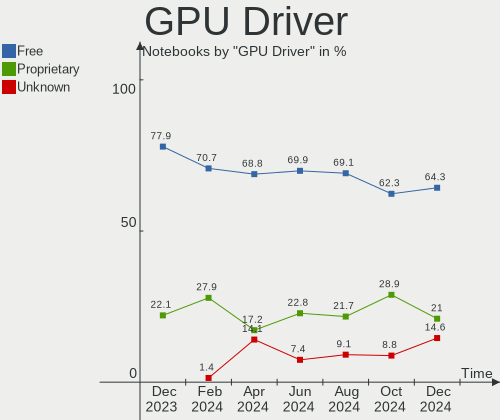
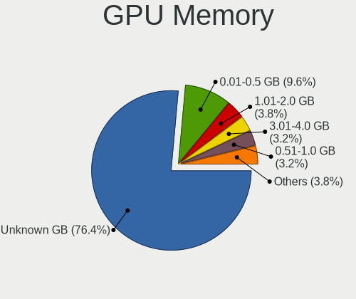
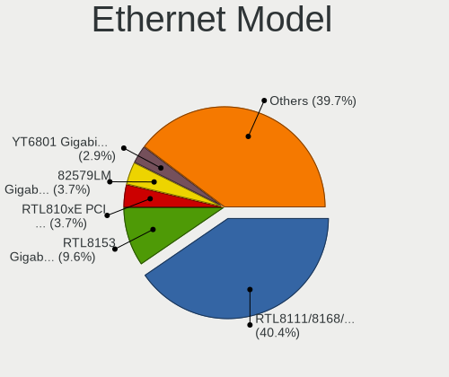
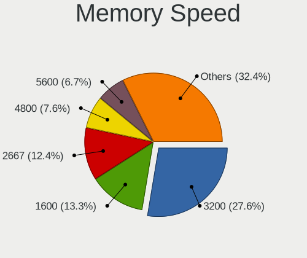
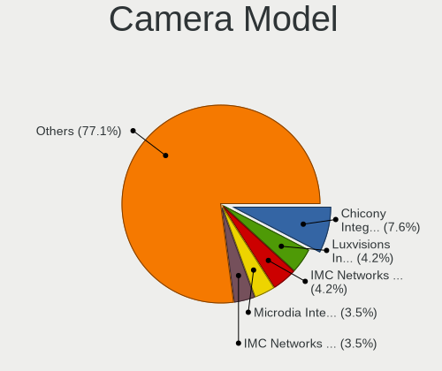

Arch Hardware Trends (Notebooks)
--------------------------------

A project to identify most popular hardware characteristics and track their change
over time based on data collected by Arch users at https://Linux-Hardware.org.

Anyone can contribute to this report by the [hw-probe](https://github.com/linuxhw/hw-probe) tool:

    sudo -E hw-probe -all -upload

Full-feature report is available here: https://linux-hardware.org/?view=trends&formfactor=notebook

Period: Sep, 2021.

Contents
--------

* [ System ](#system)
  - [ OS                       ](#os)
  - [ OS Family                ](#os-family)
  - [ Kernel                   ](#kernel)
  - [ Kernel Family            ](#kernel-family)
  - [ Kernel Major Ver.        ](#kernel-major-ver)
  - [ Arch                     ](#arch)
  - [ DE                       ](#de)
  - [ Display Server           ](#display-server)
  - [ Display Manager          ](#display-manager)
  - [ OS Lang                  ](#os-lang)
  - [ Boot Mode                ](#boot-mode)
  - [ Filesystem               ](#filesystem)
  - [ Part. scheme             ](#part-scheme)
  - [ Dual Boot with Linux/BSD ](#dual-boot-with-linuxbsd)
  - [ Dual Boot (Win)          ](#dual-boot-win)

* [ Board ](#board)
  - [ Vendor                   ](#vendor)
  - [ Model                    ](#model)
  - [ Model Family             ](#model-family)
  - [ MFG Year                 ](#mfg-year)
  - [ Form Factor              ](#form-factor)
  - [ Secure Boot              ](#secure-boot)
  - [ Coreboot                 ](#coreboot)
  - [ RAM Size                 ](#ram-size)
  - [ RAM Used                 ](#ram-used)
  - [ Total Drives             ](#total-drives)
  - [ Has CD-ROM               ](#has-cd-rom)
  - [ Has Ethernet             ](#has-ethernet)
  - [ Has WiFi                 ](#has-wifi)
  - [ Has Bluetooth            ](#has-bluetooth)

* [ Location ](#location)
  - [ Country                  ](#country)
  - [ City                     ](#city)

* [ Drives ](#drives)
  - [ Drive Vendor             ](#drive-vendor)
  - [ Drive Model              ](#drive-model)
  - [ HDD Vendor               ](#hdd-vendor)
  - [ SSD Vendor               ](#ssd-vendor)
  - [ Drive Kind               ](#drive-kind)
  - [ Drive Connector          ](#drive-connector)
  - [ Drive Size               ](#drive-size)
  - [ Space Total              ](#space-total)
  - [ Space Used               ](#space-used)
  - [ Malfunc. Drives          ](#malfunc-drives)
  - [ Malfunc. Drive Vendor    ](#malfunc-drive-vendor)
  - [ Malfunc. HDD Vendor      ](#malfunc-hdd-vendor)
  - [ Malfunc. Drive Kind      ](#malfunc-drive-kind)
  - [ Failed Drives            ](#failed-drives)
  - [ Failed Drive Vendor      ](#failed-drive-vendor)
  - [ Drive Status             ](#drive-status)

* [ Storage controller ](#storage-controller)
  - [ Storage Vendor           ](#storage-vendor)
  - [ Storage Model            ](#storage-model)
  - [ Storage Kind             ](#storage-kind)

* [ Processor ](#processor)
  - [ CPU Vendor               ](#cpu-vendor)
  - [ CPU Model                ](#cpu-model)
  - [ CPU Model Family         ](#cpu-model-family)
  - [ CPU Cores                ](#cpu-cores)
  - [ CPU Sockets              ](#cpu-sockets)
  - [ CPU Threads              ](#cpu-threads)
  - [ CPU Op-Modes             ](#cpu-op-modes)
  - [ CPU Microcode            ](#cpu-microcode)
  - [ CPU Microarch            ](#cpu-microarch)

* [ Graphics ](#graphics)
  - [ GPU Vendor               ](#gpu-vendor)
  - [ GPU Model                ](#gpu-model)
  - [ GPU Combo                ](#gpu-combo)
  - [ GPU Driver               ](#gpu-driver)
  - [ GPU Memory               ](#gpu-memory)

* [ Monitor ](#monitor)
  - [ Monitor Vendor           ](#monitor-vendor)
  - [ Monitor Model            ](#monitor-model)
  - [ Monitor Resolution       ](#monitor-resolution)
  - [ Monitor Diagonal         ](#monitor-diagonal)
  - [ Monitor Width            ](#monitor-width)
  - [ Aspect Ratio             ](#aspect-ratio)
  - [ Monitor Area             ](#monitor-area)
  - [ Pixel Density            ](#pixel-density)
  - [ Multiple Monitors        ](#multiple-monitors)

* [ Network ](#network)
  - [ Net Controller Vendor    ](#net-controller-vendor)
  - [ Net Controller Model     ](#net-controller-model)
  - [ Wireless Vendor          ](#wireless-vendor)
  - [ Wireless Model           ](#wireless-model)
  - [ Ethernet Vendor          ](#ethernet-vendor)
  - [ Ethernet Model           ](#ethernet-model)
  - [ Net Controller Kind      ](#net-controller-kind)
  - [ Used Controller          ](#used-controller)
  - [ NICs                     ](#nics)
  - [ IPv6                     ](#ipv6)

* [ Bluetooth ](#bluetooth)
  - [ Bluetooth Vendor         ](#bluetooth-vendor)
  - [ Bluetooth Model          ](#bluetooth-model)

* [ Sound ](#sound)
  - [ Sound Vendor             ](#sound-vendor)
  - [ Sound Model              ](#sound-model)

* [ Memory ](#memory)
  - [ Memory Vendor            ](#memory-vendor)
  - [ Memory Model             ](#memory-model)
  - [ Memory Kind              ](#memory-kind)
  - [ Memory Form Factor       ](#memory-form-factor)
  - [ Memory Size              ](#memory-size)
  - [ Memory Speed             ](#memory-speed)

* [ Printers & scanners ](#printers--scanners)
  - [ Printer Vendor           ](#printer-vendor)
  - [ Printer Model            ](#printer-model)
  - [ Scanner Vendor           ](#scanner-vendor)
  - [ Scanner Model            ](#scanner-model)

* [ Camera ](#camera)
  - [ Camera Vendor            ](#camera-vendor)
  - [ Camera Model             ](#camera-model)

* [ Security ](#security)
  - [ Fingerprint Vendor       ](#fingerprint-vendor)
  - [ Fingerprint Model        ](#fingerprint-model)
  - [ Chipcard Vendor          ](#chipcard-vendor)
  - [ Chipcard Model           ](#chipcard-model)

* [ Unsupported ](#unsupported)
  - [ Unsupported Devices      ](#unsupported-devices)
  - [ Unsupported Device Types ](#unsupported-device-types)

System
------

OS
--

Installed operating systems

| Name         | Notebooks | Percent |
|--------------|-----------|---------|
| Arch         | 55        | 65.48%  |
| Arch Rolling | 29        | 34.52%  |

OS Family
---------

OS without a version

| Name | Notebooks | Percent |
|------|-----------|---------|
| Arch | 84        | 100%    |

Kernel
------

Version of the Linux kernel

| Version                      | Notebooks | Percent |
|------------------------------|-----------|---------|
| 5.13.13-arch1-1              | 18        | 21.43%  |
| 5.14.2-arch1-2               | 9         | 10.71%  |
| 5.14.8-arch1-1               | 6         | 7.14%   |
| 5.14.6-arch1-1               | 6         | 7.14%   |
| 5.14.5-arch1-1               | 6         | 7.14%   |
| 5.14.7-arch1-1               | 5         | 5.95%   |
| 5.13.13-zen1-1-zen           | 5         | 5.95%   |
| 5.14.3-arch1-1               | 3         | 3.57%   |
| 5.14.6-zen1-1-zen            | 2         | 2.38%   |
| 5.10.68-1-lts                | 2         | 2.38%   |
| 5.10.63-1-lts                | 2         | 2.38%   |
| 5.15.0-rc2-1-mainline        | 1         | 1.19%   |
| 5.14.8-zen1-1-zen            | 1         | 1.19%   |
| 5.14.7-zen1-1-zen            | 1         | 1.19%   |
| 5.14.2-zen1-2-zen            | 1         | 1.19%   |
| 5.14.1-xanmod1-1             | 1         | 1.19%   |
| 5.13.9-arch1-1               | 1         | 1.19%   |
| 5.13.7-arch1-1               | 1         | 1.19%   |
| 5.13.17-xanmod1-1            | 1         | 1.19%   |
| 5.13.13-hardened1-1-hardened | 1         | 1.19%   |
| 5.13.12                      | 1         | 1.19%   |
| 5.13.10-zen1-1-zen           | 1         | 1.19%   |
| 5.12.19-2-mbp                | 1         | 1.19%   |
| 5.12.11-arch1-1              | 1         | 1.19%   |
| 5.12.10-arch1-1              | 1         | 1.19%   |
| 5.10.69-1-lts                | 1         | 1.19%   |
| 5.10.67-1-lts                | 1         | 1.19%   |
| 5.10.64-1-lts                | 1         | 1.19%   |
| 5.10.62-1-lts                | 1         | 1.19%   |
| 5.10.61-1mbp-16.1-linux-wifi | 1         | 1.19%   |
| 5.10.52-1-lts                | 1         | 1.19%   |

Kernel Family
-------------

Linux kernel without a distro release

| Version | Notebooks | Percent |
|---------|-----------|---------|
| 5.13.13 | 24        | 28.57%  |
| 5.14.2  | 10        | 11.9%   |
| 5.14.6  | 8         | 9.52%   |
| 5.14.8  | 7         | 8.33%   |
| 5.14.7  | 6         | 7.14%   |
| 5.14.5  | 6         | 7.14%   |
| 5.14.3  | 3         | 3.57%   |
| 5.10.68 | 2         | 2.38%   |
| 5.10.63 | 2         | 2.38%   |
| 5.15.0  | 1         | 1.19%   |
| 5.14.1  | 1         | 1.19%   |
| 5.13.9  | 1         | 1.19%   |
| 5.13.7  | 1         | 1.19%   |
| 5.13.17 | 1         | 1.19%   |
| 5.13.12 | 1         | 1.19%   |
| 5.13.10 | 1         | 1.19%   |
| 5.12.19 | 1         | 1.19%   |
| 5.12.11 | 1         | 1.19%   |
| 5.12.10 | 1         | 1.19%   |
| 5.10.69 | 1         | 1.19%   |
| 5.10.67 | 1         | 1.19%   |
| 5.10.64 | 1         | 1.19%   |
| 5.10.62 | 1         | 1.19%   |
| 5.10.61 | 1         | 1.19%   |
| 5.10.52 | 1         | 1.19%   |

Kernel Major Ver.
-----------------

Linux kernel major version

| Version | Notebooks | Percent |
|---------|-----------|---------|
| 5.14    | 41        | 48.81%  |
| 5.13    | 29        | 34.52%  |
| 5.10    | 10        | 11.9%   |
| 5.12    | 3         | 3.57%   |
| 5.15    | 1         | 1.19%   |

Arch
----

OS architecture (x86_64, i586, etc.)

| Name   | Notebooks | Percent |
|--------|-----------|---------|
| x86_64 | 84        | 100%    |

DE
--

Desktop Environment

| Name          | Notebooks | Percent |
|---------------|-----------|---------|
| KDE5          | 26        | 30.95%  |
| GNOME         | 23        | 27.38%  |
| XFCE          | 9         | 10.71%  |
| i3            | 6         | 7.14%   |
| KDE           | 3         | 3.57%   |
| Unknown       | 3         | 3.57%   |
| X-Cinnamon    | 2         | 2.38%   |
| sway          | 2         | 2.38%   |
| bspwm         | 2         | 2.38%   |
| xmonad        | 1         | 1.19%   |
| openbox       | 1         | 1.19%   |
| MATE          | 1         | 1.19%   |
| LXQt          | 1         | 1.19%   |
| Enlightenment | 1         | 1.19%   |
| DWM           | 1         | 1.19%   |
| Cinnamon      | 1         | 1.19%   |
| awesome       | 1         | 1.19%   |

Display Server
--------------

X11 or Wayland

| Name    | Notebooks | Percent |
|---------|-----------|---------|
| X11     | 50        | 59.52%  |
| Wayland | 19        | 22.62%  |
| Tty     | 9         | 10.71%  |
| Unknown | 6         | 7.14%   |

Display Manager
---------------

SDDM, LightDM, etc.

| Name    | Notebooks | Percent |
|---------|-----------|---------|
| SDDM    | 25        | 29.76%  |
| Unknown | 25        | 29.76%  |
| LightDM | 17        | 20.24%  |
| GDM     | 12        | 14.29%  |
| LXDM    | 5         | 5.95%   |

OS Lang
-------

Language

| Lang    | Notebooks | Percent |
|---------|-----------|---------|
| en_US   | 51        | 60.71%  |
| de_DE   | 4         | 4.76%   |
| pt_BR   | 3         | 3.57%   |
| fr_FR   | 3         | 3.57%   |
| en_GB   | 3         | 3.57%   |
| es_ES   | 2         | 2.38%   |
| Unknown | 2         | 2.38%   |
| zh_CN   | 1         | 1.19%   |
| unm_US  | 1         | 1.19%   |
| tr_TR   | 1         | 1.19%   |
| ru_UA   | 1         | 1.19%   |
| ru_RU   | 1         | 1.19%   |
| nl_NL   | 1         | 1.19%   |
| nl_BE   | 1         | 1.19%   |
| ja_JP   | 1         | 1.19%   |
| it_IT   | 1         | 1.19%   |
| es_MX   | 1         | 1.19%   |
| es_AR   | 1         | 1.19%   |
| en_CA   | 1         | 1.19%   |
| en_AU   | 1         | 1.19%   |
| de_AT   | 1         | 1.19%   |
| cs_CZ   | 1         | 1.19%   |
| C       | 1         | 1.19%   |

Boot Mode
---------

EFI or BIOS

| Mode | Notebooks | Percent |
|------|-----------|---------|
| EFI  | 56        | 66.67%  |
| BIOS | 28        | 33.33%  |

Filesystem
----------

Type of filesystem

| Type    | Notebooks | Percent |
|---------|-----------|---------|
| Ext4    | 57        | 67.86%  |
| Btrfs   | 20        | 23.81%  |
| Xfs     | 5         | 5.95%   |
| Overlay | 1         | 1.19%   |
| F2fs    | 1         | 1.19%   |

Part. scheme
------------

Scheme of partitioning

| Type    | Notebooks | Percent |
|---------|-----------|---------|
| GPT     | 60        | 71.43%  |
| Unknown | 15        | 17.86%  |
| MBR     | 9         | 10.71%  |

Dual Boot with Linux/BSD
------------------------

Hosting more than one Linux/BSD

| Dual boot | Notebooks | Percent |
|-----------|-----------|---------|
| No        | 76        | 90.48%  |
| Yes       | 8         | 9.52%   |

Dual Boot (Win)
---------------

Hosting Linux and Windows

| Dual boot | Notebooks | Percent |
|-----------|-----------|---------|
| No        | 60        | 71.43%  |
| Yes       | 24        | 28.57%  |

Board
-----

Vendor
------

Motherboard manufacturer

| Name                             | Notebooks | Percent |
|----------------------------------|-----------|---------|
| Lenovo                           | 26        | 30.95%  |
| ASUSTek Computer                 | 13        | 15.48%  |
| Hewlett-Packard                  | 12        | 14.29%  |
| Dell                             | 8         | 9.52%   |
| Acer                             | 8         | 9.52%   |
| Apple                            | 3         | 3.57%   |
| TUXEDO                           | 2         | 2.38%   |
| Toshiba                          | 1         | 1.19%   |
| Sony                             | 1         | 1.19%   |
| Samsung Electronics              | 1         | 1.19%   |
| Notebook                         | 1         | 1.19%   |
| MSI                              | 1         | 1.19%   |
| MECHREVO                         | 1         | 1.19%   |
| Intel                            | 1         | 1.19%   |
| GPD                              | 1         | 1.19%   |
| Google                           | 1         | 1.19%   |
| FUJITSU CLIENT COMPUTING LIMITED | 1         | 1.19%   |
| Framework                        | 1         | 1.19%   |
| Eluktronics                      | 1         | 1.19%   |

Model
-----

Motherboard model

| Name                                            | Notebooks | Percent |
|-------------------------------------------------|-----------|---------|
| HP Pavilion g6                                  | 2         | 2.38%   |
| Dell XPS 15 9500                                | 2         | 2.38%   |
| TUXEDO TUXEDO_Book_XA1510                       | 1         | 1.19%   |
| TUXEDO Book BA1510                              | 1         | 1.19%   |
| Toshiba dynabook T55/PW                         | 1         | 1.19%   |
| Sony VPCEH1S1E                                  | 1         | 1.19%   |
| Samsung 275E4E/275E5E                           | 1         | 1.19%   |
| Notebook P7xxTM1                                | 1         | 1.19%   |
| MSI GL65 9SEK                                   | 1         | 1.19%   |
| MECHREVO Code 01 Series PF5NU1G                 | 1         | 1.19%   |
| Lenovo Yoga 900-13ISK 80MK                      | 1         | 1.19%   |
| Lenovo ThinkPad X390 20Q00058MH                 | 1         | 1.19%   |
| Lenovo ThinkPad X220 Tablet 4298A11             | 1         | 1.19%   |
| Lenovo ThinkPad X200 74574AC                    | 1         | 1.19%   |
| Lenovo ThinkPad X140e 20BL000BUS                | 1         | 1.19%   |
| Lenovo ThinkPad X13 Gen 1 20UF000KCK            | 1         | 1.19%   |
| Lenovo ThinkPad W541 20EFS01B09                 | 1         | 1.19%   |
| Lenovo ThinkPad T490 20N20009RT                 | 1         | 1.19%   |
| Lenovo ThinkPad T480 20L5CTO1WW                 | 1         | 1.19%   |
| Lenovo ThinkPad T460p 20FW0005AU                | 1         | 1.19%   |
| Lenovo ThinkPad T440 20B6CTO1WW                 | 1         | 1.19%   |
| Lenovo ThinkPad T14s Gen 1 20UHS09300           | 1         | 1.19%   |
| Lenovo ThinkPad T14 Gen 2a 20XK001BUS           | 1         | 1.19%   |
| Lenovo ThinkPad T14 Gen 1 20UES4XD00            | 1         | 1.19%   |
| Lenovo ThinkPad P50 20EQS25D0G                  | 1         | 1.19%   |
| Lenovo ThinkPad L14 Gen 1 20U5001WTX            | 1         | 1.19%   |
| Lenovo ThinkPad E14 Gen 2 20TACTO1WW            | 1         | 1.19%   |
| Lenovo ThinkPad E14 Gen 2 20T6000SIX            | 1         | 1.19%   |
| Lenovo Legion 5 15ACH6H 82JU                    | 1         | 1.19%   |
| Lenovo IdeaPad S340-15IWL 81N8                  | 1         | 1.19%   |
| Lenovo IdeaPad S145-15IWL 81MV                  | 1         | 1.19%   |
| Lenovo IdeaPad 5 15IIL05 81YK                   | 1         | 1.19%   |
| Lenovo IdeaPad 5 15ALC05 82LN                   | 1         | 1.19%   |
| Lenovo IdeaPad 5 14ALC05 82LM                   | 1         | 1.19%   |
| Lenovo IdeaPad 320S-14IKB 80X4                  | 1         | 1.19%   |
| Lenovo IdeaPad 320S-13IKB 81AK                  | 1         | 1.19%   |
| Intel Pine Trail - M                            | 1         | 1.19%   |
| HP ProBook 640 G5                               | 1         | 1.19%   |
| HP ProBook 450 G6                               | 1         | 1.19%   |
| HP ProBook 445 G7 Notebook PC                   | 1         | 1.19%   |
| HP ProBook 440 G8 Notebook PC                   | 1         | 1.19%   |
| HP Laptop 15s-eq2xxx                            | 1         | 1.19%   |
| HP Laptop 15s-eq0xxx                            | 1         | 1.19%   |
| HP EliteBook 850 G5                             | 1         | 1.19%   |
| HP EliteBook 8470p                              | 1         | 1.19%   |
| HP Compaq 8510p                                 | 1         | 1.19%   |
| HP 350 G2                                       | 1         | 1.19%   |
| GPD G1618-03                                    | 1         | 1.19%   |
| Google Delbin                                   | 1         | 1.19%   |
| FUJITSU CLIENT COMPUTING LIMITED LIFEBOOK U7310 | 1         | 1.19%   |
| Framework Laptop                                | 1         | 1.19%   |
| Eluktronics RP-15                               | 1         | 1.19%   |
| Dell XPS 13 9380                                | 1         | 1.19%   |
| Dell Latitude E7250                             | 1         | 1.19%   |
| Dell Latitude E6430                             | 1         | 1.19%   |
| Dell Inspiron 5575                              | 1         | 1.19%   |
| Dell Inspiron 3785                              | 1         | 1.19%   |
| Dell Inspiron 11-3168                           | 1         | 1.19%   |
| ASUS ZenBook UX425JA_UX425JA                    | 1         | 1.19%   |
| ASUS X55U                                       | 1         | 1.19%   |

Model Family
------------

Motherboard model prefix

| Name                                      | Notebooks | Percent |
|-------------------------------------------|-----------|---------|
| Lenovo ThinkPad                           | 17        | 20.24%  |
| Lenovo IdeaPad                            | 7         | 8.33%   |
| Acer Aspire                               | 6         | 7.14%   |
| HP ProBook                                | 4         | 4.76%   |
| Dell XPS                                  | 3         | 3.57%   |
| Dell Inspiron                             | 3         | 3.57%   |
| ASUS ROG                                  | 3         | 3.57%   |
| HP Pavilion                               | 2         | 2.38%   |
| HP Laptop                                 | 2         | 2.38%   |
| HP EliteBook                              | 2         | 2.38%   |
| Dell Latitude                             | 2         | 2.38%   |
| ASUS ASUS                                 | 2         | 2.38%   |
| TUXEDO TUXEDO                             | 1         | 1.19%   |
| TUXEDO Book                               | 1         | 1.19%   |
| Toshiba dynabook                          | 1         | 1.19%   |
| Sony VPCEH1S1E                            | 1         | 1.19%   |
| Samsung 275E4E                            | 1         | 1.19%   |
| Notebook P7xxTM1                          | 1         | 1.19%   |
| MSI GL65                                  | 1         | 1.19%   |
| MECHREVO Code                             | 1         | 1.19%   |
| Lenovo Yoga                               | 1         | 1.19%   |
| Lenovo Legion                             | 1         | 1.19%   |
| Intel Pine                                | 1         | 1.19%   |
| HP Compaq                                 | 1         | 1.19%   |
| HP 350                                    | 1         | 1.19%   |
| GPD G1618-03                              | 1         | 1.19%   |
| Google Delbin                             | 1         | 1.19%   |
| FUJITSU CLIENT COMPUTING LIMITED LIFEBOOK | 1         | 1.19%   |
| Framework Laptop                          | 1         | 1.19%   |
| Eluktronics RP-15                         | 1         | 1.19%   |
| ASUS ZenBook                              | 1         | 1.19%   |
| ASUS X55U                                 | 1         | 1.19%   |
| ASUS VivoBook                             | 1         | 1.19%   |
| ASUS UX530UX                              | 1         | 1.19%   |
| ASUS N551JX                               | 1         | 1.19%   |
| ASUS N53SM                                | 1         | 1.19%   |
| ASUS K53SD                                | 1         | 1.19%   |
| ASUS GL752VW                              | 1         | 1.19%   |
| Apple MacBookPro16                        | 1         | 1.19%   |
| Apple MacBookPro15                        | 1         | 1.19%   |
| Apple MacBookAir7                         | 1         | 1.19%   |
| Acer Swift                                | 1         | 1.19%   |
| Acer AO722                                | 1         | 1.19%   |

MFG Year
--------

Motherboard manufacture year

| Year | Notebooks | Percent |
|------|-----------|---------|
| 2021 | 31        | 36.9%   |
| 2020 | 14        | 16.67%  |
| 2019 | 13        | 15.48%  |
| 2012 | 5         | 5.95%   |
| 2011 | 4         | 4.76%   |
| 2017 | 3         | 3.57%   |
| 2015 | 3         | 3.57%   |
| 2014 | 3         | 3.57%   |
| 2016 | 2         | 2.38%   |
| 2013 | 2         | 2.38%   |
| 2018 | 1         | 1.19%   |
| 2010 | 1         | 1.19%   |
| 2009 | 1         | 1.19%   |
| 2008 | 1         | 1.19%   |

Form Factor
-----------

Physical design of the computer

| Name     | Notebooks | Percent |
|----------|-----------|---------|
| Notebook | 84        | 100%    |

Secure Boot
-----------

Enabled or disabled

| State    | Notebooks | Percent |
|----------|-----------|---------|
| Disabled | 82        | 97.62%  |
| Enabled  | 2         | 2.38%   |

Coreboot
--------

Have coreboot on board

| Used | Notebooks | Percent |
|------|-----------|---------|
| No   | 83        | 98.81%  |
| Yes  | 1         | 1.19%   |

RAM Size
--------

Total RAM memory

| Size in GB  | Notebooks | Percent |
|-------------|-----------|---------|
| 8.01-16.0   | 28        | 33.33%  |
| 32.01-64.0  | 16        | 19.05%  |
| 4.01-8.0    | 13        | 15.48%  |
| 16.01-24.0  | 13        | 15.48%  |
| 3.01-4.0    | 12        | 14.29%  |
| 64.01-256.0 | 1         | 1.19%   |
| 0.51-1.0    | 1         | 1.19%   |

RAM Used
--------

Used RAM memory

| Used GB    | Notebooks | Percent |
|------------|-----------|---------|
| 1.01-2.0   | 27        | 32.14%  |
| 2.01-3.0   | 20        | 23.81%  |
| 4.01-8.0   | 13        | 15.48%  |
| 3.01-4.0   | 12        | 14.29%  |
| 8.01-16.0  | 6         | 7.14%   |
| 0.51-1.0   | 3         | 3.57%   |
| 16.01-24.0 | 2         | 2.38%   |
| 0.01-0.5   | 1         | 1.19%   |

Total Drives
------------

Number of drives on board

| Drives | Notebooks | Percent |
|--------|-----------|---------|
| 1      | 69        | 82.14%  |
| 2      | 14        | 16.67%  |
| 3      | 1         | 1.19%   |

Has CD-ROM
----------

Has CD-ROM on board

| Presented | Notebooks | Percent |
|-----------|-----------|---------|
| No        | 68        | 80.95%  |
| Yes       | 16        | 19.05%  |

Has Ethernet
------------

Has Ethernet on board

| Presented | Notebooks | Percent |
|-----------|-----------|---------|
| Yes       | 64        | 76.19%  |
| No        | 20        | 23.81%  |

Has WiFi
--------

Has WiFi module

| Presented | Notebooks | Percent |
|-----------|-----------|---------|
| Yes       | 84        | 100%    |

Has Bluetooth
-------------

Has Bluetooth module

| Presented | Notebooks | Percent |
|-----------|-----------|---------|
| Yes       | 65        | 77.38%  |
| No        | 19        | 22.62%  |

Location
--------

Country
-------

Geographic location (country)

| Country     | Notebooks | Percent |
|-------------|-----------|---------|
| USA         | 13        | 15.48%  |
| France      | 9         | 10.71%  |
| India       | 8         | 9.52%   |
| Germany     | 6         | 7.14%   |
| Spain       | 3         | 3.57%   |
| Russia      | 3         | 3.57%   |
| Netherlands | 3         | 3.57%   |
| Brazil      | 3         | 3.57%   |
| Ukraine     | 2         | 2.38%   |
| Turkey      | 2         | 2.38%   |
| Italy       | 2         | 2.38%   |
| Iran        | 2         | 2.38%   |
| Czechia     | 2         | 2.38%   |
| Canada      | 2         | 2.38%   |
| Belgium     | 2         | 2.38%   |
| Austria     | 2         | 2.38%   |
| Argentina   | 2         | 2.38%   |
| Vietnam     | 1         | 1.19%   |
| Uzbekistan  | 1         | 1.19%   |
| UK          | 1         | 1.19%   |
| Thailand    | 1         | 1.19%   |
| Sweden      | 1         | 1.19%   |
| Poland      | 1         | 1.19%   |
| Pakistan    | 1         | 1.19%   |
| New Zealand | 1         | 1.19%   |
| Mexico      | 1         | 1.19%   |
| Japan       | 1         | 1.19%   |
| Hungary     | 1         | 1.19%   |
| Hong Kong   | 1         | 1.19%   |
| Estonia     | 1         | 1.19%   |
| Denmark     | 1         | 1.19%   |
| Colombia    | 1         | 1.19%   |
| China       | 1         | 1.19%   |
| Bangladesh  | 1         | 1.19%   |
| Australia   | 1         | 1.19%   |

City
----

Geographic location (city)

| City                  | Notebooks | Percent |
|-----------------------|-----------|---------|
| Valencia              | 2         | 2.38%   |
| Tehran                | 2         | 2.38%   |
| Los Angeles           | 2         | 2.38%   |
| Khammam               | 2         | 2.38%   |
| Buenos Aires          | 2         | 2.38%   |
| Yarraville            | 1         | 1.19%   |
| Wroclaw               | 1         | 1.19%   |
| Wellington            | 1         | 1.19%   |
| Vinassan              | 1         | 1.19%   |
| Ulpur                 | 1         | 1.19%   |
| Tours                 | 1         | 1.19%   |
| Tashkent              | 1         | 1.19%   |
| Tartu                 | 1         | 1.19%   |
| Strausberg            | 1         | 1.19%   |
| St Petersburg         | 1         | 1.19%   |
| San Fernando          | 1         | 1.19%   |
| Riemst                | 1         | 1.19%   |
| Rennes                | 1         | 1.19%   |
| Rayong                | 1         | 1.19%   |
| Pune                  | 1         | 1.19%   |
| Prayssas              | 1         | 1.19%   |
| Plasencia             | 1         | 1.19%   |
| Pilisvorosvar         | 1         | 1.19%   |
| Pearland              | 1         | 1.19%   |
| Pasadena              | 1         | 1.19%   |
| Paris                 | 1         | 1.19%   |
| Nussbach              | 1         | 1.19%   |
| Munich                | 1         | 1.19%   |
| Mumbai                | 1         | 1.19%   |
| Montreal              | 1         | 1.19%   |
| Mittweida             | 1         | 1.19%   |
| Milan                 | 1         | 1.19%   |
| M??laga               | 1         | 1.19%   |
| Ludwigshafen am Rhein | 1         | 1.19%   |
| Laval                 | 1         | 1.19%   |
| Lancaster             | 1         | 1.19%   |
| La Chapelle-de-Brain  | 1         | 1.19%   |
| Kyiv                  | 1         | 1.19%   |
| Kutn?? Hora           | 1         | 1.19%   |
| Kurukshetra           | 1         | 1.19%   |
| Kuna                  | 1         | 1.19%   |
| Krimpen aan de Lek    | 1         | 1.19%   |
| Kisarazu              | 1         | 1.19%   |
| Kholmogory            | 1         | 1.19%   |
| Khabarovsk            | 1         | 1.19%   |
| Karl?­n               | 1         | 1.19%   |
| Jinjiang              | 1         | 1.19%   |
| Jersey City           | 1         | 1.19%   |
| Itanhaem              | 1         | 1.19%   |
| Istanbul              | 1         | 1.19%   |
| Islamabad             | 1         | 1.19%   |
| Hohenems              | 1         | 1.19%   |
| Hjo                   | 1         | 1.19%   |
| Halesowen             | 1         | 1.19%   |
| Guer                  | 1         | 1.19%   |
| Guadalajara           | 1         | 1.19%   |
| Fairfax               | 1         | 1.19%   |
| Ernakulam             | 1         | 1.19%   |
| Emmendingen           | 1         | 1.19%   |
| Embu                  | 1         | 1.19%   |

Drives
------

Drive Vendor
------------

Hard drive vendors

| Vendor                    | Notebooks | Drives | Percent |
|---------------------------|-----------|--------|---------|
| Samsung Electronics       | 18        | 20     | 18.37%  |
| WDC                       | 14        | 14     | 14.29%  |
| Toshiba                   | 11        | 12     | 11.22%  |
| SK Hynix                  | 10        | 11     | 10.2%   |
| Micron Technology         | 6         | 6      | 6.12%   |
| SanDisk                   | 5         | 5      | 5.1%    |
| Seagate                   | 4         | 4      | 4.08%   |
| Kingston                  | 4         | 4      | 4.08%   |
| Unknown                   | 3         | 3      | 3.06%   |
| Intel                     | 3         | 3      | 3.06%   |
| Crucial                   | 3         | 3      | 3.06%   |
| Apple                     | 3         | 3      | 3.06%   |
| A-DATA Technology         | 3         | 3      | 3.06%   |
| Union Memory              | 1         | 1      | 1.02%   |
| SABRENT                   | 1         | 1      | 1.02%   |
| Realtek                   | 1         | 1      | 1.02%   |
| Micron/Crucial Technology | 1         | 1      | 1.02%   |
| Lite-On                   | 1         | 1      | 1.02%   |
| Lexar                     | 1         | 1      | 1.02%   |
| KIOXIA                    | 1         | 1      | 1.02%   |
| HS-SSD-C100               | 1         | 1      | 1.02%   |
| Hitachi                   | 1         | 1      | 1.02%   |
| HGST                      | 1         | 1      | 1.02%   |
| Unknown                   | 1         | 1      | 1.02%   |

Drive Model
-----------

Hard drive models

| Model                                   | Notebooks | Percent |
|-----------------------------------------|-----------|---------|
| Toshiba MQ04ABF100 1TB                  | 3         | 2.94%   |
| Toshiba MQ01ABD100 1TB                  | 2         | 1.96%   |
| SK Hynix NVMe SSD Drive 512GB           | 2         | 1.96%   |
| SanDisk SSD PLUS 120 GB                 | 2         | 1.96%   |
| WDC WDS500G2B0C-00PXH0 500GB            | 1         | 0.98%   |
| WDC WDS500G2B0A 500GB SSD               | 1         | 0.98%   |
| WDC WDS240G2G0A-00JH30 240GB SSD        | 1         | 0.98%   |
| WDC WDS100T2B0C-00PXH0 1TB              | 1         | 0.98%   |
| WDC WDS100T2B0C 1TB                     | 1         | 0.98%   |
| WDC WD2500BEVT-00A23T0 250GB            | 1         | 0.98%   |
| WDC PC SN730 SDBQNTY-512G-1001 512GB    | 1         | 0.98%   |
| WDC PC SN730 SDBPNTY-1T00-1101 1TB      | 1         | 0.98%   |
| WDC PC SN720 SDAQNTW-512G-1001 512GB    | 1         | 0.98%   |
| WDC PC SN720 SDAPNTW-1T00-1006 1TB      | 1         | 0.98%   |
| WDC PC SN530 SDBPTPZ-1T00-1002 1TB      | 1         | 0.98%   |
| WDC PC SN530 SDBPMPZ-512G-1101 512GB    | 1         | 0.98%   |
| WDC PC SN530 SDBPMPZ-512G-1001 512GB    | 1         | 0.98%   |
| WDC PC SN520 SDAPNUW-256G-1006 256GB    | 1         | 0.98%   |
| Unknown USB DISK 3.2 1TB                | 1         | 0.98%   |
| Unknown SU16G  16GB                     | 1         | 0.98%   |
| Unknown NVMe SSD Drive 1024GB           | 1         | 0.98%   |
| Union Memory UMIS RPJTJ256MEE1OWX 256GB | 1         | 0.98%   |
| Toshiba TR150 120GB SSD                 | 1         | 0.98%   |
| Toshiba THNSNJ512GCSU 512GB SSD         | 1         | 0.98%   |
| Toshiba THNSF5512GPUK 512GB             | 1         | 0.98%   |
| Toshiba MQ01ABD075 752GB                | 1         | 0.98%   |
| Toshiba MQ01ABD032 320GB                | 1         | 0.98%   |
| Toshiba KXG60ZNV1T02 NVMe KIOXIA 1024GB | 1         | 0.98%   |
| Toshiba HDWK105 500GB                   | 1         | 0.98%   |
| SK Hynix SKHynix_HFS001TDE9X081N 1TB    | 1         | 0.98%   |
| SK Hynix PC611 NVMe 1TB                 | 1         | 0.98%   |
| SK Hynix NVMe SSD Drive 256GB           | 1         | 0.98%   |
| SK Hynix NVMe SSD Drive 128GB           | 1         | 0.98%   |
| SK Hynix HFS512G39MND-3310A 512GB SSD   | 1         | 0.98%   |
| SK Hynix HFS500G32TND-3110A 500GB SSD   | 1         | 0.98%   |
| SK Hynix HFM512GDJTNI-82A0A 512GB       | 1         | 0.98%   |
| SK Hynix HFM512GD3JX013N 512GB          | 1         | 0.98%   |
| SK Hynix BC501 HFM256GDJTNG-8310A 256GB | 1         | 0.98%   |
| Seagate ST500LM012 HN-M500MBB 500GB     | 1         | 0.98%   |
| Seagate ST320VT000-1BS14C 320GB         | 1         | 0.98%   |
| Seagate ST1000LM035-1RK172 1TB          | 1         | 0.98%   |
| Seagate Expansion 1TB                   | 1         | 0.98%   |
| SanDisk Z400s 2.5 7MM 128GB SSD         | 1         | 0.98%   |
| SanDisk SDSSDP128G 128GB                | 1         | 0.98%   |
| Sandisk NVMe SSD Drive 512GB            | 1         | 0.98%   |
| Samsung SSD PM871 mSATA 256GB           | 1         | 0.98%   |
| Samsung SSD 970 EVO Plus 500GB          | 1         | 0.98%   |
| Samsung SSD 970 EVO Plus 1TB            | 1         | 0.98%   |
| Samsung SSD 950 PRO 512GB               | 1         | 0.98%   |
| Samsung SSD 870 EVO 250GB               | 1         | 0.98%   |
| Samsung SSD 860 PRO 512G                | 1         | 0.98%   |
| Samsung SSD 860 EVO 500GB               | 1         | 0.98%   |
| Samsung SSD 860 EVO 250GB               | 1         | 0.98%   |
| Samsung SSD 860 EVO 1TB                 | 1         | 0.98%   |
| Samsung SSD 850 EVO 250GB               | 1         | 0.98%   |
| Samsung NVMe SSD Drive 256GB            | 1         | 0.98%   |
| Samsung NVMe SSD Drive 1TB              | 1         | 0.98%   |
| Samsung MZVLQ1T0HBLB-00B00 1TB          | 1         | 0.98%   |
| Samsung MZVLB512HBJQ-000L7 512GB        | 1         | 0.98%   |
| Samsung MZVLB512HBJQ-000H1 512GB        | 1         | 0.98%   |

HDD Vendor
----------

Hard disk drive vendors

| Vendor  | Notebooks | Drives | Percent |
|---------|-----------|--------|---------|
| Toshiba | 8         | 8      | 53.33%  |
| Seagate | 4         | 4      | 26.67%  |
| WDC     | 1         | 1      | 6.67%   |
| Hitachi | 1         | 1      | 6.67%   |
| HGST    | 1         | 1      | 6.67%   |

SSD Vendor
----------

Solid state drive vendors

| Vendor              | Notebooks | Drives | Percent |
|---------------------|-----------|--------|---------|
| Samsung Electronics | 8         | 8      | 28.57%  |
| SanDisk             | 4         | 4      | 14.29%  |
| Crucial             | 3         | 3      | 10.71%  |
| WDC                 | 2         | 2      | 7.14%   |
| Toshiba             | 2         | 2      | 7.14%   |
| SK Hynix            | 2         | 2      | 7.14%   |
| Kingston            | 2         | 2      | 7.14%   |
| Micron Technology   | 1         | 1      | 3.57%   |
| Lexar               | 1         | 1      | 3.57%   |
| Apple               | 1         | 1      | 3.57%   |
| A-DATA Technology   | 1         | 1      | 3.57%   |
| Unknown             | 1         | 1      | 3.57%   |

Drive Kind
----------

HDD or SSD

| Kind    | Notebooks | Drives | Percent |
|---------|-----------|--------|---------|
| NVMe    | 48        | 55     | 50.53%  |
| SSD     | 28        | 28     | 29.47%  |
| HDD     | 15        | 15     | 15.79%  |
| Unknown | 3         | 3      | 3.16%   |
| MMC     | 1         | 1      | 1.05%   |

Drive Connector
---------------

SATA, SAS, NVMe, etc.

| Type | Notebooks | Drives | Percent |
|------|-----------|--------|---------|
| NVMe | 48        | 54     | 51.06%  |
| SATA | 40        | 42     | 42.55%  |
| SAS  | 5         | 5      | 5.32%   |
| MMC  | 1         | 1      | 1.06%   |

Drive Size
----------

Size of hard drive

| Size in TB | Notebooks | Drives | Percent |
|------------|-----------|--------|---------|
| 0.01-0.5   | 28        | 28     | 65.12%  |
| 0.51-1.0   | 15        | 15     | 34.88%  |

Space Total
-----------

Amount of disk space available on the file system

| Size in GB     | Notebooks | Percent |
|----------------|-----------|---------|
| 101-250        | 28        | 33.33%  |
| 251-500        | 23        | 27.38%  |
| 501-1000       | 15        | 17.86%  |
| 1001-2000      | 6         | 7.14%   |
| 51-100         | 5         | 5.95%   |
| More than 3000 | 2         | 2.38%   |
| 21-50          | 2         | 2.38%   |
| 2001-3000      | 2         | 2.38%   |
| Unknown        | 1         | 1.19%   |

Space Used
----------

Amount of used disk space

| Used GB   | Notebooks | Percent |
|-----------|-----------|---------|
| 21-50     | 19        | 22.62%  |
| 1-20      | 19        | 22.62%  |
| 101-250   | 17        | 20.24%  |
| 51-100    | 11        | 13.1%   |
| 251-500   | 7         | 8.33%   |
| 501-1000  | 7         | 8.33%   |
| 1001-2000 | 2         | 2.38%   |
| 2001-3000 | 1         | 1.19%   |
| Unknown   | 1         | 1.19%   |

Malfunc. Drives
---------------

Drive models with a malfunction

| Model                                 | Notebooks | Drives | Percent |
|---------------------------------------|-----------|--------|---------|
| Toshiba MQ01ABD075 752GB              | 1         | 1      | 20%     |
| Toshiba HDWK105 500GB                 | 1         | 1      | 20%     |
| SK Hynix HFS500G32TND-3110A 500GB SSD | 1         | 1      | 20%     |
| Seagate ST500LM012 HN-M500MBB 500GB   | 1         | 1      | 20%     |
| HGST HTS721010A9E630 1TB              | 1         | 1      | 20%     |

Malfunc. Drive Vendor
---------------------

Vendors of faulty drives

| Vendor   | Notebooks | Drives | Percent |
|----------|-----------|--------|---------|
| Toshiba  | 2         | 2      | 40%     |
| SK Hynix | 1         | 1      | 20%     |
| Seagate  | 1         | 1      | 20%     |
| HGST     | 1         | 1      | 20%     |

Malfunc. HDD Vendor
-------------------

Vendors of faulty HDD drives

| Vendor  | Notebooks | Drives | Percent |
|---------|-----------|--------|---------|
| Toshiba | 2         | 2      | 50%     |
| Seagate | 1         | 1      | 25%     |
| HGST    | 1         | 1      | 25%     |

Malfunc. Drive Kind
-------------------

Kinds of faulty drives

| Kind | Notebooks | Drives | Percent |
|------|-----------|--------|---------|
| HDD  | 4         | 4      | 80%     |
| SSD  | 1         | 1      | 20%     |

Failed Drives
-------------

Failed drive models

| Model                            | Notebooks | Drives | Percent |
|----------------------------------|-----------|--------|---------|
| Kingston SV300S37A120G 120GB SSD | 1         | 1      | 100%    |

Failed Drive Vendor
-------------------

Failed drive vendors

| Vendor   | Notebooks | Drives | Percent |
|----------|-----------|--------|---------|
| Kingston | 1         | 1      | 100%    |

Drive Status
------------

Number of failed and malfunc. drives

| Status   | Notebooks | Drives | Percent |
|----------|-----------|--------|---------|
| Works    | 54        | 62     | 60.67%  |
| Detected | 29        | 34     | 32.58%  |
| Malfunc  | 5         | 5      | 5.62%   |
| Failed   | 1         | 1      | 1.12%   |

Storage controller
------------------

Storage Vendor
--------------

Storage controller vendors

| Vendor                       | Notebooks | Percent |
|------------------------------|-----------|---------|
| Intel                        | 40        | 38.1%   |
| AMD                          | 15        | 14.29%  |
| Sandisk                      | 12        | 11.43%  |
| Samsung Electronics          | 12        | 11.43%  |
| SK Hynix                     | 8         | 7.62%   |
| Micron Technology            | 5         | 4.76%   |
| Toshiba America Info Systems | 2         | 1.9%    |
| Kingston Technology Company  | 2         | 1.9%    |
| Apple                        | 2         | 1.9%    |
| Union Memory (Shenzhen)      | 1         | 0.95%   |
| Realtek Semiconductor        | 1         | 0.95%   |
| Micron/Crucial Technology    | 1         | 0.95%   |
| Lite-On Technology           | 1         | 0.95%   |
| KIOXIA                       | 1         | 0.95%   |
| Biwin Storage Technology     | 1         | 0.95%   |
| ADATA Technology             | 1         | 0.95%   |

Storage Model
-------------

Storage controller models

| Model                                                                            | Notebooks | Percent |
|----------------------------------------------------------------------------------|-----------|---------|
| AMD FCH SATA Controller [AHCI mode]                                              | 13        | 11.71%  |
| Samsung NVMe SSD Controller SM981/PM981/PM983                                    | 7         | 6.31%   |
| Micron Non-Volatile memory controller                                            | 5         | 4.5%    |
| Intel Sunrise Point-LP SATA Controller [AHCI mode]                               | 5         | 4.5%    |
| Intel 6 Series/C200 Series Chipset Family 6 port Mobile SATA AHCI Controller     | 5         | 4.5%    |
| Intel Cannon Point-LP SATA Controller [AHCI Mode]                                | 4         | 3.6%    |
| Intel 7 Series Chipset Family 6-port SATA Controller [AHCI mode]                 | 4         | 3.6%    |
| Sandisk WD Blue SN550 NVMe SSD                                                   | 3         | 2.7%    |
| Sandisk WD Black SN750 / PC SN730 NVMe SSD                                       | 3         | 2.7%    |
| Sandisk Non-Volatile memory controller                                           | 3         | 2.7%    |
| Intel Wildcat Point-LP SATA Controller [AHCI Mode]                               | 3         | 2.7%    |
| SK Hynix Non-Volatile memory controller                                          | 2         | 1.8%    |
| SK Hynix Gold P31 SSD                                                            | 2         | 1.8%    |
| SK Hynix BC501 NVMe Solid State Drive                                            | 2         | 1.8%    |
| Sandisk WD Black 2018/SN750 / PC SN720 NVMe SSD                                  | 2         | 1.8%    |
| Samsung NVMe SSD Controller 980                                                  | 2         | 1.8%    |
| Kingston Company A2000 NVMe SSD                                                  | 2         | 1.8%    |
| Intel HM170/QM170 Chipset SATA Controller [AHCI Mode]                            | 2         | 1.8%    |
| Intel 82801 Mobile SATA Controller [RAID mode]                                   | 2         | 1.8%    |
| Intel 8 Series/C220 Series Chipset Family 6-port SATA Controller 1 [AHCI mode]   | 2         | 1.8%    |
| Intel 8 Series SATA Controller 1 [AHCI mode]                                     | 2         | 1.8%    |
| Apple ANS2 NVMe Controller                                                       | 2         | 1.8%    |
| Union Memory (Shenzhen) Non-Volatile memory controller                           | 1         | 0.9%    |
| Toshiba America Info Systems XG6 NVMe SSD Controller                             | 1         | 0.9%    |
| Toshiba America Info Systems XG4 NVMe SSD Controller                             | 1         | 0.9%    |
| SK Hynix PC401 NVMe Solid State Drive 256GB                                      | 1         | 0.9%    |
| SK Hynix BC511                                                                   | 1         | 0.9%    |
| Sandisk WD Blue SN500 / PC SN520 NVMe SSD                                        | 1         | 0.9%    |
| Samsung NVMe SSD Controller SM951/PM951                                          | 1         | 0.9%    |
| Samsung NVMe SSD Controller PM9A1/PM9A3/980PRO                                   | 1         | 0.9%    |
| Samsung Electronics SATA controller                                              | 1         | 0.9%    |
| Realtek Realtek Non-Volatile memory controller                                   | 1         | 0.9%    |
| Micron/Crucial NVMe Controller                                                   | 1         | 0.9%    |
| Lite-On NVMe Controller                                                          | 1         | 0.9%    |
| KIOXIA Non-Volatile memory controller                                            | 1         | 0.9%    |
| Intel Volume Management Device NVMe RAID Controller                              | 1         | 0.9%    |
| Intel SSD 660P Series                                                            | 1         | 0.9%    |
| Intel SSD 600P Series                                                            | 1         | 0.9%    |
| Intel Q170/Q150/B150/H170/H110/Z170/CM236 Chipset SATA Controller [AHCI Mode]    | 1         | 0.9%    |
| Intel NVMe Optane Memory Series                                                  | 1         | 0.9%    |
| Intel NM10/ICH7 Family SATA Controller [AHCI mode]                               | 1         | 0.9%    |
| Intel Mobile 4 Series Chipset PT IDER Controller                                 | 1         | 0.9%    |
| Intel Ice Lake-LP SATA Controller [AHCI mode]                                    | 1         | 0.9%    |
| Intel Cannon Lake Mobile PCH SATA AHCI Controller                                | 1         | 0.9%    |
| Intel Atom/Celeron/Pentium Processor x5-E8000/J3xxx/N3xxx Series SATA Controller | 1         | 0.9%    |
| Intel 82801IBM/IEM (ICH9M/ICH9M-E) 4 port SATA Controller [AHCI mode]            | 1         | 0.9%    |
| Intel 82801HM/HEM (ICH8M/ICH8M-E) SATA Controller [AHCI mode]                    | 1         | 0.9%    |
| Intel 82801HM/HEM (ICH8M/ICH8M-E) IDE Controller                                 | 1         | 0.9%    |
| Intel 5 Series/3400 Series Chipset 4 port SATA AHCI Controller                   | 1         | 0.9%    |
| Intel 400 Series Chipset Family SATA AHCI Controller                             | 1         | 0.9%    |
| Intel 200 Series PCH SATA controller [AHCI mode]                                 | 1         | 0.9%    |
| Biwin Storage Non-Volatile memory controller                                     | 1         | 0.9%    |
| AMD SB7x0/SB8x0/SB9x0 SATA Controller [AHCI mode]                                | 1         | 0.9%    |
| AMD FCH SATA Controller [IDE mode]                                               | 1         | 0.9%    |
| AMD 400 Series Chipset SATA Controller                                           | 1         | 0.9%    |
| ADATA XPG SX8200 Pro PCIe Gen3x4 M.2 2280 Solid State Drive                      | 1         | 0.9%    |

Storage Kind
------------

Kind of storage controller (IDE, SATA, NVMe, SAS, ...)

| Kind | Notebooks | Percent |
|------|-----------|---------|
| SATA | 53        | 50%     |
| NVMe | 48        | 45.28%  |
| RAID | 3         | 2.83%   |
| IDE  | 2         | 1.89%   |

Processor
---------

CPU Vendor
----------

Processor vendors

| Vendor | Notebooks | Percent |
|--------|-----------|---------|
| Intel  | 56        | 66.67%  |
| AMD    | 28        | 33.33%  |

CPU Model
---------

Processor models

| Model                                         | Notebooks | Percent |
|-----------------------------------------------|-----------|---------|
| Intel Core i5-8265U CPU @ 1.60GHz             | 4         | 4.76%   |
| Intel Core i7-8565U CPU @ 1.80GHz             | 3         | 3.57%   |
| Intel 11th Gen Core i5-1135G7 @ 2.40GHz       | 3         | 3.57%   |
| AMD Ryzen 7 PRO 4750U with Radeon Graphics    | 3         | 3.57%   |
| AMD Ryzen 5 4500U with Radeon Graphics        | 3         | 3.57%   |
| Intel Core i7-9750H CPU @ 2.60GHz             | 2         | 2.38%   |
| Intel Core i7-8650U CPU @ 1.90GHz             | 2         | 2.38%   |
| Intel Core i7-2670QM CPU @ 2.20GHz            | 2         | 2.38%   |
| Intel Core i5-8250U CPU @ 1.60GHz             | 2         | 2.38%   |
| Intel 11th Gen Core i7-1165G7 @ 2.80GHz       | 2         | 2.38%   |
| AMD Ryzen 9 5900HS with Radeon Graphics       | 2         | 2.38%   |
| AMD Ryzen 7 5800H with Radeon Graphics        | 2         | 2.38%   |
| AMD Ryzen 7 4800H with Radeon Graphics        | 2         | 2.38%   |
| AMD Ryzen 5 5500U with Radeon Graphics        | 2         | 2.38%   |
| AMD Ryzen 5 3500U with Radeon Vega Mobile Gfx | 2         | 2.38%   |
| AMD Ryzen 5 2500U with Radeon Vega Mobile Gfx | 2         | 2.38%   |
| Intel Pentium CPU P6100 @ 2.00GHz             | 1         | 1.19%   |
| Intel Pentium CPU N3710 @ 1.60GHz             | 1         | 1.19%   |
| Intel Core i9-10885H CPU @ 2.40GHz            | 1         | 1.19%   |
| Intel Core i7-8850H CPU @ 2.60GHz             | 1         | 1.19%   |
| Intel Core i7-8700 CPU @ 3.20GHz              | 1         | 1.19%   |
| Intel Core i7-7500U CPU @ 2.70GHz             | 1         | 1.19%   |
| Intel Core i7-6820HQ CPU @ 2.70GHz            | 1         | 1.19%   |
| Intel Core i7-6700HQ CPU @ 2.60GHz            | 1         | 1.19%   |
| Intel Core i7-6500U CPU @ 2.50GHz             | 1         | 1.19%   |
| Intel Core i7-5500U CPU @ 2.40GHz             | 1         | 1.19%   |
| Intel Core i7-4810MQ CPU @ 2.80GHz            | 1         | 1.19%   |
| Intel Core i7-4720HQ CPU @ 2.60GHz            | 1         | 1.19%   |
| Intel Core i7-10750H CPU @ 2.60GHz            | 1         | 1.19%   |
| Intel Core i7-1065G7 CPU @ 1.30GHz            | 1         | 1.19%   |
| Intel Core i7-10510U CPU @ 1.80GHz            | 1         | 1.19%   |
| Intel Core i5-7200U CPU @ 2.50GHz             | 1         | 1.19%   |
| Intel Core i5-6440HQ CPU @ 2.60GHz            | 1         | 1.19%   |
| Intel Core i5-5350U CPU @ 1.80GHz             | 1         | 1.19%   |
| Intel Core i5-5300U CPU @ 2.30GHz             | 1         | 1.19%   |
| Intel Core i5-4300U CPU @ 1.90GHz             | 1         | 1.19%   |
| Intel Core i5-3340M CPU @ 2.70GHz             | 1         | 1.19%   |
| Intel Core i5-3320M CPU @ 2.60GHz             | 1         | 1.19%   |
| Intel Core i5-3210M CPU @ 2.50GHz             | 1         | 1.19%   |
| Intel Core i5-2520M CPU @ 2.50GHz             | 1         | 1.19%   |
| Intel Core i5-2410M CPU @ 2.30GHz             | 1         | 1.19%   |
| Intel Core i5-1035G1 CPU @ 1.00GHz            | 1         | 1.19%   |
| Intel Core i5-10300H CPU @ 2.50GHz            | 1         | 1.19%   |
| Intel Core i3-7100U CPU @ 2.40GHz             | 1         | 1.19%   |
| Intel Core i3-5005U CPU @ 2.00GHz             | 1         | 1.19%   |
| Intel Core i3-4005U CPU @ 1.70GHz             | 1         | 1.19%   |
| Intel Core i3-2375M CPU @ 1.50GHz             | 1         | 1.19%   |
| Intel Core i3-2350M CPU @ 2.30GHz             | 1         | 1.19%   |
| Intel Core 2 Duo CPU T7300 @ 2.00GHz          | 1         | 1.19%   |
| Intel Core 2 Duo CPU P8400 @ 2.26GHz          | 1         | 1.19%   |
| Intel Atom CPU N450 @ 1.66GHz                 | 1         | 1.19%   |
| Intel 11th Gen Core i3-1115G4 @ 3.00GHz       | 1         | 1.19%   |
| AMD Ryzen 9 5900HX with Radeon Graphics       | 1         | 1.19%   |
| AMD Ryzen 9 3900 12-Core Processor            | 1         | 1.19%   |
| AMD Ryzen 7 PRO 5850U with Radeon Graphics    | 1         | 1.19%   |
| AMD Ryzen 7 5700U with Radeon Graphics        | 1         | 1.19%   |
| AMD Ryzen 5 PRO 4650U with Radeon Graphics    | 1         | 1.19%   |
| AMD E2-1800 APU with Radeon HD Graphics       | 1         | 1.19%   |
| AMD E1-1500 APU with Radeon HD Graphics       | 1         | 1.19%   |
| AMD C-60 APU with Radeon HD Graphics          | 1         | 1.19%   |

CPU Model Family
----------------

Processor model prefix

| Model            | Notebooks | Percent |
|------------------|-----------|---------|
| Intel Core i7    | 21        | 25%     |
| Intel Core i5    | 18        | 21.43%  |
| AMD Ryzen 5      | 9         | 10.71%  |
| Other            | 6         | 7.14%   |
| Intel Core i3    | 5         | 5.95%   |
| AMD Ryzen 7      | 5         | 5.95%   |
| AMD Ryzen 9      | 4         | 4.76%   |
| AMD Ryzen 7 PRO  | 4         | 4.76%   |
| Intel Pentium    | 2         | 2.38%   |
| Intel Core 2 Duo | 2         | 2.38%   |
| Intel Core i9    | 1         | 1.19%   |
| Intel Atom       | 1         | 1.19%   |
| AMD Ryzen 5 PRO  | 1         | 1.19%   |
| AMD E2           | 1         | 1.19%   |
| AMD E1           | 1         | 1.19%   |
| AMD C-60         | 1         | 1.19%   |
| AMD A6           | 1         | 1.19%   |
| AMD A4           | 1         | 1.19%   |

CPU Cores
---------

Number of processor cores

| Number | Notebooks | Percent |
|--------|-----------|---------|
| 4      | 33        | 39.29%  |
| 2      | 25        | 29.76%  |
| 8      | 13        | 15.48%  |
| 6      | 11        | 13.1%   |
| 12     | 1         | 1.19%   |
| 1      | 1         | 1.19%   |

CPU Sockets
-----------

Number of sockets

| Number | Notebooks | Percent |
|--------|-----------|---------|
| 1      | 84        | 100%    |

CPU Threads
-----------

Threads per core (Hyper-Threading)

| Number | Notebooks | Percent |
|--------|-----------|---------|
| 2      | 71        | 84.52%  |
| 1      | 13        | 15.48%  |

CPU Op-Modes
------------

CPU Operation Modes (32-bit, 64-bit)

| Op mode        | Notebooks | Percent |
|----------------|-----------|---------|
| 32-bit, 64-bit | 84        | 100%    |

CPU Microcode
-------------

Microcode number

| Number     | Notebooks | Percent |
|------------|-----------|---------|
| Unknown    | 29        | 34.52%  |
| 0x0a50000c | 5         | 5.95%   |
| 0x806ea    | 4         | 4.76%   |
| 0x08600103 | 4         | 4.76%   |
| 0x806ec    | 3         | 3.57%   |
| 0x306d4    | 3         | 3.57%   |
| 0x08600106 | 3         | 3.57%   |
| 0xa0652    | 2         | 2.38%   |
| 0x906ea    | 2         | 2.38%   |
| 0x806c1    | 2         | 2.38%   |
| 0x40651    | 2         | 2.38%   |
| 0x306c3    | 2         | 2.38%   |
| 0x08608102 | 2         | 2.38%   |
| 0x0810100b | 2         | 2.38%   |
| 0x05000119 | 2         | 2.38%   |
| 0x806eb    | 1         | 1.19%   |
| 0x806e9    | 1         | 1.19%   |
| 0x706e5    | 1         | 1.19%   |
| 0x6fb      | 1         | 1.19%   |
| 0x506e3    | 1         | 1.19%   |
| 0x406e3    | 1         | 1.19%   |
| 0x406c4    | 1         | 1.19%   |
| 0x306a9    | 1         | 1.19%   |
| 0x206a7    | 1         | 1.19%   |
| 0x20655    | 1         | 1.19%   |
| 0x106ca    | 1         | 1.19%   |
| 0x08701013 | 1         | 1.19%   |
| 0x08608103 | 1         | 1.19%   |
| 0x08108109 | 1         | 1.19%   |
| 0x07000110 | 1         | 1.19%   |
| 0x05000101 | 1         | 1.19%   |
| 0x03000027 | 1         | 1.19%   |

CPU Microarch
-------------

Microarchitecture

| Name        | Notebooks | Percent |
|-------------|-----------|---------|
| KabyLake    | 19        | 22.62%  |
| Zen 2       | 10        | 11.9%   |
| Zen 3       | 6         | 7.14%   |
| TigerLake   | 6         | 7.14%   |
| SandyBridge | 6         | 7.14%   |
| Skylake     | 4         | 4.76%   |
| Haswell     | 4         | 4.76%   |
| Broadwell   | 4         | 4.76%   |
| IvyBridge   | 3         | 3.57%   |
| CometLake   | 3         | 3.57%   |
| Bobcat      | 3         | 3.57%   |
| Unknown     | 3         | 3.57%   |
| Zen+        | 2         | 2.38%   |
| Zen         | 2         | 2.38%   |
| IceLake     | 2         | 2.38%   |
| Westmere    | 1         | 1.19%   |
| Silvermont  | 1         | 1.19%   |
| Penryn      | 1         | 1.19%   |
| K10 Llano   | 1         | 1.19%   |
| Jaguar      | 1         | 1.19%   |
| Core        | 1         | 1.19%   |
| Bonnell     | 1         | 1.19%   |

Graphics
--------

GPU Vendor
----------

Vendors of graphics cards

| Vendor | Notebooks | Percent |
|--------|-----------|---------|
| Intel  | 51        | 45.95%  |
| AMD    | 32        | 28.83%  |
| Nvidia | 28        | 25.23%  |

GPU Model
---------

Graphics card models

| Model                                                                                    | Notebooks | Percent |
|------------------------------------------------------------------------------------------|-----------|---------|
| AMD Renoir                                                                               | 9         | 8.11%   |
| Intel WhiskeyLake-U GT2 [UHD Graphics 620]                                               | 7         | 6.31%   |
| AMD Cezanne                                                                              | 6         | 5.41%   |
| Intel TigerLake-LP GT2 [Iris Xe Graphics]                                                | 5         | 4.5%    |
| Intel 2nd Generation Core Processor Family Integrated Graphics Controller                | 5         | 4.5%    |
| Intel UHD Graphics 620                                                                   | 4         | 3.6%    |
| Nvidia TU106M [GeForce RTX 2060 Mobile]                                                  | 3         | 2.7%    |
| Intel HD Graphics 620                                                                    | 3         | 2.7%    |
| Intel HD Graphics 5500                                                                   | 3         | 2.7%    |
| Intel HD Graphics 530                                                                    | 3         | 2.7%    |
| Intel CometLake-H GT2 [UHD Graphics]                                                     | 3         | 2.7%    |
| Intel 3rd Gen Core processor Graphics Controller                                         | 3         | 2.7%    |
| AMD Lucienne                                                                             | 3         | 2.7%    |
| Nvidia TU117M [GeForce GTX 1650 Ti Mobile]                                               | 2         | 1.8%    |
| Nvidia GM108M [GeForce MX130]                                                            | 2         | 1.8%    |
| Nvidia GM107M [GeForce GTX 950M]                                                         | 2         | 1.8%    |
| Nvidia GF108M [GeForce GT 620M/630M/635M/640M LE]                                        | 2         | 1.8%    |
| Nvidia GA106M [GeForce RTX 3060 Mobile / Max-Q]                                          | 2         | 1.8%    |
| Nvidia GA104M [GeForce RTX 3070 Mobile / Max-Q]                                          | 2         | 1.8%    |
| Intel Haswell-ULT Integrated Graphics Controller                                         | 2         | 1.8%    |
| Intel CoffeeLake-H GT2 [UHD Graphics 630]                                                | 2         | 1.8%    |
| Intel 4th Gen Core Processor Integrated Graphics Controller                              | 2         | 1.8%    |
| AMD Raven Ridge [Radeon Vega Series / Radeon Vega Mobile Series]                         | 2         | 1.8%    |
| AMD Picasso                                                                              | 2         | 1.8%    |
| Nvidia TU117M                                                                            | 1         | 0.9%    |
| Nvidia TU106BM [GeForce RTX 2060 Mobile]                                                 | 1         | 0.9%    |
| Nvidia GT216M [GeForce GT 320M]                                                          | 1         | 0.9%    |
| Nvidia GP108M [GeForce MX230]                                                            | 1         | 0.9%    |
| Nvidia GP108M [GeForce MX150]                                                            | 1         | 0.9%    |
| Nvidia GM108M [GeForce 920MX]                                                            | 1         | 0.9%    |
| Nvidia GM107M [GeForce GTX 960M]                                                         | 1         | 0.9%    |
| Nvidia GM107GLM [Quadro M1000M]                                                          | 1         | 0.9%    |
| Nvidia GK208BM [GeForce 920M]                                                            | 1         | 0.9%    |
| Nvidia GK106GLM [Quadro K2100M]                                                          | 1         | 0.9%    |
| Nvidia GF119M [GeForce 610M]                                                             | 1         | 0.9%    |
| Nvidia GF119M [GeForce 410M]                                                             | 1         | 0.9%    |
| Nvidia GA107M [GeForce RTX 3050 Ti Mobile]                                               | 1         | 0.9%    |
| Intel Tiger Lake UHD Graphics                                                            | 1         | 0.9%    |
| Intel Skylake GT2 [HD Graphics 520]                                                      | 1         | 0.9%    |
| Intel Mobile 4 Series Chipset Integrated Graphics Controller                             | 1         | 0.9%    |
| Intel Iris Plus Graphics G7                                                              | 1         | 0.9%    |
| Intel Iris Plus Graphics G1 (Ice Lake)                                                   | 1         | 0.9%    |
| Intel HD Graphics 6000                                                                   | 1         | 0.9%    |
| Intel CometLake-U GT2 [UHD Graphics]                                                     | 1         | 0.9%    |
| Intel Atom/Celeron/Pentium Processor x5-E8000/J3xxx/N3xxx Integrated Graphics Controller | 1         | 0.9%    |
| Intel Atom Processor D4xx/D5xx/N4xx/N5xx Integrated Graphics Controller                  | 1         | 0.9%    |
| AMD Wrestler [Radeon HD 7340]                                                            | 1         | 0.9%    |
| AMD Wrestler [Radeon HD 7310]                                                            | 1         | 0.9%    |
| AMD Wrestler [Radeon HD 6290]                                                            | 1         | 0.9%    |
| AMD Sumo [Radeon HD 6520G]                                                               | 1         | 0.9%    |
| AMD Seymour [Radeon HD 6400M/7400M Series]                                               | 1         | 0.9%    |
| AMD RV630/M76 [Mobility Radeon HD 2600]                                                  | 1         | 0.9%    |
| AMD Navi 14 [Radeon RX 5500/5500M / Pro 5500M]                                           | 1         | 0.9%    |
| AMD Kabini [Radeon HD 8330]                                                              | 1         | 0.9%    |
| AMD Jet XT [Radeon R5 M240]                                                              | 1         | 0.9%    |
| AMD Baffin [Radeon RX 460/560D / Pro 450/455/460/555/555X/560/560X]                      | 1         | 0.9%    |

GPU Combo
---------

Combinations of graphics cards

| Name           | Notebooks | Percent |
|----------------|-----------|---------|
| 1 x Intel      | 30        | 35.71%  |
| 1 x AMD        | 23        | 27.38%  |
| Intel + Nvidia | 18        | 21.43%  |
| AMD + Nvidia   | 6         | 7.14%   |
| 1 x Nvidia     | 4         | 4.76%   |
| Intel + AMD    | 3         | 3.57%   |

GPU Driver
----------

Free vs proprietary

| Driver      | Notebooks | Percent |
|-------------|-----------|---------|
| Free        | 70        | 83.33%  |
| Proprietary | 13        | 15.48%  |
| Unknown     | 1         | 1.19%   |

GPU Memory
----------

Total video memory

| Size in GB | Notebooks | Percent |
|------------|-----------|---------|
| Unknown    | 51        | 60.71%  |
| 0.01-0.5   | 18        | 21.43%  |
| 1.01-2.0   | 9         | 10.71%  |
| 5.01-6.0   | 3         | 3.57%   |
| 0.51-1.0   | 2         | 2.38%   |
| 3.01-4.0   | 1         | 1.19%   |

Monitor
-------

Monitor Vendor
--------------

Monitor vendors

| Vendor                  | Notebooks | Percent |
|-------------------------|-----------|---------|
| AU Optronics            | 19        | 19.19%  |
| BOE                     | 17        | 17.17%  |
| LG Display              | 16        | 16.16%  |
| Chimei Innolux          | 12        | 12.12%  |
| Samsung Electronics     | 8         | 8.08%   |
| PANDA                   | 5         | 5.05%   |
| Sharp                   | 3         | 3.03%   |
| Dell                    | 3         | 3.03%   |
| Apple                   | 3         | 3.03%   |
| Lenovo                  | 2         | 2.02%   |
| Hewlett-Packard         | 2         | 2.02%   |
| AOC                     | 2         | 2.02%   |
| Philips                 | 1         | 1.01%   |
| Panasonic               | 1         | 1.01%   |
| ITE                     | 1         | 1.01%   |
| InfoVision              | 1         | 1.01%   |
| Iiyama                  | 1         | 1.01%   |
| Goldstar                | 1         | 1.01%   |
| Chi Mei Optoelectronics | 1         | 1.01%   |

Monitor Model
-------------

Monitor models

| Model                                                                    | Notebooks | Percent |
|--------------------------------------------------------------------------|-----------|---------|
| LG Display LCD Monitor LGD02F2 1366x768 344x194mm 15.5-inch              | 2         | 2.02%   |
| Chimei Innolux LCD Monitor CMN15F5 1920x1080 344x193mm 15.5-inch         | 2         | 2.02%   |
| Chimei Innolux LCD Monitor CMN15E8 1920x1080 344x193mm 15.5-inch         | 2         | 2.02%   |
| BOE LCD Monitor BOE0812 1920x1080 344x194mm 15.5-inch                    | 2         | 2.02%   |
| AU Optronics LCD Monitor AUO403D 1920x1080 309x173mm 13.9-inch           | 2         | 2.02%   |
| Sharp LQ134N1JW52 SHP151E 1920x1200 288x180mm 13.4-inch                  | 1         | 1.01%   |
| Sharp LCD Monitor SHP14D1 1920x1200 336x210mm 15.6-inch                  | 1         | 1.01%   |
| Sharp LCD Monitor SHP14D0 3840x2400 336x210mm 15.6-inch                  | 1         | 1.01%   |
| Samsung Electronics U28E590 SAM0C4E 3840x2160 608x345mm 27.5-inch        | 1         | 1.01%   |
| Samsung Electronics SyncMaster SAM05D5 1360x768                          | 1         | 1.01%   |
| Samsung Electronics SyncMaster SAM0524 1920x1080 477x268mm 21.5-inch     | 1         | 1.01%   |
| Samsung Electronics SA300/350/360 SAM07D6 1920x1080 531x299mm 24.0-inch  | 1         | 1.01%   |
| Samsung Electronics LCD Monitor SEC4542 1280x800 303x190mm 14.1-inch     | 1         | 1.01%   |
| Samsung Electronics LCD Monitor SDC4A51 1366x768 344x194mm 15.5-inch     | 1         | 1.01%   |
| Samsung Electronics LCD Monitor SDC454A 3200x1800 293x165mm 13.2-inch    | 1         | 1.01%   |
| Samsung Electronics LCD Monitor SDC324C 1920x1080 344x194mm 15.5-inch    | 1         | 1.01%   |
| Philips PHL 278E1 PHLC217 3840x2160 597x336mm 27.0-inch                  | 1         | 1.01%   |
| PANDA LCD Monitor NCP005E 1920x1080 309x174mm 14.0-inch                  | 1         | 1.01%   |
| PANDA LCD Monitor NCP004D 1920x1080 344x194mm 15.5-inch                  | 1         | 1.01%   |
| PANDA LCD Monitor NCP004B 1920x1080 344x194mm 15.5-inch                  | 1         | 1.01%   |
| PANDA LCD Monitor NCP0046 1920x1080 344x194mm 15.5-inch                  | 1         | 1.01%   |
| PANDA LCD Monitor NCP0040 1920x1080 344x194mm 15.5-inch                  | 1         | 1.01%   |
| Panasonic VVX13F009G00 MEI96A2 1920x1080 290x170mm 13.2-inch             | 1         | 1.01%   |
| LG Display LCD Monitor LGD065A 1920x1080 344x194mm 15.5-inch             | 1         | 1.01%   |
| LG Display LCD Monitor LGD062C 1920x1080 309x174mm 14.0-inch             | 1         | 1.01%   |
| LG Display LCD Monitor LGD060F 1920x1080 309x174mm 14.0-inch             | 1         | 1.01%   |
| LG Display LCD Monitor LGD060A 1920x1080 294x165mm 13.3-inch             | 1         | 1.01%   |
| LG Display LCD Monitor LGD05CE 1920x1080 344x194mm 15.5-inch             | 1         | 1.01%   |
| LG Display LCD Monitor LGD0521 1920x1080 309x174mm 14.0-inch             | 1         | 1.01%   |
| LG Display LCD Monitor LGD04A7 1920x1080 340x190mm 15.3-inch             | 1         | 1.01%   |
| LG Display LCD Monitor LGD045C 1366x768 350x190mm 15.7-inch              | 1         | 1.01%   |
| LG Display LCD Monitor LGD038E 1366x768 340x190mm 15.3-inch              | 1         | 1.01%   |
| LG Display LCD Monitor LGD037C 1366x768 310x174mm 14.0-inch              | 1         | 1.01%   |
| LG Display LCD Monitor LGD0306 1600x900 310x174mm 14.0-inch              | 1         | 1.01%   |
| LG Display LCD Monitor LGD02DC 1366x768 344x194mm 15.5-inch              | 1         | 1.01%   |
| LG Display LCD Monitor LGD02D8 1366x768 277x156mm 12.5-inch              | 1         | 1.01%   |
| LG Display LCD Monitor LGD02CA 1366x768 345x194mm 15.6-inch              | 1         | 1.01%   |
| Lenovo P27q-20 LEN61EA 2560x1440 609x349mm 27.6-inch                     | 1         | 1.01%   |
| Lenovo LCD Monitor LEN4010 1280x800 261x163mm 12.1-inch                  | 1         | 1.01%   |
| ITE RP-WIFI ITE9320 2560x1440 1600x900mm 72.3-inch                       | 1         | 1.01%   |
| InfoVision LCD Monitor IVO03F4 1920x1200 263x164mm 12.2-inch             | 1         | 1.01%   |
| Iiyama PLE2483H IVM6113 1920x1080 531x299mm 24.0-inch                    | 1         | 1.01%   |
| Hewlett-Packard E240c HWP327E 1920x1080 510x290mm 23.1-inch              | 1         | 1.01%   |
| Hewlett-Packard 25x HPN357F 1920x1080 544x303mm 24.5-inch                | 1         | 1.01%   |
| Goldstar 2D FHD LG TV GSM59C6 1920x1080 509x286mm 23.0-inch              | 1         | 1.01%   |
| Dell U2414H DELA0B2 1920x1080 530x300mm 24.0-inch                        | 1         | 1.01%   |
| Dell P2418D DELD0C2 2560x1440 526x296mm 23.8-inch                        | 1         | 1.01%   |
| Dell P2219H DELA114 1920x1080 476x267mm 21.5-inch                        | 1         | 1.01%   |
| Chimei Innolux LCD Monitor CMN1735 1920x1080 382x215mm 17.3-inch         | 1         | 1.01%   |
| Chimei Innolux LCD Monitor CMN14E5 1920x1080 309x173mm 13.9-inch         | 1         | 1.01%   |
| Chimei Innolux LCD Monitor CMN14D5 1920x1080 309x173mm 13.9-inch         | 1         | 1.01%   |
| Chimei Innolux LCD Monitor CMN14D4 1920x1080 309x173mm 13.9-inch         | 1         | 1.01%   |
| Chimei Innolux LCD Monitor CMN14B1 1920x1080 308x173mm 13.9-inch         | 1         | 1.01%   |
| Chimei Innolux LCD Monitor CMN1482 1600x900 309x174mm 14.0-inch          | 1         | 1.01%   |
| Chimei Innolux LCD Monitor CMN140F 1366x768 309x173mm 13.9-inch          | 1         | 1.01%   |
| Chimei Innolux LCD Monitor CMN1409 1920x1080 309x173mm 13.9-inch         | 1         | 1.01%   |
| Chi Mei Optoelectronics LCD Monitor CMO1113 1366x768 256x144mm 11.6-inch | 1         | 1.01%   |
| BOE LCD Monitor BOE0998 1920x1080 344x194mm 15.5-inch                    | 1         | 1.01%   |
| BOE LCD Monitor BOE095F 2256x1504 285x190mm 13.5-inch                    | 1         | 1.01%   |
| BOE LCD Monitor BOE0922 1920x550                                         | 1         | 1.01%   |

Monitor Resolution
------------------

Monitor screen resolution

| Resolution         | Notebooks | Percent |
|--------------------|-----------|---------|
| 1920x1080 (FHD)    | 50        | 54.95%  |
| 1366x768 (WXGA)    | 18        | 19.78%  |
| 3840x2160 (4K)     | 4         | 4.4%    |
| 2560x1440 (QHD)    | 3         | 3.3%    |
| 1920x1200 (WUXGA)  | 3         | 3.3%    |
| 1600x900 (HD+)     | 3         | 3.3%    |
| 3840x2400          | 1         | 1.1%    |
| 3200x1800 (QHD+)   | 1         | 1.1%    |
| 3072x1920          | 1         | 1.1%    |
| 2880x1800          | 1         | 1.1%    |
| 2256x1504          | 1         | 1.1%    |
| 1920x550           | 1         | 1.1%    |
| 1680x1050 (WSXGA+) | 1         | 1.1%    |
| 1440x900 (WXGA+)   | 1         | 1.1%    |
| 1360x768           | 1         | 1.1%    |
| 1280x800 (WXGA)    | 1         | 1.1%    |

Monitor Diagonal
----------------

Diagonal size in inches

| Inches  | Notebooks | Percent |
|---------|-----------|---------|
| 15      | 40        | 40.4%   |
| 13      | 16        | 16.16%  |
| 14      | 14        | 14.14%  |
| 24      | 5         | 5.05%   |
| 23      | 4         | 4.04%   |
| 17      | 4         | 4.04%   |
| 27      | 3         | 3.03%   |
| 12      | 3         | 3.03%   |
| 11      | 3         | 3.03%   |
| Unknown | 3         | 3.03%   |
| 21      | 2         | 2.02%   |
| 72      | 1         | 1.01%   |
| 16      | 1         | 1.01%   |

Monitor Width
-------------

Physical width

| Width in mm | Notebooks | Percent |
|-------------|-----------|---------|
| 301-350     | 62        | 62.63%  |
| 201-300     | 15        | 15.15%  |
| 501-600     | 10        | 10.1%   |
| 351-400     | 4         | 4.04%   |
| Unknown     | 3         | 3.03%   |
| 601-700     | 2         | 2.02%   |
| 401-500     | 2         | 2.02%   |
| 1501-2000   | 1         | 1.01%   |

Aspect Ratio
------------

Proportional relationship between the width and the height

| Ratio   | Notebooks | Percent |
|---------|-----------|---------|
| 16/9    | 75        | 86.21%  |
| 16/10   | 9         | 10.34%  |
| 32/9    | 1         | 1.15%   |
| 3/2     | 1         | 1.15%   |
| Unknown | 1         | 1.15%   |

Monitor Area
------------

Area in inch²

| Area in inch² | Notebooks | Percent |
|----------------|-----------|---------|
| 101-110        | 40        | 40.4%   |
| 81-90          | 23        | 23.23%  |
| 201-250        | 10        | 10.1%   |
| 71-80          | 7         | 7.07%   |
| 121-130        | 4         | 4.04%   |
| 61-70          | 3         | 3.03%   |
| 51-60          | 3         | 3.03%   |
| 301-350        | 3         | 3.03%   |
| Unknown        | 3         | 3.03%   |
| More than 1000 | 1         | 1.01%   |
| 251-300        | 1         | 1.01%   |
| 111-120        | 1         | 1.01%   |

Pixel Density
-------------

Pixels per inch

| Density       | Notebooks | Percent |
|---------------|-----------|---------|
| 121-160       | 56        | 57.14%  |
| 101-120       | 16        | 16.33%  |
| 51-100        | 10        | 10.2%   |
| 161-240       | 8         | 8.16%   |
| More than 240 | 4         | 4.08%   |
| Unknown       | 3         | 3.06%   |
| 1-50          | 1         | 1.02%   |

Multiple Monitors
-----------------

Total monitors connected

| Total | Notebooks | Percent |
|-------|-----------|---------|
| 1     | 67        | 79.76%  |
| 2     | 16        | 19.05%  |
| 0     | 1         | 1.19%   |

Network
-------

Net Controller Vendor
---------------------

Controller vendors

| Vendor                        | Notebooks | Percent |
|-------------------------------|-----------|---------|
| Intel                         | 48        | 35.82%  |
| Realtek Semiconductor         | 43        | 32.09%  |
| Qualcomm Atheros              | 16        | 11.94%  |
| Broadcom                      | 6         | 4.48%   |
| MEDIATEK                      | 5         | 3.73%   |
| Lenovo                        | 2         | 1.49%   |
| DisplayLink                   | 2         | 1.49%   |
| Apple                         | 2         | 1.49%   |
| Sierra Wireless               | 1         | 0.75%   |
| Ralink Technology             | 1         | 0.75%   |
| Ralink                        | 1         | 0.75%   |
| Qualcomm                      | 1         | 0.75%   |
| OnePlus Technology (Shenzhen) | 1         | 0.75%   |
| Linksys                       | 1         | 0.75%   |
| LG Electronics                | 1         | 0.75%   |
| Hewlett-Packard               | 1         | 0.75%   |
| Google                        | 1         | 0.75%   |
| Broadcom Limited              | 1         | 0.75%   |

Net Controller Model
--------------------

Controller models

| Model                                                             | Notebooks | Percent |
|-------------------------------------------------------------------|-----------|---------|
| Realtek RTL8111/8168/8411 PCI Express Gigabit Ethernet Controller | 30        | 18.63%  |
| Intel Wi-Fi 6 AX200                                               | 12        | 7.45%   |
| Realtek RTL810xE PCI Express Fast Ethernet controller             | 6         | 3.73%   |
| Qualcomm Atheros QCA9377 802.11ac Wireless Network Adapter        | 5         | 3.11%   |
| Intel Cannon Point-LP CNVi [Wireless-AC]                          | 5         | 3.11%   |
| Realtek RTL8153 Gigabit Ethernet Adapter                          | 4         | 2.48%   |
| MEDIATEK Network controller                                       | 4         | 2.48%   |
| Intel Wireless 8260                                               | 4         | 2.48%   |
| Realtek RTL8852AE 802.11ax PCIe Wireless Network Adapter          | 3         | 1.86%   |
| Realtek RTL8822CE 802.11ac PCIe Wireless Network Adapter          | 3         | 1.86%   |
| Qualcomm Atheros AR9485 Wireless Network Adapter                  | 3         | 1.86%   |
| Intel Wireless 8265 / 8275                                        | 3         | 1.86%   |
| Intel Wireless 7260                                               | 3         | 1.86%   |
| Intel Wi-Fi 6 AX201                                               | 3         | 1.86%   |
| Intel Ethernet Connection (6) I219-V                              | 3         | 1.86%   |
| Intel 82579LM Gigabit Network Connection (Lewisville)             | 3         | 1.86%   |
| Realtek RTL8821CE 802.11ac PCIe Wireless Network Adapter          | 2         | 1.24%   |
| Qualcomm Atheros QCA6174 802.11ac Wireless Network Adapter        | 2         | 1.24%   |
| Qualcomm Atheros AR9285 Wireless Network Adapter (PCI-Express)    | 2         | 1.24%   |
| Intel Wi-Fi 6 AX210/AX211/AX411 160MHz                            | 2         | 1.24%   |
| Intel Ice Lake-LP PCH CNVi WiFi                                   | 2         | 1.24%   |
| Intel Ethernet Connection (4) I219-LM                             | 2         | 1.24%   |
| Intel Ethernet Connection (2) I219-LM                             | 2         | 1.24%   |
| Broadcom BCM4364 802.11ac Wireless Network Adapter                | 2         | 1.24%   |
| Apple iBridge                                                     | 2         | 1.24%   |
| Sierra Wireless EM7345 4G LTE                                     | 1         | 0.62%   |
| Realtek RTL8812AU 802.11a/b/g/n/ac 2T2R DB WLAN Adapter           | 1         | 0.62%   |
| Realtek RTL8723BE PCIe Wireless Network Adapter                   | 1         | 0.62%   |
| Realtek RTL8188CE 802.11b/g/n WiFi Adapter                        | 1         | 0.62%   |
| Realtek 802.11ac NIC                                              | 1         | 0.62%   |
| Ralink MT7601U Wireless Adapter                                   | 1         | 0.62%   |
| Ralink RT5390 Wireless 802.11n 1T/1R PCIe                         | 1         | 0.62%   |
| Qualcomm QCA6390 Wireless Network Adapter [AX500-DBS (2x2)]       | 1         | 0.62%   |
| Qualcomm Atheros Killer E2500 Gigabit Ethernet Controller         | 1         | 0.62%   |
| Qualcomm Atheros AR9462 Wireless Network Adapter                  | 1         | 0.62%   |
| Qualcomm Atheros AR8161 Gigabit Ethernet                          | 1         | 0.62%   |
| Qualcomm Atheros AR8152 v2.0 Fast Ethernet                        | 1         | 0.62%   |
| Qualcomm Atheros AR8151 v2.0 Gigabit Ethernet                     | 1         | 0.62%   |
| OnePlus (Shenzhen) IN2013                                         | 1         | 0.62%   |
| MediaTek WiFi                                                     | 1         | 0.62%   |
| Linksys WUSB6100M 802.11a/b/g/n/ac Wireless Adapter               | 1         | 0.62%   |
| LG G2 Android Phone [tethering mode]                              | 1         | 0.62%   |
| Lenovo ThinkPad Lan                                               | 1         | 0.62%   |
| Lenovo Mini Dock                                                  | 1         | 0.62%   |
| Intel Wireless-AC 9260                                            | 1         | 0.62%   |
| Intel Wireless 7265                                               | 1         | 0.62%   |
| Intel Wireless 3165                                               | 1         | 0.62%   |
| Intel Wireless 3160                                               | 1         | 0.62%   |
| Intel PRO/Wireless 5100 AGN [Shiloh] Network Connection           | 1         | 0.62%   |
| Intel Ethernet Connection I218-LM                                 | 1         | 0.62%   |
| Intel Ethernet Connection I217-LM                                 | 1         | 0.62%   |
| Intel Ethernet Connection (3) I218-LM                             | 1         | 0.62%   |
| Intel Ethernet Connection (10) I219-LM                            | 1         | 0.62%   |
| Intel Dual Band Wireless-AC 3165 Plus Bluetooth                   | 1         | 0.62%   |
| Intel Comet Lake PCH-LP CNVi WiFi                                 | 1         | 0.62%   |
| Intel Comet Lake PCH CNVi WiFi                                    | 1         | 0.62%   |
| Intel Centrino Wireless-N 100                                     | 1         | 0.62%   |
| Intel Centrino Ultimate-N 6300                                    | 1         | 0.62%   |
| Intel Centrino Advanced-N 6205 [Taylor Peak]                      | 1         | 0.62%   |
| Intel Centrino Advanced-N + WiMAX 6250 [Kilmer Peak]              | 1         | 0.62%   |

Wireless Vendor
---------------

Wireless vendors

| Vendor                | Notebooks | Percent |
|-----------------------|-----------|---------|
| Intel                 | 47        | 53.41%  |
| Qualcomm Atheros      | 13        | 14.77%  |
| Realtek Semiconductor | 12        | 13.64%  |
| MEDIATEK              | 5         | 5.68%   |
| Broadcom              | 5         | 5.68%   |
| Sierra Wireless       | 1         | 1.14%   |
| Ralink Technology     | 1         | 1.14%   |
| Ralink                | 1         | 1.14%   |
| Qualcomm              | 1         | 1.14%   |
| Linksys               | 1         | 1.14%   |
| Broadcom Limited      | 1         | 1.14%   |

Wireless Model
--------------

Wireless models

| Model                                                          | Notebooks | Percent |
|----------------------------------------------------------------|-----------|---------|
| Intel Wi-Fi 6 AX200                                            | 12        | 13.64%  |
| Qualcomm Atheros QCA9377 802.11ac Wireless Network Adapter     | 5         | 5.68%   |
| Intel Cannon Point-LP CNVi [Wireless-AC]                       | 5         | 5.68%   |
| MEDIATEK Network controller                                    | 4         | 4.55%   |
| Intel Wireless 8260                                            | 4         | 4.55%   |
| Realtek RTL8852AE 802.11ax PCIe Wireless Network Adapter       | 3         | 3.41%   |
| Realtek RTL8822CE 802.11ac PCIe Wireless Network Adapter       | 3         | 3.41%   |
| Qualcomm Atheros AR9485 Wireless Network Adapter               | 3         | 3.41%   |
| Intel Wireless 8265 / 8275                                     | 3         | 3.41%   |
| Intel Wireless 7260                                            | 3         | 3.41%   |
| Intel Wi-Fi 6 AX201                                            | 3         | 3.41%   |
| Realtek RTL8821CE 802.11ac PCIe Wireless Network Adapter       | 2         | 2.27%   |
| Qualcomm Atheros QCA6174 802.11ac Wireless Network Adapter     | 2         | 2.27%   |
| Qualcomm Atheros AR9285 Wireless Network Adapter (PCI-Express) | 2         | 2.27%   |
| Intel Wi-Fi 6 AX210/AX211/AX411 160MHz                         | 2         | 2.27%   |
| Intel Ice Lake-LP PCH CNVi WiFi                                | 2         | 2.27%   |
| Broadcom BCM4364 802.11ac Wireless Network Adapter             | 2         | 2.27%   |
| Sierra Wireless EM7345 4G LTE                                  | 1         | 1.14%   |
| Realtek RTL8812AU 802.11a/b/g/n/ac 2T2R DB WLAN Adapter        | 1         | 1.14%   |
| Realtek RTL8723BE PCIe Wireless Network Adapter                | 1         | 1.14%   |
| Realtek RTL8188CE 802.11b/g/n WiFi Adapter                     | 1         | 1.14%   |
| Realtek 802.11ac NIC                                           | 1         | 1.14%   |
| Ralink MT7601U Wireless Adapter                                | 1         | 1.14%   |
| Ralink RT5390 Wireless 802.11n 1T/1R PCIe                      | 1         | 1.14%   |
| Qualcomm QCA6390 Wireless Network Adapter [AX500-DBS (2x2)]    | 1         | 1.14%   |
| Qualcomm Atheros AR9462 Wireless Network Adapter               | 1         | 1.14%   |
| MediaTek WiFi                                                  | 1         | 1.14%   |
| Linksys WUSB6100M 802.11a/b/g/n/ac Wireless Adapter            | 1         | 1.14%   |
| Intel Wireless-AC 9260                                         | 1         | 1.14%   |
| Intel Wireless 7265                                            | 1         | 1.14%   |
| Intel Wireless 3165                                            | 1         | 1.14%   |
| Intel Wireless 3160                                            | 1         | 1.14%   |
| Intel PRO/Wireless 5100 AGN [Shiloh] Network Connection        | 1         | 1.14%   |
| Intel Dual Band Wireless-AC 3165 Plus Bluetooth                | 1         | 1.14%   |
| Intel Comet Lake PCH-LP CNVi WiFi                              | 1         | 1.14%   |
| Intel Comet Lake PCH CNVi WiFi                                 | 1         | 1.14%   |
| Intel Centrino Wireless-N 100                                  | 1         | 1.14%   |
| Intel Centrino Ultimate-N 6300                                 | 1         | 1.14%   |
| Intel Centrino Advanced-N 6205 [Taylor Peak]                   | 1         | 1.14%   |
| Intel Centrino Advanced-N + WiMAX 6250 [Kilmer Peak]           | 1         | 1.14%   |
| Intel Cannon Lake PCH CNVi WiFi                                | 1         | 1.14%   |
| Broadcom Limited BCM4360 802.11ac Wireless Network Adapter     | 1         | 1.14%   |
| Broadcom BCM43228 802.11a/b/g/n                                | 1         | 1.14%   |
| Broadcom BCM4313 802.11bgn Wireless Network Adapter            | 1         | 1.14%   |
| Broadcom BCM4311 802.11a/b/g                                   | 1         | 1.14%   |

Ethernet Vendor
---------------

Ethernet vendors

| Vendor                        | Notebooks | Percent |
|-------------------------------|-----------|---------|
| Realtek Semiconductor         | 39        | 55.71%  |
| Intel                         | 16        | 22.86%  |
| Qualcomm Atheros              | 4         | 5.71%   |
| Lenovo                        | 2         | 2.86%   |
| DisplayLink                   | 2         | 2.86%   |
| Broadcom                      | 2         | 2.86%   |
| Apple                         | 2         | 2.86%   |
| OnePlus Technology (Shenzhen) | 1         | 1.43%   |
| LG Electronics                | 1         | 1.43%   |
| Google                        | 1         | 1.43%   |

Ethernet Model
--------------

Ethernet models

| Model                                                             | Notebooks | Percent |
|-------------------------------------------------------------------|-----------|---------|
| Realtek RTL8111/8168/8411 PCI Express Gigabit Ethernet Controller | 30        | 41.67%  |
| Realtek RTL810xE PCI Express Fast Ethernet controller             | 6         | 8.33%   |
| Realtek RTL8153 Gigabit Ethernet Adapter                          | 4         | 5.56%   |
| Intel Ethernet Connection (6) I219-V                              | 3         | 4.17%   |
| Intel 82579LM Gigabit Network Connection (Lewisville)             | 3         | 4.17%   |
| Intel Ethernet Connection (4) I219-LM                             | 2         | 2.78%   |
| Intel Ethernet Connection (2) I219-LM                             | 2         | 2.78%   |
| Apple iBridge                                                     | 2         | 2.78%   |
| Qualcomm Atheros Killer E2500 Gigabit Ethernet Controller         | 1         | 1.39%   |
| Qualcomm Atheros AR8161 Gigabit Ethernet                          | 1         | 1.39%   |
| Qualcomm Atheros AR8152 v2.0 Fast Ethernet                        | 1         | 1.39%   |
| Qualcomm Atheros AR8151 v2.0 Gigabit Ethernet                     | 1         | 1.39%   |
| OnePlus (Shenzhen) IN2013                                         | 1         | 1.39%   |
| LG G2 Android Phone [tethering mode]                              | 1         | 1.39%   |
| Lenovo ThinkPad Lan                                               | 1         | 1.39%   |
| Lenovo Mini Dock                                                  | 1         | 1.39%   |
| Intel Ethernet Connection I218-LM                                 | 1         | 1.39%   |
| Intel Ethernet Connection I217-LM                                 | 1         | 1.39%   |
| Intel Ethernet Connection (3) I218-LM                             | 1         | 1.39%   |
| Intel Ethernet Connection (10) I219-LM                            | 1         | 1.39%   |
| Intel Centrino Advanced-N + WiMAX 6250                            | 1         | 1.39%   |
| Intel 82567LM Gigabit Network Connection                          | 1         | 1.39%   |
| Intel 82566MM Gigabit Network Connection                          | 1         | 1.39%   |
| Google Nexus/Pixel Device (tether)                                | 1         | 1.39%   |
| DisplayLink Dell Universal Dock D6000                             | 1         | 1.39%   |
| DisplayLink Dell D3100 Docking Station                            | 1         | 1.39%   |
| Broadcom NetLink BCM57785 Gigabit Ethernet PCIe                   | 1         | 1.39%   |
| Broadcom NetLink BCM57780 Gigabit Ethernet PCIe                   | 1         | 1.39%   |

Net Controller Kind
-------------------

Ethernet, WiFi or modem

| Kind     | Notebooks | Percent |
|----------|-----------|---------|
| WiFi     | 84        | 56.38%  |
| Ethernet | 64        | 42.95%  |
| Unknown  | 1         | 0.67%   |

Used Controller
---------------

Currently used network controller

| Kind     | Notebooks | Percent |
|----------|-----------|---------|
| WiFi     | 68        | 70.1%   |
| Ethernet | 29        | 29.9%   |

NICs
----

Total network controllers on board

| Total | Notebooks | Percent |
|-------|-----------|---------|
| 2     | 54        | 64.29%  |
| 1     | 28        | 33.33%  |
| 3     | 2         | 2.38%   |

IPv6
----

IPv6 vs IPv4

| Used | Notebooks | Percent |
|------|-----------|---------|
| No   | 65        | 77.38%  |
| Yes  | 19        | 22.62%  |

Bluetooth
---------

Bluetooth Vendor
----------------

Controller vendors

| Vendor                          | Notebooks | Percent |
|---------------------------------|-----------|---------|
| Intel                           | 40        | 61.54%  |
| Realtek Semiconductor           | 7         | 10.77%  |
| Qualcomm Atheros Communications | 6         | 9.23%   |
| IMC Networks                    | 4         | 6.15%   |
| Lite-On Technology              | 2         | 3.08%   |
| Foxconn / Hon Hai               | 2         | 3.08%   |
| Broadcom                        | 2         | 3.08%   |
| Syntek                          | 1         | 1.54%   |
| Apple                           | 1         | 1.54%   |

Bluetooth Model
---------------

Controller models

| Model                                          | Notebooks | Percent |
|------------------------------------------------|-----------|---------|
| Intel AX200 Bluetooth                          | 11        | 16.92%  |
| Intel Bluetooth wireless interface             | 10        | 15.38%  |
| Realtek Bluetooth Radio                        | 7         | 10.77%  |
| Intel AX201 Bluetooth                          | 7         | 10.77%  |
| Intel Bluetooth 9460/9560 Jefferson Peak (JfP) | 6         | 9.23%   |
| Intel Bluetooth Device                         | 4         | 6.15%   |
| IMC Networks Wireless_Device                   | 4         | 6.15%   |
| Qualcomm Atheros  Bluetooth Device             | 3         | 4.62%   |
| Qualcomm Atheros AR3012 Bluetooth 4.0          | 2         | 3.08%   |
| Intel AX210 Bluetooth                          | 2         | 3.08%   |
| Foxconn / Hon Hai Bluetooth Device             | 2         | 3.08%   |
| Syntek 802.11g + Bluetooth Wireless Adapter    | 1         | 1.54%   |
| Qualcomm Atheros AR3011 Bluetooth              | 1         | 1.54%   |
| Lite-On Qualcomm Atheros QCA9377 Bluetooth     | 1         | 1.54%   |
| Lite-On Bluetooth Device                       | 1         | 1.54%   |
| Broadcom HP Portable Valentine                 | 1         | 1.54%   |
| Broadcom HP Portable SoftSailing               | 1         | 1.54%   |
| Apple Bluetooth USB Host Controller            | 1         | 1.54%   |

Sound
-----

Sound Vendor
------------

Sound card vendors

| Vendor                    | Notebooks | Percent |
|---------------------------|-----------|---------|
| Intel                     | 54        | 48.65%  |
| AMD                       | 31        | 27.93%  |
| Nvidia                    | 16        | 14.41%  |
| Lenovo                    | 2         | 1.8%    |
| C-Media Electronics       | 2         | 1.8%    |
| Apple                     | 2         | 1.8%    |
| Texas Instruments         | 1         | 0.9%    |
| Sennheiser Communications | 1         | 0.9%    |
| Samson Technologies       | 1         | 0.9%    |
| Plantronics               | 1         | 0.9%    |

Sound Model
-----------

Sound card models

| Model                                                                                             | Notebooks | Percent |
|---------------------------------------------------------------------------------------------------|-----------|---------|
| AMD Family 17h (Models 10h-1fh) HD Audio Controller                                               | 22        | 15.38%  |
| AMD Renoir Radeon High Definition Audio Controller                                                | 15        | 10.49%  |
| Intel Sunrise Point-LP HD Audio                                                                   | 8         | 5.59%   |
| Intel Cannon Point-LP High Definition Audio Controller                                            | 7         | 4.9%    |
| Intel Tiger Lake-LP Smart Sound Technology Audio Controller                                       | 6         | 4.2%    |
| Intel 6 Series/C200 Series Chipset Family High Definition Audio Controller                        | 5         | 3.5%    |
| Nvidia TU106 High Definition Audio Controller                                                     | 4         | 2.8%    |
| Intel Wildcat Point-LP High Definition Audio Controller                                           | 4         | 2.8%    |
| Intel Broadwell-U Audio Controller                                                                | 4         | 2.8%    |
| Intel 7 Series/C216 Chipset Family High Definition Audio Controller                               | 4         | 2.8%    |
| AMD Raven/Raven2/Fenghuang HDMI/DP Audio Controller                                               | 4         | 2.8%    |
| AMD FCH Azalia Controller                                                                         | 4         | 2.8%    |
| Intel Comet Lake PCH cAVS                                                                         | 3         | 2.1%    |
| Intel 100 Series/C230 Series Chipset Family HD Audio Controller                                   | 3         | 2.1%    |
| AMD Wrestler HDMI Audio                                                                           | 3         | 2.1%    |
| Nvidia GF108 High Definition Audio Controller                                                     | 2         | 1.4%    |
| Nvidia GA104 High Definition Audio Controller                                                     | 2         | 1.4%    |
| Nvidia Audio device                                                                               | 2         | 1.4%    |
| Intel Xeon E3-1200 v3/4th Gen Core Processor HD Audio Controller                                  | 2         | 1.4%    |
| Intel Ice Lake-LP Smart Sound Technology Audio Controller                                         | 2         | 1.4%    |
| Intel Haswell-ULT HD Audio Controller                                                             | 2         | 1.4%    |
| Intel 8 Series/C220 Series Chipset High Definition Audio Controller                               | 2         | 1.4%    |
| Intel 8 Series HD Audio Controller                                                                | 2         | 1.4%    |
| Apple Audio Device                                                                                | 2         | 1.4%    |
| Texas Instruments PCM2902 Audio Codec                                                             | 1         | 0.7%    |
| Sennheiser Communications Headset [PC 8]                                                          | 1         | 0.7%    |
| Samson Technologies GoMic compact condenser mic                                                   | 1         | 0.7%    |
| Plantronics Poly Blackwire 3320 Series                                                            | 1         | 0.7%    |
| Nvidia TU107 GeForce GTX 1650 High Definition Audio Controller                                    | 1         | 0.7%    |
| Nvidia GT216 HDMI Audio Controller                                                                | 1         | 0.7%    |
| Nvidia GM107 High Definition Audio Controller [GeForce 940MX]                                     | 1         | 0.7%    |
| Nvidia GK208 HDMI/DP Audio Controller                                                             | 1         | 0.7%    |
| Nvidia GK106 HDMI Audio Controller                                                                | 1         | 0.7%    |
| Nvidia GF119 HDMI Audio Controller                                                                | 1         | 0.7%    |
| Lenovo USB-C Mini Dock                                                                            | 1         | 0.7%    |
| Lenovo ThinkPad Dock USB Audio                                                                    | 1         | 0.7%    |
| Intel NM10/ICH7 Family High Definition Audio Controller                                           | 1         | 0.7%    |
| Intel Comet Lake PCH-LP cAVS                                                                      | 1         | 0.7%    |
| Intel Cannon Lake PCH cAVS                                                                        | 1         | 0.7%    |
| Intel Atom/Celeron/Pentium Processor x5-E8000/J3xxx/N3xxx Series High Definition Audio Controller | 1         | 0.7%    |
| Intel 82801I (ICH9 Family) HD Audio Controller                                                    | 1         | 0.7%    |
| Intel 82801H (ICH8 Family) HD Audio Controller                                                    | 1         | 0.7%    |
| Intel 5 Series/3400 Series Chipset High Definition Audio                                          | 1         | 0.7%    |
| Intel 200 Series PCH HD Audio                                                                     | 1         | 0.7%    |
| C-Media Electronics DH-60B                                                                        | 1         | 0.7%    |
| C-Media Electronics Audio Adapter (Unitek Y-247A)                                                 | 1         | 0.7%    |
| AMD Starship/Matisse HD Audio Controller                                                          | 1         | 0.7%    |
| AMD SBx00 Azalia (Intel HDA)                                                                      | 1         | 0.7%    |
| AMD RV630 HDMI Audio [Radeon HD 2600 PRO/XT / HD 3610]                                            | 1         | 0.7%    |
| AMD Navi 10 HDMI Audio                                                                            | 1         | 0.7%    |
| AMD Kabini HDMI/DP Audio                                                                          | 1         | 0.7%    |
| AMD BeaverCreek HDMI Audio [Radeon HD 6500D and 6400G-6600G series]                               | 1         | 0.7%    |
| AMD Baffin HDMI/DP Audio [Radeon RX 550 640SP / RX 560/560X]                                      | 1         | 0.7%    |

Memory
------

Memory Vendor
-------------

Memory module vendors

| Vendor              | Notebooks | Percent |
|---------------------|-----------|---------|
| Samsung Electronics | 23        | 27.71%  |
| SK Hynix            | 22        | 26.51%  |
| Micron Technology   | 11        | 13.25%  |
| Kingston            | 8         | 9.64%   |
| Unknown             | 5         | 6.02%   |
| Elpida              | 3         | 3.61%   |
| Crucial             | 3         | 3.61%   |
| Nanya Technology    | 2         | 2.41%   |
| A-DATA Technology   | 2         | 2.41%   |
| Smart               | 1         | 1.2%    |
| Corsair             | 1         | 1.2%    |
| 48spaces            | 1         | 1.2%    |
| Unknown             | 1         | 1.2%    |

Memory Model
------------

Memory module models

| Model                                                            | Notebooks | Percent |
|------------------------------------------------------------------|-----------|---------|
| SK Hynix RAM Module 8GB SODIMM DDR4 3200MT/s                     | 2         | 2.17%   |
| SK Hynix RAM HMT451S6BFR8A-PB 4GB SODIMM DDR3 1600MT/s           | 2         | 2.17%   |
| SK Hynix RAM HMA81GS6CJR8N-VK 8192MB SODIMM DDR4 2667MT/s        | 2         | 2.17%   |
| Samsung RAM M471A5244CB0-CTD 4096MB SODIMM DDR4 3266MT/s         | 2         | 2.17%   |
| Samsung RAM M471A2K43DB1-CWE 16384MB SODIMM DDR4 3200MT/s        | 2         | 2.17%   |
| Samsung RAM M471A2G44AM0-CWE 16GB SODIMM DDR4 3200MT/s           | 2         | 2.17%   |
| Samsung RAM M471A1K43DB1-CWE 8192MB SODIMM DDR4 3200MT/s         | 2         | 2.17%   |
| Samsung RAM M471A1G44AB0-CWE 8GB SODIMM DDR4 3200MT/s            | 2         | 2.17%   |
| Micron RAM 4ATF51264HZ-2G6E1 4096MB SODIMM DDR4 2667MT/s         | 2         | 2.17%   |
| Micron RAM 4ATF1G64HZ-3G2E1 8GB SODIMM DDR4 3200MT/s             | 2         | 2.17%   |
| A-DATA RAM AD73I1C1674EV 4096MB SODIMM DDR3 1334MT/s             | 2         | 2.17%   |
| Unknown RAM Module 8GB SODIMM DDR3 1600MT/s                      | 1         | 1.09%   |
| Unknown RAM Module 8GB Row Of Chips DDR4 2667MT/s                | 1         | 1.09%   |
| Unknown RAM Module 4GB SODIMM DDR3 1600MT/s                      | 1         | 1.09%   |
| Unknown RAM Module 4GB SODIMM DDR3                               | 1         | 1.09%   |
| Unknown RAM AM1L16BC2P1-B1FS 2GB SODIMM DDR3 1067MT/s            | 1         | 1.09%   |
| Smart RAM SH564128FJ8NZRNSDR 4GB SODIMM DDR3 1600MT/s            | 1         | 1.09%   |
| SK Hynix RAM Module 8GB SODIMM DDR4 2667MT/s                     | 1         | 1.09%   |
| SK Hynix RAM Module 4GB SODIMM DDR3 1600MT/s                     | 1         | 1.09%   |
| SK Hynix RAM HMT451S6DFR8A-PB 4GB SODIMM DDR3 1600MT/s           | 1         | 1.09%   |
| SK Hynix RAM HMT41GS6BFR8A-PB 8192MB SODIMM DDR3 1600MT/s        | 1         | 1.09%   |
| SK Hynix RAM HMT41GS6AFR8A-PB 8GB SODIMM DDR3 1600MT/s           | 1         | 1.09%   |
| SK Hynix RAM HMT351S6CFR8C-PB 4096MB SODIMM DDR3 1600MT/s        | 1         | 1.09%   |
| SK Hynix RAM HMT351S6CFR8A-PB 4096MB SODIMM DDR3 1600MT/s        | 1         | 1.09%   |
| SK Hynix RAM HMAB2GS6AMR6N-XN 16GB SODIMM DDR4 3200MT/s          | 1         | 1.09%   |
| SK Hynix RAM HMAA4GS6AJR8N-XN 32GB SODIMM DDR4 3200MT/s          | 1         | 1.09%   |
| SK Hynix RAM HMAA1GS6CMR6N-XN 8192MB SODIMM DDR4 3200MT/s        | 1         | 1.09%   |
| SK Hynix RAM HMAA1GS6CJR6N-XN 8GB Row Of Chips DDR4 3200MT/s     | 1         | 1.09%   |
| SK Hynix RAM HMA851S6CJR6N-VK 4GB SODIMM DDR4 2667MT/s           | 1         | 1.09%   |
| SK Hynix RAM HMA851S6AFR6N-UH 4GB SODIMM DDR4 2667MT/s           | 1         | 1.09%   |
| SK Hynix RAM HMA82GS6MFR8N-TF 16GB SODIMM DDR4 2133MT/s          | 1         | 1.09%   |
| SK Hynix RAM HMA82GS6CJR8N-VK 16384MB SODIMM DDR4 2667MT/s       | 1         | 1.09%   |
| SK Hynix RAM HMA81GS6AFR8N-UH 8192MB SODIMM DDR4 2667MT/s        | 1         | 1.09%   |
| SK Hynix RAM HCNNNCPMBLHR-NEE 2GB Row Of Chips LPDDR4 4267MT/s   | 1         | 1.09%   |
| SK Hynix RAM H9CCNNNCLGALAR-NVD 8GB Row Of Chips LPDDR3 2133MT/s | 1         | 1.09%   |
| Samsung RAM Module 8GB SODIMM DDR4 2667MT/s                      | 1         | 1.09%   |
| Samsung RAM Module 16GB SODIMM DDR4 2400MT/s                     | 1         | 1.09%   |
| Samsung RAM M471B5173QH0-YK0 4GB SODIMM DDR3 1600MT/s            | 1         | 1.09%   |
| Samsung RAM M471B5173EB0-YK0 4GB SODIMM DDR3 1600MT/s            | 1         | 1.09%   |
| Samsung RAM M471B1G73EB0-YK0 8192MB SODIMM DDR3 1600MT/s         | 1         | 1.09%   |
| Samsung RAM M471B1G73DB0-YK0 8192MB SODIMM DDR3 1600MT/s         | 1         | 1.09%   |
| Samsung RAM M471A4G43AB1-CWE 32GB SODIMM DDR4 3200MT/s           | 1         | 1.09%   |
| Samsung RAM M471A2K43CB1-CRC 16GB SODIMM DDR4 2667MT/s           | 1         | 1.09%   |
| Samsung RAM M471A2G43AB2-CWE 16384MB SODIMM DDR4 3200MT/s        | 1         | 1.09%   |
| Samsung RAM M471A1K43EB1-CWE 8GB SODIMM DDR4 3200MT/s            | 1         | 1.09%   |
| Samsung RAM M471A1K43CB1-CTD 8192MB SODIMM DDR4 2667MT/s         | 1         | 1.09%   |
| Samsung RAM M471A1K43CB1-CRC 8192MB SODIMM DDR4 2667MT/s         | 1         | 1.09%   |
| Samsung RAM M471A1K43BB1-CPB 8GB SODIMM DDR4 2133MT/s            | 1         | 1.09%   |
| Samsung RAM M471A1G44AB0-CWE 8GB Row Of Chips DDR4 3200MT/s      | 1         | 1.09%   |
| Samsung RAM M471A1G43DB0-CPB 8GB SODIMM DDR4 2400MT/s            | 1         | 1.09%   |
| Samsung RAM K4UBE3D4AA-MGCL 8GB Row Of Chips LPDDR4 4267MT/s     | 1         | 1.09%   |
| Nanya RAM NT2GT64U8HD0BN-AD 2048MB SODIMM DDR2 975MT/s           | 1         | 1.09%   |
| Nanya RAM M2S8G64CC8HD5N-DI 8GB SODIMM DDR3 1600MT/s             | 1         | 1.09%   |
| Micron RAM MT53E2G32D4NQ-046 16GB SODIMM LPDDR4 4266MT/s         | 1         | 1.09%   |
| Micron RAM 8KTF51264HZ-1G6P1 4GB SODIMM DDR3 1600MT/s            | 1         | 1.09%   |
| Micron RAM 8KTF51264HZ-1G6E1 4096MB SODIMM DDR3 1600MT/s         | 1         | 1.09%   |
| Micron RAM 8HTF12864HDY-667E1 1GB SODIMM DDR2 667MT/s            | 1         | 1.09%   |
| Micron RAM 8ATF2G64HZ-3G2E2 16GB SODIMM DDR4 3200MT/s            | 1         | 1.09%   |
| Micron RAM 4ATS2G64HZ-3G2B1 16384MB SODIMM DDR4 3200MT/s         | 1         | 1.09%   |
| Micron RAM 4ATF51264HZ-3G2J1 4GB SODIMM DDR4 3200MT/s            | 1         | 1.09%   |

Memory Kind
-----------

Memory module kinds

| Kind   | Notebooks | Percent |
|--------|-----------|---------|
| DDR4   | 42        | 59.15%  |
| DDR3   | 21        | 29.58%  |
| LPDDR4 | 4         | 5.63%   |
| LPDDR3 | 2         | 2.82%   |
| SDRAM  | 1         | 1.41%   |
| DDR2   | 1         | 1.41%   |

Memory Form Factor
------------------

Physical design of the memory module

| Name         | Notebooks | Percent |
|--------------|-----------|---------|
| SODIMM       | 64        | 91.43%  |
| Row Of Chips | 6         | 8.57%   |

Memory Size
-----------

Memory module size

| Size  | Notebooks | Percent |
|-------|-----------|---------|
| 8192  | 38        | 48.72%  |
| 4096  | 19        | 24.36%  |
| 16384 | 13        | 16.67%  |
| 2048  | 4         | 5.13%   |
| 32768 | 3         | 3.85%   |
| 1024  | 1         | 1.28%   |

Memory Speed
------------

Memory module speed

| Speed   | Notebooks | Percent |
|---------|-----------|---------|
| 3200    | 24        | 30.77%  |
| 1600    | 16        | 20.51%  |
| 2667    | 13        | 16.67%  |
| 2400    | 5         | 6.41%   |
| 2133    | 5         | 6.41%   |
| 1334    | 4         | 5.13%   |
| 4267    | 2         | 2.56%   |
| 3266    | 2         | 2.56%   |
| 667     | 2         | 2.56%   |
| 4266    | 1         | 1.28%   |
| 2048    | 1         | 1.28%   |
| 1333    | 1         | 1.28%   |
| 1067    | 1         | 1.28%   |
| Unknown | 1         | 1.28%   |

Printers & scanners
-------------------

Printer Vendor
--------------

Printer device vendors

Zero info for selected period =(

Printer Model
-------------

Printer device models

Zero info for selected period =(

Scanner Vendor
--------------

Scanner device vendors

Zero info for selected period =(

Scanner Model
-------------

Scanner device models

Zero info for selected period =(

Camera
------

Camera Vendor
-------------

Camera device vendors

| Vendor                                 | Notebooks | Percent |
|----------------------------------------|-----------|---------|
| Chicony Electronics                    | 24        | 31.58%  |
| IMC Networks                           | 9         | 11.84%  |
| Microdia                               | 6         | 7.89%   |
| Sunplus Innovation Technology          | 5         | 6.58%   |
| Acer                                   | 5         | 6.58%   |
| Cheng Uei Precision Industry (Foxlink) | 4         | 5.26%   |
| Realtek Semiconductor                  | 3         | 3.95%   |
| Quanta                                 | 3         | 3.95%   |
| Syntek                                 | 2         | 2.63%   |
| Sonix Technology                       | 2         | 2.63%   |
| Luxvisions Innotech Limited            | 2         | 2.63%   |
| Apple                                  | 2         | 2.63%   |
| YGTek                                  | 1         | 1.32%   |
| Suyin                                  | 1         | 1.32%   |
| Silicon Motion                         | 1         | 1.32%   |
| Primax Electronics                     | 1         | 1.32%   |
| Logitech                               | 1         | 1.32%   |
| Lite-On Technology                     | 1         | 1.32%   |
| DJKCVA1BIDQ8CL                         | 1         | 1.32%   |
| Anchor Chips                           | 1         | 1.32%   |
| Alcor Micro                            | 1         | 1.32%   |

Camera Model
------------

Camera device models

| Model                                                                      | Notebooks | Percent |
|----------------------------------------------------------------------------|-----------|---------|
| Chicony Integrated Camera                                                  | 7         | 9.21%   |
| Chicony HD Webcam                                                          | 5         | 6.58%   |
| Microdia Integrated_Webcam_HD                                              | 4         | 5.26%   |
| IMC Networks Integrated Camera                                             | 4         | 5.26%   |
| Cheng Uei Precision Industry (Foxlink) HP Wide Vision HD Integrated Webcam | 3         | 3.95%   |
| Syntek Integrated Camera                                                   | 2         | 2.63%   |
| Sunplus HD WebCam                                                          | 2         | 2.63%   |
| Sonix USB2.0 HD UVC WebCam                                                 | 2         | 2.63%   |
| IMC Networks USB2.0 HD UVC WebCam                                          | 2         | 2.63%   |
| Apple FaceTime HD Camera (Built-in)                                        | 2         | 2.63%   |
| Acer Integrated Camera                                                     | 2         | 2.63%   |
| YGTek Webcam                                                               | 1         | 1.32%   |
| Suyin Sony Visual Communication Camera                                     | 1         | 1.32%   |
| Sunplus Integrated_Webcam_HD                                               | 1         | 1.32%   |
| Sunplus Integrated Webcam                                                  | 1         | 1.32%   |
| Sunplus ASUS USB2.0 Webcam                                                 | 1         | 1.32%   |
| Silicon Motion WebCam SC-10HDD12636N                                       | 1         | 1.32%   |
| Realtek USB2.0 HD UVC WebCam                                               | 1         | 1.32%   |
| Realtek Lenovo EasyCamera                                                  | 1         | 1.32%   |
| Realtek Integrated_Webcam_HD                                               | 1         | 1.32%   |
| Quanta USB2.0 HD UVC WebCam                                                | 1         | 1.32%   |
| Quanta HD Webcam                                                           | 1         | 1.32%   |
| Quanta HD User Facing                                                      | 1         | 1.32%   |
| Primax webcam                                                              | 1         | 1.32%   |
| Microdia Sonix USB 2.0 Camera                                              | 1         | 1.32%   |
| Microdia HP Webcam-101                                                     | 1         | 1.32%   |
| Luxvisions Innotech Limited Integrated Camera                              | 1         | 1.32%   |
| Luxvisions Innotech Limited HP HD Camera                                   | 1         | 1.32%   |
| Logitech HD Pro Webcam C920                                                | 1         | 1.32%   |
| Lite-On Integrated Camera                                                  | 1         | 1.32%   |
| IMC Networks USB2.0 VGA UVC WebCam                                         | 1         | 1.32%   |
| IMC Networks USB2.0 UVC HD Webcam                                          | 1         | 1.32%   |
| IMC Networks 2M Integrated Webcam                                          | 1         | 1.32%   |
| DJKCVA1BIDQ8CL HP TrueVision HD Camera                                     | 1         | 1.32%   |
| Chicony USB2.0 HD UVC WebCam                                               | 1         | 1.32%   |
| Chicony USB2.0 Camera                                                      | 1         | 1.32%   |
| Chicony TOSHIBA Web Camera - HD                                            | 1         | 1.32%   |
| Chicony ThinkPad T490 Webcam                                               | 1         | 1.32%   |
| Chicony Lenovo Integrated Camera (0.3MP)                                   | 1         | 1.32%   |
| Chicony HP TrueVision HD Camera                                            | 1         | 1.32%   |
| Chicony HP HD Webcam [Fixed]                                               | 1         | 1.32%   |
| Chicony HP HD Camera                                                       | 1         | 1.32%   |
| Chicony HD User Facing                                                     | 1         | 1.32%   |
| Chicony FJ Camera                                                          | 1         | 1.32%   |
| Chicony EasyCamera                                                         | 1         | 1.32%   |
| Chicony 1.3M Webcam                                                        | 1         | 1.32%   |
| Cheng Uei Precision Industry (Foxlink) Webcam                              | 1         | 1.32%   |
| Anchor Chips USB2.0 Camera                                                 | 1         | 1.32%   |
| Alcor Micro Asus Integrated Webcam                                         | 1         | 1.32%   |
| Acer ThinkPad P50 Integrated Camera                                        | 1         | 1.32%   |
| Acer EasyCamera                                                            | 1         | 1.32%   |
| Acer BisonCam, NB Pro                                                      | 1         | 1.32%   |

Security
--------

Fingerprint Vendor
------------------

Fingerprint sensor vendors

| Vendor                     | Notebooks | Percent |
|----------------------------|-----------|---------|
| Synaptics                  | 11        | 44%     |
| Validity Sensors           | 6         | 24%     |
| Shenzhen Goodix Technology | 5         | 20%     |
| Upek                       | 1         | 4%      |
| Elan Microelectronics      | 1         | 4%      |
| AuthenTec                  | 1         | 4%      |

Fingerprint Model
-----------------

Fingerprint sensor models

| Model                                                                      | Notebooks | Percent |
|----------------------------------------------------------------------------|-----------|---------|
| Synaptics Prometheus MIS Touch Fingerprint Reader                          | 6         | 24%     |
| Shenzhen Goodix  FingerPrint Device                                        | 3         | 12%     |
| Validity Sensors VFS7500 Touch Fingerprint Sensor                          | 2         | 8%      |
| Shenzhen Goodix FingerPrint                                                | 2         | 8%      |
| Unknown                                                                    | 2         | 8%      |
| Validity Sensors VFS491                                                    | 1         | 4%      |
| Validity Sensors VFS 5011 fingerprint sensor                               | 1         | 4%      |
| Validity Sensors Synaptics VFS7552 Touch Fingerprint Sensor with PurePrint | 1         | 4%      |
| Validity Sensors Swipe Fingerprint Sensor                                  | 1         | 4%      |
| Upek Biometric Touchchip/Touchstrip Fingerprint Sensor                     | 1         | 4%      |
| Synaptics WBDI Device                                                      | 1         | 4%      |
| Synaptics  VFS7552 Touch Fingerprint Sensor with PurePrint                 | 1         | 4%      |
| Synaptics Metallica MIS Touch Fingerprint Reader                           | 1         | 4%      |
| Elan ELAN:Fingerprint                                                      | 1         | 4%      |
| AuthenTec AES2501 Fingerprint Sensor                                       | 1         | 4%      |

Chipcard Vendor
---------------

Chipcard module vendors

| Vendor          | Notebooks | Percent |
|-----------------|-----------|---------|
| Alcor Micro     | 8         | 80%     |
| Hewlett-Packard | 1         | 10%     |
| Broadcom        | 1         | 10%     |

Chipcard Model
--------------

Chipcard module models

| Model                                                                        | Notebooks | Percent |
|------------------------------------------------------------------------------|-----------|---------|
| Alcor Micro AU9540 Smartcard Reader                                          | 8         | 80%     |
| Hewlett-Packard SC Keyboard - Apollo (Liteon)                                | 1         | 10%     |
| Broadcom BCM5880 Secure Applications Processor with fingerprint swipe sensor | 1         | 10%     |

Unsupported
-----------

Unsupported Devices
-------------------

Total unsupported devices on board

| Total | Notebooks | Percent |
|-------|-----------|---------|
| 0     | 49        | 58.33%  |
| 1     | 24        | 28.57%  |
| 2     | 6         | 7.14%   |
| 3     | 4         | 4.76%   |
| 4     | 1         | 1.19%   |

Unsupported Device Types
------------------------

Types of unsupported devices

| Type                  | Notebooks | Percent |
|-----------------------|-----------|---------|
| Fingerprint reader    | 25        | 48.08%  |
| Chipcard              | 9         | 17.31%  |
| Graphics card         | 7         | 13.46%  |
| Net/wireless          | 3         | 5.77%   |
| Card reader           | 2         | 3.85%   |
| Camera                | 2         | 3.85%   |
| Sound                 | 1         | 1.92%   |
| Net/ethernet          | 1         | 1.92%   |
| Multimedia controller | 1         | 1.92%   |
| Bluetooth             | 1         | 1.92%   |

