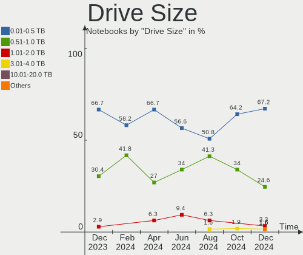
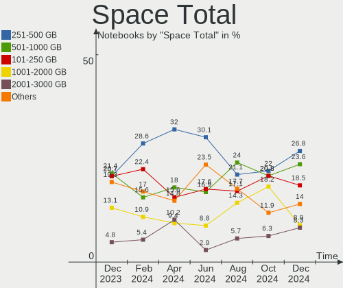
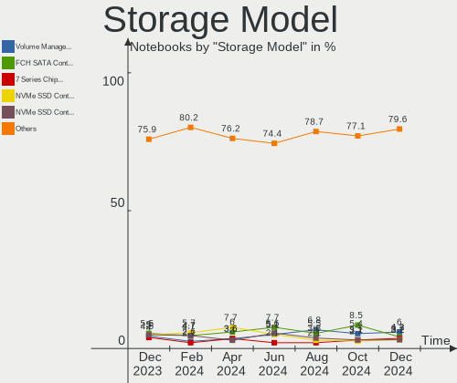
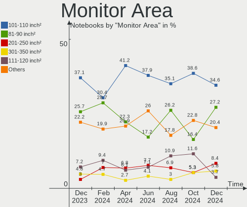
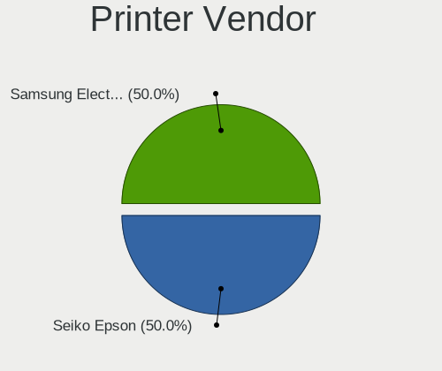
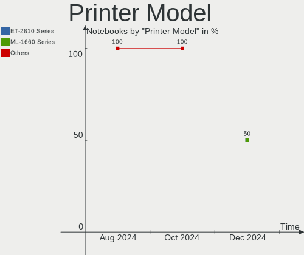

Arch - Hardware Trends (Notebooks)
----------------------------------

A project to identify most popular hardware characteristics and track their change
over time based on data collected by Linux users at https://Linux-Hardware.org.

Anyone can contribute to this report by the [hw-probe](https://github.com/linuxhw/hw-probe) tool:

    sudo -E hw-probe -all -upload

This report is for one last month. Overall report since the beginning of time: [TestDays](https://github.com/linuxhw/TestDays)

Period: Jul, 2023.

Contents
--------

* [ System ](#system)
  - [ OS                       ](#os)
  - [ OS Family                ](#os-family)
  - [ Kernel                   ](#kernel)
  - [ Kernel Family            ](#kernel-family)
  - [ Kernel Major Ver.        ](#kernel-major-ver)
  - [ Arch                     ](#arch)
  - [ DE                       ](#de)
  - [ Display Server           ](#display-server)
  - [ Display Manager          ](#display-manager)
  - [ OS Lang                  ](#os-lang)
  - [ Boot Mode                ](#boot-mode)
  - [ Filesystem               ](#filesystem)
  - [ Part. scheme             ](#part-scheme)
  - [ Dual Boot with Linux/BSD ](#dual-boot-with-linuxbsd)
  - [ Dual Boot (Win)          ](#dual-boot-win)

* [ Board ](#board)
  - [ Vendor                   ](#vendor)
  - [ Model                    ](#model)
  - [ Model Family             ](#model-family)
  - [ MFG Year                 ](#mfg-year)
  - [ Form Factor              ](#form-factor)
  - [ Secure Boot              ](#secure-boot)
  - [ Coreboot                 ](#coreboot)
  - [ RAM Size                 ](#ram-size)
  - [ RAM Used                 ](#ram-used)
  - [ Total Drives             ](#total-drives)
  - [ Has CD-ROM               ](#has-cd-rom)
  - [ Has Ethernet             ](#has-ethernet)
  - [ Has WiFi                 ](#has-wifi)
  - [ Has Bluetooth            ](#has-bluetooth)

* [ Location ](#location)
  - [ Country                  ](#country)
  - [ City                     ](#city)

* [ Drives ](#drives)
  - [ Drive Vendor             ](#drive-vendor)
  - [ Drive Model              ](#drive-model)
  - [ HDD Vendor               ](#hdd-vendor)
  - [ SSD Vendor               ](#ssd-vendor)
  - [ Drive Kind               ](#drive-kind)
  - [ Drive Connector          ](#drive-connector)
  - [ Drive Size               ](#drive-size)
  - [ Space Total              ](#space-total)
  - [ Space Used               ](#space-used)
  - [ Malfunc. Drives          ](#malfunc-drives)
  - [ Malfunc. Drive Vendor    ](#malfunc-drive-vendor)
  - [ Malfunc. HDD Vendor      ](#malfunc-hdd-vendor)
  - [ Malfunc. Drive Kind      ](#malfunc-drive-kind)
  - [ Failed Drives            ](#failed-drives)
  - [ Failed Drive Vendor      ](#failed-drive-vendor)
  - [ Drive Status             ](#drive-status)

* [ Storage controller ](#storage-controller)
  - [ Storage Vendor           ](#storage-vendor)
  - [ Storage Model            ](#storage-model)
  - [ Storage Kind             ](#storage-kind)

* [ Processor ](#processor)
  - [ CPU Vendor               ](#cpu-vendor)
  - [ CPU Model                ](#cpu-model)
  - [ CPU Model Family         ](#cpu-model-family)
  - [ CPU Cores                ](#cpu-cores)
  - [ CPU Sockets              ](#cpu-sockets)
  - [ CPU Threads              ](#cpu-threads)
  - [ CPU Op-Modes             ](#cpu-op-modes)
  - [ CPU Microcode            ](#cpu-microcode)
  - [ CPU Microarch            ](#cpu-microarch)

* [ Graphics ](#graphics)
  - [ GPU Vendor               ](#gpu-vendor)
  - [ GPU Model                ](#gpu-model)
  - [ GPU Combo                ](#gpu-combo)
  - [ GPU Driver               ](#gpu-driver)
  - [ GPU Memory               ](#gpu-memory)

* [ Monitor ](#monitor)
  - [ Monitor Vendor           ](#monitor-vendor)
  - [ Monitor Model            ](#monitor-model)
  - [ Monitor Resolution       ](#monitor-resolution)
  - [ Monitor Diagonal         ](#monitor-diagonal)
  - [ Monitor Width            ](#monitor-width)
  - [ Aspect Ratio             ](#aspect-ratio)
  - [ Monitor Area             ](#monitor-area)
  - [ Pixel Density            ](#pixel-density)
  - [ Multiple Monitors        ](#multiple-monitors)

* [ Network ](#network)
  - [ Net Controller Vendor    ](#net-controller-vendor)
  - [ Net Controller Model     ](#net-controller-model)
  - [ Wireless Vendor          ](#wireless-vendor)
  - [ Wireless Model           ](#wireless-model)
  - [ Ethernet Vendor          ](#ethernet-vendor)
  - [ Ethernet Model           ](#ethernet-model)
  - [ Net Controller Kind      ](#net-controller-kind)
  - [ Used Controller          ](#used-controller)
  - [ NICs                     ](#nics)
  - [ IPv6                     ](#ipv6)

* [ Bluetooth ](#bluetooth)
  - [ Bluetooth Vendor         ](#bluetooth-vendor)
  - [ Bluetooth Model          ](#bluetooth-model)

* [ Sound ](#sound)
  - [ Sound Vendor             ](#sound-vendor)
  - [ Sound Model              ](#sound-model)

* [ Memory ](#memory)
  - [ Memory Vendor            ](#memory-vendor)
  - [ Memory Model             ](#memory-model)
  - [ Memory Kind              ](#memory-kind)
  - [ Memory Form Factor       ](#memory-form-factor)
  - [ Memory Size              ](#memory-size)
  - [ Memory Speed             ](#memory-speed)

* [ Printers & scanners ](#printers--scanners)
  - [ Printer Vendor           ](#printer-vendor)
  - [ Printer Model            ](#printer-model)
  - [ Scanner Vendor           ](#scanner-vendor)
  - [ Scanner Model            ](#scanner-model)

* [ Camera ](#camera)
  - [ Camera Vendor            ](#camera-vendor)
  - [ Camera Model             ](#camera-model)

* [ Security ](#security)
  - [ Fingerprint Vendor       ](#fingerprint-vendor)
  - [ Fingerprint Model        ](#fingerprint-model)
  - [ Chipcard Vendor          ](#chipcard-vendor)
  - [ Chipcard Model           ](#chipcard-model)

* [ Unsupported ](#unsupported)
  - [ Unsupported Devices      ](#unsupported-devices)
  - [ Unsupported Device Types ](#unsupported-device-types)

System
------

OS
--

Installed operating systems

| Name         | Notebooks | Percent |
|--------------|-----------|---------|
| Arch Rolling | 121       | 99.18%  |
| Arch 23.0.0  | 1         | 0.82%   |

OS Family
---------

OS without a version

| Name | Notebooks | Percent |
|------|-----------|---------|
| Arch | 122       | 100%    |

Kernel
------

Version of the Linux kernel

| Version                    | Notebooks | Percent |
|----------------------------|-----------|---------|
| 6.4.2-arch1-1              | 13        | 10.66%  |
| 6.4.1-arch2-1              | 12        | 9.84%   |
| 6.4.4-arch1-1              | 10        | 8.2%    |
| 6.4.3-arch1-2              | 10        | 8.2%    |
| 6.4.3-arch1-1              | 8         | 6.56%   |
| 6.4.1-arch1-1              | 7         | 5.74%   |
| 6.4.6-arch1-1              | 6         | 4.92%   |
| 6.3.9-arch1-1              | 6         | 4.92%   |
| 6.1.39-1-lts               | 6         | 4.92%   |
| 6.4.7-arch1-1              | 4         | 3.28%   |
| 6.1.38-1-lts               | 4         | 3.28%   |
| 6.4.3-zen1-2-zen           | 3         | 2.46%   |
| 6.4.3-zen1-1-zen           | 3         | 2.46%   |
| 6.4.6-arch1-1-g14          | 2         | 1.64%   |
| 6.4.5-arch1-1              | 2         | 1.64%   |
| 6.4.2-zen1-1-zen           | 2         | 1.64%   |
| 6.4.1-zen1-1-zen           | 2         | 1.64%   |
| 6.0.12-arch1-1             | 2         | 1.64%   |
| 6.5.0-rc1-1-mainline       | 1         | 0.82%   |
| 6.4.6-zen1-1-zen           | 1         | 0.82%   |
| 6.4.6-hardened1-1-hardened | 1         | 0.82%   |
| 6.4.5-alderlake-xanmod1-1  | 1         | 0.82%   |
| 6.4.3-zen1-1.1-zen         | 1         | 0.82%   |
| 6.4.3-hardened1-1-hardened | 1         | 0.82%   |
| 6.4.2-x64v3-xanmod1        | 1         | 0.82%   |
| 6.4.2-x64v2-xanmod1-3      | 1         | 0.82%   |
| 6.4.2-arch1-1-custom       | 1         | 0.82%   |
| 6.4.2-3-MANJARO            | 1         | 0.82%   |
| 6.4.0-arch1-1              | 1         | 0.82%   |
| 6.3.9-zen1-1-zen           | 1         | 0.82%   |
| 6.3.8-arch1-1              | 1         | 0.82%   |
| 6.3.6-arch1-1              | 1         | 0.82%   |
| 6.3.5-arch1-1              | 1         | 0.82%   |
| 6.3.4-zen1-1-zen           | 1         | 0.82%   |
| 6.1.38-2-lts               | 1         | 0.82%   |
| 6.1.36-1-lts               | 1         | 0.82%   |
| 6.1.1-arch1-1              | 1         | 0.82%   |
| 5.17.9-arch1-1             | 1         | 0.82%   |

Kernel Family
-------------

Linux kernel without a distro release

| Version | Notebooks | Percent |
|---------|-----------|---------|
| 6.4.3   | 26        | 21.31%  |
| 6.4.1   | 21        | 17.21%  |
| 6.4.2   | 19        | 15.57%  |
| 6.4.6   | 10        | 8.2%    |
| 6.4.4   | 10        | 8.2%    |
| 6.3.9   | 7         | 5.74%   |
| 6.1.39  | 6         | 4.92%   |
| 6.1.38  | 5         | 4.1%    |
| 6.4.7   | 4         | 3.28%   |
| 6.4.5   | 3         | 2.46%   |
| 6.0.12  | 2         | 1.64%   |
| 6.5.0   | 1         | 0.82%   |
| 6.4.0   | 1         | 0.82%   |
| 6.3.8   | 1         | 0.82%   |
| 6.3.6   | 1         | 0.82%   |
| 6.3.5   | 1         | 0.82%   |
| 6.3.4   | 1         | 0.82%   |
| 6.1.36  | 1         | 0.82%   |
| 6.1.1   | 1         | 0.82%   |
| 5.17.9  | 1         | 0.82%   |

Kernel Major Ver.
-----------------

Linux kernel major version

| Version | Notebooks | Percent |
|---------|-----------|---------|
| 6.4     | 94        | 77.05%  |
| 6.1     | 13        | 10.66%  |
| 6.3     | 11        | 9.02%   |
| 6.0     | 2         | 1.64%   |
| 6.5     | 1         | 0.82%   |
| 5.17    | 1         | 0.82%   |

Arch
----

OS architecture (x86_64, i586, etc.)

| Name   | Notebooks | Percent |
|--------|-----------|---------|
| x86_64 | 122       | 100%    |

DE
--

Desktop Environment

| Name          | Notebooks | Percent |
|---------------|-----------|---------|
| KDE5          | 45        | 36.89%  |
| GNOME         | 33        | 27.05%  |
| XFCE          | 13        | 10.66%  |
| Unknown       | 12        | 9.84%   |
| Hyprland      | 6         | 4.92%   |
| sway          | 2         | 1.64%   |
| i3            | 2         | 1.64%   |
| X-Cinnamon    | 1         | 0.82%   |
| MATE          | 1         | 0.82%   |
| LeftWM        | 1         | 0.82%   |
| KDE           | 1         | 0.82%   |
| GNOME-Classic | 1         | 0.82%   |
| GNOME Classic | 1         | 0.82%   |
| Enlightenment | 1         | 0.82%   |
| bspwm         | 1         | 0.82%   |
| awesome       | 1         | 0.82%   |

Display Server
--------------

X11 or Wayland

| Name    | Notebooks | Percent |
|---------|-----------|---------|
| X11     | 66        | 54.1%   |
| Wayland | 41        | 33.61%  |
| Unknown | 9         | 7.38%   |
| Tty     | 6         | 4.92%   |

Display Manager
---------------

SDDM, LightDM, etc.

| Name    | Notebooks | Percent |
|---------|-----------|---------|
| Unknown | 51        | 41.8%   |
| SDDM    | 31        | 25.41%  |
| LightDM | 21        | 17.21%  |
| GDM     | 15        | 12.3%   |
| Ly      | 2         | 1.64%   |
| LY-DM   | 1         | 0.82%   |
| GREETD  | 1         | 0.82%   |

OS Lang
-------

Language

| Lang    | Notebooks | Percent |
|---------|-----------|---------|
| en_US   | 64        | 52.46%  |
| ru_RU   | 10        | 8.2%    |
| pt_BR   | 6         | 4.92%   |
| en_GB   | 6         | 4.92%   |
| C       | 6         | 4.92%   |
| Unknown | 4         | 3.28%   |
| zh_CN   | 3         | 2.46%   |
| fr_FR   | 3         | 2.46%   |
| en_DE   | 3         | 2.46%   |
| en_CA   | 3         | 2.46%   |
| it_IT   | 2         | 1.64%   |
| de_DE   | 2         | 1.64%   |
| pl_PL   | 1         | 0.82%   |
| fr_CA   | 1         | 0.82%   |
| es_ES   | 1         | 0.82%   |
| es_CL   | 1         | 0.82%   |
| es_AR   | 1         | 0.82%   |
| en_IN   | 1         | 0.82%   |
| en_IE   | 1         | 0.82%   |
| en_HK   | 1         | 0.82%   |
| en_AU   | 1         | 0.82%   |
| enGB    | 1         | 0.82%   |

Boot Mode
---------

EFI or BIOS

| Mode | Notebooks | Percent |
|------|-----------|---------|
| EFI  | 76        | 62.3%   |
| BIOS | 46        | 37.7%   |

Filesystem
----------

Type of filesystem

| Type    | Notebooks | Percent |
|---------|-----------|---------|
| Ext4    | 75        | 61.48%  |
| Btrfs   | 37        | 30.33%  |
| Overlay | 7         | 5.74%   |
| Tmpfs   | 2         | 1.64%   |
| F2fs    | 1         | 0.82%   |

Part. scheme
------------

Scheme of partitioning

| Type    | Notebooks | Percent |
|---------|-----------|---------|
| GPT     | 82        | 67.21%  |
| Unknown | 34        | 27.87%  |
| MBR     | 6         | 4.92%   |

Dual Boot with Linux/BSD
------------------------

Hosting more than one Linux/BSD

| Dual boot | Notebooks | Percent |
|-----------|-----------|---------|
| No        | 107       | 87.7%   |
| Yes       | 15        | 12.3%   |

Dual Boot (Win)
---------------

Hosting Linux and Windows

| Dual boot | Notebooks | Percent |
|-----------|-----------|---------|
| No        | 84        | 68.85%  |
| Yes       | 38        | 31.15%  |

Board
-----

Vendor
------

Motherboard manufacturer

| Name                   | Notebooks | Percent |
|------------------------|-----------|---------|
| Lenovo                 | 35        | 28.69%  |
| ASUSTek Computer       | 22        | 18.03%  |
| Hewlett-Packard        | 16        | 13.11%  |
| Dell                   | 14        | 11.48%  |
| Acer                   | 10        | 8.2%    |
| HUAWEI                 | 5         | 4.1%    |
| Apple                  | 4         | 3.28%   |
| XIAOMI                 | 2         | 1.64%   |
| TUXEDO                 | 2         | 1.64%   |
| Timi                   | 1         | 0.82%   |
| Razer                  | 1         | 0.82%   |
| Purism                 | 1         | 0.82%   |
| Panasonic              | 1         | 0.82%   |
| MSI                    | 1         | 0.82%   |
| Medion                 | 1         | 0.82%   |
| Lex BayTrail           | 1         | 0.82%   |
| Infinix                | 1         | 0.82%   |
| Google                 | 1         | 0.82%   |
| Gigabyte Technology    | 1         | 0.82%   |
| Framework              | 1         | 0.82%   |
| Avell High Performance | 1         | 0.82%   |

Model
-----

Motherboard model

| Name                                        | Notebooks | Percent |
|---------------------------------------------|-----------|---------|
| XIAOMI Redmi Book Pro 15 2023               | 2         | 1.64%   |
| ASUS ROG Zephyrus G15 GA503QM_GA503QM       | 2         | 1.64%   |
| Apple MacBookPro11,2                        | 2         | 1.64%   |
| TUXEDO Pulse 15 Gen1                        | 1         | 0.82%   |
| TUXEDO Aura 15 Gen1                         | 1         | 0.82%   |
| Timi Mi NoteBook Ultra                      | 1         | 0.82%   |
| Razer Blade                                 | 1         | 0.82%   |
| Purism Librem 14                            | 1         | 0.82%   |
| Panasonic CFSZ5-3                           | 1         | 0.82%   |
| MSI Raider GE78HX 13VI                      | 1         | 0.82%   |
| Medion Erazer P7643 MD60299                 | 1         | 0.82%   |
| Lex BayTrail 2I380D                         | 1         | 0.82%   |
| Lenovo ThinkPad X390 20SDA018CD             | 1         | 0.82%   |
| Lenovo ThinkPad X260 20F5S4NR00             | 1         | 0.82%   |
| Lenovo ThinkPad X220 Tablet 42962WU         | 1         | 0.82%   |
| Lenovo ThinkPad X1 Carbon Gen 10 21CB000CUS | 1         | 0.82%   |
| Lenovo ThinkPad T550 20CJS0P300             | 1         | 0.82%   |
| Lenovo ThinkPad T530 2429AA9                | 1         | 0.82%   |
| Lenovo ThinkPad T520 4243B65                | 1         | 0.82%   |
| Lenovo ThinkPad T480s 20L8S3JE00            | 1         | 0.82%   |
| Lenovo ThinkPad T440s 20AQ005TUS            | 1         | 0.82%   |
| Lenovo ThinkPad T410 2537PW4                | 1         | 0.82%   |
| Lenovo ThinkPad T14s Gen 3 21CQCTO1WW       | 1         | 0.82%   |
| Lenovo ThinkPad T14 Gen 2a 20XLS23K00       | 1         | 0.82%   |
| Lenovo ThinkPad P51 20HJS16Q0K              | 1         | 0.82%   |
| Lenovo ThinkPad P50s 20FLCTO1WW             | 1         | 0.82%   |
| Lenovo ThinkPad P17 Gen 2i 20YU0006GE       | 1         | 0.82%   |
| Lenovo ThinkPad E15 Gen 3 20YG003VPB        | 1         | 0.82%   |
| Lenovo ThinkPad E15 Gen 2 20TDS0G500        | 1         | 0.82%   |
| Lenovo ThinkPad E14 20RBCTO1WW              | 1         | 0.82%   |
| Lenovo ThinkPad A285 20MXS0JR14             | 1         | 0.82%   |
| Lenovo ThinkBook 15 G2 ITL 20VE             | 1         | 0.82%   |
| Lenovo M490s 20215                          | 1         | 0.82%   |
| Lenovo Legion R9000X ARHA7 82UG             | 1         | 0.82%   |
| Lenovo Legion R9000P2021 82JS               | 1         | 0.82%   |
| Lenovo Legion 5 Pro 16ACH6 82JS             | 1         | 0.82%   |
| Lenovo IdeaPad Z510 20287                   | 1         | 0.82%   |
| Lenovo IdeaPad S340-14API 81NB              | 1         | 0.82%   |
| Lenovo IdeaPad S145-15IWL 81S9              | 1         | 0.82%   |
| Lenovo IdeaPad S145-15AST 81N3              | 1         | 0.82%   |

Model Family
------------

Motherboard model prefix

| Name                | Notebooks | Percent |
|---------------------|-----------|---------|
| Lenovo ThinkPad     | 19        | 15.57%  |
| Lenovo IdeaPad      | 9         | 7.38%   |
| ASUS VivoBook       | 7         | 5.74%   |
| ASUS ROG            | 7         | 5.74%   |
| HP Pavilion         | 6         | 4.92%   |
| Dell Latitude       | 5         | 4.1%    |
| Acer Aspire         | 5         | 4.1%    |
| HP EliteBook        | 4         | 3.28%   |
| Dell Inspiron       | 4         | 3.28%   |
| Lenovo Legion       | 3         | 2.46%   |
| HP ProBook          | 3         | 2.46%   |
| ASUS ZenBook        | 3         | 2.46%   |
| Apple MacBookPro11  | 3         | 2.46%   |
| XIAOMI Redmi        | 2         | 1.64%   |
| Dell XPS            | 2         | 1.64%   |
| ASUS ASUS           | 2         | 1.64%   |
| Acer Nitro          | 2         | 1.64%   |
| TUXEDO Pulse        | 1         | 0.82%   |
| TUXEDO Aura         | 1         | 0.82%   |
| Timi Mi             | 1         | 0.82%   |
| Razer Blade         | 1         | 0.82%   |
| Purism Librem       | 1         | 0.82%   |
| Panasonic CFSZ5-3   | 1         | 0.82%   |
| MSI Raider          | 1         | 0.82%   |
| Medion Erazer       | 1         | 0.82%   |
| Lex BayTrail 2I380D | 1         | 0.82%   |
| Lenovo ThinkBook    | 1         | 0.82%   |
| Lenovo M490s        | 1         | 0.82%   |
| Lenovo B50-70       | 1         | 0.82%   |
| Lenovo B50-45       | 1         | 0.82%   |
| Infinix INBOOK      | 1         | 0.82%   |
| HUAWEI NBLB-WAX9N   | 1         | 0.82%   |
| HUAWEI MACHC-WAX9   | 1         | 0.82%   |
| HUAWEI KPR-WX9      | 1         | 0.82%   |
| HUAWEI HVY-WXX9     | 1         | 0.82%   |
| HUAWEI HN-WX9X      | 1         | 0.82%   |
| HP OMEN             | 1         | 0.82%   |
| HP Laptop           | 1         | 0.82%   |
| HP ENVY             | 1         | 0.82%   |
| Google Atlas        | 1         | 0.82%   |

MFG Year
--------

Motherboard manufacture year

| Year | Notebooks | Percent |
|------|-----------|---------|
| 2021 | 20        | 16.39%  |
| 2019 | 17        | 13.93%  |
| 2022 | 15        | 12.3%   |
| 2020 | 15        | 12.3%   |
| 2018 | 9         | 7.38%   |
| 2023 | 8         | 6.56%   |
| 2016 | 7         | 5.74%   |
| 2011 | 6         | 4.92%   |
| 2017 | 5         | 4.1%    |
| 2014 | 5         | 4.1%    |
| 2013 | 5         | 4.1%    |
| 2015 | 4         | 3.28%   |
| 2012 | 3         | 2.46%   |
| 2010 | 1         | 0.82%   |
| 2009 | 1         | 0.82%   |
| 2008 | 1         | 0.82%   |

Form Factor
-----------

Physical design of the computer

| Name     | Notebooks | Percent |
|----------|-----------|---------|
| Notebook | 122       | 100%    |

Secure Boot
-----------

Enabled or disabled

| State    | Notebooks | Percent |
|----------|-----------|---------|
| Disabled | 117       | 95.9%   |
| Enabled  | 5         | 4.1%    |

Coreboot
--------

Have coreboot on board

| Used | Notebooks | Percent |
|------|-----------|---------|
| No   | 120       | 98.36%  |
| Yes  | 2         | 1.64%   |

RAM Size
--------

Total RAM memory

| Size in GB  | Notebooks | Percent |
|-------------|-----------|---------|
| 16.01-24.0  | 37        | 30.33%  |
| 4.01-8.0    | 32        | 26.23%  |
| 8.01-16.0   | 27        | 22.13%  |
| 3.01-4.0    | 8         | 6.56%   |
| 32.01-64.0  | 7         | 5.74%   |
| 24.01-32.0  | 4         | 3.28%   |
| 64.01-256.0 | 4         | 3.28%   |
| 1.01-2.0    | 2         | 1.64%   |
| 0.51-1.0    | 1         | 0.82%   |

RAM Used
--------

Used RAM memory

| Used GB    | Notebooks | Percent |
|------------|-----------|---------|
| 4.01-8.0   | 36        | 29.51%  |
| 2.01-3.0   | 32        | 26.23%  |
| 1.01-2.0   | 20        | 16.39%  |
| 3.01-4.0   | 16        | 13.11%  |
| 8.01-16.0  | 10        | 8.2%    |
| 0.01-0.5   | 4         | 3.28%   |
| 0.51-1.0   | 3         | 2.46%   |
| 16.01-24.0 | 1         | 0.82%   |

Total Drives
------------

Number of drives on board

| Drives | Notebooks | Percent |
|--------|-----------|---------|
| 1      | 83        | 68.03%  |
| 2      | 33        | 27.05%  |
| 3      | 5         | 4.1%    |
| 4      | 1         | 0.82%   |

Has CD-ROM
----------

Has CD-ROM on board

| Presented | Notebooks | Percent |
|-----------|-----------|---------|
| No        | 109       | 89.34%  |
| Yes       | 13        | 10.66%  |

Has Ethernet
------------

Has Ethernet on board

| Presented | Notebooks | Percent |
|-----------|-----------|---------|
| Yes       | 87        | 71.31%  |
| No        | 35        | 28.69%  |

Has WiFi
--------

Has WiFi module

| Presented | Notebooks | Percent |
|-----------|-----------|---------|
| Yes       | 118       | 96.72%  |
| No        | 4         | 3.28%   |

Has Bluetooth
-------------

Has Bluetooth module

| Presented | Notebooks | Percent |
|-----------|-----------|---------|
| Yes       | 111       | 90.98%  |
| No        | 11        | 9.02%   |

Location
--------

Country
-------

Geographic location (country)

| Country      | Notebooks | Percent |
|--------------|-----------|---------|
| Russia       | 18        | 14.75%  |
| Germany      | 15        | 12.3%   |
| USA          | 14        | 11.48%  |
| Brazil       | 11        | 9.02%   |
| China        | 6         | 4.92%   |
| UK           | 5         | 4.1%    |
| India        | 5         | 4.1%    |
| Canada       | 5         | 4.1%    |
| Poland       | 3         | 2.46%   |
| Italy        | 3         | 2.46%   |
| Hong Kong    | 3         | 2.46%   |
| France       | 3         | 2.46%   |
| Turkey       | 2         | 1.64%   |
| Sweden       | 2         | 1.64%   |
| Spain        | 2         | 1.64%   |
| Malaysia     | 2         | 1.64%   |
| Iran         | 2         | 1.64%   |
| Denmark      | 2         | 1.64%   |
| Austria      | 2         | 1.64%   |
| Australia    | 2         | 1.64%   |
| Venezuela    | 1         | 0.82%   |
| Uzbekistan   | 1         | 0.82%   |
| Uruguay      | 1         | 0.82%   |
| Sri Lanka    | 1         | 0.82%   |
| Saudi Arabia | 1         | 0.82%   |
| Philippines  | 1         | 0.82%   |
| Netherlands  | 1         | 0.82%   |
| Moldova      | 1         | 0.82%   |
| Mexico       | 1         | 0.82%   |
| Kenya        | 1         | 0.82%   |
| Japan        | 1         | 0.82%   |
| Indonesia    | 1         | 0.82%   |
| Chile        | 1         | 0.82%   |
| Belarus      | 1         | 0.82%   |
| Argentina    | 1         | 0.82%   |

City
----

Geographic location (city)

| City                     | Notebooks | Percent |
|--------------------------|-----------|---------|
| Berlin                   | 7         | 5.74%   |
| Moscow                   | 4         | 3.28%   |
| St Petersburg            | 3         | 2.46%   |
| Zhongba                  | 2         | 1.64%   |
| Sao Paulo                | 2         | 1.64%   |
| Kuala Lumpur             | 2         | 1.64%   |
| Delhi                    | 2         | 1.64%   |
| Central                  | 2         | 1.64%   |
| Zabrowo                  | 1         | 0.82%   |
| Yogyakarta               | 1         | 0.82%   |
| Xiamen                   | 1         | 0.82%   |
| Warsaw                   | 1         | 0.82%   |
| Wandsworth               | 1         | 0.82%   |
| Wanchai                  | 1         | 0.82%   |
| Wallingford              | 1         | 0.82%   |
| Volgograd                | 1         | 0.82%   |
| Vienna                   | 1         | 0.82%   |
| Valencia                 | 1         | 0.82%   |
| Uberlândia              | 1         | 0.82%   |
| Tokyo                    | 1         | 0.82%   |
| Tehran                   | 1         | 0.82%   |
| Tashkent                 | 1         | 0.82%   |
| Tagbilaran               | 1         | 0.82%   |
| Sydney                   | 1         | 0.82%   |
| Surrey                   | 1         | 0.82%   |
| Sundsvall                | 1         | 0.82%   |
| St Albans                | 1         | 0.82%   |
| Smyrna                   | 1         | 0.82%   |
| Shenzhen                 | 1         | 0.82%   |
| Shahr-e Kord             | 1         | 0.82%   |
| Seattle                  | 1         | 0.82%   |
| Saratov                  | 1         | 0.82%   |
| Sao Vicente              | 1         | 0.82%   |
| Sao Jose do Rio Preto    | 1         | 0.82%   |
| Sant'Egidio alla Vibrata | 1         | 0.82%   |
| Samara                   | 1         | 0.82%   |
| Rubiataba                | 1         | 0.82%   |
| Roosendaal               | 1         | 0.82%   |
| Rockport                 | 1         | 0.82%   |
| Rio de Janeiro           | 1         | 0.82%   |

Drives
------

Drive Vendor
------------

Hard drive vendors

| Vendor                       | Notebooks | Drives | Percent |
|------------------------------|-----------|--------|---------|
| Samsung Electronics          | 35        | 38     | 21.47%  |
| Sandisk                      | 12        | 13     | 7.36%   |
| Seagate                      | 11        | 11     | 6.75%   |
| SK hynix                     | 9         | 9      | 5.52%   |
| Kingston                     | 9         | 9      | 5.52%   |
| Toshiba                      | 8         | 8      | 4.91%   |
| Intel                        | 8         | 8      | 4.91%   |
| WDC                          | 7         | 7      | 4.29%   |
| Micron Technology            | 6         | 6      | 3.68%   |
| KIOXIA                       | 6         | 6      | 3.68%   |
| A-DATA Technology            | 5         | 5      | 3.07%   |
| Silicon Motion               | 4         | 4      | 2.45%   |
| HGST                         | 4         | 4      | 2.45%   |
| Crucial                      | 4         | 4      | 2.45%   |
| Yangtze Memory Technologies  | 3         | 3      | 1.84%   |
| Kingston Technology Company  | 3         | 3      | 1.84%   |
| Apple                        | 3         | 4      | 1.84%   |
| Unknown                      | 2         | 2      | 1.23%   |
| Micron/Crucial Technology    | 2         | 2      | 1.23%   |
| Intenso                      | 2         | 2      | 1.23%   |
| China                        | 2         | 2      | 1.23%   |
| USB3.0                       | 1         | 1      | 0.61%   |
| SSSTC                        | 1         | 1      | 0.61%   |
| SSK                          | 1         | 1      | 0.61%   |
| Shenzhen Longsys Electronics | 1         | 1      | 0.61%   |
| SAGE                         | 1         | 1      | 0.61%   |
| SABRENT                      | 1         | 1      | 0.61%   |
| Realtek                      | 1         | 1      | 0.61%   |
| Phison Electronics           | 1         | 1      | 0.61%   |
| Phison                       | 1         | 1      | 0.61%   |
| MAXIO Technology (Hangzhou)  | 1         | 1      | 0.61%   |
| LITEON                       | 1         | 1      | 0.61%   |
| Lenovo                       | 1         | 1      | 0.61%   |
| KingFast                     | 1         | 1      | 0.61%   |
| Inateck                      | 1         | 1      | 0.61%   |
| Hikvision                    | 1         | 1      | 0.61%   |
| FORESEE                      | 1         | 1      | 0.61%   |
| ACASIS                       | 1         | 1      | 0.61%   |
| Unknown                      | 1         | 1      | 0.61%   |

Drive Model
-----------

Hard drive models

| Model                                                 | Notebooks | Percent |
|-------------------------------------------------------|-----------|---------|
| Samsung NVMe SSD Controller SM981/PM981/PM983 500GB   | 12        | 7.32%   |
| Samsung NVMe SSD Controller PM9A1/PM9A3/980PRO 1TB    | 5         | 3.05%   |
| Sandisk WD Black SN750 / PC SN730 NVMe SSD 1024GB     | 4         | 2.44%   |
| Seagate ST1000LM035-1RK172 1TB                        | 3         | 1.83%   |
| Toshiba XG6 NVMe SSD Controller 512GB                 | 2         | 1.22%   |
| Toshiba MQ04ABF100 1TB                                | 2         | 1.22%   |
| Toshiba MQ01ABD100 1TB                                | 2         | 1.22%   |
| Toshiba BG3 NVMe SSD Controller 256GB                 | 2         | 1.22%   |
| SK hynix SKHynix_HFS512GDE9X084N 512GB                | 2         | 1.22%   |
| Silicon Motion SM2263EN/SM2263XT SSD Controller 500GB | 2         | 1.22%   |
| Samsung SSD 850 EVO 500GB                             | 2         | 1.22%   |
| Samsung SSD 850 EVO 250GB                             | 2         | 1.22%   |
| Micron/Crucial P2 NVMe PCIe SSD 1TB                   | 2         | 1.22%   |
| KIOXIA KBG50ZNV512G 512GB                             | 2         | 1.22%   |
| Kingston SUV400S37240G 240GB SSD                      | 2         | 1.22%   |
| Kingston SNV2S500G 500GB                              | 2         | 1.22%   |
| Intel SSDPEKNU512GZ 512GB                             | 2         | 1.22%   |
| Intel SSDPEKNU010TZ 1TB                               | 2         | 1.22%   |
| Intel SSD 660P Series 1024GB                          | 2         | 1.22%   |
| HGST HTS721010A9E630 1TB                              | 2         | 1.22%   |
| Yangtze Memory ZHITAI TiPlus7100 2TB                  | 1         | 0.61%   |
| Yangtze Memory ZHITAI TiPlus5000 1TB                  | 1         | 0.61%   |
| Yangtze Memory ZHITAI PC005 Active 512GB              | 1         | 0.61%   |
| WDC WDS500G2B0B-00YS70 500GB SSD                      | 1         | 0.61%   |
| WDC WDS500G2B0A-00SM50 500GB SSD                      | 1         | 0.61%   |
| WDC WD5000LPVX-22V0TT0 500GB                          | 1         | 0.61%   |
| WDC WD3200BPVT-80JJ5T0 320GB                          | 1         | 0.61%   |
| WDC WD10SPZX-75Z10T2 1TB                              | 1         | 0.61%   |
| WDC WD10SPZX-21Z10T0 1TB                              | 1         | 0.61%   |
| WDC WD10SPSX-08A6W 1TB                                | 1         | 0.61%   |
| USB3.0 Super Speed 500GB                              | 1         | 0.61%   |
| Unknown MMC Card  64GB                                | 1         | 0.61%   |
| Unknown MMC Card  128GB                               | 1         | 0.61%   |
| SSSTC CV8-8E128-HP 128GB SSD                          | 1         | 0.61%   |
| SSK Disk 120GB                                        | 1         | 0.61%   |
| SK hynix SKHynix_HFM512GD3HX015N 512GB                | 1         | 0.61%   |
| SK hynix PC711 NVMe 512GB                             | 1         | 0.61%   |
| SK hynix PC601 NVMe 256GB                             | 1         | 0.61%   |
| SK hynix HFM512GD3JX013N 512GB                        | 1         | 0.61%   |
| SK hynix HFM001TD3JX013N 1TB                          | 1         | 0.61%   |

HDD Vendor
----------

Hard disk drive vendors

| Vendor  | Notebooks | Drives | Percent |
|---------|-----------|--------|---------|
| Seagate | 11        | 11     | 39.29%  |
| WDC     | 5         | 5      | 17.86%  |
| Toshiba | 4         | 4      | 14.29%  |
| HGST    | 4         | 4      | 14.29%  |
| USB3.0  | 1         | 1      | 3.57%   |
| SSK     | 1         | 1      | 3.57%   |
| Inateck | 1         | 1      | 3.57%   |
| ACASIS  | 1         | 1      | 3.57%   |

SSD Vendor
----------

Solid state drive vendors

| Vendor              | Notebooks | Drives | Percent |
|---------------------|-----------|--------|---------|
| Samsung Electronics | 10        | 10     | 24.39%  |
| Kingston            | 7         | 7      | 17.07%  |
| Crucial             | 4         | 4      | 9.76%   |
| A-DATA Technology   | 3         | 3      | 7.32%   |
| WDC                 | 2         | 2      | 4.88%   |
| SanDisk             | 2         | 3      | 4.88%   |
| Intenso             | 2         | 2      | 4.88%   |
| China               | 2         | 2      | 4.88%   |
| Apple               | 2         | 2      | 4.88%   |
| SSSTC               | 1         | 1      | 2.44%   |
| SAGE                | 1         | 1      | 2.44%   |
| Phison              | 1         | 1      | 2.44%   |
| LITEON              | 1         | 1      | 2.44%   |
| KingFast            | 1         | 1      | 2.44%   |
| Intel               | 1         | 1      | 2.44%   |
| Unknown             | 1         | 1      | 2.44%   |

Drive Kind
----------

HDD or SSD

| Kind    | Notebooks | Drives | Percent |
|---------|-----------|--------|---------|
| NVMe    | 80        | 95     | 53.33%  |
| SSD     | 41        | 42     | 27.33%  |
| HDD     | 26        | 28     | 17.33%  |
| MMC     | 2         | 2      | 1.33%   |
| Unknown | 1         | 1      | 0.67%   |

Drive Connector
---------------

SATA, SAS, NVMe, etc.

| Type | Notebooks | Drives | Percent |
|------|-----------|--------|---------|
| NVMe | 79        | 93     | 54.11%  |
| SATA | 53        | 60     | 36.3%   |
| SAS  | 12        | 13     | 8.22%   |
| MMC  | 2         | 2      | 1.37%   |

Drive Size
----------

Size of hard drive

| Size in TB | Notebooks | Drives | Percent |
|------------|-----------|--------|---------|
| 0.01-0.5   | 43        | 44     | 63.24%  |
| 0.51-1.0   | 19        | 20     | 27.94%  |
| 1.01-2.0   | 5         | 5      | 7.35%   |
| 3.01-4.0   | 1         | 1      | 1.47%   |

Space Total
-----------

Amount of disk space available on the file system

| Size in GB     | Notebooks | Percent |
|----------------|-----------|---------|
| 251-500        | 29        | 23.77%  |
| 101-250        | 29        | 23.77%  |
| 1001-2000      | 18        | 14.75%  |
| 501-1000       | 15        | 12.3%   |
| 2001-3000      | 9         | 7.38%   |
| More than 3000 | 8         | 6.56%   |
| 51-100         | 6         | 4.92%   |
| Unknown        | 5         | 4.1%    |
| 1-20           | 2         | 1.64%   |
| 21-50          | 1         | 0.82%   |

Space Used
----------

Amount of used disk space

| Used GB        | Notebooks | Percent |
|----------------|-----------|---------|
| 1-20           | 27        | 22.13%  |
| 21-50          | 22        | 18.03%  |
| 101-250        | 22        | 18.03%  |
| 51-100         | 19        | 15.57%  |
| 501-1000       | 10        | 8.2%    |
| 251-500        | 9         | 7.38%   |
| Unknown        | 5         | 4.1%    |
| 1001-2000      | 4         | 3.28%   |
| More than 3000 | 3         | 2.46%   |
| 2001-3000      | 1         | 0.82%   |

Malfunc. Drives
---------------

Drive models with a malfunction

| Model                          | Notebooks | Drives | Percent |
|--------------------------------|-----------|--------|---------|
| SSSTC CV8-8E128-HP 128GB SSD   | 1         | 1      | 50%     |
| Seagate ST1000LM035-1RK172 1TB | 1         | 1      | 50%     |

Malfunc. Drive Vendor
---------------------

Vendors of faulty drives

| Vendor  | Notebooks | Drives | Percent |
|---------|-----------|--------|---------|
| SSSTC   | 1         | 1      | 50%     |
| Seagate | 1         | 1      | 50%     |

Malfunc. HDD Vendor
-------------------

Vendors of faulty HDD drives

| Vendor  | Notebooks | Drives | Percent |
|---------|-----------|--------|---------|
| Seagate | 1         | 1      | 100%    |

Malfunc. Drive Kind
-------------------

Kinds of faulty drives

| Kind | Notebooks | Drives | Percent |
|------|-----------|--------|---------|
| SSD  | 1         | 1      | 50%     |
| HDD  | 1         | 1      | 50%     |

Failed Drives
-------------

Failed drive models

Zero info for selected period =(

Failed Drive Vendor
-------------------

Failed drive vendors

Zero info for selected period =(

Drive Status
------------

Number of failed and malfunc. drives

| Status   | Notebooks | Drives | Percent |
|----------|-----------|--------|---------|
| Works    | 68        | 89     | 52.71%  |
| Detected | 59        | 77     | 45.74%  |
| Malfunc  | 2         | 2      | 1.55%   |

Storage controller
------------------

Storage Vendor
--------------

Storage controller vendors

| Vendor                       | Notebooks | Percent |
|------------------------------|-----------|---------|
| Intel                        | 60        | 36.36%  |
| Samsung Electronics          | 28        | 16.97%  |
| AMD                          | 20        | 12.12%  |
| SanDisk                      | 10        | 6.06%   |
| SK hynix                     | 9         | 5.45%   |
| Micron Technology            | 6         | 3.64%   |
| KIOXIA                       | 6         | 3.64%   |
| Kingston Technology Company  | 5         | 3.03%   |
| Toshiba America Info Systems | 4         | 2.42%   |
| Silicon Motion               | 4         | 2.42%   |
| Yangtze Memory Technologies  | 3         | 1.82%   |
| Shenzhen Longsys Electronics | 2         | 1.21%   |
| Micron/Crucial Technology    | 2         | 1.21%   |
| ADATA Technology             | 2         | 1.21%   |
| Phison Electronics           | 1         | 0.61%   |
| MAXIO Technology (Hangzhou)  | 1         | 0.61%   |
| Lenovo                       | 1         | 0.61%   |
| Apple                        | 1         | 0.61%   |

Storage Model
-------------

Storage controller models

| Model                                                                          | Notebooks | Percent |
|--------------------------------------------------------------------------------|-----------|---------|
| AMD FCH SATA Controller [AHCI mode]                                            | 19        | 11.31%  |
| Samsung NVMe SSD Controller SM981/PM981/PM983                                  | 13        | 7.74%   |
| Intel Sunrise Point-LP SATA Controller [AHCI mode]                             | 8         | 4.76%   |
| SK hynix Gold P31/BC711/PC711 NVMe Solid State Drive                           | 7         | 4.17%   |
| Samsung NVMe SSD Controller PM9A1/PM9A3/980PRO                                 | 6         | 3.57%   |
| Intel SSD 670p Series [Keystone Harbor]                                        | 5         | 2.98%   |
| Intel 6 Series/C200 Series Chipset Family 6 port Mobile SATA AHCI Controller   | 5         | 2.98%   |
| SanDisk WD Black SN750 / PC SN730 NVMe SSD                                     | 4         | 2.38%   |
| Samsung NVMe SSD Controller 980                                                | 4         | 2.38%   |
| Intel Volume Management Device NVMe RAID Controller                            | 4         | 2.38%   |
| Intel HM170/QM170 Chipset SATA Controller [AHCI Mode]                          | 4         | 2.38%   |
| Intel Cannon Lake Mobile PCH SATA AHCI Controller                              | 4         | 2.38%   |
| Intel 7 Series Chipset Family 6-port SATA Controller [AHCI mode]               | 4         | 2.38%   |
| KIOXIA NVMe SSD Controller BG4 (DRAM-less)                                     | 3         | 1.79%   |
| Intel Wildcat Point-LP SATA Controller [AHCI Mode]                             | 3         | 1.79%   |
| Intel Tiger Lake-LP SATA Controller                                            | 3         | 1.79%   |
| Intel 82801 Mobile SATA Controller [RAID mode]                                 | 3         | 1.79%   |
| Intel 8 Series/C220 Series Chipset Family 6-port SATA Controller 1 [AHCI mode] | 3         | 1.79%   |
| Intel 8 Series SATA Controller 1 [AHCI mode]                                   | 3         | 1.79%   |
| Toshiba America Info Systems XG6 NVMe SSD Controller                           | 2         | 1.19%   |
| Toshiba America Info Systems BG3 NVMe SSD Controller                           | 2         | 1.19%   |
| Silicon Motion SM2263EN/SM2263XT (DRAM-less) NVMe SSD Controllers              | 2         | 1.19%   |
| Shenzhen Longsys SM2263EN/SM2263XT-based OEM SSD                               | 2         | 1.19%   |
| Samsung S4LN053X01 AHCI SSD Controller(Apple slot)                             | 2         | 1.19%   |
| Micron/Crucial P2 [Nick P2] / P3 / P3 Plus NVMe PCIe SSD (DRAM-less)           | 2         | 1.19%   |
| Micron 2450 NVMe SSD [HendrixV] (DRAM-less)                                    | 2         | 1.19%   |
| KIOXIA NVMe SSD Controller BG5 (DRAM-less)                                     | 2         | 1.19%   |
| Kingston Company Company Non-Volatile memory controller                        | 2         | 1.19%   |
| Intel SSD 660P Series                                                          | 2         | 1.19%   |
| Intel Comet Lake SATA AHCI Controller                                          | 2         | 1.19%   |
| Intel Celeron/Pentium Silver Processor SATA Controller                         | 2         | 1.19%   |
| ADATA IM2P33F8ABR1 NVMe SSD                                                    | 2         | 1.19%   |
| Yangtze Memory ZHITAI TiPro5000 NVMe SSD                                       | 1         | 0.6%    |
| Yangtze Memory ZHITAI TiPlus7100                                               | 1         | 0.6%    |
| Yangtze Memory ZHITAI PC005 NVMe SSD                                           | 1         | 0.6%    |
| SK hynix PC601 NVMe Solid State Drive                                          | 1         | 0.6%    |
| SK hynix BC501 NVMe Solid State Drive                                          | 1         | 0.6%    |
| Silicon Motion SM2262/SM2262EN SSD Controller                                  | 1         | 0.6%    |
| Silicon Motion Non-Volatile memory controller                                  | 1         | 0.6%    |
| SanDisk WD Blue SN570 NVMe SSD 1TB                                             | 1         | 0.6%    |

Storage Kind
------------

Kind of storage controller (IDE, SATA, NVMe, SAS, ...)

| Kind | Notebooks | Percent |
|------|-----------|---------|
| NVMe | 79        | 50.32%  |
| SATA | 71        | 45.22%  |
| RAID | 7         | 4.46%   |

Processor
---------

CPU Vendor
----------

Processor vendors

| Vendor | Notebooks | Percent |
|--------|-----------|---------|
| Intel  | 79        | 64.75%  |
| AMD    | 43        | 35.25%  |

CPU Model
---------

Processor models

| Model                                         | Notebooks | Percent |
|-----------------------------------------------|-----------|---------|
| Intel 11th Gen Core i5-1135G7 @ 2.40GHz       | 5         | 4.1%    |
| AMD Ryzen 5 5600H with Radeon Graphics        | 5         | 4.1%    |
| AMD Ryzen 5 3500U with Radeon Vega Mobile Gfx | 4         | 3.28%   |
| AMD Ryzen 7 5800H with Radeon Graphics        | 3         | 2.46%   |
| Intel Core i7-9750H CPU @ 2.60GHz             | 2         | 1.64%   |
| Intel Core i7-7700HQ CPU @ 2.80GHz            | 2         | 1.64%   |
| Intel Core i7-6700HQ CPU @ 2.60GHz            | 2         | 1.64%   |
| Intel Core i7-4770HQ CPU @ 2.20GHz            | 2         | 1.64%   |
| Intel Core i7-4702MQ CPU @ 2.20GHz            | 2         | 1.64%   |
| Intel Core i7-10510U CPU @ 1.80GHz            | 2         | 1.64%   |
| Intel Core i5-9300H CPU @ 2.40GHz             | 2         | 1.64%   |
| Intel Core i5-8250U CPU @ 1.60GHz             | 2         | 1.64%   |
| Intel Core i5-7300U CPU @ 2.60GHz             | 2         | 1.64%   |
| Intel Core i5-6300U CPU @ 2.40GHz             | 2         | 1.64%   |
| Intel Core i5-10300H CPU @ 2.50GHz            | 2         | 1.64%   |
| Intel Core i5-10210U CPU @ 1.60GHz            | 2         | 1.64%   |
| AMD Ryzen 9 5900HX with Radeon Graphics       | 2         | 1.64%   |
| AMD Ryzen 7 7840HS w/ Radeon 780M Graphics    | 2         | 1.64%   |
| AMD Ryzen 7 6800H with Radeon Graphics        | 2         | 1.64%   |
| AMD Ryzen 7 5700U with Radeon Graphics        | 2         | 1.64%   |
| AMD Ryzen 5 4600H with Radeon Graphics        | 2         | 1.64%   |
| Intel Pentium Silver N5000 CPU @ 1.10GHz      | 1         | 0.82%   |
| Intel Core M-5Y10c CPU @ 0.80GHz              | 1         | 0.82%   |
| Intel Core i7-8750H CPU @ 2.20GHz             | 1         | 0.82%   |
| Intel Core i7-8565U CPU @ 1.80GHz             | 1         | 0.82%   |
| Intel Core i7-8500Y CPU @ 1.50GHz             | 1         | 0.82%   |
| Intel Core i7-7820HQ CPU @ 2.90GHz            | 1         | 0.82%   |
| Intel Core i7-7500U CPU @ 2.70GHz             | 1         | 0.82%   |
| Intel Core i7-6500U CPU @ 2.50GHz             | 1         | 0.82%   |
| Intel Core i7-5500U CPU @ 2.40GHz             | 1         | 0.82%   |
| Intel Core i7-4710HQ CPU @ 2.50GHz            | 1         | 0.82%   |
| Intel Core i7-4600U CPU @ 2.10GHz             | 1         | 0.82%   |
| Intel Core i7-3840QM CPU @ 2.80GHz            | 1         | 0.82%   |
| Intel Core i7-2720QM CPU @ 2.20GHz            | 1         | 0.82%   |
| Intel Core i7-2630QM CPU @ 2.00GHz            | 1         | 0.82%   |
| Intel Core i7-2620M CPU @ 2.70GHz             | 1         | 0.82%   |
| Intel Core i7-10750H CPU @ 2.60GHz            | 1         | 0.82%   |
| Intel Core i7-10710U CPU @ 1.10GHz            | 1         | 0.82%   |
| Intel Core i7-1065G7 CPU @ 1.30GHz            | 1         | 0.82%   |
| Intel Core i5-8350U CPU @ 1.70GHz             | 1         | 0.82%   |

CPU Model Family
----------------

Processor model prefix

| Model                | Notebooks | Percent |
|----------------------|-----------|---------|
| Intel Core i7        | 28        | 22.95%  |
| Intel Core i5        | 25        | 20.49%  |
| Other                | 18        | 14.75%  |
| AMD Ryzen 7          | 15        | 12.3%   |
| AMD Ryzen 5          | 13        | 10.66%  |
| AMD Ryzen 9          | 4         | 3.28%   |
| Intel Core i3        | 3         | 2.46%   |
| AMD Ryzen 5 PRO      | 3         | 2.46%   |
| Intel Celeron        | 2         | 1.64%   |
| AMD Ryzen 3          | 2         | 1.64%   |
| AMD A6               | 2         | 1.64%   |
| Intel Pentium Silver | 1         | 0.82%   |
| Intel Core M         | 1         | 0.82%   |
| Intel Core 2 Duo     | 1         | 0.82%   |
| AMD Ryzen 7 PRO      | 1         | 0.82%   |
| AMD PRO A10          | 1         | 0.82%   |
| AMD C-60             | 1         | 0.82%   |
| AMD A4               | 1         | 0.82%   |

CPU Cores
---------

Number of processor cores

| Number | Notebooks | Percent |
|--------|-----------|---------|
| 4      | 45        | 36.89%  |
| 2      | 32        | 26.23%  |
| 8      | 19        | 15.57%  |
| 6      | 17        | 13.93%  |
| 12     | 4         | 3.28%   |
| 24     | 1         | 0.82%   |
| 16     | 1         | 0.82%   |
| 14     | 1         | 0.82%   |
| 10     | 1         | 0.82%   |
| 1      | 1         | 0.82%   |

CPU Sockets
-----------

Number of sockets

| Number | Notebooks | Percent |
|--------|-----------|---------|
| 1      | 122       | 100%    |

CPU Threads
-----------

Threads per core (Hyper-Threading)

| Number | Notebooks | Percent |
|--------|-----------|---------|
| 2      | 114       | 93.44%  |
| 1      | 8         | 6.56%   |

CPU Op-Modes
------------

CPU Operation Modes (32-bit, 64-bit)

| Op mode        | Notebooks | Percent |
|----------------|-----------|---------|
| 32-bit, 64-bit | 122       | 100%    |

CPU Microcode
-------------

Microcode number

| Number     | Notebooks | Percent |
|------------|-----------|---------|
| Unknown    | 87        | 71.31%  |
| 0x0a50000c | 6         | 4.92%   |
| 0x0a50000d | 4         | 3.28%   |
| 0x0a404102 | 4         | 3.28%   |
| 0x0a704103 | 2         | 1.64%   |
| 0x08608103 | 2         | 1.64%   |
| 0x08108102 | 2         | 1.64%   |
| 0xa0652    | 1         | 0.82%   |
| 0x906ea    | 1         | 0.82%   |
| 0x806ec    | 1         | 0.82%   |
| 0x806ea    | 1         | 0.82%   |
| 0x40661    | 1         | 0.82%   |
| 0x306a9    | 1         | 0.82%   |
| 0x0a601203 | 1         | 0.82%   |
| 0x08600109 | 1         | 0.82%   |
| 0x08600106 | 1         | 0.82%   |
| 0x08600104 | 1         | 0.82%   |
| 0x08108109 | 1         | 0.82%   |
| 0x0810100b | 1         | 0.82%   |
| 0x07030104 | 1         | 0.82%   |
| 0x0600611a | 1         | 0.82%   |
| 0x05000119 | 1         | 0.82%   |

CPU Microarch
-------------

Microarchitecture

| Name             | Notebooks | Percent |
|------------------|-----------|---------|
| KabyLake         | 23        | 18.85%  |
| Zen 3            | 14        | 11.48%  |
| Unknown          | 11        | 9.02%   |
| Haswell          | 9         | 7.38%   |
| TigerLake        | 8         | 6.56%   |
| Zen+             | 7         | 5.74%   |
| Skylake          | 7         | 5.74%   |
| Alderlake Hybrid | 7         | 5.74%   |
| Zen 2            | 5         | 4.1%    |
| SandyBridge      | 5         | 4.1%    |
| IvyBridge        | 4         | 3.28%   |
| Icelake          | 4         | 3.28%   |
| CometLake        | 4         | 3.28%   |
| Broadwell        | 3         | 2.46%   |
| Goldmont plus    | 2         | 1.64%   |
| Excavator        | 2         | 1.64%   |
| Zen              | 1         | 0.82%   |
| Westmere         | 1         | 0.82%   |
| Silvermont       | 1         | 0.82%   |
| Puma             | 1         | 0.82%   |
| Piledriver       | 1         | 0.82%   |
| Penryn           | 1         | 0.82%   |
| Bobcat           | 1         | 0.82%   |

Graphics
--------

GPU Vendor
----------

Vendors of graphics cards

| Vendor | Notebooks | Percent |
|--------|-----------|---------|
| Intel  | 77        | 47.53%  |
| AMD    | 45        | 27.78%  |
| Nvidia | 40        | 24.69%  |

GPU Model
---------

Graphics card models

| Model                                                                                 | Notebooks | Percent |
|---------------------------------------------------------------------------------------|-----------|---------|
| AMD Cezanne [Radeon Vega Series / Radeon Vega Mobile Series]                          | 11        | 6.59%   |
| Intel TigerLake-LP GT2 [Iris Xe Graphics]                                             | 8         | 4.79%   |
| AMD Picasso/Raven 2 [Radeon Vega Series / Radeon Vega Mobile Series]                  | 7         | 4.19%   |
| Intel HD Graphics 620                                                                 | 5         | 2.99%   |
| Intel CoffeeLake-H GT2 [UHD Graphics 630]                                             | 5         | 2.99%   |
| Intel 2nd Generation Core Processor Family Integrated Graphics Controller             | 5         | 2.99%   |
| AMD Renoir                                                                            | 5         | 2.99%   |
| AMD Rembrandt [Radeon 680M]                                                           | 5         | 2.99%   |
| Nvidia TU117M [GeForce GTX 1650 Mobile / Max-Q]                                       | 4         | 2.4%    |
| Nvidia GA107M [GeForce RTX 3050 Mobile]                                               | 4         | 2.4%    |
| Intel Skylake GT2 [HD Graphics 520]                                                   | 4         | 2.4%    |
| Intel Haswell-ULT Integrated Graphics Controller                                      | 4         | 2.4%    |
| Intel CometLake-U GT2 [UHD Graphics]                                                  | 4         | 2.4%    |
| Intel Alder Lake-P Integrated Graphics Controller                                     | 4         | 2.4%    |
| Intel UHD Graphics 620                                                                | 3         | 1.8%    |
| Intel HD Graphics 630                                                                 | 3         | 1.8%    |
| Intel CometLake-H GT2 [UHD Graphics]                                                  | 3         | 1.8%    |
| Intel 4th Gen Core Processor Integrated Graphics Controller                           | 3         | 1.8%    |
| Intel 3rd Gen Core processor Graphics Controller                                      | 3         | 1.8%    |
| Nvidia TU117M [GeForce GTX 1650 Ti Mobile]                                            | 2         | 1.2%    |
| Nvidia GM107M [GeForce GTX 960M]                                                      | 2         | 1.2%    |
| Nvidia GA106M [GeForce RTX 3060 Mobile / Max-Q]                                       | 2         | 1.2%    |
| Nvidia GA104 [Geforce RTX 3070 Ti Laptop GPU]                                         | 2         | 1.2%    |
| Intel UHD Graphics 615                                                                | 2         | 1.2%    |
| Intel TigerLake-H GT1 [UHD Graphics]                                                  | 2         | 1.2%    |
| Intel HD Graphics 5500                                                                | 2         | 1.2%    |
| Intel HD Graphics 530                                                                 | 2         | 1.2%    |
| Intel Crystal Well Integrated Graphics Controller                                     | 2         | 1.2%    |
| AMD Topaz XT [Radeon R7 M260/M265 / M340/M360 / M440/M445 / 530/535 / 620/625 Mobile] | 2         | 1.2%    |
| AMD Phoenix1                                                                          | 2         | 1.2%    |
| AMD Lucienne                                                                          | 2         | 1.2%    |
| Nvidia TU117M                                                                         | 1         | 0.6%    |
| Nvidia TU116M [GeForce GTX 1660 Ti Mobile]                                            | 1         | 0.6%    |
| Nvidia GP108BM [GeForce MX250]                                                        | 1         | 0.6%    |
| Nvidia GP107M [GeForce MX350]                                                         | 1         | 0.6%    |
| Nvidia GP107M [GeForce GTX 1050 Ti Mobile]                                            | 1         | 0.6%    |
| Nvidia GP107M [GeForce GTX 1050 Mobile]                                               | 1         | 0.6%    |
| Nvidia GP106M [GeForce GTX 1060 Mobile]                                               | 1         | 0.6%    |
| Nvidia GN21-X11 [GeForce RTX 4090 Laptop GPU]                                         | 1         | 0.6%    |
| Nvidia GM206GLM [Quadro M2200 Mobile]                                                 | 1         | 0.6%    |

GPU Combo
---------

Combinations of graphics cards

| Name           | Notebooks | Percent |
|----------------|-----------|---------|
| 1 x Intel      | 46        | 37.7%   |
| Intel + Nvidia | 27        | 22.13%  |
| 1 x AMD        | 27        | 22.13%  |
| AMD + Nvidia   | 10        | 8.2%    |
| 2 x AMD        | 5         | 4.1%    |
| 1 x Nvidia     | 3         | 2.46%   |
| Intel + AMD    | 3         | 2.46%   |
| 2 x Intel      | 1         | 0.82%   |

GPU Driver
----------

Free vs proprietary

| Driver      | Notebooks | Percent |
|-------------|-----------|---------|
| Free        | 95        | 77.87%  |
| Proprietary | 25        | 20.49%  |
| Unknown     | 2         | 1.64%   |

GPU Memory
----------

Total video memory

| Size in GB | Notebooks | Percent |
|------------|-----------|---------|
| Unknown    | 79        | 64.75%  |
| 0.01-0.5   | 18        | 14.75%  |
| 1.01-2.0   | 10        | 8.2%    |
| 0.51-1.0   | 5         | 4.1%    |
| 3.01-4.0   | 4         | 3.28%   |
| 7.01-8.0   | 2         | 1.64%   |
| 5.01-6.0   | 2         | 1.64%   |
| 8.01-16.0  | 2         | 1.64%   |

Monitor
-------

Monitor Vendor
--------------

Monitor vendors

| Vendor                  | Notebooks | Percent |
|-------------------------|-----------|---------|
| BOE                     | 27        | 19.01%  |
| AU Optronics            | 24        | 16.9%   |
| Chimei Innolux          | 23        | 16.2%   |
| LG Display              | 14        | 9.86%   |
| Samsung Electronics     | 12        | 8.45%   |
| Sharp                   | 5         | 3.52%   |
| TMX                     | 4         | 2.82%   |
| Hewlett-Packard         | 4         | 2.82%   |
| Apple                   | 4         | 2.82%   |
| Philips                 | 3         | 2.11%   |
| CSO                     | 3         | 2.11%   |
| Dell                    | 2         | 1.41%   |
| Sunplus                 | 1         | 0.7%    |
| RTK                     | 1         | 0.7%    |
| PANDA                   | 1         | 0.7%    |
| Panasonic               | 1         | 0.7%    |
| MIT                     | 1         | 0.7%    |
| Mi                      | 1         | 0.7%    |
| LG Philips              | 1         | 0.7%    |
| Lenovo                  | 1         | 0.7%    |
| JDI                     | 1         | 0.7%    |
| InfoVision              | 1         | 0.7%    |
| GreenWood               | 1         | 0.7%    |
| Goldstar                | 1         | 0.7%    |
| Gigabyte Technology     | 1         | 0.7%    |
| CPT                     | 1         | 0.7%    |
| Chi Mei Optoelectronics | 1         | 0.7%    |
| AOC                     | 1         | 0.7%    |
| Acer                    | 1         | 0.7%    |

Monitor Model
-------------

Monitor models

| Model                                                                 | Notebooks | Percent |
|-----------------------------------------------------------------------|-----------|---------|
| Chimei Innolux LCD Monitor CMN1521 1920x1080 344x193mm 15.5-inch      | 3         | 2.08%   |
| AU Optronics LCD Monitor AUO61ED 1920x1080 344x193mm 15.5-inch        | 3         | 2.08%   |
| TMX TL156MDMP31-0 TMX2005 3200x2000 336x210mm 15.6-inch               | 2         | 1.39%   |
| Samsung Electronics LCD Monitor SDC4161 1920x1080 344x194mm 15.5-inch | 2         | 1.39%   |
| Chimei Innolux LCD Monitor CMN15F5 1920x1080 344x193mm 15.5-inch      | 2         | 1.39%   |
| Chimei Innolux LCD Monitor CMN152A 2560x1440 344x193mm 15.5-inch      | 2         | 1.39%   |
| Chimei Innolux LCD Monitor CMN1415 1920x1080 309x173mm 13.9-inch      | 2         | 1.39%   |
| BOE LCD Monitor BOE095F 2256x1504 285x190mm 13.5-inch                 | 2         | 1.39%   |
| Apple Color LCD APPA022 2880x1800 331x207mm 15.4-inch                 | 2         | 1.39%   |
| TMX TL156MDMP01-0 TMX1560 3200x2000 336x210mm 15.6-inch               | 1         | 0.69%   |
| TMX TL140VDXP04-0 TMX1398 1920x1080 309x174mm 14.0-inch               | 1         | 0.69%   |
| Sunplus TV SPV9107 1920x1440 408x255mm 18.9-inch                      | 1         | 0.69%   |
| Sharp LQ156M1JW25 SHP152C 1920x1080 344x194mm 15.5-inch               | 1         | 0.69%   |
| Sharp LQ156M1JW01 SHP14C3 1920x1080 344x194mm 15.5-inch               | 1         | 0.69%   |
| Sharp LCD Monitor SHP14D0 3840x2400 336x210mm 15.6-inch               | 1         | 0.69%   |
| Sharp LCD Monitor SHP14BA 1920x1080 344x194mm 15.5-inch               | 1         | 0.69%   |
| Sharp LCD Monitor SHP141F 1920x1080 294x165mm 13.3-inch               | 1         | 0.69%   |
| Samsung Electronics U28E590 SAM0C4C 3840x2160 608x345mm 27.5-inch     | 1         | 0.69%   |
| Samsung Electronics SyncMaster SAM011E 1280x1024 338x270mm 17.0-inch  | 1         | 0.69%   |
| Samsung Electronics S24R35x SAM100E 1920x1080 527x296mm 23.8-inch     | 1         | 0.69%   |
| Samsung Electronics LCD Monitor SEC4351 1366x768 344x194mm 15.5-inch  | 1         | 0.69%   |
| Samsung Electronics LCD Monitor SEC3152 1366x768 344x194mm 15.5-inch  | 1         | 0.69%   |
| Samsung Electronics LCD Monitor SDC434B 3840x2160 344x194mm 15.5-inch | 1         | 0.69%   |
| Samsung Electronics LCD Monitor SDC4171 2880x1800 302x189mm 14.0-inch | 1         | 0.69%   |
| Samsung Electronics LCD Monitor SDC4158 1920x1080 294x165mm 13.3-inch | 1         | 0.69%   |
| Samsung Electronics LCD Monitor SDC4154 2880x1800 302x189mm 14.0-inch | 1         | 0.69%   |
| Samsung Electronics LCD Monitor SDC3652 1366x768 344x194mm 15.5-inch  | 1         | 0.69%   |
| RTK '' RTK1920 1920x1080 344x195mm 15.6-inch                          | 1         | 0.69%   |
| Philips PHL 241V8 PHLC212 1920x1080 530x300mm 24.0-inch               | 1         | 0.69%   |
| Philips PHL 223V5 PHLC0CF 1920x1080 477x268mm 21.5-inch               | 1         | 0.69%   |
| Philips 190VW PHLC021 1440x900 408x255mm 18.9-inch                    | 1         | 0.69%   |
| PANDA LCD Monitor NCP005F 1920x1080 344x194mm 15.5-inch               | 1         | 0.69%   |
| Panasonic LCD Monitor MEI96A2 2560x1440 309x173mm 13.9-inch           | 1         | 0.69%   |
| MIT HDMI KVM MIT0001 3840x2160                                        | 1         | 0.69%   |
| Mi Redmi Monitor XMI23C3 1920x1080 527x293mm 23.7-inch                | 1         | 0.69%   |
| LG Philips LCD Monitor LPL012B 1280x800 304x190mm 14.1-inch           | 1         | 0.69%   |
| LG Display LCD Monitor LGD0659 2560x1600 312x195mm 14.5-inch          | 1         | 0.69%   |
| LG Display LCD Monitor LGD063F 1920x1080 382x215mm 17.3-inch          | 1         | 0.69%   |
| LG Display LCD Monitor LGD0620 1920x1080 382x215mm 17.3-inch          | 1         | 0.69%   |
| LG Display LCD Monitor LGD0618 1920x1080 344x194mm 15.5-inch          | 1         | 0.69%   |

Monitor Resolution
------------------

Monitor screen resolution

| Resolution        | Notebooks | Percent |
|-------------------|-----------|---------|
| 1920x1080 (FHD)   | 64        | 48.48%  |
| 1366x768 (WXGA)   | 21        | 15.91%  |
| 2560x1600         | 8         | 6.06%   |
| 2560x1440 (QHD)   | 6         | 4.55%   |
| 3840x2160 (4K)    | 5         | 3.79%   |
| 2880x1800         | 5         | 3.79%   |
| 1920x1200 (WUXGA) | 5         | 3.79%   |
| 3200x2000         | 3         | 2.27%   |
| 2256x1504         | 2         | 1.52%   |
| 1600x900 (HD+)    | 2         | 1.52%   |
| 1440x900 (WXGA+)  | 2         | 1.52%   |
| 3840x2400         | 1         | 0.76%   |
| 3840x1100         | 1         | 0.76%   |
| 3000x2000         | 1         | 0.76%   |
| 2240x1400         | 1         | 0.76%   |
| 2160x1440         | 1         | 0.76%   |
| 1600x1200         | 1         | 0.76%   |
| 1280x800 (WXGA)   | 1         | 0.76%   |
| 1280x1024 (SXGA)  | 1         | 0.76%   |
| 1024x600          | 1         | 0.76%   |

Monitor Diagonal
----------------

Diagonal size in inches

| Inches  | Notebooks | Percent |
|---------|-----------|---------|
| 15      | 57        | 39.86%  |
| 14      | 24        | 16.78%  |
| 13      | 20        | 13.99%  |
| 17      | 12        | 8.39%   |
| 27      | 6         | 4.2%    |
| 16      | 6         | 4.2%    |
| 24      | 4         | 2.8%    |
| 12      | 4         | 2.8%    |
| 21      | 3         | 2.1%    |
| 18      | 2         | 1.4%    |
| 31      | 1         | 0.7%    |
| 23      | 1         | 0.7%    |
| 11      | 1         | 0.7%    |
| 10      | 1         | 0.7%    |
| Unknown | 1         | 0.7%    |

Monitor Width
-------------

Physical width

| Width in mm | Notebooks | Percent |
|-------------|-----------|---------|
| 301-350     | 93        | 66.91%  |
| 201-300     | 17        | 12.23%  |
| 351-400     | 12        | 8.63%   |
| 501-600     | 9         | 6.47%   |
| 401-500     | 5         | 3.6%    |
| 601-700     | 2         | 1.44%   |
| Unknown     | 1         | 0.72%   |

Aspect Ratio
------------

Proportional relationship between the width and the height

| Ratio | Notebooks | Percent |
|-------|-----------|---------|
| 16/9  | 92        | 73.02%  |
| 16/10 | 27        | 21.43%  |
| 3/2   | 5         | 3.97%   |
| 5/4   | 1         | 0.79%   |
| 3.40  | 1         | 0.79%   |

Monitor Area
------------

Area in inch²

| Area in inch² | Notebooks | Percent |
|----------------|-----------|---------|
| 101-110        | 57        | 39.86%  |
| 81-90          | 35        | 24.48%  |
| 121-130        | 11        | 7.69%   |
| 71-80          | 7         | 4.9%    |
| 301-350        | 6         | 4.2%    |
| 201-250        | 6         | 4.2%    |
| 111-120        | 6         | 4.2%    |
| 61-70          | 4         | 2.8%    |
| 151-200        | 3         | 2.1%    |
| 51-60          | 2         | 1.4%    |
| 351-500        | 1         | 0.7%    |
| 41-50          | 1         | 0.7%    |
| 251-300        | 1         | 0.7%    |
| 141-150        | 1         | 0.7%    |
| 91-100         | 1         | 0.7%    |
| Unknown        | 1         | 0.7%    |

Pixel Density
-------------

Pixels per inch

| Density       | Notebooks | Percent |
|---------------|-----------|---------|
| 121-160       | 63        | 45%     |
| 161-240       | 28        | 20%     |
| 101-120       | 26        | 18.57%  |
| More than 240 | 12        | 8.57%   |
| 51-100        | 10        | 7.14%   |
| Unknown       | 1         | 0.71%   |

Multiple Monitors
-----------------

Total monitors connected

| Total | Notebooks | Percent |
|-------|-----------|---------|
| 1     | 99        | 81.15%  |
| 2     | 20        | 16.39%  |
| 4     | 1         | 0.82%   |
| 3     | 1         | 0.82%   |
| 0     | 1         | 0.82%   |

Network
-------

Net Controller Vendor
---------------------

Controller vendors

| Vendor                | Notebooks | Percent |
|-----------------------|-----------|---------|
| Intel                 | 69        | 39.2%   |
| Realtek Semiconductor | 59        | 33.52%  |
| MediaTek              | 14        | 7.95%   |
| Qualcomm Atheros      | 12        | 6.82%   |
| Broadcom              | 9         | 5.11%   |
| ASIX Electronics      | 3         | 1.7%    |
| OPPO Electronics      | 2         | 1.14%   |
| Unknown               | 2         | 1.14%   |
| Xiaomi                | 1         | 0.57%   |
| Ralink                | 1         | 0.57%   |
| Qualcomm              | 1         | 0.57%   |
| DisplayLink           | 1         | 0.57%   |
| Broadcom Limited      | 1         | 0.57%   |
| Attansic Technology   | 1         | 0.57%   |

Net Controller Model
--------------------

Controller models

| Model                                                             | Notebooks | Percent |
|-------------------------------------------------------------------|-----------|---------|
| Realtek RTL8111/8168/8411 PCI Express Gigabit Ethernet Controller | 42        | 19.81%  |
| Intel Wi-Fi 6 AX200                                               | 10        | 4.72%   |
| MediaTek MT7921 802.11ax PCI Express Wireless Network Adapter     | 9         | 4.25%   |
| Intel Wi-Fi 6 AX201                                               | 8         | 3.77%   |
| Intel Wireless 8265 / 8275                                        | 7         | 3.3%    |
| Realtek RTL8153 Gigabit Ethernet Adapter                          | 6         | 2.83%   |
| Qualcomm Atheros QCA9377 802.11ac Wireless Network Adapter        | 6         | 2.83%   |
| Intel Wireless 7265                                               | 6         | 2.83%   |
| MediaTek MT7922 802.11ax PCI Express Wireless Network Adapter     | 5         | 2.36%   |
| Intel 82579LM Gigabit Network Connection (Lewisville)             | 5         | 2.36%   |
| Intel Wireless 8260                                               | 4         | 1.89%   |
| Intel Comet Lake PCH-LP CNVi WiFi                                 | 4         | 1.89%   |
| Realtek RTL8852AE 802.11ax PCIe Wireless Network Adapter          | 3         | 1.42%   |
| Realtek RTL8822BE 802.11a/b/g/n/ac WiFi adapter                   | 3         | 1.42%   |
| Realtek RTL8125 2.5GbE Controller                                 | 3         | 1.42%   |
| Realtek RTL810xE PCI Express Fast Ethernet controller             | 3         | 1.42%   |
| Intel Wireless-AC 9260                                            | 3         | 1.42%   |
| Intel Wireless 7260                                               | 3         | 1.42%   |
| Intel Wi-Fi 6 AX210/AX211/AX411 160MHz                            | 3         | 1.42%   |
| Intel Ethernet Connection (4) I219-LM                             | 3         | 1.42%   |
| Intel Alder Lake-P PCH CNVi WiFi                                  | 3         | 1.42%   |
| ASIX AX88179 Gigabit Ethernet                                     | 3         | 1.42%   |
| Realtek RTL8852BE PCIe 802.11ax Wireless Network Controller       | 2         | 0.94%   |
| Realtek RTL8822CE 802.11ac PCIe Wireless Network Adapter          | 2         | 0.94%   |
| Realtek RTL8821CE 802.11ac PCIe Wireless Network Adapter          | 2         | 0.94%   |
| Realtek RTL8723BE PCIe Wireless Network Adapter                   | 2         | 0.94%   |
| Qualcomm Atheros QCA6174 802.11ac Wireless Network Adapter        | 2         | 0.94%   |
| Qualcomm Atheros AR9485 Wireless Network Adapter                  | 2         | 0.94%   |
| Qualcomm Atheros AR9462 Wireless Network Adapter                  | 2         | 0.94%   |
| Intel Tiger Lake PCH CNVi WiFi                                    | 2         | 0.94%   |
| Intel Ethernet Connection I219-LM                                 | 2         | 0.94%   |
| Intel Ethernet Connection I218-LM                                 | 2         | 0.94%   |
| Intel Comet Lake PCH CNVi WiFi                                    | 2         | 0.94%   |
| Intel Centrino Advanced-N 6205 [Taylor Peak]                      | 2         | 0.94%   |
| Intel Cannon Lake PCH CNVi WiFi                                   | 2         | 0.94%   |
| Broadcom BCM4360 802.11ac Wireless Network Adapter                | 2         | 0.94%   |
| Broadcom BCM43142 802.11b/g/n                                     | 2         | 0.94%   |
| Unknown                                                           | 2         | 0.94%   |
| Xiaomi Mi/Redmi series (RNDIS)                                    | 1         | 0.47%   |
| Realtek RTL8192EE PCIe Wireless Network Adapter                   | 1         | 0.47%   |

Wireless Vendor
---------------

Wireless vendors

| Vendor                | Notebooks | Percent |
|-----------------------|-----------|---------|
| Intel                 | 66        | 55.93%  |
| Realtek Semiconductor | 17        | 14.41%  |
| MediaTek              | 14        | 11.86%  |
| Qualcomm Atheros      | 12        | 10.17%  |
| Broadcom              | 6         | 5.08%   |
| Ralink                | 1         | 0.85%   |
| Qualcomm              | 1         | 0.85%   |
| Broadcom Limited      | 1         | 0.85%   |

Wireless Model
--------------

Wireless models

| Model                                                         | Notebooks | Percent |
|---------------------------------------------------------------|-----------|---------|
| Intel Wi-Fi 6 AX200                                           | 10        | 8.47%   |
| MediaTek MT7921 802.11ax PCI Express Wireless Network Adapter | 9         | 7.63%   |
| Intel Wi-Fi 6 AX201                                           | 8         | 6.78%   |
| Intel Wireless 8265 / 8275                                    | 7         | 5.93%   |
| Qualcomm Atheros QCA9377 802.11ac Wireless Network Adapter    | 6         | 5.08%   |
| Intel Wireless 7265                                           | 6         | 5.08%   |
| MediaTek MT7922 802.11ax PCI Express Wireless Network Adapter | 5         | 4.24%   |
| Intel Wireless 8260                                           | 4         | 3.39%   |
| Intel Comet Lake PCH-LP CNVi WiFi                             | 4         | 3.39%   |
| Realtek RTL8852AE 802.11ax PCIe Wireless Network Adapter      | 3         | 2.54%   |
| Realtek RTL8822BE 802.11a/b/g/n/ac WiFi adapter               | 3         | 2.54%   |
| Intel Wireless-AC 9260                                        | 3         | 2.54%   |
| Intel Wireless 7260                                           | 3         | 2.54%   |
| Intel Wi-Fi 6 AX210/AX211/AX411 160MHz                        | 3         | 2.54%   |
| Intel Alder Lake-P PCH CNVi WiFi                              | 3         | 2.54%   |
| Realtek RTL8852BE PCIe 802.11ax Wireless Network Controller   | 2         | 1.69%   |
| Realtek RTL8822CE 802.11ac PCIe Wireless Network Adapter      | 2         | 1.69%   |
| Realtek RTL8821CE 802.11ac PCIe Wireless Network Adapter      | 2         | 1.69%   |
| Realtek RTL8723BE PCIe Wireless Network Adapter               | 2         | 1.69%   |
| Qualcomm Atheros QCA6174 802.11ac Wireless Network Adapter    | 2         | 1.69%   |
| Qualcomm Atheros AR9485 Wireless Network Adapter              | 2         | 1.69%   |
| Qualcomm Atheros AR9462 Wireless Network Adapter              | 2         | 1.69%   |
| Intel Tiger Lake PCH CNVi WiFi                                | 2         | 1.69%   |
| Intel Comet Lake PCH CNVi WiFi                                | 2         | 1.69%   |
| Intel Centrino Advanced-N 6205 [Taylor Peak]                  | 2         | 1.69%   |
| Intel Cannon Lake PCH CNVi WiFi                               | 2         | 1.69%   |
| Broadcom BCM4360 802.11ac Wireless Network Adapter            | 2         | 1.69%   |
| Broadcom BCM43142 802.11b/g/n                                 | 2         | 1.69%   |
| Realtek RTL8192EE PCIe Wireless Network Adapter               | 1         | 0.85%   |
| Realtek RTL8188EE Wireless Network Adapter                    | 1         | 0.85%   |
| Realtek RTL8188CE 802.11b/g/n WiFi Adapter                    | 1         | 0.85%   |
| Ralink RT3290 Wireless 802.11n 1T/1R PCIe                     | 1         | 0.85%   |
| Qualcomm QCNFA765 Wireless Network Adapter                    | 1         | 0.85%   |
| Intel Wireless 3160                                           | 1         | 0.85%   |
| Intel Raptor Lake PCH CNVi WiFi                               | 1         | 0.85%   |
| Intel Ice Lake-LP PCH CNVi WiFi                               | 1         | 0.85%   |
| Intel Gemini Lake PCH CNVi WiFi                               | 1         | 0.85%   |
| Intel Centrino Wireless-N 2200                                | 1         | 0.85%   |
| Intel Centrino Ultimate-N 6300                                | 1         | 0.85%   |
| Intel 700 Series Chipset Family Wi-Fi                         | 1         | 0.85%   |

Ethernet Vendor
---------------

Ethernet vendors

| Vendor                | Notebooks | Percent |
|-----------------------|-----------|---------|
| Realtek Semiconductor | 54        | 60%     |
| Intel                 | 23        | 25.56%  |
| Broadcom              | 3         | 3.33%   |
| ASIX Electronics      | 3         | 3.33%   |
| Qualcomm Atheros      | 2         | 2.22%   |
| OPPO Electronics      | 2         | 2.22%   |
| Xiaomi                | 1         | 1.11%   |
| DisplayLink           | 1         | 1.11%   |
| Attansic Technology   | 1         | 1.11%   |

Ethernet Model
--------------

Ethernet models

| Model                                                             | Notebooks | Percent |
|-------------------------------------------------------------------|-----------|---------|
| Realtek RTL8111/8168/8411 PCI Express Gigabit Ethernet Controller | 42        | 45.65%  |
| Realtek RTL8153 Gigabit Ethernet Adapter                          | 6         | 6.52%   |
| Intel 82579LM Gigabit Network Connection (Lewisville)             | 5         | 5.43%   |
| Realtek RTL8125 2.5GbE Controller                                 | 3         | 3.26%   |
| Realtek RTL810xE PCI Express Fast Ethernet controller             | 3         | 3.26%   |
| Intel Ethernet Connection (4) I219-LM                             | 3         | 3.26%   |
| ASIX AX88179 Gigabit Ethernet                                     | 3         | 3.26%   |
| Intel Ethernet Connection I219-LM                                 | 2         | 2.17%   |
| Intel Ethernet Connection I218-LM                                 | 2         | 2.17%   |
| Xiaomi Mi/Redmi series (RNDIS)                                    | 1         | 1.09%   |
| Realtek Killer E3000 2.5GbE Controller                            | 1         | 1.09%   |
| Realtek Killer E2600 Gigabit Ethernet Controller                  | 1         | 1.09%   |
| Qualcomm Atheros QCA8171 Gigabit Ethernet                         | 1         | 1.09%   |
| Qualcomm Atheros AR8151 v2.0 Gigabit Ethernet                     | 1         | 1.09%   |
| OPPO SM6375-QRD _SN:F4A23F05                                      | 1         | 1.09%   |
| OPPO SM6375-QRD _SN:0AF7C3B5                                      | 1         | 1.09%   |
| Intel I211 Gigabit Network Connection                             | 1         | 1.09%   |
| Intel Ethernet Controller I225-LM                                 | 1         | 1.09%   |
| Intel Ethernet Connection I219-V                                  | 1         | 1.09%   |
| Intel Ethernet Connection (6) I219-V                              | 1         | 1.09%   |
| Intel Ethernet Connection (5) I219-LM                             | 1         | 1.09%   |
| Intel Ethernet Connection (4) I219-V                              | 1         | 1.09%   |
| Intel Ethernet Connection (3) I218-LM                             | 1         | 1.09%   |
| Intel Ethernet Connection (16) I219-V                             | 1         | 1.09%   |
| Intel Ethernet Connection (14) I219-LM                            | 1         | 1.09%   |
| Intel 82577LM Gigabit Network Connection                          | 1         | 1.09%   |
| Intel 82567LM Gigabit Network Connection                          | 1         | 1.09%   |
| DisplayLink Plugable UD-3900                                      | 1         | 1.09%   |
| Broadcom NetXtreme BCM57762 Gigabit Ethernet PCIe                 | 1         | 1.09%   |
| Broadcom NetXtreme BCM5762 Gigabit Ethernet PCIe                  | 1         | 1.09%   |
| Broadcom NetLink BCM57785 Gigabit Ethernet PCIe                   | 1         | 1.09%   |
| Attansic AR8152 v2.0 Fast Ethernet                                | 1         | 1.09%   |

Net Controller Kind
-------------------

Ethernet, WiFi or modem

| Kind     | Notebooks | Percent |
|----------|-----------|---------|
| WiFi     | 118       | 57%     |
| Ethernet | 87        | 42.03%  |
| Unknown  | 2         | 0.97%   |

Used Controller
---------------

Currently used network controller

| Kind     | Notebooks | Percent |
|----------|-----------|---------|
| WiFi     | 101       | 78.91%  |
| Ethernet | 27        | 21.09%  |

NICs
----

Total network controllers on board

| Total | Notebooks | Percent |
|-------|-----------|---------|
| 2     | 76        | 62.3%   |
| 1     | 44        | 36.07%  |
| 3     | 2         | 1.64%   |

IPv6
----

IPv6 vs IPv4

| Used | Notebooks | Percent |
|------|-----------|---------|
| No   | 84        | 68.85%  |
| Yes  | 38        | 31.15%  |

Bluetooth
---------

Bluetooth Vendor
----------------

Controller vendors

| Vendor                          | Notebooks | Percent |
|---------------------------------|-----------|---------|
| Intel                           | 59        | 52.68%  |
| Realtek Semiconductor           | 13        | 11.61%  |
| Foxconn / Hon Hai               | 9         | 8.04%   |
| Qualcomm Atheros Communications | 8         | 7.14%   |
| IMC Networks                    | 7         | 6.25%   |
| Lite-On Technology              | 3         | 2.68%   |
| Broadcom                        | 3         | 2.68%   |
| Apple                           | 3         | 2.68%   |
| MediaTek                        | 2         | 1.79%   |
| USI                             | 1         | 0.89%   |
| Realtek                         | 1         | 0.89%   |
| Ralink                          | 1         | 0.89%   |
| Hewlett-Packard                 | 1         | 0.89%   |
| Foxconn International           | 1         | 0.89%   |

Bluetooth Model
---------------

Controller models

| Model                                             | Notebooks | Percent |
|---------------------------------------------------|-----------|---------|
| Intel Bluetooth wireless interface                | 18        | 16.07%  |
| Intel AX201 Bluetooth                             | 12        | 10.71%  |
| Intel AX200 Bluetooth                             | 10        | 8.93%   |
| Intel Bluetooth 9460/9560 Jefferson Peak (JfP)    | 8         | 7.14%   |
| Realtek Bluetooth Radio                           | 6         | 5.36%   |
| Qualcomm Atheros  Bluetooth Device                | 6         | 5.36%   |
| Intel Bluetooth Device                            | 5         | 4.46%   |
| IMC Networks Wireless_Device                      | 5         | 4.46%   |
| Foxconn / Hon Hai Wireless_Device                 | 5         | 4.46%   |
| Realtek  Bluetooth 4.2 Adapter                    | 3         | 2.68%   |
| Intel Wireless-AC 9260 Bluetooth Adapter          | 3         | 2.68%   |
| Intel AX210 Bluetooth                             | 3         | 2.68%   |
| Apple Bluetooth Host Controller                   | 3         | 2.68%   |
| Realtek RTL8723B Bluetooth                        | 2         | 1.79%   |
| MediaTek Wireless_Device                          | 2         | 1.79%   |
| IMC Networks Bluetooth Radio                      | 2         | 1.79%   |
| Foxconn / Hon Hai MediaTek Bluetooth Adapter      | 2         | 1.79%   |
| Broadcom BCM2045B (BDC-2.1)                       | 2         | 1.79%   |
| USI Bluetooth Device                              | 1         | 0.89%   |
| Realtek RTL8822BE Bluetooth 4.2 Adapter           | 1         | 0.89%   |
| Realtek CSR BS8510                                | 1         | 0.89%   |
| Realtek 802.11ac WLAN Adapter                     | 1         | 0.89%   |
| Ralink RT3290 Bluetooth                           | 1         | 0.89%   |
| Qualcomm Atheros QCA61x4 Bluetooth 4.0            | 1         | 0.89%   |
| Qualcomm Atheros AR3012 Bluetooth 4.0             | 1         | 0.89%   |
| Lite-On Wireless_Device                           | 1         | 0.89%   |
| Lite-On Qualcomm Atheros QCA9377 Bluetooth        | 1         | 0.89%   |
| Lite-On Broadcom BCM43142A0 Bluetooth Device      | 1         | 0.89%   |
| HP Broadcom 2070 Bluetooth Combo                  | 1         | 0.89%   |
| Foxconn International BCM43142A0 Bluetooth module | 1         | 0.89%   |
| Foxconn / Hon Hai MediaTek MT7921 Bluetooth       | 1         | 0.89%   |
| Foxconn / Hon Hai Bluetooth Device                | 1         | 0.89%   |
| Broadcom BCM20702 Bluetooth 4.0 [ThinkPad]        | 1         | 0.89%   |

Sound
-----

Sound Vendor
------------

Sound card vendors

| Vendor                               | Notebooks | Percent |
|--------------------------------------|-----------|---------|
| Intel                                | 78        | 50%     |
| AMD                                  | 44        | 28.21%  |
| Nvidia                               | 24        | 15.38%  |
| Kingston Technology                  | 2         | 1.28%   |
| Thesycon Systemsoftware & Consulting | 1         | 0.64%   |
| Razer USA                            | 1         | 0.64%   |
| Plantronics                          | 1         | 0.64%   |
| Microsoft                            | 1         | 0.64%   |
| Logitech                             | 1         | 0.64%   |
| Lenovo                               | 1         | 0.64%   |
| Creative Technology                  | 1         | 0.64%   |
| C-Media Electronics                  | 1         | 0.64%   |

Sound Model
-----------

Sound card models

| Model                                                                      | Notebooks | Percent |
|----------------------------------------------------------------------------|-----------|---------|
| AMD Family 17h/19h HD Audio Controller                                     | 37        | 18.05%  |
| AMD Renoir Radeon High Definition Audio Controller                         | 17        | 8.29%   |
| Intel Sunrise Point-LP HD Audio                                            | 15        | 7.32%   |
| Nvidia Audio device                                                        | 8         | 3.9%    |
| Intel Tiger Lake-LP Smart Sound Technology Audio Controller                | 8         | 3.9%    |
| AMD Rembrandt Radeon High Definition Audio Controller                      | 8         | 3.9%    |
| AMD Raven/Raven2/Fenghuang HDMI/DP Audio Controller                        | 7         | 3.41%   |
| Nvidia TU107 GeForce GTX 1650 High Definition Audio Controller             | 5         | 2.44%   |
| Intel Comet Lake PCH-LP cAVS                                               | 5         | 2.44%   |
| Intel Cannon Lake PCH cAVS                                                 | 5         | 2.44%   |
| Intel Alder Lake PCH-P High Definition Audio Controller                    | 5         | 2.44%   |
| Intel 8 Series/C220 Series Chipset High Definition Audio Controller        | 5         | 2.44%   |
| Intel 6 Series/C200 Series Chipset Family High Definition Audio Controller | 5         | 2.44%   |
| Intel Haswell-ULT HD Audio Controller                                      | 4         | 1.95%   |
| Intel 8 Series HD Audio Controller                                         | 4         | 1.95%   |
| Intel 7 Series/C216 Chipset Family High Definition Audio Controller        | 4         | 1.95%   |
| Nvidia GA104 High Definition Audio Controller                              | 3         | 1.46%   |
| Intel Xeon E3-1200 v3/4th Gen Core Processor HD Audio Controller           | 3         | 1.46%   |
| Intel Tiger Lake-H HD Audio Controller                                     | 3         | 1.46%   |
| Intel Comet Lake PCH cAVS                                                  | 3         | 1.46%   |
| Intel CM238 HD Audio Controller                                            | 3         | 1.46%   |
| Intel Broadwell-U Audio Controller                                         | 3         | 1.46%   |
| Nvidia GA106 High Definition Audio Controller                              | 2         | 0.98%   |
| Intel Wildcat Point-LP High Definition Audio Controller                    | 2         | 0.98%   |
| Intel Crystal Well HD Audio Controller                                     | 2         | 0.98%   |
| Intel Celeron/Pentium Silver Processor High Definition Audio               | 2         | 0.98%   |
| Intel 100 Series/C230 Series Chipset Family HD Audio Controller            | 2         | 0.98%   |
| AMD Navi 21/23 HDMI/DP Audio Controller                                    | 2         | 0.98%   |
| AMD Kabini HDMI/DP Audio                                                   | 2         | 0.98%   |
| AMD FCH Azalia Controller                                                  | 2         | 0.98%   |
| AMD Family 15h (Models 60h-6fh) Audio Controller                           | 2         | 0.98%   |
| Thesycon Systemsoftware & Consulting D10                                   | 1         | 0.49%   |
| Razer USA Razer Barracuda X                                                | 1         | 0.49%   |
| Plantronics DA70                                                           | 1         | 0.49%   |
| Nvidia TU116 High Definition Audio Controller                              | 1         | 0.49%   |
| Nvidia GP107GL High Definition Audio Controller                            | 1         | 0.49%   |
| Nvidia GP106 High Definition Audio Controller                              | 1         | 0.49%   |
| Nvidia GM206 High Definition Audio Controller                              | 1         | 0.49%   |
| Nvidia GM107 High Definition Audio Controller [GeForce 940MX]              | 1         | 0.49%   |
| Nvidia GF119 HDMI Audio Controller                                         | 1         | 0.49%   |

Memory
------

Memory Vendor
-------------

Memory module vendors

| Vendor              | Notebooks | Percent |
|---------------------|-----------|---------|
| Samsung Electronics | 26        | 25.49%  |
| SK hynix            | 18        | 17.65%  |
| Kingston            | 13        | 12.75%  |
| Micron Technology   | 11        | 10.78%  |
| Crucial             | 10        | 9.8%    |
| Unknown             | 5         | 4.9%    |
| Unknown             | 4         | 3.92%   |
| Ramaxel Technology  | 2         | 1.96%   |
| Elpida              | 2         | 1.96%   |
| A-DATA Technology   | 2         | 1.96%   |
| Teikon              | 1         | 0.98%   |
| Smart Brazil        | 1         | 0.98%   |
| Kimtigo             | 1         | 0.98%   |
| HT Micron           | 1         | 0.98%   |
| GOODRAM             | 1         | 0.98%   |
| G.Skill             | 1         | 0.98%   |
| Corsair             | 1         | 0.98%   |
| Apacer              | 1         | 0.98%   |
| AMD                 | 1         | 0.98%   |

Memory Model
------------

Memory module models

| Model                                                            | Notebooks | Percent |
|------------------------------------------------------------------|-----------|---------|
| Unknown                                                          | 4         | 3.77%   |
| SK hynix RAM HMAA1GS6CJR6N-XN 8GB SODIMM DDR4 3200MT/s           | 2         | 1.89%   |
| SK hynix RAM HMA81GS6AFR8N-UH 8GB SODIMM DDR4 2667MT/s           | 2         | 1.89%   |
| Samsung RAM M471B5273DH0-CH9 4GB SODIMM DDR3 1334MT/s            | 2         | 1.89%   |
| Samsung RAM M471A5244CB0-CTD 4GB SODIMM DDR4 3266MT/s            | 2         | 1.89%   |
| Samsung RAM M471A4G43AB1-CWE 32GB SODIMM DDR4 3200MT/s           | 2         | 1.89%   |
| Samsung RAM M471A1G44AB0-CWE 8GB SODIMM DDR4 3200MT/s            | 2         | 1.89%   |
| Samsung RAM M471A1G44AB0-CWE 8GB Row Of Chips DDR4 3200MT/s      | 2         | 1.89%   |
| Micron RAM MTC4C10163S1SC48BA1 8GB SODIMM DDR5 4800MT/s          | 2         | 1.89%   |
| Kingston RAM KF2666C15S4/8G 8GB SODIMM DDR4 2667MT/s             | 2         | 1.89%   |
| Unknown RAM Module 8GB SODIMM DDR4 3200MT/s                      | 1         | 0.94%   |
| Unknown RAM Module 8GB Row Of Chips LPDDR4 4267MT/s              | 1         | 0.94%   |
| Unknown RAM Module 2GB SODIMM LPDDR4 2400MT/s                    | 1         | 0.94%   |
| Unknown RAM Module 2GB SODIMM DDR3 1333MT/s                      | 1         | 0.94%   |
| Unknown RAM Module 1GB SODIMM DDR3 1066MT/s                      | 1         | 0.94%   |
| Teikon RAM TMA81GS6AFR8N-UHSC 8GB SODIMM DDR4 2400MT/s           | 1         | 0.94%   |
| Smart Brazil RAM SF464128CK8IWGKFEG 4GB SODIMM DDR4 2400MT/s     | 1         | 0.94%   |
| SK hynix RAM Module 8GB SODIMM DDR3 1600MT/s                     | 1         | 0.94%   |
| SK hynix RAM Module 4GB SODIMM DDR3 1600MT/s                     | 1         | 0.94%   |
| SK hynix RAM HMT425S6AFR6R-PB 2GB Chip DDR3 1600MT/s             | 1         | 0.94%   |
| SK hynix RAM HMT351S6CFR8C-PB 4GB SODIMM DDR3 1600MT/s           | 1         | 0.94%   |
| SK hynix RAM HMT351S6CFR8C-H9 4GB SODIMM DDR3 1334MT/s           | 1         | 0.94%   |
| SK hynix RAM HMT351S6CFR8A-PB 4096MB SODIMM DDR3 1600MT/s        | 1         | 0.94%   |
| SK hynix RAM HMT351S6BFR8C-H9 4GB SODIMM 1334MT/s                | 1         | 0.94%   |
| SK hynix RAM HMCG88AGBSA092N 32GB SODIMM DDR5 5600MT/s           | 1         | 0.94%   |
| SK hynix RAM HMAA1GS6CJR6N-XN 8GB Row Of Chips DDR4 3200MT/s     | 1         | 0.94%   |
| SK hynix RAM HMA851S6AFR6N-UH 4096MB SODIMM DDR4 2667MT/s        | 1         | 0.94%   |
| SK hynix RAM HMA81GS6JJR8N-VK 8GB SODIMM DDR4 2667MT/s           | 1         | 0.94%   |
| SK hynix RAM HMA81GS6AFR8N-UH 8GB SODIMM DDR4 2400MT/s           | 1         | 0.94%   |
| SK hynix RAM H9HCNNNCPMMLXR-NEE 8GB SODIMM LPDDR4 4266MT/s       | 1         | 0.94%   |
| SK hynix RAM H9CCNNNFAGMLLR-NUD 8GB Row Of Chips LPDDR3 1600MT/s | 1         | 0.94%   |
| SK hynix RAM H5AN8G6NCJR-VKC 4GB SODIMM DDR4 2667MT/s            | 1         | 0.94%   |
| SK hynix RAM H58G56AK6BX069 8GB Row Of Chips LPDDR5 6400MT/s     | 1         | 0.94%   |
| Samsung RAM Module 16GB SODIMM DDR4 2667MT/s                     | 1         | 0.94%   |
| Samsung RAM M471B5173EB0-YK0 4GB Chip DDR3 1600MT/s              | 1         | 0.94%   |
| Samsung RAM M471B1G73QH0-YK0 8GB SODIMM DDR3 1867MT/s            | 1         | 0.94%   |
| Samsung RAM M471B1G73DB0-YK0 8GB SODIMM DDR3 1600MT/s            | 1         | 0.94%   |
| Samsung RAM M471A4G43MB1-CTD 32GB SODIMM DDR4 2667MT/s           | 1         | 0.94%   |
| Samsung RAM M471A2K43DB1-CWE 16GB SODIMM DDR4 3200MT/s           | 1         | 0.94%   |
| Samsung RAM M471A2K43CB1-CRC 16GB SODIMM DDR4 2667MT/s           | 1         | 0.94%   |

Memory Kind
-----------

Memory module kinds

| Kind   | Notebooks | Percent |
|--------|-----------|---------|
| DDR4   | 45        | 52.94%  |
| DDR3   | 18        | 21.18%  |
| LPDDR4 | 7         | 8.24%   |
| DDR5   | 7         | 8.24%   |
| LPDDR5 | 5         | 5.88%   |
| LPDDR3 | 2         | 2.35%   |
| DDR2   | 1         | 1.18%   |

Memory Form Factor
------------------

Physical design of the memory module

| Name         | Notebooks | Percent |
|--------------|-----------|---------|
| SODIMM       | 75        | 85.23%  |
| Row Of Chips | 10        | 11.36%  |
| Chip         | 2         | 2.27%   |
| Unknown      | 1         | 1.14%   |

Memory Size
-----------

Memory module size

| Size  | Notebooks | Percent |
|-------|-----------|---------|
| 8192  | 48        | 52.17%  |
| 4096  | 15        | 16.3%   |
| 16384 | 14        | 15.22%  |
| 2048  | 8         | 8.7%    |
| 32768 | 6         | 6.52%   |
| 1024  | 1         | 1.09%   |

Memory Speed
------------

Memory module speed

| Speed | Notebooks | Percent |
|-------|-----------|---------|
| 3200  | 26        | 29.55%  |
| 2667  | 15        | 17.05%  |
| 1600  | 10        | 11.36%  |
| 2400  | 8         | 9.09%   |
| 4800  | 6         | 6.82%   |
| 6400  | 5         | 5.68%   |
| 1334  | 4         | 4.55%   |
| 4267  | 2         | 2.27%   |
| 4266  | 2         | 2.27%   |
| 3266  | 2         | 2.27%   |
| 1867  | 2         | 2.27%   |
| 5600  | 1         | 1.14%   |
| 2933  | 1         | 1.14%   |
| 1333  | 1         | 1.14%   |
| 1067  | 1         | 1.14%   |
| 1066  | 1         | 1.14%   |
| 975   | 1         | 1.14%   |

Printers & scanners
-------------------

Printer Vendor
--------------

Printer device vendors

| Vendor          | Notebooks | Percent |
|-----------------|-----------|---------|
| Hewlett-Packard | 1         | 100%    |

Printer Model
-------------

Printer device models

| Model             | Notebooks | Percent |
|-------------------|-----------|---------|
| HP LaserJet P1102 | 1         | 100%    |

Scanner Vendor
--------------

Scanner device vendors

Zero info for selected period =(

Scanner Model
-------------

Scanner device models

Zero info for selected period =(

Camera
------

Camera Vendor
-------------

Camera device vendors

| Vendor                                 | Notebooks | Percent |
|----------------------------------------|-----------|---------|
| Chicony Electronics                    | 26        | 25%     |
| IMC Networks                           | 22        | 21.15%  |
| Realtek Semiconductor                  | 8         | 7.69%   |
| Bison Electronics                      | 8         | 7.69%   |
| Microdia                               | 6         | 5.77%   |
| Quanta                                 | 5         | 4.81%   |
| Lite-On Technology                     | 5         | 4.81%   |
| Sunplus Innovation Technology          | 4         | 3.85%   |
| Sonix Technology                       | 3         | 2.88%   |
| Luxvisions Innotech Limited            | 3         | 2.88%   |
| SunplusIT                              | 2         | 1.92%   |
| Acer                                   | 2         | 1.92%   |
| Syntek                                 | 1         | 0.96%   |
| MacroSilicon                           | 1         | 0.96%   |
| Logitech                               | 1         | 0.96%   |
| LG Electronics                         | 1         | 0.96%   |
| Lenovo                                 | 1         | 0.96%   |
| kingcome                               | 1         | 0.96%   |
| Cheng Uei Precision Industry (Foxlink) | 1         | 0.96%   |
| Anker PowerConf C200                   | 1         | 0.96%   |
| Alpha Imaging Technology               | 1         | 0.96%   |
| Alcor Micro                            | 1         | 0.96%   |

Camera Model
------------

Camera device models

| Model                                               | Notebooks | Percent |
|-----------------------------------------------------|-----------|---------|
| Chicony Integrated Camera                           | 9         | 8.65%   |
| IMC Networks USB2.0 HD UVC WebCam                   | 6         | 5.77%   |
| IMC Networks Integrated Camera                      | 5         | 4.81%   |
| Realtek Integrated_Webcam_HD                        | 3         | 2.88%   |
| Microdia Integrated_Webcam_HD                       | 3         | 2.88%   |
| Lite-On Integrated Camera                           | 3         | 2.88%   |
| IMC Networks USB2.0 VGA UVC WebCam                  | 3         | 2.88%   |
| IMC Networks HD Camera                              | 3         | 2.88%   |
| Chicony HD WebCam                                   | 3         | 2.88%   |
| SunplusIT XiaoMi USB 2.0 Webcam                     | 2         | 1.92%   |
| Sonix USB2.0 HD UVC WebCam                          | 2         | 1.92%   |
| Quanta HD User Facing                               | 2         | 1.92%   |
| Luxvisions Innotech Limited HP TrueVision HD Camera | 2         | 1.92%   |
| Chicony Lenovo Integrated Camera (0.3MP)            | 2         | 1.92%   |
| Chicony HP Truevision HD                            | 2         | 1.92%   |
| Chicony ACER HD User Facing                         | 2         | 1.92%   |
| Bison SunplusIT Integrated Camera                   | 2         | 1.92%   |
| Bison EasyCamera                                    | 2         | 1.92%   |
| Syntek Integrated Camera                            | 1         | 0.96%   |
| Sunplus XiaoMi USB 2.0 Webcam                       | 1         | 0.96%   |
| Sunplus Integrated_Webcam_HD                        | 1         | 0.96%   |
| Sunplus Integrated_Webcam_FHD                       | 1         | 0.96%   |
| Sunplus HP HD Webcam [Fixed]                        | 1         | 0.96%   |
| Sonix USB2.0 FHD UVC WebCam                         | 1         | 0.96%   |
| Realtek USB2.0 HD UVC WebCam                        | 1         | 0.96%   |
| Realtek Integrated_Webcam_FHD                       | 1         | 0.96%   |
| Realtek Integrated Webcam HD                        | 1         | 0.96%   |
| Realtek Integrated Webcam                           | 1         | 0.96%   |
| Realtek Built-In Video Camera                       | 1         | 0.96%   |
| Quanta USB2.0 HD UVC WebCam                         | 1         | 0.96%   |
| Quanta HP True Vision 5MP Camera                    | 1         | 0.96%   |
| Quanta hm1091_techfront                             | 1         | 0.96%   |
| Microdia USB 2.0 Camera                             | 1         | 0.96%   |
| Microdia Integrated_Webcam_FHD                      | 1         | 0.96%   |
| Microdia Integrated Webcam                          | 1         | 0.96%   |
| MacroSilicon USB Video                              | 1         | 0.96%   |
| Luxvisions Innotech Limited Integrated Camera       | 1         | 0.96%   |
| Logitech Webcam C270                                | 1         | 0.96%   |
| Lite-On HP HD Webcam                                | 1         | 0.96%   |
| Lite-On HP HD Camera                                | 1         | 0.96%   |

Security
--------

Fingerprint Vendor
------------------

Fingerprint sensor vendors

| Vendor                     | Notebooks | Percent |
|----------------------------|-----------|---------|
| Validity Sensors           | 8         | 32%     |
| Synaptics                  | 8         | 32%     |
| Shenzhen Goodix Technology | 5         | 20%     |
| Upek                       | 2         | 8%      |
| LighTuning Technology      | 1         | 4%      |
| Elan Microelectronics      | 1         | 4%      |

Fingerprint Model
-----------------

Fingerprint sensor models

| Model                                                     | Notebooks | Percent |
|-----------------------------------------------------------|-----------|---------|
| Validity Sensors VFS 5011 fingerprint sensor              | 3         | 12%     |
| Synaptics Prometheus MIS Touch Fingerprint Reader         | 3         | 12%     |
| Upek Biometric Touchchip/Touchstrip Fingerprint Sensor    | 2         | 8%      |
| Synaptics Metallica MIS Touch Fingerprint Reader          | 2         | 8%      |
| Shenzhen Goodix  Fingerprint Device                       | 2         | 8%      |
| Shenzhen Goodix Fingerprint Reader                        | 2         | 8%      |
| Validity Sensors VFS5011 Fingerprint Reader               | 1         | 4%      |
| Validity Sensors VFS495 Fingerprint Reader                | 1         | 4%      |
| Validity Sensors VFS471 Fingerprint Reader                | 1         | 4%      |
| Validity Sensors Synaptics WBDI                           | 1         | 4%      |
| Validity Sensors Swipe Fingerprint Sensor                 | 1         | 4%      |
| Synaptics UWP WBDI Device                                 | 1         | 4%      |
| Synaptics  FS7604 Touch Fingerprint Sensor with PurePrint | 1         | 4%      |
| Synaptics Fingerprint reader [HP G6]                      | 1         | 4%      |
| Shenzhen Goodix FingerPrint                               | 1         | 4%      |
| LighTuning Fingerprint Sensor                             | 1         | 4%      |
| Elan ELAN:Fingerprint                                     | 1         | 4%      |

Chipcard Vendor
---------------

Chipcard module vendors

| Vendor      | Notebooks | Percent |
|-------------|-----------|---------|
| Broadcom    | 4         | 50%     |
| Lenovo      | 2         | 25%     |
| Alcor Micro | 2         | 25%     |

Chipcard Model
--------------

Chipcard module models

| Model                                                                        | Notebooks | Percent |
|------------------------------------------------------------------------------|-----------|---------|
| Lenovo Integrated Smart Card Reader                                          | 2         | 25%     |
| Alcor Micro AU9540 Smartcard Reader                                          | 2         | 25%     |
| Broadcom BCM5880 Secure Applications Processor with fingerprint swipe sensor | 1         | 12.5%   |
| Broadcom BCM5880 Secure Applications Processor                               | 1         | 12.5%   |
| Broadcom 5880                                                                | 1         | 12.5%   |
| Broadcom 58200                                                               | 1         | 12.5%   |

Unsupported
-----------

Unsupported Devices
-------------------

Total unsupported devices on board

| Total | Notebooks | Percent |
|-------|-----------|---------|
| 0     | 69        | 56.56%  |
| 1     | 45        | 36.89%  |
| 2     | 8         | 6.56%   |

Unsupported Device Types
------------------------

Types of unsupported devices

| Type                  | Notebooks | Percent |
|-----------------------|-----------|---------|
| Fingerprint reader    | 24        | 39.34%  |
| Graphics card         | 11        | 18.03%  |
| Multimedia controller | 10        | 16.39%  |
| Chipcard              | 7         | 11.48%  |
| Camera                | 4         | 6.56%   |
| Network               | 2         | 3.28%   |
| Net/wireless          | 1         | 1.64%   |
| Net/ethernet          | 1         | 1.64%   |
| Modem                 | 1         | 1.64%   |

