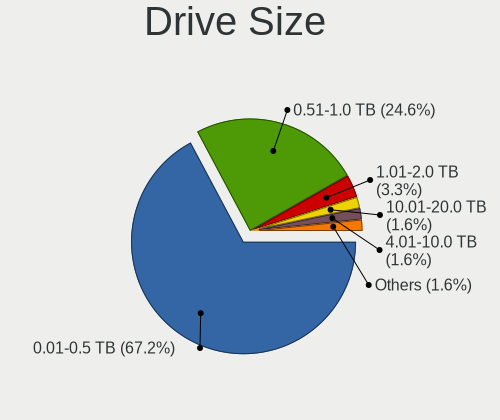
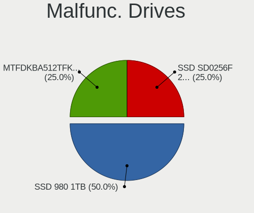
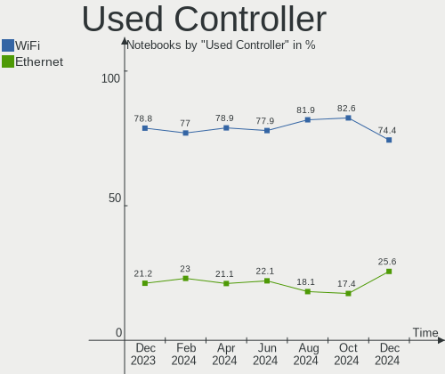
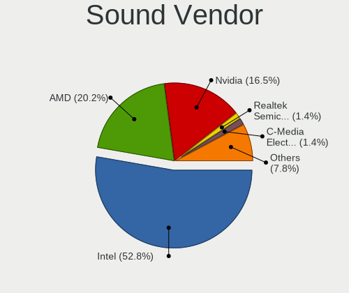
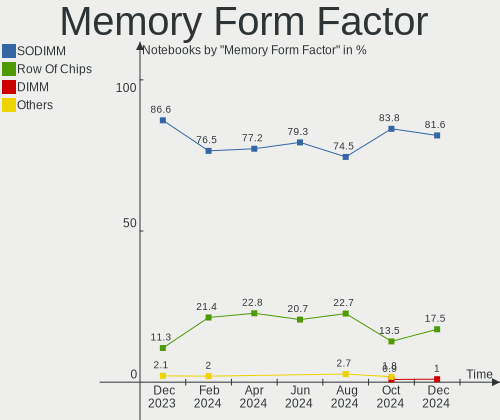

Arch - Hardware Trends (Notebooks)
----------------------------------

A project to identify most popular hardware characteristics and track their change
over time based on data collected by Linux users at https://Linux-Hardware.org.

Anyone can contribute to this report by the [hw-probe](https://github.com/linuxhw/hw-probe) tool:

    sudo -E hw-probe -all -upload

This report is for one last month. Overall report since the beginning of time: [TestDays](https://github.com/linuxhw/TestDays)

Period: Jun, 2023.

Contents
--------

* [ System ](#system)
  - [ OS                       ](#os)
  - [ OS Family                ](#os-family)
  - [ Kernel                   ](#kernel)
  - [ Kernel Family            ](#kernel-family)
  - [ Kernel Major Ver.        ](#kernel-major-ver)
  - [ Arch                     ](#arch)
  - [ DE                       ](#de)
  - [ Display Server           ](#display-server)
  - [ Display Manager          ](#display-manager)
  - [ OS Lang                  ](#os-lang)
  - [ Boot Mode                ](#boot-mode)
  - [ Filesystem               ](#filesystem)
  - [ Part. scheme             ](#part-scheme)
  - [ Dual Boot with Linux/BSD ](#dual-boot-with-linuxbsd)
  - [ Dual Boot (Win)          ](#dual-boot-win)

* [ Board ](#board)
  - [ Vendor                   ](#vendor)
  - [ Model                    ](#model)
  - [ Model Family             ](#model-family)
  - [ MFG Year                 ](#mfg-year)
  - [ Form Factor              ](#form-factor)
  - [ Secure Boot              ](#secure-boot)
  - [ Coreboot                 ](#coreboot)
  - [ RAM Size                 ](#ram-size)
  - [ RAM Used                 ](#ram-used)
  - [ Total Drives             ](#total-drives)
  - [ Has CD-ROM               ](#has-cd-rom)
  - [ Has Ethernet             ](#has-ethernet)
  - [ Has WiFi                 ](#has-wifi)
  - [ Has Bluetooth            ](#has-bluetooth)

* [ Location ](#location)
  - [ Country                  ](#country)
  - [ City                     ](#city)

* [ Drives ](#drives)
  - [ Drive Vendor             ](#drive-vendor)
  - [ Drive Model              ](#drive-model)
  - [ HDD Vendor               ](#hdd-vendor)
  - [ SSD Vendor               ](#ssd-vendor)
  - [ Drive Kind               ](#drive-kind)
  - [ Drive Connector          ](#drive-connector)
  - [ Drive Size               ](#drive-size)
  - [ Space Total              ](#space-total)
  - [ Space Used               ](#space-used)
  - [ Malfunc. Drives          ](#malfunc-drives)
  - [ Malfunc. Drive Vendor    ](#malfunc-drive-vendor)
  - [ Malfunc. HDD Vendor      ](#malfunc-hdd-vendor)
  - [ Malfunc. Drive Kind      ](#malfunc-drive-kind)
  - [ Failed Drives            ](#failed-drives)
  - [ Failed Drive Vendor      ](#failed-drive-vendor)
  - [ Drive Status             ](#drive-status)

* [ Storage controller ](#storage-controller)
  - [ Storage Vendor           ](#storage-vendor)
  - [ Storage Model            ](#storage-model)
  - [ Storage Kind             ](#storage-kind)

* [ Processor ](#processor)
  - [ CPU Vendor               ](#cpu-vendor)
  - [ CPU Model                ](#cpu-model)
  - [ CPU Model Family         ](#cpu-model-family)
  - [ CPU Cores                ](#cpu-cores)
  - [ CPU Sockets              ](#cpu-sockets)
  - [ CPU Threads              ](#cpu-threads)
  - [ CPU Op-Modes             ](#cpu-op-modes)
  - [ CPU Microcode            ](#cpu-microcode)
  - [ CPU Microarch            ](#cpu-microarch)

* [ Graphics ](#graphics)
  - [ GPU Vendor               ](#gpu-vendor)
  - [ GPU Model                ](#gpu-model)
  - [ GPU Combo                ](#gpu-combo)
  - [ GPU Driver               ](#gpu-driver)
  - [ GPU Memory               ](#gpu-memory)

* [ Monitor ](#monitor)
  - [ Monitor Vendor           ](#monitor-vendor)
  - [ Monitor Model            ](#monitor-model)
  - [ Monitor Resolution       ](#monitor-resolution)
  - [ Monitor Diagonal         ](#monitor-diagonal)
  - [ Monitor Width            ](#monitor-width)
  - [ Aspect Ratio             ](#aspect-ratio)
  - [ Monitor Area             ](#monitor-area)
  - [ Pixel Density            ](#pixel-density)
  - [ Multiple Monitors        ](#multiple-monitors)

* [ Network ](#network)
  - [ Net Controller Vendor    ](#net-controller-vendor)
  - [ Net Controller Model     ](#net-controller-model)
  - [ Wireless Vendor          ](#wireless-vendor)
  - [ Wireless Model           ](#wireless-model)
  - [ Ethernet Vendor          ](#ethernet-vendor)
  - [ Ethernet Model           ](#ethernet-model)
  - [ Net Controller Kind      ](#net-controller-kind)
  - [ Used Controller          ](#used-controller)
  - [ NICs                     ](#nics)
  - [ IPv6                     ](#ipv6)

* [ Bluetooth ](#bluetooth)
  - [ Bluetooth Vendor         ](#bluetooth-vendor)
  - [ Bluetooth Model          ](#bluetooth-model)

* [ Sound ](#sound)
  - [ Sound Vendor             ](#sound-vendor)
  - [ Sound Model              ](#sound-model)

* [ Memory ](#memory)
  - [ Memory Vendor            ](#memory-vendor)
  - [ Memory Model             ](#memory-model)
  - [ Memory Kind              ](#memory-kind)
  - [ Memory Form Factor       ](#memory-form-factor)
  - [ Memory Size              ](#memory-size)
  - [ Memory Speed             ](#memory-speed)

* [ Printers & scanners ](#printers--scanners)
  - [ Printer Vendor           ](#printer-vendor)
  - [ Printer Model            ](#printer-model)
  - [ Scanner Vendor           ](#scanner-vendor)
  - [ Scanner Model            ](#scanner-model)

* [ Camera ](#camera)
  - [ Camera Vendor            ](#camera-vendor)
  - [ Camera Model             ](#camera-model)

* [ Security ](#security)
  - [ Fingerprint Vendor       ](#fingerprint-vendor)
  - [ Fingerprint Model        ](#fingerprint-model)
  - [ Chipcard Vendor          ](#chipcard-vendor)
  - [ Chipcard Model           ](#chipcard-model)

* [ Unsupported ](#unsupported)
  - [ Unsupported Devices      ](#unsupported-devices)
  - [ Unsupported Device Types ](#unsupported-device-types)

System
------

OS
--

Installed operating systems

| Name         | Notebooks | Percent |
|--------------|-----------|---------|
| Arch Rolling | 127       | 100%    |

OS Family
---------

OS without a version

| Name | Notebooks | Percent |
|------|-----------|---------|
| Arch | 127       | 100%    |

Kernel
------

Version of the Linux kernel

| Version               | Notebooks | Percent |
|-----------------------|-----------|---------|
| 6.3.9-arch1-1         | 18        | 14.17%  |
| 6.3.5-arch1-1         | 18        | 14.17%  |
| 6.3.6-arch1-1         | 17        | 13.39%  |
| 6.3.8-arch1-1         | 15        | 11.81%  |
| 6.3.7-arch1-1         | 10        | 7.87%   |
| 6.3.7-zen1-1-zen      | 6         | 4.72%   |
| 6.3.6-zen1-1-zen      | 5         | 3.94%   |
| 6.3.5-zen1-1-zen      | 5         | 3.94%   |
| 6.3.9-zen1-1-zen      | 3         | 2.36%   |
| 6.3.8-zen1-1-zen      | 3         | 2.36%   |
| 6.1.31-1-lts          | 3         | 2.36%   |
| 6.3.2-arch1-1         | 2         | 1.57%   |
| 6.1.35-1-lts          | 2         | 1.57%   |
| 6.1.34-1-lts          | 2         | 1.57%   |
| 6.1.33-1-lts          | 2         | 1.57%   |
| 6.3.5-zen2-1-zen      | 1         | 0.79%   |
| 6.3.5-x64v1-xanmod1-1 | 1         | 0.79%   |
| 6.3.5-arch1-1-g14     | 1         | 0.79%   |
| 6.3.5-273-tkg-bmq     | 1         | 0.79%   |
| 6.3.4-zen1-1-zen      | 1         | 0.79%   |
| 6.3.4-arch1-1         | 1         | 0.79%   |
| 6.3.3-x64v1-xanmod1-1 | 1         | 0.79%   |
| 6.3.1-arch2-1         | 1         | 0.79%   |
| 6.3.0-pf5             | 1         | 0.79%   |
| 6.2.2-arch1-1         | 1         | 0.79%   |
| 6.2.13-arch1-1        | 1         | 0.79%   |
| 6.1.8-arch1-1         | 1         | 0.79%   |
| 6.1.35-1-cachyos-lts  | 1         | 0.79%   |
| 6.1.26-1-lts          | 1         | 0.79%   |
| 5.15.79-1-lts         | 1         | 0.79%   |
| 5.12.3-arch1-1        | 1         | 0.79%   |

Kernel Family
-------------

Linux kernel without a distro release

| Version | Notebooks | Percent |
|---------|-----------|---------|
| 6.3.5   | 27        | 21.26%  |
| 6.3.6   | 22        | 17.32%  |
| 6.3.9   | 21        | 16.54%  |
| 6.3.8   | 18        | 14.17%  |
| 6.3.7   | 16        | 12.6%   |
| 6.1.35  | 3         | 2.36%   |
| 6.1.31  | 3         | 2.36%   |
| 6.3.4   | 2         | 1.57%   |
| 6.3.2   | 2         | 1.57%   |
| 6.1.34  | 2         | 1.57%   |
| 6.1.33  | 2         | 1.57%   |
| 6.3.3   | 1         | 0.79%   |
| 6.3.1   | 1         | 0.79%   |
| 6.3.0   | 1         | 0.79%   |
| 6.2.2   | 1         | 0.79%   |
| 6.2.13  | 1         | 0.79%   |
| 6.1.8   | 1         | 0.79%   |
| 6.1.26  | 1         | 0.79%   |
| 5.15.79 | 1         | 0.79%   |
| 5.12.3  | 1         | 0.79%   |

Kernel Major Ver.
-----------------

Linux kernel major version

| Version | Notebooks | Percent |
|---------|-----------|---------|
| 6.3     | 111       | 87.4%   |
| 6.1     | 12        | 9.45%   |
| 6.2     | 2         | 1.57%   |
| 5.15    | 1         | 0.79%   |
| 5.12    | 1         | 0.79%   |

Arch
----

OS architecture (x86_64, i586, etc.)

| Name   | Notebooks | Percent |
|--------|-----------|---------|
| x86_64 | 127       | 100%    |

DE
--

Desktop Environment

| Name     | Notebooks | Percent |
|----------|-----------|---------|
| KDE5     | 53        | 41.73%  |
| GNOME    | 38        | 29.92%  |
| i3       | 10        | 7.87%   |
| XFCE     | 8         | 6.3%    |
| Unknown  | 7         | 5.51%   |
| sway     | 4         | 3.15%   |
| Hyprland | 4         | 3.15%   |
| LeftWM   | 1         | 0.79%   |
| KDE      | 1         | 0.79%   |
| dwm      | 1         | 0.79%   |

Display Server
--------------

X11 or Wayland

| Name    | Notebooks | Percent |
|---------|-----------|---------|
| X11     | 55        | 43.31%  |
| Wayland | 53        | 41.73%  |
| Tty     | 10        | 7.87%   |
| Unknown | 9         | 7.09%   |

Display Manager
---------------

SDDM, LightDM, etc.

| Name    | Notebooks | Percent |
|---------|-----------|---------|
| Unknown | 50        | 39.37%  |
| SDDM    | 42        | 33.07%  |
| LightDM | 17        | 13.39%  |
| GDM     | 15        | 11.81%  |
| LY-DM   | 1         | 0.79%   |
| Ly      | 1         | 0.79%   |
| EMPTTY  | 1         | 0.79%   |

OS Lang
-------

Language

| Lang        | Notebooks | Percent |
|-------------|-----------|---------|
| en_US       | 63        | 49.61%  |
| C           | 10        | 7.87%   |
| en_GB       | 7         | 5.51%   |
| pt_BR       | 6         | 4.72%   |
| fr_FR       | 6         | 4.72%   |
| zh_CN       | 5         | 3.94%   |
| Unknown     | 4         | 3.15%   |
| en_CA       | 3         | 2.36%   |
| de_DE       | 3         | 2.36%   |
| zh_TW       | 2         | 1.57%   |
| ru_RU       | 2         | 1.57%   |
| it_IT       | 2         | 1.57%   |
| es_MX       | 2         | 1.57%   |
| tr_TR       | 1         | 0.79%   |
| pt_PT       | 1         | 0.79%   |
| pt_BR~      | 1         | 0.79%   |
| pl_PL       | 1         | 0.79%   |
| it_IT@euro  | 1         | 0.79%   |
| fr_FR@euro  | 1         | 0.79%   |
| es_PE       | 1         | 0.79%   |
| es_ES       | 1         | 0.79%   |
| es_CO.UTF8  | 1         | 0.79%   |
| en_US.utf-8 | 1         | 0.79%   |
| en_IN       | 1         | 0.79%   |
| en_AU       | 1         | 0.79%   |

Boot Mode
---------

EFI or BIOS

| Mode | Notebooks | Percent |
|------|-----------|---------|
| EFI  | 85        | 66.93%  |
| BIOS | 42        | 33.07%  |

Filesystem
----------

Type of filesystem

| Type    | Notebooks | Percent |
|---------|-----------|---------|
| Ext4    | 86        | 67.72%  |
| Btrfs   | 31        | 24.41%  |
| Xfs     | 3         | 2.36%   |
| Tmpfs   | 3         | 2.36%   |
| Overlay | 2         | 1.57%   |
| F2fs    | 1         | 0.79%   |
| Unknown | 1         | 0.79%   |

Part. scheme
------------

Scheme of partitioning

| Type    | Notebooks | Percent |
|---------|-----------|---------|
| GPT     | 92        | 72.44%  |
| Unknown | 32        | 25.2%   |
| MBR     | 3         | 2.36%   |

Dual Boot with Linux/BSD
------------------------

Hosting more than one Linux/BSD

| Dual boot | Notebooks | Percent |
|-----------|-----------|---------|
| No        | 114       | 89.76%  |
| Yes       | 13        | 10.24%  |

Dual Boot (Win)
---------------

Hosting Linux and Windows

| Dual boot | Notebooks | Percent |
|-----------|-----------|---------|
| No        | 92        | 72.44%  |
| Yes       | 35        | 27.56%  |

Board
-----

Vendor
------

Motherboard manufacturer

| Name                | Notebooks | Percent |
|---------------------|-----------|---------|
| Lenovo              | 33        | 25.98%  |
| Hewlett-Packard     | 19        | 14.96%  |
| ASUSTek Computer    | 19        | 14.96%  |
| Dell                | 16        | 12.6%   |
| Acer                | 11        | 8.66%   |
| Samsung Electronics | 3         | 2.36%   |
| MSI                 | 3         | 2.36%   |
| HUAWEI              | 3         | 2.36%   |
| Gigabyte Technology | 2         | 1.57%   |
| Fujitsu             | 2         | 1.57%   |
| Apple               | 2         | 1.57%   |
| TUXEDO              | 1         | 0.79%   |
| Timi                | 1         | 0.79%   |
| Schenker            | 1         | 0.79%   |
| Notebook            | 1         | 0.79%   |
| NEC Computers       | 1         | 0.79%   |
| MECHREVO            | 1         | 0.79%   |
| HONOR               | 1         | 0.79%   |
| HASEE Computer      | 1         | 0.79%   |
| GPU Company         | 1         | 0.79%   |
| Google              | 1         | 0.79%   |
| Cube                | 1         | 0.79%   |
| COLORFUL            | 1         | 0.79%   |
| Chuwi               | 1         | 0.79%   |
| Casper              | 1         | 0.79%   |

Model
-----

Motherboard model

| Name                                        | Notebooks | Percent |
|---------------------------------------------|-----------|---------|
| Acer Swift SF314-43                         | 3         | 2.36%   |
| Lenovo IdeaPad S145-15IWL 81S9              | 2         | 1.57%   |
| Lenovo IdeaPad 330-15IGM 81D1               | 2         | 1.57%   |
| HP Pavilion Gaming Laptop 15-ec2xxx         | 2         | 1.57%   |
| TUXEDO Polaris AMD Gen2 (REN)               | 1         | 0.79%   |
| Timi Redmi Book Pro 15 2022                 | 1         | 0.79%   |
| Schenker XMG FUSION 15 (XFU15M22)           | 1         | 0.79%   |
| Samsung 950XCJ/951XCJ/950XCR                | 1         | 0.79%   |
| Samsung 750XDA                              | 1         | 0.79%   |
| Samsung 300E4C/300E5C/300E7C                | 1         | 0.79%   |
| Notebook PCX0DX                             | 1         | 0.79%   |
| NEC Computers PC-LM550LS6R                  | 1         | 0.79%   |
| MSI Katana GF66 11UG                        | 1         | 0.79%   |
| MSI GS63 7RD                                | 1         | 0.79%   |
| MSI Crosshair 15 C12VF                      | 1         | 0.79%   |
| MECHREVO Jiaolong16K Series GM6BG5Q         | 1         | 0.79%   |
| Lenovo Yoga Slim 7 Carbon 14ACN6 82L0       | 1         | 0.79%   |
| Lenovo Yoga 500-14ISK 80R5                  | 1         | 0.79%   |
| Lenovo Yoga 14sITL 2021 82G2                | 1         | 0.79%   |
| Lenovo XiaoXinPro 14ITL 2021 82GH           | 1         | 0.79%   |
| Lenovo ThinkPad X230 2325CW1                | 1         | 0.79%   |
| Lenovo ThinkPad X230 2324CD1                | 1         | 0.79%   |
| Lenovo ThinkPad X13 Gen 3 21BNCTO1WW        | 1         | 0.79%   |
| Lenovo ThinkPad X1 Carbon Gen 10 21CCS6YM00 | 1         | 0.79%   |
| Lenovo ThinkPad X1 Carbon 7th 20QDCTO1WW    | 1         | 0.79%   |
| Lenovo ThinkPad X1 Carbon 5th 20HQS1V700    | 1         | 0.79%   |
| Lenovo ThinkPad T590 20N5S14V00             | 1         | 0.79%   |
| Lenovo ThinkPad T495 20NKS0TG00             | 1         | 0.79%   |
| Lenovo ThinkPad T430s 2352CTO               | 1         | 0.79%   |
| Lenovo ThinkPad T14 Gen 2a 20XLS23K00       | 1         | 0.79%   |
| Lenovo ThinkPad P53 20QNCTO1WW              | 1         | 0.79%   |
| Lenovo ThinkPad P14s Gen 2a 21A0008PGE      | 1         | 0.79%   |
| Lenovo ThinkPad L420 78545EG                | 1         | 0.79%   |
| Lenovo ThinkPad Helix 36986DG               | 1         | 0.79%   |
| Lenovo ThinkPad E490 20N80017RT             | 1         | 0.79%   |
| Lenovo ThinkPad E480 20KNA047CD             | 1         | 0.79%   |
| Lenovo ThinkPad E14 Gen 2 20TB0027BO        | 1         | 0.79%   |
| Lenovo ThinkPad 21CKCT01WW                  | 1         | 0.79%   |
| Lenovo ThinkBook 15-IIL 20SM                | 1         | 0.79%   |
| Lenovo Legion Y7000 81FW                    | 1         | 0.79%   |

Model Family
------------

Motherboard model prefix

| Name                       | Notebooks | Percent |
|----------------------------|-----------|---------|
| Lenovo ThinkPad            | 18        | 14.17%  |
| Lenovo IdeaPad             | 5         | 3.94%   |
| HP Pavilion                | 5         | 3.94%   |
| HP EliteBook               | 5         | 3.94%   |
| ASUS ASUS                  | 5         | 3.94%   |
| Lenovo Legion              | 4         | 3.15%   |
| HP OMEN                    | 4         | 3.15%   |
| Dell XPS                   | 4         | 3.15%   |
| Dell Latitude              | 4         | 3.15%   |
| Dell Inspiron              | 4         | 3.15%   |
| ASUS ROG                   | 4         | 3.15%   |
| Acer Swift                 | 4         | 3.15%   |
| Acer Aspire                | 4         | 3.15%   |
| Lenovo Yoga                | 3         | 2.36%   |
| ASUS VivoBook              | 3         | 2.36%   |
| Acer Nitro                 | 3         | 2.36%   |
| HP Laptop                  | 2         | 1.57%   |
| Gigabyte AERO              | 2         | 1.57%   |
| Dell Precision             | 2         | 1.57%   |
| ASUS Zenbook               | 2         | 1.57%   |
| TUXEDO Polaris             | 1         | 0.79%   |
| Timi Redmi                 | 1         | 0.79%   |
| Schenker XMG               | 1         | 0.79%   |
| Samsung 950XCJ             | 1         | 0.79%   |
| Samsung 750XDA             | 1         | 0.79%   |
| Samsung 300E4C             | 1         | 0.79%   |
| Notebook PCX0DX            | 1         | 0.79%   |
| NEC Computers PC-LM550LS6R | 1         | 0.79%   |
| MSI Katana                 | 1         | 0.79%   |
| MSI GS63                   | 1         | 0.79%   |
| MSI Crosshair              | 1         | 0.79%   |
| MECHREVO Jiaolong16K       | 1         | 0.79%   |
| Lenovo XiaoXinPro          | 1         | 0.79%   |
| Lenovo ThinkBook           | 1         | 0.79%   |
| Lenovo 3000                | 1         | 0.79%   |
| HUAWEI KPR-WX9             | 1         | 0.79%   |
| HUAWEI BoDE-WXX9           | 1         | 0.79%   |
| HUAWEI BOD-WXX9            | 1         | 0.79%   |
| HONOR GLO-GXXX             | 1         | 0.79%   |
| HP ZBook                   | 1         | 0.79%   |

MFG Year
--------

Motherboard manufacture year

| Year | Notebooks | Percent |
|------|-----------|---------|
| 2021 | 31        | 24.41%  |
| 2022 | 17        | 13.39%  |
| 2020 | 14        | 11.02%  |
| 2019 | 14        | 11.02%  |
| 2023 | 9         | 7.09%   |
| 2015 | 8         | 6.3%    |
| 2017 | 6         | 4.72%   |
| 2016 | 6         | 4.72%   |
| 2018 | 5         | 3.94%   |
| 2012 | 5         | 3.94%   |
| 2013 | 4         | 3.15%   |
| 2011 | 3         | 2.36%   |
| 2014 | 2         | 1.57%   |
| 2008 | 2         | 1.57%   |
| 2010 | 1         | 0.79%   |

Form Factor
-----------

Physical design of the computer

| Name     | Notebooks | Percent |
|----------|-----------|---------|
| Notebook | 127       | 100%    |

Secure Boot
-----------

Enabled or disabled

| State    | Notebooks | Percent |
|----------|-----------|---------|
| Disabled | 126       | 99.21%  |
| Enabled  | 1         | 0.79%   |

Coreboot
--------

Have coreboot on board

| Used | Notebooks | Percent |
|------|-----------|---------|
| No   | 126       | 99.21%  |
| Yes  | 1         | 0.79%   |

RAM Size
--------

Total RAM memory

| Size in GB  | Notebooks | Percent |
|-------------|-----------|---------|
| 16.01-24.0  | 36        | 28.35%  |
| 8.01-16.0   | 30        | 23.62%  |
| 4.01-8.0    | 26        | 20.47%  |
| 32.01-64.0  | 16        | 12.6%   |
| 3.01-4.0    | 8         | 6.3%    |
| 24.01-32.0  | 6         | 4.72%   |
| 64.01-256.0 | 4         | 3.15%   |
| 2.01-3.0    | 1         | 0.79%   |

RAM Used
--------

Used RAM memory

| Used GB    | Notebooks | Percent |
|------------|-----------|---------|
| 4.01-8.0   | 38        | 29.92%  |
| 3.01-4.0   | 33        | 25.98%  |
| 2.01-3.0   | 26        | 20.47%  |
| 8.01-16.0  | 14        | 11.02%  |
| 1.01-2.0   | 13        | 10.24%  |
| 24.01-32.0 | 1         | 0.79%   |
| 16.01-24.0 | 1         | 0.79%   |
| 0.51-1.0   | 1         | 0.79%   |

Total Drives
------------

Number of drives on board

| Drives | Notebooks | Percent |
|--------|-----------|---------|
| 1      | 91        | 71.65%  |
| 2      | 31        | 24.41%  |
| 3      | 5         | 3.94%   |

Has CD-ROM
----------

Has CD-ROM on board

| Presented | Notebooks | Percent |
|-----------|-----------|---------|
| No        | 115       | 90.55%  |
| Yes       | 12        | 9.45%   |

Has Ethernet
------------

Has Ethernet on board

| Presented | Notebooks | Percent |
|-----------|-----------|---------|
| Yes       | 88        | 69.29%  |
| No        | 39        | 30.71%  |

Has WiFi
--------

Has WiFi module

| Presented | Notebooks | Percent |
|-----------|-----------|---------|
| Yes       | 126       | 99.21%  |
| No        | 1         | 0.79%   |

Has Bluetooth
-------------

Has Bluetooth module

| Presented | Notebooks | Percent |
|-----------|-----------|---------|
| Yes       | 121       | 95.28%  |
| No        | 6         | 4.72%   |

Location
--------

Country
-------

Geographic location (country)

| Country     | Notebooks | Percent |
|-------------|-----------|---------|
| USA         | 18        | 14.17%  |
| Germany     | 13        | 10.24%  |
| France      | 10        | 7.87%   |
| Brazil      | 8         | 6.3%    |
| China       | 6         | 4.72%   |
| Turkey      | 4         | 3.15%   |
| Taiwan      | 4         | 3.15%   |
| Poland      | 4         | 3.15%   |
| Peru        | 4         | 3.15%   |
| Italy       | 4         | 3.15%   |
| Spain       | 3         | 2.36%   |
| Russia      | 3         | 2.36%   |
| Canada      | 3         | 2.36%   |
| South Korea | 2         | 1.57%   |
| Slovenia    | 2         | 1.57%   |
| Romania     | 2         | 1.57%   |
| Qatar       | 2         | 1.57%   |
| Portugal    | 2         | 1.57%   |
| Mexico      | 2         | 1.57%   |
| Malaysia    | 2         | 1.57%   |
| Iran        | 2         | 1.57%   |
| Indonesia   | 2         | 1.57%   |
| Hungary     | 2         | 1.57%   |
| Hong Kong   | 2         | 1.57%   |
| Denmark     | 2         | 1.57%   |
| Colombia    | 2         | 1.57%   |
| Australia   | 2         | 1.57%   |
| Vietnam     | 1         | 0.79%   |
| Uruguay     | 1         | 0.79%   |
| UK          | 1         | 0.79%   |
| Thailand    | 1         | 0.79%   |
| Switzerland | 1         | 0.79%   |
| Sweden      | 1         | 0.79%   |
| Serbia      | 1         | 0.79%   |
| Norway      | 1         | 0.79%   |
| New Zealand | 1         | 0.79%   |
| Japan       | 1         | 0.79%   |
| India       | 1         | 0.79%   |
| Egypt       | 1         | 0.79%   |
| Croatia     | 1         | 0.79%   |

City
----

Geographic location (city)

| City                  | Notebooks | Percent |
|-----------------------|-----------|---------|
| Lima                  | 4         | 3.15%   |
| Warsaw                | 2         | 1.57%   |
| Nuremberg             | 2         | 1.57%   |
| Munich                | 2         | 1.57%   |
| Montreal              | 2         | 1.57%   |
| Istanbul              | 2         | 1.57%   |
| Ipoh                  | 2         | 1.57%   |
| Doha                  | 2         | 1.57%   |
| Curitiba              | 2         | 1.57%   |
| Central               | 2         | 1.57%   |
| Budapest              | 2         | 1.57%   |
| Bogotá               | 2         | 1.57%   |
| Zhongli District      | 1         | 0.79%   |
| Zhengzhou             | 1         | 0.79%   |
| Zamora                | 1         | 0.79%   |
| Zagreb                | 1         | 0.79%   |
| Yecla                 | 1         | 0.79%   |
| Yangmei District      | 1         | 0.79%   |
| Weifang               | 1         | 0.79%   |
| Waverly               | 1         | 0.79%   |
| Voluntari             | 1         | 0.79%   |
| Vancouver             | 1         | 0.79%   |
| Uruapan               | 1         | 0.79%   |
| Uberlândia           | 1         | 0.79%   |
| Tver                  | 1         | 0.79%   |
| Trzin                 | 1         | 0.79%   |
| Tehran                | 1         | 0.79%   |
| Taipei                | 1         | 0.79%   |
| Sydney                | 1         | 0.79%   |
| Svaertinge            | 1         | 0.79%   |
| Strasbourg            | 1         | 0.79%   |
| Srokowo               | 1         | 0.79%   |
| Springfield           | 1         | 0.79%   |
| Silver Spring         | 1         | 0.79%   |
| Shirbin               | 1         | 0.79%   |
| Shipley               | 1         | 0.79%   |
| Sete Lagoas           | 1         | 0.79%   |
| Seoul                 | 1         | 0.79%   |
| Sao Paulo             | 1         | 0.79%   |
| Sao Jose do Rio Preto | 1         | 0.79%   |

Drives
------

Drive Vendor
------------

Hard drive vendors

| Vendor                         | Notebooks | Drives | Percent |
|--------------------------------|-----------|--------|---------|
| Samsung Electronics            | 30        | 31     | 18.18%  |
| Sandisk                        | 20        | 21     | 12.12%  |
| SK hynix                       | 17        | 17     | 10.3%   |
| Intel                          | 9         | 9      | 5.45%   |
| Micron Technology              | 8         | 8      | 4.85%   |
| WDC                            | 7         | 7      | 4.24%   |
| Toshiba                        | 7         | 7      | 4.24%   |
| Kingston                       | 6         | 6      | 3.64%   |
| Seagate                        | 5         | 5      | 3.03%   |
| Crucial                        | 5         | 6      | 3.03%   |
| Micron/Crucial Technology      | 4         | 4      | 2.42%   |
| Yangtze Memory Technologies    | 3         | 3      | 1.82%   |
| KIOXIA                         | 3         | 3      | 1.82%   |
| Kingston Technology Company    | 3         | 3      | 1.82%   |
| A-DATA Technology              | 3         | 3      | 1.82%   |
| Unknown                        | 2         | 2      | 1.21%   |
| Team                           | 2         | 2      | 1.21%   |
| Silicon Motion                 | 2         | 2      | 1.21%   |
| PNY                            | 2         | 2      | 1.21%   |
| MAXIO Technology (Hangzhou)    | 2         | 2      | 1.21%   |
| JMicron Technology             | 2         | 2      | 1.21%   |
| HGST                           | 2         | 2      | 1.21%   |
| China                          | 2         | 2      | 1.21%   |
| XPG                            | 1         | 1      | 0.61%   |
| Wibtek                         | 1         | 1      | 0.61%   |
| Transcend                      | 1         | 1      | 0.61%   |
| TO Exter                       | 1         | 1      | 0.61%   |
| SPCC                           | 1         | 1      | 0.61%   |
| Solid State Storage Technology | 1         | 1      | 0.61%   |
| SAGE                           | 1         | 1      | 0.61%   |
| Realtek Semiconductor          | 1         | 1      | 0.61%   |
| Phison Electronics             | 1         | 1      | 0.61%   |
| Phison                         | 1         | 1      | 0.61%   |
| OCZ                            | 1         | 1      | 0.61%   |
| Netac                          | 1         | 1      | 0.61%   |
| Lite-On Technology             | 1         | 1      | 0.61%   |
| Lexar                          | 1         | 1      | 0.61%   |
| Kingchuxing                    | 1         | 1      | 0.61%   |
| JetFlash                       | 1         | 1      | 0.61%   |
| FORESEE                        | 1         | 1      | 0.61%   |

Drive Model
-----------

Hard drive models

| Model                                               | Notebooks | Percent |
|-----------------------------------------------------|-----------|---------|
| Samsung NVMe SSD Controller SM981/PM981/PM983 250GB | 12        | 7.14%   |
| Samsung NVMe SSD Controller PM9A1/PM9A3/980PRO 2TB  | 6         | 3.57%   |
| Sandisk WD Black SN750 / PC SN730 NVMe SSD 500GB    | 4         | 2.38%   |
| Intel SSDPEKNU512GZ 512GB                           | 4         | 2.38%   |
| Sandisk WD Blue SN550 NVMe SSD 1TB                  | 3         | 1.79%   |
| Samsung SSD 980 1TB                                 | 3         | 1.79%   |
| Unknown MMC Card  32GB                              | 2         | 1.19%   |
| Toshiba XG6 NVMe SSD Controller 2TB                 | 2         | 1.19%   |
| SK hynix PC801 NVMe 1TB                             | 2         | 1.19%   |
| SK hynix BC501 NVMe Solid State Drive 512GB         | 2         | 1.19%   |
| Sandisk PC SN530 NVMe WDC 256GB                     | 2         | 1.19%   |
| Samsung NVMe SSD Controller SM951/PM951 256GB       | 2         | 1.19%   |
| Samsung MZVLQ512HBLU-00B00 512GB                    | 2         | 1.19%   |
| Micron/Crucial P2 NVMe PCIe SSD 4TB                 | 2         | 1.19%   |
| JMicron Generic 240GB                               | 2         | 1.19%   |
| Intel SSD 660P Series 512GB                         | 2         | 1.19%   |
| HGST HTS721010A9E630 1TB                            | 2         | 1.19%   |
| Crucial CT500MX500SSD1 500GB                        | 2         | 1.19%   |
| Yangtze Memory ZHITAI TiPlus7100 2TB                | 1         | 0.6%    |
| Yangtze Memory ZHITAI TiPlus5000 1TB                | 1         | 0.6%    |
| Yangtze Memory YMTC PC005 256GB                     | 1         | 0.6%    |
| XPG NVMe SSD Drive 1024GB                           | 1         | 0.6%    |
| Wibtek W800S 512GB                                  | 1         | 0.6%    |
| WDC WDS480G2G0A-00JH30 480GB SSD                    | 1         | 0.6%    |
| WDC WD5000LPCX-60VHAT0 500GB                        | 1         | 0.6%    |
| WDC WD5000LPCX-24VHAT0 500GB                        | 1         | 0.6%    |
| WDC WD10SPZX-08Z10 1TB                              | 1         | 0.6%    |
| WDC WD10SPCX-24HWST1 1TB                            | 1         | 0.6%    |
| WDC WD10JPVX-75JC3T0 1TB                            | 1         | 0.6%    |
| WDC WD10 JPVX-75JC3T0 1TB                           | 1         | 0.6%    |
| Transcend TS128GMSA230S 128GB SSD                   | 1         | 0.6%    |
| Toshiba THNSNJ256G8NY 256GB SSD                     | 1         | 0.6%    |
| Toshiba MQ04ABF100 1TB                              | 1         | 0.6%    |
| Toshiba MQ01ABF050 500GB                            | 1         | 0.6%    |
| Toshiba MK6034GSX 64GB                              | 1         | 0.6%    |
| Toshiba BG3 NVMe SSD Controller 512GB               | 1         | 0.6%    |
| TO Exter nal USB 3.0 1TB                            | 1         | 0.6%    |
| Team T253X1240G 240GB SSD                           | 1         | 0.6%    |
| Team T253480GB SSD                                  | 1         | 0.6%    |
| SPCC Solid State Disk 256GB                         | 1         | 0.6%    |

HDD Vendor
----------

Hard disk drive vendors

| Vendor  | Notebooks | Drives | Percent |
|---------|-----------|--------|---------|
| WDC     | 6         | 6      | 35.29%  |
| Seagate | 5         | 5      | 29.41%  |
| Toshiba | 3         | 3      | 17.65%  |
| HGST    | 2         | 2      | 11.76%  |
| SAGE    | 1         | 1      | 5.88%   |

SSD Vendor
----------

Solid state drive vendors

| Vendor              | Notebooks | Drives | Percent |
|---------------------|-----------|--------|---------|
| Crucial             | 5         | 6      | 13.16%  |
| SanDisk             | 3         | 3      | 7.89%   |
| Samsung Electronics | 3         | 3      | 7.89%   |
| Team                | 2         | 2      | 5.26%   |
| PNY                 | 2         | 2      | 5.26%   |
| Micron Technology   | 2         | 2      | 5.26%   |
| Kingston            | 2         | 2      | 5.26%   |
| China               | 2         | 2      | 5.26%   |
| A-DATA Technology   | 2         | 2      | 5.26%   |
| WDC                 | 1         | 1      | 2.63%   |
| Transcend           | 1         | 1      | 2.63%   |
| Toshiba             | 1         | 1      | 2.63%   |
| TO Exter            | 1         | 1      | 2.63%   |
| SPCC                | 1         | 1      | 2.63%   |
| SK hynix            | 1         | 1      | 2.63%   |
| Phison              | 1         | 1      | 2.63%   |
| OCZ                 | 1         | 1      | 2.63%   |
| Netac               | 1         | 1      | 2.63%   |
| Lexar               | 1         | 1      | 2.63%   |
| Kingchuxing         | 1         | 1      | 2.63%   |
| Intel               | 1         | 1      | 2.63%   |
| FORESEE             | 1         | 1      | 2.63%   |
| Apple               | 1         | 1      | 2.63%   |
| Acer                | 1         | 1      | 2.63%   |

Drive Kind
----------

HDD or SSD

| Kind    | Notebooks | Drives | Percent |
|---------|-----------|--------|---------|
| NVMe    | 90        | 108    | 62.07%  |
| SSD     | 34        | 39     | 23.45%  |
| HDD     | 17        | 17     | 11.72%  |
| MMC     | 2         | 2      | 1.38%   |
| Unknown | 2         | 2      | 1.38%   |

Drive Connector
---------------

SATA, SAS, NVMe, etc.

| Type | Notebooks | Drives | Percent |
|------|-----------|--------|---------|
| NVMe | 89        | 106    | 62.68%  |
| SATA | 45        | 53     | 31.69%  |
| SAS  | 6         | 7      | 4.23%   |
| MMC  | 2         | 2      | 1.41%   |

Drive Size
----------

Size of hard drive

| Size in TB | Notebooks | Drives | Percent |
|------------|-----------|--------|---------|
| 0.01-0.5   | 28        | 32     | 53.85%  |
| 0.51-1.0   | 19        | 19     | 36.54%  |
| 1.01-2.0   | 4         | 4      | 7.69%   |
| 4.01-10.0  | 1         | 1      | 1.92%   |

Space Total
-----------

Amount of disk space available on the file system

| Size in GB     | Notebooks | Percent |
|----------------|-----------|---------|
| 251-500        | 42        | 33.07%  |
| 501-1000       | 28        | 22.05%  |
| 101-250        | 23        | 18.11%  |
| 1001-2000      | 9         | 7.09%   |
| More than 3000 | 7         | 5.51%   |
| 51-100         | 7         | 5.51%   |
| 2001-3000      | 6         | 4.72%   |
| Unknown        | 4         | 3.15%   |
| 21-50          | 1         | 0.79%   |

Space Used
----------

Amount of used disk space

| Used GB        | Notebooks | Percent |
|----------------|-----------|---------|
| 1-20           | 26        | 20.47%  |
| 251-500        | 22        | 17.32%  |
| 101-250        | 21        | 16.54%  |
| 21-50          | 19        | 14.96%  |
| 51-100         | 17        | 13.39%  |
| 501-1000       | 10        | 7.87%   |
| Unknown        | 4         | 3.15%   |
| More than 3000 | 3         | 2.36%   |
| 1001-2000      | 3         | 2.36%   |
| 2001-3000      | 2         | 1.57%   |

Malfunc. Drives
---------------

Drive models with a malfunction

| Model                                            | Notebooks | Drives | Percent |
|--------------------------------------------------|-----------|--------|---------|
| WDC WD10SPCX-24HWST1 1TB                         | 1         | 1      | 16.67%  |
| WDC WD10 JPVX-75JC3T0 1TB                        | 1         | 1      | 16.67%  |
| Toshiba MK6034GSX 64GB                           | 1         | 1      | 16.67%  |
| SK hynix SC308 SATA 256GB SSD                    | 1         | 1      | 16.67%  |
| Samsung Electronics MZNLH128HBHQ-000H1 128GB SSD | 1         | 1      | 16.67%  |
| Micron Technology 1100_MTFDDAV256TBN 256GB SSD   | 1         | 1      | 16.67%  |

Malfunc. Drive Vendor
---------------------

Vendors of faulty drives

| Vendor              | Notebooks | Drives | Percent |
|---------------------|-----------|--------|---------|
| WDC                 | 2         | 2      | 33.33%  |
| Toshiba             | 1         | 1      | 16.67%  |
| SK hynix            | 1         | 1      | 16.67%  |
| Samsung Electronics | 1         | 1      | 16.67%  |
| Micron Technology   | 1         | 1      | 16.67%  |

Malfunc. HDD Vendor
-------------------

Vendors of faulty HDD drives

| Vendor  | Notebooks | Drives | Percent |
|---------|-----------|--------|---------|
| WDC     | 2         | 2      | 66.67%  |
| Toshiba | 1         | 1      | 33.33%  |

Malfunc. Drive Kind
-------------------

Kinds of faulty drives

| Kind | Notebooks | Drives | Percent |
|------|-----------|--------|---------|
| SSD  | 3         | 3      | 50%     |
| HDD  | 3         | 3      | 50%     |

Failed Drives
-------------

Failed drive models

Zero info for selected period =(

Failed Drive Vendor
-------------------

Failed drive vendors

Zero info for selected period =(

Drive Status
------------

Number of failed and malfunc. drives

| Status   | Notebooks | Drives | Percent |
|----------|-----------|--------|---------|
| Works    | 70        | 92     | 53.03%  |
| Detected | 56        | 70     | 42.42%  |
| Malfunc  | 6         | 6      | 4.55%   |

Storage controller
------------------

Storage Vendor
--------------

Storage controller vendors

| Vendor                         | Notebooks | Percent |
|--------------------------------|-----------|---------|
| Intel                          | 65        | 35.91%  |
| Samsung Electronics            | 28        | 15.47%  |
| AMD                            | 18        | 9.94%   |
| SanDisk                        | 17        | 9.39%   |
| SK hynix                       | 16        | 8.84%   |
| Kingston Technology Company    | 7         | 3.87%   |
| Micron Technology              | 6         | 3.31%   |
| Micron/Crucial Technology      | 4         | 2.21%   |
| Yangtze Memory Technologies    | 3         | 1.66%   |
| Toshiba America Info Systems   | 3         | 1.66%   |
| KIOXIA                         | 3         | 1.66%   |
| Silicon Motion                 | 2         | 1.1%    |
| MAXIO Technology (Hangzhou)    | 2         | 1.1%    |
| Solid State Storage Technology | 1         | 0.55%   |
| Realtek Semiconductor          | 1         | 0.55%   |
| Phison Electronics             | 1         | 0.55%   |
| Nvidia                         | 1         | 0.55%   |
| Lite-On Technology             | 1         | 0.55%   |
| INNOGRIT                       | 1         | 0.55%   |
| ADATA Technology               | 1         | 0.55%   |

Storage Model
-------------

Storage controller models

| Model                                                                        | Notebooks | Percent |
|------------------------------------------------------------------------------|-----------|---------|
| AMD FCH SATA Controller [AHCI mode]                                          | 18        | 9.47%   |
| Samsung NVMe SSD Controller SM981/PM981/PM983                                | 12        | 6.32%   |
| Intel Volume Management Device NVMe RAID Controller                          | 10        | 5.26%   |
| Intel Sunrise Point-LP SATA Controller [AHCI mode]                           | 8         | 4.21%   |
| SK hynix Gold P31/BC711/PC711 NVMe Solid State Drive                         | 7         | 3.68%   |
| Samsung NVMe SSD Controller 980                                              | 7         | 3.68%   |
| Samsung NVMe SSD Controller PM9A1/PM9A3/980PRO                               | 6         | 3.16%   |
| Intel Non-Volatile memory controller                                         | 5         | 2.63%   |
| Intel HM170/QM170 Chipset SATA Controller [AHCI Mode]                        | 5         | 2.63%   |
| Intel 7 Series Chipset Family 6-port SATA Controller [AHCI mode]             | 5         | 2.63%   |
| SK hynix Platinum P41/PC801 NVMe Solid State Drive                           | 4         | 2.11%   |
| SanDisk WD Blue SN550 NVMe SSD                                               | 4         | 2.11%   |
| SanDisk WD Black SN750 / PC SN730 NVMe SSD                                   | 4         | 2.11%   |
| Kingston Company Company Non-Volatile memory controller                      | 4         | 2.11%   |
| Intel 6 Series/C200 Series Chipset Family 6 port Mobile SATA AHCI Controller | 4         | 2.11%   |
| Micron NVMe Storage Controller                                               | 3         | 1.58%   |
| Intel Tiger Lake-LP SATA Controller                                          | 3         | 1.58%   |
| Intel Tiger Lake SATA AHCI Controller                                        | 3         | 1.58%   |
| Intel Cannon Point-LP SATA Controller [AHCI Mode]                            | 3         | 1.58%   |
| Intel Cannon Lake Mobile PCH SATA AHCI Controller                            | 3         | 1.58%   |
| Intel 82801 Mobile SATA Controller [RAID mode]                               | 3         | 1.58%   |
| Intel 8 Series SATA Controller 1 [AHCI mode]                                 | 3         | 1.58%   |
| Yangtze Memory Non-Volatile memory controller                                | 2         | 1.05%   |
| Toshiba America Info Systems XG6 NVMe SSD Controller                         | 2         | 1.05%   |
| SK hynix BC501 NVMe Solid State Drive                                        | 2         | 1.05%   |
| SanDisk PC SN530 NVMe SSD (DRAM-less)                                        | 2         | 1.05%   |
| SanDisk Non-Volatile memory controller                                       | 2         | 1.05%   |
| Samsung NVMe SSD Controller SM951/PM951                                      | 2         | 1.05%   |
| Micron/Crucial P2 NVMe PCIe SSD                                              | 2         | 1.05%   |
| MAXIO (Hangzhou) NVMe SSD Controller MAP1602                                 | 2         | 1.05%   |
| Kingston Company OM3PDP3 NVMe SSD                                            | 2         | 1.05%   |
| Intel Wildcat Point-LP SATA Controller [AHCI Mode]                           | 2         | 1.05%   |
| Intel Volume Management Device NVMe RAID Controller Intel Corporation        | 2         | 1.05%   |
| Intel SSD 660P Series                                                        | 2         | 1.05%   |
| Intel Celeron/Pentium Silver Processor SATA Controller                       | 2         | 1.05%   |
| Intel 400 Series Chipset Family SATA AHCI Controller                         | 2         | 1.05%   |
| Yangtze Memory ZHITAI TiPro5000 NVMe SSD                                     | 1         | 0.53%   |
| Toshiba America Info Systems BG3 NVMe SSD Controller                         | 1         | 0.53%   |
| Solid State Storage CL1-3D256-Q11 NVMe SSD M.2                               | 1         | 0.53%   |
| SK hynix PC611 NVMe Solid State Drive                                        | 1         | 0.53%   |

Storage Kind
------------

Kind of storage controller (IDE, SATA, NVMe, SAS, ...)

| Kind | Notebooks | Percent |
|------|-----------|---------|
| NVMe | 89        | 51.45%  |
| SATA | 69        | 39.88%  |
| RAID | 15        | 8.67%   |

Processor
---------

CPU Vendor
----------

Processor vendors

| Vendor | Notebooks | Percent |
|--------|-----------|---------|
| Intel  | 90        | 70.87%  |
| AMD    | 37        | 29.13%  |

CPU Model
---------

Processor models

| Model                                         | Notebooks | Percent |
|-----------------------------------------------|-----------|---------|
| Intel 11th Gen Core i5-1135G7 @ 2.40GHz       | 5         | 3.94%   |
| Intel 11th Gen Core i7-11800H @ 2.30GHz       | 4         | 3.15%   |
| AMD Ryzen 7 5800H with Radeon Graphics        | 4         | 3.15%   |
| Intel Core i7-6700HQ CPU @ 2.60GHz            | 3         | 2.36%   |
| AMD Ryzen 7 6800H with Radeon Graphics        | 3         | 2.36%   |
| AMD Ryzen 5 5600H with Radeon Graphics        | 3         | 2.36%   |
| AMD Ryzen 5 5500U with Radeon Graphics        | 3         | 2.36%   |
| Intel Core i7-9750H CPU @ 2.60GHz             | 2         | 1.57%   |
| Intel Core i7-8750H CPU @ 2.20GHz             | 2         | 1.57%   |
| Intel Core i7-8565U CPU @ 1.80GHz             | 2         | 1.57%   |
| Intel Core i7-7700HQ CPU @ 2.80GHz            | 2         | 1.57%   |
| Intel Core i7-7500U CPU @ 2.70GHz             | 2         | 1.57%   |
| Intel Core i7-6500U CPU @ 2.50GHz             | 2         | 1.57%   |
| Intel Core i7-10510U CPU @ 1.80GHz            | 2         | 1.57%   |
| Intel Core i5-6200U CPU @ 2.30GHz             | 2         | 1.57%   |
| Intel Core i5-3337U CPU @ 1.80GHz             | 2         | 1.57%   |
| Intel Core i5-3320M CPU @ 2.60GHz             | 2         | 1.57%   |
| Intel Core i5-2520M CPU @ 2.50GHz             | 2         | 1.57%   |
| Intel Core i5-10300H CPU @ 2.50GHz            | 2         | 1.57%   |
| Intel 13th Gen Core i9-13900H                 | 2         | 1.57%   |
| Intel 13th Gen Core i7-13700H                 | 2         | 1.57%   |
| Intel 12th Gen Core i5-12500H                 | 2         | 1.57%   |
| Intel 11th Gen Core i7-1185G7 @ 3.00GHz       | 2         | 1.57%   |
| Intel 11th Gen Core i7-11370H @ 3.30GHz       | 2         | 1.57%   |
| Intel 11th Gen Core i5-11400H @ 2.70GHz       | 2         | 1.57%   |
| Intel 11th Gen Core i3-1115G4 @ 3.00GHz       | 2         | 1.57%   |
| AMD Ryzen 7 5700U with Radeon Graphics        | 2         | 1.57%   |
| AMD Ryzen 5 PRO 5650U with Radeon Graphics    | 2         | 1.57%   |
| AMD Ryzen 5 3500U with Radeon Vega Mobile Gfx | 2         | 1.57%   |
| AMD Athlon Silver 3050U with Radeon Graphics  | 2         | 1.57%   |
| Intel Pentium Silver N5000 CPU @ 1.10GHz      | 1         | 0.79%   |
| Intel Pentium Dual-Core CPU T4400 @ 2.20GHz   | 1         | 0.79%   |
| Intel Core m3-6Y30 CPU @ 0.90GHz              | 1         | 0.79%   |
| Intel Core i7-8665U CPU @ 1.90GHz             | 1         | 0.79%   |
| Intel Core i7-8550U CPU @ 1.80GHz             | 1         | 0.79%   |
| Intel Core i7-7820HQ CPU @ 2.90GHz            | 1         | 0.79%   |
| Intel Core i7-6560U CPU @ 2.20GHz             | 1         | 0.79%   |
| Intel Core i7-5600U CPU @ 2.60GHz             | 1         | 0.79%   |
| Intel Core i7-4710MQ CPU @ 2.50GHz            | 1         | 0.79%   |
| Intel Core i7-4500U CPU @ 1.80GHz             | 1         | 0.79%   |

CPU Model Family
----------------

Processor model prefix

| Model                   | Notebooks | Percent |
|-------------------------|-----------|---------|
| Other                   | 34        | 26.77%  |
| Intel Core i7           | 28        | 22.05%  |
| Intel Core i5           | 17        | 13.39%  |
| AMD Ryzen 7             | 14        | 11.02%  |
| AMD Ryzen 5             | 12        | 9.45%   |
| Intel Core i3           | 5         | 3.94%   |
| Intel Celeron           | 3         | 2.36%   |
| AMD Ryzen 5 PRO         | 3         | 2.36%   |
| AMD Ryzen 9             | 2         | 1.57%   |
| AMD Ryzen 7 PRO         | 2         | 1.57%   |
| AMD Athlon              | 2         | 1.57%   |
| Intel Pentium Silver    | 1         | 0.79%   |
| Intel Pentium Dual-Core | 1         | 0.79%   |
| Intel Core m3           | 1         | 0.79%   |
| Intel Core 2 Duo        | 1         | 0.79%   |
| AMD Ryzen 3             | 1         | 0.79%   |

CPU Cores
---------

Number of processor cores

| Number | Notebooks | Percent |
|--------|-----------|---------|
| 4      | 39        | 30.71%  |
| 2      | 35        | 27.56%  |
| 8      | 22        | 17.32%  |
| 6      | 18        | 14.17%  |
| 12     | 6         | 4.72%   |
| 14     | 5         | 3.94%   |
| 24     | 1         | 0.79%   |
| 10     | 1         | 0.79%   |

CPU Sockets
-----------

Number of sockets

| Number | Notebooks | Percent |
|--------|-----------|---------|
| 1      | 127       | 100%    |

CPU Threads
-----------

Threads per core (Hyper-Threading)

| Number | Notebooks | Percent |
|--------|-----------|---------|
| 2      | 116       | 91.34%  |
| 1      | 11        | 8.66%   |

CPU Op-Modes
------------

CPU Operation Modes (32-bit, 64-bit)

| Op mode        | Notebooks | Percent |
|----------------|-----------|---------|
| 32-bit, 64-bit | 127       | 100%    |

CPU Microcode
-------------

Microcode number

| Number     | Notebooks | Percent |
|------------|-----------|---------|
| Unknown    | 97        | 76.38%  |
| 0x0a50000c | 7         | 5.51%   |
| 0x0a404102 | 4         | 3.15%   |
| 0x806c1    | 2         | 1.57%   |
| 0x08608102 | 2         | 1.57%   |
| 0x08600106 | 2         | 1.57%   |
| 0x08108109 | 2         | 1.57%   |
| 0x08108102 | 2         | 1.57%   |
| 0xb06a2    | 1         | 0.79%   |
| 0x806ec    | 1         | 0.79%   |
| 0x40651    | 1         | 0.79%   |
| 0x0a50000d | 1         | 0.79%   |
| 0x0a50000b | 1         | 0.79%   |
| 0x0a404101 | 1         | 0.79%   |
| 0x08608104 | 1         | 0.79%   |
| 0x08608103 | 1         | 0.79%   |
| 0x06006705 | 1         | 0.79%   |

CPU Microarch
-------------

Microarchitecture

| Name             | Notebooks | Percent |
|------------------|-----------|---------|
| KabyLake         | 20        | 15.75%  |
| Unknown          | 15        | 11.81%  |
| Zen 3            | 14        | 11.02%  |
| TigerLake        | 13        | 10.24%  |
| Alderlake Hybrid | 11        | 8.66%   |
| Skylake          | 10        | 7.87%   |
| Zen+             | 8         | 6.3%    |
| Icelake          | 7         | 5.51%   |
| SandyBridge      | 5         | 3.94%   |
| IvyBridge        | 5         | 3.94%   |
| Haswell          | 5         | 3.94%   |
| CometLake        | 3         | 2.36%   |
| Broadwell        | 3         | 2.36%   |
| Zen 2            | 2         | 1.57%   |
| Penryn           | 2         | 1.57%   |
| Goldmont plus    | 2         | 1.57%   |
| Silvermont       | 1         | 0.79%   |
| Excavator        | 1         | 0.79%   |

Graphics
--------

GPU Vendor
----------

Vendors of graphics cards

| Vendor | Notebooks | Percent |
|--------|-----------|---------|
| Intel  | 88        | 48.35%  |
| Nvidia | 56        | 30.77%  |
| AMD    | 38        | 20.88%  |

GPU Model
---------

Graphics card models

| Model                                                                     | Notebooks | Percent |
|---------------------------------------------------------------------------|-----------|---------|
| Intel TigerLake-LP GT2 [Iris Xe Graphics]                                 | 11        | 5.95%   |
| AMD Cezanne [Radeon Vega Series / Radeon Vega Mobile Series]              | 11        | 5.95%   |
| AMD Picasso/Raven 2 [Radeon Vega Series / Radeon Vega Mobile Series]      | 8         | 4.32%   |
| AMD Rembrandt [Radeon 680M]                                               | 7         | 3.78%   |
| Intel TigerLake-H GT1 [UHD Graphics]                                      | 6         | 3.24%   |
| Intel Alder Lake-P Integrated Graphics Controller                         | 6         | 3.24%   |
| Nvidia GA107M [GeForce RTX 3050 Ti Mobile]                                | 5         | 2.7%    |
| Nvidia GA106M [GeForce RTX 3060 Mobile / Max-Q]                           | 5         | 2.7%    |
| Intel WhiskeyLake-U GT2 [UHD Graphics 620]                                | 5         | 2.7%    |
| Intel Skylake GT2 [HD Graphics 520]                                       | 5         | 2.7%    |
| Intel Raptor Lake-P [Iris Xe Graphics]                                    | 5         | 2.7%    |
| Intel CoffeeLake-H GT2 [UHD Graphics 630]                                 | 5         | 2.7%    |
| Intel 3rd Gen Core processor Graphics Controller                          | 5         | 2.7%    |
| Intel 2nd Generation Core Processor Family Integrated Graphics Controller | 5         | 2.7%    |
| AMD Lucienne                                                              | 5         | 2.7%    |
| Nvidia TU117M                                                             | 4         | 2.16%   |
| Nvidia GA104M [GeForce RTX 3070 Mobile / Max-Q]                           | 4         | 2.16%   |
| Intel Haswell-ULT Integrated Graphics Controller                          | 4         | 2.16%   |
| Nvidia GM107M [GeForce GTX 960M]                                          | 3         | 1.62%   |
| Nvidia GA107M [GeForce RTX 3050 Mobile]                                   | 3         | 1.62%   |
| Nvidia AD107M [GeForce RTX 4060 Max-Q / Mobile]                           | 3         | 1.62%   |
| Intel HD Graphics 630                                                     | 3         | 1.62%   |
| Intel HD Graphics 530                                                     | 3         | 1.62%   |
| Intel CometLake-U GT2 [UHD Graphics]                                      | 3         | 1.62%   |
| Intel CometLake-H GT2 [UHD Graphics]                                      | 3         | 1.62%   |
| Nvidia TU117M [GeForce MX450]                                             | 2         | 1.08%   |
| Nvidia TU117M [GeForce GTX 1650 Mobile / Max-Q]                           | 2         | 1.08%   |
| Nvidia GP108M [GeForce MX250]                                             | 2         | 1.08%   |
| Nvidia GP107M [GeForce GTX 1050 Mobile]                                   | 2         | 1.08%   |
| Nvidia GK208BM [GeForce 920M]                                             | 2         | 1.08%   |
| Nvidia GA107BM [GeForce RTX 3050 Mobile]                                  | 2         | 1.08%   |
| Nvidia AD107M [GeForce RTX 4050 Max-Q / Mobile]                           | 2         | 1.08%   |
| Intel Tiger Lake-LP GT2 [UHD Graphics G4]                                 | 2         | 1.08%   |
| Intel HD Graphics 620                                                     | 2         | 1.08%   |
| Intel HD Graphics 5500                                                    | 2         | 1.08%   |
| AMD Renoir                                                                | 2         | 1.08%   |
| AMD Barcelo                                                               | 2         | 1.08%   |
| Nvidia TU117M [GeForce GTX 1650 Ti Mobile]                                | 1         | 0.54%   |
| Nvidia TU117GLM [Quadro T1000 Mobile]                                     | 1         | 0.54%   |
| Nvidia TU116M [GeForce GTX 1660 Ti Mobile]                                | 1         | 0.54%   |

GPU Combo
---------

Combinations of graphics cards

| Name           | Notebooks | Percent |
|----------------|-----------|---------|
| 1 x Intel      | 48        | 37.8%   |
| Intel + Nvidia | 38        | 29.92%  |
| 1 x AMD        | 18        | 14.17%  |
| AMD + Nvidia   | 15        | 11.81%  |
| 2 x AMD        | 3         | 2.36%   |
| 1 x Nvidia     | 3         | 2.36%   |
| Intel + AMD    | 2         | 1.57%   |

GPU Driver
----------

Free vs proprietary

| Driver      | Notebooks | Percent |
|-------------|-----------|---------|
| Free        | 87        | 68.5%   |
| Proprietary | 40        | 31.5%   |

GPU Memory
----------

Total video memory

| Size in GB | Notebooks | Percent |
|------------|-----------|---------|
| Unknown    | 98        | 77.17%  |
| 0.01-0.5   | 15        | 11.81%  |
| 3.01-4.0   | 6         | 4.72%   |
| 1.01-2.0   | 5         | 3.94%   |
| 5.01-6.0   | 2         | 1.57%   |
| 0.51-1.0   | 1         | 0.79%   |

Monitor
-------

Monitor Vendor
--------------

Monitor vendors

| Vendor                  | Notebooks | Percent |
|-------------------------|-----------|---------|
| AU Optronics            | 26        | 16.77%  |
| Chimei Innolux          | 24        | 15.48%  |
| BOE                     | 23        | 14.84%  |
| LG Display              | 16        | 10.32%  |
| Samsung Electronics     | 14        | 9.03%   |
| PANDA                   | 9         | 5.81%   |
| Sharp                   | 5         | 3.23%   |
| InfoVision              | 4         | 2.58%   |
| Hewlett-Packard         | 4         | 2.58%   |
| Dell                    | 4         | 2.58%   |
| CSO                     | 4         | 2.58%   |
| TMX                     | 3         | 1.94%   |
| Goldstar                | 3         | 1.94%   |
| BenQ                    | 3         | 1.94%   |
| AOC                     | 3         | 1.94%   |
| Mi                      | 2         | 1.29%   |
| Apple                   | 2         | 1.29%   |
| Yamaha                  | 1         | 0.65%   |
| SAC                     | 1         | 0.65%   |
| MStar                   | 1         | 0.65%   |
| HUAWEI                  | 1         | 0.65%   |
| Chi Mei Optoelectronics | 1         | 0.65%   |
| Ancor Communications    | 1         | 0.65%   |

Monitor Model
-------------

Monitor models

| Model                                                                   | Notebooks | Percent |
|-------------------------------------------------------------------------|-----------|---------|
| PANDA LCD Monitor NCP004D 1920x1080 344x194mm 15.5-inch                 | 4         | 2.55%   |
| Chimei Innolux LCD Monitor CMN14D6 1366x768 309x173mm 13.9-inch         | 3         | 1.91%   |
| Chimei Innolux LCD Monitor CMN14D4 1920x1080 309x173mm 13.9-inch        | 3         | 1.91%   |
| LG Display LCD Monitor LGD046F 1920x1080 350x190mm 15.7-inch            | 2         | 1.27%   |
| Chimei Innolux LCD Monitor CMN15E7 1920x1080 344x193mm 15.5-inch        | 2         | 1.27%   |
| Chimei Innolux LCD Monitor CMN15E6 1366x768 344x193mm 15.5-inch         | 2         | 1.27%   |
| Chimei Innolux LCD Monitor CMN14C0 1920x1080 308x173mm 13.9-inch        | 2         | 1.27%   |
| BOE LCD Monitor BOE0872 1920x1080 344x194mm 15.5-inch                   | 2         | 1.27%   |
| AU Optronics LCD Monitor AUOAF90 1920x1080 344x193mm 15.5-inch          | 2         | 1.27%   |
| Yamaha RX-V473 YMH3171 1920x540                                         | 1         | 0.64%   |
| TMX TL156MDMP11-0 TMX1560 3200x2000 336x210mm 15.6-inch                 | 1         | 0.64%   |
| TMX TL142GVXP12-0 TMX2007 2520x1680 300x200mm 14.2-inch                 | 1         | 0.64%   |
| TMX TL140BDXP02-0 TMX1400 2560x1440 310x174mm 14.0-inch                 | 1         | 0.64%   |
| Sharp LQ156M1JW26 SHP1532 1920x1080 344x194mm 15.5-inch                 | 1         | 0.64%   |
| Sharp LCD Monitor SHP1551 3840x2400 288x180mm 13.4-inch                 | 1         | 0.64%   |
| Sharp LCD Monitor SHP1517 3840x2400 366x229mm 17.0-inch                 | 1         | 0.64%   |
| Sharp LCD Monitor SHP14F9 1920x1200 288x180mm 13.4-inch                 | 1         | 0.64%   |
| Sharp LCD Monitor SHP144A 3200x1800 294x165mm 13.3-inch                 | 1         | 0.64%   |
| Samsung Electronics SMB1630N SAM0630 1366x768 344x194mm 15.5-inch       | 1         | 0.64%   |
| Samsung Electronics LU28R55 SAM1019 3840x2160 632x360mm 28.6-inch       | 1         | 0.64%   |
| Samsung Electronics LCD Monitor SEC3541 1366x768 309x174mm 14.0-inch    | 1         | 0.64%   |
| Samsung Electronics LCD Monitor SEC3242 1920x1080 235x132mm 10.6-inch   | 1         | 0.64%   |
| Samsung Electronics LCD Monitor SEC304C 1366x768 309x174mm 14.0-inch    | 1         | 0.64%   |
| Samsung Electronics LCD Monitor SDC4A42 1366x768 309x174mm 14.0-inch    | 1         | 0.64%   |
| Samsung Electronics LCD Monitor SDC434B 3840x2160 344x194mm 15.5-inch   | 1         | 0.64%   |
| Samsung Electronics LCD Monitor SDC4171 2880x1800 302x189mm 14.0-inch   | 1         | 0.64%   |
| Samsung Electronics LCD Monitor SDC4154 2880x1800 302x189mm 14.0-inch   | 1         | 0.64%   |
| Samsung Electronics LCD Monitor SDC4152 2880x1800 302x189mm 14.0-inch   | 1         | 0.64%   |
| Samsung Electronics LCD Monitor SDC4143 3840x2160 344x194mm 15.5-inch   | 1         | 0.64%   |
| Samsung Electronics LCD Monitor SDC4141 3840x2160 344x194mm 15.5-inch   | 1         | 0.64%   |
| Samsung Electronics LCD Monitor SAM723F 3840x2160 700x390mm 31.5-inch   | 1         | 0.64%   |
| Samsung Electronics LCD Monitor SAM71B4 3840x2160 1872x1053mm 84.6-inch | 1         | 0.64%   |
| Samsung Electronics CF791 SAM0DC3 3440x1440 797x333mm 34.0-inch         | 1         | 0.64%   |
| Samsung Electronics C27F581 SAM0D9C 1920x1080 598x336mm 27.0-inch       | 1         | 0.64%   |
| SAC HDMI1 SAC2433 1920x1080 527x296mm 23.8-inch                         | 1         | 0.64%   |
| PANDA LCD Monitor NCP0064 1920x1080 340x190mm 15.3-inch                 | 1         | 0.64%   |
| PANDA LCD Monitor NCP005F 1920x1080 344x194mm 15.5-inch                 | 1         | 0.64%   |
| PANDA LCD Monitor NCP004B 1920x1080 344x194mm 15.5-inch                 | 1         | 0.64%   |
| PANDA LCD Monitor NCP0036 1920x1080 344x194mm 15.5-inch                 | 1         | 0.64%   |
| PANDA LCD Monitor NCP002D 1920x1080 344x194mm 15.5-inch                 | 1         | 0.64%   |

Monitor Resolution
------------------

Monitor screen resolution

| Resolution        | Notebooks | Percent |
|-------------------|-----------|---------|
| 1920x1080 (FHD)   | 79        | 53.74%  |
| 1366x768 (WXGA)   | 23        | 15.65%  |
| 3840x2160 (4K)    | 11        | 7.48%   |
| 2560x1600         | 7         | 4.76%   |
| 1920x1200 (WUXGA) | 6         | 4.08%   |
| 2880x1800         | 4         | 2.72%   |
| 2560x1440 (QHD)   | 4         | 2.72%   |
| 3840x2400         | 2         | 1.36%   |
| 1280x800 (WXGA)   | 2         | 1.36%   |
| 3840x1600         | 1         | 0.68%   |
| 3440x1440         | 1         | 0.68%   |
| 3200x2000         | 1         | 0.68%   |
| 3200x1800 (QHD+)  | 1         | 0.68%   |
| 2520x1680         | 1         | 0.68%   |
| 2240x1400         | 1         | 0.68%   |
| 1920x540          | 1         | 0.68%   |
| 1600x900 (HD+)    | 1         | 0.68%   |
| 1360x768          | 1         | 0.68%   |

Monitor Diagonal
----------------

Diagonal size in inches

| Inches  | Notebooks | Percent |
|---------|-----------|---------|
| 15      | 60        | 38.46%  |
| 14      | 26        | 16.67%  |
| 13      | 20        | 12.82%  |
| 17      | 10        | 6.41%   |
| 27      | 7         | 4.49%   |
| 16      | 7         | 4.49%   |
| 24      | 4         | 2.56%   |
| 23      | 4         | 2.56%   |
| 21      | 3         | 1.92%   |
| 18      | 3         | 1.92%   |
| 12      | 2         | 1.28%   |
| 84      | 1         | 0.64%   |
| 52      | 1         | 0.64%   |
| 43      | 1         | 0.64%   |
| 38      | 1         | 0.64%   |
| 37      | 1         | 0.64%   |
| 34      | 1         | 0.64%   |
| 31      | 1         | 0.64%   |
| 28      | 1         | 0.64%   |
| 11      | 1         | 0.64%   |
| Unknown | 1         | 0.64%   |

Monitor Width
-------------

Physical width

| Width in mm | Notebooks | Percent |
|-------------|-----------|---------|
| 301-350     | 102       | 65.81%  |
| 501-600     | 15        | 9.68%   |
| 351-400     | 14        | 9.03%   |
| 201-300     | 11        | 7.1%    |
| 401-500     | 4         | 2.58%   |
| 801-900     | 2         | 1.29%   |
| 601-700     | 2         | 1.29%   |
| 701-800     | 1         | 0.65%   |
| 1501-2000   | 1         | 0.65%   |
| 1001-1500   | 1         | 0.65%   |
| 901-1000    | 1         | 0.65%   |
| Unknown     | 1         | 0.65%   |

Aspect Ratio
------------

Proportional relationship between the width and the height

| Ratio | Notebooks | Percent |
|-------|-----------|---------|
| 16/9  | 110       | 80.29%  |
| 16/10 | 23        | 16.79%  |
| 21/9  | 2         | 1.46%   |
| 32/9  | 1         | 0.73%   |
| 3/2   | 1         | 0.73%   |

Monitor Area
------------

Area in inch²

| Area in inch² | Notebooks | Percent |
|----------------|-----------|---------|
| 101-110        | 61        | 39.1%   |
| 81-90          | 39        | 25%     |
| 201-250        | 9         | 5.77%   |
| 121-130        | 9         | 5.77%   |
| 301-350        | 7         | 4.49%   |
| 71-80          | 6         | 3.85%   |
| 111-120        | 6         | 3.85%   |
| 351-500        | 3         | 1.92%   |
| 141-150        | 3         | 1.92%   |
| 501-1000       | 3         | 1.92%   |
| More than 1000 | 2         | 1.28%   |
| 61-70          | 2         | 1.28%   |
| 251-300        | 2         | 1.28%   |
| 51-60          | 1         | 0.64%   |
| 131-140        | 1         | 0.64%   |
| 91-100         | 1         | 0.64%   |
| Unknown        | 1         | 0.64%   |

Pixel Density
-------------

Pixels per inch

| Density       | Notebooks | Percent |
|---------------|-----------|---------|
| 121-160       | 74        | 48.37%  |
| 101-120       | 30        | 19.61%  |
| 161-240       | 18        | 11.76%  |
| 51-100        | 17        | 11.11%  |
| More than 240 | 12        | 7.84%   |
| 1-50          | 1         | 0.65%   |
| Unknown       | 1         | 0.65%   |

Multiple Monitors
-----------------

Total monitors connected

| Total | Notebooks | Percent |
|-------|-----------|---------|
| 1     | 98        | 77.17%  |
| 2     | 25        | 19.69%  |
| 3     | 4         | 3.15%   |

Network
-------

Net Controller Vendor
---------------------

Controller vendors

| Vendor                            | Notebooks | Percent |
|-----------------------------------|-----------|---------|
| Intel                             | 79        | 40.51%  |
| Realtek Semiconductor             | 68        | 34.87%  |
| MediaTek                          | 17        | 8.72%   |
| Qualcomm Atheros                  | 9         | 4.62%   |
| Broadcom                          | 5         | 2.56%   |
| TP-Link                           | 4         | 2.05%   |
| ASIX Electronics                  | 3         | 1.54%   |
| Qualcomm                          | 2         | 1.03%   |
| Xiaomi                            | 1         | 0.51%   |
| Ralink Technology                 | 1         | 0.51%   |
| QinHeng Electronics               | 1         | 0.51%   |
| OPPO Electronics                  | 1         | 0.51%   |
| Lenovo                            | 1         | 0.51%   |
| Google                            | 1         | 0.51%   |
| Ericsson Business Mobile Networks | 1         | 0.51%   |
| D-Link                            | 1         | 0.51%   |

Net Controller Model
--------------------

Controller models

| Model                                                             | Notebooks | Percent |
|-------------------------------------------------------------------|-----------|---------|
| Realtek RTL8111/8168/8411 PCI Express Gigabit Ethernet Controller | 49        | 21.78%  |
| Intel Wi-Fi 6 AX201                                               | 12        | 5.33%   |
| MediaTek MT7921 802.11ax PCI Express Wireless Network Adapter     | 11        | 4.89%   |
| Intel Wi-Fi 6 AX200                                               | 9         | 4%      |
| Intel Alder Lake-P PCH CNVi WiFi                                  | 8         | 3.56%   |
| Realtek RTL8852AE 802.11ax PCIe Wireless Network Adapter          | 5         | 2.22%   |
| Realtek RTL810xE PCI Express Fast Ethernet controller             | 5         | 2.22%   |
| Qualcomm Atheros QCA9377 802.11ac Wireless Network Adapter        | 5         | 2.22%   |
| Intel Wireless 8265 / 8275                                        | 5         | 2.22%   |
| Intel Tiger Lake PCH CNVi WiFi                                    | 5         | 2.22%   |
| Realtek RTL8125 2.5GbE Controller                                 | 4         | 1.78%   |
| MediaTek MT7922 802.11ax PCI Express Wireless Network Adapter     | 4         | 1.78%   |
| Intel Wireless 8260                                               | 4         | 1.78%   |
| Intel Alder Lake-U CNVi: Wireless-AC                              | 4         | 1.78%   |
| Intel 82579LM Gigabit Network Connection (Lewisville)             | 4         | 1.78%   |
| Realtek RTL8822CE 802.11ac PCIe Wireless Network Adapter          | 3         | 1.33%   |
| Realtek RTL8821CE 802.11ac PCIe Wireless Network Adapter          | 3         | 1.33%   |
| Realtek RTL8153 Gigabit Ethernet Adapter                          | 3         | 1.33%   |
| Intel Wireless 7265                                               | 3         | 1.33%   |
| Intel Wireless 7260                                               | 3         | 1.33%   |
| Intel Comet Lake PCH-LP CNVi WiFi                                 | 3         | 1.33%   |
| Intel Centrino Advanced-N 6205 [Taylor Peak]                      | 3         | 1.33%   |
| Intel Cannon Point-LP CNVi [Wireless-AC]                          | 3         | 1.33%   |
| ASIX AX88179 Gigabit Ethernet                                     | 3         | 1.33%   |
| TP-Link TL-WN823N v2/v3 [Realtek RTL8192EU]                       | 2         | 0.89%   |
| Realtek Killer E2600 Gigabit Ethernet Controller                  | 2         | 0.89%   |
| Qualcomm QCNFA765 Wireless Network Adapter                        | 2         | 0.89%   |
| Intel Wireless-AC 9260                                            | 2         | 0.89%   |
| Intel Ethernet Connection I219-V                                  | 2         | 0.89%   |
| Intel Ethernet Connection I218-LM                                 | 2         | 0.89%   |
| Intel Ethernet Connection (6) I219-LM                             | 2         | 0.89%   |
| Intel Dual Band Wireless-AC 3165 Plus Bluetooth                   | 2         | 0.89%   |
| Intel Comet Lake PCH CNVi WiFi                                    | 2         | 0.89%   |
| Intel Cannon Lake PCH CNVi WiFi                                   | 2         | 0.89%   |
| Xiaomi Mi/Redmi series (RNDIS)                                    | 1         | 0.44%   |
| TP-Link Archer T3U [Realtek RTL8812BU]                            | 1         | 0.44%   |
| TP-Link Archer T2U PLUS [RTL8821AU]                               | 1         | 0.44%   |
| Realtek RTL8852BE PCIe 802.11ax Wireless Network Controller       | 1         | 0.44%   |
| Realtek RTL8852AE WiFi 6 802.11ax PCIe Adapter                    | 1         | 0.44%   |
| Realtek RTL8723BE PCIe Wireless Network Adapter                   | 1         | 0.44%   |

Wireless Vendor
---------------

Wireless vendors

| Vendor                | Notebooks | Percent |
|-----------------------|-----------|---------|
| Intel                 | 77        | 58.78%  |
| MediaTek              | 17        | 12.98%  |
| Realtek Semiconductor | 16        | 12.21%  |
| Qualcomm Atheros      | 8         | 6.11%   |
| Broadcom              | 5         | 3.82%   |
| TP-Link               | 4         | 3.05%   |
| Qualcomm              | 2         | 1.53%   |
| Ralink Technology     | 1         | 0.76%   |
| D-Link                | 1         | 0.76%   |

Wireless Model
--------------

Wireless models

| Model                                                          | Notebooks | Percent |
|----------------------------------------------------------------|-----------|---------|
| Intel Wi-Fi 6 AX201                                            | 12        | 9.16%   |
| MediaTek MT7921 802.11ax PCI Express Wireless Network Adapter  | 11        | 8.4%    |
| Intel Wi-Fi 6 AX200                                            | 9         | 6.87%   |
| Intel Alder Lake-P PCH CNVi WiFi                               | 8         | 6.11%   |
| Realtek RTL8852AE 802.11ax PCIe Wireless Network Adapter       | 5         | 3.82%   |
| Qualcomm Atheros QCA9377 802.11ac Wireless Network Adapter     | 5         | 3.82%   |
| Intel Wireless 8265 / 8275                                     | 5         | 3.82%   |
| Intel Tiger Lake PCH CNVi WiFi                                 | 5         | 3.82%   |
| MediaTek MT7922 802.11ax PCI Express Wireless Network Adapter  | 4         | 3.05%   |
| Intel Wireless 8260                                            | 4         | 3.05%   |
| Intel Alder Lake-U CNVi: Wireless-AC                           | 4         | 3.05%   |
| Realtek RTL8822CE 802.11ac PCIe Wireless Network Adapter       | 3         | 2.29%   |
| Realtek RTL8821CE 802.11ac PCIe Wireless Network Adapter       | 3         | 2.29%   |
| Intel Wireless 7265                                            | 3         | 2.29%   |
| Intel Wireless 7260                                            | 3         | 2.29%   |
| Intel Comet Lake PCH-LP CNVi WiFi                              | 3         | 2.29%   |
| Intel Centrino Advanced-N 6205 [Taylor Peak]                   | 3         | 2.29%   |
| Intel Cannon Point-LP CNVi [Wireless-AC]                       | 3         | 2.29%   |
| TP-Link TL-WN823N v2/v3 [Realtek RTL8192EU]                    | 2         | 1.53%   |
| Qualcomm QCNFA765 Wireless Network Adapter                     | 2         | 1.53%   |
| Intel Wireless-AC 9260                                         | 2         | 1.53%   |
| Intel Dual Band Wireless-AC 3165 Plus Bluetooth                | 2         | 1.53%   |
| Intel Comet Lake PCH CNVi WiFi                                 | 2         | 1.53%   |
| Intel Cannon Lake PCH CNVi WiFi                                | 2         | 1.53%   |
| TP-Link Archer T3U [Realtek RTL8812BU]                         | 1         | 0.76%   |
| TP-Link Archer T2U PLUS [RTL8821AU]                            | 1         | 0.76%   |
| Realtek RTL8852BE PCIe 802.11ax Wireless Network Controller    | 1         | 0.76%   |
| Realtek RTL8852AE WiFi 6 802.11ax PCIe Adapter                 | 1         | 0.76%   |
| Realtek RTL8723BE PCIe Wireless Network Adapter                | 1         | 0.76%   |
| Realtek RTL8192EE PCIe Wireless Network Adapter                | 1         | 0.76%   |
| Realtek 802.11ac NIC                                           | 1         | 0.76%   |
| Ralink MT7610U ("Archer T2U" 2.4G+5G WLAN Adapter              | 1         | 0.76%   |
| Qualcomm Atheros QCA9565 / AR9565 Wireless Network Adapter     | 1         | 0.76%   |
| Qualcomm Atheros AR9485 Wireless Network Adapter               | 1         | 0.76%   |
| Qualcomm Atheros AR9287 Wireless Network Adapter (PCI-Express) | 1         | 0.76%   |
| MediaTek Wi-Fi 6E MT7902 Wireless Network Adapter              | 1         | 0.76%   |
| MediaTek MT7921K (RZ608) Wi-Fi 6E 80MHz                        | 1         | 0.76%   |
| Intel Wireless 3165                                            | 1         | 0.76%   |
| Intel Wireless 3160                                            | 1         | 0.76%   |
| Intel Wi-Fi 6 AX210/AX211/AX411 160MHz                         | 1         | 0.76%   |

Ethernet Vendor
---------------

Ethernet vendors

| Vendor                | Notebooks | Percent |
|-----------------------|-----------|---------|
| Realtek Semiconductor | 63        | 69.23%  |
| Intel                 | 18        | 19.78%  |
| ASIX Electronics      | 3         | 3.3%    |
| Broadcom              | 2         | 2.2%    |
| Xiaomi                | 1         | 1.1%    |
| Qualcomm Atheros      | 1         | 1.1%    |
| OPPO Electronics      | 1         | 1.1%    |
| Lenovo                | 1         | 1.1%    |
| Google                | 1         | 1.1%    |

Ethernet Model
--------------

Ethernet models

| Model                                                             | Notebooks | Percent |
|-------------------------------------------------------------------|-----------|---------|
| Realtek RTL8111/8168/8411 PCI Express Gigabit Ethernet Controller | 49        | 53.26%  |
| Realtek RTL810xE PCI Express Fast Ethernet controller             | 5         | 5.43%   |
| Realtek RTL8125 2.5GbE Controller                                 | 4         | 4.35%   |
| Intel 82579LM Gigabit Network Connection (Lewisville)             | 4         | 4.35%   |
| Realtek RTL8153 Gigabit Ethernet Adapter                          | 3         | 3.26%   |
| ASIX AX88179 Gigabit Ethernet                                     | 3         | 3.26%   |
| Realtek Killer E2600 Gigabit Ethernet Controller                  | 2         | 2.17%   |
| Intel Ethernet Connection I219-V                                  | 2         | 2.17%   |
| Intel Ethernet Connection I218-LM                                 | 2         | 2.17%   |
| Intel Ethernet Connection (6) I219-LM                             | 2         | 2.17%   |
| Xiaomi Mi/Redmi series (RNDIS)                                    | 1         | 1.09%   |
| Realtek PCIe GbE Family Controller                                | 1         | 1.09%   |
| Qualcomm Atheros Killer E2500 Gigabit Ethernet Controller         | 1         | 1.09%   |
| OPPO realme GT Neo2 5G                                            | 1         | 1.09%   |
| Lenovo Powered Hub                                                | 1         | 1.09%   |
| Intel Ethernet Controller I225-V                                  | 1         | 1.09%   |
| Intel Ethernet Controller I219-LM                                 | 1         | 1.09%   |
| Intel Ethernet Connection I217-LM                                 | 1         | 1.09%   |
| Intel Ethernet Connection (7) I219-V                              | 1         | 1.09%   |
| Intel Ethernet Connection (5) I219-LM                             | 1         | 1.09%   |
| Intel Ethernet Connection (4) I219-V                              | 1         | 1.09%   |
| Intel Ethernet Connection (3) I218-LM                             | 1         | 1.09%   |
| Intel Ethernet Connection (13) I219-V                             | 1         | 1.09%   |
| Google Pixel 7 Pro                                                | 1         | 1.09%   |
| Broadcom NetXtreme BCM5764M Gigabit Ethernet PCIe                 | 1         | 1.09%   |
| Broadcom NetLink BCM5906M Fast Ethernet PCI Express               | 1         | 1.09%   |

Net Controller Kind
-------------------

Ethernet, WiFi or modem

| Kind     | Notebooks | Percent |
|----------|-----------|---------|
| WiFi     | 126       | 58.6%   |
| Ethernet | 87        | 40.47%  |
| Modem    | 2         | 0.93%   |

Used Controller
---------------

Currently used network controller

| Kind     | Notebooks | Percent |
|----------|-----------|---------|
| WiFi     | 111       | 84.73%  |
| Ethernet | 20        | 15.27%  |

NICs
----

Total network controllers on board

| Total | Notebooks | Percent |
|-------|-----------|---------|
| 2     | 76        | 59.84%  |
| 1     | 48        | 37.8%   |
| 3     | 3         | 2.36%   |

IPv6
----

IPv6 vs IPv4

| Used | Notebooks | Percent |
|------|-----------|---------|
| No   | 75        | 59.06%  |
| Yes  | 52        | 40.94%  |

Bluetooth
---------

Bluetooth Vendor
----------------

Controller vendors

| Vendor                          | Notebooks | Percent |
|---------------------------------|-----------|---------|
| Intel                           | 72        | 59.5%   |
| Realtek Semiconductor           | 13        | 10.74%  |
| IMC Networks                    | 9         | 7.44%   |
| Foxconn / Hon Hai               | 7         | 5.79%   |
| Qualcomm Atheros Communications | 6         | 4.96%   |
| Lite-On Technology              | 5         | 4.13%   |
| Broadcom                        | 4         | 3.31%   |
| Apple                           | 2         | 1.65%   |
| USI                             | 1         | 0.83%   |
| Opticis                         | 1         | 0.83%   |
| MediaTek                        | 1         | 0.83%   |

Bluetooth Model
---------------

Controller models

| Model                                            | Notebooks | Percent |
|--------------------------------------------------|-----------|---------|
| Intel AX201 Bluetooth                            | 25        | 20.66%  |
| Intel Bluetooth wireless interface               | 19        | 15.7%   |
| Realtek Bluetooth Radio                          | 12        | 9.92%   |
| Intel AX200 Bluetooth                            | 9         | 7.44%   |
| Intel Bluetooth Device                           | 8         | 6.61%   |
| Intel Bluetooth 9460/9560 Jefferson Peak (JfP)   | 8         | 6.61%   |
| IMC Networks Wireless_Device                     | 7         | 5.79%   |
| Qualcomm Atheros  Bluetooth Device               | 3         | 2.48%   |
| Lite-On Wireless_Device                          | 3         | 2.48%   |
| Foxconn / Hon Hai MediaTek Bluetooth Adapter     | 3         | 2.48%   |
| Broadcom BCM20702 Bluetooth 4.0 [ThinkPad]       | 3         | 2.48%   |
| Lite-On Qualcomm Atheros QCA9377 Bluetooth       | 2         | 1.65%   |
| Foxconn / Hon Hai Wireless_Device                | 2         | 1.65%   |
| Apple Bluetooth Host Controller                  | 2         | 1.65%   |
| USI Bluetooth Device                             | 1         | 0.83%   |
| Realtek  Bluetooth 4.2 Adapter                   | 1         | 0.83%   |
| Qualcomm Atheros QCA61x4 Bluetooth 4.0           | 1         | 0.83%   |
| Qualcomm Atheros AR9462 Bluetooth                | 1         | 0.83%   |
| Qualcomm Atheros AR3012 Bluetooth 4.0            | 1         | 0.83%   |
| Opticis Bluetooth Radio                          | 1         | 0.83%   |
| MediaTek Wireless_Device                         | 1         | 0.83%   |
| Intel Wireless-AC 9260 Bluetooth Adapter         | 1         | 0.83%   |
| Intel Centrino Advanced-N 6230 Bluetooth adapter | 1         | 0.83%   |
| Intel AX210 Bluetooth                            | 1         | 0.83%   |
| IMC Networks Bluetooth Radio                     | 1         | 0.83%   |
| IMC Networks Bluetooth Device                    | 1         | 0.83%   |
| Foxconn / Hon Hai Bluetooth Device               | 1         | 0.83%   |
| Foxconn / Hon Hai BCM20702A0                     | 1         | 0.83%   |
| Broadcom BCM2045A0                               | 1         | 0.83%   |

Sound
-----

Sound Vendor
------------

Sound card vendors

| Vendor              | Notebooks | Percent |
|---------------------|-----------|---------|
| Intel               | 89        | 50.57%  |
| Nvidia              | 38        | 21.59%  |
| AMD                 | 36        | 20.45%  |
| Texas Instruments   | 1         | 0.57%   |
| Samson Technologies | 1         | 0.57%   |
| Plantronics         | 1         | 0.57%   |
| Logitech            | 1         | 0.57%   |
| Kingston Technology | 1         | 0.57%   |
| Goldvish            | 1         | 0.57%   |
| Focusrite-Novation  | 1         | 0.57%   |
| EDFIER              | 1         | 0.57%   |
| DCMT Technology     | 1         | 0.57%   |
| Conexant Systems    | 1         | 0.57%   |
| C-Media Electronics | 1         | 0.57%   |
| ASUSTek Computer    | 1         | 0.57%   |
| Unknown             | 1         | 0.57%   |

Sound Model
-----------

Sound card models

| Model                                                                      | Notebooks | Percent |
|----------------------------------------------------------------------------|-----------|---------|
| AMD Family 17h/19h HD Audio Controller                                     | 35        | 16.67%  |
| AMD Renoir Radeon High Definition Audio Controller                         | 14        | 6.67%   |
| Nvidia Audio device                                                        | 13        | 6.19%   |
| Intel Tiger Lake-LP Smart Sound Technology Audio Controller                | 13        | 6.19%   |
| Intel Sunrise Point-LP HD Audio                                            | 10        | 4.76%   |
| Intel Alder Lake PCH-P High Definition Audio Controller                    | 7         | 3.33%   |
| AMD Raven/Raven2/Fenghuang HDMI/DP Audio Controller                        | 7         | 3.33%   |
| Nvidia TU107 GeForce GTX 1650 High Definition Audio Controller             | 6         | 2.86%   |
| Intel Tiger Lake-H HD Audio Controller                                     | 6         | 2.86%   |
| Intel Cannon Point-LP High Definition Audio Controller                     | 6         | 2.86%   |
| Intel 7 Series/C216 Chipset Family High Definition Audio Controller        | 6         | 2.86%   |
| Intel Cannon Lake PCH cAVS                                                 | 5         | 2.38%   |
| Intel Alder Lake-U cAVS (Audio, Voice, Speech)                             | 5         | 2.38%   |
| Nvidia GA104 High Definition Audio Controller                              | 4         | 1.9%    |
| Intel Haswell-ULT HD Audio Controller                                      | 4         | 1.9%    |
| Intel 8 Series HD Audio Controller                                         | 4         | 1.9%    |
| Intel 6 Series/C200 Series Chipset Family High Definition Audio Controller | 4         | 1.9%    |
| AMD Rembrandt Radeon High Definition Audio Controller                      | 4         | 1.9%    |
| Nvidia GA106 High Definition Audio Controller                              | 3         | 1.43%   |
| Intel Wildcat Point-LP High Definition Audio Controller                    | 3         | 1.43%   |
| Intel Comet Lake PCH-LP cAVS                                               | 3         | 1.43%   |
| Intel Comet Lake PCH cAVS                                                  | 3         | 1.43%   |
| Intel CM238 HD Audio Controller                                            | 3         | 1.43%   |
| Intel Broadwell-U Audio Controller                                         | 3         | 1.43%   |
| Intel 100 Series/C230 Series Chipset Family HD Audio Controller            | 3         | 1.43%   |
| Nvidia TU106 High Definition Audio Controller                              | 2         | 0.95%   |
| Nvidia GP107GL High Definition Audio Controller                            | 2         | 0.95%   |
| Nvidia GK208 HDMI/DP Audio Controller                                      | 2         | 0.95%   |
| Intel Celeron/Pentium Silver Processor High Definition Audio               | 2         | 0.95%   |
| Texas Instruments PCM2902 Audio Codec                                      | 1         | 0.48%   |
| Samson Technologies GoMic compact condenser mic                            | 1         | 0.48%   |
| Plantronics Poly BT700                                                     | 1         | 0.48%   |
| Nvidia TU116 High Definition Audio Controller                              | 1         | 0.48%   |
| Nvidia MCP89 High Definition Audio                                         | 1         | 0.48%   |
| Nvidia GP106 High Definition Audio Controller                              | 1         | 0.48%   |
| Nvidia GM107 High Definition Audio Controller [GeForce 940MX]              | 1         | 0.48%   |
| Nvidia GK106 HDMI Audio Controller                                         | 1         | 0.48%   |
| Nvidia GF108 High Definition Audio Controller                              | 1         | 0.48%   |
| Logitech G733 Gaming Headset                                               | 1         | 0.48%   |
| Kingston Technology HyperX Cloud Flight S                                  | 1         | 0.48%   |

Memory
------

Memory Vendor
-------------

Memory module vendors

| Vendor              | Notebooks | Percent |
|---------------------|-----------|---------|
| Samsung Electronics | 34        | 30.91%  |
| SK hynix            | 24        | 21.82%  |
| Micron Technology   | 16        | 14.55%  |
| Crucial             | 9         | 8.18%   |
| Kingston            | 8         | 7.27%   |
| Team                | 3         | 2.73%   |
| Ramaxel Technology  | 3         | 2.73%   |
| Unknown (08AE)      | 2         | 1.82%   |
| A-DATA Technology   | 2         | 1.82%   |
| V-Color             | 1         | 0.91%   |
| Unknown (458A)      | 1         | 0.91%   |
| Unknown (08C8)      | 1         | 0.91%   |
| Unknown             | 1         | 0.91%   |
| Teikon              | 1         | 0.91%   |
| Hikvision           | 1         | 0.91%   |
| G.Skill             | 1         | 0.91%   |
| Elpida              | 1         | 0.91%   |
| Unknown             | 1         | 0.91%   |

Memory Model
------------

Memory module models

| Model                                                            | Notebooks | Percent |
|------------------------------------------------------------------|-----------|---------|
| Samsung RAM M471A1K43EB1-CWE 8GB SODIMM DDR4 3200MT/s            | 5         | 4.42%   |
| Team RAM TEAMGROUP-SD4-3200 32GB SODIMM DDR4 3200MT/s            | 2         | 1.77%   |
| SK hynix RAM Module 16GB SODIMM DDR4 3200MT/s                    | 2         | 1.77%   |
| SK hynix RAM HMT41GS6AFR8A-PB 8192MB SODIMM DDR3 1600MT/s        | 2         | 1.77%   |
| SK hynix RAM HMCG78MEBSA095N 16GB SODIMM DDR5 4800MT/s           | 2         | 1.77%   |
| SK hynix RAM HMA81GS6DJR8N-XN 8GB SODIMM DDR4 3200MT/s           | 2         | 1.77%   |
| SK hynix RAM H9HCNNNCPMMLXR-NEE 8GB SODIMM LPDDR4 4266MT/s       | 2         | 1.77%   |
| Samsung RAM U6E3S4AA-MGCR 1GB Row Of Chips LPDDR4 4267MT/s       | 2         | 1.77%   |
| Samsung RAM M471A5244CB0-CTD 4GB SODIMM DDR4 3266MT/s            | 2         | 1.77%   |
| Samsung RAM M471A2K43DB1-CWE 16GB SODIMM DDR4 3200MT/s           | 2         | 1.77%   |
| Samsung RAM M471A1K43DB1-CTD 8GB SODIMM DDR4 2667MT/s            | 2         | 1.77%   |
| Samsung RAM M425R2GA3BB0-CQKOL 16GB SODIMM DDR5 4800MT/s         | 2         | 1.77%   |
| Samsung RAM M425R1GB4BB0-CQKOL 8GB SODIMM DDR5 4800MT/s          | 2         | 1.77%   |
| Micron RAM 53E1G32D2NP-046 2GB Row Of Chips LPDDR4 4267MT/s      | 2         | 1.77%   |
| Micron RAM 4ATF1G64HZ-3G2F1 8GB SODIMM DDR4 3200MT/s             | 2         | 1.77%   |
| V-Color RAM TN416G26D819-SB 16GB SODIMM DDR4 2667MT/s            | 1         | 0.88%   |
| Unknown RAM Module 2GB Row Of Chips LPDDR4 4267MT/s              | 1         | 0.88%   |
| Unknown (458A) RAM Module 8GB SODIMM DDR4 2133MT/s               | 1         | 0.88%   |
| Unknown (08C8) RAM Module 16GB SODIMM DDR4 2400MT/s              | 1         | 0.88%   |
| Unknown (08AE) RAM Module 4GB SODIMM DDR3 1600MT/s               | 1         | 0.88%   |
| Unknown (08AE) RAM Module 4GB SODIMM DDR3 1333MT/s               | 1         | 0.88%   |
| Teikon RAM TMA81GS6AFR8N-UHSC 8GB SODIMM DDR4 2400MT/s           | 1         | 0.88%   |
| Team RAM TEAMGROUP-SD4-2666 16GB SODIMM DDR4 2667MT/s            | 1         | 0.88%   |
| SK hynix RAM Module 16GB SODIMM DDR4 2667MT/s                    | 1         | 0.88%   |
| SK hynix RAM HMT451S6AFR8A-PB 4GB SODIMM DDR3 1600MT/s           | 1         | 0.88%   |
| SK hynix RAM HMT41GS6BFR8A-PB 8GB SODIMM DDR3 1600MT/s           | 1         | 0.88%   |
| SK hynix RAM HMCG88MEBSA092N 32GB SODIMM DDR5 4800MT/s           | 1         | 0.88%   |
| SK hynix RAM HMCG88AEBSA095N 32GB SODIMM DDR5 4800MT/s           | 1         | 0.88%   |
| SK hynix RAM HMAG68EXNSA051N 8GB SODIMM DDR4 3200MT/s            | 1         | 0.88%   |
| SK hynix RAM HMA851S6CJR6N-VK 8GB SODIMM DDR4 2667MT/s           | 1         | 0.88%   |
| SK hynix RAM HMA82GS6DJR8N-VK 16GB SODIMM DDR4 2667MT/s          | 1         | 0.88%   |
| SK hynix RAM HMA81GS6CJR8N-VK 8192MB SODIMM DDR4 2667MT/s        | 1         | 0.88%   |
| SK hynix RAM HMA81GS6AFR8N-UH 8GB SODIMM DDR4 2667MT/s           | 1         | 0.88%   |
| SK hynix RAM HMA41GS6AFR8N-TF 8GB SODIMM DDR4 2667MT/s           | 1         | 0.88%   |
| SK hynix RAM H9JCNNNFA5MLYR-N6E 4GB Row Of Chips LPDDR5 6400MT/s | 1         | 0.88%   |
| SK hynix RAM H9JCNNNCP3MLYR-N6E 2GB Row Of Chips LPDDR5 6400MT/s | 1         | 0.88%   |
| SK hynix RAM H9HCNNNBKMMLXR-NEE 4GB SODIMM LPDDR4 4266MT/s       | 1         | 0.88%   |
| Samsung RAM UBE3D4AA-MGCR 2GB Row Of Chips LPDDR4 4267MT/s       | 1         | 0.88%   |
| Samsung RAM Module 8GB SODIMM DDR4 2133MT/s                      | 1         | 0.88%   |
| Samsung RAM Module 8GB Row Of Chips LPDDR3 2133MT/s              | 1         | 0.88%   |

Memory Kind
-----------

Memory module kinds

| Kind   | Notebooks | Percent |
|--------|-----------|---------|
| DDR4   | 53        | 55.21%  |
| DDR3   | 12        | 12.5%   |
| LPDDR4 | 10        | 10.42%  |
| DDR5   | 10        | 10.42%  |
| LPDDR5 | 7         | 7.29%   |
| LPDDR3 | 4         | 4.17%   |

Memory Form Factor
------------------

Physical design of the memory module

| Name         | Notebooks | Percent |
|--------------|-----------|---------|
| SODIMM       | 77        | 80.21%  |
| Row Of Chips | 15        | 15.63%  |
| Chip         | 2         | 2.08%   |
| Unknown      | 2         | 2.08%   |

Memory Size
-----------

Memory module size

| Size  | Notebooks | Percent |
|-------|-----------|---------|
| 8192  | 46        | 45.1%   |
| 16384 | 24        | 23.53%  |
| 4096  | 20        | 19.61%  |
| 32768 | 7         | 6.86%   |
| 2048  | 5         | 4.9%    |

Memory Speed
------------

Memory module speed

| Speed | Notebooks | Percent |
|-------|-----------|---------|
| 3200  | 26        | 26.8%   |
| 2667  | 15        | 15.46%  |
| 4800  | 10        | 10.31%  |
| 2400  | 8         | 8.25%   |
| 1600  | 8         | 8.25%   |
| 6400  | 7         | 7.22%   |
| 4267  | 7         | 7.22%   |
| 2133  | 4         | 4.12%   |
| 1867  | 4         | 4.12%   |
| 4266  | 3         | 3.09%   |
| 3266  | 2         | 2.06%   |
| 1334  | 2         | 2.06%   |
| 1333  | 1         | 1.03%   |

Printers & scanners
-------------------

Printer Vendor
--------------

Printer device vendors

Zero info for selected period =(

Printer Model
-------------

Printer device models

Zero info for selected period =(

Scanner Vendor
--------------

Scanner device vendors

Zero info for selected period =(

Scanner Model
-------------

Scanner device models

Zero info for selected period =(

Camera
------

Camera Vendor
-------------

Camera device vendors

| Vendor                                 | Notebooks | Percent |
|----------------------------------------|-----------|---------|
| Chicony Electronics                    | 29        | 25.44%  |
| IMC Networks                           | 14        | 12.28%  |
| Quanta                                 | 10        | 8.77%   |
| Microdia                               | 8         | 7.02%   |
| Luxvisions Innotech Limited            | 6         | 5.26%   |
| Acer                                   | 6         | 5.26%   |
| Realtek Semiconductor                  | 5         | 4.39%   |
| Bison Electronics                      | 5         | 4.39%   |
| Sunplus Innovation Technology          | 4         | 3.51%   |
| Sonix Technology                       | 4         | 3.51%   |
| Cheng Uei Precision Industry (Foxlink) | 4         | 3.51%   |
| Lite-On Technology                     | 3         | 2.63%   |
| Suyin                                  | 2         | 1.75%   |
| SunplusIT                              | 2         | 1.75%   |
| Apple                                  | 2         | 1.75%   |
| Z-Star Microelectronics                | 1         | 0.88%   |
| Syntek                                 | 1         | 0.88%   |
| Silicon Motion                         | 1         | 0.88%   |
| ShineTech                              | 1         | 0.88%   |
| ShineOptics                            | 1         | 0.88%   |
| Shine-optics                           | 1         | 0.88%   |
| Shenzhen Kingcome Optoelectronic       | 1         | 0.88%   |
| Pixart Imaging                         | 1         | 0.88%   |
| Logitech                               | 1         | 0.88%   |
| kingcome                               | 1         | 0.88%   |

Camera Model
------------

Camera device models

| Model                                                | Notebooks | Percent |
|------------------------------------------------------|-----------|---------|
| Chicony Integrated Camera                            | 6         | 5.22%   |
| Chicony HD User Facing                               | 6         | 5.22%   |
| Microdia Integrated_Webcam_HD                        | 5         | 4.35%   |
| IMC Networks USB2.0 HD UVC WebCam                    | 5         | 4.35%   |
| IMC Networks Integrated Camera                       | 5         | 4.35%   |
| Sonix USB2.0 HD UVC WebCam                           | 4         | 3.48%   |
| Realtek Integrated_Webcam_HD                         | 2         | 1.74%   |
| Quanta VGA WebCam                                    | 2         | 1.74%   |
| Quanta HP Wide Vision HD Camera                      | 2         | 1.74%   |
| Luxvisions Innotech Limited HP Wide Vision HD Camera | 2         | 1.74%   |
| Luxvisions Innotech Limited HP TrueVision HD Camera  | 2         | 1.74%   |
| Lite-On Integrated Camera                            | 2         | 1.74%   |
| Chicony USB2.0 Camera                                | 2         | 1.74%   |
| Chicony Integrated IR Camera                         | 2         | 1.74%   |
| Chicony Integrated Camera (1280x720@30)              | 2         | 1.74%   |
| Cheng Uei Precision Industry (Foxlink) HP HD Camera  | 2         | 1.74%   |
| Acer Integrated Camera                               | 2         | 1.74%   |
| Acer HD Webcam                                       | 2         | 1.74%   |
| Z-Star Vimicro USB Camera (Phosphor)                 | 1         | 0.87%   |
| Syntek Integrated Camera                             | 1         | 0.87%   |
| Suyin Laptop_Integrated_Webcam_HD                    | 1         | 0.87%   |
| Suyin HP TrueVision HD Integrated Webcam             | 1         | 0.87%   |
| SunplusIT XiaoMi USB 2.0 Webcam                      | 1         | 0.87%   |
| SunplusIT 720p HD Camera                             | 1         | 0.87%   |
| Sunplus Laptop_Integrated_Webcam_HD                  | 1         | 0.87%   |
| Sunplus Integrated_Webcam_HD                         | 1         | 0.87%   |
| Sunplus Hy HD Camera                                 | 1         | 0.87%   |
| Sunplus HD WebCam                                    | 1         | 0.87%   |
| Silicon Motion Lenovo EasyCamera                     | 1         | 0.87%   |
| ShineTech USB2.0 HD UVC WebCam                       | 1         | 0.87%   |
| ShineOptics HD Camera                                | 1         | 0.87%   |
| Shine-optics USB2.0 HD UVC WebCam                    | 1         | 0.87%   |
| Shenzhen Kingcome Optoelectronic 720p HD Camera      | 1         | 0.87%   |
| Realtek USB2.0 HD UVC WebCam                         | 1         | 0.87%   |
| Realtek USB2.0 camera                                | 1         | 0.87%   |
| Realtek Integrated Webcam                            | 1         | 0.87%   |
| Quanta USB2.0 HD UVC WebCam                          | 1         | 0.87%   |
| Quanta USB HD Webcam                                 | 1         | 0.87%   |
| Quanta HP TrueVision HD Camera                       | 1         | 0.87%   |
| Quanta hm1091_techfront                              | 1         | 0.87%   |

Security
--------

Fingerprint Vendor
------------------

Fingerprint sensor vendors

| Vendor                     | Notebooks | Percent |
|----------------------------|-----------|---------|
| Synaptics                  | 8         | 34.78%  |
| Validity Sensors           | 6         | 26.09%  |
| Shenzhen Goodix Technology | 6         | 26.09%  |
| Upek                       | 1         | 4.35%   |
| Samsung Electronics        | 1         | 4.35%   |
| HOLTEK                     | 1         | 4.35%   |

Fingerprint Model
-----------------

Fingerprint sensor models

| Model                                                    | Notebooks | Percent |
|----------------------------------------------------------|-----------|---------|
| Validity Sensors VFS495 Fingerprint Reader               | 5         | 21.74%  |
| Synaptics Prometheus MIS Touch Fingerprint Reader        | 5         | 21.74%  |
| Shenzhen Goodix  Fingerprint Device                      | 4         | 17.39%  |
| Validity Sensors Fingerprint scanner                     | 1         | 4.35%   |
| Upek Biometric Touchchip/Touchstrip Fingerprint Sensor   | 1         | 4.35%   |
| Synaptics UWP WBDI                                       | 1         | 4.35%   |
| Synaptics Metallica MOH Touch Fingerprint Reader         | 1         | 4.35%   |
| Synaptics FS7604 Touch Fingerprint Sensor with PurePrint | 1         | 4.35%   |
| Shenzhen Goodix Fingerprint Reader                       | 1         | 4.35%   |
| Shenzhen Goodix FingerPrint                              | 1         | 4.35%   |
| Samsung Fingerprint Sensor Device - 730B                 | 1         | 4.35%   |
| HOLTEK FocalTech Fingerprint Device                      | 1         | 4.35%   |

Chipcard Vendor
---------------

Chipcard module vendors

| Vendor           | Notebooks | Percent |
|------------------|-----------|---------|
| Upek             | 3         | 33.33%  |
| Broadcom         | 2         | 22.22%  |
| Alcor Micro      | 2         | 22.22%  |
| Yubico.com       | 1         | 11.11%  |
| SCM Microsystems | 1         | 11.11%  |

Chipcard Model
--------------

Chipcard module models

| Model                                                                        | Notebooks | Percent |
|------------------------------------------------------------------------------|-----------|---------|
| Upek TouchChip Fingerprint Coprocessor (WBF advanced mode)                   | 3         | 33.33%  |
| Alcor Micro AU9540 Smartcard Reader                                          | 2         | 22.22%  |
| Yubico.com Yubikey 4/5 U2F+CCID                                              | 1         | 11.11%  |
| SCM Microsystems SCR3340 - ExpressCard54 Smart Card Reader                   | 1         | 11.11%  |
| Broadcom BCM5880 Secure Applications Processor with fingerprint swipe sensor | 1         | 11.11%  |
| Broadcom 5880                                                                | 1         | 11.11%  |

Unsupported
-----------

Unsupported Devices
-------------------

Total unsupported devices on board

| Total | Notebooks | Percent |
|-------|-----------|---------|
| 0     | 80        | 62.99%  |
| 1     | 40        | 31.5%   |
| 2     | 7         | 5.51%   |

Unsupported Device Types
------------------------

Types of unsupported devices

| Type                  | Notebooks | Percent |
|-----------------------|-----------|---------|
| Fingerprint reader    | 22        | 42.31%  |
| Graphics card         | 12        | 23.08%  |
| Chipcard              | 6         | 11.54%  |
| Multimedia controller | 4         | 7.69%   |
| Net/wireless          | 2         | 3.85%   |
| Camera                | 2         | 3.85%   |
| Sound                 | 1         | 1.92%   |
| Network               | 1         | 1.92%   |
| Modem                 | 1         | 1.92%   |
| Bluetooth             | 1         | 1.92%   |

