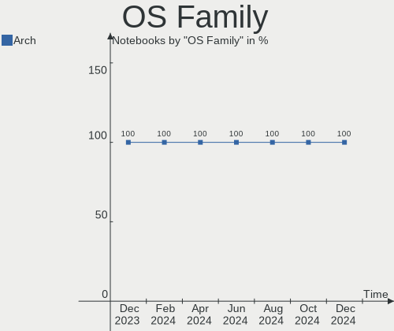
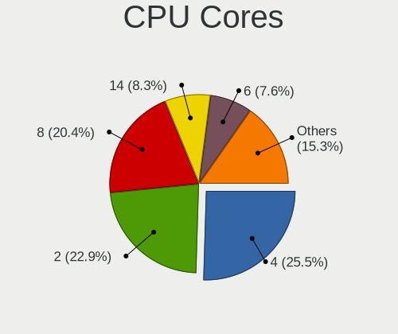
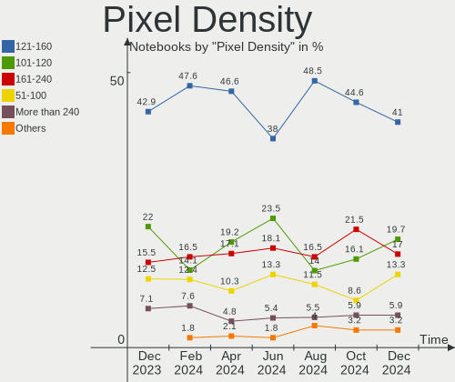
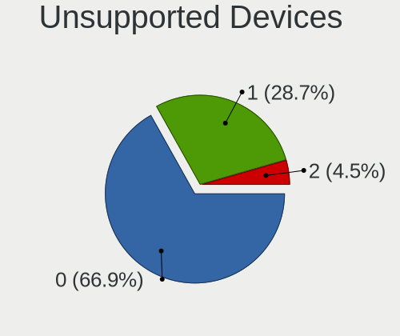

Arch Hardware Trends (Notebooks)
--------------------------------

A project to identify most popular hardware characteristics and track their change
over time based on data collected by Arch users at https://Linux-Hardware.org.

Anyone can contribute to this report by the [hw-probe](https://github.com/linuxhw/hw-probe) tool:

    sudo -E hw-probe -all -upload

Full-feature report is available here: https://linux-hardware.org/?view=trends

Period: Jan, 2022.

Contents
--------

* [ System ](#system)
  - [ OS                       ](#os)
  - [ OS Family                ](#os-family)
  - [ Kernel                   ](#kernel)
  - [ Kernel Family            ](#kernel-family)
  - [ Kernel Major Ver.        ](#kernel-major-ver)
  - [ Arch                     ](#arch)
  - [ DE                       ](#de)
  - [ Display Server           ](#display-server)
  - [ Display Manager          ](#display-manager)
  - [ OS Lang                  ](#os-lang)
  - [ Boot Mode                ](#boot-mode)
  - [ Filesystem               ](#filesystem)
  - [ Part. scheme             ](#part-scheme)
  - [ Dual Boot with Linux/BSD ](#dual-boot-with-linuxbsd)
  - [ Dual Boot (Win)          ](#dual-boot-win)

* [ Board ](#board)
  - [ Vendor                   ](#vendor)
  - [ Model                    ](#model)
  - [ Model Family             ](#model-family)
  - [ MFG Year                 ](#mfg-year)
  - [ Form Factor              ](#form-factor)
  - [ Secure Boot              ](#secure-boot)
  - [ Coreboot                 ](#coreboot)
  - [ RAM Size                 ](#ram-size)
  - [ RAM Used                 ](#ram-used)
  - [ Total Drives             ](#total-drives)
  - [ Has CD-ROM               ](#has-cd-rom)
  - [ Has Ethernet             ](#has-ethernet)
  - [ Has WiFi                 ](#has-wifi)
  - [ Has Bluetooth            ](#has-bluetooth)

* [ Location ](#location)
  - [ Country                  ](#country)
  - [ City                     ](#city)

* [ Drives ](#drives)
  - [ Drive Vendor             ](#drive-vendor)
  - [ Drive Model              ](#drive-model)
  - [ HDD Vendor               ](#hdd-vendor)
  - [ SSD Vendor               ](#ssd-vendor)
  - [ Drive Kind               ](#drive-kind)
  - [ Drive Connector          ](#drive-connector)
  - [ Drive Size               ](#drive-size)
  - [ Space Total              ](#space-total)
  - [ Space Used               ](#space-used)
  - [ Malfunc. Drives          ](#malfunc-drives)
  - [ Malfunc. Drive Vendor    ](#malfunc-drive-vendor)
  - [ Malfunc. HDD Vendor      ](#malfunc-hdd-vendor)
  - [ Malfunc. Drive Kind      ](#malfunc-drive-kind)
  - [ Failed Drives            ](#failed-drives)
  - [ Failed Drive Vendor      ](#failed-drive-vendor)
  - [ Drive Status             ](#drive-status)

* [ Storage controller ](#storage-controller)
  - [ Storage Vendor           ](#storage-vendor)
  - [ Storage Model            ](#storage-model)
  - [ Storage Kind             ](#storage-kind)

* [ Processor ](#processor)
  - [ CPU Vendor               ](#cpu-vendor)
  - [ CPU Model                ](#cpu-model)
  - [ CPU Model Family         ](#cpu-model-family)
  - [ CPU Cores                ](#cpu-cores)
  - [ CPU Sockets              ](#cpu-sockets)
  - [ CPU Threads              ](#cpu-threads)
  - [ CPU Op-Modes             ](#cpu-op-modes)
  - [ CPU Microcode            ](#cpu-microcode)
  - [ CPU Microarch            ](#cpu-microarch)

* [ Graphics ](#graphics)
  - [ GPU Vendor               ](#gpu-vendor)
  - [ GPU Model                ](#gpu-model)
  - [ GPU Combo                ](#gpu-combo)
  - [ GPU Driver               ](#gpu-driver)
  - [ GPU Memory               ](#gpu-memory)

* [ Monitor ](#monitor)
  - [ Monitor Vendor           ](#monitor-vendor)
  - [ Monitor Model            ](#monitor-model)
  - [ Monitor Resolution       ](#monitor-resolution)
  - [ Monitor Diagonal         ](#monitor-diagonal)
  - [ Monitor Width            ](#monitor-width)
  - [ Aspect Ratio             ](#aspect-ratio)
  - [ Monitor Area             ](#monitor-area)
  - [ Pixel Density            ](#pixel-density)
  - [ Multiple Monitors        ](#multiple-monitors)

* [ Network ](#network)
  - [ Net Controller Vendor    ](#net-controller-vendor)
  - [ Net Controller Model     ](#net-controller-model)
  - [ Wireless Vendor          ](#wireless-vendor)
  - [ Wireless Model           ](#wireless-model)
  - [ Ethernet Vendor          ](#ethernet-vendor)
  - [ Ethernet Model           ](#ethernet-model)
  - [ Net Controller Kind      ](#net-controller-kind)
  - [ Used Controller          ](#used-controller)
  - [ NICs                     ](#nics)
  - [ IPv6                     ](#ipv6)

* [ Bluetooth ](#bluetooth)
  - [ Bluetooth Vendor         ](#bluetooth-vendor)
  - [ Bluetooth Model          ](#bluetooth-model)

* [ Sound ](#sound)
  - [ Sound Vendor             ](#sound-vendor)
  - [ Sound Model              ](#sound-model)

* [ Memory ](#memory)
  - [ Memory Vendor            ](#memory-vendor)
  - [ Memory Model             ](#memory-model)
  - [ Memory Kind              ](#memory-kind)
  - [ Memory Form Factor       ](#memory-form-factor)
  - [ Memory Size              ](#memory-size)
  - [ Memory Speed             ](#memory-speed)

* [ Printers & scanners ](#printers--scanners)
  - [ Printer Vendor           ](#printer-vendor)
  - [ Printer Model            ](#printer-model)
  - [ Scanner Vendor           ](#scanner-vendor)
  - [ Scanner Model            ](#scanner-model)

* [ Camera ](#camera)
  - [ Camera Vendor            ](#camera-vendor)
  - [ Camera Model             ](#camera-model)

* [ Security ](#security)
  - [ Fingerprint Vendor       ](#fingerprint-vendor)
  - [ Fingerprint Model        ](#fingerprint-model)
  - [ Chipcard Vendor          ](#chipcard-vendor)
  - [ Chipcard Model           ](#chipcard-model)

* [ Unsupported ](#unsupported)
  - [ Unsupported Devices      ](#unsupported-devices)
  - [ Unsupported Device Types ](#unsupported-device-types)

System
------

OS
--

Installed operating systems

| Name         | Notebooks | Percent |
|--------------|-----------|---------|
| Arch Rolling | 47        | 51.65%  |
| Arch         | 44        | 48.35%  |

OS Family
---------

OS without a version

| Name | Notebooks | Percent |
|------|-----------|---------|
| Arch | 91        | 100%    |

Kernel
------

Version of the Linux kernel

| Version                      | Notebooks | Percent |
|------------------------------|-----------|---------|
| 5.16.2-arch1-1               | 16        | 17.58%  |
| 5.15.12-arch1-1              | 13        | 14.29%  |
| 5.16.0-arch1-1               | 9         | 9.89%   |
| 5.16.1-arch1-1               | 8         | 8.79%   |
| 5.15.13-arch1-1              | 7         | 7.69%   |
| 5.15.12-zen1-1-zen           | 6         | 6.59%   |
| 5.16.2-zen1-1-zen            | 4         | 4.4%    |
| 5.16.1-zen1-1-zen            | 3         | 3.3%    |
| 5.16.3-arch1-1               | 2         | 2.2%    |
| 5.16.2-1-ck-generic-v3       | 2         | 2.2%    |
| 5.16.0-zen1-1-zen            | 2         | 2.2%    |
| 5.15.16-1-lts                | 2         | 2.2%    |
| 5.15.14-1-lts                | 2         | 2.2%    |
| 5.15.13-zen1-1-zen           | 2         | 2.2%    |
| 5.15.11-arch2-1              | 2         | 2.2%    |
| 5.10.90-1-lts                | 2         | 2.2%    |
| 5.16.3-zen1-1-zen            | 1         | 1.1%    |
| 5.16.2-1-ck                  | 1         | 1.1%    |
| 5.16.2-1-aufs                | 1         | 1.1%    |
| 5.16.1-arch1-g14-1           | 1         | 1.1%    |
| 5.15.5-arch1-1               | 1         | 1.1%    |
| 5.15.17-xanmod2-tt-2         | 1         | 1.1%    |
| 5.15.16-hardened1-1-hardened | 1         | 1.1%    |
| 5.15.10-xanmod1-rog-1        | 1         | 1.1%    |
| 5.15.10-arch1-1              | 1         | 1.1%    |

Kernel Family
-------------

Linux kernel without a distro release

| Version | Notebooks | Percent |
|---------|-----------|---------|
| 5.16.2  | 24        | 26.37%  |
| 5.15.12 | 19        | 20.88%  |
| 5.16.1  | 12        | 13.19%  |
| 5.16.0  | 11        | 12.09%  |
| 5.15.13 | 9         | 9.89%   |
| 5.16.3  | 3         | 3.3%    |
| 5.15.16 | 3         | 3.3%    |
| 5.15.14 | 2         | 2.2%    |
| 5.15.11 | 2         | 2.2%    |
| 5.15.10 | 2         | 2.2%    |
| 5.10.90 | 2         | 2.2%    |
| 5.15.5  | 1         | 1.1%    |
| 5.15.17 | 1         | 1.1%    |

Kernel Major Ver.
-----------------

Linux kernel major version

| Version | Notebooks | Percent |
|---------|-----------|---------|
| 5.16    | 50        | 54.95%  |
| 5.15    | 39        | 42.86%  |
| 5.10    | 2         | 2.2%    |

Arch
----

OS architecture (x86_64, i586, etc.)

| Name   | Notebooks | Percent |
|--------|-----------|---------|
| x86_64 | 91        | 100%    |

DE
--

Desktop Environment

| Name                     | Notebooks | Percent |
|--------------------------|-----------|---------|
| KDE5                     | 31        | 34.07%  |
| GNOME                    | 25        | 27.47%  |
| Unknown                  | 10        | 10.99%  |
| awesome                  | 6         | 6.59%   |
| XFCE                     | 5         | 5.49%   |
| i3                       | 5         | 5.49%   |
| sway                     | 3         | 3.3%    |
| xmonad                   | 1         | 1.1%    |
| river                    | 1         | 1.1%    |
| qtile                    | 1         | 1.1%    |
| GNOME Flashback          | 1         | 1.1%    |
| Budgie                   | 1         | 1.1%    |
| /usr/bin/openbox-session | 1         | 1.1%    |

Display Server
--------------

X11 or Wayland

| Name    | Notebooks | Percent |
|---------|-----------|---------|
| X11     | 56        | 61.54%  |
| Wayland | 26        | 28.57%  |
| Tty     | 7         | 7.69%   |
| Unknown | 2         | 2.2%    |

Display Manager
---------------

SDDM, LightDM, etc.

| Name    | Notebooks | Percent |
|---------|-----------|---------|
| SDDM    | 32        | 35.16%  |
| Unknown | 22        | 24.18%  |
| LightDM | 17        | 18.68%  |
| GDM     | 16        | 17.58%  |
| Ly      | 2         | 2.2%    |
| LXDM    | 1         | 1.1%    |
| GREETD  | 1         | 1.1%    |

OS Lang
-------

Language

| Lang    | Notebooks | Percent |
|---------|-----------|---------|
| en_US   | 57        | 62.64%  |
| de_DE   | 6         | 6.59%   |
| C       | 6         | 6.59%   |
| pt_BR   | 4         | 4.4%    |
| zh_CN   | 2         | 2.2%    |
| ru_RU   | 2         | 2.2%    |
| fr_FR   | 2         | 2.2%    |
| en_GB   | 2         | 2.2%    |
| en_DK   | 2         | 2.2%    |
| Unknown | 2         | 2.2%    |
| mn_CN   | 1         | 1.1%    |
| it_IT   | 1         | 1.1%    |
| en_NZ   | 1         | 1.1%    |
| en_IN   | 1         | 1.1%    |
| en_AU   | 1         | 1.1%    |
| cs_CZ   | 1         | 1.1%    |

Boot Mode
---------

EFI or BIOS

| Mode | Notebooks | Percent |
|------|-----------|---------|
| EFI  | 72        | 79.12%  |
| BIOS | 19        | 20.88%  |

Filesystem
----------

Type of filesystem

| Type  | Notebooks | Percent |
|-------|-----------|---------|
| Ext4  | 61        | 67.03%  |
| Btrfs | 21        | 23.08%  |
| Xfs   | 6         | 6.59%   |
| F2fs  | 2         | 2.2%    |
| Aufs  | 1         | 1.1%    |

Part. scheme
------------

Scheme of partitioning

| Type    | Notebooks | Percent |
|---------|-----------|---------|
| GPT     | 77        | 84.62%  |
| Unknown | 9         | 9.89%   |
| MBR     | 5         | 5.49%   |

Dual Boot with Linux/BSD
------------------------

Hosting more than one Linux/BSD

| Dual boot | Notebooks | Percent |
|-----------|-----------|---------|
| No        | 85        | 93.41%  |
| Yes       | 6         | 6.59%   |

Dual Boot (Win)
---------------

Hosting Linux and Windows

| Dual boot | Notebooks | Percent |
|-----------|-----------|---------|
| No        | 53        | 58.24%  |
| Yes       | 38        | 41.76%  |

Board
-----

Vendor
------

Motherboard manufacturer

| Name                 | Notebooks | Percent |
|----------------------|-----------|---------|
| Lenovo               | 24        | 26.37%  |
| ASUSTek Computer     | 16        | 17.58%  |
| Hewlett-Packard      | 12        | 13.19%  |
| Dell                 | 10        | 10.99%  |
| Acer                 | 10        | 10.99%  |
| MSI                  | 4         | 4.4%    |
| Samsung Electronics  | 2         | 2.2%    |
| Medion               | 2         | 2.2%    |
| Intel Client Systems | 2         | 2.2%    |
| Apple                | 2         | 2.2%    |
| Multilaser           | 1         | 1.1%    |
| LG Electronics       | 1         | 1.1%    |
| HUAWEI               | 1         | 1.1%    |
| Framework            | 1         | 1.1%    |
| Eluktronics          | 1         | 1.1%    |
| Alienware            | 1         | 1.1%    |
| Unknown              | 1         | 1.1%    |

Model
-----

Motherboard model

| Name                                   | Notebooks | Percent |
|----------------------------------------|-----------|---------|
| Intel Client Systems LAPBC710          | 2         | 2.2%    |
| Dell Latitude E5570                    | 2         | 2.2%    |
| Samsung 935XDB                         | 1         | 1.1%    |
| Samsung 300E5M/300E5L                  | 1         | 1.1%    |
| Multilaser UB32X                       | 1         | 1.1%    |
| MSI Modern 14 B5M                      | 1         | 1.1%    |
| MSI GS66 Stealth 10UH                  | 1         | 1.1%    |
| MSI GS66 Stealth 10SFS                 | 1         | 1.1%    |
| MSI GP73 Leopard 8RE                   | 1         | 1.1%    |
| Medion S4216                           | 1         | 1.1%    |
| Medion P6685 MD61138                   | 1         | 1.1%    |
| LG 17UD70P-PX76K                       | 1         | 1.1%    |
| Lenovo V155-15API 81V5                 | 1         | 1.1%    |
| Lenovo U310                            | 1         | 1.1%    |
| Lenovo ThinkPad X395 20NL000HMC        | 1         | 1.1%    |
| Lenovo ThinkPad X260 20F5S08P00        | 1         | 1.1%    |
| Lenovo ThinkPad T480 20L5001DUS        | 1         | 1.1%    |
| Lenovo ThinkPad T420 4236WR1           | 1         | 1.1%    |
| Lenovo ThinkPad T420 423664U           | 1         | 1.1%    |
| Lenovo ThinkPad P50 20EQS2AB00         | 1         | 1.1%    |
| Lenovo ThinkPad P14s Gen 2a 21A1S00D00 | 1         | 1.1%    |
| Lenovo ThinkPad L15 Gen 2a 20X7CTO1WW  | 1         | 1.1%    |
| Lenovo ThinkPad E15 Gen 3 20YG004QMX   | 1         | 1.1%    |
| Lenovo ThinkPad A485 20MVS0FH00        | 1         | 1.1%    |
| Lenovo ThinkBook 13s G3 ACN 20YA       | 1         | 1.1%    |
| Lenovo S145-15API 81UT                 | 1         | 1.1%    |
| Lenovo Legion Y540-15IRH-PG0 81SY      | 1         | 1.1%    |
| Lenovo Legion R9000P2021H 82JQ         | 1         | 1.1%    |
| Lenovo IdeaPad S145-15IWL 81S9         | 1         | 1.1%    |
| Lenovo IdeaPad S145-15IIL 82DJ         | 1         | 1.1%    |
| Lenovo IdeaPad Gaming 3 15ARH05 82EY   | 1         | 1.1%    |
| Lenovo IdeaPad 5 14ALC05 82LM          | 1         | 1.1%    |
| Lenovo IdeaPad 330S-15IKB 81F5         | 1         | 1.1%    |
| Lenovo IdeaPad 330-15IKB 81DE          | 1         | 1.1%    |
| Lenovo IdeaPad 320S-14IKB 80X4         | 1         | 1.1%    |
| Lenovo IdeaPad 305-14IBD 80R1          | 1         | 1.1%    |
| HUAWEI BOHK-WAX9X                      | 1         | 1.1%    |
| HP ProBook 6460b                       | 1         | 1.1%    |
| HP ProBook 450 G4                      | 1         | 1.1%    |
| HP ProBook 445 G7                      | 1         | 1.1%    |
| HP ProBook 440 G8 Notebook PC          | 1         | 1.1%    |
| HP Pavilion Laptop 15z-eh000           | 1         | 1.1%    |
| HP Pavilion Laptop 15-cs0xxx           | 1         | 1.1%    |
| HP Notebook                            | 1         | 1.1%    |
| HP Laptop 15-da0xxx                    | 1         | 1.1%    |
| HP EliteBook 855 G7 Notebook PC        | 1         | 1.1%    |
| HP EliteBook 850 G8 Notebook PC        | 1         | 1.1%    |
| HP EliteBook 830 G5                    | 1         | 1.1%    |
| HP Elite x2 1012 G1                    | 1         | 1.1%    |
| Framework Laptop                       | 1         | 1.1%    |
| Eluktronics THINN-15                   | 1         | 1.1%    |
| Dell XPS 15 7590                       | 1         | 1.1%    |
| Dell XPS 13 9360                       | 1         | 1.1%    |
| Dell Precision 7550                    | 1         | 1.1%    |
| Dell Latitude E5470                    | 1         | 1.1%    |
| Dell Inspiron 5515                     | 1         | 1.1%    |
| Dell Inspiron 15 5510                  | 1         | 1.1%    |
| Dell G3 3579                           | 1         | 1.1%    |
| Dell G3 3500                           | 1         | 1.1%    |
| ASUS X751LB                            | 1         | 1.1%    |

Model Family
------------

Motherboard model prefix

| Name                          | Notebooks | Percent |
|-------------------------------|-----------|---------|
| Lenovo ThinkPad               | 10        | 10.99%  |
| Lenovo IdeaPad                | 8         | 8.79%   |
| HP ProBook                    | 4         | 4.4%    |
| Acer Nitro                    | 4         | 4.4%    |
| HP EliteBook                  | 3         | 3.3%    |
| Dell Latitude                 | 3         | 3.3%    |
| ASUS VivoBook                 | 3         | 3.3%    |
| ASUS ROG                      | 3         | 3.3%    |
| Acer Swift                    | 3         | 3.3%    |
| Acer Aspire                   | 3         | 3.3%    |
| MSI GS66                      | 2         | 2.2%    |
| Lenovo Legion                 | 2         | 2.2%    |
| Intel Client Systems LAPBC710 | 2         | 2.2%    |
| HP Pavilion                   | 2         | 2.2%    |
| Dell XPS                      | 2         | 2.2%    |
| Dell Inspiron                 | 2         | 2.2%    |
| Dell G3                       | 2         | 2.2%    |
| ASUS ASUS                     | 2         | 2.2%    |
| Samsung 935XDB                | 1         | 1.1%    |
| Samsung 300E5M                | 1         | 1.1%    |
| Multilaser UB32X              | 1         | 1.1%    |
| MSI Modern                    | 1         | 1.1%    |
| MSI GP73                      | 1         | 1.1%    |
| Medion S4216                  | 1         | 1.1%    |
| Medion P6685                  | 1         | 1.1%    |
| LG 17UD70P-PX76K              | 1         | 1.1%    |
| Lenovo V155-15API             | 1         | 1.1%    |
| Lenovo U310                   | 1         | 1.1%    |
| Lenovo ThinkBook              | 1         | 1.1%    |
| Lenovo S145-15API             | 1         | 1.1%    |
| HUAWEI BOHK-WAX9X             | 1         | 1.1%    |
| HP Notebook                   | 1         | 1.1%    |
| HP Laptop                     | 1         | 1.1%    |
| HP Elite                      | 1         | 1.1%    |
| Framework Laptop              | 1         | 1.1%    |
| Eluktronics THINN-15          | 1         | 1.1%    |
| Dell Precision                | 1         | 1.1%    |
| ASUS X751LB                   | 1         | 1.1%    |
| ASUS X580VD                   | 1         | 1.1%    |
| ASUS X556UQ                   | 1         | 1.1%    |
| ASUS X450CP                   | 1         | 1.1%    |
| ASUS UX303UB                  | 1         | 1.1%    |
| ASUS UX303LAB                 | 1         | 1.1%    |
| ASUS TUF                      | 1         | 1.1%    |
| ASUS GL702VM                  | 1         | 1.1%    |
| Apple MacBookPro9             | 1         | 1.1%    |
| Apple MacBookPro11            | 1         | 1.1%    |
| Alienware x15                 | 1         | 1.1%    |
| Unknown                       | 1         | 1.1%    |

MFG Year
--------

Motherboard manufacture year

| Year | Notebooks | Percent |
|------|-----------|---------|
| 2021 | 23        | 25.27%  |
| 2020 | 16        | 17.58%  |
| 2019 | 14        | 15.38%  |
| 2018 | 12        | 13.19%  |
| 2016 | 9         | 9.89%   |
| 2017 | 4         | 4.4%    |
| 2015 | 4         | 4.4%    |
| 2011 | 3         | 3.3%    |
| 2013 | 2         | 2.2%    |
| 2012 | 2         | 2.2%    |
| 2014 | 1         | 1.1%    |
| 2010 | 1         | 1.1%    |

Form Factor
-----------

Physical design of the computer

| Name     | Notebooks | Percent |
|----------|-----------|---------|
| Notebook | 91        | 100%    |

Secure Boot
-----------

Enabled or disabled

| State    | Notebooks | Percent |
|----------|-----------|---------|
| Disabled | 86        | 94.51%  |
| Enabled  | 5         | 5.49%   |

Coreboot
--------

Have coreboot on board

| Used | Notebooks | Percent |
|------|-----------|---------|
| No   | 91        | 100%    |

RAM Size
--------

Total RAM memory

| Size in GB  | Notebooks | Percent |
|-------------|-----------|---------|
| 8.01-16.0   | 28        | 30.77%  |
| 16.01-24.0  | 23        | 25.27%  |
| 4.01-8.0    | 21        | 23.08%  |
| 32.01-64.0  | 8         | 8.79%   |
| 3.01-4.0    | 8         | 8.79%   |
| 64.01-256.0 | 3         | 3.3%    |

RAM Used
--------

Used RAM memory

| Used GB    | Notebooks | Percent |
|------------|-----------|---------|
| 2.01-3.0   | 24        | 26.37%  |
| 3.01-4.0   | 20        | 21.98%  |
| 1.01-2.0   | 20        | 21.98%  |
| 4.01-8.0   | 16        | 17.58%  |
| 8.01-16.0  | 7         | 7.69%   |
| 0.01-0.5   | 2         | 2.2%    |
| 16.01-24.0 | 1         | 1.1%    |
| 0.51-1.0   | 1         | 1.1%    |

Total Drives
------------

Number of drives on board

| Drives | Notebooks | Percent |
|--------|-----------|---------|
| 1      | 64        | 70.33%  |
| 2      | 25        | 27.47%  |
| 6      | 1         | 1.1%    |
| 3      | 1         | 1.1%    |

Has CD-ROM
----------

Has CD-ROM on board

| Presented | Notebooks | Percent |
|-----------|-----------|---------|
| No        | 78        | 85.71%  |
| Yes       | 13        | 14.29%  |

Has Ethernet
------------

Has Ethernet on board

| Presented | Notebooks | Percent |
|-----------|-----------|---------|
| Yes       | 65        | 71.43%  |
| No        | 26        | 28.57%  |

Has WiFi
--------

Has WiFi module

| Presented | Notebooks | Percent |
|-----------|-----------|---------|
| Yes       | 91        | 100%    |

Has Bluetooth
-------------

Has Bluetooth module

| Presented | Notebooks | Percent |
|-----------|-----------|---------|
| Yes       | 86        | 94.51%  |
| No        | 5         | 5.49%   |

Location
--------

Country
-------

Geographic location (country)

| Country     | Notebooks | Percent |
|-------------|-----------|---------|
| USA         | 14        | 15.38%  |
| Germany     | 11        | 12.09%  |
| Brazil      | 8         | 8.79%   |
| India       | 6         | 6.59%   |
| Indonesia   | 5         | 5.49%   |
| New Zealand | 3         | 3.3%    |
| Italy       | 3         | 3.3%    |
| France      | 3         | 3.3%    |
| Czechia     | 3         | 3.3%    |
| Australia   | 3         | 3.3%    |
| Vietnam     | 2         | 2.2%    |
| Thailand    | 2         | 2.2%    |
| Sweden      | 2         | 2.2%    |
| South Korea | 2         | 2.2%    |
| Russia      | 2         | 2.2%    |
| Romania     | 2         | 2.2%    |
| Netherlands | 2         | 2.2%    |
| Belgium     | 2         | 2.2%    |
| Bangladesh  | 2         | 2.2%    |
| Ukraine     | 1         | 1.1%    |
| UK          | 1         | 1.1%    |
| Turkey      | 1         | 1.1%    |
| Qatar       | 1         | 1.1%    |
| Poland      | 1         | 1.1%    |
| Philippines | 1         | 1.1%    |
| Norway      | 1         | 1.1%    |
| Luxembourg  | 1         | 1.1%    |
| Iran        | 1         | 1.1%    |
| Hungary     | 1         | 1.1%    |
| Egypt       | 1         | 1.1%    |
| China       | 1         | 1.1%    |
| Canada      | 1         | 1.1%    |
| Argentina   | 1         | 1.1%    |

City
----

Geographic location (city)

| City                  | Notebooks | Percent |
|-----------------------|-----------|---------|
| San Francisco         | 3         | 3.3%    |
| Sydney                | 2         | 2.2%    |
| Surabaya              | 2         | 2.2%    |
| Ribeir??o Preto       | 2         | 2.2%    |
| Frankfurt am Main     | 2         | 2.2%    |
| Brussels              | 2         | 2.2%    |
| Wellington            | 1         | 1.1%    |
| Vigasio               | 1         | 1.1%    |
| Velbert               | 1         | 1.1%    |
| Uberl??ndia           | 1         | 1.1%    |
| Turda                 | 1         | 1.1%    |
| Thrissur              | 1         | 1.1%    |
| Tampa                 | 1         | 1.1%    |
| Stuttgart             | 1         | 1.1%    |
| Stockholm             | 1         | 1.1%    |
| Stavanger             | 1         | 1.1%    |
| St Petersburg         | 1         | 1.1%    |
| Shantou               | 1         | 1.1%    |
| Seongdong-gu          | 1         | 1.1%    |
| S??o Paulo            | 1         | 1.1%    |
| Samarinda             | 1         | 1.1%    |
| Saint-Martin-d'H??res | 1         | 1.1%    |
| Roubaix               | 1         | 1.1%    |
| Rotterdam             | 1         | 1.1%    |
| Rayong                | 1         | 1.1%    |
| Rangpur City          | 1         | 1.1%    |
| Prague                | 1         | 1.1%    |
| Poznan                | 1         | 1.1%    |
| Pontianak             | 1         | 1.1%    |
| Plauen                | 1         | 1.1%    |
| Pittsburgh            | 1         | 1.1%    |
| Phoenix               | 1         | 1.1%    |
| Parnamirim            | 1         | 1.1%    |
| Palakkad              | 1         | 1.1%    |
| Oroquieta             | 1         | 1.1%    |
| Oradea                | 1         | 1.1%    |
| Northampton           | 1         | 1.1%    |
| Nijmegen              | 1         | 1.1%    |
| Niddatal              | 1         | 1.1%    |
| Moscow                | 1         | 1.1%    |
| Milan                 | 1         | 1.1%    |
| Melbourne             | 1         | 1.1%    |
| Maple Valley          | 1         | 1.1%    |
| Mae Sai               | 1         | 1.1%    |
| Luxembourg            | 1         | 1.1%    |
| Los Angeles           | 1         | 1.1%    |
| Longmont              | 1         | 1.1%    |
| Lille                 | 1         | 1.1%    |
| Kyiv                  | 1         | 1.1%    |
| Kamp-Lintfort         | 1         | 1.1%    |
| J?¶nk?¶ping           | 1         | 1.1%    |
| Jakarta               | 1         | 1.1%    |
| Ho Chi Minh City      | 1         | 1.1%    |
| Herzogenrath          | 1         | 1.1%    |
| Hanoi                 | 1         | 1.1%    |
| Hackensack            | 1         | 1.1%    |
| Guarulhos             | 1         | 1.1%    |
| Germantown            | 1         | 1.1%    |
| General Roca          | 1         | 1.1%    |
| Gaithersburg          | 1         | 1.1%    |

Drives
------

Drive Vendor
------------

Hard drive vendors

| Vendor                         | Notebooks | Drives | Percent |
|--------------------------------|-----------|--------|---------|
| Samsung Electronics            | 28        | 35     | 24.35%  |
| WDC                            | 13        | 13     | 11.3%   |
| SK Hynix                       | 12        | 13     | 10.43%  |
| Toshiba                        | 9         | 9      | 7.83%   |
| Seagate                        | 9         | 9      | 7.83%   |
| SanDisk                        | 8         | 9      | 6.96%   |
| Kingston                       | 6         | 7      | 5.22%   |
| Intel                          | 4         | 4      | 3.48%   |
| HGST                           | 4         | 4      | 3.48%   |
| Unknown                        | 3         | 3      | 2.61%   |
| Crucial                        | 3         | 3      | 2.61%   |
| Micron Technology              | 2         | 2      | 1.74%   |
| ZHITAI                         | 1         | 1      | 0.87%   |
| Team                           | 1         | 1      | 0.87%   |
| Solid State Storage Technology | 1         | 1      | 0.87%   |
| Silicon Motion                 | 1         | 1      | 0.87%   |
| Realtek Semiconductor          | 1         | 1      | 0.87%   |
| Phison                         | 1         | 1      | 0.87%   |
| MidasForce                     | 1         | 1      | 0.87%   |
| Lenovo                         | 1         | 1      | 0.87%   |
| KIOXIA                         | 1         | 1      | 0.87%   |
| HS-SSD-E100                    | 1         | 1      | 0.87%   |
| GOODRAM                        | 1         | 1      | 0.87%   |
| Corsair                        | 1         | 1      | 0.87%   |
| China                          | 1         | 1      | 0.87%   |
| Apple                          | 1         | 1      | 0.87%   |

Drive Model
-----------

Hard drive models

| Model                                    | Notebooks | Percent |
|------------------------------------------|-----------|---------|
| Toshiba MQ04ABF100 1TB                   | 4         | 3.28%   |
| WDC PC SN520 SDAPNUW-512G-1014 512GB     | 3         | 2.46%   |
| Seagate ST1000LM035-1RK172 1TB           | 3         | 2.46%   |
| Toshiba NVMe SSD Drive 512GB             | 2         | 1.64%   |
| Toshiba KSG60ZMV256G M.2 2280 256GB SSD  | 2         | 1.64%   |
| SK Hynix HFS128G39TND-N210A 128GB SSD    | 2         | 1.64%   |
| Sandisk NVMe SSD Drive 256GB             | 2         | 1.64%   |
| Samsung SSD 970 EVO Plus 2TB             | 2         | 1.64%   |
| Samsung SSD 860 EVO 500GB                | 2         | 1.64%   |
| Samsung SSD 860 EVO 1TB                  | 2         | 1.64%   |
| Intel SSDPEKNW512G8L 512GB               | 2         | 1.64%   |
| HGST HTS725032A7E630 320GB               | 2         | 1.64%   |
| ZHITAI SC001 Active 1TB SSD              | 1         | 0.82%   |
| WDC WDS500G1X0E-00AFY0 500GB             | 1         | 0.82%   |
| WDC WDS250G2B0C-00PXH0 250GB             | 1         | 0.82%   |
| WDC WDS100T2B0C 1TB                      | 1         | 0.82%   |
| WDC WD5000LPLX-08ZNTT0 500GB             | 1         | 0.82%   |
| WDC WD5000LPCX-35VHAT0 500GB             | 1         | 0.82%   |
| WDC WD10SPZX-24Z10 1TB                   | 1         | 0.82%   |
| WDC WD10SPZX-17Z10T1 1TB                 | 1         | 0.82%   |
| WDC WD10JPVX-60JC3T0 1TB                 | 1         | 0.82%   |
| WDC PC SN730 SDBPNTY-1T00-1032 1TB       | 1         | 0.82%   |
| WDC PC SN530 SDBPNPZ-256G-1114 256GB     | 1         | 0.82%   |
| Unknown SD32G  32GB                      | 1         | 0.82%   |
| Unknown SC128  128GB                     | 1         | 0.82%   |
| Unknown DA4128  128GB                    | 1         | 0.82%   |
| Toshiba THNSN5256GPUK NVMe 256GB         | 1         | 0.82%   |
| Team TM8FP4512G 512GB                    | 1         | 0.82%   |
| Solid State Storage NVMe SSD Drive 512GB | 1         | 0.82%   |
| SK Hynix SKHynix_HFS512GDE9X084N 512GB   | 1         | 0.82%   |
| SK Hynix SHGP31-1000GM 1TB               | 1         | 0.82%   |
| SK Hynix SC311 SATA 256GB SSD            | 1         | 0.82%   |
| SK Hynix PC711 NVMe 1TB                  | 1         | 0.82%   |
| SK Hynix HFS256G39TNF-N3A0A 256GB SSD    | 1         | 0.82%   |
| SK Hynix HFM512GD3JX016N 512GB           | 1         | 0.82%   |
| SK Hynix HFM512GD3JX013N 512GB           | 1         | 0.82%   |
| SK Hynix HFM256GDJTNG-8310A 256GB        | 1         | 0.82%   |
| SK Hynix HFM001TD3JX013N 1TB             | 1         | 0.82%   |
| SK Hynix BC511 HFM256GDJTNI-82A0A 256GB  | 1         | 0.82%   |
| SK Hynix BC501 HFM512GDJTNG-8310A 512GB  | 1         | 0.82%   |
| Silicon Motion NVMe SSD Drive 1TB        | 1         | 0.82%   |
| Seagate ST500LM000-SSHD-8GB              | 1         | 0.82%   |
| Seagate ST2000LX001-1RG174 2TB           | 1         | 0.82%   |
| Seagate ST1000LX015-1U7172 1TB           | 1         | 0.82%   |
| Seagate ST1000LM048-2E7172 1TB           | 1         | 0.82%   |
| Seagate ST1000LM024 HN-M101MBB 1TB       | 1         | 0.82%   |
| Seagate One Touch SSD 1TB                | 1         | 0.82%   |
| SanDisk SSD PLUS 120GB                   | 1         | 0.82%   |
| SanDisk SD8SN8U-256G-1006 256GB SSD      | 1         | 0.82%   |
| SanDisk SD7SB3Q256G1002 256GB SSD        | 1         | 0.82%   |
| Sandisk NVMe SSD Drive 512GB             | 1         | 0.82%   |
| Sandisk NVMe SSD Drive 500GB             | 1         | 0.82%   |
| Sandisk NVMe SSD Drive 1TB               | 1         | 0.82%   |
| Sandisk NVMe SSD Drive 128GB             | 1         | 0.82%   |
| Samsung SSD 980 PRO 2TB                  | 1         | 0.82%   |
| Samsung SSD 980 1TB                      | 1         | 0.82%   |
| Samsung SSD 870 EVO 500GB                | 1         | 0.82%   |
| Samsung SSD 860 EVO 250GB                | 1         | 0.82%   |
| Samsung SSD 850 EVO 500GB                | 1         | 0.82%   |
| Samsung PSSD T7 500GB                    | 1         | 0.82%   |

HDD Vendor
----------

Hard disk drive vendors

| Vendor  | Notebooks | Drives | Percent |
|---------|-----------|--------|---------|
| Seagate | 8         | 8      | 38.1%   |
| WDC     | 5         | 5      | 23.81%  |
| Toshiba | 4         | 4      | 19.05%  |
| HGST    | 4         | 4      | 19.05%  |

SSD Vendor
----------

Solid state drive vendors

| Vendor              | Notebooks | Drives | Percent |
|---------------------|-----------|--------|---------|
| Samsung Electronics | 9         | 12     | 30%     |
| SK Hynix            | 4         | 4      | 13.33%  |
| Kingston            | 4         | 4      | 13.33%  |
| SanDisk             | 3         | 3      | 10%     |
| Toshiba             | 2         | 2      | 6.67%   |
| ZHITAI              | 1         | 1      | 3.33%   |
| Seagate             | 1         | 1      | 3.33%   |
| MidasForce          | 1         | 1      | 3.33%   |
| HS-SSD-E100         | 1         | 1      | 3.33%   |
| GOODRAM             | 1         | 1      | 3.33%   |
| Crucial             | 1         | 1      | 3.33%   |
| China               | 1         | 1      | 3.33%   |
| Apple               | 1         | 1      | 3.33%   |

Drive Kind
----------

HDD or SSD

| Kind | Notebooks | Drives | Percent |
|------|-----------|--------|---------|
| NVMe | 59        | 68     | 53.64%  |
| SSD  | 27        | 33     | 24.55%  |
| HDD  | 21        | 21     | 19.09%  |
| MMC  | 3         | 3      | 2.73%   |

Drive Connector
---------------

SATA, SAS, NVMe, etc.

| Type | Notebooks | Drives | Percent |
|------|-----------|--------|---------|
| NVMe | 59        | 68     | 55.66%  |
| SATA | 43        | 50     | 40.57%  |
| MMC  | 3         | 3      | 2.83%   |
| SAS  | 1         | 4      | 0.94%   |

Drive Size
----------

Size of hard drive

| Size in TB | Notebooks | Drives | Percent |
|------------|-----------|--------|---------|
| 0.01-0.5   | 30        | 32     | 58.82%  |
| 0.51-1.0   | 20        | 21     | 39.22%  |
| 1.01-2.0   | 1         | 1      | 1.96%   |

Space Total
-----------

Amount of disk space available on the file system

| Size in GB     | Notebooks | Percent |
|----------------|-----------|---------|
| 251-500        | 27        | 29.67%  |
| 101-250        | 24        | 26.37%  |
| 501-1000       | 17        | 18.68%  |
| 1001-2000      | 11        | 12.09%  |
| More than 3000 | 5         | 5.49%   |
| 51-100         | 4         | 4.4%    |
| 2001-3000      | 1         | 1.1%    |
| 1-20           | 1         | 1.1%    |
| Unknown        | 1         | 1.1%    |

Space Used
----------

Amount of used disk space

| Used GB        | Notebooks | Percent |
|----------------|-----------|---------|
| 1-20           | 20        | 21.98%  |
| 101-250        | 19        | 20.88%  |
| 251-500        | 15        | 16.48%  |
| 21-50          | 14        | 15.38%  |
| 51-100         | 14        | 15.38%  |
| 501-1000       | 5         | 5.49%   |
| More than 3000 | 1         | 1.1%    |
| 2001-3000      | 1         | 1.1%    |
| 1001-2000      | 1         | 1.1%    |
| Unknown        | 1         | 1.1%    |

Malfunc. Drives
---------------

Drive models with a malfunction

| Model                                   | Notebooks | Drives | Percent |
|-----------------------------------------|-----------|--------|---------|
| Toshiba KSG60ZMV256G M.2 2280 256GB SSD | 2         | 2      | 22.22%  |
| WDC WD10JPVX-60JC3T0 1TB                | 1         | 1      | 11.11%  |
| SK Hynix HFS128G39TND-N210A 128GB SSD   | 1         | 1      | 11.11%  |
| SK Hynix BC501 HFM512GDJTNG-8310A 512GB | 1         | 1      | 11.11%  |
| Seagate ST2000LX001-1RG174 2TB          | 1         | 1      | 11.11%  |
| SanDisk SD7SB3Q256G1002 256GB SSD       | 1         | 1      | 11.11%  |
| HGST HTS725032A7E630 320GB              | 1         | 1      | 11.11%  |
| HGST HTS545050A7E680 500GB              | 1         | 1      | 11.11%  |

Malfunc. Drive Vendor
---------------------

Vendors of faulty drives

| Vendor   | Notebooks | Drives | Percent |
|----------|-----------|--------|---------|
| Toshiba  | 2         | 2      | 22.22%  |
| SK Hynix | 2         | 2      | 22.22%  |
| HGST     | 2         | 2      | 22.22%  |
| WDC      | 1         | 1      | 11.11%  |
| Seagate  | 1         | 1      | 11.11%  |
| SanDisk  | 1         | 1      | 11.11%  |

Malfunc. HDD Vendor
-------------------

Vendors of faulty HDD drives

| Vendor  | Notebooks | Drives | Percent |
|---------|-----------|--------|---------|
| HGST    | 2         | 2      | 50%     |
| WDC     | 1         | 1      | 25%     |
| Seagate | 1         | 1      | 25%     |

Malfunc. Drive Kind
-------------------

Kinds of faulty drives

| Kind | Notebooks | Drives | Percent |
|------|-----------|--------|---------|
| SSD  | 4         | 4      | 44.44%  |
| HDD  | 4         | 4      | 44.44%  |
| NVMe | 1         | 1      | 11.11%  |

Failed Drives
-------------

Failed drive models

Zero info for selected period =(

Failed Drive Vendor
-------------------

Failed drive vendors

Zero info for selected period =(

Drive Status
------------

Number of failed and malfunc. drives

| Status   | Notebooks | Drives | Percent |
|----------|-----------|--------|---------|
| Works    | 58        | 72     | 59.79%  |
| Detected | 30        | 44     | 30.93%  |
| Malfunc  | 9         | 9      | 9.28%   |

Storage controller
------------------

Storage Vendor
--------------

Storage controller vendors

| Vendor                         | Notebooks | Percent |
|--------------------------------|-----------|---------|
| Intel                          | 49        | 40.83%  |
| Samsung Electronics            | 21        | 17.5%   |
| AMD                            | 14        | 11.67%  |
| Sandisk                        | 11        | 9.17%   |
| SK Hynix                       | 8         | 6.67%   |
| Toshiba America Info Systems   | 3         | 2.5%    |
| Phison Electronics             | 3         | 2.5%    |
| Micron/Crucial Technology      | 2         | 1.67%   |
| Micron Technology              | 2         | 1.67%   |
| Kingston Technology Company    | 2         | 1.67%   |
| Solid State Storage Technology | 1         | 0.83%   |
| Silicon Motion                 | 1         | 0.83%   |
| Realtek Semiconductor          | 1         | 0.83%   |
| Lenovo                         | 1         | 0.83%   |
| KIOXIA                         | 1         | 0.83%   |

Storage Model
-------------

Storage controller models

| Model                                                                            | Notebooks | Percent |
|----------------------------------------------------------------------------------|-----------|---------|
| AMD FCH SATA Controller [AHCI mode]                                              | 14        | 11.2%   |
| Intel Sunrise Point-LP SATA Controller [AHCI mode]                               | 11        | 8.8%    |
| Samsung NVMe SSD Controller 980                                                  | 10        | 8%      |
| Samsung NVMe SSD Controller SM981/PM981/PM983                                    | 8         | 6.4%    |
| SK Hynix Gold P31 SSD                                                            | 6         | 4.8%    |
| Intel Cannon Lake Mobile PCH SATA AHCI Controller                                | 5         | 4%      |
| Intel 82801 Mobile SATA Controller [RAID mode]                                   | 5         | 4%      |
| Sandisk WD Blue SN550 NVMe SSD                                                   | 4         | 3.2%    |
| Intel SSD 660P Series                                                            | 4         | 3.2%    |
| Sandisk WD Blue SN500 / PC SN520 NVMe SSD                                        | 3         | 2.4%    |
| Samsung NVMe SSD Controller PM9A1/PM9A3/980PRO                                   | 3         | 2.4%    |
| Intel Wildcat Point-LP SATA Controller [AHCI Mode]                               | 3         | 2.4%    |
| Intel Volume Management Device NVMe RAID Controller                              | 3         | 2.4%    |
| Intel 7 Series Chipset Family 6-port SATA Controller [AHCI mode]                 | 3         | 2.4%    |
| Intel 6 Series/C200 Series Chipset Family 6 port Mobile SATA AHCI Controller     | 3         | 2.4%    |
| Toshiba America Info Systems XG4 NVMe SSD Controller                             | 2         | 1.6%    |
| SK Hynix BC501 NVMe Solid State Drive                                            | 2         | 1.6%    |
| Sandisk WD PC SN810 / Black SN850 NVMe SSD                                       | 2         | 1.6%    |
| Phison E12 NVMe Controller                                                       | 2         | 1.6%    |
| Micron Non-Volatile memory controller                                            | 2         | 1.6%    |
| Intel SATA Controller [RAID mode]                                                | 2         | 1.6%    |
| Intel Q170/Q150/B150/H170/H110/Z170/CM236 Chipset SATA Controller [AHCI Mode]    | 2         | 1.6%    |
| Intel HM170/QM170 Chipset SATA Controller [AHCI Mode]                            | 2         | 1.6%    |
| Intel Cannon Point-LP SATA Controller [AHCI Mode]                                | 2         | 1.6%    |
| Toshiba America Info Systems Toshiba America Info Non-Volatile memory controller | 1         | 0.8%    |
| Solid State Storage Non-Volatile memory controller                               | 1         | 0.8%    |
| SK Hynix BC511                                                                   | 1         | 0.8%    |
| Silicon Motion SM2262/SM2262EN SSD Controller                                    | 1         | 0.8%    |
| Sandisk WD Black SN750 / PC SN730 NVMe SSD                                       | 1         | 0.8%    |
| Sandisk PC SN520 NVMe SSD                                                        | 1         | 0.8%    |
| Sandisk Non-Volatile memory controller                                           | 1         | 0.8%    |
| Samsung Electronics SATA controller                                              | 1         | 0.8%    |
| Realtek RTS5763DL NVMe SSD Controller                                            | 1         | 0.8%    |
| Phison E7 NVMe Controller                                                        | 1         | 0.8%    |
| Micron/Crucial P2 NVMe PCIe SSD                                                  | 1         | 0.8%    |
| Micron/Crucial P1 NVMe PCIe SSD                                                  | 1         | 0.8%    |
| Lenovo Non-Volatile memory controller                                            | 1         | 0.8%    |
| KIOXIA Non-Volatile memory controller                                            | 1         | 0.8%    |
| Kingston Company Company Non-Volatile memory controller                          | 1         | 0.8%    |
| Kingston Company A2000 NVMe SSD                                                  | 1         | 0.8%    |
| Intel PROSet/Wireless WiFi Software extension                                    | 1         | 0.8%    |
| Intel Ice Lake-LP SATA Controller [AHCI mode]                                    | 1         | 0.8%    |
| Intel Celeron/Pentium Silver Processor SATA Controller                           | 1         | 0.8%    |
| Intel Atom/Celeron/Pentium Processor x5-E8000/J3xxx/N3xxx Series SATA Controller | 1         | 0.8%    |
| Intel 5 Series/3400 Series Chipset 4 port SATA AHCI Controller                   | 1         | 0.8%    |
| Intel 400 Series Chipset Family SATA AHCI Controller                             | 1         | 0.8%    |

Storage Kind
------------

Kind of storage controller (IDE, SATA, NVMe, SAS, ...)

| Kind | Notebooks | Percent |
|------|-----------|---------|
| NVMe | 59        | 49.17%  |
| SATA | 52        | 43.33%  |
| RAID | 9         | 7.5%    |

Processor
---------

CPU Vendor
----------

Processor vendors

| Vendor | Notebooks | Percent |
|--------|-----------|---------|
| Intel  | 62        | 68.13%  |
| AMD    | 29        | 31.87%  |

CPU Model
---------

Processor models

| Model                                           | Notebooks | Percent |
|-------------------------------------------------|-----------|---------|
| AMD Ryzen 5 3500U with Radeon Vega Mobile Gfx   | 4         | 4.4%    |
| Intel Core i7-9750H CPU @ 2.60GHz               | 3         | 3.3%    |
| Intel Core i7-8550U CPU @ 1.80GHz               | 3         | 3.3%    |
| Intel Core i5-6440HQ CPU @ 2.60GHz              | 3         | 3.3%    |
| Intel Core i3-3217U CPU @ 1.80GHz               | 3         | 3.3%    |
| Intel 11th Gen Core i7-1165G7 @ 2.80GHz         | 3         | 3.3%    |
| AMD Ryzen 7 5700U with Radeon Graphics          | 3         | 3.3%    |
| Intel Core i7-7500U CPU @ 2.70GHz               | 2         | 2.2%    |
| Intel Core i5-8350U CPU @ 1.70GHz               | 2         | 2.2%    |
| Intel Core i5-8300H CPU @ 2.30GHz               | 2         | 2.2%    |
| Intel Core i5-8265U CPU @ 1.60GHz               | 2         | 2.2%    |
| Intel Core i5-5200U CPU @ 2.20GHz               | 2         | 2.2%    |
| Intel 11th Gen Core i5-1135G7 @ 2.40GHz         | 2         | 2.2%    |
| AMD Ryzen 9 5900HX with Radeon Graphics         | 2         | 2.2%    |
| AMD Ryzen 7 PRO 5850U with Radeon Graphics      | 2         | 2.2%    |
| AMD Ryzen 7 5800H with Radeon Graphics          | 2         | 2.2%    |
| AMD Ryzen 7 4800H with Radeon Graphics          | 2         | 2.2%    |
| AMD Ryzen 7 4700U with Radeon Graphics          | 2         | 2.2%    |
| AMD Ryzen 5 5500U with Radeon Graphics          | 2         | 2.2%    |
| AMD Ryzen 5 4500U with Radeon Graphics          | 2         | 2.2%    |
| Intel Pentium Silver N5000 CPU @ 1.10GHz        | 1         | 1.1%    |
| Intel Pentium CPU J3710 @ 1.60GHz               | 1         | 1.1%    |
| Intel Core m5-6Y57 CPU @ 1.10GHz                | 1         | 1.1%    |
| Intel Core i9-10980HK CPU @ 2.40GHz             | 1         | 1.1%    |
| Intel Core i9-10885H CPU @ 2.40GHz              | 1         | 1.1%    |
| Intel Core i7-8750H CPU @ 2.20GHz               | 1         | 1.1%    |
| Intel Core i7-8565U CPU @ 1.80GHz               | 1         | 1.1%    |
| Intel Core i7-7700HQ CPU @ 2.80GHz              | 1         | 1.1%    |
| Intel Core i7-6820HQ CPU @ 2.70GHz              | 1         | 1.1%    |
| Intel Core i7-6700HQ CPU @ 2.60GHz              | 1         | 1.1%    |
| Intel Core i7-6500U CPU @ 2.50GHz               | 1         | 1.1%    |
| Intel Core i7-4870HQ CPU @ 2.50GHz              | 1         | 1.1%    |
| Intel Core i7-3520M CPU @ 2.90GHz               | 1         | 1.1%    |
| Intel Core i7-2760QM CPU @ 2.40GHz              | 1         | 1.1%    |
| Intel Core i7-10870H CPU @ 2.20GHz              | 1         | 1.1%    |
| Intel Core i7-10750H CPU @ 2.60GHz              | 1         | 1.1%    |
| Intel Core i5-8250U CPU @ 1.60GHz               | 1         | 1.1%    |
| Intel Core i5-7200U CPU @ 2.50GHz               | 1         | 1.1%    |
| Intel Core i5-6300U CPU @ 2.40GHz               | 1         | 1.1%    |
| Intel Core i5-6200U CPU @ 2.30GHz               | 1         | 1.1%    |
| Intel Core i5-6198DU CPU @ 2.30GHz              | 1         | 1.1%    |
| Intel Core i5-2540M CPU @ 2.60GHz               | 1         | 1.1%    |
| Intel Core i5-2520M CPU @ 2.50GHz               | 1         | 1.1%    |
| Intel Core i5-1035G1 CPU @ 1.00GHz              | 1         | 1.1%    |
| Intel Core i5-10300H CPU @ 2.50GHz              | 1         | 1.1%    |
| Intel Core i5 CPU M 460 @ 2.53GHz               | 1         | 1.1%    |
| Intel Core i3-7100U CPU @ 2.40GHz               | 1         | 1.1%    |
| Intel Core i3-5005U CPU @ 2.00GHz               | 1         | 1.1%    |
| Intel Celeron CPU 3865U @ 1.80GHz               | 1         | 1.1%    |
| Intel Atom x5-Z8350 CPU @ 1.44GHz               | 1         | 1.1%    |
| Intel 11th Gen Core i9-11900H @ 2.50GHz         | 1         | 1.1%    |
| Intel 11th Gen Core i7-1185G7 @ 3.00GHz         | 1         | 1.1%    |
| Intel 11th Gen Core i7-1160G7 @ 1.20GHz         | 1         | 1.1%    |
| Intel 11th Gen Core i7-11390H @ 3.40GHz         | 1         | 1.1%    |
| Intel 11th Gen Core i5-11400H @ 2.70GHz         | 1         | 1.1%    |
| AMD Ryzen 7 PRO 4750U with Radeon Graphics      | 1         | 1.1%    |
| AMD Ryzen 7 PRO 3700U w/ Radeon Vega Mobile Gfx | 1         | 1.1%    |
| AMD Ryzen 7 5800U with Radeon Graphics          | 1         | 1.1%    |
| AMD Ryzen 7 5800HS with Radeon Graphics         | 1         | 1.1%    |
| AMD Ryzen 5 PRO 2500U w/ Radeon Vega Mobile Gfx | 1         | 1.1%    |

CPU Model Family
----------------

Processor model prefix

| Model                | Notebooks | Percent |
|----------------------|-----------|---------|
| Intel Core i5        | 21        | 23.08%  |
| Intel Core i7        | 19        | 20.88%  |
| AMD Ryzen 7          | 11        | 12.09%  |
| Other                | 10        | 10.99%  |
| AMD Ryzen 5          | 10        | 10.99%  |
| Intel Core i3        | 5         | 5.49%   |
| AMD Ryzen 7 PRO      | 4         | 4.4%    |
| Intel Core i9        | 2         | 2.2%    |
| AMD Ryzen 9          | 2         | 2.2%    |
| Intel Pentium Silver | 1         | 1.1%    |
| Intel Pentium        | 1         | 1.1%    |
| Intel Core m5        | 1         | 1.1%    |
| Intel Celeron        | 1         | 1.1%    |
| Intel Atom           | 1         | 1.1%    |
| AMD Ryzen 5 PRO      | 1         | 1.1%    |
| AMD A12              | 1         | 1.1%    |

CPU Cores
---------

Number of processor cores

| Number | Notebooks | Percent |
|--------|-----------|---------|
| 4      | 38        | 41.76%  |
| 2      | 21        | 23.08%  |
| 8      | 20        | 21.98%  |
| 6      | 11        | 12.09%  |
| 1      | 1         | 1.1%    |

CPU Sockets
-----------

Number of sockets

| Number | Notebooks | Percent |
|--------|-----------|---------|
| 1      | 91        | 100%    |

CPU Threads
-----------

Threads per core (Hyper-Threading)

| Number | Notebooks | Percent |
|--------|-----------|---------|
| 2      | 79        | 86.81%  |
| 1      | 12        | 13.19%  |

CPU Op-Modes
------------

CPU Operation Modes (32-bit, 64-bit)

| Op mode        | Notebooks | Percent |
|----------------|-----------|---------|
| 32-bit, 64-bit | 91        | 100%    |

CPU Microcode
-------------

Microcode number

| Number     | Notebooks | Percent |
|------------|-----------|---------|
| Unknown    | 19        | 20.88%  |
| 0x806ea    | 6         | 6.59%   |
| 0x806c1    | 6         | 6.59%   |
| 0x906ea    | 5         | 5.49%   |
| 0x0a50000c | 5         | 5.49%   |
| 0x08608103 | 5         | 5.49%   |
| 0x08108102 | 5         | 5.49%   |
| 0x08600106 | 4         | 4.4%    |
| 0xa0652    | 3         | 3.3%    |
| 0x406e3    | 3         | 3.3%    |
| 0x08600103 | 3         | 3.3%    |
| 0x806eb    | 2         | 2.2%    |
| 0x806e9    | 2         | 2.2%    |
| 0x806d1    | 2         | 2.2%    |
| 0x506e3    | 2         | 2.2%    |
| 0x406c4    | 2         | 2.2%    |
| 0x306d4    | 2         | 2.2%    |
| 0x306a9    | 2         | 2.2%    |
| 0x206a7    | 2         | 2.2%    |
| 0x906e9    | 1         | 1.1%    |
| 0x806ec    | 1         | 1.1%    |
| 0x706e5    | 1         | 1.1%    |
| 0x706a1    | 1         | 1.1%    |
| 0x40661    | 1         | 1.1%    |
| 0x20655    | 1         | 1.1%    |
| 0x0a50000b | 1         | 1.1%    |
| 0x08600104 | 1         | 1.1%    |
| 0x08108109 | 1         | 1.1%    |
| 0x0810100b | 1         | 1.1%    |
| 0x0600611a | 1         | 1.1%    |

CPU Microarch
-------------

Microarchitecture

| Name          | Notebooks | Percent |
|---------------|-----------|---------|
| KabyLake      | 21        | 23.08%  |
| Skylake       | 10        | 10.99%  |
| Zen 3         | 8         | 8.79%   |
| Zen 2         | 8         | 8.79%   |
| TigerLake     | 8         | 8.79%   |
| Zen+          | 6         | 6.59%   |
| CometLake     | 5         | 5.49%   |
| Unknown       | 5         | 5.49%   |
| IvyBridge     | 4         | 4.4%    |
| SandyBridge   | 3         | 3.3%    |
| IceLake       | 3         | 3.3%    |
| Broadwell     | 3         | 3.3%    |
| Silvermont    | 2         | 2.2%    |
| Zen           | 1         | 1.1%    |
| Westmere      | 1         | 1.1%    |
| Haswell       | 1         | 1.1%    |
| Goldmont plus | 1         | 1.1%    |
| Excavator     | 1         | 1.1%    |

Graphics
--------

GPU Vendor
----------

Vendors of graphics cards

| Vendor | Notebooks | Percent |
|--------|-----------|---------|
| Intel  | 59        | 44.7%   |
| Nvidia | 38        | 28.79%  |
| AMD    | 35        | 26.52%  |

GPU Model
---------

Graphics card models

| Model                                                                                    | Notebooks | Percent |
|------------------------------------------------------------------------------------------|-----------|---------|
| AMD Renoir                                                                               | 8         | 6.06%   |
| AMD Cezanne                                                                              | 8         | 6.06%   |
| Intel TigerLake-LP GT2 [Iris Xe Graphics]                                                | 7         | 5.3%    |
| Intel UHD Graphics 620                                                                   | 6         | 4.55%   |
| Intel CoffeeLake-H GT2 [UHD Graphics 630]                                                | 6         | 4.55%   |
| AMD Picasso/Raven 2 [Radeon Vega Series / Radeon Vega Mobile Series]                     | 6         | 4.55%   |
| Intel CometLake-H GT2 [UHD Graphics]                                                     | 5         | 3.79%   |
| AMD Lucienne                                                                             | 5         | 3.79%   |
| Nvidia TU117M [GeForce GTX 1650 Mobile / Max-Q]                                          | 4         | 3.03%   |
| Nvidia GA106M [GeForce RTX 3060 Mobile / Max-Q]                                          | 4         | 3.03%   |
| Intel HD Graphics 620                                                                    | 4         | 3.03%   |
| Intel HD Graphics 530                                                                    | 4         | 3.03%   |
| Intel 3rd Gen Core processor Graphics Controller                                         | 4         | 3.03%   |
| Nvidia GP108M [GeForce MX150]                                                            | 3         | 2.27%   |
| Nvidia GP107M [GeForce GTX 1050 Mobile]                                                  | 3         | 2.27%   |
| Intel WhiskeyLake-U GT2 [UHD Graphics 620]                                               | 3         | 2.27%   |
| Intel Skylake GT2 [HD Graphics 520]                                                      | 3         | 2.27%   |
| Intel HD Graphics 5500                                                                   | 3         | 2.27%   |
| Intel 2nd Generation Core Processor Family Integrated Graphics Controller                | 3         | 2.27%   |
| Nvidia TU117M [GeForce GTX 1650 Ti Mobile]                                               | 2         | 1.52%   |
| Nvidia GM108M [GeForce 940M]                                                             | 2         | 1.52%   |
| Nvidia GA104M [GeForce RTX 3080 Mobile / Max-Q 8GB/16GB]                                 | 2         | 1.52%   |
| Nvidia GA104M [GeForce RTX 3070 Mobile / Max-Q]                                          | 2         | 1.52%   |
| Intel TigerLake-H GT1 [UHD Graphics]                                                     | 2         | 1.52%   |
| Intel Atom/Celeron/Pentium Processor x5-E8000/J3xxx/N3xxx Integrated Graphics Controller | 2         | 1.52%   |
| AMD Sun XT [Radeon HD 8670A/8670M/8690M / R5 M330 / M430 / Radeon 520 Mobile]            | 2         | 1.52%   |
| Nvidia TU117M                                                                            | 1         | 0.76%   |
| Nvidia TU117GLM [Quadro T2000 Mobile / Max-Q]                                            | 1         | 0.76%   |
| Nvidia TU116M [GeForce GTX 1660 Ti Mobile]                                               | 1         | 0.76%   |
| Nvidia TU104M [GeForce RTX 2070 SUPER Mobile / Max-Q]                                    | 1         | 0.76%   |
| Nvidia GP108M [GeForce MX250]                                                            | 1         | 0.76%   |
| Nvidia GP108BM [GeForce MX250]                                                           | 1         | 0.76%   |
| Nvidia GP107M [GeForce GTX 1050 3 GB Max-Q]                                              | 1         | 0.76%   |
| Nvidia GP106M [GeForce GTX 1060 Mobile]                                                  | 1         | 0.76%   |
| Nvidia GP106BM [GeForce GTX 1060 Mobile 6GB]                                             | 1         | 0.76%   |
| Nvidia GM108M [GeForce MX130]                                                            | 1         | 0.76%   |
| Nvidia GM108M [GeForce MX110]                                                            | 1         | 0.76%   |
| Nvidia GM108M [GeForce 940MX]                                                            | 1         | 0.76%   |
| Nvidia GM108M [GeForce 920MX]                                                            | 1         | 0.76%   |
| Nvidia GM107GLM [Quadro M1000M]                                                          | 1         | 0.76%   |
| Nvidia GF119M [Quadro NVS 4200M]                                                         | 1         | 0.76%   |
| Nvidia GA107M [GeForce RTX 3050 Mobile]                                                  | 1         | 0.76%   |
| Intel Tiger Lake Iris Xe Graphics                                                        | 1         | 0.76%   |
| Intel Kaby Lake-U GT1 Integrated Graphics Controller                                     | 1         | 0.76%   |
| Intel Iris Plus Graphics G1 (Ice Lake)                                                   | 1         | 0.76%   |
| Intel HD Graphics 630                                                                    | 1         | 0.76%   |
| Intel HD Graphics 515                                                                    | 1         | 0.76%   |
| Intel HD Graphics 510                                                                    | 1         | 0.76%   |
| Intel GeminiLake [UHD Graphics 605]                                                      | 1         | 0.76%   |
| AMD Wani [Radeon R5/R6/R7 Graphics]                                                      | 1         | 0.76%   |
| AMD Venus XT [Radeon HD 8870M / R9 M270X/M370X]                                          | 1         | 0.76%   |
| AMD Raven Ridge [Radeon Vega Series / Radeon Vega Mobile Series]                         | 1         | 0.76%   |
| AMD Mars LE [Radeon HD 8530M / R5 M240]                                                  | 1         | 0.76%   |
| AMD Madison [Mobility Radeon HD 5650/5750 / 6530M/6550M]                                 | 1         | 0.76%   |
| AMD Lexa PRO [Radeon 540/540X/550/550X / RX 540X/550/550X]                               | 1         | 0.76%   |

GPU Combo
---------

Combinations of graphics cards

| Name           | Notebooks | Percent |
|----------------|-----------|---------|
| Intel + Nvidia | 28        | 30.77%  |
| 1 x Intel      | 27        | 29.67%  |
| 1 x AMD        | 22        | 24.18%  |
| AMD + Nvidia   | 9         | 9.89%   |
| Intel + AMD    | 4         | 4.4%    |
| 1 x Nvidia     | 1         | 1.1%    |

GPU Driver
----------

Free vs proprietary

| Driver      | Notebooks | Percent |
|-------------|-----------|---------|
| Free        | 67        | 73.63%  |
| Proprietary | 24        | 26.37%  |

GPU Memory
----------

Total video memory

| Size in GB | Notebooks | Percent |
|------------|-----------|---------|
| Unknown    | 50        | 54.95%  |
| 0.01-0.5   | 17        | 18.68%  |
| 1.01-2.0   | 11        | 12.09%  |
| 0.51-1.0   | 7         | 7.69%   |
| 3.01-4.0   | 4         | 4.4%    |
| 5.01-6.0   | 2         | 2.2%    |

Monitor
-------

Monitor Vendor
--------------

Monitor vendors

| Vendor               | Notebooks | Percent |
|----------------------|-----------|---------|
| BOE                  | 25        | 23.15%  |
| Chimei Innolux       | 21        | 19.44%  |
| AU Optronics         | 16        | 14.81%  |
| LG Display           | 10        | 9.26%   |
| Samsung Electronics  | 7         | 6.48%   |
| Sharp                | 5         | 4.63%   |
| Goldstar             | 5         | 4.63%   |
| PANDA                | 3         | 2.78%   |
| Lenovo               | 3         | 2.78%   |
| Dell                 | 3         | 2.78%   |
| Apple                | 2         | 1.85%   |
| ViewSonic            | 1         | 0.93%   |
| SLD                  | 1         | 0.93%   |
| MSI                  | 1         | 0.93%   |
| InfoVision           | 1         | 0.93%   |
| Elgato               | 1         | 0.93%   |
| Eizo                 | 1         | 0.93%   |
| Ancor Communications | 1         | 0.93%   |
| Acer                 | 1         | 0.93%   |

Monitor Model
-------------

Monitor models

| Model                                                                 | Notebooks | Percent |
|-----------------------------------------------------------------------|-----------|---------|
| Chimei Innolux LCD Monitor CMN15C5 1366x768 344x193mm 15.5-inch       | 3         | 2.78%   |
| Chimei Innolux LCD Monitor CMN15F5 1920x1080 344x193mm 15.5-inch      | 2         | 1.85%   |
| Chimei Innolux LCD Monitor CMN1521 1920x1080 344x193mm 15.5-inch      | 2         | 1.85%   |
| BOE LCD Monitor BOE08F5 1920x1080 344x194mm 15.5-inch                 | 2         | 1.85%   |
| BOE LCD Monitor BOE07F6 1920x1080 309x174mm 14.0-inch                 | 2         | 1.85%   |
| AU Optronics LCD Monitor AUO8294 1920x1080 382x215mm 17.3-inch        | 2         | 1.85%   |
| AU Optronics LCD Monitor AUO313C 1366x768 309x173mm 13.9-inch         | 2         | 1.85%   |
| ViewSonic VX2435wm VSCBD1E 1920x1200 520x320mm 24.0-inch              | 1         | 0.93%   |
| SLD LCD Monitor SLD003C 1366x768 309x173mm 13.9-inch                  | 1         | 0.93%   |
| Sharp LQ156M1JW23 SHP1514 1920x1080 344x194mm 15.5-inch               | 1         | 0.93%   |
| Sharp LQ156M1JW03 SHP14C5 1920x1080 344x194mm 15.5-inch               | 1         | 0.93%   |
| Sharp LQ156M1JW01 SHP14C3 1920x1080 344x194mm 15.5-inch               | 1         | 0.93%   |
| Sharp LCD Monitor SHP14BA 1920x1080 344x194mm 15.5-inch               | 1         | 0.93%   |
| Sharp LCD Monitor SHP144A 3200x1800 294x165mm 13.3-inch               | 1         | 0.93%   |
| Samsung Electronics S27B350 SAM08DC 1920x1080 600x340mm 27.2-inch     | 1         | 0.93%   |
| Samsung Electronics LCD Monitor SEC5842 1366x768 309x174mm 14.0-inch  | 1         | 0.93%   |
| Samsung Electronics LCD Monitor SEC3849 1366x768 309x174mm 14.0-inch  | 1         | 0.93%   |
| Samsung Electronics LCD Monitor SDC4E51 1366x768 344x194mm 15.5-inch  | 1         | 0.93%   |
| Samsung Electronics LCD Monitor SDC4156 1920x1080 294x165mm 13.3-inch | 1         | 0.93%   |
| Samsung Electronics LCD Monitor SDC364A 3200x1800 293x165mm 13.2-inch | 1         | 0.93%   |
| Samsung Electronics C24F390 SAM0D2C 1920x1080 521x293mm 23.5-inch     | 1         | 0.93%   |
| PANDA LCD Monitor NCP0054 1920x1080 344x194mm 15.5-inch               | 1         | 0.93%   |
| PANDA LCD Monitor NCP004D 1920x1080 344x194mm 15.5-inch               | 1         | 0.93%   |
| PANDA LCD Monitor NCP0029 1920x1080 340x190mm 15.3-inch               | 1         | 0.93%   |
| MSI MP241 MSI3BA9 1920x1080 527x296mm 23.8-inch                       | 1         | 0.93%   |
| LG Display LCD Monitor LGD0684 1920x1080 344x194mm 15.5-inch          | 1         | 0.93%   |
| LG Display LCD Monitor LGD065A 1920x1080 344x194mm 15.5-inch          | 1         | 0.93%   |
| LG Display LCD Monitor LGD060F 1920x1080 309x174mm 14.0-inch          | 1         | 0.93%   |
| LG Display LCD Monitor LGD060A 1920x1080 294x165mm 13.3-inch          | 1         | 0.93%   |
| LG Display LCD Monitor LGD05F8 2560x1600 366x229mm 17.0-inch          | 1         | 0.93%   |
| LG Display LCD Monitor LGD0590 1920x1080 344x194mm 15.5-inch          | 1         | 0.93%   |
| LG Display LCD Monitor LGD0570 1920x1080 344x194mm 15.5-inch          | 1         | 0.93%   |
| LG Display LCD Monitor LGD0563 1920x1080 344x194mm 15.5-inch          | 1         | 0.93%   |
| LG Display LCD Monitor LGD04A7 1920x1080 344x194mm 15.5-inch          | 1         | 0.93%   |
| LG Display LCD Monitor LGD04A5 1920x1280 253x169mm 12.0-inch          | 1         | 0.93%   |
| Lenovo LEN S24q-10 LEN61E7 2560x1440 527x296mm 23.8-inch              | 1         | 0.93%   |
| Lenovo LEN LT2423wC LEN60A8 1920x1080 531x299mm 24.0-inch             | 1         | 0.93%   |
| Lenovo LCD Monitor LEN40A3 1920x1080 309x175mm 14.0-inch              | 1         | 0.93%   |
| InfoVision LCD Monitor IVO057D 1920x1080 309x174mm 14.0-inch          | 1         | 0.93%   |
| Goldstar ULTRAWIDE GSM76F9 2560x1080 531x298mm 24.0-inch              | 1         | 0.93%   |
| Goldstar Ultra HD GSM5B08 3840x2160 600x340mm 27.2-inch               | 1         | 0.93%   |
| Goldstar LCD Monitor GSM5AB8 1920x1080 480x270mm 21.7-inch            | 1         | 0.93%   |
| Goldstar HDR 4K GSM7750 3840x2160 697x392mm 31.5-inch                 | 1         | 0.93%   |
| Goldstar E2250 GSM578E 1920x1080 480x270mm 21.7-inch                  | 1         | 0.93%   |
| Elgato Cam Link EGA0061 1920x1080                                     | 1         | 0.93%   |
| Eizo EV2316W ENC2394 1920x1080 510x287mm 23.0-inch                    | 1         | 0.93%   |
| Dell P3421W DELA1A8 3440x1440 800x335mm 34.1-inch                     | 1         | 0.93%   |
| Dell P2717H DEL40F7 1920x1080 598x336mm 27.0-inch                     | 1         | 0.93%   |
| Dell P2414H DELA09B 1920x1080 527x297mm 23.8-inch                     | 1         | 0.93%   |
| Chimei Innolux LCD Monitor CMN175E 1920x1080 381x214mm 17.2-inch      | 1         | 0.93%   |
| Chimei Innolux LCD Monitor CMN1747 1920x1080 380x210mm 17.1-inch      | 1         | 0.93%   |
| Chimei Innolux LCD Monitor CMN1728 1600x900 382x215mm 17.3-inch       | 1         | 0.93%   |
| Chimei Innolux LCD Monitor CMN15E8 1920x1080 344x193mm 15.5-inch      | 1         | 0.93%   |
| Chimei Innolux LCD Monitor CMN15E7 1920x1080 344x193mm 15.5-inch      | 1         | 0.93%   |
| Chimei Innolux LCD Monitor CMN152E 1920x1080 344x193mm 15.5-inch      | 1         | 0.93%   |
| Chimei Innolux LCD Monitor CMN152A 2560x1440 344x193mm 15.5-inch      | 1         | 0.93%   |
| Chimei Innolux LCD Monitor CMN151E 1920x1080 344x193mm 15.5-inch      | 1         | 0.93%   |
| Chimei Innolux LCD Monitor CMN14D5 1920x1080 309x173mm 13.9-inch      | 1         | 0.93%   |
| Chimei Innolux LCD Monitor CMN14D4 1920x1080 309x173mm 13.9-inch      | 1         | 0.93%   |
| Chimei Innolux LCD Monitor CMN1490 1366x768 309x173mm 13.9-inch       | 1         | 0.93%   |

Monitor Resolution
------------------

Monitor screen resolution

| Resolution        | Notebooks | Percent |
|-------------------|-----------|---------|
| 1920x1080 (FHD)   | 63        | 64.29%  |
| 1366x768 (WXGA)   | 15        | 15.31%  |
| 3840x2160 (4K)    | 4         | 4.08%   |
| 2560x1600         | 3         | 3.06%   |
| 3200x1800 (QHD+)  | 2         | 2.04%   |
| 2560x1440 (QHD)   | 2         | 2.04%   |
| 1600x900 (HD+)    | 2         | 2.04%   |
| 3440x1440         | 1         | 1.02%   |
| 2880x1800         | 1         | 1.02%   |
| 2560x1080         | 1         | 1.02%   |
| 2256x1504         | 1         | 1.02%   |
| 1920x1280         | 1         | 1.02%   |
| 1920x1200 (WUXGA) | 1         | 1.02%   |
| 1280x800 (WXGA)   | 1         | 1.02%   |

Monitor Diagonal
----------------

Diagonal size in inches

| Inches  | Notebooks | Percent |
|---------|-----------|---------|
| 15      | 49        | 45.79%  |
| 13      | 19        | 17.76%  |
| 14      | 13        | 12.15%  |
| 27      | 6         | 5.61%   |
| 17      | 6         | 5.61%   |
| 24      | 3         | 2.8%    |
| 23      | 3         | 2.8%    |
| 34      | 2         | 1.87%   |
| 21      | 2         | 1.87%   |
| 31      | 1         | 0.93%   |
| 16      | 1         | 0.93%   |
| 12      | 1         | 0.93%   |
| Unknown | 1         | 0.93%   |

Monitor Width
-------------

Physical width

| Width in mm | Notebooks | Percent |
|-------------|-----------|---------|
| 301-350     | 71        | 66.36%  |
| 201-300     | 12        | 11.21%  |
| 501-600     | 11        | 10.28%  |
| 351-400     | 6         | 5.61%   |
| 701-800     | 2         | 1.87%   |
| 601-700     | 2         | 1.87%   |
| 401-500     | 2         | 1.87%   |
| Unknown     | 1         | 0.93%   |

Aspect Ratio
------------

Proportional relationship between the width and the height

| Ratio | Notebooks | Percent |
|-------|-----------|---------|
| 16/9  | 84        | 89.36%  |
| 16/10 | 6         | 6.38%   |
| 3/2   | 2         | 2.13%   |
| 21/9  | 2         | 2.13%   |

Monitor Area
------------

Area in inch²

| Area in inch² | Notebooks | Percent |
|----------------|-----------|---------|
| 101-110        | 49        | 45.79%  |
| 81-90          | 23        | 21.5%   |
| 71-80          | 9         | 8.41%   |
| 201-250        | 7         | 6.54%   |
| 301-350        | 6         | 5.61%   |
| 121-130        | 5         | 4.67%   |
| 351-500        | 3         | 2.8%    |
| 61-70          | 1         | 0.93%   |
| 251-300        | 1         | 0.93%   |
| 131-140        | 1         | 0.93%   |
| 111-120        | 1         | 0.93%   |
| Unknown        | 1         | 0.93%   |

Pixel Density
-------------

Pixels per inch

| Density       | Notebooks | Percent |
|---------------|-----------|---------|
| 121-160       | 56        | 53.33%  |
| 101-120       | 20        | 19.05%  |
| 161-240       | 15        | 14.29%  |
| 51-100        | 10        | 9.52%   |
| More than 240 | 3         | 2.86%   |
| Unknown       | 1         | 0.95%   |

Multiple Monitors
-----------------

Total monitors connected

| Total | Notebooks | Percent |
|-------|-----------|---------|
| 1     | 74        | 81.32%  |
| 2     | 16        | 17.58%  |
| 3     | 1         | 1.1%    |

Network
-------

Net Controller Vendor
---------------------

Controller vendors

| Vendor                   | Notebooks | Percent |
|--------------------------|-----------|---------|
| Intel                    | 54        | 39.42%  |
| Realtek Semiconductor    | 50        | 36.5%   |
| Qualcomm Atheros         | 17        | 12.41%  |
| MEDIATEK                 | 6         | 4.38%   |
| Broadcom                 | 3         | 2.19%   |
| Hewlett-Packard          | 2         | 1.46%   |
| Samsung Electronics      | 1         | 0.73%   |
| Qualcomm                 | 1         | 0.73%   |
| Motorola PCS             | 1         | 0.73%   |
| Marvell Technology Group | 1         | 0.73%   |
| Lenovo                   | 1         | 0.73%   |

Net Controller Model
--------------------

Controller models

| Model                                                             | Notebooks | Percent |
|-------------------------------------------------------------------|-----------|---------|
| Realtek RTL8111/8168/8411 PCI Express Gigabit Ethernet Controller | 36        | 22.5%   |
| Intel Wi-Fi 6 AX200                                               | 10        | 6.25%   |
| Qualcomm Atheros QCA9377 802.11ac Wireless Network Adapter        | 7         | 4.38%   |
| Realtek RTL8822CE 802.11ac PCIe Wireless Network Adapter          | 5         | 3.13%   |
| Realtek RTL8153 Gigabit Ethernet Adapter                          | 5         | 3.13%   |
| MEDIATEK MT7921 802.11ax PCI Express Wireless Network Adapter     | 5         | 3.13%   |
| Intel Wireless 8260                                               | 5         | 3.13%   |
| Intel Wi-Fi 6 AX201                                               | 5         | 3.13%   |
| Intel Cannon Lake PCH CNVi WiFi                                   | 5         | 3.13%   |
| Qualcomm Atheros QCA6174 802.11ac Wireless Network Adapter        | 4         | 2.5%    |
| Intel Wireless 8265 / 8275                                        | 4         | 2.5%    |
| Intel Wi-Fi 6 AX210/AX211/AX411 160MHz                            | 4         | 2.5%    |
| Intel Comet Lake PCH CNVi WiFi                                    | 4         | 2.5%    |
| Realtek RTL8852AE 802.11ax PCIe Wireless Network Adapter          | 3         | 1.88%   |
| Realtek RTL810xE PCI Express Fast Ethernet controller             | 3         | 1.88%   |
| Intel Wireless 7265                                               | 3         | 1.88%   |
| Intel Ethernet Connection (2) I219-LM                             | 3         | 1.88%   |
| Realtek Killer E2600 Gigabit Ethernet Controller                  | 2         | 1.25%   |
| Qualcomm Atheros QCA9565 / AR9565 Wireless Network Adapter        | 2         | 1.25%   |
| Qualcomm Atheros AR9285 Wireless Network Adapter (PCI-Express)    | 2         | 1.25%   |
| Intel Wireless 3165                                               | 2         | 1.25%   |
| Intel Ethernet controller                                         | 2         | 1.25%   |
| Intel Ethernet Connection (4) I219-LM                             | 2         | 1.25%   |
| Intel Dual Band Wireless-AC 3165 Plus Bluetooth                   | 2         | 1.25%   |
| Intel Centrino Advanced-N 6205 [Taylor Peak]                      | 2         | 1.25%   |
| Intel 82579LM Gigabit Network Connection (Lewisville)             | 2         | 1.25%   |
| Samsung Galaxy series, misc. (tethering mode)                     | 1         | 0.63%   |
| Realtek RTL8822BE 802.11a/b/g/n/ac WiFi adapter                   | 1         | 0.63%   |
| Realtek RTL8821CE 802.11ac PCIe Wireless Network Adapter          | 1         | 0.63%   |
| Realtek RTL8152 Fast Ethernet Adapter                             | 1         | 0.63%   |
| Realtek Killer E2500 Gigabit Ethernet Controller                  | 1         | 0.63%   |
| Realtek 802.11n WLAN Adapter                                      | 1         | 0.63%   |
| Realtek 802.11ac NIC                                              | 1         | 0.63%   |
| Qualcomm Atheros QCNFA765                                         | 1         | 0.63%   |
| Qualcomm Atheros Killer E2400 Gigabit Ethernet Controller         | 1         | 0.63%   |
| Qualcomm Atheros AR9485 Wireless Network Adapter                  | 1         | 0.63%   |
| Motorola PCS Moto G (4)                                           | 1         | 0.63%   |
| MEDIATEK Network controller                                       | 1         | 0.63%   |
| Marvell Group 88W8897 [AVASTAR] 802.11ac Wireless                 | 1         | 0.63%   |
| Lenovo ThinkPad Lan                                               | 1         | 0.63%   |
| Intel Wireless-AC 9260                                            | 1         | 0.63%   |
| Intel Ice Lake-LP PCH CNVi WiFi                                   | 1         | 0.63%   |
| Intel I210 Gigabit Network Connection                             | 1         | 0.63%   |
| Intel Gemini Lake PCH CNVi WiFi                                   | 1         | 0.63%   |
| Intel Ethernet Connection I219-LM                                 | 1         | 0.63%   |
| Intel Ethernet Connection (11) I219-LM                            | 1         | 0.63%   |
| Intel Dual Band Wireless-AC 3168NGW [Stone Peak]                  | 1         | 0.63%   |
| Intel Centrino Wireless-N 2230                                    | 1         | 0.63%   |
| Intel Centrino Ultimate-N 6300                                    | 1         | 0.63%   |
| Intel Cannon Point-LP CNVi [Wireless-AC]                          | 1         | 0.63%   |
| Intel 82579V Gigabit Network Connection                           | 1         | 0.63%   |
| HP lt4120 Snapdragon X5 LTE                                       | 1         | 0.63%   |
| HP hs2340 HSPA+ mobile broadband                                  | 1         | 0.63%   |
| Broadcom NetXtreme BCM57765 Gigabit Ethernet PCIe                 | 1         | 0.63%   |
| Broadcom NetLink BCM57780 Gigabit Ethernet PCIe                   | 1         | 0.63%   |
| Broadcom BCM43602 802.11ac Wireless LAN SoC                       | 1         | 0.63%   |
| Broadcom BCM4331 802.11a/b/g/n                                    | 1         | 0.63%   |

Wireless Vendor
---------------

Wireless vendors

| Vendor                   | Notebooks | Percent |
|--------------------------|-----------|---------|
| Intel                    | 53        | 58.24%  |
| Qualcomm Atheros         | 16        | 17.58%  |
| Realtek Semiconductor    | 12        | 13.19%  |
| MEDIATEK                 | 6         | 6.59%   |
| Broadcom                 | 2         | 2.2%    |
| Qualcomm                 | 1         | 1.1%    |
| Marvell Technology Group | 1         | 1.1%    |

Wireless Model
--------------

Wireless models

| Model                                                          | Notebooks | Percent |
|----------------------------------------------------------------|-----------|---------|
| Intel Wi-Fi 6 AX200                                            | 10        | 10.99%  |
| Qualcomm Atheros QCA9377 802.11ac Wireless Network Adapter     | 7         | 7.69%   |
| Realtek RTL8822CE 802.11ac PCIe Wireless Network Adapter       | 5         | 5.49%   |
| MEDIATEK MT7921 802.11ax PCI Express Wireless Network Adapter  | 5         | 5.49%   |
| Intel Wireless 8260                                            | 5         | 5.49%   |
| Intel Wi-Fi 6 AX201                                            | 5         | 5.49%   |
| Intel Cannon Lake PCH CNVi WiFi                                | 5         | 5.49%   |
| Qualcomm Atheros QCA6174 802.11ac Wireless Network Adapter     | 4         | 4.4%    |
| Intel Wireless 8265 / 8275                                     | 4         | 4.4%    |
| Intel Wi-Fi 6 AX210/AX211/AX411 160MHz                         | 4         | 4.4%    |
| Intel Comet Lake PCH CNVi WiFi                                 | 4         | 4.4%    |
| Realtek RTL8852AE 802.11ax PCIe Wireless Network Adapter       | 3         | 3.3%    |
| Intel Wireless 7265                                            | 3         | 3.3%    |
| Qualcomm Atheros QCA9565 / AR9565 Wireless Network Adapter     | 2         | 2.2%    |
| Qualcomm Atheros AR9285 Wireless Network Adapter (PCI-Express) | 2         | 2.2%    |
| Intel Wireless 3165                                            | 2         | 2.2%    |
| Intel Dual Band Wireless-AC 3165 Plus Bluetooth                | 2         | 2.2%    |
| Intel Centrino Advanced-N 6205 [Taylor Peak]                   | 2         | 2.2%    |
| Realtek RTL8822BE 802.11a/b/g/n/ac WiFi adapter                | 1         | 1.1%    |
| Realtek RTL8821CE 802.11ac PCIe Wireless Network Adapter       | 1         | 1.1%    |
| Realtek 802.11n WLAN Adapter                                   | 1         | 1.1%    |
| Realtek 802.11ac NIC                                           | 1         | 1.1%    |
| Qualcomm Atheros QCNFA765                                      | 1         | 1.1%    |
| Qualcomm Atheros AR9485 Wireless Network Adapter               | 1         | 1.1%    |
| MEDIATEK Network controller                                    | 1         | 1.1%    |
| Marvell Group 88W8897 [AVASTAR] 802.11ac Wireless              | 1         | 1.1%    |
| Intel Wireless-AC 9260                                         | 1         | 1.1%    |
| Intel Ice Lake-LP PCH CNVi WiFi                                | 1         | 1.1%    |
| Intel Gemini Lake PCH CNVi WiFi                                | 1         | 1.1%    |
| Intel Dual Band Wireless-AC 3168NGW [Stone Peak]               | 1         | 1.1%    |
| Intel Centrino Wireless-N 2230                                 | 1         | 1.1%    |
| Intel Centrino Ultimate-N 6300                                 | 1         | 1.1%    |
| Intel Cannon Point-LP CNVi [Wireless-AC]                       | 1         | 1.1%    |
| Broadcom BCM43602 802.11ac Wireless LAN SoC                    | 1         | 1.1%    |
| Broadcom BCM4331 802.11a/b/g/n                                 | 1         | 1.1%    |

Ethernet Vendor
---------------

Ethernet vendors

| Vendor                | Notebooks | Percent |
|-----------------------|-----------|---------|
| Realtek Semiconductor | 47        | 70.15%  |
| Intel                 | 13        | 19.4%   |
| Broadcom              | 2         | 2.99%   |
| Samsung Electronics   | 1         | 1.49%   |
| Qualcomm Atheros      | 1         | 1.49%   |
| Motorola PCS          | 1         | 1.49%   |
| Lenovo                | 1         | 1.49%   |
| Hewlett-Packard       | 1         | 1.49%   |

Ethernet Model
--------------

Ethernet models

| Model                                                             | Notebooks | Percent |
|-------------------------------------------------------------------|-----------|---------|
| Realtek RTL8111/8168/8411 PCI Express Gigabit Ethernet Controller | 36        | 52.94%  |
| Realtek RTL8153 Gigabit Ethernet Adapter                          | 5         | 7.35%   |
| Realtek RTL810xE PCI Express Fast Ethernet controller             | 3         | 4.41%   |
| Intel Ethernet Connection (2) I219-LM                             | 3         | 4.41%   |
| Realtek Killer E2600 Gigabit Ethernet Controller                  | 2         | 2.94%   |
| Intel Ethernet controller                                         | 2         | 2.94%   |
| Intel Ethernet Connection (4) I219-LM                             | 2         | 2.94%   |
| Intel 82579LM Gigabit Network Connection (Lewisville)             | 2         | 2.94%   |
| Samsung Galaxy series, misc. (tethering mode)                     | 1         | 1.47%   |
| Realtek RTL8152 Fast Ethernet Adapter                             | 1         | 1.47%   |
| Realtek Killer E2500 Gigabit Ethernet Controller                  | 1         | 1.47%   |
| Qualcomm Atheros Killer E2400 Gigabit Ethernet Controller         | 1         | 1.47%   |
| Motorola PCS Moto G (4)                                           | 1         | 1.47%   |
| Lenovo ThinkPad Lan                                               | 1         | 1.47%   |
| Intel I210 Gigabit Network Connection                             | 1         | 1.47%   |
| Intel Ethernet Connection I219-LM                                 | 1         | 1.47%   |
| Intel Ethernet Connection (11) I219-LM                            | 1         | 1.47%   |
| Intel 82579V Gigabit Network Connection                           | 1         | 1.47%   |
| HP lt4120 Snapdragon X5 LTE                                       | 1         | 1.47%   |
| Broadcom NetXtreme BCM57765 Gigabit Ethernet PCIe                 | 1         | 1.47%   |
| Broadcom NetLink BCM57780 Gigabit Ethernet PCIe                   | 1         | 1.47%   |

Net Controller Kind
-------------------

Ethernet, WiFi or modem

| Kind     | Notebooks | Percent |
|----------|-----------|---------|
| WiFi     | 91        | 57.96%  |
| Ethernet | 65        | 41.4%   |
| Modem    | 1         | 0.64%   |

Used Controller
---------------

Currently used network controller

| Kind     | Notebooks | Percent |
|----------|-----------|---------|
| WiFi     | 85        | 76.58%  |
| Ethernet | 26        | 23.42%  |

NICs
----

Total network controllers on board

| Total | Notebooks | Percent |
|-------|-----------|---------|
| 2     | 56        | 61.54%  |
| 1     | 31        | 34.07%  |
| 3     | 2         | 2.2%    |
| 0     | 2         | 2.2%    |

IPv6
----

IPv6 vs IPv4

| Used | Notebooks | Percent |
|------|-----------|---------|
| No   | 59        | 64.84%  |
| Yes  | 32        | 35.16%  |

Bluetooth
---------

Bluetooth Vendor
----------------

Controller vendors

| Vendor                          | Notebooks | Percent |
|---------------------------------|-----------|---------|
| Intel                           | 49        | 56.98%  |
| Qualcomm Atheros Communications | 10        | 11.63%  |
| Realtek Semiconductor           | 8         | 9.3%    |
| IMC Networks                    | 8         | 9.3%    |
| Lite-On Technology              | 2         | 2.33%   |
| Broadcom                        | 2         | 2.33%   |
| Apple                           | 2         | 2.33%   |
| Realtek                         | 1         | 1.16%   |
| MediaTek                        | 1         | 1.16%   |
| Marvell Semiconductor           | 1         | 1.16%   |
| Hewlett-Packard                 | 1         | 1.16%   |
| Foxconn / Hon Hai               | 1         | 1.16%   |

Bluetooth Model
---------------

Controller models

| Model                                               | Notebooks | Percent |
|-----------------------------------------------------|-----------|---------|
| Intel Bluetooth Device                              | 26        | 30.23%  |
| Intel Bluetooth wireless interface                  | 8         | 9.3%    |
| Intel Bluetooth 9460/9560 Jefferson Peak (JfP)      | 8         | 9.3%    |
| Realtek Bluetooth Radio                             | 6         | 6.98%   |
| Qualcomm Atheros  Bluetooth Device                  | 6         | 6.98%   |
| Intel AX210 Bluetooth                               | 4         | 4.65%   |
| IMC Networks Wireless_Device                        | 4         | 4.65%   |
| IMC Networks Bluetooth Device                       | 3         | 3.49%   |
| Qualcomm Atheros QCA61x4 Bluetooth 4.0              | 2         | 2.33%   |
| Lite-On Bluetooth Device                            | 2         | 2.33%   |
| Broadcom BCM2045B (BDC-2.1)                         | 2         | 2.33%   |
| Realtek RTL8822BE Bluetooth 4.2 Adapter             | 1         | 1.16%   |
| Realtek  Bluetooth 4.2 Adapter                      | 1         | 1.16%   |
| Realtek Bluetooth Radio                             | 1         | 1.16%   |
| Qualcomm Atheros AR3012 Bluetooth 4.0               | 1         | 1.16%   |
| Qualcomm Atheros AR3011 Bluetooth                   | 1         | 1.16%   |
| MediaTek Wireless_Device                            | 1         | 1.16%   |
| Marvell Bluetooth and Wireless LAN Composite Device | 1         | 1.16%   |
| Intel Wireless-AC 9260 Bluetooth Adapter            | 1         | 1.16%   |
| Intel Wireless-AC 3168 Bluetooth                    | 1         | 1.16%   |
| Intel Centrino Bluetooth Wireless Transceiver       | 1         | 1.16%   |
| IMC Networks Bluetooth Radio                        | 1         | 1.16%   |
| HP Broadcom 2070 Bluetooth Combo                    | 1         | 1.16%   |
| Foxconn / Hon Hai Wireless_Device                   | 1         | 1.16%   |
| Apple Bluetooth USB Host Controller                 | 1         | 1.16%   |
| Apple Bluetooth Host Controller                     | 1         | 1.16%   |

Sound
-----

Sound Vendor
------------

Sound card vendors

| Vendor                 | Notebooks | Percent |
|------------------------|-----------|---------|
| Intel                  | 61        | 48.03%  |
| AMD                    | 31        | 24.41%  |
| Nvidia                 | 23        | 18.11%  |
| Realtek Semiconductor  | 2         | 1.57%   |
| SAVITECH               | 1         | 0.79%   |
| Samson Technologies    | 1         | 0.79%   |
| Other World Computing  | 1         | 0.79%   |
| Hewlett-Packard        | 1         | 0.79%   |
| Generalplus Technology | 1         | 0.79%   |
| Focusrite-Novation     | 1         | 0.79%   |
| Dell                   | 1         | 0.79%   |
| Creative Technology    | 1         | 0.79%   |
| C-Media Electronics    | 1         | 0.79%   |
| Unknown                | 1         | 0.79%   |

Sound Model
-----------

Sound card models

| Model                                                                                             | Notebooks | Percent |
|---------------------------------------------------------------------------------------------------|-----------|---------|
| AMD Family 17h (Models 10h-1fh) HD Audio Controller                                               | 28        | 18.06%  |
| AMD Renoir Radeon High Definition Audio Controller                                                | 18        | 11.61%  |
| Intel Sunrise Point-LP HD Audio                                                                   | 16        | 10.32%  |
| Intel Tiger Lake-LP Smart Sound Technology Audio Controller                                       | 8         | 5.16%   |
| Intel Cannon Lake PCH cAVS                                                                        | 6         | 3.87%   |
| AMD Raven/Raven2/Fenghuang HDMI/DP Audio Controller                                               | 6         | 3.87%   |
| Nvidia TU107 GeForce GTX 1650 High Definition Audio Controller                                    | 5         | 3.23%   |
| Nvidia Audio device                                                                               | 5         | 3.23%   |
| Intel Comet Lake PCH cAVS                                                                         | 5         | 3.23%   |
| Intel 100 Series/C230 Series Chipset Family HD Audio Controller                                   | 5         | 3.23%   |
| Nvidia GA104 High Definition Audio Controller                                                     | 4         | 2.58%   |
| Intel 7 Series/C216 Chipset Family High Definition Audio Controller                               | 4         | 2.58%   |
| Nvidia GP107GL High Definition Audio Controller                                                   | 3         | 1.94%   |
| Intel Wildcat Point-LP High Definition Audio Controller                                           | 3         | 1.94%   |
| Intel Cannon Point-LP High Definition Audio Controller                                            | 3         | 1.94%   |
| Intel Broadwell-U Audio Controller                                                                | 3         | 1.94%   |
| Intel 6 Series/C200 Series Chipset Family High Definition Audio Controller                        | 3         | 1.94%   |
| Realtek Semiconductor USB Audio                                                                   | 2         | 1.29%   |
| Nvidia GP106 High Definition Audio Controller                                                     | 2         | 1.29%   |
| Intel Tiger Lake-H HD Audio Controller                                                            | 2         | 1.29%   |
| SAVITECH SA9023 audio controller                                                                  | 1         | 0.65%   |
| Samson Technologies GoMic compact condenser mic                                                   | 1         | 0.65%   |
| Other World Computing OWC Thunderbolt 3 Audio Device                                              | 1         | 0.65%   |
| Nvidia TU116 High Definition Audio Controller                                                     | 1         | 0.65%   |
| Nvidia TU104 HD Audio Controller                                                                  | 1         | 0.65%   |
| Nvidia GM107 High Definition Audio Controller [GeForce 940MX]                                     | 1         | 0.65%   |
| Nvidia GF119 HDMI Audio Controller                                                                | 1         | 0.65%   |
| Intel Ice Lake-LP Smart Sound Technology Audio Controller                                         | 1         | 0.65%   |
| Intel CM238 HD Audio Controller                                                                   | 1         | 0.65%   |
| Intel Celeron/Pentium Silver Processor High Definition Audio                                      | 1         | 0.65%   |
| Intel Atom/Celeron/Pentium Processor x5-E8000/J3xxx/N3xxx Series High Definition Audio Controller | 1         | 0.65%   |
| Intel 8 Series/C220 Series Chipset High Definition Audio Controller                               | 1         | 0.65%   |
| Intel 5 Series/3400 Series Chipset High Definition Audio                                          | 1         | 0.65%   |
| Hewlett-Packard Pavilion Headset 600                                                              | 1         | 0.65%   |
| Generalplus Technology Usb Audio Device                                                           | 1         | 0.65%   |
| Focusrite-Novation Focusrite Scarlett 6i6                                                         | 1         | 0.65%   |
| Dell Slim Soundbar SB521A                                                                         | 1         | 0.65%   |
| Creative Technology SB X-Fi Surround 5.1 Pro                                                      | 1         | 0.65%   |
| C-Media Electronics USB Audio Device                                                              | 1         | 0.65%   |
| AMD Redwood HDMI Audio [Radeon HD 5000 Series]                                                    | 1         | 0.65%   |
| AMD Oland/Hainan/Cape Verde/Pitcairn HDMI Audio [Radeon HD 7000 Series]                           | 1         | 0.65%   |
| AMD Kabini HDMI/DP Audio                                                                          | 1         | 0.65%   |
| AMD Family 15h (Models 60h-6fh) Audio Controller                                                  | 1         | 0.65%   |
| Unknown                                                                                           | 1         | 0.65%   |

Memory
------

Memory Vendor
-------------

Memory module vendors

| Vendor              | Notebooks | Percent |
|---------------------|-----------|---------|
| Samsung Electronics | 30        | 29.13%  |
| SK Hynix            | 21        | 20.39%  |
| Micron Technology   | 16        | 15.53%  |
| Kingston            | 9         | 8.74%   |
| Crucial             | 8         | 7.77%   |
| Ramaxel Technology  | 5         | 4.85%   |
| Unknown             | 3         | 2.91%   |
| Team                | 2         | 1.94%   |
| SMART Brazil        | 2         | 1.94%   |
| A-DATA Technology   | 2         | 1.94%   |
| Unknown (0x0C26)    | 1         | 0.97%   |
| Smart               | 1         | 0.97%   |
| SHARETRONIC         | 1         | 0.97%   |
| G.Skill             | 1         | 0.97%   |
| Unknown             | 1         | 0.97%   |

Memory Model
------------

Memory module models

| Model                                                               | Notebooks | Percent |
|---------------------------------------------------------------------|-----------|---------|
| Samsung RAM M471A1G44AB0-CWE 8192MB SODIMM DDR4 3200MT/s            | 4         | 3.7%    |
| Team RAM TEAMGROUP-SD4-2666 8GB SODIMM DDR4 2667MT/s                | 2         | 1.85%   |
| SK Hynix RAM Module 8GB SODIMM DDR4 3200MT/s                        | 2         | 1.85%   |
| SK Hynix RAM HMA851S6CJR6N-XN 4GB SODIMM DDR4 3200MT/s              | 2         | 1.85%   |
| SK Hynix RAM HMA851S6CJR6N-VK 4GB SODIMM DDR4 2667MT/s              | 2         | 1.85%   |
| SK Hynix RAM HMA81GS6AFR8N-UH 8192MB SODIMM DDR4 2667MT/s           | 2         | 1.85%   |
| Samsung RAM M471B5173DB0-YK0 4GB SODIMM DDR3 1600MT/s               | 2         | 1.85%   |
| Samsung RAM M471A5244CB0-CTD 4GB SODIMM DDR4 3266MT/s               | 2         | 1.85%   |
| Samsung RAM M471A5244CB0-CRC 4096MB SODIMM DDR4 2667MT/s            | 2         | 1.85%   |
| Samsung RAM M471A1K43EB1-CWE 8192MB SODIMM DDR4 3200MT/s            | 2         | 1.85%   |
| Samsung RAM M471A1K43CB1-CTD 8GB SODIMM DDR4 2667MT/s               | 2         | 1.85%   |
| Samsung RAM M471A1K43BB0-CPB 8192MB SODIMM DDR4 2133MT/s            | 2         | 1.85%   |
| Samsung RAM M471A1G43DB0-CPB 8GB SODIMM DDR4 2400MT/s               | 2         | 1.85%   |
| Micron RAM 53E1G32D4NQ-046 2GB Row Of Chips LPDDR4 4267MT/s         | 2         | 1.85%   |
| Micron RAM 4ATF1G64HZ-3G2E2 8GB SODIMM DDR4 3200MT/s                | 2         | 1.85%   |
| Micron RAM 4ATF1G64HZ-3G2E1 8GB SODIMM DDR4 3200MT/s                | 2         | 1.85%   |
| Kingston RAM ACR26D4S9S8ME-8 8GB SODIMM DDR4 2667MT/s               | 2         | 1.85%   |
| Unknown RAM Module 4GB SODIMM DDR4 2400MT/s                         | 1         | 0.93%   |
| Unknown RAM Module 2GB SODIMM DDR3 1600MT/s                         | 1         | 0.93%   |
| Unknown RAM Module 2GB SODIMM DDR3                                  | 1         | 0.93%   |
| Unknown (0x0C26) RAM Timetec 32NUS2R8-32G 32GB SODIMM DDR4 2667MT/s | 1         | 0.93%   |
| Smart RAM SMS4WEC8C1K0446FCG 8GB SODIMM DDR4 3200MT/s               | 1         | 0.93%   |
| SMART Brazil RAM SMS4TDC3C0K0446SCG 4096MB SODIMM DDR4 2667MT/s     | 1         | 0.93%   |
| Smart Brazil RAM SF4641G8CK8IWGKSEG 8GB SODIMM DDR4 2400MT/s        | 1         | 0.93%   |
| SK Hynix RAM Module 8GB SODIMM DDR3 1066MT/s                        | 1         | 0.93%   |
| SK Hynix RAM Module 4GB SODIMM LPDDR3 1867MT/s                      | 1         | 0.93%   |
| SK Hynix RAM Module 16GB SODIMM DDR4 3200MT/s                       | 1         | 0.93%   |
| SK Hynix RAM HMT325S6CFR8C-PB 2GB SODIMM DDR3 1600MT/s              | 1         | 0.93%   |
| SK Hynix RAM HMAB2GS6AMR6N-XN 16GB SODIMM DDR4 3200MT/s             | 1         | 0.93%   |
| SK Hynix RAM HMAB2GS6AMR6N-XN 16GB Row Of Chips DDR4 3200MT/s       | 1         | 0.93%   |
| SK Hynix RAM HMAA1GS6CMR6N-VK 8GB SODIMM DDR4 2667MT/s              | 1         | 0.93%   |
| SK Hynix RAM HMAA1GS6CJR6N-XN 8GB SODIMM DDR4 3200MT/s              | 1         | 0.93%   |
| SK Hynix RAM HMAA1GS6CJR6N-XN 8192MB SODIMM DDR4 3200MT/s           | 1         | 0.93%   |
| SK Hynix RAM HMA851S6CJR6N-VK 4096MB Row Of Chips DDR4 2667MT/s     | 1         | 0.93%   |
| SK Hynix RAM HMA82GS6MFR8N-TF 16GB SODIMM DDR4 2133MT/s             | 1         | 0.93%   |
| SK Hynix RAM HMA82GS6AFR8N-UH 16GB SODIMM DDR4 2667MT/s             | 1         | 0.93%   |
| SK Hynix RAM HMA81GS6JJR8N-VK 8192MB SODIMM DDR4 2667MT/s           | 1         | 0.93%   |
| SK Hynix RAM HMA81GS6DJR8N-XN 8GB SODIMM DDR4 3200MT/s              | 1         | 0.93%   |
| SHARETRONIC RAM Module 4GB SODIMM DDR3 1600MT/s                     | 1         | 0.93%   |
| Samsung RAM U7H704AM-JGCR 2048MB Row Of Chips LPDDR4 4267MT/s       | 1         | 0.93%   |
| Samsung RAM Module 8GB SODIMM DDR4 3200MT/s                         | 1         | 0.93%   |
| Samsung RAM Module 4096MB SODIMM DDR4 2133MT/s                      | 1         | 0.93%   |
| Samsung RAM M471B5773DH0-CH9 2GB SODIMM DDR3 1600MT/s               | 1         | 0.93%   |
| Samsung RAM M471B5273CH0-CH9 4GB SODIMM DDR3 1334MT/s               | 1         | 0.93%   |
| Samsung RAM M471B5173EB0-YK0 4GB SODIMM DDR3 1600MT/s               | 1         | 0.93%   |
| Samsung RAM M471A5244CB0-CWE 4GB SODIMM DDR4 3200MT/s               | 1         | 0.93%   |
| Samsung RAM M471A5143EB0-CPB 4096MB SODIMM DDR4 2133MT/s            | 1         | 0.93%   |
| Samsung RAM M471A4G43AB1-CWE 32GB SODIMM DDR4 3200MT/s              | 1         | 0.93%   |
| Samsung RAM M471A2K43EB1-CTD 16GB SODIMM DDR4 2667MT/s              | 1         | 0.93%   |
| Samsung RAM M471A2K43DB1-CWE 16GB SODIMM DDR4 3200MT/s              | 1         | 0.93%   |
| Samsung RAM M471A1K43DB1-CWE 8GB SODIMM DDR4 3200MT/s               | 1         | 0.93%   |
| Samsung RAM M471A1K43DB1-CTD 8GB SODIMM DDR4 2667MT/s               | 1         | 0.93%   |
| Samsung RAM M471A1K43CB1-CRC 8GB SODIMM DDR4 2667MT/s               | 1         | 0.93%   |
| Samsung RAM M471A1G44AB0-CTD 8GB SODIMM DDR4 2667MT/s               | 1         | 0.93%   |
| Ramaxel RAM RMT3190ME76F8F1600 2GB SODIMM DDR3 1600MT/s             | 1         | 0.93%   |
| Ramaxel RAM RMSA3300ME78HBF-2666 16GB SODIMM DDR4 2667MT/s          | 1         | 0.93%   |
| Ramaxel RAM RMSA3270ME86H9F-2666 4096MB SODIMM DDR4 2667MT/s        | 1         | 0.93%   |
| Ramaxel RAM RMSA3260NA78HAF-2400 8192MB SODIMM DDR4 2400MT/s        | 1         | 0.93%   |
| Ramaxel RAM RMSA3260ME78HAF-2666 8GB SODIMM DDR4 2667MT/s           | 1         | 0.93%   |
| Micron RAM MT53E1G32D2NP-046 8GB Row Of Chips LPDDR4 4266MT/s       | 1         | 0.93%   |

Memory Kind
-----------

Memory module kinds

| Kind   | Notebooks | Percent |
|--------|-----------|---------|
| DDR4   | 65        | 80.25%  |
| DDR3   | 11        | 13.58%  |
| LPDDR4 | 4         | 4.94%   |
| LPDDR3 | 1         | 1.23%   |

Memory Form Factor
------------------

Physical design of the memory module

| Name         | Notebooks | Percent |
|--------------|-----------|---------|
| SODIMM       | 75        | 91.46%  |
| Row Of Chips | 7         | 8.54%   |

Memory Size
-----------

Memory module size

| Size  | Notebooks | Percent |
|-------|-----------|---------|
| 8192  | 42        | 46.15%  |
| 4096  | 21        | 23.08%  |
| 16384 | 14        | 15.38%  |
| 2048  | 8         | 8.79%   |
| 32768 | 6         | 6.59%   |

Memory Speed
------------

Memory module speed

| Speed   | Notebooks | Percent |
|---------|-----------|---------|
| 2667    | 28        | 29.47%  |
| 3200    | 26        | 27.37%  |
| 2400    | 15        | 15.79%  |
| 1600    | 9         | 9.47%   |
| 2133    | 5         | 5.26%   |
| 4267    | 3         | 3.16%   |
| 3266    | 2         | 2.11%   |
| 1334    | 2         | 2.11%   |
| 4266    | 1         | 1.05%   |
| 1867    | 1         | 1.05%   |
| 1333    | 1         | 1.05%   |
| 1066    | 1         | 1.05%   |
| Unknown | 1         | 1.05%   |

Printers & scanners
-------------------

Printer Vendor
--------------

Printer device vendors

Zero info for selected period =(

Printer Model
-------------

Printer device models

Zero info for selected period =(

Scanner Vendor
--------------

Scanner device vendors

Zero info for selected period =(

Scanner Model
-------------

Scanner device models

Zero info for selected period =(

Camera
------

Camera Vendor
-------------

Camera device vendors

| Vendor                                 | Notebooks | Percent |
|----------------------------------------|-----------|---------|
| Chicony Electronics                    | 18        | 22.5%   |
| IMC Networks                           | 13        | 16.25%  |
| Realtek Semiconductor                  | 8         | 10%     |
| Quanta                                 | 7         | 8.75%   |
| Acer                                   | 6         | 7.5%    |
| Syntek                                 | 4         | 5%      |
| Microdia                               | 4         | 5%      |
| Lite-On Technology                     | 4         | 5%      |
| Suyin                                  | 3         | 3.75%   |
| Sonix Technology                       | 2         | 2.5%    |
| Cheng Uei Precision Industry (Foxlink) | 2         | 2.5%    |
| Unknown                                | 1         | 1.25%   |
| Silicon Motion                         | 1         | 1.25%   |
| Luxvisions Innotech Limited            | 1         | 1.25%   |
| Logitech                               | 1         | 1.25%   |
| DLUPCA1UIFL9ZS                         | 1         | 1.25%   |
| Creative Technology                    | 1         | 1.25%   |
| Apple                                  | 1         | 1.25%   |
| ALi                                    | 1         | 1.25%   |
| Alcor Micro                            | 1         | 1.25%   |

Camera Model
------------

Camera device models

| Model                                                           | Notebooks | Percent |
|-----------------------------------------------------------------|-----------|---------|
| Chicony Integrated Camera                                       | 5         | 6.25%   |
| Syntek Integrated Camera                                        | 4         | 5%      |
| Realtek Integrated_Webcam_HD                                    | 4         | 5%      |
| Microdia Integrated_Webcam_HD                                   | 4         | 5%      |
| IMC Networks USB2.0 HD UVC WebCam                               | 4         | 5%      |
| IMC Networks Integrated Camera                                  | 4         | 5%      |
| Chicony HD Webcam                                               | 4         | 5%      |
| Quanta HD User Facing                                           | 3         | 3.75%   |
| Suyin Asus Integrated Webcam                                    | 2         | 2.5%    |
| Sonix USB2.0 HD UVC WebCam                                      | 2         | 2.5%    |
| Quanta HD Webcam                                                | 2         | 2.5%    |
| Lite-On Integrated Camera                                       | 2         | 2.5%    |
| Lite-On HP HD Camera                                            | 2         | 2.5%    |
| IMC Networks Lenovo EasyCamera                                  | 2         | 2.5%    |
| Chicony EasyCamera                                              | 2         | 2.5%    |
| Acer Integrated Camera                                          | 2         | 2.5%    |
| Acer HD Webcam                                                  | 2         | 2.5%    |
| Unknown 720p HD Camera                                          | 1         | 1.25%   |
| Suyin HP TrueVision HD                                          | 1         | 1.25%   |
| Silicon Motion Web Camera                                       | 1         | 1.25%   |
| Realtek USB2.0 VGA UVC WebCam                                   | 1         | 1.25%   |
| Realtek USB2.0 HD UVC WebCam                                    | 1         | 1.25%   |
| Realtek USB Camera                                              | 1         | 1.25%   |
| Realtek Integrated Webcam                                       | 1         | 1.25%   |
| Quanta HP Webcam                                                | 1         | 1.25%   |
| Quanta HP HD Camera                                             | 1         | 1.25%   |
| Luxvisions Innotech Limited HP HD Camera                        | 1         | 1.25%   |
| Logitech C922 Pro Stream Webcam                                 | 1         | 1.25%   |
| IMC Networks VGA UVC WebCam                                     | 1         | 1.25%   |
| IMC Networks USB2.0 HD IR UVC WebCam                            | 1         | 1.25%   |
| IMC Networks ov9734_azurewave_camera                            | 1         | 1.25%   |
| DLUPCA1UIFL9ZS HP HD Camera                                     | 1         | 1.25%   |
| Creative Live! Cam Sync 1080p V2                                | 1         | 1.25%   |
| Chicony USB2.0 HD UVC WebCam                                    | 1         | 1.25%   |
| Chicony LG HD WebCam                                            | 1         | 1.25%   |
| Chicony Integrated HP HD Webcam                                 | 1         | 1.25%   |
| Chicony Integrated Camera (1280x720@30)                         | 1         | 1.25%   |
| Chicony HP Wide Vision HD Camera                                | 1         | 1.25%   |
| Chicony HP HD Camera                                            | 1         | 1.25%   |
| Chicony HD User Facing                                          | 1         | 1.25%   |
| Cheng Uei Precision Industry (Foxlink) HP Wide Vision HD Camera | 1         | 1.25%   |
| Cheng Uei Precision Industry (Foxlink) HP Full HD Camera        | 1         | 1.25%   |
| Apple FaceTime HD Camera                                        | 1         | 1.25%   |
| ALi Gateway Webcam                                              | 1         | 1.25%   |
| Alcor Micro USB 2.0 Web Camera                                  | 1         | 1.25%   |
| Acer SunplusIT Integrated Camera                                | 1         | 1.25%   |
| Acer HD Camera                                                  | 1         | 1.25%   |

Security
--------

Fingerprint Vendor
------------------

Fingerprint sensor vendors

| Vendor                     | Notebooks | Percent |
|----------------------------|-----------|---------|
| Synaptics                  | 7         | 36.84%  |
| Validity Sensors           | 3         | 15.79%  |
| Shenzhen Goodix Technology | 3         | 15.79%  |
| LighTuning Technology      | 3         | 15.79%  |
| Elan Microelectronics      | 2         | 10.53%  |
| Upek                       | 1         | 5.26%   |

Fingerprint Model
-----------------

Fingerprint sensor models

| Model                                                                      | Notebooks | Percent |
|----------------------------------------------------------------------------|-----------|---------|
| Synaptics Prometheus MIS Touch Fingerprint Reader                          | 3         | 15.79%  |
| LighTuning EgisTec Touch Fingerprint Sensor                                | 3         | 15.79%  |
| Synaptics Metallica MIS Touch Fingerprint Reader                           | 2         | 10.53%  |
| Shenzhen Goodix  FingerPrint Device                                        | 2         | 10.53%  |
| Elan ELAN:Fingerprint                                                      | 2         | 10.53%  |
| Validity Sensors VFS7500 Touch Fingerprint Sensor                          | 1         | 5.26%   |
| Validity Sensors VFS495 Fingerprint Reader                                 | 1         | 5.26%   |
| Validity Sensors Synaptics VFS7552 Touch Fingerprint Sensor with PurePrint | 1         | 5.26%   |
| Upek Biometric Touchchip/Touchstrip Fingerprint Sensor                     | 1         | 5.26%   |
| Synaptics  FS7604 Touch Fingerprint Sensor with PurePrint                  | 1         | 5.26%   |
| Shenzhen Goodix Fingerprint Reader                                         | 1         | 5.26%   |
| Unknown                                                                    | 1         | 5.26%   |

Chipcard Vendor
---------------

Chipcard module vendors

| Vendor      | Notebooks | Percent |
|-------------|-----------|---------|
| Alcor Micro | 3         | 60%     |
| Lenovo      | 1         | 20%     |
| Broadcom    | 1         | 20%     |

Chipcard Model
--------------

Chipcard module models

| Model                               | Notebooks | Percent |
|-------------------------------------|-----------|---------|
| Alcor Micro AU9540 Smartcard Reader | 3         | 60%     |
| Lenovo Integrated Smart Card Reader | 1         | 20%     |
| Broadcom 58200                      | 1         | 20%     |

Unsupported
-----------

Unsupported Devices
-------------------

Total unsupported devices on board

| Total | Notebooks | Percent |
|-------|-----------|---------|
| 0     | 61        | 67.03%  |
| 1     | 24        | 26.37%  |
| 2     | 5         | 5.49%   |
| 3     | 1         | 1.1%    |

Unsupported Device Types
------------------------

Types of unsupported devices

| Type                  | Notebooks | Percent |
|-----------------------|-----------|---------|
| Fingerprint reader    | 19        | 51.35%  |
| Graphics card         | 7         | 18.92%  |
| Net/wireless          | 4         | 10.81%  |
| Multimedia controller | 4         | 10.81%  |
| Chipcard              | 3         | 8.11%   |

