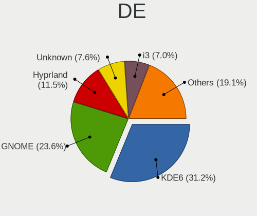
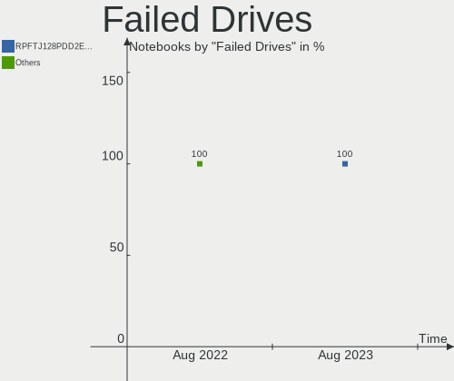
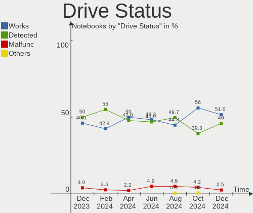
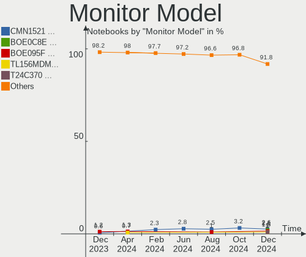
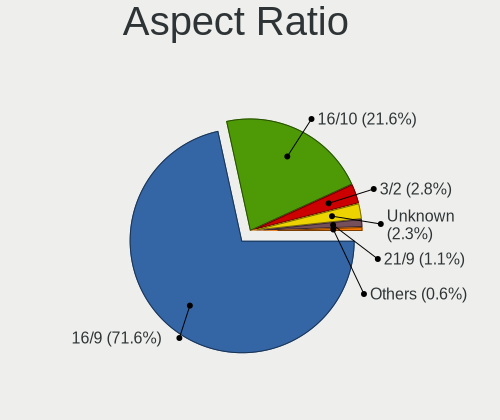
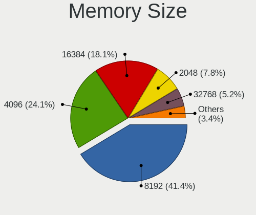
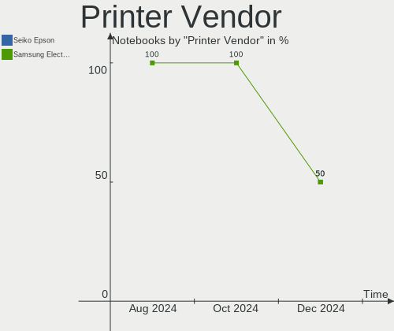

Arch - Hardware Trends (Notebooks)
----------------------------------

A project to identify most popular hardware characteristics and track their change
over time based on data collected by Linux users at https://Linux-Hardware.org.

Anyone can contribute to this report by the [hw-probe](https://github.com/linuxhw/hw-probe) tool:

    sudo -E hw-probe -all -upload

This report is for one last month. Overall report since the beginning of time: [TestCoverage](https://github.com/linuxhw/TestCoverage)

Period: Aug, 2022.

Contents
--------

* [ System ](#system)
  - [ OS                       ](#os)
  - [ OS Family                ](#os-family)
  - [ Kernel                   ](#kernel)
  - [ Kernel Family            ](#kernel-family)
  - [ Kernel Major Ver.        ](#kernel-major-ver)
  - [ Arch                     ](#arch)
  - [ DE                       ](#de)
  - [ Display Server           ](#display-server)
  - [ Display Manager          ](#display-manager)
  - [ OS Lang                  ](#os-lang)
  - [ Boot Mode                ](#boot-mode)
  - [ Filesystem               ](#filesystem)
  - [ Part. scheme             ](#part-scheme)
  - [ Dual Boot with Linux/BSD ](#dual-boot-with-linuxbsd)
  - [ Dual Boot (Win)          ](#dual-boot-win)

* [ Board ](#board)
  - [ Vendor                   ](#vendor)
  - [ Model                    ](#model)
  - [ Model Family             ](#model-family)
  - [ MFG Year                 ](#mfg-year)
  - [ Form Factor              ](#form-factor)
  - [ Secure Boot              ](#secure-boot)
  - [ Coreboot                 ](#coreboot)
  - [ RAM Size                 ](#ram-size)
  - [ RAM Used                 ](#ram-used)
  - [ Total Drives             ](#total-drives)
  - [ Has CD-ROM               ](#has-cd-rom)
  - [ Has Ethernet             ](#has-ethernet)
  - [ Has WiFi                 ](#has-wifi)
  - [ Has Bluetooth            ](#has-bluetooth)

* [ Location ](#location)
  - [ Country                  ](#country)
  - [ City                     ](#city)

* [ Drives ](#drives)
  - [ Drive Vendor             ](#drive-vendor)
  - [ Drive Model              ](#drive-model)
  - [ HDD Vendor               ](#hdd-vendor)
  - [ SSD Vendor               ](#ssd-vendor)
  - [ Drive Kind               ](#drive-kind)
  - [ Drive Connector          ](#drive-connector)
  - [ Drive Size               ](#drive-size)
  - [ Space Total              ](#space-total)
  - [ Space Used               ](#space-used)
  - [ Malfunc. Drives          ](#malfunc-drives)
  - [ Malfunc. Drive Vendor    ](#malfunc-drive-vendor)
  - [ Malfunc. HDD Vendor      ](#malfunc-hdd-vendor)
  - [ Malfunc. Drive Kind      ](#malfunc-drive-kind)
  - [ Failed Drives            ](#failed-drives)
  - [ Failed Drive Vendor      ](#failed-drive-vendor)
  - [ Drive Status             ](#drive-status)

* [ Storage controller ](#storage-controller)
  - [ Storage Vendor           ](#storage-vendor)
  - [ Storage Model            ](#storage-model)
  - [ Storage Kind             ](#storage-kind)

* [ Processor ](#processor)
  - [ CPU Vendor               ](#cpu-vendor)
  - [ CPU Model                ](#cpu-model)
  - [ CPU Model Family         ](#cpu-model-family)
  - [ CPU Cores                ](#cpu-cores)
  - [ CPU Sockets              ](#cpu-sockets)
  - [ CPU Threads              ](#cpu-threads)
  - [ CPU Op-Modes             ](#cpu-op-modes)
  - [ CPU Microcode            ](#cpu-microcode)
  - [ CPU Microarch            ](#cpu-microarch)

* [ Graphics ](#graphics)
  - [ GPU Vendor               ](#gpu-vendor)
  - [ GPU Model                ](#gpu-model)
  - [ GPU Combo                ](#gpu-combo)
  - [ GPU Driver               ](#gpu-driver)
  - [ GPU Memory               ](#gpu-memory)

* [ Monitor ](#monitor)
  - [ Monitor Vendor           ](#monitor-vendor)
  - [ Monitor Model            ](#monitor-model)
  - [ Monitor Resolution       ](#monitor-resolution)
  - [ Monitor Diagonal         ](#monitor-diagonal)
  - [ Monitor Width            ](#monitor-width)
  - [ Aspect Ratio             ](#aspect-ratio)
  - [ Monitor Area             ](#monitor-area)
  - [ Pixel Density            ](#pixel-density)
  - [ Multiple Monitors        ](#multiple-monitors)

* [ Network ](#network)
  - [ Net Controller Vendor    ](#net-controller-vendor)
  - [ Net Controller Model     ](#net-controller-model)
  - [ Wireless Vendor          ](#wireless-vendor)
  - [ Wireless Model           ](#wireless-model)
  - [ Ethernet Vendor          ](#ethernet-vendor)
  - [ Ethernet Model           ](#ethernet-model)
  - [ Net Controller Kind      ](#net-controller-kind)
  - [ Used Controller          ](#used-controller)
  - [ NICs                     ](#nics)
  - [ IPv6                     ](#ipv6)

* [ Bluetooth ](#bluetooth)
  - [ Bluetooth Vendor         ](#bluetooth-vendor)
  - [ Bluetooth Model          ](#bluetooth-model)

* [ Sound ](#sound)
  - [ Sound Vendor             ](#sound-vendor)
  - [ Sound Model              ](#sound-model)

* [ Memory ](#memory)
  - [ Memory Vendor            ](#memory-vendor)
  - [ Memory Model             ](#memory-model)
  - [ Memory Kind              ](#memory-kind)
  - [ Memory Form Factor       ](#memory-form-factor)
  - [ Memory Size              ](#memory-size)
  - [ Memory Speed             ](#memory-speed)

* [ Printers & scanners ](#printers--scanners)
  - [ Printer Vendor           ](#printer-vendor)
  - [ Printer Model            ](#printer-model)
  - [ Scanner Vendor           ](#scanner-vendor)
  - [ Scanner Model            ](#scanner-model)

* [ Camera ](#camera)
  - [ Camera Vendor            ](#camera-vendor)
  - [ Camera Model             ](#camera-model)

* [ Security ](#security)
  - [ Fingerprint Vendor       ](#fingerprint-vendor)
  - [ Fingerprint Model        ](#fingerprint-model)
  - [ Chipcard Vendor          ](#chipcard-vendor)
  - [ Chipcard Model           ](#chipcard-model)

* [ Unsupported ](#unsupported)
  - [ Unsupported Devices      ](#unsupported-devices)
  - [ Unsupported Device Types ](#unsupported-device-types)

System
------

OS
--

Installed operating systems

| Name         | Notebooks | Percent |
|--------------|-----------|---------|
| Arch         | 78        | 68.42%  |
| Arch Rolling | 36        | 31.58%  |

OS Family
---------

OS without a version

| Name | Notebooks | Percent |
|------|-----------|---------|
| Arch | 114       | 100%    |

Kernel
------

Version of the Linux kernel

| Version                     | Notebooks | Percent |
|-----------------------------|-----------|---------|
| 5.18.16-arch1-1             | 22        | 19.3%   |
| 5.19.2-arch1-1              | 12        | 10.53%  |
| 5.19.1-arch2-1              | 11        | 9.65%   |
| 5.18.15-arch1-1             | 6         | 5.26%   |
| 5.19.5-arch1-1              | 5         | 4.39%   |
| 5.19.3-arch1-1              | 5         | 4.39%   |
| 5.18.16-zen1-1-zen          | 5         | 4.39%   |
| 5.19.4-arch1-1              | 4         | 3.51%   |
| 5.19.2-arch1-2              | 4         | 3.51%   |
| 5.19.3-zen1-1-zen           | 3         | 2.63%   |
| 5.18.15-arch1-2             | 3         | 2.63%   |
| 5.18.14-arch1-1             | 3         | 2.63%   |
| 5.15.60-1-lts               | 3         | 2.63%   |
| 5.19.1-zen1-1-zen           | 2         | 1.75%   |
| 5.15.62-1-lts               | 2         | 1.75%   |
| 5.15.59-2-lts               | 2         | 1.75%   |
| 5.15.55-2-lts               | 2         | 1.75%   |
| 5.19.5-zen1-1-zen           | 1         | 0.88%   |
| 5.19.3-arch1-1.1            | 1         | 0.88%   |
| 5.19.2-zen1-1-zen           | 1         | 0.88%   |
| 5.19.2-1-cachyos-lto        | 1         | 0.88%   |
| 5.19.2                      | 1         | 0.88%   |
| 5.19.0-xanmod2-2-native_amd | 1         | 0.88%   |
| 5.19.0-AMD-ThinkPad         | 1         | 0.88%   |
| 5.18.7-arch1-1              | 1         | 0.88%   |
| 5.18.2-arch1-1              | 1         | 0.88%   |
| 5.18.16-xanmod1-1           | 1         | 0.88%   |
| 5.18.15-zen1-2-zen          | 1         | 0.88%   |
| 5.18.15-zen1-1-zen          | 1         | 0.88%   |
| 5.18.14-zen1-1-zen          | 1         | 0.88%   |
| 5.18.12-zen1-1-zen          | 1         | 0.88%   |
| 5.18.12-arch1-g14-1         | 1         | 0.88%   |
| 5.17.9-arch1-1              | 1         | 0.88%   |
| 5.15.63-1-lts               | 1         | 0.88%   |
| 5.15.61-1-lts               | 1         | 0.88%   |
| 5.15.59-1-lts               | 1         | 0.88%   |
| 5.15.58-2-lts               | 1         | 0.88%   |

Kernel Family
-------------

Linux kernel without a distro release

| Version | Notebooks | Percent |
|---------|-----------|---------|
| 5.18.16 | 28        | 24.56%  |
| 5.19.2  | 19        | 16.67%  |
| 5.19.1  | 13        | 11.4%   |
| 5.18.15 | 11        | 9.65%   |
| 5.19.3  | 9         | 7.89%   |
| 5.19.5  | 6         | 5.26%   |
| 5.19.4  | 4         | 3.51%   |
| 5.18.14 | 4         | 3.51%   |
| 5.15.60 | 3         | 2.63%   |
| 5.15.59 | 3         | 2.63%   |
| 5.19.0  | 2         | 1.75%   |
| 5.18.12 | 2         | 1.75%   |
| 5.15.62 | 2         | 1.75%   |
| 5.15.55 | 2         | 1.75%   |
| 5.18.7  | 1         | 0.88%   |
| 5.18.2  | 1         | 0.88%   |
| 5.17.9  | 1         | 0.88%   |
| 5.15.63 | 1         | 0.88%   |
| 5.15.61 | 1         | 0.88%   |
| 5.15.58 | 1         | 0.88%   |

Kernel Major Ver.
-----------------

Linux kernel major version

| Version | Notebooks | Percent |
|---------|-----------|---------|
| 5.19    | 53        | 46.49%  |
| 5.18    | 47        | 41.23%  |
| 5.15    | 13        | 11.4%   |
| 5.17    | 1         | 0.88%   |

Arch
----

OS architecture (x86_64, i586, etc.)

| Name   | Notebooks | Percent |
|--------|-----------|---------|
| x86_64 | 114       | 100%    |

DE
--

Desktop Environment

| Name          | Notebooks | Percent |
|---------------|-----------|---------|
| KDE5          | 37        | 32.46%  |
| GNOME         | 30        | 26.32%  |
| XFCE          | 13        | 11.4%   |
| Unknown       | 13        | 11.4%   |
| i3            | 5         | 4.39%   |
| X-Cinnamon    | 3         | 2.63%   |
| sway          | 2         | 1.75%   |
| LXQt          | 2         | 1.75%   |
| LXDE          | 2         | 1.75%   |
| X-Generic     | 1         | 0.88%   |
| qtile         | 1         | 0.88%   |
| Enlightenment | 1         | 0.88%   |
| dusk          | 1         | 0.88%   |
| Deepin        | 1         | 0.88%   |
| bspwm         | 1         | 0.88%   |
| awesome       | 1         | 0.88%   |

Display Server
--------------

X11 or Wayland

| Name    | Notebooks | Percent |
|---------|-----------|---------|
| X11     | 62        | 54.39%  |
| Wayland | 30        | 26.32%  |
| Tty     | 12        | 10.53%  |
| Unknown | 10        | 8.77%   |

Display Manager
---------------

SDDM, LightDM, etc.

| Name    | Notebooks | Percent |
|---------|-----------|---------|
| Unknown | 46        | 40.35%  |
| SDDM    | 29        | 25.44%  |
| LightDM | 20        | 17.54%  |
| GDM     | 13        | 11.4%   |
| Ly      | 3         | 2.63%   |
| XDM     | 1         | 0.88%   |
| LXDM    | 1         | 0.88%   |
| GREETD  | 1         | 0.88%   |

OS Lang
-------

Language

| Lang       | Notebooks | Percent |
|------------|-----------|---------|
| en_US      | 73        | 64.04%  |
| en_GB      | 6         | 5.26%   |
| C          | 6         | 5.26%   |
| Unknown    | 5         | 4.39%   |
| pt_BR      | 4         | 3.51%   |
| ru_RU      | 3         | 2.63%   |
| es_ES      | 3         | 2.63%   |
| it_IT      | 2         | 1.75%   |
| fr_FR      | 2         | 1.75%   |
| zh_CN      | 1         | 0.88%   |
| es_MX.UTF8 | 1         | 0.88%   |
| es_MX      | 1         | 0.88%   |
| es_CL      | 1         | 0.88%   |
| es_AR      | 1         | 0.88%   |
| en_NZ      | 1         | 0.88%   |
| en_IE      | 1         | 0.88%   |
| en_CA      | 1         | 0.88%   |
| en_150     | 1         | 0.88%   |
| de_DE      | 1         | 0.88%   |

Boot Mode
---------

EFI or BIOS

| Mode | Notebooks | Percent |
|------|-----------|---------|
| EFI  | 71        | 62.28%  |
| BIOS | 43        | 37.72%  |

Filesystem
----------

Type of filesystem

| Type    | Notebooks | Percent |
|---------|-----------|---------|
| Ext4    | 75        | 65.79%  |
| Btrfs   | 32        | 28.07%  |
| Xfs     | 4         | 3.51%   |
| XXXXX   | 1         | 0.88%   |
| F2fs    | 1         | 0.88%   |
| Unknown | 1         | 0.88%   |

Part. scheme
------------

Scheme of partitioning

| Type    | Notebooks | Percent |
|---------|-----------|---------|
| GPT     | 75        | 65.79%  |
| Unknown | 30        | 26.32%  |
| MBR     | 9         | 7.89%   |

Dual Boot with Linux/BSD
------------------------

Hosting more than one Linux/BSD

| Dual boot | Notebooks | Percent |
|-----------|-----------|---------|
| No        | 103       | 90.35%  |
| Yes       | 11        | 9.65%   |

Dual Boot (Win)
---------------

Hosting Linux and Windows

| Dual boot | Notebooks | Percent |
|-----------|-----------|---------|
| No        | 81        | 71.05%  |
| Yes       | 33        | 28.95%  |

Board
-----

Vendor
------

Motherboard manufacturer

| Name             | Notebooks | Percent |
|------------------|-----------|---------|
| Lenovo           | 34        | 29.82%  |
| Hewlett-Packard  | 19        | 16.67%  |
| ASUSTek Computer | 16        | 14.04%  |
| Dell             | 13        | 11.4%   |
| Acer             | 8         | 7.02%   |
| MSI              | 5         | 4.39%   |
| Framework        | 3         | 2.63%   |
| Toshiba          | 2         | 1.75%   |
| MECHREVO         | 2         | 1.75%   |
| HUAWEI           | 2         | 1.75%   |
| TUXEDO           | 1         | 0.88%   |
| TPVAOC           | 1         | 0.88%   |
| SLIMBOOK         | 1         | 0.88%   |
| realme           | 1         | 0.88%   |
| Notebook         | 1         | 0.88%   |
| LG Electronics   | 1         | 0.88%   |
| Fujitsu Siemens  | 1         | 0.88%   |
| BBEN             | 1         | 0.88%   |
| Alienware        | 1         | 0.88%   |
| Acidanthera      | 1         | 0.88%   |

Model
-----

Motherboard model

| Name                                     | Notebooks | Percent |
|------------------------------------------|-----------|---------|
| Lenovo IdeaPad 5 Pro 14ACN6 82L7         | 3         | 2.63%   |
| Framework Laptop                         | 2         | 1.75%   |
| TUXEDO Pulse 15 Gen2                     | 1         | 0.88%   |
| TPVAOC AA183M                            | 1         | 0.88%   |
| Toshiba TECRA S5                         | 1         | 0.88%   |
| Toshiba Satellite P55t-C                 | 1         | 0.88%   |
| SLIMBOOK PROX14-AMD                      | 1         | 0.88%   |
| realme RMNBXXXX                          | 1         | 0.88%   |
| Notebook NH5xAx                          | 1         | 0.88%   |
| MSI Modern 14 B5M                        | 1         | 0.88%   |
| MSI Modern 14 B10MW                      | 1         | 0.88%   |
| MSI GS73VR 6RF                           | 1         | 0.88%   |
| MSI GP66 Leopard 11UH                    | 1         | 0.88%   |
| MSI GL75 Leopard 10SDK                   | 1         | 0.88%   |
| MECHREVO Code01 Ver2.0                   | 1         | 0.88%   |
| MECHREVO Code 01 Series PF5NU1G          | 1         | 0.88%   |
| LG S430-G.BC33P1                         | 1         | 0.88%   |
| Lenovo Y70-70 Touch 80DU                 | 1         | 0.88%   |
| Lenovo ThinkPad X1 Carbon 7th 20R1A009AU | 1         | 0.88%   |
| Lenovo ThinkPad X1 Carbon 5th 20HR002MMX | 1         | 0.88%   |
| Lenovo ThinkPad T61 6457VE6              | 1         | 0.88%   |
| Lenovo ThinkPad T440p 20AWS1C001         | 1         | 0.88%   |
| Lenovo ThinkPad T430 2344BMU             | 1         | 0.88%   |
| Lenovo ThinkPad T420 4180LN1             | 1         | 0.88%   |
| Lenovo ThinkPad T14s Gen 1 20UH001ART    | 1         | 0.88%   |
| Lenovo ThinkPad L15 Gen 2a 20X7CTO1WW    | 1         | 0.88%   |
| Lenovo ThinkPad L14 Gen 1 20U2S5EV00     | 1         | 0.88%   |
| Lenovo ThinkPad Edge E431 62771K6        | 1         | 0.88%   |
| Lenovo ThinkPad E15 Gen 2 20TD004YIV     | 1         | 0.88%   |
| Lenovo ThinkPad E15 Gen 2 20T9S0B500     | 1         | 0.88%   |
| Lenovo ThinkPad E14 20RAS0KX00           | 1         | 0.88%   |
| Lenovo ThinkPad E14 20RA004WUS           | 1         | 0.88%   |
| Lenovo ThinkBook 15 G2 ITL 20VE          | 1         | 0.88%   |
| Lenovo ThinkBook 14s-IWL 20RM            | 1         | 0.88%   |
| Lenovo ThinkBook 13s G3 ACN 20YA         | 1         | 0.88%   |
| Lenovo Slim 7 ProX 14ARH7 82V2           | 1         | 0.88%   |
| Lenovo Legion R70002021 82JW             | 1         | 0.88%   |
| Lenovo Legion 5 15ARH05 82B5             | 1         | 0.88%   |
| Lenovo Legion 5 15ACH6H 82JU             | 1         | 0.88%   |
| Lenovo IdeaPad Y410P 20216               | 1         | 0.88%   |
| Lenovo IdeaPad S145-15IWL 81S9           | 1         | 0.88%   |
| Lenovo IdeaPad Gaming 3 15IMH05 81Y4     | 1         | 0.88%   |
| Lenovo IdeaPad 5-15ARE05 81YQ            | 1         | 0.88%   |
| Lenovo IdeaPad 5 14ARE05 81YM            | 1         | 0.88%   |
| Lenovo IdeaPad 330s-15ARR 81FB           | 1         | 0.88%   |
| Lenovo IdeaPad 320-15IKB 81BT            | 1         | 0.88%   |
| Lenovo IdeaPad 3 15ALC6 82KU             | 1         | 0.88%   |
| Lenovo IdeaPad 110-15ISK 80UD            | 1         | 0.88%   |
| HUAWEI KLVL-WXX9                         | 1         | 0.88%   |
| HUAWEI CREM-WXX9                         | 1         | 0.88%   |
| HP ZBook 15 G6                           | 1         | 0.88%   |
| HP Stream Laptop 14-ds0xxx               | 1         | 0.88%   |
| HP ProBook 640 G5                        | 1         | 0.88%   |
| HP Pavilion Laptop 15-eg0xxx             | 1         | 0.88%   |
| HP Pavilion Gaming Notebook              | 1         | 0.88%   |
| HP Pavilion g4                           | 1         | 0.88%   |
| HP OMEN by Laptop 16-b0xxx               | 1         | 0.88%   |
| HP Laptop 17-cn0xxx                      | 1         | 0.88%   |
| HP Laptop 15s-gr0xxx                     | 1         | 0.88%   |
| HP Laptop 14-fq0xxx                      | 1         | 0.88%   |

Model Family
------------

Motherboard model prefix

| Name                     | Notebooks | Percent |
|--------------------------|-----------|---------|
| Lenovo ThinkPad          | 14        | 12.28%  |
| Lenovo IdeaPad           | 12        | 10.53%  |
| Dell Latitude            | 5         | 4.39%   |
| HP Laptop                | 4         | 3.51%   |
| HP EliteBook             | 4         | 3.51%   |
| Dell XPS                 | 4         | 3.51%   |
| ASUS VivoBook            | 4         | 3.51%   |
| Lenovo ThinkBook         | 3         | 2.63%   |
| Lenovo Legion            | 3         | 2.63%   |
| HP Pavilion              | 3         | 2.63%   |
| HP ENVY                  | 3         | 2.63%   |
| Framework Laptop         | 3         | 2.63%   |
| Acer Aspire              | 3         | 2.63%   |
| MSI Modern               | 2         | 1.75%   |
| Dell Vostro              | 2         | 1.75%   |
| Dell Inspiron            | 2         | 1.75%   |
| ASUS TUF                 | 2         | 1.75%   |
| ASUS ROG                 | 2         | 1.75%   |
| ASUS ASUS                | 2         | 1.75%   |
| Acer Predator            | 2         | 1.75%   |
| TUXEDO Pulse             | 1         | 0.88%   |
| TPVAOC AA183M            | 1         | 0.88%   |
| Toshiba TECRA            | 1         | 0.88%   |
| Toshiba Satellite        | 1         | 0.88%   |
| SLIMBOOK PROX14-AMD      | 1         | 0.88%   |
| realme RMNBXXXX          | 1         | 0.88%   |
| Notebook NH5xAx          | 1         | 0.88%   |
| MSI GS73VR               | 1         | 0.88%   |
| MSI GP66                 | 1         | 0.88%   |
| MSI GL75                 | 1         | 0.88%   |
| MECHREVO Code01          | 1         | 0.88%   |
| MECHREVO Code            | 1         | 0.88%   |
| LG S430-G.BC33P1         | 1         | 0.88%   |
| Lenovo Y70-70            | 1         | 0.88%   |
| Lenovo Slim              | 1         | 0.88%   |
| HUAWEI KLVL-WXX9         | 1         | 0.88%   |
| HUAWEI CREM-WXX9         | 1         | 0.88%   |
| HP ZBook                 | 1         | 0.88%   |
| HP Stream                | 1         | 0.88%   |
| HP ProBook               | 1         | 0.88%   |
| HP OMEN                  | 1         | 0.88%   |
| HP 250                   | 1         | 0.88%   |
| Fujitsu Siemens ESPRIMO  | 1         | 0.88%   |
| BBEN G16                 | 1         | 0.88%   |
| ASUS X751LD              | 1         | 0.88%   |
| ASUS X580VD              | 1         | 0.88%   |
| ASUS X555UB              | 1         | 0.88%   |
| ASUS GL752VW             | 1         | 0.88%   |
| ASUS GL552VX             | 1         | 0.88%   |
| ASUS E202SA              | 1         | 0.88%   |
| Alienware x15            | 1         | 0.88%   |
| Acidanthera MacBookPro13 | 1         | 0.88%   |
| Acer Swift               | 1         | 0.88%   |
| Acer Nitro               | 1         | 0.88%   |
| Acer Celadon-RN          | 1         | 0.88%   |

MFG Year
--------

Motherboard manufacture year

| Year | Notebooks | Percent |
|------|-----------|---------|
| 2021 | 22        | 19.3%   |
| 2020 | 22        | 19.3%   |
| 2019 | 16        | 14.04%  |
| 2022 | 9         | 7.89%   |
| 2018 | 8         | 7.02%   |
| 2016 | 7         | 6.14%   |
| 2017 | 6         | 5.26%   |
| 2015 | 6         | 5.26%   |
| 2013 | 4         | 3.51%   |
| 2014 | 3         | 2.63%   |
| 2012 | 3         | 2.63%   |
| 2011 | 3         | 2.63%   |
| 2010 | 2         | 1.75%   |
| 2007 | 2         | 1.75%   |
| 2009 | 1         | 0.88%   |

Form Factor
-----------

Physical design of the computer

| Name     | Notebooks | Percent |
|----------|-----------|---------|
| Notebook | 114       | 100%    |

Secure Boot
-----------

Enabled or disabled

| State    | Notebooks | Percent |
|----------|-----------|---------|
| Disabled | 111       | 97.37%  |
| Enabled  | 3         | 2.63%   |

Coreboot
--------

Have coreboot on board

| Used | Notebooks | Percent |
|------|-----------|---------|
| No   | 114       | 100%    |

RAM Size
--------

Total RAM memory

| Size in GB  | Notebooks | Percent |
|-------------|-----------|---------|
| 4.01-8.0    | 31        | 27.19%  |
| 8.01-16.0   | 31        | 27.19%  |
| 16.01-24.0  | 29        | 25.44%  |
| 32.01-64.0  | 8         | 7.02%   |
| 3.01-4.0    | 8         | 7.02%   |
| 64.01-256.0 | 3         | 2.63%   |
| 24.01-32.0  | 2         | 1.75%   |
| 2.01-3.0    | 1         | 0.88%   |
| 1.01-2.0    | 1         | 0.88%   |

RAM Used
--------

Used RAM memory

| Used GB    | Notebooks | Percent |
|------------|-----------|---------|
| 4.01-8.0   | 31        | 27.19%  |
| 1.01-2.0   | 28        | 24.56%  |
| 2.01-3.0   | 26        | 22.81%  |
| 3.01-4.0   | 17        | 14.91%  |
| 8.01-16.0  | 6         | 5.26%   |
| 0.51-1.0   | 4         | 3.51%   |
| 24.01-32.0 | 1         | 0.88%   |
| 16.01-24.0 | 1         | 0.88%   |

Total Drives
------------

Number of drives on board

| Drives | Notebooks | Percent |
|--------|-----------|---------|
| 1      | 72        | 63.16%  |
| 2      | 37        | 32.46%  |
| 3      | 5         | 4.39%   |

Has CD-ROM
----------

Has CD-ROM on board

| Presented | Notebooks | Percent |
|-----------|-----------|---------|
| No        | 93        | 81.58%  |
| Yes       | 21        | 18.42%  |

Has Ethernet
------------

Has Ethernet on board

| Presented | Notebooks | Percent |
|-----------|-----------|---------|
| Yes       | 78        | 68.42%  |
| No        | 36        | 31.58%  |

Has WiFi
--------

Has WiFi module

| Presented | Notebooks | Percent |
|-----------|-----------|---------|
| Yes       | 114       | 100%    |

Has Bluetooth
-------------

Has Bluetooth module

| Presented | Notebooks | Percent |
|-----------|-----------|---------|
| Yes       | 108       | 94.74%  |
| No        | 6         | 5.26%   |

Location
--------

Country
-------

Geographic location (country)

| Country         | Notebooks | Percent |
|-----------------|-----------|---------|
| USA             | 28        | 24.56%  |
| Russia          | 8         | 7.02%   |
| India           | 5         | 4.39%   |
| Brazil          | 5         | 4.39%   |
| Vietnam         | 4         | 3.51%   |
| UK              | 4         | 3.51%   |
| Spain           | 4         | 3.51%   |
| Italy           | 4         | 3.51%   |
| France          | 4         | 3.51%   |
| Romania         | 3         | 2.63%   |
| China           | 3         | 2.63%   |
| Austria         | 3         | 2.63%   |
| Argentina       | 3         | 2.63%   |
| Saudi Arabia    | 2         | 1.75%   |
| Philippines     | 2         | 1.75%   |
| Mexico          | 2         | 1.75%   |
| Israel          | 2         | 1.75%   |
| Iran            | 2         | 1.75%   |
| Germany         | 2         | 1.75%   |
| Czechia         | 2         | 1.75%   |
| Canada          | 2         | 1.75%   |
| Bulgaria        | 2         | 1.75%   |
| Bangladesh      | 2         | 1.75%   |
| Turkey          | 1         | 0.88%   |
| Taiwan          | 1         | 0.88%   |
| Switzerland     | 1         | 0.88%   |
| Slovakia        | 1         | 0.88%   |
| Puerto Rico     | 1         | 0.88%   |
| Portugal        | 1         | 0.88%   |
| North Macedonia | 1         | 0.88%   |
| New Zealand     | 1         | 0.88%   |
| Moldova         | 1         | 0.88%   |
| Kenya           | 1         | 0.88%   |
| Ireland         | 1         | 0.88%   |
| Denmark         | 1         | 0.88%   |
| Chile           | 1         | 0.88%   |
| Belgium         | 1         | 0.88%   |
| Australia       | 1         | 0.88%   |
| Armenia         | 1         | 0.88%   |

City
----

Geographic location (city)

| City                  | Notebooks | Percent |
|-----------------------|-----------|---------|
| Moscow                | 3         | 2.63%   |
| Bucharest             | 3         | 2.63%   |
| Bengaluru             | 3         | 2.63%   |
| Vienna                | 2         | 1.75%   |
| Shanghai              | 2         | 1.75%   |
| Jeddah                | 2         | 1.75%   |
| Dhaka                 | 2         | 1.75%   |
| Culver City           | 2         | 1.75%   |
| Buenos Aires          | 2         | 1.75%   |
| Zurich                | 1         | 0.88%   |
| Zapopan               | 1         | 0.88%   |
| Yerevan               | 1         | 0.88%   |
| Yakutsk               | 1         | 0.88%   |
| West Palm Beach       | 1         | 0.88%   |
| Viña del Mar         | 1         | 0.88%   |
| Varna                 | 1         | 0.88%   |
| Valencia              | 1         | 0.88%   |
| Uccle                 | 1         | 0.88%   |
| Uberlândia           | 1         | 0.88%   |
| Tulsa                 | 1         | 0.88%   |
| Tel Aviv              | 1         | 0.88%   |
| Tehran                | 1         | 0.88%   |
| Taiyuan               | 1         | 0.88%   |
| Taipei                | 1         | 0.88%   |
| Sydney                | 1         | 0.88%   |
| St Petersburg         | 1         | 0.88%   |
| Sofia                 | 1         | 0.88%   |
| Shtip                 | 1         | 0.88%   |
| Semily                | 1         | 0.88%   |
| Santiago da Guarda    | 1         | 0.88%   |
| Santa Clara           | 1         | 0.88%   |
| San Pablo City        | 1         | 0.88%   |
| San Luis Potosí City | 1         | 0.88%   |
| San Juan              | 1         | 0.88%   |
| Roseville             | 1         | 0.88%   |
| Rome                  | 1         | 0.88%   |
| Rochester             | 1         | 0.88%   |
| Ribeirao Preto        | 1         | 0.88%   |
| Pontevedra            | 1         | 0.88%   |
| Phoenix               | 1         | 0.88%   |
| Philadelphia          | 1         | 0.88%   |
| Padova                | 1         | 0.88%   |
| Ottawa                | 1         | 0.88%   |
| Ocala                 | 1         | 0.88%   |
| Novosibirsk           | 1         | 0.88%   |
| Novara                | 1         | 0.88%   |
| New Delhi             | 1         | 0.88%   |
| Nairobi               | 1         | 0.88%   |
| Nahariya              | 1         | 0.88%   |
| Myrtle Beach          | 1         | 0.88%   |
| Montreuil             | 1         | 0.88%   |
| Mission               | 1         | 0.88%   |
| Milan                 | 1         | 0.88%   |
| Michigan City         | 1         | 0.88%   |
| Mar del Plata         | 1         | 0.88%   |
| Madrid                | 1         | 0.88%   |
| Ludhiana              | 1         | 0.88%   |
| Los Angeles           | 1         | 0.88%   |
| Lewisham              | 1         | 0.88%   |
| Laval                 | 1         | 0.88%   |

Drives
------

Drive Vendor
------------

Hard drive vendors

| Vendor                      | Notebooks | Drives | Percent |
|-----------------------------|-----------|--------|---------|
| Samsung Electronics         | 37        | 41     | 24.5%   |
| Sandisk                     | 17        | 18     | 11.26%  |
| WDC                         | 12        | 13     | 7.95%   |
| SK hynix                    | 11        | 11     | 7.28%   |
| Seagate                     | 11        | 11     | 7.28%   |
| Kingston                    | 7         | 7      | 4.64%   |
| Crucial                     | 7         | 9      | 4.64%   |
| Unknown                     | 5         | 5      | 3.31%   |
| Toshiba                     | 5         | 6      | 3.31%   |
| Intel                       | 5         | 6      | 3.31%   |
| Micron Technology           | 4         | 4      | 2.65%   |
| Kingston Technology Company | 4         | 4      | 2.65%   |
| HGST                        | 4         | 4      | 2.65%   |
| Hitachi                     | 3         | 3      | 1.99%   |
| LITEON                      | 2         | 2      | 1.32%   |
| ZHITAI                      | 1         | 1      | 0.66%   |
| XPG                         | 1         | 1      | 0.66%   |
| Transcend                   | 1         | 1      | 0.66%   |
| PUSKILL                     | 1         | 1      | 0.66%   |
| PNY                         | 1         | 1      | 0.66%   |
| Phison Electronics          | 1         | 1      | 0.66%   |
| Phison                      | 1         | 2      | 0.66%   |
| Netac                       | 1         | 1      | 0.66%   |
| Maxone                      | 1         | 1      | 0.66%   |
| Lenovo                      | 1         | 1      | 0.66%   |
| JMicron Technology          | 1         | 1      | 0.66%   |
| HIKSEMI                     | 1         | 1      | 0.66%   |
| Gigabyte Technology         | 1         | 1      | 0.66%   |
| China                       | 1         | 1      | 0.66%   |
| BHT                         | 1         | 1      | 0.66%   |
| ADATA Technology            | 1         | 1      | 0.66%   |
| Unknown                     | 1         | 1      | 0.66%   |

Drive Model
-----------

Hard drive models

| Model                                              | Notebooks | Percent |
|----------------------------------------------------|-----------|---------|
| Samsung NVMe SSD Controller SM981/PM981/PM983 1TB  | 9         | 5.63%   |
| Samsung NVMe SSD Drive 512GB                       | 7         | 4.38%   |
| Sandisk WD Blue SN550 NVMe SSD 256GB               | 5         | 3.13%   |
| Seagate ST1000LM035-1RK172 1TB                     | 4         | 2.5%    |
| Samsung NVMe SSD Controller PM9A1/PM9A3/980PRO 1TB | 3         | 1.88%   |
| Samsung MZALQ512HALU-000L2 512GB                   | 3         | 1.88%   |
| Kingston Company OM3PDP3 NVMe SSD 128GB            | 3         | 1.88%   |
| Crucial CT1000MX500SSD1 1TB                        | 3         | 1.88%   |
| Unknown MMC Card  256GB                            | 2         | 1.25%   |
| SK hynix PC401 NVMe Solid State Drive 256GB        | 2         | 1.25%   |
| SK hynix BC501 NVMe Solid State Drive 512GB        | 2         | 1.25%   |
| Seagate ST1000LM024 HN-M101MBB 1TB                 | 2         | 1.25%   |
| Sandisk WD Black SN750 / PC SN730 NVMe SSD 512GB   | 2         | 1.25%   |
| SanDisk NVMe SSD Drive 256GB                       | 2         | 1.25%   |
| Samsung SSD 850 EVO 250GB                          | 2         | 1.25%   |
| Kingston SA400S37480G 480GB SSD                    | 2         | 1.25%   |
| Kingston SA400S37120G 120GB SSD                    | 2         | 1.25%   |
| HGST HTS721010A9E630 1TB                           | 2         | 1.25%   |
| Crucial CT240BX500SSD1 240GB                       | 2         | 1.25%   |
| ZHITAI SC001 Active 256GB SSD                      | 1         | 0.63%   |
| XPG NVMe SSD Drive 1024GB                          | 1         | 0.63%   |
| WDC WDS500G2B0B-00YS70 500GB SSD                   | 1         | 0.63%   |
| WDC WDS500G2B0A-00SM50 500GB SSD                   | 1         | 0.63%   |
| WDC WDS500G1B0B-00AS40 500GB SSD                   | 1         | 0.63%   |
| WDC WDS120G2G0B-00EPW0 120GB SSD                   | 1         | 0.63%   |
| WDC WDS100T2B0A-00SM50 1TB SSD                     | 1         | 0.63%   |
| WDC WD5000LPVX-75V0TT0 500GB                       | 1         | 0.63%   |
| WDC WD1200BEVT-75ZCT2 120GB                        | 1         | 0.63%   |
| WDC WD10SPZX-60Z10T1 1TB                           | 1         | 0.63%   |
| WDC WD10SPZX-60Z10T0 1TB                           | 1         | 0.63%   |
| WDC WD10SPZX-24Z10 1TB                             | 1         | 0.63%   |
| WDC WD10SPSX-08A6W 1TB                             | 1         | 0.63%   |
| WDC WD10JPVX-60JC3T0 1TB                           | 1         | 0.63%   |
| WDC PC SN730 SDBQNTY-512G-1001 512GB               | 1         | 0.63%   |
| Unknown SD/MMC/MS PRO 128GB                        | 1         | 0.63%   |
| Unknown SD  4GB                                    | 1         | 0.63%   |
| Unknown MMC Card  64GB                             | 1         | 0.63%   |
| Transcend TS128GMTS800 128GB SSD                   | 1         | 0.63%   |
| Toshiba XG6 NVMe SSD Controller 1TB                | 1         | 0.63%   |
| Toshiba NVMe Controller 256GB                      | 1         | 0.63%   |
| Toshiba MQ04ABF100 1TB                             | 1         | 0.63%   |
| Toshiba MQ01ABF050 500GB                           | 1         | 0.63%   |
| Toshiba MQ01ABD100 1TB                             | 1         | 0.63%   |
| Toshiba KBG30ZMS128G 128GB NVMe SSD                | 1         | 0.63%   |
| SK hynix SKHynix_HFS512GDE9X084N 512GB             | 1         | 0.63%   |
| SK hynix SHGP31-2000GM 2TB                         | 1         | 0.63%   |
| SK hynix SC311 SATA 128GB SSD                      | 1         | 0.63%   |
| SK hynix NVMe SSD Drive 256GB                      | 1         | 0.63%   |
| SK hynix HFS256G39TND-N210A 256GB SSD              | 1         | 0.63%   |
| SK hynix HFM001TD3JX013N 1TB                       | 1         | 0.63%   |
| SK hynix BC711 HFM512GD3JX013N 512GB               | 1         | 0.63%   |
| Seagate ST9320325AS 320GB                          | 1         | 0.63%   |
| Seagate ST9160310AS 160GB                          | 1         | 0.63%   |
| Seagate ST2000LM015-2E8174 2TB                     | 1         | 0.63%   |
| Seagate ST2000LM007-1R8174 2TB                     | 1         | 0.63%   |
| Seagate ST1000LM048-2E7172 1TB                     | 1         | 0.63%   |
| Sandisk WDC PC SN530 SDBPMPZ-512G-1101 512GB       | 1         | 0.63%   |
| Sandisk WDC PC SN530 SDBPMPZ-256G-1001 256GB       | 1         | 0.63%   |
| Sandisk WD PC SN735 SDBPNHH-1T00-1002 1TB          | 1         | 0.63%   |
| Sandisk WD Green SN350 1TB                         | 1         | 0.63%   |

HDD Vendor
----------

Hard disk drive vendors

| Vendor  | Notebooks | Drives | Percent |
|---------|-----------|--------|---------|
| Seagate | 11        | 11     | 36.67%  |
| WDC     | 7         | 7      | 23.33%  |
| HGST    | 4         | 4      | 13.33%  |
| Toshiba | 3         | 3      | 10%     |
| Hitachi | 3         | 3      | 10%     |
| Unknown | 1         | 1      | 3.33%   |
| Maxone  | 1         | 1      | 3.33%   |

SSD Vendor
----------

Solid state drive vendors

| Vendor              | Notebooks | Drives | Percent |
|---------------------|-----------|--------|---------|
| Samsung Electronics | 9         | 9      | 20.45%  |
| Crucial             | 7         | 8      | 15.91%  |
| Kingston            | 6         | 6      | 13.64%  |
| WDC                 | 5         | 5      | 11.36%  |
| SK hynix            | 2         | 2      | 4.55%   |
| SanDisk             | 2         | 2      | 4.55%   |
| Micron Technology   | 2         | 2      | 4.55%   |
| LITEON              | 2         | 2      | 4.55%   |
| ZHITAI              | 1         | 1      | 2.27%   |
| Transcend           | 1         | 1      | 2.27%   |
| PUSKILL             | 1         | 1      | 2.27%   |
| PNY                 | 1         | 1      | 2.27%   |
| JMicron Technology  | 1         | 1      | 2.27%   |
| Intel               | 1         | 1      | 2.27%   |
| Gigabyte Technology | 1         | 1      | 2.27%   |
| China               | 1         | 1      | 2.27%   |
| BHT                 | 1         | 1      | 2.27%   |

Drive Kind
----------

HDD or SSD

| Kind    | Notebooks | Drives | Percent |
|---------|-----------|--------|---------|
| NVMe    | 72        | 82     | 50%     |
| SSD     | 38        | 45     | 26.39%  |
| HDD     | 29        | 30     | 20.14%  |
| MMC     | 4         | 4      | 2.78%   |
| Unknown | 1         | 1      | 0.69%   |

Drive Connector
---------------

SATA, SAS, NVMe, etc.

| Type | Notebooks | Drives | Percent |
|------|-----------|--------|---------|
| NVMe | 72        | 81     | 51.8%   |
| SATA | 59        | 72     | 42.45%  |
| SAS  | 4         | 5      | 2.88%   |
| MMC  | 4         | 4      | 2.88%   |

Drive Size
----------

Size of hard drive

| Size in TB | Notebooks | Drives | Percent |
|------------|-----------|--------|---------|
| 0.01-0.5   | 37        | 47     | 56.92%  |
| 0.51-1.0   | 26        | 26     | 40%     |
| 1.01-2.0   | 2         | 2      | 3.08%   |

Space Total
-----------

Amount of disk space available on the file system

| Size in GB     | Notebooks | Percent |
|----------------|-----------|---------|
| 251-500        | 35        | 30.7%   |
| 101-250        | 24        | 21.05%  |
| 501-1000       | 21        | 18.42%  |
| 1001-2000      | 19        | 16.67%  |
| More than 3000 | 5         | 4.39%   |
| 51-100         | 5         | 4.39%   |
| 2001-3000      | 4         | 3.51%   |
| 21-50          | 1         | 0.88%   |

Space Used
----------

Amount of used disk space

| Used GB   | Notebooks | Percent |
|-----------|-----------|---------|
| 1-20      | 30        | 26.32%  |
| 101-250   | 26        | 22.81%  |
| 51-100    | 18        | 15.79%  |
| 21-50     | 14        | 12.28%  |
| 251-500   | 12        | 10.53%  |
| 501-1000  | 10        | 8.77%   |
| 1001-2000 | 3         | 2.63%   |
| 2001-3000 | 1         | 0.88%   |

Malfunc. Drives
---------------

Drive models with a malfunction

| Model                                            | Notebooks | Drives | Percent |
|--------------------------------------------------|-----------|--------|---------|
| SK hynix HFS256G39TND-N210A 256GB SSD            | 1         | 1      | 11.11%  |
| Seagate ST2000LM007-1R8174 2TB                   | 1         | 1      | 11.11%  |
| Seagate ST1000LM024 HN-M101MBB 1TB               | 1         | 1      | 11.11%  |
| Samsung Electronics MZNLH128HBHQ-000H1 128GB SSD | 1         | 1      | 11.11%  |
| Intel SSDSC2BF240A5L 240GB                       | 1         | 1      | 11.11%  |
| Hitachi HTS543232L9A300 320GB                    | 1         | 1      | 11.11%  |
| Hitachi HCC543232A7A380 320GB                    | 1         | 1      | 11.11%  |
| HGST HTS721010A9E630 1TB                         | 1         | 1      | 11.11%  |
| HGST HTS545050A7E680 500GB                       | 1         | 1      | 11.11%  |

Malfunc. Drive Vendor
---------------------

Vendors of faulty drives

| Vendor              | Notebooks | Drives | Percent |
|---------------------|-----------|--------|---------|
| Seagate             | 2         | 2      | 22.22%  |
| Hitachi             | 2         | 2      | 22.22%  |
| HGST                | 2         | 2      | 22.22%  |
| SK hynix            | 1         | 1      | 11.11%  |
| Samsung Electronics | 1         | 1      | 11.11%  |
| Intel               | 1         | 1      | 11.11%  |

Malfunc. HDD Vendor
-------------------

Vendors of faulty HDD drives

| Vendor  | Notebooks | Drives | Percent |
|---------|-----------|--------|---------|
| Seagate | 2         | 2      | 33.33%  |
| Hitachi | 2         | 2      | 33.33%  |
| HGST    | 2         | 2      | 33.33%  |

Malfunc. Drive Kind
-------------------

Kinds of faulty drives

| Kind | Notebooks | Drives | Percent |
|------|-----------|--------|---------|
| HDD  | 6         | 6      | 66.67%  |
| SSD  | 3         | 3      | 33.33%  |

Failed Drives
-------------

Failed drive models

| Model                          | Notebooks | Drives | Percent |
|--------------------------------|-----------|--------|---------|
| Phison ESO128GTLC9-E8C-2 128GB | 1         | 1      | 100%    |

Failed Drive Vendor
-------------------

Failed drive vendors

| Vendor | Notebooks | Drives | Percent |
|--------|-----------|--------|---------|
| Phison | 1         | 1      | 100%    |

Drive Status
------------

Number of failed and malfunc. drives

| Status   | Notebooks | Drives | Percent |
|----------|-----------|--------|---------|
| Works    | 57        | 77     | 46.34%  |
| Detected | 56        | 75     | 45.53%  |
| Malfunc  | 9         | 9      | 7.32%   |
| Failed   | 1         | 1      | 0.81%   |

Storage controller
------------------

Storage Vendor
--------------

Storage controller vendors

| Vendor                       | Notebooks | Percent |
|------------------------------|-----------|---------|
| Intel                        | 63        | 40.91%  |
| Samsung Electronics          | 29        | 18.83%  |
| AMD                          | 21        | 13.64%  |
| SanDisk                      | 16        | 10.39%  |
| SK hynix                     | 9         | 5.84%   |
| Kingston Technology Company  | 5         | 3.25%   |
| Toshiba America Info Systems | 2         | 1.3%    |
| Phison Electronics           | 2         | 1.3%    |
| Micron Technology            | 2         | 1.3%    |
| ADATA Technology             | 2         | 1.3%    |
| Silicon Motion               | 1         | 0.65%   |
| Micron/Crucial Technology    | 1         | 0.65%   |
| Lenovo                       | 1         | 0.65%   |

Storage Model
-------------

Storage controller models

| Model                                                                                  | Notebooks | Percent |
|----------------------------------------------------------------------------------------|-----------|---------|
| AMD FCH SATA Controller [AHCI mode]                                                    | 20        | 12.05%  |
| Samsung NVMe SSD Controller SM981/PM981/PM983                                          | 14        | 8.43%   |
| Samsung NVMe SSD Controller 980                                                        | 11        | 6.63%   |
| Intel Sunrise Point-LP SATA Controller [AHCI mode]                                     | 9         | 5.42%   |
| SanDisk WD Blue SN550 NVMe SSD                                                         | 8         | 4.82%   |
| Intel HM170/QM170 Chipset SATA Controller [AHCI Mode]                                  | 8         | 4.82%   |
| Intel Volume Management Device NVMe RAID Controller                                    | 6         | 3.61%   |
| Intel 82801 Mobile SATA Controller [RAID mode]                                         | 5         | 3.01%   |
| SK hynix Gold P31 SSD                                                                  | 4         | 2.41%   |
| SanDisk Non-Volatile memory controller                                                 | 4         | 2.41%   |
| Samsung NVMe SSD Controller PM9A1/PM9A3/980PRO                                         | 4         | 2.41%   |
| Kingston Company OM3PDP3 NVMe SSD                                                      | 4         | 2.41%   |
| Intel Cannon Lake Mobile PCH SATA AHCI Controller                                      | 4         | 2.41%   |
| Intel 8 Series/C220 Series Chipset Family 6-port SATA Controller 1 [AHCI mode]         | 4         | 2.41%   |
| Intel 7 Series Chipset Family 6-port SATA Controller [AHCI mode]                       | 4         | 2.41%   |
| SanDisk WD Black SN750 / PC SN730 NVMe SSD                                             | 3         | 1.81%   |
| Intel Wildcat Point-LP SATA Controller [AHCI Mode]                                     | 3         | 1.81%   |
| Intel Tiger Lake-LP SATA Controller                                                    | 3         | 1.81%   |
| Intel SSD 660P Series                                                                  | 3         | 1.81%   |
| Intel Cannon Point-LP SATA Controller [AHCI Mode]                                      | 3         | 1.81%   |
| Intel 400 Series Chipset Family SATA AHCI Controller                                   | 3         | 1.81%   |
| SK hynix PC401 NVMe Solid State Drive 256GB                                            | 2         | 1.2%    |
| SK hynix BC501 NVMe Solid State Drive                                                  | 2         | 1.2%    |
| Micron Non-Volatile memory controller                                                  | 2         | 1.2%    |
| Intel Comet Lake SATA AHCI Controller                                                  | 2         | 1.2%    |
| Intel 82801HM/HEM (ICH8M/ICH8M-E) SATA Controller [AHCI mode]                          | 2         | 1.2%    |
| Intel 82801HM/HEM (ICH8M/ICH8M-E) IDE Controller                                       | 2         | 1.2%    |
| Intel 8 Series SATA Controller 1 [AHCI mode]                                           | 2         | 1.2%    |
| Toshiba America Info Systems XG6 NVMe SSD Controller                                   | 1         | 0.6%    |
| Toshiba America Info Systems NVMe Controller                                           | 1         | 0.6%    |
| SK hynix BC511                                                                         | 1         | 0.6%    |
| Silicon Motion SM2263EN/SM2263XT SSD Controller                                        | 1         | 0.6%    |
| SanDisk WD PC SN810 / Black SN850 NVMe SSD                                             | 1         | 0.6%    |
| SanDisk WD Blue SN500 / PC SN520 NVMe SSD                                              | 1         | 0.6%    |
| Phison E18 PCIe4 NVMe Controller                                                       | 1         | 0.6%    |
| Phison E12 NVMe Controller                                                             | 1         | 0.6%    |
| Micron/Crucial Non-Volatile memory controller                                          | 1         | 0.6%    |
| Lenovo Non-Volatile memory controller                                                  | 1         | 0.6%    |
| Kingston Company U-SNS8154P3 NVMe SSD                                                  | 1         | 0.6%    |
| Intel Non-Volatile memory controller                                                   | 1         | 0.6%    |
| Intel Celeron/Pentium Silver Processor SATA Controller                                 | 1         | 0.6%    |
| Intel Atom/Celeron/Pentium Processor x5-E8000/J3xxx/N3xxx Series SATA Controller       | 1         | 0.6%    |
| Intel Atom Processor E3800 Series SATA AHCI Controller                                 | 1         | 0.6%    |
| Intel 82801IBM/IEM (ICH9M/ICH9M-E) 4 port SATA Controller [AHCI mode]                  | 1         | 0.6%    |
| Intel 6 Series/C200 Series Chipset Family Mobile SATA Controller (IDE mode, ports 4-5) | 1         | 0.6%    |
| Intel 6 Series/C200 Series Chipset Family Mobile SATA Controller (IDE mode, ports 0-3) | 1         | 0.6%    |
| Intel 6 Series/C200 Series Chipset Family 6 port Mobile SATA AHCI Controller           | 1         | 0.6%    |
| Intel 5 Series/3400 Series Chipset 4 port SATA AHCI Controller                         | 1         | 0.6%    |
| AMD SB7x0/SB8x0/SB9x0 SATA Controller [IDE mode]                                       | 1         | 0.6%    |
| AMD SB7x0/SB8x0/SB9x0 IDE Controller                                                   | 1         | 0.6%    |
| AMD 400 Series Chipset SATA Controller                                                 | 1         | 0.6%    |
| ADATA XPG SX8200 Pro PCIe Gen3x4 M.2 2280 Solid State Drive                            | 1         | 0.6%    |
| ADATA Non-Volatile memory controller                                                   | 1         | 0.6%    |

Storage Kind
------------

Kind of storage controller (IDE, SATA, NVMe, SAS, ...)

| Kind | Notebooks | Percent |
|------|-----------|---------|
| SATA | 74        | 45.96%  |
| NVMe | 72        | 44.72%  |
| RAID | 11        | 6.83%   |
| IDE  | 4         | 2.48%   |

Processor
---------

CPU Vendor
----------

Processor vendors

| Vendor | Notebooks | Percent |
|--------|-----------|---------|
| Intel  | 76        | 66.67%  |
| AMD    | 38        | 33.33%  |

CPU Model
---------

Processor models

| Model                                      | Notebooks | Percent |
|--------------------------------------------|-----------|---------|
| Intel 11th Gen Core i5-1135G7 @ 2.40GHz    | 7         | 6.14%   |
| Intel Core i7-6700HQ CPU @ 2.60GHz         | 4         | 3.51%   |
| Intel Core i5-10210U CPU @ 1.60GHz         | 4         | 3.51%   |
| Intel Core i7-8565U CPU @ 1.80GHz          | 3         | 2.63%   |
| Intel Core i7-7700HQ CPU @ 2.80GHz         | 3         | 2.63%   |
| Intel Core i7-10750H CPU @ 2.60GHz         | 3         | 2.63%   |
| AMD Ryzen 7 5800U with Radeon Graphics     | 3         | 2.63%   |
| AMD Ryzen 7 5800H with Radeon Graphics     | 3         | 2.63%   |
| AMD Ryzen 5 5500U with Radeon Graphics     | 3         | 2.63%   |
| AMD Ryzen 5 4600H with Radeon Graphics     | 3         | 2.63%   |
| Intel Core i7-9750H CPU @ 2.60GHz          | 2         | 1.75%   |
| Intel Core i7-8750H CPU @ 2.20GHz          | 2         | 1.75%   |
| Intel Core i5-8365U CPU @ 1.60GHz          | 2         | 1.75%   |
| Intel Core i5-8265U CPU @ 1.60GHz          | 2         | 1.75%   |
| Intel Core i5-6200U CPU @ 2.30GHz          | 2         | 1.75%   |
| Intel Core i3-3110M CPU @ 2.40GHz          | 2         | 1.75%   |
| Intel 11th Gen Core i7-11800H @ 2.30GHz    | 2         | 1.75%   |
| Intel 11th Gen Core i7-1165G7 @ 2.80GHz    | 2         | 1.75%   |
| AMD Ryzen 7 5700U with Radeon Graphics     | 2         | 1.75%   |
| AMD Ryzen 7 4800H with Radeon Graphics     | 2         | 1.75%   |
| AMD Ryzen 7 4700U with Radeon Graphics     | 2         | 1.75%   |
| Intel Pentium Silver N5030 CPU @ 1.10GHz   | 1         | 0.88%   |
| Intel Core M-5Y10c CPU @ 0.80GHz           | 1         | 0.88%   |
| Intel Core i7-8650U CPU @ 1.90GHz          | 1         | 0.88%   |
| Intel Core i7-8550U CPU @ 1.80GHz          | 1         | 0.88%   |
| Intel Core i7-7560U CPU @ 2.40GHz          | 1         | 0.88%   |
| Intel Core i7-7500U CPU @ 2.70GHz          | 1         | 0.88%   |
| Intel Core i7-5500U CPU @ 2.40GHz          | 1         | 0.88%   |
| Intel Core i7-4712MQ CPU @ 2.30GHz         | 1         | 0.88%   |
| Intel Core i7-4710HQ CPU @ 2.50GHz         | 1         | 0.88%   |
| Intel Core i7-4702MQ CPU @ 2.20GHz         | 1         | 0.88%   |
| Intel Core i7-4700MQ CPU @ 2.40GHz         | 1         | 0.88%   |
| Intel Core i5-8350U CPU @ 1.70GHz          | 1         | 0.88%   |
| Intel Core i5-8250U CPU @ 1.60GHz          | 1         | 0.88%   |
| Intel Core i5-7300HQ CPU @ 2.50GHz         | 1         | 0.88%   |
| Intel Core i5-6300U CPU @ 2.40GHz          | 1         | 0.88%   |
| Intel Core i5-5200U CPU @ 2.20GHz          | 1         | 0.88%   |
| Intel Core i5-4300U CPU @ 1.90GHz          | 1         | 0.88%   |
| Intel Core i5-4210U CPU @ 1.70GHz          | 1         | 0.88%   |
| Intel Core i5-3427U CPU @ 1.80GHz          | 1         | 0.88%   |
| Intel Core i5-3320M CPU @ 2.60GHz          | 1         | 0.88%   |
| Intel Core i5-3210M CPU @ 2.50GHz          | 1         | 0.88%   |
| Intel Core i5-2520M CPU @ 2.50GHz          | 1         | 0.88%   |
| Intel Core i3-7100U CPU @ 2.40GHz          | 1         | 0.88%   |
| Intel Core i3-6100U CPU @ 2.30GHz          | 1         | 0.88%   |
| Intel Core i3-6006U CPU @ 2.00GHz          | 1         | 0.88%   |
| Intel Core i3-2330M CPU @ 2.20GHz          | 1         | 0.88%   |
| Intel Core i3-10110U CPU @ 2.10GHz         | 1         | 0.88%   |
| Intel Core i3 CPU M 370 @ 2.40GHz          | 1         | 0.88%   |
| Intel Core 2 Duo CPU T8300 @ 2.40GHz       | 1         | 0.88%   |
| Intel Core 2 Duo CPU T7700 @ 2.40GHz       | 1         | 0.88%   |
| Intel Core 2 Duo CPU T5870 @ 2.00GHz       | 1         | 0.88%   |
| Intel Celeron CPU N3060 @ 1.60GHz          | 1         | 0.88%   |
| Intel Celeron CPU N2840 @ 2.16GHz          | 1         | 0.88%   |
| Intel 12th Gen Core i7-1260P               | 1         | 0.88%   |
| Intel 11th Gen Core i9-11900H @ 2.50GHz    | 1         | 0.88%   |
| Intel 11th Gen Core i7-11370H @ 3.30GHz    | 1         | 0.88%   |
| AMD Turion Neo X2 Dual Core Processor L625 | 1         | 0.88%   |
| AMD Ryzen 9 6900HS with Radeon Graphics    | 1         | 0.88%   |
| AMD Ryzen 9 5900HS with Radeon Graphics    | 1         | 0.88%   |

CPU Model Family
----------------

Processor model prefix

| Model                | Notebooks | Percent |
|----------------------|-----------|---------|
| Intel Core i7        | 26        | 22.81%  |
| Intel Core i5        | 21        | 18.42%  |
| AMD Ryzen 7          | 16        | 14.04%  |
| Other                | 14        | 12.28%  |
| AMD Ryzen 5          | 12        | 10.53%  |
| Intel Core i3        | 8         | 7.02%   |
| Intel Core 2 Duo     | 3         | 2.63%   |
| AMD Ryzen 9          | 3         | 2.63%   |
| AMD Ryzen 7 PRO      | 3         | 2.63%   |
| Intel Celeron        | 2         | 1.75%   |
| Intel Pentium Silver | 1         | 0.88%   |
| Intel Core M         | 1         | 0.88%   |
| AMD Turion Neo X2    | 1         | 0.88%   |
| AMD Ryzen 3          | 1         | 0.88%   |
| AMD Athlon           | 1         | 0.88%   |
| AMD A4               | 1         | 0.88%   |

CPU Cores
---------

Number of processor cores

| Number | Notebooks | Percent |
|--------|-----------|---------|
| 4      | 42        | 36.84%  |
| 2      | 31        | 27.19%  |
| 8      | 24        | 21.05%  |
| 6      | 16        | 14.04%  |
| 12     | 1         | 0.88%   |

CPU Sockets
-----------

Number of sockets

| Number | Notebooks | Percent |
|--------|-----------|---------|
| 1      | 114       | 100%    |

CPU Threads
-----------

Threads per core (Hyper-Threading)

| Number | Notebooks | Percent |
|--------|-----------|---------|
| 2      | 100       | 87.72%  |
| 1      | 14        | 12.28%  |

CPU Op-Modes
------------

CPU Operation Modes (32-bit, 64-bit)

| Op mode        | Notebooks | Percent |
|----------------|-----------|---------|
| 32-bit, 64-bit | 114       | 100%    |

CPU Microcode
-------------

Microcode number

| Number     | Notebooks | Percent |
|------------|-----------|---------|
| Unknown    | 51        | 44.74%  |
| 0x806ec    | 9         | 7.89%   |
| 0x806c1    | 4         | 3.51%   |
| 0x0a50000c | 4         | 3.51%   |
| 0x906ea    | 3         | 2.63%   |
| 0x806d1    | 3         | 2.63%   |
| 0x306a9    | 3         | 2.63%   |
| 0xa0652    | 2         | 1.75%   |
| 0x906e9    | 2         | 1.75%   |
| 0x806e9    | 2         | 1.75%   |
| 0x506e3    | 2         | 1.75%   |
| 0x406e3    | 2         | 1.75%   |
| 0x306c3    | 2         | 1.75%   |
| 0x0a404101 | 2         | 1.75%   |
| 0x08608103 | 2         | 1.75%   |
| 0x08608102 | 2         | 1.75%   |
| 0x08600106 | 2         | 1.75%   |
| 0x08600103 | 2         | 1.75%   |
| 0x08108109 | 2         | 1.75%   |
| 0x806eb    | 1         | 0.88%   |
| 0x806ea    | 1         | 0.88%   |
| 0x6fb      | 1         | 0.88%   |
| 0x406c4    | 1         | 0.88%   |
| 0x40651    | 1         | 0.88%   |
| 0x306d4    | 1         | 0.88%   |
| 0x206a7    | 1         | 0.88%   |
| 0x10676    | 1         | 0.88%   |
| 0x0a50000d | 1         | 0.88%   |
| 0x0a404102 | 1         | 0.88%   |
| 0x08701013 | 1         | 0.88%   |
| 0x08600104 | 1         | 0.88%   |
| 0x08108102 | 1         | 0.88%   |

CPU Microarch
-------------

Microarchitecture

| Name          | Notebooks | Percent |
|---------------|-----------|---------|
| KabyLake      | 27        | 23.68%  |
| Zen 2         | 11        | 9.65%   |
| Zen 3         | 10        | 8.77%   |
| TigerLake     | 10        | 8.77%   |
| Unknown       | 10        | 8.77%   |
| Skylake       | 9         | 7.89%   |
| Haswell       | 6         | 5.26%   |
| Zen+          | 5         | 4.39%   |
| IvyBridge     | 5         | 4.39%   |
| Icelake       | 3         | 2.63%   |
| CometLake     | 3         | 2.63%   |
| Broadwell     | 3         | 2.63%   |
| Silvermont    | 2         | 1.75%   |
| SandyBridge   | 2         | 1.75%   |
| Core          | 2         | 1.75%   |
| Zen           | 1         | 0.88%   |
| Westmere      | 1         | 0.88%   |
| Penryn        | 1         | 0.88%   |
| K8 Hammer     | 1         | 0.88%   |
| Goldmont plus | 1         | 0.88%   |
| Excavator     | 1         | 0.88%   |

Graphics
--------

GPU Vendor
----------

Vendors of graphics cards

| Vendor | Notebooks | Percent |
|--------|-----------|---------|
| Intel  | 74        | 45.96%  |
| Nvidia | 47        | 29.19%  |
| AMD    | 40        | 24.84%  |

GPU Model
---------

Graphics card models

| Model                                                                                 | Notebooks | Percent |
|---------------------------------------------------------------------------------------|-----------|---------|
| Intel TigerLake-LP GT2 [Iris Xe Graphics]                                             | 10        | 6.17%   |
| AMD Renoir                                                                            | 10        | 6.17%   |
| AMD Cezanne                                                                           | 9         | 5.56%   |
| Intel WhiskeyLake-U GT2 [UHD Graphics 620]                                            | 7         | 4.32%   |
| Intel Skylake GT2 [HD Graphics 520]                                                   | 5         | 3.09%   |
| Intel CometLake-U GT2 [UHD Graphics]                                                  | 5         | 3.09%   |
| Intel 3rd Gen Core processor Graphics Controller                                      | 5         | 3.09%   |
| AMD Picasso/Raven 2 [Radeon Vega Series / Radeon Vega Mobile Series]                  | 5         | 3.09%   |
| AMD Lucienne                                                                          | 5         | 3.09%   |
| Intel UHD Graphics 620                                                                | 4         | 2.47%   |
| Intel HD Graphics 630                                                                 | 4         | 2.47%   |
| Intel HD Graphics 530                                                                 | 4         | 2.47%   |
| Intel CoffeeLake-H GT2 [UHD Graphics 630]                                             | 4         | 2.47%   |
| Intel 4th Gen Core Processor Integrated Graphics Controller                           | 4         | 2.47%   |
| AMD Rembrandt [Radeon 680M]                                                           | 4         | 2.47%   |
| Nvidia TU116M [GeForce GTX 1660 Ti Mobile]                                            | 3         | 1.85%   |
| Nvidia GP106M [GeForce GTX 1060 Mobile]                                               | 3         | 1.85%   |
| Nvidia GF117M [GeForce 610M/710M/810M/820M / GT 620M/625M/630M/720M]                  | 3         | 1.85%   |
| Nvidia GA106M [GeForce RTX 3060 Mobile / Max-Q]                                       | 3         | 1.85%   |
| Intel TigerLake-H GT1 [UHD Graphics]                                                  | 3         | 1.85%   |
| Intel CometLake-H GT2 [UHD Graphics]                                                  | 3         | 1.85%   |
| Nvidia TU117M [GeForce GTX 1650 Ti Mobile]                                            | 2         | 1.23%   |
| Nvidia TU117M                                                                         | 2         | 1.23%   |
| Nvidia GP107M [GeForce GTX 1050 Ti Mobile]                                            | 2         | 1.23%   |
| Nvidia GP107M [GeForce GTX 1050 Mobile]                                               | 2         | 1.23%   |
| Nvidia GM107M [GeForce GTX 950M]                                                      | 2         | 1.23%   |
| Nvidia GA107BM [GeForce RTX 3050 Mobile]                                              | 2         | 1.23%   |
| Intel HD Graphics 620                                                                 | 2         | 1.23%   |
| Intel HD Graphics 5500                                                                | 2         | 1.23%   |
| Intel Haswell-ULT Integrated Graphics Controller                                      | 2         | 1.23%   |
| Intel 2nd Generation Core Processor Family Integrated Graphics Controller             | 2         | 1.23%   |
| AMD Topaz XT [Radeon R7 M260/M265 / M340/M360 / M440/M445 / 530/535 / 620/625 Mobile] | 2         | 1.23%   |
| Nvidia TU117M [GeForce GTX 1650 Mobile / Max-Q]                                       | 1         | 0.62%   |
| Nvidia TU117GLM [Quadro T1000 Mobile]                                                 | 1         | 0.62%   |
| Nvidia TU106M [GeForce RTX 2070 Mobile / Max-Q Refresh]                               | 1         | 0.62%   |
| Nvidia GP108M [GeForce MX250]                                                         | 1         | 0.62%   |
| Nvidia GP107M [GeForce MX350]                                                         | 1         | 0.62%   |
| Nvidia GP104 [GeForce GTX 1070]                                                       | 1         | 0.62%   |
| Nvidia GM108M [GeForce MX110]                                                         | 1         | 0.62%   |
| Nvidia GM108M [GeForce 940M]                                                          | 1         | 0.62%   |
| Nvidia GM108M [GeForce 930M]                                                          | 1         | 0.62%   |
| Nvidia GM108M [GeForce 840M]                                                          | 1         | 0.62%   |
| Nvidia GM107M [GeForce GTX 960M]                                                      | 1         | 0.62%   |
| Nvidia GM107M [GeForce GTX 860M]                                                      | 1         | 0.62%   |
| Nvidia GK208BM [GeForce 920M]                                                         | 1         | 0.62%   |
| Nvidia GK107M [GeForce GT 755M]                                                       | 1         | 0.62%   |
| Nvidia GK107M [GeForce GT 750M]                                                       | 1         | 0.62%   |
| Nvidia GF119M [Quadro NVS 4200M]                                                      | 1         | 0.62%   |
| Nvidia GF119M [GeForce GT 520M]                                                       | 1         | 0.62%   |
| Nvidia GA107M [GeForce RTX 3050 Ti Mobile]                                            | 1         | 0.62%   |
| Nvidia GA104M [GeForce RTX 3080 Mobile / Max-Q 8GB/16GB]                              | 1         | 0.62%   |
| Nvidia GA104M [GeForce RTX 3070 Mobile / Max-Q]                                       | 1         | 0.62%   |
| Nvidia GA104 [Geforce RTX 3070 Ti Laptop GPU]                                         | 1         | 0.62%   |
| Nvidia G86M [Quadro NVS 130M]                                                         | 1         | 0.62%   |
| Nvidia G84GLM [Quadro FX 570M]                                                        | 1         | 0.62%   |
| Intel Mobile 4 Series Chipset Integrated Graphics Controller                          | 1         | 0.62%   |
| Intel Iris Plus Graphics 640                                                          | 1         | 0.62%   |
| Intel HD Graphics 5300                                                                | 1         | 0.62%   |
| Intel GeminiLake [UHD Graphics 605]                                                   | 1         | 0.62%   |
| Intel Core Processor Integrated Graphics Controller                                   | 1         | 0.62%   |

GPU Combo
---------

Combinations of graphics cards

| Name           | Notebooks | Percent |
|----------------|-----------|---------|
| Intel + Nvidia | 35        | 30.7%   |
| 1 x Intel      | 35        | 30.7%   |
| 1 x AMD        | 27        | 23.68%  |
| AMD + Nvidia   | 8         | 7.02%   |
| 1 x Nvidia     | 4         | 3.51%   |
| Intel + AMD    | 4         | 3.51%   |
| 2 x AMD        | 1         | 0.88%   |

GPU Driver
----------

Free vs proprietary

| Driver      | Notebooks | Percent |
|-------------|-----------|---------|
| Free        | 81        | 71.05%  |
| Proprietary | 33        | 28.95%  |

GPU Memory
----------

Total video memory

| Size in GB | Notebooks | Percent |
|------------|-----------|---------|
| Unknown    | 79        | 69.3%   |
| 0.01-0.5   | 18        | 15.79%  |
| 1.01-2.0   | 5         | 4.39%   |
| 5.01-6.0   | 4         | 3.51%   |
| 3.01-4.0   | 3         | 2.63%   |
| 0.51-1.0   | 3         | 2.63%   |
| 7.01-8.0   | 2         | 1.75%   |

Monitor
-------

Monitor Vendor
--------------

Monitor vendors

| Vendor               | Notebooks | Percent |
|----------------------|-----------|---------|
| AU Optronics         | 30        | 22.22%  |
| Chimei Innolux       | 27        | 20%     |
| BOE                  | 22        | 16.3%   |
| LG Display           | 15        | 11.11%  |
| Hewlett-Packard      | 7         | 5.19%   |
| Samsung Electronics  | 6         | 4.44%   |
| Sharp                | 4         | 2.96%   |
| CSO                  | 3         | 2.22%   |
| PANDA                | 2         | 1.48%   |
| Lenovo               | 2         | 1.48%   |
| Goldstar             | 2         | 1.48%   |
| Dell                 | 2         | 1.48%   |
| ASUSTek Computer     | 2         | 1.48%   |
| Ancor Communications | 2         | 1.48%   |
| Vizio                | 1         | 0.74%   |
| Toshiba              | 1         | 0.74%   |
| TMX                  | 1         | 0.74%   |
| Pixio                | 1         | 0.74%   |
| Philips              | 1         | 0.74%   |
| InnoLux Display      | 1         | 0.74%   |
| InfoVision           | 1         | 0.74%   |
| IBM                  | 1         | 0.74%   |
| Acer                 | 1         | 0.74%   |

Monitor Model
-------------

Monitor models

| Model                                                                 | Notebooks | Percent |
|-----------------------------------------------------------------------|-----------|---------|
| Chimei Innolux LCD Monitor CMN14D4 1920x1080 309x173mm 13.9-inch      | 3         | 2.17%   |
| BOE LCD Monitor BOE095F 2256x1504 285x190mm 13.5-inch                 | 3         | 2.17%   |
| PANDA LCD Monitor NCP004D 1920x1080 344x194mm 15.5-inch               | 2         | 1.45%   |
| Chimei Innolux LCD Monitor CMN15E7 1920x1080 344x193mm 15.5-inch      | 2         | 1.45%   |
| Chimei Innolux LCD Monitor CMN14FF 1920x1080 309x173mm 13.9-inch      | 2         | 1.45%   |
| AU Optronics LCD Monitor AUO403D 1920x1080 309x173mm 13.9-inch        | 2         | 1.45%   |
| Ancor Communications ASUS VS247 ACI249A 1920x1080 521x293mm 23.5-inch | 2         | 1.45%   |
| Vizio E241-A1 VIZ0098 1920x1080 520x290mm 23.4-inch                   | 1         | 0.72%   |
| Toshiba LCD Monitor LCD58E1 1280x800 261x163mm 12.1-inch              | 1         | 0.72%   |
| TMX TL140BDXP01-0 TMX1400 2560x1440 310x174mm 14.0-inch               | 1         | 0.72%   |
| Sharp LQ156M1JW01 SHP14C3 1920x1080 344x194mm 15.5-inch               | 1         | 0.72%   |
| Sharp LCD Monitor SHP148D 3840x2160 344x194mm 15.5-inch               | 1         | 0.72%   |
| Sharp LCD Monitor SHP1449 1920x1080 294x165mm 13.3-inch               | 1         | 0.72%   |
| Sharp LCD Monitor SHP141F 1920x1080 294x165mm 13.3-inch               | 1         | 0.72%   |
| Samsung Electronics LCD Monitor SEC324C 1600x900 310x174mm 14.0-inch  | 1         | 0.72%   |
| Samsung Electronics LCD Monitor SDC4C46 3840x2160 344x194mm 15.5-inch | 1         | 0.72%   |
| Samsung Electronics LCD Monitor SDC4141 3840x2160 344x194mm 15.5-inch | 1         | 0.72%   |
| Samsung Electronics LCD Monitor SAM0C3C 1366x768 609x347mm 27.6-inch  | 1         | 0.72%   |
| Samsung Electronics LC49G95T SAM7052 3840x1080 1190x340mm 48.7-inch   | 1         | 0.72%   |
| Samsung Electronics EPSON PJ SECA609 1920x1080                        | 1         | 0.72%   |
| Pixio MN24-ALT01 WAM2500 1920x1080 500x390mm 25.0-inch                | 1         | 0.72%   |
| Philips PHL 240i5 PHLC111 1920x1080 527x296mm 23.8-inch               | 1         | 0.72%   |
| LG Display LCD Monitor LGD0637 1920x1080 344x194mm 15.5-inch          | 1         | 0.72%   |
| LG Display LCD Monitor LGD0615 1920x1080 382x215mm 17.3-inch          | 1         | 0.72%   |
| LG Display LCD Monitor LGD0608 1920x1080 309x174mm 14.0-inch          | 1         | 0.72%   |
| LG Display LCD Monitor LGD05EC 1920x1080 309x174mm 14.0-inch          | 1         | 0.72%   |
| LG Display LCD Monitor LGD059B 1920x1080 294x165mm 13.3-inch          | 1         | 0.72%   |
| LG Display LCD Monitor LGD0592 1920x1080 344x194mm 15.5-inch          | 1         | 0.72%   |
| LG Display LCD Monitor LGD046D 1920x1080 309x174mm 14.0-inch          | 1         | 0.72%   |
| LG Display LCD Monitor LGD0469 1920x1080 382x215mm 17.3-inch          | 1         | 0.72%   |
| LG Display LCD Monitor LGD03FB 1920x1080 382x215mm 17.3-inch          | 1         | 0.72%   |
| LG Display LCD Monitor LGD03D3 1600x900 309x174mm 14.0-inch           | 1         | 0.72%   |
| LG Display LCD Monitor LGD03B3 1366x768 310x174mm 14.0-inch           | 1         | 0.72%   |
| LG Display LCD Monitor LGD0395 1366x768 344x194mm 15.5-inch           | 1         | 0.72%   |
| LG Display LCD Monitor LGD033E 1366x768 309x174mm 14.0-inch           | 1         | 0.72%   |
| LG Display LCD Monitor LGD02E9 1366x768 309x174mm 14.0-inch           | 1         | 0.72%   |
| LG Display LCD Monitor LGD02E2 1600x900 310x174mm 14.0-inch           | 1         | 0.72%   |
| Lenovo LCD Monitor LEN40BA 1920x1080 344x194mm 15.5-inch              | 1         | 0.72%   |
| Lenovo D24-20 LEN66AE 1920x1080 527x296mm 23.8-inch                   | 1         | 0.72%   |
| InnoLux Display LCD Monitor INL0015 1366x768 309x174mm 14.0-inch      | 1         | 0.72%   |
| InfoVision LCD Monitor IVO057F 1920x1080 309x174mm 14.0-inch          | 1         | 0.72%   |
| IBM LCD Monitor IBM2887 1680x1050 330x210mm 15.4-inch                 | 1         | 0.72%   |
| Hewlett-Packard Z27q G3 HPN36CE 2560x1440 597x336mm 27.0-inch         | 1         | 0.72%   |
| Hewlett-Packard Z27k G3 HPN36D3 3840x2160 597x336mm 27.0-inch         | 1         | 0.72%   |
| Hewlett-Packard Z27 HPN3535 3840x2160 597x336mm 27.0-inch             | 1         | 0.72%   |
| Hewlett-Packard w2216 HWP2819 1680x1050 465x291mm 21.6-inch           | 1         | 0.72%   |
| Hewlett-Packard M24f FHD HPN3706 1920x1080 527x296mm 23.8-inch        | 1         | 0.72%   |
| Hewlett-Packard L1940T HWP2683 1280x1024 380x300mm 19.1-inch          | 1         | 0.72%   |
| Hewlett-Packard E222 HWP3262 1920x1080 476x268mm 21.5-inch            | 1         | 0.72%   |
| Hewlett-Packard 27er HWP3325 1920x1080 598x336mm 27.0-inch            | 1         | 0.72%   |
| Goldstar IPS FULLHD GSM5AB6 1920x1080 480x270mm 21.7-inch             | 1         | 0.72%   |
| Goldstar HDR 4K GSM7706 3840x2160 600x340mm 27.2-inch                 | 1         | 0.72%   |
| Dell S2721DS DELA19D 2560x1440 597x336mm 27.0-inch                    | 1         | 0.72%   |
| Dell E1910 DELD034 1440x900 408x255mm 18.9-inch                       | 1         | 0.72%   |
| CSO LCD Monitor CSO1410 3072x1920 312x195mm 14.5-inch                 | 1         | 0.72%   |
| CSO LCD Monitor CSO140C 2880x1800 302x188mm 14.0-inch                 | 1         | 0.72%   |
| CSO LCD Monitor CSO1402 2880x1800 302x188mm 14.0-inch                 | 1         | 0.72%   |
| Chimei Innolux P140ZKA-BZ1 CMN8C03 2160x1440 296x197mm 14.0-inch      | 1         | 0.72%   |
| Chimei Innolux LCD Monitor CMN1747 1920x1080 381x214mm 17.2-inch      | 1         | 0.72%   |
| Chimei Innolux LCD Monitor CMN1735 1920x1080 382x215mm 17.3-inch      | 1         | 0.72%   |

Monitor Resolution
------------------

Monitor screen resolution

| Resolution         | Notebooks | Percent |
|--------------------|-----------|---------|
| 1920x1080 (FHD)    | 71        | 55.04%  |
| 1366x768 (WXGA)    | 19        | 14.73%  |
| 3840x2160 (4K)     | 7         | 5.43%   |
| 1600x900 (HD+)     | 6         | 4.65%   |
| 2560x1440 (QHD)    | 5         | 3.88%   |
| 2256x1504          | 3         | 2.33%   |
| 2880x1800          | 2         | 1.55%   |
| 2560x1600          | 2         | 1.55%   |
| 2160x1440          | 2         | 1.55%   |
| 1680x1050 (WSXGA+) | 2         | 1.55%   |
| 3840x1080          | 1         | 0.78%   |
| 3440x1440          | 1         | 0.78%   |
| 3072x1920          | 1         | 0.78%   |
| 2520x1680          | 1         | 0.78%   |
| 2240x1400          | 1         | 0.78%   |
| 1920x1200 (WUXGA)  | 1         | 0.78%   |
| 1440x900 (WXGA+)   | 1         | 0.78%   |
| 1360x768           | 1         | 0.78%   |
| 1280x800 (WXGA)    | 1         | 0.78%   |
| 1280x1024 (SXGA)   | 1         | 0.78%   |

Monitor Diagonal
----------------

Diagonal size in inches

| Inches  | Notebooks | Percent |
|---------|-----------|---------|
| 15      | 48        | 35.04%  |
| 14      | 29        | 21.17%  |
| 13      | 19        | 13.87%  |
| 17      | 8         | 5.84%   |
| 27      | 6         | 4.38%   |
| 23      | 5         | 3.65%   |
| 21      | 3         | 2.19%   |
| 16      | 3         | 2.19%   |
| 31      | 2         | 1.46%   |
| 24      | 2         | 1.46%   |
| 19      | 2         | 1.46%   |
| 12      | 2         | 1.46%   |
| 11      | 2         | 1.46%   |
| Unknown | 2         | 1.46%   |
| 48      | 1         | 0.73%   |
| 42      | 1         | 0.73%   |
| 34      | 1         | 0.73%   |
| 18      | 1         | 0.73%   |

Monitor Width
-------------

Physical width

| Width in mm | Notebooks | Percent |
|-------------|-----------|---------|
| 301-350     | 86        | 63.7%   |
| 201-300     | 15        | 11.11%  |
| 501-600     | 12        | 8.89%   |
| 351-400     | 11        | 8.15%   |
| 401-500     | 4         | 2.96%   |
| 601-700     | 2         | 1.48%   |
| Unknown     | 2         | 1.48%   |
| 701-800     | 1         | 0.74%   |
| 1001-1500   | 1         | 0.74%   |
| 901-1000    | 1         | 0.74%   |

Aspect Ratio
------------

Proportional relationship between the width and the height

| Ratio   | Notebooks | Percent |
|---------|-----------|---------|
| 16/9    | 97        | 81.51%  |
| 16/10   | 11        | 9.24%   |
| 3/2     | 6         | 5.04%   |
| 5/4     | 2         | 1.68%   |
| 32/9    | 1         | 0.84%   |
| 21/9    | 1         | 0.84%   |
| Unknown | 1         | 0.84%   |

Monitor Area
------------

Area in inch²

| Area in inch² | Notebooks | Percent |
|----------------|-----------|---------|
| 101-110        | 49        | 36.03%  |
| 81-90          | 41        | 30.15%  |
| 201-250        | 8         | 5.88%   |
| 121-130        | 7         | 5.15%   |
| 71-80          | 6         | 4.41%   |
| 301-350        | 6         | 4.41%   |
| 351-500        | 3         | 2.21%   |
| 151-200        | 3         | 2.21%   |
| 61-70          | 2         | 1.47%   |
| 51-60          | 2         | 1.47%   |
| 111-120        | 2         | 1.47%   |
| 501-1000       | 2         | 1.47%   |
| Unknown        | 2         | 1.47%   |
| 251-300        | 1         | 0.74%   |
| 131-140        | 1         | 0.74%   |
| 91-100         | 1         | 0.74%   |

Pixel Density
-------------

Pixels per inch

| Density       | Notebooks | Percent |
|---------------|-----------|---------|
| 121-160       | 69        | 51.49%  |
| 101-120       | 20        | 14.93%  |
| 161-240       | 19        | 14.18%  |
| 51-100        | 16        | 11.94%  |
| More than 240 | 7         | 5.22%   |
| Unknown       | 2         | 1.49%   |
| 1-50          | 1         | 0.75%   |

Multiple Monitors
-----------------

Total monitors connected

| Total | Notebooks | Percent |
|-------|-----------|---------|
| 1     | 92        | 80.7%   |
| 2     | 17        | 14.91%  |
| 3     | 5         | 4.39%   |

Network
-------

Net Controller Vendor
---------------------

Controller vendors

| Vendor                            | Notebooks | Percent |
|-----------------------------------|-----------|---------|
| Intel                             | 70        | 39.77%  |
| Realtek Semiconductor             | 67        | 38.07%  |
| Qualcomm Atheros                  | 17        | 9.66%   |
| MediaTek                          | 7         | 3.98%   |
| Broadcom                          | 3         | 1.7%    |
| Ralink                            | 2         | 1.14%   |
| ASIX Electronics                  | 2         | 1.14%   |
| Xiaomi                            | 1         | 0.57%   |
| U-Blox                            | 1         | 0.57%   |
| Sierra Wireless                   | 1         | 0.57%   |
| Realtek                           | 1         | 0.57%   |
| Qualcomm                          | 1         | 0.57%   |
| Ericsson Business Mobile Networks | 1         | 0.57%   |
| Dell                              | 1         | 0.57%   |
| Broadcom Limited                  | 1         | 0.57%   |

Net Controller Model
--------------------

Controller models

| Model                                                                                         | Notebooks | Percent |
|-----------------------------------------------------------------------------------------------|-----------|---------|
| Realtek RTL8111/8168/8411 PCI Express Gigabit Ethernet Controller                             | 44        | 21.78%  |
| Intel Wi-Fi 6 AX200                                                                           | 15        | 7.43%   |
| Intel Wi-Fi 6 AX210/AX211/AX411 160MHz                                                        | 8         | 3.96%   |
| Realtek RTL8822CE 802.11ac PCIe Wireless Network Adapter                                      | 7         | 3.47%   |
| Qualcomm Atheros QCA6174 802.11ac Wireless Network Adapter                                    | 7         | 3.47%   |
| Realtek RTL8821CE 802.11ac PCIe Wireless Network Adapter                                      | 6         | 2.97%   |
| Intel Wi-Fi 6 AX201                                                                           | 6         | 2.97%   |
| Realtek RTL8153 Gigabit Ethernet Adapter                                                      | 5         | 2.48%   |
| MediaTek MT7921 802.11ax PCI Express Wireless Network Adapter                                 | 5         | 2.48%   |
| Intel Wireless 8265 / 8275                                                                    | 5         | 2.48%   |
| Realtek RTL810xE PCI Express Fast Ethernet controller                                         | 4         | 1.98%   |
| Intel Wireless 7265                                                                           | 4         | 1.98%   |
| Intel Cannon Point-LP CNVi [Wireless-AC]                                                      | 4         | 1.98%   |
| Realtek RTL8125 2.5GbE Controller                                                             | 3         | 1.49%   |
| Qualcomm Atheros QCA9377 802.11ac Wireless Network Adapter                                    | 3         | 1.49%   |
| Intel Comet Lake PCH-LP CNVi WiFi                                                             | 3         | 1.49%   |
| Intel Comet Lake PCH CNVi WiFi                                                                | 3         | 1.49%   |
| Realtek RTL8852AE 802.11ax PCIe Wireless Network Adapter                                      | 2         | 0.99%   |
| Realtek RTL8821AE 802.11ac PCIe Wireless Network Adapter                                      | 2         | 0.99%   |
| Realtek Killer E2600 Gigabit Ethernet Controller                                              | 2         | 0.99%   |
| Intel Wireless 8260                                                                           | 2         | 0.99%   |
| Intel Wireless 7260                                                                           | 2         | 0.99%   |
| Intel Wireless 3165                                                                           | 2         | 0.99%   |
| Intel Wireless 3160                                                                           | 2         | 0.99%   |
| Intel Ethernet Connection (6) I219-LM                                                         | 2         | 0.99%   |
| Intel Ethernet Connection (4) I219-V                                                          | 2         | 0.99%   |
| Intel Ethernet Connection (4) I219-LM                                                         | 2         | 0.99%   |
| Intel Ethernet Connection (10) I219-V                                                         | 2         | 0.99%   |
| Intel Dual Band Wireless-AC 3168NGW [Stone Peak]                                              | 2         | 0.99%   |
| Intel Dual Band Wireless-AC 3165 Plus Bluetooth                                               | 2         | 0.99%   |
| Intel Centrino Advanced-N 6205 [Taylor Peak]                                                  | 2         | 0.99%   |
| Intel Cannon Lake PCH CNVi WiFi                                                               | 2         | 0.99%   |
| Intel 82579LM Gigabit Network Connection (Lewisville)                                         | 2         | 0.99%   |
| Intel 82566MM Gigabit Network Connection                                                      | 2         | 0.99%   |
| Broadcom BCM43142 802.11b/g/n                                                                 | 2         | 0.99%   |
| ASIX AX88179 Gigabit Ethernet                                                                 | 2         | 0.99%   |
| Xiaomi Mi/Redmi series (RNDIS + ADB)                                                          | 1         | 0.5%    |
| U-Blox [u-blox 7]                                                                             | 1         | 0.5%    |
| Sierra Wireless EM7455                                                                        | 1         | 0.5%    |
| Realtek RTL8822BE 802.11a/b/g/n/ac WiFi adapter                                               | 1         | 0.5%    |
| Realtek Realtek 8812AU/8821AU 802.11ac WLAN Adapter [USB Wireless Dual-Band Adapter 2.4/5Ghz] | 1         | 0.5%    |
| Realtek 802.11ac NIC                                                                          | 1         | 0.5%    |
| Ralink RT3290 Wireless 802.11n 1T/1R PCIe                                                     | 1         | 0.5%    |
| Ralink RT3090 Wireless 802.11n 1T/1R PCIe                                                     | 1         | 0.5%    |
| Qualcomm QCNFA765 Wireless Network Adapter                                                    | 1         | 0.5%    |
| Qualcomm Atheros QCA9565 / AR9565 Wireless Network Adapter                                    | 1         | 0.5%    |
| Qualcomm Atheros QCA8171 Gigabit Ethernet                                                     | 1         | 0.5%    |
| Qualcomm Atheros Killer E2500 Gigabit Ethernet Controller                                     | 1         | 0.5%    |
| Qualcomm Atheros Killer E2400 Gigabit Ethernet Controller                                     | 1         | 0.5%    |
| Qualcomm Atheros AR9485 Wireless Network Adapter                                              | 1         | 0.5%    |
| Qualcomm Atheros AR9285 Wireless Network Adapter (PCI-Express)                                | 1         | 0.5%    |
| Qualcomm Atheros AR8151 v2.0 Gigabit Ethernet                                                 | 1         | 0.5%    |
| Qualcomm Atheros AR5418 Wireless Network Adapter [AR5008E 802.11(a)bgn] (PCI-Express)         | 1         | 0.5%    |
| Qualcomm Atheros AR242x / AR542x Wireless Network Adapter (PCI-Express)                       | 1         | 0.5%    |
| MediaTek WLAN controller                                                                      | 1         | 0.5%    |
| MediaTek MT7921K (RZ608) Wi-Fi 6E 80MHz                                                       | 1         | 0.5%    |
| Intel PRO/Wireless 4965 AG or AGN [Kedron] Network Connection                                 | 1         | 0.5%    |
| Intel Ethernet Connection I219-LM                                                             | 1         | 0.5%    |
| Intel Ethernet Connection I218-LM                                                             | 1         | 0.5%    |
| Intel Ethernet Connection I217-LM                                                             | 1         | 0.5%    |

Wireless Vendor
---------------

Wireless vendors

| Vendor                            | Notebooks | Percent |
|-----------------------------------|-----------|---------|
| Intel                             | 67        | 56.3%   |
| Realtek Semiconductor             | 19        | 15.97%  |
| Qualcomm Atheros                  | 15        | 12.61%  |
| MediaTek                          | 7         | 5.88%   |
| Broadcom                          | 3         | 2.52%   |
| Ralink                            | 2         | 1.68%   |
| Sierra Wireless                   | 1         | 0.84%   |
| Realtek                           | 1         | 0.84%   |
| Qualcomm                          | 1         | 0.84%   |
| Ericsson Business Mobile Networks | 1         | 0.84%   |
| Dell                              | 1         | 0.84%   |
| Broadcom Limited                  | 1         | 0.84%   |

Wireless Model
--------------

Wireless models

| Model                                                                                         | Notebooks | Percent |
|-----------------------------------------------------------------------------------------------|-----------|---------|
| Intel Wi-Fi 6 AX200                                                                           | 15        | 12.61%  |
| Intel Wi-Fi 6 AX210/AX211/AX411 160MHz                                                        | 8         | 6.72%   |
| Realtek RTL8822CE 802.11ac PCIe Wireless Network Adapter                                      | 7         | 5.88%   |
| Qualcomm Atheros QCA6174 802.11ac Wireless Network Adapter                                    | 7         | 5.88%   |
| Realtek RTL8821CE 802.11ac PCIe Wireless Network Adapter                                      | 6         | 5.04%   |
| Intel Wi-Fi 6 AX201                                                                           | 6         | 5.04%   |
| MediaTek MT7921 802.11ax PCI Express Wireless Network Adapter                                 | 5         | 4.2%    |
| Intel Wireless 8265 / 8275                                                                    | 5         | 4.2%    |
| Intel Wireless 7265                                                                           | 4         | 3.36%   |
| Intel Cannon Point-LP CNVi [Wireless-AC]                                                      | 4         | 3.36%   |
| Qualcomm Atheros QCA9377 802.11ac Wireless Network Adapter                                    | 3         | 2.52%   |
| Intel Comet Lake PCH-LP CNVi WiFi                                                             | 3         | 2.52%   |
| Intel Comet Lake PCH CNVi WiFi                                                                | 3         | 2.52%   |
| Realtek RTL8852AE 802.11ax PCIe Wireless Network Adapter                                      | 2         | 1.68%   |
| Realtek RTL8821AE 802.11ac PCIe Wireless Network Adapter                                      | 2         | 1.68%   |
| Intel Wireless 8260                                                                           | 2         | 1.68%   |
| Intel Wireless 7260                                                                           | 2         | 1.68%   |
| Intel Wireless 3165                                                                           | 2         | 1.68%   |
| Intel Wireless 3160                                                                           | 2         | 1.68%   |
| Intel Dual Band Wireless-AC 3168NGW [Stone Peak]                                              | 2         | 1.68%   |
| Intel Dual Band Wireless-AC 3165 Plus Bluetooth                                               | 2         | 1.68%   |
| Intel Centrino Advanced-N 6205 [Taylor Peak]                                                  | 2         | 1.68%   |
| Intel Cannon Lake PCH CNVi WiFi                                                               | 2         | 1.68%   |
| Broadcom BCM43142 802.11b/g/n                                                                 | 2         | 1.68%   |
| Sierra Wireless EM7455                                                                        | 1         | 0.84%   |
| Realtek RTL8822BE 802.11a/b/g/n/ac WiFi adapter                                               | 1         | 0.84%   |
| Realtek Realtek 8812AU/8821AU 802.11ac WLAN Adapter [USB Wireless Dual-Band Adapter 2.4/5Ghz] | 1         | 0.84%   |
| Realtek 802.11ac NIC                                                                          | 1         | 0.84%   |
| Ralink RT3290 Wireless 802.11n 1T/1R PCIe                                                     | 1         | 0.84%   |
| Ralink RT3090 Wireless 802.11n 1T/1R PCIe                                                     | 1         | 0.84%   |
| Qualcomm QCNFA765 Wireless Network Adapter                                                    | 1         | 0.84%   |
| Qualcomm Atheros QCA9565 / AR9565 Wireless Network Adapter                                    | 1         | 0.84%   |
| Qualcomm Atheros AR9485 Wireless Network Adapter                                              | 1         | 0.84%   |
| Qualcomm Atheros AR9285 Wireless Network Adapter (PCI-Express)                                | 1         | 0.84%   |
| Qualcomm Atheros AR5418 Wireless Network Adapter [AR5008E 802.11(a)bgn] (PCI-Express)         | 1         | 0.84%   |
| Qualcomm Atheros AR242x / AR542x Wireless Network Adapter (PCI-Express)                       | 1         | 0.84%   |
| MediaTek WLAN controller                                                                      | 1         | 0.84%   |
| MediaTek MT7921K (RZ608) Wi-Fi 6E 80MHz                                                       | 1         | 0.84%   |
| Intel PRO/Wireless 4965 AG or AGN [Kedron] Network Connection                                 | 1         | 0.84%   |
| Intel Centrino Wireless-N 2230                                                                | 1         | 0.84%   |
| Intel Centrino Advanced-N 6235                                                                | 1         | 0.84%   |
| Ericsson Business Mobile Networks N5321 gw                                                    | 1         | 0.84%   |
| Dell Hub of E-Port Replicator                                                                 | 1         | 0.84%   |
| Broadcom Limited BCM4352 802.11ac Wireless Network Adapter                                    | 1         | 0.84%   |
| Broadcom BCM43225 802.11b/g/n                                                                 | 1         | 0.84%   |

Ethernet Vendor
---------------

Ethernet vendors

| Vendor                | Notebooks | Percent |
|-----------------------|-----------|---------|
| Realtek Semiconductor | 57        | 70.37%  |
| Intel                 | 17        | 20.99%  |
| Qualcomm Atheros      | 4         | 4.94%   |
| ASIX Electronics      | 2         | 2.47%   |
| Xiaomi                | 1         | 1.23%   |

Ethernet Model
--------------

Ethernet models

| Model                                                             | Notebooks | Percent |
|-------------------------------------------------------------------|-----------|---------|
| Realtek RTL8111/8168/8411 PCI Express Gigabit Ethernet Controller | 44        | 53.66%  |
| Realtek RTL8153 Gigabit Ethernet Adapter                          | 5         | 6.1%    |
| Realtek RTL810xE PCI Express Fast Ethernet controller             | 4         | 4.88%   |
| Realtek RTL8125 2.5GbE Controller                                 | 3         | 3.66%   |
| Realtek Killer E2600 Gigabit Ethernet Controller                  | 2         | 2.44%   |
| Intel Ethernet Connection (6) I219-LM                             | 2         | 2.44%   |
| Intel Ethernet Connection (4) I219-V                              | 2         | 2.44%   |
| Intel Ethernet Connection (4) I219-LM                             | 2         | 2.44%   |
| Intel Ethernet Connection (10) I219-V                             | 2         | 2.44%   |
| Intel 82579LM Gigabit Network Connection (Lewisville)             | 2         | 2.44%   |
| Intel 82566MM Gigabit Network Connection                          | 2         | 2.44%   |
| ASIX AX88179 Gigabit Ethernet                                     | 2         | 2.44%   |
| Xiaomi Mi/Redmi series (RNDIS + ADB)                              | 1         | 1.22%   |
| Qualcomm Atheros QCA8171 Gigabit Ethernet                         | 1         | 1.22%   |
| Qualcomm Atheros Killer E2500 Gigabit Ethernet Controller         | 1         | 1.22%   |
| Qualcomm Atheros Killer E2400 Gigabit Ethernet Controller         | 1         | 1.22%   |
| Qualcomm Atheros AR8151 v2.0 Gigabit Ethernet                     | 1         | 1.22%   |
| Intel Ethernet Connection I219-LM                                 | 1         | 1.22%   |
| Intel Ethernet Connection I218-LM                                 | 1         | 1.22%   |
| Intel Ethernet Connection I217-LM                                 | 1         | 1.22%   |
| Intel Ethernet Connection (7) I219-LM                             | 1         | 1.22%   |
| Intel 82567LF Gigabit Network Connection                          | 1         | 1.22%   |

Net Controller Kind
-------------------

Ethernet, WiFi or modem

| Kind     | Notebooks | Percent |
|----------|-----------|---------|
| WiFi     | 114       | 59.07%  |
| Ethernet | 78        | 40.41%  |
| Modem    | 1         | 0.52%   |

Used Controller
---------------

Currently used network controller

| Kind     | Notebooks | Percent |
|----------|-----------|---------|
| WiFi     | 97        | 80.83%  |
| Ethernet | 23        | 19.17%  |

NICs
----

Total network controllers on board

| Total | Notebooks | Percent |
|-------|-----------|---------|
| 2     | 74        | 64.91%  |
| 1     | 40        | 35.09%  |

IPv6
----

IPv6 vs IPv4

| Used | Notebooks | Percent |
|------|-----------|---------|
| No   | 74        | 64.91%  |
| Yes  | 40        | 35.09%  |

Bluetooth
---------

Bluetooth Vendor
----------------

Controller vendors

| Vendor                          | Notebooks | Percent |
|---------------------------------|-----------|---------|
| Intel                           | 60        | 55.56%  |
| Realtek Semiconductor           | 13        | 12.04%  |
| Qualcomm Atheros Communications | 7         | 6.48%   |
| IMC Networks                    | 6         | 5.56%   |
| Broadcom                        | 6         | 5.56%   |
| Foxconn / Hon Hai               | 5         | 4.63%   |
| Realtek                         | 3         | 2.78%   |
| Lite-On Technology              | 3         | 2.78%   |
| Cambridge Silicon Radio         | 2         | 1.85%   |
| Ralink                          | 1         | 0.93%   |
| MediaTek                        | 1         | 0.93%   |
| Foxconn International           | 1         | 0.93%   |

Bluetooth Model
---------------

Controller models

| Model                                               | Notebooks | Percent |
|-----------------------------------------------------|-----------|---------|
| Intel Bluetooth wireless interface                  | 18        | 16.67%  |
| Intel AX200 Bluetooth                               | 13        | 12.04%  |
| Intel AX201 Bluetooth                               | 9         | 8.33%   |
| Realtek Bluetooth Radio                             | 8         | 7.41%   |
| Intel Bluetooth 9460/9560 Jefferson Peak (JfP)      | 8         | 7.41%   |
| Intel AX210 Bluetooth                               | 8         | 7.41%   |
| Realtek  Bluetooth 4.2 Adapter                      | 4         | 3.7%    |
| Qualcomm Atheros QCA61x4 Bluetooth 4.0              | 4         | 3.7%    |
| Realtek Bluetooth Radio                             | 3         | 2.78%   |
| Foxconn / Hon Hai Wireless_Device                   | 3         | 2.78%   |
| Qualcomm Atheros  Bluetooth Device                  | 2         | 1.85%   |
| Intel Wireless-AC 3168 Bluetooth                    | 2         | 1.85%   |
| Intel Centrino Bluetooth Wireless Transceiver       | 2         | 1.85%   |
| IMC Networks Wireless_Device                        | 2         | 1.85%   |
| IMC Networks Bluetooth Radio                        | 2         | 1.85%   |
| IMC Networks Bluetooth Device                       | 2         | 1.85%   |
| Foxconn / Hon Hai Bluetooth Device                  | 2         | 1.85%   |
| Cambridge Silicon Radio Bluetooth Dongle (HCI mode) | 2         | 1.85%   |
| Realtek RTL8821A Bluetooth                          | 1         | 0.93%   |
| Ralink RT3290 Bluetooth                             | 1         | 0.93%   |
| Qualcomm Atheros Bluetooth                          | 1         | 0.93%   |
| MediaTek Wireless_Device                            | 1         | 0.93%   |
| Lite-On Wireless_Device                             | 1         | 0.93%   |
| Lite-On Qualcomm Atheros QCA9377 Bluetooth          | 1         | 0.93%   |
| Lite-On Bluetooth Device                            | 1         | 0.93%   |
| Foxconn International BCM43142A0 Bluetooth module   | 1         | 0.93%   |
| Broadcom Bluetooth Device                           | 1         | 0.93%   |
| Broadcom Bluetooth 2.0+eDR dongle                   | 1         | 0.93%   |
| Broadcom BCM43142 Bluetooth 4.0                     | 1         | 0.93%   |
| Broadcom BCM20702A0 Bluetooth                       | 1         | 0.93%   |
| Broadcom BCM20702 Bluetooth 4.0 [ThinkPad]          | 1         | 0.93%   |
| Broadcom BCM2045B (BDC-2.1)                         | 1         | 0.93%   |

Sound
-----

Sound Vendor
------------

Sound card vendors

| Vendor              | Notebooks | Percent |
|---------------------|-----------|---------|
| Intel               | 76        | 51.01%  |
| AMD                 | 38        | 25.5%   |
| Nvidia              | 26        | 17.45%  |
| JMTek               | 2         | 1.34%   |
| Logitech            | 1         | 0.67%   |
| JBL                 | 1         | 0.67%   |
| Focusrite-Novation  | 1         | 0.67%   |
| FIFINE Microphones  | 1         | 0.67%   |
| Cooler Master       | 1         | 0.67%   |
| C-Media Electronics | 1         | 0.67%   |
| Apple               | 1         | 0.67%   |

Sound Model
-----------

Sound card models

| Model                                                                                             | Notebooks | Percent |
|---------------------------------------------------------------------------------------------------|-----------|---------|
| AMD Family 17h/19h HD Audio Controller                                                            | 35        | 18.62%  |
| AMD Renoir Radeon High Definition Audio Controller                                                | 20        | 10.64%  |
| Intel Sunrise Point-LP HD Audio                                                                   | 12        | 6.38%   |
| Intel Tiger Lake-LP Smart Sound Technology Audio Controller                                       | 10        | 5.32%   |
| Intel Cannon Point-LP High Definition Audio Controller                                            | 7         | 3.72%   |
| Nvidia TU107 GeForce GTX 1650 High Definition Audio Controller                                    | 6         | 3.19%   |
| Intel Comet Lake PCH-LP cAVS                                                                      | 5         | 2.66%   |
| Intel 7 Series/C216 Chipset Family High Definition Audio Controller                               | 5         | 2.66%   |
| AMD Raven/Raven2/Fenghuang HDMI/DP Audio Controller                                               | 5         | 2.66%   |
| Intel Xeon E3-1200 v3/4th Gen Core Processor HD Audio Controller                                  | 4         | 2.13%   |
| Intel CM238 HD Audio Controller                                                                   | 4         | 2.13%   |
| Intel Cannon Lake PCH cAVS                                                                        | 4         | 2.13%   |
| Intel 8 Series/C220 Series Chipset High Definition Audio Controller                               | 4         | 2.13%   |
| Intel 100 Series/C230 Series Chipset Family HD Audio Controller                                   | 4         | 2.13%   |
| AMD Rembrandt Radeon High Definition Audio Controller                                             | 4         | 2.13%   |
| Nvidia TU116 High Definition Audio Controller                                                     | 3         | 1.6%    |
| Nvidia GP106 High Definition Audio Controller                                                     | 3         | 1.6%    |
| Nvidia GA106 High Definition Audio Controller                                                     | 3         | 1.6%    |
| Nvidia GA104 High Definition Audio Controller                                                     | 3         | 1.6%    |
| Intel Tiger Lake-H HD Audio Controller                                                            | 3         | 1.6%    |
| Intel Comet Lake PCH cAVS                                                                         | 3         | 1.6%    |
| Intel Broadwell-U Audio Controller                                                                | 3         | 1.6%    |
| Nvidia Audio device                                                                               | 2         | 1.06%   |
| JMTek USB PnP Audio Device                                                                        | 2         | 1.06%   |
| Intel Wildcat Point-LP High Definition Audio Controller                                           | 2         | 1.06%   |
| Intel Haswell-ULT HD Audio Controller                                                             | 2         | 1.06%   |
| Intel 82801H (ICH8 Family) HD Audio Controller                                                    | 2         | 1.06%   |
| Intel 8 Series HD Audio Controller                                                                | 2         | 1.06%   |
| Intel 6 Series/C200 Series Chipset Family High Definition Audio Controller                        | 2         | 1.06%   |
| Nvidia TU106 High Definition Audio Controller                                                     | 1         | 0.53%   |
| Nvidia GP107GL High Definition Audio Controller                                                   | 1         | 0.53%   |
| Nvidia GP104 High Definition Audio Controller                                                     | 1         | 0.53%   |
| Nvidia GK208 HDMI/DP Audio Controller                                                             | 1         | 0.53%   |
| Nvidia GK107 HDMI Audio Controller                                                                | 1         | 0.53%   |
| Nvidia GF119 HDMI Audio Controller                                                                | 1         | 0.53%   |
| Logitech G432 Gaming Headset                                                                      | 1         | 0.53%   |
| JBL Quantum 300                                                                                   | 1         | 0.53%   |
| Intel Celeron/Pentium Silver Processor High Definition Audio                                      | 1         | 0.53%   |
| Intel Atom/Celeron/Pentium Processor x5-E8000/J3xxx/N3xxx Series High Definition Audio Controller | 1         | 0.53%   |
| Intel Atom Processor Z36xxx/Z37xxx Series High Definition Audio Controller                        | 1         | 0.53%   |
| Intel Alder Lake PCH-P High Definition Audio Controller                                           | 1         | 0.53%   |
| Intel 82801I (ICH9 Family) HD Audio Controller                                                    | 1         | 0.53%   |
| Intel 5 Series/3400 Series Chipset High Definition Audio                                          | 1         | 0.53%   |
| Focusrite-Novation Scarlett 2i2 Camera                                                            | 1         | 0.53%   |
| FIFINE Microphones FIFINE K678 Microphone                                                         | 1         | 0.53%   |
| Cooler Master MH752                                                                               | 1         | 0.53%   |
| C-Media Electronics Blue Snowball                                                                 | 1         | 0.53%   |
| Apple USB-C to 3.5mm Headphone Jack Adapter                                                       | 1         | 0.53%   |
| AMD Starship/Matisse HD Audio Controller                                                          | 1         | 0.53%   |
| AMD SBx00 Azalia (Intel HDA)                                                                      | 1         | 0.53%   |
| AMD RS780 HDMI Audio [Radeon 3000/3100 / HD 3200/3300]                                            | 1         | 0.53%   |
| AMD High Definition Audio Controller                                                              | 1         | 0.53%   |
| AMD Family 15h (Models 60h-6fh) Audio Controller                                                  | 1         | 0.53%   |

Memory
------

Memory Vendor
-------------

Memory module vendors

| Vendor              | Notebooks | Percent |
|---------------------|-----------|---------|
| Samsung Electronics | 35        | 34.65%  |
| SK hynix            | 20        | 19.8%   |
| Kingston            | 14        | 13.86%  |
| Micron Technology   | 11        | 10.89%  |
| Crucial             | 8         | 7.92%   |
| Unknown             | 3         | 2.97%   |
| Transcend           | 1         | 0.99%   |
| Team                | 1         | 0.99%   |
| Smart Brazil        | 1         | 0.99%   |
| Smart               | 1         | 0.99%   |
| Ramaxel Technology  | 1         | 0.99%   |
| KLEVV               | 1         | 0.99%   |
| G.Skill             | 1         | 0.99%   |
| Elpida              | 1         | 0.99%   |
| Apacer              | 1         | 0.99%   |
| A-DATA Technology   | 1         | 0.99%   |

Memory Model
------------

Memory module models

| Model                                                           | Notebooks | Percent |
|-----------------------------------------------------------------|-----------|---------|
| Samsung RAM M471A1G44AB0-CWE 8GB SODIMM DDR4 3200MT/s           | 5         | 4.72%   |
| Samsung RAM M471A1K43DB1-CWE 8GB SODIMM DDR4 3200MT/s           | 3         | 2.83%   |
| SK hynix RAM HMT451S6CFR6A-PB 4GB SODIMM DDR3 1600MT/s          | 2         | 1.89%   |
| SK hynix RAM HMAA1GS6CJR6N-XN 8GB SODIMM DDR4 3200MT/s          | 2         | 1.89%   |
| SK hynix RAM HMA81GS6DJR8N-XN 8GB SODIMM DDR4 3200MT/s          | 2         | 1.89%   |
| Samsung RAM M471B1G73EB0-YK0 8GB SODIMM DDR3 1600MT/s           | 2         | 1.89%   |
| Samsung RAM M471A5244CB0-CTD 4096MB SODIMM DDR4 3266MT/s        | 2         | 1.89%   |
| Samsung RAM M471A1K43EB1-CWE 8GB SODIMM DDR4 3200MT/s           | 2         | 1.89%   |
| Kingston RAM KF3200C20S4/32GX 32GB SODIMM DDR4 3200MT/s         | 2         | 1.89%   |
| Crucial RAM CT16G4SFD832A.M16FRS 16GB SODIMM DDR4 3200MT/s      | 2         | 1.89%   |
| Unknown RAM Module 4GB SODIMM DDR2 667MT/s                      | 1         | 0.94%   |
| Unknown RAM Module 2GB SODIMM DDR2 667MT/s                      | 1         | 0.94%   |
| Unknown RAM Module 2GB DIMM DDR2 400MT/s                        | 1         | 0.94%   |
| Unknown RAM Module 1GB DIMM DDR2 400MT/s                        | 1         | 0.94%   |
| Transcend RAM Module 8GB SODIMM DDR4 2133MT/s                   | 1         | 0.94%   |
| Team RAM TEAMGROUP-SD4-3200 32GB SODIMM DDR4 3200MT/s           | 1         | 0.94%   |
| Smart RAM SH564128FH8NZQNSCG 4GB SODIMM DDR3 1600MT/s           | 1         | 0.94%   |
| Smart RAM SH564128FH8NZPHSCG 4GB SODIMM DDR3 1334MT/s           | 1         | 0.94%   |
| Smart Brazil RAM SMS4TDC3C0K0446SCG 4GB SODIMM DDR4 2667MT/s    | 1         | 0.94%   |
| SK hynix RAM Module 8GB SODIMM DDR4 2400MT/s                    | 1         | 0.94%   |
| SK hynix RAM HMT451S6AFR8C-PB 4GB SODIMM DDR3 1600MT/s          | 1         | 0.94%   |
| SK hynix RAM HMT425S6AFR6R-PB 2GB Chip DDR3 1600MT/s            | 1         | 0.94%   |
| SK hynix RAM HMT425S6AFR6A-PB 2GB SODIMM DDR3 3200MT/s          | 1         | 0.94%   |
| SK hynix RAM HMT41GS6AFR8A-PB 8GB SODIMM DDR3 1600MT/s          | 1         | 0.94%   |
| SK hynix RAM HMAB2GS6AMR6N-XN 16GB Row Of Chips DDR4 3200MT/s   | 1         | 0.94%   |
| SK hynix RAM HMAA1GS6CJR6N-XN 8GB Row Of Chips DDR4 3200MT/s    | 1         | 0.94%   |
| SK hynix RAM HMAA1GS6CJR6N-XN 8192MB Row Of Chips DDR4 3200MT/s | 1         | 0.94%   |
| SK hynix RAM HMA82GS6CJR8N-VK 16GB SODIMM DDR4 2667MT/s         | 1         | 0.94%   |
| SK hynix RAM HMA81GS6JJR8N-VK 8GB SODIMM DDR4 2667MT/s          | 1         | 0.94%   |
| SK hynix RAM HMA81GS6CJR8N-XN 8GB SODIMM DDR4 3200MT/s          | 1         | 0.94%   |
| SK hynix RAM HMA81GS6AFR8N-UH 8GB SODIMM DDR4 2667MT/s          | 1         | 0.94%   |
| SK hynix RAM HMA41GS6AFR8N-TF 8GB SODIMM DDR4 2667MT/s          | 1         | 0.94%   |
| SK hynix RAM CB8GS2400.C8ET 8GB SODIMM DDR4 2400MT/s            | 1         | 0.94%   |
| SK hynix RAM 8ATF1G64HZ-2G3H1 8GB SODIMM DDR4 2400MT/s          | 1         | 0.94%   |
| Samsung RAM Module 8GB SODIMM DDR4 2667MT/s                     | 1         | 0.94%   |
| Samsung RAM Module 8GB SODIMM DDR4 2400MT/s                     | 1         | 0.94%   |
| Samsung RAM Module 4GB SODIMM DDR3 1600MT/s                     | 1         | 0.94%   |
| Samsung RAM Module 4GB Row Of Chips LPDDR3 2133MT/s             | 1         | 0.94%   |
| Samsung RAM M471B5173QH0-YK0 4GB SODIMM DDR3 1600MT/s           | 1         | 0.94%   |
| Samsung RAM M471B5173DB0-YK0 4096MB SODIMM DDR3 1600MT/s        | 1         | 0.94%   |
| Samsung RAM M471B1G73QH0-YK0 8GB SODIMM DDR3 1600MT/s           | 1         | 0.94%   |
| Samsung RAM M471A5244CB0-CWE 4GB SODIMM DDR4 3200MT/s           | 1         | 0.94%   |
| Samsung RAM M471A5244CB0-CRC 4GB SODIMM DDR4 2667MT/s           | 1         | 0.94%   |
| Samsung RAM M471A4G43AB1-CWE 32GB SODIMM DDR4 3200MT/s          | 1         | 0.94%   |
| Samsung RAM M471A2K43CB1-CTD 16GB SODIMM DDR4 8400MT/s          | 1         | 0.94%   |
| Samsung RAM M471A2G44AM0-CWE 16GB SODIMM DDR4 3200MT/s          | 1         | 0.94%   |
| Samsung RAM M471A1K43CB1-CRC 8GB SODIMM DDR4 2667MT/s           | 1         | 0.94%   |
| Samsung RAM M471A1K43BB0-CPB 8GB SODIMM DDR4 2133MT/s           | 1         | 0.94%   |
| Samsung RAM M471A1G44AB0-CWE 8GB Row Of Chips DDR4 3200MT/s     | 1         | 0.94%   |
| Samsung RAM M471A1G44AB0-CTD 8GB Row Of Chips DDR4 2667MT/s     | 1         | 0.94%   |
| Samsung RAM M425R2GA3BB0-CQKOL 16GB SODIMM DDR5 4800MT/s        | 1         | 0.94%   |
| Samsung RAM M425R2GA3BB0-CQKOD 16GB SODIMM DDR5 4800MT/s        | 1         | 0.94%   |
| Samsung RAM M4 70T2953EZ3-CE6 1GB SODIMM DDR2 667MT/s           | 1         | 0.94%   |
| Samsung RAM M378A5244CB0-CRC 4GB SODIMM DDR4 2400MT/s           | 1         | 0.94%   |
| Samsung RAM K4EBE304EC-EGCG 8GB Row Of Chips LPDDR3 2133MT/s    | 1         | 0.94%   |
| Samsung RAM K4EBE304EB-EGCF 8GB Row Of Chips LPDDR3 1867MT/s    | 1         | 0.94%   |
| Ramaxel RAM RMSA3260ME78HAF-2666 8GB SODIMM DDR4 2667MT/s       | 1         | 0.94%   |
| Micron RAM MTC8C1084S1SC48BA1 16GB SODIMM 4800MT/s              | 1         | 0.94%   |
| Micron RAM MT62F1G32D4DR-031 WT 4GB Row Of Chips 6400MT/s       | 1         | 0.94%   |
| Micron RAM MT53E1G32D2NP-046 8GB Row Of Chips LPDDR4 4266MT/s   | 1         | 0.94%   |

Memory Kind
-----------

Memory module kinds

| Kind   | Notebooks | Percent |
|--------|-----------|---------|
| DDR4   | 59        | 68.6%   |
| DDR3   | 14        | 16.28%  |
| DDR2   | 4         | 4.65%   |
| LPDDR3 | 3         | 3.49%   |
| DDR5   | 3         | 3.49%   |
| LPDDR4 | 2         | 2.33%   |
| LPDDR5 | 1         | 1.16%   |

Memory Form Factor
------------------

Physical design of the memory module

| Name         | Notebooks | Percent |
|--------------|-----------|---------|
| SODIMM       | 74        | 85.06%  |
| Row Of Chips | 11        | 12.64%  |
| DIMM         | 1         | 1.15%   |
| Chip         | 1         | 1.15%   |

Memory Size
-----------

Memory module size

| Size  | Notebooks | Percent |
|-------|-----------|---------|
| 8192  | 49        | 51.58%  |
| 4096  | 19        | 20%     |
| 16384 | 16        | 16.84%  |
| 32768 | 5         | 5.26%   |
| 2048  | 4         | 4.21%   |
| 1024  | 2         | 2.11%   |

Memory Speed
------------

Memory module speed

| Speed | Notebooks | Percent |
|-------|-----------|---------|
| 3200  | 36        | 38.71%  |
| 2667  | 15        | 16.13%  |
| 1600  | 12        | 12.9%   |
| 2400  | 8         | 8.6%    |
| 2133  | 6         | 6.45%   |
| 4800  | 3         | 3.23%   |
| 667   | 3         | 3.23%   |
| 3266  | 2         | 2.15%   |
| 8400  | 1         | 1.08%   |
| 6400  | 1         | 1.08%   |
| 4267  | 1         | 1.08%   |
| 4266  | 1         | 1.08%   |
| 2933  | 1         | 1.08%   |
| 1867  | 1         | 1.08%   |
| 1334  | 1         | 1.08%   |
| 400   | 1         | 1.08%   |

Printers & scanners
-------------------

Printer Vendor
--------------

Printer device vendors

| Vendor          | Notebooks | Percent |
|-----------------|-----------|---------|
| Hewlett-Packard | 1         | 100%    |

Printer Model
-------------

Printer device models

| Model                  | Notebooks | Percent |
|------------------------|-----------|---------|
| HP DeskJet 4100 series | 1         | 100%    |

Scanner Vendor
--------------

Scanner device vendors

Zero info for selected period =(

Scanner Model
-------------

Scanner device models

Zero info for selected period =(

Camera
------

Camera Vendor
-------------

Camera device vendors

| Vendor                                 | Notebooks | Percent |
|----------------------------------------|-----------|---------|
| Chicony Electronics                    | 28        | 26.67%  |
| IMC Networks                           | 19        | 18.1%   |
| Realtek Semiconductor                  | 11        | 10.48%  |
| Acer                                   | 8         | 7.62%   |
| Quanta                                 | 6         | 5.71%   |
| Sunplus Innovation Technology          | 5         | 4.76%   |
| Cheng Uei Precision Industry (Foxlink) | 5         | 4.76%   |
| Microdia                               | 4         | 3.81%   |
| Luxvisions Innotech Limited            | 4         | 3.81%   |
| Syntek                                 | 3         | 2.86%   |
| Lite-On Technology                     | 3         | 2.86%   |
| Suyin                                  | 2         | 1.9%    |
| Logitech                               | 2         | 1.9%    |
| SunplusIT                              | 1         | 0.95%   |
| SN0002                                 | 1         | 0.95%   |
| ShineTech                              | 1         | 0.95%   |
| Alpha Imaging Technology               | 1         | 0.95%   |
| Alcor Micro                            | 1         | 0.95%   |

Camera Model
------------

Camera device models

| Model                                                                      | Notebooks | Percent |
|----------------------------------------------------------------------------|-----------|---------|
| Chicony Integrated Camera                                                  | 9         | 8.57%   |
| IMC Networks USB2.0 HD UVC WebCam                                          | 8         | 7.62%   |
| IMC Networks Integrated Camera                                             | 7         | 6.67%   |
| Chicony HD Webcam                                                          | 4         | 3.81%   |
| Acer Integrated Camera                                                     | 4         | 3.81%   |
| Syntek Integrated Camera                                                   | 3         | 2.86%   |
| Sunplus Integrated_Webcam_HD                                               | 3         | 2.86%   |
| Realtek Integrated_Webcam_HD                                               | 3         | 2.86%   |
| Chicony HD User Facing                                                     | 3         | 2.86%   |
| Realtek Laptop Camera                                                      | 2         | 1.9%    |
| Microdia Laptop_Integrated_Webcam_HD                                       | 2         | 1.9%    |
| Microdia Integrated_Webcam_HD                                              | 2         | 1.9%    |
| Chicony USB2.0 HD UVC WebCam                                               | 2         | 1.9%    |
| Chicony HP Truevision HD                                                   | 2         | 1.9%    |
| Chicony EasyCamera                                                         | 2         | 1.9%    |
| Acer HD Webcam                                                             | 2         | 1.9%    |
| Suyin Integrated_Webcam_HD                                                 | 1         | 0.95%   |
| Suyin HP Truevision HD                                                     | 1         | 0.95%   |
| SunplusIT 720p HD Camera                                                   | 1         | 0.95%   |
| Sunplus Laptop_Integrated_Webcam_1.3M                                      | 1         | 0.95%   |
| Sunplus HP HD Webcam [Fixed]                                               | 1         | 0.95%   |
| SN0002 2K USB Camera                                                       | 1         | 0.95%   |
| ShineTech HD Camera                                                        | 1         | 0.95%   |
| Realtek USB2.0 VGA UVC WebCam                                              | 1         | 0.95%   |
| Realtek USB Camera                                                         | 1         | 0.95%   |
| Realtek Lenovo EasyCamera                                                  | 1         | 0.95%   |
| Realtek Integrated_Webcam_FHD                                              | 1         | 0.95%   |
| Realtek HP Webcam                                                          | 1         | 0.95%   |
| Realtek HD WebCam                                                          | 1         | 0.95%   |
| Quanta VGA WebCam                                                          | 1         | 0.95%   |
| Quanta HP Wide Vision HD Camera                                            | 1         | 0.95%   |
| Quanta HP Webcam                                                           | 1         | 0.95%   |
| Quanta HP Full-HD Camera                                                   | 1         | 0.95%   |
| Quanta HD Webcam                                                           | 1         | 0.95%   |
| Quanta HD User Facing                                                      | 1         | 0.95%   |
| Luxvisions Innotech Limited Integrated RGB Camera                          | 1         | 0.95%   |
| Luxvisions Innotech Limited Integrated Camera                              | 1         | 0.95%   |
| Luxvisions Innotech Limited HP Wide Vision HD Camera                       | 1         | 0.95%   |
| Luxvisions Innotech Limited HP TrueVision HD Camera                        | 1         | 0.95%   |
| Logitech C922 Pro Stream Webcam                                            | 1         | 0.95%   |
| Logitech BRIO Ultra HD Webcam                                              | 1         | 0.95%   |
| Lite-On Integrated Camera                                                  | 1         | 0.95%   |
| Lite-On HP Wide Vision HD Camera                                           | 1         | 0.95%   |
| Lite-On HP HD Webcam                                                       | 1         | 0.95%   |
| IMC Networks XHC Camera                                                    | 1         | 0.95%   |
| IMC Networks USB2.0 UVC HD Webcam                                          | 1         | 0.95%   |
| IMC Networks LG HD WebCam                                                  | 1         | 0.95%   |
| IMC Networks HD Camera                                                     | 1         | 0.95%   |
| Chicony USB2.0 VGA UVC WebCam                                              | 1         | 0.95%   |
| Chicony USB 2.0 Camera                                                     | 1         | 0.95%   |
| Chicony TOSHIBA Web Camera - HD                                            | 1         | 0.95%   |
| Chicony Thinkpad T430 camera                                               | 1         | 0.95%   |
| Chicony HP HD Camera                                                       | 1         | 0.95%   |
| Chicony HP 5MP Camera                                                      | 1         | 0.95%   |
| Cheng Uei Precision Industry (Foxlink) HP Wide Vision HD Integrated Webcam | 1         | 0.95%   |
| Cheng Uei Precision Industry (Foxlink) HP Webcam                           | 1         | 0.95%   |
| Cheng Uei Precision Industry (Foxlink) HP TrueVision HD Camera             | 1         | 0.95%   |
| Cheng Uei Precision Industry (Foxlink) HP True Vision HD Camera            | 1         | 0.95%   |
| Cheng Uei Precision Industry (Foxlink) FM13FF-81                           | 1         | 0.95%   |
| Alpha Imaging Integrated_Webcam_8M                                         | 1         | 0.95%   |

Security
--------

Fingerprint Vendor
------------------

Fingerprint sensor vendors

| Vendor                     | Notebooks | Percent |
|----------------------------|-----------|---------|
| Synaptics                  | 8         | 34.78%  |
| Validity Sensors           | 6         | 26.09%  |
| Shenzhen Goodix Technology | 6         | 26.09%  |
| STMicroelectronics         | 2         | 8.7%    |
| Upek                       | 1         | 4.35%   |

Fingerprint Model
-----------------

Fingerprint sensor models

| Model                                                      | Notebooks | Percent |
|------------------------------------------------------------|-----------|---------|
| Shenzhen Goodix  Fingerprint Device                        | 6         | 26.09%  |
| Synaptics  VFS7552 Touch Fingerprint Sensor with PurePrint | 3         | 13.04%  |
| Synaptics Prometheus MIS Touch Fingerprint Reader          | 3         | 13.04%  |
| Validity Sensors VFS495 Fingerprint Reader                 | 2         | 8.7%    |
| STMicroelectronics Fingerprint Reader                      | 2         | 8.7%    |
| Unknown                                                    | 2         | 8.7%    |
| Validity Sensors VFS491                                    | 1         | 4.35%   |
| Validity Sensors VFS 5011 fingerprint sensor               | 1         | 4.35%   |
| Validity Sensors Synaptics WBDI                            | 1         | 4.35%   |
| Validity Sensors Swipe Fingerprint Sensor                  | 1         | 4.35%   |
| Upek Biometric Touchchip/Touchstrip Fingerprint Sensor     | 1         | 4.35%   |

Chipcard Vendor
---------------

Chipcard module vendors

| Vendor      | Notebooks | Percent |
|-------------|-----------|---------|
| Broadcom    | 3         | 30%     |
| Alcor Micro | 3         | 30%     |
| O2 Micro    | 2         | 20%     |
| Upek        | 1         | 10%     |
| Clay Logic  | 1         | 10%     |

Chipcard Model
--------------

Chipcard module models

| Model                                                                        | Notebooks | Percent |
|------------------------------------------------------------------------------|-----------|---------|
| Alcor Micro AU9540 Smartcard Reader                                          | 3         | 30%     |
| O2 Micro OZ776 CCID Smartcard Reader                                         | 2         | 20%     |
| Broadcom 5880                                                                | 2         | 20%     |
| Upek TouchChip Fingerprint Coprocessor (WBF advanced mode)                   | 1         | 10%     |
| Clay Logic CanoKey Pigeon                                                    | 1         | 10%     |
| Broadcom BCM5880 Secure Applications Processor with fingerprint swipe sensor | 1         | 10%     |

Unsupported
-----------

Unsupported Devices
-------------------

Total unsupported devices on board

| Total | Notebooks | Percent |
|-------|-----------|---------|
| 0     | 72        | 63.16%  |
| 1     | 35        | 30.7%   |
| 2     | 6         | 5.26%   |
| 3     | 1         | 0.88%   |

Unsupported Device Types
------------------------

Types of unsupported devices

| Type                     | Notebooks | Percent |
|--------------------------|-----------|---------|
| Fingerprint reader       | 22        | 44%     |
| Graphics card            | 7         | 14%     |
| Chipcard                 | 7         | 14%     |
| Multimedia controller    | 5         | 10%     |
| Camera                   | 3         | 6%      |
| Net/wireless             | 2         | 4%      |
| Bluetooth                | 2         | 4%      |
| Modem                    | 1         | 2%      |
| Communication controller | 1         | 2%      |

