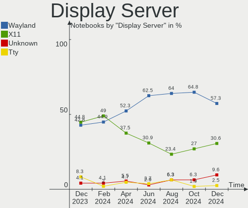
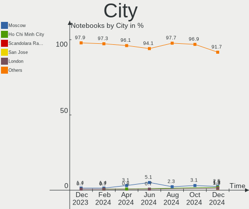
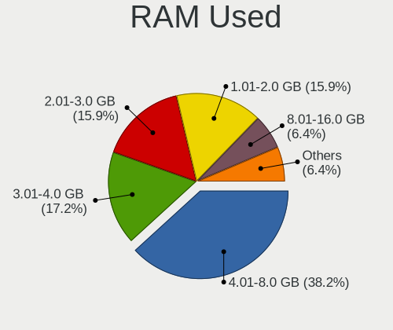
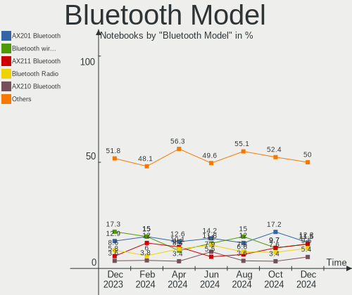

Arch Hardware Trends (Notebook)
-------------------------------

A project to identify most popular hardware characteristics and track their change
over time based on data collected by Arch users at https://Linux-Hardware.org.

Anyone can contribute to the study by uploading probes of their computers by
the [hw-probe](https://github.com/linuxhw/hw-probe) tool:

    sudo -E hw-probe -all -upload

Full-feature report is available here: https://linux-hardware.org/?view=trends&formfactor=notebook

Period: Oct, 2020.

Contents
--------

- [ OS                       ](#os)
- [ OS Family                ](#os-family)
- [ Kernel                   ](#kernel)
- [ Kernel Family            ](#kernel-family)
- [ Kernel Major Ver.        ](#kernel-major-ver)
- [ Arch                     ](#arch)
- [ DE                       ](#de)
- [ Display Server           ](#display-server)
- [ Display Manager          ](#display-manager)
- [ OS Lang                  ](#os-lang)
- [ Boot Mode                ](#boot-mode)
- [ Filesystem               ](#filesystem)
- [ Part. scheme             ](#part-scheme)
- [ Dual Boot with Linux/BSD ](#dual-boot-with-linux/bsd)
- [ Dual Boot (Win)          ](#dual-boot-win)
- [ Country                  ](#country)
- [ City                     ](#city)
- [ Vendor                   ](#vendor)
- [ Model                    ](#model)
- [ Model Family             ](#model-family)
- [ MFG Year                 ](#mfg-year)
- [ Form Factor              ](#form-factor)
- [ Secure Boot              ](#secure-boot)
- [ Coreboot                 ](#coreboot)
- [ RAM Size                 ](#ram-size)
- [ RAM Used                 ](#ram-used)
- [ Has CD-ROM               ](#has-cd-rom)
- [ Total Drives             ](#total-drives)
- [ Has Ethernet             ](#has-ethernet)
- [ Drive Vendor             ](#drive-vendor)
- [ HDD Vendor               ](#hdd-vendor)
- [ SSD Vendor               ](#ssd-vendor)
- [ Drive Model              ](#drive-model)
- [ Drive Kind               ](#drive-kind)
- [ Drive Connector          ](#drive-connector)
- [ Drive Size               ](#drive-size)
- [ Space Total              ](#space-total)
- [ Space Used               ](#space-used)
- [ Malfunc. Drives          ](#malfunc-drives)
- [ Malfunc. Drive Vendor    ](#malfunc-drive-vendor)
- [ Malfunc. HDD Vendor      ](#malfunc-hdd-vendor)
- [ Malfunc. Drive Kind      ](#malfunc-drive-kind)
- [ Failed Drives            ](#failed-drives)
- [ Failed Drive Vendor      ](#failed-drive-vendor)
- [ Drive Status             ](#drive-status)
- [ Storage Vendor           ](#storage-vendor)
- [ Storage Model            ](#storage-model)
- [ Storage Kind             ](#storage-kind)
- [ CPU Vendor               ](#cpu-vendor)
- [ CPU Model                ](#cpu-model)
- [ CPU Model Family         ](#cpu-model-family)
- [ CPU Cores                ](#cpu-cores)
- [ CPU Sockets              ](#cpu-sockets)
- [ CPU Threads              ](#cpu-threads)
- [ CPU Op-Modes             ](#cpu-op-modes)
- [ CPU Microcode            ](#cpu-microcode)
- [ CPU Microarch            ](#cpu-microarch)
- [ GPU Vendor               ](#gpu-vendor)
- [ GPU Model                ](#gpu-model)
- [ GPU Combo                ](#gpu-combo)
- [ GPU Driver               ](#gpu-driver)
- [ GPU Memory               ](#gpu-memory)
- [ Monitor Vendor           ](#monitor-vendor)
- [ Monitor Model            ](#monitor-model)
- [ Monitor Resolution       ](#monitor-resolution)
- [ Monitor Diagonal         ](#monitor-diagonal)
- [ Monitor Width            ](#monitor-width)
- [ Aspect Ratio             ](#aspect-ratio)
- [ Monitor Area             ](#monitor-area)
- [ Pixel Density            ](#pixel-density)
- [ Multiple Monitors        ](#multiple-monitors)
- [ Net Controller Vendor    ](#net-controller-vendor)
- [ Net Controller Model     ](#net-controller-model)
- [ Wireless Vendor          ](#wireless-vendor)
- [ Wireless Model           ](#wireless-model)
- [ Ethernet Vendor          ](#ethernet-vendor)
- [ Ethernet Model           ](#ethernet-model)
- [ Net Controller Kind      ](#net-controller-kind)
- [ Used Controller          ](#used-controller)
- [ NICs                     ](#nics)
- [ Memory Vendor            ](#memory-vendor)
- [ Memory Model             ](#memory-model)
- [ Memory Kind              ](#memory-kind)
- [ Memory Form Factor       ](#memory-form-factor)
- [ Memory Size              ](#memory-size)
- [ Memory Speed             ](#memory-speed)
- [ Sound Vendor             ](#sound-vendor)
- [ Sound Model              ](#sound-model)
- [ Camera Vendor            ](#camera-vendor)
- [ Camera Model             ](#camera-model)
- [ Fingerprint Vendor       ](#fingerprint-vendor)
- [ Fingerprint Model        ](#fingerprint-model)
- [ Chipcard Vendor          ](#chipcard-vendor)
- [ Chipcard Model           ](#chipcard-model)
- [ Printer Vendor           ](#printer-vendor)
- [ Printer Model            ](#printer-model)
- [ Scanner Vendor           ](#scanner-vendor)
- [ Scanner Model            ](#scanner-model)
- [ Bluetooth Vendor         ](#bluetooth-vendor)
- [ Bluetooth Model          ](#bluetooth-model)
- [ Unsupported Devices      ](#unsupported-devices)
- [ Unsupported Device Types ](#unsupported-device-types)

OS
--

Installed operating systems

| Name         | Notebooks | Percent |
|--------------|-----------|---------|
| Arch         | 74        | 66.07%  |
| Arch Rolling | 38        | 33.93%  |

OS Family
---------

OS without a version

| Name | Notebooks | Percent |
|------|-----------|---------|
| Arch | 112       | 100%    |

Kernel
------

Version of the Linux kernel

| Version               | Notebooks | Percent |
|-----------------------|-----------|---------|
| 5.9.1-arch1-1         | 28        | 25%     |
| 5.8.14-arch1-1        | 24        | 21.43%  |
| 5.8.13-arch1-1        | 11        | 9.82%   |
| 5.8.12-arch1-1        | 11        | 9.82%   |
| 5.9.1-zen2-1-zen      | 7         | 6.25%   |
| 5.8.14-zen1-1-zen     | 5         | 4.46%   |
| 5.4.70-1-lts          | 3         | 2.68%   |
| 5.9.1-zen1-1-zen      | 2         | 1.79%   |
| 5.8.16.a-1-hardened   | 2         | 1.79%   |
| 5.4.72-1-lts          | 2         | 1.79%   |
| 5.4.68-1-lts          | 2         | 1.79%   |
| 5.9.2-arch1-1         | 1         | 0.89%   |
| 5.9.0-S               | 1         | 0.89%   |
| 5.9.0-1-clear         | 1         | 0.89%   |
| 5.8.9-zen2-1-zencjk   | 1         | 0.89%   |
| 5.8.9-arch2-1         | 1         | 0.89%   |
| 5.8.4-arch1-1-berg    | 1         | 0.89%   |
| 5.8.14-lqx1-1-lqx     | 1         | 0.89%   |
| 5.8.14-arch1-5-g14    | 1         | 0.89%   |
| 5.8.13-zen1-2-zen     | 1         | 0.89%   |
| 5.8.13-zen1-1-zen     | 1         | 0.89%   |
| 5.8.10-arch1-1        | 1         | 0.89%   |
| 5.8.1-arch1-1         | 1         | 0.89%   |
| 5.8.0-arch1-2-custom  | 1         | 0.89%   |
| 5.3.13-arch1-1        | 1         | 0.89%   |
| 5.10.0-rc1-1-mainline | 1         | 0.89%   |

Kernel Family
-------------

Linux kernel without a distro release

| Version | Notebooks | Percent |
|---------|-----------|---------|
| 5.9.1   | 37        | 33.04%  |
| 5.8.14  | 31        | 27.68%  |
| 5.8.13  | 13        | 11.61%  |
| 5.8.12  | 11        | 9.82%   |
| 5.4.70  | 3         | 2.68%   |
| 5.9.0   | 2         | 1.79%   |
| 5.8.9   | 2         | 1.79%   |
| 5.8.16  | 2         | 1.79%   |
| 5.4.72  | 2         | 1.79%   |
| 5.4.68  | 2         | 1.79%   |
| 5.9.2   | 1         | 0.89%   |
| 5.8.4   | 1         | 0.89%   |
| 5.8.10  | 1         | 0.89%   |
| 5.8.1   | 1         | 0.89%   |
| 5.8.0   | 1         | 0.89%   |
| 5.3.13  | 1         | 0.89%   |
| 5.10.0  | 1         | 0.89%   |

Kernel Major Ver.
-----------------

Linux kernel major version

| Version | Notebooks | Percent |
|---------|-----------|---------|
| 5.8     | 63        | 56.25%  |
| 5.9     | 40        | 35.71%  |
| 5.4     | 7         | 6.25%   |
| 5.3     | 1         | 0.89%   |
| 5.10    | 1         | 0.89%   |

Arch
----

OS architecture (x86_64, i586, etc.)

| Name   | Notebooks | Percent |
|--------|-----------|---------|
| x86_64 | 112       | 100%    |

DE
--

Desktop Environment

| Name       | Notebooks | Percent |
|------------|-----------|---------|
| GNOME      | 48        | 42.86%  |
| KDE5       | 21        | 18.75%  |
| KDE        | 11        | 9.82%   |
| XFCE       | 7         | 6.25%   |
| i3         | 7         | 6.25%   |
| Cinnamon   | 6         | 5.36%   |
| Unknown    | 5         | 4.46%   |
| Budgie     | 3         | 2.68%   |
| X-Cinnamon | 1         | 0.89%   |
| MATE       | 1         | 0.89%   |
| LXQt       | 1         | 0.89%   |
| Deepin     | 1         | 0.89%   |

Display Server
--------------

X11 or Wayland

| Name    | Notebooks | Percent |
|---------|-----------|---------|
| X11     | 72        | 64.29%  |
| Wayland | 26        | 23.21%  |
| Tty     | 11        | 9.82%   |
| Unknown | 3         | 2.68%   |

Display Manager
---------------

SDDM, LightDM, etc.

| Name    | Notebooks | Percent |
|---------|-----------|---------|
| Unknown | 49        | 43.75%  |
| SDDM    | 21        | 18.75%  |
| GDM     | 20        | 17.86%  |
| TDM     | 14        | 12.5%   |
| XDM     | 3         | 2.68%   |
| LightDM | 2         | 1.79%   |
| SLiM    | 1         | 0.89%   |
| Ly      | 1         | 0.89%   |
| LXDM    | 1         | 0.89%   |

OS Lang
-------

Language

| Lang       | Notebooks | Percent |
|------------|-----------|---------|
| en_US      | 46        | 41.07%  |
| en_GB      | 13        | 11.61%  |
| C          | 8         | 7.14%   |
| Unknown    | 5         | 4.46%   |
| pt_BR      | 4         | 3.57%   |
| es_MX      | 4         | 3.57%   |
| de_DE      | 4         | 3.57%   |
| en_AU      | 3         | 2.68%   |
| zh_CN      | 2         | 1.79%   |
| ru_RU      | 2         | 1.79%   |
| pl_PL      | 2         | 1.79%   |
| es_ES      | 2         | 1.79%   |
| en_US.utf8 | 2         | 1.79%   |
| en_GB.UTF8 | 2         | 1.79%   |
| en_CA      | 2         | 1.79%   |
| ru_UA      | 1         | 0.89%   |
| ru_RU.utf8 | 1         | 0.89%   |
| nl_NL      | 1         | 0.89%   |
| fr_FR      | 1         | 0.89%   |
| es_CO      | 1         | 0.89%   |
| es_AR      | 1         | 0.89%   |
| en_IN      | 1         | 0.89%   |
| en_CA.utf8 | 1         | 0.89%   |
| en_AU.utf8 | 1         | 0.89%   |
| de_AT      | 1         | 0.89%   |
| ca_ES      | 1         | 0.89%   |

Boot Mode
---------

EFI or BIOS

| Mode | Notebooks | Percent |
|------|-----------|---------|
| EFI  | 68        | 60.71%  |
| BIOS | 44        | 39.29%  |

Filesystem
----------

Type of filesystem

| Type    | Notebooks | Percent |
|---------|-----------|---------|
| Ext4    | 94        | 83.93%  |
| Btrfs   | 9         | 8.04%   |
| Xfs     | 4         | 3.57%   |
| Zfs     | 2         | 1.79%   |
| F2fs    | 2         | 1.79%   |
| Unknown | 1         | 0.89%   |

Part. scheme
------------

Scheme of partitioning

| Type    | Notebooks | Percent |
|---------|-----------|---------|
| GPT     | 64        | 57.14%  |
| Unknown | 35        | 31.25%  |
| MBR     | 13        | 11.61%  |

Dual Boot with Linux/BSD
------------------------

Hosting more than one Linux/BSD

| Dual boot | Notebooks | Percent |
|-----------|-----------|---------|
| No        | 98        | 87.5%   |
| Yes       | 14        | 12.5%   |

Dual Boot (Win)
---------------

Hosting Linux and Windows

| Dual boot | Notebooks | Percent |
|-----------|-----------|---------|
| No        | 77        | 68.75%  |
| Yes       | 35        | 31.25%  |

Country
-------

Geographic location (country)

| Country                      | Notebooks | Percent |
|------------------------------|-----------|---------|
| USA                          | 20        | 17.86%  |
| Germany                      | 7         | 6.25%   |
| Spain                        | 6         | 5.36%   |
| Brazil                       | 6         | 5.36%   |
| Canada                       | 5         | 4.46%   |
| Netherlands                  | 4         | 3.57%   |
| Mexico                       | 4         | 3.57%   |
| India                        | 4         | 3.57%   |
| Ukraine                      | 3         | 2.68%   |
| UK                           | 3         | 2.68%   |
| Russia                       | 3         | 2.68%   |
| Austria                      | 3         | 2.68%   |
| Australia                    | 3         | 2.68%   |
| Thailand                     | 2         | 1.79%   |
| Romania                      | 2         | 1.79%   |
| Poland                       | 2         | 1.79%   |
| Japan                        | 2         | 1.79%   |
| Italy                        | 2         | 1.79%   |
| Hungary                      | 2         | 1.79%   |
| Greece                       | 2         | 1.79%   |
| Bangladesh                   | 2         | 1.79%   |
| UAE                          | 1         | 0.89%   |
| Turkey                       | 1         | 0.89%   |
| Tanzania, United Republic of | 1         | 0.89%   |
| Sweden                       | 1         | 0.89%   |
| Sri Lanka                    | 1         | 0.89%   |
| Slovakia                     | 1         | 0.89%   |
| Serbia                       | 1         | 0.89%   |
| Palestine                    | 1         | 0.89%   |
| Norway                       | 1         | 0.89%   |
| New Zealand                  | 1         | 0.89%   |
| Malta                        | 1         | 0.89%   |
| Kenya                        | 1         | 0.89%   |
| Kazakhstan                   | 1         | 0.89%   |
| Iran                         | 1         | 0.89%   |
| Indonesia                    | 1         | 0.89%   |
| Honduras                     | 1         | 0.89%   |
| Guatemala                    | 1         | 0.89%   |
| France                       | 1         | 0.89%   |
| Ethiopia                     | 1         | 0.89%   |
| Egypt                        | 1         | 0.89%   |
| Cote D'Ivoire                | 1         | 0.89%   |
| Colombia                     | 1         | 0.89%   |
| China                        | 1         | 0.89%   |
| Bolivia                      | 1         | 0.89%   |
| Argentina                    | 1         | 0.89%   |

City
----

Geographic location (city)

| City              | Notebooks | Percent |
|-------------------|-----------|---------|
| Seattle           | 3         | 2.68%   |
| Moscow            | 3         | 2.68%   |
| Vienna            | 2         | 1.79%   |
| Tlalnepantla      | 2         | 1.79%   |
| Thrissur          | 2         | 1.79%   |
| Montreal          | 2         | 1.79%   |
| Melbourne         | 2         | 1.79%   |
| Los Angeles       | 2         | 1.79%   |
| Kyiv              | 2         | 1.79%   |
| Dhaka             | 2         | 1.79%   |
| Basingstoke       | 2         | 1.79%   |
| Amsterdam         | 2         | 1.79%   |
| Yala              | 1         | 0.89%   |
| Xining            | 1         | 0.89%   |
| Wokingham         | 1         | 0.89%   |
| West Valley City  | 1         | 0.89%   |
| Wellington        | 1         | 0.89%   |
| Walce             | 1         | 0.89%   |
| Verona            | 1         | 0.89%   |
| Vejbystrand       | 1         | 0.89%   |
| Thessaloniki      | 1         | 0.89%   |
| Ternopil          | 1         | 0.89%   |
| Tehran            | 1         | 0.89%   |
| Tegucigalpa       | 1         | 0.89%   |
| Taranto           | 1         | 0.89%   |
| Sunnyvale         | 1         | 0.89%   |
| Semarang          | 1         | 0.89%   |
| San Ramon         | 1         | 0.89%   |
| Ras al-Khaimah    | 1         | 0.89%   |
| Patna             | 1         | 0.89%   |
| Pannipitiya       | 1         | 0.89%   |
| Palmas            | 1         | 0.89%   |
| Paducah           | 1         | 0.89%   |
| Orleans           | 1         | 0.89%   |
| Oakville          | 1         | 0.89%   |
| Nitrianske Pravno | 1         | 0.89%   |
| Nishitokyo        | 1         | 0.89%   |
| Nijmegen          | 1         | 0.89%   |
| New York          | 1         | 0.89%   |
| Naxxar            | 1         | 0.89%   |
| Nairobi           | 1         | 0.89%   |
| Nagoya            | 1         | 0.89%   |
| Mönchengladbach  | 1         | 0.89%   |
| Munich            | 1         | 0.89%   |
| Mississauga       | 1         | 0.89%   |
| Miskolc           | 1         | 0.89%   |
| Mexico City       | 1         | 0.89%   |
| Mangalia          | 1         | 0.89%   |
| Madrid            | 1         | 0.89%   |
| Linz              | 1         | 0.89%   |
| Lille             | 1         | 0.89%   |
| Lakeland          | 1         | 0.89%   |
| La Paz            | 1         | 0.89%   |
| Krakow            | 1         | 0.89%   |
| Koani             | 1         | 0.89%   |
| Kelsterbach       | 1         | 0.89%   |
| Istanbul          | 1         | 0.89%   |
| Irvine            | 1         | 0.89%   |
| Ibi               | 1         | 0.89%   |
| Hershey           | 1         | 0.89%   |

Vendor
------

Motherboard manufacturer

| Name                | Notebooks | Percent |
|---------------------|-----------|---------|
| Lenovo              | 30        | 26.79%  |
| Dell                | 23        | 20.54%  |
| ASUSTek Computer    | 17        | 15.18%  |
| Hewlett-Packard     | 16        | 14.29%  |
| Acer                | 7         | 6.25%   |
| MSI                 | 5         | 4.46%   |
| Apple               | 2         | 1.79%   |
| TUXEDO              | 1         | 0.89%   |
| Timi                | 1         | 0.89%   |
| Schenker            | 1         | 0.89%   |
| Samsung Electronics | 1         | 0.89%   |
| Packard Bell        | 1         | 0.89%   |
| NOVATECH            | 1         | 0.89%   |
| Notebook            | 1         | 0.89%   |
| MECHREVO            | 1         | 0.89%   |
| Google              | 1         | 0.89%   |
| Fujitsu             | 1         | 0.89%   |
| Eluktronics         | 1         | 0.89%   |
| 51nb                | 1         | 0.89%   |

Model
-----

Motherboard model

| Name                                            | Notebooks | Percent |
|-------------------------------------------------|-----------|---------|
| Dell XPS 13 9380                                | 2         | 1.79%   |
| ASUS X556UQK                                    | 2         | 1.79%   |
| TUXEDO Book BA1510                              | 1         | 0.89%   |
| Timi TM1604                                     | 1         | 0.89%   |
| Schenker XMG CORE 17(M20, RTX 2060)             | 1         | 0.89%   |
| Samsung Electronics 350V5C/351V5C/3540VC/3440VC | 1         | 0.89%   |
| Packard Bell EasyNote MZ45                      | 1         | 0.89%   |
| NOVATECH A15A/HE/HC                             | 1         | 0.89%   |
| Notebook N8xEJEK                                | 1         | 0.89%   |
| MSI PE70 6QE                                    | 1         | 0.89%   |
| MSI Modern 14 B10MW                             | 1         | 0.89%   |
| MSI GL62 7RD                                    | 1         | 0.89%   |
| MSI GE62VR 6RF                                  | 1         | 0.89%   |
| MSI Bravo 15 A4DDR                              | 1         | 0.89%   |
| MECHREVO Code 01 Series PF5NU1G                 | 1         | 0.89%   |
| Lenovo Z50-70 20354                             | 1         | 0.89%   |
| Lenovo V330-14ARR 81B1                          | 1         | 0.89%   |
| Lenovo ThinkPad X250 20CMS09M00                 | 1         | 0.89%   |
| Lenovo ThinkPad X230 Tablet 34372S3             | 1         | 0.89%   |
| Lenovo ThinkPad X230 2325SSF                    | 1         | 0.89%   |
| Lenovo ThinkPad X1 Carbon 7th 20QD00L1MX        | 1         | 0.89%   |
| Lenovo ThinkPad X1 Carbon 6th 20KH002RUS        | 1         | 0.89%   |
| Lenovo ThinkPad X1 Carbon 6th 20KG0022US        | 1         | 0.89%   |
| Lenovo ThinkPad X1 Carbon 3rd 20BSCTO1WW        | 1         | 0.89%   |
| Lenovo ThinkPad T580 20L90026RT                 | 1         | 0.89%   |
| Lenovo ThinkPad T480s 20L8S7PP06                | 1         | 0.89%   |
| Lenovo ThinkPad T480s 20L8S2SD00                | 1         | 0.89%   |
| Lenovo ThinkPad T480 20L5000BRT                 | 1         | 0.89%   |
| Lenovo ThinkPad T460p 20FWCTO1WW                | 1         | 0.89%   |
| Lenovo ThinkPad T460p 20FW0044AU                | 1         | 0.89%   |
| Lenovo ThinkPad T430 23501K0                    | 1         | 0.89%   |
| Lenovo ThinkPad T420s 4170CTO                   | 1         | 0.89%   |
| Lenovo ThinkPad T14 Gen 1 20UD0013GE            | 1         | 0.89%   |
| Lenovo ThinkPad Helix .MFG_IN                   | 1         | 0.89%   |
| Lenovo ThinkPad E580 20KS006GUK                 | 1         | 0.89%   |
| Lenovo ThinkBook 14-IIL 20SL                    | 1         | 0.89%   |
| Lenovo IdeaPad Slim 7 14IIL05 82A4              | 1         | 0.89%   |
| Lenovo IdeaPad S540-15IWL GTX 81SW              | 1         | 0.89%   |
| Lenovo IdeaPad S340-15IWL 81N8                  | 1         | 0.89%   |
| Lenovo IdeaPad S340-15API 81NC                  | 1         | 0.89%   |
| Lenovo IdeaPad FLEX-14API 81SS                  | 1         | 0.89%   |
| Lenovo IdeaPad 700-15ISK 80RU                   | 1         | 0.89%   |
| Lenovo IdeaPad 510-15IKB 80SV                   | 1         | 0.89%   |
| Lenovo IdeaPad 320-15IKB 81G3                   | 1         | 0.89%   |
| Lenovo 10017                                    | 1         | 0.89%   |
| HP ZHAN 66 Pro G1                               | 1         | 0.89%   |
| HP ZBook Studio G5                              | 1         | 0.89%   |
| HP ProBook 455 G7                               | 1         | 0.89%   |
| HP ProBook 445 G7                               | 1         | 0.89%   |
| HP Pavilion Laptop 15-cw0xxx                    | 1         | 0.89%   |
| HP Pavilion dv6                                 | 1         | 0.89%   |
| HP OMEN by HP Laptop                            | 1         | 0.89%   |
| HP Notebook                                     | 1         | 0.89%   |
| HP Laptop 15-da1xxx                             | 1         | 0.89%   |
| HP ENVY Laptop 15-ep0xxx                        | 1         | 0.89%   |
| HP EliteBook x360 1040 G5                       | 1         | 0.89%   |
| HP EliteBook 8470p                              | 1         | 0.89%   |
| HP EliteBook 840 G5                             | 1         | 0.89%   |
| HP EliteBook 830 G6                             | 1         | 0.89%   |
| HP EliteBook 2530p                              | 1         | 0.89%   |

Model Family
------------

Motherboard model prefix

| Name                       | Notebooks | Percent |
|----------------------------|-----------|---------|
| Lenovo ThinkPad            | 18        | 16.07%  |
| Lenovo IdeaPad             | 8         | 7.14%   |
| Dell Inspiron              | 8         | 7.14%   |
| Dell XPS                   | 6         | 5.36%   |
| HP EliteBook               | 5         | 4.46%   |
| Dell Latitude              | 5         | 4.46%   |
| Acer Aspire                | 4         | 3.57%   |
| ASUS VivoBook              | 3         | 2.68%   |
| ASUS TUF                   | 3         | 2.68%   |
| HP ProBook                 | 2         | 1.79%   |
| HP Pavilion                | 2         | 1.79%   |
| Dell G3                    | 2         | 1.79%   |
| ASUS X556UQK               | 2         | 1.79%   |
| Acer Predator              | 2         | 1.79%   |
| TUXEDO Book                | 1         | 0.89%   |
| Timi TM1604                | 1         | 0.89%   |
| Schenker XMG               | 1         | 0.89%   |
| Samsung Electronics 350V5C | 1         | 0.89%   |
| Packard Bell EasyNote      | 1         | 0.89%   |
| NOVATECH A15A              | 1         | 0.89%   |
| Notebook N8xEJEK           | 1         | 0.89%   |
| MSI PE70                   | 1         | 0.89%   |
| MSI Modern                 | 1         | 0.89%   |
| MSI GL62                   | 1         | 0.89%   |
| MSI GE62VR                 | 1         | 0.89%   |
| MSI Bravo                  | 1         | 0.89%   |
| MECHREVO Code              | 1         | 0.89%   |
| Lenovo Z50-70              | 1         | 0.89%   |
| Lenovo V330-14ARR          | 1         | 0.89%   |
| Lenovo ThinkBook           | 1         | 0.89%   |
| Lenovo 10017               | 1         | 0.89%   |
| HP ZHAN                    | 1         | 0.89%   |
| HP ZBook                   | 1         | 0.89%   |
| HP OMEN                    | 1         | 0.89%   |
| HP Notebook                | 1         | 0.89%   |
| HP Laptop                  | 1         | 0.89%   |
| HP ENVY                    | 1         | 0.89%   |
| HP 15                      | 1         | 0.89%   |
| Google Link                | 1         | 0.89%   |
| Fujitsu LIFEBOOK           | 1         | 0.89%   |
| Eluktronics THINN-15       | 1         | 0.89%   |
| Dell Vostro                | 1         | 0.89%   |
| Dell Precision             | 1         | 0.89%   |
| ASUS ZenBook               | 1         | 0.89%   |
| ASUS X550CC                | 1         | 0.89%   |
| ASUS X510UQ                | 1         | 0.89%   |
| ASUS UX32VD                | 1         | 0.89%   |
| ASUS U47A                  | 1         | 0.89%   |
| ASUS Strix                 | 1         | 0.89%   |
| ASUS ROG                   | 1         | 0.89%   |
| ASUS P453UA                | 1         | 0.89%   |
| ASUS G53SW                 | 1         | 0.89%   |
| Apple MacBookPro15         | 1         | 0.89%   |
| Apple MacBookAir4          | 1         | 0.89%   |
| Acer Swift                 | 1         | 0.89%   |
| 51nb X213s                 | 1         | 0.89%   |

MFG Year
--------

Motherboard manufacture year

| Year | Notebooks | Percent |
|------|-----------|---------|
| 2020 | 41        | 36.61%  |
| 2019 | 31        | 27.68%  |
| 2018 | 9         | 8.04%   |
| 2013 | 8         | 7.14%   |
| 2014 | 4         | 3.57%   |
| 2017 | 3         | 2.68%   |
| 2016 | 3         | 2.68%   |
| 2012 | 3         | 2.68%   |
| 2010 | 3         | 2.68%   |
| 2009 | 3         | 2.68%   |
| 2011 | 2         | 1.79%   |
| 2015 | 1         | 0.89%   |
| 2007 | 1         | 0.89%   |

Form Factor
-----------

Physical design of the computer

| Name     | Notebooks | Percent |
|----------|-----------|---------|
| Notebook | 112       | 100%    |

Secure Boot
-----------

Enabled or disabled

| State    | Notebooks | Percent |
|----------|-----------|---------|
| Disabled | 110       | 98.21%  |
| Enabled  | 2         | 1.79%   |

Coreboot
--------

Have coreboot on board

| Used | Notebooks | Percent |
|------|-----------|---------|
| No   | 110       | 98.21%  |
| Yes  | 2         | 1.79%   |

RAM Size
--------

Total RAM memory

| Size in GB  | Notebooks | Percent |
|-------------|-----------|---------|
| 4.01-8.0    | 28        | 25%     |
| 16.01-24.0  | 25        | 22.32%  |
| 8.01-16.0   | 25        | 22.32%  |
| 32.01-64.0  | 12        | 10.71%  |
| 3.01-4.0    | 12        | 10.71%  |
| 24.01-32.0  | 4         | 3.57%   |
| 1.01-2.0    | 4         | 3.57%   |
| 64.01-256.0 | 2         | 1.79%   |

RAM Used
--------

Used RAM memory

| Used GB    | Notebooks | Percent |
|------------|-----------|---------|
| 1.01-2.0   | 33        | 29.46%  |
| 4.01-8.0   | 27        | 24.11%  |
| 2.01-3.0   | 24        | 21.43%  |
| 3.01-4.0   | 12        | 10.71%  |
| 8.01-16.0  | 11        | 9.82%   |
| 0.01-1.0   | 4         | 3.57%   |
| 24.01-32.0 | 1         | 0.89%   |

Has CD-ROM
----------

Has CD-ROM on board

| Presented | Notebooks | Percent |
|-----------|-----------|---------|
| No        | 87        | 77.68%  |
| Yes       | 25        | 22.32%  |

Total Drives
------------

Number of drives on board

| Drives | Notebooks | Percent |
|--------|-----------|---------|
| 1      | 70        | 62.5%   |
| 2      | 37        | 33.04%  |
| 3      | 4         | 3.57%   |
| 4      | 1         | 0.89%   |

Has Ethernet
------------

Has Ethernet on board

| Presented | Notebooks | Percent |
|-----------|-----------|---------|
| Yes       | 86        | 76.79%  |
| No        | 26        | 23.21%  |

Drive Vendor
------------

Hard drive vendors

| Vendor                    | Notebooks | Drives | Percent |
|---------------------------|-----------|--------|---------|
| Samsung Electronics       | 35        | 37     | 23.18%  |
| WDC                       | 19        | 21     | 12.58%  |
| Seagate                   | 19        | 20     | 12.58%  |
| Toshiba                   | 13        | 13     | 8.61%   |
| Sandisk                   | 9         | 10     | 5.96%   |
| Kingston                  | 7         | 7      | 4.64%   |
| HGST                      | 7         | 7      | 4.64%   |
| SK Hynix                  | 5         | 5      | 3.31%   |
| Intel                     | 5         | 6      | 3.31%   |
| Unknown                   | 4         | 4      | 2.65%   |
| Crucial                   | 4         | 5      | 2.65%   |
| A-DATA Technology         | 4         | 4      | 2.65%   |
| Union Memory              | 2         | 2      | 1.32%   |
| Micron/Crucial Technology | 2         | 2      | 1.32%   |
| Micron Technology         | 2         | 2      | 1.32%   |
| Lenovo                    | 2         | 2      | 1.32%   |
| Hitachi                   | 2         | 2      | 1.32%   |
| Verbatim                  | 1         | 1      | 0.66%   |
| Transcend                 | 1         | 1      | 0.66%   |
| TCSUNBOW                  | 1         | 1      | 0.66%   |
| SPCC                      | 1         | 1      | 0.66%   |
| Mushkin                   | 1         | 1      | 0.66%   |
| LITEON                    | 1         | 1      | 0.66%   |
| JMicron                   | 1         | 1      | 0.66%   |
| Dell                      | 1         | 1      | 0.66%   |
| China                     | 1         | 1      | 0.66%   |
| Apple                     | 1         | 2      | 0.66%   |

HDD Vendor
----------

Hard disk drive vendors

| Vendor  | Notebooks | Drives | Percent |
|---------|-----------|--------|---------|
| Seagate | 18        | 19     | 42.86%  |
| WDC     | 9         | 9      | 21.43%  |
| HGST    | 7         | 7      | 16.67%  |
| Toshiba | 6         | 6      | 14.29%  |
| Hitachi | 2         | 2      | 4.76%   |

SSD Vendor
----------

Solid state drive vendors

| Vendor              | Notebooks | Drives | Percent |
|---------------------|-----------|--------|---------|
| Samsung Electronics | 15        | 15     | 27.27%  |
| Kingston            | 6         | 6      | 10.91%  |
| WDC                 | 5         | 5      | 9.09%   |
| SanDisk             | 5         | 5      | 9.09%   |
| Toshiba             | 4         | 4      | 7.27%   |
| Crucial             | 4         | 5      | 7.27%   |
| A-DATA Technology   | 4         | 4      | 7.27%   |
| Micron Technology   | 2         | 2      | 3.64%   |
| Verbatim            | 1         | 1      | 1.82%   |
| Transcend           | 1         | 1      | 1.82%   |
| TCSUNBOW            | 1         | 1      | 1.82%   |
| SPCC                | 1         | 1      | 1.82%   |
| Mushkin             | 1         | 1      | 1.82%   |
| LITEON              | 1         | 1      | 1.82%   |
| JMicron             | 1         | 1      | 1.82%   |
| Intel               | 1         | 1      | 1.82%   |
| Dell                | 1         | 1      | 1.82%   |
| China               | 1         | 1      | 1.82%   |

Drive Model
-----------

Hard drive models

| Model                        | Notebooks | Percent |
|------------------------------|-----------|---------|
| NVMe SSD Drive 512GB         | 8         | 5.06%   |
| ST1000LM035-1RK172 1TB       | 4         | 2.53%   |
| NVMe SSD Drive 500GB         | 4         | 2.53%   |
| NVMe SSD Drive 256GB         | 4         | 2.53%   |
| NVMe SSD Drive 1TB           | 4         | 2.53%   |
| BUP Slim BK 1TB              | 3         | 1.9%    |
| WDS120G2G0B-00EPW0 120GB SSD | 2         | 1.27%   |
| ST1000LM024 HN-M101MBB 1TB   | 2         | 1.27%   |
| SSD 860 EVO 500GB            | 2         | 1.27%   |
| SSD 850 EVO 500GB            | 2         | 1.27%   |
| SA400S37480G 480GB SSD       | 2         | 1.27%   |
| SA400S37240G 240GB SSD       | 2         | 1.27%   |
| NVMe SSD Drive 1024GB        | 2         | 1.27%   |
| MQ04ABF100 1TB               | 2         | 1.27%   |
| HTS545050A7E680 500GB        | 2         | 1.27%   |
| HTS541010A9E680 1TB          | 2         | 1.27%   |
| CT500MX500SSD1 500GB         | 2         | 1.27%   |
| WR202KD032G E70290F5 32GB    | 1         | 0.63%   |
| WDS500G2B0B-00YS70 500GB SSD | 1         | 0.63%   |
| WDS100T2B0A-00SM50 1TB SSD   | 1         | 0.63%   |
| WDBNCE0010PNC 1TB SSD        | 1         | 0.63%   |
| WD7500BPVX-22JC3T0 752GB     | 1         | 0.63%   |
| WD5000LPVX-60V0TT0 500GB     | 1         | 0.63%   |
| WD5000LPLX-75ZNTT0 500GB     | 1         | 0.63%   |
| WD5000LPCX-22VHAT1 500GB     | 1         | 0.63%   |
| WD3200BEKT-75PVMT1 320GB     | 1         | 0.63%   |
| WD10SPZX-75Z10T1 1TB         | 1         | 0.63%   |
| WD10SPZX-24Z10 1TB           | 1         | 0.63%   |
| WD10SPZX-21Z10T0 1TB         | 1         | 0.63%   |
| WD10JPVX-00JC3T0 1TB         | 1         | 0.63%   |
| Vi500 S3 120GB SSD           | 1         | 0.63%   |
| UMIS RPITJ256PED2MWX 256GB   | 1         | 0.63%   |
| Ultra II 240GB SSD           | 1         | 0.63%   |
| TS128GSSD230S 128GB          | 1         | 0.63%   |
| TR200 240GB SSD              | 1         | 0.63%   |
| THNSNK128GVN8 128GB SSD      | 1         | 0.63%   |
| THNSNJ128G8NY 128GB SSD      | 1         | 0.63%   |
| THNSNH128GMCT 128GB SSD      | 1         | 0.63%   |
| SUV400S37240G 240GB SSD      | 1         | 0.63%   |
| SU810NS38 SATA 256 GB SSD    | 1         | 0.63%   |
| SU750 256GB SSD              | 1         | 0.63%   |
| SU32G  32GB                  | 1         | 0.63%   |
| ST95005620AS 500GB           | 1         | 0.63%   |
| ST940210AS 40GB              | 1         | 0.63%   |
| ST9320325AS 320GB            | 1         | 0.63%   |
| ST9160821AS 160GB            | 1         | 0.63%   |
| ST500VT000-1DK142 500GB      | 1         | 0.63%   |
| ST500LT012-1DG142 500GB      | 1         | 0.63%   |
| ST2000LM007-1R8174 2TB       | 1         | 0.63%   |
| ST1000LX015-1U7172 1TB       | 1         | 0.63%   |
| SSDSC2KB019T8 2TB            | 1         | 0.63%   |
| SSDPEKNW512G8 512GB          | 1         | 0.63%   |
| SSDPEKKF010T8 NVMe 1024GB    | 1         | 0.63%   |
| SSD i100 32GB                | 1         | 0.63%   |
| SSD i100 24GB                | 1         | 0.63%   |
| SSD AP0512M 500GB            | 1         | 0.63%   |
| SSD 970 PRO 512GB            | 1         | 0.63%   |
| SSD 970 EVO Plus 500GB       | 1         | 0.63%   |
| SSD 970 EVO Plus 2TB         | 1         | 0.63%   |
| SSD 970 EVO 2TB              | 1         | 0.63%   |

Drive Kind
----------

HDD or SSD

| Kind    | Notebooks | Drives | Percent |
|---------|-----------|--------|---------|
| NVMe    | 51        | 56     | 36.43%  |
| SSD     | 44        | 56     | 31.43%  |
| HDD     | 40        | 43     | 28.57%  |
| MMC     | 4         | 4      | 2.86%   |
| Unknown | 1         | 1      | 0.71%   |

Drive Connector
---------------

SATA, SAS, NVMe, etc.

| Type | Notebooks | Drives | Percent |
|------|-----------|--------|---------|
| SATA | 71        | 94     | 53.79%  |
| NVMe | 51        | 56     | 38.64%  |
| SAS  | 6         | 6      | 4.55%   |
| MMC  | 4         | 4      | 3.03%   |

Drive Size
----------

Size of hard drive

| Size in TB | Notebooks | Drives | Percent |
|------------|-----------|--------|---------|
| 0.01-0.5   | 54        | 64     | 62.79%  |
| 0.51-1.0   | 27        | 29     | 31.4%   |
| 1.01-2.0   | 4         | 5      | 4.65%   |
| 3.01-4.0   | 1         | 1      | 1.16%   |

Space Total
-----------

Amount of disk space available on the file system

| Size in GB     | Notebooks | Percent |
|----------------|-----------|---------|
| 251-500        | 37        | 33.04%  |
| 101-250        | 28        | 25%     |
| 501-1000       | 16        | 14.29%  |
| 1001-2000      | 12        | 10.71%  |
| 51-100         | 7         | 6.25%   |
| 21-50          | 4         | 3.57%   |
| 2001-3000      | 4         | 3.57%   |
| Unknown        | 2         | 1.79%   |
| More than 3000 | 1         | 0.89%   |
| 1-20           | 1         | 0.89%   |

Space Used
----------

Amount of used disk space

| Used GB        | Notebooks | Percent |
|----------------|-----------|---------|
| 101-250        | 24        | 21.43%  |
| 1-20           | 23        | 20.54%  |
| 21-50          | 21        | 18.75%  |
| 251-500        | 14        | 12.5%   |
| 51-100         | 12        | 10.71%  |
| 501-1000       | 11        | 9.82%   |
| 1001-2000      | 4         | 3.57%   |
| Unknown        | 2         | 1.79%   |
| More than 3000 | 1         | 0.89%   |

Malfunc. Drives
---------------

Drive models with a malfunction

| Model                  | Notebooks | Drives | Percent |
|------------------------|-----------|--------|---------|
| ST95005620AS 500GB     | 1         | 2      | 14.29%  |
| ST9320325AS 320GB      | 1         | 1      | 14.29%  |
| ST1000LM035-1RK172 1TB | 1         | 1      | 14.29%  |
| SSD 970 EVO 2TB        | 1         | 1      | 14.29%  |
| HTS545050B9A300 500GB  | 1         | 1      | 14.29%  |
| HTS545050A7E680 500GB  | 1         | 1      | 14.29%  |
| HTS541010A9E680 1TB    | 1         | 1      | 14.29%  |

Malfunc. Drive Vendor
---------------------

Vendors of faulty drives

| Vendor              | Notebooks | Drives | Percent |
|---------------------|-----------|--------|---------|
| Seagate             | 3         | 4      | 42.86%  |
| HGST                | 2         | 2      | 28.57%  |
| Samsung Electronics | 1         | 1      | 14.29%  |
| Hitachi             | 1         | 1      | 14.29%  |

Malfunc. HDD Vendor
-------------------

Vendors of faulty HDD drives

| Vendor  | Notebooks | Drives | Percent |
|---------|-----------|--------|---------|
| Seagate | 3         | 4      | 50%     |
| HGST    | 2         | 2      | 33.33%  |
| Hitachi | 1         | 1      | 16.67%  |

Malfunc. Drive Kind
-------------------

Kinds of faulty drives

| Kind | Notebooks | Drives | Percent |
|------|-----------|--------|---------|
| HDD  | 6         | 7      | 85.71%  |
| NVMe | 1         | 1      | 14.29%  |

Failed Drives
-------------

Failed drive models

Zero info for selected period =(

Failed Drive Vendor
-------------------

Failed drive vendors

Zero info for selected period =(

Drive Status
------------

Number of failed and malfunc. drives

| Status   | Notebooks | Drives | Percent |
|----------|-----------|--------|---------|
| Works    | 56        | 70     | 47.86%  |
| Detected | 54        | 82     | 46.15%  |
| Malfunc  | 7         | 8      | 5.98%   |

Storage Vendor
--------------

Storage controller vendors

| Vendor                       | Notebooks | Percent |
|------------------------------|-----------|---------|
| Intel                        | 73        | 52.52%  |
| Samsung Electronics          | 22        | 15.83%  |
| AMD                          | 18        | 12.95%  |
| Sandisk                      | 10        | 7.19%   |
| SK Hynix                     | 5         | 3.6%    |
| Toshiba America Info Systems | 3         | 2.16%   |
| Union Memory (Shenzhen)      | 2         | 1.44%   |
| Micron/Crucial Technology    | 2         | 1.44%   |
| Lenovo                       | 2         | 1.44%   |
| Kingston Technology Company  | 1         | 0.72%   |
| Apple                        | 1         | 0.72%   |

Storage Model
-------------

Storage controller models

| Model                                                                      | Notebooks | Percent |
|----------------------------------------------------------------------------|-----------|---------|
| FCH SATA Controller [AHCI mode]                                            | 18        | 12.5%   |
| NVMe SSD Controller SM981/PM981/PM983                                      | 15        | 10.42%  |
| Sunrise Point-LP SATA Controller [AHCI mode]                               | 12        | 8.33%   |
| Non-Volatile memory controller                                             | 10        | 6.94%   |
| 7 Series Chipset Family 6-port SATA Controller [AHCI mode]                 | 10        | 6.94%   |
| 82801 Mobile SATA Controller [RAID mode]                                   | 9         | 6.25%   |
| HM170/QM170 Chipset SATA Controller [AHCI Mode]                            | 8         | 5.56%   |
| 6 Series/C200 Series Chipset Family 6 port Mobile SATA AHCI Controller     | 5         | 3.47%   |
| Electronics Non-Volatile memory controller                                 | 4         | 2.78%   |
| Cannon Lake Mobile PCH SATA AHCI Controller                                | 4         | 2.78%   |
| Wildcat Point-LP SATA Controller [AHCI Mode]                               | 3         | 2.08%   |
| WD Black 2019/PC SN750 NVMe SSD                                            | 3         | 2.08%   |
| WD Black 2018 / PC SN520 NVMe SSD                                          | 3         | 2.08%   |
| NVMe SSD Controller SM961/PM961                                            | 3         | 2.08%   |
| Cannon Point-LP SATA Controller [AHCI Mode]                                | 3         | 2.08%   |
| 82801IBM/IEM (ICH9M/ICH9M-E) 4 port SATA Controller [AHCI mode]            | 3         | 2.08%   |
| 8 Series SATA Controller 1 [AHCI mode]                                     | 3         | 2.08%   |
| Toshiba America Info Non-Volatile memory controller                        | 2         | 1.39%   |
| SSD 660P Series                                                            | 2         | 1.39%   |
| WD Blue SN550 NVMe SSD                                                     | 1         | 0.69%   |
| WD Black 2018 / PC SN720 NVMe SSD                                          | 1         | 0.69%   |
| SSD Pro 7600p/760p/E 6100p Series                                          | 1         | 0.69%   |
| Q170/Q150/B150/H170/H110/Z170/CM236 Chipset SATA Controller [AHCI Mode]    | 1         | 0.69%   |
| PROSet/Wireless WiFi Software extension                                    | 1         | 0.69%   |
| PC300 NVMe Solid State Drive 256GB                                         | 1         | 0.69%   |
| P1 NVMe PCIe SSD                                                           | 1         | 0.69%   |
| Mobile 4 Series Chipset PT IDER Controller                                 | 1         | 0.69%   |
| Ice Lake-LP SATA Controller [AHCI mode]                                    | 1         | 0.69%   |
| FCH IDE Controller                                                         | 1         | 0.69%   |
| Chipset SATA RAID Controller                                               | 1         | 0.69%   |
| BG3 NVMe SSD Controller                                                    | 1         | 0.69%   |
| BC501 NVMe Solid State Drive 512GB                                         | 1         | 0.69%   |
| Atom/Celeron/Pentium Processor x5-E8000/J3xxx/N3xxx Series SATA Controller | 1         | 0.69%   |
| ANS2 NVMe Controller                                                       | 1         | 0.69%   |
| A2000, M.2, 500GB                                                          | 1         | 0.69%   |
| 82801IBM/IEM (ICH9M/ICH9M-E) 2 port SATA Controller [IDE mode]             | 1         | 0.69%   |
| 82801HM/HEM (ICH8M/ICH8M-E) SATA Controller [IDE mode]                     | 1         | 0.69%   |
| 82801HM/HEM (ICH8M/ICH8M-E) IDE Controller                                 | 1         | 0.69%   |
| 82801GBM/GHM (ICH7-M Family) SATA Controller [IDE mode]                    | 1         | 0.69%   |
| 8 Series/C220 Series Chipset Family 6-port SATA Controller 1 [AHCI mode]   | 1         | 0.69%   |
| 5 Series/3400 Series Chipset PT IDER Controller                            | 1         | 0.69%   |
| 5 Series/3400 Series Chipset 6 port SATA AHCI Controller                   | 1         | 0.69%   |
| 5 Series/3400 Series Chipset 4 port SATA IDE Controller                    | 1         | 0.69%   |

Storage Kind
------------

Kind of storage controller (IDE, SATA, NVMe, SAS, ...)

| Kind | Notebooks | Percent |
|------|-----------|---------|
| SATA | 75        | 53.19%  |
| NVMe | 51        | 36.17%  |
| RAID | 9         | 6.38%   |
| IDE  | 6         | 4.26%   |

CPU Vendor
----------

Processor vendors

| Vendor | Notebooks | Percent |
|--------|-----------|---------|
| Intel  | 91        | 81.25%  |
| AMD    | 21        | 18.75%  |

CPU Model
---------

Processor models

| Model                                         | Notebooks | Percent |
|-----------------------------------------------|-----------|---------|
| Intel Core i7-8550U CPU @ 1.80GHz             | 9         | 8.04%   |
| Intel Core i7-8565U CPU @ 1.80GHz             | 7         | 6.25%   |
| Intel Core i7-7500U CPU @ 2.70GHz             | 5         | 4.46%   |
| Intel Core i7-7700HQ CPU @ 2.80GHz            | 4         | 3.57%   |
| Intel Core i5-8250U CPU @ 1.60GHz             | 4         | 3.57%   |
| Intel Core i5-3320M CPU @ 2.60GHz             | 4         | 3.57%   |
| AMD Ryzen 7 4800H with Radeon Graphics        | 4         | 3.57%   |
| AMD Ryzen 5 3500U with Radeon Vega Mobile Gfx | 4         | 3.57%   |
| Intel Core i7-8750H CPU @ 2.20GHz             | 3         | 2.68%   |
| Intel Core i7-8650U CPU @ 1.90GHz             | 3         | 2.68%   |
| Intel Core i7-6700HQ CPU @ 2.60GHz            | 3         | 2.68%   |
| Intel Core i5-1035G1 CPU @ 1.00GHz            | 3         | 2.68%   |
| Intel Core i7-2640M CPU @ 2.80GHz             | 2         | 1.79%   |
| Intel Core i5-8300H CPU @ 2.30GHz             | 2         | 1.79%   |
| Intel Core i5-6200U CPU @ 2.30GHz             | 2         | 1.79%   |
| Intel Core i5-3337U CPU @ 1.80GHz             | 2         | 1.79%   |
| Intel Core i5-2450M CPU @ 2.50GHz             | 2         | 1.79%   |
| Intel Core i3-4030U CPU @ 1.90GHz             | 2         | 1.79%   |
| AMD Ryzen 7 4700U with Radeon Graphics        | 2         | 1.79%   |
| AMD Ryzen 5 2500U with Radeon Vega Mobile Gfx | 2         | 1.79%   |
| Intel Pentium CPU N3710 @ 1.60GHz             | 1         | 0.89%   |
| Intel Core i9-10885H CPU @ 2.40GHz            | 1         | 0.89%   |
| Intel Core i7-9750H CPU @ 2.60GHz             | 1         | 0.89%   |
| Intel Core i7-8850H CPU @ 2.60GHz             | 1         | 0.89%   |
| Intel Core i7-8705G CPU @ 3.10GHz             | 1         | 0.89%   |
| Intel Core i7-7820HQ CPU @ 2.90GHz            | 1         | 0.89%   |
| Intel Core i7-6820HQ CPU @ 2.70GHz            | 1         | 0.89%   |
| Intel Core i7-5600U CPU @ 2.60GHz             | 1         | 0.89%   |
| Intel Core i7-4510U CPU @ 2.00GHz             | 1         | 0.89%   |
| Intel Core i7-3610QM CPU @ 2.30GHz            | 1         | 0.89%   |
| Intel Core i7-3517U CPU @ 1.90GHz             | 1         | 0.89%   |
| Intel Core i7-2630QM CPU @ 2.00GHz            | 1         | 0.89%   |
| Intel Core i7-10875H CPU @ 2.30GHz            | 1         | 0.89%   |
| Intel Core i7-1065G7 CPU @ 1.30GHz            | 1         | 0.89%   |
| Intel Core i7-10510U CPU @ 1.80GHz            | 1         | 0.89%   |
| Intel Core i7 CPU M 640 @ 2.80GHz             | 1         | 0.89%   |
| Intel Core i5-8265U CPU @ 1.60GHz             | 1         | 0.89%   |
| Intel Core i5-7300U CPU @ 2.60GHz             | 1         | 0.89%   |
| Intel Core i5-7200U CPU @ 2.50GHz             | 1         | 0.89%   |
| Intel Core i5-6440HQ CPU @ 2.60GHz            | 1         | 0.89%   |
| Intel Core i5-5200U CPU @ 2.20GHz             | 1         | 0.89%   |
| Intel Core i5-4200M CPU @ 2.50GHz             | 1         | 0.89%   |
| Intel Core i5-3427U CPU @ 1.80GHz             | 1         | 0.89%   |
| Intel Core i5-2557M CPU @ 1.70GHz             | 1         | 0.89%   |
| Intel Core i5-10300H CPU @ 2.50GHz            | 1         | 0.89%   |
| Intel Core i5 CPU M 560 @ 2.67GHz             | 1         | 0.89%   |
| Intel Core i3-5005U CPU @ 2.00GHz             | 1         | 0.89%   |
| Intel Core 2 Duo CPU T6570 @ 2.10GHz          | 1         | 0.89%   |
| Intel Core 2 Duo CPU T6500 @ 2.10GHz          | 1         | 0.89%   |
| Intel Core 2 Duo CPU T6400 @ 2.00GHz          | 1         | 0.89%   |
| Intel Core 2 Duo CPU T5250 @ 1.50GHz          | 1         | 0.89%   |
| Intel Core 2 Duo CPU P9400 @ 2.40GHz          | 1         | 0.89%   |
| Intel Core 2 Duo CPU L9400 @ 1.86GHz          | 1         | 0.89%   |
| Intel Core 2 CPU T7200 @ 2.00GHz              | 1         | 0.89%   |
| AMD Ryzen 7 PRO 4750U with Radeon Graphics    | 1         | 0.89%   |
| AMD Ryzen 7 4800HS with Radeon Graphics       | 1         | 0.89%   |
| AMD Ryzen 7 3700U with Radeon Vega Mobile Gfx | 1         | 0.89%   |
| AMD Ryzen 5 4600H with Radeon Graphics        | 1         | 0.89%   |
| AMD Ryzen 5 4500U with Radeon Graphics        | 1         | 0.89%   |
| AMD Ryzen 5 3550H with Radeon Vega Mobile Gfx | 1         | 0.89%   |

CPU Model Family
----------------

Processor model prefix

| Model            | Notebooks | Percent |
|------------------|-----------|---------|
| Intel Core i7    | 50        | 44.64%  |
| Intel Core i5    | 29        | 25.89%  |
| AMD Ryzen 5      | 9         | 8.04%   |
| AMD Ryzen 7      | 8         | 7.14%   |
| Intel Core 2 Duo | 6         | 5.36%   |
| Intel Core i3    | 3         | 2.68%   |
| Intel Pentium    | 1         | 0.89%   |
| Intel Core i9    | 1         | 0.89%   |
| Intel Core 2     | 1         | 0.89%   |
| AMD Ryzen 7 PRO  | 1         | 0.89%   |
| AMD E1           | 1         | 0.89%   |
| AMD A6           | 1         | 0.89%   |
| AMD A4           | 1         | 0.89%   |

CPU Cores
---------

Number of processor cores

| Number | Notebooks | Percent |
|--------|-----------|---------|
| 4      | 54        | 48.21%  |
| 2      | 41        | 36.61%  |
| 8      | 10        | 8.93%   |
| 6      | 7         | 6.25%   |

CPU Sockets
-----------

Number of sockets

| Number | Notebooks | Percent |
|--------|-----------|---------|
| 1      | 112       | 100%    |

CPU Threads
-----------

Threads per core (Hyper-Threading)

| Number | Notebooks | Percent |
|--------|-----------|---------|
| 2      | 97        | 86.61%  |
| 1      | 15        | 13.39%  |

CPU Op-Modes
------------

CPU Operation Modes (32-bit, 64-bit)

| Op mode        | Notebooks | Percent |
|----------------|-----------|---------|
| 32-bit, 64-bit | 112       | 100%    |

CPU Microcode
-------------

Microcode number

| Number     | Notebooks | Percent |
|------------|-----------|---------|
| Unknown    | 22        | 19.64%  |
| 0x806ea    | 12        | 10.71%  |
| 0x806e9    | 7         | 6.25%   |
| 0x806ec    | 6         | 5.36%   |
| 0x306a9    | 6         | 5.36%   |
| 0x906ea    | 5         | 4.46%   |
| 0x206a7    | 5         | 4.46%   |
| 0x08108102 | 5         | 4.46%   |
| 0xa0652    | 3         | 2.68%   |
| 0x906e9    | 3         | 2.68%   |
| 0x506e3    | 3         | 2.68%   |
| 0x40651    | 3         | 2.68%   |
| 0x306d4    | 3         | 2.68%   |
| 0x08600103 | 3         | 2.68%   |
| 0x806eb    | 2         | 1.79%   |
| 0x706e5    | 2         | 1.79%   |
| 0x406e3    | 2         | 1.79%   |
| 0x20655    | 2         | 1.79%   |
| 0x1067a    | 2         | 1.79%   |
| 0x08600106 | 2         | 1.79%   |
| 0x08600104 | 2         | 1.79%   |
| 0x08600102 | 2         | 1.79%   |
| 0x0810100b | 2         | 1.79%   |
| 0x6fd      | 1         | 0.89%   |
| 0x6f6      | 1         | 0.89%   |
| 0x406c4    | 1         | 0.89%   |
| 0x306c3    | 1         | 0.89%   |
| 0x10676    | 1         | 0.89%   |
| 0x08108109 | 1         | 0.89%   |
| 0x0700010f | 1         | 0.89%   |
| 0x03000027 | 1         | 0.89%   |

CPU Microarch
-------------

Microarchitecture

| Name        | Notebooks | Percent |
|-------------|-----------|---------|
| KabyLake    | 45        | 40.18%  |
| Zen 2       | 10        | 8.93%   |
| IvyBridge   | 9         | 8.04%   |
| Skylake     | 7         | 6.25%   |
| Zen+        | 6         | 5.36%   |
| SandyBridge | 6         | 5.36%   |
| Penryn      | 5         | 4.46%   |
| IceLake     | 4         | 3.57%   |
| Haswell     | 4         | 3.57%   |
| CometLake   | 3         | 2.68%   |
| Broadwell   | 3         | 2.68%   |
| Zen         | 2         | 1.79%   |
| Westmere    | 2         | 1.79%   |
| Core        | 2         | 1.79%   |
| Silvermont  | 1         | 0.89%   |
| K10 Llano   | 1         | 0.89%   |
| Jaguar      | 1         | 0.89%   |
| Excavator   | 1         | 0.89%   |

GPU Vendor
----------

Vendors of graphics cards

| Vendor           | Notebooks | Percent |
|------------------|-----------|---------|
| Intel            | 85        | 54.84%  |
| Nvidia           | 43        | 27.74%  |
| AMD              | 26        | 16.77%  |
| ATI Technologies | 1         | 0.65%   |

GPU Model
---------

Graphics card models

| Model                                                                              | Notebooks | Percent |
|------------------------------------------------------------------------------------|-----------|---------|
| UHD Graphics 620                                                                   | 16        | 10.19%  |
| Renoir                                                                             | 10        | 6.37%   |
| 3rd Gen Core processor Graphics Controller                                         | 9         | 5.73%   |
| UHD Graphics 620 (Whiskey Lake)                                                    | 8         | 5.1%    |
| HD Graphics 620                                                                    | 7         | 4.46%   |
| Picasso                                                                            | 6         | 3.82%   |
| HD Graphics 630                                                                    | 6         | 3.82%   |
| GP108M [GeForce MX150]                                                             | 6         | 3.82%   |
| UHD Graphics 630 (Mobile)                                                          | 5         | 3.18%   |
| HD Graphics 530                                                                    | 5         | 3.18%   |
| GP107M [GeForce GTX 1050 Mobile]                                                   | 5         | 3.18%   |
| 2nd Generation Core Processor Family Integrated Graphics Controller                | 5         | 3.18%   |
| UHD Graphics                                                                       | 4         | 2.55%   |
| GM108M [GeForce 940MX]                                                             | 4         | 2.55%   |
| Mobile 4 Series Chipset Integrated Graphics Controller                             | 3         | 1.91%   |
| Iris Plus Graphics G1 (Ice Lake)                                                   | 3         | 1.91%   |
| HD Graphics 5500                                                                   | 3         | 1.91%   |
| Haswell-ULT Integrated Graphics Controller                                         | 3         | 1.91%   |
| GP107M [GeForce GTX 1050 Ti Mobile]                                                | 3         | 1.91%   |
| TU117M [GeForce GTX 1650 Ti Mobile]                                                | 2         | 1.27%   |
| TU117M [GeForce GTX 1650 Mobile / Max-Q]                                           | 2         | 1.27%   |
| TU117M                                                                             | 2         | 1.27%   |
| Skylake GT2 [HD Graphics 520]                                                      | 2         | 1.27%   |
| Raven Ridge [Radeon Vega Series / Radeon Vega Mobile Series]                       | 2         | 1.27%   |
| GP106M [GeForce GTX 1060 Mobile]                                                   | 2         | 1.27%   |
| GF117M [GeForce 610M/710M/810M/820M / GT 620M/625M/630M/720M]                      | 2         | 1.27%   |
| Core Processor Integrated Graphics Controller                                      | 2         | 1.27%   |
| TU116M [GeForce GTX 1660 Ti Mobile]                                                | 1         | 0.64%   |
| TU106M [GeForce RTX 2060 Mobile]                                                   | 1         | 0.64%   |
| TU106M [GeForce RTX 2060 Max-Q]                                                    | 1         | 0.64%   |
| Thames [Radeon HD 7500M/7600M Series]                                              | 1         | 0.64%   |
| SuperSumo [Radeon HD 6480G]                                                        | 1         | 0.64%   |
| Sun XT [Radeon HD 8670A/8670M/8690M / R5 M330 / M430 / Radeon 520 Mobile]          | 1         | 0.64%   |
| Stoney [Radeon R2/R3/R4/R5 Graphics]                                               | 1         | 0.64%   |
| RV635/M86 [Mobility Radeon HD 3650]                                                | 1         | 0.64%   |
| Polaris 22 XL [Radeon RX Vega M GL]                                                | 1         | 0.64%   |
| Navi 14 [Radeon RX 5500/5500M / Pro 5500M]                                         | 1         | 0.64%   |
| Mobile GM965/GL960 Integrated Graphics Controller (secondary)                      | 1         | 0.64%   |
| Mobile GM965/GL960 Integrated Graphics Controller (primary)                        | 1         | 0.64%   |
| Kabini [Radeon HD 8210]                                                            | 1         | 0.64%   |
| Jet PRO [Radeon R5 M230 / R7 M260DX / Radeon 520 Mobile]                           | 1         | 0.64%   |
| Iris Plus Graphics G7                                                              | 1         | 0.64%   |
| GP107M [GeForce MX350]                                                             | 1         | 0.64%   |
| GP107GLM [Quadro P1000 Mobile]                                                     | 1         | 0.64%   |
| GM108M [GeForce MX130]                                                             | 1         | 0.64%   |
| GM107M [GeForce GTX 960M]                                                          | 1         | 0.64%   |
| GM107M [GeForce GTX 950M]                                                          | 1         | 0.64%   |
| GM107GLM [Quadro M1200 Mobile]                                                     | 1         | 0.64%   |
| GK208M [GeForce GT 720M]                                                           | 1         | 0.64%   |
| GK107M [GeForce GT 750M]                                                           | 1         | 0.64%   |
| GF119M [NVS 4200M]                                                                 | 1         | 0.64%   |
| GF106M [GeForce GTX 460M]                                                          | 1         | 0.64%   |
| G96CM [GeForce GT 130M]                                                            | 1         | 0.64%   |
| G72M [GeForce Go 7400]                                                             | 1         | 0.64%   |
| Baffin [Radeon RX 460/560D / Pro 450/455/460/555/555X/560/560X]                    | 1         | 0.64%   |
| Atom/Celeron/Pentium Processor x5-E8000/J3xxx/N3xxx Integrated Graphics Controller | 1         | 0.64%   |
| 4th Gen Core Processor Integrated Graphics Controller                              | 1         | 0.64%   |

GPU Combo
---------

Combinations of graphics cards

| Name           | Notebooks | Percent |
|----------------|-----------|---------|
| 1 x Intel      | 46        | 41.07%  |
| Intel + Nvidia | 35        | 31.25%  |
| 1 x AMD        | 18        | 16.07%  |
| 1 x Nvidia     | 4         | 3.57%   |
| Intel + AMD    | 4         | 3.57%   |
| AMD + Nvidia   | 4         | 3.57%   |
| 2 x AMD        | 1         | 0.89%   |

GPU Driver
----------

Free vs proprietary

| Driver      | Notebooks | Percent |
|-------------|-----------|---------|
| Free        | 85        | 75.89%  |
| Proprietary | 26        | 23.21%  |
| Unknown     | 1         | 0.89%   |

GPU Memory
----------

Total video memory

| Size in GB | Notebooks | Percent |
|------------|-----------|---------|
| Unknown    | 84        | 75%     |
| 1.01-2.0   | 10        | 8.93%   |
| 0.01-0.5   | 10        | 8.93%   |
| 3.01-4.0   | 7         | 6.25%   |
| 0.51-1.0   | 1         | 0.89%   |

Monitor Vendor
--------------

Monitor vendors

| Vendor                  | Notebooks | Percent |
|-------------------------|-----------|---------|
| AU Optronics            | 23        | 17.56%  |
| LG Display              | 22        | 16.79%  |
| Chimei Innolux          | 18        | 13.74%  |
| BOE                     | 15        | 11.45%  |
| Sharp                   | 9         | 6.87%   |
| Samsung Electronics     | 8         | 6.11%   |
| PANDA                   | 5         | 3.82%   |
| Dell                    | 5         | 3.82%   |
| Goldstar                | 3         | 2.29%   |
| Ancor Communications    | 3         | 2.29%   |
| Toshiba                 | 2         | 1.53%   |
| InfoVision              | 2         | 1.53%   |
| CPT                     | 2         | 1.53%   |
| Apple                   | 2         | 1.53%   |
| Acer                    | 2         | 1.53%   |
| SKY                     | 1         | 0.76%   |
| Quanta Display          | 1         | 0.76%   |
| LG Philips              | 1         | 0.76%   |
| Lenovo                  | 1         | 0.76%   |
| InnoLux Display         | 1         | 0.76%   |
| IBM                     | 1         | 0.76%   |
| eMachines               | 1         | 0.76%   |
| Chi Mei Optoelectronics | 1         | 0.76%   |
| BenQ                    | 1         | 0.76%   |
| AOC                     | 1         | 0.76%   |

Monitor Model
-------------

Monitor models

| Model                                              | Notebooks | Percent |
|----------------------------------------------------|-----------|---------|
| LCD Monitor CMN14D4 1920x1080 309x173mm 13.9-inch  | 3         | 2.29%   |
| LQ156M1JW01 SHP14C3 1920x1080 344x194mm 15.5-inch  | 2         | 1.53%   |
| LCD Monitor SEC324C 1366x768 353x198mm 15.9-inch   | 2         | 1.53%   |
| LCD Monitor SDC364D 1920x1080 309x174mm 14.0-inch  | 2         | 1.53%   |
| LCD Monitor NCP0035 1920x1080 309x174mm 14.0-inch  | 2         | 1.53%   |
| LCD Monitor LGD058B 2560x1440 309x174mm 14.0-inch  | 2         | 1.53%   |
| LCD Monitor LGD0456 1366x768 344x194mm 15.5-inch   | 2         | 1.53%   |
| LCD Monitor CMN15E8 1920x1080 344x193mm 15.5-inch  | 2         | 1.53%   |
| LCD Monitor CMN15AB 1366x768 350x190mm 15.7-inch   | 2         | 1.53%   |
| LCD Monitor BOE0812 1920x1080 344x194mm 15.5-inch  | 2         | 1.53%   |
| LCD Monitor BOE07F6 1920x1080 309x174mm 14.0-inch  | 2         | 1.53%   |
| LCD Monitor AUO63ED 1920x1080 344x193mm 15.5-inch  | 2         | 1.53%   |
| LCD Monitor AUO61ED 1920x1080 340x190mm 15.3-inch  | 2         | 1.53%   |
| LCD Monitor AUO573D 1920x1080 309x174mm 14.0-inch  | 2         | 1.53%   |
| LCD Monitor AUO38ED 1920x1080 340x190mm 15.3-inch  | 2         | 1.53%   |
| VS278 ACI27A1 1920x1080 598x336mm 27.0-inch        | 1         | 0.76%   |
| U2713HM DEL407F 1920x1080 600x340mm 27.2-inch      | 1         | 0.76%   |
| TV-monitor SKY0001 1920x1080 697x392mm 31.5-inch   | 1         | 0.76%   |
| TV TSB0108 1920x1080 890x500mm 40.2-inch           | 1         | 0.76%   |
| S271HL ACR02CA 1920x1080 598x336mm 27.0-inch       | 1         | 0.76%   |
| PA248 ACI24B1 1920x1080 550x350mm 25.7-inch        | 1         | 0.76%   |
| P2418D DELD0C2 2560x1440 526x296mm 23.8-inch       | 1         | 0.76%   |
| P2415Q DELA0BE 2048x1280 530x300mm 24.0-inch       | 1         | 0.76%   |
| P2314H DEL4099 1920x1080 510x290mm 23.1-inch       | 1         | 0.76%   |
| LU28R55 SAM1017 3840x2160 630x360mm 28.6-inch      | 1         | 0.76%   |
| LEN L24q-30 LEN65FB 2560x1440 527x296mm 23.8-inch  | 1         | 0.76%   |
| LCD Monitor SHP14D0 3840x2400 336x210mm 15.6-inch  | 1         | 0.76%   |
| LCD Monitor SHP14CB 1920x1200 288x180mm 13.4-inch  | 1         | 0.76%   |
| LCD Monitor SHP14AD 3840x2160 294x165mm 13.3-inch  | 1         | 0.76%   |
| LCD Monitor SHP148E 1920x1080 344x194mm 15.5-inch  | 1         | 0.76%   |
| LCD Monitor SHP1453 1920x1080 346x194mm 15.6-inch  | 1         | 0.76%   |
| LCD Monitor SHP1447 1920x1080 290x170mm 13.2-inch  | 1         | 0.76%   |
| LCD Monitor SHP1420 1920x1080 290x170mm 13.2-inch  | 1         | 0.76%   |
| LCD Monitor SDC4852 3840x2160 340x190mm 15.3-inch  | 1         | 0.76%   |
| LCD Monitor SDC4145 3840x2160 344x194mm 15.5-inch  | 1         | 0.76%   |
| LCD Monitor SAM0C39 1920x1080 1050x590mm 47.4-inch | 1         | 0.76%   |
| LCD Monitor QDS004B 1280x800 331x207mm 15.4-inch   | 1         | 0.76%   |
| LCD Monitor NCP004D 1920x1080 344x194mm 15.5-inch  | 1         | 0.76%   |
| LCD Monitor NCP0036 1920x1080 344x194mm 15.5-inch  | 1         | 0.76%   |
| LCD Monitor NCP0029 1920x1080 344x194mm 15.5-inch  | 1         | 0.76%   |
| LCD Monitor LPLA900 1280x800 331x207mm 15.4-inch   | 1         | 0.76%   |
| LCD Monitor LGD062E 1920x1080 344x194mm 15.5-inch  | 1         | 0.76%   |
| LCD Monitor LGD0615 1920x1080 382x215mm 17.3-inch  | 1         | 0.76%   |
| LCD Monitor LGD05A9 1920x1080 344x194mm 15.5-inch  | 1         | 0.76%   |
| LCD Monitor LGD0582 3000x2000 275x183mm 13.0-inch  | 1         | 0.76%   |
| LCD Monitor LGD0534 1920x1080 344x194mm 15.5-inch  | 1         | 0.76%   |
| LCD Monitor LGD0532 1920x1080 344x194mm 15.5-inch  | 1         | 0.76%   |
| LCD Monitor LGD051F 1920x1080 344x194mm 15.5-inch  | 1         | 0.76%   |
| LCD Monitor LGD04F0 2560x1440 310x174mm 14.0-inch  | 1         | 0.76%   |
| LCD Monitor LGD04B2 1920x1080 309x175mm 14.0-inch  | 1         | 0.76%   |
| LCD Monitor LGD046F 1920x1080 344x194mm 15.5-inch  | 1         | 0.76%   |
| LCD Monitor LGD0430 1366x768 345x194mm 15.6-inch   | 1         | 0.76%   |
| LCD Monitor LGD03ED 1366x768 277x156mm 12.5-inch   | 1         | 0.76%   |
| LCD Monitor LGD03A3 1366x768 277x156mm 12.5-inch   | 1         | 0.76%   |
| LCD Monitor LGD0379 2560x1700 272x181mm 12.9-inch  | 1         | 0.76%   |
| LCD Monitor LGD0306 1600x900 310x174mm 14.0-inch   | 1         | 0.76%   |
| LCD Monitor LGD02D8 1366x768 277x156mm 12.5-inch   | 1         | 0.76%   |
| LCD Monitor LGD01CA 1600x900 382x215mm 17.3-inch   | 1         | 0.76%   |
| LCD Monitor LGD01B5 1366x768 310x174mm 14.0-inch   | 1         | 0.76%   |
| LCD Monitor LCD2207 1280x800 287x180mm 13.3-inch   | 1         | 0.76%   |

Monitor Resolution
------------------

Monitor screen resolution

| Resolution        | Notebooks | Percent |
|-------------------|-----------|---------|
| 1920x1080 (FHD)   | 66        | 52.8%   |
| 1366x768 (WXGA)   | 25        | 20%     |
| 3840x2160 (4K)    | 8         | 6.4%    |
| 2560x1440 (QHD)   | 7         | 5.6%    |
| 1600x900 (HD+)    | 5         | 4%      |
| 1280x800 (WXGA)   | 4         | 3.2%    |
| 1920x1200 (WUXGA) | 2         | 1.6%    |
| 1440x900 (WXGA+)  | 2         | 1.6%    |
| 3840x2400         | 1         | 0.8%    |
| 3000x2000         | 1         | 0.8%    |
| 2880x1800         | 1         | 0.8%    |
| 2560x1700         | 1         | 0.8%    |
| 1920x540          | 1         | 0.8%    |
| 1280x1024 (SXGA)  | 1         | 0.8%    |

Monitor Diagonal
----------------

Diagonal size in inches

| Inches | Notebooks | Percent |
|--------|-----------|---------|
| 15     | 56        | 42.75%  |
| 13     | 23        | 17.56%  |
| 14     | 18        | 13.74%  |
| 27     | 6         | 4.58%   |
| 17     | 6         | 4.58%   |
| 12     | 5         | 3.82%   |
| 24     | 3         | 2.29%   |
| 23     | 3         | 2.29%   |
| 21     | 2         | 1.53%   |
| 18     | 2         | 1.53%   |
| 11     | 2         | 1.53%   |
| 72     | 1         | 0.76%   |
| 47     | 1         | 0.76%   |
| 40     | 1         | 0.76%   |
| 28     | 1         | 0.76%   |
| 25     | 1         | 0.76%   |

Monitor Width
-------------

Physical width

| Width in mm | Notebooks | Percent |
|-------------|-----------|---------|
| 301-350     | 84        | 64.62%  |
| 201-300     | 18        | 13.85%  |
| 501-600     | 13        | 10%     |
| 351-400     | 7         | 5.38%   |
| 401-500     | 4         | 3.08%   |
| 801-900     | 1         | 0.77%   |
| 601-700     | 1         | 0.77%   |
| 1501-2000   | 1         | 0.77%   |
| 1001-1500   | 1         | 0.77%   |

Aspect Ratio
------------

Proportional relationship between the width and the height

| Ratio | Notebooks | Percent |
|-------|-----------|---------|
| 16/9  | 102       | 87.93%  |
| 16/10 | 11        | 9.48%   |
| 3/2   | 2         | 1.72%   |
| 5/4   | 1         | 0.86%   |

Monitor Area
------------

Area in inch²

| Area in inch² | Notebooks | Percent |
|----------------|-----------|---------|
| 101-110        | 55        | 41.98%  |
| 81-90          | 30        | 22.9%   |
| 71-80          | 12        | 9.16%   |
| 201-250        | 7         | 5.34%   |
| 301-350        | 6         | 4.58%   |
| 61-70          | 4         | 3.05%   |
| 121-130        | 4         | 3.05%   |
| 51-60          | 2         | 1.53%   |
| 251-300        | 2         | 1.53%   |
| 141-150        | 2         | 1.53%   |
| 501-1000       | 2         | 1.53%   |
| More than 1000 | 1         | 0.76%   |
| 351-500        | 1         | 0.76%   |
| 151-200        | 1         | 0.76%   |
| 131-140        | 1         | 0.76%   |
| 91-100         | 1         | 0.76%   |

Pixel Density
-------------

Pixels per inch

| Density       | Notebooks | Percent |
|---------------|-----------|---------|
| 121-160       | 63        | 50%     |
| 101-120       | 23        | 18.25%  |
| 51-100        | 17        | 13.49%  |
| 161-240       | 15        | 11.9%   |
| More than 240 | 5         | 3.97%   |
| 1-50          | 3         | 2.38%   |

Multiple Monitors
-----------------

Total monitors connected

| Total | Notebooks | Percent |
|-------|-----------|---------|
| 1     | 89        | 79.46%  |
| 2     | 22        | 19.64%  |
| 3     | 1         | 0.89%   |

Net Controller Vendor
---------------------

Controller vendors

| Vendor                            | Notebooks | Percent |
|-----------------------------------|-----------|---------|
| Intel                             | 74        | 42.05%  |
| Realtek Semiconductor             | 51        | 28.98%  |
| Qualcomm Atheros                  | 30        | 17.05%  |
| Broadcom Inc. and subsidiaries    | 5         | 2.84%   |
| Lenovo                            | 2         | 1.14%   |
| Fibocom                           | 2         | 1.14%   |
| Broadcom Limited                  | 2         | 1.14%   |
| ASIX Electronics                  | 2         | 1.14%   |
| Sierra Wireless                   | 1         | 0.57%   |
| QNAP System                       | 1         | 0.57%   |
| Microsoft                         | 1         | 0.57%   |
| Marvell Technology Group          | 1         | 0.57%   |
| Linksys                           | 1         | 0.57%   |
| Ericsson Business Mobile Networks | 1         | 0.57%   |
| DisplayLink                       | 1         | 0.57%   |
| Broadcom                          | 1         | 0.57%   |

Net Controller Model
--------------------

Controller models

| Model                                                           | Notebooks | Percent |
|-----------------------------------------------------------------|-----------|---------|
| RTL8111/8168/8411 PCI Express Gigabit Ethernet Controller       | 42        | 20%     |
| Wireless 8265 / 8275                                            | 15        | 7.14%   |
| Wi-Fi 6 AX200                                                   | 10        | 4.76%   |
| QCA6174 802.11ac Wireless Network Adapter                       | 7         | 3.33%   |
| QCA9565 / AR9565 Wireless Network Adapter                       | 6         | 2.86%   |
| Wireless-AC 9560 [Jefferson Peak]                               | 5         | 2.38%   |
| RTL810xE PCI Express Fast Ethernet controller                   | 5         | 2.38%   |
| Ethernet Connection (4) I219-V                                  | 5         | 2.38%   |
| Centrino Advanced-N 6205 [Taylor Peak]                          | 5         | 2.38%   |
| Cannon Point-LP CNVi [Wireless-AC]                              | 5         | 2.38%   |
| 82579LM Gigabit Network Connection (Lewisville)                 | 5         | 2.38%   |
| Wireless 7265                                                   | 4         | 1.9%    |
| Wireless 3165                                                   | 4         | 1.9%    |
| RTL8153 Gigabit Ethernet Adapter                                | 4         | 1.9%    |
| QCA9377 802.11ac Wireless Network Adapter                       | 4         | 1.9%    |
| Killer Wi-Fi 6 AX1650i 160MHz Wireless Network Adapter (201NGW) | 4         | 1.9%    |
| Ethernet Connection (4) I219-LM                                 | 4         | 1.9%    |
| RTL8822CE 802.11ac PCIe Wireless Network Adapter                | 3         | 1.43%   |
| Dual Band Wireless-AC 3165 Plus Bluetooth                       | 3         | 1.43%   |
| AR9485 Wireless Network Adapter                                 | 3         | 1.43%   |
| AR9285 Wireless Network Adapter (PCI-Express)                   | 3         | 1.43%   |
| Wireless-AC 9260                                                | 2         | 0.95%   |
| Wireless 8260                                                   | 2         | 0.95%   |
| RTL8822BE 802.11a/b/g/n/ac WiFi adapter                         | 2         | 0.95%   |
| RTL8723BE PCIe Wireless Network Adapter                         | 2         | 0.95%   |
| PRO/Wireless 5100 AGN [Shiloh] Network Connection               | 2         | 0.95%   |
| NetLink BCM5784M Gigabit Ethernet PCIe                          | 2         | 0.95%   |
| L830-EB-00 LTE WWAN Modem                                       | 2         | 0.95%   |
| Ethernet Connection (6) I219-V                                  | 2         | 0.95%   |
| Ethernet Connection (3) I218-LM                                 | 2         | 0.95%   |
| Ethernet Connection (2) I219-LM                                 | 2         | 0.95%   |
| Comet Lake PCH CNVi WiFi                                        | 2         | 0.95%   |
| Centrino Wireless-N 2230                                        | 2         | 0.95%   |
| AR9462 Wireless Network Adapter                                 | 2         | 0.95%   |
| AR8151 v2.0 Gigabit Ethernet                                    | 2         | 0.95%   |
| 82567LM Gigabit Network Connection                              | 2         | 0.95%   |
| WUSB6300 802.11a/b/g/n/ac Wireless Adapter [Realtek RTL8812AU]  | 1         | 0.48%   |
| WiFi Link 5100                                                  | 1         | 0.48%   |
| ThinkPad Lan                                                    | 1         | 0.48%   |
| RTL8821CE 802.11ac PCIe Wireless Network Adapter                | 1         | 0.48%   |
| RTL8821AE 802.11ac PCIe Wireless Network Adapter                | 1         | 0.48%   |
| RTL8188CE 802.11b/g/n WiFi Adapter                              | 1         | 0.48%   |
| RTL8153 GigE [Surface Dock Ethernet]                            | 1         | 0.48%   |
| RTL8153 Gigabit Ethernet [ThinkPad OneLink Pro Dock]            | 1         | 0.48%   |
| QCA8171 Gigabit Ethernet                                        | 1         | 0.48%   |
| PRO/Wireless 4965 AG or AGN [Kedron] Network Connection         | 1         | 0.48%   |
| Pacific                                                         | 1         | 0.48%   |
| NetXtreme BCM5752 Gigabit Ethernet PCI Express                  | 1         | 0.48%   |
| NetLink BCM57780 Gigabit Ethernet PCIe                          | 1         | 0.48%   |
| Killer E2500 Gigabit Ethernet Controller                        | 1         | 0.48%   |
| Killer E2400 Gigabit Ethernet Controller                        | 1         | 0.48%   |
| I210 Gigabit Network Connection                                 | 1         | 0.48%   |
| EM7345 4G LTE                                                   | 1         | 0.48%   |
| Dual Band Wireless-AC 3168NGW [Stone Peak]                      | 1         | 0.48%   |
| Dell Universal Dock D6000                                       | 1         | 0.48%   |
| Comet Lake PCH-LP CNVi WiFi                                     | 1         | 0.48%   |
| Centrino Wireless-N 1030 [Rainbow Peak]                         | 1         | 0.48%   |
| Centrino Ultimate-N 6300                                        | 1         | 0.48%   |
| Centrino Advanced-N 6235                                        | 1         | 0.48%   |
| Centrino Advanced-N 6200                                        | 1         | 0.48%   |

Wireless Vendor
---------------

Wireless vendors

| Vendor                         | Notebooks | Percent |
|--------------------------------|-----------|---------|
| Intel                          | 73        | 62.93%  |
| Qualcomm Atheros               | 25        | 21.55%  |
| Realtek Semiconductor          | 10        | 8.62%   |
| Broadcom Inc. and subsidiaries | 3         | 2.59%   |
| Fibocom                        | 2         | 1.72%   |
| Sierra Wireless                | 1         | 0.86%   |
| Linksys                        | 1         | 0.86%   |
| Broadcom Limited               | 1         | 0.86%   |

Wireless Model
--------------

Wireless models

| Model                                                           | Notebooks | Percent |
|-----------------------------------------------------------------|-----------|---------|
| Wireless 8265 / 8275                                            | 15        | 12.93%  |
| Wi-Fi 6 AX200                                                   | 10        | 8.62%   |
| QCA6174 802.11ac Wireless Network Adapter                       | 7         | 6.03%   |
| QCA9565 / AR9565 Wireless Network Adapter                       | 6         | 5.17%   |
| Wireless-AC 9560 [Jefferson Peak]                               | 5         | 4.31%   |
| Centrino Advanced-N 6205 [Taylor Peak]                          | 5         | 4.31%   |
| Cannon Point-LP CNVi [Wireless-AC]                              | 5         | 4.31%   |
| Wireless 7265                                                   | 4         | 3.45%   |
| Wireless 3165                                                   | 4         | 3.45%   |
| QCA9377 802.11ac Wireless Network Adapter                       | 4         | 3.45%   |
| Killer Wi-Fi 6 AX1650i 160MHz Wireless Network Adapter (201NGW) | 4         | 3.45%   |
| RTL8822CE 802.11ac PCIe Wireless Network Adapter                | 3         | 2.59%   |
| Dual Band Wireless-AC 3165 Plus Bluetooth                       | 3         | 2.59%   |
| AR9485 Wireless Network Adapter                                 | 3         | 2.59%   |
| AR9285 Wireless Network Adapter (PCI-Express)                   | 3         | 2.59%   |
| Wireless-AC 9260                                                | 2         | 1.72%   |
| Wireless 8260                                                   | 2         | 1.72%   |
| RTL8822BE 802.11a/b/g/n/ac WiFi adapter                         | 2         | 1.72%   |
| RTL8723BE PCIe Wireless Network Adapter                         | 2         | 1.72%   |
| PRO/Wireless 5100 AGN [Shiloh] Network Connection               | 2         | 1.72%   |
| L830-EB-00 LTE WWAN Modem                                       | 2         | 1.72%   |
| Comet Lake PCH CNVi WiFi                                        | 2         | 1.72%   |
| Centrino Wireless-N 2230                                        | 2         | 1.72%   |
| AR9462 Wireless Network Adapter                                 | 2         | 1.72%   |
| WUSB6300 802.11a/b/g/n/ac Wireless Adapter [Realtek RTL8812AU]  | 1         | 0.86%   |
| WiFi Link 5100                                                  | 1         | 0.86%   |
| RTL8821CE 802.11ac PCIe Wireless Network Adapter                | 1         | 0.86%   |
| RTL8821AE 802.11ac PCIe Wireless Network Adapter                | 1         | 0.86%   |
| RTL8188CE 802.11b/g/n WiFi Adapter                              | 1         | 0.86%   |
| PRO/Wireless 4965 AG or AGN [Kedron] Network Connection         | 1         | 0.86%   |
| EM7345 4G LTE                                                   | 1         | 0.86%   |
| Dual Band Wireless-AC 3168NGW [Stone Peak]                      | 1         | 0.86%   |
| Comet Lake PCH-LP CNVi WiFi                                     | 1         | 0.86%   |
| Centrino Wireless-N 1030 [Rainbow Peak]                         | 1         | 0.86%   |
| Centrino Ultimate-N 6300                                        | 1         | 0.86%   |
| Centrino Advanced-N 6235                                        | 1         | 0.86%   |
| Centrino Advanced-N 6200                                        | 1         | 0.86%   |
| BCM4364 802.11ac Wireless Network Adapter                       | 1         | 0.86%   |
| BCM43224 802.11a/b/g/n                                          | 1         | 0.86%   |
| BCM4313 802.11bgn Wireless Network Adapter                      | 1         | 0.86%   |
| BCM4312 802.11b/g LP-PHY                                        | 1         | 0.86%   |

Ethernet Vendor
---------------

Ethernet vendors

| Vendor                         | Notebooks | Percent |
|--------------------------------|-----------|---------|
| Realtek Semiconductor          | 50        | 54.95%  |
| Intel                          | 23        | 25.27%  |
| Qualcomm Atheros               | 6         | 6.59%   |
| Lenovo                         | 2         | 2.2%    |
| Broadcom Inc. and subsidiaries | 2         | 2.2%    |
| ASIX Electronics               | 2         | 2.2%    |
| QNAP System                    | 1         | 1.1%    |
| Microsoft                      | 1         | 1.1%    |
| Marvell Technology Group       | 1         | 1.1%    |
| DisplayLink                    | 1         | 1.1%    |
| Broadcom Limited               | 1         | 1.1%    |
| Broadcom                       | 1         | 1.1%    |

Ethernet Model
--------------

Ethernet models

| Model                                                     | Notebooks | Percent |
|-----------------------------------------------------------|-----------|---------|
| RTL8111/8168/8411 PCI Express Gigabit Ethernet Controller | 42        | 45.16%  |
| RTL810xE PCI Express Fast Ethernet controller             | 5         | 5.38%   |
| Ethernet Connection (4) I219-V                            | 5         | 5.38%   |
| 82579LM Gigabit Network Connection (Lewisville)           | 5         | 5.38%   |
| RTL8153 Gigabit Ethernet Adapter                          | 4         | 4.3%    |
| Ethernet Connection (4) I219-LM                           | 4         | 4.3%    |
| NetLink BCM5784M Gigabit Ethernet PCIe                    | 2         | 2.15%   |
| Ethernet Connection (6) I219-V                            | 2         | 2.15%   |
| Ethernet Connection (3) I218-LM                           | 2         | 2.15%   |
| Ethernet Connection (2) I219-LM                           | 2         | 2.15%   |
| AR8151 v2.0 Gigabit Ethernet                              | 2         | 2.15%   |
| 82567LM Gigabit Network Connection                        | 2         | 2.15%   |
| ThinkPad Lan                                              | 1         | 1.08%   |
| RTL8153 GigE [Surface Dock Ethernet]                      | 1         | 1.08%   |
| RTL8153 Gigabit Ethernet [ThinkPad OneLink Pro Dock]      | 1         | 1.08%   |
| QCA8171 Gigabit Ethernet                                  | 1         | 1.08%   |
| Pacific                                                   | 1         | 1.08%   |
| NetXtreme BCM5752 Gigabit Ethernet PCI Express            | 1         | 1.08%   |
| NetLink BCM57780 Gigabit Ethernet PCIe                    | 1         | 1.08%   |
| Killer E2500 Gigabit Ethernet Controller                  | 1         | 1.08%   |
| Killer E2400 Gigabit Ethernet Controller                  | 1         | 1.08%   |
| I210 Gigabit Network Connection                           | 1         | 1.08%   |
| Dell Universal Dock D6000                                 | 1         | 1.08%   |
| AX88772A Fast Ethernet                                    | 1         | 1.08%   |
| AX88179 Gigabit Ethernet                                  | 1         | 1.08%   |
| AR8161 Gigabit Ethernet                                   | 1         | 1.08%   |
| 88E8039 PCI-E Fast Ethernet Controller                    | 1         | 1.08%   |
| 82577LM Gigabit Network Connection                        | 1         | 1.08%   |

Net Controller Kind
-------------------

Ethernet, WiFi or modem

| Kind     | Notebooks | Percent |
|----------|-----------|---------|
| WiFi     | 112       | 56.28%  |
| Ethernet | 86        | 43.22%  |
| Modem    | 1         | 0.5%    |

Used Controller
---------------

Currently used network controller

| Kind     | Notebooks | Percent |
|----------|-----------|---------|
| WiFi     | 101       | 65.58%  |
| Ethernet | 53        | 34.42%  |

NICs
----

Total network controllers on board

| Total | Notebooks | Percent |
|-------|-----------|---------|
| 2     | 79        | 70.54%  |
| 1     | 31        | 27.68%  |
| 3     | 2         | 1.79%   |

Memory Vendor
-------------

Memory module vendors

| Vendor              | Notebooks | Percent |
|---------------------|-----------|---------|
| Samsung Electronics | 30        | 31.91%  |
| SK Hynix            | 25        | 26.6%   |
| Micron Technology   | 9         | 9.57%   |
| Kingston            | 8         | 8.51%   |
| Crucial             | 6         | 6.38%   |
| Ramaxel Technology  | 4         | 4.26%   |
| Unknown             | 3         | 3.19%   |
| G.Skill             | 2         | 2.13%   |
| A-DATA Technology   | 2         | 2.13%   |
| PNY                 | 1         | 1.06%   |
| Goldkey             | 1         | 1.06%   |
| Elpida              | 1         | 1.06%   |
| Corsair             | 1         | 1.06%   |
| 0161000080AD        | 1         | 1.06%   |

Memory Model
------------

Memory module models

| Model                                                   | Notebooks | Percent |
|---------------------------------------------------------|-----------|---------|
| RAM M471B5173QH0-YK0 4096MB SODIMM DDR3 1600MT/s        | 3         | 3.03%   |
| RAM HMA81GS6AFR8N-UH 8GB SODIMM DDR4 2667MT/s           | 3         | 3.03%   |
| RAM RMSA3270ME86H9F-2666 4096MB SODIMM DDR4 2667MT/s    | 2         | 2.02%   |
| RAM Module 8GB SODIMM DDR4 2400MT/s                     | 2         | 2.02%   |
| RAM M471B5273DH0-CK0 4GB SODIMM DDR3 1600MT/s           | 2         | 2.02%   |
| RAM M471A5244CB0-CTD 4096MB SODIMM DDR4 2667MT/s        | 2         | 2.02%   |
| RAM M471A5244CB0-CRC 4GB SODIMM DDR4 2667MT/s           | 2         | 2.02%   |
| RAM M471A1K43DB1-CWE 8GB SODIMM DDR4 3200MT/s           | 2         | 2.02%   |
| RAM M471A1K43BB0-CPB 8192MB SODIMM DDR4 2133MT/s        | 2         | 2.02%   |
| RAM KHX2400C14S4/16G 16384MB SODIMM DDR4 2667MT/s       | 2         | 2.02%   |
| RAM HMT351S6CFR8C-PB 4GB SODIMM DDR3 1600MT/s           | 2         | 2.02%   |
| RAM 99U5428-063.A00LF 8GB SODIMM DDR3 1600MT/s          | 2         | 2.02%   |
| RAM 4ATF51264HZ-2G6E1 4GB SODIMM DDR4 2667MT/s          | 2         | 2.02%   |
| SODIMM 1GB SODIMM DDR2 667MT/s                          | 1         | 1.01%   |
| RAM RMT3160ED58E9W1600 4096MB SODIMM DDR3 1600MT/s      | 1         | 1.01%   |
| RAM RMSA3260ME78HAF-2666 8GB SODIMM DDR4 2667MT/s       | 1         | 1.01%   |
| RAM Module 8GB SODIMM DDR4 2667MT/s                     | 1         | 1.01%   |
| RAM Module 8GB SODIMM DDR3 667MT/s                      | 1         | 1.01%   |
| RAM Module 8192MB SODIMM DDR4 3200MT/s                  | 1         | 1.01%   |
| RAM Module 8192MB SODIMM DDR4 2667MT/s                  | 1         | 1.01%   |
| RAM Module 8192MB SODIMM DDR4 2400MT/s                  | 1         | 1.01%   |
| RAM Module 8192MB Row Of Chips LPDDR3 2133MT/s          | 1         | 1.01%   |
| RAM Module 4GB SODIMM DDR3 1333MT/s                     | 1         | 1.01%   |
| RAM Module 4096MB Row Of Chips LPDDR4 4267MT/s          | 1         | 1.01%   |
| RAM Module 2GB DDR3 1600MT/s                            | 1         | 1.01%   |
| RAM Module 2048MB SODIMM DDR3 1333MT/s                  | 1         | 1.01%   |
| RAM Module 16384MB SODIMM DDR4 3200MT/s                 | 1         | 1.01%   |
| RAM M471B5674QH0-YK0 2048MB Chip DDR3 1600MT/s          | 1         | 1.01%   |
| RAM M471B5674-M0-YK0 4GB Chip DDR3 1600MT/s             | 1         | 1.01%   |
| RAM M471B5173EB0-YK0 4GB SODIMM DDR3 1600MT/s           | 1         | 1.01%   |
| RAM M471B5173BH0-CH9 4096MB SODIMM DDR3 1334MT/s        | 1         | 1.01%   |
| RAM M471A5244BB0-CRC 4096MB SODIMM DDR4 2400MT/s        | 1         | 1.01%   |
| RAM M471A5143SB1-CRC 4096MB SODIMM DDR4 2400MT/s        | 1         | 1.01%   |
| RAM M471A5143DB0-CPB 4GB SODIMM DDR4 2133MT/s           | 1         | 1.01%   |
| RAM M471A4G43MB1-CTD 32GB SODIMM DDR4 2667MT/s          | 1         | 1.01%   |
| RAM M471A2K43DB1-CWE 16384MB SODIMM DDR4 3200MT/s       | 1         | 1.01%   |
| RAM M471A2K43CB1-CTD 16384MB SODIMM DDR4 2667MT/s       | 1         | 1.01%   |
| RAM M471A2K43CB1-CRC 16384MB SODIMM DDR4 2667MT/s       | 1         | 1.01%   |
| RAM M471A2G44AM0-CWE 16GB SODIMM DDR4 3200MT/s          | 1         | 1.01%   |
| RAM M471A1K43CB1-CWE 8GB SODIMM DDR4 3200MT/s           | 1         | 1.01%   |
| RAM M471A1K43BB1-CRC 8GB SODIMM DDR4 2667MT/s           | 1         | 1.01%   |
| RAM M4 70T2864DZ3-CE6 1024MB SODIMM DDR 667MT/s         | 1         | 1.01%   |
| RAM KHX3200C20S4/16GX 16384MB SODIMM DDR4 3200MT/s      | 1         | 1.01%   |
| RAM KHX1600C9S3L/8G 8GB SODIMM DDR3 1600MT/s            | 1         | 1.01%   |
| RAM K4EBE304EC-EGCG 8192MB Row Of Chips LPDDR3 2133MT/s | 1         | 1.01%   |
| RAM K4E6E304EB-EGCF 4096MB Row Of Chips LPDDR3 1867MT/s | 1         | 1.01%   |
| RAM HMT451S6BFR8A-PB 4GB SODIMM DDR3 1600MT/s           | 1         | 1.01%   |
| RAM HMT451S6AFR8C-PB 4096MB SODIMM DDR3 1600MT/s        | 1         | 1.01%   |
| RAM HMT41GS6BFR8A-PB 8GB SODIMM DDR3 1600MT/s           | 1         | 1.01%   |
| RAM HMT41GS6BFR8A-PB 8192MB SODIMM DDR3 1600MT/s        | 1         | 1.01%   |
| RAM HMT351S6CFR8C-H9 4096MB SODIMM DDR3 1333MT/s        | 1         | 1.01%   |
| RAM HMT325S6CFR8C-PB 2048MB SODIMM DDR3 1600MT/s        | 1         | 1.01%   |
| RAM HMT325S6CFR8C-H9 2GB SODIMM DDR3 1334MT/s           | 1         | 1.01%   |
| RAM HMT325S6BFR8C-H9 2GB SODIMM DDR3 1333MT/s           | 1         | 1.01%   |
| RAM HMT125S6TFR8C-H9 2GB SODIMM DDR3 1334MT/s           | 1         | 1.01%   |
| RAM HMAA51S6AMR6N-UH 16384MB Row Of Chips DDR4 2400MT/s | 1         | 1.01%   |
| RAM HMAA1GS6CMR6N-VK 8GB SODIMM DDR4 2667MT/s           | 1         | 1.01%   |
| RAM HMA851S6CJR6N-XN 4GB SODIMM DDR4 3200MT/s           | 1         | 1.01%   |
| RAM HMA851S6AFR6N-UH 4096MB SODIMM DDR4 2667MT/s        | 1         | 1.01%   |
| RAM HMA82GS6AFR8N-UH 16GB SODIMM DDR4 2400MT/s          | 1         | 1.01%   |

Memory Kind
-----------

Memory module kinds

| Kind   | Notebooks | Percent |
|--------|-----------|---------|
| DDR4   | 45        | 58.44%  |
| DDR3   | 23        | 29.87%  |
| LPDDR3 | 4         | 5.19%   |
| LPDDR4 | 3         | 3.9%    |
| DDR2   | 2         | 2.6%    |

Memory Form Factor
------------------

Physical design of the memory module

| Name         | Notebooks | Percent |
|--------------|-----------|---------|
| SODIMM       | 66        | 86.84%  |
| Row Of Chips | 7         | 9.21%   |
| Chip         | 2         | 2.63%   |
| Unknown      | 1         | 1.32%   |

Memory Size
-----------

Memory module size

| Size  | Notebooks | Percent |
|-------|-----------|---------|
| 8192  | 34        | 40%     |
| 4096  | 25        | 29.41%  |
| 16384 | 13        | 15.29%  |
| 2048  | 8         | 9.41%   |
| 32768 | 3         | 3.53%   |
| 1024  | 2         | 2.35%   |

Memory Speed
------------

Memory module speed

| Speed | Notebooks | Percent |
|-------|-----------|---------|
| 2667  | 18        | 22.5%   |
| 1600  | 17        | 21.25%  |
| 2400  | 13        | 16.25%  |
| 3200  | 10        | 12.5%   |
| 2133  | 9         | 11.25%  |
| 1333  | 4         | 5%      |
| 667   | 3         | 3.75%   |
| 4267  | 2         | 2.5%    |
| 1334  | 2         | 2.5%    |
| 1867  | 1         | 1.25%   |
| 1066  | 1         | 1.25%   |

Sound Vendor
------------

Sound card vendors

| Vendor                | Notebooks | Percent |
|-----------------------|-----------|---------|
| Intel                 | 90        | 63.38%  |
| AMD                   | 22        | 15.49%  |
| Nvidia                | 19        | 13.38%  |
| C-Media Electronics   | 2         | 1.41%   |
| Samson Technologies   | 1         | 0.7%    |
| Realtek Semiconductor | 1         | 0.7%    |
| No brand              | 1         | 0.7%    |
| Lenovo                | 1         | 0.7%    |
| Kingston Technology   | 1         | 0.7%    |
| JMTek                 | 1         | 0.7%    |
| Focusrite-Novation    | 1         | 0.7%    |
| Creative Technology   | 1         | 0.7%    |
| Apple                 | 1         | 0.7%    |

Sound Model
-----------

Sound card models

| Model                                                                                       | Notebooks | Percent |
|---------------------------------------------------------------------------------------------|-----------|---------|
| Sunrise Point-LP HD Audio                                                                   | 25        | 14.79%  |
| Family 17h (Models 10h-1fh) HD Audio Controller                                             | 18        | 10.65%  |
| 7 Series/C216 Chipset Family High Definition Audio Controller                               | 10        | 5.92%   |
| Renoir Radeon High Definition Audio Controller                                              | 8         | 4.73%   |
| Cannon Point-LP High Definition Audio Controller                                            | 8         | 4.73%   |
| Raven/Raven2/Fenghuang HDMI/DP Audio Controller                                             | 7         | 4.14%   |
| CM238 HD Audio Controller                                                                   | 6         | 3.55%   |
| Cannon Lake PCH cAVS                                                                        | 6         | 3.55%   |
| TU107 GeForce GTX 1650 High Definition Audio Controller                                     | 5         | 2.96%   |
| GP107GL High Definition Audio Controller                                                    | 5         | 2.96%   |
| 82801I (ICH9 Family) HD Audio Controller                                                    | 5         | 2.96%   |
| 6 Series/C200 Series Chipset Family High Definition Audio Controller                        | 5         | 2.96%   |
| 100 Series/C230 Series Chipset Family HD Audio Controller                                   | 5         | 2.96%   |
| Smart Sound Technology Audio Controller                                                     | 4         | 2.37%   |
| Wildcat Point-LP High Definition Audio Controller                                           | 3         | 1.78%   |
| Haswell-ULT HD Audio Controller                                                             | 3         | 1.78%   |
| Comet Lake PCH cAVS                                                                         | 3         | 1.78%   |
| Broadwell-U Audio Controller                                                                | 3         | 1.78%   |
| 8 Series HD Audio Controller                                                                | 3         | 1.78%   |
| TU106 High Definition Audio Controller                                                      | 2         | 1.18%   |
| GP106 High Definition Audio Controller                                                      | 2         | 1.18%   |
| FCH Azalia Controller                                                                       | 2         | 1.18%   |
| 5 Series/3400 Series Chipset High Definition Audio                                          | 2         | 1.18%   |
| Xeon E3-1200 v3/4th Gen Core Processor HD Audio Controller                                  | 1         | 0.59%   |
| USB PnP Audio Device                                                                        | 1         | 0.59%   |
| USB Audio                                                                                   | 1         | 0.59%   |
| TU116 High Definition Audio Controller                                                      | 1         | 0.59%   |
| Thunderbolt 3 Audio                                                                         | 1         | 0.59%   |
| ThinkPad OneLink Pro Dock Audio                                                             | 1         | 0.59%   |
| stereo controller                                                                           | 1         | 0.59%   |
| Sound BlasterX G6                                                                           | 1         | 0.59%   |
| Scarlett 2i4 USB                                                                            | 1         | 0.59%   |
| NM10/ICH7 Family High Definition Audio Controller                                           | 1         | 0.59%   |
| Navi 10 HDMI Audio                                                                          | 1         | 0.59%   |
| Kabini HDMI/DP Audio                                                                        | 1         | 0.59%   |
| HyperX 7.1 Audio                                                                            | 1         | 0.59%   |
| High Definition Audio Controller                                                            | 1         | 0.59%   |
| GoMic compact condenser mic                                                                 | 1         | 0.59%   |
| GM107 High Definition Audio Controller [GeForce 940MX]                                      | 1         | 0.59%   |
| GK208 HDMI/DP Audio Controller                                                              | 1         | 0.59%   |
| GF119 HDMI Audio Controller                                                                 | 1         | 0.59%   |
| GF106 High Definition Audio Controller                                                      | 1         | 0.59%   |
| Family 15h (Models 60h-6fh) Audio Controller                                                | 1         | 0.59%   |
| Comet Lake PCH-LP cAVS                                                                      | 1         | 0.59%   |
| Blue Snowball                                                                               | 1         | 0.59%   |
| BeaverCreek HDMI Audio [Radeon HD 6500D and 6400G-6600G series]                             | 1         | 0.59%   |
| Baffin HDMI/DP Audio [Radeon RX 550 640SP / RX 560/560X]                                    | 1         | 0.59%   |
| Audio Device                                                                                | 1         | 0.59%   |
| Audio Adapter (Unitek Y-247A)                                                               | 1         | 0.59%   |
| Atom/Celeron/Pentium Processor x5-E8000/J3xxx/N3xxx Series High Definition Audio Controller | 1         | 0.59%   |
| 82801H (ICH8 Family) HD Audio Controller                                                    | 1         | 0.59%   |
| 8 Series/C220 Series Chipset High Definition Audio Controller                               | 1         | 0.59%   |

Camera Vendor
-------------

Camera device vendors

| Vendor                                 | Notebooks | Percent |
|----------------------------------------|-----------|---------|
| Chicony Electronics                    | 31        | 30.39%  |
| IMC Networks                           | 15        | 14.71%  |
| Microdia                               | 11        | 10.78%  |
| Acer                                   | 10        | 9.8%    |
| Realtek Semiconductor                  | 6         | 5.88%   |
| Lite-On Technology                     | 5         | 4.9%    |
| Cheng Uei Precision Industry (Foxlink) | 5         | 4.9%    |
| Sunplus Innovation Technology          | 4         | 3.92%   |
| Syntek                                 | 2         | 1.96%   |
| Suyin                                  | 2         | 1.96%   |
| Silicon Motion                         | 2         | 1.96%   |
| Quanta                                 | 2         | 1.96%   |
| Apple                                  | 2         | 1.96%   |
| Z-Star Microelectronics                | 1         | 0.98%   |
| Samsung Electronics                    | 1         | 0.98%   |
| Microsoft                              | 1         | 0.98%   |
| HTC (High Tech Computer)               | 1         | 0.98%   |
| Holitech                               | 1         | 0.98%   |

Camera Model
------------

Camera device models

| Model                                     | Notebooks | Percent |
|-------------------------------------------|-----------|---------|
| Integrated Camera                         | 19        | 17.59%  |
| Integrated_Webcam_HD                      | 13        | 12.04%  |
| HD WebCam                                 | 9         | 8.33%   |
| USB2.0 HD UVC WebCam                      | 8         | 7.41%   |
| Integrated IR Camera                      | 5         | 4.63%   |
| HP HD Camera                              | 5         | 4.63%   |
| USB2.0 VGA UVC WebCam                     | 4         | 3.7%    |
| HP Wide Vision HD Integrated Webcam       | 3         | 2.78%   |
| SunplusIT Integrated Camera               | 2         | 1.85%   |
| Lenovo EasyCamera                         | 2         | 1.85%   |
| Integrated_Webcam_2M                      | 2         | 1.85%   |
| Integrated Webcam HD                      | 2         | 1.85%   |
| Integrated Webcam                         | 2         | 1.85%   |
| HP Truevision HD                          | 2         | 1.85%   |
| XiaoMi USB 2.0 Webcam                     | 1         | 0.93%   |
| WebCam SC-03FFL11939N                     | 1         | 0.93%   |
| VGA Webcam                                | 1         | 0.93%   |
| VGA UVC WebCam                            | 1         | 0.93%   |
| USB2.0 VGA Webcam                         | 1         | 0.93%   |
| USB2.0 UVC 1.3M Webcam                    | 1         | 0.93%   |
| USB2.0 Camera                             | 1         | 0.93%   |
| USB Webcam                                | 1         | 0.93%   |
| USB 2.0 Webcam Device                     | 1         | 0.93%   |
| thinkpad t430s camera                     | 1         | 0.93%   |
| ThinkPad Integrated Camera                | 1         | 0.93%   |
| Sonix 1.3 MP Laptop Integrated Webcam     | 1         | 0.93%   |
| Microsoft LifeCam HD-6000 for Notebooks | 1         | 0.93%   |
| M7_UL [HTC One]                           | 1         | 0.93%   |
| Lenovo USB2.0 UVC Camera                  | 1         | 0.93%   |
| Laptop_Integrated_Webcam_HD               | 1         | 0.93%   |
| iPhone 5/5C/5S/6/SE                       | 1         | 0.93%   |
| Integrated Rear Camera                    | 1         | 0.93%   |
| Integrated Camera (1280x720@30)           | 1         | 0.93%   |
| HP Wide Vision HD Camera                  | 1         | 0.93%   |
| HP TrueVision HD Camera                   | 1         | 0.93%   |
| HP HD Webcam [Fixed]                      | 1         | 0.93%   |
| HP Full-HD Camera                         | 1         | 0.93%   |
| HD User Facing                            | 1         | 0.93%   |
| Galaxy series, misc. (MTP mode)           | 1         | 0.93%   |
| FaceTime Camera                           | 1         | 0.93%   |
| EasyCamera                                | 1         | 0.93%   |
| Chromebook HD WebCam                      | 1         | 0.93%   |
| BisonCam, NB Pro                          | 1         | 0.93%   |
| Asus 720p CMOS webcam                     | 1         | 0.93%   |

Fingerprint Vendor
------------------

Fingerprint sensor vendors

| Vendor                     | Notebooks | Percent |
|----------------------------|-----------|---------|
| Validity Sensors           | 11        | 34.38%  |
| Synaptics                  | 11        | 34.38%  |
| Shenzhen Goodix Technology | 3         | 9.38%   |
| LighTuning Technology      | 3         | 9.38%   |
| Elan Microelectronics      | 3         | 9.38%   |
| AuthenTec                  | 1         | 3.13%   |

Fingerprint Model
-----------------

Fingerprint sensor models

| Model                                                     | Notebooks | Percent |
|-----------------------------------------------------------|-----------|---------|
| Metallica MIS Touch Fingerprint Reader                    | 5         | 15.63%  |
| Synaptics VFS7552 Touch Fingerprint Sensor with PurePrint | 4         | 12.5%   |
| Fingerprint Reader                                        | 3         | 9.38%   |
| ELAN:Fingerprint                                          | 3         | 9.38%   |
| VFS7500 Touch Fingerprint Sensor                          | 2         | 6.25%   |
| VFS 5011 fingerprint sensor                               | 2         | 6.25%   |
| Synaptics WBDI                                            | 2         | 6.25%   |
| Prometheus MIS Touch Fingerprint Reader                   | 2         | 6.25%   |
| VFS495 Fingerprint Reader                                 | 1         | 3.13%   |
| VFS491                                                    | 1         | 3.13%   |
| VFS Fingerprint sensor                                    | 1         | 3.13%   |
| Metallica MOH Touch Fingerprint Reader                    | 1         | 3.13%   |
| Goodix FingerPrint Device                                 | 1         | 3.13%   |
| Fingerprint scanner                                       | 1         | 3.13%   |
| ES603 Swipe Fingerprint Sensor                            | 1         | 3.13%   |
| EgisTec Touch Fingerprint Sensor                          | 1         | 3.13%   |
| AES2810                                                   | 1         | 3.13%   |

Chipcard Vendor
---------------

Chipcard module vendors

| Vendor           | Notebooks | Percent |
|------------------|-----------|---------|
| Alcor Micro      | 4         | 36.36%  |
| Upek             | 2         | 18.18%  |
| Broadcom         | 2         | 18.18%  |
| SCM Microsystems | 1         | 9.09%   |
| O2 Micro         | 1         | 9.09%   |
| Lenovo           | 1         | 9.09%   |

Chipcard Model
--------------

Chipcard module models

| Model                                                 | Notebooks | Percent |
|-------------------------------------------------------|-----------|---------|
| AU9540 Smartcard Reader                               | 4         | 36.36%  |
| TouchChip Fingerprint Coprocessor (WBF advanced mode) | 2         | 18.18%  |
| SCR3500 C Contact Reader                              | 1         | 9.09%   |
| Oz776 SmartCard Reader                                | 1         | 9.09%   |
| Integrated Smart Card Reader                          | 1         | 9.09%   |
| BCM5880 Secure Applications Processor                 | 1         | 9.09%   |
| 5880                                                  | 1         | 9.09%   |

Printer Vendor
--------------

Printer device vendors

Zero info for selected period =(

Printer Model
-------------

Printer device models

Zero info for selected period =(

Scanner Vendor
--------------

Scanner device vendors

Zero info for selected period =(

Scanner Model
-------------

Scanner device models

Zero info for selected period =(

Bluetooth Vendor
----------------

Controller vendors

| Vendor                          | Notebooks | Percent |
|---------------------------------|-----------|---------|
| Intel                           | 54        | 56.25%  |
| Qualcomm Atheros Communications | 11        | 11.46%  |
| Realtek Semiconductor           | 6         | 6.25%   |
| Foxconn / Hon Hai               | 5         | 5.21%   |
| Broadcom                        | 5         | 5.21%   |
| Lite-On Technology              | 4         | 4.17%   |
| IMC Networks                    | 4         | 4.17%   |
| Cambridge Silicon Radio         | 2         | 2.08%   |
| Hewlett-Packard                 | 1         | 1.04%   |
| Edimax Technology               | 1         | 1.04%   |
| Dell                            | 1         | 1.04%   |
| Askey Computer                  | 1         | 1.04%   |
| Apple                           | 1         | 1.04%   |

Bluetooth Model
---------------

Controller models

| Model                                            | Notebooks | Percent |
|--------------------------------------------------|-----------|---------|
| Bluetooth wireless interface                     | 24        | 25%     |
| Bluetooth Device                                 | 16        | 16.67%  |
| Bluetooth 9460/9560 Jefferson Peak (JfP)         | 10        | 10.42%  |
| AX200 Bluetooth                                  | 8         | 8.33%   |
| Qualcomm Atheros Bluetooth Device                | 7         | 7.29%   |
| Bluetooth Radio                                  | 5         | 5.21%   |
| Centrino Bluetooth Wireless Transceiver          | 3         | 3.13%   |
| BCM20702 Bluetooth 4.0 [ThinkPad]                | 3         | 3.13%   |
| Bluetooth Dongle (HCI mode)                      | 2         | 2.08%   |
| AR3012 Bluetooth 4.0                             | 2         | 2.08%   |
| Wireless-AC 3168 Bluetooth                       | 1         | 1.04%   |
| Wireless 360 Bluetooth                           | 1         | 1.04%   |
| RTL8822BE Bluetooth 4.2 Adapter                  | 1         | 1.04%   |
| RTL8821A Bluetooth                               | 1         | 1.04%   |
| Realtek Bluetooth 4.2 Adapter                    | 1         | 1.04%   |
| Qualcomm Atheros Bluetooth                       | 1         | 1.04%   |
| QCA61x4 Bluetooth 4.0                            | 1         | 1.04%   |
| HP Portable SoftSailing                          | 1         | 1.04%   |
| EW-7611ULB 802.11b/g/n and Bluetooth 4.0 Adapter | 1         | 1.04%   |
| Centrino Advanced-N 6230 Bluetooth adapter       | 1         | 1.04%   |
| Built-in Bluetooth 2.0+EDR HCI                   | 1         | 1.04%   |
| Bluetooth 2.0 Interface [Broadcom BCM2045]       | 1         | 1.04%   |
| BCM2046 Bluetooth Device                         | 1         | 1.04%   |
| Atheros AR3012 Bluetooth                         | 1         | 1.04%   |
| Asus Integrated Bluetooth module [AR3011]        | 1         | 1.04%   |
| AR3011 Bluetooth                                 | 1         | 1.04%   |

Unsupported Devices
-------------------

Total unsupported devices on board

| Total | Notebooks | Percent |
|-------|-----------|---------|
| 0     | 60        | 53.57%  |
| 1     | 44        | 39.29%  |
| 2     | 7         | 6.25%   |
| 3     | 1         | 0.89%   |

Unsupported Device Types
------------------------

Types of unsupported devices

| Type                     | Notebooks | Percent |
|--------------------------|-----------|---------|
| Fingerprint reader       | 32        | 52.46%  |
| Graphics card            | 11        | 18.03%  |
| Chipcard                 | 8         | 13.11%  |
| Net/wireless             | 3         | 4.92%   |
| Multimedia controller    | 3         | 4.92%   |
| Storage                  | 1         | 1.64%   |
| Sound                    | 1         | 1.64%   |
| Communication controller | 1         | 1.64%   |
| Camera                   | 1         | 1.64%   |

