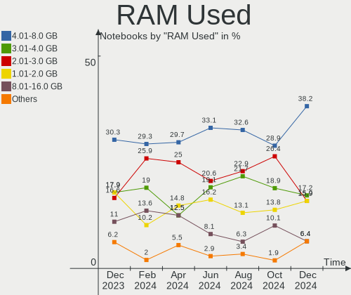
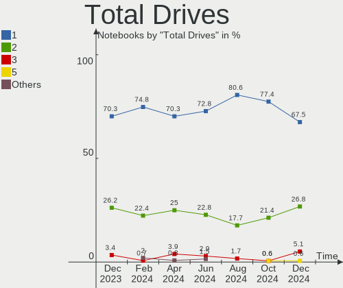

Arch - Hardware Trends (Notebooks)
----------------------------------

A project to identify most popular hardware characteristics and track their change
over time based on data collected by Linux users at https://Linux-Hardware.org.

Anyone can contribute to this report by the [hw-probe](https://github.com/linuxhw/hw-probe) tool:

    sudo -E hw-probe -all -upload

This report is for one last month. Overall report since the beginning of time: [TestCoverage](https://github.com/linuxhw/TestCoverage)

Period: Oct, 2022.

Contents
--------

* [ System ](#system)
  - [ OS                       ](#os)
  - [ OS Family                ](#os-family)
  - [ Kernel                   ](#kernel)
  - [ Kernel Family            ](#kernel-family)
  - [ Kernel Major Ver.        ](#kernel-major-ver)
  - [ Arch                     ](#arch)
  - [ DE                       ](#de)
  - [ Display Server           ](#display-server)
  - [ Display Manager          ](#display-manager)
  - [ OS Lang                  ](#os-lang)
  - [ Boot Mode                ](#boot-mode)
  - [ Filesystem               ](#filesystem)
  - [ Part. scheme             ](#part-scheme)
  - [ Dual Boot with Linux/BSD ](#dual-boot-with-linuxbsd)
  - [ Dual Boot (Win)          ](#dual-boot-win)

* [ Board ](#board)
  - [ Vendor                   ](#vendor)
  - [ Model                    ](#model)
  - [ Model Family             ](#model-family)
  - [ MFG Year                 ](#mfg-year)
  - [ Form Factor              ](#form-factor)
  - [ Secure Boot              ](#secure-boot)
  - [ Coreboot                 ](#coreboot)
  - [ RAM Size                 ](#ram-size)
  - [ RAM Used                 ](#ram-used)
  - [ Total Drives             ](#total-drives)
  - [ Has CD-ROM               ](#has-cd-rom)
  - [ Has Ethernet             ](#has-ethernet)
  - [ Has WiFi                 ](#has-wifi)
  - [ Has Bluetooth            ](#has-bluetooth)

* [ Location ](#location)
  - [ Country                  ](#country)
  - [ City                     ](#city)

* [ Drives ](#drives)
  - [ Drive Vendor             ](#drive-vendor)
  - [ Drive Model              ](#drive-model)
  - [ HDD Vendor               ](#hdd-vendor)
  - [ SSD Vendor               ](#ssd-vendor)
  - [ Drive Kind               ](#drive-kind)
  - [ Drive Connector          ](#drive-connector)
  - [ Drive Size               ](#drive-size)
  - [ Space Total              ](#space-total)
  - [ Space Used               ](#space-used)
  - [ Malfunc. Drives          ](#malfunc-drives)
  - [ Malfunc. Drive Vendor    ](#malfunc-drive-vendor)
  - [ Malfunc. HDD Vendor      ](#malfunc-hdd-vendor)
  - [ Malfunc. Drive Kind      ](#malfunc-drive-kind)
  - [ Failed Drives            ](#failed-drives)
  - [ Failed Drive Vendor      ](#failed-drive-vendor)
  - [ Drive Status             ](#drive-status)

* [ Storage controller ](#storage-controller)
  - [ Storage Vendor           ](#storage-vendor)
  - [ Storage Model            ](#storage-model)
  - [ Storage Kind             ](#storage-kind)

* [ Processor ](#processor)
  - [ CPU Vendor               ](#cpu-vendor)
  - [ CPU Model                ](#cpu-model)
  - [ CPU Model Family         ](#cpu-model-family)
  - [ CPU Cores                ](#cpu-cores)
  - [ CPU Sockets              ](#cpu-sockets)
  - [ CPU Threads              ](#cpu-threads)
  - [ CPU Op-Modes             ](#cpu-op-modes)
  - [ CPU Microcode            ](#cpu-microcode)
  - [ CPU Microarch            ](#cpu-microarch)

* [ Graphics ](#graphics)
  - [ GPU Vendor               ](#gpu-vendor)
  - [ GPU Model                ](#gpu-model)
  - [ GPU Combo                ](#gpu-combo)
  - [ GPU Driver               ](#gpu-driver)
  - [ GPU Memory               ](#gpu-memory)

* [ Monitor ](#monitor)
  - [ Monitor Vendor           ](#monitor-vendor)
  - [ Monitor Model            ](#monitor-model)
  - [ Monitor Resolution       ](#monitor-resolution)
  - [ Monitor Diagonal         ](#monitor-diagonal)
  - [ Monitor Width            ](#monitor-width)
  - [ Aspect Ratio             ](#aspect-ratio)
  - [ Monitor Area             ](#monitor-area)
  - [ Pixel Density            ](#pixel-density)
  - [ Multiple Monitors        ](#multiple-monitors)

* [ Network ](#network)
  - [ Net Controller Vendor    ](#net-controller-vendor)
  - [ Net Controller Model     ](#net-controller-model)
  - [ Wireless Vendor          ](#wireless-vendor)
  - [ Wireless Model           ](#wireless-model)
  - [ Ethernet Vendor          ](#ethernet-vendor)
  - [ Ethernet Model           ](#ethernet-model)
  - [ Net Controller Kind      ](#net-controller-kind)
  - [ Used Controller          ](#used-controller)
  - [ NICs                     ](#nics)
  - [ IPv6                     ](#ipv6)

* [ Bluetooth ](#bluetooth)
  - [ Bluetooth Vendor         ](#bluetooth-vendor)
  - [ Bluetooth Model          ](#bluetooth-model)

* [ Sound ](#sound)
  - [ Sound Vendor             ](#sound-vendor)
  - [ Sound Model              ](#sound-model)

* [ Memory ](#memory)
  - [ Memory Vendor            ](#memory-vendor)
  - [ Memory Model             ](#memory-model)
  - [ Memory Kind              ](#memory-kind)
  - [ Memory Form Factor       ](#memory-form-factor)
  - [ Memory Size              ](#memory-size)
  - [ Memory Speed             ](#memory-speed)

* [ Printers & scanners ](#printers--scanners)
  - [ Printer Vendor           ](#printer-vendor)
  - [ Printer Model            ](#printer-model)
  - [ Scanner Vendor           ](#scanner-vendor)
  - [ Scanner Model            ](#scanner-model)

* [ Camera ](#camera)
  - [ Camera Vendor            ](#camera-vendor)
  - [ Camera Model             ](#camera-model)

* [ Security ](#security)
  - [ Fingerprint Vendor       ](#fingerprint-vendor)
  - [ Fingerprint Model        ](#fingerprint-model)
  - [ Chipcard Vendor          ](#chipcard-vendor)
  - [ Chipcard Model           ](#chipcard-model)

* [ Unsupported ](#unsupported)
  - [ Unsupported Devices      ](#unsupported-devices)
  - [ Unsupported Device Types ](#unsupported-device-types)

System
------

OS
--

Installed operating systems

| Name         | Notebooks | Percent |
|--------------|-----------|---------|
| Arch Rolling | 134       | 100%    |

OS Family
---------

OS without a version

| Name | Notebooks | Percent |
|------|-----------|---------|
| Arch | 134       | 100%    |

Kernel
------

Version of the Linux kernel

| Version                  | Notebooks | Percent |
|--------------------------|-----------|---------|
| 6.0.2-arch1-1            | 49        | 36.57%  |
| 5.19.13-arch1-1          | 17        | 12.69%  |
| 5.19.12-arch1-1          | 10        | 7.46%   |
| 6.0.2-zen1-1-zen         | 8         | 5.97%   |
| 6.0.5-arch1-1            | 7         | 5.22%   |
| 6.0.1-arch2-1            | 6         | 4.48%   |
| 5.19.13-zen1-1-zen       | 4         | 2.99%   |
| 5.15.74-1-lts            | 4         | 2.99%   |
| 6.0.1-arch1-1            | 3         | 2.24%   |
| 5.19.11-arch1-1          | 3         | 2.24%   |
| 5.15.75-1-lts            | 2         | 1.49%   |
| 5.15.73-3-lts            | 2         | 1.49%   |
| 5.15.72-1-lts            | 2         | 1.49%   |
| 6.0.6-arch1-1            | 1         | 0.75%   |
| 6.0.3-arch3-1            | 1         | 0.75%   |
| 6.0.2-zen1-1.1-zen       | 1         | 0.75%   |
| 6.0.1-zen2-1-zen         | 1         | 0.75%   |
| 6.0.1-zen1-1-zen         | 1         | 0.75%   |
| 6.0.1-x64v3-xanmod1-1-v3 | 1         | 0.75%   |
| 6.0.0-arch1-1            | 1         | 0.75%   |
| 5.19.13-arch1-g14-3      | 1         | 0.75%   |
| 5.19.12-zen1-1-zen       | 1         | 0.75%   |
| 5.19.10-arch1-1          | 1         | 0.75%   |
| 5.19.10-269-tkg-pds      | 1         | 0.75%   |
| 5.18.16-arch1-1          | 1         | 0.75%   |
| 5.18.12-arch1-1          | 1         | 0.75%   |
| 5.15.72-xanmod1-1-lts    | 1         | 0.75%   |
| 5.15.71-1-lts            | 1         | 0.75%   |
| 5.15.68-1-lts            | 1         | 0.75%   |
| 5.15.64-1-lts            | 1         | 0.75%   |

Kernel Family
-------------

Linux kernel without a distro release

| Version | Notebooks | Percent |
|---------|-----------|---------|
| 6.0.2   | 58        | 43.28%  |
| 5.19.13 | 22        | 16.42%  |
| 6.0.1   | 12        | 8.96%   |
| 5.19.12 | 11        | 8.21%   |
| 6.0.5   | 7         | 5.22%   |
| 5.15.74 | 4         | 2.99%   |
| 5.19.11 | 3         | 2.24%   |
| 5.15.72 | 3         | 2.24%   |
| 5.19.10 | 2         | 1.49%   |
| 5.15.75 | 2         | 1.49%   |
| 5.15.73 | 2         | 1.49%   |
| 6.0.6   | 1         | 0.75%   |
| 6.0.3   | 1         | 0.75%   |
| 6.0.0   | 1         | 0.75%   |
| 5.18.16 | 1         | 0.75%   |
| 5.18.12 | 1         | 0.75%   |
| 5.15.71 | 1         | 0.75%   |
| 5.15.68 | 1         | 0.75%   |
| 5.15.64 | 1         | 0.75%   |

Kernel Major Ver.
-----------------

Linux kernel major version

| Version | Notebooks | Percent |
|---------|-----------|---------|
| 6.0     | 80        | 59.7%   |
| 5.19    | 38        | 28.36%  |
| 5.15    | 14        | 10.45%  |
| 5.18    | 2         | 1.49%   |

Arch
----

OS architecture (x86_64, i586, etc.)

| Name   | Notebooks | Percent |
|--------|-----------|---------|
| x86_64 | 134       | 100%    |

DE
--

Desktop Environment

| Name           | Notebooks | Percent |
|----------------|-----------|---------|
| KDE5           | 48        | 35.82%  |
| GNOME          | 46        | 34.33%  |
| Unknown        | 12        | 8.96%   |
| XFCE           | 5         | 3.73%   |
| sway           | 4         | 2.99%   |
| i3             | 4         | 2.99%   |
| Hyprland       | 4         | 2.99%   |
| qtile          | 2         | 1.49%   |
| Deepin         | 2         | 1.49%   |
| awesome        | 2         | 1.49%   |
| Unity          | 1         | 0.75%   |
| LXQt           | 1         | 0.75%   |
| instantwm      | 1         | 0.75%   |
| i3-with-shmlog | 1         | 0.75%   |
| Budgie         | 1         | 0.75%   |

Display Server
--------------

X11 or Wayland

| Name    | Notebooks | Percent |
|---------|-----------|---------|
| X11     | 67        | 50%     |
| Wayland | 55        | 41.04%  |
| Tty     | 7         | 5.22%   |
| Unknown | 5         | 3.73%   |

Display Manager
---------------

SDDM, LightDM, etc.

| Name    | Notebooks | Percent |
|---------|-----------|---------|
| Unknown | 49        | 36.57%  |
| SDDM    | 39        | 29.1%   |
| GDM     | 23        | 17.16%  |
| LightDM | 19        | 14.18%  |
| Ly      | 2         | 1.49%   |
| LXDM    | 1         | 0.75%   |
| EMPTTY  | 1         | 0.75%   |

OS Lang
-------

Language

| Lang    | Notebooks | Percent |
|---------|-----------|---------|
| en_US   | 62        | 46.27%  |
| it_IT   | 29        | 21.64%  |
| C       | 12        | 8.96%   |
| en_GB   | 6         | 4.48%   |
| Unknown | 6         | 4.48%   |
| en_IN   | 4         | 2.99%   |
| ru_RU   | 2         | 1.49%   |
| fr_FR   | 2         | 1.49%   |
| de_DE   | 2         | 1.49%   |
| pt_BR   | 1         | 0.75%   |
| pl_PL   | 1         | 0.75%   |
| fr_CA   | 1         | 0.75%   |
| es_UY   | 1         | 0.75%   |
| es_PE   | 1         | 0.75%   |
| es_ES   | 1         | 0.75%   |
| es_CL   | 1         | 0.75%   |
| en_ZA   | 1         | 0.75%   |
| en_AU   | 1         | 0.75%   |

Boot Mode
---------

EFI or BIOS

| Mode | Notebooks | Percent |
|------|-----------|---------|
| EFI  | 83        | 61.94%  |
| BIOS | 51        | 38.06%  |

Filesystem
----------

Type of filesystem

| Type  | Notebooks | Percent |
|-------|-----------|---------|
| Ext4  | 92        | 68.66%  |
| Btrfs | 38        | 28.36%  |
| Xfs   | 2         | 1.49%   |
| F2fs  | 2         | 1.49%   |

Part. scheme
------------

Scheme of partitioning

| Type    | Notebooks | Percent |
|---------|-----------|---------|
| GPT     | 90        | 67.16%  |
| Unknown | 35        | 26.12%  |
| MBR     | 9         | 6.72%   |

Dual Boot with Linux/BSD
------------------------

Hosting more than one Linux/BSD

| Dual boot | Notebooks | Percent |
|-----------|-----------|---------|
| No        | 119       | 88.81%  |
| Yes       | 15        | 11.19%  |

Dual Boot (Win)
---------------

Hosting Linux and Windows

| Dual boot | Notebooks | Percent |
|-----------|-----------|---------|
| No        | 95        | 70.9%   |
| Yes       | 39        | 29.1%   |

Board
-----

Vendor
------

Motherboard manufacturer

| Name                   | Notebooks | Percent |
|------------------------|-----------|---------|
| Lenovo                 | 39        | 29.1%   |
| Hewlett-Packard        | 24        | 17.91%  |
| Dell                   | 19        | 14.18%  |
| ASUSTek Computer       | 14        | 10.45%  |
| Acer                   | 11        | 8.21%   |
| Apple                  | 4         | 2.99%   |
| Timi                   | 3         | 2.24%   |
| Avell High Performance | 3         | 2.24%   |
| Samsung Electronics    | 2         | 1.49%   |
| MSI                    | 2         | 1.49%   |
| Fujitsu                | 2         | 1.49%   |
| Unknown                | 2         | 1.49%   |
| UNOWHY                 | 1         | 0.75%   |
| Toshiba                | 1         | 0.75%   |
| MOTILE                 | 1         | 0.75%   |
| MECHREVO               | 1         | 0.75%   |
| HUAWEI                 | 1         | 0.75%   |
| Google                 | 1         | 0.75%   |
| Framework              | 1         | 0.75%   |
| AMI                    | 1         | 0.75%   |
| Alienware              | 1         | 0.75%   |

Model
-----

Motherboard model

| Name                                        | Notebooks | Percent |
|---------------------------------------------|-----------|---------|
| HP 255 G8 Notebook PC                       | 3         | 2.24%   |
| HP 250 G8 Notebook PC                       | 3         | 2.24%   |
| Avell High Performance B.ON                 | 3         | 2.24%   |
| Acer Aspire A515-45                         | 3         | 2.24%   |
| ASUS ROG Strix G513QY_G513QY                | 2         | 1.49%   |
| Apple MacBookAir7,2                         | 2         | 1.49%   |
| Unknown                                     | 2         | 1.49%   |
| UNOWHY Y13G012S4EI                          | 1         | 0.75%   |
| Toshiba PORTEGE Z10t-A                      | 1         | 0.75%   |
| Timi Xiaomi Book Pro 14 2022                | 1         | 0.75%   |
| Timi Mi Laptop Pro 15                       | 1         | 0.75%   |
| Timi A7S                                    | 1         | 0.75%   |
| Samsung 950XDB/951XDB/950XDY                | 1         | 0.75%   |
| Samsung 270E5J/2570EJ                       | 1         | 0.75%   |
| MSI Prestige 14 A10SC                       | 1         | 0.75%   |
| MSI Modern 15 A5M                           | 1         | 0.75%   |
| MOTILE M141                                 | 1         | 0.75%   |
| MECHREVO Code01 Ver2.0                      | 1         | 0.75%   |
| Lenovo Yoga Slim 7 14ITL05 82A3             | 1         | 0.75%   |
| Lenovo Y520-15IKBN 80WK                     | 1         | 0.75%   |
| Lenovo ThinkPad Z16 Gen 1 21D40016PB        | 1         | 0.75%   |
| Lenovo ThinkPad X201 3680FAG                | 1         | 0.75%   |
| Lenovo ThinkPad X1 Carbon Gen 9 20XWCTO1WW  | 1         | 0.75%   |
| Lenovo ThinkPad X1 Carbon Gen 10 21CCS00800 | 1         | 0.75%   |
| Lenovo ThinkPad X1 Carbon 3rd 20BTS41M00    | 1         | 0.75%   |
| Lenovo ThinkPad W540 20BHS0730D             | 1         | 0.75%   |
| Lenovo ThinkPad T495 20NJ000XIX             | 1         | 0.75%   |
| Lenovo ThinkPad T480s 20L8S5YM00            | 1         | 0.75%   |
| Lenovo ThinkPad T480 20L5000AIX             | 1         | 0.75%   |
| Lenovo ThinkPad T480 20L50000IX             | 1         | 0.75%   |
| Lenovo ThinkPad T470s 20HGS1R90U            | 1         | 0.75%   |
| Lenovo ThinkPad T470 20HES0FW00             | 1         | 0.75%   |
| Lenovo ThinkPad T460s 20FAS6EH00            | 1         | 0.75%   |
| Lenovo ThinkPad T410 2522E38                | 1         | 0.75%   |
| Lenovo ThinkPad T16 Gen 1 21CHCTO1WW        | 1         | 0.75%   |
| Lenovo ThinkPad T15p Gen 3 21DACTO1WW       | 1         | 0.75%   |
| Lenovo ThinkPad T14s Gen 2a 20XF004AIX      | 1         | 0.75%   |
| Lenovo ThinkPad T14s Gen 1 20UH0051IX       | 1         | 0.75%   |
| Lenovo ThinkPad T14 Gen 1 20S00012IX        | 1         | 0.75%   |
| Lenovo ThinkPad P50 20EQS6DV00              | 1         | 0.75%   |

Model Family
------------

Motherboard model prefix

| Name                        | Notebooks | Percent |
|-----------------------------|-----------|---------|
| Lenovo ThinkPad             | 24        | 17.91%  |
| Acer Aspire                 | 10        | 7.46%   |
| Lenovo IdeaPad              | 6         | 4.48%   |
| HP Pavilion                 | 6         | 4.48%   |
| Dell Latitude               | 6         | 4.48%   |
| Lenovo ThinkBook            | 5         | 3.73%   |
| Dell Inspiron               | 5         | 3.73%   |
| HP EliteBook                | 4         | 2.99%   |
| ASUS ROG                    | 4         | 2.99%   |
| HP ProBook                  | 3         | 2.24%   |
| HP 255                      | 3         | 2.24%   |
| HP 250                      | 3         | 2.24%   |
| Dell XPS                    | 3         | 2.24%   |
| Dell Precision              | 3         | 2.24%   |
| Avell High Performance B.ON | 3         | 2.24%   |
| Fujitsu LIFEBOOK            | 2         | 1.49%   |
| Dell Vostro                 | 2         | 1.49%   |
| ASUS ZenBook                | 2         | 1.49%   |
| ASUS VivoBook               | 2         | 1.49%   |
| ASUS TUF                    | 2         | 1.49%   |
| Apple MacBookAir7           | 2         | 1.49%   |
| Unknown                     | 2         | 1.49%   |
| UNOWHY Y13G012S4EI          | 1         | 0.75%   |
| Toshiba PORTEGE             | 1         | 0.75%   |
| Timi Xiaomi                 | 1         | 0.75%   |
| Timi Mi                     | 1         | 0.75%   |
| Timi A7S                    | 1         | 0.75%   |
| Samsung 950XDB              | 1         | 0.75%   |
| Samsung 270E5J              | 1         | 0.75%   |
| MSI Prestige                | 1         | 0.75%   |
| MSI Modern                  | 1         | 0.75%   |
| MOTILE M141                 | 1         | 0.75%   |
| MECHREVO Code01             | 1         | 0.75%   |
| Lenovo Yoga                 | 1         | 0.75%   |
| Lenovo Y520-15IKBN          | 1         | 0.75%   |
| Lenovo Legion               | 1         | 0.75%   |
| Lenovo B51-80               | 1         | 0.75%   |
| HUAWEI HN-WX9X              | 1         | 0.75%   |
| HP ZBook                    | 1         | 0.75%   |
| HP Victus                   | 1         | 0.75%   |

MFG Year
--------

Motherboard manufacture year

| Year | Notebooks | Percent |
|------|-----------|---------|
| 2021 | 26        | 19.4%   |
| 2020 | 25        | 18.66%  |
| 2022 | 14        | 10.45%  |
| 2019 | 13        | 9.7%    |
| 2018 | 12        | 8.96%   |
| 2015 | 9         | 6.72%   |
| 2016 | 6         | 4.48%   |
| 2017 | 5         | 3.73%   |
| 2012 | 5         | 3.73%   |
| 2014 | 4         | 2.99%   |
| 2013 | 4         | 2.99%   |
| 2011 | 4         | 2.99%   |
| 2010 | 3         | 2.24%   |
| 2008 | 3         | 2.24%   |
| 2009 | 1         | 0.75%   |

Form Factor
-----------

Physical design of the computer

| Name     | Notebooks | Percent |
|----------|-----------|---------|
| Notebook | 134       | 100%    |

Secure Boot
-----------

Enabled or disabled

| State    | Notebooks | Percent |
|----------|-----------|---------|
| Disabled | 128       | 95.52%  |
| Enabled  | 6         | 4.48%   |

Coreboot
--------

Have coreboot on board

| Used | Notebooks | Percent |
|------|-----------|---------|
| No   | 133       | 99.25%  |
| Yes  | 1         | 0.75%   |

RAM Size
--------

Total RAM memory

| Size in GB  | Notebooks | Percent |
|-------------|-----------|---------|
| 4.01-8.0    | 37        | 27.61%  |
| 16.01-24.0  | 34        | 25.37%  |
| 8.01-16.0   | 31        | 23.13%  |
| 32.01-64.0  | 13        | 9.7%    |
| 3.01-4.0    | 13        | 9.7%    |
| 24.01-32.0  | 3         | 2.24%   |
| 64.01-256.0 | 2         | 1.49%   |
| 1.01-2.0    | 1         | 0.75%   |

RAM Used
--------

Used RAM memory

| Used GB   | Notebooks | Percent |
|-----------|-----------|---------|
| 3.01-4.0  | 35        | 26.12%  |
| 1.01-2.0  | 31        | 23.13%  |
| 4.01-8.0  | 27        | 20.15%  |
| 2.01-3.0  | 25        | 18.66%  |
| 8.01-16.0 | 11        | 8.21%   |
| 0.51-1.0  | 5         | 3.73%   |

Total Drives
------------

Number of drives on board

| Drives | Notebooks | Percent |
|--------|-----------|---------|
| 1      | 97        | 72.39%  |
| 2      | 34        | 25.37%  |
| 3      | 2         | 1.49%   |
| 4      | 1         | 0.75%   |

Has CD-ROM
----------

Has CD-ROM on board

| Presented | Notebooks | Percent |
|-----------|-----------|---------|
| No        | 119       | 88.81%  |
| Yes       | 15        | 11.19%  |

Has Ethernet
------------

Has Ethernet on board

| Presented | Notebooks | Percent |
|-----------|-----------|---------|
| Yes       | 103       | 76.87%  |
| No        | 31        | 23.13%  |

Has WiFi
--------

Has WiFi module

| Presented | Notebooks | Percent |
|-----------|-----------|---------|
| Yes       | 133       | 99.25%  |
| No        | 1         | 0.75%   |

Has Bluetooth
-------------

Has Bluetooth module

| Presented | Notebooks | Percent |
|-----------|-----------|---------|
| Yes       | 117       | 87.31%  |
| No        | 17        | 12.69%  |

Location
--------

Country
-------

Geographic location (country)

| Country      | Notebooks | Percent |
|--------------|-----------|---------|
| Italy        | 40        | 29.85%  |
| USA          | 23        | 17.16%  |
| Germany      | 9         | 6.72%   |
| Brazil       | 8         | 5.97%   |
| India        | 6         | 4.48%   |
| Poland       | 5         | 3.73%   |
| France       | 4         | 2.99%   |
| Russia       | 3         | 2.24%   |
| Denmark      | 3         | 2.24%   |
| UK           | 2         | 1.49%   |
| Spain        | 2         | 1.49%   |
| Czechia      | 2         | 1.49%   |
| Croatia      | 2         | 1.49%   |
| China        | 2         | 1.49%   |
| Canada       | 2         | 1.49%   |
| Vietnam      | 1         | 0.75%   |
| Uruguay      | 1         | 0.75%   |
| Turkey       | 1         | 0.75%   |
| Tunisia      | 1         | 0.75%   |
| South Africa | 1         | 0.75%   |
| Singapore    | 1         | 0.75%   |
| Romania      | 1         | 0.75%   |
| Philippines  | 1         | 0.75%   |
| Peru         | 1         | 0.75%   |
| Norway       | 1         | 0.75%   |
| Netherlands  | 1         | 0.75%   |
| Montenegro   | 1         | 0.75%   |
| Lebanon      | 1         | 0.75%   |
| Latvia       | 1         | 0.75%   |
| Indonesia    | 1         | 0.75%   |
| Hungary      | 1         | 0.75%   |
| Hong Kong    | 1         | 0.75%   |
| Chile        | 1         | 0.75%   |
| Belarus      | 1         | 0.75%   |
| Australia    | 1         | 0.75%   |
| Argentina    | 1         | 0.75%   |

City
----

Geographic location (city)

| City                 | Notebooks | Percent |
|----------------------|-----------|---------|
| Milan                | 11        | 8.21%   |
| Turin                | 2         | 1.49%   |
| Seattle              | 2         | 1.49%   |
| Prague               | 2         | 1.49%   |
| Phoenix              | 2         | 1.49%   |
| Padova               | 2         | 1.49%   |
| Moscow               | 2         | 1.49%   |
| Los Angeles          | 2         | 1.49%   |
| Berlin               | 2         | 1.49%   |
| Zhengzhou            | 1         | 0.75%   |
| Zevio                | 1         | 0.75%   |
| Zahle                | 1         | 0.75%   |
| Zagreb               | 1         | 0.75%   |
| Wroclaw              | 1         | 0.75%   |
| Warsaw               | 1         | 0.75%   |
| Voorhout             | 1         | 0.75%   |
| Vicopisano           | 1         | 0.75%   |
| Velika Gorica        | 1         | 0.75%   |
| Valencia             | 1         | 0.75%   |
| Utica                | 1         | 0.75%   |
| Three Rivers         | 1         | 0.75%   |
| Tewksbury            | 1         | 0.75%   |
| Terlizzi             | 1         | 0.75%   |
| Szeged               | 1         | 0.75%   |
| Summerville          | 1         | 0.75%   |
| Stuttgart            | 1         | 0.75%   |
| Sparta               | 1         | 0.75%   |
| Singapore            | 1         | 0.75%   |
| Scorrano             | 1         | 0.75%   |
| Schwielowsee         | 1         | 0.75%   |
| Sao Paulo            | 1         | 0.75%   |
| Sao José dos Campos | 1         | 0.75%   |
| Sao Caetano do Sul   | 1         | 0.75%   |
| Santiago             | 1         | 0.75%   |
| Rocklin              | 1         | 0.75%   |
| Rio de Janeiro       | 1         | 0.75%   |
| Riga                 | 1         | 0.75%   |
| Reutlingen           | 1         | 0.75%   |
| Pretoria             | 1         | 0.75%   |
| Pozzo d'Adda         | 1         | 0.75%   |

Drives
------

Drive Vendor
------------

Hard drive vendors

| Vendor                      | Notebooks | Drives | Percent |
|-----------------------------|-----------|--------|---------|
| Samsung Electronics         | 43        | 46     | 25.9%   |
| Sandisk                     | 16        | 17     | 9.64%   |
| Seagate                     | 10        | 10     | 6.02%   |
| Micron Technology           | 10        | 10     | 6.02%   |
| Intel                       | 8         | 9      | 4.82%   |
| Crucial                     | 8         | 9      | 4.82%   |
| WDC                         | 7         | 7      | 4.22%   |
| Unknown                     | 7         | 7      | 4.22%   |
| SK hynix                    | 6         | 6      | 3.61%   |
| KIOXIA                      | 6         | 6      | 3.61%   |
| Kingston                    | 5         | 6      | 3.01%   |
| Toshiba                     | 4         | 4      | 2.41%   |
| Phison Electronics          | 4         | 4      | 2.41%   |
| Apple                       | 4         | 4      | 2.41%   |
| A-DATA Technology           | 4         | 4      | 2.41%   |
| Silicon Motion              | 3         | 3      | 1.81%   |
| Realtek Semiconductor       | 2         | 2      | 1.2%    |
| Micron/Crucial Technology   | 2         | 2      | 1.2%    |
| Hitachi                     | 2         | 2      | 1.2%    |
| HGST                        | 2         | 2      | 1.2%    |
| Yangtze Memory Technologies | 1         | 1      | 0.6%    |
| TO Exter                    | 1         | 1      | 0.6%    |
| SSSTC                       | 1         | 1      | 0.6%    |
| SPCC                        | 1         | 1      | 0.6%    |
| PNY                         | 1         | 1      | 0.6%    |
| Patriot                     | 1         | 1      | 0.6%    |
| LITEONIT                    | 1         | 1      | 0.6%    |
| LaCie                       | 1         | 1      | 0.6%    |
| KimMiDi                     | 1         | 1      | 0.6%    |
| Intenso                     | 1         | 1      | 0.6%    |
| HS-SSD-C100                 | 1         | 1      | 0.6%    |
| HGST HTS                    | 1         | 1      | 0.6%    |
| ADATA Technology            | 1         | 1      | 0.6%    |

Drive Model
-----------

Hard drive models

| Model                                                 | Notebooks | Percent |
|-------------------------------------------------------|-----------|---------|
| Samsung NVMe SSD Controller SM981/PM981/PM983 500GB   | 8         | 4.68%   |
| Samsung NVMe SSD Controller PM9A1/PM9A3/980PRO 250GB  | 6         | 3.51%   |
| Unknown MMC Card  64GB                                | 4         | 2.34%   |
| Seagate ST1000LM035-1RK172 1TB                        | 4         | 2.34%   |
| Sandisk WD Black SN750 / PC SN730 NVMe SSD 1TB        | 4         | 2.34%   |
| Samsung NVMe SSD Controller SM961/PM961/SM963 250GB   | 4         | 2.34%   |
| Phison E12 NVMe Controller 2TB                        | 3         | 1.75%   |
| Micron 2210_MTFDHBA512QFD 512GB                       | 3         | 1.75%   |
| Crucial CT500MX500SSD1 500GB                          | 3         | 1.75%   |
| A-DATA IM2P33F8A-512GD 512GB                          | 3         | 1.75%   |
| Silicon Motion SM2263EN/SM2263XT SSD Controller 256GB | 2         | 1.17%   |
| Sandisk WD Blue SN550 NVMe SSD 1TB                    | 2         | 1.17%   |
| Sandisk WD Blue SN500 / PC SN520 NVMe SSD 512GB       | 2         | 1.17%   |
| Samsung SSD 860 EVO M.2 500GB                         | 2         | 1.17%   |
| Samsung SSD 860 EVO 250GB                             | 2         | 1.17%   |
| Samsung SSD 850 PRO 256GB                             | 2         | 1.17%   |
| Samsung MZVLQ512HALU-000H1 512GB                      | 2         | 1.17%   |
| Micron 2450_MTFDKBA1T0TFK 1024GB                      | 2         | 1.17%   |
| KIOXIA KBG40ZNT512G TOSHIBA MEMORY 512GB              | 2         | 1.17%   |
| Kingston SA400S37480G 480GB SSD                       | 2         | 1.17%   |
| Kingston SA400S37240G 240GB SSD                       | 2         | 1.17%   |
| Intel SSD Pro 7600p/760p/E 6100p Series 256GB         | 2         | 1.17%   |
| Intel SSD 660P Series 1024GB                          | 2         | 1.17%   |
| Yangtze Memory ZHITAI TiPro7000 1TB                   | 1         | 0.58%   |
| WDC WDS250G2B0A-00SM50 250GB SSD                      | 1         | 0.58%   |
| WDC WDS240G2G0B-00EPW0 240GB SSD                      | 1         | 0.58%   |
| WDC WD7500BPVX-22JC3T0 752GB                          | 1         | 0.58%   |
| WDC WD5000BPVT-16HXZT1 500GB                          | 1         | 0.58%   |
| WDC WD3200BEVT-00ZCT0 320GB                           | 1         | 0.58%   |
| WDC WD10SPZX-21Z10T0 1TB                              | 1         | 0.58%   |
| WDC WD10EZEX-08WN4A0 1TB                              | 1         | 0.58%   |
| Unknown SD/MMC/MS PRO 1TB                             | 1         | 0.58%   |
| Unknown MMC Card  32GB                                | 1         | 0.58%   |
| Unknown MMC Card  128GB                               | 1         | 0.58%   |
| Toshiba XG6 NVMe SSD Controller 512GB                 | 1         | 0.58%   |
| Toshiba THNSNF256GMCS 256GB SSD                       | 1         | 0.58%   |
| Toshiba KBG30ZMV512G 512GB                            | 1         | 0.58%   |
| Toshiba BG3 NVMe SSD Controller 128GB                 | 1         | 0.58%   |
| TO Exter nal USB 3.0 1TB                              | 1         | 0.58%   |
| SSSTC CVB-8D128-HP 128GB                              | 1         | 0.58%   |

HDD Vendor
----------

Hard disk drive vendors

| Vendor              | Notebooks | Drives | Percent |
|---------------------|-----------|--------|---------|
| Seagate             | 10        | 10     | 45.45%  |
| WDC                 | 5         | 5      | 22.73%  |
| Hitachi             | 2         | 2      | 9.09%   |
| HGST                | 2         | 2      | 9.09%   |
| Unknown             | 1         | 1      | 4.55%   |
| Samsung Electronics | 1         | 1      | 4.55%   |
| HGST HTS            | 1         | 1      | 4.55%   |

SSD Vendor
----------

Solid state drive vendors

| Vendor              | Notebooks | Drives | Percent |
|---------------------|-----------|--------|---------|
| Samsung Electronics | 14        | 14     | 30.43%  |
| Crucial             | 8         | 9      | 17.39%  |
| Kingston            | 5         | 6      | 10.87%  |
| Apple               | 4         | 4      | 8.7%    |
| WDC                 | 2         | 2      | 4.35%   |
| Toshiba             | 1         | 1      | 2.17%   |
| TO Exter            | 1         | 1      | 2.17%   |
| SSSTC               | 1         | 1      | 2.17%   |
| SPCC                | 1         | 1      | 2.17%   |
| SanDisk             | 1         | 1      | 2.17%   |
| PNY                 | 1         | 1      | 2.17%   |
| Patriot             | 1         | 1      | 2.17%   |
| Micron Technology   | 1         | 1      | 2.17%   |
| LITEONIT            | 1         | 1      | 2.17%   |
| KimMiDi             | 1         | 1      | 2.17%   |
| Intenso             | 1         | 1      | 2.17%   |
| HS-SSD-C100         | 1         | 1      | 2.17%   |
| A-DATA Technology   | 1         | 1      | 2.17%   |

Drive Kind
----------

HDD or SSD

| Kind    | Notebooks | Drives | Percent |
|---------|-----------|--------|---------|
| NVMe    | 85        | 96     | 54.49%  |
| SSD     | 43        | 48     | 27.56%  |
| HDD     | 21        | 22     | 13.46%  |
| MMC     | 6         | 6      | 3.85%   |
| Unknown | 1         | 1      | 0.64%   |

Drive Connector
---------------

SATA, SAS, NVMe, etc.

| Type | Notebooks | Drives | Percent |
|------|-----------|--------|---------|
| NVMe | 85        | 96     | 55.92%  |
| SATA | 56        | 66     | 36.84%  |
| MMC  | 6         | 6      | 3.95%   |
| SAS  | 5         | 5      | 3.29%   |

Drive Size
----------

Size of hard drive

| Size in TB | Notebooks | Drives | Percent |
|------------|-----------|--------|---------|
| 0.01-0.5   | 43        | 49     | 68.25%  |
| 0.51-1.0   | 17        | 18     | 26.98%  |
| 1.01-2.0   | 3         | 3      | 4.76%   |

Space Total
-----------

Amount of disk space available on the file system

| Size in GB     | Notebooks | Percent |
|----------------|-----------|---------|
| 101-250        | 35        | 26.12%  |
| 251-500        | 34        | 25.37%  |
| 501-1000       | 25        | 18.66%  |
| 1001-2000      | 14        | 10.45%  |
| More than 3000 | 6         | 4.48%   |
| 2001-3000      | 6         | 4.48%   |
| 51-100         | 5         | 3.73%   |
| 21-50          | 4         | 2.99%   |
| Unknown        | 3         | 2.24%   |
| 1-20           | 2         | 1.49%   |

Space Used
----------

Amount of used disk space

| Used GB        | Notebooks | Percent |
|----------------|-----------|---------|
| 101-250        | 35        | 26.12%  |
| 21-50          | 28        | 20.9%   |
| 1-20           | 26        | 19.4%   |
| 51-100         | 17        | 12.69%  |
| 251-500        | 12        | 8.96%   |
| 501-1000       | 10        | 7.46%   |
| Unknown        | 3         | 2.24%   |
| More than 3000 | 2         | 1.49%   |
| 2001-3000      | 1         | 0.75%   |

Malfunc. Drives
---------------

Drive models with a malfunction

| Model                                 | Notebooks | Drives | Percent |
|---------------------------------------|-----------|--------|---------|
| WDC WD5000BPVT-16HXZT1 500GB          | 1         | 1      | 12.5%   |
| Toshiba BG3 NVMe SSD Controller 128GB | 1         | 1      | 12.5%   |
| Seagate ST1000LM035-1RK172 1TB        | 1         | 1      | 12.5%   |
| Samsung Electronics SSD 980 500GB     | 1         | 1      | 12.5%   |
| Samsung Electronics SSD 870 EVO 500GB | 1         | 1      | 12.5%   |
| HGST HTS721010A9E630 1TB              | 1         | 1      | 12.5%   |
| Crucial CT525MX300SSD1 528GB          | 1         | 1      | 12.5%   |
| Crucial CT120BX500SSD1 120GB          | 1         | 1      | 12.5%   |

Malfunc. Drive Vendor
---------------------

Vendors of faulty drives

| Vendor              | Notebooks | Drives | Percent |
|---------------------|-----------|--------|---------|
| Samsung Electronics | 2         | 2      | 25%     |
| Crucial             | 2         | 2      | 25%     |
| WDC                 | 1         | 1      | 12.5%   |
| Toshiba             | 1         | 1      | 12.5%   |
| Seagate             | 1         | 1      | 12.5%   |
| HGST                | 1         | 1      | 12.5%   |

Malfunc. HDD Vendor
-------------------

Vendors of faulty HDD drives

| Vendor  | Notebooks | Drives | Percent |
|---------|-----------|--------|---------|
| WDC     | 1         | 1      | 33.33%  |
| Seagate | 1         | 1      | 33.33%  |
| HGST    | 1         | 1      | 33.33%  |

Malfunc. Drive Kind
-------------------

Kinds of faulty drives

| Kind | Notebooks | Drives | Percent |
|------|-----------|--------|---------|
| SSD  | 3         | 3      | 37.5%   |
| HDD  | 3         | 3      | 37.5%   |
| NVMe | 2         | 2      | 25%     |

Failed Drives
-------------

Failed drive models

Zero info for selected period =(

Failed Drive Vendor
-------------------

Failed drive vendors

Zero info for selected period =(

Drive Status
------------

Number of failed and malfunc. drives

| Status   | Notebooks | Drives | Percent |
|----------|-----------|--------|---------|
| Works    | 80        | 101    | 56.34%  |
| Detected | 55        | 64     | 38.73%  |
| Malfunc  | 7         | 8      | 4.93%   |

Storage controller
------------------

Storage Vendor
--------------

Storage controller vendors

| Vendor                       | Notebooks | Percent |
|------------------------------|-----------|---------|
| Intel                        | 68        | 39.53%  |
| Samsung Electronics          | 32        | 18.6%   |
| AMD                          | 17        | 9.88%   |
| SanDisk                      | 15        | 8.72%   |
| Micron Technology            | 9         | 5.23%   |
| SK hynix                     | 6         | 3.49%   |
| KIOXIA                       | 6         | 3.49%   |
| Phison Electronics           | 4         | 2.33%   |
| ADATA Technology             | 4         | 2.33%   |
| Toshiba America Info Systems | 3         | 1.74%   |
| Silicon Motion               | 3         | 1.74%   |
| Realtek Semiconductor        | 2         | 1.16%   |
| Micron/Crucial Technology    | 2         | 1.16%   |
| Yangtze Memory Technologies  | 1         | 0.58%   |

Storage Model
-------------

Storage controller models

| Model                                                                        | Notebooks | Percent |
|------------------------------------------------------------------------------|-----------|---------|
| AMD FCH SATA Controller [AHCI mode]                                          | 17        | 9.29%   |
| Samsung NVMe SSD Controller 980                                              | 11        | 6.01%   |
| Samsung NVMe SSD Controller SM981/PM981/PM983                                | 9         | 4.92%   |
| Micron Non-Volatile memory controller                                        | 9         | 4.92%   |
| Intel 82801 Mobile SATA Controller [RAID mode]                               | 9         | 4.92%   |
| Intel Volume Management Device NVMe RAID Controller                          | 8         | 4.37%   |
| Intel Sunrise Point-LP SATA Controller [AHCI mode]                           | 7         | 3.83%   |
| Samsung NVMe SSD Controller PM9A1/PM9A3/980PRO                               | 6         | 3.28%   |
| Intel Cannon Lake Mobile PCH SATA AHCI Controller                            | 6         | 3.28%   |
| KIOXIA NVMe SSD Controller BG4                                               | 5         | 2.73%   |
| SanDisk WD Black SN750 / PC SN730 NVMe SSD                                   | 4         | 2.19%   |
| SanDisk Non-Volatile memory controller                                       | 4         | 2.19%   |
| Samsung NVMe SSD Controller SM961/PM961/SM963                                | 4         | 2.19%   |
| Intel Tiger Lake-LP SATA Controller                                          | 4         | 2.19%   |
| Intel HM170/QM170 Chipset SATA Controller [AHCI Mode]                        | 4         | 2.19%   |
| Intel 7 Series Chipset Family 6-port SATA Controller [AHCI mode]             | 4         | 2.19%   |
| SK hynix Gold P31 SSD                                                        | 3         | 1.64%   |
| Phison E12 NVMe Controller                                                   | 3         | 1.64%   |
| Intel Non-Volatile memory controller                                         | 3         | 1.64%   |
| Intel Ice Lake-LP SATA Controller [AHCI mode]                                | 3         | 1.64%   |
| Intel Cannon Point-LP SATA Controller [AHCI Mode]                            | 3         | 1.64%   |
| Intel 8 Series SATA Controller 1 [AHCI mode]                                 | 3         | 1.64%   |
| Intel 6 Series/C200 Series Chipset Family 6 port Mobile SATA AHCI Controller | 3         | 1.64%   |
| ADATA Non-Volatile memory controller                                         | 3         | 1.64%   |
| Toshiba America Info Systems BG3 NVMe SSD Controller                         | 2         | 1.09%   |
| Silicon Motion SM2263EN/SM2263XT SSD Controller                              | 2         | 1.09%   |
| SanDisk WD Blue SN570 NVMe SSD                                               | 2         | 1.09%   |
| SanDisk WD Blue SN550 NVMe SSD                                               | 2         | 1.09%   |
| SanDisk WD Blue SN500 / PC SN520 NVMe SSD                                    | 2         | 1.09%   |
| Samsung Electronics SATA controller                                          | 2         | 1.09%   |
| Intel SSD Pro 7600p/760p/E 6100p Series                                      | 2         | 1.09%   |
| Intel SSD 660P Series                                                        | 2         | 1.09%   |
| Intel Celeron/Pentium Silver Processor SATA Controller                       | 2         | 1.09%   |
| Intel 82801IBM/IEM (ICH9M/ICH9M-E) 4 port SATA Controller [AHCI mode]        | 2         | 1.09%   |
| Intel 5 Series/3400 Series Chipset 6 port SATA AHCI Controller               | 2         | 1.09%   |
| Yangtze Memory ZHITAI TiPro7000                                              | 1         | 0.55%   |
| Toshiba America Info Systems XG6 NVMe SSD Controller                         | 1         | 0.55%   |
| SK hynix PC401 NVMe Solid State Drive 256GB                                  | 1         | 0.55%   |
| SK hynix Non-Volatile memory controller                                      | 1         | 0.55%   |
| SK hynix BC511                                                               | 1         | 0.55%   |

Storage Kind
------------

Kind of storage controller (IDE, SATA, NVMe, SAS, ...)

| Kind | Notebooks | Percent |
|------|-----------|---------|
| NVMe | 85        | 49.13%  |
| SATA | 71        | 41.04%  |
| RAID | 17        | 9.83%   |

Processor
---------

CPU Vendor
----------

Processor vendors

| Vendor | Notebooks | Percent |
|--------|-----------|---------|
| Intel  | 92        | 68.66%  |
| AMD    | 42        | 31.34%  |

CPU Model
---------

Processor models

| Model                                         | Notebooks | Percent |
|-----------------------------------------------|-----------|---------|
| Intel 11th Gen Core i7-1165G7 @ 2.80GHz       | 7         | 5.22%   |
| AMD Ryzen 7 5700U with Radeon Graphics        | 5         | 3.73%   |
| Intel 11th Gen Core i5-1135G7 @ 2.40GHz       | 4         | 2.99%   |
| AMD Ryzen 5 5500U with Radeon Graphics        | 4         | 2.99%   |
| Intel Core i7-8750H CPU @ 2.20GHz             | 3         | 2.24%   |
| Intel Core i7-8550U CPU @ 1.80GHz             | 3         | 2.24%   |
| Intel Core i5-6200U CPU @ 2.30GHz             | 3         | 2.24%   |
| Intel 12th Gen Core i7-12700H                 | 3         | 2.24%   |
| AMD Ryzen 7 4700U with Radeon Graphics        | 3         | 2.24%   |
| AMD Ryzen 5 5600U with Radeon Graphics        | 3         | 2.24%   |
| Intel Pentium Silver N5030 CPU @ 1.10GHz      | 2         | 1.49%   |
| Intel Core i7-8650U CPU @ 1.90GHz             | 2         | 1.49%   |
| Intel Core i7-8565U CPU @ 1.80GHz             | 2         | 1.49%   |
| Intel Core i7-6700HQ CPU @ 2.60GHz            | 2         | 1.49%   |
| Intel Core i7-1065G7 CPU @ 1.30GHz            | 2         | 1.49%   |
| Intel Core i5-8300H CPU @ 2.30GHz             | 2         | 1.49%   |
| Intel Core i5-8265U CPU @ 1.60GHz             | 2         | 1.49%   |
| Intel Core i5-8250U CPU @ 1.60GHz             | 2         | 1.49%   |
| Intel Core i5-5250U CPU @ 1.60GHz             | 2         | 1.49%   |
| Intel Core i5-1035G1 CPU @ 1.00GHz            | 2         | 1.49%   |
| Intel 12th Gen Core i7-1260P                  | 2         | 1.49%   |
| Intel 11th Gen Core i3-1115G4 @ 3.00GHz       | 2         | 1.49%   |
| AMD Ryzen 7 PRO 5850U with Radeon Graphics    | 2         | 1.49%   |
| AMD Ryzen 7 6800H with Radeon Graphics        | 2         | 1.49%   |
| AMD Ryzen 7 5800H with Radeon Graphics        | 2         | 1.49%   |
| AMD Ryzen 7 4800H with Radeon Graphics        | 2         | 1.49%   |
| AMD Ryzen 5 3500U with Radeon Vega Mobile Gfx | 2         | 1.49%   |
| Intel Xeon CPU E3-1505M v5 @ 2.80GHz          | 1         | 0.75%   |
| Intel Pentium CPU N3540 @ 2.16GHz             | 1         | 0.75%   |
| Intel Pentium CPU B960 @ 2.20GHz              | 1         | 0.75%   |
| Intel Core i7-9750H CPU @ 2.60GHz             | 1         | 0.75%   |
| Intel Core i7-7700HQ CPU @ 2.80GHz            | 1         | 0.75%   |
| Intel Core i7-7600U CPU @ 2.80GHz             | 1         | 0.75%   |
| Intel Core i7-6600U CPU @ 2.60GHz             | 1         | 0.75%   |
| Intel Core i7-4800MQ CPU @ 2.70GHz            | 1         | 0.75%   |
| Intel Core i7-4770HQ CPU @ 2.20GHz            | 1         | 0.75%   |
| Intel Core i7-4610M CPU @ 3.00GHz             | 1         | 0.75%   |
| Intel Core i7-4600M CPU @ 2.90GHz             | 1         | 0.75%   |
| Intel Core i7-4510U CPU @ 2.00GHz             | 1         | 0.75%   |
| Intel Core i7-3632QM CPU @ 2.20GHz            | 1         | 0.75%   |

CPU Model Family
----------------

Processor model prefix

| Model                | Notebooks | Percent |
|----------------------|-----------|---------|
| Intel Core i7        | 30        | 22.39%  |
| Intel Core i5        | 25        | 18.66%  |
| Other                | 22        | 16.42%  |
| AMD Ryzen 7          | 17        | 12.69%  |
| AMD Ryzen 5          | 9         | 6.72%   |
| Intel Core i3        | 5         | 3.73%   |
| AMD Ryzen 9          | 4         | 2.99%   |
| AMD Ryzen 7 PRO      | 4         | 2.99%   |
| Intel Core 2 Duo     | 3         | 2.24%   |
| AMD Ryzen 3          | 3         | 2.24%   |
| Intel Pentium Silver | 2         | 1.49%   |
| Intel Pentium        | 2         | 1.49%   |
| Intel Celeron        | 2         | 1.49%   |
| AMD Ryzen 5 PRO      | 2         | 1.49%   |
| Intel Xeon           | 1         | 0.75%   |
| Intel Atom           | 1         | 0.75%   |
| AMD E2               | 1         | 0.75%   |
| AMD A8               | 1         | 0.75%   |

CPU Cores
---------

Number of processor cores

| Number | Notebooks | Percent |
|--------|-----------|---------|
| 4      | 55        | 41.04%  |
| 2      | 36        | 26.87%  |
| 8      | 24        | 17.91%  |
| 6      | 13        | 9.7%    |
| 14     | 3         | 2.24%   |
| 12     | 2         | 1.49%   |
| 10     | 1         | 0.75%   |

CPU Sockets
-----------

Number of sockets

| Number | Notebooks | Percent |
|--------|-----------|---------|
| 1      | 134       | 100%    |

CPU Threads
-----------

Threads per core (Hyper-Threading)

| Number | Notebooks | Percent |
|--------|-----------|---------|
| 2      | 118       | 88.06%  |
| 1      | 16        | 11.94%  |

CPU Op-Modes
------------

CPU Operation Modes (32-bit, 64-bit)

| Op mode        | Notebooks | Percent |
|----------------|-----------|---------|
| 32-bit, 64-bit | 134       | 100%    |

CPU Microcode
-------------

Microcode number

| Number     | Notebooks | Percent |
|------------|-----------|---------|
| Unknown    | 45        | 33.58%  |
| 0x806c1    | 10        | 7.46%   |
| 0x0a50000c | 10        | 7.46%   |
| 0x08608103 | 6         | 4.48%   |
| 0x906ea    | 5         | 3.73%   |
| 0x806ec    | 4         | 2.99%   |
| 0x806ea    | 4         | 2.99%   |
| 0x0a404102 | 4         | 2.99%   |
| 0x706e5    | 3         | 2.24%   |
| 0x406e3    | 3         | 2.24%   |
| 0x306c3    | 3         | 2.24%   |
| 0x08608102 | 3         | 2.24%   |
| 0x08108109 | 3         | 2.24%   |
| 0x906a3    | 2         | 1.49%   |
| 0x806e9    | 2         | 1.49%   |
| 0x506e3    | 2         | 1.49%   |
| 0x306a9    | 2         | 1.49%   |
| 0x206a7    | 2         | 1.49%   |
| 0x20655    | 2         | 1.49%   |
| 0x08600103 | 2         | 1.49%   |
| 0x08108102 | 2         | 1.49%   |
| 0xa0660    | 1         | 0.75%   |
| 0x906ed    | 1         | 0.75%   |
| 0x906e9    | 1         | 0.75%   |
| 0x906a4    | 1         | 0.75%   |
| 0x806eb    | 1         | 0.75%   |
| 0x6fb      | 1         | 0.75%   |
| 0x406c3    | 1         | 0.75%   |
| 0x40651    | 1         | 0.75%   |
| 0x306d4    | 1         | 0.75%   |
| 0x30678    | 1         | 0.75%   |
| 0x1067a    | 1         | 0.75%   |
| 0x10676    | 1         | 0.75%   |
| 0x0a404101 | 1         | 0.75%   |
| 0x08600104 | 1         | 0.75%   |
| 0x08001138 | 1         | 0.75%   |

CPU Microarch
-------------

Microarchitecture

| Name             | Notebooks | Percent |
|------------------|-----------|---------|
| KabyLake         | 25        | 18.66%  |
| Unknown          | 20        | 14.93%  |
| TigerLake        | 14        | 10.45%  |
| Zen 3            | 10        | 7.46%   |
| Skylake          | 9         | 6.72%   |
| Zen+             | 7         | 5.22%   |
| Haswell          | 7         | 5.22%   |
| Zen 2            | 6         | 4.48%   |
| IvyBridge        | 5         | 3.73%   |
| Westmere         | 4         | 2.99%   |
| SandyBridge      | 4         | 2.99%   |
| IceLake          | 4         | 2.99%   |
| Goldmont plus    | 3         | 2.24%   |
| Broadwell        | 3         | 2.24%   |
| Zen              | 2         | 1.49%   |
| Silvermont       | 2         | 1.49%   |
| Penryn           | 2         | 1.49%   |
| Alderlake Hybrid | 2         | 1.49%   |
| Steamroller      | 1         | 0.75%   |
| Goldmont         | 1         | 0.75%   |
| Core             | 1         | 0.75%   |
| CometLake        | 1         | 0.75%   |
| Bobcat           | 1         | 0.75%   |

Graphics
--------

GPU Vendor
----------

Vendors of graphics cards

| Vendor | Notebooks | Percent |
|--------|-----------|---------|
| Intel  | 87        | 51.18%  |
| AMD    | 45        | 26.47%  |
| Nvidia | 38        | 22.35%  |

GPU Model
---------

Graphics card models

| Model                                                                                 | Notebooks | Percent |
|---------------------------------------------------------------------------------------|-----------|---------|
| Intel TigerLake-LP GT2 [Iris Xe Graphics]                                             | 12        | 6.94%   |
| AMD Lucienne                                                                          | 10        | 5.78%   |
| AMD Cezanne                                                                           | 10        | 5.78%   |
| Intel UHD Graphics 620                                                                | 8         | 4.62%   |
| AMD Picasso/Raven 2 [Radeon Vega Series / Radeon Vega Mobile Series]                  | 8         | 4.62%   |
| Intel Skylake GT2 [HD Graphics 520]                                                   | 6         | 3.47%   |
| Intel CoffeeLake-H GT2 [UHD Graphics 630]                                             | 6         | 3.47%   |
| AMD Renoir                                                                            | 6         | 3.47%   |
| Intel Alder Lake-P Integrated Graphics Controller                                     | 5         | 2.89%   |
| Intel 3rd Gen Core processor Graphics Controller                                      | 5         | 2.89%   |
| AMD Rembrandt [Radeon 680M]                                                           | 5         | 2.89%   |
| Nvidia GP107M [GeForce GTX 1050 Mobile]                                               | 4         | 2.31%   |
| Intel WhiskeyLake-U GT2 [UHD Graphics 620]                                            | 4         | 2.31%   |
| Intel 2nd Generation Core Processor Family Integrated Graphics Controller             | 4         | 2.31%   |
| Nvidia TU117M [GeForce GTX 1650 Mobile / Max-Q]                                       | 3         | 1.73%   |
| Intel Core Processor Integrated Graphics Controller                                   | 3         | 1.73%   |
| Intel 4th Gen Core Processor Integrated Graphics Controller                           | 3         | 1.73%   |
| Nvidia GP107M [GeForce GTX 1050 Ti Mobile]                                            | 2         | 1.16%   |
| Nvidia GM108M [GeForce MX130]                                                         | 2         | 1.16%   |
| Nvidia GA106M [GeForce RTX 3060 Mobile / Max-Q]                                       | 2         | 1.16%   |
| Intel Tiger Lake UHD Graphics                                                         | 2         | 1.16%   |
| Intel Iris Plus Graphics G7                                                           | 2         | 1.16%   |
| Intel Iris Plus Graphics G1 (Ice Lake)                                                | 2         | 1.16%   |
| Intel HD Graphics 630                                                                 | 2         | 1.16%   |
| Intel HD Graphics 620                                                                 | 2         | 1.16%   |
| Intel HD Graphics 6000                                                                | 2         | 1.16%   |
| Intel HD Graphics 530                                                                 | 2         | 1.16%   |
| Intel Haswell-ULT Integrated Graphics Controller                                      | 2         | 1.16%   |
| Intel GeminiLake [UHD Graphics 605]                                                   | 2         | 1.16%   |
| Intel CometLake-U GT2 [UHD Graphics]                                                  | 2         | 1.16%   |
| AMD Topaz XT [Radeon R7 M260/M265 / M340/M360 / M440/M445 / 530/535 / 620/625 Mobile] | 2         | 1.16%   |
| AMD Navi 22 [Radeon RX 6700/6700 XT/6750 XT / 6800M]                                  | 2         | 1.16%   |
| Nvidia TU117GLM [Quadro T500 Mobile]                                                  | 1         | 0.58%   |
| Nvidia TU116M [GeForce GTX 1660 Ti Mobile]                                            | 1         | 0.58%   |
| Nvidia TU116 [GeForce GTX 1660 SUPER]                                                 | 1         | 0.58%   |
| Nvidia GT215GLM [Quadro FX 1800M]                                                     | 1         | 0.58%   |
| Nvidia GP108M [GeForce MX250]                                                         | 1         | 0.58%   |
| Nvidia GP108M [GeForce MX150]                                                         | 1         | 0.58%   |
| Nvidia GP107M [GeForce MX350]                                                         | 1         | 0.58%   |
| Nvidia GP107M [GeForce GTX 1050 3 GB Max-Q]                                           | 1         | 0.58%   |

GPU Combo
---------

Combinations of graphics cards

| Name           | Notebooks | Percent |
|----------------|-----------|---------|
| 1 x Intel      | 55        | 41.04%  |
| 1 x AMD        | 33        | 24.63%  |
| Intel + Nvidia | 27        | 20.15%  |
| 1 x Nvidia     | 6         | 4.48%   |
| AMD + Nvidia   | 5         | 3.73%   |
| Intel + AMD    | 4         | 2.99%   |
| 2 x AMD        | 3         | 2.24%   |
| Other          | 1         | 0.75%   |

GPU Driver
----------

Free vs proprietary

| Driver      | Notebooks | Percent |
|-------------|-----------|---------|
| Free        | 111       | 82.84%  |
| Proprietary | 23        | 17.16%  |

GPU Memory
----------

Total video memory

| Size in GB | Notebooks | Percent |
|------------|-----------|---------|
| Unknown    | 88        | 65.67%  |
| 0.01-0.5   | 19        | 14.18%  |
| 1.01-2.0   | 9         | 6.72%   |
| 3.01-4.0   | 5         | 3.73%   |
| 0.51-1.0   | 5         | 3.73%   |
| 7.01-8.0   | 2         | 1.49%   |
| 5.01-6.0   | 2         | 1.49%   |
| 2.01-3.0   | 2         | 1.49%   |
| 8.01-16.0  | 2         | 1.49%   |

Monitor
-------

Monitor Vendor
--------------

Monitor vendors

| Vendor               | Notebooks | Percent |
|----------------------|-----------|---------|
| BOE                  | 34        | 20.36%  |
| Samsung Electronics  | 24        | 14.37%  |
| Chimei Innolux       | 22        | 13.17%  |
| AU Optronics         | 21        | 12.57%  |
| LG Display           | 19        | 11.38%  |
| Sharp                | 6         | 3.59%   |
| Goldstar             | 6         | 3.59%   |
| PANDA                | 4         | 2.4%    |
| Dell                 | 4         | 2.4%    |
| Apple                | 4         | 2.4%    |
| Lenovo               | 3         | 1.8%    |
| TMX                  | 2         | 1.2%    |
| Hewlett-Packard      | 2         | 1.2%    |
| CSO                  | 2         | 1.2%    |
| Ancor Communications | 2         | 1.2%    |
| Acer                 | 2         | 1.2%    |
| ViewSonic            | 1         | 0.6%    |
| Pixio                | 1         | 0.6%    |
| MSI                  | 1         | 0.6%    |
| LG Philips           | 1         | 0.6%    |
| JDZ                  | 1         | 0.6%    |
| Insignia             | 1         | 0.6%    |
| InfoVision           | 1         | 0.6%    |
| Iiyama               | 1         | 0.6%    |
| BenQ                 | 1         | 0.6%    |
| AOC                  | 1         | 0.6%    |

Monitor Model
-------------

Monitor models

| Model                                                                   | Notebooks | Percent |
|-------------------------------------------------------------------------|-----------|---------|
| Chimei Innolux LCD Monitor CMN14C9 1920x1080 309x173mm 13.9-inch        | 3         | 1.8%    |
| BOE LCD Monitor BOE08F5 1920x1080 344x194mm 15.5-inch                   | 3         | 1.8%    |
| AU Optronics LCD Monitor AUO61ED 1920x1080 344x194mm 15.5-inch          | 3         | 1.8%    |
| AU Optronics LCD Monitor AUO21ED 1920x1080 344x193mm 15.5-inch          | 3         | 1.8%    |
| PANDA LCD Monitor NCP002D 1920x1080 344x194mm 15.5-inch                 | 2         | 1.2%    |
| LG Display LCD Monitor LGD0563 1920x1080 344x194mm 15.5-inch            | 2         | 1.2%    |
| LG Display LCD Monitor LGD02DC 1366x768 344x194mm 15.5-inch             | 2         | 1.2%    |
| Chimei Innolux LCD Monitor CMN15E7 1920x1080 344x193mm 15.5-inch        | 2         | 1.2%    |
| Chimei Innolux LCD Monitor CMN15BF 1366x768 344x193mm 15.5-inch         | 2         | 1.2%    |
| Chimei Innolux LCD Monitor CMN14D5 1920x1080 309x173mm 13.9-inch        | 2         | 1.2%    |
| AU Optronics LCD Monitor AUO2E8D 1920x1080 344x194mm 15.5-inch          | 2         | 1.2%    |
| ViewSonic VX2467-MHD VSCA33B 1920x1080 527x296mm 23.8-inch              | 1         | 0.6%    |
| TMX TL140BDXP01-0 TMX1400 2560x1440 310x174mm 14.0-inch                 | 1         | 0.6%    |
| TMX TL140ADXP01 TMX1481 2560x1600 301x188mm 14.0-inch                   | 1         | 0.6%    |
| Sharp LQ156M1JW25 SHP152C 1920x1080 344x194mm 15.5-inch                 | 1         | 0.6%    |
| Sharp LQ156M1JW01 SHP14C3 1920x1080 344x194mm 15.5-inch                 | 1         | 0.6%    |
| Sharp LCD Monitor SHP14CB 1920x1200 288x180mm 13.4-inch                 | 1         | 0.6%    |
| Sharp LCD Monitor SHP149A 1920x1080 344x194mm 15.5-inch                 | 1         | 0.6%    |
| Sharp LCD Monitor SHP148B 3840x2160 294x165mm 13.3-inch                 | 1         | 0.6%    |
| Sharp LCD Monitor SHP143B 3840x2160 346x194mm 15.6-inch                 | 1         | 0.6%    |
| Samsung Electronics U28E590 SAM0C4E 3840x2160 608x345mm 27.5-inch       | 1         | 0.6%    |
| Samsung Electronics U28E590 SAM0C4C 3840x2160 608x345mm 27.5-inch       | 1         | 0.6%    |
| Samsung Electronics SyncMaster SAM03EE 1680x1050                        | 1         | 0.6%    |
| Samsung Electronics SyncMaster SAM030D 1680x1050 474x296mm 22.0-inch    | 1         | 0.6%    |
| Samsung Electronics SyncMaster SAM0273 1440x900 410x257mm 19.1-inch     | 1         | 0.6%    |
| Samsung Electronics SMBX2450 SAM0722 1920x1080 531x299mm 24.0-inch      | 1         | 0.6%    |
| Samsung Electronics LF24T35 SAM707D 1920x1080 528x297mm 23.9-inch       | 1         | 0.6%    |
| Samsung Electronics LCD Monitor SEC5442 1440x900 331x207mm 15.4-inch    | 1         | 0.6%    |
| Samsung Electronics LCD Monitor SEC5441 1366x768 344x194mm 15.5-inch    | 1         | 0.6%    |
| Samsung Electronics LCD Monitor SEC3942 1366x768 309x174mm 14.0-inch    | 1         | 0.6%    |
| Samsung Electronics LCD Monitor SEC3848 1920x1200 367x230mm 17.1-inch   | 1         | 0.6%    |
| Samsung Electronics LCD Monitor SEC3642 1366x768 344x194mm 15.5-inch    | 1         | 0.6%    |
| Samsung Electronics LCD Monitor SEC325A 1366x768 344x194mm 15.5-inch    | 1         | 0.6%    |
| Samsung Electronics LCD Monitor SDC864D 1920x1080 293x165mm 13.2-inch   | 1         | 0.6%    |
| Samsung Electronics LCD Monitor SDC544B 1600x900 309x174mm 14.0-inch    | 1         | 0.6%    |
| Samsung Electronics LCD Monitor SDC416A 2880x1800 302x189mm 14.0-inch   | 1         | 0.6%    |
| Samsung Electronics LCD Monitor SDC4159 1920x1080 344x194mm 15.5-inch   | 1         | 0.6%    |
| Samsung Electronics LCD Monitor SDC4158 1920x1080 294x165mm 13.3-inch   | 1         | 0.6%    |
| Samsung Electronics LCD Monitor SDC374A 1920x1080 344x194mm 15.5-inch   | 1         | 0.6%    |
| Samsung Electronics LCD Monitor SAM0FA8 3840x2160 1872x1053mm 84.6-inch | 1         | 0.6%    |

Monitor Resolution
------------------

Monitor screen resolution

| Resolution         | Notebooks | Percent |
|--------------------|-----------|---------|
| 1920x1080 (FHD)    | 86        | 56.95%  |
| 1366x768 (WXGA)    | 17        | 11.26%  |
| 3840x2160 (4K)     | 8         | 5.3%    |
| 1920x1200 (WUXGA)  | 8         | 5.3%    |
| 1440x900 (WXGA+)   | 6         | 3.97%   |
| 2560x1600          | 5         | 3.31%   |
| 2560x1440 (QHD)    | 5         | 3.31%   |
| 2880x1800          | 4         | 2.65%   |
| 2560x1080          | 2         | 1.32%   |
| 1680x1050 (WSXGA+) | 2         | 1.32%   |
| 1600x900 (HD+)     | 2         | 1.32%   |
| 1280x800 (WXGA)    | 2         | 1.32%   |
| 3440x1440          | 1         | 0.66%   |
| 3200x1800 (QHD+)   | 1         | 0.66%   |
| 2256x1504          | 1         | 0.66%   |
| 2160x1440          | 1         | 0.66%   |

Monitor Diagonal
----------------

Diagonal size in inches

| Inches  | Notebooks | Percent |
|---------|-----------|---------|
| 15      | 70        | 42.17%  |
| 13      | 26        | 15.66%  |
| 14      | 22        | 13.25%  |
| 27      | 13        | 7.83%   |
| 23      | 6         | 3.61%   |
| 16      | 6         | 3.61%   |
| 21      | 4         | 2.41%   |
| 17      | 4         | 2.41%   |
| 34      | 3         | 1.81%   |
| 24      | 3         | 1.81%   |
| 11      | 2         | 1.2%    |
| 84      | 1         | 0.6%    |
| 29      | 1         | 0.6%    |
| 22      | 1         | 0.6%    |
| 19      | 1         | 0.6%    |
| 18      | 1         | 0.6%    |
| 12      | 1         | 0.6%    |
| Unknown | 1         | 0.6%    |

Monitor Width
-------------

Physical width

| Width in mm | Notebooks | Percent |
|-------------|-----------|---------|
| 301-350     | 110       | 66.67%  |
| 501-600     | 18        | 10.91%  |
| 201-300     | 14        | 8.48%   |
| 401-500     | 7         | 4.24%   |
| 351-400     | 7         | 4.24%   |
| 601-700     | 4         | 2.42%   |
| 701-800     | 3         | 1.82%   |
| 1501-2000   | 1         | 0.61%   |
| Unknown     | 1         | 0.61%   |

Aspect Ratio
------------

Proportional relationship between the width and the height

| Ratio | Notebooks | Percent |
|-------|-----------|---------|
| 16/9  | 109       | 77.3%   |
| 16/10 | 26        | 18.44%  |
| 3/2   | 3         | 2.13%   |
| 21/9  | 2         | 1.42%   |
| 2.65  | 1         | 0.71%   |

Monitor Area
------------

Area in inch²

| Area in inch² | Notebooks | Percent |
|----------------|-----------|---------|
| 101-110        | 72        | 43.11%  |
| 81-90          | 40        | 23.95%  |
| 301-350        | 13        | 7.78%   |
| 201-250        | 13        | 7.78%   |
| 71-80          | 8         | 4.79%   |
| 111-120        | 4         | 2.4%    |
| 51-60          | 2         | 1.2%    |
| 351-500        | 2         | 1.2%    |
| 251-300        | 2         | 1.2%    |
| 151-200        | 2         | 1.2%    |
| 131-140        | 2         | 1.2%    |
| 121-130        | 2         | 1.2%    |
| More than 1000 | 1         | 0.6%    |
| 61-70          | 1         | 0.6%    |
| 501-1000       | 1         | 0.6%    |
| 91-100         | 1         | 0.6%    |
| Unknown        | 1         | 0.6%    |

Pixel Density
-------------

Pixels per inch

| Density       | Notebooks | Percent |
|---------------|-----------|---------|
| 121-160       | 90        | 55.56%  |
| 51-100        | 24        | 14.81%  |
| 101-120       | 22        | 13.58%  |
| 161-240       | 20        | 12.35%  |
| More than 240 | 4         | 2.47%   |
| 1-50          | 1         | 0.62%   |
| Unknown       | 1         | 0.62%   |

Multiple Monitors
-----------------

Total monitors connected

| Total | Notebooks | Percent |
|-------|-----------|---------|
| 1     | 102       | 76.12%  |
| 2     | 29        | 21.64%  |
| 3     | 3         | 2.24%   |

Network
-------

Net Controller Vendor
---------------------

Controller vendors

| Vendor                | Notebooks | Percent |
|-----------------------|-----------|---------|
| Realtek Semiconductor | 79        | 37.62%  |
| Intel                 | 74        | 35.24%  |
| Qualcomm Atheros      | 16        | 7.62%   |
| MediaTek              | 10        | 4.76%   |
| Broadcom              | 7         | 3.33%   |
| Broadcom Limited      | 5         | 2.38%   |
| ASIX Electronics      | 4         | 1.9%    |
| TP-Link               | 2         | 0.95%   |
| Sierra Wireless       | 2         | 0.95%   |
| Qualcomm              | 2         | 0.95%   |
| Google                | 2         | 0.95%   |
| Dell                  | 2         | 0.95%   |
| Samsung Electronics   | 1         | 0.48%   |
| Motorola PCS          | 1         | 0.48%   |
| Lenovo                | 1         | 0.48%   |
| DisplayLink           | 1         | 0.48%   |
| Cypress Semiconductor | 1         | 0.48%   |

Net Controller Model
--------------------

Controller models

| Model                                                             | Notebooks | Percent |
|-------------------------------------------------------------------|-----------|---------|
| Realtek RTL8111/8168/8411 PCI Express Gigabit Ethernet Controller | 54        | 21.34%  |
| Realtek RTL8822CE 802.11ac PCIe Wireless Network Adapter          | 10        | 3.95%   |
| Realtek RTL8153 Gigabit Ethernet Adapter                          | 10        | 3.95%   |
| Intel Wi-Fi 6 AX201                                               | 9         | 3.56%   |
| Intel Wireless 8265 / 8275                                        | 8         | 3.16%   |
| Intel Wi-Fi 6 AX200                                               | 8         | 3.16%   |
| Realtek RTL8852AE 802.11ax PCIe Wireless Network Adapter          | 7         | 2.77%   |
| MediaTek MT7921 802.11ax PCI Express Wireless Network Adapter     | 7         | 2.77%   |
| Intel Wi-Fi 6 AX210/AX211/AX411 160MHz                            | 6         | 2.37%   |
| Realtek RTL8821CE 802.11ac PCIe Wireless Network Adapter          | 5         | 1.98%   |
| Realtek RTL810xE PCI Express Fast Ethernet controller             | 5         | 1.98%   |
| Qualcomm Atheros QCA9377 802.11ac Wireless Network Adapter        | 5         | 1.98%   |
| Intel Ethernet Connection (4) I219-LM                             | 5         | 1.98%   |
| Intel Cannon Lake PCH CNVi WiFi                                   | 5         | 1.98%   |
| Intel Alder Lake-P PCH CNVi WiFi                                  | 5         | 1.98%   |
| Qualcomm Atheros QCA9565 / AR9565 Wireless Network Adapter        | 4         | 1.58%   |
| ASIX AX88179 Gigabit Ethernet                                     | 4         | 1.58%   |
| Qualcomm Atheros QCA6174 802.11ac Wireless Network Adapter        | 3         | 1.19%   |
| Intel Wireless 8260                                               | 3         | 1.19%   |
| Intel Wireless 3165                                               | 3         | 1.19%   |
| Intel Ethernet Connection I217-LM                                 | 3         | 1.19%   |
| Intel Comet Lake PCH-LP CNVi WiFi                                 | 3         | 1.19%   |
| Intel Centrino Ultimate-N 6300                                    | 3         | 1.19%   |
| Intel Centrino Advanced-N 6200                                    | 3         | 1.19%   |
| Intel 82577LM Gigabit Network Connection                          | 3         | 1.19%   |
| Qualcomm QCNFA765 Wireless Network Adapter                        | 2         | 0.79%   |
| Qualcomm Atheros AR9285 Wireless Network Adapter (PCI-Express)    | 2         | 0.79%   |
| MediaTek MT7921K (RZ608) Wi-Fi 6E 80MHz                           | 2         | 0.79%   |
| Intel Wireless 7265                                               | 2         | 0.79%   |
| Intel Wireless 7260                                               | 2         | 0.79%   |
| Intel Ice Lake-LP PCH CNVi WiFi                                   | 2         | 0.79%   |
| Intel Ethernet Connection I218-LM                                 | 2         | 0.79%   |
| Intel Ethernet Connection (4) I219-V                              | 2         | 0.79%   |
| Intel Ethernet Connection (16) I219-V                             | 2         | 0.79%   |
| Intel Cannon Point-LP CNVi [Wireless-AC]                          | 2         | 0.79%   |
| Intel 82579LM Gigabit Network Connection (Lewisville)             | 2         | 0.79%   |
| Intel 82567LM Gigabit Network Connection                          | 2         | 0.79%   |
| Broadcom Limited BCM4360 802.11ac Wireless Network Adapter        | 2         | 0.79%   |
| TP-Link UE300 10/100/1000 LAN (ethernet mode) [Realtek RTL8153]   | 1         | 0.4%    |
| TP-Link TL-WN823N v2/v3 [Realtek RTL8192EU]                       | 1         | 0.4%    |

Wireless Vendor
---------------

Wireless vendors

| Vendor                | Notebooks | Percent |
|-----------------------|-----------|---------|
| Intel                 | 71        | 51.82%  |
| Realtek Semiconductor | 25        | 18.25%  |
| Qualcomm Atheros      | 15        | 10.95%  |
| MediaTek              | 10        | 7.3%    |
| Broadcom Limited      | 5         | 3.65%   |
| Broadcom              | 5         | 3.65%   |
| Sierra Wireless       | 2         | 1.46%   |
| Qualcomm              | 2         | 1.46%   |
| TP-Link               | 1         | 0.73%   |
| Dell                  | 1         | 0.73%   |

Wireless Model
--------------

Wireless models

| Model                                                          | Notebooks | Percent |
|----------------------------------------------------------------|-----------|---------|
| Realtek RTL8822CE 802.11ac PCIe Wireless Network Adapter       | 10        | 7.3%    |
| Intel Wi-Fi 6 AX201                                            | 9         | 6.57%   |
| Intel Wireless 8265 / 8275                                     | 8         | 5.84%   |
| Intel Wi-Fi 6 AX200                                            | 8         | 5.84%   |
| Realtek RTL8852AE 802.11ax PCIe Wireless Network Adapter       | 7         | 5.11%   |
| MediaTek MT7921 802.11ax PCI Express Wireless Network Adapter  | 7         | 5.11%   |
| Intel Wi-Fi 6 AX210/AX211/AX411 160MHz                         | 6         | 4.38%   |
| Realtek RTL8821CE 802.11ac PCIe Wireless Network Adapter       | 5         | 3.65%   |
| Qualcomm Atheros QCA9377 802.11ac Wireless Network Adapter     | 5         | 3.65%   |
| Intel Cannon Lake PCH CNVi WiFi                                | 5         | 3.65%   |
| Intel Alder Lake-P PCH CNVi WiFi                               | 5         | 3.65%   |
| Qualcomm Atheros QCA9565 / AR9565 Wireless Network Adapter     | 4         | 2.92%   |
| Qualcomm Atheros QCA6174 802.11ac Wireless Network Adapter     | 3         | 2.19%   |
| Intel Wireless 8260                                            | 3         | 2.19%   |
| Intel Wireless 3165                                            | 3         | 2.19%   |
| Intel Comet Lake PCH-LP CNVi WiFi                              | 3         | 2.19%   |
| Intel Centrino Ultimate-N 6300                                 | 3         | 2.19%   |
| Intel Centrino Advanced-N 6200                                 | 3         | 2.19%   |
| Qualcomm QCNFA765 Wireless Network Adapter                     | 2         | 1.46%   |
| Qualcomm Atheros AR9285 Wireless Network Adapter (PCI-Express) | 2         | 1.46%   |
| MediaTek MT7921K (RZ608) Wi-Fi 6E 80MHz                        | 2         | 1.46%   |
| Intel Wireless 7265                                            | 2         | 1.46%   |
| Intel Wireless 7260                                            | 2         | 1.46%   |
| Intel Ice Lake-LP PCH CNVi WiFi                                | 2         | 1.46%   |
| Intel Cannon Point-LP CNVi [Wireless-AC]                       | 2         | 1.46%   |
| Broadcom Limited BCM4360 802.11ac Wireless Network Adapter     | 2         | 1.46%   |
| TP-Link TL-WN823N v2/v3 [Realtek RTL8192EU]                    | 1         | 0.73%   |
| Sierra Wireless EM7455 Qualcomm Snapdragon X7 LTE-A            | 1         | 0.73%   |
| Sierra Wireless EM7305                                         | 1         | 0.73%   |
| Realtek RTL8822BE 802.11a/b/g/n/ac WiFi adapter                | 1         | 0.73%   |
| Realtek Realtek Network controller                             | 1         | 0.73%   |
| Realtek 802.11n WLAN Adapter                                   | 1         | 0.73%   |
| Qualcomm Atheros AR9485 Wireless Network Adapter               | 1         | 0.73%   |
| MediaTek WLAN controller                                       | 1         | 0.73%   |
| Intel Wireless-AC 9260                                         | 1         | 0.73%   |
| Intel Ultimate N WiFi Link 5300                                | 1         | 0.73%   |
| Intel Tiger Lake PCH CNVi WiFi                                 | 1         | 0.73%   |
| Intel Gemini Lake PCH CNVi WiFi                                | 1         | 0.73%   |
| Intel Dual Band Wireless-AC 3168NGW [Stone Peak]               | 1         | 0.73%   |
| Intel Dual Band Wireless-AC 3165 Plus Bluetooth                | 1         | 0.73%   |

Ethernet Vendor
---------------

Ethernet vendors

| Vendor                | Notebooks | Percent |
|-----------------------|-----------|---------|
| Realtek Semiconductor | 69        | 61.61%  |
| Intel                 | 27        | 24.11%  |
| ASIX Electronics      | 4         | 3.57%   |
| Qualcomm Atheros      | 2         | 1.79%   |
| Google                | 2         | 1.79%   |
| Broadcom              | 2         | 1.79%   |
| TP-Link               | 1         | 0.89%   |
| Samsung Electronics   | 1         | 0.89%   |
| Motorola PCS          | 1         | 0.89%   |
| Lenovo                | 1         | 0.89%   |
| DisplayLink           | 1         | 0.89%   |
| Cypress Semiconductor | 1         | 0.89%   |

Ethernet Model
--------------

Ethernet models

| Model                                                             | Notebooks | Percent |
|-------------------------------------------------------------------|-----------|---------|
| Realtek RTL8111/8168/8411 PCI Express Gigabit Ethernet Controller | 54        | 46.96%  |
| Realtek RTL8153 Gigabit Ethernet Adapter                          | 10        | 8.7%    |
| Realtek RTL810xE PCI Express Fast Ethernet controller             | 5         | 4.35%   |
| Intel Ethernet Connection (4) I219-LM                             | 5         | 4.35%   |
| ASIX AX88179 Gigabit Ethernet                                     | 4         | 3.48%   |
| Intel Ethernet Connection I217-LM                                 | 3         | 2.61%   |
| Intel 82577LM Gigabit Network Connection                          | 3         | 2.61%   |
| Intel Ethernet Connection I218-LM                                 | 2         | 1.74%   |
| Intel Ethernet Connection (4) I219-V                              | 2         | 1.74%   |
| Intel Ethernet Connection (16) I219-V                             | 2         | 1.74%   |
| Intel 82579LM Gigabit Network Connection (Lewisville)             | 2         | 1.74%   |
| Intel 82567LM Gigabit Network Connection                          | 2         | 1.74%   |
| TP-Link UE300 10/100/1000 LAN (ethernet mode) [Realtek RTL8153]   | 1         | 0.87%   |
| Samsung Galaxy series, misc. (tethering mode)                     | 1         | 0.87%   |
| Realtek RTL8152 Fast Ethernet Adapter                             | 1         | 0.87%   |
| Realtek RTL8125 2.5GbE Controller                                 | 1         | 0.87%   |
| Realtek Killer E2600 Gigabit Ethernet Controller                  | 1         | 0.87%   |
| Qualcomm Atheros Killer E2400 Gigabit Ethernet Controller         | 1         | 0.87%   |
| Qualcomm Atheros AR8151 v2.0 Gigabit Ethernet                     | 1         | 0.87%   |
| Motorola PCS moto g(6) plus                                       | 1         | 0.87%   |
| Lenovo USB-C to LAN                                               | 1         | 0.87%   |
| Intel I211 Gigabit Network Connection                             | 1         | 0.87%   |
| Intel Ethernet Connection I219-V                                  | 1         | 0.87%   |
| Intel Ethernet Connection I219-LM                                 | 1         | 0.87%   |
| Intel Ethernet Connection (3) I218-LM                             | 1         | 0.87%   |
| Intel Ethernet Connection (2) I219-LM                             | 1         | 0.87%   |
| Intel Ethernet Connection (10) I219-V                             | 1         | 0.87%   |
| Google Pixel 6 Pro                                                | 1         | 0.87%   |
| Google Nexus/Pixel Device (tether+ debug)                         | 1         | 0.87%   |
| DisplayLink LAPDOCK                                               | 1         | 0.87%   |
| Cypress K38231_03                                                 | 1         | 0.87%   |
| Broadcom NetXtreme BCM57786 Gigabit Ethernet PCIe                 | 1         | 0.87%   |
| Broadcom NetXtreme BCM5761 Gigabit Ethernet PCIe                  | 1         | 0.87%   |

Net Controller Kind
-------------------

Ethernet, WiFi or modem

| Kind     | Notebooks | Percent |
|----------|-----------|---------|
| WiFi     | 133       | 56.12%  |
| Ethernet | 103       | 43.46%  |
| Modem    | 1         | 0.42%   |

Used Controller
---------------

Currently used network controller

| Kind     | Notebooks | Percent |
|----------|-----------|---------|
| WiFi     | 111       | 75.51%  |
| Ethernet | 36        | 24.49%  |

NICs
----

Total network controllers on board

| Total | Notebooks | Percent |
|-------|-----------|---------|
| 2     | 91        | 67.91%  |
| 1     | 40        | 29.85%  |
| 0     | 2         | 1.49%   |
| 3     | 1         | 0.75%   |

IPv6
----

IPv6 vs IPv4

| Used | Notebooks | Percent |
|------|-----------|---------|
| No   | 102       | 76.12%  |
| Yes  | 32        | 23.88%  |

Bluetooth
---------

Bluetooth Vendor
----------------

Controller vendors

| Vendor                          | Notebooks | Percent |
|---------------------------------|-----------|---------|
| Intel                           | 60        | 51.28%  |
| Realtek Semiconductor           | 18        | 15.38%  |
| Qualcomm Atheros Communications | 8         | 6.84%   |
| IMC Networks                    | 7         | 5.98%   |
| Lite-On Technology              | 5         | 4.27%   |
| Dell                            | 4         | 3.42%   |
| Apple                           | 4         | 3.42%   |
| USI                             | 2         | 1.71%   |
| MediaTek                        | 2         | 1.71%   |
| Foxconn / Hon Hai               | 2         | 1.71%   |
| Broadcom                        | 2         | 1.71%   |
| Realtek                         | 1         | 0.85%   |
| Opticis                         | 1         | 0.85%   |
| Askey Computer                  | 1         | 0.85%   |

Bluetooth Model
---------------

Controller models

| Model                                          | Notebooks | Percent |
|------------------------------------------------|-----------|---------|
| Intel Bluetooth wireless interface             | 17        | 14.53%  |
| Realtek Bluetooth Radio                        | 16        | 13.68%  |
| Intel AX201 Bluetooth                          | 11        | 9.4%    |
| Intel Bluetooth 9460/9560 Jefferson Peak (JfP) | 10        | 8.55%   |
| Intel AX200 Bluetooth                          | 8         | 6.84%   |
| Intel AX210 Bluetooth                          | 6         | 5.13%   |
| Intel Bluetooth Device                         | 5         | 4.27%   |
| IMC Networks Wireless_Device                   | 5         | 4.27%   |
| Qualcomm Atheros  Bluetooth Device             | 4         | 3.42%   |
| USI Bluetooth Device                           | 2         | 1.71%   |
| Realtek  Bluetooth 4.2 Adapter                 | 2         | 1.71%   |
| Qualcomm Atheros QCA61x4 Bluetooth 4.0         | 2         | 1.71%   |
| MediaTek Wireless_Device                       | 2         | 1.71%   |
| Lite-On Wireless_Device                        | 2         | 1.71%   |
| IMC Networks Bluetooth Radio                   | 2         | 1.71%   |
| Dell BCM20702A0 Bluetooth Module               | 2         | 1.71%   |
| Apple Bluetooth USB Host Controller            | 2         | 1.71%   |
| Apple Bluetooth Host Controller                | 2         | 1.71%   |
| Realtek Bluetooth Radio                        | 1         | 0.85%   |
| Qualcomm Atheros AR9462 Bluetooth              | 1         | 0.85%   |
| Qualcomm Atheros AR3012 Bluetooth 4.0          | 1         | 0.85%   |
| Opticis Bluetooth Radio                        | 1         | 0.85%   |
| Lite-On Qualcomm Atheros QCA9377 Bluetooth     | 1         | 0.85%   |
| Lite-On Bluetooth Device                       | 1         | 0.85%   |
| Lite-On Atheros AR3012 Bluetooth               | 1         | 0.85%   |
| Intel Wireless-AC 9260 Bluetooth Adapter       | 1         | 0.85%   |
| Intel Wireless-AC 3168 Bluetooth               | 1         | 0.85%   |
| Intel Centrino Bluetooth Wireless Transceiver  | 1         | 0.85%   |
| Foxconn / Hon Hai Wireless_Device              | 1         | 0.85%   |
| Foxconn / Hon Hai Bluetooth Device             | 1         | 0.85%   |
| Dell DW375 Bluetooth Module                    | 1         | 0.85%   |
| Dell Broadcom BCM20702A0 Bluetooth             | 1         | 0.85%   |
| Broadcom HP Portable Bumble Bee                | 1         | 0.85%   |
| Broadcom BCM2070 Bluetooth 2.1 + EDR           | 1         | 0.85%   |
| Askey Bluetooth Device                         | 1         | 0.85%   |

Sound
-----

Sound Vendor
------------

Sound card vendors

| Vendor              | Notebooks | Percent |
|---------------------|-----------|---------|
| Intel               | 91        | 54.82%  |
| AMD                 | 43        | 25.9%   |
| Nvidia              | 19        | 11.45%  |
| Razer USA           | 2         | 1.2%    |
| JMTek               | 2         | 1.2%    |
| C-Media Electronics | 2         | 1.2%    |
| Texas Instruments   | 1         | 0.6%    |
| Samson Technologies | 1         | 0.6%    |
| M-Audio             | 1         | 0.6%    |
| Logitech            | 1         | 0.6%    |
| Kingston Technology | 1         | 0.6%    |
| Focusrite-Novation  | 1         | 0.6%    |
| DSEA A/S            | 1         | 0.6%    |

Sound Model
-----------

Sound card models

| Model                                                                      | Notebooks | Percent |
|----------------------------------------------------------------------------|-----------|---------|
| AMD Family 17h/19h HD Audio Controller                                     | 39        | 17.97%  |
| AMD Renoir Radeon High Definition Audio Controller                         | 24        | 11.06%  |
| Intel Sunrise Point-LP HD Audio                                            | 16        | 7.37%   |
| Intel Tiger Lake-LP Smart Sound Technology Audio Controller                | 14        | 6.45%   |
| Intel Cannon Lake PCH cAVS                                                 | 7         | 3.23%   |
| AMD Raven/Raven2/Fenghuang HDMI/DP Audio Controller                        | 7         | 3.23%   |
| Intel Alder Lake PCH-P High Definition Audio Controller                    | 6         | 2.76%   |
| Intel 7 Series/C216 Chipset Family High Definition Audio Controller        | 5         | 2.3%    |
| AMD Rembrandt Radeon High Definition Audio Controller                      | 5         | 2.3%    |
| Nvidia GP107GL High Definition Audio Controller                            | 4         | 1.84%   |
| Intel Ice Lake-LP Smart Sound Technology Audio Controller                  | 4         | 1.84%   |
| Intel Cannon Point-LP High Definition Audio Controller                     | 4         | 1.84%   |
| Intel 8 Series/C220 Series Chipset High Definition Audio Controller        | 4         | 1.84%   |
| Intel 6 Series/C200 Series Chipset Family High Definition Audio Controller | 4         | 1.84%   |
| Intel 5 Series/3400 Series Chipset High Definition Audio                   | 4         | 1.84%   |
| Intel Xeon E3-1200 v3/4th Gen Core Processor HD Audio Controller           | 3         | 1.38%   |
| Intel Wildcat Point-LP High Definition Audio Controller                    | 3         | 1.38%   |
| Intel Haswell-ULT HD Audio Controller                                      | 3         | 1.38%   |
| Intel Comet Lake PCH-LP cAVS                                               | 3         | 1.38%   |
| Intel Celeron/Pentium Silver Processor High Definition Audio               | 3         | 1.38%   |
| Intel Broadwell-U Audio Controller                                         | 3         | 1.38%   |
| Intel 82801I (ICH9 Family) HD Audio Controller                             | 3         | 1.38%   |
| Intel 8 Series HD Audio Controller                                         | 3         | 1.38%   |
| Intel 100 Series/C230 Series Chipset Family HD Audio Controller            | 3         | 1.38%   |
| AMD Navi 21/23 HDMI/DP Audio Controller                                    | 3         | 1.38%   |
| Nvidia TU116 High Definition Audio Controller                              | 2         | 0.92%   |
| Nvidia TU107 GeForce GTX 1650 High Definition Audio Controller             | 2         | 0.92%   |
| Nvidia GK107 HDMI Audio Controller                                         | 2         | 0.92%   |
| Nvidia GA106 High Definition Audio Controller                              | 2         | 0.92%   |
| JMTek USB PnP Audio Device                                                 | 2         | 0.92%   |
| Intel CM238 HD Audio Controller                                            | 2         | 0.92%   |
| AMD FCH Azalia Controller                                                  | 2         | 0.92%   |
| Texas Instruments PCM2912A Audio Codec                                     | 1         | 0.46%   |
| Samson Technologies GoMic compact condenser mic                            | 1         | 0.46%   |
| Razer USA Razer Seiren Mini                                                | 1         | 0.46%   |
| Razer USA Nari Ultimate                                                    | 1         | 0.46%   |
| Nvidia High Definition Audio Controller                                    | 1         | 0.46%   |
| Nvidia GP104 High Definition Audio Controller                              | 1         | 0.46%   |
| Nvidia GM107 High Definition Audio Controller [GeForce 940MX]              | 1         | 0.46%   |
| Nvidia GK106 HDMI Audio Controller                                         | 1         | 0.46%   |

Memory
------

Memory Vendor
-------------

Memory module vendors

| Vendor              | Notebooks | Percent |
|---------------------|-----------|---------|
| Samsung Electronics | 37        | 30.08%  |
| SK hynix            | 33        | 26.83%  |
| Micron Technology   | 15        | 12.2%   |
| Kingston            | 12        | 9.76%   |
| Crucial             | 9         | 7.32%   |
| Unknown             | 3         | 2.44%   |
| Ramaxel Technology  | 3         | 2.44%   |
| A-DATA Technology   | 3         | 2.44%   |
| Nanya Technology    | 2         | 1.63%   |
| Transcend           | 1         | 0.81%   |
| Team                | 1         | 0.81%   |
| Qimonda             | 1         | 0.81%   |
| PKI/Kingston        | 1         | 0.81%   |
| G.Skill             | 1         | 0.81%   |
| Corsair             | 1         | 0.81%   |

Memory Model
------------

Memory module models

| Model                                                        | Notebooks | Percent |
|--------------------------------------------------------------|-----------|---------|
| Samsung RAM M471A1G44AB0-CWE 8GB SODIMM DDR4 3200MT/s        | 5         | 4%      |
| Samsung RAM M471B1G73DB0-YK0 8GB SODIMM DDR3 1600MT/s        | 3         | 2.4%    |
| Samsung RAM M471A5244CB0-CWE 4GB SODIMM DDR4 3200MT/s        | 3         | 2.4%    |
| SK hynix RAM HMA851S6CJR6N-VK 4GB SODIMM DDR4 2667MT/s       | 2         | 1.6%    |
| SK hynix RAM HMA81GS6JJR8N-VK 8GB SODIMM DDR4 2667MT/s       | 2         | 1.6%    |
| SK hynix RAM HMA81GS6AFR8N-UH 8GB SODIMM DDR4 2667MT/s       | 2         | 1.6%    |
| SK hynix RAM H9HCNNNCPMMLXR-NEE 8GB SODIMM LPDDR4 4266MT/s   | 2         | 1.6%    |
| Samsung RAM M471A5244CB0-CWE 4GB Row Of Chips DDR4 3200MT/s  | 2         | 1.6%    |
| Samsung RAM M471A5244CB0-CTD 4GB SODIMM DDR4 3266MT/s        | 2         | 1.6%    |
| Samsung RAM M471A1K43EB1-CWE 8GB SODIMM DDR4 3200MT/s        | 2         | 1.6%    |
| Samsung RAM M471A1K43DB1-CWE 8GB SODIMM DDR4 3200MT/s        | 2         | 1.6%    |
| Samsung RAM M471A1K43CB1-CTD 8GB SODIMM DDR4 2667MT/s        | 2         | 1.6%    |
| Samsung RAM M471A1K43BB1-CRC 8GB SODIMM DDR4 2667MT/s        | 2         | 1.6%    |
| Samsung RAM M471A1G44AB0-CTD 8GB SODIMM DDR4 2667MT/s        | 2         | 1.6%    |
| Micron RAM MT62F2G32D8DR-031 WT 8GB SODIMM LPDDR5 6400MT/s   | 2         | 1.6%    |
| Micron RAM 53E1G32D4NQ-046 2GB Row Of Chips LPDDR4 4267MT/s  | 2         | 1.6%    |
| Crucial RAM CT8G4SFRA32A.C8FR 8GB SODIMM DDR4 3200MT/s       | 2         | 1.6%    |
| Unknown RAM Module 8GB SODIMM DDR3 1600MT/s                  | 1         | 0.8%    |
| Unknown RAM Module 4GB SODIMM DDR3 1333MT/s                  | 1         | 0.8%    |
| Unknown RAM Module 4GB Chip DDR4 2133MT/s                    | 1         | 0.8%    |
| Transcend RAM JM1333KSN-2G 2GB SODIMM DDR3 1333MT/s          | 1         | 0.8%    |
| Team RAM TEAMGROUP-SD4-3200 16GB SODIMM DDR4 3200MT/s        | 1         | 0.8%    |
| SK hynix RAM Module 8GB SODIMM DDR4 2400MT/s                 | 1         | 0.8%    |
| SK hynix RAM Module 4GB DIMM DDR3 1066MT/s                   | 1         | 0.8%    |
| SK hynix RAM Module 2GB DDR3 1600MT/s                        | 1         | 0.8%    |
| SK hynix RAM Module 16GB SODIMM DDR4 3200MT/s                | 1         | 0.8%    |
| SK hynix RAM HYMP125S64CP8-Y5 2GB SODIMM DDR2 667MT/s        | 1         | 0.8%    |
| SK hynix RAM HMT851S6AMR6R-PB N0 4GB Chip DDR3 1600MT/s      | 1         | 0.8%    |
| SK hynix RAM HMT451S6AFR8A-PB 4GB SODIMM DDR3 1600MT/s       | 1         | 0.8%    |
| SK hynix RAM HMT41GS6AFR8A-PB 8GB SODIMM DDR3 1600MT/s       | 1         | 0.8%    |
| SK hynix RAM HMT351S6BFR8C-H9 4GB SODIMM DDR3 1334MT/s       | 1         | 0.8%    |
| SK hynix RAM HMT351S6BFR8C-H9 4GB SODIMM DDR3 1333MT/s       | 1         | 0.8%    |
| SK hynix RAM HMAA1GS6CMR6N-XN 8GB SODIMM DDR4 3200MT/s       | 1         | 0.8%    |
| SK hynix RAM HMAA1GS6CMR6N-VK 8GB SODIMM DDR4 2667MT/s       | 1         | 0.8%    |
| SK hynix RAM HMAA1GS6CJR6N-XN 8GB SODIMM DDR4 3200MT/s       | 1         | 0.8%    |
| SK hynix RAM HMAA1GS6CJR6N-XN 8GB Row Of Chips DDR4 3200MT/s | 1         | 0.8%    |
| SK hynix RAM HMAA1GS6CJR6N-XN 8192MB SODIMM DDR4 3200MT/s    | 1         | 0.8%    |
| SK hynix RAM HMA851S6DJR6N-XN 4GB SODIMM DDR4 3200MT/s       | 1         | 0.8%    |
| SK hynix RAM HMA851S6AFR6N-UH 4GB SODIMM DDR4 2667MT/s       | 1         | 0.8%    |
| SK hynix RAM HMA82GS6JJR8N-VK 16GB SODIMM DDR4 2667MT/s      | 1         | 0.8%    |

Memory Kind
-----------

Memory module kinds

| Kind   | Notebooks | Percent |
|--------|-----------|---------|
| DDR4   | 61        | 60.4%   |
| DDR3   | 18        | 17.82%  |
| LPDDR4 | 8         | 7.92%   |
| LPDDR5 | 6         | 5.94%   |
| DDR2   | 3         | 2.97%   |
| LPDDR3 | 2         | 1.98%   |
| DDR5   | 2         | 1.98%   |
| SDRAM  | 1         | 0.99%   |

Memory Form Factor
------------------

Physical design of the memory module

| Name         | Notebooks | Percent |
|--------------|-----------|---------|
| SODIMM       | 81        | 79.41%  |
| Row Of Chips | 16        | 15.69%  |
| DIMM         | 2         | 1.96%   |
| Chip         | 2         | 1.96%   |
| Unknown      | 1         | 0.98%   |

Memory Size
-----------

Memory module size

| Size  | Notebooks | Percent |
|-------|-----------|---------|
| 8192  | 58        | 52.73%  |
| 4096  | 27        | 24.55%  |
| 16384 | 13        | 11.82%  |
| 2048  | 8         | 7.27%   |
| 32768 | 4         | 3.64%   |

Memory Speed
------------

Memory module speed

| Speed | Notebooks | Percent |
|-------|-----------|---------|
| 3200  | 30        | 26.79%  |
| 2667  | 25        | 22.32%  |
| 1600  | 12        | 10.71%  |
| 2400  | 11        | 9.82%   |
| 6400  | 6         | 5.36%   |
| 4267  | 5         | 4.46%   |
| 2133  | 4         | 3.57%   |
| 1333  | 3         | 2.68%   |
| 4800  | 2         | 1.79%   |
| 4266  | 2         | 1.79%   |
| 3266  | 2         | 1.79%   |
| 1334  | 2         | 1.79%   |
| 800   | 2         | 1.79%   |
| 4199  | 1         | 0.89%   |
| 3400  | 1         | 0.89%   |
| 1867  | 1         | 0.89%   |
| 1067  | 1         | 0.89%   |
| 1066  | 1         | 0.89%   |
| 667   | 1         | 0.89%   |

Printers & scanners
-------------------

Printer Vendor
--------------

Printer device vendors

Zero info for selected period =(

Printer Model
-------------

Printer device models

Zero info for selected period =(

Scanner Vendor
--------------

Scanner device vendors

Zero info for selected period =(

Scanner Model
-------------

Scanner device models

Zero info for selected period =(

Camera
------

Camera Vendor
-------------

Camera device vendors

| Vendor                                 | Notebooks | Percent |
|----------------------------------------|-----------|---------|
| Chicony Electronics                    | 21        | 17.07%  |
| IMC Networks                           | 18        | 14.63%  |
| Acer                                   | 14        | 11.38%  |
| Quanta                                 | 11        | 8.94%   |
| Realtek Semiconductor                  | 9         | 7.32%   |
| Microdia                               | 8         | 6.5%    |
| Luxvisions Innotech Limited            | 8         | 6.5%    |
| Sunplus Innovation Technology          | 6         | 4.88%   |
| Syntek                                 | 5         | 4.07%   |
| Logitech                               | 4         | 3.25%   |
| Lite-On Technology                     | 4         | 3.25%   |
| Cheng Uei Precision Industry (Foxlink) | 4         | 3.25%   |
| Lenovo                                 | 2         | 1.63%   |
| YSD-2053--200409                       | 1         | 0.81%   |
| Unknown                                | 1         | 0.81%   |
| Suyin                                  | 1         | 0.81%   |
| Samsung Electronics                    | 1         | 0.81%   |
| Importek                               | 1         | 0.81%   |
| Google                                 | 1         | 0.81%   |
| ARC International                      | 1         | 0.81%   |
| Apple                                  | 1         | 0.81%   |
| Alcor Micro                            | 1         | 0.81%   |

Camera Model
------------

Camera device models

| Model                                                | Notebooks | Percent |
|------------------------------------------------------|-----------|---------|
| IMC Networks Integrated Camera                       | 7         | 5.65%   |
| Luxvisions Innotech Limited HP TrueVision HD Camera  | 6         | 4.84%   |
| IMC Networks USB2.0 HD UVC WebCam                    | 6         | 4.84%   |
| Acer Integrated Camera                               | 6         | 4.84%   |
| Syntek Integrated Camera                             | 5         | 4.03%   |
| Chicony Integrated Camera                            | 5         | 4.03%   |
| Realtek Integrated_Webcam_HD                         | 4         | 3.23%   |
| Quanta HP Wide Vision HD Camera                      | 4         | 3.23%   |
| Sunplus Integrated_Webcam_HD                         | 3         | 2.42%   |
| Quanta HD User Facing                                | 3         | 2.42%   |
| Microdia Integrated_Webcam_HD                        | 3         | 2.42%   |
| Microdia Integrated Webcam                           | 3         | 2.42%   |
| Chicony HD Webcam                                    | 3         | 2.42%   |
| Acer SunplusIT Integrated Camera                     | 3         | 2.42%   |
| Microdia Laptop_Integrated_Webcam_HD                 | 2         | 1.61%   |
| Lite-On Integrated Camera                            | 2         | 1.61%   |
| Lite-On HP HD Camera                                 | 2         | 1.61%   |
| IMC Networks UVC VGA Webcam                          | 2         | 1.61%   |
| Chicony HD User Facing                               | 2         | 1.61%   |
| Acer Integrated RGB Camera                           | 2         | 1.61%   |
| YSD-2053--200409 YSD-586                             | 1         | 0.81%   |
| Unknown 720p HD Camera                               | 1         | 0.81%   |
| Suyin HP webcam [dv6-1190en]                         | 1         | 0.81%   |
| Sunplus XiaoMi WebCam                                | 1         | 0.81%   |
| Sunplus Laptop_Integrated_Webcam_FHD                 | 1         | 0.81%   |
| Sunplus Laptop Integrated WebCam HD                  | 1         | 0.81%   |
| Samsung Galaxy series, misc. (MTP mode)              | 1         | 0.81%   |
| Realtek USB2.0 HD UVC WebCam                         | 1         | 0.81%   |
| Realtek USB Camera                                   | 1         | 0.81%   |
| Realtek MTD camera                                   | 1         | 0.81%   |
| Realtek Integrated Webcam                            | 1         | 0.81%   |
| Realtek Acer 640 x 480 laptop camera                 | 1         | 0.81%   |
| Quanta USB2.0 HD UVC WebCam                          | 1         | 0.81%   |
| Quanta HP HD Camera                                  | 1         | 0.81%   |
| Quanta HD Webcam                                     | 1         | 0.81%   |
| Quanta ACER HD User Facing                           | 1         | 0.81%   |
| Luxvisions Innotech Limited HP Wide Vision HD Camera | 1         | 0.81%   |
| Luxvisions Innotech Limited HP HD Camera             | 1         | 0.81%   |
| Logitech QuickCam Ultra Vision                       | 1         | 0.81%   |
| Logitech Logi Webcam C920e                           | 1         | 0.81%   |

Security
--------

Fingerprint Vendor
------------------

Fingerprint sensor vendors

| Vendor                     | Notebooks | Percent |
|----------------------------|-----------|---------|
| Synaptics                  | 9         | 29.03%  |
| Shenzhen Goodix Technology | 8         | 25.81%  |
| Validity Sensors           | 6         | 19.35%  |
| Elan Microelectronics      | 5         | 16.13%  |
| Upek                       | 2         | 6.45%   |
| AuthenTec                  | 1         | 3.23%   |

Fingerprint Model
-----------------

Fingerprint sensor models

| Model                                                                      | Notebooks | Percent |
|----------------------------------------------------------------------------|-----------|---------|
| Shenzhen Goodix  FingerPrint Device                                        | 6         | 19.35%  |
| Synaptics Prometheus MIS Touch Fingerprint Reader                          | 5         | 16.13%  |
| Elan ELAN:ARM-M4                                                           | 3         | 9.68%   |
| Validity Sensors VFS 5011 fingerprint sensor                               | 2         | 6.45%   |
| Upek Biometric Touchchip/Touchstrip Fingerprint Sensor                     | 2         | 6.45%   |
| Synaptics Metallica MIS Touch Fingerprint Reader                           | 2         | 6.45%   |
| Elan ELAN:Fingerprint                                                      | 2         | 6.45%   |
| Unknown                                                                    | 2         | 6.45%   |
| Validity Sensors VFS7500 Touch Fingerprint Sensor                          | 1         | 3.23%   |
| Validity Sensors VFS495 Fingerprint Reader                                 | 1         | 3.23%   |
| Validity Sensors VFS301 Fingerprint Reader                                 | 1         | 3.23%   |
| Validity Sensors Synaptics VFS7552 Touch Fingerprint Sensor with PurePrint | 1         | 3.23%   |
| Shenzhen Goodix Fingerprint Reader                                         | 1         | 3.23%   |
| Shenzhen Goodix FingerPrint                                                | 1         | 3.23%   |
| AuthenTec AES2810                                                          | 1         | 3.23%   |

Chipcard Vendor
---------------

Chipcard module vendors

| Vendor              | Notebooks | Percent |
|---------------------|-----------|---------|
| Alcor Micro         | 9         | 56.25%  |
| Broadcom            | 6         | 37.5%   |
| Chicony Electronics | 1         | 6.25%   |

Chipcard Model
--------------

Chipcard module models

| Model                                                                        | Notebooks | Percent |
|------------------------------------------------------------------------------|-----------|---------|
| Alcor Micro AU9540 Smartcard Reader                                          | 9         | 56.25%  |
| Broadcom BCM5880 Secure Applications Processor with fingerprint swipe sensor | 3         | 18.75%  |
| Broadcom BCM5880 Secure Applications Processor                               | 2         | 12.5%   |
| Chicony Electronics HP Skylab USB Smartcard Keyboard                         | 1         | 6.25%   |
| Broadcom 5880                                                                | 1         | 6.25%   |

Unsupported
-----------

Unsupported Devices
-------------------

Total unsupported devices on board

| Total | Notebooks | Percent |
|-------|-----------|---------|
| 0     | 72        | 53.73%  |
| 1     | 51        | 38.06%  |
| 2     | 8         | 5.97%   |
| 3     | 3         | 2.24%   |

Unsupported Device Types
------------------------

Types of unsupported devices

| Type                     | Notebooks | Percent |
|--------------------------|-----------|---------|
| Fingerprint reader       | 31        | 40.79%  |
| Chipcard                 | 14        | 18.42%  |
| Graphics card            | 12        | 15.79%  |
| Multimedia controller    | 9         | 11.84%  |
| Camera                   | 3         | 3.95%   |
| Net/wireless             | 2         | 2.63%   |
| Net/ethernet             | 2         | 2.63%   |
| Storage                  | 1         | 1.32%   |
| Communication controller | 1         | 1.32%   |
| Bluetooth                | 1         | 1.32%   |

