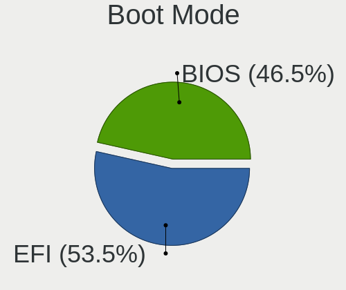
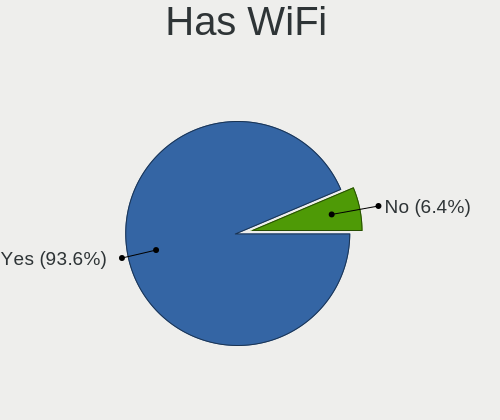
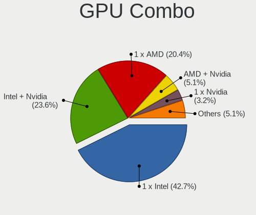

Arch - Hardware Trends (Notebooks)
----------------------------------

A project to identify most popular hardware characteristics and track their change
over time based on data collected by Linux users at https://Linux-Hardware.org.

Anyone can contribute to this report by the [hw-probe](https://github.com/linuxhw/hw-probe) tool:

    sudo -E hw-probe -all -upload

This report is for one last month. Overall report since the beginning of time: [TestCoverage](https://github.com/linuxhw/TestCoverage)

Period: Jan, 2023.

Contents
--------

* [ System ](#system)
  - [ OS                       ](#os)
  - [ OS Family                ](#os-family)
  - [ Kernel                   ](#kernel)
  - [ Kernel Family            ](#kernel-family)
  - [ Kernel Major Ver.        ](#kernel-major-ver)
  - [ Arch                     ](#arch)
  - [ DE                       ](#de)
  - [ Display Server           ](#display-server)
  - [ Display Manager          ](#display-manager)
  - [ OS Lang                  ](#os-lang)
  - [ Boot Mode                ](#boot-mode)
  - [ Filesystem               ](#filesystem)
  - [ Part. scheme             ](#part-scheme)
  - [ Dual Boot with Linux/BSD ](#dual-boot-with-linuxbsd)
  - [ Dual Boot (Win)          ](#dual-boot-win)

* [ Board ](#board)
  - [ Vendor                   ](#vendor)
  - [ Model                    ](#model)
  - [ Model Family             ](#model-family)
  - [ MFG Year                 ](#mfg-year)
  - [ Form Factor              ](#form-factor)
  - [ Secure Boot              ](#secure-boot)
  - [ Coreboot                 ](#coreboot)
  - [ RAM Size                 ](#ram-size)
  - [ RAM Used                 ](#ram-used)
  - [ Total Drives             ](#total-drives)
  - [ Has CD-ROM               ](#has-cd-rom)
  - [ Has Ethernet             ](#has-ethernet)
  - [ Has WiFi                 ](#has-wifi)
  - [ Has Bluetooth            ](#has-bluetooth)

* [ Location ](#location)
  - [ Country                  ](#country)
  - [ City                     ](#city)

* [ Drives ](#drives)
  - [ Drive Vendor             ](#drive-vendor)
  - [ Drive Model              ](#drive-model)
  - [ HDD Vendor               ](#hdd-vendor)
  - [ SSD Vendor               ](#ssd-vendor)
  - [ Drive Kind               ](#drive-kind)
  - [ Drive Connector          ](#drive-connector)
  - [ Drive Size               ](#drive-size)
  - [ Space Total              ](#space-total)
  - [ Space Used               ](#space-used)
  - [ Malfunc. Drives          ](#malfunc-drives)
  - [ Malfunc. Drive Vendor    ](#malfunc-drive-vendor)
  - [ Malfunc. HDD Vendor      ](#malfunc-hdd-vendor)
  - [ Malfunc. Drive Kind      ](#malfunc-drive-kind)
  - [ Failed Drives            ](#failed-drives)
  - [ Failed Drive Vendor      ](#failed-drive-vendor)
  - [ Drive Status             ](#drive-status)

* [ Storage controller ](#storage-controller)
  - [ Storage Vendor           ](#storage-vendor)
  - [ Storage Model            ](#storage-model)
  - [ Storage Kind             ](#storage-kind)

* [ Processor ](#processor)
  - [ CPU Vendor               ](#cpu-vendor)
  - [ CPU Model                ](#cpu-model)
  - [ CPU Model Family         ](#cpu-model-family)
  - [ CPU Cores                ](#cpu-cores)
  - [ CPU Sockets              ](#cpu-sockets)
  - [ CPU Threads              ](#cpu-threads)
  - [ CPU Op-Modes             ](#cpu-op-modes)
  - [ CPU Microcode            ](#cpu-microcode)
  - [ CPU Microarch            ](#cpu-microarch)

* [ Graphics ](#graphics)
  - [ GPU Vendor               ](#gpu-vendor)
  - [ GPU Model                ](#gpu-model)
  - [ GPU Combo                ](#gpu-combo)
  - [ GPU Driver               ](#gpu-driver)
  - [ GPU Memory               ](#gpu-memory)

* [ Monitor ](#monitor)
  - [ Monitor Vendor           ](#monitor-vendor)
  - [ Monitor Model            ](#monitor-model)
  - [ Monitor Resolution       ](#monitor-resolution)
  - [ Monitor Diagonal         ](#monitor-diagonal)
  - [ Monitor Width            ](#monitor-width)
  - [ Aspect Ratio             ](#aspect-ratio)
  - [ Monitor Area             ](#monitor-area)
  - [ Pixel Density            ](#pixel-density)
  - [ Multiple Monitors        ](#multiple-monitors)

* [ Network ](#network)
  - [ Net Controller Vendor    ](#net-controller-vendor)
  - [ Net Controller Model     ](#net-controller-model)
  - [ Wireless Vendor          ](#wireless-vendor)
  - [ Wireless Model           ](#wireless-model)
  - [ Ethernet Vendor          ](#ethernet-vendor)
  - [ Ethernet Model           ](#ethernet-model)
  - [ Net Controller Kind      ](#net-controller-kind)
  - [ Used Controller          ](#used-controller)
  - [ NICs                     ](#nics)
  - [ IPv6                     ](#ipv6)

* [ Bluetooth ](#bluetooth)
  - [ Bluetooth Vendor         ](#bluetooth-vendor)
  - [ Bluetooth Model          ](#bluetooth-model)

* [ Sound ](#sound)
  - [ Sound Vendor             ](#sound-vendor)
  - [ Sound Model              ](#sound-model)

* [ Memory ](#memory)
  - [ Memory Vendor            ](#memory-vendor)
  - [ Memory Model             ](#memory-model)
  - [ Memory Kind              ](#memory-kind)
  - [ Memory Form Factor       ](#memory-form-factor)
  - [ Memory Size              ](#memory-size)
  - [ Memory Speed             ](#memory-speed)

* [ Printers & scanners ](#printers--scanners)
  - [ Printer Vendor           ](#printer-vendor)
  - [ Printer Model            ](#printer-model)
  - [ Scanner Vendor           ](#scanner-vendor)
  - [ Scanner Model            ](#scanner-model)

* [ Camera ](#camera)
  - [ Camera Vendor            ](#camera-vendor)
  - [ Camera Model             ](#camera-model)

* [ Security ](#security)
  - [ Fingerprint Vendor       ](#fingerprint-vendor)
  - [ Fingerprint Model        ](#fingerprint-model)
  - [ Chipcard Vendor          ](#chipcard-vendor)
  - [ Chipcard Model           ](#chipcard-model)

* [ Unsupported ](#unsupported)
  - [ Unsupported Devices      ](#unsupported-devices)
  - [ Unsupported Device Types ](#unsupported-device-types)

System
------

OS
--

Installed operating systems

| Name         | Notebooks | Percent |
|--------------|-----------|---------|
| Arch Rolling | 109       | 100%    |

OS Family
---------

OS without a version

| Name | Notebooks | Percent |
|------|-----------|---------|
| Arch | 109       | 100%    |

Kernel
------

Version of the Linux kernel

| Version                     | Notebooks | Percent |
|-----------------------------|-----------|---------|
| 6.1.7-arch1-1               | 13        | 11.93%  |
| 6.1.4-arch1-1               | 13        | 11.93%  |
| 6.1.8-arch1-1               | 11        | 10.09%  |
| 6.1.3-arch1-1               | 7         | 6.42%   |
| 6.1.6-arch1-1               | 6         | 5.5%    |
| 6.1.5-arch2-1               | 6         | 5.5%    |
| 6.1.1-arch1-1               | 6         | 5.5%    |
| 6.1.2-arch1-1               | 5         | 4.59%   |
| 6.1.6-arch1-3               | 4         | 3.67%   |
| 6.1.6-zen1-1-zen            | 3         | 2.75%   |
| 6.1.3-zen1-1-zen            | 3         | 2.75%   |
| 5.15.86-1-lts               | 3         | 2.75%   |
| 6.1.7-zen1-1-zen            | 2         | 1.83%   |
| 6.1.6-zen1-2-zen            | 2         | 1.83%   |
| 6.1.2-zen1-1-zen            | 2         | 1.83%   |
| 6.0.10-arch2-1              | 2         | 1.83%   |
| 5.15.90-1-lts               | 2         | 1.83%   |
| 5.15.89-1-lts               | 2         | 1.83%   |
| 6.1.8-x64v1-xanmod1-1       | 1         | 0.92%   |
| 6.1.7-x64v2-xanmod1-1-x64v2 | 1         | 0.92%   |
| 6.1.7-x64v1-xanmod1-1       | 1         | 0.92%   |
| 6.1.7-arch1-1.1             | 1         | 0.92%   |
| 6.1.6-lqx3-1-lqx            | 1         | 0.92%   |
| 6.1.5-zen2-1-zen            | 1         | 0.92%   |
| 6.1.4-zen2-1.1-zen          | 1         | 0.92%   |
| 6.1.4-zen2-1-zen            | 1         | 0.92%   |
| 6.1.1-zen3-xanmod1-1        | 1         | 0.92%   |
| 6.0.9-arch1-1               | 1         | 0.92%   |
| 6.0.11-zen1-1-zen           | 1         | 0.92%   |
| 5.19.7-arch1-1              | 1         | 0.92%   |
| 5.18.16-arch1-1             | 1         | 0.92%   |
| 5.18.12-arch1-1             | 1         | 0.92%   |
| 5.17.9-arch1-1              | 1         | 0.92%   |
| 5.15.85-1-lts               | 1         | 0.92%   |
| 5.13.0-valve21.3-1-neptune  | 1         | 0.92%   |

Kernel Family
-------------

Linux kernel without a distro release

| Version | Notebooks | Percent |
|---------|-----------|---------|
| 6.1.7   | 18        | 16.51%  |
| 6.1.6   | 16        | 14.68%  |
| 6.1.4   | 15        | 13.76%  |
| 6.1.8   | 12        | 11.01%  |
| 6.1.3   | 10        | 9.17%   |
| 6.1.5   | 7         | 6.42%   |
| 6.1.2   | 7         | 6.42%   |
| 6.1.1   | 7         | 6.42%   |
| 5.15.86 | 3         | 2.75%   |
| 6.0.10  | 2         | 1.83%   |
| 5.15.90 | 2         | 1.83%   |
| 5.15.89 | 2         | 1.83%   |
| 6.0.9   | 1         | 0.92%   |
| 6.0.11  | 1         | 0.92%   |
| 5.19.7  | 1         | 0.92%   |
| 5.18.16 | 1         | 0.92%   |
| 5.18.12 | 1         | 0.92%   |
| 5.17.9  | 1         | 0.92%   |
| 5.15.85 | 1         | 0.92%   |
| 5.13.0  | 1         | 0.92%   |

Kernel Major Ver.
-----------------

Linux kernel major version

| Version | Notebooks | Percent |
|---------|-----------|---------|
| 6.1     | 92        | 84.4%   |
| 5.15    | 8         | 7.34%   |
| 6.0     | 4         | 3.67%   |
| 5.18    | 2         | 1.83%   |
| 5.19    | 1         | 0.92%   |
| 5.17    | 1         | 0.92%   |
| 5.13    | 1         | 0.92%   |

Arch
----

OS architecture (x86_64, i586, etc.)

| Name   | Notebooks | Percent |
|--------|-----------|---------|
| x86_64 | 109       | 100%    |

DE
--

Desktop Environment

| Name           | Notebooks | Percent |
|----------------|-----------|---------|
| KDE5           | 41        | 37.61%  |
| GNOME          | 39        | 35.78%  |
| i3             | 9         | 8.26%   |
| XFCE           | 7         | 6.42%   |
| Unknown        | 5         | 4.59%   |
| X-Cinnamon     | 1         | 0.92%   |
| Unity          | 1         | 0.92%   |
| sway           | 1         | 0.92%   |
| MATE           | 1         | 0.92%   |
| i3-with-shmlog | 1         | 0.92%   |
| GNOME Classic  | 1         | 0.92%   |
| Cinnamon       | 1         | 0.92%   |
| bspwm          | 1         | 0.92%   |

Display Server
--------------

X11 or Wayland

| Name    | Notebooks | Percent |
|---------|-----------|---------|
| X11     | 59        | 54.13%  |
| Wayland | 34        | 31.19%  |
| Unknown | 9         | 8.26%   |
| Tty     | 7         | 6.42%   |

Display Manager
---------------

SDDM, LightDM, etc.

| Name    | Notebooks | Percent |
|---------|-----------|---------|
| Unknown | 39        | 35.78%  |
| SDDM    | 29        | 26.61%  |
| LightDM | 21        | 19.27%  |
| GDM     | 17        | 15.6%   |
| XDM     | 1         | 0.92%   |
| SLiM    | 1         | 0.92%   |
| Ly      | 1         | 0.92%   |

OS Lang
-------

Language

| Lang       | Notebooks | Percent |
|------------|-----------|---------|
| en_US      | 56        | 51.38%  |
| C          | 11        | 10.09%  |
| en_GB      | 8         | 7.34%   |
| it_IT      | 6         | 5.5%    |
| pt_BR      | 5         | 4.59%   |
| ru_RU      | 4         | 3.67%   |
| de_DE      | 3         | 2.75%   |
| es_CO      | 2         | 1.83%   |
| zh_CN      | 1         | 0.92%   |
| sk_SK      | 1         | 0.92%   |
| pt_BRutf8  | 1         | 0.92%   |
| lv_LV      | 1         | 0.92%   |
| it_IT@euro | 1         | 0.92%   |
| fr_FR      | 1         | 0.92%   |
| eu_ES      | 1         | 0.92%   |
| es_ES      | 1         | 0.92%   |
| es_AR      | 1         | 0.92%   |
| en_IN      | 1         | 0.92%   |
| en_DK      | 1         | 0.92%   |
| en_AU      | 1         | 0.92%   |
| en_AG      | 1         | 0.92%   |
| de_AT      | 1         | 0.92%   |

Boot Mode
---------

EFI or BIOS

| Mode | Notebooks | Percent |
|------|-----------|---------|
| EFI  | 73        | 66.97%  |
| BIOS | 36        | 33.03%  |

Filesystem
----------

Type of filesystem

| Type  | Notebooks | Percent |
|-------|-----------|---------|
| Ext4  | 75        | 68.81%  |
| Btrfs | 30        | 27.52%  |
| Xfs   | 3         | 2.75%   |
| F2fs  | 1         | 0.92%   |

Part. scheme
------------

Scheme of partitioning

| Type    | Notebooks | Percent |
|---------|-----------|---------|
| GPT     | 77        | 70.64%  |
| Unknown | 27        | 24.77%  |
| MBR     | 5         | 4.59%   |

Dual Boot with Linux/BSD
------------------------

Hosting more than one Linux/BSD

| Dual boot | Notebooks | Percent |
|-----------|-----------|---------|
| No        | 102       | 93.58%  |
| Yes       | 7         | 6.42%   |

Dual Boot (Win)
---------------

Hosting Linux and Windows

| Dual boot | Notebooks | Percent |
|-----------|-----------|---------|
| No        | 83        | 76.15%  |
| Yes       | 26        | 23.85%  |

Board
-----

Vendor
------

Motherboard manufacturer

| Name                | Notebooks | Percent |
|---------------------|-----------|---------|
| Lenovo              | 35        | 32.11%  |
| Dell                | 19        | 17.43%  |
| Hewlett-Packard     | 17        | 15.6%   |
| ASUSTek Computer    | 10        | 9.17%   |
| Acer                | 9         | 8.26%   |
| MSI                 | 5         | 4.59%   |
| HUAWEI              | 3         | 2.75%   |
| TUXEDO              | 2         | 1.83%   |
| Toshiba             | 2         | 1.83%   |
| Valve               | 1         | 0.92%   |
| Sony                | 1         | 0.92%   |
| Notebook            | 1         | 0.92%   |
| Gigabyte Technology | 1         | 0.92%   |
| Fujitsu             | 1         | 0.92%   |
| BANGHO              | 1         | 0.92%   |
| Unknown             | 1         | 0.92%   |

Model
-----

Motherboard model

| Name                                     | Notebooks | Percent |
|------------------------------------------|-----------|---------|
| Dell XPS 15 9570                         | 3         | 2.75%   |
| Lenovo IdeaPad 3 15ALC6 82MF             | 2         | 1.83%   |
| HP OMEN by Laptop 16-c0xxx               | 2         | 1.83%   |
| Dell G15 5520                            | 2         | 1.83%   |
| ASUS ROG Strix G513RM_G513RM             | 2         | 1.83%   |
| Unknown                                  | 2         | 1.83%   |
| Valve Jupiter                            | 1         | 0.92%   |
| TUXEDO InfinityBook S 15 Gen6            | 1         | 0.92%   |
| Toshiba Satellite P755                   | 1         | 0.92%   |
| Toshiba Satellite C55Dt-A                | 1         | 0.92%   |
| Sony VPCF13Z1E                           | 1         | 0.92%   |
| Notebook NS50MU                          | 1         | 0.92%   |
| MSI Prestige 15 A11SCX                   | 1         | 0.92%   |
| MSI Modern 14 B11MOU                     | 1         | 0.92%   |
| MSI GP66 Leopard 11UH                    | 1         | 0.92%   |
| MSI GE66 Raider 10SF                     | 1         | 0.92%   |
| MSI Alpha 15 B5EEK                       | 1         | 0.92%   |
| Lenovo ThinkPad X230 2325CW1             | 1         | 0.92%   |
| Lenovo ThinkPad X230 2320LFG             | 1         | 0.92%   |
| Lenovo ThinkPad X1 Carbon 6th 20KH002KUS | 1         | 0.92%   |
| Lenovo ThinkPad W541 20EFCTO1WW          | 1         | 0.92%   |
| Lenovo ThinkPad T480 20L5000BGE          | 1         | 0.92%   |
| Lenovo ThinkPad T14s Gen 2a 20XF006GGE   | 1         | 0.92%   |
| Lenovo ThinkPad T14 Gen 3 21CF003WUS     | 1         | 0.92%   |
| Lenovo ThinkPad T14 Gen 2i 20W0CTO1WW    | 1         | 0.92%   |
| Lenovo ThinkPad T14 Gen 2a 20XKA004CD    | 1         | 0.92%   |
| Lenovo ThinkPad P51 20HJS16Q0K           | 1         | 0.92%   |
| Lenovo ThinkPad P14s Gen 1 20S4CTO1WW    | 1         | 0.92%   |
| Lenovo ThinkPad L430 2466DS2             | 1         | 0.92%   |
| Lenovo ThinkPad E590 20NCS00800          | 1         | 0.92%   |
| Lenovo ThinkPad E15 Gen 2 20T9S0B500     | 1         | 0.92%   |
| Lenovo ThinkBook 15 G2 ITL 20VE          | 1         | 0.92%   |
| Lenovo Legion R9000P ARH7H 82RG          | 1         | 0.92%   |
| Lenovo Legion R70002021 82JW             | 1         | 0.92%   |
| Lenovo Legion 7 15IMH05 81YT             | 1         | 0.92%   |
| Lenovo Legion 5 Pro 16IAH7H 82RF         | 1         | 0.92%   |
| Lenovo Legion 5 15ACH6H 82JU             | 1         | 0.92%   |
| Lenovo IdeaPad Slim 7 Carbon 14ACN6 82L1 | 1         | 0.92%   |
| Lenovo IdeaPad Slim 7 14ITL05 82A6       | 1         | 0.92%   |
| Lenovo IdeaPad S145-15IWL 81S9           | 1         | 0.92%   |

Model Family
------------

Motherboard model prefix

| Name                | Notebooks | Percent |
|---------------------|-----------|---------|
| Lenovo ThinkPad     | 14        | 12.84%  |
| Lenovo IdeaPad      | 14        | 12.84%  |
| Acer Aspire         | 8         | 7.34%   |
| Dell XPS            | 6         | 5.5%    |
| Lenovo Legion       | 5         | 4.59%   |
| HP Pavilion         | 5         | 4.59%   |
| Dell Latitude       | 5         | 4.59%   |
| HP OMEN             | 3         | 2.75%   |
| HP Laptop           | 3         | 2.75%   |
| Toshiba Satellite   | 2         | 1.83%   |
| HP ProBook          | 2         | 1.83%   |
| Dell Vostro         | 2         | 1.83%   |
| Dell Inspiron       | 2         | 1.83%   |
| Dell G3             | 2         | 1.83%   |
| Dell G15            | 2         | 1.83%   |
| ASUS VivoBook       | 2         | 1.83%   |
| ASUS ROG            | 2         | 1.83%   |
| Unknown             | 2         | 1.83%   |
| Valve Jupiter       | 1         | 0.92%   |
| TUXEDO InfinityBook | 1         | 0.92%   |
| Sony VPCF13Z1E      | 1         | 0.92%   |
| Notebook NS50MU     | 1         | 0.92%   |
| MSI Prestige        | 1         | 0.92%   |
| MSI Modern          | 1         | 0.92%   |
| MSI GP66            | 1         | 0.92%   |
| MSI GE66            | 1         | 0.92%   |
| MSI Alpha           | 1         | 0.92%   |
| Lenovo ThinkBook    | 1         | 0.92%   |
| Lenovo B40-70       | 1         | 0.92%   |
| HUAWEI MACH-WX9     | 1         | 0.92%   |
| HUAWEI KLVL-WXX9    | 1         | 0.92%   |
| HUAWEI BOHK-WAX9X   | 1         | 0.92%   |
| HP ZHAN             | 1         | 0.92%   |
| HP ZBook            | 1         | 0.92%   |
| HP EliteBook        | 1         | 0.92%   |
| HP 1000             | 1         | 0.92%   |
| Gigabyte AERO       | 1         | 0.92%   |
| Fujitsu LIFEBOOK    | 1         | 0.92%   |
| BANGHO MOV          | 1         | 0.92%   |
| ASUS Zenbook        | 1         | 0.92%   |

MFG Year
--------

Motherboard manufacture year

| Year | Notebooks | Percent |
|------|-----------|---------|
| 2021 | 23        | 21.1%   |
| 2022 | 18        | 16.51%  |
| 2020 | 18        | 16.51%  |
| 2018 | 12        | 11.01%  |
| 2019 | 9         | 8.26%   |
| 2012 | 7         | 6.42%   |
| 2016 | 5         | 4.59%   |
| 2015 | 4         | 3.67%   |
| 2014 | 4         | 3.67%   |
| 2013 | 3         | 2.75%   |
| 2017 | 2         | 1.83%   |
| 2011 | 2         | 1.83%   |
| 2010 | 1         | 0.92%   |
| 2008 | 1         | 0.92%   |

Form Factor
-----------

Physical design of the computer

| Name     | Notebooks | Percent |
|----------|-----------|---------|
| Notebook | 109       | 100%    |

Secure Boot
-----------

Enabled or disabled

| State    | Notebooks | Percent |
|----------|-----------|---------|
| Disabled | 107       | 98.17%  |
| Enabled  | 2         | 1.83%   |

Coreboot
--------

Have coreboot on board

| Used | Notebooks | Percent |
|------|-----------|---------|
| No   | 109       | 100%    |

RAM Size
--------

Total RAM memory

| Size in GB  | Notebooks | Percent |
|-------------|-----------|---------|
| 16.01-24.0  | 30        | 27.52%  |
| 8.01-16.0   | 29        | 26.61%  |
| 4.01-8.0    | 25        | 22.94%  |
| 32.01-64.0  | 13        | 11.93%  |
| 3.01-4.0    | 5         | 4.59%   |
| 24.01-32.0  | 3         | 2.75%   |
| 64.01-256.0 | 3         | 2.75%   |
| 1.01-2.0    | 1         | 0.92%   |

RAM Used
--------

Used RAM memory

| Used GB    | Notebooks | Percent |
|------------|-----------|---------|
| 2.01-3.0   | 31        | 28.44%  |
| 4.01-8.0   | 28        | 25.69%  |
| 1.01-2.0   | 20        | 18.35%  |
| 3.01-4.0   | 14        | 12.84%  |
| 8.01-16.0  | 11        | 10.09%  |
| 16.01-24.0 | 3         | 2.75%   |
| 0.51-1.0   | 2         | 1.83%   |

Total Drives
------------

Number of drives on board

| Drives | Notebooks | Percent |
|--------|-----------|---------|
| 1      | 79        | 72.48%  |
| 2      | 28        | 25.69%  |
| 4      | 1         | 0.92%   |
| 3      | 1         | 0.92%   |

Has CD-ROM
----------

Has CD-ROM on board

| Presented | Notebooks | Percent |
|-----------|-----------|---------|
| No        | 99        | 90.83%  |
| Yes       | 10        | 9.17%   |

Has Ethernet
------------

Has Ethernet on board

| Presented | Notebooks | Percent |
|-----------|-----------|---------|
| Yes       | 79        | 72.48%  |
| No        | 30        | 27.52%  |

Has WiFi
--------

Has WiFi module

| Presented | Notebooks | Percent |
|-----------|-----------|---------|
| Yes       | 108       | 99.08%  |
| No        | 1         | 0.92%   |

Has Bluetooth
-------------

Has Bluetooth module

| Presented | Notebooks | Percent |
|-----------|-----------|---------|
| Yes       | 96        | 88.07%  |
| No        | 13        | 11.93%  |

Location
--------

Country
-------

Geographic location (country)

| Country      | Notebooks | Percent |
|--------------|-----------|---------|
| USA          | 20        | 18.35%  |
| Italy        | 13        | 11.93%  |
| Russia       | 8         | 7.34%   |
| Brazil       | 8         | 7.34%   |
| Germany      | 5         | 4.59%   |
| UK           | 4         | 3.67%   |
| France       | 4         | 3.67%   |
| Spain        | 3         | 2.75%   |
| Indonesia    | 3         | 2.75%   |
| South Africa | 2         | 1.83%   |
| Netherlands  | 2         | 1.83%   |
| Czechia      | 2         | 1.83%   |
| Colombia     | 2         | 1.83%   |
| Canada       | 2         | 1.83%   |
| Argentina    | 2         | 1.83%   |
| Ukraine      | 1         | 0.92%   |
| Turkey       | 1         | 0.92%   |
| Thailand     | 1         | 0.92%   |
| Taiwan       | 1         | 0.92%   |
| Switzerland  | 1         | 0.92%   |
| Slovenia     | 1         | 0.92%   |
| Slovakia     | 1         | 0.92%   |
| Singapore    | 1         | 0.92%   |
| Saudi Arabia | 1         | 0.92%   |
| Poland       | 1         | 0.92%   |
| Norway       | 1         | 0.92%   |
| Mexico       | 1         | 0.92%   |
| Lebanon      | 1         | 0.92%   |
| Latvia       | 1         | 0.92%   |
| Kazakhstan   | 1         | 0.92%   |
| Japan        | 1         | 0.92%   |
| Iran         | 1         | 0.92%   |
| India        | 1         | 0.92%   |
| Greece       | 1         | 0.92%   |
| Finland      | 1         | 0.92%   |
| El Salvador  | 1         | 0.92%   |
| Cyprus       | 1         | 0.92%   |
| China        | 1         | 0.92%   |
| Chile        | 1         | 0.92%   |
| Bulgaria     | 1         | 0.92%   |

City
----

Geographic location (city)

| City               | Notebooks | Percent |
|--------------------|-----------|---------|
| Valencia           | 2         | 1.83%   |
| St Petersburg      | 2         | 1.83%   |
| Sao Paulo          | 2         | 1.83%   |
| Rome               | 2         | 1.83%   |
| Moscow             | 2         | 1.83%   |
| Zheleznogorsk      | 1         | 0.92%   |
| Yogyakarta         | 1         | 0.92%   |
| Westville          | 1         | 0.92%   |
| West Lafayette     | 1         | 0.92%   |
| Wessington Springs | 1         | 0.92%   |
| Weifang            | 1         | 0.92%   |
| Waterville         | 1         | 0.92%   |
| Villeneuve-d'Ascq  | 1         | 0.92%   |
| Vienna             | 1         | 0.92%   |
| Uberlândia        | 1         | 0.92%   |
| Turate             | 1         | 0.92%   |
| Trondheim          | 1         | 0.92%   |
| Tokyo              | 1         | 0.92%   |
| Tigre              | 1         | 0.92%   |
| Tehran             | 1         | 0.92%   |
| Sydney             | 1         | 0.92%   |
| Swansea            | 1         | 0.92%   |
| Sugar Grove        | 1         | 0.92%   |
| Stepnogorsk        | 1         | 0.92%   |
| Spaichingen        | 1         | 0.92%   |
| Singapore          | 1         | 0.92%   |
| Seregno            | 1         | 0.92%   |
| Schwalmtal         | 1         | 0.92%   |
| Sao Luís          | 1         | 0.92%   |
| Sabanagrande       | 1         | 0.92%   |
| Rovellasca         | 1         | 0.92%   |
| Rochester          | 1         | 0.92%   |
| Riyadh             | 1         | 0.92%   |
| Rio Grande         | 1         | 0.92%   |
| Riga               | 1         | 0.92%   |
| Prague             | 1         | 0.92%   |
| Poznan             | 1         | 0.92%   |
| Perm               | 1         | 0.92%   |
| Paris              | 1         | 0.92%   |
| Oxnard             | 1         | 0.92%   |

Drives
------

Drive Vendor
------------

Hard drive vendors

| Vendor                      | Notebooks | Drives | Percent |
|-----------------------------|-----------|--------|---------|
| Samsung Electronics         | 38        | 39     | 27.14%  |
| Sandisk                     | 18        | 19     | 12.86%  |
| Micron Technology           | 11        | 11     | 7.86%   |
| SK hynix                    | 10        | 10     | 7.14%   |
| WDC                         | 8         | 8      | 5.71%   |
| Kingston                    | 8         | 8      | 5.71%   |
| Unknown                     | 7         | 7      | 5%      |
| Seagate                     | 6         | 6      | 4.29%   |
| Intel                       | 6         | 7      | 4.29%   |
| Toshiba                     | 4         | 4      | 2.86%   |
| Crucial                     | 4         | 4      | 2.86%   |
| Phison Electronics          | 3         | 3      | 2.14%   |
| HGST                        | 3         | 3      | 2.14%   |
| A-DATA Technology           | 3         | 3      | 2.14%   |
| Kingston Technology Company | 2         | 2      | 1.43%   |
| XPG                         | 1         | 1      | 0.71%   |
| Union Memory                | 1         | 1      | 0.71%   |
| Solid State Storage         | 1         | 1      | 0.71%   |
| Patriot                     | 1         | 1      | 0.71%   |
| Micron/Crucial Technology   | 1         | 1      | 0.71%   |
| LEQIXIANG                   | 1         | 1      | 0.71%   |
| Lenovo                      | 1         | 1      | 0.71%   |
| Inland                      | 1         | 1      | 0.71%   |
| Unknown                     | 1         | 1      | 0.71%   |

Drive Model
-----------

Hard drive models

| Model                                                | Notebooks | Percent |
|------------------------------------------------------|-----------|---------|
| Samsung NVMe SSD Controller SM981/PM981/PM983 500GB  | 15        | 10.56%  |
| Sandisk WD Black SN750 / PC SN730 NVMe SSD 1TB       | 7         | 4.93%   |
| SK hynix BC711 NVMe 512GB                            | 3         | 2.11%   |
| Samsung SSD 980 1TB                                  | 3         | 2.11%   |
| Samsung NVMe SSD Controller PM9A1/PM9A3/980PRO 512GB | 3         | 2.11%   |
| Micron 2450_MTFDKBA1T0TFK 1TB                        | 3         | 2.11%   |
| WDC WDS240G2G0A-00JH30 240GB SSD                     | 2         | 1.41%   |
| WDC WD10JPVX-22JC3T0 1TB                             | 2         | 1.41%   |
| Unknown MMC Card  32GB                               | 2         | 1.41%   |
| SK hynix BC501 NVMe Solid State Drive 512GB          | 2         | 1.41%   |
| Samsung SSD 860 EVO 500GB                            | 2         | 1.41%   |
| Phison PS5013 E13 NVMe Controller 256GB              | 2         | 1.41%   |
| Micron 2300 NVMe 1024GB                              | 2         | 1.41%   |
| Kingston Company OM3PDP3 NVMe SSD 512GB              | 2         | 1.41%   |
| Kingston SA400S37120G 120GB SSD                      | 2         | 1.41%   |
| Intel SSDPEKNW512GZL 512GB                           | 2         | 1.41%   |
| Crucial CT240BX500SSD1 240GB                         | 2         | 1.41%   |
| XPG NVMe SSD Drive 1024GB                            | 1         | 0.7%    |
| WDC WD5000LPLX-60ZNTT1 500GB                         | 1         | 0.7%    |
| WDC WD5000BPVT-55A1YT0 500GB                         | 1         | 0.7%    |
| WDC WD10SPZX-60Z10T0 1TB                             | 1         | 0.7%    |
| WDC WD10SPZX-21Z10T0 1TB                             | 1         | 0.7%    |
| Unknown SD/MMC/MS PRO 2GB                            | 1         | 0.7%    |
| Unknown MMC Card  8GB                                | 1         | 0.7%    |
| Unknown MMC Card  64GB                               | 1         | 0.7%    |
| Unknown MMC Card  2GB                                | 1         | 0.7%    |
| Unknown MMC Card  16GB                               | 1         | 0.7%    |
| Union Memory UMIS RPJTJ256MEE1OWX 256GB              | 1         | 0.7%    |
| Toshiba THNSNJ256GMCU 256GB SSD                      | 1         | 0.7%    |
| Toshiba MQ01ACF050 500GB                             | 1         | 0.7%    |
| Toshiba KXG5AZNV512G 512GB                           | 1         | 0.7%    |
| Toshiba BG3 NVMe SSD Controller 256GB                | 1         | 0.7%    |
| Solid State Storage SSSTC CL1-4D256 256GB            | 1         | 0.7%    |
| SK hynix SKHynix_HFS512GDE9X084N 512GB               | 1         | 0.7%    |
| SK hynix SKHynix_HFS512GDE9X081N 512GB               | 1         | 0.7%    |
| SK hynix SKHynix_HFS512GD9TNI-L2A0B 512GB            | 1         | 0.7%    |
| SK hynix SC210 mSATA 256GB SSD                       | 1         | 0.7%    |
| SK hynix BC511 NVMe 256GB                            | 1         | 0.7%    |
| Seagate ST9500325AS 500GB                            | 1         | 0.7%    |
| Seagate ST9250315AS 250GB                            | 1         | 0.7%    |

HDD Vendor
----------

Hard disk drive vendors

| Vendor  | Notebooks | Drives | Percent |
|---------|-----------|--------|---------|
| WDC     | 6         | 6      | 35.29%  |
| Seagate | 6         | 6      | 35.29%  |
| HGST    | 3         | 3      | 17.65%  |
| Unknown | 1         | 1      | 5.88%   |
| Toshiba | 1         | 1      | 5.88%   |

SSD Vendor
----------

Solid state drive vendors

| Vendor              | Notebooks | Drives | Percent |
|---------------------|-----------|--------|---------|
| Samsung Electronics | 7         | 7      | 21.21%  |
| SanDisk             | 6         | 6      | 18.18%  |
| Kingston            | 6         | 6      | 18.18%  |
| Crucial             | 4         | 4      | 12.12%  |
| A-DATA Technology   | 3         | 3      | 9.09%   |
| WDC                 | 2         | 2      | 6.06%   |
| Toshiba             | 1         | 1      | 3.03%   |
| SK hynix            | 1         | 1      | 3.03%   |
| Patriot             | 1         | 1      | 3.03%   |
| LEQIXIANG           | 1         | 1      | 3.03%   |
| Inland              | 1         | 1      | 3.03%   |

Drive Kind
----------

HDD or SSD

| Kind | Notebooks | Drives | Percent |
|------|-----------|--------|---------|
| NVMe | 77        | 86     | 58.33%  |
| SSD  | 31        | 33     | 23.48%  |
| HDD  | 17        | 17     | 12.88%  |
| MMC  | 7         | 7      | 5.3%    |

Drive Connector
---------------

SATA, SAS, NVMe, etc.

| Type | Notebooks | Drives | Percent |
|------|-----------|--------|---------|
| NVMe | 77        | 86     | 61.11%  |
| SATA | 40        | 48     | 31.75%  |
| MMC  | 7         | 7      | 5.56%   |
| SAS  | 2         | 2      | 1.59%   |

Drive Size
----------

Size of hard drive

| Size in TB | Notebooks | Drives | Percent |
|------------|-----------|--------|---------|
| 0.01-0.5   | 33        | 38     | 73.33%  |
| 0.51-1.0   | 12        | 12     | 26.67%  |

Space Total
-----------

Amount of disk space available on the file system

| Size in GB     | Notebooks | Percent |
|----------------|-----------|---------|
| 101-250        | 31        | 28.44%  |
| 251-500        | 26        | 23.85%  |
| 501-1000       | 17        | 15.6%   |
| 1001-2000      | 15        | 13.76%  |
| 2001-3000      | 7         | 6.42%   |
| More than 3000 | 5         | 4.59%   |
| 21-50          | 3         | 2.75%   |
| 51-100         | 3         | 2.75%   |
| 1-20           | 2         | 1.83%   |

Space Used
----------

Amount of used disk space

| Used GB        | Notebooks | Percent |
|----------------|-----------|---------|
| 21-50          | 24        | 22.02%  |
| 1-20           | 23        | 21.1%   |
| 101-250        | 20        | 18.35%  |
| 251-500        | 16        | 14.68%  |
| 501-1000       | 13        | 11.93%  |
| 51-100         | 6         | 5.5%    |
| More than 3000 | 3         | 2.75%   |
| 1001-2000      | 3         | 2.75%   |
| 0              | 1         | 0.92%   |

Malfunc. Drives
---------------

Drive models with a malfunction

| Model                                                           | Notebooks | Drives | Percent |
|-----------------------------------------------------------------|-----------|--------|---------|
| WDC WDS240G2G0A-00JH30 240GB SSD                                | 1         | 1      | 14.29%  |
| WDC WD10JPVX-22JC3T0 1TB                                        | 1         | 1      | 14.29%  |
| SK hynix SC210 mSATA 256GB SSD                                  | 1         | 1      | 14.29%  |
| Seagate ST9500325AS 500GB                                       | 1         | 1      | 14.29%  |
| Seagate ST500LM000-1EJ162 500GB                                 | 1         | 1      | 14.29%  |
| Samsung Electronics NVMe SSD Controller SM981/PM981/PM983 500GB | 1         | 1      | 14.29%  |
| HGST HTS721010A9E630 1TB                                        | 1         | 1      | 14.29%  |

Malfunc. Drive Vendor
---------------------

Vendors of faulty drives

| Vendor              | Notebooks | Drives | Percent |
|---------------------|-----------|--------|---------|
| WDC                 | 2         | 2      | 28.57%  |
| Seagate             | 2         | 2      | 28.57%  |
| SK hynix            | 1         | 1      | 14.29%  |
| Samsung Electronics | 1         | 1      | 14.29%  |
| HGST                | 1         | 1      | 14.29%  |

Malfunc. HDD Vendor
-------------------

Vendors of faulty HDD drives

| Vendor  | Notebooks | Drives | Percent |
|---------|-----------|--------|---------|
| Seagate | 2         | 2      | 50%     |
| WDC     | 1         | 1      | 25%     |
| HGST    | 1         | 1      | 25%     |

Malfunc. Drive Kind
-------------------

Kinds of faulty drives

| Kind | Notebooks | Drives | Percent |
|------|-----------|--------|---------|
| HDD  | 4         | 4      | 57.14%  |
| SSD  | 2         | 2      | 28.57%  |
| NVMe | 1         | 1      | 14.29%  |

Failed Drives
-------------

Failed drive models

Zero info for selected period =(

Failed Drive Vendor
-------------------

Failed drive vendors

Zero info for selected period =(

Drive Status
------------

Number of failed and malfunc. drives

| Status   | Notebooks | Drives | Percent |
|----------|-----------|--------|---------|
| Works    | 60        | 77     | 51.28%  |
| Detected | 50        | 59     | 42.74%  |
| Malfunc  | 7         | 7      | 5.98%   |

Storage controller
------------------

Storage Vendor
--------------

Storage controller vendors

| Vendor                         | Notebooks | Percent |
|--------------------------------|-----------|---------|
| Intel                          | 53        | 37.06%  |
| Samsung Electronics            | 31        | 21.68%  |
| AMD                            | 14        | 9.79%   |
| SanDisk                        | 12        | 8.39%   |
| Micron Technology              | 11        | 7.69%   |
| SK hynix                       | 9         | 6.29%   |
| Phison Electronics             | 3         | 2.1%    |
| Kingston Technology Company    | 3         | 2.1%    |
| Toshiba America Info Systems   | 2         | 1.4%    |
| Union Memory (Shenzhen)        | 1         | 0.7%    |
| Solid State Storage Technology | 1         | 0.7%    |
| Micron/Crucial Technology      | 1         | 0.7%    |
| Lenovo                         | 1         | 0.7%    |
| INNOGRIT                       | 1         | 0.7%    |

Storage Model
-------------

Storage controller models

| Model                                                                          | Notebooks | Percent |
|--------------------------------------------------------------------------------|-----------|---------|
| Samsung NVMe SSD Controller SM981/PM981/PM983                                  | 15        | 9.74%   |
| AMD FCH SATA Controller [AHCI mode]                                            | 14        | 9.09%   |
| Samsung NVMe SSD Controller 980                                                | 12        | 7.79%   |
| Micron Non-Volatile memory controller                                          | 11        | 7.14%   |
| Intel 82801 Mobile SATA Controller [RAID mode]                                 | 10        | 6.49%   |
| Intel Volume Management Device NVMe RAID Controller                            | 9         | 5.84%   |
| Intel Sunrise Point-LP SATA Controller [AHCI mode]                             | 8         | 5.19%   |
| SanDisk WD Black SN750 / PC SN730 NVMe SSD                                     | 7         | 4.55%   |
| SK hynix Gold P31/PC711 NVMe Solid State Drive                                 | 5         | 3.25%   |
| Intel 7 Series Chipset Family 6-port SATA Controller [AHCI mode]               | 5         | 3.25%   |
| Intel Tiger Lake-LP SATA Controller                                            | 4         | 2.6%    |
| Intel Non-Volatile memory controller                                           | 4         | 2.6%    |
| Samsung NVMe SSD Controller PM9A1/PM9A3/980PRO                                 | 3         | 1.95%   |
| Intel Cannon Lake Mobile PCH SATA AHCI Controller                              | 3         | 1.95%   |
| SK hynix BC501 NVMe Solid State Drive                                          | 2         | 1.3%    |
| SanDisk Non-Volatile memory controller                                         | 2         | 1.3%    |
| Phison PS5013 E13 NVMe Controller                                              | 2         | 1.3%    |
| Kingston Company Company Non-Volatile memory controller                        | 2         | 1.3%    |
| Kingston Company OM3PDP3 NVMe SSD                                              | 2         | 1.3%    |
| Intel Cannon Point-LP SATA Controller [AHCI Mode]                              | 2         | 1.3%    |
| Intel 8 Series/C220 Series Chipset Family 6-port SATA Controller 1 [AHCI mode] | 2         | 1.3%    |
| Intel 8 Series SATA Controller 1 [AHCI mode]                                   | 2         | 1.3%    |
| Intel 6 Series/C200 Series Chipset Family 6 port Mobile SATA AHCI Controller   | 2         | 1.3%    |
| Intel 5 Series/3400 Series Chipset 6 port SATA AHCI Controller                 | 2         | 1.3%    |
| Union Memory (Shenzhen) Non-Volatile memory controller                         | 1         | 0.65%   |
| Toshiba America Info Systems XG5 NVMe SSD Controller                           | 1         | 0.65%   |
| Toshiba America Info Systems BG3 NVMe SSD Controller                           | 1         | 0.65%   |
| Solid State Storage Non-Volatile memory controller                             | 1         | 0.65%   |
| SK hynix Non-Volatile memory controller                                        | 1         | 0.65%   |
| SK hynix BC511                                                                 | 1         | 0.65%   |
| SanDisk WD PC SN810 / Black SN850 NVMe SSD                                     | 1         | 0.65%   |
| SanDisk WD Blue SN550 NVMe SSD                                                 | 1         | 0.65%   |
| SanDisk WD Black 2018/SN750 / PC SN720 NVMe SSD                                | 1         | 0.65%   |
| SanDisk PC SN520 NVMe SSD                                                      | 1         | 0.65%   |
| Samsung NVMe SSD Controller PM9B1                                              | 1         | 0.65%   |
| Phison E16 PCIe4 NVMe Controller                                               | 1         | 0.65%   |
| Micron/Crucial P2 NVMe PCIe SSD                                                | 1         | 0.65%   |
| Lenovo Non-Volatile memory controller                                          | 1         | 0.65%   |
| Intel Wildcat Point-LP SATA Controller [AHCI Mode]                             | 1         | 0.65%   |
| Intel SSD 660P Series                                                          | 1         | 0.65%   |

Storage Kind
------------

Kind of storage controller (IDE, SATA, NVMe, SAS, ...)

| Kind | Notebooks | Percent |
|------|-----------|---------|
| NVMe | 77        | 52.38%  |
| SATA | 52        | 35.37%  |
| RAID | 18        | 12.24%  |

Processor
---------

CPU Vendor
----------

Processor vendors

| Vendor | Notebooks | Percent |
|--------|-----------|---------|
| Intel  | 73        | 66.97%  |
| AMD    | 36        | 33.03%  |

CPU Model
---------

Processor models

| Model                                      | Notebooks | Percent |
|--------------------------------------------|-----------|---------|
| Intel 11th Gen Core i5-1135G7 @ 2.40GHz    | 6         | 5.5%    |
| AMD Ryzen 7 5800H with Radeon Graphics     | 5         | 4.59%   |
| Intel Core i7-8565U CPU @ 1.80GHz          | 4         | 3.67%   |
| AMD Ryzen 7 4700U with Radeon Graphics     | 4         | 3.67%   |
| Intel Core i7-8750H CPU @ 2.20GHz          | 3         | 2.75%   |
| Intel Core i7-8550U CPU @ 1.80GHz          | 3         | 2.75%   |
| Intel Core i7-10510U CPU @ 1.80GHz         | 3         | 2.75%   |
| Intel 12th Gen Core i7-12700H              | 3         | 2.75%   |
| Intel 11th Gen Core i7-1165G7 @ 2.80GHz    | 3         | 2.75%   |
| AMD Ryzen 7 6800H with Radeon Graphics     | 3         | 2.75%   |
| AMD Ryzen 7 5700U with Radeon Graphics     | 3         | 2.75%   |
| Intel Core i7-10750H CPU @ 2.60GHz         | 2         | 1.83%   |
| Intel Core i5-8300H CPU @ 2.30GHz          | 2         | 1.83%   |
| Intel Core i5-8250U CPU @ 1.60GHz          | 2         | 1.83%   |
| Intel Core i5-6200U CPU @ 2.30GHz          | 2         | 1.83%   |
| Intel Core i5-3210M CPU @ 2.50GHz          | 2         | 1.83%   |
| Intel Core i5-10300H CPU @ 2.50GHz         | 2         | 1.83%   |
| AMD Ryzen 7 PRO 5850U with Radeon Graphics | 2         | 1.83%   |
| AMD Ryzen 5 5625U with Radeon Graphics     | 2         | 1.83%   |
| AMD Ryzen 5 4600H with Radeon Graphics     | 2         | 1.83%   |
| AMD Ryzen 3 3250U with Radeon Graphics     | 2         | 1.83%   |
| Intel Pentium Gold 7505 @ 2.00GHz          | 1         | 0.92%   |
| Intel Core i9-10885H CPU @ 2.40GHz         | 1         | 0.92%   |
| Intel Core i7-8650U CPU @ 1.90GHz          | 1         | 0.92%   |
| Intel Core i7-7820HQ CPU @ 2.90GHz         | 1         | 0.92%   |
| Intel Core i7-7560U CPU @ 2.40GHz          | 1         | 0.92%   |
| Intel Core i7-6700HQ CPU @ 2.60GHz         | 1         | 0.92%   |
| Intel Core i7-5500U CPU @ 2.40GHz          | 1         | 0.92%   |
| Intel Core i7-4700MQ CPU @ 2.40GHz         | 1         | 0.92%   |
| Intel Core i7-3720QM CPU @ 2.60GHz         | 1         | 0.92%   |
| Intel Core i7-2670QM CPU @ 2.20GHz         | 1         | 0.92%   |
| Intel Core i7 CPU Q 740 @ 1.73GHz          | 1         | 0.92%   |
| Intel Core i5-9300H CPU @ 2.40GHz          | 1         | 0.92%   |
| Intel Core i5-8265U CPU @ 1.60GHz          | 1         | 0.92%   |
| Intel Core i5-7200U CPU @ 2.50GHz          | 1         | 0.92%   |
| Intel Core i5-6300U CPU @ 2.40GHz          | 1         | 0.92%   |
| Intel Core i5-5300U CPU @ 2.30GHz          | 1         | 0.92%   |
| Intel Core i5-4210M CPU @ 2.60GHz          | 1         | 0.92%   |
| Intel Core i5-4200U CPU @ 1.60GHz          | 1         | 0.92%   |
| Intel Core i5-3320M CPU @ 2.60GHz          | 1         | 0.92%   |

CPU Model Family
----------------

Processor model prefix

| Model              | Notebooks | Percent |
|--------------------|-----------|---------|
| Intel Core i7      | 24        | 22.02%  |
| Intel Core i5      | 22        | 20.18%  |
| Other              | 20        | 18.35%  |
| AMD Ryzen 7        | 16        | 14.68%  |
| AMD Ryzen 5        | 9         | 8.26%   |
| Intel Core i3      | 3         | 2.75%   |
| AMD Ryzen 7 PRO    | 3         | 2.75%   |
| AMD Ryzen 3        | 3         | 2.75%   |
| Intel Celeron      | 2         | 1.83%   |
| Intel Pentium Gold | 1         | 0.92%   |
| Intel Core i9      | 1         | 0.92%   |
| Intel Atom         | 1         | 0.92%   |
| AMD Ryzen 9        | 1         | 0.92%   |
| AMD E1             | 1         | 0.92%   |
| AMD A6             | 1         | 0.92%   |
| AMD A10            | 1         | 0.92%   |

CPU Cores
---------

Number of processor cores

| Number | Notebooks | Percent |
|--------|-----------|---------|
| 4      | 44        | 40.37%  |
| 2      | 23        | 21.1%   |
| 8      | 22        | 20.18%  |
| 6      | 13        | 11.93%  |
| 14     | 3         | 2.75%   |
| 12     | 2         | 1.83%   |
| 10     | 1         | 0.92%   |
| 1      | 1         | 0.92%   |

CPU Sockets
-----------

Number of sockets

| Number | Notebooks | Percent |
|--------|-----------|---------|
| 1      | 109       | 100%    |

CPU Threads
-----------

Threads per core (Hyper-Threading)

| Number | Notebooks | Percent |
|--------|-----------|---------|
| 2      | 98        | 89.91%  |
| 1      | 11        | 10.09%  |

CPU Op-Modes
------------

CPU Operation Modes (32-bit, 64-bit)

| Op mode        | Notebooks | Percent |
|----------------|-----------|---------|
| 32-bit, 64-bit | 109       | 100%    |

CPU Microcode
-------------

Microcode number

| Number     | Notebooks | Percent |
|------------|-----------|---------|
| Unknown    | 45        | 41.28%  |
| 0x0a50000c | 9         | 8.26%   |
| 0x806c1    | 7         | 6.42%   |
| 0xa0652    | 4         | 3.67%   |
| 0x806ec    | 4         | 3.67%   |
| 0x08608103 | 4         | 3.67%   |
| 0x906a3    | 3         | 2.75%   |
| 0x806ea    | 3         | 2.75%   |
| 0x08600106 | 3         | 2.75%   |
| 0x806e9    | 2         | 1.83%   |
| 0x806d1    | 2         | 1.83%   |
| 0x30678    | 2         | 1.83%   |
| 0x0a404102 | 2         | 1.83%   |
| 0x906ea    | 1         | 0.92%   |
| 0x906c0    | 1         | 0.92%   |
| 0x906a4    | 1         | 0.92%   |
| 0x806eb    | 1         | 0.92%   |
| 0x406e3    | 1         | 0.92%   |
| 0x40651    | 1         | 0.92%   |
| 0x306d4    | 1         | 0.92%   |
| 0x306c3    | 1         | 0.92%   |
| 0x306a9    | 1         | 0.92%   |
| 0x206a7    | 1         | 0.92%   |
| 0x20652    | 1         | 0.92%   |
| 0x08900201 | 1         | 0.92%   |
| 0x08600104 | 1         | 0.92%   |
| 0x08600103 | 1         | 0.92%   |
| 0x08108109 | 1         | 0.92%   |
| 0x08108102 | 1         | 0.92%   |
| 0x0700010b | 1         | 0.92%   |
| 0x0600611a | 1         | 0.92%   |
| 0x05000119 | 1         | 0.92%   |

CPU Microarch
-------------

Microarchitecture

| Name             | Notebooks | Percent |
|------------------|-----------|---------|
| KabyLake         | 24        | 22.02%  |
| Zen 3            | 13        | 11.93%  |
| TigerLake        | 12        | 11.01%  |
| Unknown          | 12        | 11.01%  |
| Zen 2            | 6         | 5.5%    |
| IvyBridge        | 5         | 4.59%   |
| CometLake        | 5         | 4.59%   |
| Zen+             | 4         | 3.67%   |
| Skylake          | 4         | 3.67%   |
| Haswell          | 4         | 3.67%   |
| Alderlake Hybrid | 4         | 3.67%   |
| SandyBridge      | 3         | 2.75%   |
| Icelake          | 3         | 2.75%   |
| Silvermont       | 2         | 1.83%   |
| Broadwell        | 2         | 1.83%   |
| Westmere         | 1         | 0.92%   |
| Tremont          | 1         | 0.92%   |
| Nehalem          | 1         | 0.92%   |
| Jaguar           | 1         | 0.92%   |
| Excavator        | 1         | 0.92%   |
| Bobcat           | 1         | 0.92%   |

Graphics
--------

GPU Vendor
----------

Vendors of graphics cards

| Vendor | Notebooks | Percent |
|--------|-----------|---------|
| Intel  | 70        | 45.75%  |
| Nvidia | 45        | 29.41%  |
| AMD    | 38        | 24.84%  |

GPU Model
---------

Graphics card models

| Model                                                                     | Notebooks | Percent |
|---------------------------------------------------------------------------|-----------|---------|
| Intel TigerLake-LP GT2 [Iris Xe Graphics]                                 | 11        | 6.96%   |
| AMD Cezanne [Radeon Vega Series / Radeon Vega Mobile Series]              | 11        | 6.96%   |
| Intel UHD Graphics 620                                                    | 6         | 3.8%    |
| Intel CoffeeLake-H GT2 [UHD Graphics 630]                                 | 6         | 3.8%    |
| AMD Renoir                                                                | 6         | 3.8%    |
| Nvidia GP108M [GeForce MX150]                                             | 5         | 3.16%   |
| Nvidia GP107M [GeForce GTX 1050 Ti Mobile]                                | 5         | 3.16%   |
| Intel WhiskeyLake-U GT2 [UHD Graphics 620]                                | 5         | 3.16%   |
| Intel CometLake-H GT2 [UHD Graphics]                                      | 5         | 3.16%   |
| Intel Alder Lake-P Integrated Graphics Controller                         | 5         | 3.16%   |
| Intel 3rd Gen Core processor Graphics Controller                          | 4         | 2.53%   |
| AMD Rembrandt [Radeon 680M]                                               | 4         | 2.53%   |
| AMD Picasso/Raven 2 [Radeon Vega Series / Radeon Vega Mobile Series]      | 4         | 2.53%   |
| AMD Lucienne                                                              | 4         | 2.53%   |
| Nvidia GA106M [GeForce RTX 3060 Mobile / Max-Q]                           | 3         | 1.9%    |
| Intel Skylake GT2 [HD Graphics 520]                                       | 3         | 1.9%    |
| Intel CometLake-U GT2 [UHD Graphics]                                      | 3         | 1.9%    |
| Intel 2nd Generation Core Processor Family Integrated Graphics Controller | 3         | 1.9%    |
| AMD Navi 23 [Radeon RX 6600/6600 XT/6600M]                                | 3         | 1.9%    |
| Nvidia TU117M [GeForce GTX 1650 Ti Mobile]                                | 2         | 1.27%   |
| Nvidia TU117M                                                             | 2         | 1.27%   |
| Nvidia GA107M [GeForce RTX 3050 Mobile]                                   | 2         | 1.27%   |
| Nvidia GA107BM [GeForce RTX 3050 Mobile]                                  | 2         | 1.27%   |
| Intel TigerLake-H GT1 [UHD Graphics]                                      | 2         | 1.27%   |
| Intel HD Graphics 620                                                     | 2         | 1.27%   |
| Intel HD Graphics 5500                                                    | 2         | 1.27%   |
| Intel Haswell-ULT Integrated Graphics Controller                          | 2         | 1.27%   |
| Intel Atom Processor Z36xxx/Z37xxx Series Graphics & Display              | 2         | 1.27%   |
| Intel 4th Gen Core Processor Integrated Graphics Controller               | 2         | 1.27%   |
| AMD Barcelo                                                               | 2         | 1.27%   |
| Nvidia TU117M [GeForce MX550]                                             | 1         | 0.63%   |
| Nvidia TU117M [GeForce MX450]                                             | 1         | 0.63%   |
| Nvidia TU117M [GeForce GTX 1650 Mobile / Max-Q]                           | 1         | 0.63%   |
| Nvidia TU106M [GeForce RTX 2070 Mobile / Max-Q Refresh]                   | 1         | 0.63%   |
| Nvidia TU106BM [GeForce RTX 2070 Mobile]                                  | 1         | 0.63%   |
| Nvidia GT216M [GeForce GT 320M]                                           | 1         | 0.63%   |
| Nvidia GP108M [GeForce MX250]                                             | 1         | 0.63%   |
| Nvidia GP108GLM [Quadro P520]                                             | 1         | 0.63%   |
| Nvidia GP107M [GeForce GTX 1050 3 GB Max-Q]                               | 1         | 0.63%   |
| Nvidia GM206GLM [Quadro M2200 Mobile]                                     | 1         | 0.63%   |

GPU Combo
---------

Combinations of graphics cards

| Name           | Notebooks | Percent |
|----------------|-----------|---------|
| 1 x Intel      | 35        | 32.11%  |
| Intel + Nvidia | 33        | 30.28%  |
| 1 x AMD        | 22        | 20.18%  |
| AMD + Nvidia   | 9         | 8.26%   |
| 2 x AMD        | 5         | 4.59%   |
| 1 x Nvidia     | 3         | 2.75%   |
| Intel + AMD    | 2         | 1.83%   |

GPU Driver
----------

Free vs proprietary

| Driver      | Notebooks | Percent |
|-------------|-----------|---------|
| Free        | 79        | 72.48%  |
| Proprietary | 29        | 26.61%  |
| Unknown     | 1         | 0.92%   |

GPU Memory
----------

Total video memory

| Size in GB | Notebooks | Percent |
|------------|-----------|---------|
| Unknown    | 77        | 70.64%  |
| 0.01-0.5   | 13        | 11.93%  |
| 7.01-8.0   | 7         | 6.42%   |
| 1.01-2.0   | 5         | 4.59%   |
| 0.51-1.0   | 5         | 4.59%   |
| 3.01-4.0   | 2         | 1.83%   |

Monitor
-------

Monitor Vendor
--------------

Monitor vendors

| Vendor                  | Notebooks | Percent |
|-------------------------|-----------|---------|
| BOE                     | 25        | 18.38%  |
| Chimei Innolux          | 24        | 17.65%  |
| AU Optronics            | 20        | 14.71%  |
| LG Display              | 16        | 11.76%  |
| Samsung Electronics     | 11        | 8.09%   |
| Sharp                   | 8         | 5.88%   |
| Goldstar                | 7         | 5.15%   |
| Dell                    | 5         | 3.68%   |
| PANDA                   | 3         | 2.21%   |
| Hewlett-Packard         | 3         | 2.21%   |
| InfoVision              | 2         | 1.47%   |
| ViewSonic               | 1         | 0.74%   |
| Sony                    | 1         | 0.74%   |
| Philips                 | 1         | 0.74%   |
| MSI                     | 1         | 0.74%   |
| Lenovo                  | 1         | 0.74%   |
| KDC                     | 1         | 0.74%   |
| JDI                     | 1         | 0.74%   |
| Iiyama                  | 1         | 0.74%   |
| Chi Mei Optoelectronics | 1         | 0.74%   |
| ASUSTek Computer        | 1         | 0.74%   |
| AOC                     | 1         | 0.74%   |
| Analogix                | 1         | 0.74%   |

Monitor Model
-------------

Monitor models

| Model                                                                  | Notebooks | Percent |
|------------------------------------------------------------------------|-----------|---------|
| Sharp LCD Monitor SHP149A 1920x1080 344x194mm 15.5-inch                | 3         | 2.14%   |
| BOE LCD Monitor BOE08D5 1920x1080 344x194mm 15.5-inch                  | 3         | 2.14%   |
| Chimei Innolux LCD Monitor CMN15F5 1920x1080 344x193mm 15.5-inch       | 2         | 1.43%   |
| Chimei Innolux LCD Monitor CMN1540 2560x1440 344x193mm 15.5-inch       | 2         | 1.43%   |
| Chimei Innolux LCD Monitor CMN1521 1920x1080 344x193mm 15.5-inch       | 2         | 1.43%   |
| AU Optronics LCD Monitor AUO61ED 1920x1080 344x194mm 15.5-inch         | 2         | 1.43%   |
| AU Optronics LCD Monitor AUO573D 1920x1080 309x174mm 14.0-inch         | 2         | 1.43%   |
| ViewSonic VX2703 SERIES VSCF62B 1920x1080 597x336mm 27.0-inch          | 1         | 0.71%   |
| Sony Nvidia Defaul t Flat Panel MS_0025 1920x1080 360x200mm 16.2-inch  | 1         | 0.71%   |
| Sharp LQ156M1JW03 SHP14C5 1920x1080 344x194mm 15.5-inch                | 1         | 0.71%   |
| Sharp LQ133M1JW54 SHP1519 1920x1080 294x165mm 13.3-inch                | 1         | 0.71%   |
| Sharp LCD Monitor SHP14D0 3840x2400 336x210mm 15.6-inch                | 1         | 0.71%   |
| Sharp LCD Monitor SHP14AD 3840x2160 294x165mm 13.3-inch                | 1         | 0.71%   |
| Sharp LCD Monitor SHP1449 1920x1080 294x165mm 13.3-inch                | 1         | 0.71%   |
| Samsung Electronics SyncMaster SAM04D5 1920x1080                       | 1         | 0.71%   |
| Samsung Electronics SyncMaster SAM021C 1400x1050 408x300mm 19.9-inch   | 1         | 0.71%   |
| Samsung Electronics SMT24A550 SAM07B5 1920x1080 531x299mm 24.0-inch    | 1         | 0.71%   |
| Samsung Electronics S24F350 SAM0D20 1920x1080 521x293mm 23.5-inch      | 1         | 0.71%   |
| Samsung Electronics S24D330 SAM0D92 1920x1080 531x299mm 24.0-inch      | 1         | 0.71%   |
| Samsung Electronics Odyssey G50A SAM7180 2560x1440 597x336mm 27.0-inch | 1         | 0.71%   |
| Samsung Electronics LCD Monitor SDC416B 3840x2400 344x215mm 16.0-inch  | 1         | 0.71%   |
| Samsung Electronics LCD Monitor SDC4161 1920x1080 344x194mm 15.5-inch  | 1         | 0.71%   |
| Samsung Electronics LCD Monitor SDC4152 2880x1800 302x189mm 14.0-inch  | 1         | 0.71%   |
| Samsung Electronics LCD Monitor SDC4147 3840x2160 294x165mm 13.3-inch  | 1         | 0.71%   |
| Samsung Electronics C27F390 SAM0D32 1920x1080 598x336mm 27.0-inch      | 1         | 0.71%   |
| Samsung Electronics C24F390 SAM0D2C 1920x1080 521x293mm 23.5-inch      | 1         | 0.71%   |
| Philips 109S PHL4109 1600x1200 340x250mm 16.6-inch                     | 1         | 0.71%   |
| PANDA LCD Monitor NCP005F 1920x1080 344x194mm 15.5-inch                | 1         | 0.71%   |
| PANDA LCD Monitor NCP002E 1920x1080 344x194mm 15.5-inch                | 1         | 0.71%   |
| PANDA LCD Monitor NCP002D 1920x1080 344x194mm 15.5-inch                | 1         | 0.71%   |
| MSI G24C4 MSI3BA0 1920x1080 521x293mm 23.5-inch                        | 1         | 0.71%   |
| LG Display LCD Monitor LGD0701 1920x1200 345x215mm 16.0-inch           | 1         | 0.71%   |
| LG Display LCD Monitor LGD0684 1920x1080 344x194mm 15.5-inch           | 1         | 0.71%   |
| LG Display LCD Monitor LGD062E 1920x1080 344x194mm 15.5-inch           | 1         | 0.71%   |
| LG Display LCD Monitor LGD0612 1920x1080 344x194mm 15.5-inch           | 1         | 0.71%   |
| LG Display LCD Monitor LGD05F2 1920x1080 344x194mm 15.5-inch           | 1         | 0.71%   |
| LG Display LCD Monitor LGD05F1 1920x1080 309x174mm 14.0-inch           | 1         | 0.71%   |
| LG Display LCD Monitor LGD05D0 1920x1080 344x194mm 15.5-inch           | 1         | 0.71%   |
| LG Display LCD Monitor LGD058B 2560x1440 309x174mm 14.0-inch           | 1         | 0.71%   |
| LG Display LCD Monitor LGD0505 1366x768 344x194mm 15.5-inch            | 1         | 0.71%   |

Monitor Resolution
------------------

Monitor screen resolution

| Resolution        | Notebooks | Percent |
|-------------------|-----------|---------|
| 1920x1080 (FHD)   | 79        | 61.24%  |
| 1366x768 (WXGA)   | 16        | 12.4%   |
| 2560x1440 (QHD)   | 8         | 6.2%    |
| 3840x2160 (4K)    | 6         | 4.65%   |
| 2560x1600         | 3         | 2.33%   |
| 1920x1200 (WUXGA) | 3         | 2.33%   |
| 3840x2400         | 2         | 1.55%   |
| 2560x1080         | 2         | 1.55%   |
| 1600x900 (HD+)    | 2         | 1.55%   |
| 800x1280          | 1         | 0.78%   |
| 3440x1440         | 1         | 0.78%   |
| 3000x2000         | 1         | 0.78%   |
| 2880x1800         | 1         | 0.78%   |
| 2160x1440         | 1         | 0.78%   |
| 1920x540          | 1         | 0.78%   |
| 1600x1200         | 1         | 0.78%   |
| 1400x1050         | 1         | 0.78%   |

Monitor Diagonal
----------------

Diagonal size in inches

| Inches  | Notebooks | Percent |
|---------|-----------|---------|
| 15      | 65        | 47.1%   |
| 14      | 22        | 15.94%  |
| 27      | 9         | 6.52%   |
| 13      | 9         | 6.52%   |
| 16      | 8         | 5.8%    |
| 24      | 7         | 5.07%   |
| 23      | 6         | 4.35%   |
| 21      | 3         | 2.17%   |
| 12      | 2         | 1.45%   |
| Unknown | 2         | 1.45%   |
| 40      | 1         | 0.72%   |
| 34      | 1         | 0.72%   |
| 29      | 1         | 0.72%   |
| 28      | 1         | 0.72%   |
| 20      | 1         | 0.72%   |

Monitor Width
-------------

Physical width

| Width in mm | Notebooks | Percent |
|-------------|-----------|---------|
| 301-350     | 96        | 70.59%  |
| 501-600     | 20        | 14.71%  |
| 201-300     | 8         | 5.88%   |
| 401-500     | 4         | 2.94%   |
| 601-700     | 2         | 1.47%   |
| 351-400     | 2         | 1.47%   |
| Unknown     | 2         | 1.47%   |
| 801-900     | 1         | 0.74%   |
| 701-800     | 1         | 0.74%   |

Aspect Ratio
------------

Proportional relationship between the width and the height

| Ratio | Notebooks | Percent |
|-------|-----------|---------|
| 16/9  | 98        | 84.48%  |
| 16/10 | 9         | 7.76%   |
| 21/9  | 3         | 2.59%   |
| 4/3   | 2         | 1.72%   |
| 3/2   | 2         | 1.72%   |
| 32/9  | 1         | 0.86%   |
| 0.62  | 1         | 0.86%   |

Monitor Area
------------

Area in inch²

| Area in inch² | Notebooks | Percent |
|----------------|-----------|---------|
| 101-110        | 67        | 48.91%  |
| 81-90          | 27        | 19.71%  |
| 201-250        | 14        | 10.22%  |
| 301-350        | 10        | 7.3%    |
| 111-120        | 5         | 3.65%   |
| 71-80          | 4         | 2.92%   |
| 61-70          | 2         | 1.46%   |
| 251-300        | 2         | 1.46%   |
| Unknown        | 2         | 1.46%   |
| 351-500        | 1         | 0.73%   |
| 151-200        | 1         | 0.73%   |
| 131-140        | 1         | 0.73%   |
| 501-1000       | 1         | 0.73%   |

Pixel Density
-------------

Pixels per inch

| Density       | Notebooks | Percent |
|---------------|-----------|---------|
| 121-160       | 74        | 54.81%  |
| 101-120       | 20        | 14.81%  |
| 51-100        | 18        | 13.33%  |
| 161-240       | 16        | 11.85%  |
| More than 240 | 5         | 3.7%    |
| Unknown       | 2         | 1.48%   |

Multiple Monitors
-----------------

Total monitors connected

| Total | Notebooks | Percent |
|-------|-----------|---------|
| 1     | 81        | 74.31%  |
| 2     | 22        | 20.18%  |
| 3     | 5         | 4.59%   |
| 0     | 1         | 0.92%   |

Network
-------

Net Controller Vendor
---------------------

Controller vendors

| Vendor                   | Notebooks | Percent |
|--------------------------|-----------|---------|
| Realtek Semiconductor    | 71        | 42.51%  |
| Intel                    | 54        | 32.34%  |
| Qualcomm Atheros         | 11        | 6.59%   |
| MediaTek                 | 10        | 5.99%   |
| Broadcom                 | 3         | 1.8%    |
| Qualcomm                 | 2         | 1.2%    |
| Lenovo                   | 2         | 1.2%    |
| DisplayLink              | 2         | 1.2%    |
| ASIX Electronics         | 2         | 1.2%    |
| TP-Link                  | 1         | 0.6%    |
| SparkFun                 | 1         | 0.6%    |
| Sierra Wireless          | 1         | 0.6%    |
| Samsung Electronics      | 1         | 0.6%    |
| Ralink Technology        | 1         | 0.6%    |
| Marvell Technology Group | 1         | 0.6%    |
| Hewlett-Packard          | 1         | 0.6%    |
| Fibocom                  | 1         | 0.6%    |
| Broadcom Limited         | 1         | 0.6%    |
| ASUSTek Computer         | 1         | 0.6%    |

Net Controller Model
--------------------

Controller models

| Model                                                             | Notebooks | Percent |
|-------------------------------------------------------------------|-----------|---------|
| Realtek RTL8111/8168/8411 PCI Express Gigabit Ethernet Controller | 49        | 24.38%  |
| Realtek RTL8822CE 802.11ac PCIe Wireless Network Adapter          | 12        | 5.97%   |
| Intel Wi-Fi 6 AX201                                               | 8         | 3.98%   |
| Intel Wi-Fi 6 AX200                                               | 7         | 3.48%   |
| Realtek RTL8821CE 802.11ac PCIe Wireless Network Adapter          | 6         | 2.99%   |
| Intel Wireless 8265 / 8275                                        | 6         | 2.99%   |
| Realtek RTL8153 Gigabit Ethernet Adapter                          | 5         | 2.49%   |
| Qualcomm Atheros QCA6174 802.11ac Wireless Network Adapter        | 5         | 2.49%   |
| Intel Alder Lake-P PCH CNVi WiFi                                  | 5         | 2.49%   |
| Realtek RTL8852AE 802.11ax PCIe Wireless Network Adapter          | 4         | 1.99%   |
| Intel Wireless-AC 9260                                            | 4         | 1.99%   |
| Intel Comet Lake PCH CNVi WiFi                                    | 4         | 1.99%   |
| Intel 82579LM Gigabit Network Connection (Lewisville)             | 4         | 1.99%   |
| Realtek RTL8125 2.5GbE Controller                                 | 3         | 1.49%   |
| Realtek RTL810xE PCI Express Fast Ethernet controller             | 3         | 1.49%   |
| MediaTek MT7922 802.11ax PCI Express Wireless Network Adapter     | 3         | 1.49%   |
| MediaTek MT7921 802.11ax PCI Express Wireless Network Adapter     | 3         | 1.49%   |
| Intel Wi-Fi 6 AX210/AX211/AX411 160MHz                            | 3         | 1.49%   |
| Intel Cannon Lake PCH CNVi WiFi                                   | 3         | 1.49%   |
| Qualcomm Atheros QCA9377 802.11ac Wireless Network Adapter        | 2         | 1%      |
| Qualcomm Atheros AR9462 Wireless Network Adapter                  | 2         | 1%      |
| MediaTek WLAN controller                                          | 2         | 1%      |
| Intel Wireless 7260                                               | 2         | 1%      |
| Intel Ethernet Connection I217-LM                                 | 2         | 1%      |
| Intel Ethernet Connection (4) I219-V                              | 2         | 1%      |
| Intel Dual Band Wireless-AC 3165 Plus Bluetooth                   | 2         | 1%      |
| Intel Centrino Advanced-N 6205 [Taylor Peak]                      | 2         | 1%      |
| DisplayLink Dell D3100 Docking Station                            | 2         | 1%      |
| ASIX AX88179 Gigabit Ethernet                                     | 2         | 1%      |
| TP-Link 802.11ac WLAN Adapter                                     | 1         | 0.5%    |
| SparkFun Pro Micro                                                | 1         | 0.5%    |
| Sierra Wireless EM7421                                            | 1         | 0.5%    |
| Samsung GT-I9070 (network tethering, USB debugging enabled)       | 1         | 0.5%    |
| Realtek RTL8821AE 802.11ac PCIe Wireless Network Adapter          | 1         | 0.5%    |
| Realtek RTL8723BE PCIe Wireless Network Adapter                   | 1         | 0.5%    |
| Realtek RTL8723AE PCIe Wireless Network Adapter                   | 1         | 0.5%    |
| Realtek RTL8188FTV 802.11b/g/n 1T1R 2.4G WLAN Adapter             | 1         | 0.5%    |
| Realtek RTL8188EE Wireless Network Adapter                        | 1         | 0.5%    |
| Realtek RTL8188CE 802.11b/g/n WiFi Adapter                        | 1         | 0.5%    |
| Realtek RTL8152 Fast Ethernet Adapter                             | 1         | 0.5%    |

Wireless Vendor
---------------

Wireless vendors

| Vendor                | Notebooks | Percent |
|-----------------------|-----------|---------|
| Intel                 | 52        | 46.02%  |
| Realtek Semiconductor | 29        | 25.66%  |
| Qualcomm Atheros      | 11        | 9.73%   |
| MediaTek              | 10        | 8.85%   |
| Broadcom              | 3         | 2.65%   |
| Qualcomm              | 2         | 1.77%   |
| TP-Link               | 1         | 0.88%   |
| Sierra Wireless       | 1         | 0.88%   |
| Ralink Technology     | 1         | 0.88%   |
| Fibocom               | 1         | 0.88%   |
| Broadcom Limited      | 1         | 0.88%   |
| ASUSTek Computer      | 1         | 0.88%   |

Wireless Model
--------------

Wireless models

| Model                                                         | Notebooks | Percent |
|---------------------------------------------------------------|-----------|---------|
| Realtek RTL8822CE 802.11ac PCIe Wireless Network Adapter      | 12        | 10.62%  |
| Intel Wi-Fi 6 AX201                                           | 8         | 7.08%   |
| Intel Wi-Fi 6 AX200                                           | 7         | 6.19%   |
| Realtek RTL8821CE 802.11ac PCIe Wireless Network Adapter      | 6         | 5.31%   |
| Intel Wireless 8265 / 8275                                    | 6         | 5.31%   |
| Qualcomm Atheros QCA6174 802.11ac Wireless Network Adapter    | 5         | 4.42%   |
| Intel Alder Lake-P PCH CNVi WiFi                              | 5         | 4.42%   |
| Realtek RTL8852AE 802.11ax PCIe Wireless Network Adapter      | 4         | 3.54%   |
| Intel Wireless-AC 9260                                        | 4         | 3.54%   |
| Intel Comet Lake PCH CNVi WiFi                                | 4         | 3.54%   |
| MediaTek MT7922 802.11ax PCI Express Wireless Network Adapter | 3         | 2.65%   |
| MediaTek MT7921 802.11ax PCI Express Wireless Network Adapter | 3         | 2.65%   |
| Intel Wi-Fi 6 AX210/AX211/AX411 160MHz                        | 3         | 2.65%   |
| Intel Cannon Lake PCH CNVi WiFi                               | 3         | 2.65%   |
| Qualcomm Atheros QCA9377 802.11ac Wireless Network Adapter    | 2         | 1.77%   |
| Qualcomm Atheros AR9462 Wireless Network Adapter              | 2         | 1.77%   |
| MediaTek WLAN controller                                      | 2         | 1.77%   |
| Intel Wireless 7260                                           | 2         | 1.77%   |
| Intel Dual Band Wireless-AC 3165 Plus Bluetooth               | 2         | 1.77%   |
| Intel Centrino Advanced-N 6205 [Taylor Peak]                  | 2         | 1.77%   |
| TP-Link 802.11ac WLAN Adapter                                 | 1         | 0.88%   |
| Sierra Wireless EM7421                                        | 1         | 0.88%   |
| Realtek RTL8821AE 802.11ac PCIe Wireless Network Adapter      | 1         | 0.88%   |
| Realtek RTL8723BE PCIe Wireless Network Adapter               | 1         | 0.88%   |
| Realtek RTL8723AE PCIe Wireless Network Adapter               | 1         | 0.88%   |
| Realtek RTL8188FTV 802.11b/g/n 1T1R 2.4G WLAN Adapter         | 1         | 0.88%   |
| Realtek RTL8188EE Wireless Network Adapter                    | 1         | 0.88%   |
| Realtek RTL8188CE 802.11b/g/n WiFi Adapter                    | 1         | 0.88%   |
| Realtek Realtek Network controller                            | 1         | 0.88%   |
| Ralink RT5370 Wireless Adapter                                | 1         | 0.88%   |
| Qualcomm QCNFA765 Wireless Network Adapter                    | 1         | 0.88%   |
| Qualcomm QCA6390 Wireless Network Adapter                     | 1         | 0.88%   |
| Qualcomm Atheros QCA9565 / AR9565 Wireless Network Adapter    | 1         | 0.88%   |
| Qualcomm Atheros AR9485 Wireless Network Adapter              | 1         | 0.88%   |
| MediaTek MT7921K (RZ608) Wi-Fi 6E 80MHz                       | 1         | 0.88%   |
| MediaTek MT7630e 802.11bgn Wireless Network Adapter           | 1         | 0.88%   |
| Intel Wireless 7265                                           | 1         | 0.88%   |
| Intel Wireless 3165                                           | 1         | 0.88%   |
| Intel Comet Lake PCH-LP CNVi WiFi                             | 1         | 0.88%   |
| Intel Centrino Advanced-N 6235                                | 1         | 0.88%   |

Ethernet Vendor
---------------

Ethernet vendors

| Vendor                   | Notebooks | Percent |
|--------------------------|-----------|---------|
| Realtek Semiconductor    | 58        | 70.73%  |
| Intel                    | 16        | 19.51%  |
| Lenovo                   | 2         | 2.44%   |
| DisplayLink              | 2         | 2.44%   |
| ASIX Electronics         | 2         | 2.44%   |
| Samsung Electronics      | 1         | 1.22%   |
| Marvell Technology Group | 1         | 1.22%   |

Ethernet Model
--------------

Ethernet models

| Model                                                             | Notebooks | Percent |
|-------------------------------------------------------------------|-----------|---------|
| Realtek RTL8111/8168/8411 PCI Express Gigabit Ethernet Controller | 49        | 56.98%  |
| Realtek RTL8153 Gigabit Ethernet Adapter                          | 5         | 5.81%   |
| Intel 82579LM Gigabit Network Connection (Lewisville)             | 4         | 4.65%   |
| Realtek RTL8125 2.5GbE Controller                                 | 3         | 3.49%   |
| Realtek RTL810xE PCI Express Fast Ethernet controller             | 3         | 3.49%   |
| Intel Ethernet Connection I217-LM                                 | 2         | 2.33%   |
| Intel Ethernet Connection (4) I219-V                              | 2         | 2.33%   |
| DisplayLink Dell D3100 Docking Station                            | 2         | 2.33%   |
| ASIX AX88179 Gigabit Ethernet                                     | 2         | 2.33%   |
| Samsung GT-I9070 (network tethering, USB debugging enabled)       | 1         | 1.16%   |
| Realtek RTL8152 Fast Ethernet Adapter                             | 1         | 1.16%   |
| Realtek Realtek Ethernet controller                               | 1         | 1.16%   |
| Marvell Group 88E8057 PCI-E Gigabit Ethernet Controller           | 1         | 1.16%   |
| Lenovo ThinkPad TBT3 LAN                                          | 1         | 1.16%   |
| Lenovo ThinkPad Dock Ethernet [Realtek RTL8153B]                  | 1         | 1.16%   |
| Intel Ethernet controller                                         | 1         | 1.16%   |
| Intel Ethernet Connection I219-LM                                 | 1         | 1.16%   |
| Intel Ethernet Connection (6) I219-V                              | 1         | 1.16%   |
| Intel Ethernet Connection (5) I219-LM                             | 1         | 1.16%   |
| Intel Ethernet Connection (4) I219-LM                             | 1         | 1.16%   |
| Intel Ethernet Connection (3) I218-LM                             | 1         | 1.16%   |
| Intel Ethernet Connection (13) I219-V                             | 1         | 1.16%   |
| Intel Ethernet Connection (10) I219-V                             | 1         | 1.16%   |

Net Controller Kind
-------------------

Ethernet, WiFi or modem

| Kind     | Notebooks | Percent |
|----------|-----------|---------|
| WiFi     | 108       | 57.14%  |
| Ethernet | 79        | 41.8%   |
| Modem    | 1         | 0.53%   |
| Unknown  | 1         | 0.53%   |

Used Controller
---------------

Currently used network controller

| Kind     | Notebooks | Percent |
|----------|-----------|---------|
| WiFi     | 96        | 83.48%  |
| Ethernet | 19        | 16.52%  |

NICs
----

Total network controllers on board

| Total | Notebooks | Percent |
|-------|-----------|---------|
| 2     | 71        | 65.14%  |
| 1     | 36        | 33.03%  |
| 3     | 1         | 0.92%   |
| 0     | 1         | 0.92%   |

IPv6
----

IPv6 vs IPv4

| Used | Notebooks | Percent |
|------|-----------|---------|
| No   | 89        | 81.65%  |
| Yes  | 20        | 18.35%  |

Bluetooth
---------

Bluetooth Vendor
----------------

Controller vendors

| Vendor                          | Notebooks | Percent |
|---------------------------------|-----------|---------|
| Intel                           | 45        | 46.88%  |
| Realtek Semiconductor           | 20        | 20.83%  |
| Foxconn / Hon Hai               | 8         | 8.33%   |
| Qualcomm Atheros Communications | 7         | 7.29%   |
| IMC Networks                    | 5         | 5.21%   |
| Lite-On Technology              | 4         | 4.17%   |
| Realtek                         | 3         | 3.13%   |
| Broadcom                        | 2         | 2.08%   |
| USI                             | 1         | 1.04%   |
| MediaTek                        | 1         | 1.04%   |

Bluetooth Model
---------------

Controller models

| Model                                                                               | Notebooks | Percent |
|-------------------------------------------------------------------------------------|-----------|---------|
| Realtek Bluetooth Radio                                                             | 16        | 16.67%  |
| Intel Bluetooth Device                                                              | 15        | 15.63%  |
| Intel Bluetooth wireless interface                                                  | 10        | 10.42%  |
| Intel Bluetooth 9460/9560 Jefferson Peak (JfP)                                      | 7         | 7.29%   |
| Intel AX200 Bluetooth                                                               | 6         | 6.25%   |
| Foxconn / Hon Hai Wireless_Device                                                   | 5         | 5.21%   |
| Realtek Bluetooth Radio                                                             | 3         | 3.13%   |
| Qualcomm Atheros QCA61x4 Bluetooth 4.0                                              | 3         | 3.13%   |
| Intel Wireless-AC 9260 Bluetooth Adapter                                            | 3         | 3.13%   |
| Intel AX210 Bluetooth                                                               | 3         | 3.13%   |
| IMC Networks Wireless_Device                                                        | 3         | 3.13%   |
| Realtek  Bluetooth 4.2 Adapter                                                      | 2         | 2.08%   |
| Qualcomm Atheros  Bluetooth Device                                                  | 2         | 2.08%   |
| Lite-On Bluetooth Device                                                            | 2         | 2.08%   |
| IMC Networks Bluetooth Radio                                                        | 2         | 2.08%   |
| Broadcom BCM20702 Bluetooth 4.0 [ThinkPad]                                          | 2         | 2.08%   |
| USI Bluetooth Device                                                                | 1         | 1.04%   |
| Realtek RTL8723B Bluetooth                                                          | 1         | 1.04%   |
| Realtek RTL8723A Bluetooth                                                          | 1         | 1.04%   |
| Qualcomm Atheros Dell Wireless 1802 Bluetooth 4.0 LE                                | 1         | 1.04%   |
| Qualcomm Atheros AR3012 Bluetooth 4.0                                               | 1         | 1.04%   |
| MediaTek Wireless_Device                                                            | 1         | 1.04%   |
| Lite-On Qualcomm Atheros Bluetooth                                                  | 1         | 1.04%   |
| Lite-On Bluetooth 4.0 [Broadcom BCM20702A0]                                         | 1         | 1.04%   |
| Intel Centrino Bluetooth Wireless Transceiver                                       | 1         | 1.04%   |
| Foxconn / Hon Hai Foxconn T77H114 BCM2070 [Single-Chip Bluetooth 2.1 + EDR Adapter] | 1         | 1.04%   |
| Foxconn / Hon Hai BT                                                                | 1         | 1.04%   |
| Foxconn / Hon Hai BCM43142A0 broadcom bluetooth                                     | 1         | 1.04%   |

Sound
-----

Sound Vendor
------------

Sound card vendors

| Vendor                 | Notebooks | Percent |
|------------------------|-----------|---------|
| Intel                  | 73        | 47.71%  |
| AMD                    | 36        | 23.53%  |
| Nvidia                 | 26        | 16.99%  |
| Lenovo                 | 2         | 1.31%   |
| C-Media Electronics    | 2         | 1.31%   |
| Yamaha                 | 1         | 0.65%   |
| Veho                   | 1         | 0.65%   |
| Texas Instruments      | 1         | 0.65%   |
| Sony                   | 1         | 0.65%   |
| Plantronics            | 1         | 0.65%   |
| Medeli Electronics     | 1         | 0.65%   |
| Kingston Technology    | 1         | 0.65%   |
| JMTek                  | 1         | 0.65%   |
| Jieli Technology       | 1         | 0.65%   |
| GYROCOM C&C            | 1         | 0.65%   |
| Goldvish               | 1         | 0.65%   |
| Generalplus Technology | 1         | 0.65%   |
| Cayin                  | 1         | 0.65%   |
| Blue Microphones       | 1         | 0.65%   |

Sound Model
-----------

Sound card models

| Model                                                                      | Notebooks | Percent |
|----------------------------------------------------------------------------|-----------|---------|
| AMD Family 17h/19h HD Audio Controller                                     | 32        | 16.84%  |
| AMD Renoir Radeon High Definition Audio Controller                         | 20        | 10.53%  |
| Intel Tiger Lake-LP Smart Sound Technology Audio Controller                | 12        | 6.32%   |
| Intel Sunrise Point-LP HD Audio                                            | 12        | 6.32%   |
| Intel Cannon Lake PCH cAVS                                                 | 6         | 3.16%   |
| Intel Alder Lake PCH-P High Definition Audio Controller                    | 6         | 3.16%   |
| Intel 7 Series/C216 Chipset Family High Definition Audio Controller        | 6         | 3.16%   |
| Intel Comet Lake PCH cAVS                                                  | 5         | 2.63%   |
| Intel Cannon Point-LP High Definition Audio Controller                     | 5         | 2.63%   |
| Nvidia GA104 High Definition Audio Controller                              | 4         | 2.11%   |
| Nvidia Audio device                                                        | 4         | 2.11%   |
| AMD Raven/Raven2/Fenghuang HDMI/DP Audio Controller                        | 4         | 2.11%   |
| Nvidia TU107 GeForce GTX 1650 High Definition Audio Controller             | 3         | 1.58%   |
| Nvidia GP107GL High Definition Audio Controller                            | 3         | 1.58%   |
| Nvidia GF108 High Definition Audio Controller                              | 3         | 1.58%   |
| Nvidia GA106 High Definition Audio Controller                              | 3         | 1.58%   |
| Intel Comet Lake PCH-LP cAVS                                               | 3         | 1.58%   |
| AMD Rembrandt Radeon High Definition Audio Controller                      | 3         | 1.58%   |
| AMD Navi 21/23 HDMI/DP Audio Controller                                    | 3         | 1.58%   |
| Nvidia TU106 High Definition Audio Controller                              | 2         | 1.05%   |
| Intel Wildcat Point-LP High Definition Audio Controller                    | 2         | 1.05%   |
| Intel Tiger Lake-H HD Audio Controller                                     | 2         | 1.05%   |
| Intel Haswell-ULT HD Audio Controller                                      | 2         | 1.05%   |
| Intel Broadwell-U Audio Controller                                         | 2         | 1.05%   |
| Intel 8 Series/C220 Series Chipset High Definition Audio Controller        | 2         | 1.05%   |
| Intel 8 Series HD Audio Controller                                         | 2         | 1.05%   |
| Intel 6 Series/C200 Series Chipset Family High Definition Audio Controller | 2         | 1.05%   |
| Intel 5 Series/3400 Series Chipset High Definition Audio                   | 2         | 1.05%   |
| AMD Kabini HDMI/DP Audio                                                   | 2         | 1.05%   |
| AMD FCH Azalia Controller                                                  | 2         | 1.05%   |
| Yamaha AG06/AG03                                                           | 1         | 0.53%   |
| Veho Wireless Audio                                                        | 1         | 0.53%   |
| Texas Instruments PCM2902 Audio Codec                                      | 1         | 0.53%   |
| Sony DualSense wireless controller (PS5)                                   | 1         | 0.53%   |
| Plantronics BT600                                                          | 1         | 0.53%   |
| Nvidia GT216 HDMI Audio Controller                                         | 1         | 0.53%   |
| Nvidia GM206 High Definition Audio Controller                              | 1         | 0.53%   |
| Nvidia GK208 HDMI/DP Audio Controller                                      | 1         | 0.53%   |
| Nvidia GK107 HDMI Audio Controller                                         | 1         | 0.53%   |
| Medeli Electronics MU900                                                   | 1         | 0.53%   |

Memory
------

Memory Vendor
-------------

Memory module vendors

| Vendor              | Notebooks | Percent |
|---------------------|-----------|---------|
| Samsung Electronics | 34        | 33.01%  |
| SK hynix            | 19        | 18.45%  |
| Micron Technology   | 13        | 12.62%  |
| Crucial             | 11        | 10.68%  |
| Kingston            | 10        | 9.71%   |
| A-DATA Technology   | 6         | 5.83%   |
| Team                | 3         | 2.91%   |
| Unknown             | 2         | 1.94%   |
| Wilk                | 1         | 0.97%   |
| Unknown             | 1         | 0.97%   |
| Smart Brazil        | 1         | 0.97%   |
| Nanya Technology    | 1         | 0.97%   |
| G.Skill             | 1         | 0.97%   |

Memory Model
------------

Memory module models

| Model                                                            | Notebooks | Percent |
|------------------------------------------------------------------|-----------|---------|
| Samsung RAM M425R1GB4BB0-CQKOL 8GB SODIMM DDR5 4800MT/s          | 4         | 3.64%   |
| SK hynix RAM HMA81GS6DJR8N-XN 8GB SODIMM DDR4 3200MT/s           | 3         | 2.73%   |
| Samsung RAM M471A5244CB0-CWE 4GB Row Of Chips DDR4 3200MT/s      | 3         | 2.73%   |
| Samsung RAM M471A2K43DB1-CWE 16GB SODIMM DDR4 3200MT/s           | 3         | 2.73%   |
| SK hynix RAM Module 8GB SODIMM DDR4 2400MT/s                     | 2         | 1.82%   |
| SK hynix RAM HMAA1GS6CJR6N-XN 8GB SODIMM DDR4 3200MT/s           | 2         | 1.82%   |
| SK hynix RAM HMA81GS6CJR8N-VK 8GB SODIMM DDR4 2667MT/s           | 2         | 1.82%   |
| Samsung RAM M471A2G44AM0-CWE 16GB SODIMM DDR4 3200MT/s           | 2         | 1.82%   |
| Samsung RAM M471A1K43DB1-CTD 8GB SODIMM DDR4 2667MT/s            | 2         | 1.82%   |
| Samsung RAM M471A1G44AB0-CWE 8GB Row Of Chips DDR4 3200MT/s      | 2         | 1.82%   |
| Micron RAM MT52L1G32D4PG-093 8GB Row Of Chips LPDDR3 2133MT/s    | 2         | 1.82%   |
| Kingston RAM KKRVFX-MIE 8GB SODIMM DDR4 3200MT/s                 | 2         | 1.82%   |
| Unknown                                                          | 2         | 1.82%   |
| Wilk RAM GR3200S464L22S/16G 16GB SODIMM DDR4 3200MT/s            | 1         | 0.91%   |
| Unknown RAM Module 2GB SODIMM DDR3 1333MT/s                      | 1         | 0.91%   |
| Team RAM TEAMGROUP-SD4-3200 16GB SODIMM DDR4 3200MT/s            | 1         | 0.91%   |
| Team RAM TEAMGROUP-SD4-2666 16GB SODIMM DDR4 2667MT/s            | 1         | 0.91%   |
| Team RAM TEAMGROUP-SD3-1600 8GB SODIMM DDR3 1600MT/s             | 1         | 0.91%   |
| Smart Brazil RAM Module 4GB Row Of Chips DDR4 3200MT/s           | 1         | 0.91%   |
| SK hynix RAM HMT451S6BFR8A-PB 4096MB SODIMM DDR3 1600MT/s        | 1         | 0.91%   |
| SK hynix RAM HMT425S6AFR6A-PB 2GB SODIMM DDR3 1600MT/s           | 1         | 0.91%   |
| SK hynix RAM HMT125S6BFR8C-G7 2GB SODIMM DDR3 1067MT/s           | 1         | 0.91%   |
| SK hynix RAM HMCG66MEBSA092N 8GB SODIMM DDR5 4800MT/s            | 1         | 0.91%   |
| SK hynix RAM HMAB2GS6AMR6N-XN 16384MB SODIMM DDR4 3200MT/s       | 1         | 0.91%   |
| SK hynix RAM HMAA4GS6AJR8N-XN 32GB SODIMM DDR4 3200MT/s          | 1         | 0.91%   |
| SK hynix RAM HMAA2GS6CJR8N-XN 16GB SODIMM DDR4 3200MT/s          | 1         | 0.91%   |
| SK hynix RAM HMA851S6DJR6N-XN 4GB SODIMM DDR4 3200MT/s           | 1         | 0.91%   |
| SK hynix RAM HMA82GS6AFR8N-UH 16GB SODIMM DDR4 2667MT/s          | 1         | 0.91%   |
| SK hynix RAM HMA81GS6AFR8N-UH 8192MB SODIMM DDR4 2667MT/s        | 1         | 0.91%   |
| SK hynix RAM H9HCNNNCPMMLXR-NEE 8GB SODIMM LPDDR4 4266MT/s       | 1         | 0.91%   |
| SK hynix RAM H9CCNNNCLGALAR-NVD 8GB Row Of Chips LPDDR3 2133MT/s | 1         | 0.91%   |
| Samsung RAM Module 8GB SODIMM DDR4 2667MT/s                      | 1         | 0.91%   |
| Samsung RAM Module 8GB SODIMM DDR4 2400MT/s                      | 1         | 0.91%   |
| Samsung RAM M471B5773CHS-CH9 2GB SODIMM DDR3 4199MT/s            | 1         | 0.91%   |
| Samsung RAM M471B5273CH0-YK0 4096MB SODIMM DDR3 1600MT/s         | 1         | 0.91%   |
| Samsung RAM M471B5273BH1-CH9 4GB SODIMM DDR3 1333MT/s            | 1         | 0.91%   |
| Samsung RAM M471B5173EB0-YK0 4GB SODIMM DDR3 1600MT/s            | 1         | 0.91%   |
| Samsung RAM M471B5173DB0-YK0 4GB SODIMM DDR3 1600MT/s            | 1         | 0.91%   |
| Samsung RAM M471A5244CB0-CWE 4GB SODIMM DDR4 3200MT/s            | 1         | 0.91%   |
| Samsung RAM M471A5244CB0-CTD 4GB SODIMM DDR4 3266MT/s            | 1         | 0.91%   |

Memory Kind
-----------

Memory module kinds

| Kind   | Notebooks | Percent |
|--------|-----------|---------|
| DDR4   | 53        | 64.63%  |
| DDR3   | 12        | 14.63%  |
| LPDDR4 | 5         | 6.1%    |
| DDR5   | 5         | 6.1%    |
| LPDDR3 | 4         | 4.88%   |
| LPDDR5 | 2         | 2.44%   |
| SDRAM  | 1         | 1.22%   |

Memory Form Factor
------------------

Physical design of the memory module

| Name         | Notebooks | Percent |
|--------------|-----------|---------|
| SODIMM       | 72        | 82.76%  |
| Row Of Chips | 15        | 17.24%  |

Memory Size
-----------

Memory module size

| Size  | Notebooks | Percent |
|-------|-----------|---------|
| 8192  | 44        | 48.35%  |
| 4096  | 19        | 20.88%  |
| 16384 | 18        | 19.78%  |
| 32768 | 6         | 6.59%   |
| 2048  | 4         | 4.4%    |

Memory Speed
------------

Memory module speed

| Speed | Notebooks | Percent |
|-------|-----------|---------|
| 3200  | 34        | 37.78%  |
| 2667  | 13        | 14.44%  |
| 1600  | 8         | 8.89%   |
| 2400  | 7         | 7.78%   |
| 4800  | 5         | 5.56%   |
| 2133  | 5         | 5.56%   |
| 1333  | 5         | 5.56%   |
| 4266  | 3         | 3.33%   |
| 6400  | 2         | 2.22%   |
| 1334  | 2         | 2.22%   |
| 4267  | 1         | 1.11%   |
| 4199  | 1         | 1.11%   |
| 3733  | 1         | 1.11%   |
| 3266  | 1         | 1.11%   |
| 1200  | 1         | 1.11%   |
| 1067  | 1         | 1.11%   |

Printers & scanners
-------------------

Printer Vendor
--------------

Printer device vendors

Zero info for selected period =(

Printer Model
-------------

Printer device models

Zero info for selected period =(

Scanner Vendor
--------------

Scanner device vendors

Zero info for selected period =(

Scanner Model
-------------

Scanner device models

Zero info for selected period =(

Camera
------

Camera Vendor
-------------

Camera device vendors

| Vendor                                 | Notebooks | Percent |
|----------------------------------------|-----------|---------|
| Chicony Electronics                    | 28        | 28.87%  |
| IMC Networks                           | 17        | 17.53%  |
| Microdia                               | 13        | 13.4%   |
| Acer                                   | 9         | 9.28%   |
| Cheng Uei Precision Industry (Foxlink) | 6         | 6.19%   |
| Quanta                                 | 5         | 5.15%   |
| Syntek                                 | 3         | 3.09%   |
| Sunplus Innovation Technology          | 3         | 3.09%   |
| Realtek Semiconductor                  | 2         | 2.06%   |
| Luxvisions Innotech Limited            | 2         | 2.06%   |
| Lite-On Technology                     | 2         | 2.06%   |
| Suyin                                  | 1         | 1.03%   |
| Sonix Technology                       | 1         | 1.03%   |
| Microsoft                              | 1         | 1.03%   |
| Importek                               | 1         | 1.03%   |
| Goodong                                | 1         | 1.03%   |
| Dell                                   | 1         | 1.03%   |
| BRS-221020-A                           | 1         | 1.03%   |

Camera Model
------------

Camera device models

| Model                                                                      | Notebooks | Percent |
|----------------------------------------------------------------------------|-----------|---------|
| Chicony Integrated Camera                                                  | 12        | 12.12%  |
| Microdia Integrated_Webcam_HD                                              | 9         | 9.09%   |
| IMC Networks Integrated Camera                                             | 9         | 9.09%   |
| Syntek Integrated Camera                                                   | 3         | 3.03%   |
| Sunplus Integrated_Webcam_HD                                               | 3         | 3.03%   |
| IMC Networks USB2.0 HD UVC WebCam                                          | 3         | 3.03%   |
| Chicony USB2.0 Camera                                                      | 3         | 3.03%   |
| Quanta HD User Facing                                                      | 2         | 2.02%   |
| Quanta ACER HD User Facing                                                 | 2         | 2.02%   |
| Microdia Integrated Webcam                                                 | 2         | 2.02%   |
| IMC Networks HP TrueVision HD Camera                                       | 2         | 2.02%   |
| Chicony HP Wide Vision HD Camera                                           | 2         | 2.02%   |
| Chicony HP HD Camera                                                       | 2         | 2.02%   |
| Cheng Uei Precision Industry (Foxlink) HP Wide Vision HD Integrated Webcam | 2         | 2.02%   |
| Acer Lenovo EasyCamera                                                     | 2         | 2.02%   |
| Acer Integrated Camera                                                     | 2         | 2.02%   |
| Acer HD Webcam                                                             | 2         | 2.02%   |
| Suyin Sony Visual Communication Camera                                     | 1         | 1.01%   |
| Sonix USB2.0 HD UVC WebCam                                                 | 1         | 1.01%   |
| Realtek Integrated_Webcam_HD                                               | 1         | 1.01%   |
| Realtek Acer 640 x 480 laptop camera                                       | 1         | 1.01%   |
| Quanta ov9734_techfront_camera                                             | 1         | 1.01%   |
| Microsoft LifeCam HD-3000                                                  | 1         | 1.01%   |
| Microdia Integrated_Webcam_FHD                                             | 1         | 1.01%   |
| Microdia Integrated Webcam HD                                              | 1         | 1.01%   |
| Luxvisions Innotech Limited Integrated Camera                              | 1         | 1.01%   |
| Luxvisions Innotech Limited HP TrueVision HD Camera                        | 1         | 1.01%   |
| Lite-On Integrated Camera                                                  | 1         | 1.01%   |
| Lite-On HP Wide Vision HD Camera                                           | 1         | 1.01%   |
| Importek TOSHIBA Web Camera - HD                                           | 1         | 1.01%   |
| IMC Networks USB2.0 VGA UVC WebCam                                         | 1         | 1.01%   |
| IMC Networks ov9734_azurewave_camera                                       | 1         | 1.01%   |
| IMC Networks 2M Integrated Webcam                                          | 1         | 1.01%   |
| Goodong USB Camera                                                         | 1         | 1.01%   |
| Dell Webcam WB7022                                                         | 1         | 1.01%   |
| Chicony VGA Webcam                                                         | 1         | 1.01%   |
| Chicony USB2.0 VGA UVC WebCam                                              | 1         | 1.01%   |
| Chicony Toshiba Integrated Webcam                                          | 1         | 1.01%   |
| Chicony Integrated IR Camera                                               | 1         | 1.01%   |
| Chicony HP Wide Vision FHD Camera                                          | 1         | 1.01%   |

Security
--------

Fingerprint Vendor
------------------

Fingerprint sensor vendors

| Vendor                     | Notebooks | Percent |
|----------------------------|-----------|---------|
| Shenzhen Goodix Technology | 9         | 37.5%   |
| Synaptics                  | 7         | 29.17%  |
| Validity Sensors           | 5         | 20.83%  |
| Elan Microelectronics      | 3         | 12.5%   |

Fingerprint Model
-----------------

Fingerprint sensor models

| Model                                             | Notebooks | Percent |
|---------------------------------------------------|-----------|---------|
| Shenzhen Goodix  FingerPrint Device               | 7         | 29.17%  |
| Elan ELAN:ARM-M4                                  | 3         | 12.5%   |
| Unknown                                           | 3         | 12.5%   |
| Validity Sensors VFS495 Fingerprint Reader        | 2         | 8.33%   |
| Synaptics Prometheus MIS Touch Fingerprint Reader | 2         | 8.33%   |
| Synaptics Metallica MIS Touch Fingerprint Reader  | 2         | 8.33%   |
| Validity Sensors VFS5011 Fingerprint Reader       | 1         | 4.17%   |
| Validity Sensors VFS 5011 fingerprint sensor      | 1         | 4.17%   |
| Validity Sensors Synaptics WBDI                   | 1         | 4.17%   |
| Shenzhen Goodix Fingerprint Reader                | 1         | 4.17%   |
| Shenzhen Goodix FingerPrint                       | 1         | 4.17%   |

Chipcard Vendor
---------------

Chipcard module vendors

| Vendor      | Notebooks | Percent |
|-------------|-----------|---------|
| Alcor Micro | 4         | 57.14%  |
| Upek        | 2         | 28.57%  |
| Clay Logic  | 1         | 14.29%  |

Chipcard Model
--------------

Chipcard module models

| Model                                                      | Notebooks | Percent |
|------------------------------------------------------------|-----------|---------|
| Alcor Micro AU9540 Smartcard Reader                        | 4         | 57.14%  |
| Upek TouchChip Fingerprint Coprocessor (WBF advanced mode) | 2         | 28.57%  |
| Clay Logic CanoKey Pigeon                                  | 1         | 14.29%  |

Unsupported
-----------

Unsupported Devices
-------------------

Total unsupported devices on board

| Total | Notebooks | Percent |
|-------|-----------|---------|
| 0     | 61        | 55.96%  |
| 1     | 41        | 37.61%  |
| 2     | 7         | 6.42%   |

Unsupported Device Types
------------------------

Types of unsupported devices

| Type                  | Notebooks | Percent |
|-----------------------|-----------|---------|
| Fingerprint reader    | 23        | 42.59%  |
| Graphics card         | 12        | 22.22%  |
| Net/wireless          | 5         | 9.26%   |
| Chipcard              | 5         | 9.26%   |
| Modem                 | 3         | 5.56%   |
| Multimedia controller | 2         | 3.7%    |
| Camera                | 2         | 3.7%    |
| Network               | 1         | 1.85%   |
| Bluetooth             | 1         | 1.85%   |

