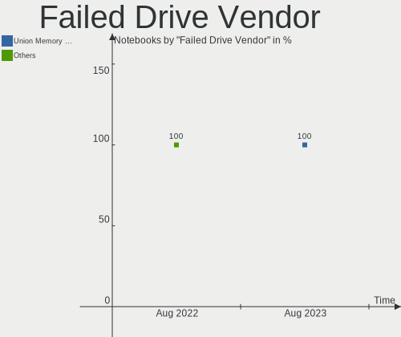
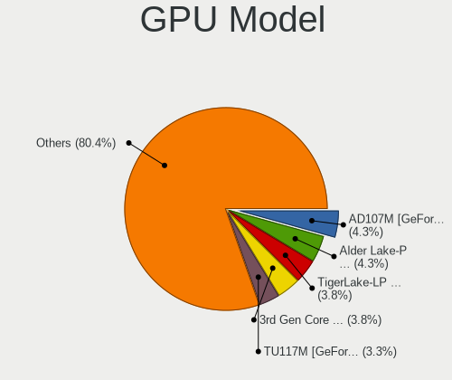
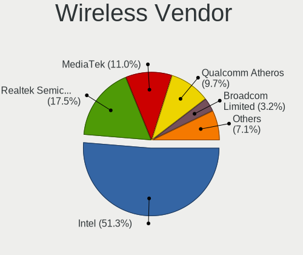
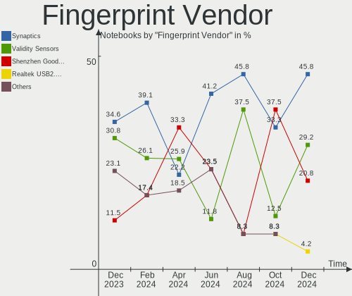
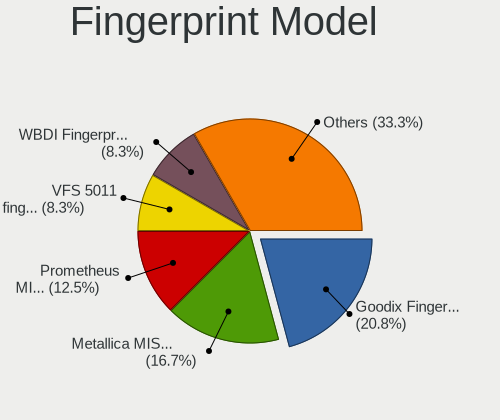

Arch Hardware Trends (Notebook)
-------------------------------

A project to identify most popular hardware characteristics and track their change
over time based on data collected by Arch users at https://Linux-Hardware.org.

Anyone can contribute to the study by uploading probes of their computers by
the [hw-probe](https://github.com/linuxhw/hw-probe) tool:

    sudo -E hw-probe -all -upload

Full-feature report is available here: https://linux-hardware.org/?view=trends&formfactor=notebook

Period: Dec, 2020.

Contents
--------

- [ OS                       ](#os)
- [ OS Family                ](#os-family)
- [ Kernel                   ](#kernel)
- [ Kernel Family            ](#kernel-family)
- [ Kernel Major Ver.        ](#kernel-major-ver)
- [ Arch                     ](#arch)
- [ DE                       ](#de)
- [ Display Server           ](#display-server)
- [ Display Manager          ](#display-manager)
- [ OS Lang                  ](#os-lang)
- [ Boot Mode                ](#boot-mode)
- [ Filesystem               ](#filesystem)
- [ Part. scheme             ](#part-scheme)
- [ Dual Boot with Linux/BSD ](#dual-boot-with-linux/bsd)
- [ Dual Boot (Win)          ](#dual-boot-win)
- [ Country                  ](#country)
- [ City                     ](#city)
- [ Vendor                   ](#vendor)
- [ Model                    ](#model)
- [ Model Family             ](#model-family)
- [ MFG Year                 ](#mfg-year)
- [ Form Factor              ](#form-factor)
- [ Secure Boot              ](#secure-boot)
- [ Coreboot                 ](#coreboot)
- [ RAM Size                 ](#ram-size)
- [ RAM Used                 ](#ram-used)
- [ Has CD-ROM               ](#has-cd-rom)
- [ Total Drives             ](#total-drives)
- [ Has Ethernet             ](#has-ethernet)
- [ Drive Vendor             ](#drive-vendor)
- [ Drive Model              ](#drive-model)
- [ HDD Vendor               ](#hdd-vendor)
- [ SSD Vendor               ](#ssd-vendor)
- [ Drive Kind               ](#drive-kind)
- [ Drive Connector          ](#drive-connector)
- [ Drive Size               ](#drive-size)
- [ Space Total              ](#space-total)
- [ Space Used               ](#space-used)
- [ Malfunc. Drives          ](#malfunc-drives)
- [ Malfunc. Drive Vendor    ](#malfunc-drive-vendor)
- [ Malfunc. HDD Vendor      ](#malfunc-hdd-vendor)
- [ Malfunc. Drive Kind      ](#malfunc-drive-kind)
- [ Failed Drives            ](#failed-drives)
- [ Failed Drive Vendor      ](#failed-drive-vendor)
- [ Drive Status             ](#drive-status)
- [ Storage Vendor           ](#storage-vendor)
- [ Storage Model            ](#storage-model)
- [ Storage Kind             ](#storage-kind)
- [ CPU Vendor               ](#cpu-vendor)
- [ CPU Model                ](#cpu-model)
- [ CPU Model Family         ](#cpu-model-family)
- [ CPU Cores                ](#cpu-cores)
- [ CPU Sockets              ](#cpu-sockets)
- [ CPU Threads              ](#cpu-threads)
- [ CPU Op-Modes             ](#cpu-op-modes)
- [ CPU Microcode            ](#cpu-microcode)
- [ CPU Microarch            ](#cpu-microarch)
- [ GPU Vendor               ](#gpu-vendor)
- [ GPU Model                ](#gpu-model)
- [ GPU Combo                ](#gpu-combo)
- [ GPU Driver               ](#gpu-driver)
- [ GPU Memory               ](#gpu-memory)
- [ Monitor Vendor           ](#monitor-vendor)
- [ Monitor Model            ](#monitor-model)
- [ Monitor Resolution       ](#monitor-resolution)
- [ Monitor Diagonal         ](#monitor-diagonal)
- [ Monitor Width            ](#monitor-width)
- [ Aspect Ratio             ](#aspect-ratio)
- [ Monitor Area             ](#monitor-area)
- [ Pixel Density            ](#pixel-density)
- [ Multiple Monitors        ](#multiple-monitors)
- [ Net Controller Vendor    ](#net-controller-vendor)
- [ Net Controller Model     ](#net-controller-model)
- [ Wireless Vendor          ](#wireless-vendor)
- [ Wireless Model           ](#wireless-model)
- [ Ethernet Vendor          ](#ethernet-vendor)
- [ Ethernet Model           ](#ethernet-model)
- [ Net Controller Kind      ](#net-controller-kind)
- [ Used Controller          ](#used-controller)
- [ NICs                     ](#nics)
- [ Memory Vendor            ](#memory-vendor)
- [ Memory Model             ](#memory-model)
- [ Memory Kind              ](#memory-kind)
- [ Memory Form Factor       ](#memory-form-factor)
- [ Memory Size              ](#memory-size)
- [ Memory Speed             ](#memory-speed)
- [ Sound Vendor             ](#sound-vendor)
- [ Sound Model              ](#sound-model)
- [ Camera Vendor            ](#camera-vendor)
- [ Camera Model             ](#camera-model)
- [ Fingerprint Vendor       ](#fingerprint-vendor)
- [ Fingerprint Model        ](#fingerprint-model)
- [ Chipcard Vendor          ](#chipcard-vendor)
- [ Chipcard Model           ](#chipcard-model)
- [ Printer Vendor           ](#printer-vendor)
- [ Printer Model            ](#printer-model)
- [ Scanner Vendor           ](#scanner-vendor)
- [ Scanner Model            ](#scanner-model)
- [ Bluetooth Vendor         ](#bluetooth-vendor)
- [ Bluetooth Model          ](#bluetooth-model)
- [ Unsupported Devices      ](#unsupported-devices)
- [ Unsupported Device Types ](#unsupported-device-types)

OS
--

Installed operating systems

| Name         | Notebooks | Percent |
|--------------|-----------|---------|
| Arch         | 66        | 66%     |
| Arch Rolling | 34        | 34%     |

OS Family
---------

OS without a version

| Name | Notebooks | Percent |
|------|-----------|---------|
| Arch | 100       | 100%    |

Kernel
------

Version of the Linux kernel

| Version                | Notebooks | Percent |
|------------------------|-----------|---------|
| 5.9.14-arch1-1         | 31        | 31%     |
| 5.9.11-arch2-1         | 18        | 18%     |
| 5.9.13-arch1-1         | 12        | 12%     |
| 5.9.12-arch1-1         | 5         | 5%      |
| 5.9.10-arch1-1         | 5         | 5%      |
| 5.9.14-zen1-1-zen      | 4         | 4%      |
| 5.9.13-zen1-1-zen      | 3         | 3%      |
| 5.9.11-zen2-1-zen      | 3         | 3%      |
| 5.4.85-1-lts           | 2         | 2%      |
| 5.4.82-1-lts           | 2         | 2%      |
| 5.9.8-arch1-1          | 1         | 1%      |
| 5.9.14.ll72-1-lingruby | 1         | 1%      |
| 5.9.14-99-tkg-bmq      | 1         | 1%      |
| 5.9.11-1-clear         | 1         | 1%      |
| 5.9.1-zen1-1-zen       | 1         | 1%      |
| 5.9.1-arch1-1          | 1         | 1%      |
| 5.8.1-arch1-1          | 1         | 1%      |
| 5.7.9-arch1-1          | 1         | 1%      |
| 5.7.6-arch1-1          | 1         | 1%      |
| 5.7.4-arch1-1          | 1         | 1%      |
| 5.4.83-1-lts           | 1         | 1%      |
| 5.4.80-2-lts           | 1         | 1%      |
| 5.10.2-arch1-1         | 1         | 1%      |
| 5.10.1-xanmod1-1       | 1         | 1%      |
| 5.10.1-arch1-1         | 1         | 1%      |

Kernel Family
-------------

Linux kernel without a distro release

| Version | Notebooks | Percent |
|---------|-----------|---------|
| 5.9.14  | 37        | 37%     |
| 5.9.11  | 22        | 22%     |
| 5.9.13  | 15        | 15%     |
| 5.9.12  | 5         | 5%      |
| 5.9.10  | 5         | 5%      |
| 5.9.1   | 2         | 2%      |
| 5.4.85  | 2         | 2%      |
| 5.4.82  | 2         | 2%      |
| 5.10.1  | 2         | 2%      |
| 5.9.8   | 1         | 1%      |
| 5.8.1   | 1         | 1%      |
| 5.7.9   | 1         | 1%      |
| 5.7.6   | 1         | 1%      |
| 5.7.4   | 1         | 1%      |
| 5.4.83  | 1         | 1%      |
| 5.4.80  | 1         | 1%      |
| 5.10.2  | 1         | 1%      |

Kernel Major Ver.
-----------------

Linux kernel major version

| Version | Notebooks | Percent |
|---------|-----------|---------|
| 5.9     | 87        | 87%     |
| 5.4     | 6         | 6%      |
| 5.7     | 3         | 3%      |
| 5.10    | 3         | 3%      |
| 5.8     | 1         | 1%      |

Arch
----

OS architecture (x86_64, i586, etc.)

| Name   | Notebooks | Percent |
|--------|-----------|---------|
| x86_64 | 100       | 100%    |

DE
--

Desktop Environment

| Name            | Notebooks | Percent |
|-----------------|-----------|---------|
| GNOME           | 45        | 45%     |
| KDE5            | 17        | 17%     |
| XFCE            | 7         | 7%      |
| KDE             | 7         | 7%      |
| i3              | 6         | 6%      |
| X-Cinnamon      | 5         | 5%      |
| Unknown         | 4         | 4%      |
| GNOME Flashback | 2         | 2%      |
| DWM             | 2         | 2%      |
| xmonad          | 1         | 1%      |
| Unity           | 1         | 1%      |
| sway            | 1         | 1%      |
| bspwm           | 1         | 1%      |
| awesome         | 1         | 1%      |

Display Server
--------------

X11 or Wayland

| Name    | Notebooks | Percent |
|---------|-----------|---------|
| X11     | 65        | 65%     |
| Wayland | 28        | 28%     |
| Tty     | 5         | 5%      |
| Unknown | 2         | 2%      |

Display Manager
---------------

SDDM, LightDM, etc.

| Name    | Notebooks | Percent |
|---------|-----------|---------|
| Unknown | 53        | 53%     |
| SDDM    | 18        | 18%     |
| GDM     | 14        | 14%     |
| TDM     | 10        | 10%     |
| LightDM | 5         | 5%      |

OS Lang
-------

Language

| Lang       | Notebooks | Percent |
|------------|-----------|---------|
| en_US      | 50        | 50%     |
| en_GB      | 9         | 9%      |
| C          | 6         | 6%      |
| pt_BR      | 5         | 5%      |
| en_CA      | 3         | 3%      |
| de_DE      | 3         | 3%      |
| zh_CN      | 2         | 2%      |
| pl_PL      | 2         | 2%      |
| fr_FR      | 2         | 2%      |
| fr_CA      | 2         | 2%      |
| es_ES      | 2         | 2%      |
| tr_TR      | 1         | 1%      |
| ru_UA      | 1         | 1%      |
| ru_RU      | 1         | 1%      |
| pl_PL.utf8 | 1         | 1%      |
| hr_HR.utf8 | 1         | 1%      |
| es_SV      | 1         | 1%      |
| es_CO      | 1         | 1%      |
| es_AR      | 1         | 1%      |
| en_ZA      | 1         | 1%      |
| en_US.utf8 | 1         | 1%      |
| en_NZ      | 1         | 1%      |
| de_AT      | 1         | 1%      |
| co_FR      | 1         | 1%      |
| Unknown    | 1         | 1%      |

Boot Mode
---------

EFI or BIOS

| Mode | Notebooks | Percent |
|------|-----------|---------|
| EFI  | 67        | 67%     |
| BIOS | 33        | 33%     |

Filesystem
----------

Type of filesystem

| Type    | Notebooks | Percent |
|---------|-----------|---------|
| Ext4    | 86        | 86%     |
| Btrfs   | 6         | 6%      |
| Xfs     | 5         | 5%      |
| Unknown | 2         | 2%      |
| Jfs     | 1         | 1%      |

Part. scheme
------------

Scheme of partitioning

| Type    | Notebooks | Percent |
|---------|-----------|---------|
| GPT     | 55        | 55%     |
| Unknown | 40        | 40%     |
| MBR     | 5         | 5%      |

Dual Boot with Linux/BSD
------------------------

Hosting more than one Linux/BSD

| Dual boot | Notebooks | Percent |
|-----------|-----------|---------|
| No        | 90        | 90%     |
| Yes       | 10        | 10%     |

Dual Boot (Win)
---------------

Hosting Linux and Windows

| Dual boot | Notebooks | Percent |
|-----------|-----------|---------|
| No        | 74        | 74%     |
| Yes       | 26        | 26%     |

Country
-------

Geographic location (country)

| Country             | Notebooks | Percent |
|---------------------|-----------|---------|
| USA                 | 16        | 16%     |
| Canada              | 9         | 9%      |
| Germany             | 7         | 7%      |
| Brazil              | 7         | 7%      |
| France              | 6         | 6%      |
| India               | 5         | 5%      |
| UK                  | 4         | 4%      |
| Poland              | 4         | 4%      |
| Sweden              | 3         | 3%      |
| Belgium             | 3         | 3%      |
| Austria             | 3         | 3%      |
| Spain               | 2         | 2%      |
| Russia              | 2         | 2%      |
| Italy               | 2         | 2%      |
| China               | 2         | 2%      |
| Ukraine             | 1         | 1%      |
| Turkey              | 1         | 1%      |
| Trinidad and Tobago | 1         | 1%      |
| Thailand            | 1         | 1%      |
| South Africa        | 1         | 1%      |
| Romania             | 1         | 1%      |
| New Zealand         | 1         | 1%      |
| Netherlands         | 1         | 1%      |
| Mexico              | 1         | 1%      |
| Lithuania           | 1         | 1%      |
| Kenya               | 1         | 1%      |
| Japan               | 1         | 1%      |
| Iran                | 1         | 1%      |
| Indonesia           | 1         | 1%      |
| Hungary             | 1         | 1%      |
| Guatemala           | 1         | 1%      |
| Greece              | 1         | 1%      |
| Estonia             | 1         | 1%      |
| Denmark             | 1         | 1%      |
| Czech Republic      | 1         | 1%      |
| Croatia             | 1         | 1%      |
| Colombia            | 1         | 1%      |
| Bulgaria            | 1         | 1%      |
| Belarus             | 1         | 1%      |
| Argentina           | 1         | 1%      |

City
----

Geographic location (city)

| City                    | Notebooks | Percent |
|-------------------------|-----------|---------|
| Vienna                  | 2         | 2%      |
| Longueuil               | 2         | 2%      |
| Łódź                 | 1         | 1%      |
| Zagreb                  | 1         | 1%      |
| Yaocheng                | 1         | 1%      |
| Wilmington              | 1         | 1%      |
| Washington              | 1         | 1%      |
| Vilnius                 | 1         | 1%      |
| Versailles              | 1         | 1%      |
| Valencia                | 1         | 1%      |
| Toulouse                | 1         | 1%      |
| Thrissur                | 1         | 1%      |
| The Hague               | 1         | 1%      |
| Tervuren                | 1         | 1%      |
| Tehran                  | 1         | 1%      |
| Tarnów                 | 1         | 1%      |
| Tallinn                 | 1         | 1%      |
| Taboao da Serra         | 1         | 1%      |
| São Paulo              | 1         | 1%      |
| Szydlowiec              | 1         | 1%      |
| Stockholm               | 1         | 1%      |
| Sorocaba                | 1         | 1%      |
| Sofia                   | 1         | 1%      |
| Shūnan                 | 1         | 1%      |
| Shawinigan              | 1         | 1%      |
| Semarang                | 1         | 1%      |
| Secunda                 | 1         | 1%      |
| Seattle                 | 1         | 1%      |
| Santa Clara             | 1         | 1%      |
| San Ramon               | 1         | 1%      |
| Samara                  | 1         | 1%      |
| Sainte-Julienne         | 1         | 1%      |
| Sainte-Agathe-des-Monts | 1         | 1%      |
| Saint-Raphaël          | 1         | 1%      |
| Roubaix                 | 1         | 1%      |
| Rajkot                  | 1         | 1%      |
| Prague                  | 1         | 1%      |
| Petershagen             | 1         | 1%      |
| Ottawa                  | 1         | 1%      |
| Otaki                   | 1         | 1%      |
| Nairobi                 | 1         | 1%      |
| Mönchengladbach        | 1         | 1%      |
| Moscow                  | 1         | 1%      |
| Morganville             | 1         | 1%      |
| Mississauga             | 1         | 1%      |
| Michendorf              | 1         | 1%      |
| Manipal                 | 1         | 1%      |
| Los Angeles             | 1         | 1%      |
| Lidkoeping              | 1         | 1%      |
| León                   | 1         | 1%      |
| Lens                    | 1         | 1%      |
| Lakeland                | 1         | 1%      |
| Klagenfurt              | 1         | 1%      |
| Istanbul                | 1         | 1%      |
| Indaiatuba              | 1         | 1%      |
| Hyderabad               | 1         | 1%      |
| Hovmantorp              | 1         | 1%      |
| Hillsdale               | 1         | 1%      |
| Hefei                   | 1         | 1%      |
| Hamburg                 | 1         | 1%      |

Vendor
------

Motherboard manufacturer

| Name                | Notebooks | Percent |
|---------------------|-----------|---------|
| Lenovo              | 23        | 23%     |
| Dell                | 22        | 22%     |
| ASUSTek Computer    | 13        | 13%     |
| Hewlett-Packard     | 12        | 12%     |
| Acer                | 5         | 5%      |
| MSI                 | 4         | 4%      |
| HUAWEI              | 3         | 3%      |
| Apple               | 3         | 3%      |
| Unknown             | 3         | 3%      |
| Schenker            | 2         | 2%      |
| Samsung Electronics | 2         | 2%      |
| Fujitsu             | 2         | 2%      |
| Toshiba             | 1         | 1%      |
| Timi                | 1         | 1%      |
| Packard Bell        | 1         | 1%      |
| EUROCOM             | 1         | 1%      |
| Eluktronics         | 1         | 1%      |
| Cube                | 1         | 1%      |

Model
-----

Motherboard model

| Name                                     | Notebooks | Percent |
|------------------------------------------|-----------|---------|
| Unknown                                  | 4         | 4%      |
| Timi RedmiBook 16                        | 1         | 1%      |
| Schenker XMG FUSION 15 (XFU15L19)        | 1         | 1%      |
| Schenker SCHENKER VIA 15 Pro             | 1         | 1%      |
| Samsung 340XAA/350XAA/550XAA             | 1         | 1%      |
| Samsung 300E5M/300E5L                    | 1         | 1%      |
| Packard Bell EasyNote TH36               | 1         | 1%      |
| MSI PE70 6QE                             | 1         | 1%      |
| MSI GP60 2PE                             | 1         | 1%      |
| MSI GE70 2OC\2OE                         | 1         | 1%      |
| MSI GE62MVR 7RG                          | 1         | 1%      |
| Lenovo Y520-15IKBN 80WK                  | 1         | 1%      |
| Lenovo ThinkPad X1 Carbon 7th 20QES1RP00 | 1         | 1%      |
| Lenovo ThinkPad X1 Carbon 6th 20KH002RUS | 1         | 1%      |
| Lenovo ThinkPad X1 Carbon 3rd 20BSCTO1WW | 1         | 1%      |
| Lenovo ThinkPad X1 Carbon 2nd 20A8S0ET00 | 1         | 1%      |
| Lenovo ThinkPad T490 20N3S2WY00          | 1         | 1%      |
| Lenovo ThinkPad T470s 20HGS6PF09         | 1         | 1%      |
| Lenovo ThinkPad T460s 20F9003UPB         | 1         | 1%      |
| Lenovo ThinkPad T440p 20AWS5AD00         | 1         | 1%      |
| Lenovo ThinkPad T440p 20AN00C1GE         | 1         | 1%      |
| Lenovo ThinkPad T14 Gen 1 20UES00L00     | 1         | 1%      |
| Lenovo ThinkPad P70 20ER000EGE           | 1         | 1%      |
| Lenovo ThinkPad L380 20M5CTO1WW          | 1         | 1%      |
| Lenovo ThinkPad Edge E545 20B20011US     | 1         | 1%      |
| Lenovo ThinkPad E495 20NE0001US          | 1         | 1%      |
| Lenovo ThinkPad E14 Gen 2 20T6000SIX     | 1         | 1%      |
| Lenovo Legion Y545 81Q6                  | 1         | 1%      |
| Lenovo Legion 5 15ARH05H 82B1            | 1         | 1%      |
| Lenovo IdeaPad S145-15IIL 82DJ           | 1         | 1%      |
| Lenovo IdeaPad S145-15API 81UT           | 1         | 1%      |
| Lenovo IdeaPad 5 14ARE05 81YM            | 1         | 1%      |
| Lenovo IdeaPad 3 15IIL05 81WE            | 1         | 1%      |
| Lenovo B5400 20278                       | 1         | 1%      |
| HUAWEI NBLK-WAX9X                        | 1         | 1%      |
| HUAWEI HLY-WX9XX                         | 1         | 1%      |
| HUAWEI BOHK-WAX9X                        | 1         | 1%      |
| HP ZBook Studio G5                       | 1         | 1%      |
| HP ProBook 640 G2                        | 1         | 1%      |
| HP ProBook 440 G3                        | 1         | 1%      |
| HP Pavilion g6                           | 1         | 1%      |
| HP OMEN Laptop 15-en0xxx                 | 1         | 1%      |
| HP Laptop 15-dw0xxx                      | 1         | 1%      |
| HP Laptop 15-db1xxx                      | 1         | 1%      |
| HP ENVY Laptop 13-ad1xx                  | 1         | 1%      |
| HP EliteBook 8560p                       | 1         | 1%      |
| HP EliteBook 8470p                       | 1         | 1%      |
| HP EliteBook 845 G7 Notebook PC          | 1         | 1%      |
| HP 15                                    | 1         | 1%      |
| Fujitsu LIFEBOOK U772                    | 1         | 1%      |
| Fujitsu LIFEBOOK E780                    | 1         | 1%      |
| EUROCOM Q6                               | 1         | 1%      |
| Eluktronics THINN-15                     | 1         | 1%      |
| Dell XPS 17 9700                         | 1         | 1%      |
| Dell XPS 15 9570                         | 1         | 1%      |
| Dell XPS 15 9560                         | 1         | 1%      |
| Dell XPS 15 9500                         | 1         | 1%      |
| Dell XPS 15 7590                         | 1         | 1%      |
| Dell XPS 13 9370                         | 1         | 1%      |
| Dell XPS 13 9350                         | 1         | 1%      |

Model Family
------------

Motherboard model prefix

| Name                  | Notebooks | Percent |
|-----------------------|-----------|---------|
| Lenovo ThinkPad       | 15        | 15%     |
| Dell XPS              | 8         | 8%      |
| Dell Inspiron         | 5         | 5%      |
| Acer Aspire           | 5         | 5%      |
| Lenovo IdeaPad        | 4         | 4%      |
| ASUS VivoBook         | 4         | 4%      |
| Unknown               | 4         | 4%      |
| HP EliteBook          | 3         | 3%      |
| Dell Precision        | 3         | 3%      |
| Dell Latitude         | 3         | 3%      |
| ASUS TUF              | 3         | 3%      |
| Lenovo Legion         | 2         | 2%      |
| HP ProBook            | 2         | 2%      |
| HP Laptop             | 2         | 2%      |
| Fujitsu LIFEBOOK      | 2         | 2%      |
| Timi RedmiBook        | 1         | 1%      |
| Schenker XMG          | 1         | 1%      |
| Schenker SCHENKER     | 1         | 1%      |
| Samsung 340XAA        | 1         | 1%      |
| Samsung 300E5M        | 1         | 1%      |
| Packard Bell EasyNote | 1         | 1%      |
| MSI PE70              | 1         | 1%      |
| MSI GP60              | 1         | 1%      |
| MSI GE70              | 1         | 1%      |
| MSI GE62MVR           | 1         | 1%      |
| Lenovo Y520-15IKBN    | 1         | 1%      |
| Lenovo B5400          | 1         | 1%      |
| HUAWEI NBLK-WAX9X     | 1         | 1%      |
| HUAWEI HLY-WX9XX      | 1         | 1%      |
| HUAWEI BOHK-WAX9X     | 1         | 1%      |
| HP ZBook              | 1         | 1%      |
| HP Pavilion           | 1         | 1%      |
| HP OMEN               | 1         | 1%      |
| HP ENVY               | 1         | 1%      |
| HP 15                 | 1         | 1%      |
| EUROCOM Q6            | 1         | 1%      |
| Eluktronics THINN-15  | 1         | 1%      |
| Dell Vostro           | 1         | 1%      |
| Dell G5               | 1         | 1%      |
| Dell G3               | 1         | 1%      |
| Cube i16-L            | 1         | 1%      |
| ASUS X705UDR          | 1         | 1%      |
| ASUS X580VD           | 1         | 1%      |
| ASUS X55A             | 1         | 1%      |
| ASUS X556UQK          | 1         | 1%      |
| ASUS X550EA           | 1         | 1%      |
| ASUS X541UJ           | 1         | 1%      |
| Apple MacBookPro9     | 1         | 1%      |
| Apple MacBookPro15    | 1         | 1%      |
| Apple MacBookPro12    | 1         | 1%      |

MFG Year
--------

Motherboard manufacture year

| Year | Notebooks | Percent |
|------|-----------|---------|
| 2020 | 40        | 40%     |
| 2019 | 26        | 26%     |
| 2018 | 9         | 9%      |
| 2013 | 6         | 6%      |
| 2015 | 5         | 5%      |
| 2012 | 4         | 4%      |
| 2017 | 3         | 3%      |
| 2016 | 3         | 3%      |
| 2010 | 2         | 2%      |
| 2014 | 1         | 1%      |
| 2008 | 1         | 1%      |

Form Factor
-----------

Physical design of the computer

| Name     | Notebooks | Percent |
|----------|-----------|---------|
| Notebook | 100       | 100%    |

Secure Boot
-----------

Enabled or disabled

| State    | Notebooks | Percent |
|----------|-----------|---------|
| Disabled | 99        | 99%     |
| Enabled  | 1         | 1%      |

Coreboot
--------

Have coreboot on board

| Used | Notebooks | Percent |
|------|-----------|---------|
| No   | 100       | 100%    |

RAM Size
--------

Total RAM memory

| Size in GB  | Notebooks | Percent |
|-------------|-----------|---------|
| 4.01-8.0    | 36        | 36%     |
| 16.01-24.0  | 19        | 19%     |
| 8.01-16.0   | 16        | 16%     |
| 3.01-4.0    | 11        | 11%     |
| 32.01-64.0  | 9         | 9%      |
| 64.01-256.0 | 4         | 4%      |
| 24.01-32.0  | 3         | 3%      |
| 2.01-3.0    | 2         | 2%      |

RAM Used
--------

Used RAM memory

| Used GB    | Notebooks | Percent |
|------------|-----------|---------|
| 1.01-2.0   | 31        | 31%     |
| 2.01-3.0   | 26        | 26%     |
| 4.01-8.0   | 15        | 15%     |
| 3.01-4.0   | 14        | 14%     |
| 8.01-16.0  | 6         | 6%      |
| 0.51-1.0   | 5         | 5%      |
| 24.01-32.0 | 1         | 1%      |
| 16.01-24.0 | 1         | 1%      |
| 0.01-0.5   | 1         | 1%      |

Has CD-ROM
----------

Has CD-ROM on board

| Presented | Notebooks | Percent |
|-----------|-----------|---------|
| No        | 74        | 74%     |
| Yes       | 26        | 26%     |

Total Drives
------------

Number of drives on board

| Drives | Notebooks | Percent |
|--------|-----------|---------|
| 1      | 66        | 66%     |
| 2      | 30        | 30%     |
| 4      | 2         | 2%      |
| 3      | 2         | 2%      |

Has Ethernet
------------

Has Ethernet on board

| Presented | Notebooks | Percent |
|-----------|-----------|---------|
| Yes       | 79        | 79%     |
| No        | 21        | 21%     |

Drive Vendor
------------

Hard drive vendors

| Vendor                    | Notebooks | Drives | Percent |
|---------------------------|-----------|--------|---------|
| Samsung Electronics       | 23        | 28     | 17.29%  |
| WDC                       | 19        | 19     | 14.29%  |
| Toshiba                   | 14        | 14     | 10.53%  |
| Seagate                   | 12        | 12     | 9.02%   |
| SanDisk                   | 11        | 13     | 8.27%   |
| SK Hynix                  | 7         | 7      | 5.26%   |
| Unknown                   | 6         | 6      | 4.51%   |
| Micron Technology         | 4         | 4      | 3.01%   |
| Kingston                  | 4         | 4      | 3.01%   |
| Intel                     | 4         | 4      | 3.01%   |
| A-DATA Technology         | 4         | 4      | 3.01%   |
| HGST                      | 3         | 3      | 2.26%   |
| Crucial                   | 2         | 2      | 1.5%    |
| China                     | 2         | 2      | 1.5%    |
| ADATA Technology          | 2         | 2      | 1.5%    |
| Yangtze Memory            | 1         | 1      | 0.75%   |
| XPG                       | 1         | 1      | 0.75%   |
| Union Memory              | 1         | 1      | 0.75%   |
| SPCC                      | 1         | 1      | 0.75%   |
| Solid State Storage       | 1         | 1      | 0.75%   |
| ShanDianZhe               | 1         | 1      | 0.75%   |
| PNY                       | 1         | 1      | 0.75%   |
| Micron/Crucial Technology | 1         | 1      | 0.75%   |
| LITEONIT                  | 1         | 1      | 0.75%   |
| KIOXIA                    | 1         | 1      | 0.75%   |
| Hitachi                   | 1         | 1      | 0.75%   |
| FORESEE                   | 1         | 1      | 0.75%   |
| CT500P2S                  | 1         | 1      | 0.75%   |
| CalDigit                  | 1         | 1      | 0.75%   |
| ASMT                      | 1         | 1      | 0.75%   |
| Apple                     | 1         | 1      | 0.75%   |

Drive Model
-----------

Hard drive models

| Model                                     | Notebooks | Percent |
|-------------------------------------------|-----------|---------|
| Toshiba NVMe SSD Drive 512GB              | 4         | 2.9%    |
| Seagate ST1000LM035-1RK172 1TB            | 3         | 2.17%   |
| Sandisk NVMe SSD Drive 512GB              | 3         | 2.17%   |
| Sandisk NVMe SSD Drive 256GB              | 3         | 2.17%   |
| Samsung SSD 850 EVO 500GB                 | 3         | 2.17%   |
| Samsung NVMe SSD Drive 512GB              | 3         | 2.17%   |
| WDC WD10JPVX-22JC3T0 1TB                  | 2         | 1.45%   |
| Toshiba MQ04ABF100 1TB                    | 2         | 1.45%   |
| Toshiba MQ01ABD100 1TB                    | 2         | 1.45%   |
| SK Hynix NVMe SSD Drive 1TB               | 2         | 1.45%   |
| Seagate Expansion+ 4TB                    | 2         | 1.45%   |
| Samsung NVMe SSD Drive 1TB                | 2         | 1.45%   |
| Intel SSDPEKNW512G8 512GB                 | 2         | 1.45%   |
| Yangtze Memory ZHITAI PC005 Active 1TB    | 1         | 0.72%   |
| XPG NVMe SSD Drive 1024GB                 | 1         | 0.72%   |
| WDC WDS500G2B0B-00YS70 500GB SSD          | 1         | 0.72%   |
| WDC WDS240G2G0B-00EPW0 240GB SSD          | 1         | 0.72%   |
| WDC WDS100T2B0C-00PXH0 1TB                | 1         | 0.72%   |
| WDC WDBNCE5000PNC 500GB SSD               | 1         | 0.72%   |
| WDC WD5000LUCT-63RC2Y0 500GB              | 1         | 0.72%   |
| WDC WD5000LPLX-75ZNTT0 500GB              | 1         | 0.72%   |
| WDC WD5000BPVT-22HXZT3 500GB              | 1         | 0.72%   |
| WDC WD5000BEVT-22A0RT0 500GB              | 1         | 0.72%   |
| WDC WD10SPZX-75Z10T1 1TB                  | 1         | 0.72%   |
| WDC WD10SPZX-22Z10T1 1TB                  | 1         | 0.72%   |
| WDC WD10SPZX-21Z10T0 1TB                  | 1         | 0.72%   |
| WDC WD10JPVX-60JC3T0 1TB                  | 1         | 0.72%   |
| WDC PC SN730 SDBQNTY-256G-1001 256GB      | 1         | 0.72%   |
| WDC PC SN730 SDBPNTY-512G-1101 512GB      | 1         | 0.72%   |
| WDC PC SN730 SDBPNTY-256G-1027 256GB      | 1         | 0.72%   |
| WDC PC SN520 SDAPMUW-512G-1101 512GB      | 1         | 0.72%   |
| WDC PC SN520 SDAPMUW-256G-1101 256GB      | 1         | 0.72%   |
| Unknown SL64G  64GB                       | 1         | 0.72%   |
| Unknown SD/MMC/MS PRO 128GB               | 1         | 0.72%   |
| Unknown SC32G  32GB                       | 1         | 0.72%   |
| Unknown NCard  2GB                        | 1         | 0.72%   |
| Unknown MMC Card  8GB                     | 1         | 0.72%   |
| Unknown MMC Card  128GB                   | 1         | 0.72%   |
| Union Memory UMIS RPJTJ256MEE1OWX 256GB   | 1         | 0.72%   |
| Toshiba THNSFJ256GDNU A 256GB SSD         | 1         | 0.72%   |
| Toshiba MQ01ABD050 500GB                  | 1         | 0.72%   |
| Toshiba MK6475GSX 640GB                   | 1         | 0.72%   |
| Toshiba KXG50ZNV512G NVMe 512GB           | 1         | 0.72%   |
| Toshiba HDWK105 500GB                     | 1         | 0.72%   |
| Toshiba HDWJ110 1TB                       | 1         | 0.72%   |
| SPCC M.2 PCIe SSD 512GB                   | 1         | 0.72%   |
| Solid State Storage SSSTC CL1-4D256 256GB | 1         | 0.72%   |
| SK Hynix SKHynix_HFS001TD9TNI-L2B0B 1TB   | 1         | 0.72%   |
| SK Hynix SC300 M.2 2280 128GB SSD         | 1         | 0.72%   |
| SK Hynix NVMe SSD Drive 256GB             | 1         | 0.72%   |
| SK Hynix HFS256G39TND-N210A 256GB SSD     | 1         | 0.72%   |
| SK Hynix BC511 HFM512GDJTNI-82A0A 512GB   | 1         | 0.72%   |
| ShanDianZhe 128G                          | 1         | 0.72%   |
| Seagate UltraTouch SSD 500GB              | 1         | 0.72%   |
| Seagate ST9120817AS 120GB                 | 1         | 0.72%   |
| Seagate ST500LT012-1DG142 500GB           | 1         | 0.72%   |
| Seagate ST500LM030-2E717D 500GB           | 1         | 0.72%   |
| Seagate ST2000LM007-1R8174 2TB            | 1         | 0.72%   |
| Seagate ST1000LX015-1U7172 1TB            | 1         | 0.72%   |
| Seagate ST1000LM049-2GH172 1TB            | 1         | 0.72%   |

HDD Vendor
----------

Hard disk drive vendors

| Vendor  | Notebooks | Drives | Percent |
|---------|-----------|--------|---------|
| Seagate | 11        | 11     | 32.35%  |
| WDC     | 10        | 10     | 29.41%  |
| Toshiba | 8         | 8      | 23.53%  |
| HGST    | 3         | 3      | 8.82%   |
| Hitachi | 1         | 1      | 2.94%   |
| ASMT    | 1         | 1      | 2.94%   |

SSD Vendor
----------

Solid state drive vendors

| Vendor              | Notebooks | Drives | Percent |
|---------------------|-----------|--------|---------|
| Samsung Electronics | 11        | 12     | 28.21%  |
| A-DATA Technology   | 4         | 4      | 10.26%  |
| WDC                 | 3         | 3      | 7.69%   |
| SanDisk             | 3         | 4      | 7.69%   |
| Micron Technology   | 3         | 3      | 7.69%   |
| SK Hynix            | 2         | 2      | 5.13%   |
| Kingston            | 2         | 2      | 5.13%   |
| Intel               | 2         | 2      | 5.13%   |
| Crucial             | 2         | 2      | 5.13%   |
| China               | 2         | 2      | 5.13%   |
| Toshiba             | 1         | 1      | 2.56%   |
| Seagate             | 1         | 1      | 2.56%   |
| PNY                 | 1         | 1      | 2.56%   |
| LITEONIT            | 1         | 1      | 2.56%   |
| FORESEE             | 1         | 1      | 2.56%   |

Drive Kind
----------

HDD or SSD

| Kind    | Notebooks | Drives | Percent |
|---------|-----------|--------|---------|
| NVMe    | 51        | 56     | 39.23%  |
| SSD     | 36        | 41     | 27.69%  |
| HDD     | 34        | 34     | 26.15%  |
| MMC     | 5         | 5      | 3.85%   |
| Unknown | 4         | 4      | 3.08%   |

Drive Connector
---------------

SATA, SAS, NVMe, etc.

| Type | Notebooks | Drives | Percent |
|------|-----------|--------|---------|
| SATA | 58        | 71     | 47.54%  |
| NVMe | 51        | 56     | 41.8%   |
| SAS  | 8         | 8      | 6.56%   |
| MMC  | 5         | 5      | 4.1%    |

Drive Size
----------

Size of hard drive

| Size in TB | Notebooks | Drives | Percent |
|------------|-----------|--------|---------|
| 0.01-0.5   | 42        | 47     | 60.87%  |
| 0.51-1.0   | 24        | 25     | 34.78%  |
| 3.01-4.0   | 2         | 2      | 2.9%    |
| 1.01-2.0   | 1         | 1      | 1.45%   |

Space Total
-----------

Amount of disk space available on the file system

| Size in GB     | Notebooks | Percent |
|----------------|-----------|---------|
| 251-500        | 35        | 35%     |
| 101-250        | 24        | 24%     |
| 501-1000       | 24        | 24%     |
| 51-100         | 7         | 7%      |
| 1001-2000      | 5         | 5%      |
| 1-20           | 2         | 2%      |
| More than 3000 | 1         | 1%      |
| 21-50          | 1         | 1%      |
| Unknown        | 1         | 1%      |

Space Used
----------

Amount of used disk space

| Used GB        | Notebooks | Percent |
|----------------|-----------|---------|
| 101-250        | 25        | 25%     |
| 1-20           | 20        | 20%     |
| 251-500        | 18        | 18%     |
| 21-50          | 17        | 17%     |
| 51-100         | 13        | 13%     |
| 501-1000       | 5         | 5%      |
| More than 3000 | 1         | 1%      |
| Unknown        | 1         | 1%      |

Malfunc. Drives
---------------

Drive models with a malfunction

| Model                               | Notebooks | Drives | Percent |
|-------------------------------------|-----------|--------|---------|
| Seagate ST9120817AS 120GB           | 1         | 1      | 25%     |
| Samsung Electronics SSD 970 EVO 2TB | 1         | 1      | 25%     |
| Intel SSDSC2BW240A4 240GB           | 1         | 1      | 25%     |
| Hitachi HTS545050A7E380 500GB       | 1         | 1      | 25%     |

Malfunc. Drive Vendor
---------------------

Vendors of faulty drives

| Vendor              | Notebooks | Drives | Percent |
|---------------------|-----------|--------|---------|
| Seagate             | 1         | 1      | 25%     |
| Samsung Electronics | 1         | 1      | 25%     |
| Intel               | 1         | 1      | 25%     |
| Hitachi             | 1         | 1      | 25%     |

Malfunc. HDD Vendor
-------------------

Vendors of faulty HDD drives

| Vendor  | Notebooks | Drives | Percent |
|---------|-----------|--------|---------|
| Seagate | 1         | 1      | 50%     |
| Hitachi | 1         | 1      | 50%     |

Malfunc. Drive Kind
-------------------

Kinds of faulty drives

| Kind | Notebooks | Drives | Percent |
|------|-----------|--------|---------|
| HDD  | 2         | 2      | 50%     |
| NVMe | 1         | 1      | 25%     |
| SSD  | 1         | 1      | 25%     |

Failed Drives
-------------

Failed drive models

| Model                                        | Notebooks | Drives | Percent |
|----------------------------------------------|-----------|--------|---------|
| Samsung Electronics MZVLW128HEGR-000L2 128GB | 1         | 1      | 100%    |

Failed Drive Vendor
-------------------

Failed drive vendors

| Vendor              | Notebooks | Drives | Percent |
|---------------------|-----------|--------|---------|
| Samsung Electronics | 1         | 1      | 100%    |

Drive Status
------------

Number of failed and malfunc. drives

| Status   | Notebooks | Drives | Percent |
|----------|-----------|--------|---------|
| Detected | 62        | 88     | 57.94%  |
| Works    | 40        | 47     | 37.38%  |
| Malfunc  | 4         | 4      | 3.74%   |
| Failed   | 1         | 1      | 0.93%   |

Storage Vendor
--------------

Storage controller vendors

| Vendor                         | Notebooks | Percent |
|--------------------------------|-----------|---------|
| Intel                          | 66        | 50.77%  |
| Sandisk                        | 14        | 10.77%  |
| Samsung Electronics            | 14        | 10.77%  |
| AMD                            | 13        | 10%     |
| Toshiba America Info Systems   | 5         | 3.85%   |
| SK Hynix                       | 5         | 3.85%   |
| ADATA Technology               | 3         | 2.31%   |
| Kingston Technology Company    | 2         | 1.54%   |
| Yangtze Memory Technologies    | 1         | 0.77%   |
| Union Memory (Shenzhen)        | 1         | 0.77%   |
| Solid State Storage Technology | 1         | 0.77%   |
| Silicon Motion                 | 1         | 0.77%   |
| Micron/Crucial Technology      | 1         | 0.77%   |
| Micron Technology              | 1         | 0.77%   |
| KIOXIA                         | 1         | 0.77%   |
| Apple                          | 1         | 0.77%   |

Storage Model
-------------

Storage controller models

| Model                                                                            | Notebooks | Percent |
|----------------------------------------------------------------------------------|-----------|---------|
| Intel Sunrise Point-LP SATA Controller [AHCI mode]                               | 13        | 9.92%   |
| AMD FCH SATA Controller [AHCI mode]                                              | 13        | 9.92%   |
| Samsung NVMe SSD Controller SM981/PM981/PM983                                    | 10        | 7.63%   |
| Intel Cannon Lake Mobile PCH SATA AHCI Controller                                | 8         | 6.11%   |
| Intel 7 Series Chipset Family 6-port SATA Controller [AHCI mode]                 | 8         | 6.11%   |
| Sandisk WD Black SN750 / PC SN730 NVMe SSD                                       | 7         | 5.34%   |
| Intel 82801 Mobile SATA Controller [RAID mode]                                   | 7         | 5.34%   |
| Intel HM170/QM170 Chipset SATA Controller [AHCI Mode]                            | 4         | 3.05%   |
| Intel 8 Series/C220 Series Chipset Family 6-port SATA Controller 1 [AHCI mode]   | 4         | 3.05%   |
| Intel 8 Series SATA Controller 1 [AHCI mode]                                     | 4         | 3.05%   |
| SK Hynix Non-Volatile memory controller                                          | 3         | 2.29%   |
| Samsung NVMe SSD Controller SM961/PM961/SM963                                    | 3         | 2.29%   |
| Intel Cannon Point-LP SATA Controller [AHCI Mode]                                | 3         | 2.29%   |
| Toshiba America Info Systems XG6 NVMe SSD Controller                             | 2         | 1.53%   |
| Toshiba America Info Systems Toshiba America Info Non-Volatile memory controller | 2         | 1.53%   |
| Sandisk WD Blue SN500 / PC SN520 NVMe SSD                                        | 2         | 1.53%   |
| Sandisk PC SN520 NVMe SSD                                                        | 2         | 1.53%   |
| Intel SSD 660P Series                                                            | 2         | 1.53%   |
| Intel Q170/Q150/B150/H170/H110/Z170/CM236 Chipset SATA Controller [AHCI Mode]    | 2         | 1.53%   |
| Intel Ice Lake-LP SATA Controller [AHCI mode]                                    | 2         | 1.53%   |
| Intel 82801IBM/IEM (ICH9M/ICH9M-E) 4 port SATA Controller [AHCI mode]            | 2         | 1.53%   |
| Intel 6 Series/C200 Series Chipset Family 6 port Mobile SATA AHCI Controller     | 2         | 1.53%   |
| ADATA Non-Volatile memory controller                                             | 2         | 1.53%   |
| Yangtze Memory Non-Volatile memory controller                                    | 1         | 0.76%   |
| Union Memory (Shenzhen) Non-Volatile memory controller                           | 1         | 0.76%   |
| Toshiba America Info Systems XG4 NVMe SSD Controller                             | 1         | 0.76%   |
| Solid State Storage Non-Volatile memory controller                               | 1         | 0.76%   |
| SK Hynix PC401 NVMe Solid State Drive 256GB                                      | 1         | 0.76%   |
| SK Hynix BC501 NVMe Solid State Drive 512GB                                      | 1         | 0.76%   |
| Silicon Motion SM2263EN/SM2263XT SSD Controller                                  | 1         | 0.76%   |
| Sandisk WD Blue SN550 NVMe SSD                                                   | 1         | 0.76%   |
| Sandisk WD Black 2018 / PC SN720 NVMe SSD                                        | 1         | 0.76%   |
| Sandisk Non-Volatile memory controller                                           | 1         | 0.76%   |
| Samsung NVMe SSD Controller SM951/PM951                                          | 1         | 0.76%   |
| Micron/Crucial Non-Volatile memory controller                                    | 1         | 0.76%   |
| Micron Non-Volatile memory controller                                            | 1         | 0.76%   |
| KIOXIA Non-Volatile memory controller                                            | 1         | 0.76%   |
| Kingston Company Company Non-Volatile memory controller                          | 1         | 0.76%   |
| Kingston Company A2000 NVMe SSD                                                  | 1         | 0.76%   |
| Intel Wildcat Point-LP SATA Controller [AHCI Mode]                               | 1         | 0.76%   |
| Intel Comet Lake SATA AHCI Controller                                            | 1         | 0.76%   |
| Intel Chipset SATA RAID Controller                                               | 1         | 0.76%   |
| Intel Celeron N3350/Pentium N4200/Atom E3900 Series SATA AHCI Controller         | 1         | 0.76%   |
| Intel 82801IBM/IEM (ICH9M/ICH9M-E) 2 port SATA Controller [IDE mode]             | 1         | 0.76%   |
| Intel 5 Series/3400 Series Chipset 6 port SATA AHCI Controller                   | 1         | 0.76%   |
| Apple ANS2 NVMe Controller                                                       | 1         | 0.76%   |
| ADATA XPG SX8200 Pro PCIe Gen3x4 M.2 2280 Solid State Drive                      | 1         | 0.76%   |

Storage Kind
------------

Kind of storage controller (IDE, SATA, NVMe, SAS, ...)

| Kind | Notebooks | Percent |
|------|-----------|---------|
| SATA | 69        | 53.49%  |
| NVMe | 51        | 39.53%  |
| RAID | 8         | 6.2%    |
| IDE  | 1         | 0.78%   |

CPU Vendor
----------

Processor vendors

| Vendor | Notebooks | Percent |
|--------|-----------|---------|
| Intel  | 78        | 78%     |
| AMD    | 22        | 22%     |

CPU Model
---------

Processor models

| Model                                         | Notebooks | Percent |
|-----------------------------------------------|-----------|---------|
| Intel Core i7-8550U CPU @ 1.80GHz             | 5         | 5%      |
| Intel Core i7-9750H CPU @ 2.60GHz             | 4         | 4%      |
| Intel Core i7-7700HQ CPU @ 2.80GHz            | 4         | 4%      |
| Intel Core i5-7200U CPU @ 2.50GHz             | 4         | 4%      |
| AMD Ryzen 5 3500U with Radeon Vega Mobile Gfx | 4         | 4%      |
| Intel Core i5-6200U CPU @ 2.30GHz             | 3         | 3%      |
| AMD Ryzen 7 4800H with Radeon Graphics        | 3         | 3%      |
| Intel Core i7-8850H CPU @ 2.60GHz             | 2         | 2%      |
| Intel Core i7-8750H CPU @ 2.20GHz             | 2         | 2%      |
| Intel Core i7-8665U CPU @ 1.90GHz             | 2         | 2%      |
| Intel Core i7-6500U CPU @ 2.50GHz             | 2         | 2%      |
| Intel Core i7-4710MQ CPU @ 2.50GHz            | 2         | 2%      |
| Intel Core i7-10875H CPU @ 2.30GHz            | 2         | 2%      |
| Intel Core i5-8265U CPU @ 1.60GHz             | 2         | 2%      |
| Intel Core i3-3217U CPU @ 1.80GHz             | 2         | 2%      |
| AMD Ryzen 7 PRO 4750U with Radeon Graphics    | 2         | 2%      |
| AMD Ryzen 7 4700U with Radeon Graphics        | 2         | 2%      |
| AMD Ryzen 7 3700U with Radeon Vega Mobile Gfx | 2         | 2%      |
| AMD Ryzen 5 4500U with Radeon Graphics        | 2         | 2%      |
| Intel Pentium Dual-Core CPU T4500 @ 2.30GHz   | 1         | 1%      |
| Intel Pentium Dual CPU T3200 @ 2.00GHz        | 1         | 1%      |
| Intel Pentium CPU B970 @ 2.30GHz              | 1         | 1%      |
| Intel Pentium 3558U @ 1.70GHz                 | 1         | 1%      |
| Intel Core m3-7Y30 CPU @ 1.00GHz              | 1         | 1%      |
| Intel Core m3-6Y30 CPU @ 0.90GHz              | 1         | 1%      |
| Intel Core i9-8950HK CPU @ 2.90GHz            | 1         | 1%      |
| Intel Core i7-9850H CPU @ 2.60GHz             | 1         | 1%      |
| Intel Core i7-8650U CPU @ 1.90GHz             | 1         | 1%      |
| Intel Core i7-8565U CPU @ 1.80GHz             | 1         | 1%      |
| Intel Core i7-7600U CPU @ 2.80GHz             | 1         | 1%      |
| Intel Core i7-6820HQ CPU @ 2.70GHz            | 1         | 1%      |
| Intel Core i7-6700HQ CPU @ 2.60GHz            | 1         | 1%      |
| Intel Core i7-5600U CPU @ 2.60GHz             | 1         | 1%      |
| Intel Core i7-4720HQ CPU @ 2.60GHz            | 1         | 1%      |
| Intel Core i7-4700MQ CPU @ 2.40GHz            | 1         | 1%      |
| Intel Core i7-4600U CPU @ 2.10GHz             | 1         | 1%      |
| Intel Core i7-2820QM CPU @ 2.30GHz            | 1         | 1%      |
| Intel Core i7-1065G7 CPU @ 1.30GHz            | 1         | 1%      |
| Intel Core i7-10510U CPU @ 1.80GHz            | 1         | 1%      |
| Intel Core i5-9300H CPU @ 2.40GHz             | 1         | 1%      |
| Intel Core i5-8365U CPU @ 1.60GHz             | 1         | 1%      |
| Intel Core i5-8300H CPU @ 2.30GHz             | 1         | 1%      |
| Intel Core i5-6300U CPU @ 2.40GHz             | 1         | 1%      |
| Intel Core i5-6300HQ CPU @ 2.30GHz            | 1         | 1%      |
| Intel Core i5-5257U CPU @ 2.70GHz             | 1         | 1%      |
| Intel Core i5-4210U CPU @ 1.70GHz             | 1         | 1%      |
| Intel Core i5-3437U CPU @ 1.90GHz             | 1         | 1%      |
| Intel Core i5-3320M CPU @ 2.60GHz             | 1         | 1%      |
| Intel Core i5-3230M CPU @ 2.60GHz             | 1         | 1%      |
| Intel Core i5-3210M CPU @ 2.50GHz             | 1         | 1%      |
| Intel Core i5-2540M CPU @ 2.60GHz             | 1         | 1%      |
| Intel Core i5-2450M CPU @ 2.50GHz             | 1         | 1%      |
| Intel Core i5-1035G1 CPU @ 1.00GHz            | 1         | 1%      |
| Intel Core i5-10300H CPU @ 2.50GHz            | 1         | 1%      |
| Intel Core i5 CPU M 460 @ 2.53GHz             | 1         | 1%      |
| Intel Core i3-4005U CPU @ 1.70GHz             | 1         | 1%      |
| Intel Core i3-4000M CPU @ 2.40GHz             | 1         | 1%      |
| Intel Core i3-2370M CPU @ 2.40GHz             | 1         | 1%      |
| Intel Core i3-1005G1 CPU @ 1.20GHz            | 1         | 1%      |
| Intel Core 2 Duo CPU P8400 @ 2.26GHz          | 1         | 1%      |

CPU Model Family
----------------

Processor model prefix

| Model                   | Notebooks | Percent |
|-------------------------|-----------|---------|
| Intel Core i7           | 38        | 38%     |
| Intel Core i5           | 25        | 25%     |
| AMD Ryzen 5             | 9         | 9%      |
| AMD Ryzen 7             | 8         | 8%      |
| Intel Core i3           | 6         | 6%      |
| Intel Pentium           | 2         | 2%      |
| Intel Core m3           | 2         | 2%      |
| AMD Ryzen 7 PRO         | 2         | 2%      |
| Intel Pentium Dual-Core | 1         | 1%      |
| Intel Pentium Dual      | 1         | 1%      |
| Intel Core i9           | 1         | 1%      |
| Intel Core 2 Duo        | 1         | 1%      |
| Intel Celeron           | 1         | 1%      |
| AMD Ryzen 3             | 1         | 1%      |
| AMD E1                  | 1         | 1%      |
| AMD A10                 | 1         | 1%      |

CPU Cores
---------

Number of processor cores

| Number | Notebooks | Percent |
|--------|-----------|---------|
| 4      | 40        | 40%     |
| 2      | 38        | 38%     |
| 6      | 13        | 13%     |
| 8      | 9         | 9%      |

CPU Sockets
-----------

Number of sockets

| Number | Notebooks | Percent |
|--------|-----------|---------|
| 1      | 100       | 100%    |

CPU Threads
-----------

Threads per core (Hyper-Threading)

| Number | Notebooks | Percent |
|--------|-----------|---------|
| 2      | 87        | 87%     |
| 1      | 13        | 13%     |

CPU Op-Modes
------------

CPU Operation Modes (32-bit, 64-bit)

| Op mode        | Notebooks | Percent |
|----------------|-----------|---------|
| 32-bit, 64-bit | 100       | 100%    |

CPU Microcode
-------------

Microcode number

| Number     | Notebooks | Percent |
|------------|-----------|---------|
| 0x906ea    | 10        | 10%     |
| Unknown    | 10        | 10%     |
| 0x806ec    | 7         | 7%      |
| 0x406e3    | 7         | 7%      |
| 0x806ea    | 6         | 6%      |
| 0x806e9    | 6         | 6%      |
| 0x306c3    | 5         | 5%      |
| 0x206a7    | 5         | 5%      |
| 0x08108102 | 5         | 5%      |
| 0x306a9    | 4         | 4%      |
| 0x08600106 | 4         | 4%      |
| 0x08600103 | 4         | 4%      |
| 0x706e5    | 3         | 3%      |
| 0x40651    | 3         | 3%      |
| 0x906e9    | 2         | 2%      |
| 0x506e3    | 2         | 2%      |
| 0x306d4    | 2         | 2%      |
| 0x08600104 | 2         | 2%      |
| 0x08108109 | 2         | 2%      |
| 0x0810100b | 2         | 2%      |
| 0xa0652    | 1         | 1%      |
| 0x906ed    | 1         | 1%      |
| 0x6fd      | 1         | 1%      |
| 0x506c9    | 1         | 1%      |
| 0x20655    | 1         | 1%      |
| 0x1067a    | 1         | 1%      |
| 0x10676    | 1         | 1%      |
| 0x0700010b | 1         | 1%      |
| 0x06001119 | 1         | 1%      |

CPU Microarch
-------------

Microarchitecture

| Name        | Notebooks | Percent |
|-------------|-----------|---------|
| KabyLake    | 35        | 35%     |
| Zen 2       | 10        | 10%     |
| Skylake     | 10        | 10%     |
| Haswell     | 9         | 9%      |
| Zen+        | 8         | 8%      |
| IvyBridge   | 6         | 6%      |
| SandyBridge | 5         | 5%      |
| IceLake     | 3         | 3%      |
| CometLake   | 3         | 3%      |
| Zen         | 2         | 2%      |
| Penryn      | 2         | 2%      |
| Broadwell   | 2         | 2%      |
| Westmere    | 1         | 1%      |
| Piledriver  | 1         | 1%      |
| Jaguar      | 1         | 1%      |
| Goldmont    | 1         | 1%      |
| Core        | 1         | 1%      |

GPU Vendor
----------

Vendors of graphics cards

| Vendor | Notebooks | Percent |
|--------|-----------|---------|
| Intel  | 75        | 55.56%  |
| Nvidia | 32        | 23.7%   |
| AMD    | 28        | 20.74%  |

GPU Model
---------

Graphics card models

| Model                                                                                 | Notebooks | Percent |
|---------------------------------------------------------------------------------------|-----------|---------|
| Intel UHD Graphics 630 (Mobile)                                                       | 10        | 7.35%   |
| AMD Renoir                                                                            | 9         | 6.62%   |
| AMD Picasso                                                                           | 8         | 5.88%   |
| Intel UHD Graphics 620 (Whiskey Lake)                                                 | 6         | 4.41%   |
| Intel UHD Graphics 620                                                                | 6         | 4.41%   |
| Intel Skylake GT2 [HD Graphics 520]                                                   | 6         | 4.41%   |
| Intel 3rd Gen Core processor Graphics Controller                                      | 6         | 4.41%   |
| Intel HD Graphics 620                                                                 | 5         | 3.68%   |
| Intel 4th Gen Core Processor Integrated Graphics Controller                           | 5         | 3.68%   |
| Nvidia TU117M [GeForce GTX 1650 Mobile / Max-Q]                                       | 4         | 2.94%   |
| Nvidia GP107M [GeForce GTX 1050 Mobile]                                               | 4         | 2.94%   |
| Intel UHD Graphics                                                                    | 4         | 2.94%   |
| Intel HD Graphics 630                                                                 | 4         | 2.94%   |
| Intel Haswell-ULT Integrated Graphics Controller                                      | 4         | 2.94%   |
| Intel 2nd Generation Core Processor Family Integrated Graphics Controller             | 4         | 2.94%   |
| Intel Mobile 4 Series Chipset Integrated Graphics Controller                          | 3         | 2.21%   |
| Intel HD Graphics 530                                                                 | 3         | 2.21%   |
| Nvidia TU117M [GeForce GTX 1650 Ti Mobile]                                            | 2         | 1.47%   |
| Nvidia GP107M [GeForce GTX 1050 Ti Mobile]                                            | 2         | 1.47%   |
| Nvidia GP104M [GeForce GTX 1070 Mobile]                                               | 2         | 1.47%   |
| Intel Iris Plus Graphics G1 (Ice Lake)                                                | 2         | 1.47%   |
| AMD Topaz XT [Radeon R7 M260/M265 / M340/M360 / M440/M445 / 530/535 / 620/625 Mobile] | 2         | 1.47%   |
| AMD Raven Ridge [Radeon Vega Series / Radeon Vega Mobile Series]                      | 2         | 1.47%   |
| Nvidia TU117M                                                                         | 1         | 0.74%   |
| Nvidia TU116M [GeForce GTX 1660 Ti Mobile]                                            | 1         | 0.74%   |
| Nvidia TU106M [GeForce RTX 2070 Mobile]                                               | 1         | 0.74%   |
| Nvidia TU106M [GeForce RTX 2060 Mobile]                                               | 1         | 0.74%   |
| Nvidia TU106M [GeForce RTX 2060 Max-Q]                                                | 1         | 0.74%   |
| Nvidia TU104GLM [Quadro RTX 4000 Mobile / Max-Q]                                      | 1         | 0.74%   |
| Nvidia GP108M [GeForce MX250]                                                         | 1         | 0.74%   |
| Nvidia GP108M [GeForce MX150]                                                         | 1         | 0.74%   |
| Nvidia GP106M [GeForce GTX 1060 Mobile]                                               | 1         | 0.74%   |
| Nvidia GM204GLM [Quadro M3000M]                                                       | 1         | 0.74%   |
| Nvidia GM108M [GeForce 940MX]                                                         | 1         | 0.74%   |
| Nvidia GM108M [GeForce 840M]                                                          | 1         | 0.74%   |
| Nvidia GM107M [GeForce GTX 960M]                                                      | 1         | 0.74%   |
| Nvidia GK208M [GeForce GT 730M]                                                       | 1         | 0.74%   |
| Nvidia GK208BM [GeForce 920M]                                                         | 1         | 0.74%   |
| Nvidia GK106M [GeForce GTX 765M]                                                      | 1         | 0.74%   |
| Nvidia GF117M [GeForce 610M/710M/810M/820M / GT 620M/625M/630M/720M]                  | 1         | 0.74%   |
| Nvidia GF104GLM [Quadro 3000M]                                                        | 1         | 0.74%   |
| Intel Iris Plus Graphics G7                                                           | 1         | 0.74%   |
| Intel Iris Graphics 6100                                                              | 1         | 0.74%   |
| Intel HD Graphics 615                                                                 | 1         | 0.74%   |
| Intel HD Graphics 5500                                                                | 1         | 0.74%   |
| Intel HD Graphics 515                                                                 | 1         | 0.74%   |
| Intel HD Graphics 500                                                                 | 1         | 0.74%   |
| Intel Core Processor Integrated Graphics Controller                                   | 1         | 0.74%   |
| AMD Venus XTX [Radeon HD 8890M / R9 M275X/M375X]                                      | 1         | 0.74%   |
| AMD Thames [Radeon HD 7500M/7600M Series]                                             | 1         | 0.74%   |
| AMD Sun XT [Radeon HD 8670A/8670M/8690M / R5 M330 / M430 / Radeon 520 Mobile]         | 1         | 0.74%   |
| AMD Seymour [Radeon HD 6400M/7400M Series]                                            | 1         | 0.74%   |
| AMD Richland [Radeon HD 8650G]                                                        | 1         | 0.74%   |
| AMD Kabini [Radeon HD 8210]                                                           | 1         | 0.74%   |
| AMD Jet PRO [Radeon R5 M230 / R7 M260DX / Radeon 520 Mobile]                          | 1         | 0.74%   |
| AMD Baffin [Radeon RX 460/560D / Pro 450/455/460/555/555X/560/560X]                   | 1         | 0.74%   |

GPU Combo
---------

Combinations of graphics cards

| Name           | Notebooks | Percent |
|----------------|-----------|---------|
| 1 x Intel      | 42        | 42%     |
| Intel + Nvidia | 28        | 28%     |
| 1 x AMD        | 20        | 20%     |
| Intel + AMD    | 5         | 5%      |
| 1 x Nvidia     | 2         | 2%      |
| AMD + Nvidia   | 2         | 2%      |
| 2 x AMD        | 1         | 1%      |

GPU Driver
----------

Free vs proprietary

| Driver      | Notebooks | Percent |
|-------------|-----------|---------|
| Free        | 78        | 78%     |
| Proprietary | 22        | 22%     |

GPU Memory
----------

Total video memory

| Size in GB | Notebooks | Percent |
|------------|-----------|---------|
| Unknown    | 60        | 60%     |
| 1.01-2.0   | 14        | 14%     |
| 0.01-0.5   | 9         | 9%      |
| 3.01-4.0   | 7         | 7%      |
| 0.51-1.0   | 5         | 5%      |
| 5.01-6.0   | 3         | 3%      |
| 7.01-8.0   | 2         | 2%      |

Monitor Vendor
--------------

Monitor vendors

| Vendor                  | Notebooks | Percent |
|-------------------------|-----------|---------|
| AU Optronics            | 20        | 16.53%  |
| LG Display              | 18        | 14.88%  |
| Chimei Innolux          | 14        | 11.57%  |
| BOE                     | 13        | 10.74%  |
| Sharp                   | 10        | 8.26%   |
| Samsung Electronics     | 7         | 5.79%   |
| Dell                    | 6         | 4.96%   |
| PANDA                   | 5         | 4.13%   |
| Chi Mei Optoelectronics | 4         | 3.31%   |
| InfoVision              | 3         | 2.48%   |
| Apple                   | 3         | 2.48%   |
| Philips                 | 2         | 1.65%   |
| Lenovo                  | 2         | 1.65%   |
| Goldstar                | 2         | 1.65%   |
| BenQ                    | 2         | 1.65%   |
| ViewSonic               | 1         | 0.83%   |
| SKY                     | 1         | 0.83%   |
| Panasonic               | 1         | 0.83%   |
| LGD                     | 1         | 0.83%   |
| Iiyama                  | 1         | 0.83%   |
| Hitachi                 | 1         | 0.83%   |
| Hewlett-Packard         | 1         | 0.83%   |
| BOE Technology Group    | 1         | 0.83%   |
| Ancor Communications    | 1         | 0.83%   |
| Acer                    | 1         | 0.83%   |

Monitor Model
-------------

Monitor models

| Model                                                                     | Notebooks | Percent |
|---------------------------------------------------------------------------|-----------|---------|
| Sharp LQ156M1JW01 SHP14C3 1920x1080 344x194mm 15.5-inch                   | 2         | 1.63%   |
| PANDA LCD Monitor NCP0036 1920x1080 344x194mm 15.5-inch                   | 2         | 1.63%   |
| LG Display LCD Monitor LGD04F0 2560x1440 310x174mm 14.0-inch              | 2         | 1.63%   |
| LG Display LCD Monitor LGD046D 1920x1080 309x174mm 14.0-inch              | 2         | 1.63%   |
| Chimei Innolux LCD Monitor CMN15F5 1920x1080 344x193mm 15.5-inch          | 2         | 1.63%   |
| Chi Mei Optoelectronics LCD Monitor CMO1720 1920x1080 382x215mm 17.3-inch | 2         | 1.63%   |
| BOE LCD Monitor BOE07F6 1920x1080 309x174mm 14.0-inch                     | 2         | 1.63%   |
| AU Optronics LCD Monitor AUO71EC 1366x768 340x190mm 15.3-inch             | 2         | 1.63%   |
| AU Optronics LCD Monitor AUO38ED 1920x1080 340x190mm 15.3-inch            | 2         | 1.63%   |
| AU Optronics LCD Monitor AUO139D 1920x1080 381x214mm 17.2-inch            | 2         | 1.63%   |
| ViewSonic VG2719-2K VSC1935 2560x1440 597x336mm 27.0-inch                 | 1         | 0.81%   |
| SKY TV-monitor SKY0001 1920x1080 697x392mm 31.5-inch                      | 1         | 0.81%   |
| Sharp LCD Monitor SHP14D6 3840x2400 366x229mm 17.0-inch                   | 1         | 0.81%   |
| Sharp LCD Monitor SHP14D0 3840x2400 336x210mm 15.6-inch                   | 1         | 0.81%   |
| Sharp LCD Monitor SHP14CB 1920x1200 288x180mm 13.4-inch                   | 1         | 0.81%   |
| Sharp LCD Monitor SHP14BA 1920x1080 344x194mm 15.5-inch                   | 1         | 0.81%   |
| Sharp LCD Monitor SHP149A 1920x1080 344x194mm 15.5-inch                   | 1         | 0.81%   |
| Sharp LCD Monitor SHP148B 3840x2160 294x165mm 13.3-inch                   | 1         | 0.81%   |
| Sharp LCD Monitor SHP1476 3840x2160 346x194mm 15.6-inch                   | 1         | 0.81%   |
| Sharp LCD Monitor SHP144A 3200x1800 294x165mm 13.3-inch                   | 1         | 0.81%   |
| Samsung Electronics S24D330 SAM0D92 1920x1080 531x299mm 24.0-inch         | 1         | 0.81%   |
| Samsung Electronics LCD Monitor SEC5443 1920x1200 367x230mm 17.1-inch     | 1         | 0.81%   |
| Samsung Electronics LCD Monitor SEC4145 1366x768 309x174mm 14.0-inch      | 1         | 0.81%   |
| Samsung Electronics LCD Monitor SEC3242 1920x1080 230x130mm 10.4-inch     | 1         | 0.81%   |
| Samsung Electronics LCD Monitor SEC315A 1366x768 344x194mm 15.5-inch      | 1         | 0.81%   |
| Samsung Electronics LCD Monitor SDC3452 1366x768 344x194mm 15.5-inch      | 1         | 0.81%   |
| Samsung Electronics LCD Monitor SAM0F3E 3840x2160 1872x1053mm 84.6-inch   | 1         | 0.81%   |
| Samsung Electronics C34H89x SAM0E26 3440x1440 797x333mm 34.0-inch         | 1         | 0.81%   |
| Philips PHL 246E9Q PHLC17C 1920x1080 527x296mm 23.8-inch                  | 1         | 0.81%   |
| Philips PHL 240V5A PHLC10C 1920x1080 527x296mm 23.8-inch                  | 1         | 0.81%   |
| PANDA LM156LF1L03 NCP001C 1920x1080 344x194mm 15.5-inch                   | 1         | 0.81%   |
| PANDA LCD Monitor NCP0040 1920x1080 344x194mm 15.5-inch                   | 1         | 0.81%   |
| PANDA LCD Monitor NCP0035 1920x1080 309x174mm 14.0-inch                   | 1         | 0.81%   |
| Panasonic VVX13F009G00 MEI96A2 1920x1080 290x170mm 13.2-inch              | 1         | 0.81%   |
| LGD LCD Monitor 1920x1080                                                 | 1         | 0.81%   |
| LG Display LCD Monitor LGDD801 1366x768 344x194mm 15.5-inch               | 1         | 0.81%   |
| LG Display LCD Monitor LGD0608 1920x1080 309x174mm 14.0-inch              | 1         | 0.81%   |
| LG Display LCD Monitor LGD05F2 1920x1080 344x194mm 15.5-inch              | 1         | 0.81%   |
| LG Display LCD Monitor LGD0563 1920x1080 344x194mm 15.5-inch              | 1         | 0.81%   |
| LG Display LCD Monitor LGD0533 1920x1080 344x194mm 15.5-inch              | 1         | 0.81%   |
| LG Display LCD Monitor LGD04FF 1920x1080 309x174mm 14.0-inch              | 1         | 0.81%   |
| LG Display LCD Monitor LGD04DA 1920x1080 344x194mm 15.5-inch              | 1         | 0.81%   |
| LG Display LCD Monitor LGD04B9 1920x1080 344x194mm 15.5-inch              | 1         | 0.81%   |
| LG Display LCD Monitor LGD04A1 1920x1080 294x165mm 13.3-inch              | 1         | 0.81%   |
| LG Display LCD Monitor LGD0456 1366x768 344x194mm 15.5-inch               | 1         | 0.81%   |
| LG Display LCD Monitor LGD0395 1366x768 344x194mm 15.5-inch               | 1         | 0.81%   |
| LG Display LCD Monitor LGD036B 1366x768 309x174mm 14.0-inch               | 1         | 0.81%   |
| LG Display LCD Monitor LGD0306 1600x900 310x174mm 14.0-inch               | 1         | 0.81%   |
| LG Display LCD Monitor LGD0258 1600x900 345x194mm 15.6-inch               | 1         | 0.81%   |
| Lenovo LEN L24q-30 LEN65FB 2560x1440 527x296mm 23.8-inch                  | 1         | 0.81%   |
| Lenovo LCD Monitor LEN40B1 1600x900 344x194mm 15.5-inch                   | 1         | 0.81%   |
| InfoVision LCD Monitor IVO8C78 1920x1080 309x174mm 14.0-inch              | 1         | 0.81%   |
| InfoVision LCD Monitor IVO061C 1920x1080 344x194mm 15.5-inch              | 1         | 0.81%   |
| InfoVision LCD Monitor IVO03F4 1920x1200 263x164mm 12.2-inch              | 1         | 0.81%   |
| Iiyama PL2730Q IVM6644 2560x1440 597x336mm 27.0-inch                      | 1         | 0.81%   |
| Hitachi HDMI HEC0030 4096x2160 1150x650mm 52.0-inch                       | 1         | 0.81%   |
| Hewlett-Packard Z24n G2 HPN3486 1920x1200 518x324mm 24.1-inch             | 1         | 0.81%   |
| Goldstar LG FULL HD GSM5AB9 1680x1050 480x270mm 21.7-inch                 | 1         | 0.81%   |
| Goldstar 38GL950G GSM7734 3840x1600 890x388mm 38.2-inch                   | 1         | 0.81%   |
| Dell U2414H DELA0A3 1920x1080 530x300mm 24.0-inch                         | 1         | 0.81%   |

Monitor Resolution
------------------

Monitor screen resolution

| Resolution        | Notebooks | Percent |
|-------------------|-----------|---------|
| 1920x1080 (FHD)   | 59        | 53.15%  |
| 1366x768 (WXGA)   | 23        | 20.72%  |
| 3840x2160 (4K)    | 8         | 7.21%   |
| 2560x1440 (QHD)   | 6         | 5.41%   |
| 1920x1200 (WUXGA) | 4         | 3.6%    |
| 1600x900 (HD+)    | 3         | 2.7%    |
| 3840x2400         | 2         | 1.8%    |
| 3840x1600         | 1         | 0.9%    |
| 3440x1440         | 1         | 0.9%    |
| 3200x1800 (QHD+)  | 1         | 0.9%    |
| 2880x1800         | 1         | 0.9%    |
| 2560x1600         | 1         | 0.9%    |
| 1280x800 (WXGA)   | 1         | 0.9%    |

Monitor Diagonal
----------------

Diagonal size in inches

| Inches  | Notebooks | Percent |
|---------|-----------|---------|
| 15      | 52        | 42.62%  |
| 14      | 17        | 13.93%  |
| 13      | 17        | 13.93%  |
| 24      | 10        | 8.2%    |
| 17      | 8         | 6.56%   |
| 27      | 4         | 3.28%   |
| 84      | 2         | 1.64%   |
| 21      | 2         | 1.64%   |
| 16      | 2         | 1.64%   |
| Unknown | 2         | 1.64%   |
| 42      | 1         | 0.82%   |
| 40      | 1         | 0.82%   |
| 38      | 1         | 0.82%   |
| 34      | 1         | 0.82%   |
| 19      | 1         | 0.82%   |
| 10      | 1         | 0.82%   |

Monitor Width
-------------

Physical width

| Width in mm | Notebooks | Percent |
|-------------|-----------|---------|
| 301-350     | 78        | 63.93%  |
| 501-600     | 13        | 10.66%  |
| 351-400     | 10        | 8.2%    |
| 201-300     | 9         | 7.38%   |
| 401-500     | 3         | 2.46%   |
| 801-900     | 2         | 1.64%   |
| 1501-2000   | 2         | 1.64%   |
| Unknown     | 2         | 1.64%   |
| 701-800     | 1         | 0.82%   |
| 601-700     | 1         | 0.82%   |
| 901-1000    | 1         | 0.82%   |

Aspect Ratio
------------

Proportional relationship between the width and the height

| Ratio   | Notebooks | Percent |
|---------|-----------|---------|
| 16/9    | 93        | 87.74%  |
| 16/10   | 9         | 8.49%   |
| 21/9    | 2         | 1.89%   |
| Unknown | 2         | 1.89%   |

Monitor Area
------------

Area in inch²

| Area in inch² | Notebooks | Percent |
|----------------|-----------|---------|
| 101-110        | 54        | 44.63%  |
| 81-90          | 28        | 23.14%  |
| 201-250        | 9         | 7.44%   |
| 121-130        | 7         | 5.79%   |
| 71-80          | 6         | 4.96%   |
| 301-350        | 4         | 3.31%   |
| 501-1000       | 3         | 2.48%   |
| More than 1000 | 2         | 1.65%   |
| 251-300        | 2         | 1.65%   |
| Unknown        | 2         | 1.65%   |
| 351-500        | 1         | 0.83%   |
| 41-50          | 1         | 0.83%   |
| 151-200        | 1         | 0.83%   |
| 131-140        | 1         | 0.83%   |

Pixel Density
-------------

Pixels per inch

| Density       | Notebooks | Percent |
|---------------|-----------|---------|
| 121-160       | 53        | 44.17%  |
| 101-120       | 31        | 25.83%  |
| 51-100        | 15        | 12.5%   |
| 161-240       | 10        | 8.33%   |
| More than 240 | 8         | 6.67%   |
| Unknown       | 2         | 1.67%   |
| 1-50          | 1         | 0.83%   |

Multiple Monitors
-----------------

Total monitors connected

| Total | Notebooks | Percent |
|-------|-----------|---------|
| 1     | 80        | 80%     |
| 2     | 17        | 17%     |
| 3     | 3         | 3%      |

Net Controller Vendor
---------------------

Controller vendors

| Vendor                         | Notebooks | Percent |
|--------------------------------|-----------|---------|
| Intel                          | 54        | 34.39%  |
| Realtek Semiconductor          | 50        | 31.85%  |
| Qualcomm Atheros               | 28        | 17.83%  |
| Broadcom Inc. and subsidiaries | 7         | 4.46%   |
| Sierra Wireless                | 4         | 2.55%   |
| Lenovo                         | 3         | 1.91%   |
| TP-Link                        | 2         | 1.27%   |
| Ralink                         | 2         | 1.27%   |
| ZTE WCDMA Technologies MSM     | 1         | 0.64%   |
| Xiaomi                         | 1         | 0.64%   |
| OnePlus Technology (Shenzhen)  | 1         | 0.64%   |
| Marvell Technology Group       | 1         | 0.64%   |
| HMD Global                     | 1         | 0.64%   |
| D-Link                         | 1         | 0.64%   |
| ASIX Electronics               | 1         | 0.64%   |

Net Controller Model
--------------------

Controller models

| Model                                                                 | Notebooks | Percent |
|-----------------------------------------------------------------------|-----------|---------|
| Realtek RTL8111/8168/8411 PCI Express Gigabit Ethernet Controller     | 31        | 16.06%  |
| Intel Wi-Fi 6 AX200                                                   | 10        | 5.18%   |
| Qualcomm Atheros QCA9377 802.11ac Wireless Network Adapter            | 9         | 4.66%   |
| Realtek RTL810xE PCI Express Fast Ethernet controller                 | 8         | 4.15%   |
| Realtek RTL8153 Gigabit Ethernet Adapter                              | 6         | 3.11%   |
| Qualcomm Atheros QCA6174 802.11ac Wireless Network Adapter            | 6         | 3.11%   |
| Realtek RTL8822CE 802.11ac PCIe Wireless Network Adapter              | 5         | 2.59%   |
| Intel Wireless-AC 9560 [Jefferson Peak]                               | 5         | 2.59%   |
| Intel Wireless 8265 / 8275                                            | 5         | 2.59%   |
| Intel Wireless 8260                                                   | 5         | 2.59%   |
| Intel Cannon Point-LP CNVi [Wireless-AC]                              | 5         | 2.59%   |
| Realtek RTL8821CE 802.11ac PCIe Wireless Network Adapter              | 4         | 2.07%   |
| Intel 82579LM Gigabit Network Connection (Lewisville)                 | 4         | 2.07%   |
| Sierra Wireless EM7345 4G LTE                                         | 3         | 1.55%   |
| Qualcomm Atheros QCA9565 / AR9565 Wireless Network Adapter            | 3         | 1.55%   |
| Qualcomm Atheros AR9485 Wireless Network Adapter                      | 3         | 1.55%   |
| Intel Wireless-AC 9260                                                | 3         | 1.55%   |
| Intel Wireless 7260                                                   | 3         | 1.55%   |
| Intel Wireless 3165                                                   | 3         | 1.55%   |
| Intel Ethernet Connection (6) I219-LM                                 | 3         | 1.55%   |
| Realtek RTL8723AE PCIe Wireless Network Adapter                       | 2         | 1.04%   |
| Ralink RT3290 Wireless 802.11n 1T/1R PCIe                             | 2         | 1.04%   |
| Qualcomm Atheros Killer E220x Gigabit Ethernet Controller             | 2         | 1.04%   |
| Qualcomm Atheros AR8161 Gigabit Ethernet                              | 2         | 1.04%   |
| Intel Wireless 7265                                                   | 2         | 1.04%   |
| Intel Wireless 3160                                                   | 2         | 1.04%   |
| Intel Killer Wi-Fi 6 AX1650i 160MHz Wireless Network Adapter (201NGW) | 2         | 1.04%   |
| Intel Ethernet Connection I219-LM                                     | 2         | 1.04%   |
| Intel Ethernet Connection I217-LM                                     | 2         | 1.04%   |
| Intel Ethernet Connection (4) I219-LM                                 | 2         | 1.04%   |
| Intel Ethernet Connection (2) I219-LM                                 | 2         | 1.04%   |
| Intel Comet Lake PCH CNVi WiFi                                        | 2         | 1.04%   |
| Intel Centrino Ultimate-N 6300                                        | 2         | 1.04%   |
| Intel Centrino Advanced-N 6205 [Taylor Peak]                          | 2         | 1.04%   |
| ZTE WCDMA MSM USB SCSI CD-ROM                                         | 1         | 0.52%   |
| Xiaomi Mi/Redmi series (RNDIS)                                        | 1         | 0.52%   |
| TP-Link TL-WN722N v2/v3 [Realtek RTL8188EUS]                          | 1         | 0.52%   |
| TP-Link Archer T2U PLUS [RTL8821AU]                                   | 1         | 0.52%   |
| Sierra Wireless EM7455                                                | 1         | 0.52%   |
| Realtek RTL8822BE 802.11a/b/g/n/ac WiFi adapter                       | 1         | 0.52%   |
| Realtek RTL8723BE PCIe Wireless Network Adapter                       | 1         | 0.52%   |
| Realtek RTL8188EE Wireless Network Adapter                            | 1         | 0.52%   |
| Qualcomm Atheros Killer E2500 Gigabit Ethernet Controller             | 1         | 0.52%   |
| Qualcomm Atheros Killer E2400 Gigabit Ethernet Controller             | 1         | 0.52%   |
| Qualcomm Atheros AR928X Wireless Network Adapter (PCI-Express)        | 1         | 0.52%   |
| Qualcomm Atheros AR8162 Fast Ethernet                                 | 1         | 0.52%   |
| Qualcomm Atheros AR8152 v2.0 Fast Ethernet                            | 1         | 0.52%   |
| Qualcomm Atheros AR8132 Fast Ethernet                                 | 1         | 0.52%   |
| OnePlus (Shenzhen) AC2001                                             | 1         | 0.52%   |
| Marvell Group 88E8071 PCI-E Gigabit Ethernet Controller               | 1         | 0.52%   |
| Lenovo ThinkPad Lan                                                   | 1         | 0.52%   |
| Lenovo ThinkPad Dock Ethernet [Realtek RTL8153B]                      | 1         | 0.52%   |
| Lenovo RTL8153 Gigabit Ethernet [ThinkPad OneLink Pro Dock]           | 1         | 0.52%   |
| Intel WiFi Link 5100                                                  | 1         | 0.52%   |
| Intel Ethernet Connection I219-V                                      | 1         | 0.52%   |
| Intel Ethernet Connection I218-LM                                     | 1         | 0.52%   |
| Intel Ethernet Connection (7) I219-LM                                 | 1         | 0.52%   |
| Intel Ethernet Connection (4) I219-V                                  | 1         | 0.52%   |
| Intel Ethernet Connection (3) I218-LM                                 | 1         | 0.52%   |
| Intel Comet Lake PCH-LP CNVi WiFi                                     | 1         | 0.52%   |

Wireless Vendor
---------------

Wireless vendors

| Vendor                         | Notebooks | Percent |
|--------------------------------|-----------|---------|
| Intel                          | 54        | 51.43%  |
| Qualcomm Atheros               | 22        | 20.95%  |
| Realtek Semiconductor          | 14        | 13.33%  |
| Broadcom Inc. and subsidiaries | 7         | 6.67%   |
| Sierra Wireless                | 4         | 3.81%   |
| TP-Link                        | 2         | 1.9%    |
| Ralink                         | 2         | 1.9%    |

Wireless Model
--------------

Wireless models

| Model                                                                    | Notebooks | Percent |
|--------------------------------------------------------------------------|-----------|---------|
| Intel Wi-Fi 6 AX200                                                      | 10        | 9.52%   |
| Qualcomm Atheros QCA9377 802.11ac Wireless Network Adapter               | 9         | 8.57%   |
| Qualcomm Atheros QCA6174 802.11ac Wireless Network Adapter               | 6         | 5.71%   |
| Realtek RTL8822CE 802.11ac PCIe Wireless Network Adapter                 | 5         | 4.76%   |
| Intel Wireless-AC 9560 [Jefferson Peak]                                  | 5         | 4.76%   |
| Intel Wireless 8265 / 8275                                               | 5         | 4.76%   |
| Intel Wireless 8260                                                      | 5         | 4.76%   |
| Intel Cannon Point-LP CNVi [Wireless-AC]                                 | 5         | 4.76%   |
| Realtek RTL8821CE 802.11ac PCIe Wireless Network Adapter                 | 4         | 3.81%   |
| Sierra Wireless EM7345 4G LTE                                            | 3         | 2.86%   |
| Qualcomm Atheros QCA9565 / AR9565 Wireless Network Adapter               | 3         | 2.86%   |
| Qualcomm Atheros AR9485 Wireless Network Adapter                         | 3         | 2.86%   |
| Intel Wireless-AC 9260                                                   | 3         | 2.86%   |
| Intel Wireless 7260                                                      | 3         | 2.86%   |
| Intel Wireless 3165                                                      | 3         | 2.86%   |
| Realtek RTL8723AE PCIe Wireless Network Adapter                          | 2         | 1.9%    |
| Ralink RT3290 Wireless 802.11n 1T/1R PCIe                                | 2         | 1.9%    |
| Intel Wireless 7265                                                      | 2         | 1.9%    |
| Intel Wireless 3160                                                      | 2         | 1.9%    |
| Intel Killer Wi-Fi 6 AX1650i 160MHz Wireless Network Adapter (201NGW)    | 2         | 1.9%    |
| Intel Comet Lake PCH CNVi WiFi                                           | 2         | 1.9%    |
| Intel Centrino Ultimate-N 6300                                           | 2         | 1.9%    |
| Intel Centrino Advanced-N 6205 [Taylor Peak]                             | 2         | 1.9%    |
| TP-Link TL-WN722N v2/v3 [Realtek RTL8188EUS]                             | 1         | 0.95%   |
| TP-Link Archer T2U PLUS [RTL8821AU]                                      | 1         | 0.95%   |
| Sierra Wireless EM7455                                                   | 1         | 0.95%   |
| Realtek RTL8822BE 802.11a/b/g/n/ac WiFi adapter                          | 1         | 0.95%   |
| Realtek RTL8723BE PCIe Wireless Network Adapter                          | 1         | 0.95%   |
| Realtek RTL8188EE Wireless Network Adapter                               | 1         | 0.95%   |
| Qualcomm Atheros AR928X Wireless Network Adapter (PCI-Express)           | 1         | 0.95%   |
| Intel WiFi Link 5100                                                     | 1         | 0.95%   |
| Intel Comet Lake PCH-LP CNVi WiFi                                        | 1         | 0.95%   |
| Intel Centrino Advanced-N 6200                                           | 1         | 0.95%   |
| Broadcom Inc. and subsidiaries BCM4364 802.11ac Wireless Network Adapter | 1         | 0.95%   |
| Broadcom Inc. and subsidiaries BCM43602 802.11ac Wireless LAN SoC        | 1         | 0.95%   |
| Broadcom Inc. and subsidiaries BCM4350 802.11ac Wireless Network Adapter | 1         | 0.95%   |
| Broadcom Inc. and subsidiaries BCM4331 802.11a/b/g/n                     | 1         | 0.95%   |
| Broadcom Inc. and subsidiaries BCM43227 802.11b/g/n                      | 1         | 0.95%   |
| Broadcom Inc. and subsidiaries BCM43225 802.11b/g/n                      | 1         | 0.95%   |
| Broadcom Inc. and subsidiaries BCM43142 802.11b/g/n                      | 1         | 0.95%   |

Ethernet Vendor
---------------

Ethernet vendors

| Vendor                         | Notebooks | Percent |
|--------------------------------|-----------|---------|
| Realtek Semiconductor          | 45        | 51.14%  |
| Intel                          | 22        | 25%     |
| Qualcomm Atheros               | 9         | 10.23%  |
| Lenovo                         | 3         | 3.41%   |
| Broadcom Inc. and subsidiaries | 2         | 2.27%   |
| ZTE WCDMA Technologies MSM     | 1         | 1.14%   |
| Xiaomi                         | 1         | 1.14%   |
| OnePlus Technology (Shenzhen)  | 1         | 1.14%   |
| Marvell Technology Group       | 1         | 1.14%   |
| HMD Global                     | 1         | 1.14%   |
| D-Link                         | 1         | 1.14%   |
| ASIX Electronics               | 1         | 1.14%   |

Ethernet Model
--------------

Ethernet models

| Model                                                                   | Notebooks | Percent |
|-------------------------------------------------------------------------|-----------|---------|
| Realtek RTL8111/8168/8411 PCI Express Gigabit Ethernet Controller       | 31        | 35.23%  |
| Realtek RTL810xE PCI Express Fast Ethernet controller                   | 8         | 9.09%   |
| Realtek RTL8153 Gigabit Ethernet Adapter                                | 6         | 6.82%   |
| Intel 82579LM Gigabit Network Connection (Lewisville)                   | 4         | 4.55%   |
| Intel Ethernet Connection (6) I219-LM                                   | 3         | 3.41%   |
| Qualcomm Atheros Killer E220x Gigabit Ethernet Controller               | 2         | 2.27%   |
| Qualcomm Atheros AR8161 Gigabit Ethernet                                | 2         | 2.27%   |
| Intel Ethernet Connection I219-LM                                       | 2         | 2.27%   |
| Intel Ethernet Connection I217-LM                                       | 2         | 2.27%   |
| Intel Ethernet Connection (4) I219-LM                                   | 2         | 2.27%   |
| Intel Ethernet Connection (2) I219-LM                                   | 2         | 2.27%   |
| ZTE WCDMA MSM USB SCSI CD-ROM                                           | 1         | 1.14%   |
| Xiaomi Mi/Redmi series (RNDIS)                                          | 1         | 1.14%   |
| Qualcomm Atheros Killer E2500 Gigabit Ethernet Controller               | 1         | 1.14%   |
| Qualcomm Atheros Killer E2400 Gigabit Ethernet Controller               | 1         | 1.14%   |
| Qualcomm Atheros AR8162 Fast Ethernet                                   | 1         | 1.14%   |
| Qualcomm Atheros AR8152 v2.0 Fast Ethernet                              | 1         | 1.14%   |
| Qualcomm Atheros AR8132 Fast Ethernet                                   | 1         | 1.14%   |
| OnePlus (Shenzhen) AC2001                                               | 1         | 1.14%   |
| Marvell Group 88E8071 PCI-E Gigabit Ethernet Controller                 | 1         | 1.14%   |
| Lenovo ThinkPad Lan                                                     | 1         | 1.14%   |
| Lenovo ThinkPad Dock Ethernet [Realtek RTL8153B]                        | 1         | 1.14%   |
| Lenovo RTL8153 Gigabit Ethernet [ThinkPad OneLink Pro Dock]             | 1         | 1.14%   |
| Intel Ethernet Connection I219-V                                        | 1         | 1.14%   |
| Intel Ethernet Connection I218-LM                                       | 1         | 1.14%   |
| Intel Ethernet Connection (7) I219-LM                                   | 1         | 1.14%   |
| Intel Ethernet Connection (4) I219-V                                    | 1         | 1.14%   |
| Intel Ethernet Connection (3) I218-LM                                   | 1         | 1.14%   |
| Intel 82577LM Gigabit Network Connection                                | 1         | 1.14%   |
| Intel 82567LM Gigabit Network Connection                                | 1         | 1.14%   |
| HMD Global Nokia7.2                                                     | 1         | 1.14%   |
| D-Link DUB-E100 Fast Ethernet Adapter(rev.C1) [ASIX AX88772]            | 1         | 1.14%   |
| Broadcom Inc. and subsidiaries NetXtreme BCM57765 Gigabit Ethernet PCIe | 1         | 1.14%   |
| Broadcom Inc. and subsidiaries NetLink BCM57785 Gigabit Ethernet PCIe   | 1         | 1.14%   |
| ASIX AX88179 Gigabit Ethernet                                           | 1         | 1.14%   |

Net Controller Kind
-------------------

Ethernet, WiFi or modem

| Kind     | Notebooks | Percent |
|----------|-----------|---------|
| WiFi     | 99        | 55.93%  |
| Ethernet | 78        | 44.07%  |

Used Controller
---------------

Currently used network controller

| Kind     | Notebooks | Percent |
|----------|-----------|---------|
| WiFi     | 94        | 65.73%  |
| Ethernet | 49        | 34.27%  |

NICs
----

Total network controllers on board

| Total | Notebooks | Percent |
|-------|-----------|---------|
| 2     | 71        | 71%     |
| 1     | 28        | 28%     |
| 3     | 1         | 1%      |

Memory Vendor
-------------

Memory module vendors

| Vendor              | Notebooks | Percent |
|---------------------|-----------|---------|
| Samsung Electronics | 21        | 28.77%  |
| SK Hynix            | 19        | 26.03%  |
| Kingston            | 7         | 9.59%   |
| Micron Technology   | 5         | 6.85%   |
| Unknown             | 4         | 5.48%   |
| Ramaxel Technology  | 3         | 4.11%   |
| G.Skill             | 2         | 2.74%   |
| Elpida              | 2         | 2.74%   |
| Crucial             | 2         | 2.74%   |
| Unknown (0A94)      | 1         | 1.37%   |
| Spectek             | 1         | 1.37%   |
| SMART Brazil        | 1         | 1.37%   |
| Patriot             | 1         | 1.37%   |
| Corsair             | 1         | 1.37%   |
| Avant               | 1         | 1.37%   |
| A-DATA Technology   | 1         | 1.37%   |
| 0770000080AD        | 1         | 1.37%   |

Memory Model
------------

Memory module models

| Model                                                                 | Notebooks | Percent |
|-----------------------------------------------------------------------|-----------|---------|
| SK Hynix RAM HMA851S6CJR6N-XN 4096MB SODIMM DDR4 3200MT/s             | 2         | 2.63%   |
| SK Hynix RAM HMA81GS6CJR8N-VK 8192MB SODIMM DDR4 2667MT/s             | 2         | 2.63%   |
| Samsung RAM M471A1K43CB1-CRC 8192MB SODIMM DDR4 2667MT/s              | 2         | 2.63%   |
| Unknown RAM Module 8GB Row Of Chips LPDDR4 4267MT/s                   | 1         | 1.32%   |
| Unknown RAM Module 8192MB SODIMM DDR3 1600MT/s                        | 1         | 1.32%   |
| Unknown RAM Module 4GB Chip DDR4 2133MT/s                             | 1         | 1.32%   |
| Unknown RAM GR3200S464L22/16G 16GB SODIMM DDR4 3200MT/s               | 1         | 1.32%   |
| Unknown (0A94) RAM D4R8GS24A8R 8GB SODIMM DDR4 2400MT/s               | 1         | 1.32%   |
| Spectek RAM Module 2GB Row Of Chips LPDDR3 1333MT/s                   | 1         | 1.32%   |
| SMART Brazil RAM SMS4TDC3C0K0446SCG 4096MB SODIMM DDR4 2667MT/s       | 1         | 1.32%   |
| Smart Brazil RAM SMS4TDC3C0K0446SCG 4096MB Row Of Chips DDR4 2667MT/s | 1         | 1.32%   |
| SK Hynix RAM Module 8GB SODIMM DDR4 3200MT/s                          | 1         | 1.32%   |
| SK Hynix RAM HYMP125S64CP8-S6 2GB SODIMM DDR2 975MT/s                 | 1         | 1.32%   |
| SK Hynix RAM HMT451S6BFR8A-PB 4096MB SODIMM DDR3 1600MT/s             | 1         | 1.32%   |
| SK Hynix RAM HMT351S6CFR8C-PB 4096MB SODIMM DDR3 1600MT/s             | 1         | 1.32%   |
| SK Hynix RAM HMT325S6BFR8C-PB 2GB SODIMM DDR3 1600MT/s                | 1         | 1.32%   |
| SK Hynix RAM HMAA1GS6C.R8N-VK 8GB SODIMM DDR4 2667MT/s                | 1         | 1.32%   |
| SK Hynix RAM HMA851S6CJR6N-VK 4GB SODIMM DDR4 2667MT/s                | 1         | 1.32%   |
| SK Hynix RAM HMA851S6CJR6N-VK 4096MB Row Of Chips DDR4 2667MT/s       | 1         | 1.32%   |
| SK Hynix RAM HMA82GS6JJR8N-VK 16GB SODIMM DDR4 2667MT/s               | 1         | 1.32%   |
| SK Hynix RAM HMA82GS6DJR8N-XN 16384MB SODIMM DDR4 3200MT/s            | 1         | 1.32%   |
| SK Hynix RAM HMA82GS6AFR8N-UH 16GB SODIMM DDR4 2400MT/s               | 1         | 1.32%   |
| SK Hynix RAM HMA81GS6JJR8N-VK 8192MB SODIMM DDR4 2667MT/s             | 1         | 1.32%   |
| SK Hynix RAM HMA81GS6AFR8N-UH 8GB SODIMM DDR4 2667MT/s                | 1         | 1.32%   |
| SK Hynix RAM HMA451S6AFR8N-TF 4096MB SODIMM DDR4 2133MT/s             | 1         | 1.32%   |
| SK Hynix RAM HMA41GS6AFR8N-TF 8GB SODIMM DDR4 2133MT/s                | 1         | 1.32%   |
| SK Hynix RAM H9CCNNNCLGALAR-NVD 8GB Row Of Chips LPDDR3 2133MT/s      | 1         | 1.32%   |
| Samsung RAM Module 8GB Row Of Chips LPDDR3 2133MT/s                   | 1         | 1.32%   |
| Samsung RAM Module 16GB SODIMM DDR4 2667MT/s                          | 1         | 1.32%   |
| Samsung RAM M471B5773CHS-CK0 2GB SODIMM DDR3 1600MT/s                 | 1         | 1.32%   |
| Samsung RAM M471B5674-M0-YK0 4GB Chip DDR3 1600MT/s                   | 1         | 1.32%   |
| Samsung RAM M471B5674-H0-YK0--- 4GB Chip DDR3 1600MT/s                | 1         | 1.32%   |
| Samsung RAM M471B5673FH0-CH9 2GB SODIMM 1333MT/s                      | 1         | 1.32%   |
| Samsung RAM M471B5173QH0-YK0 4096MB SODIMM DDR3 1600MT/s              | 1         | 1.32%   |
| Samsung RAM M471B1G73EB0-YK0 8GB SODIMM DDR3 1600MT/s                 | 1         | 1.32%   |
| Samsung RAM M471B1G73BH0-YK0 8192MB SODIMM DDR3 1600MT/s              | 1         | 1.32%   |
| Samsung RAM M471A5244CB0-CTD 4096MB SODIMM DDR4 2667MT/s              | 1         | 1.32%   |
| Samsung RAM M471A5244CB0-CRC 4096MB SODIMM DDR4 2667MT/s              | 1         | 1.32%   |
| Samsung RAM M471A5143EB0-CPB 4096MB SODIMM DDR4 2133MT/s              | 1         | 1.32%   |
| Samsung RAM M471A4G43MB1-CTD 32GB SODIMM DDR4 2667MT/s                | 1         | 1.32%   |
| Samsung RAM M471A2G44AM0-CTD 16GB SODIMM DDR4 2667MT/s                | 1         | 1.32%   |
| Samsung RAM M471A1K43CB1-CTD 8GB SODIMM DDR4 2667MT/s                 | 1         | 1.32%   |
| Samsung RAM M471A1K43BB1-CRC 8192MB SODIMM DDR4 2667MT/s              | 1         | 1.32%   |
| Samsung RAM M471A1G44AB0-CWE 8GB SODIMM DDR4 3200MT/s                 | 1         | 1.32%   |
| Samsung RAM M471A1G44AB0-CTD 8GB SODIMM DDR4 2667MT/s                 | 1         | 1.32%   |
| Samsung RAM M471A1G43DB0-CPB 8192MB SODIMM DDR4 2133MT/s              | 1         | 1.32%   |
| Ramaxel RAM RMSA3270ME86H9F-2666 4096MB SODIMM DDR4 2667MT/s          | 1         | 1.32%   |
| Ramaxel RAM RMSA3260NA78HAF-2400 8GB SODIMM DDR4 2400MT/s             | 1         | 1.32%   |
| Ramaxel RAM Module 4GB SODIMM DDR3 1600MT/s                           | 1         | 1.32%   |
| Patriot RAM PSD416G24002S 16GB SODIMM DDR4 2667MT/s                   | 1         | 1.32%   |
| Micron RAM 8ATF1G64HZ-2G3B1 8192MB SODIMM DDR4 2400MT/s               | 1         | 1.32%   |
| Micron RAM 4ATS2G64HZ-3G2B1 16384MB SODIMM DDR4 3200MT/s              | 1         | 1.32%   |
| Micron RAM 4ATF51264HZ-2G6E1 4GB SODIMM DDR4 2667MT/s                 | 1         | 1.32%   |
| Micron RAM 16JSF51264HZ-1G4D1 4GB SODIMM DDR3 1334MT/s                | 1         | 1.32%   |
| Micron RAM 16ATF2G64HZ-2G3E1 16GB SODIMM DDR4 2667MT/s                | 1         | 1.32%   |
| Kingston RAM MSI24D4S7D8MB-16 16GB SODIMM DDR4 2400MT/s               | 1         | 1.32%   |
| Kingston RAM Module 2GB SODIMM DDR2 667MT/s                           | 1         | 1.32%   |
| Kingston RAM KHX2133C13S4/8G 8GB SODIMM DDR4 2133MT/s                 | 1         | 1.32%   |
| Kingston RAM KHX2133C11S3L/8G 8GB SODIMM DDR3 2133MT/s                | 1         | 1.32%   |
| Kingston RAM 99U5428-018.A00LF 8192MB SODIMM DDR3 1600MT/s            | 1         | 1.32%   |

Memory Kind
-----------

Memory module kinds

| Kind   | Notebooks | Percent |
|--------|-----------|---------|
| DDR4   | 39        | 66.1%   |
| DDR3   | 14        | 23.73%  |
| LPDDR3 | 4         | 6.78%   |
| LPDDR4 | 1         | 1.69%   |
| DDR2   | 1         | 1.69%   |

Memory Form Factor
------------------

Physical design of the memory module

| Name         | Notebooks | Percent |
|--------------|-----------|---------|
| SODIMM       | 51        | 83.61%  |
| Row Of Chips | 6         | 9.84%   |
| Chip         | 4         | 6.56%   |

Memory Size
-----------

Memory module size

| Size  | Notebooks | Percent |
|-------|-----------|---------|
| 8192  | 26        | 43.33%  |
| 4096  | 17        | 28.33%  |
| 16384 | 11        | 18.33%  |
| 2048  | 4         | 6.67%   |
| 32768 | 2         | 3.33%   |

Memory Speed
------------

Memory module speed

| Speed | Notebooks | Percent |
|-------|-----------|---------|
| 2667  | 23        | 36.51%  |
| 1600  | 11        | 17.46%  |
| 3200  | 8         | 12.7%   |
| 2400  | 7         | 11.11%  |
| 2133  | 7         | 11.11%  |
| 1334  | 2         | 3.17%   |
| 4267  | 1         | 1.59%   |
| 1867  | 1         | 1.59%   |
| 1333  | 1         | 1.59%   |
| 975   | 1         | 1.59%   |
| 667   | 1         | 1.59%   |

Sound Vendor
------------

Sound card vendors

| Vendor                  | Notebooks | Percent |
|-------------------------|-----------|---------|
| Intel                   | 77        | 57.46%  |
| AMD                     | 25        | 18.66%  |
| Nvidia                  | 15        | 11.19%  |
| Realtek Semiconductor   | 3         | 2.24%   |
| Plantronics             | 2         | 1.49%   |
| Logitech                | 2         | 1.49%   |
| Lenovo                  | 2         | 1.49%   |
| Samsung Electronics     | 1         | 0.75%   |
| Samson Technologies     | 1         | 0.75%   |
| Kingston Technology     | 1         | 0.75%   |
| JMTek                   | 1         | 0.75%   |
| Hewlett-Packard         | 1         | 0.75%   |
| Creative Technology     | 1         | 0.75%   |
| ClearOne Communications | 1         | 0.75%   |
| Apple                   | 1         | 0.75%   |

Sound Model
-----------

Sound card models

| Model                                                                             | Notebooks | Percent |
|-----------------------------------------------------------------------------------|-----------|---------|
| AMD Family 17h (Models 10h-1fh) HD Audio Controller                               | 20        | 12.2%   |
| Intel Sunrise Point-LP HD Audio                                                   | 19        | 11.59%  |
| Intel Cannon Lake PCH cAVS                                                        | 11        | 6.71%   |
| AMD Raven/Raven2/Fenghuang HDMI/DP Audio Controller                               | 9         | 5.49%   |
| Intel 7 Series/C216 Chipset Family High Definition Audio Controller               | 8         | 4.88%   |
| AMD Renoir Radeon High Definition Audio Controller                                | 8         | 4.88%   |
| Intel Cannon Point-LP High Definition Audio Controller                            | 6         | 3.66%   |
| Intel Xeon E3-1200 v3/4th Gen Core Processor HD Audio Controller                  | 5         | 3.05%   |
| Intel 8 Series/C220 Series Chipset High Definition Audio Controller               | 5         | 3.05%   |
| Nvidia TU107 GeForce GTX 1650 High Definition Audio Controller                    | 4         | 2.44%   |
| Intel Haswell-ULT HD Audio Controller                                             | 4         | 2.44%   |
| Intel CM238 HD Audio Controller                                                   | 4         | 2.44%   |
| Intel 8 Series HD Audio Controller                                                | 4         | 2.44%   |
| Realtek Semiconductor USB Audio                                                   | 3         | 1.83%   |
| Intel Ice Lake-LP Smart Sound Technology Audio Controller                         | 3         | 1.83%   |
| Intel Comet Lake PCH cAVS                                                         | 3         | 1.83%   |
| Intel 82801I (ICH9 Family) HD Audio Controller                                    | 3         | 1.83%   |
| Intel 6 Series/C200 Series Chipset Family High Definition Audio Controller        | 3         | 1.83%   |
| Intel 100 Series/C230 Series Chipset Family HD Audio Controller                   | 3         | 1.83%   |
| Nvidia GP104 High Definition Audio Controller                                     | 2         | 1.22%   |
| Intel Wildcat Point-LP High Definition Audio Controller                           | 2         | 1.22%   |
| Intel Broadwell-U Audio Controller                                                | 2         | 1.22%   |
| AMD FCH Azalia Controller                                                         | 2         | 1.22%   |
| Samsung Electronics USBC Headset                                                  | 1         | 0.61%   |
| Samson Technologies GoMic compact condenser mic                                   | 1         | 0.61%   |
| Plantronics C320-M                                                                | 1         | 0.61%   |
| Plantronics Blackwire 3220 Series                                                 | 1         | 0.61%   |
| Nvidia TU116 High Definition Audio Controller                                     | 1         | 0.61%   |
| Nvidia TU106 High Definition Audio Controller                                     | 1         | 0.61%   |
| Nvidia TU104 HD Audio Controller                                                  | 1         | 0.61%   |
| Nvidia GP107GL High Definition Audio Controller                                   | 1         | 0.61%   |
| Nvidia GP106 High Definition Audio Controller                                     | 1         | 0.61%   |
| Nvidia GM204 High Definition Audio Controller                                     | 1         | 0.61%   |
| Nvidia GM107 High Definition Audio Controller [GeForce 940MX]                     | 1         | 0.61%   |
| Nvidia GK208 HDMI/DP Audio Controller                                             | 1         | 0.61%   |
| Nvidia GF104 High Definition Audio Controller                                     | 1         | 0.61%   |
| Logitech Yeti X                                                                   | 1         | 0.61%   |
| Logitech USB Headset                                                              | 1         | 0.61%   |
| Lenovo ThinkPad OneLink Pro Dock Audio                                            | 1         | 0.61%   |
| Lenovo ThinkPad Dock Audio                                                        | 1         | 0.61%   |
| Kingston Technology HyperX 7.1 Audio                                              | 1         | 0.61%   |
| JMTek USB PnP Audio Device                                                        | 1         | 0.61%   |
| Intel Comet Lake PCH-LP cAVS                                                      | 1         | 0.61%   |
| Intel Celeron N3350/Pentium N4200/Atom E3900 Series Audio Cluster                 | 1         | 0.61%   |
| Intel 5 Series/3400 Series Chipset High Definition Audio                          | 1         | 0.61%   |
| Hewlett-Packard USB Audio                                                         | 1         | 0.61%   |
| Creative Technology Sound BlasterX G6                                             | 1         | 0.61%   |
| ClearOne Communications Chat 150                                                  | 1         | 0.61%   |
| Apple Audio Device                                                                | 1         | 0.61%   |
| AMD Trinity HDMI Audio Controller                                                 | 1         | 0.61%   |
| AMD Oland/Hainan/Cape Verde/Pitcairn HDMI Audio [Radeon HD 7000 Series]           | 1         | 0.61%   |
| AMD Kabini HDMI/DP Audio                                                          | 1         | 0.61%   |
| AMD Caicos HDMI Audio [Radeon HD 6450 / 7450/8450/8490 OEM / R5 230/235/235X OEM] | 1         | 0.61%   |
| AMD Baffin HDMI/DP Audio [Radeon RX 550 640SP / RX 560/560X]                      | 1         | 0.61%   |

Camera Vendor
-------------

Camera device vendors

| Vendor                                 | Notebooks | Percent |
|----------------------------------------|-----------|---------|
| Chicony Electronics                    | 24        | 25.81%  |
| IMC Networks                           | 15        | 16.13%  |
| Microdia                               | 10        | 10.75%  |
| Realtek Semiconductor                  | 8         | 8.6%    |
| Acer                                   | 7         | 7.53%   |
| Quanta                                 | 5         | 5.38%   |
| Silicon Motion                         | 3         | 3.23%   |
| Logitech                               | 3         | 3.23%   |
| Lite-On Technology                     | 3         | 3.23%   |
| Suyin                                  | 2         | 2.15%   |
| Sunplus Innovation Technology          | 2         | 2.15%   |
| Cheng Uei Precision Industry (Foxlink) | 2         | 2.15%   |
| Apple                                  | 2         | 2.15%   |
| Syntek                                 | 1         | 1.08%   |
| Samsung Electronics                    | 1         | 1.08%   |
| Microsoft                              | 1         | 1.08%   |
| Luxvisions Innotech Limited            | 1         | 1.08%   |
| Intel                                  | 1         | 1.08%   |
| AVer Information                       | 1         | 1.08%   |
| Alcor Micro                            | 1         | 1.08%   |

Camera Model
------------

Camera device models

| Model                                                       | Notebooks | Percent |
|-------------------------------------------------------------|-----------|---------|
| Chicony Integrated Camera                                   | 10        | 10.64%  |
| Microdia Integrated_Webcam_HD                               | 8         | 8.51%   |
| IMC Networks USB2.0 HD UVC WebCam                           | 8         | 8.51%   |
| Realtek Integrated_Webcam_HD                                | 5         | 5.32%   |
| Chicony HD Webcam                                           | 4         | 4.26%   |
| Acer BisonCam, NB Pro                                       | 3         | 3.19%   |
| Sunplus Integrated_Webcam_HD                                | 2         | 2.13%   |
| Silicon Motion Web Camera                                   | 2         | 2.13%   |
| Quanta VGA WebCam                                           | 2         | 2.13%   |
| Lite-On Integrated Camera                                   | 2         | 2.13%   |
| IMC Networks USB2.0 VGA UVC WebCam                          | 2         | 2.13%   |
| IMC Networks ov9734_azurewave_camera                        | 2         | 2.13%   |
| IMC Networks Integrated Camera                              | 2         | 2.13%   |
| Acer Integrated Camera                                      | 2         | 2.13%   |
| Syntek Integrated Camera                                    | 1         | 1.06%   |
| Suyin Acer/HP Integrated Webcam [CN0314]                    | 1         | 1.06%   |
| Suyin 1.3M WebCam (notebook emachines E730, Acer sub-brand) | 1         | 1.06%   |
| Silicon Motion Silicon Motion Camera                        | 1         | 1.06%   |
| Samsung Galaxy A5 (MTP)                                     | 1         | 1.06%   |
| Realtek HP Wide Vision HD Camera                            | 1         | 1.06%   |
| Realtek HP Truevision HD                                    | 1         | 1.06%   |
| Realtek FJ Camera                                           | 1         | 1.06%   |
| Quanta HP Wide Vision HD Camera                             | 1         | 1.06%   |
| Quanta HP TrueVision HD Camera                              | 1         | 1.06%   |
| Quanta HP HD Camera                                         | 1         | 1.06%   |
| Microsoft Microsoft LifeCam HD-6000 for Notebooks         | 1         | 1.06%   |
| Microdia USB 2.0 Camera                                     | 1         | 1.06%   |
| Microdia HP Integrated Webcam                               | 1         | 1.06%   |
| Luxvisions Innotech Limited HP HD Camera                    | 1         | 1.06%   |
| Logitech Webcam C930e                                       | 1         | 1.06%   |
| Logitech HD Pro Webcam C920                                 | 1         | 1.06%   |
| Logitech C922 Pro Stream Webcam                             | 1         | 1.06%   |
| Lite-On HP Webcam                                           | 1         | 1.06%   |
| Intel RealSense 3D Camera (Front F200)                      | 1         | 1.06%   |
| IMC Networks HD Camera                                      | 1         | 1.06%   |
| Chicony USB2.0 VGA UVC WebCam                               | 1         | 1.06%   |
| Chicony USB2.0 HD UVC WebCam                                | 1         | 1.06%   |
| Chicony TOSHIBA Web Camera - HD                             | 1         | 1.06%   |
| Chicony Integrated IR Camera                                | 1         | 1.06%   |
| Chicony Integrated HP HD Webcam                             | 1         | 1.06%   |
| Chicony Integrated Camera (1280x720@30)                     | 1         | 1.06%   |
| Chicony HP HD Webcam [Fixed]                                | 1         | 1.06%   |
| Chicony HP HD Camera                                        | 1         | 1.06%   |
| Chicony FJ Camera                                           | 1         | 1.06%   |
| Chicony EasyCamera                                          | 1         | 1.06%   |
| Chicony 1.3M HD WebCam                                      | 1         | 1.06%   |
| Cheng Uei Precision Industry (Foxlink) Webcam               | 1         | 1.06%   |
| Cheng Uei Precision Industry (Foxlink) HP HD Camera         | 1         | 1.06%   |
| AVer Information CAM340                                     | 1         | 1.06%   |
| Apple iPhone 5/5C/5S/6/SE                                   | 1         | 1.06%   |
| Apple FaceTime HD Camera                                    | 1         | 1.06%   |
| Alcor Micro Asus Integrated Webcam                          | 1         | 1.06%   |
| Acer SunplusIT Integrated Camera                            | 1         | 1.06%   |
| Acer SunplusIT INC. Integrated Camera                       | 1         | 1.06%   |

Fingerprint Vendor
------------------

Fingerprint sensor vendors

| Vendor                     | Notebooks | Percent |
|----------------------------|-----------|---------|
| Validity Sensors           | 10        | 47.62%  |
| Synaptics                  | 5         | 23.81%  |
| Shenzhen Goodix Technology | 3         | 14.29%  |
| AuthenTec                  | 2         | 9.52%   |
| Elan Microelectronics      | 1         | 4.76%   |

Fingerprint Model
-----------------

Fingerprint sensor models

| Model                                             | Notebooks | Percent |
|---------------------------------------------------|-----------|---------|
| Validity Sensors VFS 5011 fingerprint sensor      | 3         | 14.29%  |
| Synaptics Prometheus MIS Touch Fingerprint Reader | 3         | 14.29%  |
| Shenzhen Goodix  Fingerprint Device               | 3         | 14.29%  |
| Validity Sensors VFS7500 Touch Fingerprint Sensor | 2         | 9.52%   |
| Validity Sensors VFS495 Fingerprint Reader        | 2         | 9.52%   |
| Validity Sensors VFS5011 Fingerprint Reader       | 1         | 4.76%   |
| Validity Sensors VFS491                           | 1         | 4.76%   |
| Validity Sensors VFS471 Fingerprint Reader        | 1         | 4.76%   |
| Synaptics WBDI Device                             | 1         | 4.76%   |
| Elan ELAN:Fingerprint                             | 1         | 4.76%   |
| AuthenTec Fingerprint Sensor                      | 1         | 4.76%   |
| AuthenTec AES2550 Fingerprint Sensor              | 1         | 4.76%   |
| Unknown                                           | 1         | 4.76%   |

Chipcard Vendor
---------------

Chipcard module vendors

| Vendor           | Notebooks | Percent |
|------------------|-----------|---------|
| Broadcom         | 4         | 44.44%  |
| Alcor Micro      | 4         | 44.44%  |
| SCM Microsystems | 1         | 11.11%  |

Chipcard Model
--------------

Chipcard module models

| Model                                          | Notebooks | Percent |
|------------------------------------------------|-----------|---------|
| Alcor Micro AU9540 Smartcard Reader            | 4         | 44.44%  |
| Broadcom BCM5880 Secure Applications Processor | 2         | 22.22%  |
| SCM Microsystems SCR3500 C Contact Reader      | 1         | 11.11%  |
| Broadcom 5880                                  | 1         | 11.11%  |
| Broadcom 58200                                 | 1         | 11.11%  |

Printer Vendor
--------------

Printer device vendors

| Vendor          | Notebooks | Percent |
|-----------------|-----------|---------|
| Hewlett-Packard | 2         | 100%    |

Printer Model
-------------

Printer device models

| Model                  | Notebooks | Percent |
|------------------------|-----------|---------|
| HP ENVY 5000 series    | 1         | 50%     |
| HP DeskJet 2130 series | 1         | 50%     |

Scanner Vendor
--------------

Scanner device vendors

Zero info for selected period =(

Scanner Model
-------------

Scanner device models

Zero info for selected period =(

Bluetooth Vendor
----------------

Controller vendors

| Vendor                          | Notebooks | Percent |
|---------------------------------|-----------|---------|
| Intel                           | 43        | 50.59%  |
| Qualcomm Atheros Communications | 13        | 15.29%  |
| Realtek Semiconductor           | 5         | 5.88%   |
| IMC Networks                    | 5         | 5.88%   |
| Lite-On Technology              | 4         | 4.71%   |
| Realtek                         | 3         | 3.53%   |
| Broadcom                        | 3         | 3.53%   |
| Ralink                          | 2         | 2.35%   |
| Foxconn / Hon Hai               | 2         | 2.35%   |
| Apple                           | 2         | 2.35%   |
| Toshiba                         | 1         | 1.18%   |
| Foxconn International           | 1         | 1.18%   |
| Askey Computer                  | 1         | 1.18%   |

Bluetooth Model
---------------

Controller models

| Model                                             | Notebooks | Percent |
|---------------------------------------------------|-----------|---------|
| Intel Bluetooth Device                            | 19        | 22.35%  |
| Intel Bluetooth 9460/9560 Jefferson Peak (JfP)    | 11        | 12.94%  |
| Intel Bluetooth wireless interface                | 10        | 11.76%  |
| Qualcomm Atheros  Bluetooth Device                | 7         | 8.24%   |
| Qualcomm Atheros QCA61x4 Bluetooth 4.0            | 4         | 4.71%   |
| Realtek Bluetooth Radio                           | 3         | 3.53%   |
| Realtek Bluetooth Radio                           | 3         | 3.53%   |
| Intel Wireless-AC 9260 Bluetooth Adapter          | 3         | 3.53%   |
| IMC Networks Bluetooth Radio                      | 3         | 3.53%   |
| Ralink RT3290 Bluetooth                           | 2         | 2.35%   |
| Lite-On Qualcomm Atheros QCA9377 Bluetooth        | 2         | 2.35%   |
| Toshiba Bluetooth USB Host Controller             | 1         | 1.18%   |
| Realtek RT Bluetooth Radio                        | 1         | 1.18%   |
| Realtek  Bluetooth 4.2 Adapter                    | 1         | 1.18%   |
| Qualcomm Atheros Bluetooth USB Host Controller    | 1         | 1.18%   |
| Qualcomm Atheros AR9462 Bluetooth                 | 1         | 1.18%   |
| Lite-On Bluetooth Device                          | 1         | 1.18%   |
| Lite-On Atheros AR3012 Bluetooth                  | 1         | 1.18%   |
| IMC Networks Bluetooth Device                     | 1         | 1.18%   |
| IMC Networks Bluetooth                            | 1         | 1.18%   |
| Foxconn International BCM43142A0 Bluetooth module | 1         | 1.18%   |
| Foxconn / Hon Hai Bluetooth Device                | 1         | 1.18%   |
| Foxconn / Hon Hai Acer Module                     | 1         | 1.18%   |
| Broadcom HP Portable SoftSailing                  | 1         | 1.18%   |
| Broadcom BCM20702A0 Bluetooth 4.0                 | 1         | 1.18%   |
| Broadcom BCM2045A0                                | 1         | 1.18%   |
| Askey Bluetooth Device                            | 1         | 1.18%   |
| Apple Bluetooth USB Host Controller               | 1         | 1.18%   |
| Apple Bluetooth Host Controller                   | 1         | 1.18%   |

Unsupported Devices
-------------------

Total unsupported devices on board

| Total | Notebooks | Percent |
|-------|-----------|---------|
| 0     | 68        | 68%     |
| 1     | 22        | 22%     |
| 2     | 9         | 9%      |
| 3     | 1         | 1%      |

Unsupported Device Types
------------------------

Types of unsupported devices

| Type                     | Notebooks | Percent |
|--------------------------|-----------|---------|
| Fingerprint reader       | 20        | 46.51%  |
| Chipcard                 | 8         | 18.6%   |
| Multimedia controller    | 4         | 9.3%    |
| Graphics card            | 3         | 6.98%   |
| Storage                  | 2         | 4.65%   |
| Communication controller | 2         | 4.65%   |
| Bluetooth                | 2         | 4.65%   |
| Sound                    | 1         | 2.33%   |
| Net/wireless             | 1         | 2.33%   |

