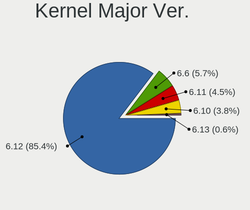
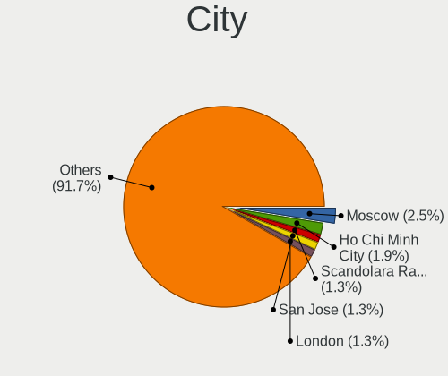
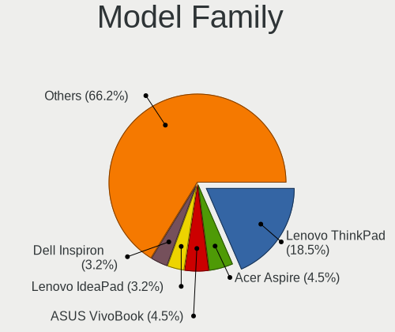
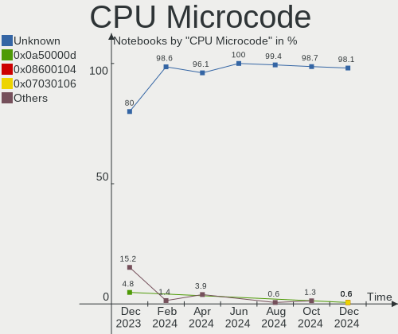
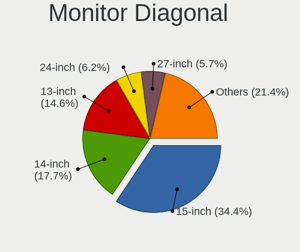

Arch Hardware Trends (Notebook)
-------------------------------

A project to identify most popular hardware characteristics and track their change
over time based on data collected by Arch users at https://Linux-Hardware.org.

Anyone can contribute to the study by uploading probes of their computers by
the [hw-probe](https://github.com/linuxhw/hw-probe) tool:

    sudo hw-probe -all -upload

Full-feature report is available here: https://linux-hardware.org/?view=trends&formfactor=notebook

Period: Mar, 2020.

Contents
--------

- [ OS                       ](#os)
- [ OS Family                ](#os-family)
- [ Kernel                   ](#kernel)
- [ Kernel Family            ](#kernel-family)
- [ Kernel Major Ver.        ](#kernel-major-ver)
- [ Arch                     ](#arch)
- [ DE                       ](#de)
- [ Display Server           ](#display-server)
- [ OS Lang                  ](#os-lang)
- [ Boot Mode                ](#boot-mode)
- [ Filesystem               ](#filesystem)
- [ Dual Boot with Linux     ](#dual-boot-with-linux)
- [ Dual Boot (Win)          ](#dual-boot-win)
- [ Country                  ](#country)
- [ City                     ](#city)
- [ Vendor                   ](#vendor)
- [ Model                    ](#model)
- [ Model Family             ](#model-family)
- [ MFG Year                 ](#mfg-year)
- [ Form Factor              ](#form-factor)
- [ Secure Boot              ](#secure-boot)
- [ Coreboot                 ](#coreboot)
- [ RAM Size                 ](#ram-size)
- [ RAM Used                 ](#ram-used)
- [ Drive Vendor             ](#drive-vendor)
- [ Drive Model              ](#drive-model)
- [ Drive Kind               ](#drive-kind)
- [ Drive Connector          ](#drive-connector)
- [ Drive Size               ](#drive-size)
- [ Space Total              ](#space-total)
- [ Space Used               ](#space-used)
- [ Malfunc. Drives          ](#malfunc-drives)
- [ Malfunc. Drive Vendor    ](#malfunc-drive-vendor)
- [ Malfunc. Drive Kind      ](#malfunc-drive-kind)
- [ Failed Drives            ](#failed-drives)
- [ Failed Drive Vendor      ](#failed-drive-vendor)
- [ Drive Status             ](#drive-status)
- [ Storage Vendor           ](#storage-vendor)
- [ Storage Model            ](#storage-model)
- [ Storage Kind             ](#storage-kind)
- [ CPU Vendor               ](#cpu-vendor)
- [ CPU Model                ](#cpu-model)
- [ CPU Model Family         ](#cpu-model-family)
- [ CPU Cores                ](#cpu-cores)
- [ CPU Sockets              ](#cpu-sockets)
- [ CPU Threads              ](#cpu-threads)
- [ CPU Op-Modes             ](#cpu-op-modes)
- [ CPU Microarch            ](#cpu-microarch)
- [ CPU Microcode            ](#cpu-microcode)
- [ GPU Vendor               ](#gpu-vendor)
- [ GPU Model                ](#gpu-model)
- [ GPU Combo                ](#gpu-combo)
- [ GPU Driver               ](#gpu-driver)
- [ GPU Memory               ](#gpu-memory)
- [ Monitor Vendor           ](#monitor-vendor)
- [ Monitor Model            ](#monitor-model)
- [ Monitor Resolution       ](#monitor-resolution)
- [ Monitor Diagonal         ](#monitor-diagonal)
- [ Monitor Width            ](#monitor-width)
- [ Aspect Ratio             ](#aspect-ratio)
- [ Monitor Area             ](#monitor-area)
- [ Pixel Density            ](#pixel-density)
- [ Multiple Monitors        ](#multiple-monitors)
- [ Net Controller Vendor    ](#net-controller-vendor)
- [ Net Controller Model     ](#net-controller-model)
- [ Net Controller Kind      ](#net-controller-kind)
- [ Used Controller          ](#used-controller)
- [ NICs                     ](#nics)
- [ Unsupported Devices      ](#unsupported-devices)
- [ Unsupported Device Types ](#unsupported-device-types)

OS
--

Installed operating systems

| Name         | Computers | Percent |
|--------------|-----------|---------|
| Arch         | 48        | 82.76%  |
| Arch Rolling | 10        | 17.24%  |

OS Family
---------

OS without a version

| Name | Computers | Percent |
|------|-----------|---------|
| Arch | 58        | 100%    |

Kernel
------

Version of the Linux kernel

| Version                  | Computers | Percent |
|--------------------------|-----------|---------|
| 5.5.8-arch1-1            | 9         | 15.52%  |
| 5.5.9-arch1-2            | 6         | 10.34%  |
| 5.5.11-arch1-1           | 6         | 10.34%  |
| 5.5.10-arch1-1           | 6         | 10.34%  |
| 5.5.7-arch1-1            | 4         | 6.9%    |
| 5.5.13-arch1-1           | 4         | 6.9%    |
| 5.5.6-arch1-1            | 3         | 5.17%   |
| 5.5.8-zen1-1-zen         | 2         | 3.45%   |
| 5.5.13-zen1-1-zen        | 2         | 3.45%   |
| 5.5.13-arch2-1           | 2         | 3.45%   |
| 5.4.25-2-lts             | 2         | 3.45%   |
| 5.4.23-1-lts             | 2         | 3.45%   |
| 5.5.9-zen1-2-zen         | 1         | 1.72%   |
| 5.5.7-zen1-1-zen         | 1         | 1.72%   |
| 5.5.6-zen1-1-zen         | 1         | 1.72%   |
| 5.5.11-AMD               | 1         | 1.72%   |
| 5.5.10-nitrous+          | 1         | 1.72%   |
| 5.5.0-1-pb               | 1         | 1.72%   |
| 5.4.26-rt17-1-rt         | 1         | 1.72%   |
| 5.4.26-1-lts             | 1         | 1.72%   |
| 5.4.24-1-lts             | 1         | 1.72%   |
| 4.20.14-1-ck-sandybridge | 1         | 1.72%   |

Kernel Family
-------------

Linux kernel without a distro release

| Version | Computers | Percent |
|---------|-----------|---------|
| 5.5.8   | 11        | 18.97%  |
| 5.5.13  | 8         | 13.79%  |
| 5.5.9   | 7         | 12.07%  |
| 5.5.11  | 7         | 12.07%  |
| 5.5.10  | 7         | 12.07%  |
| 5.5.7   | 5         | 8.62%   |
| 5.5.6   | 4         | 6.9%    |
| 5.4.26  | 2         | 3.45%   |
| 5.4.25  | 2         | 3.45%   |
| 5.4.23  | 2         | 3.45%   |
| 5.5.0   | 1         | 1.72%   |
| 5.4.24  | 1         | 1.72%   |
| 4.20.14 | 1         | 1.72%   |

Kernel Major Ver.
-----------------

Linux kernel major version

| Version | Computers | Percent |
|---------|-----------|---------|
| 5.5     | 50        | 86.21%  |
| 5.4     | 7         | 12.07%  |
| 4.20    | 1         | 1.72%   |

Arch
----

OS architecture (x86_64, i586, etc.)

| Name   | Computers | Percent |
|--------|-----------|---------|
| x86_64 | 58        | 100%    |

DE
--

Desktop Environment

| Name    | Computers | Percent |
|---------|-----------|---------|
| GNOME   | 31        | 53.45%  |
| KDE5    | 6         | 10.34%  |
| KDE     | 6         | 10.34%  |
| Unknown | 5         | 8.62%   |
| Budgie  | 4         | 6.9%    |
| XFCE    | 3         | 5.17%   |
| i3      | 2         | 3.45%   |
| Deepin  | 1         | 1.72%   |

Display Server
--------------

X11 or Wayland

| Name    | Computers | Percent |
|---------|-----------|---------|
| X11     | 33        | 56.9%   |
| Wayland | 21        | 36.21%  |
| Tty     | 3         | 5.17%   |
| Unknown | 1         | 1.72%   |

OS Lang
-------

Language

| Lang       | Computers | Percent |
|------------|-----------|---------|
| en_US      | 30        | 51.72%  |
| Unknown    | 4         | 6.9%    |
| it_IT      | 3         | 5.17%   |
| fr_FR      | 3         | 5.17%   |
| pl_PL      | 2         | 3.45%   |
| en_US.UTF8 | 2         | 3.45%   |
| en_GB      | 2         | 3.45%   |
| de_DE      | 2         | 3.45%   |
| zh_CN      | 1         | 1.72%   |
| ru_RU      | 1         | 1.72%   |
| pt_BR      | 1         | 1.72%   |
| pl_PL.utf8 | 1         | 1.72%   |
| nl_NL.utf8 | 1         | 1.72%   |
| hu_HU      | 1         | 1.72%   |
| es_ES      | 1         | 1.72%   |
| es_CL      | 1         | 1.72%   |
| en_AU      | 1         | 1.72%   |
| de_AT      | 1         | 1.72%   |

Boot Mode
---------

EFI or BIOS

| Mode | Computers | Percent |
|------|-----------|---------|
| EFI  | 32        | 55.17%  |
| BIOS | 26        | 44.83%  |

Filesystem
----------

Type of filesystem

| Type    | Computers | Percent |
|---------|-----------|---------|
| Ext4    | 44        | 75.86%  |
| Btrfs   | 6         | 10.34%  |
| Xfs     | 4         | 6.9%    |
| F2fs    | 3         | 5.17%   |
| Overlay | 1         | 1.72%   |

Dual Boot with Linux
--------------------

Hosting more than one Linux

| Dual boot | Computers | Percent |
|-----------|-----------|---------|
| No        | 53        | 91.38%  |
| Yes       | 5         | 8.62%   |

Dual Boot (Win)
---------------

Hosting Linux and Windows

| Dual boot | Computers | Percent |
|-----------|-----------|---------|
| No        | 48        | 82.76%  |
| Yes       | 10        | 17.24%  |

Country
-------

Geographic location (country)

| Country      | Computers | Percent |
|--------------|-----------|---------|
| USA          | 11        | 18.97%  |
| France       | 6         | 10.34%  |
| Russia       | 5         | 8.62%   |
| Italy        | 5         | 8.62%   |
| Poland       | 2         | 3.45%   |
| Netherlands  | 2         | 3.45%   |
| Greece       | 2         | 3.45%   |
| Germany      | 2         | 3.45%   |
| Bulgaria     | 2         | 3.45%   |
| Brazil       | 2         | 3.45%   |
| Australia    | 2         | 3.45%   |
| Vietnam      | 1         | 1.72%   |
| Spain        | 1         | 1.72%   |
| Saudi Arabia | 1         | 1.72%   |
| Romania      | 1         | 1.72%   |
| Portugal     | 1         | 1.72%   |
| Philippines  | 1         | 1.72%   |
| New Zealand  | 1         | 1.72%   |
| Israel       | 1         | 1.72%   |
| India        | 1         | 1.72%   |
| Hungary      | 1         | 1.72%   |
| Finland      | 1         | 1.72%   |
| Ecuador      | 1         | 1.72%   |
| China        | 1         | 1.72%   |
| Chile        | 1         | 1.72%   |
| Belarus      | 1         | 1.72%   |
| Austria      | 1         | 1.72%   |
| Armenia      | 1         | 1.72%   |

City
----

Geographic location (city)

| City                  | Computers | Percent |
|-----------------------|-----------|---------|
| Vladivostok           | 2         | 3.45%   |
| Athens                | 2         | 3.45%   |
| Yerevan               | 1         | 1.72%   |
| Xi'an                 | 1         | 1.72%   |
| Wollongong            | 1         | 1.72%   |
| Varna                 | 1         | 1.72%   |
| Uithoorn              | 1         | 1.72%   |
| Tver                  | 1         | 1.72%   |
| Sertolovo             | 1         | 1.72%   |
| Santiago              | 1         | 1.72%   |
| San Miniato           | 1         | 1.72%   |
| Salzburg              | 1         | 1.72%   |
| Rome                  | 1         | 1.72%   |
| Riyadh                | 1         | 1.72%   |
| Reims                 | 1         | 1.72%   |
| Redwood City          | 1         | 1.72%   |
| Ramat Gan             | 1         | 1.72%   |
| Quito                 | 1         | 1.72%   |
| Pisa                  | 1         | 1.72%   |
| Parnamirim            | 1         | 1.72%   |
| Pannes                | 1         | 1.72%   |
| Oulu                  | 1         | 1.72%   |
| Odolanow              | 1         | 1.72%   |
| Oakhurst              | 1         | 1.72%   |
| Nashville             | 1         | 1.72%   |
| Naperville            | 1         | 1.72%   |
| Murcia                | 1         | 1.72%   |
| Moscow                | 1         | 1.72%   |
| Morristown            | 1         | 1.72%   |
| Melbourne             | 1         | 1.72%   |
| Maastricht            | 1         | 1.72%   |
| Lisbon                | 1         | 1.72%   |
| Lappersdorf           | 1         | 1.72%   |
| Krakow                | 1         | 1.72%   |
| Huntersville          | 1         | 1.72%   |
| Homosassa             | 1         | 1.72%   |
| Grundy Center         | 1         | 1.72%   |
| Gravelines            | 1         | 1.72%   |
| Gradignan             | 1         | 1.72%   |
| Gomel                 | 1         | 1.72%   |
| Gabrovo               | 1         | 1.72%   |
| Eforie Sud            | 1         | 1.72%   |
| Dong Hoi              | 1         | 1.72%   |
| Dallas                | 1         | 1.72%   |
| Contagem              | 1         | 1.72%   |
| Cologne               | 1         | 1.72%   |
| Cernusco sul Naviglio | 1         | 1.72%   |
| Cedar Rapids          | 1         | 1.72%   |
| Budapest              | 1         | 1.72%   |
| Brie                  | 1         | 1.72%   |
| Breda di Piave        | 1         | 1.72%   |
| Boston                | 1         | 1.72%   |
| Auckland              | 1         | 1.72%   |
| Argenteuil            | 1         | 1.72%   |
| Angeles City          | 1         | 1.72%   |
| Ahmedabad             | 1         | 1.72%   |

Vendor
------

Motherboard manufacturer

| Name             | Computers | Percent |
|------------------|-----------|---------|
| Lenovo           | 20        | 34.48%  |
| Dell             | 9         | 15.52%  |
| Hewlett-Packard  | 8         | 13.79%  |
| ASUSTek Computer | 5         | 8.62%   |
| MSI              | 3         | 5.17%   |
| Acer             | 3         | 5.17%   |
| Sony             | 2         | 3.45%   |
| Fujitsu          | 2         | 3.45%   |
| Toshiba          | 1         | 1.72%   |
| Notebook         | 1         | 1.72%   |
| Medion           | 1         | 1.72%   |
| MECHREVO         | 1         | 1.72%   |
| Jumper           | 1         | 1.72%   |
| Unknown          | 1         | 1.72%   |

Model
-----

Motherboard model

| Name                                     | Computers | Percent |
|------------------------------------------|-----------|---------|
| Lenovo ThinkPad E480 20KN005CBM          | 2         | 3.45%   |
| Lenovo IdeaPad S145-15AST 81N3           | 2         | 3.45%   |
| HP EliteBook 840 G6                      | 2         | 3.45%   |
| ASUS ZenBook UX434FAC_UX433FAC           | 2         | 3.45%   |
| Unknown                                  | 2         | 3.45%   |
| Toshiba Satellite C50D-B                 | 1         | 1.72%   |
| Sony VPCEB42EG                           | 1         | 1.72%   |
| Sony SVP13215CDB                         | 1         | 1.72%   |
| Notebook N141CU                          | 1         | 1.72%   |
| MSI Modern 14 A10M                       | 1         | 1.72%   |
| MSI GS75 Stealth 9SF                     | 1         | 1.72%   |
| MSI GE70 2PE                             | 1         | 1.72%   |
| Medion Erazer P6679 MD60262              | 1         | 1.72%   |
| MECHREVO X9Ti-R Series GK7CP0S           | 1         | 1.72%   |
| Lenovo Z50-75 80EC                       | 1         | 1.72%   |
| Lenovo ThinkPad X230 23255B2             | 1         | 1.72%   |
| Lenovo ThinkPad X1 Carbon 7th 20QD00KTMX | 1         | 1.72%   |
| Lenovo ThinkPad W540 20BG0016US          | 1         | 1.72%   |
| Lenovo ThinkPad T540p 20BFS20600         | 1         | 1.72%   |
| Lenovo ThinkPad T490 20N2000BRT          | 1         | 1.72%   |
| Lenovo ThinkPad T480 20L5A063CD          | 1         | 1.72%   |
| Lenovo ThinkPad T440s 20AQ004GUS         | 1         | 1.72%   |
| Lenovo ThinkPad T430s 23571A3            | 1         | 1.72%   |
| Lenovo ThinkPad E490 20N8002ART          | 1         | 1.72%   |
| Lenovo ThinkPad E480 20KN001QRT          | 1         | 1.72%   |
| Lenovo IdeaPad S940-14IWL 81R0           | 1         | 1.72%   |
| Lenovo IdeaPad FLEX-14API 81SS           | 1         | 1.72%   |
| Lenovo IdeaPad 320-15IAP 80XR            | 1         | 1.72%   |
| Lenovo G710 20252                        | 1         | 1.72%   |
| Jumper EZbook                            | 1         | 1.72%   |
| HP ZBook Studio G5                       | 1         | 1.72%   |
| HP Spectre Laptop 13-af0xx               | 1         | 1.72%   |
| HP Pavilion dm4                          | 1         | 1.72%   |
| HP Laptop 15-da0xxx                      | 1         | 1.72%   |
| HP ENVY m7 Notebook                      | 1         | 1.72%   |
| HP EliteBook 840 G2                      | 1         | 1.72%   |
| Fujitsu LIFEBOOK S710                    | 1         | 1.72%   |
| Fujitsu LIFEBOOK E752                    | 1         | 1.72%   |
| Dell XPS L502X                           | 1         | 1.72%   |
| Dell XPS 15 9570                         | 1         | 1.72%   |
| Dell XPS 13 9380                         | 1         | 1.72%   |
| Dell XPS 13 9360                         | 1         | 1.72%   |
| Dell Precision 7510                      | 1         | 1.72%   |
| Dell Precision 5520                      | 1         | 1.72%   |
| Dell Latitude E7450                      | 1         | 1.72%   |
| Dell Latitude 5480                       | 1         | 1.72%   |
| Dell Inspiron 5559                       | 1         | 1.72%   |
| ASUS Zephyrus M GU502GV_GU502GV          | 1         | 1.72%   |
| ASUS X580VD                              | 1         | 1.72%   |
| ASUS P453UA                              | 1         | 1.72%   |
| Acer Aspire E5-571                       | 1         | 1.72%   |
| Acer Aspire A515-51G                     | 1         | 1.72%   |
| Acer Aspire 5750G                        | 1         | 1.72%   |

Model Family
------------

Motherboard model prefix

| Name              | Computers | Percent |
|-------------------|-----------|---------|
| Lenovo ThinkPad   | 12        | 20.69%  |
| Lenovo IdeaPad    | 5         | 8.62%   |
| Dell XPS          | 4         | 6.9%    |
| HP EliteBook      | 3         | 5.17%   |
| Acer Aspire       | 3         | 5.17%   |
| Fujitsu LIFEBOOK  | 2         | 3.45%   |
| Dell Precision    | 2         | 3.45%   |
| Dell Latitude     | 2         | 3.45%   |
| ASUS ZenBook      | 2         | 3.45%   |
| Unknown           | 2         | 3.45%   |
| Toshiba Satellite | 1         | 1.72%   |
| Sony VPCEB42EG    | 1         | 1.72%   |
| Sony SVP13215CDB  | 1         | 1.72%   |
| Notebook N141CU   | 1         | 1.72%   |
| MSI Modern        | 1         | 1.72%   |
| MSI GS75          | 1         | 1.72%   |
| MSI GE70          | 1         | 1.72%   |
| Medion Erazer     | 1         | 1.72%   |
| MECHREVO X9Ti-R   | 1         | 1.72%   |
| Lenovo Z50-75     | 1         | 1.72%   |
| Lenovo G710       | 1         | 1.72%   |
| Jumper EZbook     | 1         | 1.72%   |
| HP ZBook          | 1         | 1.72%   |
| HP Spectre        | 1         | 1.72%   |
| HP Pavilion       | 1         | 1.72%   |
| HP Laptop         | 1         | 1.72%   |
| HP ENVY           | 1         | 1.72%   |
| Dell Inspiron     | 1         | 1.72%   |
| ASUS Zephyrus     | 1         | 1.72%   |
| ASUS X580VD       | 1         | 1.72%   |
| ASUS P453UA       | 1         | 1.72%   |

MFG Year
--------

Motherboard manufacture year

| Year | Computers | Percent |
|------|-----------|---------|
| 2019 | 28        | 48.28%  |
| 2014 | 6         | 10.34%  |
| 2020 | 5         | 8.62%   |
| 2018 | 5         | 8.62%   |
| 2016 | 3         | 5.17%   |
| 2015 | 3         | 5.17%   |
| 2012 | 2         | 3.45%   |
| 2011 | 2         | 3.45%   |
| 2010 | 2         | 3.45%   |
| 2017 | 1         | 1.72%   |
| 2013 | 1         | 1.72%   |

Form Factor
-----------

Physical design of the computer

| Name     | Computers | Percent |
|----------|-----------|---------|
| Notebook | 58        | 100%    |

Secure Boot
-----------

Enabled or disabled

| State    | Computers | Percent |
|----------|-----------|---------|
| Disabled | 58        | 100%    |

Coreboot
--------

Have coreboot on board

| Used | Computers | Percent |
|------|-----------|---------|
| No   | 58        | 100%    |

RAM Size
--------

Total RAM memory

| Size in GB | Computers | Percent |
|------------|-----------|---------|
| 16.01-24.0 | 19        | 32.76%  |
| 4.01-8.0   | 15        | 25.86%  |
| 8.01-16.0  | 12        | 20.69%  |
| 3.01-4.0   | 6         | 10.34%  |
| 32.01-64.0 | 5         | 8.62%   |
| 1.01-2.0   | 1         | 1.72%   |

RAM Used
--------

Used RAM memory

| Used GB    | Computers | Percent |
|------------|-----------|---------|
| 1.01-2.0   | 22        | 37.93%  |
| 2.01-3.0   | 13        | 22.41%  |
| 4.01-8.0   | 9         | 15.52%  |
| 3.01-4.0   | 8         | 13.79%  |
| 8.01-16.0  | 3         | 5.17%   |
| 0.01-1.0   | 2         | 3.45%   |
| 16.01-24.0 | 1         | 1.72%   |

Drive Vendor
------------

Hard drive vendors

| Vendor              | Computers | Drives  | Percent |
|---------------------|-----------|---------|---------|
| Samsung Electronics | 13        | 13      | 20.31%  |
| WDC                 | 8         | 8       | 12.5%   |
| Seagate             | 8         | 8       | 12.5%   |
| Unknown             | 7         | 8       | 10.94%  |
| Intel               | 4         | 4       | 6.25%   |
| HGST                | 4         | 4       | 6.25%   |
| Crucial             | 4         | 4       | 6.25%   |
| Toshiba             | 2         | 2       | 3.13%   |
| LITEON              | 2         | 2       | 3.13%   |
| Transcend           | 1         | 1       | 1.56%   |
| SK Hynix            | 1         | 1       | 1.56%   |
| SanDisk             | 1         | 1       | 1.56%   |
| PNY                 | 1         | 1       | 1.56%   |
| PLEXTOR             | 1         | 1       | 1.56%   |
| OCZ                 | 1         | 1       | 1.56%   |
| Kingston            | 1         | 1       | 1.56%   |
| INTEL SS            | 1         | 1       | 1.56%   |
| HL-DT-ST            | 1         | Unknown | 1.56%   |
| FORESEE             | 1         | 1       | 1.56%   |
| External            | 1         | 1       | 1.56%   |
| A-DATA Technology   | 1         | 1       | 1.56%   |

Drive Model
-----------

Hard drive models

| Model                         | Computers | Percent |
|-------------------------------|-----------|---------|
| ST1000LM035-1RK172 1TB        | 3         | 4.69%   |
| HTS721010A9E630 1TB           | 3         | 4.69%   |
| ST500LT012-1DG142 500GB       | 2         | 3.13%   |
| SSDPEKNW512G8 512GB           | 2         | 3.13%   |
| WDS500G2B0B-00YS70 500GB SSD  | 1         | 1.56%   |
| WDS100T2B0B 1TB SSD           | 1         | 1.56%   |
| WD7500BPVT-22HXZT3 752GB      | 1         | 1.56%   |
| WD6400BPVT-60HXZT1 640GB      | 1         | 1.56%   |
| WD10SPZX-24Z10T0 1TB          | 1         | 1.56%   |
| WD10SPZX-22Z10T1 1TB          | 1         | 1.56%   |
| WD10SPZX-21Z10T0 1TB          | 1         | 1.56%   |
| WD10SPZX-08Z10 1TB            | 1         | 1.56%   |
| VERTEX4 128GB SSD             | 1         | 1.56%   |
| USB3.0 960GB                  | 1         | 1.56%   |
| TS120GMTS420S 120GB SSD       | 1         | 1.56%   |
| SU800 256GB SSD               | 1         | 1.56%   |
| ST9750420AS 752GB             | 1         | 1.56%   |
| ST500LM000-1EJ162 500GB       | 1         | 1.56%   |
| ST320LT007-9ZV142 320GB       | 1         | 1.56%   |
| SSDSC2BW180A3L 180GB          | 1         | 1.56%   |
| SSDPEKKF010T8L 1TB            | 1         | 1.56%   |
| SSD 970 EVO Plus 500GB        | 1         | 1.56%   |
| SSD 860 QVO 1TB               | 1         | 1.56%   |
| SSD 860 PRO 512GB             | 1         | 1.56%   |
| SSD 860 PRO 1TB               | 1         | 1.56%   |
| SSD 860 EVO 500GB             | 1         | 1.56%   |
| SSD 860 EVO 1TB               | 1         | 1.56%   |
| SDSSDH3 512G                  | 1         | 1.56%   |
| SD64G  64GB                   | 1         | 1.56%   |
| SA400S37480G 480GB SSD        | 1         | 1.56%   |
| SA16G  16GB                   | 1         | 1.56%   |
| S11-256G-PHISON-SSD 256GB     | 1         | 1.56%   |
| RTOTJ128VGD2EYX 128GB SSD     | 1         | 1.56%   |
| PX-512S2G 512GB SSD           | 1         | 1.56%   |
| P900F256GB                    | 1         | 1.56%   |
| MZVLB512HAJQ-000H7 512GB      | 1         | 1.56%   |
| MZVLB256HBHQ-000L7 256GB      | 1         | 1.56%   |
| MZVLB256HAHQ-000H1 256GB      | 1         | 1.56%   |
| MZNTD128HAGM-00000 128GB SSD  | 1         | 1.56%   |
| MZMPC128HBFU-000MV 128GB SSD  | 1         | 1.56%   |
| MZ7TE256HMHP-000L7 256GB SSD  | 1         | 1.56%   |
| MZ7LN128HAHQ-000L2 128GB SSD  | 1         | 1.56%   |
| MQ01ABD100M 1TB               | 1         | 1.56%   |
| MMC Card  7GB                 | 1         | 1.56%   |
| MMC Card  64GB                | 1         | 1.56%   |
| MMC Card  128GB               | 1         | 1.56%   |
| MK3265GSXN 320GB              | 1         | 1.56%   |
| LMH-256V2M-11 MSATA 256GB SSD | 1         | 1.56%   |
| L8H-256V2G-HP 256GB SSD       | 1         | 1.56%   |
| HTS541010A7E630 1TB           | 1         | 1.56%   |
| HFM512GDHTNG-8710B 512GB      | 1         | 1.56%   |
| DVDRAM GUE1N 3GB              | 1         | 1.56%   |
| DSC2BF180A5H SED 180GB SSD    | 1         | 1.56%   |
| CT960BX500SSD1 960GB          | 1         | 1.56%   |
| CT500MX500SSD1 500GB          | 1         | 1.56%   |
| CT120BX500SSD1 120GB          | 1         | 1.56%   |
| CT1000P1SSD8 1TB              | 1         | 1.56%   |
| CS900 120GB SSD               | 1         | 1.56%   |

Drive Kind
----------

HDD or SSD

| Kind    | Computers | Drives | Percent |
|---------|-----------|--------|---------|
| SSD     | 24        | 27     | 40%     |
| HDD     | 20        | 20     | 33.33%  |
| NVMe    | 9         | 10     | 15%     |
| MMC     | 5         | 6      | 8.33%   |
| Unknown | 2         | 1      | 3.33%   |

Drive Connector
---------------

SATA, SAS, NVMe, etc.

| Type | Computers | Drives | Percent |
|------|-----------|--------|---------|
| SATA | 39        | 46     | 69.64%  |
| NVMe | 9         | 10     | 16.07%  |
| MMC  | 5         | 6      | 8.93%   |
| SAS  | 3         | 2      | 5.36%   |

Drive Size
----------

Size of hard drive

| Size in TB | Computers | Drives | Percent |
|------------|-----------|--------|---------|
| 0.51-1.0   | 28        | 30     | 51.85%  |
| 0.01-0.5   | 26        | 34     | 48.15%  |

Space Total
-----------

Amount of disk space available on the file system

| Size in GB     | Computers | Percent |
|----------------|-----------|---------|
| 251-500        | 17        | 29.31%  |
| 501-1000       | 17        | 29.31%  |
| 101-250        | 13        | 22.41%  |
| 1001-2000      | 5         | 8.62%   |
| 51-100         | 2         | 3.45%   |
| More than 3000 | 1         | 1.72%   |
| 21-50          | 1         | 1.72%   |
| 2001-3000      | 1         | 1.72%   |
| Unknown        | 1         | 1.72%   |

Space Used
----------

Amount of used disk space

| Used GB  | Computers | Percent |
|----------|-----------|---------|
| 1-20     | 13        | 22.41%  |
| 21-50    | 12        | 20.69%  |
| 51-100   | 10        | 17.24%  |
| 101-250  | 8         | 13.79%  |
| 251-500  | 7         | 12.07%  |
| 501-1000 | 7         | 12.07%  |
| Unknown  | 1         | 1.72%   |

Malfunc. Drives
---------------

Drive models with a malfunction

| Model               | Computers | Drives | Percent |
|---------------------|-----------|--------|---------|
| MK3265GSXN 320GB    | 1         | 1      | 50%     |
| HTS721010A9E630 1TB | 1         | 1      | 50%     |

Malfunc. Drive Vendor
---------------------

Vendors of faulty drives

| Vendor  | Computers | Drives | Percent |
|---------|-----------|--------|---------|
| Toshiba | 1         | 1      | 50%     |
| HGST    | 1         | 1      | 50%     |

Malfunc. Drive Kind
-------------------

Kinds of faulty drives

| Kind | Computers | Drives | Percent |
|------|-----------|--------|---------|
| HDD  | 2         | 2      | 100%    |

Failed Drives
-------------

Failed drive models

Zero info for selected period =(

Failed Drive Vendor
-------------------

Failed drive vendors

Zero info for selected period =(

Drive Status
------------

Number of failed and malfunc. drives

| Status   | Computers | Drives | Percent |
|----------|-----------|--------|---------|
| Detected | 31        | 42     | 62%     |
| Works    | 17        | 20     | 34%     |
| Malfunc  | 2         | 2      | 4%      |

Storage Vendor
--------------

Storage controller vendors

| Vendor                       | Computers | Percent |
|------------------------------|-----------|---------|
| Intel                        | 42        | 60.87%  |
| Samsung Electronics          | 13        | 18.84%  |
| SK Hynix                     | 4         | 5.8%    |
| AMD                          | 4         | 5.8%    |
| Toshiba America Info Systems | 3         | 4.35%   |
| Micron/Crucial Technology    | 2         | 2.9%    |
| Marvell Technology Group     | 1         | 1.45%   |

Storage Model
-------------

Storage controller models

| Model                                                                    | Computers | Percent |
|--------------------------------------------------------------------------|-----------|---------|
| NVMe SSD Controller SM981/PM981/PM983                                    | 12        | 17.14%  |
| Sunrise Point-LP SATA Controller [AHCI mode]                             | 9         | 12.86%  |
| FCH SATA Controller [AHCI mode]                                          | 4         | 5.71%   |
| Cannon Lake Mobile PCH SATA AHCI Controller                              | 4         | 5.71%   |
| 8 Series/C220 Series Chipset Family 6-port SATA Controller 1 [AHCI mode] | 4         | 5.71%   |
| Q170/Q150/B150/H170/H110/Z170/CM236 Chipset SATA Controller [AHCI Mode]  | 3         | 4.29%   |
| Non-Volatile memory controller                                           | 3         | 4.29%   |
| 8 Series SATA Controller 1 [AHCI mode]                                   | 3         | 4.29%   |
| 7 Series Chipset Family 6-port SATA Controller [AHCI mode]               | 3         | 4.29%   |
| 6 Series/C200 Series Chipset Family 6 port Mobile SATA AHCI Controller   | 3         | 4.29%   |
| Wildcat Point-LP SATA Controller [AHCI Mode]                             | 2         | 2.86%   |
| SSD 660P Series                                                          | 2         | 2.86%   |
| P1 NVMe PCIe SSD                                                         | 2         | 2.86%   |
| NVMe Controller                                                          | 2         | 2.86%   |
| Celeron N3350/Pentium N4200/Atom E3900 Series SATA AHCI Controller       | 2         | 2.86%   |
| 82801 Mobile SATA Controller [RAID mode]                                 | 2         | 2.86%   |
| Toshiba America Info Non-Volatile memory controller                      | 1         | 1.43%   |
| SSD Pro 7600p/760p/E 6100p Series                                        | 1         | 1.43%   |
| Marvell Non-Volatile memory controller                                   | 1         | 1.43%   |
| Electronics Non-Volatile memory controller                               | 1         | 1.43%   |
| Comet Lake SATA AHCI Controller                                          | 1         | 1.43%   |
| BC501 NVMe Solid State Drive 512GB                                       | 1         | 1.43%   |
| Atom Processor E3800 Series SATA AHCI Controller                         | 1         | 1.43%   |
| 5 Series/3400 Series Chipset PT IDER Controller                          | 1         | 1.43%   |
| 5 Series/3400 Series Chipset 4 port SATA IDE Controller                  | 1         | 1.43%   |
| 5 Series/3400 Series Chipset 4 port SATA AHCI Controller                 | 1         | 1.43%   |

Storage Kind
------------

Kind of storage controller (IDE, SATA, NVMe, SAS, ...)

| Kind | Computers | Percent |
|------|-----------|---------|
| SATA | 40        | 59.7%   |
| NVMe | 24        | 35.82%  |
| RAID | 2         | 2.99%   |
| IDE  | 1         | 1.49%   |

CPU Vendor
----------

Processor vendors

| Vendor | Computers | Percent |
|--------|-----------|---------|
| Intel  | 53        | 91.38%  |
| AMD    | 5         | 8.62%   |

CPU Model
---------

Processor models

| Model                                          | Computers | Percent |
|------------------------------------------------|-----------|---------|
| Intel Core i5-8265U CPU @ 1.60GHz              | 5         | 8.62%   |
| Intel Core i5-8250U CPU @ 1.60GHz              | 5         | 8.62%   |
| Intel Core i7-10510U CPU @ 1.80GHz             | 4         | 6.9%    |
| Intel Core i7-9750H CPU @ 2.60GHz              | 3         | 5.17%   |
| Intel Core i7-8565U CPU @ 1.80GHz              | 3         | 5.17%   |
| Intel Core i7-7500U CPU @ 2.70GHz              | 3         | 5.17%   |
| Intel Core i5-3320M CPU @ 2.60GHz              | 3         | 5.17%   |
| Intel Core i7-7820HQ CPU @ 2.90GHz             | 2         | 3.45%   |
| Intel Core i7-4800MQ CPU @ 2.70GHz             | 2         | 3.45%   |
| AMD A4-9125 RADEON R3, 4 COMPUTE CORES 2C+2G   | 2         | 3.45%   |
| Intel Pentium CPU N4200 @ 1.10GHz              | 1         | 1.72%   |
| Intel Core i9-8950HK CPU @ 2.90GHz             | 1         | 1.72%   |
| Intel Core i7-8750H CPU @ 2.20GHz              | 1         | 1.72%   |
| Intel Core i7-8550U CPU @ 1.80GHz              | 1         | 1.72%   |
| Intel Core i7-6920HQ CPU @ 2.90GHz             | 1         | 1.72%   |
| Intel Core i7-6500U CPU @ 2.50GHz              | 1         | 1.72%   |
| Intel Core i7-4700HQ CPU @ 2.40GHz             | 1         | 1.72%   |
| Intel Core i7-2670QM CPU @ 2.20GHz             | 1         | 1.72%   |
| Intel Core i5-7300HQ CPU @ 2.50GHz             | 1         | 1.72%   |
| Intel Core i5-7200U CPU @ 2.50GHz              | 1         | 1.72%   |
| Intel Core i5-6200U CPU @ 2.30GHz              | 1         | 1.72%   |
| Intel Core i5-5300U CPU @ 2.30GHz              | 1         | 1.72%   |
| Intel Core i5-5200U CPU @ 2.20GHz              | 1         | 1.72%   |
| Intel Core i5-4300U CPU @ 1.90GHz              | 1         | 1.72%   |
| Intel Core i5-4200U CPU @ 1.60GHz              | 1         | 1.72%   |
| Intel Core i5-2430M CPU @ 2.40GHz              | 1         | 1.72%   |
| Intel Core i5 CPU M 560 @ 2.67GHz              | 1         | 1.72%   |
| Intel Core i3-4005U CPU @ 1.70GHz              | 1         | 1.72%   |
| Intel Core i3-4000M CPU @ 2.40GHz              | 1         | 1.72%   |
| Intel Core i3-2310M CPU @ 2.10GHz              | 1         | 1.72%   |
| Intel Core i3 CPU M 380 @ 2.53GHz              | 1         | 1.72%   |
| Intel Celeron CPU N3450 @ 1.10GHz              | 1         | 1.72%   |
| Intel Celeron CPU N2830 @ 2.16GHz              | 1         | 1.72%   |
| AMD Ryzen 5 3500U with Radeon Vega Mobile Gfx  | 1         | 1.72%   |
| AMD A4-6210 APU with AMD Radeon R3 Graphics    | 1         | 1.72%   |
| AMD A10-7300 Radeon R6, 10 Compute Cores 4C+6G | 1         | 1.72%   |

CPU Model Family
----------------

Processor model prefix

| Model         | Computers | Percent |
|---------------|-----------|---------|
| Intel Core i7 | 23        | 39.66%  |
| Intel Core i5 | 22        | 37.93%  |
| Intel Core i3 | 4         | 6.9%    |
| AMD A4        | 3         | 5.17%   |
| Intel Celeron | 2         | 3.45%   |
| Intel Pentium | 1         | 1.72%   |
| Intel Core i9 | 1         | 1.72%   |
| AMD Ryzen 5   | 1         | 1.72%   |
| AMD A10       | 1         | 1.72%   |

CPU Cores
---------

Number of processor cores

| Number | Computers | Percent |
|--------|-----------|---------|
| 4      | 30        | 51.72%  |
| 2      | 23        | 39.66%  |
| 6      | 5         | 8.62%   |

CPU Sockets
-----------

Number of sockets

| Number | Computers | Percent |
|--------|-----------|---------|
| 1      | 58        | 100%    |

CPU Threads
-----------

Threads per core (Hyper-Threading)

| Number | Computers | Percent |
|--------|-----------|---------|
| 2      | 50        | 86.21%  |
| 1      | 8         | 13.79%  |

CPU Op-Modes
------------

CPU Operation Modes (32-bit, 64-bit)

| Op mode        | Computers | Percent |
|----------------|-----------|---------|
| 32-bit, 64-bit | 58        | 100%    |

CPU Microarch
-------------

Microarchitecture

| Name        | Computers | Percent |
|-------------|-----------|---------|
| Skylake     | 18        | 31.03%  |
| KabyLake    | 15        | 25.86%  |
| Haswell     | 7         | 12.07%  |
| SandyBridge | 3         | 5.17%   |
| IvyBridge   | 3         | 5.17%   |
| Westmere    | 2         | 3.45%   |
| Goldmont    | 2         | 3.45%   |
| Excavator   | 2         | 3.45%   |
| Broadwell   | 2         | 3.45%   |
| Zen+        | 1         | 1.72%   |
| Steamroller | 1         | 1.72%   |
| Silvermont  | 1         | 1.72%   |
| Puma        | 1         | 1.72%   |

CPU Microcode
-------------

Microcode number

| Number     | Computers | Percent |
|------------|-----------|---------|
| Unknown    | 14        | 24.14%  |
| 0x806ec    | 6         | 10.34%  |
| 0x906ea    | 3         | 5.17%   |
| 0x906e9    | 3         | 5.17%   |
| 0x806eb    | 3         | 5.17%   |
| 0x40651    | 3         | 5.17%   |
| 0x306c3    | 3         | 5.17%   |
| 0x306a9    | 3         | 5.17%   |
| 0x806ea    | 2         | 3.45%   |
| 0x806e9    | 2         | 3.45%   |
| 0x506c9    | 2         | 3.45%   |
| 0x306d4    | 2         | 3.45%   |
| 0x206a7    | 2         | 3.45%   |
| 0x20655    | 2         | 3.45%   |
| 0x06006705 | 2         | 3.45%   |
| 0x506e3    | 1         | 1.72%   |
| 0x406e3    | 1         | 1.72%   |
| 0x30678    | 1         | 1.72%   |
| 0x08108102 | 1         | 1.72%   |
| 0x07030105 | 1         | 1.72%   |
| 0x06003106 | 1         | 1.72%   |

GPU Vendor
----------

Vendors of graphics cards

| Vendor | Computers | Percent |
|--------|-----------|---------|
| Intel  | 52        | 66.67%  |
| Nvidia | 19        | 24.36%  |
| AMD    | 7         | 8.97%   |

GPU Model
---------

Graphics card models

| Model                                                                             | Computers | Percent |
|-----------------------------------------------------------------------------------|-----------|---------|
| UHD Graphics 620 (Whiskey Lake)                                                   | 8         | 10.13%  |
| UHD Graphics 620                                                                  | 6         | 7.59%   |
| UHD Graphics 630 (Mobile)                                                         | 5         | 6.33%   |
| UHD Graphics                                                                      | 4         | 5.06%   |
| HD Graphics 620                                                                   | 4         | 5.06%   |
| 4th Gen Core Processor Integrated Graphics Controller                             | 4         | 5.06%   |
| HD Graphics 630                                                                   | 3         | 3.8%    |
| Haswell-ULT Integrated Graphics Controller                                        | 3         | 3.8%    |
| 3rd Gen Core processor Graphics Controller                                        | 3         | 3.8%    |
| 2nd Generation Core Processor Family Integrated Graphics Controller               | 3         | 3.8%    |
| TU106M [GeForce RTX 2060 Mobile]                                                  | 2         | 2.53%   |
| Stoney [Radeon R2/R3/R4/R5 Graphics]                                              | 2         | 2.53%   |
| Skylake GT2 [HD Graphics 520]                                                     | 2         | 2.53%   |
| HD Graphics 5500                                                                  | 2         | 2.53%   |
| GM108M [GeForce MX130]                                                            | 2         | 2.53%   |
| Core Processor Integrated Graphics Controller                                     | 2         | 2.53%   |
| TU106M [GeForce RTX 2070 Mobile]                                                  | 1         | 1.27%   |
| Topaz XT [Radeon R7 M260/M265 / M340/M360 / M440/M445 / 530/535 / 620/625 Mobile] | 1         | 1.27%   |
| Sun XT [Radeon HD 8670A/8670M/8690M / R5 M330 / M430 / Radeon 520 Mobile]         | 1         | 1.27%   |
| Picasso                                                                           | 1         | 1.27%   |
| Mullins [Radeon R3 Graphics]                                                      | 1         | 1.27%   |
| Kaveri [Radeon R6 Graphics]                                                       | 1         | 1.27%   |
| Jet PRO [Radeon R5 M230 / R7 M260DX / Radeon 520 Mobile]                          | 1         | 1.27%   |
| HD Graphics 500                                                                   | 1         | 1.27%   |
| GP107M [GeForce GTX 1050 Ti Mobile]                                               | 1         | 1.27%   |
| GP107M [GeForce GTX 1050 Mobile]                                                  | 1         | 1.27%   |
| GP107GLM [Quadro P2000 Mobile]                                                    | 1         | 1.27%   |
| GM108M [GeForce 940MX]                                                            | 1         | 1.27%   |
| GM108M [GeForce 930MX]                                                            | 1         | 1.27%   |
| GM107M [GeForce GTX 950M]                                                         | 1         | 1.27%   |
| GM107M [GeForce GTX 860M]                                                         | 1         | 1.27%   |
| GM107GLM [Quadro M1200 Mobile]                                                    | 1         | 1.27%   |
| GM107GLM [Quadro M1000M]                                                          | 1         | 1.27%   |
| GK208M [GeForce GT 730M]                                                          | 1         | 1.27%   |
| GK106GLM [Quadro K2100M]                                                          | 1         | 1.27%   |
| GF117M [GeForce 610M/710M/810M/820M / GT 620M/625M/630M/720M]                     | 1         | 1.27%   |
| GF108M [GeForce GT 525M]                                                          | 1         | 1.27%   |
| GF108M [GeForce GT 520M]                                                          | 1         | 1.27%   |
| Celeron N3350/Pentium N4200/Atom E3900 Series Integrated Graphics Controller      | 1         | 1.27%   |
| Atom Processor Z36xxx/Z37xxx Series Graphics & Display                            | 1         | 1.27%   |

GPU Combo
---------

Combinations of graphics cards

| Name           | Computers | Percent |
|----------------|-----------|---------|
| 1 x Intel      | 32        | 55.17%  |
| Intel + Nvidia | 18        | 31.03%  |
| 1 x AMD        | 4         | 6.9%    |
| Intel + AMD    | 2         | 3.45%   |
| 2 x AMD        | 1         | 1.72%   |
| 1 x Nvidia     | 1         | 1.72%   |

GPU Driver
----------

Free vs proprietary

| Driver      | Computers | Percent |
|-------------|-----------|---------|
| Free        | 53        | 91.38%  |
| Proprietary | 5         | 8.62%   |

GPU Memory
----------

Total video memory

| Size in GB | Computers | Percent |
|------------|-----------|---------|
| Unknown    | 47        | 81.03%  |
| 1.01-2.0   | 4         | 6.9%    |
| 0.01-0.5   | 3         | 5.17%   |
| 3.01-4.0   | 2         | 3.45%   |
| 0.51-1.0   | 2         | 3.45%   |

Monitor Vendor
--------------

Monitor vendors

| Vendor              | Computers | Percent |
|---------------------|-----------|---------|
| AU Optronics        | 17        | 24.29%  |
| Chimei Innolux      | 12        | 17.14%  |
| BOE                 | 12        | 17.14%  |
| Samsung Electronics | 7         | 10%     |
| LG Display          | 5         | 7.14%   |
| Sharp               | 3         | 4.29%   |
| Dell                | 3         | 4.29%   |
| Panasonic           | 2         | 2.86%   |
| Lenovo              | 2         | 2.86%   |
| Goldstar            | 2         | 2.86%   |
| Philips             | 1         | 1.43%   |
| Iiyama              | 1         | 1.43%   |
| Fujitsu Siemens     | 1         | 1.43%   |
| BenQ                | 1         | 1.43%   |
| Acer                | 1         | 1.43%   |

Monitor Model
-------------

Monitor models

| Model                                              | Computers | Percent |
|----------------------------------------------------|-----------|---------|
| VVX13F009G00 MEI96A2 1920x1080 290x170mm 13.2-inch | 2         | 2.86%   |
| LCD Monitor CMN15DC 1366x768 344x193mm 15.5-inch   | 2         | 2.86%   |
| LCD Monitor CMN15D5 1920x1080 340x190mm 15.3-inch  | 2         | 2.86%   |
| LCD Monitor CMN14D4 1920x1080 309x173mm 13.9-inch  | 2         | 2.86%   |
| LCD Monitor BOE0868 1920x1080 309x174mm 14.0-inch  | 2         | 2.86%   |
| LCD Monitor BOE0742 1920x1080 309x173mm 13.9-inch  | 2         | 2.86%   |
| LCD Monitor AUO5B2D 1920x1080 293x162mm 13.2-inch  | 2         | 2.86%   |
| LCD Monitor AUO11ED 1920x1080 344x193mm 15.5-inch  | 2         | 2.86%   |
| X223W ACR000D 1680x1050 474x296mm 22.0-inch        | 1         | 1.43%   |
| T2200HDA BNQ7725 1920x1080 477x268mm 21.5-inch     | 1         | 1.43%   |
| S24F350 SAM0D20 1920x1080 521x293mm 23.5-inch      | 1         | 1.43%   |
| PL2409HD IVM560C 1920x1080 521x293mm 23.5-inch     | 1         | 1.43%   |
| PHL 272P7VU PHL093A 3840x2160 597x336mm 27.0-inch  | 1         | 1.43%   |
| P27T-7 LED FUS0823 2560x1440 596x335mm 26.9-inch   | 1         | 1.43%   |
| P2419H DELD0D9 1920x1080 527x296mm 23.8-inch       | 1         | 1.43%   |
| LG FULL HD GSM5AB9 1680x1050 480x270mm 21.7-inch   | 1         | 1.43%   |
| LEN D24-10 LEN65E2 1920x1080 521x293mm 23.5-inch   | 1         | 1.43%   |
| LCD Monitor SHP148D 3840x2160 344x194mm 15.5-inch  | 1         | 1.43%   |
| LCD Monitor SHP1476 3840x2160 346x194mm 15.6-inch  | 1         | 1.43%   |
| LCD Monitor SHP144A 3200x1800 294x165mm 13.3-inch  | 1         | 1.43%   |
| LCD Monitor SEC5441 1366x768 344x194mm 15.5-inch   | 1         | 1.43%   |
| LCD Monitor SEC4256 1600x900 382x215mm 17.3-inch   | 1         | 1.43%   |
| LCD Monitor SEC3942 1366x768 309x174mm 14.0-inch   | 1         | 1.43%   |
| LCD Monitor SDC4347 1366x768 340x190mm 15.3-inch   | 1         | 1.43%   |
| LCD Monitor LGD0625 1920x1080 344x194mm 15.5-inch  | 1         | 1.43%   |
| LCD Monitor LGD046E 1920x1080 380x210mm 17.1-inch  | 1         | 1.43%   |
| LCD Monitor LGD02DC 1366x768 344x194mm 15.5-inch   | 1         | 1.43%   |
| LCD Monitor LGD02D8 1366x768 277x156mm 12.5-inch   | 1         | 1.43%   |
| LCD Monitor LGD01B5 1366x768 310x174mm 14.0-inch   | 1         | 1.43%   |
| LCD Monitor LEN40B1 1600x900 344x194mm 15.5-inch   | 1         | 1.43%   |
| LCD Monitor CMN1735 1920x1080 382x215mm 17.3-inch  | 1         | 1.43%   |
| LCD Monitor CMN15F5 1920x1080 344x193mm 15.5-inch  | 1         | 1.43%   |
| LCD Monitor CMN15BF 1366x768 344x193mm 15.5-inch   | 1         | 1.43%   |
| LCD Monitor CMN14A3 1600x900 309x174mm 14.0-inch   | 1         | 1.43%   |
| LCD Monitor CMN1492 1366x768 309x173mm 13.9-inch   | 1         | 1.43%   |
| LCD Monitor CMN1471 1366x768 309x174mm 14.0-inch   | 1         | 1.43%   |
| LCD Monitor BOE07E9 1920x1080 309x174mm 14.0-inch  | 1         | 1.43%   |
| LCD Monitor BOE07C8 3840x2160 309x174mm 14.0-inch  | 1         | 1.43%   |
| LCD Monitor BOE07B6 1920x1080 382x215mm 17.3-inch  | 1         | 1.43%   |
| LCD Monitor BOE0791 1920x1080 309x173mm 13.9-inch  | 1         | 1.43%   |
| LCD Monitor BOE06ED 1920x1080 344x193mm 15.5-inch  | 1         | 1.43%   |
| LCD Monitor BOE06E2 1920x1080 309x173mm 13.9-inch  | 1         | 1.43%   |
| LCD Monitor BOE06DF 1920x1080 309x173mm 13.9-inch  | 1         | 1.43%   |
| LCD Monitor BOE0610 1920x1080 344x193mm 15.5-inch  | 1         | 1.43%   |
| LCD Monitor AUO643D 1920x1080 309x174mm 14.0-inch  | 1         | 1.43%   |
| LCD Monitor AUO61ED 1920x1080 340x190mm 15.3-inch  | 1         | 1.43%   |
| LCD Monitor AUO543D 1920x1080 309x174mm 14.0-inch  | 1         | 1.43%   |
| LCD Monitor AUO423D 1920x1080 309x173mm 13.9-inch  | 1         | 1.43%   |
| LCD Monitor AUO422D 1920x1080 293x165mm 13.2-inch  | 1         | 1.43%   |
| LCD Monitor AUO40EC 1366x768 340x190mm 15.3-inch   | 1         | 1.43%   |
| LCD Monitor AUO409D 1920x1080 382x215mm 17.3-inch  | 1         | 1.43%   |
| LCD Monitor AUO34ED 1920x1080 340x190mm 15.3-inch  | 1         | 1.43%   |
| LCD Monitor AUO33EB 3840x2160 344x193mm 15.5-inch  | 1         | 1.43%   |
| LCD Monitor AUO323D 1920x1080 309x174mm 14.0-inch  | 1         | 1.43%   |
| LCD Monitor AUO2036 2560x1440 309x174mm 14.0-inch  | 1         | 1.43%   |
| LCD Monitor AUO133D 1920x1080 309x173mm 13.9-inch  | 1         | 1.43%   |
| LCD Monitor AUO123D 1920x1080 309x173mm 13.9-inch  | 1         | 1.43%   |
| E2417H DELA0E2 1920x1080 527x296mm 23.8-inch       | 1         | 1.43%   |
| E1914H DELD03A 1366x768 410x230mm 18.5-inch        | 1         | 1.43%   |
| C32HG7x SAM0E13 2560x1440 697x392mm 31.5-inch      | 1         | 1.43%   |

Monitor Resolution
------------------

Monitor screen resolution

| Resolution         | Computers | Percent |
|--------------------|-----------|---------|
| 1920x1080 (FHD)    | 37        | 58.73%  |
| 1366x768 (WXGA)    | 13        | 20.63%  |
| 3840x2160 (4K)     | 4         | 6.35%   |
| 1600x900 (HD+)     | 3         | 4.76%   |
| 3000x2000          | 2         | 3.17%   |
| 2560x1440 (QHD)    | 2         | 3.17%   |
| 3200x1800 (QHD+)   | 1         | 1.59%   |
| 1680x1050 (WSXGA+) | 1         | 1.59%   |

Monitor Diagonal
----------------

Diagonal size in inches

| Inches | Computers | Percent |
|--------|-----------|---------|
| 15     | 21        | 30%     |
| 13     | 16        | 22.86%  |
| 14     | 13        | 18.57%  |
| 23     | 7         | 10%     |
| 17     | 5         | 7.14%   |
| 27     | 2         | 2.86%   |
| 21     | 2         | 2.86%   |
| 31     | 1         | 1.43%   |
| 22     | 1         | 1.43%   |
| 18     | 1         | 1.43%   |
| 12     | 1         | 1.43%   |

Monitor Width
-------------

Physical width

| Width in mm | Computers | Percent |
|-------------|-----------|---------|
| 301-350     | 44        | 62.86%  |
| 501-600     | 9         | 12.86%  |
| 201-300     | 7         | 10%     |
| 351-400     | 5         | 7.14%   |
| 401-500     | 4         | 5.71%   |
| 601-700     | 1         | 1.43%   |

Aspect Ratio
------------

Proportional relationship between the width and the height

| Ratio | Computers | Percent |
|-------|-----------|---------|
| 16/9  | 55        | 94.83%  |
| 3/2   | 2         | 3.45%   |
| 16/10 | 1         | 1.72%   |

Monitor Area
------------

Area in inch

| Area in inch | Computers | Percent |
|----------------|-----------|---------|
| 81-90          | 25        | 35.71%  |
| 101-110        | 21        | 30%     |
| 201-250        | 9         | 12.86%  |
| 121-130        | 5         | 7.14%   |
| 71-80          | 4         | 5.71%   |
| 301-350        | 2         | 2.86%   |
| 61-70          | 1         | 1.43%   |
| 351-500        | 1         | 1.43%   |
| 151-200        | 1         | 1.43%   |
| 141-150        | 1         | 1.43%   |

Pixel Density
-------------

Pixels per inch

| Density       | Computers | Percent |
|---------------|-----------|---------|
| 121-160       | 32        | 47.06%  |
| 101-120       | 14        | 20.59%  |
| 51-100        | 10        | 14.71%  |
| More than 240 | 7         | 10.29%  |
| 161-240       | 5         | 7.35%   |

Multiple Monitors
-----------------

Total monitors connected

| Total | Computers | Percent |
|-------|-----------|---------|
| 1     | 45        | 77.59%  |
| 2     | 12        | 20.69%  |
| 4     | 1         | 1.72%   |

Net Controller Vendor
---------------------

Controller vendors

| Vendor                            | Computers | Percent |
|-----------------------------------|-----------|---------|
| Intel                             | 8         | 57.14%  |
| Sierra Wireless                   | 1         | 7.14%   |
| Realtek Semiconductor             | 1         | 7.14%   |
| Lenovo                            | 1         | 7.14%   |
| Ericsson Business Mobile Networks | 1         | 7.14%   |
| ASIX Electronics                  | 1         | 7.14%   |
| Apple                             | 1         | 7.14%   |

Net Controller Model
--------------------

Controller models

| Model                                           | Computers | Percent |
|-------------------------------------------------|-----------|---------|
| Wi-Fi 6 AX200                                   | 3         | 16.67%  |
| Centrino Advanced-N 6205 [Taylor Peak]          | 3         | 16.67%  |
| 82579LM Gigabit Network Connection (Lewisville) | 2         | 11.11%  |
| Wireless 8265 / 8275                            | 1         | 5.56%   |
| ThinkPad TBT 3 Dock                             | 1         | 5.56%   |
| RTL8153 Gigabit Ethernet Adapter                | 1         | 5.56%   |
| MC8305                                          | 1         | 5.56%   |
| iPad 4/Mini1                                    | 1         | 5.56%   |
| H5321 gw Mobile Broadband Driver                | 1         | 5.56%   |
| Centrino Advanced-N 6200                        | 1         | 5.56%   |
| AX88179 Gigabit Ethernet                        | 1         | 5.56%   |
| 82579V Gigabit Network Connection               | 1         | 5.56%   |
| 82577LM Gigabit Network Connection              | 1         | 5.56%   |

Net Controller Kind
-------------------

Ethernet, WiFi or modem

| Kind     | Computers | Percent |
|----------|-----------|---------|
| WiFi     | 8         | 50%     |
| Ethernet | 8         | 50%     |

Used Controller
---------------

Currently used network controller

| Kind     | Computers | Percent |
|----------|-----------|---------|
| WiFi     | 6         | 60%     |
| Ethernet | 4         | 40%     |

NICs
----

Total network controllers on board

| Total | Computers | Percent |
|-------|-----------|---------|
| 2     | 42        | 72.41%  |
| 1     | 16        | 27.59%  |

Unsupported Devices
-------------------

Total unsupported devices on board

| Total | Computers | Percent |
|-------|-----------|---------|
| 0     | 29        | 50%     |
| 1     | 26        | 44.83%  |
| 2     | 3         | 5.17%   |

Unsupported Device Types
------------------------

Types of unsupported devices

| Type                  | Computers | Percent |
|-----------------------|-----------|---------|
| Fingerprint reader    | 14        | 43.75%  |
| Graphics card         | 8         | 25%     |
| Chipcard              | 5         | 15.63%  |
| Net/wireless          | 2         | 6.25%   |
| Storage               | 1         | 3.13%   |
| Multimedia controller | 1         | 3.13%   |
| Dvb card              | 1         | 3.13%   |

