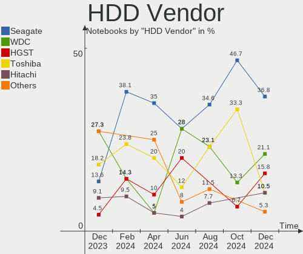
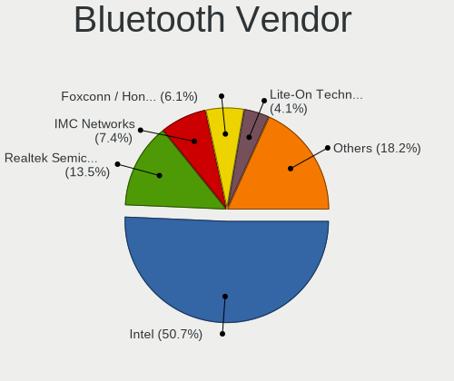
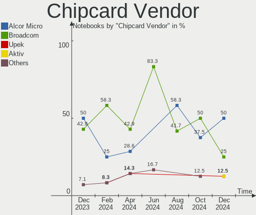
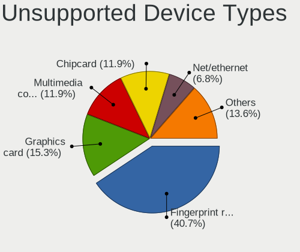

Arch Hardware Trends (Notebooks)
--------------------------------

A project to identify most popular hardware characteristics and track their change
over time based on data collected by Arch users at https://Linux-Hardware.org.

Anyone can contribute to this report by the [hw-probe](https://github.com/linuxhw/hw-probe) tool:

    sudo -E hw-probe -all -upload

Full-feature report is available here: https://linux-hardware.org/?view=trends&formfactor=notebook

Period: Oct, 2021.

Contents
--------

* [ System ](#system)
  - [ OS                       ](#os)
  - [ OS Family                ](#os-family)
  - [ Kernel                   ](#kernel)
  - [ Kernel Family            ](#kernel-family)
  - [ Kernel Major Ver.        ](#kernel-major-ver)
  - [ Arch                     ](#arch)
  - [ DE                       ](#de)
  - [ Display Server           ](#display-server)
  - [ Display Manager          ](#display-manager)
  - [ OS Lang                  ](#os-lang)
  - [ Boot Mode                ](#boot-mode)
  - [ Filesystem               ](#filesystem)
  - [ Part. scheme             ](#part-scheme)
  - [ Dual Boot with Linux/BSD ](#dual-boot-with-linuxbsd)
  - [ Dual Boot (Win)          ](#dual-boot-win)

* [ Board ](#board)
  - [ Vendor                   ](#vendor)
  - [ Model                    ](#model)
  - [ Model Family             ](#model-family)
  - [ MFG Year                 ](#mfg-year)
  - [ Form Factor              ](#form-factor)
  - [ Secure Boot              ](#secure-boot)
  - [ Coreboot                 ](#coreboot)
  - [ RAM Size                 ](#ram-size)
  - [ RAM Used                 ](#ram-used)
  - [ Total Drives             ](#total-drives)
  - [ Has CD-ROM               ](#has-cd-rom)
  - [ Has Ethernet             ](#has-ethernet)
  - [ Has WiFi                 ](#has-wifi)
  - [ Has Bluetooth            ](#has-bluetooth)

* [ Location ](#location)
  - [ Country                  ](#country)
  - [ City                     ](#city)

* [ Drives ](#drives)
  - [ Drive Vendor             ](#drive-vendor)
  - [ Drive Model              ](#drive-model)
  - [ HDD Vendor               ](#hdd-vendor)
  - [ SSD Vendor               ](#ssd-vendor)
  - [ Drive Kind               ](#drive-kind)
  - [ Drive Connector          ](#drive-connector)
  - [ Drive Size               ](#drive-size)
  - [ Space Total              ](#space-total)
  - [ Space Used               ](#space-used)
  - [ Malfunc. Drives          ](#malfunc-drives)
  - [ Malfunc. Drive Vendor    ](#malfunc-drive-vendor)
  - [ Malfunc. HDD Vendor      ](#malfunc-hdd-vendor)
  - [ Malfunc. Drive Kind      ](#malfunc-drive-kind)
  - [ Failed Drives            ](#failed-drives)
  - [ Failed Drive Vendor      ](#failed-drive-vendor)
  - [ Drive Status             ](#drive-status)

* [ Storage controller ](#storage-controller)
  - [ Storage Vendor           ](#storage-vendor)
  - [ Storage Model            ](#storage-model)
  - [ Storage Kind             ](#storage-kind)

* [ Processor ](#processor)
  - [ CPU Vendor               ](#cpu-vendor)
  - [ CPU Model                ](#cpu-model)
  - [ CPU Model Family         ](#cpu-model-family)
  - [ CPU Cores                ](#cpu-cores)
  - [ CPU Sockets              ](#cpu-sockets)
  - [ CPU Threads              ](#cpu-threads)
  - [ CPU Op-Modes             ](#cpu-op-modes)
  - [ CPU Microcode            ](#cpu-microcode)
  - [ CPU Microarch            ](#cpu-microarch)

* [ Graphics ](#graphics)
  - [ GPU Vendor               ](#gpu-vendor)
  - [ GPU Model                ](#gpu-model)
  - [ GPU Combo                ](#gpu-combo)
  - [ GPU Driver               ](#gpu-driver)
  - [ GPU Memory               ](#gpu-memory)

* [ Monitor ](#monitor)
  - [ Monitor Vendor           ](#monitor-vendor)
  - [ Monitor Model            ](#monitor-model)
  - [ Monitor Resolution       ](#monitor-resolution)
  - [ Monitor Diagonal         ](#monitor-diagonal)
  - [ Monitor Width            ](#monitor-width)
  - [ Aspect Ratio             ](#aspect-ratio)
  - [ Monitor Area             ](#monitor-area)
  - [ Pixel Density            ](#pixel-density)
  - [ Multiple Monitors        ](#multiple-monitors)

* [ Network ](#network)
  - [ Net Controller Vendor    ](#net-controller-vendor)
  - [ Net Controller Model     ](#net-controller-model)
  - [ Wireless Vendor          ](#wireless-vendor)
  - [ Wireless Model           ](#wireless-model)
  - [ Ethernet Vendor          ](#ethernet-vendor)
  - [ Ethernet Model           ](#ethernet-model)
  - [ Net Controller Kind      ](#net-controller-kind)
  - [ Used Controller          ](#used-controller)
  - [ NICs                     ](#nics)
  - [ IPv6                     ](#ipv6)

* [ Bluetooth ](#bluetooth)
  - [ Bluetooth Vendor         ](#bluetooth-vendor)
  - [ Bluetooth Model          ](#bluetooth-model)

* [ Sound ](#sound)
  - [ Sound Vendor             ](#sound-vendor)
  - [ Sound Model              ](#sound-model)

* [ Memory ](#memory)
  - [ Memory Vendor            ](#memory-vendor)
  - [ Memory Model             ](#memory-model)
  - [ Memory Kind              ](#memory-kind)
  - [ Memory Form Factor       ](#memory-form-factor)
  - [ Memory Size              ](#memory-size)
  - [ Memory Speed             ](#memory-speed)

* [ Printers & scanners ](#printers--scanners)
  - [ Printer Vendor           ](#printer-vendor)
  - [ Printer Model            ](#printer-model)
  - [ Scanner Vendor           ](#scanner-vendor)
  - [ Scanner Model            ](#scanner-model)

* [ Camera ](#camera)
  - [ Camera Vendor            ](#camera-vendor)
  - [ Camera Model             ](#camera-model)

* [ Security ](#security)
  - [ Fingerprint Vendor       ](#fingerprint-vendor)
  - [ Fingerprint Model        ](#fingerprint-model)
  - [ Chipcard Vendor          ](#chipcard-vendor)
  - [ Chipcard Model           ](#chipcard-model)

* [ Unsupported ](#unsupported)
  - [ Unsupported Devices      ](#unsupported-devices)
  - [ Unsupported Device Types ](#unsupported-device-types)

System
------

OS
--

Installed operating systems

| Name         | Notebooks | Percent |
|--------------|-----------|---------|
| Arch         | 42        | 61.76%  |
| Arch Rolling | 26        | 38.24%  |

OS Family
---------

OS without a version

| Name | Notebooks | Percent |
|------|-----------|---------|
| Arch | 68        | 100%    |

Kernel
------

Version of the Linux kernel

| Version                    | Notebooks | Percent |
|----------------------------|-----------|---------|
| 5.14.14-arch1-1            | 16        | 23.53%  |
| 5.14.8-arch1-1             | 10        | 14.71%  |
| 5.14.12-arch1-1            | 10        | 14.71%  |
| 5.14.8-zen1-1-zen          | 6         | 8.82%   |
| 5.14.11-arch1-1            | 5         | 7.35%   |
| 5.14.9-zen2-1-zen          | 4         | 5.88%   |
| 5.14.9-arch2-1             | 4         | 5.88%   |
| 5.14.14-zen1-1-zen         | 2         | 2.94%   |
| 5.14.10-arch1-1            | 2         | 2.94%   |
| 5.14.8-203-tkg-cacule-llvm | 1         | 1.47%   |
| 5.14.7-arch1-1             | 1         | 1.47%   |
| 5.14.6-arch1-1-surface     | 1         | 1.47%   |
| 5.14.2-arch1-2             | 1         | 1.47%   |
| 5.14.11-zen1-1-zen         | 1         | 1.47%   |
| 5.14.10-zen1-1-zen         | 1         | 1.47%   |
| 5.13.12-arch1-1            | 1         | 1.47%   |
| 5.10.75-1-lts              | 1         | 1.47%   |
| 5.10.10-arch1-1            | 1         | 1.47%   |

Kernel Family
-------------

Linux kernel without a distro release

| Version | Notebooks | Percent |
|---------|-----------|---------|
| 5.14.14 | 18        | 26.47%  |
| 5.14.8  | 17        | 25%     |
| 5.14.12 | 10        | 14.71%  |
| 5.14.9  | 8         | 11.76%  |
| 5.14.11 | 6         | 8.82%   |
| 5.14.10 | 3         | 4.41%   |
| 5.14.7  | 1         | 1.47%   |
| 5.14.6  | 1         | 1.47%   |
| 5.14.2  | 1         | 1.47%   |
| 5.13.12 | 1         | 1.47%   |
| 5.10.75 | 1         | 1.47%   |
| 5.10.10 | 1         | 1.47%   |

Kernel Major Ver.
-----------------

Linux kernel major version

| Version | Notebooks | Percent |
|---------|-----------|---------|
| 5.14    | 65        | 95.59%  |
| 5.10    | 2         | 2.94%   |
| 5.13    | 1         | 1.47%   |

Arch
----

OS architecture (x86_64, i586, etc.)

| Name   | Notebooks | Percent |
|--------|-----------|---------|
| x86_64 | 68        | 100%    |

DE
--

Desktop Environment

| Name       | Notebooks | Percent |
|------------|-----------|---------|
| KDE5       | 29        | 42.65%  |
| GNOME      | 10        | 14.71%  |
| Unknown    | 9         | 13.24%  |
| XFCE       | 7         | 10.29%  |
| i3         | 5         | 7.35%   |
| X-Cinnamon | 3         | 4.41%   |
| xmonad     | 2         | 2.94%   |
| MATE       | 1         | 1.47%   |
| Cinnamon   | 1         | 1.47%   |
| bspwm      | 1         | 1.47%   |

Display Server
--------------

X11 or Wayland

| Name    | Notebooks | Percent |
|---------|-----------|---------|
| X11     | 44        | 64.71%  |
| Wayland | 11        | 16.18%  |
| Tty     | 8         | 11.76%  |
| Unknown | 5         | 7.35%   |

Display Manager
---------------

SDDM, LightDM, etc.

| Name    | Notebooks | Percent |
|---------|-----------|---------|
| SDDM    | 24        | 35.29%  |
| Unknown | 22        | 32.35%  |
| LightDM | 12        | 17.65%  |
| GDM     | 8         | 11.76%  |
| SLiM    | 1         | 1.47%   |
| LXDM    | 1         | 1.47%   |

OS Lang
-------

Language

| Lang    | Notebooks | Percent |
|---------|-----------|---------|
| en_US   | 42        | 61.76%  |
| ru_RU   | 6         | 8.82%   |
| pt_BR   | 3         | 4.41%   |
| it_IT   | 2         | 2.94%   |
| fr_FR   | 2         | 2.94%   |
| de_DE   | 2         | 2.94%   |
| C       | 2         | 2.94%   |
| Unknown | 2         | 2.94%   |
| zh_CN   | 1         | 1.47%   |
| unm_US  | 1         | 1.47%   |
| tr_TR   | 1         | 1.47%   |
| es_ES   | 1         | 1.47%   |
| en_SG   | 1         | 1.47%   |
| en_IN   | 1         | 1.47%   |
| de_AT   | 1         | 1.47%   |

Boot Mode
---------

EFI or BIOS

| Mode | Notebooks | Percent |
|------|-----------|---------|
| EFI  | 47        | 69.12%  |
| BIOS | 21        | 30.88%  |

Filesystem
----------

Type of filesystem

| Type    | Notebooks | Percent |
|---------|-----------|---------|
| Ext4    | 50        | 73.53%  |
| Btrfs   | 14        | 20.59%  |
| Overlay | 2         | 2.94%   |
| Xfs     | 1         | 1.47%   |
| F2fs    | 1         | 1.47%   |

Part. scheme
------------

Scheme of partitioning

| Type    | Notebooks | Percent |
|---------|-----------|---------|
| GPT     | 47        | 69.12%  |
| Unknown | 15        | 22.06%  |
| MBR     | 6         | 8.82%   |

Dual Boot with Linux/BSD
------------------------

Hosting more than one Linux/BSD

| Dual boot | Notebooks | Percent |
|-----------|-----------|---------|
| No        | 65        | 95.59%  |
| Yes       | 3         | 4.41%   |

Dual Boot (Win)
---------------

Hosting Linux and Windows

| Dual boot | Notebooks | Percent |
|-----------|-----------|---------|
| No        | 47        | 69.12%  |
| Yes       | 21        | 30.88%  |

Board
-----

Vendor
------

Motherboard manufacturer

| Name                | Notebooks | Percent |
|---------------------|-----------|---------|
| Lenovo              | 23        | 33.82%  |
| Dell                | 12        | 17.65%  |
| Acer                | 9         | 13.24%  |
| Hewlett-Packard     | 8         | 11.76%  |
| ASUSTek Computer    | 5         | 7.35%   |
| MSI                 | 3         | 4.41%   |
| TUXEDO              | 1         | 1.47%   |
| Toshiba             | 1         | 1.47%   |
| Samsung Electronics | 1         | 1.47%   |
| Notebook            | 1         | 1.47%   |
| Hyperbook           | 1         | 1.47%   |
| HUAWEI              | 1         | 1.47%   |
| Google              | 1         | 1.47%   |
| Framework           | 1         | 1.47%   |

Model
-----

Motherboard model

| Name                                       | Notebooks | Percent |
|--------------------------------------------|-----------|---------|
| Dell XPS 15 9500                           | 2         | 2.94%   |
| Dell G3 3500                               | 2         | 2.94%   |
| TUXEDO InfinityBook S 15 Gen6              | 1         | 1.47%   |
| Toshiba dynabook Satellite T772/W6TG       | 1         | 1.47%   |
| Samsung 900X3C/900X3D/900X3E/900X4C/900X4D | 1         | 1.47%   |
| Notebook NP50DE_DB                         | 1         | 1.47%   |
| MSI GP66 Leopard 11UG                      | 1         | 1.47%   |
| MSI GL73 8RD                               | 1         | 1.47%   |
| MSI GL65 9SEK                              | 1         | 1.47%   |
| Lenovo ThinkPad X395 20NL0007US            | 1         | 1.47%   |
| Lenovo ThinkPad X270 W10DG 20K5S35P00      | 1         | 1.47%   |
| Lenovo ThinkPad X230 2324FV6               | 1         | 1.47%   |
| Lenovo ThinkPad X230 23203BU               | 1         | 1.47%   |
| Lenovo ThinkPad X220 Tablet 4298A11        | 1         | 1.47%   |
| Lenovo ThinkPad X1 Carbon Gen 9 20XW003KUS | 1         | 1.47%   |
| Lenovo ThinkPad X1 Carbon 3rd 20BTS0A41U   | 1         | 1.47%   |
| Lenovo ThinkPad T490 20N2000KRT            | 1         | 1.47%   |
| Lenovo ThinkPad T490 20N20009PB            | 1         | 1.47%   |
| Lenovo ThinkPad T450s 20BWS2KM00           | 1         | 1.47%   |
| Lenovo ThinkPad T440s 20AQS00900           | 1         | 1.47%   |
| Lenovo ThinkPad T420 4236VHV               | 1         | 1.47%   |
| Lenovo ThinkPad T15 Gen 2i 20W4008LGE      | 1         | 1.47%   |
| Lenovo ThinkPad P14s Gen 1 20S4004LGE      | 1         | 1.47%   |
| Lenovo ThinkPad E595 20NF0002BM            | 1         | 1.47%   |
| Lenovo ThinkPad E585 20KVCTO1WW            | 1         | 1.47%   |
| Lenovo ThinkPad E480 20KN0069RT            | 1         | 1.47%   |
| Lenovo ThinkBook 15 G2 ITL 20VE            | 1         | 1.47%   |
| Lenovo Legion 5 Pro 16ACH6H 82JQ           | 1         | 1.47%   |
| Lenovo IdeaPad S145-15IWL 81S9             | 1         | 1.47%   |
| Lenovo IdeaPad L340-15API 81LW             | 1         | 1.47%   |
| Lenovo IdeaPad Gaming 3 15IMH05 82CG       | 1         | 1.47%   |
| Lenovo IdeaPad Gaming 3 15ARH05 82EY       | 1         | 1.47%   |
| Hyperbook Z15 Zen                          | 1         | 1.47%   |
| HUAWEI KLVL-WXX9                           | 1         | 1.47%   |
| HP ZHAN 66 Pro 15 G3                       | 1         | 1.47%   |
| HP ProBook 445 G7 Notebook PC              | 1         | 1.47%   |
| HP Laptop 15s-eq2xxx                       | 1         | 1.47%   |
| HP Laptop 15-bw0xx                         | 1         | 1.47%   |
| HP EliteBook 840 G6                        | 1         | 1.47%   |
| HP EliteBook 830 G5                        | 1         | 1.47%   |
| HP 255 G7 Notebook PC                      | 1         | 1.47%   |
| HP 15                                      | 1         | 1.47%   |
| Google Delbin                              | 1         | 1.47%   |
| Framework Laptop                           | 1         | 1.47%   |
| Dell XPS 13 9380                           | 1         | 1.47%   |
| Dell Latitude E7450                        | 1         | 1.47%   |
| Dell Latitude E5470                        | 1         | 1.47%   |
| Dell Latitude 9420                         | 1         | 1.47%   |
| Dell Latitude 7520                         | 1         | 1.47%   |
| Dell Inspiron 3583                         | 1         | 1.47%   |
| Dell G5 5587                               | 1         | 1.47%   |
| Dell G3 3579                               | 1         | 1.47%   |
| ASUS X555LD                                | 1         | 1.47%   |
| ASUS ROG Zephyrus G14 GA401II_GA401II      | 1         | 1.47%   |
| ASUS N53SM                                 | 1         | 1.47%   |
| ASUS K55VM                                 | 1         | 1.47%   |
| ASUS ASUS TUF Gaming A17 FA706QR_FA706QR   | 1         | 1.47%   |
| Acer Swift SF314-42                        | 1         | 1.47%   |
| Acer Predator PH315-53                     | 1         | 1.47%   |
| Acer Peppy                                 | 1         | 1.47%   |

Model Family
------------

Motherboard model prefix

| Name                | Notebooks | Percent |
|---------------------|-----------|---------|
| Lenovo ThinkPad     | 17        | 25%     |
| Lenovo IdeaPad      | 4         | 5.88%   |
| Dell Latitude       | 4         | 5.88%   |
| Dell XPS            | 3         | 4.41%   |
| Dell G3             | 3         | 4.41%   |
| Acer Nitro          | 3         | 4.41%   |
| HP Laptop           | 2         | 2.94%   |
| HP EliteBook        | 2         | 2.94%   |
| Acer Aspire         | 2         | 2.94%   |
| TUXEDO InfinityBook | 1         | 1.47%   |
| Toshiba dynabook    | 1         | 1.47%   |
| Samsung 900X3C      | 1         | 1.47%   |
| Notebook NP50DE     | 1         | 1.47%   |
| MSI GP66            | 1         | 1.47%   |
| MSI GL73            | 1         | 1.47%   |
| MSI GL65            | 1         | 1.47%   |
| Lenovo ThinkBook    | 1         | 1.47%   |
| Lenovo Legion       | 1         | 1.47%   |
| Hyperbook Z15       | 1         | 1.47%   |
| HUAWEI KLVL-WXX9    | 1         | 1.47%   |
| HP ZHAN             | 1         | 1.47%   |
| HP ProBook          | 1         | 1.47%   |
| HP 255              | 1         | 1.47%   |
| HP 15               | 1         | 1.47%   |
| Google Delbin       | 1         | 1.47%   |
| Framework Laptop    | 1         | 1.47%   |
| Dell Inspiron       | 1         | 1.47%   |
| Dell G5             | 1         | 1.47%   |
| ASUS X555LD         | 1         | 1.47%   |
| ASUS ROG            | 1         | 1.47%   |
| ASUS N53SM          | 1         | 1.47%   |
| ASUS K55VM          | 1         | 1.47%   |
| ASUS ASUS           | 1         | 1.47%   |
| Acer Swift          | 1         | 1.47%   |
| Acer Predator       | 1         | 1.47%   |
| Acer Peppy          | 1         | 1.47%   |
| Acer Extensa        | 1         | 1.47%   |

MFG Year
--------

Motherboard manufacture year

| Year | Notebooks | Percent |
|------|-----------|---------|
| 2021 | 20        | 29.41%  |
| 2020 | 19        | 27.94%  |
| 2019 | 8         | 11.76%  |
| 2018 | 6         | 8.82%   |
| 2017 | 4         | 5.88%   |
| 2012 | 4         | 5.88%   |
| 2013 | 2         | 2.94%   |
| 2011 | 2         | 2.94%   |
| 2015 | 1         | 1.47%   |
| 2014 | 1         | 1.47%   |
| 2009 | 1         | 1.47%   |

Form Factor
-----------

Physical design of the computer

| Name     | Notebooks | Percent |
|----------|-----------|---------|
| Notebook | 68        | 100%    |

Secure Boot
-----------

Enabled or disabled

| State    | Notebooks | Percent |
|----------|-----------|---------|
| Disabled | 67        | 98.53%  |
| Enabled  | 1         | 1.47%   |

Coreboot
--------

Have coreboot on board

| Used | Notebooks | Percent |
|------|-----------|---------|
| No   | 66        | 97.06%  |
| Yes  | 2         | 2.94%   |

RAM Size
--------

Total RAM memory

| Size in GB | Notebooks | Percent |
|------------|-----------|---------|
| 4.01-8.0   | 24        | 35.29%  |
| 16.01-24.0 | 16        | 23.53%  |
| 8.01-16.0  | 15        | 22.06%  |
| 32.01-64.0 | 5         | 7.35%   |
| 3.01-4.0   | 3         | 4.41%   |
| 24.01-32.0 | 3         | 4.41%   |
| 1.01-2.0   | 2         | 2.94%   |

RAM Used
--------

Used RAM memory

| Used GB    | Notebooks | Percent |
|------------|-----------|---------|
| 2.01-3.0   | 24        | 35.29%  |
| 3.01-4.0   | 14        | 20.59%  |
| 4.01-8.0   | 11        | 16.18%  |
| 1.01-2.0   | 10        | 14.71%  |
| 8.01-16.0  | 4         | 5.88%   |
| 0.51-1.0   | 2         | 2.94%   |
| 0.01-0.5   | 2         | 2.94%   |
| 16.01-24.0 | 1         | 1.47%   |

Total Drives
------------

Number of drives on board

| Drives | Notebooks | Percent |
|--------|-----------|---------|
| 1      | 51        | 75%     |
| 2      | 15        | 22.06%  |
| 3      | 1         | 1.47%   |
| 0      | 1         | 1.47%   |

Has CD-ROM
----------

Has CD-ROM on board

| Presented | Notebooks | Percent |
|-----------|-----------|---------|
| No        | 61        | 89.71%  |
| Yes       | 7         | 10.29%  |

Has Ethernet
------------

Has Ethernet on board

| Presented | Notebooks | Percent |
|-----------|-----------|---------|
| Yes       | 57        | 83.82%  |
| No        | 11        | 16.18%  |

Has WiFi
--------

Has WiFi module

| Presented | Notebooks | Percent |
|-----------|-----------|---------|
| Yes       | 68        | 100%    |

Has Bluetooth
-------------

Has Bluetooth module

| Presented | Notebooks | Percent |
|-----------|-----------|---------|
| Yes       | 60        | 88.24%  |
| No        | 8         | 11.76%  |

Location
--------

Country
-------

Geographic location (country)

| Country   | Notebooks | Percent |
|-----------|-----------|---------|
| USA       | 10        | 14.71%  |
| Russia    | 8         | 11.76%  |
| Brazil    | 6         | 8.82%   |
| Germany   | 5         | 7.35%   |
| France    | 5         | 7.35%   |
| China     | 5         | 7.35%   |
| India     | 4         | 5.88%   |
| Ukraine   | 3         | 4.41%   |
| UK        | 3         | 4.41%   |
| Poland    | 3         | 4.41%   |
| Spain     | 2         | 2.94%   |
| Japan     | 2         | 2.94%   |
| Italy     | 2         | 2.94%   |
| Turkey    | 1         | 1.47%   |
| Thailand  | 1         | 1.47%   |
| Taiwan    | 1         | 1.47%   |
| Pakistan  | 1         | 1.47%   |
| Iran      | 1         | 1.47%   |
| Greece    | 1         | 1.47%   |
| Cyprus    | 1         | 1.47%   |
| Belarus   | 1         | 1.47%   |
| Austria   | 1         | 1.47%   |
| Argentina | 1         | 1.47%   |

City
----

Geographic location (city)

| City               | Notebooks | Percent |
|--------------------|-----------|---------|
| St Petersburg      | 3         | 4.41%   |
| Tokyo              | 2         | 2.94%   |
| Guangzhou          | 2         | 2.94%   |
| Beijing            | 2         | 2.94%   |
| Zvenigorod         | 1         | 1.47%   |
| Xining             | 1         | 1.47%   |
| Wola Czolnowska    | 1         | 1.47%   |
| Warsaw             | 1         | 1.47%   |
| Voronezh           | 1         | 1.47%   |
| Visakhapatnam      | 1         | 1.47%   |
| Villejust          | 1         | 1.47%   |
| Vienna             | 1         | 1.47%   |
| Valencia           | 1         | 1.47%   |
| Uyemskiy           | 1         | 1.47%   |
| Uberl??ndia        | 1         | 1.47%   |
| Trivandrum         | 1         | 1.47%   |
| Tehran             | 1         | 1.47%   |
| Taichung           | 1         | 1.47%   |
| Rivne              | 1         | 1.47%   |
| Regensburg         | 1         | 1.47%   |
| Rayong             | 1         | 1.47%   |
| Rawalpindi         | 1         | 1.47%   |
| Perm               | 1         | 1.47%   |
| Paris              | 1         | 1.47%   |
| Orlando            | 1         | 1.47%   |
| Nicosia            | 1         | 1.47%   |
| Neyveli            | 1         | 1.47%   |
| New York           | 1         | 1.47%   |
| Narberth           | 1         | 1.47%   |
| Moscow             | 1         | 1.47%   |
| Minsk              | 1         | 1.47%   |
| Milan              | 1         | 1.47%   |
| Maring??           | 1         | 1.47%   |
| Madrid             | 1         | 1.47%   |
| Ludwigsburg        | 1         | 1.47%   |
| Lublin             | 1         | 1.47%   |
| Lille              | 1         | 1.47%   |
| Lencois Paulista   | 1         | 1.47%   |
| Kyiv               | 1         | 1.47%   |
| Kryvyi Rih         | 1         | 1.47%   |
| Kent               | 1         | 1.47%   |
| Istanbul           | 1         | 1.47%   |
| Hammond            | 1         | 1.47%   |
| Hamburg            | 1         | 1.47%   |
| Guarulhos          | 1         | 1.47%   |
| Greenford          | 1         | 1.47%   |
| Germantown         | 1         | 1.47%   |
| Florian??polis     | 1         | 1.47%   |
| Essen              | 1         | 1.47%   |
| Corbeil-Essonnes   | 1         | 1.47%   |
| Collado Villalba   | 1         | 1.47%   |
| Cappelle-en-Pevele | 1         | 1.47%   |
| Campina Grande     | 1         | 1.47%   |
| Buenos Aires       | 1         | 1.47%   |
| Brooklyn           | 1         | 1.47%   |
| Bridgton           | 1         | 1.47%   |
| Blackpool          | 1         | 1.47%   |
| Berlin             | 1         | 1.47%   |
| Bengaluru          | 1         | 1.47%   |
| Belluno            | 1         | 1.47%   |

Drives
------

Drive Vendor
------------

Hard drive vendors

| Vendor              | Notebooks | Drives | Percent |
|---------------------|-----------|--------|---------|
| WDC                 | 18        | 18     | 22.22%  |
| Samsung Electronics | 11        | 13     | 13.58%  |
| SK Hynix            | 10        | 10     | 12.35%  |
| Seagate             | 9         | 9      | 11.11%  |
| SanDisk             | 7         | 7      | 8.64%   |
| Kingston            | 5         | 5      | 6.17%   |
| Toshiba             | 4         | 4      | 4.94%   |
| Intel               | 3         | 3      | 3.7%    |
| Crucial             | 3         | 4      | 3.7%    |
| Unknown             | 2         | 2      | 2.47%   |
| Micron Technology   | 2         | 2      | 2.47%   |
| A-DATA Technology   | 2         | 2      | 2.47%   |
| SSSTC               | 1         | 1      | 1.23%   |
| LITEONIT            | 1         | 1      | 1.23%   |
| HGST                | 1         | 1      | 1.23%   |
| Hewlett-Packard     | 1         | 1      | 1.23%   |
| ADATA Technology    | 1         | 1      | 1.23%   |

Drive Model
-----------

Hard drive models

| Model                                     | Notebooks | Percent |
|-------------------------------------------|-----------|---------|
| Sandisk NVMe SSD Drive 512GB              | 3         | 3.57%   |
| WDC WDS200T2G0A-00JH30 2TB SSD            | 2         | 2.38%   |
| WDC WD10JPCX-24UE4T0 1TB                  | 2         | 2.38%   |
| WDC PC SN520 SDAPNUW-256G-1006 256GB      | 2         | 2.38%   |
| Seagate ST1000LM035-1RK172 1TB            | 2         | 2.38%   |
| Seagate ST1000LM024 HN-M101MBB 1TB        | 2         | 2.38%   |
| Samsung SM963 2.5" NVMe PCIe SSD 250GB    | 2         | 2.38%   |
| Intel NVMe SSD Drive 512GB                | 2         | 2.38%   |
| WDC WDS240G2G0A-00JH30 240GB SSD          | 1         | 1.19%   |
| WDC WDS100T2B0C-00PXH0 1TB                | 1         | 1.19%   |
| WDC WD1600BEVT-22ZCT0 160GB               | 1         | 1.19%   |
| WDC WD10SPZX-24Z10 1TB                    | 1         | 1.19%   |
| WDC WD10SPZX-21Z10T0 1TB                  | 1         | 1.19%   |
| WDC WD10SPZX-08Z10 1TB                    | 1         | 1.19%   |
| WDC WD10JPVX-60JC3T1 1TB                  | 1         | 1.19%   |
| WDC PC SN730 SDBPNTY-512G-1027 512GB      | 1         | 1.19%   |
| WDC PC SN730 SDBPNTY-1T00-1101 1TB        | 1         | 1.19%   |
| WDC PC SN720 SDAPNTW-512G-1006 512GB      | 1         | 1.19%   |
| WDC PC SN530 SDBPNPZ-512G-1114 512GB      | 1         | 1.19%   |
| WDC PC SN530 SDBPNPZ-1T00-1002 1TB        | 1         | 1.19%   |
| Unknown USB DISK 3.2 250GB                | 1         | 1.19%   |
| Unknown SC128  128GB                      | 1         | 1.19%   |
| Toshiba TR200 480GB SSD                   | 1         | 1.19%   |
| Toshiba NVMe SSD Drive 512GB              | 1         | 1.19%   |
| Toshiba KXG6AZNV256G 256GB                | 1         | 1.19%   |
| Toshiba KBG30ZMS128G NVMe 128GB           | 1         | 1.19%   |
| SSSTC CL1-4D256 256GB                     | 1         | 1.19%   |
| SK Hynix SKHynix_HFS512GDE9X081N 512GB    | 1         | 1.19%   |
| SK Hynix SKHynix_HFS512GD9TNG-L5B0B 512GB | 1         | 1.19%   |
| SK Hynix SHGP31-500GM-2 500GB             | 1         | 1.19%   |
| SK Hynix NVMe SSD Drive 512GB             | 1         | 1.19%   |
| SK Hynix NVMe SSD Drive 256GB             | 1         | 1.19%   |
| SK Hynix NVMe SSD Drive 128GB             | 1         | 1.19%   |
| SK Hynix HFS256G39TND-N210A 256GB SSD     | 1         | 1.19%   |
| SK Hynix HFM512GDHTNG-8710B 512GB         | 1         | 1.19%   |
| SK Hynix HFM512GD3JX013N 512GB            | 1         | 1.19%   |
| SK Hynix BC711 NVMe 512GB                 | 1         | 1.19%   |
| Seagate ST320VT000-1BS14C 320GB           | 1         | 1.19%   |
| Seagate ST2000LX001-1RG174 2TB            | 1         | 1.19%   |
| Seagate ST1000LX015-1U7172 1TB            | 1         | 1.19%   |
| Seagate ST1000LM049-2GH172 1TB            | 1         | 1.19%   |
| Seagate ST1000LM048-2E7172 1TB            | 1         | 1.19%   |
| SanDisk X400 M.2 2280 256GB SSD           | 1         | 1.19%   |
| SanDisk SSD PLUS 1000GB                   | 1         | 1.19%   |
| SanDisk SD9SN8W256G1014 256GB SSD         | 1         | 1.19%   |
| Sandisk NVMe SSD Drive 1TB                | 1         | 1.19%   |
| Samsung SSD PM851 mSATA 128GB             | 1         | 1.19%   |
| Samsung SSD 980 1TB                       | 1         | 1.19%   |
| Samsung SSD 970 EVO 500GB                 | 1         | 1.19%   |
| Samsung SSD 860 PRO 256GB                 | 1         | 1.19%   |
| Samsung SSD 860 PRO 1TB                   | 1         | 1.19%   |
| Samsung SSD 850 EVO mSATA 250GB           | 1         | 1.19%   |
| Samsung Portable SSD T5 1TB               | 1         | 1.19%   |
| Samsung NVMe SSD Drive 500GB              | 1         | 1.19%   |
| Samsung MZVLB1T0HALR-00000 1TB            | 1         | 1.19%   |
| Samsung MZALQ256HAJD-000L2 256GB          | 1         | 1.19%   |
| Samsung MZ7TD256HAFV-000L9 256GB SSD      | 1         | 1.19%   |
| Micron MTFDDAV256TBN-1AR15ABHA 256GB SSD  | 1         | 1.19%   |
| Micron 2300 NVMe 512GB                    | 1         | 1.19%   |
| LITEONIT LCT-256M3S 256GB SSD             | 1         | 1.19%   |

HDD Vendor
----------

Hard disk drive vendors

| Vendor  | Notebooks | Drives | Percent |
|---------|-----------|--------|---------|
| Seagate | 9         | 9      | 52.94%  |
| WDC     | 7         | 7      | 41.18%  |
| HGST    | 1         | 1      | 5.88%   |

SSD Vendor
----------

Solid state drive vendors

| Vendor              | Notebooks | Drives | Percent |
|---------------------|-----------|--------|---------|
| Samsung Electronics | 5         | 6      | 21.74%  |
| WDC                 | 3         | 3      | 13.04%  |
| SanDisk             | 3         | 3      | 13.04%  |
| Kingston            | 3         | 3      | 13.04%  |
| Crucial             | 3         | 3      | 13.04%  |
| Toshiba             | 1         | 1      | 4.35%   |
| SK Hynix            | 1         | 1      | 4.35%   |
| Micron Technology   | 1         | 1      | 4.35%   |
| LITEONIT            | 1         | 1      | 4.35%   |
| Hewlett-Packard     | 1         | 1      | 4.35%   |
| A-DATA Technology   | 1         | 1      | 4.35%   |

Drive Kind
----------

HDD or SSD

| Kind    | Notebooks | Drives | Percent |
|---------|-----------|--------|---------|
| NVMe    | 40        | 41     | 49.38%  |
| SSD     | 22        | 24     | 27.16%  |
| HDD     | 17        | 17     | 20.99%  |
| MMC     | 1         | 1      | 1.23%   |
| Unknown | 1         | 1      | 1.23%   |

Drive Connector
---------------

SATA, SAS, NVMe, etc.

| Type | Notebooks | Drives | Percent |
|------|-----------|--------|---------|
| NVMe | 40        | 41     | 50.63%  |
| SATA | 36        | 40     | 45.57%  |
| SAS  | 2         | 2      | 2.53%   |
| MMC  | 1         | 1      | 1.27%   |

Drive Size
----------

Size of hard drive

| Size in TB | Notebooks | Drives | Percent |
|------------|-----------|--------|---------|
| 0.01-0.5   | 19        | 20     | 47.5%   |
| 0.51-1.0   | 17        | 17     | 42.5%   |
| 1.01-2.0   | 4         | 4      | 10%     |

Space Total
-----------

Amount of disk space available on the file system

| Size in GB | Notebooks | Percent |
|------------|-----------|---------|
| 101-250    | 21        | 30.88%  |
| 501-1000   | 15        | 22.06%  |
| 251-500    | 13        | 19.12%  |
| 1001-2000  | 13        | 19.12%  |
| 2001-3000  | 2         | 2.94%   |
| 1-20       | 2         | 2.94%   |
| Unknown    | 2         | 2.94%   |

Space Used
----------

Amount of used disk space

| Used GB   | Notebooks | Percent |
|-----------|-----------|---------|
| 101-250   | 20        | 29.41%  |
| 21-50     | 11        | 16.18%  |
| 1-20      | 11        | 16.18%  |
| 51-100    | 11        | 16.18%  |
| 501-1000  | 7         | 10.29%  |
| 251-500   | 5         | 7.35%   |
| Unknown   | 2         | 2.94%   |
| 1001-2000 | 1         | 1.47%   |

Malfunc. Drives
---------------

Drive models with a malfunction

| Model                              | Notebooks | Drives | Percent |
|------------------------------------|-----------|--------|---------|
| Seagate ST1000LX015-1U7172 1TB     | 1         | 1      | 25%     |
| Seagate ST1000LM024 HN-M101MBB 1TB | 1         | 1      | 25%     |
| SanDisk SSD PLUS 1000GB            | 1         | 1      | 25%     |
| Kingston SNS4151S316G 16GB SSD     | 1         | 1      | 25%     |

Malfunc. Drive Vendor
---------------------

Vendors of faulty drives

| Vendor   | Notebooks | Drives | Percent |
|----------|-----------|--------|---------|
| Seagate  | 2         | 2      | 50%     |
| SanDisk  | 1         | 1      | 25%     |
| Kingston | 1         | 1      | 25%     |

Malfunc. HDD Vendor
-------------------

Vendors of faulty HDD drives

| Vendor  | Notebooks | Drives | Percent |
|---------|-----------|--------|---------|
| Seagate | 2         | 2      | 100%    |

Malfunc. Drive Kind
-------------------

Kinds of faulty drives

| Kind | Notebooks | Drives | Percent |
|------|-----------|--------|---------|
| SSD  | 2         | 2      | 50%     |
| HDD  | 2         | 2      | 50%     |

Failed Drives
-------------

Failed drive models

Zero info for selected period =(

Failed Drive Vendor
-------------------

Failed drive vendors

Zero info for selected period =(

Drive Status
------------

Number of failed and malfunc. drives

| Status   | Notebooks | Drives | Percent |
|----------|-----------|--------|---------|
| Works    | 42        | 50     | 60%     |
| Detected | 24        | 30     | 34.29%  |
| Malfunc  | 4         | 4      | 5.71%   |

Storage controller
------------------

Storage Vendor
--------------

Storage controller vendors

| Vendor                         | Notebooks | Percent |
|--------------------------------|-----------|---------|
| Intel                          | 37        | 43.02%  |
| Sandisk                        | 12        | 13.95%  |
| AMD                            | 12        | 13.95%  |
| SK Hynix                       | 9         | 10.47%  |
| Samsung Electronics            | 6         | 6.98%   |
| Toshiba America Info Systems   | 3         | 3.49%   |
| Kingston Technology Company    | 2         | 2.33%   |
| Solid State Storage Technology | 1         | 1.16%   |
| Realtek Semiconductor          | 1         | 1.16%   |
| Micron/Crucial Technology      | 1         | 1.16%   |
| Micron Technology              | 1         | 1.16%   |
| ADATA Technology               | 1         | 1.16%   |

Storage Model
-------------

Storage controller models

| Model                                                                            | Notebooks | Percent |
|----------------------------------------------------------------------------------|-----------|---------|
| AMD FCH SATA Controller [AHCI mode]                                              | 12        | 13.79%  |
| SK Hynix Gold P31 SSD                                                            | 5         | 5.75%   |
| Sandisk WD Black SN750 / PC SN730 NVMe SSD                                       | 5         | 5.75%   |
| Intel 7 Series Chipset Family 6-port SATA Controller [AHCI mode]                 | 5         | 5.75%   |
| Samsung NVMe SSD Controller SM981/PM981/PM983                                    | 4         | 4.6%    |
| Sandisk WD Blue SN550 NVMe SSD                                                   | 3         | 3.45%   |
| Intel Wildcat Point-LP SATA Controller [AHCI Mode]                               | 3         | 3.45%   |
| Intel 82801 Mobile SATA Controller [RAID mode]                                   | 3         | 3.45%   |
| Intel 8 Series SATA Controller 1 [AHCI mode]                                     | 3         | 3.45%   |
| Intel 6 Series/C200 Series Chipset Family 6 port Mobile SATA AHCI Controller     | 3         | 3.45%   |
| Intel 400 Series Chipset Family SATA AHCI Controller                             | 3         | 3.45%   |
| SK Hynix BC501 NVMe Solid State Drive                                            | 2         | 2.3%    |
| Sandisk WD Blue SN500 / PC SN520 NVMe SSD                                        | 2         | 2.3%    |
| Samsung NVMe SSD Controller 980                                                  | 2         | 2.3%    |
| Intel Sunrise Point-LP SATA Controller [AHCI mode]                               | 2         | 2.3%    |
| Intel SSD 660P Series                                                            | 2         | 2.3%    |
| Intel Comet Lake PCH-H RAID                                                      | 2         | 2.3%    |
| Intel Cannon Point-LP SATA Controller [AHCI Mode]                                | 2         | 2.3%    |
| Intel Cannon Lake Mobile PCH SATA AHCI Controller                                | 2         | 2.3%    |
| Toshiba America Info Systems XG6 NVMe SSD Controller                             | 1         | 1.15%   |
| Toshiba America Info Systems Toshiba America Info Non-Volatile memory controller | 1         | 1.15%   |
| Toshiba America Info Systems BG3 NVMe SSD Controller                             | 1         | 1.15%   |
| Solid State Storage Non-Volatile memory controller                               | 1         | 1.15%   |
| SK Hynix PC401 NVMe Solid State Drive 256GB                                      | 1         | 1.15%   |
| SK Hynix Non-Volatile memory controller                                          | 1         | 1.15%   |
| Sandisk WD Black 2018/SN750 / PC SN720 NVMe SSD                                  | 1         | 1.15%   |
| Sandisk Non-Volatile memory controller                                           | 1         | 1.15%   |
| Realtek RTS5763DL NVMe SSD Controller                                            | 1         | 1.15%   |
| Micron/Crucial P1 NVMe PCIe SSD                                                  | 1         | 1.15%   |
| Micron Non-Volatile memory controller                                            | 1         | 1.15%   |
| Kingston Company Company Non-Volatile memory controller                          | 1         | 1.15%   |
| Kingston Company OM3PDP3 NVMe SSD                                                | 1         | 1.15%   |
| Intel Volume Management Device NVMe RAID Controller                              | 1         | 1.15%   |
| Intel Tiger Lake-LP SATA Controller [AHCI mode]                                  | 1         | 1.15%   |
| Intel SSD 600P Series                                                            | 1         | 1.15%   |
| Intel SATA Controller [RAID mode]                                                | 1         | 1.15%   |
| Intel Comet Lake SATA AHCI Controller                                            | 1         | 1.15%   |
| Intel Atom Processor E3800 Series SATA AHCI Controller                           | 1         | 1.15%   |
| Intel 82801IBM/IEM (ICH9M/ICH9M-E) 2 port SATA Controller [IDE mode]             | 1         | 1.15%   |
| Intel 5 Series/3400 Series Chipset 4 port SATA AHCI Controller                   | 1         | 1.15%   |
| ADATA Non-Volatile memory controller                                             | 1         | 1.15%   |

Storage Kind
------------

Kind of storage controller (IDE, SATA, NVMe, SAS, ...)

| Kind | Notebooks | Percent |
|------|-----------|---------|
| NVMe | 40        | 45.98%  |
| SATA | 40        | 45.98%  |
| RAID | 6         | 6.9%    |
| IDE  | 1         | 1.15%   |

Processor
---------

CPU Vendor
----------

Processor vendors

| Vendor | Notebooks | Percent |
|--------|-----------|---------|
| Intel  | 51        | 75%     |
| AMD    | 17        | 25%     |

CPU Model
---------

Processor models

| Model                                           | Notebooks | Percent |
|-------------------------------------------------|-----------|---------|
| Intel Core i7-8565U CPU @ 1.80GHz               | 3         | 4.41%   |
| Intel Core i7-10750H CPU @ 2.60GHz              | 3         | 4.41%   |
| Intel Core i5-10300H CPU @ 2.50GHz              | 3         | 4.41%   |
| Intel 11th Gen Core i5-1135G7 @ 2.40GHz         | 3         | 4.41%   |
| AMD Ryzen 7 4800H with Radeon Graphics          | 3         | 4.41%   |
| Intel Core i7-8750H CPU @ 2.20GHz               | 2         | 2.94%   |
| Intel Core i7-5600U CPU @ 2.60GHz               | 2         | 2.94%   |
| Intel Core i7-10510U CPU @ 1.80GHz              | 2         | 2.94%   |
| Intel Core i5-8300H CPU @ 2.30GHz               | 2         | 2.94%   |
| Intel Core i5-8265U CPU @ 1.60GHz               | 2         | 2.94%   |
| Intel Core i5-3320M CPU @ 2.60GHz               | 2         | 2.94%   |
| Intel Core i5-2520M CPU @ 2.50GHz               | 2         | 2.94%   |
| Intel 11th Gen Core i7-1185G7 @ 3.00GHz         | 2         | 2.94%   |
| Intel 11th Gen Core i7-1165G7 @ 2.80GHz         | 2         | 2.94%   |
| AMD Ryzen 7 5800H with Radeon Graphics          | 2         | 2.94%   |
| AMD Ryzen 5 4500U with Radeon Graphics          | 2         | 2.94%   |
| Intel Pentium Dual-Core CPU T4200 @ 2.00GHz     | 1         | 1.47%   |
| Intel Core i9-10885H CPU @ 2.40GHz              | 1         | 1.47%   |
| Intel Core i7-9750H CPU @ 2.60GHz               | 1         | 1.47%   |
| Intel Core i7-8665U CPU @ 1.90GHz               | 1         | 1.47%   |
| Intel Core i7-4510U CPU @ 2.00GHz               | 1         | 1.47%   |
| Intel Core i7-3630QM CPU @ 2.40GHz              | 1         | 1.47%   |
| Intel Core i7-3610QM CPU @ 2.30GHz              | 1         | 1.47%   |
| Intel Core i7-2670QM CPU @ 2.20GHz              | 1         | 1.47%   |
| Intel Core i5-8350U CPU @ 1.70GHz               | 1         | 1.47%   |
| Intel Core i5-8250U CPU @ 1.60GHz               | 1         | 1.47%   |
| Intel Core i5-6440HQ CPU @ 2.60GHz              | 1         | 1.47%   |
| Intel Core i5-6300U CPU @ 2.40GHz               | 1         | 1.47%   |
| Intel Core i5-5300U CPU @ 2.30GHz               | 1         | 1.47%   |
| Intel Core i5-4200U CPU @ 1.60GHz               | 1         | 1.47%   |
| Intel Core i5-3337U CPU @ 1.80GHz               | 1         | 1.47%   |
| Intel Core i5 CPU M 460 @ 2.53GHz               | 1         | 1.47%   |
| Intel Core i3-8130U CPU @ 2.20GHz               | 1         | 1.47%   |
| Intel Celeron CPU N2830 @ 2.16GHz               | 1         | 1.47%   |
| Intel Celeron 2955U @ 1.40GHz                   | 1         | 1.47%   |
| Intel 11th Gen Core i7-11800H @ 2.30GHz         | 1         | 1.47%   |
| Intel 11th Gen Core i3-1115G4 @ 3.00GHz         | 1         | 1.47%   |
| AMD Ryzen 7 PRO 3700U w/ Radeon Vega Mobile Gfx | 1         | 1.47%   |
| AMD Ryzen 7 3750H with Radeon Vega Mobile Gfx   | 1         | 1.47%   |
| AMD Ryzen 7 3700U with Radeon Vega Mobile Gfx   | 1         | 1.47%   |
| AMD Ryzen 5 5600H with Radeon Graphics          | 1         | 1.47%   |
| AMD Ryzen 5 5500U with Radeon Graphics          | 1         | 1.47%   |
| AMD Ryzen 5 4600HS with Radeon Graphics         | 1         | 1.47%   |
| AMD Ryzen 5 2500U with Radeon Vega Mobile Gfx   | 1         | 1.47%   |
| AMD Ryzen 3 3200U with Radeon Vega Mobile Gfx   | 1         | 1.47%   |
| AMD A6-9225 RADEON R4, 5 COMPUTE CORES 2C+3G    | 1         | 1.47%   |
| AMD A10-9620P RADEON R5, 10 COMPUTE CORES 4C+6G | 1         | 1.47%   |

CPU Model Family
----------------

Processor model prefix

| Model                   | Notebooks | Percent |
|-------------------------|-----------|---------|
| Intel Core i5           | 19        | 27.94%  |
| Intel Core i7           | 18        | 26.47%  |
| Other                   | 9         | 13.24%  |
| AMD Ryzen 7             | 7         | 10.29%  |
| AMD Ryzen 5             | 6         | 8.82%   |
| Intel Celeron           | 2         | 2.94%   |
| Intel Pentium Dual-Core | 1         | 1.47%   |
| Intel Core i9           | 1         | 1.47%   |
| Intel Core i3           | 1         | 1.47%   |
| AMD Ryzen 7 PRO         | 1         | 1.47%   |
| AMD Ryzen 3             | 1         | 1.47%   |
| AMD A6                  | 1         | 1.47%   |
| AMD A10                 | 1         | 1.47%   |

CPU Cores
---------

Number of processor cores

| Number | Notebooks | Percent |
|--------|-----------|---------|
| 4      | 30        | 44.12%  |
| 2      | 20        | 29.41%  |
| 6      | 11        | 16.18%  |
| 8      | 7         | 10.29%  |

CPU Sockets
-----------

Number of sockets

| Number | Notebooks | Percent |
|--------|-----------|---------|
| 1      | 68        | 100%    |

CPU Threads
-----------

Threads per core (Hyper-Threading)

| Number | Notebooks | Percent |
|--------|-----------|---------|
| 2      | 61        | 89.71%  |
| 1      | 7         | 10.29%  |

CPU Op-Modes
------------

CPU Operation Modes (32-bit, 64-bit)

| Op mode        | Notebooks | Percent |
|----------------|-----------|---------|
| 32-bit, 64-bit | 68        | 100%    |

CPU Microcode
-------------

Microcode number

| Number     | Notebooks | Percent |
|------------|-----------|---------|
| Unknown    | 20        | 29.41%  |
| 0x806c1    | 7         | 10.29%  |
| 0x906ea    | 5         | 7.35%   |
| 0x806ec    | 4         | 5.88%   |
| 0x306a9    | 4         | 5.88%   |
| 0xa0652    | 3         | 4.41%   |
| 0x08600104 | 3         | 4.41%   |
| 0x08108102 | 3         | 4.41%   |
| 0x806ea    | 2         | 2.94%   |
| 0x40651    | 2         | 2.94%   |
| 0x306d4    | 2         | 2.94%   |
| 0x0a50000c | 2         | 2.94%   |
| 0x806eb    | 1         | 1.47%   |
| 0x806d1    | 1         | 1.47%   |
| 0x506e3    | 1         | 1.47%   |
| 0x406e3    | 1         | 1.47%   |
| 0x206a7    | 1         | 1.47%   |
| 0x20655    | 1         | 1.47%   |
| 0x1067a    | 1         | 1.47%   |
| 0x08608103 | 1         | 1.47%   |
| 0x08600106 | 1         | 1.47%   |
| 0x06006705 | 1         | 1.47%   |
| 0x06006118 | 1         | 1.47%   |

CPU Microarch
-------------

Microarchitecture

| Name        | Notebooks | Percent |
|-------------|-----------|---------|
| KabyLake    | 16        | 23.53%  |
| TigerLake   | 8         | 11.76%  |
| CometLake   | 7         | 10.29%  |
| Zen 2       | 6         | 8.82%   |
| IvyBridge   | 5         | 7.35%   |
| Zen+        | 4         | 5.88%   |
| Zen 3       | 3         | 4.41%   |
| SandyBridge | 3         | 4.41%   |
| Haswell     | 3         | 4.41%   |
| Broadwell   | 3         | 4.41%   |
| Skylake     | 2         | 2.94%   |
| Excavator   | 2         | 2.94%   |
| Unknown     | 2         | 2.94%   |
| Zen         | 1         | 1.47%   |
| Westmere    | 1         | 1.47%   |
| Silvermont  | 1         | 1.47%   |
| Penryn      | 1         | 1.47%   |

Graphics
--------

GPU Vendor
----------

Vendors of graphics cards

| Vendor | Notebooks | Percent |
|--------|-----------|---------|
| Intel  | 50        | 50.51%  |
| Nvidia | 30        | 30.3%   |
| AMD    | 19        | 19.19%  |

GPU Model
---------

Graphics card models

| Model                                                                                 | Notebooks | Percent |
|---------------------------------------------------------------------------------------|-----------|---------|
| Intel TigerLake-LP GT2 [Iris Xe Graphics]                                             | 7         | 7%      |
| Intel CometLake-H GT2 [UHD Graphics]                                                  | 7         | 7%      |
| Intel WhiskeyLake-U GT2 [UHD Graphics 620]                                            | 6         | 6%      |
| AMD Renoir                                                                            | 6         | 6%      |
| Intel CoffeeLake-H GT2 [UHD Graphics 630]                                             | 5         | 5%      |
| Intel 3rd Gen Core processor Graphics Controller                                      | 5         | 5%      |
| Nvidia TU117M                                                                         | 4         | 4%      |
| AMD Picasso                                                                           | 4         | 4%      |
| Nvidia TU117M [GeForce GTX 1650 Ti Mobile]                                            | 3         | 3%      |
| Nvidia TU106M [GeForce RTX 2060 Mobile]                                               | 3         | 3%      |
| Nvidia GF108M [GeForce GT 620M/630M/635M/640M LE]                                     | 3         | 3%      |
| Intel UHD Graphics 620                                                                | 3         | 3%      |
| Intel HD Graphics 5500                                                                | 3         | 3%      |
| Intel Haswell-ULT Integrated Graphics Controller                                      | 3         | 3%      |
| Intel 2nd Generation Core Processor Family Integrated Graphics Controller             | 3         | 3%      |
| AMD Cezanne                                                                           | 3         | 3%      |
| Nvidia TU117M [GeForce GTX 1650 Mobile / Max-Q]                                       | 2         | 2%      |
| Nvidia GP107M [GeForce GTX 1050 Ti Mobile]                                            | 2         | 2%      |
| Nvidia GA104M [GeForce RTX 3070 Mobile / Max-Q]                                       | 2         | 2%      |
| Intel CometLake-U GT2 [UHD Graphics]                                                  | 2         | 2%      |
| AMD Topaz XT [Radeon R7 M260/M265 / M340/M360 / M440/M445 / 530/535 / 620/625 Mobile] | 2         | 2%      |
| Nvidia TU117M [GeForce MX450]                                                         | 1         | 1%      |
| Nvidia TU116M [GeForce GTX 1650 Ti Mobile]                                            | 1         | 1%      |
| Nvidia GP108M [GeForce MX250]                                                         | 1         | 1%      |
| Nvidia GP108M [GeForce MX150]                                                         | 1         | 1%      |
| Nvidia GP108GLM [Quadro P520]                                                         | 1         | 1%      |
| Nvidia GP107M [GeForce GTX 1050 Mobile]                                               | 1         | 1%      |
| Nvidia GP107M [GeForce GTX 1050 3 GB Max-Q]                                           | 1         | 1%      |
| Nvidia GM108M [GeForce MX110]                                                         | 1         | 1%      |
| Nvidia GM108M [GeForce 940M]                                                          | 1         | 1%      |
| Nvidia GF117M [GeForce 610M/710M/810M/820M / GT 620M/625M/630M/720M]                  | 1         | 1%      |
| Nvidia GA106M [GeForce RTX 3060 Mobile / Max-Q]                                       | 1         | 1%      |
| Intel TigerLake-H GT1 [UHD Graphics]                                                  | 1         | 1%      |
| Intel Tiger Lake UHD Graphics                                                         | 1         | 1%      |
| Intel Skylake GT2 [HD Graphics 520]                                                   | 1         | 1%      |
| Intel Mobile 4 Series Chipset Integrated Graphics Controller                          | 1         | 1%      |
| Intel HD Graphics 530                                                                 | 1         | 1%      |
| Intel Atom Processor Z36xxx/Z37xxx Series Graphics & Display                          | 1         | 1%      |
| AMD Wani [Radeon R5/R6/R7 Graphics]                                                   | 1         | 1%      |
| AMD Stoney [Radeon R2/R3/R4/R5 Graphics]                                              | 1         | 1%      |
| AMD Raven Ridge [Radeon Vega Series / Radeon Vega Mobile Series]                      | 1         | 1%      |
| AMD Madison [Mobility Radeon HD 5650/5750 / 6530M/6550M]                              | 1         | 1%      |
| AMD Lucienne                                                                          | 1         | 1%      |

GPU Combo
---------

Combinations of graphics cards

| Name           | Notebooks | Percent |
|----------------|-----------|---------|
| 1 x Intel      | 26        | 38.24%  |
| Intel + Nvidia | 23        | 33.82%  |
| 1 x AMD        | 10        | 14.71%  |
| AMD + Nvidia   | 7         | 10.29%  |
| 2 x AMD        | 1         | 1.47%   |
| Intel + AMD    | 1         | 1.47%   |

GPU Driver
----------

Free vs proprietary

| Driver      | Notebooks | Percent |
|-------------|-----------|---------|
| Free        | 52        | 76.47%  |
| Proprietary | 16        | 23.53%  |

GPU Memory
----------

Total video memory

| Size in GB | Notebooks | Percent |
|------------|-----------|---------|
| Unknown    | 45        | 66.18%  |
| 1.01-2.0   | 8         | 11.76%  |
| 0.01-0.5   | 8         | 11.76%  |
| 3.01-4.0   | 3         | 4.41%   |
| 0.51-1.0   | 3         | 4.41%   |
| 5.01-6.0   | 1         | 1.47%   |

Monitor
-------

Monitor Vendor
--------------

Monitor vendors

| Vendor              | Notebooks | Percent |
|---------------------|-----------|---------|
| AU Optronics        | 18        | 21.18%  |
| LG Display          | 15        | 17.65%  |
| BOE                 | 13        | 15.29%  |
| Chimei Innolux      | 11        | 12.94%  |
| Sharp               | 3         | 3.53%   |
| Samsung Electronics | 3         | 3.53%   |
| PANDA               | 3         | 3.53%   |
| Dell                | 3         | 3.53%   |
| Lenovo              | 2         | 2.35%   |
| Goldstar            | 2         | 2.35%   |
| BenQ                | 2         | 2.35%   |
| ZLX                 | 1         | 1.18%   |
| ViewSonic           | 1         | 1.18%   |
| PRI                 | 1         | 1.18%   |
| Philips             | 1         | 1.18%   |
| IPS                 | 1         | 1.18%   |
| Iiyama              | 1         | 1.18%   |
| Hewlett-Packard     | 1         | 1.18%   |
| CSO                 | 1         | 1.18%   |
| AOC                 | 1         | 1.18%   |
| Acer                | 1         | 1.18%   |

Monitor Model
-------------

Monitor models

| Model                                                                 | Notebooks | Percent |
|-----------------------------------------------------------------------|-----------|---------|
| LG Display LCD Monitor LGD05F2 1920x1080 344x194mm 15.5-inch          | 2         | 2.33%   |
| Chimei Innolux LCD Monitor CMN15E7 1920x1080 344x193mm 15.5-inch      | 2         | 2.33%   |
| Chimei Innolux LCD Monitor CMN14D4 1920x1080 309x173mm 13.9-inch      | 2         | 2.33%   |
| AU Optronics LCD Monitor AUO38ED 1920x1080 340x190mm 15.3-inch        | 2         | 2.33%   |
| ZLX LCD Monitor ZLX0301 1920x1080 280x160mm 12.7-inch                 | 1         | 1.16%   |
| ViewSonic VG2719-2K VSC1935 2560x1440 597x336mm 27.0-inch             | 1         | 1.16%   |
| Sharp LQ156M1JW03 SHP155D 1920x1080 344x194mm 15.5-inch               | 1         | 1.16%   |
| Sharp LCD Monitor SHP14D1 1920x1200 336x210mm 15.6-inch               | 1         | 1.16%   |
| Sharp LCD Monitor SHP14D0 3840x2400 336x210mm 15.6-inch               | 1         | 1.16%   |
| Samsung Electronics S24D390 SAM0B65 1920x1080 520x290mm 23.4-inch     | 1         | 1.16%   |
| Samsung Electronics LCD Monitor SEC504B 1600x900 382x215mm 17.3-inch  | 1         | 1.16%   |
| Samsung Electronics LCD Monitor SEC304C 1920x1080 353x198mm 15.9-inch | 1         | 1.16%   |
| PRI BBY LCD TV PRI0032 1360x768 530x398mm 26.1-inch                   | 1         | 1.16%   |
| Philips PHL 272B7QPJ PHL0900 2560x1440 597x336mm 27.0-inch            | 1         | 1.16%   |
| PANDA LCD Monitor NCP0050 1920x1080 309x174mm 14.0-inch               | 1         | 1.16%   |
| PANDA LCD Monitor NCP004D 1920x1080 344x194mm 15.5-inch               | 1         | 1.16%   |
| PANDA LCD Monitor NCP0046 1920x1080 344x194mm 15.5-inch               | 1         | 1.16%   |
| LG Display LCD Monitor LGD065A 1920x1080 344x194mm 15.5-inch          | 1         | 1.16%   |
| LG Display LCD Monitor LGD0618 1920x1080 344x194mm 15.5-inch          | 1         | 1.16%   |
| LG Display LCD Monitor LGD0612 1920x1080 344x194mm 15.5-inch          | 1         | 1.16%   |
| LG Display LCD Monitor LGD060F 1920x1080 309x174mm 14.0-inch          | 1         | 1.16%   |
| LG Display LCD Monitor LGD0608 1920x1080 309x174mm 14.0-inch          | 1         | 1.16%   |
| LG Display LCD Monitor LGD05E5 1920x1080 344x194mm 15.5-inch          | 1         | 1.16%   |
| LG Display LCD Monitor LGD046D 1920x1080 309x174mm 14.0-inch          | 1         | 1.16%   |
| LG Display LCD Monitor LGD045C 1366x768 350x190mm 15.7-inch           | 1         | 1.16%   |
| LG Display LCD Monitor LGD0419 2560x1440 310x174mm 14.0-inch          | 1         | 1.16%   |
| LG Display LCD Monitor LGD039F 1366x768 345x194mm 15.6-inch           | 1         | 1.16%   |
| LG Display LCD Monitor LGD038E 1366x768 340x190mm 15.3-inch           | 1         | 1.16%   |
| LG Display LCD Monitor LGD0323 1920x1080 345x194mm 15.6-inch          | 1         | 1.16%   |
| LG Display LCD Monitor LGD02D8 1366x768 277x156mm 12.5-inch           | 1         | 1.16%   |
| Lenovo LEN T2424pA LEN60C8 1920x1080 527x296mm 23.8-inch              | 1         | 1.16%   |
| Lenovo LEN T2324pA LEN60C7 1920x1080 509x286mm 23.0-inch              | 1         | 1.16%   |
| Lenovo LCD Monitor LEN40BA 1920x1080 344x194mm 15.5-inch              | 1         | 1.16%   |
| IPS XY250 IPS2500 1920x1080 531x298mm 24.0-inch                       | 1         | 1.16%   |
| Iiyama PL2792UH IVM664D 3840x2160 600x340mm 27.2-inch                 | 1         | 1.16%   |
| Hewlett-Packard E243 HPN3469 1920x1080 527x296mm 23.8-inch            | 1         | 1.16%   |
| Goldstar FULL HD GSM5B55 1920x1080 480x270mm 21.7-inch                | 1         | 1.16%   |
| Goldstar BK550Y GSM5B42 1920x1080 600x340mm 27.2-inch                 | 1         | 1.16%   |
| Dell U2419HC DEL417A 1920x1080 527x296mm 23.8-inch                    | 1         | 1.16%   |
| Dell P2415Q DELA0BE 2048x1280 530x300mm 24.0-inch                     | 1         | 1.16%   |
| Dell P2414H DELA09A 1920x1080 527x297mm 23.8-inch                     | 1         | 1.16%   |
| CSO LCD Monitor CSO1404 1920x1200 302x189mm 14.0-inch                 | 1         | 1.16%   |
| Chimei Innolux P140ZKA-BZ1 CMN8C03 2160x1440 296x197mm 14.0-inch      | 1         | 1.16%   |
| Chimei Innolux LCD Monitor CMN1735 1920x1080 382x215mm 17.3-inch      | 1         | 1.16%   |
| Chimei Innolux LCD Monitor CMN1529 1920x1080 344x193mm 15.5-inch      | 1         | 1.16%   |
| Chimei Innolux LCD Monitor CMN1521 1920x1080 344x193mm 15.5-inch      | 1         | 1.16%   |
| Chimei Innolux LCD Monitor CMN14FF 1920x1080 309x173mm 13.9-inch      | 1         | 1.16%   |
| Chimei Innolux LCD Monitor CMN14D5 1920x1080 309x173mm 13.9-inch      | 1         | 1.16%   |
| Chimei Innolux LCD Monitor CMN1132 1366x768 260x140mm 11.6-inch       | 1         | 1.16%   |
| BOE LCD Monitor BOE0985 2560x1600 344x215mm 16.0-inch                 | 1         | 1.16%   |
| BOE LCD Monitor BOE095F 2256x1504 285x190mm 13.5-inch                 | 1         | 1.16%   |
| BOE LCD Monitor BOE08E8 1920x1080 344x194mm 15.5-inch                 | 1         | 1.16%   |
| BOE LCD Monitor BOE07C9 1920x1080 309x173mm 13.9-inch                 | 1         | 1.16%   |
| BOE LCD Monitor BOE07B0 1920x1080 344x194mm 15.5-inch                 | 1         | 1.16%   |
| BOE LCD Monitor BOE0757 1366x768 344x194mm 15.5-inch                  | 1         | 1.16%   |
| BOE LCD Monitor BOE0734 1920x1080 294x165mm 13.3-inch                 | 1         | 1.16%   |
| BOE LCD Monitor BOE06FF 1920x1080 344x194mm 15.5-inch                 | 1         | 1.16%   |
| BOE LCD Monitor BOE06CE 1366x768 277x156mm 12.5-inch                  | 1         | 1.16%   |
| BOE LCD Monitor BOE06BA 1920x1080 344x193mm 15.5-inch                 | 1         | 1.16%   |
| BOE LCD Monitor BOE0687 1920x1080 344x193mm 15.5-inch                 | 1         | 1.16%   |

Monitor Resolution
------------------

Monitor screen resolution

| Resolution        | Notebooks | Percent |
|-------------------|-----------|---------|
| 1920x1080 (FHD)   | 50        | 66.67%  |
| 1366x768 (WXGA)   | 9         | 12%     |
| 3840x2160 (4K)    | 3         | 4%      |
| 2560x1440 (QHD)   | 3         | 4%      |
| 1920x1200 (WUXGA) | 3         | 4%      |
| 1600x900 (HD+)    | 2         | 2.67%   |
| 3840x2400         | 1         | 1.33%   |
| 2560x1600         | 1         | 1.33%   |
| 2256x1504         | 1         | 1.33%   |
| 2160x1440         | 1         | 1.33%   |
| 1360x768          | 1         | 1.33%   |

Monitor Diagonal
----------------

Diagonal size in inches

| Inches | Notebooks | Percent |
|--------|-----------|---------|
| 15     | 37        | 44.05%  |
| 13     | 12        | 14.29%  |
| 14     | 9         | 10.71%  |
| 24     | 5         | 5.95%   |
| 27     | 4         | 4.76%   |
| 23     | 4         | 4.76%   |
| 12     | 4         | 4.76%   |
| 17     | 3         | 3.57%   |
| 21     | 2         | 2.38%   |
| 26     | 1         | 1.19%   |
| 22     | 1         | 1.19%   |
| 16     | 1         | 1.19%   |
| 11     | 1         | 1.19%   |

Monitor Width
-------------

Physical width

| Width in mm | Notebooks | Percent |
|-------------|-----------|---------|
| 301-350     | 52        | 61.9%   |
| 501-600     | 14        | 16.67%  |
| 201-300     | 11        | 13.1%   |
| 351-400     | 4         | 4.76%   |
| 401-500     | 3         | 3.57%   |

Aspect Ratio
------------

Proportional relationship between the width and the height

| Ratio | Notebooks | Percent |
|-------|-----------|---------|
| 16/9  | 62        | 87.32%  |
| 16/10 | 6         | 8.45%   |
| 3/2   | 2         | 2.82%   |
| 4/3   | 1         | 1.41%   |

Monitor Area
------------

Area in inch

| Area in inch | Notebooks | Percent |
|----------------|-----------|---------|
| 101-110        | 37        | 44.05%  |
| 81-90          | 17        | 20.24%  |
| 201-250        | 12        | 14.29%  |
| 301-350        | 5         | 5.95%   |
| 71-80          | 4         | 4.76%   |
| 61-70          | 4         | 4.76%   |
| 121-130        | 3         | 3.57%   |
| 51-60          | 1         | 1.19%   |
| 111-120        | 1         | 1.19%   |

Pixel Density
-------------

Pixels per inch

| Density       | Notebooks | Percent |
|---------------|-----------|---------|
| 121-160       | 48        | 57.83%  |
| 161-240       | 13        | 15.66%  |
| 51-100        | 13        | 15.66%  |
| 101-120       | 8         | 9.64%   |
| More than 240 | 1         | 1.2%    |

Multiple Monitors
-----------------

Total monitors connected

| Total | Notebooks | Percent |
|-------|-----------|---------|
| 1     | 50        | 73.53%  |
| 2     | 16        | 23.53%  |
| 3     | 2         | 2.94%   |

Network
-------

Net Controller Vendor
---------------------

Controller vendors

| Vendor                            | Notebooks | Percent |
|-----------------------------------|-----------|---------|
| Intel                             | 42        | 38.89%  |
| Realtek Semiconductor             | 38        | 35.19%  |
| Qualcomm Atheros                  | 16        | 14.81%  |
| MEDIATEK                          | 3         | 2.78%   |
| DisplayLink                       | 2         | 1.85%   |
| Sierra Wireless                   | 1         | 0.93%   |
| Ralink                            | 1         | 0.93%   |
| Qualcomm                          | 1         | 0.93%   |
| Fibocom                           | 1         | 0.93%   |
| Ericsson Business Mobile Networks | 1         | 0.93%   |
| Broadcom                          | 1         | 0.93%   |
| ASIX Electronics                  | 1         | 0.93%   |

Net Controller Model
--------------------

Controller models

| Model                                                             | Notebooks | Percent |
|-------------------------------------------------------------------|-----------|---------|
| Realtek RTL8111/8168/8411 PCI Express Gigabit Ethernet Controller | 28        | 20.9%   |
| Intel Wi-Fi 6 AX200                                               | 8         | 5.97%   |
| Qualcomm Atheros QCA9377 802.11ac Wireless Network Adapter        | 5         | 3.73%   |
| Intel Wi-Fi 6 AX201                                               | 5         | 3.73%   |
| Realtek RTL8153 Gigabit Ethernet Adapter                          | 4         | 2.99%   |
| Intel 82579LM Gigabit Network Connection (Lewisville)             | 4         | 2.99%   |
| Realtek RTL8821CE 802.11ac PCIe Wireless Network Adapter          | 3         | 2.24%   |
| MEDIATEK Network controller                                       | 3         | 2.24%   |
| Intel Wireless 7265                                               | 3         | 2.24%   |
| Intel Wi-Fi 6 AX210/AX211/AX411 160MHz                            | 3         | 2.24%   |
| Intel Ethernet Connection (3) I218-LM                             | 3         | 2.24%   |
| Intel Comet Lake PCH CNVi WiFi                                    | 3         | 2.24%   |
| Intel Centrino Advanced-N 6205 [Taylor Peak]                      | 3         | 2.24%   |
| Intel Cannon Point-LP CNVi [Wireless-AC]                          | 3         | 2.24%   |
| Intel Cannon Lake PCH CNVi WiFi                                   | 3         | 2.24%   |
| Realtek RTL8822CE 802.11ac PCIe Wireless Network Adapter          | 2         | 1.49%   |
| Realtek RTL810xE PCI Express Fast Ethernet controller             | 2         | 1.49%   |
| Realtek Killer E2600 Gigabit Ethernet Controller                  | 2         | 1.49%   |
| Qualcomm Atheros QCA6174 802.11ac Wireless Network Adapter        | 2         | 1.49%   |
| Qualcomm Atheros AR9485 Wireless Network Adapter                  | 2         | 1.49%   |
| Qualcomm Atheros AR9462 Wireless Network Adapter                  | 2         | 1.49%   |
| Intel Wireless 8260                                               | 2         | 1.49%   |
| Intel Ethernet Connection (6) I219-V                              | 2         | 1.49%   |
| Intel Dual Band Wireless-AC 3165 Plus Bluetooth                   | 2         | 1.49%   |
| Intel Comet Lake PCH-LP CNVi WiFi                                 | 2         | 1.49%   |
| Sierra Wireless EM7345 4G LTE                                     | 1         | 0.75%   |
| Realtek RTL8822BE 802.11a/b/g/n/ac WiFi adapter                   | 1         | 0.75%   |
| Realtek RTL8723DE Wireless Network Adapter                        | 1         | 0.75%   |
| Realtek RTL8125 2.5GbE Controller                                 | 1         | 0.75%   |
| Ralink RT3290 Wireless 802.11n 1T/1R PCIe                         | 1         | 0.75%   |
| Qualcomm QCA6390 Wireless Network Adapter [AX500-DBS (2x2)]       | 1         | 0.75%   |
| Qualcomm Atheros QCA9565 / AR9565 Wireless Network Adapter        | 1         | 0.75%   |
| Qualcomm Atheros QCA8171 Gigabit Ethernet                         | 1         | 0.75%   |
| Qualcomm Atheros Killer E2400 Gigabit Ethernet Controller         | 1         | 0.75%   |
| Qualcomm Atheros AR928X Wireless Network Adapter (PCI-Express)    | 1         | 0.75%   |
| Qualcomm Atheros AR9285 Wireless Network Adapter (PCI-Express)    | 1         | 0.75%   |
| Qualcomm Atheros AR8161 Gigabit Ethernet                          | 1         | 0.75%   |
| Qualcomm Atheros AR8131 Gigabit Ethernet                          | 1         | 0.75%   |
| Intel Wireless-AC 9260                                            | 1         | 0.75%   |
| Intel Wireless 8265 / 8275                                        | 1         | 0.75%   |
| Intel Wireless 7260                                               | 1         | 0.75%   |
| Intel I210 Gigabit Network Connection                             | 1         | 0.75%   |
| Intel Ethernet Connection I219-LM                                 | 1         | 0.75%   |
| Intel Ethernet Connection I218-V                                  | 1         | 0.75%   |
| Intel Ethernet Connection (6) I219-LM                             | 1         | 0.75%   |
| Intel Ethernet Connection (4) I219-LM                             | 1         | 0.75%   |
| Intel Ethernet Connection (2) I219-LM                             | 1         | 0.75%   |
| Intel Ethernet Connection (13) I219-V                             | 1         | 0.75%   |
| Intel Ethernet Connection (10) I219-V                             | 1         | 0.75%   |
| Intel Centrino Advanced-N 6235                                    | 1         | 0.75%   |
| Intel Centrino Advanced-N + WiMAX 6250 [Kilmer Peak]              | 1         | 0.75%   |
| Intel Centrino Advanced-N + WiMAX 6250                            | 1         | 0.75%   |
| Fibocom L830-EB-00 LTE WWAN Modem                                 | 1         | 0.75%   |
| Ericsson Business Mobile Networks N5321 gw                        | 1         | 0.75%   |
| DisplayLink Plugable UD-3900                                      | 1         | 0.75%   |
| DisplayLink Dell Universal Dock D6000                             | 1         | 0.75%   |
| Broadcom NetLink BCM57780 Gigabit Ethernet PCIe                   | 1         | 0.75%   |
| ASIX AX88179 Gigabit Ethernet                                     | 1         | 0.75%   |

Wireless Vendor
---------------

Wireless vendors

| Vendor                | Notebooks | Percent |
|-----------------------|-----------|---------|
| Intel                 | 42        | 60%     |
| Qualcomm Atheros      | 14        | 20%     |
| Realtek Semiconductor | 7         | 10%     |
| MEDIATEK              | 3         | 4.29%   |
| Sierra Wireless       | 1         | 1.43%   |
| Ralink                | 1         | 1.43%   |
| Qualcomm              | 1         | 1.43%   |
| Fibocom               | 1         | 1.43%   |

Wireless Model
--------------

Wireless models

| Model                                                          | Notebooks | Percent |
|----------------------------------------------------------------|-----------|---------|
| Intel Wi-Fi 6 AX200                                            | 8         | 11.43%  |
| Qualcomm Atheros QCA9377 802.11ac Wireless Network Adapter     | 5         | 7.14%   |
| Intel Wi-Fi 6 AX201                                            | 5         | 7.14%   |
| Realtek RTL8821CE 802.11ac PCIe Wireless Network Adapter       | 3         | 4.29%   |
| MEDIATEK Network controller                                    | 3         | 4.29%   |
| Intel Wireless 7265                                            | 3         | 4.29%   |
| Intel Wi-Fi 6 AX210/AX211/AX411 160MHz                         | 3         | 4.29%   |
| Intel Comet Lake PCH CNVi WiFi                                 | 3         | 4.29%   |
| Intel Centrino Advanced-N 6205 [Taylor Peak]                   | 3         | 4.29%   |
| Intel Cannon Point-LP CNVi [Wireless-AC]                       | 3         | 4.29%   |
| Intel Cannon Lake PCH CNVi WiFi                                | 3         | 4.29%   |
| Realtek RTL8822CE 802.11ac PCIe Wireless Network Adapter       | 2         | 2.86%   |
| Qualcomm Atheros QCA6174 802.11ac Wireless Network Adapter     | 2         | 2.86%   |
| Qualcomm Atheros AR9485 Wireless Network Adapter               | 2         | 2.86%   |
| Qualcomm Atheros AR9462 Wireless Network Adapter               | 2         | 2.86%   |
| Intel Wireless 8260                                            | 2         | 2.86%   |
| Intel Dual Band Wireless-AC 3165 Plus Bluetooth                | 2         | 2.86%   |
| Intel Comet Lake PCH-LP CNVi WiFi                              | 2         | 2.86%   |
| Sierra Wireless EM7345 4G LTE                                  | 1         | 1.43%   |
| Realtek RTL8822BE 802.11a/b/g/n/ac WiFi adapter                | 1         | 1.43%   |
| Realtek RTL8723DE Wireless Network Adapter                     | 1         | 1.43%   |
| Ralink RT3290 Wireless 802.11n 1T/1R PCIe                      | 1         | 1.43%   |
| Qualcomm QCA6390 Wireless Network Adapter [AX500-DBS (2x2)]    | 1         | 1.43%   |
| Qualcomm Atheros QCA9565 / AR9565 Wireless Network Adapter     | 1         | 1.43%   |
| Qualcomm Atheros AR928X Wireless Network Adapter (PCI-Express) | 1         | 1.43%   |
| Qualcomm Atheros AR9285 Wireless Network Adapter (PCI-Express) | 1         | 1.43%   |
| Intel Wireless-AC 9260                                         | 1         | 1.43%   |
| Intel Wireless 8265 / 8275                                     | 1         | 1.43%   |
| Intel Wireless 7260                                            | 1         | 1.43%   |
| Intel Centrino Advanced-N 6235                                 | 1         | 1.43%   |
| Intel Centrino Advanced-N + WiMAX 6250 [Kilmer Peak]           | 1         | 1.43%   |
| Fibocom L830-EB-00 LTE WWAN Modem                              | 1         | 1.43%   |

Ethernet Vendor
---------------

Ethernet vendors

| Vendor                | Notebooks | Percent |
|-----------------------|-----------|---------|
| Realtek Semiconductor | 36        | 59.02%  |
| Intel                 | 17        | 27.87%  |
| Qualcomm Atheros      | 4         | 6.56%   |
| DisplayLink           | 2         | 3.28%   |
| Broadcom              | 1         | 1.64%   |
| ASIX Electronics      | 1         | 1.64%   |

Ethernet Model
--------------

Ethernet models

| Model                                                             | Notebooks | Percent |
|-------------------------------------------------------------------|-----------|---------|
| Realtek RTL8111/8168/8411 PCI Express Gigabit Ethernet Controller | 28        | 44.44%  |
| Realtek RTL8153 Gigabit Ethernet Adapter                          | 4         | 6.35%   |
| Intel 82579LM Gigabit Network Connection (Lewisville)             | 4         | 6.35%   |
| Intel Ethernet Connection (3) I218-LM                             | 3         | 4.76%   |
| Realtek RTL810xE PCI Express Fast Ethernet controller             | 2         | 3.17%   |
| Realtek Killer E2600 Gigabit Ethernet Controller                  | 2         | 3.17%   |
| Intel Ethernet Connection (6) I219-V                              | 2         | 3.17%   |
| Realtek RTL8125 2.5GbE Controller                                 | 1         | 1.59%   |
| Qualcomm Atheros QCA8171 Gigabit Ethernet                         | 1         | 1.59%   |
| Qualcomm Atheros Killer E2400 Gigabit Ethernet Controller         | 1         | 1.59%   |
| Qualcomm Atheros AR8161 Gigabit Ethernet                          | 1         | 1.59%   |
| Qualcomm Atheros AR8131 Gigabit Ethernet                          | 1         | 1.59%   |
| Intel I210 Gigabit Network Connection                             | 1         | 1.59%   |
| Intel Ethernet Connection I219-LM                                 | 1         | 1.59%   |
| Intel Ethernet Connection I218-V                                  | 1         | 1.59%   |
| Intel Ethernet Connection (6) I219-LM                             | 1         | 1.59%   |
| Intel Ethernet Connection (4) I219-LM                             | 1         | 1.59%   |
| Intel Ethernet Connection (2) I219-LM                             | 1         | 1.59%   |
| Intel Ethernet Connection (13) I219-V                             | 1         | 1.59%   |
| Intel Ethernet Connection (10) I219-V                             | 1         | 1.59%   |
| Intel Centrino Advanced-N + WiMAX 6250                            | 1         | 1.59%   |
| DisplayLink Plugable UD-3900                                      | 1         | 1.59%   |
| DisplayLink Dell Universal Dock D6000                             | 1         | 1.59%   |
| Broadcom NetLink BCM57780 Gigabit Ethernet PCIe                   | 1         | 1.59%   |
| ASIX AX88179 Gigabit Ethernet                                     | 1         | 1.59%   |

Net Controller Kind
-------------------

Ethernet, WiFi or modem

| Kind     | Notebooks | Percent |
|----------|-----------|---------|
| WiFi     | 68        | 53.97%  |
| Ethernet | 57        | 45.24%  |
| Modem    | 1         | 0.79%   |

Used Controller
---------------

Currently used network controller

| Kind     | Notebooks | Percent |
|----------|-----------|---------|
| WiFi     | 65        | 74.71%  |
| Ethernet | 22        | 25.29%  |

NICs
----

Total network controllers on board

| Total | Notebooks | Percent |
|-------|-----------|---------|
| 2     | 54        | 79.41%  |
| 1     | 13        | 19.12%  |
| 0     | 1         | 1.47%   |

IPv6
----

IPv6 vs IPv4

| Used | Notebooks | Percent |
|------|-----------|---------|
| No   | 51        | 75%     |
| Yes  | 17        | 25%     |

Bluetooth
---------

Bluetooth Vendor
----------------

Controller vendors

| Vendor                          | Notebooks | Percent |
|---------------------------------|-----------|---------|
| Intel                           | 35        | 58.33%  |
| Realtek Semiconductor           | 6         | 10%     |
| Qualcomm Atheros Communications | 5         | 8.33%   |
| Lite-On Technology              | 4         | 6.67%   |
| Foxconn / Hon Hai               | 3         | 5%      |
| IMC Networks                    | 2         | 3.33%   |
| Broadcom                        | 2         | 3.33%   |
| Realtek                         | 1         | 1.67%   |
| Ralink                          | 1         | 1.67%   |
| Cambridge Silicon Radio         | 1         | 1.67%   |

Bluetooth Model
---------------

Controller models

| Model                                               | Notebooks | Percent |
|-----------------------------------------------------|-----------|---------|
| Intel AX201 Bluetooth                               | 9         | 15%     |
| Intel AX200 Bluetooth                               | 8         | 13.33%  |
| Intel Bluetooth 9460/9560 Jefferson Peak (JfP)      | 6         | 10%     |
| Intel Bluetooth wireless interface                  | 5         | 8.33%   |
| Qualcomm Atheros  Bluetooth Device                  | 4         | 6.67%   |
| Realtek Bluetooth Radio                             | 3         | 5%      |
| Lite-On Bluetooth Device                            | 3         | 5%      |
| Intel Bluetooth Device                              | 3         | 5%      |
| Intel AX210 Bluetooth                               | 3         | 5%      |
| Realtek  Bluetooth 4.2 Adapter                      | 2         | 3.33%   |
| Foxconn / Hon Hai Bluetooth Device                  | 2         | 3.33%   |
| Realtek RTL8822BE Bluetooth 4.2 Adapter             | 1         | 1.67%   |
| Realtek Bluetooth Radio                             | 1         | 1.67%   |
| Ralink RT3290 Bluetooth                             | 1         | 1.67%   |
| Qualcomm Atheros AR3012 Bluetooth 4.0               | 1         | 1.67%   |
| Lite-On Wireless_Device                             | 1         | 1.67%   |
| Intel Wireless-AC 9260 Bluetooth Adapter            | 1         | 1.67%   |
| IMC Networks Wireless_Device                        | 1         | 1.67%   |
| IMC Networks Atheros AR3012 Bluetooth 4.0 Adapter   | 1         | 1.67%   |
| Foxconn / Hon Hai Wireless_Device                   | 1         | 1.67%   |
| Cambridge Silicon Radio Bluetooth Dongle (HCI mode) | 1         | 1.67%   |
| Broadcom BCM20702 Bluetooth 4.0 [ThinkPad]          | 1         | 1.67%   |
| Broadcom BCM2045B (BDC-2.1)                         | 1         | 1.67%   |

Sound
-----

Sound Vendor
------------

Sound card vendors

| Vendor                | Notebooks | Percent |
|-----------------------|-----------|---------|
| Intel                 | 51        | 53.68%  |
| Nvidia                | 18        | 18.95%  |
| AMD                   | 18        | 18.95%  |
| Realtek Semiconductor | 2         | 2.11%   |
| Texas Instruments     | 1         | 1.05%   |
| Samson Technologies   | 1         | 1.05%   |
| Kingston Technology   | 1         | 1.05%   |
| GN Netcom             | 1         | 1.05%   |
| C-Media Electronics   | 1         | 1.05%   |
| Arturia               | 1         | 1.05%   |

Sound Model
-----------

Sound card models

| Model                                                                      | Notebooks | Percent |
|----------------------------------------------------------------------------|-----------|---------|
| AMD Family 17h (Models 10h-1fh) HD Audio Controller                        | 15        | 13.16%  |
| Intel Tiger Lake-LP Smart Sound Technology Audio Controller                | 8         | 7.02%   |
| Intel Comet Lake PCH cAVS                                                  | 7         | 6.14%   |
| Intel Cannon Point-LP High Definition Audio Controller                     | 6         | 5.26%   |
| AMD Renoir Radeon High Definition Audio Controller                         | 6         | 5.26%   |
| Nvidia TU107 GeForce GTX 1650 High Definition Audio Controller             | 5         | 4.39%   |
| Intel Cannon Lake PCH cAVS                                                 | 5         | 4.39%   |
| Intel 7 Series/C216 Chipset Family High Definition Audio Controller        | 5         | 4.39%   |
| AMD Raven/Raven2/Fenghuang HDMI/DP Audio Controller                        | 5         | 4.39%   |
| Intel Sunrise Point-LP HD Audio                                            | 4         | 3.51%   |
| Nvidia TU106 High Definition Audio Controller                              | 3         | 2.63%   |
| Nvidia GP107GL High Definition Audio Controller                            | 3         | 2.63%   |
| Nvidia GF108 High Definition Audio Controller                              | 3         | 2.63%   |
| Intel Wildcat Point-LP High Definition Audio Controller                    | 3         | 2.63%   |
| Intel Haswell-ULT HD Audio Controller                                      | 3         | 2.63%   |
| Intel Broadwell-U Audio Controller                                         | 3         | 2.63%   |
| Intel 8 Series HD Audio Controller                                         | 3         | 2.63%   |
| Intel 6 Series/C200 Series Chipset Family High Definition Audio Controller | 3         | 2.63%   |
| Nvidia GA104 High Definition Audio Controller                              | 2         | 1.75%   |
| Intel Comet Lake PCH-LP cAVS                                               | 2         | 1.75%   |
| AMD Family 15h (Models 60h-6fh) Audio Controller                           | 2         | 1.75%   |
| Texas Instruments PCM2902 Audio Codec                                      | 1         | 0.88%   |
| Samson Technologies GoMic compact condenser mic                            | 1         | 0.88%   |
| Realtek Semiconductor USB-C to 3.5mm-Headphone Adapter                     | 1         | 0.88%   |
| Realtek Semiconductor USB Audio                                            | 1         | 0.88%   |
| Nvidia TU116 High Definition Audio Controller                              | 1         | 0.88%   |
| Nvidia Audio device                                                        | 1         | 0.88%   |
| Kingston Technology HyperX Cloud Flight S                                  | 1         | 0.88%   |
| Intel Tiger Lake-H HD Audio Controller                                     | 1         | 0.88%   |
| Intel Atom Processor Z36xxx/Z37xxx Series High Definition Audio Controller | 1         | 0.88%   |
| Intel 82801I (ICH9 Family) HD Audio Controller                             | 1         | 0.88%   |
| Intel 5 Series/3400 Series Chipset High Definition Audio                   | 1         | 0.88%   |
| Intel 100 Series/C230 Series Chipset Family HD Audio Controller            | 1         | 0.88%   |
| GN Netcom Jabra EVOLVE Link MS                                             | 1         | 0.88%   |
| C-Media Electronics Multimedia Headset [Gigaware by Ignition L.P.]         | 1         | 0.88%   |
| Arturia MiniLab mkII                                                       | 1         | 0.88%   |
| AMD Redwood HDMI Audio [Radeon HD 5000 Series]                             | 1         | 0.88%   |
| AMD Kabini HDMI/DP Audio                                                   | 1         | 0.88%   |
| AMD High Definition Audio Controller                                       | 1         | 0.88%   |

Memory
------

Memory Vendor
-------------

Memory module vendors

| Vendor              | Notebooks | Percent |
|---------------------|-----------|---------|
| Samsung Electronics | 20        | 29.41%  |
| SK Hynix            | 19        | 27.94%  |
| Micron Technology   | 8         | 11.76%  |
| Kingston            | 6         | 8.82%   |
| Crucial             | 4         | 5.88%   |
| Elpida              | 2         | 2.94%   |
| Corsair             | 2         | 2.94%   |
| A-DATA Technology   | 2         | 2.94%   |
| Unknown             | 1         | 1.47%   |
| Teikon              | 1         | 1.47%   |
| Smart Brazil        | 1         | 1.47%   |
| G.Skill             | 1         | 1.47%   |
| Unknown             | 1         | 1.47%   |

Memory Model
------------

Memory module models

| Model                                                             | Notebooks | Percent |
|-------------------------------------------------------------------|-----------|---------|
| SK Hynix RAM HMT451S6AFR8A-PB 4GB SODIMM DDR3 1600MT/s            | 2         | 2.78%   |
| SK Hynix RAM HMA82GS6CJR8N-VK 16GB SODIMM DDR4 2667MT/s           | 2         | 2.78%   |
| SK Hynix RAM HMA81GS6DJR8N-XN 8GB SODIMM DDR4 3200MT/s            | 2         | 2.78%   |
| Samsung RAM M471B5273CH0-CK0 4GB SODIMM DDR3 1600MT/s             | 2         | 2.78%   |
| Samsung RAM M471A5244CB0-CTD 4GB SODIMM DDR4 3266MT/s             | 2         | 2.78%   |
| Samsung RAM M471A2K43DB1-CWE 16GB SODIMM DDR4 3200MT/s            | 2         | 2.78%   |
| Samsung RAM M471A1K43CB1-CRC 8GB SODIMM DDR4 2667MT/s             | 2         | 2.78%   |
| Samsung RAM M471A1K43BB1-CTD 8192MB SODIMM DDR4 2667MT/s          | 2         | 2.78%   |
| Micron RAM 8ATF1G64HZ-3G2J1 8GB SODIMM DDR4 3200MT/s              | 2         | 2.78%   |
| Micron RAM 4ATF1G64HZ-3G2E2 8GB SODIMM DDR4 3200MT/s              | 2         | 2.78%   |
| Unknown SODIMM 1GB SODIMM 800MT/s                                 | 1         | 1.39%   |
| Teikon RAM TMA81GS6CJR8N-VKSC 8GB SODIMM DDR4 2667MT/s            | 1         | 1.39%   |
| Smart Brazil RAM SMS4WEC8C1K0446FCG 8192MB SODIMM DDR4 2933MT/s   | 1         | 1.39%   |
| SK Hynix RAM Module 8GB SODIMM DDR4 3200MT/s                      | 1         | 1.39%   |
| SK Hynix RAM Module 8GB SODIMM DDR4 2667MT/s                      | 1         | 1.39%   |
| SK Hynix RAM Module 16GB SODIMM DDR4 2667MT/s                     | 1         | 1.39%   |
| SK Hynix RAM HMT425S6AFR6A-PB 2GB SODIMM DDR3 1600MT/s            | 1         | 1.39%   |
| SK Hynix RAM HMT41GS6BFR8A-PB 8192MB SODIMM DDR3 1600MT/s         | 1         | 1.39%   |
| SK Hynix RAM HMT351S6EFR8C-PB 4096MB SODIMM DDR3 1600MT/s         | 1         | 1.39%   |
| SK Hynix RAM HMAA1GS6CMR6N-XN 8GB Row Of Chips DDR4 3200MT/s      | 1         | 1.39%   |
| SK Hynix RAM HMA82GS6DJR8N-XN 16GB SODIMM DDR4 3200MT/s           | 1         | 1.39%   |
| SK Hynix RAM HMA81GS6JJR8N-VK 8192MB SODIMM DDR4 2667MT/s         | 1         | 1.39%   |
| SK Hynix RAM HMA81GS6AFR8N-UH 8GB SODIMM DDR4 2667MT/s            | 1         | 1.39%   |
| SK Hynix RAM HMA81GS6AFR8N-UH 8GB SODIMM DDR4 2400MT/s            | 1         | 1.39%   |
| SK Hynix RAM HCNNNCPMMLXR-NEE 2048MB Row Of Chips LPDDR4 4267MT/s | 1         | 1.39%   |
| SK Hynix RAM H9HCNNNCPMALHR-NEE 8GB SODIMM LPDDR4 4266MT/s        | 1         | 1.39%   |
| SK Hynix RAM H9HCNNNBKMMLXR-NEE 1GB LPDDR4 3733MT/s               | 1         | 1.39%   |
| Samsung RAM M471B5674-M0-YK0 4GB Chip DDR3 1600MT/s               | 1         | 1.39%   |
| Samsung RAM M471B5173DB0-YK0 4GB SODIMM DDR3 1600MT/s             | 1         | 1.39%   |
| Samsung RAM M471A5244BB0-CRC 4096MB SODIMM DDR4 2667MT/s          | 1         | 1.39%   |
| Samsung RAM M471A2G44AM0-CWE 16GB SODIMM DDR4 3200MT/s            | 1         | 1.39%   |
| Samsung RAM M471A1K43DB1-CWE 8GB SODIMM DDR4 3200MT/s             | 1         | 1.39%   |
| Samsung RAM M471A1K43DB1-CTD 8192MB SODIMM DDR4 2667MT/s          | 1         | 1.39%   |
| Samsung RAM M471A1K43CB1-CTD 8GB SODIMM DDR4 2667MT/s             | 1         | 1.39%   |
| Samsung RAM M471A1K43BB0-CPB 8192MB SODIMM DDR4 2133MT/s          | 1         | 1.39%   |
| Samsung RAM M471A1G44AB0-CTD 8GB Row Of Chips DDR4 2667MT/s       | 1         | 1.39%   |
| Samsung RAM K4E6E304EC-EGCG 4GB Row Of Chips LPDDR3 2133MT/s      | 1         | 1.39%   |
| Samsung RAM K4B8G1646B-MYK0 4GB SODIMM DDR3 1600MT/s              | 1         | 1.39%   |
| Samsung RAM K4B8G1646B-MYK0 4GB Chip DDR3 1600MT/s                | 1         | 1.39%   |
| Micron RAM 8KTF51264HZ-1G6P1 4GB SODIMM DDR3 1600MT/s             | 1         | 1.39%   |
| Micron RAM 8KTF51264HZ-1G6E1 4096MB SODIMM DDR3 1600MT/s          | 1         | 1.39%   |
| Micron RAM 8ATF2G64HZ-3G2E2 16GB SODIMM DDR4 3200MT/s             | 1         | 1.39%   |
| Micron RAM 4ATS2G64HZ-3G2B1 16GB SODIMM DDR4 3200MT/s             | 1         | 1.39%   |
| Micron RAM 4ATF51264HZ-2G3B1 4096MB SODIMM DDR4 2400MT/s          | 1         | 1.39%   |
| Kingston RAM Module 8GB SODIMM DDR4 2400MT/s                      | 1         | 1.39%   |
| Kingston RAM KHX2666C15S4/8G 8192MB SODIMM DDR4 2667MT/s          | 1         | 1.39%   |
| Kingston RAM KHX2666C15S4/16G 16GB SODIMM DDR4 2667MT/s           | 1         | 1.39%   |
| Kingston RAM KHX1600C9S3L/8G 8GB SODIMM DDR3 1600MT/s             | 1         | 1.39%   |
| Kingston RAM ACR256X64D3S1333C9 2GB SODIMM DDR3 1334MT/s          | 1         | 1.39%   |
| Kingston RAM 9905700-032.A00G 8GB SODIMM DDR4 3200MT/s            | 1         | 1.39%   |
| G.Skill RAM F4-2666C18-16GRS 16GB SODIMM DDR4 2667MT/s            | 1         | 1.39%   |
| Elpida RAM EBJ81UG8EFU0-GN-F 8GB SODIMM DDR3 1600MT/s             | 1         | 1.39%   |
| Elpida RAM EBJ40UG8BFU0-GN-F 4GB SODIMM DDR3 1600MT/s             | 1         | 1.39%   |
| Crucial RAM CT8G4SFS8266.M8FE 8GB SODIMM DDR4 2667MT/s            | 1         | 1.39%   |
| Crucial RAM CT8G4SFS824A.M8FE 8GB SODIMM DDR4 2667MT/s            | 1         | 1.39%   |
| Crucial RAM CT8G4SFD824AC16FBD1 8GB SODIMM DDR4 2400MT/s          | 1         | 1.39%   |
| Crucial RAM CT8G3S1339M.M16FN 8GB SODIMM DDR3 1333MT/s            | 1         | 1.39%   |
| Corsair RAM Module 16GB SODIMM DDR4 2133MT/s                      | 1         | 1.39%   |
| Corsair RAM CMSX16GX4M2A2400C16 8GB SODIMM DDR4 2400MT/s          | 1         | 1.39%   |
| A-DATA RAM Module 8192MB SODIMM DDR4 3200MT/s                     | 1         | 1.39%   |

Memory Kind
-----------

Memory module kinds

| Kind    | Notebooks | Percent |
|---------|-----------|---------|
| DDR4    | 37        | 67.27%  |
| DDR3    | 12        | 21.82%  |
| LPDDR4  | 4         | 7.27%   |
| LPDDR3  | 1         | 1.82%   |
| Unknown | 1         | 1.82%   |

Memory Form Factor
------------------

Physical design of the memory module

| Name         | Notebooks | Percent |
|--------------|-----------|---------|
| SODIMM       | 48        | 85.71%  |
| Row Of Chips | 5         | 8.93%   |
| Chip         | 2         | 3.57%   |
| Unknown      | 1         | 1.79%   |

Memory Size
-----------

Memory module size

| Size  | Notebooks | Percent |
|-------|-----------|---------|
| 8192  | 32        | 52.46%  |
| 4096  | 13        | 21.31%  |
| 16384 | 10        | 16.39%  |
| 2048  | 3         | 4.92%   |
| 1024  | 3         | 4.92%   |

Memory Speed
------------

Memory module speed

| Speed | Notebooks | Percent |
|-------|-----------|---------|
| 2667  | 16        | 27.12%  |
| 3200  | 14        | 23.73%  |
| 1600  | 10        | 16.95%  |
| 2400  | 5         | 8.47%   |
| 2133  | 3         | 5.08%   |
| 4267  | 2         | 3.39%   |
| 3266  | 2         | 3.39%   |
| 4266  | 1         | 1.69%   |
| 3733  | 1         | 1.69%   |
| 2933  | 1         | 1.69%   |
| 1866  | 1         | 1.69%   |
| 1334  | 1         | 1.69%   |
| 1333  | 1         | 1.69%   |
| 800   | 1         | 1.69%   |

Printers & scanners
-------------------

Printer Vendor
--------------

Printer device vendors

Zero info for selected period =(

Printer Model
-------------

Printer device models

Zero info for selected period =(

Scanner Vendor
--------------

Scanner device vendors

Zero info for selected period =(

Scanner Model
-------------

Scanner device models

Zero info for selected period =(

Camera
------

Camera Vendor
-------------

Camera device vendors

| Vendor                                 | Notebooks | Percent |
|----------------------------------------|-----------|---------|
| Chicony Electronics                    | 15        | 23.44%  |
| Quanta                                 | 8         | 12.5%   |
| Acer                                   | 7         | 10.94%  |
| Sunplus Innovation Technology          | 5         | 7.81%   |
| Realtek Semiconductor                  | 5         | 7.81%   |
| Microdia                               | 5         | 7.81%   |
| IMC Networks                           | 4         | 6.25%   |
| Lite-On Technology                     | 3         | 4.69%   |
| Cheng Uei Precision Industry (Foxlink) | 3         | 4.69%   |
| Syntek                                 | 2         | 3.13%   |
| Suyin                                  | 1         | 1.56%   |
| Sonix Technology                       | 1         | 1.56%   |
| Silicon Motion                         | 1         | 1.56%   |
| Luxvisions Innotech Limited            | 1         | 1.56%   |
| Importek                               | 1         | 1.56%   |
| ARC International                      | 1         | 1.56%   |
| ALi                                    | 1         | 1.56%   |

Camera Model
------------

Camera device models

| Model                                                                      | Notebooks | Percent |
|----------------------------------------------------------------------------|-----------|---------|
| Chicony Integrated Camera                                                  | 6         | 9.38%   |
| Quanta HD User Facing                                                      | 5         | 7.81%   |
| Microdia Integrated_Webcam_HD                                              | 5         | 7.81%   |
| Lite-On Integrated Camera                                                  | 3         | 4.69%   |
| IMC Networks Integrated Camera                                             | 3         | 4.69%   |
| Acer Integrated Camera                                                     | 3         | 4.69%   |
| Syntek Integrated Camera                                                   | 2         | 3.13%   |
| Sunplus Integrated_Webcam_HD                                               | 2         | 3.13%   |
| Realtek Integrated_Webcam_HD                                               | 2         | 3.13%   |
| Chicony USB2.0 Camera                                                      | 2         | 3.13%   |
| Chicony Integrated Camera (1280x720@30)                                    | 2         | 3.13%   |
| Chicony HD Webcam                                                          | 2         | 3.13%   |
| Cheng Uei Precision Industry (Foxlink) HP Wide Vision HD Integrated Webcam | 2         | 3.13%   |
| Acer SunplusIT Integrated Camera                                           | 2         | 3.13%   |
| Acer HD Webcam                                                             | 2         | 3.13%   |
| Suyin Acer/HP Integrated Webcam [CN0314]                                   | 1         | 1.56%   |
| Sunplus Integrated_Webcam_FHD                                              | 1         | 1.56%   |
| Sunplus HD WebCam                                                          | 1         | 1.56%   |
| Sunplus Asus Webcam                                                        | 1         | 1.56%   |
| Sonix USB2.0 HD UVC WebCam                                                 | 1         | 1.56%   |
| Silicon Motion Webcam SC-13HDL11624N [Namuga Co., Ltd.]                    | 1         | 1.56%   |
| Realtek USB Camera                                                         | 1         | 1.56%   |
| Realtek Laptop Camera                                                      | 1         | 1.56%   |
| Realtek HP Webcam                                                          | 1         | 1.56%   |
| Quanta USB2.0 HD UVC WebCam                                                | 1         | 1.56%   |
| Quanta HP HD Camera                                                        | 1         | 1.56%   |
| Quanta HD Webcam                                                           | 1         | 1.56%   |
| Luxvisions Innotech Limited HP TrueVision HD Camera                        | 1         | 1.56%   |
| Importek TOSHIBA Web Camera - HD                                           | 1         | 1.56%   |
| IMC Networks 2M Integrated Webcam                                          | 1         | 1.56%   |
| Chicony Lenovo Integrated Camera (0.3MP)                                   | 1         | 1.56%   |
| Chicony HP Webcam                                                          | 1         | 1.56%   |
| Chicony HP HD Camera                                                       | 1         | 1.56%   |
| Cheng Uei Precision Industry (Foxlink) HP Webcam                           | 1         | 1.56%   |
| ARC International Camera                                                   | 1         | 1.56%   |
| ALi Gateway Webcam                                                         | 1         | 1.56%   |

Security
--------

Fingerprint Vendor
------------------

Fingerprint sensor vendors

| Vendor                     | Notebooks | Percent |
|----------------------------|-----------|---------|
| Synaptics                  | 6         | 50%     |
| Validity Sensors           | 3         | 25%     |
| Shenzhen Goodix Technology | 2         | 16.67%  |
| Upek                       | 1         | 8.33%   |

Fingerprint Model
-----------------

Fingerprint sensor models

| Model                                                                      | Notebooks | Percent |
|----------------------------------------------------------------------------|-----------|---------|
| Synaptics Prometheus MIS Touch Fingerprint Reader                          | 4         | 33.33%  |
| Validity Sensors VFS 5011 fingerprint sensor                               | 2         | 16.67%  |
| Shenzhen Goodix FingerPrint                                                | 2         | 16.67%  |
| Validity Sensors Synaptics VFS7552 Touch Fingerprint Sensor with PurePrint | 1         | 8.33%   |
| Upek Biometric Touchchip/Touchstrip Fingerprint Sensor                     | 1         | 8.33%   |
| Synaptics  FS7604 Touch Fingerprint Sensor with PurePrint                  | 1         | 8.33%   |
| Synaptics Metallica MOH Touch Fingerprint Reader                           | 1         | 8.33%   |

Chipcard Vendor
---------------

Chipcard module vendors

| Vendor      | Notebooks | Percent |
|-------------|-----------|---------|
| Broadcom    | 3         | 42.86%  |
| Alcor Micro | 3         | 42.86%  |
| Upek        | 1         | 14.29%  |

Chipcard Model
--------------

Chipcard module models

| Model                                                                        | Notebooks | Percent |
|------------------------------------------------------------------------------|-----------|---------|
| Alcor Micro AU9540 Smartcard Reader                                          | 3         | 42.86%  |
| Upek TouchChip Fingerprint Coprocessor (WBF advanced mode)                   | 1         | 14.29%  |
| Broadcom BCM5880 Secure Applications Processor with fingerprint swipe sensor | 1         | 14.29%  |
| Broadcom 5880                                                                | 1         | 14.29%  |
| Broadcom 58200                                                               | 1         | 14.29%  |

Unsupported
-----------

Unsupported Devices
-------------------

Total unsupported devices on board

| Total | Notebooks | Percent |
|-------|-----------|---------|
| 0     | 39        | 57.35%  |
| 1     | 20        | 29.41%  |
| 2     | 6         | 8.82%   |
| 3     | 3         | 4.41%   |

Unsupported Device Types
------------------------

Types of unsupported devices

| Type                  | Notebooks | Percent |
|-----------------------|-----------|---------|
| Fingerprint reader    | 12        | 30%     |
| Graphics card         | 8         | 20%     |
| Chipcard              | 7         | 17.5%   |
| Camera                | 5         | 12.5%   |
| Multimedia controller | 2         | 5%      |
| Bluetooth             | 2         | 5%      |
| Network               | 1         | 2.5%    |
| Net/wireless          | 1         | 2.5%    |
| Net/ethernet          | 1         | 2.5%    |
| Card reader           | 1         | 2.5%    |

