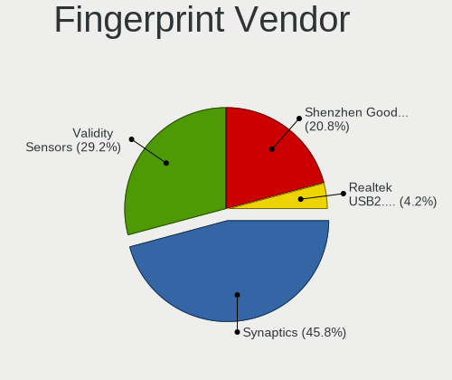

Arch - Hardware Trends (Notebooks)
----------------------------------

A project to identify most popular hardware characteristics and track their change
over time based on data collected by Linux users at https://Linux-Hardware.org.

Anyone can contribute to this report by the [hw-probe](https://github.com/linuxhw/hw-probe) tool:

    sudo -E hw-probe -all -upload

This report is for one last month. Overall report since the beginning of time: [TestDays](https://github.com/linuxhw/TestDays)

Period: Apr, 2024.

Contents
--------

* [ System ](#system)
  - [ OS                       ](#os)
  - [ OS Family                ](#os-family)
  - [ Kernel                   ](#kernel)
  - [ Kernel Family            ](#kernel-family)
  - [ Kernel Major Ver.        ](#kernel-major-ver)
  - [ Arch                     ](#arch)
  - [ DE                       ](#de)
  - [ Display Server           ](#display-server)
  - [ Display Manager          ](#display-manager)
  - [ OS Lang                  ](#os-lang)
  - [ Boot Mode                ](#boot-mode)
  - [ Filesystem               ](#filesystem)
  - [ Part. scheme             ](#part-scheme)
  - [ Dual Boot with Linux/BSD ](#dual-boot-with-linuxbsd)
  - [ Dual Boot (Win)          ](#dual-boot-win)

* [ Board ](#board)
  - [ Vendor                   ](#vendor)
  - [ Model                    ](#model)
  - [ Model Family             ](#model-family)
  - [ MFG Year                 ](#mfg-year)
  - [ Form Factor              ](#form-factor)
  - [ Secure Boot              ](#secure-boot)
  - [ Coreboot                 ](#coreboot)
  - [ RAM Size                 ](#ram-size)
  - [ RAM Used                 ](#ram-used)
  - [ Total Drives             ](#total-drives)
  - [ Has CD-ROM               ](#has-cd-rom)
  - [ Has Ethernet             ](#has-ethernet)
  - [ Has WiFi                 ](#has-wifi)
  - [ Has Bluetooth            ](#has-bluetooth)

* [ Location ](#location)
  - [ Country                  ](#country)
  - [ City                     ](#city)

* [ Drives ](#drives)
  - [ Drive Vendor             ](#drive-vendor)
  - [ Drive Model              ](#drive-model)
  - [ HDD Vendor               ](#hdd-vendor)
  - [ SSD Vendor               ](#ssd-vendor)
  - [ Drive Kind               ](#drive-kind)
  - [ Drive Connector          ](#drive-connector)
  - [ Drive Size               ](#drive-size)
  - [ Space Total              ](#space-total)
  - [ Space Used               ](#space-used)
  - [ Malfunc. Drives          ](#malfunc-drives)
  - [ Malfunc. Drive Vendor    ](#malfunc-drive-vendor)
  - [ Malfunc. HDD Vendor      ](#malfunc-hdd-vendor)
  - [ Malfunc. Drive Kind      ](#malfunc-drive-kind)
  - [ Failed Drives            ](#failed-drives)
  - [ Failed Drive Vendor      ](#failed-drive-vendor)
  - [ Drive Status             ](#drive-status)

* [ Storage controller ](#storage-controller)
  - [ Storage Vendor           ](#storage-vendor)
  - [ Storage Model            ](#storage-model)
  - [ Storage Kind             ](#storage-kind)

* [ Processor ](#processor)
  - [ CPU Vendor               ](#cpu-vendor)
  - [ CPU Model                ](#cpu-model)
  - [ CPU Model Family         ](#cpu-model-family)
  - [ CPU Cores                ](#cpu-cores)
  - [ CPU Sockets              ](#cpu-sockets)
  - [ CPU Threads              ](#cpu-threads)
  - [ CPU Op-Modes             ](#cpu-op-modes)
  - [ CPU Microcode            ](#cpu-microcode)
  - [ CPU Microarch            ](#cpu-microarch)

* [ Graphics ](#graphics)
  - [ GPU Vendor               ](#gpu-vendor)
  - [ GPU Model                ](#gpu-model)
  - [ GPU Combo                ](#gpu-combo)
  - [ GPU Driver               ](#gpu-driver)
  - [ GPU Memory               ](#gpu-memory)

* [ Monitor ](#monitor)
  - [ Monitor Vendor           ](#monitor-vendor)
  - [ Monitor Model            ](#monitor-model)
  - [ Monitor Resolution       ](#monitor-resolution)
  - [ Monitor Diagonal         ](#monitor-diagonal)
  - [ Monitor Width            ](#monitor-width)
  - [ Aspect Ratio             ](#aspect-ratio)
  - [ Monitor Area             ](#monitor-area)
  - [ Pixel Density            ](#pixel-density)
  - [ Multiple Monitors        ](#multiple-monitors)

* [ Network ](#network)
  - [ Net Controller Vendor    ](#net-controller-vendor)
  - [ Net Controller Model     ](#net-controller-model)
  - [ Wireless Vendor          ](#wireless-vendor)
  - [ Wireless Model           ](#wireless-model)
  - [ Ethernet Vendor          ](#ethernet-vendor)
  - [ Ethernet Model           ](#ethernet-model)
  - [ Net Controller Kind      ](#net-controller-kind)
  - [ Used Controller          ](#used-controller)
  - [ NICs                     ](#nics)
  - [ IPv6                     ](#ipv6)

* [ Bluetooth ](#bluetooth)
  - [ Bluetooth Vendor         ](#bluetooth-vendor)
  - [ Bluetooth Model          ](#bluetooth-model)

* [ Sound ](#sound)
  - [ Sound Vendor             ](#sound-vendor)
  - [ Sound Model              ](#sound-model)

* [ Memory ](#memory)
  - [ Memory Vendor            ](#memory-vendor)
  - [ Memory Model             ](#memory-model)
  - [ Memory Kind              ](#memory-kind)
  - [ Memory Form Factor       ](#memory-form-factor)
  - [ Memory Size              ](#memory-size)
  - [ Memory Speed             ](#memory-speed)

* [ Printers & scanners ](#printers--scanners)
  - [ Printer Vendor           ](#printer-vendor)
  - [ Printer Model            ](#printer-model)
  - [ Scanner Vendor           ](#scanner-vendor)
  - [ Scanner Model            ](#scanner-model)

* [ Camera ](#camera)
  - [ Camera Vendor            ](#camera-vendor)
  - [ Camera Model             ](#camera-model)

* [ Security ](#security)
  - [ Fingerprint Vendor       ](#fingerprint-vendor)
  - [ Fingerprint Model        ](#fingerprint-model)
  - [ Chipcard Vendor          ](#chipcard-vendor)
  - [ Chipcard Model           ](#chipcard-model)

* [ Unsupported ](#unsupported)
  - [ Unsupported Devices      ](#unsupported-devices)
  - [ Unsupported Device Types ](#unsupported-device-types)

System
------

OS
--

Installed operating systems

| Name         | Notebooks | Percent |
|--------------|-----------|---------|
| Arch Rolling | 129       | 100%    |

OS Family
---------

OS without a version

| Name | Notebooks | Percent |
|------|-----------|---------|
| Arch | 129       | 100%    |

Kernel
------

Version of the Linux kernel

| Version              | Notebooks | Percent |
|----------------------|-----------|---------|
| 6.8.7-arch1-1        | 32        | 24.81%  |
| 6.8.2-arch2-1        | 19        | 14.73%  |
| 6.8.4-arch1-1        | 12        | 9.3%    |
| 6.8.5-arch1-1        | 11        | 8.53%   |
| 6.8.7-arch1-2        | 8         | 6.2%    |
| 6.8.6-arch1-1        | 7         | 5.43%   |
| 6.6.27-1-lts         | 5         | 3.88%   |
| 6.6.23-1-lts         | 5         | 3.88%   |
| 6.8.4-zen1-1-zen     | 3         | 2.33%   |
| 6.8.2-zen2-1-zen     | 3         | 2.33%   |
| 6.8.1-arch1-1        | 3         | 2.33%   |
| 6.6.28-1-lts         | 3         | 2.33%   |
| 6.8.7-zen1-2-zen     | 2         | 1.55%   |
| 6.8.7-zen1-1-zen     | 2         | 1.55%   |
| 6.6.29-1-lts         | 2         | 1.55%   |
| 6.6.26-1-lts         | 2         | 1.55%   |
| 6.8.7-1-clear        | 1         | 0.78%   |
| 6.8.7-1-cachyos-bore | 1         | 0.78%   |
| 6.8.6-zen1-1-zen     | 1         | 0.78%   |
| 6.8.6-2-cachyos      | 1         | 0.78%   |
| 6.7.2-arch1-2        | 1         | 0.78%   |
| 6.6.28-2-lts         | 1         | 0.78%   |
| 6.6.25-1-lts         | 1         | 0.78%   |
| 6.6.1-arch1-1        | 1         | 0.78%   |
| 5.9.0-rc2-1-tkg-cfs  | 1         | 0.78%   |
| 5.15.94              | 1         | 0.78%   |

Kernel Family
-------------

Linux kernel without a distro release

| Version | Notebooks | Percent |
|---------|-----------|---------|
| 6.8.7   | 46        | 35.66%  |
| 6.8.2   | 22        | 17.05%  |
| 6.8.4   | 15        | 11.63%  |
| 6.8.5   | 11        | 8.53%   |
| 6.8.6   | 9         | 6.98%   |
| 6.6.27  | 5         | 3.88%   |
| 6.6.23  | 5         | 3.88%   |
| 6.6.28  | 4         | 3.1%    |
| 6.8.1   | 3         | 2.33%   |
| 6.6.29  | 2         | 1.55%   |
| 6.6.26  | 2         | 1.55%   |
| 6.7.2   | 1         | 0.78%   |
| 6.6.25  | 1         | 0.78%   |
| 6.6.1   | 1         | 0.78%   |
| 5.9.0   | 1         | 0.78%   |
| 5.15.94 | 1         | 0.78%   |

Kernel Major Ver.
-----------------

Linux kernel major version

| Version | Notebooks | Percent |
|---------|-----------|---------|
| 6.8     | 106       | 82.17%  |
| 6.6     | 20        | 15.5%   |
| 6.7     | 1         | 0.78%   |
| 5.9     | 1         | 0.78%   |
| 5.15    | 1         | 0.78%   |

Arch
----

OS architecture (x86_64, i586, etc.)

| Name   | Notebooks | Percent |
|--------|-----------|---------|
| x86_64 | 129       | 100%    |

DE
--

Desktop Environment

| Name          | Notebooks | Percent |
|---------------|-----------|---------|
| KDE6          | 39        | 30.23%  |
| GNOME         | 33        | 25.58%  |
| Hyprland      | 17        | 13.18%  |
| XFCE          | 11        | 8.53%   |
| Unknown       | 8         | 6.2%    |
| i3            | 7         | 5.43%   |
| KDE           | 4         | 3.1%    |
| qtile         | 2         | 1.55%   |
| bspwm         | 2         | 1.55%   |
| sway          | 1         | 0.78%   |
| LXDE          | 1         | 0.78%   |
| GNOME Classic | 1         | 0.78%   |
| dwm           | 1         | 0.78%   |
| dusk          | 1         | 0.78%   |
| awesome       | 1         | 0.78%   |

Display Server
--------------

X11 or Wayland

| Name    | Notebooks | Percent |
|---------|-----------|---------|
| Wayland | 68        | 52.71%  |
| X11     | 48        | 37.21%  |
| Unknown | 7         | 5.43%   |
| Tty     | 6         | 4.65%   |

Display Manager
---------------

SDDM, LightDM, etc.

| Name    | Notebooks | Percent |
|---------|-----------|---------|
| Unknown | 62        | 48.06%  |
| SDDM    | 35        | 27.13%  |
| GDM     | 13        | 10.08%  |
| LightDM | 12        | 9.3%    |
| LY-DM   | 3         | 2.33%   |
| SLiM    | 1         | 0.78%   |
| Ly      | 1         | 0.78%   |
| LXDM    | 1         | 0.78%   |
| GREETD  | 1         | 0.78%   |

OS Lang
-------

Language

| Lang    | Notebooks | Percent |
|---------|-----------|---------|
| en_US   | 79        | 61.24%  |
| C       | 9         | 6.98%   |
| ru_RU   | 6         | 4.65%   |
| en_GB   | 5         | 3.88%   |
| it_IT   | 4         | 3.1%    |
| de_DE   | 4         | 3.1%    |
| zh_CN   | 3         | 2.33%   |
| es_MX   | 3         | 2.33%   |
| sv_SE   | 2         | 1.55%   |
| pl_PL   | 2         | 1.55%   |
| fr_FR   | 2         | 1.55%   |
| pt_PT   | 1         | 0.78%   |
| es_EC   | 1         | 0.78%   |
| es_CL   | 1         | 0.78%   |
| es_AR   | 1         | 0.78%   |
| en_IN   | 1         | 0.78%   |
| en_IE   | 1         | 0.78%   |
| en_AU   | 1         | 0.78%   |
| de_CH   | 1         | 0.78%   |
| de_AT   | 1         | 0.78%   |
| Unknown | 1         | 0.78%   |

Boot Mode
---------

EFI or BIOS

| Mode | Notebooks | Percent |
|------|-----------|---------|
| EFI  | 83        | 64.34%  |
| BIOS | 46        | 35.66%  |

Filesystem
----------

Type of filesystem

| Type    | Notebooks | Percent |
|---------|-----------|---------|
| Ext4    | 78        | 60.47%  |
| Btrfs   | 45        | 34.88%  |
| Tmpfs   | 2         | 1.55%   |
| Xfs     | 1         | 0.78%   |
| Overlay | 1         | 0.78%   |
| Ext2    | 1         | 0.78%   |
| Unknown | 1         | 0.78%   |

Part. scheme
------------

Scheme of partitioning

| Type    | Notebooks | Percent |
|---------|-----------|---------|
| GPT     | 83        | 64.34%  |
| Unknown | 39        | 30.23%  |
| MBR     | 7         | 5.43%   |

Dual Boot with Linux/BSD
------------------------

Hosting more than one Linux/BSD

| Dual boot | Notebooks | Percent |
|-----------|-----------|---------|
| No        | 118       | 91.47%  |
| Yes       | 11        | 8.53%   |

Dual Boot (Win)
---------------

Hosting Linux and Windows

| Dual boot | Notebooks | Percent |
|-----------|-----------|---------|
| No        | 110       | 85.27%  |
| Yes       | 19        | 14.73%  |

Board
-----

Vendor
------

Motherboard manufacturer

| Name                             | Notebooks | Percent |
|----------------------------------|-----------|---------|
| Lenovo                           | 31        | 24.03%  |
| Hewlett-Packard                  | 21        | 16.28%  |
| ASUSTek Computer                 | 18        | 13.95%  |
| Dell                             | 13        | 10.08%  |
| Acer                             | 7         | 5.43%   |
| HUAWEI                           | 6         | 4.65%   |
| Apple                            | 5         | 3.88%   |
| Notebook                         | 4         | 3.1%    |
| TUXEDO                           | 2         | 1.55%   |
| Toshiba                          | 2         | 1.55%   |
| HONOR                            | 2         | 1.55%   |
| Gigabyte Technology              | 2         | 1.55%   |
| Framework                        | 2         | 1.55%   |
| XMG                              | 1         | 0.78%   |
| XIAOMI                           | 1         | 0.78%   |
| SKIKK                            | 1         | 0.78%   |
| Samsung Electronics              | 1         | 0.78%   |
| Positivo                         | 1         | 0.78%   |
| N-one                            | 1         | 0.78%   |
| MSI                              | 1         | 0.78%   |
| Micro Computer (HK) Tech Limited | 1         | 0.78%   |
| Mediacom                         | 1         | 0.78%   |
| Maibenben                        | 1         | 0.78%   |
| Intel Client Systems             | 1         | 0.78%   |
| Google                           | 1         | 0.78%   |
| Gateway                          | 1         | 0.78%   |
| Unknown                          | 1         | 0.78%   |

Model
-----

Motherboard model

| Name                                     | Notebooks | Percent |
|------------------------------------------|-----------|---------|
| HUAWEI HVY-WXX9                          | 3         | 2.33%   |
| HP Laptop 14-fq0xxx                      | 3         | 2.33%   |
| Framework Laptop                         | 2         | 1.55%   |
| ASUS X553MA                              | 2         | 1.55%   |
| XMG N85_N87,HJ,HJ1,HK1                   | 1         | 0.78%   |
| XIAOMI Redmi Book Pro 15 2023            | 1         | 0.78%   |
| TUXEDO InfinityBook S Gen8               | 1         | 0.78%   |
| TUXEDO InfinityBook Pro Gen8 (MK2)       | 1         | 0.78%   |
| Toshiba Satellite C850-124               | 1         | 0.78%   |
| Toshiba Satellite C670-12E               | 1         | 0.78%   |
| SKIKK Freya                              | 1         | 0.78%   |
| Samsung 950XDB/951XDB/950XDY             | 1         | 0.78%   |
| Positivo Mobile                          | 1         | 0.78%   |
| Notebook W230ST                          | 1         | 0.78%   |
| Notebook PD5x_7xSNC_SND_SNE              | 1         | 0.78%   |
| Notebook PA70ES                          | 1         | 0.78%   |
| Notebook N141CU                          | 1         | 0.78%   |
| N-one Nbook Ultra                        | 1         | 0.78%   |
| MSI Modern 14 B5M                        | 1         | 0.78%   |
| Micro (HK) Tech Limited HX100G           | 1         | 0.78%   |
| Mediacom SmartBook 14 FullHD - SB14UC    | 1         | 0.78%   |
| Maibenben MaiBook X series               | 1         | 0.78%   |
| Lenovo Yoga Slim 7 Carbon 14ACN6 82L0    | 1         | 0.78%   |
| Lenovo Yoga Pro 7 14APH8 82Y8            | 1         | 0.78%   |
| Lenovo XiaoXinPro 16 AHP9 83D5           | 1         | 0.78%   |
| Lenovo V15 G3 ABA 82TV                   | 1         | 0.78%   |
| Lenovo ThinkPad X61 7673V4Q              | 1         | 0.78%   |
| Lenovo ThinkPad X230 2324F43             | 1         | 0.78%   |
| Lenovo ThinkPad X13 Gen 3 21BN00CSGE     | 1         | 0.78%   |
| Lenovo ThinkPad X1 Carbon 3rd 20BTS2U500 | 1         | 0.78%   |
| Lenovo ThinkPad W540 20BG0044UK          | 1         | 0.78%   |
| Lenovo ThinkPad T580 20LAS2VM00          | 1         | 0.78%   |
| Lenovo ThinkPad T480s 20L8S78900         | 1         | 0.78%   |
| Lenovo ThinkPad T480 20L6S0DH0V          | 1         | 0.78%   |
| Lenovo ThinkPad T440p 20ANCTO1WW         | 1         | 0.78%   |
| Lenovo ThinkPad T430 2349QF4             | 1         | 0.78%   |
| Lenovo ThinkPad T16 Gen 1 21CH000JUS     | 1         | 0.78%   |
| Lenovo ThinkPad T14s Gen 3 21BRCTO1WW    | 1         | 0.78%   |
| Lenovo ThinkPad P52 20M9CTO1WW           | 1         | 0.78%   |
| Lenovo ThinkPad P16s Gen 1 21CK0024US    | 1         | 0.78%   |

Model Family
------------

Motherboard model prefix

| Name                           | Notebooks | Percent |
|--------------------------------|-----------|---------|
| Lenovo ThinkPad                | 19        | 14.73%  |
| HP Laptop                      | 7         | 5.43%   |
| ASUS ROG                       | 5         | 3.88%   |
| Lenovo Legion                  | 4         | 3.1%    |
| HP Pavilion                    | 4         | 3.1%    |
| ASUS VivoBook                  | 4         | 3.1%    |
| Acer Aspire                    | 4         | 3.1%    |
| HUAWEI HVY-WXX9                | 3         | 2.33%   |
| HP EliteBook                   | 3         | 2.33%   |
| Dell XPS                       | 3         | 2.33%   |
| Dell Precision                 | 3         | 2.33%   |
| Dell Latitude                  | 3         | 2.33%   |
| ASUS ASUS                      | 3         | 2.33%   |
| Acer Swift                     | 3         | 2.33%   |
| TUXEDO InfinityBook            | 2         | 1.55%   |
| Toshiba Satellite              | 2         | 1.55%   |
| Lenovo Yoga                    | 2         | 1.55%   |
| Lenovo IdeaPad                 | 2         | 1.55%   |
| HP Victus                      | 2         | 1.55%   |
| HP OMEN                        | 2         | 1.55%   |
| Framework Laptop               | 2         | 1.55%   |
| Dell Inspiron                  | 2         | 1.55%   |
| Dell G15                       | 2         | 1.55%   |
| ASUS X553MA                    | 2         | 1.55%   |
| XMG N85                        | 1         | 0.78%   |
| XIAOMI Redmi                   | 1         | 0.78%   |
| SKIKK Freya                    | 1         | 0.78%   |
| Samsung 950XDB                 | 1         | 0.78%   |
| Positivo Mobile                | 1         | 0.78%   |
| Notebook W230ST                | 1         | 0.78%   |
| Notebook PD5x                  | 1         | 0.78%   |
| Notebook PA70ES                | 1         | 0.78%   |
| Notebook N141CU                | 1         | 0.78%   |
| N-one Nbook                    | 1         | 0.78%   |
| MSI Modern                     | 1         | 0.78%   |
| Micro (HK) Tech Limited HX100G | 1         | 0.78%   |
| Mediacom SmartBook             | 1         | 0.78%   |
| Maibenben MaiBook              | 1         | 0.78%   |
| Lenovo XiaoXinPro              | 1         | 0.78%   |
| Lenovo V15                     | 1         | 0.78%   |

MFG Year
--------

Motherboard manufacture year

| Year    | Notebooks | Percent |
|---------|-----------|---------|
| 2023    | 22        | 17.05%  |
| 2021    | 17        | 13.18%  |
| 2020    | 16        | 12.4%   |
| 2022    | 14        | 10.85%  |
| 2018    | 8         | 6.2%    |
| 2016    | 7         | 5.43%   |
| 2019    | 6         | 4.65%   |
| 2013    | 6         | 4.65%   |
| 2024    | 5         | 3.88%   |
| 2017    | 4         | 3.1%    |
| 2015    | 4         | 3.1%    |
| 2012    | 4         | 3.1%    |
| 2011    | 4         | 3.1%    |
| 2014    | 3         | 2.33%   |
| 2010    | 2         | 1.55%   |
| 2009    | 2         | 1.55%   |
| 2008    | 2         | 1.55%   |
| 2007    | 2         | 1.55%   |
| Unknown | 1         | 0.78%   |

Form Factor
-----------

Physical design of the computer

| Name     | Notebooks | Percent |
|----------|-----------|---------|
| Notebook | 129       | 100%    |

Secure Boot
-----------

Enabled or disabled

| State    | Notebooks | Percent |
|----------|-----------|---------|
| Disabled | 122       | 94.57%  |
| Enabled  | 7         | 5.43%   |

Coreboot
--------

Have coreboot on board

| Used | Notebooks | Percent |
|------|-----------|---------|
| No   | 128       | 99.22%  |
| Yes  | 1         | 0.78%   |

RAM Size
--------

Total RAM memory

| Size in GB  | Notebooks | Percent |
|-------------|-----------|---------|
| 4.01-8.0    | 32        | 24.81%  |
| 8.01-16.0   | 26        | 20.16%  |
| 32.01-64.0  | 24        | 18.6%   |
| 16.01-24.0  | 23        | 17.83%  |
| 3.01-4.0    | 9         | 6.98%   |
| 64.01-256.0 | 7         | 5.43%   |
| 24.01-32.0  | 6         | 4.65%   |
| 1.01-2.0    | 2         | 1.55%   |

RAM Used
--------

Used RAM memory

| Used GB    | Notebooks | Percent |
|------------|-----------|---------|
| 4.01-8.0   | 38        | 29.46%  |
| 2.01-3.0   | 32        | 24.81%  |
| 1.01-2.0   | 19        | 14.73%  |
| 3.01-4.0   | 17        | 13.18%  |
| 8.01-16.0  | 16        | 12.4%   |
| 0.51-1.0   | 6         | 4.65%   |
| 16.01-24.0 | 1         | 0.78%   |

Total Drives
------------

Number of drives on board

| Drives | Notebooks | Percent |
|--------|-----------|---------|
| 1      | 91        | 70.54%  |
| 2      | 32        | 24.81%  |
| 3      | 5         | 3.88%   |
| 4      | 1         | 0.78%   |

Has CD-ROM
----------

Has CD-ROM on board

| Presented | Notebooks | Percent |
|-----------|-----------|---------|
| No        | 109       | 84.5%   |
| Yes       | 20        | 15.5%   |

Has Ethernet
------------

Has Ethernet on board

| Presented | Notebooks | Percent |
|-----------|-----------|---------|
| Yes       | 89        | 68.99%  |
| No        | 40        | 31.01%  |

Has WiFi
--------

Has WiFi module

| Presented | Notebooks | Percent |
|-----------|-----------|---------|
| Yes       | 128       | 99.22%  |
| No        | 1         | 0.78%   |

Has Bluetooth
-------------

Has Bluetooth module

| Presented | Notebooks | Percent |
|-----------|-----------|---------|
| Yes       | 119       | 92.25%  |
| No        | 10        | 7.75%   |

Location
--------

Country
-------

Geographic location (country)

| Country         | Notebooks | Percent |
|-----------------|-----------|---------|
| USA             | 22        | 17.05%  |
| Russia          | 11        | 8.53%   |
| Germany         | 11        | 8.53%   |
| UK              | 7         | 5.43%   |
| Mexico          | 6         | 4.65%   |
| Italy           | 5         | 3.88%   |
| Poland          | 4         | 3.1%    |
| India           | 4         | 3.1%    |
| France          | 4         | 3.1%    |
| Sweden          | 3         | 2.33%   |
| Norway          | 3         | 2.33%   |
| Netherlands     | 3         | 2.33%   |
| Canada          | 3         | 2.33%   |
| Vietnam         | 2         | 1.55%   |
| Turkey          | 2         | 1.55%   |
| Spain           | 2         | 1.55%   |
| South Africa    | 2         | 1.55%   |
| Romania         | 2         | 1.55%   |
| Hong Kong       | 2         | 1.55%   |
| China           | 2         | 1.55%   |
| Brazil          | 2         | 1.55%   |
| Belarus         | 2         | 1.55%   |
| Australia       | 2         | 1.55%   |
| Argentina       | 2         | 1.55%   |
| Venezuela       | 1         | 0.78%   |
| Tunisia         | 1         | 0.78%   |
| Taiwan          | 1         | 0.78%   |
| Switzerland     | 1         | 0.78%   |
| South Korea     | 1         | 0.78%   |
| Slovenia        | 1         | 0.78%   |
| Puerto Rico     | 1         | 0.78%   |
| Panama          | 1         | 0.78%   |
| North Macedonia | 1         | 0.78%   |
| Morocco         | 1         | 0.78%   |
| Moldova         | 1         | 0.78%   |
| Kazakhstan      | 1         | 0.78%   |
| Ireland         | 1         | 0.78%   |
| Indonesia       | 1         | 0.78%   |
| Hungary         | 1         | 0.78%   |
| Egypt           | 1         | 0.78%   |

City
----

Geographic location (city)

| City            | Notebooks | Percent |
|-----------------|-----------|---------|
| Moscow          | 4         | 3.1%    |
| Stockholm       | 2         | 1.55%   |
| Paris           | 2         | 1.55%   |
| Minsk           | 2         | 1.55%   |
| Johnson City    | 2         | 1.55%   |
| Bengaluru       | 2         | 1.55%   |
| Zagazig         | 1         | 0.78%   |
| Yogyakarta      | 1         | 0.78%   |
| Yekaterinburg   | 1         | 0.78%   |
| Wormerveer      | 1         | 0.78%   |
| Winterswijk     | 1         | 0.78%   |
| Winchester      | 1         | 0.78%   |
| Weissenfels     | 1         | 0.78%   |
| Washington      | 1         | 0.78%   |
| Warsaw          | 1         | 0.78%   |
| Wandsworth      | 1         | 0.78%   |
| Wachock         | 1         | 0.78%   |
| Vitry-sur-Seine | 1         | 0.78%   |
| Virginia Beach  | 1         | 0.78%   |
| Vienna          | 1         | 0.78%   |
| Tunis           | 1         | 0.78%   |
| Tulcea          | 1         | 0.78%   |
| Trinity         | 1         | 0.78%   |
| Tomsk           | 1         | 0.78%   |
| Tlalnepantla    | 1         | 0.78%   |
| The Peak        | 1         | 0.78%   |
| Targoviste      | 1         | 0.78%   |
| Szczecin        | 1         | 0.78%   |
| Sunshine West   | 1         | 0.78%   |
| Sungurlu        | 1         | 0.78%   |
| St Petersburg   | 1         | 0.78%   |
| Southampton     | 1         | 0.78%   |
| Somaglia        | 1         | 0.78%   |
| Smolensk        | 1         | 0.78%   |
| Skopje          | 1         | 0.78%   |
| Secaucus        | 1         | 0.78%   |
| Santa Maria     | 1         | 0.78%   |
| San Juan        | 1         | 0.78%   |
| Sabadell        | 1         | 0.78%   |
| Rexburg         | 1         | 0.78%   |

Drives
------

Drive Vendor
------------

Hard drive vendors

| Vendor                         | Notebooks | Drives | Percent |
|--------------------------------|-----------|--------|---------|
| Samsung Electronics            | 39        | 48     | 24.38%  |
| Sandisk                        | 20        | 22     | 12.5%   |
| Intel                          | 10        | 11     | 6.25%   |
| Seagate                        | 8         | 8      | 5%      |
| SK hynix                       | 7         | 7      | 4.38%   |
| Toshiba                        | 6         | 6      | 3.75%   |
| Unknown                        | 5         | 5      | 3.13%   |
| Micron Technology              | 5         | 5      | 3.13%   |
| Kingston                       | 5         | 5      | 3.13%   |
| KIOXIA                         | 4         | 4      | 2.5%    |
| Apple                          | 4         | 4      | 2.5%    |
| MAXIO Technology (Hangzhou)    | 3         | 3      | 1.88%   |
| A-DATA Technology              | 3         | 3      | 1.88%   |
| Yangtze Memory Technologies    | 2         | 2      | 1.25%   |
| WDC                            | 2         | 2      | 1.25%   |
| Solid State Storage Technology | 2         | 2      | 1.25%   |
| Silicon Motion                 | 2         | 2      | 1.25%   |
| Realtek                        | 2         | 2      | 1.25%   |
| Micron/Crucial Technology      | 2         | 2      | 1.25%   |
| KingSpec                       | 2         | 2      | 1.25%   |
| HGST                           | 2         | 2      | 1.25%   |
| Fujitsu                        | 2         | 2      | 1.25%   |
| Crucial                        | 2         | 2      | 1.25%   |
| China                          | 2         | 2      | 1.25%   |
| XSJ-X100-256GB                 | 1         | 1      | 0.63%   |
| XPG                            | 1         | 1      | 0.63%   |
| WALRAM                         | 1         | 1      | 0.63%   |
| Union Memory                   | 1         | 1      | 0.63%   |
| Transcend                      | 1         | 1      | 0.63%   |
| StoreJet                       | 1         | 1      | 0.63%   |
| Realtek Semiconductor          | 1         | 1      | 0.63%   |
| PNY                            | 1         | 1      | 0.63%   |
| Phison Electronics             | 1         | 1      | 0.63%   |
| Patriot                        | 1         | 1      | 0.63%   |
| Kingston Technology Company    | 1         | 1      | 0.63%   |
| KingDian                       | 1         | 1      | 0.63%   |
| INTEL SS                       | 1         | 1      | 0.63%   |
| HS-SSD-E100                    | 1         | 1      | 0.63%   |
| Hitachi                        | 1         | 1      | 0.63%   |
| Fanxiang                       | 1         | 1      | 0.63%   |

Drive Model
-----------

Hard drive models

| Model                                              | Notebooks | Percent |
|----------------------------------------------------|-----------|---------|
| Samsung NVMe SSD Controller SM981/PM981/PM983 1TB  | 13        | 7.69%   |
| Samsung NVMe SSD Controller PM9A1/PM9A3/980PRO 1TB | 6         | 3.55%   |
| Sandisk WD Black SN850 512GB                       | 4         | 2.37%   |
| Sandisk WD Blue SN550 NVMe SSD 2TB                 | 3         | 1.78%   |
| Sandisk WD Black SN750 / PC SN730 NVMe SSD 512GB   | 3         | 1.78%   |
| Samsung MZNLH128HBHQ-000H1 128GB SSD               | 3         | 1.78%   |
| Intel SSDPEKNU512GZ 512GB                          | 3         | 1.78%   |
| Toshiba XG6 NVMe SSD Controller 1024GB             | 2         | 1.18%   |
| Solid State Storage CL4-3D512-Q11 NVMe SSSTC 512GB | 2         | 1.18%   |
| SK hynix HFS128G39TND-N210A 128GB SSD              | 2         | 1.18%   |
| Seagate ST500LT012-1DG142 500GB                    | 2         | 1.18%   |
| Seagate ST1000LM049-2GH172 1TB                     | 2         | 1.18%   |
| Seagate ST1000LM024 HN-M101MBB 1TB                 | 2         | 1.18%   |
| Samsung SSD 990 PRO 2TB                            | 2         | 1.18%   |
| Samsung SSD 840 PRO Series 256GB                   | 2         | 1.18%   |
| Samsung MZALQ512HBLU-00BL2 512GB                   | 2         | 1.18%   |
| MAXIO (Hangzhou) NVMe SSD Controller MAP1202 256GB | 2         | 1.18%   |
| Intel SSD 660P Series 1024GB                       | 2         | 1.18%   |
| Yangtze Memory YMTC PC300-512GB-B                  | 1         | 0.59%   |
| Yangtze Memory YMTC PC005 512GB                    | 1         | 0.59%   |
| XSJ-X100-256GB SJ-X100-256GB SSD                   | 1         | 0.59%   |
| XPG NVMe SSD Drive 2TB                             | 1         | 0.59%   |
| WDC WDS100T2G0A-00JH30 1TB SSD                     | 1         | 0.59%   |
| WDC WD10SPSX-00A6WT0 1TB                           | 1         | 0.59%   |
| WALRAM SSD 1TB                                     | 1         | 0.59%   |
| Unknown MMC Card  64GB                             | 1         | 0.59%   |
| Unknown MMC Card  32GB                             | 1         | 0.59%   |
| Unknown MMC Card  256GB                            | 1         | 0.59%   |
| Unknown MMC Card  16GB                             | 1         | 0.59%   |
| Unknown MMC Card  128GB                            | 1         | 0.59%   |
| Union Memory UMIS RPJTJ128MEE1MWX 128GB            | 1         | 0.59%   |
| Transcend TS512GMTS430S 512GB SSD                  | 1         | 0.59%   |
| Toshiba MQ04ABF100 1TB                             | 1         | 0.59%   |
| Toshiba MQ01ABD075 752GB                           | 1         | 0.59%   |
| Toshiba MK3259GSXP 320GB                           | 1         | 0.59%   |
| Toshiba MK1216GSG 120GB                            | 1         | 0.59%   |
| StoreJet Disk 2TB                                  | 1         | 0.59%   |
| SK hynix PC601 HFS512GD9TNG-L2A0A 512GB            | 1         | 0.59%   |
| SK hynix HFM512GD3JX016N 512GB                     | 1         | 0.59%   |
| SK hynix BC711 NVMe 512GB                          | 1         | 0.59%   |

HDD Vendor
----------

Hard disk drive vendors

| Vendor              | Notebooks | Drives | Percent |
|---------------------|-----------|--------|---------|
| Seagate             | 7         | 7      | 35%     |
| Toshiba             | 4         | 4      | 20%     |
| HGST                | 2         | 2      | 10%     |
| Fujitsu             | 2         | 2      | 10%     |
| WDC                 | 1         | 1      | 5%      |
| StoreJet            | 1         | 1      | 5%      |
| Samsung Electronics | 1         | 1      | 5%      |
| Hitachi             | 1         | 1      | 5%      |
| External            | 1         | 1      | 5%      |

SSD Vendor
----------

Solid state drive vendors

| Vendor              | Notebooks | Drives | Percent |
|---------------------|-----------|--------|---------|
| Samsung Electronics | 13        | 15     | 28.26%  |
| Apple               | 4         | 4      | 8.7%    |
| SanDisk             | 3         | 3      | 6.52%   |
| Intel               | 3         | 3      | 6.52%   |
| A-DATA Technology   | 3         | 3      | 6.52%   |
| SK hynix            | 2         | 2      | 4.35%   |
| Kingston            | 2         | 2      | 4.35%   |
| KingSpec            | 2         | 2      | 4.35%   |
| Crucial             | 2         | 2      | 4.35%   |
| China               | 2         | 2      | 4.35%   |
| XSJ-X100-256GB      | 1         | 1      | 2.17%   |
| WDC                 | 1         | 1      | 2.17%   |
| WALRAM              | 1         | 1      | 2.17%   |
| Transcend           | 1         | 1      | 2.17%   |
| PNY                 | 1         | 1      | 2.17%   |
| Patriot             | 1         | 1      | 2.17%   |
| KingDian            | 1         | 1      | 2.17%   |
| INTEL SS            | 1         | 1      | 2.17%   |
| HS-SSD-E100         | 1         | 1      | 2.17%   |
| Fanxiang            | 1         | 1      | 2.17%   |

Drive Kind
----------

HDD or SSD

| Kind    | Notebooks | Drives | Percent |
|---------|-----------|--------|---------|
| NVMe    | 82        | 98     | 55.03%  |
| SSD     | 43        | 48     | 28.86%  |
| HDD     | 18        | 20     | 12.08%  |
| MMC     | 5         | 5      | 3.36%   |
| Unknown | 1         | 1      | 0.67%   |

Drive Connector
---------------

SATA, SAS, NVMe, etc.

| Type | Notebooks | Drives | Percent |
|------|-----------|--------|---------|
| NVMe | 82        | 96     | 55.41%  |
| SATA | 52        | 62     | 35.14%  |
| SAS  | 9         | 9      | 6.08%   |
| MMC  | 5         | 5      | 3.38%   |

Drive Size
----------

Size of hard drive

| Size in TB | Notebooks | Drives | Percent |
|------------|-----------|--------|---------|
| 0.01-0.5   | 42        | 45     | 66.67%  |
| 0.51-1.0   | 18        | 20     | 28.57%  |
| 1.01-2.0   | 3         | 3      | 4.76%   |

Space Total
-----------

Amount of disk space available on the file system

| Size in GB     | Notebooks | Percent |
|----------------|-----------|---------|
| 251-500        | 41        | 31.78%  |
| 501-1000       | 23        | 17.83%  |
| 101-250        | 20        | 15.5%   |
| More than 3000 | 13        | 10.08%  |
| 2001-3000      | 13        | 10.08%  |
| 1001-2000      | 12        | 9.3%    |
| 51-100         | 4         | 3.1%    |
| 21-50          | 2         | 1.55%   |
| Unknown        | 1         | 0.78%   |

Space Used
----------

Amount of used disk space

| Used GB        | Notebooks | Percent |
|----------------|-----------|---------|
| 1-20           | 29        | 22.48%  |
| 21-50          | 22        | 17.05%  |
| 101-250        | 22        | 17.05%  |
| 1001-2000      | 13        | 10.08%  |
| 51-100         | 13        | 10.08%  |
| 251-500        | 11        | 8.53%   |
| 501-1000       | 11        | 8.53%   |
| More than 3000 | 6         | 4.65%   |
| 2001-3000      | 1         | 0.78%   |
| Unknown        | 1         | 0.78%   |

Malfunc. Drives
---------------

Drive models with a malfunction

| Model                                                         | Notebooks | Drives | Percent |
|---------------------------------------------------------------|-----------|--------|---------|
| Toshiba MQ01ABD075 752GB                                      | 1         | 1      | 33.33%  |
| Solid State Storage Technology CL4-3D512-Q11 NVMe SSSTC 512GB | 1         | 1      | 33.33%  |
| HGST HTS725050A7E630 500GB                                    | 1         | 1      | 33.33%  |

Malfunc. Drive Vendor
---------------------

Vendors of faulty drives

| Vendor                         | Notebooks | Drives | Percent |
|--------------------------------|-----------|--------|---------|
| Toshiba                        | 1         | 1      | 33.33%  |
| Solid State Storage Technology | 1         | 1      | 33.33%  |
| HGST                           | 1         | 1      | 33.33%  |

Malfunc. HDD Vendor
-------------------

Vendors of faulty HDD drives

| Vendor  | Notebooks | Drives | Percent |
|---------|-----------|--------|---------|
| Toshiba | 1         | 1      | 50%     |
| HGST    | 1         | 1      | 50%     |

Malfunc. Drive Kind
-------------------

Kinds of faulty drives

| Kind | Notebooks | Drives | Percent |
|------|-----------|--------|---------|
| HDD  | 2         | 2      | 66.67%  |
| NVMe | 1         | 1      | 33.33%  |

Failed Drives
-------------

Failed drive models

Zero info for selected period =(

Failed Drive Vendor
-------------------

Failed drive vendors

Zero info for selected period =(

Drive Status
------------

Number of failed and malfunc. drives

| Status   | Notebooks | Drives | Percent |
|----------|-----------|--------|---------|
| Works    | 67        | 89     | 49.63%  |
| Detected | 65        | 80     | 48.15%  |
| Malfunc  | 3         | 3      | 2.22%   |

Storage controller
------------------

Storage Vendor
--------------

Storage controller vendors

| Vendor                           | Notebooks | Percent |
|----------------------------------|-----------|---------|
| Intel                            | 60        | 38.46%  |
| Samsung Electronics              | 30        | 19.23%  |
| SanDisk                          | 17        | 10.9%   |
| AMD                              | 10        | 6.41%   |
| SK hynix                         | 5         | 3.21%   |
| Micron Technology                | 5         | 3.21%   |
| KIOXIA                           | 4         | 2.56%   |
| Kingston Technology Company      | 4         | 2.56%   |
| MAXIO Technology (Hangzhou)      | 3         | 1.92%   |
| Yangtze Memory Technologies      | 2         | 1.28%   |
| Toshiba America Info Systems     | 2         | 1.28%   |
| Solid State Storage Technology   | 2         | 1.28%   |
| Silicon Motion                   | 2         | 1.28%   |
| Micron/Crucial Technology        | 2         | 1.28%   |
| Union Memory (Shenzhen)          | 1         | 0.64%   |
| Silicon Integrated Systems [SiS] | 1         | 0.64%   |
| Realtek Semiconductor            | 1         | 0.64%   |
| Phison Electronics               | 1         | 0.64%   |
| Nvidia                           | 1         | 0.64%   |
| INNOGRIT                         | 1         | 0.64%   |
| Biwin Storage Technology         | 1         | 0.64%   |
| ADATA Technology                 | 1         | 0.64%   |

Storage Model
-------------

Storage controller models

| Model                                                                          | Notebooks | Percent |
|--------------------------------------------------------------------------------|-----------|---------|
| Samsung NVMe SSD Controller SM981/PM981/PM983                                  | 13        | 7.69%   |
| AMD FCH SATA Controller [AHCI mode]                                            | 10        | 5.92%   |
| Samsung NVMe SSD Controller PM9A1/PM9A3/980PRO                                 | 6         | 3.55%   |
| Intel Volume Management Device NVMe RAID Controller                            | 6         | 3.55%   |
| Intel Sunrise Point-LP SATA Controller [AHCI mode]                             | 6         | 3.55%   |
| Intel 7 Series Chipset Family 6-port SATA Controller [AHCI mode]               | 6         | 3.55%   |
| Samsung NVMe SSD Controller 980 (DRAM-less)                                    | 5         | 2.96%   |
| Intel Cannon Lake Mobile PCH SATA AHCI Controller                              | 5         | 2.96%   |
| Intel 82801 Mobile SATA Controller [RAID mode]                                 | 5         | 2.96%   |
| SanDisk WD PC SN810 / Black SN850 NVMe SSD                                     | 4         | 2.37%   |
| Intel Wildcat Point-LP SATA Controller [AHCI Mode]                             | 4         | 2.37%   |
| SK hynix Gold P31/BC711/PC711 NVMe Solid State Drive                           | 3         | 1.78%   |
| SanDisk Ultra 3D / WD Blue SN550 NVMe SSD                                      | 3         | 1.78%   |
| SanDisk Extreme Pro / WD Black SN750 / PC SN730 / Red SN700 NVMe SSD           | 3         | 1.78%   |
| Samsung S4LN058A01[SSUBX] AHCI SSD Controller (Apple slot)                     | 3         | 1.78%   |
| Samsung NVMe SSD Controller S4LV008[Pascal]                                    | 3         | 1.78%   |
| KIOXIA NVMe SSD Controller BG5 (DRAM-less)                                     | 3         | 1.78%   |
| Intel Volume Management Device NVMe RAID Controller Intel Corporation          | 3         | 1.78%   |
| Intel Tiger Lake-LP SATA Controller                                            | 3         | 1.78%   |
| Intel SSD 670p Series [Keystone Harbor]                                        | 3         | 1.78%   |
| Intel HM170/QM170 Chipset SATA Controller [AHCI Mode]                          | 3         | 1.78%   |
| Intel 8 Series/C220 Series Chipset Family 6-port SATA Controller 1 [AHCI mode] | 3         | 1.78%   |
| Intel 6 Series/C200 Series Chipset Family 6 port Mobile SATA AHCI Controller   | 3         | 1.78%   |
| Toshiba America Info Systems XG6 NVMe SSD Controller                           | 2         | 1.18%   |
| Solid State Storage CL4-8D512 NVMe SSD M.2 (DRAM-less)                         | 2         | 1.18%   |
| Sandisk WD PC SN740 NVMe SSD 512GB (DRAM-less)                                 | 2         | 1.18%   |
| SanDisk WD Blue SN570 NVMe SSD 2TB                                             | 2         | 1.18%   |
| SanDisk WD Black SN770 / PC SN740 256GB / PC SN560 (DRAM-less) NVMe SSD        | 2         | 1.18%   |
| Micron 3400 NVMe SSD [Hendrix]                                                 | 2         | 1.18%   |
| Micron 2450 NVMe SSD [HendrixV] (DRAM-less)                                    | 2         | 1.18%   |
| MAXIO (Hangzhou) NVMe SSD Controller MAP1202 (DRAM-less)                       | 2         | 1.18%   |
| Kingston Company NV2 NVMe SSD SM2267XT (DRAM-less)                             | 2         | 1.18%   |
| Intel SSD 660P Series                                                          | 2         | 1.18%   |
| Intel Comet Lake SATA AHCI Controller                                          | 2         | 1.18%   |
| Intel 400 Series Chipset Family SATA AHCI Controller                           | 2         | 1.18%   |
| Yangtze Memory PC300 NVMe SSD (DRAM-less)                                      | 1         | 0.59%   |
| Yangtze Memory PC005 NVMe SSD                                                  | 1         | 0.59%   |
| Union Memory (Shenzhen) AM620 PCIe 3.0 NVMe SSD 128GB                          | 1         | 0.59%   |
| SK hynix PC601 NVMe Solid State Drive                                          | 1         | 0.59%   |
| SK hynix BC501 NVMe Solid State Drive                                          | 1         | 0.59%   |

Storage Kind
------------

Kind of storage controller (IDE, SATA, NVMe, SAS, ...)

| Kind | Notebooks | Percent |
|------|-----------|---------|
| NVMe | 82        | 51.57%  |
| SATA | 60        | 37.74%  |
| RAID | 14        | 8.81%   |
| IDE  | 3         | 1.89%   |

Processor
---------

CPU Vendor
----------

Processor vendors

| Vendor | Notebooks | Percent |
|--------|-----------|---------|
| Intel  | 92        | 71.32%  |
| AMD    | 37        | 28.68%  |

CPU Model
---------

Processor models

| Model                                        | Notebooks | Percent |
|----------------------------------------------|-----------|---------|
| AMD Ryzen 7 5700U with Radeon Graphics       | 5         | 3.88%   |
| Intel 11th Gen Core i5-1135G7 @ 2.40GHz      | 4         | 3.1%    |
| AMD Athlon Silver 3050U with Radeon Graphics | 4         | 3.1%    |
| Intel 13th Gen Core i7-1360P                 | 3         | 2.33%   |
| Intel 12th Gen Core i7-12700H                | 3         | 2.33%   |
| Intel 11th Gen Core i7-1165G7 @ 2.80GHz      | 3         | 2.33%   |
| AMD Ryzen 5 4600H with Radeon Graphics       | 3         | 2.33%   |
| Intel Core i7-9750H CPU @ 2.60GHz            | 2         | 1.55%   |
| Intel Core i7-8750H CPU @ 2.20GHz            | 2         | 1.55%   |
| Intel Core i7-7700HQ CPU @ 2.80GHz           | 2         | 1.55%   |
| Intel Core i7-2670QM CPU @ 2.20GHz           | 2         | 1.55%   |
| Intel Core i5-8250U CPU @ 1.60GHz            | 2         | 1.55%   |
| Intel Core i5-7200U CPU @ 2.50GHz            | 2         | 1.55%   |
| Intel Core i5-5200U CPU @ 2.20GHz            | 2         | 1.55%   |
| Intel Core i5-3320M CPU @ 2.60GHz            | 2         | 1.55%   |
| Intel Core i5-1035G1 CPU @ 1.00GHz           | 2         | 1.55%   |
| Intel Core i5-10210U CPU @ 1.60GHz           | 2         | 1.55%   |
| Intel Celeron CPU N2840 @ 2.16GHz            | 2         | 1.55%   |
| Intel 13th Gen Core i9-13900HX               | 2         | 1.55%   |
| Intel 12th Gen Core i5-12500H                | 2         | 1.55%   |
| Intel 11th Gen Core i7-1185G7 @ 3.00GHz      | 2         | 1.55%   |
| Intel 11th Gen Core i5-11300H @ 3.10GHz      | 2         | 1.55%   |
| AMD Ryzen 7 PRO 6850U with Radeon Graphics   | 2         | 1.55%   |
| AMD Ryzen 7 7840HS w/ Radeon 780M Graphics   | 2         | 1.55%   |
| AMD Ryzen 7 5800H with Radeon Graphics       | 2         | 1.55%   |
| AMD Ryzen 5 5500U with Radeon Graphics       | 2         | 1.55%   |
| Intel Xeon E-2176M CPU @ 2.70GHz             | 1         | 0.78%   |
| Intel Pentium Dual-Core CPU T4400 @ 2.20GHz  | 1         | 0.78%   |
| Intel Pentium CPU 2117U @ 1.80GHz            | 1         | 0.78%   |
| Intel Core Ultra 9 185H                      | 1         | 0.78%   |
| Intel Core Ultra 7 155H                      | 1         | 0.78%   |
| Intel Core i9-8950HK CPU @ 2.90GHz           | 1         | 0.78%   |
| Intel Core i9-10885H CPU @ 2.40GHz           | 1         | 0.78%   |
| Intel Core i7-8565U CPU @ 1.80GHz            | 1         | 0.78%   |
| Intel Core i7-6700HQ CPU @ 2.60GHz           | 1         | 0.78%   |
| Intel Core i7-5500U CPU @ 2.40GHz            | 1         | 0.78%   |
| Intel Core i7-4870HQ CPU @ 2.50GHz           | 1         | 0.78%   |
| Intel Core i7-4810MQ CPU @ 2.80GHz           | 1         | 0.78%   |
| Intel Core i7-4800MQ CPU @ 2.70GHz           | 1         | 0.78%   |
| Intel Core i7-4700MQ CPU @ 2.40GHz           | 1         | 0.78%   |

CPU Model Family
----------------

Processor model prefix

| Model                   | Notebooks | Percent |
|-------------------------|-----------|---------|
| Other                   | 32        | 24.81%  |
| Intel Core i5           | 25        | 19.38%  |
| Intel Core i7           | 18        | 13.95%  |
| AMD Ryzen 7             | 18        | 13.95%  |
| AMD Ryzen 5             | 9         | 6.98%   |
| AMD Athlon              | 4         | 3.1%    |
| Intel Core 2 Duo        | 3         | 2.33%   |
| Intel Celeron           | 3         | 2.33%   |
| AMD Ryzen 9             | 3         | 2.33%   |
| Intel Core i9           | 2         | 1.55%   |
| Intel Core i3           | 2         | 1.55%   |
| Intel Core              | 2         | 1.55%   |
| Intel Atom              | 2         | 1.55%   |
| AMD Ryzen 7 PRO         | 2         | 1.55%   |
| Intel Xeon              | 1         | 0.78%   |
| Intel Pentium Dual-Core | 1         | 0.78%   |
| Intel Pentium           | 1         | 0.78%   |
| AMD A10                 | 1         | 0.78%   |

CPU Cores
---------

Number of processor cores

| Number | Notebooks | Percent |
|--------|-----------|---------|
| 4      | 36        | 27.91%  |
| 2      | 34        | 26.36%  |
| 8      | 24        | 18.6%   |
| 6      | 13        | 10.08%  |
| 12     | 9         | 6.98%   |
| 14     | 6         | 4.65%   |
| 16     | 3         | 2.33%   |
| 24     | 2         | 1.55%   |
| 10     | 1         | 0.78%   |
| 1      | 1         | 0.78%   |

CPU Sockets
-----------

Number of sockets

| Number | Notebooks | Percent |
|--------|-----------|---------|
| 1      | 129       | 100%    |

CPU Threads
-----------

Threads per core (Hyper-Threading)

| Number | Notebooks | Percent |
|--------|-----------|---------|
| 2      | 115       | 89.15%  |
| 1      | 14        | 10.85%  |

CPU Op-Modes
------------

CPU Operation Modes (32-bit, 64-bit)

| Op mode        | Notebooks | Percent |
|----------------|-----------|---------|
| 32-bit, 64-bit | 129       | 100%    |

CPU Microcode
-------------

Microcode number

| Number     | Notebooks | Percent |
|------------|-----------|---------|
| Unknown    | 124       | 96.12%  |
| 0x806ec    | 1         | 0.78%   |
| 0x0a404102 | 1         | 0.78%   |
| 0x08608102 | 1         | 0.78%   |
| 0x08108109 | 1         | 0.78%   |
| 0x06001116 | 1         | 0.78%   |

CPU Microarch
-------------

Microarchitecture

| Name              | Notebooks | Percent |
|-------------------|-----------|---------|
| Unknown           | 22        | 17.05%  |
| KabyLake          | 18        | 13.95%  |
| Alderlake Hybrid  | 15        | 11.63%  |
| TigerLake         | 13        | 10.08%  |
| Zen 3             | 7         | 5.43%   |
| Zen+              | 6         | 4.65%   |
| Haswell           | 6         | 4.65%   |
| Broadwell         | 6         | 4.65%   |
| Zen 2             | 5         | 3.88%   |
| IvyBridge         | 5         | 3.88%   |
| SandyBridge       | 4         | 3.1%    |
| Skylake           | 3         | 2.33%   |
| Silvermont        | 3         | 2.33%   |
| Penryn            | 3         | 2.33%   |
| CometLake         | 3         | 2.33%   |
| Meteorlake Hybrid | 2         | 1.55%   |
| IceLake           | 2         | 1.55%   |
| Westmere          | 1         | 0.78%   |
| Piledriver        | 1         | 0.78%   |
| Nehalem           | 1         | 0.78%   |
| Goldmont          | 1         | 0.78%   |
| Core              | 1         | 0.78%   |
| Bonnell           | 1         | 0.78%   |

Graphics
--------

GPU Vendor
----------

Vendors of graphics cards

| Vendor                           | Notebooks | Percent |
|----------------------------------|-----------|---------|
| Intel                            | 82        | 49.7%   |
| Nvidia                           | 42        | 25.45%  |
| AMD                              | 40        | 24.24%  |
| Silicon Integrated Systems [SiS] | 1         | 0.61%   |

GPU Model
---------

Graphics card models

| Model                                                                         | Notebooks | Percent |
|-------------------------------------------------------------------------------|-----------|---------|
| Intel TigerLake-LP GT2 [Iris Xe Graphics]                                     | 12        | 7.06%   |
| Intel Alder Lake-P GT2 [Iris Xe Graphics]                                     | 8         | 4.71%   |
| AMD Lucienne                                                                  | 7         | 4.12%   |
| AMD Picasso/Raven 2 [Radeon Vega Series / Radeon Vega Mobile Series]          | 6         | 3.53%   |
| Intel Raptor Lake-P [Iris Xe Graphics]                                        | 5         | 2.94%   |
| AMD Renoir [Radeon RX Vega 6 (Ryzen 4000/5000 Mobile Series)]                 | 5         | 2.94%   |
| Intel 4th Gen Core Processor Integrated Graphics Controller                   | 4         | 2.35%   |
| Intel 3rd Gen Core processor Graphics Controller                              | 4         | 2.35%   |
| AMD Phoenix1                                                                  | 4         | 2.35%   |
| AMD Cezanne [Radeon Vega Series / Radeon Vega Mobile Series]                  | 4         | 2.35%   |
| Nvidia TU117M [GeForce GTX 1650 Mobile / Max-Q]                               | 3         | 1.76%   |
| Nvidia AD107M [GeForce RTX 4050 Max-Q / Mobile]                               | 3         | 1.76%   |
| Intel UHD Graphics 620                                                        | 3         | 1.76%   |
| Intel HD Graphics 620                                                         | 3         | 1.76%   |
| Intel HD Graphics 5500                                                        | 3         | 1.76%   |
| Intel CometLake-H GT2 [UHD Graphics]                                          | 3         | 1.76%   |
| Intel CoffeeLake-H GT2 [UHD Graphics 630]                                     | 3         | 1.76%   |
| Intel 2nd Generation Core Processor Family Integrated Graphics Controller     | 3         | 1.76%   |
| AMD Rembrandt [Radeon 680M]                                                   | 3         | 1.76%   |
| Nvidia TU116M [GeForce GTX 1660 Ti Mobile]                                    | 2         | 1.18%   |
| Nvidia TU106M [GeForce RTX 2060 Mobile]                                       | 2         | 1.18%   |
| Nvidia GP107GLM [Quadro P2000 Mobile]                                         | 2         | 1.18%   |
| Nvidia GA106M [GeForce RTX 3060 Mobile / Max-Q]                               | 2         | 1.18%   |
| Nvidia AD107M [GeForce RTX 4060 Max-Q / Mobile]                               | 2         | 1.18%   |
| Intel Skylake GT2 [HD Graphics 520]                                           | 2         | 1.18%   |
| Intel Raptor Lake-S UHD Graphics                                              | 2         | 1.18%   |
| Intel Meteor Lake-P [Intel Arc Graphics]                                      | 2         | 1.18%   |
| Intel Iris Plus Graphics G1 (Ice Lake)                                        | 2         | 1.18%   |
| Intel Iris Graphics 6100                                                      | 2         | 1.18%   |
| Intel HD Graphics 630                                                         | 2         | 1.18%   |
| Intel CometLake-U GT2 [UHD Graphics]                                          | 2         | 1.18%   |
| Intel Atom Processor Z36xxx/Z37xxx Series Graphics & Display                  | 2         | 1.18%   |
| AMD Sun XT [Radeon HD 8670A/8670M/8690M / R5 M330 / M430 / Radeon 520 Mobile] | 2         | 1.18%   |
| AMD Phoenix3                                                                  | 2         | 1.18%   |
| AMD Barcelo                                                                   | 2         | 1.18%   |
| Silicon Integrated Systems [SiS] 771/671 PCIE VGA Display Adapter             | 1         | 0.59%   |
| Nvidia TU106M [GeForce RTX 2070 Mobile]                                       | 1         | 0.59%   |
| Nvidia TU106BM [GeForce RTX 2070 Mobile / Max-Q]                              | 1         | 0.59%   |
| Nvidia GT218M [GeForce 315M]                                                  | 1         | 0.59%   |
| Nvidia GP108M [GeForce MX230]                                                 | 1         | 0.59%   |

GPU Combo
---------

Combinations of graphics cards

| Name           | Notebooks | Percent |
|----------------|-----------|---------|
| 1 x Intel      | 48        | 37.21%  |
| 1 x AMD        | 31        | 24.03%  |
| Intel + Nvidia | 29        | 22.48%  |
| 1 x Nvidia     | 7         | 5.43%   |
| AMD + Nvidia   | 5         | 3.88%   |
| 2 x Intel      | 3         | 2.33%   |
| 2 x AMD        | 2         | 1.55%   |
| Intel + AMD    | 2         | 1.55%   |
| 2 x Nvidia     | 1         | 0.78%   |
| 1 x SiS        | 1         | 0.78%   |

GPU Driver
----------

Free vs proprietary

| Driver      | Notebooks | Percent |
|-------------|-----------|---------|
| Free        | 89        | 68.99%  |
| Proprietary | 22        | 17.05%  |
| Unknown     | 18        | 13.95%  |

GPU Memory
----------

Total video memory

| Size in GB | Notebooks | Percent |
|------------|-----------|---------|
| Unknown    | 91        | 70.54%  |
| 0.01-0.5   | 19        | 14.73%  |
| 1.01-2.0   | 7         | 5.43%   |
| 3.01-4.0   | 4         | 3.1%    |
| 5.01-6.0   | 3         | 2.33%   |
| 0.51-1.0   | 3         | 2.33%   |
| 7.01-8.0   | 2         | 1.55%   |

Monitor
-------

Monitor Vendor
--------------

Monitor vendors

| Vendor                  | Notebooks | Percent |
|-------------------------|-----------|---------|
| BOE                     | 29        | 19.33%  |
| AU Optronics            | 23        | 15.33%  |
| Chimei Innolux          | 22        | 14.67%  |
| LG Display              | 16        | 10.67%  |
| Samsung Electronics     | 9         | 6%      |
| Dell                    | 6         | 4%      |
| TMX                     | 4         | 2.67%   |
| CSO                     | 4         | 2.67%   |
| Apple                   | 4         | 2.67%   |
| PANDA                   | 3         | 2%      |
| Lenovo                  | 3         | 2%      |
| InfoVision              | 3         | 2%      |
| Acer                    | 3         | 2%      |
| ViewSonic               | 2         | 1.33%   |
| Toshiba                 | 2         | 1.33%   |
| Sharp                   | 2         | 1.33%   |
| HKC                     | 2         | 1.33%   |
| Goldstar                | 2         | 1.33%   |
| Chi Mei Optoelectronics | 2         | 1.33%   |
| ASUSTek Computer        | 2         | 1.33%   |
| RTK                     | 1         | 0.67%   |
| Philips                 | 1         | 0.67%   |
| IPS                     | 1         | 0.67%   |
| InnoLux Display         | 1         | 0.67%   |
| DZX                     | 1         | 0.67%   |
| ASRock                  | 1         | 0.67%   |
| Unknown                 | 1         | 0.67%   |

Monitor Model
-------------

Monitor models

| Model                                                                    | Notebooks | Percent |
|--------------------------------------------------------------------------|-----------|---------|
| Chimei Innolux LCD Monitor CMN14E3 1366x768 309x173mm 13.9-inch          | 3         | 1.97%   |
| BOE LCD Monitor BOE0878 1920x1080 355x200mm 16.0-inch                    | 3         | 1.97%   |
| Chimei Innolux LCD Monitor CMN15F5 1920x1080 344x193mm 15.5-inch         | 2         | 1.32%   |
| Chimei Innolux LCD Monitor CMN15E7 1920x1080 344x193mm 15.5-inch         | 2         | 1.32%   |
| Chimei Innolux LCD Monitor CMN1540 2560x1440 344x193mm 15.5-inch         | 2         | 1.32%   |
| Chi Mei Optoelectronics LCD Monitor CMO15A7 1366x768 344x193mm 15.5-inch | 2         | 1.32%   |
| BOE LCD Monitor BOE095F 2256x1504 285x190mm 13.5-inch                    | 2         | 1.32%   |
| BOE LCD Monitor BOE0872 1920x1080 344x194mm 15.5-inch                    | 2         | 1.32%   |
| ViewSonic VG2719-2K VSC1935 2560x1440 597x336mm 27.0-inch                | 1         | 0.66%   |
| ViewSonic VA2055 Series VSC3C31 1920x1080 435x239mm 19.5-inch            | 1         | 0.66%   |
| Toshiba TV TSB0206 1920x1080                                             | 1         | 0.66%   |
| Toshiba LCD Monitor LCD58EF 1280x800 261x163mm 12.1-inch                 | 1         | 0.66%   |
| TMX TL160ADMP03-0 TMX1603 2560x1600 345x215mm 16.0-inch                  | 1         | 0.66%   |
| TMX TL156MDMP31-0 TMX2005 3200x2000 336x210mm 15.6-inch                  | 1         | 0.66%   |
| TMX TL142GVXP12-0 TMX2007 2520x1680 300x200mm 14.2-inch                  | 1         | 0.66%   |
| TMX TL140BDXP01-0 TMX1400 2560x1440 310x174mm 14.0-inch                  | 1         | 0.66%   |
| Sharp LCD Monitor SHP14F9 1920x1200 288x180mm 13.4-inch                  | 1         | 0.66%   |
| Sharp LCD Monitor SHP148D 3840x2160 344x194mm 15.5-inch                  | 1         | 0.66%   |
| Samsung Electronics LCD Monitor SEC3150 1366x768 344x193mm 15.5-inch     | 1         | 0.66%   |
| Samsung Electronics LCD Monitor SDC418D 3200x2000 344x215mm 16.0-inch    | 1         | 0.66%   |
| Samsung Electronics LCD Monitor SDC4180 2880x1620 344x194mm 15.5-inch    | 1         | 0.66%   |
| Samsung Electronics LCD Monitor SDC4161 1920x1080 344x194mm 15.5-inch    | 1         | 0.66%   |
| Samsung Electronics LCD Monitor SDC4159 1920x1080 344x194mm 15.5-inch    | 1         | 0.66%   |
| Samsung Electronics LCD Monitor SDC4152 2880x1800 302x189mm 14.0-inch    | 1         | 0.66%   |
| Samsung Electronics LCD Monitor SAM0A7D 1920x1080 410x230mm 18.5-inch    | 1         | 0.66%   |
| Samsung Electronics LC32G5xT SAM7089 2560x1440 698x393mm 31.5-inch       | 1         | 0.66%   |
| Samsung Electronics LC24RG50 SAM0F90 1920x1080 532x304mm 24.1-inch       | 1         | 0.66%   |
| Samsung Electronics ATNA60DL01-0  SDC41A3                                | 1         | 0.66%   |
| RTK QHD HDR RTKBC32 2560x1440 597x336mm 27.0-inch                        | 1         | 0.66%   |
| Philips 220AW PHL0855 1680x1050 434x270mm 20.1-inch                      | 1         | 0.66%   |
| PANDA LCD Monitor NCP0042 1920x1080 344x194mm 15.5-inch                  | 1         | 0.66%   |
| PANDA LCD Monitor NCP0040 1920x1080 344x194mm 15.5-inch                  | 1         | 0.66%   |
| PANDA LCD Monitor NCP002D 1920x1080 344x194mm 15.5-inch                  | 1         | 0.66%   |
| LG Display LCD Monitor LGD0777 1920x1200 312x195mm 14.5-inch             | 1         | 0.66%   |
| LG Display LCD Monitor LGD0738 1920x1080 344x194mm 15.5-inch             | 1         | 0.66%   |
| LG Display LCD Monitor LGD06ED 1920x1200 302x188mm 14.0-inch             | 1         | 0.66%   |
| LG Display LCD Monitor LGD06E4 1920x1080 344x194mm 15.5-inch             | 1         | 0.66%   |
| LG Display LCD Monitor LGD069A 1920x1080 344x194mm 15.5-inch             | 1         | 0.66%   |
| LG Display LCD Monitor LGD05F6 1920x1080 309x174mm 14.0-inch             | 1         | 0.66%   |
| LG Display LCD Monitor LGD05C0 1920x1080 344x194mm 15.5-inch             | 1         | 0.66%   |

Monitor Resolution
------------------

Monitor screen resolution

| Resolution         | Notebooks | Percent |
|--------------------|-----------|---------|
| 1920x1080 (FHD)    | 69        | 49.64%  |
| 1366x768 (WXGA)    | 23        | 16.55%  |
| 2560x1600          | 10        | 7.19%   |
| 2560x1440 (QHD)    | 6         | 4.32%   |
| 1920x1200 (WUXGA)  | 6         | 4.32%   |
| 3840x2160 (4K)     | 5         | 3.6%    |
| 2880x1800          | 4         | 2.88%   |
| 3440x1440          | 2         | 1.44%   |
| 3200x2000          | 2         | 1.44%   |
| 2256x1504          | 2         | 1.44%   |
| 1600x900 (HD+)     | 2         | 1.44%   |
| 5760x2160          | 1         | 0.72%   |
| 2880x1620          | 1         | 0.72%   |
| 2520x1680          | 1         | 0.72%   |
| 1680x1050 (WSXGA+) | 1         | 0.72%   |
| 1440x900 (WXGA+)   | 1         | 0.72%   |
| 1280x800 (WXGA)    | 1         | 0.72%   |
| 1024x600           | 1         | 0.72%   |
| Unknown            | 1         | 0.72%   |

Monitor Diagonal
----------------

Diagonal size in inches

| Inches  | Notebooks | Percent |
|---------|-----------|---------|
| 15      | 57        | 38.51%  |
| 13      | 24        | 16.22%  |
| 14      | 18        | 12.16%  |
| 16      | 13        | 8.78%   |
| 24      | 7         | 4.73%   |
| 17      | 6         | 4.05%   |
| 31      | 3         | 2.03%   |
| 27      | 3         | 2.03%   |
| 21      | 3         | 2.03%   |
| 12      | 3         | 2.03%   |
| 23      | 2         | 1.35%   |
| Unknown | 2         | 1.35%   |
| 74      | 1         | 0.68%   |
| 48      | 1         | 0.68%   |
| 40      | 1         | 0.68%   |
| 34      | 1         | 0.68%   |
| 22      | 1         | 0.68%   |
| 19      | 1         | 0.68%   |
| 10      | 1         | 0.68%   |

Monitor Width
-------------

Physical width

| Width in mm | Notebooks | Percent |
|-------------|-----------|---------|
| 301-350     | 95        | 65.07%  |
| 201-300     | 16        | 10.96%  |
| 501-600     | 12        | 8.22%   |
| 351-400     | 10        | 6.85%   |
| 401-500     | 4         | 2.74%   |
| 601-700     | 3         | 2.05%   |
| Unknown     | 2         | 1.37%   |
| 801-900     | 1         | 0.68%   |
| 701-800     | 1         | 0.68%   |
| 1501-2000   | 1         | 0.68%   |
| 1001-1500   | 1         | 0.68%   |

Aspect Ratio
------------

Proportional relationship between the width and the height

| Ratio   | Notebooks | Percent |
|---------|-----------|---------|
| 16/9    | 100       | 75.76%  |
| 16/10   | 26        | 19.7%   |
| 3/2     | 3         | 2.27%   |
| Unknown | 2         | 1.52%   |
| 21/9    | 1         | 0.76%   |

Monitor Area
------------

Area in inch

| Area in inch | Notebooks | Percent |
|----------------|-----------|---------|
| 101-110        | 61        | 41.22%  |
| 81-90          | 32        | 21.62%  |
| 201-250        | 10        | 6.76%   |
| 111-120        | 9         | 6.08%   |
| 71-80          | 7         | 4.73%   |
| 121-130        | 5         | 3.38%   |
| 351-500        | 4         | 2.7%    |
| 61-70          | 3         | 2.03%   |
| 301-350        | 3         | 2.03%   |
| 91-100         | 3         | 2.03%   |
| More than 1000 | 2         | 1.35%   |
| 251-300        | 2         | 1.35%   |
| 151-200        | 2         | 1.35%   |
| Unknown        | 2         | 1.35%   |
| 41-50          | 1         | 0.68%   |
| 131-140        | 1         | 0.68%   |
| 501-1000       | 1         | 0.68%   |

Pixel Density
-------------

Pixels per inch

| Density       | Notebooks | Percent |
|---------------|-----------|---------|
| 121-160       | 68        | 46.26%  |
| 101-120       | 28        | 19.05%  |
| 161-240       | 25        | 17.01%  |
| 51-100        | 15        | 10.2%   |
| More than 240 | 7         | 4.76%   |
| 1-50          | 2         | 1.36%   |
| Unknown       | 2         | 1.36%   |

Multiple Monitors
-----------------

Total monitors connected

| Total | Notebooks | Percent |
|-------|-----------|---------|
| 1     | 105       | 81.4%   |
| 2     | 19        | 14.73%  |
| 3     | 3         | 2.33%   |
| 4     | 1         | 0.78%   |
| 0     | 1         | 0.78%   |

Network
-------

Net Controller Vendor
---------------------

Controller vendors

| Vendor                           | Notebooks | Percent |
|----------------------------------|-----------|---------|
| Intel                            | 72        | 37.89%  |
| Realtek Semiconductor            | 70        | 36.84%  |
| MediaTek                         | 11        | 5.79%   |
| Qualcomm Atheros                 | 10        | 5.26%   |
| Broadcom                         | 9         | 4.74%   |
| Qualcomm                         | 4         | 2.11%   |
| Broadcom Limited                 | 2         | 1.05%   |
| ASIX Electronics                 | 2         | 1.05%   |
| Xiaomi                           | 1         | 0.53%   |
| TP-Link                          | 1         | 0.53%   |
| Silicon Integrated Systems [SiS] | 1         | 0.53%   |
| Ralink                           | 1         | 0.53%   |
| Qualcomm Atheros Communications  | 1         | 0.53%   |
| OPPO Electronics                 | 1         | 0.53%   |
| Nvidia                           | 1         | 0.53%   |
| HMD Global                       | 1         | 0.53%   |
| FIBOCOM                          | 1         | 0.53%   |
| Unknown                          | 1         | 0.53%   |

Net Controller Model
--------------------

Controller models

| Model                                                                  | Notebooks | Percent |
|------------------------------------------------------------------------|-----------|---------|
| Realtek RTL8111/8168/8211/8411 PCI Express Gigabit Ethernet Controller | 39        | 17.26%  |
| Realtek RTL810xE PCI Express Fast Ethernet controller                  | 10        | 4.42%   |
| Intel Alder Lake-P PCH CNVi WiFi                                       | 9         | 3.98%   |
| Realtek RTL8153 Gigabit Ethernet Adapter                               | 8         | 3.54%   |
| Realtek RTL8821CE 802.11ac PCIe Wireless Network Adapter               | 7         | 3.1%    |
| Realtek RTL8822CE 802.11ac PCIe Wireless Network Adapter               | 6         | 2.65%   |
| MediaTek MT7921 802.11ax PCI Express Wireless Network Adapter          | 6         | 2.65%   |
| Intel Wi-Fi 6 AX200                                                    | 6         | 2.65%   |
| Intel Wi-Fi 6 AX201                                                    | 5         | 2.21%   |
| Intel Raptor Lake PCH CNVi WiFi                                        | 5         | 2.21%   |
| Intel Cannon Lake PCH CNVi WiFi                                        | 5         | 2.21%   |
| Realtek RTL8125 2.5GbE Controller                                      | 4         | 1.77%   |
| Intel Wireless 8265 / 8275                                             | 4         | 1.77%   |
| Intel Wi-Fi 6E(802.11ax) AX210/AX1675* 2x2 [Typhoon Peak]              | 4         | 1.77%   |
| Intel Raptor Lake-S PCH CNVi WiFi                                      | 4         | 1.77%   |
| Intel Centrino Advanced-N 6205 [Taylor Peak]                           | 4         | 1.77%   |
| Realtek RTL8723BE PCIe Wireless Network Adapter                        | 3         | 1.33%   |
| Qualcomm QCNFA765 Wireless Network Adapter                             | 3         | 1.33%   |
| Qualcomm Atheros AR9285 Wireless Network Adapter (PCI-Express)         | 3         | 1.33%   |
| MediaTek MT7922 802.11ax PCI Express Wireless Network Adapter          | 3         | 1.33%   |
| Intel Wireless 7265                                                    | 3         | 1.33%   |
| Intel Wireless 7260                                                    | 3         | 1.33%   |
| Intel Ethernet Connection I217-LM                                      | 3         | 1.33%   |
| Intel 82579LM Gigabit Network Connection (Lewisville)                  | 3         | 1.33%   |
| Realtek RTL8852BE PCIe 802.11ax Wireless Network Controller            | 2         | 0.88%   |
| Realtek RTL8852AE 802.11ax PCIe Wireless Network Adapter               | 2         | 0.88%   |
| Realtek RTL8188CE 802.11b/g/n WiFi Adapter                             | 2         | 0.88%   |
| Realtek 802.11ac NIC                                                   | 2         | 0.88%   |
| Qualcomm Atheros QCA9565 / AR9565 Wireless Network Adapter             | 2         | 0.88%   |
| Qualcomm Atheros QCA9377 802.11ac Wireless Network Adapter             | 2         | 0.88%   |
| Qualcomm Atheros QCA6174 802.11ac Wireless Network Adapter             | 2         | 0.88%   |
| Intel Wireless-AC                                                      | 2         | 0.88%   |
| Intel Wireless 8260                                                    | 2         | 0.88%   |
| Intel Wi-Fi 5(802.11ac) Wireless-AC 9x6x [Thunder Peak]                | 2         | 0.88%   |
| Intel Ethernet Connection (4) I219-LM                                  | 2         | 0.88%   |
| Intel Comet Lake PCH-LP CNVi WiFi                                      | 2         | 0.88%   |
| Intel Comet Lake PCH CNVi WiFi                                         | 2         | 0.88%   |
| Intel Centrino Advanced-N 6235                                         | 2         | 0.88%   |
| Broadcom NetXtreme BCM57786 Gigabit Ethernet PCIe                      | 2         | 0.88%   |
| Broadcom BCM43602 802.11ac Wireless LAN SoC                            | 2         | 0.88%   |

Wireless Vendor
---------------

Wireless vendors

| Vendor                          | Notebooks | Percent |
|---------------------------------|-----------|---------|
| Intel                           | 68        | 51.91%  |
| Realtek Semiconductor           | 26        | 19.85%  |
| MediaTek                        | 11        | 8.4%    |
| Qualcomm Atheros                | 9         | 6.87%   |
| Broadcom                        | 7         | 5.34%   |
| Qualcomm                        | 4         | 3.05%   |
| Broadcom Limited                | 2         | 1.53%   |
| Ralink                          | 1         | 0.76%   |
| Qualcomm Atheros Communications | 1         | 0.76%   |
| FIBOCOM                         | 1         | 0.76%   |
| Unknown                         | 1         | 0.76%   |

Wireless Model
--------------

Wireless models

| Model                                                          | Notebooks | Percent |
|----------------------------------------------------------------|-----------|---------|
| Intel Alder Lake-P PCH CNVi WiFi                               | 9         | 6.87%   |
| Realtek RTL8821CE 802.11ac PCIe Wireless Network Adapter       | 7         | 5.34%   |
| Realtek RTL8822CE 802.11ac PCIe Wireless Network Adapter       | 6         | 4.58%   |
| MediaTek MT7921 802.11ax PCI Express Wireless Network Adapter  | 6         | 4.58%   |
| Intel Wi-Fi 6 AX200                                            | 6         | 4.58%   |
| Intel Wi-Fi 6 AX201                                            | 5         | 3.82%   |
| Intel Raptor Lake PCH CNVi WiFi                                | 5         | 3.82%   |
| Intel Cannon Lake PCH CNVi WiFi                                | 5         | 3.82%   |
| Intel Wireless 8265 / 8275                                     | 4         | 3.05%   |
| Intel Wi-Fi 6E(802.11ax) AX210/AX1675* 2x2 [Typhoon Peak]      | 4         | 3.05%   |
| Intel Raptor Lake-S PCH CNVi WiFi                              | 4         | 3.05%   |
| Intel Centrino Advanced-N 6205 [Taylor Peak]                   | 4         | 3.05%   |
| Realtek RTL8723BE PCIe Wireless Network Adapter                | 3         | 2.29%   |
| Qualcomm QCNFA765 Wireless Network Adapter                     | 3         | 2.29%   |
| Qualcomm Atheros AR9285 Wireless Network Adapter (PCI-Express) | 3         | 2.29%   |
| MediaTek MT7922 802.11ax PCI Express Wireless Network Adapter  | 3         | 2.29%   |
| Intel Wireless 7265                                            | 3         | 2.29%   |
| Intel Wireless 7260                                            | 3         | 2.29%   |
| Realtek RTL8852BE PCIe 802.11ax Wireless Network Controller    | 2         | 1.53%   |
| Realtek RTL8852AE 802.11ax PCIe Wireless Network Adapter       | 2         | 1.53%   |
| Realtek RTL8188CE 802.11b/g/n WiFi Adapter                     | 2         | 1.53%   |
| Realtek 802.11ac NIC                                           | 2         | 1.53%   |
| Qualcomm Atheros QCA9565 / AR9565 Wireless Network Adapter     | 2         | 1.53%   |
| Qualcomm Atheros QCA9377 802.11ac Wireless Network Adapter     | 2         | 1.53%   |
| Qualcomm Atheros QCA6174 802.11ac Wireless Network Adapter     | 2         | 1.53%   |
| Intel Wireless-AC                                              | 2         | 1.53%   |
| Intel Wireless 8260                                            | 2         | 1.53%   |
| Intel Wi-Fi 5(802.11ac) Wireless-AC 9x6x [Thunder Peak]        | 2         | 1.53%   |
| Intel Comet Lake PCH-LP CNVi WiFi                              | 2         | 1.53%   |
| Intel Comet Lake PCH CNVi WiFi                                 | 2         | 1.53%   |
| Intel Centrino Advanced-N 6235                                 | 2         | 1.53%   |
| Broadcom BCM43602 802.11ac Wireless LAN SoC                    | 2         | 1.53%   |
| Broadcom BCM4312 802.11b/g LP-PHY                              | 2         | 1.53%   |
| Realtek RTL8852AE WiFi 6 802.11ax PCIe Adapter                 | 1         | 0.76%   |
| Realtek RTL8821AE 802.11ac PCIe Wireless Network Adapter       | 1         | 0.76%   |
| Ralink RT3290 Wireless 802.11n 1T/1R PCIe                      | 1         | 0.76%   |
| Qualcomm QCA6390 Wireless Network Adapter                      | 1         | 0.76%   |
| Qualcomm Atheros AR9271 802.11n                                | 1         | 0.76%   |
| MediaTek Wi-Fi 6E MT7902 Wireless Network Adapter              | 1         | 0.76%   |
| MediaTek MT7921K (RZ608) Wi-Fi 6E 80MHz                        | 1         | 0.76%   |

Ethernet Vendor
---------------

Ethernet vendors

| Vendor                           | Notebooks | Percent |
|----------------------------------|-----------|---------|
| Realtek Semiconductor            | 58        | 63.04%  |
| Intel                            | 22        | 23.91%  |
| Broadcom                         | 3         | 3.26%   |
| ASIX Electronics                 | 2         | 2.17%   |
| Xiaomi                           | 1         | 1.09%   |
| TP-Link                          | 1         | 1.09%   |
| Silicon Integrated Systems [SiS] | 1         | 1.09%   |
| Qualcomm Atheros                 | 1         | 1.09%   |
| OPPO Electronics                 | 1         | 1.09%   |
| Nvidia                           | 1         | 1.09%   |
| HMD Global                       | 1         | 1.09%   |

Ethernet Model
--------------

Ethernet models

| Model                                                                  | Notebooks | Percent |
|------------------------------------------------------------------------|-----------|---------|
| Realtek RTL8111/8168/8211/8411 PCI Express Gigabit Ethernet Controller | 39        | 41.05%  |
| Realtek RTL810xE PCI Express Fast Ethernet controller                  | 10        | 10.53%  |
| Realtek RTL8153 Gigabit Ethernet Adapter                               | 8         | 8.42%   |
| Realtek RTL8125 2.5GbE Controller                                      | 4         | 4.21%   |
| Intel Ethernet Connection I217-LM                                      | 3         | 3.16%   |
| Intel 82579LM Gigabit Network Connection (Lewisville)                  | 3         | 3.16%   |
| Intel Ethernet Connection (4) I219-LM                                  | 2         | 2.11%   |
| Broadcom NetXtreme BCM57786 Gigabit Ethernet PCIe                      | 2         | 2.11%   |
| ASIX AX88179 Gigabit Ethernet                                          | 2         | 2.11%   |
| Xiaomi Mi/Redmi series (RNDIS)                                         | 1         | 1.05%   |
| TP-Link UE300 10/100/1000 LAN (ethernet mode) [Realtek RTL8153]        | 1         | 1.05%   |
| Silicon Integrated Systems [SiS] 191 Gigabit Ethernet Adapter          | 1         | 1.05%   |
| Qualcomm Atheros Killer E2500 Gigabit Ethernet Controller              | 1         | 1.05%   |
| OPPO SM8350-MTP _SN:9338D66C                                           | 1         | 1.05%   |
| Nvidia MCP79 Ethernet                                                  | 1         | 1.05%   |
| Intel Ethernet Controller I226-V                                       | 1         | 1.05%   |
| Intel Ethernet Controller I225-V                                       | 1         | 1.05%   |
| Intel Ethernet Connection I219-V                                       | 1         | 1.05%   |
| Intel Ethernet Connection I219-LM                                      | 1         | 1.05%   |
| Intel Ethernet Connection I218-LM                                      | 1         | 1.05%   |
| Intel Ethernet Connection (7) I219-LM                                  | 1         | 1.05%   |
| Intel Ethernet Connection (4) I219-V                                   | 1         | 1.05%   |
| Intel Ethernet Connection (3) I218-V                                   | 1         | 1.05%   |
| Intel Ethernet Connection (23) I219-LM                                 | 1         | 1.05%   |
| Intel Ethernet Connection (16) I219-LM                                 | 1         | 1.05%   |
| Intel Ethernet Connection (13) I219-V                                  | 1         | 1.05%   |
| Intel Centrino Advanced-N + WiMAX 6250                                 | 1         | 1.05%   |
| Intel 82567LM Gigabit Network Connection                               | 1         | 1.05%   |
| Intel 82566MM Gigabit Network Connection                               | 1         | 1.05%   |
| HMD Global Nokia 8.3 5G                                                | 1         | 1.05%   |
| Broadcom NetXtreme BCM5761e Gigabit Ethernet PCIe                      | 1         | 1.05%   |

Net Controller Kind
-------------------

Ethernet, WiFi or modem

| Kind     | Notebooks | Percent |
|----------|-----------|---------|
| WiFi     | 128       | 59.26%  |
| Ethernet | 88        | 40.74%  |

Used Controller
---------------

Currently used network controller

| Kind     | Notebooks | Percent |
|----------|-----------|---------|
| WiFi     | 110       | 82.09%  |
| Ethernet | 24        | 17.91%  |

NICs
----

Total network controllers on board

| Total | Notebooks | Percent |
|-------|-----------|---------|
| 2     | 79        | 61.24%  |
| 1     | 49        | 37.98%  |
| 0     | 1         | 0.78%   |

IPv6
----

IPv6 vs IPv4

| Used | Notebooks | Percent |
|------|-----------|---------|
| No   | 95        | 73.64%  |
| Yes  | 34        | 26.36%  |

Bluetooth
---------

Bluetooth Vendor
----------------

Controller vendors

| Vendor                          | Notebooks | Percent |
|---------------------------------|-----------|---------|
| Intel                           | 60        | 50%     |
| Realtek Semiconductor           | 18        | 15%     |
| Lite-On Technology              | 7         | 5.83%   |
| Foxconn / Hon Hai               | 7         | 5.83%   |
| IMC Networks                    | 5         | 4.17%   |
| Broadcom                        | 5         | 4.17%   |
| Apple                           | 5         | 4.17%   |
| Qualcomm Atheros Communications | 3         | 2.5%    |
| MediaTek                        | 3         | 2.5%    |
| USI                             | 2         | 1.67%   |
| Cambridge Silicon Radio         | 2         | 1.67%   |
| Realtek                         | 1         | 0.83%   |
| Ralink                          | 1         | 0.83%   |
| Edimax Technology               | 1         | 0.83%   |

Bluetooth Model
---------------

Controller models

| Model                                               | Notebooks | Percent |
|-----------------------------------------------------|-----------|---------|
| Intel AX201 Bluetooth                               | 15        | 12.5%   |
| Realtek Bluetooth Radio                             | 13        | 10.83%  |
| Intel AX211 Bluetooth                               | 12        | 10%     |
| Intel Bluetooth 9460/9560 Jefferson Peak (JfP)      | 8         | 6.67%   |
| Intel Bluetooth Device                              | 6         | 5%      |
| Intel AX200 Bluetooth                               | 6         | 5%      |
| Intel Bluetooth wireless interface                  | 5         | 4.17%   |
| Realtek  Bluetooth 4.2 Adapter                      | 4         | 3.33%   |
| Intel AX210 Bluetooth                               | 4         | 3.33%   |
| Apple Bluetooth Host Controller                     | 4         | 3.33%   |
| MediaTek Wireless_Device                            | 3         | 2.5%    |
| IMC Networks Wireless_Device                        | 3         | 2.5%    |
| Foxconn / Hon Hai MediaTek Bluetooth Adapter        | 3         | 2.5%    |
| USI Bluetooth Device                                | 2         | 1.67%   |
| Qualcomm Atheros AR3011 Bluetooth                   | 2         | 1.67%   |
| Lite-On Bluetooth Device                            | 2         | 1.67%   |
| Intel Wireless-AC 9260 Bluetooth Adapter            | 2         | 1.67%   |
| Intel Centrino Bluetooth Wireless Transceiver       | 2         | 1.67%   |
| IMC Networks Bluetooth Radio                        | 2         | 1.67%   |
| Foxconn / Hon Hai Wireless_Device                   | 2         | 1.67%   |
| Foxconn / Hon Hai Bluetooth Device                  | 2         | 1.67%   |
| Cambridge Silicon Radio Bluetooth Dongle (HCI mode) | 2         | 1.67%   |
| Broadcom BCM20702 Bluetooth 4.0 [ThinkPad]          | 2         | 1.67%   |
| Realtek 802.11ac WLAN Adapter                       | 1         | 0.83%   |
| Realtek Bluetooth Radio                             | 1         | 0.83%   |
| Ralink RT3290 Bluetooth                             | 1         | 0.83%   |
| Qualcomm Atheros  Bluetooth Device                  | 1         | 0.83%   |
| Lite-On Wireless_Device                             | 1         | 0.83%   |
| Lite-On Qualcomm Atheros QCA9377 Bluetooth          | 1         | 0.83%   |
| Lite-On Broadcom BCM43142A0 Bluetooth Device        | 1         | 0.83%   |
| Lite-On Bluetooth Radio                             | 1         | 0.83%   |
| Lite-On Atheros AR3012 Bluetooth                    | 1         | 0.83%   |
| Edimax Edimax Bluetooth Adapter                     | 1         | 0.83%   |
| Broadcom HP Portable SoftSailing                    | 1         | 0.83%   |
| Broadcom BCM43142 Bluetooth 4.0                     | 1         | 0.83%   |
| Broadcom BCM2045B (BDC-2.1)                         | 1         | 0.83%   |
| Apple Bluetooth USB Host Controller                 | 1         | 0.83%   |

Sound
-----

Sound Vendor
------------

Sound card vendors

| Vendor                           | Notebooks | Percent |
|----------------------------------|-----------|---------|
| Intel                            | 89        | 51.45%  |
| AMD                              | 39        | 22.54%  |
| Nvidia                           | 30        | 17.34%  |
| Samsung Electronics              | 2         | 1.16%   |
| Unknown                          | 2         | 1.16%   |
| Trust                            | 1         | 0.58%   |
| Sony                             | 1         | 0.58%   |
| Silicon Integrated Systems [SiS] | 1         | 0.58%   |
| Realtek Semiconductor            | 1         | 0.58%   |
| M-Audio                          | 1         | 0.58%   |
| Logitech                         | 1         | 0.58%   |
| Focusrite-Novation               | 1         | 0.58%   |
| Dell                             | 1         | 0.58%   |
| Comtrue                          | 1         | 0.58%   |
| C-Media Electronics              | 1         | 0.58%   |
| ASUSTek Computer                 | 1         | 0.58%   |

Sound Model
-----------

Sound card models

| Model                                                                      | Notebooks | Percent |
|----------------------------------------------------------------------------|-----------|---------|
| AMD Family 17h/19h HD Audio Controller                                     | 32        | 14.81%  |
| AMD Renoir Radeon High Definition Audio Controller                         | 17        | 7.87%   |
| Intel Tiger Lake-LP Smart Sound Technology Audio Controller                | 13        | 6.02%   |
| AMD Rembrandt Radeon High Definition Audio Controller                      | 10        | 4.63%   |
| Nvidia Audio device                                                        | 9         | 4.17%   |
| Intel Alder Lake PCH-P High Definition Audio Controller                    | 9         | 4.17%   |
| Intel Sunrise Point-LP HD Audio                                            | 8         | 3.7%    |
| Intel Cannon Lake PCH cAVS                                                 | 7         | 3.24%   |
| Intel Wildcat Point-LP High Definition Audio Controller                    | 6         | 2.78%   |
| Intel Raptor Lake-P/U/H cAVS                                               | 6         | 2.78%   |
| Intel Broadwell-U Audio Controller                                         | 6         | 2.78%   |
| Intel 7 Series/C216 Chipset Family High Definition Audio Controller        | 6         | 2.78%   |
| AMD Raven/Raven2/Fenghuang HDMI/DP Audio Controller                        | 6         | 2.78%   |
| Intel 8 Series/C220 Series Chipset High Definition Audio Controller        | 5         | 2.31%   |
| Nvidia TU106 High Definition Audio Controller                              | 4         | 1.85%   |
| Intel Xeon E3-1200 v3/4th Gen Core Processor HD Audio Controller           | 4         | 1.85%   |
| Intel Raptor Lake High Definition Audio Controller                         | 4         | 1.85%   |
| Nvidia GA104 High Definition Audio Controller                              | 3         | 1.39%   |
| Intel Comet Lake PCH cAVS                                                  | 3         | 1.39%   |
| Intel 6 Series/C200 Series Chipset Family High Definition Audio Controller | 3         | 1.39%   |
| Samsung Electronics Samsung USB C Earphones                                | 2         | 0.93%   |
| Nvidia TU116 High Definition Audio Controller                              | 2         | 0.93%   |
| Nvidia TU107 GeForce GTX 1650 High Definition Audio Controller             | 2         | 0.93%   |
| Nvidia GP107GL High Definition Audio Controller                            | 2         | 0.93%   |
| Nvidia GA106 High Definition Audio Controller                              | 2         | 0.93%   |
| Intel Meteor Lake-P HD Audio Controller                                    | 2         | 0.93%   |
| Intel Ice Lake-LP Smart Sound Technology Audio Controller                  | 2         | 0.93%   |
| Intel Comet Lake PCH-LP cAVS                                               | 2         | 0.93%   |
| Intel CM238 HD Audio Controller                                            | 2         | 0.93%   |
| Intel Atom Processor Z36xxx/Z37xxx Series High Definition Audio Controller | 2         | 0.93%   |
| Intel 5 Series/3400 Series Chipset High Definition Audio                   | 2         | 0.93%   |
| Unknown                                                                    | 2         | 0.93%   |
| Trust GXT 450 Gaming Headset                                               | 1         | 0.46%   |
| Sony DualSense wireless controller (PS5)                                   | 1         | 0.46%   |
| Silicon Integrated Systems [SiS] Azalia Audio Controller                   | 1         | 0.46%   |
| Realtek Semiconductor USB Audio                                            | 1         | 0.46%   |
| Nvidia MCP79 High Definition Audio                                         | 1         | 0.46%   |
| Nvidia High Definition Audio Controller                                    | 1         | 0.46%   |
| Nvidia GP106 High Definition Audio Controller                              | 1         | 0.46%   |
| Nvidia GM107 High Definition Audio Controller [GeForce 940MX]              | 1         | 0.46%   |

Memory
------

Memory Vendor
-------------

Memory module vendors

| Vendor                       | Notebooks | Percent |
|------------------------------|-----------|---------|
| Samsung Electronics          | 35        | 31.82%  |
| Micron Technology            | 23        | 20.91%  |
| SK hynix                     | 12        | 10.91%  |
| Crucial                      | 11        | 10%     |
| Kingston                     | 8         | 7.27%   |
| Unknown                      | 4         | 3.64%   |
| Nanya Technology             | 2         | 1.82%   |
| Elpida                       | 2         | 1.82%   |
| Corsair                      | 2         | 1.82%   |
| Unknown                      | 2         | 1.82%   |
| Team                         | 1         | 0.91%   |
| Patriot Memory (PDP Systems) | 1         | 0.91%   |
| Netac                        | 1         | 0.91%   |
| Lenovo                       | 1         | 0.91%   |
| Hikvision                    | 1         | 0.91%   |
| GOODRAM                      | 1         | 0.91%   |
| Goldkey                      | 1         | 0.91%   |
| G.Skill                      | 1         | 0.91%   |
| A-DATA Technology            | 1         | 0.91%   |

Memory Model
------------

Memory module models

| Model                                                            | Notebooks | Percent |
|------------------------------------------------------------------|-----------|---------|
| Samsung RAM M471A5244CB0-CTD 4GB SODIMM DDR4 3266MT/s            | 4         | 3.51%   |
| Samsung RAM M471B5273DH0-CH9 4GB SODIMM DDR3 1334MT/s            | 3         | 2.63%   |
| Samsung RAM M471A1K43EB1-CWE 8GB SODIMM DDR4 3200MT/s            | 3         | 2.63%   |
| Micron RAM 4ATF1G64HZ-3G2F1 8GB SODIMM DDR4 3200MT/s             | 3         | 2.63%   |
| Crucial RAM CT16G48C40S5.M8A1 16GB SODIMM DDR5 4800MT/s          | 3         | 2.63%   |
| SK hynix RAM HMT41GS6BFR8A-PB 8GB SODIMM DDR3 1600MT/s           | 2         | 1.75%   |
| SK hynix RAM HMA81GS6DJR8N-XN 8GB SODIMM DDR4 3200MT/s           | 2         | 1.75%   |
| Samsung RAM M425R1GB4BB0-CQKOL 8GB SODIMM 4800MT/s               | 2         | 1.75%   |
| Samsung RAM M425R1GB4BB0-CQKOD 8GB SODIMM DDR5 4800MT/s          | 2         | 1.75%   |
| Micron RAM MT62F2G32D4DS-026 WT 8GB Row Of Chips LPDDR5 6400MT/s | 2         | 1.75%   |
| Micron RAM MT62F1G32D4DR-031 WT 4GB SODIMM LPDDR5 6400MT/s       | 2         | 1.75%   |
| Micron RAM MT40A1G16TB-062E:F 8GB Row Of Chips DDR4 3200MT/s     | 2         | 1.75%   |
| Micron RAM 4ATF1G64HZ-3G2E1 8GB Row Of Chips DDR4 3200MT/s       | 2         | 1.75%   |
| Unknown                                                          | 2         | 1.75%   |
| Unknown RAM Module 8GB SODIMM DDR3 1333MT/s                      | 1         | 0.88%   |
| Unknown RAM Module 4GB Row Of Chips LPDDR4 4267MT/s              | 1         | 0.88%   |
| Unknown RAM Module 2GB SODIMM DDR3 1600MT/s                      | 1         | 0.88%   |
| Unknown RAM Module 2GB SODIMM DDR2 667MT/s                       | 1         | 0.88%   |
| Team RAM TEAMGROUP-SD3-1600 8GB SODIMM DDR3 1600MT/s             | 1         | 0.88%   |
| SK hynix RAM Module 4GB SODIMM DDR3 1600MT/s                     | 1         | 0.88%   |
| SK hynix RAM HMT451S6BFR8A-PB 4GB SODIMM DDR3 1600MT/s           | 1         | 0.88%   |
| SK hynix RAM HMT41GS6MFR8C-H9 8GB SODIMM DDR3 1333MT/s           | 1         | 0.88%   |
| SK hynix RAM HMAG68EXNSA051N 8GB SODIMM DDR4 3200MT/s            | 1         | 0.88%   |
| SK hynix RAM HMAA1GS6CJR6N-XN 8GB Row Of Chips DDR4 3200MT/s     | 1         | 0.88%   |
| SK hynix RAM HMA851S6JJR6N-VK 4GB SODIMM DDR4 2667MT/s           | 1         | 0.88%   |
| SK hynix RAM HMA851S6DJR6N-XN 4GB SODIMM DDR4 3200MT/s           | 1         | 0.88%   |
| SK hynix RAM HMA851S6CJR6N-VK 4GB SODIMM DDR4 2667MT/s           | 1         | 0.88%   |
| SK hynix RAM HCNNNFAMMLXR-NEE 4GB Row Of Chips LPDDR4 4267MT/s   | 1         | 0.88%   |
| Samsung RAM U6E3S4AA-MGCR 1GB Row Of Chips LPDDR4 4267MT/s       | 1         | 0.88%   |
| Samsung RAM M471B5273DH0-YK0 4GB SODIMM DDR3 1600MT/s            | 1         | 0.88%   |
| Samsung RAM M471B5173EB0-YK0 4GB SODIMM DDR3 1600MT/s            | 1         | 0.88%   |
| Samsung RAM M471B5173DB0-YK0 4GB SODIMM DDR3 1600MT/s            | 1         | 0.88%   |
| Samsung RAM M471B1G73EB0-YK0 8GB SODIMM DDR3 1600MT/s            | 1         | 0.88%   |
| Samsung RAM M471A5244CB0-CWE 4GB SODIMM DDR4 3200MT/s            | 1         | 0.88%   |
| Samsung RAM M471A5244CB0-CWE 4GB Row Of Chips DDR4 3200MT/s      | 1         | 0.88%   |
| Samsung RAM M471A5244CB0-CRC 4GB SODIMM DDR4 2667MT/s            | 1         | 0.88%   |
| Samsung RAM M471A4G43MB1-CTD 32GB SODIMM DDR4 2667MT/s           | 1         | 0.88%   |
| Samsung RAM M471A2K43CB1-CTD 16GB SODIMM DDR4 8400MT/s           | 1         | 0.88%   |
| Samsung RAM M471A1K43DB1-CTD 8GB SODIMM DDR4 2667MT/s            | 1         | 0.88%   |
| Samsung RAM M471A1K43CB1-CTD 8GB SODIMM DDR4 2667MT/s            | 1         | 0.88%   |

Memory Kind
-----------

Memory module kinds

| Kind   | Notebooks | Percent |
|--------|-----------|---------|
| DDR4   | 41        | 45.05%  |
| DDR3   | 17        | 18.68%  |
| DDR5   | 13        | 14.29%  |
| LPDDR5 | 12        | 13.19%  |
| LPDDR4 | 5         | 5.49%   |
| DDR2   | 2         | 2.2%    |
| LPDDR3 | 1         | 1.1%    |

Memory Form Factor
------------------

Physical design of the memory module

| Name         | Notebooks | Percent |
|--------------|-----------|---------|
| SODIMM       | 71        | 77.17%  |
| Row Of Chips | 21        | 22.83%  |

Memory Size
-----------

Memory module size

| Size  | Notebooks | Percent |
|-------|-----------|---------|
| 8192  | 42        | 41.18%  |
| 4096  | 31        | 30.39%  |
| 16384 | 19        | 18.63%  |
| 32768 | 6         | 5.88%   |
| 2048  | 4         | 3.92%   |

Memory Speed
------------

Memory module speed

| Speed | Notebooks | Percent |
|-------|-----------|---------|
| 3200  | 25        | 25.77%  |
| 1600  | 14        | 14.43%  |
| 2667  | 11        | 11.34%  |
| 6400  | 10        | 10.31%  |
| 4800  | 10        | 10.31%  |
| 4267  | 5         | 5.15%   |
| 3266  | 4         | 4.12%   |
| 5600  | 3         | 3.09%   |
| 1334  | 3         | 3.09%   |
| 7467  | 2         | 2.06%   |
| 2400  | 2         | 2.06%   |
| 1333  | 2         | 2.06%   |
| 667   | 2         | 2.06%   |
| 8400  | 1         | 1.03%   |
| 2800  | 1         | 1.03%   |
| 2133  | 1         | 1.03%   |
| 1867  | 1         | 1.03%   |

Printers & scanners
-------------------

Printer Vendor
--------------

Printer device vendors

Zero info for selected period =(

Printer Model
-------------

Printer device models

Zero info for selected period =(

Scanner Vendor
--------------

Scanner device vendors

Zero info for selected period =(

Scanner Model
-------------

Scanner device models

Zero info for selected period =(

Camera
------

Camera Vendor
-------------

Camera device vendors

| Vendor                                 | Notebooks | Percent |
|----------------------------------------|-----------|---------|
| Chicony Electronics                    | 29        | 24.58%  |
| IMC Networks                           | 20        | 16.95%  |
| Sunplus Innovation Technology          | 8         | 6.78%   |
| Microdia                               | 8         | 6.78%   |
| Quanta                                 | 6         | 5.08%   |
| Acer                                   | 6         | 5.08%   |
| Realtek Semiconductor                  | 4         | 3.39%   |
| Luxvisions Innotech Limited            | 4         | 3.39%   |
| Lite-On Technology                     | 4         | 3.39%   |
| Cheng Uei Precision Industry (Foxlink) | 4         | 3.39%   |
| Bison Electronics                      | 4         | 3.39%   |
| Apple                                  | 4         | 3.39%   |
| Syntek                                 | 3         | 2.54%   |
| Suyin                                  | 2         | 1.69%   |
| SunplusIT                              | 2         | 1.69%   |
| webcamvendor                           | 1         | 0.85%   |
| Sonix Technology                       | 1         | 0.85%   |
| Silicon Motion                         | 1         | 0.85%   |
| Shinetech                              | 1         | 0.85%   |
| Shine-optics                           | 1         | 0.85%   |
| Shenzhen Kingcome Optoelectronic       | 1         | 0.85%   |
| Samsung Electronics                    | 1         | 0.85%   |
| Dell                                   | 1         | 0.85%   |
| ALi                                    | 1         | 0.85%   |
| Alcor Micro                            | 1         | 0.85%   |

Camera Model
------------

Camera device models

| Model                                            | Notebooks | Percent |
|--------------------------------------------------|-----------|---------|
| IMC Networks USB2.0 HD UVC WebCam                | 8         | 6.72%   |
| Microdia Integrated_Webcam_HD                    | 5         | 4.2%    |
| IMC Networks Integrated Camera                   | 5         | 4.2%    |
| IMC Networks HD Camera                           | 5         | 4.2%    |
| Chicony Integrated Camera                        | 5         | 4.2%    |
| Syntek Integrated Camera                         | 3         | 2.52%   |
| Chicony Integrated Camera (1280x720@30)          | 3         | 2.52%   |
| Cheng Uei Precision Industry (Foxlink) HP Webcam | 3         | 2.52%   |
| Acer Integrated RGB Camera                       | 3         | 2.52%   |
| Acer Integrated Camera                           | 3         | 2.52%   |
| Sunplus Integrated_Webcam_HD                     | 2         | 1.68%   |
| Sunplus Integrated_Webcam_FHD                    | 2         | 1.68%   |
| Quanta HP TrueVision HD Camera                   | 2         | 1.68%   |
| Quanta HD Camera                                 | 2         | 1.68%   |
| Microdia Integrated Webcam                       | 2         | 1.68%   |
| Lite-On Integrated Camera                        | 2         | 1.68%   |
| Lite-On HP Wide Vision HD Camera                 | 2         | 1.68%   |
| Chicony USB2.0 VGA UVC WebCam                    | 2         | 1.68%   |
| Chicony USB2.0 Camera                            | 2         | 1.68%   |
| Chicony Integrated IR Camera                     | 2         | 1.68%   |
| Chicony HD WebCam                                | 2         | 1.68%   |
| Chicony Chicony USB 2.0 Camera                   | 2         | 1.68%   |
| Bison BisonCam,NB Pro                            | 2         | 1.68%   |
| Apple iPhone 5/5C/5S/6/SE/7/8/X                  | 2         | 1.68%   |
| webcamvendor NexiGo N60 FHD Webcam Audio         | 1         | 0.84%   |
| Suyin HP TrueVision HD Integrated Webcam         | 1         | 0.84%   |
| Suyin HD WebCam                                  | 1         | 0.84%   |
| SunplusIT XiaoMi USB 2.0 Webcam                  | 1         | 0.84%   |
| SunplusIT HD Webcam                              | 1         | 0.84%   |
| Sunplus HP TrueVision HD Camera                  | 1         | 0.84%   |
| Sunplus HesTongCamera                            | 1         | 0.84%   |
| Sunplus HD WebCam                                | 1         | 0.84%   |
| Sunplus ASUS Webcam                              | 1         | 0.84%   |
| Sonix USB2.0 HD UVC WebCam                       | 1         | 0.84%   |
| Silicon Motion HP Webcam-50                      | 1         | 0.84%   |
| Shinetech USB2.0 FHD UVC WebCam                  | 1         | 0.84%   |
| Shine-optics USB2.0 HD UVC WebCam                | 1         | 0.84%   |
| Shenzhen Kingcome Optoelectronic 720p HD Camera  | 1         | 0.84%   |
| Samsung Galaxy series, misc. (MTP mode)          | 1         | 0.84%   |
| Realtek USB2.0 VGA UVC WebCam                    | 1         | 0.84%   |

Security
--------

Fingerprint Vendor
------------------

Fingerprint sensor vendors

| Vendor                     | Notebooks | Percent |
|----------------------------|-----------|---------|
| Shenzhen Goodix Technology | 9         | 33.33%  |
| Validity Sensors           | 7         | 25.93%  |
| Synaptics                  | 6         | 22.22%  |
| LighTuning Technology      | 3         | 11.11%  |
| Upek                       | 1         | 3.7%    |
| Elan Microelectronics      | 1         | 3.7%    |

Fingerprint Model
-----------------

Fingerprint sensor models

| Model                                                  | Notebooks | Percent |
|--------------------------------------------------------|-----------|---------|
| Shenzhen Goodix  FingerPrint Device                    | 8         | 29.63%  |
| Validity Sensors VFS 5011 fingerprint sensor           | 3         | 11.11%  |
| Synaptics Metallica MIS Touch Fingerprint Reader       | 3         | 11.11%  |
| Validity Sensors VFS495 Fingerprint Reader             | 2         | 7.41%   |
| Synaptics UWP WBDI Device                              | 2         | 7.41%   |
| LighTuning EgisTec Touch Fingerprint Sensor            | 2         | 7.41%   |
| Validity Sensors VFS491                                | 1         | 3.7%    |
| Validity Sensors VFS301 Fingerprint Reader             | 1         | 3.7%    |
| Upek Biometric Touchchip/Touchstrip Fingerprint Sensor | 1         | 3.7%    |
| Synaptics WBDI Device                                  | 1         | 3.7%    |
| Shenzhen Goodix FingerPrint                            | 1         | 3.7%    |
| LighTuning ES603 Swipe Fingerprint Sensor              | 1         | 3.7%    |
| Elan ELAN:Fingerprint                                  | 1         | 3.7%    |

Chipcard Vendor
---------------

Chipcard module vendors

| Vendor      | Notebooks | Percent |
|-------------|-----------|---------|
| Broadcom    | 3         | 42.86%  |
| Alcor Micro | 2         | 28.57%  |
| Yubico.com  | 1         | 14.29%  |
| Upek        | 1         | 14.29%  |

Chipcard Model
--------------

Chipcard module models

| Model                                                                        | Notebooks | Percent |
|------------------------------------------------------------------------------|-----------|---------|
| Alcor Micro AU9540 Smartcard Reader                                          | 2         | 28.57%  |
| Yubico.com Yubikey 4/5 U2F+CCID                                              | 1         | 14.29%  |
| Upek TouchChip Fingerprint Coprocessor (WBF advanced mode)                   | 1         | 14.29%  |
| Broadcom BCM5880 Secure Applications Processor with fingerprint swipe sensor | 1         | 14.29%  |
| Broadcom BCM5880 Secure Applications Processor                               | 1         | 14.29%  |
| Broadcom 58200                                                               | 1         | 14.29%  |

Unsupported
-----------

Unsupported Devices
-------------------

Total unsupported devices on board

| Total | Notebooks | Percent |
|-------|-----------|---------|
| 0     | 73        | 56.59%  |
| 1     | 45        | 34.88%  |
| 2     | 10        | 7.75%   |
| 3     | 1         | 0.78%   |

Unsupported Device Types
------------------------

Types of unsupported devices

| Type                  | Notebooks | Percent |
|-----------------------|-----------|---------|
| Fingerprint reader    | 26        | 38.81%  |
| Graphics card         | 16        | 23.88%  |
| Multimedia controller | 8         | 11.94%  |
| Chipcard              | 6         | 8.96%   |
| Bluetooth             | 5         | 7.46%   |
| Net/wireless          | 2         | 2.99%   |
| Camera                | 2         | 2.99%   |
| Net/ethernet          | 1         | 1.49%   |
| Modem                 | 1         | 1.49%   |

