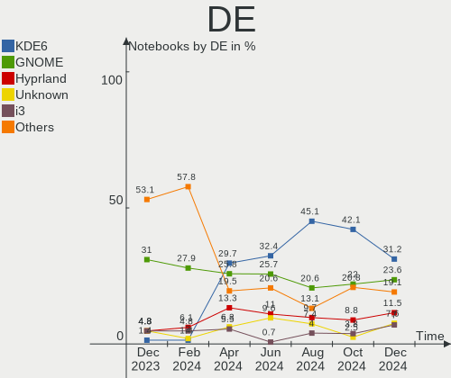
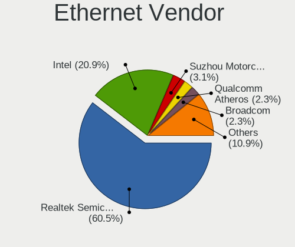
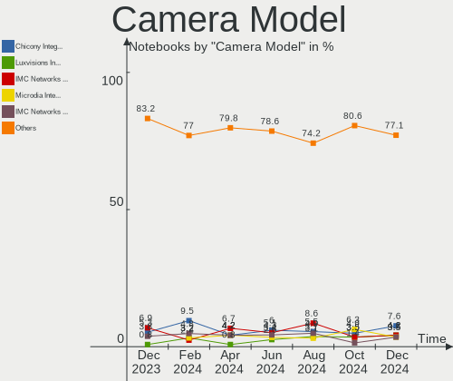

Arch - Hardware Trends (Notebooks)
----------------------------------

A project to identify most popular hardware characteristics and track their change
over time based on data collected by Linux users at https://Linux-Hardware.org.

Anyone can contribute to this report by the [hw-probe](https://github.com/linuxhw/hw-probe) tool:

    sudo -E hw-probe -all -upload

This report is for one last month. Overall report since the beginning of time: [TestDays](https://github.com/linuxhw/TestDays)

Period: Oct, 2023.

Contents
--------

* [ System ](#system)
  - [ OS                       ](#os)
  - [ OS Family                ](#os-family)
  - [ Kernel                   ](#kernel)
  - [ Kernel Family            ](#kernel-family)
  - [ Kernel Major Ver.        ](#kernel-major-ver)
  - [ Arch                     ](#arch)
  - [ DE                       ](#de)
  - [ Display Server           ](#display-server)
  - [ Display Manager          ](#display-manager)
  - [ OS Lang                  ](#os-lang)
  - [ Boot Mode                ](#boot-mode)
  - [ Filesystem               ](#filesystem)
  - [ Part. scheme             ](#part-scheme)
  - [ Dual Boot with Linux/BSD ](#dual-boot-with-linuxbsd)
  - [ Dual Boot (Win)          ](#dual-boot-win)

* [ Board ](#board)
  - [ Vendor                   ](#vendor)
  - [ Model                    ](#model)
  - [ Model Family             ](#model-family)
  - [ MFG Year                 ](#mfg-year)
  - [ Form Factor              ](#form-factor)
  - [ Secure Boot              ](#secure-boot)
  - [ Coreboot                 ](#coreboot)
  - [ RAM Size                 ](#ram-size)
  - [ RAM Used                 ](#ram-used)
  - [ Total Drives             ](#total-drives)
  - [ Has CD-ROM               ](#has-cd-rom)
  - [ Has Ethernet             ](#has-ethernet)
  - [ Has WiFi                 ](#has-wifi)
  - [ Has Bluetooth            ](#has-bluetooth)

* [ Location ](#location)
  - [ Country                  ](#country)
  - [ City                     ](#city)

* [ Drives ](#drives)
  - [ Drive Vendor             ](#drive-vendor)
  - [ Drive Model              ](#drive-model)
  - [ HDD Vendor               ](#hdd-vendor)
  - [ SSD Vendor               ](#ssd-vendor)
  - [ Drive Kind               ](#drive-kind)
  - [ Drive Connector          ](#drive-connector)
  - [ Drive Size               ](#drive-size)
  - [ Space Total              ](#space-total)
  - [ Space Used               ](#space-used)
  - [ Malfunc. Drives          ](#malfunc-drives)
  - [ Malfunc. Drive Vendor    ](#malfunc-drive-vendor)
  - [ Malfunc. HDD Vendor      ](#malfunc-hdd-vendor)
  - [ Malfunc. Drive Kind      ](#malfunc-drive-kind)
  - [ Failed Drives            ](#failed-drives)
  - [ Failed Drive Vendor      ](#failed-drive-vendor)
  - [ Drive Status             ](#drive-status)

* [ Storage controller ](#storage-controller)
  - [ Storage Vendor           ](#storage-vendor)
  - [ Storage Model            ](#storage-model)
  - [ Storage Kind             ](#storage-kind)

* [ Processor ](#processor)
  - [ CPU Vendor               ](#cpu-vendor)
  - [ CPU Model                ](#cpu-model)
  - [ CPU Model Family         ](#cpu-model-family)
  - [ CPU Cores                ](#cpu-cores)
  - [ CPU Sockets              ](#cpu-sockets)
  - [ CPU Threads              ](#cpu-threads)
  - [ CPU Op-Modes             ](#cpu-op-modes)
  - [ CPU Microcode            ](#cpu-microcode)
  - [ CPU Microarch            ](#cpu-microarch)

* [ Graphics ](#graphics)
  - [ GPU Vendor               ](#gpu-vendor)
  - [ GPU Model                ](#gpu-model)
  - [ GPU Combo                ](#gpu-combo)
  - [ GPU Driver               ](#gpu-driver)
  - [ GPU Memory               ](#gpu-memory)

* [ Monitor ](#monitor)
  - [ Monitor Vendor           ](#monitor-vendor)
  - [ Monitor Model            ](#monitor-model)
  - [ Monitor Resolution       ](#monitor-resolution)
  - [ Monitor Diagonal         ](#monitor-diagonal)
  - [ Monitor Width            ](#monitor-width)
  - [ Aspect Ratio             ](#aspect-ratio)
  - [ Monitor Area             ](#monitor-area)
  - [ Pixel Density            ](#pixel-density)
  - [ Multiple Monitors        ](#multiple-monitors)

* [ Network ](#network)
  - [ Net Controller Vendor    ](#net-controller-vendor)
  - [ Net Controller Model     ](#net-controller-model)
  - [ Wireless Vendor          ](#wireless-vendor)
  - [ Wireless Model           ](#wireless-model)
  - [ Ethernet Vendor          ](#ethernet-vendor)
  - [ Ethernet Model           ](#ethernet-model)
  - [ Net Controller Kind      ](#net-controller-kind)
  - [ Used Controller          ](#used-controller)
  - [ NICs                     ](#nics)
  - [ IPv6                     ](#ipv6)

* [ Bluetooth ](#bluetooth)
  - [ Bluetooth Vendor         ](#bluetooth-vendor)
  - [ Bluetooth Model          ](#bluetooth-model)

* [ Sound ](#sound)
  - [ Sound Vendor             ](#sound-vendor)
  - [ Sound Model              ](#sound-model)

* [ Memory ](#memory)
  - [ Memory Vendor            ](#memory-vendor)
  - [ Memory Model             ](#memory-model)
  - [ Memory Kind              ](#memory-kind)
  - [ Memory Form Factor       ](#memory-form-factor)
  - [ Memory Size              ](#memory-size)
  - [ Memory Speed             ](#memory-speed)

* [ Printers & scanners ](#printers--scanners)
  - [ Printer Vendor           ](#printer-vendor)
  - [ Printer Model            ](#printer-model)
  - [ Scanner Vendor           ](#scanner-vendor)
  - [ Scanner Model            ](#scanner-model)

* [ Camera ](#camera)
  - [ Camera Vendor            ](#camera-vendor)
  - [ Camera Model             ](#camera-model)

* [ Security ](#security)
  - [ Fingerprint Vendor       ](#fingerprint-vendor)
  - [ Fingerprint Model        ](#fingerprint-model)
  - [ Chipcard Vendor          ](#chipcard-vendor)
  - [ Chipcard Model           ](#chipcard-model)

* [ Unsupported ](#unsupported)
  - [ Unsupported Devices      ](#unsupported-devices)
  - [ Unsupported Device Types ](#unsupported-device-types)

System
------

OS
--

Installed operating systems

| Name         | Notebooks | Percent |
|--------------|-----------|---------|
| Arch Rolling | 143       | 100%    |

OS Family
---------

OS without a version

| Name | Notebooks | Percent |
|------|-----------|---------|
| Arch | 143       | 100%    |

Kernel
------

Version of the Linux kernel

| Version                                  | Notebooks | Percent |
|------------------------------------------|-----------|---------|
| 6.5.7-arch1-1                            | 28        | 19.58%  |
| 6.5.5-arch1-1                            | 25        | 17.48%  |
| 6.5.8-arch1-1                            | 16        | 11.19%  |
| 6.5.9-arch2-1                            | 14        | 9.79%   |
| 6.5.8-zen1-1-zen                         | 6         | 4.2%    |
| 6.5.5-zen1-1-zen                         | 6         | 4.2%    |
| 6.5.6-arch2-1                            | 5         | 3.5%    |
| 6.5.7-zen2-1-zen                         | 4         | 2.8%    |
| 6.5.9-zen2-1-zen                         | 3         | 2.1%    |
| 6.5.6-zen2-1-zen                         | 3         | 2.1%    |
| 6.4.12-arch1-1                           | 3         | 2.1%    |
| 6.1.58-1-lts                             | 3         | 2.1%    |
| 6.5.7-zen1-1-zen                         | 2         | 1.4%    |
| 6.5.4-arch2-1                            | 2         | 1.4%    |
| 6.5.3-arch1-1                            | 2         | 1.4%    |
| 6.1.59-1-lts                             | 2         | 1.4%    |
| 6.1.57-1-lts                             | 2         | 1.4%    |
| 6.1.56-1-lts                             | 2         | 1.4%    |
| 6.1.55-1-lts                             | 2         | 1.4%    |
| 6.5.9-1-cachyos-lto                      | 1         | 0.7%    |
| 6.5.7-273-tkg-linux-tkg-eevdf-generic_v3 | 1         | 0.7%    |
| 6.5.7-2-cachyos                          | 1         | 0.7%    |
| 6.5.6-arch2-1-g14                        | 1         | 0.7%    |
| 6.5.5-x64v3-xanmod1                      | 1         | 0.7%    |
| 6.5.5-x64v2-xanmod1-1                    | 1         | 0.7%    |
| 6.5.5-hardened1-1-hardened               | 1         | 0.7%    |
| 6.5.5-arch1-1.1                          | 1         | 0.7%    |
| 6.5.4chaotic--1                          | 1         | 0.7%    |
| 6.4.8-arch1-Yagakimi-T2-1-t2             | 1         | 0.7%    |
| 6.2.11-zen1-1-zen                        | 1         | 0.7%    |
| 6.1.60-1-lts                             | 1         | 0.7%    |
| 6.0.10-lqx1-1-lqx                        | 1         | 0.7%    |

Kernel Family
-------------

Linux kernel without a distro release

| Version | Notebooks | Percent |
|---------|-----------|---------|
| 6.5.7   | 36        | 25.17%  |
| 6.5.5   | 35        | 24.48%  |
| 6.5.8   | 22        | 15.38%  |
| 6.5.9   | 18        | 12.59%  |
| 6.5.6   | 9         | 6.29%   |
| 6.5.4   | 3         | 2.1%    |
| 6.4.12  | 3         | 2.1%    |
| 6.1.58  | 3         | 2.1%    |
| 6.5.3   | 2         | 1.4%    |
| 6.1.59  | 2         | 1.4%    |
| 6.1.57  | 2         | 1.4%    |
| 6.1.56  | 2         | 1.4%    |
| 6.1.55  | 2         | 1.4%    |
| 6.4.8   | 1         | 0.7%    |
| 6.2.11  | 1         | 0.7%    |
| 6.1.60  | 1         | 0.7%    |
| 6.0.10  | 1         | 0.7%    |

Kernel Major Ver.
-----------------

Linux kernel major version

| Version | Notebooks | Percent |
|---------|-----------|---------|
| 6.5     | 125       | 87.41%  |
| 6.1     | 12        | 8.39%   |
| 6.4     | 4         | 2.8%    |
| 6.2     | 1         | 0.7%    |
| 6.0     | 1         | 0.7%    |

Arch
----

OS architecture (x86_64, i586, etc.)

| Name   | Notebooks | Percent |
|--------|-----------|---------|
| x86_64 | 143       | 100%    |

DE
--

Desktop Environment

| Name       | Notebooks | Percent |
|------------|-----------|---------|
| GNOME      | 65        | 45.45%  |
| KDE5       | 42        | 29.37%  |
| XFCE       | 10        | 6.99%   |
| i3         | 6         | 4.2%    |
| Hyprland   | 6         | 4.2%    |
| Unknown    | 5         | 3.5%    |
| bspwm      | 3         | 2.1%    |
| X-Cinnamon | 1         | 0.7%    |
| swayland   | 1         | 0.7%    |
| sway       | 1         | 0.7%    |
| MATE       | 1         | 0.7%    |
| dwm        | 1         | 0.7%    |
| Cutefish   | 1         | 0.7%    |

Display Server
--------------

X11 or Wayland

| Name    | Notebooks | Percent |
|---------|-----------|---------|
| Wayland | 67        | 46.85%  |
| X11     | 60        | 41.96%  |
| Unknown | 10        | 6.99%   |
| Tty     | 6         | 4.2%    |

Display Manager
---------------

SDDM, LightDM, etc.

| Name    | Notebooks | Percent |
|---------|-----------|---------|
| Unknown | 62        | 43.36%  |
| SDDM    | 31        | 21.68%  |
| GDM     | 28        | 19.58%  |
| LightDM | 20        | 13.99%  |
| LY-DM   | 2         | 1.4%    |

OS Lang
-------

Language

| Lang             | Notebooks | Percent |
|------------------|-----------|---------|
| en_US            | 70        | 48.95%  |
| it_IT            | 13        | 9.09%   |
| pt_BR            | 10        | 6.99%   |
| ru_RU            | 7         | 4.9%    |
| C                | 7         | 4.9%    |
| pl_PL            | 4         | 2.8%    |
| en_GB            | 4         | 2.8%    |
| de_DE            | 4         | 2.8%    |
| zh_CN            | 3         | 2.1%    |
| es_ES            | 3         | 2.1%    |
| en_AU            | 3         | 2.1%    |
| fr_FR            | 2         | 1.4%    |
| Unknown          | 2         | 1.4%    |
| tr_TR            | 1         | 0.7%    |
| ja_JP            | 1         | 0.7%    |
| hu_HU            | 1         | 0.7%    |
| es_MX            | 1         | 0.7%    |
| eo               | 1         | 0.7%    |
| en_US.UTF.8      | 1         | 0.7%    |
| en_US.ISO-8859-1 | 1         | 0.7%    |
| en_SG            | 1         | 0.7%    |
| en_CA            | 1         | 0.7%    |
| en_AG            | 1         | 0.7%    |
| ca_ES            | 1         | 0.7%    |

Boot Mode
---------

EFI or BIOS

| Mode | Notebooks | Percent |
|------|-----------|---------|
| EFI  | 82        | 57.34%  |
| BIOS | 61        | 42.66%  |

Filesystem
----------

Type of filesystem

| Type    | Notebooks | Percent |
|---------|-----------|---------|
| Ext4    | 96        | 67.13%  |
| Btrfs   | 37        | 25.87%  |
| Xfs     | 3         | 2.1%    |
| Zfs     | 2         | 1.4%    |
| Tmpfs   | 2         | 1.4%    |
| Overlay | 1         | 0.7%    |
| F2fs    | 1         | 0.7%    |
| Unknown | 1         | 0.7%    |

Part. scheme
------------

Scheme of partitioning

| Type    | Notebooks | Percent |
|---------|-----------|---------|
| GPT     | 84        | 58.74%  |
| Unknown | 53        | 37.06%  |
| MBR     | 6         | 4.2%    |

Dual Boot with Linux/BSD
------------------------

Hosting more than one Linux/BSD

| Dual boot | Notebooks | Percent |
|-----------|-----------|---------|
| No        | 136       | 95.1%   |
| Yes       | 7         | 4.9%    |

Dual Boot (Win)
---------------

Hosting Linux and Windows

| Dual boot | Notebooks | Percent |
|-----------|-----------|---------|
| No        | 100       | 69.93%  |
| Yes       | 43        | 30.07%  |

Board
-----

Vendor
------

Motherboard manufacturer

| Name                   | Notebooks | Percent |
|------------------------|-----------|---------|
| Dell                   | 31        | 21.68%  |
| Lenovo                 | 30        | 20.98%  |
| Hewlett-Packard        | 26        | 18.18%  |
| ASUSTek Computer       | 21        | 14.69%  |
| Acer                   | 9         | 6.29%   |
| MSI                    | 4         | 2.8%    |
| HUAWEI                 | 3         | 2.1%    |
| HONOR                  | 3         | 2.1%    |
| Sony                   | 2         | 1.4%    |
| Apple                  | 2         | 1.4%    |
| XIAOMI                 | 1         | 0.7%    |
| UNOWHY                 | 1         | 0.7%    |
| TUXEDO                 | 1         | 0.7%    |
| Toshiba                | 1         | 0.7%    |
| Timi                   | 1         | 0.7%    |
| Samsung Electronics    | 1         | 0.7%    |
| Positivo               | 1         | 0.7%    |
| LG Electronics         | 1         | 0.7%    |
| Fujitsu                | 1         | 0.7%    |
| Framework              | 1         | 0.7%    |
| Avell High Performance | 1         | 0.7%    |
| ASRock                 | 1         | 0.7%    |

Model
-----

Motherboard model

| Name                                     | Notebooks | Percent |
|------------------------------------------|-----------|---------|
| HP Victus by Laptop 16-e0xxx             | 3         | 2.1%    |
| HP Notebook                              | 2         | 1.4%    |
| Dell XPS 15 9530                         | 2         | 1.4%    |
| Dell XPS 13 9310                         | 2         | 1.4%    |
| Dell XPS 13 9300                         | 2         | 1.4%    |
| XIAOMI Redmi Book Pro 15 2023            | 1         | 0.7%    |
| UNOWHY Y13G012S4EI                       | 1         | 0.7%    |
| TUXEDO InfinityBook Pro Gen8 (MK1)       | 1         | 0.7%    |
| Toshiba Satellite L655                   | 1         | 0.7%    |
| Timi A30                                 | 1         | 0.7%    |
| Sony VPCEB15EL                           | 1         | 0.7%    |
| Sony SVF1421PSGB                         | 1         | 0.7%    |
| Samsung 750XED                           | 1         | 0.7%    |
| Positivo S14BW01                         | 1         | 0.7%    |
| MSI GP66 Leopard 10UG                    | 1         | 0.7%    |
| MSI GF75 Thin 10SC                       | 1         | 0.7%    |
| MSI GF63 Thin 10SC                       | 1         | 0.7%    |
| MSI GE63 Raider RGB 8RE                  | 1         | 0.7%    |
| LG 15Z95N-G.AAC6U1                       | 1         | 0.7%    |
| Lenovo Yoga Slim 7 ProX 14ARH7 82TL      | 1         | 0.7%    |
| Lenovo Yoga Slim 7 Pro 14ACH5 82MS       | 1         | 0.7%    |
| Lenovo Yoga 900-13ISK 80MK               | 1         | 0.7%    |
| Lenovo V15 G2 ITL Ua 82KB                | 1         | 0.7%    |
| Lenovo ThinkPad X250 20CMS04J00          | 1         | 0.7%    |
| Lenovo ThinkPad X13 Gen 1 20T3S5LE1F     | 1         | 0.7%    |
| Lenovo ThinkPad X1 Carbon 2nd 20AC0018US | 1         | 0.7%    |
| Lenovo ThinkPad T495 20NJCTO1WW          | 1         | 0.7%    |
| Lenovo ThinkPad T480 20L6S0CE13          | 1         | 0.7%    |
| Lenovo ThinkPad T450 20BUS00700          | 1         | 0.7%    |
| Lenovo ThinkPad T430 2349B74             | 1         | 0.7%    |
| Lenovo ThinkPad T14s Gen 3 21CQ0045GE    | 1         | 0.7%    |
| Lenovo ThinkPad P15v Gen 3 21EM0038US    | 1         | 0.7%    |
| Lenovo ThinkPad P1 Gen 4i 20Y4S1QE0F     | 1         | 0.7%    |
| Lenovo ThinkPad L14 Gen 1 20U6S46L00     | 1         | 0.7%    |
| Lenovo ThinkPad E560 20EV002JUS          | 1         | 0.7%    |
| Lenovo ThinkPad E14 Gen 5 21JRS00T00     | 1         | 0.7%    |
| Lenovo ThinkPad E14 Gen 5 21JKCTO1WW     | 1         | 0.7%    |
| Lenovo ThinkPad E14 Gen 3 20Y7CTO1WW     | 1         | 0.7%    |
| Lenovo ThinkBook 14 G2 ITL 20VD          | 1         | 0.7%    |
| Lenovo IdeaPad Slim 7 Carbon 14ACN6 82L1 | 1         | 0.7%    |

Model Family
------------

Motherboard model prefix

| Name                | Notebooks | Percent |
|---------------------|-----------|---------|
| Lenovo ThinkPad     | 15        | 10.49%  |
| Dell Latitude       | 11        | 7.69%   |
| Lenovo IdeaPad      | 9         | 6.29%   |
| Dell XPS            | 9         | 6.29%   |
| Acer Aspire         | 6         | 4.2%    |
| HP Victus           | 5         | 3.5%    |
| HP OMEN             | 5         | 3.5%    |
| ASUS ZenBook        | 5         | 3.5%    |
| ASUS ROG            | 5         | 3.5%    |
| Lenovo Yoga         | 3         | 2.1%    |
| HP Pavilion         | 3         | 2.1%    |
| HP Laptop           | 3         | 2.1%    |
| HP EliteBook        | 3         | 2.1%    |
| Dell Vostro         | 3         | 2.1%    |
| Dell Precision      | 3         | 2.1%    |
| Dell Inspiron       | 3         | 2.1%    |
| ASUS VivoBook       | 3         | 2.1%    |
| ASUS ASUS           | 3         | 2.1%    |
| HP Notebook         | 2         | 1.4%    |
| HP 255              | 2         | 1.4%    |
| HP 250              | 2         | 1.4%    |
| XIAOMI Redmi        | 1         | 0.7%    |
| UNOWHY Y13G012S4EI  | 1         | 0.7%    |
| TUXEDO InfinityBook | 1         | 0.7%    |
| Toshiba Satellite   | 1         | 0.7%    |
| Timi A30            | 1         | 0.7%    |
| Sony VPCEB15EL      | 1         | 0.7%    |
| Sony SVF1421PSGB    | 1         | 0.7%    |
| Samsung 750XED      | 1         | 0.7%    |
| Positivo S14BW01    | 1         | 0.7%    |
| MSI GP66            | 1         | 0.7%    |
| MSI GF75            | 1         | 0.7%    |
| MSI GF63            | 1         | 0.7%    |
| MSI GE63            | 1         | 0.7%    |
| LG 15Z95N-G.AAC6U1  | 1         | 0.7%    |
| Lenovo V15          | 1         | 0.7%    |
| Lenovo ThinkBook    | 1         | 0.7%    |
| Lenovo G500         | 1         | 0.7%    |
| HUAWEI NBLK-WAX9X   | 1         | 0.7%    |
| HUAWEI HN-WX9X      | 1         | 0.7%    |

MFG Year
--------

Motherboard manufacture year

| Year | Notebooks | Percent |
|------|-----------|---------|
| 2021 | 25        | 17.48%  |
| 2022 | 23        | 16.08%  |
| 2020 | 22        | 15.38%  |
| 2019 | 12        | 8.39%   |
| 2023 | 10        | 6.99%   |
| 2018 | 8         | 5.59%   |
| 2016 | 7         | 4.9%    |
| 2014 | 7         | 4.9%    |
| 2015 | 6         | 4.2%    |
| 2012 | 6         | 4.2%    |
| 2013 | 5         | 3.5%    |
| 2017 | 4         | 2.8%    |
| 2011 | 3         | 2.1%    |
| 2010 | 3         | 2.1%    |
| 2007 | 2         | 1.4%    |

Form Factor
-----------

Physical design of the computer

| Name     | Notebooks | Percent |
|----------|-----------|---------|
| Notebook | 143       | 100%    |

Secure Boot
-----------

Enabled or disabled

| State    | Notebooks | Percent |
|----------|-----------|---------|
| Disabled | 140       | 97.9%   |
| Enabled  | 3         | 2.1%    |

Coreboot
--------

Have coreboot on board

| Used | Notebooks | Percent |
|------|-----------|---------|
| No   | 143       | 100%    |

RAM Size
--------

Total RAM memory

| Size in GB  | Notebooks | Percent |
|-------------|-----------|---------|
| 4.01-8.0    | 39        | 27.27%  |
| 8.01-16.0   | 35        | 24.48%  |
| 16.01-24.0  | 29        | 20.28%  |
| 32.01-64.0  | 20        | 13.99%  |
| 3.01-4.0    | 9         | 6.29%   |
| 64.01-256.0 | 4         | 2.8%    |
| 24.01-32.0  | 3         | 2.1%    |
| 1.01-2.0    | 3         | 2.1%    |
| 2.01-3.0    | 1         | 0.7%    |

RAM Used
--------

Used RAM memory

| Used GB    | Notebooks | Percent |
|------------|-----------|---------|
| 4.01-8.0   | 46        | 32.17%  |
| 3.01-4.0   | 35        | 24.48%  |
| 2.01-3.0   | 30        | 20.98%  |
| 1.01-2.0   | 19        | 13.29%  |
| 8.01-16.0  | 8         | 5.59%   |
| 0.51-1.0   | 4         | 2.8%    |
| 16.01-24.0 | 1         | 0.7%    |

Total Drives
------------

Number of drives on board

| Drives | Notebooks | Percent |
|--------|-----------|---------|
| 1      | 106       | 74.13%  |
| 2      | 32        | 22.38%  |
| 3      | 5         | 3.5%    |

Has CD-ROM
----------

Has CD-ROM on board

| Presented | Notebooks | Percent |
|-----------|-----------|---------|
| No        | 120       | 83.92%  |
| Yes       | 23        | 16.08%  |

Has Ethernet
------------

Has Ethernet on board

| Presented | Notebooks | Percent |
|-----------|-----------|---------|
| Yes       | 98        | 68.53%  |
| No        | 45        | 31.47%  |

Has WiFi
--------

Has WiFi module

| Presented | Notebooks | Percent |
|-----------|-----------|---------|
| Yes       | 143       | 100%    |

Has Bluetooth
-------------

Has Bluetooth module

| Presented | Notebooks | Percent |
|-----------|-----------|---------|
| Yes       | 134       | 93.71%  |
| No        | 9         | 6.29%   |

Location
--------

Country
-------

Geographic location (country)

| Country      | Notebooks | Percent |
|--------------|-----------|---------|
| Italy        | 19        | 13.29%  |
| USA          | 15        | 10.49%  |
| Brazil       | 12        | 8.39%   |
| Russia       | 10        | 6.99%   |
| India        | 9         | 6.29%   |
| Spain        | 8         | 5.59%   |
| Poland       | 7         | 4.9%    |
| Germany      | 7         | 4.9%    |
| Australia    | 5         | 3.5%    |
| Vietnam      | 4         | 2.8%    |
| UK           | 4         | 2.8%    |
| Indonesia    | 4         | 2.8%    |
| China        | 4         | 2.8%    |
| France       | 3         | 2.1%    |
| Canada       | 3         | 2.1%    |
| Switzerland  | 2         | 1.4%    |
| Romania      | 2         | 1.4%    |
| Portugal     | 2         | 1.4%    |
| Philippines  | 2         | 1.4%    |
| Mexico       | 2         | 1.4%    |
| Japan        | 2         | 1.4%    |
| Czechia      | 2         | 1.4%    |
| Belarus      | 2         | 1.4%    |
| Ukraine      | 1         | 0.7%    |
| Turkey       | 1         | 0.7%    |
| South Africa | 1         | 0.7%    |
| Slovakia     | 1         | 0.7%    |
| Singapore    | 1         | 0.7%    |
| Puerto Rico  | 1         | 0.7%    |
| Pakistan     | 1         | 0.7%    |
| New Zealand  | 1         | 0.7%    |
| Ireland      | 1         | 0.7%    |
| Hungary      | 1         | 0.7%    |
| Finland      | 1         | 0.7%    |
| Bulgaria     | 1         | 0.7%    |
| Belgium      | 1         | 0.7%    |

City
----

Geographic location (city)

| City              | Notebooks | Percent |
|-------------------|-----------|---------|
| Milano            | 4         | 2.8%    |
| Rio de Janeiro    | 3         | 2.1%    |
| Moscow            | 3         | 2.1%    |
| Madrid            | 3         | 2.1%    |
| Sydney            | 2         | 1.4%    |
| Rome              | 2         | 1.4%    |
| Poznan            | 2         | 1.4%    |
| Milan             | 2         | 1.4%    |
| Marburg           | 2         | 1.4%    |
| Krakow            | 2         | 1.4%    |
| Hanoi             | 2         | 1.4%    |
| Delhi             | 2         | 1.4%    |
| Brisbane          | 2         | 1.4%    |
| Bellevue          | 2         | 1.4%    |
| Beijing           | 2         | 1.4%    |
| Zurich            | 1         | 0.7%    |
| Zulte             | 1         | 0.7%    |
| Yogyakarta        | 1         | 0.7%    |
| Wroclaw           | 1         | 0.7%    |
| West Lebanon      | 1         | 0.7%    |
| Wembley           | 1         | 0.7%    |
| Warsaw            | 1         | 0.7%    |
| Vladivostok       | 1         | 0.7%    |
| Vitebsk           | 1         | 0.7%    |
| Visselhoevede     | 1         | 0.7%    |
| Vigo              | 1         | 0.7%    |
| Velletri          | 1         | 0.7%    |
| Vallon-Pont-d'Arc | 1         | 0.7%    |
| Uberlândia       | 1         | 0.7%    |
| Turin             | 1         | 0.7%    |
| Toulouse          | 1         | 0.7%    |
| Tirupattur        | 1         | 0.7%    |
| Suceava           | 1         | 0.7%    |
| St Petersburg     | 1         | 0.7%    |
| Singapore         | 1         | 0.7%    |
| Shenyang          | 1         | 0.7%    |
| Sheffield         | 1         | 0.7%    |
| Sete Lagoas       | 1         | 0.7%    |
| Semarang          | 1         | 0.7%    |
| Sao Paulo         | 1         | 0.7%    |

Drives
------

Drive Vendor
------------

Hard drive vendors

| Vendor                         | Notebooks | Drives | Percent |
|--------------------------------|-----------|--------|---------|
| Samsung Electronics            | 35        | 36     | 19.55%  |
| Sandisk                        | 22        | 23     | 12.29%  |
| Micron Technology              | 12        | 12     | 6.7%    |
| SK hynix                       | 11        | 11     | 6.15%   |
| Seagate                        | 11        | 11     | 6.15%   |
| WDC                            | 8         | 9      | 4.47%   |
| Toshiba                        | 7         | 7      | 3.91%   |
| Kingston                       | 7         | 7      | 3.91%   |
| Intel                          | 7         | 8      | 3.91%   |
| KIOXIA                         | 5         | 5      | 2.79%   |
| HGST                           | 5         | 5      | 2.79%   |
| Kingston Technology Company    | 4         | 4      | 2.23%   |
| Crucial                        | 4         | 4      | 2.23%   |
| Unknown                        | 3         | 3      | 1.68%   |
| Micron/Crucial Technology      | 3         | 3      | 1.68%   |
| Hitachi                        | 3         | 3      | 1.68%   |
| Union Memory (Shenzhen)        | 2         | 2      | 1.12%   |
| Silicon Motion                 | 2         | 2      | 1.12%   |
| Realtek                        | 2         | 2      | 1.12%   |
| Phison Electronics             | 2         | 2      | 1.12%   |
| China                          | 2         | 2      | 1.12%   |
| ADATA Technology               | 2         | 2      | 1.12%   |
| Yangtze Memory Technologies    | 1         | 1      | 0.56%   |
| Verbatim                       | 1         | 1      | 0.56%   |
| Transcend                      | 1         | 1      | 0.56%   |
| SSD 1TB                        | 1         | 1      | 0.56%   |
| Solid State Storage Technology | 1         | 1      | 0.56%   |
| Solid State Storage            | 1         | 1      | 0.56%   |
| SABRENT                        | 1         | 1      | 0.56%   |
| Realtek Semiconductor          | 1         | 1      | 0.56%   |
| OWC                            | 1         | 1      | 0.56%   |
| MAXIO Technology (Hangzhou)    | 1         | 1      | 0.56%   |
| LITEON                         | 1         | 1      | 0.56%   |
| KingSpec                       | 1         | 1      | 0.56%   |
| JMicron Technology             | 1         | 1      | 0.56%   |
| Indilinx                       | 1         | 1      | 0.56%   |
| GOODRAM                        | 1         | 1      | 0.56%   |
| Glowy                          | 1         | 2      | 0.56%   |
| EVM                            | 1         | 1      | 0.56%   |
| DST6256-SSD                    | 1         | 1      | 0.56%   |

Drive Model
-----------

Hard drive models

| Model                                               | Notebooks | Percent |
|-----------------------------------------------------|-----------|---------|
| Samsung NVMe SSD Controller SM981/PM981/PM983 1TB   | 11        | 6.01%   |
| Samsung NVMe SSD Controller PM9A1/PM9A3/980PRO 1TB  | 10        | 5.46%   |
| Sandisk WD Black SN850 1TB                          | 4         | 2.19%   |
| Sandisk WD Black SN750 / PC SN730 NVMe SSD 1024GB   | 3         | 1.64%   |
| Micron/Crucial P2 NVMe PCIe SSD 500GB               | 3         | 1.64%   |
| Micron 2450_MTFDKBA512TFK 512GB                     | 3         | 1.64%   |
| Intel SSD 660P Series 1024GB                        | 3         | 1.64%   |
| HGST HTS721010A9E630 1TB                            | 3         | 1.64%   |
| Unknown MMC Card  128GB                             | 2         | 1.09%   |
| Toshiba MQ04ABF100 1TB                              | 2         | 1.09%   |
| SK hynix BC501 NVMe Solid State Drive 512GB         | 2         | 1.09%   |
| Silicon Motion SM2262/SM2262EN SSD Controller 2TB   | 2         | 1.09%   |
| Seagate ST1000LM035-1RK172 1TB                      | 2         | 1.09%   |
| Samsung SSD 980 1TB                                 | 2         | 1.09%   |
| Samsung NVMe SSD Controller SM961/PM961/SM963 121GB | 2         | 1.09%   |
| Kingston Company SNV2S1000G 1TB                     | 2         | 1.09%   |
| Intel SSDPEKNU512GZ 512GB                           | 2         | 1.09%   |
| Crucial CT500MX500SSD1 500GB                        | 2         | 1.09%   |
| Yangtze Memory ZHITAI TiPlus5000 2TB                | 1         | 0.55%   |
| WDC WDS500G1B0B-00AS40 500GB SSD                    | 1         | 0.55%   |
| WDC WDS240G2G0B-00EPW0 240GB SSD                    | 1         | 0.55%   |
| WDC WD6400BEVT-22A0RT0 640GB                        | 1         | 0.55%   |
| WDC WD5000LPLX-60ZNTT1 500GB                        | 1         | 0.55%   |
| WDC WD3200BUDT-63DPZY0 320GB                        | 1         | 0.55%   |
| WDC WD10SPZX-75Z10T3 1TB                            | 1         | 0.55%   |
| WDC WD10SPZX-21Z10T0 1TB                            | 1         | 0.55%   |
| WDC WD10JPVX-60JC3T0 1TB                            | 1         | 0.55%   |
| WDC WD10JPCX-24UE4T0 1TB                            | 1         | 0.55%   |
| Verbatim Vi560 S3 512GB SSD                         | 1         | 0.55%   |
| Unknown MMC Card  64GB                              | 1         | 0.55%   |
| Union Memory (Shenzhen) UMIS RPJYJ256RDM1QWY 256GB  | 1         | 0.55%   |
| Union Memory (Shenzhen) UMIS RPJTJ512MKP1QDQ 512GB  | 1         | 0.55%   |
| Transcend TS128GMTS400 128GB SSD                    | 1         | 0.55%   |
| Toshiba XG6 NVMe SSD Controller 256GB               | 1         | 0.55%   |
| Toshiba MQ01ABF050 500GB                            | 1         | 0.55%   |
| Toshiba MQ01ABD100 1TB                              | 1         | 0.55%   |
| Toshiba MQ01ABD050 500GB                            | 1         | 0.55%   |
| Toshiba KSG60ZMV256G 256GB SSD                      | 1         | 0.55%   |
| SSD 1TB Disk 1TB                                    | 1         | 0.55%   |
| Solid State Storage SSSTC CL4-4D256-Q79 256GB       | 1         | 0.55%   |

HDD Vendor
----------

Hard disk drive vendors

| Vendor              | Notebooks | Drives | Percent |
|---------------------|-----------|--------|---------|
| Seagate             | 11        | 11     | 34.38%  |
| WDC                 | 7         | 7      | 21.88%  |
| Toshiba             | 5         | 5      | 15.63%  |
| HGST                | 5         | 5      | 15.63%  |
| Hitachi             | 3         | 3      | 9.38%   |
| Samsung Electronics | 1         | 1      | 3.13%   |

SSD Vendor
----------

Solid state drive vendors

| Vendor              | Notebooks | Drives | Percent |
|---------------------|-----------|--------|---------|
| SanDisk             | 5         | 5      | 14.71%  |
| Samsung Electronics | 5         | 5      | 14.71%  |
| Kingston            | 4         | 4      | 11.76%  |
| Crucial             | 4         | 4      | 11.76%  |
| WDC                 | 2         | 2      | 5.88%   |
| China               | 2         | 2      | 5.88%   |
| Verbatim            | 1         | 1      | 2.94%   |
| Transcend           | 1         | 1      | 2.94%   |
| Toshiba             | 1         | 1      | 2.94%   |
| SK hynix            | 1         | 1      | 2.94%   |
| SABRENT             | 1         | 1      | 2.94%   |
| OWC                 | 1         | 1      | 2.94%   |
| LITEON              | 1         | 1      | 2.94%   |
| KingSpec            | 1         | 1      | 2.94%   |
| Indilinx            | 1         | 1      | 2.94%   |
| GOODRAM             | 1         | 1      | 2.94%   |
| Glowy               | 1         | 1      | 2.94%   |
| BHT                 | 1         | 1      | 2.94%   |

Drive Kind
----------

HDD or SSD

| Kind    | Notebooks | Drives | Percent |
|---------|-----------|--------|---------|
| NVMe    | 99        | 111    | 58.93%  |
| SSD     | 32        | 34     | 19.05%  |
| HDD     | 30        | 32     | 17.86%  |
| Unknown | 4         | 4      | 2.38%   |
| MMC     | 3         | 3      | 1.79%   |

Drive Connector
---------------

SATA, SAS, NVMe, etc.

| Type | Notebooks | Drives | Percent |
|------|-----------|--------|---------|
| NVMe | 98        | 108    | 60.87%  |
| SATA | 53        | 65     | 32.92%  |
| SAS  | 7         | 8      | 4.35%   |
| MMC  | 3         | 3      | 1.86%   |

Drive Size
----------

Size of hard drive

| Size in TB | Notebooks | Drives | Percent |
|------------|-----------|--------|---------|
| 0.01-0.5   | 40        | 43     | 63.49%  |
| 0.51-1.0   | 18        | 18     | 28.57%  |
| 1.01-2.0   | 3         | 3      | 4.76%   |
| 3.01-4.0   | 1         | 1      | 1.59%   |
| 2.01-3.0   | 1         | 1      | 1.59%   |

Space Total
-----------

Amount of disk space available on the file system

| Size in GB     | Notebooks | Percent |
|----------------|-----------|---------|
| 251-500        | 34        | 23.78%  |
| 101-250        | 29        | 20.28%  |
| 501-1000       | 24        | 16.78%  |
| 1001-2000      | 20        | 13.99%  |
| More than 3000 | 11        | 7.69%   |
| 51-100         | 8         | 5.59%   |
| 2001-3000      | 7         | 4.9%    |
| 21-50          | 5         | 3.5%    |
| 1-20           | 3         | 2.1%    |
| Unknown        | 2         | 1.4%    |

Space Used
----------

Amount of used disk space

| Used GB   | Notebooks | Percent |
|-----------|-----------|---------|
| 1-20      | 33        | 23.08%  |
| 51-100    | 27        | 18.88%  |
| 101-250   | 22        | 15.38%  |
| 21-50     | 18        | 12.59%  |
| 251-500   | 17        | 11.89%  |
| 501-1000  | 14        | 9.79%   |
| 1001-2000 | 10        | 6.99%   |
| Unknown   | 2         | 1.4%    |

Malfunc. Drives
---------------

Drive models with a malfunction

| Model                         | Notebooks | Drives | Percent |
|-------------------------------|-----------|--------|---------|
| WDC WD6400BEVT-22A0RT0 640GB  | 1         | 1      | 20%     |
| Seagate ST9320320AS 320GB     | 1         | 1      | 20%     |
| Hitachi HTS545050A7E380 500GB | 1         | 1      | 20%     |
| Hitachi HTS541616J9SA00 160GB | 1         | 1      | 20%     |
| HGST HTS545050A7E680 500GB    | 1         | 1      | 20%     |

Malfunc. Drive Vendor
---------------------

Vendors of faulty drives

| Vendor  | Notebooks | Drives | Percent |
|---------|-----------|--------|---------|
| Hitachi | 2         | 2      | 40%     |
| WDC     | 1         | 1      | 20%     |
| Seagate | 1         | 1      | 20%     |
| HGST    | 1         | 1      | 20%     |

Malfunc. HDD Vendor
-------------------

Vendors of faulty HDD drives

| Vendor  | Notebooks | Drives | Percent |
|---------|-----------|--------|---------|
| Hitachi | 2         | 2      | 40%     |
| WDC     | 1         | 1      | 20%     |
| Seagate | 1         | 1      | 20%     |
| HGST    | 1         | 1      | 20%     |

Malfunc. Drive Kind
-------------------

Kinds of faulty drives

| Kind | Notebooks | Drives | Percent |
|------|-----------|--------|---------|
| HDD  | 5         | 5      | 100%    |

Failed Drives
-------------

Failed drive models

Zero info for selected period =(

Failed Drive Vendor
-------------------

Failed drive vendors

Zero info for selected period =(

Drive Status
------------

Number of failed and malfunc. drives

| Status   | Notebooks | Drives | Percent |
|----------|-----------|--------|---------|
| Detected | 76        | 93     | 50.67%  |
| Works    | 69        | 86     | 46%     |
| Malfunc  | 5         | 5      | 3.33%   |

Storage controller
------------------

Storage Vendor
--------------

Storage controller vendors

| Vendor                                  | Notebooks | Percent |
|-----------------------------------------|-----------|---------|
| Intel                                   | 70        | 37.84%  |
| Samsung Electronics                     | 30        | 16.22%  |
| SanDisk                                 | 17        | 9.19%   |
| AMD                                     | 14        | 7.57%   |
| Micron Technology                       | 12        | 6.49%   |
| SK hynix                                | 10        | 5.41%   |
| Kingston Technology Company             | 7         | 3.78%   |
| KIOXIA                                  | 5         | 2.7%    |
| Micron/Crucial Technology               | 3         | 1.62%   |
| ADATA Technology                        | 3         | 1.62%   |
| Solid State Storage Technology          | 2         | 1.08%   |
| Silicon Motion                          | 2         | 1.08%   |
| Shenzhen Unionmemory Information System | 2         | 1.08%   |
| Phison Electronics                      | 2         | 1.08%   |
| Yangtze Memory Technologies             | 1         | 0.54%   |
| Toshiba America Info Systems            | 1         | 0.54%   |
| Realtek Semiconductor                   | 1         | 0.54%   |
| Nvidia                                  | 1         | 0.54%   |
| MAXIO Technology (Hangzhou)             | 1         | 0.54%   |
| Marvell Technology Group                | 1         | 0.54%   |

Storage Model
-------------

Storage controller models

| Model                                                                        | Notebooks | Percent |
|------------------------------------------------------------------------------|-----------|---------|
| AMD FCH SATA Controller [AHCI mode]                                          | 13        | 6.63%   |
| Intel Volume Management Device NVMe RAID Controller                          | 12        | 6.12%   |
| Samsung NVMe SSD Controller SM981/PM981/PM983                                | 11        | 5.61%   |
| Samsung NVMe SSD Controller PM9A1/PM9A3/980PRO                               | 10        | 5.1%    |
| Samsung NVMe SSD Controller 980 (DRAM-less)                                  | 7         | 3.57%   |
| Intel 7 Series Chipset Family 6-port SATA Controller [AHCI mode]             | 7         | 3.57%   |
| SK hynix Gold P31/BC711/PC711 NVMe Solid State Drive                         | 6         | 3.06%   |
| Micron 2450 NVMe SSD [HendrixV] (DRAM-less)                                  | 5         | 2.55%   |
| Intel Wildcat Point-LP SATA Controller [AHCI Mode]                           | 5         | 2.55%   |
| Intel Tiger Lake-LP SATA Controller                                          | 5         | 2.55%   |
| Intel Sunrise Point-LP SATA Controller [AHCI mode]                           | 5         | 2.55%   |
| Intel 82801 Mobile SATA Controller [RAID mode]                               | 5         | 2.55%   |
| SanDisk WD PC SN810 / Black SN850 NVMe SSD                                   | 4         | 2.04%   |
| KIOXIA NVMe SSD Controller BG4 (DRAM-less)                                   | 4         | 2.04%   |
| Intel HM170/QM170 Chipset SATA Controller [AHCI Mode]                        | 4         | 2.04%   |
| Intel Cannon Lake Mobile PCH SATA AHCI Controller                            | 4         | 2.04%   |
| Intel 400 Series Chipset Family SATA AHCI Controller                         | 4         | 2.04%   |
| SanDisk Extreme Pro / WD Black SN750 / PC SN730 / Red SN700 NVMe SSD         | 3         | 1.53%   |
| Micron/Crucial P2 [Nick P2] / P3 / P3 Plus NVMe PCIe SSD (DRAM-less)         | 3         | 1.53%   |
| Intel SSD 660P Series                                                        | 3         | 1.53%   |
| Intel 6 Series/C200 Series Chipset Family 6 port Mobile SATA AHCI Controller | 3         | 1.53%   |
| SK hynix BC501 NVMe Solid State Drive                                        | 2         | 1.02%   |
| Silicon Motion SM2262/SM2262EN SSD Controller                                | 2         | 1.02%   |
| Samsung NVMe SSD Controller SM961/PM961/SM963                                | 2         | 1.02%   |
| Micron 3400 NVMe SSD [Hendrix]                                               | 2         | 1.02%   |
| Micron 2300 NVMe SSD [Santana]                                               | 2         | 1.02%   |
| Kingston Company NV2 NVMe SSD SM2267XT                                       | 2         | 1.02%   |
| Kingston Company KC3000/FURY Renegade NVMe SSD E18                           | 2         | 1.02%   |
| Intel Volume Management Device NVMe RAID Controller Intel Corporation        | 2         | 1.02%   |
| Intel SSD 670p Series [Keystone Harbor]                                      | 2         | 1.02%   |
| Intel Cannon Point-LP SATA Controller [AHCI Mode]                            | 2         | 1.02%   |
| Intel 8 Series SATA Controller 1 [AHCI mode]                                 | 2         | 1.02%   |
| Intel 5 Series/3400 Series Chipset 4 port SATA AHCI Controller               | 2         | 1.02%   |
| ADATA IM2P33F8 series NVMe SSD (DRAM-less)                                   | 2         | 1.02%   |
| Yangtze Memory ZHITAI TiPro5000 NVMe SSD                                     | 1         | 0.51%   |
| Toshiba America Info Systems XG6 NVMe SSD Controller                         | 1         | 0.51%   |
| Solid State Storage Non-Volatile memory controller                           | 1         | 0.51%   |
| Solid State Storage CL4-8D512 NVMe SSD M.2 (DRAM-less)                       | 1         | 0.51%   |
| SK hynix Platinum P41/PC801 NVMe Solid State Drive                           | 1         | 0.51%   |
| SK hynix BC901 NVMe Solid State Drive (DRAM-less)                            | 1         | 0.51%   |

Storage Kind
------------

Kind of storage controller (IDE, SATA, NVMe, SAS, ...)

| Kind | Notebooks | Percent |
|------|-----------|---------|
| NVMe | 98        | 52.69%  |
| SATA | 67        | 36.02%  |
| RAID | 19        | 10.22%  |
| IDE  | 2         | 1.08%   |

Processor
---------

CPU Vendor
----------

Processor vendors

| Vendor | Notebooks | Percent |
|--------|-----------|---------|
| Intel  | 93        | 65.03%  |
| AMD    | 50        | 34.97%  |

CPU Model
---------

Processor models

| Model                                         | Notebooks | Percent |
|-----------------------------------------------|-----------|---------|
| Intel 11th Gen Core i5-1135G7 @ 2.40GHz       | 7         | 4.9%    |
| AMD Ryzen 7 5800H with Radeon Graphics        | 5         | 3.5%    |
| AMD Ryzen 5 3500U with Radeon Vega Mobile Gfx | 5         | 3.5%    |
| AMD Ryzen 7 4800H with Radeon Graphics        | 4         | 2.8%    |
| AMD Ryzen 5 5600H with Radeon Graphics        | 4         | 2.8%    |
| Intel Core i7-8750H CPU @ 2.20GHz             | 3         | 2.1%    |
| Intel Core i7-10750H CPU @ 2.60GHz            | 3         | 2.1%    |
| Intel Core i5-5300U CPU @ 2.30GHz             | 3         | 2.1%    |
| Intel Core i5-10300H CPU @ 2.50GHz            | 3         | 2.1%    |
| Intel 13th Gen Core i7-13700H                 | 3         | 2.1%    |
| Intel 11th Gen Core i3-1115G4 @ 3.00GHz       | 3         | 2.1%    |
| AMD Ryzen 7 7840HS w/ Radeon 780M Graphics    | 3         | 2.1%    |
| AMD Ryzen 5 5500U with Radeon Graphics        | 3         | 2.1%    |
| Intel Core i7-7700HQ CPU @ 2.80GHz            | 2         | 1.4%    |
| Intel Core i7-6700HQ CPU @ 2.60GHz            | 2         | 1.4%    |
| Intel Core i7-1065G7 CPU @ 1.30GHz            | 2         | 1.4%    |
| Intel Core i5-8350U CPU @ 1.70GHz             | 2         | 1.4%    |
| Intel Core i5-8265U CPU @ 1.60GHz             | 2         | 1.4%    |
| Intel Core i3-N305                            | 2         | 1.4%    |
| Intel 13th Gen Core i5-1335U                  | 2         | 1.4%    |
| Intel 12th Gen Core i7-12700H                 | 2         | 1.4%    |
| Intel 11th Gen Core i7-1165G7 @ 2.80GHz       | 2         | 1.4%    |
| Intel 11th Gen Core i5-11400H @ 2.70GHz       | 2         | 1.4%    |
| AMD Ryzen 9 5900HX with Radeon Graphics       | 2         | 1.4%    |
| AMD Ryzen 7 PRO 4750U with Radeon Graphics    | 2         | 1.4%    |
| AMD Ryzen 7 6800HS Creator Edition            | 2         | 1.4%    |
| AMD Ryzen 5 7530U with Radeon Graphics        | 2         | 1.4%    |
| Intel Pentium CPU N4200 @ 1.10GHz             | 1         | 0.7%    |
| Intel Pentium CPU 2117U @ 1.80GHz             | 1         | 0.7%    |
| Intel Core i7-9750H CPU @ 2.60GHz             | 1         | 0.7%    |
| Intel Core i7-8650U CPU @ 1.90GHz             | 1         | 0.7%    |
| Intel Core i7-8565U CPU @ 1.80GHz             | 1         | 0.7%    |
| Intel Core i7-8550U CPU @ 1.80GHz             | 1         | 0.7%    |
| Intel Core i7-6820HQ CPU @ 2.70GHz            | 1         | 0.7%    |
| Intel Core i7-6500U CPU @ 2.50GHz             | 1         | 0.7%    |
| Intel Core i7-5500U CPU @ 2.40GHz             | 1         | 0.7%    |
| Intel Core i7-4720HQ CPU @ 2.60GHz            | 1         | 0.7%    |
| Intel Core i7-4600U CPU @ 2.10GHz             | 1         | 0.7%    |
| Intel Core i7-3720QM CPU @ 2.60GHz            | 1         | 0.7%    |
| Intel Core i7-3632QM CPU @ 2.20GHz            | 1         | 0.7%    |

CPU Model Family
----------------

Processor model prefix

| Model                   | Notebooks | Percent |
|-------------------------|-----------|---------|
| Other                   | 31        | 21.68%  |
| Intel Core i7           | 26        | 18.18%  |
| Intel Core i5           | 25        | 17.48%  |
| AMD Ryzen 7             | 20        | 13.99%  |
| AMD Ryzen 5             | 17        | 11.89%  |
| Intel Core i3           | 5         | 3.5%    |
| AMD Ryzen 7 PRO         | 5         | 3.5%    |
| Intel Celeron           | 3         | 2.1%    |
| AMD Ryzen 9             | 3         | 2.1%    |
| Intel Pentium           | 2         | 1.4%    |
| AMD E2                  | 2         | 1.4%    |
| Intel Core 2 Duo        | 1         | 0.7%    |
| AMD Turion 64 X2 Mobile | 1         | 0.7%    |
| AMD E1                  | 1         | 0.7%    |
| AMD A8                  | 1         | 0.7%    |

CPU Cores
---------

Number of processor cores

| Number | Notebooks | Percent |
|--------|-----------|---------|
| 4      | 48        | 33.57%  |
| 2      | 32        | 22.38%  |
| 8      | 28        | 19.58%  |
| 6      | 23        | 16.08%  |
| 10     | 6         | 4.2%    |
| 14     | 5         | 3.5%    |
| 1      | 1         | 0.7%    |

CPU Sockets
-----------

Number of sockets

| Number | Notebooks | Percent |
|--------|-----------|---------|
| 1      | 143       | 100%    |

CPU Threads
-----------

Threads per core (Hyper-Threading)

| Number | Notebooks | Percent |
|--------|-----------|---------|
| 2      | 128       | 89.51%  |
| 1      | 15        | 10.49%  |

CPU Op-Modes
------------

CPU Operation Modes (32-bit, 64-bit)

| Op mode        | Notebooks | Percent |
|----------------|-----------|---------|
| 32-bit, 64-bit | 143       | 100%    |

CPU Microcode
-------------

Microcode number

| Number     | Notebooks | Percent |
|------------|-----------|---------|
| Unknown    | 106       | 74.13%  |
| 0x0a50000d | 6         | 4.2%    |
| 0x0a50000c | 4         | 2.8%    |
| 0x08108109 | 4         | 2.8%    |
| 0x0a704103 | 3         | 2.1%    |
| 0x806c1    | 2         | 1.4%    |
| 0x0a50000b | 2         | 1.4%    |
| 0x0a404102 | 2         | 1.4%    |
| 0x08600106 | 2         | 1.4%    |
| 0x08600104 | 2         | 1.4%    |
| 0xa0652    | 1         | 0.7%    |
| 0x806e9    | 1         | 0.7%    |
| 0x406e3    | 1         | 0.7%    |
| 0x306a9    | 1         | 0.7%    |
| 0x0a404101 | 1         | 0.7%    |
| 0x08608104 | 1         | 0.7%    |
| 0x08608103 | 1         | 0.7%    |
| 0x08108102 | 1         | 0.7%    |
| 0x07000110 | 1         | 0.7%    |
| 0x06006704 | 1         | 0.7%    |

CPU Microarch
-------------

Microarchitecture

| Name             | Notebooks | Percent |
|------------------|-----------|---------|
| Unknown          | 19        | 13.29%  |
| KabyLake         | 17        | 11.89%  |
| Zen 3            | 16        | 11.19%  |
| TigerLake        | 14        | 9.79%   |
| Alderlake Hybrid | 11        | 7.69%   |
| IvyBridge        | 8         | 5.59%   |
| Zen+             | 7         | 4.9%    |
| Zen 2            | 7         | 4.9%    |
| Skylake          | 6         | 4.2%    |
| CometLake        | 6         | 4.2%    |
| Icelake          | 5         | 3.5%    |
| Haswell          | 5         | 3.5%    |
| Broadwell        | 5         | 3.5%    |
| Westmere         | 3         | 2.1%    |
| SandyBridge      | 3         | 2.1%    |
| Puma             | 2         | 1.4%    |
| Zen              | 1         | 0.7%    |
| Silvermont       | 1         | 0.7%    |
| Penryn           | 1         | 0.7%    |
| K8 Hammer        | 1         | 0.7%    |
| Jaguar           | 1         | 0.7%    |
| Gracemont        | 1         | 0.7%    |
| Goldmont plus    | 1         | 0.7%    |
| Goldmont         | 1         | 0.7%    |
| Excavator        | 1         | 0.7%    |

Graphics
--------

GPU Vendor
----------

Vendors of graphics cards

| Vendor | Notebooks | Percent |
|--------|-----------|---------|
| Intel  | 88        | 45.6%   |
| AMD    | 53        | 27.46%  |
| Nvidia | 52        | 26.94%  |

GPU Model
---------

Graphics card models

| Model                                                                                 | Notebooks | Percent |
|---------------------------------------------------------------------------------------|-----------|---------|
| AMD Cezanne [Radeon Vega Series / Radeon Vega Mobile Series]                          | 13        | 6.63%   |
| Intel TigerLake-LP GT2 [Iris Xe Graphics]                                             | 11        | 5.61%   |
| Nvidia GA106M [GeForce RTX 3060 Mobile / Max-Q]                                       | 8         | 4.08%   |
| Intel 3rd Gen Core processor Graphics Controller                                      | 7         | 3.57%   |
| AMD Renoir [Radeon RX Vega 6 (Ryzen 4000/5000 Mobile Series)]                         | 7         | 3.57%   |
| AMD Picasso/Raven 2 [Radeon Vega Series / Radeon Vega Mobile Series]                  | 7         | 3.57%   |
| AMD Rembrandt [Radeon 680M]                                                           | 6         | 3.06%   |
| Nvidia TU117M [GeForce GTX 1650 Mobile / Max-Q]                                       | 5         | 2.55%   |
| Nvidia GA107M [GeForce RTX 3050 Ti Mobile]                                            | 5         | 2.55%   |
| Intel Raptor Lake-P [Iris Xe Graphics]                                                | 5         | 2.55%   |
| Intel HD Graphics 5500                                                                | 5         | 2.55%   |
| Intel CometLake-H GT2 [UHD Graphics]                                                  | 5         | 2.55%   |
| AMD Phoenix1                                                                          | 5         | 2.55%   |
| Intel UHD Graphics 620                                                                | 4         | 2.04%   |
| Intel TigerLake-H GT1 [UHD Graphics]                                                  | 4         | 2.04%   |
| Intel Haswell-ULT Integrated Graphics Controller                                      | 4         | 2.04%   |
| Intel CoffeeLake-H GT2 [UHD Graphics 630]                                             | 4         | 2.04%   |
| Nvidia TU117M [GeForce GTX 1650 Ti Mobile]                                            | 3         | 1.53%   |
| Nvidia GP107M [GeForce GTX 1050 Mobile]                                               | 3         | 1.53%   |
| Intel WhiskeyLake-U GT2 [UHD Graphics 620]                                            | 3         | 1.53%   |
| Intel Tiger Lake-LP GT2 [UHD Graphics G4]                                             | 3         | 1.53%   |
| Intel Skylake GT2 [HD Graphics 520]                                                   | 3         | 1.53%   |
| Intel HD Graphics 530                                                                 | 3         | 1.53%   |
| Intel 2nd Generation Core Processor Family Integrated Graphics Controller             | 3         | 1.53%   |
| AMD Lucienne                                                                          | 3         | 1.53%   |
| Nvidia GM108M [GeForce MX110]                                                         | 2         | 1.02%   |
| Nvidia GM107M [GeForce GTX 960M]                                                      | 2         | 1.02%   |
| Nvidia GA107M [GeForce RTX 3050 Mobile]                                               | 2         | 1.02%   |
| Nvidia AD107M [GeForce RTX 4050 Max-Q / Mobile]                                       | 2         | 1.02%   |
| Intel Iris Plus Graphics G7                                                           | 2         | 1.02%   |
| Intel HD Graphics 630                                                                 | 2         | 1.02%   |
| Intel Core Processor Integrated Graphics Controller                                   | 2         | 1.02%   |
| Intel CometLake-U GT2 [UHD Graphics]                                                  | 2         | 1.02%   |
| Intel Alder Lake-UP3 GT2 [Iris Xe Graphics]                                           | 2         | 1.02%   |
| Intel Alder Lake-P GT2 [Iris Xe Graphics]                                             | 2         | 1.02%   |
| Intel Alder Lake-N [UHD Graphics]                                                     | 2         | 1.02%   |
| AMD Topaz XT [Radeon R7 M260/M265 / M340/M360 / M440/M445 / 530/535 / 620/625 Mobile] | 2         | 1.02%   |
| AMD Barcelo                                                                           | 2         | 1.02%   |
| Nvidia TU116M [GeForce GTX 1660 Ti Mobile]                                            | 1         | 0.51%   |
| Nvidia GT218M [GeForce 310M]                                                          | 1         | 0.51%   |

GPU Combo
---------

Combinations of graphics cards

| Name           | Notebooks | Percent |
|----------------|-----------|---------|
| 1 x Intel      | 55        | 38.46%  |
| Intel + Nvidia | 29        | 20.28%  |
| 1 x AMD        | 29        | 20.28%  |
| AMD + Nvidia   | 17        | 11.89%  |
| 1 x Nvidia     | 6         | 4.2%    |
| Intel + AMD    | 4         | 2.8%    |
| 2 x AMD        | 3         | 2.1%    |

GPU Driver
----------

Free vs proprietary

| Driver      | Notebooks | Percent |
|-------------|-----------|---------|
| Free        | 106       | 74.13%  |
| Proprietary | 34        | 23.78%  |
| Unknown     | 3         | 2.1%    |

GPU Memory
----------

Total video memory

| Size in GB | Notebooks | Percent |
|------------|-----------|---------|
| Unknown    | 103       | 72.03%  |
| 0.01-0.5   | 19        | 13.29%  |
| 1.01-2.0   | 8         | 5.59%   |
| 0.51-1.0   | 5         | 3.5%    |
| 3.01-4.0   | 4         | 2.8%    |
| 7.01-8.0   | 3         | 2.1%    |
| 8.01-16.0  | 1         | 0.7%    |

Monitor
-------

Monitor Vendor
--------------

Monitor vendors

| Vendor                  | Notebooks | Percent |
|-------------------------|-----------|---------|
| Chimei Innolux          | 30        | 18.29%  |
| BOE                     | 28        | 17.07%  |
| AU Optronics            | 26        | 15.85%  |
| LG Display              | 16        | 9.76%   |
| Samsung Electronics     | 15        | 9.15%   |
| Sharp                   | 9         | 5.49%   |
| Goldstar                | 6         | 3.66%   |
| Dell                    | 5         | 3.05%   |
| CSO                     | 5         | 3.05%   |
| Philips                 | 3         | 1.83%   |
| BenQ                    | 3         | 1.83%   |
| TMX                     | 2         | 1.22%   |
| Chi Mei Optoelectronics | 2         | 1.22%   |
| Apple                   | 2         | 1.22%   |
| ViewSonic               | 1         | 0.61%   |
| VIE                     | 1         | 0.61%   |
| Toshiba                 | 1         | 0.61%   |
| PANDA                   | 1         | 0.61%   |
| Mi                      | 1         | 0.61%   |
| KDB                     | 1         | 0.61%   |
| JDZ                     | 1         | 0.61%   |
| InfoVision              | 1         | 0.61%   |
| AOC                     | 1         | 0.61%   |
| Ancor Communications    | 1         | 0.61%   |
| Acer                    | 1         | 0.61%   |
| Unknown                 | 1         | 0.61%   |

Monitor Model
-------------

Monitor models

| Model                                                                   | Notebooks | Percent |
|-------------------------------------------------------------------------|-----------|---------|
| Chimei Innolux LCD Monitor CMN15E7 1920x1080 344x193mm 15.5-inch        | 3         | 1.8%    |
| Chimei Innolux LCD Monitor CMN1521 1920x1080 344x193mm 15.5-inch        | 3         | 1.8%    |
| AU Optronics LCD Monitor AUO61ED 1920x1080 344x194mm 15.5-inch          | 3         | 1.8%    |
| Sharp LCD Monitor SHP14F9 1920x1200 288x180mm 13.4-inch                 | 2         | 1.2%    |
| Samsung Electronics LCD Monitor SDC4171 2880x1800 302x189mm 14.0-inch   | 2         | 1.2%    |
| Samsung Electronics LCD Monitor SDC414D 3456x2160 336x210mm 15.6-inch   | 2         | 1.2%    |
| Chimei Innolux LCD Monitor CMN15DB 1366x768 344x193mm 15.5-inch         | 2         | 1.2%    |
| BOE LCD Monitor BOE08D5 1920x1080 344x194mm 15.5-inch                   | 2         | 1.2%    |
| BOE LCD Monitor BOE07CB 1920x1080 344x193mm 15.5-inch                   | 2         | 1.2%    |
| AU Optronics LCD Monitor AUOA48F 1920x1080 309x174mm 14.0-inch          | 2         | 1.2%    |
| AU Optronics LCD Monitor AUO403D 1920x1080 309x173mm 13.9-inch          | 2         | 1.2%    |
| AU Optronics LCD Monitor AUO106C 1366x768 276x155mm 12.5-inch           | 2         | 1.2%    |
| ViewSonic VA1938 Series VSC0626 1366x768 410x230mm 18.5-inch            | 1         | 0.6%    |
| VIE EGM24F100s VIE0996 1920x1080 597x336mm 27.0-inch                    | 1         | 0.6%    |
| Toshiba TSB-TV TSB0206 1360x768 930x520mm 41.9-inch                     | 1         | 0.6%    |
| TMX TL156MDMP31-0 TMX2005 3200x2000 336x210mm 15.6-inch                 | 1         | 0.6%    |
| TMX TL156MDMP11-0 TMX1560 3200x2000 336x210mm 15.6-inch                 | 1         | 0.6%    |
| Sharp LQ156M1JW25 SHP152C 1920x1080 344x194mm 15.5-inch                 | 1         | 0.6%    |
| Sharp LCD Monitor SHP1548 1920x1200 288x180mm 13.4-inch                 | 1         | 0.6%    |
| Sharp LCD Monitor SHP14D0 3840x2400 336x210mm 15.6-inch                 | 1         | 0.6%    |
| Sharp LCD Monitor SHP14CC 3840x2400 288x180mm 13.4-inch                 | 1         | 0.6%    |
| Sharp LCD Monitor SHP14CB 1920x1200 288x180mm 13.4-inch                 | 1         | 0.6%    |
| Sharp LCD Monitor SHP1453 1920x1080 346x194mm 15.6-inch                 | 1         | 0.6%    |
| Sharp LCD Monitor SHP1421 3200x1800 294x165mm 13.3-inch                 | 1         | 0.6%    |
| Samsung Electronics U28E590 SAM0C4C 3840x2160 608x345mm 27.5-inch       | 1         | 0.6%    |
| Samsung Electronics S24F350 SAM0D20 1920x1080 521x293mm 23.5-inch       | 1         | 0.6%    |
| Samsung Electronics LCD Monitor SEC304C 1366x768 309x174mm 14.0-inch    | 1         | 0.6%    |
| Samsung Electronics LCD Monitor SDC4E51 1366x768 344x194mm 15.5-inch    | 1         | 0.6%    |
| Samsung Electronics LCD Monitor SDC4C51 1366x768 344x194mm 15.5-inch    | 1         | 0.6%    |
| Samsung Electronics LCD Monitor SDC454A 3200x1800 293x165mm 13.2-inch   | 1         | 0.6%    |
| Samsung Electronics LCD Monitor SDC4161 1920x1080 344x194mm 15.5-inch   | 1         | 0.6%    |
| Samsung Electronics LCD Monitor SDC4154 2880x1800 302x189mm 14.0-inch   | 1         | 0.6%    |
| Samsung Electronics LCD Monitor SDC4152 2880x1800 302x189mm 14.0-inch   | 1         | 0.6%    |
| Samsung Electronics LCD Monitor SDC4150 3456x2160 336x210mm 15.6-inch   | 1         | 0.6%    |
| Samsung Electronics LCD Monitor SAM0E83 3840x2160 1872x1053mm 84.6-inch | 1         | 0.6%    |
| Samsung Electronics CF791 SAM0DC8 3440x1440 800x330mm 34.1-inch         | 1         | 0.6%    |
| Philips PHL 243V7 PHLC155 1920x1080 530x300mm 24.0-inch                 | 1         | 0.6%    |
| Philips PHL 241V8 PHLC212 1920x1080 527x296mm 23.8-inch                 | 1         | 0.6%    |
| Philips PHL 221B6Q PHL08DF 1920x1080 477x268mm 21.5-inch                | 1         | 0.6%    |
| PANDA LCD Monitor NCP004D 1920x1080 344x194mm 15.5-inch                 | 1         | 0.6%    |

Monitor Resolution
------------------

Monitor screen resolution

| Resolution        | Notebooks | Percent |
|-------------------|-----------|---------|
| 1920x1080 (FHD)   | 83        | 54.25%  |
| 1366x768 (WXGA)   | 21        | 13.73%  |
| 1920x1200 (WUXGA) | 8         | 5.23%   |
| 3840x2160 (4K)    | 6         | 3.92%   |
| 2880x1800         | 6         | 3.92%   |
| 2560x1600         | 5         | 3.27%   |
| 3456x2160         | 3         | 1.96%   |
| 3440x1440         | 3         | 1.96%   |
| 1600x900 (HD+)    | 3         | 1.96%   |
| 3840x2400         | 2         | 1.31%   |
| 3200x2000         | 2         | 1.31%   |
| 3200x1800 (QHD+)  | 2         | 1.31%   |
| 2560x1440 (QHD)   | 2         | 1.31%   |
| 1280x800 (WXGA)   | 2         | 1.31%   |
| 3840x1080         | 1         | 0.65%   |
| 3072x1920         | 1         | 0.65%   |
| 2256x1504         | 1         | 0.65%   |
| 2160x1440         | 1         | 0.65%   |
| Unknown           | 1         | 0.65%   |

Monitor Diagonal
----------------

Diagonal size in inches

| Inches  | Notebooks | Percent |
|---------|-----------|---------|
| 15      | 66        | 40%     |
| 13      | 29        | 17.58%  |
| 14      | 24        | 14.55%  |
| 16      | 11        | 6.67%   |
| 21      | 7         | 4.24%   |
| 27      | 6         | 3.64%   |
| 24      | 5         | 3.03%   |
| 34      | 3         | 1.82%   |
| 23      | 3         | 1.82%   |
| 17      | 3         | 1.82%   |
| 12      | 3         | 1.82%   |
| Unknown | 2         | 1.21%   |
| 84      | 1         | 0.61%   |
| 74      | 1         | 0.61%   |
| 18      | 1         | 0.61%   |

Monitor Width
-------------

Physical width

| Width in mm | Notebooks | Percent |
|-------------|-----------|---------|
| 301-350     | 104       | 63.41%  |
| 201-300     | 19        | 11.59%  |
| 501-600     | 13        | 7.93%   |
| 351-400     | 12        | 7.32%   |
| 401-500     | 8         | 4.88%   |
| 701-800     | 3         | 1.83%   |
| 1501-2000   | 2         | 1.22%   |
| Unknown     | 2         | 1.22%   |
| 601-700     | 1         | 0.61%   |

Aspect Ratio
------------

Proportional relationship between the width and the height

| Ratio   | Notebooks | Percent |
|---------|-----------|---------|
| 16/9    | 110       | 75.34%  |
| 16/10   | 29        | 19.86%  |
| 21/9    | 3         | 2.05%   |
| 3/2     | 2         | 1.37%   |
| Unknown | 2         | 1.37%   |

Monitor Area
------------

Area in inch²

| Area in inch² | Notebooks | Percent |
|----------------|-----------|---------|
| 101-110        | 74        | 44.85%  |
| 81-90          | 38        | 23.03%  |
| 71-80          | 14        | 8.48%   |
| 201-250        | 13        | 7.88%   |
| 301-350        | 6         | 3.64%   |
| 61-70          | 3         | 1.82%   |
| 351-500        | 3         | 1.82%   |
| 121-130        | 3         | 1.82%   |
| 111-120        | 3         | 1.82%   |
| More than 1000 | 2         | 1.21%   |
| Unknown        | 2         | 1.21%   |
| 251-300        | 1         | 0.61%   |
| 151-200        | 1         | 0.61%   |
| 141-150        | 1         | 0.61%   |
| 91-100         | 1         | 0.61%   |

Pixel Density
-------------

Pixels per inch

| Density       | Notebooks | Percent |
|---------------|-----------|---------|
| 121-160       | 79        | 49.69%  |
| 101-120       | 24        | 15.09%  |
| 161-240       | 21        | 13.21%  |
| More than 240 | 16        | 10.06%  |
| 51-100        | 16        | 10.06%  |
| Unknown       | 2         | 1.26%   |
| 1-50          | 1         | 0.63%   |

Multiple Monitors
-----------------

Total monitors connected

| Total | Notebooks | Percent |
|-------|-----------|---------|
| 1     | 115       | 80.42%  |
| 2     | 26        | 18.18%  |
| 3     | 1         | 0.7%    |
| 0     | 1         | 0.7%    |

Network
-------

Net Controller Vendor
---------------------

Controller vendors

| Vendor                   | Notebooks | Percent |
|--------------------------|-----------|---------|
| Intel                    | 86        | 39.27%  |
| Realtek Semiconductor    | 75        | 34.25%  |
| Qualcomm Atheros         | 14        | 6.39%   |
| MediaTek                 | 14        | 6.39%   |
| Broadcom                 | 9         | 4.11%   |
| Qualcomm                 | 5         | 2.28%   |
| Broadcom Limited         | 4         | 1.83%   |
| Xiaomi                   | 3         | 1.37%   |
| ASIX Electronics         | 2         | 0.91%   |
| Samsung Electronics      | 1         | 0.46%   |
| Nvidia                   | 1         | 0.46%   |
| Marvell Technology Group | 1         | 0.46%   |
| Lenovo                   | 1         | 0.46%   |
| Dell                     | 1         | 0.46%   |
| ASUSTek Computer         | 1         | 0.46%   |
| Unknown                  | 1         | 0.46%   |

Net Controller Model
--------------------

Controller models

| Model                                                             | Notebooks | Percent |
|-------------------------------------------------------------------|-----------|---------|
| Realtek RTL8111/8168/8411 PCI Express Gigabit Ethernet Controller | 49        | 19.6%   |
| Intel Wi-Fi 6 AX201                                               | 12        | 4.8%    |
| Realtek RTL810xE PCI Express Fast Ethernet controller             | 7         | 2.8%    |
| MediaTek MT7921 802.11ax PCI Express Wireless Network Adapter     | 7         | 2.8%    |
| Intel Wi-Fi 6 AX200                                               | 7         | 2.8%    |
| Realtek RTL8852AE 802.11ax PCIe Wireless Network Adapter          | 6         | 2.4%    |
| Realtek RTL8822CE 802.11ac PCIe Wireless Network Adapter          | 6         | 2.4%    |
| MediaTek MT7922 802.11ax PCI Express Wireless Network Adapter     | 6         | 2.4%    |
| Realtek RTL8153 Gigabit Ethernet Adapter                          | 5         | 2%      |
| Intel Wireless 7265                                               | 5         | 2%      |
| Intel Raptor Lake PCH CNVi WiFi                                   | 5         | 2%      |
| Intel Comet Lake PCH CNVi WiFi                                    | 5         | 2%      |
| Intel Cannon Lake PCH CNVi WiFi                                   | 5         | 2%      |
| Intel Alder Lake-P PCH CNVi WiFi                                  | 5         | 2%      |
| Broadcom BCM4313 802.11bgn Wireless Network Adapter               | 5         | 2%      |
| Qualcomm QCNFA765 Wireless Network Adapter                        | 4         | 1.6%    |
| Intel Wireless 7260                                               | 4         | 1.6%    |
| Intel Wi-Fi 6 AX210/AX211/AX411 160MHz                            | 4         | 1.6%    |
| Intel 82579LM Gigabit Network Connection (Lewisville)             | 4         | 1.6%    |
| Realtek RTL8821CE 802.11ac PCIe Wireless Network Adapter          | 3         | 1.2%    |
| Qualcomm Atheros QCA9565 / AR9565 Wireless Network Adapter        | 3         | 1.2%    |
| Qualcomm Atheros QCA9377 802.11ac Wireless Network Adapter        | 3         | 1.2%    |
| Intel Wireless 8260                                               | 3         | 1.2%    |
| Intel Wireless 3165                                               | 3         | 1.2%    |
| Intel Tiger Lake PCH CNVi WiFi                                    | 3         | 1.2%    |
| Intel Ice Lake-LP PCH CNVi WiFi                                   | 3         | 1.2%    |
| Intel Ethernet Connection (4) I219-LM                             | 3         | 1.2%    |
| Intel Ethernet Connection (3) I218-LM                             | 3         | 1.2%    |
| Xiaomi Mi/Redmi series (RNDIS + ADB)                              | 2         | 0.8%    |
| Realtek RTL8852BE PCIe 802.11ax Wireless Network Controller       | 2         | 0.8%    |
| Qualcomm Atheros QCA6174 802.11ac Wireless Network Adapter        | 2         | 0.8%    |
| Qualcomm Atheros AR9285 Wireless Network Adapter (PCI-Express)    | 2         | 0.8%    |
| Intel Wireless-AC 9260                                            | 2         | 0.8%    |
| Intel Wireless 8265 / 8275                                        | 2         | 0.8%    |
| Intel Ethernet Connection I218-LM                                 | 2         | 0.8%    |
| Intel Comet Lake PCH-LP CNVi WiFi                                 | 2         | 0.8%    |
| Intel CNVi: Wi-Fi                                                 | 2         | 0.8%    |
| Intel Centrino Advanced-N 6205 [Taylor Peak]                      | 2         | 0.8%    |
| Intel Cannon Point-LP CNVi [Wireless-AC]                          | 2         | 0.8%    |
| Intel 82579V Gigabit Network Connection                           | 2         | 0.8%    |

Wireless Vendor
---------------

Wireless vendors

| Vendor                | Notebooks | Percent |
|-----------------------|-----------|---------|
| Intel                 | 81        | 55.1%   |
| Realtek Semiconductor | 22        | 14.97%  |
| MediaTek              | 14        | 9.52%   |
| Qualcomm Atheros      | 11        | 7.48%   |
| Broadcom              | 9         | 6.12%   |
| Qualcomm              | 5         | 3.4%    |
| Broadcom Limited      | 3         | 2.04%   |
| Dell                  | 1         | 0.68%   |
| Unknown               | 1         | 0.68%   |

Wireless Model
--------------

Wireless models

| Model                                                                   | Notebooks | Percent |
|-------------------------------------------------------------------------|-----------|---------|
| Intel Wi-Fi 6 AX201                                                     | 12        | 8.16%   |
| MediaTek MT7921 802.11ax PCI Express Wireless Network Adapter           | 7         | 4.76%   |
| Intel Wi-Fi 6 AX200                                                     | 7         | 4.76%   |
| Realtek RTL8852AE 802.11ax PCIe Wireless Network Adapter                | 6         | 4.08%   |
| Realtek RTL8822CE 802.11ac PCIe Wireless Network Adapter                | 6         | 4.08%   |
| MediaTek MT7922 802.11ax PCI Express Wireless Network Adapter           | 6         | 4.08%   |
| Intel Wireless 7265                                                     | 5         | 3.4%    |
| Intel Raptor Lake PCH CNVi WiFi                                         | 5         | 3.4%    |
| Intel Comet Lake PCH CNVi WiFi                                          | 5         | 3.4%    |
| Intel Cannon Lake PCH CNVi WiFi                                         | 5         | 3.4%    |
| Intel Alder Lake-P PCH CNVi WiFi                                        | 5         | 3.4%    |
| Broadcom BCM4313 802.11bgn Wireless Network Adapter                     | 5         | 3.4%    |
| Qualcomm QCNFA765 Wireless Network Adapter                              | 4         | 2.72%   |
| Intel Wireless 7260                                                     | 4         | 2.72%   |
| Intel Wi-Fi 6 AX210/AX211/AX411 160MHz                                  | 4         | 2.72%   |
| Realtek RTL8821CE 802.11ac PCIe Wireless Network Adapter                | 3         | 2.04%   |
| Qualcomm Atheros QCA9565 / AR9565 Wireless Network Adapter              | 3         | 2.04%   |
| Qualcomm Atheros QCA9377 802.11ac Wireless Network Adapter              | 3         | 2.04%   |
| Intel Wireless 8260                                                     | 3         | 2.04%   |
| Intel Wireless 3165                                                     | 3         | 2.04%   |
| Intel Tiger Lake PCH CNVi WiFi                                          | 3         | 2.04%   |
| Intel Ice Lake-LP PCH CNVi WiFi                                         | 3         | 2.04%   |
| Realtek RTL8852BE PCIe 802.11ax Wireless Network Controller             | 2         | 1.36%   |
| Qualcomm Atheros QCA6174 802.11ac Wireless Network Adapter              | 2         | 1.36%   |
| Qualcomm Atheros AR9285 Wireless Network Adapter (PCI-Express)          | 2         | 1.36%   |
| Intel Wireless-AC 9260                                                  | 2         | 1.36%   |
| Intel Wireless 8265 / 8275                                              | 2         | 1.36%   |
| Intel Comet Lake PCH-LP CNVi WiFi                                       | 2         | 1.36%   |
| Intel CNVi: Wi-Fi                                                       | 2         | 1.36%   |
| Intel Centrino Advanced-N 6205 [Taylor Peak]                            | 2         | 1.36%   |
| Intel Cannon Point-LP CNVi [Wireless-AC]                                | 2         | 1.36%   |
| Broadcom BCM43142 802.11b/g/n                                           | 2         | 1.36%   |
| Realtek RTL88x2bu [AC1200 Techkey]                                      | 1         | 0.68%   |
| Realtek RTL8852BE PCIe 802.11ax Wireless Network Controller [1T1R]      | 1         | 0.68%   |
| Realtek RTL8814AU 802.11a/b/g/n/ac Wireless Adapter                     | 1         | 0.68%   |
| Realtek RTL8723BE PCIe Wireless Network Adapter                         | 1         | 0.68%   |
| Realtek RTL8188FTV 802.11b/g/n 1T1R 2.4G WLAN Adapter                   | 1         | 0.68%   |
| Qualcomm QCA6390 Wireless Network Adapter                               | 1         | 0.68%   |
| Qualcomm Atheros AR242x / AR542x Wireless Network Adapter (PCI-Express) | 1         | 0.68%   |
| MediaTek Wi-Fi 6E MT7902 Wireless Network Adapter                       | 1         | 0.68%   |

Ethernet Vendor
---------------

Ethernet vendors

| Vendor                   | Notebooks | Percent |
|--------------------------|-----------|---------|
| Realtek Semiconductor    | 64        | 62.14%  |
| Intel                    | 24        | 23.3%   |
| Xiaomi                   | 3         | 2.91%   |
| Qualcomm Atheros         | 3         | 2.91%   |
| ASIX Electronics         | 2         | 1.94%   |
| Samsung Electronics      | 1         | 0.97%   |
| Nvidia                   | 1         | 0.97%   |
| Marvell Technology Group | 1         | 0.97%   |
| Lenovo                   | 1         | 0.97%   |
| Broadcom Limited         | 1         | 0.97%   |
| Broadcom                 | 1         | 0.97%   |
| ASUSTek Computer         | 1         | 0.97%   |

Ethernet Model
--------------

Ethernet models

| Model                                                                          | Notebooks | Percent |
|--------------------------------------------------------------------------------|-----------|---------|
| Realtek RTL8111/8168/8411 PCI Express Gigabit Ethernet Controller              | 49        | 47.57%  |
| Realtek RTL810xE PCI Express Fast Ethernet controller                          | 7         | 6.8%    |
| Realtek RTL8153 Gigabit Ethernet Adapter                                       | 5         | 4.85%   |
| Intel 82579LM Gigabit Network Connection (Lewisville)                          | 4         | 3.88%   |
| Intel Ethernet Connection (4) I219-LM                                          | 3         | 2.91%   |
| Intel Ethernet Connection (3) I218-LM                                          | 3         | 2.91%   |
| Xiaomi Mi/Redmi series (RNDIS + ADB)                                           | 2         | 1.94%   |
| Intel Ethernet Connection I218-LM                                              | 2         | 1.94%   |
| Intel 82579V Gigabit Network Connection                                        | 2         | 1.94%   |
| ASIX AX88179 Gigabit Ethernet                                                  | 2         | 1.94%   |
| Xiaomi Mi/Redmi series (RNDIS)                                                 | 1         | 0.97%   |
| Samsung Galaxy series, misc. (tethering mode)                                  | 1         | 0.97%   |
| Realtek RTL8152 Fast Ethernet Adapter                                          | 1         | 0.97%   |
| Realtek RTL8125 2.5GbE Controller                                              | 1         | 0.97%   |
| Realtek Killer E2600 Gigabit Ethernet Controller                               | 1         | 0.97%   |
| Qualcomm Atheros QCA8172 Fast Ethernet                                         | 1         | 0.97%   |
| Qualcomm Atheros Killer E2500 Gigabit Ethernet Controller                      | 1         | 0.97%   |
| Qualcomm Atheros AR8152 v1.1 Fast Ethernet                                     | 1         | 0.97%   |
| Nvidia MCP67 Ethernet                                                          | 1         | 0.97%   |
| Marvell Group Yukon Optima 88E8059 [PCIe Gigabit Ethernet Controller with AVB] | 1         | 0.97%   |
| Lenovo ThinkPad TBT 3 Dock                                                     | 1         | 0.97%   |
| Intel Killer E3100X 2.5 Gigabit Ethernet Controller                            | 1         | 0.97%   |
| Intel I210 Gigabit Network Connection                                          | 1         | 0.97%   |
| Intel Ethernet Connection I219-V                                               | 1         | 0.97%   |
| Intel Ethernet Connection I219-LM                                              | 1         | 0.97%   |
| Intel Ethernet Connection I218-V                                               | 1         | 0.97%   |
| Intel Ethernet Connection (7) I219-LM                                          | 1         | 0.97%   |
| Intel Ethernet Connection (23) I219-V                                          | 1         | 0.97%   |
| Intel Ethernet Connection (16) I219-LM                                         | 1         | 0.97%   |
| Intel Ethernet Connection (13) I219-V                                          | 1         | 0.97%   |
| Intel Ethernet Connection (10) I219-LM                                         | 1         | 0.97%   |
| Broadcom NetXtreme BCM57765 Gigabit Ethernet PCIe                              | 1         | 0.97%   |
| Broadcom Limited NetXtreme BCM5755M Gigabit Ethernet PCI Express               | 1         | 0.97%   |
| ASUS USB 10/100/1000 LAN                                                       | 1         | 0.97%   |

Net Controller Kind
-------------------

Ethernet, WiFi or modem

| Kind     | Notebooks | Percent |
|----------|-----------|---------|
| WiFi     | 143       | 59.34%  |
| Ethernet | 98        | 40.66%  |

Used Controller
---------------

Currently used network controller

| Kind     | Notebooks | Percent |
|----------|-----------|---------|
| WiFi     | 125       | 87.41%  |
| Ethernet | 18        | 12.59%  |

NICs
----

Total network controllers on board

| Total | Notebooks | Percent |
|-------|-----------|---------|
| 2     | 88        | 61.54%  |
| 1     | 54        | 37.76%  |
| 3     | 1         | 0.7%    |

IPv6
----

IPv6 vs IPv4

| Used | Notebooks | Percent |
|------|-----------|---------|
| No   | 108       | 75.52%  |
| Yes  | 35        | 24.48%  |

Bluetooth
---------

Bluetooth Vendor
----------------

Controller vendors

| Vendor                          | Notebooks | Percent |
|---------------------------------|-----------|---------|
| Intel                           | 77        | 57.46%  |
| Realtek Semiconductor           | 16        | 11.94%  |
| Foxconn / Hon Hai               | 10        | 7.46%   |
| IMC Networks                    | 7         | 5.22%   |
| Qualcomm Atheros Communications | 4         | 2.99%   |
| Lite-On Technology              | 4         | 2.99%   |
| Realtek                         | 3         | 2.24%   |
| USI                             | 2         | 1.49%   |
| Dell                            | 2         | 1.49%   |
| Cambridge Silicon Radio         | 2         | 1.49%   |
| Broadcom                        | 2         | 1.49%   |
| Apple                           | 2         | 1.49%   |
| Toshiba                         | 1         | 0.75%   |
| MediaTek                        | 1         | 0.75%   |
| Belkin Components               | 1         | 0.75%   |

Bluetooth Model
---------------

Controller models

| Model                                               | Notebooks | Percent |
|-----------------------------------------------------|-----------|---------|
| Intel AX201 Bluetooth                               | 23        | 17.16%  |
| Intel Bluetooth wireless interface                  | 19        | 14.18%  |
| Realtek Bluetooth Radio                             | 14        | 10.45%  |
| Intel Bluetooth 9460/9560 Jefferson Peak (JfP)      | 14        | 10.45%  |
| Intel Bluetooth Device                              | 7         | 5.22%   |
| Intel AX200 Bluetooth                               | 7         | 5.22%   |
| IMC Networks Wireless_Device                        | 7         | 5.22%   |
| Foxconn / Hon Hai Wireless_Device                   | 6         | 4.48%   |
| Intel AX210 Bluetooth                               | 4         | 2.99%   |
| Realtek Bluetooth Radio                             | 3         | 2.24%   |
| Qualcomm Atheros  Bluetooth Device                  | 3         | 2.24%   |
| Foxconn / Hon Hai Bluetooth Device                  | 3         | 2.24%   |
| USI Bluetooth Device                                | 2         | 1.49%   |
| Realtek  Bluetooth 4.2 Adapter                      | 2         | 1.49%   |
| Lite-On Qualcomm Atheros QCA9377 Bluetooth          | 2         | 1.49%   |
| Intel Wireless-AC 9260 Bluetooth Adapter            | 2         | 1.49%   |
| Cambridge Silicon Radio Bluetooth Dongle (HCI mode) | 2         | 1.49%   |
| Toshiba Askey Bluetooth Module                      | 1         | 0.75%   |
| Qualcomm Atheros AR9462 Bluetooth                   | 1         | 0.75%   |
| MediaTek Wireless_Device                            | 1         | 0.75%   |
| Lite-On Wireless_Device                             | 1         | 0.75%   |
| Lite-On Bluetooth Device                            | 1         | 0.75%   |
| Intel Wireless-AC 3168 Bluetooth                    | 1         | 0.75%   |
| Foxconn / Hon Hai BCM43142A0                        | 1         | 0.75%   |
| Dell BT Mini-Receiver                               | 1         | 0.75%   |
| Dell BCM20702A0 Bluetooth Module                    | 1         | 0.75%   |
| Broadcom BCM43142A0 Bluetooth 4.0                   | 1         | 0.75%   |
| Broadcom BCM20702A0 Bluetooth                       | 1         | 0.75%   |
| Belkin Components Bluetooth Mini Dongle             | 1         | 0.75%   |
| Apple Bluetooth USB Host Controller                 | 1         | 0.75%   |
| Apple Bluetooth Host Controller                     | 1         | 0.75%   |

Sound
-----

Sound Vendor
------------

Sound card vendors

| Vendor                   | Notebooks | Percent |
|--------------------------|-----------|---------|
| Intel                    | 93        | 50.54%  |
| AMD                      | 50        | 27.17%  |
| Nvidia                   | 32        | 17.39%  |
| Kingston Technology      | 2         | 1.09%   |
| Sony                     | 1         | 0.54%   |
| No brand                 | 1         | 0.54%   |
| Lenovo                   | 1         | 0.54%   |
| JMTek                    | 1         | 0.54%   |
| GN Netcom                | 1         | 0.54%   |
| C-Media Electronics      | 1         | 0.54%   |
| Asahi Kasei Microsystems | 1         | 0.54%   |

Sound Model
-----------

Sound card models

| Model                                                                      | Notebooks | Percent |
|----------------------------------------------------------------------------|-----------|---------|
| AMD Family 17h/19h HD Audio Controller                                     | 45        | 18.83%  |
| AMD Renoir Radeon High Definition Audio Controller                         | 22        | 9.21%   |
| Intel Tiger Lake-LP Smart Sound Technology Audio Controller                | 14        | 5.86%   |
| AMD Rembrandt Radeon High Definition Audio Controller                      | 11        | 4.6%    |
| Nvidia GA106 High Definition Audio Controller                              | 8         | 3.35%   |
| Nvidia Audio device                                                        | 8         | 3.35%   |
| Intel Sunrise Point-LP HD Audio                                            | 8         | 3.35%   |
| Intel 7 Series/C216 Chipset Family High Definition Audio Controller        | 8         | 3.35%   |
| AMD Raven/Raven2/Fenghuang HDMI/DP Audio Controller                        | 7         | 2.93%   |
| Intel Raptor Lake-P/U/H cAVS                                               | 6         | 2.51%   |
| Intel Comet Lake PCH cAVS                                                  | 6         | 2.51%   |
| Intel Alder Lake PCH-P High Definition Audio Controller                    | 6         | 2.51%   |
| Nvidia TU107 GeForce GTX 1650 High Definition Audio Controller             | 5         | 2.09%   |
| Intel Wildcat Point-LP High Definition Audio Controller                    | 5         | 2.09%   |
| Intel Cannon Lake PCH cAVS                                                 | 5         | 2.09%   |
| Intel Broadwell-U Audio Controller                                         | 5         | 2.09%   |
| Intel Tiger Lake-H HD Audio Controller                                     | 4         | 1.67%   |
| Intel Haswell-ULT HD Audio Controller                                      | 4         | 1.67%   |
| Intel 8 Series HD Audio Controller                                         | 4         | 1.67%   |
| Intel Ice Lake-LP Smart Sound Technology Audio Controller                  | 3         | 1.26%   |
| Intel CM238 HD Audio Controller                                            | 3         | 1.26%   |
| Intel Cannon Point-LP High Definition Audio Controller                     | 3         | 1.26%   |
| Intel 6 Series/C200 Series Chipset Family High Definition Audio Controller | 3         | 1.26%   |
| Intel 5 Series/3400 Series Chipset High Definition Audio                   | 3         | 1.26%   |
| AMD Kabini HDMI/DP Audio                                                   | 3         | 1.26%   |
| AMD FCH Azalia Controller                                                  | 3         | 1.26%   |
| Nvidia GP107GL High Definition Audio Controller                            | 2         | 0.84%   |
| Nvidia GF108 High Definition Audio Controller                              | 2         | 0.84%   |
| Intel Comet Lake PCH-LP cAVS                                               | 2         | 0.84%   |
| Intel Alder Lake-N HD Graphics SGPC                                        | 2         | 0.84%   |
| Intel 100 Series/C230 Series Chipset Family HD Audio Controller            | 2         | 0.84%   |
| Sony DualSense wireless controller (PS5)                                   | 1         | 0.42%   |
| Nvidia TU116 High Definition Audio Controller                              | 1         | 0.42%   |
| Nvidia MCP67 High Definition Audio                                         | 1         | 0.42%   |
| Nvidia High Definition Audio Controller                                    | 1         | 0.42%   |
| Nvidia GP106 High Definition Audio Controller                              | 1         | 0.42%   |
| Nvidia GP104 High Definition Audio Controller                              | 1         | 0.42%   |
| Nvidia GK104 HDMI Audio Controller                                         | 1         | 0.42%   |
| Nvidia GA104 High Definition Audio Controller                              | 1         | 0.42%   |
| No brand CalDigit Thunderbolt 3 Audio                                      | 1         | 0.42%   |

Memory
------

Memory Vendor
-------------

Memory module vendors

| Vendor              | Notebooks | Percent |
|---------------------|-----------|---------|
| Samsung Electronics | 27        | 26.47%  |
| SK hynix            | 24        | 23.53%  |
| Micron Technology   | 18        | 17.65%  |
| Kingston            | 10        | 9.8%    |
| Unknown             | 4         | 3.92%   |
| Crucial             | 4         | 3.92%   |
| A-DATA Technology   | 3         | 2.94%   |
| Unknown             | 3         | 2.94%   |
| Transcend           | 2         | 1.96%   |
| Smart               | 2         | 1.96%   |
| G.Skill             | 2         | 1.96%   |
| Ramaxel Technology  | 1         | 0.98%   |
| Essencore           | 1         | 0.98%   |
| Corsair             | 1         | 0.98%   |

Memory Model
------------

Memory module models

| Model                                                            | Notebooks | Percent |
|------------------------------------------------------------------|-----------|---------|
| SK hynix RAM HMAA1GS6CJR6N-XN 8GB SODIMM DDR4 3200MT/s           | 3         | 2.88%   |
| Unknown                                                          | 3         | 2.88%   |
| SK hynix RAM HMT41GS6AFR8A-PB 8GB SODIMM DDR3 1600MT/s           | 2         | 1.92%   |
| SK hynix RAM HMA851S6CJR6N-VK 4GB Row Of Chips DDR4 2667MT/s     | 2         | 1.92%   |
| SK hynix RAM H9JCNNNCP3MLYR-N6E 4GB Row Of Chips LPDDR5 6400MT/s | 2         | 1.92%   |
| Samsung RAM M471B1G73DB0-YK0 8GB SODIMM DDR3 1600MT/s            | 2         | 1.92%   |
| Samsung RAM M471A5244CB0-CWE 4GB SODIMM DDR4 3200MT/s            | 2         | 1.92%   |
| Samsung RAM M471A5244CB0-CRC 4GB SODIMM DDR4 2667MT/s            | 2         | 1.92%   |
| Samsung RAM M471A1K43EB1-CWE 8GB SODIMM DDR4 3200MT/s            | 2         | 1.92%   |
| Samsung RAM M471A1K43DB1-CWE 8GB SODIMM DDR4 3200MT/s            | 2         | 1.92%   |
| Samsung RAM M471A1G44BB0-CWE 8GB SODIMM DDR4 3200MT/s            | 2         | 1.92%   |
| Samsung RAM M471A1G44AB0-CWE 8GB SODIMM DDR4 3200MT/s            | 2         | 1.92%   |
| Micron RAM 4ATF1G64HZ-3G2E2 8GB SODIMM DDR4 3200MT/s             | 2         | 1.92%   |
| Kingston RAM KF3200C20S4/16G 16GB SODIMM DDR4 3200MT/s           | 2         | 1.92%   |
| Unknown RAM Module 8GB SODIMM DDR3 1600MT/s                      | 1         | 0.96%   |
| Unknown RAM Module 2GB SODIMM DDR3                               | 1         | 0.96%   |
| Unknown RAM Module 2GB Row Of Chips LPDDR4 4267MT/s              | 1         | 0.96%   |
| Unknown RAM Module 1GB SODIMM DDR2 333MT/s                       | 1         | 0.96%   |
| Transcend RAM TS1GSK64W6H 8GB SODIMM DDR3 1600MT/s               | 1         | 0.96%   |
| Transcend RAM JM2666HSE-32G 32GB SODIMM DDR4 2667MT/s            | 1         | 0.96%   |
| Smart RAM SMS4WEC8C1K0446FCG 8GB SODIMM DDR4 3200MT/s            | 1         | 0.96%   |
| Smart RAM SF4641G8CK8IEHLSBG 8GB SODIMM DDR4 2667MT/s            | 1         | 0.96%   |
| SK hynix RAM Module 4GB SODIMM DDR3 1600MT/s                     | 1         | 0.96%   |
| SK hynix RAM HMT851S6AMR6R-PB 4GB Chip DDR3 1600MT/s             | 1         | 0.96%   |
| SK hynix RAM HMT451S6BFR8A-PB 4GB SODIMM DDR3 1600MT/s           | 1         | 0.96%   |
| SK hynix RAM HMT351S6CFR8C-PB 4GB SODIMM DDR3 1600MT/s           | 1         | 0.96%   |
| SK hynix RAM HMCG78MEBSA095N 16GB SODIMM DDR5 4800MT/s           | 1         | 0.96%   |
| SK hynix RAM HMCG78MEBSA092N 16GB SODIMM DDR5 4800MT/s           | 1         | 0.96%   |
| SK hynix RAM HMCG66MEBSA092N 8GB SODIMM DDR5 4800MT/s            | 1         | 0.96%   |
| SK hynix RAM HMAA1GS6CMR6N-VK 8GB SODIMM DDR4 2667MT/s           | 1         | 0.96%   |
| SK hynix RAM HMAA1GS6CJR6N-XN 8GB Row Of Chips DDR4 3200MT/s     | 1         | 0.96%   |
| SK hynix RAM HMA82GS6JJR8N-VK 16GB SODIMM DDR4 2667MT/s          | 1         | 0.96%   |
| SK hynix RAM HMA82GS6DJR8N-XN 16GB SODIMM DDR4 3200MT/s          | 1         | 0.96%   |
| SK hynix RAM HMA82GS6AFR8N-UH 16GB SODIMM DDR4 2667MT/s          | 1         | 0.96%   |
| SK hynix RAM HMA81GS6AFR8N-UH 8GB SODIMM DDR4 2667MT/s           | 1         | 0.96%   |
| SK hynix RAM HCNNNCPMMLXR-NEE 2GB Row Of Chips LPDDR4 4267MT/s   | 1         | 0.96%   |
| SK hynix RAM H9HCNNNCPMMLXR-NEE 8GB SODIMM LPDDR4 4266MT/s       | 1         | 0.96%   |
| Samsung RAM M471B5173DH0-CH9 4GB SODIMM DDR3 1333MT/s            | 1         | 0.96%   |
| Samsung RAM M471B1G73QH0-YK0 8GB SODIMM DDR3 1867MT/s            | 1         | 0.96%   |
| Samsung RAM M471A5244CB0-CTD 4GB SODIMM DDR4 3266MT/s            | 1         | 0.96%   |

Memory Kind
-----------

Memory module kinds

| Kind   | Notebooks | Percent |
|--------|-----------|---------|
| DDR4   | 51        | 57.95%  |
| DDR3   | 14        | 15.91%  |
| LPDDR4 | 8         | 9.09%   |
| LPDDR5 | 7         | 7.95%   |
| DDR5   | 6         | 6.82%   |
| SDRAM  | 1         | 1.14%   |
| DDR2   | 1         | 1.14%   |

Memory Form Factor
------------------

Physical design of the memory module

| Name         | Notebooks | Percent |
|--------------|-----------|---------|
| SODIMM       | 68        | 75.56%  |
| Row Of Chips | 21        | 23.33%  |
| Chip         | 1         | 1.11%   |

Memory Size
-----------

Memory module size

| Size  | Notebooks | Percent |
|-------|-----------|---------|
| 8192  | 42        | 43.75%  |
| 16384 | 22        | 22.92%  |
| 4096  | 20        | 20.83%  |
| 2048  | 7         | 7.29%   |
| 32768 | 4         | 4.17%   |
| 1024  | 1         | 1.04%   |

Memory Speed
------------

Memory module speed

| Speed   | Notebooks | Percent |
|---------|-----------|---------|
| 3200    | 32        | 34.41%  |
| 2667    | 21        | 22.58%  |
| 1600    | 11        | 11.83%  |
| 6400    | 7         | 7.53%   |
| 4267    | 7         | 7.53%   |
| 4800    | 5         | 5.38%   |
| 1333    | 2         | 2.15%   |
| 8400    | 1         | 1.08%   |
| 5600    | 1         | 1.08%   |
| 4266    | 1         | 1.08%   |
| 3266    | 1         | 1.08%   |
| 2133    | 1         | 1.08%   |
| 2048    | 1         | 1.08%   |
| 333     | 1         | 1.08%   |
| Unknown | 1         | 1.08%   |

Printers & scanners
-------------------

Printer Vendor
--------------

Printer device vendors

Zero info for selected period =(

Printer Model
-------------

Printer device models

Zero info for selected period =(

Scanner Vendor
--------------

Scanner device vendors

Zero info for selected period =(

Scanner Model
-------------

Scanner device models

Zero info for selected period =(

Camera
------

Camera Vendor
-------------

Camera device vendors

| Vendor                                 | Notebooks | Percent |
|----------------------------------------|-----------|---------|
| Chicony Electronics                    | 23        | 18.7%   |
| IMC Networks                           | 19        | 15.45%  |
| Realtek Semiconductor                  | 12        | 9.76%   |
| Quanta                                 | 11        | 8.94%   |
| Microdia                               | 11        | 8.94%   |
| Luxvisions Innotech Limited            | 10        | 8.13%   |
| Sunplus Innovation Technology          | 8         | 6.5%    |
| Bison Electronics                      | 6         | 4.88%   |
| Syntek                                 | 5         | 4.07%   |
| Sonix Technology                       | 4         | 3.25%   |
| Cheng Uei Precision Industry (Foxlink) | 4         | 3.25%   |
| SunplusIT                              | 3         | 2.44%   |
| Shinetech                              | 1         | 0.81%   |
| Samsung Electronics                    | 1         | 0.81%   |
| Logitech                               | 1         | 0.81%   |
| Lite-On Technology                     | 1         | 0.81%   |
| Importek                               | 1         | 0.81%   |
| Gearway Electronics (Dong Guan)        | 1         | 0.81%   |
| Apple                                  | 1         | 0.81%   |

Camera Model
------------

Camera device models

| Model                                                | Notebooks | Percent |
|------------------------------------------------------|-----------|---------|
| Realtek Integrated_Webcam_HD                         | 7         | 5.69%   |
| Microdia Integrated_Webcam_HD                        | 7         | 5.69%   |
| IMC Networks USB2.0 HD UVC WebCam                    | 7         | 5.69%   |
| Chicony Integrated Camera                            | 6         | 4.88%   |
| Luxvisions Innotech Limited HP Wide Vision HD Camera | 5         | 4.07%   |
| Sunplus Integrated_Webcam_HD                         | 4         | 3.25%   |
| IMC Networks Integrated Camera                       | 4         | 3.25%   |
| Bison Integrated Camera                              | 4         | 3.25%   |
| Syntek Integrated Camera                             | 3         | 2.44%   |
| Sonix USB2.0 FHD UVC WebCam                          | 3         | 2.44%   |
| Quanta HD User Facing                                | 3         | 2.44%   |
| Quanta ACER HD User Facing                           | 3         | 2.44%   |
| IMC Networks HD Camera                               | 3         | 2.44%   |
| Quanta HP TrueVision HD Camera                       | 2         | 1.63%   |
| Luxvisions Innotech Limited HP TrueVision HD Camera  | 2         | 1.63%   |
| IMC Networks ov9734_azurewave_camera                 | 2         | 1.63%   |
| Chicony Integrated HP HD Webcam                      | 2         | 1.63%   |
| Chicony HP Wide Vision HD Camera                     | 2         | 1.63%   |
| Chicony HP TrueVision HD Camera                      | 2         | 1.63%   |
| Chicony HP Truevision HD                             | 2         | 1.63%   |
| Syntek Web Cam - Asus A8J, F3S, F5R, VX2S, V1S       | 1         | 0.81%   |
| Syntek Lenovo EasyCamera                             | 1         | 0.81%   |
| SunplusIT XiaoMi USB 2.0 Webcam                      | 1         | 0.81%   |
| SunplusIT FHD Webcam                                 | 1         | 0.81%   |
| SunplusIT 720p HD Camera                             | 1         | 0.81%   |
| Sunplus MTD Camera                                   | 1         | 0.81%   |
| Sunplus Laptop_Integrated_Webcam_HD                  | 1         | 0.81%   |
| Sunplus Integrated_Webcam_FHD                        | 1         | 0.81%   |
| Sunplus Dell HD Webcam                               | 1         | 0.81%   |
| Sonix USB2.0 HD UVC WebCam                           | 1         | 0.81%   |
| Shinetech USB2.0 FHD UVC WebCam                      | 1         | 0.81%   |
| Samsung Galaxy series, misc. (MTP mode)              | 1         | 0.81%   |
| Realtek USB2.0 HD UVC WebCam                         | 1         | 0.81%   |
| Realtek USB2.0 camera                                | 1         | 0.81%   |
| Realtek Integrated Webcam                            | 1         | 0.81%   |
| Realtek Integrated Camera                            | 1         | 0.81%   |
| Realtek HD WebCam                                    | 1         | 0.81%   |
| Quanta VGA WebCam                                    | 1         | 0.81%   |
| Quanta HP Wide Vision HD Camera                      | 1         | 0.81%   |
| Quanta HP HD Camera                                  | 1         | 0.81%   |

Security
--------

Fingerprint Vendor
------------------

Fingerprint sensor vendors

| Vendor                             | Notebooks | Percent |
|------------------------------------|-----------|---------|
| Shenzhen Goodix Technology         | 10        | 41.67%  |
| Validity Sensors                   | 6         | 25%     |
| Synaptics                          | 6         | 25%     |
| Realtek USB2.0 Finger Print Bridge | 1         | 4.17%   |
| Elan Microelectronics              | 1         | 4.17%   |

Fingerprint Model
-----------------

Fingerprint sensor models

| Model                                                           | Notebooks | Percent |
|-----------------------------------------------------------------|-----------|---------|
| Shenzhen Goodix FingerPrint                                     | 5         | 20.83%  |
| Synaptics Prometheus MIS Touch Fingerprint Reader               | 3         | 12.5%   |
| Shenzhen Goodix  Fingerprint Device                             | 3         | 12.5%   |
| Validity Sensors VFS 5011 fingerprint sensor                    | 2         | 8.33%   |
| Shenzhen Goodix Fingerprint Reader                              | 2         | 8.33%   |
| Validity Sensors VFS5011 Fingerprint Reader                     | 1         | 4.17%   |
| Validity Sensors VFS495 Fingerprint Reader                      | 1         | 4.17%   |
| Validity Sensors VFS471 Fingerprint Reader                      | 1         | 4.17%   |
| Validity Sensors VFS300 Fingerprint Reader                      | 1         | 4.17%   |
| Synaptics UWP WBDI Device                                       | 1         | 4.17%   |
| Synaptics  FS7604 Touch Fingerprint Sensor with PurePrint       | 1         | 4.17%   |
| Synaptics Metallica MIS Touch Fingerprint Reader                | 1         | 4.17%   |
| Realtek USB2.0 Finger Print Bridge FocalTech Fingerprint Device | 1         | 4.17%   |
| Elan ELAN:ARM-M4                                                | 1         | 4.17%   |

Chipcard Vendor
---------------

Chipcard module vendors

| Vendor                | Notebooks | Percent |
|-----------------------|-----------|---------|
| Broadcom              | 6         | 46.15%  |
| O2 Micro              | 3         | 23.08%  |
| Alcor Micro           | 2         | 15.38%  |
| Upek                  | 1         | 7.69%   |
| Advanced Card Systems | 1         | 7.69%   |

Chipcard Model
--------------

Chipcard module models

| Model                                                                        | Notebooks | Percent |
|------------------------------------------------------------------------------|-----------|---------|
| Broadcom 5880                                                                | 4         | 30.77%  |
| O2 Micro OZ776 CCID Smartcard Reader                                         | 3         | 23.08%  |
| Alcor Micro AU9540 Smartcard Reader                                          | 2         | 15.38%  |
| Upek TouchChip Fingerprint Coprocessor (WBF advanced mode)                   | 1         | 7.69%   |
| Broadcom BCM5880 Secure Applications Processor with fingerprint swipe sensor | 1         | 7.69%   |
| Broadcom BCM5880 Secure Applications Processor                               | 1         | 7.69%   |
| Advanced Card Systems ACR122U                                                | 1         | 7.69%   |

Unsupported
-----------

Unsupported Devices
-------------------

Total unsupported devices on board

| Total | Notebooks | Percent |
|-------|-----------|---------|
| 0     | 95        | 66.43%  |
| 1     | 39        | 27.27%  |
| 2     | 7         | 4.9%    |
| 3     | 2         | 1.4%    |

Unsupported Device Types
------------------------

Types of unsupported devices

| Type                  | Notebooks | Percent |
|-----------------------|-----------|---------|
| Fingerprint reader    | 24        | 41.38%  |
| Chipcard              | 13        | 22.41%  |
| Graphics card         | 11        | 18.97%  |
| Multimedia controller | 7         | 12.07%  |
| Net/wireless          | 3         | 5.17%   |

