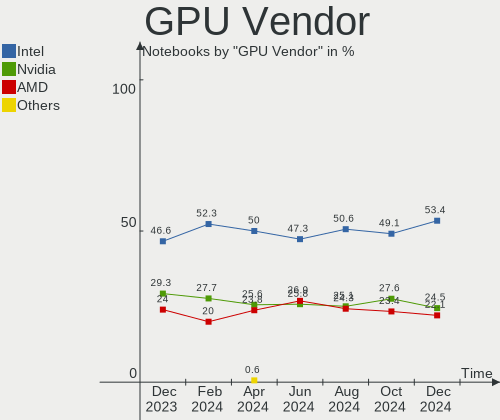
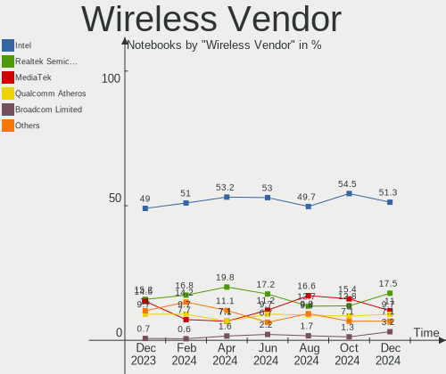

Arch Hardware Trends (Notebooks)
--------------------------------

A project to identify most popular hardware characteristics and track their change
over time based on data collected by Arch users at https://Linux-Hardware.org.

Anyone can contribute to this report by the [hw-probe](https://github.com/linuxhw/hw-probe) tool:

    sudo -E hw-probe -all -upload

Full-feature report is available here: https://linux-hardware.org/?view=trends

Period: Nov, 2021.

Contents
--------

* [ System ](#system)
  - [ OS                       ](#os)
  - [ OS Family                ](#os-family)
  - [ Kernel                   ](#kernel)
  - [ Kernel Family            ](#kernel-family)
  - [ Kernel Major Ver.        ](#kernel-major-ver)
  - [ Arch                     ](#arch)
  - [ DE                       ](#de)
  - [ Display Server           ](#display-server)
  - [ Display Manager          ](#display-manager)
  - [ OS Lang                  ](#os-lang)
  - [ Boot Mode                ](#boot-mode)
  - [ Filesystem               ](#filesystem)
  - [ Part. scheme             ](#part-scheme)
  - [ Dual Boot with Linux/BSD ](#dual-boot-with-linuxbsd)
  - [ Dual Boot (Win)          ](#dual-boot-win)

* [ Board ](#board)
  - [ Vendor                   ](#vendor)
  - [ Model                    ](#model)
  - [ Model Family             ](#model-family)
  - [ MFG Year                 ](#mfg-year)
  - [ Form Factor              ](#form-factor)
  - [ Secure Boot              ](#secure-boot)
  - [ Coreboot                 ](#coreboot)
  - [ RAM Size                 ](#ram-size)
  - [ RAM Used                 ](#ram-used)
  - [ Total Drives             ](#total-drives)
  - [ Has CD-ROM               ](#has-cd-rom)
  - [ Has Ethernet             ](#has-ethernet)
  - [ Has WiFi                 ](#has-wifi)
  - [ Has Bluetooth            ](#has-bluetooth)

* [ Location ](#location)
  - [ Country                  ](#country)
  - [ City                     ](#city)

* [ Drives ](#drives)
  - [ Drive Vendor             ](#drive-vendor)
  - [ Drive Model              ](#drive-model)
  - [ HDD Vendor               ](#hdd-vendor)
  - [ SSD Vendor               ](#ssd-vendor)
  - [ Drive Kind               ](#drive-kind)
  - [ Drive Connector          ](#drive-connector)
  - [ Drive Size               ](#drive-size)
  - [ Space Total              ](#space-total)
  - [ Space Used               ](#space-used)
  - [ Malfunc. Drives          ](#malfunc-drives)
  - [ Malfunc. Drive Vendor    ](#malfunc-drive-vendor)
  - [ Malfunc. HDD Vendor      ](#malfunc-hdd-vendor)
  - [ Malfunc. Drive Kind      ](#malfunc-drive-kind)
  - [ Failed Drives            ](#failed-drives)
  - [ Failed Drive Vendor      ](#failed-drive-vendor)
  - [ Drive Status             ](#drive-status)

* [ Storage controller ](#storage-controller)
  - [ Storage Vendor           ](#storage-vendor)
  - [ Storage Model            ](#storage-model)
  - [ Storage Kind             ](#storage-kind)

* [ Processor ](#processor)
  - [ CPU Vendor               ](#cpu-vendor)
  - [ CPU Model                ](#cpu-model)
  - [ CPU Model Family         ](#cpu-model-family)
  - [ CPU Cores                ](#cpu-cores)
  - [ CPU Sockets              ](#cpu-sockets)
  - [ CPU Threads              ](#cpu-threads)
  - [ CPU Op-Modes             ](#cpu-op-modes)
  - [ CPU Microcode            ](#cpu-microcode)
  - [ CPU Microarch            ](#cpu-microarch)

* [ Graphics ](#graphics)
  - [ GPU Vendor               ](#gpu-vendor)
  - [ GPU Model                ](#gpu-model)
  - [ GPU Combo                ](#gpu-combo)
  - [ GPU Driver               ](#gpu-driver)
  - [ GPU Memory               ](#gpu-memory)

* [ Monitor ](#monitor)
  - [ Monitor Vendor           ](#monitor-vendor)
  - [ Monitor Model            ](#monitor-model)
  - [ Monitor Resolution       ](#monitor-resolution)
  - [ Monitor Diagonal         ](#monitor-diagonal)
  - [ Monitor Width            ](#monitor-width)
  - [ Aspect Ratio             ](#aspect-ratio)
  - [ Monitor Area             ](#monitor-area)
  - [ Pixel Density            ](#pixel-density)
  - [ Multiple Monitors        ](#multiple-monitors)

* [ Network ](#network)
  - [ Net Controller Vendor    ](#net-controller-vendor)
  - [ Net Controller Model     ](#net-controller-model)
  - [ Wireless Vendor          ](#wireless-vendor)
  - [ Wireless Model           ](#wireless-model)
  - [ Ethernet Vendor          ](#ethernet-vendor)
  - [ Ethernet Model           ](#ethernet-model)
  - [ Net Controller Kind      ](#net-controller-kind)
  - [ Used Controller          ](#used-controller)
  - [ NICs                     ](#nics)
  - [ IPv6                     ](#ipv6)

* [ Bluetooth ](#bluetooth)
  - [ Bluetooth Vendor         ](#bluetooth-vendor)
  - [ Bluetooth Model          ](#bluetooth-model)

* [ Sound ](#sound)
  - [ Sound Vendor             ](#sound-vendor)
  - [ Sound Model              ](#sound-model)

* [ Memory ](#memory)
  - [ Memory Vendor            ](#memory-vendor)
  - [ Memory Model             ](#memory-model)
  - [ Memory Kind              ](#memory-kind)
  - [ Memory Form Factor       ](#memory-form-factor)
  - [ Memory Size              ](#memory-size)
  - [ Memory Speed             ](#memory-speed)

* [ Printers & scanners ](#printers--scanners)
  - [ Printer Vendor           ](#printer-vendor)
  - [ Printer Model            ](#printer-model)
  - [ Scanner Vendor           ](#scanner-vendor)
  - [ Scanner Model            ](#scanner-model)

* [ Camera ](#camera)
  - [ Camera Vendor            ](#camera-vendor)
  - [ Camera Model             ](#camera-model)

* [ Security ](#security)
  - [ Fingerprint Vendor       ](#fingerprint-vendor)
  - [ Fingerprint Model        ](#fingerprint-model)
  - [ Chipcard Vendor          ](#chipcard-vendor)
  - [ Chipcard Model           ](#chipcard-model)

* [ Unsupported ](#unsupported)
  - [ Unsupported Devices      ](#unsupported-devices)
  - [ Unsupported Device Types ](#unsupported-device-types)

System
------

OS
--

Installed operating systems

| Name         | Notebooks | Percent |
|--------------|-----------|---------|
| Arch         | 43        | 51.81%  |
| Arch Rolling | 40        | 48.19%  |

OS Family
---------

OS without a version

| Name | Notebooks | Percent |
|------|-----------|---------|
| Arch | 83        | 100%    |

Kernel
------

Version of the Linux kernel

| Version                        | Notebooks | Percent |
|--------------------------------|-----------|---------|
| 5.15.2-arch1-1                 | 17        | 20.48%  |
| 5.14.16-arch1-1                | 12        | 14.46%  |
| 5.15.4-arch1-1                 | 11        | 13.25%  |
| 5.15.5-arch1-1                 | 3         | 3.61%   |
| 5.14.15-arch1-1                | 3         | 3.61%   |
| 5.14.14-arch1-1                | 3         | 3.61%   |
| 5.15.4-zen1-1-zen              | 2         | 2.41%   |
| 5.15.3-arch1-1                 | 2         | 2.41%   |
| 5.15.2-zen1-1-zen              | 2         | 2.41%   |
| 5.14.16-zen1-1-zen             | 2         | 2.41%   |
| 5.14.15-zen1-1-zen             | 2         | 2.41%   |
| 5.14.14-zen1-1-zen             | 2         | 2.41%   |
| 5.14.12-arch1-1                | 2         | 2.41%   |
| 5.9.12-arch1-1                 | 1         | 1.2%    |
| 5.6.10-arch1-1                 | 1         | 1.2%    |
| 5.4.160-RAVEN                  | 1         | 1.2%    |
| 5.15.4-xanmod1-1               | 1         | 1.2%    |
| 5.15.4-arch1-1-51504-01        | 1         | 1.2%    |
| 5.15.3-rc1-xanpre0+clang-rog-2 | 1         | 1.2%    |
| 5.15.0-zen1-1-zen              | 1         | 1.2%    |
| 5.15.0-AMD-znver2              | 1         | 1.2%    |
| 5.15.0-214-tkg-cacule-llvm     | 1         | 1.2%    |
| 5.15.0-1-mainline              | 1         | 1.2%    |
| 5.14.15-xanmod1-cacule-1       | 1         | 1.2%    |
| 5.14.15-arch1-g14-1            | 1         | 1.2%    |
| 5.14.14-hardened1-1-hardened   | 1         | 1.2%    |
| 5.13.7-arch1-1                 | 1         | 1.2%    |
| 5.13.13-zen1-1-zen             | 1         | 1.2%    |
| 5.13.12-arch1-1                | 1         | 1.2%    |
| 5.10.79-1-lts                  | 1         | 1.2%    |
| 5.10.78-1-lts                  | 1         | 1.2%    |
| 5.10.77-214-tkg-cfs            | 1         | 1.2%    |
| 5.10.76-1-lts                  | 1         | 1.2%    |

Kernel Family
-------------

Linux kernel without a distro release

| Version | Notebooks | Percent |
|---------|-----------|---------|
| 5.15.2  | 19        | 22.89%  |
| 5.15.4  | 15        | 18.07%  |
| 5.14.16 | 14        | 16.87%  |
| 5.14.15 | 7         | 8.43%   |
| 5.14.14 | 6         | 7.23%   |
| 5.15.0  | 4         | 4.82%   |
| 5.15.5  | 3         | 3.61%   |
| 5.15.3  | 3         | 3.61%   |
| 5.14.12 | 2         | 2.41%   |
| 5.9.12  | 1         | 1.2%    |
| 5.6.10  | 1         | 1.2%    |
| 5.4.160 | 1         | 1.2%    |
| 5.13.7  | 1         | 1.2%    |
| 5.13.13 | 1         | 1.2%    |
| 5.13.12 | 1         | 1.2%    |
| 5.10.79 | 1         | 1.2%    |
| 5.10.78 | 1         | 1.2%    |
| 5.10.77 | 1         | 1.2%    |
| 5.10.76 | 1         | 1.2%    |

Kernel Major Ver.
-----------------

Linux kernel major version

| Version | Notebooks | Percent |
|---------|-----------|---------|
| 5.15    | 44        | 53.01%  |
| 5.14    | 29        | 34.94%  |
| 5.10    | 4         | 4.82%   |
| 5.13    | 3         | 3.61%   |
| 5.9     | 1         | 1.2%    |
| 5.6     | 1         | 1.2%    |
| 5.4     | 1         | 1.2%    |

Arch
----

OS architecture (x86_64, i586, etc.)

| Name   | Notebooks | Percent |
|--------|-----------|---------|
| x86_64 | 83        | 100%    |

DE
--

Desktop Environment

| Name    | Notebooks | Percent |
|---------|-----------|---------|
| GNOME   | 25        | 30.12%  |
| KDE5    | 24        | 28.92%  |
| Unknown | 11        | 13.25%  |
| i3      | 10        | 12.05%  |
| XFCE    | 4         | 4.82%   |
| Deepin  | 2         | 2.41%   |
| xmonad  | 1         | 1.2%    |
| sway    | 1         | 1.2%    |
| qtile   | 1         | 1.2%    |
| openbox | 1         | 1.2%    |
| MATE    | 1         | 1.2%    |
| LXQt    | 1         | 1.2%    |
| Budgie  | 1         | 1.2%    |

Display Server
--------------

X11 or Wayland

| Name    | Notebooks | Percent |
|---------|-----------|---------|
| X11     | 48        | 57.83%  |
| Wayland | 20        | 24.1%   |
| Tty     | 10        | 12.05%  |
| Unknown | 5         | 6.02%   |

Display Manager
---------------

SDDM, LightDM, etc.

| Name    | Notebooks | Percent |
|---------|-----------|---------|
| Unknown | 27        | 32.53%  |
| SDDM    | 22        | 26.51%  |
| GDM     | 17        | 20.48%  |
| LightDM | 16        | 19.28%  |
| LXDM    | 1         | 1.2%    |

OS Lang
-------

Language

| Lang    | Notebooks | Percent |
|---------|-----------|---------|
| en_US   | 46        | 55.42%  |
| C       | 5         | 6.02%   |
| ru_RU   | 4         | 4.82%   |
| it_IT   | 3         | 3.61%   |
| en_GB   | 3         | 3.61%   |
| de_DE   | 3         | 3.61%   |
| Unknown | 3         | 3.61%   |
| en_IN   | 2         | 2.41%   |
| en_AU   | 2         | 2.41%   |
| zh_CN   | 1         | 1.2%    |
| ru_UA   | 1         | 1.2%    |
| pt_BR   | 1         | 1.2%    |
| pl_PL   | 1         | 1.2%    |
| nl_NL   | 1         | 1.2%    |
| ko_KR   | 1         | 1.2%    |
| fr_FR   | 1         | 1.2%    |
| es_ES   | 1         | 1.2%    |
| en_IL   | 1         | 1.2%    |
| en_IE   | 1         | 1.2%    |
| en_DK   | 1         | 1.2%    |
| .en_US  | 1         | 1.2%    |

Boot Mode
---------

EFI or BIOS

| Mode | Notebooks | Percent |
|------|-----------|---------|
| EFI  | 63        | 75.9%   |
| BIOS | 20        | 24.1%   |

Filesystem
----------

Type of filesystem

| Type  | Notebooks | Percent |
|-------|-----------|---------|
| Ext4  | 56        | 67.47%  |
| Btrfs | 23        | 27.71%  |
| Zfs   | 1         | 1.2%    |
| XXXXX | 1         | 1.2%    |
| Xfs   | 1         | 1.2%    |
| F2fs  | 1         | 1.2%    |

Part. scheme
------------

Scheme of partitioning

| Type    | Notebooks | Percent |
|---------|-----------|---------|
| GPT     | 68        | 81.93%  |
| Unknown | 13        | 15.66%  |
| MBR     | 2         | 2.41%   |

Dual Boot with Linux/BSD
------------------------

Hosting more than one Linux/BSD

| Dual boot | Notebooks | Percent |
|-----------|-----------|---------|
| No        | 77        | 92.77%  |
| Yes       | 6         | 7.23%   |

Dual Boot (Win)
---------------

Hosting Linux and Windows

| Dual boot | Notebooks | Percent |
|-----------|-----------|---------|
| No        | 55        | 66.27%  |
| Yes       | 28        | 33.73%  |

Board
-----

Vendor
------

Motherboard manufacturer

| Name                 | Notebooks | Percent |
|----------------------|-----------|---------|
| Dell                 | 20        | 24.1%   |
| Lenovo               | 16        | 19.28%  |
| Hewlett-Packard      | 14        | 16.87%  |
| ASUSTek Computer     | 12        | 14.46%  |
| Acer                 | 5         | 6.02%   |
| Notebook             | 3         | 3.61%   |
| LG Electronics       | 2         | 2.41%   |
| Framework            | 2         | 2.41%   |
| TUXEDO               | 1         | 1.2%    |
| Schenker             | 1         | 1.2%    |
| Razer                | 1         | 1.2%    |
| Intel Client Systems | 1         | 1.2%    |
| Hyperbook            | 1         | 1.2%    |
| HUAWEI               | 1         | 1.2%    |
| Google               | 1         | 1.2%    |
| Chuwi                | 1         | 1.2%    |
| Alienware            | 1         | 1.2%    |

Model
-----

Motherboard model

| Name                                   | Notebooks | Percent |
|----------------------------------------|-----------|---------|
| Framework Laptop                       | 2         | 2.41%   |
| Dell XPS 13 9310                       | 2         | 2.41%   |
| Dell Inspiron 5515                     | 2         | 2.41%   |
| Dell G5 5505                           | 2         | 2.41%   |
| TUXEDO InfinityBook S 15 Gen6          | 1         | 1.2%    |
| Schenker VIA 15 Pro                    | 1         | 1.2%    |
| Razer Blade 14 - RZ09-0370             | 1         | 1.2%    |
| Notebook P870DM                        | 1         | 1.2%    |
| Notebook NP50DE_DB                     | 1         | 1.2%    |
| Notebook NHx0DB,DE                     | 1         | 1.2%    |
| LG 17UD70P-PX76K                       | 1         | 1.2%    |
| LG 16Z90P-G.AA75A                      | 1         | 1.2%    |
| Lenovo Yoga 14sACH 2021 82MS           | 1         | 1.2%    |
| Lenovo ThinkPad T530 24341G0           | 1         | 1.2%    |
| Lenovo ThinkPad T470s W10DG 20JS0015US | 1         | 1.2%    |
| Lenovo ThinkPad T14 Gen 2i 20W0S02V00  | 1         | 1.2%    |
| Lenovo ThinkPad T14 Gen 2i 20W0S02000  | 1         | 1.2%    |
| Lenovo ThinkPad T14 Gen 2i 20W0CTO1WW  | 1         | 1.2%    |
| Lenovo ThinkPad T14 Gen 1 20S0000SRT   | 1         | 1.2%    |
| Lenovo ThinkPad L520 5016NY9           | 1         | 1.2%    |
| Lenovo ThinkBook 15 G2 ITL 20VE        | 1         | 1.2%    |
| Lenovo Legion R9000P2021H 82JQ         | 1         | 1.2%    |
| Lenovo IdeaPad S340-14API 81NB         | 1         | 1.2%    |
| Lenovo IdeaPad 5 15IIL05 81YK          | 1         | 1.2%    |
| Lenovo IdeaPad 320S-14IKB 80X4         | 1         | 1.2%    |
| Lenovo IdeaPad 3 15ADA05 81W1          | 1         | 1.2%    |
| Lenovo IdeaPad 130-14IKB 81H6          | 1         | 1.2%    |
| Lenovo IdeaPad 100-15IBD 80QQ          | 1         | 1.2%    |
| Intel Client Systems LAPBC710          | 1         | 1.2%    |
| Hyperbook Z15 Zen                      | 1         | 1.2%    |
| HUAWEI BOHB-WAX9                       | 1         | 1.2%    |
| HP Victus by Laptop 16-e0xxx           | 1         | 1.2%    |
| HP Pavilion Laptop 15z-eh000           | 1         | 1.2%    |
| HP Pavilion Laptop 14-ce3xxx           | 1         | 1.2%    |
| HP Pavilion g6                         | 1         | 1.2%    |
| HP Pavilion 15                         | 1         | 1.2%    |
| HP OMEN Laptop 15-en0xxx               | 1         | 1.2%    |
| HP EliteBook 8570w                     | 1         | 1.2%    |
| HP EliteBook 855 G7 Notebook PC        | 1         | 1.2%    |
| HP EliteBook 840 G6                    | 1         | 1.2%    |
| HP EliteBook 840 G1                    | 1         | 1.2%    |
| HP EliteBook 830 G5                    | 1         | 1.2%    |
| HP Compaq Presario CQ40                | 1         | 1.2%    |
| HP 250 G7 Notebook PC                  | 1         | 1.2%    |
| HP 250 G4 Notebook PC                  | 1         | 1.2%    |
| Google Morphius                        | 1         | 1.2%    |
| Dell XPS 15 9510                       | 1         | 1.2%    |
| Dell XPS 13 9300                       | 1         | 1.2%    |
| Dell Vostro 7500                       | 1         | 1.2%    |
| Dell Vostro 5515                       | 1         | 1.2%    |
| Dell Vostro 3500                       | 1         | 1.2%    |
| Dell Precision 7540                    | 1         | 1.2%    |
| Dell Latitude 9420                     | 1         | 1.2%    |
| Dell Inspiron 5570                     | 1         | 1.2%    |
| Dell Inspiron 5567                     | 1         | 1.2%    |
| Dell Inspiron 3505                     | 1         | 1.2%    |
| Dell Inspiron 15-3552                  | 1         | 1.2%    |
| Dell Inspiron 15 5510                  | 1         | 1.2%    |
| Dell G5 5590                           | 1         | 1.2%    |
| Dell G3 3579                           | 1         | 1.2%    |

Model Family
------------

Motherboard model prefix

| Name                          | Notebooks | Percent |
|-------------------------------|-----------|---------|
| Lenovo ThinkPad               | 7         | 8.43%   |
| Dell Inspiron                 | 7         | 8.43%   |
| Lenovo IdeaPad                | 6         | 7.23%   |
| HP EliteBook                  | 5         | 6.02%   |
| HP Pavilion                   | 4         | 4.82%   |
| Dell XPS                      | 4         | 4.82%   |
| Dell Vostro                   | 3         | 3.61%   |
| Dell G5                       | 3         | 3.61%   |
| HP 250                        | 2         | 2.41%   |
| Framework Laptop              | 2         | 2.41%   |
| ASUS ROG                      | 2         | 2.41%   |
| Acer Swift                    | 2         | 2.41%   |
| Acer Aspire                   | 2         | 2.41%   |
| TUXEDO InfinityBook           | 1         | 1.2%    |
| Schenker VIA                  | 1         | 1.2%    |
| Razer Blade                   | 1         | 1.2%    |
| Notebook P870DM               | 1         | 1.2%    |
| Notebook NP50DE               | 1         | 1.2%    |
| Notebook NHx0DB               | 1         | 1.2%    |
| LG 17UD70P-PX76K              | 1         | 1.2%    |
| LG 16Z90P-G.AA75A             | 1         | 1.2%    |
| Lenovo Yoga                   | 1         | 1.2%    |
| Lenovo ThinkBook              | 1         | 1.2%    |
| Lenovo Legion                 | 1         | 1.2%    |
| Intel Client Systems LAPBC710 | 1         | 1.2%    |
| Hyperbook Z15                 | 1         | 1.2%    |
| HUAWEI BOHB-WAX9              | 1         | 1.2%    |
| HP Victus                     | 1         | 1.2%    |
| HP OMEN                       | 1         | 1.2%    |
| HP Compaq                     | 1         | 1.2%    |
| Google Morphius               | 1         | 1.2%    |
| Dell Precision                | 1         | 1.2%    |
| Dell Latitude                 | 1         | 1.2%    |
| Dell G3                       | 1         | 1.2%    |
| Chuwi CoreBook                | 1         | 1.2%    |
| ASUS Zephyrus                 | 1         | 1.2%    |
| ASUS X580VD                   | 1         | 1.2%    |
| ASUS X556URK                  | 1         | 1.2%    |
| ASUS X550LD                   | 1         | 1.2%    |
| ASUS X550CC                   | 1         | 1.2%    |
| ASUS VivoBook                 | 1         | 1.2%    |
| ASUS UX410UAK                 | 1         | 1.2%    |
| ASUS Strix                    | 1         | 1.2%    |
| ASUS M5A99FX                  | 1         | 1.2%    |
| ASUS ASUS                     | 1         | 1.2%    |
| Alienware m15                 | 1         | 1.2%    |
| Acer Nitro                    | 1         | 1.2%    |

MFG Year
--------

Motherboard manufacture year

| Year | Notebooks | Percent |
|------|-----------|---------|
| 2021 | 39        | 46.99%  |
| 2020 | 16        | 19.28%  |
| 2019 | 8         | 9.64%   |
| 2016 | 5         | 6.02%   |
| 2018 | 4         | 4.82%   |
| 2014 | 4         | 4.82%   |
| 2017 | 2         | 2.41%   |
| 2015 | 1         | 1.2%    |
| 2013 | 1         | 1.2%    |
| 2012 | 1         | 1.2%    |
| 2011 | 1         | 1.2%    |
| 2009 | 1         | 1.2%    |

Form Factor
-----------

Physical design of the computer

| Name     | Notebooks | Percent |
|----------|-----------|---------|
| Notebook | 83        | 100%    |

Secure Boot
-----------

Enabled or disabled

| State    | Notebooks | Percent |
|----------|-----------|---------|
| Disabled | 83        | 100%    |

Coreboot
--------

Have coreboot on board

| Used | Notebooks | Percent |
|------|-----------|---------|
| No   | 82        | 98.8%   |
| Yes  | 1         | 1.2%    |

RAM Size
--------

Total RAM memory

| Size in GB  | Notebooks | Percent |
|-------------|-----------|---------|
| 16.01-24.0  | 23        | 27.71%  |
| 8.01-16.0   | 20        | 24.1%   |
| 4.01-8.0    | 17        | 20.48%  |
| 32.01-64.0  | 9         | 10.84%  |
| 3.01-4.0    | 7         | 8.43%   |
| 64.01-256.0 | 5         | 6.02%   |
| 24.01-32.0  | 1         | 1.2%    |
| 1.01-2.0    | 1         | 1.2%    |

RAM Used
--------

Used RAM memory

| Used GB    | Notebooks | Percent |
|------------|-----------|---------|
| 2.01-3.0   | 27        | 32.53%  |
| 4.01-8.0   | 21        | 25.3%   |
| 1.01-2.0   | 15        | 18.07%  |
| 3.01-4.0   | 8         | 9.64%   |
| 8.01-16.0  | 8         | 9.64%   |
| 0.01-0.5   | 2         | 2.41%   |
| 16.01-24.0 | 1         | 1.2%    |
| 0.51-1.0   | 1         | 1.2%    |

Total Drives
------------

Number of drives on board

| Drives | Notebooks | Percent |
|--------|-----------|---------|
| 1      | 58        | 69.88%  |
| 2      | 21        | 25.3%   |
| 3      | 3         | 3.61%   |
| 4      | 1         | 1.2%    |

Has CD-ROM
----------

Has CD-ROM on board

| Presented | Notebooks | Percent |
|-----------|-----------|---------|
| No        | 71        | 85.54%  |
| Yes       | 12        | 14.46%  |

Has Ethernet
------------

Has Ethernet on board

| Presented | Notebooks | Percent |
|-----------|-----------|---------|
| Yes       | 61        | 73.49%  |
| No        | 22        | 26.51%  |

Has WiFi
--------

Has WiFi module

| Presented | Notebooks | Percent |
|-----------|-----------|---------|
| Yes       | 83        | 100%    |

Has Bluetooth
-------------

Has Bluetooth module

| Presented | Notebooks | Percent |
|-----------|-----------|---------|
| Yes       | 80        | 96.39%  |
| No        | 3         | 3.61%   |

Location
--------

Country
-------

Geographic location (country)

| Country     | Notebooks | Percent |
|-------------|-----------|---------|
| USA         | 16        | 19.28%  |
| Italy       | 6         | 7.23%   |
| India       | 6         | 7.23%   |
| Netherlands | 5         | 6.02%   |
| Germany     | 5         | 6.02%   |
| Russia      | 4         | 4.82%   |
| Poland      | 4         | 4.82%   |
| France      | 4         | 4.82%   |
| UK          | 3         | 3.61%   |
| Spain       | 3         | 3.61%   |
| South Korea | 2         | 2.41%   |
| Romania     | 2         | 2.41%   |
| Mexico      | 2         | 2.41%   |
| Iran        | 2         | 2.41%   |
| Estonia     | 2         | 2.41%   |
| Australia   | 2         | 2.41%   |
| Ukraine     | 1         | 1.2%    |
| Thailand    | 1         | 1.2%    |
| Switzerland | 1         | 1.2%    |
| Sri Lanka   | 1         | 1.2%    |
| Slovakia    | 1         | 1.2%    |
| Qatar       | 1         | 1.2%    |
| Israel      | 1         | 1.2%    |
| Indonesia   | 1         | 1.2%    |
| Finland     | 1         | 1.2%    |
| Cyprus      | 1         | 1.2%    |
| Croatia     | 1         | 1.2%    |
| China       | 1         | 1.2%    |
| Brazil      | 1         | 1.2%    |
| Belarus     | 1         | 1.2%    |
| Austria     | 1         | 1.2%    |

City
----

Geographic location (city)

| City           | Notebooks | Percent |
|----------------|-----------|---------|
| Paris          | 2         | 2.41%   |
| Zurich         | 1         | 1.2%    |
| Zapopan        | 1         | 1.2%    |
| Yuba City      | 1         | 1.2%    |
| Warsaw         | 1         | 1.2%    |
| Vilyeyka       | 1         | 1.2%    |
| Vienna         | 1         | 1.2%    |
| Valladolid     | 1         | 1.2%    |
| Valencia       | 1         | 1.2%    |
| The Hague      | 1         | 1.2%    |
| Tel Aviv       | 1         | 1.2%    |
| Tehran         | 1         | 1.2%    |
| Tartu          | 1         | 1.2%    |
| Tallinn        | 1         | 1.2%    |
| Seoul          | 1         | 1.2%    |
| Seattle        | 1         | 1.2%    |
| Sankt Augustin | 1         | 1.2%    |
| Sanandij       | 1         | 1.2%    |
| Salvador       | 1         | 1.2%    |
| Salem          | 1         | 1.2%    |
| Rotterdam      | 1         | 1.2%    |
| Rome           | 1         | 1.2%    |
| Rayong         | 1         | 1.2%    |
| Ramsey         | 1         | 1.2%    |
| Plauen         | 1         | 1.2%    |
| Phoenix        | 1         | 1.2%    |
| Perm           | 1         | 1.2%    |
| Panchkula      | 1         | 1.2%    |
| Nijmegen       | 1         | 1.2%    |
| Nicosia        | 1         | 1.2%    |
| Mysore         | 1         | 1.2%    |
| Moscow         | 1         | 1.2%    |
| Modena         | 1         | 1.2%    |
| Minden         | 1         | 1.2%    |
| Milan          | 1         | 1.2%    |
| Miass          | 1         | 1.2%    |
| Melbourne      | 1         | 1.2%    |
| M??laga        | 1         | 1.2%    |
| London         | 1         | 1.2%    |
| Logan          | 1         | 1.2%    |
| Llucmajor      | 1         | 1.2%    |
| Liverpool      | 1         | 1.2%    |
| Lille          | 1         | 1.2%    |
| Liberty        | 1         | 1.2%    |
| Lancaster      | 1         | 1.2%    |
| Konin          | 1         | 1.2%    |
| Kolkata        | 1         | 1.2%    |
| Kielce         | 1         | 1.2%    |
| Kanchipuram    | 1         | 1.2%    |
| Jakarta        | 1         | 1.2%    |
| Ingatestone    | 1         | 1.2%    |
| Helsinki       | 1         | 1.2%    |
| Heidelberg     | 1         | 1.2%    |
| Haidian        | 1         | 1.2%    |
| Gouda          | 1         | 1.2%    |
| Germantown     | 1         | 1.2%    |
| Gallatin       | 1         | 1.2%    |
| Gaithersburg   | 1         | 1.2%    |
| Ernakulam      | 1         | 1.2%    |
| Enschede       | 1         | 1.2%    |

Drives
------

Drive Vendor
------------

Hard drive vendors

| Vendor                      | Notebooks | Drives | Percent |
|-----------------------------|-----------|--------|---------|
| Samsung Electronics         | 24        | 28     | 22.43%  |
| SK Hynix                    | 13        | 14     | 12.15%  |
| SanDisk                     | 12        | 12     | 11.21%  |
| WDC                         | 10        | 10     | 9.35%   |
| Seagate                     | 9         | 9      | 8.41%   |
| Toshiba                     | 7         | 7      | 6.54%   |
| Kingston                    | 5         | 5      | 4.67%   |
| Crucial                     | 5         | 5      | 4.67%   |
| Unknown                     | 3         | 3      | 2.8%    |
| Micron Technology           | 3         | 3      | 2.8%    |
| Intel                       | 3         | 4      | 2.8%    |
| Transcend                   | 2         | 2      | 1.87%   |
| KIOXIA                      | 2         | 2      | 1.87%   |
| Yangtze Memory Technologies | 1         | 1      | 0.93%   |
| UMIS                        | 1         | 1      | 0.93%   |
| SPCC                        | 1         | 2      | 0.93%   |
| Patriot                     | 1         | 1      | 0.93%   |
| OCZ                         | 1         | 1      | 0.93%   |
| LITEON                      | 1         | 1      | 0.93%   |
| HGST                        | 1         | 1      | 0.93%   |
| GOODRAM                     | 1         | 1      | 0.93%   |
| A-DATA Technology           | 1         | 1      | 0.93%   |

Drive Model
-----------

Hard drive models

| Model                                   | Notebooks | Percent |
|-----------------------------------------|-----------|---------|
| Sandisk NVMe SSD Drive 256GB            | 5         | 4.46%   |
| Seagate ST1000LM035-1RK172 1TB          | 4         | 3.57%   |
| SK Hynix SKHynix_HFS512GDE9X081N 512GB  | 2         | 1.79%   |
| Sandisk NVMe SSD Drive 512GB            | 2         | 1.79%   |
| Sandisk NVMe SSD Drive 1TB              | 2         | 1.79%   |
| Samsung SSD 970 EVO Plus 1TB            | 2         | 1.79%   |
| Kingston SA400S37240G 240GB SSD         | 2         | 1.79%   |
| Yangtze Memory NVMe SSD Drive 256GB     | 1         | 0.89%   |
| WDC WDS400T3X0C-00SJG0 4TB              | 1         | 0.89%   |
| WDC WDS100T1X0E-00AFY0 1TB              | 1         | 0.89%   |
| WDC WD5000LPCX-21VHAT0 500GB            | 1         | 0.89%   |
| WDC WD3200BEVT-60ZCT1 320GB             | 1         | 0.89%   |
| WDC WD10SPZX-24Z10T0 1TB                | 1         | 0.89%   |
| WDC PC SN730 SDBQNTY-512G-1001 512GB    | 1         | 0.89%   |
| WDC PC SN530 SDBPNPZ-512G-1002 512GB    | 1         | 0.89%   |
| WDC PC SN530 SDBPNPZ-1T00-1002 1TB      | 1         | 0.89%   |
| WDC PC SN530 SDBPMPZ-512G-1101 512GB    | 1         | 0.89%   |
| WDC PC SN530 NVMe 512GB                 | 1         | 0.89%   |
| Unknown SC128  128GB                    | 1         | 0.89%   |
| Unknown MMC64G  64GB                    | 1         | 0.89%   |
| Unknown MMC Card  64GB                  | 1         | 0.89%   |
| UMIS RPFTJ128PDD2EWX 128GB              | 1         | 0.89%   |
| Transcend TS128GMSA370 128GB SSD        | 1         | 0.89%   |
| Transcend TS120GMTS820S 120GB SSD       | 1         | 0.89%   |
| Toshiba NVMe SSD Drive 512GB            | 1         | 0.89%   |
| Toshiba NVMe SSD Drive 256GB            | 1         | 0.89%   |
| Toshiba MQ04ABF100 1TB                  | 1         | 0.89%   |
| Toshiba MQ01ABF050 500GB                | 1         | 0.89%   |
| Toshiba KBG40ZNT512G MEMORY 512GB       | 1         | 0.89%   |
| Toshiba KBG30ZMS256G NVMe 256GB         | 1         | 0.89%   |
| Toshiba HDWJ110 1TB                     | 1         | 0.89%   |
| SPCC Solid State Disk 512GB             | 1         | 0.89%   |
| SPCC M.2 PCIe SSD 1TB                   | 1         | 0.89%   |
| SK Hynix SHGP31-1000GM-2 1TB            | 1         | 0.89%   |
| SK Hynix PC711 NVMe 1TB                 | 1         | 0.89%   |
| SK Hynix PC601A NVMe 512GB              | 1         | 0.89%   |
| SK Hynix NVMe SSD Drive 512GB           | 1         | 0.89%   |
| SK Hynix NVMe SSD Drive 1TB             | 1         | 0.89%   |
| SK Hynix NVMe SSD Drive 1024GB          | 1         | 0.89%   |
| SK Hynix HFM512GD3JX013N 512GB          | 1         | 0.89%   |
| SK Hynix HFM256GDJTNI-82A0A 256GB       | 1         | 0.89%   |
| SK Hynix HFM128GDJTNG-8310A 128GB       | 1         | 0.89%   |
| SK Hynix HFM001TD3JX013N 1TB            | 1         | 0.89%   |
| SK Hynix BC711 NVMe 512GB               | 1         | 0.89%   |
| SK Hynix BC511 HFM256GDJTNI-82A0A 256GB | 1         | 0.89%   |
| Seagate ST500LM012 HN-M500MBB 500GB     | 1         | 0.89%   |
| Seagate ST3750528AS 752GB               | 1         | 0.89%   |
| Seagate ST2000LM015-2E8174 2TB          | 1         | 0.89%   |
| Seagate ST2000LM007-1R8174 2TB          | 1         | 0.89%   |
| Seagate BUP Slim 1TB                    | 1         | 0.89%   |
| SanDisk SD9SN8W256G1014 256GB SSD       | 1         | 0.89%   |
| SanDisk SD8SBAT256G1122 256GB SSD       | 1         | 0.89%   |
| Sandisk NVMe SSD Drive 500GB            | 1         | 0.89%   |
| Samsung SSD 980 PRO 2TB                 | 1         | 0.89%   |
| Samsung SSD 980 1TB                     | 1         | 0.89%   |
| Samsung SSD 970 EVO Plus 500GB          | 1         | 0.89%   |
| Samsung SSD 970 EVO 500GB               | 1         | 0.89%   |
| Samsung SSD 950 PRO 512GB               | 1         | 0.89%   |
| Samsung SSD 870 EVO 500GB               | 1         | 0.89%   |
| Samsung SSD 860 EVO 500GB               | 1         | 0.89%   |

HDD Vendor
----------

Hard disk drive vendors

| Vendor  | Notebooks | Drives | Percent |
|---------|-----------|--------|---------|
| Seagate | 9         | 9      | 56.25%  |
| WDC     | 3         | 3      | 18.75%  |
| Toshiba | 3         | 3      | 18.75%  |
| HGST    | 1         | 1      | 6.25%   |

SSD Vendor
----------

Solid state drive vendors

| Vendor              | Notebooks | Drives | Percent |
|---------------------|-----------|--------|---------|
| Samsung Electronics | 6         | 7      | 23.08%  |
| Kingston            | 4         | 4      | 15.38%  |
| Crucial             | 4         | 4      | 15.38%  |
| Transcend           | 2         | 2      | 7.69%   |
| SanDisk             | 2         | 2      | 7.69%   |
| SPCC                | 1         | 1      | 3.85%   |
| Patriot             | 1         | 1      | 3.85%   |
| OCZ                 | 1         | 1      | 3.85%   |
| Micron Technology   | 1         | 1      | 3.85%   |
| LITEON              | 1         | 1      | 3.85%   |
| Intel               | 1         | 1      | 3.85%   |
| GOODRAM             | 1         | 1      | 3.85%   |
| A-DATA Technology   | 1         | 1      | 3.85%   |

Drive Kind
----------

HDD or SSD

| Kind | Notebooks | Drives | Percent |
|------|-----------|--------|---------|
| NVMe | 60        | 68     | 58.82%  |
| SSD  | 23        | 27     | 22.55%  |
| HDD  | 16        | 16     | 15.69%  |
| MMC  | 3         | 3      | 2.94%   |

Drive Connector
---------------

SATA, SAS, NVMe, etc.

| Type | Notebooks | Drives | Percent |
|------|-----------|--------|---------|
| NVMe | 60        | 68     | 63.16%  |
| SATA | 31        | 42     | 32.63%  |
| MMC  | 3         | 3      | 3.16%   |
| SAS  | 1         | 1      | 1.05%   |

Drive Size
----------

Size of hard drive

| Size in TB | Notebooks | Drives | Percent |
|------------|-----------|--------|---------|
| 0.01-0.5   | 18        | 21     | 46.15%  |
| 0.51-1.0   | 17        | 17     | 43.59%  |
| 1.01-2.0   | 4         | 5      | 10.26%  |

Space Total
-----------

Amount of disk space available on the file system

| Size in GB     | Notebooks | Percent |
|----------------|-----------|---------|
| 251-500        | 25        | 30.12%  |
| 101-250        | 18        | 21.69%  |
| 1001-2000      | 17        | 20.48%  |
| 501-1000       | 13        | 15.66%  |
| More than 3000 | 7         | 8.43%   |
| 1-20           | 1         | 1.2%    |
| 51-100         | 1         | 1.2%    |
| Unknown        | 1         | 1.2%    |

Space Used
----------

Amount of used disk space

| Used GB        | Notebooks | Percent |
|----------------|-----------|---------|
| 51-100         | 19        | 22.89%  |
| 101-250        | 16        | 19.28%  |
| 1-20           | 11        | 13.25%  |
| 251-500        | 10        | 12.05%  |
| 501-1000       | 10        | 12.05%  |
| 21-50          | 7         | 8.43%   |
| 1001-2000      | 6         | 7.23%   |
| 2001-3000      | 2         | 2.41%   |
| More than 3000 | 1         | 1.2%    |
| Unknown        | 1         | 1.2%    |

Malfunc. Drives
---------------

Drive models with a malfunction

| Model                                        | Notebooks | Drives | Percent |
|----------------------------------------------|-----------|--------|---------|
| Seagate ST1000LM035-1RK172 1TB               | 2         | 2      | 33.33%  |
| Seagate ST3750528AS 752GB                    | 1         | 1      | 16.67%  |
| Samsung Electronics MZVLW256HEHP-000L7 256GB | 1         | 1      | 16.67%  |
| Micron Technology 2200S NVMe 1024GB          | 1         | 1      | 16.67%  |
| HGST HTS541010A9E680 1TB                     | 1         | 1      | 16.67%  |

Malfunc. Drive Vendor
---------------------

Vendors of faulty drives

| Vendor              | Notebooks | Drives | Percent |
|---------------------|-----------|--------|---------|
| Seagate             | 3         | 3      | 50%     |
| Samsung Electronics | 1         | 1      | 16.67%  |
| Micron Technology   | 1         | 1      | 16.67%  |
| HGST                | 1         | 1      | 16.67%  |

Malfunc. HDD Vendor
-------------------

Vendors of faulty HDD drives

| Vendor  | Notebooks | Drives | Percent |
|---------|-----------|--------|---------|
| Seagate | 3         | 3      | 75%     |
| HGST    | 1         | 1      | 25%     |

Malfunc. Drive Kind
-------------------

Kinds of faulty drives

| Kind | Notebooks | Drives | Percent |
|------|-----------|--------|---------|
| HDD  | 4         | 4      | 66.67%  |
| NVMe | 2         | 2      | 33.33%  |

Failed Drives
-------------

Failed drive models

Zero info for selected period =(

Failed Drive Vendor
-------------------

Failed drive vendors

Zero info for selected period =(

Drive Status
------------

Number of failed and malfunc. drives

| Status   | Notebooks | Drives | Percent |
|----------|-----------|--------|---------|
| Works    | 50        | 64     | 55.56%  |
| Detected | 34        | 44     | 37.78%  |
| Malfunc  | 6         | 6      | 6.67%   |

Storage controller
------------------

Storage Vendor
--------------

Storage controller vendors

| Vendor                       | Notebooks | Percent |
|------------------------------|-----------|---------|
| Intel                        | 41        | 35.04%  |
| Samsung Electronics          | 19        | 16.24%  |
| Sandisk                      | 16        | 13.68%  |
| AMD                          | 14        | 11.97%  |
| SK Hynix                     | 13        | 11.11%  |
| Toshiba America Info Systems | 4         | 3.42%   |
| Micron Technology            | 2         | 1.71%   |
| KIOXIA                       | 2         | 1.71%   |
| Yangtze Memory Technologies  | 1         | 0.85%   |
| Union Memory (Shenzhen)      | 1         | 0.85%   |
| Phison Electronics           | 1         | 0.85%   |
| Micron/Crucial Technology    | 1         | 0.85%   |
| Kingston Technology Company  | 1         | 0.85%   |
| ASMedia Technology           | 1         | 0.85%   |

Storage Model
-------------

Storage controller models

| Model                                                                            | Notebooks | Percent |
|----------------------------------------------------------------------------------|-----------|---------|
| AMD FCH SATA Controller [AHCI mode]                                              | 13        | 10.92%  |
| Samsung NVMe SSD Controller SM981/PM981/PM983                                    | 12        | 10.08%  |
| SK Hynix Gold P31 SSD                                                            | 9         | 7.56%   |
| Sandisk Non-Volatile memory controller                                           | 6         | 5.04%   |
| Intel Sunrise Point-LP SATA Controller [AHCI mode]                               | 5         | 4.2%    |
| Intel Cannon Lake Mobile PCH SATA AHCI Controller                                | 5         | 4.2%    |
| Intel 8 Series SATA Controller 1 [AHCI mode]                                     | 5         | 4.2%    |
| Sandisk WD Blue SN550 NVMe SSD                                                   | 4         | 3.36%   |
| Sandisk WD Black SN750 / PC SN730 NVMe SSD                                       | 4         | 3.36%   |
| Intel 82801 Mobile SATA Controller [RAID mode]                                   | 4         | 3.36%   |
| Intel 7 Series Chipset Family 6-port SATA Controller [AHCI mode]                 | 4         | 3.36%   |
| Samsung NVMe SSD Controller PM9A1/PM9A3/980PRO                                   | 3         | 2.52%   |
| Intel 400 Series Chipset Family SATA AHCI Controller                             | 3         | 2.52%   |
| Toshiba America Info Systems BG3 NVMe SSD Controller                             | 2         | 1.68%   |
| SK Hynix BC511                                                                   | 2         | 1.68%   |
| Sandisk WD PC SN810 / Black SN850 NVMe SSD                                       | 2         | 1.68%   |
| Samsung NVMe SSD Controller 980                                                  | 2         | 1.68%   |
| Micron Non-Volatile memory controller                                            | 2         | 1.68%   |
| KIOXIA Non-Volatile memory controller                                            | 2         | 1.68%   |
| Intel Volume Management Device NVMe RAID Controller                              | 2         | 1.68%   |
| Intel Tiger Lake-LP SATA Controller [AHCI mode]                                  | 2         | 1.68%   |
| Yangtze Memory Non-Volatile memory controller                                    | 1         | 0.84%   |
| Union Memory (Shenzhen) Non-Volatile memory controller                           | 1         | 0.84%   |
| Toshiba America Info Systems XG6 NVMe SSD Controller                             | 1         | 0.84%   |
| Toshiba America Info Systems Toshiba America Info Non-Volatile memory controller | 1         | 0.84%   |
| SK Hynix Non-Volatile memory controller                                          | 1         | 0.84%   |
| SK Hynix BC501 NVMe Solid State Drive                                            | 1         | 0.84%   |
| Samsung NVMe SSD Controller SM961/PM961/SM963                                    | 1         | 0.84%   |
| Samsung NVMe SSD Controller SM951/PM951                                          | 1         | 0.84%   |
| Phison E12 NVMe Controller                                                       | 1         | 0.84%   |
| Micron/Crucial NVMe Controller                                                   | 1         | 0.84%   |
| Kingston Company U-SNS8154P3 NVMe SSD                                            | 1         | 0.84%   |
| Intel Wildcat Point-LP SATA Controller [AHCI Mode]                               | 1         | 0.84%   |
| Intel SSD 660P Series                                                            | 1         | 0.84%   |
| Intel Q170/Q150/B150/H170/H110/Z170/CM236 Chipset SATA Controller [AHCI Mode]    | 1         | 0.84%   |
| Intel Non-Volatile memory controller                                             | 1         | 0.84%   |
| Intel Ice Lake-LP SATA Controller [AHCI mode]                                    | 1         | 0.84%   |
| Intel HM170/QM170 Chipset SATA Controller [AHCI Mode]                            | 1         | 0.84%   |
| Intel Comet Lake SATA AHCI Controller                                            | 1         | 0.84%   |
| Intel Celeron/Pentium Silver Processor SATA Controller                           | 1         | 0.84%   |
| Intel Cannon Point-LP SATA Controller [AHCI Mode]                                | 1         | 0.84%   |
| Intel Atom/Celeron/Pentium Processor x5-E8000/J3xxx/N3xxx Series SATA Controller | 1         | 0.84%   |
| Intel 82801IBM/IEM (ICH9M/ICH9M-E) 4 port SATA Controller [AHCI mode]            | 1         | 0.84%   |
| Intel 6 Series/C200 Series Chipset Family 6 port Mobile SATA AHCI Controller     | 1         | 0.84%   |
| Intel 500 Series Chipset Family SATA AHCI Controller                             | 1         | 0.84%   |
| ASMedia ASM1062 Serial ATA Controller                                            | 1         | 0.84%   |
| AMD SB7x0/SB8x0/SB9x0 SATA Controller [AHCI mode]                                | 1         | 0.84%   |

Storage Kind
------------

Kind of storage controller (IDE, SATA, NVMe, SAS, ...)

| Kind | Notebooks | Percent |
|------|-----------|---------|
| NVMe | 59        | 51.75%  |
| SATA | 49        | 42.98%  |
| RAID | 6         | 5.26%   |

Processor
---------

CPU Vendor
----------

Processor vendors

| Vendor | Notebooks | Percent |
|--------|-----------|---------|
| Intel  | 58        | 69.88%  |
| AMD    | 25        | 30.12%  |

CPU Model
---------

Processor models

| Model                                         | Notebooks | Percent |
|-----------------------------------------------|-----------|---------|
| Intel 11th Gen Core i7-1165G7 @ 2.80GHz       | 7         | 8.43%   |
| Intel 11th Gen Core i7-1185G7 @ 3.00GHz       | 5         | 6.02%   |
| AMD Ryzen 7 5800H with Radeon Graphics        | 4         | 4.82%   |
| Intel Core i7-8750H CPU @ 2.20GHz             | 3         | 3.61%   |
| Intel Core i7-10750H CPU @ 2.60GHz            | 3         | 3.61%   |
| Intel Core i5-7200U CPU @ 2.50GHz             | 3         | 3.61%   |
| AMD Ryzen 7 5700U with Radeon Graphics        | 3         | 3.61%   |
| Intel Core i7-4500U CPU @ 1.80GHz             | 2         | 2.41%   |
| Intel 11th Gen Core i7-11800H @ 2.30GHz       | 2         | 2.41%   |
| AMD Ryzen 9 4900H with Radeon Graphics        | 2         | 2.41%   |
| AMD Ryzen 7 4800H with Radeon Graphics        | 2         | 2.41%   |
| Intel Pentium Silver N5030 CPU @ 1.10GHz      | 1         | 1.2%    |
| Intel Pentium CPU N3710 @ 1.60GHz             | 1         | 1.2%    |
| Intel Pentium CPU 2117U @ 1.80GHz             | 1         | 1.2%    |
| Intel Core i9-9980HK CPU @ 2.40GHz            | 1         | 1.2%    |
| Intel Core i7-9750H CPU @ 2.60GHz             | 1         | 1.2%    |
| Intel Core i7-8565U CPU @ 1.80GHz             | 1         | 1.2%    |
| Intel Core i7-8550U CPU @ 1.80GHz             | 1         | 1.2%    |
| Intel Core i7-7500U CPU @ 2.70GHz             | 1         | 1.2%    |
| Intel Core i7-6700K CPU @ 4.00GHz             | 1         | 1.2%    |
| Intel Core i7-4600U CPU @ 2.10GHz             | 1         | 1.2%    |
| Intel Core i7-3740QM CPU @ 2.70GHz            | 1         | 1.2%    |
| Intel Core i7-1065G7 CPU @ 1.30GHz            | 1         | 1.2%    |
| Intel Core i7-10510U CPU @ 1.80GHz            | 1         | 1.2%    |
| Intel Core i5-8365U CPU @ 1.60GHz             | 1         | 1.2%    |
| Intel Core i5-8350U CPU @ 1.70GHz             | 1         | 1.2%    |
| Intel Core i5-8265U CPU @ 1.60GHz             | 1         | 1.2%    |
| Intel Core i5-8259U CPU @ 2.30GHz             | 1         | 1.2%    |
| Intel Core i5-8250U CPU @ 1.60GHz             | 1         | 1.2%    |
| Intel Core i5-7300HQ CPU @ 2.50GHz            | 1         | 1.2%    |
| Intel Core i5-6300U CPU @ 2.40GHz             | 1         | 1.2%    |
| Intel Core i5-5200U CPU @ 2.20GHz             | 1         | 1.2%    |
| Intel Core i5-4288U CPU @ 2.60GHz             | 1         | 1.2%    |
| Intel Core i5-4200U CPU @ 1.60GHz             | 1         | 1.2%    |
| Intel Core i5-3230M CPU @ 2.60GHz             | 1         | 1.2%    |
| Intel Core i5-2430M CPU @ 2.40GHz             | 1         | 1.2%    |
| Intel Core i5-1035G4 CPU @ 1.10GHz            | 1         | 1.2%    |
| Intel Core i5-1035G1 CPU @ 1.00GHz            | 1         | 1.2%    |
| Intel Core i3-3120M CPU @ 2.50GHz             | 1         | 1.2%    |
| Intel Core i3-10110U CPU @ 2.10GHz            | 1         | 1.2%    |
| Intel Core 2 Duo CPU T6500 @ 2.10GHz          | 1         | 1.2%    |
| Intel 11th Gen Core i7-11390H @ 3.40GHz       | 1         | 1.2%    |
| Intel 11th Gen Core i5-1135G7 @ 2.40GHz       | 1         | 1.2%    |
| Intel 11th Gen Core i3-1115G4 @ 3.00GHz       | 1         | 1.2%    |
| AMD Ryzen 9 5900HX with Radeon Graphics       | 1         | 1.2%    |
| AMD Ryzen 9 5900HS with Radeon Graphics       | 1         | 1.2%    |
| AMD Ryzen 9 4900HS with Radeon Graphics       | 1         | 1.2%    |
| AMD Ryzen 7 PRO 4750U with Radeon Graphics    | 1         | 1.2%    |
| AMD Ryzen 7 4700U with Radeon Graphics        | 1         | 1.2%    |
| AMD Ryzen 7 3750H with Radeon Vega Mobile Gfx | 1         | 1.2%    |
| AMD Ryzen 7 3700U with Radeon Vega Mobile Gfx | 1         | 1.2%    |
| AMD Ryzen 5 4600H with Radeon Graphics        | 1         | 1.2%    |
| AMD Ryzen 5 3500U with Radeon Vega Mobile Gfx | 1         | 1.2%    |
| AMD Ryzen 5 3450U with Radeon Vega Mobile Gfx | 1         | 1.2%    |
| AMD Ryzen 5 2500U with Radeon Vega Mobile Gfx | 1         | 1.2%    |
| AMD Ryzen 3 3200U with Radeon Vega Mobile Gfx | 1         | 1.2%    |
| AMD FX-8350 Eight-Core Processor              | 1         | 1.2%    |
| AMD Athlon Gold 3150C with Radeon Graphics    | 1         | 1.2%    |

CPU Model Family
----------------

Processor model prefix

| Model                | Notebooks | Percent |
|----------------------|-----------|---------|
| Other                | 17        | 20.48%  |
| Intel Core i7        | 17        | 20.48%  |
| Intel Core i5        | 17        | 20.48%  |
| AMD Ryzen 7          | 12        | 14.46%  |
| AMD Ryzen 9          | 5         | 6.02%   |
| AMD Ryzen 5          | 4         | 4.82%   |
| Intel Pentium        | 2         | 2.41%   |
| Intel Core i3        | 2         | 2.41%   |
| Intel Pentium Silver | 1         | 1.2%    |
| Intel Core i9        | 1         | 1.2%    |
| Intel Core 2 Duo     | 1         | 1.2%    |
| AMD Ryzen 7 PRO      | 1         | 1.2%    |
| AMD Ryzen 3          | 1         | 1.2%    |
| AMD FX               | 1         | 1.2%    |
| AMD Athlon           | 1         | 1.2%    |

CPU Cores
---------

Number of processor cores

| Number | Notebooks | Percent |
|--------|-----------|---------|
| 4      | 36        | 43.37%  |
| 2      | 20        | 24.1%   |
| 8      | 19        | 22.89%  |
| 6      | 8         | 9.64%   |

CPU Sockets
-----------

Number of sockets

| Number | Notebooks | Percent |
|--------|-----------|---------|
| 1      | 83        | 100%    |

CPU Threads
-----------

Threads per core (Hyper-Threading)

| Number | Notebooks | Percent |
|--------|-----------|---------|
| 2      | 77        | 92.77%  |
| 1      | 6         | 7.23%   |

CPU Op-Modes
------------

CPU Operation Modes (32-bit, 64-bit)

| Op mode        | Notebooks | Percent |
|----------------|-----------|---------|
| 32-bit, 64-bit | 83        | 100%    |

CPU Microcode
-------------

Microcode number

| Number     | Notebooks | Percent |
|------------|-----------|---------|
| Unknown    | 19        | 22.89%  |
| 0x806c1    | 12        | 14.46%  |
| 0x0a50000c | 5         | 6.02%   |
| 0x806ea    | 4         | 4.82%   |
| 0x906ea    | 3         | 3.61%   |
| 0x806ec    | 3         | 3.61%   |
| 0x806e9    | 3         | 3.61%   |
| 0x706e5    | 3         | 3.61%   |
| 0xa0652    | 2         | 2.41%   |
| 0x40651    | 2         | 2.41%   |
| 0x08600104 | 2         | 2.41%   |
| 0x08108109 | 2         | 2.41%   |
| 0x08108102 | 2         | 2.41%   |
| 0x906ed    | 1         | 1.2%    |
| 0x906e9    | 1         | 1.2%    |
| 0x806eb    | 1         | 1.2%    |
| 0x806d1    | 1         | 1.2%    |
| 0x806c2    | 1         | 1.2%    |
| 0x706a8    | 1         | 1.2%    |
| 0x506e3    | 1         | 1.2%    |
| 0x406e3    | 1         | 1.2%    |
| 0x406c4    | 1         | 1.2%    |
| 0x306d4    | 1         | 1.2%    |
| 0x306a9    | 1         | 1.2%    |
| 0x206a7    | 1         | 1.2%    |
| 0x1067a    | 1         | 1.2%    |
| 0x0a50000b | 1         | 1.2%    |
| 0x08608102 | 1         | 1.2%    |
| 0x08600106 | 1         | 1.2%    |
| 0x08600103 | 1         | 1.2%    |
| 0x08600102 | 1         | 1.2%    |
| 0x08200103 | 1         | 1.2%    |
| 0x08101007 | 1         | 1.2%    |
| 0x06000822 | 1         | 1.2%    |

CPU Microarch
-------------

Microarchitecture

| Name          | Notebooks | Percent |
|---------------|-----------|---------|
| KabyLake      | 19        | 22.89%  |
| TigerLake     | 15        | 18.07%  |
| Zen 2         | 8         | 9.64%   |
| Zen 3         | 6         | 7.23%   |
| Zen+          | 5         | 6.02%   |
| Haswell       | 5         | 6.02%   |
| IvyBridge     | 4         | 4.82%   |
| IceLake       | 4         | 4.82%   |
| Unknown       | 4         | 4.82%   |
| CometLake     | 3         | 3.61%   |
| Zen           | 2         | 2.41%   |
| Skylake       | 2         | 2.41%   |
| Silvermont    | 1         | 1.2%    |
| SandyBridge   | 1         | 1.2%    |
| Piledriver    | 1         | 1.2%    |
| Penryn        | 1         | 1.2%    |
| Goldmont plus | 1         | 1.2%    |
| Broadwell     | 1         | 1.2%    |

Graphics
--------

GPU Vendor
----------

Vendors of graphics cards

| Vendor | Notebooks | Percent |
|--------|-----------|---------|
| Intel  | 56        | 49.12%  |
| Nvidia | 30        | 26.32%  |
| AMD    | 28        | 24.56%  |

GPU Model
---------

Graphics card models

| Model                                                                                    | Notebooks | Percent |
|------------------------------------------------------------------------------------------|-----------|---------|
| Intel TigerLake-LP GT2 [Iris Xe Graphics]                                                | 14        | 12.07%  |
| AMD Renoir                                                                               | 8         | 6.9%    |
| AMD Picasso/Raven 2 [Radeon Vega Series / Radeon Vega Mobile Series]                     | 6         | 5.17%   |
| AMD Cezanne                                                                              | 6         | 5.17%   |
| Intel Haswell-ULT Integrated Graphics Controller                                         | 5         | 4.31%   |
| Intel CoffeeLake-H GT2 [UHD Graphics 630]                                                | 5         | 4.31%   |
| Nvidia TU117M [GeForce GTX 1650 Ti Mobile]                                               | 4         | 3.45%   |
| Nvidia GA104M [GeForce RTX 3070 Mobile / Max-Q]                                          | 4         | 3.45%   |
| Intel HD Graphics 620                                                                    | 4         | 3.45%   |
| Nvidia GP107M [GeForce GTX 1050 Mobile]                                                  | 3         | 2.59%   |
| Intel WhiskeyLake-U GT2 [UHD Graphics 620]                                               | 3         | 2.59%   |
| Intel UHD Graphics 620                                                                   | 3         | 2.59%   |
| Intel CometLake-H GT2 [UHD Graphics]                                                     | 3         | 2.59%   |
| Intel 3rd Gen Core processor Graphics Controller                                         | 3         | 2.59%   |
| AMD Lucienne                                                                             | 3         | 2.59%   |
| Nvidia GP107M [GeForce GTX 1050 Ti Mobile]                                               | 2         | 1.72%   |
| Nvidia GM108M [GeForce 920MX]                                                            | 2         | 1.72%   |
| Nvidia GF117M [GeForce 610M/710M/810M/820M / GT 620M/625M/630M/720M]                     | 2         | 1.72%   |
| Nvidia GA106M [GeForce RTX 3060 Mobile / Max-Q]                                          | 2         | 1.72%   |
| Intel TigerLake-H GT1 [UHD Graphics]                                                     | 2         | 1.72%   |
| Intel CometLake-U GT2 [UHD Graphics]                                                     | 2         | 1.72%   |
| AMD Navi 10 [Radeon RX 5600 OEM/5600 XT / 5700/5700 XT]                                  | 2         | 1.72%   |
| Nvidia TU117M [GeForce GTX 1650 Mobile / Max-Q]                                          | 1         | 0.86%   |
| Nvidia TU117M                                                                            | 1         | 0.86%   |
| Nvidia TU116M [GeForce GTX 1660 Ti Mobile]                                               | 1         | 0.86%   |
| Nvidia TU106M [GeForce RTX 2060 Mobile]                                                  | 1         | 0.86%   |
| Nvidia TU106M [GeForce RTX 2060 Max-Q]                                                   | 1         | 0.86%   |
| Nvidia GM204M [GeForce GTX 980M]                                                         | 1         | 0.86%   |
| Nvidia GM108M [GeForce 930MX]                                                            | 1         | 0.86%   |
| Nvidia GK208M [GeForce GT 740M]                                                          | 1         | 0.86%   |
| Nvidia GK208BM [GeForce 920M]                                                            | 1         | 0.86%   |
| Nvidia GK107GLM [Quadro K2000M]                                                          | 1         | 0.86%   |
| Nvidia GA107M [GeForce RTX 3050 Ti Mobile]                                               | 1         | 0.86%   |
| Intel Tiger Lake UHD Graphics                                                            | 1         | 0.86%   |
| Intel Skylake GT2 [HD Graphics 520]                                                      | 1         | 0.86%   |
| Intel Mobile 4 Series Chipset Integrated Graphics Controller                             | 1         | 0.86%   |
| Intel Iris Plus Graphics G7                                                              | 1         | 0.86%   |
| Intel Iris Plus Graphics G4 (Ice Lake)                                                   | 1         | 0.86%   |
| Intel Iris Plus Graphics G1 (Ice Lake)                                                   | 1         | 0.86%   |
| Intel HD Graphics 630                                                                    | 1         | 0.86%   |
| Intel HD Graphics 5500                                                                   | 1         | 0.86%   |
| Intel GeminiLake [UHD Graphics 605]                                                      | 1         | 0.86%   |
| Intel CoffeeLake-U GT3e [Iris Plus Graphics 655]                                         | 1         | 0.86%   |
| Intel Atom/Celeron/Pentium Processor x5-E8000/J3xxx/N3xxx Integrated Graphics Controller | 1         | 0.86%   |
| Intel 2nd Generation Core Processor Family Integrated Graphics Controller                | 1         | 0.86%   |
| AMD Topaz XT [Radeon R7 M260/M265 / M340/M360 / M440/M445 / 530/535 / 620/625 Mobile]    | 1         | 0.86%   |
| AMD Thames [Radeon HD 7500M/7600M Series]                                                | 1         | 0.86%   |
| AMD Raven Ridge [Radeon Vega Series / Radeon Vega Mobile Series]                         | 1         | 0.86%   |
| AMD Mars [Radeon HD 8730M]                                                               | 1         | 0.86%   |
| AMD Hawaii PRO [Radeon R9 290/390]                                                       | 1         | 0.86%   |

GPU Combo
---------

Combinations of graphics cards

| Name           | Notebooks | Percent |
|----------------|-----------|---------|
| 1 x Intel      | 34        | 40.96%  |
| Intel + Nvidia | 19        | 22.89%  |
| 1 x AMD        | 14        | 16.87%  |
| AMD + Nvidia   | 9         | 10.84%  |
| Intel + AMD    | 3         | 3.61%   |
| 2 x AMD        | 2         | 2.41%   |
| 1 x Nvidia     | 2         | 2.41%   |

GPU Driver
----------

Free vs proprietary

| Driver      | Notebooks | Percent |
|-------------|-----------|---------|
| Free        | 62        | 74.7%   |
| Proprietary | 21        | 25.3%   |

GPU Memory
----------

Total video memory

| Size in GB | Notebooks | Percent |
|------------|-----------|---------|
| Unknown    | 54        | 65.06%  |
| 0.01-0.5   | 10        | 12.05%  |
| 3.01-4.0   | 7         | 8.43%   |
| 1.01-2.0   | 5         | 6.02%   |
| 7.01-8.0   | 3         | 3.61%   |
| 5.01-6.0   | 3         | 3.61%   |
| 0.51-1.0   | 1         | 1.2%    |

Monitor
-------

Monitor Vendor
--------------

Monitor vendors

| Vendor              | Notebooks | Percent |
|---------------------|-----------|---------|
| BOE                 | 19        | 19%     |
| AU Optronics        | 15        | 15%     |
| LG Display          | 14        | 14%     |
| Chimei Innolux      | 12        | 12%     |
| Samsung Electronics | 10        | 10%     |
| PANDA               | 5         | 5%      |
| Dell                | 4         | 4%      |
| CSO                 | 4         | 4%      |
| Sharp               | 3         | 3%      |
| Lenovo              | 3         | 3%      |
| Acer                | 3         | 3%      |
| Philips             | 2         | 2%      |
| BenQ                | 2         | 2%      |
| AOC                 | 2         | 2%      |
| InfoVision          | 1         | 1%      |
| Goldstar            | 1         | 1%      |

Monitor Model
-------------

Monitor models

| Model                                                                 | Notebooks | Percent |
|-----------------------------------------------------------------------|-----------|---------|
| Philips PHL 243V7 PHLC155 1920x1080 530x300mm 24.0-inch               | 2         | 1.92%   |
| PANDA LCD Monitor NCP004D 1920x1080 344x194mm 15.5-inch               | 2         | 1.92%   |
| Chimei Innolux LCD Monitor CMN152E 1920x1080 344x193mm 15.5-inch      | 2         | 1.92%   |
| BOE LCD Monitor BOE095F 2256x1504 285x190mm 13.5-inch                 | 2         | 1.92%   |
| AU Optronics LCD Monitor AUO46EC 1366x768 344x193mm 15.5-inch         | 2         | 1.92%   |
| AU Optronics LCD Monitor AUO403D 1920x1080 309x173mm 13.9-inch        | 2         | 1.92%   |
| AU Optronics LCD Monitor AUO38ED 1920x1080 340x190mm 15.3-inch        | 2         | 1.92%   |
| Sharp LQ140M1JW49 SHP1523 1920x1080 309x174mm 14.0-inch               | 1         | 0.96%   |
| Sharp LCD Monitor SHP14F9 1920x1200 288x180mm 13.4-inch               | 1         | 0.96%   |
| Sharp LCD Monitor SHP14CC 3840x2400 288x180mm 13.4-inch               | 1         | 0.96%   |
| Samsung Electronics LCD Monitor SEC4D42 1280x800 303x190mm 14.1-inch  | 1         | 0.96%   |
| Samsung Electronics LCD Monitor SEC315A 1366x768 344x194mm 15.5-inch  | 1         | 0.96%   |
| Samsung Electronics LCD Monitor SEC3152 1366x768 344x194mm 15.5-inch  | 1         | 0.96%   |
| Samsung Electronics LCD Monitor SDC4C46 3840x2160 344x194mm 15.5-inch | 1         | 0.96%   |
| Samsung Electronics LCD Monitor SDC484E 1600x900 309x174mm 14.0-inch  | 1         | 0.96%   |
| Samsung Electronics LCD Monitor SDC4651 1366x768 344x194mm 15.5-inch  | 1         | 0.96%   |
| Samsung Electronics LCD Monitor SDC414F 3456x2160 288x180mm 13.4-inch | 1         | 0.96%   |
| Samsung Electronics LCD Monitor SDC414D 1366x768 309x174mm 14.0-inch  | 1         | 0.96%   |
| Samsung Electronics LCD Monitor SAM0B30 1920x1080 890x500mm 40.2-inch | 1         | 0.96%   |
| Samsung Electronics C27FG7x SAM0E41 1920x1080 598x337mm 27.0-inch     | 1         | 0.96%   |
| Samsung Electronics C24F390 SAM0D2C 1920x1080 520x290mm 23.4-inch     | 1         | 0.96%   |
| PANDA LCD Monitor NCP0050 1920x1080 309x174mm 14.0-inch               | 1         | 0.96%   |
| PANDA LCD Monitor NCP0040 1920x1080 344x194mm 15.5-inch               | 1         | 0.96%   |
| PANDA LCD Monitor NCP0036 1920x1080 344x194mm 15.5-inch               | 1         | 0.96%   |
| LG Display LCD Monitor LGD06E0 1920x1080 344x194mm 15.5-inch          | 1         | 0.96%   |
| LG Display LCD Monitor LGD069C 1920x1080 309x174mm 14.0-inch          | 1         | 0.96%   |
| LG Display LCD Monitor LGD0694 2560x1600 344x215mm 16.0-inch          | 1         | 0.96%   |
| LG Display LCD Monitor LGD0683 1920x1080 344x194mm 15.5-inch          | 1         | 0.96%   |
| LG Display LCD Monitor LGD065A 1920x1080 344x194mm 15.5-inch          | 1         | 0.96%   |
| LG Display LCD Monitor LGD0637 1920x1080 344x194mm 15.5-inch          | 1         | 0.96%   |
| LG Display LCD Monitor LGD0612 1920x1080 344x194mm 15.5-inch          | 1         | 0.96%   |
| LG Display LCD Monitor LGD05F8 2560x1600 366x229mm 17.0-inch          | 1         | 0.96%   |
| LG Display LCD Monitor LGD05E4 1920x1080 344x194mm 15.5-inch          | 1         | 0.96%   |
| LG Display LCD Monitor LGD05D8 1920x1080 344x194mm 15.5-inch          | 1         | 0.96%   |
| LG Display LCD Monitor LGD053F 1920x1080 344x194mm 15.5-inch          | 1         | 0.96%   |
| LG Display LCD Monitor LGD0521 1920x1080 309x174mm 14.0-inch          | 1         | 0.96%   |
| LG Display LCD Monitor LGD04E8 1920x1080 382x215mm 17.3-inch          | 1         | 0.96%   |
| LG Display LCD Monitor LGD0259 1920x1080 350x190mm 15.7-inch          | 1         | 0.96%   |
| Lenovo LEN T2424pA LEN60C8 1920x1080 527x296mm 23.8-inch              | 1         | 0.96%   |
| Lenovo LEN T2324pA LEN60C7 1920x1080 509x286mm 23.0-inch              | 1         | 0.96%   |
| Lenovo LEN L27q-10 LEN65CE 2560x1440 597x336mm 27.0-inch              | 1         | 0.96%   |
| Lenovo LCD Monitor LEN40B1 1600x900 344x194mm 15.5-inch               | 1         | 0.96%   |
| InfoVision LCD Monitor IVO8544 1920x1080 294x165mm 13.3-inch          | 1         | 0.96%   |
| Goldstar ULTRAWIDE GSM76F9 2560x1080 531x298mm 24.0-inch              | 1         | 0.96%   |
| Goldstar LG ULTRAGEAR GSM5BB4 2560x1440 600x340mm 27.2-inch           | 1         | 0.96%   |
| Dell U3818DW DELA0F4 3840x1600 880x367mm 37.5-inch                    | 1         | 0.96%   |
| Dell U2715H DELD067 2560x1440 597x336mm 27.0-inch                     | 1         | 0.96%   |
| Dell U2520DR DELA155 2560x1440 550x310mm 24.9-inch                    | 1         | 0.96%   |
| Dell S2716DG DELA0D1 2560x1440 598x336mm 27.0-inch                    | 1         | 0.96%   |
| Dell P2319H DELD0D7 1920x1080 509x286mm 23.0-inch                     | 1         | 0.96%   |
| CSO LCD Monitor CSO1600 2560x1600 345x215mm 16.0-inch                 | 1         | 0.96%   |
| CSO LCD Monitor CSO1405 3840x2160 309x174mm 14.0-inch                 | 1         | 0.96%   |
| CSO LCD Monitor CSO1402 2880x1800 302x188mm 14.0-inch                 | 1         | 0.96%   |
| CSO LCD Monitor CSO1400 3840x2160 309x174mm 14.0-inch                 | 1         | 0.96%   |
| Chimei Innolux LCD Monitor CMN1747 1920x1080 381x214mm 17.2-inch      | 1         | 0.96%   |
| Chimei Innolux LCD Monitor CMN15F6 1920x1080 344x193mm 15.5-inch      | 1         | 0.96%   |
| Chimei Innolux LCD Monitor CMN15C9 1366x768 344x193mm 15.5-inch       | 1         | 0.96%   |
| Chimei Innolux LCD Monitor CMN15C6 1366x768 340x190mm 15.3-inch       | 1         | 0.96%   |
| Chimei Innolux LCD Monitor CMN15AB 1366x768 350x190mm 15.7-inch       | 1         | 0.96%   |
| Chimei Innolux LCD Monitor CMN152A 2560x1440 344x193mm 15.5-inch      | 1         | 0.96%   |

Monitor Resolution
------------------

Monitor screen resolution

| Resolution        | Notebooks | Percent |
|-------------------|-----------|---------|
| 1920x1080 (FHD)   | 51        | 57.95%  |
| 1366x768 (WXGA)   | 12        | 13.64%  |
| 3840x2160 (4K)    | 4         | 4.55%   |
| 2560x1440 (QHD)   | 4         | 4.55%   |
| 2560x1600         | 3         | 3.41%   |
| 3456x2160         | 2         | 2.27%   |
| 2256x1504         | 2         | 2.27%   |
| 1920x1200 (WUXGA) | 2         | 2.27%   |
| 1600x900 (HD+)    | 2         | 2.27%   |
| 3840x2400         | 1         | 1.14%   |
| 3840x1600         | 1         | 1.14%   |
| 2880x1800         | 1         | 1.14%   |
| 2560x1080         | 1         | 1.14%   |
| 1280x800 (WXGA)   | 1         | 1.14%   |
| 1280x1024 (SXGA)  | 1         | 1.14%   |

Monitor Diagonal
----------------

Diagonal size in inches

| Inches  | Notebooks | Percent |
|---------|-----------|---------|
| 15      | 49        | 48.51%  |
| 14      | 15        | 14.85%  |
| 13      | 10        | 9.9%    |
| 27      | 4         | 3.96%   |
| 24      | 4         | 3.96%   |
| 17      | 4         | 3.96%   |
| 23      | 3         | 2.97%   |
| 21      | 3         | 2.97%   |
| 16      | 3         | 2.97%   |
| 40      | 1         | 0.99%   |
| 37      | 1         | 0.99%   |
| 34      | 1         | 0.99%   |
| 25      | 1         | 0.99%   |
| 19      | 1         | 0.99%   |
| Unknown | 1         | 0.99%   |

Monitor Width
-------------

Physical width

| Width in mm | Notebooks | Percent |
|-------------|-----------|---------|
| 301-350     | 69        | 69.7%   |
| 501-600     | 10        | 10.1%   |
| 201-300     | 7         | 7.07%   |
| 351-400     | 6         | 6.06%   |
| 401-500     | 3         | 3.03%   |
| 801-900     | 2         | 2.02%   |
| 701-800     | 1         | 1.01%   |
| Unknown     | 1         | 1.01%   |

Aspect Ratio
------------

Proportional relationship between the width and the height

| Ratio   | Notebooks | Percent |
|---------|-----------|---------|
| 16/9    | 72        | 81.82%  |
| 16/10   | 10        | 11.36%  |
| 3/2     | 2         | 2.27%   |
| 21/9    | 2         | 2.27%   |
| 5/4     | 1         | 1.14%   |
| Unknown | 1         | 1.14%   |

Monitor Area
------------

Area in inch

| Area in inch | Notebooks | Percent |
|----------------|-----------|---------|
| 101-110        | 50        | 49.5%   |
| 81-90          | 20        | 19.8%   |
| 201-250        | 7         | 6.93%   |
| 71-80          | 5         | 4.95%   |
| 301-350        | 4         | 3.96%   |
| 121-130        | 4         | 3.96%   |
| 151-200        | 3         | 2.97%   |
| 251-300        | 2         | 1.98%   |
| 111-120        | 2         | 1.98%   |
| 501-1000       | 2         | 1.98%   |
| 351-500        | 1         | 0.99%   |
| Unknown        | 1         | 0.99%   |

Pixel Density
-------------

Pixels per inch

| Density       | Notebooks | Percent |
|---------------|-----------|---------|
| 121-160       | 50        | 50.51%  |
| 101-120       | 20        | 20.2%   |
| 51-100        | 11        | 11.11%  |
| 161-240       | 10        | 10.1%   |
| More than 240 | 7         | 7.07%   |
| Unknown       | 1         | 1.01%   |

Multiple Monitors
-----------------

Total monitors connected

| Total | Notebooks | Percent |
|-------|-----------|---------|
| 1     | 69        | 83.13%  |
| 2     | 8         | 9.64%   |
| 3     | 6         | 7.23%   |

Network
-------

Net Controller Vendor
---------------------

Controller vendors

| Vendor                | Notebooks | Percent |
|-----------------------|-----------|---------|
| Intel                 | 59        | 46.46%  |
| Realtek Semiconductor | 50        | 39.37%  |
| Qualcomm Atheros      | 13        | 10.24%  |
| Ralink                | 1         | 0.79%   |
| Qualcomm              | 1         | 0.79%   |
| MEDIATEK              | 1         | 0.79%   |
| Hewlett-Packard       | 1         | 0.79%   |
| Broadcom              | 1         | 0.79%   |

Net Controller Model
--------------------

Controller models

| Model                                                             | Notebooks | Percent |
|-------------------------------------------------------------------|-----------|---------|
| Realtek RTL8111/8168/8411 PCI Express Gigabit Ethernet Controller | 34        | 23.13%  |
| Intel Wi-Fi 6 AX200                                               | 20        | 13.61%  |
| Realtek RTL810xE PCI Express Fast Ethernet controller             | 8         | 5.44%   |
| Intel Wi-Fi 6 AX201                                               | 8         | 5.44%   |
| Intel Wi-Fi 6 AX210/AX211/AX411 160MHz                            | 6         | 4.08%   |
| Qualcomm Atheros QCA6174 802.11ac Wireless Network Adapter        | 5         | 3.4%    |
| Realtek RTL8153 Gigabit Ethernet Adapter                          | 4         | 2.72%   |
| Qualcomm Atheros QCA9377 802.11ac Wireless Network Adapter        | 4         | 2.72%   |
| Intel Cannon Lake PCH CNVi WiFi                                   | 4         | 2.72%   |
| Intel Wireless 3165                                               | 3         | 2.04%   |
| Intel Ice Lake-LP PCH CNVi WiFi                                   | 3         | 2.04%   |
| Intel Ethernet Connection (13) I219-V                             | 3         | 2.04%   |
| Realtek RTL8852AE 802.11ax PCIe Wireless Network Adapter          | 2         | 1.36%   |
| Realtek RTL8723BE PCIe Wireless Network Adapter                   | 2         | 1.36%   |
| Qualcomm Atheros QCA9565 / AR9565 Wireless Network Adapter        | 2         | 1.36%   |
| Intel Wireless 8265 / 8275                                        | 2         | 1.36%   |
| Intel Wireless 8260                                               | 2         | 1.36%   |
| Intel Wireless 7260                                               | 2         | 1.36%   |
| Intel Tiger Lake PCH CNVi WiFi                                    | 2         | 1.36%   |
| Intel I210 Gigabit Network Connection                             | 2         | 1.36%   |
| Intel Comet Lake PCH-LP CNVi WiFi                                 | 2         | 1.36%   |
| Intel Centrino Advanced-N 6205 [Taylor Peak]                      | 2         | 1.36%   |
| Intel 82579LM Gigabit Network Connection (Lewisville)             | 2         | 1.36%   |
| Realtek USB 10/100/1G/2.5G LAN                                    | 1         | 0.68%   |
| Realtek RTL8822CE 802.11ac PCIe Wireless Network Adapter          | 1         | 0.68%   |
| Realtek RTL8821CE 802.11ac PCIe Wireless Network Adapter          | 1         | 0.68%   |
| Realtek RTL8188CE 802.11b/g/n WiFi Adapter                        | 1         | 0.68%   |
| Realtek RTL8152 Fast Ethernet Adapter                             | 1         | 0.68%   |
| Realtek Killer E2600 Gigabit Ethernet Controller                  | 1         | 0.68%   |
| Ralink RT3290 Wireless 802.11n 1T/1R PCIe                         | 1         | 0.68%   |
| Qualcomm QCA6390 Wireless Network Adapter [AX500-DBS (2x2)]       | 1         | 0.68%   |
| Qualcomm Atheros Killer E2400 Gigabit Ethernet Controller         | 1         | 0.68%   |
| Qualcomm Atheros AR9485 Wireless Network Adapter                  | 1         | 0.68%   |
| Qualcomm Atheros AR928X Wireless Network Adapter (PCI-Express)    | 1         | 0.68%   |
| MEDIATEK Network controller                                       | 1         | 0.68%   |
| Intel Ethernet Connection I219-LM                                 | 1         | 0.68%   |
| Intel Ethernet Connection I218-LM                                 | 1         | 0.68%   |
| Intel Ethernet Connection (7) I219-LM                             | 1         | 0.68%   |
| Intel Ethernet Connection (6) I219-LM                             | 1         | 0.68%   |
| Intel Ethernet Connection (4) I219-LM                             | 1         | 0.68%   |
| Intel Ethernet Connection (10) I219-V                             | 1         | 0.68%   |
| Intel Dual Band Wireless-AC 3165 Plus Bluetooth                   | 1         | 0.68%   |
| Intel Comet Lake PCH CNVi WiFi                                    | 1         | 0.68%   |
| Intel Cannon Point-LP CNVi [Wireless-AC]                          | 1         | 0.68%   |
| HP lt4112 Gobi 4G Module Network Device                           | 1         | 0.68%   |
| Broadcom BCM4312 802.11b/g LP-PHY                                 | 1         | 0.68%   |

Wireless Vendor
---------------

Wireless vendors

| Vendor                | Notebooks | Percent |
|-----------------------|-----------|---------|
| Intel                 | 59        | 70.24%  |
| Qualcomm Atheros      | 13        | 15.48%  |
| Realtek Semiconductor | 7         | 8.33%   |
| Ralink                | 1         | 1.19%   |
| Qualcomm              | 1         | 1.19%   |
| MEDIATEK              | 1         | 1.19%   |
| Hewlett-Packard       | 1         | 1.19%   |
| Broadcom              | 1         | 1.19%   |

Wireless Model
--------------

Wireless models

| Model                                                          | Notebooks | Percent |
|----------------------------------------------------------------|-----------|---------|
| Intel Wi-Fi 6 AX200                                            | 20        | 23.81%  |
| Intel Wi-Fi 6 AX201                                            | 8         | 9.52%   |
| Intel Wi-Fi 6 AX210/AX211/AX411 160MHz                         | 6         | 7.14%   |
| Qualcomm Atheros QCA6174 802.11ac Wireless Network Adapter     | 5         | 5.95%   |
| Qualcomm Atheros QCA9377 802.11ac Wireless Network Adapter     | 4         | 4.76%   |
| Intel Cannon Lake PCH CNVi WiFi                                | 4         | 4.76%   |
| Intel Wireless 3165                                            | 3         | 3.57%   |
| Intel Ice Lake-LP PCH CNVi WiFi                                | 3         | 3.57%   |
| Realtek RTL8852AE 802.11ax PCIe Wireless Network Adapter       | 2         | 2.38%   |
| Realtek RTL8723BE PCIe Wireless Network Adapter                | 2         | 2.38%   |
| Qualcomm Atheros QCA9565 / AR9565 Wireless Network Adapter     | 2         | 2.38%   |
| Intel Wireless 8265 / 8275                                     | 2         | 2.38%   |
| Intel Wireless 8260                                            | 2         | 2.38%   |
| Intel Wireless 7260                                            | 2         | 2.38%   |
| Intel Tiger Lake PCH CNVi WiFi                                 | 2         | 2.38%   |
| Intel Comet Lake PCH-LP CNVi WiFi                              | 2         | 2.38%   |
| Intel Centrino Advanced-N 6205 [Taylor Peak]                   | 2         | 2.38%   |
| Realtek RTL8822CE 802.11ac PCIe Wireless Network Adapter       | 1         | 1.19%   |
| Realtek RTL8821CE 802.11ac PCIe Wireless Network Adapter       | 1         | 1.19%   |
| Realtek RTL8188CE 802.11b/g/n WiFi Adapter                     | 1         | 1.19%   |
| Ralink RT3290 Wireless 802.11n 1T/1R PCIe                      | 1         | 1.19%   |
| Qualcomm QCA6390 Wireless Network Adapter [AX500-DBS (2x2)]    | 1         | 1.19%   |
| Qualcomm Atheros AR9485 Wireless Network Adapter               | 1         | 1.19%   |
| Qualcomm Atheros AR928X Wireless Network Adapter (PCI-Express) | 1         | 1.19%   |
| MEDIATEK Network controller                                    | 1         | 1.19%   |
| Intel Dual Band Wireless-AC 3165 Plus Bluetooth                | 1         | 1.19%   |
| Intel Comet Lake PCH CNVi WiFi                                 | 1         | 1.19%   |
| Intel Cannon Point-LP CNVi [Wireless-AC]                       | 1         | 1.19%   |
| HP lt4112 Gobi 4G Module Network Device                        | 1         | 1.19%   |
| Broadcom BCM4312 802.11b/g LP-PHY                              | 1         | 1.19%   |

Ethernet Vendor
---------------

Ethernet vendors

| Vendor                | Notebooks | Percent |
|-----------------------|-----------|---------|
| Realtek Semiconductor | 48        | 77.42%  |
| Intel                 | 13        | 20.97%  |
| Qualcomm Atheros      | 1         | 1.61%   |

Ethernet Model
--------------

Ethernet models

| Model                                                             | Notebooks | Percent |
|-------------------------------------------------------------------|-----------|---------|
| Realtek RTL8111/8168/8411 PCI Express Gigabit Ethernet Controller | 34        | 53.97%  |
| Realtek RTL810xE PCI Express Fast Ethernet controller             | 8         | 12.7%   |
| Realtek RTL8153 Gigabit Ethernet Adapter                          | 4         | 6.35%   |
| Intel Ethernet Connection (13) I219-V                             | 3         | 4.76%   |
| Intel I210 Gigabit Network Connection                             | 2         | 3.17%   |
| Intel 82579LM Gigabit Network Connection (Lewisville)             | 2         | 3.17%   |
| Realtek USB 10/100/1G/2.5G LAN                                    | 1         | 1.59%   |
| Realtek RTL8152 Fast Ethernet Adapter                             | 1         | 1.59%   |
| Realtek Killer E2600 Gigabit Ethernet Controller                  | 1         | 1.59%   |
| Qualcomm Atheros Killer E2400 Gigabit Ethernet Controller         | 1         | 1.59%   |
| Intel Ethernet Connection I219-LM                                 | 1         | 1.59%   |
| Intel Ethernet Connection I218-LM                                 | 1         | 1.59%   |
| Intel Ethernet Connection (7) I219-LM                             | 1         | 1.59%   |
| Intel Ethernet Connection (6) I219-LM                             | 1         | 1.59%   |
| Intel Ethernet Connection (4) I219-LM                             | 1         | 1.59%   |
| Intel Ethernet Connection (10) I219-V                             | 1         | 1.59%   |

Net Controller Kind
-------------------

Ethernet, WiFi or modem

| Kind     | Notebooks | Percent |
|----------|-----------|---------|
| WiFi     | 83        | 57.64%  |
| Ethernet | 61        | 42.36%  |

Used Controller
---------------

Currently used network controller

| Kind     | Notebooks | Percent |
|----------|-----------|---------|
| WiFi     | 76        | 71.03%  |
| Ethernet | 31        | 28.97%  |

NICs
----

Total network controllers on board

| Total | Notebooks | Percent |
|-------|-----------|---------|
| 2     | 56        | 67.47%  |
| 1     | 26        | 31.33%  |
| 3     | 1         | 1.2%    |

IPv6
----

IPv6 vs IPv4

| Used | Notebooks | Percent |
|------|-----------|---------|
| No   | 67        | 80.72%  |
| Yes  | 16        | 19.28%  |

Bluetooth
---------

Bluetooth Vendor
----------------

Controller vendors

| Vendor                          | Notebooks | Percent |
|---------------------------------|-----------|---------|
| Intel                           | 55        | 68.75%  |
| Realtek Semiconductor           | 6         | 7.5%    |
| Qualcomm Atheros Communications | 6         | 7.5%    |
| IMC Networks                    | 4         | 5%      |
| Lite-On Technology              | 3         | 3.75%   |
| Broadcom                        | 3         | 3.75%   |
| Ralink                          | 1         | 1.25%   |
| Hewlett-Packard                 | 1         | 1.25%   |
| Cambridge Silicon Radio         | 1         | 1.25%   |

Bluetooth Model
---------------

Controller models

| Model                                               | Notebooks | Percent |
|-----------------------------------------------------|-----------|---------|
| Intel AX200 Bluetooth                               | 19        | 23.75%  |
| Intel Bluetooth Device                              | 13        | 16.25%  |
| Intel Bluetooth wireless interface                  | 9         | 11.25%  |
| Intel Bluetooth 9460/9560 Jefferson Peak (JfP)      | 8         | 10%     |
| Intel AX210 Bluetooth                               | 6         | 7.5%    |
| Realtek Bluetooth Radio                             | 5         | 6.25%   |
| Qualcomm Atheros  Bluetooth Device                  | 4         | 5%      |
| Qualcomm Atheros QCA61x4 Bluetooth 4.0              | 2         | 2.5%    |
| Lite-On Bluetooth Device                            | 2         | 2.5%    |
| IMC Networks Bluetooth Device                       | 2         | 2.5%    |
| Realtek RTL8723B Bluetooth                          | 1         | 1.25%   |
| Ralink RT3290 Bluetooth                             | 1         | 1.25%   |
| Lite-On Qualcomm Atheros QCA9377 Bluetooth          | 1         | 1.25%   |
| IMC Networks Wireless_Device                        | 1         | 1.25%   |
| IMC Networks Atheros AR3012 Bluetooth 4.0 Adapter   | 1         | 1.25%   |
| HP Bluetooth 2.0 Interface [Broadcom BCM2045]       | 1         | 1.25%   |
| Cambridge Silicon Radio Bluetooth Dongle (HCI mode) | 1         | 1.25%   |
| Broadcom HP Portable SoftSailing                    | 1         | 1.25%   |
| Broadcom BCM20702A0 Bluetooth 4.0                   | 1         | 1.25%   |
| Broadcom BCM2045B (BDC-2.1)                         | 1         | 1.25%   |

Sound
-----

Sound Vendor
------------

Sound card vendors

| Vendor                | Notebooks | Percent |
|-----------------------|-----------|---------|
| Intel                 | 58        | 51.33%  |
| AMD                   | 26        | 23.01%  |
| Nvidia                | 17        | 15.04%  |
| Texas Instruments     | 3         | 2.65%   |
| Realtek Semiconductor | 2         | 1.77%   |
| Yamaha                | 1         | 0.88%   |
| Trust                 | 1         | 0.88%   |
| SteelSeries ApS       | 1         | 0.88%   |
| Sony                  | 1         | 0.88%   |
| Samson Technologies   | 1         | 0.88%   |
| Other World Computing | 1         | 0.88%   |
| Creative Technology   | 1         | 0.88%   |

Sound Model
-----------

Sound card models

| Model                                                                                             | Notebooks | Percent |
|---------------------------------------------------------------------------------------------------|-----------|---------|
| AMD Family 17h (Models 10h-1fh) HD Audio Controller                                               | 23        | 16.43%  |
| Intel Tiger Lake-LP Smart Sound Technology Audio Controller                                       | 15        | 10.71%  |
| AMD Renoir Radeon High Definition Audio Controller                                                | 12        | 8.57%   |
| Intel Sunrise Point-LP HD Audio                                                                   | 8         | 5.71%   |
| AMD Raven/Raven2/Fenghuang HDMI/DP Audio Controller                                               | 7         | 5%      |
| Intel Haswell-ULT HD Audio Controller                                                             | 5         | 3.57%   |
| Intel Cannon Lake PCH cAVS                                                                        | 5         | 3.57%   |
| Intel 8 Series HD Audio Controller                                                                | 5         | 3.57%   |
| Nvidia GA104 High Definition Audio Controller                                                     | 4         | 2.86%   |
| Intel Cannon Point-LP High Definition Audio Controller                                            | 4         | 2.86%   |
| Intel 7 Series/C216 Chipset Family High Definition Audio Controller                               | 4         | 2.86%   |
| Nvidia TU107 GeForce GTX 1650 High Definition Audio Controller                                    | 3         | 2.14%   |
| Intel Ice Lake-LP Smart Sound Technology Audio Controller                                         | 3         | 2.14%   |
| Intel Comet Lake PCH cAVS                                                                         | 3         | 2.14%   |
| Texas Instruments PCM2912A Audio Codec                                                            | 2         | 1.43%   |
| Realtek Semiconductor USB Audio                                                                   | 2         | 1.43%   |
| Nvidia TU106 High Definition Audio Controller                                                     | 2         | 1.43%   |
| Nvidia GP107GL High Definition Audio Controller                                                   | 2         | 1.43%   |
| Nvidia Audio device                                                                               | 2         | 1.43%   |
| Intel Tiger Lake-H HD Audio Controller                                                            | 2         | 1.43%   |
| Intel Comet Lake PCH-LP cAVS                                                                      | 2         | 1.43%   |
| AMD Navi 10 HDMI Audio                                                                            | 2         | 1.43%   |
| Yamaha Steinberg UR22mkII                                                                         | 1         | 0.71%   |
| Trust GXT 232 Microphone                                                                          | 1         | 0.71%   |
| Texas Instruments PCM2902 Audio Codec                                                             | 1         | 0.71%   |
| SteelSeries ApS SteelSeries Arctis 7                                                              | 1         | 0.71%   |
| Sony Wireless Controller                                                                          | 1         | 0.71%   |
| Samson Technologies GoMic compact condenser mic                                                   | 1         | 0.71%   |
| Other World Computing OWC Thunderbolt 3 Audio Device                                              | 1         | 0.71%   |
| Nvidia TU116 High Definition Audio Controller                                                     | 1         | 0.71%   |
| Nvidia GM204 High Definition Audio Controller                                                     | 1         | 0.71%   |
| Nvidia GK208 HDMI/DP Audio Controller                                                             | 1         | 0.71%   |
| Nvidia GK107 HDMI Audio Controller                                                                | 1         | 0.71%   |
| Intel Wildcat Point-LP High Definition Audio Controller                                           | 1         | 0.71%   |
| Intel CM238 HD Audio Controller                                                                   | 1         | 0.71%   |
| Intel Celeron/Pentium Silver Processor High Definition Audio                                      | 1         | 0.71%   |
| Intel Broadwell-U Audio Controller                                                                | 1         | 0.71%   |
| Intel Atom/Celeron/Pentium Processor x5-E8000/J3xxx/N3xxx Series High Definition Audio Controller | 1         | 0.71%   |
| Intel 82801I (ICH9 Family) HD Audio Controller                                                    | 1         | 0.71%   |
| Intel 6 Series/C200 Series Chipset Family High Definition Audio Controller                        | 1         | 0.71%   |
| Intel 100 Series/C230 Series Chipset Family HD Audio Controller                                   | 1         | 0.71%   |
| Creative Technology Sound Blaster Premium HD [SBX]                                                | 1         | 0.71%   |
| AMD SBx00 Azalia (Intel HDA)                                                                      | 1         | 0.71%   |
| AMD Oland/Hainan/Cape Verde/Pitcairn HDMI Audio [Radeon HD 7000 Series]                           | 1         | 0.71%   |
| AMD Hawaii HDMI Audio [Radeon R9 290/290X / 390/390X]                                             | 1         | 0.71%   |

Memory
------

Memory Vendor
-------------

Memory module vendors

| Vendor              | Notebooks | Percent |
|---------------------|-----------|---------|
| Samsung Electronics | 28        | 32.94%  |
| SK Hynix            | 15        | 17.65%  |
| Micron Technology   | 13        | 15.29%  |
| Kingston            | 12        | 14.12%  |
| Crucial             | 10        | 11.76%  |
| Unknown             | 3         | 3.53%   |
| Ramaxel Technology  | 1         | 1.18%   |
| G.Skill             | 1         | 1.18%   |
| Elpida              | 1         | 1.18%   |
| Unknown             | 1         | 1.18%   |

Memory Model
------------

Memory module models

| Model                                                           | Notebooks | Percent |
|-----------------------------------------------------------------|-----------|---------|
| Samsung RAM M471A1K43DB1-CWE 8GB SODIMM DDR4 3200MT/s           | 4         | 4.49%   |
| Samsung RAM M471A5244CB0-CTD 4GB SODIMM DDR4 3266MT/s           | 3         | 3.37%   |
| SK Hynix RAM HMAA1GS6CJR6N-XN 8GB SODIMM DDR4 3200MT/s          | 2         | 2.25%   |
| SK Hynix RAM HMA81GS6AFR8N-UH 8192MB SODIMM DDR4 2667MT/s       | 2         | 2.25%   |
| SK Hynix RAM HCNNNCPMMLXR-NEE 2GB Row Of Chips LPDDR4 4267MT/s  | 2         | 2.25%   |
| Samsung RAM M471A5244BB0-CRC 4GB SODIMM DDR4 2667MT/s           | 2         | 2.25%   |
| Samsung RAM M471A2G44AM0-CWE 16GB SODIMM DDR4 3200MT/s          | 2         | 2.25%   |
| Samsung RAM M471A1G44AB0-CWE 8192MB SODIMM DDR4 3200MT/s        | 2         | 2.25%   |
| Samsung RAM M471A1G44AB0-CWE 8192MB Row Of Chips DDR4 3200MT/s  | 2         | 2.25%   |
| Micron RAM 8ATF2G64HZ-3G2E2 16GB SODIMM DDR4 3200MT/s           | 2         | 2.25%   |
| Crucial RAM CT32G4SFD832A.C16FE 32GB SODIMM DDR4 3200MT/s       | 2         | 2.25%   |
| Unknown RAM Module 8GB Row Of Chips LPDDR4 4267MT/s             | 1         | 1.12%   |
| Unknown RAM Module 4GB Row Of Chips LPDDR4 4267MT/s             | 1         | 1.12%   |
| Unknown RAM Module 2GB Row Of Chips LPDDR4 4267MT/s             | 1         | 1.12%   |
| SK Hynix RAM HMT451S6AFR8A-PB 4096MB SODIMM DDR3 1600MT/s       | 1         | 1.12%   |
| SK Hynix RAM HMAB2GS6AMR6N-XN 16GB SODIMM DDR4 3200MT/s         | 1         | 1.12%   |
| SK Hynix RAM HMAA4GS6CJR8N-XN 32GB SODIMM DDR4 3200MT/s         | 1         | 1.12%   |
| SK Hynix RAM HMA851S6JJR6N-VK 4GB SODIMM DDR4 2667MT/s          | 1         | 1.12%   |
| SK Hynix RAM HMA851S6CJR6N-XN 4GB SODIMM DDR4 3200MT/s          | 1         | 1.12%   |
| SK Hynix RAM HMA851S6CJR6N-XN 4GB Row Of Chips DDR4 3200MT/s    | 1         | 1.12%   |
| SK Hynix RAM HMA851S6CJR6N-VK 4096MB SODIMM DDR4 2667MT/s       | 1         | 1.12%   |
| SK Hynix RAM HMA82GS6CJR8N-XN 16GB SODIMM DDR4 3200MT/s         | 1         | 1.12%   |
| SK Hynix RAM HMA81GS6JJR8N-VK 8GB SODIMM DDR4 2667MT/s          | 1         | 1.12%   |
| Samsung RAM Module 8GB SODIMM DDR4 3200MT/s                     | 1         | 1.12%   |
| Samsung RAM Module 8GB SODIMM DDR4 2667MT/s                     | 1         | 1.12%   |
| Samsung RAM Module 4GB SODIMM DDR4 2667MT/s                     | 1         | 1.12%   |
| Samsung RAM Module 4GB SODIMM DDR3 1600MT/s                     | 1         | 1.12%   |
| Samsung RAM Module 2GB SODIMM LPDDR4 2400MT/s                   | 1         | 1.12%   |
| Samsung RAM M471B5173EB0-YK0 4096MB SODIMM DDR3 1600MT/s        | 1         | 1.12%   |
| Samsung RAM M471B1G73EB0-YK0 8GB SODIMM DDR3 1600MT/s           | 1         | 1.12%   |
| Samsung RAM M471B1G73DB0-YK0 8GB SODIMM DDR3 1600MT/s           | 1         | 1.12%   |
| Samsung RAM M471A4G43AB1-CWE 32GB SODIMM DDR4 3200MT/s          | 1         | 1.12%   |
| Samsung RAM M471A2K43DB1-CWE 16GB SODIMM DDR4 3200MT/s          | 1         | 1.12%   |
| Samsung RAM M471A1K43EB1-CWE 8192MB SODIMM DDR4 3200MT/s        | 1         | 1.12%   |
| Samsung RAM M471A1K43CB1-CWE 8GB SODIMM DDR4 3200MT/s           | 1         | 1.12%   |
| Samsung RAM M471A1K43CB1-CTD 8192MB SODIMM DDR4 2667MT/s        | 1         | 1.12%   |
| Samsung RAM M471A1K43CB1-CRC 8GB SODIMM DDR4 2667MT/s           | 1         | 1.12%   |
| Samsung RAM M471A1K43BB0-CPB 8GB SODIMM DDR4 2133MT/s           | 1         | 1.12%   |
| Ramaxel RAM RMSA3310MJ86H9F-3200 4GB Row Of Chips DDR4 3200MT/s | 1         | 1.12%   |
| Micron RAM MT40A512M16LY-075:E 4GB SODIMM DDR4 3200MT/s         | 1         | 1.12%   |
| Micron RAM 8ATF1G64HZ-3G2J1 8GB SODIMM DDR4 3200MT/s            | 1         | 1.12%   |
| Micron RAM 8ATF1G64HZ-2G3B2 8GB SODIMM DDR4 2133MT/s            | 1         | 1.12%   |
| Micron RAM 8ATF1G64HZ-2G3B1 8GB SODIMM DDR4 2400MT/s            | 1         | 1.12%   |
| Micron RAM 53E1G32D4NQ-046 2048MB Row Of Chips LPDDR4 4267MT/s  | 1         | 1.12%   |
| Micron RAM 4ATS2G64HZ-3G2B1 16GB SODIMM DDR4 3200MT/s           | 1         | 1.12%   |
| Micron RAM 4ATF51264HZ-2G6E! 4GB SODIMM DDR4 2400MT/s           | 1         | 1.12%   |
| Micron RAM 4ATF1G64HZ-3G2E2 8192MB SODIMM DDR4 3200MT/s         | 1         | 1.12%   |
| Micron RAM 4ATF1G64HZ-3G2E1 8GB SODIMM DDR4 3200MT/s            | 1         | 1.12%   |
| Micron RAM 4ATF1G64HZ-3G2E1 8192MB Row Of Chips DDR4 3200MT/s   | 1         | 1.12%   |
| Micron RAM 16ATF2G64HZ-2G3E1 16GB SODIMM DDR4 2667MT/s          | 1         | 1.12%   |
| Micron RAM 16ATF2G64HZ-2G1A1 16GB SODIMM DDR4 2133MT/s          | 1         | 1.12%   |
| Kingston RAM Module 8GB SODIMM DDR4 2400MT/s                    | 1         | 1.12%   |
| Kingston RAM KNWMX1-ETB 4GB SODIMM DDR3 1600MT/s                | 1         | 1.12%   |
| Kingston RAM KKRVFX-MIE 8192MB SODIMM DDR4 3200MT/s             | 1         | 1.12%   |
| Kingston RAM KHYXPX-MID 8192MB SODIMM DDR4 2667MT/s             | 1         | 1.12%   |
| Kingston RAM KHX2666C15S4/8G 8GB SODIMM DDR4 2667MT/s           | 1         | 1.12%   |
| Kingston RAM KF3200C20S4/16GX 16GB SODIMM DDR4 3200MT/s         | 1         | 1.12%   |
| Kingston RAM HP16D3LS1KFG/8G 8GB SODIMM DDR3 1600MT/s           | 1         | 1.12%   |
| Kingston RAM ASU16D3LS1KFG/4G 4GB SODIMM DDR3 1600MT/s          | 1         | 1.12%   |
| Kingston RAM 99U5663-007.A00G 16GB SODIMM DDR4 2667MT/s         | 1         | 1.12%   |

Memory Kind
-----------

Memory module kinds

| Kind   | Notebooks | Percent |
|--------|-----------|---------|
| DDR4   | 55        | 77.46%  |
| DDR3   | 9         | 12.68%  |
| LPDDR4 | 7         | 9.86%   |

Memory Form Factor
------------------

Physical design of the memory module

| Name         | Notebooks | Percent |
|--------------|-----------|---------|
| SODIMM       | 60        | 83.33%  |
| Row Of Chips | 11        | 15.28%  |
| DIMM         | 1         | 1.39%   |

Memory Size
-----------

Memory module size

| Size  | Notebooks | Percent |
|-------|-----------|---------|
| 8192  | 34        | 45.95%  |
| 4096  | 16        | 21.62%  |
| 16384 | 14        | 18.92%  |
| 32768 | 5         | 6.76%   |
| 2048  | 5         | 6.76%   |

Memory Speed
------------

Memory module speed

| Speed | Notebooks | Percent |
|-------|-----------|---------|
| 3200  | 35        | 45.45%  |
| 2667  | 15        | 19.48%  |
| 1600  | 8         | 10.39%  |
| 4267  | 6         | 7.79%   |
| 2400  | 6         | 7.79%   |
| 3266  | 3         | 3.9%    |
| 2133  | 3         | 3.9%    |
| 1334  | 1         | 1.3%    |

Printers & scanners
-------------------

Printer Vendor
--------------

Printer device vendors

Zero info for selected period =(

Printer Model
-------------

Printer device models

Zero info for selected period =(

Scanner Vendor
--------------

Scanner device vendors

Zero info for selected period =(

Scanner Model
-------------

Scanner device models

Zero info for selected period =(

Camera
------

Camera Vendor
-------------

Camera device vendors

| Vendor                                 | Notebooks | Percent |
|----------------------------------------|-----------|---------|
| Chicony Electronics                    | 23        | 32.39%  |
| Microdia                               | 10        | 14.08%  |
| Realtek Semiconductor                  | 8         | 11.27%  |
| IMC Networks                           | 8         | 11.27%  |
| Quanta                                 | 5         | 7.04%   |
| Acer                                   | 4         | 5.63%   |
| Syntek                                 | 3         | 4.23%   |
| Sunplus Innovation Technology          | 3         | 4.23%   |
| Cheng Uei Precision Industry (Foxlink) | 3         | 4.23%   |
| Sonix Technology                       | 1         | 1.41%   |
| Luxvisions Innotech Limited            | 1         | 1.41%   |
| Logitech                               | 1         | 1.41%   |
| Lite-On Technology                     | 1         | 1.41%   |

Camera Model
------------

Camera device models

| Model                                                           | Notebooks | Percent |
|-----------------------------------------------------------------|-----------|---------|
| Microdia Integrated_Webcam_HD                                   | 8         | 11.11%  |
| IMC Networks Integrated Camera                                  | 4         | 5.56%   |
| Chicony HD WebCam                                               | 4         | 5.56%   |
| Chicony USB2.0 HD UVC WebCam                                    | 3         | 4.17%   |
| Chicony USB2.0 Camera                                           | 3         | 4.17%   |
| Chicony Integrated Camera                                       | 3         | 4.17%   |
| Acer Integrated Camera                                          | 3         | 4.17%   |
| Sunplus Integrated_Webcam_HD                                    | 2         | 2.78%   |
| Realtek Integrated_Webcam_HD                                    | 2         | 2.78%   |
| Realtek Integrated Webcam                                       | 2         | 2.78%   |
| Quanta HD User Facing                                           | 2         | 2.78%   |
| IMC Networks USB2.0 VGA UVC WebCam                              | 2         | 2.78%   |
| Chicony HP Webcam                                               | 2         | 2.78%   |
| Chicony HP HD Camera                                            | 2         | 2.78%   |
| Syntek USB Camera Device                                        | 1         | 1.39%   |
| Syntek Integrated Camera                                        | 1         | 1.39%   |
| Syntek EasyCamera                                               | 1         | 1.39%   |
| Sunplus USB2.0 Camera                                           | 1         | 1.39%   |
| Sunplus FULL HD webcam                                          | 1         | 1.39%   |
| Sonix USB2.0 HD UVC WebCam                                      | 1         | 1.39%   |
| Realtek LG Camera                                               | 1         | 1.39%   |
| Realtek Laptop Camera                                           | 1         | 1.39%   |
| Realtek HP Truevision HD                                        | 1         | 1.39%   |
| Realtek HP "Truevision HD" laptop camera                        | 1         | 1.39%   |
| Quanta HP Wide Vision HD Camera                                 | 1         | 1.39%   |
| Quanta HP HD Camera                                             | 1         | 1.39%   |
| Quanta HD Camera                                                | 1         | 1.39%   |
| Microdia Webcam Vitade AF                                       | 1         | 1.39%   |
| Microdia Integrated Webcam                                      | 1         | 1.39%   |
| Luxvisions Innotech Limited HP Wide Vision HD Camera            | 1         | 1.39%   |
| Logitech QuickCam E 3500                                        | 1         | 1.39%   |
| Lite-On HP Wide Vision HD Camera                                | 1         | 1.39%   |
| IMC Networks USB2.0 UVC HD Webcam                               | 1         | 1.39%   |
| IMC Networks USB2.0 HD UVC WebCam                               | 1         | 1.39%   |
| Chicony LG HD WebCam                                            | 1         | 1.39%   |
| Chicony Lenovo EasyCamera                                       | 1         | 1.39%   |
| Chicony Integrated Camera [ThinkPad]                            | 1         | 1.39%   |
| Chicony HD User Facing                                          | 1         | 1.39%   |
| Chicony EasyCamera 5M                                           | 1         | 1.39%   |
| Chicony EasyCamera                                              | 1         | 1.39%   |
| Cheng Uei Precision Industry (Foxlink) Integrated Camera        | 1         | 1.39%   |
| Cheng Uei Precision Industry (Foxlink) HP Wide Vision HD Camera | 1         | 1.39%   |
| Cheng Uei Precision Industry (Foxlink) HP HD Webcam             | 1         | 1.39%   |
| Acer BisonCam, NB Pro                                           | 1         | 1.39%   |

Security
--------

Fingerprint Vendor
------------------

Fingerprint sensor vendors

| Vendor                     | Notebooks | Percent |
|----------------------------|-----------|---------|
| Synaptics                  | 6         | 37.5%   |
| Shenzhen Goodix Technology | 5         | 31.25%  |
| Validity Sensors           | 3         | 18.75%  |
| LighTuning Technology      | 2         | 12.5%   |

Fingerprint Model
-----------------

Fingerprint sensor models

| Model                                                                      | Notebooks | Percent |
|----------------------------------------------------------------------------|-----------|---------|
| Synaptics Prometheus MIS Touch Fingerprint Reader                          | 4         | 25%     |
| Shenzhen Goodix FingerPrint                                                | 3         | 18.75%  |
| Shenzhen Goodix  FingerPrint Device                                        | 2         | 12.5%   |
| Validity Sensors VFS495 Fingerprint Reader                                 | 1         | 6.25%   |
| Validity Sensors VFS491                                                    | 1         | 6.25%   |
| Validity Sensors Synaptics VFS7552 Touch Fingerprint Sensor with PurePrint | 1         | 6.25%   |
| Synaptics  VFS7552 Touch Fingerprint Sensor with PurePrint                 | 1         | 6.25%   |
| Synaptics  FS7604 Touch Fingerprint Sensor with PurePrint                  | 1         | 6.25%   |
| LighTuning ES603 Swipe Fingerprint Sensor                                  | 1         | 6.25%   |
| LighTuning EgisTec Touch Fingerprint Sensor                                | 1         | 6.25%   |

Chipcard Vendor
---------------

Chipcard module vendors

| Vendor      | Notebooks | Percent |
|-------------|-----------|---------|
| Alcor Micro | 3         | 60%     |
| Broadcom    | 2         | 40%     |

Chipcard Model
--------------

Chipcard module models

| Model                               | Notebooks | Percent |
|-------------------------------------|-----------|---------|
| Alcor Micro AU9540 Smartcard Reader | 3         | 60%     |
| Broadcom 58200                      | 2         | 40%     |

Unsupported
-----------

Unsupported Devices
-------------------

Total unsupported devices on board

| Total | Notebooks | Percent |
|-------|-----------|---------|
| 0     | 56        | 67.47%  |
| 1     | 21        | 25.3%   |
| 3     | 3         | 3.61%   |
| 2     | 3         | 3.61%   |

Unsupported Device Types
------------------------

Types of unsupported devices

| Type                  | Notebooks | Percent |
|-----------------------|-----------|---------|
| Fingerprint reader    | 16        | 44.44%  |
| Chipcard              | 5         | 13.89%  |
| Camera                | 5         | 13.89%  |
| Graphics card         | 4         | 11.11%  |
| Multimedia controller | 3         | 8.33%   |
| Bluetooth             | 2         | 5.56%   |
| Net/wireless          | 1         | 2.78%   |

