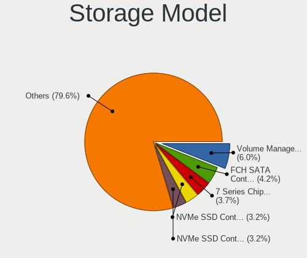
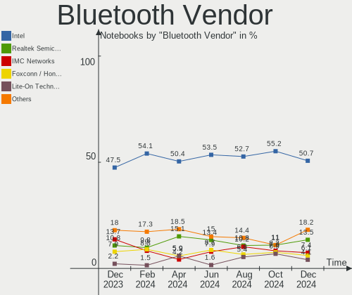
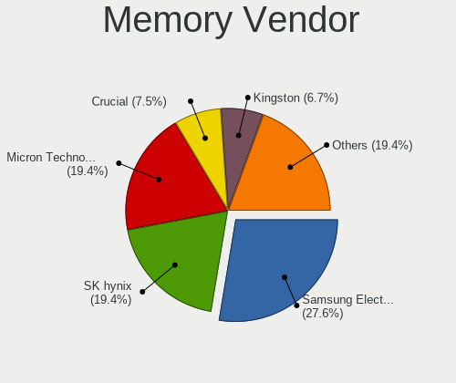

Arch Hardware Trends (Notebooks)
--------------------------------

A project to identify most popular hardware characteristics and track their change
over time based on data collected by Arch users at https://Linux-Hardware.org.

Anyone can contribute to this report by the [hw-probe](https://github.com/linuxhw/hw-probe) tool:

    sudo -E hw-probe -all -upload

Full-feature report is available here: https://linux-hardware.org/?view=trends&formfactor=notebook

Period: Jul, 2021.

Contents
--------

* [ System ](#system)
  - [ OS                       ](#os)
  - [ OS Family                ](#os-family)
  - [ Kernel                   ](#kernel)
  - [ Kernel Family            ](#kernel-family)
  - [ Kernel Major Ver.        ](#kernel-major-ver)
  - [ Arch                     ](#arch)
  - [ DE                       ](#de)
  - [ Display Server           ](#display-server)
  - [ Display Manager          ](#display-manager)
  - [ OS Lang                  ](#os-lang)
  - [ Boot Mode                ](#boot-mode)
  - [ Filesystem               ](#filesystem)
  - [ Part. scheme             ](#part-scheme)
  - [ Dual Boot with Linux/BSD ](#dual-boot-with-linuxbsd)
  - [ Dual Boot (Win)          ](#dual-boot-win)

* [ Board ](#board)
  - [ Vendor                   ](#vendor)
  - [ Model                    ](#model)
  - [ Model Family             ](#model-family)
  - [ MFG Year                 ](#mfg-year)
  - [ Form Factor              ](#form-factor)
  - [ Secure Boot              ](#secure-boot)
  - [ Coreboot                 ](#coreboot)
  - [ RAM Size                 ](#ram-size)
  - [ RAM Used                 ](#ram-used)
  - [ Total Drives             ](#total-drives)
  - [ Has CD-ROM               ](#has-cd-rom)
  - [ Has Ethernet             ](#has-ethernet)
  - [ Has WiFi                 ](#has-wifi)
  - [ Has Bluetooth            ](#has-bluetooth)

* [ Location ](#location)
  - [ Country                  ](#country)
  - [ City                     ](#city)

* [ Drives ](#drives)
  - [ Drive Vendor             ](#drive-vendor)
  - [ Drive Model              ](#drive-model)
  - [ HDD Vendor               ](#hdd-vendor)
  - [ SSD Vendor               ](#ssd-vendor)
  - [ Drive Kind               ](#drive-kind)
  - [ Drive Connector          ](#drive-connector)
  - [ Drive Size               ](#drive-size)
  - [ Space Total              ](#space-total)
  - [ Space Used               ](#space-used)
  - [ Malfunc. Drives          ](#malfunc-drives)
  - [ Malfunc. Drive Vendor    ](#malfunc-drive-vendor)
  - [ Malfunc. HDD Vendor      ](#malfunc-hdd-vendor)
  - [ Malfunc. Drive Kind      ](#malfunc-drive-kind)
  - [ Failed Drives            ](#failed-drives)
  - [ Failed Drive Vendor      ](#failed-drive-vendor)
  - [ Drive Status             ](#drive-status)

* [ Storage controller ](#storage-controller)
  - [ Storage Vendor           ](#storage-vendor)
  - [ Storage Model            ](#storage-model)
  - [ Storage Kind             ](#storage-kind)

* [ Processor ](#processor)
  - [ CPU Vendor               ](#cpu-vendor)
  - [ CPU Model                ](#cpu-model)
  - [ CPU Model Family         ](#cpu-model-family)
  - [ CPU Cores                ](#cpu-cores)
  - [ CPU Sockets              ](#cpu-sockets)
  - [ CPU Threads              ](#cpu-threads)
  - [ CPU Op-Modes             ](#cpu-op-modes)
  - [ CPU Microcode            ](#cpu-microcode)
  - [ CPU Microarch            ](#cpu-microarch)

* [ Graphics ](#graphics)
  - [ GPU Vendor               ](#gpu-vendor)
  - [ GPU Model                ](#gpu-model)
  - [ GPU Combo                ](#gpu-combo)
  - [ GPU Driver               ](#gpu-driver)
  - [ GPU Memory               ](#gpu-memory)

* [ Monitor ](#monitor)
  - [ Monitor Vendor           ](#monitor-vendor)
  - [ Monitor Model            ](#monitor-model)
  - [ Monitor Resolution       ](#monitor-resolution)
  - [ Monitor Diagonal         ](#monitor-diagonal)
  - [ Monitor Width            ](#monitor-width)
  - [ Aspect Ratio             ](#aspect-ratio)
  - [ Monitor Area             ](#monitor-area)
  - [ Pixel Density            ](#pixel-density)
  - [ Multiple Monitors        ](#multiple-monitors)

* [ Network ](#network)
  - [ Net Controller Vendor    ](#net-controller-vendor)
  - [ Net Controller Model     ](#net-controller-model)
  - [ Wireless Vendor          ](#wireless-vendor)
  - [ Wireless Model           ](#wireless-model)
  - [ Ethernet Vendor          ](#ethernet-vendor)
  - [ Ethernet Model           ](#ethernet-model)
  - [ Net Controller Kind      ](#net-controller-kind)
  - [ Used Controller          ](#used-controller)
  - [ NICs                     ](#nics)
  - [ IPv6                     ](#ipv6)

* [ Bluetooth ](#bluetooth)
  - [ Bluetooth Vendor         ](#bluetooth-vendor)
  - [ Bluetooth Model          ](#bluetooth-model)

* [ Sound ](#sound)
  - [ Sound Vendor             ](#sound-vendor)
  - [ Sound Model              ](#sound-model)

* [ Memory ](#memory)
  - [ Memory Vendor            ](#memory-vendor)
  - [ Memory Model             ](#memory-model)
  - [ Memory Kind              ](#memory-kind)
  - [ Memory Form Factor       ](#memory-form-factor)
  - [ Memory Size              ](#memory-size)
  - [ Memory Speed             ](#memory-speed)

* [ Printers & scanners ](#printers-&-scanners)
  - [ Printer Vendor           ](#printer-vendor)
  - [ Printer Model            ](#printer-model)
  - [ Scanner Vendor           ](#scanner-vendor)
  - [ Scanner Model            ](#scanner-model)

* [ Camera ](#camera)
  - [ Camera Vendor            ](#camera-vendor)
  - [ Camera Model             ](#camera-model)

* [ Security ](#security)
  - [ Fingerprint Vendor       ](#fingerprint-vendor)
  - [ Fingerprint Model        ](#fingerprint-model)
  - [ Chipcard Vendor          ](#chipcard-vendor)
  - [ Chipcard Model           ](#chipcard-model)

* [ Unsupported ](#unsupported)
  - [ Unsupported Devices      ](#unsupported-devices)
  - [ Unsupported Device Types ](#unsupported-device-types)

System
------

OS
--

Installed operating systems

| Name         | Notebooks | Percent |
|--------------|-----------|---------|
| Arch         | 57        | 58.76%  |
| Arch Rolling | 40        | 41.24%  |

OS Family
---------

OS without a version

| Name | Notebooks | Percent |
|------|-----------|---------|
| Arch | 97        | 100%    |

Kernel
------

Version of the Linux kernel

| Version                 | Notebooks | Percent |
|-------------------------|-----------|---------|
| 5.12.15-arch1-1         | 19        | 19.59%  |
| 5.12.14-arch1-1         | 13        | 13.4%   |
| 5.13.5-arch1-1          | 8         | 8.25%   |
| 5.13.4-arch2-1          | 8         | 8.25%   |
| 5.13.4-arch1-1          | 5         | 5.15%   |
| 5.12.15-zen1-1-zen      | 5         | 5.15%   |
| 5.13.4-zen2-1-zen       | 4         | 4.12%   |
| 5.12.13-arch1-2         | 4         | 4.12%   |
| 5.10.47-1-lts           | 4         | 4.12%   |
| 5.12.14-zen1-1-zen      | 3         | 3.09%   |
| 5.13.6-arch1-1          | 2         | 2.06%   |
| 5.13.4-zen1-1-zen       | 2         | 2.06%   |
| 5.12.18-1-ck            | 2         | 2.06%   |
| 5.12.12-arch1-1         | 2         | 2.06%   |
| 5.13.6-zen1-1-zen       | 1         | 1.03%   |
| 5.13.2-180-tkg-cacule   | 1         | 1.03%   |
| 5.13.1-arch1-amd-s0ix-1 | 1         | 1.03%   |
| 5.13.1-arch1-1          | 1         | 1.03%   |
| 5.13.0-rc7-170-tkg-pds  | 1         | 1.03%   |
| 5.13.0-1                | 1         | 1.03%   |
| 5.12.3-arch1-1          | 1         | 1.03%   |
| 5.12.19-1-ck            | 1         | 1.03%   |
| 5.12.16-xanmod1-1       | 1         | 1.03%   |
| 5.12.14-lqx2-2-lqx      | 1         | 1.03%   |
| 5.12.13-zen1-2-zen      | 1         | 1.03%   |
| 5.11.13-arch2-1         | 1         | 1.03%   |
| 5.10.53-1-lts           | 1         | 1.03%   |
| 5.10.52-1-lts           | 1         | 1.03%   |
| 5.10.50-1-lts           | 1         | 1.03%   |
| 5.10.48-1-lts           | 1         | 1.03%   |

Kernel Family
-------------

Linux kernel without a distro release

| Version | Notebooks | Percent |
|---------|-----------|---------|
| 5.12.15 | 24        | 24.74%  |
| 5.13.4  | 19        | 19.59%  |
| 5.12.14 | 17        | 17.53%  |
| 5.13.5  | 8         | 8.25%   |
| 5.12.13 | 5         | 5.15%   |
| 5.10.47 | 4         | 4.12%   |
| 5.13.6  | 3         | 3.09%   |
| 5.13.1  | 2         | 2.06%   |
| 5.13.0  | 2         | 2.06%   |
| 5.12.18 | 2         | 2.06%   |
| 5.12.12 | 2         | 2.06%   |
| 5.13.2  | 1         | 1.03%   |
| 5.12.3  | 1         | 1.03%   |
| 5.12.19 | 1         | 1.03%   |
| 5.12.16 | 1         | 1.03%   |
| 5.11.13 | 1         | 1.03%   |
| 5.10.53 | 1         | 1.03%   |
| 5.10.52 | 1         | 1.03%   |
| 5.10.50 | 1         | 1.03%   |
| 5.10.48 | 1         | 1.03%   |

Kernel Major Ver.
-----------------

Linux kernel major version

| Version | Notebooks | Percent |
|---------|-----------|---------|
| 5.12    | 53        | 54.64%  |
| 5.13    | 35        | 36.08%  |
| 5.10    | 8         | 8.25%   |
| 5.11    | 1         | 1.03%   |

Arch
----

OS architecture (x86_64, i586, etc.)

| Name   | Notebooks | Percent |
|--------|-----------|---------|
| x86_64 | 97        | 100%    |

DE
--

Desktop Environment

| Name          | Notebooks | Percent |
|---------------|-----------|---------|
| GNOME         | 33        | 34.02%  |
| KDE5          | 26        | 26.8%   |
| XFCE          | 9         | 9.28%   |
| i3            | 6         | 6.19%   |
| Unknown       | 6         | 6.19%   |
| KDE           | 4         | 4.12%   |
| sway          | 3         | 3.09%   |
| Deepin        | 2         | 2.06%   |
| Cinnamon      | 2         | 2.06%   |
| Budgie        | 2         | 2.06%   |
| LXDE          | 1         | 1.03%   |
| Enlightenment | 1         | 1.03%   |
| bspwm         | 1         | 1.03%   |
| awesome       | 1         | 1.03%   |

Display Server
--------------

X11 or Wayland

| Name    | Notebooks | Percent |
|---------|-----------|---------|
| X11     | 52        | 53.61%  |
| Wayland | 28        | 28.87%  |
| Unknown | 9         | 9.28%   |
| Tty     | 8         | 8.25%   |

Display Manager
---------------

SDDM, LightDM, etc.

| Name    | Notebooks | Percent |
|---------|-----------|---------|
| Unknown | 28        | 28.87%  |
| SDDM    | 24        | 24.74%  |
| GDM     | 20        | 20.62%  |
| TDM     | 15        | 15.46%  |
| XDM     | 5         | 5.15%   |
| LightDM | 5         | 5.15%   |

OS Lang
-------

Language

| Lang       | Notebooks | Percent |
|------------|-----------|---------|
| en_US      | 49        | 50.52%  |
| C          | 5         | 5.15%   |
| en_GB      | 4         | 4.12%   |
| de_DE      | 4         | 4.12%   |
| ru_RU      | 3         | 3.09%   |
| it_IT      | 3         | 3.09%   |
| fr_FR      | 3         | 3.09%   |
| Unknown    | 3         | 3.09%   |
| zh_CN      | 2         | 2.06%   |
| pt_PT      | 2         | 2.06%   |
| pl_PL      | 2         | 2.06%   |
| lv_LV      | 2         | 2.06%   |
| ja_JP      | 2         | 2.06%   |
| en_SG      | 2         | 2.06%   |
| tr_TR      | 1         | 1.03%   |
| pt_BR      | 1         | 1.03%   |
| nl_NL      | 1         | 1.03%   |
| fr_FR.UTF8 | 1         | 1.03%   |
| es_ES      | 1         | 1.03%   |
| es_CO      | 1         | 1.03%   |
| en_NZ      | 1         | 1.03%   |
| en_IN      | 1         | 1.03%   |
| en_CA      | 1         | 1.03%   |
| en-US      | 1         | 1.03%   |
| de_AT      | 1         | 1.03%   |

Boot Mode
---------

EFI or BIOS

| Mode | Notebooks | Percent |
|------|-----------|---------|
| EFI  | 67        | 69.07%  |
| BIOS | 30        | 30.93%  |

Filesystem
----------

Type of filesystem

| Type    | Notebooks | Percent |
|---------|-----------|---------|
| Ext4    | 67        | 69.07%  |
| Btrfs   | 21        | 21.65%  |
| Xfs     | 6         | 6.19%   |
| Zfs     | 1         | 1.03%   |
| F2fs    | 1         | 1.03%   |
| Unknown | 1         | 1.03%   |

Part. scheme
------------

Scheme of partitioning

| Type    | Notebooks | Percent |
|---------|-----------|---------|
| GPT     | 69        | 71.13%  |
| MBR     | 14        | 14.43%  |
| Unknown | 14        | 14.43%  |

Dual Boot with Linux/BSD
------------------------

Hosting more than one Linux/BSD

| Dual boot | Notebooks | Percent |
|-----------|-----------|---------|
| No        | 89        | 91.75%  |
| Yes       | 8         | 8.25%   |

Dual Boot (Win)
---------------

Hosting Linux and Windows

| Dual boot | Notebooks | Percent |
|-----------|-----------|---------|
| No        | 63        | 64.95%  |
| Yes       | 34        | 35.05%  |

Board
-----

Vendor
------

Motherboard manufacturer

| Name                | Notebooks | Percent |
|---------------------|-----------|---------|
| Lenovo              | 39        | 40.21%  |
| Dell                | 11        | 11.34%  |
| Hewlett-Packard     | 9         | 9.28%   |
| ASUSTek Computer    | 9         | 9.28%   |
| Acer                | 7         | 7.22%   |
| TUXEDO              | 2         | 2.06%   |
| Sony                | 2         | 2.06%   |
| MSI                 | 2         | 2.06%   |
| HUAWEI              | 2         | 2.06%   |
| Toshiba             | 1         | 1.03%   |
| SLIMBOOK            | 1         | 1.03%   |
| SANTECH             | 1         | 1.03%   |
| Samsung Electronics | 1         | 1.03%   |
| Razer               | 1         | 1.03%   |
| Positivo            | 1         | 1.03%   |
| PC Specialist       | 1         | 1.03%   |
| Packard Bell        | 1         | 1.03%   |
| LG Electronics      | 1         | 1.03%   |
| Google              | 1         | 1.03%   |
| Eluktronics         | 1         | 1.03%   |
| Chuwi               | 1         | 1.03%   |
| AZW                 | 1         | 1.03%   |
| AVITA               | 1         | 1.03%   |

Model
-----

Motherboard model

| Name                                     | Notebooks | Percent |
|------------------------------------------|-----------|---------|
| Lenovo ThinkPad X13 Gen 1 20UGS2B800     | 2         | 2.06%   |
| Lenovo IdeaPad 5 15ARE05 81YQ            | 2         | 2.06%   |
| Dell Latitude E7440                      | 2         | 2.06%   |
| Dell Inspiron 1545                       | 2         | 2.06%   |
| TUXEDO Pulse 15 Gen1                     | 1         | 1.03%   |
| TUXEDO InfinityBook Pro 14 Gen6          | 1         | 1.03%   |
| Toshiba Satellite L850-1LK               | 1         | 1.03%   |
| Sony SVE1713A1EW                         | 1         | 1.03%   |
| Sony SVE15111EBS                         | 1         | 1.03%   |
| SLIMBOOK PROX14-AMD                      | 1         | 1.03%   |
| SANTECH PCX0DX                           | 1         | 1.03%   |
| Samsung 340XAA/350XAA/550XAA             | 1         | 1.03%   |
| Razer Blade 14 - RZ09-0370               | 1         | 1.03%   |
| Positivo CHT12CP                         | 1         | 1.03%   |
| PC Specialist Fusion IV                  | 1         | 1.03%   |
| Packard Bell EasyNote TE69BM             | 1         | 1.03%   |
| MSI GT62VR 7RE                           | 1         | 1.03%   |
| MSI GL62M 7RDX                           | 1         | 1.03%   |
| LG 17UD70P-PX76K                         | 1         | 1.03%   |
| Lenovo Yoga Slim 7 Pro 14ACH5 82MS       | 1         | 1.03%   |
| Lenovo ThinkPad X395 20NL0005US          | 1         | 1.03%   |
| Lenovo ThinkPad X260 20F5S08P00          | 1         | 1.03%   |
| Lenovo ThinkPad X1 Carbon 5th 20HR002MGE | 1         | 1.03%   |
| Lenovo ThinkPad X1 Carbon 2nd 20A8S0ET00 | 1         | 1.03%   |
| Lenovo ThinkPad T580 20L90025GE          | 1         | 1.03%   |
| Lenovo ThinkPad T500 2089W6A             | 1         | 1.03%   |
| Lenovo ThinkPad T490 20N2S3H300          | 1         | 1.03%   |
| Lenovo ThinkPad T490 20N2S04200          | 1         | 1.03%   |
| Lenovo ThinkPad T480s 20L8S2N80D         | 1         | 1.03%   |
| Lenovo ThinkPad T480 20L50067US          | 1         | 1.03%   |
| Lenovo ThinkPad T470s W10DG 20JS0015US   | 1         | 1.03%   |
| Lenovo ThinkPad T460p 20FW0005AU         | 1         | 1.03%   |
| Lenovo ThinkPad T440 20B7S1N809          | 1         | 1.03%   |
| Lenovo ThinkPad T440 20B60061MD          | 1         | 1.03%   |
| Lenovo ThinkPad T430 2344BZU             | 1         | 1.03%   |
| Lenovo ThinkPad T410 2522W5D             | 1         | 1.03%   |
| Lenovo ThinkPad T14s Gen 1 20UJ0014FR    | 1         | 1.03%   |
| Lenovo ThinkPad T14s Gen 1 20UHS09300    | 1         | 1.03%   |
| Lenovo ThinkPad T14s Gen 1 20UH001ART    | 1         | 1.03%   |
| Lenovo ThinkPad P50 20EN0007MS           | 1         | 1.03%   |
| Lenovo ThinkPad L14 Gen 2a 20X50009GE    | 1         | 1.03%   |
| Lenovo ThinkPad E490 20N8CTO1WW          | 1         | 1.03%   |
| Lenovo ThinkPad E15 20RDCTO1WW           | 1         | 1.03%   |
| Lenovo ThinkPad E14 Gen 2 20T6000SIX     | 1         | 1.03%   |
| Lenovo Legion R70002020 82B6             | 1         | 1.03%   |
| Lenovo IdeaPad Z400 Touch VIWZ1          | 1         | 1.03%   |
| Lenovo IdeaPad 720S-13ARR 81BR           | 1         | 1.03%   |
| Lenovo IdeaPad 5 15IIL05 81YK            | 1         | 1.03%   |
| Lenovo IdeaPad 5 14ALC05 82LM            | 1         | 1.03%   |
| Lenovo IdeaPad 330-15IKB 81DE            | 1         | 1.03%   |
| Lenovo IdeaPad 330-15ARR 81D2            | 1         | 1.03%   |
| Lenovo IdeaPad 320S-14IKB 80X4           | 1         | 1.03%   |
| Lenovo IdeaPad 320-17IKB 80XM            | 1         | 1.03%   |
| Lenovo IdeaPad 100-14IBY 80MH            | 1         | 1.03%   |
| HUAWEI NBLL-WXX9                         | 1         | 1.03%   |
| HUAWEI HLYL-WXX9                         | 1         | 1.03%   |
| HP ProBook 450 G3                        | 1         | 1.03%   |
| HP ProBook 430 G1                        | 1         | 1.03%   |
| HP Pavilion g4                           | 1         | 1.03%   |
| HP OMEN by HP Laptop 17-cb0xxx           | 1         | 1.03%   |

Model Family
------------

Motherboard model prefix

| Name                  | Notebooks | Percent |
|-----------------------|-----------|---------|
| Lenovo ThinkPad       | 26        | 26.8%   |
| Lenovo IdeaPad        | 11        | 11.34%  |
| Dell Inspiron         | 4         | 4.12%   |
| Dell Latitude         | 3         | 3.09%   |
| Acer Aspire           | 3         | 3.09%   |
| HP ProBook            | 2         | 2.06%   |
| HP EliteBook          | 2         | 2.06%   |
| ASUS ZenBook          | 2         | 2.06%   |
| ASUS VivoBook         | 2         | 2.06%   |
| Acer Nitro            | 2         | 2.06%   |
| TUXEDO Pulse          | 1         | 1.03%   |
| TUXEDO InfinityBook   | 1         | 1.03%   |
| Toshiba Satellite     | 1         | 1.03%   |
| Sony SVE1713A1EW      | 1         | 1.03%   |
| Sony SVE15111EBS      | 1         | 1.03%   |
| SLIMBOOK PROX14-AMD   | 1         | 1.03%   |
| SANTECH PCX0DX        | 1         | 1.03%   |
| Samsung 340XAA        | 1         | 1.03%   |
| Razer Blade           | 1         | 1.03%   |
| Positivo CHT12CP      | 1         | 1.03%   |
| PC Specialist Fusion  | 1         | 1.03%   |
| Packard Bell EasyNote | 1         | 1.03%   |
| MSI GT62VR            | 1         | 1.03%   |
| MSI GL62M             | 1         | 1.03%   |
| LG 17UD70P-PX76K      | 1         | 1.03%   |
| Lenovo Yoga           | 1         | 1.03%   |
| Lenovo Legion         | 1         | 1.03%   |
| HUAWEI NBLL-WXX9      | 1         | 1.03%   |
| HUAWEI HLYL-WXX9      | 1         | 1.03%   |
| HP Pavilion           | 1         | 1.03%   |
| HP OMEN               | 1         | 1.03%   |
| HP Laptop             | 1         | 1.03%   |
| HP ENVY               | 1         | 1.03%   |
| HP 250                | 1         | 1.03%   |
| Google Helios         | 1         | 1.03%   |
| Eluktronics THINN-15  | 1         | 1.03%   |
| Dell XPS              | 1         | 1.03%   |
| Dell Vostro           | 1         | 1.03%   |
| Dell Precision        | 1         | 1.03%   |
| Dell G5               | 1         | 1.03%   |
| Chuwi LapBook         | 1         | 1.03%   |
| AZW GT-R              | 1         | 1.03%   |
| AVITA NS13A2          | 1         | 1.03%   |
| ASUS ROG              | 1         | 1.03%   |
| ASUS N53SV            | 1         | 1.03%   |
| ASUS N53SM            | 1         | 1.03%   |
| ASUS GX501VIK         | 1         | 1.03%   |
| ASUS ASUS             | 1         | 1.03%   |
| Acer TravelMate       | 1         | 1.03%   |
| Acer NC-V3-575G-58LU  | 1         | 1.03%   |

MFG Year
--------

Motherboard manufacture year

| Year | Notebooks | Percent |
|------|-----------|---------|
| 2020 | 34        | 35.05%  |
| 2021 | 21        | 21.65%  |
| 2019 | 12        | 12.37%  |
| 2018 | 7         | 7.22%   |
| 2012 | 5         | 5.15%   |
| 2017 | 4         | 4.12%   |
| 2013 | 4         | 4.12%   |
| 2016 | 2         | 2.06%   |
| 2011 | 2         | 2.06%   |
| 2010 | 2         | 2.06%   |
| 2009 | 2         | 2.06%   |
| 2014 | 1         | 1.03%   |
| 2008 | 1         | 1.03%   |

Form Factor
-----------

Physical design of the computer

| Name     | Notebooks | Percent |
|----------|-----------|---------|
| Notebook | 97        | 100%    |

Secure Boot
-----------

Enabled or disabled

| State    | Notebooks | Percent |
|----------|-----------|---------|
| Disabled | 96        | 98.97%  |
| Enabled  | 1         | 1.03%   |

Coreboot
--------

Have coreboot on board

| Used | Notebooks | Percent |
|------|-----------|---------|
| No   | 96        | 98.97%  |
| Yes  | 1         | 1.03%   |

RAM Size
--------

Total RAM memory

| Size in GB  | Notebooks | Percent |
|-------------|-----------|---------|
| 8.01-16.0   | 27        | 27.84%  |
| 4.01-8.0    | 26        | 26.8%   |
| 16.01-24.0  | 23        | 23.71%  |
| 3.01-4.0    | 9         | 9.28%   |
| 32.01-64.0  | 8         | 8.25%   |
| 64.01-256.0 | 2         | 2.06%   |
| 2.01-3.0    | 1         | 1.03%   |
| 1.01-2.0    | 1         | 1.03%   |

RAM Used
--------

Used RAM memory

| Used GB    | Notebooks | Percent |
|------------|-----------|---------|
| 2.01-3.0   | 28        | 28.87%  |
| 1.01-2.0   | 19        | 19.59%  |
| 3.01-4.0   | 18        | 18.56%  |
| 4.01-8.0   | 17        | 17.53%  |
| 8.01-16.0  | 8         | 8.25%   |
| 0.51-1.0   | 6         | 6.19%   |
| 16.01-24.0 | 1         | 1.03%   |

Total Drives
------------

Number of drives on board

| Drives | Notebooks | Percent |
|--------|-----------|---------|
| 1      | 65        | 67.01%  |
| 2      | 28        | 28.87%  |
| 3      | 4         | 4.12%   |

Has CD-ROM
----------

Has CD-ROM on board

| Presented | Notebooks | Percent |
|-----------|-----------|---------|
| No        | 84        | 86.6%   |
| Yes       | 13        | 13.4%   |

Has Ethernet
------------

Has Ethernet on board

| Presented | Notebooks | Percent |
|-----------|-----------|---------|
| Yes       | 72        | 74.23%  |
| No        | 25        | 25.77%  |

Has WiFi
--------

Has WiFi module

| Presented | Notebooks | Percent |
|-----------|-----------|---------|
| Yes       | 96        | 98.97%  |
| No        | 1         | 1.03%   |

Has Bluetooth
-------------

Has Bluetooth module

| Presented | Notebooks | Percent |
|-----------|-----------|---------|
| Yes       | 78        | 80.41%  |
| No        | 19        | 19.59%  |

Location
--------

Country
-------

Geographic location (country)

| Country      | Notebooks | Percent |
|--------------|-----------|---------|
| USA          | 11        | 11.34%  |
| Germany      | 9         | 9.28%   |
| Brazil       | 7         | 7.22%   |
| France       | 6         | 6.19%   |
| Russia       | 5         | 5.15%   |
| Italy        | 5         | 5.15%   |
| Canada       | 4         | 4.12%   |
| UK           | 3         | 3.09%   |
| India        | 3         | 3.09%   |
| Czechia      | 3         | 3.09%   |
| Colombia     | 3         | 3.09%   |
| Turkey       | 2         | 2.06%   |
| Singapore    | 2         | 2.06%   |
| Poland       | 2         | 2.06%   |
| New Zealand  | 2         | 2.06%   |
| Netherlands  | 2         | 2.06%   |
| Latvia       | 2         | 2.06%   |
| Japan        | 2         | 2.06%   |
| Hungary      | 2         | 2.06%   |
| China        | 2         | 2.06%   |
| Uzbekistan   | 1         | 1.03%   |
| Thailand     | 1         | 1.03%   |
| Sweden       | 1         | 1.03%   |
| Spain        | 1         | 1.03%   |
| South Korea  | 1         | 1.03%   |
| South Africa | 1         | 1.03%   |
| Serbia       | 1         | 1.03%   |
| Qatar        | 1         | 1.03%   |
| Portugal     | 1         | 1.03%   |
| Pakistan     | 1         | 1.03%   |
| Moldova      | 1         | 1.03%   |
| Mexico       | 1         | 1.03%   |
| Ireland      | 1         | 1.03%   |
| Iran         | 1         | 1.03%   |
| Indonesia    | 1         | 1.03%   |
| Estonia      | 1         | 1.03%   |
| Costa Rica   | 1         | 1.03%   |
| Austria      | 1         | 1.03%   |
| Australia    | 1         | 1.03%   |
| Algeria      | 1         | 1.03%   |

City
----

Geographic location (city)

| City                     | Notebooks | Percent |
|--------------------------|-----------|---------|
| Sorocaba                 | 2         | 2.06%   |
| Riga                     | 2         | 2.06%   |
| Paris                    | 2         | 2.06%   |
| Moscow                   | 2         | 2.06%   |
| Los Angeles              | 2         | 2.06%   |
| Frankfurt am Main        | 2         | 2.06%   |
| Brno                     | 2         | 2.06%   |
| Bogot??                  | 2         | 2.06%   |
| Évry                    | 1         | 1.03%   |
| Zhengzhou                | 1         | 1.03%   |
| Wellington               | 1         | 1.03%   |
| Villaricca               | 1         | 1.03%   |
| Valencia                 | 1         | 1.03%   |
| Tianjin                  | 1         | 1.03%   |
| Tehran                   | 1         | 1.03%   |
| Tashkent                 | 1         | 1.03%   |
| Tallinn                  | 1         | 1.03%   |
| Spijkenisse              | 1         | 1.03%   |
| Southend-on-Sea          | 1         | 1.03%   |
| Skawina                  | 1         | 1.03%   |
| Singapore                | 1         | 1.03%   |
| Setagaya-ku              | 1         | 1.03%   |
| Sesto San Giovanni       | 1         | 1.03%   |
| Seoul                    | 1         | 1.03%   |
| Schiedam                 | 1         | 1.03%   |
| S??o Paulo               | 1         | 1.03%   |
| Sant'Antonio Abate       | 1         | 1.03%   |
| Salt Lake City           | 1         | 1.03%   |
| Rio de Janeiro           | 1         | 1.03%   |
| Rho                      | 1         | 1.03%   |
| Rennes                   | 1         | 1.03%   |
| Rayong                   | 1         | 1.03%   |
| Prague                   | 1         | 1.03%   |
| Petrozavodsk             | 1         | 1.03%   |
| Petropavlovsk-Kamchatsky | 1         | 1.03%   |
| Paraparaumu              | 1         | 1.03%   |
| Ottawa                   | 1         | 1.03%   |
| Osaka                    | 1         | 1.03%   |
| Orem                     | 1         | 1.03%   |
| New Delhi                | 1         | 1.03%   |
| Montreal                 | 1         | 1.03%   |
| Moncton                  | 1         | 1.03%   |
| Medellín                | 1         | 1.03%   |
| Mechanicville            | 1         | 1.03%   |
| Madalena do Mar          | 1         | 1.03%   |
| Lechaschau               | 1         | 1.03%   |
| Krakow                   | 1         | 1.03%   |
| Kitchener                | 1         | 1.03%   |
| Karachi                  | 1         | 1.03%   |
| Kampong Ulu Jurong       | 1         | 1.03%   |
| Joinville                | 1         | 1.03%   |
| Johannesburg             | 1         | 1.03%   |
| Jakarta                  | 1         | 1.03%   |
| Istanbul                 | 1         | 1.03%   |
| Huenstetten              | 1         | 1.03%   |
| Huddersfield             | 1         | 1.03%   |
| Hodmezovasarhely         | 1         | 1.03%   |
| Grafelfing               | 1         | 1.03%   |
| Germering                | 1         | 1.03%   |
| Gelsenkirchen            | 1         | 1.03%   |

Drives
------

Drive Vendor
------------

Hard drive vendors

| Vendor              | Notebooks | Drives | Percent |
|---------------------|-----------|--------|---------|
| Samsung Electronics | 26        | 30     | 20.16%  |
| Sandisk             | 15        | 15     | 11.63%  |
| Seagate             | 12        | 12     | 9.3%    |
| WDC                 | 11        | 11     | 8.53%   |
| SK Hynix            | 9         | 9      | 6.98%   |
| Kingston            | 7         | 7      | 5.43%   |
| Intel               | 6         | 6      | 4.65%   |
| Unknown             | 5         | 5      | 3.88%   |
| Toshiba             | 5         | 5      | 3.88%   |
| Hitachi             | 4         | 4      | 3.1%    |
| Crucial             | 4         | 4      | 3.1%    |
| HGST                | 3         | 3      | 2.33%   |
| A-DATA Technology   | 3         | 3      | 2.33%   |
| Patriot             | 2         | 2      | 1.55%   |
| Lexar               | 2         | 2      | 1.55%   |
| Intenso             | 2         | 2      | 1.55%   |
| ZHITAI              | 1         | 1      | 0.78%   |
| Transcend           | 1         | 1      | 0.78%   |
| Silicon Motion      | 1         | 1      | 0.78%   |
| Netac               | 1         | 1      | 0.78%   |
| Morebeck-N100       | 1         | 1      | 0.78%   |
| Micron Technology   | 1         | 1      | 0.78%   |
| Lite-On             | 1         | 1      | 0.78%   |
| Kross Elegance      | 1         | 1      | 0.78%   |
| KingSpec            | 1         | 1      | 0.78%   |
| GOODRAM             | 1         | 1      | 0.78%   |
| BLueRay             | 1         | 1      | 0.78%   |
| BHT                 | 1         | 1      | 0.78%   |
| ASMT                | 1         | 1      | 0.78%   |

Drive Model
-----------

Hard drive models

| Model                                  | Notebooks | Percent |
|----------------------------------------|-----------|---------|
| Sandisk NVMe SSD Drive 512GB           | 5         | 3.76%   |
| Seagate ST1000LM035-1RK172 1TB         | 4         | 3.01%   |
| SK Hynix NVMe SSD Drive 512GB          | 2         | 1.5%    |
| Seagate ST500LM021-1KJ152 500GB        | 2         | 1.5%    |
| Seagate Expansion 4TB                  | 2         | 1.5%    |
| Samsung SSD 980 PRO 500GB              | 2         | 1.5%    |
| Samsung SSD 970 EVO Plus 500GB         | 2         | 1.5%    |
| Samsung SSD 860 EVO 500GB              | 2         | 1.5%    |
| Samsung SSD 860 EVO 1TB                | 2         | 1.5%    |
| Samsung NVMe SSD Drive 512GB           | 2         | 1.5%    |
| Samsung NVMe SSD Drive 256GB           | 2         | 1.5%    |
| Samsung MZVLW256HEHP-000L7 256GB       | 2         | 1.5%    |
| HGST HTS545050A7E380 500GB             | 2         | 1.5%    |
| ZHITAI SC001 Active 1TB SSD            | 1         | 0.75%   |
| WDC WDS500G2B0B-00YS70 500GB SSD       | 1         | 0.75%   |
| WDC WDS240G2G0A-00JH30 240GB SSD       | 1         | 0.75%   |
| WDC WDS200T2B0A-00SM50 2TB SSD         | 1         | 0.75%   |
| WDC WDS120G2G0A-00JH30 120GB SSD       | 1         | 0.75%   |
| WDC WD5000BPVT-22HXZT3 500GB           | 1         | 0.75%   |
| WDC WD1600BEVS-08VAT2 160GB            | 1         | 0.75%   |
| WDC WD10SPZX-08Z10 1TB                 | 1         | 0.75%   |
| WDC WD10SPCX-24HWST1 1TB               | 1         | 0.75%   |
| WDC PC SN730 SDBPNTY-1T00-1101 1TB     | 1         | 0.75%   |
| WDC PC SN530 SDBPMPZ-512G-1101 512GB   | 1         | 0.75%   |
| WDC PC SN530 SDBPMPZ-512G-1001 512GB   | 1         | 0.75%   |
| Unknown SL16G  16GB                    | 1         | 0.75%   |
| Unknown SD16G  16GB                    | 1         | 0.75%   |
| Unknown SD/MMC/MS PRO 128GB            | 1         | 0.75%   |
| Unknown SA32G  32GB                    | 1         | 0.75%   |
| Unknown 5MKJR  256GB                   | 1         | 0.75%   |
| Transcend TS64GMSA230S 64GB SSD        | 1         | 0.75%   |
| Toshiba NVMe SSD Drive 256GB           | 1         | 0.75%   |
| Toshiba MK6475GSX 640GB                | 1         | 0.75%   |
| Toshiba KXG6AZNV512G 512GB             | 1         | 0.75%   |
| Toshiba KXG60ZNV512G NVMe KIOXIA 512GB | 1         | 0.75%   |
| Toshiba KXG60ZNV1T02 NVMe 1024GB       | 1         | 0.75%   |
| SK Hynix SKHynix_HFS512GDE9X081N 512GB | 1         | 0.75%   |
| SK Hynix SKHynix_HFS001TDE9X084N 1TB   | 1         | 0.75%   |
| SK Hynix NVMe SSD Drive 1TB            | 1         | 0.75%   |
| SK Hynix HFS128G39TND-N210A 128GB SSD  | 1         | 0.75%   |
| SK Hynix HFM512GD3JX013N 512GB         | 1         | 0.75%   |
| SK Hynix HFM128GDJTNG-8310A 128GB      | 1         | 0.75%   |
| SK Hynix BC711 NVMe 256GB              | 1         | 0.75%   |
| Silicon Motion 512GB                   | 1         | 0.75%   |
| Seagate ST9320423AS 320GB              | 1         | 0.75%   |
| Seagate ST2000LM003 HN-M201RAD 2TB     | 1         | 0.75%   |
| Seagate ST1000LM049-2GH172 1TB         | 1         | 0.75%   |
| Seagate ST1000LM048-2E7172 1TB         | 1         | 0.75%   |
| SanDisk X110 MSATA 128GB SSD           | 1         | 0.75%   |
| SanDisk Ultra 3D NVMe 500GB            | 1         | 0.75%   |
| SanDisk SSD U110 16GB                  | 1         | 0.75%   |
| SanDisk SSD PLUS 120GB                 | 1         | 0.75%   |
| SanDisk SSD PLUS 1000GB                | 1         | 0.75%   |
| SanDisk SD9SN8W256G1122 256GB SSD      | 1         | 0.75%   |
| SanDisk SD9SN8W256G1102 256GB SSD      | 1         | 0.75%   |
| SanDisk SD7UB3Q256G1001 256GB SSD      | 1         | 0.75%   |
| Sandisk NVMe SSD Drive 500GB           | 1         | 0.75%   |
| SanDisk DF4032  32GB                   | 1         | 0.75%   |
| Samsung SSD 980 PRO 2TB                | 1         | 0.75%   |
| Samsung SSD 970 EVO Plus 2TB           | 1         | 0.75%   |

HDD Vendor
----------

Hard disk drive vendors

| Vendor  | Notebooks | Drives | Percent |
|---------|-----------|--------|---------|
| Seagate | 12        | 12     | 48%     |
| WDC     | 4         | 4      | 16%     |
| Hitachi | 4         | 4      | 16%     |
| HGST    | 3         | 3      | 12%     |
| Toshiba | 1         | 1      | 4%      |
| ASMT    | 1         | 1      | 4%      |

SSD Vendor
----------

Solid state drive vendors

| Vendor              | Notebooks | Drives | Percent |
|---------------------|-----------|--------|---------|
| SanDisk             | 7         | 7      | 18.42%  |
| Samsung Electronics | 6         | 7      | 15.79%  |
| WDC                 | 4         | 4      | 10.53%  |
| Patriot             | 2         | 2      | 5.26%   |
| Lexar               | 2         | 2      | 5.26%   |
| Kingston            | 2         | 2      | 5.26%   |
| Intenso             | 2         | 2      | 5.26%   |
| Crucial             | 2         | 2      | 5.26%   |
| A-DATA Technology   | 2         | 2      | 5.26%   |
| ZHITAI              | 1         | 1      | 2.63%   |
| Transcend           | 1         | 1      | 2.63%   |
| SK Hynix            | 1         | 1      | 2.63%   |
| Kross Elegance      | 1         | 1      | 2.63%   |
| KingSpec            | 1         | 1      | 2.63%   |
| Intel               | 1         | 1      | 2.63%   |
| GOODRAM             | 1         | 1      | 2.63%   |
| BLueRay             | 1         | 1      | 2.63%   |
| BHT                 | 1         | 1      | 2.63%   |

Drive Kind
----------

HDD or SSD

| Kind    | Notebooks | Drives | Percent |
|---------|-----------|--------|---------|
| NVMe    | 54        | 62     | 46.15%  |
| SSD     | 33        | 39     | 28.21%  |
| HDD     | 24        | 25     | 20.51%  |
| MMC     | 4         | 5      | 3.42%   |
| Unknown | 2         | 2      | 1.71%   |

Drive Connector
---------------

SATA, SAS, NVMe, etc.

| Type | Notebooks | Drives | Percent |
|------|-----------|--------|---------|
| NVMe | 54        | 62     | 48.21%  |
| SATA | 49        | 61     | 43.75%  |
| SAS  | 5         | 5      | 4.46%   |
| MMC  | 4         | 5      | 3.57%   |

Drive Size
----------

Size of hard drive

| Size in TB | Notebooks | Drives | Percent |
|------------|-----------|--------|---------|
| 0.01-0.5   | 34        | 40     | 58.62%  |
| 0.51-1.0   | 19        | 19     | 32.76%  |
| 1.01-2.0   | 3         | 3      | 5.17%   |
| 3.01-4.0   | 2         | 2      | 3.45%   |

Space Total
-----------

Amount of disk space available on the file system

| Size in GB     | Notebooks | Percent |
|----------------|-----------|---------|
| 101-250        | 30        | 30.93%  |
| 251-500        | 24        | 24.74%  |
| 501-1000       | 18        | 18.56%  |
| 1001-2000      | 12        | 12.37%  |
| More than 3000 | 5         | 5.15%   |
| 51-100         | 5         | 5.15%   |
| 21-50          | 1         | 1.03%   |
| 2001-3000      | 1         | 1.03%   |
| 1-20           | 1         | 1.03%   |

Space Used
----------

Amount of used disk space

| Used GB        | Notebooks | Percent |
|----------------|-----------|---------|
| 21-50          | 21        | 21.65%  |
| 1-20           | 19        | 19.59%  |
| 101-250        | 17        | 17.53%  |
| 51-100         | 15        | 15.46%  |
| 251-500        | 14        | 14.43%  |
| 501-1000       | 7         | 7.22%   |
| 1001-2000      | 2         | 2.06%   |
| More than 3000 | 1         | 1.03%   |
| 2001-3000      | 1         | 1.03%   |

Malfunc. Drives
---------------

Drive models with a malfunction

| Model                                        | Notebooks | Drives | Percent |
|----------------------------------------------|-----------|--------|---------|
| HGST HTS545050A7E380 500GB                   | 2         | 2      | 15.38%  |
| Toshiba MK6475GSX 640GB                      | 1         | 1      | 7.69%   |
| Seagate ST9320423AS 320GB                    | 1         | 1      | 7.69%   |
| Seagate ST500LM021-1KJ152 500GB              | 1         | 1      | 7.69%   |
| Seagate ST1000LM048-2E7172 1TB               | 1         | 1      | 7.69%   |
| SanDisk SSD PLUS 1000GB                      | 1         | 1      | 7.69%   |
| SanDisk SD7UB3Q256G1001 256GB SSD            | 1         | 1      | 7.69%   |
| Samsung Electronics MZVLW256HEHP-000L7 256GB | 1         | 1      | 7.69%   |
| Micron Technology 2200S NVMe 1024GB          | 1         | 1      | 7.69%   |
| Hitachi HTS545050A7E380 500GB                | 1         | 1      | 7.69%   |
| BLueRay SDM8SI480A 480GB SSD                 | 1         | 1      | 7.69%   |
| ASMT ASM105x 752GB                           | 1         | 1      | 7.69%   |

Malfunc. Drive Vendor
---------------------

Vendors of faulty drives

| Vendor              | Notebooks | Drives | Percent |
|---------------------|-----------|--------|---------|
| Seagate             | 3         | 3      | 23.08%  |
| SanDisk             | 2         | 2      | 15.38%  |
| HGST                | 2         | 2      | 15.38%  |
| Toshiba             | 1         | 1      | 7.69%   |
| Samsung Electronics | 1         | 1      | 7.69%   |
| Micron Technology   | 1         | 1      | 7.69%   |
| Hitachi             | 1         | 1      | 7.69%   |
| BLueRay             | 1         | 1      | 7.69%   |
| ASMT                | 1         | 1      | 7.69%   |

Malfunc. HDD Vendor
-------------------

Vendors of faulty HDD drives

| Vendor  | Notebooks | Drives | Percent |
|---------|-----------|--------|---------|
| Seagate | 3         | 3      | 37.5%   |
| HGST    | 2         | 2      | 25%     |
| Toshiba | 1         | 1      | 12.5%   |
| Hitachi | 1         | 1      | 12.5%   |
| ASMT    | 1         | 1      | 12.5%   |

Malfunc. Drive Kind
-------------------

Kinds of faulty drives

| Kind | Notebooks | Drives | Percent |
|------|-----------|--------|---------|
| HDD  | 8         | 8      | 61.54%  |
| SSD  | 3         | 3      | 23.08%  |
| NVMe | 2         | 2      | 15.38%  |

Failed Drives
-------------

Failed drive models

Zero info for selected period =(

Failed Drive Vendor
-------------------

Failed drive vendors

Zero info for selected period =(

Drive Status
------------

Number of failed and malfunc. drives

| Status   | Notebooks | Drives | Percent |
|----------|-----------|--------|---------|
| Works    | 54        | 67     | 49.09%  |
| Detected | 43        | 53     | 39.09%  |
| Malfunc  | 13        | 13     | 11.82%  |

Storage controller
------------------

Storage Vendor
--------------

Storage controller vendors

| Vendor                       | Notebooks | Percent |
|------------------------------|-----------|---------|
| Intel                        | 56        | 44.44%  |
| Samsung Electronics          | 20        | 15.87%  |
| AMD                          | 16        | 12.7%   |
| Sandisk                      | 10        | 7.94%   |
| SK Hynix                     | 8         | 6.35%   |
| Toshiba America Info Systems | 4         | 3.17%   |
| Kingston Technology Company  | 4         | 3.17%   |
| Silicon Motion               | 2         | 1.59%   |
| Micron/Crucial Technology    | 2         | 1.59%   |
| Micron Technology            | 1         | 0.79%   |
| Lite-On Technology           | 1         | 0.79%   |
| ASMedia Technology           | 1         | 0.79%   |
| ADATA Technology             | 1         | 0.79%   |

Storage Model
-------------

Storage controller models

| Model                                                                         | Notebooks | Percent |
|-------------------------------------------------------------------------------|-----------|---------|
| AMD FCH SATA Controller [AHCI mode]                                           | 16        | 12.21%  |
| Samsung NVMe SSD Controller SM981/PM981/PM983                                 | 15        | 11.45%  |
| Intel 82801 Mobile SATA Controller [RAID mode]                                | 9         | 6.87%   |
| Intel 7 Series Chipset Family 6-port SATA Controller [AHCI mode]              | 8         | 6.11%   |
| Intel Sunrise Point-LP SATA Controller [AHCI mode]                            | 6         | 4.58%   |
| Sandisk WD Black SN750 / PC SN730 NVMe SSD                                    | 5         | 3.82%   |
| SK Hynix NVMe SSD Controller                                                  | 4         | 3.05%   |
| Samsung NVMe SSD Controller SM961/PM961/SM963                                 | 4         | 3.05%   |
| Intel SSD 660P Series                                                         | 4         | 3.05%   |
| Intel 8 Series SATA Controller 1 [AHCI mode]                                  | 4         | 3.05%   |
| Toshiba America Info Systems XG6 NVMe SSD Controller                          | 3         | 2.29%   |
| Sandisk WD Blue SN550 NVMe SSD                                                | 3         | 2.29%   |
| Samsung NVMe SSD Controller PM9A1/PM9A3/980PRO                                | 3         | 2.29%   |
| Intel Comet Lake SATA AHCI Controller                                         | 3         | 2.29%   |
| Intel Cannon Point-LP SATA Controller [AHCI Mode]                             | 3         | 2.29%   |
| Intel 82801IBM/IEM (ICH9M/ICH9M-E) 4 port SATA Controller [AHCI mode]         | 3         | 2.29%   |
| Intel 6 Series/C200 Series Chipset Family 6 port Mobile SATA AHCI Controller  | 3         | 2.29%   |
| SK Hynix Non-Volatile memory controller                                       | 2         | 1.53%   |
| Silicon Motion SM2263EN/SM2263XT SSD Controller                               | 2         | 1.53%   |
| Sandisk Non-Volatile memory controller                                        | 2         | 1.53%   |
| Micron/Crucial P2 NVMe PCIe SSD                                               | 2         | 1.53%   |
| Intel Q170/Q150/B150/H170/H110/Z170/CM236 Chipset SATA Controller [AHCI Mode] | 2         | 1.53%   |
| Intel HM170/QM170 Chipset SATA Controller [AHCI Mode]                         | 2         | 1.53%   |
| Intel Cannon Lake Mobile PCH SATA AHCI Controller                             | 2         | 1.53%   |
| Intel Atom Processor E3800 Series SATA AHCI Controller                        | 2         | 1.53%   |
| Intel 82801IBM/IEM (ICH9M/ICH9M-E) 2 port SATA Controller [IDE mode]          | 2         | 1.53%   |
| Toshiba America Info Systems BG3 NVMe SSD Controller                          | 1         | 0.76%   |
| SK Hynix BC511                                                                | 1         | 0.76%   |
| SK Hynix BC501 NVMe Solid State Drive                                         | 1         | 0.76%   |
| Micron Non-Volatile memory controller                                         | 1         | 0.76%   |
| Lite-On Non-Volatile memory controller                                        | 1         | 0.76%   |
| Kingston Company Company Non-Volatile memory controller                       | 1         | 0.76%   |
| Kingston Company OM3PDP3 NVMe SSD                                             | 1         | 0.76%   |
| Kingston Company KC2000 NVMe SSD                                              | 1         | 0.76%   |
| Kingston Company A2000 NVMe SSD                                               | 1         | 0.76%   |
| Intel Volume Management Device NVMe RAID Controller                           | 1         | 0.76%   |
| Intel NVMe Optane Memory Series                                               | 1         | 0.76%   |
| Intel Ice Lake-LP SATA Controller [AHCI mode]                                 | 1         | 0.76%   |
| Intel Celeron/Pentium Silver Processor SATA Controller                        | 1         | 0.76%   |
| Intel 5 Series/3400 Series Chipset 6 port SATA AHCI Controller                | 1         | 0.76%   |
| Intel 400 Series Chipset Family SATA AHCI Controller                          | 1         | 0.76%   |
| ASMedia ASM1062 Serial ATA Controller                                         | 1         | 0.76%   |
| ADATA XPG SX8200 Pro PCIe Gen3x4 M.2 2280 Solid State Drive                   | 1         | 0.76%   |

Storage Kind
------------

Kind of storage controller (IDE, SATA, NVMe, SAS, ...)

| Kind | Notebooks | Percent |
|------|-----------|---------|
| SATA | 58        | 47.15%  |
| NVMe | 53        | 43.09%  |
| RAID | 10        | 8.13%   |
| IDE  | 2         | 1.63%   |

Processor
---------

CPU Vendor
----------

Processor vendors

| Vendor | Notebooks | Percent |
|--------|-----------|---------|
| Intel  | 67        | 69.07%  |
| AMD    | 30        | 30.93%  |

CPU Model
---------

Processor models

| Model                                         | Notebooks | Percent |
|-----------------------------------------------|-----------|---------|
| Intel Core i5-8265U CPU @ 1.60GHz             | 4         | 4.12%   |
| Intel Core i5-4200U CPU @ 1.60GHz             | 4         | 4.12%   |
| AMD Ryzen 7 PRO 4750U with Radeon Graphics    | 4         | 4.12%   |
| Intel Core i5-7200U CPU @ 2.50GHz             | 3         | 3.09%   |
| AMD Ryzen 7 4800H with Radeon Graphics        | 3         | 3.09%   |
| AMD Ryzen 5 4500U with Radeon Graphics        | 3         | 3.09%   |
| AMD Ryzen 5 2500U with Radeon Vega Mobile Gfx | 3         | 3.09%   |
| Intel Core i7-9750H CPU @ 2.60GHz             | 2         | 2.06%   |
| Intel Core i5-8250U CPU @ 1.60GHz             | 2         | 2.06%   |
| Intel Core i5-6300U CPU @ 2.40GHz             | 2         | 2.06%   |
| Intel Core i5-6200U CPU @ 2.30GHz             | 2         | 2.06%   |
| Intel 11th Gen Core i7-1165G7 @ 2.80GHz       | 2         | 2.06%   |
| AMD Ryzen 7 5800H with Radeon Graphics        | 2         | 2.06%   |
| AMD Ryzen 5 5500U with Radeon Graphics        | 2         | 2.06%   |
| AMD Ryzen 5 4600H with Radeon Graphics        | 2         | 2.06%   |
| Intel Xeon E-2276M CPU @ 2.80GHz              | 1         | 1.03%   |
| Intel Pentium Dual-Core CPU T4300 @ 2.10GHz   | 1         | 1.03%   |
| Intel Pentium Dual CPU T3400 @ 2.16GHz        | 1         | 1.03%   |
| Intel Pentium CPU B960 @ 2.20GHz              | 1         | 1.03%   |
| Intel Pentium CPU 2020M @ 2.40GHz             | 1         | 1.03%   |
| Intel Core i7-8665U CPU @ 1.90GHz             | 1         | 1.03%   |
| Intel Core i7-8650U CPU @ 1.90GHz             | 1         | 1.03%   |
| Intel Core i7-8565U CPU @ 1.80GHz             | 1         | 1.03%   |
| Intel Core i7-8550U CPU @ 1.80GHz             | 1         | 1.03%   |
| Intel Core i7-7700HQ CPU @ 2.80GHz            | 1         | 1.03%   |
| Intel Core i7-7500U CPU @ 2.70GHz             | 1         | 1.03%   |
| Intel Core i7-6820HQ CPU @ 2.70GHz            | 1         | 1.03%   |
| Intel Core i7-4600U CPU @ 2.10GHz             | 1         | 1.03%   |
| Intel Core i7-3632QM CPU @ 2.20GHz            | 1         | 1.03%   |
| Intel Core i7-3520M CPU @ 2.90GHz             | 1         | 1.03%   |
| Intel Core i7-2670QM CPU @ 2.20GHz            | 1         | 1.03%   |
| Intel Core i7-2630QM CPU @ 2.00GHz            | 1         | 1.03%   |
| Intel Core i7-10875H CPU @ 2.30GHz            | 1         | 1.03%   |
| Intel Core i7-1065G7 CPU @ 1.30GHz            | 1         | 1.03%   |
| Intel Core i7-10510U CPU @ 1.80GHz            | 1         | 1.03%   |
| Intel Core i5-9400F CPU @ 2.90GHz             | 1         | 1.03%   |
| Intel Core i5-8300H CPU @ 2.30GHz             | 1         | 1.03%   |
| Intel Core i5-7300HQ CPU @ 2.50GHz            | 1         | 1.03%   |
| Intel Core i5-6440HQ CPU @ 2.60GHz            | 1         | 1.03%   |
| Intel Core i5-5300U CPU @ 2.30GHz             | 1         | 1.03%   |
| Intel Core i5-4310U CPU @ 2.00GHz             | 1         | 1.03%   |
| Intel Core i5-4300U CPU @ 1.90GHz             | 1         | 1.03%   |
| Intel Core i5-3360M CPU @ 2.80GHz             | 1         | 1.03%   |
| Intel Core i5-3210M CPU @ 2.50GHz             | 1         | 1.03%   |
| Intel Core i5-10210U CPU @ 1.60GHz            | 1         | 1.03%   |
| Intel Core i5 CPU M 520 @ 2.40GHz             | 1         | 1.03%   |
| Intel Core i3-8145U CPU @ 2.10GHz             | 1         | 1.03%   |
| Intel Core i3-8130U CPU @ 2.20GHz             | 1         | 1.03%   |
| Intel Core i3-3110M CPU @ 2.40GHz             | 1         | 1.03%   |
| Intel Core i3-2330M CPU @ 2.20GHz             | 1         | 1.03%   |
| Intel Core i3-2312M CPU @ 2.10GHz             | 1         | 1.03%   |
| Intel Core i3-10110U CPU @ 2.10GHz            | 1         | 1.03%   |
| Intel Core 2 Duo CPU T9600 @ 2.80GHz          | 1         | 1.03%   |
| Intel Core 2 Duo CPU T6570 @ 2.10GHz          | 1         | 1.03%   |
| Intel Core 2 Duo CPU P8400 @ 2.26GHz          | 1         | 1.03%   |
| Intel Celeron N4100 CPU @ 1.10GHz             | 1         | 1.03%   |
| Intel Celeron CPU N2940 @ 1.83GHz             | 1         | 1.03%   |
| Intel Celeron CPU N2820 @ 2.13GHz             | 1         | 1.03%   |
| Intel Atom x5-Z8350 CPU @ 1.44GHz             | 1         | 1.03%   |
| Intel 11th Gen Core i7-1185G7 @ 3.00GHz       | 1         | 1.03%   |

CPU Model Family
----------------

Processor model prefix

| Model                   | Notebooks | Percent |
|-------------------------|-----------|---------|
| Intel Core i5           | 28        | 28.87%  |
| Intel Core i7           | 17        | 17.53%  |
| AMD Ryzen 5             | 12        | 12.37%  |
| AMD Ryzen 7             | 8         | 8.25%   |
| Intel Core i3           | 6         | 6.19%   |
| AMD Ryzen 7 PRO         | 5         | 5.15%   |
| Other                   | 4         | 4.12%   |
| Intel Core 2 Duo        | 3         | 3.09%   |
| Intel Celeron           | 3         | 3.09%   |
| Intel Pentium           | 2         | 2.06%   |
| AMD Ryzen 9             | 2         | 2.06%   |
| AMD Ryzen 5 PRO         | 2         | 2.06%   |
| Intel Xeon              | 1         | 1.03%   |
| Intel Pentium Dual-Core | 1         | 1.03%   |
| Intel Pentium Dual      | 1         | 1.03%   |
| Intel Atom              | 1         | 1.03%   |
| AMD A4                  | 1         | 1.03%   |

CPU Cores
---------

Number of processor cores

| Number | Notebooks | Percent |
|--------|-----------|---------|
| 2      | 35        | 36.08%  |
| 4      | 34        | 35.05%  |
| 8      | 15        | 15.46%  |
| 6      | 13        | 13.4%   |

CPU Sockets
-----------

Number of sockets

| Number | Notebooks | Percent |
|--------|-----------|---------|
| 1      | 97        | 100%    |

CPU Threads
-----------

Threads per core (Hyper-Threading)

| Number | Notebooks | Percent |
|--------|-----------|---------|
| 2      | 77        | 79.38%  |
| 1      | 20        | 20.62%  |

CPU Op-Modes
------------

CPU Operation Modes (32-bit, 64-bit)

| Op mode        | Notebooks | Percent |
|----------------|-----------|---------|
| 32-bit, 64-bit | 97        | 100%    |

CPU Microcode
-------------

Microcode number

| Number     | Notebooks | Percent |
|------------|-----------|---------|
| Unknown    | 31        | 31.96%  |
| 0x08600106 | 7         | 7.22%   |
| 0x806ec    | 6         | 6.19%   |
| 0x40651    | 5         | 5.15%   |
| 0x806ea    | 4         | 4.12%   |
| 0x306a9    | 4         | 4.12%   |
| 0x08600103 | 4         | 4.12%   |
| 0x806c1    | 3         | 3.09%   |
| 0x406e3    | 3         | 3.09%   |
| 0x206a7    | 3         | 3.09%   |
| 0x1067a    | 3         | 3.09%   |
| 0x0a50000c | 3         | 3.09%   |
| 0x906e9    | 2         | 2.06%   |
| 0x08600104 | 2         | 2.06%   |
| 0xa0652    | 1         | 1.03%   |
| 0x906ed    | 1         | 1.03%   |
| 0x906ea    | 1         | 1.03%   |
| 0x806e9    | 1         | 1.03%   |
| 0x706e5    | 1         | 1.03%   |
| 0x706a1    | 1         | 1.03%   |
| 0x6fd      | 1         | 1.03%   |
| 0x406c4    | 1         | 1.03%   |
| 0x306d4    | 1         | 1.03%   |
| 0x20655    | 1         | 1.03%   |
| 0x08608103 | 1         | 1.03%   |
| 0x08600102 | 1         | 1.03%   |
| 0x08108109 | 1         | 1.03%   |
| 0x08108102 | 1         | 1.03%   |
| 0x0810100b | 1         | 1.03%   |
| 0x08101007 | 1         | 1.03%   |
| 0x08101004 | 1         | 1.03%   |

CPU Microarch
-------------

Microarchitecture

| Name          | Notebooks | Percent |
|---------------|-----------|---------|
| KabyLake      | 26        | 26.8%   |
| Zen 2         | 16        | 16.49%  |
| Haswell       | 7         | 7.22%   |
| Skylake       | 6         | 6.19%   |
| IvyBridge     | 6         | 6.19%   |
| Zen 3         | 5         | 5.15%   |
| SandyBridge   | 5         | 5.15%   |
| TigerLake     | 4         | 4.12%   |
| Penryn        | 4         | 4.12%   |
| Zen+          | 3         | 3.09%   |
| Zen           | 3         | 3.09%   |
| Silvermont    | 3         | 3.09%   |
| Unknown       | 2         | 2.06%   |
| Westmere      | 1         | 1.03%   |
| IceLake       | 1         | 1.03%   |
| Goldmont plus | 1         | 1.03%   |
| Excavator     | 1         | 1.03%   |
| Core          | 1         | 1.03%   |
| CometLake     | 1         | 1.03%   |
| Broadwell     | 1         | 1.03%   |

Graphics
--------

GPU Vendor
----------

Vendors of graphics cards

| Vendor | Notebooks | Percent |
|--------|-----------|---------|
| Intel  | 60        | 51.72%  |
| AMD    | 33        | 28.45%  |
| Nvidia | 23        | 19.83%  |

GPU Model
---------

Graphics card models

| Model                                                                                    | Notebooks | Percent |
|------------------------------------------------------------------------------------------|-----------|---------|
| AMD Renoir                                                                               | 16        | 13.68%  |
| Intel WhiskeyLake-U GT2 [UHD Graphics 620]                                               | 7         | 5.98%   |
| Intel Haswell-ULT Integrated Graphics Controller                                         | 7         | 5.98%   |
| Intel UHD Graphics 620                                                                   | 5         | 4.27%   |
| Intel Mobile 4 Series Chipset Integrated Graphics Controller                             | 5         | 4.27%   |
| Intel 2nd Generation Core Processor Family Integrated Graphics Controller                | 5         | 4.27%   |
| AMD Cezanne                                                                              | 5         | 4.27%   |
| Intel TigerLake-LP GT2 [Iris Xe Graphics]                                                | 4         | 3.42%   |
| Intel Skylake GT2 [HD Graphics 520]                                                      | 4         | 3.42%   |
| Intel HD Graphics 620                                                                    | 4         | 3.42%   |
| Intel 3rd Gen Core processor Graphics Controller                                         | 4         | 3.42%   |
| Intel CometLake-U GT2 [UHD Graphics]                                                     | 3         | 2.56%   |
| Intel CoffeeLake-H GT2 [UHD Graphics 630]                                                | 3         | 2.56%   |
| AMD Raven Ridge [Radeon Vega Series / Radeon Vega Mobile Series]                         | 3         | 2.56%   |
| AMD Picasso                                                                              | 3         | 2.56%   |
| Nvidia TU116M [GeForce GTX 1660 Ti Mobile]                                               | 2         | 1.71%   |
| Nvidia GP107M [GeForce GTX 1050 Mobile]                                                  | 2         | 1.71%   |
| Nvidia GA104M [GeForce RTX 3070 Mobile / Max-Q]                                          | 2         | 1.71%   |
| Intel Atom Processor Z36xxx/Z37xxx Series Graphics & Display                             | 2         | 1.71%   |
| AMD Thames [Radeon HD 7550M/7570M/7650M]                                                 | 2         | 1.71%   |
| AMD Lucienne                                                                             | 2         | 1.71%   |
| Nvidia TU117M [GeForce GTX 1650 Ti Mobile]                                               | 1         | 0.85%   |
| Nvidia TU117M [GeForce GTX 1650 Mobile / Max-Q]                                          | 1         | 0.85%   |
| Nvidia TU117M                                                                            | 1         | 0.85%   |
| Nvidia TU117GLM [Quadro T2000 Mobile / Max-Q]                                            | 1         | 0.85%   |
| Nvidia TU106M [GeForce RTX 2070 Mobile]                                                  | 1         | 0.85%   |
| Nvidia GT218M [NVS 3100M]                                                                | 1         | 0.85%   |
| Nvidia GP108M [GeForce MX250]                                                            | 1         | 0.85%   |
| Nvidia GP108M [GeForce MX150]                                                            | 1         | 0.85%   |
| Nvidia GP106BM [GeForce GTX 1060 Mobile 6GB]                                             | 1         | 0.85%   |
| Nvidia GP104BM [GeForce GTX 1080 Mobile]                                                 | 1         | 0.85%   |
| Nvidia GM108M [GeForce 940M]                                                             | 1         | 0.85%   |
| Nvidia GM108M [GeForce 940MX]                                                            | 1         | 0.85%   |
| Nvidia GM108M [GeForce 920MX]                                                            | 1         | 0.85%   |
| Nvidia GM107GLM [Quadro M2000M]                                                          | 1         | 0.85%   |
| Nvidia GF108M [GeForce GT 635M]                                                          | 1         | 0.85%   |
| Nvidia GF108M [GeForce GT 620M/630M/635M/640M LE]                                        | 1         | 0.85%   |
| Nvidia GF108M [GeForce GT 550M]                                                          | 1         | 0.85%   |
| Intel Iris Plus Graphics G7                                                              | 1         | 0.85%   |
| Intel HD Graphics 630                                                                    | 1         | 0.85%   |
| Intel HD Graphics 5500                                                                   | 1         | 0.85%   |
| Intel HD Graphics 530                                                                    | 1         | 0.85%   |
| Intel GeminiLake [UHD Graphics 600]                                                      | 1         | 0.85%   |
| Intel CometLake-H GT2 [UHD Graphics]                                                     | 1         | 0.85%   |
| Intel Atom/Celeron/Pentium Processor x5-E8000/J3xxx/N3xxx Integrated Graphics Controller | 1         | 0.85%   |
| AMD Stoney [Radeon R2/R3/R4/R5 Graphics]                                                 | 1         | 0.85%   |
| AMD Navi 10 [Radeon RX 5600 OEM/5600 XT / 5700/5700 XT]                                  | 1         | 0.85%   |
| AMD Jet PRO [Radeon R5 M230 / R7 M260DX / Radeon 520 Mobile]                             | 1         | 0.85%   |

GPU Combo
---------

Combinations of graphics cards

| Name           | Notebooks | Percent |
|----------------|-----------|---------|
| 1 x Intel      | 45        | 46.39%  |
| 1 x AMD        | 27        | 27.84%  |
| Intel + Nvidia | 14        | 14.43%  |
| 1 x Nvidia     | 5         | 5.15%   |
| AMD + Nvidia   | 4         | 4.12%   |
| 2 x AMD        | 1         | 1.03%   |
| Intel + AMD    | 1         | 1.03%   |

GPU Driver
----------

Free vs proprietary

| Driver      | Notebooks | Percent |
|-------------|-----------|---------|
| Free        | 94        | 96.91%  |
| Proprietary | 3         | 3.09%   |

GPU Memory
----------

Total video memory

| Size in GB | Notebooks | Percent |
|------------|-----------|---------|
| Unknown    | 71        | 73.2%   |
| 0.01-0.5   | 14        | 14.43%  |
| 0.51-1.0   | 5         | 5.15%   |
| 5.01-6.0   | 3         | 3.09%   |
| 1.01-2.0   | 2         | 2.06%   |
| 7.01-8.0   | 1         | 1.03%   |
| 3.01-4.0   | 1         | 1.03%   |

Monitor
-------

Monitor Vendor
--------------

Monitor vendors

| Vendor               | Notebooks | Percent |
|----------------------|-----------|---------|
| AU Optronics         | 31        | 26.05%  |
| LG Display           | 20        | 16.81%  |
| Chimei Innolux       | 15        | 12.61%  |
| BOE                  | 12        | 10.08%  |
| Samsung Electronics  | 10        | 8.4%    |
| Sharp                | 5         | 4.2%    |
| Dell                 | 5         | 4.2%    |
| Lenovo               | 3         | 2.52%   |
| Acer                 | 3         | 2.52%   |
| Sony                 | 2         | 1.68%   |
| ViewSonic            | 1         | 0.84%   |
| TMX                  | 1         | 0.84%   |
| Philips              | 1         | 0.84%   |
| Lenovo Group Limited | 1         | 0.84%   |
| KOIOS                | 1         | 0.84%   |
| KDC                  | 1         | 0.84%   |
| InfoVision           | 1         | 0.84%   |
| Iiyama               | 1         | 0.84%   |
| Hewlett-Packard      | 1         | 0.84%   |
| GDH                  | 1         | 0.84%   |
| Eizo                 | 1         | 0.84%   |
| CSO                  | 1         | 0.84%   |
| ASUSTek Computer     | 1         | 0.84%   |

Monitor Model
-------------

Monitor models

| Model                                                                  | Notebooks | Percent |
|------------------------------------------------------------------------|-----------|---------|
| AU Optronics LCD Monitor AUO5A2D 1920x1080 293x165mm 13.2-inch         | 3         | 2.52%   |
| Sharp LQ156M1JW01 SHP14C3 1920x1080 344x194mm 15.5-inch                | 2         | 1.68%   |
| Samsung Electronics LCD Monitor SEC5441 1366x768 344x194mm 15.5-inch   | 2         | 1.68%   |
| LG Display LCD Monitor LGD0521 1920x1080 309x174mm 14.0-inch           | 2         | 1.68%   |
| LG Display LCD Monitor LGD03EA 1920x1080 309x174mm 14.0-inch           | 2         | 1.68%   |
| Chimei Innolux LCD Monitor CMN14D5 1920x1080 309x173mm 13.9-inch       | 2         | 1.68%   |
| Chimei Innolux LCD Monitor CMN1482 1600x900 309x174mm 14.0-inch        | 2         | 1.68%   |
| BOE LCD Monitor BOE07F7 1920x1080 309x174mm 14.0-inch                  | 2         | 1.68%   |
| AU Optronics LCD Monitor AUO71EC 1366x768 340x190mm 15.3-inch          | 2         | 1.68%   |
| AU Optronics LCD Monitor AUO573D 1920x1080 309x174mm 14.0-inch         | 2         | 1.68%   |
| AU Optronics LCD Monitor AUO38ED 1920x1080 340x190mm 15.3-inch         | 2         | 1.68%   |
| ViewSonic VX2776 Series VSC3E32 1920x1080 598x336mm 27.0-inch          | 1         | 0.84%   |
| TMX TL140BDXP01-0 TMX1400 2560x1440 310x174mm 14.0-inch                | 1         | 0.84%   |
| Sony TV SNYEB01 1360x768 1600x900mm 72.3-inch                          | 1         | 0.84%   |
| Sony SDM-S75A/E SNY3400 1280x1024 338x270mm 17.0-inch                  | 1         | 0.84%   |
| Sharp LCD Monitor SHP14F9 1920x1200 288x180mm 13.4-inch                | 1         | 0.84%   |
| Sharp LCD Monitor SHP14B9 3840x2160 344x194mm 15.5-inch                | 1         | 0.84%   |
| Sharp LCD Monitor SHP143B 3840x2160 350x190mm 15.7-inch                | 1         | 0.84%   |
| Samsung Electronics U32J59x SAM0F35 3840x2160 697x392mm 31.5-inch      | 1         | 0.84%   |
| Samsung Electronics LU28R55 SAM1015 3840x2160 632x360mm 28.6-inch      | 1         | 0.84%   |
| Samsung Electronics LF22T35 SAM707B 1920x1080 477x268mm 21.5-inch      | 1         | 0.84%   |
| Samsung Electronics LCD Monitor SEC3150 1366x768 344x193mm 15.5-inch   | 1         | 0.84%   |
| Samsung Electronics LCD Monitor SDC4C51 1366x768 344x194mm 15.5-inch   | 1         | 0.84%   |
| Samsung Electronics LCD Monitor SDC4C48 1920x1080 409x230mm 18.5-inch  | 1         | 0.84%   |
| Samsung Electronics LCD Monitor SAM0E35 1920x1080 1210x680mm 54.6-inch | 1         | 0.84%   |
| Samsung Electronics Color LCD SDCA029 2160x1440 252x168mm 11.9-inch    | 1         | 0.84%   |
| Philips PHL 349X7 PHLC149 3440x1440 797x334mm 34.0-inch                | 1         | 0.84%   |
| LG Display LP156WH1-TLA1 LGD6301 1366x768 344x194mm 15.5-inch          | 1         | 0.84%   |
| LG Display LCD Monitor LGDD901 1366x768 344x194mm 15.5-inch            | 1         | 0.84%   |
| LG Display LCD Monitor LGD40BA 1920x1080 344x194mm 15.5-inch           | 1         | 0.84%   |
| LG Display LCD Monitor LGD0620 1920x1080 382x215mm 17.3-inch           | 1         | 0.84%   |
| LG Display LCD Monitor LGD05F8 2560x1600 366x229mm 17.0-inch           | 1         | 0.84%   |
| LG Display LCD Monitor LGD0533 1920x1080 344x194mm 15.5-inch           | 1         | 0.84%   |
| LG Display LCD Monitor LGD04F0 2560x1440 310x174mm 14.0-inch           | 1         | 0.84%   |
| LG Display LCD Monitor LGD04EF 1920x1080 294x165mm 13.3-inch           | 1         | 0.84%   |
| LG Display LCD Monitor LGD046F 1920x1080 344x194mm 15.5-inch           | 1         | 0.84%   |
| LG Display LCD Monitor LGD0456 1366x768 344x194mm 15.5-inch            | 1         | 0.84%   |
| LG Display LCD Monitor LGD0430 1366x768 345x194mm 15.6-inch            | 1         | 0.84%   |
| LG Display LCD Monitor LGD0391 1600x900 380x210mm 17.1-inch            | 1         | 0.84%   |
| LG Display LCD Monitor LGD0354 1366x768 293x165mm 13.2-inch            | 1         | 0.84%   |
| LG Display LCD Monitor LGD0306 1600x900 310x174mm 14.0-inch            | 1         | 0.84%   |
| LG Display LCD Monitor LGD02E9 1366x768 309x174mm 14.0-inch            | 1         | 0.84%   |
| LG Display LCD Monitor LGD0250 1366x768 345x194mm 15.6-inch            | 1         | 0.84%   |
| Lenovo LEN LT2423wC LEN60A8 1920x1080 531x299mm 24.0-inch              | 1         | 0.84%   |
| Lenovo LCD Monitor LEN4053 1680x1050 331x207mm 15.4-inch               | 1         | 0.84%   |
| Lenovo LCD Monitor LEN4036 1440x900 304x190mm 14.1-inch                | 1         | 0.84%   |
| Lenovo Group Limited LCD Monitor 1440x900                              | 1         | 0.84%   |
| KOIOS K2418U KOS2418 3840x2160 530x290mm 23.8-inch                     | 1         | 0.84%   |
| KDC LCD Monitor KDC1112 1920x1080 294x165mm 13.3-inch                  | 1         | 0.84%   |
| InfoVision LCD Monitor IVO061F 1920x1080 344x194mm 15.5-inch           | 1         | 0.84%   |
| Iiyama PLX2783H IVM6611 1920x1080 598x336mm 27.0-inch                  | 1         | 0.84%   |
| Hewlett-Packard 24f HPN3545 1920x1080 527x296mm 23.8-inch              | 1         | 0.84%   |
| GDH Smart TV GDH0030 3840x2160 708x398mm 32.0-inch                     | 1         | 0.84%   |
| Eizo L985EX ENC1675 1600x1200 432x324mm 21.3-inch                      | 1         | 0.84%   |
| Dell UP2516D DEL40E0 2560x1440 550x310mm 24.9-inch                     | 1         | 0.84%   |
| Dell U3818DW DELA0F3 3840x1600 880x370mm 37.6-inch                     | 1         | 0.84%   |
| Dell U2719D DEL415A 2560x1440 597x336mm 27.0-inch                      | 1         | 0.84%   |
| Dell U2713HM DEL407F 1920x1080 600x340mm 27.2-inch                     | 1         | 0.84%   |
| Dell S2421HN DEL41F1 1920x1080 527x296mm 23.8-inch                     | 1         | 0.84%   |
| CSO LCD Monitor CSO1402 2880x1800 302x188mm 14.0-inch                  | 1         | 0.84%   |

Monitor Resolution
------------------

Monitor screen resolution

| Resolution         | Notebooks | Percent |
|--------------------|-----------|---------|
| 1920x1080 (FHD)    | 58        | 53.21%  |
| 1366x768 (WXGA)    | 20        | 18.35%  |
| 3840x2160 (4K)     | 7         | 6.42%   |
| 1600x900 (HD+)     | 7         | 6.42%   |
| 2560x1440 (QHD)    | 6         | 5.5%    |
| 3840x1600          | 1         | 0.92%   |
| 3440x1440          | 1         | 0.92%   |
| 2880x1800          | 1         | 0.92%   |
| 2560x1600          | 1         | 0.92%   |
| 2240x1400          | 1         | 0.92%   |
| 1920x1200 (WUXGA)  | 1         | 0.92%   |
| 1680x1050 (WSXGA+) | 1         | 0.92%   |
| 1600x1200          | 1         | 0.92%   |
| 1440x900 (WXGA+)   | 1         | 0.92%   |
| 1360x768           | 1         | 0.92%   |
| 1280x1024 (SXGA)   | 1         | 0.92%   |

Monitor Diagonal
----------------

Diagonal size in inches

| Inches  | Notebooks | Percent |
|---------|-----------|---------|
| 15      | 38        | 31.93%  |
| 14      | 24        | 20.17%  |
| 13      | 24        | 20.17%  |
| 17      | 7         | 5.88%   |
| 27      | 5         | 4.2%    |
| 23      | 4         | 3.36%   |
| 24      | 2         | 1.68%   |
| 21      | 2         | 1.68%   |
| 72      | 1         | 0.84%   |
| 54      | 1         | 0.84%   |
| 37      | 1         | 0.84%   |
| 34      | 1         | 0.84%   |
| 32      | 1         | 0.84%   |
| 31      | 1         | 0.84%   |
| 28      | 1         | 0.84%   |
| 25      | 1         | 0.84%   |
| 19      | 1         | 0.84%   |
| 18      | 1         | 0.84%   |
| 16      | 1         | 0.84%   |
| 11      | 1         | 0.84%   |
| Unknown | 1         | 0.84%   |

Monitor Width
-------------

Physical width

| Width in mm | Notebooks | Percent |
|-------------|-----------|---------|
| 301-350     | 74        | 62.71%  |
| 501-600     | 12        | 10.17%  |
| 201-300     | 11        | 9.32%   |
| 351-400     | 9         | 7.63%   |
| 401-500     | 4         | 3.39%   |
| 701-800     | 2         | 1.69%   |
| 601-700     | 2         | 1.69%   |
| 801-900     | 1         | 0.85%   |
| 1501-2000   | 1         | 0.85%   |
| 1001-1500   | 1         | 0.85%   |
| Unknown     | 1         | 0.85%   |

Aspect Ratio
------------

Proportional relationship between the width and the height

| Ratio   | Notebooks | Percent |
|---------|-----------|---------|
| 16/9    | 90        | 89.11%  |
| 16/10   | 6         | 5.94%   |
| 21/9    | 2         | 1.98%   |
| 5/4     | 1         | 0.99%   |
| 4/3     | 1         | 0.99%   |
| Unknown | 1         | 0.99%   |

Monitor Area
------------

Area in inch²

| Area in inch² | Notebooks | Percent |
|----------------|-----------|---------|
| 101-110        | 39        | 32.77%  |
| 81-90          | 38        | 31.93%  |
| 71-80          | 10        | 8.4%    |
| 201-250        | 7         | 5.88%   |
| 121-130        | 6         | 5.04%   |
| 301-350        | 5         | 4.2%    |
| 351-500        | 4         | 3.36%   |
| More than 1000 | 2         | 1.68%   |
| 151-200        | 2         | 1.68%   |
| 141-150        | 2         | 1.68%   |
| 51-60          | 1         | 0.84%   |
| 251-300        | 1         | 0.84%   |
| 501-1000       | 1         | 0.84%   |
| Unknown        | 1         | 0.84%   |

Pixel Density
-------------

Pixels per inch

| Density       | Notebooks | Percent |
|---------------|-----------|---------|
| 121-160       | 57        | 48.31%  |
| 101-120       | 24        | 20.34%  |
| 51-100        | 15        | 12.71%  |
| 161-240       | 14        | 11.86%  |
| More than 240 | 5         | 4.24%   |
| 1-50          | 2         | 1.69%   |
| Unknown       | 1         | 0.85%   |

Multiple Monitors
-----------------

Total monitors connected

| Total | Notebooks | Percent |
|-------|-----------|---------|
| 1     | 76        | 78.35%  |
| 2     | 20        | 20.62%  |
| 3     | 1         | 1.03%   |

Network
-------

Net Controller Vendor
---------------------

Controller vendors

| Vendor                          | Notebooks | Percent |
|---------------------------------|-----------|---------|
| Intel                           | 71        | 44.38%  |
| Realtek Semiconductor           | 49        | 30.63%  |
| Qualcomm Atheros                | 13        | 8.13%   |
| Lenovo                          | 4         | 2.5%    |
| Marvell Technology Group        | 3         | 1.88%   |
| TP-Link                         | 2         | 1.25%   |
| Sierra Wireless                 | 2         | 1.25%   |
| Qualcomm                        | 2         | 1.25%   |
| MEDIATEK                        | 2         | 1.25%   |
| Huawei Technologies             | 2         | 1.25%   |
| Broadcom Limited                | 2         | 1.25%   |
| Broadcom                        | 2         | 1.25%   |
| Xiaomi                          | 1         | 0.63%   |
| Ralink Technology               | 1         | 0.63%   |
| Qualcomm Atheros Communications | 1         | 0.63%   |
| Edimax Technology               | 1         | 0.63%   |
| Dell                            | 1         | 0.63%   |
| D-Link                          | 1         | 0.63%   |

Net Controller Model
--------------------

Controller models

| Model                                                             | Notebooks | Percent |
|-------------------------------------------------------------------|-----------|---------|
| Realtek RTL8111/8168/8411 PCI Express Gigabit Ethernet Controller | 37        | 19.58%  |
| Intel Wi-Fi 6 AX200                                               | 23        | 12.17%  |
| Intel Wireless 8265 / 8275                                        | 7         | 3.7%    |
| Realtek RTL810xE PCI Express Fast Ethernet controller             | 5         | 2.65%   |
| Intel Wireless 7260                                               | 5         | 2.65%   |
| Intel Wi-Fi 6 AX201                                               | 4         | 2.12%   |
| Intel Ethernet Connection I218-LM                                 | 4         | 2.12%   |
| Realtek RTL8153 Gigabit Ethernet Adapter                          | 3         | 1.59%   |
| Qualcomm Atheros AR9485 Wireless Network Adapter                  | 3         | 1.59%   |
| Intel Wireless 8260                                               | 3         | 1.59%   |
| Intel Comet Lake PCH-LP CNVi WiFi                                 | 3         | 1.59%   |
| Intel Cannon Point-LP CNVi [Wireless-AC]                          | 3         | 1.59%   |
| Realtek RTL8822CE 802.11ac PCIe Wireless Network Adapter          | 2         | 1.06%   |
| Realtek RTL8822BE 802.11a/b/g/n/ac WiFi adapter                   | 2         | 1.06%   |
| Realtek RTL8821CE 802.11ac PCIe Wireless Network Adapter          | 2         | 1.06%   |
| Qualcomm Atheros QCA9565 / AR9565 Wireless Network Adapter        | 2         | 1.06%   |
| Qualcomm Atheros QCA9377 802.11ac Wireless Network Adapter        | 2         | 1.06%   |
| Qualcomm Atheros QCA6174 802.11ac Wireless Network Adapter        | 2         | 1.06%   |
| Qualcomm Atheros AR9462 Wireless Network Adapter                  | 2         | 1.06%   |
| MEDIATEK Network controller                                       | 2         | 1.06%   |
| Marvell Group 88E8040 PCI-E Fast Ethernet Controller              | 2         | 1.06%   |
| Lenovo USB-C Dock Ethernet                                        | 2         | 1.06%   |
| Intel Wireless 7265                                               | 2         | 1.06%   |
| Intel Ethernet Connection I219-LM                                 | 2         | 1.06%   |
| Intel Ethernet Connection (6) I219-V                              | 2         | 1.06%   |
| Intel Ethernet Connection (4) I219-V                              | 2         | 1.06%   |
| Intel Ethernet Connection (2) I219-LM                             | 2         | 1.06%   |
| Intel Dual Band Wireless-AC 3168NGW [Stone Peak]                  | 2         | 1.06%   |
| Intel Dual Band Wireless-AC 3165 Plus Bluetooth                   | 2         | 1.06%   |
| Intel Centrino Advanced-N 6205 [Taylor Peak]                      | 2         | 1.06%   |
| Intel Centrino Advanced-N 6200                                    | 2         | 1.06%   |
| Intel Cannon Lake PCH CNVi WiFi                                   | 2         | 1.06%   |
| Intel 82579LM Gigabit Network Connection (Lewisville)             | 2         | 1.06%   |
| Broadcom Limited BCM4312 802.11b/g LP-PHY                         | 2         | 1.06%   |
| Xiaomi Mi/Redmi series (RNDIS)                                    | 1         | 0.53%   |
| TP-Link UE300 10/100/1000 LAN (ethernet mode) [Realtek RTL8153]   | 1         | 0.53%   |
| TP-Link TL-WN822N Version 4 RTL8192EU                             | 1         | 0.53%   |
| Sierra Wireless EM7455 Qualcomm Snapdragon X7 LTE-A               | 1         | 0.53%   |
| Sierra Wireless EM7345 4G LTE                                     | 1         | 0.53%   |
| Realtek RTL8821AE 802.11ac PCIe Wireless Network Adapter          | 1         | 0.53%   |
| Realtek RTL8723BE PCIe Wireless Network Adapter                   | 1         | 0.53%   |
| Realtek RTL8188EUS 802.11n Wireless Network Adapter               | 1         | 0.53%   |
| Realtek Killer E2600 Gigabit Ethernet Controller                  | 1         | 0.53%   |
| Realtek 802.11ac NIC                                              | 1         | 0.53%   |
| Ralink RT2870/RT3070 Wireless Adapter                             | 1         | 0.53%   |
| Qualcomm QCA6390 Wireless Network Adapter [AX500-DBS (2x2)]       | 1         | 0.53%   |
| Qualcomm Gobi 2000                                                | 1         | 0.53%   |
| Qualcomm Atheros QCA8171 Gigabit Ethernet                         | 1         | 0.53%   |
| Qualcomm Atheros Killer E2400 Gigabit Ethernet Controller         | 1         | 0.53%   |
| Qualcomm Atheros AR9271 802.11n                                   | 1         | 0.53%   |
| Qualcomm Atheros AR8151 v2.0 Gigabit Ethernet                     | 1         | 0.53%   |
| Marvell Group 88E8071 PCI-E Gigabit Ethernet Controller           | 1         | 0.53%   |
| Lenovo USB-C Hub                                                  | 1         | 0.53%   |
| Lenovo ThinkPad TBT 3 Dock                                        | 1         | 0.53%   |
| Lenovo RTL8153 Gigabit Ethernet [ThinkPad OneLink Pro Dock]       | 1         | 0.53%   |
| Lenovo Ethernet adapter [U2L 100P-Y1]                             | 1         | 0.53%   |
| Intel Wireless-AC 9260                                            | 1         | 0.53%   |
| Intel Wireless 3165                                               | 1         | 0.53%   |
| Intel Wireless 3160                                               | 1         | 0.53%   |
| Intel Wi-Fi 6 AX210/AX211/AX411 160MHz                            | 1         | 0.53%   |

Wireless Vendor
---------------

Wireless vendors

| Vendor                          | Notebooks | Percent |
|---------------------------------|-----------|---------|
| Intel                           | 70        | 65.42%  |
| Qualcomm Atheros                | 11        | 10.28%  |
| Realtek Semiconductor           | 10        | 9.35%   |
| Sierra Wireless                 | 2         | 1.87%   |
| Qualcomm                        | 2         | 1.87%   |
| MEDIATEK                        | 2         | 1.87%   |
| Broadcom Limited                | 2         | 1.87%   |
| TP-Link                         | 1         | 0.93%   |
| Ralink Technology               | 1         | 0.93%   |
| Qualcomm Atheros Communications | 1         | 0.93%   |
| Huawei Technologies             | 1         | 0.93%   |
| Edimax Technology               | 1         | 0.93%   |
| Dell                            | 1         | 0.93%   |
| D-Link                          | 1         | 0.93%   |
| Broadcom                        | 1         | 0.93%   |

Wireless Model
--------------

Wireless models

| Model                                                                | Notebooks | Percent |
|----------------------------------------------------------------------|-----------|---------|
| Intel Wi-Fi 6 AX200                                                  | 23        | 21.5%   |
| Intel Wireless 8265 / 8275                                           | 7         | 6.54%   |
| Intel Wireless 7260                                                  | 5         | 4.67%   |
| Intel Wi-Fi 6 AX201                                                  | 4         | 3.74%   |
| Qualcomm Atheros AR9485 Wireless Network Adapter                     | 3         | 2.8%    |
| Intel Wireless 8260                                                  | 3         | 2.8%    |
| Intel Comet Lake PCH-LP CNVi WiFi                                    | 3         | 2.8%    |
| Intel Cannon Point-LP CNVi [Wireless-AC]                             | 3         | 2.8%    |
| Realtek RTL8822CE 802.11ac PCIe Wireless Network Adapter             | 2         | 1.87%   |
| Realtek RTL8822BE 802.11a/b/g/n/ac WiFi adapter                      | 2         | 1.87%   |
| Realtek RTL8821CE 802.11ac PCIe Wireless Network Adapter             | 2         | 1.87%   |
| Qualcomm Atheros QCA9565 / AR9565 Wireless Network Adapter           | 2         | 1.87%   |
| Qualcomm Atheros QCA9377 802.11ac Wireless Network Adapter           | 2         | 1.87%   |
| Qualcomm Atheros QCA6174 802.11ac Wireless Network Adapter           | 2         | 1.87%   |
| Qualcomm Atheros AR9462 Wireless Network Adapter                     | 2         | 1.87%   |
| MEDIATEK Network controller                                          | 2         | 1.87%   |
| Intel Wireless 7265                                                  | 2         | 1.87%   |
| Intel Dual Band Wireless-AC 3168NGW [Stone Peak]                     | 2         | 1.87%   |
| Intel Dual Band Wireless-AC 3165 Plus Bluetooth                      | 2         | 1.87%   |
| Intel Centrino Advanced-N 6205 [Taylor Peak]                         | 2         | 1.87%   |
| Intel Centrino Advanced-N 6200                                       | 2         | 1.87%   |
| Intel Cannon Lake PCH CNVi WiFi                                      | 2         | 1.87%   |
| Broadcom Limited BCM4312 802.11b/g LP-PHY                            | 2         | 1.87%   |
| TP-Link TL-WN822N Version 4 RTL8192EU                                | 1         | 0.93%   |
| Sierra Wireless EM7455 Qualcomm Snapdragon X7 LTE-A                  | 1         | 0.93%   |
| Sierra Wireless EM7345 4G LTE                                        | 1         | 0.93%   |
| Realtek RTL8821AE 802.11ac PCIe Wireless Network Adapter             | 1         | 0.93%   |
| Realtek RTL8723BE PCIe Wireless Network Adapter                      | 1         | 0.93%   |
| Realtek RTL8188EUS 802.11n Wireless Network Adapter                  | 1         | 0.93%   |
| Realtek 802.11ac NIC                                                 | 1         | 0.93%   |
| Ralink RT2870/RT3070 Wireless Adapter                                | 1         | 0.93%   |
| Qualcomm QCA6390 Wireless Network Adapter [AX500-DBS (2x2)]          | 1         | 0.93%   |
| Qualcomm Gobi 2000                                                   | 1         | 0.93%   |
| Qualcomm Atheros AR9271 802.11n                                      | 1         | 0.93%   |
| Intel Wireless-AC 9260                                               | 1         | 0.93%   |
| Intel Wireless 3165                                                  | 1         | 0.93%   |
| Intel Wireless 3160                                                  | 1         | 0.93%   |
| Intel Wi-Fi 6 AX210/AX211/AX411 160MHz                               | 1         | 0.93%   |
| Intel PRO/Wireless 5100 AGN [Shiloh] Network Connection              | 1         | 0.93%   |
| Intel PRO/Wireless 4965 AG or AGN [Kedron] Network Connection        | 1         | 0.93%   |
| Intel Ice Lake-LP PCH CNVi WiFi                                      | 1         | 0.93%   |
| Intel Centrino Wireless-N 2230                                       | 1         | 0.93%   |
| Intel Centrino Ultimate-N 6300                                       | 1         | 0.93%   |
| Intel Centrino Advanced-N 6235                                       | 1         | 0.93%   |
| Huawei Modem/Networkcard                                             | 1         | 0.93%   |
| Edimax EW-7811Un 802.11n Wireless Adapter [Realtek RTL8188CUS]       | 1         | 0.93%   |
| Dell Hub of E-Port Replicator                                        | 1         | 0.93%   |
| D-Link DWA-131 Wireless N Nano Adapter (Rev. E1) [Realtek RTL8192EU] | 1         | 0.93%   |
| Broadcom BCM43142 802.11b/g/n                                        | 1         | 0.93%   |

Ethernet Vendor
---------------

Ethernet vendors

| Vendor                   | Notebooks | Percent |
|--------------------------|-----------|---------|
| Realtek Semiconductor    | 45        | 56.96%  |
| Intel                    | 20        | 25.32%  |
| Lenovo                   | 4         | 5.06%   |
| Qualcomm Atheros         | 3         | 3.8%    |
| Marvell Technology Group | 3         | 3.8%    |
| Xiaomi                   | 1         | 1.27%   |
| TP-Link                  | 1         | 1.27%   |
| Huawei Technologies      | 1         | 1.27%   |
| Broadcom                 | 1         | 1.27%   |

Ethernet Model
--------------

Ethernet models

| Model                                                             | Notebooks | Percent |
|-------------------------------------------------------------------|-----------|---------|
| Realtek RTL8111/8168/8411 PCI Express Gigabit Ethernet Controller | 37        | 45.12%  |
| Realtek RTL810xE PCI Express Fast Ethernet controller             | 5         | 6.1%    |
| Intel Ethernet Connection I218-LM                                 | 4         | 4.88%   |
| Realtek RTL8153 Gigabit Ethernet Adapter                          | 3         | 3.66%   |
| Marvell Group 88E8040 PCI-E Fast Ethernet Controller              | 2         | 2.44%   |
| Lenovo USB-C Dock Ethernet                                        | 2         | 2.44%   |
| Intel Ethernet Connection I219-LM                                 | 2         | 2.44%   |
| Intel Ethernet Connection (6) I219-V                              | 2         | 2.44%   |
| Intel Ethernet Connection (4) I219-V                              | 2         | 2.44%   |
| Intel Ethernet Connection (2) I219-LM                             | 2         | 2.44%   |
| Intel 82579LM Gigabit Network Connection (Lewisville)             | 2         | 2.44%   |
| Xiaomi Mi/Redmi series (RNDIS)                                    | 1         | 1.22%   |
| TP-Link UE300 10/100/1000 LAN (ethernet mode) [Realtek RTL8153]   | 1         | 1.22%   |
| Realtek Killer E2600 Gigabit Ethernet Controller                  | 1         | 1.22%   |
| Qualcomm Atheros QCA8171 Gigabit Ethernet                         | 1         | 1.22%   |
| Qualcomm Atheros Killer E2400 Gigabit Ethernet Controller         | 1         | 1.22%   |
| Qualcomm Atheros AR8151 v2.0 Gigabit Ethernet                     | 1         | 1.22%   |
| Marvell Group 88E8071 PCI-E Gigabit Ethernet Controller           | 1         | 1.22%   |
| Lenovo USB-C Hub                                                  | 1         | 1.22%   |
| Lenovo ThinkPad TBT 3 Dock                                        | 1         | 1.22%   |
| Lenovo RTL8153 Gigabit Ethernet [ThinkPad OneLink Pro Dock]       | 1         | 1.22%   |
| Lenovo Ethernet adapter [U2L 100P-Y1]                             | 1         | 1.22%   |
| Intel Ethernet Connection I218-V                                  | 1         | 1.22%   |
| Intel Ethernet Connection (6) I219-LM                             | 1         | 1.22%   |
| Intel Ethernet Connection (4) I219-LM                             | 1         | 1.22%   |
| Intel Ethernet Connection (3) I218-LM                             | 1         | 1.22%   |
| Intel 82577LM Gigabit Network Connection                          | 1         | 1.22%   |
| Intel 82567LM Gigabit Network Connection                          | 1         | 1.22%   |
| Huawei PRA-LX1                                                    | 1         | 1.22%   |
| Broadcom NetXtreme BCM57761 Gigabit Ethernet PCIe                 | 1         | 1.22%   |

Net Controller Kind
-------------------

Ethernet, WiFi or modem

| Kind     | Notebooks | Percent |
|----------|-----------|---------|
| WiFi     | 97        | 57.4%   |
| Ethernet | 72        | 42.6%   |

Used Controller
---------------

Currently used network controller

| Kind     | Notebooks | Percent |
|----------|-----------|---------|
| WiFi     | 81        | 70.43%  |
| Ethernet | 34        | 29.57%  |

NICs
----

Total network controllers on board

| Total | Notebooks | Percent |
|-------|-----------|---------|
| 2     | 68        | 70.1%   |
| 1     | 27        | 27.84%  |
| 3     | 1         | 1.03%   |
| 0     | 1         | 1.03%   |

IPv6
----

IPv6 vs IPv4

| Used | Notebooks | Percent |
|------|-----------|---------|
| No   | 70        | 72.16%  |
| Yes  | 27        | 27.84%  |

Bluetooth
---------

Bluetooth Vendor
----------------

Controller vendors

| Vendor                          | Notebooks | Percent |
|---------------------------------|-----------|---------|
| Intel                           | 52        | 64.2%   |
| Realtek Semiconductor           | 5         | 6.17%   |
| Lite-On Technology              | 5         | 6.17%   |
| Broadcom                        | 5         | 6.17%   |
| Qualcomm Atheros Communications | 4         | 4.94%   |
| Realtek                         | 2         | 2.47%   |
| Foxconn / Hon Hai               | 2         | 2.47%   |
| Cambridge Silicon Radio         | 2         | 2.47%   |
| Toshiba                         | 1         | 1.23%   |
| IMC Networks                    | 1         | 1.23%   |
| Dell                            | 1         | 1.23%   |
| Chicony Electronics             | 1         | 1.23%   |

Bluetooth Model
---------------

Controller models

| Model                                               | Notebooks | Percent |
|-----------------------------------------------------|-----------|---------|
| Intel AX200 Bluetooth                               | 20        | 24.69%  |
| Intel Bluetooth wireless interface                  | 16        | 19.75%  |
| Intel AX201 Bluetooth                               | 6         | 7.41%   |
| Intel Bluetooth 9460/9560 Jefferson Peak (JfP)      | 5         | 6.17%   |
| Realtek Bluetooth Radio                             | 3         | 3.7%    |
| Realtek Bluetooth Radio                             | 2         | 2.47%   |
| Qualcomm Atheros  Bluetooth Device                  | 2         | 2.47%   |
| Lite-On Bluetooth Device                            | 2         | 2.47%   |
| Intel Wireless-AC 3168 Bluetooth                    | 2         | 2.47%   |
| Foxconn / Hon Hai Bluetooth USB Host Controller     | 2         | 2.47%   |
| Cambridge Silicon Radio Bluetooth Dongle (HCI mode) | 2         | 2.47%   |
| Toshiba Bluetooth USB Host Controller               | 1         | 1.23%   |
| Realtek RTL8821A Bluetooth                          | 1         | 1.23%   |
| Realtek  Bluetooth 4.2 Adapter                      | 1         | 1.23%   |
| Qualcomm Atheros AR3012 Bluetooth 4.0               | 1         | 1.23%   |
| Qualcomm Atheros AR3012 Bluetooth                   | 1         | 1.23%   |
| Lite-On Wireless_Device                             | 1         | 1.23%   |
| Lite-On Qualcomm Atheros QCA9377 Bluetooth          | 1         | 1.23%   |
| Lite-On Atheros AR3012 Bluetooth                    | 1         | 1.23%   |
| Intel Wireless-AC 9260 Bluetooth Adapter            | 1         | 1.23%   |
| Intel Centrino Bluetooth Wireless Transceiver       | 1         | 1.23%   |
| Intel Bluetooth Device                              | 1         | 1.23%   |
| IMC Networks Wireless_Device                        | 1         | 1.23%   |
| Dell Wireless 360 Bluetooth                         | 1         | 1.23%   |
| Chicony Bluetooth Radio                             | 1         | 1.23%   |
| Broadcom HP Portable SoftSailing                    | 1         | 1.23%   |
| Broadcom BCM43142A0 Bluetooth 4.0                   | 1         | 1.23%   |
| Broadcom BCM20702 Bluetooth 4.0 [ThinkPad]          | 1         | 1.23%   |
| Broadcom BCM2045B (BDC-2.1) [Bluetooth Controller]  | 1         | 1.23%   |
| Broadcom BCM2045 Bluetooth                          | 1         | 1.23%   |

Sound
-----

Sound Vendor
------------

Sound card vendors

| Vendor                | Notebooks | Percent |
|-----------------------|-----------|---------|
| Intel                 | 66        | 52.8%   |
| AMD                   | 31        | 24.8%   |
| Nvidia                | 14        | 11.2%   |
| C-Media Electronics   | 4         | 3.2%    |
| Lenovo                | 3         | 2.4%    |
| Schiit Audio          | 1         | 0.8%    |
| Samson Technologies   | 1         | 0.8%    |
| Realtek Semiconductor | 1         | 0.8%    |
| Razer USA             | 1         | 0.8%    |
| Logitech              | 1         | 0.8%    |
| JMTek                 | 1         | 0.8%    |
| Creative Technology   | 1         | 0.8%    |

Sound Model
-----------

Sound card models

| Model                                                                      | Notebooks | Percent |
|----------------------------------------------------------------------------|-----------|---------|
| AMD Family 17h (Models 10h-1fh) HD Audio Controller                        | 28        | 17.5%   |
| AMD Renoir Radeon High Definition Audio Controller                         | 19        | 11.88%  |
| Intel Sunrise Point-LP HD Audio                                            | 13        | 8.13%   |
| Intel 7 Series/C216 Chipset Family High Definition Audio Controller        | 8         | 5%      |
| Intel Haswell-ULT HD Audio Controller                                      | 7         | 4.38%   |
| Intel Cannon Point-LP High Definition Audio Controller                     | 7         | 4.38%   |
| Intel 8 Series HD Audio Controller                                         | 7         | 4.38%   |
| AMD Raven/Raven2/Fenghuang HDMI/DP Audio Controller                        | 6         | 3.75%   |
| Intel 82801I (ICH9 Family) HD Audio Controller                             | 5         | 3.13%   |
| Intel Tiger Lake-LP Smart Sound Technology Audio Controller                | 4         | 2.5%    |
| Intel Cannon Lake PCH cAVS                                                 | 4         | 2.5%    |
| Nvidia GF108 High Definition Audio Controller                              | 3         | 1.88%   |
| Intel Comet Lake PCH-LP cAVS                                               | 3         | 1.88%   |
| Intel 6 Series/C200 Series Chipset Family High Definition Audio Controller | 3         | 1.88%   |
| Intel 100 Series/C230 Series Chipset Family HD Audio Controller            | 3         | 1.88%   |
| Nvidia TU116 High Definition Audio Controller                              | 2         | 1.25%   |
| Nvidia TU107 GeForce GTX 1650 High Definition Audio Controller             | 2         | 1.25%   |
| Nvidia GA104 High Definition Audio Controller                              | 2         | 1.25%   |
| Intel CM238 HD Audio Controller                                            | 2         | 1.25%   |
| Intel Atom Processor Z36xxx/Z37xxx Series High Definition Audio Controller | 2         | 1.25%   |
| AMD Turks HDMI Audio [Radeon HD 6500/6600 / 6700M Series]                  | 2         | 1.25%   |
| Schiit Audio Schiit Modi 3+                                                | 1         | 0.63%   |
| Samson Technologies GoMic compact condenser mic                            | 1         | 0.63%   |
| Realtek Semiconductor USB Audio                                            | 1         | 0.63%   |
| Razer USA Kraken Tournament Edition                                        | 1         | 0.63%   |
| Nvidia High Definition Audio Controller                                    | 1         | 0.63%   |
| Nvidia GP107GL High Definition Audio Controller                            | 1         | 0.63%   |
| Nvidia GP106 High Definition Audio Controller                              | 1         | 0.63%   |
| Nvidia GP104 High Definition Audio Controller                              | 1         | 0.63%   |
| Nvidia GM107 High Definition Audio Controller [GeForce 940MX]              | 1         | 0.63%   |
| Logitech Headset H340                                                      | 1         | 0.63%   |
| Lenovo ThinkPad USB-C Dock Gen2 USB Audio                                  | 1         | 0.63%   |
| Lenovo ThinkPad USB-C Dock Audio                                           | 1         | 0.63%   |
| Lenovo ThinkPad Thunderbolt 3 Dock USB Audio                               | 1         | 0.63%   |
| JMTek USB PnP Audio Device                                                 | 1         | 0.63%   |
| Intel Wildcat Point-LP High Definition Audio Controller                    | 1         | 0.63%   |
| Intel Ice Lake-LP Smart Sound Technology Audio Controller                  | 1         | 0.63%   |
| Intel Comet Lake PCH cAVS                                                  | 1         | 0.63%   |
| Intel Celeron/Pentium Silver Processor High Definition Audio               | 1         | 0.63%   |
| Intel Broadwell-U Audio Controller                                         | 1         | 0.63%   |
| Intel 5 Series/3400 Series Chipset High Definition Audio                   | 1         | 0.63%   |
| Creative Technology Sound Blaster X7                                       | 1         | 0.63%   |
| C-Media Electronics USB Advanced Audio Device                              | 1         | 0.63%   |
| C-Media Electronics GameFactor MCG700                                      | 1         | 0.63%   |
| C-Media Electronics CM108 Audio Controller                                 | 1         | 0.63%   |
| C-Media Electronics ARCANO MARK-HI                                         | 1         | 0.63%   |
| AMD Navi 10 HDMI Audio                                                     | 1         | 0.63%   |
| AMD High Definition Audio Controller                                       | 1         | 0.63%   |
| AMD Family 15h (Models 60h-6fh) Audio Controller                           | 1         | 0.63%   |

Memory
------

Memory Vendor
-------------

Memory module vendors

| Vendor              | Notebooks | Percent |
|---------------------|-----------|---------|
| Samsung Electronics | 34        | 32.08%  |
| SK Hynix            | 17        | 16.04%  |
| Micron Technology   | 16        | 15.09%  |
| Unknown             | 8         | 7.55%   |
| Kingston            | 8         | 7.55%   |
| A-DATA Technology   | 4         | 3.77%   |
| Ramaxel Technology  | 3         | 2.83%   |
| Crucial             | 3         | 2.83%   |
| Team                | 2         | 1.89%   |
| Elpida              | 2         | 1.89%   |
| Unknown (ABCD)      | 1         | 0.94%   |
| Transcend           | 1         | 0.94%   |
| Smart               | 1         | 0.94%   |
| Patriot             | 1         | 0.94%   |
| Nanya Technology    | 1         | 0.94%   |
| GOODRAM             | 1         | 0.94%   |
| G.Skill             | 1         | 0.94%   |
| Apogee              | 1         | 0.94%   |
| AMD                 | 1         | 0.94%   |

Memory Model
------------

Memory module models

| Model                                                          | Notebooks | Percent |
|----------------------------------------------------------------|-----------|---------|
| Micron RAM 4ATF1G64HZ-3G2E1 8192MB SODIMM DDR4 3200MT/s        | 4         | 3.64%   |
| SK Hynix RAM HMA81GS6AFR8N-UH 8GB SODIMM DDR4 2667MT/s         | 3         | 2.73%   |
| SK Hynix RAM HMA81GS6DJR8N-XN 8GB SODIMM DDR4 3200MT/s         | 2         | 1.82%   |
| Samsung RAM M471B5173QH0-YK0 4GB SODIMM DDR3 1600MT/s          | 2         | 1.82%   |
| Samsung RAM M471A5244CB0-CTD 4GB SODIMM DDR4 2667MT/s          | 2         | 1.82%   |
| Samsung RAM M471A5244BB0-CRC 4096MB SODIMM DDR4 2667MT/s       | 2         | 1.82%   |
| Samsung RAM M471A2K43DB1-CWE 16GB SODIMM DDR4 3200MT/s         | 2         | 1.82%   |
| Samsung RAM M471A1K43DB1-CWE 8GB SODIMM DDR4 3200MT/s          | 2         | 1.82%   |
| Samsung RAM M471A1K43CB1-CRC 8GB SODIMM DDR4 2667MT/s          | 2         | 1.82%   |
| Samsung RAM M471A1K43BB1-CRC 8GB SODIMM DDR4 2667MT/s          | 2         | 1.82%   |
| Micron RAM 4ATF1G64HZ-3G2E1 8GB Row Of Chips DDR4 3200MT/s     | 2         | 1.82%   |
| Unknown SODIMM 2GB SODIMM DDR2 667MT/s                         | 1         | 0.91%   |
| Unknown SODIMM 1GB SODIMM DDR2 667MT/s                         | 1         | 0.91%   |
| Unknown RAM Module 8GB SODIMM DDR3 1600MT/s                    | 1         | 0.91%   |
| Unknown RAM Module 4GB SODIMM DDR4 2667MT/s                    | 1         | 0.91%   |
| Unknown RAM Module 4GB SODIMM DDR3 1066MT/s                    | 1         | 0.91%   |
| Unknown RAM Module 4GB SODIMM DDR3                             | 1         | 0.91%   |
| Unknown RAM Module 4GB LPDDR3 2133MT/s                         | 1         | 0.91%   |
| Unknown RAM Module 2GB SODIMM DDR3                             | 1         | 0.91%   |
| Unknown RAM Module 2GB SODIMM DDR2 200MT/s                     | 1         | 0.91%   |
| Unknown RAM Module 2GB Row Of Chips LPDDR4 4267MT/s            | 1         | 0.91%   |
| Unknown (ABCD) RAM 123456789012345678 2GB DIMM LPDDR4 2133MT/s | 1         | 0.91%   |
| Transcend RAM JM1066KSN-4G 4GB SODIMM DDR3 1067MT/s            | 1         | 0.91%   |
| Team RAM TEAMGROUP-SD4-2666 32GB SODIMM DDR4 2667MT/s          | 1         | 0.91%   |
| Team RAM TEAMGROUP-SD4-2400 16GB SODIMM DDR4 2667MT/s          | 1         | 0.91%   |
| Team RAM TEAMGROUP-SD4-2400 16GB Chip DDR4 2133MT/s            | 1         | 0.91%   |
| Smart RAM SF4641G8CK8IEHLSBG 8GB SODIMM DDR4 2667MT/s          | 1         | 0.91%   |
| SK Hynix RAM HYMP125S64CP8-S6 2GB SODIMM DDR2 975MT/s          | 1         | 0.91%   |
| SK Hynix RAM HMT41GS6AFR8C-PB 8GB SODIMM DDR3 1600MT/s         | 1         | 0.91%   |
| SK Hynix RAM HMT41GS6AFR8A-PB 8GB SODIMM DDR3 1600MT/s         | 1         | 0.91%   |
| SK Hynix RAM HMT351S6EFR8A-PB 4GB SODIMM DDR3 1600MT/s         | 1         | 0.91%   |
| SK Hynix RAM HMAB2GS6AMR6N-XN 16GB SODIMM DDR4 3200MT/s        | 1         | 0.91%   |
| SK Hynix RAM HMAA1GS6CMR6N-XN 8GB SODIMM DDR4 3200MT/s         | 1         | 0.91%   |
| SK Hynix RAM HMAA1GS6CMR6N-XN 8GB Row Of Chips DDR4 3200MT/s   | 1         | 0.91%   |
| SK Hynix RAM HMAA1GS6CJR6N-XN 8GB Row Of Chips DDR4 3200MT/s   | 1         | 0.91%   |
| SK Hynix RAM HMA851S6JJR6N-VK 4GB SODIMM DDR4 2400MT/s         | 1         | 0.91%   |
| SK Hynix RAM HMA851S6CJR6N-VK 4GB Row Of Chips DDR4 2667MT/s   | 1         | 0.91%   |
| SK Hynix RAM HMA851S6AFR6N-UH 4GB SODIMM DDR4 2400MT/s         | 1         | 0.91%   |
| SK Hynix RAM HMA82GS6DJR8N-VK 16GB SODIMM DDR4 2667MT/s        | 1         | 0.91%   |
| Samsung RAM M471B5674-H0-YK0--- 4GB Chip DDR3 1600MT/s         | 1         | 0.91%   |
| Samsung RAM M471B5273DH0-YK0 4GB SODIMM DDR3 1600MT/s          | 1         | 0.91%   |
| Samsung RAM M471B5273DH0-CH9 4GB SODIMM DDR3 1334MT/s          | 1         | 0.91%   |
| Samsung RAM M471B5273CH0-YK0 4GB SODIMM DDR3 1600MT/s          | 1         | 0.91%   |
| Samsung RAM M471B5173EB0-YK0 4GB SODIMM DDR3 1600MT/s          | 1         | 0.91%   |
| Samsung RAM M471B1G73QH0-YK0 8GB SODIMM DDR3 1600MT/s          | 1         | 0.91%   |
| Samsung RAM M471A5244CB0-CWE 4GB Row Of Chips DDR4 3200MT/s    | 1         | 0.91%   |
| Samsung RAM M471A5244CB0-CRC 4GB SODIMM DDR4 2667MT/s          | 1         | 0.91%   |
| Samsung RAM M471A5244BB0-CPB 4096MB SODIMM DDR4 2400MT/s       | 1         | 0.91%   |
| Samsung RAM M471A4G43MB1-CTD 32GB SODIMM DDR4 2667MT/s         | 1         | 0.91%   |
| Samsung RAM M471A4G43AB1-CWE 32GB SODIMM DDR4 3200MT/s         | 1         | 0.91%   |
| Samsung RAM M471A2K43DB1-CTD 16GB SODIMM DDR4 2667MT/s         | 1         | 0.91%   |
| Samsung RAM M471A2K43CB1-CRC 16GB SODIMM DDR4 2667MT/s         | 1         | 0.91%   |
| Samsung RAM M471A2G44AM0-CWE 16GB SODIMM DDR4 3200MT/s         | 1         | 0.91%   |
| Samsung RAM M471A1K43DB1-CTD 8GB SODIMM DDR4 2667MT/s          | 1         | 0.91%   |
| Samsung RAM M471A1K43CB1-CTD 8192MB SODIMM DDR4 2667MT/s       | 1         | 0.91%   |
| Samsung RAM M471A1K43BB1-CTD 8192MB SODIMM DDR4 2667MT/s       | 1         | 0.91%   |
| Samsung RAM M471A1G44AB0-CWE 8GB SODIMM DDR4 3200MT/s          | 1         | 0.91%   |
| Samsung RAM M471A1G44AB0-CTD 8GB Row Of Chips DDR4 2667MT/s    | 1         | 0.91%   |
| Samsung RAM K4EBE304EB-EGCF 8GB Row Of Chips LPDDR3 1867MT/s   | 1         | 0.91%   |
| Ramaxel RAM RMT1970ED48E8F1066 2GB SODIMM DDR3 1066MT/s        | 1         | 0.91%   |

Memory Kind
-----------

Memory module kinds

| Kind   | Notebooks | Percent |
|--------|-----------|---------|
| DDR4   | 55        | 64.71%  |
| DDR3   | 20        | 23.53%  |
| DDR2   | 4         | 4.71%   |
| LPDDR4 | 3         | 3.53%   |
| LPDDR3 | 2         | 2.35%   |
| DDR    | 1         | 1.18%   |

Memory Form Factor
------------------

Physical design of the memory module

| Name         | Notebooks | Percent |
|--------------|-----------|---------|
| SODIMM       | 71        | 83.53%  |
| Row Of Chips | 10        | 11.76%  |
| Chip         | 2         | 2.35%   |
| DIMM         | 1         | 1.18%   |
| Unknown      | 1         | 1.18%   |

Memory Size
-----------

Memory module size

| Size  | Notebooks | Percent |
|-------|-----------|---------|
| 8192  | 41        | 44.57%  |
| 4096  | 21        | 22.83%  |
| 16384 | 15        | 16.3%   |
| 2048  | 10        | 10.87%  |
| 32768 | 4         | 4.35%   |
| 1024  | 1         | 1.09%   |

Memory Speed
------------

Memory module speed

| Speed   | Notebooks | Percent |
|---------|-----------|---------|
| 3200    | 27        | 28.13%  |
| 2667    | 25        | 26.04%  |
| 1600    | 13        | 13.54%  |
| 2400    | 10        | 10.42%  |
| 2133    | 3         | 3.13%   |
| 1067    | 3         | 3.13%   |
| 4267    | 2         | 2.08%   |
| 1334    | 2         | 2.08%   |
| 1333    | 2         | 2.08%   |
| 1066    | 2         | 2.08%   |
| 800     | 2         | 2.08%   |
| 1867    | 1         | 1.04%   |
| 975     | 1         | 1.04%   |
| 667     | 1         | 1.04%   |
| 200     | 1         | 1.04%   |
| Unknown | 1         | 1.04%   |

Printers & scanners
-------------------

Printer Vendor
--------------

Printer device vendors

| Vendor              | Notebooks | Percent |
|---------------------|-----------|---------|
| Prolific Technology | 1         | 100%    |

Printer Model
-------------

Printer device models

| Model                         | Notebooks | Percent |
|-------------------------------|-----------|---------|
| Prolific PL2305 Parallel Port | 1         | 100%    |

Scanner Vendor
--------------

Scanner device vendors

Zero info for selected period =(

Scanner Model
-------------

Scanner device models

Zero info for selected period =(

Camera
------

Camera Vendor
-------------

Camera device vendors

| Vendor                                 | Notebooks | Percent |
|----------------------------------------|-----------|---------|
| Chicony Electronics                    | 28        | 32.56%  |
| IMC Networks                           | 11        | 12.79%  |
| Acer                                   | 8         | 9.3%    |
| Microdia                               | 7         | 8.14%   |
| Syntek                                 | 5         | 5.81%   |
| Quanta                                 | 4         | 4.65%   |
| Logitech                               | 3         | 3.49%   |
| Lite-On Technology                     | 3         | 3.49%   |
| Cheng Uei Precision Industry (Foxlink) | 3         | 3.49%   |
| Suyin                                  | 2         | 2.33%   |
| Sunplus Innovation Technology          | 2         | 2.33%   |
| Ricoh                                  | 2         | 2.33%   |
| Trust                                  | 1         | 1.16%   |
| Sonix Technology                       | 1         | 1.16%   |
| Silicon Motion                         | 1         | 1.16%   |
| Samsung Electronics                    | 1         | 1.16%   |
| Realtek Semiconductor                  | 1         | 1.16%   |
| MSD                                    | 1         | 1.16%   |
| Jieli Technology                       | 1         | 1.16%   |
| Alcor Micro                            | 1         | 1.16%   |

Camera Model
------------

Camera device models

| Model                                                                      | Notebooks | Percent |
|----------------------------------------------------------------------------|-----------|---------|
| Chicony Integrated Camera                                                  | 11        | 12.64%  |
| Chicony HD Webcam                                                          | 7         | 8.05%   |
| IMC Networks USB2.0 HD UVC WebCam                                          | 4         | 4.6%    |
| Microdia Integrated_Webcam_HD                                              | 3         | 3.45%   |
| Lite-On Integrated Camera                                                  | 3         | 3.45%   |
| IMC Networks Integrated Camera                                             | 3         | 3.45%   |
| Acer Integrated Camera                                                     | 3         | 3.45%   |
| Ricoh Integrated Webcam                                                    | 2         | 2.3%    |
| Quanta HD User Facing                                                      | 2         | 2.3%    |
| Microdia Integrated Webcam                                                 | 2         | 2.3%    |
| Chicony EasyCamera                                                         | 2         | 2.3%    |
| Acer EasyCamera                                                            | 2         | 2.3%    |
| Trust USB Camera                                                           | 1         | 1.15%   |
| Syntek USB2.0 Camera                                                       | 1         | 1.15%   |
| Syntek USB Video Device                                                    | 1         | 1.15%   |
| Syntek Lenovo EasyCamera                                                   | 1         | 1.15%   |
| Syntek Integrated Camera                                                   | 1         | 1.15%   |
| Syntek EasyCamera                                                          | 1         | 1.15%   |
| Suyin HP Truevision HD                                                     | 1         | 1.15%   |
| Suyin Acer/HP Integrated Webcam [CN0314]                                   | 1         | 1.15%   |
| Sunplus Integrated_Webcam_HD                                               | 1         | 1.15%   |
| Sunplus HD WebCam                                                          | 1         | 1.15%   |
| Sonix USB2.0 HD UVC WebCam                                                 | 1         | 1.15%   |
| Silicon Motion Web Camera                                                  | 1         | 1.15%   |
| Samsung Galaxy A5 (MTP)                                                    | 1         | 1.15%   |
| Realtek USB2.0 HD UVC WebCam                                               | 1         | 1.15%   |
| Quanta VGA WebCam                                                          | 1         | 1.15%   |
| Quanta Integrated_Webcam_2M                                                | 1         | 1.15%   |
| MSD 30FPS                                                                  | 1         | 1.15%   |
| Microdia Webcam Vitade AF                                                  | 1         | 1.15%   |
| Microdia Integrated_Webcam_FHD                                             | 1         | 1.15%   |
| Logitech Webcam C925e                                                      | 1         | 1.15%   |
| Logitech HD Webcam C525                                                    | 1         | 1.15%   |
| Logitech C922 Pro Stream Webcam                                            | 1         | 1.15%   |
| Jieli USB PHY 2.0                                                          | 1         | 1.15%   |
| IMC Networks USB2.0 VGA UVC WebCam                                         | 1         | 1.15%   |
| IMC Networks ov9734_azurewave_camera                                       | 1         | 1.15%   |
| IMC Networks HD Camera                                                     | 1         | 1.15%   |
| IMC Networks 2M Integrated Webcam                                          | 1         | 1.15%   |
| Chicony USB2.0 Camera                                                      | 1         | 1.15%   |
| Chicony TOSHIBA Web Camera - HD                                            | 1         | 1.15%   |
| Chicony ThinkPad T490 Webcam                                               | 1         | 1.15%   |
| Chicony thinkpad t430s camera                                              | 1         | 1.15%   |
| Chicony LG HD WebCam                                                       | 1         | 1.15%   |
| Chicony Integrated IR Camera                                               | 1         | 1.15%   |
| Chicony HP Wide Vision HD Camera                                           | 1         | 1.15%   |
| Chicony HP Webcam                                                          | 1         | 1.15%   |
| Chicony HP HD Webcam [Fixed]                                               | 1         | 1.15%   |
| Cheng Uei Precision Industry (Foxlink) HP Wide Vision HD Integrated Webcam | 1         | 1.15%   |
| Cheng Uei Precision Industry (Foxlink) HP TrueVision HD Camera             | 1         | 1.15%   |
| Cheng Uei Precision Industry (Foxlink) HP HD Camera                        | 1         | 1.15%   |
| Alcor Micro USB 2.0 Camera                                                 | 1         | 1.15%   |
| Acer SunplusIT Integrated Camera                                           | 1         | 1.15%   |
| Acer Lenovo EasyCamera                                                     | 1         | 1.15%   |
| Acer BisonCam,NB Pro                                                       | 1         | 1.15%   |

Security
--------

Fingerprint Vendor
------------------

Fingerprint sensor vendors

| Vendor                     | Notebooks | Percent |
|----------------------------|-----------|---------|
| Synaptics                  | 11        | 44%     |
| Validity Sensors           | 6         | 24%     |
| Shenzhen Goodix Technology | 5         | 20%     |
| LighTuning Technology      | 1         | 4%      |
| Elan Microelectronics      | 1         | 4%      |
| AuthenTec                  | 1         | 4%      |

Fingerprint Model
-----------------

Fingerprint sensor models

| Model                                                      | Notebooks | Percent |
|------------------------------------------------------------|-----------|---------|
| Synaptics Prometheus MIS Touch Fingerprint Reader          | 7         | 28%     |
| Shenzhen Goodix  Fingerprint Device                        | 4         | 16%     |
| Validity Sensors VFS7500 Touch Fingerprint Sensor          | 2         | 8%      |
| Validity Sensors VFS 5011 fingerprint sensor               | 2         | 8%      |
| Validity Sensors VFS491                                    | 1         | 4%      |
| Validity Sensors Synaptics WBDI                            | 1         | 4%      |
| Synaptics  WBDI                                            | 1         | 4%      |
| Synaptics  VFS7552 Touch Fingerprint Sensor with PurePrint | 1         | 4%      |
| Synaptics Metallica MIS Touch Fingerprint Reader           | 1         | 4%      |
| Shenzhen Goodix Fingerprint Reader                         | 1         | 4%      |
| LighTuning ES603 Swipe Fingerprint Sensor                  | 1         | 4%      |
| Elan ELAN:Fingerprint                                      | 1         | 4%      |
| AuthenTec AES2810                                          | 1         | 4%      |
| Unknown                                                    | 1         | 4%      |

Chipcard Vendor
---------------

Chipcard module vendors

| Vendor           | Notebooks | Percent |
|------------------|-----------|---------|
| Alcor Micro      | 3         | 42.86%  |
| Broadcom         | 2         | 28.57%  |
| SCM Microsystems | 1         | 14.29%  |
| Clay Logic       | 1         | 14.29%  |

Chipcard Model
--------------

Chipcard module models

| Model                                                                        | Notebooks | Percent |
|------------------------------------------------------------------------------|-----------|---------|
| Alcor Micro AU9540 Smartcard Reader                                          | 3         | 42.86%  |
| Broadcom BCM5880 Secure Applications Processor with fingerprint swipe sensor | 2         | 28.57%  |
| SCM Microsystems SCR3340 - ExpressCard54 Smart Card Reader                   | 1         | 14.29%  |
| Clay Logic CanoKey                                                           | 1         | 14.29%  |

Unsupported
-----------

Unsupported Devices
-------------------

Total unsupported devices on board

| Total | Notebooks | Percent |
|-------|-----------|---------|
| 0     | 58        | 59.79%  |
| 1     | 35        | 36.08%  |
| 2     | 4         | 4.12%   |

Unsupported Device Types
------------------------

Types of unsupported devices

| Type                     | Notebooks | Percent |
|--------------------------|-----------|---------|
| Fingerprint reader       | 25        | 56.82%  |
| Chipcard                 | 6         | 13.64%  |
| Graphics card            | 4         | 9.09%   |
| Multimedia controller    | 3         | 6.82%   |
| Camera                   | 2         | 4.55%   |
| Sound                    | 1         | 2.27%   |
| Net/wireless             | 1         | 2.27%   |
| Communication controller | 1         | 2.27%   |
| Bluetooth                | 1         | 2.27%   |

