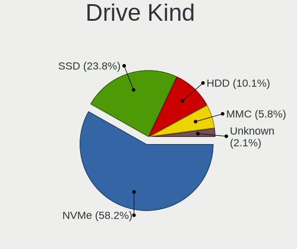
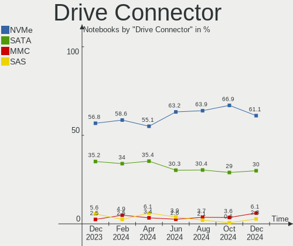
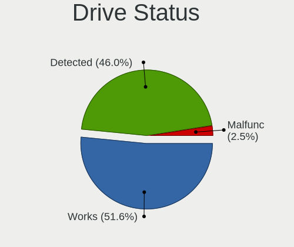
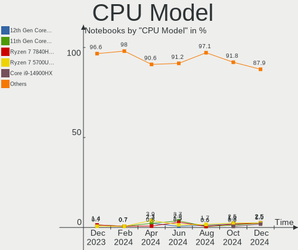
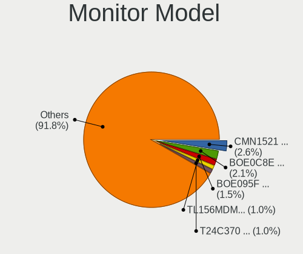
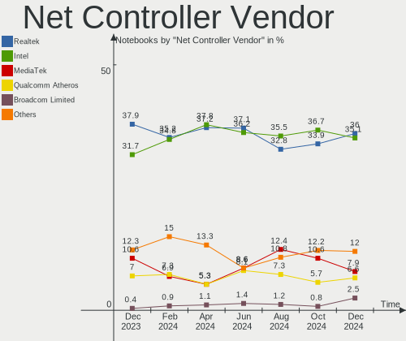

Arch Hardware Trends (Notebooks)
--------------------------------

A project to identify most popular hardware characteristics and track their change
over time based on data collected by Arch users at https://Linux-Hardware.org.

Anyone can contribute to this report by the [hw-probe](https://github.com/linuxhw/hw-probe) tool:

    sudo -E hw-probe -all -upload

Full-feature report is available here: https://linux-hardware.org/?view=trends

Period: Dec, 2021.

Contents
--------

* [ System ](#system)
  - [ OS                       ](#os)
  - [ OS Family                ](#os-family)
  - [ Kernel                   ](#kernel)
  - [ Kernel Family            ](#kernel-family)
  - [ Kernel Major Ver.        ](#kernel-major-ver)
  - [ Arch                     ](#arch)
  - [ DE                       ](#de)
  - [ Display Server           ](#display-server)
  - [ Display Manager          ](#display-manager)
  - [ OS Lang                  ](#os-lang)
  - [ Boot Mode                ](#boot-mode)
  - [ Filesystem               ](#filesystem)
  - [ Part. scheme             ](#part-scheme)
  - [ Dual Boot with Linux/BSD ](#dual-boot-with-linuxbsd)
  - [ Dual Boot (Win)          ](#dual-boot-win)

* [ Board ](#board)
  - [ Vendor                   ](#vendor)
  - [ Model                    ](#model)
  - [ Model Family             ](#model-family)
  - [ MFG Year                 ](#mfg-year)
  - [ Form Factor              ](#form-factor)
  - [ Secure Boot              ](#secure-boot)
  - [ Coreboot                 ](#coreboot)
  - [ RAM Size                 ](#ram-size)
  - [ RAM Used                 ](#ram-used)
  - [ Total Drives             ](#total-drives)
  - [ Has CD-ROM               ](#has-cd-rom)
  - [ Has Ethernet             ](#has-ethernet)
  - [ Has WiFi                 ](#has-wifi)
  - [ Has Bluetooth            ](#has-bluetooth)

* [ Location ](#location)
  - [ Country                  ](#country)
  - [ City                     ](#city)

* [ Drives ](#drives)
  - [ Drive Vendor             ](#drive-vendor)
  - [ Drive Model              ](#drive-model)
  - [ HDD Vendor               ](#hdd-vendor)
  - [ SSD Vendor               ](#ssd-vendor)
  - [ Drive Kind               ](#drive-kind)
  - [ Drive Connector          ](#drive-connector)
  - [ Drive Size               ](#drive-size)
  - [ Space Total              ](#space-total)
  - [ Space Used               ](#space-used)
  - [ Malfunc. Drives          ](#malfunc-drives)
  - [ Malfunc. Drive Vendor    ](#malfunc-drive-vendor)
  - [ Malfunc. HDD Vendor      ](#malfunc-hdd-vendor)
  - [ Malfunc. Drive Kind      ](#malfunc-drive-kind)
  - [ Failed Drives            ](#failed-drives)
  - [ Failed Drive Vendor      ](#failed-drive-vendor)
  - [ Drive Status             ](#drive-status)

* [ Storage controller ](#storage-controller)
  - [ Storage Vendor           ](#storage-vendor)
  - [ Storage Model            ](#storage-model)
  - [ Storage Kind             ](#storage-kind)

* [ Processor ](#processor)
  - [ CPU Vendor               ](#cpu-vendor)
  - [ CPU Model                ](#cpu-model)
  - [ CPU Model Family         ](#cpu-model-family)
  - [ CPU Cores                ](#cpu-cores)
  - [ CPU Sockets              ](#cpu-sockets)
  - [ CPU Threads              ](#cpu-threads)
  - [ CPU Op-Modes             ](#cpu-op-modes)
  - [ CPU Microcode            ](#cpu-microcode)
  - [ CPU Microarch            ](#cpu-microarch)

* [ Graphics ](#graphics)
  - [ GPU Vendor               ](#gpu-vendor)
  - [ GPU Model                ](#gpu-model)
  - [ GPU Combo                ](#gpu-combo)
  - [ GPU Driver               ](#gpu-driver)
  - [ GPU Memory               ](#gpu-memory)

* [ Monitor ](#monitor)
  - [ Monitor Vendor           ](#monitor-vendor)
  - [ Monitor Model            ](#monitor-model)
  - [ Monitor Resolution       ](#monitor-resolution)
  - [ Monitor Diagonal         ](#monitor-diagonal)
  - [ Monitor Width            ](#monitor-width)
  - [ Aspect Ratio             ](#aspect-ratio)
  - [ Monitor Area             ](#monitor-area)
  - [ Pixel Density            ](#pixel-density)
  - [ Multiple Monitors        ](#multiple-monitors)

* [ Network ](#network)
  - [ Net Controller Vendor    ](#net-controller-vendor)
  - [ Net Controller Model     ](#net-controller-model)
  - [ Wireless Vendor          ](#wireless-vendor)
  - [ Wireless Model           ](#wireless-model)
  - [ Ethernet Vendor          ](#ethernet-vendor)
  - [ Ethernet Model           ](#ethernet-model)
  - [ Net Controller Kind      ](#net-controller-kind)
  - [ Used Controller          ](#used-controller)
  - [ NICs                     ](#nics)
  - [ IPv6                     ](#ipv6)

* [ Bluetooth ](#bluetooth)
  - [ Bluetooth Vendor         ](#bluetooth-vendor)
  - [ Bluetooth Model          ](#bluetooth-model)

* [ Sound ](#sound)
  - [ Sound Vendor             ](#sound-vendor)
  - [ Sound Model              ](#sound-model)

* [ Memory ](#memory)
  - [ Memory Vendor            ](#memory-vendor)
  - [ Memory Model             ](#memory-model)
  - [ Memory Kind              ](#memory-kind)
  - [ Memory Form Factor       ](#memory-form-factor)
  - [ Memory Size              ](#memory-size)
  - [ Memory Speed             ](#memory-speed)

* [ Printers & scanners ](#printers--scanners)
  - [ Printer Vendor           ](#printer-vendor)
  - [ Printer Model            ](#printer-model)
  - [ Scanner Vendor           ](#scanner-vendor)
  - [ Scanner Model            ](#scanner-model)

* [ Camera ](#camera)
  - [ Camera Vendor            ](#camera-vendor)
  - [ Camera Model             ](#camera-model)

* [ Security ](#security)
  - [ Fingerprint Vendor       ](#fingerprint-vendor)
  - [ Fingerprint Model        ](#fingerprint-model)
  - [ Chipcard Vendor          ](#chipcard-vendor)
  - [ Chipcard Model           ](#chipcard-model)

* [ Unsupported ](#unsupported)
  - [ Unsupported Devices      ](#unsupported-devices)
  - [ Unsupported Device Types ](#unsupported-device-types)

System
------

OS
--

Installed operating systems

| Name         | Notebooks | Percent |
|--------------|-----------|---------|
| Arch         | 48        | 60.76%  |
| Arch Rolling | 31        | 39.24%  |

OS Family
---------

OS without a version

| Name | Notebooks | Percent |
|------|-----------|---------|
| Arch | 79        | 100%    |

Kernel
------

Version of the Linux kernel

| Version            | Notebooks | Percent |
|--------------------|-----------|---------|
| 5.15.7-arch1-1     | 15        | 18.99%  |
| 5.15.10-arch1-1    | 13        | 16.46%  |
| 5.15.8-arch1-1     | 8         | 10.13%  |
| 5.15.11-arch2-1    | 8         | 10.13%  |
| 5.15.6-arch2-1     | 5         | 6.33%   |
| 5.15.10-zen1-1-zen | 5         | 6.33%   |
| 5.10.88-2-lts      | 4         | 5.06%   |
| 5.15.5-arch1-1     | 3         | 3.8%    |
| 5.15.7-4-clear     | 2         | 2.53%   |
| 5.15.6-zen2-1-zen  | 2         | 2.53%   |
| 5.15.5-zen1-1-zen  | 2         | 2.53%   |
| 5.15.11-zen1-1-zen | 2         | 2.53%   |
| 5.15.8-zen1-1-zen  | 1         | 1.27%   |
| 5.15.4-zen1-1-zen  | 1         | 1.27%   |
| 5.15.2-arch1-1     | 1         | 1.27%   |
| 5.10.87-1-lts      | 1         | 1.27%   |
| 5.10.84-1-lts      | 1         | 1.27%   |
| 5.10.83-1-lts      | 1         | 1.27%   |
| 5.10.82-1-lts      | 1         | 1.27%   |
| 5.10.81-1-lts      | 1         | 1.27%   |
| 5.10.75-1-lts      | 1         | 1.27%   |
| Unknown            | 1         | 1.27%   |

Kernel Family
-------------

Linux kernel without a distro release

| Version | Notebooks | Percent |
|---------|-----------|---------|
| 5.15.10 | 18        | 22.78%  |
| 5.15.7  | 17        | 21.52%  |
| 5.15.11 | 10        | 12.66%  |
| 5.15.8  | 9         | 11.39%  |
| 5.15.6  | 7         | 8.86%   |
| 5.15.5  | 5         | 6.33%   |
| 5.10.88 | 4         | 5.06%   |
| 5.15.4  | 1         | 1.27%   |
| 5.15.2  | 1         | 1.27%   |
| 5.10.87 | 1         | 1.27%   |
| 5.10.84 | 1         | 1.27%   |
| 5.10.83 | 1         | 1.27%   |
| 5.10.82 | 1         | 1.27%   |
| 5.10.81 | 1         | 1.27%   |
| 5.10.75 | 1         | 1.27%   |
| Unknown | 1         | 1.27%   |

Kernel Major Ver.
-----------------

Linux kernel major version

| Version | Notebooks | Percent |
|---------|-----------|---------|
| 5.15    | 68        | 86.08%  |
| 5.10    | 10        | 12.66%  |
| Unknown | 1         | 1.27%   |

Arch
----

OS architecture (x86_64, i586, etc.)

| Name   | Notebooks | Percent |
|--------|-----------|---------|
| x86_64 | 79        | 100%    |

DE
--

Desktop Environment

| Name           | Notebooks | Percent |
|----------------|-----------|---------|
| GNOME          | 27        | 34.18%  |
| KDE5           | 25        | 31.65%  |
| Unknown        | 10        | 12.66%  |
| XFCE           | 7         | 8.86%   |
| awesome        | 3         | 3.8%    |
| Cinnamon       | 2         | 2.53%   |
| X-Cinnamon     | 1         | 1.27%   |
| Unity          | 1         | 1.27%   |
| MATE           | 1         | 1.27%   |
| i3-with-shmlog | 1         | 1.27%   |
| Budgie         | 1         | 1.27%   |

Display Server
--------------

X11 or Wayland

| Name    | Notebooks | Percent |
|---------|-----------|---------|
| X11     | 45        | 56.96%  |
| Wayland | 19        | 24.05%  |
| Tty     | 9         | 11.39%  |
| Unknown | 6         | 7.59%   |

Display Manager
---------------

SDDM, LightDM, etc.

| Name    | Notebooks | Percent |
|---------|-----------|---------|
| SDDM    | 25        | 31.65%  |
| Unknown | 20        | 25.32%  |
| LightDM | 17        | 21.52%  |
| GDM     | 15        | 18.99%  |
| Ly      | 2         | 2.53%   |

OS Lang
-------

Language

| Lang    | Notebooks | Percent |
|---------|-----------|---------|
| en_US   | 43        | 54.43%  |
| C       | 5         | 6.33%   |
| Unknown | 5         | 6.33%   |
| en_GB   | 4         | 5.06%   |
| pt_BR   | 3         | 3.8%    |
| fr_FR   | 3         | 3.8%    |
| en_IN   | 3         | 3.8%    |
| de_DE   | 3         | 3.8%    |
| it_IT   | 2         | 2.53%   |
| unm_US  | 1         | 1.27%   |
| tr_TR   | 1         | 1.27%   |
| sv_SE   | 1         | 1.27%   |
| ru_RU   | 1         | 1.27%   |
| pl_PL   | 1         | 1.27%   |
| ko_KR   | 1         | 1.27%   |
| es_AR   | 1         | 1.27%   |
| en_DK   | 1         | 1.27%   |

Boot Mode
---------

EFI or BIOS

| Mode | Notebooks | Percent |
|------|-----------|---------|
| EFI  | 57        | 72.15%  |
| BIOS | 22        | 27.85%  |

Filesystem
----------

Type of filesystem

| Type  | Notebooks | Percent |
|-------|-----------|---------|
| Ext4  | 54        | 68.35%  |
| Btrfs | 21        | 26.58%  |
| Xfs   | 2         | 2.53%   |
| F2fs  | 2         | 2.53%   |

Part. scheme
------------

Scheme of partitioning

| Type    | Notebooks | Percent |
|---------|-----------|---------|
| GPT     | 59        | 74.68%  |
| Unknown | 15        | 18.99%  |
| MBR     | 5         | 6.33%   |

Dual Boot with Linux/BSD
------------------------

Hosting more than one Linux/BSD

| Dual boot | Notebooks | Percent |
|-----------|-----------|---------|
| No        | 69        | 87.34%  |
| Yes       | 10        | 12.66%  |

Dual Boot (Win)
---------------

Hosting Linux and Windows

| Dual boot | Notebooks | Percent |
|-----------|-----------|---------|
| No        | 55        | 69.62%  |
| Yes       | 24        | 30.38%  |

Board
-----

Vendor
------

Motherboard manufacturer

| Name                | Notebooks | Percent |
|---------------------|-----------|---------|
| Lenovo              | 19        | 24.05%  |
| Dell                | 15        | 18.99%  |
| ASUSTek Computer    | 13        | 16.46%  |
| Hewlett-Packard     | 11        | 13.92%  |
| Apple               | 3         | 3.8%    |
| Timi                | 2         | 2.53%   |
| System76            | 2         | 2.53%   |
| Acer                | 2         | 2.53%   |
| UNOWHY              | 1         | 1.27%   |
| Toshiba             | 1         | 1.27%   |
| Schenker            | 1         | 1.27%   |
| Samsung Electronics | 1         | 1.27%   |
| MSI                 | 1         | 1.27%   |
| Microtech           | 1         | 1.27%   |
| Medion              | 1         | 1.27%   |
| LG Electronics      | 1         | 1.27%   |
| Hyperbook           | 1         | 1.27%   |
| HUAWEI              | 1         | 1.27%   |
| Chuwi               | 1         | 1.27%   |
| Alienware           | 1         | 1.27%   |

Model
-----

Motherboard model

| Name                                  | Notebooks | Percent |
|---------------------------------------|-----------|---------|
| Dell XPS 15 9500                      | 2         | 2.53%   |
| UNOWHY Y13G002S4EI                    | 1         | 1.27%   |
| Toshiba Satellite L650                | 1         | 1.27%   |
| Timi TM1701                           | 1         | 1.27%   |
| Timi RedmiBook 14 II                  | 1         | 1.27%   |
| System76 Gazelle                      | 1         | 1.27%   |
| System76 Galago Pro                   | 1         | 1.27%   |
| Schenker XMG CORE 15(M20, RTX 2060)   | 1         | 1.27%   |
| Samsung RV415/RV515                   | 1         | 1.27%   |
| MSI GS66 Stealth 10UH                 | 1         | 1.27%   |
| Microtech ebookPro                    | 1         | 1.27%   |
| Medion ERAZER X7857 MD60893           | 1         | 1.27%   |
| LG 16ZD90P-GX7LK                      | 1         | 1.27%   |
| Lenovo V15 G2 ALC 82KD                | 1         | 1.27%   |
| Lenovo V14-ADA 82C6                   | 1         | 1.27%   |
| Lenovo ThinkPad X13 Gen 1 20UGS11Q00  | 1         | 1.27%   |
| Lenovo ThinkPad T470s 20HF004UMD      | 1         | 1.27%   |
| Lenovo ThinkPad T460s 20FAS05Q00      | 1         | 1.27%   |
| Lenovo ThinkPad T400 2768GB4          | 1         | 1.27%   |
| Lenovo ThinkPad P51 20HJS16Q0K        | 1         | 1.27%   |
| Lenovo ThinkPad P14s Gen 1 20Y1CTO1WW | 1         | 1.27%   |
| Lenovo ThinkPad E14 20RA001LMC        | 1         | 1.27%   |
| Lenovo ThinkBook 15 G2 ITL 20VE       | 1         | 1.27%   |
| Lenovo Legion Y7000 81FW              | 1         | 1.27%   |
| Lenovo Legion Y7000 2019 1050 81V4    | 1         | 1.27%   |
| Lenovo IdeaPad Y510P 20217            | 1         | 1.27%   |
| Lenovo IdeaPad S540-15IWL GTX 81SW    | 1         | 1.27%   |
| Lenovo IdeaPad S145-15IWL 81S9        | 1         | 1.27%   |
| Lenovo IdeaPad L340-15API 81LW        | 1         | 1.27%   |
| Lenovo IdeaPad 5 14ARE05 81YM         | 1         | 1.27%   |
| Lenovo IdeaPad 300-15ISK 80Q7         | 1         | 1.27%   |
| Lenovo G580 20150                     | 1         | 1.27%   |
| Hyperbook Z15 Zen                     | 1         | 1.27%   |
| HUAWEI KLVD-WXX9                      | 1         | 1.27%   |
| HP Victus by Laptop 16-e0xxx          | 1         | 1.27%   |
| HP ProBook 4740s                      | 1         | 1.27%   |
| HP ProBook 450 G4                     | 1         | 1.27%   |
| HP ProBook 440 G8 Notebook PC         | 1         | 1.27%   |
| HP Pavilion Gaming Laptop 15-ec0xxx   | 1         | 1.27%   |
| HP Pavilion g7                        | 1         | 1.27%   |
| HP Pav Gaming Laptop 15-dk1404nf      | 1         | 1.27%   |
| HP Laptop 15s-eq1xxx                  | 1         | 1.27%   |
| HP Laptop 15-db1xxx                   | 1         | 1.27%   |
| HP EliteBook 2570p                    | 1         | 1.27%   |
| HP 250 G7 Notebook PC                 | 1         | 1.27%   |
| Dell XPS 15 9570                      | 1         | 1.27%   |
| Dell XPS 13 9360                      | 1         | 1.27%   |
| Dell Vostro 3590                      | 1         | 1.27%   |
| Dell Vostro 1720                      | 1         | 1.27%   |
| Dell Precision 3561                   | 1         | 1.27%   |
| Dell Latitude E6400                   | 1         | 1.27%   |
| Dell Latitude E6230                   | 1         | 1.27%   |
| Dell Latitude E5470                   | 1         | 1.27%   |
| Dell Latitude 9420                    | 1         | 1.27%   |
| Dell Latitude 5580                    | 1         | 1.27%   |
| Dell Latitude 5410                    | 1         | 1.27%   |
| Dell Inspiron 5575                    | 1         | 1.27%   |
| Dell Inspiron 3521                    | 1         | 1.27%   |
| Chuwi GemiBook Pro                    | 1         | 1.27%   |
| ASUS ZenBook UX533FD_UX533FD          | 1         | 1.27%   |

Model Family
------------

Motherboard model prefix

| Name               | Notebooks | Percent |
|--------------------|-----------|---------|
| Lenovo ThinkPad    | 7         | 8.86%   |
| Lenovo IdeaPad     | 6         | 7.59%   |
| Dell Latitude      | 6         | 7.59%   |
| Dell XPS           | 4         | 5.06%   |
| HP ProBook         | 3         | 3.8%    |
| ASUS ZenBook       | 3         | 3.8%    |
| Lenovo Legion      | 2         | 2.53%   |
| HP Pavilion        | 2         | 2.53%   |
| HP Laptop          | 2         | 2.53%   |
| Dell Vostro        | 2         | 2.53%   |
| Dell Inspiron      | 2         | 2.53%   |
| ASUS ASUS          | 2         | 2.53%   |
| UNOWHY Y13G002S4EI | 1         | 1.27%   |
| Toshiba Satellite  | 1         | 1.27%   |
| Timi TM1701        | 1         | 1.27%   |
| Timi RedmiBook     | 1         | 1.27%   |
| System76 Gazelle   | 1         | 1.27%   |
| System76 Galago    | 1         | 1.27%   |
| Schenker XMG       | 1         | 1.27%   |
| Samsung RV415      | 1         | 1.27%   |
| MSI GS66           | 1         | 1.27%   |
| Microtech ebookPro | 1         | 1.27%   |
| Medion ERAZER      | 1         | 1.27%   |
| LG 16ZD90P-GX7LK   | 1         | 1.27%   |
| Lenovo V15         | 1         | 1.27%   |
| Lenovo V14-ADA     | 1         | 1.27%   |
| Lenovo ThinkBook   | 1         | 1.27%   |
| Lenovo G580        | 1         | 1.27%   |
| Hyperbook Z15      | 1         | 1.27%   |
| HUAWEI KLVD-WXX9   | 1         | 1.27%   |
| HP Victus          | 1         | 1.27%   |
| HP Pav             | 1         | 1.27%   |
| HP EliteBook       | 1         | 1.27%   |
| HP 250             | 1         | 1.27%   |
| Dell Precision     | 1         | 1.27%   |
| Chuwi GemiBook     | 1         | 1.27%   |
| ASUS X580VD        | 1         | 1.27%   |
| ASUS X55CR         | 1         | 1.27%   |
| ASUS VivoBook      | 1         | 1.27%   |
| ASUS TUF           | 1         | 1.27%   |
| ASUS Strix         | 1         | 1.27%   |
| ASUS N53SV         | 1         | 1.27%   |
| ASUS GX501VIK      | 1         | 1.27%   |
| ASUS G752VT        | 1         | 1.27%   |
| Apple MacBookPro4  | 1         | 1.27%   |
| Apple MacBookAir7  | 1         | 1.27%   |
| Apple MacBookAir3  | 1         | 1.27%   |
| Alienware x15      | 1         | 1.27%   |
| Acer Swift         | 1         | 1.27%   |
| Acer Nitro         | 1         | 1.27%   |

MFG Year
--------

Motherboard manufacture year

| Year | Notebooks | Percent |
|------|-----------|---------|
| 2021 | 35        | 44.3%   |
| 2019 | 16        | 20.25%  |
| 2020 | 10        | 12.66%  |
| 2018 | 4         | 5.06%   |
| 2013 | 4         | 5.06%   |
| 2016 | 2         | 2.53%   |
| 2012 | 2         | 2.53%   |
| 2011 | 2         | 2.53%   |
| 2009 | 2         | 2.53%   |
| 2015 | 1         | 1.27%   |
| 2008 | 1         | 1.27%   |

Form Factor
-----------

Physical design of the computer

| Name     | Notebooks | Percent |
|----------|-----------|---------|
| Notebook | 79        | 100%    |

Secure Boot
-----------

Enabled or disabled

| State    | Notebooks | Percent |
|----------|-----------|---------|
| Disabled | 78        | 98.73%  |
| Enabled  | 1         | 1.27%   |

Coreboot
--------

Have coreboot on board

| Used | Notebooks | Percent |
|------|-----------|---------|
| No   | 78        | 98.73%  |
| Yes  | 1         | 1.27%   |

RAM Size
--------

Total RAM memory

| Size in GB | Notebooks | Percent |
|------------|-----------|---------|
| 16.01-24.0 | 25        | 31.65%  |
| 4.01-8.0   | 19        | 24.05%  |
| 8.01-16.0  | 15        | 18.99%  |
| 3.01-4.0   | 9         | 11.39%  |
| 32.01-64.0 | 8         | 10.13%  |
| 24.01-32.0 | 1         | 1.27%   |
| 2.01-3.0   | 1         | 1.27%   |
| 1.01-2.0   | 1         | 1.27%   |

RAM Used
--------

Used RAM memory

| Used GB   | Notebooks | Percent |
|-----------|-----------|---------|
| 1.01-2.0  | 21        | 26.58%  |
| 2.01-3.0  | 20        | 25.32%  |
| 4.01-8.0  | 17        | 21.52%  |
| 3.01-4.0  | 10        | 12.66%  |
| 0.51-1.0  | 5         | 6.33%   |
| 8.01-16.0 | 4         | 5.06%   |
| 0.01-0.5  | 2         | 2.53%   |

Total Drives
------------

Number of drives on board

| Drives | Notebooks | Percent |
|--------|-----------|---------|
| 1      | 50        | 63.29%  |
| 2      | 23        | 29.11%  |
| 3      | 6         | 7.59%   |

Has CD-ROM
----------

Has CD-ROM on board

| Presented | Notebooks | Percent |
|-----------|-----------|---------|
| No        | 66        | 83.54%  |
| Yes       | 13        | 16.46%  |

Has Ethernet
------------

Has Ethernet on board

| Presented | Notebooks | Percent |
|-----------|-----------|---------|
| Yes       | 59        | 74.68%  |
| No        | 20        | 25.32%  |

Has WiFi
--------

Has WiFi module

| Presented | Notebooks | Percent |
|-----------|-----------|---------|
| Yes       | 78        | 98.73%  |
| No        | 1         | 1.27%   |

Has Bluetooth
-------------

Has Bluetooth module

| Presented | Notebooks | Percent |
|-----------|-----------|---------|
| Yes       | 69        | 87.34%  |
| No        | 10        | 12.66%  |

Location
--------

Country
-------

Geographic location (country)

| Country     | Notebooks | Percent |
|-------------|-----------|---------|
| USA         | 11        | 13.92%  |
| Germany     | 9         | 11.39%  |
| France      | 5         | 6.33%   |
| Russia      | 4         | 5.06%   |
| Poland      | 4         | 5.06%   |
| India       | 4         | 5.06%   |
| Brazil      | 4         | 5.06%   |
| UK          | 3         | 3.8%    |
| Norway      | 3         | 3.8%    |
| Italy       | 3         | 3.8%    |
| Ukraine     | 2         | 2.53%   |
| Turkey      | 2         | 2.53%   |
| Portugal    | 2         | 2.53%   |
| Iran        | 2         | 2.53%   |
| Hungary     | 2         | 2.53%   |
| Denmark     | 2         | 2.53%   |
| Switzerland | 1         | 1.27%   |
| Sweden      | 1         | 1.27%   |
| Spain       | 1         | 1.27%   |
| South Korea | 1         | 1.27%   |
| Serbia      | 1         | 1.27%   |
| Romania     | 1         | 1.27%   |
| Qatar       | 1         | 1.27%   |
| Netherlands | 1         | 1.27%   |
| Mexico      | 1         | 1.27%   |
| Latvia      | 1         | 1.27%   |
| Czechia     | 1         | 1.27%   |
| China       | 1         | 1.27%   |
| Canada      | 1         | 1.27%   |
| Belarus     | 1         | 1.27%   |
| Bangladesh  | 1         | 1.27%   |
| Azerbaijan  | 1         | 1.27%   |
| Argentina   | 1         | 1.27%   |

City
----

Geographic location (city)

| City                 | Notebooks | Percent |
|----------------------|-----------|---------|
| Ponder               | 3         | 3.8%    |
| Uberl??ndia          | 2         | 2.53%   |
| Oslo                 | 2         | 2.53%   |
| Wittenbach           | 1         | 1.27%   |
| West Sacramento      | 1         | 1.27%   |
| Warsaw               | 1         | 1.27%   |
| Volgograd            | 1         | 1.27%   |
| Tongi                | 1         | 1.27%   |
| Tehran               | 1         | 1.27%   |
| Swarozyn             | 1         | 1.27%   |
| Stavanger            | 1         | 1.27%   |
| Soborg               | 1         | 1.27%   |
| Sk?¶vde              | 1         | 1.27%   |
| Senta                | 1         | 1.27%   |
| S??o Paulo           | 1         | 1.27%   |
| San Vito sullo Ionio | 1         | 1.27%   |
| Riga                 | 1         | 1.27%   |
| R??mnicu V??lcea     | 1         | 1.27%   |
| Queens               | 1         | 1.27%   |
| Pune                 | 1         | 1.27%   |
| Prague               | 1         | 1.27%   |
| Porto                | 1         | 1.27%   |
| Patna                | 1         | 1.27%   |
| Pasadena             | 1         | 1.27%   |
| Orneta               | 1         | 1.27%   |
| Northampton          | 1         | 1.27%   |
| Navalcarnero         | 1         | 1.27%   |
| Nantes               | 1         | 1.27%   |
| Moscow               | 1         | 1.27%   |
| Montreal             | 1         | 1.27%   |
| Modena               | 1         | 1.27%   |
| Missoula             | 1         | 1.27%   |
| Miskolc              | 1         | 1.27%   |
| Minsk                | 1         | 1.27%   |
| Minneapolis          | 1         | 1.27%   |
| Miami                | 1         | 1.27%   |
| Mexico City          | 1         | 1.27%   |
| M?©rignac            | 1         | 1.27%   |
| Mar del Plata        | 1         | 1.27%   |
| Leipzig              | 1         | 1.27%   |
| Kyiv                 | 1         | 1.27%   |
| Krakow               | 1         | 1.27%   |
| Kolkata              | 1         | 1.27%   |
| Kharkiv              | 1         | 1.27%   |
| Kazan?ˆ™             | 1         | 1.27%   |
| Karlsruhe            | 1         | 1.27%   |
| Jacksonville         | 1         | 1.27%   |
| Istanbul             | 1         | 1.27%   |
| Isfahan              | 1         | 1.27%   |
| Houlette             | 1         | 1.27%   |
| Hamburg              | 1         | 1.27%   |
| Guagnano             | 1         | 1.27%   |
| Garching bei Munchen | 1         | 1.27%   |
| Froendenberg         | 1         | 1.27%   |
| Feicheng             | 1         | 1.27%   |
| Eaubonne             | 1         | 1.27%   |
| Doha                 | 1         | 1.27%   |
| Cricklewood          | 1         | 1.27%   |
| Creutzwald           | 1         | 1.27%   |
| Copenhagen           | 1         | 1.27%   |

Drives
------

Drive Vendor
------------

Hard drive vendors

| Vendor              | Notebooks | Drives | Percent |
|---------------------|-----------|--------|---------|
| Samsung Electronics | 25        | 29     | 23.58%  |
| WDC                 | 13        | 14     | 12.26%  |
| SK Hynix            | 9         | 9      | 8.49%   |
| SanDisk             | 8         | 9      | 7.55%   |
| Toshiba             | 6         | 7      | 5.66%   |
| Micron Technology   | 6         | 6      | 5.66%   |
| Seagate             | 4         | 4      | 3.77%   |
| Kingston            | 4         | 4      | 3.77%   |
| Intel               | 4         | 5      | 3.77%   |
| Crucial             | 4         | 4      | 3.77%   |
| HGST                | 3         | 3      | 2.83%   |
| Unknown             | 2         | 2      | 1.89%   |
| Phison              | 2         | 2      | 1.89%   |
| JMicron             | 2         | 2      | 1.89%   |
| Apple               | 2         | 2      | 1.89%   |
| Verbatim            | 1         | 1      | 0.94%   |
| UMIS                | 1         | 1      | 0.94%   |
| Patriot             | 1         | 1      | 0.94%   |
| Netac               | 1         | 1      | 0.94%   |
| Microtech           | 1         | 1      | 0.94%   |
| LITEON              | 1         | 1      | 0.94%   |
| Lenovo              | 1         | 1      | 0.94%   |
| KIOXIA              | 1         | 1      | 0.94%   |
| HS-SSD-E100N        | 1         | 1      | 0.94%   |
| Hitachi             | 1         | 1      | 0.94%   |
| GOODRAM             | 1         | 1      | 0.94%   |
| A-DATA Technology   | 1         | 1      | 0.94%   |

Drive Model
-----------

Hard drive models

| Model                                 | Notebooks | Percent |
|---------------------------------------|-----------|---------|
| Sandisk NVMe SSD Drive 1TB            | 3         | 2.65%   |
| SK Hynix PC711 NVMe 512GB             | 2         | 1.77%   |
| Sandisk NVMe SSD Drive 512GB          | 2         | 1.77%   |
| Samsung SSD 970 EVO Plus 500GB        | 2         | 1.77%   |
| Samsung SSD 860 EVO 500GB             | 2         | 1.77%   |
| Samsung NVMe SSD Drive 500GB          | 2         | 1.77%   |
| Samsung NVMe SSD Drive 256GB          | 2         | 1.77%   |
| Samsung NVMe SSD Drive 1TB            | 2         | 1.77%   |
| Intel NVMe SSD Drive 512GB            | 2         | 1.77%   |
| WDC WDS500G2B0A-00SM50 500GB SSD      | 1         | 0.88%   |
| WDC WDS240G2G0B-00EPW0 240GB SSD      | 1         | 0.88%   |
| WDC WDS100T2B0C 1TB                   | 1         | 0.88%   |
| WDC WD5000LPLX-00ZNTT0 500GB          | 1         | 0.88%   |
| WDC WD5000LPCX-24C6HT0 500GB          | 1         | 0.88%   |
| WDC WD3200BEKT-60V5T1 320GB           | 1         | 0.88%   |
| WDC WD10SPZX-60Z10T1 1TB              | 1         | 0.88%   |
| WDC WD10SPZX-24Z10 1TB                | 1         | 0.88%   |
| WDC WD10SPZX-21Z10T0 1TB              | 1         | 0.88%   |
| WDC WD10SPZX-08Z10 1TB                | 1         | 0.88%   |
| WDC WD10SPZX-00Z10T0 1TB              | 1         | 0.88%   |
| WDC WD10JPVX-60JC3T0 1TB              | 1         | 0.88%   |
| WDC PC SN730 SDBPNTY-512G-1006 512GB  | 1         | 0.88%   |
| WDC PC SN520 SDAPNUW-512G-1002 512GB  | 1         | 0.88%   |
| Verbatim Vi550 S3 SSD 256GB           | 1         | 0.88%   |
| Unknown MMC Card  64GB                | 1         | 0.88%   |
| Unknown MMC Card  32GB                | 1         | 0.88%   |
| UMIS RPFTJ128PDD2EWX 128GB            | 1         | 0.88%   |
| Toshiba THNSN5256GPUK NVMe 256GB      | 1         | 0.88%   |
| Toshiba NVMe SSD Drive 256GB          | 1         | 0.88%   |
| Toshiba NVMe SSD Drive 1024GB         | 1         | 0.88%   |
| Toshiba MK5061GSYN 500GB              | 1         | 0.88%   |
| Toshiba KXG6AZNV256G 256GB            | 1         | 0.88%   |
| Toshiba KXG50PNV2T04 NVMe 2048GB      | 1         | 0.88%   |
| Toshiba KBG40ZNT256G MEMORY 256GB     | 1         | 0.88%   |
| SK Hynix SHGP31-1000GM-2 1TB          | 1         | 0.88%   |
| SK Hynix SC311 SATA 128GB SSD         | 1         | 0.88%   |
| SK Hynix PC711 NVMe 1TB               | 1         | 0.88%   |
| SK Hynix NVMe SSD Drive 512GB         | 1         | 0.88%   |
| SK Hynix NVMe SSD Drive 256GB         | 1         | 0.88%   |
| SK Hynix HFS250G32TND-N1A0A 250GB SSD | 1         | 0.88%   |
| SK Hynix HFM001TD3JX013N 1TB          | 1         | 0.88%   |
| Seagate ST9750420AS 752GB             | 1         | 0.88%   |
| Seagate ST500LM000-1EJ162 500GB       | 1         | 0.88%   |
| Seagate ST2000LM007-1R8174 2TB        | 1         | 0.88%   |
| Seagate ST1000LM049-2GH172 1TB        | 1         | 0.88%   |
| SanDisk X400 M.2 2280 256GB SSD       | 1         | 0.88%   |
| SanDisk SSD PLUS 120 GB               | 1         | 0.88%   |
| Sandisk NVMe SSD Drive 256GB          | 1         | 0.88%   |
| Samsung SSD 970 EVO Plus 2TB          | 1         | 0.88%   |
| Samsung SSD 970 EVO Plus 1TB          | 1         | 0.88%   |
| Samsung SSD 970 EVO 1TB               | 1         | 0.88%   |
| Samsung SSD 870 EVO 500GB             | 1         | 0.88%   |
| Samsung SSD 860 PRO 1TB               | 1         | 0.88%   |
| Samsung SSD 860 EVO 1TB               | 1         | 0.88%   |
| Samsung SSD 850 EVO 250GB             | 1         | 0.88%   |
| Samsung SSD 830 Series 128GB          | 1         | 0.88%   |
| Samsung PSSD T7 500GB                 | 1         | 0.88%   |
| Samsung NVMe SSD Drive 512GB          | 1         | 0.88%   |
| Samsung NVMe SSD Drive 2TB            | 1         | 0.88%   |
| Samsung NVMe SSD Drive 250GB          | 1         | 0.88%   |

HDD Vendor
----------

Hard disk drive vendors

| Vendor  | Notebooks | Drives | Percent |
|---------|-----------|--------|---------|
| WDC     | 9         | 9      | 50%     |
| Seagate | 4         | 4      | 22.22%  |
| HGST    | 3         | 3      | 16.67%  |
| Toshiba | 1         | 1      | 5.56%   |
| Hitachi | 1         | 1      | 5.56%   |

SSD Vendor
----------

Solid state drive vendors

| Vendor              | Notebooks | Drives | Percent |
|---------------------|-----------|--------|---------|
| Samsung Electronics | 11        | 11     | 30.56%  |
| Crucial             | 4         | 4      | 11.11%  |
| Kingston            | 3         | 3      | 8.33%   |
| WDC                 | 2         | 2      | 5.56%   |
| SK Hynix            | 2         | 2      | 5.56%   |
| SanDisk             | 2         | 2      | 5.56%   |
| Apple               | 2         | 2      | 5.56%   |
| Verbatim            | 1         | 1      | 2.78%   |
| Patriot             | 1         | 1      | 2.78%   |
| Netac               | 1         | 1      | 2.78%   |
| Microtech           | 1         | 1      | 2.78%   |
| LITEON              | 1         | 1      | 2.78%   |
| JMicron             | 1         | 1      | 2.78%   |
| Intel               | 1         | 1      | 2.78%   |
| HS-SSD-E100N        | 1         | 1      | 2.78%   |
| GOODRAM             | 1         | 1      | 2.78%   |
| A-DATA Technology   | 1         | 1      | 2.78%   |

Drive Kind
----------

HDD or SSD

| Kind    | Notebooks | Drives | Percent |
|---------|-----------|--------|---------|
| NVMe    | 50        | 57     | 48.54%  |
| SSD     | 32        | 36     | 31.07%  |
| HDD     | 18        | 18     | 17.48%  |
| MMC     | 2         | 2      | 1.94%   |
| Unknown | 1         | 1      | 0.97%   |

Drive Connector
---------------

SATA, SAS, NVMe, etc.

| Type | Notebooks | Drives | Percent |
|------|-----------|--------|---------|
| NVMe | 50        | 57     | 50.51%  |
| SATA | 44        | 51     | 44.44%  |
| SAS  | 3         | 4      | 3.03%   |
| MMC  | 2         | 2      | 2.02%   |

Drive Size
----------

Size of hard drive

| Size in TB | Notebooks | Drives | Percent |
|------------|-----------|--------|---------|
| 0.01-0.5   | 32        | 38     | 66.67%  |
| 0.51-1.0   | 14        | 14     | 29.17%  |
| 1.01-2.0   | 2         | 2      | 4.17%   |

Space Total
-----------

Amount of disk space available on the file system

| Size in GB     | Notebooks | Percent |
|----------------|-----------|---------|
| 251-500        | 22        | 27.85%  |
| 101-250        | 22        | 27.85%  |
| 501-1000       | 15        | 18.99%  |
| 1001-2000      | 9         | 11.39%  |
| More than 3000 | 4         | 5.06%   |
| 51-100         | 4         | 5.06%   |
| 2001-3000      | 2         | 2.53%   |
| Unknown        | 1         | 1.27%   |

Space Used
----------

Amount of used disk space

| Used GB   | Notebooks | Percent |
|-----------|-----------|---------|
| 1-20      | 17        | 21.52%  |
| 21-50     | 12        | 15.19%  |
| 101-250   | 12        | 15.19%  |
| 501-1000  | 12        | 15.19%  |
| 51-100    | 11        | 13.92%  |
| 251-500   | 9         | 11.39%  |
| 1001-2000 | 3         | 3.8%    |
| 2001-3000 | 2         | 2.53%   |
| Unknown   | 1         | 1.27%   |

Malfunc. Drives
---------------

Drive models with a malfunction

| Model                                 | Notebooks | Drives | Percent |
|---------------------------------------|-----------|--------|---------|
| WDC WD3200BEKT-60V5T1 320GB           | 1         | 1      | 16.67%  |
| WDC WD10JPVX-60JC3T0 1TB              | 1         | 1      | 16.67%  |
| Samsung Electronics SSD 870 EVO 500GB | 1         | 1      | 16.67%  |
| Kingston SV300S37A60G 64GB SSD        | 1         | 1      | 16.67%  |
| Hitachi HTS543232A7A384 320GB         | 1         | 1      | 16.67%  |
| Crucial CT240M500SSD1 240GB           | 1         | 1      | 16.67%  |

Malfunc. Drive Vendor
---------------------

Vendors of faulty drives

| Vendor              | Notebooks | Drives | Percent |
|---------------------|-----------|--------|---------|
| WDC                 | 2         | 2      | 33.33%  |
| Samsung Electronics | 1         | 1      | 16.67%  |
| Kingston            | 1         | 1      | 16.67%  |
| Hitachi             | 1         | 1      | 16.67%  |
| Crucial             | 1         | 1      | 16.67%  |

Malfunc. HDD Vendor
-------------------

Vendors of faulty HDD drives

| Vendor  | Notebooks | Drives | Percent |
|---------|-----------|--------|---------|
| WDC     | 2         | 2      | 66.67%  |
| Hitachi | 1         | 1      | 33.33%  |

Malfunc. Drive Kind
-------------------

Kinds of faulty drives

| Kind | Notebooks | Drives | Percent |
|------|-----------|--------|---------|
| SSD  | 3         | 3      | 50%     |
| HDD  | 3         | 3      | 50%     |

Failed Drives
-------------

Failed drive models

Zero info for selected period =(

Failed Drive Vendor
-------------------

Failed drive vendors

Zero info for selected period =(

Drive Status
------------

Number of failed and malfunc. drives

| Status   | Notebooks | Drives | Percent |
|----------|-----------|--------|---------|
| Works    | 41        | 55     | 50.62%  |
| Detected | 34        | 53     | 41.98%  |
| Malfunc  | 6         | 6      | 7.41%   |

Storage controller
------------------

Storage Vendor
--------------

Storage controller vendors

| Vendor                       | Notebooks | Percent |
|------------------------------|-----------|---------|
| Intel                        | 50        | 45.45%  |
| Samsung Electronics          | 17        | 15.45%  |
| Sandisk                      | 9         | 8.18%   |
| AMD                          | 8         | 7.27%   |
| SK Hynix                     | 7         | 6.36%   |
| Micron Technology            | 6         | 5.45%   |
| Toshiba America Info Systems | 5         | 4.55%   |
| Phison Electronics           | 2         | 1.82%   |
| KIOXIA                       | 2         | 1.82%   |
| Union Memory (Shenzhen)      | 1         | 0.91%   |
| Nvidia                       | 1         | 0.91%   |
| Lenovo                       | 1         | 0.91%   |
| Kingston Technology Company  | 1         | 0.91%   |

Storage Model
-------------

Storage controller models

| Model                                                                            | Notebooks | Percent |
|----------------------------------------------------------------------------------|-----------|---------|
| Samsung NVMe SSD Controller SM981/PM981/PM983                                    | 10        | 8.7%    |
| SK Hynix Gold P31 SSD                                                            | 7         | 6.09%   |
| Intel Volume Management Device NVMe RAID Controller                              | 7         | 6.09%   |
| AMD FCH SATA Controller [AHCI mode]                                              | 7         | 6.09%   |
| Samsung NVMe SSD Controller 980                                                  | 6         | 5.22%   |
| Micron Non-Volatile memory controller                                            | 6         | 5.22%   |
| Intel Sunrise Point-LP SATA Controller [AHCI mode]                               | 5         | 4.35%   |
| Intel Cannon Lake Mobile PCH SATA AHCI Controller                                | 5         | 4.35%   |
| Intel 82801 Mobile SATA Controller [RAID mode]                                   | 5         | 4.35%   |
| Intel 7 Series Chipset Family 6-port SATA Controller [AHCI mode]                 | 5         | 4.35%   |
| Intel Q170/Q150/B150/H170/H110/Z170/CM236 Chipset SATA Controller [AHCI Mode]    | 4         | 3.48%   |
| Sandisk WD Blue SN550 NVMe SSD                                                   | 3         | 2.61%   |
| Sandisk WD Blue SN500 / PC SN520 NVMe SSD                                        | 3         | 2.61%   |
| Intel SSD 660P Series                                                            | 3         | 2.61%   |
| Intel Comet Lake SATA AHCI Controller                                            | 3         | 2.61%   |
| Intel Cannon Point-LP SATA Controller [AHCI Mode]                                | 3         | 2.61%   |
| Toshiba America Info Systems Toshiba America Info Non-Volatile memory controller | 2         | 1.74%   |
| Sandisk Non-Volatile memory controller                                           | 2         | 1.74%   |
| KIOXIA Non-Volatile memory controller                                            | 2         | 1.74%   |
| Intel Celeron/Pentium Silver Processor SATA Controller                           | 2         | 1.74%   |
| Intel 82801IBM/IEM (ICH9M/ICH9M-E) 4 port SATA Controller [AHCI mode]            | 2         | 1.74%   |
| Union Memory (Shenzhen) Non-Volatile memory controller                           | 1         | 0.87%   |
| Toshiba America Info Systems XG6 NVMe SSD Controller                             | 1         | 0.87%   |
| Toshiba America Info Systems XG4 NVMe SSD Controller                             | 1         | 0.87%   |
| Toshiba America Info Systems BG3 NVMe SSD Controller                             | 1         | 0.87%   |
| Sandisk WD Black SN750 / PC SN730 NVMe SSD                                       | 1         | 0.87%   |
| Samsung NVMe SSD Controller SM961/PM961/SM963                                    | 1         | 0.87%   |
| Samsung Electronics SATA controller                                              | 1         | 0.87%   |
| Phison PS5013 E13 NVMe Controller                                                | 1         | 0.87%   |
| Phison E12 NVMe Controller                                                       | 1         | 0.87%   |
| Nvidia MCP89 SATA Controller (AHCI mode)                                         | 1         | 0.87%   |
| Lenovo Non-Volatile memory controller                                            | 1         | 0.87%   |
| Kingston Company A2000 NVMe SSD                                                  | 1         | 0.87%   |
| Intel Tiger Lake-LP SATA Controller [AHCI mode]                                  | 1         | 0.87%   |
| Intel HM170/QM170 Chipset SATA Controller [AHCI Mode]                            | 1         | 0.87%   |
| Intel Celeron N3350/Pentium N4200/Atom E3900 Series SATA AHCI Controller         | 1         | 0.87%   |
| Intel 82801HM/HEM (ICH8M/ICH8M-E) SATA Controller [AHCI mode]                    | 1         | 0.87%   |
| Intel 82801HM/HEM (ICH8M/ICH8M-E) IDE Controller                                 | 1         | 0.87%   |
| Intel 8 Series/C220 Series Chipset Family 6-port SATA Controller 1 [AHCI mode]   | 1         | 0.87%   |
| Intel 6 Series/C200 Series Chipset Family 6 port Mobile SATA AHCI Controller     | 1         | 0.87%   |
| Intel 500 Series Chipset Family SATA AHCI Controller                             | 1         | 0.87%   |
| Intel 5 Series/3400 Series Chipset 4 port SATA AHCI Controller                   | 1         | 0.87%   |
| Intel 400 Series Chipset Family SATA AHCI Controller                             | 1         | 0.87%   |
| AMD SB7x0/SB8x0/SB9x0 SATA Controller [AHCI mode]                                | 1         | 0.87%   |

Storage Kind
------------

Kind of storage controller (IDE, SATA, NVMe, SAS, ...)

| Kind | Notebooks | Percent |
|------|-----------|---------|
| NVMe | 50        | 45.05%  |
| SATA | 48        | 43.24%  |
| RAID | 12        | 10.81%  |
| IDE  | 1         | 0.9%    |

Processor
---------

CPU Vendor
----------

Processor vendors

| Vendor | Notebooks | Percent |
|--------|-----------|---------|
| Intel  | 61        | 77.22%  |
| AMD    | 18        | 22.78%  |

CPU Model
---------

Processor models

| Model                                         | Notebooks | Percent |
|-----------------------------------------------|-----------|---------|
| Intel 11th Gen Core i5-1135G7 @ 2.40GHz       | 6         | 7.59%   |
| Intel Core i7-8565U CPU @ 1.80GHz             | 4         | 5.06%   |
| Intel Core i7-8750H CPU @ 2.20GHz             | 3         | 3.8%    |
| Intel Core i7-7700HQ CPU @ 2.80GHz            | 3         | 3.8%    |
| AMD Ryzen 5 4500U with Radeon Graphics        | 3         | 3.8%    |
| Intel Core i7-10870H CPU @ 2.20GHz            | 2         | 2.53%   |
| Intel Core i5-6200U CPU @ 2.30GHz             | 2         | 2.53%   |
| Intel Core i5-10300H CPU @ 2.50GHz            | 2         | 2.53%   |
| Intel 11th Gen Core i7-11800H @ 2.30GHz       | 2         | 2.53%   |
| AMD Ryzen 7 4800H with Radeon Graphics        | 2         | 2.53%   |
| AMD Ryzen 5 3500U with Radeon Vega Mobile Gfx | 2         | 2.53%   |
| Intel Pentium Silver N5000 CPU @ 1.10GHz      | 1         | 1.27%   |
| Intel Core i9-10885H CPU @ 2.40GHz            | 1         | 1.27%   |
| Intel Core i7-8550U CPU @ 1.80GHz             | 1         | 1.27%   |
| Intel Core i7-7820HQ CPU @ 2.90GHz            | 1         | 1.27%   |
| Intel Core i7-7500U CPU @ 2.70GHz             | 1         | 1.27%   |
| Intel Core i7-6700HQ CPU @ 2.60GHz            | 1         | 1.27%   |
| Intel Core i7-5650U CPU @ 2.20GHz             | 1         | 1.27%   |
| Intel Core i7-4700MQ CPU @ 2.40GHz            | 1         | 1.27%   |
| Intel Core i7-2670QM CPU @ 2.20GHz            | 1         | 1.27%   |
| Intel Core i7-10510U CPU @ 1.80GHz            | 1         | 1.27%   |
| Intel Core i5-9300H CPU @ 2.40GHz             | 1         | 1.27%   |
| Intel Core i5-8300H CPU @ 2.30GHz             | 1         | 1.27%   |
| Intel Core i5-7440HQ CPU @ 2.80GHz            | 1         | 1.27%   |
| Intel Core i5-7200U CPU @ 2.50GHz             | 1         | 1.27%   |
| Intel Core i5-6440HQ CPU @ 2.60GHz            | 1         | 1.27%   |
| Intel Core i5-3340M CPU @ 2.70GHz             | 1         | 1.27%   |
| Intel Core i5-3320M CPU @ 2.60GHz             | 1         | 1.27%   |
| Intel Core i5-3230M CPU @ 2.60GHz             | 1         | 1.27%   |
| Intel Core i5-3210M CPU @ 2.50GHz             | 1         | 1.27%   |
| Intel Core i5-1035G1 CPU @ 1.00GHz            | 1         | 1.27%   |
| Intel Core i5-10210U CPU @ 1.60GHz            | 1         | 1.27%   |
| Intel Core i3-7100U CPU @ 2.40GHz             | 1         | 1.27%   |
| Intel Core i3-3217U CPU @ 1.80GHz             | 1         | 1.27%   |
| Intel Core i3-2370M CPU @ 2.40GHz             | 1         | 1.27%   |
| Intel Core i3-10110U CPU @ 2.10GHz            | 1         | 1.27%   |
| Intel Core i3 CPU M 380 @ 2.53GHz             | 1         | 1.27%   |
| Intel Core 2 Duo CPU U9400 @ 1.40GHz          | 1         | 1.27%   |
| Intel Core 2 Duo CPU T9600 @ 2.80GHz          | 1         | 1.27%   |
| Intel Core 2 Duo CPU T9300 @ 2.50GHz          | 1         | 1.27%   |
| Intel Core 2 Duo CPU T6670 @ 2.20GHz          | 1         | 1.27%   |
| Intel Core 2 Duo CPU P8400 @ 2.26GHz          | 1         | 1.27%   |
| Intel Celeron J4125 CPU @ 2.00GHz             | 1         | 1.27%   |
| Intel Celeron CPU N3450 @ 1.10GHz             | 1         | 1.27%   |
| Intel 11th Gen Core i9-11950H @ 2.60GHz       | 1         | 1.27%   |
| Intel 11th Gen Core i7-1185G7 @ 3.00GHz       | 1         | 1.27%   |
| Intel 11th Gen Core i7-1165G7 @ 2.80GHz       | 1         | 1.27%   |
| Intel 11th Gen Core i7-11370H @ 3.30GHz       | 1         | 1.27%   |
| AMD Ryzen 7 PRO 4750U with Radeon Graphics    | 1         | 1.27%   |
| AMD Ryzen 7 5800H with Radeon Graphics        | 1         | 1.27%   |
| AMD Ryzen 7 4700U with Radeon Graphics        | 1         | 1.27%   |
| AMD Ryzen 7 3750H with Radeon Vega Mobile Gfx | 1         | 1.27%   |
| AMD Ryzen 5 PRO 4650U with Radeon Graphics    | 1         | 1.27%   |
| AMD Ryzen 5 5500U with Radeon Graphics        | 1         | 1.27%   |
| AMD Ryzen 5 3550H with Radeon Vega Mobile Gfx | 1         | 1.27%   |
| AMD Ryzen 5 2500U with Radeon Vega Mobile Gfx | 1         | 1.27%   |
| AMD Ryzen 3 3250U with Radeon Graphics        | 1         | 1.27%   |
| AMD E2-3000M APU with Radeon HD Graphics      | 1         | 1.27%   |
| AMD E-300 APU with Radeon HD Graphics         | 1         | 1.27%   |

CPU Model Family
----------------

Processor model prefix

| Model                | Notebooks | Percent |
|----------------------|-----------|---------|
| Intel Core i7        | 20        | 25.32%  |
| Intel Core i5        | 15        | 18.99%  |
| Other                | 12        | 15.19%  |
| AMD Ryzen 5          | 8         | 10.13%  |
| Intel Core i3        | 5         | 6.33%   |
| Intel Core 2 Duo     | 5         | 6.33%   |
| AMD Ryzen 7          | 5         | 6.33%   |
| Intel Celeron        | 2         | 2.53%   |
| Intel Pentium Silver | 1         | 1.27%   |
| Intel Core i9        | 1         | 1.27%   |
| AMD Ryzen 7 PRO      | 1         | 1.27%   |
| AMD Ryzen 5 PRO      | 1         | 1.27%   |
| AMD Ryzen 3          | 1         | 1.27%   |
| AMD E2               | 1         | 1.27%   |
| AMD E                | 1         | 1.27%   |

CPU Cores
---------

Number of processor cores

| Number | Notebooks | Percent |
|--------|-----------|---------|
| 4      | 38        | 48.1%   |
| 2      | 22        | 27.85%  |
| 8      | 11        | 13.92%  |
| 6      | 8         | 10.13%  |

CPU Sockets
-----------

Number of sockets

| Number | Notebooks | Percent |
|--------|-----------|---------|
| 1      | 79        | 100%    |

CPU Threads
-----------

Threads per core (Hyper-Threading)

| Number | Notebooks | Percent |
|--------|-----------|---------|
| 2      | 63        | 79.75%  |
| 1      | 16        | 20.25%  |

CPU Op-Modes
------------

CPU Operation Modes (32-bit, 64-bit)

| Op mode        | Notebooks | Percent |
|----------------|-----------|---------|
| 32-bit, 64-bit | 79        | 100%    |

CPU Microcode
-------------

Microcode number

| Number     | Notebooks | Percent |
|------------|-----------|---------|
| Unknown    | 18        | 22.78%  |
| 0x806c1    | 7         | 8.86%   |
| 0x906ea    | 5         | 6.33%   |
| 0xa0652    | 4         | 5.06%   |
| 0x806ec    | 4         | 5.06%   |
| 0x1067a    | 4         | 5.06%   |
| 0x08600106 | 4         | 5.06%   |
| 0x906e9    | 3         | 3.8%    |
| 0x806e9    | 3         | 3.8%    |
| 0x306a9    | 3         | 3.8%    |
| 0x806eb    | 2         | 2.53%   |
| 0x806d1    | 2         | 2.53%   |
| 0x506e3    | 2         | 2.53%   |
| 0x406e3    | 2         | 2.53%   |
| 0x08108109 | 2         | 2.53%   |
| 0x08108102 | 2         | 2.53%   |
| 0x806ea    | 1         | 1.27%   |
| 0x706a8    | 1         | 1.27%   |
| 0x306d4    | 1         | 1.27%   |
| 0x306c3    | 1         | 1.27%   |
| 0x206a7    | 1         | 1.27%   |
| 0x20655    | 1         | 1.27%   |
| 0x10676    | 1         | 1.27%   |
| 0x0a50000c | 1         | 1.27%   |
| 0x08608102 | 1         | 1.27%   |
| 0x08600103 | 1         | 1.27%   |
| 0x05000119 | 1         | 1.27%   |
| 0x03000027 | 1         | 1.27%   |

CPU Microarch
-------------

Microarchitecture

| Name          | Notebooks | Percent |
|---------------|-----------|---------|
| KabyLake      | 21        | 26.58%  |
| TigerLake     | 9         | 11.39%  |
| Zen 2         | 8         | 10.13%  |
| Zen+          | 5         | 6.33%   |
| Penryn        | 5         | 6.33%   |
| IvyBridge     | 5         | 6.33%   |
| CometLake     | 5         | 6.33%   |
| Skylake       | 4         | 5.06%   |
| Icelake       | 3         | 3.8%    |
| SandyBridge   | 2         | 2.53%   |
| Goldmont plus | 2         | 2.53%   |
| Unknown       | 2         | 2.53%   |
| Zen 3         | 1         | 1.27%   |
| Zen           | 1         | 1.27%   |
| Westmere      | 1         | 1.27%   |
| K10 Llano     | 1         | 1.27%   |
| Haswell       | 1         | 1.27%   |
| Goldmont      | 1         | 1.27%   |
| Broadwell     | 1         | 1.27%   |
| Bobcat        | 1         | 1.27%   |

Graphics
--------

GPU Vendor
----------

Vendors of graphics cards

| Vendor | Notebooks | Percent |
|--------|-----------|---------|
| Intel  | 56        | 51.85%  |
| Nvidia | 30        | 27.78%  |
| AMD    | 22        | 20.37%  |

GPU Model
---------

Graphics card models

| Model                                                                         | Notebooks | Percent |
|-------------------------------------------------------------------------------|-----------|---------|
| Intel TigerLake-LP GT2 [Iris Xe Graphics]                                     | 9         | 8.33%   |
| AMD Renoir                                                                    | 8         | 7.41%   |
| Intel CometLake-H GT2 [UHD Graphics]                                          | 5         | 4.63%   |
| Intel CoffeeLake-H GT2 [UHD Graphics 630]                                     | 5         | 4.63%   |
| Intel 3rd Gen Core processor Graphics Controller                              | 5         | 4.63%   |
| AMD Picasso/Raven 2 [Radeon Vega Series / Radeon Vega Mobile Series]          | 5         | 4.63%   |
| Intel WhiskeyLake-U GT2 [UHD Graphics 620]                                    | 4         | 3.7%    |
| Nvidia GP107M [GeForce GTX 1050 Ti Mobile]                                    | 3         | 2.78%   |
| Nvidia GP107M [GeForce GTX 1050 3 GB Max-Q]                                   | 3         | 2.78%   |
| Intel TigerLake-H GT1 [UHD Graphics]                                          | 3         | 2.78%   |
| Intel Mobile 4 Series Chipset Integrated Graphics Controller                  | 3         | 2.78%   |
| Intel HD Graphics 630                                                         | 3         | 2.78%   |
| Intel HD Graphics 620                                                         | 3         | 2.78%   |
| Intel CometLake-U GT2 [UHD Graphics]                                          | 3         | 2.78%   |
| Nvidia TU117M [GeForce GTX 1650 Ti Mobile]                                    | 2         | 1.85%   |
| Nvidia GP107M [GeForce GTX 1050 Mobile]                                       | 2         | 1.85%   |
| Nvidia GA106M [GeForce RTX 3060 Mobile / Max-Q]                               | 2         | 1.85%   |
| Intel Skylake GT2 [HD Graphics 520]                                           | 2         | 1.85%   |
| Intel 2nd Generation Core Processor Family Integrated Graphics Controller     | 2         | 1.85%   |
| Nvidia TU117M [GeForce GTX 1650 Mobile / Max-Q]                               | 1         | 0.93%   |
| Nvidia TU117GLM [T600 Mobile]                                                 | 1         | 0.93%   |
| Nvidia TU116M [GeForce GTX 1660 Ti Mobile]                                    | 1         | 0.93%   |
| Nvidia TU106M [GeForce RTX 2060 Mobile]                                       | 1         | 0.93%   |
| Nvidia TU106M [GeForce RTX 2060 Max-Q]                                        | 1         | 0.93%   |
| Nvidia MCP89 [GeForce 320M]                                                   | 1         | 0.93%   |
| Nvidia GP104BM [GeForce GTX 1080 Mobile]                                      | 1         | 0.93%   |
| Nvidia GP104BM [GeForce GTX 1070 Mobile]                                      | 1         | 0.93%   |
| Nvidia GM206GLM [Quadro M2200 Mobile]                                         | 1         | 0.93%   |
| Nvidia GM204M [GeForce GTX 970M]                                              | 1         | 0.93%   |
| Nvidia GM108M [GeForce MX110]                                                 | 1         | 0.93%   |
| Nvidia GK107M [GeForce GT 755M]                                               | 1         | 0.93%   |
| Nvidia GF117M [GeForce 610M/710M/810M/820M / GT 620M/625M/630M/720M]          | 1         | 0.93%   |
| Nvidia GF108M [GeForce GT 540M]                                               | 1         | 0.93%   |
| Nvidia GA107M [GeForce RTX 3050 Ti Mobile]                                    | 1         | 0.93%   |
| Nvidia GA104M [GeForce RTX 3080 Mobile / Max-Q 8GB/16GB]                      | 1         | 0.93%   |
| Nvidia GA104M [GeForce RTX 3070 Mobile / Max-Q]                               | 1         | 0.93%   |
| Nvidia G84M [GeForce 8600M GT]                                                | 1         | 0.93%   |
| Intel UHD Graphics 620                                                        | 1         | 0.93%   |
| Intel Iris Plus Graphics G1 (Ice Lake)                                        | 1         | 0.93%   |
| Intel HD Graphics 6000                                                        | 1         | 0.93%   |
| Intel HD Graphics 530                                                         | 1         | 0.93%   |
| Intel HD Graphics 500                                                         | 1         | 0.93%   |
| Intel GeminiLake [UHD Graphics 605]                                           | 1         | 0.93%   |
| Intel GeminiLake [UHD Graphics 600]                                           | 1         | 0.93%   |
| Intel Core Processor Integrated Graphics Controller                           | 1         | 0.93%   |
| Intel 4th Gen Core Processor Integrated Graphics Controller                   | 1         | 0.93%   |
| AMD Wrestler [Radeon HD 6310]                                                 | 1         | 0.93%   |
| AMD Thames [Radeon HD 7550M/7570M/7650M]                                      | 1         | 0.93%   |
| AMD SuperSumo [Radeon HD 6380G]                                               | 1         | 0.93%   |
| AMD Sun XT [Radeon HD 8670A/8670M/8690M / R5 M330 / M430 / Radeon 520 Mobile] | 1         | 0.93%   |
| AMD RV620/M82 [Mobility Radeon HD 3450/3470]                                  | 1         | 0.93%   |
| AMD Raven Ridge [Radeon Vega Series / Radeon Vega Mobile Series]              | 1         | 0.93%   |
| AMD Lucienne                                                                  | 1         | 0.93%   |
| AMD Lexa [Radeon 540X/550X/630 / RX 640 / E9171 MCM]                          | 1         | 0.93%   |
| AMD Cezanne                                                                   | 1         | 0.93%   |

GPU Combo
---------

Combinations of graphics cards

| Name           | Notebooks | Percent |
|----------------|-----------|---------|
| 1 x Intel      | 31        | 39.24%  |
| Intel + Nvidia | 21        | 26.58%  |
| 1 x AMD        | 14        | 17.72%  |
| 1 x Nvidia     | 5         | 6.33%   |
| Intel + AMD    | 4         | 5.06%   |
| AMD + Nvidia   | 4         | 5.06%   |

GPU Driver
----------

Free vs proprietary

| Driver      | Notebooks | Percent |
|-------------|-----------|---------|
| Free        | 56        | 70.89%  |
| Proprietary | 23        | 29.11%  |

GPU Memory
----------

Total video memory

| Size in GB | Notebooks | Percent |
|------------|-----------|---------|
| Unknown    | 55        | 69.62%  |
| 0.01-0.5   | 10        | 12.66%  |
| 1.01-2.0   | 7         | 8.86%   |
| 7.01-8.0   | 2         | 2.53%   |
| 2.01-3.0   | 2         | 2.53%   |
| 5.01-6.0   | 1         | 1.27%   |
| 3.01-4.0   | 1         | 1.27%   |
| 0.51-1.0   | 1         | 1.27%   |

Monitor
-------

Monitor Vendor
--------------

Monitor vendors

| Vendor                  | Notebooks | Percent |
|-------------------------|-----------|---------|
| AU Optronics            | 26        | 29.21%  |
| BOE                     | 17        | 19.1%   |
| LG Display              | 8         | 8.99%   |
| Chimei Innolux          | 8         | 8.99%   |
| Sharp                   | 7         | 7.87%   |
| Samsung Electronics     | 4         | 4.49%   |
| Lenovo                  | 3         | 3.37%   |
| PANDA                   | 2         | 2.25%   |
| Goldstar                | 2         | 2.25%   |
| Dell                    | 2         | 2.25%   |
| Chi Mei Optoelectronics | 2         | 2.25%   |
| Apple                   | 2         | 2.25%   |
| ViewSonic               | 1         | 1.12%   |
| Philips                 | 1         | 1.12%   |
| LGD                     | 1         | 1.12%   |
| BenQ                    | 1         | 1.12%   |
| AOC                     | 1         | 1.12%   |
| Ancor Communications    | 1         | 1.12%   |

Monitor Model
-------------

Monitor models

| Model                                                                    | Notebooks | Percent |
|--------------------------------------------------------------------------|-----------|---------|
| AU Optronics LCD Monitor AUO21ED 1920x1080 344x194mm 15.5-inch           | 4         | 4.44%   |
| AU Optronics LCD Monitor AUO61ED 1920x1080 340x190mm 15.3-inch           | 2         | 2.22%   |
| AU Optronics LCD Monitor AUO45EC 1366x768 340x190mm 15.3-inch            | 2         | 2.22%   |
| ViewSonic VX2433wm VSC3822 1920x1080 520x290mm 23.4-inch                 | 1         | 1.11%   |
| Sharp LQ156M1JW26 SHP1532 1920x1080 344x194mm 15.5-inch                  | 1         | 1.11%   |
| Sharp LQ156M1JW23 SHP1514 1920x1080 344x194mm 15.5-inch                  | 1         | 1.11%   |
| Sharp LQ133M1JW08 SHP1425 1920x1080 294x165mm 13.3-inch                  | 1         | 1.11%   |
| Sharp LCD Monitor SHP14D1 1920x1200 336x210mm 15.6-inch                  | 1         | 1.11%   |
| Sharp LCD Monitor SHP14D0 3840x2400 336x210mm 15.6-inch                  | 1         | 1.11%   |
| Sharp LCD Monitor SHP149A 1920x1080 344x194mm 15.5-inch                  | 1         | 1.11%   |
| Sharp LCD Monitor SHP1449 1920x1080 294x165mm 13.3-inch                  | 1         | 1.11%   |
| Samsung Electronics SyncMaster SAM0218 1280x1024 376x301mm 19.0-inch     | 1         | 1.11%   |
| Samsung Electronics LCD Monitor SEC4449 1366x768 309x174mm 14.0-inch     | 1         | 1.11%   |
| Samsung Electronics LCD Monitor SEC314C 1920x1080 344x194mm 15.5-inch    | 1         | 1.11%   |
| Samsung Electronics LCD Monitor SDC4158 1920x1080 294x165mm 13.3-inch    | 1         | 1.11%   |
| Philips LCD Monitor FTV 3286x1080                                        | 1         | 1.11%   |
| PANDA LCD Monitor NCP004D 1920x1080 344x194mm 15.5-inch                  | 1         | 1.11%   |
| PANDA LCD Monitor NCP002D 1920x1080 344x194mm 15.5-inch                  | 1         | 1.11%   |
| LGD LCD Monitor 1920x1080                                                | 1         | 1.11%   |
| LG Display LCD Monitor LGD0694 2560x1600 344x215mm 16.0-inch             | 1         | 1.11%   |
| LG Display LCD Monitor LGD062E 1920x1080 344x194mm 15.5-inch             | 1         | 1.11%   |
| LG Display LCD Monitor LGD05E5 1920x1080 344x194mm 15.5-inch             | 1         | 1.11%   |
| LG Display LCD Monitor LGD0570 1920x1080 344x194mm 15.5-inch             | 1         | 1.11%   |
| LG Display LCD Monitor LGD0521 1920x1080 309x174mm 14.0-inch             | 1         | 1.11%   |
| LG Display LCD Monitor LGD04E8 1920x1080 382x215mm 17.3-inch             | 1         | 1.11%   |
| LG Display LCD Monitor LGD049A 2560x1440 310x174mm 14.0-inch             | 1         | 1.11%   |
| LG Display LCD Monitor LGD033A 1366x768 340x190mm 15.3-inch              | 1         | 1.11%   |
| Lenovo LEN T27p-10 LEN61DA 3840x2160 597x336mm 27.0-inch                 | 1         | 1.11%   |
| Lenovo LEN T2424pA LEN60C8 1920x1080 527x296mm 23.8-inch                 | 1         | 1.11%   |
| Lenovo LEN T2324pA LEN60C7 1920x1080 509x286mm 23.0-inch                 | 1         | 1.11%   |
| Lenovo LCD Monitor LEN4033 1440x900 304x190mm 14.1-inch                  | 1         | 1.11%   |
| Goldstar ULTRAWIDE GSM5AE2 3440x1440 800x335mm 34.1-inch                 | 1         | 1.11%   |
| Goldstar L1752T GSM4433 1280x1024 338x270mm 17.0-inch                    | 1         | 1.11%   |
| Dell S2719DGF DELD0E5 2560x1440 597x336mm 27.0-inch                      | 1         | 1.11%   |
| Dell S2418H/HX DEL4120 1920x1080 527x296mm 23.8-inch                     | 1         | 1.11%   |
| Chimei Innolux P140ZKA-BZ1 CMN8C02 2160x1440 296x197mm 14.0-inch         | 1         | 1.11%   |
| Chimei Innolux LCD Monitor CMN1747 1920x1080 381x214mm 17.2-inch         | 1         | 1.11%   |
| Chimei Innolux LCD Monitor CMN15F5 1920x1080 344x193mm 15.5-inch         | 1         | 1.11%   |
| Chimei Innolux LCD Monitor CMN15E8 1920x1080 344x193mm 15.5-inch         | 1         | 1.11%   |
| Chimei Innolux LCD Monitor CMN15C5 1366x768 344x193mm 15.5-inch          | 1         | 1.11%   |
| Chimei Innolux LCD Monitor CMN14E7 1920x1080 309x173mm 13.9-inch         | 1         | 1.11%   |
| Chimei Innolux LCD Monitor CMN14D4 1920x1080 309x173mm 13.9-inch         | 1         | 1.11%   |
| Chimei Innolux LCD Monitor CMN140F 1366x768 309x173mm 13.9-inch          | 1         | 1.11%   |
| Chi Mei Optoelectronics LCD Monitor CMO1719 1600x900 382x215mm 17.3-inch | 1         | 1.11%   |
| Chi Mei Optoelectronics LCD Monitor CMO1592 1366x768 344x193mm 15.5-inch | 1         | 1.11%   |
| BOE LCD Monitor BOE099C 1920x1080 355x200mm 16.0-inch                    | 1         | 1.11%   |
| BOE LCD Monitor BOE095E 1366x768 344x194mm 15.5-inch                     | 1         | 1.11%   |
| BOE LCD Monitor BOE0900 1920x1080 344x194mm 15.5-inch                    | 1         | 1.11%   |
| BOE LCD Monitor BOE08ED 1920x1080 309x174mm 14.0-inch                    | 1         | 1.11%   |
| BOE LCD Monitor BOE08E8 1920x1080 344x194mm 15.5-inch                    | 1         | 1.11%   |
| BOE LCD Monitor BOE0893 2160x1440 296x197mm 14.0-inch                    | 1         | 1.11%   |
| BOE LCD Monitor BOE084D 1920x1080 344x193mm 15.5-inch                    | 1         | 1.11%   |
| BOE LCD Monitor BOE0800 1366x768 294x165mm 13.3-inch                     | 1         | 1.11%   |
| BOE LCD Monitor BOE07F7 1920x1080 309x174mm 14.0-inch                    | 1         | 1.11%   |
| BOE LCD Monitor BOE07D8 1920x1080 344x194mm 15.5-inch                    | 1         | 1.11%   |
| BOE LCD Monitor BOE07C9 1920x1080 309x173mm 13.9-inch                    | 1         | 1.11%   |
| BOE LCD Monitor BOE0747 1920x1080 344x194mm 15.5-inch                    | 1         | 1.11%   |
| BOE LCD Monitor BOE0718 1920x1080 309x173mm 13.9-inch                    | 1         | 1.11%   |
| BOE LCD Monitor BOE06DF 1920x1080 309x173mm 13.9-inch                    | 1         | 1.11%   |
| BOE LCD Monitor BOE06CB 1920x1080 344x194mm 15.5-inch                    | 1         | 1.11%   |

Monitor Resolution
------------------

Monitor screen resolution

| Resolution        | Notebooks | Percent |
|-------------------|-----------|---------|
| 1920x1080 (FHD)   | 49        | 58.33%  |
| 1366x768 (WXGA)   | 14        | 16.67%  |
| 2560x1440 (QHD)   | 3         | 3.57%   |
| 1600x900 (HD+)    | 3         | 3.57%   |
| 1440x900 (WXGA+)  | 3         | 3.57%   |
| 2160x1440         | 2         | 2.38%   |
| 1920x1200 (WUXGA) | 2         | 2.38%   |
| 1280x1024 (SXGA)  | 2         | 2.38%   |
| 3840x2400         | 1         | 1.19%   |
| 3840x2160 (4K)    | 1         | 1.19%   |
| 3440x1440         | 1         | 1.19%   |
| 3286x1080         | 1         | 1.19%   |
| 2560x1600         | 1         | 1.19%   |
| Unknown           | 1         | 1.19%   |

Monitor Diagonal
----------------

Diagonal size in inches

| Inches  | Notebooks | Percent |
|---------|-----------|---------|
| 15      | 41        | 46.59%  |
| 14      | 15        | 17.05%  |
| 13      | 11        | 12.5%   |
| 17      | 5         | 5.68%   |
| 23      | 4         | 4.55%   |
| 27      | 2         | 2.27%   |
| 24      | 2         | 2.27%   |
| 16      | 2         | 2.27%   |
| 12      | 2         | 2.27%   |
| Unknown | 2         | 2.27%   |
| 34      | 1         | 1.14%   |
| 19      | 1         | 1.14%   |

Monitor Width
-------------

Physical width

| Width in mm | Notebooks | Percent |
|-------------|-----------|---------|
| 301-350     | 61        | 69.32%  |
| 201-300     | 9         | 10.23%  |
| 501-600     | 8         | 9.09%   |
| 351-400     | 7         | 7.95%   |
| Unknown     | 2         | 2.27%   |
| 701-800     | 1         | 1.14%   |

Aspect Ratio
------------

Proportional relationship between the width and the height

| Ratio   | Notebooks | Percent |
|---------|-----------|---------|
| 16/9    | 67        | 81.71%  |
| 16/10   | 8         | 9.76%   |
| 5/4     | 2         | 2.44%   |
| 3/2     | 2         | 2.44%   |
| Unknown | 2         | 2.44%   |
| 21/9    | 1         | 1.22%   |

Monitor Area
------------

Area in inch²

| Area in inch² | Notebooks | Percent |
|----------------|-----------|---------|
| 101-110        | 42        | 47.73%  |
| 81-90          | 22        | 25%     |
| 201-250        | 5         | 5.68%   |
| 71-80          | 4         | 4.55%   |
| 121-130        | 3         | 3.41%   |
| 61-70          | 2         | 2.27%   |
| 301-350        | 2         | 2.27%   |
| Unknown        | 2         | 2.27%   |
| 351-500        | 1         | 1.14%   |
| 251-300        | 1         | 1.14%   |
| 151-200        | 1         | 1.14%   |
| 141-150        | 1         | 1.14%   |
| 131-140        | 1         | 1.14%   |
| 111-120        | 1         | 1.14%   |

Pixel Density
-------------

Pixels per inch

| Density       | Notebooks | Percent |
|---------------|-----------|---------|
| 121-160       | 51        | 57.95%  |
| 101-120       | 15        | 17.05%  |
| 51-100        | 10        | 11.36%  |
| 161-240       | 9         | 10.23%  |
| Unknown       | 2         | 2.27%   |
| More than 240 | 1         | 1.14%   |

Multiple Monitors
-----------------

Total monitors connected

| Total | Notebooks | Percent |
|-------|-----------|---------|
| 1     | 66        | 83.54%  |
| 2     | 10        | 12.66%  |
| 3     | 2         | 2.53%   |
| 0     | 1         | 1.27%   |

Network
-------

Net Controller Vendor
---------------------

Controller vendors

| Vendor                   | Notebooks | Percent |
|--------------------------|-----------|---------|
| Intel                    | 52        | 41.94%  |
| Realtek Semiconductor    | 42        | 33.87%  |
| Qualcomm Atheros         | 13        | 10.48%  |
| Broadcom                 | 4         | 3.23%   |
| ASIX Electronics         | 2         | 1.61%   |
| Sierra Wireless          | 1         | 0.81%   |
| Samsung Electronics      | 1         | 0.81%   |
| Ralink Technology        | 1         | 0.81%   |
| Ralink                   | 1         | 0.81%   |
| Qualcomm                 | 1         | 0.81%   |
| Marvell Technology Group | 1         | 0.81%   |
| Lenovo                   | 1         | 0.81%   |
| Huawei Technologies      | 1         | 0.81%   |
| Dell                     | 1         | 0.81%   |
| Broadcom Limited         | 1         | 0.81%   |
| ASUSTek Computer         | 1         | 0.81%   |

Net Controller Model
--------------------

Controller models

| Model                                                               | Notebooks | Percent |
|---------------------------------------------------------------------|-----------|---------|
| Realtek RTL8111/8168/8411 PCI Express Gigabit Ethernet Controller   | 32        | 22.07%  |
| Intel Wireless 8265 / 8275                                          | 7         | 4.83%   |
| Intel Wi-Fi 6 AX201                                                 | 7         | 4.83%   |
| Intel Wi-Fi 6 AX200                                                 | 7         | 4.83%   |
| Realtek RTL8822CE 802.11ac PCIe Wireless Network Adapter            | 5         | 3.45%   |
| Realtek RTL8153 Gigabit Ethernet Adapter                            | 5         | 3.45%   |
| Intel Wi-Fi 6 AX210/AX211/AX411 160MHz                              | 5         | 3.45%   |
| Realtek RTL810xE PCI Express Fast Ethernet controller               | 4         | 2.76%   |
| Qualcomm Atheros QCA6174 802.11ac Wireless Network Adapter          | 3         | 2.07%   |
| Qualcomm Atheros AR9485 Wireless Network Adapter                    | 3         | 2.07%   |
| Intel Comet Lake PCH-LP CNVi WiFi                                   | 3         | 2.07%   |
| Intel Cannon Point-LP CNVi [Wireless-AC]                            | 3         | 2.07%   |
| Realtek RTL8821CE 802.11ac PCIe Wireless Network Adapter            | 2         | 1.38%   |
| Qualcomm Atheros QCA9377 802.11ac Wireless Network Adapter          | 2         | 1.38%   |
| Qualcomm Atheros AR9285 Wireless Network Adapter (PCI-Express)      | 2         | 1.38%   |
| Intel Wireless 8260                                                 | 2         | 1.38%   |
| Intel Wireless 3165                                                 | 2         | 1.38%   |
| Intel Tiger Lake PCH CNVi WiFi                                      | 2         | 1.38%   |
| Intel Ethernet Connection (5) I219-LM                               | 2         | 1.38%   |
| Intel Dual Band Wireless-AC 3165 Plus Bluetooth                     | 2         | 1.38%   |
| Intel Comet Lake PCH CNVi WiFi                                      | 2         | 1.38%   |
| Intel Centrino Advanced-N 6205 [Taylor Peak]                        | 2         | 1.38%   |
| Intel Cannon Lake PCH CNVi WiFi                                     | 2         | 1.38%   |
| Intel 82579LM Gigabit Network Connection (Lewisville)               | 2         | 1.38%   |
| Intel 82567LM Gigabit Network Connection                            | 2         | 1.38%   |
| ASIX AX88179 Gigabit Ethernet                                       | 2         | 1.38%   |
| Sierra Wireless EM7455                                              | 1         | 0.69%   |
| Samsung Galaxy series, misc. (tethering mode)                       | 1         | 0.69%   |
| Realtek RTL8852AE 802.11ax PCIe Wireless Network Adapter            | 1         | 0.69%   |
| Realtek RTL8821AE 802.11ac PCIe Wireless Network Adapter            | 1         | 0.69%   |
| Realtek RTL8723DE Wireless Network Adapter                          | 1         | 0.69%   |
| Ralink MT7610U ("Archer T2U" 2.4G+5G WLAN Adapter                   | 1         | 0.69%   |
| Ralink RT5390 Wireless 802.11n 1T/1R PCIe                           | 1         | 0.69%   |
| Qualcomm QCA6390 Wireless Network Adapter [AX500-DBS (2x2)]         | 1         | 0.69%   |
| Qualcomm Atheros QCA8171 Gigabit Ethernet                           | 1         | 0.69%   |
| Qualcomm Atheros AR8162 Fast Ethernet                               | 1         | 0.69%   |
| Qualcomm Atheros AR8161 Gigabit Ethernet                            | 1         | 0.69%   |
| Qualcomm Atheros AR8152 v1.1 Fast Ethernet                          | 1         | 0.69%   |
| Marvell Group 88E8058 PCI-E Gigabit Ethernet Controller             | 1         | 0.69%   |
| Lenovo ThinkPad TBT3 LAN                                            | 1         | 0.69%   |
| Intel Wireless 7265                                                 | 1         | 0.69%   |
| Intel Wireless 7260                                                 | 1         | 0.69%   |
| Intel PRO/Wireless 5100 AGN [Shiloh] Network Connection             | 1         | 0.69%   |
| Intel Ethernet controller                                           | 1         | 0.69%   |
| Intel Ethernet Connection I219-V                                    | 1         | 0.69%   |
| Intel Ethernet Connection (4) I219-V                                | 1         | 0.69%   |
| Intel Ethernet Connection (2) I219-LM                               | 1         | 0.69%   |
| Intel Ethernet Connection (14) I219-LM                              | 1         | 0.69%   |
| Intel Ethernet Connection (10) I219-V                               | 1         | 0.69%   |
| Intel Dual Band Wireless-AC 3168NGW [Stone Peak]                    | 1         | 0.69%   |
| Intel Centrino Wireless-N 2230                                      | 1         | 0.69%   |
| Huawei E353/E3131                                                   | 1         | 0.69%   |
| Dell F3607gw Mobile Broadband Module                                | 1         | 0.69%   |
| Broadcom Limited BCM4360 802.11ac Wireless Network Adapter          | 1         | 0.69%   |
| Broadcom BCM43224 802.11a/b/g/n                                     | 1         | 0.69%   |
| Broadcom BCM4322 802.11a/b/g/n Wireless LAN Controller              | 1         | 0.69%   |
| Broadcom BCM4321 802.11a/b/g/n                                      | 1         | 0.69%   |
| Broadcom BCM43142 802.11b/g/n                                       | 1         | 0.69%   |
| ASUS USB-AC56 802.11a/b/g/n/ac Wireless Adapter [Realtek RTL8812AU] | 1         | 0.69%   |

Wireless Vendor
---------------

Wireless vendors

| Vendor                | Notebooks | Percent |
|-----------------------|-----------|---------|
| Intel                 | 51        | 62.96%  |
| Realtek Semiconductor | 10        | 12.35%  |
| Qualcomm Atheros      | 10        | 12.35%  |
| Broadcom              | 4         | 4.94%   |
| Sierra Wireless       | 1         | 1.23%   |
| Ralink Technology     | 1         | 1.23%   |
| Ralink                | 1         | 1.23%   |
| Qualcomm              | 1         | 1.23%   |
| Broadcom Limited      | 1         | 1.23%   |
| ASUSTek Computer      | 1         | 1.23%   |

Wireless Model
--------------

Wireless models

| Model                                                               | Notebooks | Percent |
|---------------------------------------------------------------------|-----------|---------|
| Intel Wireless 8265 / 8275                                          | 7         | 8.64%   |
| Intel Wi-Fi 6 AX201                                                 | 7         | 8.64%   |
| Intel Wi-Fi 6 AX200                                                 | 7         | 8.64%   |
| Realtek RTL8822CE 802.11ac PCIe Wireless Network Adapter            | 5         | 6.17%   |
| Intel Wi-Fi 6 AX210/AX211/AX411 160MHz                              | 5         | 6.17%   |
| Qualcomm Atheros QCA6174 802.11ac Wireless Network Adapter          | 3         | 3.7%    |
| Qualcomm Atheros AR9485 Wireless Network Adapter                    | 3         | 3.7%    |
| Intel Comet Lake PCH-LP CNVi WiFi                                   | 3         | 3.7%    |
| Intel Cannon Point-LP CNVi [Wireless-AC]                            | 3         | 3.7%    |
| Realtek RTL8821CE 802.11ac PCIe Wireless Network Adapter            | 2         | 2.47%   |
| Qualcomm Atheros QCA9377 802.11ac Wireless Network Adapter          | 2         | 2.47%   |
| Qualcomm Atheros AR9285 Wireless Network Adapter (PCI-Express)      | 2         | 2.47%   |
| Intel Wireless 8260                                                 | 2         | 2.47%   |
| Intel Wireless 3165                                                 | 2         | 2.47%   |
| Intel Tiger Lake PCH CNVi WiFi                                      | 2         | 2.47%   |
| Intel Dual Band Wireless-AC 3165 Plus Bluetooth                     | 2         | 2.47%   |
| Intel Comet Lake PCH CNVi WiFi                                      | 2         | 2.47%   |
| Intel Centrino Advanced-N 6205 [Taylor Peak]                        | 2         | 2.47%   |
| Intel Cannon Lake PCH CNVi WiFi                                     | 2         | 2.47%   |
| Sierra Wireless EM7455                                              | 1         | 1.23%   |
| Realtek RTL8852AE 802.11ax PCIe Wireless Network Adapter            | 1         | 1.23%   |
| Realtek RTL8821AE 802.11ac PCIe Wireless Network Adapter            | 1         | 1.23%   |
| Realtek RTL8723DE Wireless Network Adapter                          | 1         | 1.23%   |
| Ralink MT7610U ("Archer T2U" 2.4G+5G WLAN Adapter                   | 1         | 1.23%   |
| Ralink RT5390 Wireless 802.11n 1T/1R PCIe                           | 1         | 1.23%   |
| Qualcomm QCA6390 Wireless Network Adapter [AX500-DBS (2x2)]         | 1         | 1.23%   |
| Intel Wireless 7265                                                 | 1         | 1.23%   |
| Intel Wireless 7260                                                 | 1         | 1.23%   |
| Intel PRO/Wireless 5100 AGN [Shiloh] Network Connection             | 1         | 1.23%   |
| Intel Dual Band Wireless-AC 3168NGW [Stone Peak]                    | 1         | 1.23%   |
| Intel Centrino Wireless-N 2230                                      | 1         | 1.23%   |
| Broadcom Limited BCM4360 802.11ac Wireless Network Adapter          | 1         | 1.23%   |
| Broadcom BCM43224 802.11a/b/g/n                                     | 1         | 1.23%   |
| Broadcom BCM4322 802.11a/b/g/n Wireless LAN Controller              | 1         | 1.23%   |
| Broadcom BCM4321 802.11a/b/g/n                                      | 1         | 1.23%   |
| Broadcom BCM43142 802.11b/g/n                                       | 1         | 1.23%   |
| ASUS USB-AC56 802.11a/b/g/n/ac Wireless Adapter [Realtek RTL8812AU] | 1         | 1.23%   |

Ethernet Vendor
---------------

Ethernet vendors

| Vendor                   | Notebooks | Percent |
|--------------------------|-----------|---------|
| Realtek Semiconductor    | 40        | 64.52%  |
| Intel                    | 12        | 19.35%  |
| Qualcomm Atheros         | 4         | 6.45%   |
| ASIX Electronics         | 2         | 3.23%   |
| Samsung Electronics      | 1         | 1.61%   |
| Marvell Technology Group | 1         | 1.61%   |
| Lenovo                   | 1         | 1.61%   |
| Huawei Technologies      | 1         | 1.61%   |

Ethernet Model
--------------

Ethernet models

| Model                                                             | Notebooks | Percent |
|-------------------------------------------------------------------|-----------|---------|
| Realtek RTL8111/8168/8411 PCI Express Gigabit Ethernet Controller | 32        | 50.79%  |
| Realtek RTL8153 Gigabit Ethernet Adapter                          | 5         | 7.94%   |
| Realtek RTL810xE PCI Express Fast Ethernet controller             | 4         | 6.35%   |
| Intel Ethernet Connection (5) I219-LM                             | 2         | 3.17%   |
| Intel 82579LM Gigabit Network Connection (Lewisville)             | 2         | 3.17%   |
| Intel 82567LM Gigabit Network Connection                          | 2         | 3.17%   |
| ASIX AX88179 Gigabit Ethernet                                     | 2         | 3.17%   |
| Samsung Galaxy series, misc. (tethering mode)                     | 1         | 1.59%   |
| Qualcomm Atheros QCA8171 Gigabit Ethernet                         | 1         | 1.59%   |
| Qualcomm Atheros AR8162 Fast Ethernet                             | 1         | 1.59%   |
| Qualcomm Atheros AR8161 Gigabit Ethernet                          | 1         | 1.59%   |
| Qualcomm Atheros AR8152 v1.1 Fast Ethernet                        | 1         | 1.59%   |
| Marvell Group 88E8058 PCI-E Gigabit Ethernet Controller           | 1         | 1.59%   |
| Lenovo ThinkPad TBT3 LAN                                          | 1         | 1.59%   |
| Intel Ethernet controller                                         | 1         | 1.59%   |
| Intel Ethernet Connection I219-V                                  | 1         | 1.59%   |
| Intel Ethernet Connection (4) I219-V                              | 1         | 1.59%   |
| Intel Ethernet Connection (2) I219-LM                             | 1         | 1.59%   |
| Intel Ethernet Connection (14) I219-LM                            | 1         | 1.59%   |
| Intel Ethernet Connection (10) I219-V                             | 1         | 1.59%   |
| Huawei E353/E3131                                                 | 1         | 1.59%   |

Net Controller Kind
-------------------

Ethernet, WiFi or modem

| Kind     | Notebooks | Percent |
|----------|-----------|---------|
| WiFi     | 78        | 56.52%  |
| Ethernet | 59        | 42.75%  |
| Modem    | 1         | 0.72%   |

Used Controller
---------------

Currently used network controller

| Kind     | Notebooks | Percent |
|----------|-----------|---------|
| WiFi     | 69        | 67.65%  |
| Ethernet | 33        | 32.35%  |

NICs
----

Total network controllers on board

| Total | Notebooks | Percent |
|-------|-----------|---------|
| 2     | 52        | 65.82%  |
| 1     | 25        | 31.65%  |
| 3     | 1         | 1.27%   |
| 0     | 1         | 1.27%   |

IPv6
----

IPv6 vs IPv4

| Used | Notebooks | Percent |
|------|-----------|---------|
| No   | 58        | 73.42%  |
| Yes  | 21        | 26.58%  |

Bluetooth
---------

Bluetooth Vendor
----------------

Controller vendors

| Vendor                          | Notebooks | Percent |
|---------------------------------|-----------|---------|
| Intel                           | 46        | 66.67%  |
| Realtek Semiconductor           | 8         | 11.59%  |
| Qualcomm Atheros Communications | 7         | 10.14%  |
| Apple                           | 3         | 4.35%   |
| IMC Networks                    | 2         | 2.9%    |
| Broadcom                        | 2         | 2.9%    |
| Dell                            | 1         | 1.45%   |

Bluetooth Model
---------------

Controller models

| Model                                         | Notebooks | Percent |
|-----------------------------------------------|-----------|---------|
| Intel Bluetooth Device                        | 31        | 44.93%  |
| Intel AX200 Bluetooth                         | 7         | 10.14%  |
| Realtek Bluetooth Radio                       | 6         | 8.7%    |
| Intel Bluetooth wireless interface            | 6         | 8.7%    |
| Qualcomm Atheros  Bluetooth Device            | 5         | 7.25%   |
| Realtek  Bluetooth 4.2 Adapter                | 2         | 2.9%    |
| IMC Networks Bluetooth Radio                  | 2         | 2.9%    |
| Apple Bluetooth USB Host Controller           | 2         | 2.9%    |
| Qualcomm Atheros Bluetooth                    | 1         | 1.45%   |
| Qualcomm Atheros AR3011 Bluetooth             | 1         | 1.45%   |
| Intel Wireless-AC 3168 Bluetooth              | 1         | 1.45%   |
| Intel Centrino Bluetooth Wireless Transceiver | 1         | 1.45%   |
| Dell BCM20702A0 Bluetooth Module              | 1         | 1.45%   |
| Broadcom HP Portable SoftSailing              | 1         | 1.45%   |
| Broadcom BCM43142 Bluetooth 4.0               | 1         | 1.45%   |
| Apple Bluetooth HCI                           | 1         | 1.45%   |

Sound
-----

Sound Vendor
------------

Sound card vendors

| Vendor                | Notebooks | Percent |
|-----------------------|-----------|---------|
| Intel                 | 60        | 56.6%   |
| Nvidia                | 22        | 20.75%  |
| AMD                   | 18        | 16.98%  |
| Kingston Technology   | 2         | 1.89%   |
| Realtek Semiconductor | 1         | 0.94%   |
| Lenovo                | 1         | 0.94%   |
| GYROCOM C&C           | 1         | 0.94%   |
| Focusrite-Novation    | 1         | 0.94%   |

Sound Model
-----------

Sound card models

| Model                                                                      | Notebooks | Percent |
|----------------------------------------------------------------------------|-----------|---------|
| AMD Family 17h (Models 10h-1fh) HD Audio Controller                        | 16        | 13.22%  |
| Intel Tiger Lake-LP Smart Sound Technology Audio Controller                | 9         | 7.44%   |
| AMD Renoir Radeon High Definition Audio Controller                         | 7         | 5.79%   |
| Intel Sunrise Point-LP HD Audio                                            | 6         | 4.96%   |
| Intel 7 Series/C216 Chipset Family High Definition Audio Controller        | 6         | 4.96%   |
| Nvidia GP107GL High Definition Audio Controller                            | 5         | 4.13%   |
| Intel Comet Lake PCH cAVS                                                  | 5         | 4.13%   |
| Intel CM238 HD Audio Controller                                            | 5         | 4.13%   |
| Intel Cannon Lake PCH cAVS                                                 | 5         | 4.13%   |
| Intel Cannon Point-LP High Definition Audio Controller                     | 4         | 3.31%   |
| AMD Raven/Raven2/Fenghuang HDMI/DP Audio Controller                        | 4         | 3.31%   |
| Nvidia Audio device                                                        | 3         | 2.48%   |
| Intel Tiger Lake-H HD Audio Controller                                     | 3         | 2.48%   |
| Intel Comet Lake PCH-LP cAVS                                               | 3         | 2.48%   |
| Intel 82801I (ICH9 Family) HD Audio Controller                             | 3         | 2.48%   |
| Nvidia TU107 GeForce GTX 1650 High Definition Audio Controller             | 2         | 1.65%   |
| Nvidia TU106 High Definition Audio Controller                              | 2         | 1.65%   |
| Nvidia GP104 High Definition Audio Controller                              | 2         | 1.65%   |
| Nvidia GA104 High Definition Audio Controller                              | 2         | 1.65%   |
| Intel Celeron/Pentium Silver Processor High Definition Audio               | 2         | 1.65%   |
| Intel 100 Series/C230 Series Chipset Family HD Audio Controller            | 2         | 1.65%   |
| Realtek Semiconductor USB-C to 3.5mm-Headphone Adapter                     | 1         | 0.83%   |
| Nvidia TU116 High Definition Audio Controller                              | 1         | 0.83%   |
| Nvidia MCP89 High Definition Audio                                         | 1         | 0.83%   |
| Nvidia GM206 High Definition Audio Controller                              | 1         | 0.83%   |
| Nvidia GM204 High Definition Audio Controller                              | 1         | 0.83%   |
| Nvidia GK107 HDMI Audio Controller                                         | 1         | 0.83%   |
| Nvidia GF108 High Definition Audio Controller                              | 1         | 0.83%   |
| Lenovo ThinkPad Thunderbolt 3 Dock Audio                                   | 1         | 0.83%   |
| Kingston Technology HyperX Cloud Flight Wireless Headset                   | 1         | 0.83%   |
| Kingston Technology HyperX 7.1 Audio                                       | 1         | 0.83%   |
| Intel Xeon E3-1200 v3/4th Gen Core Processor HD Audio Controller           | 1         | 0.83%   |
| Intel Wildcat Point-LP High Definition Audio Controller                    | 1         | 0.83%   |
| Intel Ice Lake-LP Smart Sound Technology Audio Controller                  | 1         | 0.83%   |
| Intel Celeron N3350/Pentium N4200/Atom E3900 Series Audio Cluster          | 1         | 0.83%   |
| Intel Broadwell-U Audio Controller                                         | 1         | 0.83%   |
| Intel 82801H (ICH8 Family) HD Audio Controller                             | 1         | 0.83%   |
| Intel 8 Series/C220 Series Chipset High Definition Audio Controller        | 1         | 0.83%   |
| Intel 6 Series/C200 Series Chipset Family High Definition Audio Controller | 1         | 0.83%   |
| Intel 5 Series/3400 Series Chipset High Definition Audio                   | 1         | 0.83%   |
| GYROCOM C&C Fiio E10                                                       | 1         | 0.83%   |
| Focusrite-Novation Scarlett Solo (3rd Gen.)                                | 1         | 0.83%   |
| AMD Wrestler HDMI Audio                                                    | 1         | 0.83%   |
| AMD SBx00 Azalia (Intel HDA)                                               | 1         | 0.83%   |
| AMD FCH Azalia Controller                                                  | 1         | 0.83%   |
| AMD BeaverCreek HDMI Audio [Radeon HD 6500D and 6400G-6600G series]        | 1         | 0.83%   |

Memory
------

Memory Vendor
-------------

Memory module vendors

| Vendor              | Notebooks | Percent |
|---------------------|-----------|---------|
| Samsung Electronics | 38        | 46.91%  |
| SK Hynix            | 11        | 13.58%  |
| Micron Technology   | 8         | 9.88%   |
| Kingston            | 8         | 9.88%   |
| Crucial             | 3         | 3.7%    |
| Ramaxel Technology  | 2         | 2.47%   |
| G.Skill             | 2         | 2.47%   |
| Unknown (ABCD)      | 1         | 1.23%   |
| Unknown             | 1         | 1.23%   |
| SMART Brazil        | 1         | 1.23%   |
| Smart               | 1         | 1.23%   |
| Patriot             | 1         | 1.23%   |
| Nanya Technology    | 1         | 1.23%   |
| Goldkey             | 1         | 1.23%   |
| Elpida              | 1         | 1.23%   |
| Corsair             | 1         | 1.23%   |

Memory Model
------------

Memory module models

| Model                                                            | Notebooks | Percent |
|------------------------------------------------------------------|-----------|---------|
| Samsung RAM M471A1G44AB0-CWE 8GB SODIMM DDR4 3200MT/s            | 6         | 7.14%   |
| Samsung RAM M471A5244CB0-CTD 4GB SODIMM DDR4 3266MT/s            | 3         | 3.57%   |
| Samsung RAM M471A1K43DB1-CWE 8192MB SODIMM DDR4 3200MT/s         | 3         | 3.57%   |
| SK Hynix RAM HCNNNCPMMLXR-NEE 2GB Row Of Chips LPDDR4 4267MT/s   | 2         | 2.38%   |
| Samsung RAM M471B5173EB0-YK0 4GB SODIMM DDR3 1600MT/s            | 2         | 2.38%   |
| Samsung RAM M471B1G73QH0-YK0 8192MB SODIMM DDR3 2667MT/s         | 2         | 2.38%   |
| Samsung RAM M471A5244CB0-CWE 4GB Row Of Chips DDR4 3200MT/s      | 2         | 2.38%   |
| Samsung RAM M471A2K43CB1-CRC 16GB SODIMM DDR4 2667MT/s           | 2         | 2.38%   |
| Samsung RAM M471A1K44BM0-CRC 8GB SODIMM DDR4 2400MT/s            | 2         | 2.38%   |
| Samsung RAM M471A1K43BB1-CRC 8GB SODIMM DDR4 2667MT/s            | 2         | 2.38%   |
| Unknown RAM Module 4GB Chip DDR4 2133MT/s                        | 1         | 1.19%   |
| Unknown (ABCD) RAM 123456789012345678 2GB SODIMM LPDDR4 2400MT/s | 1         | 1.19%   |
| Smart RAM SH564568FH8NZPHSCR 2GB SODIMM DDR3 1333MT/s            | 1         | 1.19%   |
| SMART Brazil RAM SMS4TDC3C0K0446SCG 4GB SODIMM DDR4 2667MT/s     | 1         | 1.19%   |
| SK Hynix RAM Module 8GB SODIMM DDR4 3200MT/s                     | 1         | 1.19%   |
| SK Hynix RAM Module 2GB SODIMM DDR2 667MT/s                      | 1         | 1.19%   |
| SK Hynix RAM HMAA2GS6CJR8N-XN 16384MB SODIMM DDR4 3200MT/s       | 1         | 1.19%   |
| SK Hynix RAM HMAA1GS6CJR6N-XN 8GB Row Of Chips DDR4 3200MT/s     | 1         | 1.19%   |
| SK Hynix RAM HMA851S6JJR6N-VK 4GB SODIMM DDR4 2667MT/s           | 1         | 1.19%   |
| SK Hynix RAM HMA82GS6AFR8N-UH 16GB SODIMM DDR4 2667MT/s          | 1         | 1.19%   |
| SK Hynix RAM HMA81GS6DJR8N-XN 8GB SODIMM DDR4 3200MT/s           | 1         | 1.19%   |
| SK Hynix RAM HMA81GS6DJR8N-XN 8192MB SODIMM DDR4 3200MT/s        | 1         | 1.19%   |
| SK Hynix RAM HCNNNCPMBLHR-NEE 2GB Row Of Chips LPDDR4 4267MT/s   | 1         | 1.19%   |
| Samsung RAM Module 4GB SODIMM DDR3 1600MT/s                      | 1         | 1.19%   |
| Samsung RAM Module 4096MB SODIMM DDR4 2133MT/s                   | 1         | 1.19%   |
| Samsung RAM M471B5773CHS-CH9 2GB SODIMM DDR3 4199MT/s            | 1         | 1.19%   |
| Samsung RAM M471B5673EH1-CF8 2048MB SODIMM DDR3 4199MT/s         | 1         | 1.19%   |
| Samsung RAM M471B5273DH0-CK0 4096MB SODIMM DDR3 1600MT/s         | 1         | 1.19%   |
| Samsung RAM M471B5173DB0-YK0 4096MB SODIMM DDR3 1600MT/s         | 1         | 1.19%   |
| Samsung RAM M471A5244CB0-CWE 4GB SODIMM DDR4 3200MT/s            | 1         | 1.19%   |
| Samsung RAM M471A4G43MB1-CTD 32GB SODIMM DDR4 2667MT/s           | 1         | 1.19%   |
| Samsung RAM M471A2K43DB1-CWE 16384MB SODIMM DDR4 3200MT/s        | 1         | 1.19%   |
| Samsung RAM M471A1K43EB1-CWE 8GB SODIMM DDR4 3200MT/s            | 1         | 1.19%   |
| Samsung RAM M471A1K43DB1-CTD 8GB SODIMM DDR4 2667MT/s            | 1         | 1.19%   |
| Samsung RAM M471A1K43CB1-CTD 8192MB SODIMM DDR4 2667MT/s         | 1         | 1.19%   |
| Samsung RAM M471A1K43CB1-CRC 8192MB SODIMM DDR4 2667MT/s         | 1         | 1.19%   |
| Samsung RAM M471A1G43DB0-CPB 8GB SODIMM DDR4 2400MT/s            | 1         | 1.19%   |
| Samsung RAM M4 70T5663QZ3-CF7 2048MB SODIMM DDR2 2048MT/s        | 1         | 1.19%   |
| Samsung RAM M4 70T5663EH3-CF7 2GB SODIMM DDR2 800MT/s            | 1         | 1.19%   |
| Samsung RAM M4 70T2864EH3-CF7 1GB SODIMM DDR2 2048MT/s           | 1         | 1.19%   |
| Ramaxel RAM RMSA3310MJ86H9F-3200 4GB SODIMM DDR4 3200MT/s        | 1         | 1.19%   |
| Ramaxel RAM RMSA3260ME78HAF-2666 8192MB SODIMM DDR4 2667MT/s     | 1         | 1.19%   |
| Patriot RAM 2666 C18 Series 8GB SODIMM DDR4 2667MT/s             | 1         | 1.19%   |
| Nanya RAM NT4GC64B8HG0NS-DI 4096MB SODIMM DDR3 1600MT/s          | 1         | 1.19%   |
| Micron RAM MT52L512M32D2PF-10 4GB Row Of Chips LPDDR3 1867MT/s   | 1         | 1.19%   |
| Micron RAM 8KTF5126 4HZ-1G6D1 4GB SODIMM DDR3 1600MT/s           | 1         | 1.19%   |
| Micron RAM 8ATF51264HZ-2G1A2 4GB SODIMM DDR4 2133MT/s            | 1         | 1.19%   |
| Micron RAM 8ATF2G64HZ-3G2E1 8GB Row Of Chips DDR4 3200MT/s       | 1         | 1.19%   |
| Micron RAM 53E512M32D2NP-046 1GB Row Of Chips LPDDR4 4267MT/s    | 1         | 1.19%   |
| Micron RAM 4ATF51264HZ-2G6E1 4GB SODIMM DDR4 2667MT/s            | 1         | 1.19%   |
| Micron RAM 16KTF51264HZ-1G6M1 4096MB SODIMM DDR3 1600MT/s        | 1         | 1.19%   |
| Micron RAM 16KTF1G64HZ-1G6N1 8192MB SODIMM DDR3 1600MT/s         | 1         | 1.19%   |
| Kingston RAM KHX2933C17S4/16G 16GB SODIMM DDR4 2933MT/s          | 1         | 1.19%   |
| Kingston RAM KHX2400C14S4/8G 8GB SODIMM DDR4 2400MT/s            | 1         | 1.19%   |
| Kingston RAM KF2666C15S4/16G 16GB SODIMM DDR4 2667MT/s           | 1         | 1.19%   |
| Kingston RAM HP26D4S9S8ME-8 8GB SODIMM DDR4 2667MT/s             | 1         | 1.19%   |
| Kingston RAM ACR26D4S9S8ME-8 8GB SODIMM DDR4 2667MT/s            | 1         | 1.19%   |
| Kingston RAM 99U5469-078.A00LF 4096MB SODIMM DDR3 1600MT/s       | 1         | 1.19%   |
| Kingston RAM 9905711-038.A00G 8GB SODIMM DDR4 2667MT/s           | 1         | 1.19%   |
| Kingston RAM 9905663-012.A00G 16GB SODIMM DDR4 2133MT/s          | 1         | 1.19%   |

Memory Kind
-----------

Memory module kinds

| Kind   | Notebooks | Percent |
|--------|-----------|---------|
| DDR4   | 45        | 67.16%  |
| DDR3   | 11        | 16.42%  |
| LPDDR4 | 5         | 7.46%   |
| SDRAM  | 4         | 5.97%   |
| LPDDR3 | 1         | 1.49%   |
| DDR2   | 1         | 1.49%   |

Memory Form Factor
------------------

Physical design of the memory module

| Name         | Notebooks | Percent |
|--------------|-----------|---------|
| SODIMM       | 59        | 85.51%  |
| Row Of Chips | 9         | 13.04%  |
| Chip         | 1         | 1.45%   |

Memory Size
-----------

Memory module size

| Size  | Notebooks | Percent |
|-------|-----------|---------|
| 8192  | 31        | 43.06%  |
| 4096  | 20        | 27.78%  |
| 16384 | 11        | 15.28%  |
| 2048  | 7         | 9.72%   |
| 1024  | 2         | 2.78%   |
| 32768 | 1         | 1.39%   |

Memory Speed
------------

Memory module speed

| Speed | Notebooks | Percent |
|-------|-----------|---------|
| 2667  | 21        | 27.63%  |
| 3200  | 19        | 25%     |
| 1600  | 8         | 10.53%  |
| 2400  | 7         | 9.21%   |
| 4267  | 4         | 5.26%   |
| 3266  | 3         | 3.95%   |
| 2133  | 3         | 3.95%   |
| 4199  | 2         | 2.63%   |
| 2933  | 2         | 2.63%   |
| 2048  | 2         | 2.63%   |
| 1334  | 2         | 2.63%   |
| 1867  | 1         | 1.32%   |
| 1067  | 1         | 1.32%   |
| 667   | 1         | 1.32%   |

Printers & scanners
-------------------

Printer Vendor
--------------

Printer device vendors

Zero info for selected period =(

Printer Model
-------------

Printer device models

Zero info for selected period =(

Scanner Vendor
--------------

Scanner device vendors

Zero info for selected period =(

Scanner Model
-------------

Scanner device models

Zero info for selected period =(

Camera
------

Camera Vendor
-------------

Camera device vendors

| Vendor                                 | Notebooks | Percent |
|----------------------------------------|-----------|---------|
| Chicony Electronics                    | 19        | 26.03%  |
| Microdia                               | 10        | 13.7%   |
| IMC Networks                           | 10        | 13.7%   |
| Quanta                                 | 7         | 9.59%   |
| Realtek Semiconductor                  | 5         | 6.85%   |
| Acer                                   | 5         | 6.85%   |
| Alcor Micro                            | 3         | 4.11%   |
| Sunplus Innovation Technology          | 2         | 2.74%   |
| Lite-On Technology                     | 2         | 2.74%   |
| Apple                                  | 2         | 2.74%   |
| Syntek                                 | 1         | 1.37%   |
| Sonix Technology                       | 1         | 1.37%   |
| Silicon Motion                         | 1         | 1.37%   |
| Luxvisions Innotech Limited            | 1         | 1.37%   |
| Lenovo                                 | 1         | 1.37%   |
| Holitech                               | 1         | 1.37%   |
| DJJHNA29IE9J88                         | 1         | 1.37%   |
| Cheng Uei Precision Industry (Foxlink) | 1         | 1.37%   |

Camera Model
------------

Camera device models

| Model                                                        | Notebooks | Percent |
|--------------------------------------------------------------|-----------|---------|
| Chicony Integrated Camera                                    | 8         | 10.96%  |
| Microdia Integrated_Webcam_HD                                | 5         | 6.85%   |
| IMC Networks USB2.0 HD UVC WebCam                            | 4         | 5.48%   |
| Realtek Integrated_Webcam_HD                                 | 3         | 4.11%   |
| IMC Networks Integrated Camera                               | 3         | 4.11%   |
| Acer Integrated Camera                                       | 3         | 4.11%   |
| Sunplus Integrated_Webcam_HD                                 | 2         | 2.74%   |
| Quanta HP Webcam                                             | 2         | 2.74%   |
| Quanta HP TrueVision HD Camera                               | 2         | 2.74%   |
| IMC Networks USB2.0 HD IR UVC WebCam                         | 2         | 2.74%   |
| Chicony HP HD Webcam [Fixed]                                 | 2         | 2.74%   |
| Chicony HD Webcam                                            | 2         | 2.74%   |
| Syntek Lenovo EasyCamera                                     | 1         | 1.37%   |
| Sonix USB2.0 HD UVC WebCam                                   | 1         | 1.37%   |
| Silicon Motion WebCam SC-0311139N                            | 1         | 1.37%   |
| Realtek LG Webcam                                            | 1         | 1.37%   |
| Realtek LG Camera                                            | 1         | 1.37%   |
| Quanta HP Wide Vision HD Camera                              | 1         | 1.37%   |
| Quanta HD User Facing                                        | 1         | 1.37%   |
| Quanta HD Camera                                             | 1         | 1.37%   |
| Microdia Webcam Vitade AF                                    | 1         | 1.37%   |
| Microdia Sonix Integrated Webcam                             | 1         | 1.37%   |
| Microdia Laptop_Integrated_Webcam_E4HD                       | 1         | 1.37%   |
| Microdia Integrated Webcam HD                                | 1         | 1.37%   |
| Microdia Dell Laptop Integrated Webcam HD                    | 1         | 1.37%   |
| Luxvisions Innotech Limited HP Wide Vision HD Camera         | 1         | 1.37%   |
| Lite-On Integrated Camera                                    | 1         | 1.37%   |
| Lite-On HP HD Camera                                         | 1         | 1.37%   |
| Lenovo Integrated Webcam                                     | 1         | 1.37%   |
| IMC Networks 2M Integrated Webcam                            | 1         | 1.37%   |
| Holitech USB2.0 HD UVC WebCam                                | 1         | 1.37%   |
| DJJHNA29IE9J88 HP HD Camera                                  | 1         | 1.37%   |
| Chicony UVC 1.00 device HD UVC WebCam                        | 1         | 1.37%   |
| Chicony USB2.0 HD UVC WebCam                                 | 1         | 1.37%   |
| Chicony USB2.0 Camera                                        | 1         | 1.37%   |
| Chicony USB 2.0 Camera                                       | 1         | 1.37%   |
| Chicony Lenovo EasyCamera                                    | 1         | 1.37%   |
| Chicony HD User Facing                                       | 1         | 1.37%   |
| Chicony CNF9055 Toshiba Webcam                               | 1         | 1.37%   |
| Cheng Uei Precision Industry (Foxlink) XiaoMi USB 2.0 Webcam | 1         | 1.37%   |
| Apple FaceTime Camera                                        | 1         | 1.37%   |
| Apple Built-in iSight                                        | 1         | 1.37%   |
| Alcor Micro USB Camera                                       | 1         | 1.37%   |
| Alcor Micro USB 2.0 Camera                                   | 1         | 1.37%   |
| Alcor Micro HP Webcam-101                                    | 1         | 1.37%   |
| Acer HD Camera                                               | 1         | 1.37%   |
| Acer BisonCam,NB Pro                                         | 1         | 1.37%   |

Security
--------

Fingerprint Vendor
------------------

Fingerprint sensor vendors

| Vendor                     | Notebooks | Percent |
|----------------------------|-----------|---------|
| Validity Sensors           | 6         | 42.86%  |
| Shenzhen Goodix Technology | 6         | 42.86%  |
| Elan Microelectronics      | 1         | 7.14%   |
| AuthenTec                  | 1         | 7.14%   |

Fingerprint Model
-----------------

Fingerprint sensor models

| Model                                             | Notebooks | Percent |
|---------------------------------------------------|-----------|---------|
| Shenzhen Goodix  Fingerprint Device               | 3         | 21.43%  |
| Validity Sensors VFS491                           | 2         | 14.29%  |
| Validity Sensors Synaptics WBDI                   | 2         | 14.29%  |
| Shenzhen Goodix FingerPrint                       | 2         | 14.29%  |
| Validity Sensors VFS7552 Touch Fingerprint Sensor | 1         | 7.14%   |
| Validity Sensors VFS495 Fingerprint Reader        | 1         | 7.14%   |
| Shenzhen Goodix Fingerprint Reader                | 1         | 7.14%   |
| Elan ELAN:Fingerprint                             | 1         | 7.14%   |
| AuthenTec AES2810                                 | 1         | 7.14%   |

Chipcard Vendor
---------------

Chipcard module vendors

| Vendor      | Notebooks | Percent |
|-------------|-----------|---------|
| Broadcom    | 5         | 71.43%  |
| Lenovo      | 1         | 14.29%  |
| Alcor Micro | 1         | 14.29%  |

Chipcard Model
--------------

Chipcard module models

| Model                                                                        | Notebooks | Percent |
|------------------------------------------------------------------------------|-----------|---------|
| Broadcom 58200                                                               | 2         | 28.57%  |
| Lenovo Integrated Smart Card Reader                                          | 1         | 14.29%  |
| Broadcom BCM5880 Secure Applications Processor with fingerprint swipe sensor | 1         | 14.29%  |
| Broadcom BCM5880 Secure Applications Processor                               | 1         | 14.29%  |
| Broadcom 5880                                                                | 1         | 14.29%  |
| Alcor Micro AU9540 Smartcard Reader                                          | 1         | 14.29%  |

Unsupported
-----------

Unsupported Devices
-------------------

Total unsupported devices on board

| Total | Notebooks | Percent |
|-------|-----------|---------|
| 0     | 49        | 62.03%  |
| 1     | 24        | 30.38%  |
| 2     | 5         | 6.33%   |
| 3     | 1         | 1.27%   |

Unsupported Device Types
------------------------

Types of unsupported devices

| Type                  | Notebooks | Percent |
|-----------------------|-----------|---------|
| Fingerprint reader    | 13        | 35.14%  |
| Chipcard              | 7         | 18.92%  |
| Graphics card         | 6         | 16.22%  |
| Camera                | 4         | 10.81%  |
| Multimedia controller | 3         | 8.11%   |
| Storage               | 1         | 2.7%    |
| Network               | 1         | 2.7%    |
| Net/ethernet          | 1         | 2.7%    |
| Firewire controller   | 1         | 2.7%    |

