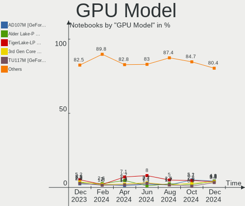

Arch Hardware Trends (Notebook)
-------------------------------

A project to identify most popular hardware characteristics and track their change
over time based on data collected by Arch users at https://Linux-Hardware.org.

Anyone can contribute to the study by uploading probes of their computers by
the [hw-probe](https://github.com/linuxhw/hw-probe) tool:

    sudo hw-probe -all -upload

Full-feature report is available here: https://linux-hardware.org/?view=trends&formfactor=notebook

Period: Feb, 2020.

Contents
--------

- [ OS                       ](#os)
- [ OS Family                ](#os-family)
- [ Kernel                   ](#kernel)
- [ Kernel Family            ](#kernel-family)
- [ Kernel Major Ver.        ](#kernel-major-ver)
- [ Arch                     ](#arch)
- [ DE                       ](#de)
- [ Display Server           ](#display-server)
- [ OS Lang                  ](#os-lang)
- [ Boot Mode                ](#boot-mode)
- [ Filesystem               ](#filesystem)
- [ Dual Boot with Linux     ](#dual-boot-with-linux)
- [ Dual Boot (Win)          ](#dual-boot-win)
- [ Country                  ](#country)
- [ City                     ](#city)
- [ Vendor                   ](#vendor)
- [ Model                    ](#model)
- [ Model Family             ](#model-family)
- [ MFG Year                 ](#mfg-year)
- [ Form Factor              ](#form-factor)
- [ Secure Boot              ](#secure-boot)
- [ Coreboot                 ](#coreboot)
- [ RAM Size                 ](#ram-size)
- [ RAM Used                 ](#ram-used)
- [ Drive Vendor             ](#drive-vendor)
- [ Drive Model              ](#drive-model)
- [ Drive Kind               ](#drive-kind)
- [ Drive Connector          ](#drive-connector)
- [ Drive Size               ](#drive-size)
- [ Space Total              ](#space-total)
- [ Space Used               ](#space-used)
- [ Malfunc. Drives          ](#malfunc-drives)
- [ Malfunc. Drive Vendor    ](#malfunc-drive-vendor)
- [ Malfunc. Drive Kind      ](#malfunc-drive-kind)
- [ Failed Drives            ](#failed-drives)
- [ Failed Drive Vendor      ](#failed-drive-vendor)
- [ Drive Status             ](#drive-status)
- [ Storage Vendor           ](#storage-vendor)
- [ Storage Model            ](#storage-model)
- [ Storage Kind             ](#storage-kind)
- [ CPU Vendor               ](#cpu-vendor)
- [ CPU Model                ](#cpu-model)
- [ CPU Model Family         ](#cpu-model-family)
- [ CPU Cores                ](#cpu-cores)
- [ CPU Sockets              ](#cpu-sockets)
- [ CPU Threads              ](#cpu-threads)
- [ CPU Op-Modes             ](#cpu-op-modes)
- [ CPU Microarch            ](#cpu-microarch)
- [ CPU Microcode            ](#cpu-microcode)
- [ GPU Vendor               ](#gpu-vendor)
- [ GPU Model                ](#gpu-model)
- [ GPU Combo                ](#gpu-combo)
- [ GPU Driver               ](#gpu-driver)
- [ GPU Memory               ](#gpu-memory)
- [ Monitor Vendor           ](#monitor-vendor)
- [ Monitor Model            ](#monitor-model)
- [ Monitor Resolution       ](#monitor-resolution)
- [ Monitor Diagonal         ](#monitor-diagonal)
- [ Monitor Width            ](#monitor-width)
- [ Aspect Ratio             ](#aspect-ratio)
- [ Monitor Area             ](#monitor-area)
- [ Pixel Density            ](#pixel-density)
- [ Multiple Monitors        ](#multiple-monitors)
- [ Net Controller Vendor    ](#net-controller-vendor)
- [ Net Controller Model     ](#net-controller-model)
- [ Net Controller Kind      ](#net-controller-kind)
- [ Used Controller          ](#used-controller)
- [ NICs                     ](#nics)
- [ Unsupported Devices      ](#unsupported-devices)
- [ Unsupported Device Types ](#unsupported-device-types)

OS
--

Installed operating systems

| Name         | Computers | Percent |
|--------------|-----------|---------|
| Arch         | 33        | 71.74%  |
| Arch Rolling | 13        | 28.26%  |

OS Family
---------

OS without a version

| Name | Computers | Percent |
|------|-----------|---------|
| Arch | 46        | 100%    |

Kernel
------

Version of the Linux kernel

| Version                             | Computers | Percent |
|-------------------------------------|-----------|---------|
| 5.5.5-arch1-1                       | 10        | 21.74%  |
| 5.5.6-arch1-1                       | 4         | 8.7%    |
| 5.5.2-arch2-2                       | 4         | 8.7%    |
| 5.5.2-arch1-1                       | 4         | 8.7%    |
| 5.5.4-zen1-1-zen                    | 3         | 6.52%   |
| 5.5.4-arch1-1                       | 3         | 6.52%   |
| 5.5.1-arch1-1                       | 3         | 6.52%   |
| 5.5.3-arch1-1                       | 2         | 4.35%   |
| 5.4.20-1-lts                        | 2         | 4.35%   |
| 5.4.15-arch1-1                      | 2         | 4.35%   |
| 5.6.0-rc1-1-git-00044-gb19e8c684703 | 1         | 2.17%   |
| 5.5.5-zen1-1-zen                    | 1         | 2.17%   |
| 5.5.3-zen1-1-zen                    | 1         | 2.17%   |
| 5.5.1-zen1-1-zen                    | 1         | 2.17%   |
| 5.4.7-arch1-1                       | 1         | 2.17%   |
| 5.4.21-1-lts                        | 1         | 2.17%   |
| 5.4.16.ll55-1-lingruby-git+         | 1         | 2.17%   |
| 5.4.15-zen1-1-zen                   | 1         | 2.17%   |
| 4.19.101-1-lts                      | 1         | 2.17%   |

Kernel Family
-------------

Linux kernel without a distro release

| Version  | Computers | Percent |
|----------|-----------|---------|
| 5.5.5    | 11        | 23.91%  |
| 5.5.2    | 8         | 17.39%  |
| 5.5.4    | 6         | 13.04%  |
| 5.5.6    | 4         | 8.7%    |
| 5.5.1    | 4         | 8.7%    |
| 5.5.3    | 3         | 6.52%   |
| 5.4.15   | 3         | 6.52%   |
| 5.4.20   | 2         | 4.35%   |
| 5.6.0    | 1         | 2.17%   |
| 5.4.7    | 1         | 2.17%   |
| 5.4.21   | 1         | 2.17%   |
| 5.4.16   | 1         | 2.17%   |
| 4.19.101 | 1         | 2.17%   |

Kernel Major Ver.
-----------------

Linux kernel major version

| Version | Computers | Percent |
|---------|-----------|---------|
| 5.5     | 36        | 78.26%  |
| 5.4     | 8         | 17.39%  |
| 5.6     | 1         | 2.17%   |
| 4.19    | 1         | 2.17%   |

Arch
----

OS architecture (x86_64, i586, etc.)

| Name   | Computers | Percent |
|--------|-----------|---------|
| x86_64 | 46        | 100%    |

DE
--

Desktop Environment

| Name            | Computers | Percent |
|-----------------|-----------|---------|
| GNOME           | 18        | 39.13%  |
| KDE5            | 7         | 15.22%  |
| KDE             | 7         | 15.22%  |
| i3              | 4         | 8.7%    |
| MATE            | 3         | 6.52%   |
| Unknown         | 2         | 4.35%   |
| XFCE            | 1         | 2.17%   |
| LXQt            | 1         | 2.17%   |
| GNOME Flashback | 1         | 2.17%   |
| GNOME Classic   | 1         | 2.17%   |
| Budgie          | 1         | 2.17%   |

Display Server
--------------

X11 or Wayland

| Name    | Computers | Percent |
|---------|-----------|---------|
| X11     | 30        | 65.22%  |
| Wayland | 15        | 32.61%  |
| Tty     | 1         | 2.17%   |

OS Lang
-------

Language

| Lang       | Computers | Percent |
|------------|-----------|---------|
| en_US      | 22        | 47.83%  |
| en_GB      | 3         | 6.52%   |
| ru_RU      | 2         | 4.35%   |
| pl_PL      | 2         | 4.35%   |
| fr_FR      | 2         | 4.35%   |
| de_DE      | 2         | 4.35%   |
| ru_RU.utf8 | 1         | 2.17%   |
| pt_BR      | 1         | 2.17%   |
| pl_PL.utf8 | 1         | 2.17%   |
| ja_JP      | 1         | 2.17%   |
| it_IT.utf8 | 1         | 2.17%   |
| hu_HU      | 1         | 2.17%   |
| french     | 1         | 2.17%   |
| es_MX      | 1         | 2.17%   |
| es_EC      | 1         | 2.17%   |
| en_GB.utf8 | 1         | 2.17%   |
| en_CA      | 1         | 2.17%   |
| C          | 1         | 2.17%   |
| Unknown    | 1         | 2.17%   |

Boot Mode
---------

EFI or BIOS

| Mode | Computers | Percent |
|------|-----------|---------|
| EFI  | 26        | 56.52%  |
| BIOS | 20        | 43.48%  |

Filesystem
----------

Type of filesystem

| Type  | Computers | Percent |
|-------|-----------|---------|
| Ext4  | 42        | 91.3%   |
| Btrfs | 2         | 4.35%   |
| Xfs   | 1         | 2.17%   |
| F2fs  | 1         | 2.17%   |

Dual Boot with Linux
--------------------

Hosting more than one Linux

| Dual boot | Computers | Percent |
|-----------|-----------|---------|
| No        | 42        | 91.3%   |
| Yes       | 4         | 8.7%    |

Dual Boot (Win)
---------------

Hosting Linux and Windows

| Dual boot | Computers | Percent |
|-----------|-----------|---------|
| No        | 36        | 78.26%  |
| Yes       | 10        | 21.74%  |

Country
-------

Geographic location (country)

| Country            | Computers | Percent |
|--------------------|-----------|---------|
| Russia             | 8         | 17.39%  |
| USA                | 6         | 13.04%  |
| Germany            | 4         | 8.7%    |
| Poland             | 3         | 6.52%   |
| France             | 3         | 6.52%   |
| Spain              | 2         | 4.35%   |
| Canada             | 2         | 4.35%   |
| Ukraine            | 1         | 2.17%   |
| UK                 | 1         | 2.17%   |
| Thailand           | 1         | 2.17%   |
| Romania            | 1         | 2.17%   |
| Portugal           | 1         | 2.17%   |
| Mexico             | 1         | 2.17%   |
| Latvia             | 1         | 2.17%   |
| Korea, Republic of | 1         | 2.17%   |
| Italy              | 1         | 2.17%   |
| India              | 1         | 2.17%   |
| Hungary            | 1         | 2.17%   |
| Ecuador            | 1         | 2.17%   |
| Colombia           | 1         | 2.17%   |
| China              | 1         | 2.17%   |
| Chile              | 1         | 2.17%   |
| Cambodia           | 1         | 2.17%   |
| Brazil             | 1         | 2.17%   |
| Belgium            | 1         | 2.17%   |

City
----

Geographic location (city)

| City                  | Computers | Percent |
|-----------------------|-----------|---------|
| Moscow                | 2         | 4.35%   |
| Krasnoyarsk           | 2         | 4.35%   |
| White Salmon          | 1         | 2.17%   |
| Warsaw                | 1         | 2.17%   |
| Vladivostok           | 1         | 2.17%   |
| Uccle                 | 1         | 2.17%   |
| Tuzla                 | 1         | 2.17%   |
| Tayshet               | 1         | 2.17%   |
| St Petersburg         | 1         | 2.17%   |
| Shanghai              | 1         | 2.17%   |
| Seoul                 | 1         | 2.17%   |
| Santiago              | 1         | 2.17%   |
| Reims                 | 1         | 2.17%   |
| Quito                 | 1         | 2.17%   |
| Phnom Penh            | 1         | 2.17%   |
| Ottawa                | 1         | 2.17%   |
| Norderstedt           | 1         | 2.17%   |
| Niagara Falls         | 1         | 2.17%   |
| Mesa                  | 1         | 2.17%   |
| Mem Martins           | 1         | 2.17%   |
| Marietta              | 1         | 2.17%   |
| Kyiv                  | 1         | 2.17%   |
| Krakow                | 1         | 2.17%   |
| Kirov                 | 1         | 2.17%   |
| Itarare               | 1         | 2.17%   |
| Homosassa             | 1         | 2.17%   |
| Gravelines            | 1         | 2.17%   |
| Geveze                | 1         | 2.17%   |
| Gdynia                | 1         | 2.17%   |
| Florence              | 1         | 2.17%   |
| El Viso del Alcor     | 1         | 2.17%   |
| Dobele                | 1         | 2.17%   |
| Crema                 | 1         | 2.17%   |
| Cocoa                 | 1         | 2.17%   |
| Ciudad Nezahualcoyotl | 1         | 2.17%   |
| Chesterfield          | 1         | 2.17%   |
| Budapest              | 1         | 2.17%   |
| Bogotá               | 1         | 2.17%   |
| Berlin                | 1         | 2.17%   |
| Bengaluru             | 1         | 2.17%   |
| Barcelona             | 1         | 2.17%   |
| Bangkok               | 1         | 2.17%   |
| Bad Rappenau          | 1         | 2.17%   |
| Allmannsweiler        | 1         | 2.17%   |

Vendor
------

Motherboard manufacturer

| Name                | Computers | Percent |
|---------------------|-----------|---------|
| Lenovo              | 10        | 21.74%  |
| ASUSTek Computer    | 7         | 15.22%  |
| Acer                | 7         | 15.22%  |
| Dell                | 6         | 13.04%  |
| Hewlett-Packard     | 5         | 10.87%  |
| MSI                 | 3         | 6.52%   |
| Fujitsu             | 2         | 4.35%   |
| Samsung Electronics | 1         | 2.17%   |
| Notebook            | 1         | 2.17%   |
| MECHREVO            | 1         | 2.17%   |
| Koompi              | 1         | 2.17%   |
| HUAWEI              | 1         | 2.17%   |
| Apple               | 1         | 2.17%   |

Model
-----

Motherboard model

| Name                                     | Computers | Percent |
|------------------------------------------|-----------|---------|
| Acer Aspire E5-571                       | 2         | 4.35%   |
| Samsung Electronics 300E4Z/300E5Z/300E7Z | 1         | 2.17%   |
| Notebook N141CU                          | 1         | 2.17%   |
| MSI Prestige 14 A10SC                    | 1         | 2.17%   |
| MSI GT62VR 6RE                           | 1         | 2.17%   |
| MSI GS75 Stealth 9SF                     | 1         | 2.17%   |
| MECHREVO X6Ti                            | 1         | 2.17%   |
| Lenovo V155-15API 81V5                   | 1         | 2.17%   |
| Lenovo ThinkPad T490 20N2000NRT          | 1         | 2.17%   |
| Lenovo ThinkPad T490 20N2000BRT          | 1         | 2.17%   |
| Lenovo ThinkPad T480 20L5CTO1WW          | 1         | 2.17%   |
| Lenovo ThinkPad T400 6474P1U             | 1         | 2.17%   |
| Lenovo ThinkPad L420 7829W1F             | 1         | 2.17%   |
| Lenovo IdeaPad Z400 Touch VIWZ1          | 1         | 2.17%   |
| Lenovo IdeaPad 700-15ISK 80RU            | 1         | 2.17%   |
| Lenovo IdeaPad 530S-15IKB 81EV           | 1         | 2.17%   |
| Lenovo IdeaPad 110-14IBR 80T6            | 1         | 2.17%   |
| HUAWEI MACH-WX9                          | 1         | 2.17%   |
| HP Pavilion Gaming Laptop 15-ec0xxx      | 1         | 2.17%   |
| HP EliteBook 8460p                       | 1         | 2.17%   |
| HP EliteBook 840 G6                      | 1         | 2.17%   |
| HP EliteBook 840 G3                      | 1         | 2.17%   |
| HP EliteBook 840 G2                      | 1         | 2.17%   |
| Fujitsu LIFEBOOK S710                    | 1         | 2.17%   |
| Fujitsu LIFEBOOK E752                    | 1         | 2.17%   |
| Dell Vostro 3400                         | 1         | 2.17%   |
| Dell Precision 7540                      | 1         | 2.17%   |
| Dell Latitude E7470                      | 1         | 2.17%   |
| Dell Latitude E5450                      | 1         | 2.17%   |
| Dell Inspiron 5767                       | 1         | 2.17%   |
| Dell Inspiron 15-5578                    | 1         | 2.17%   |
| ASUS UX303LA                             | 1         | 2.17%   |
| ASUS TUF Gaming FX505DV_FX505DV          | 1         | 2.17%   |
| ASUS N82JQ                               | 1         | 2.17%   |
| ASUS N551JW                              | 1         | 2.17%   |
| ASUS K53SV                               | 1         | 2.17%   |
| ASUS GL553VW                             | 1         | 2.17%   |
| ASUS GL502VS                             | 1         | 2.17%   |
| Apple MacBook4,1                         | 1         | 2.17%   |
| Acer TravelMate P258-M                   | 1         | 2.17%   |
| Acer Predator PH315-51                   | 1         | 2.17%   |
| Acer Nitro AN515-52                      | 1         | 2.17%   |
| Acer Extensa 2540                        | 1         | 2.17%   |
| Acer Aspire A315-41                      | 1         | 2.17%   |
| Unknown                                  | 1         | 2.17%   |

Model Family
------------

Motherboard model prefix

| Name                       | Computers | Percent |
|----------------------------|-----------|---------|
| Lenovo ThinkPad            | 5         | 10.87%  |
| Lenovo IdeaPad             | 4         | 8.7%    |
| HP EliteBook               | 4         | 8.7%    |
| Acer Aspire                | 3         | 6.52%   |
| Fujitsu LIFEBOOK           | 2         | 4.35%   |
| Dell Latitude              | 2         | 4.35%   |
| Dell Inspiron              | 2         | 4.35%   |
| Samsung Electronics 300E4Z | 1         | 2.17%   |
| Notebook N141CU            | 1         | 2.17%   |
| MSI Prestige               | 1         | 2.17%   |
| MSI GT62VR                 | 1         | 2.17%   |
| MSI GS75                   | 1         | 2.17%   |
| MECHREVO X6Ti              | 1         | 2.17%   |
| Lenovo V155-15API          | 1         | 2.17%   |
| HUAWEI MACH-WX9            | 1         | 2.17%   |
| HP Pavilion                | 1         | 2.17%   |
| Dell Vostro                | 1         | 2.17%   |
| Dell Precision             | 1         | 2.17%   |
| ASUS UX303LA               | 1         | 2.17%   |
| ASUS TUF                   | 1         | 2.17%   |
| ASUS N82JQ                 | 1         | 2.17%   |
| ASUS N551JW                | 1         | 2.17%   |
| ASUS K53SV                 | 1         | 2.17%   |
| ASUS GL553VW               | 1         | 2.17%   |
| ASUS GL502VS               | 1         | 2.17%   |
| Apple MacBook4             | 1         | 2.17%   |
| Acer TravelMate            | 1         | 2.17%   |
| Acer Predator              | 1         | 2.17%   |
| Acer Nitro                 | 1         | 2.17%   |
| Acer Extensa               | 1         | 2.17%   |
| Unknown                    | 1         | 2.17%   |

MFG Year
--------

Motherboard manufacture year

| Year | Computers | Percent |
|------|-----------|---------|
| 2019 | 18        | 39.13%  |
| 2018 | 5         | 10.87%  |
| 2016 | 5         | 10.87%  |
| 2015 | 3         | 6.52%   |
| 2014 | 3         | 6.52%   |
| 2013 | 3         | 6.52%   |
| 2020 | 2         | 4.35%   |
| 2010 | 2         | 4.35%   |
| 2017 | 1         | 2.17%   |
| 2012 | 1         | 2.17%   |
| 2011 | 1         | 2.17%   |
| 2009 | 1         | 2.17%   |
| 2008 | 1         | 2.17%   |

Form Factor
-----------

Physical design of the computer

| Name     | Computers | Percent |
|----------|-----------|---------|
| Notebook | 46        | 100%    |

Secure Boot
-----------

Enabled or disabled

| State    | Computers | Percent |
|----------|-----------|---------|
| Disabled | 45        | 97.83%  |
| Enabled  | 1         | 2.17%   |

Coreboot
--------

Have coreboot on board

| Used | Computers | Percent |
|------|-----------|---------|
| No   | 46        | 100%    |

RAM Size
--------

Total RAM memory

| Size in GB | Computers | Percent |
|------------|-----------|---------|
| 16.01-24.0 | 14        | 30.43%  |
| 8.01-16.0  | 11        | 23.91%  |
| 4.01-8.0   | 8         | 17.39%  |
| 3.01-4.0   | 6         | 13.04%  |
| 32.01-64.0 | 5         | 10.87%  |
| 2.01-3.0   | 1         | 2.17%   |
| 1.01-2.0   | 1         | 2.17%   |

RAM Used
--------

Used RAM memory

| Used GB   | Computers | Percent |
|-----------|-----------|---------|
| 2.01-3.0  | 15        | 32.61%  |
| 1.01-2.0  | 15        | 32.61%  |
| 4.01-8.0  | 8         | 17.39%  |
| 0.01-1.0  | 4         | 8.7%    |
| 3.01-4.0  | 3         | 6.52%   |
| 8.01-16.0 | 1         | 2.17%   |

Drive Vendor
------------

Hard drive vendors

| Vendor              | Computers | Drives | Percent |
|---------------------|-----------|--------|---------|
| Samsung Electronics | 10        | 10     | 18.87%  |
| WDC                 | 8         | 8      | 15.09%  |
| Seagate             | 6         | 6      | 11.32%  |
| Kingston            | 3         | 3      | 5.66%   |
| HGST                | 3         | 3      | 5.66%   |
| Toshiba             | 2         | 2      | 3.77%   |
| Intel               | 2         | 2      | 3.77%   |
| Hitachi             | 2         | 2      | 3.77%   |
| Crucial             | 2         | 2      | 3.77%   |
| A-DATA Technology   | 2         | 2      | 3.77%   |
| Unknown             | 1         | 1      | 1.89%   |
| SanDisk             | 1         | 1      | 1.89%   |
| PNY                 | 1         | 1      | 1.89%   |
| PM981a N            | 1         | 1      | 1.89%   |
| PLEXTOR             | 1         | 1      | 1.89%   |
| Phison              | 1         | 1      | 1.89%   |
| Micron Technology   | 1         | 1      | 1.89%   |
| LITEONIT            | 1         | 1      | 1.89%   |
| LITEON              | 1         | 1      | 1.89%   |
| JMicron             | 1         | 1      | 1.89%   |
| FORESEE             | 1         | 1      | 1.89%   |
| China               | 1         | 1      | 1.89%   |
| Apple               | 1         | 1      | 1.89%   |

Drive Model
-----------

Hard drive models

| Model                              | Computers | Percent |
|------------------------------------|-----------|---------|
| HTS721010A9E630 1TB                | 3         | 5.66%   |
| SU800 256GB SSD                    | 2         | 3.77%   |
| SSD 850 EVO 500GB                  | 2         | 3.77%   |
| SA400S37480G 480GB SSD             | 2         | 3.77%   |
| WDS500G2B0B-00YS70 500GB SSD       | 1         | 1.89%   |
| WDS250G2B0A-00SM50 250GB SSD       | 1         | 1.89%   |
| WDS100T2B0B 1TB SSD                | 1         | 1.89%   |
| WDS100T2B0A-00SM50 1TB SSD         | 1         | 1.89%   |
| WD5000LPCX-24VHAT0 500GB           | 1         | 1.89%   |
| WD1600BEKT-60V5T1 160GB            | 1         | 1.89%   |
| WD10SPZX-21Z10T0 1TB               | 1         | 1.89%   |
| VMe Samsung 256G                   | 1         | 1.89%   |
| Tech 250GB                         | 1         | 1.89%   |
| SU04G  4GB                         | 1         | 1.89%   |
| ST500LT012-1DG142 500GB            | 1         | 1.89%   |
| ST320LT007-9ZV142 320GB            | 1         | 1.89%   |
| ST2000LX001-1RG174 2TB             | 1         | 1.89%   |
| ST2000LM007-1R8174 2TB             | 1         | 1.89%   |
| ST1000LM024 HN-M101MBB 1TB         | 1         | 1.89%   |
| SSDPEKNW512G8H 512GB               | 1         | 1.89%   |
| SSDPEKKF512G8L 512GB               | 1         | 1.89%   |
| SSD PM871 M.2 2280 256GB           | 1         | 1.89%   |
| SSD 970 EVO Plus 500GB             | 1         | 1.89%   |
| SSD 970 EVO Plus 250GB             | 1         | 1.89%   |
| SSD 860 PRO 256GB                  | 1         | 1.89%   |
| SSD 860 EVO 500GB                  | 1         | 1.89%   |
| SSD 850 EVO 120GB                  | 1         | 1.89%   |
| SSD 360GB                          | 1         | 1.89%   |
| SM280128GPTC15T-S114-0D5 128GB SSD | 1         | 1.89%   |
| SD8SN8U128G1001 128GB SSD          | 1         | 1.89%   |
| RBUSC180DS37128GH 128GB SSD        | 1         | 1.89%   |
| PX-256M5S 256GB SSD                | 1         | 1.89%   |
| MZVLB256HBHQ-000L7 256GB           | 1         | 1.89%   |
| MZALQ256HAJD-000L2 256GB           | 1         | 1.89%   |
| MTFDDAV512TBN 512GB SSD            | 1         | 1.89%   |
| MQ01ABD100 1TB                     | 1         | 1.89%   |
| MK6465GSX 640GB                    | 1         | 1.89%   |
| M3 Portable 2TB                    | 1         | 1.89%   |
| LCS-256M6S 2.5 7mm 256GB SSD       | 1         | 1.89%   |
| L8H-256V2G-HP 256GB SSD            | 1         | 1.89%   |
| HTS547575A9E384 752GB              | 1         | 1.89%   |
| HTS545050A7E380 500GB              | 1         | 1.89%   |
| HDD HTS547575A9E384 752GB          | 1         | 1.89%   |
| CT960BX500SSD1 960GB               | 1         | 1.89%   |
| CT250BX100SSD1 250GB               | 1         | 1.89%   |
| CS3030 500GB SSD                   | 1         | 1.89%   |
| CL SN720 SDAQNTW-1T00-2000 1TB     | 1         | 1.89%   |
| 256GB SSD                          | 1         | 1.89%   |

Drive Kind
----------

HDD or SSD

| Kind    | Computers | Drives | Percent |
|---------|-----------|--------|---------|
| SSD     | 24        | 25     | 48%     |
| HDD     | 14        | 16     | 28%     |
| NVMe    | 8         | 8      | 16%     |
| Unknown | 3         | 3      | 6%      |
| MMC     | 1         | 1      | 2%      |

Drive Connector
---------------

SATA, SAS, NVMe, etc.

| Type | Computers | Drives | Percent |
|------|-----------|--------|---------|
| SATA | 34        | 41     | 73.91%  |
| NVMe | 8         | 8      | 17.39%  |
| SAS  | 3         | 3      | 6.52%   |
| MMC  | 1         | 1      | 2.17%   |

Drive Size
----------

Size of hard drive

| Size in TB | Computers | Drives | Percent |
|------------|-----------|--------|---------|
| 0.01-0.5   | 29        | 34     | 64.44%  |
| 0.51-1.0   | 12        | 15     | 26.67%  |
| 1.01-2.0   | 4         | 4      | 8.89%   |

Space Total
-----------

Amount of disk space available on the file system

| Size in GB     | Computers | Percent |
|----------------|-----------|---------|
| 101-250        | 14        | 30.43%  |
| 251-500        | 13        | 28.26%  |
| 501-1000       | 11        | 23.91%  |
| 1001-2000      | 3         | 6.52%   |
| 2001-3000      | 2         | 4.35%   |
| 51-100         | 2         | 4.35%   |
| More than 3000 | 1         | 2.17%   |

Space Used
----------

Amount of used disk space

| Used GB   | Computers | Percent |
|-----------|-----------|---------|
| 21-50     | 11        | 23.91%  |
| 101-250   | 10        | 21.74%  |
| 1-20      | 9         | 19.57%  |
| 251-500   | 6         | 13.04%  |
| 501-1000  | 4         | 8.7%    |
| 51-100    | 4         | 8.7%    |
| 2001-3000 | 1         | 2.17%   |
| 1001-2000 | 1         | 2.17%   |

Malfunc. Drives
---------------

Drive models with a malfunction

| Model                   | Computers | Drives | Percent |
|-------------------------|-----------|--------|---------|
| WD1600BEKT-60V5T1 160GB | 1         | 1      | 25%     |
| ST2000LM007-1R8174 2TB  | 1         | 1      | 25%     |
| MK6465GSX 640GB         | 1         | 1      | 25%     |
| HTS721010A9E630 1TB     | 1         | 1      | 25%     |

Malfunc. Drive Vendor
---------------------

Vendors of faulty drives

| Vendor  | Computers | Drives | Percent |
|---------|-----------|--------|---------|
| WDC     | 1         | 1      | 25%     |
| Toshiba | 1         | 1      | 25%     |
| Seagate | 1         | 1      | 25%     |
| HGST    | 1         | 1      | 25%     |

Malfunc. Drive Kind
-------------------

Kinds of faulty drives

| Kind | Computers | Drives | Percent |
|------|-----------|--------|---------|
| HDD  | 4         | 4      | 100%    |

Failed Drives
-------------

Failed drive models

Zero info for selected period =(

Failed Drive Vendor
-------------------

Failed drive vendors

Zero info for selected period =(

Drive Status
------------

Number of failed and malfunc. drives

| Status   | Computers | Drives | Percent |
|----------|-----------|--------|---------|
| Detected | 23        | 24     | 50%     |
| Works    | 19        | 25     | 41.3%   |
| Malfunc  | 4         | 4      | 8.7%    |

Storage Vendor
--------------

Storage controller vendors

| Vendor                       | Computers | Percent |
|------------------------------|-----------|---------|
| Intel                        | 40        | 72.73%  |
| Samsung Electronics          | 8         | 14.55%  |
| AMD                          | 3         | 5.45%   |
| Toshiba America Info Systems | 2         | 3.64%   |
| Sandisk                      | 1         | 1.82%   |
| Phison Electronics           | 1         | 1.82%   |

Storage Model
-------------

Storage controller models

| Model                                                                      | Computers | Percent |
|----------------------------------------------------------------------------|-----------|---------|
| NVMe SSD Controller SM981/PM981/PM983                                      | 7         | 12.07%  |
| Sunrise Point-LP SATA Controller [AHCI mode]                               | 6         | 10.34%  |
| HM170/QM170 Chipset SATA Controller [AHCI Mode]                            | 5         | 8.62%   |
| Cannon Lake Mobile PCH SATA AHCI Controller                                | 4         | 6.9%    |
| 6 Series/C200 Series Chipset Family 6 port Mobile SATA AHCI Controller     | 4         | 6.9%    |
| Wildcat Point-LP SATA Controller [AHCI Mode]                               | 3         | 5.17%   |
| SSD 660P Series                                                            | 3         | 5.17%   |
| FCH SATA Controller [AHCI mode]                                            | 3         | 5.17%   |
| NVMe Controller                                                            | 2         | 3.45%   |
| 8 Series SATA Controller 1 [AHCI mode]                                     | 2         | 3.45%   |
| 7 Series Chipset Family 6-port SATA Controller [AHCI mode]                 | 2         | 3.45%   |
| WD Black 2018/PC SN720 NVMe SSD                                            | 1         | 1.72%   |
| SSD Pro 7600p/760p/E 6100p Series                                          | 1         | 1.72%   |
| SSD 600P Series                                                            | 1         | 1.72%   |
| SATA controller                                                            | 1         | 1.72%   |
| Electronics Non-Volatile memory controller                                 | 1         | 1.72%   |
| E12 NVMe Controller                                                        | 1         | 1.72%   |
| Comet Lake SATA AHCI Controller                                            | 1         | 1.72%   |
| Atom/Celeron/Pentium Processor x5-E8000/J3xxx/N3xxx Series SATA Controller | 1         | 1.72%   |
| 82801IBM/IEM (ICH9M/ICH9M-E) 4 port SATA Controller [AHCI mode]            | 1         | 1.72%   |
| 82801HM/HEM (ICH8M/ICH8M-E) SATA Controller [AHCI mode]                    | 1         | 1.72%   |
| 82801HM/HEM (ICH8M/ICH8M-E) IDE Controller                                 | 1         | 1.72%   |
| 82801 Mobile SATA Controller [RAID mode]                                   | 1         | 1.72%   |
| 8 Series/C220 Series Chipset Family 6-port SATA Controller 1 [AHCI mode]   | 1         | 1.72%   |
| 5 Series/3400 Series Chipset PT IDER Controller                            | 1         | 1.72%   |
| 5 Series/3400 Series Chipset 6 port SATA AHCI Controller                   | 1         | 1.72%   |
| 5 Series/3400 Series Chipset 4 port SATA IDE Controller                    | 1         | 1.72%   |
| 5 Series/3400 Series Chipset 4 port SATA AHCI Controller                   | 1         | 1.72%   |

Storage Kind
------------

Kind of storage controller (IDE, SATA, NVMe, SAS, ...)

| Kind | Computers | Percent |
|------|-----------|---------|
| SATA | 37        | 66.07%  |
| NVMe | 16        | 28.57%  |
| IDE  | 2         | 3.57%   |
| RAID | 1         | 1.79%   |

CPU Vendor
----------

Processor vendors

| Vendor | Computers | Percent |
|--------|-----------|---------|
| Intel  | 42        | 91.3%   |
| AMD    | 4         | 8.7%    |

CPU Model
---------

Processor models

| Model                                         | Computers | Percent |
|-----------------------------------------------|-----------|---------|
| Intel Core i7-6700HQ CPU @ 2.60GHz            | 4         | 8.7%    |
| Intel Core i7-9750H CPU @ 2.60GHz             | 2         | 4.35%   |
| Intel Core i7-8550U CPU @ 1.80GHz             | 2         | 4.35%   |
| Intel Core i7-7500U CPU @ 2.70GHz             | 2         | 4.35%   |
| Intel Core i7-6600U CPU @ 2.60GHz             | 2         | 4.35%   |
| Intel Core i5-8265U CPU @ 1.60GHz             | 2         | 4.35%   |
| AMD Ryzen 7 3750H with Radeon Vega Mobile Gfx | 2         | 4.35%   |
| Intel Core i7-8750H CPU @ 2.20GHz             | 1         | 2.17%   |
| Intel Core i7-8650U CPU @ 1.90GHz             | 1         | 2.17%   |
| Intel Core i7-8565U CPU @ 1.80GHz             | 1         | 2.17%   |
| Intel Core i7-4720HQ CPU @ 2.60GHz            | 1         | 2.17%   |
| Intel Core i7-4510U CPU @ 2.00GHz             | 1         | 2.17%   |
| Intel Core i7-3520M CPU @ 2.90GHz             | 1         | 2.17%   |
| Intel Core i7-10710U CPU @ 1.10GHz            | 1         | 2.17%   |
| Intel Core i7-10510U CPU @ 1.80GHz            | 1         | 2.17%   |
| Intel Core i7 CPU Q 740 @ 1.73GHz             | 1         | 2.17%   |
| Intel Core i5-8300H CPU @ 2.30GHz             | 1         | 2.17%   |
| Intel Core i5-6300HQ CPU @ 2.30GHz            | 1         | 2.17%   |
| Intel Core i5-6200U CPU @ 2.30GHz             | 1         | 2.17%   |
| Intel Core i5-5300U CPU @ 2.30GHz             | 1         | 2.17%   |
| Intel Core i5-5200U CPU @ 2.20GHz             | 1         | 2.17%   |
| Intel Core i5-3320M CPU @ 2.60GHz             | 1         | 2.17%   |
| Intel Core i5-2540M CPU @ 2.60GHz             | 1         | 2.17%   |
| Intel Core i5-2520M CPU @ 2.50GHz             | 1         | 2.17%   |
| Intel Core i5-2430M CPU @ 2.40GHz             | 1         | 2.17%   |
| Intel Core i5 CPU M 560 @ 2.67GHz             | 1         | 2.17%   |
| Intel Core i5 CPU M 460 @ 2.53GHz             | 1         | 2.17%   |
| Intel Core i3-6006U CPU @ 2.00GHz             | 1         | 2.17%   |
| Intel Core i3-5005U CPU @ 2.00GHz             | 1         | 2.17%   |
| Intel Core i3-4005U CPU @ 1.70GHz             | 1         | 2.17%   |
| Intel Core 2 Duo CPU T9400 @ 2.53GHz          | 1         | 2.17%   |
| Intel Core 2 Duo CPU T8100 @ 2.10GHz          | 1         | 2.17%   |
| Intel Celeron N4100 CPU @ 1.10GHz             | 1         | 2.17%   |
| Intel Celeron CPU N3060 @ 1.60GHz             | 1         | 2.17%   |
| Intel Celeron CPU B800 @ 1.50GHz              | 1         | 2.17%   |
| AMD Ryzen 5 3500U with Radeon Vega Mobile Gfx | 1         | 2.17%   |
| AMD Ryzen 3 2300U with Radeon Vega Mobile Gfx | 1         | 2.17%   |

CPU Model Family
----------------

Processor model prefix

| Model            | Computers | Percent |
|------------------|-----------|---------|
| Intel Core i7    | 21        | 45.65%  |
| Intel Core i5    | 13        | 28.26%  |
| Intel Core i3    | 3         | 6.52%   |
| Intel Celeron    | 3         | 6.52%   |
| Intel Core 2 Duo | 2         | 4.35%   |
| AMD Ryzen 7      | 2         | 4.35%   |
| AMD Ryzen 5      | 1         | 2.17%   |
| AMD Ryzen 3      | 1         | 2.17%   |

CPU Cores
---------

Number of processor cores

| Number | Computers | Percent |
|--------|-----------|---------|
| 2      | 22        | 47.83%  |
| 4      | 20        | 43.48%  |
| 6      | 4         | 8.7%    |

CPU Sockets
-----------

Number of sockets

| Number | Computers | Percent |
|--------|-----------|---------|
| 1      | 46        | 100%    |

CPU Threads
-----------

Threads per core (Hyper-Threading)

| Number | Computers | Percent |
|--------|-----------|---------|
| 2      | 39        | 84.78%  |
| 1      | 7         | 15.22%  |

CPU Op-Modes
------------

CPU Operation Modes (32-bit, 64-bit)

| Op mode        | Computers | Percent |
|----------------|-----------|---------|
| 32-bit, 64-bit | 46        | 100%    |

CPU Microarch
-------------

Microarchitecture

| Name          | Computers | Percent |
|---------------|-----------|---------|
| Skylake       | 19        | 41.3%   |
| SandyBridge   | 4         | 8.7%    |
| KabyLake      | 4         | 8.7%    |
| Zen+          | 3         | 6.52%   |
| Haswell       | 3         | 6.52%   |
| Broadwell     | 3         | 6.52%   |
| Westmere      | 2         | 4.35%   |
| IvyBridge     | 2         | 4.35%   |
| Core          | 2         | 4.35%   |
| Zen           | 1         | 2.17%   |
| Silvermont    | 1         | 2.17%   |
| Nehalem       | 1         | 2.17%   |
| Goldmont plus | 1         | 2.17%   |

CPU Microcode
-------------

Microcode number

| Number     | Computers | Percent |
|------------|-----------|---------|
| Unknown    | 8         | 17.39%  |
| 0x206a7    | 4         | 8.7%    |
| 0x806ec    | 3         | 6.52%   |
| 0x806ea    | 3         | 6.52%   |
| 0x506e3    | 3         | 6.52%   |
| 0x406e3    | 3         | 6.52%   |
| 0x906ea    | 2         | 4.35%   |
| 0x806e9    | 2         | 4.35%   |
| 0x40651    | 2         | 4.35%   |
| 0x306d4    | 2         | 4.35%   |
| 0x306a9    | 2         | 4.35%   |
| 0x20655    | 2         | 4.35%   |
| 0x08108102 | 2         | 4.35%   |
| 0xa0660    | 1         | 2.17%   |
| 0x706a1    | 1         | 2.17%   |
| 0x406c4    | 1         | 2.17%   |
| 0x106e5    | 1         | 2.17%   |
| 0x1067a    | 1         | 2.17%   |
| 0x10676    | 1         | 2.17%   |
| 0x08108109 | 1         | 2.17%   |
| 0x0810100b | 1         | 2.17%   |

GPU Vendor
----------

Vendors of graphics cards

| Vendor | Computers | Percent |
|--------|-----------|---------|
| Intel  | 39        | 60.94%  |
| Nvidia | 19        | 29.69%  |
| AMD    | 6         | 9.38%   |

GPU Model
---------

Graphics card models

| Model                                                                              | Computers | Percent |
|------------------------------------------------------------------------------------|-----------|---------|
| UHD Graphics 630 (Mobile)                                                          | 4         | 6.15%   |
| Skylake GT2 [HD Graphics 520]                                                      | 4         | 6.15%   |
| 2nd Generation Core Processor Family Integrated Graphics Controller                | 4         | 6.15%   |
| UHD Graphics 620 (Whiskey Lake)                                                    | 3         | 4.62%   |
| UHD Graphics 620                                                                   | 3         | 4.62%   |
| Picasso                                                                            | 3         | 4.62%   |
| HD Graphics 5500                                                                   | 3         | 4.62%   |
| HD Graphics 530                                                                    | 3         | 4.62%   |
| GM107M [GeForce GTX 960M]                                                          | 3         | 4.62%   |
| UHD Graphics                                                                       | 2         | 3.08%   |
| HD Graphics 620                                                                    | 2         | 3.08%   |
| Haswell-ULT Integrated Graphics Controller                                         | 2         | 3.08%   |
| GP108M [GeForce MX150]                                                             | 2         | 3.08%   |
| GP104BM [GeForce GTX 1070 Mobile]                                                  | 2         | 3.08%   |
| Core Processor Integrated Graphics Controller                                      | 2         | 3.08%   |
| 3rd Gen Core processor Graphics Controller                                         | 2         | 3.08%   |
| UHD Graphics 605                                                                   | 1         | 1.54%   |
| TU117M [GeForce GTX 1650 Mobile / Max-Q]                                           | 1         | 1.54%   |
| TU116M [GeForce GTX 1660 Ti Mobile]                                                | 1         | 1.54%   |
| TU106M [GeForce RTX 2070 Mobile]                                                   | 1         | 1.54%   |
| TU106M [GeForce RTX 2060 Mobile]                                                   | 1         | 1.54%   |
| Topaz XT [Radeon R7 M260/M265 / M340/M360 / M440/M445 / 530/535 / 620/625 Mobile]  | 1         | 1.54%   |
| Raven Ridge [Radeon Vega Series / Radeon Vega Mobile Series]                       | 1         | 1.54%   |
| Mobile GM965/GL960 Integrated Graphics Controller (secondary)                      | 1         | 1.54%   |
| Mobile GM965/GL960 Integrated Graphics Controller (primary)                        | 1         | 1.54%   |
| Mobile 4 Series Chipset Integrated Graphics Controller                             | 1         | 1.54%   |
| Lexa XT [Radeon PRO WX 3200]                                                       | 1         | 1.54%   |
| GT218M [GeForce 310M]                                                              | 1         | 1.54%   |
| GT215M [GeForce GT 335M]                                                           | 1         | 1.54%   |
| GP108M [GeForce MX250]                                                             | 1         | 1.54%   |
| GP107M [GeForce GTX 1050 Mobile]                                                   | 1         | 1.54%   |
| GP106M [GeForce GTX 1060 Mobile]                                                   | 1         | 1.54%   |
| GM107M [GeForce GTX 950M]                                                          | 1         | 1.54%   |
| GF108M [GeForce GT 635M]                                                           | 1         | 1.54%   |
| GF108M [GeForce GT 540M]                                                           | 1         | 1.54%   |
| Atom/Celeron/Pentium Processor x5-E8000/J3xxx/N3xxx Integrated Graphics Controller | 1         | 1.54%   |
| 4th Gen Core Processor Integrated Graphics Controller                              | 1         | 1.54%   |

GPU Combo
---------

Combinations of graphics cards

| Name           | Computers | Percent |
|----------------|-----------|---------|
| 1 x Intel      | 23        | 50%     |
| Intel + Nvidia | 14        | 30.43%  |
| 1 x Nvidia     | 3         | 6.52%   |
| Intel + AMD    | 2         | 4.35%   |
| AMD + Nvidia   | 2         | 4.35%   |
| 1 x AMD        | 2         | 4.35%   |

GPU Driver
----------

Free vs proprietary

| Driver      | Computers | Percent |
|-------------|-----------|---------|
| Free        | 36        | 78.26%  |
| Proprietary | 10        | 21.74%  |

GPU Memory
----------

Total video memory

| Size in GB | Computers | Percent |
|------------|-----------|---------|
| Unknown    | 34        | 73.91%  |
| 7.01-8.0   | 3         | 6.52%   |
| 3.01-4.0   | 3         | 6.52%   |
| 5.01-6.0   | 2         | 4.35%   |
| 1.01-2.0   | 2         | 4.35%   |
| 0.51-1.0   | 1         | 2.17%   |
| 0.01-0.5   | 1         | 2.17%   |

Monitor Vendor
--------------

Monitor vendors

| Vendor              | Computers | Percent |
|---------------------|-----------|---------|
| AU Optronics        | 11        | 19.64%  |
| Chimei Innolux      | 9         | 16.07%  |
| BOE                 | 8         | 14.29%  |
| LG Display          | 7         | 12.5%   |
| Samsung Electronics | 6         | 10.71%  |
| Lenovo              | 3         | 5.36%   |
| PANDA               | 2         | 3.57%   |
| Dell                | 2         | 3.57%   |
| MStar               | 1         | 1.79%   |
| LGD                 | 1         | 1.79%   |
| JDI                 | 1         | 1.79%   |
| InfoVision          | 1         | 1.79%   |
| Iiyama              | 1         | 1.79%   |
| Goldstar            | 1         | 1.79%   |
| Apple               | 1         | 1.79%   |
| Acer                | 1         | 1.79%   |

Monitor Model
-------------

Monitor models

| Model                                             | Computers | Percent |
|---------------------------------------------------|-----------|---------|
| LCD Monitor LGD046F 1920x1080 344x194mm 15.5-inch | 2         | 3.57%   |
| SyncMaster SAM0586 1920x1200 518x324mm 24.1-inch  | 1         | 1.79%   |
| S34J55x SAM0F72 3440x1440 797x333mm 34.0-inch     | 1         | 1.79%   |
| S27D390 SAM0B67 1920x1080 600x340mm 27.2-inch     | 1         | 1.79%   |
| S20D300 SAM0B3A 1600x900 432x240mm 19.5-inch      | 1         | 1.79%   |
| PL2409HD IVM560C 1920x1080 521x293mm 23.5-inch    | 1         | 1.79%   |
| P2210 DEL404E 1680x1050 474x296mm 22.0-inch       | 1         | 1.79%   |
| LG FULL HD GSM5AB9 1680x1050 480x270mm 21.7-inch  | 1         | 1.79%   |
| LCD Monitor SEC384A 1366x768 344x194mm 15.5-inch  | 1         | 1.79%   |
| LCD Monitor SDC324C 1920x1080 344x194mm 15.5-inch | 1         | 1.79%   |
| LCD Monitor NCP002D 1920x1080 344x194mm 15.5-inch | 1         | 1.79%   |
| LCD Monitor LGD0534 1920x1080 344x194mm 15.5-inch | 1         | 1.79%   |
| LCD Monitor LGD0533 1920x1080 344x194mm 15.5-inch | 1         | 1.79%   |
| LCD Monitor LGD0490 1920x1080 309x174mm 14.0-inch | 1         | 1.79%   |
| LCD Monitor LGD02DC 1366x768 344x194mm 15.5-inch  | 1         | 1.79%   |
| LCD Monitor LGD01B5 1366x768 310x174mm 14.0-inch  | 1         | 1.79%   |
| LCD Monitor LEN40B1 1600x900 344x194mm 15.5-inch  | 1         | 1.79%   |
| LCD Monitor LEN40A0 1366x768 309x174mm 14.0-inch  | 1         | 1.79%   |
| LCD Monitor LEN4031 1280x800 303x190mm 14.1-inch  | 1         | 1.79%   |
| LCD Monitor JDI422A 3000x2000 293x196mm 13.9-inch | 1         | 1.79%   |
| LCD Monitor IVO057C 1366x768 310x170mm 13.9-inch  | 1         | 1.79%   |
| LCD Monitor CMN1738 1920x1080 381x214mm 17.2-inch | 1         | 1.79%   |
| LCD Monitor CMN15DB 1366x768 344x193mm 15.5-inch  | 1         | 1.79%   |
| LCD Monitor CMN15BF 1366x768 344x193mm 15.5-inch  | 1         | 1.79%   |
| LCD Monitor CMN1510 1920x1080 344x193mm 15.5-inch | 1         | 1.79%   |
| LCD Monitor CMN14D5 1920x1080 309x173mm 13.9-inch | 1         | 1.79%   |
| LCD Monitor CMN14C9 1920x1080 309x173mm 13.9-inch | 1         | 1.79%   |
| LCD Monitor CMN14A3 1600x900 309x174mm 14.0-inch  | 1         | 1.79%   |
| LCD Monitor CMN1490 1366x768 309x173mm 13.9-inch  | 1         | 1.79%   |
| LCD Monitor CMN1361 1920x1080 290x170mm 13.2-inch | 1         | 1.79%   |
| LCD Monitor BOE0868 1920x1080 309x174mm 14.0-inch | 1         | 1.79%   |
| LCD Monitor BOE0812 1920x1080 344x194mm 15.5-inch | 1         | 1.79%   |
| LCD Monitor BOE07DB 1920x1080 309x174mm 14.0-inch | 1         | 1.79%   |
| LCD Monitor BOE0791 1920x1080 309x173mm 13.9-inch | 1         | 1.79%   |
| LCD Monitor BOE0700 1920x1080 344x194mm 15.5-inch | 1         | 1.79%   |
| LCD Monitor BOE06BA 1920x1080 344x193mm 15.5-inch | 1         | 1.79%   |
| LCD Monitor BOE065D 1920x1080 344x194mm 15.5-inch | 1         | 1.79%   |
| LCD Monitor BOE05C7 1366x768 309x173mm 13.9-inch  | 1         | 1.79%   |
| LCD Monitor AUO71ED 1920x1080 340x190mm 15.3-inch | 1         | 1.79%   |
| LCD Monitor AUO61ED 1920x1080 340x190mm 15.3-inch | 1         | 1.79%   |
| LCD Monitor AUO543D 1920x1080 309x174mm 14.0-inch | 1         | 1.79%   |
| LCD Monitor AUO46EC 1366x768 344x193mm 15.5-inch  | 1         | 1.79%   |
| LCD Monitor AUO40EC 1366x768 340x190mm 15.3-inch  | 1         | 1.79%   |
| LCD Monitor AUO409D 1920x1080 382x215mm 17.3-inch | 1         | 1.79%   |
| LCD Monitor AUO313C 1366x768 310x170mm 13.9-inch  | 1         | 1.79%   |
| LCD Monitor AUO243C 1366x768 309x173mm 13.9-inch  | 1         | 1.79%   |
| LCD Monitor AUO21ED 1920x1080 344x194mm 15.5-inch | 1         | 1.79%   |
| LCD Monitor AUO2036 2560x1440 309x174mm 14.0-inch | 1         | 1.79%   |
| LCD Monitor AUO183C 1366x768 309x173mm 13.9-inch  | 1         | 1.79%   |
| LCD Monitor APP9C5F 1280x800 286x179mm 13.3-inch  | 1         | 1.79%   |
| LCD Monitor 1920x1080                             | 1         | 1.79%   |
| LC133LF2L03 NCP0015 1920x1080 294x165mm 13.3-inch | 1         | 1.79%   |
| G237HL ACR03DF 1920x1080 509x286mm 23.0-inch      | 1         | 1.79%   |
| E2417H DELA0E2 1920x1080 527x296mm 23.8-inch      | 1         | 1.79%   |
| 27DOG MST2700 2560x1440 597x336mm 27.0-inch       | 1         | 1.79%   |

Monitor Resolution
------------------

Monitor screen resolution

| Resolution         | Computers | Percent |
|--------------------|-----------|---------|
| 1920x1080 (FHD)    | 28        | 52.83%  |
| 1366x768 (WXGA)    | 14        | 26.42%  |
| 1600x900 (HD+)     | 3         | 5.66%   |
| 2560x1440 (QHD)    | 2         | 3.77%   |
| 1280x800 (WXGA)    | 2         | 3.77%   |
| 3440x1440          | 1         | 1.89%   |
| 3000x2000          | 1         | 1.89%   |
| 1920x1200 (WUXGA)  | 1         | 1.89%   |
| 1680x1050 (WSXGA+) | 1         | 1.89%   |

Monitor Diagonal
----------------

Diagonal size in inches

| Inches  | Computers | Percent |
|---------|-----------|---------|
| 15      | 21        | 37.5%   |
| 13      | 12        | 21.43%  |
| 14      | 10        | 17.86%  |
| 23      | 3         | 5.36%   |
| 27      | 2         | 3.57%   |
| 17      | 2         | 3.57%   |
| 34      | 1         | 1.79%   |
| 24      | 1         | 1.79%   |
| 22      | 1         | 1.79%   |
| 21      | 1         | 1.79%   |
| 19      | 1         | 1.79%   |
| Unknown | 1         | 1.79%   |

Monitor Width
-------------

Physical width

| Width in mm | Computers | Percent |
|-------------|-----------|---------|
| 301-350     | 39        | 69.64%  |
| 501-600     | 6         | 10.71%  |
| 201-300     | 4         | 7.14%   |
| 401-500     | 3         | 5.36%   |
| 351-400     | 2         | 3.57%   |
| 701-800     | 1         | 1.79%   |
| Unknown     | 1         | 1.79%   |

Aspect Ratio
------------

Proportional relationship between the width and the height

| Ratio   | Computers | Percent |
|---------|-----------|---------|
| 16/9    | 42        | 85.71%  |
| 16/10   | 4         | 8.16%   |
| 3/2     | 1         | 2.04%   |
| 21/9    | 1         | 2.04%   |
| Unknown | 1         | 2.04%   |

Monitor Area
------------

Area in inch²

| Area in inch² | Computers | Percent |
|----------------|-----------|---------|
| 101-110        | 21        | 37.5%   |
| 81-90          | 19        | 33.93%  |
| 201-250        | 5         | 8.93%   |
| 71-80          | 3         | 5.36%   |
| 301-350        | 2         | 3.57%   |
| 121-130        | 2         | 3.57%   |
| 351-500        | 1         | 1.79%   |
| 251-300        | 1         | 1.79%   |
| 151-200        | 1         | 1.79%   |
| Unknown        | 1         | 1.79%   |

Pixel Density
-------------

Pixels per inch

| Density       | Computers | Percent |
|---------------|-----------|---------|
| 121-160       | 24        | 43.64%  |
| 101-120       | 19        | 34.55%  |
| 51-100        | 7         | 12.73%  |
| 161-240       | 3         | 5.45%   |
| More than 240 | 1         | 1.82%   |
| Unknown       | 1         | 1.82%   |

Multiple Monitors
-----------------

Total monitors connected

| Total | Computers | Percent |
|-------|-----------|---------|
| 1     | 36        | 78.26%  |
| 2     | 10        | 21.74%  |

Net Controller Vendor
---------------------

Controller vendors

| Vendor                | Computers | Percent |
|-----------------------|-----------|---------|
| Intel                 | 7         | 70%     |
| Realtek Semiconductor | 2         | 20%     |
| Sierra Wireless       | 1         | 10%     |

Net Controller Model
--------------------

Controller models

| Model                                            | Computers | Percent |
|--------------------------------------------------|-----------|---------|
| Wi-Fi 6 AX200                                    | 3         | 23.08%  |
| Centrino Advanced-N 6205 [Taylor Peak]           | 2         | 15.38%  |
| RTL8822CE 802.11ac PCIe Wireless Network Adapter | 1         | 7.69%   |
| RTL8153 Gigabit Ethernet Adapter                 | 1         | 7.69%   |
| MC8305                                           | 1         | 7.69%   |
| Centrino Advanced-N 6200                         | 1         | 7.69%   |
| 82579V Gigabit Network Connection                | 1         | 7.69%   |
| 82579LM Gigabit Network Connection (Lewisville)  | 1         | 7.69%   |
| 82577LM Gigabit Network Connection               | 1         | 7.69%   |
| 82567LM Gigabit Network Connection               | 1         | 7.69%   |

Net Controller Kind
-------------------

Ethernet, WiFi or modem

| Kind     | Computers | Percent |
|----------|-----------|---------|
| WiFi     | 7         | 58.33%  |
| Ethernet | 5         | 41.67%  |

Used Controller
---------------

Currently used network controller

| Kind     | Computers | Percent |
|----------|-----------|---------|
| WiFi     | 6         | 85.71%  |
| Ethernet | 1         | 14.29%  |

NICs
----

Total network controllers on board

| Total | Computers | Percent |
|-------|-----------|---------|
| 2     | 39        | 84.78%  |
| 1     | 6         | 13.04%  |
| 3     | 1         | 2.17%   |

Unsupported Devices
-------------------

Total unsupported devices on board

| Total | Computers | Percent |
|-------|-----------|---------|
| 0     | 28        | 60.87%  |
| 1     | 14        | 30.43%  |
| 2     | 3         | 6.52%   |
| 4     | 1         | 2.17%   |

Unsupported Device Types
------------------------

Types of unsupported devices

| Type               | Computers | Percent |
|--------------------|-----------|---------|
| Chipcard           | 7         | 30.43%  |
| Fingerprint reader | 6         | 26.09%  |
| Net/wireless       | 3         | 13.04%  |
| Graphics card      | 3         | 13.04%  |
| Storage            | 1         | 4.35%   |
| Card reader        | 1         | 4.35%   |
| Camera             | 1         | 4.35%   |
| Bluetooth          | 1         | 4.35%   |

