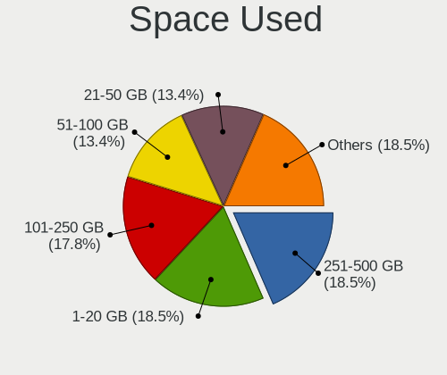
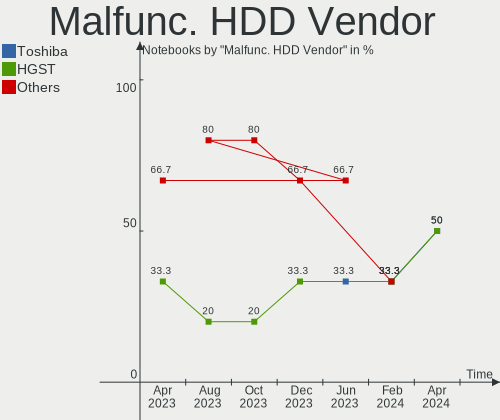
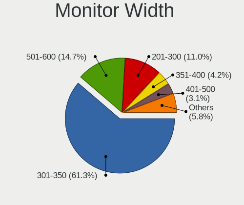
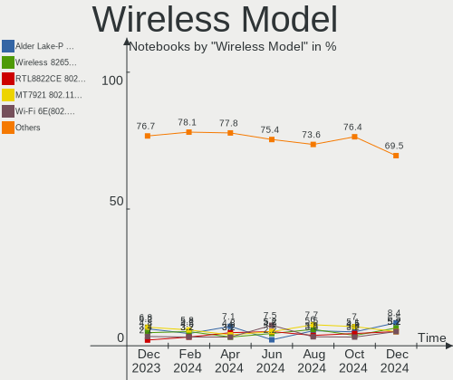

Arch - Hardware Trends (Notebooks)
----------------------------------

A project to identify most popular hardware characteristics and track their change
over time based on data collected by Linux users at https://Linux-Hardware.org.

Anyone can contribute to this report by the [hw-probe](https://github.com/linuxhw/hw-probe) tool:

    sudo -E hw-probe -all -upload

This report is for one last month. Overall report since the beginning of time: [TestCoverage](https://github.com/linuxhw/TestCoverage)

Period: Jun, 2022.

Contents
--------

* [ System ](#system)
  - [ OS                       ](#os)
  - [ OS Family                ](#os-family)
  - [ Kernel                   ](#kernel)
  - [ Kernel Family            ](#kernel-family)
  - [ Kernel Major Ver.        ](#kernel-major-ver)
  - [ Arch                     ](#arch)
  - [ DE                       ](#de)
  - [ Display Server           ](#display-server)
  - [ Display Manager          ](#display-manager)
  - [ OS Lang                  ](#os-lang)
  - [ Boot Mode                ](#boot-mode)
  - [ Filesystem               ](#filesystem)
  - [ Part. scheme             ](#part-scheme)
  - [ Dual Boot with Linux/BSD ](#dual-boot-with-linuxbsd)
  - [ Dual Boot (Win)          ](#dual-boot-win)

* [ Board ](#board)
  - [ Vendor                   ](#vendor)
  - [ Model                    ](#model)
  - [ Model Family             ](#model-family)
  - [ MFG Year                 ](#mfg-year)
  - [ Form Factor              ](#form-factor)
  - [ Secure Boot              ](#secure-boot)
  - [ Coreboot                 ](#coreboot)
  - [ RAM Size                 ](#ram-size)
  - [ RAM Used                 ](#ram-used)
  - [ Total Drives             ](#total-drives)
  - [ Has CD-ROM               ](#has-cd-rom)
  - [ Has Ethernet             ](#has-ethernet)
  - [ Has WiFi                 ](#has-wifi)
  - [ Has Bluetooth            ](#has-bluetooth)

* [ Location ](#location)
  - [ Country                  ](#country)
  - [ City                     ](#city)

* [ Drives ](#drives)
  - [ Drive Vendor             ](#drive-vendor)
  - [ Drive Model              ](#drive-model)
  - [ HDD Vendor               ](#hdd-vendor)
  - [ SSD Vendor               ](#ssd-vendor)
  - [ Drive Kind               ](#drive-kind)
  - [ Drive Connector          ](#drive-connector)
  - [ Drive Size               ](#drive-size)
  - [ Space Total              ](#space-total)
  - [ Space Used               ](#space-used)
  - [ Malfunc. Drives          ](#malfunc-drives)
  - [ Malfunc. Drive Vendor    ](#malfunc-drive-vendor)
  - [ Malfunc. HDD Vendor      ](#malfunc-hdd-vendor)
  - [ Malfunc. Drive Kind      ](#malfunc-drive-kind)
  - [ Failed Drives            ](#failed-drives)
  - [ Failed Drive Vendor      ](#failed-drive-vendor)
  - [ Drive Status             ](#drive-status)

* [ Storage controller ](#storage-controller)
  - [ Storage Vendor           ](#storage-vendor)
  - [ Storage Model            ](#storage-model)
  - [ Storage Kind             ](#storage-kind)

* [ Processor ](#processor)
  - [ CPU Vendor               ](#cpu-vendor)
  - [ CPU Model                ](#cpu-model)
  - [ CPU Model Family         ](#cpu-model-family)
  - [ CPU Cores                ](#cpu-cores)
  - [ CPU Sockets              ](#cpu-sockets)
  - [ CPU Threads              ](#cpu-threads)
  - [ CPU Op-Modes             ](#cpu-op-modes)
  - [ CPU Microcode            ](#cpu-microcode)
  - [ CPU Microarch            ](#cpu-microarch)

* [ Graphics ](#graphics)
  - [ GPU Vendor               ](#gpu-vendor)
  - [ GPU Model                ](#gpu-model)
  - [ GPU Combo                ](#gpu-combo)
  - [ GPU Driver               ](#gpu-driver)
  - [ GPU Memory               ](#gpu-memory)

* [ Monitor ](#monitor)
  - [ Monitor Vendor           ](#monitor-vendor)
  - [ Monitor Model            ](#monitor-model)
  - [ Monitor Resolution       ](#monitor-resolution)
  - [ Monitor Diagonal         ](#monitor-diagonal)
  - [ Monitor Width            ](#monitor-width)
  - [ Aspect Ratio             ](#aspect-ratio)
  - [ Monitor Area             ](#monitor-area)
  - [ Pixel Density            ](#pixel-density)
  - [ Multiple Monitors        ](#multiple-monitors)

* [ Network ](#network)
  - [ Net Controller Vendor    ](#net-controller-vendor)
  - [ Net Controller Model     ](#net-controller-model)
  - [ Wireless Vendor          ](#wireless-vendor)
  - [ Wireless Model           ](#wireless-model)
  - [ Ethernet Vendor          ](#ethernet-vendor)
  - [ Ethernet Model           ](#ethernet-model)
  - [ Net Controller Kind      ](#net-controller-kind)
  - [ Used Controller          ](#used-controller)
  - [ NICs                     ](#nics)
  - [ IPv6                     ](#ipv6)

* [ Bluetooth ](#bluetooth)
  - [ Bluetooth Vendor         ](#bluetooth-vendor)
  - [ Bluetooth Model          ](#bluetooth-model)

* [ Sound ](#sound)
  - [ Sound Vendor             ](#sound-vendor)
  - [ Sound Model              ](#sound-model)

* [ Memory ](#memory)
  - [ Memory Vendor            ](#memory-vendor)
  - [ Memory Model             ](#memory-model)
  - [ Memory Kind              ](#memory-kind)
  - [ Memory Form Factor       ](#memory-form-factor)
  - [ Memory Size              ](#memory-size)
  - [ Memory Speed             ](#memory-speed)

* [ Printers & scanners ](#printers--scanners)
  - [ Printer Vendor           ](#printer-vendor)
  - [ Printer Model            ](#printer-model)
  - [ Scanner Vendor           ](#scanner-vendor)
  - [ Scanner Model            ](#scanner-model)

* [ Camera ](#camera)
  - [ Camera Vendor            ](#camera-vendor)
  - [ Camera Model             ](#camera-model)

* [ Security ](#security)
  - [ Fingerprint Vendor       ](#fingerprint-vendor)
  - [ Fingerprint Model        ](#fingerprint-model)
  - [ Chipcard Vendor          ](#chipcard-vendor)
  - [ Chipcard Model           ](#chipcard-model)

* [ Unsupported ](#unsupported)
  - [ Unsupported Devices      ](#unsupported-devices)
  - [ Unsupported Device Types ](#unsupported-device-types)

System
------

OS
--

Installed operating systems

| Name         | Notebooks | Percent |
|--------------|-----------|---------|
| Arch         | 73        | 66.97%  |
| Arch Rolling | 36        | 33.03%  |

OS Family
---------

OS without a version

| Name | Notebooks | Percent |
|------|-----------|---------|
| Arch | 109       | 100%    |

Kernel
------

Version of the Linux kernel

| Version                      | Notebooks | Percent |
|------------------------------|-----------|---------|
| 5.18.1-arch1-1               | 20        | 18.35%  |
| 5.18.3-arch1-1               | 14        | 12.84%  |
| 5.18.6-arch1-1               | 12        | 11.01%  |
| 5.18.5-arch1-1               | 11        | 10.09%  |
| 5.18.2-arch1-1               | 9         | 8.26%   |
| 5.18.3-zen1-1-zen            | 6         | 5.5%    |
| 5.18.7-arch1-1               | 5         | 4.59%   |
| 5.15.46-1-lts                | 4         | 3.67%   |
| 5.18.5-zen1-1-zen            | 3         | 2.75%   |
| 5.18.1-zen1-1-zen            | 3         | 2.75%   |
| 5.18.7-zen1-1-zen            | 2         | 1.83%   |
| 5.17.9-arch1-1               | 2         | 1.83%   |
| 5.15.48-1-lts                | 2         | 1.83%   |
| 5.18.7-1-ck                  | 1         | 0.92%   |
| 5.18.6-zen1-1.1-zen          | 1         | 0.92%   |
| 5.18.5-AMD-znver2            | 1         | 0.92%   |
| 5.18.4-xanmod1-1-native_amd  | 1         | 0.92%   |
| 5.18.3-arch1-1-t2            | 1         | 0.92%   |
| 5.18.3-261-tkg-bmq           | 1         | 0.92%   |
| 5.18.2-1-blueperil           | 1         | 0.92%   |
| 5.18.1-AMD-ThinkPad          | 1         | 0.92%   |
| 5.17.9-zen1-1-zen            | 1         | 0.92%   |
| 5.17.7-arch1-1               | 1         | 0.92%   |
| 5.17.5-zen1-1-zen            | 1         | 0.92%   |
| 5.17.15-hardened1-1-hardened | 1         | 0.92%   |
| 5.17.12-xanmod1-1            | 1         | 0.92%   |
| 5.15.49-1-lts                | 1         | 0.92%   |
| 5.15.44-1-lts                | 1         | 0.92%   |
| 5.15.41-1-lts                | 1         | 0.92%   |

Kernel Family
-------------

Linux kernel without a distro release

| Version | Notebooks | Percent |
|---------|-----------|---------|
| 5.18.1  | 24        | 22.02%  |
| 5.18.3  | 22        | 20.18%  |
| 5.18.5  | 15        | 13.76%  |
| 5.18.6  | 13        | 11.93%  |
| 5.18.2  | 10        | 9.17%   |
| 5.18.7  | 8         | 7.34%   |
| 5.15.46 | 4         | 3.67%   |
| 5.17.9  | 3         | 2.75%   |
| 5.15.48 | 2         | 1.83%   |
| 5.18.4  | 1         | 0.92%   |
| 5.17.7  | 1         | 0.92%   |
| 5.17.5  | 1         | 0.92%   |
| 5.17.15 | 1         | 0.92%   |
| 5.17.12 | 1         | 0.92%   |
| 5.15.49 | 1         | 0.92%   |
| 5.15.44 | 1         | 0.92%   |
| 5.15.41 | 1         | 0.92%   |

Kernel Major Ver.
-----------------

Linux kernel major version

| Version | Notebooks | Percent |
|---------|-----------|---------|
| 5.18    | 93        | 85.32%  |
| 5.15    | 9         | 8.26%   |
| 5.17    | 7         | 6.42%   |

Arch
----

OS architecture (x86_64, i586, etc.)

| Name   | Notebooks | Percent |
|--------|-----------|---------|
| x86_64 | 109       | 100%    |

DE
--

Desktop Environment

| Name       | Notebooks | Percent |
|------------|-----------|---------|
| GNOME      | 41        | 37.61%  |
| KDE5       | 37        | 33.94%  |
| Unknown    | 9         | 8.26%   |
| XFCE       | 7         | 6.42%   |
| sway       | 5         | 4.59%   |
| i3         | 5         | 4.59%   |
| X-Cinnamon | 3         | 2.75%   |
| MATE       | 1         | 0.92%   |
| bspwm      | 1         | 0.92%   |

Display Server
--------------

X11 or Wayland

| Name    | Notebooks | Percent |
|---------|-----------|---------|
| X11     | 63        | 57.8%   |
| Wayland | 33        | 30.28%  |
| Unknown | 7         | 6.42%   |
| Tty     | 6         | 5.5%    |

Display Manager
---------------

SDDM, LightDM, etc.

| Name    | Notebooks | Percent |
|---------|-----------|---------|
| Unknown | 50        | 45.87%  |
| SDDM    | 26        | 23.85%  |
| GDM     | 17        | 15.6%   |
| LightDM | 13        | 11.93%  |
| Ly      | 1         | 0.92%   |
| LXDM    | 1         | 0.92%   |
| GREETD  | 1         | 0.92%   |

OS Lang
-------

Language

| Lang    | Notebooks | Percent |
|---------|-----------|---------|
| en_US   | 67        | 61.47%  |
| pt_BR   | 6         | 5.5%    |
| de_DE   | 4         | 3.67%   |
| C       | 4         | 3.67%   |
| it_IT   | 3         | 2.75%   |
| es_ES   | 3         | 2.75%   |
| en_GB   | 3         | 2.75%   |
| Unknown | 3         | 2.75%   |
| zh_CN   | 2         | 1.83%   |
| fr_FR   | 2         | 1.83%   |
| ru_RU   | 1         | 0.92%   |
| pl_PL   | 1         | 0.92%   |
| fr_BE   | 1         | 0.92%   |
| es_AR   | 1         | 0.92%   |
| en_SE   | 1         | 0.92%   |
| en_IN   | 1         | 0.92%   |
| en_IL   | 1         | 0.92%   |
| en_DK   | 1         | 0.92%   |
| en_CH   | 1         | 0.92%   |
| en_AU   | 1         | 0.92%   |
| en-US   | 1         | 0.92%   |
| de_AT   | 1         | 0.92%   |

Boot Mode
---------

EFI or BIOS

| Mode | Notebooks | Percent |
|------|-----------|---------|
| EFI  | 68        | 62.39%  |
| BIOS | 41        | 37.61%  |

Filesystem
----------

Type of filesystem

| Type    | Notebooks | Percent |
|---------|-----------|---------|
| Ext4    | 79        | 72.48%  |
| Btrfs   | 25        | 22.94%  |
| Xfs     | 3         | 2.75%   |
| F2fs    | 1         | 0.92%   |
| Unknown | 1         | 0.92%   |

Part. scheme
------------

Scheme of partitioning

| Type    | Notebooks | Percent |
|---------|-----------|---------|
| GPT     | 70        | 64.22%  |
| Unknown | 35        | 32.11%  |
| MBR     | 4         | 3.67%   |

Dual Boot with Linux/BSD
------------------------

Hosting more than one Linux/BSD

| Dual boot | Notebooks | Percent |
|-----------|-----------|---------|
| No        | 100       | 91.74%  |
| Yes       | 9         | 8.26%   |

Dual Boot (Win)
---------------

Hosting Linux and Windows

| Dual boot | Notebooks | Percent |
|-----------|-----------|---------|
| No        | 80        | 73.39%  |
| Yes       | 29        | 26.61%  |

Board
-----

Vendor
------

Motherboard manufacturer

| Name                   | Notebooks | Percent |
|------------------------|-----------|---------|
| Lenovo                 | 30        | 27.52%  |
| Dell                   | 16        | 14.68%  |
| ASUSTek Computer       | 15        | 13.76%  |
| Hewlett-Packard        | 13        | 11.93%  |
| Acer                   | 8         | 7.34%   |
| HUAWEI                 | 4         | 3.67%   |
| MSI                    | 3         | 2.75%   |
| TUXEDO                 | 2         | 1.83%   |
| Samsung Electronics    | 2         | 1.83%   |
| Fujitsu                | 2         | 1.83%   |
| Toshiba                | 1         | 0.92%   |
| Timi                   | 1         | 0.92%   |
| Razer                  | 1         | 0.92%   |
| Philco                 | 1         | 0.92%   |
| LG Electronics         | 1         | 0.92%   |
| Infinix                | 1         | 0.92%   |
| HONOR                  | 1         | 0.92%   |
| GPU Company            | 1         | 0.92%   |
| Google                 | 1         | 0.92%   |
| Framework              | 1         | 0.92%   |
| Chuwi                  | 1         | 0.92%   |
| Avell High Performance | 1         | 0.92%   |
| Apple                  | 1         | 0.92%   |
| Alienware              | 1         | 0.92%   |

Model
-----

Motherboard model

| Name                                   | Notebooks | Percent |
|----------------------------------------|-----------|---------|
| MSI Bravo 15 B5DD                      | 2         | 1.83%   |
| Acer Swift SF314-511                   | 2         | 1.83%   |
| TUXEDO InfinityBook S 15 Gen6          | 1         | 0.92%   |
| TUXEDO Book_XA1510                     | 1         | 0.92%   |
| Toshiba Satellite Click 10 LX5W-C-108  | 1         | 0.92%   |
| Timi TM1701                            | 1         | 0.92%   |
| Samsung 670Z5E                         | 1         | 0.92%   |
| Samsung 550XBE/350XBE                  | 1         | 0.92%   |
| Razer Blade                            | 1         | 0.92%   |
| Philco OEM                             | 1         | 0.92%   |
| MSI GP66 Leopard 11UG                  | 1         | 0.92%   |
| LG 15Z95N-G.AAC6U1                     | 1         | 0.92%   |
| Lenovo Y520-15IKBN 80WK                | 1         | 0.92%   |
| Lenovo ThinkPad X270 W10DG 20K5S1AP1W  | 1         | 0.92%   |
| Lenovo ThinkPad X230 2325TXV           | 1         | 0.92%   |
| Lenovo ThinkPad X220 4291IR6           | 1         | 0.92%   |
| Lenovo ThinkPad X200T 7449G6G          | 1         | 0.92%   |
| Lenovo ThinkPad X200s 74663RG          | 1         | 0.92%   |
| Lenovo ThinkPad X1 Extreme 20MF000DUS  | 1         | 0.92%   |
| Lenovo ThinkPad T580 20LAS6XC00        | 1         | 0.92%   |
| Lenovo ThinkPad T495 20NJ0007US        | 1         | 0.92%   |
| Lenovo ThinkPad T460p 20FW0005AU       | 1         | 0.92%   |
| Lenovo ThinkPad T14s Gen 1 20UH001ART  | 1         | 0.92%   |
| Lenovo ThinkPad P50 20EQS5M100         | 1         | 0.92%   |
| Lenovo ThinkPad P50 20EQS31G00         | 1         | 0.92%   |
| Lenovo ThinkPad P15 Gen 1 20ST0039GE   | 1         | 0.92%   |
| Lenovo ThinkPad P14s Gen 2a 21A00000FR | 1         | 0.92%   |
| Lenovo ThinkPad L15 Gen 2a 20X7CTO1WW  | 1         | 0.92%   |
| Lenovo ThinkPad E490 20N8002APB        | 1         | 0.92%   |
| Lenovo ThinkPad E14 Gen 2 20T6002VRI   | 1         | 0.92%   |
| Lenovo ThinkBook 15 G2 ITL 20VE        | 1         | 0.92%   |
| Lenovo ThinkBook 14p Gen 2 20YN        | 1         | 0.92%   |
| Lenovo ThinkBook 14 G4+ ARA 21D0       | 1         | 0.92%   |
| Lenovo ThinkBook 13s G2 ITL 20V9       | 1         | 0.92%   |
| Lenovo Legion Y740-15IRHg 81UH         | 1         | 0.92%   |
| Lenovo Legion 5 Pro 16ACH6H 82JQ       | 1         | 0.92%   |
| Lenovo Legion 5 15ARH05H 82B1          | 1         | 0.92%   |
| Lenovo IdeaPad S145-15IWL 81S9         | 1         | 0.92%   |
| Lenovo IdeaPad 3 15ALC6 82KU           | 1         | 0.92%   |
| Lenovo IdeaPad 110-14IBR 80T6          | 1         | 0.92%   |
| Lenovo IdeaPad 100-14IBY 80MH          | 1         | 0.92%   |
| Infinix INBOOK X2                      | 1         | 0.92%   |
| HUAWEI KPR-WX9                         | 1         | 0.92%   |
| HUAWEI KLVL-WXXW                       | 1         | 0.92%   |
| HUAWEI HVY-WXX9                        | 1         | 0.92%   |
| HUAWEI CREM-WXX9                       | 1         | 0.92%   |
| HONOR HYM-WXX                          | 1         | 0.92%   |
| HP ProBook 440 G4                      | 1         | 0.92%   |
| HP Pavilion Notebook                   | 1         | 0.92%   |
| HP Pavilion Laptop 15-eh1xxx           | 1         | 0.92%   |
| HP Pavilion Gaming Laptop 15-ec0xxx    | 1         | 0.92%   |
| HP Laptop 15q-bu0xx                    | 1         | 0.92%   |
| HP Laptop 15-dw2xxx                    | 1         | 0.92%   |
| HP ENVY dv7                            | 1         | 0.92%   |
| HP EliteBook 8570w                     | 1         | 0.92%   |
| HP EliteBook 850 G8 Notebook PC        | 1         | 0.92%   |
| HP EliteBook 8470p                     | 1         | 0.92%   |
| HP EliteBook 8460p                     | 1         | 0.92%   |
| HP EliteBook 840 G5                    | 1         | 0.92%   |
| HP EliteBook 840 G2                    | 1         | 0.92%   |

Model Family
------------

Motherboard model prefix

| Name                       | Notebooks | Percent |
|----------------------------|-----------|---------|
| Lenovo ThinkPad            | 17        | 15.6%   |
| HP EliteBook               | 6         | 5.5%    |
| Dell Latitude              | 6         | 5.5%    |
| ASUS ROG                   | 5         | 4.59%   |
| Lenovo ThinkBook           | 4         | 3.67%   |
| Lenovo IdeaPad             | 4         | 3.67%   |
| Lenovo Legion              | 3         | 2.75%   |
| HP Pavilion                | 3         | 2.75%   |
| Dell Inspiron              | 3         | 2.75%   |
| Acer Nitro                 | 3         | 2.75%   |
| MSI Bravo                  | 2         | 1.83%   |
| HP Laptop                  | 2         | 1.83%   |
| Fujitsu LIFEBOOK           | 2         | 1.83%   |
| Dell XPS                   | 2         | 1.83%   |
| Dell Vostro                | 2         | 1.83%   |
| Dell Precision             | 2         | 1.83%   |
| ASUS ASUS                  | 2         | 1.83%   |
| Acer Swift                 | 2         | 1.83%   |
| Acer Aspire                | 2         | 1.83%   |
| TUXEDO InfinityBook        | 1         | 0.92%   |
| TUXEDO Book                | 1         | 0.92%   |
| Toshiba Satellite          | 1         | 0.92%   |
| Timi TM1701                | 1         | 0.92%   |
| Samsung 670Z5E             | 1         | 0.92%   |
| Samsung 550XBE             | 1         | 0.92%   |
| Razer Blade                | 1         | 0.92%   |
| Philco OEM                 | 1         | 0.92%   |
| MSI GP66                   | 1         | 0.92%   |
| LG 15Z95N-G.AAC6U1         | 1         | 0.92%   |
| Lenovo Y520-15IKBN         | 1         | 0.92%   |
| Infinix INBOOK             | 1         | 0.92%   |
| HUAWEI KPR-WX9             | 1         | 0.92%   |
| HUAWEI KLVL-WXXW           | 1         | 0.92%   |
| HUAWEI HVY-WXX9            | 1         | 0.92%   |
| HUAWEI CREM-WXX9           | 1         | 0.92%   |
| HONOR HYM-WXX              | 1         | 0.92%   |
| HP ProBook                 | 1         | 0.92%   |
| HP ENVY                    | 1         | 0.92%   |
| GPU Company GWTN141-10     | 1         | 0.92%   |
| Google Quawks              | 1         | 0.92%   |
| Framework Laptop           | 1         | 0.92%   |
| Dell G3                    | 1         | 0.92%   |
| Chuwi GemiBook             | 1         | 0.92%   |
| Avell High Performance A62 | 1         | 0.92%   |
| ASUS X555LD                | 1         | 0.92%   |
| ASUS X550JX                | 1         | 0.92%   |
| ASUS X411UA                | 1         | 0.92%   |
| ASUS VivoBook              | 1         | 0.92%   |
| ASUS U36SG                 | 1         | 0.92%   |
| ASUS T100HAN               | 1         | 0.92%   |
| ASUS GL502VMK              | 1         | 0.92%   |
| ASUS G551JM                | 1         | 0.92%   |
| Apple MacBookPro16         | 1         | 0.92%   |
| Alienware m15              | 1         | 0.92%   |
| Acer Ferrari               | 1         | 0.92%   |
| Unknown                    | 1         | 0.92%   |

MFG Year
--------

Motherboard manufacture year

| Year | Notebooks | Percent |
|------|-----------|---------|
| 2021 | 26        | 23.85%  |
| 2020 | 23        | 21.1%   |
| 2017 | 9         | 8.26%   |
| 2019 | 7         | 6.42%   |
| 2018 | 7         | 6.42%   |
| 2015 | 7         | 6.42%   |
| 2016 | 5         | 4.59%   |
| 2022 | 4         | 3.67%   |
| 2014 | 4         | 3.67%   |
| 2012 | 4         | 3.67%   |
| 2011 | 4         | 3.67%   |
| 2013 | 3         | 2.75%   |
| 2008 | 3         | 2.75%   |
| 2009 | 2         | 1.83%   |
| 2010 | 1         | 0.92%   |

Form Factor
-----------

Physical design of the computer

| Name     | Notebooks | Percent |
|----------|-----------|---------|
| Notebook | 109       | 100%    |

Secure Boot
-----------

Enabled or disabled

| State    | Notebooks | Percent |
|----------|-----------|---------|
| Disabled | 107       | 98.17%  |
| Enabled  | 2         | 1.83%   |

Coreboot
--------

Have coreboot on board

| Used | Notebooks | Percent |
|------|-----------|---------|
| No   | 108       | 99.08%  |
| Yes  | 1         | 0.92%   |

RAM Size
--------

Total RAM memory

| Size in GB  | Notebooks | Percent |
|-------------|-----------|---------|
| 4.01-8.0    | 26        | 23.85%  |
| 16.01-24.0  | 24        | 22.02%  |
| 8.01-16.0   | 24        | 22.02%  |
| 32.01-64.0  | 20        | 18.35%  |
| 3.01-4.0    | 11        | 10.09%  |
| 64.01-256.0 | 3         | 2.75%   |
| 24.01-32.0  | 1         | 0.92%   |

RAM Used
--------

Used RAM memory

| Used GB    | Notebooks | Percent |
|------------|-----------|---------|
| 2.01-3.0   | 26        | 23.85%  |
| 4.01-8.0   | 24        | 22.02%  |
| 3.01-4.0   | 24        | 22.02%  |
| 1.01-2.0   | 17        | 15.6%   |
| 8.01-16.0  | 13        | 11.93%  |
| 0.51-1.0   | 3         | 2.75%   |
| 24.01-32.0 | 1         | 0.92%   |
| 16.01-24.0 | 1         | 0.92%   |

Total Drives
------------

Number of drives on board

| Drives | Notebooks | Percent |
|--------|-----------|---------|
| 1      | 82        | 75.23%  |
| 2      | 25        | 22.94%  |
| 3      | 2         | 1.83%   |

Has CD-ROM
----------

Has CD-ROM on board

| Presented | Notebooks | Percent |
|-----------|-----------|---------|
| No        | 98        | 89.91%  |
| Yes       | 11        | 10.09%  |

Has Ethernet
------------

Has Ethernet on board

| Presented | Notebooks | Percent |
|-----------|-----------|---------|
| Yes       | 83        | 76.15%  |
| No        | 26        | 23.85%  |

Has WiFi
--------

Has WiFi module

| Presented | Notebooks | Percent |
|-----------|-----------|---------|
| Yes       | 108       | 99.08%  |
| No        | 1         | 0.92%   |

Has Bluetooth
-------------

Has Bluetooth module

| Presented | Notebooks | Percent |
|-----------|-----------|---------|
| Yes       | 99        | 90.83%  |
| No        | 10        | 9.17%   |

Location
--------

Country
-------

Geographic location (country)

| Country     | Notebooks | Percent |
|-------------|-----------|---------|
| USA         | 20        | 18.35%  |
| Brazil      | 9         | 8.26%   |
| France      | 8         | 7.34%   |
| Germany     | 7         | 6.42%   |
| Russia      | 4         | 3.67%   |
| Poland      | 4         | 3.67%   |
| Italy       | 4         | 3.67%   |
| India       | 4         | 3.67%   |
| UK          | 3         | 2.75%   |
| Spain       | 3         | 2.75%   |
| China       | 3         | 2.75%   |
| Vietnam     | 2         | 1.83%   |
| Thailand    | 2         | 1.83%   |
| Sweden      | 2         | 1.83%   |
| New Zealand | 2         | 1.83%   |
| Japan       | 2         | 1.83%   |
| Israel      | 2         | 1.83%   |
| Greece      | 2         | 1.83%   |
| Chile       | 2         | 1.83%   |
| Austria     | 2         | 1.83%   |
| Australia   | 2         | 1.83%   |
| Argentina   | 2         | 1.83%   |
| Taiwan      | 1         | 0.92%   |
| Switzerland | 1         | 0.92%   |
| Romania     | 1         | 0.92%   |
| Peru        | 1         | 0.92%   |
| Netherlands | 1         | 0.92%   |
| Nepal       | 1         | 0.92%   |
| Moldova     | 1         | 0.92%   |
| Mexico      | 1         | 0.92%   |
| Ireland     | 1         | 0.92%   |
| Hungary     | 1         | 0.92%   |
| Hong Kong   | 1         | 0.92%   |
| Finland     | 1         | 0.92%   |
| Denmark     | 1         | 0.92%   |
| Czechia     | 1         | 0.92%   |
| Colombia    | 1         | 0.92%   |
| Canada      | 1         | 0.92%   |
| Belgium     | 1         | 0.92%   |
| Armenia     | 1         | 0.92%   |

City
----

Geographic location (city)

| City               | Notebooks | Percent |
|--------------------|-----------|---------|
| Warsaw             | 2         | 1.83%   |
| Tel Aviv           | 2         | 1.83%   |
| St Petersburg      | 2         | 1.83%   |
| Sesto San Giovanni | 2         | 1.83%   |
| Seattle            | 2         | 1.83%   |
| Santiago           | 2         | 1.83%   |
| Paris              | 2         | 1.83%   |
| Madrid             | 2         | 1.83%   |
| Diespeck           | 2         | 1.83%   |
| Berlin             | 2         | 1.83%   |
| Zapopan            | 1         | 0.92%   |
| Yokohama           | 1         | 0.92%   |
| Yerevan            | 1         | 0.92%   |
| Yekaterinburg      | 1         | 0.92%   |
| Wroclaw            | 1         | 0.92%   |
| Wettringen         | 1         | 0.92%   |
| Wernigerode        | 1         | 0.92%   |
| Wellington         | 1         | 0.92%   |
| Wasmes             | 1         | 0.92%   |
| Vienna             | 1         | 0.92%   |
| Valencia           | 1         | 0.92%   |
| Uberlândia        | 1         | 0.92%   |
| Traun              | 1         | 0.92%   |
| Tourcoing          | 1         | 0.92%   |
| Tortuguitas        | 1         | 0.92%   |
| Toms River         | 1         | 0.92%   |
| Thessaloniki       | 1         | 0.92%   |
| Taoyuan District   | 1         | 0.92%   |
| Szarwark           | 1         | 0.92%   |
| Sydney             | 1         | 0.92%   |
| Shenzhen           | 1         | 0.92%   |
| Scottsdale         | 1         | 0.92%   |
| Sattahip           | 1         | 0.92%   |
| Sao Paulo          | 1         | 0.92%   |
| Sao Cristovao      | 1         | 0.92%   |
| San Jose           | 1         | 0.92%   |
| Sabara             | 1         | 0.92%   |
| Saarbrücken       | 1         | 0.92%   |
| Rothenburg         | 1         | 0.92%   |
| Rome               | 1         | 0.92%   |
| Racine             | 1         | 0.92%   |
| Prague             | 1         | 0.92%   |
| Pilisvorosvar      | 1         | 0.92%   |
| Phoenix            | 1         | 0.92%   |
| Padova             | 1         | 0.92%   |
| Oshawa             | 1         | 0.92%   |
| Odense             | 1         | 0.92%   |
| Norsborg           | 1         | 0.92%   |
| Ningbo             | 1         | 0.92%   |
| Napier City        | 1         | 0.92%   |
| Nagpur             | 1         | 0.92%   |
| Moscow             | 1         | 0.92%   |
| Montes Claros      | 1         | 0.92%   |
| Milton Keynes      | 1         | 0.92%   |
| Miengo             | 1         | 0.92%   |
| Mesa               | 1         | 0.92%   |
| Memphis            | 1         | 0.92%   |
| Lille              | 1         | 0.92%   |
| Lexington          | 1         | 0.92%   |
| Les Mureaux        | 1         | 0.92%   |

Drives
------

Drive Vendor
------------

Hard drive vendors

| Vendor                      | Notebooks | Drives | Percent |
|-----------------------------|-----------|--------|---------|
| Samsung Electronics         | 28        | 32     | 21.54%  |
| WDC                         | 14        | 15     | 10.77%  |
| SK hynix                    | 10        | 10     | 7.69%   |
| SanDisk                     | 10        | 10     | 7.69%   |
| Toshiba                     | 9         | 9      | 6.92%   |
| Kingston                    | 9         | 9      | 6.92%   |
| Crucial                     | 7         | 7      | 5.38%   |
| Unknown                     | 4         | 4      | 3.08%   |
| Seagate                     | 4         | 4      | 3.08%   |
| Micron Technology           | 4         | 4      | 3.08%   |
| HGST                        | 4         | 4      | 3.08%   |
| UMIS                        | 2         | 2      | 1.54%   |
| Phison                      | 2         | 2      | 1.54%   |
| KIOXIA                      | 2         | 2      | 1.54%   |
| Intel                       | 2         | 2      | 1.54%   |
| Hitachi                     | 2         | 2      | 1.54%   |
| China                       | 2         | 2      | 1.54%   |
| XPG                         | 1         | 2      | 0.77%   |
| W800S                       | 1         | 1      | 0.77%   |
| Silicon Motion              | 1         | 1      | 0.77%   |
| Netac                       | 1         | 1      | 0.77%   |
| MAXIO Technology (Hangzhou) | 1         | 1      | 0.77%   |
| Lite-On                     | 1         | 1      | 0.77%   |
| KIOXIA-EXCERIA              | 1         | 1      | 0.77%   |
| Intenso                     | 1         | 1      | 0.77%   |
| Gigabyte Technology         | 1         | 1      | 0.77%   |
| External                    | 1         | 1      | 0.77%   |
| Corsair                     | 1         | 1      | 0.77%   |
| Apple                       | 1         | 1      | 0.77%   |
| AEGO                        | 1         | 1      | 0.77%   |
| ADATA Technology            | 1         | 1      | 0.77%   |
| A-DATA Technology           | 1         | 1      | 0.77%   |

Drive Model
-----------

Hard drive models

| Model                                | Notebooks | Percent |
|--------------------------------------|-----------|---------|
| Samsung NVMe SSD Drive 512GB         | 6         | 4.48%   |
| SK hynix NVMe SSD Drive 512GB        | 4         | 2.99%   |
| SanDisk NVMe SSD Drive 512GB         | 4         | 2.99%   |
| Samsung SSD 970 EVO Plus 2TB         | 3         | 2.24%   |
| Kingston OM8PCP3512F-AI1 512GB       | 3         | 2.24%   |
| WDC WDS500G2B0B-00YS70 500GB SSD     | 2         | 1.49%   |
| WDC PC SN730 SDBQNTY-512G-1001 512GB | 2         | 1.49%   |
| Toshiba MQ04ABF100 1TB               | 2         | 1.49%   |
| Toshiba MQ01ABD100 1TB               | 2         | 1.49%   |
| Samsung SSD 980 1TB                  | 2         | 1.49%   |
| Samsung SSD 860 EVO 250GB            | 2         | 1.49%   |
| Micron 2210_MTFDHBA512QFD 512GB      | 2         | 1.49%   |
| Crucial CT240BX500SSD1 240GB         | 2         | 1.49%   |
| XPG NVMe SSD Drive 256GB             | 1         | 0.75%   |
| XPG NVMe SSD Drive 1024GB            | 1         | 0.75%   |
| WDC WDS500G3X0C-00SJG0 500GB         | 1         | 0.75%   |
| WDC WDS200T2B0A-00SM50 2TB SSD       | 1         | 0.75%   |
| WDC WDS200T1X0E-00AFY0 2TB           | 1         | 0.75%   |
| WDC WDS100T2B0C-00PXH0 1TB           | 1         | 0.75%   |
| WDC WDS100T2B0C 1TB                  | 1         | 0.75%   |
| WDC WD5000LPVX-75V0TT0 500GB         | 1         | 0.75%   |
| WDC WD5000LPVX-22V0TT0 500GB         | 1         | 0.75%   |
| WDC WD5000LPCX-24VHAT0 500GB         | 1         | 0.75%   |
| WDC WD10JPVX-60JC3T0 1TB             | 1         | 0.75%   |
| WDC PC SN730 SDBPNTY-512G            | 1         | 0.75%   |
| WDC PC SN530 NVMe 512GB              | 1         | 0.75%   |
| W800S 512GB                          | 1         | 0.75%   |
| Unknown SN400  394GB                 | 1         | 0.75%   |
| Unknown MMC Card  64GB               | 1         | 0.75%   |
| Unknown MMC Card  32GB               | 1         | 0.75%   |
| Unknown 064GE2  64GB                 | 1         | 0.75%   |
| UMIS RPJTJ256MEE1OWX 256GB           | 1         | 0.75%   |
| UMIS RPETJ512MGE2QDQ 512GB           | 1         | 0.75%   |
| Toshiba THNSNJ512GDNU A 512GB SSD    | 1         | 0.75%   |
| Toshiba NVMe SSD Drive 512GB         | 1         | 0.75%   |
| Toshiba MQ02ABD100H 1TB              | 1         | 0.75%   |
| Toshiba MK1234GSX 120GB              | 1         | 0.75%   |
| Toshiba KXG6AZNV1T02 1TB             | 1         | 0.75%   |
| SK hynix SC401 SATA 256GB SSD        | 1         | 0.75%   |
| SK hynix NVMe SSD Drive 256GB        | 1         | 0.75%   |
| SK hynix NVMe SSD Drive 1TB          | 1         | 0.75%   |
| SK hynix HFM512GDHTNG-8710B 512GB    | 1         | 0.75%   |
| SK hynix HFM512GD3JX013N 512GB       | 1         | 0.75%   |
| SK hynix HFM001TD3JX013N 1TB         | 1         | 0.75%   |
| Silicon Motion PCIe-8 SSD 512GB      | 1         | 0.75%   |
| Seagate ST500LM030-1RK17D 500GB      | 1         | 0.75%   |
| Seagate ST1000LM048-2E7172 1TB       | 1         | 0.75%   |
| Seagate ST1000LM035-1RK172 1TB       | 1         | 0.75%   |
| Seagate ST1000LM024 HN-M101MBB 1TB   | 1         | 0.75%   |
| SanDisk SSD PLUS 1000GB              | 1         | 0.75%   |
| SanDisk SDSSDH3 500G                 | 1         | 0.75%   |
| SanDisk SD7SB3Q-128G-1006 128GB SSD  | 1         | 0.75%   |
| SanDisk NVMe SSD Drive 240GB         | 1         | 0.75%   |
| SanDisk NVMe SSD Drive 1TB           | 1         | 0.75%   |
| SanDisk NVMe SSD Drive 128GB         | 1         | 0.75%   |
| Samsung SSD 970 EVO Plus 250GB       | 1         | 0.75%   |
| Samsung SSD 970 EVO Plus 1TB         | 1         | 0.75%   |
| Samsung SSD 870 EVO 1TB              | 1         | 0.75%   |
| Samsung SSD 860 PRO 1TB              | 1         | 0.75%   |
| Samsung SSD 850 EVO 500GB            | 1         | 0.75%   |

HDD Vendor
----------

Hard disk drive vendors

| Vendor  | Notebooks | Drives | Percent |
|---------|-----------|--------|---------|
| Toshiba | 6         | 6      | 30%     |
| WDC     | 4         | 4      | 20%     |
| Seagate | 4         | 4      | 20%     |
| HGST    | 4         | 4      | 20%     |
| Hitachi | 2         | 2      | 10%     |

SSD Vendor
----------

Solid state drive vendors

| Vendor              | Notebooks | Drives | Percent |
|---------------------|-----------|--------|---------|
| Samsung Electronics | 8         | 8      | 24.24%  |
| Crucial             | 7         | 7      | 21.21%  |
| WDC                 | 3         | 3      | 9.09%   |
| SanDisk             | 3         | 3      | 9.09%   |
| Kingston            | 2         | 2      | 6.06%   |
| China               | 2         | 2      | 6.06%   |
| Toshiba             | 1         | 1      | 3.03%   |
| SK hynix            | 1         | 1      | 3.03%   |
| KIOXIA-EXCERIA      | 1         | 1      | 3.03%   |
| Intenso             | 1         | 1      | 3.03%   |
| Gigabyte Technology | 1         | 1      | 3.03%   |
| Corsair             | 1         | 1      | 3.03%   |
| AEGO                | 1         | 1      | 3.03%   |
| A-DATA Technology   | 1         | 1      | 3.03%   |

Drive Kind
----------

HDD or SSD

| Kind    | Notebooks | Drives | Percent |
|---------|-----------|--------|---------|
| NVMe    | 68        | 78     | 54.4%   |
| SSD     | 32        | 33     | 25.6%   |
| HDD     | 20        | 20     | 16%     |
| MMC     | 4         | 4      | 3.2%    |
| Unknown | 1         | 1      | 0.8%    |

Drive Connector
---------------

SATA, SAS, NVMe, etc.

| Type | Notebooks | Drives | Percent |
|------|-----------|--------|---------|
| NVMe | 68        | 77     | 56.2%   |
| SATA | 46        | 52     | 38.02%  |
| MMC  | 4         | 4      | 3.31%   |
| SAS  | 3         | 3      | 2.48%   |

Drive Size
----------

Size of hard drive

| Size in TB | Notebooks | Drives | Percent |
|------------|-----------|--------|---------|
| 0.01-0.5   | 28        | 30     | 54.9%   |
| 0.51-1.0   | 19        | 19     | 37.25%  |
| 1.01-2.0   | 4         | 4      | 7.84%   |

Space Total
-----------

Amount of disk space available on the file system

| Size in GB     | Notebooks | Percent |
|----------------|-----------|---------|
| 251-500        | 29        | 26.61%  |
| 101-250        | 27        | 24.77%  |
| 501-1000       | 20        | 18.35%  |
| 1001-2000      | 15        | 13.76%  |
| 2001-3000      | 6         | 5.5%    |
| More than 3000 | 4         | 3.67%   |
| 21-50          | 2         | 1.83%   |
| 1-20           | 2         | 1.83%   |
| 51-100         | 2         | 1.83%   |
| Unknown        | 2         | 1.83%   |

Space Used
----------

Amount of used disk space

| Used GB        | Notebooks | Percent |
|----------------|-----------|---------|
| 101-250        | 22        | 20.18%  |
| 1-20           | 22        | 20.18%  |
| 251-500        | 18        | 16.51%  |
| 21-50          | 16        | 14.68%  |
| 51-100         | 14        | 12.84%  |
| 501-1000       | 11        | 10.09%  |
| 1001-2000      | 3         | 2.75%   |
| Unknown        | 2         | 1.83%   |
| More than 3000 | 1         | 0.92%   |

Malfunc. Drives
---------------

Drive models with a malfunction

| Model                                            | Notebooks | Drives | Percent |
|--------------------------------------------------|-----------|--------|---------|
| WDC WD5000LPCX-24VHAT0 500GB                     | 1         | 1      | 12.5%   |
| Seagate ST1000LM024 HN-M101MBB 1TB               | 1         | 1      | 12.5%   |
| Samsung Electronics MZVLW256HEHP-000L2 256GB     | 1         | 1      | 12.5%   |
| Samsung Electronics MZ7PA128HMCD-010H1 128GB SSD | 1         | 1      | 12.5%   |
| Hitachi HTS541010A9E680 1TB                      | 1         | 1      | 12.5%   |
| HGST HTS725050A7E630 500GB                       | 1         | 1      | 12.5%   |
| HGST HTS721010A9E630 1TB                         | 1         | 1      | 12.5%   |
| China SSD 240GB                                  | 1         | 1      | 12.5%   |

Malfunc. Drive Vendor
---------------------

Vendors of faulty drives

| Vendor              | Notebooks | Drives | Percent |
|---------------------|-----------|--------|---------|
| Samsung Electronics | 2         | 2      | 25%     |
| HGST                | 2         | 2      | 25%     |
| WDC                 | 1         | 1      | 12.5%   |
| Seagate             | 1         | 1      | 12.5%   |
| Hitachi             | 1         | 1      | 12.5%   |
| China               | 1         | 1      | 12.5%   |

Malfunc. HDD Vendor
-------------------

Vendors of faulty HDD drives

| Vendor  | Notebooks | Drives | Percent |
|---------|-----------|--------|---------|
| HGST    | 2         | 2      | 40%     |
| WDC     | 1         | 1      | 20%     |
| Seagate | 1         | 1      | 20%     |
| Hitachi | 1         | 1      | 20%     |

Malfunc. Drive Kind
-------------------

Kinds of faulty drives

| Kind | Notebooks | Drives | Percent |
|------|-----------|--------|---------|
| HDD  | 5         | 5      | 62.5%   |
| SSD  | 2         | 2      | 25%     |
| NVMe | 1         | 1      | 12.5%   |

Failed Drives
-------------

Failed drive models

Zero info for selected period =(

Failed Drive Vendor
-------------------

Failed drive vendors

Zero info for selected period =(

Drive Status
------------

Number of failed and malfunc. drives

| Status   | Notebooks | Drives | Percent |
|----------|-----------|--------|---------|
| Works    | 52        | 66     | 47.27%  |
| Detected | 50        | 62     | 45.45%  |
| Malfunc  | 8         | 8      | 7.27%   |

Storage controller
------------------

Storage Vendor
--------------

Storage controller vendors

| Vendor                       | Notebooks | Percent |
|------------------------------|-----------|---------|
| Intel                        | 57        | 41.3%   |
| Samsung Electronics          | 21        | 15.22%  |
| SanDisk                      | 14        | 10.14%  |
| AMD                          | 11        | 7.97%   |
| SK hynix                     | 9         | 6.52%   |
| Kingston Technology Company  | 7         | 5.07%   |
| Micron Technology            | 4         | 2.9%    |
| Toshiba America Info Systems | 3         | 2.17%   |
| Union Memory (Shenzhen)      | 2         | 1.45%   |
| Silicon Motion               | 2         | 1.45%   |
| Phison Electronics           | 2         | 1.45%   |
| ADATA Technology             | 2         | 1.45%   |
| MAXIO Technology (Hangzhou)  | 1         | 0.72%   |
| Lite-On Technology           | 1         | 0.72%   |
| KIOXIA                       | 1         | 0.72%   |
| Apple                        | 1         | 0.72%   |

Storage Model
-------------

Storage controller models

| Model                                                                            | Notebooks | Percent |
|----------------------------------------------------------------------------------|-----------|---------|
| AMD FCH SATA Controller [AHCI mode]                                              | 10        | 6.9%    |
| Samsung NVMe SSD Controller SM981/PM981/PM983                                    | 8         | 5.52%   |
| Samsung NVMe SSD Controller 980                                                  | 7         | 4.83%   |
| Intel Sunrise Point-LP SATA Controller [AHCI mode]                               | 7         | 4.83%   |
| Intel 7 Series Chipset Family 6-port SATA Controller [AHCI mode]                 | 7         | 4.83%   |
| Intel Volume Management Device NVMe RAID Controller                              | 6         | 4.14%   |
| SK hynix Gold P31 SSD                                                            | 5         | 3.45%   |
| SanDisk WD Blue SN550 NVMe SSD                                                   | 4         | 2.76%   |
| SanDisk WD Black SN750 / PC SN730 NVMe SSD                                       | 4         | 2.76%   |
| SanDisk Non-Volatile memory controller                                           | 4         | 2.76%   |
| Samsung NVMe SSD Controller PM9A1/PM9A3/980PRO                                   | 4         | 2.76%   |
| Micron Non-Volatile memory controller                                            | 4         | 2.76%   |
| Intel HM170/QM170 Chipset SATA Controller [AHCI Mode]                            | 4         | 2.76%   |
| Samsung NVMe SSD Controller SM961/PM961/SM963                                    | 3         | 2.07%   |
| Kingston Company Company Non-Volatile memory controller                          | 3         | 2.07%   |
| Intel Wildcat Point-LP SATA Controller [AHCI Mode]                               | 3         | 2.07%   |
| Intel Q170/Q150/B150/H170/H110/Z170/CM236 Chipset SATA Controller [AHCI Mode]    | 3         | 2.07%   |
| Intel 82801IBM/IEM (ICH9M/ICH9M-E) 4 port SATA Controller [AHCI mode]            | 3         | 2.07%   |
| Intel 82801 Mobile SATA Controller [RAID mode]                                   | 3         | 2.07%   |
| Intel 6 Series/C200 Series Chipset Family 6 port Mobile SATA AHCI Controller     | 3         | 2.07%   |
| Intel 400 Series Chipset Family SATA AHCI Controller                             | 3         | 2.07%   |
| Toshiba America Info Systems XG6 NVMe SSD Controller                             | 2         | 1.38%   |
| SK hynix Non-Volatile memory controller                                          | 2         | 1.38%   |
| Kingston Company KC2000 NVMe SSD                                                 | 2         | 1.38%   |
| Intel Tiger Lake-LP SATA Controller [AHCI mode]                                  | 2         | 1.38%   |
| Intel Cannon Point-LP SATA Controller [AHCI Mode]                                | 2         | 1.38%   |
| Intel 8 Series/C220 Series Chipset Family 6-port SATA Controller 1 [AHCI mode]   | 2         | 1.38%   |
| Intel 8 Series SATA Controller 1 [AHCI mode]                                     | 2         | 1.38%   |
| Union Memory (Shenzhen) Non-Volatile memory controller                           | 1         | 0.69%   |
| Union Memory (Shenzhen) AM630 PCIe 4.0 x4 NVMe SSD Controller                    | 1         | 0.69%   |
| Toshiba America Info Systems XG4 NVMe SSD Controller                             | 1         | 0.69%   |
| SK hynix BC511                                                                   | 1         | 0.69%   |
| SK hynix BC501 NVMe Solid State Drive                                            | 1         | 0.69%   |
| Silicon Motion SM2263EN/SM2263XT SSD Controller                                  | 1         | 0.69%   |
| Silicon Motion Non-Volatile memory controller                                    | 1         | 0.69%   |
| SanDisk WD PC SN810 / Black SN850 NVMe SSD                                       | 1         | 0.69%   |
| SanDisk WD Blue SN500 / PC SN520 NVMe SSD                                        | 1         | 0.69%   |
| SanDisk WD Black 2018/SN750 / PC SN720 NVMe SSD                                  | 1         | 0.69%   |
| Phison PS5013 E13 NVMe Controller                                                | 1         | 0.69%   |
| Phison E12 NVMe Controller                                                       | 1         | 0.69%   |
| MAXIO (Hangzhou) NVMe SSD Controller MAP1001                                     | 1         | 0.69%   |
| Lite-On Non-Volatile memory controller                                           | 1         | 0.69%   |
| KIOXIA Non-Volatile memory controller                                            | 1         | 0.69%   |
| Kingston Company U-SNS8154P3 NVMe SSD                                            | 1         | 0.69%   |
| Kingston Company A2000 NVMe SSD                                                  | 1         | 0.69%   |
| Intel SSD 660P Series                                                            | 1         | 0.69%   |
| Intel Non-Volatile memory controller                                             | 1         | 0.69%   |
| Intel Jasper Lake SATA AHCI Controller                                           | 1         | 0.69%   |
| Intel Comet Lake PCH-H RAID                                                      | 1         | 0.69%   |
| Intel Cannon Lake Mobile PCH SATA AHCI Controller                                | 1         | 0.69%   |
| Intel Atom/Celeron/Pentium Processor x5-E8000/J3xxx/N3xxx Series SATA Controller | 1         | 0.69%   |
| Intel Atom Processor E3800 Series SATA AHCI Controller                           | 1         | 0.69%   |
| Intel 82801HM/HEM (ICH8M/ICH8M-E) SATA Controller [AHCI mode]                    | 1         | 0.69%   |
| Intel 82801HM/HEM (ICH8M/ICH8M-E) IDE Controller                                 | 1         | 0.69%   |
| Intel 5 Series/3400 Series Chipset 4 port SATA IDE Controller                    | 1         | 0.69%   |
| Intel 5 Series/3400 Series Chipset 2 port SATA IDE Controller                    | 1         | 0.69%   |
| Apple ANS2 NVMe Controller                                                       | 1         | 0.69%   |
| AMD SB7x0/SB8x0/SB9x0 SATA Controller [AHCI mode]                                | 1         | 0.69%   |
| AMD 400 Series Chipset SATA Controller                                           | 1         | 0.69%   |
| ADATA XPG SX8200 Pro PCIe Gen3x4 M.2 2280 Solid State Drive                      | 1         | 0.69%   |

Storage Kind
------------

Kind of storage controller (IDE, SATA, NVMe, SAS, ...)

| Kind | Notebooks | Percent |
|------|-----------|---------|
| NVMe | 68        | 49.64%  |
| SATA | 57        | 41.61%  |
| RAID | 10        | 7.3%    |
| IDE  | 2         | 1.46%   |

Processor
---------

CPU Vendor
----------

Processor vendors

| Vendor | Notebooks | Percent |
|--------|-----------|---------|
| Intel  | 79        | 72.48%  |
| AMD    | 30        | 27.52%  |

CPU Model
---------

Processor models

| Model                                      | Notebooks | Percent |
|--------------------------------------------|-----------|---------|
| AMD Ryzen 7 5800H with Radeon Graphics     | 6         | 5.5%    |
| Intel 11th Gen Core i7-1165G7 @ 2.80GHz    | 5         | 4.59%   |
| Intel Core i7-7700HQ CPU @ 2.80GHz         | 4         | 3.67%   |
| Intel 11th Gen Core i5-1135G7 @ 2.40GHz    | 4         | 3.67%   |
| Intel Core i7-9750H CPU @ 2.60GHz          | 3         | 2.75%   |
| Intel Core i7-10750H CPU @ 2.60GHz         | 3         | 2.75%   |
| Intel Core i5-8350U CPU @ 1.70GHz          | 3         | 2.75%   |
| AMD Ryzen 5 5600H with Radeon Graphics     | 3         | 2.75%   |
| Intel Xeon CPU E3-1505M v5 @ 2.80GHz       | 2         | 1.83%   |
| Intel Core i7-8565U CPU @ 1.80GHz          | 2         | 1.83%   |
| Intel Core i7-8550U CPU @ 1.80GHz          | 2         | 1.83%   |
| Intel Core i5-5300U CPU @ 2.30GHz          | 2         | 1.83%   |
| Intel Core i5-3320M CPU @ 2.60GHz          | 2         | 1.83%   |
| Intel Core i5-1035G1 CPU @ 1.00GHz         | 2         | 1.83%   |
| Intel Core 2 Duo CPU L9400 @ 1.86GHz       | 2         | 1.83%   |
| Intel 11th Gen Core i7-1185G7 @ 3.00GHz    | 2         | 1.83%   |
| AMD Ryzen 9 5900HX with Radeon Graphics    | 2         | 1.83%   |
| AMD Ryzen 7 PRO 5850U with Radeon Graphics | 2         | 1.83%   |
| AMD Ryzen 7 6800H with Radeon Graphics     | 2         | 1.83%   |
| AMD Ryzen 7 4800H with Radeon Graphics     | 2         | 1.83%   |
| AMD Ryzen 5 5500U with Radeon Graphics     | 2         | 1.83%   |
| Intel Xeon CPU E3-1545M v5 @ 2.90GHz       | 1         | 0.92%   |
| Intel Pentium CPU N3540 @ 2.16GHz          | 1         | 0.92%   |
| Intel Core M-5Y10c CPU @ 0.80GHz           | 1         | 0.92%   |
| Intel Core i9-10980HK CPU @ 2.40GHz        | 1         | 0.92%   |
| Intel Core i9-10885H CPU @ 2.40GHz         | 1         | 0.92%   |
| Intel Core i7-8850H CPU @ 2.60GHz          | 1         | 0.92%   |
| Intel Core i7-7600U CPU @ 2.80GHz          | 1         | 0.92%   |
| Intel Core i7-6500U CPU @ 2.50GHz          | 1         | 0.92%   |
| Intel Core i7-4720HQ CPU @ 2.60GHz         | 1         | 0.92%   |
| Intel Core i7-4710HQ CPU @ 2.50GHz         | 1         | 0.92%   |
| Intel Core i7-3630QM CPU @ 2.40GHz         | 1         | 0.92%   |
| Intel Core i7-2620M CPU @ 2.70GHz          | 1         | 0.92%   |
| Intel Core i7-10850H CPU @ 2.70GHz         | 1         | 0.92%   |
| Intel Core i5-8265U CPU @ 1.60GHz          | 1         | 0.92%   |
| Intel Core i5-8250U CPU @ 1.60GHz          | 1         | 0.92%   |
| Intel Core i5-6440HQ CPU @ 2.60GHz         | 1         | 0.92%   |
| Intel Core i5-6300U CPU @ 2.40GHz          | 1         | 0.92%   |
| Intel Core i5-6200U CPU @ 2.30GHz          | 1         | 0.92%   |
| Intel Core i5-4210U CPU @ 1.70GHz          | 1         | 0.92%   |
| Intel Core i5-3360M CPU @ 2.80GHz          | 1         | 0.92%   |
| Intel Core i5-3337U CPU @ 1.80GHz          | 1         | 0.92%   |
| Intel Core i5-3230M CPU @ 2.60GHz          | 1         | 0.92%   |
| Intel Core i5-2520M CPU @ 2.50GHz          | 1         | 0.92%   |
| Intel Core i5-2450M CPU @ 2.50GHz          | 1         | 0.92%   |
| Intel Core i5-10300H CPU @ 2.50GHz         | 1         | 0.92%   |
| Intel Core i3-7100U CPU @ 2.40GHz          | 1         | 0.92%   |
| Intel Core i3-6006U CPU @ 2.00GHz          | 1         | 0.92%   |
| Intel Core i3-4030U CPU @ 1.90GHz          | 1         | 0.92%   |
| Intel Core i3-3217U CPU @ 1.80GHz          | 1         | 0.92%   |
| Intel Core i3-3110M CPU @ 2.40GHz          | 1         | 0.92%   |
| Intel Core i3 CPU M 370 @ 2.40GHz          | 1         | 0.92%   |
| Intel Core 2 Duo CPU T8300 @ 2.40GHz       | 1         | 0.92%   |
| Intel Core 2 Duo CPU P8600 @ 2.40GHz       | 1         | 0.92%   |
| Intel Celeron N5100 @ 1.10GHz              | 1         | 0.92%   |
| Intel Celeron CPU N3060 @ 1.60GHz          | 1         | 0.92%   |
| Intel Celeron CPU N2840 @ 2.16GHz          | 1         | 0.92%   |
| Intel Atom x5-Z8500 CPU @ 1.44GHz          | 1         | 0.92%   |
| Intel Atom x5-Z8300 CPU @ 1.44GHz          | 1         | 0.92%   |
| Intel 11th Gen Core i7-11800H @ 2.30GHz    | 1         | 0.92%   |

CPU Model Family
----------------

Processor model prefix

| Model            | Notebooks | Percent |
|------------------|-----------|---------|
| Intel Core i7    | 22        | 20.18%  |
| Intel Core i5    | 21        | 19.27%  |
| Other            | 14        | 12.84%  |
| AMD Ryzen 7      | 13        | 11.93%  |
| AMD Ryzen 5      | 9         | 8.26%   |
| Intel Core i3    | 6         | 5.5%    |
| Intel Core 2 Duo | 4         | 3.67%   |
| AMD Ryzen 7 PRO  | 4         | 3.67%   |
| Intel Xeon       | 3         | 2.75%   |
| Intel Celeron    | 3         | 2.75%   |
| AMD Ryzen 9      | 3         | 2.75%   |
| Intel Core i9    | 2         | 1.83%   |
| Intel Atom       | 2         | 1.83%   |
| Intel Pentium    | 1         | 0.92%   |
| Intel Core M     | 1         | 0.92%   |
| AMD Athlon X2    | 1         | 0.92%   |

CPU Cores
---------

Number of processor cores

| Number | Notebooks | Percent |
|--------|-----------|---------|
| 4      | 43        | 39.45%  |
| 2      | 29        | 26.61%  |
| 8      | 21        | 19.27%  |
| 6      | 16        | 14.68%  |

CPU Sockets
-----------

Number of sockets

| Number | Notebooks | Percent |
|--------|-----------|---------|
| 1      | 109       | 100%    |

CPU Threads
-----------

Threads per core (Hyper-Threading)

| Number | Notebooks | Percent |
|--------|-----------|---------|
| 2      | 96        | 88.07%  |
| 1      | 13        | 11.93%  |

CPU Op-Modes
------------

CPU Operation Modes (32-bit, 64-bit)

| Op mode        | Notebooks | Percent |
|----------------|-----------|---------|
| 32-bit, 64-bit | 109       | 100%    |

CPU Microcode
-------------

Microcode number

| Number     | Notebooks | Percent |
|------------|-----------|---------|
| Unknown    | 42        | 38.53%  |
| 0x806c1    | 12        | 11.01%  |
| 0x0a50000c | 10        | 9.17%   |
| 0x906e9    | 4         | 3.67%   |
| 0x406e3    | 4         | 3.67%   |
| 0x306a9    | 4         | 3.67%   |
| 0xa0652    | 3         | 2.75%   |
| 0x906ea    | 2         | 1.83%   |
| 0x806ea    | 2         | 1.83%   |
| 0x306d4    | 2         | 1.83%   |
| 0x306c3    | 2         | 1.83%   |
| 0x206a7    | 2         | 1.83%   |
| 0x08608102 | 2         | 1.83%   |
| 0x08600106 | 2         | 1.83%   |
| 0x08600103 | 2         | 1.83%   |
| 0x906c0    | 1         | 0.92%   |
| 0x806ec    | 1         | 0.92%   |
| 0x806eb    | 1         | 0.92%   |
| 0x406c4    | 1         | 0.92%   |
| 0x406c3    | 1         | 0.92%   |
| 0x40651    | 1         | 0.92%   |
| 0x30678    | 1         | 0.92%   |
| 0x10676    | 1         | 0.92%   |
| 0x0a50000b | 1         | 0.92%   |
| 0x08701013 | 1         | 0.92%   |
| 0x08608103 | 1         | 0.92%   |
| 0x08600104 | 1         | 0.92%   |
| 0x08108109 | 1         | 0.92%   |
| 0x08108102 | 1         | 0.92%   |

CPU Microarch
-------------

Microarchitecture

| Name        | Notebooks | Percent |
|-------------|-----------|---------|
| KabyLake    | 19        | 17.43%  |
| Zen 3       | 15        | 13.76%  |
| TigerLake   | 13        | 11.93%  |
| Skylake     | 8         | 7.34%   |
| IvyBridge   | 8         | 7.34%   |
| CometLake   | 7         | 6.42%   |
| Zen 2       | 6         | 5.5%    |
| Unknown     | 6         | 5.5%    |
| Silvermont  | 5         | 4.59%   |
| Penryn      | 4         | 3.67%   |
| Haswell     | 4         | 3.67%   |
| Zen+        | 3         | 2.75%   |
| SandyBridge | 3         | 2.75%   |
| Broadwell   | 3         | 2.75%   |
| IceLake     | 2         | 1.83%   |
| Westmere    | 1         | 0.92%   |
| Tremont     | 1         | 0.92%   |
| K8 Hammer   | 1         | 0.92%   |

Graphics
--------

GPU Vendor
----------

Vendors of graphics cards

| Vendor | Notebooks | Percent |
|--------|-----------|---------|
| Intel  | 74        | 52.48%  |
| Nvidia | 37        | 26.24%  |
| AMD    | 30        | 21.28%  |

GPU Model
---------

Graphics card models

| Model                                                                                    | Notebooks | Percent |
|------------------------------------------------------------------------------------------|-----------|---------|
| Intel TigerLake-LP GT2 [Iris Xe Graphics]                                                | 13        | 9.03%   |
| AMD Cezanne                                                                              | 13        | 9.03%   |
| Intel CometLake-H GT2 [UHD Graphics]                                                     | 7         | 4.86%   |
| Intel 3rd Gen Core processor Graphics Controller                                         | 7         | 4.86%   |
| Intel UHD Graphics 620                                                                   | 6         | 4.17%   |
| AMD Renoir                                                                               | 5         | 3.47%   |
| Nvidia GA104M [GeForce RTX 3070 Mobile / Max-Q]                                          | 4         | 2.78%   |
| Intel Skylake GT2 [HD Graphics 520]                                                      | 4         | 2.78%   |
| Nvidia GA104M [GeForce RTX 3080 Mobile / Max-Q 8GB/16GB]                                 | 3         | 2.08%   |
| Intel WhiskeyLake-U GT2 [UHD Graphics 620]                                               | 3         | 2.08%   |
| Intel Mobile 4 Series Chipset Integrated Graphics Controller                             | 3         | 2.08%   |
| Intel HD Graphics 630                                                                    | 3         | 2.08%   |
| Intel CoffeeLake-H GT2 [UHD Graphics 630]                                                | 3         | 2.08%   |
| Intel Atom/Celeron/Pentium Processor x5-E8000/J3xxx/N3xxx Integrated Graphics Controller | 3         | 2.08%   |
| Intel 2nd Generation Core Processor Family Integrated Graphics Controller                | 3         | 2.08%   |
| AMD Picasso/Raven 2 [Radeon Vega Series / Radeon Vega Mobile Series]                     | 3         | 2.08%   |
| AMD Navi 14 [Radeon RX 5500/5500M / Pro 5500M]                                           | 3         | 2.08%   |
| AMD Lucienne                                                                             | 3         | 2.08%   |
| Nvidia TU117M [GeForce GTX 1650 Ti Mobile]                                               | 2         | 1.39%   |
| Nvidia TU117M                                                                            | 2         | 1.39%   |
| Nvidia TU116M [GeForce GTX 1660 Ti Mobile]                                               | 2         | 1.39%   |
| Nvidia GP107M [GeForce GTX 1050 Ti Mobile]                                               | 2         | 1.39%   |
| Nvidia GM108M [GeForce MX110]                                                            | 2         | 1.39%   |
| Nvidia GM107GLM [Quadro M2000M]                                                          | 2         | 1.39%   |
| Intel Iris Plus Graphics G1 (Ice Lake)                                                   | 2         | 1.39%   |
| Intel HD Graphics P530                                                                   | 2         | 1.39%   |
| Intel HD Graphics 620                                                                    | 2         | 1.39%   |
| Intel HD Graphics 5500                                                                   | 2         | 1.39%   |
| Intel Haswell-ULT Integrated Graphics Controller                                         | 2         | 1.39%   |
| Intel Atom Processor Z36xxx/Z37xxx Series Graphics & Display                             | 2         | 1.39%   |
| Intel 4th Gen Core Processor Integrated Graphics Controller                              | 2         | 1.39%   |
| AMD Rembrandt [Radeon 680M]                                                              | 2         | 1.39%   |
| Nvidia TU117M [GeForce GTX 1650 Mobile / Max-Q]                                          | 1         | 0.69%   |
| Nvidia TU117GLM [Quadro T1000 Mobile]                                                    | 1         | 0.69%   |
| Nvidia TU106M [GeForce RTX 2070 Mobile / Max-Q Refresh]                                  | 1         | 0.69%   |
| Nvidia TU106GLM [Quadro RTX 3000 Mobile / Max-Q]                                         | 1         | 0.69%   |
| Nvidia TU106BM [GeForce RTX 2070 Mobile / Max-Q]                                         | 1         | 0.69%   |
| Nvidia GP108M [GeForce MX150]                                                            | 1         | 0.69%   |
| Nvidia GP106M [GeForce GTX 1060 Mobile]                                                  | 1         | 0.69%   |
| Nvidia GP106BM [GeForce GTX 1060 Mobile 6GB]                                             | 1         | 0.69%   |
| Nvidia GM206GLM [Quadro M2200 Mobile]                                                    | 1         | 0.69%   |
| Nvidia GM108M [GeForce 940MX]                                                            | 1         | 0.69%   |
| Nvidia GM107M [GeForce GTX 950M]                                                         | 1         | 0.69%   |
| Nvidia GM107M [GeForce GTX 860M]                                                         | 1         | 0.69%   |
| Nvidia GK107GLM [Quadro K1000M]                                                          | 1         | 0.69%   |
| Nvidia GF119M [GeForce 610M]                                                             | 1         | 0.69%   |
| Nvidia GF117M [GeForce 610M/710M/810M/820M / GT 620M/625M/630M/720M]                     | 1         | 0.69%   |
| Nvidia GA107M [GeForce RTX 3050 Ti Mobile]                                               | 1         | 0.69%   |
| Nvidia GA104 [Geforce RTX 3070 Ti Laptop GPU]                                            | 1         | 0.69%   |
| Nvidia G86M [GeForce 8400M GS]                                                           | 1         | 0.69%   |
| Intel TigerLake-H GT1 [UHD Graphics]                                                     | 1         | 0.69%   |
| Intel JasperLake [UHD Graphics]                                                          | 1         | 0.69%   |
| Intel HD Graphics 5300                                                                   | 1         | 0.69%   |
| Intel HD Graphics 530                                                                    | 1         | 0.69%   |
| Intel Core Processor Integrated Graphics Controller                                      | 1         | 0.69%   |
| AMD Venus XT [Radeon HD 8870M / R9 M270X/M370X]                                          | 1         | 0.69%   |
| AMD RS780M [Mobility Radeon HD 3200]                                                     | 1         | 0.69%   |
| AMD Navi 22 [Radeon RX 6700/6700 XT/6750 XT / 6800M]                                     | 1         | 0.69%   |
| AMD Barcelo                                                                              | 1         | 0.69%   |

GPU Combo
---------

Combinations of graphics cards

| Name           | Notebooks | Percent |
|----------------|-----------|---------|
| 1 x Intel      | 50        | 45.87%  |
| Intel + Nvidia | 22        | 20.18%  |
| 1 x AMD        | 17        | 15.6%   |
| AMD + Nvidia   | 8         | 7.34%   |
| 1 x Nvidia     | 7         | 6.42%   |
| 2 x AMD        | 3         | 2.75%   |
| Intel + AMD    | 2         | 1.83%   |

GPU Driver
----------

Free vs proprietary

| Driver      | Notebooks | Percent |
|-------------|-----------|---------|
| Free        | 84        | 77.06%  |
| Proprietary | 25        | 22.94%  |

GPU Memory
----------

Total video memory

| Size in GB | Notebooks | Percent |
|------------|-----------|---------|
| Unknown    | 76        | 69.72%  |
| 0.01-0.5   | 12        | 11.01%  |
| 3.01-4.0   | 7         | 6.42%   |
| 1.01-2.0   | 6         | 5.5%    |
| 7.01-8.0   | 4         | 3.67%   |
| 5.01-6.0   | 3         | 2.75%   |
| 0.51-1.0   | 1         | 0.92%   |

Monitor
-------

Monitor Vendor
--------------

Monitor vendors

| Vendor               | Notebooks | Percent |
|----------------------|-----------|---------|
| AU Optronics         | 26        | 18.31%  |
| BOE                  | 22        | 15.49%  |
| Chimei Innolux       | 20        | 14.08%  |
| LG Display           | 17        | 11.97%  |
| Samsung Electronics  | 9         | 6.34%   |
| Dell                 | 8         | 5.63%   |
| Sharp                | 5         | 3.52%   |
| PANDA                | 4         | 2.82%   |
| Philips              | 3         | 2.11%   |
| Lenovo               | 3         | 2.11%   |
| Goldstar             | 3         | 2.11%   |
| CSO                  | 3         | 2.11%   |
| Hewlett-Packard      | 2         | 1.41%   |
| ASUSTek Computer     | 2         | 1.41%   |
| Acer                 | 2         | 1.41%   |
| ViewSonic            | 1         | 0.7%    |
| Unknown              | 1         | 0.7%    |
| Pixio                | 1         | 0.7%    |
| Panasonic            | 1         | 0.7%    |
| NEC Computers        | 1         | 0.7%    |
| Iiyama               | 1         | 0.7%    |
| HJC                  | 1         | 0.7%    |
| HannStar             | 1         | 0.7%    |
| CPT                  | 1         | 0.7%    |
| BOE Technology Group | 1         | 0.7%    |
| BenQ                 | 1         | 0.7%    |
| Apple                | 1         | 0.7%    |
| AOpen                | 1         | 0.7%    |

Monitor Model
-------------

Monitor models

| Model                                                                 | Notebooks | Percent |
|-----------------------------------------------------------------------|-----------|---------|
| PANDA LCD Monitor NCP004D 1920x1080 344x194mm 15.5-inch               | 3         | 2.1%    |
| LG Display LCD Monitor LGD05F6 1920x1080 309x174mm 14.0-inch          | 2         | 1.4%    |
| Chimei Innolux LCD Monitor CMN15E7 1920x1080 344x193mm 15.5-inch      | 2         | 1.4%    |
| Chimei Innolux LCD Monitor CMN15C4 1920x1080 344x193mm 15.5-inch      | 2         | 1.4%    |
| Chimei Innolux LCD Monitor CMN1540 2560x1440 344x193mm 15.5-inch      | 2         | 1.4%    |
| Chimei Innolux LCD Monitor CMN14D4 1920x1080 309x173mm 13.9-inch      | 2         | 1.4%    |
| BOE LCD Monitor BOE0878 1920x1080 355x200mm 16.0-inch                 | 2         | 1.4%    |
| BOE LCD Monitor BOE0747 1920x1080 344x194mm 15.5-inch                 | 2         | 1.4%    |
| ViewSonic VG2719-2K VSC1935 2560x1440 597x336mm 27.0-inch             | 1         | 0.7%    |
| Unknown LCD Monitor CSO 2560x1600                                     | 1         | 0.7%    |
| Sharp LQ156M1JW03 SHP155D 1920x1080 344x194mm 15.5-inch               | 1         | 0.7%    |
| Sharp LQ133M1JW28 SHP1483 1920x1080 294x165mm 13.3-inch               | 1         | 0.7%    |
| Sharp LCD Monitor SHP14D0 3840x2400 336x210mm 15.6-inch               | 1         | 0.7%    |
| Sharp LCD Monitor SHP143B 3840x2160 346x194mm 15.6-inch               | 1         | 0.7%    |
| Sharp LCD Monitor SHP141F 1920x1080 294x165mm 13.3-inch               | 1         | 0.7%    |
| Samsung Electronics U32R59x SAM0F94 3840x2160 697x392mm 31.5-inch     | 1         | 0.7%    |
| Samsung Electronics T24B350 SAM093E 1920x1080 531x299mm 24.0-inch     | 1         | 0.7%    |
| Samsung Electronics S34J55x SAM0F70 3440x1440 797x333mm 34.0-inch     | 1         | 0.7%    |
| Samsung Electronics S27H85x SAM0E0F 2560x1440 600x340mm 27.2-inch     | 1         | 0.7%    |
| Samsung Electronics LCD Monitor SEC5441 1366x768 344x194mm 15.5-inch  | 1         | 0.7%    |
| Samsung Electronics LCD Monitor SDC4161 1920x1080 344x194mm 15.5-inch | 1         | 0.7%    |
| Samsung Electronics LCD Monitor SDC414F 3456x2160 288x180mm 13.4-inch | 1         | 0.7%    |
| Samsung Electronics LCD Monitor SAM08FC 1366x768 700x390mm 31.5-inch  | 1         | 0.7%    |
| Samsung Electronics C24F390 SAM0D2C 1920x1080 521x293mm 23.5-inch     | 1         | 0.7%    |
| Pixio U29I WAM2900 2560x1080 690x260mm 29.0-inch                      | 1         | 0.7%    |
| Philips PHL 288E2 PHLC231 3840x2160 621x341mm 27.9-inch               | 1         | 0.7%    |
| Philips PHL 272B8Q PHL0918 2560x1440 597x336mm 27.0-inch              | 1         | 0.7%    |
| Philips PHL 193V5 PHLC0CD 1366x768 410x230mm 18.5-inch                | 1         | 0.7%    |
| PANDA LCD Monitor NCP004F 1920x1080 309x174mm 14.0-inch               | 1         | 0.7%    |
| Panasonic TV MEIA296 3840x2160 698x392mm 31.5-inch                    | 1         | 0.7%    |
| NEC Computers EA244WMi NEC68D6 1920x1200 520x320mm 24.0-inch          | 1         | 0.7%    |
| LG Display LCD Monitor LGD066E 1920x1080 344x194mm 15.5-inch          | 1         | 0.7%    |
| LG Display LCD Monitor LGD0645 1920x1080 344x194mm 15.5-inch          | 1         | 0.7%    |
| LG Display LCD Monitor LGD0625 1920x1080 340x190mm 15.3-inch          | 1         | 0.7%    |
| LG Display LCD Monitor LGD0612 1920x1080 344x194mm 15.5-inch          | 1         | 0.7%    |
| LG Display LCD Monitor LGD05A4 3840x2160 309x174mm 14.0-inch          | 1         | 0.7%    |
| LG Display LCD Monitor LGD0553 1920x1080 309x174mm 14.0-inch          | 1         | 0.7%    |
| LG Display LCD Monitor LGD054F 1920x1080 344x194mm 15.5-inch          | 1         | 0.7%    |
| LG Display LCD Monitor LGD053F 1920x1080 344x194mm 15.5-inch          | 1         | 0.7%    |
| LG Display LCD Monitor LGD0533 1920x1080 344x194mm 15.5-inch          | 1         | 0.7%    |
| LG Display LCD Monitor LGD046F 1920x1080 344x194mm 15.5-inch          | 1         | 0.7%    |
| LG Display LCD Monitor LGD0437 1920x1080 280x160mm 12.7-inch          | 1         | 0.7%    |
| LG Display LCD Monitor LGD033E 1366x768 309x174mm 14.0-inch           | 1         | 0.7%    |
| LG Display LCD Monitor LGD0306 1600x900 310x174mm 14.0-inch           | 1         | 0.7%    |
| LG Display LCD Monitor LGD02D8 1366x768 277x156mm 12.5-inch           | 1         | 0.7%    |
| LG Display LCD Monitor LGD02D3 1366x768 277x156mm 12.5-inch           | 1         | 0.7%    |
| LG Display LCD Monitor LGD0258 1600x900 345x194mm 15.6-inch           | 1         | 0.7%    |
| Lenovo Q27q-10 LEN65F4 2560x1440 597x336mm 27.0-inch                  | 1         | 0.7%    |
| Lenovo LCD Monitor LEN4011 1280x800 261x163mm 12.1-inch               | 1         | 0.7%    |
| Lenovo LCD Monitor LEN4010 1280x800 261x163mm 12.1-inch               | 1         | 0.7%    |
| Iiyama PL2474H IVM6146 1920x1080 521x293mm 23.5-inch                  | 1         | 0.7%    |
| HJC LCD Monitor HJC003D 1920x1080 309x174mm 14.0-inch                 | 1         | 0.7%    |
| Hewlett-Packard LCD Monitor HPN3442 1920x1080 600x340mm 27.2-inch     | 1         | 0.7%    |
| Hewlett-Packard 27 Curved HPN376E 1920x1080 600x340mm 27.2-inch       | 1         | 0.7%    |
| HannStar HSD140PHW1 HSD0583 1366x768 309x174mm 14.0-inch              | 1         | 0.7%    |
| Goldstar UltraFine GSM5B74 3840x2160 600x340mm 27.2-inch              | 1         | 0.7%    |
| Goldstar IPS FULLHD GSM5AB8 1920x1080 480x270mm 21.7-inch             | 1         | 0.7%    |
| Goldstar 27GN7 GSM5B8D 1920x1080 610x360mm 27.9-inch                  | 1         | 0.7%    |
| Dell U3818DW DELA0F2 1920x1080 880x370mm 37.6-inch                    | 1         | 0.7%    |
| Dell U2715H DELD065 2560x1440 597x336mm 27.0-inch                     | 1         | 0.7%    |

Monitor Resolution
------------------

Monitor screen resolution

| Resolution        | Notebooks | Percent |
|-------------------|-----------|---------|
| 1920x1080 (FHD)   | 64        | 48.12%  |
| 1366x768 (WXGA)   | 23        | 17.29%  |
| 3840x2160 (4K)    | 11        | 8.27%   |
| 2560x1440 (QHD)   | 10        | 7.52%   |
| 1920x1200 (WUXGA) | 3         | 2.26%   |
| 1600x900 (HD+)    | 3         | 2.26%   |
| 1280x800 (WXGA)   | 3         | 2.26%   |
| 3440x1440         | 2         | 1.5%    |
| 2560x1600         | 2         | 1.5%    |
| 2160x1440         | 2         | 1.5%    |
| 3840x2400         | 1         | 0.75%   |
| 3840x1600         | 1         | 0.75%   |
| 3456x2160         | 1         | 0.75%   |
| 3072x1920         | 1         | 0.75%   |
| 2880x1800         | 1         | 0.75%   |
| 2560x1080         | 1         | 0.75%   |
| 2520x1680         | 1         | 0.75%   |
| 2256x1504         | 1         | 0.75%   |
| 2240x1400         | 1         | 0.75%   |
| 1440x900 (WXGA+)  | 1         | 0.75%   |

Monitor Diagonal
----------------

Diagonal size in inches

| Inches  | Notebooks | Percent |
|---------|-----------|---------|
| 15      | 50        | 35.21%  |
| 13      | 21        | 14.79%  |
| 14      | 19        | 13.38%  |
| 27      | 13        | 9.15%   |
| 24      | 6         | 4.23%   |
| 12      | 6         | 4.23%   |
| 16      | 5         | 3.52%   |
| 17      | 4         | 2.82%   |
| 31      | 3         | 2.11%   |
| 23      | 3         | 2.11%   |
| 34      | 2         | 1.41%   |
| 21      | 2         | 1.41%   |
| 18      | 2         | 1.41%   |
| Unknown | 2         | 1.41%   |
| 84      | 1         | 0.7%    |
| 37      | 1         | 0.7%    |
| 29      | 1         | 0.7%    |
| 11      | 1         | 0.7%    |

Monitor Width
-------------

Physical width

| Width in mm | Notebooks | Percent |
|-------------|-----------|---------|
| 301-350     | 81        | 57.45%  |
| 501-600     | 19        | 13.48%  |
| 201-300     | 17        | 12.06%  |
| 601-700     | 7         | 4.96%   |
| 351-400     | 7         | 4.96%   |
| 401-500     | 4         | 2.84%   |
| 701-800     | 2         | 1.42%   |
| Unknown     | 2         | 1.42%   |
| 801-900     | 1         | 0.71%   |
| 1501-2000   | 1         | 0.71%   |

Aspect Ratio
------------

Proportional relationship between the width and the height

| Ratio   | Notebooks | Percent |
|---------|-----------|---------|
| 16/9    | 95        | 80.51%  |
| 16/10   | 12        | 10.17%  |
| 3/2     | 5         | 4.24%   |
| 21/9    | 3         | 2.54%   |
| Unknown | 2         | 1.69%   |
| 2.65    | 1         | 0.85%   |

Monitor Area
------------

Area in inch²

| Area in inch² | Notebooks | Percent |
|----------------|-----------|---------|
| 101-110        | 51        | 35.92%  |
| 81-90          | 34        | 23.94%  |
| 301-350        | 13        | 9.15%   |
| 201-250        | 10        | 7.04%   |
| 71-80          | 6         | 4.23%   |
| 61-70          | 6         | 4.23%   |
| 351-500        | 5         | 3.52%   |
| 121-130        | 4         | 2.82%   |
| 111-120        | 3         | 2.11%   |
| 251-300        | 2         | 1.41%   |
| Unknown        | 2         | 1.41%   |
| More than 1000 | 1         | 0.7%    |
| 51-60          | 1         | 0.7%    |
| 151-200        | 1         | 0.7%    |
| 141-150        | 1         | 0.7%    |
| 501-1000       | 1         | 0.7%    |
| 91-100         | 1         | 0.7%    |

Pixel Density
-------------

Pixels per inch

| Density       | Notebooks | Percent |
|---------------|-----------|---------|
| 121-160       | 63        | 45.99%  |
| 101-120       | 30        | 21.9%   |
| 51-100        | 18        | 13.14%  |
| 161-240       | 15        | 10.95%  |
| More than 240 | 8         | 5.84%   |
| Unknown       | 2         | 1.46%   |
| 1-50          | 1         | 0.73%   |

Multiple Monitors
-----------------

Total monitors connected

| Total | Notebooks | Percent |
|-------|-----------|---------|
| 1     | 77        | 70.64%  |
| 2     | 27        | 24.77%  |
| 3     | 5         | 4.59%   |

Network
-------

Net Controller Vendor
---------------------

Controller vendors

| Vendor                            | Notebooks | Percent |
|-----------------------------------|-----------|---------|
| Intel                             | 73        | 43.45%  |
| Realtek Semiconductor             | 56        | 33.33%  |
| Qualcomm Atheros                  | 9         | 5.36%   |
| MediaTek                          | 9         | 5.36%   |
| Lenovo                            | 3         | 1.79%   |
| Broadcom                          | 3         | 1.79%   |
| Qualcomm                          | 2         | 1.19%   |
| Broadcom Limited                  | 2         | 1.19%   |
| Apple                             | 2         | 1.19%   |
| Xiaomi                            | 1         | 0.6%    |
| Marvell Technology Group          | 1         | 0.6%    |
| JMicron Technology                | 1         | 0.6%    |
| Hewlett-Packard                   | 1         | 0.6%    |
| Ericsson Business Mobile Networks | 1         | 0.6%    |
| Dell                              | 1         | 0.6%    |
| D-Link                            | 1         | 0.6%    |
| Cypress Semiconductor             | 1         | 0.6%    |
| ASIX Electronics                  | 1         | 0.6%    |

Net Controller Model
--------------------

Controller models

| Model                                                             | Notebooks | Percent |
|-------------------------------------------------------------------|-----------|---------|
| Realtek RTL8111/8168/8411 PCI Express Gigabit Ethernet Controller | 37        | 18.5%   |
| Intel Wi-Fi 6 AX200                                               | 12        | 6%      |
| Intel Wi-Fi 6 AX201                                               | 9         | 4.5%    |
| MediaTek MT7921 802.11ax PCI Express Wireless Network Adapter     | 8         | 4%      |
| Intel Wireless 8265 / 8275                                        | 8         | 4%      |
| Intel Wireless 8260                                               | 6         | 3%      |
| Intel Comet Lake PCH CNVi WiFi                                    | 6         | 3%      |
| Realtek RTL810xE PCI Express Fast Ethernet controller             | 5         | 2.5%    |
| Intel Wi-Fi 6 AX210/AX211/AX411 160MHz                            | 5         | 2.5%    |
| Intel 82579LM Gigabit Network Connection (Lewisville)             | 5         | 2.5%    |
| Intel Wireless 7265                                               | 4         | 2%      |
| Intel Ethernet Connection (4) I219-LM                             | 4         | 2%      |
| Realtek RTL8822CE 802.11ac PCIe Wireless Network Adapter          | 3         | 1.5%    |
| Qualcomm Atheros QCA9565 / AR9565 Wireless Network Adapter        | 3         | 1.5%    |
| Intel Wireless 3165                                               | 3         | 1.5%    |
| Intel Ethernet Connection (2) I219-LM                             | 3         | 1.5%    |
| Intel Cannon Lake PCH CNVi WiFi                                   | 3         | 1.5%    |
| Realtek RTL8852AE 802.11ax PCIe Wireless Network Adapter          | 2         | 1%      |
| Realtek RTL8723BE PCIe Wireless Network Adapter                   | 2         | 1%      |
| Realtek RTL8188CE 802.11b/g/n WiFi Adapter                        | 2         | 1%      |
| Realtek RTL8153 Gigabit Ethernet Adapter                          | 2         | 1%      |
| Realtek RTL8125 2.5GbE Controller                                 | 2         | 1%      |
| Realtek Killer E2600 Gigabit Ethernet Controller                  | 2         | 1%      |
| Lenovo USB-C Dock Ethernet                                        | 2         | 1%      |
| Intel Wireless-AC 9260                                            | 2         | 1%      |
| Intel Wireless 7260                                               | 2         | 1%      |
| Intel Ethernet Connection (3) I218-LM                             | 2         | 1%      |
| Intel Ethernet Connection (11) I219-LM                            | 2         | 1%      |
| Intel Centrino Ultimate-N 6300                                    | 2         | 1%      |
| Intel 82567LM Gigabit Network Connection                          | 2         | 1%      |
| Xiaomi Mi/Redmi series (RNDIS + ADB)                              | 1         | 0.5%    |
| Realtek RTL8822BE 802.11a/b/g/n/ac WiFi adapter                   | 1         | 0.5%    |
| Realtek RTL8821CE 802.11ac PCIe Wireless Network Adapter          | 1         | 0.5%    |
| Realtek RTL8821AE 802.11ac PCIe Wireless Network Adapter          | 1         | 0.5%    |
| Realtek RTL8723DE Wireless Network Adapter                        | 1         | 0.5%    |
| Realtek RTL8191SEvB Wireless LAN Controller                       | 1         | 0.5%    |
| Realtek Realtek Network controller                                | 1         | 0.5%    |
| Realtek Realtek Ethernet controller                               | 1         | 0.5%    |
| Qualcomm QCNFA765 Wireless Network Adapter                        | 1         | 0.5%    |
| Qualcomm QCA6390 Wireless Network Adapter                         | 1         | 0.5%    |
| Qualcomm Atheros QCA9377 802.11ac Wireless Network Adapter        | 1         | 0.5%    |
| Qualcomm Atheros QCA6174 802.11ac Wireless Network Adapter        | 1         | 0.5%    |
| Qualcomm Atheros AR9485 Wireless Network Adapter                  | 1         | 0.5%    |
| Qualcomm Atheros AR9462 Wireless Network Adapter                  | 1         | 0.5%    |
| Qualcomm Atheros AR928X Wireless Network Adapter (PCI-Express)    | 1         | 0.5%    |
| Qualcomm Atheros AR8151 v2.0 Gigabit Ethernet                     | 1         | 0.5%    |
| Qualcomm Atheros AR8131 Gigabit Ethernet                          | 1         | 0.5%    |
| MediaTek MT7921K (RZ608) Wi-Fi 6E 80MHz                           | 1         | 0.5%    |
| Marvell Group 88E8040 PCI-E Fast Ethernet Controller              | 1         | 0.5%    |
| Lenovo ThinkPad Lan                                               | 1         | 0.5%    |
| JMicron JMC250 PCI Express Gigabit Ethernet Controller            | 1         | 0.5%    |
| Intel Ultimate N WiFi Link 5300                                   | 1         | 0.5%    |
| Intel PRO/Wireless 5100 AGN [Shiloh] Network Connection           | 1         | 0.5%    |
| Intel PRO/Wireless 4965 AG or AGN [Kedron] Network Connection     | 1         | 0.5%    |
| Intel Ice Lake-LP PCH CNVi WiFi                                   | 1         | 0.5%    |
| Intel Ethernet controller                                         | 1         | 0.5%    |
| Intel Ethernet Connection I219-V                                  | 1         | 0.5%    |
| Intel Ethernet Connection I219-LM                                 | 1         | 0.5%    |
| Intel Ethernet Connection (7) I219-LM                             | 1         | 0.5%    |
| Intel Ethernet Connection (5) I219-LM                             | 1         | 0.5%    |

Wireless Vendor
---------------

Wireless vendors

| Vendor                | Notebooks | Percent |
|-----------------------|-----------|---------|
| Intel                 | 71        | 65.14%  |
| Realtek Semiconductor | 15        | 13.76%  |
| MediaTek              | 9         | 8.26%   |
| Qualcomm Atheros      | 8         | 7.34%   |
| Qualcomm              | 2         | 1.83%   |
| Broadcom              | 2         | 1.83%   |
| Dell                  | 1         | 0.92%   |
| D-Link                | 1         | 0.92%   |

Wireless Model
--------------

Wireless models

| Model                                                          | Notebooks | Percent |
|----------------------------------------------------------------|-----------|---------|
| Intel Wi-Fi 6 AX200                                            | 12        | 11.01%  |
| Intel Wi-Fi 6 AX201                                            | 9         | 8.26%   |
| MediaTek MT7921 802.11ax PCI Express Wireless Network Adapter  | 8         | 7.34%   |
| Intel Wireless 8265 / 8275                                     | 8         | 7.34%   |
| Intel Wireless 8260                                            | 6         | 5.5%    |
| Intel Comet Lake PCH CNVi WiFi                                 | 6         | 5.5%    |
| Intel Wi-Fi 6 AX210/AX211/AX411 160MHz                         | 5         | 4.59%   |
| Intel Wireless 7265                                            | 4         | 3.67%   |
| Realtek RTL8822CE 802.11ac PCIe Wireless Network Adapter       | 3         | 2.75%   |
| Qualcomm Atheros QCA9565 / AR9565 Wireless Network Adapter     | 3         | 2.75%   |
| Intel Wireless 3165                                            | 3         | 2.75%   |
| Intel Cannon Lake PCH CNVi WiFi                                | 3         | 2.75%   |
| Realtek RTL8852AE 802.11ax PCIe Wireless Network Adapter       | 2         | 1.83%   |
| Realtek RTL8723BE PCIe Wireless Network Adapter                | 2         | 1.83%   |
| Realtek RTL8188CE 802.11b/g/n WiFi Adapter                     | 2         | 1.83%   |
| Intel Wireless-AC 9260                                         | 2         | 1.83%   |
| Intel Wireless 7260                                            | 2         | 1.83%   |
| Intel Centrino Ultimate-N 6300                                 | 2         | 1.83%   |
| Realtek RTL8822BE 802.11a/b/g/n/ac WiFi adapter                | 1         | 0.92%   |
| Realtek RTL8821CE 802.11ac PCIe Wireless Network Adapter       | 1         | 0.92%   |
| Realtek RTL8821AE 802.11ac PCIe Wireless Network Adapter       | 1         | 0.92%   |
| Realtek RTL8723DE Wireless Network Adapter                     | 1         | 0.92%   |
| Realtek RTL8191SEvB Wireless LAN Controller                    | 1         | 0.92%   |
| Realtek Realtek Network controller                             | 1         | 0.92%   |
| Qualcomm QCNFA765 Wireless Network Adapter                     | 1         | 0.92%   |
| Qualcomm QCA6390 Wireless Network Adapter                      | 1         | 0.92%   |
| Qualcomm Atheros QCA9377 802.11ac Wireless Network Adapter     | 1         | 0.92%   |
| Qualcomm Atheros QCA6174 802.11ac Wireless Network Adapter     | 1         | 0.92%   |
| Qualcomm Atheros AR9485 Wireless Network Adapter               | 1         | 0.92%   |
| Qualcomm Atheros AR9462 Wireless Network Adapter               | 1         | 0.92%   |
| Qualcomm Atheros AR928X Wireless Network Adapter (PCI-Express) | 1         | 0.92%   |
| MediaTek MT7921K (RZ608) Wi-Fi 6E 80MHz                        | 1         | 0.92%   |
| Intel Ultimate N WiFi Link 5300                                | 1         | 0.92%   |
| Intel PRO/Wireless 5100 AGN [Shiloh] Network Connection        | 1         | 0.92%   |
| Intel PRO/Wireless 4965 AG or AGN [Kedron] Network Connection  | 1         | 0.92%   |
| Intel Ice Lake-LP PCH CNVi WiFi                                | 1         | 0.92%   |
| Intel Dual Band Wireless-AC 3165 Plus Bluetooth                | 1         | 0.92%   |
| Intel Centrino Wireless-N 2230                                 | 1         | 0.92%   |
| Intel Centrino Wireless-N 1030 [Rainbow Peak]                  | 1         | 0.92%   |
| Intel Centrino Advanced-N 6235                                 | 1         | 0.92%   |
| Intel Centrino Advanced-N 6205 [Taylor Peak]                   | 1         | 0.92%   |
| Dell Wireless 5809e Gobi™ 4G LTE Mobile Broadband Card    | 1         | 0.92%   |
| D-Link 802.11ac NIC                                            | 1         | 0.92%   |
| Broadcom BCM4364 802.11ac Wireless Network Adapter             | 1         | 0.92%   |
| Broadcom BCM43142 802.11b/g/n                                  | 1         | 0.92%   |

Ethernet Vendor
---------------

Ethernet vendors

| Vendor                   | Notebooks | Percent |
|--------------------------|-----------|---------|
| Realtek Semiconductor    | 49        | 55.06%  |
| Intel                    | 25        | 28.09%  |
| Lenovo                   | 3         | 3.37%   |
| Qualcomm Atheros         | 2         | 2.25%   |
| Broadcom Limited         | 2         | 2.25%   |
| Apple                    | 2         | 2.25%   |
| Xiaomi                   | 1         | 1.12%   |
| Marvell Technology Group | 1         | 1.12%   |
| JMicron Technology       | 1         | 1.12%   |
| Cypress Semiconductor    | 1         | 1.12%   |
| Broadcom                 | 1         | 1.12%   |
| ASIX Electronics         | 1         | 1.12%   |

Ethernet Model
--------------

Ethernet models

| Model                                                             | Notebooks | Percent |
|-------------------------------------------------------------------|-----------|---------|
| Realtek RTL8111/8168/8411 PCI Express Gigabit Ethernet Controller | 37        | 41.57%  |
| Realtek RTL810xE PCI Express Fast Ethernet controller             | 5         | 5.62%   |
| Intel 82579LM Gigabit Network Connection (Lewisville)             | 5         | 5.62%   |
| Intel Ethernet Connection (4) I219-LM                             | 4         | 4.49%   |
| Intel Ethernet Connection (2) I219-LM                             | 3         | 3.37%   |
| Realtek RTL8153 Gigabit Ethernet Adapter                          | 2         | 2.25%   |
| Realtek RTL8125 2.5GbE Controller                                 | 2         | 2.25%   |
| Realtek Killer E2600 Gigabit Ethernet Controller                  | 2         | 2.25%   |
| Lenovo USB-C Dock Ethernet                                        | 2         | 2.25%   |
| Intel Ethernet Connection (3) I218-LM                             | 2         | 2.25%   |
| Intel Ethernet Connection (11) I219-LM                            | 2         | 2.25%   |
| Intel 82567LM Gigabit Network Connection                          | 2         | 2.25%   |
| Xiaomi Mi/Redmi series (RNDIS + ADB)                              | 1         | 1.12%   |
| Realtek Realtek Ethernet controller                               | 1         | 1.12%   |
| Qualcomm Atheros AR8151 v2.0 Gigabit Ethernet                     | 1         | 1.12%   |
| Qualcomm Atheros AR8131 Gigabit Ethernet                          | 1         | 1.12%   |
| Marvell Group 88E8040 PCI-E Fast Ethernet Controller              | 1         | 1.12%   |
| Lenovo ThinkPad Lan                                               | 1         | 1.12%   |
| JMicron JMC250 PCI Express Gigabit Ethernet Controller            | 1         | 1.12%   |
| Intel Ethernet controller                                         | 1         | 1.12%   |
| Intel Ethernet Connection I219-V                                  | 1         | 1.12%   |
| Intel Ethernet Connection I219-LM                                 | 1         | 1.12%   |
| Intel Ethernet Connection (7) I219-LM                             | 1         | 1.12%   |
| Intel Ethernet Connection (5) I219-LM                             | 1         | 1.12%   |
| Intel Ethernet Connection (4) I219-V                              | 1         | 1.12%   |
| Intel Ethernet Connection (13) I219-LM                            | 1         | 1.12%   |
| Cypress K38231_03                                                 | 1         | 1.12%   |
| Broadcom NetXtreme BCM57786 Gigabit Ethernet PCIe                 | 1         | 1.12%   |
| Broadcom Limited NetLink BCM5906M Fast Ethernet PCI Express       | 1         | 1.12%   |
| Broadcom Limited NetLink BCM57780 Gigabit Ethernet PCIe           | 1         | 1.12%   |
| ASIX AX88179 Gigabit Ethernet                                     | 1         | 1.12%   |
| Apple iPad 4/Mini1                                                | 1         | 1.12%   |
| Apple iBridge                                                     | 1         | 1.12%   |

Net Controller Kind
-------------------

Ethernet, WiFi or modem

| Kind     | Notebooks | Percent |
|----------|-----------|---------|
| WiFi     | 108       | 55.96%  |
| Ethernet | 83        | 43.01%  |
| Modem    | 2         | 1.04%   |

Used Controller
---------------

Currently used network controller

| Kind     | Notebooks | Percent |
|----------|-----------|---------|
| WiFi     | 89        | 78.76%  |
| Ethernet | 24        | 21.24%  |

NICs
----

Total network controllers on board

| Total | Notebooks | Percent |
|-------|-----------|---------|
| 2     | 77        | 70.64%  |
| 1     | 28        | 25.69%  |
| 3     | 2         | 1.83%   |
| 0     | 2         | 1.83%   |

IPv6
----

IPv6 vs IPv4

| Used | Notebooks | Percent |
|------|-----------|---------|
| No   | 73        | 66.97%  |
| Yes  | 36        | 33.03%  |

Bluetooth
---------

Bluetooth Vendor
----------------

Controller vendors

| Vendor                          | Notebooks | Percent |
|---------------------------------|-----------|---------|
| Intel                           | 62        | 62.63%  |
| Realtek Semiconductor           | 9         | 9.09%   |
| IMC Networks                    | 8         | 8.08%   |
| Broadcom                        | 6         | 6.06%   |
| Foxconn / Hon Hai               | 5         | 5.05%   |
| Qualcomm Atheros Communications | 3         | 3.03%   |
| Realtek                         | 1         | 1.01%   |
| MediaTek                        | 1         | 1.01%   |
| Lite-On Technology              | 1         | 1.01%   |
| Hewlett-Packard                 | 1         | 1.01%   |
| Dell                            | 1         | 1.01%   |
| Chicony Electronics             | 1         | 1.01%   |

Bluetooth Model
---------------

Controller models

| Model                                              | Notebooks | Percent |
|----------------------------------------------------|-----------|---------|
| Intel Bluetooth wireless interface                 | 22        | 22.22%  |
| Intel Bluetooth Device                             | 12        | 12.12%  |
| Intel AX200 Bluetooth                              | 12        | 12.12%  |
| Realtek Bluetooth Radio                            | 6         | 6.06%   |
| Intel Bluetooth 9460/9560 Jefferson Peak (JfP)     | 6         | 6.06%   |
| IMC Networks Wireless_Device                       | 6         | 6.06%   |
| Intel AX210 Bluetooth                              | 5         | 5.05%   |
| Realtek  Bluetooth 4.2 Adapter                     | 2         | 2.02%   |
| Intel Wireless-AC 9260 Bluetooth Adapter           | 2         | 2.02%   |
| Intel Centrino Bluetooth Wireless Transceiver      | 2         | 2.02%   |
| Foxconn / Hon Hai Wireless_Device                  | 2         | 2.02%   |
| Foxconn / Hon Hai Bluetooth Device                 | 2         | 2.02%   |
| Broadcom HP Portable SoftSailing                   | 2         | 2.02%   |
| Realtek RTL8821A Bluetooth                         | 1         | 1.01%   |
| Realtek Bluetooth Radio                            | 1         | 1.01%   |
| Qualcomm Atheros  Bluetooth Device                 | 1         | 1.01%   |
| Qualcomm Atheros QCA61x4 Bluetooth 4.0             | 1         | 1.01%   |
| Qualcomm Atheros AR9462 Bluetooth                  | 1         | 1.01%   |
| MediaTek Wireless_Device                           | 1         | 1.01%   |
| Lite-On Atheros AR3012 Bluetooth                   | 1         | 1.01%   |
| Intel Centrino Advanced-N 6230 Bluetooth adapter   | 1         | 1.01%   |
| IMC Networks Bluetooth Radio                       | 1         | 1.01%   |
| IMC Networks Bluetooth Device                      | 1         | 1.01%   |
| HP Broadcom 2070 Bluetooth Combo                   | 1         | 1.01%   |
| Foxconn / Hon Hai Acer Bluetooth module            | 1         | 1.01%   |
| Dell Wireless 355 Bluetooth                        | 1         | 1.01%   |
| Chicony Bluetooth (RTL8723BE)                      | 1         | 1.01%   |
| Broadcom BCM43142 Bluetooth 4.0                    | 1         | 1.01%   |
| Broadcom BCM20702 Bluetooth 4.0 [ThinkPad]         | 1         | 1.01%   |
| Broadcom BCM2045B (BDC-2.1) [Bluetooth Controller] | 1         | 1.01%   |
| Broadcom BCM2045B (BDC-2.1)                        | 1         | 1.01%   |

Sound
-----

Sound Vendor
------------

Sound card vendors

| Vendor                               | Notebooks | Percent |
|--------------------------------------|-----------|---------|
| Intel                                | 76        | 48.1%   |
| AMD                                  | 31        | 19.62%  |
| Nvidia                               | 27        | 17.09%  |
| C-Media Electronics                  | 4         | 2.53%   |
| Realtek Semiconductor                | 3         | 1.9%    |
| Mackie Designs                       | 2         | 1.27%   |
| Lenovo                               | 2         | 1.27%   |
| GN Netcom                            | 2         | 1.27%   |
| Thesycon Systemsoftware & Consulting | 1         | 0.63%   |
| Texas Instruments                    | 1         | 0.63%   |
| SteelSeries ApS                      | 1         | 0.63%   |
| Samson Technologies                  | 1         | 0.63%   |
| Razer USA                            | 1         | 0.63%   |
| Plantronics                          | 1         | 0.63%   |
| Medeli Electronics                   | 1         | 0.63%   |
| Logitech                             | 1         | 0.63%   |
| LG Electronics                       | 1         | 0.63%   |
| Generalplus Technology               | 1         | 0.63%   |
| Apple                                | 1         | 0.63%   |

Sound Model
-----------

Sound card models

| Model                                                                                             | Notebooks | Percent |
|---------------------------------------------------------------------------------------------------|-----------|---------|
| AMD Family 17h/19h HD Audio Controller                                                            | 26        | 13.83%  |
| AMD Renoir Radeon High Definition Audio Controller                                                | 20        | 10.64%  |
| Intel Tiger Lake-LP Smart Sound Technology Audio Controller                                       | 13        | 6.91%   |
| Intel Sunrise Point-LP HD Audio                                                                   | 12        | 6.38%   |
| Nvidia GA104 High Definition Audio Controller                                                     | 8         | 4.26%   |
| Intel 7 Series/C216 Chipset Family High Definition Audio Controller                               | 8         | 4.26%   |
| Intel Comet Lake PCH cAVS                                                                         | 7         | 3.72%   |
| Nvidia TU107 GeForce GTX 1650 High Definition Audio Controller                                    | 5         | 2.66%   |
| Intel CM238 HD Audio Controller                                                                   | 5         | 2.66%   |
| Nvidia TU106 High Definition Audio Controller                                                     | 3         | 1.6%    |
| Intel Cannon Point-LP High Definition Audio Controller                                            | 3         | 1.6%    |
| Intel Cannon Lake PCH cAVS                                                                        | 3         | 1.6%    |
| Intel Broadwell-U Audio Controller                                                                | 3         | 1.6%    |
| Intel 82801I (ICH9 Family) HD Audio Controller                                                    | 3         | 1.6%    |
| Intel 6 Series/C200 Series Chipset Family High Definition Audio Controller                        | 3         | 1.6%    |
| Intel 100 Series/C230 Series Chipset Family HD Audio Controller                                   | 3         | 1.6%    |
| C-Media Electronics USB Audio Device                                                              | 3         | 1.6%    |
| AMD Navi 10 HDMI Audio                                                                            | 3         | 1.6%    |
| Nvidia TU116 High Definition Audio Controller                                                     | 2         | 1.06%   |
| Nvidia GP107GL High Definition Audio Controller                                                   | 2         | 1.06%   |
| Nvidia GP106 High Definition Audio Controller                                                     | 2         | 1.06%   |
| Nvidia GM107 High Definition Audio Controller [GeForce 940MX]                                     | 2         | 1.06%   |
| Mackie Designs Onyx Producer 2-2                                                                  | 2         | 1.06%   |
| Lenovo ThinkPad USB-C Dock Gen2 USB Audio                                                         | 2         | 1.06%   |
| Intel Xeon E3-1200 v3/4th Gen Core Processor HD Audio Controller                                  | 2         | 1.06%   |
| Intel Wildcat Point-LP High Definition Audio Controller                                           | 2         | 1.06%   |
| Intel Ice Lake-LP Smart Sound Technology Audio Controller                                         | 2         | 1.06%   |
| Intel Haswell-ULT HD Audio Controller                                                             | 2         | 1.06%   |
| Intel Atom Processor Z36xxx/Z37xxx Series High Definition Audio Controller                        | 2         | 1.06%   |
| Intel 8 Series/C220 Series Chipset High Definition Audio Controller                               | 2         | 1.06%   |
| Intel 8 Series HD Audio Controller                                                                | 2         | 1.06%   |
| GN Netcom Jabra Link 370                                                                          | 2         | 1.06%   |
| AMD Raven/Raven2/Fenghuang HDMI/DP Audio Controller                                               | 2         | 1.06%   |
| Thesycon Systemsoftware & Consulting E30                                                          | 1         | 0.53%   |
| Texas Instruments PCM2912A Audio Codec                                                            | 1         | 0.53%   |
| SteelSeries ApS Arctis 7 wireless adapter                                                         | 1         | 0.53%   |
| Samson Technologies GoMic compact condenser mic                                                   | 1         | 0.53%   |
| Realtek Semiconductor USB2.0 Microphone                                                           | 1         | 0.53%   |
| Realtek Semiconductor USB Audio                                                                   | 1         | 0.53%   |
| Realtek Semiconductor UACDemoV1.0                                                                 | 1         | 0.53%   |
| Razer USA Razer Seiren Mini                                                                       | 1         | 0.53%   |
| Plantronics Poly Blackwire 3320 Series                                                            | 1         | 0.53%   |
| Nvidia GM206 High Definition Audio Controller                                                     | 1         | 0.53%   |
| Nvidia GK107 HDMI Audio Controller                                                                | 1         | 0.53%   |
| Nvidia Audio device                                                                               | 1         | 0.53%   |
| Medeli Electronics AudioPro X5 Microphone                                                         | 1         | 0.53%   |
| Logitech USB Headset                                                                              | 1         | 0.53%   |
| LG Electronics LG UltraFine Display Audio                                                         | 1         | 0.53%   |
| Intel Tiger Lake-H HD Audio Controller                                                            | 1         | 0.53%   |
| Intel Jasper Lake HD Audio                                                                        | 1         | 0.53%   |
| Intel Atom/Celeron/Pentium Processor x5-E8000/J3xxx/N3xxx Series High Definition Audio Controller | 1         | 0.53%   |
| Intel 82801H (ICH8 Family) HD Audio Controller                                                    | 1         | 0.53%   |
| Intel 5 Series/3400 Series Chipset High Definition Audio                                          | 1         | 0.53%   |
| Generalplus Technology IMYB 7.1 Channel                                                           | 1         | 0.53%   |
| C-Media Electronics Audio Adapter (Unitek Y-247A)                                                 | 1         | 0.53%   |
| Apple Audio Device                                                                                | 1         | 0.53%   |
| AMD Starship/Matisse HD Audio Controller                                                          | 1         | 0.53%   |
| AMD SBx00 Azalia (Intel HDA)                                                                      | 1         | 0.53%   |
| AMD Rembrandt Radeon High Definition Audio Controller                                             | 1         | 0.53%   |
| AMD Navi 21/23 HDMI/DP Audio Controller                                                           | 1         | 0.53%   |

Memory
------

Memory Vendor
-------------

Memory module vendors

| Vendor              | Notebooks | Percent |
|---------------------|-----------|---------|
| SK hynix            | 25        | 28.09%  |
| Samsung Electronics | 25        | 28.09%  |
| Micron Technology   | 15        | 16.85%  |
| Kingston            | 7         | 7.87%   |
| Unknown             | 3         | 3.37%   |
| Crucial             | 3         | 3.37%   |
| A-DATA Technology   | 3         | 3.37%   |
| Ramaxel Technology  | 2         | 2.25%   |
| Smart Brazil        | 1         | 1.12%   |
| Smart               | 1         | 1.12%   |
| Goodram             | 1         | 1.12%   |
| Goldkey             | 1         | 1.12%   |
| G.Skill             | 1         | 1.12%   |
| Corsair             | 1         | 1.12%   |

Memory Model
------------

Memory module models

| Model                                                           | Notebooks | Percent |
|-----------------------------------------------------------------|-----------|---------|
| Samsung RAM M471A1G44AB0-CWE 8192MB SODIMM DDR4 3200MT/s        | 4         | 4.21%   |
| SK hynix RAM HMA81GS6AFR8N-UH 8GB SODIMM DDR4 2667MT/s          | 3         | 3.16%   |
| Samsung RAM M471A1K43DB1-CWE 8GB SODIMM DDR4 3200MT/s           | 3         | 3.16%   |
| SK hynix RAM HMT351S6CFR8C-PB 4GB SODIMM DDR3 1600MT/s          | 2         | 2.11%   |
| SK hynix RAM HMAB2GS6AMR6N-XN 16GB Row Of Chips DDR4 3200MT/s   | 2         | 2.11%   |
| SK hynix RAM HCNNNCPMBLHR-NEE 2GB Row Of Chips LPDDR4 4267MT/s  | 2         | 2.11%   |
| Samsung RAM UBE3D4AA-MGCR 2GB Row Of Chips LPDDR4 4267MT/s      | 2         | 2.11%   |
| Samsung RAM M471B5173QH0-YK0 4GB SODIMM DDR3 1600MT/s           | 2         | 2.11%   |
| Samsung RAM M471B5173DB0-YK0 4GB SODIMM DDR3 1600MT/s           | 2         | 2.11%   |
| Samsung RAM M471B1G73DB0-YK0 8GB SODIMM DDR3 1600MT/s           | 2         | 2.11%   |
| Samsung RAM M471A2G43AB2-CWE 16GB SODIMM DDR4 3200MT/s          | 2         | 2.11%   |
| Samsung RAM M471A1K43CB1-CRC 8192MB SODIMM DDR4 2667MT/s        | 2         | 2.11%   |
| A-DATA RAM AM1U16BC4P2-B19H 4096MB SODIMM DDR3 1600MT/s         | 2         | 2.11%   |
| Unknown RAM Module 4GB SODIMM DDR3 1600MT/s                     | 1         | 1.05%   |
| Unknown RAM Module 4GB SODIMM DDR3 1333MT/s                     | 1         | 1.05%   |
| Unknown RAM Module 4GB Row Of Chips LPDDR4 4267MT/s             | 1         | 1.05%   |
| Smart RAM SMS4WEC8C1K0446FCG 8GB SODIMM DDR4 3200MT/s           | 1         | 1.05%   |
| Smart Brazil RAM SMS4TDC3C0K0446SCG 4GB SODIMM DDR4 2667MT/s    | 1         | 1.05%   |
| SK hynix RAM Module 16GB SODIMM DDR4 3200MT/s                   | 1         | 1.05%   |
| SK hynix RAM HMT451S6BFR8A-PB 4096MB SODIMM DDR3 1600MT/s       | 1         | 1.05%   |
| SK hynix RAM HMT425S6AFR6R-PB 2GB Chip DDR3 1600MT/s            | 1         | 1.05%   |
| SK hynix RAM HMT41GS6BFR8A-PB 8GB SODIMM DDR3 1600MT/s          | 1         | 1.05%   |
| SK hynix RAM HMT351S6CFR8C-H9 4GB SODIMM DDR3 1333MT/s          | 1         | 1.05%   |
| SK hynix RAM HMT351S6BFR8C-H9 4GB SODIMM DDR3 1333MT/s          | 1         | 1.05%   |
| SK hynix RAM HMP351S6AFR8C-S6 4GB SODIMM DDR 800MT/s            | 1         | 1.05%   |
| SK hynix RAM HMAA1GS6CJR6N-XN 8GB Row Of Chips DDR4 3200MT/s    | 1         | 1.05%   |
| SK hynix RAM HMAA1GS6CJR6N-XN 8192MB Row Of Chips DDR4 3200MT/s | 1         | 1.05%   |
| SK hynix RAM HMA851S6DJR6N-XN 4GB Row Of Chips DDR4 3200MT/s    | 1         | 1.05%   |
| SK hynix RAM HMA851S6AFR6N-UH 4GB SODIMM DDR4 2667MT/s          | 1         | 1.05%   |
| SK hynix RAM HMA82GS6DJR8N-XN 16GB SODIMM DDR4 3200MT/s         | 1         | 1.05%   |
| SK hynix RAM HMA81GS6DJR8N-XN 8GB SODIMM DDR4 3200MT/s          | 1         | 1.05%   |
| SK hynix RAM HMA81GS6CJR8N-VK 8GB SODIMM DDR4 2667MT/s          | 1         | 1.05%   |
| SK hynix RAM HMA451S6AFR8N-TF 4GB SODIMM DDR4 2133MT/s          | 1         | 1.05%   |
| SK hynix RAM HCNNNCPMMLXR-NEE 2GB Row Of Chips LPDDR4 4267MT/s  | 1         | 1.05%   |
| Samsung RAM M471B5273DH0-CH9 4GB SODIMM DDR3 1334MT/s           | 1         | 1.05%   |
| Samsung RAM M471B5273CH0-CH9 4GB SODIMM DDR3 1334MT/s           | 1         | 1.05%   |
| Samsung RAM M471B5173EB0-YK0 4GB SODIMM DDR3 1600MT/s           | 1         | 1.05%   |
| Samsung RAM M471B1G73EB0-YK0 8GB SODIMM DDR3 1600MT/s           | 1         | 1.05%   |
| Samsung RAM M471A5244BB0-CRC 8GB SODIMM DDR4 2667MT/s           | 1         | 1.05%   |
| Samsung RAM M471A4G43AB1-CWE 32GB SODIMM DDR4 3200MT/s          | 1         | 1.05%   |
| Samsung RAM M471A3243BB0-CP50 8GB SODIMM DDR4 3200MT/s          | 1         | 1.05%   |
| Samsung RAM M471A2K43DB1-CWE 16GB SODIMM DDR4 3200MT/s          | 1         | 1.05%   |
| Samsung RAM M471A2K43BB1-CPB 16GB SODIMM DDR4 2133MT/s          | 1         | 1.05%   |
| Samsung RAM M471A1K43EB1-CWE 8GB SODIMM DDR4 3200MT/s           | 1         | 1.05%   |
| Samsung RAM M471A1K43CB1-CTD 8GB SODIMM DDR4 2667MT/s           | 1         | 1.05%   |
| Samsung RAM M471A1G43DB0-CPB 8GB SODIMM DDR4 2400MT/s           | 1         | 1.05%   |
| Ramaxel RAM RMSA3320KE78HAF-3200 8GB SODIMM DDR4 3200MT/s       | 1         | 1.05%   |
| Ramaxel RAM RMSA3260ME78HAF-2666 8GB SODIMM DDR4 2667MT/s       | 1         | 1.05%   |
| Micron RAM MT62F1G32D4DR-031 WT 4GB Row Of Chips 6400MT/s       | 1         | 1.05%   |
| Micron RAM 8ATF51264HZ-2G1B1 8GB SODIMM DDR4 2667MT/s           | 1         | 1.05%   |
| Micron RAM 8ATF2G64HZ-3G2E2 16GB SODIMM DDR4 3200MT/s           | 1         | 1.05%   |
| Micron RAM 8ATF2G64HZ-3G2E1 16GB SODIMM DDR4 3200MT/s           | 1         | 1.05%   |
| Micron RAM 8ATF1G64HZ-3G2R1 8GB SODIMM DDR4 3200MT/s            | 1         | 1.05%   |
| Micron RAM 8ATF1G64HZ-2G3B2 8GB SODIMM DDR4 2400MT/s            | 1         | 1.05%   |
| Micron RAM 53E1G32D4NQ-046WTE 4GB Row Of Chips LPDDR4 3200MT/s  | 1         | 1.05%   |
| Micron RAM 4KTF25664HZ-1G9P1 2GB SODIMM DDR3 1776MT/s           | 1         | 1.05%   |
| Micron RAM 4ATS2G64HZ-3G2B1 16GB SODIMM DDR4 3200MT/s           | 1         | 1.05%   |
| Micron RAM 4ATS1G64HZ-2G6E1 8GB SODIMM DDR4 2667MT/s            | 1         | 1.05%   |
| Micron RAM 4ATF51264HZ-3G2J1 4GB Row Of Chips DDR4 3200MT/s     | 1         | 1.05%   |
| Micron RAM 4ATF1G64HZ-3G2E1 8192MB Row Of Chips DDR4 3200MT/s   | 1         | 1.05%   |

Memory Kind
-----------

Memory module kinds

| Kind    | Notebooks | Percent |
|---------|-----------|---------|
| DDR4    | 47        | 62.67%  |
| DDR3    | 17        | 22.67%  |
| LPDDR4  | 8         | 10.67%  |
| SDRAM   | 1         | 1.33%   |
| DDR2    | 1         | 1.33%   |
| Unknown | 1         | 1.33%   |

Memory Form Factor
------------------

Physical design of the memory module

| Name         | Notebooks | Percent |
|--------------|-----------|---------|
| SODIMM       | 58        | 77.33%  |
| Row Of Chips | 16        | 21.33%  |
| Chip         | 1         | 1.33%   |

Memory Size
-----------

Memory module size

| Size  | Notebooks | Percent |
|-------|-----------|---------|
| 8192  | 37        | 47.44%  |
| 4096  | 20        | 25.64%  |
| 16384 | 14        | 17.95%  |
| 32768 | 4         | 5.13%   |
| 2048  | 3         | 3.85%   |

Memory Speed
------------

Memory module speed

| Speed | Notebooks | Percent |
|-------|-----------|---------|
| 3200  | 32        | 39.51%  |
| 2667  | 15        | 18.52%  |
| 1600  | 13        | 16.05%  |
| 4267  | 6         | 7.41%   |
| 2400  | 5         | 6.17%   |
| 2133  | 3         | 3.7%    |
| 1333  | 2         | 2.47%   |
| 6400  | 1         | 1.23%   |
| 2048  | 1         | 1.23%   |
| 1776  | 1         | 1.23%   |
| 1334  | 1         | 1.23%   |
| 800   | 1         | 1.23%   |

Printers & scanners
-------------------

Printer Vendor
--------------

Printer device vendors

Zero info for selected period =(

Printer Model
-------------

Printer device models

Zero info for selected period =(

Scanner Vendor
--------------

Scanner device vendors

Zero info for selected period =(

Scanner Model
-------------

Scanner device models

Zero info for selected period =(

Camera
------

Camera Vendor
-------------

Camera device vendors

| Vendor                                 | Notebooks | Percent |
|----------------------------------------|-----------|---------|
| Chicony Electronics                    | 28        | 26.92%  |
| Microdia                               | 12        | 11.54%  |
| IMC Networks                           | 9         | 8.65%   |
| Acer                                   | 8         | 7.69%   |
| Sunplus Innovation Technology          | 7         | 6.73%   |
| Quanta                                 | 6         | 5.77%   |
| Realtek Semiconductor                  | 5         | 4.81%   |
| Luxvisions Innotech Limited            | 3         | 2.88%   |
| Cheng Uei Precision Industry (Foxlink) | 3         | 2.88%   |
| Syntek                                 | 2         | 1.92%   |
| Suyin                                  | 2         | 1.92%   |
| Silicon Motion                         | 2         | 1.92%   |
| Samsung Electronics                    | 2         | 1.92%   |
| Logitech                               | 2         | 1.92%   |
| Lite-On Technology                     | 2         | 1.92%   |
| Lenovo                                 | 2         | 1.92%   |
| Apple                                  | 2         | 1.92%   |
| SunplusIT                              | 1         | 0.96%   |
| Sonix Technology                       | 1         | 0.96%   |
| OmniVision Technologies                | 1         | 0.96%   |
| LG Electronics                         | 1         | 0.96%   |
| ARC International                      | 1         | 0.96%   |
| Alpha Imaging Technology               | 1         | 0.96%   |
| Alcor Micro                            | 1         | 0.96%   |

Camera Model
------------

Camera device models

| Model                                               | Notebooks | Percent |
|-----------------------------------------------------|-----------|---------|
| Chicony Integrated Camera                           | 10        | 9.35%   |
| Microdia Integrated_Webcam_HD                       | 6         | 5.61%   |
| Acer Integrated Camera                              | 4         | 3.74%   |
| Sunplus FHD Camera Microphone                       | 2         | 1.87%   |
| Samsung Galaxy series, misc. (MTP mode)             | 2         | 1.87%   |
| Quanta HD User Facing                               | 2         | 1.87%   |
| Microdia USB 2.0 Camera                             | 2         | 1.87%   |
| Lenovo Integrated Webcam                            | 2         | 1.87%   |
| IMC Networks USB2.0 UVC HD Webcam                   | 2         | 1.87%   |
| IMC Networks USB2.0 HD UVC WebCam                   | 2         | 1.87%   |
| IMC Networks Integrated Camera                      | 2         | 1.87%   |
| IMC Networks HD Camera                              | 2         | 1.87%   |
| Chicony USB2.0 Camera                               | 2         | 1.87%   |
| Chicony Integrated IR Camera                        | 2         | 1.87%   |
| Chicony Integrated Camera (1280x720@30)             | 2         | 1.87%   |
| Chicony HD User Facing                              | 2         | 1.87%   |
| Chicony FJ Camera                                   | 2         | 1.87%   |
| Acer HD Webcam                                      | 2         | 1.87%   |
| Syntek Lenovo EasyCamera                            | 1         | 0.93%   |
| Syntek Integrated Camera                            | 1         | 0.93%   |
| Suyin HD WebCam                                     | 1         | 0.93%   |
| Suyin Acer/Lenovo Webcam [CN0316]                   | 1         | 0.93%   |
| SunplusIT HD Camera                                 | 1         | 0.93%   |
| Sunplus USB Camera                                  | 1         | 0.93%   |
| Sunplus Laptop Integrated Webcam HD                 | 1         | 0.93%   |
| Sunplus Integrated_Webcam_HD                        | 1         | 0.93%   |
| Sunplus Integrated Webcam                           | 1         | 0.93%   |
| Sunplus HP HD Webcam [Fixed]                        | 1         | 0.93%   |
| Sonix USB2.0 HD UVC WebCam                          | 1         | 0.93%   |
| Silicon Motion WebCam SC-10HDP12631N                | 1         | 0.93%   |
| Silicon Motion Web Camera                           | 1         | 0.93%   |
| Realtek USB2.0 camera                               | 1         | 0.93%   |
| Realtek USB Camera                                  | 1         | 0.93%   |
| Realtek Laptop Camera                               | 1         | 0.93%   |
| Realtek Integrated_Webcam_HD                        | 1         | 0.93%   |
| Realtek Integrated_Webcam_FHD                       | 1         | 0.93%   |
| Quanta HP TrueVision HD Camera                      | 1         | 0.93%   |
| Quanta HP HD Camera                                 | 1         | 0.93%   |
| Quanta hm1091_techfront                             | 1         | 0.93%   |
| Quanta HD Webcam                                    | 1         | 0.93%   |
| OmniVision OV2640 Webcam                            | 1         | 0.93%   |
| Microdia Webcam Vitade AF                           | 1         | 0.93%   |
| Microdia Laptop_Integrated_Webcam_HD                | 1         | 0.93%   |
| Microdia Integrated_Webcam_FHD                      | 1         | 0.93%   |
| Microdia Integrated_Webcam_1.3M                     | 1         | 0.93%   |
| Luxvisions Innotech Limited Integrated RGB Camera   | 1         | 0.93%   |
| Luxvisions Innotech Limited Integrated Camera       | 1         | 0.93%   |
| Luxvisions Innotech Limited HP TrueVision HD Camera | 1         | 0.93%   |
| Logitech Webcam C270                                | 1         | 0.93%   |
| Logitech HD Pro Webcam C920                         | 1         | 0.93%   |
| Lite-On HP HD Webcam                                | 1         | 0.93%   |
| Lite-On HP HD Camera                                | 1         | 0.93%   |
| LG LG UltraFine Display Camera                      | 1         | 0.93%   |
| IMC Networks VGA UVC WebCam                         | 1         | 0.93%   |
| Chicony XiaoMi USB 2.0 Webcam                       | 1         | 0.93%   |
| Chicony USB2.0 VGA UVC WebCam                       | 1         | 0.93%   |
| Chicony LG Camera                                   | 1         | 0.93%   |
| Chicony Lenovo Integrated Camera (0.3MP)            | 1         | 0.93%   |
| Chicony Integrated HP HD Webcam                     | 1         | 0.93%   |
| Chicony HP Wide Vision HD Camera                    | 1         | 0.93%   |

Security
--------

Fingerprint Vendor
------------------

Fingerprint sensor vendors

| Vendor                     | Notebooks | Percent |
|----------------------------|-----------|---------|
| Validity Sensors           | 9         | 29.03%  |
| Synaptics                  | 8         | 25.81%  |
| Shenzhen Goodix Technology | 8         | 25.81%  |
| Elan Microelectronics      | 2         | 6.45%   |
| AuthenTec                  | 2         | 6.45%   |
| Upek                       | 1         | 3.23%   |
| STMicroelectronics         | 1         | 3.23%   |

Fingerprint Model
-----------------

Fingerprint sensor models

| Model                                                                      | Notebooks | Percent |
|----------------------------------------------------------------------------|-----------|---------|
| Shenzhen Goodix  Fingerprint Device                                        | 5         | 16.13%  |
| Validity Sensors VFS7500 Touch Fingerprint Sensor                          | 3         | 9.68%   |
| Synaptics Prometheus MIS Touch Fingerprint Reader                          | 3         | 9.68%   |
| Synaptics Metallica MIS Touch Fingerprint Reader                           | 3         | 9.68%   |
| Validity Sensors VFS495 Fingerprint Reader                                 | 2         | 6.45%   |
| Shenzhen Goodix Fingerprint Reader                                         | 2         | 6.45%   |
| AuthenTec AES2810                                                          | 2         | 6.45%   |
| Validity Sensors VFS491                                                    | 1         | 3.23%   |
| Validity Sensors Synaptics VFS7552 Touch Fingerprint Sensor with PurePrint | 1         | 3.23%   |
| Validity Sensors Swipe Fingerprint Sensor                                  | 1         | 3.23%   |
| Validity Sensors Fingerprint scanner                                       | 1         | 3.23%   |
| Upek Biometric Touchchip/Touchstrip Fingerprint Sensor                     | 1         | 3.23%   |
| Synaptics Metallica MOH Touch Fingerprint Reader                           | 1         | 3.23%   |
| STMicroelectronics Fingerprint Reader                                      | 1         | 3.23%   |
| Shenzhen Goodix FingerPrint                                                | 1         | 3.23%   |
| Elan ELAN:Fingerprint                                                      | 1         | 3.23%   |
| Elan ELAN:ARM-M4                                                           | 1         | 3.23%   |
| Unknown                                                                    | 1         | 3.23%   |

Chipcard Vendor
---------------

Chipcard module vendors

| Vendor      | Notebooks | Percent |
|-------------|-----------|---------|
| Alcor Micro | 7         | 53.85%  |
| Broadcom    | 6         | 46.15%  |

Chipcard Model
--------------

Chipcard module models

| Model                                                                        | Notebooks | Percent |
|------------------------------------------------------------------------------|-----------|---------|
| Alcor Micro AU9540 Smartcard Reader                                          | 7         | 53.85%  |
| Broadcom BCM5880 Secure Applications Processor with fingerprint swipe sensor | 2         | 15.38%  |
| Broadcom 5880                                                                | 2         | 15.38%  |
| Broadcom 58200                                                               | 2         | 15.38%  |

Unsupported
-----------

Unsupported Devices
-------------------

Total unsupported devices on board

| Total | Notebooks | Percent |
|-------|-----------|---------|
| 0     | 61        | 55.96%  |
| 1     | 33        | 30.28%  |
| 2     | 14        | 12.84%  |
| 3     | 1         | 0.92%   |

Unsupported Device Types
------------------------

Types of unsupported devices

| Type                  | Notebooks | Percent |
|-----------------------|-----------|---------|
| Fingerprint reader    | 31        | 48.44%  |
| Chipcard              | 11        | 17.19%  |
| Graphics card         | 8         | 12.5%   |
| Multimedia controller | 6         | 9.38%   |
| Camera                | 4         | 6.25%   |
| Net/wireless          | 2         | 3.13%   |
| Card reader           | 1         | 1.56%   |
| Bluetooth             | 1         | 1.56%   |

