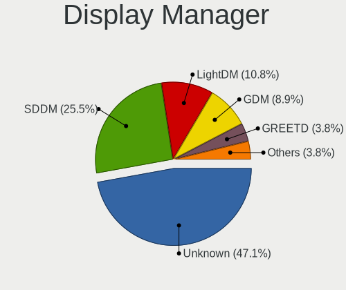
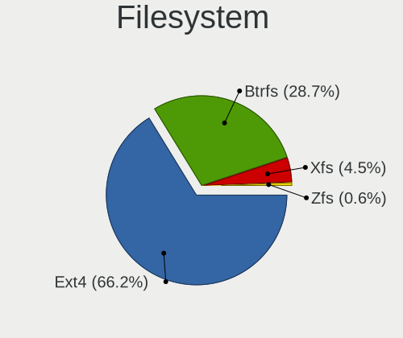
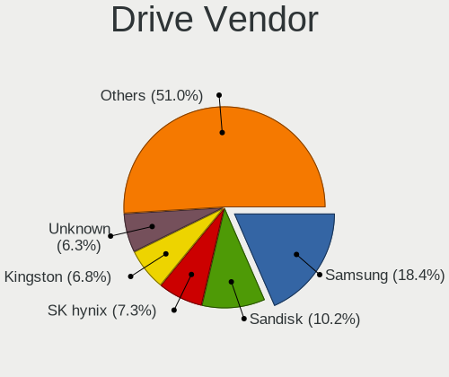
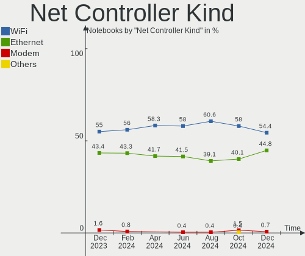

Arch - Hardware Trends (Notebooks)
----------------------------------

A project to identify most popular hardware characteristics and track their change
over time based on data collected by Linux users at https://Linux-Hardware.org.

Anyone can contribute to this report by the [hw-probe](https://github.com/linuxhw/hw-probe) tool:

    sudo -E hw-probe -all -upload

This report is for one last month. Overall report since the beginning of time: [TestDays](https://github.com/linuxhw/TestDays)

Period: Nov, 2023.

Contents
--------

* [ System ](#system)
  - [ OS                       ](#os)
  - [ OS Family                ](#os-family)
  - [ Kernel                   ](#kernel)
  - [ Kernel Family            ](#kernel-family)
  - [ Kernel Major Ver.        ](#kernel-major-ver)
  - [ Arch                     ](#arch)
  - [ DE                       ](#de)
  - [ Display Server           ](#display-server)
  - [ Display Manager          ](#display-manager)
  - [ OS Lang                  ](#os-lang)
  - [ Boot Mode                ](#boot-mode)
  - [ Filesystem               ](#filesystem)
  - [ Part. scheme             ](#part-scheme)
  - [ Dual Boot with Linux/BSD ](#dual-boot-with-linuxbsd)
  - [ Dual Boot (Win)          ](#dual-boot-win)

* [ Board ](#board)
  - [ Vendor                   ](#vendor)
  - [ Model                    ](#model)
  - [ Model Family             ](#model-family)
  - [ MFG Year                 ](#mfg-year)
  - [ Form Factor              ](#form-factor)
  - [ Secure Boot              ](#secure-boot)
  - [ Coreboot                 ](#coreboot)
  - [ RAM Size                 ](#ram-size)
  - [ RAM Used                 ](#ram-used)
  - [ Total Drives             ](#total-drives)
  - [ Has CD-ROM               ](#has-cd-rom)
  - [ Has Ethernet             ](#has-ethernet)
  - [ Has WiFi                 ](#has-wifi)
  - [ Has Bluetooth            ](#has-bluetooth)

* [ Location ](#location)
  - [ Country                  ](#country)
  - [ City                     ](#city)

* [ Drives ](#drives)
  - [ Drive Vendor             ](#drive-vendor)
  - [ Drive Model              ](#drive-model)
  - [ HDD Vendor               ](#hdd-vendor)
  - [ SSD Vendor               ](#ssd-vendor)
  - [ Drive Kind               ](#drive-kind)
  - [ Drive Connector          ](#drive-connector)
  - [ Drive Size               ](#drive-size)
  - [ Space Total              ](#space-total)
  - [ Space Used               ](#space-used)
  - [ Malfunc. Drives          ](#malfunc-drives)
  - [ Malfunc. Drive Vendor    ](#malfunc-drive-vendor)
  - [ Malfunc. HDD Vendor      ](#malfunc-hdd-vendor)
  - [ Malfunc. Drive Kind      ](#malfunc-drive-kind)
  - [ Failed Drives            ](#failed-drives)
  - [ Failed Drive Vendor      ](#failed-drive-vendor)
  - [ Drive Status             ](#drive-status)

* [ Storage controller ](#storage-controller)
  - [ Storage Vendor           ](#storage-vendor)
  - [ Storage Model            ](#storage-model)
  - [ Storage Kind             ](#storage-kind)

* [ Processor ](#processor)
  - [ CPU Vendor               ](#cpu-vendor)
  - [ CPU Model                ](#cpu-model)
  - [ CPU Model Family         ](#cpu-model-family)
  - [ CPU Cores                ](#cpu-cores)
  - [ CPU Sockets              ](#cpu-sockets)
  - [ CPU Threads              ](#cpu-threads)
  - [ CPU Op-Modes             ](#cpu-op-modes)
  - [ CPU Microcode            ](#cpu-microcode)
  - [ CPU Microarch            ](#cpu-microarch)

* [ Graphics ](#graphics)
  - [ GPU Vendor               ](#gpu-vendor)
  - [ GPU Model                ](#gpu-model)
  - [ GPU Combo                ](#gpu-combo)
  - [ GPU Driver               ](#gpu-driver)
  - [ GPU Memory               ](#gpu-memory)

* [ Monitor ](#monitor)
  - [ Monitor Vendor           ](#monitor-vendor)
  - [ Monitor Model            ](#monitor-model)
  - [ Monitor Resolution       ](#monitor-resolution)
  - [ Monitor Diagonal         ](#monitor-diagonal)
  - [ Monitor Width            ](#monitor-width)
  - [ Aspect Ratio             ](#aspect-ratio)
  - [ Monitor Area             ](#monitor-area)
  - [ Pixel Density            ](#pixel-density)
  - [ Multiple Monitors        ](#multiple-monitors)

* [ Network ](#network)
  - [ Net Controller Vendor    ](#net-controller-vendor)
  - [ Net Controller Model     ](#net-controller-model)
  - [ Wireless Vendor          ](#wireless-vendor)
  - [ Wireless Model           ](#wireless-model)
  - [ Ethernet Vendor          ](#ethernet-vendor)
  - [ Ethernet Model           ](#ethernet-model)
  - [ Net Controller Kind      ](#net-controller-kind)
  - [ Used Controller          ](#used-controller)
  - [ NICs                     ](#nics)
  - [ IPv6                     ](#ipv6)

* [ Bluetooth ](#bluetooth)
  - [ Bluetooth Vendor         ](#bluetooth-vendor)
  - [ Bluetooth Model          ](#bluetooth-model)

* [ Sound ](#sound)
  - [ Sound Vendor             ](#sound-vendor)
  - [ Sound Model              ](#sound-model)

* [ Memory ](#memory)
  - [ Memory Vendor            ](#memory-vendor)
  - [ Memory Model             ](#memory-model)
  - [ Memory Kind              ](#memory-kind)
  - [ Memory Form Factor       ](#memory-form-factor)
  - [ Memory Size              ](#memory-size)
  - [ Memory Speed             ](#memory-speed)

* [ Printers & scanners ](#printers--scanners)
  - [ Printer Vendor           ](#printer-vendor)
  - [ Printer Model            ](#printer-model)
  - [ Scanner Vendor           ](#scanner-vendor)
  - [ Scanner Model            ](#scanner-model)

* [ Camera ](#camera)
  - [ Camera Vendor            ](#camera-vendor)
  - [ Camera Model             ](#camera-model)

* [ Security ](#security)
  - [ Fingerprint Vendor       ](#fingerprint-vendor)
  - [ Fingerprint Model        ](#fingerprint-model)
  - [ Chipcard Vendor          ](#chipcard-vendor)
  - [ Chipcard Model           ](#chipcard-model)

* [ Unsupported ](#unsupported)
  - [ Unsupported Devices      ](#unsupported-devices)
  - [ Unsupported Device Types ](#unsupported-device-types)

System
------

OS
--

Installed operating systems

| Name         | Notebooks | Percent |
|--------------|-----------|---------|
| Arch Rolling | 156       | 100%    |

OS Family
---------

OS without a version

| Name | Notebooks | Percent |
|------|-----------|---------|
| Arch | 156       | 100%    |

Kernel
------

Version of the Linux kernel

| Version                     | Notebooks | Percent |
|-----------------------------|-----------|---------|
| 6.6.1-arch1-1               | 45        | 28.85%  |
| 6.5.9-arch2-1               | 31        | 19.87%  |
| 6.6.2-arch1-1               | 20        | 12.82%  |
| 6.6.1-zen1-1-zen            | 13        | 8.33%   |
| 6.5.9-zen2-1-zen            | 8         | 5.13%   |
| 6.6.2-zen1-1-zen            | 7         | 4.49%   |
| 6.5.7-arch1-1               | 4         | 2.56%   |
| 6.6.3-arch1-1               | 3         | 1.92%   |
| 6.1.62-1-lts                | 3         | 1.92%   |
| 6.5.4-arch2-1               | 2         | 1.28%   |
| 6.1.63-1-lts                | 2         | 1.28%   |
| 6.6.2-arch1-1-custom        | 1         | 0.64%   |
| 6.6.1-zen1-1.1-zen          | 1         | 0.64%   |
| 6.6.1-arch1-1-flowx13       | 1         | 0.64%   |
| 6.6.1-1-MANJARO             | 1         | 0.64%   |
| 6.6.1-1-clear               | 1         | 0.64%   |
| 6.6.0.15.realtime1-1-rt     | 1         | 0.64%   |
| 6.6.0-arch1-1               | 1         | 0.64%   |
| 6.6.0-AMD                   | 1         | 0.64%   |
| 6.5.9-301.fsync.fc39.x86_64 | 1         | 0.64%   |
| 6.5.8-arch1-1               | 1         | 0.64%   |
| 6.5.6-zen2-1-zen            | 1         | 0.64%   |
| 6.5.5-native_amd-xanmod1-1  | 1         | 0.64%   |
| 6.4.4-arch1-1               | 1         | 0.64%   |
| 6.4.12-arch1-1              | 1         | 0.64%   |
| 6.4.10-arch1-1              | 1         | 0.64%   |
| 6.1.7-HONOR-MGB-v3          | 1         | 0.64%   |
| 6.1.58-1-lts                | 1         | 0.64%   |
| 5.18.12-arch1-1             | 1         | 0.64%   |

Kernel Family
-------------

Linux kernel without a distro release

| Version  | Notebooks | Percent |
|----------|-----------|---------|
| 6.6.1    | 62        | 39.74%  |
| 6.5.9    | 40        | 25.64%  |
| 6.6.2    | 28        | 17.95%  |
| 6.5.7    | 4         | 2.56%   |
| 6.6.3    | 3         | 1.92%   |
| 6.1.62   | 3         | 1.92%   |
| 6.6.0    | 2         | 1.28%   |
| 6.5.4    | 2         | 1.28%   |
| 6.1.63   | 2         | 1.28%   |
| 6.6.0.15 | 1         | 0.64%   |
| 6.5.8    | 1         | 0.64%   |
| 6.5.6    | 1         | 0.64%   |
| 6.5.5    | 1         | 0.64%   |
| 6.4.4    | 1         | 0.64%   |
| 6.4.12   | 1         | 0.64%   |
| 6.4.10   | 1         | 0.64%   |
| 6.1.7    | 1         | 0.64%   |
| 6.1.58   | 1         | 0.64%   |
| 5.18.12  | 1         | 0.64%   |

Kernel Major Ver.
-----------------

Linux kernel major version

| Version | Notebooks | Percent |
|---------|-----------|---------|
| 6.6     | 95        | 60.9%   |
| 6.5     | 49        | 31.41%  |
| 6.1     | 7         | 4.49%   |
| 6.4     | 3         | 1.92%   |
| 6.6.0   | 1         | 0.64%   |
| 5.18    | 1         | 0.64%   |

Arch
----

OS architecture (x86_64, i586, etc.)

| Name   | Notebooks | Percent |
|--------|-----------|---------|
| x86_64 | 156       | 100%    |

DE
--

Desktop Environment

| Name           | Notebooks | Percent |
|----------------|-----------|---------|
| GNOME          | 59        | 37.82%  |
| KDE5           | 51        | 32.69%  |
| XFCE           | 13        | 8.33%   |
| Unknown        | 8         | 5.13%   |
| sway           | 5         | 3.21%   |
| i3             | 5         | 3.21%   |
| Hyprland       | 5         | 3.21%   |
| i3-with-shmlog | 2         | 1.28%   |
| X-Cinnamon     | 1         | 0.64%   |
| wayland        | 1         | 0.64%   |
| MATE           | 1         | 0.64%   |
| LXQt           | 1         | 0.64%   |
| KDE            | 1         | 0.64%   |
| dwm            | 1         | 0.64%   |
| DDE            | 1         | 0.64%   |
| Cinnamon       | 1         | 0.64%   |

Display Server
--------------

X11 or Wayland

| Name    | Notebooks | Percent |
|---------|-----------|---------|
| Wayland | 77        | 49.36%  |
| X11     | 60        | 38.46%  |
| Tty     | 13        | 8.33%   |
| Unknown | 6         | 3.85%   |

Display Manager
---------------

SDDM, LightDM, etc.

| Name    | Notebooks | Percent |
|---------|-----------|---------|
| Unknown | 62        | 39.74%  |
| SDDM    | 45        | 28.85%  |
| GDM     | 23        | 14.74%  |
| LightDM | 22        | 14.1%   |
| LY-DM   | 1         | 0.64%   |
| Ly      | 1         | 0.64%   |
| LXDM    | 1         | 0.64%   |
| EMPTTY  | 1         | 0.64%   |

OS Lang
-------

Language

| Lang       | Notebooks | Percent |
|------------|-----------|---------|
| en_US      | 90        | 57.69%  |
| it_IT      | 11        | 7.05%   |
| en_GB      | 11        | 7.05%   |
| C          | 6         | 3.85%   |
| pt_BR      | 5         | 3.21%   |
| fr_FR      | 5         | 3.21%   |
| ru_RU      | 4         | 2.56%   |
| de_DE      | 4         | 2.56%   |
| es_MX      | 3         | 1.92%   |
| es_CL      | 2         | 1.28%   |
| Unknown    | 2         | 1.28%   |
| zh_CN      | 1         | 0.64%   |
| uk_UA      | 1         | 0.64%   |
| tr_TR      | 1         | 0.64%   |
| sv_SE      | 1         | 0.64%   |
| pl_PL      | 1         | 0.64%   |
| es_ES.UTF8 | 1         | 0.64%   |
| es_ES      | 1         | 0.64%   |
| es_AR      | 1         | 0.64%   |
| en_IN      | 1         | 0.64%   |
| en_IE      | 1         | 0.64%   |
| en_CH      | 1         | 0.64%   |
| en-US      | 1         | 0.64%   |
| de_AT      | 1         | 0.64%   |

Boot Mode
---------

EFI or BIOS

| Mode | Notebooks | Percent |
|------|-----------|---------|
| EFI  | 104       | 66.67%  |
| BIOS | 52        | 33.33%  |

Filesystem
----------

Type of filesystem

| Type    | Notebooks | Percent |
|---------|-----------|---------|
| Ext4    | 95        | 60.9%   |
| Btrfs   | 46        | 29.49%  |
| Xfs     | 5         | 3.21%   |
| F2fs    | 4         | 2.56%   |
| Unknown | 3         | 1.92%   |
| Overlay | 2         | 1.28%   |
| Zfs     | 1         | 0.64%   |

Part. scheme
------------

Scheme of partitioning

| Type    | Notebooks | Percent |
|---------|-----------|---------|
| GPT     | 112       | 71.79%  |
| Unknown | 41        | 26.28%  |
| MBR     | 3         | 1.92%   |

Dual Boot with Linux/BSD
------------------------

Hosting more than one Linux/BSD

| Dual boot | Notebooks | Percent |
|-----------|-----------|---------|
| No        | 138       | 88.46%  |
| Yes       | 18        | 11.54%  |

Dual Boot (Win)
---------------

Hosting Linux and Windows

| Dual boot | Notebooks | Percent |
|-----------|-----------|---------|
| No        | 120       | 76.92%  |
| Yes       | 36        | 23.08%  |

Board
-----

Vendor
------

Motherboard manufacturer

| Name                | Notebooks | Percent |
|---------------------|-----------|---------|
| Lenovo              | 44        | 28.21%  |
| ASUSTek Computer    | 24        | 15.38%  |
| Hewlett-Packard     | 23        | 14.74%  |
| Dell                | 21        | 13.46%  |
| Acer                | 11        | 7.05%   |
| Apple               | 6         | 3.85%   |
| HUAWEI              | 4         | 2.56%   |
| Samsung Electronics | 3         | 1.92%   |
| Notebook            | 3         | 1.92%   |
| MSI                 | 3         | 1.92%   |
| Google              | 2         | 1.28%   |
| Valve               | 1         | 0.64%   |
| Timi                | 1         | 0.64%   |
| System76            | 1         | 0.64%   |
| Schenker            | 1         | 0.64%   |
| HONOR               | 1         | 0.64%   |
| Grupo Nucleo        | 1         | 0.64%   |
| Gigabyte Technology | 1         | 0.64%   |
| Fujitsu             | 1         | 0.64%   |
| Framework           | 1         | 0.64%   |
| Chuwi               | 1         | 0.64%   |
| Alienware           | 1         | 0.64%   |
| A14CR               | 1         | 0.64%   |

Model
-----

Motherboard model

| Name                                       | Notebooks | Percent |
|--------------------------------------------|-----------|---------|
| Lenovo ThinkPad T14s Gen 3 21CQCTO1WW      | 2         | 1.28%   |
| Lenovo ThinkPad P14s Gen 4 21K5CTO1WW      | 2         | 1.28%   |
| Lenovo IdeaPad 3 15ITL6 82H8               | 2         | 1.28%   |
| HP Laptop 15s-eq2xxx                       | 2         | 1.28%   |
| HP 255 G8 Notebook PC                      | 2         | 1.28%   |
| Acer Nitro AN515-54                        | 2         | 1.28%   |
| Valve Jupiter                              | 1         | 0.64%   |
| Timi TM1604                                | 1         | 0.64%   |
| System76 Pangolin                          | 1         | 0.64%   |
| Schenker XMG FUSION 15 (XFU15M22)          | 1         | 0.64%   |
| Samsung QX311/QX411/QX412/QX511            | 1         | 0.64%   |
| Samsung 750XDA                             | 1         | 0.64%   |
| Samsung 300E5M/300E5L                      | 1         | 0.64%   |
| Notebook NJ50_70CU                         | 1         | 0.64%   |
| Notebook N85_N87,HJ,HJ1,HK1                | 1         | 0.64%   |
| Notebook N141CU                            | 1         | 0.64%   |
| MSI GV62 7RE                               | 1         | 0.64%   |
| MSI GF75 Thin 10SC                         | 1         | 0.64%   |
| MSI Bravo 17 C7VF                          | 1         | 0.64%   |
| Lenovo Yoga Slim 7 14IIL05 82A1            | 1         | 0.64%   |
| Lenovo ThinkPad Z13 Gen 1 21D2001SUS       | 1         | 0.64%   |
| Lenovo ThinkPad X1 Carbon Gen 9 20XW003FUS | 1         | 0.64%   |
| Lenovo ThinkPad X1 Carbon 5th 20HQS01A0B   | 1         | 0.64%   |
| Lenovo ThinkPad X1 Carbon 4th 20FB007RUS   | 1         | 0.64%   |
| Lenovo ThinkPad T480s 20L7004PGE           | 1         | 0.64%   |
| Lenovo ThinkPad T470 20HES04Q00            | 1         | 0.64%   |
| Lenovo ThinkPad T450 20BUS00700            | 1         | 0.64%   |
| Lenovo ThinkPad T420 42369N1               | 1         | 0.64%   |
| Lenovo ThinkPad T14s Gen1 20UH0019RT       | 1         | 0.64%   |
| Lenovo ThinkPad T14s Gen 3 21CQ000GUS      | 1         | 0.64%   |
| Lenovo ThinkPad T14s Gen 1 20UH001ART      | 1         | 0.64%   |
| Lenovo ThinkPad P52s 20LCA0ANUK            | 1         | 0.64%   |
| Lenovo ThinkPad P51 20HJS16Q0K             | 1         | 0.64%   |
| Lenovo ThinkPad P16v Gen 1 21FCA001CD      | 1         | 0.64%   |
| Lenovo ThinkPad P16 Gen 2 21FACTO1WW       | 1         | 0.64%   |
| Lenovo ThinkPad P14s Gen 4 21K5000JGE      | 1         | 0.64%   |
| Lenovo ThinkPad L390 20NRCTO1WW            | 1         | 0.64%   |
| Lenovo ThinkPad Edge E431 62771G5          | 1         | 0.64%   |
| Lenovo ThinkPad E15 Gen 4 21E6004VGE       | 1         | 0.64%   |
| Lenovo ThinkBook 16 G5+ ARP 21J0           | 1         | 0.64%   |

Model Family
------------

Motherboard model prefix

| Name               | Notebooks | Percent |
|--------------------|-----------|---------|
| Lenovo ThinkPad    | 23        | 14.74%  |
| Lenovo IdeaPad     | 13        | 8.33%   |
| ASUS VivoBook      | 11        | 7.05%   |
| Dell Latitude      | 9         | 5.77%   |
| HP Laptop          | 6         | 3.85%   |
| HP EliteBook       | 6         | 3.85%   |
| Lenovo Legion      | 5         | 3.21%   |
| Acer Aspire        | 5         | 3.21%   |
| HP Pavilion        | 4         | 2.56%   |
| Dell Inspiron      | 4         | 2.56%   |
| Acer Nitro         | 4         | 2.56%   |
| ASUS ROG           | 3         | 1.92%   |
| HP ProBook         | 2         | 1.28%   |
| HP 255             | 2         | 1.28%   |
| Dell G3            | 2         | 1.28%   |
| ASUS ZenBook       | 2         | 1.28%   |
| ASUS ASUS          | 2         | 1.28%   |
| Apple MacBookPro11 | 2         | 1.28%   |
| Acer Swift         | 2         | 1.28%   |
| Valve Jupiter      | 1         | 0.64%   |
| Timi TM1604        | 1         | 0.64%   |
| System76 Pangolin  | 1         | 0.64%   |
| Schenker XMG       | 1         | 0.64%   |
| Samsung QX311      | 1         | 0.64%   |
| Samsung 750XDA     | 1         | 0.64%   |
| Samsung 300E5M     | 1         | 0.64%   |
| Notebook NJ50      | 1         | 0.64%   |
| Notebook N85       | 1         | 0.64%   |
| Notebook N141CU    | 1         | 0.64%   |
| MSI GV62           | 1         | 0.64%   |
| MSI GF75           | 1         | 0.64%   |
| MSI Bravo          | 1         | 0.64%   |
| Lenovo Yoga        | 1         | 0.64%   |
| Lenovo ThinkBook   | 1         | 0.64%   |
| Lenovo B5400       | 1         | 0.64%   |
| HUAWEI NBLK-WAX9X  | 1         | 0.64%   |
| HUAWEI HVY-WXX9    | 1         | 0.64%   |
| HUAWEI BOM-WXX9    | 1         | 0.64%   |
| HUAWEI BOD-WXX9    | 1         | 0.64%   |
| HONOR HYM-WXX      | 1         | 0.64%   |

MFG Year
--------

Motherboard manufacture year

| Year | Notebooks | Percent |
|------|-----------|---------|
| 2021 | 24        | 15.38%  |
| 2023 | 23        | 14.74%  |
| 2022 | 20        | 12.82%  |
| 2020 | 18        | 11.54%  |
| 2017 | 15        | 9.62%   |
| 2018 | 11        | 7.05%   |
| 2019 | 10        | 6.41%   |
| 2012 | 7         | 4.49%   |
| 2016 | 6         | 3.85%   |
| 2013 | 6         | 3.85%   |
| 2014 | 5         | 3.21%   |
| 2011 | 4         | 2.56%   |
| 2015 | 3         | 1.92%   |
| 2007 | 2         | 1.28%   |
| 2010 | 1         | 0.64%   |
| 2008 | 1         | 0.64%   |

Form Factor
-----------

Physical design of the computer

| Name     | Notebooks | Percent |
|----------|-----------|---------|
| Notebook | 156       | 100%    |

Secure Boot
-----------

Enabled or disabled

| State    | Notebooks | Percent |
|----------|-----------|---------|
| Disabled | 154       | 98.72%  |
| Enabled  | 2         | 1.28%   |

Coreboot
--------

Have coreboot on board

| Used | Notebooks | Percent |
|------|-----------|---------|
| No   | 154       | 98.72%  |
| Yes  | 2         | 1.28%   |

RAM Size
--------

Total RAM memory

| Size in GB  | Notebooks | Percent |
|-------------|-----------|---------|
| 4.01-8.0    | 44        | 28.21%  |
| 16.01-24.0  | 37        | 23.72%  |
| 8.01-16.0   | 28        | 17.95%  |
| 32.01-64.0  | 21        | 13.46%  |
| 3.01-4.0    | 12        | 7.69%   |
| 24.01-32.0  | 7         | 4.49%   |
| 64.01-256.0 | 6         | 3.85%   |
| 2.01-3.0    | 1         | 0.64%   |

RAM Used
--------

Used RAM memory

| Used GB    | Notebooks | Percent |
|------------|-----------|---------|
| 4.01-8.0   | 48        | 30.77%  |
| 3.01-4.0   | 32        | 20.51%  |
| 2.01-3.0   | 32        | 20.51%  |
| 1.01-2.0   | 23        | 14.74%  |
| 8.01-16.0  | 17        | 10.9%   |
| 0.51-1.0   | 2         | 1.28%   |
| 24.01-32.0 | 1         | 0.64%   |
| 16.01-24.0 | 1         | 0.64%   |

Total Drives
------------

Number of drives on board

| Drives | Notebooks | Percent |
|--------|-----------|---------|
| 1      | 111       | 71.15%  |
| 2      | 39        | 25%     |
| 3      | 5         | 3.21%   |
| 4      | 1         | 0.64%   |

Has CD-ROM
----------

Has CD-ROM on board

| Presented | Notebooks | Percent |
|-----------|-----------|---------|
| No        | 137       | 87.82%  |
| Yes       | 19        | 12.18%  |

Has Ethernet
------------

Has Ethernet on board

| Presented | Notebooks | Percent |
|-----------|-----------|---------|
| Yes       | 107       | 68.59%  |
| No        | 49        | 31.41%  |

Has WiFi
--------

Has WiFi module

| Presented | Notebooks | Percent |
|-----------|-----------|---------|
| Yes       | 155       | 99.36%  |
| No        | 1         | 0.64%   |

Has Bluetooth
-------------

Has Bluetooth module

| Presented | Notebooks | Percent |
|-----------|-----------|---------|
| Yes       | 143       | 91.67%  |
| No        | 13        | 8.33%   |

Location
--------

Country
-------

Geographic location (country)

| Country     | Notebooks | Percent |
|-------------|-----------|---------|
| USA         | 21        | 13.46%  |
| Italy       | 20        | 12.82%  |
| Germany     | 13        | 8.33%   |
| Russia      | 9         | 5.77%   |
| France      | 9         | 5.77%   |
| Brazil      | 8         | 5.13%   |
| Mexico      | 7         | 4.49%   |
| India       | 7         | 4.49%   |
| UK          | 4         | 2.56%   |
| Poland      | 4         | 2.56%   |
| Netherlands | 4         | 2.56%   |
| Thailand    | 3         | 1.92%   |
| Turkey      | 2         | 1.28%   |
| Sweden      | 2         | 1.28%   |
| Portugal    | 2         | 1.28%   |
| Lithuania   | 2         | 1.28%   |
| Iran        | 2         | 1.28%   |
| Indonesia   | 2         | 1.28%   |
| Czechia     | 2         | 1.28%   |
| China       | 2         | 1.28%   |
| Chile       | 2         | 1.28%   |
| Austria     | 2         | 1.28%   |
| Ukraine     | 1         | 0.64%   |
| UAE         | 1         | 0.64%   |
| Taiwan      | 1         | 0.64%   |
| Switzerland | 1         | 0.64%   |
| Sri Lanka   | 1         | 0.64%   |
| Spain       | 1         | 0.64%   |
| Slovenia    | 1         | 0.64%   |
| Slovakia    | 1         | 0.64%   |
| Romania     | 1         | 0.64%   |
| Panama      | 1         | 0.64%   |
| Norway      | 1         | 0.64%   |
| Luxembourg  | 1         | 0.64%   |
| Latvia      | 1         | 0.64%   |
| Kazakhstan  | 1         | 0.64%   |
| Jordan      | 1         | 0.64%   |
| Hungary     | 1         | 0.64%   |
| Greece      | 1         | 0.64%   |
| Egypt       | 1         | 0.64%   |

City
----

Geographic location (city)

| City                 | Notebooks | Percent |
|----------------------|-----------|---------|
| Moscow               | 4         | 2.56%   |
| Chennai              | 3         | 1.92%   |
| Xalapa               | 2         | 1.28%   |
| Vienna               | 2         | 1.28%   |
| Tehran               | 2         | 1.28%   |
| Sao Paulo            | 2         | 1.28%   |
| Santiago             | 2         | 1.28%   |
| Rome                 | 2         | 1.28%   |
| Milan                | 2         | 1.28%   |
| La Broque            | 2         | 1.28%   |
| Delhi                | 2         | 1.28%   |
| Borlänge            | 2         | 1.28%   |
| Berlin               | 2         | 1.28%   |
| Yerevan              | 1         | 0.64%   |
| Wichita              | 1         | 0.64%   |
| Wetzlar              | 1         | 0.64%   |
| Wageningen           | 1         | 0.64%   |
| Vilnius              | 1         | 0.64%   |
| Vibo Valentia        | 1         | 0.64%   |
| Turin                | 1         | 0.64%   |
| Tlalnepantla         | 1         | 0.64%   |
| Thessaloniki         | 1         | 0.64%   |
| Tetange              | 1         | 0.64%   |
| Taoyuan District     | 1         | 0.64%   |
| Tangerang            | 1         | 0.64%   |
| Strasbourg           | 1         | 0.64%   |
| St Petersburg        | 1         | 0.64%   |
| Somerville           | 1         | 0.64%   |
| Sokal                | 1         | 0.64%   |
| Slough               | 1         | 0.64%   |
| Sinzig               | 1         | 0.64%   |
| Shenzhen             | 1         | 0.64%   |
| Satuba               | 1         | 0.64%   |
| Sassuolo             | 1         | 0.64%   |
| Sartrouville         | 1         | 0.64%   |
| Sarasota             | 1         | 0.64%   |
| Sarajevo             | 1         | 0.64%   |
| Sao Luís            | 1         | 0.64%   |
| Sanford              | 1         | 0.64%   |
| San Giovanni Teatino | 1         | 0.64%   |

Drives
------

Drive Vendor
------------

Hard drive vendors

| Vendor                      | Notebooks | Drives | Percent |
|-----------------------------|-----------|--------|---------|
| Samsung Electronics         | 38        | 40     | 18.91%  |
| SanDisk                     | 22        | 22     | 10.95%  |
| SK hynix                    | 18        | 18     | 8.96%   |
| WDC                         | 12        | 12     | 5.97%   |
| Micron Technology           | 12        | 12     | 5.97%   |
| Intel                       | 12        | 12     | 5.97%   |
| Seagate                     | 9         | 10     | 4.48%   |
| Toshiba                     | 7         | 7      | 3.48%   |
| Unknown                     | 6         | 6      | 2.99%   |
| Kingston                    | 6         | 6      | 2.99%   |
| Crucial                     | 6         | 6      | 2.99%   |
| A-DATA Technology           | 5         | 5      | 2.49%   |
| Micron/Crucial Technology   | 4         | 4      | 1.99%   |
| Solid State Storage         | 3         | 3      | 1.49%   |
| MAXIO Technology (Hangzhou) | 3         | 3      | 1.49%   |
| KIOXIA                      | 3         | 4      | 1.49%   |
| Apple                       | 3         | 3      | 1.49%   |
| Silicon Motion              | 2         | 2      | 1%      |
| Netac                       | 2         | 3      | 1%      |
| Kingston Technology Company | 2         | 2      | 1%      |
| Union Memory (Shenzhen)     | 1         | 1      | 0.5%    |
| Supersonic                  | 1         | 1      | 0.5%    |
| SSK                         | 1         | 1      | 0.5%    |
| SPCC                        | 1         | 1      | 0.5%    |
| sobetter                    | 1         | 1      | 0.5%    |
| SABRENT                     | 1         | 1      | 0.5%    |
| Realtek                     | 1         | 1      | 0.5%    |
| PNY                         | 1         | 1      | 0.5%    |
| Phison Electronics          | 1         | 1      | 0.5%    |
| O2 Micro                    | 1         | 1      | 0.5%    |
| NeoTech                     | 1         | 1      | 0.5%    |
| Mushkin                     | 1         | 2      | 0.5%    |
| LITEON                      | 1         | 1      | 0.5%    |
| Lexar                       | 1         | 1      | 0.5%    |
| Lenovo                      | 1         | 1      | 0.5%    |
| Kingchuxing                 | 1         | 1      | 0.5%    |
| HS-SSD-E100                 | 1         | 1      | 0.5%    |
| Hitachi                     | 1         | 1      | 0.5%    |
| HGST                        | 1         | 1      | 0.5%    |
| Fujitsu                     | 1         | 1      | 0.5%    |

Drive Model
-----------

Hard drive models

| Model                                               | Notebooks | Percent |
|-----------------------------------------------------|-----------|---------|
| Samsung NVMe SSD Controller SM981/PM981/PM983 250GB | 10        | 4.95%   |
| Samsung NVMe SSD Controller PM9A1/PM9A3/980PRO 2TB  | 8         | 3.96%   |
| Intel SSDPEKNU512GZ 512GB                           | 4         | 1.98%   |
| Seagate ST1000LM035-1RK172 1TB                      | 3         | 1.49%   |
| Samsung NVMe SSD Controller SM961/PM961/SM963 256GB | 3         | 1.49%   |
| Unknown MMC Card  64GB                              | 2         | 0.99%   |
| Unknown MMC Card  128GB                             | 2         | 0.99%   |
| Toshiba XG4 NVMe SSD Controller 512GB               | 2         | 0.99%   |
| Solid State Storage CL1-3D256-Q11 NVMe SSSTC 256GB  | 2         | 0.99%   |
| SK hynix SKHynix_HFS512GEJ9X115N 512GB              | 2         | 0.99%   |
| SK hynix BC511 512GB                                | 2         | 0.99%   |
| Sandisk WD_BLACK SN770 2TB                          | 2         | 0.99%   |
| Sandisk WD Blue SN550 NVMe SSD 512GB                | 2         | 0.99%   |
| Sandisk WD Black SN750 / PC SN730 NVMe SSD 500GB    | 2         | 0.99%   |
| Samsung MZVLQ512HBLU-00BH1 512GB                    | 2         | 0.99%   |
| Micron/Crucial P2 NVMe PCIe SSD 1TB                 | 2         | 0.99%   |
| Micron MTFDKCD256TFK 256GB                          | 2         | 0.99%   |
| Micron MTFDHBA512QFD 512GB                          | 2         | 0.99%   |
| Micron 3400_MTFDKBA512TFH 512GB                     | 2         | 0.99%   |
| MAXIO (Hangzhou) NVMe SSD Controller MAP1202 1024GB | 2         | 0.99%   |
| Kingston Company SNV2S1000G 1TB                     | 2         | 0.99%   |
| Kingston SA400S37240G 240GB SSD                     | 2         | 0.99%   |
| Intel SSDPEKNU512GZH 512GB                          | 2         | 0.99%   |
| Intel SSD 600P Series 256GB                         | 2         | 0.99%   |
| Crucial CT480BX500SSD1 480GB                        | 2         | 0.99%   |
| Crucial CT1000MX500SSD1 1TB                         | 2         | 0.99%   |
| WDC WDS250G2B0B-00YS70 250GB SSD                    | 1         | 0.5%    |
| WDC WDS100T2G0A-00JH30 1TB SSD                      | 1         | 0.5%    |
| WDC WDS100T2B0A-00SM50 1TB SSD                      | 1         | 0.5%    |
| WDC WD5000LPVX-80V0TT0 500GB                        | 1         | 0.5%    |
| WDC WD5000LPVX-75V0TT0 500GB                        | 1         | 0.5%    |
| WDC WD5000LPVX-22V0TT0 500GB                        | 1         | 0.5%    |
| WDC WD20SPZX-75UA7T0 2TB                            | 1         | 0.5%    |
| WDC WD20SPZX-00UA7T0 2TB                            | 1         | 0.5%    |
| WDC WD10SPZX-24Z10 1TB                              | 1         | 0.5%    |
| WDC WD10SPZX-21Z10T0 1TB                            | 1         | 0.5%    |
| WDC WD10JPVX-22JC3T0 1TB                            | 1         | 0.5%    |
| WDC WD Game Drive 4TB                               | 1         | 0.5%    |
| Unknown NVMe SSD Drive 1TB                          | 1         | 0.5%    |
| Unknown MMC Card  4GB                               | 1         | 0.5%    |

HDD Vendor
----------

Hard disk drive vendors

| Vendor  | Notebooks | Drives | Percent |
|---------|-----------|--------|---------|
| Seagate | 9         | 10     | 36%     |
| WDC     | 8         | 8      | 32%     |
| Toshiba | 3         | 3      | 12%     |
| SABRENT | 1         | 1      | 4%      |
| NeoTech | 1         | 1      | 4%      |
| Hitachi | 1         | 1      | 4%      |
| HGST    | 1         | 1      | 4%      |
| Fujitsu | 1         | 1      | 4%      |

SSD Vendor
----------

Solid state drive vendors

| Vendor              | Notebooks | Drives | Percent |
|---------------------|-----------|--------|---------|
| Samsung Electronics | 7         | 8      | 15.22%  |
| SanDisk             | 6         | 6      | 13.04%  |
| Crucial             | 6         | 6      | 13.04%  |
| WDC                 | 3         | 3      | 6.52%   |
| Kingston            | 3         | 3      | 6.52%   |
| Apple               | 3         | 3      | 6.52%   |
| A-DATA Technology   | 3         | 3      | 6.52%   |
| SK hynix            | 2         | 2      | 4.35%   |
| Toshiba             | 1         | 1      | 2.17%   |
| Supersonic          | 1         | 1      | 2.17%   |
| SPCC                | 1         | 1      | 2.17%   |
| PNY                 | 1         | 1      | 2.17%   |
| Netac               | 1         | 2      | 2.17%   |
| Mushkin             | 1         | 2      | 2.17%   |
| LITEON              | 1         | 1      | 2.17%   |
| Lexar               | 1         | 1      | 2.17%   |
| Intel               | 1         | 1      | 2.17%   |
| HS-SSD-E100         | 1         | 1      | 2.17%   |
| Fanxiang            | 1         | 1      | 2.17%   |
| China               | 1         | 1      | 2.17%   |
| Apacer              | 1         | 1      | 2.17%   |

Drive Kind
----------

HDD or SSD

| Kind    | Notebooks | Drives | Percent |
|---------|-----------|--------|---------|
| NVMe    | 108       | 123    | 58.06%  |
| SSD     | 44        | 49     | 23.66%  |
| HDD     | 25        | 26     | 13.44%  |
| MMC     | 6         | 6      | 3.23%   |
| Unknown | 3         | 3      | 1.61%   |

Drive Connector
---------------

SATA, SAS, NVMe, etc.

| Type | Notebooks | Drives | Percent |
|------|-----------|--------|---------|
| NVMe | 107       | 121    | 58.79%  |
| SATA | 60        | 71     | 32.97%  |
| SAS  | 9         | 9      | 4.95%   |
| MMC  | 6         | 6      | 3.3%    |

Drive Size
----------

Size of hard drive

| Size in TB | Notebooks | Drives | Percent |
|------------|-----------|--------|---------|
| 0.01-0.5   | 42        | 48     | 60.87%  |
| 0.51-1.0   | 21        | 21     | 30.43%  |
| 1.01-2.0   | 6         | 6      | 8.7%    |

Space Total
-----------

Amount of disk space available on the file system

| Size in GB     | Notebooks | Percent |
|----------------|-----------|---------|
| 251-500        | 46        | 29.49%  |
| 501-1000       | 32        | 20.51%  |
| 101-250        | 29        | 18.59%  |
| 1001-2000      | 22        | 14.1%   |
| More than 3000 | 11        | 7.05%   |
| 2001-3000      | 5         | 3.21%   |
| 51-100         | 5         | 3.21%   |
| 21-50          | 2         | 1.28%   |
| 1-20           | 2         | 1.28%   |
| Unknown        | 2         | 1.28%   |

Space Used
----------

Amount of used disk space

| Used GB        | Notebooks | Percent |
|----------------|-----------|---------|
| 101-250        | 41        | 26.28%  |
| 1-20           | 26        | 16.67%  |
| 51-100         | 23        | 14.74%  |
| 21-50          | 21        | 13.46%  |
| 501-1000       | 20        | 12.82%  |
| 251-500        | 13        | 8.33%   |
| 1001-2000      | 5         | 3.21%   |
| More than 3000 | 3         | 1.92%   |
| 2001-3000      | 2         | 1.28%   |
| Unknown        | 2         | 1.28%   |

Malfunc. Drives
---------------

Drive models with a malfunction

| Model                          | Notebooks | Drives | Percent |
|--------------------------------|-----------|--------|---------|
| WDC WD20SPZX-75UA7T0 2TB       | 1         | 1      | 16.67%  |
| Seagate ST95005620AS 500GB     | 1         | 2      | 16.67%  |
| Seagate ST1000LM035-1RK172 1TB | 1         | 1      | 16.67%  |
| SanDisk SSD U100 24GB          | 1         | 1      | 16.67%  |
| Hitachi HTS723216L9A360 160GB  | 1         | 1      | 16.67%  |
| Fujitsu MHW2080BH PL 80GB      | 1         | 1      | 16.67%  |

Malfunc. Drive Vendor
---------------------

Vendors of faulty drives

| Vendor  | Notebooks | Drives | Percent |
|---------|-----------|--------|---------|
| Seagate | 2         | 3      | 33.33%  |
| WDC     | 1         | 1      | 16.67%  |
| SanDisk | 1         | 1      | 16.67%  |
| Hitachi | 1         | 1      | 16.67%  |
| Fujitsu | 1         | 1      | 16.67%  |

Malfunc. HDD Vendor
-------------------

Vendors of faulty HDD drives

| Vendor  | Notebooks | Drives | Percent |
|---------|-----------|--------|---------|
| Seagate | 2         | 3      | 40%     |
| WDC     | 1         | 1      | 20%     |
| Hitachi | 1         | 1      | 20%     |
| Fujitsu | 1         | 1      | 20%     |

Malfunc. Drive Kind
-------------------

Kinds of faulty drives

| Kind | Notebooks | Drives | Percent |
|------|-----------|--------|---------|
| HDD  | 5         | 6      | 83.33%  |
| SSD  | 1         | 1      | 16.67%  |

Failed Drives
-------------

Failed drive models

Zero info for selected period =(

Failed Drive Vendor
-------------------

Failed drive vendors

Zero info for selected period =(

Drive Status
------------

Number of failed and malfunc. drives

| Status   | Notebooks | Drives | Percent |
|----------|-----------|--------|---------|
| Works    | 92        | 113    | 56.1%   |
| Detected | 66        | 87     | 40.24%  |
| Malfunc  | 6         | 7      | 3.66%   |

Storage controller
------------------

Storage Vendor
--------------

Storage controller vendors

| Vendor                         | Notebooks | Percent |
|--------------------------------|-----------|---------|
| Intel                          | 83        | 40.89%  |
| Samsung Electronics            | 32        | 15.76%  |
| SK hynix                       | 16        | 7.88%   |
| SanDisk                        | 16        | 7.88%   |
| Micron Technology              | 12        | 5.91%   |
| AMD                            | 10        | 4.93%   |
| Kingston Technology Company    | 5         | 2.46%   |
| Micron/Crucial Technology      | 4         | 1.97%   |
| Toshiba America Info Systems   | 3         | 1.48%   |
| Solid State Storage Technology | 3         | 1.48%   |
| MAXIO Technology (Hangzhou)    | 3         | 1.48%   |
| KIOXIA                         | 3         | 1.48%   |
| Silicon Motion                 | 2         | 0.99%   |
| ADATA Technology               | 2         | 0.99%   |
| Union Memory (Shenzhen)        | 1         | 0.49%   |
| Solidigm                       | 1         | 0.49%   |
| Phison Electronics             | 1         | 0.49%   |
| O2 Micro                       | 1         | 0.49%   |
| Netac Technology               | 1         | 0.49%   |
| Marvell Technology Group       | 1         | 0.49%   |
| Lenovo                         | 1         | 0.49%   |
| INNOGRIT                       | 1         | 0.49%   |
| Biwin Storage Technology       | 1         | 0.49%   |

Storage Model
-------------

Storage controller models

| Model                                                                        | Notebooks | Percent |
|------------------------------------------------------------------------------|-----------|---------|
| Intel Volume Management Device NVMe RAID Controller                          | 12        | 5.45%   |
| Samsung NVMe SSD Controller SM981/PM981/PM983                                | 11        | 5%      |
| Intel Sunrise Point-LP SATA Controller [AHCI mode]                           | 11        | 5%      |
| Intel 82801 Mobile SATA Controller [RAID mode]                               | 11        | 5%      |
| AMD FCH SATA Controller [AHCI mode]                                          | 9         | 4.09%   |
| Samsung NVMe SSD Controller PM9A1/PM9A3/980PRO                               | 8         | 3.64%   |
| Intel SSD 670p Series [Keystone Harbor]                                      | 8         | 3.64%   |
| Intel 7 Series Chipset Family 6-port SATA Controller [AHCI mode]             | 7         | 3.18%   |
| SK hynix Platinum P41/PC801 NVMe Solid State Drive                           | 6         | 2.73%   |
| SanDisk WD Black SN770 / PC SN740 256GB / PC SN560 (DRAM-less) NVMe SSD      | 6         | 2.73%   |
| Samsung NVMe SSD Controller 980 (DRAM-less)                                  | 5         | 2.27%   |
| Micron 2450 NVMe SSD [HendrixV] (DRAM-less)                                  | 5         | 2.27%   |
| Intel HM170/QM170 Chipset SATA Controller [AHCI Mode]                        | 5         | 2.27%   |
| Intel Cannon Lake Mobile PCH SATA AHCI Controller                            | 5         | 2.27%   |
| SK hynix Gold P31/BC711/PC711 NVMe Solid State Drive                         | 4         | 1.82%   |
| Intel Volume Management Device NVMe RAID Controller Intel Corporation        | 4         | 1.82%   |
| Intel Tiger Lake-LP SATA Controller                                          | 4         | 1.82%   |
| Solid State Storage CL1-3D256-Q11 NVMe SSD M.2                               | 3         | 1.36%   |
| SK hynix BC901 NVMe Solid State Drive (DRAM-less)                            | 3         | 1.36%   |
| Samsung NVMe SSD Controller SM961/PM961/SM963                                | 3         | 1.36%   |
| Samsung NVMe SSD Controller PM9B1 (DRAM-less)                                | 3         | 1.36%   |
| Kingston Company NV2 NVMe SSD SM2267XT                                       | 3         | 1.36%   |
| Intel Comet Lake SATA AHCI Controller                                        | 3         | 1.36%   |
| Intel Alder Lake-P SATA AHCI Controller                                      | 3         | 1.36%   |
| Intel 8 Series SATA Controller 1 [AHCI mode]                                 | 3         | 1.36%   |
| Intel 6 Series/C200 Series Chipset Family 6 port Mobile SATA AHCI Controller | 3         | 1.36%   |
| Toshiba America Info Systems XG4 NVMe SSD Controller                         | 2         | 0.91%   |
| SK hynix BC511 NVMe SSD                                                      | 2         | 0.91%   |
| SanDisk Ultra 3D / WD Blue SN550 NVMe SSD                                    | 2         | 0.91%   |
| SanDisk Extreme Pro / WD Black SN750 / PC SN730 / Red SN700 NVMe SSD         | 2         | 0.91%   |
| Micron/Crucial P2 [Nick P2] / P3 / P3 Plus NVMe PCIe SSD (DRAM-less)         | 2         | 0.91%   |
| Micron 3400 NVMe SSD [Hendrix]                                               | 2         | 0.91%   |
| Micron 2210 NVMe SSD [Cobain]                                                | 2         | 0.91%   |
| Micron 2200S NVMe SSD [Cassandra]                                            | 2         | 0.91%   |
| MAXIO (Hangzhou) NVMe SSD Controller MAP1202                                 | 2         | 0.91%   |
| KIOXIA NVMe SSD Controller BG4 (DRAM-less)                                   | 2         | 0.91%   |
| Intel SSD 600P Series                                                        | 2         | 0.91%   |
| Intel Ice Lake-LP SATA Controller [AHCI mode]                                | 2         | 0.91%   |
| Intel Celeron/Pentium Silver Processor SATA Controller                       | 2         | 0.91%   |
| Intel 400 Series Chipset Family SATA AHCI Controller                         | 2         | 0.91%   |

Storage Kind
------------

Kind of storage controller (IDE, SATA, NVMe, SAS, ...)

| Kind | Notebooks | Percent |
|------|-----------|---------|
| NVMe | 107       | 51.69%  |
| SATA | 70        | 33.82%  |
| RAID | 27        | 13.04%  |
| IDE  | 3         | 1.45%   |

Processor
---------

CPU Vendor
----------

Processor vendors

| Vendor | Notebooks | Percent |
|--------|-----------|---------|
| Intel  | 108       | 69.23%  |
| AMD    | 48        | 30.77%  |

CPU Model
---------

Processor models

| Model                                         | Notebooks | Percent |
|-----------------------------------------------|-----------|---------|
| Intel 11th Gen Core i5-1135G7 @ 2.40GHz       | 6         | 3.85%   |
| Intel Core i5-8250U CPU @ 1.60GHz             | 4         | 2.56%   |
| Intel 11th Gen Core i7-1165G7 @ 2.80GHz       | 4         | 2.56%   |
| AMD Ryzen 5 5500U with Radeon Graphics        | 4         | 2.56%   |
| Intel Core i5-7300U CPU @ 2.60GHz             | 3         | 1.92%   |
| Intel Core i5-7300HQ CPU @ 2.50GHz            | 3         | 1.92%   |
| Intel 11th Gen Core i7-11800H @ 2.30GHz       | 3         | 1.92%   |
| AMD Ryzen 7 PRO 7840U w/ Radeon 780M Graphics | 3         | 1.92%   |
| AMD Ryzen 7 PRO 6850U with Radeon Graphics    | 3         | 1.92%   |
| AMD Ryzen 7 5700U with Radeon Graphics        | 3         | 1.92%   |
| Intel Core m5-6Y57 CPU @ 1.10GHz              | 2         | 1.28%   |
| Intel Core i7-9750H CPU @ 2.60GHz             | 2         | 1.28%   |
| Intel Core i7-8565U CPU @ 1.80GHz             | 2         | 1.28%   |
| Intel Core i7-8550U CPU @ 1.80GHz             | 2         | 1.28%   |
| Intel Core i7-7700HQ CPU @ 2.80GHz            | 2         | 1.28%   |
| Intel Core i7-7500U CPU @ 2.70GHz             | 2         | 1.28%   |
| Intel Core i7-6500U CPU @ 2.50GHz             | 2         | 1.28%   |
| Intel Core i7-3632QM CPU @ 2.20GHz            | 2         | 1.28%   |
| Intel Core i7-10510U CPU @ 1.80GHz            | 2         | 1.28%   |
| Intel Core i5-9300H CPU @ 2.40GHz             | 2         | 1.28%   |
| Intel Core i3-3217U CPU @ 1.80GHz             | 2         | 1.28%   |
| Intel Core i3-1005G1 CPU @ 1.20GHz            | 2         | 1.28%   |
| Intel 13th Gen Core i9-13900H                 | 2         | 1.28%   |
| Intel 12th Gen Core i7-12700H                 | 2         | 1.28%   |
| Intel 12th Gen Core i7-1255U                  | 2         | 1.28%   |
| Intel 12th Gen Core i5-12500H                 | 2         | 1.28%   |
| AMD Ryzen 9 7945HX with Radeon Graphics       | 2         | 1.28%   |
| AMD Ryzen 7 PRO 4750U with Radeon Graphics    | 2         | 1.28%   |
| AMD Ryzen 7 7735HS with Radeon Graphics       | 2         | 1.28%   |
| AMD Ryzen 7 5800H with Radeon Graphics        | 2         | 1.28%   |
| AMD Ryzen 5 7530U with Radeon Graphics        | 2         | 1.28%   |
| AMD Ryzen 5 4600H with Radeon Graphics        | 2         | 1.28%   |
| AMD Ryzen 3 7320U with Radeon Graphics        | 2         | 1.28%   |
| Intel Pentium Gold 7505 @ 2.00GHz             | 1         | 0.64%   |
| Intel Pentium CPU B970 @ 2.30GHz              | 1         | 0.64%   |
| Intel Core i7-8750H CPU @ 2.20GHz             | 1         | 0.64%   |
| Intel Core i7-8650U CPU @ 1.90GHz             | 1         | 0.64%   |
| Intel Core i7-7820HQ CPU @ 2.90GHz            | 1         | 0.64%   |
| Intel Core i7-6700HQ CPU @ 2.60GHz            | 1         | 0.64%   |
| Intel Core i7-4910MQ CPU @ 2.90GHz            | 1         | 0.64%   |

CPU Model Family
----------------

Processor model prefix

| Model              | Notebooks | Percent |
|--------------------|-----------|---------|
| Other              | 34        | 21.79%  |
| Intel Core i5      | 31        | 19.87%  |
| Intel Core i7      | 26        | 16.67%  |
| AMD Ryzen 7        | 13        | 8.33%   |
| AMD Ryzen 5        | 11        | 7.05%   |
| AMD Ryzen 7 PRO    | 9         | 5.77%   |
| Intel Core i3      | 7         | 4.49%   |
| Intel Celeron      | 5         | 3.21%   |
| AMD Ryzen 9        | 5         | 3.21%   |
| AMD A10            | 3         | 1.92%   |
| Intel Core m5      | 2         | 1.28%   |
| Intel Core 2 Duo   | 2         | 1.28%   |
| AMD Ryzen 5 PRO    | 2         | 1.28%   |
| AMD Ryzen 3        | 2         | 1.28%   |
| Intel Pentium Gold | 1         | 0.64%   |
| Intel Pentium      | 1         | 0.64%   |
| AMD Athlon         | 1         | 0.64%   |
| AMD A6             | 1         | 0.64%   |

CPU Cores
---------

Number of processor cores

| Number | Notebooks | Percent |
|--------|-----------|---------|
| 4      | 51        | 32.69%  |
| 2      | 41        | 26.28%  |
| 8      | 29        | 18.59%  |
| 6      | 17        | 10.9%   |
| 14     | 5         | 3.21%   |
| 12     | 5         | 3.21%   |
| 10     | 4         | 2.56%   |
| 24     | 2         | 1.28%   |
| 16     | 2         | 1.28%   |

CPU Sockets
-----------

Number of sockets

| Number | Notebooks | Percent |
|--------|-----------|---------|
| 1      | 156       | 100%    |

CPU Threads
-----------

Threads per core (Hyper-Threading)

| Number | Notebooks | Percent |
|--------|-----------|---------|
| 2      | 143       | 91.67%  |
| 1      | 13        | 8.33%   |

CPU Op-Modes
------------

CPU Operation Modes (32-bit, 64-bit)

| Op mode        | Notebooks | Percent |
|----------------|-----------|---------|
| 32-bit, 64-bit | 156       | 100%    |

CPU Microcode
-------------

Microcode number

| Number     | Notebooks | Percent |
|------------|-----------|---------|
| Unknown    | 117       | 75%     |
| 0x0a404102 | 6         | 3.85%   |
| 0x0a50000c | 5         | 3.21%   |
| 0x0a704103 | 3         | 1.92%   |
| 0x0a50000d | 3         | 1.92%   |
| 0x08608103 | 3         | 1.92%   |
| 0x08600106 | 3         | 1.92%   |
| 0x906a3    | 2         | 1.28%   |
| 0x08608104 | 2         | 1.28%   |
| 0x08108109 | 2         | 1.28%   |
| 0x806ea    | 1         | 0.64%   |
| 0x806e9    | 1         | 0.64%   |
| 0x306a9    | 1         | 0.64%   |
| 0x0a601206 | 1         | 0.64%   |
| 0x0a601203 | 1         | 0.64%   |
| 0x08a00006 | 1         | 0.64%   |
| 0x08600109 | 1         | 0.64%   |
| 0x08600104 | 1         | 0.64%   |
| 0x06006118 | 1         | 0.64%   |
| 0x06003106 | 1         | 0.64%   |

CPU Microarch
-------------

Microarchitecture

| Name             | Notebooks | Percent |
|------------------|-----------|---------|
| KabyLake         | 33        | 21.15%  |
| Unknown          | 29        | 18.59%  |
| Alderlake Hybrid | 17        | 10.9%   |
| TigerLake        | 13        | 8.33%   |
| Zen 3            | 8         | 5.13%   |
| IvyBridge        | 8         | 5.13%   |
| Skylake          | 7         | 4.49%   |
| Haswell          | 7         | 4.49%   |
| Zen 2            | 6         | 3.85%   |
| Icelake          | 6         | 3.85%   |
| SandyBridge      | 5         | 3.21%   |
| CometLake        | 3         | 1.92%   |
| Zen+             | 2         | 1.28%   |
| Goldmont plus    | 2         | 1.28%   |
| Excavator        | 2         | 1.28%   |
| Broadwell        | 2         | 1.28%   |
| Westmere         | 1         | 0.64%   |
| Steamroller      | 1         | 0.64%   |
| Silvermont       | 1         | 0.64%   |
| Penryn           | 1         | 0.64%   |
| K10 Llano        | 1         | 0.64%   |
| Core             | 1         | 0.64%   |

Graphics
--------

GPU Vendor
----------

Vendors of graphics cards

| Vendor | Notebooks | Percent |
|--------|-----------|---------|
| Intel  | 104       | 50.73%  |
| AMD    | 54        | 26.34%  |
| Nvidia | 47        | 22.93%  |

GPU Model
---------

Graphics card models

| Model                                                                                 | Notebooks | Percent |
|---------------------------------------------------------------------------------------|-----------|---------|
| Intel TigerLake-LP GT2 [Iris Xe Graphics]                                             | 12        | 5.66%   |
| AMD Rembrandt [Radeon 680M]                                                           | 11        | 5.19%   |
| Intel UHD Graphics 620                                                                | 9         | 4.25%   |
| Nvidia TU117M [GeForce GTX 1650 Mobile / Max-Q]                                       | 8         | 3.77%   |
| Intel 3rd Gen Core processor Graphics Controller                                      | 8         | 3.77%   |
| AMD Lucienne                                                                          | 7         | 3.3%    |
| Intel Raptor Lake-P [Iris Xe Graphics]                                                | 6         | 2.83%   |
| Intel HD Graphics 630                                                                 | 6         | 2.83%   |
| Intel HD Graphics 620                                                                 | 6         | 2.83%   |
| AMD Renoir [Radeon RX Vega 6 (Ryzen 4000/5000 Mobile Series)]                         | 6         | 2.83%   |
| AMD Cezanne [Radeon Vega Series / Radeon Vega Mobile Series]                          | 6         | 2.83%   |
| Intel 2nd Generation Core Processor Family Integrated Graphics Controller             | 5         | 2.36%   |
| Intel Skylake GT2 [HD Graphics 520]                                                   | 4         | 1.89%   |
| Intel CoffeeLake-H GT2 [UHD Graphics 630]                                             | 4         | 1.89%   |
| Intel Alder Lake-P GT2 [Iris Xe Graphics]                                             | 4         | 1.89%   |
| AMD Phoenix1                                                                          | 4         | 1.89%   |
| Nvidia GP108M [GeForce MX150]                                                         | 3         | 1.42%   |
| Nvidia GP107M [GeForce GTX 1050 Mobile]                                               | 3         | 1.42%   |
| Nvidia GA106M [GeForce RTX 3060 Mobile / Max-Q]                                       | 3         | 1.42%   |
| Nvidia AD107M [GeForce RTX 4060 Max-Q / Mobile]                                       | 3         | 1.42%   |
| Intel WhiskeyLake-U GT2 [UHD Graphics 620]                                            | 3         | 1.42%   |
| Intel TigerLake-H GT1 [UHD Graphics]                                                  | 3         | 1.42%   |
| Intel Iris Plus Graphics G1 (Ice Lake)                                                | 3         | 1.42%   |
| Intel Haswell-ULT Integrated Graphics Controller                                      | 3         | 1.42%   |
| Intel CometLake-U GT2 [UHD Graphics]                                                  | 3         | 1.42%   |
| Intel CometLake-H GT2 [UHD Graphics]                                                  | 3         | 1.42%   |
| Intel Alder Lake-UP3 GT2 [Iris Xe Graphics]                                           | 3         | 1.42%   |
| AMD Topaz XT [Radeon R7 M260/M265 / M340/M360 / M440/M445 / 530/535 / 620/625 Mobile] | 3         | 1.42%   |
| AMD Mendocino                                                                         | 3         | 1.42%   |
| Nvidia GM108M [GeForce 940MX]                                                         | 2         | 0.94%   |
| Nvidia GA107M [GeForce RTX 3050 Mobile]                                               | 2         | 0.94%   |
| Nvidia GA104M [GeForce RTX 3070 Mobile / Max-Q]                                       | 2         | 0.94%   |
| Intel Raptor Lake-S UHD Graphics                                                      | 2         | 0.94%   |
| Intel HD Graphics 515                                                                 | 2         | 0.94%   |
| Intel GeminiLake [UHD Graphics 600]                                                   | 2         | 0.94%   |
| Intel 4th Gen Core Processor Integrated Graphics Controller                           | 2         | 0.94%   |
| AMD Wani [Radeon R5/R6/R7 Graphics]                                                   | 2         | 0.94%   |
| AMD Raphael                                                                           | 2         | 0.94%   |
| AMD Picasso/Raven 2 [Radeon Vega Series / Radeon Vega Mobile Series]                  | 2         | 0.94%   |
| AMD Barcelo                                                                           | 2         | 0.94%   |

GPU Combo
---------

Combinations of graphics cards

| Name                     | Notebooks | Percent |
|--------------------------|-----------|---------|
| 1 x Intel                | 64        | 41.03%  |
| Intel + Nvidia           | 35        | 22.44%  |
| 1 x AMD                  | 35        | 22.44%  |
| AMD + Nvidia             | 8         | 5.13%   |
| 2 x AMD                  | 6         | 3.85%   |
| Intel + AMD              | 4         | 2.56%   |
| 1 x Nvidia               | 3         | 1.92%   |
| Intel + AMD + 1 x Nvidia | 1         | 0.64%   |

GPU Driver
----------

Free vs proprietary

| Driver      | Notebooks | Percent |
|-------------|-----------|---------|
| Free        | 122       | 78.21%  |
| Proprietary | 33        | 21.15%  |
| Unknown     | 1         | 0.64%   |

GPU Memory
----------

Total video memory

| Size in GB | Notebooks | Percent |
|------------|-----------|---------|
| Unknown    | 113       | 72.44%  |
| 0.01-0.5   | 21        | 13.46%  |
| 3.01-4.0   | 7         | 4.49%   |
| 1.01-2.0   | 6         | 3.85%   |
| 0.51-1.0   | 4         | 2.56%   |
| 7.01-8.0   | 3         | 1.92%   |
| 5.01-6.0   | 1         | 0.64%   |
| 8.01-16.0  | 1         | 0.64%   |

Monitor
-------

Monitor Vendor
--------------

Monitor vendors

| Vendor                  | Notebooks | Percent |
|-------------------------|-----------|---------|
| BOE                     | 42        | 22.11%  |
| AU Optronics            | 37        | 19.47%  |
| Chimei Innolux          | 23        | 12.11%  |
| Samsung Electronics     | 22        | 11.58%  |
| LG Display              | 17        | 8.95%   |
| Goldstar                | 8         | 4.21%   |
| Apple                   | 6         | 3.16%   |
| Sharp                   | 5         | 2.63%   |
| CSO                     | 5         | 2.63%   |
| PANDA                   | 3         | 1.58%   |
| Acer                    | 3         | 1.58%   |
| InfoVision              | 2         | 1.05%   |
| Chi Mei Optoelectronics | 2         | 1.05%   |
| BenQ                    | 2         | 1.05%   |
| AOC                     | 2         | 1.05%   |
| SKY                     | 1         | 0.53%   |
| SAC                     | 1         | 0.53%   |
| Philips                 | 1         | 0.53%   |
| NCS                     | 1         | 0.53%   |
| LG Philips              | 1         | 0.53%   |
| Lenovo                  | 1         | 0.53%   |
| Hewlett-Packard         | 1         | 0.53%   |
| HCL                     | 1         | 0.53%   |
| Eizo                    | 1         | 0.53%   |
| Dell                    | 1         | 0.53%   |
| CHO                     | 1         | 0.53%   |

Monitor Model
-------------

Monitor models

| Model                                                                   | Notebooks | Percent |
|-------------------------------------------------------------------------|-----------|---------|
| Chimei Innolux LCD Monitor CMN1618 1920x1200 344x215mm 16.0-inch        | 3         | 1.58%   |
| AU Optronics LCD Monitor AUO21ED 1920x1080 344x194mm 15.5-inch          | 3         | 1.58%   |
| Sharp LCD Monitor SHP1447 1920x1080 294x165mm 13.3-inch                 | 2         | 1.05%   |
| Samsung Electronics LCD Monitor SDC4193 2880x1800 302x189mm 14.0-inch   | 2         | 1.05%   |
| Samsung Electronics LCD Monitor SDC4161 1920x1080 344x194mm 15.5-inch   | 2         | 1.05%   |
| CSO LCD Monitor CSO1404 1920x1200 302x189mm 14.0-inch                   | 2         | 1.05%   |
| Chimei Innolux LCD Monitor CMN1738 1920x1080 381x214mm 17.2-inch        | 2         | 1.05%   |
| BOE LCD Monitor BOE0B02 1920x1080 344x194mm 15.5-inch                   | 2         | 1.05%   |
| BOE LCD Monitor BOE08E2 1920x1080 344x194mm 15.5-inch                   | 2         | 1.05%   |
| BOE LCD Monitor BOE0872 1920x1080 344x194mm 15.5-inch                   | 2         | 1.05%   |
| BenQ GW2780 BNQ78E6 1920x1080 598x336mm 27.0-inch                       | 2         | 1.05%   |
| AU Optronics LCD Monitor AUODA91 1920x1080 309x174mm 14.0-inch          | 2         | 1.05%   |
| AU Optronics LCD Monitor AUO978F 1920x1080 382x215mm 17.3-inch          | 2         | 1.05%   |
| AU Optronics LCD Monitor AUO573D 1920x1080 309x174mm 14.0-inch          | 2         | 1.05%   |
| AU Optronics LCD Monitor AUO453D 1920x1080 309x174mm 14.0-inch          | 2         | 1.05%   |
| SKY TV-monitor SKY1202 1920x1080 885x498mm 40.0-inch                    | 1         | 0.53%   |
| Sharp LQ134N1JW52 SHP151E 1920x1200 288x180mm 13.4-inch                 | 1         | 0.53%   |
| Sharp LCD Monitor SHP1460 1920x1080 294x165mm 13.3-inch                 | 1         | 0.53%   |
| Sharp LCD Monitor SHP1453 1920x1080 346x194mm 15.6-inch                 | 1         | 0.53%   |
| Samsung Electronics SyncMaster SAM0471 1360x768 344x194mm 15.5-inch     | 1         | 0.53%   |
| Samsung Electronics SMS23A350H SAM07D4 1920x1080 509x286mm 23.0-inch    | 1         | 0.53%   |
| Samsung Electronics SMBX2231 SAM076D 1920x1080 477x268mm 21.5-inch      | 1         | 0.53%   |
| Samsung Electronics S24R35x SAM100E 1920x1080 527x296mm 23.8-inch       | 1         | 0.53%   |
| Samsung Electronics S24F350 SAM0D20 1920x1080 521x293mm 23.5-inch       | 1         | 0.53%   |
| Samsung Electronics S22B300 SAM08AB 1920x1080 477x268mm 21.5-inch       | 1         | 0.53%   |
| Samsung Electronics LCD Monitor SEC544B 1600x900 382x215mm 17.3-inch    | 1         | 0.53%   |
| Samsung Electronics LCD Monitor SEC3642 1366x768 309x174mm 14.0-inch    | 1         | 0.53%   |
| Samsung Electronics LCD Monitor SEC3449 1366x768 309x174mm 14.0-inch    | 1         | 0.53%   |
| Samsung Electronics LCD Monitor SDC4C48 1920x1080 309x174mm 14.0-inch   | 1         | 0.53%   |
| Samsung Electronics LCD Monitor SDC464C 1366x768 309x174mm 14.0-inch    | 1         | 0.53%   |
| Samsung Electronics LCD Monitor SDC4180 2880x1620 344x194mm 15.5-inch   | 1         | 0.53%   |
| Samsung Electronics LCD Monitor SDC416E 2880x1620 344x194mm 15.5-inch   | 1         | 0.53%   |
| Samsung Electronics LCD Monitor SDC4165 3840x2400 344x215mm 16.0-inch   | 1         | 0.53%   |
| Samsung Electronics LCD Monitor SDC4158 1920x1080 294x165mm 13.3-inch   | 1         | 0.53%   |
| Samsung Electronics LCD Monitor SDC4143 3840x2160 344x194mm 15.5-inch   | 1         | 0.53%   |
| Samsung Electronics LCD Monitor SAM0D42 3840x2160 1872x1053mm 84.6-inch | 1         | 0.53%   |
| Samsung Electronics C24F390 SAM0D2C 1920x1080 521x293mm 23.5-inch       | 1         | 0.53%   |
| SAC HDMI SAC2442 2560x1440 530x300mm 24.0-inch                          | 1         | 0.53%   |
| Philips FTV PHL04C3 1920x1080 1440x810mm 65.0-inch                      | 1         | 0.53%   |
| PANDA LCD Monitor NCP0061 2560x1600 302x189mm 14.0-inch                 | 1         | 0.53%   |

Monitor Resolution
------------------

Monitor screen resolution

| Resolution         | Notebooks | Percent |
|--------------------|-----------|---------|
| 1920x1080 (FHD)    | 88        | 50.29%  |
| 1366x768 (WXGA)    | 23        | 13.14%  |
| 1920x1200 (WUXGA)  | 16        | 9.14%   |
| 2560x1600          | 9         | 5.14%   |
| 2560x1440 (QHD)    | 9         | 5.14%   |
| 2880x1800          | 5         | 2.86%   |
| 3840x2160 (4K)     | 4         | 2.29%   |
| 1600x900 (HD+)     | 4         | 2.29%   |
| 2880x1620          | 2         | 1.14%   |
| 1680x1050 (WSXGA+) | 2         | 1.14%   |
| 1440x900 (WXGA+)   | 2         | 1.14%   |
| 1280x800 (WXGA)    | 2         | 1.14%   |
| 3840x2400          | 1         | 0.57%   |
| 3840x1600          | 1         | 0.57%   |
| 3440x1440          | 1         | 0.57%   |
| 2560x1080          | 1         | 0.57%   |
| 2256x1504          | 1         | 0.57%   |
| 2240x1400          | 1         | 0.57%   |
| 2160x1440          | 1         | 0.57%   |
| 1920x1280          | 1         | 0.57%   |
| 1360x768           | 1         | 0.57%   |

Monitor Diagonal
----------------

Diagonal size in inches

| Inches | Notebooks | Percent |
|--------|-----------|---------|
| 15     | 67        | 36.02%  |
| 14     | 36        | 19.35%  |
| 13     | 24        | 12.9%   |
| 16     | 12        | 6.45%   |
| 17     | 11        | 5.91%   |
| 23     | 7         | 3.76%   |
| 24     | 6         | 3.23%   |
| 27     | 4         | 2.15%   |
| 21     | 3         | 1.61%   |
| 12     | 3         | 1.61%   |
| 40     | 2         | 1.08%   |
| 20     | 2         | 1.08%   |
| 18     | 2         | 1.08%   |
| 84     | 1         | 0.54%   |
| 65     | 1         | 0.54%   |
| 37     | 1         | 0.54%   |
| 34     | 1         | 0.54%   |
| 25     | 1         | 0.54%   |
| 22     | 1         | 0.54%   |
| 11     | 1         | 0.54%   |

Monitor Width
-------------

Physical width

| Width in mm | Notebooks | Percent |
|-------------|-----------|---------|
| 301-350     | 120       | 64.52%  |
| 201-300     | 21        | 11.29%  |
| 501-600     | 18        | 9.68%   |
| 351-400     | 13        | 6.99%   |
| 401-500     | 8         | 4.3%    |
| 801-900     | 3         | 1.61%   |
| 701-800     | 1         | 0.54%   |
| 1501-2000   | 1         | 0.54%   |
| 1001-1500   | 1         | 0.54%   |

Aspect Ratio
------------

Proportional relationship between the width and the height

| Ratio | Notebooks | Percent |
|-------|-----------|---------|
| 16/9  | 124       | 73.37%  |
| 16/10 | 39        | 23.08%  |
| 3/2   | 3         | 1.78%   |
| 21/9  | 2         | 1.18%   |
| 4/3   | 1         | 0.59%   |

Monitor Area
------------

Area in inch²

| Area in inch² | Notebooks | Percent |
|----------------|-----------|---------|
| 101-110        | 68        | 36.56%  |
| 81-90          | 45        | 24.19%  |
| 71-80          | 16        | 8.6%    |
| 201-250        | 15        | 8.06%   |
| 121-130        | 11        | 5.91%   |
| 111-120        | 11        | 5.91%   |
| 301-350        | 4         | 2.15%   |
| 151-200        | 3         | 1.61%   |
| 501-1000       | 3         | 1.61%   |
| More than 1000 | 2         | 1.08%   |
| 61-70          | 2         | 1.08%   |
| 251-300        | 2         | 1.08%   |
| 141-150        | 2         | 1.08%   |
| 51-60          | 1         | 0.54%   |
| 351-500        | 1         | 0.54%   |

Pixel Density
-------------

Pixels per inch

| Density       | Notebooks | Percent |
|---------------|-----------|---------|
| 121-160       | 83        | 45.11%  |
| 161-240       | 42        | 22.83%  |
| 101-120       | 29        | 15.76%  |
| 51-100        | 23        | 12.5%   |
| More than 240 | 5         | 2.72%   |
| 1-50          | 2         | 1.09%   |

Multiple Monitors
-----------------

Total monitors connected

| Total | Notebooks | Percent |
|-------|-----------|---------|
| 1     | 120       | 76.92%  |
| 2     | 36        | 23.08%  |

Network
-------

Net Controller Vendor
---------------------

Controller vendors

| Vendor                | Notebooks | Percent |
|-----------------------|-----------|---------|
| Intel                 | 85        | 35.86%  |
| Realtek Semiconductor | 81        | 34.18%  |
| MediaTek              | 21        | 8.86%   |
| Qualcomm Atheros      | 11        | 4.64%   |
| Qualcomm              | 8         | 3.38%   |
| Broadcom              | 8         | 3.38%   |
| ASIX Electronics      | 5         | 2.11%   |
| TP-Link               | 4         | 1.69%   |
| Lenovo                | 2         | 0.84%   |
| Fibocom               | 2         | 0.84%   |
| Broadcom Limited      | 2         | 0.84%   |
| Xiaomi                | 1         | 0.42%   |
| Samsung Electronics   | 1         | 0.42%   |
| Ralink Technology     | 1         | 0.42%   |
| OPPO Electronics      | 1         | 0.42%   |
| JMicron Technology    | 1         | 0.42%   |
| Hewlett-Packard       | 1         | 0.42%   |
| Google                | 1         | 0.42%   |
| DisplayLink           | 1         | 0.42%   |

Net Controller Model
--------------------

Controller models

| Model                                                             | Notebooks | Percent |
|-------------------------------------------------------------------|-----------|---------|
| Realtek RTL8111/8168/8411 PCI Express Gigabit Ethernet Controller | 53        | 18.79%  |
| Intel Wireless 8265 / 8275                                        | 13        | 4.61%   |
| Intel Wi-Fi 6 AX201                                               | 11        | 3.9%    |
| Realtek RTL8153 Gigabit Ethernet Adapter                          | 9         | 3.19%   |
| Intel Wi-Fi 6 AX200                                               | 9         | 3.19%   |
| Qualcomm QCNFA765 Wireless Network Adapter                        | 8         | 2.84%   |
| Intel Alder Lake-P PCH CNVi WiFi                                  | 8         | 2.84%   |
| MediaTek MT7921 802.11ax PCI Express Wireless Network Adapter     | 7         | 2.48%   |
| Realtek RTL8822CE 802.11ac PCIe Wireless Network Adapter          | 6         | 2.13%   |
| Realtek RTL8821CE 802.11ac PCIe Wireless Network Adapter          | 6         | 2.13%   |
| MediaTek MT7922 802.11ax PCI Express Wireless Network Adapter     | 6         | 2.13%   |
| Intel Ethernet Connection (4) I219-LM                             | 5         | 1.77%   |
| Qualcomm Atheros QCA9377 802.11ac Wireless Network Adapter        | 4         | 1.42%   |
| MediaTek Wi-Fi 6E MT7902 Wireless Network Adapter                 | 4         | 1.42%   |
| Intel Wireless 8260                                               | 4         | 1.42%   |
| ASIX AX88179 Gigabit Ethernet                                     | 4         | 1.42%   |
| Realtek RTL8852AE 802.11ax PCIe Wireless Network Adapter          | 3         | 1.06%   |
| Realtek RTL8188EUS 802.11n Wireless Network Adapter               | 3         | 1.06%   |
| Realtek RTL8152 Fast Ethernet Adapter                             | 3         | 1.06%   |
| Realtek RTL810xE PCI Express Fast Ethernet controller             | 3         | 1.06%   |
| Realtek Killer E2600 Gigabit Ethernet Controller                  | 3         | 1.06%   |
| MediaTek MT7921K (RZ608) Wi-Fi 6E 80MHz                           | 3         | 1.06%   |
| Intel Wireless 7265                                               | 3         | 1.06%   |
| Intel Wireless 7260                                               | 3         | 1.06%   |
| Intel Wireless 3165                                               | 3         | 1.06%   |
| Intel Raptor Lake PCH CNVi WiFi                                   | 3         | 1.06%   |
| Intel Comet Lake PCH CNVi WiFi                                    | 3         | 1.06%   |
| Intel Cannon Lake PCH CNVi WiFi                                   | 3         | 1.06%   |
| Intel 82579LM Gigabit Network Connection (Lewisville)             | 3         | 1.06%   |
| TP-Link TL-WN722N v2/v3 [Realtek RTL8188EUS]                      | 2         | 0.71%   |
| Realtek RTL8852BE PCIe 802.11ax Wireless Network Controller       | 2         | 0.71%   |
| Realtek RTL8723BE PCIe Wireless Network Adapter                   | 2         | 0.71%   |
| Realtek RTL8188CE 802.11b/g/n WiFi Adapter                        | 2         | 0.71%   |
| Realtek RTL8125 2.5GbE Controller                                 | 2         | 0.71%   |
| Qualcomm Atheros QCA9565 / AR9565 Wireless Network Adapter        | 2         | 0.71%   |
| Qualcomm Atheros QCA6174 802.11ac Wireless Network Adapter        | 2         | 0.71%   |
| Qualcomm Atheros AR9485 Wireless Network Adapter                  | 2         | 0.71%   |
| Lenovo USB-C Dock Ethernet                                        | 2         | 0.71%   |
| Intel Wi-Fi 6 AX210/AX211/AX411 160MHz                            | 2         | 0.71%   |
| Intel Tiger Lake PCH CNVi WiFi                                    | 2         | 0.71%   |

Wireless Vendor
---------------

Wireless vendors

| Vendor                | Notebooks | Percent |
|-----------------------|-----------|---------|
| Intel                 | 83        | 51.55%  |
| Realtek Semiconductor | 25        | 15.53%  |
| MediaTek              | 21        | 13.04%  |
| Qualcomm Atheros      | 10        | 6.21%   |
| Qualcomm              | 8         | 4.97%   |
| Broadcom              | 7         | 4.35%   |
| TP-Link               | 2         | 1.24%   |
| Fibocom               | 2         | 1.24%   |
| Broadcom Limited      | 2         | 1.24%   |
| Ralink Technology     | 1         | 0.62%   |

Wireless Model
--------------

Wireless models

| Model                                                                | Notebooks | Percent |
|----------------------------------------------------------------------|-----------|---------|
| Intel Wireless 8265 / 8275                                           | 13        | 8.02%   |
| Intel Wi-Fi 6 AX201                                                  | 11        | 6.79%   |
| Intel Wi-Fi 6 AX200                                                  | 9         | 5.56%   |
| Qualcomm QCNFA765 Wireless Network Adapter                           | 8         | 4.94%   |
| Intel Alder Lake-P PCH CNVi WiFi                                     | 8         | 4.94%   |
| MediaTek MT7921 802.11ax PCI Express Wireless Network Adapter        | 7         | 4.32%   |
| Realtek RTL8822CE 802.11ac PCIe Wireless Network Adapter             | 6         | 3.7%    |
| Realtek RTL8821CE 802.11ac PCIe Wireless Network Adapter             | 6         | 3.7%    |
| MediaTek MT7922 802.11ax PCI Express Wireless Network Adapter        | 6         | 3.7%    |
| Qualcomm Atheros QCA9377 802.11ac Wireless Network Adapter           | 4         | 2.47%   |
| MediaTek Wi-Fi 6E MT7902 Wireless Network Adapter                    | 4         | 2.47%   |
| Intel Wireless 8260                                                  | 4         | 2.47%   |
| Realtek RTL8852AE 802.11ax PCIe Wireless Network Adapter             | 3         | 1.85%   |
| Realtek RTL8188EUS 802.11n Wireless Network Adapter                  | 3         | 1.85%   |
| MediaTek MT7921K (RZ608) Wi-Fi 6E 80MHz                              | 3         | 1.85%   |
| Intel Wireless 7265                                                  | 3         | 1.85%   |
| Intel Wireless 7260                                                  | 3         | 1.85%   |
| Intel Wireless 3165                                                  | 3         | 1.85%   |
| Intel Raptor Lake PCH CNVi WiFi                                      | 3         | 1.85%   |
| Intel Comet Lake PCH CNVi WiFi                                       | 3         | 1.85%   |
| Intel Cannon Lake PCH CNVi WiFi                                      | 3         | 1.85%   |
| TP-Link TL-WN722N v2/v3 [Realtek RTL8188EUS]                         | 2         | 1.23%   |
| Realtek RTL8852BE PCIe 802.11ax Wireless Network Controller          | 2         | 1.23%   |
| Realtek RTL8723BE PCIe Wireless Network Adapter                      | 2         | 1.23%   |
| Realtek RTL8188CE 802.11b/g/n WiFi Adapter                           | 2         | 1.23%   |
| Qualcomm Atheros QCA9565 / AR9565 Wireless Network Adapter           | 2         | 1.23%   |
| Qualcomm Atheros QCA6174 802.11ac Wireless Network Adapter           | 2         | 1.23%   |
| Qualcomm Atheros AR9485 Wireless Network Adapter                     | 2         | 1.23%   |
| Intel Wi-Fi 6 AX210/AX211/AX411 160MHz                               | 2         | 1.23%   |
| Intel Tiger Lake PCH CNVi WiFi                                       | 2         | 1.23%   |
| Intel Ice Lake-LP PCH CNVi WiFi                                      | 2         | 1.23%   |
| Intel Dual Band Wireless-AC 3168NGW [Stone Peak]                     | 2         | 1.23%   |
| Intel Centrino Wireless-N 2230                                       | 2         | 1.23%   |
| Intel Cannon Point-LP CNVi [Wireless-AC]                             | 2         | 1.23%   |
| Intel 700 Series Chipset Family Wi-Fi                                | 2         | 1.23%   |
| Broadcom Limited BCM4360 802.11ac Dual Band Wireless Network Adapter | 2         | 1.23%   |
| Broadcom BCM4331 802.11a/b/g/n                                       | 2         | 1.23%   |
| Broadcom BCM4313 802.11bgn Wireless Network Adapter                  | 2         | 1.23%   |
| Realtek RTL8852BE PCIe 802.11ax Wireless Network Controller [1T1R]   | 1         | 0.62%   |
| Realtek RTL8821AE 802.11ac PCIe Wireless Network Adapter             | 1         | 0.62%   |

Ethernet Vendor
---------------

Ethernet vendors

| Vendor                | Notebooks | Percent |
|-----------------------|-----------|---------|
| Realtek Semiconductor | 68        | 59.65%  |
| Intel                 | 24        | 21.05%  |
| ASIX Electronics      | 5         | 4.39%   |
| Broadcom              | 4         | 3.51%   |
| TP-Link               | 2         | 1.75%   |
| Qualcomm Atheros      | 2         | 1.75%   |
| Lenovo                | 2         | 1.75%   |
| Xiaomi                | 1         | 0.88%   |
| Samsung Electronics   | 1         | 0.88%   |
| OPPO Electronics      | 1         | 0.88%   |
| JMicron Technology    | 1         | 0.88%   |
| Hewlett-Packard       | 1         | 0.88%   |
| Google                | 1         | 0.88%   |
| DisplayLink           | 1         | 0.88%   |

Ethernet Model
--------------

Ethernet models

| Model                                                             | Notebooks | Percent |
|-------------------------------------------------------------------|-----------|---------|
| Realtek RTL8111/8168/8411 PCI Express Gigabit Ethernet Controller | 53        | 44.17%  |
| Realtek RTL8153 Gigabit Ethernet Adapter                          | 9         | 7.5%    |
| Intel Ethernet Connection (4) I219-LM                             | 5         | 4.17%   |
| ASIX AX88179 Gigabit Ethernet                                     | 4         | 3.33%   |
| Realtek RTL8152 Fast Ethernet Adapter                             | 3         | 2.5%    |
| Realtek RTL810xE PCI Express Fast Ethernet controller             | 3         | 2.5%    |
| Realtek Killer E2600 Gigabit Ethernet Controller                  | 3         | 2.5%    |
| Intel 82579LM Gigabit Network Connection (Lewisville)             | 3         | 2.5%    |
| Realtek RTL8125 2.5GbE Controller                                 | 2         | 1.67%   |
| Lenovo USB-C Dock Ethernet                                        | 2         | 1.67%   |
| Intel Ethernet Connection I218-LM                                 | 2         | 1.67%   |
| Intel Ethernet Connection (4) I219-V                              | 2         | 1.67%   |
| Xiaomi Mi/Redmi series (RNDIS)                                    | 1         | 0.83%   |
| TP-Link USB 10/100 LAN                                            | 1         | 0.83%   |
| TP-Link UE300 10/100/1000 LAN (ethernet mode) [Realtek RTL8153]   | 1         | 0.83%   |
| Samsung Galaxy series, misc. (tethering mode)                     | 1         | 0.83%   |
| Realtek Killer E2500 Gigabit Ethernet Controller                  | 1         | 0.83%   |
| Qualcomm Atheros QCA8171 Gigabit Ethernet                         | 1         | 0.83%   |
| Qualcomm Atheros AR8162 Fast Ethernet                             | 1         | 0.83%   |
| OPPO RMX3623                                                      | 1         | 0.83%   |
| JMicron JMC250 PCI Express Gigabit Ethernet Controller            | 1         | 0.83%   |
| Intel Ethernet Controller I225-V                                  | 1         | 0.83%   |
| Intel Ethernet Connection I219-V                                  | 1         | 0.83%   |
| Intel Ethernet Connection I217-LM                                 | 1         | 0.83%   |
| Intel Ethernet Connection (7) I219-LM                             | 1         | 0.83%   |
| Intel Ethernet Connection (6) I219-V                              | 1         | 0.83%   |
| Intel Ethernet Connection (5) I219-LM                             | 1         | 0.83%   |
| Intel Ethernet Connection (3) I218-LM                             | 1         | 0.83%   |
| Intel Ethernet Connection (16) I219-V                             | 1         | 0.83%   |
| Intel Ethernet Connection (16) I219-LM                            | 1         | 0.83%   |
| Intel Ethernet Connection (13) I219-LM                            | 1         | 0.83%   |
| Intel 82577LM Gigabit Network Connection                          | 1         | 0.83%   |
| Intel 82567LM Gigabit Network Connection                          | 1         | 0.83%   |
| HP lt4120 Snapdragon X5 LTE                                       | 1         | 0.83%   |
| Google Pixel 7 Pro                                                | 1         | 0.83%   |
| DisplayLink USB 3.0 Dual Video Dock                               | 1         | 0.83%   |
| Broadcom NetXtreme BCM57786 Gigabit Ethernet PCIe                 | 1         | 0.83%   |
| Broadcom NetXtreme BCM57765 Gigabit Ethernet PCIe                 | 1         | 0.83%   |
| Broadcom NetXtreme BCM57762 Gigabit Ethernet PCIe                 | 1         | 0.83%   |
| Broadcom NetLink BCM5787M Gigabit Ethernet PCI Express            | 1         | 0.83%   |

Net Controller Kind
-------------------

Ethernet, WiFi or modem

| Kind     | Notebooks | Percent |
|----------|-----------|---------|
| WiFi     | 155       | 59.39%  |
| Ethernet | 106       | 40.61%  |

Used Controller
---------------

Currently used network controller

| Kind     | Notebooks | Percent |
|----------|-----------|---------|
| WiFi     | 138       | 84.66%  |
| Ethernet | 25        | 15.34%  |

NICs
----

Total network controllers on board

| Total | Notebooks | Percent |
|-------|-----------|---------|
| 2     | 91        | 58.33%  |
| 1     | 65        | 41.67%  |

IPv6
----

IPv6 vs IPv4

| Used | Notebooks | Percent |
|------|-----------|---------|
| No   | 112       | 71.79%  |
| Yes  | 44        | 28.21%  |

Bluetooth
---------

Bluetooth Vendor
----------------

Controller vendors

| Vendor                          | Notebooks | Percent |
|---------------------------------|-----------|---------|
| Intel                           | 75        | 52.45%  |
| Realtek Semiconductor           | 14        | 9.79%   |
| IMC Networks                    | 13        | 9.09%   |
| Foxconn / Hon Hai               | 9         | 6.29%   |
| USI                             | 5         | 3.5%    |
| Qualcomm Atheros Communications | 5         | 3.5%    |
| Lite-On Technology              | 5         | 3.5%    |
| Apple                           | 5         | 3.5%    |
| MediaTek                        | 4         | 2.8%    |
| Realtek                         | 3         | 2.1%    |
| Broadcom                        | 3         | 2.1%    |
| Hewlett-Packard                 | 1         | 0.7%    |
| Dell                            | 1         | 0.7%    |

Bluetooth Model
---------------

Controller models

| Model                                             | Notebooks | Percent |
|---------------------------------------------------|-----------|---------|
| Intel Bluetooth wireless interface                | 24        | 16.78%  |
| Intel AX201 Bluetooth                             | 20        | 13.99%  |
| Realtek Bluetooth Radio                           | 11        | 7.69%   |
| Intel Bluetooth Device                            | 9         | 6.29%   |
| Intel Bluetooth 9460/9560 Jefferson Peak (JfP)    | 8         | 5.59%   |
| Intel AX200 Bluetooth                             | 8         | 5.59%   |
| IMC Networks Wireless_Device                      | 8         | 5.59%   |
| USI Bluetooth Device                              | 5         | 3.5%    |
| MediaTek Wireless_Device                          | 4         | 2.8%    |
| Realtek 802.11ac WLAN Adapter                     | 3         | 2.1%    |
| Qualcomm Atheros  Bluetooth Device                | 3         | 2.1%    |
| IMC Networks Bluetooth Radio                      | 3         | 2.1%    |
| Foxconn / Hon Hai Wireless_Device                 | 3         | 2.1%    |
| Apple Bluetooth Host Controller                   | 3         | 2.1%    |
| Realtek  Bluetooth 4.2 Adapter                    | 2         | 1.4%    |
| Qualcomm Atheros QCA61x4 Bluetooth 4.0            | 2         | 1.4%    |
| Intel Wireless-AC 3168 Bluetooth                  | 2         | 1.4%    |
| Intel Centrino Bluetooth Wireless Transceiver     | 2         | 1.4%    |
| Intel AX210 Bluetooth                             | 2         | 1.4%    |
| Foxconn / Hon Hai MediaTek Bluetooth Adapter      | 2         | 1.4%    |
| Foxconn / Hon Hai Bluetooth Adapter               | 2         | 1.4%    |
| Apple Bluetooth USB Host Controller               | 2         | 1.4%    |
| Realtek RTL8723B Bluetooth                        | 1         | 0.7%    |
| Lite-On Wireless_Device                           | 1         | 0.7%    |
| Lite-On Qualcomm Atheros QCA9377 Bluetooth        | 1         | 0.7%    |
| Lite-On Broadcom BCM43142A0 Bluetooth Device      | 1         | 0.7%    |
| Lite-On Atheros Bluetooth                         | 1         | 0.7%    |
| Lite-On Atheros AR3012 Bluetooth                  | 1         | 0.7%    |
| IMC Networks Bluetooth Device                     | 1         | 0.7%    |
| IMC Networks Atheros AR3012 Bluetooth 4.0 Adapter | 1         | 0.7%    |
| HP Bluetooth 2.0 Interface [Broadcom BCM2045]     | 1         | 0.7%    |
| Foxconn / Hon Hai BT                              | 1         | 0.7%    |
| Foxconn / Hon Hai Bluetooth Device                | 1         | 0.7%    |
| Dell BCM20702A0 Bluetooth Module                  | 1         | 0.7%    |
| Broadcom BCM2070 Bluetooth Device                 | 1         | 0.7%    |
| Broadcom BCM2070 Bluetooth 2.1 + EDR              | 1         | 0.7%    |
| Broadcom BCM2045B (BDC-2.1)                       | 1         | 0.7%    |

Sound
-----

Sound Vendor
------------

Sound card vendors

| Vendor                  | Notebooks | Percent |
|-------------------------|-----------|---------|
| Intel                   | 108       | 52.17%  |
| AMD                     | 51        | 24.64%  |
| Nvidia                  | 27        | 13.04%  |
| Lenovo                  | 3         | 1.45%   |
| JMTek                   | 2         | 0.97%   |
| GN Netcom               | 2         | 0.97%   |
| C-Media Electronics     | 2         | 0.97%   |
| ASUSTek Computer        | 2         | 0.97%   |
| Veho                    | 1         | 0.48%   |
| Sony                    | 1         | 0.48%   |
| Silicon Motion          | 1         | 0.48%   |
| Sennheiser electronic   | 1         | 0.48%   |
| Samson Technologies     | 1         | 0.48%   |
| NAETechnologies        | 1         | 0.48%   |
| Logitech                | 1         | 0.48%   |
| Hewlett-Packard         | 1         | 0.48%   |
| Generalplus Technology  | 1         | 0.48%   |
| BEHRINGER International | 1         | 0.48%   |

Sound Model
-----------

Sound card models

| Model                                                                      | Notebooks | Percent |
|----------------------------------------------------------------------------|-----------|---------|
| AMD Family 17h/19h HD Audio Controller                                     | 40        | 15.44%  |
| Intel Sunrise Point-LP HD Audio                                            | 22        | 8.49%   |
| AMD Renoir Radeon High Definition Audio Controller                         | 20        | 7.72%   |
| AMD Rembrandt Radeon High Definition Audio Controller                      | 19        | 7.34%   |
| Intel Tiger Lake-LP Smart Sound Technology Audio Controller                | 13        | 5.02%   |
| Intel Alder Lake PCH-P High Definition Audio Controller                    | 10        | 3.86%   |
| Intel 7 Series/C216 Chipset Family High Definition Audio Controller        | 9         | 3.47%   |
| Nvidia Audio device                                                        | 8         | 3.09%   |
| Intel Raptor Lake-P/U/H cAVS                                               | 6         | 2.32%   |
| Nvidia TU107 GeForce GTX 1650 High Definition Audio Controller             | 5         | 1.93%   |
| Intel CM238 HD Audio Controller                                            | 5         | 1.93%   |
| Intel Cannon Lake PCH cAVS                                                 | 5         | 1.93%   |
| Intel Haswell-ULT HD Audio Controller                                      | 4         | 1.54%   |
| Intel 8 Series HD Audio Controller                                         | 4         | 1.54%   |
| Intel 6 Series/C200 Series Chipset Family High Definition Audio Controller | 4         | 1.54%   |
| Nvidia GK107 HDMI Audio Controller                                         | 3         | 1.16%   |
| Nvidia GA106 High Definition Audio Controller                              | 3         | 1.16%   |
| Intel Tiger Lake-H HD Audio Controller                                     | 3         | 1.16%   |
| Intel Ice Lake-LP Smart Sound Technology Audio Controller                  | 3         | 1.16%   |
| Intel Comet Lake PCH-LP cAVS                                               | 3         | 1.16%   |
| Intel Comet Lake PCH cAVS                                                  | 3         | 1.16%   |
| Intel Cannon Point-LP High Definition Audio Controller                     | 3         | 1.16%   |
| Intel 8 Series/C220 Series Chipset High Definition Audio Controller        | 3         | 1.16%   |
| Nvidia GA104 High Definition Audio Controller                              | 2         | 0.77%   |
| Lenovo ThinkPad USB-C Dock Gen2 USB Audio                                  | 2         | 0.77%   |
| JMTek USB PnP Audio Device                                                 | 2         | 0.77%   |
| Intel Xeon E3-1200 v3/4th Gen Core Processor HD Audio Controller           | 2         | 0.77%   |
| Intel Wildcat Point-LP High Definition Audio Controller                    | 2         | 0.77%   |
| Intel Celeron/Pentium Silver Processor High Definition Audio               | 2         | 0.77%   |
| Intel Broadwell-U Audio Controller                                         | 2         | 0.77%   |
| Intel 700 Series Chipset Family Precise Touch and Stylus Port #1           | 2         | 0.77%   |
| Intel 100 Series/C230 Series Chipset Family HD Audio Controller            | 2         | 0.77%   |
| ASUSTek Computer C-Media Audio                                             | 2         | 0.77%   |
| AMD Raven/Raven2/Fenghuang HDMI/DP Audio Controller                        | 2         | 0.77%   |
| AMD Navi 21/23 HDMI/DP Audio Controller                                    | 2         | 0.77%   |
| AMD Kabini HDMI/DP Audio                                                   | 2         | 0.77%   |
| AMD FCH Azalia Controller                                                  | 2         | 0.77%   |
| AMD Family 15h (Models 60h-6fh) Audio Controller                           | 2         | 0.77%   |
| Veho Wireless Audio                                                        | 1         | 0.39%   |
| Sony DualSense wireless controller (PS5)                                   | 1         | 0.39%   |

Memory
------

Memory Vendor
-------------

Memory module vendors

| Vendor              | Notebooks | Percent |
|---------------------|-----------|---------|
| Samsung Electronics | 42        | 29.79%  |
| SK hynix            | 31        | 21.99%  |
| Micron Technology   | 23        | 16.31%  |
| Kingston            | 13        | 9.22%   |
| Crucial             | 10        | 7.09%   |
| Unknown             | 4         | 2.84%   |
| A-DATA Technology   | 4         | 2.84%   |
| Elpida              | 3         | 2.13%   |
| G.Skill             | 2         | 1.42%   |
| Unknown (ABCD)      | 1         | 0.71%   |
| Team                | 1         | 0.71%   |
| Smart               | 1         | 0.71%   |
| Silicon Power       | 1         | 0.71%   |
| Nanya Technology    | 1         | 0.71%   |
| Lenovo              | 1         | 0.71%   |
| Corsair             | 1         | 0.71%   |
| AMD                 | 1         | 0.71%   |
| Unknown             | 1         | 0.71%   |

Memory Model
------------

Memory module models

| Model                                                            | Notebooks | Percent |
|------------------------------------------------------------------|-----------|---------|
| SK hynix RAM HMA81GS6AFR8N-UH 8GB SODIMM DDR4 2667MT/s           | 5         | 3.38%   |
| Samsung RAM M471A1G44AB0-CWE 8GB SODIMM DDR4 3200MT/s            | 4         | 2.7%    |
| SK hynix RAM H9JCNNNFA5MLYR-N6E 8GB SODIMM LPDDR5 6400MT/s       | 3         | 2.03%   |
| Samsung RAM M471A5244CB0-CWE 4GB SODIMM DDR4 3200MT/s            | 3         | 2.03%   |
| Samsung RAM M471A1G44BB0-CWE 8GB SODIMM DDR4 3200MT/s            | 3         | 2.03%   |
| Micron RAM 4ATF1G64HZ-3G2F1 8GB SODIMM DDR4 3200MT/s             | 3         | 2.03%   |
| SK hynix RAM HMAG68EXNSA051N 8GB SODIMM DDR4 3200MT/s            | 2         | 1.35%   |
| SK hynix RAM HMAA1GS6CJR6N-XN 8GB SODIMM DDR4 3200MT/s           | 2         | 1.35%   |
| SK hynix RAM HMA81GS6DJR8N-XN 8GB SODIMM DDR4 3200MT/s           | 2         | 1.35%   |
| Samsung RAM UBE3D4AA-MGCR 2GB Row Of Chips LPDDR4 4267MT/s       | 2         | 1.35%   |
| Samsung RAM M471A5244CB0-CTD 4GB SODIMM DDR4 3266MT/s            | 2         | 1.35%   |
| Samsung RAM M471A5244CB0-CTD 4GB Row Of Chips DDR4 2667MT/s      | 2         | 1.35%   |
| Samsung RAM M471A2K43EB1-CWE 16GB SODIMM DDR4 3200MT/s           | 2         | 1.35%   |
| Samsung RAM M471A2K43CB1-CRC 16GB SODIMM DDR4 2667MT/s           | 2         | 1.35%   |
| Samsung RAM M471A1K43EB1-CWE 8GB SODIMM DDR4 3200MT/s            | 2         | 1.35%   |
| Samsung RAM M471A1K43BB0-CPB 8GB SODIMM DDR4 2133MT/s            | 2         | 1.35%   |
| Samsung RAM M425R1GB4BB0-CQKOD 8GB SODIMM DDR5 4800MT/s          | 2         | 1.35%   |
| Micron RAM 4ATF1G64HZ-3G2E1 8GB Row Of Chips DDR4 3200MT/s       | 2         | 1.35%   |
| Crucial RAM CT16G48C40S5.M8A1 16GB SODIMM DDR5 4800MT/s          | 2         | 1.35%   |
| Unknown RAM Module 8GB SODIMM DDR3 1600MT/s                      | 1         | 0.68%   |
| Unknown RAM Module 4GB SODIMM LPDDR3 1867MT/s                    | 1         | 0.68%   |
| Unknown RAM Module 4GB SODIMM DDR3 1333MT/s                      | 1         | 0.68%   |
| Unknown RAM Module 2GB SODIMM DDR2 667MT/s                       | 1         | 0.68%   |
| Unknown RAM Module 1GB SODIMM DDR2 667MT/s                       | 1         | 0.68%   |
| Unknown (ABCD) RAM 123456789012345678 2GB SODIMM LPDDR4 2400MT/s | 1         | 0.68%   |
| Team RAM TEAMGROUP-SD3-1600 8GB SODIMM DDR3 1600MT/s             | 1         | 0.68%   |
| Smart RAM SF4641G8CK8IEHLSBG 8GB SODIMM DDR4 2667MT/s            | 1         | 0.68%   |
| SK hynix RAM Module 8GB SODIMM DDR5 5600MT/s                     | 1         | 0.68%   |
| SK hynix RAM Module 4GB SODIMM LPDDR3 1867MT/s                   | 1         | 0.68%   |
| SK hynix RAM Module 4GB SODIMM DDR3 1600MT/s                     | 1         | 0.68%   |
| SK hynix RAM Module 32GB SODIMM DDR4 2667MT/s                    | 1         | 0.68%   |
| SK hynix RAM HMT451S6MFR8C-PB 4GB SODIMM DDR3 1600MT/s           | 1         | 0.68%   |
| SK hynix RAM HMT451S6BFR8A-PB 4GB SODIMM DDR3 1600MT/s           | 1         | 0.68%   |
| SK hynix RAM HMT41GS6BFR8A-PB 8GB SODIMM DDR3 1600MT/s           | 1         | 0.68%   |
| SK hynix RAM HMT41GS6AFR8A-PB 8GB SODIMM DDR3 1600MT/s           | 1         | 0.68%   |
| SK hynix RAM HMT351S6BFR8C-H9 4GB SODIMM DDR3 1333MT/s           | 1         | 0.68%   |
| SK hynix RAM HMCG78AGBSA095N 16GB SODIMM DDR5 5600MT/s           | 1         | 0.68%   |
| SK hynix RAM HMA851S6CJR6N-VK 4GB SODIMM DDR4 2667MT/s           | 1         | 0.68%   |
| SK hynix RAM HMA851S6CJR6N-VK 4GB Row Of Chips DDR4 2667MT/s     | 1         | 0.68%   |
| SK hynix RAM HMA81GS6MFR8N-UH 8GB SODIMM DDR4 2400MT/s           | 1         | 0.68%   |

Memory Kind
-----------

Memory module kinds

| Kind   | Notebooks | Percent |
|--------|-----------|---------|
| DDR4   | 65        | 54.62%  |
| DDR3   | 18        | 15.13%  |
| DDR5   | 13        | 10.92%  |
| LPDDR5 | 11        | 9.24%   |
| LPDDR4 | 7         | 5.88%   |
| LPDDR3 | 3         | 2.52%   |
| SDRAM  | 1         | 0.84%   |
| DDR2   | 1         | 0.84%   |

Memory Form Factor
------------------

Physical design of the memory module

| Name         | Notebooks | Percent |
|--------------|-----------|---------|
| SODIMM       | 106       | 87.6%   |
| Row Of Chips | 15        | 12.4%   |

Memory Size
-----------

Memory module size

| Size  | Notebooks | Percent |
|-------|-----------|---------|
| 8192  | 65        | 50%     |
| 16384 | 25        | 19.23%  |
| 4096  | 23        | 17.69%  |
| 32768 | 8         | 6.15%   |
| 2048  | 6         | 4.62%   |
| 1024  | 2         | 1.54%   |
| 49152 | 1         | 0.77%   |

Memory Speed
------------

Memory module speed

| Speed | Notebooks | Percent |
|-------|-----------|---------|
| 3200  | 36        | 27.27%  |
| 2667  | 22        | 16.67%  |
| 1600  | 12        | 9.09%   |
| 2400  | 11        | 8.33%   |
| 6400  | 10        | 7.58%   |
| 4800  | 8         | 6.06%   |
| 5600  | 7         | 5.3%    |
| 4267  | 5         | 3.79%   |
| 2133  | 5         | 3.79%   |
| 1333  | 4         | 3.03%   |
| 3266  | 2         | 1.52%   |
| 1867  | 2         | 1.52%   |
| 1334  | 2         | 1.52%   |
| 7500  | 1         | 0.76%   |
| 4266  | 1         | 0.76%   |
| 2933  | 1         | 0.76%   |
| 2048  | 1         | 0.76%   |
| 1866  | 1         | 0.76%   |
| 667   | 1         | 0.76%   |

Printers & scanners
-------------------

Printer Vendor
--------------

Printer device vendors

Zero info for selected period =(

Printer Model
-------------

Printer device models

Zero info for selected period =(

Scanner Vendor
--------------

Scanner device vendors

Zero info for selected period =(

Scanner Model
-------------

Scanner device models

Zero info for selected period =(

Camera
------

Camera Vendor
-------------

Camera device vendors

| Vendor                                 | Notebooks | Percent |
|----------------------------------------|-----------|---------|
| Chicony Electronics                    | 34        | 23.13%  |
| IMC Networks                           | 22        | 14.97%  |
| Quanta                                 | 13        | 8.84%   |
| Luxvisions Innotech Limited            | 13        | 8.84%   |
| Sunplus Innovation Technology          | 11        | 7.48%   |
| Realtek Semiconductor                  | 8         | 5.44%   |
| Syntek                                 | 6         | 4.08%   |
| Microdia                               | 6         | 4.08%   |
| Acer                                   | 5         | 3.4%    |
| Sonix Technology                       | 4         | 2.72%   |
| Cheng Uei Precision Industry (Foxlink) | 4         | 2.72%   |
| Bison Electronics                      | 4         | 2.72%   |
| Apple                                  | 4         | 2.72%   |
| Logitech                               | 3         | 2.04%   |
| Silicon Motion                         | 2         | 1.36%   |
| Suyin                                  | 1         | 0.68%   |
| SunplusIT                              | 1         | 0.68%   |
| ShineTech                              | 1         | 0.68%   |
| Ricoh                                  | 1         | 0.68%   |
| Generalplus Technology                 | 1         | 0.68%   |
| Anker PowerConf C200                   | 1         | 0.68%   |
| Alpha Imaging Technology               | 1         | 0.68%   |
| Alcor Micro                            | 1         | 0.68%   |

Camera Model
------------

Camera device models

| Model                                               | Notebooks | Percent |
|-----------------------------------------------------|-----------|---------|
| Chicony Integrated Camera                           | 16        | 10.88%  |
| IMC Networks USB2.0 HD UVC WebCam                   | 10        | 6.8%    |
| Sunplus Integrated_Webcam_HD                        | 7         | 4.76%   |
| Syntek Integrated Camera                            | 5         | 3.4%    |
| Luxvisions Innotech Limited HP TrueVision HD Camera | 5         | 3.4%    |
| IMC Networks Integrated Camera                      | 5         | 3.4%    |
| Sonix USB2.0 HD UVC WebCam                          | 4         | 2.72%   |
| Realtek Integrated_Webcam_HD                        | 4         | 2.72%   |
| Luxvisions Innotech Limited Integrated Camera       | 4         | 2.72%   |
| Chicony HD User Facing                              | 4         | 2.72%   |
| Chicony HP HD Camera                                | 3         | 2.04%   |
| Quanta ov9734_techfront_camera                      | 2         | 1.36%   |
| Quanta HP HD Camera                                 | 2         | 1.36%   |
| Quanta ACER HD User Facing                          | 2         | 1.36%   |
| Quanta ACER FHD User Facing                         | 2         | 1.36%   |
| Microdia Integrated Webcam                          | 2         | 1.36%   |
| IMC Networks EasyCamera                             | 2         | 1.36%   |
| Chicony USB2.0 VGA UVC WebCam                       | 2         | 1.36%   |
| Apple iPhone 5/5C/5S/6/SE/7/8/X/XR                  | 2         | 1.36%   |
| Acer BisonCam,NB Pro                                | 2         | 1.36%   |
| Syntek EasyCamera                                   | 1         | 0.68%   |
| Suyin Acer CrystalEye Webcam                        | 1         | 0.68%   |
| SunplusIT 720p HD Camera                            | 1         | 0.68%   |
| Sunplus MTD camera                                  | 1         | 0.68%   |
| Sunplus Laptop Integrated Webcam HD                 | 1         | 0.68%   |
| Sunplus HP TrueVision HD Camera                     | 1         | 0.68%   |
| Sunplus FHD Camera Microphone                       | 1         | 0.68%   |
| Silicon Motion WebCam SCB-1100N                     | 1         | 0.68%   |
| Silicon Motion Web Camera                           | 1         | 0.68%   |
| ShineTech USB2.0 HD UVC WebCam                      | 1         | 0.68%   |
| Ricoh Laptop_Integrated_Webcam_FHD                  | 1         | 0.68%   |
| Realtek USB2.0 VGA UVC WebCam                       | 1         | 0.68%   |
| Realtek USB Camera                                  | 1         | 0.68%   |
| Realtek Integrated Webcam                           | 1         | 0.68%   |
| Realtek Integrated Camera                           | 1         | 0.68%   |
| Quanta USB2.0 HD UVC WebCam                         | 1         | 0.68%   |
| Quanta HP Wide Vision HD Camera                     | 1         | 0.68%   |
| Quanta HP True Vision 5MP Camera                    | 1         | 0.68%   |
| Quanta HD WebCam                                    | 1         | 0.68%   |
| Quanta HD Camera                                    | 1         | 0.68%   |

Security
--------

Fingerprint Vendor
------------------

Fingerprint sensor vendors

| Vendor                             | Notebooks | Percent |
|------------------------------------|-----------|---------|
| Synaptics                          | 9         | 33.33%  |
| Validity Sensors                   | 7         | 25.93%  |
| Shenzhen Goodix Technology         | 6         | 22.22%  |
| Elan Microelectronics              | 3         | 11.11%  |
| Realtek USB2.0 Finger Print Bridge | 1         | 3.7%    |
| LighTuning Technology              | 1         | 3.7%    |

Fingerprint Model
-----------------

Fingerprint sensor models

| Model                                                                      | Notebooks | Percent |
|----------------------------------------------------------------------------|-----------|---------|
| Shenzhen Goodix  Fingerprint Device                                        | 5         | 18.52%  |
| Validity Sensors Synaptics WBDI                                            | 3         | 11.11%  |
| Synaptics Prometheus MIS Touch Fingerprint Reader                          | 2         | 7.41%   |
| Synaptics FS7604 Touch Fingerprint Sensor with PurePrint                   | 2         | 7.41%   |
| Elan ELAN:Fingerprint                                                      | 2         | 7.41%   |
| Validity Sensors VFS7500 Touch Fingerprint Sensor                          | 1         | 3.7%    |
| Validity Sensors VFS5011 Fingerprint Reader                                | 1         | 3.7%    |
| Validity Sensors VFS495 Fingerprint Reader                                 | 1         | 3.7%    |
| Validity Sensors Synaptics VFS7552 Touch Fingerprint Sensor with PurePrint | 1         | 3.7%    |
| Synaptics UWP WBDI Device                                                  | 1         | 3.7%    |
| Synaptics  FS7604 Touch Fingerprint Sensor with PurePrint                  | 1         | 3.7%    |
| Synaptics Metallica MOH Touch Fingerprint Reader                           | 1         | 3.7%    |
| Synaptics Metallica MIS Touch Fingerprint Reader                           | 1         | 3.7%    |
| Synaptics Fingerprint reader [HP G6]                                       | 1         | 3.7%    |
| Shenzhen Goodix Fingerprint Reader                                         | 1         | 3.7%    |
| Realtek USB2.0 Finger Print Bridge FocalTech Fingerprint Device            | 1         | 3.7%    |
| LighTuning ES603 Swipe Fingerprint Sensor                                  | 1         | 3.7%    |
| Elan ELAN:ARM-M4                                                           | 1         | 3.7%    |

Chipcard Vendor
---------------

Chipcard module vendors

| Vendor      | Notebooks | Percent |
|-------------|-----------|---------|
| Broadcom    | 7         | 46.67%  |
| Alcor Micro | 7         | 46.67%  |
| Yubico.com  | 1         | 6.67%   |

Chipcard Model
--------------

Chipcard module models

| Model                                                                        | Notebooks | Percent |
|------------------------------------------------------------------------------|-----------|---------|
| Alcor Micro AU9540 Smartcard Reader                                          | 7         | 46.67%  |
| Broadcom BCM5880 Secure Applications Processor with fingerprint swipe sensor | 2         | 13.33%  |
| Broadcom BCM5880 Secure Applications Processor                               | 2         | 13.33%  |
| Broadcom 5880                                                                | 2         | 13.33%  |
| Yubico.com Yubikey 4/5 U2F+CCID                                              | 1         | 6.67%   |
| Broadcom 58200                                                               | 1         | 6.67%   |

Unsupported
-----------

Unsupported Devices
-------------------

Total unsupported devices on board

| Total | Notebooks | Percent |
|-------|-----------|---------|
| 0     | 97        | 62.18%  |
| 1     | 51        | 32.69%  |
| 2     | 7         | 4.49%   |
| 3     | 1         | 0.64%   |

Unsupported Device Types
------------------------

Types of unsupported devices

| Type                  | Notebooks | Percent |
|-----------------------|-----------|---------|
| Fingerprint reader    | 26        | 38.24%  |
| Chipcard              | 13        | 19.12%  |
| Graphics card         | 10        | 14.71%  |
| Net/wireless          | 5         | 7.35%   |
| Camera                | 5         | 7.35%   |
| Multimedia controller | 3         | 4.41%   |
| Bluetooth             | 3         | 4.41%   |
| Storage               | 1         | 1.47%   |
| Net/ethernet          | 1         | 1.47%   |
| Card reader           | 1         | 1.47%   |

