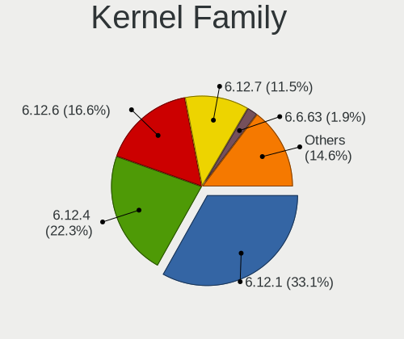
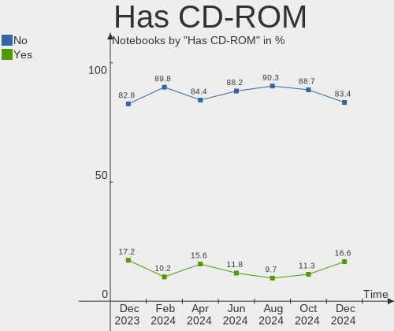
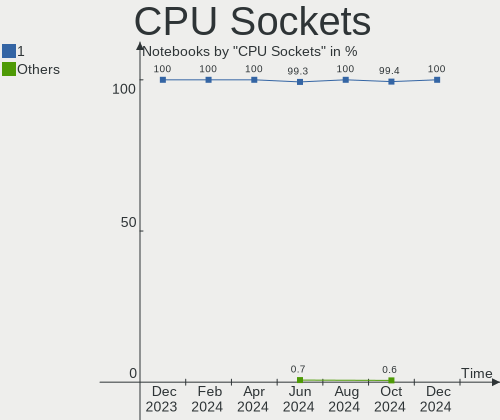
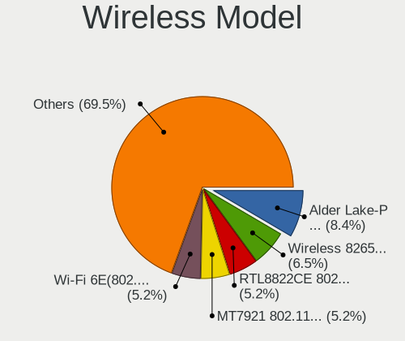
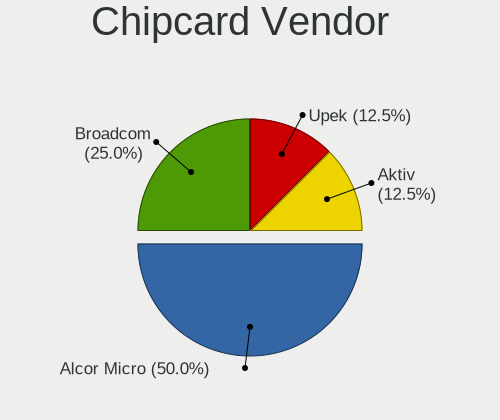

Arch Hardware Trends (Notebook)
-------------------------------

A project to identify most popular hardware characteristics and track their change
over time based on data collected by Arch users at https://Linux-Hardware.org.

Anyone can contribute to the study by uploading probes of their computers by
the [hw-probe](https://github.com/linuxhw/hw-probe) tool:

    sudo -E hw-probe -all -upload

Full-feature report is available here: https://linux-hardware.org/?view=trends&formfactor=notebook

Period: Jan, 2021.

Contents
--------

- [ OS                       ](#os)
- [ OS Family                ](#os-family)
- [ Kernel                   ](#kernel)
- [ Kernel Family            ](#kernel-family)
- [ Kernel Major Ver.        ](#kernel-major-ver)
- [ Arch                     ](#arch)
- [ DE                       ](#de)
- [ Display Server           ](#display-server)
- [ Display Manager          ](#display-manager)
- [ OS Lang                  ](#os-lang)
- [ Boot Mode                ](#boot-mode)
- [ Filesystem               ](#filesystem)
- [ Part. scheme             ](#part-scheme)
- [ Dual Boot with Linux/BSD ](#dual-boot-with-linux/bsd)
- [ Dual Boot (Win)          ](#dual-boot-win)
- [ Country                  ](#country)
- [ City                     ](#city)
- [ Vendor                   ](#vendor)
- [ Model                    ](#model)
- [ Model Family             ](#model-family)
- [ MFG Year                 ](#mfg-year)
- [ Form Factor              ](#form-factor)
- [ Secure Boot              ](#secure-boot)
- [ Coreboot                 ](#coreboot)
- [ RAM Size                 ](#ram-size)
- [ RAM Used                 ](#ram-used)
- [ Has CD-ROM               ](#has-cd-rom)
- [ Total Drives             ](#total-drives)
- [ Has Ethernet             ](#has-ethernet)
- [ Drive Vendor             ](#drive-vendor)
- [ Drive Model              ](#drive-model)
- [ HDD Vendor               ](#hdd-vendor)
- [ SSD Vendor               ](#ssd-vendor)
- [ Drive Kind               ](#drive-kind)
- [ Drive Connector          ](#drive-connector)
- [ Drive Size               ](#drive-size)
- [ Space Total              ](#space-total)
- [ Space Used               ](#space-used)
- [ Malfunc. Drives          ](#malfunc-drives)
- [ Malfunc. Drive Vendor    ](#malfunc-drive-vendor)
- [ Malfunc. HDD Vendor      ](#malfunc-hdd-vendor)
- [ Malfunc. Drive Kind      ](#malfunc-drive-kind)
- [ Failed Drives            ](#failed-drives)
- [ Failed Drive Vendor      ](#failed-drive-vendor)
- [ Drive Status             ](#drive-status)
- [ Storage Vendor           ](#storage-vendor)
- [ Storage Model            ](#storage-model)
- [ Storage Kind             ](#storage-kind)
- [ CPU Vendor               ](#cpu-vendor)
- [ CPU Model                ](#cpu-model)
- [ CPU Model Family         ](#cpu-model-family)
- [ CPU Cores                ](#cpu-cores)
- [ CPU Sockets              ](#cpu-sockets)
- [ CPU Threads              ](#cpu-threads)
- [ CPU Op-Modes             ](#cpu-op-modes)
- [ CPU Microcode            ](#cpu-microcode)
- [ CPU Microarch            ](#cpu-microarch)
- [ GPU Vendor               ](#gpu-vendor)
- [ GPU Model                ](#gpu-model)
- [ GPU Combo                ](#gpu-combo)
- [ GPU Driver               ](#gpu-driver)
- [ GPU Memory               ](#gpu-memory)
- [ Monitor Vendor           ](#monitor-vendor)
- [ Monitor Model            ](#monitor-model)
- [ Monitor Resolution       ](#monitor-resolution)
- [ Monitor Diagonal         ](#monitor-diagonal)
- [ Monitor Width            ](#monitor-width)
- [ Aspect Ratio             ](#aspect-ratio)
- [ Monitor Area             ](#monitor-area)
- [ Pixel Density            ](#pixel-density)
- [ Multiple Monitors        ](#multiple-monitors)
- [ Net Controller Vendor    ](#net-controller-vendor)
- [ Net Controller Model     ](#net-controller-model)
- [ Wireless Vendor          ](#wireless-vendor)
- [ Wireless Model           ](#wireless-model)
- [ Ethernet Vendor          ](#ethernet-vendor)
- [ Ethernet Model           ](#ethernet-model)
- [ Net Controller Kind      ](#net-controller-kind)
- [ Used Controller          ](#used-controller)
- [ NICs                     ](#nics)
- [ Memory Vendor            ](#memory-vendor)
- [ Memory Model             ](#memory-model)
- [ Memory Kind              ](#memory-kind)
- [ Memory Form Factor       ](#memory-form-factor)
- [ Memory Size              ](#memory-size)
- [ Memory Speed             ](#memory-speed)
- [ Sound Vendor             ](#sound-vendor)
- [ Sound Model              ](#sound-model)
- [ Camera Vendor            ](#camera-vendor)
- [ Camera Model             ](#camera-model)
- [ Fingerprint Vendor       ](#fingerprint-vendor)
- [ Fingerprint Model        ](#fingerprint-model)
- [ Chipcard Vendor          ](#chipcard-vendor)
- [ Chipcard Model           ](#chipcard-model)
- [ Printer Vendor           ](#printer-vendor)
- [ Printer Model            ](#printer-model)
- [ Scanner Vendor           ](#scanner-vendor)
- [ Scanner Model            ](#scanner-model)
- [ Bluetooth Vendor         ](#bluetooth-vendor)
- [ Bluetooth Model          ](#bluetooth-model)
- [ Unsupported Devices      ](#unsupported-devices)
- [ Unsupported Device Types ](#unsupported-device-types)

OS
--

Installed operating systems

| Name         | Notebooks | Percent |
|--------------|-----------|---------|
| Arch         | 48        | 60.76%  |
| Arch Rolling | 31        | 39.24%  |

OS Family
---------

OS without a version

| Name | Notebooks | Percent |
|------|-----------|---------|
| Arch | 79        | 100%    |

Kernel
------

Version of the Linux kernel

| Version                | Notebooks | Percent |
|------------------------|-----------|---------|
| 5.10.4-arch2-1         | 11        | 13.92%  |
| 5.10.10-arch1-1        | 9         | 11.39%  |
| 5.10.7-arch1-1         | 8         | 10.13%  |
| 5.10.6-arch1-1         | 8         | 10.13%  |
| 5.10.3-zen1-1-zen      | 5         | 6.33%   |
| 5.10.3-arch1-1         | 4         | 5.06%   |
| 5.4.91-1-lts           | 3         | 3.8%    |
| 5.4.86-1-lts           | 3         | 3.8%    |
| 5.10.6-zen1-1-zen      | 3         | 3.8%    |
| 5.10.11-arch1-1        | 3         | 3.8%    |
| 5.9.14-arch1-1         | 2         | 2.53%   |
| 5.4.89-1-lts           | 2         | 2.53%   |
| 5.10.5-arch1-1         | 2         | 2.53%   |
| 5.10.4-zen2-1-zen      | 2         | 2.53%   |
| 5.9.14-zen1-1-zen      | 1         | 1.27%   |
| 5.9.14-arch1-1.0       | 1         | 1.27%   |
| 5.9.13-arch1-1         | 1         | 1.27%   |
| 5.4.93-2-lts           | 1         | 1.27%   |
| 5.4.88-1-lts           | 1         | 1.27%   |
| 5.10.9-arch1-1         | 1         | 1.27%   |
| 5.10.8-arch1-1         | 1         | 1.27%   |
| 5.10.8-1-ck-skylake    | 1         | 1.27%   |
| 5.10.7-zen1-1-zen      | 1         | 1.27%   |
| 5.10.6-gnu-1           | 1         | 1.27%   |
| 5.10.5-zen1-1-zen      | 1         | 1.27%   |
| 5.10.4-zen2-1-froidzen | 1         | 1.27%   |
| 5.10.11-zen2-1-zen     | 1         | 1.27%   |
| 5.10.10-zen1-1-zen     | 1         | 1.27%   |

Kernel Family
-------------

Linux kernel without a distro release

| Version | Notebooks | Percent |
|---------|-----------|---------|
| 5.10.4  | 14        | 17.72%  |
| 5.10.6  | 12        | 15.19%  |
| 5.10.10 | 10        | 12.66%  |
| 5.10.7  | 9         | 11.39%  |
| 5.10.3  | 9         | 11.39%  |
| 5.9.14  | 4         | 5.06%   |
| 5.10.11 | 4         | 5.06%   |
| 5.4.91  | 3         | 3.8%    |
| 5.4.86  | 3         | 3.8%    |
| 5.10.5  | 3         | 3.8%    |
| 5.4.89  | 2         | 2.53%   |
| 5.10.8  | 2         | 2.53%   |
| 5.9.13  | 1         | 1.27%   |
| 5.4.93  | 1         | 1.27%   |
| 5.4.88  | 1         | 1.27%   |
| 5.10.9  | 1         | 1.27%   |

Kernel Major Ver.
-----------------

Linux kernel major version

| Version | Notebooks | Percent |
|---------|-----------|---------|
| 5.10    | 64        | 81.01%  |
| 5.4     | 10        | 12.66%  |
| 5.9     | 5         | 6.33%   |

Arch
----

OS architecture (x86_64, i586, etc.)

| Name   | Notebooks | Percent |
|--------|-----------|---------|
| x86_64 | 78        | 98.73%  |
| i686   | 1         | 1.27%   |

DE
--

Desktop Environment

| Name            | Notebooks | Percent |
|-----------------|-----------|---------|
| GNOME           | 23        | 29.11%  |
| KDE5            | 17        | 21.52%  |
| i3              | 10        | 12.66%  |
| KDE             | 7         | 8.86%   |
| XFCE            | 6         | 7.59%   |
| X-Cinnamon      | 6         | 7.59%   |
| Unknown         | 6         | 7.59%   |
| MATE            | 1         | 1.27%   |
| LXDE            | 1         | 1.27%   |
| GNOME Flashback | 1         | 1.27%   |
| Cinnamon        | 1         | 1.27%   |

Display Server
--------------

X11 or Wayland

| Name    | Notebooks | Percent |
|---------|-----------|---------|
| X11     | 58        | 73.42%  |
| Wayland | 14        | 17.72%  |
| Tty     | 6         | 7.59%   |
| Unknown | 1         | 1.27%   |

Display Manager
---------------

SDDM, LightDM, etc.

| Name    | Notebooks | Percent |
|---------|-----------|---------|
| Unknown | 37        | 46.84%  |
| SDDM    | 20        | 25.32%  |
| TDM     | 10        | 12.66%  |
| GDM     | 9         | 11.39%  |
| LightDM | 2         | 2.53%   |
| XDM     | 1         | 1.27%   |

OS Lang
-------

Language

| Lang    | Notebooks | Percent |
|---------|-----------|---------|
| en_US   | 42        | 53.16%  |
| en_GB   | 5         | 6.33%   |
| pl_PL   | 4         | 5.06%   |
| de_DE   | 4         | 5.06%   |
| C       | 3         | 3.8%    |
| pt_BR   | 2         | 2.53%   |
| it_IT   | 2         | 2.53%   |
| fr_FR   | 2         | 2.53%   |
| es_ES   | 2         | 2.53%   |
| en_AU   | 2         | 2.53%   |
| ca_ES   | 2         | 2.53%   |
| zh_CN   | 1         | 1.27%   |
| ru_RU   | 1         | 1.27%   |
| fr_CH   | 1         | 1.27%   |
| fr_CA   | 1         | 1.27%   |
| es_UY   | 1         | 1.27%   |
| en_IN   | 1         | 1.27%   |
| en_CA   | 1         | 1.27%   |
| de_AT   | 1         | 1.27%   |
| Unknown | 1         | 1.27%   |

Boot Mode
---------

EFI or BIOS

| Mode | Notebooks | Percent |
|------|-----------|---------|
| EFI  | 46        | 58.23%  |
| BIOS | 33        | 41.77%  |

Filesystem
----------

Type of filesystem

| Type    | Notebooks | Percent |
|---------|-----------|---------|
| Ext4    | 63        | 79.75%  |
| Btrfs   | 9         | 11.39%  |
| Xfs     | 4         | 5.06%   |
| Overlay | 1         | 1.27%   |
| Ext2    | 1         | 1.27%   |
| Unknown | 1         | 1.27%   |

Part. scheme
------------

Scheme of partitioning

| Type    | Notebooks | Percent |
|---------|-----------|---------|
| GPT     | 42        | 53.16%  |
| Unknown | 31        | 39.24%  |
| MBR     | 6         | 7.59%   |

Dual Boot with Linux/BSD
------------------------

Hosting more than one Linux/BSD

| Dual boot | Notebooks | Percent |
|-----------|-----------|---------|
| No        | 73        | 92.41%  |
| Yes       | 6         | 7.59%   |

Dual Boot (Win)
---------------

Hosting Linux and Windows

| Dual boot | Notebooks | Percent |
|-----------|-----------|---------|
| No        | 59        | 74.68%  |
| Yes       | 20        | 25.32%  |

Country
-------

Geographic location (country)

| Country     | Notebooks | Percent |
|-------------|-----------|---------|
| USA         | 15        | 18.99%  |
| India       | 6         | 7.59%   |
| Germany     | 6         | 7.59%   |
| Poland      | 5         | 6.33%   |
| Italy       | 5         | 6.33%   |
| Russia      | 4         | 5.06%   |
| Brazil      | 4         | 5.06%   |
| Spain       | 3         | 3.8%    |
| France      | 3         | 3.8%    |
| Canada      | 3         | 3.8%    |
| UK          | 2         | 2.53%   |
| Turkey      | 2         | 2.53%   |
| New Zealand | 2         | 2.53%   |
| Iran        | 2         | 2.53%   |
| China       | 2         | 2.53%   |
| Australia   | 2         | 2.53%   |
| Venezuela   | 1         | 1.27%   |
| Uruguay     | 1         | 1.27%   |
| Ukraine     | 1         | 1.27%   |
| Switzerland | 1         | 1.27%   |
| Sweden      | 1         | 1.27%   |
| Serbia      | 1         | 1.27%   |
| Netherlands | 1         | 1.27%   |
| Nepal       | 1         | 1.27%   |
| Lithuania   | 1         | 1.27%   |
| Indonesia   | 1         | 1.27%   |
| Hungary     | 1         | 1.27%   |
| Belgium     | 1         | 1.27%   |
| Austria     | 1         | 1.27%   |

City
----

Geographic location (city)

| City                  | Notebooks | Percent |
|-----------------------|-----------|---------|
| Wellington            | 2         | 2.53%   |
| Paris                 | 2         | 2.53%   |
| Lytkarino             | 2         | 2.53%   |
| Longueuil             | 2         | 2.53%   |
| Girona                | 2         | 2.53%   |
| Brasília             | 2         | 2.53%   |
| Łódź               | 1         | 1.27%   |
| Zielona Góra         | 1         | 1.27%   |
| York                  | 1         | 1.27%   |
| Xining                | 1         | 1.27%   |
| Wilmington            | 1         | 1.27%   |
| Warsaw                | 1         | 1.27%   |
| Versailles            | 1         | 1.27%   |
| Valencia              | 1         | 1.27%   |
| Udine                 | 1         | 1.27%   |
| Tucson                | 1         | 1.27%   |
| Trivandrum            | 1         | 1.27%   |
| Trabzon               | 1         | 1.27%   |
| Thrissur              | 1         | 1.27%   |
| The Hague             | 1         | 1.27%   |
| Tehran                | 1         | 1.27%   |
| São José dos Campos | 1         | 1.27%   |
| Sydney                | 1         | 1.27%   |
| Strausberg            | 1         | 1.27%   |
| St Petersburg         | 1         | 1.27%   |
| Shahr-e Kord          | 1         | 1.27%   |
| Settimo Milanese      | 1         | 1.27%   |
| Schwerin              | 1         | 1.27%   |
| San Ramon             | 1         | 1.27%   |
| Sacco                 | 1         | 1.27%   |
| Port Huron            | 1         | 1.27%   |
| Phoenix               | 1         | 1.27%   |
| Petrolina             | 1         | 1.27%   |
| Perm                  | 1         | 1.27%   |
| Palakkad              | 1         | 1.27%   |
| Okotoks               | 1         | 1.27%   |
| Nussloch              | 1         | 1.27%   |
| Noida                 | 1         | 1.27%   |
| Naples                | 1         | 1.27%   |
| Mönchengladbach      | 1         | 1.27%   |
| Muchangyu             | 1         | 1.27%   |
| Montevideo            | 1         | 1.27%   |
| Milton                | 1         | 1.27%   |
| Louisville            | 1         | 1.27%   |
| Los Angeles           | 1         | 1.27%   |
| London                | 1         | 1.27%   |
| Latschach             | 1         | 1.27%   |
| Kaunas                | 1         | 1.27%   |
| Kathmandu             | 1         | 1.27%   |
| Izmir                 | 1         | 1.27%   |
| Huntingdon            | 1         | 1.27%   |
| Gdańsk               | 1         | 1.27%   |
| Dietikon              | 1         | 1.27%   |
| Degerfors             | 1         | 1.27%   |
| Dallas                | 1         | 1.27%   |
| Como                  | 1         | 1.27%   |
| Cincinnati            | 1         | 1.27%   |
| Chennai               | 1         | 1.27%   |
| Canton                | 1         | 1.27%   |
| Bydgoszcz             | 1         | 1.27%   |

Vendor
------

Motherboard manufacturer

| Name                | Notebooks | Percent |
|---------------------|-----------|---------|
| Lenovo              | 26        | 32.91%  |
| Dell                | 18        | 22.78%  |
| ASUSTek Computer    | 11        | 13.92%  |
| Hewlett-Packard     | 10        | 12.66%  |
| Acer                | 6         | 7.59%   |
| Sony                | 1         | 1.27%   |
| Samsung Electronics | 1         | 1.27%   |
| Razer               | 1         | 1.27%   |
| Packard Bell        | 1         | 1.27%   |
| HUAWEI              | 1         | 1.27%   |
| Google              | 1         | 1.27%   |
| Eluktronics         | 1         | 1.27%   |
| Alienware           | 1         | 1.27%   |

Model
-----

Motherboard model

| Name                                                  | Notebooks | Percent |
|-------------------------------------------------------|-----------|---------|
| Lenovo IdeaPad 5 14ARE05 81YM                         | 2         | 2.53%   |
| Sony SVE14A1X1EH                                      | 1         | 1.27%   |
| Samsung 300E5M/300E5L                                 | 1         | 1.27%   |
| Razer Blade 15 Studio Edition (Early 2020) - RZ09-033 | 1         | 1.27%   |
| Packard Bell EasyNote TM86                            | 1         | 1.27%   |
| Lenovo X200 2024AB3                                   | 1         | 1.27%   |
| Lenovo V155-15API 81V5                                | 1         | 1.27%   |
| Lenovo V15-IIL 82C5                                   | 1         | 1.27%   |
| Lenovo ThinkPad X270 W10DG 20K5S5L400                 | 1         | 1.27%   |
| Lenovo ThinkPad X200 74591P0                          | 1         | 1.27%   |
| Lenovo ThinkPad X121e 3045A64                         | 1         | 1.27%   |
| Lenovo ThinkPad X1 Carbon 6th 20KH002RUS              | 1         | 1.27%   |
| Lenovo ThinkPad X1 Carbon 5th 20HQS0PC00              | 1         | 1.27%   |
| Lenovo ThinkPad X1 Carbon 3rd 20BSCTO1WW              | 1         | 1.27%   |
| Lenovo ThinkPad X1 Carbon 34483W4                     | 1         | 1.27%   |
| Lenovo ThinkPad W540 20BHS0B30T                       | 1         | 1.27%   |
| Lenovo ThinkPad T495s 20QKS0SD00                      | 1         | 1.27%   |
| Lenovo ThinkPad T490 20N20042US                       | 1         | 1.27%   |
| Lenovo ThinkPad T460p 20FW0005AU                      | 1         | 1.27%   |
| Lenovo ThinkPad T460 20FMS2FR00                       | 1         | 1.27%   |
| Lenovo ThinkPad T450s 20BWS2KM00                      | 1         | 1.27%   |
| Lenovo ThinkPad P1 Gen 2 20QT002GUK                   | 1         | 1.27%   |
| Lenovo ThinkPad E570 20H5CTO1WW                       | 1         | 1.27%   |
| Lenovo ThinkPad E14 Gen 2 20T6000SIX                  | 1         | 1.27%   |
| Lenovo ThinkBook 15 G2 ARE 20VG                       | 1         | 1.27%   |
| Lenovo Legion Y7000 81FW                              | 1         | 1.27%   |
| Lenovo IdeaPad S145-15API 81UT                        | 1         | 1.27%   |
| Lenovo IdeaPad 320S-13IKB 81AK                        | 1         | 1.27%   |
| HUAWEI NBLK-WAX9X                                     | 1         | 1.27%   |
| HP ProBook 645 G4                                     | 1         | 1.27%   |
| HP Pavilion x2 Detachable                             | 1         | 1.27%   |
| HP Pavilion Laptop 15-cw1xxx                          | 1         | 1.27%   |
| HP Pavilion Laptop 15-cs1xxx                          | 1         | 1.27%   |
| HP Pavilion g6                                        | 1         | 1.27%   |
| HP Pavilion dv7                                       | 1         | 1.27%   |
| HP Pavilion dv6                                       | 1         | 1.27%   |
| HP Pavilion 15                                        | 1         | 1.27%   |
| HP Laptop 15s-eq0xxx                                  | 1         | 1.27%   |
| HP EliteBook Folio 1040 G3                            | 1         | 1.27%   |
| Google Candy                                          | 1         | 1.27%   |
| Eluktronics THINN-15                                  | 1         | 1.27%   |
| Dell XPS 17 9700                                      | 1         | 1.27%   |
| Dell XPS 13 9360                                      | 1         | 1.27%   |
| Dell XPS 13 9350                                      | 1         | 1.27%   |
| Dell XPS 13 9300                                      | 1         | 1.27%   |
| Dell Vostro 5470                                      | 1         | 1.27%   |
| Dell Studio 1458                                      | 1         | 1.27%   |
| Dell Precision M6600                                  | 1         | 1.27%   |
| Dell Precision 5530                                   | 1         | 1.27%   |
| Dell Latitude E6430                                   | 1         | 1.27%   |
| Dell Latitude E6320                                   | 1         | 1.27%   |
| Dell Latitude E5570                                   | 1         | 1.27%   |
| Dell Latitude 5480                                    | 1         | 1.27%   |
| Dell Latitude 5424 Rugged                             | 1         | 1.27%   |
| Dell Inspiron 3558                                    | 1         | 1.27%   |
| Dell Inspiron 3420                                    | 1         | 1.27%   |
| Dell Inspiron 1018                                    | 1         | 1.27%   |
| Dell G7 7590                                          | 1         | 1.27%   |
| Dell G3 3500                                          | 1         | 1.27%   |
| ASUS ZenBook 13 UX331FAL_UX331FAL                     | 1         | 1.27%   |

Model Family
------------

Motherboard model prefix

| Name                  | Notebooks | Percent |
|-----------------------|-----------|---------|
| Lenovo ThinkPad       | 16        | 20.25%  |
| HP Pavilion           | 7         | 8.86%   |
| Dell Latitude         | 5         | 6.33%   |
| Acer Aspire           | 5         | 6.33%   |
| Lenovo IdeaPad        | 4         | 5.06%   |
| Dell XPS              | 4         | 5.06%   |
| Dell Inspiron         | 3         | 3.8%    |
| Dell Precision        | 2         | 2.53%   |
| ASUS VivoBook         | 2         | 2.53%   |
| Sony SVE14A1X1EH      | 1         | 1.27%   |
| Samsung 300E5M        | 1         | 1.27%   |
| Razer Blade           | 1         | 1.27%   |
| Packard Bell EasyNote | 1         | 1.27%   |
| Lenovo X200           | 1         | 1.27%   |
| Lenovo V155-15API     | 1         | 1.27%   |
| Lenovo V15-IIL        | 1         | 1.27%   |
| Lenovo ThinkBook      | 1         | 1.27%   |
| Lenovo Legion         | 1         | 1.27%   |
| HUAWEI NBLK-WAX9X     | 1         | 1.27%   |
| HP ProBook            | 1         | 1.27%   |
| HP Laptop             | 1         | 1.27%   |
| HP EliteBook          | 1         | 1.27%   |
| Google Candy          | 1         | 1.27%   |
| Eluktronics THINN-15  | 1         | 1.27%   |
| Dell Vostro           | 1         | 1.27%   |
| Dell Studio           | 1         | 1.27%   |
| Dell G7               | 1         | 1.27%   |
| Dell G3               | 1         | 1.27%   |
| ASUS ZenBook          | 1         | 1.27%   |
| ASUS X580VD           | 1         | 1.27%   |
| ASUS X55A             | 1         | 1.27%   |
| ASUS X510UR           | 1         | 1.27%   |
| ASUS TUF              | 1         | 1.27%   |
| ASUS Strix            | 1         | 1.27%   |
| ASUS N56JR            | 1         | 1.27%   |
| ASUS ASUSPRO          | 1         | 1.27%   |
| ASUS 900              | 1         | 1.27%   |
| Alienware 13          | 1         | 1.27%   |
| Acer Extensa          | 1         | 1.27%   |
| Unknown               | 1         | 1.27%   |

MFG Year
--------

Motherboard manufacture year

| Year | Notebooks | Percent |
|------|-----------|---------|
| 2020 | 32        | 40.51%  |
| 2019 | 14        | 17.72%  |
| 2018 | 8         | 10.13%  |
| 2012 | 6         | 7.59%   |
| 2010 | 5         | 6.33%   |
| 2017 | 3         | 3.8%    |
| 2016 | 2         | 2.53%   |
| 2015 | 2         | 2.53%   |
| 2013 | 2         | 2.53%   |
| 2011 | 2         | 2.53%   |
| 2014 | 1         | 1.27%   |
| 2009 | 1         | 1.27%   |
| 2007 | 1         | 1.27%   |

Form Factor
-----------

Physical design of the computer

| Name     | Notebooks | Percent |
|----------|-----------|---------|
| Notebook | 79        | 100%    |

Secure Boot
-----------

Enabled or disabled

| State    | Notebooks | Percent |
|----------|-----------|---------|
| Disabled | 76        | 96.2%   |
| Enabled  | 3         | 3.8%    |

Coreboot
--------

Have coreboot on board

| Used | Notebooks | Percent |
|------|-----------|---------|
| No   | 76        | 96.2%   |
| Yes  | 3         | 3.8%    |

RAM Size
--------

Total RAM memory

| Size in GB  | Notebooks | Percent |
|-------------|-----------|---------|
| 4.01-8.0    | 26        | 32.91%  |
| 8.01-16.0   | 16        | 20.25%  |
| 3.01-4.0    | 13        | 16.46%  |
| 16.01-24.0  | 12        | 15.19%  |
| 32.01-64.0  | 5         | 6.33%   |
| 2.01-3.0    | 2         | 2.53%   |
| 64.01-256.0 | 2         | 2.53%   |
| 1.01-2.0    | 2         | 2.53%   |
| 0.51-1.0    | 1         | 1.27%   |

RAM Used
--------

Used RAM memory

| Used GB   | Notebooks | Percent |
|-----------|-----------|---------|
| 1.01-2.0  | 29        | 36.71%  |
| 2.01-3.0  | 18        | 22.78%  |
| 4.01-8.0  | 17        | 21.52%  |
| 3.01-4.0  | 6         | 7.59%   |
| 0.51-1.0  | 4         | 5.06%   |
| 8.01-16.0 | 3         | 3.8%    |
| 0.01-0.5  | 2         | 2.53%   |

Has CD-ROM
----------

Has CD-ROM on board

| Presented | Notebooks | Percent |
|-----------|-----------|---------|
| No        | 60        | 75.95%  |
| Yes       | 19        | 24.05%  |

Total Drives
------------

Number of drives on board

| Drives | Notebooks | Percent |
|--------|-----------|---------|
| 1      | 55        | 69.62%  |
| 2      | 21        | 26.58%  |
| 4      | 1         | 1.27%   |
| 3      | 1         | 1.27%   |
| 0      | 1         | 1.27%   |

Has Ethernet
------------

Has Ethernet on board

| Presented | Notebooks | Percent |
|-----------|-----------|---------|
| Yes       | 61        | 77.22%  |
| No        | 18        | 22.78%  |

Drive Vendor
------------

Hard drive vendors

| Vendor              | Notebooks | Drives | Percent |
|---------------------|-----------|--------|---------|
| Samsung Electronics | 18        | 19     | 18.75%  |
| Toshiba             | 11        | 11     | 11.46%  |
| Seagate             | 11        | 13     | 11.46%  |
| WDC                 | 9         | 10     | 9.38%   |
| Sandisk             | 9         | 9      | 9.38%   |
| Unknown             | 6         | 7      | 6.25%   |
| Intel               | 5         | 5      | 5.21%   |
| Crucial             | 5         | 5      | 5.21%   |
| Hitachi             | 4         | 4      | 4.17%   |
| Kingston            | 3         | 3      | 3.13%   |
| PNY                 | 2         | 2      | 2.08%   |
| Phison              | 2         | 3      | 2.08%   |
| Micron Technology   | 2         | 3      | 2.08%   |
| HGST                | 2         | 2      | 2.08%   |
| Yangtze Memory      | 1         | 1      | 1.04%   |
| Union Memory        | 1         | 1      | 1.04%   |
| SK Hynix            | 1         | 1      | 1.04%   |
| LITEON              | 1         | 1      | 1.04%   |
| KingSpec            | 1         | 1      | 1.04%   |
| China               | 1         | 1      | 1.04%   |
| ASUS-PHISON         | 1         | 2      | 1.04%   |

Drive Model
-----------

Hard drive models

| Model                                   | Notebooks | Percent |
|-----------------------------------------|-----------|---------|
| Seagate ST1000LM035-1RK172 1TB          | 3         | 2.88%   |
| Sandisk NVMe SSD Drive 512GB            | 3         | 2.88%   |
| Seagate ST500LT012-1DG142 500GB         | 2         | 1.92%   |
| Seagate ST2000LM007-1R8174 2TB          | 2         | 1.92%   |
| Seagate ST1000LX015-1U7172 1TB          | 2         | 1.92%   |
| Samsung SSD 970 EVO Plus 1TB            | 2         | 1.92%   |
| Samsung NVMe SSD Drive 512GB            | 2         | 1.92%   |
| Kingston SA400S37240G 240GB SSD         | 2         | 1.92%   |
| Intel SSDPEKNW512G8 512GB               | 2         | 1.92%   |
| Yangtze Memory ZHITAI PC005 Active 1TB  | 1         | 0.96%   |
| WDC WDS500G2B0B-00YS70 500GB SSD        | 1         | 0.96%   |
| WDC WDS240G2G0B-00EPW0 240GB SSD        | 1         | 0.96%   |
| WDC WD5000LPVX-00V0TT0 500GB            | 1         | 0.96%   |
| WDC WD5000LPCX-35VHAT0 500GB            | 1         | 0.96%   |
| WDC WD3200BPVT-22JJ5T0 320GB            | 1         | 0.96%   |
| WDC WD3200BEKT-60V5T1 320GB             | 1         | 0.96%   |
| WDC WD10SPZX-24Z10 1TB                  | 1         | 0.96%   |
| WDC PC SN730 SDBQNTY-512G-1001 512GB    | 1         | 0.96%   |
| WDC PC SN520 SDAPNUW-256G-1202 256GB    | 1         | 0.96%   |
| WDC PC SN520 SDAPMUW-128G-1101 128GB    | 1         | 0.96%   |
| Unknown SU08G  8GB                      | 1         | 0.96%   |
| Unknown SDW32G  32GB                    | 1         | 0.96%   |
| Unknown SD128  128GB                    | 1         | 0.96%   |
| Unknown SC32G  32GB                     | 1         | 0.96%   |
| Unknown SB32G  32GB                     | 1         | 0.96%   |
| Unknown MMC Card  7GB                   | 1         | 0.96%   |
| Unknown HAG2e  16GB                     | 1         | 0.96%   |
| Union Memory UMIS RPJTJ512MEE1OWX 512GB | 1         | 0.96%   |
| Toshiba THNSN5256GPUK NVMe 256GB        | 1         | 0.96%   |
| Toshiba NVMe SSD Drive 512GB            | 1         | 0.96%   |
| Toshiba NVMe SSD Drive 256GB            | 1         | 0.96%   |
| Toshiba NVMe SSD Drive 1TB              | 1         | 0.96%   |
| Toshiba MQ01ABF050 500GB                | 1         | 0.96%   |
| Toshiba MQ01ABF032 320GB                | 1         | 0.96%   |
| Toshiba MQ01ABD100 1TB                  | 1         | 0.96%   |
| Toshiba MQ01ABD075 752GB                | 1         | 0.96%   |
| Toshiba MK3261GSYN 320GB                | 1         | 0.96%   |
| Toshiba KXG60ZNV256G NVMe 256GB         | 1         | 0.96%   |
| Toshiba HDWJ110 1TB                     | 1         | 0.96%   |
| SK Hynix SC300 SATA 512GB SSD           | 1         | 0.96%   |
| Seagate ST9320325AS 320GB               | 1         | 0.96%   |
| Seagate ST9160411AS 160GB               | 1         | 0.96%   |
| Seagate ST1000LM049-2GH172 1TB          | 1         | 0.96%   |
| Seagate Slim 500GB                      | 1         | 0.96%   |
| SanDisk X400 M.2 2280 256GB SSD         | 1         | 0.96%   |
| SanDisk SSD U100 128GB                  | 1         | 0.96%   |
| SanDisk SD9SN8W256G1102 256GB SSD       | 1         | 0.96%   |
| SanDisk SD8SNAT-256G-1006 256GB SSD     | 1         | 0.96%   |
| SanDisk SD8SN8U-128G-1006 128GB SSD     | 1         | 0.96%   |
| Sandisk NVMe SSD Drive 256GB            | 1         | 0.96%   |
| Samsung SSD 850 PRO 256GB               | 1         | 0.96%   |
| Samsung SSD 850 EVO 500GB               | 1         | 0.96%   |
| Samsung SSD 840 EVO 250GB               | 1         | 0.96%   |
| Samsung PM981 NVMe 256GB                | 1         | 0.96%   |
| Samsung NVMe SSD Drive 256GB            | 1         | 0.96%   |
| Samsung NVMe SSD Drive 250GB            | 1         | 0.96%   |
| Samsung NVMe SSD Drive 1TB              | 1         | 0.96%   |
| Samsung NVMe SSD Drive 1024GB           | 1         | 0.96%   |
| Samsung MZVLW128HEGR-000L2 128GB        | 1         | 0.96%   |
| Samsung MZVLB512HBJQ-000L7 512GB        | 1         | 0.96%   |

HDD Vendor
----------

Hard disk drive vendors

| Vendor              | Notebooks | Drives | Percent |
|---------------------|-----------|--------|---------|
| Seagate             | 11        | 12     | 37.93%  |
| Toshiba             | 6         | 6      | 20.69%  |
| WDC                 | 5         | 5      | 17.24%  |
| Hitachi             | 4         | 4      | 13.79%  |
| HGST                | 2         | 2      | 6.9%    |
| Samsung Electronics | 1         | 1      | 3.45%   |

SSD Vendor
----------

Solid state drive vendors

| Vendor              | Notebooks | Drives | Percent |
|---------------------|-----------|--------|---------|
| Samsung Electronics | 6         | 6      | 20%     |
| SanDisk             | 5         | 5      | 16.67%  |
| Crucial             | 5         | 5      | 16.67%  |
| WDC                 | 2         | 2      | 6.67%   |
| PNY                 | 2         | 2      | 6.67%   |
| Kingston            | 2         | 2      | 6.67%   |
| Intel               | 2         | 2      | 6.67%   |
| SK Hynix            | 1         | 1      | 3.33%   |
| Micron Technology   | 1         | 1      | 3.33%   |
| LITEON              | 1         | 1      | 3.33%   |
| KingSpec            | 1         | 1      | 3.33%   |
| China               | 1         | 1      | 3.33%   |
| ASUS-PHISON         | 1         | 2      | 3.33%   |

Drive Kind
----------

HDD or SSD

| Kind    | Notebooks | Drives | Percent |
|---------|-----------|--------|---------|
| NVMe    | 30        | 35     | 32.61%  |
| HDD     | 28        | 30     | 30.43%  |
| SSD     | 27        | 31     | 29.35%  |
| MMC     | 6         | 7      | 6.52%   |
| Unknown | 1         | 1      | 1.09%   |

Drive Connector
---------------

SATA, SAS, NVMe, etc.

| Type | Notebooks | Drives | Percent |
|------|-----------|--------|---------|
| SATA | 51        | 61     | 57.95%  |
| NVMe | 30        | 35     | 34.09%  |
| MMC  | 6         | 7      | 6.82%   |
| SAS  | 1         | 1      | 1.14%   |

Drive Size
----------

Size of hard drive

| Size in TB | Notebooks | Drives | Percent |
|------------|-----------|--------|---------|
| 0.01-0.5   | 37        | 41     | 66.07%  |
| 0.51-1.0   | 17        | 18     | 30.36%  |
| 1.01-2.0   | 2         | 2      | 3.57%   |

Space Total
-----------

Amount of disk space available on the file system

| Size in GB | Notebooks | Percent |
|------------|-----------|---------|
| 251-500    | 25        | 31.65%  |
| 101-250    | 23        | 29.11%  |
| 501-1000   | 12        | 15.19%  |
| 51-100     | 7         | 8.86%   |
| 1001-2000  | 6         | 7.59%   |
| 21-50      | 4         | 5.06%   |
| 1-20       | 1         | 1.27%   |
| Unknown    | 1         | 1.27%   |

Space Used
----------

Amount of used disk space

| Used GB   | Notebooks | Percent |
|-----------|-----------|---------|
| 1-20      | 23        | 29.11%  |
| 101-250   | 22        | 27.85%  |
| 21-50     | 11        | 13.92%  |
| 51-100    | 9         | 11.39%  |
| 251-500   | 7         | 8.86%   |
| 501-1000  | 5         | 6.33%   |
| 1001-2000 | 1         | 1.27%   |
| Unknown   | 1         | 1.27%   |

Malfunc. Drives
---------------

Drive models with a malfunction

| Model                           | Notebooks | Drives | Percent |
|---------------------------------|-----------|--------|---------|
| Seagate ST9160411AS 160GB       | 1         | 1      | 14.29%  |
| Seagate ST500LT012-1DG142 500GB | 1         | 1      | 14.29%  |
| Seagate ST1000LX015-1U7172 1TB  | 1         | 1      | 14.29%  |
| LITEON CV8-8E128-HP 128GB SSD   | 1         | 1      | 14.29%  |
| Intel SSDSC2BF240A4L 240GB      | 1         | 1      | 14.29%  |
| Hitachi HTS723216L9SA60 160GB   | 1         | 1      | 14.29%  |
| Hitachi HTS545050A7E380 500GB   | 1         | 1      | 14.29%  |

Malfunc. Drive Vendor
---------------------

Vendors of faulty drives

| Vendor  | Notebooks | Drives | Percent |
|---------|-----------|--------|---------|
| Seagate | 3         | 3      | 42.86%  |
| Hitachi | 2         | 2      | 28.57%  |
| LITEON  | 1         | 1      | 14.29%  |
| Intel   | 1         | 1      | 14.29%  |

Malfunc. HDD Vendor
-------------------

Vendors of faulty HDD drives

| Vendor  | Notebooks | Drives | Percent |
|---------|-----------|--------|---------|
| Seagate | 3         | 3      | 60%     |
| Hitachi | 2         | 2      | 40%     |

Malfunc. Drive Kind
-------------------

Kinds of faulty drives

| Kind | Notebooks | Drives | Percent |
|------|-----------|--------|---------|
| HDD  | 5         | 5      | 71.43%  |
| SSD  | 2         | 2      | 28.57%  |

Failed Drives
-------------

Failed drive models

Zero info for selected period =(

Failed Drive Vendor
-------------------

Failed drive vendors

Zero info for selected period =(

Drive Status
------------

Number of failed and malfunc. drives

| Status   | Notebooks | Drives | Percent |
|----------|-----------|--------|---------|
| Detected | 43        | 54     | 51.19%  |
| Works    | 34        | 43     | 40.48%  |
| Malfunc  | 7         | 7      | 8.33%   |

Storage Vendor
--------------

Storage controller vendors

| Vendor                       | Notebooks | Percent |
|------------------------------|-----------|---------|
| Intel                        | 54        | 58.7%   |
| Samsung Electronics          | 11        | 11.96%  |
| AMD                          | 9         | 9.78%   |
| Sandisk                      | 7         | 7.61%   |
| Toshiba America Info Systems | 5         | 5.43%   |
| Phison Electronics           | 2         | 2.17%   |
| Yangtze Memory Technologies  | 1         | 1.09%   |
| Union Memory (Shenzhen)      | 1         | 1.09%   |
| Micron Technology            | 1         | 1.09%   |
| Kingston Technology Company  | 1         | 1.09%   |

Storage Model
-------------

Storage controller models

| Model                                                                          | Notebooks | Percent |
|--------------------------------------------------------------------------------|-----------|---------|
| Samsung NVMe SSD Controller SM981/PM981/PM983                                  | 9         | 9.47%   |
| Intel Sunrise Point-LP SATA Controller [AHCI mode]                             | 9         | 9.47%   |
| Intel 82801 Mobile SATA Controller [RAID mode]                                 | 9         | 9.47%   |
| AMD FCH SATA Controller [AHCI mode]                                            | 7         | 7.37%   |
| Intel 7 Series Chipset Family 6-port SATA Controller [AHCI mode]               | 6         | 6.32%   |
| Intel Cannon Lake Mobile PCH SATA AHCI Controller                              | 4         | 4.21%   |
| Intel 82801IBM/IEM (ICH9M/ICH9M-E) 4 port SATA Controller [AHCI mode]          | 4         | 4.21%   |
| Toshiba America Info Systems XG4 NVMe SSD Controller                           | 3         | 3.16%   |
| Intel Wildcat Point-LP SATA Controller [AHCI Mode]                             | 3         | 3.16%   |
| Intel 5 Series/3400 Series Chipset 4 port SATA AHCI Controller                 | 3         | 3.16%   |
| Sandisk WD Black SN750 / PC SN730 NVMe SSD                                     | 2         | 2.11%   |
| Sandisk PC SN520 NVMe SSD                                                      | 2         | 2.11%   |
| Intel SSD 660P Series                                                          | 2         | 2.11%   |
| Intel 8 Series/C220 Series Chipset Family 6-port SATA Controller 1 [AHCI mode] | 2         | 2.11%   |
| Intel 6 Series/C200 Series Chipset Family 6 port Mobile SATA AHCI Controller   | 2         | 2.11%   |
| AMD SB7x0/SB8x0/SB9x0 SATA Controller [AHCI mode]                              | 2         | 2.11%   |
| Yangtze Memory Non-Volatile memory controller                                  | 1         | 1.05%   |
| Union Memory (Shenzhen) Non-Volatile memory controller                         | 1         | 1.05%   |
| Toshiba America Info Systems XG6 NVMe SSD Controller                           | 1         | 1.05%   |
| Toshiba America Info Systems BG3 NVMe SSD Controller                           | 1         | 1.05%   |
| Sandisk WD Blue SN500 / PC SN520 NVMe SSD                                      | 1         | 1.05%   |
| Sandisk WD Black 2018 / PC SN720 NVMe SSD                                      | 1         | 1.05%   |
| Sandisk Non-Volatile memory controller                                         | 1         | 1.05%   |
| Samsung NVMe SSD Controller SM961/PM961/SM963                                  | 1         | 1.05%   |
| Samsung Electronics Non-Volatile memory controller                             | 1         | 1.05%   |
| Phison E16 PCIe4 NVMe Controller                                               | 1         | 1.05%   |
| Phison E12 NVMe Controller                                                     | 1         | 1.05%   |
| Micron Non-Volatile memory controller                                          | 1         | 1.05%   |
| Kingston Company U-SNS8154P3 NVMe SSD                                          | 1         | 1.05%   |
| Intel SSD 600P Series                                                          | 1         | 1.05%   |
| Intel Q170/Q150/B150/H170/H110/Z170/CM236 Chipset SATA Controller [AHCI Mode]  | 1         | 1.05%   |
| Intel NM10/ICH7 Family SATA Controller [AHCI mode]                             | 1         | 1.05%   |
| Intel Ice Lake-LP SATA Controller [AHCI mode]                                  | 1         | 1.05%   |
| Intel HM170/QM170 Chipset SATA Controller [AHCI Mode]                          | 1         | 1.05%   |
| Intel Comet Lake SATA AHCI Controller                                          | 1         | 1.05%   |
| Intel Chipset SATA RAID Controller                                             | 1         | 1.05%   |
| Intel Celeron N3350/Pentium N4200/Atom E3900 Series SATA AHCI Controller       | 1         | 1.05%   |
| Intel Cannon Point-LP SATA Controller [AHCI Mode]                              | 1         | 1.05%   |
| Intel 82801HM/HEM (ICH8M/ICH8M-E) SATA Controller [AHCI mode]                  | 1         | 1.05%   |
| Intel 82801HM/HEM (ICH8M/ICH8M-E) IDE Controller                               | 1         | 1.05%   |
| Intel 82801FBM (ICH6M) SATA Controller                                         | 1         | 1.05%   |
| Intel 8 Series SATA Controller 1 [AHCI mode]                                   | 1         | 1.05%   |

Storage Kind
------------

Kind of storage controller (IDE, SATA, NVMe, SAS, ...)

| Kind | Notebooks | Percent |
|------|-----------|---------|
| SATA | 51        | 54.84%  |
| NVMe | 30        | 32.26%  |
| RAID | 10        | 10.75%  |
| IDE  | 2         | 2.15%   |

CPU Vendor
----------

Processor vendors

| Vendor | Notebooks | Percent |
|--------|-----------|---------|
| Intel  | 64        | 81.01%  |
| AMD    | 15        | 18.99%  |

CPU Model
---------

Processor models

| Model                                           | Notebooks | Percent |
|-------------------------------------------------|-----------|---------|
| Intel Core i7-7500U CPU @ 2.70GHz               | 4         | 5.06%   |
| AMD Ryzen 5 3500U with Radeon Vega Mobile Gfx   | 4         | 5.06%   |
| Intel Core i7-8750H CPU @ 2.20GHz               | 2         | 2.53%   |
| Intel Core i7-8650U CPU @ 1.90GHz               | 2         | 2.53%   |
| Intel Core i7-8565U CPU @ 1.80GHz               | 2         | 2.53%   |
| Intel Core i7-5600U CPU @ 2.60GHz               | 2         | 2.53%   |
| Intel Core i7-10875H CPU @ 2.30GHz              | 2         | 2.53%   |
| Intel Core i5-6300U CPU @ 2.40GHz               | 2         | 2.53%   |
| Intel Core i5-3230M CPU @ 2.60GHz               | 2         | 2.53%   |
| AMD Ryzen 5 4500U with Radeon Graphics          | 2         | 2.53%   |
| Intel Pentium CPU N4200 @ 1.10GHz               | 1         | 1.27%   |
| Intel Pentium CPU B970 @ 2.30GHz                | 1         | 1.27%   |
| Intel Core i7-9850H CPU @ 2.60GHz               | 1         | 1.27%   |
| Intel Core i7-9750H CPU @ 2.60GHz               | 1         | 1.27%   |
| Intel Core i7-8850H CPU @ 2.60GHz               | 1         | 1.27%   |
| Intel Core i7-8665U CPU @ 1.90GHz               | 1         | 1.27%   |
| Intel Core i7-7700HQ CPU @ 2.80GHz              | 1         | 1.27%   |
| Intel Core i7-6700HQ CPU @ 2.60GHz              | 1         | 1.27%   |
| Intel Core i7-6600U CPU @ 2.60GHz               | 1         | 1.27%   |
| Intel Core i7-4702MQ CPU @ 2.20GHz              | 1         | 1.27%   |
| Intel Core i7-4700HQ CPU @ 2.40GHz              | 1         | 1.27%   |
| Intel Core i7-4510U CPU @ 2.00GHz               | 1         | 1.27%   |
| Intel Core i7-4500U CPU @ 1.80GHz               | 1         | 1.27%   |
| Intel Core i7-3667U CPU @ 2.00GHz               | 1         | 1.27%   |
| Intel Core i7-2820QM CPU @ 2.30GHz              | 1         | 1.27%   |
| Intel Core i7-1065G7 CPU @ 1.30GHz              | 1         | 1.27%   |
| Intel Core i7 CPU Q 720 @ 1.60GHz               | 1         | 1.27%   |
| Intel Core i5-8300H CPU @ 2.30GHz               | 1         | 1.27%   |
| Intel Core i5-8250U CPU @ 1.60GHz               | 1         | 1.27%   |
| Intel Core i5-7440HQ CPU @ 2.80GHz              | 1         | 1.27%   |
| Intel Core i5-6440HQ CPU @ 2.60GHz              | 1         | 1.27%   |
| Intel Core i5-6200U CPU @ 2.30GHz               | 1         | 1.27%   |
| Intel Core i5-3317U CPU @ 1.70GHz               | 1         | 1.27%   |
| Intel Core i5-2520M CPU @ 2.50GHz               | 1         | 1.27%   |
| Intel Core i5-2450M CPU @ 2.50GHz               | 1         | 1.27%   |
| Intel Core i5-1035G1 CPU @ 1.00GHz              | 1         | 1.27%   |
| Intel Core i5-10300H CPU @ 2.50GHz              | 1         | 1.27%   |
| Intel Core i5-10210U CPU @ 1.60GHz              | 1         | 1.27%   |
| Intel Core i5 CPU M 430 @ 2.27GHz               | 1         | 1.27%   |
| Intel Core i3-8145U CPU @ 2.10GHz               | 1         | 1.27%   |
| Intel Core i3-7100U CPU @ 2.40GHz               | 1         | 1.27%   |
| Intel Core i3-6006U CPU @ 2.00GHz               | 1         | 1.27%   |
| Intel Core i3-5005U CPU @ 2.00GHz               | 1         | 1.27%   |
| Intel Core i3-2367M CPU @ 1.40GHz               | 1         | 1.27%   |
| Intel Core i3-2328M CPU @ 2.20GHz               | 1         | 1.27%   |
| Intel Core i3 CPU M 380 @ 2.53GHz               | 1         | 1.27%   |
| Intel Core 2 Duo CPU T9600 @ 2.80GHz            | 1         | 1.27%   |
| Intel Core 2 Duo CPU T6600 @ 2.20GHz            | 1         | 1.27%   |
| Intel Core 2 Duo CPU P8600 @ 2.40GHz            | 1         | 1.27%   |
| Intel Core 2 CPU P8600 @ 2.40GHz                | 1         | 1.27%   |
| Intel Celeron M processor 900MHz                | 1         | 1.27%   |
| Intel Celeron CPU N2840 @ 2.16GHz               | 1         | 1.27%   |
| Intel Celeron CPU 540 @ 1.86GHz                 | 1         | 1.27%   |
| Intel Celeron CPU 3865U @ 1.80GHz               | 1         | 1.27%   |
| Intel Atom x5-Z8300 CPU @ 1.44GHz               | 1         | 1.27%   |
| Intel Atom CPU N455 @ 1.66GHz                   | 1         | 1.27%   |
| AMD Turion II Neo K625 Dual-Core Processor      | 1         | 1.27%   |
| AMD Ryzen 7 PRO 3700U w/ Radeon Vega Mobile Gfx | 1         | 1.27%   |
| AMD Ryzen 7 PRO 2700U w/ Radeon Vega Mobile Gfx | 1         | 1.27%   |
| AMD Ryzen 7 4800U with Radeon Graphics          | 1         | 1.27%   |

CPU Model Family
----------------

Processor model prefix

| Model             | Notebooks | Percent |
|-------------------|-----------|---------|
| Intel Core i7     | 29        | 36.71%  |
| Intel Core i5     | 16        | 20.25%  |
| Intel Core i3     | 7         | 8.86%   |
| AMD Ryzen 5       | 7         | 8.86%   |
| AMD Ryzen 7       | 4         | 5.06%   |
| Intel Core 2 Duo  | 3         | 3.8%    |
| Intel Celeron     | 3         | 3.8%    |
| Intel Pentium     | 2         | 2.53%   |
| Intel Atom        | 2         | 2.53%   |
| AMD Ryzen 7 PRO   | 2         | 2.53%   |
| Intel Core 2      | 1         | 1.27%   |
| Intel Celeron M   | 1         | 1.27%   |
| AMD Turion II Neo | 1         | 1.27%   |
| AMD Athlon II     | 1         | 1.27%   |

CPU Cores
---------

Number of processor cores

| Number | Notebooks | Percent |
|--------|-----------|---------|
| 2      | 35        | 44.3%   |
| 4      | 28        | 35.44%  |
| 6      | 8         | 10.13%  |
| 8      | 5         | 6.33%   |
| 1      | 3         | 3.8%    |

CPU Sockets
-----------

Number of sockets

| Number | Notebooks | Percent |
|--------|-----------|---------|
| 1      | 79        | 100%    |

CPU Threads
-----------

Threads per core (Hyper-Threading)

| Number | Notebooks | Percent |
|--------|-----------|---------|
| 2      | 61        | 77.22%  |
| 1      | 18        | 22.78%  |

CPU Op-Modes
------------

CPU Operation Modes (32-bit, 64-bit)

| Op mode        | Notebooks | Percent |
|----------------|-----------|---------|
| 32-bit, 64-bit | 78        | 98.73%  |
| 32-bit         | 1         | 1.27%   |

CPU Microcode
-------------

Microcode number

| Number     | Notebooks | Percent |
|------------|-----------|---------|
| Unknown    | 25        | 31.65%  |
| 0x206a7    | 6         | 7.59%   |
| 0x08108102 | 4         | 5.06%   |
| 0x906ea    | 3         | 3.8%    |
| 0x806e9    | 3         | 3.8%    |
| 0x406e3    | 3         | 3.8%    |
| 0x08600104 | 3         | 3.8%    |
| 0xa0652    | 2         | 2.53%   |
| 0x806ec    | 2         | 2.53%   |
| 0x806ea    | 2         | 2.53%   |
| 0x706e5    | 2         | 2.53%   |
| 0x40651    | 2         | 2.53%   |
| 0x306d4    | 2         | 2.53%   |
| 0x306c3    | 2         | 2.53%   |
| 0x306a9    | 2         | 2.53%   |
| 0x1067a    | 2         | 2.53%   |
| 0x906ed    | 1         | 1.27%   |
| 0x906e9    | 1         | 1.27%   |
| 0x6d8      | 1         | 1.27%   |
| 0x506e3    | 1         | 1.27%   |
| 0x506c9    | 1         | 1.27%   |
| 0x406c3    | 1         | 1.27%   |
| 0x30678    | 1         | 1.27%   |
| 0x20655    | 1         | 1.27%   |
| 0x20652    | 1         | 1.27%   |
| 0x10661    | 1         | 1.27%   |
| 0x08600106 | 1         | 1.27%   |
| 0x08600103 | 1         | 1.27%   |
| 0x08108109 | 1         | 1.27%   |
| 0x010000c8 | 1         | 1.27%   |

CPU Microarch
-------------

Microarchitecture

| Name        | Notebooks | Percent |
|-------------|-----------|---------|
| KabyLake    | 22        | 27.85%  |
| Skylake     | 7         | 8.86%   |
| Zen+        | 6         | 7.59%   |
| Zen 2       | 6         | 7.59%   |
| SandyBridge | 6         | 7.59%   |
| Penryn      | 4         | 5.06%   |
| IvyBridge   | 4         | 5.06%   |
| Haswell     | 4         | 5.06%   |
| CometLake   | 3         | 3.8%    |
| Broadwell   | 3         | 3.8%    |
| Westmere    | 2         | 2.53%   |
| Silvermont  | 2         | 2.53%   |
| K10         | 2         | 2.53%   |
| IceLake     | 2         | 2.53%   |
| Zen         | 1         | 1.27%   |
| P6          | 1         | 1.27%   |
| Nehalem     | 1         | 1.27%   |
| Goldmont    | 1         | 1.27%   |
| Core        | 1         | 1.27%   |
| Bonnell     | 1         | 1.27%   |

GPU Vendor
----------

Vendors of graphics cards

| Vendor | Notebooks | Percent |
|--------|-----------|---------|
| Intel  | 60        | 56.6%   |
| Nvidia | 23        | 21.7%   |
| AMD    | 23        | 21.7%   |

GPU Model
---------

Graphics card models

| Model                                                                                    | Notebooks | Percent |
|------------------------------------------------------------------------------------------|-----------|---------|
| Intel UHD Graphics 630 (Mobile)                                                          | 6         | 5.56%   |
| Intel 2nd Generation Core Processor Family Integrated Graphics Controller                | 6         | 5.56%   |
| AMD Renoir                                                                               | 6         | 5.56%   |
| AMD Picasso                                                                              | 6         | 5.56%   |
| Intel Skylake GT2 [HD Graphics 520]                                                      | 5         | 4.63%   |
| Intel HD Graphics 620                                                                    | 5         | 4.63%   |
| Nvidia GP107M [GeForce GTX 1050 Ti Mobile]                                               | 4         | 3.7%    |
| Intel UHD Graphics 620 (Whiskey Lake)                                                    | 4         | 3.7%    |
| Intel 3rd Gen Core processor Graphics Controller                                         | 4         | 3.7%    |
| Intel UHD Graphics 620                                                                   | 3         | 2.78%   |
| Intel HD Graphics 5500                                                                   | 3         | 2.78%   |
| Intel CometLake-H GT2 [UHD Graphics]                                                     | 3         | 2.78%   |
| AMD Park [Mobility Radeon HD 5430/5450/5470]                                             | 3         | 2.78%   |
| Nvidia GM108M [GeForce 930MX]                                                            | 2         | 1.85%   |
| Nvidia GK208M [GeForce GT 740M]                                                          | 2         | 1.85%   |
| Intel Mobile 4 Series Chipset Integrated Graphics Controller                             | 2         | 1.85%   |
| Intel HD Graphics 630                                                                    | 2         | 1.85%   |
| Intel HD Graphics 530                                                                    | 2         | 1.85%   |
| Intel Haswell-ULT Integrated Graphics Controller                                         | 2         | 1.85%   |
| Intel 4th Gen Core Processor Integrated Graphics Controller                              | 2         | 1.85%   |
| AMD Thames [Radeon HD 7500M/7600M Series]                                                | 2         | 1.85%   |
| AMD RV710/M92 [Mobility Radeon HD 4530/4570/545v]                                        | 2         | 1.85%   |
| AMD RS880M [Mobility Radeon HD 4225/4250]                                                | 2         | 1.85%   |
| Nvidia TU117M                                                                            | 1         | 0.93%   |
| Nvidia TU117GLM [Quadro T2000 Mobile / Max-Q]                                            | 1         | 0.93%   |
| Nvidia TU106M [GeForce RTX 2060 Max-Q]                                                   | 1         | 0.93%   |
| Nvidia TU106 [GeForce RTX 2060 SUPER]                                                    | 1         | 0.93%   |
| Nvidia TU104M [GeForce RTX 2080 Mobile]                                                  | 1         | 0.93%   |
| Nvidia TU104GLM [Quadro RTX 5000 Mobile / Max-Q]                                         | 1         | 0.93%   |
| Nvidia GP108M [GeForce MX150]                                                            | 1         | 0.93%   |
| Nvidia GP107M [GeForce GTX 1050 Mobile]                                                  | 1         | 0.93%   |
| Nvidia GP107GLM [Quadro P1000 Mobile]                                                    | 1         | 0.93%   |
| Nvidia GM108M [GeForce 940M]                                                             | 1         | 0.93%   |
| Nvidia GM107M [GeForce GTX 950M]                                                         | 1         | 0.93%   |
| Nvidia GK106M [GeForce GTX 760M]                                                         | 1         | 0.93%   |
| Nvidia GK106GLM [Quadro K2100M]                                                          | 1         | 0.93%   |
| Nvidia GF108M [GeForce GT 620M/630M/635M/640M LE]                                        | 1         | 0.93%   |
| Nvidia GF104GLM [Quadro 3000M]                                                           | 1         | 0.93%   |
| Intel Mobile GM965/GL960 Integrated Graphics Controller (secondary)                      | 1         | 0.93%   |
| Intel Mobile GM965/GL960 Integrated Graphics Controller (primary)                        | 1         | 0.93%   |
| Intel Mobile 915GM/GMS/910GML Express Graphics Controller                                | 1         | 0.93%   |
| Intel Kaby Lake-U GT1 Integrated Graphics Controller                                     | 1         | 0.93%   |
| Intel Iris Plus Graphics G7                                                              | 1         | 0.93%   |
| Intel Iris Plus Graphics G1 (Ice Lake)                                                   | 1         | 0.93%   |
| Intel Core Processor Integrated Graphics Controller                                      | 1         | 0.93%   |
| Intel CometLake-U GT2 [UHD Graphics]                                                     | 1         | 0.93%   |
| Intel Celeron N3350/Pentium N4200/Atom E3900 Series Integrated Graphics Controller       | 1         | 0.93%   |
| Intel Atom/Celeron/Pentium Processor x5-E8000/J3xxx/N3xxx Integrated Graphics Controller | 1         | 0.93%   |
| Intel Atom Processor Z36xxx/Z37xxx Series Graphics & Display                             | 1         | 0.93%   |
| Intel Atom Processor D4xx/D5xx/N4xx/N5xx Integrated Graphics Controller                  | 1         | 0.93%   |
| AMD Saturn XT [FirePro M6100]                                                            | 1         | 0.93%   |
| AMD Raven Ridge [Radeon Vega Series / Radeon Vega Mobile Series]                         | 1         | 0.93%   |
| AMD Lexa PRO [Radeon 540/540X/550/550X / RX 540X/550/550X]                               | 1         | 0.93%   |

GPU Combo
---------

Combinations of graphics cards

| Name           | Notebooks | Percent |
|----------------|-----------|---------|
| 1 x Intel      | 34        | 43.04%  |
| Intel + Nvidia | 23        | 29.11%  |
| 1 x AMD        | 18        | 22.78%  |
| Intel + AMD    | 3         | 3.8%    |
| 2 x AMD        | 1         | 1.27%   |

GPU Driver
----------

Free vs proprietary

| Driver      | Notebooks | Percent |
|-------------|-----------|---------|
| Free        | 62        | 78.48%  |
| Proprietary | 17        | 21.52%  |

GPU Memory
----------

Total video memory

| Size in GB | Notebooks | Percent |
|------------|-----------|---------|
| Unknown    | 60        | 75.95%  |
| 0.01-0.5   | 6         | 7.59%   |
| 1.01-2.0   | 5         | 6.33%   |
| 3.01-4.0   | 4         | 5.06%   |
| 0.51-1.0   | 3         | 3.8%    |
| 5.01-6.0   | 1         | 1.27%   |

Monitor Vendor
--------------

Monitor vendors

| Vendor                  | Notebooks | Percent |
|-------------------------|-----------|---------|
| AU Optronics            | 22        | 25.29%  |
| BOE                     | 14        | 16.09%  |
| LG Display              | 12        | 13.79%  |
| Samsung Electronics     | 8         | 9.2%    |
| Chimei Innolux          | 8         | 9.2%    |
| Sharp                   | 6         | 6.9%    |
| Lenovo                  | 3         | 3.45%   |
| Goldstar                | 3         | 3.45%   |
| PANDA                   | 2         | 2.3%    |
| Iiyama                  | 2         | 2.3%    |
| Valve                   | 1         | 1.15%   |
| TBT                     | 1         | 1.15%   |
| HSI                     | 1         | 1.15%   |
| Hewlett-Packard         | 1         | 1.15%   |
| Dell                    | 1         | 1.15%   |
| Chi Mei Optoelectronics | 1         | 1.15%   |
| AOC                     | 1         | 1.15%   |

Monitor Model
-------------

Monitor models

| Model                                                                     | Notebooks | Percent |
|---------------------------------------------------------------------------|-----------|---------|
| Samsung Electronics Color LCD SDCA029 2160x1440 252x168mm 11.9-inch       | 3         | 3.45%   |
| Sharp LCD Monitor SHP1449 1920x1080 294x165mm 13.3-inch                   | 2         | 2.3%    |
| Lenovo LCD Monitor LEN4010 1280x800 261x163mm 12.1-inch                   | 2         | 2.3%    |
| BOE LCD Monitor BOE0757 1366x768 344x194mm 15.5-inch                      | 2         | 2.3%    |
| AU Optronics LCD Monitor AUO61ED 1920x1080 340x190mm 15.3-inch            | 2         | 2.3%    |
| AU Optronics LCD Monitor AUO403D 1920x1080 309x173mm 13.9-inch            | 2         | 2.3%    |
| Valve Index HMD VLV91A8                                                   | 1         | 1.15%   |
| TBT Monitor TBT2701 1280x1024 330x320mm 18.1-inch                         | 1         | 1.15%   |
| Sharp LQ156M1JW01 SHP14C3 1920x1080 344x194mm 15.5-inch                   | 1         | 1.15%   |
| Sharp LCD Monitor SHP14D6 3840x2400 366x229mm 17.0-inch                   | 1         | 1.15%   |
| Sharp LCD Monitor SHP14CB 1920x1200 288x180mm 13.4-inch                   | 1         | 1.15%   |
| Sharp LCD Monitor SHP149A 1920x1080 344x194mm 15.5-inch                   | 1         | 1.15%   |
| Samsung Electronics LCD Monitor SEC544B 1600x900 382x214mm 17.2-inch      | 1         | 1.15%   |
| Samsung Electronics LCD Monitor SEC5441 1366x768 344x194mm 15.5-inch      | 1         | 1.15%   |
| Samsung Electronics LCD Monitor SEC3945 1280x800 331x207mm 15.4-inch      | 1         | 1.15%   |
| Samsung Electronics LCD Monitor SEC315A 1366x768 344x194mm 15.5-inch      | 1         | 1.15%   |
| Samsung Electronics LCD Monitor SEC3143 1366x768 256x144mm 11.6-inch      | 1         | 1.15%   |
| PANDA LCD Monitor NCP0036 1920x1080 344x194mm 15.5-inch                   | 1         | 1.15%   |
| PANDA LCD Monitor NCP0035 1920x1080 309x174mm 14.0-inch                   | 1         | 1.15%   |
| LG Display LCD Monitor LGD05E5 1920x1080 344x194mm 15.5-inch              | 1         | 1.15%   |
| LG Display LCD Monitor LGD05D2 1920x1080 344x194mm 15.5-inch              | 1         | 1.15%   |
| LG Display LCD Monitor LGD0590 1920x1080 344x194mm 15.5-inch              | 1         | 1.15%   |
| LG Display LCD Monitor LGD0573 1920x1080 344x194mm 15.5-inch              | 1         | 1.15%   |
| LG Display LCD Monitor LGD04F0 2560x1440 310x174mm 14.0-inch              | 1         | 1.15%   |
| LG Display LCD Monitor LGD04A4 1920x1080 309x174mm 14.0-inch              | 1         | 1.15%   |
| LG Display LCD Monitor LGD0382 1600x900 310x170mm 13.9-inch               | 1         | 1.15%   |
| LG Display LCD Monitor LGD033F 1366x768 309x174mm 14.0-inch               | 1         | 1.15%   |
| LG Display LCD Monitor LGD030A 1366x768 350x190mm 15.7-inch               | 1         | 1.15%   |
| LG Display LCD Monitor LGD02DC 1366x768 344x194mm 15.5-inch               | 1         | 1.15%   |
| LG Display LCD Monitor LGD02D9 1920x1080 350x190mm 15.7-inch              | 1         | 1.15%   |
| LG Display LCD Monitor LGD02AC 1366x768 344x194mm 15.5-inch               | 1         | 1.15%   |
| Lenovo LEN L24q-30 LEN65FB 2560x1440 527x296mm 23.8-inch                  | 1         | 1.15%   |
| Iiyama PLX2783H IVM6648 1920x1080 598x336mm 27.0-inch                     | 1         | 1.15%   |
| Iiyama PL2730Q IVM6644 2560x1440 597x336mm 27.0-inch                      | 1         | 1.15%   |
| HSI HiTV HSI0001 3840x2160 708x398mm 32.0-inch                            | 1         | 1.15%   |
| Hewlett-Packard 22er HWP331B 1920x1080 476x268mm 21.5-inch                | 1         | 1.15%   |
| Goldstar Ultra HD GSM5B09 3840x2160 600x340mm 27.2-inch                   | 1         | 1.15%   |
| Goldstar M228WA GSM563C 1680x1050 434x270mm 20.1-inch                     | 1         | 1.15%   |
| Goldstar FULL HD GSM5B55 1920x1080 480x270mm 21.7-inch                    | 1         | 1.15%   |
| Dell P2414H DELA09C 1920x1080 530x300mm 24.0-inch                         | 1         | 1.15%   |
| Chimei Innolux LCD Monitor CMN15F4 1920x1080 344x193mm 15.5-inch          | 1         | 1.15%   |
| Chimei Innolux LCD Monitor CMN15DB 1366x768 344x193mm 15.5-inch           | 1         | 1.15%   |
| Chimei Innolux LCD Monitor CMN15C0 1920x1080 344x194mm 15.5-inch          | 1         | 1.15%   |
| Chimei Innolux LCD Monitor CMN150C 1920x1080 344x193mm 15.5-inch          | 1         | 1.15%   |
| Chimei Innolux LCD Monitor CMN14D4 1920x1080 309x173mm 13.9-inch          | 1         | 1.15%   |
| Chimei Innolux LCD Monitor CMN14C9 1920x1080 309x173mm 13.9-inch          | 1         | 1.15%   |
| Chimei Innolux LCD Monitor CMN14B1 1920x1080 308x173mm 13.9-inch          | 1         | 1.15%   |
| Chimei Innolux LCD Monitor CMN140A 1920x1080 309x173mm 13.9-inch          | 1         | 1.15%   |
| Chi Mei Optoelectronics LCD Monitor CMO1720 1920x1080 382x215mm 17.3-inch | 1         | 1.15%   |
| BOE LCD Monitor BOE08B5 1920x1080 309x174mm 14.0-inch                     | 1         | 1.15%   |
| BOE LCD Monitor BOE0877 1920x1080 309x173mm 13.9-inch                     | 1         | 1.15%   |
| BOE LCD Monitor BOE07F6 1920x1080 309x174mm 14.0-inch                     | 1         | 1.15%   |
| BOE LCD Monitor BOE0714 1920x1080 344x193mm 15.5-inch                     | 1         | 1.15%   |
| BOE LCD Monitor BOE0703 1920x1080 344x194mm 15.5-inch                     | 1         | 1.15%   |
| BOE LCD Monitor BOE06FA 1920x1080 294x165mm 13.3-inch                     | 1         | 1.15%   |
| BOE LCD Monitor BOE06DF 1920x1080 309x173mm 13.9-inch                     | 1         | 1.15%   |
| BOE LCD Monitor BOE06BA 1920x1080 344x193mm 15.5-inch                     | 1         | 1.15%   |
| BOE LCD Monitor BOE0661 1366x768 344x194mm 15.5-inch                      | 1         | 1.15%   |
| BOE LCD Monitor BOE062B 1920x1080 344x193mm 15.5-inch                     | 1         | 1.15%   |
| BOE LCD Monitor BOE058E 1366x768 309x173mm 13.9-inch                      | 1         | 1.15%   |

Monitor Resolution
------------------

Monitor screen resolution

| Resolution         | Notebooks | Percent |
|--------------------|-----------|---------|
| 1920x1080 (FHD)    | 40        | 48.19%  |
| 1366x768 (WXGA)    | 21        | 25.3%   |
| 3840x2160 (4K)     | 5         | 6.02%   |
| 2560x1440 (QHD)    | 5         | 6.02%   |
| 1280x800 (WXGA)    | 4         | 4.82%   |
| 1600x900 (HD+)     | 2         | 2.41%   |
| 3840x2400          | 1         | 1.2%    |
| 3440x1440          | 1         | 1.2%    |
| 1920x1200 (WUXGA)  | 1         | 1.2%    |
| 1680x1050 (WSXGA+) | 1         | 1.2%    |
| 1280x1024 (SXGA)   | 1         | 1.2%    |
| Unknown            | 1         | 1.2%    |

Monitor Diagonal
----------------

Diagonal size in inches

| Inches  | Notebooks | Percent |
|---------|-----------|---------|
| 15      | 37        | 42.53%  |
| 13      | 18        | 20.69%  |
| 14      | 11        | 12.64%  |
| 27      | 3         | 3.45%   |
| 17      | 3         | 3.45%   |
| 12      | 3         | 3.45%   |
| 34      | 2         | 2.3%    |
| 24      | 2         | 2.3%    |
| 21      | 2         | 2.3%    |
| 11      | 2         | 2.3%    |
| 20      | 1         | 1.15%   |
| 18      | 1         | 1.15%   |
| 10      | 1         | 1.15%   |
| Unknown | 1         | 1.15%   |

Monitor Width
-------------

Physical width

| Width in mm | Notebooks | Percent |
|-------------|-----------|---------|
| 301-350     | 58        | 67.44%  |
| 201-300     | 13        | 15.12%  |
| 501-600     | 5         | 5.81%   |
| 351-400     | 4         | 4.65%   |
| 401-500     | 3         | 3.49%   |
| 701-800     | 2         | 2.33%   |
| Unknown     | 1         | 1.16%   |

Aspect Ratio
------------

Proportional relationship between the width and the height

| Ratio   | Notebooks | Percent |
|---------|-----------|---------|
| 16/9    | 71        | 86.59%  |
| 16/10   | 7         | 8.54%   |
| 21/9    | 2         | 2.44%   |
| 1.03    | 1         | 1.22%   |
| Unknown | 1         | 1.22%   |

Monitor Area
------------

Area in inch²

| Area in inch² | Notebooks | Percent |
|----------------|-----------|---------|
| 101-110        | 37        | 42.53%  |
| 81-90          | 22        | 25.29%  |
| 71-80          | 7         | 8.05%   |
| 61-70          | 3         | 3.45%   |
| 301-350        | 3         | 3.45%   |
| 201-250        | 3         | 3.45%   |
| 151-200        | 3         | 3.45%   |
| 121-130        | 3         | 3.45%   |
| 51-60          | 2         | 2.3%    |
| 351-500        | 2         | 2.3%    |
| 41-50          | 1         | 1.15%   |
| Unknown        | 1         | 1.15%   |

Pixel Density
-------------

Pixels per inch

| Density       | Notebooks | Percent |
|---------------|-----------|---------|
| 121-160       | 41        | 48.24%  |
| 101-120       | 22        | 25.88%  |
| 161-240       | 10        | 11.76%  |
| 51-100        | 7         | 8.24%   |
| More than 240 | 4         | 4.71%   |
| Unknown       | 1         | 1.18%   |

Multiple Monitors
-----------------

Total monitors connected

| Total | Notebooks | Percent |
|-------|-----------|---------|
| 1     | 66        | 83.54%  |
| 2     | 13        | 16.46%  |

Net Controller Vendor
---------------------

Controller vendors

| Vendor                         | Notebooks | Percent |
|--------------------------------|-----------|---------|
| Intel                          | 54        | 43.55%  |
| Realtek Semiconductor          | 37        | 29.84%  |
| Qualcomm Atheros               | 19        | 15.32%  |
| Broadcom Inc. and subsidiaries | 6         | 4.84%   |
| Ralink                         | 2         | 1.61%   |
| ZTE WCDMA Technologies MSM     | 1         | 0.81%   |
| Sierra Wireless                | 1         | 0.81%   |
| Ralink Technology              | 1         | 0.81%   |
| Lenovo                         | 1         | 0.81%   |
| Huawei Technologies            | 1         | 0.81%   |
| ASIX Electronics               | 1         | 0.81%   |

Net Controller Model
--------------------

Controller models

| Model                                                                   | Notebooks | Percent |
|-------------------------------------------------------------------------|-----------|---------|
| Realtek RTL8111/8168/8411 PCI Express Gigabit Ethernet Controller       | 23        | 15.86%  |
| Intel Wireless 8265 / 8275                                              | 7         | 4.83%   |
| Intel Wi-Fi 6 AX200                                                     | 7         | 4.83%   |
| Realtek RTL810xE PCI Express Fast Ethernet controller                   | 6         | 4.14%   |
| Intel Wireless 8260                                                     | 6         | 4.14%   |
| Qualcomm Atheros QCA9377 802.11ac Wireless Network Adapter              | 5         | 3.45%   |
| Intel Wireless 7265                                                     | 4         | 2.76%   |
| Realtek RTL8822CE 802.11ac PCIe Wireless Network Adapter                | 3         | 2.07%   |
| Qualcomm Atheros AR9285 Wireless Network Adapter (PCI-Express)          | 3         | 2.07%   |
| Intel Wireless 7260                                                     | 3         | 2.07%   |
| Intel Centrino Advanced-N 6205 [Taylor Peak]                            | 3         | 2.07%   |
| Intel Cannon Point-LP CNVi [Wireless-AC]                                | 3         | 2.07%   |
| Intel 82579LM Gigabit Network Connection (Lewisville)                   | 3         | 2.07%   |
| Broadcom Inc. and subsidiaries NetLink BCM57780 Gigabit Ethernet PCIe   | 3         | 2.07%   |
| Realtek RTL8153 Gigabit Ethernet Adapter                                | 2         | 1.38%   |
| Ralink RT3290 Wireless 802.11n 1T/1R PCIe                               | 2         | 1.38%   |
| Qualcomm Atheros QCA6174 802.11ac Wireless Network Adapter              | 2         | 1.38%   |
| Qualcomm Atheros AR9485 Wireless Network Adapter                        | 2         | 1.38%   |
| Qualcomm Atheros AR242x / AR542x Wireless Network Adapter (PCI-Express) | 2         | 1.38%   |
| Intel Wireless-AC 9560 [Jefferson Peak]                                 | 2         | 1.38%   |
| Intel Wireless-AC 9260                                                  | 2         | 1.38%   |
| Intel Ethernet Connection I219-V                                        | 2         | 1.38%   |
| Intel Ethernet Connection I219-LM                                       | 2         | 1.38%   |
| Intel Ethernet Connection (4) I219-LM                                   | 2         | 1.38%   |
| Intel Ethernet Connection (3) I218-LM                                   | 2         | 1.38%   |
| Intel Dual Band Wireless-AC 3168NGW [Stone Peak]                        | 2         | 1.38%   |
| Intel Comet Lake PCH CNVi WiFi                                          | 2         | 1.38%   |
| Intel Centrino Advanced-N 6200                                          | 2         | 1.38%   |
| Intel 82567LM Gigabit Network Connection                                | 2         | 1.38%   |
| ZTE WCDMA MSM USB SCSI CD-ROM                                           | 1         | 0.69%   |
| Sierra Wireless EM7345 4G LTE                                           | 1         | 0.69%   |
| Realtek RTL8822BE 802.11a/b/g/n/ac WiFi adapter                         | 1         | 0.69%   |
| Realtek RTL8821CE 802.11ac PCIe Wireless Network Adapter                | 1         | 0.69%   |
| Realtek RTL8192SE Wireless LAN Controller                               | 1         | 0.69%   |
| Realtek Killer E2500 Gigabit Ethernet Controller                        | 1         | 0.69%   |
| Ralink MT7601U Wireless Adapter                                         | 1         | 0.69%   |
| Qualcomm Atheros Killer E2400 Gigabit Ethernet Controller               | 1         | 0.69%   |
| Qualcomm Atheros Attansic L2 Fast Ethernet                              | 1         | 0.69%   |
| Qualcomm Atheros AR9462 Wireless Network Adapter                        | 1         | 0.69%   |
| Qualcomm Atheros AR8161 Gigabit Ethernet                                | 1         | 0.69%   |
| Qualcomm Atheros AR8151 v2.0 Gigabit Ethernet                           | 1         | 0.69%   |
| Qualcomm Atheros AR8131 Gigabit Ethernet                                | 1         | 0.69%   |
| Lenovo ThinkPad Lan                                                     | 1         | 0.69%   |
| Intel WLAN controller                                                   | 1         | 0.69%   |
| Intel Wireless 3165                                                     | 1         | 0.69%   |
| Intel Wireless 3160                                                     | 1         | 0.69%   |
| Intel WiFi Link 5100                                                    | 1         | 0.69%   |
| Intel PRO/Wireless 5100 AGN [Shiloh] Network Connection                 | 1         | 0.69%   |
| Intel Killer Wi-Fi 6 AX1650i 160MHz Wireless Network Adapter (201NGW)   | 1         | 0.69%   |
| Intel Ethernet Connection I217-LM                                       | 1         | 0.69%   |
| Intel Ethernet Connection (7) I219-LM                                   | 1         | 0.69%   |
| Intel Ethernet Connection (6) I219-LM                                   | 1         | 0.69%   |
| Intel Ethernet Connection (5) I219-LM                                   | 1         | 0.69%   |
| Intel Ethernet Connection (4) I219-V                                    | 1         | 0.69%   |
| Intel Ethernet Connection (2) I219-LM                                   | 1         | 0.69%   |
| Intel Comet Lake PCH-LP CNVi WiFi                                       | 1         | 0.69%   |
| Intel Centrino Wireless-N 2230                                          | 1         | 0.69%   |
| Intel Centrino Wireless-N 1000 [Condor Peak]                            | 1         | 0.69%   |
| Intel Centrino Ultimate-N 6300                                          | 1         | 0.69%   |
| Huawei Modem/Networkcard                                                | 1         | 0.69%   |

Wireless Vendor
---------------

Wireless vendors

| Vendor                         | Notebooks | Percent |
|--------------------------------|-----------|---------|
| Intel                          | 53        | 66.25%  |
| Qualcomm Atheros               | 15        | 18.75%  |
| Realtek Semiconductor          | 6         | 7.5%    |
| Ralink                         | 2         | 2.5%    |
| Broadcom Inc. and subsidiaries | 2         | 2.5%    |
| Sierra Wireless                | 1         | 1.25%   |
| Ralink Technology              | 1         | 1.25%   |

Wireless Model
--------------

Wireless models

| Model                                                                     | Notebooks | Percent |
|---------------------------------------------------------------------------|-----------|---------|
| Intel Wireless 8265 / 8275                                                | 7         | 8.75%   |
| Intel Wi-Fi 6 AX200                                                       | 7         | 8.75%   |
| Intel Wireless 8260                                                       | 6         | 7.5%    |
| Qualcomm Atheros QCA9377 802.11ac Wireless Network Adapter                | 5         | 6.25%   |
| Intel Wireless 7265                                                       | 4         | 5%      |
| Realtek RTL8822CE 802.11ac PCIe Wireless Network Adapter                  | 3         | 3.75%   |
| Qualcomm Atheros AR9285 Wireless Network Adapter (PCI-Express)            | 3         | 3.75%   |
| Intel Wireless 7260                                                       | 3         | 3.75%   |
| Intel Centrino Advanced-N 6205 [Taylor Peak]                              | 3         | 3.75%   |
| Intel Cannon Point-LP CNVi [Wireless-AC]                                  | 3         | 3.75%   |
| Ralink RT3290 Wireless 802.11n 1T/1R PCIe                                 | 2         | 2.5%    |
| Qualcomm Atheros QCA6174 802.11ac Wireless Network Adapter                | 2         | 2.5%    |
| Qualcomm Atheros AR9485 Wireless Network Adapter                          | 2         | 2.5%    |
| Qualcomm Atheros AR242x / AR542x Wireless Network Adapter (PCI-Express)   | 2         | 2.5%    |
| Intel Wireless-AC 9560 [Jefferson Peak]                                   | 2         | 2.5%    |
| Intel Wireless-AC 9260                                                    | 2         | 2.5%    |
| Intel Dual Band Wireless-AC 3168NGW [Stone Peak]                          | 2         | 2.5%    |
| Intel Comet Lake PCH CNVi WiFi                                            | 2         | 2.5%    |
| Intel Centrino Advanced-N 6200                                            | 2         | 2.5%    |
| Sierra Wireless EM7345 4G LTE                                             | 1         | 1.25%   |
| Realtek RTL8822BE 802.11a/b/g/n/ac WiFi adapter                           | 1         | 1.25%   |
| Realtek RTL8821CE 802.11ac PCIe Wireless Network Adapter                  | 1         | 1.25%   |
| Realtek RTL8192SE Wireless LAN Controller                                 | 1         | 1.25%   |
| Ralink MT7601U Wireless Adapter                                           | 1         | 1.25%   |
| Qualcomm Atheros AR9462 Wireless Network Adapter                          | 1         | 1.25%   |
| Intel WLAN controller                                                     | 1         | 1.25%   |
| Intel Wireless 3165                                                       | 1         | 1.25%   |
| Intel Wireless 3160                                                       | 1         | 1.25%   |
| Intel WiFi Link 5100                                                      | 1         | 1.25%   |
| Intel PRO/Wireless 5100 AGN [Shiloh] Network Connection                   | 1         | 1.25%   |
| Intel Killer Wi-Fi 6 AX1650i 160MHz Wireless Network Adapter (201NGW)     | 1         | 1.25%   |
| Intel Comet Lake PCH-LP CNVi WiFi                                         | 1         | 1.25%   |
| Intel Centrino Wireless-N 2230                                            | 1         | 1.25%   |
| Intel Centrino Wireless-N 1000 [Condor Peak]                              | 1         | 1.25%   |
| Intel Centrino Ultimate-N 6300                                            | 1         | 1.25%   |
| Broadcom Inc. and subsidiaries BCM4313 802.11bgn Wireless Network Adapter | 1         | 1.25%   |
| Broadcom Inc. and subsidiaries BCM4312 802.11b/g LP-PHY                   | 1         | 1.25%   |

Ethernet Vendor
---------------

Ethernet vendors

| Vendor                         | Notebooks | Percent |
|--------------------------------|-----------|---------|
| Realtek Semiconductor          | 32        | 50%     |
| Intel                          | 19        | 29.69%  |
| Qualcomm Atheros               | 5         | 7.81%   |
| Broadcom Inc. and subsidiaries | 5         | 7.81%   |
| ZTE WCDMA Technologies MSM     | 1         | 1.56%   |
| Lenovo                         | 1         | 1.56%   |
| ASIX Electronics               | 1         | 1.56%   |

Ethernet Model
--------------

Ethernet models

| Model                                                                        | Notebooks | Percent |
|------------------------------------------------------------------------------|-----------|---------|
| Realtek RTL8111/8168/8411 PCI Express Gigabit Ethernet Controller            | 23        | 35.94%  |
| Realtek RTL810xE PCI Express Fast Ethernet controller                        | 6         | 9.38%   |
| Intel 82579LM Gigabit Network Connection (Lewisville)                        | 3         | 4.69%   |
| Broadcom Inc. and subsidiaries NetLink BCM57780 Gigabit Ethernet PCIe        | 3         | 4.69%   |
| Realtek RTL8153 Gigabit Ethernet Adapter                                     | 2         | 3.13%   |
| Intel Ethernet Connection I219-V                                             | 2         | 3.13%   |
| Intel Ethernet Connection I219-LM                                            | 2         | 3.13%   |
| Intel Ethernet Connection (4) I219-LM                                        | 2         | 3.13%   |
| Intel Ethernet Connection (3) I218-LM                                        | 2         | 3.13%   |
| Intel 82567LM Gigabit Network Connection                                     | 2         | 3.13%   |
| ZTE WCDMA MSM USB SCSI CD-ROM                                                | 1         | 1.56%   |
| Realtek Killer E2500 Gigabit Ethernet Controller                             | 1         | 1.56%   |
| Qualcomm Atheros Killer E2400 Gigabit Ethernet Controller                    | 1         | 1.56%   |
| Qualcomm Atheros Attansic L2 Fast Ethernet                                   | 1         | 1.56%   |
| Qualcomm Atheros AR8161 Gigabit Ethernet                                     | 1         | 1.56%   |
| Qualcomm Atheros AR8151 v2.0 Gigabit Ethernet                                | 1         | 1.56%   |
| Qualcomm Atheros AR8131 Gigabit Ethernet                                     | 1         | 1.56%   |
| Lenovo ThinkPad Lan                                                          | 1         | 1.56%   |
| Intel Ethernet Connection I217-LM                                            | 1         | 1.56%   |
| Intel Ethernet Connection (7) I219-LM                                        | 1         | 1.56%   |
| Intel Ethernet Connection (6) I219-LM                                        | 1         | 1.56%   |
| Intel Ethernet Connection (5) I219-LM                                        | 1         | 1.56%   |
| Intel Ethernet Connection (4) I219-V                                         | 1         | 1.56%   |
| Intel Ethernet Connection (2) I219-LM                                        | 1         | 1.56%   |
| Broadcom Inc. and subsidiaries NetLink BCM5787M Gigabit Ethernet PCI Express | 1         | 1.56%   |
| Broadcom Inc. and subsidiaries NetLink BCM5784M Gigabit Ethernet PCIe        | 1         | 1.56%   |
| ASIX AX88772                                                                 | 1         | 1.56%   |

Net Controller Kind
-------------------

Ethernet, WiFi or modem

| Kind     | Notebooks | Percent |
|----------|-----------|---------|
| WiFi     | 79        | 56.03%  |
| Ethernet | 61        | 43.26%  |
| Modem    | 1         | 0.71%   |

Used Controller
---------------

Currently used network controller

| Kind     | Notebooks | Percent |
|----------|-----------|---------|
| WiFi     | 75        | 66.96%  |
| Ethernet | 37        | 33.04%  |

NICs
----

Total network controllers on board

| Total | Notebooks | Percent |
|-------|-----------|---------|
| 2     | 58        | 73.42%  |
| 1     | 21        | 26.58%  |

Memory Vendor
-------------

Memory module vendors

| Vendor                 | Notebooks | Percent |
|------------------------|-----------|---------|
| SK Hynix               | 17        | 31.48%  |
| Samsung Electronics    | 17        | 31.48%  |
| Micron Technology      | 7         | 12.96%  |
| Unknown                | 4         | 7.41%   |
| Silicon Power          | 2         | 3.7%    |
| Kingston               | 2         | 3.7%    |
| Unknown (00000B160000) | 1         | 1.85%   |
| Transcend              | 1         | 1.85%   |
| Ramaxel Technology     | 1         | 1.85%   |
| G.Skill                | 1         | 1.85%   |
| Elpida                 | 1         | 1.85%   |

Memory Model
------------

Memory module models

| Model                                                                 | Notebooks | Percent |
|-----------------------------------------------------------------------|-----------|---------|
| Samsung RAM M471A1K43CB1-CTD 8GB SODIMM DDR4 2667MT/s                 | 3         | 5.17%   |
| SK Hynix RAM HMT41GS6AFR8A-PB 8192MB SODIMM DDR3 1600MT/s             | 2         | 3.45%   |
| SK Hynix RAM HMA81GS6AFR8N-UH 8GB SODIMM DDR4 2667MT/s                | 2         | 3.45%   |
| Samsung RAM M471A1K43DB1-CTD 8GB SODIMM DDR4 2667MT/s                 | 2         | 3.45%   |
| Micron RAM 4ATF51264HZ-2G6E! 4GB SODIMM DDR4 2400MT/s                 | 2         | 3.45%   |
| Micron RAM 4ATF1G64HZ-3G2E1 8192MB SODIMM DDR4 3200MT/s               | 2         | 3.45%   |
| Unknown RAM Module 8GB Row Of Chips LPDDR4 4267MT/s                   | 1         | 1.72%   |
| Unknown RAM Module 4GB SODIMM DDR3                                    | 1         | 1.72%   |
| Unknown RAM Module 2GB SODIMM DDR2 400MT/s                            | 1         | 1.72%   |
| Unknown RAM 16KTF51264HZ-1G6M1 4096MB SODIMM DDR3 1067MT/s            | 1         | 1.72%   |
| Unknown (00000B160000) RAM KHX2666C15S4/16G 16GB SODIMM DDR4 2667MT/s | 1         | 1.72%   |
| Transcend RAM JM1333KSH-4G 4GB SODIMM DDR3 1333MT/s                   | 1         | 1.72%   |
| SK Hynix RAM HMT451S6BFR8A-PB 4GB SODIMM DDR3 1600MT/s                | 1         | 1.72%   |
| SK Hynix RAM HMT451S6AFR8A-PB 4GB SODIMM DDR3 1600MT/s                | 1         | 1.72%   |
| SK Hynix RAM HMT425S6AFR6A-PB 2GB SODIMM DDR3 1600MT/s                | 1         | 1.72%   |
| SK Hynix RAM HMT41GS6BFR8A-PB 8192MB SODIMM DDR3 1600MT/s             | 1         | 1.72%   |
| SK Hynix RAM HMT351S6CFR8C-H9 4096MB SODIMM DDR3 1334MT/s             | 1         | 1.72%   |
| SK Hynix RAM HMT351S6CFR8C-H9 4096MB SODIMM DDR3 1333MT/s             | 1         | 1.72%   |
| SK Hynix RAM HMT325S6BFR8C-PB 2GB SODIMM DDR3 1600MT/s                | 1         | 1.72%   |
| SK Hynix RAM HMA851S6JJR6N-VK 4GB SODIMM DDR4 2667MT/s                | 1         | 1.72%   |
| SK Hynix RAM HMA851S6CJR6N-XN 4GB SODIMM DDR4 3200MT/s                | 1         | 1.72%   |
| SK Hynix RAM HMA851S6CJR6N-VK 4GB Row Of Chips DDR4 2667MT/s          | 1         | 1.72%   |
| SK Hynix RAM HMA82GS6CJR8N-VK 16384MB SODIMM DDR4 2667MT/s            | 1         | 1.72%   |
| SK Hynix RAM HMA81GS6DJR8N-XN 8GB SODIMM DDR4 3200MT/s                | 1         | 1.72%   |
| SK Hynix RAM H9CCNNNBJTMLAR-NUD 4GB Chip LPDDR3 1867MT/s              | 1         | 1.72%   |
| SK Hynix RAM H5TC4G63CFR-PBA 2GB SODIMM DDR3 1600MT/s                 | 1         | 1.72%   |
| Silicon Power RAM SP016GBSFU266B02 16GB SODIMM DDR4 2667MT/s          | 1         | 1.72%   |
| Silicon Power RAM SP008GLSTU160N02 8GB SODIMM DDR3 1600MT/s           | 1         | 1.72%   |
| Samsung RAM Module 4GB SODIMM DDR4 2133MT/s                           | 1         | 1.72%   |
| Samsung RAM M471B5674-M0-YK0 4096MB Chip DDR3 1600MT/s                | 1         | 1.72%   |
| Samsung RAM M471B5673EH1-CF8 2GB SODIMM DDR3 4199MT/s                 | 1         | 1.72%   |
| Samsung RAM M471B5273DH0-CH9 4GB SODIMM DDR3 1334MT/s                 | 1         | 1.72%   |
| Samsung RAM M471B5173BH0-YK0 4096MB SODIMM DDR3 1600MT/s              | 1         | 1.72%   |
| Samsung RAM M471B1G73QH0-YK0 8GB SODIMM DDR3 1600MT/s                 | 1         | 1.72%   |
| Samsung RAM M471A5244CB0-CTD 4096MB Row Of Chips DDR4 2667MT/s        | 1         | 1.72%   |
| Samsung RAM M471A5143EB0-CPB 4GB SODIMM DDR4 2133MT/s                 | 1         | 1.72%   |
| Samsung RAM M471A2K43CB1-CTD 16384MB SODIMM DDR4 2667MT/s             | 1         | 1.72%   |
| Samsung RAM M471A2G44AM0-CTD 16GB SODIMM DDR4 2667MT/s                | 1         | 1.72%   |
| Samsung RAM M471A1G44AB0-CWE 8GB SODIMM DDR4 3200MT/s                 | 1         | 1.72%   |
| Samsung RAM M471A1G44AB0-CTD 8GB SODIMM DDR4 2667MT/s                 | 1         | 1.72%   |
| Samsung RAM K4E6E304EB-EGCF 4GB Row Of Chips LPDDR3 1867MT/s          | 1         | 1.72%   |
| Samsung RAM K4B8G1646B-MYK0 4GB SODIMM DDR3 1600MT/s                  | 1         | 1.72%   |
| Ramaxel RAM RMSA3300ME78HBF-2666 16384MB SODIMM DDR4 2667MT/s         | 1         | 1.72%   |
| Micron RAM MT52L1G32D4PG-093 8192MB Row Of Chips LPDDR3 2133MT/s      | 1         | 1.72%   |
| Micron RAM 4ATF51264HZ-2G6E1 4GB SODIMM DDR4 2667MT/s                 | 1         | 1.72%   |
| Micron RAM 16JSF25664HZ-1G4F1 2GB SODIMM 1334MT/s                     | 1         | 1.72%   |
| Micron RAM 16JSF25664HZ-1G1F1 2048MB SODIMM DDR3 1067MT/s             | 1         | 1.72%   |
| Kingston RAM K821PJ-MID 16GB SODIMM DDR4 2400MT/s                     | 1         | 1.72%   |
| Kingston RAM 9905712-034.A00G 16GB SODIMM DDR4 2400MT/s               | 1         | 1.72%   |
| G.Skill RAM F4-3200C22-32GRS 32GB SODIMM DDR4 3200MT/s                | 1         | 1.72%   |
| Elpida RAM EBJ40UG8BBU0-GN-F 4096MB SODIMM DDR3 1600MT/s              | 1         | 1.72%   |

Memory Kind
-----------

Memory module kinds

| Kind   | Notebooks | Percent |
|--------|-----------|---------|
| DDR4   | 25        | 55.56%  |
| DDR3   | 14        | 31.11%  |
| LPDDR3 | 3         | 6.67%   |
| SDRAM  | 1         | 2.22%   |
| LPDDR4 | 1         | 2.22%   |
| DDR2   | 1         | 2.22%   |

Memory Form Factor
------------------

Physical design of the memory module

| Name         | Notebooks | Percent |
|--------------|-----------|---------|
| SODIMM       | 38        | 84.44%  |
| Row Of Chips | 5         | 11.11%  |
| Chip         | 2         | 4.44%   |

Memory Size
-----------

Memory module size

| Size  | Notebooks | Percent |
|-------|-----------|---------|
| 8192  | 18        | 36%     |
| 4096  | 18        | 36%     |
| 16384 | 7         | 14%     |
| 2048  | 6         | 12%     |
| 32768 | 1         | 2%      |

Memory Speed
------------

Memory module speed

| Speed   | Notebooks | Percent |
|---------|-----------|---------|
| 2667    | 17        | 31.48%  |
| 1600    | 11        | 20.37%  |
| 3200    | 6         | 11.11%  |
| 2400    | 4         | 7.41%   |
| 2133    | 3         | 5.56%   |
| 1334    | 3         | 5.56%   |
| 1867    | 2         | 3.7%    |
| 1333    | 2         | 3.7%    |
| 1067    | 2         | 3.7%    |
| 4267    | 1         | 1.85%   |
| 4199    | 1         | 1.85%   |
| 400     | 1         | 1.85%   |
| Unknown | 1         | 1.85%   |

Sound Vendor
------------

Sound card vendors

| Vendor                | Notebooks | Percent |
|-----------------------|-----------|---------|
| Intel                 | 63        | 64.29%  |
| AMD                   | 20        | 20.41%  |
| Nvidia                | 10        | 10.2%   |
| XMOS                  | 1         | 1.02%   |
| Valve Software        | 1         | 1.02%   |
| Realtek Semiconductor | 1         | 1.02%   |
| Comtrue               | 1         | 1.02%   |
| C-Media Electronics   | 1         | 1.02%   |

Sound Model
-----------

Sound card models

| Model                                                                      | Notebooks | Percent |
|----------------------------------------------------------------------------|-----------|---------|
| Intel Sunrise Point-LP HD Audio                                            | 14        | 11.67%  |
| AMD Family 17h (Models 10h-1fh) HD Audio Controller                        | 13        | 10.83%  |
| Intel 7 Series/C216 Chipset Family High Definition Audio Controller        | 7         | 5.83%   |
| AMD Raven/Raven2/Fenghuang HDMI/DP Audio Controller                        | 7         | 5.83%   |
| Intel Cannon Lake PCH cAVS                                                 | 6         | 5%      |
| AMD Renoir Radeon High Definition Audio Controller                         | 6         | 5%      |
| Intel Cannon Point-LP High Definition Audio Controller                     | 4         | 3.33%   |
| Intel 82801I (ICH9 Family) HD Audio Controller                             | 4         | 3.33%   |
| Nvidia GP107GL High Definition Audio Controller                            | 3         | 2.5%    |
| Intel Wildcat Point-LP High Definition Audio Controller                    | 3         | 2.5%    |
| Intel Comet Lake PCH cAVS                                                  | 3         | 2.5%    |
| Intel Broadwell-U Audio Controller                                         | 3         | 2.5%    |
| Intel 6 Series/C200 Series Chipset Family High Definition Audio Controller | 3         | 2.5%    |
| Intel 5 Series/3400 Series Chipset High Definition Audio                   | 3         | 2.5%    |
| AMD Cedar HDMI Audio [Radeon HD 5400/6300/7300 Series]                     | 3         | 2.5%    |
| Nvidia TU106 High Definition Audio Controller                              | 2         | 1.67%   |
| Intel Xeon E3-1200 v3/4th Gen Core Processor HD Audio Controller           | 2         | 1.67%   |
| Intel Ice Lake-LP Smart Sound Technology Audio Controller                  | 2         | 1.67%   |
| Intel Haswell-ULT HD Audio Controller                                      | 2         | 1.67%   |
| Intel CM238 HD Audio Controller                                            | 2         | 1.67%   |
| Intel 8 Series/C220 Series Chipset High Definition Audio Controller        | 2         | 1.67%   |
| Intel 8 Series HD Audio Controller                                         | 2         | 1.67%   |
| Intel 100 Series/C230 Series Chipset Family HD Audio Controller            | 2         | 1.67%   |
| AMD SBx00 Azalia (Intel HDA)                                               | 2         | 1.67%   |
| AMD RV710/730 HDMI Audio [Radeon HD 4000 series]                           | 2         | 1.67%   |
| XMOS D30                                                                   | 1         | 0.83%   |
| Valve Software Valve VR Radio & HMD Mic                                    | 1         | 0.83%   |
| Realtek Semiconductor USB Audio                                            | 1         | 0.83%   |
| Nvidia TU107 GeForce GTX 1650 High Definition Audio Controller             | 1         | 0.83%   |
| Nvidia TU104 HD Audio Controller                                           | 1         | 0.83%   |
| Nvidia GK106 HDMI Audio Controller                                         | 1         | 0.83%   |
| Nvidia GF108 High Definition Audio Controller                              | 1         | 0.83%   |
| Nvidia GF104 High Definition Audio Controller                              | 1         | 0.83%   |
| Intel NM10/ICH7 Family High Definition Audio Controller                    | 1         | 0.83%   |
| Intel Comet Lake PCH-LP cAVS                                               | 1         | 0.83%   |
| Intel Celeron N3350/Pentium N4200/Atom E3900 Series Audio Cluster          | 1         | 0.83%   |
| Intel Atom Processor Z36xxx/Z37xxx Series High Definition Audio Controller | 1         | 0.83%   |
| Intel 82801H (ICH8 Family) HD Audio Controller                             | 1         | 0.83%   |
| Intel 82801FB/FBM/FR/FW/FRW (ICH6 Family) High Definition Audio Controller | 1         | 0.83%   |
| Comtrue #9038D PCM32/384 DSD256                                            | 1         | 0.83%   |
| C-Media Electronics CM108 Audio Controller                                 | 1         | 0.83%   |
| AMD Tobago HDMI Audio [Radeon R7 360 / R9 360 OEM]                         | 1         | 0.83%   |
| AMD RS880 HDMI Audio [Radeon HD 4200 Series]                               | 1         | 0.83%   |

Camera Vendor
-------------

Camera device vendors

| Vendor                        | Notebooks | Percent |
|-------------------------------|-----------|---------|
| Chicony Electronics           | 16        | 21.62%  |
| IMC Networks                  | 11        | 14.86%  |
| Microdia                      | 10        | 13.51%  |
| Realtek Semiconductor         | 6         | 8.11%   |
| Acer                          | 6         | 8.11%   |
| Syntek                        | 4         | 5.41%   |
| Suyin                         | 3         | 4.05%   |
| Sunplus Innovation Technology | 3         | 4.05%   |
| Quanta                        | 3         | 4.05%   |
| Lite-On Technology            | 3         | 4.05%   |
| Lenovo                        | 2         | 2.7%    |
| Valve Software                | 1         | 1.35%   |
| Silicon Motion                | 1         | 1.35%   |
| Logitech                      | 1         | 1.35%   |
| Holitech                      | 1         | 1.35%   |
| Foxconn / Hon Hai             | 1         | 1.35%   |
| ALi                           | 1         | 1.35%   |
| Alcor Micro                   | 1         | 1.35%   |

Camera Model
------------

Camera device models

| Model                                                   | Notebooks | Percent |
|---------------------------------------------------------|-----------|---------|
| Chicony Integrated Camera                               | 11        | 14.67%  |
| Realtek Integrated_Webcam_HD                            | 4         | 5.33%   |
| Microdia Integrated_Webcam_HD                           | 4         | 5.33%   |
| IMC Networks USB2.0 HD UVC WebCam                       | 4         | 5.33%   |
| Syntek Integrated Camera                                | 3         | 4%      |
| Sunplus HD WebCam                                       | 2         | 2.67%   |
| Microdia Laptop_Integrated_Webcam_HD                    | 2         | 2.67%   |
| Lite-On Integrated Camera                               | 2         | 2.67%   |
| Lenovo Integrated Webcam                                | 2         | 2.67%   |
| IMC Networks USB2.0 VGA UVC WebCam                      | 2         | 2.67%   |
| IMC Networks Integrated Camera                          | 2         | 2.67%   |
| Chicony HP HD Camera                                    | 2         | 2.67%   |
| Chicony HD WebCam                                       | 2         | 2.67%   |
| Acer Integrated Camera                                  | 2         | 2.67%   |
| Valve Software 3D Camera                                | 1         | 1.33%   |
| Syntek Integrated Webcam                                | 1         | 1.33%   |
| Suyin HP webcam [dv6-1190en]                            | 1         | 1.33%   |
| Suyin HP Truevision HD                                  | 1         | 1.33%   |
| Suyin Acer/HP Integrated Webcam [CN0314]                | 1         | 1.33%   |
| Sunplus Asus Webcam                                     | 1         | 1.33%   |
| Silicon Motion Web Camera                               | 1         | 1.33%   |
| Realtek Integrated Webcam HD                            | 1         | 1.33%   |
| Realtek HP Truevision HD                                | 1         | 1.33%   |
| Quanta HP Wide Vision HD Camera                         | 1         | 1.33%   |
| Quanta HP Webcam                                        | 1         | 1.33%   |
| Quanta HP TrueVision HD Camera                          | 1         | 1.33%   |
| Microdia Laptop_Integrated_Webcam_2M                    | 1         | 1.33%   |
| Microdia Laptop Integrated Webcam HD (Composite Device) | 1         | 1.33%   |
| Microdia Integrated Webcam                              | 1         | 1.33%   |
| Microdia Dell Integrated HD Webcam                      | 1         | 1.33%   |
| Logitech HD Pro Webcam C920                             | 1         | 1.33%   |
| Lite-On HP Wide Vision FHD Camera                       | 1         | 1.33%   |
| IMC Networks VGA UVC WebCam                             | 1         | 1.33%   |
| IMC Networks SunplusIT Integrated Camera                | 1         | 1.33%   |
| IMC Networks ov9734_azurewave_camera                    | 1         | 1.33%   |
| Holitech USB2.0 HD UVC WebCam                           | 1         | 1.33%   |
| Foxconn / Hon Hai USB2.0 Camera                         | 1         | 1.33%   |
| Chicony Integrated IR Camera                            | 1         | 1.33%   |
| Chicony 2.0M UVC Webcam / CNF7129                       | 1         | 1.33%   |
| ALi Gateway Webcam                                      | 1         | 1.33%   |
| Alcor Micro Asus Integrated Webcam                      | 1         | 1.33%   |
| Acer ThinkPad P50 Integrated Camera                     | 1         | 1.33%   |
| Acer Lenovo Integrated Webcam                           | 1         | 1.33%   |
| Acer Lenovo EasyCamera                                  | 1         | 1.33%   |
| Acer EasyCamera                                         | 1         | 1.33%   |

Fingerprint Vendor
------------------

Fingerprint sensor vendors

| Vendor                     | Notebooks | Percent |
|----------------------------|-----------|---------|
| Validity Sensors           | 10        | 55.56%  |
| Synaptics                  | 3         | 16.67%  |
| Shenzhen Goodix Technology | 3         | 16.67%  |
| Elan Microelectronics      | 1         | 5.56%   |
| AuthenTec                  | 1         | 5.56%   |

Fingerprint Model
-----------------

Fingerprint sensor models

| Model                                             | Notebooks | Percent |
|---------------------------------------------------|-----------|---------|
| Synaptics Prometheus MIS Touch Fingerprint Reader | 3         | 16.67%  |
| Validity Sensors VFS5011 Fingerprint Reader       | 2         | 11.11%  |
| Validity Sensors VFS495 Fingerprint Reader        | 2         | 11.11%  |
| Validity Sensors VFS 5011 fingerprint sensor      | 2         | 11.11%  |
| Shenzhen Goodix  Fingerprint Device               | 2         | 11.11%  |
| Validity Sensors VFS7552 Touch Fingerprint Sensor | 1         | 5.56%   |
| Validity Sensors VFS7500 Touch Fingerprint Sensor | 1         | 5.56%   |
| Validity Sensors VFS301 Fingerprint Reader        | 1         | 5.56%   |
| Validity Sensors Synaptics WBDI                   | 1         | 5.56%   |
| Shenzhen Goodix FingerPrint                       | 1         | 5.56%   |
| Elan ELAN:Fingerprint                             | 1         | 5.56%   |
| AuthenTec AES2810                                 | 1         | 5.56%   |

Chipcard Vendor
---------------

Chipcard module vendors

| Vendor      | Notebooks | Percent |
|-------------|-----------|---------|
| Broadcom    | 6         | 75%     |
| Upek        | 1         | 12.5%   |
| Alcor Micro | 1         | 12.5%   |

Chipcard Model
--------------

Chipcard module models

| Model                                                                        | Notebooks | Percent |
|------------------------------------------------------------------------------|-----------|---------|
| Broadcom 5880                                                                | 3         | 37.5%   |
| Broadcom BCM5880 Secure Applications Processor                               | 2         | 25%     |
| Upek TouchChip Fingerprint Coprocessor (WBF advanced mode)                   | 1         | 12.5%   |
| Broadcom BCM5880 Secure Applications Processor with fingerprint swipe sensor | 1         | 12.5%   |
| Alcor Micro AU9540 Smartcard Reader                                          | 1         | 12.5%   |

Printer Vendor
--------------

Printer device vendors

Zero info for selected period =(

Printer Model
-------------

Printer device models

Zero info for selected period =(

Scanner Vendor
--------------

Scanner device vendors

Zero info for selected period =(

Scanner Model
-------------

Scanner device models

Zero info for selected period =(

Bluetooth Vendor
----------------

Controller vendors

| Vendor                          | Notebooks | Percent |
|---------------------------------|-----------|---------|
| Intel                           | 41        | 65.08%  |
| Qualcomm Atheros Communications | 8         | 12.7%   |
| Realtek Semiconductor           | 5         | 7.94%   |
| Ralink                          | 2         | 3.17%   |
| Broadcom                        | 2         | 3.17%   |
| Realtek                         | 1         | 1.59%   |
| Lite-On Technology              | 1         | 1.59%   |
| IMC Networks                    | 1         | 1.59%   |
| Foxconn / Hon Hai               | 1         | 1.59%   |
| Dell                            | 1         | 1.59%   |

Bluetooth Model
---------------

Controller models

| Model                                              | Notebooks | Percent |
|----------------------------------------------------|-----------|---------|
| Intel Bluetooth wireless interface                 | 21        | 33.33%  |
| Qualcomm Atheros  Bluetooth Device                 | 6         | 9.52%   |
| Intel Bluetooth 9460/9560 Jefferson Peak (JfP)     | 6         | 9.52%   |
| Intel AX200 Bluetooth                              | 6         | 9.52%   |
| Intel Bluetooth Device                             | 5         | 7.94%   |
| Realtek Bluetooth Radio                            | 3         | 4.76%   |
| Realtek  Bluetooth 4.2 Adapter                     | 2         | 3.17%   |
| Ralink RT3290 Bluetooth                            | 2         | 3.17%   |
| Intel Wireless-AC 3168 Bluetooth                   | 2         | 3.17%   |
| Realtek Bluetooth Radio                            | 1         | 1.59%   |
| Qualcomm Atheros QCA61x4 Bluetooth 4.0             | 1         | 1.59%   |
| Qualcomm Atheros Bluetooth USB Host Controller     | 1         | 1.59%   |
| Lite-On Bluetooth Device                           | 1         | 1.59%   |
| Intel Wireless-AC 9260 Bluetooth Adapter           | 1         | 1.59%   |
| IMC Networks Atheros AR3012 Bluetooth 4.0 Adapter  | 1         | 1.59%   |
| Foxconn / Hon Hai Broadcom Bluetooth 2.1 Device    | 1         | 1.59%   |
| Dell BCM20702A0 Bluetooth Module                   | 1         | 1.59%   |
| Broadcom BCM20702A0 Bluetooth 4.0                  | 1         | 1.59%   |
| Broadcom BCM2045B (BDC-2.1) [Bluetooth Controller] | 1         | 1.59%   |

Unsupported Devices
-------------------

Total unsupported devices on board

| Total | Notebooks | Percent |
|-------|-----------|---------|
| 0     | 49        | 62.03%  |
| 1     | 24        | 30.38%  |
| 2     | 6         | 7.59%   |

Unsupported Device Types
------------------------

Types of unsupported devices

| Type                  | Notebooks | Percent |
|-----------------------|-----------|---------|
| Fingerprint reader    | 17        | 47.22%  |
| Chipcard              | 7         | 19.44%  |
| Graphics card         | 5         | 13.89%  |
| Multimedia controller | 3         | 8.33%   |
| Bluetooth             | 2         | 5.56%   |
| Storage               | 1         | 2.78%   |
| Network               | 1         | 2.78%   |

