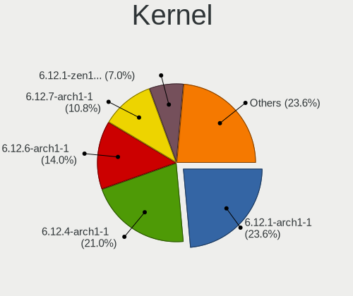
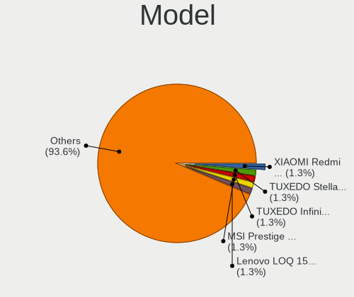
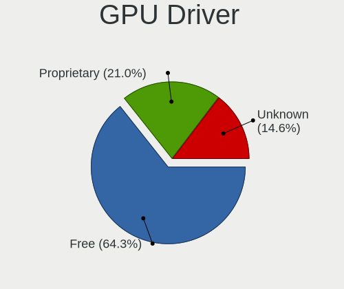
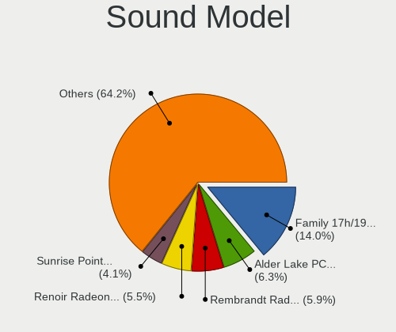
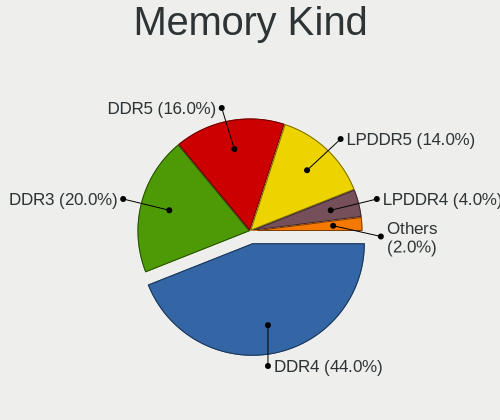

Arch Hardware Trends (Notebooks)
--------------------------------

A project to identify most popular hardware characteristics and track their change
over time based on data collected by Arch users at https://Linux-Hardware.org.

Anyone can contribute to this report by the [hw-probe](https://github.com/linuxhw/hw-probe) tool:

    sudo -E hw-probe -all -upload

This report is for one last month. Overall report since the beginning of time: [TestCoverage](https://github.com/linuxhw/TestCoverage)

Period: Apr, 2022.

Contents
--------

* [ System ](#system)
  - [ OS                       ](#os)
  - [ OS Family                ](#os-family)
  - [ Kernel                   ](#kernel)
  - [ Kernel Family            ](#kernel-family)
  - [ Kernel Major Ver.        ](#kernel-major-ver)
  - [ Arch                     ](#arch)
  - [ DE                       ](#de)
  - [ Display Server           ](#display-server)
  - [ Display Manager          ](#display-manager)
  - [ OS Lang                  ](#os-lang)
  - [ Boot Mode                ](#boot-mode)
  - [ Filesystem               ](#filesystem)
  - [ Part. scheme             ](#part-scheme)
  - [ Dual Boot with Linux/BSD ](#dual-boot-with-linuxbsd)
  - [ Dual Boot (Win)          ](#dual-boot-win)

* [ Board ](#board)
  - [ Vendor                   ](#vendor)
  - [ Model                    ](#model)
  - [ Model Family             ](#model-family)
  - [ MFG Year                 ](#mfg-year)
  - [ Form Factor              ](#form-factor)
  - [ Secure Boot              ](#secure-boot)
  - [ Coreboot                 ](#coreboot)
  - [ RAM Size                 ](#ram-size)
  - [ RAM Used                 ](#ram-used)
  - [ Total Drives             ](#total-drives)
  - [ Has CD-ROM               ](#has-cd-rom)
  - [ Has Ethernet             ](#has-ethernet)
  - [ Has WiFi                 ](#has-wifi)
  - [ Has Bluetooth            ](#has-bluetooth)

* [ Location ](#location)
  - [ Country                  ](#country)
  - [ City                     ](#city)

* [ Drives ](#drives)
  - [ Drive Vendor             ](#drive-vendor)
  - [ Drive Model              ](#drive-model)
  - [ HDD Vendor               ](#hdd-vendor)
  - [ SSD Vendor               ](#ssd-vendor)
  - [ Drive Kind               ](#drive-kind)
  - [ Drive Connector          ](#drive-connector)
  - [ Drive Size               ](#drive-size)
  - [ Space Total              ](#space-total)
  - [ Space Used               ](#space-used)
  - [ Malfunc. Drives          ](#malfunc-drives)
  - [ Malfunc. Drive Vendor    ](#malfunc-drive-vendor)
  - [ Malfunc. HDD Vendor      ](#malfunc-hdd-vendor)
  - [ Malfunc. Drive Kind      ](#malfunc-drive-kind)
  - [ Failed Drives            ](#failed-drives)
  - [ Failed Drive Vendor      ](#failed-drive-vendor)
  - [ Drive Status             ](#drive-status)

* [ Storage controller ](#storage-controller)
  - [ Storage Vendor           ](#storage-vendor)
  - [ Storage Model            ](#storage-model)
  - [ Storage Kind             ](#storage-kind)

* [ Processor ](#processor)
  - [ CPU Vendor               ](#cpu-vendor)
  - [ CPU Model                ](#cpu-model)
  - [ CPU Model Family         ](#cpu-model-family)
  - [ CPU Cores                ](#cpu-cores)
  - [ CPU Sockets              ](#cpu-sockets)
  - [ CPU Threads              ](#cpu-threads)
  - [ CPU Op-Modes             ](#cpu-op-modes)
  - [ CPU Microcode            ](#cpu-microcode)
  - [ CPU Microarch            ](#cpu-microarch)

* [ Graphics ](#graphics)
  - [ GPU Vendor               ](#gpu-vendor)
  - [ GPU Model                ](#gpu-model)
  - [ GPU Combo                ](#gpu-combo)
  - [ GPU Driver               ](#gpu-driver)
  - [ GPU Memory               ](#gpu-memory)

* [ Monitor ](#monitor)
  - [ Monitor Vendor           ](#monitor-vendor)
  - [ Monitor Model            ](#monitor-model)
  - [ Monitor Resolution       ](#monitor-resolution)
  - [ Monitor Diagonal         ](#monitor-diagonal)
  - [ Monitor Width            ](#monitor-width)
  - [ Aspect Ratio             ](#aspect-ratio)
  - [ Monitor Area             ](#monitor-area)
  - [ Pixel Density            ](#pixel-density)
  - [ Multiple Monitors        ](#multiple-monitors)

* [ Network ](#network)
  - [ Net Controller Vendor    ](#net-controller-vendor)
  - [ Net Controller Model     ](#net-controller-model)
  - [ Wireless Vendor          ](#wireless-vendor)
  - [ Wireless Model           ](#wireless-model)
  - [ Ethernet Vendor          ](#ethernet-vendor)
  - [ Ethernet Model           ](#ethernet-model)
  - [ Net Controller Kind      ](#net-controller-kind)
  - [ Used Controller          ](#used-controller)
  - [ NICs                     ](#nics)
  - [ IPv6                     ](#ipv6)

* [ Bluetooth ](#bluetooth)
  - [ Bluetooth Vendor         ](#bluetooth-vendor)
  - [ Bluetooth Model          ](#bluetooth-model)

* [ Sound ](#sound)
  - [ Sound Vendor             ](#sound-vendor)
  - [ Sound Model              ](#sound-model)

* [ Memory ](#memory)
  - [ Memory Vendor            ](#memory-vendor)
  - [ Memory Model             ](#memory-model)
  - [ Memory Kind              ](#memory-kind)
  - [ Memory Form Factor       ](#memory-form-factor)
  - [ Memory Size              ](#memory-size)
  - [ Memory Speed             ](#memory-speed)

* [ Printers & scanners ](#printers--scanners)
  - [ Printer Vendor           ](#printer-vendor)
  - [ Printer Model            ](#printer-model)
  - [ Scanner Vendor           ](#scanner-vendor)
  - [ Scanner Model            ](#scanner-model)

* [ Camera ](#camera)
  - [ Camera Vendor            ](#camera-vendor)
  - [ Camera Model             ](#camera-model)

* [ Security ](#security)
  - [ Fingerprint Vendor       ](#fingerprint-vendor)
  - [ Fingerprint Model        ](#fingerprint-model)
  - [ Chipcard Vendor          ](#chipcard-vendor)
  - [ Chipcard Model           ](#chipcard-model)

* [ Unsupported ](#unsupported)
  - [ Unsupported Devices      ](#unsupported-devices)
  - [ Unsupported Device Types ](#unsupported-device-types)

System
------

OS
--

Installed operating systems

| Name         | Notebooks | Percent |
|--------------|-----------|---------|
| Arch         | 75        | 63.03%  |
| Arch Rolling | 44        | 36.97%  |

OS Family
---------

OS without a version

| Name | Notebooks | Percent |
|------|-----------|---------|
| Arch | 119       | 100%    |

Kernel
------

Version of the Linux kernel

| Version                      | Notebooks | Percent |
|------------------------------|-----------|---------|
| 5.17.1-arch1-1               | 47        | 39.5%   |
| 5.17.1-zen1-1-zen            | 13        | 10.92%  |
| 5.17.3-arch1-1               | 12        | 10.08%  |
| 5.17.4-arch1-1               | 9         | 7.56%   |
| 5.17.2-arch3-1               | 8         | 6.72%   |
| 5.15.33-1-lts                | 4         | 3.36%   |
| 5.15.32-1-lts                | 3         | 2.52%   |
| 5.17.5-arch1-1               | 2         | 1.68%   |
| 5.17.3-zen1-1-zen            | 2         | 1.68%   |
| 5.16.16-arch1-1              | 2         | 1.68%   |
| 5.18.0-rc1-252-tkg-cfs       | 1         | 0.84%   |
| 5.17.5.ll48-1-lin-git+       | 1         | 0.84%   |
| 5.17.5-zen1-1-zen            | 1         | 0.84%   |
| 5.17.4-zen1-1-zen            | 1         | 0.84%   |
| 5.17.4-256-tkg-pds           | 1         | 0.84%   |
| 5.17.4-256-tkg-cfs           | 1         | 0.84%   |
| 5.17.2-arch2-1-custom        | 1         | 0.84%   |
| 5.17.2                       | 1         | 0.84%   |
| 5.17.1-arch1-1.1             | 1         | 0.84%   |
| 5.17.0-247-tkg-pds           | 1         | 0.84%   |
| 5.16.5-arch1-1               | 1         | 0.84%   |
| 5.16.17-hardened1-1-hardened | 1         | 0.84%   |
| 5.16.16-zen1-1-zen           | 1         | 0.84%   |
| 5.16.15-arch1-1              | 1         | 0.84%   |
| 5.16.13-arch1-1              | 1         | 0.84%   |
| 5.16.11-xanmod0-rog-1        | 1         | 0.84%   |
| 5.15.13-arch1-1              | 1         | 0.84%   |

Kernel Family
-------------

Linux kernel without a distro release

| Version | Notebooks | Percent |
|---------|-----------|---------|
| 5.17.1  | 61        | 51.26%  |
| 5.17.3  | 14        | 11.76%  |
| 5.17.4  | 12        | 10.08%  |
| 5.17.2  | 10        | 8.4%    |
| 5.17.5  | 4         | 3.36%   |
| 5.15.33 | 4         | 3.36%   |
| 5.16.16 | 3         | 2.52%   |
| 5.15.32 | 3         | 2.52%   |
| 5.18.0  | 1         | 0.84%   |
| 5.17.0  | 1         | 0.84%   |
| 5.16.5  | 1         | 0.84%   |
| 5.16.17 | 1         | 0.84%   |
| 5.16.15 | 1         | 0.84%   |
| 5.16.13 | 1         | 0.84%   |
| 5.16.11 | 1         | 0.84%   |
| 5.15.13 | 1         | 0.84%   |

Kernel Major Ver.
-----------------

Linux kernel major version

| Version | Notebooks | Percent |
|---------|-----------|---------|
| 5.17    | 102       | 85.71%  |
| 5.16    | 8         | 6.72%   |
| 5.15    | 8         | 6.72%   |
| 5.18    | 1         | 0.84%   |

Arch
----

OS architecture (x86_64, i586, etc.)

| Name   | Notebooks | Percent |
|--------|-----------|---------|
| x86_64 | 119       | 100%    |

DE
--

Desktop Environment

| Name       | Notebooks | Percent |
|------------|-----------|---------|
| KDE5       | 40        | 33.61%  |
| GNOME      | 35        | 29.41%  |
| Unknown    | 16        | 13.45%  |
| i3         | 9         | 7.56%   |
| sway       | 4         | 3.36%   |
| XFCE       | 3         | 2.52%   |
| X-Cinnamon | 3         | 2.52%   |
| awesome    | 3         | 2.52%   |
| LXQt       | 2         | 1.68%   |
| DWM        | 1         | 0.84%   |
| Cinnamon   | 1         | 0.84%   |
| Budgie     | 1         | 0.84%   |
| bspwm      | 1         | 0.84%   |

Display Server
--------------

X11 or Wayland

| Name    | Notebooks | Percent |
|---------|-----------|---------|
| X11     | 67        | 56.3%   |
| Wayland | 32        | 26.89%  |
| Tty     | 11        | 9.24%   |
| Unknown | 9         | 7.56%   |

Display Manager
---------------

SDDM, LightDM, etc.

| Name    | Notebooks | Percent |
|---------|-----------|---------|
| Unknown | 47        | 39.5%   |
| SDDM    | 32        | 26.89%  |
| LightDM | 19        | 15.97%  |
| GDM     | 16        | 13.45%  |
| Ly      | 3         | 2.52%   |
| GREETD  | 1         | 0.84%   |
| EMPTTY  | 1         | 0.84%   |

OS Lang
-------

Language

| Lang        | Notebooks | Percent |
|-------------|-----------|---------|
| en_US       | 66        | 55.46%  |
| Unknown     | 7         | 5.88%   |
| pt_BR       | 5         | 4.2%    |
| it_IT       | 5         | 4.2%    |
| fr_FR       | 4         | 3.36%   |
| en_IN       | 4         | 3.36%   |
| en_GB       | 4         | 3.36%   |
| de_DE       | 4         | 3.36%   |
| ca_ES       | 3         | 2.52%   |
| zh_CN       | 2         | 1.68%   |
| pl_PL       | 2         | 1.68%   |
| vi_VN       | 1         | 0.84%   |
| szl_PL      | 1         | 0.84%   |
| ru_RU       | 1         | 0.84%   |
| nl_NL       | 1         | 0.84%   |
| ja_JP       | 1         | 0.84%   |
| es_MX       | 1         | 0.84%   |
| es_ES       | 1         | 0.84%   |
| en_US-UTF-8 | 1         | 0.84%   |
| en_NZ       | 1         | 0.84%   |
| en_IE       | 1         | 0.84%   |
| en_CA       | 1         | 0.84%   |
| en_150      | 1         | 0.84%   |
| C           | 1         | 0.84%   |

Boot Mode
---------

EFI or BIOS

| Mode | Notebooks | Percent |
|------|-----------|---------|
| EFI  | 71        | 59.66%  |
| BIOS | 48        | 40.34%  |

Filesystem
----------

Type of filesystem

| Type  | Notebooks | Percent |
|-------|-----------|---------|
| Ext4  | 84        | 70.59%  |
| Btrfs | 30        | 25.21%  |
| Xfs   | 3         | 2.52%   |
| Zfs   | 2         | 1.68%   |

Part. scheme
------------

Scheme of partitioning

| Type    | Notebooks | Percent |
|---------|-----------|---------|
| GPT     | 83        | 69.75%  |
| Unknown | 28        | 23.53%  |
| MBR     | 8         | 6.72%   |

Dual Boot with Linux/BSD
------------------------

Hosting more than one Linux/BSD

| Dual boot | Notebooks | Percent |
|-----------|-----------|---------|
| No        | 112       | 94.12%  |
| Yes       | 7         | 5.88%   |

Dual Boot (Win)
---------------

Hosting Linux and Windows

| Dual boot | Notebooks | Percent |
|-----------|-----------|---------|
| No        | 87        | 73.11%  |
| Yes       | 32        | 26.89%  |

Board
-----

Vendor
------

Motherboard manufacturer

| Name                   | Notebooks | Percent |
|------------------------|-----------|---------|
| Lenovo                 | 36        | 30.25%  |
| Dell                   | 21        | 17.65%  |
| Acer                   | 12        | 10.08%  |
| Hewlett-Packard        | 10        | 8.4%    |
| ASUSTek Computer       | 7         | 5.88%   |
| Framework              | 5         | 4.2%    |
| MSI                    | 4         | 3.36%   |
| Apple                  | 4         | 3.36%   |
| TUXEDO                 | 3         | 2.52%   |
| Razer                  | 3         | 2.52%   |
| LG Electronics         | 2         | 1.68%   |
| HUAWEI                 | 2         | 1.68%   |
| Alienware              | 2         | 1.68%   |
| Toshiba                | 1         | 0.84%   |
| Star Labs              | 1         | 0.84%   |
| Sony                   | 1         | 0.84%   |
| Samsung Electronics    | 1         | 0.84%   |
| MouseComputer          | 1         | 0.84%   |
| Monster                | 1         | 0.84%   |
| Fujitsu                | 1         | 0.84%   |
| Avell High Performance | 1         | 0.84%   |

Model
-----

Motherboard model

| Name                                                  | Notebooks | Percent |
|-------------------------------------------------------|-----------|---------|
| Framework Laptop                                      | 5         | 4.2%    |
| Lenovo Legion 5 15IMH05H 81Y6                         | 2         | 1.68%   |
| Dell XPS 13 9310                                      | 2         | 1.68%   |
| TUXEDO Pulse 15 Gen1                                  | 1         | 0.84%   |
| TUXEDO InfinityBook Pro 14 Gen6                       | 1         | 0.84%   |
| TUXEDO Book_XA1510                                    | 1         | 0.84%   |
| Toshiba TECRA R940                                    | 1         | 0.84%   |
| Star Labs Lite                                        | 1         | 0.84%   |
| Sony VPCF115FM                                        | 1         | 0.84%   |
| Samsung 270E5J/2570EJ                                 | 1         | 0.84%   |
| Razer Blade Stealth                                   | 1         | 0.84%   |
| Razer Blade 15 Studio Edition (Early 2020) - RZ09-033 | 1         | 0.84%   |
| Razer Blade                                           | 1         | 0.84%   |
| MSI Modern 15 A5M                                     | 1         | 0.84%   |
| MSI GL75 Leopard 10SDK                                | 1         | 0.84%   |
| MSI GL63 9SD                                          | 1         | 0.84%   |
| MSI Creator 15 A10SFS                                 | 1         | 0.84%   |
| MouseComputer NH55Dx                                  | 1         | 0.84%   |
| Monster ABRA A5 V15.8                                 | 1         | 0.84%   |
| LG S430-G.BC33P1                                      | 1         | 0.84%   |
| LG 15Z95P-G.AA78B                                     | 1         | 0.84%   |
| Lenovo Yoga Slim 7 Carbon 14ACN6 82L0                 | 1         | 0.84%   |
| Lenovo Yoga Slim 7 14ARE05 82A2                       | 1         | 0.84%   |
| Lenovo XiaoXin Chao7000-14IKBR 81GA                   | 1         | 0.84%   |
| Lenovo XiaoXin Air 13IML 81WV                         | 1         | 0.84%   |
| Lenovo V130-15IGM 81HL                                | 1         | 0.84%   |
| Lenovo ThinkPad X220 Tablet 42992PG                   | 1         | 0.84%   |
| Lenovo ThinkPad X1 Carbon 7th 20QDCTO1WW              | 1         | 0.84%   |
| Lenovo ThinkPad T550 20CKCTO1WW                       | 1         | 0.84%   |
| Lenovo ThinkPad T490s 20NY000JMZ                      | 1         | 0.84%   |
| Lenovo ThinkPad T490s 20NXCTO1WW                      | 1         | 0.84%   |
| Lenovo ThinkPad T480s 20L70058GE                      | 1         | 0.84%   |
| Lenovo ThinkPad T480 20L6S93F00                       | 1         | 0.84%   |
| Lenovo ThinkPad T440p 20AN006GUS                      | 1         | 0.84%   |
| Lenovo ThinkPad T410 2537E82                          | 1         | 0.84%   |
| Lenovo ThinkPad T14s Gen 2i 20WM0051US                | 1         | 0.84%   |
| Lenovo ThinkPad T14 Gen 2i 20W00097FR                 | 1         | 0.84%   |
| Lenovo ThinkPad T14 Gen 1 20UD0013MH                  | 1         | 0.84%   |
| Lenovo ThinkPad P14s Gen 2a 21A1S04W00                | 1         | 0.84%   |
| Lenovo ThinkPad P1 Gen 4i 20Y30010MH                  | 1         | 0.84%   |
| Lenovo ThinkPad E14 Gen 2 20T6000MGE                  | 1         | 0.84%   |
| Lenovo ThinkBook 15-IIL 20SM                          | 1         | 0.84%   |
| Lenovo Legion Y540-15IRH-PG0 81SY                     | 1         | 0.84%   |
| Lenovo Legion Y530-15ICH 81FV                         | 1         | 0.84%   |
| Lenovo IdeaPad S540-13ARE 82DL                        | 1         | 0.84%   |
| Lenovo IdeaPad S145-15IWL 81S9                        | 1         | 0.84%   |
| Lenovo IdeaPad L340-15API 81LW                        | 1         | 0.84%   |
| Lenovo IdeaPad Gaming 3 15ACH6 82K2                   | 1         | 0.84%   |
| Lenovo IdeaPad 700-15ISK 80RU                         | 1         | 0.84%   |
| Lenovo IdeaPad 5 Pro 14ACN6 82L7                      | 1         | 0.84%   |
| Lenovo IdeaPad 5 15ALC05 82LN                         | 1         | 0.84%   |
| Lenovo IdeaPad 5 14ALC05 82LM                         | 1         | 0.84%   |
| Lenovo IdeaPad 320-14ISK 80XG                         | 1         | 0.84%   |
| Lenovo Flex 2-14 20404                                | 1         | 0.84%   |
| Lenovo E31-80 80MX                                    | 1         | 0.84%   |
| HUAWEI KLVL-WXXW                                      | 1         | 0.84%   |
| HUAWEI KLVL-WXX9                                      | 1         | 0.84%   |
| HP ZBook Firefly 15 G7 Mobile Workstation             | 1         | 0.84%   |
| HP ZBook 17 G2                                        | 1         | 0.84%   |
| HP Pavilion Notebook                                  | 1         | 0.84%   |

Model Family
------------

Motherboard model prefix

| Name                        | Notebooks | Percent |
|-----------------------------|-----------|---------|
| Lenovo ThinkPad             | 15        | 12.61%  |
| Lenovo IdeaPad              | 9         | 7.56%   |
| Dell Inspiron               | 6         | 5.04%   |
| Framework Laptop            | 5         | 4.2%    |
| Dell XPS                    | 5         | 4.2%    |
| Acer Aspire                 | 5         | 4.2%    |
| Lenovo Legion               | 4         | 3.36%   |
| Dell Latitude               | 4         | 3.36%   |
| Razer Blade                 | 3         | 2.52%   |
| HP Pavilion                 | 3         | 2.52%   |
| Dell Precision              | 3         | 2.52%   |
| Acer Nitro                  | 3         | 2.52%   |
| Lenovo Yoga                 | 2         | 1.68%   |
| Lenovo XiaoXin              | 2         | 1.68%   |
| HP ZBook                    | 2         | 1.68%   |
| HP EliteBook                | 2         | 1.68%   |
| Dell Vostro                 | 2         | 1.68%   |
| TUXEDO Pulse                | 1         | 0.84%   |
| TUXEDO InfinityBook         | 1         | 0.84%   |
| TUXEDO Book                 | 1         | 0.84%   |
| Toshiba TECRA               | 1         | 0.84%   |
| Star Labs Lite              | 1         | 0.84%   |
| Sony VPCF115FM              | 1         | 0.84%   |
| Samsung 270E5J              | 1         | 0.84%   |
| MSI Modern                  | 1         | 0.84%   |
| MSI GL75                    | 1         | 0.84%   |
| MSI GL63                    | 1         | 0.84%   |
| MSI Creator                 | 1         | 0.84%   |
| MouseComputer NH55Dx        | 1         | 0.84%   |
| Monster ABRA                | 1         | 0.84%   |
| LG S430-G.BC33P1            | 1         | 0.84%   |
| LG 15Z95P-G.AA78B           | 1         | 0.84%   |
| Lenovo V130-15IGM           | 1         | 0.84%   |
| Lenovo ThinkBook            | 1         | 0.84%   |
| Lenovo Flex                 | 1         | 0.84%   |
| Lenovo E31-80               | 1         | 0.84%   |
| HUAWEI KLVL-WXXW            | 1         | 0.84%   |
| HUAWEI KLVL-WXX9            | 1         | 0.84%   |
| HP Notebook                 | 1         | 0.84%   |
| HP Laptop                   | 1         | 0.84%   |
| HP ENVY                     | 1         | 0.84%   |
| Fujitsu LIFEBOOK            | 1         | 0.84%   |
| Dell G5                     | 1         | 0.84%   |
| Avell High Performance B.ON | 1         | 0.84%   |
| ASUS ZenBook                | 1         | 0.84%   |
| ASUS VivoBook               | 1         | 0.84%   |
| ASUS Strix                  | 1         | 0.84%   |
| ASUS S551LN                 | 1         | 0.84%   |
| ASUS ROG                    | 1         | 0.84%   |
| ASUS GL752VW                | 1         | 0.84%   |
| ASUS E402SA                 | 1         | 0.84%   |
| Apple MacBookPro8           | 1         | 0.84%   |
| Apple MacBookPro12          | 1         | 0.84%   |
| Apple MacBookPro10          | 1         | 0.84%   |
| Apple MacBookAir5           | 1         | 0.84%   |
| Alienware x17               | 1         | 0.84%   |
| Alienware M11x              | 1         | 0.84%   |
| Acer TravelMate             | 1         | 0.84%   |
| Acer One                    | 1         | 0.84%   |
| Acer Extensa                | 1         | 0.84%   |

MFG Year
--------

Motherboard manufacture year

| Year | Notebooks | Percent |
|------|-----------|---------|
| 2021 | 26        | 21.85%  |
| 2020 | 20        | 16.81%  |
| 2019 | 14        | 11.76%  |
| 2018 | 13        | 10.92%  |
| 2015 | 11        | 9.24%   |
| 2017 | 8         | 6.72%   |
| 2014 | 7         | 5.88%   |
| 2011 | 5         | 4.2%    |
| 2016 | 4         | 3.36%   |
| 2013 | 3         | 2.52%   |
| 2012 | 3         | 2.52%   |
| 2010 | 2         | 1.68%   |
| 2022 | 1         | 0.84%   |
| 2009 | 1         | 0.84%   |
| 2008 | 1         | 0.84%   |

Form Factor
-----------

Physical design of the computer

| Name     | Notebooks | Percent |
|----------|-----------|---------|
| Notebook | 119       | 100%    |

Secure Boot
-----------

Enabled or disabled

| State    | Notebooks | Percent |
|----------|-----------|---------|
| Disabled | 118       | 99.16%  |
| Enabled  | 1         | 0.84%   |

Coreboot
--------

Have coreboot on board

| Used | Notebooks | Percent |
|------|-----------|---------|
| No   | 119       | 100%    |

RAM Size
--------

Total RAM memory

| Size in GB  | Notebooks | Percent |
|-------------|-----------|---------|
| 16.01-24.0  | 41        | 34.45%  |
| 8.01-16.0   | 30        | 25.21%  |
| 4.01-8.0    | 18        | 15.13%  |
| 32.01-64.0  | 13        | 10.92%  |
| 3.01-4.0    | 12        | 10.08%  |
| 64.01-256.0 | 3         | 2.52%   |
| 24.01-32.0  | 1         | 0.84%   |
| 1.01-2.0    | 1         | 0.84%   |

RAM Used
--------

Used RAM memory

| Used GB    | Notebooks | Percent |
|------------|-----------|---------|
| 4.01-8.0   | 31        | 26.05%  |
| 3.01-4.0   | 26        | 21.85%  |
| 2.01-3.0   | 23        | 19.33%  |
| 1.01-2.0   | 23        | 19.33%  |
| 8.01-16.0  | 12        | 10.08%  |
| 0.51-1.0   | 3         | 2.52%   |
| 24.01-32.0 | 1         | 0.84%   |

Total Drives
------------

Number of drives on board

| Drives | Notebooks | Percent |
|--------|-----------|---------|
| 1      | 86        | 72.27%  |
| 2      | 22        | 18.49%  |
| 3      | 10        | 8.4%    |
| 4      | 1         | 0.84%   |

Has CD-ROM
----------

Has CD-ROM on board

| Presented | Notebooks | Percent |
|-----------|-----------|---------|
| No        | 98        | 82.35%  |
| Yes       | 21        | 17.65%  |

Has Ethernet
------------

Has Ethernet on board

| Presented | Notebooks | Percent |
|-----------|-----------|---------|
| Yes       | 91        | 76.47%  |
| No        | 28        | 23.53%  |

Has WiFi
--------

Has WiFi module

| Presented | Notebooks | Percent |
|-----------|-----------|---------|
| Yes       | 118       | 99.16%  |
| No        | 1         | 0.84%   |

Has Bluetooth
-------------

Has Bluetooth module

| Presented | Notebooks | Percent |
|-----------|-----------|---------|
| Yes       | 106       | 89.08%  |
| No        | 13        | 10.92%  |

Location
--------

Country
-------

Geographic location (country)

| Country     | Notebooks | Percent |
|-------------|-----------|---------|
| USA         | 17        | 14.29%  |
| Germany     | 11        | 9.24%   |
| India       | 8         | 6.72%   |
| Brazil      | 8         | 6.72%   |
| France      | 7         | 5.88%   |
| Spain       | 6         | 5.04%   |
| Russia      | 6         | 5.04%   |
| Turkey      | 5         | 4.2%    |
| Netherlands | 5         | 4.2%    |
| Italy       | 5         | 4.2%    |
| China       | 4         | 3.36%   |
| Poland      | 3         | 2.52%   |
| UK          | 2         | 1.68%   |
| Indonesia   | 2         | 1.68%   |
| Estonia     | 2         | 1.68%   |
| Vietnam     | 1         | 0.84%   |
| Uruguay     | 1         | 0.84%   |
| Ukraine     | 1         | 0.84%   |
| Switzerland | 1         | 0.84%   |
| Sweden      | 1         | 0.84%   |
| Slovenia    | 1         | 0.84%   |
| Philippines | 1         | 0.84%   |
| Peru        | 1         | 0.84%   |
| Norway      | 1         | 0.84%   |
| Mexico      | 1         | 0.84%   |
| Lithuania   | 1         | 0.84%   |
| Latvia      | 1         | 0.84%   |
| Kenya       | 1         | 0.84%   |
| Kazakhstan  | 1         | 0.84%   |
| Japan       | 1         | 0.84%   |
| Ireland     | 1         | 0.84%   |
| Hungary     | 1         | 0.84%   |
| Hong Kong   | 1         | 0.84%   |
| Greece      | 1         | 0.84%   |
| Ghana       | 1         | 0.84%   |
| Finland     | 1         | 0.84%   |
| Egypt       | 1         | 0.84%   |
| Czechia     | 1         | 0.84%   |
| Colombia    | 1         | 0.84%   |
| Canada      | 1         | 0.84%   |
| Bulgaria    | 1         | 0.84%   |
| Bangladesh  | 1         | 0.84%   |
| Austria     | 1         | 0.84%   |

City
----

Geographic location (city)

| City                | Notebooks | Percent |
|---------------------|-----------|---------|
| Barcelona           | 3         | 2.52%   |
| Paris               | 2         | 1.68%   |
| Nantes              | 2         | 1.68%   |
| Munich              | 2         | 1.68%   |
| Moscow              | 2         | 1.68%   |
| Brescia             | 2         | 1.68%   |
| Amsterdam           | 2         | 1.68%   |
| Zapopan             | 1         | 0.84%   |
| Yogyakarta          | 1         | 0.84%   |
| Wuhan               | 1         | 0.84%   |
| Warsaw              | 1         | 0.84%   |
| Vřesina            | 1         | 0.84%   |
| Vilnius             | 1         | 0.84%   |
| Victoria            | 1         | 0.84%   |
| Ulan-Ude            | 1         | 0.84%   |
| Ufa                 | 1         | 0.84%   |
| Uberlândia         | 1         | 0.84%   |
| Trabzon             | 1         | 0.84%   |
| Thuan An            | 1         | 0.84%   |
| Tholey              | 1         | 0.84%   |
| Tallinn             | 1         | 0.84%   |
| Songadh             | 1         | 0.84%   |
| Sofia               | 1         | 0.84%   |
| Soest               | 1         | 0.84%   |
| Singen              | 1         | 0.84%   |
| Simferopol          | 1         | 0.84%   |
| Shinagawa           | 1         | 0.84%   |
| Shenzhen            | 1         | 0.84%   |
| Sheffield           | 1         | 0.84%   |
| Schwelm             | 1         | 0.84%   |
| Sao Paulo           | 1         | 0.84%   |
| Sao Jose da Vitoria | 1         | 0.84%   |
| Santa Ana           | 1         | 0.84%   |
| Samara              | 1         | 0.84%   |
| Salvador            | 1         | 0.84%   |
| Salamanca           | 1         | 0.84%   |
| Rho                 | 1         | 0.84%   |
| Puruliya            | 1         | 0.84%   |
| Pilisvorosvar       | 1         | 0.84%   |
| Petaluma            | 1         | 0.84%   |
| Pendik              | 1         | 0.84%   |
| Paros               | 1         | 0.84%   |
| Ozoir-la-Ferriere   | 1         | 0.84%   |
| Ourinhos            | 1         | 0.84%   |
| Olesnica            | 1         | 0.84%   |
| Odintsovo           | 1         | 0.84%   |
| Oakland             | 1         | 0.84%   |
| Nur-Sultan          | 1         | 0.84%   |
| North Bend          | 1         | 0.84%   |
| Nairobi             | 1         | 0.84%   |
| Montevideo          | 1         | 0.84%   |
| Mohali              | 1         | 0.84%   |
| Mococa              | 1         | 0.84%   |
| Milan               | 1         | 0.84%   |
| Mesa                | 1         | 0.84%   |
| Medvode             | 1         | 0.84%   |
| Maisons-Laffitte    | 1         | 0.84%   |
| Maisons-Alfort      | 1         | 0.84%   |
| Lucknow             | 1         | 0.84%   |
| Los Angeles         | 1         | 0.84%   |

Drives
------

Drive Vendor
------------

Hard drive vendors

| Vendor                      | Notebooks | Drives | Percent |
|-----------------------------|-----------|--------|---------|
| Samsung Electronics         | 26        | 26     | 16.56%  |
| WDC                         | 18        | 19     | 11.46%  |
| Seagate                     | 16        | 17     | 10.19%  |
| SanDisk                     | 14        | 14     | 8.92%   |
| SK Hynix                    | 13        | 14     | 8.28%   |
| Kingston                    | 8         | 9      | 5.1%    |
| Toshiba                     | 7         | 8      | 4.46%   |
| Crucial                     | 6         | 8      | 3.82%   |
| Unknown                     | 5         | 5      | 3.18%   |
| Phison                      | 5         | 5      | 3.18%   |
| Intel                       | 5         | 6      | 3.18%   |
| Micron Technology           | 4         | 4      | 2.55%   |
| HGST                        | 4         | 4      | 2.55%   |
| A-DATA Technology           | 3         | 3      | 1.91%   |
| OCZ                         | 2         | 2      | 1.27%   |
| Apple                       | 2         | 2      | 1.27%   |
| XrayDisk                    | 1         | 2      | 0.64%   |
| XPG                         | 1         | 1      | 0.64%   |
| Union Memory (Shenzhen)     | 1         | 1      | 0.64%   |
| StoreJet                    | 1         | 1      | 0.64%   |
| SPCC                        | 1         | 1      | 0.64%   |
| Realtek                     | 1         | 1      | 0.64%   |
| PNY                         | 1         | 1      | 0.64%   |
| Patriot                     | 1         | 1      | 0.64%   |
| Micron/Crucial Technology   | 1         | 1      | 0.64%   |
| MAXIO Technology (Hangzhou) | 1         | 1      | 0.64%   |
| Lite-On                     | 1         | 1      | 0.64%   |
| Lexar                       | 1         | 1      | 0.64%   |
| Lenovo                      | 1         | 1      | 0.64%   |
| KingSpec                    | 1         | 1      | 0.64%   |
| Indilinx                    | 1         | 1      | 0.64%   |
| Hitachi                     | 1         | 1      | 0.64%   |
| China                       | 1         | 1      | 0.64%   |
| AMD                         | 1         | 1      | 0.64%   |
| Unknown                     | 1         | 1      | 0.64%   |

Drive Model
-----------

Hard drive models

| Model                                        | Notebooks | Percent |
|----------------------------------------------|-----------|---------|
| Seagate ST1000LM024 HN-M101MBB 1TB           | 5         | 3.01%   |
| Sandisk NVMe SSD Drive 1TB                   | 4         | 2.41%   |
| SK Hynix NVMe SSD Drive 512GB                | 3         | 1.81%   |
| Seagate ST1000LX015-1U7172 1TB               | 3         | 1.81%   |
| Kingston SA400S37240G 240GB SSD              | 3         | 1.81%   |
| WDC WDS240G2G0B-00EPW0 240GB SSD             | 2         | 1.2%    |
| WDC WD10SPZX-21Z10T0 1TB                     | 2         | 1.2%    |
| Toshiba MQ04ABF100 1TB                       | 2         | 1.2%    |
| Toshiba KBG30ZMS128G 128GB NVMe SSD          | 2         | 1.2%    |
| SK Hynix PC601 NVMe 512GB                    | 2         | 1.2%    |
| Seagate ST1000LM035-1RK172 1TB               | 2         | 1.2%    |
| Seagate BUP Slim 2TB                         | 2         | 1.2%    |
| Samsung SSD 980 PRO 500GB                    | 2         | 1.2%    |
| Samsung MZVLB512HBJQ-000L2 512GB             | 2         | 1.2%    |
| Micron NVMe SSD Drive 512GB                  | 2         | 1.2%    |
| HGST HTS541010A9E680 1TB                     | 2         | 1.2%    |
| Crucial CT240BX500SSD1 240GB                 | 2         | 1.2%    |
| XrayDisk SSD 240GB                           | 1         | 0.6%    |
| XrayDisk 240GB                               | 1         | 0.6%    |
| XPG NVMe SSD Drive 1024GB                    | 1         | 0.6%    |
| WDC WDS500G3X0C-00SJG0 500GB                 | 1         | 0.6%    |
| WDC WDS500G1X0E-00AFY0 500GB                 | 1         | 0.6%    |
| WDC WDS120G2G0A-00JH30 120GB SSD             | 1         | 0.6%    |
| WDC WDS100T2B0C-00PXH0 1TB                   | 1         | 0.6%    |
| WDC WDS100T1X0E-00AFY0 1TB                   | 1         | 0.6%    |
| WDC WDBNCE5000PNC 500GB SSD                  | 1         | 0.6%    |
| WDC WD7500BPVX-22JC3T0 752GB                 | 1         | 0.6%    |
| WDC WD5000LPCX-21VHAT0 500GB                 | 1         | 0.6%    |
| WDC WD10SPZX-24Z10T0 1TB                     | 1         | 0.6%    |
| WDC WD10SPZX-22Z10T1 1TB                     | 1         | 0.6%    |
| WDC WD10S21X-24R1BT0-SSHD-8GB                | 1         | 0.6%    |
| WDC WD10JPVX-22JC3T0 1TB                     | 1         | 0.6%    |
| WDC PC SN730 SDBQNTY-1T00-1001 1TB           | 1         | 0.6%    |
| WDC PC SN720 SDAQNTW-256G-1001 256GB         | 1         | 0.6%    |
| WDC PC SN530 SDBPMPZ-512G-1101 512GB         | 1         | 0.6%    |
| Unknown SL16G  16GB                          | 1         | 0.6%    |
| Unknown SC64G  64GB                          | 1         | 0.6%    |
| Unknown SC2 mSATA SSD 64GB                   | 1         | 0.6%    |
| Unknown MMC Card  64GB                       | 1         | 0.6%    |
| Unknown MMC Card  256GB                      | 1         | 0.6%    |
| Union Memory (Shenzhen) NVMe SSD Drive 512GB | 1         | 0.6%    |
| Toshiba MQ02ABD100H 1TB                      | 1         | 0.6%    |
| Toshiba MQ01ABF050 500GB                     | 1         | 0.6%    |
| Toshiba MQ01ABD100 1TB                       | 1         | 0.6%    |
| Toshiba KBG40ZNT512G MEMORY 512GB            | 1         | 0.6%    |
| StoreJet Transcend 480GB SSD                 | 1         | 0.6%    |
| SPCC M.2 PCIe SSD 256GB                      | 1         | 0.6%    |
| SK Hynix SKHynix_HFS512GDE9X081N 512GB       | 1         | 0.6%    |
| SK Hynix SHGS31-500GS-2 500GB SSD            | 1         | 0.6%    |
| SK Hynix SH920 mSATA 128GB SSD               | 1         | 0.6%    |
| SK Hynix PC711 NVMe 1TB                      | 1         | 0.6%    |
| SK Hynix PC300 NVMe 512GB                    | 1         | 0.6%    |
| SK Hynix HFM512GDJTNG-8310A 512GB            | 1         | 0.6%    |
| SK Hynix HFM512GD3JX013N 512GB               | 1         | 0.6%    |
| SK Hynix BC711 NVMe 512GB                    | 1         | 0.6%    |
| SK Hynix BC511 NVMe 512GB                    | 1         | 0.6%    |
| Seagate ST9500325AS 500GB                    | 1         | 0.6%    |
| Seagate ST2000LM015-2E8174 2TB               | 1         | 0.6%    |
| Seagate ST2000LM007-1R8174 2TB               | 1         | 0.6%    |
| Seagate ST1000LM049-2GH172 1TB               | 1         | 0.6%    |

HDD Vendor
----------

Hard disk drive vendors

| Vendor  | Notebooks | Drives | Percent |
|---------|-----------|--------|---------|
| Seagate | 16        | 17     | 47.06%  |
| WDC     | 8         | 8      | 23.53%  |
| Toshiba | 5         | 5      | 14.71%  |
| HGST    | 4         | 4      | 11.76%  |
| Hitachi | 1         | 1      | 2.94%   |

SSD Vendor
----------

Solid state drive vendors

| Vendor              | Notebooks | Drives | Percent |
|---------------------|-----------|--------|---------|
| SanDisk             | 5         | 5      | 12.2%   |
| Samsung Electronics | 5         | 5      | 12.2%   |
| Crucial             | 5         | 6      | 12.2%   |
| WDC                 | 4         | 4      | 9.76%   |
| Kingston            | 4         | 5      | 9.76%   |
| SK Hynix            | 2         | 2      | 4.88%   |
| OCZ                 | 2         | 2      | 4.88%   |
| Apple               | 2         | 2      | 4.88%   |
| A-DATA Technology   | 2         | 2      | 4.88%   |
| XrayDisk            | 1         | 1      | 2.44%   |
| Unknown             | 1         | 1      | 2.44%   |
| StoreJet            | 1         | 1      | 2.44%   |
| PNY                 | 1         | 1      | 2.44%   |
| Patriot             | 1         | 1      | 2.44%   |
| Lexar               | 1         | 1      | 2.44%   |
| KingSpec            | 1         | 1      | 2.44%   |
| Indilinx            | 1         | 1      | 2.44%   |
| China               | 1         | 1      | 2.44%   |
| Unknown             | 1         | 1      | 2.44%   |

Drive Kind
----------

HDD or SSD

| Kind    | Notebooks | Drives | Percent |
|---------|-----------|--------|---------|
| NVMe    | 72        | 83     | 48.32%  |
| SSD     | 38        | 43     | 25.5%   |
| HDD     | 34        | 35     | 22.82%  |
| MMC     | 4         | 4      | 2.68%   |
| Unknown | 1         | 1      | 0.67%   |

Drive Connector
---------------

SATA, SAS, NVMe, etc.

| Type | Notebooks | Drives | Percent |
|------|-----------|--------|---------|
| NVMe | 72        | 82     | 51.8%   |
| SATA | 59        | 76     | 42.45%  |
| SAS  | 4         | 4      | 2.88%   |
| MMC  | 4         | 4      | 2.88%   |

Drive Size
----------

Size of hard drive

| Size in TB | Notebooks | Drives | Percent |
|------------|-----------|--------|---------|
| 0.01-0.5   | 39        | 43     | 53.42%  |
| 0.51-1.0   | 29        | 30     | 39.73%  |
| 1.01-2.0   | 5         | 5      | 6.85%   |

Space Total
-----------

Amount of disk space available on the file system

| Size in GB     | Notebooks | Percent |
|----------------|-----------|---------|
| 251-500        | 37        | 31.09%  |
| 101-250        | 24        | 20.17%  |
| 501-1000       | 22        | 18.49%  |
| 1001-2000      | 14        | 11.76%  |
| More than 3000 | 8         | 6.72%   |
| 2001-3000      | 6         | 5.04%   |
| Unknown        | 4         | 3.36%   |
| 1-20           | 2         | 1.68%   |
| 51-100         | 2         | 1.68%   |

Space Used
----------

Amount of used disk space

| Used GB   | Notebooks | Percent |
|-----------|-----------|---------|
| 101-250   | 32        | 26.89%  |
| 21-50     | 22        | 18.49%  |
| 251-500   | 14        | 11.76%  |
| 1-20      | 14        | 11.76%  |
| 1001-2000 | 10        | 8.4%    |
| 501-1000  | 10        | 8.4%    |
| 51-100    | 10        | 8.4%    |
| Unknown   | 4         | 3.36%   |
| 2001-3000 | 3         | 2.52%   |

Malfunc. Drives
---------------

Drive models with a malfunction

| Model                           | Notebooks | Drives | Percent |
|---------------------------------|-----------|--------|---------|
| Toshiba MQ02ABD100H 1TB         | 1         | 1      | 14.29%  |
| Seagate ST1000LX015-1U7172 1TB  | 1         | 1      | 14.29%  |
| Seagate ST1000LM014-SSHD-8GB    | 1         | 1      | 14.29%  |
| Kingston SA400S37480G 480GB SSD | 1         | 1      | 14.29%  |
| KingSpec MT-1TB SSD             | 1         | 1      | 14.29%  |
| HGST HTS725050A7E630 500GB      | 1         | 1      | 14.29%  |
| HGST HTS541010A9E680 1TB        | 1         | 1      | 14.29%  |

Malfunc. Drive Vendor
---------------------

Vendors of faulty drives

| Vendor   | Notebooks | Drives | Percent |
|----------|-----------|--------|---------|
| Seagate  | 2         | 2      | 28.57%  |
| HGST     | 2         | 2      | 28.57%  |
| Toshiba  | 1         | 1      | 14.29%  |
| Kingston | 1         | 1      | 14.29%  |
| KingSpec | 1         | 1      | 14.29%  |

Malfunc. HDD Vendor
-------------------

Vendors of faulty HDD drives

| Vendor  | Notebooks | Drives | Percent |
|---------|-----------|--------|---------|
| Seagate | 2         | 2      | 40%     |
| HGST    | 2         | 2      | 40%     |
| Toshiba | 1         | 1      | 20%     |

Malfunc. Drive Kind
-------------------

Kinds of faulty drives

| Kind | Notebooks | Drives | Percent |
|------|-----------|--------|---------|
| HDD  | 5         | 5      | 71.43%  |
| SSD  | 2         | 2      | 28.57%  |

Failed Drives
-------------

Failed drive models

Zero info for selected period =(

Failed Drive Vendor
-------------------

Failed drive vendors

Zero info for selected period =(

Drive Status
------------

Number of failed and malfunc. drives

| Status   | Notebooks | Drives | Percent |
|----------|-----------|--------|---------|
| Works    | 72        | 90     | 55.81%  |
| Detected | 51        | 69     | 39.53%  |
| Malfunc  | 6         | 7      | 4.65%   |

Storage controller
------------------

Storage Vendor
--------------

Storage controller vendors

| Vendor                       | Notebooks | Percent |
|------------------------------|-----------|---------|
| Intel                        | 69        | 44.52%  |
| Samsung Electronics          | 21        | 13.55%  |
| Sandisk                      | 15        | 9.68%   |
| AMD                          | 12        | 7.74%   |
| SK Hynix                     | 11        | 7.1%    |
| Phison Electronics           | 6         | 3.87%   |
| Micron Technology            | 4         | 2.58%   |
| Kingston Technology Company  | 4         | 2.58%   |
| Micron/Crucial Technology    | 3         | 1.94%   |
| Toshiba America Info Systems | 2         | 1.29%   |
| ADATA Technology             | 2         | 1.29%   |
| Union Memory (Shenzhen)      | 1         | 0.65%   |
| Silicon Motion               | 1         | 0.65%   |
| MAXIO Technology (Hangzhou)  | 1         | 0.65%   |
| Lite-On Technology           | 1         | 0.65%   |
| Lenovo                       | 1         | 0.65%   |
| KIOXIA                       | 1         | 0.65%   |

Storage Model
-------------

Storage controller models

| Model                                                                                  | Notebooks | Percent |
|----------------------------------------------------------------------------------------|-----------|---------|
| AMD FCH SATA Controller [AHCI mode]                                                    | 12        | 7.45%   |
| Samsung NVMe SSD Controller SM981/PM981/PM983                                          | 11        | 6.83%   |
| Intel Sunrise Point-LP SATA Controller [AHCI mode]                                     | 9         | 5.59%   |
| Intel HM170/QM170 Chipset SATA Controller [AHCI Mode]                                  | 7         | 4.35%   |
| Intel Cannon Lake Mobile PCH SATA AHCI Controller                                      | 6         | 3.73%   |
| Intel 8 Series SATA Controller 1 [AHCI mode]                                           | 6         | 3.73%   |
| Samsung NVMe SSD Controller PM9A1/PM9A3/980PRO                                         | 5         | 3.11%   |
| Intel Wildcat Point-LP SATA Controller [AHCI Mode]                                     | 5         | 3.11%   |
| Intel 82801 Mobile SATA Controller [RAID mode]                                         | 5         | 3.11%   |
| Intel 7 Series Chipset Family 6-port SATA Controller [AHCI mode]                       | 5         | 3.11%   |
| Intel 400 Series Chipset Family SATA AHCI Controller                                   | 5         | 3.11%   |
| SK Hynix Gold P31 SSD                                                                  | 4         | 2.48%   |
| Sandisk WD PC SN810 / Black SN850 NVMe SSD                                             | 4         | 2.48%   |
| Sandisk WD Blue SN550 NVMe SSD                                                         | 4         | 2.48%   |
| Sandisk WD Black SN750 / PC SN730 NVMe SSD                                             | 4         | 2.48%   |
| Phison PS5013 E13 NVMe Controller                                                      | 4         | 2.48%   |
| Micron Non-Volatile memory controller                                                  | 4         | 2.48%   |
| Intel 6 Series/C200 Series Chipset Family 6 port Mobile SATA AHCI Controller           | 4         | 2.48%   |
| SK Hynix Non-Volatile memory controller                                                | 3         | 1.86%   |
| Intel SSD 660P Series                                                                  | 3         | 1.86%   |
| Intel 8 Series/C220 Series Chipset Family 6-port SATA Controller 1 [AHCI mode]         | 3         | 1.86%   |
| Toshiba America Info Systems BG3 NVMe SSD Controller                                   | 2         | 1.24%   |
| SK Hynix BC511                                                                         | 2         | 1.24%   |
| Sandisk Non-Volatile memory controller                                                 | 2         | 1.24%   |
| Samsung NVMe SSD Controller SM961/PM961/SM963                                          | 2         | 1.24%   |
| Samsung NVMe SSD Controller 980                                                        | 2         | 1.24%   |
| Phison E12 NVMe Controller                                                             | 2         | 1.24%   |
| Kingston Company Company Non-Volatile memory controller                                | 2         | 1.24%   |
| Intel Non-Volatile memory controller                                                   | 2         | 1.24%   |
| Intel Celeron/Pentium Silver Processor SATA Controller                                 | 2         | 1.24%   |
| Intel 82801IBM/IEM (ICH9M/ICH9M-E) 4 port SATA Controller [AHCI mode]                  | 2         | 1.24%   |
| Intel 5 Series/3400 Series Chipset 6 port SATA AHCI Controller                         | 2         | 1.24%   |
| Union Memory (Shenzhen) Non-Volatile memory controller                                 | 1         | 0.62%   |
| SK Hynix PC300 NVMe Solid State Drive 512GB                                            | 1         | 0.62%   |
| SK Hynix BC501 NVMe Solid State Drive                                                  | 1         | 0.62%   |
| Silicon Motion SM2263EN/SM2263XT SSD Controller                                        | 1         | 0.62%   |
| Sandisk WD Blue SN500 / PC SN520 NVMe SSD                                              | 1         | 0.62%   |
| Sandisk WD Black 2018/SN750 / PC SN720 NVMe SSD                                        | 1         | 0.62%   |
| Samsung NVMe SSD Controller SM951/PM951                                                | 1         | 0.62%   |
| Micron/Crucial P2 NVMe PCIe SSD                                                        | 1         | 0.62%   |
| Micron/Crucial P1 NVMe PCIe SSD                                                        | 1         | 0.62%   |
| Micron/Crucial Non-Volatile memory controller                                          | 1         | 0.62%   |
| MAXIO (Hangzhou) NVMe SSD Controller MAP1001                                           | 1         | 0.62%   |
| Lite-On Non-Volatile memory controller                                                 | 1         | 0.62%   |
| Lenovo Non-Volatile memory controller                                                  | 1         | 0.62%   |
| KIOXIA Non-Volatile memory controller                                                  | 1         | 0.62%   |
| Kingston Company OM3PDP3 NVMe SSD                                                      | 1         | 0.62%   |
| Kingston Company A2000 NVMe SSD                                                        | 1         | 0.62%   |
| Intel Q170/Q150/B150/H170/H110/Z170/CM236 Chipset SATA Controller [AHCI Mode]          | 1         | 0.62%   |
| Intel Celeron N3350/Pentium N4200/Atom E3900 Series SATA AHCI Controller               | 1         | 0.62%   |
| Intel Cannon Point-LP SATA Controller [AHCI Mode]                                      | 1         | 0.62%   |
| Intel Atom/Celeron/Pentium Processor x5-E8000/J3xxx/N3xxx Series SATA Controller       | 1         | 0.62%   |
| Intel Atom Processor E3800 Series SATA AHCI Controller                                 | 1         | 0.62%   |
| Intel 6 Series/C200 Series Chipset Family Mobile SATA Controller (IDE mode, ports 4-5) | 1         | 0.62%   |
| Intel 6 Series/C200 Series Chipset Family Mobile SATA Controller (IDE mode, ports 0-3) | 1         | 0.62%   |
| AMD 400 Series Chipset SATA Controller                                                 | 1         | 0.62%   |
| ADATA XPG SX8200 Pro PCIe Gen3x4 M.2 2280 Solid State Drive                            | 1         | 0.62%   |
| ADATA Non-Volatile memory controller                                                   | 1         | 0.62%   |

Storage Kind
------------

Kind of storage controller (IDE, SATA, NVMe, SAS, ...)

| Kind | Notebooks | Percent |
|------|-----------|---------|
| SATA | 73        | 48.34%  |
| NVMe | 72        | 47.68%  |
| RAID | 5         | 3.31%   |
| IDE  | 1         | 0.66%   |

Processor
---------

CPU Vendor
----------

Processor vendors

| Vendor | Notebooks | Percent |
|--------|-----------|---------|
| Intel  | 94        | 78.99%  |
| AMD    | 25        | 21.01%  |

CPU Model
---------

Processor models

| Model                                   | Notebooks | Percent |
|-----------------------------------------|-----------|---------|
| Intel 11th Gen Core i7-1165G7 @ 2.80GHz | 7         | 5.88%   |
| Intel Core i7-10750H CPU @ 2.60GHz      | 4         | 3.36%   |
| Intel Core i5-8250U CPU @ 1.60GHz       | 4         | 3.36%   |
| Intel Core i7-8750H CPU @ 2.20GHz       | 3         | 2.52%   |
| Intel Core i7-8565U CPU @ 1.80GHz       | 3         | 2.52%   |
| Intel Core i7-7700HQ CPU @ 2.80GHz      | 3         | 2.52%   |
| Intel Core i7-6700HQ CPU @ 2.60GHz      | 3         | 2.52%   |
| Intel 11th Gen Core i5-1135G7 @ 2.40GHz | 3         | 2.52%   |
| Intel Core i7-9750H CPU @ 2.60GHz       | 2         | 1.68%   |
| Intel Core i7-7500U CPU @ 2.70GHz       | 2         | 1.68%   |
| Intel Core i7-10875H CPU @ 2.30GHz      | 2         | 1.68%   |
| Intel Core i7-10510U CPU @ 1.80GHz      | 2         | 1.68%   |
| Intel Core i5-7300HQ CPU @ 2.50GHz      | 2         | 1.68%   |
| Intel Core i5-6200U CPU @ 2.30GHz       | 2         | 1.68%   |
| Intel Core i5-5300U CPU @ 2.30GHz       | 2         | 1.68%   |
| Intel Core i5-5200U CPU @ 2.20GHz       | 2         | 1.68%   |
| Intel Core i5-3210M CPU @ 2.50GHz       | 2         | 1.68%   |
| Intel Celeron N4000 CPU @ 1.10GHz       | 2         | 1.68%   |
| AMD Ryzen 7 5800U with Radeon Graphics  | 2         | 1.68%   |
| AMD Ryzen 7 5800H with Radeon Graphics  | 2         | 1.68%   |
| AMD Ryzen 7 5700U with Radeon Graphics  | 2         | 1.68%   |
| AMD Ryzen 7 4800U with Radeon Graphics  | 2         | 1.68%   |
| AMD Ryzen 7 4800H with Radeon Graphics  | 2         | 1.68%   |
| AMD Ryzen 5 5500U with Radeon Graphics  | 2         | 1.68%   |
| AMD Ryzen 5 4600H with Radeon Graphics  | 2         | 1.68%   |
| Intel Pentium CPU N4200 @ 1.10GHz       | 1         | 0.84%   |
| Intel Pentium CPU 4415U @ 2.30GHz       | 1         | 0.84%   |
| Intel Genuine CPU U7300 @ 1.30GHz       | 1         | 0.84%   |
| Intel Core i7-9850H CPU @ 2.60GHz       | 1         | 0.84%   |
| Intel Core i7-8665U CPU @ 1.90GHz       | 1         | 0.84%   |
| Intel Core i7-7820HQ CPU @ 2.90GHz      | 1         | 0.84%   |
| Intel Core i7-6500U CPU @ 2.50GHz       | 1         | 0.84%   |
| Intel Core i7-4810MQ CPU @ 2.80GHz      | 1         | 0.84%   |
| Intel Core i7-4702MQ CPU @ 2.20GHz      | 1         | 0.84%   |
| Intel Core i7-4510U CPU @ 2.00GHz       | 1         | 0.84%   |
| Intel Core i7-4500U CPU @ 1.80GHz       | 1         | 0.84%   |
| Intel Core i7-3540M CPU @ 3.00GHz       | 1         | 0.84%   |
| Intel Core i7-2820QM CPU @ 2.30GHz      | 1         | 0.84%   |
| Intel Core i7-2640M CPU @ 2.80GHz       | 1         | 0.84%   |
| Intel Core i7-2617M CPU @ 1.50GHz       | 1         | 0.84%   |
| Intel Core i7-1065G7 CPU @ 1.30GHz      | 1         | 0.84%   |
| Intel Core i7 CPU Q 720 @ 1.60GHz       | 1         | 0.84%   |
| Intel Core i5-9300H CPU @ 2.40GHz       | 1         | 0.84%   |
| Intel Core i5-8300H CPU @ 2.30GHz       | 1         | 0.84%   |
| Intel Core i5-8265U CPU @ 1.60GHz       | 1         | 0.84%   |
| Intel Core i5-5257U CPU @ 2.70GHz       | 1         | 0.84%   |
| Intel Core i5-4210U CPU @ 1.70GHz       | 1         | 0.84%   |
| Intel Core i5-4210M CPU @ 2.60GHz       | 1         | 0.84%   |
| Intel Core i5-4200U CPU @ 1.60GHz       | 1         | 0.84%   |
| Intel Core i5-3320M CPU @ 2.60GHz       | 1         | 0.84%   |
| Intel Core i5-3317U CPU @ 1.70GHz       | 1         | 0.84%   |
| Intel Core i5-2520M CPU @ 2.50GHz       | 1         | 0.84%   |
| Intel Core i5-10300H CPU @ 2.50GHz      | 1         | 0.84%   |
| Intel Core i5-10210U CPU @ 1.60GHz      | 1         | 0.84%   |
| Intel Core i5 CPU M 540 @ 2.53GHz       | 1         | 0.84%   |
| Intel Core i3-7020U CPU @ 2.30GHz       | 1         | 0.84%   |
| Intel Core i3-6100U CPU @ 2.30GHz       | 1         | 0.84%   |
| Intel Core i3-6006U CPU @ 2.00GHz       | 1         | 0.84%   |
| Intel Core i3-5005U CPU @ 2.00GHz       | 1         | 0.84%   |
| Intel Core i3-4005U CPU @ 1.70GHz       | 1         | 0.84%   |

CPU Model Family
----------------

Processor model prefix

| Model            | Notebooks | Percent |
|------------------|-----------|---------|
| Intel Core i7    | 38        | 31.93%  |
| Intel Core i5    | 27        | 22.69%  |
| Other            | 14        | 11.76%  |
| AMD Ryzen 7      | 13        | 10.92%  |
| AMD Ryzen 5      | 8         | 6.72%   |
| Intel Core i3    | 6         | 5.04%   |
| Intel Celeron    | 5         | 4.2%    |
| Intel Pentium    | 2         | 1.68%   |
| AMD Ryzen 7 PRO  | 2         | 1.68%   |
| Intel Genuine    | 1         | 0.84%   |
| Intel Core 2 Duo | 1         | 0.84%   |
| AMD Ryzen 5 PRO  | 1         | 0.84%   |
| AMD E2           | 1         | 0.84%   |

CPU Cores
---------

Number of processor cores

| Number | Notebooks | Percent |
|--------|-----------|---------|
| 4      | 45        | 37.82%  |
| 2      | 38        | 31.93%  |
| 8      | 18        | 15.13%  |
| 6      | 18        | 15.13%  |

CPU Sockets
-----------

Number of sockets

| Number | Notebooks | Percent |
|--------|-----------|---------|
| 1      | 119       | 100%    |

CPU Threads
-----------

Threads per core (Hyper-Threading)

| Number | Notebooks | Percent |
|--------|-----------|---------|
| 2      | 105       | 88.24%  |
| 1      | 14        | 11.76%  |

CPU Op-Modes
------------

CPU Operation Modes (32-bit, 64-bit)

| Op mode        | Notebooks | Percent |
|----------------|-----------|---------|
| 32-bit, 64-bit | 119       | 100%    |

CPU Microcode
-------------

Microcode number

| Number     | Notebooks | Percent |
|------------|-----------|---------|
| Unknown    | 47        | 39.5%   |
| 0x806c1    | 7         | 5.88%   |
| 0xa0652    | 5         | 4.2%    |
| 0x406e3    | 5         | 4.2%    |
| 0x0a50000c | 5         | 4.2%    |
| 0x08600106 | 5         | 4.2%    |
| 0x906ea    | 4         | 3.36%   |
| 0x906e9    | 4         | 3.36%   |
| 0x806ec    | 3         | 2.52%   |
| 0x806ea    | 3         | 2.52%   |
| 0x306d4    | 3         | 2.52%   |
| 0x08600103 | 3         | 2.52%   |
| 0x806e9    | 2         | 1.68%   |
| 0x506e3    | 2         | 1.68%   |
| 0x306c3    | 2         | 1.68%   |
| 0x206a7    | 2         | 1.68%   |
| 0x08608102 | 2         | 1.68%   |
| 0x906ed    | 1         | 0.84%   |
| 0x806c2    | 1         | 0.84%   |
| 0x706e5    | 1         | 0.84%   |
| 0x506c9    | 1         | 0.84%   |
| 0x406c4    | 1         | 0.84%   |
| 0x306a9    | 1         | 0.84%   |
| 0x30673    | 1         | 0.84%   |
| 0x20652    | 1         | 0.84%   |
| 0x1067a    | 1         | 0.84%   |
| 0x0a404101 | 1         | 0.84%   |
| 0x08701013 | 1         | 0.84%   |
| 0x08608103 | 1         | 0.84%   |
| 0x08600104 | 1         | 0.84%   |
| 0x08108109 | 1         | 0.84%   |
| 0x08108102 | 1         | 0.84%   |

CPU Microarch
-------------

Microarchitecture

| Name          | Notebooks | Percent |
|---------------|-----------|---------|
| KabyLake      | 30        | 25.21%  |
| TigerLake     | 12        | 10.08%  |
| Zen 2         | 10        | 8.4%    |
| Haswell       | 9         | 7.56%   |
| Skylake       | 8         | 6.72%   |
| Zen 3         | 7         | 5.88%   |
| CometLake     | 7         | 5.88%   |
| Unknown       | 7         | 5.88%   |
| Broadwell     | 6         | 5.04%   |
| SandyBridge   | 5         | 4.2%    |
| IvyBridge     | 5         | 4.2%    |
| Zen+          | 2         | 1.68%   |
| Silvermont    | 2         | 1.68%   |
| Penryn        | 2         | 1.68%   |
| Goldmont plus | 2         | 1.68%   |
| Westmere      | 1         | 0.84%   |
| Nehalem       | 1         | 0.84%   |
| IceLake       | 1         | 0.84%   |
| Goldmont      | 1         | 0.84%   |
| Excavator     | 1         | 0.84%   |

Graphics
--------

GPU Vendor
----------

Vendors of graphics cards

| Vendor | Notebooks | Percent |
|--------|-----------|---------|
| Intel  | 91        | 54.82%  |
| Nvidia | 46        | 27.71%  |
| AMD    | 29        | 17.47%  |

GPU Model
---------

Graphics card models

| Model                                                                              | Notebooks | Percent |
|------------------------------------------------------------------------------------|-----------|---------|
| Intel TigerLake-LP GT2 [Iris Xe Graphics]                                          | 12        | 7.1%    |
| AMD Renoir                                                                         | 9         | 5.33%   |
| Intel CoffeeLake-H GT2 [UHD Graphics 630]                                          | 8         | 4.73%   |
| Intel CometLake-H GT2 [UHD Graphics]                                               | 7         | 4.14%   |
| AMD Cezanne                                                                        | 7         | 4.14%   |
| Intel HD Graphics 630                                                              | 6         | 3.55%   |
| Intel Haswell-ULT Integrated Graphics Controller                                   | 6         | 3.55%   |
| Intel WhiskeyLake-U GT2 [UHD Graphics 620]                                         | 5         | 2.96%   |
| Intel HD Graphics 5500                                                             | 5         | 2.96%   |
| Intel 3rd Gen Core processor Graphics Controller                                   | 5         | 2.96%   |
| Intel UHD Graphics 620                                                             | 4         | 2.37%   |
| Intel Skylake GT2 [HD Graphics 520]                                                | 4         | 2.37%   |
| Intel 2nd Generation Core Processor Family Integrated Graphics Controller          | 4         | 2.37%   |
| AMD Lucienne                                                                       | 4         | 2.37%   |
| Nvidia TU116M [GeForce GTX 1660 Ti Mobile]                                         | 3         | 1.78%   |
| Nvidia GP107M [GeForce GTX 1050 Mobile]                                            | 3         | 1.78%   |
| Nvidia GM108M [GeForce 940MX]                                                      | 3         | 1.78%   |
| Intel HD Graphics 620                                                              | 3         | 1.78%   |
| Intel HD Graphics 530                                                              | 3         | 1.78%   |
| Intel CometLake-U GT2 [UHD Graphics]                                               | 3         | 1.78%   |
| Intel 4th Gen Core Processor Integrated Graphics Controller                        | 3         | 1.78%   |
| Nvidia TU117M [GeForce GTX 1650 Ti Mobile]                                         | 2         | 1.18%   |
| Nvidia TU117M [GeForce GTX 1650 Mobile / Max-Q]                                    | 2         | 1.18%   |
| Nvidia TU106M [GeForce RTX 2060 Mobile]                                            | 2         | 1.18%   |
| Nvidia GP107M [GeForce GTX 1050 Ti Mobile]                                         | 2         | 1.18%   |
| Nvidia GP106M [GeForce GTX 1060 Mobile]                                            | 2         | 1.18%   |
| Nvidia GM108M [GeForce 840M]                                                       | 2         | 1.18%   |
| Nvidia GM107M [GeForce GTX 960M]                                                   | 2         | 1.18%   |
| Nvidia GK104GLM [Quadro K3100M]                                                    | 2         | 1.18%   |
| Nvidia GA106M [GeForce RTX 3060 Mobile / Max-Q]                                    | 2         | 1.18%   |
| Intel Mobile 4 Series Chipset Integrated Graphics Controller                       | 2         | 1.18%   |
| Intel GeminiLake [UHD Graphics 600]                                                | 2         | 1.18%   |
| AMD Picasso/Raven 2 [Radeon Vega Series / Radeon Vega Mobile Series]               | 2         | 1.18%   |
| AMD Jet PRO [Radeon R5 M230 / R7 M260DX / Radeon 520 Mobile]                       | 2         | 1.18%   |
| Nvidia TU117GLM [Quadro T1000 Mobile]                                              | 1         | 0.59%   |
| Nvidia TU106M [GeForce RTX 2070 Mobile]                                            | 1         | 0.59%   |
| Nvidia TU106M [GeForce RTX 2070 Mobile / Max-Q Refresh]                            | 1         | 0.59%   |
| Nvidia TU104M [GeForce RTX 2070 SUPER Mobile / Max-Q]                              | 1         | 0.59%   |
| Nvidia TU104GLM [Quadro RTX 5000 Mobile / Max-Q]                                   | 1         | 0.59%   |
| Nvidia GT216M [GeForce GT 330M]                                                    | 1         | 0.59%   |
| Nvidia GT215M [GeForce GT 335M]                                                    | 1         | 0.59%   |
| Nvidia GP108M [GeForce MX150]                                                      | 1         | 0.59%   |
| Nvidia GP108GLM [Quadro P520]                                                      | 1         | 0.59%   |
| Nvidia GM108M [GeForce MX110]                                                      | 1         | 0.59%   |
| Nvidia GM108M [GeForce 940M]                                                       | 1         | 0.59%   |
| Nvidia GM108M [GeForce 930M]                                                       | 1         | 0.59%   |
| Nvidia GM108M [GeForce 930MX]                                                      | 1         | 0.59%   |
| Nvidia GM107M [GeForce GTX 950M]                                                   | 1         | 0.59%   |
| Nvidia GK208BM [GeForce 920M]                                                      | 1         | 0.59%   |
| Nvidia GF117M [GeForce 610M/710M/810M/820M / GT 620M/625M/630M/720M]               | 1         | 0.59%   |
| Nvidia GA107M [GeForce RTX 3050 Mobile]                                            | 1         | 0.59%   |
| Nvidia GA107GLM [RTX A2000 Mobile]                                                 | 1         | 0.59%   |
| Nvidia GA104M [GeForce RTX 3070 Mobile / Max-Q]                                    | 1         | 0.59%   |
| Intel TigerLake-H GT1 [UHD Graphics]                                               | 1         | 0.59%   |
| Intel Kaby Lake-U GT1 Integrated Graphics Controller                               | 1         | 0.59%   |
| Intel Iris Plus Graphics G7                                                        | 1         | 0.59%   |
| Intel Iris Graphics 6100                                                           | 1         | 0.59%   |
| Intel HD Graphics 520                                                              | 1         | 0.59%   |
| Intel Core Processor Integrated Graphics Controller                                | 1         | 0.59%   |
| Intel Celeron N3350/Pentium N4200/Atom E3900 Series Integrated Graphics Controller | 1         | 0.59%   |

GPU Combo
---------

Combinations of graphics cards

| Name           | Notebooks | Percent |
|----------------|-----------|---------|
| 1 x Intel      | 48        | 40.34%  |
| Intel + Nvidia | 39        | 32.77%  |
| 1 x AMD        | 18        | 15.13%  |
| Intel + AMD    | 4         | 3.36%   |
| AMD + Nvidia   | 4         | 3.36%   |
| 2 x AMD        | 3         | 2.52%   |
| 1 x Nvidia     | 3         | 2.52%   |

GPU Driver
----------

Free vs proprietary

| Driver      | Notebooks | Percent |
|-------------|-----------|---------|
| Free        | 86        | 72.27%  |
| Proprietary | 33        | 27.73%  |

GPU Memory
----------

Total video memory

| Size in GB | Notebooks | Percent |
|------------|-----------|---------|
| Unknown    | 90        | 75.63%  |
| 0.01-0.5   | 9         | 7.56%   |
| 1.01-2.0   | 8         | 6.72%   |
| 5.01-6.0   | 4         | 3.36%   |
| 7.01-8.0   | 3         | 2.52%   |
| 0.51-1.0   | 3         | 2.52%   |
| 3.01-4.0   | 2         | 1.68%   |

Monitor
-------

Monitor Vendor
--------------

Monitor vendors

| Vendor               | Notebooks | Percent |
|----------------------|-----------|---------|
| AU Optronics         | 32        | 22.22%  |
| BOE                  | 25        | 17.36%  |
| LG Display           | 19        | 13.19%  |
| Chimei Innolux       | 16        | 11.11%  |
| Samsung Electronics  | 9         | 6.25%   |
| Dell                 | 6         | 4.17%   |
| Sharp                | 5         | 3.47%   |
| Goldstar             | 5         | 3.47%   |
| Apple                | 5         | 3.47%   |
| AOC                  | 4         | 2.78%   |
| PANDA                | 3         | 2.08%   |
| Sony                 | 2         | 1.39%   |
| Philips              | 2         | 1.39%   |
| InfoVision           | 2         | 1.39%   |
| Acer                 | 2         | 1.39%   |
| ViewSonic            | 1         | 0.69%   |
| Lenovo               | 1         | 0.69%   |
| Iiyama               | 1         | 0.69%   |
| Hewlett-Packard      | 1         | 0.69%   |
| CSO                  | 1         | 0.69%   |
| Belinea              | 1         | 0.69%   |
| Ancor Communications | 1         | 0.69%   |

Monitor Model
-------------

Monitor models

| Model                                                                 | Notebooks | Percent |
|-----------------------------------------------------------------------|-----------|---------|
| BOE LCD Monitor BOE095F 2256x1504 285x190mm 13.5-inch                 | 5         | 3.47%   |
| LG Display LCD Monitor LGD05E5 1920x1080 344x194mm 15.5-inch          | 3         | 2.08%   |
| AU Optronics LCD Monitor AUO573D 1920x1080 309x174mm 14.0-inch        | 3         | 2.08%   |
| Samsung Electronics LCD Monitor SEC5441 1366x768 309x174mm 14.0-inch  | 2         | 1.39%   |
| Chimei Innolux LCD Monitor CMN1735 1920x1080 382x215mm 17.3-inch      | 2         | 1.39%   |
| Chimei Innolux LCD Monitor CMN15F4 1920x1080 344x193mm 15.5-inch      | 2         | 1.39%   |
| Chimei Innolux LCD Monitor CMN15BF 1366x768 344x193mm 15.5-inch       | 2         | 1.39%   |
| BOE LCD Monitor BOE06BD 1366x768 309x173mm 13.9-inch                  | 2         | 1.39%   |
| AU Optronics LCD Monitor AUOB78D 1920x1080 344x193mm 15.5-inch        | 2         | 1.39%   |
| AU Optronics LCD Monitor AUO61ED 1920x1080 344x194mm 15.5-inch        | 2         | 1.39%   |
| AU Optronics LCD Monitor AUO38ED 1920x1080 344x193mm 15.5-inch        | 2         | 1.39%   |
| ViewSonic VP3481a VSCB13A 3440x1440 797x333mm 34.0-inch               | 1         | 0.69%   |
| Sony TV SNYEF03 1600x900                                              | 1         | 0.69%   |
| Sony Nvidia Defaul t Flat Panel MS_0025 1920x1080 360x200mm 16.2-inch | 1         | 0.69%   |
| Sharp LCD Monitor SHP14FA 3840x2400 288x180mm 13.4-inch               | 1         | 0.69%   |
| Sharp LCD Monitor SHP14F9 1920x1200 288x180mm 13.4-inch               | 1         | 0.69%   |
| Sharp LCD Monitor SHP14A1 3840x2160 344x194mm 15.5-inch               | 1         | 0.69%   |
| Sharp LCD Monitor SHP148D 3840x2160 344x194mm 15.5-inch               | 1         | 0.69%   |
| Sharp LCD Monitor SHP1476 3840x2160 346x194mm 15.6-inch               | 1         | 0.69%   |
| Samsung Electronics U28E590 SAM0C4C 3840x2160 608x345mm 27.5-inch     | 1         | 0.69%   |
| Samsung Electronics S34J55x SAM0F70 3440x1440 797x333mm 34.0-inch     | 1         | 0.69%   |
| Samsung Electronics LU28R55 SAM1017 3840x2160 632x360mm 28.6-inch     | 1         | 0.69%   |
| Samsung Electronics LCD Monitor SEC384A 1366x768 344x194mm 15.5-inch  | 1         | 0.69%   |
| Samsung Electronics LCD Monitor SDCA029 3840x2160 344x194mm 15.5-inch | 1         | 0.69%   |
| Samsung Electronics LCD Monitor SDC4C48 1920x1080 239x134mm 10.8-inch | 1         | 0.69%   |
| Samsung Electronics LCD Monitor SDC4152 2880x1800 302x189mm 14.0-inch | 1         | 0.69%   |
| Philips PHL 345E2 PHLC237 3440x1440 800x335mm 34.1-inch               | 1         | 0.69%   |
| Philips PHL 345B1C PHL093D 3440x1440 797x334mm 34.0-inch              | 1         | 0.69%   |
| PANDA LCD Monitor NCP005F 1920x1080 344x194mm 15.5-inch               | 1         | 0.69%   |
| PANDA LCD Monitor NCP004D 1920x1080 344x194mm 15.5-inch               | 1         | 0.69%   |
| PANDA LCD Monitor NCP0035 1920x1080 309x174mm 14.0-inch               | 1         | 0.69%   |
| LG Display LCD Monitor LGD06AA 3840x2400 344x215mm 16.0-inch          | 1         | 0.69%   |
| LG Display LCD Monitor LGD0645 1920x1080 344x194mm 15.5-inch          | 1         | 0.69%   |
| LG Display LCD Monitor LGD0625 1920x1080 344x194mm 15.5-inch          | 1         | 0.69%   |
| LG Display LCD Monitor LGD0615 1920x1080 382x215mm 17.3-inch          | 1         | 0.69%   |
| LG Display LCD Monitor LGD0608 1920x1080 309x174mm 14.0-inch          | 1         | 0.69%   |
| LG Display LCD Monitor LGD05E9 1920x1080 294x165mm 13.3-inch          | 1         | 0.69%   |
| LG Display LCD Monitor LGD0569 1920x1080 309x174mm 14.0-inch          | 1         | 0.69%   |
| LG Display LCD Monitor LGD053F 1920x1080 344x194mm 15.5-inch          | 1         | 0.69%   |
| LG Display LCD Monitor LGD0525 1366x768 344x194mm 15.5-inch           | 1         | 0.69%   |
| LG Display LCD Monitor LGD0521 1920x1080 309x174mm 14.0-inch          | 1         | 0.69%   |
| LG Display LCD Monitor LGD04B9 1920x1080 344x194mm 15.5-inch          | 1         | 0.69%   |
| LG Display LCD Monitor LGD048C 1920x1080 294x165mm 13.3-inch          | 1         | 0.69%   |
| LG Display LCD Monitor LGD0446 1920x1080 309x174mm 14.0-inch          | 1         | 0.69%   |
| LG Display LCD Monitor LGD0306 1600x900 310x174mm 14.0-inch           | 1         | 0.69%   |
| LG Display LCD Monitor LGD02E9 1366x768 309x174mm 14.0-inch           | 1         | 0.69%   |
| LG Display LCD Monitor LGD02D8 1366x768 277x156mm 12.5-inch           | 1         | 0.69%   |
| Lenovo LCD Monitor LEN4035 1280x800 303x190mm 14.1-inch               | 1         | 0.69%   |
| InfoVision LCD Monitor IVO8C78 1920x1080 309x174mm 14.0-inch          | 1         | 0.69%   |
| InfoVision LCD Monitor IVO061F 1920x1080 344x194mm 15.5-inch          | 1         | 0.69%   |
| Iiyama PL2730Q IVM6643 2560x1440 597x336mm 27.0-inch                  | 1         | 0.69%   |
| Hewlett-Packard 27w HPN3494 1920x1080 598x336mm 27.0-inch             | 1         | 0.69%   |
| Goldstar ULTRAWIDE GSM59F1 2560x1080 677x290mm 29.0-inch              | 1         | 0.69%   |
| Goldstar ULTRAGEAR GSM5B80 2560x1440 597x336mm 27.0-inch              | 1         | 0.69%   |
| Goldstar FULL HD GSM5AB9 1920x1080 480x270mm 21.7-inch                | 1         | 0.69%   |
| Goldstar E2350 GSM5791 1920x1080 510x290mm 23.1-inch                  | 1         | 0.69%   |
| Goldstar 25UM58G GSM5B98 2560x1080 673x284mm 28.8-inch                | 1         | 0.69%   |
| Dell UP2716D DEL40DE 2560x1440 597x336mm 27.0-inch                    | 1         | 0.69%   |
| Dell U2421HE DEL41E5 1920x1080 527x296mm 23.8-inch                    | 1         | 0.69%   |
| Dell U2312HM DEL4072 1920x1080 510x287mm 23.0-inch                    | 1         | 0.69%   |

Monitor Resolution
------------------

Monitor screen resolution

| Resolution         | Notebooks | Percent |
|--------------------|-----------|---------|
| 1920x1080 (FHD)    | 70        | 50.72%  |
| 1366x768 (WXGA)    | 24        | 17.39%  |
| 3840x2160 (4K)     | 9         | 6.52%   |
| 2256x1504          | 5         | 3.62%   |
| 3440x1440          | 4         | 2.9%    |
| 2560x1440 (QHD)    | 4         | 2.9%    |
| 2560x1600          | 3         | 2.17%   |
| 3840x2400          | 2         | 1.45%   |
| 2880x1800          | 2         | 1.45%   |
| 2560x1080          | 2         | 1.45%   |
| 2160x1440          | 2         | 1.45%   |
| 1920x1200 (WUXGA)  | 2         | 1.45%   |
| 1600x900 (HD+)     | 2         | 1.45%   |
| 1280x800 (WXGA)    | 2         | 1.45%   |
| 1280x1024 (SXGA)   | 2         | 1.45%   |
| 2240x1400          | 1         | 0.72%   |
| 1680x1050 (WSXGA+) | 1         | 0.72%   |
| 1440x900 (WXGA+)   | 1         | 0.72%   |

Monitor Diagonal
----------------

Diagonal size in inches

| Inches | Notebooks | Percent |
|--------|-----------|---------|
| 15     | 52        | 36.11%  |
| 13     | 28        | 19.44%  |
| 14     | 22        | 15.28%  |
| 17     | 10        | 6.94%   |
| 34     | 5         | 3.47%   |
| 27     | 5         | 3.47%   |
| 24     | 4         | 2.78%   |
| 23     | 4         | 2.78%   |
| 21     | 3         | 2.08%   |
| 28     | 2         | 1.39%   |
| 72     | 1         | 0.69%   |
| 31     | 1         | 0.69%   |
| 22     | 1         | 0.69%   |
| 20     | 1         | 0.69%   |
| 19     | 1         | 0.69%   |
| 18     | 1         | 0.69%   |
| 16     | 1         | 0.69%   |
| 12     | 1         | 0.69%   |
| 11     | 1         | 0.69%   |

Monitor Width
-------------

Physical width

| Width in mm | Notebooks | Percent |
|-------------|-----------|---------|
| 301-350     | 83        | 58.45%  |
| 201-300     | 20        | 14.08%  |
| 501-600     | 12        | 8.45%   |
| 351-400     | 10        | 7.04%   |
| 401-500     | 7         | 4.93%   |
| 701-800     | 5         | 3.52%   |
| 601-700     | 4         | 2.82%   |
| 1501-2000   | 1         | 0.7%    |

Aspect Ratio
------------

Proportional relationship between the width and the height

| Ratio | Notebooks | Percent |
|-------|-----------|---------|
| 16/9  | 100       | 76.34%  |
| 16/10 | 16        | 12.21%  |
| 3/2   | 7         | 5.34%   |
| 21/9  | 6         | 4.58%   |
| 5/4   | 2         | 1.53%   |

Monitor Area
------------

Area in inch²

| Area in inch² | Notebooks | Percent |
|----------------|-----------|---------|
| 101-110        | 52        | 36.11%  |
| 81-90          | 41        | 28.47%  |
| 201-250        | 11        | 7.64%   |
| 71-80          | 9         | 6.25%   |
| 121-130        | 8         | 5.56%   |
| 351-500        | 7         | 4.86%   |
| 301-350        | 5         | 3.47%   |
| 141-150        | 3         | 2.08%   |
| 251-300        | 2         | 1.39%   |
| 151-200        | 2         | 1.39%   |
| More than 1000 | 1         | 0.69%   |
| 61-70          | 1         | 0.69%   |
| 51-60          | 1         | 0.69%   |
| 111-120        | 1         | 0.69%   |

Pixel Density
-------------

Pixels per inch

| Density       | Notebooks | Percent |
|---------------|-----------|---------|
| 121-160       | 65        | 46.43%  |
| 101-120       | 30        | 21.43%  |
| 51-100        | 18        | 12.86%  |
| 161-240       | 16        | 11.43%  |
| More than 240 | 10        | 7.14%   |
| 1-50          | 1         | 0.71%   |

Multiple Monitors
-----------------

Total monitors connected

| Total | Notebooks | Percent |
|-------|-----------|---------|
| 1     | 92        | 77.31%  |
| 2     | 22        | 18.49%  |
| 3     | 4         | 3.36%   |
| 0     | 1         | 0.84%   |

Network
-------

Net Controller Vendor
---------------------

Controller vendors

| Vendor                   | Notebooks | Percent |
|--------------------------|-----------|---------|
| Intel                    | 73        | 39.25%  |
| Realtek Semiconductor    | 67        | 36.02%  |
| Qualcomm Atheros         | 25        | 13.44%  |
| Broadcom                 | 8         | 4.3%    |
| MEDIATEK                 | 6         | 3.23%   |
| Xiaomi                   | 1         | 0.54%   |
| Sierra Wireless          | 1         | 0.54%   |
| Samsung Electronics      | 1         | 0.54%   |
| Ralink Technology        | 1         | 0.54%   |
| Marvell Technology Group | 1         | 0.54%   |
| Lenovo                   | 1         | 0.54%   |
| ASIX Electronics         | 1         | 0.54%   |

Net Controller Model
--------------------

Controller models

| Model                                                             | Notebooks | Percent |
|-------------------------------------------------------------------|-----------|---------|
| Realtek RTL8111/8168/8411 PCI Express Gigabit Ethernet Controller | 43        | 19.91%  |
| Intel Wi-Fi 6 AX200                                               | 11        | 5.09%   |
| Realtek RTL8153 Gigabit Ethernet Adapter                          | 8         | 3.7%    |
| Realtek RTL810xE PCI Express Fast Ethernet controller             | 8         | 3.7%    |
| Intel Wi-Fi 6 AX210/AX211/AX411 160MHz                            | 8         | 3.7%    |
| Qualcomm Atheros QCA6174 802.11ac Wireless Network Adapter        | 7         | 3.24%   |
| Intel Comet Lake PCH CNVi WiFi                                    | 7         | 3.24%   |
| Realtek RTL8822CE 802.11ac PCIe Wireless Network Adapter          | 6         | 2.78%   |
| Qualcomm Atheros QCA9565 / AR9565 Wireless Network Adapter        | 6         | 2.78%   |
| Qualcomm Atheros QCA9377 802.11ac Wireless Network Adapter        | 5         | 2.31%   |
| Intel Wireless 8265 / 8275                                        | 5         | 2.31%   |
| Intel Wireless 3165                                               | 5         | 2.31%   |
| Intel Wi-Fi 6 AX201                                               | 5         | 2.31%   |
| MEDIATEK MT7921 802.11ax PCI Express Wireless Network Adapter     | 4         | 1.85%   |
| Intel Wireless 7265                                               | 4         | 1.85%   |
| Intel Cannon Point-LP CNVi [Wireless-AC]                          | 4         | 1.85%   |
| Intel Cannon Lake PCH CNVi WiFi                                   | 4         | 1.85%   |
| Intel 82579LM Gigabit Network Connection (Lewisville)             | 4         | 1.85%   |
| Realtek RTL8723BE PCIe Wireless Network Adapter                   | 3         | 1.39%   |
| Intel Ethernet Connection I217-LM                                 | 3         | 1.39%   |
| Intel Dual Band Wireless-AC 3165 Plus Bluetooth                   | 3         | 1.39%   |
| Realtek RTL8822BE 802.11a/b/g/n/ac WiFi adapter                   | 2         | 0.93%   |
| Realtek Killer E2600 Gigabit Ethernet Controller                  | 2         | 0.93%   |
| Qualcomm Atheros AR9485 Wireless Network Adapter                  | 2         | 0.93%   |
| Intel Wireless 7260                                               | 2         | 0.93%   |
| Intel Ethernet Connection (6) I219-V                              | 2         | 0.93%   |
| Intel Ethernet Connection (4) I219-V                              | 2         | 0.93%   |
| Intel Ethernet Connection (3) I218-LM                             | 2         | 0.93%   |
| Intel Ethernet Connection (13) I219-V                             | 2         | 0.93%   |
| Intel Comet Lake PCH-LP CNVi WiFi                                 | 2         | 0.93%   |
| Broadcom BCM4331 802.11a/b/g/n                                    | 2         | 0.93%   |
| Broadcom BCM43224 802.11a/b/g/n                                   | 2         | 0.93%   |
| Xiaomi Mi/Redmi series (RNDIS + ADB)                              | 1         | 0.46%   |
| Sierra Wireless MC7700                                            | 1         | 0.46%   |
| Samsung GT-I9070 (network tethering, USB debugging enabled)       | 1         | 0.46%   |
| Realtek RTL8852AE 802.11ax PCIe Wireless Network Adapter          | 1         | 0.46%   |
| Realtek RTL8821CE 802.11ac PCIe Wireless Network Adapter          | 1         | 0.46%   |
| Realtek RTL8821AE 802.11ac PCIe Wireless Network Adapter          | 1         | 0.46%   |
| Realtek Killer E3000 2.5GbE Controller                            | 1         | 0.46%   |
| Realtek 802.11ac NIC                                              | 1         | 0.46%   |
| Ralink RT5370 Wireless Adapter                                    | 1         | 0.46%   |
| Qualcomm Atheros Killer E2400 Gigabit Ethernet Controller         | 1         | 0.46%   |
| Qualcomm Atheros AR9462 Wireless Network Adapter                  | 1         | 0.46%   |
| Qualcomm Atheros AR9287 Wireless Network Adapter (PCI-Express)    | 1         | 0.46%   |
| Qualcomm Atheros AR9285 Wireless Network Adapter (PCI-Express)    | 1         | 0.46%   |
| Qualcomm Atheros AR8151 v2.0 Gigabit Ethernet                     | 1         | 0.46%   |
| Qualcomm Atheros AR8132 Fast Ethernet                             | 1         | 0.46%   |
| MEDIATEK WLAN controller                                          | 1         | 0.46%   |
| MEDIATEK RZ608 Wi-Fi 6E 80MHz                                     | 1         | 0.46%   |
| Marvell Group 88E8057 PCI-E Gigabit Ethernet Controller           | 1         | 0.46%   |
| Lenovo ThinkPad TBT3 LAN                                          | 1         | 0.46%   |
| Intel Wireless 8260                                               | 1         | 0.46%   |
| Intel WiFi Link 5100                                              | 1         | 0.46%   |
| Intel Ice Lake-LP PCH CNVi WiFi                                   | 1         | 0.46%   |
| Intel Ethernet Controller I225-V                                  | 1         | 0.46%   |
| Intel Ethernet Connection I218-LM                                 | 1         | 0.46%   |
| Intel Ethernet Connection (7) I219-LM                             | 1         | 0.46%   |
| Intel Ethernet Connection (6) I219-LM                             | 1         | 0.46%   |
| Intel Ethernet Connection (5) I219-LM                             | 1         | 0.46%   |
| Intel Dual Band Wireless-AC 3168NGW [Stone Peak]                  | 1         | 0.46%   |

Wireless Vendor
---------------

Wireless vendors

| Vendor                | Notebooks | Percent |
|-----------------------|-----------|---------|
| Intel                 | 68        | 56.2%   |
| Qualcomm Atheros      | 23        | 19.01%  |
| Realtek Semiconductor | 15        | 12.4%   |
| Broadcom              | 7         | 5.79%   |
| MEDIATEK              | 6         | 4.96%   |
| Sierra Wireless       | 1         | 0.83%   |
| Ralink Technology     | 1         | 0.83%   |

Wireless Model
--------------

Wireless models

| Model                                                          | Notebooks | Percent |
|----------------------------------------------------------------|-----------|---------|
| Intel Wi-Fi 6 AX200                                            | 11        | 9.09%   |
| Intel Wi-Fi 6 AX210/AX211/AX411 160MHz                         | 8         | 6.61%   |
| Qualcomm Atheros QCA6174 802.11ac Wireless Network Adapter     | 7         | 5.79%   |
| Intel Comet Lake PCH CNVi WiFi                                 | 7         | 5.79%   |
| Realtek RTL8822CE 802.11ac PCIe Wireless Network Adapter       | 6         | 4.96%   |
| Qualcomm Atheros QCA9565 / AR9565 Wireless Network Adapter     | 6         | 4.96%   |
| Qualcomm Atheros QCA9377 802.11ac Wireless Network Adapter     | 5         | 4.13%   |
| Intel Wireless 8265 / 8275                                     | 5         | 4.13%   |
| Intel Wireless 3165                                            | 5         | 4.13%   |
| Intel Wi-Fi 6 AX201                                            | 5         | 4.13%   |
| MEDIATEK MT7921 802.11ax PCI Express Wireless Network Adapter  | 4         | 3.31%   |
| Intel Wireless 7265                                            | 4         | 3.31%   |
| Intel Cannon Point-LP CNVi [Wireless-AC]                       | 4         | 3.31%   |
| Intel Cannon Lake PCH CNVi WiFi                                | 4         | 3.31%   |
| Realtek RTL8723BE PCIe Wireless Network Adapter                | 3         | 2.48%   |
| Intel Dual Band Wireless-AC 3165 Plus Bluetooth                | 3         | 2.48%   |
| Realtek RTL8822BE 802.11a/b/g/n/ac WiFi adapter                | 2         | 1.65%   |
| Qualcomm Atheros AR9485 Wireless Network Adapter               | 2         | 1.65%   |
| Intel Wireless 7260                                            | 2         | 1.65%   |
| Intel Comet Lake PCH-LP CNVi WiFi                              | 2         | 1.65%   |
| Broadcom BCM4331 802.11a/b/g/n                                 | 2         | 1.65%   |
| Broadcom BCM43224 802.11a/b/g/n                                | 2         | 1.65%   |
| Sierra Wireless MC7700                                         | 1         | 0.83%   |
| Realtek RTL8852AE 802.11ax PCIe Wireless Network Adapter       | 1         | 0.83%   |
| Realtek RTL8821CE 802.11ac PCIe Wireless Network Adapter       | 1         | 0.83%   |
| Realtek RTL8821AE 802.11ac PCIe Wireless Network Adapter       | 1         | 0.83%   |
| Realtek 802.11ac NIC                                           | 1         | 0.83%   |
| Ralink RT5370 Wireless Adapter                                 | 1         | 0.83%   |
| Qualcomm Atheros AR9462 Wireless Network Adapter               | 1         | 0.83%   |
| Qualcomm Atheros AR9287 Wireless Network Adapter (PCI-Express) | 1         | 0.83%   |
| Qualcomm Atheros AR9285 Wireless Network Adapter (PCI-Express) | 1         | 0.83%   |
| MEDIATEK WLAN controller                                       | 1         | 0.83%   |
| MEDIATEK RZ608 Wi-Fi 6E 80MHz                                  | 1         | 0.83%   |
| Intel Wireless 8260                                            | 1         | 0.83%   |
| Intel WiFi Link 5100                                           | 1         | 0.83%   |
| Intel Ice Lake-LP PCH CNVi WiFi                                | 1         | 0.83%   |
| Intel Dual Band Wireless-AC 3168NGW [Stone Peak]               | 1         | 0.83%   |
| Intel Centrino Wireless-N 2230                                 | 1         | 0.83%   |
| Intel Centrino Ultimate-N 6300                                 | 1         | 0.83%   |
| Intel Centrino Advanced-N 6205 [Taylor Peak]                   | 1         | 0.83%   |
| Intel Centrino Advanced-N 6200                                 | 1         | 0.83%   |
| Broadcom BCM43602 802.11ac Wireless LAN SoC                    | 1         | 0.83%   |
| Broadcom BCM43142 802.11b/g/n                                  | 1         | 0.83%   |
| Broadcom BCM4313 802.11bgn Wireless Network Adapter            | 1         | 0.83%   |

Ethernet Vendor
---------------

Ethernet vendors

| Vendor                   | Notebooks | Percent |
|--------------------------|-----------|---------|
| Realtek Semiconductor    | 60        | 64.52%  |
| Intel                    | 22        | 23.66%  |
| Qualcomm Atheros         | 3         | 3.23%   |
| Broadcom                 | 3         | 3.23%   |
| Xiaomi                   | 1         | 1.08%   |
| Samsung Electronics      | 1         | 1.08%   |
| Marvell Technology Group | 1         | 1.08%   |
| Lenovo                   | 1         | 1.08%   |
| ASIX Electronics         | 1         | 1.08%   |

Ethernet Model
--------------

Ethernet models

| Model                                                             | Notebooks | Percent |
|-------------------------------------------------------------------|-----------|---------|
| Realtek RTL8111/8168/8411 PCI Express Gigabit Ethernet Controller | 43        | 45.26%  |
| Realtek RTL8153 Gigabit Ethernet Adapter                          | 8         | 8.42%   |
| Realtek RTL810xE PCI Express Fast Ethernet controller             | 8         | 8.42%   |
| Intel 82579LM Gigabit Network Connection (Lewisville)             | 4         | 4.21%   |
| Intel Ethernet Connection I217-LM                                 | 3         | 3.16%   |
| Realtek Killer E2600 Gigabit Ethernet Controller                  | 2         | 2.11%   |
| Intel Ethernet Connection (6) I219-V                              | 2         | 2.11%   |
| Intel Ethernet Connection (4) I219-V                              | 2         | 2.11%   |
| Intel Ethernet Connection (3) I218-LM                             | 2         | 2.11%   |
| Intel Ethernet Connection (13) I219-V                             | 2         | 2.11%   |
| Xiaomi Mi/Redmi series (RNDIS + ADB)                              | 1         | 1.05%   |
| Samsung GT-I9070 (network tethering, USB debugging enabled)       | 1         | 1.05%   |
| Realtek Killer E3000 2.5GbE Controller                            | 1         | 1.05%   |
| Qualcomm Atheros Killer E2400 Gigabit Ethernet Controller         | 1         | 1.05%   |
| Qualcomm Atheros AR8151 v2.0 Gigabit Ethernet                     | 1         | 1.05%   |
| Qualcomm Atheros AR8132 Fast Ethernet                             | 1         | 1.05%   |
| Marvell Group 88E8057 PCI-E Gigabit Ethernet Controller           | 1         | 1.05%   |
| Lenovo ThinkPad TBT3 LAN                                          | 1         | 1.05%   |
| Intel Ethernet Controller I225-V                                  | 1         | 1.05%   |
| Intel Ethernet Connection I218-LM                                 | 1         | 1.05%   |
| Intel Ethernet Connection (7) I219-LM                             | 1         | 1.05%   |
| Intel Ethernet Connection (6) I219-LM                             | 1         | 1.05%   |
| Intel Ethernet Connection (5) I219-LM                             | 1         | 1.05%   |
| Intel 82579V Gigabit Network Connection                           | 1         | 1.05%   |
| Intel 82577LM Gigabit Network Connection                          | 1         | 1.05%   |
| Broadcom NetXtreme BCM57786 Gigabit Ethernet PCIe                 | 1         | 1.05%   |
| Broadcom NetXtreme BCM57765 Gigabit Ethernet PCIe                 | 1         | 1.05%   |
| Broadcom NetXtreme BCM5761e Gigabit Ethernet PCIe                 | 1         | 1.05%   |
| ASIX AX88179 Gigabit Ethernet                                     | 1         | 1.05%   |

Net Controller Kind
-------------------

Ethernet, WiFi or modem

| Kind     | Notebooks | Percent |
|----------|-----------|---------|
| WiFi     | 118       | 56.46%  |
| Ethernet | 91        | 43.54%  |

Used Controller
---------------

Currently used network controller

| Kind     | Notebooks | Percent |
|----------|-----------|---------|
| WiFi     | 103       | 82.4%   |
| Ethernet | 22        | 17.6%   |

NICs
----

Total network controllers on board

| Total | Notebooks | Percent |
|-------|-----------|---------|
| 2     | 80        | 67.23%  |
| 1     | 37        | 31.09%  |
| 3     | 2         | 1.68%   |

IPv6
----

IPv6 vs IPv4

| Used | Notebooks | Percent |
|------|-----------|---------|
| No   | 91        | 76.47%  |
| Yes  | 28        | 23.53%  |

Bluetooth
---------

Bluetooth Vendor
----------------

Controller vendors

| Vendor                          | Notebooks | Percent |
|---------------------------------|-----------|---------|
| Intel                           | 58        | 54.21%  |
| Realtek Semiconductor           | 12        | 11.21%  |
| Qualcomm Atheros Communications | 12        | 11.21%  |
| Lite-On Technology              | 7         | 6.54%   |
| Apple                           | 4         | 3.74%   |
| IMC Networks                    | 3         | 2.8%    |
| Foxconn / Hon Hai               | 3         | 2.8%    |
| Realtek                         | 2         | 1.87%   |
| Broadcom                        | 2         | 1.87%   |
| TP-Link                         | 1         | 0.93%   |
| Toshiba                         | 1         | 0.93%   |
| MediaTek                        | 1         | 0.93%   |
| Dell                            | 1         | 0.93%   |

Bluetooth Model
---------------

Controller models

| Model                                                                               | Notebooks | Percent |
|-------------------------------------------------------------------------------------|-----------|---------|
| Intel Bluetooth wireless interface                                                  | 18        | 16.82%  |
| Intel Bluetooth Device                                                              | 13        | 12.15%  |
| Intel AX200 Bluetooth                                                               | 10        | 9.35%   |
| Realtek Bluetooth Radio                                                             | 8         | 7.48%   |
| Qualcomm Atheros  Bluetooth Device                                                  | 8         | 7.48%   |
| Intel AX210 Bluetooth                                                               | 8         | 7.48%   |
| Intel Bluetooth 9460/9560 Jefferson Peak (JfP)                                      | 7         | 6.54%   |
| Qualcomm Atheros QCA61x4 Bluetooth 4.0                                              | 3         | 2.8%    |
| Lite-On Bluetooth Device                                                            | 3         | 2.8%    |
| Apple Bluetooth Host Controller                                                     | 3         | 2.8%    |
| Realtek  Bluetooth 4.2 Adapter                                                      | 2         | 1.87%   |
| Realtek Bluetooth Radio                                                             | 2         | 1.87%   |
| Lite-On Wireless_Device                                                             | 2         | 1.87%   |
| Lite-On Atheros AR3012 Bluetooth                                                    | 2         | 1.87%   |
| Foxconn / Hon Hai Wireless_Device                                                   | 2         | 1.87%   |
| TP-Link UB500 Adapter                                                               | 1         | 0.93%   |
| Toshiba Bluetooth USB Host Controller                                               | 1         | 0.93%   |
| Realtek RTL8821A Bluetooth                                                          | 1         | 0.93%   |
| Realtek RTL8723B Bluetooth                                                          | 1         | 0.93%   |
| Qualcomm Atheros AR3012 Bluetooth 4.0                                               | 1         | 0.93%   |
| MediaTek Wireless_Device                                                            | 1         | 0.93%   |
| Intel Wireless-AC 3168 Bluetooth                                                    | 1         | 0.93%   |
| Intel Centrino Bluetooth Wireless Transceiver                                       | 1         | 0.93%   |
| IMC Networks Wireless_Device                                                        | 1         | 0.93%   |
| IMC Networks Bluetooth USB Host Controller                                          | 1         | 0.93%   |
| IMC Networks Bluetooth Device                                                       | 1         | 0.93%   |
| Foxconn / Hon Hai Foxconn T77H114 BCM2070 [Single-Chip Bluetooth 2.1 + EDR Adapter] | 1         | 0.93%   |
| Dell DW375 Bluetooth Module                                                         | 1         | 0.93%   |
| Broadcom HP Portable SoftSailing                                                    | 1         | 0.93%   |
| Broadcom BCM43142A0 Bluetooth 4.0                                                   | 1         | 0.93%   |
| Apple Built-in Bluetooth 2.0+EDR HCI                                                | 1         | 0.93%   |

Sound
-----

Sound Vendor
------------

Sound card vendors

| Vendor                | Notebooks | Percent |
|-----------------------|-----------|---------|
| Intel                 | 94        | 58.39%  |
| Nvidia                | 28        | 17.39%  |
| AMD                   | 26        | 16.15%  |
| Realtek Semiconductor | 2         | 1.24%   |
| Lenovo                | 2         | 1.24%   |
| JMTek                 | 2         | 1.24%   |
| SteelSeries ApS       | 1         | 0.62%   |
| Plantronics           | 1         | 0.62%   |
| Logitech              | 1         | 0.62%   |
| Kingston Technology   | 1         | 0.62%   |
| Focusrite-Novation    | 1         | 0.62%   |
| C-Media Electronics   | 1         | 0.62%   |
| Apple                 | 1         | 0.62%   |

Sound Model
-----------

Sound card models

| Model                                                                                             | Notebooks | Percent |
|---------------------------------------------------------------------------------------------------|-----------|---------|
| AMD Family 17h/19h HD Audio Controller                                                            | 21        | 10.77%  |
| AMD Renoir Radeon High Definition Audio Controller                                                | 17        | 8.72%   |
| Intel Sunrise Point-LP HD Audio                                                                   | 13        | 6.67%   |
| Intel Tiger Lake-LP Smart Sound Technology Audio Controller                                       | 12        | 6.15%   |
| Intel Cannon Lake PCH cAVS                                                                        | 8         | 4.1%    |
| Intel Comet Lake PCH cAVS                                                                         | 7         | 3.59%   |
| Intel Haswell-ULT HD Audio Controller                                                             | 6         | 3.08%   |
| Intel CM238 HD Audio Controller                                                                   | 6         | 3.08%   |
| Intel Broadwell-U Audio Controller                                                                | 6         | 3.08%   |
| Intel 8 Series HD Audio Controller                                                                | 6         | 3.08%   |
| Intel Wildcat Point-LP High Definition Audio Controller                                           | 5         | 2.56%   |
| Intel Cannon Point-LP High Definition Audio Controller                                            | 5         | 2.56%   |
| Intel 7 Series/C216 Chipset Family High Definition Audio Controller                               | 5         | 2.56%   |
| Intel 6 Series/C200 Series Chipset Family High Definition Audio Controller                        | 5         | 2.56%   |
| Nvidia TU107 GeForce GTX 1650 High Definition Audio Controller                                    | 4         | 2.05%   |
| Nvidia TU106 High Definition Audio Controller                                                     | 4         | 2.05%   |
| Nvidia GP107GL High Definition Audio Controller                                                   | 4         | 2.05%   |
| Nvidia TU116 High Definition Audio Controller                                                     | 3         | 1.54%   |
| Nvidia Audio device                                                                               | 3         | 1.54%   |
| Intel Comet Lake PCH-LP cAVS                                                                      | 3         | 1.54%   |
| Intel 8 Series/C220 Series Chipset High Definition Audio Controller                               | 3         | 1.54%   |
| Intel 100 Series/C230 Series Chipset Family HD Audio Controller                                   | 3         | 1.54%   |
| Nvidia TU104 HD Audio Controller                                                                  | 2         | 1.03%   |
| Nvidia GP106 High Definition Audio Controller                                                     | 2         | 1.03%   |
| Nvidia GK104 HDMI Audio Controller                                                                | 2         | 1.03%   |
| Intel Xeon E3-1200 v3/4th Gen Core Processor HD Audio Controller                                  | 2         | 1.03%   |
| Intel Tiger Lake-H HD Audio Controller                                                            | 2         | 1.03%   |
| Intel Celeron/Pentium Silver Processor High Definition Audio                                      | 2         | 1.03%   |
| Intel 82801I (ICH9 Family) HD Audio Controller                                                    | 2         | 1.03%   |
| Intel 5 Series/3400 Series Chipset High Definition Audio                                          | 2         | 1.03%   |
| AMD Raven/Raven2/Fenghuang HDMI/DP Audio Controller                                               | 2         | 1.03%   |
| SteelSeries ApS SteelSeries Arctis 7P                                                             | 1         | 0.51%   |
| Realtek Semiconductor USB2.0 Microphone                                                           | 1         | 0.51%   |
| Realtek Semiconductor USB-C to 3.5mm-Headphone Adapter                                            | 1         | 0.51%   |
| Plantronics Poly Blackwire 3320 Series                                                            | 1         | 0.51%   |
| Nvidia High Definition Audio Controller                                                           | 1         | 0.51%   |
| Nvidia GT216 HDMI Audio Controller                                                                | 1         | 0.51%   |
| Nvidia GK208 HDMI/DP Audio Controller                                                             | 1         | 0.51%   |
| Nvidia GA104 High Definition Audio Controller                                                     | 1         | 0.51%   |
| Logitech H600 [Wireless Headset]                                                                  | 1         | 0.51%   |
| Lenovo ThinkPad Thunderbolt 3 Dock Audio                                                          | 1         | 0.51%   |
| Lenovo ThinkPad Dock USB Audio                                                                    | 1         | 0.51%   |
| Kingston Technology HyperX Cloud Stinger Core + 7.1                                               | 1         | 0.51%   |
| JMTek USB PnP Audio Device                                                                        | 1         | 0.51%   |
| JMTek LCS USB Audio                                                                               | 1         | 0.51%   |
| Intel Ice Lake-LP Smart Sound Technology Audio Controller                                         | 1         | 0.51%   |
| Intel Celeron N3350/Pentium N4200/Atom E3900 Series Audio Cluster                                 | 1         | 0.51%   |
| Intel Atom/Celeron/Pentium Processor x5-E8000/J3xxx/N3xxx Series High Definition Audio Controller | 1         | 0.51%   |
| Intel Atom Processor Z36xxx/Z37xxx Series High Definition Audio Controller                        | 1         | 0.51%   |
| Focusrite-Novation Scarlett Solo USB                                                              | 1         | 0.51%   |
| C-Media Electronics USB Audio Device                                                              | 1         | 0.51%   |
| Apple USB-C to 3.5mm Headphone Jack Adapter                                                       | 1         | 0.51%   |
| AMD Starship/Matisse HD Audio Controller                                                          | 1         | 0.51%   |
| AMD Rembrandt Radeon High Definition Audio Controller                                             | 1         | 0.51%   |
| AMD Oland/Hainan/Cape Verde/Pitcairn HDMI Audio [Radeon HD 7000 Series]                           | 1         | 0.51%   |
| AMD Navi 21/23 HDMI/DP Audio Controller                                                           | 1         | 0.51%   |
| AMD Navi 10 HDMI Audio                                                                            | 1         | 0.51%   |
| AMD High Definition Audio Controller                                                              | 1         | 0.51%   |
| AMD Family 15h (Models 60h-6fh) Audio Controller                                                  | 1         | 0.51%   |

Memory
------

Memory Vendor
-------------

Memory module vendors

| Vendor              | Notebooks | Percent |
|---------------------|-----------|---------|
| Samsung Electronics | 30        | 28.04%  |
| Micron Technology   | 20        | 18.69%  |
| SK Hynix            | 18        | 16.82%  |
| Kingston            | 11        | 10.28%  |
| Crucial             | 11        | 10.28%  |
| Unknown             | 3         | 2.8%    |
| Elpida              | 2         | 1.87%   |
| A-DATA Technology   | 2         | 1.87%   |
| Unknown (ABCD)      | 1         | 0.93%   |
| Unknown (07F7)      | 1         | 0.93%   |
| Teikon              | 1         | 0.93%   |
| Team                | 1         | 0.93%   |
| Ramaxel Technology  | 1         | 0.93%   |
| Patriot             | 1         | 0.93%   |
| GOODRAM             | 1         | 0.93%   |
| Goldkey             | 1         | 0.93%   |
| G.Skill             | 1         | 0.93%   |
| Corsair             | 1         | 0.93%   |

Memory Model
------------

Memory module models

| Model                                                            | Notebooks | Percent |
|------------------------------------------------------------------|-----------|---------|
| Samsung RAM M471A5244CB0-CTD 4096MB SODIMM DDR4 3266MT/s         | 3         | 2.68%   |
| Samsung RAM M471A1K43DB1-CWE 8192MB SODIMM DDR4 3200MT/s         | 3         | 2.68%   |
| Unknown RAM Module 2GB Row Of Chips LPDDR4 4267MT/s              | 2         | 1.79%   |
| SK Hynix RAM HMT451S6BFR8A-PB 4GB SODIMM DDR3 1600MT/s           | 2         | 1.79%   |
| SK Hynix RAM HMAA1GS6CMR6N-VK 8GB SODIMM DDR4 2667MT/s           | 2         | 1.79%   |
| SK Hynix RAM HMA81GS6DJR8N-XN 8GB SODIMM DDR4 3200MT/s           | 2         | 1.79%   |
| Samsung RAM M471A5244CB0-CRC 4GB SODIMM DDR4 2667MT/s            | 2         | 1.79%   |
| Samsung RAM M471A4G43AB1-CWE 32GB SODIMM DDR4 3200MT/s           | 2         | 1.79%   |
| Samsung RAM M471A1G44AB0-CWE 8192MB SODIMM DDR4 3200MT/s         | 2         | 1.79%   |
| Micron RAM 8ATF1G64HZ-2G6E1 8GB SODIMM DDR4 2667MT/s             | 2         | 1.79%   |
| Micron RAM 4ATF1G64HZ-3G2E1 8GB Row Of Chips DDR4 3200MT/s       | 2         | 1.79%   |
| Unknown RAM Module 8GB SODIMM DDR3 1600MT/s                      | 1         | 0.89%   |
| Unknown (ABCD) RAM 123456789012345678 3GB SODIMM LPDDR4 2400MT/s | 1         | 0.89%   |
| Unknown (07F7) RAM CMB6-5FAA1BAR01B00 4GB SODIMM DDR4 2133MT/s   | 1         | 0.89%   |
| Teikon RAM TMA81GS6AFR8N-UHSC 8192MB SODIMM DDR4 2400MT/s        | 1         | 0.89%   |
| Team RAM TEAMGROUP-SD4-3200 8GB SODIMM DDR4 3200MT/s             | 1         | 0.89%   |
| SK Hynix RAM Module 4GB SODIMM DDR3 1867MT/s                     | 1         | 0.89%   |
| SK Hynix RAM HMT451S6AFR8A-PB 4GB SODIMM DDR3 1600MT/s           | 1         | 0.89%   |
| SK Hynix RAM HMT41GS6BFR8A-PB 8GB SODIMM DDR3 1600MT/s           | 1         | 0.89%   |
| SK Hynix RAM HMT41GS6BFR8A-PB 8192MB SODIMM DDR3 1600MT/s        | 1         | 0.89%   |
| SK Hynix RAM HMT351S6CFR8C-PB 4GB SODIMM DDR3 1600MT/s           | 1         | 0.89%   |
| SK Hynix RAM HMT325S6BFR8C-H9 2GB SODIMM DDR3 1600MT/s           | 1         | 0.89%   |
| SK Hynix RAM HMAB2GS6AMR6N-XN 16384MB SODIMM DDR4 3200MT/s       | 1         | 0.89%   |
| SK Hynix RAM HMAA1GS6CJR6N-XN 8GB Row Of Chips DDR4 3200MT/s     | 1         | 0.89%   |
| SK Hynix RAM HMA851S6CJR6N-XN 4GB SODIMM DDR4 3200MT/s           | 1         | 0.89%   |
| SK Hynix RAM HMA82GS6AFR8N-UH 16384MB SODIMM DDR4 2667MT/s       | 1         | 0.89%   |
| SK Hynix RAM HMA81GS6AFR8N-UH 8GB SODIMM DDR4 2667MT/s           | 1         | 0.89%   |
| SK Hynix RAM H9CCNNNCLGALAR-NVD 8GB Row Of Chips LPDDR3 2133MT/s | 1         | 0.89%   |
| Samsung RAM UBE3D4AA-MGCR 8GB Row Of Chips LPDDR4 4267MT/s       | 1         | 0.89%   |
| Samsung RAM Module 8GB Row Of Chips LPDDR3 2133MT/s              | 1         | 0.89%   |
| Samsung RAM M471B5773DH0-CK0 2GB SODIMM DDR3 1600MT/s            | 1         | 0.89%   |
| Samsung RAM M471B5773DH0-CH9 2GB SODIMM DDR3 1600MT/s            | 1         | 0.89%   |
| Samsung RAM M471B5773CHS-CH9 2GB SODIMM DDR3 4199MT/s            | 1         | 0.89%   |
| Samsung RAM M471B5273EB0-CK0 4GB SODIMM DDR3 4199MT/s            | 1         | 0.89%   |
| Samsung RAM M471B5273DH0-YKO 4GB SODIMM DDR4 2400MT/s            | 1         | 0.89%   |
| Samsung RAM M471B5173QH0-YK0 4GB SODIMM DDR3 1600MT/s            | 1         | 0.89%   |
| Samsung RAM M471B1G73QH0-YK0 8GB SODIMM DDR3 1600MT/s            | 1         | 0.89%   |
| Samsung RAM M471B1G73BH0-YK0 8192MB SODIMM DDR3 1600MT/s         | 1         | 0.89%   |
| Samsung RAM M471A2K43EB1-CTD 16GB SODIMM DDR4 2667MT/s           | 1         | 0.89%   |
| Samsung RAM M471A2K43DB1-CWE 16GB SODIMM DDR4 3200MT/s           | 1         | 0.89%   |
| Samsung RAM M471A2K43DB1-CTD 16GB SODIMM DDR4 2667MT/s           | 1         | 0.89%   |
| Samsung RAM M471A2K43CB1-CTD 16GB SODIMM DDR4 2667MT/s           | 1         | 0.89%   |
| Samsung RAM M471A2K43BB1-CRC 16GB SODIMM DDR4 2400MT/s           | 1         | 0.89%   |
| Samsung RAM M471A2K43BB1-CPB 16GB SODIMM DDR4 2133MT/s           | 1         | 0.89%   |
| Samsung RAM M471A1K43EB1-CWE 8GB SODIMM DDR4 3200MT/s            | 1         | 0.89%   |
| Samsung RAM M471A1K43DB1-CTD 8GB SODIMM DDR4 2667MT/s            | 1         | 0.89%   |
| Samsung RAM M471A1G44AB0-CWE 8GB Row Of Chips DDR4 3200MT/s      | 1         | 0.89%   |
| Samsung RAM M425R1GB4BB0-CQKOL 8GB SODIMM 4800MT/s               | 1         | 0.89%   |
| Samsung RAM M425R1GB4BB0-CQKOD 8GB SODIMM 4800MT/s               | 1         | 0.89%   |
| Samsung RAM K4UBE3D4AA-MGCR 2048MB Row Of Chips LPDDR4 4267MT/s  | 1         | 0.89%   |
| Ramaxel RAM RMSA3330ME88HCF-3200 32GB SODIMM DDR4 3200MT/s       | 1         | 0.89%   |
| Patriot RAM PSD48G266681S 8GB SODIMM DDR4 2667MT/s               | 1         | 0.89%   |
| Micron RAM MT53E1G32D4NQ-046WTE 8GB Row Of Chips LPDDR4 4266MT/s | 1         | 0.89%   |
| Micron RAM Module 8GB SODIMM DDR4 3200MT/s                       | 1         | 0.89%   |
| Micron RAM CT102464BF160B.M16 8GB SODIMM DDR3 1600MT/s           | 1         | 0.89%   |
| Micron RAM 8KTF51264HZ-1G9P1 4GB SODIMM DDR3 1866MT/s            | 1         | 0.89%   |
| Micron RAM 8KTF51264HZ-1G6N1 4GB SODIMM DDR3 1600MT/s            | 1         | 0.89%   |
| Micron RAM 8ATF1G64HZ-3G2J1 8192MB SODIMM DDR4 3200MT/s          | 1         | 0.89%   |
| Micron RAM 8ATF1G64HZ-2G6J1 8GB SODIMM DDR4 2667MT/s             | 1         | 0.89%   |
| Micron RAM 53E1G32D4NQ-046 2GB Row Of Chips LPDDR4 4267MT/s      | 1         | 0.89%   |

Memory Kind
-----------

Memory module kinds

| Kind    | Notebooks | Percent |
|---------|-----------|---------|
| DDR4    | 56        | 59.57%  |
| DDR3    | 25        | 26.6%   |
| LPDDR4  | 8         | 8.51%   |
| SDRAM   | 2         | 2.13%   |
| LPDDR3  | 2         | 2.13%   |
| Unknown | 1         | 1.06%   |

Memory Form Factor
------------------

Physical design of the memory module

| Name         | Notebooks | Percent |
|--------------|-----------|---------|
| SODIMM       | 78        | 84.78%  |
| Row Of Chips | 14        | 15.22%  |

Memory Size
-----------

Memory module size

| Size  | Notebooks | Percent |
|-------|-----------|---------|
| 8192  | 46        | 48.94%  |
| 4096  | 20        | 21.28%  |
| 16384 | 14        | 14.89%  |
| 32768 | 7         | 7.45%   |
| 2048  | 7         | 7.45%   |

Memory Speed
------------

Memory module speed

| Speed | Notebooks | Percent |
|-------|-----------|---------|
| 3200  | 29        | 29%     |
| 2667  | 22        | 22%     |
| 1600  | 19        | 19%     |
| 4267  | 6         | 6%      |
| 2400  | 6         | 6%      |
| 2133  | 5         | 5%      |
| 3266  | 3         | 3%      |
| 4199  | 2         | 2%      |
| 1333  | 2         | 2%      |
| 4800  | 1         | 1%      |
| 4266  | 1         | 1%      |
| 2666  | 1         | 1%      |
| 1867  | 1         | 1%      |
| 1866  | 1         | 1%      |
| 1067  | 1         | 1%      |

Printers & scanners
-------------------

Printer Vendor
--------------

Printer device vendors

Zero info for selected period =(

Printer Model
-------------

Printer device models

Zero info for selected period =(

Scanner Vendor
--------------

Scanner device vendors

Zero info for selected period =(

Scanner Model
-------------

Scanner device models

Zero info for selected period =(

Camera
------

Camera Vendor
-------------

Camera device vendors

| Vendor                                 | Notebooks | Percent |
|----------------------------------------|-----------|---------|
| Chicony Electronics                    | 35        | 30.17%  |
| Acer                                   | 16        | 13.79%  |
| Microdia                               | 15        | 12.93%  |
| IMC Networks                           | 13        | 11.21%  |
| Sunplus Innovation Technology          | 7         | 6.03%   |
| Realtek Semiconductor                  | 7         | 6.03%   |
| Apple                                  | 4         | 3.45%   |
| Quanta                                 | 3         | 2.59%   |
| Logitech                               | 3         | 2.59%   |
| Cheng Uei Precision Industry (Foxlink) | 3         | 2.59%   |
| Syntek                                 | 2         | 1.72%   |
| Luxvisions Innotech Limited            | 2         | 1.72%   |
| Suyin                                  | 1         | 0.86%   |
| Oculus VR                              | 1         | 0.86%   |
| Lite-On Technology                     | 1         | 0.86%   |
| Lenovo                                 | 1         | 0.86%   |
| KYE Systems (Mouse Systems)            | 1         | 0.86%   |
| Alcor Micro                            | 1         | 0.86%   |

Camera Model
------------

Camera device models

| Model                                                   | Notebooks | Percent |
|---------------------------------------------------------|-----------|---------|
| Chicony Integrated Camera                               | 11        | 9.48%   |
| Microdia Integrated_Webcam_HD                           | 10        | 8.62%   |
| IMC Networks Integrated Camera                          | 8         | 6.9%    |
| Sunplus Integrated_Webcam_HD                            | 6         | 5.17%   |
| Chicony HD WebCam                                       | 5         | 4.31%   |
| Acer Integrated Camera                                  | 5         | 4.31%   |
| Acer HD Webcam                                          | 4         | 3.45%   |
| Realtek Laptop Camera                                   | 3         | 2.59%   |
| IMC Networks USB2.0 HD UVC WebCam                       | 3         | 2.59%   |
| Chicony USB2.0 Camera                                   | 3         | 2.59%   |
| Syntek Integrated Camera                                | 2         | 1.72%   |
| Quanta HD User Facing                                   | 2         | 1.72%   |
| Microdia Laptop_Integrated_Webcam_HD                    | 2         | 1.72%   |
| Logitech HD Webcam C525                                 | 2         | 1.72%   |
| Chicony USB2.0 HD UVC WebCam                            | 2         | 1.72%   |
| Chicony HP Truevision HD                                | 2         | 1.72%   |
| Chicony HD User Facing                                  | 2         | 1.72%   |
| Cheng Uei Precision Industry (Foxlink) HD Camera        | 2         | 1.72%   |
| Apple FaceTime HD Camera (Built-in)                     | 2         | 1.72%   |
| Acer SunplusIT Integrated Camera                        | 2         | 1.72%   |
| Acer Lenovo EasyCamera                                  | 2         | 1.72%   |
| Suyin Sony Visual Communication Camera                  | 1         | 0.86%   |
| Sunplus Laptop Integrated Webcam FHD                    | 1         | 0.86%   |
| Realtek USB Camera                                      | 1         | 0.86%   |
| Realtek Integrated Webcam                               | 1         | 0.86%   |
| Realtek HD Webcam - Realtek                             | 1         | 0.86%   |
| Realtek Acer 640 x 480 laptop camera                    | 1         | 0.86%   |
| Quanta HP HD Camera                                     | 1         | 0.86%   |
| Oculus VR Quest                                         | 1         | 0.86%   |
| Microdia Webcam SC-10HDD12636P                          | 1         | 0.86%   |
| Microdia Laptop_Integrated_Webcam_1.3M                  | 1         | 0.86%   |
| Microdia Integrated Webcam HD                           | 1         | 0.86%   |
| Luxvisions Innotech Limited HP TrueVision HD Camera     | 1         | 0.86%   |
| Luxvisions Innotech Limited HP HD Camera                | 1         | 0.86%   |
| Logitech BRIO Ultra HD Webcam                           | 1         | 0.86%   |
| Lite-On HP HD Webcam                                    | 1         | 0.86%   |
| Lenovo Integrated Webcam [R5U877]                       | 1         | 0.86%   |
| KYE Systems (Mouse Systems) Genius Webcam               | 1         | 0.86%   |
| IMC Networks USB2.0 VGA UVC WebCam                      | 1         | 0.86%   |
| IMC Networks LG HD WebCam                               | 1         | 0.86%   |
| Chicony USB2.0 VGA UVC WebCam                           | 1         | 0.86%   |
| Chicony LG Camera                                       | 1         | 0.86%   |
| Chicony Lenovo Integrated Camera (0.3MP)                | 1         | 0.86%   |
| Chicony Lenovo EasyCamera                               | 1         | 0.86%   |
| Chicony Integrated RGB Camera                           | 1         | 0.86%   |
| Chicony Integrated Camera (1280x720@30)                 | 1         | 0.86%   |
| Chicony HP Wide Vision HD Camera                        | 1         | 0.86%   |
| Chicony HP TrueVision HD Camera                         | 1         | 0.86%   |
| Chicony HD WebCam (Acer)                                | 1         | 0.86%   |
| Chicony FJ Camera                                       | 1         | 0.86%   |
| Cheng Uei Precision Industry (Foxlink) HP Truevision HD | 1         | 0.86%   |
| Apple iPhone 5/5C/5S/6/SE                               | 1         | 0.86%   |
| Apple FaceTime HD Camera                                | 1         | 0.86%   |
| Alcor Micro USB2.0 Camera                               | 1         | 0.86%   |
| Acer SunplusIT INC. Integrated Camera                   | 1         | 0.86%   |
| Acer HD Camera                                          | 1         | 0.86%   |
| Acer EasyCamera                                         | 1         | 0.86%   |

Security
--------

Fingerprint Vendor
------------------

Fingerprint sensor vendors

| Vendor                     | Notebooks | Percent |
|----------------------------|-----------|---------|
| Synaptics                  | 9         | 39.13%  |
| Shenzhen Goodix Technology | 7         | 30.43%  |
| Validity Sensors           | 3         | 13.04%  |
| Elan Microelectronics      | 2         | 8.7%    |
| Upek                       | 1         | 4.35%   |
| AuthenTec                  | 1         | 4.35%   |

Fingerprint Model
-----------------

Fingerprint sensor models

| Model                                                     | Notebooks | Percent |
|-----------------------------------------------------------|-----------|---------|
| Synaptics Prometheus MIS Touch Fingerprint Reader         | 5         | 21.74%  |
| Shenzhen Goodix  FingerPrint Device                       | 4         | 17.39%  |
| Shenzhen Goodix FingerPrint                               | 2         | 8.7%    |
| Elan ELAN:Fingerprint                                     | 2         | 8.7%    |
| Unknown                                                   | 2         | 8.7%    |
| Validity Sensors VFS5011 Fingerprint Reader               | 1         | 4.35%   |
| Validity Sensors VFS495 Fingerprint Reader                | 1         | 4.35%   |
| Validity Sensors VFS 5011 fingerprint sensor              | 1         | 4.35%   |
| Upek Biometric Touchchip/Touchstrip Fingerprint Sensor    | 1         | 4.35%   |
| Synaptics  FS7604 Touch Fingerprint Sensor with PurePrint | 1         | 4.35%   |
| Synaptics Metallica MIS Touch Fingerprint Reader          | 1         | 4.35%   |
| Shenzhen Goodix Fingerprint Reader                        | 1         | 4.35%   |
| AuthenTec Fingerprint Sensor                              | 1         | 4.35%   |

Chipcard Vendor
---------------

Chipcard module vendors

| Vendor      | Notebooks | Percent |
|-------------|-----------|---------|
| Broadcom    | 5         | 45.45%  |
| Alcor Micro | 5         | 45.45%  |
| Yubico.com  | 1         | 9.09%   |

Chipcard Model
--------------

Chipcard module models

| Model                                                                        | Notebooks | Percent |
|------------------------------------------------------------------------------|-----------|---------|
| Alcor Micro AU9540 Smartcard Reader                                          | 5         | 45.45%  |
| Yubico.com Yubikey 4/5 U2F+CCID                                              | 1         | 9.09%   |
| Broadcom BCM5880 Secure Applications Processor with fingerprint touch sensor | 1         | 9.09%   |
| Broadcom BCM5880 Secure Applications Processor with fingerprint swipe sensor | 1         | 9.09%   |
| Broadcom BCM5880 Secure Applications Processor                               | 1         | 9.09%   |
| Broadcom 5880                                                                | 1         | 9.09%   |
| Broadcom 58200                                                               | 1         | 9.09%   |

Unsupported
-----------

Unsupported Devices
-------------------

Total unsupported devices on board

| Total | Notebooks | Percent |
|-------|-----------|---------|
| 0     | 78        | 65.55%  |
| 1     | 31        | 26.05%  |
| 2     | 9         | 7.56%   |
| 3     | 1         | 0.84%   |

Unsupported Device Types
------------------------

Types of unsupported devices

| Type                  | Notebooks | Percent |
|-----------------------|-----------|---------|
| Fingerprint reader    | 23        | 44.23%  |
| Graphics card         | 9         | 17.31%  |
| Chipcard              | 9         | 17.31%  |
| Multimedia controller | 3         | 5.77%   |
| Net/wireless          | 2         | 3.85%   |
| Camera                | 2         | 3.85%   |
| Wireless              | 1         | 1.92%   |
| Storage               | 1         | 1.92%   |
| Net/ethernet          | 1         | 1.92%   |
| Bluetooth             | 1         | 1.92%   |

