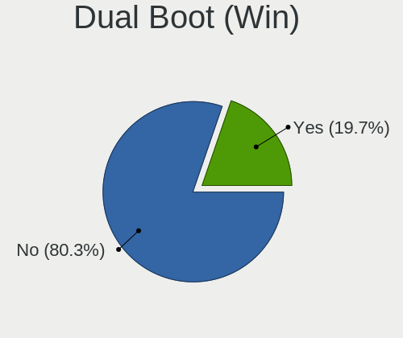
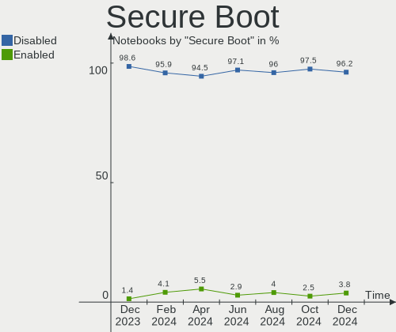
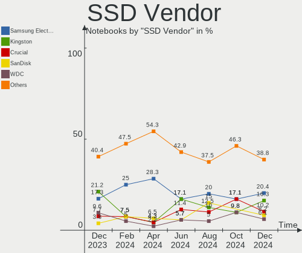
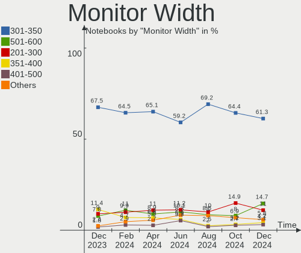

Arch Hardware Trends (Notebook)
-------------------------------

A project to identify most popular hardware characteristics and track their change
over time based on data collected by Arch users at https://Linux-Hardware.org.

Anyone can contribute to the study by uploading probes of their computers by
the [hw-probe](https://github.com/linuxhw/hw-probe) tool:

    sudo -E hw-probe -all -upload

Full-feature report is available here: https://linux-hardware.org/?view=trends&formfactor=notebook

Period: Mar, 2021.

Contents
--------

- [ OS                       ](#os)
- [ OS Family                ](#os-family)
- [ Kernel                   ](#kernel)
- [ Kernel Family            ](#kernel-family)
- [ Kernel Major Ver.        ](#kernel-major-ver)
- [ Arch                     ](#arch)
- [ DE                       ](#de)
- [ Display Server           ](#display-server)
- [ Display Manager          ](#display-manager)
- [ OS Lang                  ](#os-lang)
- [ Boot Mode                ](#boot-mode)
- [ Filesystem               ](#filesystem)
- [ Part. scheme             ](#part-scheme)
- [ Dual Boot with Linux/BSD ](#dual-boot-with-linux/bsd)
- [ Dual Boot (Win)          ](#dual-boot-win)
- [ Country                  ](#country)
- [ City                     ](#city)
- [ Vendor                   ](#vendor)
- [ Model                    ](#model)
- [ Model Family             ](#model-family)
- [ MFG Year                 ](#mfg-year)
- [ Form Factor              ](#form-factor)
- [ Secure Boot              ](#secure-boot)
- [ Coreboot                 ](#coreboot)
- [ RAM Size                 ](#ram-size)
- [ RAM Used                 ](#ram-used)
- [ Has CD-ROM               ](#has-cd-rom)
- [ Total Drives             ](#total-drives)
- [ Has Ethernet             ](#has-ethernet)
- [ Has WiFi                 ](#has-wifi)
- [ Has Bluetooth            ](#has-bluetooth)
- [ Drive Vendor             ](#drive-vendor)
- [ Drive Model              ](#drive-model)
- [ HDD Vendor               ](#hdd-vendor)
- [ SSD Vendor               ](#ssd-vendor)
- [ Drive Kind               ](#drive-kind)
- [ Drive Connector          ](#drive-connector)
- [ Drive Size               ](#drive-size)
- [ Space Total              ](#space-total)
- [ Space Used               ](#space-used)
- [ Malfunc. Drives          ](#malfunc-drives)
- [ Malfunc. Drive Vendor    ](#malfunc-drive-vendor)
- [ Malfunc. HDD Vendor      ](#malfunc-hdd-vendor)
- [ Malfunc. Drive Kind      ](#malfunc-drive-kind)
- [ Failed Drives            ](#failed-drives)
- [ Failed Drive Vendor      ](#failed-drive-vendor)
- [ Drive Status             ](#drive-status)
- [ Storage Vendor           ](#storage-vendor)
- [ Storage Model            ](#storage-model)
- [ Storage Kind             ](#storage-kind)
- [ CPU Vendor               ](#cpu-vendor)
- [ CPU Model                ](#cpu-model)
- [ CPU Model Family         ](#cpu-model-family)
- [ CPU Cores                ](#cpu-cores)
- [ CPU Sockets              ](#cpu-sockets)
- [ CPU Threads              ](#cpu-threads)
- [ CPU Op-Modes             ](#cpu-op-modes)
- [ CPU Microcode            ](#cpu-microcode)
- [ CPU Microarch            ](#cpu-microarch)
- [ GPU Vendor               ](#gpu-vendor)
- [ GPU Model                ](#gpu-model)
- [ GPU Combo                ](#gpu-combo)
- [ GPU Driver               ](#gpu-driver)
- [ GPU Memory               ](#gpu-memory)
- [ Monitor Vendor           ](#monitor-vendor)
- [ Monitor Model            ](#monitor-model)
- [ Monitor Resolution       ](#monitor-resolution)
- [ Monitor Diagonal         ](#monitor-diagonal)
- [ Monitor Width            ](#monitor-width)
- [ Aspect Ratio             ](#aspect-ratio)
- [ Monitor Area             ](#monitor-area)
- [ Pixel Density            ](#pixel-density)
- [ Multiple Monitors        ](#multiple-monitors)
- [ Net Controller Vendor    ](#net-controller-vendor)
- [ Net Controller Model     ](#net-controller-model)
- [ Wireless Vendor          ](#wireless-vendor)
- [ Wireless Model           ](#wireless-model)
- [ Ethernet Vendor          ](#ethernet-vendor)
- [ Ethernet Model           ](#ethernet-model)
- [ Net Controller Kind      ](#net-controller-kind)
- [ Used Controller          ](#used-controller)
- [ NICs                     ](#nics)
- [ IPv6                     ](#ipv6)
- [ Memory Vendor            ](#memory-vendor)
- [ Memory Model             ](#memory-model)
- [ Memory Kind              ](#memory-kind)
- [ Memory Form Factor       ](#memory-form-factor)
- [ Memory Size              ](#memory-size)
- [ Memory Speed             ](#memory-speed)
- [ Sound Vendor             ](#sound-vendor)
- [ Sound Model              ](#sound-model)
- [ Camera Vendor            ](#camera-vendor)
- [ Camera Model             ](#camera-model)
- [ Fingerprint Vendor       ](#fingerprint-vendor)
- [ Fingerprint Model        ](#fingerprint-model)
- [ Chipcard Vendor          ](#chipcard-vendor)
- [ Chipcard Model           ](#chipcard-model)
- [ Printer Vendor           ](#printer-vendor)
- [ Printer Model            ](#printer-model)
- [ Scanner Vendor           ](#scanner-vendor)
- [ Scanner Model            ](#scanner-model)
- [ Bluetooth Vendor         ](#bluetooth-vendor)
- [ Bluetooth Model          ](#bluetooth-model)
- [ Unsupported Devices      ](#unsupported-devices)
- [ Unsupported Device Types ](#unsupported-device-types)

OS
--

Installed operating systems

| Name         | Notebooks | Percent |
|--------------|-----------|---------|
| Arch         | 52        | 55.32%  |
| Arch Rolling | 42        | 44.68%  |

OS Family
---------

OS without a version

| Name | Notebooks | Percent |
|------|-----------|---------|
| Arch | 94        | 100%    |

Kernel
------

Version of the Linux kernel

| Version                     | Notebooks | Percent |
|-----------------------------|-----------|---------|
| 5.11.2-arch1-1              | 18        | 19.15%  |
| 5.11.6-arch1-1              | 11        | 11.7%   |
| 5.11.7-arch1-1              | 10        | 10.64%  |
| 5.11.8-arch1-1              | 8         | 8.51%   |
| 5.11.10-arch1-1             | 6         | 6.38%   |
| 5.11.4-arch1-1              | 5         | 5.32%   |
| 5.11.2-zen1-1-zen           | 5         | 5.32%   |
| 5.10.23-1-lts               | 5         | 5.32%   |
| 5.10.24-1-lts               | 3         | 3.19%   |
| 5.11.5-arch1-1              | 2         | 2.13%   |
| 5.11.1-arch1-1              | 2         | 2.13%   |
| 5.10.19-1-lts               | 2         | 2.13%   |
| 5.10.11-arch1-1             | 2         | 2.13%   |
| 5.9.2-arch1-1               | 1         | 1.06%   |
| 5.11.9-zen1-1-zen           | 1         | 1.06%   |
| 5.11.9-arch1-1              | 1         | 1.06%   |
| 5.11.8-2-ck-skylake         | 1         | 1.06%   |
| 5.11.7-zen1-1-zen           | 1         | 1.06%   |
| 5.11.6-zen1-1-zen           | 1         | 1.06%   |
| 5.11.6-hardened1-1-hardened | 1         | 1.06%   |
| 5.11.4-zen1-1-zen           | 1         | 1.06%   |
| 5.11.3.ll28-1-LG-git        | 1         | 1.06%   |
| 5.11.2-arch1-1-g14          | 1         | 1.06%   |
| 5.10.3-arch1-1              | 1         | 1.06%   |
| 5.10.25-1-lts               | 1         | 1.06%   |
| 5.10.16-zen1-1-zen          | 1         | 1.06%   |
| 5.10.16-arch1-1             | 1         | 1.06%   |
| 5.0.13-arch1-1-ARCH         | 1         | 1.06%   |

Kernel Family
-------------

Linux kernel without a distro release

| Version | Notebooks | Percent |
|---------|-----------|---------|
| 5.11.2  | 24        | 25.53%  |
| 5.11.6  | 13        | 13.83%  |
| 5.11.7  | 11        | 11.7%   |
| 5.11.8  | 9         | 9.57%   |
| 5.11.4  | 6         | 6.38%   |
| 5.11.10 | 6         | 6.38%   |
| 5.10.23 | 5         | 5.32%   |
| 5.10.24 | 3         | 3.19%   |
| 5.11.9  | 2         | 2.13%   |
| 5.11.5  | 2         | 2.13%   |
| 5.11.1  | 2         | 2.13%   |
| 5.10.19 | 2         | 2.13%   |
| 5.10.16 | 2         | 2.13%   |
| 5.10.11 | 2         | 2.13%   |
| 5.9.2   | 1         | 1.06%   |
| 5.11.3  | 1         | 1.06%   |
| 5.10.3  | 1         | 1.06%   |
| 5.10.25 | 1         | 1.06%   |
| 5.0.13  | 1         | 1.06%   |

Kernel Major Ver.
-----------------

Linux kernel major version

| Version | Notebooks | Percent |
|---------|-----------|---------|
| 5.11    | 76        | 80.85%  |
| 5.10    | 16        | 17.02%  |
| 5.9     | 1         | 1.06%   |
| 5.0     | 1         | 1.06%   |

Arch
----

OS architecture (x86_64, i586, etc.)

| Name   | Notebooks | Percent |
|--------|-----------|---------|
| x86_64 | 94        | 100%    |

DE
--

Desktop Environment

| Name            | Notebooks | Percent |
|-----------------|-----------|---------|
| GNOME           | 27        | 28.72%  |
| KDE5            | 23        | 24.47%  |
| i3              | 9         | 9.57%   |
| KDE             | 8         | 8.51%   |
| Unknown         | 8         | 8.51%   |
| XFCE            | 6         | 6.38%   |
| MATE            | 3         | 3.19%   |
| GNOME Flashback | 2         | 2.13%   |
| DWM             | 2         | 2.13%   |
| Cinnamon        | 2         | 2.13%   |
| Unity           | 1         | 1.06%   |
| Sway            | 1         | 1.06%   |
| LXQt            | 1         | 1.06%   |
| Deepin          | 1         | 1.06%   |

Display Server
--------------

X11 or Wayland

| Name    | Notebooks | Percent |
|---------|-----------|---------|
| X11     | 61        | 64.89%  |
| Wayland | 16        | 17.02%  |
| Tty     | 11        | 11.7%   |
| Unknown | 6         | 6.38%   |

Display Manager
---------------

SDDM, LightDM, etc.

| Name    | Notebooks | Percent |
|---------|-----------|---------|
| Unknown | 36        | 38.3%   |
| SDDM    | 24        | 25.53%  |
| GDM     | 13        | 13.83%  |
| TDM     | 12        | 12.77%  |
| LightDM | 7         | 7.45%   |
| XDM     | 1         | 1.06%   |
| Ly      | 1         | 1.06%   |

OS Lang
-------

Language

| Lang    | Notebooks | Percent |
|---------|-----------|---------|
| en_US   | 50        | 53.19%  |
| pl_PL   | 5         | 5.32%   |
| ru_RU   | 4         | 4.26%   |
| pt_BR   | 4         | 4.26%   |
| C       | 4         | 4.26%   |
| en_GB   | 3         | 3.19%   |
| Unknown | 3         | 3.19%   |
| zh_CN   | 2         | 2.13%   |
| fr_FR   | 2         | 2.13%   |
| es_ES   | 2         | 2.13%   |
| en_IE   | 2         | 2.13%   |
| en_CA   | 2         | 2.13%   |
| tr_TR   | 1         | 1.06%   |
| sk_SK   | 1         | 1.06%   |
| it_IT   | 1         | 1.06%   |
| hu_HU   | 1         | 1.06%   |
| es_MX   | 1         | 1.06%   |
| es_GT   | 1         | 1.06%   |
| en_NL   | 1         | 1.06%   |
| en_IN   | 1         | 1.06%   |
| el_GR   | 1         | 1.06%   |
| de_DE   | 1         | 1.06%   |
| de_AT   | 1         | 1.06%   |

Boot Mode
---------

EFI or BIOS

| Mode | Notebooks | Percent |
|------|-----------|---------|
| EFI  | 57        | 60.64%  |
| BIOS | 37        | 39.36%  |

Filesystem
----------

Type of filesystem

| Type    | Notebooks | Percent |
|---------|-----------|---------|
| Ext4    | 73        | 77.66%  |
| Btrfs   | 14        | 14.89%  |
| Xfs     | 3         | 3.19%   |
| Overlay | 2         | 2.13%   |
| F2fs    | 1         | 1.06%   |
| Unknown | 1         | 1.06%   |

Part. scheme
------------

Scheme of partitioning

| Type    | Notebooks | Percent |
|---------|-----------|---------|
| GPT     | 63        | 67.02%  |
| Unknown | 23        | 24.47%  |
| MBR     | 8         | 8.51%   |

Dual Boot with Linux/BSD
------------------------

Hosting more than one Linux/BSD

| Dual boot | Notebooks | Percent |
|-----------|-----------|---------|
| No        | 84        | 89.36%  |
| Yes       | 10        | 10.64%  |

Dual Boot (Win)
---------------

Hosting Linux and Windows

| Dual boot | Notebooks | Percent |
|-----------|-----------|---------|
| No        | 66        | 70.21%  |
| Yes       | 28        | 29.79%  |

Country
-------

Geographic location (country)

| Country        | Notebooks | Percent |
|----------------|-----------|---------|
| USA            | 14        | 14.89%  |
| Russia         | 12        | 12.77%  |
| Poland         | 6         | 6.38%   |
| Germany        | 6         | 6.38%   |
| Brazil         | 5         | 5.32%   |
| Netherlands    | 4         | 4.26%   |
| Turkey         | 3         | 3.19%   |
| Italy          | 3         | 3.19%   |
| France         | 3         | 3.19%   |
| Canada         | 3         | 3.19%   |
| UK             | 2         | 2.13%   |
| Qatar          | 2         | 2.13%   |
| Japan          | 2         | 2.13%   |
| India          | 2         | 2.13%   |
| Hungary        | 2         | 2.13%   |
| China          | 2         | 2.13%   |
| Belarus        | 2         | 2.13%   |
| Austria        | 2         | 2.13%   |
| Ukraine        | 1         | 1.06%   |
| Sweden         | 1         | 1.06%   |
| Spain          | 1         | 1.06%   |
| Slovakia       | 1         | 1.06%   |
| Singapore      | 1         | 1.06%   |
| Romania        | 1         | 1.06%   |
| Norway         | 1         | 1.06%   |
| Nigeria        | 1         | 1.06%   |
| Morocco        | 1         | 1.06%   |
| Mexico         | 1         | 1.06%   |
| Hong Kong      | 1         | 1.06%   |
| Guatemala      | 1         | 1.06%   |
| Greece         | 1         | 1.06%   |
| Denmark        | 1         | 1.06%   |
| Cayman Islands | 1         | 1.06%   |
| Bulgaria       | 1         | 1.06%   |
| Belgium        | 1         | 1.06%   |
| Bangladesh     | 1         | 1.06%   |
| Algeria        | 1         | 1.06%   |

City
----

Geographic location (city)

| City                | Notebooks | Percent |
|---------------------|-----------|---------|
| St Petersburg       | 4         | 4.26%   |
| Moscow              | 3         | 3.19%   |
| Washington          | 2         | 2.13%   |
| Lodz                | 2         | 2.13%   |
| Krasnodar           | 2         | 2.13%   |
| Doha                | 2         | 2.13%   |
| Budapest            | 2         | 2.13%   |
| Wuhan               | 1         | 1.06%   |
| Wroclaw             | 1         | 1.06%   |
| West Lafayette      | 1         | 1.06%   |
| Warsaw              | 1         | 1.06%   |
| Vladivostok         | 1         | 1.06%   |
| Vienna              | 1         | 1.06%   |
| Urla                | 1         | 1.06%   |
| Troyan Municipality | 1         | 1.06%   |
| Topoľčany         | 1         | 1.06%   |
| Ternovka            | 1         | 1.06%   |
| Tangier             | 1         | 1.06%   |
| Singapore           | 1         | 1.06%   |
| Sierra Vista        | 1         | 1.06%   |
| Shreveport          | 1         | 1.06%   |
| Shanghai            | 1         | 1.06%   |
| Santos              | 1         | 1.06%   |
| San Ramon           | 1         | 1.06%   |
| Salt Lake City      | 1         | 1.06%   |
| Saitama             | 1         | 1.06%   |
| Rosemount           | 1         | 1.06%   |
| Rome                | 1         | 1.06%   |
| Quetzaltenango      | 1         | 1.06%   |
| Paderborn           | 1         | 1.06%   |
| Oud-Beijerland      | 1         | 1.06%   |
| Olesnica            | 1         | 1.06%   |
| Okayama             | 1         | 1.06%   |
| Nytva               | 1         | 1.06%   |
| Nova Olimpia        | 1         | 1.06%   |
| Nootdorp            | 1         | 1.06%   |
| Neuilly-sur-Marne   | 1         | 1.06%   |
| Mowe                | 1         | 1.06%   |
| Monroe              | 1         | 1.06%   |
| Moncton             | 1         | 1.06%   |
| Minsk               | 1         | 1.06%   |
| Mexico City         | 1         | 1.06%   |
| Melito di Napoli    | 1         | 1.06%   |
| Marstons Mills      | 1         | 1.06%   |
| Madrid              | 1         | 1.06%   |
| Lustenau            | 1         | 1.06%   |
| Lund                | 1         | 1.06%   |
| Los Angeles         | 1         | 1.06%   |
| Leerdam             | 1         | 1.06%   |
| Le Bardon           | 1         | 1.06%   |
| Kyiv                | 1         | 1.06%   |
| Kolkata             | 1         | 1.06%   |
| Istanbul            | 1         | 1.06%   |
| Irvine              | 1         | 1.06%   |
| Hood                | 1         | 1.06%   |
| Hong Kong           | 1         | 1.06%   |
| Hathras             | 1         | 1.06%   |
| Haradok             | 1         | 1.06%   |
| Guyancourt          | 1         | 1.06%   |
| Gunningen           | 1         | 1.06%   |

Vendor
------

Motherboard manufacturer

| Name              | Notebooks | Percent |
|-------------------|-----------|---------|
| Lenovo            | 31        | 32.98%  |
| Dell              | 19        | 20.21%  |
| ASUSTek Computer  | 16        | 17.02%  |
| Hewlett-Packard   | 12        | 12.77%  |
| Acer              | 5         | 5.32%   |
| TUXEDO            | 3         | 3.19%   |
| MSI               | 3         | 3.19%   |
| Toshiba           | 1         | 1.06%   |
| Micro Electronics | 1         | 1.06%   |
| China             | 1         | 1.06%   |
| Apple             | 1         | 1.06%   |
| Unknown           | 1         | 1.06%   |

Model
-----

Motherboard model

| Name                                     | Notebooks | Percent |
|------------------------------------------|-----------|---------|
| Lenovo Legion 5 15ARH05 82B5             | 2         | 2.13%   |
| Dell XPS 15 9570                         | 2         | 2.13%   |
| Unknown                                  | 2         | 2.13%   |
| TUXEDO Pulse 15 Gen1                     | 1         | 1.06%   |
| TUXEDO InfinityBook S 14 Gen6            | 1         | 1.06%   |
| TUXEDO Book BA1510                       | 1         | 1.06%   |
| Toshiba PORTEGE R30-A                    | 1         | 1.06%   |
| MSI Prestige 14Evo A11M                  | 1         | 1.06%   |
| MSI GV62 8RD                             | 1         | 1.06%   |
| MSI GT80 2QE                             | 1         | 1.06%   |
| Micro 1530                               | 1         | 1.06%   |
| Lenovo Yoga 900-13ISK 80MK               | 1         | 1.06%   |
| Lenovo Y520-15IKBA 80WY                  | 1         | 1.06%   |
| Lenovo ThinkPad X280 20KES3F7TH          | 1         | 1.06%   |
| Lenovo ThinkPad X250 20CLS0PU00          | 1         | 1.06%   |
| Lenovo ThinkPad X230 23252QG             | 1         | 1.06%   |
| Lenovo ThinkPad X220 4291B66             | 1         | 1.06%   |
| Lenovo ThinkPad X220 4290LA9             | 1         | 1.06%   |
| Lenovo ThinkPad X200 7459KM3             | 1         | 1.06%   |
| Lenovo ThinkPad X1 Carbon 6th 20KH002RUS | 1         | 1.06%   |
| Lenovo ThinkPad T590 20N4004UMB          | 1         | 1.06%   |
| Lenovo ThinkPad T490 20RYS0K400          | 1         | 1.06%   |
| Lenovo ThinkPad T460s 20F90043GE         | 1         | 1.06%   |
| Lenovo ThinkPad T440p 20AWA0LUPB         | 1         | 1.06%   |
| Lenovo ThinkPad P14s Gen 1 20Y1000LRT    | 1         | 1.06%   |
| Lenovo ThinkPad L15 Gen 1 20U7001YTX     | 1         | 1.06%   |
| Lenovo ThinkPad E585 20KV0008GE          | 1         | 1.06%   |
| Lenovo ThinkPad E570 20H500B1RT          | 1         | 1.06%   |
| Lenovo ThinkPad E15 Gen 2 20TD0005MH     | 1         | 1.06%   |
| Lenovo ThinkPad E14 Gen 2 20T6000SIX     | 1         | 1.06%   |
| Lenovo ThinkBook 14 G2 ARE 20VF          | 1         | 1.06%   |
| Lenovo S10-3                             | 1         | 1.06%   |
| Lenovo Legion R7000 2020 82B6            | 1         | 1.06%   |
| Lenovo Legion 7 15IMH05 81YT             | 1         | 1.06%   |
| Lenovo IdeaPad Y510P 20217               | 1         | 1.06%   |
| Lenovo IdeaPad 710S-13IKB 80VQ           | 1         | 1.06%   |
| Lenovo IdeaPad 5 14ARE05 81YM            | 1         | 1.06%   |
| Lenovo G500 20236                        | 1         | 1.06%   |
| Lenovo G40-80 80JE                       | 1         | 1.06%   |
| HP ProBook 6560b                         | 1         | 1.06%   |
| HP ProBook 430 G1                        | 1         | 1.06%   |
| HP OMEN by HP Laptop 17-cb0xxx           | 1         | 1.06%   |
| HP Laptop 15s-eq0xxx                     | 1         | 1.06%   |
| HP Laptop 14-dk0xxx                      | 1         | 1.06%   |
| HP EliteBook x360 1040 G5                | 1         | 1.06%   |
| HP EliteBook 8470p                       | 1         | 1.06%   |
| HP EliteBook 840 G6                      | 1         | 1.06%   |
| HP EliteBook 840 G3                      | 1         | 1.06%   |
| HP EliteBook 840 G2                      | 1         | 1.06%   |
| HP EliteBook 830 G6                      | 1         | 1.06%   |
| HP 255 G6 Notebook PC                    | 1         | 1.06%   |
| Dell XPS 15 7590                         | 1         | 1.06%   |
| Dell XPS 13 9370                         | 1         | 1.06%   |
| Dell XPS 13 9350                         | 1         | 1.06%   |
| Dell Vostro 3478                         | 1         | 1.06%   |
| Dell Vostro 3460                         | 1         | 1.06%   |
| Dell Latitude E6430                      | 1         | 1.06%   |
| Dell Latitude E6410                      | 1         | 1.06%   |
| Dell Latitude E5540                      | 1         | 1.06%   |
| Dell Latitude E4200                      | 1         | 1.06%   |

Model Family
------------

Motherboard model prefix

| Name                | Notebooks | Percent |
|---------------------|-----------|---------|
| Lenovo ThinkPad     | 17        | 18.09%  |
| Dell Latitude       | 7         | 7.45%   |
| HP EliteBook        | 6         | 6.38%   |
| Dell XPS            | 5         | 5.32%   |
| Lenovo Legion       | 4         | 4.26%   |
| Dell Inspiron       | 4         | 4.26%   |
| Lenovo IdeaPad      | 3         | 3.19%   |
| ASUS VivoBook       | 3         | 3.19%   |
| ASUS TUF            | 3         | 3.19%   |
| ASUS ROG            | 3         | 3.19%   |
| Acer Aspire         | 3         | 3.19%   |
| HP ProBook          | 2         | 2.13%   |
| HP Laptop           | 2         | 2.13%   |
| Dell Vostro         | 2         | 2.13%   |
| Acer Nitro          | 2         | 2.13%   |
| Unknown             | 2         | 2.13%   |
| TUXEDO Pulse        | 1         | 1.06%   |
| TUXEDO InfinityBook | 1         | 1.06%   |
| TUXEDO Book         | 1         | 1.06%   |
| Toshiba PORTEGE     | 1         | 1.06%   |
| MSI Prestige        | 1         | 1.06%   |
| MSI GV62            | 1         | 1.06%   |
| MSI GT80            | 1         | 1.06%   |
| Micro 1530          | 1         | 1.06%   |
| Lenovo Yoga         | 1         | 1.06%   |
| Lenovo Y520-15IKBA  | 1         | 1.06%   |
| Lenovo ThinkBook    | 1         | 1.06%   |
| Lenovo S10-3        | 1         | 1.06%   |
| Lenovo G500         | 1         | 1.06%   |
| Lenovo G40-80       | 1         | 1.06%   |
| HP OMEN             | 1         | 1.06%   |
| HP 255              | 1         | 1.06%   |
| Dell G3             | 1         | 1.06%   |
| China c16b          | 1         | 1.06%   |
| ASUS ZenBook        | 1         | 1.06%   |
| ASUS X555UB         | 1         | 1.06%   |
| ASUS X555QG         | 1         | 1.06%   |
| ASUS X550LN         | 1         | 1.06%   |
| ASUS X411UA         | 1         | 1.06%   |
| ASUS UX31A          | 1         | 1.06%   |
| ASUS N752VX         | 1         | 1.06%   |
| Apple MacBookPro11  | 1         | 1.06%   |

MFG Year
--------

Motherboard manufacture year

| Year | Notebooks | Percent |
|------|-----------|---------|
| 2020 | 32        | 34.04%  |
| 2019 | 24        | 25.53%  |
| 2018 | 9         | 9.57%   |
| 2015 | 7         | 7.45%   |
| 2021 | 5         | 5.32%   |
| 2013 | 5         | 5.32%   |
| 2017 | 4         | 4.26%   |
| 2016 | 4         | 4.26%   |
| 2014 | 2         | 2.13%   |
| 2011 | 1         | 1.06%   |
| 2010 | 1         | 1.06%   |

Form Factor
-----------

Physical design of the computer

| Name     | Notebooks | Percent |
|----------|-----------|---------|
| Notebook | 94        | 100%    |

Secure Boot
-----------

Enabled or disabled

| State    | Notebooks | Percent |
|----------|-----------|---------|
| Disabled | 94        | 100%    |

Coreboot
--------

Have coreboot on board

| Used | Notebooks | Percent |
|------|-----------|---------|
| No   | 93        | 98.94%  |
| Yes  | 1         | 1.06%   |

RAM Size
--------

Total RAM memory

| Size in GB | Notebooks | Percent |
|------------|-----------|---------|
| 4.01-8.0   | 26        | 27.66%  |
| 8.01-16.0  | 24        | 25.53%  |
| 16.01-24.0 | 21        | 22.34%  |
| 32.01-64.0 | 13        | 13.83%  |
| 3.01-4.0   | 8         | 8.51%   |
| 24.01-32.0 | 1         | 1.06%   |
| 1.01-2.0   | 1         | 1.06%   |

RAM Used
--------

Used RAM memory

| Used GB    | Notebooks | Percent |
|------------|-----------|---------|
| 2.01-3.0   | 25        | 26.6%   |
| 3.01-4.0   | 21        | 22.34%  |
| 4.01-8.0   | 18        | 19.15%  |
| 1.01-2.0   | 18        | 19.15%  |
| 0.51-1.0   | 6         | 6.38%   |
| 8.01-16.0  | 5         | 5.32%   |
| 16.01-24.0 | 1         | 1.06%   |

Has CD-ROM
----------

Has CD-ROM on board

| Presented | Notebooks | Percent |
|-----------|-----------|---------|
| No        | 79        | 84.04%  |
| Yes       | 15        | 15.96%  |

Total Drives
------------

Number of drives on board

| Drives | Notebooks | Percent |
|--------|-----------|---------|
| 1      | 59        | 62.77%  |
| 2      | 29        | 30.85%  |
| 3      | 4         | 4.26%   |
| 4      | 1         | 1.06%   |
| 0      | 1         | 1.06%   |

Has Ethernet
------------

Has Ethernet on board

| Presented | Notebooks | Percent |
|-----------|-----------|---------|
| Yes       | 76        | 80.85%  |
| No        | 18        | 19.15%  |

Has WiFi
--------

Has WiFi module

| Presented | Notebooks | Percent |
|-----------|-----------|---------|
| Yes       | 93        | 98.94%  |
| No        | 1         | 1.06%   |

Has Bluetooth
-------------

Has Bluetooth module

| Presented | Notebooks | Percent |
|-----------|-----------|---------|
| Yes       | 80        | 85.11%  |
| No        | 14        | 14.89%  |

Drive Vendor
------------

Hard drive vendors

| Vendor              | Notebooks | Drives | Percent |
|---------------------|-----------|--------|---------|
| Samsung Electronics | 25        | 25     | 19.38%  |
| WDC                 | 17        | 17     | 13.18%  |
| Seagate             | 16        | 18     | 12.4%   |
| Toshiba             | 10        | 11     | 7.75%   |
| SanDisk             | 8         | 8      | 6.2%    |
| Kingston            | 7         | 7      | 5.43%   |
| Unknown             | 6         | 6      | 4.65%   |
| HGST                | 6         | 8      | 4.65%   |
| Micron Technology   | 5         | 5      | 3.88%   |
| A-DATA Technology   | 4         | 4      | 3.1%    |
| SK Hynix            | 3         | 3      | 2.33%   |
| Intel               | 3         | 3      | 2.33%   |
| Hitachi             | 3         | 3      | 2.33%   |
| Crucial             | 3         | 3      | 2.33%   |
| Phison              | 2         | 2      | 1.55%   |
| XPG                 | 1         | 1      | 0.78%   |
| STM                 | 1         | 1      | 0.78%   |
| PH4-CE12            | 1         | 1      | 0.78%   |
| OCZ                 | 1         | 1      | 0.78%   |
| Lite-On             | 1         | 1      | 0.78%   |
| Lexar               | 1         | 1      | 0.78%   |
| Lenovo              | 1         | 1      | 0.78%   |
| Hewlett-Packard     | 1         | 1      | 0.78%   |
| China               | 1         | 2      | 0.78%   |
| BR                  | 1         | 1      | 0.78%   |
| Apple               | 1         | 1      | 0.78%   |

Drive Model
-----------

Hard drive models

| Model                                | Notebooks | Percent |
|--------------------------------------|-----------|---------|
| Toshiba MQ04ABF100 1TB               | 3         | 2.27%   |
| Seagate ST500LT012-1DG142 500GB      | 3         | 2.27%   |
| Seagate ST1000LX015-1U7172 1TB       | 3         | 2.27%   |
| Seagate ST1000LM035-1RK172 1TB       | 3         | 2.27%   |
| HGST HTS541010A9E680 1TB             | 3         | 2.27%   |
| Unknown MMC Card  32GB               | 2         | 1.52%   |
| Samsung SSD 850 PRO 128G             | 2         | 1.52%   |
| Samsung NVMe SSD Drive 1TB           | 2         | 1.52%   |
| Samsung MZVLB1T0HBLR-000L2 1TB       | 2         | 1.52%   |
| Micron 2200V_MTFDHBA512TCK 512GB     | 2         | 1.52%   |
| Intel SSDPEKNW512G8 512GB            | 2         | 1.52%   |
| Hitachi HTS723232A7A364 320GB        | 2         | 1.52%   |
| HGST HTS721010A9E630 1TB             | 2         | 1.52%   |
| XPG NVMe SSD Drive 1TB               | 1         | 0.76%   |
| WDC WDS240G2G0A-00JH30 240GB SSD     | 1         | 0.76%   |
| WDC WDS100T3X0C-00SJG0 1TB           | 1         | 0.76%   |
| WDC WDS100T2B0B-00YS70 1TB SSD       | 1         | 0.76%   |
| WDC WD7500BPKT-00PK4T0 752GB         | 1         | 0.76%   |
| WDC WD5000BPKT-22PK4T0 500GB         | 1         | 0.76%   |
| WDC WD5000AVDS-63U7B1 500GB          | 1         | 0.76%   |
| WDC WD3200BPVT-00JJ5T0 320GB         | 1         | 0.76%   |
| WDC WD2500BEVT-24A23T0 250GB         | 1         | 0.76%   |
| WDC WD10SPZX-21Z10T0 1TB             | 1         | 0.76%   |
| WDC WD10SPZX-17Z10T0 1TB             | 1         | 0.76%   |
| WDC WD10JPVX-60JC3T1 1TB             | 1         | 0.76%   |
| WDC WD10JPVX-22JC3T0 1TB             | 1         | 0.76%   |
| WDC WD10JPVX-08JC3T6 1TB             | 1         | 0.76%   |
| WDC PC SN730 SDBQNTY-512G-1001 512GB | 1         | 0.76%   |
| WDC PC SN720 SDAPNTW-512G-1006 512GB | 1         | 0.76%   |
| WDC PC SN530 SDBPNPZ-256G-1006 256GB | 1         | 0.76%   |
| WDC PC SN530 SDBPMPZ-512G-1101 512GB | 1         | 0.76%   |
| Unknown SMI  16GB                    | 1         | 0.76%   |
| Unknown SD32G  32GB                  | 1         | 0.76%   |
| Unknown SC64G  64GB                  | 1         | 0.76%   |
| Unknown MMC Card  197GB              | 1         | 0.76%   |
| Toshiba THNSNJ128G8NU 128GB SSD      | 1         | 0.76%   |
| Toshiba THNSFJ256GDNU A 256GB SSD    | 1         | 0.76%   |
| Toshiba NVMe SSD Drive 256GB         | 1         | 0.76%   |
| Toshiba NVMe SSD Drive 1024GB        | 1         | 0.76%   |
| Toshiba MQ01ABF050 500GB             | 1         | 0.76%   |
| Toshiba MQ01ABD100 1TB               | 1         | 0.76%   |
| Toshiba MQ01ABD075 752GB             | 1         | 0.76%   |
| STM STLINK 3MB                       | 1         | 0.76%   |
| SK Hynix PC601 NVMe 1TB              | 1         | 0.76%   |
| SK Hynix NVMe SSD Drive 512GB        | 1         | 0.76%   |
| SK Hynix NVMe SSD Drive 1TB          | 1         | 0.76%   |
| Seagate ST500LM030-1RK17D 500GB      | 1         | 0.76%   |
| Seagate ST500LM000-1EJ162 500GB      | 1         | 0.76%   |
| Seagate ST2000LM007-1R8174 2TB       | 1         | 0.76%   |
| Seagate ST1000LM049-2GH172 1TB       | 1         | 0.76%   |
| Seagate ST1000LM048-2E7172 1TB       | 1         | 0.76%   |
| Seagate ST1000LM014-SSHD-8GB         | 1         | 0.76%   |
| Seagate Expansion 1TB                | 1         | 0.76%   |
| Seagate Backup+ Hub BK 2TB           | 1         | 0.76%   |
| Sandisk WD_BLACK SN850 1TB           | 1         | 0.76%   |
| SanDisk SDSSDH3 1T00 1TB             | 1         | 0.76%   |
| SanDisk SD8SNAT256G1002 256GB SSD    | 1         | 0.76%   |
| SanDisk SD8SN8U-256G-1006 256GB SSD  | 1         | 0.76%   |
| SanDisk SD8SN8U-128G-1006 128GB SSD  | 1         | 0.76%   |
| SanDisk SD8SB8U128G1002 128GB SSD    | 1         | 0.76%   |

HDD Vendor
----------

Hard disk drive vendors

| Vendor  | Notebooks | Drives | Percent |
|---------|-----------|--------|---------|
| Seagate | 16        | 17     | 39.02%  |
| WDC     | 10        | 10     | 24.39%  |
| Toshiba | 6         | 6      | 14.63%  |
| HGST    | 6         | 8      | 14.63%  |
| Hitachi | 3         | 3      | 7.32%   |

SSD Vendor
----------

Solid state drive vendors

| Vendor              | Notebooks | Drives | Percent |
|---------------------|-----------|--------|---------|
| Samsung Electronics | 11        | 11     | 31.43%  |
| Kingston            | 6         | 6      | 17.14%  |
| SanDisk             | 5         | 5      | 14.29%  |
| WDC                 | 2         | 2      | 5.71%   |
| Toshiba             | 2         | 3      | 5.71%   |
| Crucial             | 2         | 2      | 5.71%   |
| A-DATA Technology   | 2         | 2      | 5.71%   |
| OCZ                 | 1         | 1      | 2.86%   |
| Micron Technology   | 1         | 1      | 2.86%   |
| China               | 1         | 2      | 2.86%   |
| BR                  | 1         | 1      | 2.86%   |
| Apple               | 1         | 1      | 2.86%   |

Drive Kind
----------

HDD or SSD

| Kind    | Notebooks | Drives | Percent |
|---------|-----------|--------|---------|
| NVMe    | 43        | 45     | 34.13%  |
| HDD     | 41        | 44     | 32.54%  |
| SSD     | 33        | 37     | 26.19%  |
| MMC     | 6         | 6      | 4.76%   |
| Unknown | 3         | 3      | 2.38%   |

Drive Connector
---------------

SATA, SAS, NVMe, etc.

| Type | Notebooks | Drives | Percent |
|------|-----------|--------|---------|
| SATA | 61        | 76     | 52.14%  |
| NVMe | 43        | 45     | 36.75%  |
| SAS  | 7         | 8      | 5.98%   |
| MMC  | 6         | 6      | 5.13%   |

Drive Size
----------

Size of hard drive

| Size in TB | Notebooks | Drives | Percent |
|------------|-----------|--------|---------|
| 0.01-0.5   | 41        | 46     | 56.94%  |
| 0.51-1.0   | 30        | 34     | 41.67%  |
| 1.01-2.0   | 1         | 1      | 1.39%   |

Space Total
-----------

Amount of disk space available on the file system

| Size in GB     | Notebooks | Percent |
|----------------|-----------|---------|
| 251-500        | 29        | 30.85%  |
| 501-1000       | 25        | 26.6%   |
| 101-250        | 20        | 21.28%  |
| 1001-2000      | 6         | 6.38%   |
| More than 3000 | 3         | 3.19%   |
| 1-20           | 3         | 3.19%   |
| 51-100         | 3         | 3.19%   |
| 2001-3000      | 2         | 2.13%   |
| Unknown        | 2         | 2.13%   |
| 21-50          | 1         | 1.06%   |

Space Used
----------

Amount of used disk space

| Used GB        | Notebooks | Percent |
|----------------|-----------|---------|
| 101-250        | 22        | 23.4%   |
| 251-500        | 17        | 18.09%  |
| 51-100         | 15        | 15.96%  |
| 21-50          | 14        | 14.89%  |
| 1-20           | 13        | 13.83%  |
| 1001-2000      | 5         | 5.32%   |
| 501-1000       | 4         | 4.26%   |
| Unknown        | 2         | 2.13%   |
| More than 3000 | 1         | 1.06%   |
| 2001-3000      | 1         | 1.06%   |

Malfunc. Drives
---------------

Drive models with a malfunction

| Model                           | Notebooks | Drives | Percent |
|---------------------------------|-----------|--------|---------|
| Seagate ST500LT012-1DG142 500GB | 2         | 2      | 18.18%  |
| WDC WDS100T2B0B-00YS70 1TB SSD  | 1         | 1      | 9.09%   |
| WDC WD7500BPKT-00PK4T0 752GB    | 1         | 1      | 9.09%   |
| WDC WD10JPVX-60JC3T1 1TB        | 1         | 1      | 9.09%   |
| WDC WD10JPVX-22JC3T0 1TB        | 1         | 1      | 9.09%   |
| WDC WD10JPVX-08JC3T6 1TB        | 1         | 1      | 9.09%   |
| Seagate ST500LM000-1EJ162 500GB | 1         | 1      | 9.09%   |
| Seagate ST1000LX015-1U7172 1TB  | 1         | 1      | 9.09%   |
| OCZ VERTEX4 256GB SSD           | 1         | 1      | 9.09%   |
| Hitachi HTS723232A7A364 320GB   | 1         | 1      | 9.09%   |

Malfunc. Drive Vendor
---------------------

Vendors of faulty drives

| Vendor  | Notebooks | Drives | Percent |
|---------|-----------|--------|---------|
| WDC     | 5         | 5      | 45.45%  |
| Seagate | 4         | 4      | 36.36%  |
| OCZ     | 1         | 1      | 9.09%   |
| Hitachi | 1         | 1      | 9.09%   |

Malfunc. HDD Vendor
-------------------

Vendors of faulty HDD drives

| Vendor  | Notebooks | Drives | Percent |
|---------|-----------|--------|---------|
| WDC     | 4         | 4      | 44.44%  |
| Seagate | 4         | 4      | 44.44%  |
| Hitachi | 1         | 1      | 11.11%  |

Malfunc. Drive Kind
-------------------

Kinds of faulty drives

| Kind | Notebooks | Drives | Percent |
|------|-----------|--------|---------|
| HDD  | 9         | 9      | 81.82%  |
| SSD  | 2         | 2      | 18.18%  |

Failed Drives
-------------

Failed drive models

Zero info for selected period =(

Failed Drive Vendor
-------------------

Failed drive vendors

Zero info for selected period =(

Drive Status
------------

Number of failed and malfunc. drives

| Status   | Notebooks | Drives | Percent |
|----------|-----------|--------|---------|
| Works    | 53        | 68     | 49.07%  |
| Detected | 45        | 56     | 41.67%  |
| Malfunc  | 10        | 11     | 9.26%   |

Storage Vendor
--------------

Storage controller vendors

| Vendor                       | Notebooks | Percent |
|------------------------------|-----------|---------|
| Intel                        | 57        | 49.14%  |
| AMD                          | 17        | 14.66%  |
| Samsung Electronics          | 14        | 12.07%  |
| Sandisk                      | 8         | 6.9%    |
| Micron Technology            | 4         | 3.45%   |
| SK Hynix                     | 3         | 2.59%   |
| Toshiba America Info Systems | 2         | 1.72%   |
| Phison Electronics           | 2         | 1.72%   |
| ADATA Technology             | 2         | 1.72%   |
| Silicon Motion               | 1         | 0.86%   |
| Shenzhen Longsys Electronics | 1         | 0.86%   |
| Micron/Crucial Technology    | 1         | 0.86%   |
| Marvell Technology Group     | 1         | 0.86%   |
| Lite-On Technology           | 1         | 0.86%   |
| Lenovo                       | 1         | 0.86%   |
| Kingston Technology Company  | 1         | 0.86%   |

Storage Model
-------------

Storage controller models

| Model                                                                          | Notebooks | Percent |
|--------------------------------------------------------------------------------|-----------|---------|
| AMD FCH SATA Controller [AHCI mode]                                            | 17        | 14.41%  |
| Samsung NVMe SSD Controller SM981/PM981/PM983                                  | 12        | 10.17%  |
| Intel Sunrise Point-LP SATA Controller [AHCI mode]                             | 10        | 8.47%   |
| Intel 82801 Mobile SATA Controller [RAID mode]                                 | 10        | 8.47%   |
| Intel Cannon Lake Mobile PCH SATA AHCI Controller                              | 7         | 5.93%   |
| Intel Wildcat Point-LP SATA Controller [AHCI Mode]                             | 6         | 5.08%   |
| Intel 7 Series Chipset Family 6-port SATA Controller [AHCI mode]               | 6         | 5.08%   |
| Micron Non-Volatile memory controller                                          | 4         | 3.39%   |
| Intel HM170/QM170 Chipset SATA Controller [AHCI Mode]                          | 3         | 2.54%   |
| Intel 8 Series/C220 Series Chipset Family 6-port SATA Controller 1 [AHCI mode] | 3         | 2.54%   |
| Intel 8 Series SATA Controller 1 [AHCI mode]                                   | 3         | 2.54%   |
| Intel 6 Series/C200 Series Chipset Family 6 port Mobile SATA AHCI Controller   | 3         | 2.54%   |
| Sandisk WD Black SN750 / PC SN730 NVMe SSD                                     | 2         | 1.69%   |
| Sandisk WD Black 2018/SN750 / PC SN720 NVMe SSD                                | 2         | 1.69%   |
| Sandisk Non-Volatile memory controller                                         | 2         | 1.69%   |
| Samsung NVMe Controller                                                        | 2         | 1.69%   |
| Intel SSD 660P Series                                                          | 2         | 1.69%   |
| ADATA XPG SX8200 Pro PCIe Gen3x4 M.2 2280 Solid State Drive                    | 2         | 1.69%   |
| Toshiba America Info Systems XG6 NVMe SSD Controller                           | 1         | 0.85%   |
| Toshiba America Info Systems NVMe Controller                                   | 1         | 0.85%   |
| SK Hynix PC401 NVMe Solid State Drive 256GB                                    | 1         | 0.85%   |
| SK Hynix NVMe SSD Controller                                                   | 1         | 0.85%   |
| SK Hynix Non-Volatile memory controller                                        | 1         | 0.85%   |
| Silicon Motion SM2262/SM2262EN SSD Controller                                  | 1         | 0.85%   |
| Shenzhen Longsys Non-Volatile memory controller                                | 1         | 0.85%   |
| Sandisk WD Blue SN550 NVMe SSD                                                 | 1         | 0.85%   |
| Sandisk WD Black SN850                                                         | 1         | 0.85%   |
| Phison E16 PCIe4 NVMe Controller                                               | 1         | 0.85%   |
| Phison E12 NVMe Controller                                                     | 1         | 0.85%   |
| Micron/Crucial P1 NVMe PCIe SSD                                                | 1         | 0.85%   |
| Marvell Group 88SS9183 PCIe SSD Controller                                     | 1         | 0.85%   |
| Lite-On Non-Volatile memory controller                                         | 1         | 0.85%   |
| Lenovo Non-Volatile memory controller                                          | 1         | 0.85%   |
| Kingston Company A2000 NVMe SSD                                                | 1         | 0.85%   |
| Intel SSD 600P Series                                                          | 1         | 0.85%   |
| Intel NM10/ICH7 Family SATA Controller [AHCI mode]                             | 1         | 0.85%   |
| Intel Celeron/Pentium Silver Processor SATA Controller                         | 1         | 0.85%   |
| Intel 82801IBM/IEM (ICH9M/ICH9M-E) 4 port SATA Controller [AHCI mode]          | 1         | 0.85%   |
| Intel 400 Series Chipset Family SATA AHCI Controller                           | 1         | 0.85%   |
| AMD 400 Series Chipset SATA Controller                                         | 1         | 0.85%   |

Storage Kind
------------

Kind of storage controller (IDE, SATA, NVMe, SAS, ...)

| Kind | Notebooks | Percent |
|------|-----------|---------|
| SATA | 64        | 55.17%  |
| NVMe | 43        | 37.07%  |
| RAID | 9         | 7.76%   |

CPU Vendor
----------

Processor vendors

| Vendor | Notebooks | Percent |
|--------|-----------|---------|
| Intel  | 70        | 74.47%  |
| AMD    | 24        | 25.53%  |

CPU Model
---------

Processor models

| Model                                         | Notebooks | Percent |
|-----------------------------------------------|-----------|---------|
| Intel Core i5-8250U CPU @ 1.60GHz             | 4         | 4.26%   |
| AMD Ryzen 7 4800H with Radeon Graphics        | 4         | 4.26%   |
| AMD Ryzen 5 2500U with Radeon Vega Mobile Gfx | 4         | 4.26%   |
| Intel Core i7-8565U CPU @ 1.80GHz             | 3         | 3.19%   |
| Intel Core i5-8300H CPU @ 2.30GHz             | 3         | 3.19%   |
| Intel Core i5-6200U CPU @ 2.30GHz             | 3         | 3.19%   |
| Intel Core i5-5200U CPU @ 2.20GHz             | 3         | 3.19%   |
| Intel Core i7-9750H CPU @ 2.60GHz             | 2         | 2.13%   |
| Intel Core i7-8750H CPU @ 2.20GHz             | 2         | 2.13%   |
| Intel Core i7-8550U CPU @ 1.80GHz             | 2         | 2.13%   |
| Intel Core i7-7500U CPU @ 2.70GHz             | 2         | 2.13%   |
| Intel Core i7-4700MQ CPU @ 2.40GHz            | 2         | 2.13%   |
| Intel Core i5-3320M CPU @ 2.60GHz             | 2         | 2.13%   |
| Intel Core i5-2520M CPU @ 2.50GHz             | 2         | 2.13%   |
| Intel 11th Gen Core i7-1165G7 @ 2.80GHz       | 2         | 2.13%   |
| AMD Ryzen 7 PRO 4750U with Radeon Graphics    | 2         | 2.13%   |
| AMD Ryzen 5 4500U with Radeon Graphics        | 2         | 2.13%   |
| AMD Ryzen 5 3550H with Radeon Vega Mobile Gfx | 2         | 2.13%   |
| AMD Ryzen 5 3500U with Radeon Vega Mobile Gfx | 2         | 2.13%   |
| Intel Pentium Silver N5000 CPU @ 1.10GHz      | 1         | 1.06%   |
| Intel Core M-5Y71 CPU @ 1.20GHz               | 1         | 1.06%   |
| Intel Core i9-9980HK CPU @ 2.40GHz            | 1         | 1.06%   |
| Intel Core i9-8950HK CPU @ 2.90GHz            | 1         | 1.06%   |
| Intel Core i7-9850H CPU @ 2.60GHz             | 1         | 1.06%   |
| Intel Core i7-8650U CPU @ 1.90GHz             | 1         | 1.06%   |
| Intel Core i7-7700HQ CPU @ 2.80GHz            | 1         | 1.06%   |
| Intel Core i7-6700HQ CPU @ 2.60GHz            | 1         | 1.06%   |
| Intel Core i7-6600U CPU @ 2.60GHz             | 1         | 1.06%   |
| Intel Core i7-6500U CPU @ 2.50GHz             | 1         | 1.06%   |
| Intel Core i7-5700HQ CPU @ 2.70GHz            | 1         | 1.06%   |
| Intel Core i7-5600U CPU @ 2.60GHz             | 1         | 1.06%   |
| Intel Core i7-3540M CPU @ 3.00GHz             | 1         | 1.06%   |
| Intel Core i7-3517U CPU @ 1.90GHz             | 1         | 1.06%   |
| Intel Core i7-10875H CPU @ 2.30GHz            | 1         | 1.06%   |
| Intel Core i7-10750H CPU @ 2.60GHz            | 1         | 1.06%   |
| Intel Core i7-10510U CPU @ 1.80GHz            | 1         | 1.06%   |
| Intel Core i5-8400H CPU @ 2.50GHz             | 1         | 1.06%   |
| Intel Core i5-8265U CPU @ 1.60GHz             | 1         | 1.06%   |
| Intel Core i5-7300U CPU @ 2.60GHz             | 1         | 1.06%   |
| Intel Core i5-7300HQ CPU @ 2.50GHz            | 1         | 1.06%   |
| Intel Core i5-5300U CPU @ 2.30GHz             | 1         | 1.06%   |
| Intel Core i5-4310U CPU @ 2.00GHz             | 1         | 1.06%   |
| Intel Core i5-4278U CPU @ 2.60GHz             | 1         | 1.06%   |
| Intel Core i5-4210U CPU @ 1.70GHz             | 1         | 1.06%   |
| Intel Core i5-4210M CPU @ 2.60GHz             | 1         | 1.06%   |
| Intel Core i5-2410M CPU @ 2.30GHz             | 1         | 1.06%   |
| Intel Core i5-1035G1 CPU @ 1.00GHz            | 1         | 1.06%   |
| Intel Core i5-10210U CPU @ 1.60GHz            | 1         | 1.06%   |
| Intel Core i5 CPU M 540 @ 2.53GHz             | 1         | 1.06%   |
| Intel Core i3-4010U CPU @ 1.70GHz             | 1         | 1.06%   |
| Intel Core i3-4005U CPU @ 1.70GHz             | 1         | 1.06%   |
| Intel Core i3-3110M CPU @ 2.40GHz             | 1         | 1.06%   |
| Intel Core i3-2370M CPU @ 2.40GHz             | 1         | 1.06%   |
| Intel Core 2 Duo CPU U9600 @ 1.60GHz          | 1         | 1.06%   |
| Intel Core 2 Duo CPU P8600 @ 2.40GHz          | 1         | 1.06%   |
| Intel Atom CPU N450 @ 1.66GHz                 | 1         | 1.06%   |
| Intel 11th Gen Core i7-1185G7 @ 3.00GHz       | 1         | 1.06%   |
| AMD Ryzen 9 5900HX with Radeon Graphics       | 1         | 1.06%   |
| AMD Ryzen 7 4800HS with Radeon Graphics       | 1         | 1.06%   |
| AMD Ryzen 7 3750H with Radeon Vega Mobile Gfx | 1         | 1.06%   |

CPU Model Family
----------------

Processor model prefix

| Model                | Notebooks | Percent |
|----------------------|-----------|---------|
| Intel Core i5        | 30        | 31.91%  |
| Intel Core i7        | 26        | 27.66%  |
| AMD Ryzen 5          | 11        | 11.7%   |
| AMD Ryzen 7          | 7         | 7.45%   |
| Intel Core i3        | 4         | 4.26%   |
| Other                | 3         | 3.19%   |
| Intel Core i9        | 2         | 2.13%   |
| Intel Core 2 Duo     | 2         | 2.13%   |
| AMD Ryzen 7 PRO      | 2         | 2.13%   |
| Intel Pentium Silver | 1         | 1.06%   |
| Intel Core M         | 1         | 1.06%   |
| Intel Atom           | 1         | 1.06%   |
| AMD Ryzen 9          | 1         | 1.06%   |
| AMD Ryzen 3          | 1         | 1.06%   |
| AMD E2               | 1         | 1.06%   |
| AMD A10              | 1         | 1.06%   |

CPU Cores
---------

Number of processor cores

| Number | Notebooks | Percent |
|--------|-----------|---------|
| 4      | 37        | 39.36%  |
| 2      | 35        | 37.23%  |
| 8      | 11        | 11.7%   |
| 6      | 10        | 10.64%  |
| 1      | 1         | 1.06%   |

CPU Sockets
-----------

Number of sockets

| Number | Notebooks | Percent |
|--------|-----------|---------|
| 1      | 94        | 100%    |

CPU Threads
-----------

Threads per core (Hyper-Threading)

| Number | Notebooks | Percent |
|--------|-----------|---------|
| 2      | 87        | 92.55%  |
| 1      | 7         | 7.45%   |

CPU Op-Modes
------------

CPU Operation Modes (32-bit, 64-bit)

| Op mode        | Notebooks | Percent |
|----------------|-----------|---------|
| 32-bit, 64-bit | 94        | 100%    |

CPU Microcode
-------------

Microcode number

| Number     | Notebooks | Percent |
|------------|-----------|---------|
| Unknown    | 31        | 32.98%  |
| 0x806ec    | 5         | 5.32%   |
| 0x40651    | 5         | 5.32%   |
| 0x806ea    | 4         | 4.26%   |
| 0x306d4    | 4         | 4.26%   |
| 0x306a9    | 4         | 4.26%   |
| 0x08600103 | 4         | 4.26%   |
| 0x906ea    | 3         | 3.19%   |
| 0x08600106 | 3         | 3.19%   |
| 0x08108102 | 3         | 3.19%   |
| 0xa0652    | 2         | 2.13%   |
| 0x906ed    | 2         | 2.13%   |
| 0x906e9    | 2         | 2.13%   |
| 0x806e9    | 2         | 2.13%   |
| 0x806c1    | 2         | 2.13%   |
| 0x08600104 | 2         | 2.13%   |
| 0x08108109 | 2         | 2.13%   |
| 0x0810100b | 2         | 2.13%   |
| 0x706e5    | 1         | 1.06%   |
| 0x706a1    | 1         | 1.06%   |
| 0x506e3    | 1         | 1.06%   |
| 0x406e3    | 1         | 1.06%   |
| 0x40671    | 1         | 1.06%   |
| 0x206a7    | 1         | 1.06%   |
| 0x106ca    | 1         | 1.06%   |
| 0x1067a    | 1         | 1.06%   |
| 0x0a50000b | 1         | 1.06%   |
| 0x0800820d | 1         | 1.06%   |
| 0x06006705 | 1         | 1.06%   |
| 0x0600611a | 1         | 1.06%   |

CPU Microarch
-------------

Microarchitecture

| Name          | Notebooks | Percent |
|---------------|-----------|---------|
| KabyLake      | 29        | 30.85%  |
| Zen 2         | 10        | 10.64%  |
| Haswell       | 8         | 8.51%   |
| Zen+          | 7         | 7.45%   |
| Broadwell     | 7         | 7.45%   |
| Skylake       | 6         | 6.38%   |
| IvyBridge     | 5         | 5.32%   |
| Zen           | 4         | 4.26%   |
| SandyBridge   | 4         | 4.26%   |
| TigerLake     | 3         | 3.19%   |
| Penryn        | 2         | 2.13%   |
| Excavator     | 2         | 2.13%   |
| CometLake     | 2         | 2.13%   |
| Zen 3         | 1         | 1.06%   |
| Westmere      | 1         | 1.06%   |
| IceLake       | 1         | 1.06%   |
| Goldmont plus | 1         | 1.06%   |
| Bonnell       | 1         | 1.06%   |

GPU Vendor
----------

Vendors of graphics cards

| Vendor | Notebooks | Percent |
|--------|-----------|---------|
| Intel  | 66        | 54.1%   |
| Nvidia | 28        | 22.95%  |
| AMD    | 28        | 22.95%  |

GPU Model
---------

Graphics card models

| Model                                                                         | Notebooks | Percent |
|-------------------------------------------------------------------------------|-----------|---------|
| Intel CoffeeLake-H GT2 [UHD Graphics 630]                                     | 10        | 8.06%   |
| AMD Renoir                                                                    | 10        | 8.06%   |
| Intel UHD Graphics 620                                                        | 7         | 5.65%   |
| AMD Picasso                                                                   | 6         | 4.84%   |
| Intel Skylake GT2 [HD Graphics 520]                                           | 5         | 4.03%   |
| Intel HD Graphics 5500                                                        | 5         | 4.03%   |
| Intel Haswell-ULT Integrated Graphics Controller                              | 5         | 4.03%   |
| Intel 3rd Gen Core processor Graphics Controller                              | 5         | 4.03%   |
| Nvidia GP107M [GeForce GTX 1050 Mobile]                                       | 4         | 3.23%   |
| Intel WhiskeyLake-U GT2 [UHD Graphics 620]                                    | 4         | 3.23%   |
| AMD Raven Ridge [Radeon Vega Series / Radeon Vega Mobile Series]              | 4         | 3.23%   |
| Intel TigerLake GT2 [Iris Xe Graphics]                                        | 3         | 2.42%   |
| Intel HD Graphics 620                                                         | 3         | 2.42%   |
| Intel 4th Gen Core Processor Integrated Graphics Controller                   | 3         | 2.42%   |
| Intel 2nd Generation Core Processor Family Integrated Graphics Controller     | 3         | 2.42%   |
| Nvidia TU117M [GeForce GTX 1650 Ti Mobile]                                    | 2         | 1.61%   |
| Nvidia TU117M [GeForce GTX 1650 Mobile / Max-Q]                               | 2         | 1.61%   |
| Nvidia TU116M [GeForce GTX 1660 Ti Mobile]                                    | 2         | 1.61%   |
| Nvidia GP107M [GeForce GTX 1050 Ti Mobile]                                    | 2         | 1.61%   |
| Nvidia GM108M [GeForce MX130]                                                 | 2         | 1.61%   |
| Nvidia GM107M [GeForce GTX 950M]                                              | 2         | 1.61%   |
| Intel Mobile 4 Series Chipset Integrated Graphics Controller                  | 2         | 1.61%   |
| Intel HD Graphics 630                                                         | 2         | 1.61%   |
| Intel CometLake-U GT2 [UHD Graphics]                                          | 2         | 1.61%   |
| AMD Baffin [Radeon RX 460/560D / Pro 450/455/460/555/555X/560/560X]           | 2         | 1.61%   |
| Nvidia TU117M                                                                 | 1         | 0.81%   |
| Nvidia TU104M [GeForce RTX 2070 SUPER Mobile / Max-Q]                         | 1         | 0.81%   |
| Nvidia TU104BM [GeForce RTX 2070 SUPER Mobile / Max-Q]                        | 1         | 0.81%   |
| Nvidia GP108M [GeForce MX250]                                                 | 1         | 0.81%   |
| Nvidia GP107M [GeForce MX150]                                                 | 1         | 0.81%   |
| Nvidia GM204M [GeForce GTX 980M]                                              | 1         | 0.81%   |
| Nvidia GM108M [GeForce 940M]                                                  | 1         | 0.81%   |
| Nvidia GM108M [GeForce 840M]                                                  | 1         | 0.81%   |
| Nvidia GK208M [GeForce GT 730M]                                               | 1         | 0.81%   |
| Nvidia GK107M [GeForce GT 755M]                                               | 1         | 0.81%   |
| Nvidia GF108GLM [NVS 5200M]                                                   | 1         | 0.81%   |
| Nvidia GA104M [GeForce RTX 3080 Mobile / Max-Q 8GB/16GB]                      | 1         | 0.81%   |
| Intel Iris Plus Graphics G1 (Ice Lake)                                        | 1         | 0.81%   |
| Intel HD Graphics 5300                                                        | 1         | 0.81%   |
| Intel HD Graphics 530                                                         | 1         | 0.81%   |
| Intel GeminiLake [UHD Graphics 605]                                           | 1         | 0.81%   |
| Intel Core Processor Integrated Graphics Controller                           | 1         | 0.81%   |
| Intel CometLake-H GT2 [UHD Graphics]                                          | 1         | 0.81%   |
| Intel Atom Processor D4xx/D5xx/N4xx/N5xx Integrated Graphics Controller       | 1         | 0.81%   |
| AMD Wani [Radeon R5/R6/R7 Graphics]                                           | 1         | 0.81%   |
| AMD Sun XT [Radeon HD 8670A/8670M/8690M / R5 M330 / M430 / Radeon 520 Mobile] | 1         | 0.81%   |
| AMD Sun PRO [Radeon HD 8570A/8570M]                                           | 1         | 0.81%   |
| AMD Stoney [Radeon R2/R3/R4/R5 Graphics]                                      | 1         | 0.81%   |
| AMD Seymour [Radeon HD 6400M/7400M Series]                                    | 1         | 0.81%   |
| AMD Jet PRO [Radeon R5 M230 / R7 M260DX / Radeon 520 Mobile]                  | 1         | 0.81%   |
| AMD Ellesmere [Radeon RX 470/480/570/570X/580/580X/590]                       | 1         | 0.81%   |
| AMD Cezanne                                                                   | 1         | 0.81%   |

GPU Combo
---------

Combinations of graphics cards

| Name           | Notebooks | Percent |
|----------------|-----------|---------|
| 1 x Intel      | 44        | 46.81%  |
| Intel + Nvidia | 19        | 20.21%  |
| 1 x AMD        | 17        | 18.09%  |
| AMD + Nvidia   | 6         | 6.38%   |
| 1 x Nvidia     | 3         | 3.19%   |
| Intel + AMD    | 3         | 3.19%   |
| 2 x AMD        | 2         | 2.13%   |

GPU Driver
----------

Free vs proprietary

| Driver      | Notebooks | Percent |
|-------------|-----------|---------|
| Free        | 76        | 80.85%  |
| Proprietary | 17        | 18.09%  |
| Unknown     | 1         | 1.06%   |

GPU Memory
----------

Total video memory

| Size in GB | Notebooks | Percent |
|------------|-----------|---------|
| Unknown    | 67        | 71.28%  |
| 1.01-2.0   | 8         | 8.51%   |
| 0.01-0.5   | 8         | 8.51%   |
| 3.01-4.0   | 5         | 5.32%   |
| 0.51-1.0   | 3         | 3.19%   |
| 7.01-8.0   | 1         | 1.06%   |
| 5.01-6.0   | 1         | 1.06%   |
| 8.01-16.0  | 1         | 1.06%   |

Monitor Vendor
--------------

Monitor vendors

| Vendor              | Notebooks | Percent |
|---------------------|-----------|---------|
| AU Optronics        | 25        | 23.58%  |
| LG Display          | 19        | 17.92%  |
| Chimei Innolux      | 13        | 12.26%  |
| BOE                 | 9         | 8.49%   |
| Sharp               | 7         | 6.6%    |
| Samsung Electronics | 7         | 6.6%    |
| Lenovo              | 5         | 4.72%   |
| Goldstar            | 5         | 4.72%   |
| PANDA               | 3         | 2.83%   |
| Dell                | 3         | 2.83%   |
| InfoVision          | 2         | 1.89%   |
| Iiyama              | 2         | 1.89%   |
| Mi                  | 1         | 0.94%   |
| JDI                 | 1         | 0.94%   |
| Eizo                | 1         | 0.94%   |
| BenQ                | 1         | 0.94%   |
| Apple               | 1         | 0.94%   |
| AOC                 | 1         | 0.94%   |

Monitor Model
-------------

Monitor models

| Model                                                                 | Notebooks | Percent |
|-----------------------------------------------------------------------|-----------|---------|
| Lenovo LCD Monitor LEN40BA 1920x1080 344x194mm 15.5-inch              | 3         | 2.83%   |
| LG Display LCD Monitor LGD02D3 1366x768 277x156mm 12.5-inch           | 2         | 1.89%   |
| AU Optronics LCD Monitor AUOD1ED 1920x1080 340x190mm 15.3-inch        | 2         | 1.89%   |
| AU Optronics LCD Monitor AUO623D 1920x1080 309x174mm 14.0-inch        | 2         | 1.89%   |
| AU Optronics LCD Monitor AUO61ED 1920x1080 340x190mm 15.3-inch        | 2         | 1.89%   |
| AU Optronics LCD Monitor AUO38ED 1920x1080 340x190mm 15.3-inch        | 2         | 1.89%   |
| Sharp LQ156M1JW03 SHP14C5 1920x1080 344x194mm 15.5-inch               | 1         | 0.94%   |
| Sharp LQ156M1JW01 SHP14C3 1920x1080 344x194mm 15.5-inch               | 1         | 0.94%   |
| Sharp LCD Monitor SHP14B9 3840x2160 344x194mm 15.5-inch               | 1         | 0.94%   |
| Sharp LCD Monitor SHP149A 1920x1080 344x194mm 15.5-inch               | 1         | 0.94%   |
| Sharp LCD Monitor SHP148D 3840x2160 344x194mm 15.5-inch               | 1         | 0.94%   |
| Sharp LCD Monitor SHP148B 3840x2160 294x165mm 13.3-inch               | 1         | 0.94%   |
| Sharp LCD Monitor SHP1449 1920x1080 294x165mm 13.3-inch               | 1         | 0.94%   |
| Samsung Electronics LCD Monitor SEC544B 1600x900 382x214mm 17.2-inch  | 1         | 0.94%   |
| Samsung Electronics LCD Monitor SEC5441 1366x768 344x194mm 15.5-inch  | 1         | 0.94%   |
| Samsung Electronics LCD Monitor SDC5441 1366x768 340x190mm 15.3-inch  | 1         | 0.94%   |
| Samsung Electronics LCD Monitor SDC4E51 1366x768 340x190mm 15.3-inch  | 1         | 0.94%   |
| Samsung Electronics LCD Monitor SDC4C48 1920x1080 409x230mm 18.5-inch | 1         | 0.94%   |
| Samsung Electronics LCD Monitor SDC454A 3200x1800 293x165mm 13.2-inch | 1         | 0.94%   |
| Samsung Electronics LCD Monitor SDC434A 3200x1800 293x165mm 13.2-inch | 1         | 0.94%   |
| PANDA LCD Monitor NCP0040 1920x1080 344x194mm 15.5-inch               | 1         | 0.94%   |
| PANDA LCD Monitor NCP0036 1920x1080 344x194mm 15.5-inch               | 1         | 0.94%   |
| PANDA LCD Monitor NCP002D 1920x1080 344x194mm 15.5-inch               | 1         | 0.94%   |
| Mi Redmi Monitor XMI23C3 1920x1080 527x293mm 23.7-inch                | 1         | 0.94%   |
| LG Display LCD Monitor LGD065B 1920x1080 382x215mm 17.3-inch          | 1         | 0.94%   |
| LG Display LCD Monitor LGD065A 1920x1080 344x194mm 15.5-inch          | 1         | 0.94%   |
| LG Display LCD Monitor LGD0608 1920x1080 309x174mm 14.0-inch          | 1         | 0.94%   |
| LG Display LCD Monitor LGD05FF 1920x1080 344x194mm 15.5-inch          | 1         | 0.94%   |
| LG Display LCD Monitor LGD05FA 1920x1080 309x174mm 14.0-inch          | 1         | 0.94%   |
| LG Display LCD Monitor LGD05D8 1920x1080 344x194mm 15.5-inch          | 1         | 0.94%   |
| LG Display LCD Monitor LGD053F 1920x1080 344x194mm 15.5-inch          | 1         | 0.94%   |
| LG Display LCD Monitor LGD04FF 1920x1080 309x174mm 14.0-inch          | 1         | 0.94%   |
| LG Display LCD Monitor LGD04EF 1920x1080 294x165mm 13.3-inch          | 1         | 0.94%   |
| LG Display LCD Monitor LGD04E8 1920x1080 382x215mm 17.3-inch          | 1         | 0.94%   |
| LG Display LCD Monitor LGD040A 1920x1080 310x170mm 13.9-inch          | 1         | 0.94%   |
| LG Display LCD Monitor LGD03CD 1366x768 277x156mm 12.5-inch           | 1         | 0.94%   |
| LG Display LCD Monitor LGD038E 1366x768 340x190mm 15.3-inch           | 1         | 0.94%   |
| LG Display LCD Monitor LGD033A 1366x768 340x190mm 15.3-inch           | 1         | 0.94%   |
| LG Display LCD Monitor LGD0335 1366x768 310x174mm 14.0-inch           | 1         | 0.94%   |
| LG Display LCD Monitor LGD02D8 1366x768 277x156mm 12.5-inch           | 1         | 0.94%   |
| LG Display LCD Monitor LGD0258 1600x900 345x194mm 15.6-inch           | 1         | 0.94%   |
| Lenovo LEN LT2452pwC LEN1144 1920x1200 518x324mm 24.1-inch            | 1         | 0.94%   |
| Lenovo LCD Monitor LEN4010 1280x800 261x163mm 12.1-inch               | 1         | 0.94%   |
| JDI LCD Monitor JDI385A 3840x2160 294x165mm 13.3-inch                 | 1         | 0.94%   |
| InfoVision LCD Monitor IVO857D 1920x1080 294x165mm 13.3-inch          | 1         | 0.94%   |
| InfoVision LCD Monitor IVO061F 1920x1080 344x194mm 15.5-inch          | 1         | 0.94%   |
| Iiyama PLE2407HDS IVM560D 1920x1080 521x293mm 23.5-inch               | 1         | 0.94%   |
| Iiyama PL2730Q IVM6643 2560x1440 597x336mm 27.0-inch                  | 1         | 0.94%   |
| Goldstar LG ULTRAWIDE GSM59F1 1920x1080 580x240mm 24.7-inch           | 1         | 0.94%   |
| Goldstar LG FULL HD GSM5AB9 1680x1050 480x270mm 21.7-inch             | 1         | 0.94%   |
| Goldstar LCD Monitor GSM580D 1920x1080 510x290mm 23.1-inch            | 1         | 0.94%   |
| Goldstar HDR 4K GSM7707 3840x2160 600x340mm 27.2-inch                 | 1         | 0.94%   |
| Goldstar FULL HD GSM5B55 1920x1080 480x270mm 21.7-inch                | 1         | 0.94%   |
| Eizo FS2331 ENC2211 1920x1080 510x287mm 23.0-inch                     | 1         | 0.94%   |
| Dell U2410 DELF017 1920x1200 518x324mm 24.1-inch                      | 1         | 0.94%   |
| Dell U2212HM DELD047 1920x1080 475x267mm 21.5-inch                    | 1         | 0.94%   |
| Dell P2419H DELD0DA 1920x1080 527x296mm 23.8-inch                     | 1         | 0.94%   |
| Chimei Innolux LCD Monitor CMN176C 1920x1080 381x214mm 17.2-inch      | 1         | 0.94%   |
| Chimei Innolux LCD Monitor CMN15F5 1920x1080 344x193mm 15.5-inch      | 1         | 0.94%   |
| Chimei Innolux LCD Monitor CMN15E8 1920x1080 344x193mm 15.5-inch      | 1         | 0.94%   |

Monitor Resolution
------------------

Monitor screen resolution

| Resolution        | Notebooks | Percent |
|-------------------|-----------|---------|
| 1920x1080 (FHD)   | 61        | 59.8%   |
| 1366x768 (WXGA)   | 19        | 18.63%  |
| 3840x2160 (4K)    | 6         | 5.88%   |
| 2560x1440 (QHD)   | 4         | 3.92%   |
| 1600x900 (HD+)    | 3         | 2.94%   |
| 3200x1800 (QHD+)  | 2         | 1.96%   |
| 3840x1080         | 1         | 0.98%   |
| 2560x1600         | 1         | 0.98%   |
| 2560x1080         | 1         | 0.98%   |
| 1920x1200 (WUXGA) | 1         | 0.98%   |
| 1440x900 (WXGA+)  | 1         | 0.98%   |
| 1280x800 (WXGA)   | 1         | 0.98%   |
| 1024x600          | 1         | 0.98%   |

Monitor Diagonal
----------------

Diagonal size in inches

| Inches | Notebooks | Percent |
|--------|-----------|---------|
| 15     | 41        | 39.05%  |
| 13     | 19        | 18.1%   |
| 14     | 15        | 14.29%  |
| 12     | 7         | 6.67%   |
| 17     | 6         | 5.71%   |
| 23     | 4         | 3.81%   |
| 27     | 3         | 2.86%   |
| 21     | 3         | 2.86%   |
| 24     | 2         | 1.9%    |
| 48     | 1         | 0.95%   |
| 34     | 1         | 0.95%   |
| 26     | 1         | 0.95%   |
| 18     | 1         | 0.95%   |
| 10     | 1         | 0.95%   |

Monitor Width
-------------

Physical width

| Width in mm | Notebooks | Percent |
|-------------|-----------|---------|
| 301-350     | 63        | 60%     |
| 201-300     | 19        | 18.1%   |
| 501-600     | 10        | 9.52%   |
| 351-400     | 7         | 6.67%   |
| 401-500     | 4         | 3.81%   |
| 701-800     | 1         | 0.95%   |
| 1001-1500   | 1         | 0.95%   |

Aspect Ratio
------------

Proportional relationship between the width and the height

| Ratio | Notebooks | Percent |
|-------|-----------|---------|
| 16/9  | 90        | 92.78%  |
| 16/10 | 5         | 5.15%   |
| 32/9  | 1         | 1.03%   |
| 21/9  | 1         | 1.03%   |

Monitor Area
------------

Area in inch²

| Area in inch² | Notebooks | Percent |
|----------------|-----------|---------|
| 101-110        | 41        | 39.05%  |
| 81-90          | 23        | 21.9%   |
| 71-80          | 11        | 10.48%  |
| 201-250        | 8         | 7.62%   |
| 61-70          | 7         | 6.67%   |
| 121-130        | 6         | 5.71%   |
| 301-350        | 4         | 3.81%   |
| 351-500        | 1         | 0.95%   |
| 41-50          | 1         | 0.95%   |
| 251-300        | 1         | 0.95%   |
| 141-150        | 1         | 0.95%   |
| 501-1000       | 1         | 0.95%   |

Pixel Density
-------------

Pixels per inch

| Density       | Notebooks | Percent |
|---------------|-----------|---------|
| 121-160       | 54        | 51.92%  |
| 101-120       | 21        | 20.19%  |
| 161-240       | 12        | 11.54%  |
| 51-100        | 11        | 10.58%  |
| More than 240 | 6         | 5.77%   |

Multiple Monitors
-----------------

Total monitors connected

| Total | Notebooks | Percent |
|-------|-----------|---------|
| 1     | 81        | 86.17%  |
| 2     | 13        | 13.83%  |

Net Controller Vendor
---------------------

Controller vendors

| Vendor                            | Notebooks | Percent |
|-----------------------------------|-----------|---------|
| Intel                             | 61        | 39.87%  |
| Realtek Semiconductor             | 50        | 32.68%  |
| Qualcomm Atheros                  | 25        | 16.34%  |
| Broadcom Inc. and subsidiaries    | 4         | 2.61%   |
| Sierra Wireless                   | 3         | 1.96%   |
| Ericsson Business Mobile Networks | 3         | 1.96%   |
| Broadcom Limited                  | 3         | 1.96%   |
| TP-Link                           | 1         | 0.65%   |
| MEDIATEK                          | 1         | 0.65%   |
| Hewlett-Packard                   | 1         | 0.65%   |
| Dell                              | 1         | 0.65%   |

Net Controller Model
--------------------

Controller models

| Model                                                                 | Notebooks | Percent |
|-----------------------------------------------------------------------|-----------|---------|
| Realtek RTL8111/8168/8411 PCI Express Gigabit Ethernet Controller     | 39        | 21.79%  |
| Intel Wi-Fi 6 AX200                                                   | 15        | 8.38%   |
| Qualcomm Atheros QCA9377 802.11ac Wireless Network Adapter            | 6         | 3.35%   |
| Qualcomm Atheros QCA6174 802.11ac Wireless Network Adapter            | 6         | 3.35%   |
| Intel Wireless 8265 / 8275                                            | 5         | 2.79%   |
| Intel 82579LM Gigabit Network Connection (Lewisville)                 | 5         | 2.79%   |
| Realtek RTL810xE PCI Express Fast Ethernet controller                 | 4         | 2.23%   |
| Intel Wireless-AC 9560 [Jefferson Peak]                               | 4         | 2.23%   |
| Intel Wireless-AC 9260                                                | 4         | 2.23%   |
| Intel Wireless 8260                                                   | 4         | 2.23%   |
| Intel Ethernet Connection (6) I219-V                                  | 4         | 2.23%   |
| Realtek RTL8822BE 802.11a/b/g/n/ac WiFi adapter                       | 3         | 1.68%   |
| Realtek RTL8821CE 802.11ac PCIe Wireless Network Adapter              | 3         | 1.68%   |
| Realtek RTL8153 Gigabit Ethernet Adapter                              | 3         | 1.68%   |
| Qualcomm Atheros QCA9565 / AR9565 Wireless Network Adapter            | 3         | 1.68%   |
| Qualcomm Atheros AR9485 Wireless Network Adapter                      | 3         | 1.68%   |
| Intel Centrino Advanced-N 6205 [Taylor Peak]                          | 3         | 1.68%   |
| Realtek RTL8822CE 802.11ac PCIe Wireless Network Adapter              | 2         | 1.12%   |
| Qualcomm Atheros QCA8171 Gigabit Ethernet                             | 2         | 1.12%   |
| Qualcomm Atheros AR9285 Wireless Network Adapter (PCI-Express)        | 2         | 1.12%   |
| Intel Wireless 7265                                                   | 2         | 1.12%   |
| Intel Wireless 3160                                                   | 2         | 1.12%   |
| Intel Wi-Fi 6 AX201                                                   | 2         | 1.12%   |
| Intel Ethernet Connection (7) I219-LM                                 | 2         | 1.12%   |
| Intel Ethernet Connection (4) I219-LM                                 | 2         | 1.12%   |
| Intel Ethernet Connection (3) I218-LM                                 | 2         | 1.12%   |
| Intel Comet Lake PCH CNVi WiFi                                        | 2         | 1.12%   |
| Intel Cannon Point-LP CNVi [Wireless-AC]                              | 2         | 1.12%   |
| Intel 82567LM Gigabit Network Connection                              | 2         | 1.12%   |
| TP-Link UE300 10/100/1000 LAN (ethernet mode) [Realtek RTL8153]       | 1         | 0.56%   |
| Sierra Wireless MC7700                                                | 1         | 0.56%   |
| Sierra Wireless EM7455                                                | 1         | 0.56%   |
| Sierra Wireless EM7305                                                | 1         | 0.56%   |
| Realtek RTL8821AE 802.11ac PCIe Wireless Network Adapter              | 1         | 0.56%   |
| Realtek RTL8188EUS 802.11n Wireless Network Adapter                   | 1         | 0.56%   |
| Qualcomm Atheros QCA986x/988x 802.11ac Wireless Network Adapter       | 1         | 0.56%   |
| Qualcomm Atheros QCA8172 Fast Ethernet                                | 1         | 0.56%   |
| Qualcomm Atheros Killer E220x Gigabit Ethernet Controller             | 1         | 0.56%   |
| Qualcomm Atheros AR9462 Wireless Network Adapter                      | 1         | 0.56%   |
| Qualcomm Atheros AR8161 Gigabit Ethernet                              | 1         | 0.56%   |
| MEDIATEK MT7630e 802.11bgn Wireless Network Adapter                   | 1         | 0.56%   |
| Intel Wireless 7260                                                   | 1         | 0.56%   |
| Intel Wireless 3165                                                   | 1         | 0.56%   |
| Intel Killer Wi-Fi 6 AX1650i 160MHz Wireless Network Adapter (201NGW) | 1         | 0.56%   |
| Intel Ethernet Connection I219-V                                      | 1         | 0.56%   |
| Intel Ethernet Connection I219-LM                                     | 1         | 0.56%   |
| Intel Ethernet Connection I218-LM                                     | 1         | 0.56%   |
| Intel Ethernet Connection I217-V                                      | 1         | 0.56%   |
| Intel Ethernet Connection I217-LM                                     | 1         | 0.56%   |
| Intel Ethernet Connection (4) I219-V                                  | 1         | 0.56%   |
| Intel Dual Band Wireless-AC 3168NGW [Stone Peak]                      | 1         | 0.56%   |
| Intel Dual Band Wireless-AC 3165 Plus Bluetooth                       | 1         | 0.56%   |
| Intel Comet Lake PCH-LP CNVi WiFi                                     | 1         | 0.56%   |
| Intel Centrino Wireless-N 2230                                        | 1         | 0.56%   |
| Intel Centrino Ultimate-N 6300                                        | 1         | 0.56%   |
| Intel Centrino Advanced-N 6235                                        | 1         | 0.56%   |
| Intel 82579V Gigabit Network Connection                               | 1         | 0.56%   |
| Intel 82577LM Gigabit Network Connection                              | 1         | 0.56%   |
| HP L830-EB                                                            | 1         | 0.56%   |
| Ericsson Business Mobile Networks N5321 gw                            | 1         | 0.56%   |

Wireless Vendor
---------------

Wireless vendors

| Vendor                         | Notebooks | Percent |
|--------------------------------|-----------|---------|
| Intel                          | 54        | 55.67%  |
| Qualcomm Atheros               | 22        | 22.68%  |
| Realtek Semiconductor          | 10        | 10.31%  |
| Broadcom Inc. and subsidiaries | 4         | 4.12%   |
| Sierra Wireless                | 3         | 3.09%   |
| Broadcom Limited               | 3         | 3.09%   |
| MEDIATEK                       | 1         | 1.03%   |

Wireless Model
--------------

Wireless models

| Model                                                                     | Notebooks | Percent |
|---------------------------------------------------------------------------|-----------|---------|
| Intel Wi-Fi 6 AX200                                                       | 15        | 15.46%  |
| Qualcomm Atheros QCA9377 802.11ac Wireless Network Adapter                | 6         | 6.19%   |
| Qualcomm Atheros QCA6174 802.11ac Wireless Network Adapter                | 6         | 6.19%   |
| Intel Wireless 8265 / 8275                                                | 5         | 5.15%   |
| Intel Wireless-AC 9560 [Jefferson Peak]                                   | 4         | 4.12%   |
| Intel Wireless-AC 9260                                                    | 4         | 4.12%   |
| Intel Wireless 8260                                                       | 4         | 4.12%   |
| Realtek RTL8822BE 802.11a/b/g/n/ac WiFi adapter                           | 3         | 3.09%   |
| Realtek RTL8821CE 802.11ac PCIe Wireless Network Adapter                  | 3         | 3.09%   |
| Qualcomm Atheros QCA9565 / AR9565 Wireless Network Adapter                | 3         | 3.09%   |
| Qualcomm Atheros AR9485 Wireless Network Adapter                          | 3         | 3.09%   |
| Intel Centrino Advanced-N 6205 [Taylor Peak]                              | 3         | 3.09%   |
| Realtek RTL8822CE 802.11ac PCIe Wireless Network Adapter                  | 2         | 2.06%   |
| Qualcomm Atheros AR9285 Wireless Network Adapter (PCI-Express)            | 2         | 2.06%   |
| Intel Wireless 7265                                                       | 2         | 2.06%   |
| Intel Wireless 3160                                                       | 2         | 2.06%   |
| Intel Wi-Fi 6 AX201                                                       | 2         | 2.06%   |
| Intel Comet Lake PCH CNVi WiFi                                            | 2         | 2.06%   |
| Intel Cannon Point-LP CNVi [Wireless-AC]                                  | 2         | 2.06%   |
| Sierra Wireless MC7700                                                    | 1         | 1.03%   |
| Sierra Wireless EM7455                                                    | 1         | 1.03%   |
| Sierra Wireless EM7305                                                    | 1         | 1.03%   |
| Realtek RTL8821AE 802.11ac PCIe Wireless Network Adapter                  | 1         | 1.03%   |
| Realtek RTL8188EUS 802.11n Wireless Network Adapter                       | 1         | 1.03%   |
| Qualcomm Atheros QCA986x/988x 802.11ac Wireless Network Adapter           | 1         | 1.03%   |
| Qualcomm Atheros AR9462 Wireless Network Adapter                          | 1         | 1.03%   |
| MEDIATEK MT7630e 802.11bgn Wireless Network Adapter                       | 1         | 1.03%   |
| Intel Wireless 7260                                                       | 1         | 1.03%   |
| Intel Wireless 3165                                                       | 1         | 1.03%   |
| Intel Killer Wi-Fi 6 AX1650i 160MHz Wireless Network Adapter (201NGW)     | 1         | 1.03%   |
| Intel Dual Band Wireless-AC 3168NGW [Stone Peak]                          | 1         | 1.03%   |
| Intel Dual Band Wireless-AC 3165 Plus Bluetooth                           | 1         | 1.03%   |
| Intel Comet Lake PCH-LP CNVi WiFi                                         | 1         | 1.03%   |
| Intel Centrino Wireless-N 2230                                            | 1         | 1.03%   |
| Intel Centrino Ultimate-N 6300                                            | 1         | 1.03%   |
| Intel Centrino Advanced-N 6235                                            | 1         | 1.03%   |
| Broadcom Limited BCM4360 802.11ac Wireless Network Adapter                | 1         | 1.03%   |
| Broadcom Limited BCM4352 802.11ac Wireless Network Adapter                | 1         | 1.03%   |
| Broadcom Limited BCM4312 802.11b/g LP-PHY                                 | 1         | 1.03%   |
| Broadcom Inc. and subsidiaries BCM4350 802.11ac Wireless Network Adapter  | 1         | 1.03%   |
| Broadcom Inc. and subsidiaries BCM43224 802.11a/b/g/n                     | 1         | 1.03%   |
| Broadcom Inc. and subsidiaries BCM43142 802.11b/g/n                       | 1         | 1.03%   |
| Broadcom Inc. and subsidiaries BCM4313 802.11bgn Wireless Network Adapter | 1         | 1.03%   |

Ethernet Vendor
---------------

Ethernet vendors

| Vendor                | Notebooks | Percent |
|-----------------------|-----------|---------|
| Realtek Semiconductor | 45        | 59.21%  |
| Intel                 | 25        | 32.89%  |
| Qualcomm Atheros      | 5         | 6.58%   |
| TP-Link               | 1         | 1.32%   |

Ethernet Model
--------------

Ethernet models

| Model                                                             | Notebooks | Percent |
|-------------------------------------------------------------------|-----------|---------|
| Realtek RTL8111/8168/8411 PCI Express Gigabit Ethernet Controller | 39        | 50.65%  |
| Intel 82579LM Gigabit Network Connection (Lewisville)             | 5         | 6.49%   |
| Realtek RTL810xE PCI Express Fast Ethernet controller             | 4         | 5.19%   |
| Intel Ethernet Connection (6) I219-V                              | 4         | 5.19%   |
| Realtek RTL8153 Gigabit Ethernet Adapter                          | 3         | 3.9%    |
| Qualcomm Atheros QCA8171 Gigabit Ethernet                         | 2         | 2.6%    |
| Intel Ethernet Connection (7) I219-LM                             | 2         | 2.6%    |
| Intel Ethernet Connection (4) I219-LM                             | 2         | 2.6%    |
| Intel Ethernet Connection (3) I218-LM                             | 2         | 2.6%    |
| Intel 82567LM Gigabit Network Connection                          | 2         | 2.6%    |
| TP-Link UE300 10/100/1000 LAN (ethernet mode) [Realtek RTL8153]   | 1         | 1.3%    |
| Qualcomm Atheros QCA8172 Fast Ethernet                            | 1         | 1.3%    |
| Qualcomm Atheros Killer E220x Gigabit Ethernet Controller         | 1         | 1.3%    |
| Qualcomm Atheros AR8161 Gigabit Ethernet                          | 1         | 1.3%    |
| Intel Ethernet Connection I219-V                                  | 1         | 1.3%    |
| Intel Ethernet Connection I219-LM                                 | 1         | 1.3%    |
| Intel Ethernet Connection I218-LM                                 | 1         | 1.3%    |
| Intel Ethernet Connection I217-V                                  | 1         | 1.3%    |
| Intel Ethernet Connection I217-LM                                 | 1         | 1.3%    |
| Intel Ethernet Connection (4) I219-V                              | 1         | 1.3%    |
| Intel 82579V Gigabit Network Connection                           | 1         | 1.3%    |
| Intel 82577LM Gigabit Network Connection                          | 1         | 1.3%    |

Net Controller Kind
-------------------

Ethernet, WiFi or modem

| Kind     | Notebooks | Percent |
|----------|-----------|---------|
| WiFi     | 93        | 53.45%  |
| Ethernet | 76        | 43.68%  |
| Modem    | 4         | 2.3%    |
| Unknown  | 1         | 0.57%   |

Used Controller
---------------

Currently used network controller

| Kind     | Notebooks | Percent |
|----------|-----------|---------|
| WiFi     | 85        | 68.55%  |
| Ethernet | 38        | 30.65%  |
| Modem    | 1         | 0.81%   |

NICs
----

Total network controllers on board

| Total | Notebooks | Percent |
|-------|-----------|---------|
| 2     | 71        | 75.53%  |
| 1     | 22        | 23.4%   |
| 3     | 1         | 1.06%   |

IPv6
----

IPv6 vs IPv4

| Used | Notebooks | Percent |
|------|-----------|---------|
| No   | 79        | 84.04%  |
| Yes  | 15        | 15.96%  |

Memory Vendor
-------------

Memory module vendors

| Vendor              | Notebooks | Percent |
|---------------------|-----------|---------|
| Samsung Electronics | 28        | 32.56%  |
| Micron Technology   | 13        | 15.12%  |
| SK Hynix            | 12        | 13.95%  |
| Kingston            | 9         | 10.47%  |
| Corsair             | 5         | 5.81%   |
| Ramaxel Technology  | 4         | 4.65%   |
| Crucial             | 4         | 4.65%   |
| A-DATA Technology   | 3         | 3.49%   |
| Unknown             | 2         | 2.33%   |
| Elpida              | 2         | 2.33%   |
| Unknown (C509)      | 1         | 1.16%   |
| Unknown (8A76)      | 1         | 1.16%   |
| Teikon              | 1         | 1.16%   |
| Patriot             | 1         | 1.16%   |

Memory Model
------------

Memory module models

| Model                                                         | Notebooks | Percent |
|---------------------------------------------------------------|-----------|---------|
| Samsung RAM M471A5244CB0-CTD 4096MB SODIMM DDR4 2667MT/s      | 4         | 4.44%   |
| SK Hynix RAM HMA81GS6JJR8N-VK 8GB SODIMM DDR4 2667MT/s        | 3         | 3.33%   |
| Samsung RAM M471A1K43DB1-CWE 8GB SODIMM DDR4 3200MT/s         | 3         | 3.33%   |
| Ramaxel RAM RMSA3320MJ78HAF-3200 8192MB SODIMM DDR4 3200MT/s  | 3         | 3.33%   |
| Samsung RAM M471A2K43DB1-CWE 16384MB SODIMM DDR4 3200MT/s     | 2         | 2.22%   |
| Samsung RAM M471A1K43CB1-CRC 8GB SODIMM DDR4 2667MT/s         | 2         | 2.22%   |
| Samsung RAM M471A1G44AB0-CWE 8192MB SODIMM DDR4 3200MT/s      | 2         | 2.22%   |
| Micron RAM 8ATF51264HZ-2G1B1 4GB SODIMM DDR4 2667MT/s         | 2         | 2.22%   |
| Micron RAM 4ATS1G64HZ-2G6E1 8GB SODIMM DDR4 2667MT/s          | 2         | 2.22%   |
| Corsair RAM CMSO8GX3M1C1600C11 8192MB SODIMM DDR3 1600MT/s    | 2         | 2.22%   |
| Unknown RAM Module 8GB SODIMM DDR4 2400MT/s                   | 1         | 1.11%   |
| Unknown RAM Module 2GB SODIMM DDR2 667MT/s                    | 1         | 1.11%   |
| Unknown (C509) RAM Module 4GB SODIMM DDR4 2400MT/s            | 1         | 1.11%   |
| Unknown (8A76) RAM LD4AS016G-H2666G 16GB SODIMM DDR4 2667MT/s | 1         | 1.11%   |
| Teikon RAM TMA81GS6CJR8N-VKSC 8GB SODIMM DDR4 2667MT/s        | 1         | 1.11%   |
| SK Hynix RAM Module 8GB SODIMM DDR4 2400MT/s                  | 1         | 1.11%   |
| SK Hynix RAM Module 2048MB SODIMM DDR3 1600MT/s               | 1         | 1.11%   |
| SK Hynix RAM Module 16GB SODIMM DDR4 2400MT/s                 | 1         | 1.11%   |
| SK Hynix RAM HMT41GS6BFR8A-PB 8192MB SODIMM DDR3 1600MT/s     | 1         | 1.11%   |
| SK Hynix RAM HMT41GS6AFR8C-PB 8GB SODIMM DDR3 1600MT/s        | 1         | 1.11%   |
| SK Hynix RAM HMT351S6CFR8C-H9 4GB SODIMM DDR3 1334MT/s        | 1         | 1.11%   |
| SK Hynix RAM HMT112S6AFP8C-G7N0 1GB SODIMM DDR3 1066MT/s      | 1         | 1.11%   |
| SK Hynix RAM HMA82GS6JJR8N-VK 16384MB SODIMM DDR4 2667MT/s    | 1         | 1.11%   |
| SK Hynix RAM HMA81GS6AFR8N-UH 8GB SODIMM DDR4 2400MT/s        | 1         | 1.11%   |
| SK Hynix RAM H9CCNNNBJTMLAR-NUD 4GB Chip LPDDR3 1867MT/s      | 1         | 1.11%   |
| Samsung RAM Module 8GB SODIMM DDR4 2667MT/s                   | 1         | 1.11%   |
| Samsung RAM Module 8GB SODIMM DDR3 1600MT/s                   | 1         | 1.11%   |
| Samsung RAM M471B5273DH0-CH9 4096MB SODIMM DDR3 1334MT/s      | 1         | 1.11%   |
| Samsung RAM M471B5173QH0-YK0 4096MB SODIMM DDR3 1600MT/s      | 1         | 1.11%   |
| Samsung RAM M471B5173EB0-YK0 4GB SODIMM DDR3 1600MT/s         | 1         | 1.11%   |
| Samsung RAM M471B5173DB0-YK0 4GB SODIMM DDR3 1600MT/s         | 1         | 1.11%   |
| Samsung RAM M471B1G73EB0-YK0 8192MB SODIMM DDR3 1600MT/s      | 1         | 1.11%   |
| Samsung RAM M471B1G73DB0-YK0 8GB SODIMM DDR3 1600MT/s         | 1         | 1.11%   |
| Samsung RAM M471B1G73CB0-YK0 8GB SODIMM DDR3 1600MT/s         | 1         | 1.11%   |
| Samsung RAM M471A5244BB0-CRC 4096MB SODIMM DDR4 2400MT/s      | 1         | 1.11%   |
| Samsung RAM M471A2K43BB1-CPB 16GB SODIMM DDR4 2133MT/s        | 1         | 1.11%   |
| Samsung RAM M471A2G43AB2-CWE 16GB SODIMM DDR4 3200MT/s        | 1         | 1.11%   |
| Samsung RAM M471A1K43DB1-CTD 8192MB SODIMM DDR4 2667MT/s      | 1         | 1.11%   |
| Samsung RAM M471A1K43BB1-CTD 8GB SODIMM DDR4 2667MT/s         | 1         | 1.11%   |
| Samsung RAM K4F8E304HB-MGCj 1GB SODIMM LPDDR4 2400MT/s        | 1         | 1.11%   |
| Samsung RAM K4EBE304EB-EGCF 8GB Row Of Chips LPDDR3 1867MT/s  | 1         | 1.11%   |
| Samsung RAM K4A4G085WE-BCPB 4GB SODIMM DDR4 2133MT/s          | 1         | 1.11%   |
| Ramaxel RAM RMT3170EB68F9W1600 4GB SODIMM DDR3 1600MT/s       | 1         | 1.11%   |
| Patriot RAM 3200 C16 Series 8GB DIMM DDR4 3200MT/s            | 1         | 1.11%   |
| Micron RAM MT52L1G32D4PG-093 8GB Row Of Chips LPDDR3 2133MT/s | 1         | 1.11%   |
| Micron RAM Module 8GB SODIMM DDR4 2667MT/s                    | 1         | 1.11%   |
| Micron RAM Module 4GB SODIMM DDR3 1600MT/s                    | 1         | 1.11%   |
| Micron RAM 8KTF51264HZ-1G6P1 4GB SODIMM DDR3 1600MT/s         | 1         | 1.11%   |
| Micron RAM 8ATF2G64HZ-3G2E1 16GB SODIMM DDR4 3200MT/s         | 1         | 1.11%   |
| Micron RAM 8ATF1G64HZ-3G2J1 8GB SODIMM DDR4 3200MT/s          | 1         | 1.11%   |
| Micron RAM 4ATF51264HZ-2G6E1 4GB SODIMM DDR4 2667MT/s         | 1         | 1.11%   |
| Micron RAM 4ATF51264HZ-2G3E1 4GB SODIMM DDR4 2667MT/s         | 1         | 1.11%   |
| Micron RAM 4ATF1G64HZ-3G2E1 8192MB SODIMM DDR4 3200MT/s       | 1         | 1.11%   |
| Kingston RAM MSI26D4S9S8ME-8 8GB SODIMM DDR4 2667MT/s         | 1         | 1.11%   |
| Kingston RAM Module 16GB SODIMM DDR4 2400MT/s                 | 1         | 1.11%   |
| Kingston RAM KHX2666C15S4/16G 16384MB SODIMM DDR4 2667MT/s    | 1         | 1.11%   |
| Kingston RAM KHX2133C11S3L/8G 8GB SODIMM DDR3 2133MT/s        | 1         | 1.11%   |
| Kingston RAM HP26D4S9S8HJ-8 8GB SODIMM DDR4 2667MT/s          | 1         | 1.11%   |
| Kingston RAM ACR16D3LS1KFG/4G 4096MB SODIMM DDR3 1600MT/s     | 1         | 1.11%   |
| Kingston RAM 99U5700-027.A00G 8GB SODIMM DDR4 2667MT/s        | 1         | 1.11%   |

Memory Kind
-----------

Memory module kinds

| Kind   | Notebooks | Percent |
|--------|-----------|---------|
| DDR4   | 44        | 64.71%  |
| DDR3   | 19        | 27.94%  |
| LPDDR3 | 3         | 4.41%   |
| LPDDR4 | 1         | 1.47%   |
| DDR2   | 1         | 1.47%   |

Memory Form Factor
------------------

Physical design of the memory module

| Name         | Notebooks | Percent |
|--------------|-----------|---------|
| SODIMM       | 64        | 94.12%  |
| Row Of Chips | 2         | 2.94%   |
| DIMM         | 1         | 1.47%   |
| Chip         | 1         | 1.47%   |

Memory Size
-----------

Memory module size

| Size  | Notebooks | Percent |
|-------|-----------|---------|
| 8192  | 41        | 52.56%  |
| 4096  | 16        | 20.51%  |
| 16384 | 14        | 17.95%  |
| 2048  | 3         | 3.85%   |
| 32768 | 2         | 2.56%   |
| 1024  | 2         | 2.56%   |

Memory Speed
------------

Memory module speed

| Speed | Notebooks | Percent |
|-------|-----------|---------|
| 2667  | 24        | 31.58%  |
| 1600  | 14        | 18.42%  |
| 3200  | 13        | 17.11%  |
| 2400  | 12        | 15.79%  |
| 2133  | 5         | 6.58%   |
| 1867  | 3         | 3.95%   |
| 1334  | 2         | 2.63%   |
| 1333  | 1         | 1.32%   |
| 1066  | 1         | 1.32%   |
| 667   | 1         | 1.32%   |

Sound Vendor
------------

Sound card vendors

| Vendor                | Notebooks | Percent |
|-----------------------|-----------|---------|
| Intel                 | 70        | 60.34%  |
| AMD                   | 25        | 21.55%  |
| Nvidia                | 14        | 12.07%  |
| Corsair               | 2         | 1.72%   |
| SAVITECH              | 1         | 0.86%   |
| Realtek Semiconductor | 1         | 0.86%   |
| Kingston Technology   | 1         | 0.86%   |
| JOUNIVO JV601         | 1         | 0.86%   |
| Goldvish              | 1         | 0.86%   |

Sound Model
-----------

Sound card models

| Model                                                                             | Notebooks | Percent |
|-----------------------------------------------------------------------------------|-----------|---------|
| AMD Family 17h (Models 10h-1fh) HD Audio Controller                               | 21        | 14%     |
| Intel Sunrise Point-LP HD Audio                                                   | 15        | 10%     |
| Intel Cannon Lake PCH cAVS                                                        | 11        | 7.33%   |
| AMD Raven/Raven2/Fenghuang HDMI/DP Audio Controller                               | 9         | 6%      |
| AMD Renoir Radeon High Definition Audio Controller                                | 8         | 5.33%   |
| Intel Wildcat Point-LP High Definition Audio Controller                           | 6         | 4%      |
| Intel Broadwell-U Audio Controller                                                | 6         | 4%      |
| Intel 7 Series/C216 Chipset Family High Definition Audio Controller               | 6         | 4%      |
| Intel Haswell-ULT HD Audio Controller                                             | 5         | 3.33%   |
| Intel 8 Series HD Audio Controller                                                | 5         | 3.33%   |
| Intel Cannon Point-LP High Definition Audio Controller                            | 4         | 2.67%   |
| Intel 8 Series/C220 Series Chipset High Definition Audio Controller               | 4         | 2.67%   |
| Nvidia TU107 GeForce GTX 1650 High Definition Audio Controller                    | 3         | 2%      |
| Nvidia GP107GL High Definition Audio Controller                                   | 3         | 2%      |
| Intel Xeon E3-1200 v3/4th Gen Core Processor HD Audio Controller                  | 3         | 2%      |
| Intel Tiger Lake-LP Smart Sound Technology Audio Controller                       | 3         | 2%      |
| Intel 6 Series/C200 Series Chipset Family High Definition Audio Controller        | 3         | 2%      |
| Nvidia TU116 High Definition Audio Controller                                     | 2         | 1.33%   |
| Nvidia TU104 HD Audio Controller                                                  | 2         | 1.33%   |
| Intel Comet Lake PCH-LP cAVS                                                      | 2         | 1.33%   |
| Intel Comet Lake PCH cAVS                                                         | 2         | 1.33%   |
| Intel CM238 HD Audio Controller                                                   | 2         | 1.33%   |
| Intel 82801I (ICH9 Family) HD Audio Controller                                    | 2         | 1.33%   |
| AMD Family 15h (Models 60h-6fh) Audio Controller                                  | 2         | 1.33%   |
| SAVITECH USB DAC Q1                                                               | 1         | 0.67%   |
| Realtek Semiconductor USB Audio                                                   | 1         | 0.67%   |
| Nvidia TU106 High Definition Audio Controller                                     | 1         | 0.67%   |
| Nvidia GM204 High Definition Audio Controller                                     | 1         | 0.67%   |
| Nvidia GK107 HDMI Audio Controller                                                | 1         | 0.67%   |
| Nvidia GA104 High Definition Audio Controller                                     | 1         | 0.67%   |
| Kingston Technology HyperX 7.1 Audio                                              | 1         | 0.67%   |
| JOUNIVO JV601 JOUNIVO JV601                                                       | 1         | 0.67%   |
| Intel NM10/ICH7 Family High Definition Audio Controller                           | 1         | 0.67%   |
| Intel Ice Lake-LP Smart Sound Technology Audio Controller                         | 1         | 0.67%   |
| Intel Celeron/Pentium Silver Processor High Definition Audio                      | 1         | 0.67%   |
| Intel 5 Series/3400 Series Chipset High Definition Audio                          | 1         | 0.67%   |
| Intel 100 Series/C230 Series Chipset Family HD Audio Controller                   | 1         | 0.67%   |
| Goldvish H210                                                                     | 1         | 0.67%   |
| Corsair VOID Wireless Gaming Dongle                                               | 1         | 0.67%   |
| Corsair VOID PRO USB Gaming Headset                                               | 1         | 0.67%   |
| AMD Kabini HDMI/DP Audio                                                          | 1         | 0.67%   |
| AMD High Definition Audio Controller                                              | 1         | 0.67%   |
| AMD Family 17h (Models 00h-0fh) HD Audio Controller                               | 1         | 0.67%   |
| AMD Ellesmere HDMI Audio [Radeon RX 470/480 / 570/580/590]                        | 1         | 0.67%   |
| AMD Caicos HDMI Audio [Radeon HD 6450 / 7450/8450/8490 OEM / R5 230/235/235X OEM] | 1         | 0.67%   |

Camera Vendor
-------------

Camera device vendors

| Vendor                        | Notebooks | Percent |
|-------------------------------|-----------|---------|
| Chicony Electronics           | 20        | 22.99%  |
| IMC Networks                  | 13        | 14.94%  |
| Realtek Semiconductor         | 10        | 11.49%  |
| Microdia                      | 10        | 11.49%  |
| Acer                          | 10        | 11.49%  |
| Quanta                        | 6         | 6.9%    |
| Syntek                        | 5         | 5.75%   |
| Lite-On Technology            | 4         | 4.6%    |
| Logitech                      | 3         | 3.45%   |
| Sunplus Innovation Technology | 2         | 2.3%    |
| USB3.0 HD Audio Capture       | 1         | 1.15%   |
| Silicon Motion                | 1         | 1.15%   |
| Primax Electronics            | 1         | 1.15%   |
| ARC International             | 1         | 1.15%   |

Camera Model
------------

Camera device models

| Model                                           | Notebooks | Percent |
|-------------------------------------------------|-----------|---------|
| Realtek Integrated_Webcam_HD                    | 5         | 5.68%   |
| Microdia Integrated_Webcam_HD                   | 5         | 5.68%   |
| Chicony Integrated Camera                       | 5         | 5.68%   |
| Syntek Integrated Camera                        | 4         | 4.55%   |
| IMC Networks USB2.0 HD UVC WebCam               | 4         | 4.55%   |
| IMC Networks Integrated Camera                  | 4         | 4.55%   |
| Acer Integrated Camera                          | 4         | 4.55%   |
| Microdia Integrated Webcam                      | 3         | 3.41%   |
| IMC Networks USB2.0 VGA UVC WebCam              | 3         | 3.41%   |
| Chicony HD Webcam                               | 3         | 3.41%   |
| Quanta HP TrueVision HD Camera                  | 2         | 2.27%   |
| Quanta HD User Facing                           | 2         | 2.27%   |
| Lite-On HP HD Camera                            | 2         | 2.27%   |
| Chicony Lenovo Integrated Camera (0.3MP)        | 2         | 2.27%   |
| USB3.0 HD Audio Capture USB3.0 HD Video Capture | 1         | 1.14%   |
| Syntek Lenovo EasyCamera                        | 1         | 1.14%   |
| Sunplus Integrated_Webcam_HD                    | 1         | 1.14%   |
| Sunplus FHD Camera Microphone                   | 1         | 1.14%   |
| Silicon Motion 300k Pixel Camera                | 1         | 1.14%   |
| Realtek USB2.0 VGA UVC WebCam                   | 1         | 1.14%   |
| Realtek USB2.0 HD UVC WebCam                    | 1         | 1.14%   |
| Realtek USB Camera                              | 1         | 1.14%   |
| Realtek Lenovo EasyCamera                       | 1         | 1.14%   |
| Realtek Integrated Webcam                       | 1         | 1.14%   |
| Quanta VGA WebCam                               | 1         | 1.14%   |
| Quanta HP Webcam                                | 1         | 1.14%   |
| Primax HP HD Webcam [Fixed]                     | 1         | 1.14%   |
| Microdia Integrated_Webcam_2M                   | 1         | 1.14%   |
| Microdia Integrated Webcam HD                   | 1         | 1.14%   |
| Logitech Webcam C925e                           | 1         | 1.14%   |
| Logitech Webcam C310                            | 1         | 1.14%   |
| Logitech Webcam C270                            | 1         | 1.14%   |
| Lite-On HP HD Webcam                            | 1         | 1.14%   |
| Lite-On HP Full-HD Camera                       | 1         | 1.14%   |
| IMC Networks Lenovo EasyCamera                  | 1         | 1.14%   |
| IMC Networks EasyCamera                         | 1         | 1.14%   |
| Chicony USB2.0 Camera                           | 1         | 1.14%   |
| Chicony TOSHIBA Web Camera - HD                 | 1         | 1.14%   |
| Chicony Lenovo EasyCamera                       | 1         | 1.14%   |
| Chicony Integrated IR Camera                    | 1         | 1.14%   |
| Chicony Integrated Camera [ThinkPad]            | 1         | 1.14%   |
| Chicony Integrated Camera (1280x720@30)         | 1         | 1.14%   |
| Chicony HP Wide Vision HD Camera                | 1         | 1.14%   |
| Chicony HP HD Webcam [Fixed]                    | 1         | 1.14%   |
| Chicony HP HD Webcam                            | 1         | 1.14%   |
| Chicony HP HD Camera                            | 1         | 1.14%   |
| Chicony Asus 720p CMOS webcam                   | 1         | 1.14%   |
| ARC International Camera                        | 1         | 1.14%   |
| Acer ThinkPad P50 Integrated Camera             | 1         | 1.14%   |
| Acer Lenovo EasyCamera integrated webcam        | 1         | 1.14%   |
| Acer Lenovo EasyCamera                          | 1         | 1.14%   |
| Acer HD Camera                                  | 1         | 1.14%   |
| Acer EasyCamera                                 | 1         | 1.14%   |
| Acer BisonCam,NB Pro                            | 1         | 1.14%   |

Fingerprint Vendor
------------------

Fingerprint sensor vendors

| Vendor                     | Notebooks | Percent |
|----------------------------|-----------|---------|
| Synaptics                  | 8         | 42.11%  |
| Validity Sensors           | 7         | 36.84%  |
| Shenzhen Goodix Technology | 3         | 15.79%  |
| Upek                       | 1         | 5.26%   |

Fingerprint Model
-----------------

Fingerprint sensor models

| Model                                                       | Notebooks | Percent |
|-------------------------------------------------------------|-----------|---------|
| Synaptics Prometheus MIS Touch Fingerprint Reader           | 3         | 15.79%  |
| Validity Sensors VFS5011 Fingerprint Reader                 | 2         | 10.53%  |
| Synaptics  VFS7552 Touch Fingerprint Sensor with PurePrint  | 2         | 10.53%  |
| Shenzhen Goodix Fingerprint Reader                          | 2         | 10.53%  |
| Unknown                                                     | 2         | 10.53%  |
| Validity Sensors VFS7500 Touch Fingerprint Sensor           | 1         | 5.26%   |
| Validity Sensors VFS495 Fingerprint Reader                  | 1         | 5.26%   |
| Validity Sensors VFS471 Fingerprint Reader                  | 1         | 5.26%   |
| Validity Sensors VFS 5011 fingerprint sensor                | 1         | 5.26%   |
| Validity Sensors Synaptics VFS7552 Touch Fingerprint Sensor | 1         | 5.26%   |
| Upek Biometric Touchchip/Touchstrip Fingerprint Sensor      | 1         | 5.26%   |
| Synaptics Metallica MIS Touch Fingerprint Reader            | 1         | 5.26%   |
| Shenzhen Goodix  FingerPrint Device                         | 1         | 5.26%   |

Chipcard Vendor
---------------

Chipcard module vendors

| Vendor      | Notebooks | Percent |
|-------------|-----------|---------|
| Alcor Micro | 5         | 55.56%  |
| Broadcom    | 3         | 33.33%  |
| Upek        | 1         | 11.11%  |

Chipcard Model
--------------

Chipcard module models

| Model                                                                        | Notebooks | Percent |
|------------------------------------------------------------------------------|-----------|---------|
| Alcor Micro AU9540 Smartcard Reader                                          | 5         | 55.56%  |
| Upek TouchChip Fingerprint Coprocessor (WBF advanced mode)                   | 1         | 11.11%  |
| Broadcom BCM5880 Secure Applications Processor with fingerprint swipe sensor | 1         | 11.11%  |
| Broadcom BCM5880 Secure Applications Processor                               | 1         | 11.11%  |
| Broadcom 58200                                                               | 1         | 11.11%  |

Printer Vendor
--------------

Printer device vendors

Zero info for selected period =(

Printer Model
-------------

Printer device models

Zero info for selected period =(

Scanner Vendor
--------------

Scanner device vendors

Zero info for selected period =(

Scanner Model
-------------

Scanner device models

Zero info for selected period =(

Bluetooth Vendor
----------------

Controller vendors

| Vendor                          | Notebooks | Percent |
|---------------------------------|-----------|---------|
| Intel                           | 46        | 57.5%   |
| Qualcomm Atheros Communications | 11        | 13.75%  |
| Realtek Semiconductor           | 5         | 6.25%   |
| Lite-On Technology              | 5         | 6.25%   |
| IMC Networks                    | 3         | 3.75%   |
| Foxconn / Hon Hai               | 3         | 3.75%   |
| Broadcom                        | 3         | 3.75%   |
| MediaTek                        | 1         | 1.25%   |
| Edimax Technology               | 1         | 1.25%   |
| Dell                            | 1         | 1.25%   |
| Apple                           | 1         | 1.25%   |

Bluetooth Model
---------------

Controller models

| Model                                              | Notebooks | Percent |
|----------------------------------------------------|-----------|---------|
| Intel AX200 Bluetooth                              | 15        | 18.75%  |
| Intel Bluetooth wireless interface                 | 14        | 17.5%   |
| Qualcomm Atheros  Bluetooth Device                 | 7         | 8.75%   |
| Intel Bluetooth 9460/9560 Jefferson Peak (JfP)     | 7         | 8.75%   |
| Intel Bluetooth Device                             | 5         | 6.25%   |
| Realtek  Bluetooth 4.2 Adapter                     | 3         | 3.75%   |
| Intel Wireless-AC 9260 Bluetooth Adapter           | 3         | 3.75%   |
| IMC Networks Bluetooth Radio                       | 3         | 3.75%   |
| Realtek Bluetooth Radio                            | 2         | 2.5%    |
| Qualcomm Atheros AR3012 Bluetooth 4.0              | 2         | 2.5%    |
| Lite-On Qualcomm Atheros QCA9377 Bluetooth         | 2         | 2.5%    |
| Intel Centrino Bluetooth Wireless Transceiver      | 2         | 2.5%    |
| Qualcomm Atheros QCA61x4 Bluetooth 4.0             | 1         | 1.25%   |
| Qualcomm Atheros AR9462 Bluetooth                  | 1         | 1.25%   |
| MediaTek MT7630e Bluetooth Adapter                 | 1         | 1.25%   |
| Lite-On Bluetooth Device                           | 1         | 1.25%   |
| Lite-On Atheros Bluetooth                          | 1         | 1.25%   |
| Lite-On Atheros AR3012 Bluetooth                   | 1         | 1.25%   |
| Foxconn / Hon Hai Bluetooth USB Host Controller    | 1         | 1.25%   |
| Foxconn / Hon Hai Bluetooth Device                 | 1         | 1.25%   |
| Foxconn / Hon Hai BCM20702A0                       | 1         | 1.25%   |
| Edimax Bluetooth Adapter                           | 1         | 1.25%   |
| Dell DW375 Bluetooth Module                        | 1         | 1.25%   |
| Broadcom BCM20702 Bluetooth 4.0 [ThinkPad]         | 1         | 1.25%   |
| Broadcom BCM2045B (BDC-2.1) [Bluetooth Controller] | 1         | 1.25%   |
| Broadcom BCM2045A0                                 | 1         | 1.25%   |
| Apple Bluetooth Host Controller                    | 1         | 1.25%   |

Unsupported Devices
-------------------

Total unsupported devices on board

| Total | Notebooks | Percent |
|-------|-----------|---------|
| 0     | 61        | 64.89%  |
| 1     | 24        | 25.53%  |
| 2     | 7         | 7.45%   |
| 3     | 2         | 2.13%   |

Unsupported Device Types
------------------------

Types of unsupported devices

| Type                  | Notebooks | Percent |
|-----------------------|-----------|---------|
| Fingerprint reader    | 18        | 41.86%  |
| Chipcard              | 8         | 18.6%   |
| Graphics card         | 7         | 16.28%  |
| Camera                | 4         | 9.3%    |
| Net/wireless          | 2         | 4.65%   |
| Multimedia controller | 2         | 4.65%   |
| Card reader           | 1         | 2.33%   |
| Bluetooth             | 1         | 2.33%   |

