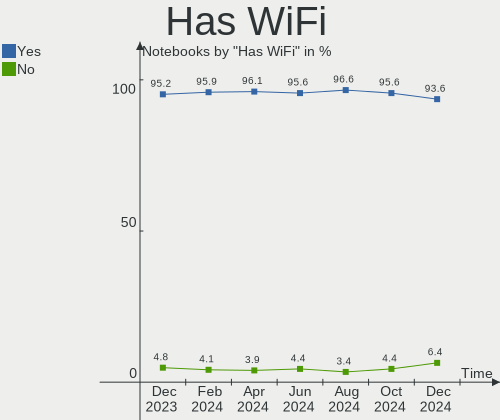
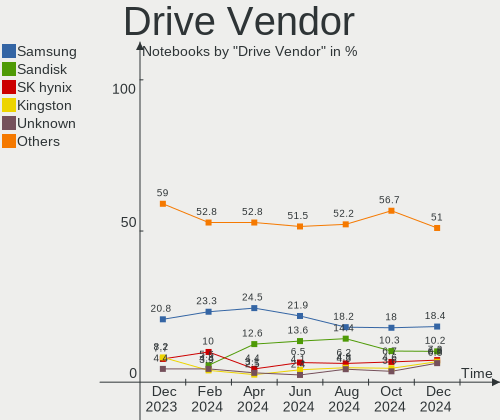
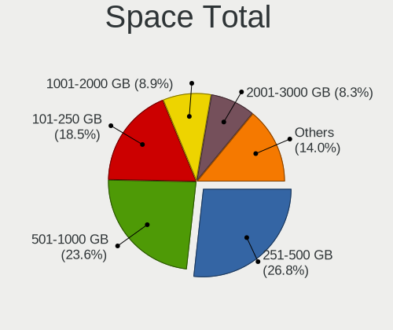
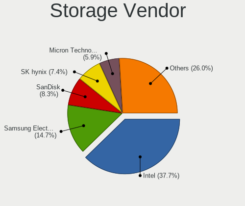
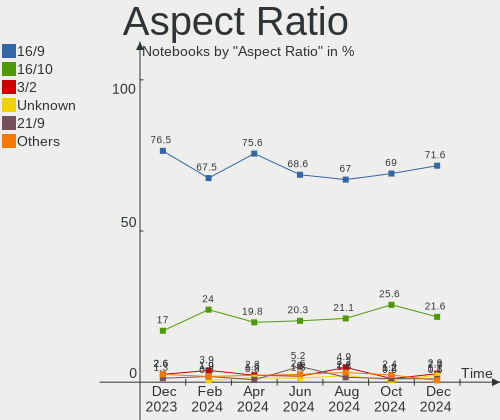

Arch - Hardware Trends (Notebooks)
----------------------------------

A project to identify most popular hardware characteristics and track their change
over time based on data collected by Linux users at https://Linux-Hardware.org.

Anyone can contribute to this report by the [hw-probe](https://github.com/linuxhw/hw-probe) tool:

    sudo -E hw-probe -all -upload

This report is for one last month. Overall report since the beginning of time: [TestDays](https://github.com/linuxhw/TestDays)

Period: Aug, 2023.

Contents
--------

* [ System ](#system)
  - [ OS                       ](#os)
  - [ OS Family                ](#os-family)
  - [ Kernel                   ](#kernel)
  - [ Kernel Family            ](#kernel-family)
  - [ Kernel Major Ver.        ](#kernel-major-ver)
  - [ Arch                     ](#arch)
  - [ DE                       ](#de)
  - [ Display Server           ](#display-server)
  - [ Display Manager          ](#display-manager)
  - [ OS Lang                  ](#os-lang)
  - [ Boot Mode                ](#boot-mode)
  - [ Filesystem               ](#filesystem)
  - [ Part. scheme             ](#part-scheme)
  - [ Dual Boot with Linux/BSD ](#dual-boot-with-linuxbsd)
  - [ Dual Boot (Win)          ](#dual-boot-win)

* [ Board ](#board)
  - [ Vendor                   ](#vendor)
  - [ Model                    ](#model)
  - [ Model Family             ](#model-family)
  - [ MFG Year                 ](#mfg-year)
  - [ Form Factor              ](#form-factor)
  - [ Secure Boot              ](#secure-boot)
  - [ Coreboot                 ](#coreboot)
  - [ RAM Size                 ](#ram-size)
  - [ RAM Used                 ](#ram-used)
  - [ Total Drives             ](#total-drives)
  - [ Has CD-ROM               ](#has-cd-rom)
  - [ Has Ethernet             ](#has-ethernet)
  - [ Has WiFi                 ](#has-wifi)
  - [ Has Bluetooth            ](#has-bluetooth)

* [ Location ](#location)
  - [ Country                  ](#country)
  - [ City                     ](#city)

* [ Drives ](#drives)
  - [ Drive Vendor             ](#drive-vendor)
  - [ Drive Model              ](#drive-model)
  - [ HDD Vendor               ](#hdd-vendor)
  - [ SSD Vendor               ](#ssd-vendor)
  - [ Drive Kind               ](#drive-kind)
  - [ Drive Connector          ](#drive-connector)
  - [ Drive Size               ](#drive-size)
  - [ Space Total              ](#space-total)
  - [ Space Used               ](#space-used)
  - [ Malfunc. Drives          ](#malfunc-drives)
  - [ Malfunc. Drive Vendor    ](#malfunc-drive-vendor)
  - [ Malfunc. HDD Vendor      ](#malfunc-hdd-vendor)
  - [ Malfunc. Drive Kind      ](#malfunc-drive-kind)
  - [ Failed Drives            ](#failed-drives)
  - [ Failed Drive Vendor      ](#failed-drive-vendor)
  - [ Drive Status             ](#drive-status)

* [ Storage controller ](#storage-controller)
  - [ Storage Vendor           ](#storage-vendor)
  - [ Storage Model            ](#storage-model)
  - [ Storage Kind             ](#storage-kind)

* [ Processor ](#processor)
  - [ CPU Vendor               ](#cpu-vendor)
  - [ CPU Model                ](#cpu-model)
  - [ CPU Model Family         ](#cpu-model-family)
  - [ CPU Cores                ](#cpu-cores)
  - [ CPU Sockets              ](#cpu-sockets)
  - [ CPU Threads              ](#cpu-threads)
  - [ CPU Op-Modes             ](#cpu-op-modes)
  - [ CPU Microcode            ](#cpu-microcode)
  - [ CPU Microarch            ](#cpu-microarch)

* [ Graphics ](#graphics)
  - [ GPU Vendor               ](#gpu-vendor)
  - [ GPU Model                ](#gpu-model)
  - [ GPU Combo                ](#gpu-combo)
  - [ GPU Driver               ](#gpu-driver)
  - [ GPU Memory               ](#gpu-memory)

* [ Monitor ](#monitor)
  - [ Monitor Vendor           ](#monitor-vendor)
  - [ Monitor Model            ](#monitor-model)
  - [ Monitor Resolution       ](#monitor-resolution)
  - [ Monitor Diagonal         ](#monitor-diagonal)
  - [ Monitor Width            ](#monitor-width)
  - [ Aspect Ratio             ](#aspect-ratio)
  - [ Monitor Area             ](#monitor-area)
  - [ Pixel Density            ](#pixel-density)
  - [ Multiple Monitors        ](#multiple-monitors)

* [ Network ](#network)
  - [ Net Controller Vendor    ](#net-controller-vendor)
  - [ Net Controller Model     ](#net-controller-model)
  - [ Wireless Vendor          ](#wireless-vendor)
  - [ Wireless Model           ](#wireless-model)
  - [ Ethernet Vendor          ](#ethernet-vendor)
  - [ Ethernet Model           ](#ethernet-model)
  - [ Net Controller Kind      ](#net-controller-kind)
  - [ Used Controller          ](#used-controller)
  - [ NICs                     ](#nics)
  - [ IPv6                     ](#ipv6)

* [ Bluetooth ](#bluetooth)
  - [ Bluetooth Vendor         ](#bluetooth-vendor)
  - [ Bluetooth Model          ](#bluetooth-model)

* [ Sound ](#sound)
  - [ Sound Vendor             ](#sound-vendor)
  - [ Sound Model              ](#sound-model)

* [ Memory ](#memory)
  - [ Memory Vendor            ](#memory-vendor)
  - [ Memory Model             ](#memory-model)
  - [ Memory Kind              ](#memory-kind)
  - [ Memory Form Factor       ](#memory-form-factor)
  - [ Memory Size              ](#memory-size)
  - [ Memory Speed             ](#memory-speed)

* [ Printers & scanners ](#printers--scanners)
  - [ Printer Vendor           ](#printer-vendor)
  - [ Printer Model            ](#printer-model)
  - [ Scanner Vendor           ](#scanner-vendor)
  - [ Scanner Model            ](#scanner-model)

* [ Camera ](#camera)
  - [ Camera Vendor            ](#camera-vendor)
  - [ Camera Model             ](#camera-model)

* [ Security ](#security)
  - [ Fingerprint Vendor       ](#fingerprint-vendor)
  - [ Fingerprint Model        ](#fingerprint-model)
  - [ Chipcard Vendor          ](#chipcard-vendor)
  - [ Chipcard Model           ](#chipcard-model)

* [ Unsupported ](#unsupported)
  - [ Unsupported Devices      ](#unsupported-devices)
  - [ Unsupported Device Types ](#unsupported-device-types)

System
------

OS
--

Installed operating systems

| Name         | Notebooks | Percent |
|--------------|-----------|---------|
| Arch Rolling | 121       | 100%    |

OS Family
---------

OS without a version

| Name | Notebooks | Percent |
|------|-----------|---------|
| Arch | 121       | 100%    |

Kernel
------

Version of the Linux kernel

| Version                 | Notebooks | Percent |
|-------------------------|-----------|---------|
| 6.4.10-arch1-1          | 19        | 15.7%   |
| 6.4.11-arch2-1          | 14        | 11.57%  |
| 6.4.8-arch1-1           | 12        | 9.92%   |
| 6.4.12-arch1-1          | 12        | 9.92%   |
| 6.4.9-arch1-1           | 10        | 8.26%   |
| 6.4.7-arch1-1           | 8         | 6.61%   |
| 6.4.7-arch1-3           | 4         | 3.31%   |
| 6.4.7-arch1-2           | 4         | 3.31%   |
| 6.4.10-zen2-1-zen       | 4         | 3.31%   |
| 6.4.7-zen1-1-zen        | 3         | 2.48%   |
| 6.4.9-zen1-1-zen        | 2         | 1.65%   |
| 6.4.8-zen1-1-zen        | 2         | 1.65%   |
| 6.4.12-zen1-1-zen       | 2         | 1.65%   |
| 6.4.11-zen2-1-zen       | 2         | 1.65%   |
| 6.1.46-1-lts            | 2         | 1.65%   |
| 6.1.44-1-lts            | 2         | 1.65%   |
| 6.4.9-arch1-1-g14       | 1         | 0.83%   |
| 6.4.9-1-cachyos-cfs-lto | 1         | 0.83%   |
| 6.4.7-zen1-2-zen        | 1         | 0.83%   |
| 6.4.6-arch1-1-g14       | 1         | 0.83%   |
| 6.4.6-arch1-1           | 1         | 0.83%   |
| 6.4.5-arch1-1           | 1         | 0.83%   |
| 6.4.4-arch1-1           | 1         | 0.83%   |
| 6.4.11-x64v3-xanmod1    | 1         | 0.83%   |
| 6.4.11-arch1-1          | 1         | 0.83%   |
| 6.4.10-zen1-1-zen       | 1         | 0.83%   |
| 6.4.1-arch1-1-custom    | 1         | 0.83%   |
| 6.3.7-arch1-1           | 1         | 0.83%   |
| 6.3.1-arch2-1           | 1         | 0.83%   |
| 6.1.8-arch1-1           | 1         | 0.83%   |
| 6.1.48-1-lts            | 1         | 0.83%   |
| 6.1.45-1-lts            | 1         | 0.83%   |
| 6.1.39-1-lts            | 1         | 0.83%   |
| 6.1.27-1-lts            | 1         | 0.83%   |
| 6.0.2-arch1-1           | 1         | 0.83%   |

Kernel Family
-------------

Linux kernel without a distro release

| Version | Notebooks | Percent |
|---------|-----------|---------|
| 6.4.10  | 24        | 19.83%  |
| 6.4.7   | 20        | 16.53%  |
| 6.4.11  | 18        | 14.88%  |
| 6.4.9   | 14        | 11.57%  |
| 6.4.8   | 14        | 11.57%  |
| 6.4.12  | 14        | 11.57%  |
| 6.4.6   | 2         | 1.65%   |
| 6.1.46  | 2         | 1.65%   |
| 6.1.44  | 2         | 1.65%   |
| 6.4.5   | 1         | 0.83%   |
| 6.4.4   | 1         | 0.83%   |
| 6.4.1   | 1         | 0.83%   |
| 6.3.7   | 1         | 0.83%   |
| 6.3.1   | 1         | 0.83%   |
| 6.1.8   | 1         | 0.83%   |
| 6.1.48  | 1         | 0.83%   |
| 6.1.45  | 1         | 0.83%   |
| 6.1.39  | 1         | 0.83%   |
| 6.1.27  | 1         | 0.83%   |
| 6.0.2   | 1         | 0.83%   |

Kernel Major Ver.
-----------------

Linux kernel major version

| Version | Notebooks | Percent |
|---------|-----------|---------|
| 6.4     | 109       | 90.08%  |
| 6.1     | 9         | 7.44%   |
| 6.3     | 2         | 1.65%   |
| 6.0     | 1         | 0.83%   |

Arch
----

OS architecture (x86_64, i586, etc.)

| Name   | Notebooks | Percent |
|--------|-----------|---------|
| x86_64 | 121       | 100%    |

DE
--

Desktop Environment

| Name       | Notebooks | Percent |
|------------|-----------|---------|
| KDE5       | 56        | 46.28%  |
| GNOME      | 35        | 28.93%  |
| XFCE       | 8         | 6.61%   |
| Unknown    | 5         | 4.13%   |
| sway       | 4         | 3.31%   |
| i3         | 3         | 2.48%   |
| Hyprland   | 3         | 2.48%   |
| X-Cinnamon | 1         | 0.83%   |
| Unity      | 1         | 0.83%   |
| OPENBOX    | 1         | 0.83%   |
| MATE       | 1         | 0.83%   |
| Deepin     | 1         | 0.83%   |
| Budgie     | 1         | 0.83%   |
| bspwm      | 1         | 0.83%   |

Display Server
--------------

X11 or Wayland

| Name    | Notebooks | Percent |
|---------|-----------|---------|
| X11     | 54        | 44.63%  |
| Wayland | 54        | 44.63%  |
| Unknown | 10        | 8.26%   |
| Tty     | 3         | 2.48%   |

Display Manager
---------------

SDDM, LightDM, etc.

| Name    | Notebooks | Percent |
|---------|-----------|---------|
| Unknown | 47        | 38.84%  |
| SDDM    | 40        | 33.06%  |
| GDM     | 17        | 14.05%  |
| LightDM | 15        | 12.4%   |
| SLiM    | 1         | 0.83%   |
| EMPTTY  | 1         | 0.83%   |

OS Lang
-------

Language

| Lang    | Notebooks | Percent |
|---------|-----------|---------|
| en_US   | 61        | 50.41%  |
| en_GB   | 10        | 8.26%   |
| fr_FR   | 8         | 6.61%   |
| C       | 8         | 6.61%   |
| zh_CN   | 6         | 4.96%   |
| Unknown | 6         | 4.96%   |
| ru_RU   | 5         | 4.13%   |
| it_IT   | 4         | 3.31%   |
| pt_BR   | 2         | 1.65%   |
| en_IN   | 2         | 1.65%   |
| de_DE   | 2         | 1.65%   |
| tr_TR   | 1         | 0.83%   |
| pt_PT   | 1         | 0.83%   |
| es_ES   | 1         | 0.83%   |
| es_DO   | 1         | 0.83%   |
| en_HK   | 1         | 0.83%   |
| en_CA   | 1         | 0.83%   |
| de_IT   | 1         | 0.83%   |

Boot Mode
---------

EFI or BIOS

| Mode | Notebooks | Percent |
|------|-----------|---------|
| EFI  | 78        | 64.46%  |
| BIOS | 43        | 35.54%  |

Filesystem
----------

Type of filesystem

| Type  | Notebooks | Percent |
|-------|-----------|---------|
| Ext4  | 84        | 69.42%  |
| Btrfs | 32        | 26.45%  |
| Xfs   | 3         | 2.48%   |
| Zfs   | 1         | 0.83%   |
| F2fs  | 1         | 0.83%   |

Part. scheme
------------

Scheme of partitioning

| Type    | Notebooks | Percent |
|---------|-----------|---------|
| GPT     | 82        | 67.77%  |
| Unknown | 34        | 28.1%   |
| MBR     | 5         | 4.13%   |

Dual Boot with Linux/BSD
------------------------

Hosting more than one Linux/BSD

| Dual boot | Notebooks | Percent |
|-----------|-----------|---------|
| No        | 113       | 93.39%  |
| Yes       | 8         | 6.61%   |

Dual Boot (Win)
---------------

Hosting Linux and Windows

| Dual boot | Notebooks | Percent |
|-----------|-----------|---------|
| No        | 92        | 76.03%  |
| Yes       | 29        | 23.97%  |

Board
-----

Vendor
------

Motherboard manufacturer

| Name                 | Notebooks | Percent |
|----------------------|-----------|---------|
| Lenovo               | 34        | 28.1%   |
| ASUSTek Computer     | 24        | 19.83%  |
| Dell                 | 16        | 13.22%  |
| Hewlett-Packard      | 13        | 10.74%  |
| Acer                 | 11        | 9.09%   |
| HUAWEI               | 4         | 3.31%   |
| MSI                  | 3         | 2.48%   |
| Timi                 | 2         | 1.65%   |
| Chuwi                | 2         | 1.65%   |
| Alienware            | 2         | 1.65%   |
| Valve                | 1         | 0.83%   |
| Schenker             | 1         | 0.83%   |
| PC Specialist        | 1         | 0.83%   |
| Packard Bell         | 1         | 0.83%   |
| Notebook             | 1         | 0.83%   |
| MECHREVO             | 1         | 0.83%   |
| LG Electronics       | 1         | 0.83%   |
| Intel Client Systems | 1         | 0.83%   |
| HONOR                | 1         | 0.83%   |
| Apple                | 1         | 0.83%   |

Model
-----

Motherboard model

| Name                                   | Notebooks | Percent |
|----------------------------------------|-----------|---------|
| Lenovo Legion Y530-15ICH 81FV          | 2         | 1.65%   |
| HP Pavilion Gaming Laptop 15-dk0xxx    | 2         | 1.65%   |
| Dell XPS 15 9500                       | 2         | 1.65%   |
| Chuwi GemiBook Pro                     | 2         | 1.65%   |
| ASUS X555LAB                           | 2         | 1.65%   |
| Valve Jupiter                          | 1         | 0.83%   |
| Timi RedmiBook Pro 15S                 | 1         | 0.83%   |
| Timi A35S                              | 1         | 0.83%   |
| Schenker XMG FUSION 15 (XFU15M22)      | 1         | 0.83%   |
| PC Specialist Lafite Pro III 17        | 1         | 0.83%   |
| Packard Bell EasyNote TJ65             | 1         | 0.83%   |
| Notebook NS50MU                        | 1         | 0.83%   |
| MSI MS-7E06                            | 1         | 0.83%   |
| MSI GF75 Thin 9SCSR                    | 1         | 0.83%   |
| MSI GF75 Thin 10SC                     | 1         | 0.83%   |
| MECHREVO Code01 Ver2.0                 | 1         | 0.83%   |
| LG 16Z90R-K.ADB9U1                     | 1         | 0.83%   |
| Lenovo ThinkPad X120e 0611AN2          | 1         | 0.83%   |
| Lenovo ThinkPad X1 Carbon 3460A87      | 1         | 0.83%   |
| Lenovo ThinkPad T480s 20L8002WMD       | 1         | 0.83%   |
| Lenovo ThinkPad T470s W10DG 20JTS0X906 | 1         | 0.83%   |
| Lenovo ThinkPad T470 W10DG 20JNS0WA0U  | 1         | 0.83%   |
| Lenovo ThinkPad T450 20BV0001US        | 1         | 0.83%   |
| Lenovo ThinkPad T420 4236W1W           | 1         | 0.83%   |
| Lenovo ThinkPad T14 Gen 3 21CF004PGE   | 1         | 0.83%   |
| Lenovo ThinkPad P51 20HJS5WH0D         | 1         | 0.83%   |
| Lenovo ThinkPad P51 20HH0015IX         | 1         | 0.83%   |
| Lenovo ThinkPad P14s Gen 2a 21A0008PGE | 1         | 0.83%   |
| Lenovo ThinkPad P14s Gen 1 20Y1S00D00  | 1         | 0.83%   |
| Lenovo ThinkPad P1 Gen 4i 20Y4S1QE0F   | 1         | 0.83%   |
| Lenovo ThinkPad P1 Gen 4i 20Y3004HUS   | 1         | 0.83%   |
| Lenovo ThinkPad E14 Gen 4 21ECS00000   | 1         | 0.83%   |
| Lenovo ThinkPad E14 Gen 3 20Y7CTO1WW   | 1         | 0.83%   |
| Lenovo ThinkPad E14 20RBCTO1WW         | 1         | 0.83%   |
| Lenovo ThinkBook 16p Gen 2 20YM        | 1         | 0.83%   |
| Lenovo ThinkBook 15 G3 ACL 21A4        | 1         | 0.83%   |
| Lenovo ThinkBook 13s G3 ACN 20YA       | 1         | 0.83%   |
| Lenovo Legion S7 15ARH5 82HM           | 1         | 0.83%   |
| Lenovo Legion 7 16ARHA7 82UH           | 1         | 0.83%   |
| Lenovo Legion 5 Pro 16ARH7H 82RG       | 1         | 0.83%   |

Model Family
------------

Motherboard model prefix

| Name                          | Notebooks | Percent |
|-------------------------------|-----------|---------|
| Lenovo ThinkPad               | 17        | 14.05%  |
| Lenovo Legion                 | 7         | 5.79%   |
| Lenovo IdeaPad                | 7         | 5.79%   |
| Dell Inspiron                 | 6         | 4.96%   |
| Dell Latitude                 | 5         | 4.13%   |
| ASUS ASUS                     | 5         | 4.13%   |
| HP Pavilion                   | 4         | 3.31%   |
| Dell XPS                      | 4         | 3.31%   |
| ASUS ZenBook                  | 4         | 3.31%   |
| ASUS VivoBook                 | 4         | 3.31%   |
| ASUS ROG                      | 4         | 3.31%   |
| Acer Aspire                   | 4         | 3.31%   |
| Lenovo ThinkBook              | 3         | 2.48%   |
| HP Laptop                     | 3         | 2.48%   |
| HP EliteBook                  | 3         | 2.48%   |
| Acer Swift                    | 3         | 2.48%   |
| MSI GF75                      | 2         | 1.65%   |
| Chuwi GemiBook                | 2         | 1.65%   |
| ASUS X555LAB                  | 2         | 1.65%   |
| Acer Nitro                    | 2         | 1.65%   |
| Valve Jupiter                 | 1         | 0.83%   |
| Timi RedmiBook                | 1         | 0.83%   |
| Timi A35S                     | 1         | 0.83%   |
| Schenker XMG                  | 1         | 0.83%   |
| PC Specialist Lafite          | 1         | 0.83%   |
| Packard Bell EasyNote         | 1         | 0.83%   |
| Notebook NS50MU               | 1         | 0.83%   |
| MSI MS-7E06                   | 1         | 0.83%   |
| MECHREVO Code01               | 1         | 0.83%   |
| LG 16Z90R-K.ADB9U1            | 1         | 0.83%   |
| Intel Client Systems LAPAC71H | 1         | 0.83%   |
| HUAWEI WRT-WX9                | 1         | 0.83%   |
| HUAWEI NBLK-WAX9X             | 1         | 0.83%   |
| HUAWEI NBD-WXX9               | 1         | 0.83%   |
| HUAWEI KPR-WX9                | 1         | 0.83%   |
| HONOR NMH-WDX9                | 1         | 0.83%   |
| HP ProBook                    | 1         | 0.83%   |
| HP OMEN                       | 1         | 0.83%   |
| HP Notebook                   | 1         | 0.83%   |
| Dell Precision                | 1         | 0.83%   |

MFG Year
--------

Motherboard manufacture year

| Year | Notebooks | Percent |
|------|-----------|---------|
| 2021 | 21        | 17.36%  |
| 2022 | 18        | 14.88%  |
| 2019 | 16        | 13.22%  |
| 2020 | 15        | 12.4%   |
| 2023 | 9         | 7.44%   |
| 2017 | 9         | 7.44%   |
| 2018 | 8         | 6.61%   |
| 2015 | 6         | 4.96%   |
| 2011 | 5         | 4.13%   |
| 2016 | 4         | 3.31%   |
| 2014 | 3         | 2.48%   |
| 2013 | 3         | 2.48%   |
| 2012 | 3         | 2.48%   |
| 2009 | 1         | 0.83%   |

Form Factor
-----------

Physical design of the computer

| Name     | Notebooks | Percent |
|----------|-----------|---------|
| Notebook | 121       | 100%    |

Secure Boot
-----------

Enabled or disabled

| State    | Notebooks | Percent |
|----------|-----------|---------|
| Disabled | 120       | 99.17%  |
| Enabled  | 1         | 0.83%   |

Coreboot
--------

Have coreboot on board

| Used | Notebooks | Percent |
|------|-----------|---------|
| No   | 120       | 99.17%  |
| Yes  | 1         | 0.83%   |

RAM Size
--------

Total RAM memory

| Size in GB  | Notebooks | Percent |
|-------------|-----------|---------|
| 4.01-8.0    | 34        | 28.1%   |
| 16.01-24.0  | 26        | 21.49%  |
| 8.01-16.0   | 25        | 20.66%  |
| 32.01-64.0  | 17        | 14.05%  |
| 24.01-32.0  | 7         | 5.79%   |
| 64.01-256.0 | 7         | 5.79%   |
| 3.01-4.0    | 4         | 3.31%   |
| 1.01-2.0    | 1         | 0.83%   |

RAM Used
--------

Used RAM memory

| Used GB    | Notebooks | Percent |
|------------|-----------|---------|
| 4.01-8.0   | 41        | 33.88%  |
| 3.01-4.0   | 22        | 18.18%  |
| 2.01-3.0   | 22        | 18.18%  |
| 8.01-16.0  | 14        | 11.57%  |
| 1.01-2.0   | 13        | 10.74%  |
| 0.51-1.0   | 4         | 3.31%   |
| 16.01-24.0 | 3         | 2.48%   |
| 32.01-64.0 | 1         | 0.83%   |
| 0.01-0.5   | 1         | 0.83%   |

Total Drives
------------

Number of drives on board

| Drives | Notebooks | Percent |
|--------|-----------|---------|
| 1      | 80        | 66.12%  |
| 2      | 36        | 29.75%  |
| 3      | 4         | 3.31%   |
| 4      | 1         | 0.83%   |

Has CD-ROM
----------

Has CD-ROM on board

| Presented | Notebooks | Percent |
|-----------|-----------|---------|
| No        | 107       | 88.43%  |
| Yes       | 14        | 11.57%  |

Has Ethernet
------------

Has Ethernet on board

| Presented | Notebooks | Percent |
|-----------|-----------|---------|
| Yes       | 87        | 71.9%   |
| No        | 34        | 28.1%   |

Has WiFi
--------

Has WiFi module

| Presented | Notebooks | Percent |
|-----------|-----------|---------|
| Yes       | 121       | 100%    |

Has Bluetooth
-------------

Has Bluetooth module

| Presented | Notebooks | Percent |
|-----------|-----------|---------|
| Yes       | 108       | 89.26%  |
| No        | 13        | 10.74%  |

Location
--------

Country
-------

Geographic location (country)

| Country            | Notebooks | Percent |
|--------------------|-----------|---------|
| USA                | 14        | 11.57%  |
| Germany            | 10        | 8.26%   |
| France             | 10        | 8.26%   |
| Russia             | 8         | 6.61%   |
| India              | 8         | 6.61%   |
| Italy              | 7         | 5.79%   |
| China              | 7         | 5.79%   |
| Austria            | 5         | 4.13%   |
| UK                 | 4         | 3.31%   |
| Canada             | 4         | 3.31%   |
| Brazil             | 4         | 3.31%   |
| Turkey             | 2         | 1.65%   |
| Thailand           | 2         | 1.65%   |
| Spain              | 2         | 1.65%   |
| Slovenia           | 2         | 1.65%   |
| Indonesia          | 2         | 1.65%   |
| Hong Kong          | 2         | 1.65%   |
| Chile              | 2         | 1.65%   |
| Australia          | 2         | 1.65%   |
| Venezuela          | 1         | 0.83%   |
| Uzbekistan         | 1         | 0.83%   |
| UAE                | 1         | 0.83%   |
| Taiwan             | 1         | 0.83%   |
| Sweden             | 1         | 0.83%   |
| Sri Lanka          | 1         | 0.83%   |
| Singapore          | 1         | 0.83%   |
| Portugal           | 1         | 0.83%   |
| Poland             | 1         | 0.83%   |
| Peru               | 1         | 0.83%   |
| New Zealand        | 1         | 0.83%   |
| Netherlands        | 1         | 0.83%   |
| Malaysia           | 1         | 0.83%   |
| Kenya              | 1         | 0.83%   |
| Kazakhstan         | 1         | 0.83%   |
| Japan              | 1         | 0.83%   |
| Honduras           | 1         | 0.83%   |
| Finland            | 1         | 0.83%   |
| Egypt              | 1         | 0.83%   |
| Ecuador            | 1         | 0.83%   |
| Dominican Republic | 1         | 0.83%   |

City
----

Geographic location (city)

| City                       | Notebooks | Percent |
|----------------------------|-----------|---------|
| Moscow                     | 3         | 2.48%   |
| Vienna                     | 2         | 1.65%   |
| Shenzhen                   | 2         | 1.65%   |
| Santiago                   | 2         | 1.65%   |
| Rouen                      | 2         | 1.65%   |
| Paris                      | 2         | 1.65%   |
| Dallas                     | 2         | 1.65%   |
| Berlin                     | 2         | 1.65%   |
| Zwickau                    | 1         | 0.83%   |
| Zagreb                     | 1         | 0.83%   |
| Yuen Long San Hui          | 1         | 0.83%   |
| Wilkes-Barre               | 1         | 0.83%   |
| Washington                 | 1         | 0.83%   |
| Warsaw                     | 1         | 0.83%   |
| Volgograd                  | 1         | 0.83%   |
| Viborg                     | 1         | 0.83%   |
| Vantaa                     | 1         | 0.83%   |
| Valdemoro                  | 1         | 0.83%   |
| Umeå                      | 1         | 0.83%   |
| Uberlândia                | 1         | 0.83%   |
| Toulouse                   | 1         | 0.83%   |
| Toronto                    | 1         | 0.83%   |
| Tolyatti                   | 1         | 0.83%   |
| Tiruchi                    | 1         | 0.83%   |
| Thonon-les-Bains           | 1         | 0.83%   |
| Tegucigalpa                | 1         | 0.83%   |
| Tashkent                   | 1         | 0.83%   |
| Sydney                     | 1         | 0.83%   |
| Storo                      | 1         | 0.83%   |
| South Orange               | 1         | 0.83%   |
| Singapore                  | 1         | 0.83%   |
| Simferopol                 | 1         | 0.83%   |
| Shanghai                   | 1         | 0.83%   |
| Seymour                    | 1         | 0.83%   |
| Sao Vicente                | 1         | 0.83%   |
| Sao Paulo                  | 1         | 0.83%   |
| Santiago de los Caballeros | 1         | 0.83%   |
| Salzwedel                  | 1         | 0.83%   |
| Sablons                    | 1         | 0.83%   |
| Ryde                       | 1         | 0.83%   |

Drives
------

Drive Vendor
------------

Hard drive vendors

| Vendor                      | Notebooks | Drives | Percent |
|-----------------------------|-----------|--------|---------|
| Samsung Electronics         | 34        | 37     | 21.79%  |
| Sandisk                     | 23        | 26     | 14.74%  |
| SK hynix                    | 13        | 14     | 8.33%   |
| Micron Technology           | 10        | 10     | 6.41%   |
| Seagate                     | 9         | 10     | 5.77%   |
| Kingston                    | 9         | 9      | 5.77%   |
| Crucial                     | 8         | 8      | 5.13%   |
| WDC                         | 7         | 8      | 4.49%   |
| Intel                       | 5         | 5      | 3.21%   |
| KIOXIA                      | 3         | 3      | 1.92%   |
| HGST                        | 3         | 3      | 1.92%   |
| Union Memory (Shenzhen)     | 2         | 2      | 1.28%   |
| Silicon Motion              | 2         | 2      | 1.28%   |
| Phison Electronics          | 2         | 2      | 1.28%   |
| Micron/Crucial Technology   | 2         | 2      | 1.28%   |
| Kingston Technology Company | 2         | 2      | 1.28%   |
| China                       | 2         | 2      | 1.28%   |
| A-DATA Technology           | 2         | 2      | 1.28%   |
| Yangtze Memory Technologies | 1         | 1      | 0.64%   |
| Unknown                     | 1         | 1      | 0.64%   |
| Toshiba                     | 1         | 1      | 0.64%   |
| Supersonic                  | 1         | 1      | 0.64%   |
| Solid State Storage         | 1         | 2      | 0.64%   |
| Realtek Semiconductor       | 1         | 1      | 0.64%   |
| PNY                         | 1         | 1      | 0.64%   |
| LITEON                      | 1         | 1      | 0.64%   |
| Lexar                       | 1         | 1      | 0.64%   |
| JMicron Technology          | 1         | 1      | 0.64%   |
| Intenso                     | 1         | 1      | 0.64%   |
| HS-SSD-E100                 | 1         | 1      | 0.64%   |
| Generic-                    | 1         | 1      | 0.64%   |
| Emtec                       | 1         | 1      | 0.64%   |
| CT500MX5                    | 1         | 1      | 0.64%   |
| BHT                         | 1         | 1      | 0.64%   |
| ASMT                        | 1         | 2      | 0.64%   |
| Apple                       | 1         | 2      | 0.64%   |

Drive Model
-----------

Hard drive models

| Model                                                 | Notebooks | Percent |
|-------------------------------------------------------|-----------|---------|
| Samsung NVMe SSD Controller SM981/PM981/PM983 500GB   | 12        | 7.41%   |
| Samsung NVMe SSD Controller PM9A1/PM9A3/980PRO 1024GB | 6         | 3.7%    |
| Intel SSD 660P Series 512GB                           | 4         | 2.47%   |
| Sandisk WD PC SN560 SDDPNQE-1T00-1002 1TB             | 3         | 1.85%   |
| Sandisk WD Black SN750 / PC SN730 NVMe SSD 1024GB     | 3         | 1.85%   |
| SK hynix BC501 NVMe Solid State Drive 512GB           | 2         | 1.23%   |
| Seagate ST500LM021-1KJ152 500GB                       | 2         | 1.23%   |
| Sandisk WD_BLACK SN770 2TB                            | 2         | 1.23%   |
| Sandisk WD PC SN735 SDBPNHH-1T00-1002 1TB             | 2         | 1.23%   |
| Sandisk PC SN520 NVMe SSD 256GB                       | 2         | 1.23%   |
| Samsung MZALQ256HBJD-00BL2 256GB                      | 2         | 1.23%   |
| Micron/Crucial P2 NVMe PCIe SSD 1TB                   | 2         | 1.23%   |
| Micron 2450_MTFDKBA512TFK 512GB                       | 2         | 1.23%   |
| Kingston SKC3000D2048G 2TB                            | 2         | 1.23%   |
| Kingston SA400S37480G 480GB SSD                       | 2         | 1.23%   |
| HGST HTS721010A9E630 1TB                              | 2         | 1.23%   |
| Crucial CT240BX500SSD1 240GB                          | 2         | 1.23%   |
| Crucial CT1000MX500SSD1 1TB                           | 2         | 1.23%   |
| Yangtze Memory ZHITAI TiPlus5000 1TB                  | 1         | 0.62%   |
| WDC WDS250G2B0A-00SM50 250GB SSD                      | 1         | 0.62%   |
| WDC WDS240G2G0A-00JH30 240GB SSD                      | 1         | 0.62%   |
| WDC WD2500BEVT-80A23T0 250GB                          | 1         | 0.62%   |
| WDC WD10SPZX-75Z10T1 1TB                              | 1         | 0.62%   |
| WDC WD10SPSX-60A6WT0 1TB                              | 1         | 0.62%   |
| WDC WD10JPLX-00MBPT0 1TB                              | 1         | 0.62%   |
| WDC WD10JPCX-24UE4T0 1TB                              | 1         | 0.62%   |
| WDC WD Blue SA510 2.5 250GB SSD                       | 1         | 0.62%   |
| Unknown MMC Card  128GB                               | 1         | 0.62%   |
| Union Memory (Shenzhen) UMIS RPJTJ512MGE1QDQ 512GB    | 1         | 0.62%   |
| Union Memory (Shenzhen) RPFTJ128PDD2EWX 128GB         | 1         | 0.62%   |
| Toshiba MQ01ABF050 500GB                              | 1         | 0.62%   |
| Supersonic SUPERSONIC512 512GB                        | 1         | 0.62%   |
| Solid State Storage CL1-3D256-Q11 NVMe SSSTC 256GB    | 1         | 0.62%   |
| SK hynix SKHynix_HFS512GEJ9X115N 512GB                | 1         | 0.62%   |
| SK hynix SKHynix_HFS512GDE9X081N 512GB                | 1         | 0.62%   |
| SK hynix SKHynix_HFS001TEJ4X112N 1024GB               | 1         | 0.62%   |
| SK hynix SHPP41-2000GM 2TB                            | 1         | 0.62%   |
| SK hynix SC311 SATA 512GB SSD                         | 1         | 0.62%   |
| SK hynix PC611 NVMe 512GB                             | 1         | 0.62%   |
| SK hynix PC601 NVMe 256GB                             | 1         | 0.62%   |

HDD Vendor
----------

Hard disk drive vendors

| Vendor   | Notebooks | Drives | Percent |
|----------|-----------|--------|---------|
| Seagate  | 9         | 10     | 45%     |
| WDC      | 5         | 5      | 25%     |
| HGST     | 3         | 3      | 15%     |
| Toshiba  | 1         | 1      | 5%      |
| Generic- | 1         | 1      | 5%      |
| ASMT     | 1         | 2      | 5%      |

SSD Vendor
----------

Solid state drive vendors

| Vendor              | Notebooks | Drives | Percent |
|---------------------|-----------|--------|---------|
| Crucial             | 8         | 8      | 20.51%  |
| Kingston            | 6         | 6      | 15.38%  |
| Samsung Electronics | 4         | 4      | 10.26%  |
| WDC                 | 3         | 3      | 7.69%   |
| SK hynix            | 2         | 2      | 5.13%   |
| SanDisk             | 2         | 2      | 5.13%   |
| China               | 2         | 2      | 5.13%   |
| A-DATA Technology   | 2         | 2      | 5.13%   |
| PNY                 | 1         | 1      | 2.56%   |
| Micron Technology   | 1         | 1      | 2.56%   |
| LITEON              | 1         | 1      | 2.56%   |
| Lexar               | 1         | 1      | 2.56%   |
| JMicron Technology  | 1         | 1      | 2.56%   |
| Intenso             | 1         | 1      | 2.56%   |
| HS-SSD-E100         | 1         | 1      | 2.56%   |
| Emtec               | 1         | 1      | 2.56%   |
| CT500MX5            | 1         | 1      | 2.56%   |
| BHT                 | 1         | 1      | 2.56%   |

Drive Kind
----------

HDD or SSD

| Kind    | Notebooks | Drives | Percent |
|---------|-----------|--------|---------|
| NVMe    | 86        | 105    | 59.72%  |
| SSD     | 36        | 39     | 25%     |
| HDD     | 20        | 22     | 13.89%  |
| MMC     | 1         | 1      | 0.69%   |
| Unknown | 1         | 1      | 0.69%   |

Drive Connector
---------------

SATA, SAS, NVMe, etc.

| Type | Notebooks | Drives | Percent |
|------|-----------|--------|---------|
| NVMe | 86        | 105    | 61.43%  |
| SATA | 49        | 57     | 35%     |
| SAS  | 4         | 5      | 2.86%   |
| MMC  | 1         | 1      | 0.71%   |

Drive Size
----------

Size of hard drive

| Size in TB | Notebooks | Drives | Percent |
|------------|-----------|--------|---------|
| 0.01-0.5   | 32        | 35     | 56.14%  |
| 0.51-1.0   | 20        | 21     | 35.09%  |
| 1.01-2.0   | 3         | 3      | 5.26%   |
| 3.01-4.0   | 1         | 1      | 1.75%   |
| 4.01-10.0  | 1         | 1      | 1.75%   |

Space Total
-----------

Amount of disk space available on the file system

| Size in GB     | Notebooks | Percent |
|----------------|-----------|---------|
| 101-250        | 27        | 22.31%  |
| 251-500        | 26        | 21.49%  |
| 501-1000       | 21        | 17.36%  |
| 1001-2000      | 17        | 14.05%  |
| More than 3000 | 13        | 10.74%  |
| 2001-3000      | 6         | 4.96%   |
| 21-50          | 3         | 2.48%   |
| 51-100         | 3         | 2.48%   |
| Unknown        | 3         | 2.48%   |
| 1-20           | 2         | 1.65%   |

Space Used
----------

Amount of used disk space

| Used GB        | Notebooks | Percent |
|----------------|-----------|---------|
| 101-250        | 23        | 19.01%  |
| 1-20           | 23        | 19.01%  |
| 251-500        | 17        | 14.05%  |
| 21-50          | 17        | 14.05%  |
| 51-100         | 13        | 10.74%  |
| 1001-2000      | 10        | 8.26%   |
| 501-1000       | 10        | 8.26%   |
| More than 3000 | 4         | 3.31%   |
| Unknown        | 3         | 2.48%   |
| 2001-3000      | 1         | 0.83%   |

Malfunc. Drives
---------------

Drive models with a malfunction

| Model                                                     | Notebooks | Drives | Percent |
|-----------------------------------------------------------|-----------|--------|---------|
| Seagate ST500LM021-1KJ152 500GB                           | 2         | 2      | 33.33%  |
| WDC WD2500BEVT-80A23T0 250GB                              | 1         | 1      | 16.67%  |
| Seagate ST1000LM014-1EJ164 1TB                            | 1         | 1      | 16.67%  |
| Realtek Semiconductor RTS5763DL NVMe SSD Controller 512GB | 1         | 1      | 16.67%  |
| HGST HTS721010A9E630 1TB                                  | 1         | 1      | 16.67%  |

Malfunc. Drive Vendor
---------------------

Vendors of faulty drives

| Vendor                | Notebooks | Drives | Percent |
|-----------------------|-----------|--------|---------|
| Seagate               | 3         | 3      | 50%     |
| WDC                   | 1         | 1      | 16.67%  |
| Realtek Semiconductor | 1         | 1      | 16.67%  |
| HGST                  | 1         | 1      | 16.67%  |

Malfunc. HDD Vendor
-------------------

Vendors of faulty HDD drives

| Vendor  | Notebooks | Drives | Percent |
|---------|-----------|--------|---------|
| Seagate | 3         | 3      | 60%     |
| WDC     | 1         | 1      | 20%     |
| HGST    | 1         | 1      | 20%     |

Malfunc. Drive Kind
-------------------

Kinds of faulty drives

| Kind | Notebooks | Drives | Percent |
|------|-----------|--------|---------|
| HDD  | 5         | 5      | 83.33%  |
| NVMe | 1         | 1      | 16.67%  |

Failed Drives
-------------

Failed drive models

| Model                                         | Notebooks | Drives | Percent |
|-----------------------------------------------|-----------|--------|---------|
| Union Memory (Shenzhen) RPFTJ128PDD2EWX 128GB | 1         | 1      | 100%    |

Failed Drive Vendor
-------------------

Failed drive vendors

| Vendor                  | Notebooks | Drives | Percent |
|-------------------------|-----------|--------|---------|
| Union Memory (Shenzhen) | 1         | 1      | 100%    |

Drive Status
------------

Number of failed and malfunc. drives

| Status   | Notebooks | Drives | Percent |
|----------|-----------|--------|---------|
| Works    | 70        | 88     | 53.85%  |
| Detected | 53        | 73     | 40.77%  |
| Malfunc  | 6         | 6      | 4.62%   |
| Failed   | 1         | 1      | 0.77%   |

Storage controller
------------------

Storage Vendor
--------------

Storage controller vendors

| Vendor                         | Notebooks | Percent |
|--------------------------------|-----------|---------|
| Intel                          | 60        | 35.93%  |
| Samsung Electronics            | 30        | 17.96%  |
| SanDisk                        | 21        | 12.57%  |
| AMD                            | 16        | 9.58%   |
| SK hynix                       | 11        | 6.59%   |
| Micron Technology              | 9         | 5.39%   |
| Kingston Technology Company    | 5         | 2.99%   |
| KIOXIA                         | 3         | 1.8%    |
| Union Memory (Shenzhen)        | 2         | 1.2%    |
| Silicon Motion                 | 2         | 1.2%    |
| Phison Electronics             | 2         | 1.2%    |
| Micron/Crucial Technology      | 2         | 1.2%    |
| Yangtze Memory Technologies    | 1         | 0.6%    |
| Solid State Storage Technology | 1         | 0.6%    |
| Realtek Semiconductor          | 1         | 0.6%    |
| Apple                          | 1         | 0.6%    |

Storage Model
-------------

Storage controller models

| Model                                                                        | Notebooks | Percent |
|------------------------------------------------------------------------------|-----------|---------|
| AMD FCH SATA Controller [AHCI mode]                                          | 15        | 8.62%   |
| Samsung NVMe SSD Controller SM981/PM981/PM983                                | 12        | 6.9%    |
| Samsung NVMe SSD Controller 980                                              | 11        | 6.32%   |
| Intel 82801 Mobile SATA Controller [RAID mode]                               | 8         | 4.6%    |
| Samsung NVMe SSD Controller PM9A1/PM9A3/980PRO                               | 6         | 3.45%   |
| Intel Cannon Lake Mobile PCH SATA AHCI Controller                            | 6         | 3.45%   |
| SanDisk WD Black SN770 / PC SN740 256GB / PC SN560 (DRAM-less) NVMe SSD      | 5         | 2.87%   |
| Intel Wildcat Point-LP SATA Controller [AHCI Mode]                           | 5         | 2.87%   |
| Intel Volume Management Device NVMe RAID Controller                          | 5         | 2.87%   |
| Intel Sunrise Point-LP SATA Controller [AHCI mode]                           | 4         | 2.3%    |
| Intel SSD 660P Series                                                        | 4         | 2.3%    |
| Intel HM170/QM170 Chipset SATA Controller [AHCI Mode]                        | 4         | 2.3%    |
| Intel 6 Series/C200 Series Chipset Family 6 port Mobile SATA AHCI Controller | 4         | 2.3%    |
| SK hynix Gold P31/BC711/PC711 NVMe Solid State Drive                         | 3         | 1.72%   |
| SanDisk WD Black SN750 / PC SN730 NVMe SSD                                   | 3         | 1.72%   |
| Intel Cannon Point-LP SATA Controller [AHCI Mode]                            | 3         | 1.72%   |
| Intel 7 Series Chipset Family 6-port SATA Controller [AHCI mode]             | 3         | 1.72%   |
| SK hynix Platinum P41/PC801 NVMe Solid State Drive                           | 2         | 1.15%   |
| SK hynix BC501 NVMe Solid State Drive                                        | 2         | 1.15%   |
| SanDisk WD Blue SN570 NVMe SSD 1TB                                           | 2         | 1.15%   |
| Sandisk PC SN740 NVMe SSD (DRAM-less)                                        | 2         | 1.15%   |
| SanDisk PC SN735 NVMe SSD (DRAM-less)                                        | 2         | 1.15%   |
| SanDisk PC SN520 NVMe SSD                                                    | 2         | 1.15%   |
| Micron/Crucial P2 [Nick P2] / P3 / P3 Plus NVMe PCIe SSD (DRAM-less)         | 2         | 1.15%   |
| Micron 2450 NVMe SSD [HendrixV] (DRAM-less)                                  | 2         | 1.15%   |
| Micron 2400 NVMe SSD (DRAM-less)                                             | 2         | 1.15%   |
| Micron 2210 NVMe SSD [Cobain]                                                | 2         | 1.15%   |
| Micron 2200S NVMe SSD [Cassandra]                                            | 2         | 1.15%   |
| Kingston Company KC3000/Renegade NVMe SSD                                    | 2         | 1.15%   |
| Intel Jasper Lake SATA AHCI Controller                                       | 2         | 1.15%   |
| Intel Ice Lake-LP SATA Controller [AHCI mode]                                | 2         | 1.15%   |
| Intel Comet Lake SATA AHCI Controller                                        | 2         | 1.15%   |
| Intel 400 Series Chipset Family SATA AHCI Controller                         | 2         | 1.15%   |
| Yangtze Memory ZHITAI TiPro5000 NVMe SSD                                     | 1         | 0.57%   |
| Union Memory (Shenzhen) AM630 PCIe 4.0 x4 NVMe SSD Controller                | 1         | 0.57%   |
| Union Memory (Shenzhen) AM610 PCIe 3.0 NVMe SSD 128GB                        | 1         | 0.57%   |
| Solid State Storage CL1-3D256-Q11 NVMe SSD M.2                               | 1         | 0.57%   |
| SK hynix PC611 NVMe Solid State Drive                                        | 1         | 0.57%   |
| SK hynix PC601 NVMe Solid State Drive                                        | 1         | 0.57%   |
| SK hynix BC901 NVMe Solid State Drive (DRAM-less)                            | 1         | 0.57%   |

Storage Kind
------------

Kind of storage controller (IDE, SATA, NVMe, SAS, ...)

| Kind | Notebooks | Percent |
|------|-----------|---------|
| NVMe | 86        | 53.42%  |
| SATA | 60        | 37.27%  |
| RAID | 15        | 9.32%   |

Processor
---------

CPU Vendor
----------

Processor vendors

| Vendor | Notebooks | Percent |
|--------|-----------|---------|
| Intel  | 78        | 64.46%  |
| AMD    | 43        | 35.54%  |

CPU Model
---------

Processor models

| Model                                         | Notebooks | Percent |
|-----------------------------------------------|-----------|---------|
| Intel Core i5-9300H CPU @ 2.40GHz             | 4         | 3.31%   |
| Intel Core i7-8565U CPU @ 1.80GHz             | 3         | 2.48%   |
| Intel Core i7-10750H CPU @ 2.60GHz            | 3         | 2.48%   |
| AMD Ryzen 7 5800H with Radeon Graphics        | 3         | 2.48%   |
| AMD Ryzen 5 5500U with Radeon Graphics        | 3         | 2.48%   |
| Intel Core i7-9750H CPU @ 2.60GHz             | 2         | 1.65%   |
| Intel Core i7-7820HQ CPU @ 2.90GHz            | 2         | 1.65%   |
| Intel Core i7-6700HQ CPU @ 2.60GHz            | 2         | 1.65%   |
| Intel Core i7-2670QM CPU @ 2.20GHz            | 2         | 1.65%   |
| Intel Core i5-8250U CPU @ 1.60GHz             | 2         | 1.65%   |
| Intel Core i5-7300U CPU @ 2.60GHz             | 2         | 1.65%   |
| Intel Core i5-5200U CPU @ 2.20GHz             | 2         | 1.65%   |
| Intel Core i5-3230M CPU @ 2.60GHz             | 2         | 1.65%   |
| Intel Celeron N5100 @ 1.10GHz                 | 2         | 1.65%   |
| Intel 13th Gen Core i7-1360P                  | 2         | 1.65%   |
| Intel 12th Gen Core i5-12500H                 | 2         | 1.65%   |
| Intel 11th Gen Core i7-11850H @ 2.50GHz       | 2         | 1.65%   |
| AMD Ryzen 9 7940HS w/ Radeon 780M Graphics    | 2         | 1.65%   |
| AMD Ryzen 9 5900HX with Radeon Graphics       | 2         | 1.65%   |
| AMD Ryzen 7 6800H with Radeon Graphics        | 2         | 1.65%   |
| AMD Ryzen 7 5700U with Radeon Graphics        | 2         | 1.65%   |
| AMD Ryzen 5 4600H with Radeon Graphics        | 2         | 1.65%   |
| AMD Ryzen 5 3500U with Radeon Vega Mobile Gfx | 2         | 1.65%   |
| AMD A8-7410 APU with AMD Radeon R5 Graphics   | 2         | 1.65%   |
| Intel Pentium Silver N5000 CPU @ 1.10GHz      | 1         | 0.83%   |
| Intel Core i7-8750H CPU @ 2.20GHz             | 1         | 0.83%   |
| Intel Core i7-8665U CPU @ 1.90GHz             | 1         | 0.83%   |
| Intel Core i7-8550U CPU @ 1.80GHz             | 1         | 0.83%   |
| Intel Core i7-7700HQ CPU @ 2.80GHz            | 1         | 0.83%   |
| Intel Core i7-7500U CPU @ 2.70GHz             | 1         | 0.83%   |
| Intel Core i7-6820HQ CPU @ 2.70GHz            | 1         | 0.83%   |
| Intel Core i7-6600U CPU @ 2.60GHz             | 1         | 0.83%   |
| Intel Core i7-6500U CPU @ 2.50GHz             | 1         | 0.83%   |
| Intel Core i7-5600U CPU @ 2.60GHz             | 1         | 0.83%   |
| Intel Core i7-4720HQ CPU @ 2.60GHz            | 1         | 0.83%   |
| Intel Core i7-3632QM CPU @ 2.20GHz            | 1         | 0.83%   |
| Intel Core i7-2630QM CPU @ 2.00GHz            | 1         | 0.83%   |
| Intel Core i7-10870H CPU @ 2.20GHz            | 1         | 0.83%   |
| Intel Core i7-10510U CPU @ 1.80GHz            | 1         | 0.83%   |
| Intel Core i5-8300H CPU @ 2.30GHz             | 1         | 0.83%   |

CPU Model Family
----------------

Processor model prefix

| Model                | Notebooks | Percent |
|----------------------|-----------|---------|
| Intel Core i7        | 28        | 23.14%  |
| Intel Core i5        | 22        | 18.18%  |
| Other                | 18        | 14.88%  |
| AMD Ryzen 7          | 16        | 13.22%  |
| AMD Ryzen 5          | 11        | 9.09%   |
| AMD Ryzen 9          | 6         | 4.96%   |
| Intel Core i3        | 5         | 4.13%   |
| Intel Celeron        | 4         | 3.31%   |
| AMD Ryzen 7 PRO      | 3         | 2.48%   |
| AMD A8               | 2         | 1.65%   |
| Intel Pentium Silver | 1         | 0.83%   |
| Intel Core 2 Duo     | 1         | 0.83%   |
| AMD Ryzen 5 PRO      | 1         | 0.83%   |
| AMD E2               | 1         | 0.83%   |
| AMD E                | 1         | 0.83%   |
| AMD A4               | 1         | 0.83%   |

CPU Cores
---------

Number of processor cores

| Number | Notebooks | Percent |
|--------|-----------|---------|
| 4      | 41        | 33.88%  |
| 8      | 29        | 23.97%  |
| 2      | 28        | 23.14%  |
| 6      | 15        | 12.4%   |
| 12     | 4         | 3.31%   |
| 16     | 2         | 1.65%   |
| 14     | 2         | 1.65%   |

CPU Sockets
-----------

Number of sockets

| Number | Notebooks | Percent |
|--------|-----------|---------|
| 1      | 121       | 100%    |

CPU Threads
-----------

Threads per core (Hyper-Threading)

| Number | Notebooks | Percent |
|--------|-----------|---------|
| 2      | 107       | 88.43%  |
| 1      | 14        | 11.57%  |

CPU Op-Modes
------------

CPU Operation Modes (32-bit, 64-bit)

| Op mode        | Notebooks | Percent |
|----------------|-----------|---------|
| 32-bit, 64-bit | 121       | 100%    |

CPU Microcode
-------------

Microcode number

| Number     | Notebooks | Percent |
|------------|-----------|---------|
| Unknown    | 85        | 70.25%  |
| 0x0a50000c | 8         | 6.61%   |
| 0x0a404102 | 5         | 4.13%   |
| 0x0a704101 | 3         | 2.48%   |
| 0x08608103 | 3         | 2.48%   |
| 0x08600109 | 2         | 1.65%   |
| 0x08600106 | 2         | 1.65%   |
| 0x06006705 | 2         | 1.65%   |
| 0x806ec    | 1         | 0.83%   |
| 0x406c3    | 1         | 0.83%   |
| 0x306a9    | 1         | 0.83%   |
| 0x206a7    | 1         | 0.83%   |
| 0x0a50000d | 1         | 0.83%   |
| 0x0a404101 | 1         | 0.83%   |
| 0x08900201 | 1         | 0.83%   |
| 0x08600103 | 1         | 0.83%   |
| 0x08108109 | 1         | 0.83%   |
| 0x08108102 | 1         | 0.83%   |
| 0x05000029 | 1         | 0.83%   |

CPU Microarch
-------------

Microarchitecture

| Name             | Notebooks | Percent |
|------------------|-----------|---------|
| KabyLake         | 25        | 20.66%  |
| Unknown          | 21        | 17.36%  |
| Zen 3            | 11        | 9.09%   |
| Zen 2            | 6         | 4.96%   |
| Skylake          | 6         | 4.96%   |
| Broadwell        | 6         | 4.96%   |
| Alderlake Hybrid | 6         | 4.96%   |
| TigerLake        | 5         | 4.13%   |
| IceLake          | 5         | 4.13%   |
| CometLake        | 5         | 4.13%   |
| Zen+             | 4         | 3.31%   |
| SandyBridge      | 4         | 3.31%   |
| IvyBridge        | 4         | 3.31%   |
| Haswell          | 3         | 2.48%   |
| Puma             | 2         | 1.65%   |
| Excavator        | 2         | 1.65%   |
| Tremont          | 1         | 0.83%   |
| Silvermont       | 1         | 0.83%   |
| Penryn           | 1         | 0.83%   |
| Goldmont plus    | 1         | 0.83%   |
| Goldmont         | 1         | 0.83%   |
| Bobcat           | 1         | 0.83%   |

Graphics
--------

GPU Vendor
----------

Vendors of graphics cards

| Vendor | Notebooks | Percent |
|--------|-----------|---------|
| Intel  | 76        | 44.19%  |
| Nvidia | 49        | 28.49%  |
| AMD    | 47        | 27.33%  |

GPU Model
---------

Graphics card models

| Model                                                                                 | Notebooks | Percent |
|---------------------------------------------------------------------------------------|-----------|---------|
| Intel CoffeeLake-H GT2 [UHD Graphics 630]                                             | 8         | 4.57%   |
| AMD Rembrandt [Radeon 680M]                                                           | 8         | 4.57%   |
| AMD Cezanne [Radeon Vega Series / Radeon Vega Mobile Series]                          | 8         | 4.57%   |
| Nvidia TU117M [GeForce GTX 1650 Mobile / Max-Q]                                       | 6         | 3.43%   |
| Intel HD Graphics 5500                                                                | 6         | 3.43%   |
| Nvidia TU117M [GeForce GTX 1650 Ti Mobile]                                            | 5         | 2.86%   |
| Intel CometLake-H GT2 [UHD Graphics]                                                  | 5         | 2.86%   |
| AMD Lucienne                                                                          | 5         | 2.86%   |
| Nvidia GA104M [GeForce RTX 3070 Mobile / Max-Q]                                       | 4         | 2.29%   |
| Intel WhiskeyLake-U GT2 [UHD Graphics 620]                                            | 4         | 2.29%   |
| Intel TigerLake-LP GT2 [Iris Xe Graphics]                                             | 4         | 2.29%   |
| Intel HD Graphics 630                                                                 | 4         | 2.29%   |
| Intel 3rd Gen Core processor Graphics Controller                                      | 4         | 2.29%   |
| AMD Renoir                                                                            | 4         | 2.29%   |
| AMD Picasso/Raven 2 [Radeon Vega Series / Radeon Vega Mobile Series]                  | 4         | 2.29%   |
| Nvidia GA106M [GeForce RTX 3060 Mobile / Max-Q]                                       | 3         | 1.71%   |
| Intel UHD Graphics 620                                                                | 3         | 1.71%   |
| Intel TigerLake-H GT1 [UHD Graphics]                                                  | 3         | 1.71%   |
| Intel Skylake GT2 [HD Graphics 520]                                                   | 3         | 1.71%   |
| Intel HD Graphics 620                                                                 | 3         | 1.71%   |
| Intel HD Graphics 530                                                                 | 3         | 1.71%   |
| Intel Alder Lake-P Integrated Graphics Controller                                     | 3         | 1.71%   |
| Intel 2nd Generation Core Processor Family Integrated Graphics Controller             | 3         | 1.71%   |
| AMD Phoenix1                                                                          | 3         | 1.71%   |
| Nvidia GP108M [GeForce MX150]                                                         | 2         | 1.14%   |
| Nvidia GP107M [GeForce GTX 1050 Ti Mobile]                                            | 2         | 1.14%   |
| Nvidia GP107M [GeForce GTX 1050 Mobile]                                               | 2         | 1.14%   |
| Nvidia GM206GLM [Quadro M2200 Mobile]                                                 | 2         | 1.14%   |
| Nvidia GA107M [GeForce RTX 3050 Mobile]                                               | 2         | 1.14%   |
| Nvidia AD107M [GeForce RTX 4060 Max-Q / Mobile]                                       | 2         | 1.14%   |
| Intel Raptor Lake-P [Iris Xe Graphics]                                                | 2         | 1.14%   |
| Intel JasperLake [UHD Graphics]                                                       | 2         | 1.14%   |
| Intel Iris Plus Graphics G1 (Ice Lake)                                                | 2         | 1.14%   |
| Intel Haswell-ULT Integrated Graphics Controller                                      | 2         | 1.14%   |
| Intel CometLake-U GT2 [UHD Graphics]                                                  | 2         | 1.14%   |
| AMD Topaz XT [Radeon R7 M260/M265 / M340/M360 / M440/M445 / 530/535 / 620/625 Mobile] | 2         | 1.14%   |
| AMD Sun XT [Radeon HD 8670A/8670M/8690M / R5 M330 / M430 / Radeon 520 Mobile]         | 2         | 1.14%   |
| AMD Stoney [Radeon R2/R3/R4/R5 Graphics]                                              | 2         | 1.14%   |
| AMD Mullins [Radeon R4/R5 Graphics]                                                   | 2         | 1.14%   |
| AMD Barcelo                                                                           | 2         | 1.14%   |

GPU Combo
---------

Combinations of graphics cards

| Name           | Notebooks | Percent |
|----------------|-----------|---------|
| 1 x Intel      | 38        | 31.4%   |
| Intel + Nvidia | 32        | 26.45%  |
| 1 x AMD        | 26        | 21.49%  |
| AMD + Nvidia   | 13        | 10.74%  |
| Intel + AMD    | 6         | 4.96%   |
| 1 x Nvidia     | 4         | 3.31%   |
| 2 x AMD        | 2         | 1.65%   |

GPU Driver
----------

Free vs proprietary

| Driver      | Notebooks | Percent |
|-------------|-----------|---------|
| Free        | 80        | 66.12%  |
| Proprietary | 40        | 33.06%  |
| Unknown     | 1         | 0.83%   |

GPU Memory
----------

Total video memory

| Size in GB | Notebooks | Percent |
|------------|-----------|---------|
| Unknown    | 77        | 63.64%  |
| 0.01-0.5   | 16        | 13.22%  |
| 3.01-4.0   | 9         | 7.44%   |
| 1.01-2.0   | 8         | 6.61%   |
| 0.51-1.0   | 5         | 4.13%   |
| 7.01-8.0   | 3         | 2.48%   |
| 5.01-6.0   | 2         | 1.65%   |
| 8.01-16.0  | 1         | 0.83%   |

Monitor
-------

Monitor Vendor
--------------

Monitor vendors

| Vendor                  | Notebooks | Percent |
|-------------------------|-----------|---------|
| BOE                     | 37        | 25.34%  |
| AU Optronics            | 29        | 19.86%  |
| Chimei Innolux          | 17        | 11.64%  |
| Samsung Electronics     | 12        | 8.22%   |
| LG Display              | 8         | 5.48%   |
| Sharp                   | 5         | 3.42%   |
| Dell                    | 5         | 3.42%   |
| CSO                     | 4         | 2.74%   |
| AOC                     | 4         | 2.74%   |
| Goldstar                | 3         | 2.05%   |
| Acer                    | 3         | 2.05%   |
| TMX                     | 2         | 1.37%   |
| PANDA                   | 2         | 1.37%   |
| Lenovo                  | 2         | 1.37%   |
| BenQ                    | 2         | 1.37%   |
| Valve                   | 1         | 0.68%   |
| Unknown                 | 1         | 0.68%   |
| SGT                     | 1         | 0.68%   |
| RTK                     | 1         | 0.68%   |
| MSI                     | 1         | 0.68%   |
| Konka                   | 1         | 0.68%   |
| InfoVision              | 1         | 0.68%   |
| Hewlett-Packard         | 1         | 0.68%   |
| Chi Mei Optoelectronics | 1         | 0.68%   |
| Belinea                 | 1         | 0.68%   |
| Apple                   | 1         | 0.68%   |

Monitor Model
-------------

Monitor models

| Model                                                                 | Notebooks | Percent |
|-----------------------------------------------------------------------|-----------|---------|
| Sharp LCD Monitor SHP14D1 1920x1200 336x210mm 15.6-inch               | 2         | 1.34%   |
| Samsung Electronics LCD Monitor SDC4171 2880x1800 302x189mm 14.0-inch | 2         | 1.34%   |
| CSO LCD Monitor CSO1603 2560x1600 344x215mm 16.0-inch                 | 2         | 1.34%   |
| BOE LCD Monitor BOE0A9B 2560x1600 344x215mm 16.0-inch                 | 2         | 1.34%   |
| BOE LCD Monitor BOE08D7 1920x1080 309x174mm 14.0-inch                 | 2         | 1.34%   |
| BOE LCD Monitor BOE0893 2160x1440 296x197mm 14.0-inch                 | 2         | 1.34%   |
| BOE LCD Monitor BOE0877 1920x1080 309x173mm 13.9-inch                 | 2         | 1.34%   |
| BenQ GW2480 BNQ78E7 1920x1080 530x300mm 24.0-inch                     | 2         | 1.34%   |
| AU Optronics LCD Monitor AUO978F 1920x1080 382x215mm 17.3-inch        | 2         | 1.34%   |
| AU Optronics LCD Monitor AUO8294 1920x1080 382x215mm 17.3-inch        | 2         | 1.34%   |
| AU Optronics LCD Monitor AUO61ED 1920x1080 344x194mm 15.5-inch        | 2         | 1.34%   |
| AU Optronics LCD Monitor AUO21ED 1920x1080 344x193mm 15.5-inch        | 2         | 1.34%   |
| Valve ANX7530 U VLV3001 800x1280 100x150mm 7.1-inch                   | 1         | 0.67%   |
| Unknown LCD Monitor FFFF 2288x1287 2550x2550mm 142.0-inch             | 1         | 0.67%   |
| TMX TL160ADMP03-0 TMX1603 2560x1600 345x215mm 16.0-inch               | 1         | 0.67%   |
| TMX TL156MDMP01-1 TMX1560 3200x2000 336x210mm 15.6-inch               | 1         | 0.67%   |
| Sharp LQ156M1JW01 SHP14C3 1920x1080 344x194mm 15.5-inch               | 1         | 0.67%   |
| Sharp LCD Monitor SHP14F9 1920x1200 288x180mm 13.4-inch               | 1         | 0.67%   |
| Sharp LCD Monitor SHP1453 1920x1080 346x194mm 15.6-inch               | 1         | 0.67%   |
| SGT Sculptor SGT0168 1920x1080 345x194mm 15.6-inch                    | 1         | 0.67%   |
| Samsung Electronics S24D330 SAM0D92 1920x1080 531x299mm 24.0-inch     | 1         | 0.67%   |
| Samsung Electronics LCD Monitor SEC544B 1600x900 382x214mm 17.2-inch  | 1         | 0.67%   |
| Samsung Electronics LCD Monitor SDC864D 1920x1080 293x165mm 13.2-inch | 1         | 0.67%   |
| Samsung Electronics LCD Monitor SDC5441 1366x768 344x193mm 15.5-inch  | 1         | 0.67%   |
| Samsung Electronics LCD Monitor SDC4A42 1366x768 309x174mm 14.0-inch  | 1         | 0.67%   |
| Samsung Electronics LCD Monitor SDC4180 2880x1620 344x194mm 15.5-inch | 1         | 0.67%   |
| Samsung Electronics LCD Monitor SDC4161 1920x1080 344x194mm 15.5-inch | 1         | 0.67%   |
| Samsung Electronics LCD Monitor SDC4150 3456x2160 336x210mm 15.6-inch | 1         | 0.67%   |
| Samsung Electronics LCD Monitor SAM723F 3840x2160 700x390mm 31.5-inch | 1         | 0.67%   |
| Samsung Electronics C24F390 SAM0D2C 1920x1080 521x293mm 23.5-inch     | 1         | 0.67%   |
| RTK HDMI RTK2271 1920x1080 477x268mm 21.5-inch                        | 1         | 0.67%   |
| PANDA LCD Monitor NCP004D 1920x1080 344x194mm 15.5-inch               | 1         | 0.67%   |
| PANDA LCD Monitor NCP0035 1920x1080 344x194mm 15.5-inch               | 1         | 0.67%   |
| MSI MP271Q MSI30A3 2560x1440 597x336mm 27.0-inch                      | 1         | 0.67%   |
| LG Display LCD Monitor LGD40A0 1366x768 310x174mm 14.0-inch           | 1         | 0.67%   |
| LG Display LCD Monitor LGD06EB 2560x1600 344x215mm 16.0-inch          | 1         | 0.67%   |
| LG Display LCD Monitor LGD06A8 1920x1080 344x194mm 15.5-inch          | 1         | 0.67%   |
| LG Display LCD Monitor LGD05FA 1920x1080 309x174mm 14.0-inch          | 1         | 0.67%   |
| LG Display LCD Monitor LGD05CF 1920x1080 344x194mm 15.5-inch          | 1         | 0.67%   |
| LG Display LCD Monitor LGD046F 1920x1080 345x194mm 15.6-inch          | 1         | 0.67%   |

Monitor Resolution
------------------

Monitor screen resolution

| Resolution        | Notebooks | Percent |
|-------------------|-----------|---------|
| 1920x1080 (FHD)   | 70        | 51.09%  |
| 1366x768 (WXGA)   | 18        | 13.14%  |
| 2560x1600         | 13        | 9.49%   |
| 2560x1440 (QHD)   | 7         | 5.11%   |
| 3840x2160 (4K)    | 5         | 3.65%   |
| 1600x900 (HD+)    | 5         | 3.65%   |
| 2880x1800         | 3         | 2.19%   |
| 2160x1440         | 3         | 2.19%   |
| 1920x1200 (WUXGA) | 3         | 2.19%   |
| 800x1280          | 1         | 0.73%   |
| 3840x2400         | 1         | 0.73%   |
| 3456x2160         | 1         | 0.73%   |
| 3440x1440         | 1         | 0.73%   |
| 3200x2000         | 1         | 0.73%   |
| 2880x1620         | 1         | 0.73%   |
| 2288x1287         | 1         | 0.73%   |
| 1600x1200         | 1         | 0.73%   |
| 1440x900 (WXGA+)  | 1         | 0.73%   |
| 1280x1024 (SXGA)  | 1         | 0.73%   |

Monitor Diagonal
----------------

Diagonal size in inches

| Inches | Notebooks | Percent |
|--------|-----------|---------|
| 15     | 53        | 36.55%  |
| 14     | 23        | 15.86%  |
| 13     | 19        | 13.1%   |
| 16     | 11        | 7.59%   |
| 17     | 10        | 6.9%    |
| 24     | 6         | 4.14%   |
| 27     | 5         | 3.45%   |
| 21     | 3         | 2.07%   |
| 23     | 2         | 1.38%   |
| 19     | 2         | 1.38%   |
| 142    | 1         | 0.69%   |
| 52     | 1         | 0.69%   |
| 43     | 1         | 0.69%   |
| 34     | 1         | 0.69%   |
| 26     | 1         | 0.69%   |
| 25     | 1         | 0.69%   |
| 22     | 1         | 0.69%   |
| 20     | 1         | 0.69%   |
| 18     | 1         | 0.69%   |
| 11     | 1         | 0.69%   |
| 7      | 1         | 0.69%   |

Monitor Width
-------------

Physical width

| Width in mm    | Notebooks | Percent |
|----------------|-----------|---------|
| 301-350        | 97        | 67.36%  |
| 501-600        | 15        | 10.42%  |
| 351-400        | 11        | 7.64%   |
| 201-300        | 9         | 6.25%   |
| 401-500        | 7         | 4.86%   |
| More than 2000 | 1         | 0.69%   |
| 701-800        | 1         | 0.69%   |
| 1001-1500      | 1         | 0.69%   |
| 901-1000       | 1         | 0.69%   |
| 1-100          | 1         | 0.69%   |

Aspect Ratio
------------

Proportional relationship between the width and the height

| Ratio | Notebooks | Percent |
|-------|-----------|---------|
| 16/9  | 100       | 74.63%  |
| 16/10 | 26        | 19.4%   |
| 3/2   | 3         | 2.24%   |
| 6/5   | 1         | 0.75%   |
| 4/3   | 1         | 0.75%   |
| 21/9  | 1         | 0.75%   |
| 1.00  | 1         | 0.75%   |
| 0.67  | 1         | 0.75%   |

Monitor Area
------------

Area in inch²

| Area in inch² | Notebooks | Percent |
|----------------|-----------|---------|
| 101-110        | 49        | 33.56%  |
| 81-90          | 37        | 25.34%  |
| 111-120        | 13        | 8.9%    |
| 201-250        | 10        | 6.85%   |
| 121-130        | 10        | 6.85%   |
| 71-80          | 5         | 3.42%   |
| 301-350        | 5         | 3.42%   |
| 251-300        | 4         | 2.74%   |
| 151-200        | 3         | 2.05%   |
| 91-100         | 3         | 2.05%   |
| More than 1000 | 2         | 1.37%   |
| 51-60          | 1         | 0.68%   |
| 351-500        | 1         | 0.68%   |
| 1-40           | 1         | 0.68%   |
| 141-150        | 1         | 0.68%   |
| 501-1000       | 1         | 0.68%   |

Pixel Density
-------------

Pixels per inch

| Density       | Notebooks | Percent |
|---------------|-----------|---------|
| 121-160       | 68        | 47.22%  |
| 161-240       | 26        | 18.06%  |
| 101-120       | 24        | 16.67%  |
| 51-100        | 17        | 11.81%  |
| More than 240 | 7         | 4.86%   |
| 1-50          | 2         | 1.39%   |

Multiple Monitors
-----------------

Total monitors connected

| Total | Notebooks | Percent |
|-------|-----------|---------|
| 1     | 91        | 75.21%  |
| 2     | 26        | 21.49%  |
| 3     | 3         | 2.48%   |
| 0     | 1         | 0.83%   |

Network
-------

Net Controller Vendor
---------------------

Controller vendors

| Vendor                            | Notebooks | Percent |
|-----------------------------------|-----------|---------|
| Intel                             | 75        | 41.21%  |
| Realtek Semiconductor             | 60        | 32.97%  |
| MediaTek                          | 13        | 7.14%   |
| Qualcomm Atheros                  | 10        | 5.49%   |
| Broadcom                          | 6         | 3.3%    |
| ASIX Electronics                  | 4         | 2.2%    |
| Samsung Electronics               | 3         | 1.65%   |
| Qualcomm                          | 3         | 1.65%   |
| Lenovo                            | 3         | 1.65%   |
| TP-Link                           | 1         | 0.55%   |
| Sierra Wireless                   | 1         | 0.55%   |
| Ralink                            | 1         | 0.55%   |
| Ericsson Business Mobile Networks | 1         | 0.55%   |
| Dell                              | 1         | 0.55%   |

Net Controller Model
--------------------

Controller models

| Model                                                             | Notebooks | Percent |
|-------------------------------------------------------------------|-----------|---------|
| Realtek RTL8111/8168/8411 PCI Express Gigabit Ethernet Controller | 39        | 17.57%  |
| Intel Wi-Fi 6 AX200                                               | 14        | 6.31%   |
| Realtek RTL8153 Gigabit Ethernet Adapter                          | 9         | 4.05%   |
| Intel Wireless 8265 / 8275                                        | 7         | 3.15%   |
| Realtek RTL810xE PCI Express Fast Ethernet controller             | 6         | 2.7%    |
| MediaTek MT7922 802.11ax PCI Express Wireless Network Adapter     | 6         | 2.7%    |
| MediaTek MT7921 802.11ax PCI Express Wireless Network Adapter     | 6         | 2.7%    |
| Intel Wi-Fi 6 AX210/AX211/AX411 160MHz                            | 6         | 2.7%    |
| Realtek RTL8822CE 802.11ac PCIe Wireless Network Adapter          | 4         | 1.8%    |
| Realtek RTL8822BE 802.11a/b/g/n/ac WiFi adapter                   | 4         | 1.8%    |
| Realtek RTL8125 2.5GbE Controller                                 | 4         | 1.8%    |
| Intel Wireless 8260                                               | 4         | 1.8%    |
| Intel Cannon Lake PCH CNVi WiFi                                   | 4         | 1.8%    |
| Intel Alder Lake-P PCH CNVi WiFi                                  | 4         | 1.8%    |
| Realtek RTL8821CE 802.11ac PCIe Wireless Network Adapter          | 3         | 1.35%   |
| Qualcomm Atheros QCA9377 802.11ac Wireless Network Adapter        | 3         | 1.35%   |
| Qualcomm Atheros QCA6174 802.11ac Wireless Network Adapter        | 3         | 1.35%   |
| Qualcomm Atheros AR8151 v2.0 Gigabit Ethernet                     | 3         | 1.35%   |
| Intel Wireless-AC 9260                                            | 3         | 1.35%   |
| Intel Wireless 3165                                               | 3         | 1.35%   |
| Intel Wi-Fi 6 AX201                                               | 3         | 1.35%   |
| Intel Ethernet Controller I225-V                                  | 3         | 1.35%   |
| Intel Ethernet Connection (5) I219-LM                             | 3         | 1.35%   |
| Intel Comet Lake PCH CNVi WiFi                                    | 3         | 1.35%   |
| Intel Centrino Advanced-N 6205 [Taylor Peak]                      | 3         | 1.35%   |
| Samsung GT-I9070 (network tethering, USB debugging enabled)       | 2         | 0.9%    |
| Realtek RTL8852AE 802.11ax PCIe Wireless Network Adapter          | 2         | 0.9%    |
| Realtek RTL8821AE 802.11ac PCIe Wireless Network Adapter          | 2         | 0.9%    |
| Realtek Killer E2600 Gigabit Ethernet Controller                  | 2         | 0.9%    |
| Qualcomm QCNFA765 Wireless Network Adapter                        | 2         | 0.9%    |
| Qualcomm Atheros AR9485 Wireless Network Adapter                  | 2         | 0.9%    |
| Intel Wireless 7265                                               | 2         | 0.9%    |
| Intel Wi-Fi 6 AX201 160MHz                                        | 2         | 0.9%    |
| Intel Raptor Lake PCH CNVi WiFi                                   | 2         | 0.9%    |
| Intel Ethernet Connection I219-LM                                 | 2         | 0.9%    |
| Intel Ethernet Connection I218-LM                                 | 2         | 0.9%    |
| Intel Ethernet Connection (4) I219-LM                             | 2         | 0.9%    |
| Intel Ethernet Connection (3) I218-LM                             | 2         | 0.9%    |
| Intel Comet Lake PCH-LP CNVi WiFi                                 | 2         | 0.9%    |
| Intel Cannon Point-LP CNVi [Wireless-AC]                          | 2         | 0.9%    |

Wireless Vendor
---------------

Wireless vendors

| Vendor                | Notebooks | Percent |
|-----------------------|-----------|---------|
| Intel                 | 73        | 58.4%   |
| Realtek Semiconductor | 20        | 16%     |
| MediaTek              | 13        | 10.4%   |
| Qualcomm Atheros      | 8         | 6.4%    |
| Broadcom              | 4         | 3.2%    |
| Qualcomm              | 3         | 2.4%    |
| TP-Link               | 1         | 0.8%    |
| Sierra Wireless       | 1         | 0.8%    |
| Ralink                | 1         | 0.8%    |
| Dell                  | 1         | 0.8%    |

Wireless Model
--------------

Wireless models

| Model                                                         | Notebooks | Percent |
|---------------------------------------------------------------|-----------|---------|
| Intel Wi-Fi 6 AX200                                           | 14        | 11.2%   |
| Intel Wireless 8265 / 8275                                    | 7         | 5.6%    |
| MediaTek MT7922 802.11ax PCI Express Wireless Network Adapter | 6         | 4.8%    |
| MediaTek MT7921 802.11ax PCI Express Wireless Network Adapter | 6         | 4.8%    |
| Intel Wi-Fi 6 AX210/AX211/AX411 160MHz                        | 6         | 4.8%    |
| Realtek RTL8822CE 802.11ac PCIe Wireless Network Adapter      | 4         | 3.2%    |
| Realtek RTL8822BE 802.11a/b/g/n/ac WiFi adapter               | 4         | 3.2%    |
| Intel Wireless 8260                                           | 4         | 3.2%    |
| Intel Cannon Lake PCH CNVi WiFi                               | 4         | 3.2%    |
| Intel Alder Lake-P PCH CNVi WiFi                              | 4         | 3.2%    |
| Realtek RTL8821CE 802.11ac PCIe Wireless Network Adapter      | 3         | 2.4%    |
| Qualcomm Atheros QCA9377 802.11ac Wireless Network Adapter    | 3         | 2.4%    |
| Qualcomm Atheros QCA6174 802.11ac Wireless Network Adapter    | 3         | 2.4%    |
| Intel Wireless-AC 9260                                        | 3         | 2.4%    |
| Intel Wireless 3165                                           | 3         | 2.4%    |
| Intel Wi-Fi 6 AX201                                           | 3         | 2.4%    |
| Intel Comet Lake PCH CNVi WiFi                                | 3         | 2.4%    |
| Intel Centrino Advanced-N 6205 [Taylor Peak]                  | 3         | 2.4%    |
| Realtek RTL8852AE 802.11ax PCIe Wireless Network Adapter      | 2         | 1.6%    |
| Realtek RTL8821AE 802.11ac PCIe Wireless Network Adapter      | 2         | 1.6%    |
| Qualcomm QCNFA765 Wireless Network Adapter                    | 2         | 1.6%    |
| Qualcomm Atheros AR9485 Wireless Network Adapter              | 2         | 1.6%    |
| Intel Wireless 7265                                           | 2         | 1.6%    |
| Intel Wi-Fi 6 AX201 160MHz                                    | 2         | 1.6%    |
| Intel Raptor Lake PCH CNVi WiFi                               | 2         | 1.6%    |
| Intel Comet Lake PCH-LP CNVi WiFi                             | 2         | 1.6%    |
| Intel Cannon Point-LP CNVi [Wireless-AC]                      | 2         | 1.6%    |
| Intel 700 Series Chipset Family Wi-Fi                         | 2         | 1.6%    |
| TP-Link 802.11ac WLAN Adapter                                 | 1         | 0.8%    |
| Sierra Wireless EM7455                                        | 1         | 0.8%    |
| Realtek RTL8852BE PCIe 802.11ax Wireless Network Controller   | 1         | 0.8%    |
| Realtek RTL8723DE Wireless Network Adapter                    | 1         | 0.8%    |
| Realtek RTL8723BU 802.11b/g/n WLAN Adapter                    | 1         | 0.8%    |
| Realtek RTL8188EE Wireless Network Adapter                    | 1         | 0.8%    |
| Realtek RTL8188CE 802.11b/g/n WiFi Adapter                    | 1         | 0.8%    |
| Ralink RT5390 Wireless 802.11n 1T/1R PCIe                     | 1         | 0.8%    |
| Qualcomm Gobi 2000                                            | 1         | 0.8%    |
| MediaTek MT7921K (RZ608) Wi-Fi 6E 80MHz                       | 1         | 0.8%    |
| Intel Wireless 7260                                           | 1         | 0.8%    |
| Intel WiFi Link 5100                                          | 1         | 0.8%    |

Ethernet Vendor
---------------

Ethernet vendors

| Vendor                | Notebooks | Percent |
|-----------------------|-----------|---------|
| Realtek Semiconductor | 57        | 61.96%  |
| Intel                 | 19        | 20.65%  |
| Qualcomm Atheros      | 4         | 4.35%   |
| ASIX Electronics      | 4         | 4.35%   |
| Samsung Electronics   | 3         | 3.26%   |
| Broadcom              | 3         | 3.26%   |
| Lenovo                | 2         | 2.17%   |

Ethernet Model
--------------

Ethernet models

| Model                                                             | Notebooks | Percent |
|-------------------------------------------------------------------|-----------|---------|
| Realtek RTL8111/8168/8411 PCI Express Gigabit Ethernet Controller | 39        | 41.05%  |
| Realtek RTL8153 Gigabit Ethernet Adapter                          | 9         | 9.47%   |
| Realtek RTL810xE PCI Express Fast Ethernet controller             | 6         | 6.32%   |
| Realtek RTL8125 2.5GbE Controller                                 | 4         | 4.21%   |
| Qualcomm Atheros AR8151 v2.0 Gigabit Ethernet                     | 3         | 3.16%   |
| Intel Ethernet Controller I225-V                                  | 3         | 3.16%   |
| Intel Ethernet Connection (5) I219-LM                             | 3         | 3.16%   |
| Samsung GT-I9070 (network tethering, USB debugging enabled)       | 2         | 2.11%   |
| Realtek Killer E2600 Gigabit Ethernet Controller                  | 2         | 2.11%   |
| Intel Ethernet Connection I219-LM                                 | 2         | 2.11%   |
| Intel Ethernet Connection I218-LM                                 | 2         | 2.11%   |
| Intel Ethernet Connection (4) I219-LM                             | 2         | 2.11%   |
| Intel Ethernet Connection (3) I218-LM                             | 2         | 2.11%   |
| ASIX AX88179 Gigabit Ethernet                                     | 2         | 2.11%   |
| Samsung Galaxy series, misc. (tethering mode)                     | 1         | 1.05%   |
| Qualcomm Atheros Killer E220x Gigabit Ethernet Controller         | 1         | 1.05%   |
| Lenovo USB-C Dock Ethernet                                        | 1         | 1.05%   |
| Lenovo ThinkPad TBT 3 Dock                                        | 1         | 1.05%   |
| Intel Killer E3100X 2.5 Gigabit Ethernet Controller               | 1         | 1.05%   |
| Intel Ethernet Connection (6) I219-LM                             | 1         | 1.05%   |
| Intel Ethernet Connection (4) I219-V                              | 1         | 1.05%   |
| Intel Ethernet Connection (16) I219-LM                            | 1         | 1.05%   |
| Intel 82579LM Gigabit Network Connection (Lewisville)             | 1         | 1.05%   |
| Broadcom NetXtreme BCM5761 Gigabit Ethernet PCIe                  | 1         | 1.05%   |
| Broadcom NetLink BCM5784M Gigabit Ethernet PCIe                   | 1         | 1.05%   |
| Broadcom NetLink BCM57785 Gigabit Ethernet PCIe                   | 1         | 1.05%   |
| ASIX AX88772B                                                     | 1         | 1.05%   |
| ASIX AX88178A                                                     | 1         | 1.05%   |

Net Controller Kind
-------------------

Ethernet, WiFi or modem

| Kind     | Notebooks | Percent |
|----------|-----------|---------|
| WiFi     | 121       | 57.62%  |
| Ethernet | 87        | 41.43%  |
| Modem    | 2         | 0.95%   |

Used Controller
---------------

Currently used network controller

| Kind     | Notebooks | Percent |
|----------|-----------|---------|
| WiFi     | 102       | 77.27%  |
| Ethernet | 30        | 22.73%  |

NICs
----

Total network controllers on board

| Total | Notebooks | Percent |
|-------|-----------|---------|
| 2     | 74        | 61.16%  |
| 1     | 45        | 37.19%  |
| 3     | 2         | 1.65%   |

IPv6
----

IPv6 vs IPv4

| Used | Notebooks | Percent |
|------|-----------|---------|
| No   | 85        | 70.25%  |
| Yes  | 36        | 29.75%  |

Bluetooth
---------

Bluetooth Vendor
----------------

Controller vendors

| Vendor                          | Notebooks | Percent |
|---------------------------------|-----------|---------|
| Intel                           | 66        | 60%     |
| Realtek Semiconductor           | 12        | 10.91%  |
| IMC Networks                    | 9         | 8.18%   |
| Foxconn / Hon Hai               | 7         | 6.36%   |
| Qualcomm Atheros Communications | 4         | 3.64%   |
| Broadcom                        | 3         | 2.73%   |
| Realtek                         | 2         | 1.82%   |
| Lite-On Technology              | 2         | 1.82%   |
| USI                             | 1         | 0.91%   |
| SINO WEALTH                     | 1         | 0.91%   |
| MediaTek                        | 1         | 0.91%   |
| Dell                            | 1         | 0.91%   |
| ASUSTek Computer                | 1         | 0.91%   |

Bluetooth Model
---------------

Controller models

| Model                                          | Notebooks | Percent |
|------------------------------------------------|-----------|---------|
| Intel Bluetooth wireless interface             | 16        | 14.55%  |
| Intel AX200 Bluetooth                          | 14        | 12.73%  |
| Intel AX201 Bluetooth                          | 13        | 11.82%  |
| Intel Bluetooth 9460/9560 Jefferson Peak (JfP) | 9         | 8.18%   |
| Intel AX210 Bluetooth                          | 6         | 5.45%   |
| IMC Networks Wireless_Device                   | 6         | 5.45%   |
| Realtek Bluetooth Radio                        | 5         | 4.55%   |
| Intel Bluetooth Device                         | 5         | 4.55%   |
| Foxconn / Hon Hai Wireless_Device              | 4         | 3.64%   |
| Realtek RTL8822BE Bluetooth 4.2 Adapter        | 3         | 2.73%   |
| Realtek  Bluetooth 4.2 Adapter                 | 3         | 2.73%   |
| Qualcomm Atheros  Bluetooth Device             | 3         | 2.73%   |
| Intel Wireless-AC 9260 Bluetooth Adapter       | 3         | 2.73%   |
| IMC Networks Bluetooth Radio                   | 3         | 2.73%   |
| Foxconn / Hon Hai Bluetooth Device             | 2         | 1.82%   |
| USI Bluetooth Device                           | 1         | 0.91%   |
| SINO WEALTH RK Bluetooth Keyboar               | 1         | 0.91%   |
| Realtek RTL8821A Bluetooth                     | 1         | 0.91%   |
| Realtek Bluetooth Radio                        | 1         | 0.91%   |
| Realtek 802.11ac WLAN Adapter                  | 1         | 0.91%   |
| Qualcomm Atheros QCA61x4 Bluetooth 4.0         | 1         | 0.91%   |
| MediaTek Wireless_Device                       | 1         | 0.91%   |
| Lite-On Wireless_Device                        | 1         | 0.91%   |
| Lite-On Bluetooth Device                       | 1         | 0.91%   |
| Foxconn / Hon Hai MediaTek Bluetooth Adapter   | 1         | 0.91%   |
| Dell BCM20702A0 Bluetooth Module               | 1         | 0.91%   |
| Broadcom HP Portable Bumble Bee                | 1         | 0.91%   |
| Broadcom BCM43142A0 Bluetooth 4.0              | 1         | 0.91%   |
| Broadcom BCM2045B (BDC-2.1)                    | 1         | 0.91%   |
| ASUS ASUS USB-BT500                            | 1         | 0.91%   |

Sound
-----

Sound Vendor
------------

Sound card vendors

| Vendor                   | Notebooks | Percent |
|--------------------------|-----------|---------|
| Intel                    | 78        | 45.09%  |
| AMD                      | 44        | 25.43%  |
| Nvidia                   | 32        | 18.5%   |
| Realtek Semiconductor    | 4         | 2.31%   |
| Lenovo                   | 3         | 1.73%   |
| GN Netcom                | 2         | 1.16%   |
| C-Media Electronics      | 2         | 1.16%   |
| SteelSeries ApS          | 1         | 0.58%   |
| Samson Technologies      | 1         | 0.58%   |
| Plantronics              | 1         | 0.58%   |
| Kingston Technology      | 1         | 0.58%   |
| JMTek                    | 1         | 0.58%   |
| HECATE G2 GAMING HEADSET | 1         | 0.58%   |
| ASUSTek Computer         | 1         | 0.58%   |
| Unknown                  | 1         | 0.58%   |

Sound Model
-----------

Sound card models

| Model                                                                      | Notebooks | Percent |
|----------------------------------------------------------------------------|-----------|---------|
| AMD Family 17h/19h HD Audio Controller                                     | 37        | 16.89%  |
| AMD Renoir Radeon High Definition Audio Controller                         | 17        | 7.76%   |
| AMD Rembrandt Radeon High Definition Audio Controller                      | 12        | 5.48%   |
| Intel Sunrise Point-LP HD Audio                                            | 10        | 4.57%   |
| Intel Cannon Lake PCH cAVS                                                 | 8         | 3.65%   |
| Nvidia GA104 High Definition Audio Controller                              | 7         | 3.2%    |
| Nvidia TU107 GeForce GTX 1650 High Definition Audio Controller             | 6         | 2.74%   |
| Nvidia Audio device                                                        | 6         | 2.74%   |
| Intel Wildcat Point-LP High Definition Audio Controller                    | 6         | 2.74%   |
| Intel Broadwell-U Audio Controller                                         | 6         | 2.74%   |
| Nvidia GP107GL High Definition Audio Controller                            | 5         | 2.28%   |
| Intel Tiger Lake-LP Smart Sound Technology Audio Controller                | 5         | 2.28%   |
| Intel Comet Lake PCH cAVS                                                  | 5         | 2.28%   |
| Intel CM238 HD Audio Controller                                            | 5         | 2.28%   |
| Intel Cannon Point-LP High Definition Audio Controller                     | 4         | 1.83%   |
| Intel Alder Lake PCH-P High Definition Audio Controller                    | 4         | 1.83%   |
| Intel 7 Series/C216 Chipset Family High Definition Audio Controller        | 4         | 1.83%   |
| Intel 6 Series/C200 Series Chipset Family High Definition Audio Controller | 4         | 1.83%   |
| Realtek Semiconductor USB Audio                                            | 3         | 1.37%   |
| Nvidia GA106 High Definition Audio Controller                              | 3         | 1.37%   |
| Intel Tiger Lake-H HD Audio Controller                                     | 3         | 1.37%   |
| Intel Raptor Lake-P/U/H cAVS                                               | 3         | 1.37%   |
| AMD Raven/Raven2/Fenghuang HDMI/DP Audio Controller                        | 3         | 1.37%   |
| Nvidia GM206 High Definition Audio Controller                              | 2         | 0.91%   |
| Intel Jasper Lake HD Audio                                                 | 2         | 0.91%   |
| Intel Ice Lake-LP Smart Sound Technology Audio Controller                  | 2         | 0.91%   |
| Intel Haswell-ULT HD Audio Controller                                      | 2         | 0.91%   |
| Intel Comet Lake PCH-LP cAVS                                               | 2         | 0.91%   |
| Intel 8 Series HD Audio Controller                                         | 2         | 0.91%   |
| Intel 700 Series Chipset Family Precise Touch and Stylus Port #1           | 2         | 0.91%   |
| Intel 100 Series/C230 Series Chipset Family HD Audio Controller            | 2         | 0.91%   |
| C-Media Electronics KLIM Mantis Audio 7.1                                  | 2         | 0.91%   |
| AMD Kabini HDMI/DP Audio                                                   | 2         | 0.91%   |
| AMD High Definition Audio Controller                                       | 2         | 0.91%   |
| AMD FCH Azalia Controller                                                  | 2         | 0.91%   |
| AMD Family 15h (Models 60h-6fh) Audio Controller                           | 2         | 0.91%   |
| SteelSeries ApS Arctis 7+                                                  | 1         | 0.46%   |
| Samson Technologies GoMic compact condenser mic                            | 1         | 0.46%   |
| Realtek Semiconductor HP Banff                                             | 1         | 0.46%   |
| Plantronics Poly BT700                                                     | 1         | 0.46%   |

Memory
------

Memory Vendor
-------------

Memory module vendors

| Vendor              | Notebooks | Percent |
|---------------------|-----------|---------|
| Samsung Electronics | 31        | 29.81%  |
| SK hynix            | 20        | 19.23%  |
| Micron Technology   | 20        | 19.23%  |
| Crucial             | 9         | 8.65%   |
| Kingston            | 7         | 6.73%   |
| Ramaxel Technology  | 4         | 3.85%   |
| Corsair             | 4         | 3.85%   |
| Unknown             | 3         | 2.88%   |
| ZIFEI               | 1         | 0.96%   |
| Nanya Technology    | 1         | 0.96%   |
| G.Skill             | 1         | 0.96%   |
| ChangXin Memory     | 1         | 0.96%   |
| AMD                 | 1         | 0.96%   |
| Unknown             | 1         | 0.96%   |

Memory Model
------------

Memory module models

| Model                                                            | Notebooks | Percent |
|------------------------------------------------------------------|-----------|---------|
| SK hynix RAM HMT451S6BFR8A-PB 4GB SODIMM DDR3 1600MT/s           | 3         | 2.73%   |
| Samsung RAM M471A2K43DB1-CWE 16GB SODIMM DDR4 3200MT/s           | 3         | 2.73%   |
| Samsung RAM M425R2GA3BB0-CQKOL 16GB SODIMM DDR5 4800MT/s         | 3         | 2.73%   |
| SK hynix RAM HMT351S6CFR8C-PB 4GB SODIMM DDR3 1600MT/s           | 2         | 1.82%   |
| SK hynix RAM HMAA1GS6CJR6N-XN 8GB SODIMM DDR4 3200MT/s           | 2         | 1.82%   |
| SK hynix RAM HMA81GS6AFR8N-UH 8GB SODIMM DDR4 2667MT/s           | 2         | 1.82%   |
| Samsung RAM M471B1G73EB0-YK0 8GB SODIMM DDR3 1600MT/s            | 2         | 1.82%   |
| Samsung RAM M471A2G44AM0-CWE 16GB Row Of Chips DDR4 3200MT/s     | 2         | 1.82%   |
| Samsung RAM M471A1K43CB1-CTD 8GB SODIMM DDR4 2667MT/s            | 2         | 1.82%   |
| Samsung RAM M471A1K43BB1-CRC 8GB SODIMM DDR4 2667MT/s            | 2         | 1.82%   |
| Samsung RAM M471A1G44AB0-CWE 8GB Row Of Chips DDR4 3200MT/s      | 2         | 1.82%   |
| Samsung RAM M425R1GB4BB0-CQKOL 8GB SODIMM DDR5 4800MT/s          | 2         | 1.82%   |
| Samsung RAM K4UBE3D4AA-MGCR 8GB SODIMM LPDDR4 4266MT/s           | 2         | 1.82%   |
| Micron RAM MTC8C1084S1SC48BA1 16GB SODIMM DDR5 4800MT/s          | 2         | 1.82%   |
| Micron RAM MTC4C10163S1SC48BA1 8GB SODIMM DDR5 4800MT/s          | 2         | 1.82%   |
| ZIFEI RAM ZFNB8G1333LSEC 8GB SODIMM DDR3 1333MT/s                | 1         | 0.91%   |
| Unknown RAM Module 8GB SODIMM DDR4 2133MT/s                      | 1         | 0.91%   |
| Unknown RAM Module 4GB SODIMM DDR4 2400MT/s                      | 1         | 0.91%   |
| Unknown RAM Module 2GB Row Of Chips LPDDR4 4267MT/s              | 1         | 0.91%   |
| SK hynix RAM Module 8GB SODIMM LPDDR3 2133MT/s                   | 1         | 0.91%   |
| SK hynix RAM HMT41GS6BFR8A-PB 8192MB SODIMM DDR3 1600MT/s        | 1         | 0.91%   |
| SK hynix RAM HMA851S6DJR6N-XN 4GB SODIMM DDR4 3200MT/s           | 1         | 0.91%   |
| SK hynix RAM HMA82GS6CJR8N-VK 16GB SODIMM DDR4 2667MT/s          | 1         | 0.91%   |
| SK hynix RAM HMA82GS6AFR8N-UH 16GB SODIMM DDR4 2667MT/s          | 1         | 0.91%   |
| SK hynix RAM HMA81GS6DJR8N-VK 8GB SODIMM DDR4 2667MT/s           | 1         | 0.91%   |
| SK hynix RAM H9JCNNNFA5MLYR-N6E 8GB SODIMM LPDDR5 6400MT/s       | 1         | 0.91%   |
| SK hynix RAM H9JCNNNFA5MLYR-N6E 4GB Row Of Chips LPDDR5 6400MT/s | 1         | 0.91%   |
| SK hynix RAM H9JCNNNCP3MLYR-N6E 2GB Row Of Chips LPDDR5 6400MT/s | 1         | 0.91%   |
| SK hynix RAM H9CCNNNBJTALAR-NVD 4GB Row Of Chips LPDDR3 2133MT/s | 1         | 0.91%   |
| SK hynix RAM H5TC4G63CFR-PBA 2048MB SODIMM DDR3 1600MT/s         | 1         | 0.91%   |
| Samsung RAM M471B5273CH0-CH9 4GB SODIMM DDR3 1334MT/s            | 1         | 0.91%   |
| Samsung RAM M471A5244CB0-CWE 4GB Row Of Chips DDR4 3200MT/s      | 1         | 0.91%   |
| Samsung RAM M471A5244CB0-CTD 4GB SODIMM DDR4 3266MT/s            | 1         | 0.91%   |
| Samsung RAM M471A5244BB0-CRC 4GB SODIMM DDR4 2667MT/s            | 1         | 0.91%   |
| Samsung RAM M471A4G43AB1-CWE 32GB SODIMM DDR4 3200MT/s           | 1         | 0.91%   |
| Samsung RAM M471A2K43EB1-CWE 16GB SODIMM DDR4 3200MT/s           | 1         | 0.91%   |
| Samsung RAM M471A2K43CB1-CRC 16GB SODIMM DDR4 2667MT/s           | 1         | 0.91%   |
| Samsung RAM M471A2K43BB1-CRC 16GB SODIMM DDR4 2400MT/s           | 1         | 0.91%   |
| Samsung RAM M471A2K43BB1-CPB 16GB SODIMM DDR4 2133MT/s           | 1         | 0.91%   |
| Samsung RAM M471A2G44AM0-CWE 16GB SODIMM DDR4 3200MT/s           | 1         | 0.91%   |

Memory Kind
-----------

Memory module kinds

| Kind   | Notebooks | Percent |
|--------|-----------|---------|
| DDR4   | 45        | 52.94%  |
| DDR3   | 14        | 16.47%  |
| DDR5   | 12        | 14.12%  |
| LPDDR5 | 6         | 7.06%   |
| LPDDR4 | 6         | 7.06%   |
| LPDDR3 | 2         | 2.35%   |

Memory Form Factor
------------------

Physical design of the memory module

| Name         | Notebooks | Percent |
|--------------|-----------|---------|
| SODIMM       | 72        | 82.76%  |
| Row Of Chips | 14        | 16.09%  |
| DIMM         | 1         | 1.15%   |

Memory Size
-----------

Memory module size

| Size  | Notebooks | Percent |
|-------|-----------|---------|
| 8192  | 38        | 41.76%  |
| 16384 | 26        | 28.57%  |
| 4096  | 18        | 19.78%  |
| 32768 | 5         | 5.49%   |
| 2048  | 3         | 3.3%    |
| 1024  | 1         | 1.1%    |

Memory Speed
------------

Memory module speed

| Speed | Notebooks | Percent |
|-------|-----------|---------|
| 3200  | 22        | 23.91%  |
| 2667  | 17        | 18.48%  |
| 1600  | 12        | 13.04%  |
| 4800  | 11        | 11.96%  |
| 2400  | 7         | 7.61%   |
| 6400  | 6         | 6.52%   |
| 2133  | 6         | 6.52%   |
| 4267  | 2         | 2.17%   |
| 4266  | 2         | 2.17%   |
| 6000  | 1         | 1.09%   |
| 3733  | 1         | 1.09%   |
| 3266  | 1         | 1.09%   |
| 1867  | 1         | 1.09%   |
| 1334  | 1         | 1.09%   |
| 1333  | 1         | 1.09%   |
| 666   | 1         | 1.09%   |

Printers & scanners
-------------------

Printer Vendor
--------------

Printer device vendors

Zero info for selected period =(

Printer Model
-------------

Printer device models

Zero info for selected period =(

Scanner Vendor
--------------

Scanner device vendors

Zero info for selected period =(

Scanner Model
-------------

Scanner device models

Zero info for selected period =(

Camera
------

Camera Vendor
-------------

Camera device vendors

| Vendor                                 | Notebooks | Percent |
|----------------------------------------|-----------|---------|
| Chicony Electronics                    | 36        | 31.03%  |
| IMC Networks                           | 16        | 13.79%  |
| Microdia                               | 9         | 7.76%   |
| Realtek Semiconductor                  | 8         | 6.9%    |
| Quanta                                 | 8         | 6.9%    |
| Sunplus Innovation Technology          | 6         | 5.17%   |
| Sonix Technology                       | 6         | 5.17%   |
| Bison Electronics                      | 6         | 5.17%   |
| Syntek                                 | 4         | 3.45%   |
| Lite-On Technology                     | 3         | 2.59%   |
| Cheng Uei Precision Industry (Foxlink) | 3         | 2.59%   |
| Luxvisions Innotech Limited            | 2         | 1.72%   |
| Logitech                               | 2         | 1.72%   |
| Xiaomi                                 | 1         | 0.86%   |
| Shinetech                              | 1         | 0.86%   |
| Samsung Electronics                    | 1         | 0.86%   |
| Lenovo                                 | 1         | 0.86%   |
| ARC International                      | 1         | 0.86%   |
| Alcor Micro                            | 1         | 0.86%   |
| Acer                                   | 1         | 0.86%   |

Camera Model
------------

Camera device models

| Model                                         | Notebooks | Percent |
|-----------------------------------------------|-----------|---------|
| Chicony Integrated Camera                     | 12        | 10.34%  |
| IMC Networks USB2.0 HD UVC WebCam             | 8         | 6.9%    |
| Microdia Integrated_Webcam_HD                 | 6         | 5.17%   |
| Realtek Integrated_Webcam_HD                  | 5         | 4.31%   |
| Syntek Integrated Camera                      | 4         | 3.45%   |
| Sonix USB2.0 HD UVC WebCam                    | 4         | 3.45%   |
| Sunplus Integrated_Webcam_HD                  | 3         | 2.59%   |
| IMC Networks Integrated Camera                | 3         | 2.59%   |
| Chicony HD WebCam                             | 3         | 2.59%   |
| Bison Integrated Camera                       | 3         | 2.59%   |
| Sonix USB2.0 FHD UVC WebCam                   | 2         | 1.72%   |
| Realtek Integrated Webcam HD                  | 2         | 1.72%   |
| Quanta ov9734_techfront_camera                | 2         | 1.72%   |
| Quanta HD User Facing                         | 2         | 1.72%   |
| Microdia Webcam Vitade AF                     | 2         | 1.72%   |
| Chicony USB2.0 HD UVC WebCam                  | 2         | 1.72%   |
| Chicony USB2.0 Camera                         | 2         | 1.72%   |
| Chicony Integrated IR Camera                  | 2         | 1.72%   |
| Chicony HP Truevision HD                      | 2         | 1.72%   |
| Chicony HD User Facing                        | 2         | 1.72%   |
| Xiaomi POCO X3 Pro                            | 1         | 0.86%   |
| Sunplus XiaoMi USB 2.0 Webcam                 | 1         | 0.86%   |
| Sunplus PC Camera                             | 1         | 0.86%   |
| Sunplus FHD Camera Microphone                 | 1         | 0.86%   |
| Shinetech USB2.0 FHD UVC WebCam               | 1         | 0.86%   |
| Samsung Galaxy series, misc. (MTP mode)       | 1         | 0.86%   |
| Realtek USB Camera                            | 1         | 0.86%   |
| Quanta USB2.0 HD UVC WebCam                   | 1         | 0.86%   |
| Quanta HP Wide Vision HD Camera               | 1         | 0.86%   |
| Quanta hm1091_techfront                       | 1         | 0.86%   |
| Quanta ACER HD User Facing                    | 1         | 0.86%   |
| Microdia Integrated Webcam                    | 1         | 0.86%   |
| Luxvisions Innotech Limited LGE Camera        | 1         | 0.86%   |
| Luxvisions Innotech Limited Integrated Camera | 1         | 0.86%   |
| Logitech HD Webcam C510                       | 1         | 0.86%   |
| Logitech HD Pro Webcam C920                   | 1         | 0.86%   |
| Lite-On Integrated Camera                     | 1         | 0.86%   |
| Lite-On HP Webcam                             | 1         | 0.86%   |
| Lite-On HP HD Webcam                          | 1         | 0.86%   |
| Lenovo 500 RGB Camera                         | 1         | 0.86%   |

Security
--------

Fingerprint Vendor
------------------

Fingerprint sensor vendors

| Vendor                             | Notebooks | Percent |
|------------------------------------|-----------|---------|
| Shenzhen Goodix Technology         | 10        | 43.48%  |
| Synaptics                          | 7         | 30.43%  |
| Validity Sensors                   | 4         | 17.39%  |
| Realtek USB2.0 Finger Print Bridge | 1         | 4.35%   |
| LighTuning Technology              | 1         | 4.35%   |

Fingerprint Model
-----------------

Fingerprint sensor models

| Model                                                           | Notebooks | Percent |
|-----------------------------------------------------------------|-----------|---------|
| Shenzhen Goodix  Fingerprint Device                             | 6         | 26.09%  |
| Validity Sensors Synaptics WBDI                                 | 3         | 13.04%  |
| Synaptics UWP WBDI Device                                       | 3         | 13.04%  |
| Shenzhen Goodix FingerPrint                                     | 3         | 13.04%  |
| Synaptics Prometheus MIS Touch Fingerprint Reader               | 2         | 8.7%    |
| Validity Sensors VFS 5011 fingerprint sensor                    | 1         | 4.35%   |
| Synaptics  FS7604 Touch Fingerprint Sensor with PurePrint       | 1         | 4.35%   |
| Synaptics Metallica MIS Touch Fingerprint Reader                | 1         | 4.35%   |
| Shenzhen Goodix Fingerprint Reader                              | 1         | 4.35%   |
| Realtek USB2.0 Finger Print Bridge FocalTech Fingerprint Device | 1         | 4.35%   |
| LighTuning EgisTec Touch Fingerprint Sensor                     | 1         | 4.35%   |

Chipcard Vendor
---------------

Chipcard module vendors

| Vendor      | Notebooks | Percent |
|-------------|-----------|---------|
| Alcor Micro | 5         | 50%     |
| Broadcom    | 2         | 20%     |
| Upek        | 1         | 10%     |
| O2 Micro    | 1         | 10%     |
| Aktiv       | 1         | 10%     |

Chipcard Model
--------------

Chipcard module models

| Model                                                      | Notebooks | Percent |
|------------------------------------------------------------|-----------|---------|
| Alcor Micro AU9540 Smartcard Reader                        | 5         | 50%     |
| Upek TouchChip Fingerprint Coprocessor (WBF advanced mode) | 1         | 10%     |
| O2 Micro OZ776 CCID Smartcard Reader                       | 1         | 10%     |
| Broadcom 5880                                              | 1         | 10%     |
| Broadcom 58200                                             | 1         | 10%     |
| Aktiv Rutoken lite                                         | 1         | 10%     |

Unsupported
-----------

Unsupported Devices
-------------------

Total unsupported devices on board

| Total | Notebooks | Percent |
|-------|-----------|---------|
| 0     | 73        | 60.33%  |
| 1     | 37        | 30.58%  |
| 2     | 10        | 8.26%   |
| 3     | 1         | 0.83%   |

Unsupported Device Types
------------------------

Types of unsupported devices

| Type                     | Notebooks | Percent |
|--------------------------|-----------|---------|
| Fingerprint reader       | 22        | 37.29%  |
| Graphics card            | 10        | 16.95%  |
| Multimedia controller    | 8         | 13.56%  |
| Chipcard                 | 8         | 13.56%  |
| Camera                   | 4         | 6.78%   |
| Net/wireless             | 3         | 5.08%   |
| Net/ethernet             | 1         | 1.69%   |
| Communication controller | 1         | 1.69%   |
| Card reader              | 1         | 1.69%   |
| Bluetooth                | 1         | 1.69%   |

