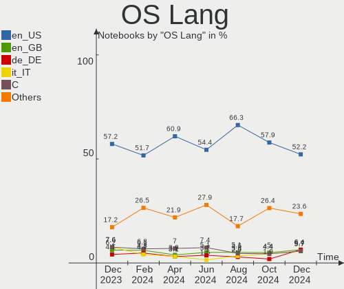
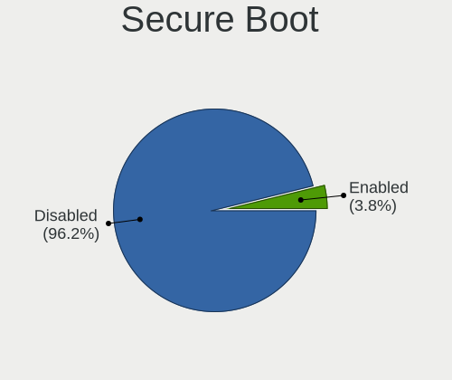
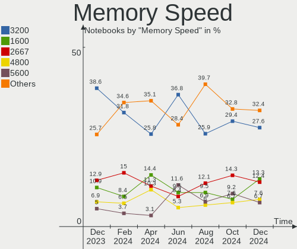

Arch Hardware Trends (Notebook)
-------------------------------

A project to identify most popular hardware characteristics and track their change
over time based on data collected by Arch users at https://Linux-Hardware.org.

Anyone can contribute to the study by uploading probes of their computers by
the [hw-probe](https://github.com/linuxhw/hw-probe) tool:

    sudo -E hw-probe -all -upload

Full-feature report is available here: https://linux-hardware.org/?view=trends&formfactor=notebook

Period: Nov, 2020.

Contents
--------

- [ OS                       ](#os)
- [ OS Family                ](#os-family)
- [ Kernel                   ](#kernel)
- [ Kernel Family            ](#kernel-family)
- [ Kernel Major Ver.        ](#kernel-major-ver)
- [ Arch                     ](#arch)
- [ DE                       ](#de)
- [ Display Server           ](#display-server)
- [ Display Manager          ](#display-manager)
- [ OS Lang                  ](#os-lang)
- [ Boot Mode                ](#boot-mode)
- [ Filesystem               ](#filesystem)
- [ Part. scheme             ](#part-scheme)
- [ Dual Boot with Linux/BSD ](#dual-boot-with-linux/bsd)
- [ Dual Boot (Win)          ](#dual-boot-win)
- [ Country                  ](#country)
- [ City                     ](#city)
- [ Vendor                   ](#vendor)
- [ Model                    ](#model)
- [ Model Family             ](#model-family)
- [ MFG Year                 ](#mfg-year)
- [ Form Factor              ](#form-factor)
- [ Secure Boot              ](#secure-boot)
- [ Coreboot                 ](#coreboot)
- [ RAM Size                 ](#ram-size)
- [ RAM Used                 ](#ram-used)
- [ Has CD-ROM               ](#has-cd-rom)
- [ Total Drives             ](#total-drives)
- [ Has Ethernet             ](#has-ethernet)
- [ Drive Vendor             ](#drive-vendor)
- [ Drive Model              ](#drive-model)
- [ HDD Vendor               ](#hdd-vendor)
- [ SSD Vendor               ](#ssd-vendor)
- [ Drive Kind               ](#drive-kind)
- [ Drive Connector          ](#drive-connector)
- [ Drive Size               ](#drive-size)
- [ Space Total              ](#space-total)
- [ Space Used               ](#space-used)
- [ Malfunc. Drives          ](#malfunc-drives)
- [ Malfunc. Drive Vendor    ](#malfunc-drive-vendor)
- [ Malfunc. HDD Vendor      ](#malfunc-hdd-vendor)
- [ Malfunc. Drive Kind      ](#malfunc-drive-kind)
- [ Failed Drives            ](#failed-drives)
- [ Failed Drive Vendor      ](#failed-drive-vendor)
- [ Drive Status             ](#drive-status)
- [ Storage Vendor           ](#storage-vendor)
- [ Storage Model            ](#storage-model)
- [ Storage Kind             ](#storage-kind)
- [ CPU Vendor               ](#cpu-vendor)
- [ CPU Model                ](#cpu-model)
- [ CPU Model Family         ](#cpu-model-family)
- [ CPU Cores                ](#cpu-cores)
- [ CPU Sockets              ](#cpu-sockets)
- [ CPU Threads              ](#cpu-threads)
- [ CPU Op-Modes             ](#cpu-op-modes)
- [ CPU Microcode            ](#cpu-microcode)
- [ CPU Microarch            ](#cpu-microarch)
- [ GPU Vendor               ](#gpu-vendor)
- [ GPU Model                ](#gpu-model)
- [ GPU Combo                ](#gpu-combo)
- [ GPU Driver               ](#gpu-driver)
- [ GPU Memory               ](#gpu-memory)
- [ Monitor Vendor           ](#monitor-vendor)
- [ Monitor Model            ](#monitor-model)
- [ Monitor Resolution       ](#monitor-resolution)
- [ Monitor Diagonal         ](#monitor-diagonal)
- [ Monitor Width            ](#monitor-width)
- [ Aspect Ratio             ](#aspect-ratio)
- [ Monitor Area             ](#monitor-area)
- [ Pixel Density            ](#pixel-density)
- [ Multiple Monitors        ](#multiple-monitors)
- [ Net Controller Vendor    ](#net-controller-vendor)
- [ Net Controller Model     ](#net-controller-model)
- [ Wireless Vendor          ](#wireless-vendor)
- [ Wireless Model           ](#wireless-model)
- [ Ethernet Vendor          ](#ethernet-vendor)
- [ Ethernet Model           ](#ethernet-model)
- [ Net Controller Kind      ](#net-controller-kind)
- [ Used Controller          ](#used-controller)
- [ NICs                     ](#nics)
- [ Memory Vendor            ](#memory-vendor)
- [ Memory Model             ](#memory-model)
- [ Memory Kind              ](#memory-kind)
- [ Memory Form Factor       ](#memory-form-factor)
- [ Memory Size              ](#memory-size)
- [ Memory Speed             ](#memory-speed)
- [ Sound Vendor             ](#sound-vendor)
- [ Sound Model              ](#sound-model)
- [ Camera Vendor            ](#camera-vendor)
- [ Camera Model             ](#camera-model)
- [ Fingerprint Vendor       ](#fingerprint-vendor)
- [ Fingerprint Model        ](#fingerprint-model)
- [ Chipcard Vendor          ](#chipcard-vendor)
- [ Chipcard Model           ](#chipcard-model)
- [ Printer Vendor           ](#printer-vendor)
- [ Printer Model            ](#printer-model)
- [ Scanner Vendor           ](#scanner-vendor)
- [ Scanner Model            ](#scanner-model)
- [ Bluetooth Vendor         ](#bluetooth-vendor)
- [ Bluetooth Model          ](#bluetooth-model)
- [ Unsupported Devices      ](#unsupported-devices)
- [ Unsupported Device Types ](#unsupported-device-types)

OS
--

Installed operating systems

| Name         | Notebooks | Percent |
|--------------|-----------|---------|
| Arch         | 77        | 71.3%   |
| Arch Rolling | 30        | 27.78%  |
| Arch 2.7     | 1         | 0.93%   |

OS Family
---------

OS without a version

| Name | Notebooks | Percent |
|------|-----------|---------|
| Arch | 108       | 100%    |

Kernel
------

Version of the Linux kernel

| Version                | Notebooks | Percent |
|------------------------|-----------|---------|
| 5.9.10-arch1-1         | 15        | 13.89%  |
| 5.9.8-arch1-1          | 13        | 12.04%  |
| 5.9.6-arch1-1          | 13        | 12.04%  |
| 5.9.3-arch1-1          | 10        | 9.26%   |
| 5.9.9-arch1-1          | 8         | 7.41%   |
| 5.9.4-arch1-1          | 7         | 6.48%   |
| 5.9.9-zen1-1-zen       | 5         | 4.63%   |
| 5.9.2-arch1-1          | 5         | 4.63%   |
| 5.9.6-zen1-1-zen       | 3         | 2.78%   |
| 5.4.74-1-lts           | 3         | 2.78%   |
| 5.9.9.a-1-hardened     | 2         | 1.85%   |
| 5.9.8-zen1-1-zen       | 2         | 1.85%   |
| 5.9.1-arch1-1          | 2         | 1.85%   |
| 5.4.79-1-lts           | 2         | 1.85%   |
| 5.4.77-1-lts           | 2         | 1.85%   |
| 5.4.73-1-lts           | 2         | 1.85%   |
| 5.9.8.a-1-hardened-ax3 | 1         | 0.93%   |
| 5.9.8.a-1-hardened     | 1         | 0.93%   |
| 5.9.8-1-ck-haswell     | 1         | 0.93%   |
| 5.9.6-1-ck-zen2        | 1         | 0.93%   |
| 5.9.4-zen1-1-zen       | 1         | 0.93%   |
| 5.9.3-zen1-1-zen       | 1         | 0.93%   |
| 5.9.3-1-clear          | 1         | 0.93%   |
| 5.9.11-zen2-1-zen      | 1         | 0.93%   |
| 5.9.10.ll50-1-lingruby | 1         | 0.93%   |
| 5.8.14-arch1-1         | 1         | 0.93%   |
| 5.8.12-gentoo          | 1         | 0.93%   |
| 5.8.10-arch1-1         | 1         | 0.93%   |
| 5.4.75-1-lts           | 1         | 0.93%   |
| 5.4.72-1-lts           | 1         | 0.93%   |

Kernel Family
-------------

Linux kernel without a distro release

| Version | Notebooks | Percent |
|---------|-----------|---------|
| 5.9.8   | 18        | 16.67%  |
| 5.9.6   | 17        | 15.74%  |
| 5.9.10  | 16        | 14.81%  |
| 5.9.9   | 15        | 13.89%  |
| 5.9.3   | 12        | 11.11%  |
| 5.9.4   | 8         | 7.41%   |
| 5.9.2   | 5         | 4.63%   |
| 5.4.74  | 3         | 2.78%   |
| 5.9.1   | 2         | 1.85%   |
| 5.4.79  | 2         | 1.85%   |
| 5.4.77  | 2         | 1.85%   |
| 5.4.73  | 2         | 1.85%   |
| 5.9.11  | 1         | 0.93%   |
| 5.8.14  | 1         | 0.93%   |
| 5.8.12  | 1         | 0.93%   |
| 5.8.10  | 1         | 0.93%   |
| 5.4.75  | 1         | 0.93%   |
| 5.4.72  | 1         | 0.93%   |

Kernel Major Ver.
-----------------

Linux kernel major version

| Version | Notebooks | Percent |
|---------|-----------|---------|
| 5.9     | 94        | 87.04%  |
| 5.4     | 11        | 10.19%  |
| 5.8     | 3         | 2.78%   |

Arch
----

OS architecture (x86_64, i586, etc.)

| Name   | Notebooks | Percent |
|--------|-----------|---------|
| x86_64 | 108       | 100%    |

DE
--

Desktop Environment

| Name            | Notebooks | Percent |
|-----------------|-----------|---------|
| GNOME           | 54        | 50%     |
| KDE5            | 18        | 16.67%  |
| XFCE            | 11        | 10.19%  |
| KDE             | 11        | 10.19%  |
| Unknown         | 5         | 4.63%   |
| Deepin          | 2         | 1.85%   |
| Unity           | 1         | 0.93%   |
| openbox         | 1         | 0.93%   |
| MATE            | 1         | 0.93%   |
| LXQt            | 1         | 0.93%   |
| GNOME Flashback | 1         | 0.93%   |
| DWM             | 1         | 0.93%   |
| Budgie          | 1         | 0.93%   |

Display Server
--------------

X11 or Wayland

| Name    | Notebooks | Percent |
|---------|-----------|---------|
| X11     | 66        | 61.11%  |
| Wayland | 33        | 30.56%  |
| Tty     | 9         | 8.33%   |

Display Manager
---------------

SDDM, LightDM, etc.

| Name    | Notebooks | Percent |
|---------|-----------|---------|
| Unknown | 61        | 56.48%  |
| SDDM    | 16        | 14.81%  |
| GDM     | 15        | 13.89%  |
| TDM     | 11        | 10.19%  |
| XDM     | 2         | 1.85%   |
| LightDM | 2         | 1.85%   |
| LXDM    | 1         | 0.93%   |

OS Lang
-------

Language

| Lang       | Notebooks | Percent |
|------------|-----------|---------|
| en_US      | 45        | 41.67%  |
| de_DE      | 8         | 7.41%   |
| it_IT      | 6         | 5.56%   |
| en_GB      | 5         | 4.63%   |
| ru_RU      | 4         | 3.7%    |
| en_IN      | 4         | 3.7%    |
| pt_BR      | 3         | 2.78%   |
| C          | 3         | 2.78%   |
| zh_CN      | 2         | 1.85%   |
| pl_PL      | 2         | 1.85%   |
| fr_FR      | 2         | 1.85%   |
| en_US      | 2         | 1.85%   |
| en_CA      | 2         | 1.85%   |
| sv_SE.utf8 | 1         | 0.93%   |
| sl_SI      | 1         | 0.93%   |
| pt_PT      | 1         | 0.93%   |
| pl_PL.utf8 | 1         | 0.93%   |
| lv_LV      | 1         | 0.93%   |
| fr_FR.utf8 | 1         | 0.93%   |
| fr_CH      | 1         | 0.93%   |
| fr_BE      | 1         | 0.93%   |
| es_CL      | 1         | 0.93%   |
| es_AR      | 1         | 0.93%   |
| en_US.utf8 | 1         | 0.93%   |
| en_SG      | 1         | 0.93%   |
| en_NL      | 1         | 0.93%   |
| en_CA.utf8 | 1         | 0.93%   |
| en_AU      | 1         | 0.93%   |
| em_US      | 1         | 0.93%   |
| de_CH      | 1         | 0.93%   |
| cv_RU      | 1         | 0.93%   |
| ca_ES      | 1         | 0.93%   |
| Unknown    | 1         | 0.93%   |

Boot Mode
---------

EFI or BIOS

| Mode | Notebooks | Percent |
|------|-----------|---------|
| EFI  | 66        | 61.11%  |
| BIOS | 42        | 38.89%  |

Filesystem
----------

Type of filesystem

| Type    | Notebooks | Percent |
|---------|-----------|---------|
| Ext4    | 86        | 79.63%  |
| Btrfs   | 12        | 11.11%  |
| Xfs     | 8         | 7.41%   |
| Overlay | 1         | 0.93%   |
| Unknown | 1         | 0.93%   |

Part. scheme
------------

Scheme of partitioning

| Type    | Notebooks | Percent |
|---------|-----------|---------|
| GPT     | 53        | 49.07%  |
| Unknown | 45        | 41.67%  |
| MBR     | 10        | 9.26%   |

Dual Boot with Linux/BSD
------------------------

Hosting more than one Linux/BSD

| Dual boot | Notebooks | Percent |
|-----------|-----------|---------|
| No        | 101       | 93.52%  |
| Yes       | 7         | 6.48%   |

Dual Boot (Win)
---------------

Hosting Linux and Windows

| Dual boot | Notebooks | Percent |
|-----------|-----------|---------|
| No        | 82        | 75.93%  |
| Yes       | 26        | 24.07%  |

Country
-------

Geographic location (country)

| Country       | Notebooks | Percent |
|---------------|-----------|---------|
| USA           | 17        | 15.74%  |
| Germany       | 13        | 12.04%  |
| Italy         | 8         | 7.41%   |
| Russia        | 6         | 5.56%   |
| India         | 6         | 5.56%   |
| Brazil        | 6         | 5.56%   |
| France        | 5         | 4.63%   |
| Canada        | 5         | 4.63%   |
| Switzerland   | 3         | 2.78%   |
| UK            | 2         | 1.85%   |
| Spain         | 2         | 1.85%   |
| Poland        | 2         | 1.85%   |
| Norway        | 2         | 1.85%   |
| Netherlands   | 2         | 1.85%   |
| Indonesia     | 2         | 1.85%   |
| Guatemala     | 2         | 1.85%   |
| Belarus       | 2         | 1.85%   |
| UAE           | 1         | 0.93%   |
| Turkey        | 1         | 0.93%   |
| Thailand      | 1         | 0.93%   |
| Sweden        | 1         | 0.93%   |
| Slovenia      | 1         | 0.93%   |
| Slovakia      | 1         | 0.93%   |
| Singapore     | 1         | 0.93%   |
| Portugal      | 1         | 0.93%   |
| New Zealand   | 1         | 0.93%   |
| Mexico        | 1         | 0.93%   |
| Latvia        | 1         | 0.93%   |
| Jordan        | 1         | 0.93%   |
| Israel        | 1         | 0.93%   |
| Greece        | 1         | 0.93%   |
| Finland       | 1         | 0.93%   |
| Denmark       | 1         | 0.93%   |
| Croatia       | 1         | 0.93%   |
| Cote D'Ivoire | 1         | 0.93%   |
| China         | 1         | 0.93%   |
| Chile         | 1         | 0.93%   |
| Belgium       | 1         | 0.93%   |
| Austria       | 1         | 0.93%   |
| Argentina     | 1         | 0.93%   |

City
----

Geographic location (city)

| City               | Notebooks | Percent |
|--------------------|-----------|---------|
| Moscow             | 3         | 2.78%   |
| Zurich             | 2         | 1.85%   |
| Toulouse           | 2         | 1.85%   |
| Rome               | 2         | 1.85%   |
| Munich             | 2         | 1.85%   |
| Los Angeles        | 2         | 1.85%   |
| Jakarta            | 2         | 1.85%   |
| Hamburg            | 2         | 1.85%   |
| Guatemala City     | 2         | 1.85%   |
| Curitiba           | 2         | 1.85%   |
| Bordighera         | 2         | 1.85%   |
| Örebro            | 1         | 0.93%   |
| Zohor              | 1         | 0.93%   |
| Wuppertal          | 1         | 0.93%   |
| Weyerbusch         | 1         | 0.93%   |
| Wellington         | 1         | 0.93%   |
| Vienna             | 1         | 0.93%   |
| Trausnitz          | 1         | 0.93%   |
| Trabzon            | 1         | 0.93%   |
| Torre del Greco    | 1         | 0.93%   |
| Thrissur           | 1         | 0.93%   |
| Szydlowiec         | 1         | 0.93%   |
| Surat              | 1         | 0.93%   |
| Stuhr              | 1         | 0.93%   |
| Singapore          | 1         | 0.93%   |
| Sharjah            | 1         | 0.93%   |
| Schenna            | 1         | 0.93%   |
| San Ramon          | 1         | 0.93%   |
| San Jose           | 1         | 0.93%   |
| San Diego          | 1         | 0.93%   |
| Saint-Jean-d'Illac | 1         | 0.93%   |
| Rzeszów           | 1         | 0.93%   |
| Rio de Janeiro     | 1         | 0.93%   |
| Riga               | 1         | 0.93%   |
| Resistencia        | 1         | 0.93%   |
| Recife             | 1         | 0.93%   |
| Potsdam            | 1         | 0.93%   |
| Porto              | 1         | 0.93%   |
| Phoenix            | 1         | 0.93%   |
| Palm Beach Gardens | 1         | 0.93%   |
| Paducah            | 1         | 0.93%   |
| Oslo               | 1         | 0.93%   |
| Orleans            | 1         | 0.93%   |
| Oegstgeest         | 1         | 0.93%   |
| Novosibirsk        | 1         | 0.93%   |
| North Vancouver    | 1         | 0.93%   |
| Mönchengladbach   | 1         | 0.93%   |
| Mogilev            | 1         | 0.93%   |
| Minsk              | 1         | 0.93%   |
| Milan              | 1         | 0.93%   |
| Mexico City        | 1         | 0.93%   |
| Marseille          | 1         | 0.93%   |
| Mahad              | 1         | 0.93%   |
| Machali            | 1         | 0.93%   |
| Maben              | 1         | 0.93%   |
| Longueuil          | 1         | 0.93%   |
| London             | 1         | 0.93%   |
| Ljubljana          | 1         | 0.93%   |
| Lille              | 1         | 0.93%   |
| Lakeland           | 1         | 0.93%   |

Vendor
------

Motherboard manufacturer

| Name                | Notebooks | Percent |
|---------------------|-----------|---------|
| Lenovo              | 40        | 37.04%  |
| ASUSTek Computer    | 17        | 15.74%  |
| Dell                | 16        | 14.81%  |
| Hewlett-Packard     | 11        | 10.19%  |
| Acer                | 6         | 5.56%   |
| Samsung Electronics | 3         | 2.78%   |
| Toshiba             | 2         | 1.85%   |
| Notebook            | 2         | 1.85%   |
| MSI                 | 2         | 1.85%   |
| HUAWEI              | 2         | 1.85%   |
| TUXEDO              | 1         | 0.93%   |
| Sony                | 1         | 0.93%   |
| Razer               | 1         | 0.93%   |
| Google              | 1         | 0.93%   |
| Eluktronics         | 1         | 0.93%   |
| Chuwi               | 1         | 0.93%   |
| Unknown             | 1         | 0.93%   |

Model
-----

Motherboard model

| Name                                                  | Notebooks | Percent |
|-------------------------------------------------------|-----------|---------|
| Lenovo Legion 5 15ARH05 82B5                          | 2         | 1.85%   |
| Unknown                                               | 2         | 1.85%   |
| TUXEDO InfinityBook Pro 15 v4                         | 1         | 0.93%   |
| Toshiba Satellite Pro C655                            | 1         | 0.93%   |
| Toshiba Satellite L500                                | 1         | 0.93%   |
| Sony VJF155B0121B                                     | 1         | 0.93%   |
| Samsung N150/N210/N220                                | 1         | 0.93%   |
| Samsung 550XCJ/550XCR                                 | 1         | 0.93%   |
| Samsung 350V5C/351V5C/3540VC/3440VC                   | 1         | 0.93%   |
| Razer Blade 15 Studio Edition (Early 2020) - RZ09-033 | 1         | 0.93%   |
| Notebook P64_HJ,HK1                                   | 1         | 0.93%   |
| Notebook NH5xAx                                       | 1         | 0.93%   |
| MSI PE70 6QE                                          | 1         | 0.93%   |
| MSI Bravo 15 A4DDR                                    | 1         | 0.93%   |
| Lenovo Y520-15IKBN 80WK                               | 1         | 0.93%   |
| Lenovo ThinkPad X1 Carbon 7th 20QD003CRT              | 1         | 0.93%   |
| Lenovo ThinkPad X1 Carbon 6th 20KH002RUS              | 1         | 0.93%   |
| Lenovo ThinkPad X1 Carbon 6th 20KG0022US              | 1         | 0.93%   |
| Lenovo ThinkPad X1 Carbon 5th 20HQS03P00              | 1         | 0.93%   |
| Lenovo ThinkPad X1 Carbon 3rd 20BSCTO1WW              | 1         | 0.93%   |
| Lenovo ThinkPad T61 7663BL3                           | 1         | 0.93%   |
| Lenovo ThinkPad T580 20L9CTO1WW                       | 1         | 0.93%   |
| Lenovo ThinkPad T530 2429AE1                          | 1         | 0.93%   |
| Lenovo ThinkPad T530 24296HG                          | 1         | 0.93%   |
| Lenovo ThinkPad T495 20NJ0008US                       | 1         | 0.93%   |
| Lenovo ThinkPad T480s 20L8S7PP06                      | 1         | 0.93%   |
| Lenovo ThinkPad T480s 20L8S7KH00                      | 1         | 0.93%   |
| Lenovo ThinkPad T480s 20L8S2SD00                      | 1         | 0.93%   |
| Lenovo ThinkPad T470s 20HGS33N00                      | 1         | 0.93%   |
| Lenovo ThinkPad T460p 20FWCTO1WW                      | 1         | 0.93%   |
| Lenovo ThinkPad T460p 20FW0044AU                      | 1         | 0.93%   |
| Lenovo ThinkPad T440p 20AWS0VK00                      | 1         | 0.93%   |
| Lenovo ThinkPad T430s 23571A3                         | 1         | 0.93%   |
| Lenovo ThinkPad T420 4236MD4                          | 1         | 0.93%   |
| Lenovo ThinkPad T420 4178C9U                          | 1         | 0.93%   |
| Lenovo ThinkPad T410s 2904CGU                         | 1         | 0.93%   |
| Lenovo ThinkPad T400 6474AH5                          | 1         | 0.93%   |
| Lenovo ThinkPad P53 20QNCTO1WW                        | 1         | 0.93%   |
| Lenovo ThinkPad P14s Gen 1 20S4CTO1WW                 | 1         | 0.93%   |
| Lenovo ThinkPad L380 Yoga 20M8S01400                  | 1         | 0.93%   |
| Lenovo ThinkPad L380 20M5CTO1WW                       | 1         | 0.93%   |
| Lenovo ThinkPad L14 Gen 1 20U50001GE                  | 1         | 0.93%   |
| Lenovo ThinkPad E570 20H5CTO1WW                       | 1         | 0.93%   |
| Lenovo ThinkPad E15 Gen 2 20T8000TIX                  | 1         | 0.93%   |
| Lenovo ThinkPad E14 Gen 2 20T6000SIX                  | 1         | 0.93%   |
| Lenovo Legion Y540-15IRH 81SX                         | 1         | 0.93%   |
| Lenovo Legion 5P 15IMH05H 82AW                        | 1         | 0.93%   |
| Lenovo IdeaPad 5 14ARE05 81YM                         | 1         | 0.93%   |
| Lenovo IdeaPad 330S-14AST 81F8                        | 1         | 0.93%   |
| Lenovo IdeaPad 320-15ISK 80XH                         | 1         | 0.93%   |
| Lenovo IdeaPad 130-15AST 81H5                         | 1         | 0.93%   |
| HUAWEI MACHC-WAX9                                     | 1         | 0.93%   |
| HUAWEI BOHK-WAX9X                                     | 1         | 0.93%   |
| HP Stream 11 Pro G4 EE                                | 1         | 0.93%   |
| HP ProBook 440 G6                                     | 1         | 0.93%   |
| HP Pavilion Laptop 15-ck069tx                         | 1         | 0.93%   |
| HP Notebook                                           | 1         | 0.93%   |
| HP Laptop 15-dw1xxx                                   | 1         | 0.93%   |
| HP Laptop 15-db1xxx                                   | 1         | 0.93%   |
| HP EliteBook Revolve 810                              | 1         | 0.93%   |

Model Family
------------

Motherboard model prefix

| Name                 | Notebooks | Percent |
|----------------------|-----------|---------|
| Lenovo ThinkPad      | 30        | 27.78%  |
| Dell Inspiron        | 7         | 6.48%   |
| Dell XPS             | 5         | 4.63%   |
| Lenovo Legion        | 4         | 3.7%    |
| Lenovo IdeaPad       | 4         | 3.7%    |
| ASUS VivoBook        | 4         | 3.7%    |
| HP EliteBook         | 3         | 2.78%   |
| Dell Latitude        | 3         | 2.78%   |
| Acer Aspire          | 3         | 2.78%   |
| Toshiba Satellite    | 2         | 1.85%   |
| HP Laptop            | 2         | 1.85%   |
| Acer Nitro           | 2         | 1.85%   |
| Unknown              | 2         | 1.85%   |
| TUXEDO InfinityBook  | 1         | 0.93%   |
| Sony VJF155B0121B    | 1         | 0.93%   |
| Samsung N150         | 1         | 0.93%   |
| Samsung 550XCJ       | 1         | 0.93%   |
| Samsung 350V5C       | 1         | 0.93%   |
| Razer Blade          | 1         | 0.93%   |
| Notebook P64         | 1         | 0.93%   |
| Notebook NH5xAx      | 1         | 0.93%   |
| MSI PE70             | 1         | 0.93%   |
| MSI Bravo            | 1         | 0.93%   |
| Lenovo Y520-15IKBN   | 1         | 0.93%   |
| HUAWEI MACHC-WAX9    | 1         | 0.93%   |
| HUAWEI BOHK-WAX9X    | 1         | 0.93%   |
| HP Stream            | 1         | 0.93%   |
| HP ProBook           | 1         | 0.93%   |
| HP Pavilion          | 1         | 0.93%   |
| HP Notebook          | 1         | 0.93%   |
| HP Compaq            | 1         | 0.93%   |
| HP 420               | 1         | 0.93%   |
| Google Celes         | 1         | 0.93%   |
| Eluktronics THINN-15 | 1         | 0.93%   |
| Dell Precision       | 1         | 0.93%   |
| Chuwi LapBook        | 1         | 0.93%   |
| ASUS ZenBook         | 1         | 0.93%   |
| ASUS X705UDR         | 1         | 0.93%   |
| ASUS X540LJ          | 1         | 0.93%   |
| ASUS X510URR         | 1         | 0.93%   |
| ASUS UX31E           | 1         | 0.93%   |
| ASUS UX305UA         | 1         | 0.93%   |
| ASUS TUF             | 1         | 0.93%   |
| ASUS T100TAS         | 1         | 0.93%   |
| ASUS Strix           | 1         | 0.93%   |
| ASUS P53E            | 1         | 0.93%   |
| ASUS GL753VD         | 1         | 0.93%   |
| ASUS GL553VD         | 1         | 0.93%   |
| ASUS G74Sx           | 1         | 0.93%   |
| Acer Predator        | 1         | 0.93%   |

MFG Year
--------

Motherboard manufacture year

| Year | Notebooks | Percent |
|------|-----------|---------|
| 2020 | 34        | 31.48%  |
| 2019 | 24        | 22.22%  |
| 2018 | 20        | 18.52%  |
| 2011 | 8         | 7.41%   |
| 2017 | 4         | 3.7%    |
| 2015 | 4         | 3.7%    |
| 2010 | 4         | 3.7%    |
| 2016 | 3         | 2.78%   |
| 2013 | 3         | 2.78%   |
| 2012 | 3         | 2.78%   |
| 2014 | 1         | 0.93%   |

Form Factor
-----------

Physical design of the computer

| Name     | Notebooks | Percent |
|----------|-----------|---------|
| Notebook | 108       | 100%    |

Secure Boot
-----------

Enabled or disabled

| State    | Notebooks | Percent |
|----------|-----------|---------|
| Disabled | 107       | 99.07%  |
| Enabled  | 1         | 0.93%   |

Coreboot
--------

Have coreboot on board

| Used | Notebooks | Percent |
|------|-----------|---------|
| No   | 107       | 99.07%  |
| Yes  | 1         | 0.93%   |

RAM Size
--------

Total RAM memory

| Size in GB  | Notebooks | Percent |
|-------------|-----------|---------|
| 4.01-8.0    | 27        | 25%     |
| 16.01-24.0  | 27        | 25%     |
| 8.01-16.0   | 18        | 16.67%  |
| 3.01-4.0    | 14        | 12.96%  |
| 32.01-64.0  | 7         | 6.48%   |
| 24.01-32.0  | 5         | 4.63%   |
| 64.01-256.0 | 5         | 4.63%   |
| 1.01-2.0    | 3         | 2.78%   |
| 2.01-3.0    | 1         | 0.93%   |
| 0.01-1.0    | 1         | 0.93%   |

RAM Used
--------

Used RAM memory

| Used GB    | Notebooks | Percent |
|------------|-----------|---------|
| 1.01-2.0   | 37        | 34.26%  |
| 2.01-3.0   | 21        | 19.44%  |
| 3.01-4.0   | 19        | 17.59%  |
| 4.01-8.0   | 18        | 16.67%  |
| 8.01-16.0  | 6         | 5.56%   |
| 0.01-1.0   | 6         | 5.56%   |
| 24.01-32.0 | 1         | 0.93%   |

Has CD-ROM
----------

Has CD-ROM on board

| Presented | Notebooks | Percent |
|-----------|-----------|---------|
| No        | 86        | 79.63%  |
| Yes       | 22        | 20.37%  |

Total Drives
------------

Number of drives on board

| Drives | Notebooks | Percent |
|--------|-----------|---------|
| 1      | 72        | 66.67%  |
| 2      | 29        | 26.85%  |
| 3      | 7         | 6.48%   |

Has Ethernet
------------

Has Ethernet on board

| Presented | Notebooks | Percent |
|-----------|-----------|---------|
| Yes       | 88        | 81.48%  |
| No        | 20        | 18.52%  |

Drive Vendor
------------

Hard drive vendors

| Vendor              | Notebooks | Drives | Percent |
|---------------------|-----------|--------|---------|
| Samsung Electronics | 37        | 38     | 25.69%  |
| WDC                 | 17        | 18     | 11.81%  |
| Seagate             | 16        | 17     | 11.11%  |
| Sandisk             | 11        | 12     | 7.64%   |
| Toshiba             | 9         | 9      | 6.25%   |
| Unknown             | 7         | 8      | 4.86%   |
| SK Hynix            | 6         | 6      | 4.17%   |
| Micron Technology   | 6         | 6      | 4.17%   |
| Kingston            | 6         | 6      | 4.17%   |
| Intel               | 4         | 4      | 2.78%   |
| A-DATA Technology   | 4         | 4      | 2.78%   |
| Hitachi             | 3         | 3      | 2.08%   |
| Phison              | 2         | 2      | 1.39%   |
| HGST                | 2         | 2      | 1.39%   |
| Crucial             | 2         | 2      | 1.39%   |
| Yangtze Memory      | 1         | 1      | 0.69%   |
| TCSUNBOW            | 1         | 1      | 0.69%   |
| PNY                 | 1         | 1      | 0.69%   |
| Patriot             | 1         | 1      | 0.69%   |
| LITEONIT            | 1         | 1      | 0.69%   |
| Lenovo              | 1         | 1      | 0.69%   |
| KingSpec            | 1         | 1      | 0.69%   |
| FORESEE             | 1         | 1      | 0.69%   |
| Dell                | 1         | 1      | 0.69%   |
| Corsair             | 1         | 1      | 0.69%   |
| China               | 1         | 1      | 0.69%   |
| ADATA Technology    | 1         | 1      | 0.69%   |

Drive Model
-----------

Hard drive models

| Model                                    | Notebooks | Percent |
|------------------------------------------|-----------|---------|
| Samsung NVMe SSD Drive 512GB             | 8         | 5.41%   |
| Seagate ST1000LM035-1RK172 1TB           | 4         | 2.7%    |
| WDC WD10SPZX-21Z10T0 1TB                 | 3         | 2.03%   |
| Toshiba MQ04ABF100 1TB                   | 3         | 2.03%   |
| Seagate ST1000LM024 HN-M101MBB 1TB       | 3         | 2.03%   |
| Sandisk NVMe SSD Drive 512GB             | 3         | 2.03%   |
| Seagate ST500LT012-1DG142 500GB          | 2         | 1.35%   |
| Seagate ST2000LM015-2E8174 2TB           | 2         | 1.35%   |
| Seagate ST2000LM007-1R8174 2TB           | 2         | 1.35%   |
| Samsung SSD 860 EVO 500GB                | 2         | 1.35%   |
| Samsung NVMe SSD Drive 1024GB            | 2         | 1.35%   |
| Micron NVMe SSD Drive 512GB              | 2         | 1.35%   |
| Kingston SA400S37240G 240GB SSD          | 2         | 1.35%   |
| Intel NVMe SSD Drive 512GB               | 2         | 1.35%   |
| Yangtze Memory ZHITAI PC005 Active 1TB   | 1         | 0.68%   |
| WDC WDS500G2X0C-00L350 500GB             | 1         | 0.68%   |
| WDC WDS500G2B0B-00YS70 500GB SSD         | 1         | 0.68%   |
| WDC WDS500G1B0B-00AS40 500GB SSD         | 1         | 0.68%   |
| WDC WDS256G1X0C-00ENX0 256GB             | 1         | 0.68%   |
| WDC WDS250G2B0A-00SM50 250GB SSD         | 1         | 0.68%   |
| WDC WDS120G2G0B-00EPW0 120GB SSD         | 1         | 0.68%   |
| WDC WDS100T2X0C-00L350 1TB               | 1         | 0.68%   |
| WDC WD3200BEVT-75A23T0 320GB             | 1         | 0.68%   |
| WDC WD2500BEVT-22A23T0 250GB             | 1         | 0.68%   |
| WDC WD20SPZX-08UA7 2TB                   | 1         | 0.68%   |
| WDC WD10SPZX-17Z10T1 1TB                 | 1         | 0.68%   |
| WDC WD10JPVT-75A1YT0 1TB                 | 1         | 0.68%   |
| WDC PC SN730 SDBPNTY-512G-1101 512GB     | 1         | 0.68%   |
| WDC PC SN720 SDAQNTW-256G-1001 256GB     | 1         | 0.68%   |
| WDC PC SN530 SDBPMPZ-512G-1001 512GB     | 1         | 0.68%   |
| Unknown SEM32G  32GB                     | 1         | 0.68%   |
| Unknown SDU1  16GB                       | 1         | 0.68%   |
| Unknown MMC Card  32GB                   | 1         | 0.68%   |
| Unknown MMC Card  2GB                    | 1         | 0.68%   |
| Unknown MMC Card  16GB                   | 1         | 0.68%   |
| Unknown MMC Card  128GB                  | 1         | 0.68%   |
| Unknown DF4016  16GB                     | 1         | 0.68%   |
| Unknown CJTD4R  64GB                     | 1         | 0.68%   |
| Toshiba THNSNK256GVN8 M.2 2280 256GB SSD | 1         | 0.68%   |
| Toshiba NVMe SSD Drive 512GB             | 1         | 0.68%   |
| Toshiba MQ02ABF100 1TB                   | 1         | 0.68%   |
| Toshiba MQ01ABD100 1TB                   | 1         | 0.68%   |
| Toshiba MQ01ABD050 500GB                 | 1         | 0.68%   |
| Toshiba MK1229GSG 120GB                  | 1         | 0.68%   |
| TCSUNBOW N4 240GB                        | 1         | 0.68%   |
| SK Hynix SHGP31-1000GM-2 1TB             | 1         | 0.68%   |
| SK Hynix NVMe SSD Drive 512GB            | 1         | 0.68%   |
| SK Hynix HFS512G39MND-3510A 512GB SSD    | 1         | 0.68%   |
| SK Hynix HFS256G39TND-N210A 256GB SSD    | 1         | 0.68%   |
| SK Hynix HFS128G39TND-N210A 128GB SSD    | 1         | 0.68%   |
| SK Hynix HFM512GDJTNG-8310A 512GB        | 1         | 0.68%   |
| Seagate ST2000LX001-1RG174 2TB           | 1         | 0.68%   |
| Seagate ST1000LX015-1U7172 1TB           | 1         | 0.68%   |
| Seagate ST1000LM049-2GH172 1TB           | 1         | 0.68%   |
| Seagate BUP Slim BK 1TB                  | 1         | 0.68%   |
| SanDisk Ultra II 240GB SSD               | 1         | 0.68%   |
| SanDisk SSD U100 256GB                   | 1         | 0.68%   |
| SanDisk SSD PLUS 1000GB                  | 1         | 0.68%   |
| SanDisk SDSSDA240G 240GB                 | 1         | 0.68%   |
| SanDisk SD9SN8W256G1002 256GB SSD        | 1         | 0.68%   |

HDD Vendor
----------

Hard disk drive vendors

| Vendor              | Notebooks | Drives | Percent |
|---------------------|-----------|--------|---------|
| Seagate             | 16        | 17     | 43.24%  |
| WDC                 | 8         | 8      | 21.62%  |
| Toshiba             | 7         | 7      | 18.92%  |
| Hitachi             | 3         | 3      | 8.11%   |
| HGST                | 2         | 2      | 5.41%   |
| Samsung Electronics | 1         | 1      | 2.7%    |

SSD Vendor
----------

Solid state drive vendors

| Vendor              | Notebooks | Drives | Percent |
|---------------------|-----------|--------|---------|
| Samsung Electronics | 12        | 12     | 27.27%  |
| SanDisk             | 5         | 5      | 11.36%  |
| WDC                 | 4         | 4      | 9.09%   |
| Kingston            | 4         | 4      | 9.09%   |
| SK Hynix            | 3         | 3      | 6.82%   |
| Micron Technology   | 2         | 2      | 4.55%   |
| Crucial             | 2         | 2      | 4.55%   |
| A-DATA Technology   | 2         | 2      | 4.55%   |
| Toshiba             | 1         | 1      | 2.27%   |
| TCSUNBOW            | 1         | 1      | 2.27%   |
| PNY                 | 1         | 1      | 2.27%   |
| Patriot             | 1         | 1      | 2.27%   |
| LITEONIT            | 1         | 1      | 2.27%   |
| KingSpec            | 1         | 1      | 2.27%   |
| Intel               | 1         | 1      | 2.27%   |
| FORESEE             | 1         | 1      | 2.27%   |
| Dell                | 1         | 1      | 2.27%   |
| China               | 1         | 1      | 2.27%   |

Drive Kind
----------

HDD or SSD

| Kind | Notebooks | Drives | Percent |
|------|-----------|--------|---------|
| NVMe | 50        | 58     | 37.31%  |
| SSD  | 40        | 44     | 29.85%  |
| HDD  | 36        | 38     | 26.87%  |
| MMC  | 8         | 9      | 5.97%   |

Drive Connector
---------------

SATA, SAS, NVMe, etc.

| Type | Notebooks | Drives | Percent |
|------|-----------|--------|---------|
| SATA | 65        | 81     | 52.42%  |
| NVMe | 50        | 58     | 40.32%  |
| MMC  | 8         | 9      | 6.45%   |
| SAS  | 1         | 1      | 0.81%   |

Drive Size
----------

Size of hard drive

| Size in TB | Notebooks | Drives | Percent |
|------------|-----------|--------|---------|
| 0.01-0.5   | 43        | 49     | 57.33%  |
| 0.51-1.0   | 26        | 26     | 34.67%  |
| 1.01-2.0   | 6         | 7      | 8%      |

Space Total
-----------

Amount of disk space available on the file system

| Size in GB     | Notebooks | Percent |
|----------------|-----------|---------|
| 251-500        | 38        | 35.19%  |
| 101-250        | 27        | 25%     |
| 501-1000       | 20        | 18.52%  |
| 1001-2000      | 8         | 7.41%   |
| 21-50          | 6         | 5.56%   |
| 51-100         | 4         | 3.7%    |
| More than 3000 | 3         | 2.78%   |
| 2001-3000      | 1         | 0.93%   |
| Unknown        | 1         | 0.93%   |

Space Used
----------

Amount of used disk space

| Used GB        | Notebooks | Percent |
|----------------|-----------|---------|
| 1-20           | 25        | 23.15%  |
| 51-100         | 23        | 21.3%   |
| 101-250        | 19        | 17.59%  |
| 21-50          | 18        | 16.67%  |
| 251-500        | 10        | 9.26%   |
| 501-1000       | 9         | 8.33%   |
| More than 3000 | 1         | 0.93%   |
| 2001-3000      | 1         | 0.93%   |
| 1001-2000      | 1         | 0.93%   |
| Unknown        | 1         | 0.93%   |

Malfunc. Drives
---------------

Drive models with a malfunction

| Model                          | Notebooks | Drives | Percent |
|--------------------------------|-----------|--------|---------|
| WDC WD2500BEVT-22A23T0 250GB   | 1         | 1      | 25%     |
| Seagate ST2000LM015-2E8174 2TB | 1         | 1      | 25%     |
| Seagate ST1000LM035-1RK172 1TB | 1         | 1      | 25%     |
| Hitachi HTS545025B9A300 250GB  | 1         | 1      | 25%     |

Malfunc. Drive Vendor
---------------------

Vendors of faulty drives

| Vendor  | Notebooks | Drives | Percent |
|---------|-----------|--------|---------|
| Seagate | 2         | 2      | 50%     |
| WDC     | 1         | 1      | 25%     |
| Hitachi | 1         | 1      | 25%     |

Malfunc. HDD Vendor
-------------------

Vendors of faulty HDD drives

| Vendor  | Notebooks | Drives | Percent |
|---------|-----------|--------|---------|
| Seagate | 2         | 2      | 50%     |
| WDC     | 1         | 1      | 25%     |
| Hitachi | 1         | 1      | 25%     |

Malfunc. Drive Kind
-------------------

Kinds of faulty drives

| Kind | Notebooks | Drives | Percent |
|------|-----------|--------|---------|
| HDD  | 4         | 4      | 100%    |

Failed Drives
-------------

Failed drive models

Zero info for selected period =(

Failed Drive Vendor
-------------------

Failed drive vendors

Zero info for selected period =(

Drive Status
------------

Number of failed and malfunc. drives

| Status   | Notebooks | Drives | Percent |
|----------|-----------|--------|---------|
| Detected | 64        | 88     | 57.66%  |
| Works    | 43        | 57     | 38.74%  |
| Malfunc  | 4         | 4      | 3.6%    |

Storage Vendor
--------------

Storage controller vendors

| Vendor                       | Notebooks | Percent |
|------------------------------|-----------|---------|
| Intel                        | 69        | 51.88%  |
| Samsung Electronics          | 24        | 18.05%  |
| AMD                          | 13        | 9.77%   |
| Sandisk                      | 9         | 6.77%   |
| Micron Technology            | 4         | 3.01%   |
| SK Hynix                     | 3         | 2.26%   |
| Phison Electronics           | 3         | 2.26%   |
| Kingston Technology Company  | 2         | 1.5%    |
| ADATA Technology             | 2         | 1.5%    |
| Yangtze Memory Technologies  | 1         | 0.75%   |
| Toshiba America Info Systems | 1         | 0.75%   |
| Realtek Semiconductor        | 1         | 0.75%   |
| Lenovo                       | 1         | 0.75%   |

Storage Model
-------------

Storage controller models

| Model                                                                          | Notebooks | Percent |
|--------------------------------------------------------------------------------|-----------|---------|
| Samsung Electronics NVMe SSD Controller SM981/PM981/PM983                      | 20        | 14.71%  |
| AMD FCH SATA Controller [AHCI mode]                                            | 13        | 9.56%   |
| Intel HM170/QM170 Chipset SATA Controller [AHCI Mode]                          | 9         | 6.62%   |
| Intel Sunrise Point-LP SATA Controller [AHCI mode]                             | 7         | 5.15%   |
| Intel 6 Series/C200 Series Chipset Family 6 port Mobile SATA AHCI Controller   | 7         | 5.15%   |
| Intel Cannon Point-LP SATA Controller [AHCI Mode]                              | 5         | 3.68%   |
| Intel Cannon Lake Mobile PCH SATA AHCI Controller                              | 5         | 3.68%   |
| Intel 82801IBM/IEM (ICH9M/ICH9M-E) 4 port SATA Controller [AHCI mode]          | 5         | 3.68%   |
| Intel 82801 Mobile SATA Controller [RAID mode]                                 | 5         | 3.68%   |
| Intel 8 Series SATA Controller 1 [AHCI mode]                                   | 5         | 3.68%   |
| Intel 7 Series Chipset Family 6-port SATA Controller [AHCI mode]               | 5         | 3.68%   |
| Micron Technology Non-Volatile memory controller                               | 4         | 2.94%   |
| Sandisk WD Black 2019/PC SN750 NVMe SSD                                        | 3         | 2.21%   |
| Sandisk WD Black 2018 / PC SN720 NVMe SSD                                      | 3         | 2.21%   |
| Phison Electronics E12 NVMe Controller                                         | 3         | 2.21%   |
| Intel SSD 660P Series                                                          | 3         | 2.21%   |
| SK Hynix Non-Volatile memory controller                                        | 2         | 1.47%   |
| Sandisk Non-Volatile memory controller                                         | 2         | 1.47%   |
| Samsung Electronics NVMe SSD Controller SM961/PM961                            | 2         | 1.47%   |
| Intel Wildcat Point-LP SATA Controller [AHCI Mode]                             | 2         | 1.47%   |
| Intel 8 Series/C220 Series Chipset Family 6-port SATA Controller 1 [AHCI mode] | 2         | 1.47%   |
| Intel 5 Series/3400 Series Chipset 6 port SATA AHCI Controller                 | 2         | 1.47%   |
| Intel 400 Series Chipset Family SATA AHCI Controller                           | 2         | 1.47%   |
| Yangtze Memory Technologies Non-Volatile memory controller                     | 1         | 0.74%   |
| Toshiba America Info Systems BG3 NVMe SSD Controller                           | 1         | 0.74%   |
| SK Hynix BC501 NVMe Solid State Drive 512GB                                    | 1         | 0.74%   |
| Sandisk WD Black NVMe SSD                                                      | 1         | 0.74%   |
| Samsung Electronics NVMe SSD Controller SM951/PM951                            | 1         | 0.74%   |
| Samsung Electronics Electronics Non-Volatile memory controller                 | 1         | 0.74%   |
| Realtek Semiconductor Realtek Non-Volatile memory controller                   | 1         | 0.74%   |
| Lenovo Non-Volatile memory controller                                          | 1         | 0.74%   |
| Kingston Technology Company Non-Volatile memory controller                     | 1         | 0.74%   |
| Kingston Technology Company A2000 NVMe SSD                                     | 1         | 0.74%   |
| Intel SATA controller                                                          | 1         | 0.74%   |
| Intel NM10/ICH7 Family SATA Controller [AHCI mode]                             | 1         | 0.74%   |
| Intel Comet Lake SATA AHCI Controller                                          | 1         | 0.74%   |
| Intel Celeron N3350/Pentium N4200/Atom E3900 Series SATA AHCI Controller       | 1         | 0.74%   |
| Intel 82801HM/HEM (ICH8M/ICH8M-E) SATA Controller [AHCI mode]                  | 1         | 0.74%   |
| Intel 5 Series/3400 Series Chipset 4 port SATA IDE Controller                  | 1         | 0.74%   |
| Intel 5 Series/3400 Series Chipset 2 port SATA IDE Controller                  | 1         | 0.74%   |
| AMD 400 Series Chipset SATA Controller                                         | 1         | 0.74%   |
| ADATA Technology XPG SX8200 Pro PCIe Gen3x4 M.2 2280 Solid State Drive         | 1         | 0.74%   |
| ADATA Technology Non-Volatile memory controller                                | 1         | 0.74%   |

Storage Kind
------------

Kind of storage controller (IDE, SATA, NVMe, SAS, ...)

| Kind | Notebooks | Percent |
|------|-----------|---------|
| SATA | 75        | 57.69%  |
| NVMe | 50        | 38.46%  |
| RAID | 4         | 3.08%   |
| IDE  | 1         | 0.77%   |

CPU Vendor
----------

Processor vendors

| Vendor | Notebooks | Percent |
|--------|-----------|---------|
| Intel  | 87        | 80.56%  |
| AMD    | 21        | 19.44%  |

CPU Model
---------

Processor models

| Model                                           | Notebooks | Percent |
|-------------------------------------------------|-----------|---------|
| Intel Core i7-8550U CPU @ 1.80GHz               | 6         | 5.56%   |
| Intel Core i7-8565U CPU @ 1.80GHz               | 4         | 3.7%    |
| Intel Core i5-8250U CPU @ 1.60GHz               | 4         | 3.7%    |
| Intel Core i3-4005U CPU @ 1.70GHz               | 4         | 3.7%    |
| Intel Core i5-7300HQ CPU @ 2.50GHz              | 3         | 2.78%   |
| AMD Ryzen 7 4800H with Radeon Graphics          | 3         | 2.78%   |
| AMD Ryzen 5 4500U with Radeon Graphics          | 3         | 2.78%   |
| Intel Core i7-9750H CPU @ 2.60GHz               | 2         | 1.85%   |
| Intel Core i7-8750H CPU @ 2.20GHz               | 2         | 1.85%   |
| Intel Core i7-8650U CPU @ 1.90GHz               | 2         | 1.85%   |
| Intel Core i7-7700HQ CPU @ 2.80GHz              | 2         | 1.85%   |
| Intel Core i7-7500U CPU @ 2.70GHz               | 2         | 1.85%   |
| Intel Core i7-6700HQ CPU @ 2.60GHz              | 2         | 1.85%   |
| Intel Core i7-10875H CPU @ 2.30GHz              | 2         | 1.85%   |
| Intel Core i7-10510U CPU @ 1.80GHz              | 2         | 1.85%   |
| Intel Core i5-9300H CPU @ 2.40GHz               | 2         | 1.85%   |
| Intel Core i5-8265U CPU @ 1.60GHz               | 2         | 1.85%   |
| Intel Core i5-2540M CPU @ 2.60GHz               | 2         | 1.85%   |
| AMD Ryzen 7 PRO 3700U w/ Radeon Vega Mobile Gfx | 2         | 1.85%   |
| AMD Ryzen 7 4700U with Radeon Graphics          | 2         | 1.85%   |
| AMD Ryzen 7 3700U with Radeon Vega Mobile Gfx   | 2         | 1.85%   |
| Intel Xeon E-2176M CPU @ 2.70GHz                | 1         | 0.93%   |
| Intel Pentium Dual-Core CPU T4500 @ 2.30GHz     | 1         | 0.93%   |
| Intel Pentium CPU P6100 @ 2.00GHz               | 1         | 0.93%   |
| Intel Pentium CPU N4200 @ 1.10GHz               | 1         | 0.93%   |
| Intel Pentium CPU 5405U @ 2.30GHz               | 1         | 0.93%   |
| Intel Core i7-7600U CPU @ 2.80GHz               | 1         | 0.93%   |
| Intel Core i7-6820HQ CPU @ 2.70GHz              | 1         | 0.93%   |
| Intel Core i7-6500U CPU @ 2.50GHz               | 1         | 0.93%   |
| Intel Core i7-5600U CPU @ 2.60GHz               | 1         | 0.93%   |
| Intel Core i7-4712HQ CPU @ 2.30GHz              | 1         | 0.93%   |
| Intel Core i7-4700MQ CPU @ 2.40GHz              | 1         | 0.93%   |
| Intel Core i7-3630QM CPU @ 2.40GHz              | 1         | 0.93%   |
| Intel Core i7-3610QM CPU @ 2.30GHz              | 1         | 0.93%   |
| Intel Core i7-2677M CPU @ 1.80GHz               | 1         | 0.93%   |
| Intel Core i7-2670QM CPU @ 2.20GHz              | 1         | 0.93%   |
| Intel Core i7-2640M CPU @ 2.80GHz               | 1         | 0.93%   |
| Intel Core i7-10850H CPU @ 2.70GHz              | 1         | 0.93%   |
| Intel Core i7-10750H CPU @ 2.60GHz              | 1         | 0.93%   |
| Intel Core i7 CPU Q 740 @ 1.73GHz               | 1         | 0.93%   |
| Intel Core i7 CPU M 640 @ 2.80GHz               | 1         | 0.93%   |
| Intel Core i5-6440HQ CPU @ 2.60GHz              | 1         | 0.93%   |
| Intel Core i5-5200U CPU @ 2.20GHz               | 1         | 0.93%   |
| Intel Core i5-4210U CPU @ 1.70GHz               | 1         | 0.93%   |
| Intel Core i5-3437U CPU @ 1.90GHz               | 1         | 0.93%   |
| Intel Core i5-3360M CPU @ 2.80GHz               | 1         | 0.93%   |
| Intel Core i5-3320M CPU @ 2.60GHz               | 1         | 0.93%   |
| Intel Core i5-2520M CPU @ 2.50GHz               | 1         | 0.93%   |
| Intel Core i5-10210U CPU @ 1.60GHz              | 1         | 0.93%   |
| Intel Core i5 CPU M 520 @ 2.40GHz               | 1         | 0.93%   |
| Intel Core i3-7100U CPU @ 2.40GHz               | 1         | 0.93%   |
| Intel Core i3-7020U CPU @ 2.30GHz               | 1         | 0.93%   |
| Intel Core i3-6006U CPU @ 2.00GHz               | 1         | 0.93%   |
| Intel Core i3-2310M CPU @ 2.10GHz               | 1         | 0.93%   |
| Intel Core i3-10110U CPU @ 2.10GHz              | 1         | 0.93%   |
| Intel Core 2 Duo CPU T7300 @ 2.00GHz            | 1         | 0.93%   |
| Intel Core 2 Duo CPU P8600 @ 2.40GHz            | 1         | 0.93%   |
| Intel Core 2 Duo CPU P8400 @ 2.26GHz            | 1         | 0.93%   |
| Intel Celeron N4100 CPU @ 1.10GHz               | 1         | 0.93%   |
| Intel Celeron Dual-Core CPU T3300 @ 2.00GHz     | 1         | 0.93%   |

CPU Model Family
----------------

Processor model prefix

| Model                   | Notebooks | Percent |
|-------------------------|-----------|---------|
| Intel Core i7           | 41        | 37.96%  |
| Intel Core i5           | 22        | 20.37%  |
| Intel Core i3           | 9         | 8.33%   |
| AMD Ryzen 7             | 7         | 6.48%   |
| AMD Ryzen 5             | 7         | 6.48%   |
| Intel Pentium           | 3         | 2.78%   |
| Intel Core 2 Duo        | 3         | 2.78%   |
| Intel Celeron           | 3         | 2.78%   |
| AMD Ryzen 7 PRO         | 3         | 2.78%   |
| Intel Celeron Dual-Core | 2         | 1.85%   |
| Intel Atom              | 2         | 1.85%   |
| AMD A6                  | 2         | 1.85%   |
| Other                   | 1         | 0.93%   |
| Intel Xeon              | 1         | 0.93%   |
| Intel Pentium Dual-Core | 1         | 0.93%   |
| AMD Ryzen 9             | 1         | 0.93%   |

CPU Cores
---------

Number of processor cores

| Number | Notebooks | Percent |
|--------|-----------|---------|
| 4      | 49        | 45.37%  |
| 2      | 38        | 35.19%  |
| 6      | 11        | 10.19%  |
| 8      | 8         | 7.41%   |
| 12     | 1         | 0.93%   |
| 1      | 1         | 0.93%   |

CPU Sockets
-----------

Number of sockets

| Number | Notebooks | Percent |
|--------|-----------|---------|
| 1      | 108       | 100%    |

CPU Threads
-----------

Threads per core (Hyper-Threading)

| Number | Notebooks | Percent |
|--------|-----------|---------|
| 2      | 82        | 75.93%  |
| 1      | 26        | 24.07%  |

CPU Op-Modes
------------

CPU Operation Modes (32-bit, 64-bit)

| Op mode        | Notebooks | Percent |
|----------------|-----------|---------|
| 32-bit, 64-bit | 108       | 100%    |

CPU Microcode
-------------

Microcode number

| Number     | Notebooks | Percent |
|------------|-----------|---------|
| Unknown    | 18        | 16.67%  |
| 0x206a7    | 7         | 6.48%   |
| 0x906ea    | 6         | 5.56%   |
| 0x806ea    | 6         | 5.56%   |
| 0x906e9    | 5         | 4.63%   |
| 0x806ec    | 5         | 4.63%   |
| 0x08600103 | 5         | 4.63%   |
| 0xa0652    | 4         | 3.7%    |
| 0x806e9    | 4         | 3.7%    |
| 0x40651    | 4         | 3.7%    |
| 0x306a9    | 4         | 3.7%    |
| 0x08108109 | 3         | 2.78%   |
| 0x08108102 | 3         | 2.78%   |
| 0x806eb    | 2         | 1.85%   |
| 0x506e3    | 2         | 1.85%   |
| 0x506c9    | 2         | 1.85%   |
| 0x406e3    | 2         | 1.85%   |
| 0x306d4    | 2         | 1.85%   |
| 0x306c3    | 2         | 1.85%   |
| 0x20655    | 2         | 1.85%   |
| 0x1067a    | 2         | 1.85%   |
| 0x10676    | 2         | 1.85%   |
| 0x08600106 | 2         | 1.85%   |
| 0x06006705 | 2         | 1.85%   |
| 0xa0660    | 1         | 0.93%   |
| 0x706a1    | 1         | 0.93%   |
| 0x6fb      | 1         | 0.93%   |
| 0x406c4    | 1         | 0.93%   |
| 0x30678    | 1         | 0.93%   |
| 0x20652    | 1         | 0.93%   |
| 0x106e5    | 1         | 0.93%   |
| 0x106ca    | 1         | 0.93%   |
| 0x08701013 | 1         | 0.93%   |
| 0x08600104 | 1         | 0.93%   |
| 0x08600102 | 1         | 0.93%   |
| 0x06006704 | 1         | 0.93%   |

CPU Microarch
-------------

Microarchitecture

| Name          | Notebooks | Percent |
|---------------|-----------|---------|
| KabyLake      | 39        | 36.11%  |
| Zen 2         | 11        | 10.19%  |
| SandyBridge   | 7         | 6.48%   |
| Haswell       | 7         | 6.48%   |
| Zen+          | 6         | 5.56%   |
| Skylake       | 6         | 5.56%   |
| Penryn        | 5         | 4.63%   |
| IvyBridge     | 5         | 4.63%   |
| CometLake     | 5         | 4.63%   |
| Westmere      | 3         | 2.78%   |
| Excavator     | 3         | 2.78%   |
| Silvermont    | 2         | 1.85%   |
| Goldmont      | 2         | 1.85%   |
| Broadwell     | 2         | 1.85%   |
| Zen           | 1         | 0.93%   |
| Nehalem       | 1         | 0.93%   |
| Goldmont plus | 1         | 0.93%   |
| Core          | 1         | 0.93%   |
| Bonnell       | 1         | 0.93%   |

GPU Vendor
----------

Vendors of graphics cards

| Vendor | Notebooks | Percent |
|--------|-----------|---------|
| Intel  | 82        | 57.34%  |
| Nvidia | 37        | 25.87%  |
| AMD    | 24        | 16.78%  |

GPU Model
---------

Graphics card models

| Model                                                                                    | Notebooks | Percent |
|------------------------------------------------------------------------------------------|-----------|---------|
| Intel UHD Graphics 620                                                                   | 12        | 8.28%   |
| AMD Renoir                                                                               | 9         | 6.21%   |
| Intel UHD Graphics                                                                       | 8         | 5.52%   |
| Intel UHD Graphics 630 (Mobile)                                                          | 6         | 4.14%   |
| Intel UHD Graphics 620 (Whiskey Lake)                                                    | 6         | 4.14%   |
| Intel 2nd Generation Core Processor Family Integrated Graphics Controller                | 6         | 4.14%   |
| AMD Picasso                                                                              | 6         | 4.14%   |
| Nvidia GP107M [GeForce GTX 1050 Mobile]                                                  | 5         | 3.45%   |
| Intel Mobile 4 Series Chipset Integrated Graphics Controller                             | 5         | 3.45%   |
| Intel HD Graphics 630                                                                    | 5         | 3.45%   |
| Intel Haswell-ULT Integrated Graphics Controller                                         | 5         | 3.45%   |
| Intel 3rd Gen Core processor Graphics Controller                                         | 5         | 3.45%   |
| Intel HD Graphics 620                                                                    | 4         | 2.76%   |
| Intel HD Graphics 530                                                                    | 4         | 2.76%   |
| Nvidia TU117M [GeForce GTX 1650 Ti Mobile]                                               | 3         | 2.07%   |
| Nvidia TU117M [GeForce GTX 1650 Mobile / Max-Q]                                          | 3         | 2.07%   |
| Nvidia GP107M [GeForce GTX 1050 Ti Mobile]                                               | 3         | 2.07%   |
| AMD Stoney [Radeon R2/R3/R4/R5 Graphics]                                                 | 3         | 2.07%   |
| Nvidia TU116M [GeForce GTX 1660 Ti Mobile]                                               | 2         | 1.38%   |
| Nvidia TU104GLM [Quadro RTX 5000 Mobile / Max-Q]                                         | 2         | 1.38%   |
| Nvidia GM108M [GeForce MX130]                                                            | 2         | 1.38%   |
| Nvidia GM108M [GeForce 940MX]                                                            | 2         | 1.38%   |
| Intel HD Graphics 5500                                                                   | 2         | 1.38%   |
| Intel Core Processor Integrated Graphics Controller                                      | 2         | 1.38%   |
| Intel 4th Gen Core Processor Integrated Graphics Controller                              | 2         | 1.38%   |
| Nvidia TU117GLM [Quadro T2000 Mobile / Max-Q]                                            | 1         | 0.69%   |
| Nvidia TU106M [GeForce RTX 2070 Mobile / Max-Q Refresh]                                  | 1         | 0.69%   |
| Nvidia GT218M [NVS 3100M]                                                                | 1         | 0.69%   |
| Nvidia GP108M [GeForce MX230]                                                            | 1         | 0.69%   |
| Nvidia GP108GLM [Quadro P520]                                                            | 1         | 0.69%   |
| Nvidia GP108BM [GeForce MX250]                                                           | 1         | 0.69%   |
| Nvidia GM108M [GeForce MX110]                                                            | 1         | 0.69%   |
| Nvidia GM108M [GeForce 930MX]                                                            | 1         | 0.69%   |
| Nvidia GM107M [GeForce GTX 960M]                                                         | 1         | 0.69%   |
| Nvidia GM107M [GeForce GTX 950M]                                                         | 1         | 0.69%   |
| Nvidia GK208BM [GeForce 920M]                                                            | 1         | 0.69%   |
| Nvidia GK107M [GeForce GT 750M]                                                          | 1         | 0.69%   |
| Nvidia GF116M [GeForce GT 560M]                                                          | 1         | 0.69%   |
| Nvidia GF108M [NVS 5400M]                                                                | 1         | 0.69%   |
| Nvidia G86M [Quadro NVS 140M]                                                            | 1         | 0.69%   |
| Intel UHD Graphics 605                                                                   | 1         | 0.69%   |
| Intel Skylake GT2 [HD Graphics 520]                                                      | 1         | 0.69%   |
| Intel Kaby Lake-U GT2f Integrated Graphics Controller                                    | 1         | 0.69%   |
| Intel HD Graphics 520                                                                    | 1         | 0.69%   |
| Intel HD Graphics 500                                                                    | 1         | 0.69%   |
| Intel Coffee Lake UHD Graphics                                                           | 1         | 0.69%   |
| Intel Celeron N3350/Pentium N4200/Atom E3900 Series Integrated Graphics Controller       | 1         | 0.69%   |
| Intel Atom/Celeron/Pentium Processor x5-E8000/J3xxx/N3xxx Integrated Graphics Controller | 1         | 0.69%   |
| Intel Atom Processor Z36xxx/Z37xxx Series Graphics & Display                             | 1         | 0.69%   |
| Intel Atom Processor D4xx/D5xx/N4xx/N5xx Integrated Graphics Controller                  | 1         | 0.69%   |
| AMD Topaz XT [Radeon R7 M260/M265 / M340/M360 / M440/M445 / 530/535 / 620/625 Mobile]    | 1         | 0.69%   |
| AMD Thames [Radeon HD 7500M/7600M Series]                                                | 1         | 0.69%   |
| AMD Sun XT [Radeon HD 8670A/8670M/8690M / R5 M330 / M430 / Radeon 520 Mobile]            | 1         | 0.69%   |
| AMD Raven Ridge [Radeon Vega Series / Radeon Vega Mobile Series]                         | 1         | 0.69%   |
| AMD Park [Mobility Radeon HD 5430]                                                       | 1         | 0.69%   |
| AMD Navi 14 [Radeon RX 5500/5500M / Pro 5500M]                                           | 1         | 0.69%   |
| AMD Jet PRO [Radeon R5 M230 / R7 M260DX / Radeon 520 Mobile]                             | 1         | 0.69%   |
| AMD Baffin [Radeon RX 460/560D / Pro 450/455/460/555/555X/560/560X]                      | 1         | 0.69%   |

GPU Combo
---------

Combinations of graphics cards

| Name           | Notebooks | Percent |
|----------------|-----------|---------|
| 1 x Intel      | 49        | 45.37%  |
| Intel + Nvidia | 29        | 26.85%  |
| 1 x AMD        | 16        | 14.81%  |
| 1 x Nvidia     | 6         | 5.56%   |
| Intel + AMD    | 4         | 3.7%    |
| 2 x AMD        | 2         | 1.85%   |
| AMD + Nvidia   | 2         | 1.85%   |

GPU Driver
----------

Free vs proprietary

| Driver      | Notebooks | Percent |
|-------------|-----------|---------|
| Free        | 85        | 78.7%   |
| Proprietary | 23        | 21.3%   |

GPU Memory
----------

Total video memory

| Size in GB | Notebooks | Percent |
|------------|-----------|---------|
| Unknown    | 75        | 69.44%  |
| 0.01-0.5   | 12        | 11.11%  |
| 3.01-4.0   | 8         | 7.41%   |
| 1.01-2.0   | 8         | 7.41%   |
| 7.01-8.0   | 1         | 0.93%   |
| 5.01-6.0   | 1         | 0.93%   |
| 2.01-3.0   | 1         | 0.93%   |
| 8.01-16.0  | 1         | 0.93%   |
| 0.51-1.0   | 1         | 0.93%   |

Monitor Vendor
--------------

Monitor vendors

| Vendor                  | Notebooks | Percent |
|-------------------------|-----------|---------|
| AU Optronics            | 29        | 20.71%  |
| BOE                     | 21        | 15%     |
| Samsung Electronics     | 13        | 9.29%   |
| LG Display              | 13        | 9.29%   |
| Chimei Innolux          | 11        | 7.86%   |
| Sharp                   | 7         | 5%      |
| Lenovo                  | 7         | 5%      |
| Dell                    | 5         | 3.57%   |
| PANDA                   | 3         | 2.14%   |
| Goldstar                | 3         | 2.14%   |
| BenQ                    | 3         | 2.14%   |
| Ancor Communications    | 3         | 2.14%   |
| InnoLux Display         | 2         | 1.43%   |
| InfoVision              | 2         | 1.43%   |
| Hewlett-Packard         | 2         | 1.43%   |
| CPT                     | 2         | 1.43%   |
| Chi Mei Optoelectronics | 2         | 1.43%   |
| ViewSonic               | 1         | 0.71%   |
| SKY                     | 1         | 0.71%   |
| MSI                     | 1         | 0.71%   |
| Lenovo Group Limited    | 1         | 0.71%   |
| KDC                     | 1         | 0.71%   |
| JDI                     | 1         | 0.71%   |
| Iiyama                  | 1         | 0.71%   |
| HannStar                | 1         | 0.71%   |
| Eizo                    | 1         | 0.71%   |
| CSO                     | 1         | 0.71%   |
| ASUSTek Computer        | 1         | 0.71%   |
| AOC                     | 1         | 0.71%   |

Monitor Model
-------------

Monitor models

| Model                                                                 | Notebooks | Percent |
|-----------------------------------------------------------------------|-----------|---------|
| AU Optronics LCD Monitor AUO403D 1920x1080 309x173mm 13.9-inch        | 3         | 2.11%   |
| AU Optronics LCD Monitor AUO139D 1920x1080 381x214mm 17.2-inch        | 3         | 2.11%   |
| Samsung Electronics LCD Monitor SDC364D 1920x1080 309x174mm 14.0-inch | 2         | 1.41%   |
| Lenovo LCD Monitor LEN40B2 1920x1080 344x193mm 15.5-inch              | 2         | 1.41%   |
| Lenovo LCD Monitor LEN4036 1440x900 304x190mm 14.1-inch               | 2         | 1.41%   |
| BOE LCD Monitor BOE07F6 1920x1080 309x174mm 14.0-inch                 | 2         | 1.41%   |
| AU Optronics LCD Monitor AUOD1ED 1920x1080 340x190mm 15.3-inch        | 2         | 1.41%   |
| AU Optronics LCD Monitor AUO21ED 1920x1080 344x194mm 15.5-inch        | 2         | 1.41%   |
| ViewSonic VG2719-2K VSC1935 2560x1440 597x336mm 27.0-inch             | 1         | 0.7%    |
| SKY TV-monitor SKY0001 1920x1080 697x392mm 31.5-inch                  | 1         | 0.7%    |
| Sharp LQ156M1JW01 SHP14C3 1920x1080 344x194mm 15.5-inch               | 1         | 0.7%    |
| Sharp LQ133M1JW08 SHP1425 1920x1080 294x165mm 13.3-inch               | 1         | 0.7%    |
| Sharp LCD Monitor SHP14D0 3840x2400 336x210mm 15.6-inch               | 1         | 0.7%    |
| Sharp LCD Monitor SHP14BA 1920x1080 344x194mm 15.5-inch               | 1         | 0.7%    |
| Sharp LCD Monitor SHP14AD 3840x2160 294x165mm 13.3-inch               | 1         | 0.7%    |
| Sharp LCD Monitor SHP148B 3840x2160 294x165mm 13.3-inch               | 1         | 0.7%    |
| Sharp LCD Monitor SHP1431 3840x2160 350x190mm 15.7-inch               | 1         | 0.7%    |
| Samsung Electronics SyncMaster SAM0626 1920x1080                      | 1         | 0.7%    |
| Samsung Electronics S24F350 SAM0D21 1680x1050 520x290mm 23.4-inch     | 1         | 0.7%    |
| Samsung Electronics LCD Monitor SEC5741 1280x800 261x163mm 12.1-inch  | 1         | 0.7%    |
| Samsung Electronics LCD Monitor SEC5541 1366x768 344x193mm 15.5-inch  | 1         | 0.7%    |
| Samsung Electronics LCD Monitor SEC5145 1280x800 331x207mm 15.4-inch  | 1         | 0.7%    |
| Samsung Electronics LCD Monitor SDC4E51 1366x768 340x190mm 15.3-inch  | 1         | 0.7%    |
| Samsung Electronics LCD Monitor SDC374A 3200x1800 293x165mm 13.2-inch | 1         | 0.7%    |
| Samsung Electronics Color LCD SDCA029 2160x1440 252x168mm 11.9-inch   | 1         | 0.7%    |
| Samsung Electronics C27F390 SAM0D32 1920x1080 600x340mm 27.2-inch     | 1         | 0.7%    |
| Samsung Electronics C24FG7x SAM0E44 1920x1080 530x300mm 24.0-inch     | 1         | 0.7%    |
| Samsung Electronics C24F390 SAM0D2C 1920x1080 520x290mm 23.4-inch     | 1         | 0.7%    |
| PANDA LCD Monitor NCP004B 1920x1080 344x194mm 15.5-inch               | 1         | 0.7%    |
| PANDA LCD Monitor NCP0035 1920x1080 309x174mm 14.0-inch               | 1         | 0.7%    |
| PANDA LCD Monitor NCP002D 1920x1080 344x194mm 15.5-inch               | 1         | 0.7%    |
| MSI Optix MAG27CQ MSI1462 2560x1440 597x336mm 27.0-inch               | 1         | 0.7%    |
| LG Display LCD Monitor LGD0657 1920x1080 344x194mm 15.5-inch          | 1         | 0.7%    |
| LG Display LCD Monitor LGD060F 1920x1080 309x174mm 14.0-inch          | 1         | 0.7%    |
| LG Display LCD Monitor LGD05EE 2560x1440 309x174mm 14.0-inch          | 1         | 0.7%    |
| LG Display LCD Monitor LGD05D8 1920x1080 344x194mm 15.5-inch          | 1         | 0.7%    |
| LG Display LCD Monitor LGD05B3 1920x1080 294x165mm 13.3-inch          | 1         | 0.7%    |
| LG Display LCD Monitor LGD0590 1920x1080 344x194mm 15.5-inch          | 1         | 0.7%    |
| LG Display LCD Monitor LGD058B 2560x1440 309x174mm 14.0-inch          | 1         | 0.7%    |
| LG Display LCD Monitor LGD056D 1920x1080 380x210mm 17.1-inch          | 1         | 0.7%    |
| LG Display LCD Monitor LGD04F0 2560x1440 310x174mm 14.0-inch          | 1         | 0.7%    |
| LG Display LCD Monitor LGD049A 2560x1440 310x174mm 14.0-inch          | 1         | 0.7%    |
| LG Display LCD Monitor LGD046D 1920x1080 309x174mm 14.0-inch          | 1         | 0.7%    |
| LG Display LCD Monitor LGD0456 1366x768 344x194mm 15.5-inch           | 1         | 0.7%    |
| LG Display LCD Monitor LGD02E2 1600x900 310x174mm 14.0-inch           | 1         | 0.7%    |
| Lenovo LEN T24d-10 LEN61B4 1920x1200 518x324mm 24.1-inch              | 1         | 0.7%    |
| Lenovo LEN LT2452pwC LEN1144 1920x1200 518x324mm 24.1-inch            | 1         | 0.7%    |
| Lenovo LEN L24q-30 LEN65FB 2560x1440 527x296mm 23.8-inch              | 1         | 0.7%    |
| Lenovo Group Limited LCD Monitor 1440x900                             | 1         | 0.7%    |
| KDC LCD Monitor KDC05F1 1366x768 344x193mm 15.5-inch                  | 1         | 0.7%    |
| JDI LCD Monitor JDI422A 3000x2000 293x196mm 13.9-inch                 | 1         | 0.7%    |
| InnoLux Display LCD Monitor INL0014 1366x768 309x174mm 14.0-inch      | 1         | 0.7%    |
| InnoLux Display LCD Monitor INL000A 1366x768 344x194mm 15.5-inch      | 1         | 0.7%    |
| InfoVision LCD Monitor IVO8C69 1920x1080 309x174mm 14.0-inch          | 1         | 0.7%    |
| InfoVision LCD Monitor IVO057D 1920x1080 309x174mm 14.0-inch          | 1         | 0.7%    |
| Iiyama PLX2483H IVM6114 1920x1080 531x299mm 24.0-inch                 | 1         | 0.7%    |
| Hewlett-Packard E243i HPN3463 1920x1200 518x324mm 24.1-inch           | 1         | 0.7%    |
| Hewlett-Packard 24es HWP3320 1920x1080 527x296mm 23.8-inch            | 1         | 0.7%    |
| HannStar HE225DPB HSD47D8 1920x1080 480x270mm 21.7-inch               | 1         | 0.7%    |
| Goldstar W2252 GSM567E 1680x1050 474x296mm 22.0-inch                  | 1         | 0.7%    |

Monitor Resolution
------------------

Monitor screen resolution

| Resolution         | Notebooks | Percent |
|--------------------|-----------|---------|
| 1920x1080 (FHD)    | 66        | 52.8%   |
| 1366x768 (WXGA)    | 22        | 17.6%   |
| 2560x1440 (QHD)    | 8         | 6.4%    |
| 3840x2160 (4K)     | 7         | 5.6%    |
| 1600x900 (HD+)     | 5         | 4%      |
| 1680x1050 (WSXGA+) | 4         | 3.2%    |
| 1440x900 (WXGA+)   | 4         | 3.2%    |
| 1280x800 (WXGA)    | 2         | 1.6%    |
| 3840x2400          | 1         | 0.8%    |
| 3840x1600          | 1         | 0.8%    |
| 3440x1440          | 1         | 0.8%    |
| 3200x1800 (QHD+)   | 1         | 0.8%    |
| 3000x2000          | 1         | 0.8%    |
| 1920x1200 (WUXGA)  | 1         | 0.8%    |
| 1024x600           | 1         | 0.8%    |

Monitor Diagonal
----------------

Diagonal size in inches

| Inches  | Notebooks | Percent |
|---------|-----------|---------|
| 15      | 52        | 36.88%  |
| 14      | 29        | 20.57%  |
| 13      | 14        | 9.93%   |
| 24      | 10        | 7.09%   |
| 17      | 6         | 4.26%   |
| 27      | 4         | 2.84%   |
| 23      | 4         | 2.84%   |
| 21      | 4         | 2.84%   |
| 22      | 3         | 2.13%   |
| 11      | 3         | 2.13%   |
| Unknown | 3         | 2.13%   |
| 40      | 1         | 0.71%   |
| 37      | 1         | 0.71%   |
| 34      | 1         | 0.71%   |
| 31      | 1         | 0.71%   |
| 25      | 1         | 0.71%   |
| 20      | 1         | 0.71%   |
| 19      | 1         | 0.71%   |
| 12      | 1         | 0.71%   |
| 10      | 1         | 0.71%   |

Monitor Width
-------------

Physical width

| Width in mm | Notebooks | Percent |
|-------------|-----------|---------|
| 301-350     | 87        | 63.04%  |
| 501-600     | 17        | 12.32%  |
| 201-300     | 13        | 9.42%   |
| 401-500     | 7         | 5.07%   |
| 351-400     | 7         | 5.07%   |
| Unknown     | 3         | 2.17%   |
| 801-900     | 2         | 1.45%   |
| 701-800     | 1         | 0.72%   |
| 601-700     | 1         | 0.72%   |

Aspect Ratio
------------

Proportional relationship between the width and the height

| Ratio   | Notebooks | Percent |
|---------|-----------|---------|
| 16/9    | 98        | 83.05%  |
| 16/10   | 13        | 11.02%  |
| 3/2     | 2         | 1.69%   |
| 21/9    | 2         | 1.69%   |
| Unknown | 2         | 1.69%   |
| 5/4     | 1         | 0.85%   |

Monitor Area
------------

Area in inch²

| Area in inch² | Notebooks | Percent |
|----------------|-----------|---------|
| 101-110        | 51        | 36.96%  |
| 81-90          | 36        | 26.09%  |
| 201-250        | 15        | 10.87%  |
| 71-80          | 7         | 5.07%   |
| 121-130        | 6         | 4.35%   |
| 301-350        | 4         | 2.9%    |
| 251-300        | 4         | 2.9%    |
| 51-60          | 3         | 2.17%   |
| Unknown        | 3         | 2.17%   |
| 351-500        | 2         | 1.45%   |
| 151-200        | 2         | 1.45%   |
| 501-1000       | 2         | 1.45%   |
| 61-70          | 1         | 0.72%   |
| 41-50          | 1         | 0.72%   |
| 91-100         | 1         | 0.72%   |

Pixel Density
-------------

Pixels per inch

| Density       | Notebooks | Percent |
|---------------|-----------|---------|
| 121-160       | 67        | 49.63%  |
| 101-120       | 30        | 22.22%  |
| 51-100        | 18        | 13.33%  |
| More than 240 | 8         | 5.93%   |
| 161-240       | 8         | 5.93%   |
| Unknown       | 3         | 2.22%   |
| 1-50          | 1         | 0.74%   |

Multiple Monitors
-----------------

Total monitors connected

| Total | Notebooks | Percent |
|-------|-----------|---------|
| 1     | 78        | 72.22%  |
| 2     | 24        | 22.22%  |
| 3     | 6         | 5.56%   |

Net Controller Vendor
---------------------

Controller vendors

| Vendor                            | Notebooks | Percent |
|-----------------------------------|-----------|---------|
| Intel                             | 71        | 41.28%  |
| Realtek Semiconductor             | 53        | 30.81%  |
| Qualcomm Atheros                  | 21        | 12.21%  |
| Broadcom Inc. and subsidiaries    | 6         | 3.49%   |
| Lenovo                            | 5         | 2.91%   |
| Broadcom Limited                  | 3         | 1.74%   |
| Sierra Wireless                   | 2         | 1.16%   |
| Ericsson Business Mobile Networks | 2         | 1.16%   |
| DisplayLink                       | 2         | 1.16%   |
| Samsung Electronics               | 1         | 0.58%   |
| Ralink Technology                 | 1         | 0.58%   |
| Microsoft                         | 1         | 0.58%   |
| Marvell Technology Group          | 1         | 0.58%   |
| Linksys                           | 1         | 0.58%   |
| Hewlett-Packard                   | 1         | 0.58%   |
| Apple                             | 1         | 0.58%   |

Net Controller Model
--------------------

Controller models

| Model                                                                     | Notebooks | Percent |
|---------------------------------------------------------------------------|-----------|---------|
| Realtek RTL8111/8168/8411 PCI Express Gigabit Ethernet Controller         | 37        | 17.54%  |
| Intel Wireless 8265 / 8275                                                | 16        | 7.58%   |
| Intel Wi-Fi 6 AX200                                                       | 13        | 6.16%   |
| Realtek RTL810xE PCI Express Fast Ethernet controller                     | 9         | 4.27%   |
| Intel Ethernet Connection (4) I219-V                                      | 7         | 3.32%   |
| Intel 82579LM Gigabit Network Connection (Lewisville)                     | 7         | 3.32%   |
| Intel Wireless 7265                                                       | 6         | 2.84%   |
| Realtek RTL8821CE 802.11ac PCIe Wireless Network Adapter                  | 5         | 2.37%   |
| Qualcomm Atheros QCA9565 / AR9565 Wireless Network Adapter                | 5         | 2.37%   |
| Qualcomm Atheros QCA6174 802.11ac Wireless Network Adapter                | 5         | 2.37%   |
| Intel Wireless 3165                                                       | 4         | 1.9%    |
| Intel Comet Lake PCH CNVi WiFi                                            | 4         | 1.9%    |
| Intel Centrino Advanced-N 6205 [Taylor Peak]                              | 4         | 1.9%    |
| Realtek RTL8153 Gigabit Ethernet Adapter                                  | 3         | 1.42%   |
| Qualcomm Atheros QCA9377 802.11ac Wireless Network Adapter                | 3         | 1.42%   |
| Qualcomm Atheros AR9285 Wireless Network Adapter (PCI-Express)            | 3         | 1.42%   |
| Intel Wireless-AC 9560 [Jefferson Peak]                                   | 3         | 1.42%   |
| Intel Ethernet Connection (4) I219-LM                                     | 3         | 1.42%   |
| Intel Ethernet Connection (2) I219-LM                                     | 3         | 1.42%   |
| Intel Comet Lake PCH-LP CNVi WiFi                                         | 3         | 1.42%   |
| Realtek RTL8822BE 802.11a/b/g/n/ac WiFi adapter                           | 2         | 0.95%   |
| Qualcomm Atheros AR9485 Wireless Network Adapter                          | 2         | 0.95%   |
| Lenovo USB-C Dock Ethernet                                                | 2         | 0.95%   |
| Lenovo ThinkPad Dock Ethernet [Realtek RTL8153B]                          | 2         | 0.95%   |
| Intel Wireless-AC 9260                                                    | 2         | 0.95%   |
| Intel Wireless 8260                                                       | 2         | 0.95%   |
| Intel PRO/Wireless 5100 AGN [Shiloh] Network Connection                   | 2         | 0.95%   |
| Intel Centrino Ultimate-N 6300                                            | 2         | 0.95%   |
| Intel Cannon Point-LP CNVi [Wireless-AC]                                  | 2         | 0.95%   |
| Intel 82577LM Gigabit Network Connection                                  | 2         | 0.95%   |
| Ericsson Business Mobile Networks H5321 gw Mobile Broadband Module        | 2         | 0.95%   |
| Broadcom Inc. and subsidiaries BCM43142 802.11b/g/n                       | 2         | 0.95%   |
| Broadcom Inc. and subsidiaries BCM4313 802.11bgn Wireless Network Adapter | 2         | 0.95%   |
| Sierra Wireless EM7455 Qualcomm Snapdragon X7 LTE-A                       | 1         | 0.47%   |
| Sierra Wireless EM7345 4G LTE                                             | 1         | 0.47%   |
| Samsung Galaxy series, misc. (tethering mode)                             | 1         | 0.47%   |
| Realtek RTL8822CE 802.11ac PCIe Wireless Network Adapter                  | 1         | 0.47%   |
| Realtek RTL8821AE 802.11ac PCIe Wireless Network Adapter                  | 1         | 0.47%   |
| Realtek RTL8191SEvB Wireless LAN Controller                               | 1         | 0.47%   |
| Realtek RTL8188CE 802.11b/g/n WiFi Adapter                                | 1         | 0.47%   |
| Ralink RT5370 Wireless Adapter                                            | 1         | 0.47%   |
| Qualcomm Atheros AR8161 Gigabit Ethernet                                  | 1         | 0.47%   |
| Qualcomm Atheros AR8152 v2.0 Fast Ethernet                                | 1         | 0.47%   |
| Qualcomm Atheros AR8152 v1.1 Fast Ethernet                                | 1         | 0.47%   |
| Qualcomm Atheros AR8151 v2.0 Gigabit Ethernet                             | 1         | 0.47%   |
| Qualcomm Atheros AR8132 Fast Ethernet                                     | 1         | 0.47%   |
| Microsoft RTL8153 GigE [Surface Ethernet Adapter]                         | 1         | 0.47%   |
| Marvell Group 88E8040 PCI-E Fast Ethernet Controller                      | 1         | 0.47%   |
| Linksys WUSB6300 802.11a/b/g/n/ac Wireless Adapter [Realtek RTL8812AU]    | 1         | 0.47%   |
| Lenovo ThinkPad Lan                                                       | 1         | 0.47%   |
| Intel Wireless 7260                                                       | 1         | 0.47%   |
| Intel Wireless 3160                                                       | 1         | 0.47%   |
| Intel PRO/Wireless 4965 AG or AGN [Kedron] Network Connection             | 1         | 0.47%   |
| Intel I210 Gigabit Network Connection                                     | 1         | 0.47%   |
| Intel Ethernet Connection I217-LM                                         | 1         | 0.47%   |
| Intel Ethernet Connection (7) I219-V                                      | 1         | 0.47%   |
| Intel Ethernet Connection (7) I219-LM                                     | 1         | 0.47%   |
| Intel Ethernet Connection (6) I219-V                                      | 1         | 0.47%   |
| Intel Ethernet Connection (3) I218-LM                                     | 1         | 0.47%   |
| Intel Ethernet Connection (11) I219-LM                                    | 1         | 0.47%   |

Wireless Vendor
---------------

Wireless vendors

| Vendor                         | Notebooks | Percent |
|--------------------------------|-----------|---------|
| Intel                          | 69        | 63.3%   |
| Qualcomm Atheros               | 18        | 16.51%  |
| Realtek Semiconductor          | 11        | 10.09%  |
| Broadcom Inc. and subsidiaries | 5         | 4.59%   |
| Sierra Wireless                | 2         | 1.83%   |
| Broadcom Limited               | 2         | 1.83%   |
| Ralink Technology              | 1         | 0.92%   |
| Linksys                        | 1         | 0.92%   |

Wireless Model
--------------

Wireless models

| Model                                                                     | Notebooks | Percent |
|---------------------------------------------------------------------------|-----------|---------|
| Intel Wireless 8265 / 8275                                                | 16        | 14.68%  |
| Intel Wi-Fi 6 AX200                                                       | 13        | 11.93%  |
| Intel Wireless 7265                                                       | 6         | 5.5%    |
| Realtek RTL8821CE 802.11ac PCIe Wireless Network Adapter                  | 5         | 4.59%   |
| Qualcomm Atheros QCA9565 / AR9565 Wireless Network Adapter                | 5         | 4.59%   |
| Qualcomm Atheros QCA6174 802.11ac Wireless Network Adapter                | 5         | 4.59%   |
| Intel Wireless 3165                                                       | 4         | 3.67%   |
| Intel Comet Lake PCH CNVi WiFi                                            | 4         | 3.67%   |
| Intel Centrino Advanced-N 6205 [Taylor Peak]                              | 4         | 3.67%   |
| Qualcomm Atheros QCA9377 802.11ac Wireless Network Adapter                | 3         | 2.75%   |
| Qualcomm Atheros AR9285 Wireless Network Adapter (PCI-Express)            | 3         | 2.75%   |
| Intel Wireless-AC 9560 [Jefferson Peak]                                   | 3         | 2.75%   |
| Intel Comet Lake PCH-LP CNVi WiFi                                         | 3         | 2.75%   |
| Realtek RTL8822BE 802.11a/b/g/n/ac WiFi adapter                           | 2         | 1.83%   |
| Qualcomm Atheros AR9485 Wireless Network Adapter                          | 2         | 1.83%   |
| Intel Wireless-AC 9260                                                    | 2         | 1.83%   |
| Intel Wireless 8260                                                       | 2         | 1.83%   |
| Intel PRO/Wireless 5100 AGN [Shiloh] Network Connection                   | 2         | 1.83%   |
| Intel Centrino Ultimate-N 6300                                            | 2         | 1.83%   |
| Intel Cannon Point-LP CNVi [Wireless-AC]                                  | 2         | 1.83%   |
| Broadcom Inc. and subsidiaries BCM43142 802.11b/g/n                       | 2         | 1.83%   |
| Broadcom Inc. and subsidiaries BCM4313 802.11bgn Wireless Network Adapter | 2         | 1.83%   |
| Sierra Wireless EM7455 Qualcomm Snapdragon X7 LTE-A                       | 1         | 0.92%   |
| Sierra Wireless EM7345 4G LTE                                             | 1         | 0.92%   |
| Realtek RTL8822CE 802.11ac PCIe Wireless Network Adapter                  | 1         | 0.92%   |
| Realtek RTL8821AE 802.11ac PCIe Wireless Network Adapter                  | 1         | 0.92%   |
| Realtek RTL8191SEvB Wireless LAN Controller                               | 1         | 0.92%   |
| Realtek RTL8188CE 802.11b/g/n WiFi Adapter                                | 1         | 0.92%   |
| Ralink RT5370 Wireless Adapter                                            | 1         | 0.92%   |
| Linksys WUSB6300 802.11a/b/g/n/ac Wireless Adapter [Realtek RTL8812AU]    | 1         | 0.92%   |
| Intel Wireless 7260                                                       | 1         | 0.92%   |
| Intel Wireless 3160                                                       | 1         | 0.92%   |
| Intel PRO/Wireless 4965 AG or AGN [Kedron] Network Connection             | 1         | 0.92%   |
| Intel Dual Band Wireless-AC 3168NGW [Stone Peak]                          | 1         | 0.92%   |
| Intel Dual Band Wireless-AC 3165 Plus Bluetooth                           | 1         | 0.92%   |
| Intel Centrino Advanced-N 6235                                            | 1         | 0.92%   |
| Broadcom Limited BCM4352 802.11ac Wireless Network Adapter                | 1         | 0.92%   |
| Broadcom Limited BCM4312 802.11b/g LP-PHY                                 | 1         | 0.92%   |
| Broadcom Inc. and subsidiaries BCM4312 802.11b/g LP-PHY                   | 1         | 0.92%   |

Ethernet Vendor
---------------

Ethernet vendors

| Vendor                         | Notebooks | Percent |
|--------------------------------|-----------|---------|
| Realtek Semiconductor          | 49        | 50%     |
| Intel                          | 31        | 31.63%  |
| Qualcomm Atheros               | 5         | 5.1%    |
| Lenovo                         | 5         | 5.1%    |
| DisplayLink                    | 2         | 2.04%   |
| Samsung Electronics            | 1         | 1.02%   |
| Microsoft                      | 1         | 1.02%   |
| Marvell Technology Group       | 1         | 1.02%   |
| Broadcom Limited               | 1         | 1.02%   |
| Broadcom Inc. and subsidiaries | 1         | 1.02%   |
| Apple                          | 1         | 1.02%   |

Ethernet Model
--------------

Ethernet models

| Model                                                                           | Notebooks | Percent |
|---------------------------------------------------------------------------------|-----------|---------|
| Realtek RTL8111/8168/8411 PCI Express Gigabit Ethernet Controller               | 37        | 37.37%  |
| Realtek RTL810xE PCI Express Fast Ethernet controller                           | 9         | 9.09%   |
| Intel Ethernet Connection (4) I219-V                                            | 7         | 7.07%   |
| Intel 82579LM Gigabit Network Connection (Lewisville)                           | 7         | 7.07%   |
| Realtek RTL8153 Gigabit Ethernet Adapter                                        | 3         | 3.03%   |
| Intel Ethernet Connection (4) I219-LM                                           | 3         | 3.03%   |
| Intel Ethernet Connection (2) I219-LM                                           | 3         | 3.03%   |
| Lenovo USB-C Dock Ethernet                                                      | 2         | 2.02%   |
| Lenovo ThinkPad Dock Ethernet [Realtek RTL8153B]                                | 2         | 2.02%   |
| Intel 82577LM Gigabit Network Connection                                        | 2         | 2.02%   |
| Samsung Galaxy series, misc. (tethering mode)                                   | 1         | 1.01%   |
| Qualcomm Atheros AR8161 Gigabit Ethernet                                        | 1         | 1.01%   |
| Qualcomm Atheros AR8152 v2.0 Fast Ethernet                                      | 1         | 1.01%   |
| Qualcomm Atheros AR8152 v1.1 Fast Ethernet                                      | 1         | 1.01%   |
| Qualcomm Atheros AR8151 v2.0 Gigabit Ethernet                                   | 1         | 1.01%   |
| Qualcomm Atheros AR8132 Fast Ethernet                                           | 1         | 1.01%   |
| Microsoft RTL8153 GigE [Surface Ethernet Adapter]                               | 1         | 1.01%   |
| Marvell Group 88E8040 PCI-E Fast Ethernet Controller                            | 1         | 1.01%   |
| Lenovo ThinkPad Lan                                                             | 1         | 1.01%   |
| Intel I210 Gigabit Network Connection                                           | 1         | 1.01%   |
| Intel Ethernet Connection I217-LM                                               | 1         | 1.01%   |
| Intel Ethernet Connection (7) I219-V                                            | 1         | 1.01%   |
| Intel Ethernet Connection (7) I219-LM                                           | 1         | 1.01%   |
| Intel Ethernet Connection (6) I219-V                                            | 1         | 1.01%   |
| Intel Ethernet Connection (3) I218-LM                                           | 1         | 1.01%   |
| Intel Ethernet Connection (11) I219-LM                                          | 1         | 1.01%   |
| Intel Ethernet Connection (10) I219-V                                           | 1         | 1.01%   |
| Intel 82567LM Gigabit Network Connection                                        | 1         | 1.01%   |
| Intel 82566MM Gigabit Network Connection                                        | 1         | 1.01%   |
| DisplayLink USB3.0 Dual Video Dock                                              | 1         | 1.01%   |
| DisplayLink ThinkPad USB 3.0 Dock                                               | 1         | 1.01%   |
| Broadcom Limited NetLink BCM5787M Gigabit Ethernet PCI Express                  | 1         | 1.01%   |
| Broadcom Inc. and subsidiaries NetXtreme BCM5756ME Gigabit Ethernet PCI Express | 1         | 1.01%   |
| Apple iPad 4/Mini1                                                              | 1         | 1.01%   |

Net Controller Kind
-------------------

Ethernet, WiFi or modem

| Kind     | Notebooks | Percent |
|----------|-----------|---------|
| WiFi     | 105       | 53.57%  |
| Ethernet | 88        | 44.9%   |
| Modem    | 3         | 1.53%   |

Used Controller
---------------

Currently used network controller

| Kind     | Notebooks | Percent |
|----------|-----------|---------|
| WiFi     | 97        | 61.78%  |
| Ethernet | 59        | 37.58%  |
| Modem    | 1         | 0.64%   |

NICs
----

Total network controllers on board

| Total | Notebooks | Percent |
|-------|-----------|---------|
| 2     | 80        | 74.07%  |
| 1     | 25        | 23.15%  |
| 3     | 2         | 1.85%   |
| 0     | 1         | 0.93%   |

Memory Vendor
-------------

Memory module vendors

| Vendor              | Notebooks | Percent |
|---------------------|-----------|---------|
| Samsung Electronics | 26        | 32.91%  |
| SK Hynix            | 19        | 24.05%  |
| Kingston            | 7         | 8.86%   |
| Crucial             | 7         | 8.86%   |
| Micron Technology   | 4         | 5.06%   |
| G.Skill             | 3         | 3.8%    |
| Ramaxel Technology  | 2         | 2.53%   |
| Corsair             | 2         | 2.53%   |
| A-DATA Technology   | 2         | 2.53%   |
| Unknown (ABCD)      | 1         | 1.27%   |
| Unknown             | 1         | 1.27%   |
| PNY                 | 1         | 1.27%   |
| Patriot             | 1         | 1.27%   |
| Nanya Technology    | 1         | 1.27%   |
| Elpida              | 1         | 1.27%   |
| 48spaces            | 1         | 1.27%   |

Memory Model
------------

Memory module models

| Model                                                             | Notebooks | Percent |
|-------------------------------------------------------------------|-----------|---------|
| Samsung RAM M471A1K43CB1-CRC 8GB SODIMM DDR4 2667MT/s             | 4         | 4.76%   |
| SK Hynix RAM HMA81GS6AFR8N-UH 8192MB SODIMM DDR4 2667MT/s         | 3         | 3.57%   |
| Samsung RAM M471A5244CB0-CTD 4GB SODIMM DDR4 2667MT/s             | 3         | 3.57%   |
| SK Hynix RAM HMA82GS6AFR8N-UH 16GB SODIMM DDR4 2400MT/s           | 2         | 2.38%   |
| Samsung RAM M471A1K43DB1-CWE 8192MB SODIMM DDR4 3200MT/s          | 2         | 2.38%   |
| Samsung RAM M471A1K43DB1-CTD 8192MB SODIMM DDR4 2667MT/s          | 2         | 2.38%   |
| Samsung RAM M471A1G44AB0-CWE 8GB SODIMM DDR4 3200MT/s             | 2         | 2.38%   |
| Crucial RAM BLS16G4S240FSD.16FBD 16GB SODIMM DDR4 2400MT/s        | 2         | 2.38%   |
| Unknown RAM Module 1024MB SODIMM DDR3 1066MT/s                    | 1         | 1.19%   |
| Unknown (ABCD) RAM 123456789012345678 1536MB SODIMM DDR3 2400MT/s | 1         | 1.19%   |
| SK Hynix RAM Module 8GB Row Of Chips LPDDR3 2133MT/s              | 1         | 1.19%   |
| SK Hynix RAM HMT451S6BFR8A-PB 4GB SODIMM DDR3 1600MT/s            | 1         | 1.19%   |
| SK Hynix RAM HMT325S6CFR8C-H9 2GB SODIMM DDR3 1334MT/s            | 1         | 1.19%   |
| SK Hynix RAM HMT325S6BFR8C-H9 2GB SODIMM DDR3 1333MT/s            | 1         | 1.19%   |
| SK Hynix RAM HMT125S6TFR8C-H9 2GB SODIMM DDR3 1334MT/s            | 1         | 1.19%   |
| SK Hynix RAM HMAA51S6AMR6N-UH 8GB SODIMM DDR4 2400MT/s            | 1         | 1.19%   |
| SK Hynix RAM HMAA1GS6CMR6N-VK 8192MB SODIMM DDR4 2667MT/s         | 1         | 1.19%   |
| SK Hynix RAM HMA851S6JJR6N-VK 4096MB SODIMM DDR4 2667MT/s         | 1         | 1.19%   |
| SK Hynix RAM HMA851S6CJR6N-XN 4GB SODIMM DDR4 3200MT/s            | 1         | 1.19%   |
| SK Hynix RAM HMA851S6CJR6N-VK 4GB Row Of Chips DDR4 2667MT/s      | 1         | 1.19%   |
| SK Hynix RAM HMA851S6AFR6N-UH 4GB SODIMM DDR4 2667MT/s            | 1         | 1.19%   |
| SK Hynix RAM HMA82GS6DJR8N-XN 16384MB SODIMM DDR4 3200MT/s        | 1         | 1.19%   |
| SK Hynix RAM HMA81GS6JJR8N-VK 8GB SODIMM DDR4 2667MT/s            | 1         | 1.19%   |
| SK Hynix RAM HMA81GS6AFR8N-UH 8GB SODIMM DDR4 2400MT/s            | 1         | 1.19%   |
| SK Hynix RAM HMA41GS6AFR8N-TF 8192MB SODIMM DDR4 2133MT/s         | 1         | 1.19%   |
| SK Hynix RAM H9CCNNNCLGALAR-NVD 8GB Row Of Chips LPDDR3 2133MT/s  | 1         | 1.19%   |
| Samsung RAM Module 8GB SODIMM DDR4 2667MT/s                       | 1         | 1.19%   |
| Samsung RAM M474A2K43BB1-CTD 16GB SODIMM DDR4 2667MT/s            | 1         | 1.19%   |
| Samsung RAM M471B5674EB0-YMA 2GB Row Of Chips DDR3 1600MT/s       | 1         | 1.19%   |
| Samsung RAM M471B5674-M0-YK0 4GB Chip DDR3 1600MT/s               | 1         | 1.19%   |
| Samsung RAM M471B5273DH0-CK0 4096MB SODIMM DDR3 1600MT/s          | 1         | 1.19%   |
| Samsung RAM M471B5273CH0-CH9 4GB SODIMM DDR3 1334MT/s             | 1         | 1.19%   |
| Samsung RAM M471B5173EB0-YK0 4096MB SODIMM DDR3 1600MT/s          | 1         | 1.19%   |
| Samsung RAM M471B1G73EB0-YK0 8192MB SODIMM DDR3 1600MT/s          | 1         | 1.19%   |
| Samsung RAM M471A5244CB0-CRC 4GB SODIMM DDR4 2667MT/s             | 1         | 1.19%   |
| Samsung RAM M471A4G43MB1-CTD 32GB SODIMM DDR4 2667MT/s            | 1         | 1.19%   |
| Samsung RAM M471A2K43CB1-CTD 16GB SODIMM DDR4 2667MT/s            | 1         | 1.19%   |
| Samsung RAM M471A1K43BB1-CRC 8192MB SODIMM DDR4 2667MT/s          | 1         | 1.19%   |
| Samsung RAM M4 70T5663QZ3-CE6 2GB SODIMM DDR2 667MT/s             | 1         | 1.19%   |
| Samsung RAM K4E8E324EB-EGCF 2GB SODIMM LPDDR3 1867MT/s            | 1         | 1.19%   |
| Ramaxel RAM RMSA3320MJ78HAF-3200 8GB SODIMM DDR4 3200MT/s         | 1         | 1.19%   |
| Ramaxel RAM RMN1150MJ48D7F-800 1GB SODIMM DDR2 975MT/s            | 1         | 1.19%   |
| PNY RAM 8GBU1X08JGGG39-12-K 8GB SODIMM DDR4 2400MT/s              | 1         | 1.19%   |
| Patriot RAM PSD34G13332S 4GB SODIMM DDR3 1334MT/s                 | 1         | 1.19%   |
| Nanya RAM NT2GT64U8HD0BN-AD 2GB SODIMM DDR2 975MT/s               | 1         | 1.19%   |
| Micron RAM L1G32D4PG107WT:B 8GB Row Of Chips LPDDR3 1867MT/s      | 1         | 1.19%   |
| Micron RAM 8KTF51264HZ-1G9P1 4096MB SODIMM DDR3 1866MT/s          | 1         | 1.19%   |
| Micron RAM 8KTF51264HZ-1G6N1 4GB SODIMM DDR3 1600MT/s             | 1         | 1.19%   |
| Micron RAM 16JSF51264HZ-1G4D1 4096MB SODIMM DDR3 1334MT/s         | 1         | 1.19%   |
| Micron RAM 16ATF2G64HZ-3G2J1 16384MB SODIMM DDR4 3200MT/s         | 1         | 1.19%   |
| Kingston RAM LV32D4S2S8HD-8 8GB SODIMM DDR4 3200MT/s              | 1         | 1.19%   |
| Kingston RAM KHX3200C20S4/32GX 32GB SODIMM DDR4 3200MT/s          | 1         | 1.19%   |
| Kingston RAM KHX2133C11S3L/8G 8GB SODIMM DDR3 2133MT/s            | 1         | 1.19%   |
| Kingston RAM ACR16D3LFS1KBG/2G 2GB SODIMM DDR3 1600MT/s           | 1         | 1.19%   |
| Kingston RAM 99U5712-009.A00G 16384MB SODIMM DDR4 2400MT/s        | 1         | 1.19%   |
| Kingston RAM 99U5428-063.A00LF 8GB SODIMM DDR3 1600MT/s           | 1         | 1.19%   |
| Kingston RAM 9905428-027.A02LF 2GB SODIMM DDR3 1333MT/s           | 1         | 1.19%   |
| G.Skill RAM F4-3200C22-32GRS 32GB SODIMM DDR4 3200MT/s            | 1         | 1.19%   |
| G.Skill RAM F4-2666C19-8GRS 8GB SODIMM DDR4 2667MT/s              | 1         | 1.19%   |
| G.Skill RAM F4-2133C15-8GRS 8GB SODIMM DDR4 2133MT/s              | 1         | 1.19%   |

Memory Kind
-----------

Memory module kinds

| Kind   | Notebooks | Percent |
|--------|-----------|---------|
| DDR4   | 40        | 60.61%  |
| DDR3   | 18        | 27.27%  |
| LPDDR3 | 4         | 6.06%   |
| LPDDR4 | 2         | 3.03%   |
| SDRAM  | 1         | 1.52%   |
| DDR2   | 1         | 1.52%   |

Memory Form Factor
------------------

Physical design of the memory module

| Name         | Notebooks | Percent |
|--------------|-----------|---------|
| SODIMM       | 59        | 89.39%  |
| Row Of Chips | 5         | 7.58%   |
| Chip         | 2         | 3.03%   |

Memory Size
-----------

Memory module size

| Size  | Notebooks | Percent |
|-------|-----------|---------|
| 8192  | 30        | 42.25%  |
| 4096  | 17        | 23.94%  |
| 16384 | 9         | 12.68%  |
| 2048  | 9         | 12.68%  |
| 32768 | 4         | 5.63%   |
| 1024  | 2         | 2.82%   |

Memory Speed
------------

Memory module speed

| Speed | Notebooks | Percent |
|-------|-----------|---------|
| 2667  | 22        | 30.56%  |
| 3200  | 10        | 13.89%  |
| 2400  | 10        | 13.89%  |
| 1600  | 9         | 12.5%   |
| 2133  | 6         | 8.33%   |
| 1334  | 4         | 5.56%   |
| 1333  | 3         | 4.17%   |
| 1867  | 2         | 2.78%   |
| 667   | 2         | 2.78%   |
| 2048  | 1         | 1.39%   |
| 1866  | 1         | 1.39%   |
| 1066  | 1         | 1.39%   |
| 975   | 1         | 1.39%   |

Sound Vendor
------------

Sound card vendors

| Vendor                | Notebooks | Percent |
|-----------------------|-----------|---------|
| Intel                 | 85        | 61.59%  |
| AMD                   | 21        | 15.22%  |
| Nvidia                | 17        | 12.32%  |
| Lenovo                | 4         | 2.9%    |
| Realtek Semiconductor | 3         | 2.17%   |
| Creative Technology   | 2         | 1.45%   |
| Samson Technologies   | 1         | 0.72%   |
| Native Instruments    | 1         | 0.72%   |
| NAD                   | 1         | 0.72%   |
| JMTek                 | 1         | 0.72%   |
| CalDigit              | 1         | 0.72%   |
| Apple                 | 1         | 0.72%   |

Sound Model
-----------

Sound card models

| Model                                                                                             | Notebooks | Percent |
|---------------------------------------------------------------------------------------------------|-----------|---------|
| Intel Sunrise Point-LP HD Audio                                                                   | 19        | 11.59%  |
| AMD Family 17h (Models 10h-1fh) HD Audio Controller                                               | 17        | 10.37%  |
| Intel Cannon Point-LP High Definition Audio Controller                                            | 7         | 4.27%   |
| Intel Cannon Lake PCH cAVS                                                                        | 7         | 4.27%   |
| Intel 6 Series/C200 Series Chipset Family High Definition Audio Controller                        | 7         | 4.27%   |
| AMD Renoir Radeon High Definition Audio Controller                                                | 7         | 4.27%   |
| AMD Raven/Raven2/Fenghuang HDMI/DP Audio Controller                                               | 6         | 3.66%   |
| Nvidia TU107 GeForce GTX 1650 High Definition Audio Controller                                    | 5         | 3.05%   |
| Intel Haswell-ULT HD Audio Controller                                                             | 5         | 3.05%   |
| Intel CM238 HD Audio Controller                                                                   | 5         | 3.05%   |
| Intel 8 Series HD Audio Controller                                                                | 5         | 3.05%   |
| Intel 7 Series/C216 Chipset Family High Definition Audio Controller                               | 5         | 3.05%   |
| Intel Comet Lake PCH-LP cAVS                                                                      | 4         | 2.44%   |
| Intel Comet Lake PCH cAVS                                                                         | 4         | 2.44%   |
| Intel 82801I (ICH9 Family) HD Audio Controller                                                    | 4         | 2.44%   |
| Intel 5 Series/3400 Series Chipset High Definition Audio                                          | 4         | 2.44%   |
| Intel 100 Series/C230 Series Chipset Family HD Audio Controller                                   | 4         | 2.44%   |
| Realtek Semiconductor USB Audio                                                                   | 3         | 1.83%   |
| Nvidia GP107GL High Definition Audio Controller                                                   | 3         | 1.83%   |
| AMD High Definition Audio Controller                                                              | 3         | 1.83%   |
| AMD Family 15h (Models 60h-6fh) Audio Controller                                                  | 3         | 1.83%   |
| Nvidia TU104 HD Audio Controller                                                                  | 2         | 1.22%   |
| Lenovo ThinkPad USB-C Dock Gen2 USB Audio                                                         | 2         | 1.22%   |
| Lenovo ThinkPad Dock Audio                                                                        | 2         | 1.22%   |
| Intel Xeon E3-1200 v3/4th Gen Core Processor HD Audio Controller                                  | 2         | 1.22%   |
| Intel Wildcat Point-LP High Definition Audio Controller                                           | 2         | 1.22%   |
| Intel Celeron N3350/Pentium N4200/Atom E3900 Series Audio Cluster                                 | 2         | 1.22%   |
| Intel Broadwell-U Audio Controller                                                                | 2         | 1.22%   |
| Intel 8 Series/C220 Series Chipset High Definition Audio Controller                               | 2         | 1.22%   |
| Samson Technologies GoMic compact condenser mic                                                   | 1         | 0.61%   |
| Nvidia TU116 High Definition Audio Controller                                                     | 1         | 0.61%   |
| Nvidia TU106 High Definition Audio Controller                                                     | 1         | 0.61%   |
| Nvidia High Definition Audio Controller                                                           | 1         | 0.61%   |
| Nvidia GM107 High Definition Audio Controller [GeForce 940MX]                                     | 1         | 0.61%   |
| Nvidia GK208 HDMI/DP Audio Controller                                                             | 1         | 0.61%   |
| Nvidia GF116 High Definition Audio Controller                                                     | 1         | 0.61%   |
| Nvidia GF108 High Definition Audio Controller                                                     | 1         | 0.61%   |
| Native Instruments Komplete Audio 6                                                               | 1         | 0.61%   |
| NAD USB Audio 2.0                                                                                 | 1         | 0.61%   |
| JMTek audio controller                                                                            | 1         | 0.61%   |
| Intel NM10/ICH7 Family High Definition Audio Controller                                           | 1         | 0.61%   |
| Intel Celeron/Pentium Silver Processor High Definition Audio                                      | 1         | 0.61%   |
| Intel Atom/Celeron/Pentium Processor x5-E8000/J3xxx/N3xxx Series High Definition Audio Controller | 1         | 0.61%   |
| Intel 82801H (ICH8 Family) HD Audio Controller                                                    | 1         | 0.61%   |
| Creative Technology Sound BlasterX G6                                                             | 1         | 0.61%   |
| Creative Technology Sound Blaster E5                                                              | 1         | 0.61%   |
| CalDigit Thunderbolt 3 Audio                                                                      | 1         | 0.61%   |
| Apple USB-C to 3.5mm Headphone Jack Adapter                                                       | 1         | 0.61%   |
| AMD Starship/Matisse HD Audio Controller                                                          | 1         | 0.61%   |
| AMD Navi 10 HDMI Audio                                                                            | 1         | 0.61%   |

Camera Vendor
-------------

Camera device vendors

| Vendor                                 | Notebooks | Percent |
|----------------------------------------|-----------|---------|
| Chicony Electronics                    | 25        | 25.51%  |
| IMC Networks                           | 19        | 19.39%  |
| Realtek Semiconductor                  | 8         | 8.16%   |
| Acer                                   | 8         | 8.16%   |
| Microdia                               | 7         | 7.14%   |
| Quanta                                 | 5         | 5.1%    |
| Lite-On Technology                     | 5         | 5.1%    |
| Cheng Uei Precision Industry (Foxlink) | 4         | 4.08%   |
| Silicon Motion                         | 3         | 3.06%   |
| Suyin                                  | 2         | 2.04%   |
| Lenovo                                 | 2         | 2.04%   |
| Importek                               | 2         | 2.04%   |
| Z-Star Microelectronics                | 1         | 1.02%   |
| Syntek                                 | 1         | 1.02%   |
| Sunplus Innovation Technology          | 1         | 1.02%   |
| Samsung Electronics                    | 1         | 1.02%   |
| Microsoft                              | 1         | 1.02%   |
| Logitech                               | 1         | 1.02%   |
| Generalplus Technology                 | 1         | 1.02%   |
| Apple                                  | 1         | 1.02%   |

Camera Model
------------

Camera device models

| Model                                                       | Notebooks | Percent |
|-------------------------------------------------------------|-----------|---------|
| Chicony Integrated Camera                                   | 12        | 11.88%  |
| IMC Networks Integrated Camera                              | 6         | 5.94%   |
| Realtek Integrated_Webcam_HD                                | 5         | 4.95%   |
| IMC Networks USB2.0 HD UVC WebCam                           | 5         | 4.95%   |
| Microdia Integrated_Webcam_HD                               | 4         | 3.96%   |
| IMC Networks USB2.0 VGA UVC WebCam                          | 3         | 2.97%   |
| Chicony Integrated IR Camera                                | 3         | 2.97%   |
| Chicony HD WebCam                                           | 3         | 2.97%   |
| Acer Integrated Camera                                      | 3         | 2.97%   |
| Quanta VGA Webcam                                           | 2         | 1.98%   |
| Quanta HD Webcam                                            | 2         | 1.98%   |
| Lite-On Integrated Camera                                   | 2         | 1.98%   |
| Lite-On HP HD Camera                                        | 2         | 1.98%   |
| Importek Laptop Integrated Webcam                           | 2         | 1.98%   |
| Chicony USB2.0 Camera                                       | 2         | 1.98%   |
| Chicony EasyCamera                                          | 2         | 1.98%   |
| Acer SunplusIT Integrated Camera                            | 2         | 1.98%   |
| Z-Star Webcam                                               | 1         | 0.99%   |
| Syntek Integrated Camera                                    | 1         | 0.99%   |
| Suyin UVC 0.3M Webcam                                       | 1         | 0.99%   |
| Suyin Asus Integrated Webcam                                | 1         | 0.99%   |
| Sunplus Integrated Webcam                                   | 1         | 0.99%   |
| Silicon Motion WebCam SC-03FFL11939N                        | 1         | 0.99%   |
| Silicon Motion Web Camera                                   | 1         | 0.99%   |
| Silicon Motion 300k Pixel Camera                            | 1         | 0.99%   |
| Samsung Galaxy A5 (MTP)                                     | 1         | 0.99%   |
| Realtek USB2.0 HD UVC WebCam                                | 1         | 0.99%   |
| Realtek Integrated Webcam_HD                                | 1         | 0.99%   |
| Realtek HP Wide Vision FHD Camera                           | 1         | 0.99%   |
| Quanta HP TrueVision HD Camera                              | 1         | 0.99%   |
| Microsoft Microsoft LifeCam HD-6000 for Notebooks         | 1         | 0.99%   |
| Microdia USB 2.0 Camera                                     | 1         | 0.99%   |
| Microdia Sonix 1.3 MP Laptop Integrated Webcam              | 1         | 0.99%   |
| Microdia Laptop_Integrated_Webcam_0.3M                      | 1         | 0.99%   |
| Logitech QuickCam Pro for Notebooks                         | 1         | 0.99%   |
| Lite-On HP Webcam                                           | 1         | 0.99%   |
| Lenovo Integrated Webcam [R5U877]                           | 1         | 0.99%   |
| Lenovo 500 RGB Camera                                       | 1         | 0.99%   |
| IMC Networks VGA UVC WebCam                                 | 1         | 0.99%   |
| IMC Networks UVC VGA Webcam                                 | 1         | 0.99%   |
| IMC Networks SunplusIT Integrated Camera                    | 1         | 0.99%   |
| IMC Networks ov9734_azurewave_camera                        | 1         | 0.99%   |
| IMC Networks Integrated Webcam                              | 1         | 0.99%   |
| Generalplus GENERAL WEBCAM                                  | 1         | 0.99%   |
| Chicony USB 2.0 Webcam Device                               | 1         | 0.99%   |
| Chicony USB 2.0 Camera                                      | 1         | 0.99%   |
| Chicony Integrated Camera [ThinkPad]                        | 1         | 0.99%   |
| Chicony HP Truevision HD                                    | 1         | 0.99%   |
| Chicony HP HD Webcam [Fixed]                                | 1         | 0.99%   |
| Chicony 720p HD Camera                                      | 1         | 0.99%   |
| Cheng Uei Precision Industry (Foxlink) Webcam               | 1         | 0.99%   |
| Cheng Uei Precision Industry (Foxlink) HP Webcam            | 1         | 0.99%   |
| Cheng Uei Precision Industry (Foxlink) HP HD Webcam [Fixed] | 1         | 0.99%   |
| Cheng Uei Precision Industry (Foxlink) HD Camera            | 1         | 0.99%   |
| Apple iPhone 5/5C/5S/6/SE                                   | 1         | 0.99%   |
| Acer ThinkPad Integrated Camera                             | 1         | 0.99%   |
| Acer EasyCamera                                             | 1         | 0.99%   |
| Acer BisonCam,NB Pro                                        | 1         | 0.99%   |

Fingerprint Vendor
------------------

Fingerprint sensor vendors

| Vendor                     | Notebooks | Percent |
|----------------------------|-----------|---------|
| Synaptics                  | 9         | 36%     |
| Validity Sensors           | 7         | 28%     |
| Shenzhen Goodix Technology | 4         | 16%     |
| Elan Microelectronics      | 2         | 8%      |
| Upek                       | 1         | 4%      |
| STMicroelectronics         | 1         | 4%      |
| AuthenTec                  | 1         | 4%      |

Fingerprint Model
-----------------

Fingerprint sensor models

| Model                                                      | Notebooks | Percent |
|------------------------------------------------------------|-----------|---------|
| Synaptics Metallica MIS Touch Fingerprint Reader           | 4         | 16%     |
| Synaptics Prometheus MIS Touch Fingerprint Reader          | 3         | 12%     |
| Shenzhen Goodix  FingerPrint Device                        | 3         | 12%     |
| Validity Sensors VFS7500 Touch Fingerprint Sensor          | 2         | 8%      |
| Validity Sensors VFS 5011 fingerprint sensor               | 2         | 8%      |
| Validity Sensors Synaptics WBDI                            | 2         | 8%      |
| Elan ELAN:Fingerprint                                      | 2         | 8%      |
| Validity Sensors VFS5011 Fingerprint Reader                | 1         | 4%      |
| Upek Biometric Touchchip/Touchstrip Fingerprint Sensor     | 1         | 4%      |
| Synaptics  VFS7552 Touch Fingerprint Sensor with PurePrint | 1         | 4%      |
| STMicroelectronics Fingerprint Reader                      | 1         | 4%      |
| Shenzhen Goodix Fingerprint Reader                         | 1         | 4%      |
| AuthenTec AES2810                                          | 1         | 4%      |
| Unknown                                                    | 1         | 4%      |

Chipcard Vendor
---------------

Chipcard module vendors

| Vendor           | Notebooks | Percent |
|------------------|-----------|---------|
| Alcor Micro      | 6         | 50%     |
| Broadcom         | 3         | 25%     |
| Upek             | 1         | 8.33%   |
| SCM Microsystems | 1         | 8.33%   |
| Lenovo           | 1         | 8.33%   |

Chipcard Model
--------------

Chipcard module models

| Model                                                                        | Notebooks | Percent |
|------------------------------------------------------------------------------|-----------|---------|
| Alcor Micro AU9540 Smartcard Reader                                          | 6         | 50%     |
| Upek TouchChip Fingerprint Coprocessor (WBF advanced mode)                   | 1         | 8.33%   |
| SCM Microsystems SCR3500 C Contact Reader                                    | 1         | 8.33%   |
| Lenovo Integrated Smart Card Reader                                          | 1         | 8.33%   |
| Broadcom BCM5880 Secure Applications Processor with fingerprint swipe sensor | 1         | 8.33%   |
| Broadcom 5880                                                                | 1         | 8.33%   |
| Broadcom 58200                                                               | 1         | 8.33%   |

Printer Vendor
--------------

Printer device vendors

Zero info for selected period =(

Printer Model
-------------

Printer device models

Zero info for selected period =(

Scanner Vendor
--------------

Scanner device vendors

Zero info for selected period =(

Scanner Model
-------------

Scanner device models

Zero info for selected period =(

Bluetooth Vendor
----------------

Controller vendors

| Vendor                          | Notebooks | Percent |
|---------------------------------|-----------|---------|
| Intel                           | 54        | 64.29%  |
| Qualcomm Atheros Communications | 7         | 8.33%   |
| IMC Networks                    | 6         | 7.14%   |
| Broadcom                        | 6         | 7.14%   |
| Realtek Semiconductor           | 4         | 4.76%   |
| Lite-On Technology              | 3         | 3.57%   |
| Foxconn / Hon Hai               | 2         | 2.38%   |
| Realtek                         | 1         | 1.19%   |
| Dell                            | 1         | 1.19%   |

Bluetooth Model
---------------

Controller models

| Model                                              | Notebooks | Percent |
|----------------------------------------------------|-----------|---------|
| Intel Bluetooth wireless interface                 | 26        | 30.95%  |
| Intel AX200 Bluetooth                              | 12        | 14.29%  |
| Intel Bluetooth 9460/9560 Jefferson Peak (JfP)     | 7         | 8.33%   |
| Qualcomm Atheros  Bluetooth Device                 | 5         | 5.95%   |
| Intel Bluetooth Device                             | 5         | 5.95%   |
| IMC Networks Bluetooth Radio                       | 3         | 3.57%   |
| Realtek  Bluetooth 4.2 Adapter                     | 2         | 2.38%   |
| Lite-On Bluetooth Device                           | 2         | 2.38%   |
| Intel Wireless-AC 9260 Bluetooth Adapter           | 2         | 2.38%   |
| IMC Networks Bluetooth Device                      | 2         | 2.38%   |
| Foxconn / Hon Hai Bluetooth Device                 | 2         | 2.38%   |
| Realtek RTL8821A Bluetooth                         | 1         | 1.19%   |
| Realtek Bluetooth Radio                            | 1         | 1.19%   |
| Realtek Bluetooth Radio                            | 1         | 1.19%   |
| Qualcomm Atheros AR9462 Bluetooth                  | 1         | 1.19%   |
| Qualcomm Atheros AR3012 Bluetooth 4.0              | 1         | 1.19%   |
| Lite-On Atheros AR3012 Bluetooth                   | 1         | 1.19%   |
| Intel Wireless-AC 3168 Bluetooth                   | 1         | 1.19%   |
| Intel Centrino Bluetooth Wireless Transceiver      | 1         | 1.19%   |
| IMC Networks Atheros AR3012 Bluetooth 4.0 Adapter  | 1         | 1.19%   |
| Dell Wireless 365 Bluetooth                        | 1         | 1.19%   |
| Broadcom Bluetooth 2.1 Device                      | 1         | 1.19%   |
| Broadcom BCM43142A0 Bluetooth 4.0                  | 1         | 1.19%   |
| Broadcom BCM43142 Bluetooth 4.0                    | 1         | 1.19%   |
| Broadcom BCM20702A0 Bluetooth                      | 1         | 1.19%   |
| Broadcom BCM2045B (BDC-2.1) [Bluetooth Controller] | 1         | 1.19%   |
| Broadcom BCM2045B (BDC-2) [Bluetooth Controller]   | 1         | 1.19%   |

Unsupported Devices
-------------------

Total unsupported devices on board

| Total | Notebooks | Percent |
|-------|-----------|---------|
| 0     | 66        | 61.11%  |
| 1     | 32        | 29.63%  |
| 2     | 6         | 5.56%   |
| 3     | 4         | 3.7%    |

Unsupported Device Types
------------------------

Types of unsupported devices

| Type                     | Notebooks | Percent |
|--------------------------|-----------|---------|
| Fingerprint reader       | 24        | 42.11%  |
| Graphics card            | 10        | 17.54%  |
| Chipcard                 | 9         | 15.79%  |
| Net/wireless             | 6         | 10.53%  |
| Multimedia controller    | 3         | 5.26%   |
| Communication controller | 2         | 3.51%   |
| Camera                   | 2         | 3.51%   |
| Card reader              | 1         | 1.75%   |

