Arch Hardware Trends (Notebook)
-------------------------------

A project to identify most popular hardware characteristics and track their change
over time based on data collected by Arch users at https://Linux-Hardware.org.

Anyone can contribute to the study by uploading probes of their computers by
the [hw-probe](https://github.com/linuxhw/hw-probe) tool:

    sudo -E hw-probe -all -upload

Full-feature report is available here: https://linux-hardware.org/?view=trends&formfactor=notebook

Period: Feb, 2021.

Contents
--------

- [ OS                       ](#os)
- [ OS Family                ](#os-family)
- [ Kernel                   ](#kernel)
- [ Kernel Family            ](#kernel-family)
- [ Kernel Major Ver.        ](#kernel-major-ver)
- [ Arch                     ](#arch)
- [ DE                       ](#de)
- [ Display Server           ](#display-server)
- [ Display Manager          ](#display-manager)
- [ OS Lang                  ](#os-lang)
- [ Boot Mode                ](#boot-mode)
- [ Filesystem               ](#filesystem)
- [ Part. scheme             ](#part-scheme)
- [ Dual Boot with Linux/BSD ](#dual-boot-with-linux/bsd)
- [ Dual Boot (Win)          ](#dual-boot-win)
- [ Country                  ](#country)
- [ City                     ](#city)
- [ Vendor                   ](#vendor)
- [ Model                    ](#model)
- [ Model Family             ](#model-family)
- [ MFG Year                 ](#mfg-year)
- [ Form Factor              ](#form-factor)
- [ Secure Boot              ](#secure-boot)
- [ Coreboot                 ](#coreboot)
- [ RAM Size                 ](#ram-size)
- [ RAM Used                 ](#ram-used)
- [ Has CD-ROM               ](#has-cd-rom)
- [ Total Drives             ](#total-drives)
- [ Has Ethernet             ](#has-ethernet)
- [ Drive Vendor             ](#drive-vendor)
- [ Drive Model              ](#drive-model)
- [ HDD Vendor               ](#hdd-vendor)
- [ SSD Vendor               ](#ssd-vendor)
- [ Drive Kind               ](#drive-kind)
- [ Drive Connector          ](#drive-connector)
- [ Drive Size               ](#drive-size)
- [ Space Total              ](#space-total)
- [ Space Used               ](#space-used)
- [ Malfunc. Drives          ](#malfunc-drives)
- [ Malfunc. Drive Vendor    ](#malfunc-drive-vendor)
- [ Malfunc. HDD Vendor      ](#malfunc-hdd-vendor)
- [ Malfunc. Drive Kind      ](#malfunc-drive-kind)
- [ Failed Drives            ](#failed-drives)
- [ Failed Drive Vendor      ](#failed-drive-vendor)
- [ Drive Status             ](#drive-status)
- [ Storage Vendor           ](#storage-vendor)
- [ Storage Model            ](#storage-model)
- [ Storage Kind             ](#storage-kind)
- [ CPU Vendor               ](#cpu-vendor)
- [ CPU Model                ](#cpu-model)
- [ CPU Model Family         ](#cpu-model-family)
- [ CPU Cores                ](#cpu-cores)
- [ CPU Sockets              ](#cpu-sockets)
- [ CPU Threads              ](#cpu-threads)
- [ CPU Op-Modes             ](#cpu-op-modes)
- [ CPU Microcode            ](#cpu-microcode)
- [ CPU Microarch            ](#cpu-microarch)
- [ GPU Vendor               ](#gpu-vendor)
- [ GPU Model                ](#gpu-model)
- [ GPU Combo                ](#gpu-combo)
- [ GPU Driver               ](#gpu-driver)
- [ GPU Memory               ](#gpu-memory)
- [ Monitor Vendor           ](#monitor-vendor)
- [ Monitor Model            ](#monitor-model)
- [ Monitor Resolution       ](#monitor-resolution)
- [ Monitor Diagonal         ](#monitor-diagonal)
- [ Monitor Width            ](#monitor-width)
- [ Aspect Ratio             ](#aspect-ratio)
- [ Monitor Area             ](#monitor-area)
- [ Pixel Density            ](#pixel-density)
- [ Multiple Monitors        ](#multiple-monitors)
- [ Net Controller Vendor    ](#net-controller-vendor)
- [ Net Controller Model     ](#net-controller-model)
- [ Wireless Vendor          ](#wireless-vendor)
- [ Wireless Model           ](#wireless-model)
- [ Ethernet Vendor          ](#ethernet-vendor)
- [ Ethernet Model           ](#ethernet-model)
- [ Net Controller Kind      ](#net-controller-kind)
- [ Used Controller          ](#used-controller)
- [ NICs                     ](#nics)
- [ Memory Vendor            ](#memory-vendor)
- [ Memory Model             ](#memory-model)
- [ Memory Kind              ](#memory-kind)
- [ Memory Form Factor       ](#memory-form-factor)
- [ Memory Size              ](#memory-size)
- [ Memory Speed             ](#memory-speed)
- [ Sound Vendor             ](#sound-vendor)
- [ Sound Model              ](#sound-model)
- [ Camera Vendor            ](#camera-vendor)
- [ Camera Model             ](#camera-model)
- [ Fingerprint Vendor       ](#fingerprint-vendor)
- [ Fingerprint Model        ](#fingerprint-model)
- [ Chipcard Vendor          ](#chipcard-vendor)
- [ Chipcard Model           ](#chipcard-model)
- [ Printer Vendor           ](#printer-vendor)
- [ Printer Model            ](#printer-model)
- [ Scanner Vendor           ](#scanner-vendor)
- [ Scanner Model            ](#scanner-model)
- [ Bluetooth Vendor         ](#bluetooth-vendor)
- [ Bluetooth Model          ](#bluetooth-model)
- [ Unsupported Devices      ](#unsupported-devices)
- [ Unsupported Device Types ](#unsupported-device-types)

OS
--

Installed operating systems

| Name         | Notebooks | Percent |
|--------------|-----------|---------|
| Arch         | 47        | 68.12%  |
| Arch Rolling | 22        | 31.88%  |

OS Family
---------

OS without a version

| Name | Notebooks | Percent |
|------|-----------|---------|
| Arch | 69        | 100%    |

Kernel
------

Version of the Linux kernel

| Version                                | Notebooks | Percent |
|----------------------------------------|-----------|---------|
| 5.10.16-arch1-1                        | 14        | 20.29%  |
| 5.11.1-arch1-1                         | 7         | 10.14%  |
| 5.10.11-arch1-1                        | 7         | 10.14%  |
| 5.11.1-zen1-1-zen                      | 4         | 5.8%    |
| 5.10.15-arch1-1                        | 4         | 5.8%    |
| 5.10.13-arch1-2                        | 4         | 5.8%    |
| 5.10.17-1-lts                          | 3         | 4.35%   |
| 5.10.16-2-lts                          | 3         | 4.35%   |
| 5.10.14-arch1-1                        | 3         | 4.35%   |
| 5.10.13-arch1-1                        | 2         | 2.9%    |
| 5.9.3-zen1-1-zen                       | 1         | 1.45%   |
| 5.4.98-1-lts                           | 1         | 1.45%   |
| 5.4.97-1-lts                           | 1         | 1.45%   |
| 5.4.95-1-lts                           | 1         | 1.45%   |
| 5.4.94-1-lts                           | 1         | 1.45%   |
| 5.4.89-1-lts                           | 1         | 1.45%   |
| 5.11.0.ll9-1-lingruby                  | 1         | 1.45%   |
| 5.11.0-zen2-2-zen                      | 1         | 1.45%   |
| 5.11.0-rc6-1-mainline                  | 1         | 1.45%   |
| 5.11.0-rc2-next-20201223-microsoft-cbl | 1         | 1.45%   |
| 5.11.0-AMD-znver2                      | 1         | 1.45%   |
| 5.11.0-1-mainline                      | 1         | 1.45%   |
| 5.10.8-arch1-1                         | 1         | 1.45%   |
| 5.10.16-zen1-1-zen                     | 1         | 1.45%   |
| 5.10.16-rt30-1-rt                      | 1         | 1.45%   |
| 5.10.16-1-clear                        | 1         | 1.45%   |
| 5.10.14-zen1-1-zen                     | 1         | 1.45%   |
| 5.10.14-119-tkg-bmq                    | 1         | 1.45%   |

Kernel Family
-------------

Linux kernel without a distro release

| Version | Notebooks | Percent |
|---------|-----------|---------|
| 5.10.16 | 20        | 28.99%  |
| 5.11.1  | 11        | 15.94%  |
| 5.10.11 | 7         | 10.14%  |
| 5.11.0  | 6         | 8.7%    |
| 5.10.13 | 6         | 8.7%    |
| 5.10.14 | 5         | 7.25%   |
| 5.10.15 | 4         | 5.8%    |
| 5.10.17 | 3         | 4.35%   |
| 5.9.3   | 1         | 1.45%   |
| 5.4.98  | 1         | 1.45%   |
| 5.4.97  | 1         | 1.45%   |
| 5.4.95  | 1         | 1.45%   |
| 5.4.94  | 1         | 1.45%   |
| 5.4.89  | 1         | 1.45%   |
| 5.10.8  | 1         | 1.45%   |

Kernel Major Ver.
-----------------

Linux kernel major version

| Version | Notebooks | Percent |
|---------|-----------|---------|
| 5.10    | 46        | 66.67%  |
| 5.11    | 17        | 24.64%  |
| 5.4     | 5         | 7.25%   |
| 5.9     | 1         | 1.45%   |

Arch
----

OS architecture (x86_64, i586, etc.)

| Name   | Notebooks | Percent |
|--------|-----------|---------|
| x86_64 | 69        | 100%    |

DE
--

Desktop Environment

| Name     | Notebooks | Percent |
|----------|-----------|---------|
| GNOME    | 21        | 30.43%  |
| KDE5     | 11        | 15.94%  |
| KDE      | 10        | 14.49%  |
| XFCE     | 7         | 10.14%  |
| Unknown  | 5         | 7.25%   |
| i3       | 4         | 5.8%    |
| LXDE     | 3         | 4.35%   |
| Cinnamon | 3         | 4.35%   |
| Unity    | 1         | 1.45%   |
| sway     | 1         | 1.45%   |
| LXQt     | 1         | 1.45%   |
| DWM      | 1         | 1.45%   |
| Deepin   | 1         | 1.45%   |

Display Server
--------------

X11 or Wayland

| Name    | Notebooks | Percent |
|---------|-----------|---------|
| X11     | 40        | 57.97%  |
| Wayland | 16        | 23.19%  |
| Tty     | 7         | 10.14%  |
| Unknown | 6         | 8.7%    |

Display Manager
---------------

SDDM, LightDM, etc.

| Name    | Notebooks | Percent |
|---------|-----------|---------|
| Unknown | 33        | 47.83%  |
| SDDM    | 13        | 18.84%  |
| GDM     | 8         | 11.59%  |
| TDM     | 7         | 10.14%  |
| LightDM | 3         | 4.35%   |
| XDM     | 2         | 2.9%    |
| SLiM    | 1         | 1.45%   |
| Ly      | 1         | 1.45%   |
| LXDM    | 1         | 1.45%   |

OS Lang
-------

Language

| Lang    | Notebooks | Percent |
|---------|-----------|---------|
| en_US   | 30        | 43.48%  |
| ru_RU   | 4         | 5.8%    |
| de_DE   | 4         | 5.8%    |
| Unknown | 4         | 5.8%    |
| pt_BR   | 3         | 4.35%   |
| en_GB   | 3         | 4.35%   |
| pl_PL   | 2         | 2.9%    |
| fr_FR   | 2         | 2.9%    |
| es_MX   | 2         | 2.9%    |
| C       | 2         | 2.9%    |
| zh_CN   | 1         | 1.45%   |
| uk_UA   | 1         | 1.45%   |
| ru_UA   | 1         | 1.45%   |
| it_IT   | 1         | 1.45%   |
| fr_BE   | 1         | 1.45%   |
| es_GT   | 1         | 1.45%   |
| es_AR   | 1         | 1.45%   |
| en_IN   | 1         | 1.45%   |
| en_CA   | 1         | 1.45%   |
| el_GR   | 1         | 1.45%   |
| de_AT   | 1         | 1.45%   |
| cs_CZ   | 1         | 1.45%   |
| ca_ES   | 1         | 1.45%   |

Boot Mode
---------

EFI or BIOS

| Mode | Notebooks | Percent |
|------|-----------|---------|
| EFI  | 37        | 53.62%  |
| BIOS | 32        | 46.38%  |

Filesystem
----------

Type of filesystem

| Type  | Notebooks | Percent |
|-------|-----------|---------|
| Ext4  | 59        | 85.51%  |
| Btrfs | 4         | 5.8%    |
| Xfs   | 3         | 4.35%   |
| F2fs  | 2         | 2.9%    |
| Zfs   | 1         | 1.45%   |

Part. scheme
------------

Scheme of partitioning

| Type    | Notebooks | Percent |
|---------|-----------|---------|
| GPT     | 42        | 60.87%  |
| Unknown | 24        | 34.78%  |
| MBR     | 3         | 4.35%   |

Dual Boot with Linux/BSD
------------------------

Hosting more than one Linux/BSD

| Dual boot | Notebooks | Percent |
|-----------|-----------|---------|
| No        | 60        | 86.96%  |
| Yes       | 9         | 13.04%  |

Dual Boot (Win)
---------------

Hosting Linux and Windows

| Dual boot | Notebooks | Percent |
|-----------|-----------|---------|
| No        | 48        | 69.57%  |
| Yes       | 21        | 30.43%  |

Country
-------

Geographic location (country)

| Country        | Notebooks | Percent |
|----------------|-----------|---------|
| Ukraine        | 8         | 11.59%  |
| Russia         | 7         | 10.14%  |
| USA            | 5         | 7.25%   |
| Germany        | 5         | 7.25%   |
| Brazil         | 4         | 5.8%    |
| UK             | 3         | 4.35%   |
| Spain          | 3         | 4.35%   |
| Mexico         | 3         | 4.35%   |
| Italy          | 3         | 4.35%   |
| France         | 3         | 4.35%   |
| Czech Republic | 3         | 4.35%   |
| Poland         | 2         | 2.9%    |
| Netherlands    | 2         | 2.9%    |
| Canada         | 2         | 2.9%    |
| Austria        | 2         | 2.9%    |
| Zimbabwe       | 1         | 1.45%   |
| Vietnam        | 1         | 1.45%   |
| Turkey         | 1         | 1.45%   |
| Switzerland    | 1         | 1.45%   |
| Romania        | 1         | 1.45%   |
| Qatar          | 1         | 1.45%   |
| Malaysia       | 1         | 1.45%   |
| Japan          | 1         | 1.45%   |
| Indonesia      | 1         | 1.45%   |
| Hungary        | 1         | 1.45%   |
| Guatemala      | 1         | 1.45%   |
| Greece         | 1         | 1.45%   |
| China          | 1         | 1.45%   |
| Argentina      | 1         | 1.45%   |

City
----

Geographic location (city)

| City                    | Notebooks | Percent |
|-------------------------|-----------|---------|
| Moscow                  | 3         | 4.35%   |
| Ternopil                | 2         | 2.9%    |
| Prague                  | 2         | 2.9%    |
| Lviv                    | 2         | 2.9%    |
| Workington              | 1         | 1.45%   |
| Wilmington              | 1         | 1.45%   |
| Victoria                | 1         | 1.45%   |
| Vaszar                  | 1         | 1.45%   |
| Valdemoro               | 1         | 1.45%   |
| Torre del Greco         | 1         | 1.45%   |
| Toronto                 | 1         | 1.45%   |
| The Hague               | 1         | 1.45%   |
| Tatahuicapan            | 1         | 1.45%   |
| Tan An                  | 1         | 1.45%   |
| São Luís              | 1         | 1.45%   |
| Szydlowiec              | 1         | 1.45%   |
| Surgut                  | 1         | 1.45%   |
| Stuttgart               | 1         | 1.45%   |
| St Petersburg           | 1         | 1.45%   |
| Serpukhov               | 1         | 1.45%   |
| Seengen                 | 1         | 1.45%   |
| San Ramon               | 1         | 1.45%   |
| San Juan                | 1         | 1.45%   |
| Rudgwick                | 1         | 1.45%   |
| Puchong Batu Dua Belas  | 1         | 1.45%   |
| Pipera                  | 1         | 1.45%   |
| Phoenix                 | 1         | 1.45%   |
| Paris                   | 1         | 1.45%   |
| Palmas                  | 1         | 1.45%   |
| Notzingen               | 1         | 1.45%   |
| Nagoya                  | 1         | 1.45%   |
| Most                    | 1         | 1.45%   |
| Milan                   | 1         | 1.45%   |
| Mexico City             | 1         | 1.45%   |
| La Oliva                | 1         | 1.45%   |
| Kyiv                    | 1         | 1.45%   |
| Krakow                  | 1         | 1.45%   |
| Kiel                    | 1         | 1.45%   |
| Kharkiv                 | 1         | 1.45%   |
| Jakarta                 | 1         | 1.45%   |
| Izmir                   | 1         | 1.45%   |
| Huttendorf              | 1         | 1.45%   |
| Harare                  | 1         | 1.45%   |
| Hagenberg im Muehlkreis | 1         | 1.45%   |
| Guatemala City          | 1         | 1.45%   |
| Guanajuato City         | 1         | 1.45%   |
| Grenoble                | 1         | 1.45%   |
| Grand Junction          | 1         | 1.45%   |
| Goiânia                | 1         | 1.45%   |
| Formiga                 | 1         | 1.45%   |
| Fiano Romano            | 1         | 1.45%   |
| Dublin                  | 1         | 1.45%   |
| Doha                    | 1         | 1.45%   |
| Dobrova                 | 1         | 1.45%   |
| Cherkasy                | 1         | 1.45%   |
| Camden                  | 1         | 1.45%   |
| Bila Tserkva            | 1         | 1.45%   |
| Bidingen                | 1         | 1.45%   |
| Berlin                  | 1         | 1.45%   |
| Beijing                 | 1         | 1.45%   |

Vendor
------

Motherboard manufacturer

| Name                | Notebooks | Percent |
|---------------------|-----------|---------|
| Lenovo              | 16        | 23.19%  |
| Hewlett-Packard     | 15        | 21.74%  |
| ASUSTek Computer    | 11        | 15.94%  |
| Dell                | 8         | 11.59%  |
| Acer                | 8         | 11.59%  |
| Timi                | 2         | 2.9%    |
| Apple               | 2         | 2.9%    |
| Samsung Electronics | 1         | 1.45%   |
| OEM                 | 1         | 1.45%   |
| Notebook            | 1         | 1.45%   |
| MSI                 | 1         | 1.45%   |
| MIFcom              | 1         | 1.45%   |
| Intel               | 1         | 1.45%   |
| Unknown             | 1         | 1.45%   |

Model
-----

Motherboard model

| Name                                     | Notebooks | Percent |
|------------------------------------------|-----------|---------|
| Lenovo IdeaPad 5 14ARE05 81YM            | 2         | 2.9%    |
| Dell Precision M6600                     | 2         | 2.9%    |
| Unknown                                  | 2         | 2.9%    |
| Timi TM1701                              | 1         | 1.45%   |
| Timi RedmiBook 14 II                     | 1         | 1.45%   |
| Samsung RV415/RV515                      | 1         | 1.45%   |
| Notebook W350STQ/W370ST                  | 1         | 1.45%   |
| MSI MS-7A33                              | 1         | 1.45%   |
| MIFcom W35xSS_370SS                      | 1         | 1.45%   |
| Lenovo ThinkPad X1 Carbon 6th 20KH002RUS | 1         | 1.45%   |
| Lenovo ThinkPad X1 Carbon 3rd 20BSCTO1WW | 1         | 1.45%   |
| Lenovo ThinkPad T470s W10DG 20JTS04Y00   | 1         | 1.45%   |
| Lenovo ThinkPad T14 Gen 1 20S0CTO1WW     | 1         | 1.45%   |
| Lenovo ThinkPad S5-S540 20B3CTO1WW       | 1         | 1.45%   |
| Lenovo ThinkPad L460 20FVS14T00          | 1         | 1.45%   |
| Lenovo ThinkPad E570 20H5CTO1WW          | 1         | 1.45%   |
| Lenovo ThinkPad E14 Gen 2 20T6000SIX     | 1         | 1.45%   |
| Lenovo IdeaPad Y510P 20217               | 1         | 1.45%   |
| Lenovo IdeaPad S145-15API 81UT           | 1         | 1.45%   |
| Lenovo IdeaPad L340-15API 81LW           | 1         | 1.45%   |
| Lenovo IdeaPad C340-14API 81N6           | 1         | 1.45%   |
| Lenovo IdeaPad 5 15ARE05 81YQ            | 1         | 1.45%   |
| Lenovo IdeaPad 320S-13IKB 81AK           | 1         | 1.45%   |
| Intel Intel powered classmate PC         | 1         | 1.45%   |
| HP Spectre XT Ultrabook PC               | 1         | 1.45%   |
| HP ProBook 455 G1                        | 1         | 1.45%   |
| HP ProBook 4320s                         | 1         | 1.45%   |
| HP Pavilion g6                           | 1         | 1.45%   |
| HP OMEN by HP Laptop 15-dc1xxx           | 1         | 1.45%   |
| HP OMEN by HP Laptop                     | 1         | 1.45%   |
| HP Notebook                              | 1         | 1.45%   |
| HP Laptop 15s-eq0xxx                     | 1         | 1.45%   |
| HP Laptop 15q-ds0xxx                     | 1         | 1.45%   |
| HP ENVY Laptop 13-ad1xx                  | 1         | 1.45%   |
| HP EliteBook 855 G7 Notebook PC          | 1         | 1.45%   |
| HP EliteBook 8470p                       | 1         | 1.45%   |
| HP EliteBook 840 G6                      | 1         | 1.45%   |
| HP EliteBook 820 G1                      | 1         | 1.45%   |
| HP Compaq 8710w                          | 1         | 1.45%   |
| Dell XPS 17 9700                         | 1         | 1.45%   |
| Dell Vostro 3460                         | 1         | 1.45%   |
| Dell Latitude E5540                      | 1         | 1.45%   |
| Dell Inspiron 7591                       | 1         | 1.45%   |
| Dell Inspiron 5570                       | 1         | 1.45%   |
| Dell Inspiron 5458                       | 1         | 1.45%   |
| ASUS ZenBook UX431DA_UM431DA             | 1         | 1.45%   |
| ASUS X705UDR                             | 1         | 1.45%   |
| ASUS X550EP                              | 1         | 1.45%   |
| ASUS VivoBook_ASUSLaptop X570ZD_F570ZD   | 1         | 1.45%   |
| ASUS VivoBook 15 ASUS Laptop X570UD      | 1         | 1.45%   |
| ASUS TUF Gaming FX505GD_FX505GD          | 1         | 1.45%   |
| ASUS TUF Gaming FX505DU_FX505DU          | 1         | 1.45%   |
| ASUS N53SM                               | 1         | 1.45%   |
| ASUS M50Vc                               | 1         | 1.45%   |
| ASUS K75VM                               | 1         | 1.45%   |
| ASUS GL753VD                             | 1         | 1.45%   |
| Apple MacBookPro9,2                      | 1         | 1.45%   |
| Apple MacBookPro15,1                     | 1         | 1.45%   |
| Acer Swift SF314-56                      | 1         | 1.45%   |
| Acer Swift SF314-42                      | 1         | 1.45%   |

Model Family
------------

Motherboard model prefix

| Name               | Notebooks | Percent |
|--------------------|-----------|---------|
| Lenovo ThinkPad    | 8         | 11.59%  |
| Lenovo IdeaPad     | 8         | 11.59%  |
| HP EliteBook       | 4         | 5.8%    |
| Dell Inspiron      | 3         | 4.35%   |
| Acer Aspire        | 3         | 4.35%   |
| HP ProBook         | 2         | 2.9%    |
| HP OMEN            | 2         | 2.9%    |
| HP Laptop          | 2         | 2.9%    |
| Dell Precision     | 2         | 2.9%    |
| ASUS VivoBook      | 2         | 2.9%    |
| ASUS TUF           | 2         | 2.9%    |
| Acer Swift         | 2         | 2.9%    |
| Acer Nitro         | 2         | 2.9%    |
| Unknown            | 2         | 2.9%    |
| Timi TM1701        | 1         | 1.45%   |
| Timi RedmiBook     | 1         | 1.45%   |
| Samsung RV415      | 1         | 1.45%   |
| Notebook W350STQ   | 1         | 1.45%   |
| MSI MS-7A33        | 1         | 1.45%   |
| MIFcom W35xSS      | 1         | 1.45%   |
| Intel Intel        | 1         | 1.45%   |
| HP Spectre         | 1         | 1.45%   |
| HP Pavilion        | 1         | 1.45%   |
| HP Notebook        | 1         | 1.45%   |
| HP ENVY            | 1         | 1.45%   |
| HP Compaq          | 1         | 1.45%   |
| Dell XPS           | 1         | 1.45%   |
| Dell Vostro        | 1         | 1.45%   |
| Dell Latitude      | 1         | 1.45%   |
| ASUS ZenBook       | 1         | 1.45%   |
| ASUS X705UDR       | 1         | 1.45%   |
| ASUS X550EP        | 1         | 1.45%   |
| ASUS N53SM         | 1         | 1.45%   |
| ASUS M50Vc         | 1         | 1.45%   |
| ASUS K75VM         | 1         | 1.45%   |
| ASUS GL753VD       | 1         | 1.45%   |
| Apple MacBookPro9  | 1         | 1.45%   |
| Apple MacBookPro15 | 1         | 1.45%   |
| Acer Predator      | 1         | 1.45%   |

MFG Year
--------

Motherboard manufacture year

| Year    | Notebooks | Percent |
|---------|-----------|---------|
| 2020    | 24        | 34.78%  |
| 2019    | 15        | 21.74%  |
| 2018    | 6         | 8.7%    |
| 2017    | 3         | 4.35%   |
| 2016    | 3         | 4.35%   |
| 2014    | 3         | 4.35%   |
| 2013    | 3         | 4.35%   |
| 2012    | 3         | 4.35%   |
| 2008    | 3         | 4.35%   |
| 2021    | 2         | 2.9%    |
| 2015    | 2         | 2.9%    |
| 2011    | 1         | 1.45%   |
| Unknown | 1         | 1.45%   |

Form Factor
-----------

Physical design of the computer

| Name     | Notebooks | Percent |
|----------|-----------|---------|
| Notebook | 69        | 100%    |

Secure Boot
-----------

Enabled or disabled

| State    | Notebooks | Percent |
|----------|-----------|---------|
| Disabled | 69        | 100%    |

Coreboot
--------

Have coreboot on board

| Used | Notebooks | Percent |
|------|-----------|---------|
| No   | 69        | 100%    |

RAM Size
--------

Total RAM memory

| Size in GB | Notebooks | Percent |
|------------|-----------|---------|
| 16.01-24.0 | 23        | 33.33%  |
| 4.01-8.0   | 20        | 28.99%  |
| 8.01-16.0  | 14        | 20.29%  |
| 3.01-4.0   | 7         | 10.14%  |
| 32.01-64.0 | 3         | 4.35%   |
| 1.01-2.0   | 2         | 2.9%    |

RAM Used
--------

Used RAM memory

| Used GB    | Notebooks | Percent |
|------------|-----------|---------|
| 1.01-2.0   | 21        | 30.43%  |
| 2.01-3.0   | 20        | 28.99%  |
| 4.01-8.0   | 10        | 14.49%  |
| 3.01-4.0   | 9         | 13.04%  |
| 8.01-16.0  | 4         | 5.8%    |
| 0.51-1.0   | 3         | 4.35%   |
| 24.01-32.0 | 1         | 1.45%   |
| 0.01-0.5   | 1         | 1.45%   |

Has CD-ROM
----------

Has CD-ROM on board

| Presented | Notebooks | Percent |
|-----------|-----------|---------|
| No        | 47        | 68.12%  |
| Yes       | 22        | 31.88%  |

Total Drives
------------

Number of drives on board

| Drives | Notebooks | Percent |
|--------|-----------|---------|
| 1      | 44        | 63.77%  |
| 2      | 23        | 33.33%  |
| 3      | 2         | 2.9%    |

Has Ethernet
------------

Has Ethernet on board

| Presented | Notebooks | Percent |
|-----------|-----------|---------|
| Yes       | 56        | 81.16%  |
| No        | 13        | 18.84%  |

Drive Vendor
------------

Hard drive vendors

| Vendor              | Notebooks | Drives | Percent |
|---------------------|-----------|--------|---------|
| Samsung Electronics | 22        | 24     | 24.18%  |
| WDC                 | 16        | 17     | 17.58%  |
| Toshiba             | 9         | 9      | 9.89%   |
| Sandisk             | 7         | 8      | 7.69%   |
| Seagate             | 6         | 6      | 6.59%   |
| HGST                | 5         | 5      | 5.49%   |
| Micron Technology   | 4         | 4      | 4.4%    |
| Crucial             | 3         | 3      | 3.3%    |
| Unknown             | 2         | 2      | 2.2%    |
| SK Hynix            | 2         | 2      | 2.2%    |
| Hitachi             | 2         | 2      | 2.2%    |
| A-DATA Technology   | 2         | 2      | 2.2%    |
| PNY                 | 1         | 1      | 1.1%    |
| PLEXTOR             | 1         | 1      | 1.1%    |
| Phison              | 1         | 1      | 1.1%    |
| OCZ                 | 1         | 1      | 1.1%    |
| Msft                | 1         | 2      | 1.1%    |
| KIOXIA              | 1         | 1      | 1.1%    |
| Kingrich            | 1         | 1      | 1.1%    |
| Intel               | 1         | 1      | 1.1%    |
| GOODRAM             | 1         | 1      | 1.1%    |
| China               | 1         | 1      | 1.1%    |
| Apple               | 1         | 1      | 1.1%    |

Drive Model
-----------

Hard drive models

| Model                                     | Notebooks | Percent |
|-------------------------------------------|-----------|---------|
| Samsung NVMe SSD Drive 512GB              | 4         | 4.21%   |
| Samsung NVMe SSD Drive 1TB                | 3         | 3.16%   |
| Toshiba MQ04ABF100 1TB                    | 2         | 2.11%   |
| SanDisk SD9SN8W256G1002 256GB SSD         | 2         | 2.11%   |
| Sandisk NVMe SSD Drive 512GB              | 2         | 2.11%   |
| Samsung SSD 860 EVO 250GB                 | 2         | 2.11%   |
| Samsung SSD 850 EVO 500GB                 | 2         | 2.11%   |
| Samsung NVMe SSD Drive 256GB              | 2         | 2.11%   |
| Micron 1100_MTFDDAV256TBN 256GB SSD       | 2         | 2.11%   |
| Crucial CT1000MX500SSD1 1TB               | 2         | 2.11%   |
| WDC WDS500G2B0C-00PXH0 500GB              | 1         | 1.05%   |
| WDC WDS500G2B0B-00YS70 500GB SSD          | 1         | 1.05%   |
| WDC WDS500G2B0A-00SM50 500GB SSD          | 1         | 1.05%   |
| WDC WDS240G2G0A-00JH30 240GB SSD          | 1         | 1.05%   |
| WDC WDS100T2B0A 1TB SSD                   | 1         | 1.05%   |
| WDC WD7500BPKT-75PK4T0 752GB              | 1         | 1.05%   |
| WDC WD5000LPLX-60ZNTT1 500GB              | 1         | 1.05%   |
| WDC WD5000BEVT-11ZAT0 500GB               | 1         | 1.05%   |
| WDC WD3200BPVT-00JJ5T0 320GB              | 1         | 1.05%   |
| WDC WD10SPZX-80Z10T1 1TB                  | 1         | 1.05%   |
| WDC WD10SPZX-24Z10 1TB                    | 1         | 1.05%   |
| WDC WD10SPZX-21Z10T0 1TB                  | 1         | 1.05%   |
| WDC WD10JPVX-60JC3T1 1TB                  | 1         | 1.05%   |
| WDC PC SN730 SDBPNTY-512G-1101 512GB      | 1         | 1.05%   |
| WDC PC SN530 SDBPNPZ-1T00-1014 1TB        | 1         | 1.05%   |
| WDC PC SN520 SDAPNUW-256G-1014 256GB      | 1         | 1.05%   |
| WDC PC SN520 SDAPMUW-128G-1101 128GB      | 1         | 1.05%   |
| Unknown SC64G  64GB                       | 1         | 1.05%   |
| Unknown MMC Card  7GB                     | 1         | 1.05%   |
| Toshiba THNSNH128GMCT 128GB SSD           | 1         | 1.05%   |
| Toshiba MQ01ACF050 500GB                  | 1         | 1.05%   |
| Toshiba MQ01ABD032 320GB                  | 1         | 1.05%   |
| Toshiba MK3261GSYN 320GB                  | 1         | 1.05%   |
| Toshiba KXG60ZNV512G 512GB                | 1         | 1.05%   |
| Toshiba KXG50ZNV512G 512GB                | 1         | 1.05%   |
| Toshiba HDWJ110 1TB                       | 1         | 1.05%   |
| SK Hynix SKHynix_HFS256GD9TNG-L3A0B 256GB | 1         | 1.05%   |
| SK Hynix HFM512GDJTNG-8310A 512GB         | 1         | 1.05%   |
| Seagate ST500LT012-1DG142 500GB           | 1         | 1.05%   |
| Seagate ST4000DM005-2DP166 4TB            | 1         | 1.05%   |
| Seagate ST2000LM007-1R8174 2TB            | 1         | 1.05%   |
| Seagate ST1000LX015-1U7172 1TB            | 1         | 1.05%   |
| Seagate ST1000LM035-1RK172 1TB            | 1         | 1.05%   |
| Seagate ST1000LM014-SSHD-8GB              | 1         | 1.05%   |
| SanDisk SSD U110 16GB                     | 1         | 1.05%   |
| SanDisk SSD PLUS 1000GB                   | 1         | 1.05%   |
| Sandisk NVMe SSD Drive 256GB              | 1         | 1.05%   |
| Sandisk NVMe SSD Drive 1024GB             | 1         | 1.05%   |
| Samsung SSD 970 EVO Plus 500GB            | 1         | 1.05%   |
| Samsung SSD 970 EVO Plus 2TB              | 1         | 1.05%   |
| Samsung SSD 970 EVO Plus 250GB            | 1         | 1.05%   |
| Samsung SSD 870 QVO 2TB                   | 1         | 1.05%   |
| Samsung SSD 860 EVO 500GB                 | 1         | 1.05%   |
| Samsung MZNLH512HALU-00000 512GB SSD      | 1         | 1.05%   |
| Samsung MZMPC128HBFU-000H1 128GB SSD      | 1         | 1.05%   |
| Samsung MZALQ512HALU-000L2 512GB          | 1         | 1.05%   |
| Samsung MZALQ128HBHQ-000L2 128GB          | 1         | 1.05%   |
| Samsung HN-M500MBB 500GB                  | 1         | 1.05%   |
| Samsung HM320II 320GB                     | 1         | 1.05%   |
| PNY CS900 240GB SSD                       | 1         | 1.05%   |

HDD Vendor
----------

Hard disk drive vendors

| Vendor              | Notebooks | Drives | Percent |
|---------------------|-----------|--------|---------|
| WDC                 | 8         | 8      | 26.67%  |
| Toshiba             | 6         | 6      | 20%     |
| Seagate             | 6         | 6      | 20%     |
| HGST                | 5         | 5      | 16.67%  |
| Samsung Electronics | 2         | 2      | 6.67%   |
| Hitachi             | 2         | 2      | 6.67%   |
| Msft                | 1         | 2      | 3.33%   |

SSD Vendor
----------

Solid state drive vendors

| Vendor              | Notebooks | Drives | Percent |
|---------------------|-----------|--------|---------|
| Samsung Electronics | 8         | 8      | 26.67%  |
| WDC                 | 4         | 4      | 13.33%  |
| SanDisk             | 3         | 4      | 10%     |
| Micron Technology   | 3         | 3      | 10%     |
| Crucial             | 3         | 3      | 10%     |
| A-DATA Technology   | 2         | 2      | 6.67%   |
| Toshiba             | 1         | 1      | 3.33%   |
| PNY                 | 1         | 1      | 3.33%   |
| PLEXTOR             | 1         | 1      | 3.33%   |
| OCZ                 | 1         | 1      | 3.33%   |
| Kingrich            | 1         | 1      | 3.33%   |
| GOODRAM             | 1         | 1      | 3.33%   |
| China               | 1         | 1      | 3.33%   |

Drive Kind
----------

HDD or SSD

| Kind | Notebooks | Drives | Percent |
|------|-----------|--------|---------|
| HDD  | 29        | 31     | 33.33%  |
| NVMe | 28        | 32     | 32.18%  |
| SSD  | 28        | 31     | 32.18%  |
| MMC  | 2         | 2      | 2.3%    |

Drive Connector
---------------

SATA, SAS, NVMe, etc.

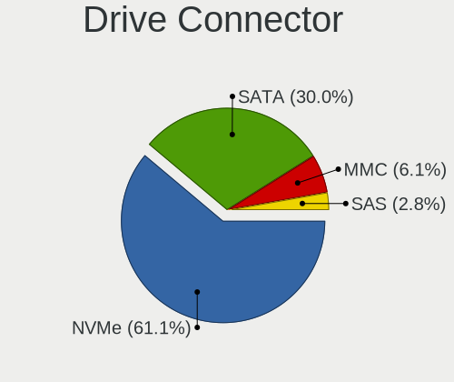

| Type | Notebooks | Drives | Percent |
|------|-----------|--------|---------|
| SATA | 47        | 60     | 60.26%  |
| NVMe | 28        | 32     | 35.9%   |
| MMC  | 2         | 2      | 2.56%   |
| SAS  | 1         | 2      | 1.28%   |

Drive Size
----------

Size of hard drive

| Size in TB | Notebooks | Drives | Percent |
|------------|-----------|--------|---------|
| 0.01-0.5   | 34        | 38     | 59.65%  |
| 0.51-1.0   | 20        | 21     | 35.09%  |
| 1.01-2.0   | 2         | 2      | 3.51%   |
| 3.01-4.0   | 1         | 1      | 1.75%   |

Space Total
-----------

Amount of disk space available on the file system

| Size in GB | Notebooks | Percent |
|------------|-----------|---------|
| 101-250    | 20        | 28.99%  |
| 251-500    | 19        | 27.54%  |
| 501-1000   | 17        | 24.64%  |
| 1001-2000  | 7         | 10.14%  |
| 51-100     | 3         | 4.35%   |
| 21-50      | 1         | 1.45%   |
| 1-20       | 1         | 1.45%   |
| Unknown    | 1         | 1.45%   |

Space Used
----------

Amount of used disk space

| Used GB   | Notebooks | Percent |
|-----------|-----------|---------|
| 251-500   | 16        | 23.19%  |
| 1-20      | 16        | 23.19%  |
| 101-250   | 12        | 17.39%  |
| 21-50     | 10        | 14.49%  |
| 51-100    | 8         | 11.59%  |
| 501-1000  | 5         | 7.25%   |
| 1001-2000 | 1         | 1.45%   |
| Unknown   | 1         | 1.45%   |

Malfunc. Drives
---------------

Drive models with a malfunction

| Model                                               | Notebooks | Drives | Percent |
|-----------------------------------------------------|-----------|--------|---------|
| WDC WD5000BEVT-11ZAT0 500GB                         | 1         | 1      | 20%     |
| WDC WD10JPVX-60JC3T1 1TB                            | 1         | 1      | 20%     |
| Toshiba MQ01ACF050 500GB                            | 1         | 1      | 20%     |
| Micron Technology MTFDDAK256MAY-1AH12ABHA 256GB SSD | 1         | 1      | 20%     |
| HGST HTS545050A7E680 500GB                          | 1         | 1      | 20%     |

Malfunc. Drive Vendor
---------------------

Vendors of faulty drives

| Vendor            | Notebooks | Drives | Percent |
|-------------------|-----------|--------|---------|
| WDC               | 2         | 2      | 40%     |
| Toshiba           | 1         | 1      | 20%     |
| Micron Technology | 1         | 1      | 20%     |
| HGST              | 1         | 1      | 20%     |

Malfunc. HDD Vendor
-------------------

Vendors of faulty HDD drives

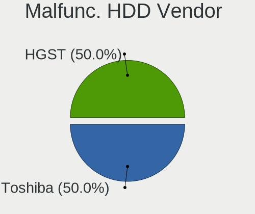

| Vendor  | Notebooks | Drives | Percent |
|---------|-----------|--------|---------|
| WDC     | 2         | 2      | 50%     |
| Toshiba | 1         | 1      | 25%     |
| HGST    | 1         | 1      | 25%     |

Malfunc. Drive Kind
-------------------

Kinds of faulty drives

| Kind | Notebooks | Drives | Percent |
|------|-----------|--------|---------|
| HDD  | 4         | 4      | 80%     |
| SSD  | 1         | 1      | 20%     |

Failed Drives
-------------

Failed drive models

Zero info for selected period =(

Failed Drive Vendor
-------------------

Failed drive vendors

Zero info for selected period =(

Drive Status
------------

Number of failed and malfunc. drives

| Status   | Notebooks | Drives | Percent |
|----------|-----------|--------|---------|
| Detected | 36        | 49     | 50%     |
| Works    | 31        | 42     | 43.06%  |
| Malfunc  | 5         | 5      | 6.94%   |

Storage Vendor
--------------

Storage controller vendors

| Vendor                           | Notebooks | Percent |
|----------------------------------|-----------|---------|
| Intel                            | 40        | 47.62%  |
| AMD                              | 14        | 16.67%  |
| Samsung Electronics              | 12        | 14.29%  |
| Sandisk                          | 8         | 9.52%   |
| Toshiba America Info Systems     | 2         | 2.38%   |
| SK Hynix                         | 2         | 2.38%   |
| Silicon Integrated Systems [SiS] | 1         | 1.19%   |
| Red Hat                          | 1         | 1.19%   |
| Phison Electronics               | 1         | 1.19%   |
| Micron Technology                | 1         | 1.19%   |
| KIOXIA                           | 1         | 1.19%   |
| Apple                            | 1         | 1.19%   |

Storage Model
-------------

Storage controller models

| Model                                                                            | Notebooks | Percent |
|----------------------------------------------------------------------------------|-----------|---------|
| AMD FCH SATA Controller [AHCI mode]                                              | 13        | 14.61%  |
| Samsung NVMe SSD Controller SM981/PM981/PM983                                    | 8         | 8.99%   |
| Intel Sunrise Point-LP SATA Controller [AHCI mode]                               | 7         | 7.87%   |
| Intel 82801 Mobile SATA Controller [RAID mode]                                   | 7         | 7.87%   |
| Intel 7 Series Chipset Family 6-port SATA Controller [AHCI mode]                 | 6         | 6.74%   |
| Samsung Electronics Non-Volatile memory controller                               | 3         | 3.37%   |
| Intel 8 Series/C220 Series Chipset Family 6-port SATA Controller 1 [AHCI mode]   | 3         | 3.37%   |
| Intel 8 Series SATA Controller 1 [AHCI mode]                                     | 3         | 3.37%   |
| Sandisk WD Blue SN550 NVMe SSD                                                   | 2         | 2.25%   |
| Sandisk WD Blue SN500 / PC SN520 NVMe SSD                                        | 2         | 2.25%   |
| Sandisk WD Black SN750 / PC SN730 NVMe SSD                                       | 2         | 2.25%   |
| Samsung NVMe SSD Controller SM961/PM961/SM963                                    | 2         | 2.25%   |
| Intel Wildcat Point-LP SATA Controller [AHCI Mode]                               | 2         | 2.25%   |
| Intel HM170/QM170 Chipset SATA Controller [AHCI Mode]                            | 2         | 2.25%   |
| Intel 6 Series/C200 Series Chipset Family 6 port Mobile SATA AHCI Controller     | 2         | 2.25%   |
| Toshiba America Info Systems XG6 NVMe SSD Controller                             | 1         | 1.12%   |
| Toshiba America Info Systems Toshiba America Info Non-Volatile memory controller | 1         | 1.12%   |
| SK Hynix Non-Volatile memory controller                                          | 1         | 1.12%   |
| SK Hynix BC501 NVMe Solid State Drive 512GB                                      | 1         | 1.12%   |
| Silicon Integrated Systems [SiS] AHCI IDE Controller (0106)                      | 1         | 1.12%   |
| Silicon Integrated Systems [SiS] 5513 IDE Controller                             | 1         | 1.12%   |
| Sandisk PC SN520 NVMe SSD                                                        | 1         | 1.12%   |
| Sandisk Non-Volatile memory controller                                           | 1         | 1.12%   |
| Red Hat Virtio filesystem                                                        | 1         | 1.12%   |
| Phison E12 NVMe Controller                                                       | 1         | 1.12%   |
| Micron Non-Volatile memory controller                                            | 1         | 1.12%   |
| KIOXIA Non-Volatile memory controller                                            | 1         | 1.12%   |
| Intel SSD 600P Series                                                            | 1         | 1.12%   |
| Intel Cannon Point-LP SATA Controller [AHCI Mode]                                | 1         | 1.12%   |
| Intel Cannon Lake Mobile PCH SATA AHCI Controller                                | 1         | 1.12%   |
| Intel Atom/Celeron/Pentium Processor x5-E8000/J3xxx/N3xxx Series SATA Controller | 1         | 1.12%   |
| Intel Atom Processor E3800 Series SATA AHCI Controller                           | 1         | 1.12%   |
| Intel 82801IBM/IEM (ICH9M/ICH9M-E) 4 port SATA Controller [AHCI mode]            | 1         | 1.12%   |
| Intel 82801HM/HEM (ICH8M/ICH8M-E) SATA Controller [AHCI mode]                    | 1         | 1.12%   |
| Intel 82801HM/HEM (ICH8M/ICH8M-E) IDE Controller                                 | 1         | 1.12%   |
| Intel 5 Series/3400 Series Chipset 6 port SATA AHCI Controller                   | 1         | 1.12%   |
| Intel 400 Series Chipset Family SATA AHCI Controller                             | 1         | 1.12%   |
| Apple ANS2 NVMe Controller                                                       | 1         | 1.12%   |
| AMD X370 Series Chipset SATA Controller                                          | 1         | 1.12%   |
| AMD SB7x0/SB8x0/SB9x0 SATA Controller [AHCI mode]                                | 1         | 1.12%   |

Storage Kind
------------

Kind of storage controller (IDE, SATA, NVMe, SAS, ...)

| Kind | Notebooks | Percent |
|------|-----------|---------|
| SATA | 48        | 55.81%  |
| NVMe | 28        | 32.56%  |
| RAID | 7         | 8.14%   |
| IDE  | 2         | 2.33%   |
| SCSI | 1         | 1.16%   |

CPU Vendor
----------

Processor vendors

| Vendor | Notebooks | Percent |
|--------|-----------|---------|
| Intel  | 48        | 69.57%  |
| AMD    | 21        | 30.43%  |

CPU Model
---------

Processor models

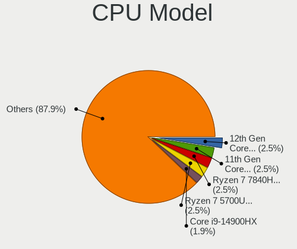

| Model                                         | Notebooks | Percent |
|-----------------------------------------------|-----------|---------|
| Intel Core i7-8550U CPU @ 1.80GHz             | 4         | 5.8%    |
| Intel Core i7-9750H CPU @ 2.60GHz             | 3         | 4.35%   |
| AMD Ryzen 5 4500U with Radeon Graphics        | 3         | 4.35%   |
| AMD Ryzen 5 3500U with Radeon Vega Mobile Gfx | 3         | 4.35%   |
| Intel Core i7-7700HQ CPU @ 2.80GHz            | 2         | 2.9%    |
| Intel Core i7-4700MQ CPU @ 2.40GHz            | 2         | 2.9%    |
| AMD Ryzen 7 4800U with Radeon Graphics        | 2         | 2.9%    |
| AMD Ryzen 7 3700U with Radeon Vega Mobile Gfx | 2         | 2.9%    |
| AMD Ryzen 3 4300U with Radeon Graphics        | 2         | 2.9%    |
| Intel Pentium CPU N3710 @ 1.60GHz             | 1         | 1.45%   |
| Intel Core i7-8850H CPU @ 2.60GHz             | 1         | 1.45%   |
| Intel Core i7-8750H CPU @ 2.20GHz             | 1         | 1.45%   |
| Intel Core i7-8650U CPU @ 1.90GHz             | 1         | 1.45%   |
| Intel Core i7-8565U CPU @ 1.80GHz             | 1         | 1.45%   |
| Intel Core i7-7500U CPU @ 2.70GHz             | 1         | 1.45%   |
| Intel Core i7-6500U CPU @ 2.50GHz             | 1         | 1.45%   |
| Intel Core i7-5600U CPU @ 2.60GHz             | 1         | 1.45%   |
| Intel Core i7-4710MQ CPU @ 2.50GHz            | 1         | 1.45%   |
| Intel Core i7-3610QM CPU @ 2.30GHz            | 1         | 1.45%   |
| Intel Core i7-3520M CPU @ 2.90GHz             | 1         | 1.45%   |
| Intel Core i7-2920XM CPU @ 2.50GHz            | 1         | 1.45%   |
| Intel Core i7-2820QM CPU @ 2.30GHz            | 1         | 1.45%   |
| Intel Core i7-2670QM CPU @ 2.20GHz            | 1         | 1.45%   |
| Intel Core i7-10875H CPU @ 2.30GHz            | 1         | 1.45%   |
| Intel Core i7-10750H CPU @ 2.60GHz            | 1         | 1.45%   |
| Intel Core i7-10610U CPU @ 1.80GHz            | 1         | 1.45%   |
| Intel Core i5-8250U CPU @ 1.60GHz             | 1         | 1.45%   |
| Intel Core i5-6300U CPU @ 2.40GHz             | 1         | 1.45%   |
| Intel Core i5-5200U CPU @ 2.20GHz             | 1         | 1.45%   |
| Intel Core i5-4310U CPU @ 2.00GHz             | 1         | 1.45%   |
| Intel Core i5-4300U CPU @ 1.90GHz             | 1         | 1.45%   |
| Intel Core i5-4210U CPU @ 1.70GHz             | 1         | 1.45%   |
| Intel Core i5-3320M CPU @ 2.60GHz             | 1         | 1.45%   |
| Intel Core i5-3317U CPU @ 1.70GHz             | 1         | 1.45%   |
| Intel Core i5-3230M CPU @ 2.60GHz             | 1         | 1.45%   |
| Intel Core i5 CPU M 480 @ 2.67GHz             | 1         | 1.45%   |
| Intel Core i3-8145U CPU @ 2.10GHz             | 1         | 1.45%   |
| Intel Core i3-8130U CPU @ 2.20GHz             | 1         | 1.45%   |
| Intel Core i3-7100U CPU @ 2.40GHz             | 1         | 1.45%   |
| Intel Core i3-7020U CPU @ 2.30GHz             | 1         | 1.45%   |
| Intel Core i3-4005U CPU @ 1.70GHz             | 1         | 1.45%   |
| Intel Core i3-2370M CPU @ 2.40GHz             | 1         | 1.45%   |
| Intel Core 2 Duo CPU T7500 @ 2.20GHz          | 1         | 1.45%   |
| Intel Core 2 Duo CPU P8400 @ 2.26GHz          | 1         | 1.45%   |
| Intel Celeron CPU N2806 @ 1.60GHz             | 1         | 1.45%   |
| Intel Celeron CPU 540 @ 1.86GHz               | 1         | 1.45%   |
| AMD Ryzen 7 PRO 4750U with Radeon Graphics    | 1         | 1.45%   |
| AMD Ryzen 7 4700U with Radeon Graphics        | 1         | 1.45%   |
| AMD Ryzen 7 3750H with Radeon Vega Mobile Gfx | 1         | 1.45%   |
| AMD Ryzen 7 2700U with Radeon Vega Mobile Gfx | 1         | 1.45%   |
| AMD Ryzen 7 1700 Eight-Core Processor         | 1         | 1.45%   |
| AMD Ryzen 5 2500U with Radeon Vega Mobile Gfx | 1         | 1.45%   |
| AMD E1-2100 APU with Radeon HD Graphics       | 1         | 1.45%   |
| AMD E-350 Processor                           | 1         | 1.45%   |
| AMD A8-4500M APU with Radeon HD Graphics      | 1         | 1.45%   |

CPU Model Family
----------------

Processor model prefix

| Model            | Notebooks | Percent |
|------------------|-----------|---------|
| Intel Core i7    | 27        | 39.13%  |
| Intel Core i5    | 10        | 14.49%  |
| AMD Ryzen 7      | 8         | 11.59%  |
| AMD Ryzen 5      | 7         | 10.14%  |
| Intel Core i3    | 6         | 8.7%    |
| Intel Core 2 Duo | 2         | 2.9%    |
| Intel Celeron    | 2         | 2.9%    |
| AMD Ryzen 3      | 2         | 2.9%    |
| Intel Pentium    | 1         | 1.45%   |
| AMD Ryzen 7 PRO  | 1         | 1.45%   |
| AMD E1           | 1         | 1.45%   |
| AMD E            | 1         | 1.45%   |
| AMD A8           | 1         | 1.45%   |

CPU Cores
---------

Number of processor cores

| Number | Notebooks | Percent |
|--------|-----------|---------|
| 4      | 28        | 40.58%  |
| 2      | 25        | 36.23%  |
| 6      | 9         | 13.04%  |
| 8      | 6         | 8.7%    |
| 1      | 1         | 1.45%   |

CPU Sockets
-----------

Number of sockets

| Number | Notebooks | Percent |
|--------|-----------|---------|
| 1      | 69        | 100%    |

CPU Threads
-----------

Threads per core (Hyper-Threading)

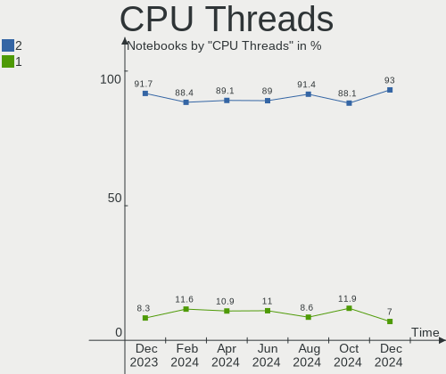

| Number | Notebooks | Percent |
|--------|-----------|---------|
| 2      | 56        | 81.16%  |
| 1      | 13        | 18.84%  |

CPU Op-Modes
------------

CPU Operation Modes (32-bit, 64-bit)

| Op mode        | Notebooks | Percent |
|----------------|-----------|---------|
| 32-bit, 64-bit | 69        | 100%    |

CPU Microcode
-------------

Microcode number

| Number     | Notebooks | Percent |
|------------|-----------|---------|
| Unknown    | 31        | 44.93%  |
| 0x906ea    | 3         | 4.35%   |
| 0x806ea    | 3         | 4.35%   |
| 0x40651    | 3         | 4.35%   |
| 0x306a9    | 3         | 4.35%   |
| 0x08600106 | 3         | 4.35%   |
| 0x08108102 | 3         | 4.35%   |
| 0x906e9    | 2         | 2.9%    |
| 0x406e3    | 2         | 2.9%    |
| 0x206a7    | 2         | 2.9%    |
| 0x0810100b | 2         | 2.9%    |
| 0xa0652    | 1         | 1.45%   |
| 0x806ec    | 1         | 1.45%   |
| 0x806eb    | 1         | 1.45%   |
| 0x6fb      | 1         | 1.45%   |
| 0x306d4    | 1         | 1.45%   |
| 0x20655    | 1         | 1.45%   |
| 0x10661    | 1         | 1.45%   |
| 0x08600104 | 1         | 1.45%   |
| 0x08600103 | 1         | 1.45%   |
| 0x08108109 | 1         | 1.45%   |
| 0x08001105 | 1         | 1.45%   |
| 0x0700010b | 1         | 1.45%   |

CPU Microarch
-------------

Microarchitecture

| Name        | Notebooks | Percent |
|-------------|-----------|---------|
| KabyLake    | 20        | 28.99%  |
| Zen 2       | 9         | 13.04%  |
| Haswell     | 7         | 10.14%  |
| Zen+        | 6         | 8.7%    |
| IvyBridge   | 5         | 7.25%   |
| SandyBridge | 4         | 5.8%    |
| Zen         | 3         | 4.35%   |
| Skylake     | 2         | 2.9%    |
| Silvermont  | 2         | 2.9%    |
| Core        | 2         | 2.9%    |
| CometLake   | 2         | 2.9%    |
| Broadwell   | 2         | 2.9%    |
| Westmere    | 1         | 1.45%   |
| Piledriver  | 1         | 1.45%   |
| Penryn      | 1         | 1.45%   |
| Jaguar      | 1         | 1.45%   |
| Bobcat      | 1         | 1.45%   |

GPU Vendor
----------

Vendors of graphics cards

| Vendor                           | Notebooks | Percent |
|----------------------------------|-----------|---------|
| Intel                            | 41        | 43.16%  |
| AMD                              | 27        | 28.42%  |
| Nvidia                           | 25        | 26.32%  |
| Silicon Integrated Systems [SiS] | 1         | 1.05%   |
| Microsoft                        | 1         | 1.05%   |

GPU Model
---------

Graphics card models

| Model                                                                                    | Notebooks | Percent |
|------------------------------------------------------------------------------------------|-----------|---------|
| AMD Renoir                                                                               | 8         | 8.16%   |
| Intel UHD Graphics 620                                                                   | 7         | 7.14%   |
| AMD Picasso                                                                              | 6         | 6.12%   |
| Nvidia GP107M [GeForce GTX 1050 Mobile]                                                  | 5         | 5.1%    |
| Intel 3rd Gen Core processor Graphics Controller                                         | 5         | 5.1%    |
| Intel Haswell-ULT Integrated Graphics Controller                                         | 4         | 4.08%   |
| Intel CoffeeLake-H GT2 [UHD Graphics 630]                                                | 4         | 4.08%   |
| AMD Sun XT [Radeon HD 8670A/8670M/8690M / R5 M330 / M430 / Radeon 520 Mobile]            | 4         | 4.08%   |
| Nvidia TU116M [GeForce GTX 1660 Ti Mobile]                                               | 3         | 3.06%   |
| Intel HD Graphics 620                                                                    | 3         | 3.06%   |
| Intel 4th Gen Core Processor Integrated Graphics Controller                              | 3         | 3.06%   |
| Nvidia GP108M [GeForce MX150]                                                            | 2         | 2.04%   |
| Nvidia GF108M [GeForce GT 620M/630M/635M/640M LE]                                        | 2         | 2.04%   |
| Intel WhiskeyLake-U GT2 [UHD Graphics 620]                                               | 2         | 2.04%   |
| Intel Skylake GT2 [HD Graphics 520]                                                      | 2         | 2.04%   |
| Intel HD Graphics 630                                                                    | 2         | 2.04%   |
| Intel HD Graphics 5500                                                                   | 2         | 2.04%   |
| Intel CometLake-H GT2 [UHD Graphics]                                                     | 2         | 2.04%   |
| Intel 2nd Generation Core Processor Family Integrated Graphics Controller                | 2         | 2.04%   |
| AMD Raven Ridge [Radeon Vega Series / Radeon Vega Mobile Series]                         | 2         | 2.04%   |
| AMD Baffin [Radeon RX 460/560D / Pro 450/455/460/555/555X/560/560X]                      | 2         | 2.04%   |
| Silicon Integrated Systems [SiS] 771/671 PCIE VGA Display Adapter                        | 1         | 1.02%   |
| Nvidia TU117M [GeForce GTX 1650 Mobile / Max-Q]                                          | 1         | 1.02%   |
| Nvidia TU106M [GeForce RTX 2060 Max-Q]                                                   | 1         | 1.02%   |
| Nvidia GP108M [GeForce MX330]                                                            | 1         | 1.02%   |
| Nvidia GP107M [GeForce GTX 1050 Ti Mobile]                                               | 1         | 1.02%   |
| Nvidia GP107M [GeForce GTX 1050 3 GB Max-Q]                                              | 1         | 1.02%   |
| Nvidia GP106 [GeForce GTX 1060 6GB]                                                      | 1         | 1.02%   |
| Nvidia GM107M [GeForce GTX 950M]                                                         | 1         | 1.02%   |
| Nvidia GM107M [GeForce GTX 860M]                                                         | 1         | 1.02%   |
| Nvidia GK107M [GeForce GT 755M]                                                          | 1         | 1.02%   |
| Nvidia GK106M [GeForce GTX 765M]                                                         | 1         | 1.02%   |
| Nvidia GF104GLM [Quadro 3000M]                                                           | 1         | 1.02%   |
| Nvidia G98M [GeForce 9300M GS]                                                           | 1         | 1.02%   |
| Nvidia G84GLM [Quadro FX 1600M]                                                          | 1         | 1.02%   |
| Microsoft Virtual Render                                                                 | 1         | 1.02%   |
| Intel CometLake-U GT2 [UHD Graphics]                                                     | 1         | 1.02%   |
| Intel Atom/Celeron/Pentium Processor x5-E8000/J3xxx/N3xxx Integrated Graphics Controller | 1         | 1.02%   |
| Intel Atom Processor Z36xxx/Z37xxx Series Graphics & Display                             | 1         | 1.02%   |
| AMD Wrestler [Radeon HD 6310]                                                            | 1         | 1.02%   |
| AMD Trinity [Radeon HD 7640G]                                                            | 1         | 1.02%   |
| AMD Topaz XT [Radeon R7 M260/M265 / M340/M360 / M440/M445 / 530/535 / 620/625 Mobile]    | 1         | 1.02%   |
| AMD Thames [Radeon HD 7500M/7600M Series]                                                | 1         | 1.02%   |
| AMD Saturn XT [FirePro M6100]                                                            | 1         | 1.02%   |
| AMD Park [Mobility Radeon HD 5430/5450/5470]                                             | 1         | 1.02%   |
| AMD Mars [Radeon HD 8670A/8670M/8750M]                                                   | 1         | 1.02%   |
| AMD Kabini [Radeon HD 8210]                                                              | 1         | 1.02%   |

GPU Combo
---------

Combinations of graphics cards

| Name           | Notebooks | Percent |
|----------------|-----------|---------|
| Intel + Nvidia | 19        | 27.54%  |
| 1 x Intel      | 17        | 24.64%  |
| 1 x AMD        | 17        | 24.64%  |
| Intel + AMD    | 5         | 7.25%   |
| 1 x Nvidia     | 4         | 5.8%    |
| 2 x AMD        | 3         | 4.35%   |
| AMD + Nvidia   | 2         | 2.9%    |
| 1 x SiS        | 1         | 1.45%   |
| 1 x Microsoft  | 1         | 1.45%   |

GPU Driver
----------

Free vs proprietary

| Driver      | Notebooks | Percent |
|-------------|-----------|---------|
| Free        | 50        | 72.46%  |
| Proprietary | 16        | 23.19%  |
| Unknown     | 3         | 4.35%   |

GPU Memory
----------

Total video memory

| Size in GB | Notebooks | Percent |
|------------|-----------|---------|
| Unknown    | 42        | 60.87%  |
| 1.01-2.0   | 11        | 15.94%  |
| 0.01-0.5   | 7         | 10.14%  |
| 3.01-4.0   | 6         | 8.7%    |
| 5.01-6.0   | 2         | 2.9%    |
| 0.51-1.0   | 1         | 1.45%   |

Monitor Vendor
--------------

Monitor vendors

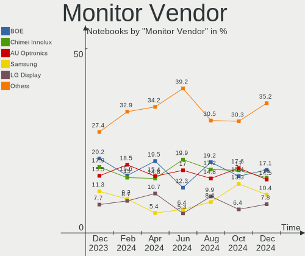

| Vendor                  | Notebooks | Percent |
|-------------------------|-----------|---------|
| LG Display              | 18        | 22.78%  |
| AU Optronics            | 16        | 20.25%  |
| BOE                     | 10        | 12.66%  |
| Samsung Electronics     | 7         | 8.86%   |
| Chimei Innolux          | 5         | 6.33%   |
| PANDA                   | 3         | 3.8%    |
| InfoVision              | 2         | 2.53%   |
| Dell                    | 2         | 2.53%   |
| Chi Mei Optoelectronics | 2         | 2.53%   |
| BenQ                    | 2         | 2.53%   |
| Apple                   | 2         | 2.53%   |
| AOC                     | 2         | 2.53%   |
| ViewSonic               | 1         | 1.27%   |
| Sharp                   | 1         | 1.27%   |
| NEC Computers           | 1         | 1.27%   |
| LG Philips              | 1         | 1.27%   |
| Lenovo                  | 1         | 1.27%   |
| Iiyama                  | 1         | 1.27%   |
| Goldstar                | 1         | 1.27%   |
| Ancor Communications    | 1         | 1.27%   |

Monitor Model
-------------

Monitor models

| Model                                                                     | Notebooks | Percent |
|---------------------------------------------------------------------------|-----------|---------|
| AU Optronics LCD Monitor AUO61ED 1920x1080 340x190mm 15.3-inch            | 2         | 2.53%   |
| AU Optronics LCD Monitor AUO403D 1920x1080 309x173mm 13.9-inch            | 2         | 2.53%   |
| ViewSonic VX2758-Series VSCA738 2560x1440 598x336mm 27.0-inch             | 1         | 1.27%   |
| Sharp LCD Monitor SHP14D6 3840x2400 366x229mm 17.0-inch                   | 1         | 1.27%   |
| Samsung Electronics SyncMaster SAM03EE 1680x1050                          | 1         | 1.27%   |
| Samsung Electronics S24D590 SAM0B47 1920x1080 520x290mm 23.4-inch         | 1         | 1.27%   |
| Samsung Electronics LCD Monitor SEC324A 1366x768 344x194mm 15.5-inch      | 1         | 1.27%   |
| Samsung Electronics LCD Monitor SEC315A 1366x768 344x194mm 15.5-inch      | 1         | 1.27%   |
| Samsung Electronics LCD Monitor SDC5441 1366x768 340x190mm 15.3-inch      | 1         | 1.27%   |
| Samsung Electronics LCD Monitor SDC364D 1920x1080 309x174mm 14.0-inch     | 1         | 1.27%   |
| Samsung Electronics C32HG7x SAM0E14 2560x1440 700x390mm 31.5-inch         | 1         | 1.27%   |
| PANDA LCD Monitor NCP004D 1920x1080 344x194mm 15.5-inch                   | 1         | 1.27%   |
| PANDA LCD Monitor NCP0036 1920x1080 344x194mm 15.5-inch                   | 1         | 1.27%   |
| PANDA LCD Monitor NCP0035 1920x1080 309x174mm 14.0-inch                   | 1         | 1.27%   |
| NEC Computers 90GX2 NEC6692 1280x1024 376x301mm 19.0-inch                 | 1         | 1.27%   |
| LG Philips LCD Monitor LPL4101 1680x1050 370x230mm 17.2-inch              | 1         | 1.27%   |
| LG Display LCD Monitor LGD065A 1920x1080 344x194mm 15.5-inch              | 1         | 1.27%   |
| LG Display LCD Monitor LGD064C 1920x1080 344x194mm 15.5-inch              | 1         | 1.27%   |
| LG Display LCD Monitor LGD061A 1920x1080 344x194mm 15.5-inch              | 1         | 1.27%   |
| LG Display LCD Monitor LGD05F6 1920x1080 309x174mm 14.0-inch              | 1         | 1.27%   |
| LG Display LCD Monitor LGD05D8 1920x1080 344x194mm 15.5-inch              | 1         | 1.27%   |
| LG Display LCD Monitor LGD0597 1920x1080 294x165mm 13.3-inch              | 1         | 1.27%   |
| LG Display LCD Monitor LGD0590 1920x1080 344x194mm 15.5-inch              | 1         | 1.27%   |
| LG Display LCD Monitor LGD0563 1920x1080 344x194mm 15.5-inch              | 1         | 1.27%   |
| LG Display LCD Monitor LGD0532 1920x1080 344x194mm 15.5-inch              | 1         | 1.27%   |
| LG Display LCD Monitor LGD0521 1920x1080 309x174mm 14.0-inch              | 1         | 1.27%   |
| LG Display LCD Monitor LGD04F0 2560x1440 310x174mm 14.0-inch              | 1         | 1.27%   |
| LG Display LCD Monitor LGD04E8 1920x1080 382x215mm 17.3-inch              | 1         | 1.27%   |
| LG Display LCD Monitor LGD03EE 1366x768 277x156mm 12.5-inch               | 1         | 1.27%   |
| LG Display LCD Monitor LGD03D9 1366x768 350x190mm 15.7-inch               | 1         | 1.27%   |
| LG Display LCD Monitor LGD0368 1366x768 309x174mm 14.0-inch               | 1         | 1.27%   |
| LG Display LCD Monitor LGD033A 1366x768 340x190mm 15.3-inch               | 1         | 1.27%   |
| LG Display LCD Monitor LGD0306 1600x900 310x174mm 14.0-inch               | 1         | 1.27%   |
| LG Display LCD Monitor LGD0259 1920x1080 350x190mm 15.7-inch              | 1         | 1.27%   |
| Lenovo LEN LT2452pwC LEN1144 1920x1200 518x324mm 24.1-inch                | 1         | 1.27%   |
| InfoVision M140NWR2 R1 IVO057A 1366x768 309x174mm 14.0-inch               | 1         | 1.27%   |
| InfoVision LCD Monitor IVO03FA 1366x768 220x130mm 10.1-inch               | 1         | 1.27%   |
| Iiyama PL2730H IVM663A 1920x1080 598x336mm 27.0-inch                      | 1         | 1.27%   |
| Goldstar LG FULL HD GSM5AB9 1680x1050 480x270mm 21.7-inch                 | 1         | 1.27%   |
| Dell U2412M DELA079 1920x1200 518x324mm 24.1-inch                         | 1         | 1.27%   |
| Dell E1912H DELF03E 1366x768 410x230mm 18.5-inch                          | 1         | 1.27%   |
| Chimei Innolux LCD Monitor CMN15E8 1920x1080 344x193mm 15.5-inch          | 1         | 1.27%   |
| Chimei Innolux LCD Monitor CMN15C6 1366x768 340x190mm 15.3-inch           | 1         | 1.27%   |
| Chimei Innolux LCD Monitor CMN15BF 1366x768 344x193mm 15.5-inch           | 1         | 1.27%   |
| Chimei Innolux LCD Monitor CMN151B 1920x1080 344x193mm 15.5-inch          | 1         | 1.27%   |
| Chimei Innolux LCD Monitor CMN1409 1920x1080 309x173mm 13.9-inch          | 1         | 1.27%   |
| Chi Mei Optoelectronics LCD Monitor CMO1720 1920x1080 382x215mm 17.3-inch | 1         | 1.27%   |
| Chi Mei Optoelectronics LCD Monitor CMO1719 1600x900 382x215mm 17.3-inch  | 1         | 1.27%   |
| BOE LCD Monitor BOE08ED 1920x1080 309x174mm 14.0-inch                     | 1         | 1.27%   |
| BOE LCD Monitor BOE08B5 1920x1080 309x174mm 14.0-inch                     | 1         | 1.27%   |
| BOE LCD Monitor BOE0757 1366x768 344x194mm 15.5-inch                      | 1         | 1.27%   |
| BOE LCD Monitor BOE0747 1920x1080 344x194mm 15.5-inch                     | 1         | 1.27%   |
| BOE LCD Monitor BOE06FA 1920x1080 294x165mm 13.3-inch                     | 1         | 1.27%   |
| BOE LCD Monitor BOE06F2 1920x1080 309x173mm 13.9-inch                     | 1         | 1.27%   |
| BOE LCD Monitor BOE06BA 1920x1080 344x193mm 15.5-inch                     | 1         | 1.27%   |
| BOE LCD Monitor BOE069C 1920x1080 344x193mm 15.5-inch                     | 1         | 1.27%   |
| BOE LCD Monitor BOE0687 1920x1080 344x193mm 15.5-inch                     | 1         | 1.27%   |
| BOE LCD Monitor BOE0629 1366x768 309x173mm 13.9-inch                      | 1         | 1.27%   |
| BenQ V2400Eco BNQ7D02 1920x1080 531x299mm 24.0-inch                       | 1         | 1.27%   |
| BenQ GW2750H BNQ78C3 1920x1080 598x336mm 27.0-inch                        | 1         | 1.27%   |

Monitor Resolution
------------------

Monitor screen resolution

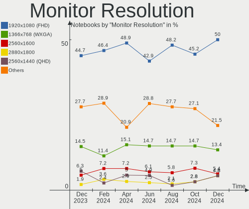

| Resolution         | Notebooks | Percent |
|--------------------|-----------|---------|
| 1920x1080 (FHD)    | 44        | 60.27%  |
| 1366x768 (WXGA)    | 15        | 20.55%  |
| 2560x1440 (QHD)    | 4         | 5.48%   |
| 1680x1050 (WSXGA+) | 2         | 2.74%   |
| 1600x900 (HD+)     | 2         | 2.74%   |
| 3840x2400          | 1         | 1.37%   |
| 3840x2160 (4K)     | 1         | 1.37%   |
| 2880x1800          | 1         | 1.37%   |
| 1920x1200 (WUXGA)  | 1         | 1.37%   |
| 1280x800 (WXGA)    | 1         | 1.37%   |
| 1280x1024 (SXGA)   | 1         | 1.37%   |

Monitor Diagonal
----------------

Diagonal size in inches

| Inches  | Notebooks | Percent |
|---------|-----------|---------|
| 15      | 33        | 42.31%  |
| 14      | 14        | 17.95%  |
| 17      | 7         | 8.97%   |
| 13      | 7         | 8.97%   |
| 27      | 4         | 5.13%   |
| 24      | 3         | 3.85%   |
| 23      | 2         | 2.56%   |
| Unknown | 2         | 2.56%   |
| 31      | 1         | 1.28%   |
| 21      | 1         | 1.28%   |
| 19      | 1         | 1.28%   |
| 18      | 1         | 1.28%   |
| 12      | 1         | 1.28%   |
| 10      | 1         | 1.28%   |

Monitor Width
-------------

Physical width

| Width in mm | Notebooks | Percent |
|-------------|-----------|---------|
| 301-350     | 51        | 65.38%  |
| 501-600     | 9         | 11.54%  |
| 351-400     | 8         | 10.26%  |
| 201-300     | 5         | 6.41%   |
| 401-500     | 2         | 2.56%   |
| Unknown     | 2         | 2.56%   |
| 601-700     | 1         | 1.28%   |

Aspect Ratio
------------

Proportional relationship between the width and the height

| Ratio   | Notebooks | Percent |
|---------|-----------|---------|
| 16/9    | 61        | 87.14%  |
| 16/10   | 7         | 10%     |
| 5/4     | 1         | 1.43%   |
| Unknown | 1         | 1.43%   |

Monitor Area
------------

Area in inch²

| Area in inch² | Notebooks | Percent |
|----------------|-----------|---------|
| 101-110        | 33        | 42.31%  |
| 81-90          | 19        | 24.36%  |
| 121-130        | 5         | 6.41%   |
| 301-350        | 4         | 5.13%   |
| 201-250        | 4         | 5.13%   |
| 71-80          | 2         | 2.56%   |
| 251-300        | 2         | 2.56%   |
| 131-140        | 2         | 2.56%   |
| Unknown        | 2         | 2.56%   |
| 61-70          | 1         | 1.28%   |
| 351-500        | 1         | 1.28%   |
| 41-50          | 1         | 1.28%   |
| 151-200        | 1         | 1.28%   |
| 141-150        | 1         | 1.28%   |

Pixel Density
-------------

Pixels per inch

| Density       | Notebooks | Percent |
|---------------|-----------|---------|
| 121-160       | 41        | 53.25%  |
| 101-120       | 17        | 22.08%  |
| 51-100        | 11        | 14.29%  |
| 161-240       | 5         | 6.49%   |
| Unknown       | 2         | 2.6%    |
| More than 240 | 1         | 1.3%    |

Multiple Monitors
-----------------

Total monitors connected

| Total | Notebooks | Percent |
|-------|-----------|---------|
| 1     | 54        | 78.26%  |
| 2     | 11        | 15.94%  |
| 0     | 3         | 4.35%   |
| 3     | 1         | 1.45%   |

Net Controller Vendor
---------------------

Controller vendors

| Vendor                           | Notebooks | Percent |
|----------------------------------|-----------|---------|
| Realtek Semiconductor            | 42        | 38.18%  |
| Intel                            | 38        | 34.55%  |
| Qualcomm Atheros                 | 14        | 12.73%  |
| Broadcom Inc. and subsidiaries   | 3         | 2.73%   |
| TP-Link                          | 2         | 1.82%   |
| Ralink                           | 2         | 1.82%   |
| D-Link                           | 2         | 1.82%   |
| Silicon Integrated Systems [SiS] | 1         | 0.91%   |
| Sierra Wireless                  | 1         | 0.91%   |
| Microsoft                        | 1         | 0.91%   |
| Linksys                          | 1         | 0.91%   |
| Lenovo                           | 1         | 0.91%   |
| DisplayLink                      | 1         | 0.91%   |
| Broadcom Limited                 | 1         | 0.91%   |

Net Controller Model
--------------------

Controller models

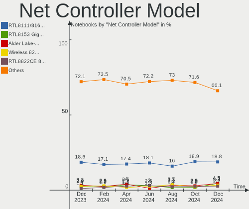

| Model                                                             | Notebooks | Percent |
|-------------------------------------------------------------------|-----------|---------|
| Realtek RTL8111/8168/8411 PCI Express Gigabit Ethernet Controller | 27        | 20.3%   |
| Intel Wi-Fi 6 AX200                                               | 7         | 5.26%   |
| Realtek RTL810xE PCI Express Fast Ethernet controller             | 5         | 3.76%   |
| Qualcomm Atheros QCA9377 802.11ac Wireless Network Adapter        | 5         | 3.76%   |
| Intel Wireless 8265 / 8275                                        | 5         | 3.76%   |
| Realtek RTL8153 Gigabit Ethernet Adapter                          | 4         | 3.01%   |
| Intel Wireless-AC 9560 [Jefferson Peak]                           | 4         | 3.01%   |
| Intel Wireless 7265                                               | 4         | 3.01%   |
| Realtek RTL8822CE 802.11ac PCIe Wireless Network Adapter          | 3         | 2.26%   |
| Intel Wireless 7260                                               | 3         | 2.26%   |
| Intel Centrino Ultimate-N 6300                                    | 3         | 2.26%   |
| Intel 82579LM Gigabit Network Connection (Lewisville)             | 3         | 2.26%   |
| Realtek RTL8821CE 802.11ac PCIe Wireless Network Adapter          | 2         | 1.5%    |
| Realtek RTL8723BE PCIe Wireless Network Adapter                   | 2         | 1.5%    |
| Qualcomm Atheros QCA6174 802.11ac Wireless Network Adapter        | 2         | 1.5%    |
| Qualcomm Atheros AR9485 Wireless Network Adapter                  | 2         | 1.5%    |
| Qualcomm Atheros AR9462 Wireless Network Adapter                  | 2         | 1.5%    |
| Intel Wireless 8260                                               | 2         | 1.5%    |
| Intel Ethernet Connection I218-LM                                 | 2         | 1.5%    |
| Intel Comet Lake PCH CNVi WiFi                                    | 2         | 1.5%    |
| TP-Link UE300 10/100/1000 LAN (ethernet mode) [Realtek RTL8153]   | 1         | 0.75%   |
| TP-Link TL-WN722N v2/v3 [Realtek RTL8188EUS]                      | 1         | 0.75%   |
| Silicon Integrated Systems [SiS] 191 Gigabit Ethernet Adapter     | 1         | 0.75%   |
| Sierra Wireless EM7345 4G LTE                                     | 1         | 0.75%   |
| Realtek RTL8822BE 802.11a/b/g/n/ac WiFi adapter                   | 1         | 0.75%   |
| Realtek RTL8812AU 802.11a/b/g/n/ac 2T2R DB WLAN Adapter           | 1         | 0.75%   |
| Realtek RTL8723DE Wireless Network Adapter                        | 1         | 0.75%   |
| Realtek RTL8723AE PCIe Wireless Network Adapter                   | 1         | 0.75%   |
| Realtek RTL8188EUS 802.11n Wireless Network Adapter               | 1         | 0.75%   |
| Realtek RTL8187B Wireless 802.11g 54Mbps Network Adapter          | 1         | 0.75%   |
| Realtek Killer E2600 Gigabit Ethernet Controller                  | 1         | 0.75%   |
| Realtek 802.11ac NIC                                              | 1         | 0.75%   |
| Ralink RT3290 Wireless 802.11n 1T/1R PCIe                         | 1         | 0.75%   |
| Ralink RT3090 Wireless 802.11n 1T/1R PCIe                         | 1         | 0.75%   |
| Qualcomm Atheros QCA9565 / AR9565 Wireless Network Adapter        | 1         | 0.75%   |
| Qualcomm Atheros QCA8171 Gigabit Ethernet                         | 1         | 0.75%   |
| Qualcomm Atheros Killer E2500 Gigabit Ethernet Controller         | 1         | 0.75%   |
| Qualcomm Atheros AR8161 Gigabit Ethernet                          | 1         | 0.75%   |
| Microsoft Xbox 360 Wireless Adapter                               | 1         | 0.75%   |
| Linksys WUSB6100M 802.11a/b/g/n/ac Wireless Adapter               | 1         | 0.75%   |
| Lenovo RTL8153 Gigabit Ethernet [ThinkPad OneLink Pro Dock]       | 1         | 0.75%   |
| Intel WLAN controller                                             | 1         | 0.75%   |
| Intel Wireless 3160                                               | 1         | 0.75%   |
| Intel WiFi Link 5100                                              | 1         | 0.75%   |
| Intel PRO/Wireless 4965 AG or AGN [Kedron] Network Connection     | 1         | 0.75%   |
| Intel Ethernet Connection I219-V                                  | 1         | 0.75%   |
| Intel Ethernet Connection I219-LM                                 | 1         | 0.75%   |
| Intel Ethernet Connection (6) I219-LM                             | 1         | 0.75%   |
| Intel Ethernet Connection (4) I219-LM                             | 1         | 0.75%   |
| Intel Ethernet Connection (3) I218-LM                             | 1         | 0.75%   |
| Intel Ethernet Connection (10) I219-LM                            | 1         | 0.75%   |
| Intel Comet Lake PCH-LP CNVi WiFi                                 | 1         | 0.75%   |
| Intel Centrino Wireless-N 2230                                    | 1         | 0.75%   |
| Intel Centrino Advanced-N 6235                                    | 1         | 0.75%   |
| Intel Cannon Point-LP CNVi [Wireless-AC]                          | 1         | 0.75%   |
| Intel 82566MM Gigabit Network Connection                          | 1         | 0.75%   |
| DisplayLink Dell Universal Dock D6000                             | 1         | 0.75%   |
| D-Link DWA-171                                                    | 1         | 0.75%   |
| D-Link DUB-1312 Gigabit Ethernet Adapter                          | 1         | 0.75%   |
| Broadcom Limited BCM4352 802.11ac Wireless Network Adapter        | 1         | 0.75%   |

Wireless Vendor
---------------

Wireless vendors

| Vendor                         | Notebooks | Percent |
|--------------------------------|-----------|---------|
| Intel                          | 37        | 50.68%  |
| Realtek Semiconductor          | 13        | 17.81%  |
| Qualcomm Atheros               | 12        | 16.44%  |
| Broadcom Inc. and subsidiaries | 3         | 4.11%   |
| Ralink                         | 2         | 2.74%   |
| TP-Link                        | 1         | 1.37%   |
| Sierra Wireless                | 1         | 1.37%   |
| Microsoft                      | 1         | 1.37%   |
| Linksys                        | 1         | 1.37%   |
| D-Link                         | 1         | 1.37%   |
| Broadcom Limited               | 1         | 1.37%   |

Wireless Model
--------------

Wireless models

| Model                                                                     | Notebooks | Percent |
|---------------------------------------------------------------------------|-----------|---------|
| Intel Wi-Fi 6 AX200                                                       | 7         | 9.33%   |
| Qualcomm Atheros QCA9377 802.11ac Wireless Network Adapter                | 5         | 6.67%   |
| Intel Wireless 8265 / 8275                                                | 5         | 6.67%   |
| Intel Wireless-AC 9560 [Jefferson Peak]                                   | 4         | 5.33%   |
| Intel Wireless 7265                                                       | 4         | 5.33%   |
| Realtek RTL8822CE 802.11ac PCIe Wireless Network Adapter                  | 3         | 4%      |
| Intel Wireless 7260                                                       | 3         | 4%      |
| Intel Centrino Ultimate-N 6300                                            | 3         | 4%      |
| Realtek RTL8821CE 802.11ac PCIe Wireless Network Adapter                  | 2         | 2.67%   |
| Realtek RTL8723BE PCIe Wireless Network Adapter                           | 2         | 2.67%   |
| Qualcomm Atheros QCA6174 802.11ac Wireless Network Adapter                | 2         | 2.67%   |
| Qualcomm Atheros AR9485 Wireless Network Adapter                          | 2         | 2.67%   |
| Qualcomm Atheros AR9462 Wireless Network Adapter                          | 2         | 2.67%   |
| Intel Wireless 8260                                                       | 2         | 2.67%   |
| Intel Comet Lake PCH CNVi WiFi                                            | 2         | 2.67%   |
| TP-Link TL-WN722N v2/v3 [Realtek RTL8188EUS]                              | 1         | 1.33%   |
| Sierra Wireless EM7345 4G LTE                                             | 1         | 1.33%   |
| Realtek RTL8822BE 802.11a/b/g/n/ac WiFi adapter                           | 1         | 1.33%   |
| Realtek RTL8812AU 802.11a/b/g/n/ac 2T2R DB WLAN Adapter                   | 1         | 1.33%   |
| Realtek RTL8723DE Wireless Network Adapter                                | 1         | 1.33%   |
| Realtek RTL8723AE PCIe Wireless Network Adapter                           | 1         | 1.33%   |
| Realtek RTL8188EUS 802.11n Wireless Network Adapter                       | 1         | 1.33%   |
| Realtek RTL8187B Wireless 802.11g 54Mbps Network Adapter                  | 1         | 1.33%   |
| Realtek 802.11ac NIC                                                      | 1         | 1.33%   |
| Ralink RT3290 Wireless 802.11n 1T/1R PCIe                                 | 1         | 1.33%   |
| Ralink RT3090 Wireless 802.11n 1T/1R PCIe                                 | 1         | 1.33%   |
| Qualcomm Atheros QCA9565 / AR9565 Wireless Network Adapter                | 1         | 1.33%   |
| Microsoft Xbox 360 Wireless Adapter                                       | 1         | 1.33%   |
| Linksys WUSB6100M 802.11a/b/g/n/ac Wireless Adapter                       | 1         | 1.33%   |
| Intel WLAN controller                                                     | 1         | 1.33%   |
| Intel Wireless 3160                                                       | 1         | 1.33%   |
| Intel WiFi Link 5100                                                      | 1         | 1.33%   |
| Intel PRO/Wireless 4965 AG or AGN [Kedron] Network Connection             | 1         | 1.33%   |
| Intel Comet Lake PCH-LP CNVi WiFi                                         | 1         | 1.33%   |
| Intel Centrino Wireless-N 2230                                            | 1         | 1.33%   |
| Intel Centrino Advanced-N 6235                                            | 1         | 1.33%   |
| Intel Cannon Point-LP CNVi [Wireless-AC]                                  | 1         | 1.33%   |
| D-Link DWA-171                                                            | 1         | 1.33%   |
| Broadcom Limited BCM4352 802.11ac Wireless Network Adapter                | 1         | 1.33%   |
| Broadcom Inc. and subsidiaries BCM4364 802.11ac Wireless Network Adapter  | 1         | 1.33%   |
| Broadcom Inc. and subsidiaries BCM4331 802.11a/b/g/n                      | 1         | 1.33%   |
| Broadcom Inc. and subsidiaries BCM4313 802.11bgn Wireless Network Adapter | 1         | 1.33%   |

Ethernet Vendor
---------------

Ethernet vendors

| Vendor                           | Notebooks | Percent |
|----------------------------------|-----------|---------|
| Realtek Semiconductor            | 37        | 63.79%  |
| Intel                            | 12        | 20.69%  |
| Qualcomm Atheros                 | 3         | 5.17%   |
| TP-Link                          | 1         | 1.72%   |
| Silicon Integrated Systems [SiS] | 1         | 1.72%   |
| Lenovo                           | 1         | 1.72%   |
| DisplayLink                      | 1         | 1.72%   |
| D-Link                           | 1         | 1.72%   |
| Broadcom Inc. and subsidiaries   | 1         | 1.72%   |

Ethernet Model
--------------

Ethernet models

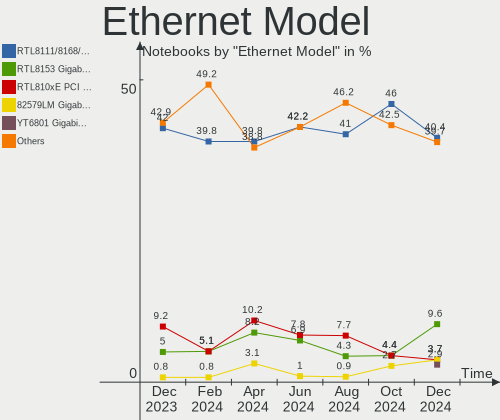

| Model                                                                   | Notebooks | Percent |
|-------------------------------------------------------------------------|-----------|---------|
| Realtek RTL8111/8168/8411 PCI Express Gigabit Ethernet Controller       | 27        | 46.55%  |
| Realtek RTL810xE PCI Express Fast Ethernet controller                   | 5         | 8.62%   |
| Realtek RTL8153 Gigabit Ethernet Adapter                                | 4         | 6.9%    |
| Intel 82579LM Gigabit Network Connection (Lewisville)                   | 3         | 5.17%   |
| Intel Ethernet Connection I218-LM                                       | 2         | 3.45%   |
| TP-Link UE300 10/100/1000 LAN (ethernet mode) [Realtek RTL8153]         | 1         | 1.72%   |
| Silicon Integrated Systems [SiS] 191 Gigabit Ethernet Adapter           | 1         | 1.72%   |
| Realtek Killer E2600 Gigabit Ethernet Controller                        | 1         | 1.72%   |
| Qualcomm Atheros QCA8171 Gigabit Ethernet                               | 1         | 1.72%   |
| Qualcomm Atheros Killer E2500 Gigabit Ethernet Controller               | 1         | 1.72%   |
| Qualcomm Atheros AR8161 Gigabit Ethernet                                | 1         | 1.72%   |
| Lenovo RTL8153 Gigabit Ethernet [ThinkPad OneLink Pro Dock]             | 1         | 1.72%   |
| Intel Ethernet Connection I219-V                                        | 1         | 1.72%   |
| Intel Ethernet Connection I219-LM                                       | 1         | 1.72%   |
| Intel Ethernet Connection (6) I219-LM                                   | 1         | 1.72%   |
| Intel Ethernet Connection (4) I219-LM                                   | 1         | 1.72%   |
| Intel Ethernet Connection (3) I218-LM                                   | 1         | 1.72%   |
| Intel Ethernet Connection (10) I219-LM                                  | 1         | 1.72%   |
| Intel 82566MM Gigabit Network Connection                                | 1         | 1.72%   |
| DisplayLink Dell Universal Dock D6000                                   | 1         | 1.72%   |
| D-Link DUB-1312 Gigabit Ethernet Adapter                                | 1         | 1.72%   |
| Broadcom Inc. and subsidiaries NetXtreme BCM57765 Gigabit Ethernet PCIe | 1         | 1.72%   |

Net Controller Kind
-------------------

Ethernet, WiFi or modem

| Kind     | Notebooks | Percent |
|----------|-----------|---------|
| WiFi     | 67        | 54.47%  |
| Ethernet | 56        | 45.53%  |

Used Controller
---------------

Currently used network controller

| Kind     | Notebooks | Percent |
|----------|-----------|---------|
| WiFi     | 62        | 65.96%  |
| Ethernet | 32        | 34.04%  |

NICs
----

Total network controllers on board

| Total | Notebooks | Percent |
|-------|-----------|---------|
| 2     | 48        | 69.57%  |
| 1     | 19        | 27.54%  |
| 0     | 2         | 2.9%    |

Memory Vendor
-------------

Memory module vendors

| Vendor              | Notebooks | Percent |
|---------------------|-----------|---------|
| Samsung Electronics | 19        | 33.33%  |
| SK Hynix            | 15        | 26.32%  |
| Micron Technology   | 7         | 12.28%  |
| Kingston            | 4         | 7.02%   |
| Crucial             | 3         | 5.26%   |
| Corsair             | 3         | 5.26%   |
| Nanya Technology    | 2         | 3.51%   |
| Elpida              | 2         | 3.51%   |
| Silicon Power       | 1         | 1.75%   |
| A-DATA Technology   | 1         | 1.75%   |

Memory Model
------------

Memory module models

| Model                                                             | Notebooks | Percent |
|-------------------------------------------------------------------|-----------|---------|
| Samsung RAM M471B1G73DB0-YK0 8GB SODIMM DDR3 1600MT/s             | 3         | 4.92%   |
| SK Hynix RAM HMAA1GS6CMR6N-VK 8GB SODIMM DDR4 2667MT/s            | 2         | 3.28%   |
| SK Hynix RAM HMA82GS6CJR8N-VK 16GB SODIMM DDR4 2667MT/s           | 2         | 3.28%   |
| SK Hynix RAM HMA81GS6AFR8N-UH 8GB SODIMM DDR4 2667MT/s            | 2         | 3.28%   |
| Samsung RAM M471A1K43DB1-CTD 8GB SODIMM DDR4 2667MT/s             | 2         | 3.28%   |
| Samsung RAM M471A1G44AB0-CWE 8192MB SODIMM DDR4 3200MT/s          | 2         | 3.28%   |
| Micron RAM 8ATF1G64HZ-2G6E1 8GB SODIMM DDR4 2667MT/s              | 2         | 3.28%   |
| SK Hynix RAM HYMP125S64CP8-Y5 2GB SODIMM DDR2 667MT/s             | 1         | 1.64%   |
| SK Hynix RAM HMT425S6MFR6A-PB 2048MB SODIMM DDR3 1600MT/s         | 1         | 1.64%   |
| SK Hynix RAM HMT351S6CFR8C-PB 4096MB SODIMM DDR3 1600MT/s         | 1         | 1.64%   |
| SK Hynix RAM HMT351S6BFR8C-H9 4GB SODIMM DDR3 1333MT/s            | 1         | 1.64%   |
| SK Hynix RAM HMT325S6BFR8C-PB 2GB SODIMM DDR3 1600MT/s            | 1         | 1.64%   |
| SK Hynix RAM HMA851S6CJR6N-VK 4GB SODIMM DDR4 2667MT/s            | 1         | 1.64%   |
| SK Hynix RAM HMA851S6CJR6N-UH 4GB SODIMM DDR4 2400MT/s            | 1         | 1.64%   |
| SK Hynix RAM HMA81GS6CJR8N-VK 8192MB SODIMM DDR4 2667MT/s         | 1         | 1.64%   |
| SK Hynix RAM HMA81GS6AFR8N-UH 8192MB SODIMM DDR4 2400MT/s         | 1         | 1.64%   |
| Silicon Power RAM SP008GLSTU160N02 8GB SODIMM DDR3 1600MT/s       | 1         | 1.64%   |
| Samsung RAM M471B5674-M0-YK0 4GB Chip DDR3 1600MT/s               | 1         | 1.64%   |
| Samsung RAM M471B5173QH0-YK0 4096MB SODIMM DDR3 1600MT/s          | 1         | 1.64%   |
| Samsung RAM M471B5173EB0-YK0 4096MB SODIMM DDR3 1600MT/s          | 1         | 1.64%   |
| Samsung RAM M471B5173DB0-YK0 4GB SODIMM DDR3 1600MT/s             | 1         | 1.64%   |
| Samsung RAM M471B1G73BH0-YK0 8GB SODIMM DDR3 1600MT/s             | 1         | 1.64%   |
| Samsung RAM M471A5244CB0-CTD 4GB SODIMM DDR4 2667MT/s             | 1         | 1.64%   |
| Samsung RAM M471A5244CB0-CRC 4GB SODIMM DDR4 2667MT/s             | 1         | 1.64%   |
| Samsung RAM M471A5244BB0-CRC 4GB SODIMM DDR4 2400MT/s             | 1         | 1.64%   |
| Samsung RAM M471A4G43MB1-CTD 32GB SODIMM DDR4 2667MT/s            | 1         | 1.64%   |
| Samsung RAM M471A2K43CB1-CRC 16384MB SODIMM DDR4 2667MT/s         | 1         | 1.64%   |
| Samsung RAM M471A2G44AM0-CWE 16GB SODIMM DDR4 3200MT/s            | 1         | 1.64%   |
| Samsung RAM M471A1K43CB1-CRC 8192MB SODIMM DDR4 2667MT/s          | 1         | 1.64%   |
| Samsung RAM M471A1K43BB1-CRC 8192MB SODIMM DDR4 2667MT/s          | 1         | 1.64%   |
| Samsung RAM M471A1G44AB0-CWE 8GB Row Of Chips DDR4 3200MT/s       | 1         | 1.64%   |
| Samsung RAM M471A1G44AB0-CTD 8GB SODIMM DDR4 2667MT/s             | 1         | 1.64%   |
| Nanya RAM NT4GC64B8HG0NS-DI 4GB SODIMM DDR3 1600MT/s              | 1         | 1.64%   |
| Nanya RAM NT2GC64B8HC0NS-CG 2GB SODIMM DDR3 1334MT/s              | 1         | 1.64%   |
| Micron RAM MT52L512M32D2PF-10 4096MB Row Of Chips LPDDR3 1867MT/s | 1         | 1.64%   |
| Micron RAM 8KTF51264HZ-1G6P1 4096MB SODIMM DDR3 1600MT/s          | 1         | 1.64%   |
| Micron RAM 8KTF51264HZ-1G6E1 4096MB SODIMM DDR3 1600MT/s          | 1         | 1.64%   |
| Micron RAM 4ATF51264HZ-2G6E! 4GB SODIMM DDR4 2400MT/s             | 1         | 1.64%   |
| Micron RAM 4ATF51264HZ-2G3B1 4GB SODIMM DDR4 2400MT/s             | 1         | 1.64%   |
| Micron RAM 4ATF1G64HZ-3G2E1 8192MB SODIMM DDR4 3200MT/s           | 1         | 1.64%   |
| Kingston RAM Module 8GB SODIMM DDR3 1600MT/s                      | 1         | 1.64%   |
| Kingston RAM Module 16384MB SODIMM DDR4 2400MT/s                  | 1         | 1.64%   |
| Kingston RAM KHX2133C11S3L/8G 8GB SODIMM DDR3 2133MT/s            | 1         | 1.64%   |
| Kingston RAM ACR24D4S7S8MB-4 4GB SODIMM DDR4 2400MT/s             | 1         | 1.64%   |
| Elpida RAM EDJ4208EFBG-GNL-F 4GB SODIMM DDR3 1600MT/s             | 1         | 1.64%   |
| Elpida RAM EBJ40UG8EFU0-GN-F 4GB SODIMM DDR3 1600MT/s             | 1         | 1.64%   |
| Crucial RAM CT8G4SFS8266.C8FJ 8GB SODIMM DDR4 2667MT/s            | 1         | 1.64%   |
| Crucial RAM CT8G4SFRA266.C8FD1 8GB SODIMM DDR4 2667MT/s           | 1         | 1.64%   |
| Crucial RAM CT4G4SFS824A.C8FF 4GB SODIMM DDR4 2400MT/s            | 1         | 1.64%   |
| Corsair RAM CMSX8GX4M1A2400C16 8GB SODIMM DDR4 2400MT/s           | 1         | 1.64%   |
| Corsair RAM CMSO8GX3M1A1600C11 8GB SODIMM DDR3 1600MT/s           | 1         | 1.64%   |
| Corsair RAM CMK16GX4 8GB SODIMM DDR4 1200MT/s                     | 1         | 1.64%   |
| A-DATA RAM Module 8GB SODIMM DDR4 2667MT/s                        | 1         | 1.64%   |

Memory Kind
-----------

Memory module kinds

| Kind   | Notebooks | Percent |
|--------|-----------|---------|
| DDR4   | 28        | 60.87%  |
| DDR3   | 16        | 34.78%  |
| LPDDR3 | 1         | 2.17%   |
| DDR2   | 1         | 2.17%   |

Memory Form Factor
------------------

Physical design of the memory module

| Name         | Notebooks | Percent |
|--------------|-----------|---------|
| SODIMM       | 43        | 93.48%  |
| Row Of Chips | 2         | 4.35%   |
| Chip         | 1         | 2.17%   |

Memory Size
-----------

Memory module size

| Size  | Notebooks | Percent |
|-------|-----------|---------|
| 8192  | 27        | 50.94%  |
| 4096  | 16        | 30.19%  |
| 16384 | 5         | 9.43%   |
| 2048  | 4         | 7.55%   |
| 32768 | 1         | 1.89%   |

Memory Speed
------------

Memory module speed

| Speed | Notebooks | Percent |
|-------|-----------|---------|
| 2667  | 19        | 37.25%  |
| 1600  | 14        | 27.45%  |
| 2400  | 7         | 13.73%  |
| 3200  | 5         | 9.8%    |
| 2133  | 1         | 1.96%   |
| 1867  | 1         | 1.96%   |
| 1334  | 1         | 1.96%   |
| 1333  | 1         | 1.96%   |
| 1200  | 1         | 1.96%   |
| 667   | 1         | 1.96%   |

Sound Vendor
------------

Sound card vendors

| Vendor                           | Notebooks | Percent |
|----------------------------------|-----------|---------|
| Intel                            | 46        | 51.69%  |
| AMD                              | 23        | 25.84%  |
| Nvidia                           | 12        | 13.48%  |
| Silicon Integrated Systems [SiS] | 1         | 1.12%   |
| Realtek Semiconductor            | 1         | 1.12%   |
| Lenovo                           | 1         | 1.12%   |
| Hewlett-Packard                  | 1         | 1.12%   |
| C-Media Electronics              | 1         | 1.12%   |
| AudioQuest                       | 1         | 1.12%   |
| Astro Gaming                     | 1         | 1.12%   |
| Apple                            | 1         | 1.12%   |

Sound Model
-----------

Sound card models

| Model                                                                                             | Notebooks | Percent |
|---------------------------------------------------------------------------------------------------|-----------|---------|
| AMD Family 17h (Models 10h-1fh) HD Audio Controller                                               | 16        | 13.79%  |
| Intel Sunrise Point-LP HD Audio                                                                   | 12        | 10.34%  |
| AMD Renoir Radeon High Definition Audio Controller                                                | 8         | 6.9%    |
| AMD Raven/Raven2/Fenghuang HDMI/DP Audio Controller                                               | 7         | 6.03%   |
| Intel 7 Series/C216 Chipset Family High Definition Audio Controller                               | 6         | 5.17%   |
| Intel Haswell-ULT HD Audio Controller                                                             | 4         | 3.45%   |
| Intel Cannon Lake PCH cAVS                                                                        | 4         | 3.45%   |
| Intel 8 Series HD Audio Controller                                                                | 4         | 3.45%   |
| Nvidia TU116 High Definition Audio Controller                                                     | 3         | 2.59%   |
| Intel Xeon E3-1200 v3/4th Gen Core Processor HD Audio Controller                                  | 3         | 2.59%   |
| Intel 8 Series/C220 Series Chipset High Definition Audio Controller                               | 3         | 2.59%   |
| Intel 6 Series/C200 Series Chipset Family High Definition Audio Controller                        | 3         | 2.59%   |
| Nvidia GP107GL High Definition Audio Controller                                                   | 2         | 1.72%   |
| Nvidia GF108 High Definition Audio Controller                                                     | 2         | 1.72%   |
| Intel Wildcat Point-LP High Definition Audio Controller                                           | 2         | 1.72%   |
| Intel Comet Lake PCH cAVS                                                                         | 2         | 1.72%   |
| Intel CM238 HD Audio Controller                                                                   | 2         | 1.72%   |
| Intel Cannon Point-LP High Definition Audio Controller                                            | 2         | 1.72%   |
| Intel Broadwell-U Audio Controller                                                                | 2         | 1.72%   |
| AMD FCH Azalia Controller                                                                         | 2         | 1.72%   |
| Silicon Integrated Systems [SiS] Azalia Audio Controller                                          | 1         | 0.86%   |
| Realtek Semiconductor USB Audio                                                                   | 1         | 0.86%   |
| Nvidia TU107 GeForce GTX 1650 High Definition Audio Controller                                    | 1         | 0.86%   |
| Nvidia TU106 High Definition Audio Controller                                                     | 1         | 0.86%   |
| Nvidia GP106 High Definition Audio Controller                                                     | 1         | 0.86%   |
| Nvidia GK107 HDMI Audio Controller                                                                | 1         | 0.86%   |
| Nvidia GF104 High Definition Audio Controller                                                     | 1         | 0.86%   |
| Lenovo ThinkPad Dock USB Audio                                                                    | 1         | 0.86%   |
| Intel Comet Lake PCH-LP cAVS                                                                      | 1         | 0.86%   |
| Intel Atom/Celeron/Pentium Processor x5-E8000/J3xxx/N3xxx Series High Definition Audio Controller | 1         | 0.86%   |
| Intel Atom Processor Z36xxx/Z37xxx Series High Definition Audio Controller                        | 1         | 0.86%   |
| Intel 82801I (ICH9 Family) HD Audio Controller                                                    | 1         | 0.86%   |
| Intel 82801H (ICH8 Family) HD Audio Controller                                                    | 1         | 0.86%   |
| Intel 5 Series/3400 Series Chipset High Definition Audio                                          | 1         | 0.86%   |
| Hewlett-Packard USB Audio                                                                         | 1         | 0.86%   |
| C-Media Electronics USB Advanced Audio Device                                                     | 1         | 0.86%   |
| AudioQuest DragonFly Red                                                                          | 1         | 0.86%   |
| Astro Gaming Astro A20                                                                            | 1         | 0.86%   |
| Apple Audio Device                                                                                | 1         | 0.86%   |
| AMD Wrestler HDMI Audio                                                                           | 1         | 0.86%   |
| AMD Trinity HDMI Audio Controller                                                                 | 1         | 0.86%   |
| AMD Tobago HDMI Audio [Radeon R7 360 / R9 360 OEM]                                                | 1         | 0.86%   |
| AMD SBx00 Azalia (Intel HDA)                                                                      | 1         | 0.86%   |
| AMD Kabini HDMI/DP Audio                                                                          | 1         | 0.86%   |
| AMD Family 17h (Models 00h-0fh) HD Audio Controller                                               | 1         | 0.86%   |
| AMD Cedar HDMI Audio [Radeon HD 5400/6300/7300 Series]                                            | 1         | 0.86%   |
| AMD Baffin HDMI/DP Audio [Radeon RX 550 640SP / RX 560/560X]                                      | 1         | 0.86%   |

Camera Vendor
-------------

Camera device vendors

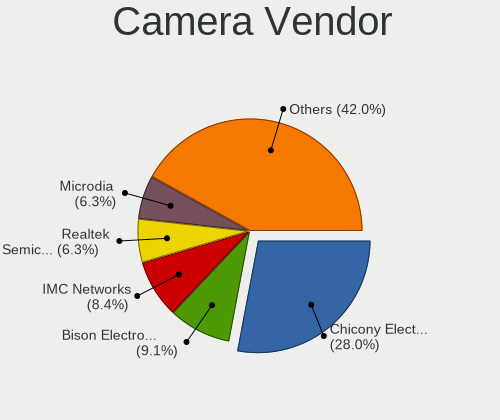

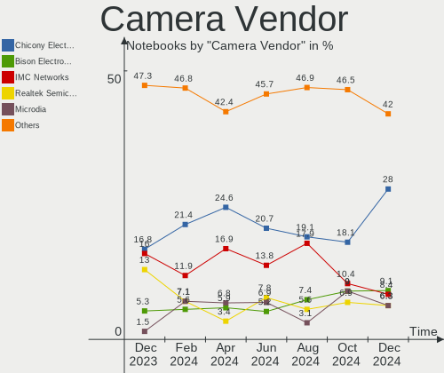

| Vendor                                 | Notebooks | Percent |
|----------------------------------------|-----------|---------|
| Chicony Electronics                    | 17        | 26.98%  |
| IMC Networks                           | 10        | 15.87%  |
| Acer                                   | 6         | 9.52%   |
| Quanta                                 | 5         | 7.94%   |
| Realtek Semiconductor                  | 4         | 6.35%   |
| Suyin                                  | 3         | 4.76%   |
| Sunplus Innovation Technology          | 3         | 4.76%   |
| Microdia                               | 3         | 4.76%   |
| Cheng Uei Precision Industry (Foxlink) | 3         | 4.76%   |
| Syntek                                 | 2         | 3.17%   |
| Lite-On Technology                     | 2         | 3.17%   |
| Silicon Motion                         | 1         | 1.59%   |
| Samsung Electronics                    | 1         | 1.59%   |
| Primax Electronics                     | 1         | 1.59%   |
| Logitech                               | 1         | 1.59%   |
| Apple                                  | 1         | 1.59%   |

Camera Model
------------

Camera device models

| Model                                                        | Notebooks | Percent |
|--------------------------------------------------------------|-----------|---------|
| Chicony Integrated Camera                                    | 7         | 10.94%  |
| IMC Networks USB2.0 HD UVC WebCam                            | 4         | 6.25%   |
| Acer Integrated Camera                                       | 4         | 6.25%   |
| IMC Networks USB2.0 VGA UVC WebCam                           | 3         | 4.69%   |
| Chicony HD User Facing                                       | 3         | 4.69%   |
| Microdia Integrated Webcam                                   | 2         | 3.13%   |
| IMC Networks Integrated Camera                               | 2         | 3.13%   |
| Chicony HD WebCam                                            | 2         | 3.13%   |
| Syntek Lenovo EasyCamera                                     | 1         | 1.56%   |
| Syntek Integrated Camera                                     | 1         | 1.56%   |
| Suyin UVC HD Webcam                                          | 1         | 1.56%   |
| Suyin USB2.0 UVC 1.3M WebCam                                 | 1         | 1.56%   |
| Suyin Integrated_Webcam_HD                                   | 1         | 1.56%   |
| Sunplus Laptop Integrated Webcam FHD                         | 1         | 1.56%   |
| Sunplus HP Truevision HD                                     | 1         | 1.56%   |
| Sunplus FHD Camera Microphone                                | 1         | 1.56%   |
| Silicon Motion WebCam SCB-0385N                              | 1         | 1.56%   |
| Samsung Galaxy A5 (MTP)                                      | 1         | 1.56%   |
| Realtek USB2.0 HD UVC WebCam                                 | 1         | 1.56%   |
| Realtek Integrated_Webcam_HD                                 | 1         | 1.56%   |
| Realtek Integrated Webcam                                    | 1         | 1.56%   |
| Realtek HP Truevision HD                                     | 1         | 1.56%   |
| Quanta VGA WebCam                                            | 1         | 1.56%   |
| Quanta HP Wide Vision HD Camera                              | 1         | 1.56%   |
| Quanta HP TrueVision HD Camera                               | 1         | 1.56%   |
| Quanta HD Webcam                                             | 1         | 1.56%   |
| Quanta HD User Facing                                        | 1         | 1.56%   |
| Primax Villem                                                | 1         | 1.56%   |
| Microdia Integrated_Webcam_HD                                | 1         | 1.56%   |
| Logitech Webcam C930e                                        | 1         | 1.56%   |
| Lite-On HP TrueVision HD Camera                              | 1         | 1.56%   |
| Lite-On HP HD Camera                                         | 1         | 1.56%   |
| IMC Networks 2M Integrated Webcam                            | 1         | 1.56%   |
| Chicony USB 2.0 Camera                                       | 1         | 1.56%   |
| Chicony Integrated IR Camera                                 | 1         | 1.56%   |
| Chicony HP Wide Vision HD Camera                             | 1         | 1.56%   |
| Chicony HP HD Webcam [Fixed]                                 | 1         | 1.56%   |
| Chicony HP HD Webcam                                         | 1         | 1.56%   |
| Chicony HP HD Camera                                         | 1         | 1.56%   |
| Cheng Uei Precision Industry (Foxlink) XiaoMi USB 2.0 Webcam | 1         | 1.56%   |
| Cheng Uei Precision Industry (Foxlink) HP Wide Vision HD     | 1         | 1.56%   |
| Cheng Uei Precision Industry (Foxlink) HP HD Webcam          | 1         | 1.56%   |
| Apple FaceTime HD Camera                                     | 1         | 1.56%   |
| Acer EasyCamera                                              | 1         | 1.56%   |
| Acer BisonCam, NB Pro                                        | 1         | 1.56%   |

Fingerprint Vendor
------------------

Fingerprint sensor vendors

| Vendor                     | Notebooks | Percent |
|----------------------------|-----------|---------|
| Validity Sensors           | 7         | 36.84%  |
| Synaptics                  | 3         | 15.79%  |
| Elan Microelectronics      | 3         | 15.79%  |
| Shenzhen Goodix Technology | 2         | 10.53%  |
| AuthenTec                  | 2         | 10.53%  |
| Upek                       | 1         | 5.26%   |
| LighTuning Technology      | 1         | 5.26%   |

Fingerprint Model
-----------------

Fingerprint sensor models

| Model                                                      | Notebooks | Percent |
|------------------------------------------------------------|-----------|---------|
| Validity Sensors VFS5011 Fingerprint Reader                | 4         | 21.05%  |
| Elan ELAN:Fingerprint                                      | 3         | 15.79%  |
| Validity Sensors VFS491                                    | 1         | 5.26%   |
| Validity Sensors VFS 5011 fingerprint sensor               | 1         | 5.26%   |
| Validity Sensors Synaptics WBDI                            | 1         | 5.26%   |
| Upek Biometric Touchchip/Touchstrip Fingerprint Sensor     | 1         | 5.26%   |
| Synaptics  VFS7552 Touch Fingerprint Sensor with PurePrint | 1         | 5.26%   |
| Synaptics Prometheus MIS Touch Fingerprint Reader          | 1         | 5.26%   |
| Shenzhen Goodix  FingerPrint Device                        | 1         | 5.26%   |
| Shenzhen Goodix FingerPrint                                | 1         | 5.26%   |
| LighTuning EgisTec Touch Fingerprint Sensor                | 1         | 5.26%   |
| AuthenTec AES2501 Fingerprint Sensor                       | 1         | 5.26%   |
| AuthenTec AES1600                                          | 1         | 5.26%   |
| Unknown                                                    | 1         | 5.26%   |

Chipcard Vendor
---------------

Chipcard module vendors

| Vendor      | Notebooks | Percent |
|-------------|-----------|---------|
| Broadcom    | 2         | 66.67%  |
| Alcor Micro | 1         | 33.33%  |

Chipcard Model
--------------

Chipcard module models

| Model                                          | Notebooks | Percent |
|------------------------------------------------|-----------|---------|
| Broadcom BCM5880 Secure Applications Processor | 2         | 66.67%  |
| Alcor Micro AU9540 Smartcard Reader            | 1         | 33.33%  |

Printer Vendor
--------------

Printer device vendors

| Vendor          | Notebooks | Percent |
|-----------------|-----------|---------|
| Hewlett-Packard | 1         | 100%    |

Printer Model
-------------

Printer device models

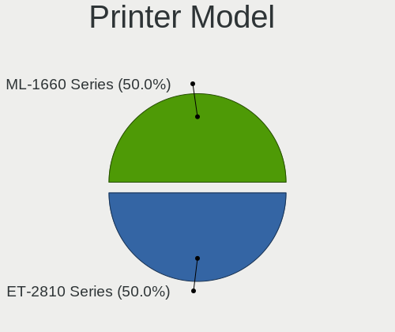

| Model            | Notebooks | Percent |
|------------------|-----------|---------|
| HP LaserJet 1320 | 1         | 100%    |

Scanner Vendor
--------------

Scanner device vendors

Zero info for selected period =(

Scanner Model
-------------

Scanner device models

Zero info for selected period =(

Bluetooth Vendor
----------------

Controller vendors

| Vendor                          | Notebooks | Percent |
|---------------------------------|-----------|---------|
| Intel                           | 28        | 45.16%  |
| Realtek Semiconductor           | 8         | 12.9%   |
| Qualcomm Atheros Communications | 5         | 8.06%   |
| Lite-On Technology              | 4         | 6.45%   |
| IMC Networks                    | 3         | 4.84%   |
| Broadcom                        | 3         | 4.84%   |
| Foxconn / Hon Hai               | 2         | 3.23%   |
| Cambridge Silicon Radio         | 2         | 3.23%   |
| ASUSTek Computer                | 2         | 3.23%   |
| Unknown                         | 1         | 1.61%   |
| Realtek                         | 1         | 1.61%   |
| Ralink Technology               | 1         | 1.61%   |
| Ralink                          | 1         | 1.61%   |
| Apple                           | 1         | 1.61%   |

Bluetooth Model
---------------

Controller models

| Model                                               | Notebooks | Percent |
|-----------------------------------------------------|-----------|---------|
| Intel Bluetooth wireless interface                  | 12        | 19.05%  |
| Intel AX200 Bluetooth                               | 7         | 11.11%  |
| Intel Bluetooth 9460/9560 Jefferson Peak (JfP)      | 5         | 7.94%   |
| Realtek Bluetooth Radio                             | 4         | 6.35%   |
| Qualcomm Atheros  Bluetooth Device                  | 4         | 6.35%   |
| Intel Bluetooth Device                              | 3         | 4.76%   |
| Realtek  Bluetooth 4.2 Adapter                      | 2         | 3.17%   |
| Lite-On Bluetooth Device                            | 2         | 3.17%   |
| Intel Centrino Bluetooth Wireless Transceiver       | 2         | 3.17%   |
| IMC Networks Bluetooth Radio                        | 2         | 3.17%   |
| Cambridge Silicon Radio Bluetooth Dongle (HCI mode) | 2         | 3.17%   |
| Unknown Bluetooth Device                            | 1         | 1.59%   |
| Realtek RTL8723B Bluetooth                          | 1         | 1.59%   |
| Realtek RTL8723A Bluetooth                          | 1         | 1.59%   |
| Realtek Bluetooth Radio                             | 1         | 1.59%   |
| Ralink Motorola BC4 Bluetooth 3.0+HS Adapter        | 1         | 1.59%   |
| Ralink RT3290 Bluetooth                             | 1         | 1.59%   |
| Qualcomm Atheros AR3012 Bluetooth 4.0               | 1         | 1.59%   |
| Lite-On Qualcomm Atheros QCA9377 Bluetooth          | 1         | 1.59%   |
| Lite-On Atheros AR3012 Bluetooth                    | 1         | 1.59%   |
| IMC Networks Atheros AR3012 Bluetooth 4.0 Adapter   | 1         | 1.59%   |
| Foxconn / Hon Hai Bluetooth USB Host Controller     | 1         | 1.59%   |
| Foxconn / Hon Hai BCM20702A0                        | 1         | 1.59%   |
| Broadcom HP Portable SoftSailing                    | 1         | 1.59%   |
| Broadcom BCM20702A0 Bluetooth 4.0                   | 1         | 1.59%   |
| Broadcom BCM2070 Bluetooth Device                   | 1         | 1.59%   |
| ASUS BT-253 Bluetooth Adapter                       | 1         | 1.59%   |
| ASUS Broadcom BCM20702A0 Bluetooth                  | 1         | 1.59%   |
| Apple Bluetooth USB Host Controller                 | 1         | 1.59%   |

Unsupported Devices
-------------------

Total unsupported devices on board

| Total | Notebooks | Percent |
|-------|-----------|---------|
| 0     | 42        | 60.87%  |
| 1     | 19        | 27.54%  |
| 2     | 7         | 10.14%  |
| 3     | 1         | 1.45%   |

Unsupported Device Types
------------------------

Types of unsupported devices

| Type                  | Notebooks | Percent |
|-----------------------|-----------|---------|
| Fingerprint reader    | 17        | 47.22%  |
| Graphics card         | 6         | 16.67%  |
| Multimedia controller | 4         | 11.11%  |
| Storage               | 2         | 5.56%   |
| Chipcard              | 2         | 5.56%   |
| Sound                 | 1         | 2.78%   |
| Net/wireless          | 1         | 2.78%   |
| Card reader           | 1         | 2.78%   |
| Camera                | 1         | 2.78%   |
| Bluetooth             | 1         | 2.78%   |

