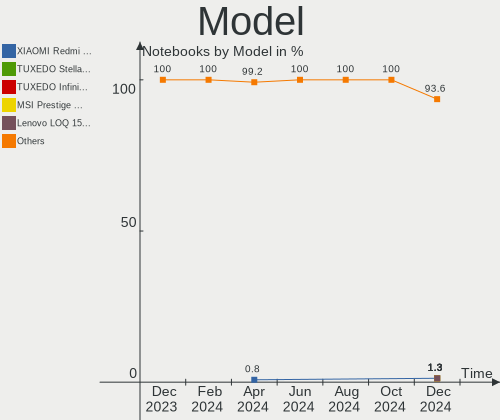
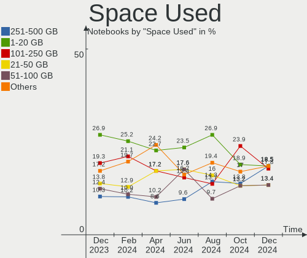
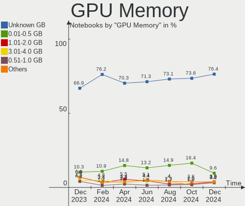

Arch - Hardware Trends (Notebooks)
----------------------------------

A project to identify most popular hardware characteristics and track their change
over time based on data collected by Linux users at https://Linux-Hardware.org.

Anyone can contribute to this report by the [hw-probe](https://github.com/linuxhw/hw-probe) tool:

    sudo -E hw-probe -all -upload

This report is for one last month. Overall report since the beginning of time: [TestCoverage](https://github.com/linuxhw/TestCoverage)

Period: May, 2022.

Contents
--------

* [ System ](#system)
  - [ OS                       ](#os)
  - [ OS Family                ](#os-family)
  - [ Kernel                   ](#kernel)
  - [ Kernel Family            ](#kernel-family)
  - [ Kernel Major Ver.        ](#kernel-major-ver)
  - [ Arch                     ](#arch)
  - [ DE                       ](#de)
  - [ Display Server           ](#display-server)
  - [ Display Manager          ](#display-manager)
  - [ OS Lang                  ](#os-lang)
  - [ Boot Mode                ](#boot-mode)
  - [ Filesystem               ](#filesystem)
  - [ Part. scheme             ](#part-scheme)
  - [ Dual Boot with Linux/BSD ](#dual-boot-with-linuxbsd)
  - [ Dual Boot (Win)          ](#dual-boot-win)

* [ Board ](#board)
  - [ Vendor                   ](#vendor)
  - [ Model                    ](#model)
  - [ Model Family             ](#model-family)
  - [ MFG Year                 ](#mfg-year)
  - [ Form Factor              ](#form-factor)
  - [ Secure Boot              ](#secure-boot)
  - [ Coreboot                 ](#coreboot)
  - [ RAM Size                 ](#ram-size)
  - [ RAM Used                 ](#ram-used)
  - [ Total Drives             ](#total-drives)
  - [ Has CD-ROM               ](#has-cd-rom)
  - [ Has Ethernet             ](#has-ethernet)
  - [ Has WiFi                 ](#has-wifi)
  - [ Has Bluetooth            ](#has-bluetooth)

* [ Location ](#location)
  - [ Country                  ](#country)
  - [ City                     ](#city)

* [ Drives ](#drives)
  - [ Drive Vendor             ](#drive-vendor)
  - [ Drive Model              ](#drive-model)
  - [ HDD Vendor               ](#hdd-vendor)
  - [ SSD Vendor               ](#ssd-vendor)
  - [ Drive Kind               ](#drive-kind)
  - [ Drive Connector          ](#drive-connector)
  - [ Drive Size               ](#drive-size)
  - [ Space Total              ](#space-total)
  - [ Space Used               ](#space-used)
  - [ Malfunc. Drives          ](#malfunc-drives)
  - [ Malfunc. Drive Vendor    ](#malfunc-drive-vendor)
  - [ Malfunc. HDD Vendor      ](#malfunc-hdd-vendor)
  - [ Malfunc. Drive Kind      ](#malfunc-drive-kind)
  - [ Failed Drives            ](#failed-drives)
  - [ Failed Drive Vendor      ](#failed-drive-vendor)
  - [ Drive Status             ](#drive-status)

* [ Storage controller ](#storage-controller)
  - [ Storage Vendor           ](#storage-vendor)
  - [ Storage Model            ](#storage-model)
  - [ Storage Kind             ](#storage-kind)

* [ Processor ](#processor)
  - [ CPU Vendor               ](#cpu-vendor)
  - [ CPU Model                ](#cpu-model)
  - [ CPU Model Family         ](#cpu-model-family)
  - [ CPU Cores                ](#cpu-cores)
  - [ CPU Sockets              ](#cpu-sockets)
  - [ CPU Threads              ](#cpu-threads)
  - [ CPU Op-Modes             ](#cpu-op-modes)
  - [ CPU Microcode            ](#cpu-microcode)
  - [ CPU Microarch            ](#cpu-microarch)

* [ Graphics ](#graphics)
  - [ GPU Vendor               ](#gpu-vendor)
  - [ GPU Model                ](#gpu-model)
  - [ GPU Combo                ](#gpu-combo)
  - [ GPU Driver               ](#gpu-driver)
  - [ GPU Memory               ](#gpu-memory)

* [ Monitor ](#monitor)
  - [ Monitor Vendor           ](#monitor-vendor)
  - [ Monitor Model            ](#monitor-model)
  - [ Monitor Resolution       ](#monitor-resolution)
  - [ Monitor Diagonal         ](#monitor-diagonal)
  - [ Monitor Width            ](#monitor-width)
  - [ Aspect Ratio             ](#aspect-ratio)
  - [ Monitor Area             ](#monitor-area)
  - [ Pixel Density            ](#pixel-density)
  - [ Multiple Monitors        ](#multiple-monitors)

* [ Network ](#network)
  - [ Net Controller Vendor    ](#net-controller-vendor)
  - [ Net Controller Model     ](#net-controller-model)
  - [ Wireless Vendor          ](#wireless-vendor)
  - [ Wireless Model           ](#wireless-model)
  - [ Ethernet Vendor          ](#ethernet-vendor)
  - [ Ethernet Model           ](#ethernet-model)
  - [ Net Controller Kind      ](#net-controller-kind)
  - [ Used Controller          ](#used-controller)
  - [ NICs                     ](#nics)
  - [ IPv6                     ](#ipv6)

* [ Bluetooth ](#bluetooth)
  - [ Bluetooth Vendor         ](#bluetooth-vendor)
  - [ Bluetooth Model          ](#bluetooth-model)

* [ Sound ](#sound)
  - [ Sound Vendor             ](#sound-vendor)
  - [ Sound Model              ](#sound-model)

* [ Memory ](#memory)
  - [ Memory Vendor            ](#memory-vendor)
  - [ Memory Model             ](#memory-model)
  - [ Memory Kind              ](#memory-kind)
  - [ Memory Form Factor       ](#memory-form-factor)
  - [ Memory Size              ](#memory-size)
  - [ Memory Speed             ](#memory-speed)

* [ Printers & scanners ](#printers--scanners)
  - [ Printer Vendor           ](#printer-vendor)
  - [ Printer Model            ](#printer-model)
  - [ Scanner Vendor           ](#scanner-vendor)
  - [ Scanner Model            ](#scanner-model)

* [ Camera ](#camera)
  - [ Camera Vendor            ](#camera-vendor)
  - [ Camera Model             ](#camera-model)

* [ Security ](#security)
  - [ Fingerprint Vendor       ](#fingerprint-vendor)
  - [ Fingerprint Model        ](#fingerprint-model)
  - [ Chipcard Vendor          ](#chipcard-vendor)
  - [ Chipcard Model           ](#chipcard-model)

* [ Unsupported ](#unsupported)
  - [ Unsupported Devices      ](#unsupported-devices)
  - [ Unsupported Device Types ](#unsupported-device-types)

System
------

OS
--

Installed operating systems

| Name         | Notebooks | Percent |
|--------------|-----------|---------|
| Arch         | 63        | 66.32%  |
| Arch Rolling | 32        | 33.68%  |

OS Family
---------

OS without a version

| Name | Notebooks | Percent |
|------|-----------|---------|
| Arch | 95        | 100%    |

Kernel
------

Version of the Linux kernel

| Version                      | Notebooks | Percent |
|------------------------------|-----------|---------|
| 5.17.5-arch1-1               | 26        | 27.37%  |
| 5.17.9-arch1-1               | 21        | 22.11%  |
| 5.17.8-arch1-1               | 5         | 5.26%   |
| 5.17.9-zen1-1-zen            | 4         | 4.21%   |
| 5.17.7-zen1-1-zen            | 4         | 4.21%   |
| 5.17.7-arch1-1               | 4         | 4.21%   |
| 5.17.6-arch1-1               | 4         | 4.21%   |
| 5.18.0-arch1-1               | 3         | 3.16%   |
| 5.17.7-arch1-2               | 3         | 3.16%   |
| 5.17.5-zen1-1-zen            | 3         | 3.16%   |
| 5.18.1-arch1-1               | 2         | 2.11%   |
| 5.18.0-zen1-1-zen            | 1         | 1.05%   |
| 5.18.0-259-tkg-pds           | 1         | 1.05%   |
| 5.17.8-zen1-1-zen            | 1         | 1.05%   |
| 5.17.6-zen1-1-zen            | 1         | 1.05%   |
| 5.17.5-zen1-2-zen            | 1         | 1.05%   |
| 5.17.5-xanmod1-1-v4          | 1         | 1.05%   |
| 5.17.5-hardened1-1-hardened  | 1         | 1.05%   |
| 5.17.5-arch1-2               | 1         | 1.05%   |
| 5.17.4-zen1-1-zen            | 1         | 1.05%   |
| 5.17.4-arch1-1               | 1         | 1.05%   |
| 5.17.3-arch1-1               | 1         | 1.05%   |
| 5.17.11-hardened2-1-hardened | 1         | 1.05%   |
| 5.17.1-arch1-1               | 1         | 1.05%   |
| 5.15.41-1-lts                | 1         | 1.05%   |
| 5.15.37-1-lts                | 1         | 1.05%   |
| 5.15.35-1-lts                | 1         | 1.05%   |

Kernel Family
-------------

Linux kernel without a distro release

| Version | Notebooks | Percent |
|---------|-----------|---------|
| 5.17.5  | 33        | 34.74%  |
| 5.17.9  | 25        | 26.32%  |
| 5.17.7  | 11        | 11.58%  |
| 5.17.8  | 6         | 6.32%   |
| 5.18.0  | 5         | 5.26%   |
| 5.17.6  | 5         | 5.26%   |
| 5.18.1  | 2         | 2.11%   |
| 5.17.4  | 2         | 2.11%   |
| 5.17.3  | 1         | 1.05%   |
| 5.17.11 | 1         | 1.05%   |
| 5.17.1  | 1         | 1.05%   |
| 5.15.41 | 1         | 1.05%   |
| 5.15.37 | 1         | 1.05%   |
| 5.15.35 | 1         | 1.05%   |

Kernel Major Ver.
-----------------

Linux kernel major version

| Version | Notebooks | Percent |
|---------|-----------|---------|
| 5.17    | 85        | 89.47%  |
| 5.18    | 7         | 7.37%   |
| 5.15    | 3         | 3.16%   |

Arch
----

OS architecture (x86_64, i586, etc.)

| Name   | Notebooks | Percent |
|--------|-----------|---------|
| x86_64 | 95        | 100%    |

DE
--

Desktop Environment

| Name       | Notebooks | Percent |
|------------|-----------|---------|
| GNOME      | 34        | 35.79%  |
| KDE5       | 25        | 26.32%  |
| XFCE       | 13        | 13.68%  |
| Unknown    | 11        | 11.58%  |
| i3         | 5         | 5.26%   |
| sway       | 2         | 2.11%   |
| MATE       | 2         | 2.11%   |
| X-Cinnamon | 1         | 1.05%   |
| LXQt       | 1         | 1.05%   |
| awesome    | 1         | 1.05%   |

Display Server
--------------

X11 or Wayland

| Name    | Notebooks | Percent |
|---------|-----------|---------|
| X11     | 48        | 50.53%  |
| Wayland | 28        | 29.47%  |
| Tty     | 12        | 12.63%  |
| Unknown | 7         | 7.37%   |

Display Manager
---------------

SDDM, LightDM, etc.

| Name    | Notebooks | Percent |
|---------|-----------|---------|
| Unknown | 47        | 49.47%  |
| SDDM    | 19        | 20%     |
| LightDM | 15        | 15.79%  |
| GDM     | 10        | 10.53%  |
| Ly      | 2         | 2.11%   |
| LXDM    | 2         | 2.11%   |

OS Lang
-------

Language

| Lang       | Notebooks | Percent |
|------------|-----------|---------|
| en_US      | 57        | 60%     |
| C          | 6         | 6.32%   |
| Unknown    | 5         | 5.26%   |
| pt_BR      | 4         | 4.21%   |
| ru_RU      | 3         | 3.16%   |
| fr_FR      | 3         | 3.16%   |
| en_GB      | 3         | 3.16%   |
| en_IE      | 2         | 2.11%   |
| zh_TW      | 1         | 1.05%   |
| uk_UA      | 1         | 1.05%   |
| pt_PT      | 1         | 1.05%   |
| it_IT      | 1         | 1.05%   |
| hu_HU      | 1         | 1.05%   |
| es_CL.UTF8 | 1         | 1.05%   |
| es_AR      | 1         | 1.05%   |
| en_IN      | 1         | 1.05%   |
| en_GB.UTF8 | 1         | 1.05%   |
| en_AU      | 1         | 1.05%   |
| de_AT      | 1         | 1.05%   |
| Default    | 1         | 1.05%   |

Boot Mode
---------

EFI or BIOS

| Mode | Notebooks | Percent |
|------|-----------|---------|
| EFI  | 58        | 61.05%  |
| BIOS | 37        | 38.95%  |

Filesystem
----------

Type of filesystem

| Type    | Notebooks | Percent |
|---------|-----------|---------|
| Ext4    | 68        | 71.58%  |
| Btrfs   | 24        | 25.26%  |
| XXX4    | 1         | 1.05%   |
| Overlay | 1         | 1.05%   |
| F2fs    | 1         | 1.05%   |

Part. scheme
------------

Scheme of partitioning

| Type    | Notebooks | Percent |
|---------|-----------|---------|
| GPT     | 62        | 65.26%  |
| Unknown | 26        | 27.37%  |
| MBR     | 7         | 7.37%   |

Dual Boot with Linux/BSD
------------------------

Hosting more than one Linux/BSD

| Dual boot | Notebooks | Percent |
|-----------|-----------|---------|
| No        | 88        | 92.63%  |
| Yes       | 7         | 7.37%   |

Dual Boot (Win)
---------------

Hosting Linux and Windows

| Dual boot | Notebooks | Percent |
|-----------|-----------|---------|
| No        | 70        | 73.68%  |
| Yes       | 25        | 26.32%  |

Board
-----

Vendor
------

Motherboard manufacturer

| Name                | Notebooks | Percent |
|---------------------|-----------|---------|
| Lenovo              | 24        | 25.26%  |
| Dell                | 18        | 18.95%  |
| ASUSTek Computer    | 15        | 15.79%  |
| Hewlett-Packard     | 9         | 9.47%   |
| Acer                | 7         | 7.37%   |
| MSI                 | 4         | 4.21%   |
| Timi                | 2         | 2.11%   |
| System76            | 2         | 2.11%   |
| Google              | 2         | 2.11%   |
| Apple               | 2         | 2.11%   |
| Toshiba             | 1         | 1.05%   |
| SLIMBOOK            | 1         | 1.05%   |
| Schenker            | 1         | 1.05%   |
| Samsung Electronics | 1         | 1.05%   |
| Notebook            | 1         | 1.05%   |
| HUAWEI              | 1         | 1.05%   |
| Fujitsu Siemens     | 1         | 1.05%   |
| Framework           | 1         | 1.05%   |
| eMachines           | 1         | 1.05%   |
| Compal              | 1         | 1.05%   |

Model
-----

Motherboard model

| Name                                       | Notebooks | Percent |
|--------------------------------------------|-----------|---------|
| Timi TM1604                                | 2         | 2.11%   |
| HP EliteBook 8470p                         | 2         | 2.11%   |
| Dell Latitude E6430                        | 2         | 2.11%   |
| Dell Inspiron 5567                         | 2         | 2.11%   |
| ASUS ROG Strix G513QY_G513QY               | 2         | 2.11%   |
| Toshiba Satellite C55-A-1N0                | 1         | 1.05%   |
| System76 Oryx Pro                          | 1         | 1.05%   |
| System76 Lemur Pro                         | 1         | 1.05%   |
| SLIMBOOK TITAN                             | 1         | 1.05%   |
| Schenker XMG FUSION 15 (XFU15L19)          | 1         | 1.05%   |
| Samsung 730QCJ/730QCR                      | 1         | 1.05%   |
| Notebook P65xHP                            | 1         | 1.05%   |
| MSI Stealth 15M A11SDK                     | 1         | 1.05%   |
| MSI Modern 14 B5M                          | 1         | 1.05%   |
| MSI GF75 Thin 9SC                          | 1         | 1.05%   |
| MSI Alpha 15 B5EEK                         | 1         | 1.05%   |
| Lenovo ThinkPad X230 23257Y1               | 1         | 1.05%   |
| Lenovo ThinkPad X200s 74663RG              | 1         | 1.05%   |
| Lenovo ThinkPad X1 Carbon Gen 8 20U90046PB | 1         | 1.05%   |
| Lenovo ThinkPad W510 4318CTO               | 1         | 1.05%   |
| Lenovo ThinkPad T490 20N2CTO1WW            | 1         | 1.05%   |
| Lenovo ThinkPad T460p 20FW0005AU           | 1         | 1.05%   |
| Lenovo ThinkPad E15 Gen 3 20YG0041RT       | 1         | 1.05%   |
| Lenovo ThinkPad E15 20RD0011GE             | 1         | 1.05%   |
| Lenovo ThinkBook 15 G2 ITL 20VE            | 1         | 1.05%   |
| Lenovo Legion Y7000P2020H 82AX             | 1         | 1.05%   |
| Lenovo Legion 5 15ACH6H 82JU               | 1         | 1.05%   |
| Lenovo IdeaPad Z580                        | 1         | 1.05%   |
| Lenovo IdeaPad U430p 20269                 | 1         | 1.05%   |
| Lenovo IdeaPad S145-15IWL 81S9             | 1         | 1.05%   |
| Lenovo IdeaPad Gaming 3 15IMH05 81Y4       | 1         | 1.05%   |
| Lenovo IdeaPad Gaming 3 15ACH6 82K2        | 1         | 1.05%   |
| Lenovo IdeaPad Flex-14API 81SS             | 1         | 1.05%   |
| Lenovo IdeaPad 5 15ALC05 82LN              | 1         | 1.05%   |
| Lenovo IdeaPad 5 14ARE05 81YM              | 1         | 1.05%   |
| Lenovo IdeaPad 310-14ISK 80UG              | 1         | 1.05%   |
| Lenovo IdeaPad 110-15IBR 80T7              | 1         | 1.05%   |
| Lenovo IdeaPad 100-15IBY 80MJ              | 1         | 1.05%   |
| Lenovo B590 37613LG                        | 1         | 1.05%   |
| HUAWEI BOD-WXX9                            | 1         | 1.05%   |
| HP ProBook 4530s                           | 1         | 1.05%   |
| HP ProBook 445 G7 Notebook PC              | 1         | 1.05%   |
| HP ProBook 440 G8 Notebook PC              | 1         | 1.05%   |
| HP Pavilion Laptop 13-an0xxx               | 1         | 1.05%   |
| HP Pavilion 15                             | 1         | 1.05%   |
| HP OMEN by Laptop 16-c0xxx                 | 1         | 1.05%   |
| HP Laptop 15-dy2xxx                        | 1         | 1.05%   |
| Google Quawks                              | 1         | 1.05%   |
| Google Caroline                            | 1         | 1.05%   |
| Fujitsu Siemens AMILO Li 2727              | 1         | 1.05%   |
| Framework Laptop                           | 1         | 1.05%   |
| eMachines eM350                            | 1         | 1.05%   |
| Dell XPS 17 9710                           | 1         | 1.05%   |
| Dell XPS 15 9510                           | 1         | 1.05%   |
| Dell Vostro 3405                           | 1         | 1.05%   |
| Dell Precision 5540                        | 1         | 1.05%   |
| Dell Latitude E6400                        | 1         | 1.05%   |
| Dell Latitude 5511                         | 1         | 1.05%   |
| Dell Latitude 3340                         | 1         | 1.05%   |
| Dell Latitude 3330                         | 1         | 1.05%   |

Model Family
------------

Motherboard model prefix

| Name                  | Notebooks | Percent |
|-----------------------|-----------|---------|
| Lenovo IdeaPad        | 11        | 11.58%  |
| Lenovo ThinkPad       | 8         | 8.42%   |
| Dell Inspiron         | 7         | 7.37%   |
| Dell Latitude         | 6         | 6.32%   |
| Acer Aspire           | 5         | 5.26%   |
| ASUS VivoBook         | 4         | 4.21%   |
| ASUS ASUS             | 4         | 4.21%   |
| HP ProBook            | 3         | 3.16%   |
| ASUS ROG              | 3         | 3.16%   |
| Timi TM1604           | 2         | 2.11%   |
| Lenovo Legion         | 2         | 2.11%   |
| HP Pavilion           | 2         | 2.11%   |
| HP EliteBook          | 2         | 2.11%   |
| Dell XPS              | 2         | 2.11%   |
| Acer Nitro            | 2         | 2.11%   |
| Toshiba Satellite     | 1         | 1.05%   |
| System76 Oryx         | 1         | 1.05%   |
| System76 Lemur        | 1         | 1.05%   |
| SLIMBOOK TITAN        | 1         | 1.05%   |
| Schenker XMG          | 1         | 1.05%   |
| Samsung 730QCJ        | 1         | 1.05%   |
| Notebook P65xHP       | 1         | 1.05%   |
| MSI Stealth           | 1         | 1.05%   |
| MSI Modern            | 1         | 1.05%   |
| MSI GF75              | 1         | 1.05%   |
| MSI Alpha             | 1         | 1.05%   |
| Lenovo ThinkBook      | 1         | 1.05%   |
| Lenovo B590           | 1         | 1.05%   |
| HUAWEI BOD-WXX9       | 1         | 1.05%   |
| HP OMEN               | 1         | 1.05%   |
| HP Laptop             | 1         | 1.05%   |
| Google Quawks         | 1         | 1.05%   |
| Google Caroline       | 1         | 1.05%   |
| Fujitsu Siemens AMILO | 1         | 1.05%   |
| Framework Laptop      | 1         | 1.05%   |
| eMachines eM350       | 1         | 1.05%   |
| Dell Vostro           | 1         | 1.05%   |
| Dell Precision        | 1         | 1.05%   |
| Dell G15              | 1         | 1.05%   |
| Compal QAQXX          | 1         | 1.05%   |
| ASUS X555UQ           | 1         | 1.05%   |
| ASUS TUF              | 1         | 1.05%   |
| ASUS GL502VSK         | 1         | 1.05%   |
| ASUS G750JX           | 1         | 1.05%   |
| Apple MacBookPro8     | 1         | 1.05%   |
| Apple MacBookAir7     | 1         | 1.05%   |
| Unknown               | 1         | 1.05%   |

MFG Year
--------

Motherboard manufacture year

| Year | Notebooks | Percent |
|------|-----------|---------|
| 2021 | 28        | 29.47%  |
| 2020 | 14        | 14.74%  |
| 2019 | 9         | 9.47%   |
| 2016 | 8         | 8.42%   |
| 2011 | 6         | 6.32%   |
| 2017 | 4         | 4.21%   |
| 2014 | 4         | 4.21%   |
| 2013 | 4         | 4.21%   |
| 2012 | 4         | 4.21%   |
| 2018 | 3         | 3.16%   |
| 2015 | 3         | 3.16%   |
| 2010 | 3         | 3.16%   |
| 2022 | 2         | 2.11%   |
| 2009 | 1         | 1.05%   |
| 2008 | 1         | 1.05%   |
| 2007 | 1         | 1.05%   |

Form Factor
-----------

Physical design of the computer

| Name     | Notebooks | Percent |
|----------|-----------|---------|
| Notebook | 95        | 100%    |

Secure Boot
-----------

Enabled or disabled

| State    | Notebooks | Percent |
|----------|-----------|---------|
| Disabled | 95        | 100%    |

Coreboot
--------

Have coreboot on board

| Used | Notebooks | Percent |
|------|-----------|---------|
| No   | 91        | 95.79%  |
| Yes  | 4         | 4.21%   |

RAM Size
--------

Total RAM memory

| Size in GB  | Notebooks | Percent |
|-------------|-----------|---------|
| 4.01-8.0    | 29        | 30.53%  |
| 8.01-16.0   | 26        | 27.37%  |
| 16.01-24.0  | 17        | 17.89%  |
| 32.01-64.0  | 10        | 10.53%  |
| 3.01-4.0    | 8         | 8.42%   |
| 1.01-2.0    | 3         | 3.16%   |
| 64.01-256.0 | 2         | 2.11%   |

RAM Used
--------

Used RAM memory

| Used GB    | Notebooks | Percent |
|------------|-----------|---------|
| 2.01-3.0   | 25        | 26.32%  |
| 1.01-2.0   | 22        | 23.16%  |
| 3.01-4.0   | 19        | 20%     |
| 4.01-8.0   | 18        | 18.95%  |
| 8.01-16.0  | 4         | 4.21%   |
| 0.51-1.0   | 4         | 4.21%   |
| 0.01-0.5   | 2         | 2.11%   |
| 16.01-24.0 | 1         | 1.05%   |

Total Drives
------------

Number of drives on board

| Drives | Notebooks | Percent |
|--------|-----------|---------|
| 1      | 65        | 68.42%  |
| 2      | 29        | 30.53%  |
| 3      | 1         | 1.05%   |

Has CD-ROM
----------

Has CD-ROM on board

| Presented | Notebooks | Percent |
|-----------|-----------|---------|
| No        | 75        | 78.95%  |
| Yes       | 20        | 21.05%  |

Has Ethernet
------------

Has Ethernet on board

| Presented | Notebooks | Percent |
|-----------|-----------|---------|
| Yes       | 72        | 75.79%  |
| No        | 23        | 24.21%  |

Has WiFi
--------

Has WiFi module

| Presented | Notebooks | Percent |
|-----------|-----------|---------|
| Yes       | 95        | 100%    |

Has Bluetooth
-------------

Has Bluetooth module

| Presented | Notebooks | Percent |
|-----------|-----------|---------|
| Yes       | 88        | 92.63%  |
| No        | 7         | 7.37%   |

Location
--------

Country
-------

Geographic location (country)

| Country      | Notebooks | Percent |
|--------------|-----------|---------|
| USA          | 15        | 15.79%  |
| Russia       | 7         | 7.37%   |
| Poland       | 5         | 5.26%   |
| India        | 5         | 5.26%   |
| Germany      | 5         | 5.26%   |
| France       | 5         | 5.26%   |
| Peru         | 4         | 4.21%   |
| Canada       | 4         | 4.21%   |
| Brazil       | 4         | 4.21%   |
| Turkey       | 3         | 3.16%   |
| Italy        | 3         | 3.16%   |
| UK           | 2         | 2.11%   |
| Thailand     | 2         | 2.11%   |
| Nepal        | 2         | 2.11%   |
| Kenya        | 2         | 2.11%   |
| Indonesia    | 2         | 2.11%   |
| Chile        | 2         | 2.11%   |
| Bangladesh   | 2         | 2.11%   |
| Austria      | 2         | 2.11%   |
| Ukraine      | 1         | 1.05%   |
| Spain        | 1         | 1.05%   |
| South Africa | 1         | 1.05%   |
| Slovakia     | 1         | 1.05%   |
| Portugal     | 1         | 1.05%   |
| Panama       | 1         | 1.05%   |
| Pakistan     | 1         | 1.05%   |
| New Zealand  | 1         | 1.05%   |
| Myanmar      | 1         | 1.05%   |
| Morocco      | 1         | 1.05%   |
| Hungary      | 1         | 1.05%   |
| Hong Kong    | 1         | 1.05%   |
| Finland      | 1         | 1.05%   |
| China        | 1         | 1.05%   |
| Cambodia     | 1         | 1.05%   |
| Belgium      | 1         | 1.05%   |
| Belarus      | 1         | 1.05%   |
| Australia    | 1         | 1.05%   |
| Argentina    | 1         | 1.05%   |

City
----

Geographic location (city)

| City                  | Notebooks | Percent |
|-----------------------|-----------|---------|
| Lima                  | 4         | 4.21%   |
| Valencia              | 2         | 2.11%   |
| Sao Paulo             | 2         | 2.11%   |
| Moscow                | 2         | 2.11%   |
| Ankara                | 2         | 2.11%   |
| Ziemetshausen         | 1         | 1.05%   |
| Yangon                | 1         | 1.05%   |
| Xi'an                 | 1         | 1.05%   |
| Warsaw                | 1         | 1.05%   |
| Voisins-le-Bretonneux | 1         | 1.05%   |
| Vila do Conde         | 1         | 1.05%   |
| Vienna                | 1         | 1.05%   |
| Uberlândia           | 1         | 1.05%   |
| Syracuse              | 1         | 1.05%   |
| Sultanpur             | 1         | 1.05%   |
| Sterling              | 1         | 1.05%   |
| St Petersburg         | 1         | 1.05%   |
| Spoleto               | 1         | 1.05%   |
| South Tangerang       | 1         | 1.05%   |
| Smiths Falls          | 1         | 1.05%   |
| Sattahip              | 1         | 1.05%   |
| Saskatoon             | 1         | 1.05%   |
| Sammamish             | 1         | 1.05%   |
| Sacramento            | 1         | 1.05%   |
| Rennes                | 1         | 1.05%   |
| Regina                | 1         | 1.05%   |
| Rawalpindi            | 1         | 1.05%   |
| Rancagua              | 1         | 1.05%   |
| Poznan                | 1         | 1.05%   |
| Pilisvorosvar         | 1         | 1.05%   |
| Phnom Penh            | 1         | 1.05%   |
| Peterlee              | 1         | 1.05%   |
| Perm                  | 1         | 1.05%   |
| Paris                 | 1         | 1.05%   |
| Panama City           | 1         | 1.05%   |
| Oxnard                | 1         | 1.05%   |
| Overland Park         | 1         | 1.05%   |
| Nowy Sącz            | 1         | 1.05%   |
| Novomoskovsk          | 1         | 1.05%   |
| Nitra                 | 1         | 1.05%   |
| Napierville           | 1         | 1.05%   |
| Nakuru                | 1         | 1.05%   |
| Nairobi               | 1         | 1.05%   |
| Murom                 | 1         | 1.05%   |
| Mogilno               | 1         | 1.05%   |
| Milan                 | 1         | 1.05%   |
| Miengo                | 1         | 1.05%   |
| Melbourne             | 1         | 1.05%   |
| Maceió               | 1         | 1.05%   |
| Lytkarino             | 1         | 1.05%   |
| Los Angeles           | 1         | 1.05%   |
| London                | 1         | 1.05%   |
| Leuven                | 1         | 1.05%   |
| Lanus                 | 1         | 1.05%   |
| Lamjung               | 1         | 1.05%   |
| La Florida            | 1         | 1.05%   |
| Konin                 | 1         | 1.05%   |
| Kolodishchi           | 1         | 1.05%   |
| Kent                  | 1         | 1.05%   |
| Kazan’              | 1         | 1.05%   |

Drives
------

Drive Vendor
------------

Hard drive vendors

| Vendor                    | Notebooks | Drives | Percent |
|---------------------------|-----------|--------|---------|
| Samsung Electronics       | 23        | 26     | 18.7%   |
| WDC                       | 15        | 15     | 12.2%   |
| Seagate                   | 13        | 13     | 10.57%  |
| SK Hynix                  | 12        | 12     | 9.76%   |
| Kingston                  | 9         | 9      | 7.32%   |
| Intel                     | 7         | 7      | 5.69%   |
| SanDisk                   | 6         | 6      | 4.88%   |
| Unknown                   | 4         | 4      | 3.25%   |
| Crucial                   | 4         | 5      | 3.25%   |
| Toshiba                   | 3         | 3      | 2.44%   |
| Micron Technology         | 3         | 3      | 2.44%   |
| KIOXIA                    | 3         | 3      | 2.44%   |
| Phison                    | 2         | 2      | 1.63%   |
| Fujitsu                   | 2         | 2      | 1.63%   |
| walram                    | 1         | 1      | 0.81%   |
| UMIS                      | 1         | 1      | 0.81%   |
| Transcend                 | 1         | 1      | 0.81%   |
| SPCC                      | 1         | 1      | 0.81%   |
| sage                      | 1         | 1      | 0.81%   |
| PHD 3.0                   | 1         | 1      | 0.81%   |
| Micron/Crucial Technology | 1         | 2      | 0.81%   |
| LITEONIT                  | 1         | 1      | 0.81%   |
| KIOXIA-EXCERIA            | 1         | 1      | 0.81%   |
| KingSpec                  | 1         | 1      | 0.81%   |
| HGST                      | 1         | 1      | 0.81%   |
| GOODRAM                   | 1         | 1      | 0.81%   |
| Eluktro                   | 1         | 1      | 0.81%   |
| Corsair                   | 1         | 1      | 0.81%   |
| China                     | 1         | 1      | 0.81%   |
| Apple                     | 1         | 1      | 0.81%   |
| 2.5                       | 1         | 1      | 0.81%   |

Drive Model
-----------

Hard drive models

| Model                                  | Notebooks | Percent |
|----------------------------------------|-----------|---------|
| SK Hynix NVMe SSD Drive 512GB          | 4         | 3.2%    |
| Seagate ST1000LM035-1RK172 1TB         | 4         | 3.2%    |
| Seagate ST1000LM048-2E7172 1TB         | 3         | 2.4%    |
| WDC WDS240G2G0A-00JH30 240GB SSD       | 2         | 1.6%    |
| WDC WD10SPZX-21Z10T0 1TB               | 2         | 1.6%    |
| Toshiba MQ01ABD100 1TB                 | 2         | 1.6%    |
| SanDisk SSD PLUS 480GB                 | 2         | 1.6%    |
| Samsung SSD 860 EVO 250GB              | 2         | 1.6%    |
| Samsung NVMe SSD Drive 512GB           | 2         | 1.6%    |
| Kingston NVMe SSD Drive 512GB          | 2         | 1.6%    |
| Intel NVMe SSD Drive 512GB             | 2         | 1.6%    |
| WDC WDS250G2B0A-00SM50 250GB SSD       | 1         | 0.8%    |
| WDC WDS240G2G0B-00EPW0 240GB SSD       | 1         | 0.8%    |
| WDC WDBRPG0010BNC-WRSN 1TB             | 1         | 0.8%    |
| WDC WD6400BPVT-60HXZT1 640GB           | 1         | 0.8%    |
| WDC WD5000LPCX-00VHAT0 500GB           | 1         | 0.8%    |
| WDC WD3200LPVX-75V0TT0 320GB           | 1         | 0.8%    |
| WDC WD3200BEVT-60ZCT1 320GB            | 1         | 0.8%    |
| WDC WD10SPZX-24Z10T0 1TB               | 1         | 0.8%    |
| WDC WD10JPVX-75JC3T0 1TB               | 1         | 0.8%    |
| WDC PC SN730 SDBPNTY-512G-1101 512GB   | 1         | 0.8%    |
| WDC PC SN520 SDAPNUW-256G-1006 256GB   | 1         | 0.8%    |
| walram SSD 128G                        | 1         | 0.8%    |
| Unknown USB DISK 3.2 250GB             | 1         | 0.8%    |
| Unknown SU64G  64GB                    | 1         | 0.8%    |
| Unknown SEM16G  16GB                   | 1         | 0.8%    |
| Unknown 00000  64GB                    | 1         | 0.8%    |
| UMIS RPJTJ512MEE1OWX 512GB             | 1         | 0.8%    |
| Transcend TS128GSSD370S 128GB          | 1         | 0.8%    |
| Toshiba KBG40ZNT512G MEMORY 512GB      | 1         | 0.8%    |
| SPCC Solid State Disk 512GB            | 1         | 0.8%    |
| SK Hynix SKHynix_HFS512GDE9X084N 512GB | 1         | 0.8%    |
| SK Hynix SHGP31-500GM-2 500GB          | 1         | 0.8%    |
| SK Hynix NVMe SSD Drive 256GB          | 1         | 0.8%    |
| SK Hynix NVMe SSD Drive 1TB            | 1         | 0.8%    |
| SK Hynix HFS128G39TND-N210A 128GB SSD  | 1         | 0.8%    |
| SK Hynix HFM512GD3JX013N 512GB         | 1         | 0.8%    |
| SK Hynix HFM128GDJTNG-8310A 128GB      | 1         | 0.8%    |
| SK Hynix HFM001TD3JX013N 1TB           | 1         | 0.8%    |
| Seagate ST9500325AS 500GB              | 1         | 0.8%    |
| Seagate ST500LT012-9WS142 500GB        | 1         | 0.8%    |
| Seagate ST500LT012-1DG142 500GB        | 1         | 0.8%    |
| Seagate ST500LM000-SSHD-8GB            | 1         | 0.8%    |
| Seagate ST1000LM024 HN-M101MBB 1TB     | 1         | 0.8%    |
| Seagate Portable 1TB                   | 1         | 0.8%    |
| SanDisk SD9SN8W-128G-1006 128GB SSD    | 1         | 0.8%    |
| Sandisk NVMe SSD Drive 256GB           | 1         | 0.8%    |
| Sandisk NVMe SSD Drive 1024GB          | 1         | 0.8%    |
| SanDisk DF4064  64GB                   | 1         | 0.8%    |
| Samsung SSD PM830 2.5 7mm 128GB        | 1         | 0.8%    |
| Samsung SSD 980 1TB                    | 1         | 0.8%    |
| Samsung SSD 970 EVO Plus 2TB           | 1         | 0.8%    |
| Samsung SSD 970 EVO Plus 1TB           | 1         | 0.8%    |
| Samsung SSD 970 EVO 1TB                | 1         | 0.8%    |
| Samsung SSD 860 EVO M.2 500GB          | 1         | 0.8%    |
| Samsung SSD 860 EVO M.2 1TB            | 1         | 0.8%    |
| Samsung SSD 860 EVO 500GB              | 1         | 0.8%    |
| Samsung SSD 850 PRO 256GB              | 1         | 0.8%    |
| Samsung NVMe SSD Drive 500GB           | 1         | 0.8%    |
| Samsung NVMe SSD Drive 250GB           | 1         | 0.8%    |

HDD Vendor
----------

Hard disk drive vendors

| Vendor  | Notebooks | Drives | Percent |
|---------|-----------|--------|---------|
| Seagate | 12        | 12     | 44.44%  |
| WDC     | 8         | 8      | 29.63%  |
| Toshiba | 2         | 2      | 7.41%   |
| Fujitsu | 2         | 2      | 7.41%   |
| sage    | 1         | 1      | 3.7%    |
| PHD 3.0 | 1         | 1      | 3.7%    |
| HGST    | 1         | 1      | 3.7%    |

SSD Vendor
----------

Solid state drive vendors

| Vendor              | Notebooks | Drives | Percent |
|---------------------|-----------|--------|---------|
| Samsung Electronics | 7         | 7      | 21.88%  |
| WDC                 | 4         | 4      | 12.5%   |
| SanDisk             | 3         | 3      | 9.38%   |
| Crucial             | 3         | 3      | 9.38%   |
| Kingston            | 2         | 2      | 6.25%   |
| Intel               | 2         | 2      | 6.25%   |
| walram              | 1         | 1      | 3.13%   |
| Transcend           | 1         | 1      | 3.13%   |
| SPCC                | 1         | 1      | 3.13%   |
| SK Hynix            | 1         | 1      | 3.13%   |
| LITEONIT            | 1         | 1      | 3.13%   |
| KIOXIA-EXCERIA      | 1         | 1      | 3.13%   |
| KingSpec            | 1         | 1      | 3.13%   |
| Eluktro             | 1         | 1      | 3.13%   |
| China               | 1         | 1      | 3.13%   |
| Apple               | 1         | 1      | 3.13%   |
| 2.5                 | 1         | 1      | 3.13%   |

Drive Kind
----------

HDD or SSD

| Kind    | Notebooks | Drives | Percent |
|---------|-----------|--------|---------|
| NVMe    | 53        | 63     | 45.3%   |
| SSD     | 32        | 32     | 27.35%  |
| HDD     | 27        | 27     | 23.08%  |
| MMC     | 3         | 4      | 2.56%   |
| Unknown | 2         | 2      | 1.71%   |

Drive Connector
---------------

SATA, SAS, NVMe, etc.

| Type | Notebooks | Drives | Percent |
|------|-----------|--------|---------|
| NVMe | 53        | 63     | 47.32%  |
| SATA | 52        | 57     | 46.43%  |
| SAS  | 4         | 4      | 3.57%   |
| MMC  | 3         | 4      | 2.68%   |

Drive Size
----------

Size of hard drive

| Size in TB | Notebooks | Drives | Percent |
|------------|-----------|--------|---------|
| 0.01-0.5   | 36        | 36     | 62.07%  |
| 0.51-1.0   | 22        | 23     | 37.93%  |

Space Total
-----------

Amount of disk space available on the file system

| Size in GB     | Notebooks | Percent |
|----------------|-----------|---------|
| 251-500        | 25        | 26.32%  |
| 101-250        | 21        | 22.11%  |
| 501-1000       | 20        | 21.05%  |
| 1001-2000      | 11        | 11.58%  |
| More than 3000 | 5         | 5.26%   |
| 2001-3000      | 4         | 4.21%   |
| 51-100         | 3         | 3.16%   |
| Unknown        | 3         | 3.16%   |
| 1-20           | 2         | 2.11%   |
| 21-50          | 1         | 1.05%   |

Space Used
----------

Amount of used disk space

| Used GB   | Notebooks | Percent |
|-----------|-----------|---------|
| 1-20      | 26        | 27.37%  |
| 21-50     | 17        | 17.89%  |
| 251-500   | 14        | 14.74%  |
| 101-250   | 12        | 12.63%  |
| 51-100    | 11        | 11.58%  |
| 501-1000  | 8         | 8.42%   |
| 1001-2000 | 3         | 3.16%   |
| Unknown   | 3         | 3.16%   |
| 2001-3000 | 1         | 1.05%   |

Malfunc. Drives
---------------

Drive models with a malfunction

| Model                                 | Notebooks | Drives | Percent |
|---------------------------------------|-----------|--------|---------|
| SK Hynix HFS128G39TND-N210A 128GB SSD | 1         | 1      | 25%     |
| Seagate ST9500325AS 500GB             | 1         | 1      | 25%     |
| Seagate ST500LT012-9WS142 500GB       | 1         | 1      | 25%     |
| HGST HTS541010A9E680 1TB              | 1         | 1      | 25%     |

Malfunc. Drive Vendor
---------------------

Vendors of faulty drives

| Vendor   | Notebooks | Drives | Percent |
|----------|-----------|--------|---------|
| Seagate  | 2         | 2      | 50%     |
| SK Hynix | 1         | 1      | 25%     |
| HGST     | 1         | 1      | 25%     |

Malfunc. HDD Vendor
-------------------

Vendors of faulty HDD drives

| Vendor  | Notebooks | Drives | Percent |
|---------|-----------|--------|---------|
| Seagate | 2         | 2      | 66.67%  |
| HGST    | 1         | 1      | 33.33%  |

Malfunc. Drive Kind
-------------------

Kinds of faulty drives

| Kind | Notebooks | Drives | Percent |
|------|-----------|--------|---------|
| HDD  | 3         | 3      | 75%     |
| SSD  | 1         | 1      | 25%     |

Failed Drives
-------------

Failed drive models

Zero info for selected period =(

Failed Drive Vendor
-------------------

Failed drive vendors

Zero info for selected period =(

Drive Status
------------

Number of failed and malfunc. drives

| Status   | Notebooks | Drives | Percent |
|----------|-----------|--------|---------|
| Detected | 51        | 61     | 49.51%  |
| Works    | 48        | 63     | 46.6%   |
| Malfunc  | 4         | 4      | 3.88%   |

Storage controller
------------------

Storage Vendor
--------------

Storage controller vendors

| Vendor                       | Notebooks | Percent |
|------------------------------|-----------|---------|
| Intel                        | 63        | 50%     |
| Samsung Electronics          | 17        | 13.49%  |
| SK Hynix                     | 11        | 8.73%   |
| AMD                          | 10        | 7.94%   |
| Kingston Technology Company  | 7         | 5.56%   |
| Sandisk                      | 5         | 3.97%   |
| Phison Electronics           | 3         | 2.38%   |
| Micron Technology            | 3         | 2.38%   |
| KIOXIA                       | 3         | 2.38%   |
| Union Memory (Shenzhen)      | 1         | 0.79%   |
| Toshiba America Info Systems | 1         | 0.79%   |
| Silicon Motion               | 1         | 0.79%   |
| Micron/Crucial Technology    | 1         | 0.79%   |

Storage Model
-------------

Storage controller models

| Model                                                                            | Notebooks | Percent |
|----------------------------------------------------------------------------------|-----------|---------|
| AMD FCH SATA Controller [AHCI mode]                                              | 10        | 7.46%   |
| Samsung NVMe SSD Controller SM981/PM981/PM983                                    | 9         | 6.72%   |
| Intel Sunrise Point-LP SATA Controller [AHCI mode]                               | 9         | 6.72%   |
| SK Hynix Gold P31 SSD                                                            | 7         | 5.22%   |
| Intel Volume Management Device NVMe RAID Controller                              | 7         | 5.22%   |
| Intel 7 Series Chipset Family 6-port SATA Controller [AHCI mode]                 | 7         | 5.22%   |
| Samsung NVMe SSD Controller 980                                                  | 6         | 4.48%   |
| Intel SSD 660P Series                                                            | 4         | 2.99%   |
| Intel Cannon Lake Mobile PCH SATA AHCI Controller                                | 4         | 2.99%   |
| Intel 82801 Mobile SATA Controller [RAID mode]                                   | 4         | 2.99%   |
| Intel 400 Series Chipset Family SATA AHCI Controller                             | 4         | 2.99%   |
| Sandisk WD Black SN750 / PC SN730 NVMe SSD                                       | 3         | 2.24%   |
| Micron Non-Volatile memory controller                                            | 3         | 2.24%   |
| KIOXIA Non-Volatile memory controller                                            | 3         | 2.24%   |
| Kingston Company OM3PDP3 NVMe SSD                                                | 3         | 2.24%   |
| Kingston Company A2000 NVMe SSD                                                  | 3         | 2.24%   |
| Intel Tiger Lake-LP SATA Controller [AHCI mode]                                  | 3         | 2.24%   |
| Intel HM170/QM170 Chipset SATA Controller [AHCI Mode]                            | 3         | 2.24%   |
| Intel Cannon Point-LP SATA Controller [AHCI Mode]                                | 3         | 2.24%   |
| Intel 8 Series SATA Controller 1 [AHCI mode]                                     | 3         | 2.24%   |
| Intel 6 Series/C200 Series Chipset Family 6 port Mobile SATA AHCI Controller     | 3         | 2.24%   |
| SK Hynix BC511                                                                   | 2         | 1.49%   |
| Intel Wildcat Point-LP SATA Controller [AHCI Mode]                               | 2         | 1.49%   |
| Intel Comet Lake SATA AHCI Controller                                            | 2         | 1.49%   |
| Intel 8 Series/C220 Series Chipset Family 6-port SATA Controller 1 [AHCI mode]   | 2         | 1.49%   |
| Intel 5 Series/3400 Series Chipset 6 port SATA AHCI Controller                   | 2         | 1.49%   |
| Union Memory (Shenzhen) Non-Volatile memory controller                           | 1         | 0.75%   |
| Toshiba America Info Systems XG6 NVMe SSD Controller                             | 1         | 0.75%   |
| SK Hynix Non-Volatile memory controller                                          | 1         | 0.75%   |
| SK Hynix BC501 NVMe Solid State Drive                                            | 1         | 0.75%   |
| Silicon Motion SM2263EN/SM2263XT SSD Controller                                  | 1         | 0.75%   |
| Sandisk WD Blue SN550 NVMe SSD                                                   | 1         | 0.75%   |
| Sandisk WD Blue SN500 / PC SN520 NVMe SSD                                        | 1         | 0.75%   |
| Samsung NVMe SSD Controller SM961/PM961/SM963                                    | 1         | 0.75%   |
| Samsung NVMe SSD Controller PM9A1/PM9A3/980PRO                                   | 1         | 0.75%   |
| Samsung Electronics SATA controller                                              | 1         | 0.75%   |
| Phison PS5013 E13 NVMe Controller                                                | 1         | 0.75%   |
| Phison E16 PCIe4 NVMe Controller                                                 | 1         | 0.75%   |
| Phison E12 NVMe Controller                                                       | 1         | 0.75%   |
| Micron/Crucial P2 NVMe PCIe SSD                                                  | 1         | 0.75%   |
| Kingston Company Company Non-Volatile memory controller                          | 1         | 0.75%   |
| Intel Non-Volatile memory controller                                             | 1         | 0.75%   |
| Intel NM10/ICH7 Family SATA Controller [AHCI mode]                               | 1         | 0.75%   |
| Intel Atom/Celeron/Pentium Processor x5-E8000/J3xxx/N3xxx Series SATA Controller | 1         | 0.75%   |
| Intel Atom Processor E3800 Series SATA AHCI Controller                           | 1         | 0.75%   |
| Intel 82801IBM/IEM (ICH9M/ICH9M-E) 4 port SATA Controller [AHCI mode]            | 1         | 0.75%   |
| Intel 82801HM/HEM (ICH8M/ICH8M-E) SATA Controller [AHCI mode]                    | 1         | 0.75%   |
| Intel 82801HM/HEM (ICH8M/ICH8M-E) IDE Controller                                 | 1         | 0.75%   |
| Intel 500 Series Chipset Family SATA AHCI Controller                             | 1         | 0.75%   |

Storage Kind
------------

Kind of storage controller (IDE, SATA, NVMe, SAS, ...)

| Kind | Notebooks | Percent |
|------|-----------|---------|
| SATA | 64        | 49.61%  |
| NVMe | 53        | 41.09%  |
| RAID | 11        | 8.53%   |
| IDE  | 1         | 0.78%   |

Processor
---------

CPU Vendor
----------

Processor vendors

| Vendor | Notebooks | Percent |
|--------|-----------|---------|
| Intel  | 71        | 74.74%  |
| AMD    | 24        | 25.26%  |

CPU Model
---------

Processor models

| Model                                         | Notebooks | Percent |
|-----------------------------------------------|-----------|---------|
| AMD Ryzen 7 5800H with Radeon Graphics        | 8         | 8.42%   |
| Intel Core i7-10510U CPU @ 1.80GHz            | 4         | 4.21%   |
| Intel Core i5-3320M CPU @ 2.60GHz             | 4         | 4.21%   |
| Intel 11th Gen Core i5-1135G7 @ 2.40GHz       | 4         | 4.21%   |
| AMD Ryzen 9 5900HX with Radeon Graphics       | 4         | 4.21%   |
| Intel Core i5-7200U CPU @ 2.50GHz             | 3         | 3.16%   |
| Intel Core i3-6006U CPU @ 2.00GHz             | 3         | 3.16%   |
| Intel 11th Gen Core i7-11800H @ 2.30GHz       | 3         | 3.16%   |
| Intel Core i7-9750H CPU @ 2.60GHz             | 2         | 2.11%   |
| Intel Core i7-8565U CPU @ 1.80GHz             | 2         | 2.11%   |
| Intel Core i7-7700HQ CPU @ 2.80GHz            | 2         | 2.11%   |
| Intel Core i7-7500U CPU @ 2.70GHz             | 2         | 2.11%   |
| Intel Core i7-10875H CPU @ 2.30GHz            | 2         | 2.11%   |
| Intel Core i5-8265U CPU @ 1.60GHz             | 2         | 2.11%   |
| Intel Core i5-5200U CPU @ 2.20GHz             | 2         | 2.11%   |
| Intel 11th Gen Core i7-1165G7 @ 2.80GHz       | 2         | 2.11%   |
| Intel Xeon E-2276M CPU @ 2.80GHz              | 1         | 1.05%   |
| Intel Pentium CPU B970 @ 2.30GHz              | 1         | 1.05%   |
| Intel Pentium CPU 2020M @ 2.40GHz             | 1         | 1.05%   |
| Intel Genuine CPU T1500 @ 1.86GHz             | 1         | 1.05%   |
| Intel Core m3-6Y30 CPU @ 0.90GHz              | 1         | 1.05%   |
| Intel Core i7-8750H CPU @ 2.20GHz             | 1         | 1.05%   |
| Intel Core i7-6500U CPU @ 2.50GHz             | 1         | 1.05%   |
| Intel Core i7-4700HQ CPU @ 2.40GHz            | 1         | 1.05%   |
| Intel Core i7-4500U CPU @ 1.80GHz             | 1         | 1.05%   |
| Intel Core i7-10850H CPU @ 2.70GHz            | 1         | 1.05%   |
| Intel Core i7-10750H CPU @ 2.60GHz            | 1         | 1.05%   |
| Intel Core i7 CPU X 920 @ 2.00GHz             | 1         | 1.05%   |
| Intel Core i5-6440HQ CPU @ 2.60GHz            | 1         | 1.05%   |
| Intel Core i5-5250U CPU @ 1.60GHz             | 1         | 1.05%   |
| Intel Core i5-4200U CPU @ 1.60GHz             | 1         | 1.05%   |
| Intel Core i5-4200M CPU @ 2.50GHz             | 1         | 1.05%   |
| Intel Core i5-3337U CPU @ 1.80GHz             | 1         | 1.05%   |
| Intel Core i5-3210M CPU @ 2.50GHz             | 1         | 1.05%   |
| Intel Core i5-2450M CPU @ 2.50GHz             | 1         | 1.05%   |
| Intel Core i5-2415M CPU @ 2.30GHz             | 1         | 1.05%   |
| Intel Core i3-8145U CPU @ 2.10GHz             | 1         | 1.05%   |
| Intel Core i3-5015U CPU @ 2.10GHz             | 1         | 1.05%   |
| Intel Core i3-2310M CPU @ 2.10GHz             | 1         | 1.05%   |
| Intel Core i3 CPU M 350 @ 2.27GHz             | 1         | 1.05%   |
| Intel Core 2 Duo CPU P8400 @ 2.26GHz          | 1         | 1.05%   |
| Intel Core 2 Duo CPU L9400 @ 1.86GHz          | 1         | 1.05%   |
| Intel Celeron CPU N3060 @ 1.60GHz             | 1         | 1.05%   |
| Intel Celeron CPU N2840 @ 2.16GHz             | 1         | 1.05%   |
| Intel Celeron CPU N2830 @ 2.16GHz             | 1         | 1.05%   |
| Intel Celeron 2957U @ 1.40GHz                 | 1         | 1.05%   |
| Intel Atom CPU N450 @ 1.66GHz                 | 1         | 1.05%   |
| Intel 11th Gen Core i9-11900H @ 2.50GHz       | 1         | 1.05%   |
| Intel 11th Gen Core i7-1185G7 @ 3.00GHz       | 1         | 1.05%   |
| Intel 11th Gen Core i3-1115G4 @ 3.00GHz       | 1         | 1.05%   |
| AMD Ryzen 7 5700U with Radeon Graphics        | 1         | 1.05%   |
| AMD Ryzen 7 4800H with Radeon Graphics        | 1         | 1.05%   |
| AMD Ryzen 5 5600H with Radeon Graphics        | 1         | 1.05%   |
| AMD Ryzen 5 5500U with Radeon Graphics        | 1         | 1.05%   |
| AMD Ryzen 5 4600U with Radeon Graphics        | 1         | 1.05%   |
| AMD Ryzen 5 4500U with Radeon Graphics        | 1         | 1.05%   |
| AMD Ryzen 5 3500U with Radeon Vega Mobile Gfx | 1         | 1.05%   |
| AMD Ryzen 5 3450U with Radeon Vega Mobile Gfx | 1         | 1.05%   |
| AMD Ryzen 3 5300U with Radeon Graphics        | 1         | 1.05%   |
| AMD Ryzen 3 3350U with Radeon Vega Mobile Gfx | 1         | 1.05%   |

CPU Model Family
----------------

Processor model prefix

| Model            | Notebooks | Percent |
|------------------|-----------|---------|
| Intel Core i7    | 21        | 22.11%  |
| Intel Core i5    | 19        | 20%     |
| Other            | 12        | 12.63%  |
| AMD Ryzen 7      | 10        | 10.53%  |
| Intel Core i3    | 7         | 7.37%   |
| AMD Ryzen 5      | 6         | 6.32%   |
| Intel Celeron    | 4         | 4.21%   |
| AMD Ryzen 9      | 4         | 4.21%   |
| AMD Ryzen 3      | 3         | 3.16%   |
| Intel Pentium    | 2         | 2.11%   |
| Intel Core 2 Duo | 2         | 2.11%   |
| Intel Xeon       | 1         | 1.05%   |
| Intel Genuine    | 1         | 1.05%   |
| Intel Core m3    | 1         | 1.05%   |
| Intel Atom       | 1         | 1.05%   |
| AMD A4           | 1         | 1.05%   |

CPU Cores
---------

Number of processor cores

| Number | Notebooks | Percent |
|--------|-----------|---------|
| 2      | 40        | 42.11%  |
| 4      | 24        | 25.26%  |
| 8      | 20        | 21.05%  |
| 6      | 10        | 10.53%  |
| 1      | 1         | 1.05%   |

CPU Sockets
-----------

Number of sockets

| Number | Notebooks | Percent |
|--------|-----------|---------|
| 1      | 95        | 100%    |

CPU Threads
-----------

Threads per core (Hyper-Threading)

| Number | Notebooks | Percent |
|--------|-----------|---------|
| 2      | 82        | 86.32%  |
| 1      | 13        | 13.68%  |

CPU Op-Modes
------------

CPU Operation Modes (32-bit, 64-bit)

| Op mode        | Notebooks | Percent |
|----------------|-----------|---------|
| 32-bit, 64-bit | 95        | 100%    |

CPU Microcode
-------------

Microcode number

| Number     | Notebooks | Percent |
|------------|-----------|---------|
| Unknown    | 33        | 34.74%  |
| 0x0a50000c | 11        | 11.58%  |
| 0x806ec    | 4         | 4.21%   |
| 0x806c1    | 4         | 4.21%   |
| 0x206a7    | 4         | 4.21%   |
| 0x08108109 | 4         | 4.21%   |
| 0xa0652    | 3         | 3.16%   |
| 0x806e9    | 3         | 3.16%   |
| 0x406e3    | 3         | 3.16%   |
| 0x306d4    | 3         | 3.16%   |
| 0x306a9    | 3         | 3.16%   |
| 0x906ea    | 2         | 2.11%   |
| 0x906e9    | 2         | 2.11%   |
| 0x40651    | 2         | 2.11%   |
| 0x306c3    | 2         | 2.11%   |
| 0x30678    | 2         | 2.11%   |
| 0x08608103 | 2         | 2.11%   |
| 0x806d1    | 1         | 1.05%   |
| 0x6fd      | 1         | 1.05%   |
| 0x20652    | 1         | 1.05%   |
| 0x106e5    | 1         | 1.05%   |
| 0x08608102 | 1         | 1.05%   |
| 0x08600106 | 1         | 1.05%   |
| 0x08600104 | 1         | 1.05%   |
| 0x06006705 | 1         | 1.05%   |

CPU Microarch
-------------

Microarchitecture

| Name        | Notebooks | Percent |
|-------------|-----------|---------|
| KabyLake    | 20        | 21.05%  |
| Zen 3       | 13        | 13.68%  |
| TigerLake   | 8         | 8.42%   |
| IvyBridge   | 7         | 7.37%   |
| Skylake     | 6         | 6.32%   |
| Unknown     | 6         | 6.32%   |
| Haswell     | 5         | 5.26%   |
| Zen+        | 4         | 4.21%   |
| SandyBridge | 4         | 4.21%   |
| CometLake   | 4         | 4.21%   |
| Broadwell   | 4         | 4.21%   |
| Zen 2       | 3         | 3.16%   |
| Silvermont  | 3         | 3.16%   |
| Penryn      | 2         | 2.11%   |
| Westmere    | 1         | 1.05%   |
| Nehalem     | 1         | 1.05%   |
| Icelake     | 1         | 1.05%   |
| Excavator   | 1         | 1.05%   |
| Core        | 1         | 1.05%   |
| Bonnell     | 1         | 1.05%   |

Graphics
--------

GPU Vendor
----------

Vendors of graphics cards

| Vendor | Notebooks | Percent |
|--------|-----------|---------|
| Intel  | 67        | 52.34%  |
| Nvidia | 35        | 27.34%  |
| AMD    | 26        | 20.31%  |

GPU Model
---------

Graphics card models

| Model                                                                                    | Notebooks | Percent |
|------------------------------------------------------------------------------------------|-----------|---------|
| AMD Cezanne                                                                              | 12        | 9.02%   |
| Intel TigerLake-LP GT2 [Iris Xe Graphics]                                                | 7         | 5.26%   |
| Intel 3rd Gen Core processor Graphics Controller                                         | 7         | 5.26%   |
| Nvidia GA107M [GeForce RTX 3050 Ti Mobile]                                               | 5         | 3.76%   |
| Intel WhiskeyLake-U GT2 [UHD Graphics 620]                                               | 5         | 3.76%   |
| Intel HD Graphics 620                                                                    | 5         | 3.76%   |
| Nvidia GA106M [GeForce RTX 3060 Mobile / Max-Q]                                          | 4         | 3.01%   |
| Intel TigerLake-H GT1 [UHD Graphics]                                                     | 4         | 3.01%   |
| Intel CometLake-U GT2 [UHD Graphics]                                                     | 4         | 3.01%   |
| Intel CoffeeLake-H GT2 [UHD Graphics 630]                                                | 4         | 3.01%   |
| Intel 2nd Generation Core Processor Family Integrated Graphics Controller                | 4         | 3.01%   |
| AMD Picasso/Raven 2 [Radeon Vega Series / Radeon Vega Mobile Series]                     | 4         | 3.01%   |
| Nvidia GA104M [GeForce RTX 3070 Mobile / Max-Q]                                          | 3         | 2.26%   |
| Intel Skylake GT2 [HD Graphics 520]                                                      | 3         | 2.26%   |
| Intel HD Graphics 5500                                                                   | 3         | 2.26%   |
| Intel Haswell-ULT Integrated Graphics Controller                                         | 3         | 2.26%   |
| Intel CometLake-H GT2 [UHD Graphics]                                                     | 3         | 2.26%   |
| AMD Renoir                                                                               | 3         | 2.26%   |
| AMD Lucienne                                                                             | 3         | 2.26%   |
| Nvidia TU117M [GeForce GTX 1650 Ti Mobile]                                               | 2         | 1.5%    |
| Nvidia GP108M [GeForce MX150]                                                            | 2         | 1.5%    |
| Nvidia GM108M [GeForce MX110]                                                            | 2         | 1.5%    |
| Nvidia GM108M [GeForce 940MX]                                                            | 2         | 1.5%    |
| Intel Mobile 4 Series Chipset Integrated Graphics Controller                             | 2         | 1.5%    |
| Intel Atom Processor Z36xxx/Z37xxx Series Graphics & Display                             | 2         | 1.5%    |
| AMD Navi 23 [Radeon RX 6600/6600 XT/6600M]                                               | 2         | 1.5%    |
| AMD Navi 22 [Radeon RX 6700/6700 XT/6750 XT / 6800M]                                     | 2         | 1.5%    |
| Nvidia TU117M [GeForce GTX 1650 Mobile / Max-Q]                                          | 1         | 0.75%   |
| Nvidia TU117GLM [Quadro T2000 Mobile / Max-Q]                                            | 1         | 0.75%   |
| Nvidia TU106M [GeForce RTX 2070 Mobile]                                                  | 1         | 0.75%   |
| Nvidia TU106M [GeForce RTX 2070 Mobile / Max-Q Refresh]                                  | 1         | 0.75%   |
| Nvidia TU106M [GeForce RTX 2060 Mobile]                                                  | 1         | 0.75%   |
| Nvidia GT216GLM [Quadro FX 880M]                                                         | 1         | 0.75%   |
| Nvidia GP107M [GeForce MX350]                                                            | 1         | 0.75%   |
| Nvidia GP107M [GeForce GTX 1050 Ti Mobile]                                               | 1         | 0.75%   |
| Nvidia GP106M [GeForce GTX 1060 Mobile]                                                  | 1         | 0.75%   |
| Nvidia GP104BM [GeForce GTX 1070 Mobile]                                                 | 1         | 0.75%   |
| Nvidia GK208M [GeForce GT 740M]                                                          | 1         | 0.75%   |
| Nvidia GK208M [GeForce GT 730M]                                                          | 1         | 0.75%   |
| Nvidia GK208BM [GeForce 920M]                                                            | 1         | 0.75%   |
| Nvidia GK106M [GeForce GTX 770M]                                                         | 1         | 0.75%   |
| Nvidia GA107M [GeForce RTX 3050 Mobile]                                                  | 1         | 0.75%   |
| Intel Tiger Lake UHD Graphics                                                            | 1         | 0.75%   |
| Intel Mobile GM965/GL960 Integrated Graphics Controller (secondary)                      | 1         | 0.75%   |
| Intel Mobile GM965/GL960 Integrated Graphics Controller (primary)                        | 1         | 0.75%   |
| Intel HD Graphics 630                                                                    | 1         | 0.75%   |
| Intel HD Graphics 6000                                                                   | 1         | 0.75%   |
| Intel HD Graphics 530                                                                    | 1         | 0.75%   |
| Intel HD Graphics 520                                                                    | 1         | 0.75%   |
| Intel HD Graphics 515                                                                    | 1         | 0.75%   |
| Intel Core Processor Integrated Graphics Controller                                      | 1         | 0.75%   |
| Intel Atom/Celeron/Pentium Processor x5-E8000/J3xxx/N3xxx Integrated Graphics Controller | 1         | 0.75%   |
| Intel Atom Processor D4xx/D5xx/N4xx/N5xx Integrated Graphics Controller                  | 1         | 0.75%   |
| Intel 4th Gen Core Processor Integrated Graphics Controller                              | 1         | 0.75%   |
| AMD Topaz XT [Radeon R7 M260/M265 / M340/M360 / M440/M445 / 530/535 / 620/625 Mobile]    | 1         | 0.75%   |
| AMD Stoney [Radeon R2/R3/R4/R5 Graphics]                                                 | 1         | 0.75%   |
| AMD Seymour [Radeon HD 6400M/7400M Series]                                               | 1         | 0.75%   |
| AMD Lexa [Radeon 540X/550X/630 / RX 640 / E9171 MCM]                                     | 1         | 0.75%   |

GPU Combo
---------

Combinations of graphics cards

| Name           | Notebooks | Percent |
|----------------|-----------|---------|
| 1 x Intel      | 42        | 44.21%  |
| Intel + Nvidia | 21        | 22.11%  |
| 1 x AMD        | 10        | 10.53%  |
| AMD + Nvidia   | 9         | 9.47%   |
| 1 x Nvidia     | 5         | 5.26%   |
| 2 x AMD        | 4         | 4.21%   |
| Intel + AMD    | 3         | 3.16%   |
| 2 x Intel      | 1         | 1.05%   |

GPU Driver
----------

Free vs proprietary

| Driver      | Notebooks | Percent |
|-------------|-----------|---------|
| Free        | 73        | 76.84%  |
| Proprietary | 22        | 23.16%  |

GPU Memory
----------

Total video memory

| Size in GB | Notebooks | Percent |
|------------|-----------|---------|
| Unknown    | 65        | 68.42%  |
| 0.01-0.5   | 12        | 12.63%  |
| 1.01-2.0   | 7         | 7.37%   |
| 7.01-8.0   | 4         | 4.21%   |
| 0.51-1.0   | 3         | 3.16%   |
| 5.01-6.0   | 1         | 1.05%   |
| 3.01-4.0   | 1         | 1.05%   |
| 2.01-3.0   | 1         | 1.05%   |
| 8.01-16.0  | 1         | 1.05%   |

Monitor
-------

Monitor Vendor
--------------

Monitor vendors

| Vendor                  | Notebooks | Percent |
|-------------------------|-----------|---------|
| BOE                     | 19        | 16.96%  |
| AU Optronics            | 18        | 16.07%  |
| LG Display              | 16        | 14.29%  |
| Chimei Innolux          | 15        | 13.39%  |
| Samsung Electronics     | 10        | 8.93%   |
| PANDA                   | 5         | 4.46%   |
| Sharp                   | 3         | 2.68%   |
| Lenovo                  | 3         | 2.68%   |
| Dell                    | 3         | 2.68%   |
| InfoVision              | 2         | 1.79%   |
| Goldstar                | 2         | 1.79%   |
| Chi Mei Optoelectronics | 2         | 1.79%   |
| ASUSTek Computer        | 2         | 1.79%   |
| Apple                   | 2         | 1.79%   |
| TMX                     | 1         | 0.89%   |
| Sony                    | 1         | 0.89%   |
| NEC Computers           | 1         | 0.89%   |
| Iiyama                  | 1         | 0.89%   |
| Hewlett-Packard         | 1         | 0.89%   |
| CSO                     | 1         | 0.89%   |
| BenQ                    | 1         | 0.89%   |
| AOC                     | 1         | 0.89%   |
| Ancor Communications    | 1         | 0.89%   |
| Acer                    | 1         | 0.89%   |

Monitor Model
-------------

Monitor models

| Model                                                                 | Notebooks | Percent |
|-----------------------------------------------------------------------|-----------|---------|
| PANDA LCD Monitor NCP004D 1920x1080 344x194mm 15.5-inch               | 3         | 2.61%   |
| LG Display LCD Monitor LGD0306 1600x900 310x174mm 14.0-inch           | 2         | 1.74%   |
| Chimei Innolux LCD Monitor CMN14D4 1920x1080 309x173mm 13.9-inch      | 2         | 1.74%   |
| AU Optronics LCD Monitor AUO8294 1920x1080 382x215mm 17.3-inch        | 2         | 1.74%   |
| TMX TL156VDXP01 TMX1560 1920x1080 344x194mm 15.5-inch                 | 1         | 0.87%   |
| Sony SDM-HS75 SNY2400 1280x1024 338x270mm 17.0-inch                   | 1         | 0.87%   |
| Sharp LQ123P1JX31 SHP1471 2400x1600 259x173mm 12.3-inch               | 1         | 0.87%   |
| Sharp LCD Monitor SHP1517 3840x2400 366x229mm 17.0-inch               | 1         | 0.87%   |
| Sharp LCD Monitor SHP1447 1920x1080 294x165mm 13.3-inch               | 1         | 0.87%   |
| Samsung Electronics SMS24A350H SAM07D6 1920x1080 531x299mm 24.0-inch  | 1         | 0.87%   |
| Samsung Electronics S24D332 SAM0F5E 1920x1080 531x299mm 24.0-inch     | 1         | 0.87%   |
| Samsung Electronics S19C450 SAM09C1 1440x900 408x255mm 18.9-inch      | 1         | 0.87%   |
| Samsung Electronics LF22T35 SAM707B 1920x1080 477x268mm 21.5-inch     | 1         | 0.87%   |
| Samsung Electronics LCD Monitor SEC4545 1280x800 331x207mm 15.4-inch  | 1         | 0.87%   |
| Samsung Electronics LCD Monitor SEC4542 1366x768 309x174mm 14.0-inch  | 1         | 0.87%   |
| Samsung Electronics LCD Monitor SEC3152 1366x768 344x194mm 15.5-inch  | 1         | 0.87%   |
| Samsung Electronics LCD Monitor SDCA029 3840x2160 344x194mm 15.5-inch | 1         | 0.87%   |
| Samsung Electronics LCD Monitor SDC4A52 1366x768 344x194mm 15.5-inch  | 1         | 0.87%   |
| Samsung Electronics LCD Monitor SDC4347 1366x768 344x193mm 15.5-inch  | 1         | 0.87%   |
| Samsung Electronics LCD Monitor SDC415D 3840x2400 344x215mm 16.0-inch | 1         | 0.87%   |
| PANDA LCD Monitor NCP0046 1920x1080 344x194mm 15.5-inch               | 1         | 0.87%   |
| PANDA LCD Monitor NCP002D 1920x1080 344x194mm 15.5-inch               | 1         | 0.87%   |
| NEC Computers EA244WMi NEC68D6 1920x1200 520x320mm 24.0-inch          | 1         | 0.87%   |
| LG Display LCD Monitor LGD06B3 1920x1200 336x210mm 15.6-inch          | 1         | 0.87%   |
| LG Display LCD Monitor LGD066B 1920x1080 382x215mm 17.3-inch          | 1         | 0.87%   |
| LG Display LCD Monitor LGD0657 1920x1080 344x194mm 15.5-inch          | 1         | 0.87%   |
| LG Display LCD Monitor LGD0620 1920x1080 382x215mm 17.3-inch          | 1         | 0.87%   |
| LG Display LCD Monitor LGD060F 1920x1080 309x174mm 14.0-inch          | 1         | 0.87%   |
| LG Display LCD Monitor LGD05E5 1920x1080 344x194mm 15.5-inch          | 1         | 0.87%   |
| LG Display LCD Monitor LGD0563 1920x1080 344x194mm 15.5-inch          | 1         | 0.87%   |
| LG Display LCD Monitor LGD04FC 1366x768 344x194mm 15.5-inch           | 1         | 0.87%   |
| LG Display LCD Monitor LGD0484 1366x768 344x194mm 15.5-inch           | 1         | 0.87%   |
| LG Display LCD Monitor LGD046F 1920x1080 344x194mm 15.5-inch          | 1         | 0.87%   |
| LG Display LCD Monitor LGD03F0 1366x768 310x174mm 14.0-inch           | 1         | 0.87%   |
| LG Display LCD Monitor LGD039F 1366x768 345x194mm 15.6-inch           | 1         | 0.87%   |
| LG Display LCD Monitor LGD033A 1366x768 344x194mm 15.5-inch           | 1         | 0.87%   |
| LG Display LCD Monitor LGD0291 1366x768 310x174mm 14.0-inch           | 1         | 0.87%   |
| Lenovo LEN D27-20B LEN65F5 1920x1080 598x336mm 27.0-inch              | 1         | 0.87%   |
| Lenovo LCD Monitor LEN40BA 1920x1080 344x194mm 15.5-inch              | 1         | 0.87%   |
| Lenovo LCD Monitor LEN40B2 1920x1080 344x193mm 15.5-inch              | 1         | 0.87%   |
| Lenovo LCD Monitor LEN4010 1280x800 261x163mm 12.1-inch               | 1         | 0.87%   |
| InfoVision LCD Monitor IVO0579 1366x768 310x170mm 13.9-inch           | 1         | 0.87%   |
| InfoVision LCD Monitor IVO0533 1366x768 293x165mm 13.2-inch           | 1         | 0.87%   |
| Iiyama PL2482H IVM610D 1920x1080 520x290mm 23.4-inch                  | 1         | 0.87%   |
| Hewlett-Packard v220 HWP26FE 1680x1050 473x296mm 22.0-inch            | 1         | 0.87%   |
| Goldstar ULTRAWIDE GSM59F1 2560x1080 673x284mm 28.8-inch              | 1         | 0.87%   |
| Goldstar HDR WQHD GSM7755 3440x1440 820x346mm 35.0-inch               | 1         | 0.87%   |
| Dell UP3216Q DEL40C1 3840x2160 698x393mm 31.5-inch                    | 1         | 0.87%   |
| Dell SE2417HG DELD08D 1920x1080 521x293mm 23.5-inch                   | 1         | 0.87%   |
| Dell S2721HGF DEL41E6 1920x1080 597x336mm 27.0-inch                   | 1         | 0.87%   |
| CSO LCD Monitor CSO1507 2560x1440 344x193mm 15.5-inch                 | 1         | 0.87%   |
| Chimei Innolux LCD Monitor CMN15FD 1366x768 344x193mm 15.5-inch       | 1         | 0.87%   |
| Chimei Innolux LCD Monitor CMN15F5 1920x1080 344x193mm 15.5-inch      | 1         | 0.87%   |
| Chimei Innolux LCD Monitor CMN15E6 1366x768 344x193mm 15.5-inch       | 1         | 0.87%   |
| Chimei Innolux LCD Monitor CMN1540 2560x1440 344x193mm 15.5-inch      | 1         | 0.87%   |
| Chimei Innolux LCD Monitor CMN1526 1920x1080 344x193mm 15.5-inch      | 1         | 0.87%   |
| Chimei Innolux LCD Monitor CMN151B 1920x1080 344x193mm 15.5-inch      | 1         | 0.87%   |
| Chimei Innolux LCD Monitor CMN14D5 1920x1080 309x173mm 13.9-inch      | 1         | 0.87%   |
| Chimei Innolux LCD Monitor CMN14B1 1920x1080 308x173mm 13.9-inch      | 1         | 0.87%   |
| Chimei Innolux LCD Monitor CMN1496 1366x768 309x173mm 13.9-inch       | 1         | 0.87%   |

Monitor Resolution
------------------

Monitor screen resolution

| Resolution         | Notebooks | Percent |
|--------------------|-----------|---------|
| 1920x1080 (FHD)    | 56        | 51.38%  |
| 1366x768 (WXGA)    | 23        | 21.1%   |
| 3840x2160 (4K)     | 4         | 3.67%   |
| 2560x1440 (QHD)    | 4         | 3.67%   |
| 1280x800 (WXGA)    | 4         | 3.67%   |
| 1600x900 (HD+)     | 3         | 2.75%   |
| 3840x2400          | 2         | 1.83%   |
| 3440x1440          | 2         | 1.83%   |
| 1920x1200 (WUXGA)  | 2         | 1.83%   |
| 1440x900 (WXGA+)   | 2         | 1.83%   |
| 3200x2000          | 1         | 0.92%   |
| 2560x1080          | 1         | 0.92%   |
| 2400x1600          | 1         | 0.92%   |
| 2256x1504          | 1         | 0.92%   |
| 1680x1050 (WSXGA+) | 1         | 0.92%   |
| 1280x1024 (SXGA)   | 1         | 0.92%   |
| 1024x600           | 1         | 0.92%   |

Monitor Diagonal
----------------

Diagonal size in inches

| Inches | Notebooks | Percent |
|--------|-----------|---------|
| 15     | 48        | 42.11%  |
| 13     | 20        | 17.54%  |
| 14     | 13        | 11.4%   |
| 17     | 8         | 7.02%   |
| 24     | 6         | 5.26%   |
| 23     | 3         | 2.63%   |
| 12     | 3         | 2.63%   |
| 34     | 2         | 1.75%   |
| 27     | 2         | 1.75%   |
| 16     | 2         | 1.75%   |
| 40     | 1         | 0.88%   |
| 35     | 1         | 0.88%   |
| 31     | 1         | 0.88%   |
| 22     | 1         | 0.88%   |
| 21     | 1         | 0.88%   |
| 18     | 1         | 0.88%   |
| 10     | 1         | 0.88%   |

Monitor Width
-------------

Physical width

| Width in mm | Notebooks | Percent |
|-------------|-----------|---------|
| 301-350     | 70        | 63.06%  |
| 201-300     | 16        | 14.41%  |
| 501-600     | 9         | 8.11%   |
| 351-400     | 8         | 7.21%   |
| 801-900     | 2         | 1.8%    |
| 701-800     | 2         | 1.8%    |
| 601-700     | 2         | 1.8%    |
| 401-500     | 2         | 1.8%    |

Aspect Ratio
------------

Proportional relationship between the width and the height

| Ratio | Notebooks | Percent |
|-------|-----------|---------|
| 16/9  | 84        | 81.55%  |
| 16/10 | 13        | 12.62%  |
| 21/9  | 3         | 2.91%   |
| 3/2   | 2         | 1.94%   |
| 5/4   | 1         | 0.97%   |

Monitor Area
------------

Area in inch²

| Area in inch² | Notebooks | Percent |
|----------------|-----------|---------|
| 101-110        | 49        | 42.98%  |
| 81-90          | 23        | 20.18%  |
| 71-80          | 10        | 8.77%   |
| 201-250        | 9         | 7.89%   |
| 121-130        | 7         | 6.14%   |
| 351-500        | 4         | 3.51%   |
| 61-70          | 3         | 2.63%   |
| 301-350        | 2         | 1.75%   |
| 251-300        | 2         | 1.75%   |
| 41-50          | 1         | 0.88%   |
| 151-200        | 1         | 0.88%   |
| 141-150        | 1         | 0.88%   |
| 111-120        | 1         | 0.88%   |
| 501-1000       | 1         | 0.88%   |

Pixel Density
-------------

Pixels per inch

| Density       | Notebooks | Percent |
|---------------|-----------|---------|
| 121-160       | 52        | 48.15%  |
| 101-120       | 25        | 23.15%  |
| 51-100        | 15        | 13.89%  |
| 161-240       | 11        | 10.19%  |
| More than 240 | 5         | 4.63%   |

Multiple Monitors
-----------------

Total monitors connected

| Total | Notebooks | Percent |
|-------|-----------|---------|
| 1     | 80        | 84.21%  |
| 2     | 12        | 12.63%  |
| 3     | 2         | 2.11%   |
| 4     | 1         | 1.05%   |

Network
-------

Net Controller Vendor
---------------------

Controller vendors

| Vendor                | Notebooks | Percent |
|-----------------------|-----------|---------|
| Intel                 | 59        | 38.56%  |
| Realtek Semiconductor | 57        | 37.25%  |
| Qualcomm Atheros      | 13        | 8.5%    |
| MEDIATEK              | 8         | 5.23%   |
| Broadcom              | 6         | 3.92%   |
| Lenovo                | 2         | 1.31%   |
| Broadcom Limited      | 2         | 1.31%   |
| ASIX Electronics      | 2         | 1.31%   |
| Ralink Technology     | 1         | 0.65%   |
| Ralink                | 1         | 0.65%   |
| NetGear               | 1         | 0.65%   |
| Dell                  | 1         | 0.65%   |

Net Controller Model
--------------------

Controller models

| Model                                                                   | Notebooks | Percent |
|-------------------------------------------------------------------------|-----------|---------|
| Realtek RTL8111/8168/8411 PCI Express Gigabit Ethernet Controller       | 33        | 18.86%  |
| Realtek RTL810xE PCI Express Fast Ethernet controller                   | 11        | 6.29%   |
| Intel Wi-Fi 6 AX200                                                     | 10        | 5.71%   |
| MEDIATEK MT7921 802.11ax PCI Express Wireless Network Adapter           | 7         | 4%      |
| Intel Wi-Fi 6 AX201                                                     | 6         | 3.43%   |
| Intel 82579LM Gigabit Network Connection (Lewisville)                   | 5         | 2.86%   |
| Realtek RTL8821CE 802.11ac PCIe Wireless Network Adapter                | 4         | 2.29%   |
| Qualcomm Atheros QCA9377 802.11ac Wireless Network Adapter              | 4         | 2.29%   |
| Intel Comet Lake PCH-LP CNVi WiFi                                       | 4         | 2.29%   |
| Intel Comet Lake PCH CNVi WiFi                                          | 4         | 2.29%   |
| Realtek RTL8153 Gigabit Ethernet Adapter                                | 3         | 1.71%   |
| Qualcomm Atheros QCA9565 / AR9565 Wireless Network Adapter              | 3         | 1.71%   |
| Intel Wireless 7260                                                     | 3         | 1.71%   |
| Intel Wi-Fi 6 AX210/AX211/AX411 160MHz                                  | 3         | 1.71%   |
| Intel Tiger Lake PCH CNVi WiFi                                          | 3         | 1.71%   |
| Intel Centrino Advanced-N 6205 [Taylor Peak]                            | 3         | 1.71%   |
| Broadcom BCM4313 802.11bgn Wireless Network Adapter                     | 3         | 1.71%   |
| Realtek RTL8822CE 802.11ac PCIe Wireless Network Adapter                | 2         | 1.14%   |
| Realtek RTL8822BE 802.11a/b/g/n/ac WiFi adapter                         | 2         | 1.14%   |
| Realtek RTL8723BE PCIe Wireless Network Adapter                         | 2         | 1.14%   |
| Realtek RTL8125 2.5GbE Controller                                       | 2         | 1.14%   |
| Realtek Killer E2600 Gigabit Ethernet Controller                        | 2         | 1.14%   |
| Qualcomm Atheros AR9285 Wireless Network Adapter (PCI-Express)          | 2         | 1.14%   |
| Intel Wireless 8265 / 8275                                              | 2         | 1.14%   |
| Intel Wireless 8260                                                     | 2         | 1.14%   |
| Intel Wireless 7265                                                     | 2         | 1.14%   |
| Intel Wireless 3165                                                     | 2         | 1.14%   |
| Intel Wireless 3160                                                     | 2         | 1.14%   |
| Intel Centrino Ultimate-N 6300                                          | 2         | 1.14%   |
| Intel Cannon Point-LP CNVi [Wireless-AC]                                | 2         | 1.14%   |
| Intel Cannon Lake PCH CNVi WiFi                                         | 2         | 1.14%   |
| Intel 82567LM Gigabit Network Connection                                | 2         | 1.14%   |
| ASIX AX88179 Gigabit Ethernet                                           | 2         | 1.14%   |
| Realtek USB 10/100/1G/2.5G LAN                                          | 1         | 0.57%   |
| Realtek RTL8852AE 802.11ax PCIe Wireless Network Adapter                | 1         | 0.57%   |
| Realtek RTL8821AE 802.11ac PCIe Wireless Network Adapter                | 1         | 0.57%   |
| Realtek RTL8188CE 802.11b/g/n WiFi Adapter                              | 1         | 0.57%   |
| Realtek RTL8187 Wireless Adapter                                        | 1         | 0.57%   |
| Realtek Realtek Ethernet controller                                     | 1         | 0.57%   |
| Ralink RT5370 Wireless Adapter                                          | 1         | 0.57%   |
| Ralink RT3290 Wireless 802.11n 1T/1R PCIe                               | 1         | 0.57%   |
| Qualcomm Atheros QCA8172 Fast Ethernet                                  | 1         | 0.57%   |
| Qualcomm Atheros QCA8171 Gigabit Ethernet                               | 1         | 0.57%   |
| Qualcomm Atheros AR8152 v1.1 Fast Ethernet                              | 1         | 0.57%   |
| Qualcomm Atheros AR8132 Fast Ethernet                                   | 1         | 0.57%   |
| Qualcomm Atheros AR242x / AR542x Wireless Network Adapter (PCI-Express) | 1         | 0.57%   |
| NetGear LB1120-100NAS                                                   | 1         | 0.57%   |
| MEDIATEK MT7921K (RZ608) Wi-Fi 6E 80MHz                                 | 1         | 0.57%   |
| Lenovo USB-C Dock Ethernet                                              | 1         | 0.57%   |
| Lenovo Powered Hub                                                      | 1         | 0.57%   |
| Intel Wireless-AC 9260                                                  | 1         | 0.57%   |
| Intel Ultimate N WiFi Link 5300                                         | 1         | 0.57%   |
| Intel Ethernet Connection I218-LM                                       | 1         | 0.57%   |
| Intel Ethernet Connection (6) I219-V                                    | 1         | 0.57%   |
| Intel Ethernet Connection (2) I219-LM                                   | 1         | 0.57%   |
| Intel Ethernet Connection (11) I219-LM                                  | 1         | 0.57%   |
| Intel Ethernet Connection (10) I219-V                                   | 1         | 0.57%   |
| Intel Dual Band Wireless-AC 3165 Plus Bluetooth                         | 1         | 0.57%   |
| Intel Centrino Advanced-N + WiMAX 6250 [Kilmer Peak]                    | 1         | 0.57%   |
| Intel Centrino Advanced-N + WiMAX 6250                                  | 1         | 0.57%   |

Wireless Vendor
---------------

Wireless vendors

| Vendor                | Notebooks | Percent |
|-----------------------|-----------|---------|
| Intel                 | 56        | 57.14%  |
| Realtek Semiconductor | 14        | 14.29%  |
| Qualcomm Atheros      | 10        | 10.2%   |
| MEDIATEK              | 8         | 8.16%   |
| Broadcom              | 6         | 6.12%   |
| Broadcom Limited      | 2         | 2.04%   |
| Ralink Technology     | 1         | 1.02%   |
| Ralink                | 1         | 1.02%   |

Wireless Model
--------------

Wireless models

| Model                                                                   | Notebooks | Percent |
|-------------------------------------------------------------------------|-----------|---------|
| Intel Wi-Fi 6 AX200                                                     | 10        | 10.2%   |
| MEDIATEK MT7921 802.11ax PCI Express Wireless Network Adapter           | 7         | 7.14%   |
| Intel Wi-Fi 6 AX201                                                     | 6         | 6.12%   |
| Realtek RTL8821CE 802.11ac PCIe Wireless Network Adapter                | 4         | 4.08%   |
| Qualcomm Atheros QCA9377 802.11ac Wireless Network Adapter              | 4         | 4.08%   |
| Intel Comet Lake PCH-LP CNVi WiFi                                       | 4         | 4.08%   |
| Intel Comet Lake PCH CNVi WiFi                                          | 4         | 4.08%   |
| Qualcomm Atheros QCA9565 / AR9565 Wireless Network Adapter              | 3         | 3.06%   |
| Intel Wireless 7260                                                     | 3         | 3.06%   |
| Intel Wi-Fi 6 AX210/AX211/AX411 160MHz                                  | 3         | 3.06%   |
| Intel Tiger Lake PCH CNVi WiFi                                          | 3         | 3.06%   |
| Intel Centrino Advanced-N 6205 [Taylor Peak]                            | 3         | 3.06%   |
| Broadcom BCM4313 802.11bgn Wireless Network Adapter                     | 3         | 3.06%   |
| Realtek RTL8822CE 802.11ac PCIe Wireless Network Adapter                | 2         | 2.04%   |
| Realtek RTL8822BE 802.11a/b/g/n/ac WiFi adapter                         | 2         | 2.04%   |
| Realtek RTL8723BE PCIe Wireless Network Adapter                         | 2         | 2.04%   |
| Qualcomm Atheros AR9285 Wireless Network Adapter (PCI-Express)          | 2         | 2.04%   |
| Intel Wireless 8265 / 8275                                              | 2         | 2.04%   |
| Intel Wireless 8260                                                     | 2         | 2.04%   |
| Intel Wireless 7265                                                     | 2         | 2.04%   |
| Intel Wireless 3165                                                     | 2         | 2.04%   |
| Intel Wireless 3160                                                     | 2         | 2.04%   |
| Intel Centrino Ultimate-N 6300                                          | 2         | 2.04%   |
| Intel Cannon Point-LP CNVi [Wireless-AC]                                | 2         | 2.04%   |
| Intel Cannon Lake PCH CNVi WiFi                                         | 2         | 2.04%   |
| Realtek RTL8852AE 802.11ax PCIe Wireless Network Adapter                | 1         | 1.02%   |
| Realtek RTL8821AE 802.11ac PCIe Wireless Network Adapter                | 1         | 1.02%   |
| Realtek RTL8188CE 802.11b/g/n WiFi Adapter                              | 1         | 1.02%   |
| Realtek RTL8187 Wireless Adapter                                        | 1         | 1.02%   |
| Ralink RT5370 Wireless Adapter                                          | 1         | 1.02%   |
| Ralink RT3290 Wireless 802.11n 1T/1R PCIe                               | 1         | 1.02%   |
| Qualcomm Atheros AR242x / AR542x Wireless Network Adapter (PCI-Express) | 1         | 1.02%   |
| MEDIATEK MT7921K (RZ608) Wi-Fi 6E 80MHz                                 | 1         | 1.02%   |
| Intel Wireless-AC 9260                                                  | 1         | 1.02%   |
| Intel Ultimate N WiFi Link 5300                                         | 1         | 1.02%   |
| Intel Dual Band Wireless-AC 3165 Plus Bluetooth                         | 1         | 1.02%   |
| Intel Centrino Advanced-N + WiMAX 6250 [Kilmer Peak]                    | 1         | 1.02%   |
| Broadcom Limited BCM4360 802.11ac Wireless Network Adapter              | 1         | 1.02%   |
| Broadcom Limited BCM4312 802.11b/g LP-PHY                               | 1         | 1.02%   |
| Broadcom BCM4352 802.11ac Wireless Network Adapter                      | 1         | 1.02%   |
| Broadcom BCM4331 802.11a/b/g/n                                          | 1         | 1.02%   |
| Broadcom BCM43142 802.11b/g/n                                           | 1         | 1.02%   |

Ethernet Vendor
---------------

Ethernet vendors

| Vendor                | Notebooks | Percent |
|-----------------------|-----------|---------|
| Realtek Semiconductor | 52        | 70.27%  |
| Intel                 | 13        | 17.57%  |
| Qualcomm Atheros      | 4         | 5.41%   |
| Lenovo                | 2         | 2.7%    |
| ASIX Electronics      | 2         | 2.7%    |
| NetGear               | 1         | 1.35%   |

Ethernet Model
--------------

Ethernet models

| Model                                                             | Notebooks | Percent |
|-------------------------------------------------------------------|-----------|---------|
| Realtek RTL8111/8168/8411 PCI Express Gigabit Ethernet Controller | 33        | 43.42%  |
| Realtek RTL810xE PCI Express Fast Ethernet controller             | 11        | 14.47%  |
| Intel 82579LM Gigabit Network Connection (Lewisville)             | 5         | 6.58%   |
| Realtek RTL8153 Gigabit Ethernet Adapter                          | 3         | 3.95%   |
| Realtek RTL8125 2.5GbE Controller                                 | 2         | 2.63%   |
| Realtek Killer E2600 Gigabit Ethernet Controller                  | 2         | 2.63%   |
| Intel 82567LM Gigabit Network Connection                          | 2         | 2.63%   |
| ASIX AX88179 Gigabit Ethernet                                     | 2         | 2.63%   |
| Realtek USB 10/100/1G/2.5G LAN                                    | 1         | 1.32%   |
| Realtek Realtek Ethernet controller                               | 1         | 1.32%   |
| Qualcomm Atheros QCA8172 Fast Ethernet                            | 1         | 1.32%   |
| Qualcomm Atheros QCA8171 Gigabit Ethernet                         | 1         | 1.32%   |
| Qualcomm Atheros AR8152 v1.1 Fast Ethernet                        | 1         | 1.32%   |
| Qualcomm Atheros AR8132 Fast Ethernet                             | 1         | 1.32%   |
| NetGear LB1120-100NAS                                             | 1         | 1.32%   |
| Lenovo USB-C Dock Ethernet                                        | 1         | 1.32%   |
| Lenovo Powered Hub                                                | 1         | 1.32%   |
| Intel Ethernet Connection I218-LM                                 | 1         | 1.32%   |
| Intel Ethernet Connection (6) I219-V                              | 1         | 1.32%   |
| Intel Ethernet Connection (2) I219-LM                             | 1         | 1.32%   |
| Intel Ethernet Connection (11) I219-LM                            | 1         | 1.32%   |
| Intel Ethernet Connection (10) I219-V                             | 1         | 1.32%   |
| Intel Centrino Advanced-N + WiMAX 6250                            | 1         | 1.32%   |
| Intel 82577LM Gigabit Network Connection                          | 1         | 1.32%   |

Net Controller Kind
-------------------

Ethernet, WiFi or modem

| Kind     | Notebooks | Percent |
|----------|-----------|---------|
| WiFi     | 95        | 56.55%  |
| Ethernet | 72        | 42.86%  |
| Modem    | 1         | 0.6%    |

Used Controller
---------------

Currently used network controller

| Kind     | Notebooks | Percent |
|----------|-----------|---------|
| WiFi     | 75        | 75%     |
| Ethernet | 25        | 25%     |

NICs
----

Total network controllers on board

| Total | Notebooks | Percent |
|-------|-----------|---------|
| 2     | 66        | 69.47%  |
| 1     | 29        | 30.53%  |

IPv6
----

IPv6 vs IPv4

| Used | Notebooks | Percent |
|------|-----------|---------|
| No   | 82        | 86.32%  |
| Yes  | 13        | 13.68%  |

Bluetooth
---------

Bluetooth Vendor
----------------

Controller vendors

| Vendor                          | Notebooks | Percent |
|---------------------------------|-----------|---------|
| Intel                           | 48        | 53.33%  |
| Realtek Semiconductor           | 9         | 10%     |
| IMC Networks                    | 8         | 8.89%   |
| Qualcomm Atheros Communications | 6         | 6.67%   |
| Broadcom                        | 4         | 4.44%   |
| Lite-On Technology              | 2         | 2.22%   |
| Foxconn / Hon Hai               | 2         | 2.22%   |
| Dell                            | 2         | 2.22%   |
| Cambridge Silicon Radio         | 2         | 2.22%   |
| Apple                           | 2         | 2.22%   |
| Ralink                          | 1         | 1.11%   |
| MediaTek                        | 1         | 1.11%   |
| Foxconn International           | 1         | 1.11%   |
| Chicony Electronics             | 1         | 1.11%   |
| ASUSTek Computer                | 1         | 1.11%   |

Bluetooth Model
---------------

Controller models

| Model                                               | Notebooks | Percent |
|-----------------------------------------------------|-----------|---------|
| Intel AX201 Bluetooth                               | 17        | 18.89%  |
| Intel Bluetooth wireless interface                  | 13        | 14.44%  |
| Intel AX200 Bluetooth                               | 10        | 11.11%  |
| Realtek Bluetooth Radio                             | 7         | 7.78%   |
| IMC Networks Wireless_Device                        | 5         | 5.56%   |
| Qualcomm Atheros  Bluetooth Device                  | 4         | 4.44%   |
| Intel Bluetooth 9460/9560 Jefferson Peak (JfP)      | 4         | 4.44%   |
| Intel AX210 Bluetooth                               | 3         | 3.33%   |
| Qualcomm Atheros AR3011 Bluetooth                   | 2         | 2.22%   |
| Lite-On Qualcomm Atheros QCA9377 Bluetooth          | 2         | 2.22%   |
| IMC Networks Bluetooth Radio                        | 2         | 2.22%   |
| Foxconn / Hon Hai Wireless_Device                   | 2         | 2.22%   |
| Dell BCM20702A0 Bluetooth Module                    | 2         | 2.22%   |
| Cambridge Silicon Radio Bluetooth Dongle (HCI mode) | 2         | 2.22%   |
| Broadcom HP Portable SoftSailing                    | 2         | 2.22%   |
| Realtek RTL8822BE Bluetooth 4.2 Adapter             | 1         | 1.11%   |
| Realtek  Bluetooth 4.2 Adapter                      | 1         | 1.11%   |
| Ralink RT3290 Bluetooth                             | 1         | 1.11%   |
| MediaTek Wireless_Device                            | 1         | 1.11%   |
| Intel Wireless-AC 9260 Bluetooth Adapter            | 1         | 1.11%   |
| IMC Networks BCM20702A0                             | 1         | 1.11%   |
| Foxconn International BCM43142A0 Bluetooth module   | 1         | 1.11%   |
| Chicony Bluetooth Radio                             | 1         | 1.11%   |
| Broadcom BCM20702 Bluetooth 4.0 [ThinkPad]          | 1         | 1.11%   |
| Broadcom BCM2045B (BDC-2.1)                         | 1         | 1.11%   |
| ASUS ASUS USB-BT500                                 | 1         | 1.11%   |
| Apple Bluetooth USB Host Controller                 | 1         | 1.11%   |
| Apple Bluetooth Host Controller                     | 1         | 1.11%   |

Sound
-----

Sound Vendor
------------

Sound card vendors

| Vendor                 | Notebooks | Percent |
|------------------------|-----------|---------|
| Intel                  | 71        | 55.91%  |
| AMD                    | 24        | 18.9%   |
| Nvidia                 | 20        | 15.75%  |
| Focusrite-Novation     | 2         | 1.57%   |
| C-Media Electronics    | 2         | 1.57%   |
| XMOS                   | 1         | 0.79%   |
| Schiit Audio           | 1         | 0.79%   |
| Samson Technologies    | 1         | 0.79%   |
| Realtek Semiconductor  | 1         | 0.79%   |
| Plantronics            | 1         | 0.79%   |
| Lenovo                 | 1         | 0.79%   |
| Jieli Technology       | 1         | 0.79%   |
| Generalplus Technology | 1         | 0.79%   |

Sound Model
-----------

Sound card models

| Model                                                                                             | Notebooks | Percent |
|---------------------------------------------------------------------------------------------------|-----------|---------|
| AMD Family 17h/19h HD Audio Controller                                                            | 23        | 14.47%  |
| AMD Renoir Radeon High Definition Audio Controller                                                | 15        | 9.43%   |
| Intel Sunrise Point-LP HD Audio                                                                   | 10        | 6.29%   |
| Intel Tiger Lake-LP Smart Sound Technology Audio Controller                                       | 8         | 5.03%   |
| Intel 7 Series/C216 Chipset Family High Definition Audio Controller                               | 8         | 5.03%   |
| Nvidia Audio device                                                                               | 6         | 3.77%   |
| Intel Cannon Point-LP High Definition Audio Controller                                            | 5         | 3.14%   |
| Intel Wildcat Point-LP High Definition Audio Controller                                           | 4         | 2.52%   |
| Intel Tiger Lake-H HD Audio Controller                                                            | 4         | 2.52%   |
| Intel Comet Lake PCH-LP cAVS                                                                      | 4         | 2.52%   |
| Intel Comet Lake PCH cAVS                                                                         | 4         | 2.52%   |
| Intel Cannon Lake PCH cAVS                                                                        | 4         | 2.52%   |
| Intel Broadwell-U Audio Controller                                                                | 4         | 2.52%   |
| AMD Raven/Raven2/Fenghuang HDMI/DP Audio Controller                                               | 4         | 2.52%   |
| AMD Navi 21/23 HDMI/DP Audio Controller                                                           | 4         | 2.52%   |
| Nvidia TU106 High Definition Audio Controller                                                     | 3         | 1.89%   |
| Nvidia GA104 High Definition Audio Controller                                                     | 3         | 1.89%   |
| Intel Haswell-ULT HD Audio Controller                                                             | 3         | 1.89%   |
| Intel 8 Series HD Audio Controller                                                                | 3         | 1.89%   |
| Intel 6 Series/C200 Series Chipset Family High Definition Audio Controller                        | 3         | 1.89%   |
| Nvidia TU107 GeForce GTX 1650 High Definition Audio Controller                                    | 2         | 1.26%   |
| Intel CM238 HD Audio Controller                                                                   | 2         | 1.26%   |
| Intel Atom Processor Z36xxx/Z37xxx Series High Definition Audio Controller                        | 2         | 1.26%   |
| Intel 82801I (ICH9 Family) HD Audio Controller                                                    | 2         | 1.26%   |
| Intel 8 Series/C220 Series Chipset High Definition Audio Controller                               | 2         | 1.26%   |
| Intel 5 Series/3400 Series Chipset High Definition Audio                                          | 2         | 1.26%   |
| XMOS iFi (by AMR) HD USB Audio                                                                    | 1         | 0.63%   |
| Schiit Audio I'm Fulla Schiit                                                                     | 1         | 0.63%   |
| Samson Technologies GoMic compact condenser mic                                                   | 1         | 0.63%   |
| Realtek Semiconductor USB Audio                                                                   | 1         | 0.63%   |
| Plantronics Poly Blackwire 3320 Series                                                            | 1         | 0.63%   |
| Nvidia GT216 HDMI Audio Controller                                                                | 1         | 0.63%   |
| Nvidia GP107GL High Definition Audio Controller                                                   | 1         | 0.63%   |
| Nvidia GP106 High Definition Audio Controller                                                     | 1         | 0.63%   |
| Nvidia GP104 High Definition Audio Controller                                                     | 1         | 0.63%   |
| Nvidia GK208 HDMI/DP Audio Controller                                                             | 1         | 0.63%   |
| Nvidia GK106 HDMI Audio Controller                                                                | 1         | 0.63%   |
| Lenovo ThinkPad USB-C Dock Gen2 USB Audio                                                         | 1         | 0.63%   |
| Jieli Technology UACDemoV1.0                                                                      | 1         | 0.63%   |
| Intel Xeon E3-1200 v3/4th Gen Core Processor HD Audio Controller                                  | 1         | 0.63%   |
| Intel NM10/ICH7 Family High Definition Audio Controller                                           | 1         | 0.63%   |
| Intel Atom/Celeron/Pentium Processor x5-E8000/J3xxx/N3xxx Series High Definition Audio Controller | 1         | 0.63%   |
| Intel 82801H (ICH8 Family) HD Audio Controller                                                    | 1         | 0.63%   |
| Intel 100 Series/C230 Series Chipset Family HD Audio Controller                                   | 1         | 0.63%   |
| Generalplus Technology Usb Audio Device                                                           | 1         | 0.63%   |
| Focusrite-Novation Scarlett Solo (3rd Gen.)                                                       | 1         | 0.63%   |
| Focusrite-Novation Scarlett 2i2 Camera                                                            | 1         | 0.63%   |
| C-Media Electronics SADES Luna                                                                    | 1         | 0.63%   |
| C-Media Electronics Audio Adapter (Unitek Y-247A)                                                 | 1         | 0.63%   |
| AMD High Definition Audio Controller                                                              | 1         | 0.63%   |
| AMD Family 15h (Models 60h-6fh) Audio Controller                                                  | 1         | 0.63%   |

Memory
------

Memory Vendor
-------------

Memory module vendors

| Vendor              | Notebooks | Percent |
|---------------------|-----------|---------|
| Samsung Electronics | 30        | 35.29%  |
| SK Hynix            | 21        | 24.71%  |
| Micron Technology   | 13        | 15.29%  |
| Kingston            | 6         | 7.06%   |
| Ramaxel Technology  | 2         | 2.35%   |
| GOODRAM             | 2         | 2.35%   |
| Elpida              | 2         | 2.35%   |
| Corsair             | 2         | 2.35%   |
| Unknown             | 1         | 1.18%   |
| Transcend           | 1         | 1.18%   |
| Team                | 1         | 1.18%   |
| SMART Brazil        | 1         | 1.18%   |
| Patriot             | 1         | 1.18%   |
| Crucial             | 1         | 1.18%   |
| Unknown             | 1         | 1.18%   |

Memory Model
------------

Memory module models

| Model                                                        | Notebooks | Percent |
|--------------------------------------------------------------|-----------|---------|
| SK Hynix RAM HMA81GS6DJR8N-XN 8GB SODIMM DDR4 3200MT/s       | 4         | 4.6%    |
| Samsung RAM M471A1G44AB0-CWE 8GB SODIMM DDR4 3200MT/s        | 4         | 4.6%    |
| Micron RAM 8ATF2G64HZ-3G2E2 16GB SODIMM DDR4 3200MT/s        | 3         | 3.45%   |
| SK Hynix RAM HMT451S6AFR8A-PB 4GB SODIMM DDR3 1600MT/s       | 2         | 2.3%    |
| SK Hynix RAM HMT351S6CFR8C-PB 4GB SODIMM DDR3 1600MT/s       | 2         | 2.3%    |
| SK Hynix RAM HMA851S6AFR6N-UH 4GB SODIMM DDR4 2667MT/s       | 2         | 2.3%    |
| Samsung RAM M471B5173DB0-YK0 4GB SODIMM DDR3 1600MT/s        | 2         | 2.3%    |
| Samsung RAM M471A5244CB0-CTD 4GB SODIMM DDR4 3266MT/s        | 2         | 2.3%    |
| Samsung RAM M471A1K43DB1-CTD 8GB SODIMM DDR4 2667MT/s        | 2         | 2.3%    |
| Micron RAM 4ATF51264HZ-2G6E1 4GB SODIMM DDR4 2667MT/s        | 2         | 2.3%    |
| Micron RAM 16KTF51264HZ-1G6M1 4GB SODIMM DDR3 1600MT/s       | 2         | 2.3%    |
| Corsair RAM CMSX16GX4M2A2400C16 8GB SODIMM DDR4 2400MT/s     | 2         | 2.3%    |
| Unknown RAM Module 2GB SODIMM DDR2 533MT/s                   | 1         | 1.15%   |
| Transcend RAM JM2666HSD-4G 4GB SODIMM DDR4 2667MT/s          | 1         | 1.15%   |
| Team RAM TEAMGROUP-SD3-1600 4GB SODIMM DDR3 1600MT/s         | 1         | 1.15%   |
| SMART Brazil RAM SMS4TDC3C0K0446SCG 4GB SODIMM DDR4 2667MT/s | 1         | 1.15%   |
| SK Hynix RAM Module 8GB SODIMM DDR4 3200MT/s                 | 1         | 1.15%   |
| SK Hynix RAM HMT451S6BFR8A-PB 4GB SODIMM DDR3 1600MT/s       | 1         | 1.15%   |
| SK Hynix RAM HMT425S6AFR6A-PB 2GB SODIMM DDR3 1600MT/s       | 1         | 1.15%   |
| SK Hynix RAM HMAA1GS6CMR6N-XN 8GB Row Of Chips DDR4 3200MT/s | 1         | 1.15%   |
| SK Hynix RAM HMAA1GS6CJR6N-XN 8GB SODIMM DDR4 3200MT/s       | 1         | 1.15%   |
| SK Hynix RAM HMAA1GS6CJR6N-XN 8GB Row Of Chips DDR4 3200MT/s | 1         | 1.15%   |
| SK Hynix RAM HMAA1GS6CJR6N-XN 8192MB SODIMM DDR4 3200MT/s    | 1         | 1.15%   |
| SK Hynix RAM HMA851S6JJR6N-VK 4GB SODIMM DDR4 2667MT/s       | 1         | 1.15%   |
| SK Hynix RAM HMA82GS6DJR8N-XN 16GB SODIMM DDR4 3200MT/s      | 1         | 1.15%   |
| SK Hynix RAM HMA82GS6CJR8N-VK 16GB SODIMM DDR4 2667MT/s      | 1         | 1.15%   |
| SK Hynix RAM HMA81GS6AFR8N-UH 8GB SODIMM DDR4 2667MT/s       | 1         | 1.15%   |
| Samsung RAM Module 8GB Row Of Chips LPDDR3 2133MT/s          | 1         | 1.15%   |
| Samsung RAM Module 4GB SODIMM DDR3 1333MT/s                  | 1         | 1.15%   |
| Samsung RAM M471B5673FH0-CH9 2GB SODIMM DDR3 1334MT/s        | 1         | 1.15%   |
| Samsung RAM M471B5273EB0-YK0 4GB SODIMM DDR3 1600MT/s        | 1         | 1.15%   |
| Samsung RAM M471B5273DH0-CK0 4096MB SODIMM DDR3 1600MT/s     | 1         | 1.15%   |
| Samsung RAM M471B5273CH0-CH9 4GB SODIMM DDR3 1334MT/s        | 1         | 1.15%   |
| Samsung RAM M471B5173QH0-YK0 4GB SODIMM DDR3 1600MT/s        | 1         | 1.15%   |
| Samsung RAM M471B5173EB0-YK0 4GB SODIMM DDR3 1600MT/s        | 1         | 1.15%   |
| Samsung RAM M471A5244CB0-CTD 4GB Row Of Chips DDR4 2667MT/s  | 1         | 1.15%   |
| Samsung RAM M471A5244BB0-CPB 4GB SODIMM DDR4 2400MT/s        | 1         | 1.15%   |
| Samsung RAM M471A2K43EB1-CWE 16GB SODIMM DDR4 3200MT/s       | 1         | 1.15%   |
| Samsung RAM M471A2K43CB1-CTD 16GB SODIMM DDR4 2667MT/s       | 1         | 1.15%   |
| Samsung RAM M471A2G44AM0-CWE 16GB SODIMM DDR4 3200MT/s       | 1         | 1.15%   |
| Samsung RAM M471A1K43EB1-CWE 8GB SODIMM DDR4 3200MT/s        | 1         | 1.15%   |
| Samsung RAM M471A1K43DB1-CWE 8GB SODIMM DDR4 3200MT/s        | 1         | 1.15%   |
| Samsung RAM M471A1K43CB1-CRC 8GB SODIMM DDR4 2667MT/s        | 1         | 1.15%   |
| Samsung RAM M471A1K43BB0-CPB 8GB SODIMM DDR4 2133MT/s        | 1         | 1.15%   |
| Samsung RAM K4E8E324EB-EGCF 2GB LPDDR3 1867MT/s              | 1         | 1.15%   |
| Samsung RAM K4AAG165WA-BCTD 8GB SODIMM DDR4 2667MT/s         | 1         | 1.15%   |
| Samsung RAM K4A8G165WC-BCTD 4GB Row Of Chips DDR4 2667MT/s   | 1         | 1.15%   |
| Ramaxel RAM RMT3170EB68F9W1600 4GB SODIMM DDR3 1600MT/s      | 1         | 1.15%   |
| Ramaxel RAM RMSA3300ME78HBF-2666 16GB SODIMM DDR4 2667MT/s   | 1         | 1.15%   |
| Patriot RAM 2400 C15 Series 8GB SODIMM DDR4 2667MT/s         | 1         | 1.15%   |
| Micron RAM 8KTF51264HDZ-1G6E1 4GB SODIMM DDR3 1600MT/s       | 1         | 1.15%   |
| Micron RAM 8ATF1G64HZ-2G3B1 8192MB SODIMM DDR4 2400MT/s      | 1         | 1.15%   |
| Micron RAM 4KTF25664HZ-1G6P1 2GB SODIMM DDR3 1600MT/s        | 1         | 1.15%   |
| Micron RAM 4ATF51264HZ-3G2J1 4GB SODIMM DDR4 3200MT/s        | 1         | 1.15%   |
| Micron RAM 4ATF1G64HZ-3G2E1 8GB SODIMM DDR4 3200MT/s         | 1         | 1.15%   |
| Micron RAM 16JSF51264HZ-1G4D1 4GB SODIMM DDR3 1334MT/s       | 1         | 1.15%   |
| Micron RAM 16ATF4G64HZ-3G2B2 32GB SODIMM DDR4 3200MT/s       | 1         | 1.15%   |
| Kingston RAM MSI26D4S9S8ME-8 8GB SODIMM DDR4 2667MT/s        | 1         | 1.15%   |
| Kingston RAM KHX2400C14S4/8G 8GB SODIMM DDR4 2400MT/s        | 1         | 1.15%   |
| Kingston RAM ACR26D4S9S1ME-4 4GB SODIMM DDR4 2667MT/s        | 1         | 1.15%   |

Memory Kind
-----------

Memory module kinds

| Kind   | Notebooks | Percent |
|--------|-----------|---------|
| DDR4   | 46        | 64.79%  |
| DDR3   | 20        | 28.17%  |
| LPDDR4 | 2         | 2.82%   |
| LPDDR3 | 2         | 2.82%   |
| DDR2   | 1         | 1.41%   |

Memory Form Factor
------------------

Physical design of the memory module

| Name         | Notebooks | Percent |
|--------------|-----------|---------|
| SODIMM       | 63        | 91.3%   |
| Row Of Chips | 5         | 7.25%   |
| Unknown      | 1         | 1.45%   |

Memory Size
-----------

Memory module size

| Size  | Notebooks | Percent |
|-------|-----------|---------|
| 8192  | 30        | 38.46%  |
| 4096  | 27        | 34.62%  |
| 16384 | 11        | 14.1%   |
| 2048  | 7         | 8.97%   |
| 32768 | 3         | 3.85%   |

Memory Speed
------------

Memory module speed

| Speed | Notebooks | Percent |
|-------|-----------|---------|
| 3200  | 26        | 34.67%  |
| 2667  | 17        | 22.67%  |
| 1600  | 15        | 20%     |
| 2400  | 5         | 6.67%   |
| 1334  | 3         | 4%      |
| 1333  | 3         | 4%      |
| 3266  | 2         | 2.67%   |
| 2133  | 2         | 2.67%   |
| 1867  | 1         | 1.33%   |
| 533   | 1         | 1.33%   |

Printers & scanners
-------------------

Printer Vendor
--------------

Printer device vendors

Zero info for selected period =(

Printer Model
-------------

Printer device models

Zero info for selected period =(

Scanner Vendor
--------------

Scanner device vendors

Zero info for selected period =(

Scanner Model
-------------

Scanner device models

Zero info for selected period =(

Camera
------

Camera Vendor
-------------

Camera device vendors

| Vendor                                 | Notebooks | Percent |
|----------------------------------------|-----------|---------|
| Chicony Electronics                    | 15        | 17.86%  |
| IMC Networks                           | 14        | 16.67%  |
| Microdia                               | 11        | 13.1%   |
| Realtek Semiconductor                  | 6         | 7.14%   |
| Quanta                                 | 6         | 7.14%   |
| Acer                                   | 5         | 5.95%   |
| Cheng Uei Precision Industry (Foxlink) | 4         | 4.76%   |
| Syntek                                 | 3         | 3.57%   |
| Apple                                  | 3         | 3.57%   |
| Sunplus Innovation Technology          | 2         | 2.38%   |
| Sonix Technology                       | 2         | 2.38%   |
| Primax Electronics                     | 2         | 2.38%   |
| Logitech                               | 2         | 2.38%   |
| Lenovo                                 | 2         | 2.38%   |
| Unknown                                | 1         | 1.19%   |
| Suyin                                  | 1         | 1.19%   |
| Silicon Motion                         | 1         | 1.19%   |
| Samsung Electronics                    | 1         | 1.19%   |
| Luxvisions Innotech Limited            | 1         | 1.19%   |
| DLUPCA1RSFZKI5                         | 1         | 1.19%   |
| ALi                                    | 1         | 1.19%   |

Camera Model
------------

Camera device models

| Model                                                                      | Notebooks | Percent |
|----------------------------------------------------------------------------|-----------|---------|
| Chicony Integrated Camera                                                  | 6         | 7.14%   |
| Microdia Integrated_Webcam_HD                                              | 5         | 5.95%   |
| IMC Networks USB2.0 HD UVC WebCam                                          | 5         | 5.95%   |
| IMC Networks Integrated Camera                                             | 5         | 5.95%   |
| Quanta HD User Facing                                                      | 4         | 4.76%   |
| Microdia Integrated Webcam                                                 | 3         | 3.57%   |
| Chicony HD Webcam                                                          | 3         | 3.57%   |
| Acer HD Webcam                                                             | 3         | 3.57%   |
| Sonix USB2.0 HD UVC WebCam                                                 | 2         | 2.38%   |
| Realtek Integrated_Webcam_HD                                               | 2         | 2.38%   |
| Primax HP HD Webcam [Fixed]                                                | 2         | 2.38%   |
| IMC Networks USB2.0 UVC HD Webcam                                          | 2         | 2.38%   |
| Cheng Uei Precision Industry (Foxlink) XiaoMi USB 2.0 Webcam               | 2         | 2.38%   |
| Cheng Uei Precision Industry (Foxlink) HP Wide Vision HD Integrated Webcam | 2         | 2.38%   |
| Apple iPhone 5/5C/5S/6/SE                                                  | 2         | 2.38%   |
| Unknown 720p HD Camera                                                     | 1         | 1.19%   |
| Syntek USB Video Device                                                    | 1         | 1.19%   |
| Syntek Lenovo EasyCamera                                                   | 1         | 1.19%   |
| Syntek Integrated Camera                                                   | 1         | 1.19%   |
| Suyin HP Truevision HD                                                     | 1         | 1.19%   |
| Sunplus Lenovo EasyCamera                                                  | 1         | 1.19%   |
| Sunplus Integrated Webcam                                                  | 1         | 1.19%   |
| Silicon Motion 720p HD Camera                                              | 1         | 1.19%   |
| Samsung Galaxy A5 (MTP)                                                    | 1         | 1.19%   |
| Realtek USB2.0 HD UVC WebCam                                               | 1         | 1.19%   |
| Realtek Lenovo EasyCamera                                                  | 1         | 1.19%   |
| Realtek Laptop Camera                                                      | 1         | 1.19%   |
| Realtek Integrated Webcam                                                  | 1         | 1.19%   |
| Quanta USB2.0 HD UVC WebCam                                                | 1         | 1.19%   |
| Quanta HD Camera                                                           | 1         | 1.19%   |
| Microdia USB 2.0 Camera                                                    | 1         | 1.19%   |
| Microdia Laptop_Integrated_Webcam_1.3M                                     | 1         | 1.19%   |
| Microdia Dell Integrated HD Webcam                                         | 1         | 1.19%   |
| Luxvisions Innotech Limited HP TrueVision HD Camera                        | 1         | 1.19%   |
| Logitech Webcam C310                                                       | 1         | 1.19%   |
| Logitech HD Pro Webcam C920                                                | 1         | 1.19%   |
| Lenovo Integrated Webcam [R5U877]                                          | 1         | 1.19%   |
| Lenovo Integrated Webcam                                                   | 1         | 1.19%   |
| IMC Networks USB2.0 VGA UVC WebCam                                         | 1         | 1.19%   |
| IMC Networks EasyCamera                                                    | 1         | 1.19%   |
| DLUPCA1RSFZKI5 HP HD Camera                                                | 1         | 1.19%   |
| Chicony VGA WebCam                                                         | 1         | 1.19%   |
| Chicony USB2.0 VGA UVC WebCam                                              | 1         | 1.19%   |
| Chicony USB 2.0 Camera                                                     | 1         | 1.19%   |
| Chicony ThinkPad T490 Webcam                                               | 1         | 1.19%   |
| Chicony HP Wide Vision HD Camera                                           | 1         | 1.19%   |
| Chicony EasyCamera                                                         | 1         | 1.19%   |
| Apple FaceTime HD Camera                                                   | 1         | 1.19%   |
| ALi WebCam                                                                 | 1         | 1.19%   |
| Acer ThinkPad Integrated Camera                                            | 1         | 1.19%   |
| Acer BisonCam,NB Pro                                                       | 1         | 1.19%   |

Security
--------

Fingerprint Vendor
------------------

Fingerprint sensor vendors

| Vendor                     | Notebooks | Percent |
|----------------------------|-----------|---------|
| Shenzhen Goodix Technology | 4         | 25%     |
| Elan Microelectronics      | 3         | 18.75%  |
| Validity Sensors           | 2         | 12.5%   |
| Synaptics                  | 2         | 12.5%   |
| AuthenTec                  | 2         | 12.5%   |
| Upek                       | 1         | 6.25%   |
| Samsung Electronics        | 1         | 6.25%   |
| LighTuning Technology      | 1         | 6.25%   |

Fingerprint Model
-----------------

Fingerprint sensor models

| Model                                                  | Notebooks | Percent |
|--------------------------------------------------------|-----------|---------|
| Shenzhen Goodix  FingerPrint Device                    | 3         | 18.75%  |
| Synaptics Prometheus MIS Touch Fingerprint Reader      | 2         | 12.5%   |
| Elan ELAN:Fingerprint                                  | 2         | 12.5%   |
| Validity Sensors VFS7500 Touch Fingerprint Sensor      | 1         | 6.25%   |
| Validity Sensors VFS491                                | 1         | 6.25%   |
| Upek Biometric Touchchip/Touchstrip Fingerprint Sensor | 1         | 6.25%   |
| Shenzhen Goodix Fingerprint Reader                     | 1         | 6.25%   |
| Samsung Fingerprint Sensor Device - 730B               | 1         | 6.25%   |
| LighTuning ES603 Swipe Fingerprint Sensor              | 1         | 6.25%   |
| Elan ELAN:ARM-M4                                       | 1         | 6.25%   |
| AuthenTec AES2810                                      | 1         | 6.25%   |
| AuthenTec AES1660 Fingerprint Sensor                   | 1         | 6.25%   |

Chipcard Vendor
---------------

Chipcard module vendors

| Vendor      | Notebooks | Percent |
|-------------|-----------|---------|
| Broadcom    | 4         | 80%     |
| Alcor Micro | 1         | 20%     |

Chipcard Model
--------------

Chipcard module models

| Model                                                                        | Notebooks | Percent |
|------------------------------------------------------------------------------|-----------|---------|
| Broadcom BCM5880 Secure Applications Processor with fingerprint swipe sensor | 3         | 60%     |
| Broadcom 58200                                                               | 1         | 20%     |
| Alcor Micro AU9540 Smartcard Reader                                          | 1         | 20%     |

Unsupported
-----------

Unsupported Devices
-------------------

Total unsupported devices on board

| Total | Notebooks | Percent |
|-------|-----------|---------|
| 0     | 62        | 65.26%  |
| 1     | 24        | 25.26%  |
| 2     | 7         | 7.37%   |
| 3     | 2         | 2.11%   |

Unsupported Device Types
------------------------

Types of unsupported devices

| Type                  | Notebooks | Percent |
|-----------------------|-----------|---------|
| Fingerprint reader    | 16        | 36.36%  |
| Graphics card         | 10        | 22.73%  |
| Chipcard              | 5         | 11.36%  |
| Multimedia controller | 4         | 9.09%   |
| Net/wireless          | 3         | 6.82%   |
| Camera                | 3         | 6.82%   |
| Bluetooth             | 3         | 6.82%   |

