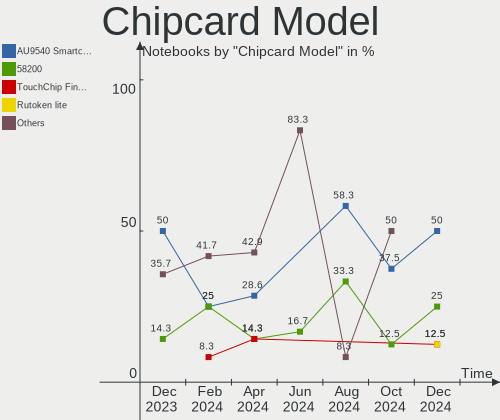

Arch Hardware Trends (Notebook)
-------------------------------

A project to identify most popular hardware characteristics and track their change
over time based on data collected by Arch users at https://Linux-Hardware.org.

Anyone can contribute to the study by uploading probes of their computers by
the [hw-probe](https://github.com/linuxhw/hw-probe) tool:

    sudo -E hw-probe -all -upload

Full-feature report is available here: https://linux-hardware.org/?view=trends&formfactor=notebook

Period: Sep, 2020.

Contents
--------

- [ OS                       ](#os)
- [ OS Family                ](#os-family)
- [ Kernel                   ](#kernel)
- [ Kernel Family            ](#kernel-family)
- [ Kernel Major Ver.        ](#kernel-major-ver)
- [ Arch                     ](#arch)
- [ DE                       ](#de)
- [ Display Server           ](#display-server)
- [ Display Manager          ](#display-manager)
- [ OS Lang                  ](#os-lang)
- [ Boot Mode                ](#boot-mode)
- [ Filesystem               ](#filesystem)
- [ Part. scheme             ](#part-scheme)
- [ Dual Boot with Linux/BSD ](#dual-boot-with-linux/bsd)
- [ Dual Boot (Win)          ](#dual-boot-win)
- [ Country                  ](#country)
- [ City                     ](#city)
- [ Vendor                   ](#vendor)
- [ Model                    ](#model)
- [ Model Family             ](#model-family)
- [ MFG Year                 ](#mfg-year)
- [ Form Factor              ](#form-factor)
- [ Secure Boot              ](#secure-boot)
- [ Coreboot                 ](#coreboot)
- [ RAM Size                 ](#ram-size)
- [ RAM Used                 ](#ram-used)
- [ Has CD-ROM               ](#has-cd-rom)
- [ Total Drives             ](#total-drives)
- [ Has Ethernet             ](#has-ethernet)
- [ Drive Vendor             ](#drive-vendor)
- [ HDD Vendor               ](#hdd-vendor)
- [ SSD Vendor               ](#ssd-vendor)
- [ Drive Model              ](#drive-model)
- [ Drive Kind               ](#drive-kind)
- [ Drive Connector          ](#drive-connector)
- [ Drive Size               ](#drive-size)
- [ Space Total              ](#space-total)
- [ Space Used               ](#space-used)
- [ Malfunc. Drives          ](#malfunc-drives)
- [ Malfunc. Drive Vendor    ](#malfunc-drive-vendor)
- [ Malfunc. HDD Vendor      ](#malfunc-hdd-vendor)
- [ Malfunc. Drive Kind      ](#malfunc-drive-kind)
- [ Failed Drives            ](#failed-drives)
- [ Failed Drive Vendor      ](#failed-drive-vendor)
- [ Drive Status             ](#drive-status)
- [ Storage Vendor           ](#storage-vendor)
- [ Storage Model            ](#storage-model)
- [ Storage Kind             ](#storage-kind)
- [ CPU Vendor               ](#cpu-vendor)
- [ CPU Model                ](#cpu-model)
- [ CPU Model Family         ](#cpu-model-family)
- [ CPU Cores                ](#cpu-cores)
- [ CPU Sockets              ](#cpu-sockets)
- [ CPU Threads              ](#cpu-threads)
- [ CPU Op-Modes             ](#cpu-op-modes)
- [ CPU Microcode            ](#cpu-microcode)
- [ CPU Microarch            ](#cpu-microarch)
- [ GPU Vendor               ](#gpu-vendor)
- [ GPU Model                ](#gpu-model)
- [ GPU Combo                ](#gpu-combo)
- [ GPU Driver               ](#gpu-driver)
- [ GPU Memory               ](#gpu-memory)
- [ Monitor Vendor           ](#monitor-vendor)
- [ Monitor Model            ](#monitor-model)
- [ Monitor Resolution       ](#monitor-resolution)
- [ Monitor Diagonal         ](#monitor-diagonal)
- [ Monitor Width            ](#monitor-width)
- [ Aspect Ratio             ](#aspect-ratio)
- [ Monitor Area             ](#monitor-area)
- [ Pixel Density            ](#pixel-density)
- [ Multiple Monitors        ](#multiple-monitors)
- [ Net Controller Vendor    ](#net-controller-vendor)
- [ Net Controller Model     ](#net-controller-model)
- [ Wireless Vendor          ](#wireless-vendor)
- [ Wireless Model           ](#wireless-model)
- [ Ethernet Vendor          ](#ethernet-vendor)
- [ Ethernet Model           ](#ethernet-model)
- [ Net Controller Kind      ](#net-controller-kind)
- [ Used Controller          ](#used-controller)
- [ NICs                     ](#nics)
- [ Memory Vendor            ](#memory-vendor)
- [ Memory Model             ](#memory-model)
- [ Memory Kind              ](#memory-kind)
- [ Memory Form Factor       ](#memory-form-factor)
- [ Memory Size              ](#memory-size)
- [ Memory Speed             ](#memory-speed)
- [ Sound Vendor             ](#sound-vendor)
- [ Sound Model              ](#sound-model)
- [ Camera Vendor            ](#camera-vendor)
- [ Camera Model             ](#camera-model)
- [ Fingerprint Vendor       ](#fingerprint-vendor)
- [ Fingerprint Model        ](#fingerprint-model)
- [ Chipcard Vendor          ](#chipcard-vendor)
- [ Chipcard Model           ](#chipcard-model)
- [ Printer Vendor           ](#printer-vendor)
- [ Printer Model            ](#printer-model)
- [ Scanner Vendor           ](#scanner-vendor)
- [ Scanner Model            ](#scanner-model)
- [ Bluetooth Vendor         ](#bluetooth-vendor)
- [ Bluetooth Model          ](#bluetooth-model)
- [ Unsupported Devices      ](#unsupported-devices)
- [ Unsupported Device Types ](#unsupported-device-types)

OS
--

Installed operating systems

| Name         | Notebooks | Percent |
|--------------|-----------|---------|
| Arch         | 90        | 56.96%  |
| Arch Rolling | 68        | 43.04%  |

OS Family
---------

OS without a version

| Name | Notebooks | Percent |
|------|-----------|---------|
| Arch | 158       | 100%    |

Kernel
------

Version of the Linux kernel

| Version              | Notebooks | Percent |
|----------------------|-----------|---------|
| 5.8.10-arch1-1       | 25        | 15.82%  |
| 5.8.5-arch1-1        | 24        | 15.19%  |
| 5.8.8-arch1-1        | 14        | 8.86%   |
| 5.8.7-arch1-1        | 11        | 6.96%   |
| 5.8.9-arch2-1        | 9         | 5.7%    |
| 5.8.5-zen1-1-zen     | 8         | 5.06%   |
| 5.8.12-arch1-1       | 8         | 5.06%   |
| 5.4.61-1-lts         | 8         | 5.06%   |
| 5.8.12-zen1-1-zen    | 4         | 2.53%   |
| 5.7.12-arch1-1       | 4         | 2.53%   |
| 5.4.64-1-lts         | 4         | 2.53%   |
| 5.8.6-zen1-1-zen     | 3         | 1.9%    |
| 5.8.6-arch1-1        | 3         | 1.9%    |
| 5.8.11-arch1-1       | 3         | 1.9%    |
| 5.4.68-1-lts         | 3         | 1.9%    |
| 5.4.66-1-lts         | 3         | 1.9%    |
| 5.8.11-zen1-1-zen    | 2         | 1.27%   |
| 5.8.10-zen1-1-zen    | 2         | 1.27%   |
| 5.8.1-arch1-1        | 2         | 1.27%   |
| 5.8.9-zen2-1-zencjk  | 1         | 0.63%   |
| 5.8.9-zen2-1-zen     | 1         | 0.63%   |
| 5.8.8-zen1-1-zen     | 1         | 0.63%   |
| 5.8.8-xanmod1-1      | 1         | 0.63%   |
| 5.8.7.a-1-hardened   | 1         | 0.63%   |
| 5.8.6-xanmod1-1      | 1         | 0.63%   |
| 5.8.3-arch1-1        | 1         | 0.63%   |
| 5.8.12-xanmod1-1     | 1         | 0.63%   |
| 5.8.11-988.native    | 1         | 0.63%   |
| 5.8.10-arch1-1-g14   | 1         | 0.63%   |
| 5.7.5-arch1-1        | 1         | 0.63%   |
| 5.7.19-1-ck-zen      | 1         | 0.63%   |
| 5.7.10-arch1-1       | 1         | 0.63%   |
| 5.6.10-arch1-1-fsync | 1         | 0.63%   |
| 5.4.67-1-lts         | 1         | 0.63%   |
| 5.4.62-1-lts         | 1         | 0.63%   |
| 5.4.58-1-lts         | 1         | 0.63%   |
| 5.4.47-1-lts         | 1         | 0.63%   |

Kernel Family
-------------

Linux kernel without a distro release

| Version | Notebooks | Percent |
|---------|-----------|---------|
| 5.8.5   | 32        | 20.25%  |
| 5.8.10  | 28        | 17.72%  |
| 5.8.8   | 16        | 10.13%  |
| 5.8.12  | 13        | 8.23%   |
| 5.8.7   | 12        | 7.59%   |
| 5.8.9   | 11        | 6.96%   |
| 5.4.61  | 8         | 5.06%   |
| 5.8.6   | 7         | 4.43%   |
| 5.8.11  | 6         | 3.8%    |
| 5.7.12  | 4         | 2.53%   |
| 5.4.64  | 4         | 2.53%   |
| 5.4.68  | 3         | 1.9%    |
| 5.4.66  | 3         | 1.9%    |
| 5.8.1   | 2         | 1.27%   |
| 5.8.3   | 1         | 0.63%   |
| 5.7.5   | 1         | 0.63%   |
| 5.7.19  | 1         | 0.63%   |
| 5.7.10  | 1         | 0.63%   |
| 5.6.10  | 1         | 0.63%   |
| 5.4.67  | 1         | 0.63%   |
| 5.4.62  | 1         | 0.63%   |
| 5.4.58  | 1         | 0.63%   |
| 5.4.47  | 1         | 0.63%   |

Kernel Major Ver.
-----------------

Linux kernel major version

| Version | Notebooks | Percent |
|---------|-----------|---------|
| 5.8     | 128       | 81.01%  |
| 5.4     | 22        | 13.92%  |
| 5.7     | 7         | 4.43%   |
| 5.6     | 1         | 0.63%   |

Arch
----

OS architecture (x86_64, i586, etc.)

| Name   | Notebooks | Percent |
|--------|-----------|---------|
| x86_64 | 158       | 100%    |

DE
--

Desktop Environment

| Name            | Notebooks | Percent |
|-----------------|-----------|---------|
| GNOME           | 50        | 31.65%  |
| KDE5            | 36        | 22.78%  |
| KDE             | 16        | 10.13%  |
| Unknown         | 13        | 8.23%   |
| XFCE            | 10        | 6.33%   |
| i3              | 8         | 5.06%   |
| LXQt            | 6         | 3.8%    |
| Cinnamon        | 6         | 3.8%    |
| MATE            | 4         | 2.53%   |
| sway            | 2         | 1.27%   |
| LXDE            | 2         | 1.27%   |
| GNOME Flashback | 2         | 1.27%   |
| default         | 1         | 0.63%   |
| Budgie          | 1         | 0.63%   |
| bspwm           | 1         | 0.63%   |

Display Server
--------------

X11 or Wayland

| Name    | Notebooks | Percent |
|---------|-----------|---------|
| X11     | 98        | 62.03%  |
| Wayland | 29        | 18.35%  |
| Tty     | 26        | 16.46%  |
| Unknown | 5         | 3.16%   |

Display Manager
---------------

SDDM, LightDM, etc.

| Name    | Notebooks | Percent |
|---------|-----------|---------|
| Unknown | 67        | 42.41%  |
| SDDM    | 32        | 20.25%  |
| GDM     | 28        | 17.72%  |
| TDM     | 20        | 12.66%  |
| LightDM | 7         | 4.43%   |
| XDM     | 3         | 1.9%    |
| LXDM    | 1         | 0.63%   |

OS Lang
-------

Language

| Lang       | Notebooks | Percent |
|------------|-----------|---------|
| en_US      | 82        | 51.9%   |
| en_GB      | 13        | 8.23%   |
| C          | 7         | 4.43%   |
| en_US.UTF8 | 5         | 3.16%   |
| pl_PL      | 4         | 2.53%   |
| en_CA      | 4         | 2.53%   |
| de_DE      | 4         | 2.53%   |
| Unknown    | 4         | 2.53%   |
| pt_BR      | 3         | 1.9%    |
| zh_TW      | 2         | 1.27%   |
| zh_CN      | 2         | 1.27%   |
| fr_FR      | 2         | 1.27%   |
| es_ES      | 2         | 1.27%   |
| es_CL      | 2         | 1.27%   |
| en_SG      | 2         | 1.27%   |
| de_AT      | 2         | 1.27%   |
| tr_TR      | 1         | 0.63%   |
| szl_PL     | 1         | 0.63%   |
| ru_RU      | 1         | 0.63%   |
| nl_NL      | 1         | 0.63%   |
| ko_KR.utf8 | 1         | 0.63%   |
| ja_JP      | 1         | 0.63%   |
| it_IT      | 1         | 0.63%   |
| hu_HU      | 1         | 0.63%   |
| es_PE      | 1         | 0.63%   |
| es_MX      | 1         | 0.63%   |
| es_CO      | 1         | 0.63%   |
| es_AR      | 1         | 0.63%   |
| en_US     | 1         | 0.63%   |
| en_IN      | 1         | 0.63%   |
| en_IE      | 1         | 0.63%   |
| en_AU      | 1         | 0.63%   |
| de_AT.utf8 | 1         | 0.63%   |
| ca_ES      | 1         | 0.63%   |

Boot Mode
---------

EFI or BIOS

| Mode | Notebooks | Percent |
|------|-----------|---------|
| EFI  | 103       | 65.19%  |
| BIOS | 55        | 34.81%  |

Filesystem
----------

Type of filesystem

| Type    | Notebooks | Percent |
|---------|-----------|---------|
| Ext4    | 126       | 79.75%  |
| Btrfs   | 14        | 8.86%   |
| F2fs    | 8         | 5.06%   |
| Xfs     | 4         | 2.53%   |
| Zfs     | 2         | 1.27%   |
| Overlay | 2         | 1.27%   |
| Unknown | 2         | 1.27%   |

Part. scheme
------------

Scheme of partitioning

| Type    | Notebooks | Percent |
|---------|-----------|---------|
| GPT     | 108       | 68.35%  |
| Unknown | 34        | 21.52%  |
| MBR     | 16        | 10.13%  |

Dual Boot with Linux/BSD
------------------------

Hosting more than one Linux/BSD

| Dual boot | Notebooks | Percent |
|-----------|-----------|---------|
| No        | 143       | 90.51%  |
| Yes       | 15        | 9.49%   |

Dual Boot (Win)
---------------

Hosting Linux and Windows

| Dual boot | Notebooks | Percent |
|-----------|-----------|---------|
| No        | 107       | 67.72%  |
| Yes       | 51        | 32.28%  |

Country
-------

Geographic location (country)

| Country            | Notebooks | Percent |
|--------------------|-----------|---------|
| USA                | 32        | 20.25%  |
| Germany            | 10        | 6.33%   |
| Brazil             | 8         | 5.06%   |
| Poland             | 7         | 4.43%   |
| Italy              | 7         | 4.43%   |
| India              | 7         | 4.43%   |
| Canada             | 7         | 4.43%   |
| UK                 | 6         | 3.8%    |
| Netherlands        | 6         | 3.8%    |
| Russia             | 5         | 3.16%   |
| France             | 5         | 3.16%   |
| Austria            | 5         | 3.16%   |
| Spain              | 4         | 2.53%   |
| Indonesia          | 3         | 1.9%    |
| Finland            | 3         | 1.9%    |
| Belgium            | 3         | 1.9%    |
| Turkey             | 2         | 1.27%   |
| Taiwan             | 2         | 1.27%   |
| Sweden             | 2         | 1.27%   |
| Malaysia           | 2         | 1.27%   |
| Hungary            | 2         | 1.27%   |
| Greece             | 2         | 1.27%   |
| Denmark            | 2         | 1.27%   |
| China              | 2         | 1.27%   |
| Chile              | 2         | 1.27%   |
| Switzerland        | 1         | 0.63%   |
| Slovenia           | 1         | 0.63%   |
| Slovakia           | 1         | 0.63%   |
| Singapore          | 1         | 0.63%   |
| Serbia             | 1         | 0.63%   |
| Portugal           | 1         | 0.63%   |
| Philippines        | 1         | 0.63%   |
| Peru               | 1         | 0.63%   |
| Norway             | 1         | 0.63%   |
| New Zealand        | 1         | 0.63%   |
| Myanmar            | 1         | 0.63%   |
| Mexico             | 1         | 0.63%   |
| Lithuania          | 1         | 0.63%   |
| Korea, Republic of | 1         | 0.63%   |
| Japan              | 1         | 0.63%   |
| Israel             | 1         | 0.63%   |
| Iceland            | 1         | 0.63%   |
| Dominican Republic | 1         | 0.63%   |
| Colombia           | 1         | 0.63%   |
| Bangladesh         | 1         | 0.63%   |
| Australia          | 1         | 0.63%   |
| Argentina          | 1         | 0.63%   |

City
----

Geographic location (city)

| City                        | Notebooks | Percent |
|-----------------------------|-----------|---------|
| Moscow                      | 3         | 1.9%    |
| Walce                       | 2         | 1.27%   |
| Vienna                      | 2         | 1.27%   |
| Thrissur                    | 2         | 1.27%   |
| São Paulo                  | 2         | 1.27%   |
| Santiago                    | 2         | 1.27%   |
| Mumbai                      | 2         | 1.27%   |
| Montreal                    | 2         | 1.27%   |
| Madrid                      | 2         | 1.27%   |
| Madera                      | 2         | 1.27%   |
| Krakow                      | 2         | 1.27%   |
| Jakarta                     | 2         | 1.27%   |
| Copenhagen                  | 2         | 1.27%   |
| Amsterdam                   | 2         | 1.27%   |
| Ålesund                    | 1         | 0.63%   |
| Yangon                      | 1         | 0.63%   |
| Wuppertal                   | 1         | 0.63%   |
| Wellington                  | 1         | 0.63%   |
| Wandsworth                  | 1         | 0.63%   |
| Waiblingen                  | 1         | 0.63%   |
| Villach                     | 1         | 0.63%   |
| Verona                      | 1         | 0.63%   |
| Valjevo                     | 1         | 0.63%   |
| Valdemoro                   | 1         | 0.63%   |
| Utrecht                     | 1         | 0.63%   |
| Uberlândia                 | 1         | 0.63%   |
| Turin                       | 1         | 0.63%   |
| Traralgon                   | 1         | 0.63%   |
| Toronto                     | 1         | 0.63%   |
| Tokyo                       | 1         | 0.63%   |
| Thessaloniki                | 1         | 0.63%   |
| Tel Aviv                    | 1         | 0.63%   |
| Taipei                      | 1         | 0.63%   |
| Suzhou                      | 1         | 0.63%   |
| Skudai                      | 1         | 0.63%   |
| Singapore                   | 1         | 0.63%   |
| Secaucus                    | 1         | 0.63%   |
| Scheibbs                    | 1         | 0.63%   |
| Santo Domingo Este          | 1         | 0.63%   |
| San Nicolás de los Arroyos | 1         | 0.63%   |
| San Antonio                 | 1         | 0.63%   |
| Salt Lake City              | 1         | 0.63%   |
| Salem                       | 1         | 0.63%   |
| Saint-Jean-de-Vedas         | 1         | 0.63%   |
| Rybnik                      | 1         | 0.63%   |
| Roseville                   | 1         | 0.63%   |
| Reykjavik                   | 1         | 0.63%   |
| Reutlingen                  | 1         | 0.63%   |
| Rauma                       | 1         | 0.63%   |
| Pompano Beach               | 1         | 0.63%   |
| Pleasanton                  | 1         | 0.63%   |
| Philadelphia                | 1         | 0.63%   |
| Petrozavodsk                | 1         | 0.63%   |
| Perchtoldsdorf              | 1         | 0.63%   |
| Pekan Nenas                 | 1         | 0.63%   |
| Pasadena                    | 1         | 0.63%   |
| Paris                       | 1         | 0.63%   |
| Panevezys                   | 1         | 0.63%   |
| Palermo                     | 1         | 0.63%   |
| Oulu                        | 1         | 0.63%   |

Vendor
------

Motherboard manufacturer

| Name                | Notebooks | Percent |
|---------------------|-----------|---------|
| Lenovo              | 60        | 37.97%  |
| Dell                | 28        | 17.72%  |
| Hewlett-Packard     | 19        | 12.03%  |
| ASUSTek Computer    | 18        | 11.39%  |
| Acer                | 12        | 7.59%   |
| HUAWEI              | 4         | 2.53%   |
| Apple               | 4         | 2.53%   |
| Notebook            | 3         | 1.9%    |
| MSI                 | 3         | 1.9%    |
| Toshiba             | 2         | 1.27%   |
| Unknown             | 2         | 1.27%   |
| TUXEDO              | 1         | 0.63%   |
| Samsung Electronics | 1         | 0.63%   |
| Monster Notebook    | 1         | 0.63%   |

Model
-----

Motherboard model

| Name                                      | Notebooks | Percent |
|-------------------------------------------|-----------|---------|
| Dell XPS 13 9370                          | 3         | 1.9%    |
| Unknown                                   | 3         | 1.9%    |
| HP OMEN Laptop 15-en0xxx                  | 2         | 1.27%   |
| HP EliteBook 830 G6                       | 2         | 1.27%   |
| Dell XPS 15 7590                          | 2         | 1.27%   |
| ASUS ZenBook UX431DA_UM431DA              | 2         | 1.27%   |
| TUXEDO Book BA1510                        | 1         | 0.63%   |
| Toshiba Satellite T135D                   | 1         | 0.63%   |
| Toshiba Satellite C650                    | 1         | 0.63%   |
| Samsung Electronics 530U4E/540U4E         | 1         | 0.63%   |
| Notebook W350STQ/W370ST                   | 1         | 0.63%   |
| Notebook N8xEJEK                          | 1         | 0.63%   |
| Notebook N85_N87,HJ,HJ1,HK1               | 1         | 0.63%   |
| MSI GS65 Stealth 8SE                      | 1         | 0.63%   |
| MSI GS40 6QE Phantom                      | 1         | 0.63%   |
| MSI GL63 8RC                              | 1         | 0.63%   |
| Lenovo Z50-75 80EC                        | 1         | 0.63%   |
| Lenovo V310-15ISK 80SY                    | 1         | 0.63%   |
| Lenovo ThinkPad Z61t 9441W15              | 1         | 0.63%   |
| Lenovo ThinkPad X280 20KF001YUS           | 1         | 0.63%   |
| Lenovo ThinkPad X260 20F5S08P00           | 1         | 0.63%   |
| Lenovo ThinkPad X240 20AMS39B00           | 1         | 0.63%   |
| Lenovo ThinkPad X230 2325W3J              | 1         | 0.63%   |
| Lenovo ThinkPad X230 2325SSF              | 1         | 0.63%   |
| Lenovo ThinkPad X230 2324AS7              | 1         | 0.63%   |
| Lenovo ThinkPad X230 23243Q3              | 1         | 0.63%   |
| Lenovo ThinkPad X230 2320B3V              | 1         | 0.63%   |
| Lenovo ThinkPad X1 Extreme 2nd 20QVCTO1WW | 1         | 0.63%   |
| Lenovo ThinkPad X1 Extreme 20MFCTO1WW     | 1         | 0.63%   |
| Lenovo ThinkPad X1 Carbon 7th 20QES0H400  | 1         | 0.63%   |
| Lenovo ThinkPad X1 Carbon 6th 20KH002FUS  | 1         | 0.63%   |
| Lenovo ThinkPad X1 Carbon 6th 20KG0022US  | 1         | 0.63%   |
| Lenovo ThinkPad X1 Carbon 5th 20HR006SUS  | 1         | 0.63%   |
| Lenovo ThinkPad X1 Carbon 3rd 20BSCTO1WW  | 1         | 0.63%   |
| Lenovo ThinkPad X1 Carbon 2nd 20A8S0ET00  | 1         | 0.63%   |
| Lenovo ThinkPad W701 25002LG              | 1         | 0.63%   |
| Lenovo ThinkPad W541 20EGS03101           | 1         | 0.63%   |
| Lenovo ThinkPad T590 20N4000BMZ           | 1         | 0.63%   |
| Lenovo ThinkPad T540p 20BE003AUS          | 1         | 0.63%   |
| Lenovo ThinkPad T530 2429AE1              | 1         | 0.63%   |
| Lenovo ThinkPad T500 2089W6A              | 1         | 0.63%   |
| Lenovo ThinkPad T495 20NKS08G00           | 1         | 0.63%   |
| Lenovo ThinkPad T480 20L5S01J00           | 1         | 0.63%   |
| Lenovo ThinkPad T470p 20J60015GE          | 1         | 0.63%   |
| Lenovo ThinkPad T460p 20FW0044AU          | 1         | 0.63%   |
| Lenovo ThinkPad T440p 20AWS1HE00          | 1         | 0.63%   |
| Lenovo ThinkPad T440p 20AWS0KK03          | 1         | 0.63%   |
| Lenovo ThinkPad T430s 2356G28             | 1         | 0.63%   |
| Lenovo ThinkPad T430 2344BMU              | 1         | 0.63%   |
| Lenovo ThinkPad T420 4180PBG              | 1         | 0.63%   |
| Lenovo ThinkPad T410s 2912AJ7             | 1         | 0.63%   |
| Lenovo ThinkPad T14s Gen 1 20UH001ART     | 1         | 0.63%   |
| Lenovo ThinkPad L390 20NSS1XF00           | 1         | 0.63%   |
| Lenovo ThinkPad L390 20NRCTO1WW           | 1         | 0.63%   |
| Lenovo ThinkPad E550 20DF0011UE           | 1         | 0.63%   |
| Lenovo ThinkPad E495 20NECTO1WW           | 1         | 0.63%   |
| Lenovo ThinkPad E495 20NE001TMX           | 1         | 0.63%   |
| Lenovo ThinkPad E490 20N9CTO1WW           | 1         | 0.63%   |
| Lenovo ThinkPad E15 Gen 2 20T8000LIX      | 1         | 0.63%   |
| Lenovo Legion R7000P2020H 82GR            | 1         | 0.63%   |

Model Family
------------

Motherboard model prefix

| Name                       | Notebooks | Percent |
|----------------------------|-----------|---------|
| Lenovo ThinkPad            | 41        | 25.95%  |
| Dell Inspiron              | 13        | 8.23%   |
| Lenovo IdeaPad             | 10        | 6.33%   |
| Acer Aspire                | 9         | 5.7%    |
| Dell XPS                   | 8         | 5.06%   |
| HP EliteBook               | 6         | 3.8%    |
| Dell Latitude              | 4         | 2.53%   |
| ASUS ZenBook               | 4         | 2.53%   |
| Lenovo Legion              | 3         | 1.9%    |
| HP Pavilion                | 3         | 1.9%    |
| HP OMEN                    | 3         | 1.9%    |
| Unknown                    | 3         | 1.9%    |
| Toshiba Satellite          | 2         | 1.27%   |
| Lenovo Flex                | 2         | 1.27%   |
| Dell Precision             | 2         | 1.27%   |
| ASUS ROG                   | 2         | 1.27%   |
| Acer TravelMate            | 2         | 1.27%   |
| TUXEDO Book                | 1         | 0.63%   |
| Samsung Electronics 530U4E | 1         | 0.63%   |
| Notebook W350STQ           | 1         | 0.63%   |
| Notebook N8xEJEK           | 1         | 0.63%   |
| Notebook N85               | 1         | 0.63%   |
| MSI GS65                   | 1         | 0.63%   |
| MSI GS40                   | 1         | 0.63%   |
| MSI GL63                   | 1         | 0.63%   |
| Lenovo Z50-75              | 1         | 0.63%   |
| Lenovo V310-15ISK          | 1         | 0.63%   |
| Lenovo G50-80              | 1         | 0.63%   |
| Lenovo G50-70              | 1         | 0.63%   |
| HUAWEI NBLK-WAX9X          | 1         | 0.63%   |
| HUAWEI MACH-WX9            | 1         | 0.63%   |
| HUAWEI HLY-WX9XX           | 1         | 0.63%   |
| HUAWEI BOHK-WAX9X          | 1         | 0.63%   |
| HP ZBook                   | 1         | 0.63%   |
| HP ProBook                 | 1         | 0.63%   |
| HP Notebook                | 1         | 0.63%   |
| HP Laptop                  | 1         | 0.63%   |
| HP ElitePad                | 1         | 0.63%   |
| HP 250                     | 1         | 0.63%   |
| HP 15                      | 1         | 0.63%   |
| Dell Vostro                | 1         | 0.63%   |
| ASUS X556URK               | 1         | 0.63%   |
| ASUS X550JK                | 1         | 0.63%   |
| ASUS X510UQR               | 1         | 0.63%   |
| ASUS X510UQ                | 1         | 0.63%   |
| ASUS VivoBook              | 1         | 0.63%   |
| ASUS UX550VE               | 1         | 0.63%   |
| ASUS TUF                   | 1         | 0.63%   |
| ASUS N550JV                | 1         | 0.63%   |
| ASUS K72Jr                 | 1         | 0.63%   |
| ASUS K55VD                 | 1         | 0.63%   |
| ASUS K52JT                 | 1         | 0.63%   |
| ASUS GL502VSK              | 1         | 0.63%   |
| Apple MacBookPro6          | 1         | 0.63%   |
| Apple MacBookPro15         | 1         | 0.63%   |
| Apple MacBookPro12         | 1         | 0.63%   |
| Apple MacBookPro11         | 1         | 0.63%   |
| Acer ICONIA                | 1         | 0.63%   |

MFG Year
--------

Motherboard manufacture year

| Year | Notebooks | Percent |
|------|-----------|---------|
| 2020 | 52        | 32.91%  |
| 2019 | 40        | 25.32%  |
| 2018 | 18        | 11.39%  |
| 2013 | 11        | 6.96%   |
| 2012 | 8         | 5.06%   |
| 2016 | 6         | 3.8%    |
| 2011 | 6         | 3.8%    |
| 2017 | 5         | 3.16%   |
| 2014 | 4         | 2.53%   |
| 2015 | 3         | 1.9%    |
| 2010 | 2         | 1.27%   |
| 2009 | 2         | 1.27%   |
| 2008 | 1         | 0.63%   |

Form Factor
-----------

Physical design of the computer

| Name     | Notebooks | Percent |
|----------|-----------|---------|
| Notebook | 158       | 100%    |

Secure Boot
-----------

Enabled or disabled

| State    | Notebooks | Percent |
|----------|-----------|---------|
| Disabled | 158       | 100%    |

Coreboot
--------

Have coreboot on board

| Used | Notebooks | Percent |
|------|-----------|---------|
| No   | 158       | 100%    |

RAM Size
--------

Total RAM memory

| Size in GB  | Notebooks | Percent |
|-------------|-----------|---------|
| 4.01-8.0    | 43        | 27.22%  |
| 16.01-24.0  | 42        | 26.58%  |
| 8.01-16.0   | 37        | 23.42%  |
| 3.01-4.0    | 18        | 11.39%  |
| 32.01-64.0  | 10        | 6.33%   |
| 24.01-32.0  | 3         | 1.9%    |
| 1.01-2.0    | 3         | 1.9%    |
| 2.01-3.0    | 1         | 0.63%   |
| 64.01-256.0 | 1         | 0.63%   |

RAM Used
--------

Used RAM memory

| Used GB    | Notebooks | Percent |
|------------|-----------|---------|
| 4.01-8.0   | 41        | 25.95%  |
| 2.01-3.0   | 41        | 25.95%  |
| 1.01-2.0   | 37        | 23.42%  |
| 3.01-4.0   | 19        | 12.03%  |
| 0.01-1.0   | 9         | 5.7%    |
| 8.01-16.0  | 8         | 5.06%   |
| 32.01-64.0 | 1         | 0.63%   |
| 24.01-32.0 | 1         | 0.63%   |
| 16.01-24.0 | 1         | 0.63%   |

Has CD-ROM
----------

Has CD-ROM on board

| Presented | Notebooks | Percent |
|-----------|-----------|---------|
| No        | 120       | 75.95%  |
| Yes       | 38        | 24.05%  |

Total Drives
------------

Number of drives on board

| Drives | Notebooks | Percent |
|--------|-----------|---------|
| 1      | 113       | 71.52%  |
| 2      | 39        | 24.68%  |
| 3      | 6         | 3.8%    |

Has Ethernet
------------

Has Ethernet on board

| Presented | Notebooks | Percent |
|-----------|-----------|---------|
| Yes       | 127       | 80.38%  |
| No        | 31        | 19.62%  |

Drive Vendor
------------

Hard drive vendors

| Vendor              | Notebooks | Drives  | Percent |
|---------------------|-----------|---------|---------|
| Samsung Electronics | 48        | 52      | 23.41%  |
| WDC                 | 30        | 34      | 14.63%  |
| Seagate             | 23        | 23      | 11.22%  |
| SanDisk             | 15        | 16      | 7.32%   |
| Kingston            | 13        | 13      | 6.34%   |
| Toshiba             | 12        | 12      | 5.85%   |
| Unknown             | 9         | 10      | 4.39%   |
| SK Hynix            | 9         | 9       | 4.39%   |
| Intel               | 8         | 8       | 3.9%    |
| HGST                | 7         | 7       | 3.41%   |
| Micron Technology   | 4         | 4       | 1.95%   |
| Crucial             | 4         | 4       | 1.95%   |
| HL-DT-ST            | 3         | Unknown | 1.46%   |
| Apple               | 3         | 3       | 1.46%   |
| LITEON              | 2         | 2       | 0.98%   |
| Hitachi             | 2         | 2       | 0.98%   |
| A-DATA Technology   | 2         | 2       | 0.98%   |
| Transcend           | 1         | 1       | 0.49%   |
| Team                | 1         | 1       | 0.49%   |
| SPCC                | 1         | 1       | 0.49%   |
| Silicon Motion      | 1         | 1       | 0.49%   |
| PLEXTOR             | 1         | 1       | 0.49%   |
| Lenovo              | 1         | 1       | 0.49%   |
| KIOXIA              | 1         | 1       | 0.49%   |
| GLOWAY              | 1         | 1       | 0.49%   |
| GeIL                | 1         | 1       | 0.49%   |
| External            | 1         | 1       | 0.49%   |
| China               | 1         | 1       | 0.49%   |

HDD Vendor
----------

Hard disk drive vendors

| Vendor              | Notebooks | Drives | Percent |
|---------------------|-----------|--------|---------|
| Seagate             | 23        | 23     | 45.1%   |
| WDC                 | 15        | 15     | 29.41%  |
| HGST                | 7         | 7      | 13.73%  |
| Toshiba             | 3         | 3      | 5.88%   |
| Hitachi             | 2         | 2      | 3.92%   |
| Samsung Electronics | 1         | 1      | 1.96%   |

SSD Vendor
----------

Solid state drive vendors

| Vendor              | Notebooks | Drives | Percent |
|---------------------|-----------|--------|---------|
| Samsung Electronics | 21        | 22     | 28.38%  |
| SanDisk             | 10        | 11     | 13.51%  |
| Kingston            | 9         | 9      | 12.16%  |
| WDC                 | 6         | 6      | 8.11%   |
| Toshiba             | 5         | 5      | 6.76%   |
| SK Hynix            | 3         | 3      | 4.05%   |
| Micron Technology   | 3         | 3      | 4.05%   |
| Crucial             | 3         | 3      | 4.05%   |
| Apple               | 2         | 2      | 2.7%    |
| A-DATA Technology   | 2         | 2      | 2.7%    |
| Unknown             | 1         | 1      | 1.35%   |
| Transcend           | 1         | 1      | 1.35%   |
| Team                | 1         | 1      | 1.35%   |
| SPCC                | 1         | 1      | 1.35%   |
| PLEXTOR             | 1         | 1      | 1.35%   |
| LITEON              | 1         | 1      | 1.35%   |
| Intel               | 1         | 1      | 1.35%   |
| GLOWAY              | 1         | 1      | 1.35%   |
| GeIL                | 1         | 1      | 1.35%   |
| China               | 1         | 1      | 1.35%   |

Drive Model
-----------

Hard drive models

| Model                            | Notebooks | Percent |
|----------------------------------|-----------|---------|
| NVMe SSD Drive 512GB             | 12        | 5.61%   |
| SSD 860 EVO 500GB                | 4         | 1.87%   |
| NVMe SSD Drive 256GB             | 4         | 1.87%   |
| NVMe SSD Drive 1TB               | 4         | 1.87%   |
| HTS721010A9E630 1TB              | 4         | 1.87%   |
| ST1000LM048-2E7172 1TB           | 3         | 1.4%    |
| SSD 970 EVO Plus 1TB             | 3         | 1.4%    |
| NVMe SSD Drive 500GB             | 3         | 1.4%    |
| DVDRAM GUE1N 3GB                 | 3         | 1.4%    |
| WD10JPVX-22JC3T0 1TB             | 2         | 0.93%   |
| THNSNH128GMCT 128GB SSD          | 2         | 0.93%   |
| ST500LM000-SSHD-8GB              | 2         | 0.93%   |
| ST1000LM024 HN-M101MBB 1TB       | 2         | 0.93%   |
| SSDPEKNW010T8 1TB                | 2         | 0.93%   |
| SA400S37240G 240GB SSD           | 2         | 0.93%   |
| SA400S37120G 120GB SSD           | 2         | 0.93%   |
| PM981 NVMe 256GB                 | 2         | 0.93%   |
| PC SN730 SDBPNTY-512G-1101 512GB | 2         | 0.93%   |
| MZVLB512HBJQ-000L2 512GB         | 2         | 0.93%   |
| MZVLB1T0HALR-000L7 1TB           | 2         | 0.93%   |
| MMC Card  128GB                  | 2         | 0.93%   |
| HTS541010A9E680 1TB              | 2         | 0.93%   |
| HFS256G39TND-N210A 256GB SSD     | 2         | 0.93%   |
| Expansion 1TB                    | 2         | 0.93%   |
| Z400s 2.5 7MM 256GB SSD          | 1         | 0.47%   |
| YCT512GS3-S7 Pro 512GB SSD       | 1         | 0.47%   |
| X400 M.2 2280 256GB SSD          | 1         | 0.47%   |
| X400 M.2 2280 128GB SSD          | 1         | 0.47%   |
| WDS500G2X0C-00L350 500GB         | 1         | 0.47%   |
| WDS500G2B0C-00PXH0 500GB         | 1         | 0.47%   |
| WDS500G2B0A-00SM50 500GB SSD     | 1         | 0.47%   |
| WDS500G1B0A-00H9H0 500GB SSD     | 1         | 0.47%   |
| WDS120G2G0B-00EPW0 120GB SSD     | 1         | 0.47%   |
| WDS120G1G0B-00RC30 120GB SSD     | 1         | 0.47%   |
| WDS100T3X0C-00SJG0 1TB           | 1         | 0.47%   |
| WDS100T2X0C-00L350 1TB           | 1         | 0.47%   |
| WDS100T2B0B-00YS70 1TB SSD       | 1         | 0.47%   |
| WDS100T2B0A-00SM50 1TB SSD       | 1         | 0.47%   |
| WD7500BPKT-75PK4T0 752GB         | 1         | 0.47%   |
| WD5000LPVX-60V0TT0 500GB         | 1         | 0.47%   |
| WD5000LPVX-22V0TT0 500GB         | 1         | 0.47%   |
| WD5000LPVT-75G33T0 500GB         | 1         | 0.47%   |
| WD5000LPCX-24C6HT0 500GB         | 1         | 0.47%   |
| WD5000LPCX-22VHAT1 500GB         | 1         | 0.47%   |
| WD1600BEVS-08VAT2 160GB          | 1         | 0.47%   |
| WD1600BEKT-60F3T1 160GB          | 1         | 0.47%   |
| WD10SPZX-75Z10T1 1TB             | 1         | 0.47%   |
| WD10SPZX-22Z10T1 1TB             | 1         | 0.47%   |
| WD10SPZX-21Z10T0 1TB             | 1         | 0.47%   |
| WD10SPZX-08Z10 1TB               | 1         | 0.47%   |
| WD10JPCX-24UE4T0 1TB             | 1         | 0.47%   |
| USB3.0 240GB                     | 1         | 0.47%   |
| Ultra II 480GB SSD               | 1         | 0.47%   |
| TS120GSSD220S 120GB              | 1         | 0.47%   |
| THNSNK256GVN8 256GB SSD          | 1         | 0.47%   |
| THNSNK128GVN8 128GB SSD          | 1         | 0.47%   |
| THNSN5512GPUK NVMe 512GB         | 1         | 0.47%   |
| THNS128GG4BAAA-NonFDE 128GB SSD  | 1         | 0.47%   |
| T253TD480G 480GB SSD             | 1         | 0.47%   |
| SV300S37A480G 480GB SSD          | 1         | 0.47%   |

Drive Kind
----------

HDD or SSD

| Kind    | Notebooks | Drives | Percent |
|---------|-----------|--------|---------|
| SSD     | 69        | 76     | 35.2%   |
| NVMe    | 64        | 74     | 32.65%  |
| HDD     | 50        | 51     | 25.51%  |
| MMC     | 9         | 10     | 4.59%   |
| Unknown | 4         | 1      | 2.04%   |

Drive Connector
---------------

SATA, SAS, NVMe, etc.

| Type | Notebooks | Drives | Percent |
|------|-----------|--------|---------|
| SATA | 98        | 118    | 53.55%  |
| NVMe | 64        | 74     | 34.97%  |
| SAS  | 12        | 10     | 6.56%   |
| MMC  | 9         | 10     | 4.92%   |

Drive Size
----------

Size of hard drive

| Size in TB | Notebooks | Drives | Percent |
|------------|-----------|--------|---------|
| 0.01-0.5   | 101       | 113    | 52.06%  |
| 0.51-1.0   | 78        | 83     | 40.21%  |
| 1.01-2.0   | 12        | 13     | 6.19%   |
| 4.01-10.0  | 2         | 2      | 1.03%   |
| 2.01-3.0   | 1         | 1      | 0.52%   |

Space Total
-----------

Amount of disk space available on the file system

| Size in GB     | Notebooks | Percent |
|----------------|-----------|---------|
| 101-250        | 46        | 29.11%  |
| 251-500        | 40        | 25.32%  |
| 501-1000       | 32        | 20.25%  |
| 1001-2000      | 16        | 10.13%  |
| 1-20           | 7         | 4.43%   |
| 51-100         | 5         | 3.16%   |
| Unknown        | 5         | 3.16%   |
| More than 3000 | 4         | 2.53%   |
| 21-50          | 2         | 1.27%   |
| 2001-3000      | 1         | 0.63%   |

Space Used
----------

Amount of used disk space

| Used GB   | Notebooks | Percent |
|-----------|-----------|---------|
| 1-20      | 32        | 20.25%  |
| 101-250   | 30        | 18.99%  |
| 251-500   | 28        | 17.72%  |
| 51-100    | 27        | 17.09%  |
| 21-50     | 16        | 10.13%  |
| 501-1000  | 10        | 6.33%   |
| 1001-2000 | 7         | 4.43%   |
| Unknown   | 5         | 3.16%   |
| 2001-3000 | 3         | 1.9%    |

Malfunc. Drives
---------------

Drive models with a malfunction

| Model                  | Notebooks | Drives | Percent |
|------------------------|-----------|--------|---------|
| WD10JPVX-22JC3T0 1TB   | 1         | 1      | 14.29%  |
| ST9750422AS 752GB      | 1         | 1      | 14.29%  |
| ST500LM000-SSHD-8GB    | 1         | 1      | 14.29%  |
| ST1000LM048-2E7172 1TB | 1         | 1      | 14.29%  |
| ST1000LM014-1EJ164 1TB | 1         | 1      | 14.29%  |
| HTS541680J9SA00 80GB   | 1         | 1      | 14.29%  |
| HTS541010A9E680 1TB    | 1         | 1      | 14.29%  |

Malfunc. Drive Vendor
---------------------

Vendors of faulty drives

| Vendor  | Notebooks | Drives | Percent |
|---------|-----------|--------|---------|
| Seagate | 4         | 4      | 57.14%  |
| WDC     | 1         | 1      | 14.29%  |
| Hitachi | 1         | 1      | 14.29%  |
| HGST    | 1         | 1      | 14.29%  |

Malfunc. HDD Vendor
-------------------

Vendors of faulty HDD drives

| Vendor  | Notebooks | Drives | Percent |
|---------|-----------|--------|---------|
| Seagate | 4         | 4      | 57.14%  |
| WDC     | 1         | 1      | 14.29%  |
| Hitachi | 1         | 1      | 14.29%  |
| HGST    | 1         | 1      | 14.29%  |

Malfunc. Drive Kind
-------------------

Kinds of faulty drives

| Kind | Notebooks | Drives | Percent |
|------|-----------|--------|---------|
| HDD  | 7         | 7      | 100%    |

Failed Drives
-------------

Failed drive models

Zero info for selected period =(

Failed Drive Vendor
-------------------

Failed drive vendors

Zero info for selected period =(

Drive Status
------------

Number of failed and malfunc. drives

| Status   | Notebooks | Drives | Percent |
|----------|-----------|--------|---------|
| Works    | 86        | 107    | 50.89%  |
| Detected | 76        | 98     | 44.97%  |
| Malfunc  | 7         | 7      | 4.14%   |

Storage Vendor
--------------

Storage controller vendors

| Vendor                       | Notebooks | Percent |
|------------------------------|-----------|---------|
| Intel                        | 100       | 53.48%  |
| Samsung Electronics          | 28        | 14.97%  |
| AMD                          | 24        | 12.83%  |
| Sandisk                      | 14        | 7.49%   |
| SK Hynix                     | 6         | 3.21%   |
| Kingston Technology Company  | 4         | 2.14%   |
| Toshiba America Info Systems | 3         | 1.6%    |
| KIOXIA                       | 2         | 1.07%   |
| Silicon Motion               | 1         | 0.53%   |
| Micron/Crucial Technology    | 1         | 0.53%   |
| Micron Technology            | 1         | 0.53%   |
| Lite-On Technology           | 1         | 0.53%   |
| Lenovo                       | 1         | 0.53%   |
| Apple                        | 1         | 0.53%   |

Storage Model
-------------

Storage controller models

| Model                                                                      | Notebooks | Percent |
|----------------------------------------------------------------------------|-----------|---------|
| NVMe SSD Controller SM981/PM981/PM983                                      | 24        | 12.7%   |
| FCH SATA Controller [AHCI mode]                                            | 23        | 12.17%  |
| Non-Volatile memory controller                                             | 18        | 9.52%   |
| 7 Series Chipset Family 6-port SATA Controller [AHCI mode]                 | 16        | 8.47%   |
| Sunrise Point-LP SATA Controller [AHCI mode]                               | 15        | 7.94%   |
| 82801 Mobile SATA Controller [RAID mode]                                   | 9         | 4.76%   |
| 8 Series/C220 Series Chipset Family 6-port SATA Controller 1 [AHCI mode]   | 9         | 4.76%   |
| 8 Series SATA Controller 1 [AHCI mode]                                     | 8         | 4.23%   |
| SSD 660P Series                                                            | 7         | 3.7%    |
| Wildcat Point-LP SATA Controller [AHCI Mode]                               | 6         | 3.17%   |
| Cannon Lake Mobile PCH SATA AHCI Controller                                | 6         | 3.17%   |
| HM170/QM170 Chipset SATA Controller [AHCI Mode]                            | 5         | 2.65%   |
| 5 Series/3400 Series Chipset 4 port SATA AHCI Controller                   | 5         | 2.65%   |
| WD Black 2018/PC SN720 NVMe SSD                                            | 4         | 2.12%   |
| Cannon Point-LP SATA Controller [AHCI Mode]                                | 4         | 2.12%   |
| BC501 NVMe Solid State Drive 512GB                                         | 3         | 1.59%   |
| WD Black 2018/PC SN520 NVMe SSD                                            | 2         | 1.06%   |
| Q170/Q150/B150/H170/H110/Z170/CM236 Chipset SATA Controller [AHCI Mode]    | 2         | 1.06%   |
| Electronics SATA controller                                                | 2         | 1.06%   |
| Electronics Non-Volatile memory controller                                 | 2         | 1.06%   |
| 82801IBM/IEM (ICH9M/ICH9M-E) 2 port SATA Controller [IDE mode]             | 2         | 1.06%   |
| XG4 NVMe SSD Controller                                                    | 1         | 0.53%   |
| Toshiba America Info Non-Volatile memory controller                        | 1         | 0.53%   |
| Technology Company Non-Volatile memory controller                          | 1         | 0.53%   |
| SM2262/SM2262EN SSD Controller                                             | 1         | 0.53%   |
| SB7x0/SB8x0/SB9x0 SATA Controller [AHCI mode]                              | 1         | 0.53%   |
| P1 NVMe PCIe SSD                                                           | 1         | 0.53%   |
| BG3 NVMe SSD Controller                                                    | 1         | 0.53%   |
| Atom/Celeron/Pentium Processor x5-E8000/J3xxx/N3xxx Series SATA Controller | 1         | 0.53%   |
| ANS2 NVMe Controller                                                       | 1         | 0.53%   |
| A2000, M.2, 500GB                                                          | 1         | 0.53%   |
| 82801IBM/IEM (ICH9M/ICH9M-E) 4 port SATA Controller [AHCI mode]            | 1         | 0.53%   |
| 82801HM/HEM (ICH8M/ICH8M-E) SATA Controller [AHCI mode]                    | 1         | 0.53%   |
| 82801HM/HEM (ICH8M/ICH8M-E) IDE Controller                                 | 1         | 0.53%   |
| 82801GBM/GHM (ICH7-M Family) SATA Controller [AHCI mode]                   | 1         | 0.53%   |
| 82801G (ICH7 Family) IDE Controller                                        | 1         | 0.53%   |
| 6 Series/C200 Series Chipset Family 6 port Mobile SATA AHCI Controller     | 1         | 0.53%   |
| 5 Series/3400 Series Chipset 6 port SATA AHCI Controller                   | 1         | 0.53%   |

Storage Kind
------------

Kind of storage controller (IDE, SATA, NVMe, SAS, ...)

| Kind | Notebooks | Percent |
|------|-----------|---------|
| SATA | 108       | 58.38%  |
| NVMe | 64        | 34.59%  |
| RAID | 9         | 4.86%   |
| IDE  | 4         | 2.16%   |

CPU Vendor
----------

Processor vendors

| Vendor | Notebooks | Percent |
|--------|-----------|---------|
| Intel  | 124       | 78.48%  |
| AMD    | 34        | 21.52%  |

CPU Model
---------

Processor models

| Model                                         | Notebooks | Percent |
|-----------------------------------------------|-----------|---------|
| Intel Core i7-8550U CPU @ 1.80GHz             | 6         | 3.8%    |
| Intel Core i5-8250U CPU @ 1.60GHz             | 6         | 3.8%    |
| Intel Core i5-3320M CPU @ 2.60GHz             | 6         | 3.8%    |
| AMD Ryzen 5 3500U with Radeon Vega Mobile Gfx | 6         | 3.8%    |
| Intel Core i7-8565U CPU @ 1.80GHz             | 5         | 3.16%   |
| Intel Core i5-8265U CPU @ 1.60GHz             | 5         | 3.16%   |
| AMD Ryzen 7 4800H with Radeon Graphics        | 5         | 3.16%   |
| Intel Core i7-7700HQ CPU @ 2.80GHz            | 4         | 2.53%   |
| Intel Core i7-9750H CPU @ 2.60GHz             | 3         | 1.9%    |
| Intel Core i7-7500U CPU @ 2.70GHz             | 3         | 1.9%    |
| Intel Core i5-7200U CPU @ 2.50GHz             | 3         | 1.9%    |
| Intel Core i3-4010U CPU @ 1.70GHz             | 3         | 1.9%    |
| AMD Ryzen 7 3700U with Radeon Vega Mobile Gfx | 3         | 1.9%    |
| Intel Core i7-8850H CPU @ 2.60GHz             | 2         | 1.27%   |
| Intel Core i7-8750H CPU @ 2.20GHz             | 2         | 1.27%   |
| Intel Core i7-6700HQ CPU @ 2.60GHz            | 2         | 1.27%   |
| Intel Core i7-6500U CPU @ 2.50GHz             | 2         | 1.27%   |
| Intel Core i7-4700MQ CPU @ 2.40GHz            | 2         | 1.27%   |
| Intel Core i7-4600U CPU @ 2.10GHz             | 2         | 1.27%   |
| Intel Core i7-3610QM CPU @ 2.30GHz            | 2         | 1.27%   |
| Intel Core i5-8300H CPU @ 2.30GHz             | 2         | 1.27%   |
| Intel Core i5-7300HQ CPU @ 2.50GHz            | 2         | 1.27%   |
| Intel Core i5-5200U CPU @ 2.20GHz             | 2         | 1.27%   |
| Intel Core i5-3337U CPU @ 1.80GHz             | 2         | 1.27%   |
| Intel Core i5-3230M CPU @ 2.60GHz             | 2         | 1.27%   |
| Intel Core i5 CPU M 520 @ 2.40GHz             | 2         | 1.27%   |
| Intel Core i3-5005U CPU @ 2.00GHz             | 2         | 1.27%   |
| Intel Core i3 CPU M 350 @ 2.27GHz             | 2         | 1.27%   |
| AMD Ryzen 5 2500U with Radeon Vega Mobile Gfx | 2         | 1.27%   |
| Intel Xeon E-2176M CPU @ 2.70GHz              | 1         | 0.63%   |
| Intel Pentium CPU P6200 @ 2.13GHz             | 1         | 0.63%   |
| Intel Pentium CPU N3710 @ 1.60GHz             | 1         | 0.63%   |
| Intel Pentium 3558U @ 1.70GHz                 | 1         | 0.63%   |
| Intel Core m3-7Y30 CPU @ 1.00GHz              | 1         | 0.63%   |
| Intel Core i7-8665U CPU @ 1.90GHz             | 1         | 0.63%   |
| Intel Core i7-8650U CPU @ 1.90GHz             | 1         | 0.63%   |
| Intel Core i7-7600U CPU @ 2.80GHz             | 1         | 0.63%   |
| Intel Core i7-6820HQ CPU @ 2.70GHz            | 1         | 0.63%   |
| Intel Core i7-5600U CPU @ 2.60GHz             | 1         | 0.63%   |
| Intel Core i7-4980HQ CPU @ 2.80GHz            | 1         | 0.63%   |
| Intel Core i7-4810MQ CPU @ 2.80GHz            | 1         | 0.63%   |
| Intel Core i7-4710MQ CPU @ 2.50GHz            | 1         | 0.63%   |
| Intel Core i7-4710HQ CPU @ 2.50GHz            | 1         | 0.63%   |
| Intel Core i7-4702MQ CPU @ 2.20GHz            | 1         | 0.63%   |
| Intel Core i7-4700HQ CPU @ 2.40GHz            | 1         | 0.63%   |
| Intel Core i7-4510U CPU @ 2.00GHz             | 1         | 0.63%   |
| Intel Core i7-3632QM CPU @ 2.20GHz            | 1         | 0.63%   |
| Intel Core i7-3517U CPU @ 1.90GHz             | 1         | 0.63%   |
| Intel Core i7-2760QM CPU @ 2.40GHz            | 1         | 0.63%   |
| Intel Core i7-10750H CPU @ 2.60GHz            | 1         | 0.63%   |
| Intel Core i7 CPU X 920 @ 2.00GHz             | 1         | 0.63%   |
| Intel Core i5-9300H CPU @ 2.40GHz             | 1         | 0.63%   |
| Intel Core i5-8400H CPU @ 2.50GHz             | 1         | 0.63%   |
| Intel Core i5-8365U CPU @ 1.60GHz             | 1         | 0.63%   |
| Intel Core i5-6440HQ CPU @ 2.60GHz            | 1         | 0.63%   |
| Intel Core i5-6300U CPU @ 2.40GHz             | 1         | 0.63%   |
| Intel Core i5-6300HQ CPU @ 2.30GHz            | 1         | 0.63%   |
| Intel Core i5-6200U CPU @ 2.30GHz             | 1         | 0.63%   |
| Intel Core i5-5300U CPU @ 2.30GHz             | 1         | 0.63%   |
| Intel Core i5-5257U CPU @ 2.70GHz             | 1         | 0.63%   |

CPU Model Family
----------------

Processor model prefix

| Model             | Notebooks | Percent |
|-------------------|-----------|---------|
| Intel Core i7     | 52        | 32.91%  |
| Intel Core i5     | 50        | 31.65%  |
| AMD Ryzen 7       | 13        | 8.23%   |
| Intel Core i3     | 10        | 6.33%   |
| AMD Ryzen 5       | 10        | 6.33%   |
| Intel Core 2 Duo  | 5         | 3.16%   |
| Intel Pentium     | 3         | 1.9%    |
| AMD Ryzen 7 PRO   | 2         | 1.27%   |
| Intel Xeon        | 1         | 0.63%   |
| Intel Core m3     | 1         | 0.63%   |
| Intel Core 2      | 1         | 0.63%   |
| Intel Atom        | 1         | 0.63%   |
| AMD Turion Neo X2 | 1         | 0.63%   |
| AMD Ryzen 9       | 1         | 0.63%   |
| AMD Ryzen 3       | 1         | 0.63%   |
| AMD FX            | 1         | 0.63%   |
| AMD E1            | 1         | 0.63%   |
| AMD A8            | 1         | 0.63%   |
| AMD A6            | 1         | 0.63%   |
| AMD A12           | 1         | 0.63%   |
| AMD A10           | 1         | 0.63%   |

CPU Cores
---------

Number of processor cores

| Number | Notebooks | Percent |
|--------|-----------|---------|
| 4      | 74        | 46.84%  |
| 2      | 64        | 40.51%  |
| 8      | 10        | 6.33%   |
| 6      | 10        | 6.33%   |

CPU Sockets
-----------

Number of sockets

| Number | Notebooks | Percent |
|--------|-----------|---------|
| 1      | 158       | 100%    |

CPU Threads
-----------

Threads per core (Hyper-Threading)

| Number | Notebooks | Percent |
|--------|-----------|---------|
| 2      | 136       | 86.08%  |
| 1      | 22        | 13.92%  |

CPU Op-Modes
------------

CPU Operation Modes (32-bit, 64-bit)

| Op mode        | Notebooks | Percent |
|----------------|-----------|---------|
| 32-bit, 64-bit | 158       | 100%    |

CPU Microcode
-------------

Microcode number

| Number     | Notebooks | Percent |
|------------|-----------|---------|
| Unknown    | 32        | 20.25%  |
| 0x306a9    | 13        | 8.23%   |
| 0x806ea    | 10        | 6.33%   |
| 0x906ea    | 8         | 5.06%   |
| 0x806e9    | 7         | 4.43%   |
| 0x40651    | 7         | 4.43%   |
| 0x306d4    | 6         | 3.8%    |
| 0x306c3    | 6         | 3.8%    |
| 0x08600104 | 6         | 3.8%    |
| 0x506e3    | 5         | 3.16%   |
| 0x406e3    | 5         | 3.16%   |
| 0x20655    | 5         | 3.16%   |
| 0x08108109 | 5         | 3.16%   |
| 0x08108102 | 5         | 3.16%   |
| 0x906e9    | 4         | 2.53%   |
| 0x806ec    | 4         | 2.53%   |
| 0x806eb    | 4         | 2.53%   |
| 0x1067a    | 4         | 2.53%   |
| 0x08600103 | 3         | 1.9%    |
| 0x0810100b | 3         | 1.9%    |
| 0x206a7    | 2         | 1.27%   |
| 0xa0652    | 1         | 0.63%   |
| 0x706e5    | 1         | 0.63%   |
| 0x6f6      | 1         | 0.63%   |
| 0x406c4    | 1         | 0.63%   |
| 0x40661    | 1         | 0.63%   |
| 0x30678    | 1         | 0.63%   |
| 0x20652    | 1         | 0.63%   |
| 0x106e5    | 1         | 0.63%   |
| 0x10676    | 1         | 0.63%   |
| 0x08600106 | 1         | 0.63%   |
| 0x0600611a | 1         | 0.63%   |
| 0x06006118 | 1         | 0.63%   |
| 0x06003106 | 1         | 0.63%   |
| 0x03000027 | 1         | 0.63%   |

CPU Microarch
-------------

Microarchitecture

| Name        | Notebooks | Percent |
|-------------|-----------|---------|
| Skylake     | 37        | 23.42%  |
| KabyLake    | 27        | 17.09%  |
| Haswell     | 18        | 11.39%  |
| IvyBridge   | 16        | 10.13%  |
| Zen+        | 13        | 8.23%   |
| Zen 2       | 11        | 6.96%   |
| Broadwell   | 7         | 4.43%   |
| Westmere    | 6         | 3.8%    |
| Zen         | 3         | 1.9%    |
| SandyBridge | 3         | 1.9%    |
| Penryn      | 3         | 1.9%    |
| Core        | 3         | 1.9%    |
| Silvermont  | 2         | 1.27%   |
| Excavator   | 2         | 1.27%   |
| Steamroller | 1         | 0.63%   |
| Puma        | 1         | 0.63%   |
| Nehalem     | 1         | 0.63%   |
| K8 Hammer   | 1         | 0.63%   |
| K10 Llano   | 1         | 0.63%   |
| Jaguar      | 1         | 0.63%   |
| Icelake     | 1         | 0.63%   |

GPU Vendor
----------

Vendors of graphics cards

| Vendor | Notebooks | Percent |
|--------|-----------|---------|
| Intel  | 115       | 53.99%  |
| Nvidia | 52        | 24.41%  |
| AMD    | 46        | 21.6%   |

GPU Model
---------

Graphics card models

| Model                                                                             | Notebooks | Percent |
|-----------------------------------------------------------------------------------|-----------|---------|
| 3rd Gen Core processor Graphics Controller                                        | 16        | 7.37%   |
| UHD Graphics 620                                                                  | 13        | 5.99%   |
| Picasso                                                                           | 13        | 5.99%   |
| UHD Graphics 620 (Whiskey Lake)                                                   | 12        | 5.53%   |
| UHD Graphics 630 (Mobile)                                                         | 9         | 4.15%   |
| Renoir                                                                            | 9         | 4.15%   |
| 4th Gen Core Processor Integrated Graphics Controller                             | 9         | 4.15%   |
| HD Graphics 620                                                                   | 8         | 3.69%   |
| Haswell-ULT Integrated Graphics Controller                                        | 8         | 3.69%   |
| HD Graphics 5500                                                                  | 6         | 2.76%   |
| Skylake GT2 [HD Graphics 520]                                                     | 5         | 2.3%    |
| HD Graphics 630                                                                   | 5         | 2.3%    |
| HD Graphics 530                                                                   | 5         | 2.3%    |
| Sun XT [Radeon HD 8670A/8670M/8690M / R5 M330 / M430 / Radeon 520 Mobile]         | 4         | 1.84%   |
| Mobile 4 Series Chipset Integrated Graphics Controller                            | 4         | 1.84%   |
| GP107M [GeForce GTX 1050 Ti Mobile]                                               | 4         | 1.84%   |
| GM108M [GeForce 940MX]                                                            | 4         | 1.84%   |
| Core Processor Integrated Graphics Controller                                     | 4         | 1.84%   |
| TU117M [GeForce GTX 1650 Ti Mobile]                                               | 3         | 1.38%   |
| TU117M [GeForce GTX 1650 Mobile / Max-Q]                                          | 3         | 1.38%   |
| Raven Ridge [Radeon Vega Series / Radeon Vega Mobile Series]                      | 3         | 1.38%   |
| GP108M [GeForce MX150]                                                            | 3         | 1.38%   |
| GP107M [GeForce GTX 1050 Mobile]                                                  | 3         | 1.38%   |
| Baffin [Radeon RX 460/560D / Pro 450/455/460/555/555X/560/560X]                   | 3         | 1.38%   |
| 2nd Generation Core Processor Family Integrated Graphics Controller               | 3         | 1.38%   |
| Wani [Radeon R5/R6/R7 Graphics]                                                   | 2         | 0.92%   |
| UHD Graphics                                                                      | 2         | 0.92%   |
| TU116M [GeForce GTX 1660 Ti Mobile]                                               | 2         | 0.92%   |
| TU106M [GeForce RTX 2060 Mobile]                                                  | 2         | 0.92%   |
| TU106M [GeForce RTX 2060 Max-Q]                                                   | 2         | 0.92%   |
| Topaz XT [Radeon R7 M260/M265 / M340/M360 / M440/M445 / 530/535 / 620/625 Mobile] | 2         | 0.92%   |
| Jet PRO [Radeon R5 M230 / R7 M260DX / Radeon 520 Mobile]                          | 2         | 0.92%   |
| Venus XT [Radeon HD 8870M / R9 M270X/M370X]                                       | 1         | 0.46%   |
| TU117M                                                                            | 1         | 0.46%   |
| TU104GLM [Quadro RTX 5000 Mobile / Max-Q]                                         | 1         | 0.46%   |
| Thames [Radeon HD 7550M/7570M/7650M]                                              | 1         | 0.46%   |
| Thames [Radeon HD 7500M/7600M Series]                                             | 1         | 0.46%   |
| Sumo [Radeon HD 6520G]                                                            | 1         | 0.46%   |
| RS780M [Mobility Radeon HD 3200]                                                  | 1         | 0.46%   |
| Robson CE [Radeon HD 6370M/7370M]                                                 | 1         | 0.46%   |
| Park [Mobility Radeon HD 5430/5450/5470]                                          | 1         | 0.46%   |
| Opal XT [Radeon R7 M265/M365X/M465]                                               | 1         | 0.46%   |
| Mullins [Radeon R4/R5 Graphics]                                                   | 1         | 0.46%   |
| Mobile 945GM/GMS/GME, 943/940GML Express Integrated Graphics Controller           | 1         | 0.46%   |
| Mobile 945GM/GMS, 943/940GML Express Integrated Graphics Controller               | 1         | 0.46%   |
| Kaveri [Radeon R6/R7 Graphics]                                                    | 1         | 0.46%   |
| Kabini [Radeon HD 8210]                                                           | 1         | 0.46%   |
| Iris Plus Graphics G1 (Ice Lake)                                                  | 1         | 0.46%   |
| Iris Graphics 6100                                                                | 1         | 0.46%   |
| HD Graphics 615                                                                   | 1         | 0.46%   |
| GT216M [GeForce GT 330M]                                                          | 1         | 0.46%   |
| GP108M [GeForce MX250]                                                            | 1         | 0.46%   |
| GP107M [GeForce MX350]                                                            | 1         | 0.46%   |
| GP106M [GeForce GTX 1060 Mobile]                                                  | 1         | 0.46%   |
| GP104BM [GeForce GTX 1070 Mobile]                                                 | 1         | 0.46%   |
| GM204M [GeForce GTX 970M]                                                         | 1         | 0.46%   |
| GM204GLM [Quadro M4000M]                                                          | 1         | 0.46%   |
| GM108M [GeForce 930MX]                                                            | 1         | 0.46%   |
| GM108M [GeForce 840M]                                                             | 1         | 0.46%   |
| GM107M [GeForce GTX 960M]                                                         | 1         | 0.46%   |

GPU Combo
---------

Combinations of graphics cards

| Name           | Notebooks | Percent |
|----------------|-----------|---------|
| 1 x Intel      | 65        | 41.14%  |
| Intel + Nvidia | 40        | 25.32%  |
| 1 x AMD        | 28        | 17.72%  |
| Intel + AMD    | 10        | 6.33%   |
| 1 x Nvidia     | 7         | 4.43%   |
| AMD + Nvidia   | 5         | 3.16%   |
| 2 x AMD        | 3         | 1.9%    |

GPU Driver
----------

Free vs proprietary

| Driver      | Notebooks | Percent |
|-------------|-----------|---------|
| Free        | 130       | 82.28%  |
| Proprietary | 28        | 17.72%  |

GPU Memory
----------

Total video memory

| Size in GB | Notebooks | Percent |
|------------|-----------|---------|
| Unknown    | 97        | 61.39%  |
| 1.01-2.0   | 24        | 15.19%  |
| 0.51-1.0   | 11        | 6.96%   |
| 0.01-0.5   | 11        | 6.96%   |
| 3.01-4.0   | 9         | 5.7%    |
| 5.01-6.0   | 2         | 1.27%   |
| 2.01-3.0   | 2         | 1.27%   |
| 7.01-8.0   | 1         | 0.63%   |
| 8.01-16.0  | 1         | 0.63%   |

Monitor Vendor
--------------

Monitor vendors

| Vendor               | Notebooks | Percent |
|----------------------|-----------|---------|
| AU Optronics         | 43        | 21.83%  |
| LG Display           | 41        | 20.81%  |
| Chimei Innolux       | 19        | 9.64%   |
| BOE                  | 19        | 9.64%   |
| Goldstar             | 9         | 4.57%   |
| Samsung Electronics  | 8         | 4.06%   |
| Sharp                | 7         | 3.55%   |
| Dell                 | 6         | 3.05%   |
| PANDA                | 5         | 2.54%   |
| Lenovo               | 5         | 2.54%   |
| BenQ                 | 5         | 2.54%   |
| Apple                | 4         | 2.03%   |
| Philips              | 3         | 1.52%   |
| Hewlett-Packard      | 3         | 1.52%   |
| Iiyama               | 2         | 1.02%   |
| AOC                  | 2         | 1.02%   |
| Acer                 | 2         | 1.02%   |
| Viotek               | 1         | 0.51%   |
| ViewSonic            | 1         | 0.51%   |
| Toshiba              | 1         | 0.51%   |
| Sony                 | 1         | 0.51%   |
| SKY                  | 1         | 0.51%   |
| NCS                  | 1         | 0.51%   |
| LG Philips           | 1         | 0.51%   |
| JDI                  | 1         | 0.51%   |
| IBM                  | 1         | 0.51%   |
| HannStar             | 1         | 0.51%   |
| CVT                  | 1         | 0.51%   |
| CPT                  | 1         | 0.51%   |
| BOE Technology Group | 1         | 0.51%   |
| Ancor Communications | 1         | 0.51%   |

Monitor Model
-------------

Monitor models

| Model                                              | Notebooks | Percent |
|----------------------------------------------------|-----------|---------|
| LCD Monitor AUO38ED 1920x1080 340x190mm 15.3-inch  | 4         | 2%      |
| LCD Monitor AUO26EC 1366x768 344x193mm 15.5-inch   | 3         | 1.5%    |
| LCD Monitor AUO21ED 1920x1080 344x194mm 15.5-inch  | 3         | 1.5%    |
| LCD Monitor SHP14BA 1920x1080 344x194mm 15.5-inch  | 2         | 1%      |
| LCD Monitor SHP1484 1920x1080 294x165mm 13.3-inch  | 2         | 1%      |
| LCD Monitor NCP0035 1920x1080 309x174mm 14.0-inch  | 2         | 1%      |
| LCD Monitor LGD04F0 2560x1440 310x174mm 14.0-inch  | 2         | 1%      |
| LCD Monitor LGD0468 1366x768 340x190mm 15.3-inch   | 2         | 1%      |
| LCD Monitor LGD044F 1920x1080 350x190mm 15.7-inch  | 2         | 1%      |
| LCD Monitor LGD033A 1366x768 340x190mm 15.3-inch   | 2         | 1%      |
| LCD Monitor LGD0259 1920x1080 350x190mm 15.7-inch  | 2         | 1%      |
| LCD Monitor CMN15E8 1920x1080 344x193mm 15.5-inch  | 2         | 1%      |
| LCD Monitor CMN15E3 1920x1080 344x193mm 15.5-inch  | 2         | 1%      |
| LCD Monitor CMN14D4 1920x1080 309x173mm 13.9-inch  | 2         | 1%      |
| LCD Monitor BOE06A9 1920x1080 344x193mm 15.5-inch  | 2         | 1%      |
| LCD Monitor AUO40EC 1366x768 340x190mm 15.3-inch   | 2         | 1%      |
| LCD Monitor AUO133D 1920x1080 309x173mm 13.9-inch  | 2         | 1%      |
| XV272U ACR06C1 2560x1440 597x336mm 27.0-inch       | 1         | 0.5%    |
| X203H ACR0097 1600x900 443x249mm 20.0-inch         | 1         | 0.5%    |
| VP3268-4K VSC8C34 3840x2160 697x392mm 31.5-inch    | 1         | 0.5%    |
| V2400Eco BNQ7D02 1920x1080 531x299mm 24.0-inch     | 1         | 0.5%    |
| ULTRAWIDE GSM76F9 2560x1080 531x298mm 24.0-inch    | 1         | 0.5%    |
| Ultra HD GSM5B08 3840x2160 600x340mm 27.2-inch     | 1         | 0.5%    |
| U2715H DELD069 2560x1440 597x336mm 27.0-inch       | 1         | 0.5%    |
| TV-monitor SKY0001 1920x1080 697x392mm 31.5-inch   | 1         | 0.5%    |
| TV SNY7001 1920x1080 1600x900mm 72.3-inch          | 1         | 0.5%    |
| SW240 BNQ7F67 1920x1200 518x324mm 24.1-inch        | 1         | 0.5%    |
| ST2421L DELA070 1920x1080 531x299mm 24.0-inch      | 1         | 0.5%    |
| S24E650 SAM0CB7 1920x1080 521x293mm 23.5-inch      | 1         | 0.5%    |
| S24C450D SAM0A00 1920x1080 531x299mm 24.0-inch     | 1         | 0.5%    |
| PLE2483H IVM6113 1920x1080 531x299mm 24.0-inch     | 1         | 0.5%    |
| PL2792Q IVM6637 2560x1440 597x336mm 27.0-inch      | 1         | 0.5%    |
| PHL 274E5 PHLC0C8 1920x1080 600x340mm 27.2-inch    | 1         | 0.5%    |
| PHL 273V5 PHLC0D2 1920x1080 600x340mm 27.2-inch    | 1         | 0.5%    |
| PhilipsTV (5) PHL14CA 1360x768 708x398mm 32.0-inch | 1         | 0.5%    |
| P2717H DEL40F7 1920x1080 598x336mm 27.0-inch       | 1         | 0.5%    |
| P2418D DELD0C2 2560x1440 526x296mm 23.8-inch       | 1         | 0.5%    |
| P2418D DELD0C1 2560x1440 526x296mm 23.8-inch       | 1         | 0.5%    |
| P2317H DEL40F2 1920x1080 509x286mm 23.0-inch       | 1         | 0.5%    |
| MP59G GSM5B34 1920x1080 480x270mm 21.7-inch        | 1         | 0.5%    |
| Monitor CVT0021 1360x768 760x450mm 34.8-inch       | 1         | 0.5%    |
| LQ156M1JW16 SHP14F4 1920x1080 344x194mm 15.5-inch  | 1         | 0.5%    |
| LP156WH2-TLAA LGD0230 1366x768 344x194mm 15.5-inch | 1         | 0.5%    |
| LG ULTRAWIDE GSM59F1 1920x1080 580x240mm 24.7-inch | 1         | 0.5%    |
| LCD Monitor w2207                                  | 1         | 0.5%    |
| LCD Monitor SHP14D0 3840x2400 336x210mm 15.6-inch  | 1         | 0.5%    |
| LCD Monitor SHP1453 1920x1080 346x194mm 15.6-inch  | 1         | 0.5%    |
| LCD Monitor SEC5441 1366x768 344x194mm 15.5-inch   | 1         | 0.5%    |
| LCD Monitor SEC324C 1366x768 353x198mm 15.9-inch   | 1         | 0.5%    |
| LCD Monitor SEC315A 1366x768 344x194mm 15.5-inch   | 1         | 0.5%    |
| LCD Monitor SDC3654 1600x900 382x215mm 17.3-inch   | 1         | 0.5%    |
| LCD Monitor SDC364D 1920x1080 309x174mm 14.0-inch  | 1         | 0.5%    |
| LCD Monitor SAM0A7C 1920x1080 700x390mm 31.5-inch  | 1         | 0.5%    |
| LCD Monitor SAM0678 1920x1080                      | 1         | 0.5%    |
| LCD Monitor NCS2275 1920x1080 256x192mm 12.6-inch  | 1         | 0.5%    |
| LCD Monitor NCP0050 1920x1080 309x174mm 14.0-inch  | 1         | 0.5%    |
| LCD Monitor NCP0040 1920x1080 344x194mm 15.5-inch  | 1         | 0.5%    |
| LCD Monitor NCP002D 1920x1080 344x194mm 15.5-inch  | 1         | 0.5%    |
| LCD Monitor LPL0133 1280x800 304x190mm 14.1-inch   | 1         | 0.5%    |
| LCD Monitor LGD40A0 1366x768 310x174mm 14.0-inch   | 1         | 0.5%    |

Monitor Resolution
------------------

Monitor screen resolution

| Resolution         | Notebooks | Percent |
|--------------------|-----------|---------|
| 1920x1080 (FHD)    | 100       | 54.64%  |
| 1366x768 (WXGA)    | 39        | 21.31%  |
| 2560x1440 (QHD)    | 11        | 6.01%   |
| 3840x2160 (4K)     | 5         | 2.73%   |
| 1600x900 (HD+)     | 5         | 2.73%   |
| 1360x768           | 4         | 2.19%   |
| 1920x1200 (WUXGA)  | 3         | 1.64%   |
| 2880x1800          | 2         | 1.09%   |
| 2560x1080          | 2         | 1.09%   |
| 1440x900 (WXGA+)   | 2         | 1.09%   |
| 1280x800 (WXGA)    | 2         | 1.09%   |
| 5520x1080          | 1         | 0.55%   |
| 3840x2400          | 1         | 0.55%   |
| 3000x2000          | 1         | 0.55%   |
| 2560x1600          | 1         | 0.55%   |
| 1680x1050 (WSXGA+) | 1         | 0.55%   |
| 1280x768           | 1         | 0.55%   |
| 1280x720 (HD)      | 1         | 0.55%   |
| Unknown            | 1         | 0.55%   |

Monitor Diagonal
----------------

Diagonal size in inches

| Inches  | Notebooks | Percent |
|---------|-----------|---------|
| 15      | 79        | 40.31%  |
| 14      | 30        | 15.31%  |
| 13      | 28        | 14.29%  |
| 27      | 10        | 5.1%    |
| 12      | 8         | 4.08%   |
| 24      | 7         | 3.57%   |
| 23      | 7         | 3.57%   |
| 21      | 6         | 3.06%   |
| 17      | 5         | 2.55%   |
| Unknown | 3         | 1.53%   |
| 31      | 2         | 1.02%   |
| 11      | 2         | 1.02%   |
| 72      | 1         | 0.51%   |
| 40      | 1         | 0.51%   |
| 34      | 1         | 0.51%   |
| 32      | 1         | 0.51%   |
| 29      | 1         | 0.51%   |
| 22      | 1         | 0.51%   |
| 20      | 1         | 0.51%   |
| 16      | 1         | 0.51%   |
| 10      | 1         | 0.51%   |

Monitor Width
-------------

Physical width

| Width in mm | Notebooks | Percent |
|-------------|-----------|---------|
| 301-350     | 124       | 63.59%  |
| 201-300     | 24        | 12.31%  |
| 501-600     | 23        | 11.79%  |
| 401-500     | 8         | 4.1%    |
| 351-400     | 5         | 2.56%   |
| 601-700     | 4         | 2.05%   |
| Unknown     | 3         | 1.54%   |
| 701-800     | 2         | 1.03%   |
| 801-900     | 1         | 0.51%   |
| 1501-2000   | 1         | 0.51%   |

Aspect Ratio
------------

Proportional relationship between the width and the height

| Ratio   | Notebooks | Percent |
|---------|-----------|---------|
| 16/9    | 144       | 88.89%  |
| 16/10   | 12        | 7.41%   |
| Unknown | 2         | 1.23%   |
| 5/4     | 1         | 0.62%   |
| 4/3     | 1         | 0.62%   |
| 3/2     | 1         | 0.62%   |
| 21/9    | 1         | 0.62%   |

Monitor Area
------------

Area in inch²

| Area in inch² | Notebooks | Percent |
|----------------|-----------|---------|
| 101-110        | 79        | 40.31%  |
| 81-90          | 46        | 23.47%  |
| 201-250        | 18        | 9.18%   |
| 71-80          | 13        | 6.63%   |
| 301-350        | 11        | 5.61%   |
| 61-70          | 7         | 3.57%   |
| 351-500        | 3         | 1.53%   |
| 151-200        | 3         | 1.53%   |
| 121-130        | 3         | 1.53%   |
| Unknown        | 3         | 1.53%   |
| 51-60          | 2         | 1.02%   |
| 501-1000       | 2         | 1.02%   |
| More than 1000 | 1         | 0.51%   |
| 41-50          | 1         | 0.51%   |
| 251-300        | 1         | 0.51%   |
| 141-150        | 1         | 0.51%   |
| 131-140        | 1         | 0.51%   |
| 91-100         | 1         | 0.51%   |

Pixel Density
-------------

Pixels per inch

| Density       | Notebooks | Percent |
|---------------|-----------|---------|
| 121-160       | 91        | 47.4%   |
| 101-120       | 45        | 23.44%  |
| 161-240       | 22        | 11.46%  |
| 51-100        | 21        | 10.94%  |
| More than 240 | 5         | 2.6%    |
| 1-50          | 5         | 2.6%    |
| Unknown       | 3         | 1.56%   |

Multiple Monitors
-----------------

Total monitors connected

| Total | Notebooks | Percent |
|-------|-----------|---------|
| 1     | 116       | 73.42%  |
| 2     | 34        | 21.52%  |
| 3     | 8         | 5.06%   |

Net Controller Vendor
---------------------

Controller vendors

| Vendor                            | Notebooks | Percent |
|-----------------------------------|-----------|---------|
| Intel                             | 102       | 40.32%  |
| Realtek Semiconductor             | 77        | 30.43%  |
| Qualcomm Atheros                  | 38        | 15.02%  |
| Broadcom Inc. and subsidiaries    | 7         | 2.77%   |
| Ericsson Business Mobile Networks | 4         | 1.58%   |
| Lenovo                            | 3         | 1.19%   |
| DisplayLink                       | 3         | 1.19%   |
| TP-Link                           | 2         | 0.79%   |
| Sierra Wireless                   | 2         | 0.79%   |
| NetGear                           | 2         | 0.79%   |
| Linksys                           | 2         | 0.79%   |
| Broadcom Limited                  | 2         | 0.79%   |
| Arduino SA                        | 2         | 0.79%   |
| Samsung Electronics               | 1         | 0.4%    |
| Marvell Technology Group          | 1         | 0.4%    |
| JMicron Technology                | 1         | 0.4%    |
| Hewlett-Packard                   | 1         | 0.4%    |
| Dell                              | 1         | 0.4%    |
| ASIX Electronics                  | 1         | 0.4%    |
| Apple                             | 1         | 0.4%    |

Net Controller Model
--------------------

Controller models

| Model                                                                                                         | Notebooks | Percent |
|---------------------------------------------------------------------------------------------------------------|-----------|---------|
| RTL8111/8168/8411 PCI Express Gigabit Ethernet Controller                                                     | 45        | 14.33%  |
| Wi-Fi 6 AX200                                                                                                 | 19        | 6.05%   |
| Wireless 8265 / 8275                                                                                          | 16        | 5.1%    |
| RTL810xE PCI Express Fast Ethernet controller                                                                 | 13        | 4.14%   |
| 82579LM Gigabit Network Connection (Lewisville)                                                               | 10        | 3.18%   |
| RTL8153 Gigabit Ethernet Adapter                                                                              | 9         | 2.87%   |
| QCA9377 802.11ac Wireless Network Adapter                                                                     | 8         | 2.55%   |
| Centrino Advanced-N 6205 [Taylor Peak]                                                                        | 8         | 2.55%   |
| Cannon Point-LP CNVi [Wireless-AC]                                                                            | 8         | 2.55%   |
| AR9485 Wireless Network Adapter                                                                               | 7         | 2.23%   |
| Wireless 3165                                                                                                 | 6         | 1.91%   |
| RTL8822BE 802.11a/b/g/n/ac WiFi adapter                                                                       | 6         | 1.91%   |
| RTL8723BE PCIe Wireless Network Adapter                                                                       | 6         | 1.91%   |
| AR9285 Wireless Network Adapter (PCI-Express)                                                                 | 6         | 1.91%   |
| Wireless 7265                                                                                                 | 5         | 1.59%   |
| QCA9565 / AR9565 Wireless Network Adapter                                                                     | 5         | 1.59%   |
| Ethernet Connection I217-LM                                                                                   | 5         | 1.59%   |
| Ethernet Connection (6) I219-V                                                                                | 5         | 1.59%   |
| Wireless-AC 9560 [Jefferson Peak]                                                                             | 4         | 1.27%   |
| Wireless-AC 9260                                                                                              | 4         | 1.27%   |
| Wireless 8260                                                                                                 | 4         | 1.27%   |
| Wireless 7260                                                                                                 | 4         | 1.27%   |
| RTL8822CE 802.11ac PCIe Wireless Network Adapter                                                              | 4         | 1.27%   |
| QCA6174 802.11ac Wireless Network Adapter                                                                     | 4         | 1.27%   |
| Ethernet Connection (4) I219-V                                                                                | 4         | 1.27%   |
| Ethernet Connection (7) I219-LM                                                                               | 3         | 0.96%   |
| Ethernet Connection (6) I219-LM                                                                               | 3         | 0.96%   |
| Ethernet Connection (2) I219-LM                                                                               | 3         | 0.96%   |
| AR9462 Wireless Network Adapter                                                                               | 3         | 0.96%   |
| 82567LM Gigabit Network Connection                                                                            | 3         | 0.96%   |
| WUSB6300 802.11a/b/g/n/ac Wireless Adapter [Realtek RTL8812AU]                                                | 2         | 0.64%   |
| Wireless 3160                                                                                                 | 2         | 0.64%   |
| USB-C Dock Ethernet                                                                                           | 2         | 0.64%   |
| Uno R3 (CDC ACM)                                                                                              | 2         | 0.64%   |
| RTL8821CE 802.11ac PCIe Wireless Network Adapter                                                              | 2         | 0.64%   |
| RTL8192EE PCIe Wireless Network Adapter                                                                       | 2         | 0.64%   |
| PRO/Wireless 5100 AGN [Shiloh] Network Connection                                                             | 2         | 0.64%   |
| N5321 gw                                                                                                      | 2         | 0.64%   |
| Ethernet Connection I218-LM                                                                                   | 2         | 0.64%   |
| Ethernet Connection (3) I218-LM                                                                               | 2         | 0.64%   |
| Dual Band Wireless-AC 3168NGW [Stone Peak]                                                                    | 2         | 0.64%   |
| Centrino Ultimate-N 6300                                                                                      | 2         | 0.64%   |
| BCM43602 802.11ac Wireless LAN SoC                                                                            | 2         | 0.64%   |
| 82577LM Gigabit Network Connection                                                                            | 2         | 0.64%   |
| Wireless 5808 Mobile Broadband (Sierra Wireless Mini PCIE, 4G UMTS,HSDPA,HSPA+,LTE,1xRTT,EVDO Rev A,GSM,GPRS) | 1         | 0.32%   |
| WiFi Link 5100                                                                                                | 1         | 0.32%   |
| TL-WN821N Version 5 RTL8192EU                                                                                 | 1         | 0.32%   |
| ThinkPad USB 3.0 Dock                                                                                         | 1         | 0.32%   |
| ThinkPad TBT3 LAN                                                                                             | 1         | 0.32%   |
| RTL8821AE 802.11ac PCIe Wireless Network Adapter                                                              | 1         | 0.32%   |
| RTL8723AE PCIe Wireless Network Adapter                                                                       | 1         | 0.32%   |
| RTL8191SEvB Wireless LAN Controller                                                                           | 1         | 0.32%   |
| RTL8152 Fast Ethernet Adapter                                                                                 | 1         | 0.32%   |
| QCA8171 Gigabit Ethernet                                                                                      | 1         | 0.32%   |
| PRO/Wireless 3945ABG [Golan] Network Connection                                                               | 1         | 0.32%   |
| NetXtreme BCM5764M Gigabit Ethernet PCIe                                                                      | 1         | 0.32%   |
| NetXtreme BCM5752M Gigabit Ethernet PCI Express                                                               | 1         | 0.32%   |
| NetLink BCM57780 Gigabit Ethernet PCIe                                                                        | 1         | 0.32%   |
| lt4111 LTE/EV-DO/HSPA+ Gobi 4G Module                                                                         | 1         | 0.32%   |
| Killer Wi-Fi 6 AX1650i 160MHz Wireless Network Adapter (201NGW)                                               | 1         | 0.32%   |

Wireless Vendor
---------------

Wireless vendors

| Vendor                            | Notebooks | Percent |
|-----------------------------------|-----------|---------|
| Intel                             | 95        | 56.21%  |
| Qualcomm Atheros                  | 32        | 18.93%  |
| Realtek Semiconductor             | 23        | 13.61%  |
| Broadcom Inc. and subsidiaries    | 6         | 3.55%   |
| TP-Link                           | 2         | 1.18%   |
| Sierra Wireless                   | 2         | 1.18%   |
| NetGear                           | 2         | 1.18%   |
| Linksys                           | 2         | 1.18%   |
| Ericsson Business Mobile Networks | 2         | 1.18%   |
| Hewlett-Packard                   | 1         | 0.59%   |
| Dell                              | 1         | 0.59%   |
| Broadcom Limited                  | 1         | 0.59%   |

Wireless Model
--------------

Wireless models

| Model                                                                                                         | Notebooks | Percent |
|---------------------------------------------------------------------------------------------------------------|-----------|---------|
| Wi-Fi 6 AX200                                                                                                 | 19        | 11.11%  |
| Wireless 8265 / 8275                                                                                          | 16        | 9.36%   |
| QCA9377 802.11ac Wireless Network Adapter                                                                     | 8         | 4.68%   |
| Centrino Advanced-N 6205 [Taylor Peak]                                                                        | 8         | 4.68%   |
| Cannon Point-LP CNVi [Wireless-AC]                                                                            | 8         | 4.68%   |
| AR9485 Wireless Network Adapter                                                                               | 7         | 4.09%   |
| Wireless 3165                                                                                                 | 6         | 3.51%   |
| RTL8822BE 802.11a/b/g/n/ac WiFi adapter                                                                       | 6         | 3.51%   |
| RTL8723BE PCIe Wireless Network Adapter                                                                       | 6         | 3.51%   |
| AR9285 Wireless Network Adapter (PCI-Express)                                                                 | 6         | 3.51%   |
| Wireless 7265                                                                                                 | 5         | 2.92%   |
| QCA9565 / AR9565 Wireless Network Adapter                                                                     | 5         | 2.92%   |
| Wireless-AC 9560 [Jefferson Peak]                                                                             | 4         | 2.34%   |
| Wireless-AC 9260                                                                                              | 4         | 2.34%   |
| Wireless 8260                                                                                                 | 4         | 2.34%   |
| Wireless 7260                                                                                                 | 4         | 2.34%   |
| RTL8822CE 802.11ac PCIe Wireless Network Adapter                                                              | 4         | 2.34%   |
| QCA6174 802.11ac Wireless Network Adapter                                                                     | 4         | 2.34%   |
| AR9462 Wireless Network Adapter                                                                               | 3         | 1.75%   |
| WUSB6300 802.11a/b/g/n/ac Wireless Adapter [Realtek RTL8812AU]                                                | 2         | 1.17%   |
| Wireless 3160                                                                                                 | 2         | 1.17%   |
| RTL8821CE 802.11ac PCIe Wireless Network Adapter                                                              | 2         | 1.17%   |
| RTL8192EE PCIe Wireless Network Adapter                                                                       | 2         | 1.17%   |
| PRO/Wireless 5100 AGN [Shiloh] Network Connection                                                             | 2         | 1.17%   |
| N5321 gw                                                                                                      | 2         | 1.17%   |
| Dual Band Wireless-AC 3168NGW [Stone Peak]                                                                    | 2         | 1.17%   |
| Centrino Ultimate-N 6300                                                                                      | 2         | 1.17%   |
| BCM43602 802.11ac Wireless LAN SoC                                                                            | 2         | 1.17%   |
| Wireless 5808 Mobile Broadband (Sierra Wireless Mini PCIE, 4G UMTS,HSDPA,HSPA+,LTE,1xRTT,EVDO Rev A,GSM,GPRS) | 1         | 0.58%   |
| WiFi Link 5100                                                                                                | 1         | 0.58%   |
| TL-WN821N Version 5 RTL8192EU                                                                                 | 1         | 0.58%   |
| RTL8821AE 802.11ac PCIe Wireless Network Adapter                                                              | 1         | 0.58%   |
| RTL8723AE PCIe Wireless Network Adapter                                                                       | 1         | 0.58%   |
| RTL8191SEvB Wireless LAN Controller                                                                           | 1         | 0.58%   |
| PRO/Wireless 3945ABG [Golan] Network Connection                                                               | 1         | 0.58%   |
| lt4111 LTE/EV-DO/HSPA+ Gobi 4G Module                                                                         | 1         | 0.58%   |
| Killer Wi-Fi 6 AX1650i 160MHz Wireless Network Adapter (201NGW)                                               | 1         | 0.58%   |
| EM7455                                                                                                        | 1         | 0.58%   |
| EM7345 4G LTE                                                                                                 | 1         | 0.58%   |
| Comet Lake PCH-LP CNVi WiFi                                                                                   | 1         | 0.58%   |
| Comet Lake PCH CNVi WiFi                                                                                      | 1         | 0.58%   |
| Centrino Wireless-N 2230                                                                                      | 1         | 0.58%   |
| Centrino Wireless-N 2200                                                                                      | 1         | 0.58%   |
| Centrino Wireless-N 1000 [Condor Peak]                                                                        | 1         | 0.58%   |
| Centrino Advanced-N 6235                                                                                      | 1         | 0.58%   |
| BCM4364 802.11ac Wireless Network Adapter                                                                     | 1         | 0.58%   |
| BCM43224 802.11a/b/g/n                                                                                        | 1         | 0.58%   |
| BCM43142 802.11b/g/n                                                                                          | 1         | 0.58%   |
| BCM4313 802.11bgn Wireless Network Adapter                                                                    | 1         | 0.58%   |
| BCM4311 802.11a/b/g                                                                                           | 1         | 0.58%   |
| AR93xx Wireless Network Adapter                                                                               | 1         | 0.58%   |
| A7000                                                                                                         | 1         | 0.58%   |
| A6210                                                                                                         | 1         | 0.58%   |
| 802.11ac WLAN Adapter                                                                                         | 1         | 0.58%   |

Ethernet Vendor
---------------

Ethernet vendors

| Vendor                         | Notebooks | Percent |
|--------------------------------|-----------|---------|
| Realtek Semiconductor          | 65        | 47.79%  |
| Intel                          | 47        | 34.56%  |
| Qualcomm Atheros               | 10        | 7.35%   |
| Lenovo                         | 3         | 2.21%   |
| DisplayLink                    | 3         | 2.21%   |
| Broadcom Inc. and subsidiaries | 2         | 1.47%   |
| Samsung Electronics            | 1         | 0.74%   |
| Marvell Technology Group       | 1         | 0.74%   |
| JMicron Technology             | 1         | 0.74%   |
| Broadcom Limited               | 1         | 0.74%   |
| ASIX Electronics               | 1         | 0.74%   |
| Apple                          | 1         | 0.74%   |

Ethernet Model
--------------

Ethernet models

| Model                                                     | Notebooks | Percent |
|-----------------------------------------------------------|-----------|---------|
| RTL8111/8168/8411 PCI Express Gigabit Ethernet Controller | 45        | 32.37%  |
| RTL810xE PCI Express Fast Ethernet controller             | 13        | 9.35%   |
| 82579LM Gigabit Network Connection (Lewisville)           | 10        | 7.19%   |
| RTL8153 Gigabit Ethernet Adapter                          | 9         | 6.47%   |
| Ethernet Connection I217-LM                               | 5         | 3.6%    |
| Ethernet Connection (6) I219-V                            | 5         | 3.6%    |
| Ethernet Connection (4) I219-V                            | 4         | 2.88%   |
| Ethernet Connection (7) I219-LM                           | 3         | 2.16%   |
| Ethernet Connection (6) I219-LM                           | 3         | 2.16%   |
| Ethernet Connection (2) I219-LM                           | 3         | 2.16%   |
| 82567LM Gigabit Network Connection                        | 3         | 2.16%   |
| USB-C Dock Ethernet                                       | 2         | 1.44%   |
| Ethernet Connection I218-LM                               | 2         | 1.44%   |
| Ethernet Connection (3) I218-LM                           | 2         | 1.44%   |
| 82577LM Gigabit Network Connection                        | 2         | 1.44%   |
| ThinkPad USB 3.0 Dock                                     | 1         | 0.72%   |
| ThinkPad TBT3 LAN                                         | 1         | 0.72%   |
| RTL8152 Fast Ethernet Adapter                             | 1         | 0.72%   |
| QCA8171 Gigabit Ethernet                                  | 1         | 0.72%   |
| NetXtreme BCM5764M Gigabit Ethernet PCIe                  | 1         | 0.72%   |
| NetXtreme BCM5752M Gigabit Ethernet PCI Express           | 1         | 0.72%   |
| NetLink BCM57780 Gigabit Ethernet PCIe                    | 1         | 0.72%   |
| Killer E2500 Gigabit Ethernet Controller                  | 1         | 0.72%   |
| Killer E2400 Gigabit Ethernet Controller                  | 1         | 0.72%   |
| Killer E220x Gigabit Ethernet Controller                  | 1         | 0.72%   |
| JMC250 PCI Express Gigabit Ethernet Controller            | 1         | 0.72%   |
| iPad 4/Mini1                                              | 1         | 0.72%   |
| Galaxy series, misc. (tethering mode)                     | 1         | 0.72%   |
| Ethernet Connection I219-LM                               | 1         | 0.72%   |
| Ethernet Connection (7) I219-V                            | 1         | 0.72%   |
| Ethernet Connection (5) I219-V                            | 1         | 0.72%   |
| Ethernet Connection (4) I219-LM                           | 1         | 0.72%   |
| Ethernet Connection (3) I218-V                            | 1         | 0.72%   |
| Dell Universal Dock D6000                                 | 1         | 0.72%   |
| Dell D1000 USB3.0 Dock                                    | 1         | 0.72%   |
| AX88179 Gigabit Ethernet                                  | 1         | 0.72%   |
| AR8162 Fast Ethernet                                      | 1         | 0.72%   |
| AR8161 Gigabit Ethernet                                   | 1         | 0.72%   |
| AR8152 v1.1 Fast Ethernet                                 | 1         | 0.72%   |
| AR8151 v2.0 Gigabit Ethernet                              | 1         | 0.72%   |
| AR8132 Fast Ethernet                                      | 1         | 0.72%   |
| AR8131 Gigabit Ethernet                                   | 1         | 0.72%   |
| 88E8040 PCI-E Fast Ethernet Controller                    | 1         | 0.72%   |

Net Controller Kind
-------------------

Ethernet, WiFi or modem

| Kind     | Notebooks | Percent |
|----------|-----------|---------|
| WiFi     | 158       | 54.67%  |
| Ethernet | 127       | 43.94%  |
| Modem    | 4         | 1.38%   |

Used Controller
---------------

Currently used network controller

| Kind     | Notebooks | Percent |
|----------|-----------|---------|
| WiFi     | 130       | 66.33%  |
| Ethernet | 66        | 33.67%  |

NICs
----

Total network controllers on board

| Total | Notebooks | Percent |
|-------|-----------|---------|
| 2     | 118       | 74.68%  |
| 1     | 37        | 23.42%  |
| 4     | 1         | 0.63%   |
| 3     | 1         | 0.63%   |
| 0     | 1         | 0.63%   |

Memory Vendor
-------------

Memory module vendors

| Vendor              | Notebooks | Percent |
|---------------------|-----------|---------|
| Samsung Electronics | 40        | 26.67%  |
| SK Hynix            | 38        | 25.33%  |
| Micron Technology   | 20        | 13.33%  |
| Crucial             | 13        | 8.67%   |
| Kingston            | 11        | 7.33%   |
| Ramaxel Technology  | 10        | 6.67%   |
| Unknown             | 4         | 2.67%   |
| Corsair             | 4         | 2.67%   |
| Elpida              | 2         | 1.33%   |
| A-DATA Technology   | 2         | 1.33%   |
| V-GEN               | 1         | 0.67%   |
| Spectek             | 1         | 0.67%   |
| PNY                 | 1         | 0.67%   |
| Patriot             | 1         | 0.67%   |
| G.Skill             | 1         | 0.67%   |
| 2C1600000000        | 1         | 0.67%   |

Memory Model
------------

Memory module models

| Model                                                      | Notebooks | Percent |
|------------------------------------------------------------|-----------|---------|
| RAM HMA81GS6AFR8N-UH 8192MB SODIMM DDR4 2667MT/s           | 5         | 3.29%   |
| RAM M471A5244CB0-CTD 4096MB SODIMM DDR4 2667MT/s           | 4         | 2.63%   |
| RAM HMA81GS6JJR8N-VK 8192MB SODIMM DDR4 2667MT/s           | 4         | 2.63%   |
| RAM MT52L1G32D4PG-093 8192MB Row Of Chips LPDDR3 2133MT/s  | 3         | 1.97%   |
| RAM M471B1G73QH0-YK0 8192MB SODIMM DDR3 1600MT/s           | 3         | 1.97%   |
| RAM M471A1G44AB0-CWE 8192MB SODIMM DDR4 3200MT/s           | 3         | 1.97%   |
| RAM HMT351S6CFR8C-PB 4GB SODIMM DDR3 1600MT/s              | 3         | 1.97%   |
| RAM HMA81GS6CJR8N-VK 8192MB SODIMM DDR4 2667MT/s           | 3         | 1.97%   |
| RAM 4ATF51264HZ-2G6E1 4096MB SODIMM DDR4 2667MT/s          | 3         | 1.97%   |
| RAM 4ATF51264HZ-2G3B1 4096MB SODIMM DDR4 2400MT/s          | 3         | 1.97%   |
| RAM RMSA3320MJ78HAF-3200 8192MB SODIMM DDR4 3200MT/s       | 2         | 1.32%   |
| RAM Module 8192MB SODIMM DDR4 3200MT/s                     | 2         | 1.32%   |
| RAM Module 8192MB SODIMM DDR4 2667MT/s                     | 2         | 1.32%   |
| RAM Module 16384MB SODIMM DDR4 2667MT/s                    | 2         | 1.32%   |
| RAM M471B5273CH0-CH9 4096MB SODIMM DDR3 1334MT/s           | 2         | 1.32%   |
| RAM M471B5173QH0-YK0 4096MB SODIMM DDR3 1600MT/s           | 2         | 1.32%   |
| RAM M471B1G73DB0-YK0 8192MB SODIMM DDR3 1600MT/s           | 2         | 1.32%   |
| RAM M471A4G43MB1-CTD 32GB SODIMM DDR4 2667MT/s             | 2         | 1.32%   |
| RAM M471A1K43DB1-CTD 8192MB SODIMM DDR4 2667MT/s           | 2         | 1.32%   |
| RAM M471A1K43CB1-CRC 8192MB SODIMM DDR4 2667MT/s           | 2         | 1.32%   |
| RAM KHX1600C9S3L/8G 8192MB SODIMM DDR3 1600MT/s            | 2         | 1.32%   |
| RAM HMT41GS6BFR8A-PB 8192MB SODIMM DDR3 1600MT/s           | 2         | 1.32%   |
| RAM HMA82GS6CJR8N-VK 16384MB SODIMM DDR4 2667MT/s          | 2         | 1.32%   |
| RAM HMA451S6AFR8N-TF 4096MB SODIMM DDR4 2133MT/s           | 2         | 1.32%   |
| RAM HMA41GS6AFR8N-TF 8192MB SODIMM DDR4 2133MT/s           | 2         | 1.32%   |
| RAM H9CCNNNCLGALAR-NVD 8192MB Row Of Chips LPDDR3 2133MT/s | 2         | 1.32%   |
| RAM CT102464BF160B.C16 8192MB SODIMM DDR3 1600MT/s         | 2         | 1.32%   |
| RAM CMSX16GX4M2A2400C16 8192MB SODIMM DDR4 2400MT/s        | 2         | 1.32%   |
| RAM 16KTF51264HZ-1G6M1 4096MB SODIMM DDR3 1600MT/s         | 2         | 1.32%   |
| RAM RMT3170ME68F9F1600 4096MB SODIMM DDR3 1600MT/s         | 1         | 0.66%   |
| RAM RMT3170EF68F9W1600 4096MB SODIMM DDR3 1600MT/s         | 1         | 0.66%   |
| RAM RMT3160ED58E9W1600 4096MB DIMM DDR3 1600MT/s           | 1         | 0.66%   |
| RAM RMT3020EC58E9F1333 4096MB SODIMM DDR3 4199MT/s         | 1         | 0.66%   |
| RAM RMSA3310MJ86H9F-3200 4096MB Row Of Chips DDR4 2400MT/s | 1         | 0.66%   |
| RAM RMSA3300ME78HBF-2666 16384MB SODIMM DDR4 2667MT/s      | 1         | 0.66%   |
| RAM RMSA3270NA86H9F-2400 4096MB SODIMM DDR4 2400MT/s       | 1         | 0.66%   |
| RAM RMSA3260ME78HAF-2666 8GB SODIMM DDR4 2667MT/s          | 1         | 0.66%   |
| RAM PSD44G240081S 4096MB SODIMM DDR4 2400MT/s              | 1         | 0.66%   |
| RAM MT52L512M32D2PF-09 4096MB Row Of Chips LPDDR3 2133MT/s | 1         | 0.66%   |
| RAM Module 8192MB SODIMM DDR4 2400MT/s                     | 1         | 0.66%   |
| RAM Module 8192MB SODIMM DDR3 667MT/s                      | 1         | 0.66%   |
| RAM Module 8192MB Row Of Chips LPDDR3 2133MT/s             | 1         | 0.66%   |
| RAM Module 8192MB DIMM DDR3 1600MT/s                       | 1         | 0.66%   |
| RAM Module 4096MB SODIMM DDR4 2400MT/s                     | 1         | 0.66%   |
| RAM Module 4096MB SODIMM DDR3 1067MT/s                     | 1         | 0.66%   |
| RAM Module 4096MB Row Of Chips LPDDR4 4267MT/s             | 1         | 0.66%   |
| RAM Module 2048MB SODIMM DDR3 1600MT/s                     | 1         | 0.66%   |
| RAM Module 2048MB SODIMM DDR3 1066MT/s                     | 1         | 0.66%   |
| RAM Module 2048MB Row Of Chips LPDDR3 1333MT/s             | 1         | 0.66%   |
| RAM Module 2048MB DIMM DDR3 1333MT/s                       | 1         | 0.66%   |
| RAM Module 2048MB DIMM DDR2 667MT/s                        | 1         | 0.66%   |
| RAM M474A2K43BB1-CTD 16384MB DIMM DDR4 2667MT/s            | 1         | 0.66%   |
| RAM M471B5273DH0-CH9 4096MB SODIMM DDR3 1334MT/s           | 1         | 0.66%   |
| RAM M471B5173DB0-YK0 4096MB SODIMM DDR3 1600MT/s           | 1         | 0.66%   |
| RAM M471B1G73EB0-YK0 8192MB SODIMM DDR3 1600MT/s           | 1         | 0.66%   |
| RAM M471A2K43DB1-CWE 16384MB SODIMM DDR4 3200MT/s          | 1         | 0.66%   |
| RAM M471A2K43DB1-CTD 16384MB SODIMM DDR4 2667MT/s          | 1         | 0.66%   |
| RAM M471A2K43BB1-CPB 16384MB SODIMM DDR4 2133MT/s          | 1         | 0.66%   |
| RAM M471A2G44AM0-CTD 16384MB SODIMM DDR4 2667MT/s          | 1         | 0.66%   |
| RAM M471A1K44BM0-CRC 8192MB SODIMM DDR4 2400MT/s           | 1         | 0.66%   |

Memory Kind
-----------

Memory module kinds

| Kind   | Notebooks | Percent |
|--------|-----------|---------|
| DDR4   | 68        | 56.2%   |
| DDR3   | 39        | 32.23%  |
| LPDDR3 | 9         | 7.44%   |
| DDR2   | 2         | 1.65%   |
| DDR    | 2         | 1.65%   |
| LPDDR4 | 1         | 0.83%   |

Memory Form Factor
------------------

Physical design of the memory module

| Name         | Notebooks | Percent |
|--------------|-----------|---------|
| SODIMM       | 103       | 84.43%  |
| Row Of Chips | 12        | 9.84%   |
| DIMM         | 7         | 5.74%   |

Memory Size
-----------

Memory module size

| Size  | Notebooks | Percent |
|-------|-----------|---------|
| 8192  | 67        | 49.63%  |
| 4096  | 34        | 25.19%  |
| 16384 | 14        | 10.37%  |
| 2048  | 10        | 7.41%   |
| 8000  | 3         | 2.22%   |
| 4000  | 3         | 2.22%   |
| 32000 | 2         | 1.48%   |
| 1024  | 2         | 1.48%   |

Memory Speed
------------

Memory module speed

| Speed | Notebooks | Percent |
|-------|-----------|---------|
| 2400  | 32        | 23.88%  |
| 2667  | 26        | 19.4%   |
| 1600  | 23        | 17.16%  |
| 2133  | 15        | 11.19%  |
| 3200  | 11        | 8.21%   |
| 1333  | 11        | 8.21%   |
| 1067  | 4         | 2.99%   |
| 667   | 3         | 2.24%   |
| 1066  | 2         | 1.49%   |
| 800   | 2         | 1.49%   |
| 4267  | 1         | 0.75%   |
| 1867  | 1         | 0.75%   |
| 1866  | 1         | 0.75%   |
| 1334  | 1         | 0.75%   |
| 333   | 1         | 0.75%   |

Sound Vendor
------------

Sound card vendors

| Vendor                | Notebooks | Percent |
|-----------------------|-----------|---------|
| Intel                 | 122       | 59.51%  |
| AMD                   | 38        | 18.54%  |
| Nvidia                | 24        | 11.71%  |
| Lenovo                | 3         | 1.46%   |
| Kingston Technology   | 3         | 1.46%   |
| SteelSeries ApS       | 2         | 0.98%   |
| Realtek Semiconductor | 2         | 0.98%   |
| C-Media Electronics   | 2         | 0.98%   |
| ZOOM                  | 1         | 0.49%   |
| Texas Instruments     | 1         | 0.49%   |
| Quanta                | 1         | 0.49%   |
| NAD Electronics       | 1         | 0.49%   |
| Logitech              | 1         | 0.49%   |
| JMTek                 | 1         | 0.49%   |
| GN Netcom             | 1         | 0.49%   |
| Focusrite-Novation    | 1         | 0.49%   |
| Apple                 | 1         | 0.49%   |

Sound Model
-----------

Sound card models

| Model                                                                | Notebooks | Percent |
|----------------------------------------------------------------------|-----------|---------|
| Sunrise Point-LP HD Audio                                            | 27        | 10.51%  |
| Family 17h (Models 10h-1fh) HD Audio Controller                      | 27        | 10.51%  |
| 7 Series/C216 Chipset Family High Definition Audio Controller        | 17        | 6.61%   |
| Raven/Raven2/Fenghuang HDMI/DP Audio Controller                      | 16        | 6.23%   |
| Cannon Point-LP High Definition Audio Controller                     | 12        | 4.67%   |
| Cannon Lake PCH cAVS                                                 | 11        | 4.28%   |
| 8 Series/C220 Series Chipset High Definition Audio Controller        | 10        | 3.89%   |
| Xeon E3-1200 v3/4th Gen Core Processor HD Audio Controller           | 8         | 3.11%   |
| Haswell-ULT HD Audio Controller                                      | 8         | 3.11%   |
| 8 Series HD Audio Controller                                         | 8         | 3.11%   |
| Wildcat Point-LP High Definition Audio Controller                    | 7         | 2.72%   |
| Broadwell-U Audio Controller                                         | 7         | 2.72%   |
| 5 Series/3400 Series Chipset High Definition Audio                   | 7         | 2.72%   |
| Renoir Radeon High Definition Audio Controller                       | 6         | 2.33%   |
| CM238 HD Audio Controller                                            | 6         | 2.33%   |
| GP107GL High Definition Audio Controller                             | 5         | 1.95%   |
| 100 Series/C230 Series Chipset Family HD Audio Controller            | 5         | 1.95%   |
| TU107 GeForce GTX 1650 High Definition Audio Controller              | 4         | 1.56%   |
| Kabini HDMI/DP Audio                                                 | 4         | 1.56%   |
| FCH Azalia Controller                                                | 4         | 1.56%   |
| 82801I (ICH9 Family) HD Audio Controller                             | 4         | 1.56%   |
| USB Audio                                                            | 3         | 1.17%   |
| TU106 High Definition Audio Controller                               | 3         | 1.17%   |
| HyperX 7.1 Audio                                                     | 3         | 1.17%   |
| TU116 High Definition Audio Controller                               | 2         | 0.78%   |
| ThinkPad USB-C Dock Audio                                            | 2         | 0.78%   |
| Family 15h (Models 60h-6fh) Audio Controller                         | 2         | 0.78%   |
| Cedar HDMI Audio [Radeon HD 5400/6300/7300 Series]                   | 2         | 0.78%   |
| 6 Series/C200 Series Chipset Family High Definition Audio Controller | 2         | 0.78%   |
| USB Headset                                                          | 1         | 0.39%   |
| USB Advanced Audio Device                                            | 1         | 0.39%   |
| U-24                                                                 | 1         | 0.39%   |
| ThinkPad Thunderbolt 3 Dock USB Audio                                | 1         | 0.39%   |
| SteelSeries Arctis 7                                                 | 1         | 0.39%   |
| SteelSeries Arctis 5                                                 | 1         | 0.39%   |
| Smart Sound Technology Audio Controller                              | 1         | 0.39%   |
| Scarlett Solo (3rd Gen.)                                             | 1         | 0.39%   |
| SBx00 Azalia (Intel HDA)                                             | 1         | 0.39%   |
| RS780 HDMI Audio [Radeon 3000/3100 / HD 3200/3300]                   | 1         | 0.39%   |
| PCM2902 Audio Codec                                                  | 1         | 0.39%   |
| Oland/Hainan/Cape Verde/Pitcairn HDMI Audio [Radeon HD 7000 Series]  | 1         | 0.39%   |
| NM10/ICH7 Family High Definition Audio Controller                    | 1         | 0.39%   |
| Kaveri HDMI/DP Audio Controller                                      | 1         | 0.39%   |
| Jabra SPEAK 410 USB                                                  | 1         | 0.39%   |
| GT216 HDMI Audio Controller                                          | 1         | 0.39%   |
| GP106 High Definition Audio Controller                               | 1         | 0.39%   |
| GP104 High Definition Audio Controller                               | 1         | 0.39%   |
| GM204 High Definition Audio Controller                               | 1         | 0.39%   |
| GM107 High Definition Audio Controller [GeForce 940MX]               | 1         | 0.39%   |
| GK208 HDMI/DP Audio Controller                                       | 1         | 0.39%   |
| GK107 HDMI Audio Controller                                          | 1         | 0.39%   |
| GK106 HDMI Audio Controller                                          | 1         | 0.39%   |
| GF114 HDMI Audio Controller                                          | 1         | 0.39%   |
| GF108 High Definition Audio Controller                               | 1         | 0.39%   |
| FV TouchCam N1 (Audio)                                               | 1         | 0.39%   |
| Comet Lake PCH-LP cAVS                                               | 1         | 0.39%   |
| Comet Lake PCH cAVS                                                  | 1         | 0.39%   |
| CM108 Audio Controller                                               | 1         | 0.39%   |
| BeaverCreek HDMI Audio [Radeon HD 6500D and 6400G-6600G series]      | 1         | 0.39%   |
| Baffin HDMI/DP Audio [Radeon RX 550 640SP / RX 560/560X]             | 1         | 0.39%   |

Camera Vendor
-------------

Camera device vendors

| Vendor                                 | Notebooks | Percent |
|----------------------------------------|-----------|---------|
| Chicony Electronics                    | 42        | 28.38%  |
| IMC Networks                           | 19        | 12.84%  |
| Acer                                   | 15        | 10.14%  |
| Realtek Semiconductor                  | 13        | 8.78%   |
| Sunplus Innovation Technology          | 11        | 7.43%   |
| Microdia                               | 8         | 5.41%   |
| Syntek                                 | 6         | 4.05%   |
| Quanta                                 | 6         | 4.05%   |
| Cheng Uei Precision Industry (Foxlink) | 5         | 3.38%   |
| Microsoft                              | 3         | 2.03%   |
| Logitech                               | 3         | 2.03%   |
| Ricoh                                  | 2         | 1.35%   |
| Luxvisions Innotech Limited            | 2         | 1.35%   |
| Lite-On Technology                     | 2         | 1.35%   |
| Apple                                  | 2         | 1.35%   |
| Alcor Micro                            | 2         | 1.35%   |
| Suyin                                  | 1         | 0.68%   |
| Silicon Motion                         | 1         | 0.68%   |
| Samsung Electronics                    | 1         | 0.68%   |
| OmniVision Technologies                | 1         | 0.68%   |
| Lenovo                                 | 1         | 0.68%   |
| Importek                               | 1         | 0.68%   |
| ALi                                    | 1         | 0.68%   |

Camera Model
------------

Camera device models

| Model                            | Notebooks | Percent |
|----------------------------------|-----------|---------|
| Integrated Camera                | 39        | 26%     |
| Integrated_Webcam_HD             | 16        | 10.67%  |
| HD WebCam                        | 10        | 6.67%   |
| Lenovo EasyCamera                | 8         | 5.33%   |
| HP HD Camera                     | 6         | 4%      |
| USB2.0 HD UVC WebCam             | 5         | 3.33%   |
| Integrated Webcam                | 5         | 3.33%   |
| HP Wide Vision HD Camera         | 4         | 2.67%   |
| HP TrueVision HD Camera          | 3         | 2%      |
| VGA WebCam                       | 2         | 1.33%   |
| VGA UVC WebCam                   | 2         | 1.33%   |
| USB2.0 VGA UVC WebCam            | 2         | 1.33%   |
| USB2.0 HD IR UVC WebCam          | 2         | 1.33%   |
| USB2.0 Camera                    | 2         | 1.33%   |
| ov9734_azurewave_camera          | 2         | 1.33%   |
| Laptop_Integrated_Webcam_HD      | 2         | 1.33%   |
| HP Truevision HD                 | 2         | 1.33%   |
| HD Pro Webcam C920               | 2         | 1.33%   |
| HD Camera                        | 2         | 1.33%   |
| WebCam SC-10HDP12631N            | 1         | 0.67%   |
| WebCam                           | 1         | 0.67%   |
| USB2.0 UVC HD Webcam             | 1         | 0.67%   |
| USB Camera                       | 1         | 0.67%   |
| USB 2.0 Camera                   | 1         | 0.67%   |
| TOSHIBA Web Camera               | 1         | 0.67%   |
| thinkpad t430s camera            | 1         | 0.67%   |
| QuickCam Pro for Notebooks       | 1         | 0.67%   |
| OV2640 Webcam                    | 1         | 0.67%   |
| NoData                           | 1         | 0.67%   |
| Microsoft LifeCam HD-5001      | 1         | 0.67%   |
| LifeCam VX-700                   | 1         | 0.67%   |
| LifeCam HD-3000                  | 1         | 0.67%   |
| Lenovo Integrated Webcam         | 1         | 0.67%   |
| Lenovo Integrated Camera (0.3MP) | 1         | 0.67%   |
| Laptop_Integrated_Webcam_3M      | 1         | 0.67%   |
| iPhone5/5C/5S/6                  | 1         | 0.67%   |
| Integrated Webcam_HD             | 1         | 0.67%   |
| Integrated Webcam [R5U877]       | 1         | 0.67%   |
| Integrated Webcam HD             | 1         | 0.67%   |
| Integrated IR Camera             | 1         | 0.67%   |
| Integrated Camera [ThinkPad]     | 1         | 0.67%   |
| HP Webcam-101                    | 1         | 0.67%   |
| HP HD Webcam [Fixed]             | 1         | 0.67%   |
| HD User Facing                   | 1         | 0.67%   |
| Galaxy series, misc. (MTP mode)  | 1         | 0.67%   |
| FV TouchCam N1 (Video)           | 1         | 0.67%   |
| FHD User Facing                  | 1         | 0.67%   |
| EasyCamera                       | 1         | 0.67%   |
| CKA7216                          | 1         | 0.67%   |
| Built-in iSight                  | 1         | 0.67%   |
| BisonCam, NB Pro                 | 1         | 0.67%   |
| Asus Integrated Webcam           | 1         | 0.67%   |
| 5M Cam                           | 1         | 0.67%   |

Fingerprint Vendor
------------------

Fingerprint sensor vendors

| Vendor                     | Notebooks | Percent |
|----------------------------|-----------|---------|
| Synaptics                  | 15        | 39.47%  |
| Validity Sensors           | 8         | 21.05%  |
| Shenzhen Goodix Technology | 4         | 10.53%  |
| Upek                       | 3         | 7.89%   |
| STMicroelectronics         | 2         | 5.26%   |
| LighTuning Technology      | 2         | 5.26%   |
| Elan Microelectronics      | 2         | 5.26%   |
| AuthenTec                  | 2         | 5.26%   |

Fingerprint Model
-----------------

Fingerprint sensor models

| Model                                                     | Notebooks | Percent |
|-----------------------------------------------------------|-----------|---------|
| Metallica MIS Touch Fingerprint Reader                    | 5         | 13.16%  |
| Prometheus MIS Touch Fingerprint Reader                   | 4         | 10.53%  |
| Goodix Fingerprint Device                                 | 4         | 10.53%  |
| VFS 5011 fingerprint sensor                               | 3         | 7.89%   |
| Biometric Touchchip/Touchstrip Fingerprint Sensor         | 3         | 7.89%   |
| Synaptics WBDI                                            | 2         | 5.26%   |
| Synaptics VFS7552 Touch Fingerprint Sensor with PurePrint | 2         | 5.26%   |
| Metallica MOH Touch Fingerprint Reader                    | 2         | 5.26%   |
| Fingerprint Reader                                        | 2         | 5.26%   |
| ELAN:Fingerprint                                          | 2         | 5.26%   |
| EgisTec_ES603                                             | 2         | 5.26%   |
| AES2810                                                   | 2         | 5.26%   |
| Unknown                                                   | 2         | 5.26%   |
| VFS7500 Touch Fingerprint Sensor                          | 1         | 2.63%   |
| VFS5011 Fingerprint Reader                                | 1         | 2.63%   |
| VFS491                                                    | 1         | 2.63%   |

Chipcard Vendor
---------------

Chipcard module vendors

| Vendor      | Notebooks | Percent |
|-------------|-----------|---------|
| Broadcom    | 5         | 38.46%  |
| Alcor Micro | 4         | 30.77%  |
| Upek        | 3         | 23.08%  |
| Lenovo      | 1         | 7.69%   |

Chipcard Model
--------------

Chipcard module models

| Model                                                               | Notebooks | Percent |
|---------------------------------------------------------------------|-----------|---------|
| AU9540 Smartcard Reader                                             | 4         | 30.77%  |
| TouchChip Fingerprint Coprocessor (WBF advanced mode)               | 3         | 23.08%  |
| BCM5880 Secure Applications Processor with fingerprint swipe sensor | 3         | 23.08%  |
| 5880                                                                | 2         | 15.38%  |
| Integrated Smart Card Reader                                        | 1         | 7.69%   |

Printer Vendor
--------------

Printer device vendors

Zero info for selected period =(

Printer Model
-------------

Printer device models

Zero info for selected period =(

Scanner Vendor
--------------

Scanner device vendors

Zero info for selected period =(

Scanner Model
-------------

Scanner device models

Zero info for selected period =(

Bluetooth Vendor
----------------

Controller vendors

| Vendor                          | Notebooks | Percent |
|---------------------------------|-----------|---------|
| Intel                           | 74        | 55.22%  |
| Realtek Semiconductor           | 14        | 10.45%  |
| Qualcomm Atheros Communications | 10        | 7.46%   |
| Broadcom                        | 9         | 6.72%   |
| Lite-On Technology              | 5         | 3.73%   |
| IMC Networks                    | 5         | 3.73%   |
| Foxconn / Hon Hai               | 5         | 3.73%   |
| Cambridge Silicon Radio         | 4         | 2.99%   |
| Apple                           | 3         | 2.24%   |
| Realtek                         | 2         | 1.49%   |
| Dell                            | 2         | 1.49%   |
| Hewlett-Packard                 | 1         | 0.75%   |

Bluetooth Model
---------------

Controller models

| Model                                      | Notebooks | Percent |
|--------------------------------------------|-----------|---------|
| Bluetooth Device                           | 82        | 60.74%  |
| Bluetooth Radio                            | 18        | 13.33%  |
| Qualcomm Atheros Bluetooth Device          | 7         | 5.19%   |
| BCM20702 Bluetooth 4.0 [ThinkPad]          | 5         | 3.7%    |
| Bluetooth Dongle (HCI mode)                | 4         | 2.96%   |
| AR3012 Bluetooth 4.0                       | 4         | 2.96%   |
| Bluetooth Host Controller                  | 3         | 2.22%   |
| Wireless-AC 3168 Bluetooth                 | 2         | 1.48%   |
| Wireless 355 Bluetooth                     | 1         | 0.74%   |
| RT Bluetooth Radio                         | 1         | 0.74%   |
| HP Portable SoftSailing                    | 1         | 0.74%   |
| DW375 Bluetooth Module                     | 1         | 0.74%   |
| Broadcom BCM20702 Bluetooth                | 1         | 0.74%   |
| Bluetooth USB Host Controller              | 1         | 0.74%   |
| Bluetooth 2.0 Interface [Broadcom BCM2045] | 1         | 0.74%   |
| BCM43142 Bluetooth 4.0                     | 1         | 0.74%   |
| BCM20702A0 Bluetooth 4.0                   | 1         | 0.74%   |
| BCM2045B (BDC-2.1) [Bluetooth Controller]  | 1         | 0.74%   |

Unsupported Devices
-------------------

Total unsupported devices on board

| Total | Notebooks | Percent |
|-------|-----------|---------|
| 0     | 98        | 62.03%  |
| 1     | 48        | 30.38%  |
| 2     | 12        | 7.59%   |

Unsupported Device Types
------------------------

Types of unsupported devices

| Type                  | Notebooks | Percent |
|-----------------------|-----------|---------|
| Fingerprint reader    | 37        | 51.39%  |
| Graphics card         | 12        | 16.67%  |
| Chipcard              | 12        | 16.67%  |
| Net/wireless          | 3         | 4.17%   |
| Multimedia controller | 3         | 4.17%   |
| Bluetooth             | 2         | 2.78%   |
| Sound                 | 1         | 1.39%   |
| Net/ethernet          | 1         | 1.39%   |
| Camera                | 1         | 1.39%   |

