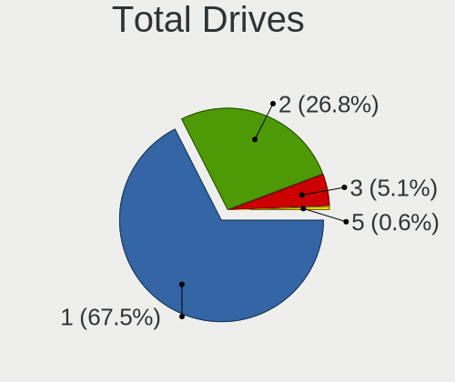
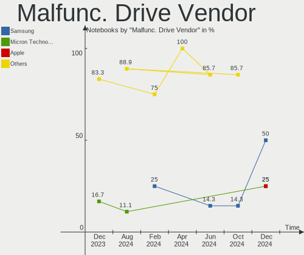
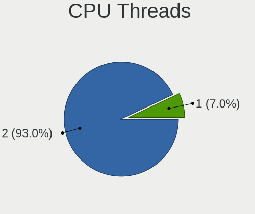
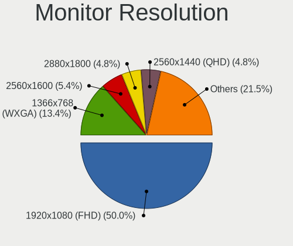
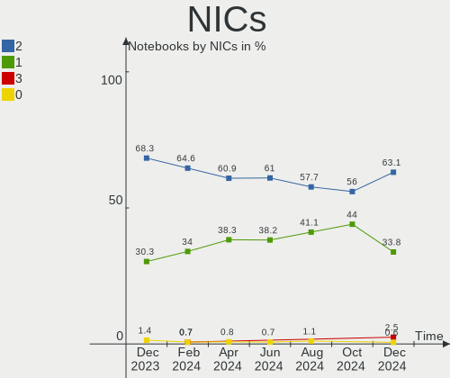

Arch - Hardware Trends (Notebooks)
----------------------------------

A project to identify most popular hardware characteristics and track their change
over time based on data collected by Linux users at https://Linux-Hardware.org.

Anyone can contribute to this report by the [hw-probe](https://github.com/linuxhw/hw-probe) tool:

    sudo -E hw-probe -all -upload

This report is for one last month. Overall report since the beginning of time: [TestDays](https://github.com/linuxhw/TestDays)

Period: Sep, 2023.

Contents
--------

* [ System ](#system)
  - [ OS                       ](#os)
  - [ OS Family                ](#os-family)
  - [ Kernel                   ](#kernel)
  - [ Kernel Family            ](#kernel-family)
  - [ Kernel Major Ver.        ](#kernel-major-ver)
  - [ Arch                     ](#arch)
  - [ DE                       ](#de)
  - [ Display Server           ](#display-server)
  - [ Display Manager          ](#display-manager)
  - [ OS Lang                  ](#os-lang)
  - [ Boot Mode                ](#boot-mode)
  - [ Filesystem               ](#filesystem)
  - [ Part. scheme             ](#part-scheme)
  - [ Dual Boot with Linux/BSD ](#dual-boot-with-linuxbsd)
  - [ Dual Boot (Win)          ](#dual-boot-win)

* [ Board ](#board)
  - [ Vendor                   ](#vendor)
  - [ Model                    ](#model)
  - [ Model Family             ](#model-family)
  - [ MFG Year                 ](#mfg-year)
  - [ Form Factor              ](#form-factor)
  - [ Secure Boot              ](#secure-boot)
  - [ Coreboot                 ](#coreboot)
  - [ RAM Size                 ](#ram-size)
  - [ RAM Used                 ](#ram-used)
  - [ Total Drives             ](#total-drives)
  - [ Has CD-ROM               ](#has-cd-rom)
  - [ Has Ethernet             ](#has-ethernet)
  - [ Has WiFi                 ](#has-wifi)
  - [ Has Bluetooth            ](#has-bluetooth)

* [ Location ](#location)
  - [ Country                  ](#country)
  - [ City                     ](#city)

* [ Drives ](#drives)
  - [ Drive Vendor             ](#drive-vendor)
  - [ Drive Model              ](#drive-model)
  - [ HDD Vendor               ](#hdd-vendor)
  - [ SSD Vendor               ](#ssd-vendor)
  - [ Drive Kind               ](#drive-kind)
  - [ Drive Connector          ](#drive-connector)
  - [ Drive Size               ](#drive-size)
  - [ Space Total              ](#space-total)
  - [ Space Used               ](#space-used)
  - [ Malfunc. Drives          ](#malfunc-drives)
  - [ Malfunc. Drive Vendor    ](#malfunc-drive-vendor)
  - [ Malfunc. HDD Vendor      ](#malfunc-hdd-vendor)
  - [ Malfunc. Drive Kind      ](#malfunc-drive-kind)
  - [ Failed Drives            ](#failed-drives)
  - [ Failed Drive Vendor      ](#failed-drive-vendor)
  - [ Drive Status             ](#drive-status)

* [ Storage controller ](#storage-controller)
  - [ Storage Vendor           ](#storage-vendor)
  - [ Storage Model            ](#storage-model)
  - [ Storage Kind             ](#storage-kind)

* [ Processor ](#processor)
  - [ CPU Vendor               ](#cpu-vendor)
  - [ CPU Model                ](#cpu-model)
  - [ CPU Model Family         ](#cpu-model-family)
  - [ CPU Cores                ](#cpu-cores)
  - [ CPU Sockets              ](#cpu-sockets)
  - [ CPU Threads              ](#cpu-threads)
  - [ CPU Op-Modes             ](#cpu-op-modes)
  - [ CPU Microcode            ](#cpu-microcode)
  - [ CPU Microarch            ](#cpu-microarch)

* [ Graphics ](#graphics)
  - [ GPU Vendor               ](#gpu-vendor)
  - [ GPU Model                ](#gpu-model)
  - [ GPU Combo                ](#gpu-combo)
  - [ GPU Driver               ](#gpu-driver)
  - [ GPU Memory               ](#gpu-memory)

* [ Monitor ](#monitor)
  - [ Monitor Vendor           ](#monitor-vendor)
  - [ Monitor Model            ](#monitor-model)
  - [ Monitor Resolution       ](#monitor-resolution)
  - [ Monitor Diagonal         ](#monitor-diagonal)
  - [ Monitor Width            ](#monitor-width)
  - [ Aspect Ratio             ](#aspect-ratio)
  - [ Monitor Area             ](#monitor-area)
  - [ Pixel Density            ](#pixel-density)
  - [ Multiple Monitors        ](#multiple-monitors)

* [ Network ](#network)
  - [ Net Controller Vendor    ](#net-controller-vendor)
  - [ Net Controller Model     ](#net-controller-model)
  - [ Wireless Vendor          ](#wireless-vendor)
  - [ Wireless Model           ](#wireless-model)
  - [ Ethernet Vendor          ](#ethernet-vendor)
  - [ Ethernet Model           ](#ethernet-model)
  - [ Net Controller Kind      ](#net-controller-kind)
  - [ Used Controller          ](#used-controller)
  - [ NICs                     ](#nics)
  - [ IPv6                     ](#ipv6)

* [ Bluetooth ](#bluetooth)
  - [ Bluetooth Vendor         ](#bluetooth-vendor)
  - [ Bluetooth Model          ](#bluetooth-model)

* [ Sound ](#sound)
  - [ Sound Vendor             ](#sound-vendor)
  - [ Sound Model              ](#sound-model)

* [ Memory ](#memory)
  - [ Memory Vendor            ](#memory-vendor)
  - [ Memory Model             ](#memory-model)
  - [ Memory Kind              ](#memory-kind)
  - [ Memory Form Factor       ](#memory-form-factor)
  - [ Memory Size              ](#memory-size)
  - [ Memory Speed             ](#memory-speed)

* [ Printers & scanners ](#printers--scanners)
  - [ Printer Vendor           ](#printer-vendor)
  - [ Printer Model            ](#printer-model)
  - [ Scanner Vendor           ](#scanner-vendor)
  - [ Scanner Model            ](#scanner-model)

* [ Camera ](#camera)
  - [ Camera Vendor            ](#camera-vendor)
  - [ Camera Model             ](#camera-model)

* [ Security ](#security)
  - [ Fingerprint Vendor       ](#fingerprint-vendor)
  - [ Fingerprint Model        ](#fingerprint-model)
  - [ Chipcard Vendor          ](#chipcard-vendor)
  - [ Chipcard Model           ](#chipcard-model)

* [ Unsupported ](#unsupported)
  - [ Unsupported Devices      ](#unsupported-devices)
  - [ Unsupported Device Types ](#unsupported-device-types)

System
------

OS
--

Installed operating systems

| Name                   | Notebooks | Percent |
|------------------------|-----------|---------|
| Arch Rolling           | 116       | 99.15%  |
| Arch 20230723.0.166908 | 1         | 0.85%   |

OS Family
---------

OS without a version

| Name | Notebooks | Percent |
|------|-----------|---------|
| Arch | 117       | 100%    |

Kernel
------

Version of the Linux kernel

| Version                      | Notebooks | Percent |
|------------------------------|-----------|---------|
| 6.4.12-arch1-1               | 27        | 23.08%  |
| 6.5.4-arch2-1                | 18        | 15.38%  |
| 6.5.3-arch1-1                | 18        | 15.38%  |
| 6.5.2-arch1-1                | 13        | 11.11%  |
| 6.4.12-zen1-1-zen            | 5         | 4.27%   |
| 6.5.3-zen1-1-zen             | 4         | 3.42%   |
| 6.1.51-1-lts                 | 4         | 3.42%   |
| 6.5.5-zen1-1-zen             | 3         | 2.56%   |
| 6.5.5-arch1-1                | 2         | 1.71%   |
| 6.5.4-zen2-1-zen             | 2         | 1.71%   |
| 6.1.54-1-lts                 | 2         | 1.71%   |
| 6.1.52-1-lts                 | 2         | 1.71%   |
| 6.1.50-1-lts                 | 2         | 1.71%   |
| 6.6.0-rc2-1-mainline         | 1         | 0.85%   |
| 6.5.5-1-cachyos              | 1         | 0.85%   |
| 6.5.4-hardened1-1-hardened   | 1         | 0.85%   |
| 6.5.2-arch1-Ototsuku-T2-1-t2 | 1         | 0.85%   |
| 6.4.6-arch1-1                | 1         | 0.85%   |
| 6.4.15-x64v2-xanmod1-1       | 1         | 0.85%   |
| 6.4.14-x64v3-xanmod1         | 1         | 0.85%   |
| 6.4.11-arch2-1               | 1         | 0.85%   |
| 6.4.10-arch1-1               | 1         | 0.85%   |
| 6.2.9-arch1-1                | 1         | 0.85%   |
| 6.2.12-arch1-1               | 1         | 0.85%   |
| 6.1.55-273-tkg-cfs           | 1         | 0.85%   |
| 6.1.39-3-lts                 | 1         | 0.85%   |
| 6.1.19-1-lts                 | 1         | 0.85%   |
| 6.0.12-arch1-1               | 1         | 0.85%   |

Kernel Family
-------------

Linux kernel without a distro release

| Version | Notebooks | Percent |
|---------|-----------|---------|
| 6.4.12  | 32        | 27.35%  |
| 6.5.3   | 22        | 18.8%   |
| 6.5.4   | 21        | 17.95%  |
| 6.5.2   | 14        | 11.97%  |
| 6.5.5   | 6         | 5.13%   |
| 6.1.51  | 4         | 3.42%   |
| 6.1.54  | 2         | 1.71%   |
| 6.1.52  | 2         | 1.71%   |
| 6.1.50  | 2         | 1.71%   |
| 6.6.0   | 1         | 0.85%   |
| 6.4.6   | 1         | 0.85%   |
| 6.4.15  | 1         | 0.85%   |
| 6.4.14  | 1         | 0.85%   |
| 6.4.11  | 1         | 0.85%   |
| 6.4.10  | 1         | 0.85%   |
| 6.2.9   | 1         | 0.85%   |
| 6.2.12  | 1         | 0.85%   |
| 6.1.55  | 1         | 0.85%   |
| 6.1.39  | 1         | 0.85%   |
| 6.1.19  | 1         | 0.85%   |
| 6.0.12  | 1         | 0.85%   |

Kernel Major Ver.
-----------------

Linux kernel major version

| Version | Notebooks | Percent |
|---------|-----------|---------|
| 6.5     | 63        | 53.85%  |
| 6.4     | 37        | 31.62%  |
| 6.1     | 13        | 11.11%  |
| 6.2     | 2         | 1.71%   |
| 6.6     | 1         | 0.85%   |
| 6.0     | 1         | 0.85%   |

Arch
----

OS architecture (x86_64, i586, etc.)

| Name   | Notebooks | Percent |
|--------|-----------|---------|
| x86_64 | 117       | 100%    |

DE
--

Desktop Environment

| Name       | Notebooks | Percent |
|------------|-----------|---------|
| GNOME      | 40        | 34.19%  |
| KDE5       | 36        | 30.77%  |
| i3         | 10        | 8.55%   |
| Unknown    | 10        | 8.55%   |
| XFCE       | 7         | 5.98%   |
| Hyprland   | 6         | 5.13%   |
| X-Cinnamon | 2         | 1.71%   |
| sway       | 1         | 0.85%   |
| MATE       | 1         | 0.85%   |
| LXQt       | 1         | 0.85%   |
| kde        | 1         | 0.85%   |
| Budgie     | 1         | 0.85%   |
| bspwm      | 1         | 0.85%   |

Display Server
--------------

X11 or Wayland

| Name    | Notebooks | Percent |
|---------|-----------|---------|
| Wayland | 55        | 47.01%  |
| X11     | 52        | 44.44%  |
| Tty     | 6         | 5.13%   |
| Unknown | 4         | 3.42%   |

Display Manager
---------------

SDDM, LightDM, etc.

| Name    | Notebooks | Percent |
|---------|-----------|---------|
| Unknown | 43        | 36.75%  |
| SDDM    | 31        | 26.5%   |
| LightDM | 20        | 17.09%  |
| GDM     | 18        | 15.38%  |
| SLiM    | 2         | 1.71%   |
| LY-DM   | 2         | 1.71%   |
| Ly      | 1         | 0.85%   |

OS Lang
-------

Language

| Lang      | Notebooks | Percent |
|-----------|-----------|---------|
| en_US     | 57        | 48.72%  |
| C         | 9         | 7.69%   |
| en_GB     | 7         | 5.98%   |
| it_IT     | 6         | 5.13%   |
| de_DE     | 6         | 5.13%   |
| ru_RU     | 5         | 4.27%   |
| fr_FR     | 5         | 4.27%   |
| pt_BR     | 4         | 3.42%   |
| Unknown   | 3         | 2.56%   |
| pl_PL     | 2         | 1.71%   |
| en_CA     | 2         | 1.71%   |
| zh_CN     | 1         | 0.85%   |
| uk_UA     | 1         | 0.85%   |
| tr_TR     | 1         | 0.85%   |
| es_ES     | 1         | 0.85%   |
| es_AR     | 1         | 0.85%   |
| en_IN     | 1         | 0.85%   |
| en_IE     | 1         | 0.85%   |
| en_DK     | 1         | 0.85%   |
| en_AG     | 1         | 0.85%   |
| de_DEutf8 | 1         | 0.85%   |
| da_DK     | 1         | 0.85%   |

Boot Mode
---------

EFI or BIOS

| Mode | Notebooks | Percent |
|------|-----------|---------|
| EFI  | 77        | 65.81%  |
| BIOS | 40        | 34.19%  |

Filesystem
----------

Type of filesystem

| Type                | Notebooks | Percent |
|---------------------|-----------|---------|
| Ext4                | 69        | 58.97%  |
| Btrfs               | 38        | 32.48%  |
| Xfs                 | 3         | 2.56%   |
| Zfs                 | 2         | 1.71%   |
| Tmpfs               | 2         | 1.71%   |
| XXXXX               | 1         | 0.85%   |
| XXX4                | 1         | 0.85%   |
| Fuse.fuse-overlayfs | 1         | 0.85%   |

Part. scheme
------------

Scheme of partitioning

| Type    | Notebooks | Percent |
|---------|-----------|---------|
| GPT     | 81        | 69.23%  |
| Unknown | 31        | 26.5%   |
| MBR     | 5         | 4.27%   |

Dual Boot with Linux/BSD
------------------------

Hosting more than one Linux/BSD

| Dual boot | Notebooks | Percent |
|-----------|-----------|---------|
| No        | 106       | 90.6%   |
| Yes       | 11        | 9.4%    |

Dual Boot (Win)
---------------

Hosting Linux and Windows

| Dual boot | Notebooks | Percent |
|-----------|-----------|---------|
| No        | 89        | 76.07%  |
| Yes       | 28        | 23.93%  |

Board
-----

Vendor
------

Motherboard manufacturer

| Name                | Notebooks | Percent |
|---------------------|-----------|---------|
| Lenovo              | 36        | 30.77%  |
| Dell                | 25        | 21.37%  |
| ASUSTek Computer    | 18        | 15.38%  |
| Hewlett-Packard     | 16        | 13.68%  |
| Acer                | 6         | 5.13%   |
| MSI                 | 4         | 3.42%   |
| HUAWEI              | 3         | 2.56%   |
| Timi                | 2         | 1.71%   |
| Samsung Electronics | 2         | 1.71%   |
| Apple               | 2         | 1.71%   |
| Google              | 1         | 0.85%   |
| Fujitsu             | 1         | 0.85%   |
| eMachines           | 1         | 0.85%   |

Model
-----

Motherboard model

| Name                                       | Notebooks | Percent |
|--------------------------------------------|-----------|---------|
| Samsung 750XDA                             | 2         | 1.71%   |
| ASUS ASUS TUF Gaming F15 FX506LHB_FX506LHB | 2         | 1.71%   |
| Timi Redmi G 2022                          | 1         | 0.85%   |
| Timi A35S                                  | 1         | 0.85%   |
| MSI Modern 14 B11MOU                       | 1         | 0.85%   |
| MSI Katana GF76 11UE                       | 1         | 0.85%   |
| MSI GF75 Thin 10SC                         | 1         | 0.85%   |
| MSI Bravo 15 C7VF                          | 1         | 0.85%   |
| Lenovo YogaAir 14s APU8 83AA               | 1         | 0.85%   |
| Lenovo Yoga Slim 7 14APU8 83AA             | 1         | 0.85%   |
| Lenovo V15 G3 ABA 82TV                     | 1         | 0.85%   |
| Lenovo ThinkPad X390 20Q0002UUS            | 1         | 0.85%   |
| Lenovo ThinkPad X250 20CLS2TQ0E            | 1         | 0.85%   |
| Lenovo ThinkPad X220 4290LT8               | 1         | 0.85%   |
| Lenovo ThinkPad T480s 20L8002WMD           | 1         | 0.85%   |
| Lenovo ThinkPad T470 W10DG 20JNS05Y00      | 1         | 0.85%   |
| Lenovo ThinkPad T470 20HES6HC00            | 1         | 0.85%   |
| Lenovo ThinkPad T450s 20BWS03F00           | 1         | 0.85%   |
| Lenovo ThinkPad T440s 20ARS0XL00           | 1         | 0.85%   |
| Lenovo ThinkPad T440p 20AWS49Q00           | 1         | 0.85%   |
| Lenovo ThinkPad T14 Gen 3 21CF002GMX       | 1         | 0.85%   |
| Lenovo ThinkPad P1 Gen 5 21DCCTO1WW        | 1         | 0.85%   |
| Lenovo ThinkPad P1 Gen 4i 20Y4S1QE0F       | 1         | 0.85%   |
| Lenovo ThinkPad L540 20AU006CRI            | 1         | 0.85%   |
| Lenovo ThinkPad Edge E431 627788S          | 1         | 0.85%   |
| Lenovo ThinkPad E15 Gen 2 20TDS0GF00       | 1         | 0.85%   |
| Lenovo ThinkPad E14 Gen 4 21E30087TX       | 1         | 0.85%   |
| Lenovo ThinkPad 13 2nd Gen 20J2S0TE00      | 1         | 0.85%   |
| Lenovo ThinkBook 15 G2 ITL 20VE            | 1         | 0.85%   |
| Lenovo Legion Y540-15IRH-PG0 81SY          | 1         | 0.85%   |
| Lenovo Legion Y530-15ICH 81FV              | 1         | 0.85%   |
| Lenovo Legion S7 15ACH6 82K8               | 1         | 0.85%   |
| Lenovo Legion 7 16ARHA7 82UH               | 1         | 0.85%   |
| Lenovo Legion 5 Pro 16ACH6H 82JQ           | 1         | 0.85%   |
| Lenovo IdeaPad Y700-17ISK 80Q0             | 1         | 0.85%   |
| Lenovo IdeaPad S145-15IWL 81S9             | 1         | 0.85%   |
| Lenovo IdeaPad N581 7505                   | 1         | 0.85%   |
| Lenovo IdeaPad Gaming 3 15IMH05 81Y4       | 1         | 0.85%   |
| Lenovo IdeaPad 330S-14IKB 81F4             | 1         | 0.85%   |
| Lenovo IdeaPad 3 17ALC6 82KV               | 1         | 0.85%   |

Model Family
------------

Motherboard model prefix

| Name              | Notebooks | Percent |
|-------------------|-----------|---------|
| Lenovo ThinkPad   | 17        | 14.53%  |
| Lenovo IdeaPad    | 10        | 8.55%   |
| Dell Latitude     | 9         | 7.69%   |
| Dell Inspiron     | 8         | 6.84%   |
| ASUS ASUS         | 6         | 5.13%   |
| Lenovo Legion     | 5         | 4.27%   |
| HP Pavilion       | 5         | 4.27%   |
| ASUS VivoBook     | 5         | 4.27%   |
| HP ProBook        | 3         | 2.56%   |
| Dell XPS          | 3         | 2.56%   |
| ASUS Zenbook      | 3         | 2.56%   |
| Samsung 750XDA    | 2         | 1.71%   |
| HP Laptop         | 2         | 1.71%   |
| HP EliteBook      | 2         | 1.71%   |
| Dell Vostro       | 2         | 1.71%   |
| Acer Nitro        | 2         | 1.71%   |
| Acer Aspire       | 2         | 1.71%   |
| Timi Redmi        | 1         | 0.85%   |
| Timi A35S         | 1         | 0.85%   |
| MSI Modern        | 1         | 0.85%   |
| MSI Katana        | 1         | 0.85%   |
| MSI GF75          | 1         | 0.85%   |
| MSI Bravo         | 1         | 0.85%   |
| Lenovo YogaAir    | 1         | 0.85%   |
| Lenovo Yoga       | 1         | 0.85%   |
| Lenovo V15        | 1         | 0.85%   |
| Lenovo ThinkBook  | 1         | 0.85%   |
| HUAWEI NBD-WXX9   | 1         | 0.85%   |
| HUAWEI HKD-WXX    | 1         | 0.85%   |
| HUAWEI BOM-WXX9   | 1         | 0.85%   |
| HP Victus         | 1         | 0.85%   |
| HP OMEN           | 1         | 0.85%   |
| HP Elite          | 1         | 0.85%   |
| HP 240            | 1         | 0.85%   |
| Google Lindar     | 1         | 0.85%   |
| Fujitsu LIFEBOOK  | 1         | 0.85%   |
| eMachines eME732Z | 1         | 0.85%   |
| Dell Precision    | 1         | 0.85%   |
| Dell G5           | 1         | 0.85%   |
| Dell G3           | 1         | 0.85%   |

MFG Year
--------

Motherboard manufacture year

| Year | Notebooks | Percent |
|------|-----------|---------|
| 2021 | 24        | 20.51%  |
| 2022 | 18        | 15.38%  |
| 2020 | 11        | 9.4%    |
| 2013 | 9         | 7.69%   |
| 2019 | 8         | 6.84%   |
| 2023 | 7         | 5.98%   |
| 2014 | 7         | 5.98%   |
| 2018 | 6         | 5.13%   |
| 2017 | 6         | 5.13%   |
| 2012 | 6         | 5.13%   |
| 2016 | 5         | 4.27%   |
| 2015 | 4         | 3.42%   |
| 2011 | 3         | 2.56%   |
| 2008 | 2         | 1.71%   |
| 2010 | 1         | 0.85%   |

Form Factor
-----------

Physical design of the computer

| Name     | Notebooks | Percent |
|----------|-----------|---------|
| Notebook | 117       | 100%    |

Secure Boot
-----------

Enabled or disabled

| State    | Notebooks | Percent |
|----------|-----------|---------|
| Disabled | 115       | 98.29%  |
| Enabled  | 2         | 1.71%   |

Coreboot
--------

Have coreboot on board

| Used | Notebooks | Percent |
|------|-----------|---------|
| No   | 116       | 99.15%  |
| Yes  | 1         | 0.85%   |

RAM Size
--------

Total RAM memory

| Size in GB  | Notebooks | Percent |
|-------------|-----------|---------|
| 4.01-8.0    | 42        | 35.9%   |
| 8.01-16.0   | 31        | 26.5%   |
| 16.01-24.0  | 23        | 19.66%  |
| 32.01-64.0  | 9         | 7.69%   |
| 3.01-4.0    | 5         | 4.27%   |
| 24.01-32.0  | 4         | 3.42%   |
| 64.01-256.0 | 2         | 1.71%   |
| 1.01-2.0    | 1         | 0.85%   |

RAM Used
--------

Used RAM memory

| Used GB    | Notebooks | Percent |
|------------|-----------|---------|
| 2.01-3.0   | 29        | 24.79%  |
| 4.01-8.0   | 26        | 22.22%  |
| 1.01-2.0   | 25        | 21.37%  |
| 3.01-4.0   | 22        | 18.8%   |
| 8.01-16.0  | 11        | 9.4%    |
| 0.51-1.0   | 2         | 1.71%   |
| 24.01-32.0 | 1         | 0.85%   |
| 16.01-24.0 | 1         | 0.85%   |

Total Drives
------------

Number of drives on board

| Drives | Notebooks | Percent |
|--------|-----------|---------|
| 1      | 86        | 73.5%   |
| 2      | 30        | 25.64%  |
| 3      | 1         | 0.85%   |

Has CD-ROM
----------

Has CD-ROM on board

| Presented | Notebooks | Percent |
|-----------|-----------|---------|
| No        | 98        | 83.76%  |
| Yes       | 19        | 16.24%  |

Has Ethernet
------------

Has Ethernet on board

| Presented | Notebooks | Percent |
|-----------|-----------|---------|
| Yes       | 85        | 72.65%  |
| No        | 32        | 27.35%  |

Has WiFi
--------

Has WiFi module

| Presented | Notebooks | Percent |
|-----------|-----------|---------|
| Yes       | 116       | 99.15%  |
| No        | 1         | 0.85%   |

Has Bluetooth
-------------

Has Bluetooth module

| Presented | Notebooks | Percent |
|-----------|-----------|---------|
| Yes       | 105       | 89.74%  |
| No        | 12        | 10.26%  |

Location
--------

Country
-------

Geographic location (country)

| Country      | Notebooks | Percent |
|--------------|-----------|---------|
| USA          | 12        | 10.26%  |
| Russia       | 9         | 7.69%   |
| Italy        | 9         | 7.69%   |
| Germany      | 9         | 7.69%   |
| UK           | 6         | 5.13%   |
| India        | 6         | 5.13%   |
| France       | 6         | 5.13%   |
| Brazil       | 6         | 5.13%   |
| Spain        | 4         | 3.42%   |
| Poland       | 4         | 3.42%   |
| Ukraine      | 3         | 2.56%   |
| Turkey       | 3         | 2.56%   |
| Denmark      | 3         | 2.56%   |
| Thailand     | 2         | 1.71%   |
| Switzerland  | 2         | 1.71%   |
| Serbia       | 2         | 1.71%   |
| Netherlands  | 2         | 1.71%   |
| Nepal        | 2         | 1.71%   |
| Kenya        | 2         | 1.71%   |
| Indonesia    | 2         | 1.71%   |
| Canada       | 2         | 1.71%   |
| Belgium      | 2         | 1.71%   |
| Argentina    | 2         | 1.71%   |
| Uzbekistan   | 1         | 0.85%   |
| Sri Lanka    | 1         | 0.85%   |
| Saudi Arabia | 1         | 0.85%   |
| Romania      | 1         | 0.85%   |
| Peru         | 1         | 0.85%   |
| Panama       | 1         | 0.85%   |
| Pakistan     | 1         | 0.85%   |
| Morocco      | 1         | 0.85%   |
| Mexico       | 1         | 0.85%   |
| Lebanon      | 1         | 0.85%   |
| Latvia       | 1         | 0.85%   |
| Estonia      | 1         | 0.85%   |
| Egypt        | 1         | 0.85%   |
| China        | 1         | 0.85%   |
| Chile        | 1         | 0.85%   |
| Bangladesh   | 1         | 0.85%   |
| Austria      | 1         | 0.85%   |

City
----

Geographic location (city)

| City                | Notebooks | Percent |
|---------------------|-----------|---------|
| Milan               | 3         | 2.56%   |
| Berlin              | 3         | 2.56%   |
| Shoreham            | 2         | 1.71%   |
| Sao Paulo           | 2         | 1.71%   |
| Rostov-on-Don       | 2         | 1.71%   |
| Nairobi             | 2         | 1.71%   |
| Moscow              | 2         | 1.71%   |
| Madrid              | 2         | 1.71%   |
| Bengaluru           | 2         | 1.71%   |
| Bangkok             | 2         | 1.71%   |
| Ankara              | 2         | 1.71%   |
| Zurich              | 1         | 0.85%   |
| Zrenjanin           | 1         | 0.85%   |
| Zduny               | 1         | 0.85%   |
| Worthing            | 1         | 0.85%   |
| Vittuone            | 1         | 0.85%   |
| Vitry-sur-Seine     | 1         | 0.85%   |
| Vigo                | 1         | 0.85%   |
| Venice              | 1         | 0.85%   |
| Valencia            | 1         | 0.85%   |
| Užice              | 1         | 0.85%   |
| Uberlândia         | 1         | 0.85%   |
| Turin               | 1         | 0.85%   |
| Tuoro sul Trasimeno | 1         | 0.85%   |
| Toulouse            | 1         | 0.85%   |
| Thonon-les-Bains    | 1         | 0.85%   |
| Tashkent            | 1         | 0.85%   |
| Tangier             | 1         | 0.85%   |
| Tallinn             | 1         | 0.85%   |
| Sønderborg         | 1         | 0.85%   |
| Stillwater          | 1         | 0.85%   |
| Stettlen            | 1         | 0.85%   |
| St Petersburg       | 1         | 0.85%   |
| Spring              | 1         | 0.85%   |
| Silkeborg           | 1         | 0.85%   |
| Sao Vicente         | 1         | 0.85%   |
| Samsun              | 1         | 0.85%   |
| Ryde                | 1         | 0.85%   |
| Roubaix             | 1         | 0.85%   |
| Riyadh              | 1         | 0.85%   |

Drives
------

Drive Vendor
------------

Hard drive vendors

| Vendor                         | Notebooks | Drives | Percent |
|--------------------------------|-----------|--------|---------|
| Samsung Electronics            | 27        | 30     | 18.49%  |
| SanDisk                        | 13        | 14     | 8.9%    |
| WDC                            | 10        | 10     | 6.85%   |
| Toshiba                        | 10        | 10     | 6.85%   |
| Intel                          | 10        | 10     | 6.85%   |
| SK hynix                       | 9         | 9      | 6.16%   |
| Micron Technology              | 9         | 9      | 6.16%   |
| Seagate                        | 7         | 7      | 4.79%   |
| KIOXIA                         | 6         | 6      | 4.11%   |
| Crucial                        | 4         | 4      | 2.74%   |
| Unknown                        | 3         | 3      | 2.05%   |
| Union Memory                   | 3         | 3      | 2.05%   |
| Kingston                       | 3         | 3      | 2.05%   |
| Solid State Storage Technology | 2         | 2      | 1.37%   |
| Phison Electronics             | 2         | 2      | 1.37%   |
| Kingston Technology Company    | 2         | 2      | 1.37%   |
| HGST                           | 2         | 2      | 1.37%   |
| Dogfish                        | 2         | 2      | 1.37%   |
| Apple                          | 2         | 2      | 1.37%   |
| Yangtze Memory Technologies    | 1         | 1      | 0.68%   |
| USB                            | 1         | 1      | 0.68%   |
| UP                             | 1         | 1      | 0.68%   |
| TO Exter                       | 1         | 1      | 0.68%   |
| Team                           | 1         | 1      | 0.68%   |
| SSSTC                          | 1         | 1      | 0.68%   |
| SPCC                           | 1         | 1      | 0.68%   |
| Solid State Storage            | 1         | 1      | 0.68%   |
| Silicon Motion                 | 1         | 1      | 0.68%   |
| Shenzhen Longsys Electronics   | 1         | 1      | 0.68%   |
| MicroFrom                      | 1         | 1      | 0.68%   |
| MAXIO Technology (Hangzhou)    | 1         | 1      | 0.68%   |
| Lite-On Technology             | 1         | 1      | 0.68%   |
| Intenso                        | 1         | 1      | 0.68%   |
| HS-SSD-E100                    | 1         | 1      | 0.68%   |
| GOODRAM                        | 1         | 1      | 0.68%   |
| geonix                         | 1         | 1      | 0.68%   |
| Fanxiang                       | 1         | 1      | 0.68%   |
| China                          | 1         | 1      | 0.68%   |
| A-DATA Technology              | 1         | 1      | 0.68%   |

Drive Model
-----------

Hard drive models

| Model                                               | Notebooks | Percent |
|-----------------------------------------------------|-----------|---------|
| Samsung NVMe SSD Controller PM9A1/PM9A3/980PRO 1TB  | 10        | 6.71%   |
| Intel SSDPEKNU512GZ 512GB                           | 6         | 4.03%   |
| Seagate ST1000LM035-1RK172 1TB                      | 3         | 2.01%   |
| Micron 2400_MTFDKBA512QFM 512GB                     | 3         | 2.01%   |
| Unknown MMC Card  128GB                             | 2         | 1.34%   |
| Union Memory UMIS RPJTJ256MEE1OWX 256GB             | 2         | 1.34%   |
| Toshiba MQ04ABF100 1TB                              | 2         | 1.34%   |
| SK hynix HFM512GD3JX013N 512GB                      | 2         | 1.34%   |
| SK hynix BC511 512GB                                | 2         | 1.34%   |
| Samsung SSD 860 QVO 1TB                             | 2         | 1.34%   |
| Samsung SSD 850 EVO 250GB                           | 2         | 1.34%   |
| Samsung NVMe SSD Controller SM981/PM981/PM983 256GB | 2         | 1.34%   |
| KIOXIA KBG40ZNS512G NVMe 512GB                      | 2         | 1.34%   |
| Kingston Company OM3PDP3 NVMe SSD 512GB             | 2         | 1.34%   |
| Crucial CT1000MX500SSD1 1TB                         | 2         | 1.34%   |
| Yangtze Memory ZHITAI TiPlus5000 1TB                | 1         | 0.67%   |
| WDC WDS250G1B0A-00H9H0 250GB SSD                    | 1         | 0.67%   |
| WDC WD5000LPCX-80VHAT1 500GB                        | 1         | 0.67%   |
| WDC WD50 00LPVX-22V0TT0 500GB                       | 1         | 0.67%   |
| WDC WD3200BPVT-75JJ5T0 320GB                        | 1         | 0.67%   |
| WDC WD3200BPVT-22ZEST0 320GB                        | 1         | 0.67%   |
| WDC WD1600BEVT-22ZCT0 160GB                         | 1         | 0.67%   |
| WDC WD10SPSX-60A6WT0 1TB                            | 1         | 0.67%   |
| WDC WD10SPSX-21A6WT0 1TB                            | 1         | 0.67%   |
| WDC WD10SPCX-24HWST1 1TB                            | 1         | 0.67%   |
| WDC WD10JPLX-00MBPT0 1TB                            | 1         | 0.67%   |
| USB 3.1 1TB                                         | 1         | 0.67%   |
| UP GAMER UP500 960GB                                | 1         | 0.67%   |
| Unknown NVMe SSD Drive 512GB                        | 1         | 0.67%   |
| Union Memory UMIS RPJTJ512MEE1OWX 512GB             | 1         | 0.67%   |
| Toshiba XG4 NVMe SSD Controller 512GB               | 1         | 0.67%   |
| Toshiba MQ01ACF050 500GB                            | 1         | 0.67%   |
| Toshiba MQ01ABD100 1TB                              | 1         | 0.67%   |
| Toshiba MQ01ABD050 500GB                            | 1         | 0.67%   |
| Toshiba MK6476GSX 640GB                             | 1         | 0.67%   |
| Toshiba MK3265GSX H 320GB                           | 1         | 0.67%   |
| Toshiba KXG50ZNV256G NVMe 256GB                     | 1         | 0.67%   |
| Toshiba KXG50ZNV256G 256GB                          | 1         | 0.67%   |
| TO Exter nal USB 3.0 120GB                          | 1         | 0.67%   |
| Team T253X5240G 240GB SSD                           | 1         | 0.67%   |

HDD Vendor
----------

Hard disk drive vendors

| Vendor              | Notebooks | Drives | Percent |
|---------------------|-----------|--------|---------|
| WDC                 | 9         | 9      | 33.33%  |
| Toshiba             | 7         | 7      | 25.93%  |
| Seagate             | 7         | 7      | 25.93%  |
| HGST                | 2         | 2      | 7.41%   |
| USB                 | 1         | 1      | 3.7%    |
| Samsung Electronics | 1         | 1      | 3.7%    |

SSD Vendor
----------

Solid state drive vendors

| Vendor              | Notebooks | Drives | Percent |
|---------------------|-----------|--------|---------|
| Samsung Electronics | 6         | 7      | 18.18%  |
| SanDisk             | 4         | 4      | 12.12%  |
| Crucial             | 4         | 4      | 12.12%  |
| Micron Technology   | 2         | 2      | 6.06%   |
| Dogfish             | 2         | 2      | 6.06%   |
| WDC                 | 1         | 1      | 3.03%   |
| TO Exter            | 1         | 1      | 3.03%   |
| Team                | 1         | 1      | 3.03%   |
| SPCC                | 1         | 1      | 3.03%   |
| SK hynix            | 1         | 1      | 3.03%   |
| MicroFrom           | 1         | 1      | 3.03%   |
| Kingston            | 1         | 1      | 3.03%   |
| Intenso             | 1         | 1      | 3.03%   |
| Intel               | 1         | 1      | 3.03%   |
| HS-SSD-E100         | 1         | 1      | 3.03%   |
| GOODRAM             | 1         | 1      | 3.03%   |
| geonix              | 1         | 1      | 3.03%   |
| Fanxiang            | 1         | 1      | 3.03%   |
| China               | 1         | 1      | 3.03%   |
| Apple               | 1         | 1      | 3.03%   |

Drive Kind
----------

HDD or SSD

| Kind    | Notebooks | Drives | Percent |
|---------|-----------|--------|---------|
| NVMe    | 79        | 85     | 55.63%  |
| SSD     | 32        | 34     | 22.54%  |
| HDD     | 27        | 27     | 19.01%  |
| MMC     | 2         | 2      | 1.41%   |
| Unknown | 2         | 2      | 1.41%   |

Drive Connector
---------------

SATA, SAS, NVMe, etc.

| Type | Notebooks | Drives | Percent |
|------|-----------|--------|---------|
| NVMe | 79        | 85     | 56.83%  |
| SATA | 54        | 59     | 38.85%  |
| SAS  | 4         | 4      | 2.88%   |
| MMC  | 2         | 2      | 1.44%   |

Drive Size
----------

Size of hard drive

| Size in TB | Notebooks | Drives | Percent |
|------------|-----------|--------|---------|
| 0.01-0.5   | 30        | 33     | 51.72%  |
| 0.51-1.0   | 25        | 25     | 43.1%   |
| 1.01-2.0   | 3         | 3      | 5.17%   |

Space Total
-----------

Amount of disk space available on the file system

| Size in GB     | Notebooks | Percent |
|----------------|-----------|---------|
| 251-500        | 37        | 31.62%  |
| 101-250        | 21        | 17.95%  |
| 501-1000       | 21        | 17.95%  |
| 1001-2000      | 13        | 11.11%  |
| More than 3000 | 10        | 8.55%   |
| 1-20           | 5         | 4.27%   |
| 2001-3000      | 3         | 2.56%   |
| 51-100         | 3         | 2.56%   |
| 21-50          | 2         | 1.71%   |
| Unknown        | 2         | 1.71%   |

Space Used
----------

Amount of used disk space

| Used GB        | Notebooks | Percent |
|----------------|-----------|---------|
| 1-20           | 29        | 24.79%  |
| 101-250        | 28        | 23.93%  |
| 51-100         | 18        | 15.38%  |
| 21-50          | 17        | 14.53%  |
| 251-500        | 8         | 6.84%   |
| 501-1000       | 8         | 6.84%   |
| 2001-3000      | 6         | 5.13%   |
| Unknown        | 2         | 1.71%   |
| More than 3000 | 1         | 0.85%   |

Malfunc. Drives
---------------

Drive models with a malfunction

| Model                                               | Notebooks | Drives | Percent |
|-----------------------------------------------------|-----------|--------|---------|
| WDC WD3200BPVT-22ZEST0 320GB                        | 1         | 1      | 20%     |
| Micron Technology MTFDDAK256TDL-1AW15ABHA 256GB SSD | 1         | 1      | 20%     |
| Intel SSDSC2BF360A5L 360GB                          | 1         | 1      | 20%     |
| HGST HTS721010A9E630 1TB                            | 1         | 1      | 20%     |
| A-DATA Technology IM2P33F3 NVMe 512GB               | 1         | 1      | 20%     |

Malfunc. Drive Vendor
---------------------

Vendors of faulty drives

| Vendor            | Notebooks | Drives | Percent |
|-------------------|-----------|--------|---------|
| WDC               | 1         | 1      | 20%     |
| Micron Technology | 1         | 1      | 20%     |
| Intel             | 1         | 1      | 20%     |
| HGST              | 1         | 1      | 20%     |
| A-DATA Technology | 1         | 1      | 20%     |

Malfunc. HDD Vendor
-------------------

Vendors of faulty HDD drives

| Vendor | Notebooks | Drives | Percent |
|--------|-----------|--------|---------|
| WDC    | 1         | 1      | 50%     |
| HGST   | 1         | 1      | 50%     |

Malfunc. Drive Kind
-------------------

Kinds of faulty drives

| Kind | Notebooks | Drives | Percent |
|------|-----------|--------|---------|
| SSD  | 2         | 2      | 40%     |
| HDD  | 2         | 2      | 40%     |
| NVMe | 1         | 1      | 20%     |

Failed Drives
-------------

Failed drive models

Zero info for selected period =(

Failed Drive Vendor
-------------------

Failed drive vendors

Zero info for selected period =(

Drive Status
------------

Number of failed and malfunc. drives

| Status   | Notebooks | Drives | Percent |
|----------|-----------|--------|---------|
| Detected | 60        | 72     | 48%     |
| Works    | 60        | 73     | 48%     |
| Malfunc  | 5         | 5      | 4%      |

Storage controller
------------------

Storage Vendor
--------------

Storage controller vendors

| Vendor                         | Notebooks | Percent |
|--------------------------------|-----------|---------|
| Intel                          | 69        | 45.39%  |
| Samsung Electronics            | 20        | 13.16%  |
| AMD                            | 10        | 6.58%   |
| SanDisk                        | 9         | 5.92%   |
| SK hynix                       | 8         | 5.26%   |
| Micron Technology              | 7         | 4.61%   |
| KIOXIA                         | 6         | 3.95%   |
| Kingston Technology Company    | 4         | 2.63%   |
| Union Memory (Shenzhen)        | 3         | 1.97%   |
| Toshiba America Info Systems   | 3         | 1.97%   |
| Solid State Storage Technology | 3         | 1.97%   |
| Phison Electronics             | 2         | 1.32%   |
| Yangtze Memory Technologies    | 1         | 0.66%   |
| Silicon Motion                 | 1         | 0.66%   |
| Shenzhen Longsys Electronics   | 1         | 0.66%   |
| MAXIO Technology (Hangzhou)    | 1         | 0.66%   |
| Lite-On Technology             | 1         | 0.66%   |
| Apple                          | 1         | 0.66%   |
| ADATA Technology               | 1         | 0.66%   |
| Unknown                        | 1         | 0.66%   |

Storage Model
-------------

Storage controller models

| Model                                                                          | Notebooks | Percent |
|--------------------------------------------------------------------------------|-----------|---------|
| AMD FCH SATA Controller [AHCI mode]                                            | 10        | 6.13%   |
| Samsung NVMe SSD Controller PM9A1/PM9A3/980PRO                                 | 9         | 5.52%   |
| Intel Volume Management Device NVMe RAID Controller                            | 9         | 5.52%   |
| Intel Sunrise Point-LP SATA Controller [AHCI mode]                             | 8         | 4.91%   |
| Samsung NVMe SSD Controller 980                                                | 7         | 4.29%   |
| Intel SSD 670p Series [Keystone Harbor]                                        | 7         | 4.29%   |
| Intel 7 Series Chipset Family 6-port SATA Controller [AHCI mode]               | 7         | 4.29%   |
| Intel Wildcat Point-LP SATA Controller [AHCI Mode]                             | 5         | 3.07%   |
| Intel Cannon Lake Mobile PCH SATA AHCI Controller                              | 5         | 3.07%   |
| Intel 8 Series SATA Controller 1 [AHCI mode]                                   | 5         | 3.07%   |
| SK hynix Gold P31/BC711/PC711 NVMe Solid State Drive                           | 4         | 2.45%   |
| Intel 82801 Mobile SATA Controller [RAID mode]                                 | 4         | 2.45%   |
| Intel 400 Series Chipset Family SATA AHCI Controller                           | 4         | 2.45%   |
| Micron 2450 NVMe SSD [HendrixV] (DRAM-less)                                    | 3         | 1.84%   |
| Micron 2400 NVMe SSD (DRAM-less)                                               | 3         | 1.84%   |
| KIOXIA NVMe SSD Controller BG4 (DRAM-less)                                     | 3         | 1.84%   |
| Intel Tiger Lake-LP SATA Controller                                            | 3         | 1.84%   |
| Intel 6 Series/C200 Series Chipset Family 6 port Mobile SATA AHCI Controller   | 3         | 1.84%   |
| Union Memory (Shenzhen) AM620 PCIe 3.0 NVMe SSD 256GB                          | 2         | 1.23%   |
| Toshiba America Info Systems XG5 NVMe SSD Controller                           | 2         | 1.23%   |
| Solid State Storage CL1-3D256-Q11 NVMe SSD M.2                                 | 2         | 1.23%   |
| SK hynix PC601 NVMe Solid State Drive                                          | 2         | 1.23%   |
| SK hynix BC511 NVMe SSD                                                        | 2         | 1.23%   |
| SanDisk IX SN530 NVMe SSD (DRAM-less)                                          | 2         | 1.23%   |
| Samsung NVMe SSD Controller SM981/PM981/PM983                                  | 2         | 1.23%   |
| KIOXIA NVMe SSD Controller BG5 (DRAM-less)                                     | 2         | 1.23%   |
| Kingston Company OM3PDP3 NVMe SSD                                              | 2         | 1.23%   |
| Intel Tiger Lake SATA AHCI Controller                                          | 2         | 1.23%   |
| Intel HM170/QM170 Chipset SATA Controller [AHCI Mode]                          | 2         | 1.23%   |
| Intel Cannon Point-LP SATA Controller [AHCI Mode]                              | 2         | 1.23%   |
| Intel 8 Series/C220 Series Chipset Family 6-port SATA Controller 1 [AHCI mode] | 2         | 1.23%   |
| Yangtze Memory ZHITAI TiPro5000 NVMe SSD                                       | 1         | 0.61%   |
| Union Memory (Shenzhen) AM620 PCIe 3.0 NVMe SSD 512GB                          | 1         | 0.61%   |
| Toshiba America Info Systems XG4 NVMe SSD Controller                           | 1         | 0.61%   |
| Solid State Storage CL4-8D512 NVMe SSD M.2 (DRAM-less)                         | 1         | 0.61%   |
| Silicon Motion Non-Volatile memory controller                                  | 1         | 0.61%   |
| Shenzhen Longsys Lexar NM620 NVME SSD (DRAM-less)                              | 1         | 0.61%   |
| Sandisk Western Digital WD Black SN850X NVMe SSD                               | 1         | 0.61%   |
| SanDisk WD Blue SN550 NVMe SSD                                                 | 1         | 0.61%   |
| SanDisk WD Black SN750 / PC SN730 NVMe SSD                                     | 1         | 0.61%   |

Storage Kind
------------

Kind of storage controller (IDE, SATA, NVMe, SAS, ...)

| Kind | Notebooks | Percent |
|------|-----------|---------|
| NVMe | 78        | 49.37%  |
| SATA | 66        | 41.77%  |
| RAID | 14        | 8.86%   |

Processor
---------

CPU Vendor
----------

Processor vendors

| Vendor | Notebooks | Percent |
|--------|-----------|---------|
| Intel  | 90        | 76.92%  |
| AMD    | 27        | 23.08%  |

CPU Model
---------

Processor models

| Model                                       | Notebooks | Percent |
|---------------------------------------------|-----------|---------|
| Intel 11th Gen Core i5-1135G7 @ 2.40GHz     | 5         | 4.27%   |
| Intel Core i5-3230M CPU @ 2.60GHz           | 4         | 3.42%   |
| Intel 11th Gen Core i3-1115G4 @ 3.00GHz     | 4         | 3.42%   |
| Intel Core i7-10750H CPU @ 2.60GHz          | 3         | 2.56%   |
| AMD Ryzen 7 5700U with Radeon Graphics      | 3         | 2.56%   |
| Intel Core i7-8750H CPU @ 2.20GHz           | 2         | 1.71%   |
| Intel Core i7-8565U CPU @ 1.80GHz           | 2         | 1.71%   |
| Intel Core i7-7500U CPU @ 2.70GHz           | 2         | 1.71%   |
| Intel Core i7-4510U CPU @ 2.00GHz           | 2         | 1.71%   |
| Intel Core i7-4500U CPU @ 1.80GHz           | 2         | 1.71%   |
| Intel Core i5-9300H CPU @ 2.40GHz           | 2         | 1.71%   |
| Intel Core i5-8250U CPU @ 1.60GHz           | 2         | 1.71%   |
| Intel Core i5-7200U CPU @ 2.50GHz           | 2         | 1.71%   |
| Intel 13th Gen Core i5-13500H               | 2         | 1.71%   |
| Intel 11th Gen Core i7-1185G7 @ 3.00GHz     | 2         | 1.71%   |
| Intel 11th Gen Core i7-11800H @ 2.30GHz     | 2         | 1.71%   |
| Intel 11th Gen Core i7-1165G7 @ 2.80GHz     | 2         | 1.71%   |
| AMD Ryzen 7 7840S with Radeon 780M Graphics | 2         | 1.71%   |
| AMD Ryzen 7 5800H with Radeon Graphics      | 2         | 1.71%   |
| AMD Ryzen 3 7320U with Radeon Graphics      | 2         | 1.71%   |
| Intel Pentium CPU P6200 @ 2.13GHz           | 1         | 0.85%   |
| Intel Pentium CPU 4417U @ 2.30GHz           | 1         | 0.85%   |
| Intel Core m5-6Y57 CPU @ 1.10GHz            | 1         | 0.85%   |
| Intel Core i9-8950HK CPU @ 2.90GHz          | 1         | 0.85%   |
| Intel Core i7-9850H CPU @ 2.60GHz           | 1         | 0.85%   |
| Intel Core i7-9750H CPU @ 2.60GHz           | 1         | 0.85%   |
| Intel Core i7-7600U CPU @ 2.80GHz           | 1         | 0.85%   |
| Intel Core i7-6820HQ CPU @ 2.70GHz          | 1         | 0.85%   |
| Intel Core i7-6700HQ CPU @ 2.60GHz          | 1         | 0.85%   |
| Intel Core i7-6500U CPU @ 2.50GHz           | 1         | 0.85%   |
| Intel Core i7-5600U CPU @ 2.60GHz           | 1         | 0.85%   |
| Intel Core i7-4712MQ CPU @ 2.30GHz          | 1         | 0.85%   |
| Intel Core i7-3687U CPU @ 2.10GHz           | 1         | 0.85%   |
| Intel Core i7-3632QM CPU @ 2.20GHz          | 1         | 0.85%   |
| Intel Core i7-3537U CPU @ 2.00GHz           | 1         | 0.85%   |
| Intel Core i5-8265U CPU @ 1.60GHz           | 1         | 0.85%   |
| Intel Core i5-7300U CPU @ 2.60GHz           | 1         | 0.85%   |
| Intel Core i5-7300HQ CPU @ 2.50GHz          | 1         | 0.85%   |
| Intel Core i5-6300U CPU @ 2.40GHz           | 1         | 0.85%   |
| Intel Core i5-5300U CPU @ 2.30GHz           | 1         | 0.85%   |

CPU Model Family
----------------

Processor model prefix

| Model            | Notebooks | Percent |
|------------------|-----------|---------|
| Other            | 27        | 23.08%  |
| Intel Core i5    | 27        | 23.08%  |
| Intel Core i7    | 24        | 20.51%  |
| AMD Ryzen 7      | 11        | 9.4%    |
| AMD Ryzen 5      | 8         | 6.84%   |
| Intel Core i3    | 5         | 4.27%   |
| AMD Ryzen 3      | 3         | 2.56%   |
| Intel Pentium    | 2         | 1.71%   |
| Intel Celeron    | 2         | 1.71%   |
| AMD Ryzen 9      | 2         | 1.71%   |
| Intel Core m5    | 1         | 0.85%   |
| Intel Core i9    | 1         | 0.85%   |
| Intel Core 2 Duo | 1         | 0.85%   |
| AMD Ryzen 7 PRO  | 1         | 0.85%   |
| AMD A8           | 1         | 0.85%   |
| AMD A10          | 1         | 0.85%   |

CPU Cores
---------

Number of processor cores

| Number | Notebooks | Percent |
|--------|-----------|---------|
| 2      | 44        | 37.61%  |
| 4      | 31        | 26.5%   |
| 8      | 18        | 15.38%  |
| 6      | 17        | 14.53%  |
| 12     | 3         | 2.56%   |
| 10     | 3         | 2.56%   |
| 14     | 1         | 0.85%   |

CPU Sockets
-----------

Number of sockets

| Number | Notebooks | Percent |
|--------|-----------|---------|
| 1      | 117       | 100%    |

CPU Threads
-----------

Threads per core (Hyper-Threading)

| Number | Notebooks | Percent |
|--------|-----------|---------|
| 2      | 109       | 93.16%  |
| 1      | 8         | 6.84%   |

CPU Op-Modes
------------

CPU Operation Modes (32-bit, 64-bit)

| Op mode        | Notebooks | Percent |
|----------------|-----------|---------|
| 32-bit, 64-bit | 117       | 100%    |

CPU Microcode
-------------

Microcode number

| Number     | Notebooks | Percent |
|------------|-----------|---------|
| Unknown    | 88        | 75.21%  |
| 0x0a50000c | 5         | 4.27%   |
| 0x08608103 | 4         | 3.42%   |
| 0x0a404102 | 3         | 2.56%   |
| 0x806e9    | 2         | 1.71%   |
| 0x306d4    | 2         | 1.71%   |
| 0x08600106 | 2         | 1.71%   |
| 0x906ea    | 1         | 0.85%   |
| 0x6fd      | 1         | 0.85%   |
| 0x406e3    | 1         | 0.85%   |
| 0x306c3    | 1         | 0.85%   |
| 0x306a9    | 1         | 0.85%   |
| 0x0a704101 | 1         | 0.85%   |
| 0x0a50000d | 1         | 0.85%   |
| 0x0a404101 | 1         | 0.85%   |
| 0x08a00008 | 1         | 0.85%   |
| 0x08608104 | 1         | 0.85%   |
| 0x0600611a | 1         | 0.85%   |

CPU Microarch
-------------

Microarchitecture

| Name             | Notebooks | Percent |
|------------------|-----------|---------|
| KabyLake         | 22        | 18.8%   |
| Unknown          | 19        | 16.24%  |
| TigerLake        | 14        | 11.97%  |
| Haswell          | 9         | 7.69%   |
| Zen 3            | 7         | 5.98%   |
| IvyBridge        | 7         | 5.98%   |
| Broadwell        | 6         | 5.13%   |
| Alderlake Hybrid | 6         | 5.13%   |
| Skylake          | 5         | 4.27%   |
| CometLake        | 5         | 4.27%   |
| SandyBridge      | 4         | 3.42%   |
| IceLake          | 4         | 3.42%   |
| Zen 2            | 3         | 2.56%   |
| Zen+             | 1         | 0.85%   |
| Westmere         | 1         | 0.85%   |
| Puma             | 1         | 0.85%   |
| Goldmont plus    | 1         | 0.85%   |
| Excavator        | 1         | 0.85%   |
| Core             | 1         | 0.85%   |

Graphics
--------

GPU Vendor
----------

Vendors of graphics cards

| Vendor | Notebooks | Percent |
|--------|-----------|---------|
| Intel  | 89        | 56.69%  |
| Nvidia | 37        | 23.57%  |
| AMD    | 31        | 19.75%  |

GPU Model
---------

Graphics card models

| Model                                                                         | Notebooks | Percent |
|-------------------------------------------------------------------------------|-----------|---------|
| Intel TigerLake-LP GT2 [Iris Xe Graphics]                                     | 10        | 6.29%   |
| Intel HD Graphics 620                                                         | 7         | 4.4%    |
| Intel Haswell-ULT Integrated Graphics Controller                              | 7         | 4.4%    |
| Intel CoffeeLake-H GT2 [UHD Graphics 630]                                     | 7         | 4.4%    |
| Intel 3rd Gen Core processor Graphics Controller                              | 7         | 4.4%    |
| Intel HD Graphics 5500                                                        | 5         | 3.14%   |
| AMD Rembrandt [Radeon 680M]                                                   | 5         | 3.14%   |
| AMD Lucienne                                                                  | 5         | 3.14%   |
| Intel TigerLake-H GT1 [UHD Graphics]                                          | 4         | 2.52%   |
| Intel Tiger Lake-LP GT2 [UHD Graphics G4]                                     | 4         | 2.52%   |
| Intel CometLake-H GT2 [UHD Graphics]                                          | 4         | 2.52%   |
| Intel 2nd Generation Core Processor Family Integrated Graphics Controller     | 4         | 2.52%   |
| AMD Cezanne [Radeon Vega Series / Radeon Vega Mobile Series]                  | 4         | 2.52%   |
| Nvidia TU117M [GeForce GTX 1650 Mobile / Max-Q]                               | 3         | 1.89%   |
| Nvidia GA107M [GeForce RTX 3050 Ti Mobile]                                    | 3         | 1.89%   |
| Nvidia GA107M [GeForce RTX 3050 Mobile]                                       | 3         | 1.89%   |
| Intel WhiskeyLake-U GT2 [UHD Graphics 620]                                    | 3         | 1.89%   |
| Intel Raptor Lake-P [Iris Xe Graphics]                                        | 3         | 1.89%   |
| AMD Sun XT [Radeon HD 8670A/8670M/8690M / R5 M330 / M430 / Radeon 520 Mobile] | 3         | 1.89%   |
| AMD Renoir                                                                    | 3         | 1.89%   |
| Nvidia TU117M [GeForce MX450]                                                 | 2         | 1.26%   |
| Nvidia TU117M [GeForce GTX 1650 Ti Mobile]                                    | 2         | 1.26%   |
| Nvidia TU117M                                                                 | 2         | 1.26%   |
| Nvidia GP107M [GeForce GTX 1050 Ti Mobile]                                    | 2         | 1.26%   |
| Nvidia GM108M [GeForce MX110]                                                 | 2         | 1.26%   |
| Nvidia GK208M [GeForce GT 740M]                                               | 2         | 1.26%   |
| Nvidia GK208M [GeForce GT 730M]                                               | 2         | 1.26%   |
| Intel UHD Graphics 620                                                        | 2         | 1.26%   |
| Intel Skylake GT2 [HD Graphics 520]                                           | 2         | 1.26%   |
| Intel Iris Plus Graphics G1 (Ice Lake)                                        | 2         | 1.26%   |
| Intel HD Graphics 530                                                         | 2         | 1.26%   |
| Intel Alder Lake-P GT1 [UHD Graphics]                                         | 2         | 1.26%   |
| Intel 4th Gen Core Processor Integrated Graphics Controller                   | 2         | 1.26%   |
| AMD Phoenix1                                                                  | 2         | 1.26%   |
| AMD Mendocino                                                                 | 2         | 1.26%   |
| AMD Barcelo                                                                   | 2         | 1.26%   |
| Nvidia TU116M [GeForce GTX 1660 Ti Mobile]                                    | 1         | 0.63%   |
| Nvidia TU106M [GeForce RTX 2060 Mobile]                                       | 1         | 0.63%   |
| Nvidia GP108M [GeForce MX230]                                                 | 1         | 0.63%   |
| Nvidia GP107M [GeForce MX150]                                                 | 1         | 0.63%   |

GPU Combo
---------

Combinations of graphics cards

| Name           | Notebooks | Percent |
|----------------|-----------|---------|
| 1 x Intel      | 53        | 45.3%   |
| Intel + Nvidia | 29        | 24.79%  |
| 1 x AMD        | 19        | 16.24%  |
| Intel + AMD    | 5         | 4.27%   |
| AMD + Nvidia   | 5         | 4.27%   |
| 1 x Nvidia     | 3         | 2.56%   |
| 2 x AMD        | 2         | 1.71%   |
| 2 x Intel      | 1         | 0.85%   |

GPU Driver
----------

Free vs proprietary

| Driver      | Notebooks | Percent |
|-------------|-----------|---------|
| Free        | 90        | 76.92%  |
| Proprietary | 27        | 23.08%  |

GPU Memory
----------

Total video memory

| Size in GB | Notebooks | Percent |
|------------|-----------|---------|
| Unknown    | 85        | 72.65%  |
| 0.01-0.5   | 13        | 11.11%  |
| 1.01-2.0   | 8         | 6.84%   |
| 3.01-4.0   | 7         | 5.98%   |
| 0.51-1.0   | 2         | 1.71%   |
| 7.01-8.0   | 1         | 0.85%   |
| 5.01-6.0   | 1         | 0.85%   |

Monitor
-------

Monitor Vendor
--------------

Monitor vendors

| Vendor                  | Notebooks | Percent |
|-------------------------|-----------|---------|
| AU Optronics            | 33        | 24.09%  |
| Chimei Innolux          | 22        | 16.06%  |
| BOE                     | 21        | 15.33%  |
| LG Display              | 18        | 13.14%  |
| Samsung Electronics     | 10        | 7.3%    |
| PANDA                   | 4         | 2.92%   |
| Sharp                   | 3         | 2.19%   |
| Dell                    | 3         | 2.19%   |
| Lenovo                  | 2         | 1.46%   |
| Goldstar                | 2         | 1.46%   |
| Chi Mei Optoelectronics | 2         | 1.46%   |
| BenQ                    | 2         | 1.46%   |
| Apple                   | 2         | 1.46%   |
| AOC                     | 2         | 1.46%   |
| Acer                    | 2         | 1.46%   |
| TSL                     | 1         | 0.73%   |
| TMX                     | 1         | 0.73%   |
| Philips                 | 1         | 0.73%   |
| MSI                     | 1         | 0.73%   |
| LG Philips              | 1         | 0.73%   |
| InfoVision              | 1         | 0.73%   |
| Eizo                    | 1         | 0.73%   |
| CSO                     | 1         | 0.73%   |
| ASUSTek Computer        | 1         | 0.73%   |

Monitor Model
-------------

Monitor models

| Model                                                                 | Notebooks | Percent |
|-----------------------------------------------------------------------|-----------|---------|
| Chimei Innolux LCD Monitor CMN1521 1920x1080 344x193mm 15.5-inch      | 4         | 2.92%   |
| Chimei Innolux LCD Monitor CMN15F5 1920x1080 344x193mm 15.5-inch      | 3         | 2.19%   |
| Samsung Electronics LCD Monitor SDC4189 2944x1840 312x195mm 14.5-inch | 2         | 1.46%   |
| Samsung Electronics LCD Monitor SDC4171 2880x1800 302x189mm 14.0-inch | 2         | 1.46%   |
| PANDA LCD Monitor NCP004D 1920x1080 344x194mm 15.5-inch               | 2         | 1.46%   |
| Chimei Innolux LCD Monitor CMN140A 1920x1080 309x173mm 13.9-inch      | 2         | 1.46%   |
| BOE LCD Monitor BOE0A06 1920x1080 344x194mm 15.5-inch                 | 2         | 1.46%   |
| AU Optronics LCD Monitor AUO978F 1920x1080 382x215mm 17.3-inch        | 2         | 1.46%   |
| AU Optronics LCD Monitor AUO45EC 1366x768 344x193mm 15.5-inch         | 2         | 1.46%   |
| AU Optronics LCD Monitor AUO38ED 1920x1080 344x193mm 15.5-inch        | 2         | 1.46%   |
| AU Optronics LCD Monitor AUO22EC 1366x768 344x193mm 15.5-inch         | 2         | 1.46%   |
| AU Optronics LCD Monitor AUO106C 1366x768 277x156mm 12.5-inch         | 2         | 1.46%   |
| TSL 24MT600BF TSL0758 1920x1080 531x299mm 24.0-inch                   | 1         | 0.73%   |
| TMX TL142GDXP02-0 TMX1420 2520x1680 300x200mm 14.2-inch               | 1         | 0.73%   |
| Sharp LCD Monitor SHP14F9 1920x1200 288x180mm 13.4-inch               | 1         | 0.73%   |
| Sharp LCD Monitor SHP14D1 1920x1200 336x210mm 15.6-inch               | 1         | 0.73%   |
| Sharp LCD Monitor SHP144A 3200x1800 294x165mm 13.3-inch               | 1         | 0.73%   |
| Samsung Electronics S24F350 SAM0D20 1920x1080 521x293mm 23.5-inch     | 1         | 0.73%   |
| Samsung Electronics LCD Monitor SDC5441 1366x768 309x174mm 14.0-inch  | 1         | 0.73%   |
| Samsung Electronics LCD Monitor SDC4161 1920x1080 344x194mm 15.5-inch | 1         | 0.73%   |
| Samsung Electronics LCD Monitor SDC4158 1920x1080 294x165mm 13.3-inch | 1         | 0.73%   |
| Samsung Electronics LCD Monitor SDC4150 3456x2160 336x210mm 15.6-inch | 1         | 0.73%   |
| Samsung Electronics C24F390 SAM0D2C 1920x1080 521x293mm 23.5-inch     | 1         | 0.73%   |
| Philips PHL 278B1 PHL0949 3840x2160 597x336mm 27.0-inch               | 1         | 0.73%   |
| PANDA LCD Monitor NCP0067 1920x1080 309x174mm 14.0-inch               | 1         | 0.73%   |
| PANDA LCD Monitor NCP004F 1920x1080 309x174mm 14.0-inch               | 1         | 0.73%   |
| MSI G241 MSI3BA4 1920x1080 530x300mm 24.0-inch                        | 1         | 0.73%   |
| LG Philips LCD Monitor LPL012B 1280x800 304x190mm 14.1-inch           | 1         | 0.73%   |
| LG Display LCD Monitor LGD06C3 1920x1080 309x174mm 14.0-inch          | 1         | 0.73%   |
| LG Display LCD Monitor LGD06AA 3840x2400 344x215mm 16.0-inch          | 1         | 0.73%   |
| LG Display LCD Monitor LGD0616 1920x1080 344x194mm 15.5-inch          | 1         | 0.73%   |
| LG Display LCD Monitor LGD05F3 1920x1080 309x174mm 14.0-inch          | 1         | 0.73%   |
| LG Display LCD Monitor LGD05CF 1920x1080 344x194mm 15.5-inch          | 1         | 0.73%   |
| LG Display LCD Monitor LGD05CE 1920x1080 344x194mm 15.5-inch          | 1         | 0.73%   |
| LG Display LCD Monitor LGD053F 1920x1080 344x194mm 15.5-inch          | 1         | 0.73%   |
| LG Display LCD Monitor LGD04A7 1920x1080 344x194mm 15.5-inch          | 1         | 0.73%   |
| LG Display LCD Monitor LGD04A5 1920x1280 253x169mm 12.0-inch          | 1         | 0.73%   |
| LG Display LCD Monitor LGD0490 1920x1080 309x174mm 14.0-inch          | 1         | 0.73%   |
| LG Display LCD Monitor LGD046D 1920x1080 309x174mm 14.0-inch          | 1         | 0.73%   |
| LG Display LCD Monitor LGD0469 1920x1080 382x215mm 17.3-inch          | 1         | 0.73%   |

Monitor Resolution
------------------

Monitor screen resolution

| Resolution         | Notebooks | Percent |
|--------------------|-----------|---------|
| 1920x1080 (FHD)    | 70        | 54.26%  |
| 1366x768 (WXGA)    | 28        | 21.71%  |
| 2560x1600          | 6         | 4.65%   |
| 1920x1200 (WUXGA)  | 5         | 3.88%   |
| 3840x2160 (4K)     | 4         | 3.1%    |
| 2880x1800          | 3         | 2.33%   |
| 2944x1840          | 2         | 1.55%   |
| 3840x2400          | 1         | 0.78%   |
| 3456x2160          | 1         | 0.78%   |
| 3440x1440          | 1         | 0.78%   |
| 3200x1800 (QHD+)   | 1         | 0.78%   |
| 2560x1440 (QHD)    | 1         | 0.78%   |
| 2520x1680          | 1         | 0.78%   |
| 1920x1280          | 1         | 0.78%   |
| 1680x1050 (WSXGA+) | 1         | 0.78%   |
| 1600x900 (HD+)     | 1         | 0.78%   |
| 1440x900 (WXGA+)   | 1         | 0.78%   |
| 1280x800 (WXGA)    | 1         | 0.78%   |

Monitor Diagonal
----------------

Diagonal size in inches

| Inches | Notebooks | Percent |
|--------|-----------|---------|
| 15     | 61        | 44.85%  |
| 14     | 20        | 14.71%  |
| 13     | 20        | 14.71%  |
| 17     | 7         | 5.15%   |
| 27     | 5         | 3.68%   |
| 16     | 5         | 3.68%   |
| 24     | 4         | 2.94%   |
| 23     | 4         | 2.94%   |
| 12     | 4         | 2.94%   |
| 34     | 2         | 1.47%   |
| 29     | 1         | 0.74%   |
| 22     | 1         | 0.74%   |
| 21     | 1         | 0.74%   |
| 18     | 1         | 0.74%   |

Monitor Width
-------------

Physical width

| Width in mm | Notebooks | Percent |
|-------------|-----------|---------|
| 301-350     | 97        | 71.32%  |
| 201-300     | 13        | 9.56%   |
| 501-600     | 12        | 8.82%   |
| 351-400     | 7         | 5.15%   |
| 401-500     | 3         | 2.21%   |
| 701-800     | 2         | 1.47%   |
| 601-700     | 2         | 1.47%   |

Aspect Ratio
------------

Proportional relationship between the width and the height

| Ratio | Notebooks | Percent |
|-------|-----------|---------|
| 16/9  | 102       | 80.95%  |
| 16/10 | 20        | 15.87%  |
| 3/2   | 2         | 1.59%   |
| 21/9  | 2         | 1.59%   |

Monitor Area
------------

Area in inch²

| Area in inch² | Notebooks | Percent |
|----------------|-----------|---------|
| 101-110        | 60        | 44.78%  |
| 81-90          | 30        | 22.39%  |
| 201-250        | 8         | 5.97%   |
| 71-80          | 7         | 5.22%   |
| 121-130        | 7         | 5.22%   |
| 111-120        | 6         | 4.48%   |
| 301-350        | 5         | 3.73%   |
| 61-70          | 4         | 2.99%   |
| 351-500        | 3         | 2.24%   |
| 91-100         | 3         | 2.24%   |
| 151-200        | 1         | 0.75%   |

Pixel Density
-------------

Pixels per inch

| Density       | Notebooks | Percent |
|---------------|-----------|---------|
| 121-160       | 69        | 51.88%  |
| 101-120       | 26        | 19.55%  |
| 161-240       | 18        | 13.53%  |
| 51-100        | 15        | 11.28%  |
| More than 240 | 5         | 3.76%   |

Multiple Monitors
-----------------

Total monitors connected

| Total | Notebooks | Percent |
|-------|-----------|---------|
| 1     | 101       | 86.32%  |
| 2     | 13        | 11.11%  |
| 3     | 2         | 1.71%   |
| 4     | 1         | 0.85%   |

Network
-------

Net Controller Vendor
---------------------

Controller vendors

| Vendor                | Notebooks | Percent |
|-----------------------|-----------|---------|
| Intel                 | 70        | 39.11%  |
| Realtek Semiconductor | 59        | 32.96%  |
| MediaTek              | 15        | 8.38%   |
| Broadcom              | 10        | 5.59%   |
| Qualcomm Atheros      | 9         | 5.03%   |
| Broadcom Limited      | 3         | 1.68%   |
| Xiaomi                | 2         | 1.12%   |
| Ralink                | 2         | 1.12%   |
| Motorola PCS          | 2         | 1.12%   |
| Lenovo                | 2         | 1.12%   |
| Sierra Wireless       | 1         | 0.56%   |
| Qualcomm              | 1         | 0.56%   |
| Hewlett-Packard       | 1         | 0.56%   |
| ASIX Electronics      | 1         | 0.56%   |
| Aquantia              | 1         | 0.56%   |

Net Controller Model
--------------------

Controller models

| Model                                                             | Notebooks | Percent |
|-------------------------------------------------------------------|-----------|---------|
| Realtek RTL8111/8168/8411 PCI Express Gigabit Ethernet Controller | 36        | 17.31%  |
| Intel Wi-Fi 6 AX201                                               | 14        | 6.73%   |
| Realtek RTL810xE PCI Express Fast Ethernet controller             | 8         | 3.85%   |
| MediaTek MT7921 802.11ax PCI Express Wireless Network Adapter     | 8         | 3.85%   |
| Intel Wireless 7260                                               | 7         | 3.37%   |
| Intel Wi-Fi 6 AX200                                               | 7         | 3.37%   |
| Intel Wireless 8265 / 8275                                        | 6         | 2.88%   |
| Realtek RTL8821CE 802.11ac PCIe Wireless Network Adapter          | 5         | 2.4%    |
| Realtek RTL8153 Gigabit Ethernet Adapter                          | 5         | 2.4%    |
| MediaTek MT7922 802.11ax PCI Express Wireless Network Adapter     | 5         | 2.4%    |
| Intel Alder Lake-P PCH CNVi WiFi                                  | 5         | 2.4%    |
| Intel Wireless 8260                                               | 4         | 1.92%   |
| Intel Cannon Lake PCH CNVi WiFi                                   | 4         | 1.92%   |
| Realtek RTL8822CE 802.11ac PCIe Wireless Network Adapter          | 3         | 1.44%   |
| Realtek Killer E2600 Gigabit Ethernet Controller                  | 3         | 1.44%   |
| Qualcomm Atheros QCA9377 802.11ac Wireless Network Adapter        | 3         | 1.44%   |
| Qualcomm Atheros AR9485 Wireless Network Adapter                  | 3         | 1.44%   |
| Intel Wireless 7265                                               | 3         | 1.44%   |
| Intel Wi-Fi 6 AX210/AX211/AX411 160MHz                            | 3         | 1.44%   |
| Intel Comet Lake PCH CNVi WiFi                                    | 3         | 1.44%   |
| Intel 82579LM Gigabit Network Connection (Lewisville)             | 3         | 1.44%   |
| Broadcom BCM4313 802.11bgn Wireless Network Adapter               | 3         | 1.44%   |
| Xiaomi Mi/Redmi series (RNDIS)                                    | 2         | 0.96%   |
| Realtek RTL8852BE PCIe 802.11ax Wireless Network Controller       | 2         | 0.96%   |
| Qualcomm Atheros QCA9565 / AR9565 Wireless Network Adapter        | 2         | 0.96%   |
| Intel Wireless 3165                                               | 2         | 0.96%   |
| Intel Tiger Lake PCH CNVi WiFi                                    | 2         | 0.96%   |
| Intel Raptor Lake PCH CNVi WiFi                                   | 2         | 0.96%   |
| Intel Ethernet Connection I218-LM                                 | 2         | 0.96%   |
| Intel Ethernet Connection (4) I219-V                              | 2         | 0.96%   |
| Intel Ethernet Connection (4) I219-LM                             | 2         | 0.96%   |
| Intel Ethernet Connection (3) I218-LM                             | 2         | 0.96%   |
| Intel 82579V Gigabit Network Connection                           | 2         | 0.96%   |
| Broadcom BCM43142 802.11b/g/n                                     | 2         | 0.96%   |
| Sierra Wireless EM7345 4G LTE                                     | 1         | 0.48%   |
| Realtek RTL8852AE 802.11ax PCIe Wireless Network Adapter          | 1         | 0.48%   |
| Realtek RTL8821AE 802.11ac PCIe Wireless Network Adapter          | 1         | 0.48%   |
| Realtek RTL8125 2.5GbE Controller                                 | 1         | 0.48%   |
| Realtek Killer E2500 Gigabit Ethernet Controller                  | 1         | 0.48%   |
| Ralink RT5390R 802.11bgn PCIe Wireless Network Adapter            | 1         | 0.48%   |

Wireless Vendor
---------------

Wireless vendors

| Vendor                | Notebooks | Percent |
|-----------------------|-----------|---------|
| Intel                 | 67        | 57.26%  |
| MediaTek              | 15        | 12.82%  |
| Realtek Semiconductor | 12        | 10.26%  |
| Qualcomm Atheros      | 9         | 7.69%   |
| Broadcom              | 9         | 7.69%   |
| Ralink                | 2         | 1.71%   |
| Sierra Wireless       | 1         | 0.85%   |
| Qualcomm              | 1         | 0.85%   |
| Broadcom Limited      | 1         | 0.85%   |

Wireless Model
--------------

Wireless models

| Model                                                         | Notebooks | Percent |
|---------------------------------------------------------------|-----------|---------|
| Intel Wi-Fi 6 AX201                                           | 14        | 11.97%  |
| MediaTek MT7921 802.11ax PCI Express Wireless Network Adapter | 8         | 6.84%   |
| Intel Wireless 7260                                           | 7         | 5.98%   |
| Intel Wi-Fi 6 AX200                                           | 7         | 5.98%   |
| Intel Wireless 8265 / 8275                                    | 6         | 5.13%   |
| Realtek RTL8821CE 802.11ac PCIe Wireless Network Adapter      | 5         | 4.27%   |
| MediaTek MT7922 802.11ax PCI Express Wireless Network Adapter | 5         | 4.27%   |
| Intel Alder Lake-P PCH CNVi WiFi                              | 5         | 4.27%   |
| Intel Wireless 8260                                           | 4         | 3.42%   |
| Intel Cannon Lake PCH CNVi WiFi                               | 4         | 3.42%   |
| Realtek RTL8822CE 802.11ac PCIe Wireless Network Adapter      | 3         | 2.56%   |
| Qualcomm Atheros QCA9377 802.11ac Wireless Network Adapter    | 3         | 2.56%   |
| Qualcomm Atheros AR9485 Wireless Network Adapter              | 3         | 2.56%   |
| Intel Wireless 7265                                           | 3         | 2.56%   |
| Intel Wi-Fi 6 AX210/AX211/AX411 160MHz                        | 3         | 2.56%   |
| Intel Comet Lake PCH CNVi WiFi                                | 3         | 2.56%   |
| Broadcom BCM4313 802.11bgn Wireless Network Adapter           | 3         | 2.56%   |
| Realtek RTL8852BE PCIe 802.11ax Wireless Network Controller   | 2         | 1.71%   |
| Qualcomm Atheros QCA9565 / AR9565 Wireless Network Adapter    | 2         | 1.71%   |
| Intel Wireless 3165                                           | 2         | 1.71%   |
| Intel Tiger Lake PCH CNVi WiFi                                | 2         | 1.71%   |
| Intel Raptor Lake PCH CNVi WiFi                               | 2         | 1.71%   |
| Broadcom BCM43142 802.11b/g/n                                 | 2         | 1.71%   |
| Sierra Wireless EM7345 4G LTE                                 | 1         | 0.85%   |
| Realtek RTL8852AE 802.11ax PCIe Wireless Network Adapter      | 1         | 0.85%   |
| Realtek RTL8821AE 802.11ac PCIe Wireless Network Adapter      | 1         | 0.85%   |
| Ralink RT5390R 802.11bgn PCIe Wireless Network Adapter        | 1         | 0.85%   |
| Ralink RT3290 Wireless 802.11n 1T/1R PCIe                     | 1         | 0.85%   |
| Qualcomm QCNFA765 Wireless Network Adapter                    | 1         | 0.85%   |
| Qualcomm Atheros QCA6174 802.11ac Wireless Network Adapter    | 1         | 0.85%   |
| MediaTek Wi-Fi 6E MT7902 Wireless Network Adapter             | 1         | 0.85%   |
| MediaTek MT7921K (RZ608) Wi-Fi 6E 80MHz                       | 1         | 0.85%   |
| Intel Wireless-AC 9260                                        | 1         | 0.85%   |
| Intel Ice Lake-LP PCH CNVi WiFi                               | 1         | 0.85%   |
| Intel Comet Lake PCH-LP CNVi WiFi                             | 1         | 0.85%   |
| Intel Centrino Advanced-N 6235                                | 1         | 0.85%   |
| Intel Cannon Point-LP CNVi [Wireless-AC]                      | 1         | 0.85%   |
| Broadcom Limited BCM43142 802.11b/g/n                         | 1         | 0.85%   |
| Broadcom BCM4364 802.11ac Wireless Network Adapter            | 1         | 0.85%   |
| Broadcom BCM43602 802.11ac Wireless LAN SoC                   | 1         | 0.85%   |

Ethernet Vendor
---------------

Ethernet vendors

| Vendor                | Notebooks | Percent |
|-----------------------|-----------|---------|
| Realtek Semiconductor | 52        | 59.77%  |
| Intel                 | 23        | 26.44%  |
| Xiaomi                | 2         | 2.3%    |
| Broadcom Limited      | 2         | 2.3%    |
| Qualcomm Atheros      | 1         | 1.15%   |
| Motorola PCS          | 1         | 1.15%   |
| MediaTek              | 1         | 1.15%   |
| Lenovo                | 1         | 1.15%   |
| Hewlett-Packard       | 1         | 1.15%   |
| Broadcom              | 1         | 1.15%   |
| ASIX Electronics      | 1         | 1.15%   |
| Aquantia              | 1         | 1.15%   |

Ethernet Model
--------------

Ethernet models

| Model                                                             | Notebooks | Percent |
|-------------------------------------------------------------------|-----------|---------|
| Realtek RTL8111/8168/8411 PCI Express Gigabit Ethernet Controller | 36        | 40.45%  |
| Realtek RTL810xE PCI Express Fast Ethernet controller             | 8         | 8.99%   |
| Realtek RTL8153 Gigabit Ethernet Adapter                          | 5         | 5.62%   |
| Realtek Killer E2600 Gigabit Ethernet Controller                  | 3         | 3.37%   |
| Intel 82579LM Gigabit Network Connection (Lewisville)             | 3         | 3.37%   |
| Xiaomi Mi/Redmi series (RNDIS)                                    | 2         | 2.25%   |
| Intel Ethernet Connection I218-LM                                 | 2         | 2.25%   |
| Intel Ethernet Connection (4) I219-V                              | 2         | 2.25%   |
| Intel Ethernet Connection (4) I219-LM                             | 2         | 2.25%   |
| Intel Ethernet Connection (3) I218-LM                             | 2         | 2.25%   |
| Intel 82579V Gigabit Network Connection                           | 2         | 2.25%   |
| Realtek RTL8125 2.5GbE Controller                                 | 1         | 1.12%   |
| Realtek Killer E2500 Gigabit Ethernet Controller                  | 1         | 1.12%   |
| Qualcomm Atheros AR8161 Gigabit Ethernet                          | 1         | 1.12%   |
| Motorola PCS moto g51 5G                                          | 1         | 1.12%   |
| MediaTek Infinix SMART 6 HD                                       | 1         | 1.12%   |
| Lenovo ThinkPad TBT 3 Dock                                        | 1         | 1.12%   |
| Intel Ethernet Connection I219-V                                  | 1         | 1.12%   |
| Intel Ethernet Connection I219-LM                                 | 1         | 1.12%   |
| Intel Ethernet Connection I217-V                                  | 1         | 1.12%   |
| Intel Ethernet Connection I217-LM                                 | 1         | 1.12%   |
| Intel Ethernet Connection (7) I219-LM                             | 1         | 1.12%   |
| Intel Ethernet Connection (6) I219-V                              | 1         | 1.12%   |
| Intel Ethernet Connection (2) I219-LM                             | 1         | 1.12%   |
| Intel Ethernet Connection (16) I219-V                             | 1         | 1.12%   |
| Intel Ethernet Connection (16) I219-LM                            | 1         | 1.12%   |
| Intel Ethernet Connection (13) I219-LM                            | 1         | 1.12%   |
| HP lt4120 Snapdragon X5 LTE                                       | 1         | 1.12%   |
| Broadcom NetLink BCM57785 Gigabit Ethernet PCIe                   | 1         | 1.12%   |
| Broadcom Limited NetXtreme BCM5761e Gigabit Ethernet PCIe         | 1         | 1.12%   |
| Broadcom Limited NetLink BCM57780 Gigabit Ethernet PCIe           | 1         | 1.12%   |
| ASIX AX88179 Gigabit Ethernet                                     | 1         | 1.12%   |
| Aquantia SANLink3 10GbE SFP+ Network Adapter                      | 1         | 1.12%   |

Net Controller Kind
-------------------

Ethernet, WiFi or modem

| Kind     | Notebooks | Percent |
|----------|-----------|---------|
| WiFi     | 116       | 57.14%  |
| Ethernet | 85        | 41.87%  |
| Modem    | 1         | 0.49%   |
| Unknown  | 1         | 0.49%   |

Used Controller
---------------

Currently used network controller

| Kind     | Notebooks | Percent |
|----------|-----------|---------|
| WiFi     | 104       | 85.25%  |
| Ethernet | 18        | 14.75%  |

NICs
----

Total network controllers on board

| Total | Notebooks | Percent |
|-------|-----------|---------|
| 2     | 76        | 64.96%  |
| 1     | 39        | 33.33%  |
| 3     | 1         | 0.85%   |
| 0     | 1         | 0.85%   |

IPv6
----

IPv6 vs IPv4

| Used | Notebooks | Percent |
|------|-----------|---------|
| No   | 88        | 75.21%  |
| Yes  | 29        | 24.79%  |

Bluetooth
---------

Bluetooth Vendor
----------------

Controller vendors

| Vendor                          | Notebooks | Percent |
|---------------------------------|-----------|---------|
| Intel                           | 64        | 60.38%  |
| IMC Networks                    | 11        | 10.38%  |
| Realtek Semiconductor           | 7         | 6.6%    |
| Qualcomm Atheros Communications | 5         | 4.72%   |
| Lite-On Technology              | 5         | 4.72%   |
| Foxconn / Hon Hai               | 4         | 3.77%   |
| Realtek                         | 2         | 1.89%   |
| Broadcom                        | 2         | 1.89%   |
| USI                             | 1         | 0.94%   |
| Ralink                          | 1         | 0.94%   |
| Opticis                         | 1         | 0.94%   |
| MediaTek                        | 1         | 0.94%   |
| Cambridge Silicon Radio         | 1         | 0.94%   |
| Apple                           | 1         | 0.94%   |

Bluetooth Model
---------------

Controller models

| Model                                               | Notebooks | Percent |
|-----------------------------------------------------|-----------|---------|
| Intel Bluetooth wireless interface                  | 20        | 18.87%  |
| Intel AX201 Bluetooth                               | 20        | 18.87%  |
| Intel Bluetooth 9460/9560 Jefferson Peak (JfP)      | 9         | 8.49%   |
| IMC Networks Wireless_Device                        | 8         | 7.55%   |
| Intel AX200 Bluetooth                               | 7         | 6.6%    |
| Realtek Bluetooth Radio                             | 6         | 5.66%   |
| Foxconn / Hon Hai Wireless_Device                   | 4         | 3.77%   |
| Qualcomm Atheros  Bluetooth Device                  | 3         | 2.83%   |
| Intel Bluetooth Device                              | 3         | 2.83%   |
| Intel AX210 Bluetooth                               | 3         | 2.83%   |
| Realtek Bluetooth Radio                             | 2         | 1.89%   |
| Lite-On Broadcom BCM43142A0 Bluetooth Device        | 2         | 1.89%   |
| IMC Networks Bluetooth Radio                        | 2         | 1.89%   |
| USI Bluetooth Device                                | 1         | 0.94%   |
| Realtek  Bluetooth 4.2 Adapter                      | 1         | 0.94%   |
| Ralink RT3290 Bluetooth                             | 1         | 0.94%   |
| Qualcomm Atheros QCA61x4 Bluetooth 4.0              | 1         | 0.94%   |
| Qualcomm Atheros AR3012 Bluetooth 4.0               | 1         | 0.94%   |
| Opticis Bluetooth Radio                             | 1         | 0.94%   |
| MediaTek Wireless_Device                            | 1         | 0.94%   |
| Lite-On Wireless_Device                             | 1         | 0.94%   |
| Lite-On Bluetooth Device                            | 1         | 0.94%   |
| Lite-On Atheros AR3012 Bluetooth                    | 1         | 0.94%   |
| Intel Wireless-AC 9260 Bluetooth Adapter            | 1         | 0.94%   |
| Intel Centrino Bluetooth Wireless Transceiver       | 1         | 0.94%   |
| IMC Networks Atheros AR3012 Bluetooth 4.0 Adapter   | 1         | 0.94%   |
| Cambridge Silicon Radio Bluetooth Dongle (HCI mode) | 1         | 0.94%   |
| Broadcom BCM43142 Bluetooth 4.0                     | 1         | 0.94%   |
| Broadcom BCM2070 Bluetooth 2.1 + EDR                | 1         | 0.94%   |
| Apple Bluetooth Host Controller                     | 1         | 0.94%   |

Sound
-----

Sound Vendor
------------

Sound card vendors

| Vendor              | Notebooks | Percent |
|---------------------|-----------|---------|
| Intel               | 89        | 58.94%  |
| AMD                 | 27        | 17.88%  |
| Nvidia              | 23        | 15.23%  |
| Lenovo              | 2         | 1.32%   |
| ASUSTek Computer    | 2         | 1.32%   |
| Unknown (ABC)       | 1         | 0.66%   |
| RODE Microphones    | 1         | 0.66%   |
| Logitech            | 1         | 0.66%   |
| Kingston Technology | 1         | 0.66%   |
| JMTek               | 1         | 0.66%   |
| Cooler Master       | 1         | 0.66%   |
| Apple               | 1         | 0.66%   |
| Unknown             | 1         | 0.66%   |

Sound Model
-----------

Sound card models

| Model                                                                      | Notebooks | Percent |
|----------------------------------------------------------------------------|-----------|---------|
| AMD Family 17h/19h HD Audio Controller                                     | 23        | 12.17%  |
| Intel Tiger Lake-LP Smart Sound Technology Audio Controller                | 14        | 7.41%   |
| Intel Sunrise Point-LP HD Audio                                            | 13        | 6.88%   |
| AMD Renoir Radeon High Definition Audio Controller                         | 12        | 6.35%   |
| Nvidia Audio device                                                        | 10        | 5.29%   |
| Intel 7 Series/C216 Chipset Family High Definition Audio Controller        | 8         | 4.23%   |
| AMD Rembrandt Radeon High Definition Audio Controller                      | 8         | 4.23%   |
| Intel Haswell-ULT HD Audio Controller                                      | 7         | 3.7%    |
| Intel 8 Series HD Audio Controller                                         | 7         | 3.7%    |
| Intel Wildcat Point-LP High Definition Audio Controller                    | 6         | 3.17%   |
| Intel Cannon Lake PCH cAVS                                                 | 6         | 3.17%   |
| Intel Broadwell-U Audio Controller                                         | 6         | 3.17%   |
| Intel Alder Lake PCH-P High Definition Audio Controller                    | 6         | 3.17%   |
| Nvidia TU107 GeForce GTX 1650 High Definition Audio Controller             | 5         | 2.65%   |
| Intel Comet Lake PCH cAVS                                                  | 5         | 2.65%   |
| Intel Tiger Lake-H HD Audio Controller                                     | 4         | 2.12%   |
| Intel Raptor Lake-P/U/H cAVS                                               | 3         | 1.59%   |
| Intel Cannon Point-LP High Definition Audio Controller                     | 3         | 1.59%   |
| Intel 6 Series/C200 Series Chipset Family High Definition Audio Controller | 3         | 1.59%   |
| Nvidia GP107GL High Definition Audio Controller                            | 2         | 1.06%   |
| Intel Xeon E3-1200 v3/4th Gen Core Processor HD Audio Controller           | 2         | 1.06%   |
| Intel Ice Lake-LP Smart Sound Technology Audio Controller                  | 2         | 1.06%   |
| Intel 8 Series/C220 Series Chipset High Definition Audio Controller        | 2         | 1.06%   |
| Intel 100 Series/C230 Series Chipset Family HD Audio Controller            | 2         | 1.06%   |
| ASUSTek Computer C-Media Audio                                             | 2         | 1.06%   |
| AMD Kabini HDMI/DP Audio                                                   | 2         | 1.06%   |
| Unknown (ABC) MIC_TEST                                                     | 1         | 0.53%   |
| RODE Microphones RODE NT-USB Mini                                          | 1         | 0.53%   |
| Nvidia TU116 High Definition Audio Controller                              | 1         | 0.53%   |
| Nvidia TU106 High Definition Audio Controller                              | 1         | 0.53%   |
| Nvidia GP106 High Definition Audio Controller                              | 1         | 0.53%   |
| Nvidia GK208 HDMI/DP Audio Controller                                      | 1         | 0.53%   |
| Nvidia GA106 High Definition Audio Controller                              | 1         | 0.53%   |
| Nvidia GA104 High Definition Audio Controller                              | 1         | 0.53%   |
| Logitech H390 headset with microphone                                      | 1         | 0.53%   |
| Lenovo ThinkPad USB-C Dock Audio                                           | 1         | 0.53%   |
| Lenovo ThinkPad Thunderbolt 3 Dock USB Audio                               | 1         | 0.53%   |
| Kingston Technology HyperX Cloud Stinger Core Wireless + 7.1               | 1         | 0.53%   |
| JMTek X-TITAN                                                              | 1         | 0.53%   |
| Intel Comet Lake PCH-LP cAVS                                               | 1         | 0.53%   |

Memory
------

Memory Vendor
-------------

Memory module vendors

| Vendor              | Notebooks | Percent |
|---------------------|-----------|---------|
| SK hynix            | 31        | 31.31%  |
| Samsung Electronics | 31        | 31.31%  |
| Micron Technology   | 13        | 13.13%  |
| Kingston            | 12        | 12.12%  |
| Crucial             | 4         | 4.04%   |
| Unknown             | 2         | 2.02%   |
| Ramaxel Technology  | 2         | 2.02%   |
| Transcend           | 1         | 1.01%   |
| Nanya Technology    | 1         | 1.01%   |
| A-DATA Technology   | 1         | 1.01%   |
| Unknown             | 1         | 1.01%   |

Memory Model
------------

Memory module models

| Model                                                            | Notebooks | Percent |
|------------------------------------------------------------------|-----------|---------|
| SK hynix RAM HMAA1GS6CJR6N-XN 8GB SODIMM DDR4 3200MT/s           | 3         | 2.86%   |
| Samsung RAM M471A5244CB0-CWE 4GB SODIMM DDR4 3200MT/s            | 3         | 2.86%   |
| Samsung RAM M471A1K43EB1-CWE 8GB SODIMM DDR4 3200MT/s            | 3         | 2.86%   |
| SK hynix RAM HMAA1GS6CJR6N-XN 8GB Row Of Chips DDR4 3200MT/s     | 2         | 1.9%    |
| SK hynix RAM HMA81GS6AFR8N-UH 8GB SODIMM DDR4 2667MT/s           | 2         | 1.9%    |
| SK hynix RAM H9JCNNNCP3MLYR-N6E 4GB SODIMM LPDDR5 6400MT/s       | 2         | 1.9%    |
| SK hynix RAM H9HCNNNCPMMLXR-NEE 8GB SODIMM LPDDR4 4266MT/s       | 2         | 1.9%    |
| Samsung RAM U6E3S4AA-MGCR 1GB Row Of Chips LPDDR4 4267MT/s       | 2         | 1.9%    |
| Samsung RAM M471B5273CH0-CH9 4GB SODIMM DDR3 1334MT/s            | 2         | 1.9%    |
| Samsung RAM M471A5244CB0-CTD 4GB SODIMM DDR4 3266MT/s            | 2         | 1.9%    |
| Samsung RAM M471A1K43BB1-CRC 8GB SODIMM DDR4 2667MT/s            | 2         | 1.9%    |
| Ramaxel RAM RMSA3340MB88HBF-3200 16GB SODIMM DDR4 3200MT/s       | 2         | 1.9%    |
| Micron RAM 8ATF1G64HZ-3G2R1 8GB SODIMM DDR4 3200MT/s             | 2         | 1.9%    |
| Micron RAM 8ATF1G64HZ-2G6J1 8GB SODIMM DDR4 2667MT/s             | 2         | 1.9%    |
| Unknown RAM Module 8GB SODIMM DDR4 3200MT/s                      | 1         | 0.95%   |
| Unknown RAM Module 2GB Row Of Chips LPDDR4 4267MT/s              | 1         | 0.95%   |
| Transcend RAM JM3200HSE-32G 32GB SODIMM DDR4 3200MT/s            | 1         | 0.95%   |
| SK hynix RAM Module 8GB SODIMM DDR4 2133MT/s                     | 1         | 0.95%   |
| SK hynix RAM Module 4GB SODIMM LPDDR3 1867MT/s                   | 1         | 0.95%   |
| SK hynix RAM Module 4GB SODIMM DDR3 1867MT/s                     | 1         | 0.95%   |
| SK hynix RAM Module 1GB Row Of Chips LPDDR4 4267MT/s             | 1         | 0.95%   |
| SK hynix RAM Module 16GB SODIMM DDR4 3200MT/s                    | 1         | 0.95%   |
| SK hynix RAM HMT451S6MFR8C-H9 4GB SODIMM DDR3 1333MT/s           | 1         | 0.95%   |
| SK hynix RAM HMT451S6BFR8A-PB 4GB SODIMM DDR3 1600MT/s           | 1         | 0.95%   |
| SK hynix RAM HMT451S6BFR8A-PB 4096MB SODIMM DDR3 1600MT/s        | 1         | 0.95%   |
| SK hynix RAM HMT41GS6BFR8A-PB 8GB SODIMM DDR3 1600MT/s           | 1         | 0.95%   |
| SK hynix RAM HMT351S6EFR8A-PB 4GB SODIMM DDR3 1600MT/s           | 1         | 0.95%   |
| SK hynix RAM HMT351S6CFR8C-PB 4GB SODIMM DDR3 1600MT/s           | 1         | 0.95%   |
| SK hynix RAM HMAA2GS6CJR8N-XN 16GB SODIMM DDR4 3200MT/s          | 1         | 0.95%   |
| SK hynix RAM HMA851S6DJR6N-XN 4GB Row Of Chips DDR4 3200MT/s     | 1         | 0.95%   |
| SK hynix RAM HMA851S6CJR6N-VK 4096MB SODIMM DDR4 2667MT/s        | 1         | 0.95%   |
| SK hynix RAM HMA851S6AFR6N-UH 4GB SODIMM DDR4 2667MT/s           | 1         | 0.95%   |
| SK hynix RAM HMA851S6AFR6N-TF 4GB SODIMM DDR4 2133MT/s           | 1         | 0.95%   |
| SK hynix RAM HMA82GS6MFR8N-TF 16GB SODIMM DDR4 2133MT/s          | 1         | 0.95%   |
| SK hynix RAM HMA82GS6JJR8N-VK 16GB SODIMM DDR4 2667MT/s          | 1         | 0.95%   |
| SK hynix RAM HMA81GS6DJR8N-XN 8192MB SODIMM DDR4 3200MT/s        | 1         | 0.95%   |
| SK hynix RAM H9JCNNNCP3MLYR-N6E 2GB Row Of Chips LPDDR5 6400MT/s | 1         | 0.95%   |
| SK hynix RAM H5ANAG8NAMR-UHC 16GB SODIMM DDR4 2400MT/s           | 1         | 0.95%   |
| Samsung RAM UBE3D4AA-MGCR 2048MB Row Of Chips LPDDR4 4267MT/s    | 1         | 0.95%   |
| Samsung RAM M471B5173QH0-YK0 4GB SODIMM DDR3 1600MT/s            | 1         | 0.95%   |

Memory Kind
-----------

Memory module kinds

| Kind   | Notebooks | Percent |
|--------|-----------|---------|
| DDR4   | 48        | 55.81%  |
| DDR3   | 18        | 20.93%  |
| LPDDR4 | 8         | 9.3%    |
| LPDDR5 | 5         | 5.81%   |
| DDR5   | 5         | 5.81%   |
| LPDDR3 | 1         | 1.16%   |
| DDR2   | 1         | 1.16%   |

Memory Form Factor
------------------

Physical design of the memory module

| Name         | Notebooks | Percent |
|--------------|-----------|---------|
| SODIMM       | 73        | 81.11%  |
| Row Of Chips | 16        | 17.78%  |
| Chip         | 1         | 1.11%   |

Memory Size
-----------

Memory module size

| Size  | Notebooks | Percent |
|-------|-----------|---------|
| 8192  | 42        | 45.16%  |
| 4096  | 27        | 29.03%  |
| 16384 | 16        | 17.2%   |
| 2048  | 4         | 4.3%    |
| 32768 | 3         | 3.23%   |
| 1024  | 1         | 1.08%   |

Memory Speed
------------

Memory module speed

| Speed | Notebooks | Percent |
|-------|-----------|---------|
| 3200  | 28        | 31.11%  |
| 1600  | 15        | 16.67%  |
| 2667  | 13        | 14.44%  |
| 6400  | 5         | 5.56%   |
| 4800  | 5         | 5.56%   |
| 4267  | 5         | 5.56%   |
| 2133  | 4         | 4.44%   |
| 2400  | 3         | 3.33%   |
| 1867  | 3         | 3.33%   |
| 1334  | 3         | 3.33%   |
| 4266  | 2         | 2.22%   |
| 3266  | 2         | 2.22%   |
| 1333  | 1         | 1.11%   |
| 800   | 1         | 1.11%   |

Printers & scanners
-------------------

Printer Vendor
--------------

Printer device vendors

Zero info for selected period =(

Printer Model
-------------

Printer device models

Zero info for selected period =(

Scanner Vendor
--------------

Scanner device vendors

Zero info for selected period =(

Scanner Model
-------------

Scanner device models

Zero info for selected period =(

Camera
------

Camera Vendor
-------------

Camera device vendors

| Vendor                                 | Notebooks | Percent |
|----------------------------------------|-----------|---------|
| Chicony Electronics                    | 25        | 22.52%  |
| Realtek Semiconductor                  | 12        | 10.81%  |
| IMC Networks                           | 11        | 9.91%   |
| Microdia                               | 10        | 9.01%   |
| Luxvisions Innotech Limited            | 7         | 6.31%   |
| Cheng Uei Precision Industry (Foxlink) | 7         | 6.31%   |
| Sonix Technology                       | 6         | 5.41%   |
| Bison Electronics                      | 6         | 5.41%   |
| Syntek                                 | 5         | 4.5%    |
| Sunplus Innovation Technology          | 4         | 3.6%    |
| Quanta                                 | 4         | 3.6%    |
| Lite-On Technology                     | 3         | 2.7%    |
| Acer                                   | 3         | 2.7%    |
| Suyin                                  | 2         | 1.8%    |
| SunplusIT                              | 2         | 1.8%    |
| Logitech                               | 2         | 1.8%    |
| Primax Electronics                     | 1         | 0.9%    |
| Lenovo                                 | 1         | 0.9%    |

Camera Model
------------

Camera device models

| Model                                                       | Notebooks | Percent |
|-------------------------------------------------------------|-----------|---------|
| Chicony Integrated Camera                                   | 9         | 8.11%   |
| Realtek Integrated_Webcam_HD                                | 7         | 6.31%   |
| Microdia Integrated_Webcam_HD                               | 6         | 5.41%   |
| Sonix USB2.0 HD UVC WebCam                                  | 5         | 4.5%    |
| Syntek Integrated Camera                                    | 4         | 3.6%    |
| Quanta USB2.0 HD UVC WebCam                                 | 3         | 2.7%    |
| Lite-On Integrated Camera                                   | 3         | 2.7%    |
| IMC Networks USB2.0 HD UVC WebCam                           | 3         | 2.7%    |
| IMC Networks Integrated Camera                              | 3         | 2.7%    |
| Chicony HP Truevision HD                                    | 3         | 2.7%    |
| Acer Integrated Camera                                      | 3         | 2.7%    |
| Sunplus Integrated_Webcam_HD                                | 2         | 1.8%    |
| Realtek USB Camera                                          | 2         | 1.8%    |
| Luxvisions Innotech Limited Integrated Camera               | 2         | 1.8%    |
| Luxvisions Innotech Limited HP TrueVision HD Camera         | 2         | 1.8%    |
| IMC Networks USB2.0 VGA UVC WebCam                          | 2         | 1.8%    |
| IMC Networks HD Camera                                      | 2         | 1.8%    |
| Chicony HD User Facing                                      | 2         | 1.8%    |
| Bison Integrated Camera                                     | 2         | 1.8%    |
| Bison HD Webcam                                             | 2         | 1.8%    |
| Syntek Lenovo EasyCamera                                    | 1         | 0.9%    |
| Suyin Integrated_Webcam_HD                                  | 1         | 0.9%    |
| Suyin 1.3M WebCam (notebook emachines E730, Acer sub-brand) | 1         | 0.9%    |
| SunplusIT XiaoMi Webcam                                     | 1         | 0.9%    |
| SunplusIT 720p HD Camera                                    | 1         | 0.9%    |
| Sunplus Integrated_Webcam_FHD                               | 1         | 0.9%    |
| Sunplus HD WebCam                                           | 1         | 0.9%    |
| Sonix USB2.0 FHD UVC WebCam                                 | 1         | 0.9%    |
| Realtek USB2.0 HD UVC WebCam                                | 1         | 0.9%    |
| Realtek Integrated Webcam HD                                | 1         | 0.9%    |
| Realtek Integrated Camera                                   | 1         | 0.9%    |
| Quanta ov9734_techfront_camera                              | 1         | 0.9%    |
| Primax HP HD Webcam [Fixed]                                 | 1         | 0.9%    |
| Microdia Webcam Vitade AF                                   | 1         | 0.9%    |
| Microdia Integrated Webcam HD                               | 1         | 0.9%    |
| Microdia Integrated Webcam                                  | 1         | 0.9%    |
| Microdia Dell Laptop Integrated Webcam HD                   | 1         | 0.9%    |
| Luxvisions Innotech Limited USB Camera                      | 1         | 0.9%    |
| Luxvisions Innotech Limited Integrated RGB Camera           | 1         | 0.9%    |
| Luxvisions Innotech Limited HP Wide Vision HD Camera        | 1         | 0.9%    |

Security
--------

Fingerprint Vendor
------------------

Fingerprint sensor vendors

| Vendor                     | Notebooks | Percent |
|----------------------------|-----------|---------|
| Validity Sensors           | 8         | 33.33%  |
| Shenzhen Goodix Technology | 8         | 33.33%  |
| Synaptics                  | 4         | 16.67%  |
| HOLTEK                     | 2         | 8.33%   |
| Upek                       | 1         | 4.17%   |
| Elan Microelectronics      | 1         | 4.17%   |

Fingerprint Model
-----------------

Fingerprint sensor models

| Model                                                  | Notebooks | Percent |
|--------------------------------------------------------|-----------|---------|
| Shenzhen Goodix  Fingerprint Device                    | 5         | 20.83%  |
| Validity Sensors VFS5011 Fingerprint Reader            | 3         | 12.5%   |
| Validity Sensors Synaptics WBDI                        | 2         | 8.33%   |
| Synaptics UWP WBDI Device                              | 2         | 8.33%   |
| Shenzhen Goodix FingerPrint                            | 2         | 8.33%   |
| HOLTEK FocalTech Fingerprint Device                    | 2         | 8.33%   |
| Validity Sensors VFS495 Fingerprint Reader             | 1         | 4.17%   |
| Validity Sensors VFS 5011 fingerprint sensor           | 1         | 4.17%   |
| Validity Sensors Fingerprint scanner                   | 1         | 4.17%   |
| Upek Biometric Touchchip/Touchstrip Fingerprint Sensor | 1         | 4.17%   |
| Synaptics Prometheus MIS Touch Fingerprint Reader      | 1         | 4.17%   |
| Synaptics Metallica MIS Touch Fingerprint Reader       | 1         | 4.17%   |
| Shenzhen Goodix Fingerprint Reader                     | 1         | 4.17%   |
| Elan ELAN:ARM-M4                                       | 1         | 4.17%   |

Chipcard Vendor
---------------

Chipcard module vendors

| Vendor      | Notebooks | Percent |
|-------------|-----------|---------|
| Alcor Micro | 5         | 55.56%  |
| Broadcom    | 4         | 44.44%  |

Chipcard Model
--------------

Chipcard module models

| Model                                          | Notebooks | Percent |
|------------------------------------------------|-----------|---------|
| Alcor Micro AU9540 Smartcard Reader            | 5         | 55.56%  |
| Broadcom 58200                                 | 2         | 22.22%  |
| Broadcom BCM5880 Secure Applications Processor | 1         | 11.11%  |
| Broadcom 5880                                  | 1         | 11.11%  |

Unsupported
-----------

Unsupported Devices
-------------------

Total unsupported devices on board

| Total | Notebooks | Percent |
|-------|-----------|---------|
| 0     | 78        | 66.67%  |
| 1     | 34        | 29.06%  |
| 2     | 5         | 4.27%   |

Unsupported Device Types
------------------------

Types of unsupported devices

| Type                  | Notebooks | Percent |
|-----------------------|-----------|---------|
| Fingerprint reader    | 23        | 51.11%  |
| Chipcard              | 8         | 17.78%  |
| Graphics card         | 7         | 15.56%  |
| Net/wireless          | 3         | 6.67%   |
| Multimedia controller | 2         | 4.44%   |
| Camera                | 1         | 2.22%   |
| Bluetooth             | 1         | 2.22%   |

