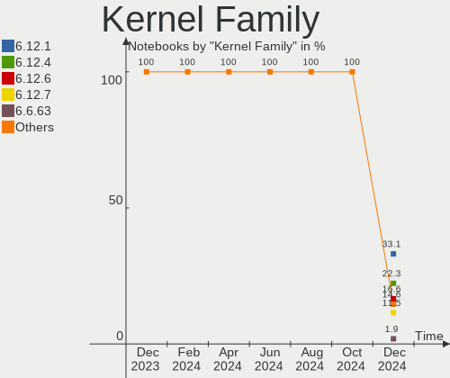
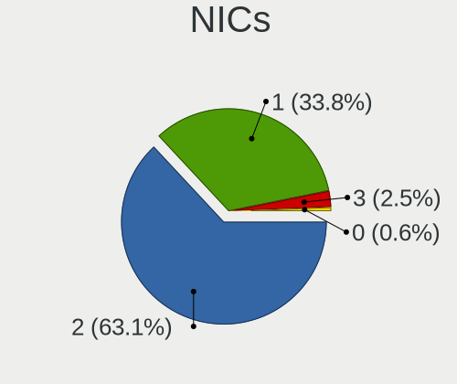

Arch - Hardware Trends (Notebooks)
----------------------------------

A project to identify most popular hardware characteristics and track their change
over time based on data collected by Linux users at https://Linux-Hardware.org.

Anyone can contribute to this report by the [hw-probe](https://github.com/linuxhw/hw-probe) tool:

    sudo -E hw-probe -all -upload

This report is for one last month. Overall report since the beginning of time: [TestDays](https://github.com/linuxhw/TestDays)

Period: May, 2023.

Contents
--------

* [ System ](#system)
  - [ OS                       ](#os)
  - [ OS Family                ](#os-family)
  - [ Kernel                   ](#kernel)
  - [ Kernel Family            ](#kernel-family)
  - [ Kernel Major Ver.        ](#kernel-major-ver)
  - [ Arch                     ](#arch)
  - [ DE                       ](#de)
  - [ Display Server           ](#display-server)
  - [ Display Manager          ](#display-manager)
  - [ OS Lang                  ](#os-lang)
  - [ Boot Mode                ](#boot-mode)
  - [ Filesystem               ](#filesystem)
  - [ Part. scheme             ](#part-scheme)
  - [ Dual Boot with Linux/BSD ](#dual-boot-with-linuxbsd)
  - [ Dual Boot (Win)          ](#dual-boot-win)

* [ Board ](#board)
  - [ Vendor                   ](#vendor)
  - [ Model                    ](#model)
  - [ Model Family             ](#model-family)
  - [ MFG Year                 ](#mfg-year)
  - [ Form Factor              ](#form-factor)
  - [ Secure Boot              ](#secure-boot)
  - [ Coreboot                 ](#coreboot)
  - [ RAM Size                 ](#ram-size)
  - [ RAM Used                 ](#ram-used)
  - [ Total Drives             ](#total-drives)
  - [ Has CD-ROM               ](#has-cd-rom)
  - [ Has Ethernet             ](#has-ethernet)
  - [ Has WiFi                 ](#has-wifi)
  - [ Has Bluetooth            ](#has-bluetooth)

* [ Location ](#location)
  - [ Country                  ](#country)
  - [ City                     ](#city)

* [ Drives ](#drives)
  - [ Drive Vendor             ](#drive-vendor)
  - [ Drive Model              ](#drive-model)
  - [ HDD Vendor               ](#hdd-vendor)
  - [ SSD Vendor               ](#ssd-vendor)
  - [ Drive Kind               ](#drive-kind)
  - [ Drive Connector          ](#drive-connector)
  - [ Drive Size               ](#drive-size)
  - [ Space Total              ](#space-total)
  - [ Space Used               ](#space-used)
  - [ Malfunc. Drives          ](#malfunc-drives)
  - [ Malfunc. Drive Vendor    ](#malfunc-drive-vendor)
  - [ Malfunc. HDD Vendor      ](#malfunc-hdd-vendor)
  - [ Malfunc. Drive Kind      ](#malfunc-drive-kind)
  - [ Failed Drives            ](#failed-drives)
  - [ Failed Drive Vendor      ](#failed-drive-vendor)
  - [ Drive Status             ](#drive-status)

* [ Storage controller ](#storage-controller)
  - [ Storage Vendor           ](#storage-vendor)
  - [ Storage Model            ](#storage-model)
  - [ Storage Kind             ](#storage-kind)

* [ Processor ](#processor)
  - [ CPU Vendor               ](#cpu-vendor)
  - [ CPU Model                ](#cpu-model)
  - [ CPU Model Family         ](#cpu-model-family)
  - [ CPU Cores                ](#cpu-cores)
  - [ CPU Sockets              ](#cpu-sockets)
  - [ CPU Threads              ](#cpu-threads)
  - [ CPU Op-Modes             ](#cpu-op-modes)
  - [ CPU Microcode            ](#cpu-microcode)
  - [ CPU Microarch            ](#cpu-microarch)

* [ Graphics ](#graphics)
  - [ GPU Vendor               ](#gpu-vendor)
  - [ GPU Model                ](#gpu-model)
  - [ GPU Combo                ](#gpu-combo)
  - [ GPU Driver               ](#gpu-driver)
  - [ GPU Memory               ](#gpu-memory)

* [ Monitor ](#monitor)
  - [ Monitor Vendor           ](#monitor-vendor)
  - [ Monitor Model            ](#monitor-model)
  - [ Monitor Resolution       ](#monitor-resolution)
  - [ Monitor Diagonal         ](#monitor-diagonal)
  - [ Monitor Width            ](#monitor-width)
  - [ Aspect Ratio             ](#aspect-ratio)
  - [ Monitor Area             ](#monitor-area)
  - [ Pixel Density            ](#pixel-density)
  - [ Multiple Monitors        ](#multiple-monitors)

* [ Network ](#network)
  - [ Net Controller Vendor    ](#net-controller-vendor)
  - [ Net Controller Model     ](#net-controller-model)
  - [ Wireless Vendor          ](#wireless-vendor)
  - [ Wireless Model           ](#wireless-model)
  - [ Ethernet Vendor          ](#ethernet-vendor)
  - [ Ethernet Model           ](#ethernet-model)
  - [ Net Controller Kind      ](#net-controller-kind)
  - [ Used Controller          ](#used-controller)
  - [ NICs                     ](#nics)
  - [ IPv6                     ](#ipv6)

* [ Bluetooth ](#bluetooth)
  - [ Bluetooth Vendor         ](#bluetooth-vendor)
  - [ Bluetooth Model          ](#bluetooth-model)

* [ Sound ](#sound)
  - [ Sound Vendor             ](#sound-vendor)
  - [ Sound Model              ](#sound-model)

* [ Memory ](#memory)
  - [ Memory Vendor            ](#memory-vendor)
  - [ Memory Model             ](#memory-model)
  - [ Memory Kind              ](#memory-kind)
  - [ Memory Form Factor       ](#memory-form-factor)
  - [ Memory Size              ](#memory-size)
  - [ Memory Speed             ](#memory-speed)

* [ Printers & scanners ](#printers--scanners)
  - [ Printer Vendor           ](#printer-vendor)
  - [ Printer Model            ](#printer-model)
  - [ Scanner Vendor           ](#scanner-vendor)
  - [ Scanner Model            ](#scanner-model)

* [ Camera ](#camera)
  - [ Camera Vendor            ](#camera-vendor)
  - [ Camera Model             ](#camera-model)

* [ Security ](#security)
  - [ Fingerprint Vendor       ](#fingerprint-vendor)
  - [ Fingerprint Model        ](#fingerprint-model)
  - [ Chipcard Vendor          ](#chipcard-vendor)
  - [ Chipcard Model           ](#chipcard-model)

* [ Unsupported ](#unsupported)
  - [ Unsupported Devices      ](#unsupported-devices)
  - [ Unsupported Device Types ](#unsupported-device-types)

System
------

OS
--

Installed operating systems

| Name         | Notebooks | Percent |
|--------------|-----------|---------|
| Arch Rolling | 131       | 100%    |

OS Family
---------

OS without a version

| Name | Notebooks | Percent |
|------|-----------|---------|
| Arch | 131       | 100%    |

Kernel
------

Version of the Linux kernel

| Version                             | Notebooks | Percent |
|-------------------------------------|-----------|---------|
| 6.3.2-arch1-1                       | 21        | 16.03%  |
| 6.3.1-arch2-1                       | 15        | 11.45%  |
| 6.3.1-arch1-1                       | 15        | 11.45%  |
| 6.3.4-arch1-1                       | 14        | 10.69%  |
| 6.2.13-arch1-1                      | 10        | 7.63%   |
| 6.3.3-arch1-1                       | 9         | 6.87%   |
| 6.3.2-zen1-1-zen                    | 6         | 4.58%   |
| 6.3.1-zen1-1-zen                    | 4         | 3.05%   |
| 6.1.27-1-lts                        | 4         | 3.05%   |
| 6.3.4-zen1-1-zen                    | 2         | 1.53%   |
| 6.2.13-zen-1-zen                    | 2         | 1.53%   |
| 6.2.12-arch1-1                      | 2         | 1.53%   |
| 6.2.11-arch1-1                      | 2         | 1.53%   |
| 6.1.30-1-lts                        | 2         | 1.53%   |
| 6.4.0-rc3-1-git-00008-gae8373a5add4 | 1         | 0.76%   |
| 6.3.5-zen1-1-zen                    | 1         | 0.76%   |
| 6.3.5-arch1-1                       | 1         | 0.76%   |
| 6.3.4-zen2-1-zen                    | 1         | 0.76%   |
| 6.3.4-zen1-1.1-zen                  | 1         | 0.76%   |
| 6.3.4-arch2-1                       | 1         | 0.76%   |
| 6.3.3-zen1-1-zen                    | 1         | 0.76%   |
| 6.3.2-Painoko-T2-xanmod1-1-t2       | 1         | 0.76%   |
| 6.3.2-AMD                           | 1         | 0.76%   |
| 6.3.1-zen2-1-zen                    | 1         | 0.76%   |
| 6.3.0-x64v1-xanmod1-2               | 1         | 0.76%   |
| 6.3.0-AMD-znver2                    | 1         | 0.76%   |
| 6.2.9-arch1-1                       | 1         | 0.76%   |
| 6.2.8-arch1-1                       | 1         | 0.76%   |
| 6.2.6-arch1-1                       | 1         | 0.76%   |
| 6.2.12-zen1-1-zen                   | 1         | 0.76%   |
| 6.1.29-1-lts                        | 1         | 0.76%   |
| 6.1.28-1-lts                        | 1         | 0.76%   |
| 6.1.26-1-lts                        | 1         | 0.76%   |
| 6.1.24-1-lts                        | 1         | 0.76%   |
| 6.1.12-zen1-1-zen                   | 1         | 0.76%   |
| 6.0.12-arch1-1                      | 1         | 0.76%   |
| 5.15.95-xanmod1                     | 1         | 0.76%   |

Kernel Family
-------------

Linux kernel without a distro release

| Version | Notebooks | Percent |
|---------|-----------|---------|
| 6.3.1   | 35        | 26.72%  |
| 6.3.2   | 29        | 22.14%  |
| 6.3.4   | 19        | 14.5%   |
| 6.2.13  | 12        | 9.16%   |
| 6.3.3   | 10        | 7.63%   |
| 6.1.27  | 4         | 3.05%   |
| 6.2.12  | 3         | 2.29%   |
| 6.3.5   | 2         | 1.53%   |
| 6.3.0   | 2         | 1.53%   |
| 6.2.11  | 2         | 1.53%   |
| 6.1.30  | 2         | 1.53%   |
| 6.4.0   | 1         | 0.76%   |
| 6.2.9   | 1         | 0.76%   |
| 6.2.8   | 1         | 0.76%   |
| 6.2.6   | 1         | 0.76%   |
| 6.1.29  | 1         | 0.76%   |
| 6.1.28  | 1         | 0.76%   |
| 6.1.26  | 1         | 0.76%   |
| 6.1.24  | 1         | 0.76%   |
| 6.1.12  | 1         | 0.76%   |
| 6.0.12  | 1         | 0.76%   |
| 5.15.95 | 1         | 0.76%   |

Kernel Major Ver.
-----------------

Linux kernel major version

| Version | Notebooks | Percent |
|---------|-----------|---------|
| 6.3     | 97        | 74.05%  |
| 6.2     | 20        | 15.27%  |
| 6.1     | 11        | 8.4%    |
| 6.4     | 1         | 0.76%   |
| 6.0     | 1         | 0.76%   |
| 5.15    | 1         | 0.76%   |

Arch
----

OS architecture (x86_64, i586, etc.)

| Name   | Notebooks | Percent |
|--------|-----------|---------|
| x86_64 | 131       | 100%    |

DE
--

Desktop Environment

| Name       | Notebooks | Percent |
|------------|-----------|---------|
| KDE5       | 46        | 35.11%  |
| GNOME      | 39        | 29.77%  |
| XFCE       | 9         | 6.87%   |
| Unknown    | 9         | 6.87%   |
| i3         | 7         | 5.34%   |
| Hyprland   | 5         | 3.82%   |
| sway       | 4         | 3.05%   |
| KDE        | 2         | 1.53%   |
| dwm        | 2         | 1.53%   |
| awesome    | 2         | 1.53%   |
| xmonad     | 1         | 0.76%   |
| X-Cinnamon | 1         | 0.76%   |
| qtile      | 1         | 0.76%   |
| MATE       | 1         | 0.76%   |
| LXQt       | 1         | 0.76%   |
| Cinnamon   | 1         | 0.76%   |

Display Server
--------------

X11 or Wayland

| Name    | Notebooks | Percent |
|---------|-----------|---------|
| X11     | 60        | 45.8%   |
| Wayland | 54        | 41.22%  |
| Tty     | 11        | 8.4%    |
| Unknown | 6         | 4.58%   |

Display Manager
---------------

SDDM, LightDM, etc.

| Name    | Notebooks | Percent |
|---------|-----------|---------|
| Unknown | 48        | 36.64%  |
| SDDM    | 43        | 32.82%  |
| GDM     | 21        | 16.03%  |
| LightDM | 17        | 12.98%  |
| LY-DM   | 1         | 0.76%   |
| Ly      | 1         | 0.76%   |

OS Lang
-------

Language

| Lang    | Notebooks | Percent |
|---------|-----------|---------|
| en_US   | 62        | 47.33%  |
| en_GB   | 8         | 6.11%   |
| C       | 8         | 6.11%   |
| it_IT   | 7         | 5.34%   |
| fr_FR   | 6         | 4.58%   |
| de_DE   | 6         | 4.58%   |
| ru_RU   | 4         | 3.05%   |
| pt_PT   | 4         | 3.05%   |
| zh_CN   | 3         | 2.29%   |
| pt_BR   | 3         | 2.29%   |
| es_MX   | 3         | 2.29%   |
| en_CA   | 2         | 1.53%   |
| en_AU   | 2         | 1.53%   |
| Unknown | 2         | 1.53%   |
| zh_TW   | 1         | 0.76%   |
| pl_PL   | 1         | 0.76%   |
| lv_LV   | 1         | 0.76%   |
| hu_HU   | 1         | 0.76%   |
| es_GT   | 1         | 0.76%   |
| es_ES   | 1         | 0.76%   |
| en_ZA   | 1         | 0.76%   |
| en_IE   | 1         | 0.76%   |
| en_AG   | 1         | 0.76%   |
| en-US   | 1         | 0.76%   |
| de_AT   | 1         | 0.76%   |

Boot Mode
---------

EFI or BIOS

| Mode | Notebooks | Percent |
|------|-----------|---------|
| EFI  | 82        | 62.6%   |
| BIOS | 49        | 37.4%   |

Filesystem
----------

Type of filesystem

| Type    | Notebooks | Percent |
|---------|-----------|---------|
| Ext4    | 80        | 61.07%  |
| Btrfs   | 46        | 35.11%  |
| Zfs     | 1         | 0.76%   |
| Xfs     | 1         | 0.76%   |
| Tmpfs   | 1         | 0.76%   |
| F2fs    | 1         | 0.76%   |
| Unknown | 1         | 0.76%   |

Part. scheme
------------

Scheme of partitioning

| Type    | Notebooks | Percent |
|---------|-----------|---------|
| GPT     | 87        | 66.41%  |
| Unknown | 35        | 26.72%  |
| MBR     | 9         | 6.87%   |

Dual Boot with Linux/BSD
------------------------

Hosting more than one Linux/BSD

| Dual boot | Notebooks | Percent |
|-----------|-----------|---------|
| No        | 114       | 87.02%  |
| Yes       | 17        | 12.98%  |

Dual Boot (Win)
---------------

Hosting Linux and Windows

| Dual boot | Notebooks | Percent |
|-----------|-----------|---------|
| No        | 101       | 77.1%   |
| Yes       | 30        | 22.9%   |

Board
-----

Vendor
------

Motherboard manufacturer

| Name                | Notebooks | Percent |
|---------------------|-----------|---------|
| Lenovo              | 35        | 26.72%  |
| Hewlett-Packard     | 21        | 16.03%  |
| Dell                | 21        | 16.03%  |
| ASUSTek Computer    | 19        | 14.5%   |
| Acer                | 10        | 7.63%   |
| MSI                 | 4         | 3.05%   |
| Apple               | 3         | 2.29%   |
| TUXEDO              | 2         | 1.53%   |
| Toshiba             | 2         | 1.53%   |
| HUAWEI              | 2         | 1.53%   |
| Samsung Electronics | 1         | 0.76%   |
| realme              | 1         | 0.76%   |
| Razer               | 1         | 0.76%   |
| Quanta              | 1         | 0.76%   |
| Medion              | 1         | 0.76%   |
| HONOR               | 1         | 0.76%   |
| HASEE Computer      | 1         | 0.76%   |
| GPD                 | 1         | 0.76%   |
| Google              | 1         | 0.76%   |
| Framework           | 1         | 0.76%   |
| Emdoor              | 1         | 0.76%   |
| Digma               | 1         | 0.76%   |

Model
-----

Motherboard model

| Name                                                  | Notebooks | Percent |
|-------------------------------------------------------|-----------|---------|
| HP OMEN by Laptop 15-dc1xxx                           | 2         | 1.53%   |
| Dell XPS 17 9700                                      | 2         | 1.53%   |
| Acer Nitro AN515-45                                   | 2         | 1.53%   |
| TUXEDO Polaris Intel Gen3 (TGL)                       | 1         | 0.76%   |
| TUXEDO Aura 15 Gen1                                   | 1         | 0.76%   |
| Toshiba Satellite C855                                | 1         | 0.76%   |
| Toshiba Satellite C645D                               | 1         | 0.76%   |
| Samsung 750XDA                                        | 1         | 0.76%   |
| realme RMNBXXXX                                       | 1         | 0.76%   |
| Razer Blade 15 Studio Edition (Early 2020) - RZ09-033 | 1         | 0.76%   |
| Quanta UW3                                            | 1         | 0.76%   |
| MSI PS42 Modern 8RA                                   | 1         | 0.76%   |
| MSI Modern 14 B4MW                                    | 1         | 0.76%   |
| MSI GV63 8SE                                          | 1         | 0.76%   |
| MSI GF63 Thin 11UC                                    | 1         | 0.76%   |
| Medion Crawler E40                                    | 1         | 0.76%   |
| Lenovo Yoga Slim 7 proX 14ARH7 82TL                   | 1         | 0.76%   |
| Lenovo ThinkPad X61 7673V4Q                           | 1         | 0.76%   |
| Lenovo ThinkPad X240 20AMA21D00                       | 1         | 0.76%   |
| Lenovo ThinkPad X230 Tablet 3438G17                   | 1         | 0.76%   |
| Lenovo ThinkPad X230 23301E0                          | 1         | 0.76%   |
| Lenovo ThinkPad X131e 33712MU                         | 1         | 0.76%   |
| Lenovo ThinkPad X1 Carbon Gen 10 21CCS12300           | 1         | 0.76%   |
| Lenovo ThinkPad X1 Carbon 5th 20HQS08X2B              | 1         | 0.76%   |
| Lenovo ThinkPad X1 Carbon 5th 20HQS02A00              | 1         | 0.76%   |
| Lenovo ThinkPad X1 Carbon 3460AE4                     | 1         | 0.76%   |
| Lenovo ThinkPad T570 20H90002GE                       | 1         | 0.76%   |
| Lenovo ThinkPad T560 20FJS0CX00                       | 1         | 0.76%   |
| Lenovo ThinkPad T530 24297ZG                          | 1         | 0.76%   |
| Lenovo ThinkPad T450s 20BWS34A00                      | 1         | 0.76%   |
| Lenovo ThinkPad P14s Gen 2i 20VYS0HL00                | 1         | 0.76%   |
| Lenovo ThinkPad P14s Gen 2a 21A0008PGE                | 1         | 0.76%   |
| Lenovo ThinkPad P14s Gen 2a 21A00004MX                | 1         | 0.76%   |
| Lenovo ThinkPad L13 Gen 3 21BAS0SD00                  | 1         | 0.76%   |
| Lenovo ThinkPad E15 Gen 2 20T9S0B500                  | 1         | 0.76%   |
| Lenovo ThinkPad E14 Gen 2 20T60029RT                  | 1         | 0.76%   |
| Lenovo Legion 7 15IMH05 81YT                          | 1         | 0.76%   |
| Lenovo Legion 5 15ARH05H 82B1                         | 1         | 0.76%   |
| Lenovo IdeaPad Z580                                   | 1         | 0.76%   |
| Lenovo IdeaPad S340-15API 81NC                        | 1         | 0.76%   |

Model Family
------------

Motherboard model prefix

| Name              | Notebooks | Percent |
|-------------------|-----------|---------|
| Lenovo ThinkPad   | 19        | 14.5%   |
| Lenovo IdeaPad    | 11        | 8.4%    |
| Dell Latitude     | 10        | 7.63%   |
| HP EliteBook      | 7         | 5.34%   |
| HP Laptop         | 6         | 4.58%   |
| Dell Inspiron     | 5         | 3.82%   |
| ASUS ROG          | 5         | 3.82%   |
| ASUS ASUS         | 4         | 3.05%   |
| Acer Swift        | 4         | 3.05%   |
| Acer Aspire       | 4         | 3.05%   |
| HP OMEN           | 3         | 2.29%   |
| Dell Precision    | 3         | 2.29%   |
| Toshiba Satellite | 2         | 1.53%   |
| Lenovo Legion     | 2         | 1.53%   |
| Dell XPS          | 2         | 1.53%   |
| ASUS Zenbook      | 2         | 1.53%   |
| ASUS VivoBook     | 2         | 1.53%   |
| Acer Nitro        | 2         | 1.53%   |
| TUXEDO Polaris    | 1         | 0.76%   |
| TUXEDO Aura       | 1         | 0.76%   |
| Samsung 750XDA    | 1         | 0.76%   |
| realme RMNBXXXX   | 1         | 0.76%   |
| Razer Blade       | 1         | 0.76%   |
| Quanta UW3        | 1         | 0.76%   |
| MSI PS42          | 1         | 0.76%   |
| MSI Modern        | 1         | 0.76%   |
| MSI GV63          | 1         | 0.76%   |
| MSI GF63          | 1         | 0.76%   |
| Medion Crawler    | 1         | 0.76%   |
| Lenovo Yoga       | 1         | 0.76%   |
| Lenovo G505s      | 1         | 0.76%   |
| Lenovo B490       | 1         | 0.76%   |
| HUAWEI NBLK-WAX9X | 1         | 0.76%   |
| HUAWEI BOM-WXX9   | 1         | 0.76%   |
| HONOR NMH-WCX9    | 1         | 0.76%   |
| HP Victus         | 1         | 0.76%   |
| HP ProBook        | 1         | 0.76%   |
| HP Pavilion       | 1         | 0.76%   |
| HP 14             | 1         | 0.76%   |
| HASEE V1x0PNPx    | 1         | 0.76%   |

MFG Year
--------

Motherboard manufacture year

| Year | Notebooks | Percent |
|------|-----------|---------|
| 2021 | 22        | 16.79%  |
| 2020 | 22        | 16.79%  |
| 2022 | 16        | 12.21%  |
| 2019 | 15        | 11.45%  |
| 2013 | 9         | 6.87%   |
| 2017 | 8         | 6.11%   |
| 2023 | 7         | 5.34%   |
| 2012 | 7         | 5.34%   |
| 2018 | 6         | 4.58%   |
| 2014 | 5         | 3.82%   |
| 2010 | 4         | 3.05%   |
| 2011 | 3         | 2.29%   |
| 2016 | 2         | 1.53%   |
| 2015 | 2         | 1.53%   |
| 2007 | 2         | 1.53%   |
| 2008 | 1         | 0.76%   |

Form Factor
-----------

Physical design of the computer

| Name     | Notebooks | Percent |
|----------|-----------|---------|
| Notebook | 131       | 100%    |

Secure Boot
-----------

Enabled or disabled

| State    | Notebooks | Percent |
|----------|-----------|---------|
| Disabled | 129       | 98.47%  |
| Enabled  | 2         | 1.53%   |

Coreboot
--------

Have coreboot on board

| Used | Notebooks | Percent |
|------|-----------|---------|
| No   | 128       | 97.71%  |
| Yes  | 3         | 2.29%   |

RAM Size
--------

Total RAM memory

| Size in GB  | Notebooks | Percent |
|-------------|-----------|---------|
| 16.01-24.0  | 35        | 26.72%  |
| 4.01-8.0    | 31        | 23.66%  |
| 8.01-16.0   | 30        | 22.9%   |
| 32.01-64.0  | 14        | 10.69%  |
| 3.01-4.0    | 7         | 5.34%   |
| 64.01-256.0 | 6         | 4.58%   |
| 24.01-32.0  | 5         | 3.82%   |
| 2.01-3.0    | 2         | 1.53%   |
| 1.01-2.0    | 1         | 0.76%   |

RAM Used
--------

Used RAM memory

| Used GB    | Notebooks | Percent |
|------------|-----------|---------|
| 4.01-8.0   | 33        | 25.19%  |
| 2.01-3.0   | 33        | 25.19%  |
| 3.01-4.0   | 23        | 17.56%  |
| 1.01-2.0   | 18        | 13.74%  |
| 8.01-16.0  | 15        | 11.45%  |
| 0.51-1.0   | 6         | 4.58%   |
| 0.01-0.5   | 2         | 1.53%   |
| 32.01-64.0 | 1         | 0.76%   |

Total Drives
------------

Number of drives on board

| Drives | Notebooks | Percent |
|--------|-----------|---------|
| 1      | 91        | 69.47%  |
| 2      | 34        | 25.95%  |
| 3      | 6         | 4.58%   |

Has CD-ROM
----------

Has CD-ROM on board

| Presented | Notebooks | Percent |
|-----------|-----------|---------|
| No        | 114       | 87.02%  |
| Yes       | 17        | 12.98%  |

Has Ethernet
------------

Has Ethernet on board

| Presented | Notebooks | Percent |
|-----------|-----------|---------|
| Yes       | 93        | 70.99%  |
| No        | 38        | 29.01%  |

Has WiFi
--------

Has WiFi module

| Presented | Notebooks | Percent |
|-----------|-----------|---------|
| Yes       | 129       | 98.47%  |
| No        | 2         | 1.53%   |

Has Bluetooth
-------------

Has Bluetooth module

| Presented | Notebooks | Percent |
|-----------|-----------|---------|
| Yes       | 117       | 89.31%  |
| No        | 14        | 10.69%  |

Location
--------

Country
-------

Geographic location (country)

| Country      | Notebooks | Percent |
|--------------|-----------|---------|
| USA          | 17        | 12.98%  |
| Germany      | 15        | 11.45%  |
| Russia       | 11        | 8.4%    |
| Italy        | 10        | 7.63%   |
| France       | 10        | 7.63%   |
| Brazil       | 7         | 5.34%   |
| UK           | 6         | 4.58%   |
| Portugal     | 4         | 3.05%   |
| Romania      | 3         | 2.29%   |
| Netherlands  | 3         | 2.29%   |
| China        | 3         | 2.29%   |
| Argentina    | 3         | 2.29%   |
| Taiwan       | 2         | 1.53%   |
| Slovenia     | 2         | 1.53%   |
| Peru         | 2         | 1.53%   |
| Mexico       | 2         | 1.53%   |
| Indonesia    | 2         | 1.53%   |
| Finland      | 2         | 1.53%   |
| Australia    | 2         | 1.53%   |
| Togo         | 1         | 0.76%   |
| Thailand     | 1         | 0.76%   |
| Spain        | 1         | 0.76%   |
| South Korea  | 1         | 0.76%   |
| South Africa | 1         | 0.76%   |
| Singapore    | 1         | 0.76%   |
| Poland       | 1         | 0.76%   |
| Niger        | 1         | 0.76%   |
| New Zealand  | 1         | 0.76%   |
| Latvia       | 1         | 0.76%   |
| Kyrgyzstan   | 1         | 0.76%   |
| Kenya        | 1         | 0.76%   |
| Kazakhstan   | 1         | 0.76%   |
| India        | 1         | 0.76%   |
| Hungary      | 1         | 0.76%   |
| Guatemala    | 1         | 0.76%   |
| Estonia      | 1         | 0.76%   |
| Egypt        | 1         | 0.76%   |
| Denmark      | 1         | 0.76%   |
| Chile        | 1         | 0.76%   |
| Canada       | 1         | 0.76%   |

City
----

Geographic location (city)

| City                   | Notebooks | Percent |
|------------------------|-----------|---------|
| Toulouse               | 3         | 2.29%   |
| Wellingborough         | 2         | 1.53%   |
| Melbourne              | 2         | 1.53%   |
| Lima                   | 2         | 1.53%   |
| Düsseldorf            | 2         | 1.53%   |
| Yogyakarta             | 1         | 0.76%   |
| Yablonitsy             | 1         | 0.76%   |
| Wuhan                  | 1         | 0.76%   |
| Wolfurt                | 1         | 0.76%   |
| Witney                 | 1         | 0.76%   |
| Wetzlar                | 1         | 0.76%   |
| Wermelskirchen         | 1         | 0.76%   |
| Warsaw                 | 1         | 0.76%   |
| Volgograd              | 1         | 0.76%   |
| Verona                 | 1         | 0.76%   |
| Veliky Novgorod        | 1         | 0.76%   |
| Uberlândia            | 1         | 0.76%   |
| Tuoro sul Trasimeno    | 1         | 0.76%   |
| Trzin                  | 1         | 0.76%   |
| Trivandrum             | 1         | 0.76%   |
| Toronto                | 1         | 0.76%   |
| Thompson's Station     | 1         | 0.76%   |
| Tertre                 | 1         | 0.76%   |
| Târgu Mureş          | 1         | 0.76%   |
| Tallinn                | 1         | 0.76%   |
| Taipei                 | 1         | 0.76%   |
| Tabligbo               | 1         | 0.76%   |
| Sugar Land             | 1         | 0.76%   |
| Stary Oskol            | 1         | 0.76%   |
| St Petersburg          | 1         | 0.76%   |
| Sofia                  | 1         | 0.76%   |
| Singapore              | 1         | 0.76%   |
| Seattle                | 1         | 0.76%   |
| Saratov                | 1         | 0.76%   |
| Sarajevo               | 1         | 0.76%   |
| Santiago de Compostela | 1         | 0.76%   |
| Salt Lake City         | 1         | 0.76%   |
| Riga                   | 1         | 0.76%   |
| Rho                    | 1         | 0.76%   |
| Rennes                 | 1         | 0.76%   |

Drives
------

Drive Vendor
------------

Hard drive vendors

| Vendor                         | Notebooks | Drives | Percent |
|--------------------------------|-----------|--------|---------|
| Samsung Electronics            | 37        | 41     | 22.02%  |
| Sandisk                        | 15        | 18     | 8.93%   |
| Micron Technology              | 12        | 12     | 7.14%   |
| Kingston                       | 11        | 12     | 6.55%   |
| WDC                            | 10        | 10     | 5.95%   |
| SK hynix                       | 10        | 10     | 5.95%   |
| Toshiba                        | 8         | 8      | 4.76%   |
| Unknown                        | 7         | 7      | 4.17%   |
| Seagate                        | 7         | 7      | 4.17%   |
| KIOXIA                         | 6         | 6      | 3.57%   |
| Intel                          | 6         | 6      | 3.57%   |
| Phison Electronics             | 5         | 5      | 2.98%   |
| Crucial                        | 4         | 4      | 2.38%   |
| China                          | 3         | 3      | 1.79%   |
| Apple                          | 3         | 4      | 1.79%   |
| A-DATA Technology              | 3         | 3      | 1.79%   |
| Micron/Crucial Technology      | 2         | 2      | 1.19%   |
| Kingston Technology Company    | 2         | 2      | 1.19%   |
| Hewlett-Packard                | 2         | 2      | 1.19%   |
| VNYEZ                          | 1         | 1      | 0.6%    |
| Transcend                      | 1         | 1      | 0.6%    |
| StoreJet                       | 1         | 1      | 0.6%    |
| StarTech                       | 1         | 1      | 0.6%    |
| Solid State Storage Technology | 1         | 1      | 0.6%    |
| Plextor                        | 1         | 1      | 0.6%    |
| Mushkin                        | 1         | 1      | 0.6%    |
| LITEON C                       | 1         | 1      | 0.6%    |
| LITEON                         | 1         | 1      | 0.6%    |
| JetFlash                       | 1         | 1      | 0.6%    |
| Hitachi                        | 1         | 1      | 0.6%    |
| BIWIN                          | 1         | 1      | 0.6%    |
| ADATA Technology               | 1         | 1      | 0.6%    |
| Acer                           | 1         | 1      | 0.6%    |
| Unknown                        | 1         | 1      | 0.6%    |

Drive Model
-----------

Hard drive models

| Model                                               | Notebooks | Percent |
|-----------------------------------------------------|-----------|---------|
| Samsung NVMe SSD Controller SM981/PM981/PM983 256GB | 12        | 6.98%   |
| Unknown MMC Card  32GB                              | 4         | 2.33%   |
| SK hynix BC511 256GB                                | 4         | 2.33%   |
| Kingston SA400S37240G 240GB SSD                     | 4         | 2.33%   |
| Sandisk WD Blue SN550 NVMe SSD 512GB                | 3         | 1.74%   |
| Sandisk WD Black SN750 / PC SN730 NVMe SSD 256GB    | 3         | 1.74%   |
| Samsung SSD 980 500GB                               | 3         | 1.74%   |
| Samsung NVMe SSD Controller SM961/PM961/SM963 256GB | 3         | 1.74%   |
| Samsung NVMe SSD Controller PM9A1/PM9A3/980PRO 1TB  | 3         | 1.74%   |
| Intel SSDPEKNU512GZ 512GB                           | 3         | 1.74%   |
| WDC WD10SPZX-21Z10T0 1TB                            | 2         | 1.16%   |
| Unknown MMC Card  128GB                             | 2         | 1.16%   |
| Toshiba XG6 NVMe SSD Controller 256GB               | 2         | 1.16%   |
| Sandisk WD Black SN850 500GB                        | 2         | 1.16%   |
| SanDisk SSD PLUS 240GB                              | 2         | 1.16%   |
| Samsung MZVLQ512HALU-00000 512GB                    | 2         | 1.16%   |
| Phison PS5013 E13 NVMe Controller 512GB             | 2         | 1.16%   |
| Micron/Crucial P2 NVMe PCIe SSD 1TB                 | 2         | 1.16%   |
| Micron MTFDHBA512QFD 512GB                          | 2         | 1.16%   |
| Micron 2450_MTFDKBA1T0TFK 1TB                       | 2         | 1.16%   |
| Kingston Company OM3PDP3 NVMe SSD 256GB             | 2         | 1.16%   |
| Kingston SFYRS1000G 1TB                             | 2         | 1.16%   |
| Intel SSD 660P Series 512GB                         | 2         | 1.16%   |
| WDC WDS200T2B0B-00YS70 2TB SSD                      | 1         | 0.58%   |
| WDC WD5000BPKT-60PK4T0 500GB                        | 1         | 0.58%   |
| WDC WD3200BEKT-60V5T1 320GB                         | 1         | 0.58%   |
| WDC WD10SPZX-75Z10T2 1TB                            | 1         | 0.58%   |
| WDC WD10SPZX-22Z10T1 1TB                            | 1         | 0.58%   |
| WDC WD10SPZX-08Z10 1TB                              | 1         | 0.58%   |
| WDC WD10JPVX-75JC3T0 1TB                            | 1         | 0.58%   |
| WDC WD10JPVX-00JC3T0 1TB                            | 1         | 0.58%   |
| VNYEZ SSD MSATA 128GB                               | 1         | 0.58%   |
| Unknown MMC Card  64GB                              | 1         | 0.58%   |
| Transcend TS128GSSD340 128GB                        | 1         | 0.58%   |
| Toshiba NVMe Controller 256GB                       | 1         | 0.58%   |
| Toshiba MQ01ABF050 500GB                            | 1         | 0.58%   |
| Toshiba MQ01ABD032 320GB                            | 1         | 0.58%   |
| Toshiba MK3259GSXP 320GB                            | 1         | 0.58%   |
| Toshiba MK2561GSYN 250GB                            | 1         | 0.58%   |
| Toshiba MK2035GSS 200GB                             | 1         | 0.58%   |

HDD Vendor
----------

Hard disk drive vendors

| Vendor  | Notebooks | Drives | Percent |
|---------|-----------|--------|---------|
| WDC     | 9         | 9      | 40.91%  |
| Seagate | 7         | 7      | 31.82%  |
| Toshiba | 5         | 5      | 22.73%  |
| Hitachi | 1         | 1      | 4.55%   |

SSD Vendor
----------

Solid state drive vendors

| Vendor              | Notebooks | Drives | Percent |
|---------------------|-----------|--------|---------|
| Samsung Electronics | 9         | 9      | 21.95%  |
| Kingston            | 6         | 6      | 14.63%  |
| Crucial             | 4         | 4      | 9.76%   |
| SanDisk             | 3         | 3      | 7.32%   |
| China               | 3         | 3      | 7.32%   |
| A-DATA Technology   | 3         | 3      | 7.32%   |
| Hewlett-Packard     | 2         | 2      | 4.88%   |
| WDC                 | 1         | 1      | 2.44%   |
| VNYEZ               | 1         | 1      | 2.44%   |
| Transcend           | 1         | 1      | 2.44%   |
| Plextor             | 1         | 1      | 2.44%   |
| Mushkin             | 1         | 1      | 2.44%   |
| LITEON C            | 1         | 1      | 2.44%   |
| LITEON              | 1         | 1      | 2.44%   |
| Intel               | 1         | 1      | 2.44%   |
| BIWIN               | 1         | 1      | 2.44%   |
| Apple               | 1         | 1      | 2.44%   |
| Acer                | 1         | 1      | 2.44%   |

Drive Kind
----------

HDD or SSD

| Kind    | Notebooks | Drives | Percent |
|---------|-----------|--------|---------|
| NVMe    | 87        | 103    | 54.72%  |
| SSD     | 39        | 41     | 24.53%  |
| HDD     | 22        | 22     | 13.84%  |
| MMC     | 8         | 8      | 5.03%   |
| Unknown | 3         | 3      | 1.89%   |

Drive Connector
---------------

SATA, SAS, NVMe, etc.

| Type | Notebooks | Drives | Percent |
|------|-----------|--------|---------|
| NVMe | 87        | 103    | 56.49%  |
| SATA | 53        | 60     | 34.42%  |
| MMC  | 8         | 8      | 5.19%   |
| SAS  | 6         | 6      | 3.9%    |

Drive Size
----------

Size of hard drive

| Size in TB | Notebooks | Drives | Percent |
|------------|-----------|--------|---------|
| 0.01-0.5   | 40        | 43     | 67.8%   |
| 0.51-1.0   | 15        | 16     | 25.42%  |
| 1.01-2.0   | 4         | 4      | 6.78%   |

Space Total
-----------

Amount of disk space available on the file system

| Size in GB     | Notebooks | Percent |
|----------------|-----------|---------|
| 251-500        | 36        | 27.48%  |
| 101-250        | 27        | 20.61%  |
| 501-1000       | 22        | 16.79%  |
| 1001-2000      | 15        | 11.45%  |
| More than 3000 | 12        | 9.16%   |
| 2001-3000      | 8         | 6.11%   |
| 51-100         | 5         | 3.82%   |
| 1-20           | 3         | 2.29%   |
| Unknown        | 2         | 1.53%   |
| 21-50          | 1         | 0.76%   |

Space Used
----------

Amount of used disk space

| Used GB        | Notebooks | Percent |
|----------------|-----------|---------|
| 1-20           | 30        | 22.9%   |
| 101-250        | 26        | 19.85%  |
| 51-100         | 25        | 19.08%  |
| 21-50          | 18        | 13.74%  |
| 251-500        | 12        | 9.16%   |
| 501-1000       | 10        | 7.63%   |
| 1001-2000      | 6         | 4.58%   |
| Unknown        | 2         | 1.53%   |
| More than 3000 | 1         | 0.76%   |
| 2001-3000      | 1         | 0.76%   |

Malfunc. Drives
---------------

Drive models with a malfunction

| Model                           | Notebooks | Drives | Percent |
|---------------------------------|-----------|--------|---------|
| VNYEZ SSD MSATA 128GB           | 1         | 1      | 16.67%  |
| Toshiba MK2561GSYN 250GB        | 1         | 1      | 16.67%  |
| Seagate ST320LT007-9ZV142 320GB | 1         | 1      | 16.67%  |
| Seagate ST1000LM035-1RK172 1TB  | 1         | 1      | 16.67%  |
| Hitachi HTS545032B9SA02 320GB   | 1         | 1      | 16.67%  |
| China SSD 128GB                 | 1         | 1      | 16.67%  |

Malfunc. Drive Vendor
---------------------

Vendors of faulty drives

| Vendor  | Notebooks | Drives | Percent |
|---------|-----------|--------|---------|
| Seagate | 2         | 2      | 33.33%  |
| VNYEZ   | 1         | 1      | 16.67%  |
| Toshiba | 1         | 1      | 16.67%  |
| Hitachi | 1         | 1      | 16.67%  |
| China   | 1         | 1      | 16.67%  |

Malfunc. HDD Vendor
-------------------

Vendors of faulty HDD drives

| Vendor  | Notebooks | Drives | Percent |
|---------|-----------|--------|---------|
| Seagate | 2         | 2      | 50%     |
| Toshiba | 1         | 1      | 25%     |
| Hitachi | 1         | 1      | 25%     |

Malfunc. Drive Kind
-------------------

Kinds of faulty drives

| Kind | Notebooks | Drives | Percent |
|------|-----------|--------|---------|
| HDD  | 4         | 4      | 66.67%  |
| SSD  | 2         | 2      | 33.33%  |

Failed Drives
-------------

Failed drive models

| Model                       | Notebooks | Drives | Percent |
|-----------------------------|-----------|--------|---------|
| WDC WD3200BEKT-60V5T1 320GB | 1         | 1      | 100%    |

Failed Drive Vendor
-------------------

Failed drive vendors

| Vendor | Notebooks | Drives | Percent |
|--------|-----------|--------|---------|
| WDC    | 1         | 1      | 100%    |

Drive Status
------------

Number of failed and malfunc. drives

| Status   | Notebooks | Drives | Percent |
|----------|-----------|--------|---------|
| Works    | 72        | 87     | 51.06%  |
| Detected | 63        | 83     | 44.68%  |
| Malfunc  | 5         | 6      | 3.55%   |
| Failed   | 1         | 1      | 0.71%   |

Storage controller
------------------

Storage Vendor
--------------

Storage controller vendors

| Vendor                         | Notebooks | Percent |
|--------------------------------|-----------|---------|
| Intel                          | 65        | 38.46%  |
| Samsung Electronics            | 30        | 17.75%  |
| AMD                            | 13        | 7.69%   |
| SanDisk                        | 12        | 7.1%    |
| Micron Technology              | 12        | 7.1%    |
| SK hynix                       | 10        | 5.92%   |
| Kingston Technology Company    | 7         | 4.14%   |
| KIOXIA                         | 6         | 3.55%   |
| Phison Electronics             | 5         | 2.96%   |
| Toshiba America Info Systems   | 3         | 1.78%   |
| Micron/Crucial Technology      | 2         | 1.18%   |
| Solid State Storage Technology | 1         | 0.59%   |
| Nvidia                         | 1         | 0.59%   |
| Apple                          | 1         | 0.59%   |
| ADATA Technology               | 1         | 0.59%   |

Storage Model
-------------

Storage controller models

| Model                                                                          | Notebooks | Percent |
|--------------------------------------------------------------------------------|-----------|---------|
| Samsung NVMe SSD Controller SM981/PM981/PM983                                  | 12        | 6.7%    |
| AMD FCH SATA Controller [AHCI mode]                                            | 12        | 6.7%    |
| Micron NVMe Storage Controller                                                 | 11        | 6.15%   |
| Samsung NVMe SSD Controller 980                                                | 10        | 5.59%   |
| Intel 7 Series Chipset Family 6-port SATA Controller [AHCI mode]               | 9         | 5.03%   |
| Intel Volume Management Device NVMe RAID Controller                            | 7         | 3.91%   |
| Intel Sunrise Point-LP SATA Controller [AHCI mode]                             | 6         | 3.35%   |
| Intel 82801 Mobile SATA Controller [RAID mode]                                 | 6         | 3.35%   |
| Intel 8 Series SATA Controller 1 [AHCI mode]                                   | 5         | 2.79%   |
| SK hynix Gold P31/PC711 NVMe Solid State Drive                                 | 4         | 2.23%   |
| SK hynix BC511                                                                 | 4         | 2.23%   |
| KIOXIA NVMe SSD Controller BG4                                                 | 4         | 2.23%   |
| Kingston Company Company Non-Volatile memory controller                        | 4         | 2.23%   |
| SanDisk WD Blue SN550 NVMe SSD                                                 | 3         | 1.68%   |
| SanDisk WD Black SN750 / PC SN730 NVMe SSD                                     | 3         | 1.68%   |
| Sandisk Non-Volatile memory controller                                         | 3         | 1.68%   |
| Samsung NVMe SSD Controller SM961/PM961/SM963                                  | 3         | 1.68%   |
| Samsung NVMe SSD Controller PM9A1/PM9A3/980PRO                                 | 3         | 1.68%   |
| Intel Wildcat Point-LP SATA Controller [AHCI Mode]                             | 3         | 1.68%   |
| Intel Non-Volatile memory controller                                           | 3         | 1.68%   |
| Intel Cannon Lake Mobile PCH SATA AHCI Controller                              | 3         | 1.68%   |
| Intel 82801HM/HEM (ICH8M/ICH8M-E) SATA Controller [AHCI mode]                  | 3         | 1.68%   |
| Intel 82801HM/HEM (ICH8M/ICH8M-E) IDE Controller                               | 3         | 1.68%   |
| Intel 8 Series/C220 Series Chipset Family 6-port SATA Controller 1 [AHCI mode] | 3         | 1.68%   |
| Toshiba America Info Systems XG6 NVMe SSD Controller                           | 2         | 1.12%   |
| SanDisk WD PC SN810 / Black SN850 NVMe SSD                                     | 2         | 1.12%   |
| Phison PS5013 E13 NVMe Controller                                              | 2         | 1.12%   |
| Phison Electronics Non-Volatile memory controller                              | 2         | 1.12%   |
| Micron/Crucial P2 NVMe PCIe SSD                                                | 2         | 1.12%   |
| KIOXIA Non-Volatile memory controller                                          | 2         | 1.12%   |
| Kingston Company OM3PDP3 NVMe SSD                                              | 2         | 1.12%   |
| Intel Tiger Lake-LP SATA Controller                                            | 2         | 1.12%   |
| Intel SSD 660P Series                                                          | 2         | 1.12%   |
| Intel Celeron/Pentium Silver Processor SATA Controller                         | 2         | 1.12%   |
| Intel Cannon Point-LP SATA Controller [AHCI Mode]                              | 2         | 1.12%   |
| Intel Alder Lake-P SATA AHCI Controller                                        | 2         | 1.12%   |
| Intel 500 Series Chipset Family SATA AHCI Controller                           | 2         | 1.12%   |
| Intel 400 Series Chipset Family SATA AHCI Controller                           | 2         | 1.12%   |
| Toshiba America Info Systems NVMe Controller                                   | 1         | 0.56%   |
| Solid State Storage Non-Volatile memory controller                             | 1         | 0.56%   |

Storage Kind
------------

Kind of storage controller (IDE, SATA, NVMe, SAS, ...)

| Kind | Notebooks | Percent |
|------|-----------|---------|
| NVMe | 86        | 51.19%  |
| SATA | 66        | 39.29%  |
| RAID | 13        | 7.74%   |
| IDE  | 3         | 1.79%   |

Processor
---------

CPU Vendor
----------

Processor vendors

| Vendor | Notebooks | Percent |
|--------|-----------|---------|
| Intel  | 89        | 67.94%  |
| AMD    | 42        | 32.06%  |

CPU Model
---------

Processor models

| Model                                         | Notebooks | Percent |
|-----------------------------------------------|-----------|---------|
| AMD Ryzen 7 4700U with Radeon Graphics        | 5         | 3.82%   |
| Intel Core i7-9750H CPU @ 2.60GHz             | 3         | 2.29%   |
| Intel Core i7-10750H CPU @ 2.60GHz            | 3         | 2.29%   |
| Intel Core i5-8350U CPU @ 1.70GHz             | 3         | 2.29%   |
| Intel Core i5-3320M CPU @ 2.60GHz             | 3         | 2.29%   |
| Intel 11th Gen Core i5-1135G7 @ 2.40GHz       | 3         | 2.29%   |
| AMD Ryzen 7 PRO 5850U with Radeon Graphics    | 3         | 2.29%   |
| AMD Ryzen 7 6800H with Radeon Graphics        | 3         | 2.29%   |
| AMD Ryzen 5 5600H with Radeon Graphics        | 3         | 2.29%   |
| AMD Ryzen 5 5500U with Radeon Graphics        | 3         | 2.29%   |
| Intel Core i9-10885H CPU @ 2.40GHz            | 2         | 1.53%   |
| Intel Core i7-8750H CPU @ 2.20GHz             | 2         | 1.53%   |
| Intel Core i7-7600U CPU @ 2.80GHz             | 2         | 1.53%   |
| Intel Core i7-1065G7 CPU @ 1.30GHz            | 2         | 1.53%   |
| Intel Core i5-8265U CPU @ 1.60GHz             | 2         | 1.53%   |
| Intel Core i5-7200U CPU @ 2.50GHz             | 2         | 1.53%   |
| Intel Core i5-5200U CPU @ 2.20GHz             | 2         | 1.53%   |
| Intel Core i5-4200U CPU @ 1.60GHz             | 2         | 1.53%   |
| Intel 12th Gen Core i5-12450H                 | 2         | 1.53%   |
| Intel 11th Gen Core i7-1185G7 @ 3.00GHz       | 2         | 1.53%   |
| AMD Ryzen 9 7945HX with Radeon Graphics       | 2         | 1.53%   |
| AMD Ryzen 7 6800HS Creator Edition            | 2         | 1.53%   |
| AMD Ryzen 7 4800H with Radeon Graphics        | 2         | 1.53%   |
| AMD Ryzen 5 5625U with Radeon Graphics        | 2         | 1.53%   |
| AMD Ryzen 5 3500U with Radeon Vega Mobile Gfx | 2         | 1.53%   |
| Intel Pentium Silver N6000 @ 1.10GHz          | 1         | 0.76%   |
| Intel Core i7-8665U CPU @ 1.90GHz             | 1         | 0.76%   |
| Intel Core i7-8565U CPU @ 1.80GHz             | 1         | 0.76%   |
| Intel Core i7-8550U CPU @ 1.80GHz             | 1         | 0.76%   |
| Intel Core i7-6920HQ CPU @ 2.90GHz            | 1         | 0.76%   |
| Intel Core i7-6600U CPU @ 2.60GHz             | 1         | 0.76%   |
| Intel Core i7-4710HQ CPU @ 2.50GHz            | 1         | 0.76%   |
| Intel Core i7-4702MQ CPU @ 2.20GHz            | 1         | 0.76%   |
| Intel Core i7-4610M CPU @ 3.00GHz             | 1         | 0.76%   |
| Intel Core i7-4500U CPU @ 1.80GHz             | 1         | 0.76%   |
| Intel Core i7-3820QM CPU @ 2.70GHz            | 1         | 0.76%   |
| Intel Core i7-3632QM CPU @ 2.20GHz            | 1         | 0.76%   |
| Intel Core i7-2760QM CPU @ 2.40GHz            | 1         | 0.76%   |
| Intel Core i7-2620M CPU @ 2.70GHz             | 1         | 0.76%   |
| Intel Core i7-10875H CPU @ 2.30GHz            | 1         | 0.76%   |

CPU Model Family
----------------

Processor model prefix

| Model                | Notebooks | Percent |
|----------------------|-----------|---------|
| Intel Core i7        | 26        | 19.85%  |
| Intel Core i5        | 26        | 19.85%  |
| Other                | 20        | 15.27%  |
| AMD Ryzen 7          | 16        | 12.21%  |
| AMD Ryzen 5          | 11        | 8.4%    |
| Intel Core i3        | 6         | 4.58%   |
| Intel Core 2 Duo     | 4         | 3.05%   |
| AMD Ryzen 9          | 4         | 3.05%   |
| AMD Ryzen 7 PRO      | 4         | 3.05%   |
| Intel Celeron        | 3         | 2.29%   |
| Intel Core i9        | 2         | 1.53%   |
| Intel Pentium Silver | 1         | 0.76%   |
| Intel Atom           | 1         | 0.76%   |
| AMD V120             | 1         | 0.76%   |
| AMD Ryzen 5 PRO      | 1         | 0.76%   |
| AMD Ryzen 3          | 1         | 0.76%   |
| AMD E2               | 1         | 0.76%   |
| AMD A4               | 1         | 0.76%   |
| AMD A12              | 1         | 0.76%   |
| AMD A10              | 1         | 0.76%   |

CPU Cores
---------

Number of processor cores

| Number | Notebooks | Percent |
|--------|-----------|---------|
| 2      | 39        | 29.77%  |
| 4      | 37        | 28.24%  |
| 8      | 26        | 19.85%  |
| 6      | 19        | 14.5%   |
| 12     | 4         | 3.05%   |
| 16     | 2         | 1.53%   |
| 10     | 2         | 1.53%   |
| 14     | 1         | 0.76%   |
| 1      | 1         | 0.76%   |

CPU Sockets
-----------

Number of sockets

| Number | Notebooks | Percent |
|--------|-----------|---------|
| 1      | 131       | 100%    |

CPU Threads
-----------

Threads per core (Hyper-Threading)

| Number | Notebooks | Percent |
|--------|-----------|---------|
| 2      | 114       | 87.02%  |
| 1      | 17        | 12.98%  |

CPU Op-Modes
------------

CPU Operation Modes (32-bit, 64-bit)

| Op mode        | Notebooks | Percent |
|----------------|-----------|---------|
| 32-bit, 64-bit | 131       | 100%    |

CPU Microcode
-------------

Microcode number

| Number     | Notebooks | Percent |
|------------|-----------|---------|
| Unknown    | 91        | 69.47%  |
| 0x0a50000c | 7         | 5.34%   |
| 0x0a404102 | 4         | 3.05%   |
| 0x08608103 | 3         | 2.29%   |
| 0x08600106 | 3         | 2.29%   |
| 0x08600104 | 3         | 2.29%   |
| 0x0a601203 | 2         | 1.53%   |
| 0x0a50000d | 2         | 1.53%   |
| 0x0a404101 | 2         | 1.53%   |
| 0x08108109 | 2         | 1.53%   |
| 0x806ea    | 1         | 0.76%   |
| 0x806e9    | 1         | 0.76%   |
| 0x806c1    | 1         | 0.76%   |
| 0x6fd      | 1         | 0.76%   |
| 0x306c3    | 1         | 0.76%   |
| 0x206a7    | 1         | 0.76%   |
| 0x08600103 | 1         | 0.76%   |
| 0x08108102 | 1         | 0.76%   |
| 0x06006705 | 1         | 0.76%   |
| 0x0600611a | 1         | 0.76%   |
| 0x06001119 | 1         | 0.76%   |
| 0x05000119 | 1         | 0.76%   |

CPU Microarch
-------------

Microarchitecture

| Name             | Notebooks | Percent |
|------------------|-----------|---------|
| KabyLake         | 23        | 17.56%  |
| Unknown          | 18        | 13.74%  |
| Zen 3            | 11        | 8.4%    |
| Zen 2            | 9         | 6.87%   |
| TigerLake        | 9         | 6.87%   |
| IvyBridge        | 9         | 6.87%   |
| Haswell          | 9         | 6.87%   |
| CometLake        | 7         | 5.34%   |
| Alderlake Hybrid | 5         | 3.82%   |
| Zen+             | 4         | 3.05%   |
| Skylake          | 3         | 2.29%   |
| IceLake          | 3         | 2.29%   |
| Core             | 3         | 2.29%   |
| Broadwell        | 3         | 2.29%   |
| Westmere         | 2         | 1.53%   |
| SandyBridge      | 2         | 1.53%   |
| Goldmont plus    | 2         | 1.53%   |
| Excavator        | 2         | 1.53%   |
| Tremont          | 1         | 0.76%   |
| Silvermont       | 1         | 0.76%   |
| Piledriver       | 1         | 0.76%   |
| Penryn           | 1         | 0.76%   |
| K10              | 1         | 0.76%   |
| Bonnell          | 1         | 0.76%   |
| Bobcat           | 1         | 0.76%   |

Graphics
--------

GPU Vendor
----------

Vendors of graphics cards

| Vendor | Notebooks | Percent |
|--------|-----------|---------|
| Intel  | 84        | 47.46%  |
| Nvidia | 47        | 26.55%  |
| AMD    | 46        | 25.99%  |

GPU Model
---------

Graphics card models

| Model                                                                     | Notebooks | Percent |
|---------------------------------------------------------------------------|-----------|---------|
| AMD Renoir                                                                | 9         | 4.86%   |
| Intel TigerLake-LP GT2 [Iris Xe Graphics]                                 | 8         | 4.32%   |
| Intel 3rd Gen Core processor Graphics Controller                          | 8         | 4.32%   |
| AMD Cezanne [Radeon Vega Series / Radeon Vega Mobile Series]              | 8         | 4.32%   |
| Intel CometLake-H GT2 [UHD Graphics]                                      | 7         | 3.78%   |
| Intel Haswell-ULT Integrated Graphics Controller                          | 6         | 3.24%   |
| AMD Rembrandt [Radeon 680M]                                               | 6         | 3.24%   |
| Nvidia GA106M [GeForce RTX 3060 Mobile / Max-Q]                           | 5         | 2.7%    |
| Intel WhiskeyLake-U GT2 [UHD Graphics 620]                                | 5         | 2.7%    |
| Intel UHD Graphics 620                                                    | 5         | 2.7%    |
| Intel HD Graphics 620                                                     | 5         | 2.7%    |
| Intel CoffeeLake-H GT2 [UHD Graphics 630]                                 | 4         | 2.16%   |
| Intel Alder Lake-P Integrated Graphics Controller                         | 4         | 2.16%   |
| AMD Picasso/Raven 2 [Radeon Vega Series / Radeon Vega Mobile Series]      | 4         | 2.16%   |
| AMD Lucienne                                                              | 4         | 2.16%   |
| Nvidia TU117M [GeForce GTX 1650 Mobile / Max-Q]                           | 3         | 1.62%   |
| Nvidia TU116M [GeForce GTX 1660 Ti Mobile]                                | 3         | 1.62%   |
| Intel Mobile GM965/GL960 Integrated Graphics Controller (secondary)       | 3         | 1.62%   |
| Intel Mobile GM965/GL960 Integrated Graphics Controller (primary)         | 3         | 1.62%   |
| Intel HD Graphics 5500                                                    | 3         | 1.62%   |
| Intel 4th Gen Core Processor Integrated Graphics Controller               | 3         | 1.62%   |
| AMD Barcelo                                                               | 3         | 1.62%   |
| Nvidia TU117M [GeForce GTX 1650 Ti Mobile]                                | 2         | 1.08%   |
| Nvidia TU106M [GeForce RTX 2060 Mobile]                                   | 2         | 1.08%   |
| Nvidia GP108M [GeForce MX230]                                             | 2         | 1.08%   |
| Nvidia GM107M [GeForce GTX 850M]                                          | 2         | 1.08%   |
| Nvidia GA107M [GeForce RTX 3050 Mobile]                                   | 2         | 1.08%   |
| Intel Iris Plus Graphics G7                                               | 2         | 1.08%   |
| Intel GeminiLake [UHD Graphics 600]                                       | 2         | 1.08%   |
| Intel CometLake-U GT2 [UHD Graphics]                                      | 2         | 1.08%   |
| Intel Alder Lake-P GT1 [UHD Graphics]                                     | 2         | 1.08%   |
| Intel 2nd Generation Core Processor Family Integrated Graphics Controller | 2         | 1.08%   |
| AMD Raphael                                                               | 2         | 1.08%   |
| AMD Navi 23 [Radeon RX 6650 XT / 6700S / 6800S]                           | 2         | 1.08%   |
| Nvidia TU117M [GeForce MX450]                                             | 1         | 0.54%   |
| Nvidia TU117GLM [Quadro T500 Mobile]                                      | 1         | 0.54%   |
| Nvidia TU117GLM [Quadro T2000 Mobile / Max-Q]                             | 1         | 0.54%   |
| Nvidia TU106M [GeForce RTX 2060 Max-Q]                                    | 1         | 0.54%   |
| Nvidia TU106BM [GeForce RTX 2060 Mobile]                                  | 1         | 0.54%   |
| Nvidia TU104GLM [Quadro RTX 5000 Mobile / Max-Q]                          | 1         | 0.54%   |

GPU Combo
---------

Combinations of graphics cards

| Name           | Notebooks | Percent |
|----------------|-----------|---------|
| 1 x Intel      | 46        | 35.11%  |
| Intel + Nvidia | 33        | 25.19%  |
| 1 x AMD        | 28        | 21.37%  |
| AMD + Nvidia   | 10        | 7.63%   |
| 2 x AMD        | 5         | 3.82%   |
| 1 x Nvidia     | 4         | 3.05%   |
| Intel + AMD    | 3         | 2.29%   |
| 2 x Intel      | 2         | 1.53%   |

GPU Driver
----------

Free vs proprietary

| Driver      | Notebooks | Percent |
|-------------|-----------|---------|
| Free        | 104       | 79.39%  |
| Proprietary | 27        | 20.61%  |

GPU Memory
----------

Total video memory

| Size in GB | Notebooks | Percent |
|------------|-----------|---------|
| Unknown    | 84        | 64.12%  |
| 0.01-0.5   | 22        | 16.79%  |
| 3.01-4.0   | 7         | 5.34%   |
| 1.01-2.0   | 6         | 4.58%   |
| 5.01-6.0   | 5         | 3.82%   |
| 0.51-1.0   | 4         | 3.05%   |
| 7.01-8.0   | 3         | 2.29%   |

Monitor
-------

Monitor Vendor
--------------

Monitor vendors

| Vendor               | Notebooks | Percent |
|----------------------|-----------|---------|
| AU Optronics         | 29        | 17.79%  |
| BOE                  | 28        | 17.18%  |
| Chimei Innolux       | 27        | 16.56%  |
| LG Display           | 20        | 12.27%  |
| Samsung Electronics  | 12        | 7.36%   |
| PANDA                | 5         | 3.07%   |
| Dell                 | 5         | 3.07%   |
| Apple                | 4         | 2.45%   |
| Goldstar             | 3         | 1.84%   |
| AOC                  | 3         | 1.84%   |
| Sharp                | 2         | 1.23%   |
| Lenovo               | 2         | 1.23%   |
| Gigabyte Technology  | 2         | 1.23%   |
| BenQ                 | 2         | 1.23%   |
| ASUSTek Computer     | 2         | 1.23%   |
| Yamaha               | 1         | 0.61%   |
| Planar               | 1         | 0.61%   |
| Philips              | 1         | 0.61%   |
| Panasonic            | 1         | 0.61%   |
| LG Philips           | 1         | 0.61%   |
| KDC                  | 1         | 0.61%   |
| InfoVision           | 1         | 0.61%   |
| HannStar             | 1         | 0.61%   |
| Envision             | 1         | 0.61%   |
| Eizo                 | 1         | 0.61%   |
| EDI                  | 1         | 0.61%   |
| CSO                  | 1         | 0.61%   |
| BBK                  | 1         | 0.61%   |
| ATN                  | 1         | 0.61%   |
| Ancor Communications | 1         | 0.61%   |
| Acer                 | 1         | 0.61%   |
| Unknown              | 1         | 0.61%   |

Monitor Model
-------------

Monitor models

| Model                                                                 | Notebooks | Percent |
|-----------------------------------------------------------------------|-----------|---------|
| Sharp LCD Monitor SHP14D6 3840x2400 370x230mm 17.2-inch               | 2         | 1.22%   |
| PANDA LCD Monitor NCP004D 1920x1080 344x194mm 15.5-inch               | 2         | 1.22%   |
| Chimei Innolux LCD Monitor CMN15F5 1920x1080 344x193mm 15.5-inch      | 2         | 1.22%   |
| Chimei Innolux LCD Monitor CMN1540 2560x1440 344x193mm 15.5-inch      | 2         | 1.22%   |
| Chimei Innolux LCD Monitor CMN1521 1920x1080 344x193mm 15.5-inch      | 2         | 1.22%   |
| Chimei Innolux LCD Monitor CMN150D 1920x1080 344x193mm 15.5-inch      | 2         | 1.22%   |
| Chimei Innolux LCD Monitor CMN14D5 1920x1080 309x173mm 13.9-inch      | 2         | 1.22%   |
| Yamaha RX-V473 YMH3171 1920x540                                       | 1         | 0.61%   |
| Samsung Electronics SyncMaster SAM05CD 1920x1080                      | 1         | 0.61%   |
| Samsung Electronics SMB1630N SAM0630 1366x768 344x194mm 15.5-inch     | 1         | 0.61%   |
| Samsung Electronics LS24A40xU SAM71D1 1920x1080 527x296mm 23.8-inch   | 1         | 0.61%   |
| Samsung Electronics LCD Monitor SEC524D 1366x768 353x198mm 15.9-inch  | 1         | 0.61%   |
| Samsung Electronics LCD Monitor SEC3642 1024x600 223x125mm 10.1-inch  | 1         | 0.61%   |
| Samsung Electronics LCD Monitor SEC3358 1280x800 331x207mm 15.4-inch  | 1         | 0.61%   |
| Samsung Electronics LCD Monitor SEC3150 1366x768 344x193mm 15.5-inch  | 1         | 0.61%   |
| Samsung Electronics LCD Monitor SDCA029 3840x2160 344x194mm 15.5-inch | 1         | 0.61%   |
| Samsung Electronics LCD Monitor SDC4852 1920x1080 344x194mm 15.5-inch | 1         | 0.61%   |
| Samsung Electronics LCD Monitor SDC4171 2880x1800 302x189mm 14.0-inch | 1         | 0.61%   |
| Samsung Electronics LCD Monitor SDC4161 1920x1080 344x194mm 15.5-inch | 1         | 0.61%   |
| Samsung Electronics LCD Monitor SAM0902 1920x1080 890x500mm 40.2-inch | 1         | 0.61%   |
| Planar PXL2470MW PLN2470 1920x1080 521x293mm 23.5-inch                | 1         | 0.61%   |
| Philips 221V PHL0888 1920x1080 477x268mm 21.5-inch                    | 1         | 0.61%   |
| PANDA LCD Monitor NCP0061 2560x1600 302x189mm 14.0-inch               | 1         | 0.61%   |
| PANDA LCD Monitor NCP0040 1920x1080 344x194mm 15.5-inch               | 1         | 0.61%   |
| PANDA LCD Monitor NCP0036 1920x1080 344x194mm 15.5-inch               | 1         | 0.61%   |
| Panasonic TV MEIA297 1920x1080 698x392mm 31.5-inch                    | 1         | 0.61%   |
| LG Philips LCD Monitor LPL00E5 1440x900 304x190mm 14.1-inch           | 1         | 0.61%   |
| LG Display LCD Monitor LGD06FB 1920x1080 309x174mm 14.0-inch          | 1         | 0.61%   |
| LG Display LCD Monitor LGD06ED 1920x1200 302x188mm 14.0-inch          | 1         | 0.61%   |
| LG Display LCD Monitor LGD06E8 1920x1080 344x194mm 15.5-inch          | 1         | 0.61%   |
| LG Display LCD Monitor LGD05FE 1920x1080 344x194mm 15.5-inch          | 1         | 0.61%   |
| LG Display LCD Monitor LGD05FA 1920x1080 309x174mm 14.0-inch          | 1         | 0.61%   |
| LG Display LCD Monitor LGD05E6 1920x1080 344x194mm 15.5-inch          | 1         | 0.61%   |
| LG Display LCD Monitor LGD05E5 1920x1080 344x194mm 15.5-inch          | 1         | 0.61%   |
| LG Display LCD Monitor LGD058B 2560x1440 309x174mm 14.0-inch          | 1         | 0.61%   |
| LG Display LCD Monitor LGD0541 1920x1080 344x194mm 15.5-inch          | 1         | 0.61%   |
| LG Display LCD Monitor LGD046D 1920x1080 309x174mm 14.0-inch          | 1         | 0.61%   |
| LG Display LCD Monitor LGD045C 1366x768 345x194mm 15.6-inch           | 1         | 0.61%   |
| LG Display LCD Monitor LGD0437 1920x1080 276x156mm 12.5-inch          | 1         | 0.61%   |
| LG Display LCD Monitor LGD042C 1920x1080 345x194mm 15.6-inch          | 1         | 0.61%   |

Monitor Resolution
------------------

Monitor screen resolution

| Resolution        | Notebooks | Percent |
|-------------------|-----------|---------|
| 1920x1080 (FHD)   | 80        | 52.98%  |
| 1366x768 (WXGA)   | 25        | 16.56%  |
| 2560x1440 (QHD)   | 9         | 5.96%   |
| 3840x2160 (4K)    | 8         | 5.3%    |
| 2560x1600         | 6         | 3.97%   |
| 3440x1440         | 3         | 1.99%   |
| 1600x900 (HD+)    | 3         | 1.99%   |
| 3840x2400         | 2         | 1.32%   |
| 2880x1800         | 2         | 1.32%   |
| 1920x540          | 2         | 1.32%   |
| 1920x1200 (WUXGA) | 2         | 1.32%   |
| 1280x800 (WXGA)   | 2         | 1.32%   |
| 3840x1100         | 1         | 0.66%   |
| 3072x1920         | 1         | 0.66%   |
| 2256x1504         | 1         | 0.66%   |
| 2160x1440         | 1         | 0.66%   |
| 1440x900 (WXGA+)  | 1         | 0.66%   |
| 1024x600          | 1         | 0.66%   |
| Unknown           | 1         | 0.66%   |

Monitor Diagonal
----------------

Diagonal size in inches

| Inches  | Notebooks | Percent |
|---------|-----------|---------|
| 15      | 57        | 35.19%  |
| 14      | 29        | 17.9%   |
| 13      | 23        | 14.2%   |
| 17      | 9         | 5.56%   |
| 27      | 6         | 3.7%    |
| 24      | 4         | 2.47%   |
| 23      | 4         | 2.47%   |
| 16      | 4         | 2.47%   |
| 34      | 3         | 1.85%   |
| 31      | 3         | 1.85%   |
| 21      | 3         | 1.85%   |
| 12      | 3         | 1.85%   |
| Unknown | 3         | 1.85%   |
| 32      | 2         | 1.23%   |
| 11      | 2         | 1.23%   |
| 65      | 1         | 0.62%   |
| 57      | 1         | 0.62%   |
| 54      | 1         | 0.62%   |
| 40      | 1         | 0.62%   |
| 33      | 1         | 0.62%   |
| 18      | 1         | 0.62%   |
| 10      | 1         | 0.62%   |

Monitor Width
-------------

Physical width

| Width in mm | Notebooks | Percent |
|-------------|-----------|---------|
| 301-350     | 97        | 60.25%  |
| 201-300     | 18        | 11.18%  |
| 501-600     | 14        | 8.7%    |
| 351-400     | 12        | 7.45%   |
| 701-800     | 6         | 3.73%   |
| 401-500     | 4         | 2.48%   |
| 601-700     | 3         | 1.86%   |
| 1001-1500   | 3         | 1.86%   |
| Unknown     | 3         | 1.86%   |
| 801-900     | 1         | 0.62%   |

Aspect Ratio
------------

Proportional relationship between the width and the height

| Ratio   | Notebooks | Percent |
|---------|-----------|---------|
| 16/9    | 113       | 82.48%  |
| 16/10   | 16        | 11.68%  |
| 21/9    | 3         | 2.19%   |
| 3/2     | 2         | 1.46%   |
| 32/9    | 1         | 0.73%   |
| 3.40    | 1         | 0.73%   |
| Unknown | 1         | 0.73%   |

Monitor Area
------------

Area in inch²

| Area in inch² | Notebooks | Percent |
|----------------|-----------|---------|
| 101-110        | 59        | 36.42%  |
| 81-90          | 41        | 25.31%  |
| 201-250        | 11        | 6.79%   |
| 71-80          | 9         | 5.56%   |
| 351-500        | 9         | 5.56%   |
| 121-130        | 7         | 4.32%   |
| 301-350        | 6         | 3.7%    |
| More than 1000 | 3         | 1.85%   |
| 61-70          | 3         | 1.85%   |
| 51-60          | 3         | 1.85%   |
| Unknown        | 3         | 1.85%   |
| 131-140        | 2         | 1.23%   |
| 111-120        | 2         | 1.23%   |
| 41-50          | 1         | 0.62%   |
| 141-150        | 1         | 0.62%   |
| 501-1000       | 1         | 0.62%   |
| 91-100         | 1         | 0.62%   |

Pixel Density
-------------

Pixels per inch

| Density       | Notebooks | Percent |
|---------------|-----------|---------|
| 121-160       | 74        | 46.84%  |
| 101-120       | 29        | 18.35%  |
| 161-240       | 21        | 13.29%  |
| 51-100        | 21        | 13.29%  |
| More than 240 | 8         | 5.06%   |
| Unknown       | 3         | 1.9%    |
| 1-50          | 2         | 1.27%   |

Multiple Monitors
-----------------

Total monitors connected

| Total | Notebooks | Percent |
|-------|-----------|---------|
| 1     | 100       | 76.34%  |
| 2     | 25        | 19.08%  |
| 3     | 5         | 3.82%   |
| 0     | 1         | 0.76%   |

Network
-------

Net Controller Vendor
---------------------

Controller vendors

| Vendor                     | Notebooks | Percent |
|----------------------------|-----------|---------|
| Intel                      | 71        | 36.6%   |
| Realtek Semiconductor      | 70        | 36.08%  |
| Qualcomm Atheros           | 17        | 8.76%   |
| MediaTek                   | 10        | 5.15%   |
| Broadcom                   | 6         | 3.09%   |
| Sierra Wireless            | 4         | 2.06%   |
| Broadcom Limited           | 3         | 1.55%   |
| Qualcomm                   | 2         | 1.03%   |
| Dell                       | 2         | 1.03%   |
| ZTE WCDMA Technologies MSM | 1         | 0.52%   |
| Xiaomi                     | 1         | 0.52%   |
| Ralink Technology          | 1         | 0.52%   |
| Ralink                     | 1         | 0.52%   |
| Marvell Technology Group   | 1         | 0.52%   |
| Google                     | 1         | 0.52%   |
| D-Link                     | 1         | 0.52%   |
| ASIX Electronics           | 1         | 0.52%   |
| Apple                      | 1         | 0.52%   |

Net Controller Model
--------------------

Controller models

| Model                                                             | Notebooks | Percent |
|-------------------------------------------------------------------|-----------|---------|
| Realtek RTL8111/8168/8411 PCI Express Gigabit Ethernet Controller | 34        | 13.99%  |
| Realtek RTL8822CE 802.11ac PCIe Wireless Network Adapter          | 10        | 4.12%   |
| Realtek RTL8153 Gigabit Ethernet Adapter                          | 10        | 4.12%   |
| Intel Wireless 8265 / 8275                                        | 9         | 3.7%    |
| Realtek RTL810xE PCI Express Fast Ethernet controller             | 8         | 3.29%   |
| Intel Wi-Fi 6 AX201                                               | 8         | 3.29%   |
| Intel Alder Lake-P PCH CNVi WiFi                                  | 7         | 2.88%   |
| MediaTek MT7922 802.11ax PCI Express Wireless Network Adapter     | 6         | 2.47%   |
| Intel Wi-Fi 6 AX200                                               | 6         | 2.47%   |
| Intel Ethernet Connection (4) I219-LM                             | 6         | 2.47%   |
| Intel Comet Lake PCH CNVi WiFi                                    | 6         | 2.47%   |
| Intel 82579LM Gigabit Network Connection (Lewisville)             | 6         | 2.47%   |
| Realtek RTL8821CE 802.11ac PCIe Wireless Network Adapter          | 5         | 2.06%   |
| Qualcomm Atheros QCA9565 / AR9565 Wireless Network Adapter        | 5         | 2.06%   |
| Intel Wi-Fi 6 AX210/AX211/AX411 160MHz                            | 5         | 2.06%   |
| Qualcomm Atheros QCA9377 802.11ac Wireless Network Adapter        | 4         | 1.65%   |
| Qualcomm Atheros AR9285 Wireless Network Adapter (PCI-Express)    | 4         | 1.65%   |
| Intel Wireless 7265                                               | 4         | 1.65%   |
| Intel Centrino Advanced-N 6205 [Taylor Peak]                      | 4         | 1.65%   |
| Intel Cannon Lake PCH CNVi WiFi                                   | 4         | 1.65%   |
| Realtek RTL88x2bu [AC1200 Techkey]                                | 3         | 1.23%   |
| Realtek RTL8852BE PCIe 802.11ax Wireless Network Controller       | 3         | 1.23%   |
| Realtek RTL8852AE 802.11ax PCIe Wireless Network Adapter          | 3         | 1.23%   |
| Realtek RTL8125 2.5GbE Controller                                 | 3         | 1.23%   |
| MediaTek MT7921 802.11ax PCI Express Wireless Network Adapter     | 3         | 1.23%   |
| Intel Cannon Point-LP CNVi [Wireless-AC]                          | 3         | 1.23%   |
| Sierra Wireless EM7345 4G LTE                                     | 2         | 0.82%   |
| Realtek Killer E2600 Gigabit Ethernet Controller                  | 2         | 0.82%   |
| Intel Tiger Lake PCH CNVi WiFi                                    | 2         | 0.82%   |
| Intel Ethernet Connection (16) I219-V                             | 2         | 0.82%   |
| Intel Centrino Ultimate-N 6300                                    | 2         | 0.82%   |
| Dell DW5811e Snapdragon™ X7 LTE                              | 2         | 0.82%   |
| ZTE WCDMA MSM DEMO Mobile Boardband                               | 1         | 0.41%   |
| Xiaomi Mi/Redmi series (RNDIS + ADB)                              | 1         | 0.41%   |
| Sierra Wireless MC7700                                            | 1         | 0.41%   |
| Sierra Wireless EM7455                                            | 1         | 0.41%   |
| Realtek RTL8822BE 802.11a/b/g/n/ac WiFi adapter                   | 1         | 0.41%   |
| Realtek RTL8723BE PCIe Wireless Network Adapter                   | 1         | 0.41%   |
| Realtek RTL8188EE Wireless Network Adapter                        | 1         | 0.41%   |
| Realtek RTL8188CE 802.11b/g/n WiFi Adapter                        | 1         | 0.41%   |

Wireless Vendor
---------------

Wireless vendors

| Vendor                | Notebooks | Percent |
|-----------------------|-----------|---------|
| Intel                 | 69        | 49.29%  |
| Realtek Semiconductor | 29        | 20.71%  |
| Qualcomm Atheros      | 14        | 10%     |
| MediaTek              | 10        | 7.14%   |
| Broadcom              | 5         | 3.57%   |
| Sierra Wireless       | 4         | 2.86%   |
| Qualcomm              | 2         | 1.43%   |
| Dell                  | 2         | 1.43%   |
| Broadcom Limited      | 2         | 1.43%   |
| Ralink Technology     | 1         | 0.71%   |
| Ralink                | 1         | 0.71%   |
| D-Link                | 1         | 0.71%   |

Wireless Model
--------------

Wireless models

| Model                                                          | Notebooks | Percent |
|----------------------------------------------------------------|-----------|---------|
| Realtek RTL8822CE 802.11ac PCIe Wireless Network Adapter       | 10        | 7.14%   |
| Intel Wireless 8265 / 8275                                     | 9         | 6.43%   |
| Intel Wi-Fi 6 AX201                                            | 8         | 5.71%   |
| Intel Alder Lake-P PCH CNVi WiFi                               | 7         | 5%      |
| MediaTek MT7922 802.11ax PCI Express Wireless Network Adapter  | 6         | 4.29%   |
| Intel Wi-Fi 6 AX200                                            | 6         | 4.29%   |
| Intel Comet Lake PCH CNVi WiFi                                 | 6         | 4.29%   |
| Realtek RTL8821CE 802.11ac PCIe Wireless Network Adapter       | 5         | 3.57%   |
| Qualcomm Atheros QCA9565 / AR9565 Wireless Network Adapter     | 5         | 3.57%   |
| Intel Wi-Fi 6 AX210/AX211/AX411 160MHz                         | 5         | 3.57%   |
| Qualcomm Atheros QCA9377 802.11ac Wireless Network Adapter     | 4         | 2.86%   |
| Qualcomm Atheros AR9285 Wireless Network Adapter (PCI-Express) | 4         | 2.86%   |
| Intel Wireless 7265                                            | 4         | 2.86%   |
| Intel Centrino Advanced-N 6205 [Taylor Peak]                   | 4         | 2.86%   |
| Intel Cannon Lake PCH CNVi WiFi                                | 4         | 2.86%   |
| Realtek RTL88x2bu [AC1200 Techkey]                             | 3         | 2.14%   |
| Realtek RTL8852BE PCIe 802.11ax Wireless Network Controller    | 3         | 2.14%   |
| Realtek RTL8852AE 802.11ax PCIe Wireless Network Adapter       | 3         | 2.14%   |
| MediaTek MT7921 802.11ax PCI Express Wireless Network Adapter  | 3         | 2.14%   |
| Intel Cannon Point-LP CNVi [Wireless-AC]                       | 3         | 2.14%   |
| Sierra Wireless EM7345 4G LTE                                  | 2         | 1.43%   |
| Intel Tiger Lake PCH CNVi WiFi                                 | 2         | 1.43%   |
| Intel Centrino Ultimate-N 6300                                 | 2         | 1.43%   |
| Dell DW5811e Snapdragon™ X7 LTE                           | 2         | 1.43%   |
| Sierra Wireless MC7700                                         | 1         | 0.71%   |
| Sierra Wireless EM7455                                         | 1         | 0.71%   |
| Realtek RTL8822BE 802.11a/b/g/n/ac WiFi adapter                | 1         | 0.71%   |
| Realtek RTL8723BE PCIe Wireless Network Adapter                | 1         | 0.71%   |
| Realtek RTL8188EE Wireless Network Adapter                     | 1         | 0.71%   |
| Realtek RTL8188CE 802.11b/g/n WiFi Adapter                     | 1         | 0.71%   |
| Realtek 802.11n WLAN Adapter                                   | 1         | 0.71%   |
| Ralink RT2070 Wireless Adapter                                 | 1         | 0.71%   |
| Ralink RT3090 Wireless 802.11n 1T/1R PCIe                      | 1         | 0.71%   |
| Qualcomm QCNFA765 Wireless Network Adapter                     | 1         | 0.71%   |
| Qualcomm QCA6390 Wireless Network Adapter                      | 1         | 0.71%   |
| Qualcomm Atheros AR9485 Wireless Network Adapter               | 1         | 0.71%   |
| MediaTek MT7921K (RZ608) Wi-Fi 6E 80MHz                        | 1         | 0.71%   |
| Intel Wireless 8260                                            | 1         | 0.71%   |
| Intel Wireless 7260                                            | 1         | 0.71%   |
| Intel Wi-Fi 6 AX201 160MHz                                     | 1         | 0.71%   |

Ethernet Vendor
---------------

Ethernet vendors

| Vendor                     | Notebooks | Percent |
|----------------------------|-----------|---------|
| Realtek Semiconductor      | 59        | 57.84%  |
| Intel                      | 29        | 28.43%  |
| Qualcomm Atheros           | 5         | 4.9%    |
| Broadcom                   | 2         | 1.96%   |
| ZTE WCDMA Technologies MSM | 1         | 0.98%   |
| Xiaomi                     | 1         | 0.98%   |
| Marvell Technology Group   | 1         | 0.98%   |
| Google                     | 1         | 0.98%   |
| Broadcom Limited           | 1         | 0.98%   |
| ASIX Electronics           | 1         | 0.98%   |
| Apple                      | 1         | 0.98%   |

Ethernet Model
--------------

Ethernet models

| Model                                                             | Notebooks | Percent |
|-------------------------------------------------------------------|-----------|---------|
| Realtek RTL8111/8168/8411 PCI Express Gigabit Ethernet Controller | 34        | 33.01%  |
| Realtek RTL8153 Gigabit Ethernet Adapter                          | 10        | 9.71%   |
| Realtek RTL810xE PCI Express Fast Ethernet controller             | 8         | 7.77%   |
| Intel Ethernet Connection (4) I219-LM                             | 6         | 5.83%   |
| Intel 82579LM Gigabit Network Connection (Lewisville)             | 6         | 5.83%   |
| Realtek RTL8125 2.5GbE Controller                                 | 3         | 2.91%   |
| Realtek Killer E2600 Gigabit Ethernet Controller                  | 2         | 1.94%   |
| Intel Ethernet Connection (16) I219-V                             | 2         | 1.94%   |
| ZTE WCDMA MSM DEMO Mobile Boardband                               | 1         | 0.97%   |
| Xiaomi Mi/Redmi series (RNDIS + ADB)                              | 1         | 0.97%   |
| Realtek RTL8152 Fast Ethernet Adapter                             | 1         | 0.97%   |
| Realtek PCIe GbE Family Controller                                | 1         | 0.97%   |
| Realtek Killer E2500 Gigabit Ethernet Controller                  | 1         | 0.97%   |
| Qualcomm Atheros QCA8172 Fast Ethernet                            | 1         | 0.97%   |
| Qualcomm Atheros Killer E2400 Gigabit Ethernet Controller         | 1         | 0.97%   |
| Qualcomm Atheros AR8162 Fast Ethernet                             | 1         | 0.97%   |
| Qualcomm Atheros AR8152 v1.1 Fast Ethernet                        | 1         | 0.97%   |
| Qualcomm Atheros AR8131 Gigabit Ethernet                          | 1         | 0.97%   |
| Marvell Group 88E8040 PCI-E Fast Ethernet Controller              | 1         | 0.97%   |
| Intel Ethernet Controller I219-V                                  | 1         | 0.97%   |
| Intel Ethernet Controller I219-LM                                 | 1         | 0.97%   |
| Intel Ethernet Connection I219-LM                                 | 1         | 0.97%   |
| Intel Ethernet Connection I218-LM                                 | 1         | 0.97%   |
| Intel Ethernet Connection I217-LM                                 | 1         | 0.97%   |
| Intel Ethernet Connection (6) I219-LM                             | 1         | 0.97%   |
| Intel Ethernet Connection (5) I219-LM                             | 1         | 0.97%   |
| Intel Ethernet Connection (4) I219-V                              | 1         | 0.97%   |
| Intel Ethernet Connection (3) I218-LM                             | 1         | 0.97%   |
| Intel Ethernet Connection (16) I219-LM                            | 1         | 0.97%   |
| Intel Ethernet Connection (13) I219-V                             | 1         | 0.97%   |
| Intel Ethernet Connection (13) I219-LM                            | 1         | 0.97%   |
| Intel Ethernet Connection (11) I219-LM                            | 1         | 0.97%   |
| Intel 82577LM Gigabit Network Connection                          | 1         | 0.97%   |
| Intel 82566MM Gigabit Network Connection                          | 1         | 0.97%   |
| Google Pixel 6a                                                   | 1         | 0.97%   |
| Broadcom NetXtreme BCM5764M Gigabit Ethernet PCIe                 | 1         | 0.97%   |
| Broadcom NetXtreme BCM5755M Gigabit Ethernet PCI Express          | 1         | 0.97%   |
| Broadcom Limited NetLink BCM57780 Gigabit Ethernet PCIe           | 1         | 0.97%   |
| ASIX AX88179 Gigabit Ethernet                                     | 1         | 0.97%   |
| Apple iBridge                                                     | 1         | 0.97%   |

Net Controller Kind
-------------------

Ethernet, WiFi or modem

| Kind     | Notebooks | Percent |
|----------|-----------|---------|
| WiFi     | 129       | 58.11%  |
| Ethernet | 93        | 41.89%  |

Used Controller
---------------

Currently used network controller

| Kind     | Notebooks | Percent |
|----------|-----------|---------|
| WiFi     | 108       | 78.83%  |
| Ethernet | 29        | 21.17%  |

NICs
----

Total network controllers on board

| Total | Notebooks | Percent |
|-------|-----------|---------|
| 2     | 82        | 62.6%   |
| 1     | 47        | 35.88%  |
| 3     | 2         | 1.53%   |

IPv6
----

IPv6 vs IPv4

| Used | Notebooks | Percent |
|------|-----------|---------|
| No   | 98        | 74.81%  |
| Yes  | 33        | 25.19%  |

Bluetooth
---------

Bluetooth Vendor
----------------

Controller vendors

| Vendor                          | Notebooks | Percent |
|---------------------------------|-----------|---------|
| Intel                           | 62        | 52.54%  |
| Realtek Semiconductor           | 17        | 14.41%  |
| IMC Networks                    | 9         | 7.63%   |
| Qualcomm Atheros Communications | 6         | 5.08%   |
| Foxconn / Hon Hai               | 5         | 4.24%   |
| Broadcom                        | 5         | 4.24%   |
| Lite-On Technology              | 4         | 3.39%   |
| Realtek                         | 2         | 1.69%   |
| Hewlett-Packard                 | 2         | 1.69%   |
| Apple                           | 2         | 1.69%   |
| Smart Modular Technologies      | 1         | 0.85%   |
| MediaTek                        | 1         | 0.85%   |
| Foxconn International           | 1         | 0.85%   |
| Dell                            | 1         | 0.85%   |

Bluetooth Model
---------------

Controller models

| Model                                             | Notebooks | Percent |
|---------------------------------------------------|-----------|---------|
| Intel AX201 Bluetooth                             | 17        | 14.41%  |
| Realtek Bluetooth Radio                           | 15        | 12.71%  |
| Intel Bluetooth wireless interface                | 15        | 12.71%  |
| Intel Bluetooth 9460/9560 Jefferson Peak (JfP)    | 10        | 8.47%   |
| Intel Bluetooth Device                            | 7         | 5.93%   |
| Intel AX200 Bluetooth                             | 6         | 5.08%   |
| Qualcomm Atheros  Bluetooth Device                | 5         | 4.24%   |
| Intel AX210 Bluetooth                             | 5         | 4.24%   |
| IMC Networks Bluetooth Radio                      | 4         | 3.39%   |
| Foxconn / Hon Hai Wireless_Device                 | 4         | 3.39%   |
| IMC Networks Wireless_Device                      | 3         | 2.54%   |
| Broadcom BCM20702 Bluetooth 4.0 [ThinkPad]        | 3         | 2.54%   |
| Realtek Bluetooth Radio                           | 2         | 1.69%   |
| Lite-On Wireless_Device                           | 2         | 1.69%   |
| HP Broadcom 2070 Bluetooth Combo                  | 2         | 1.69%   |
| Apple Bluetooth Host Controller                   | 2         | 1.69%   |
| Smart Modular Bluetooth Device                    | 1         | 0.85%   |
| Realtek  Bluetooth 4.2 Adapter                    | 1         | 0.85%   |
| Realtek Bluetooth 5.1 Radio                       | 1         | 0.85%   |
| Qualcomm Atheros AR3012 Bluetooth 4.0             | 1         | 0.85%   |
| MediaTek Wireless_Device                          | 1         | 0.85%   |
| Lite-On Qualcomm Atheros QCA9377 Bluetooth        | 1         | 0.85%   |
| Lite-On Broadcom BCM43142A0 Bluetooth Device      | 1         | 0.85%   |
| Intel Wireless-AC 3168 Bluetooth                  | 1         | 0.85%   |
| Intel Centrino Bluetooth Wireless Transceiver     | 1         | 0.85%   |
| IMC Networks Bluetooth USB Host Controller        | 1         | 0.85%   |
| IMC Networks Bluetooth Device                     | 1         | 0.85%   |
| Foxconn International BCM43142A0 Bluetooth module | 1         | 0.85%   |
| Foxconn / Hon Hai Bluetooth Device                | 1         | 0.85%   |
| Dell Wireless 360 Bluetooth                       | 1         | 0.85%   |
| Broadcom HP Portable SoftSailing                  | 1         | 0.85%   |
| Broadcom BCM2070 Bluetooth Device                 | 1         | 0.85%   |

Sound
-----

Sound Vendor
------------

Sound card vendors

| Vendor                  | Notebooks | Percent |
|-------------------------|-----------|---------|
| Intel                   | 88        | 48.89%  |
| AMD                     | 43        | 23.89%  |
| Nvidia                  | 32        | 17.78%  |
| Realtek Semiconductor   | 3         | 1.67%   |
| Texas Instruments       | 1         | 0.56%   |
| SAVITECH                | 1         | 0.56%   |
| Samson Technologies     | 1         | 0.56%   |
| Razer USA               | 1         | 0.56%   |
| Logitech                | 1         | 0.56%   |
| JBL                     | 1         | 0.56%   |
| Hewlett-Packard         | 1         | 0.56%   |
| Guillemot               | 1         | 0.56%   |
| GN Netcom               | 1         | 0.56%   |
| Focusrite-Novation      | 1         | 0.56%   |
| DSEA A/S                | 1         | 0.56%   |
| Conexant Systems        | 1         | 0.56%   |
| BEHRINGER International | 1         | 0.56%   |
| Apple                   | 1         | 0.56%   |

Sound Model
-----------

Sound card models

| Model                                                                      | Notebooks | Percent |
|----------------------------------------------------------------------------|-----------|---------|
| AMD Family 17h/19h HD Audio Controller                                     | 36        | 15.79%  |
| AMD Renoir Radeon High Definition Audio Controller                         | 19        | 8.33%   |
| Intel Sunrise Point-LP HD Audio                                            | 12        | 5.26%   |
| Intel Tiger Lake-LP Smart Sound Technology Audio Controller                | 9         | 3.95%   |
| Intel 7 Series/C216 Chipset Family High Definition Audio Controller        | 9         | 3.95%   |
| Intel Alder Lake PCH-P High Definition Audio Controller                    | 8         | 3.51%   |
| Intel Comet Lake PCH cAVS                                                  | 7         | 3.07%   |
| AMD Rembrandt Radeon High Definition Audio Controller                      | 7         | 3.07%   |
| Intel Haswell-ULT HD Audio Controller                                      | 6         | 2.63%   |
| Intel Cannon Point-LP High Definition Audio Controller                     | 6         | 2.63%   |
| Intel 8 Series HD Audio Controller                                         | 6         | 2.63%   |
| Nvidia TU107 GeForce GTX 1650 High Definition Audio Controller             | 5         | 2.19%   |
| Nvidia GA106 High Definition Audio Controller                              | 5         | 2.19%   |
| Nvidia Audio device                                                        | 5         | 2.19%   |
| Intel Cannon Lake PCH cAVS                                                 | 5         | 2.19%   |
| Nvidia TU106 High Definition Audio Controller                              | 4         | 1.75%   |
| Nvidia TU116 High Definition Audio Controller                              | 3         | 1.32%   |
| Intel Xeon E3-1200 v3/4th Gen Core Processor HD Audio Controller           | 3         | 1.32%   |
| Intel Wildcat Point-LP High Definition Audio Controller                    | 3         | 1.32%   |
| Intel Broadwell-U Audio Controller                                         | 3         | 1.32%   |
| Intel 82801H (ICH8 Family) HD Audio Controller                             | 3         | 1.32%   |
| Intel 8 Series/C220 Series Chipset High Definition Audio Controller        | 3         | 1.32%   |
| AMD Raven/Raven2/Fenghuang HDMI/DP Audio Controller                        | 3         | 1.32%   |
| AMD Navi 21/23 HDMI/DP Audio Controller                                    | 3         | 1.32%   |
| Realtek Semiconductor USB Audio                                            | 2         | 0.88%   |
| Nvidia GF108 High Definition Audio Controller                              | 2         | 0.88%   |
| Intel Tiger Lake-H HD Audio Controller                                     | 2         | 0.88%   |
| Intel Ice Lake-LP Smart Sound Technology Audio Controller                  | 2         | 0.88%   |
| Intel Comet Lake PCH-LP cAVS                                               | 2         | 0.88%   |
| Intel Celeron/Pentium Silver Processor High Definition Audio               | 2         | 0.88%   |
| Intel 6 Series/C200 Series Chipset Family High Definition Audio Controller | 2         | 0.88%   |
| Intel 5 Series/3400 Series Chipset High Definition Audio                   | 2         | 0.88%   |
| AMD FCH Azalia Controller                                                  | 2         | 0.88%   |
| AMD Family 15h (Models 60h-6fh) Audio Controller                           | 2         | 0.88%   |
| Texas Instruments PCM2900C Audio CODEC                                     | 1         | 0.44%   |
| SAVITECH SA9023 audio controller                                           | 1         | 0.44%   |
| Samson Technologies GoMic compact condenser mic                            | 1         | 0.44%   |
| Realtek Semiconductor USB SPDIF Adapter                                    | 1         | 0.44%   |
| Razer USA Nari (Wireless)                                                  | 1         | 0.44%   |
| Nvidia TU104 HD Audio Controller                                           | 1         | 0.44%   |

Memory
------

Memory Vendor
-------------

Memory module vendors

| Vendor              | Notebooks | Percent |
|---------------------|-----------|---------|
| Samsung Electronics | 37        | 32.17%  |
| SK hynix            | 32        | 27.83%  |
| Micron Technology   | 14        | 12.17%  |
| Kingston            | 12        | 10.43%  |
| Crucial             | 6         | 5.22%   |
| Corsair             | 3         | 2.61%   |
| G.Skill             | 2         | 1.74%   |
| A-DATA Technology   | 2         | 1.74%   |
| Unknown             | 1         | 0.87%   |
| Smart               | 1         | 0.87%   |
| Patriot             | 1         | 0.87%   |
| Nanya Technology    | 1         | 0.87%   |
| GOODRAM             | 1         | 0.87%   |
| Elpida              | 1         | 0.87%   |
| d09                 | 1         | 0.87%   |

Memory Model
------------

Memory module models

| Model                                                            | Notebooks | Percent |
|------------------------------------------------------------------|-----------|---------|
| Samsung RAM M471A1G44AB0-CWE 8GB SODIMM DDR4 3200MT/s            | 4         | 3.39%   |
| SK hynix RAM HMA81GS6DJR8N-XN 8GB SODIMM DDR4 3200MT/s           | 3         | 2.54%   |
| SK hynix RAM HMT451S6AFR8A-PB 4GB SODIMM DDR3 1600MT/s           | 2         | 1.69%   |
| SK hynix RAM HMAA1GS6CJR6N-XN 8192MB SODIMM DDR4 3200MT/s        | 2         | 1.69%   |
| SK hynix RAM HMA81GS6CJR8N-VK 8GB SODIMM DDR4 2667MT/s           | 2         | 1.69%   |
| Samsung RAM U6E3S4AA-MGCR 1GB Row Of Chips LPDDR4 4267MT/s       | 2         | 1.69%   |
| Samsung RAM Module 8GB SODIMM DDR4 2400MT/s                      | 2         | 1.69%   |
| Samsung RAM M471B5173QH0-YK0 4GB SODIMM DDR3 1600MT/s            | 2         | 1.69%   |
| Samsung RAM M471A4G43AB1-CWE 32GB SODIMM DDR4 3200MT/s           | 2         | 1.69%   |
| Samsung RAM M471A2G43AB2-CWE 16GB SODIMM DDR4 3200MT/s           | 2         | 1.69%   |
| Samsung RAM M471A1K43DB1-CWE 8GB SODIMM DDR4 3200MT/s            | 2         | 1.69%   |
| Micron RAM MTC8C1084S1SC48BA1 16GB SODIMM DDR5 4800MT/s          | 2         | 1.69%   |
| Unknown RAM Module 2GB SODIMM DDR2 667MT/s                       | 1         | 0.85%   |
| Smart RAM SH5641G8FJ8NWRNSQG 8GB SODIMM DDR3 1600MT/s            | 1         | 0.85%   |
| SK hynix RAM Module 8GB SODIMM DDR4 2400MT/s                     | 1         | 0.85%   |
| SK hynix RAM Module 4GB SODIMM DDR3 1600MT/s                     | 1         | 0.85%   |
| SK hynix RAM Module 16GB SODIMM DDR4 3200MT/s                    | 1         | 0.85%   |
| SK hynix RAM HYMP125S64CP8-Y5 2GB SODIMM DDR2 667MT/s            | 1         | 0.85%   |
| SK hynix RAM HMT425S6CFR6A-PB 2GB SODIMM DDR3 1600MT/s           | 1         | 0.85%   |
| SK hynix RAM HMT41GS6BFR8A-PB 8GB SODIMM DDR3 1600MT/s           | 1         | 0.85%   |
| SK hynix RAM HMT41GS6BFR8A-PB 8GB Chip DDR3 1600MT/s             | 1         | 0.85%   |
| SK hynix RAM HMCG88MEBSA095N 32GB SODIMM DDR5 4800MT/s           | 1         | 0.85%   |
| SK hynix RAM HMCG78MEBSA095N 16GB SODIMM DDR5 4800MT/s           | 1         | 0.85%   |
| SK hynix RAM HMCG78MEBSA092N 16GB SODIMM DDR5 4800MT/s           | 1         | 0.85%   |
| SK hynix RAM HMCG66MEBSA092N 8GB SODIMM DDR5 4800MT/s            | 1         | 0.85%   |
| SK hynix RAM HMAA4GS6CJR8N-XN 32GB SODIMM DDR4 3200MT/s          | 1         | 0.85%   |
| SK hynix RAM HMAA2GS6AJR8N-XN 16GB SODIMM DDR4 3200MT/s          | 1         | 0.85%   |
| SK hynix RAM HMA851S6DJR6N-XN 4GB SODIMM DDR4 3200MT/s           | 1         | 0.85%   |
| SK hynix RAM HMA851S6CJR6N-VK 4GB SODIMM DDR4 2667MT/s           | 1         | 0.85%   |
| SK hynix RAM HMA851S6CJR6N-VK 4GB SODIMM DDR4 2400MT/s           | 1         | 0.85%   |
| SK hynix RAM HMA851S6CJR6N-VK 4GB Row Of Chips DDR4 2667MT/s     | 1         | 0.85%   |
| SK hynix RAM HMA82GS6JJR8N-VK 16GB SODIMM DDR4 2667MT/s          | 1         | 0.85%   |
| SK hynix RAM HMA81GS6DJR8N-VK 8GB SODIMM DDR4 2667MT/s           | 1         | 0.85%   |
| SK hynix RAM HMA81GS6AFR8N-UH 8GB SODIMM DDR4 2667MT/s           | 1         | 0.85%   |
| SK hynix RAM HCNNNBKMMLXR-NEE 4GB Row Of Chips LPDDR4 4267MT/s   | 1         | 0.85%   |
| SK hynix RAM H9HCNNNCPMMLXR-NEE 8GB SODIMM LPDDR4 4266MT/s       | 1         | 0.85%   |
| SK hynix RAM H9HCNNNCPMALHR-NEE 8GB Row Of Chips LPDDR4 4800MT/s | 1         | 0.85%   |
| SK hynix RAM H9CCNNNCLGALAR-NUD 8GB Row Of Chips LPDDR3 1867MT/s | 1         | 0.85%   |
| Samsung RAM Module 16GB SODIMM DDR4 3200MT/s                     | 1         | 0.85%   |
| Samsung RAM M471B5674BH0-YH9 2GB Chip DDR3 1333MT/s              | 1         | 0.85%   |

Memory Kind
-----------

Memory module kinds

| Kind   | Notebooks | Percent |
|--------|-----------|---------|
| DDR4   | 53        | 55.79%  |
| DDR3   | 20        | 21.05%  |
| DDR5   | 8         | 8.42%   |
| LPDDR4 | 5         | 5.26%   |
| LPDDR5 | 3         | 3.16%   |
| LPDDR3 | 3         | 3.16%   |
| DDR2   | 2         | 2.11%   |
| SDRAM  | 1         | 1.05%   |

Memory Form Factor
------------------

Physical design of the memory module

| Name         | Notebooks | Percent |
|--------------|-----------|---------|
| SODIMM       | 80        | 83.33%  |
| Row Of Chips | 14        | 14.58%  |
| Chip         | 2         | 2.08%   |

Memory Size
-----------

Memory module size

| Size  | Notebooks | Percent |
|-------|-----------|---------|
| 8192  | 44        | 43.14%  |
| 16384 | 23        | 22.55%  |
| 4096  | 22        | 21.57%  |
| 32768 | 6         | 5.88%   |
| 2048  | 6         | 5.88%   |
| 1024  | 1         | 0.98%   |

Memory Speed
------------

Memory module speed

| Speed | Notebooks | Percent |
|-------|-----------|---------|
| 3200  | 34        | 33.66%  |
| 2667  | 15        | 14.85%  |
| 1600  | 15        | 14.85%  |
| 4800  | 9         | 8.91%   |
| 2400  | 8         | 7.92%   |
| 6400  | 3         | 2.97%   |
| 4267  | 3         | 2.97%   |
| 1334  | 3         | 2.97%   |
| 1333  | 3         | 2.97%   |
| 2133  | 2         | 1.98%   |
| 667   | 2         | 1.98%   |
| 4266  | 1         | 0.99%   |
| 4199  | 1         | 0.99%   |
| 1867  | 1         | 0.99%   |
| 800   | 1         | 0.99%   |

Printers & scanners
-------------------

Printer Vendor
--------------

Printer device vendors

| Vendor | Notebooks | Percent |
|--------|-----------|---------|
| Canon  | 1         | 100%    |

Printer Model
-------------

Printer device models

| Model          | Notebooks | Percent |
|----------------|-----------|---------|
| Canon LiDE 400 | 1         | 100%    |

Scanner Vendor
--------------

Scanner device vendors

Zero info for selected period =(

Scanner Model
-------------

Scanner device models

Zero info for selected period =(

Camera
------

Camera Vendor
-------------

Camera device vendors

| Vendor                                 | Notebooks | Percent |
|----------------------------------------|-----------|---------|
| IMC Networks                           | 20        | 17.24%  |
| Chicony Electronics                    | 16        | 13.79%  |
| Quanta                                 | 12        | 10.34%  |
| Bison Electronics                      | 10        | 8.62%   |
| Realtek Semiconductor                  | 9         | 7.76%   |
| Sunplus Innovation Technology          | 8         | 6.9%    |
| Microdia                               | 8         | 6.9%    |
| Syntek                                 | 5         | 4.31%   |
| Luxvisions Innotech Limited            | 5         | 4.31%   |
| Acer                                   | 5         | 4.31%   |
| Sonix Technology                       | 3         | 2.59%   |
| Cheng Uei Precision Industry (Foxlink) | 3         | 2.59%   |
| Apple                                  | 3         | 2.59%   |
| Importek                               | 2         | 1.72%   |
| Suyin                                  | 1         | 0.86%   |
| SunplusIT                              | 1         | 0.86%   |
| Silicon Motion                         | 1         | 0.86%   |
| Ricoh                                  | 1         | 0.86%   |
| OmniVision Technologies                | 1         | 0.86%   |
| Logitech                               | 1         | 0.86%   |
| Alcor Micro                            | 1         | 0.86%   |

Camera Model
------------

Camera device models

| Model                                               | Notebooks | Percent |
|-----------------------------------------------------|-----------|---------|
| Chicony Integrated Camera                           | 8         | 6.9%    |
| IMC Networks USB2.0 HD UVC WebCam                   | 6         | 5.17%   |
| IMC Networks Integrated Camera                      | 6         | 5.17%   |
| Syntek Integrated Camera                            | 5         | 4.31%   |
| Sunplus Integrated_Webcam_HD                        | 5         | 4.31%   |
| Microdia Integrated_Webcam_HD                       | 5         | 4.31%   |
| Realtek Integrated_Webcam_HD                        | 4         | 3.45%   |
| Quanta HD User Facing                               | 3         | 2.59%   |
| Bison Integrated Camera                             | 3         | 2.59%   |
| Acer HD Webcam                                      | 3         | 2.59%   |
| Sonix USB2.0 FHD UVC WebCam                         | 2         | 1.72%   |
| Realtek HD WebCam                                   | 2         | 1.72%   |
| Quanta USB2.0 HD UVC WebCam                         | 2         | 1.72%   |
| Quanta HP Wide Vision HD Camera                     | 2         | 1.72%   |
| Quanta HP HD Camera                                 | 2         | 1.72%   |
| Luxvisions Innotech Limited HP TrueVision HD Camera | 2         | 1.72%   |
| IMC Networks ov9734_azurewave_camera                | 2         | 1.72%   |
| IMC Networks HD Camera                              | 2         | 1.72%   |
| Chicony HD WebCam                                   | 2         | 1.72%   |
| Bison ThinkPad Integrated Camera                    | 2         | 1.72%   |
| Bison Lenovo Integrated Webcam                      | 2         | 1.72%   |
| Acer BisonCam,NB Pro                                | 2         | 1.72%   |
| Suyin USB Webcam                                    | 1         | 0.86%   |
| SunplusIT 720p HD Camera                            | 1         | 0.86%   |
| Sunplus Laptop_Integrated_Webcam_HD                 | 1         | 0.86%   |
| Sunplus HP Universal Camera                         | 1         | 0.86%   |
| Sunplus HD WebCam                                   | 1         | 0.86%   |
| Sonix USB2.0 HD UVC WebCam                          | 1         | 0.86%   |
| Silicon Motion Lenovo EasyCamera                    | 1         | 0.86%   |
| Ricoh Laptop_Integrated_Webcam_FHD                  | 1         | 0.86%   |
| Realtek USB Camera                                  | 1         | 0.86%   |
| Realtek Lenovo EasyCamera                           | 1         | 0.86%   |
| Realtek Integrated Webcam_HD                        | 1         | 0.86%   |
| Quanta VGA WebCam                                   | 1         | 0.86%   |
| Quanta HP TrueVision HD Camera                      | 1         | 0.86%   |
| Quanta HD Webcam                                    | 1         | 0.86%   |
| OmniVision OV2640 Webcam                            | 1         | 0.86%   |
| Microdia Integrated_Webcam_FHD                      | 1         | 0.86%   |
| Microdia HP Webcam                                  | 1         | 0.86%   |
| Microdia Front Camera                               | 1         | 0.86%   |

Security
--------

Fingerprint Vendor
------------------

Fingerprint sensor vendors

| Vendor                     | Notebooks | Percent |
|----------------------------|-----------|---------|
| Validity Sensors           | 8         | 27.59%  |
| Synaptics                  | 8         | 27.59%  |
| Shenzhen Goodix Technology | 6         | 20.69%  |
| LighTuning Technology      | 2         | 6.9%    |
| Elan Microelectronics      | 2         | 6.9%    |
| Upek                       | 1         | 3.45%   |
| STMicroelectronics         | 1         | 3.45%   |
| HOLTEK                     | 1         | 3.45%   |

Fingerprint Model
-----------------

Fingerprint sensor models

| Model                                                                      | Notebooks | Percent |
|----------------------------------------------------------------------------|-----------|---------|
| Validity Sensors Synaptics WBDI                                            | 3         | 10.34%  |
| Synaptics Prometheus MIS Touch Fingerprint Reader                          | 3         | 10.34%  |
| Shenzhen Goodix  Fingerprint Device                                        | 3         | 10.34%  |
| Validity Sensors VFS 5011 fingerprint sensor                               | 2         | 6.9%    |
| Validity Sensors Synaptics VFS7552 Touch Fingerprint Sensor with PurePrint | 2         | 6.9%    |
| Synaptics FS7604 Touch Fingerprint Sensor with PurePrint                   | 2         | 6.9%    |
| Shenzhen Goodix FingerPrint                                                | 2         | 6.9%    |
| LighTuning EgisTec Touch Fingerprint Sensor                                | 2         | 6.9%    |
| Validity Sensors VFS451 Fingerprint Reader                                 | 1         | 3.45%   |
| Upek Biometric Touchchip/Touchstrip Fingerprint Sensor                     | 1         | 3.45%   |
| Synaptics WBDI Fingerprint Reader USB 086                                  | 1         | 3.45%   |
| Synaptics UWP WBDI Device                                                  | 1         | 3.45%   |
| Synaptics  FS7604 Touch Fingerprint Sensor with PurePrint                  | 1         | 3.45%   |
| STMicroelectronics Fingerprint Reader                                      | 1         | 3.45%   |
| Shenzhen Goodix Fingerprint Reader                                         | 1         | 3.45%   |
| HOLTEK FocalTech Fingerprint Device                                        | 1         | 3.45%   |
| Elan ELAN:Fingerprint                                                      | 1         | 3.45%   |
| Elan ELAN:ARM-M4                                                           | 1         | 3.45%   |

Chipcard Vendor
---------------

Chipcard module vendors

| Vendor                | Notebooks | Percent |
|-----------------------|-----------|---------|
| Broadcom              | 6         | 31.58%  |
| Alcor Micro           | 6         | 31.58%  |
| Upek                  | 3         | 15.79%  |
| Gemalto (was Gemplus) | 2         | 10.53%  |
| O2 Micro              | 1         | 5.26%   |
| Lenovo                | 1         | 5.26%   |

Chipcard Model
--------------

Chipcard module models

| Model                                                                        | Notebooks | Percent |
|------------------------------------------------------------------------------|-----------|---------|
| Alcor Micro AU9540 Smartcard Reader                                          | 6         | 31.58%  |
| Upek TouchChip Fingerprint Coprocessor (WBF advanced mode)                   | 3         | 15.79%  |
| Broadcom 58200                                                               | 3         | 15.79%  |
| Gemalto (was Gemplus) Compact Smart Card Reader Writer                       | 2         | 10.53%  |
| O2 Micro OZ776 CCID Smartcard Reader                                         | 1         | 5.26%   |
| Lenovo Integrated Smart Card Reader                                          | 1         | 5.26%   |
| Broadcom BCM5880 Secure Applications Processor with fingerprint swipe sensor | 1         | 5.26%   |
| Broadcom BCM5880 Secure Applications Processor                               | 1         | 5.26%   |
| Broadcom 5880                                                                | 1         | 5.26%   |

Unsupported
-----------

Unsupported Devices
-------------------

Total unsupported devices on board

| Total | Notebooks | Percent |
|-------|-----------|---------|
| 0     | 78        | 59.54%  |
| 1     | 37        | 28.24%  |
| 2     | 11        | 8.4%    |
| 3     | 5         | 3.82%   |

Unsupported Device Types
------------------------

Types of unsupported devices

| Type                  | Notebooks | Percent |
|-----------------------|-----------|---------|
| Fingerprint reader    | 28        | 38.89%  |
| Chipcard              | 16        | 22.22%  |
| Graphics card         | 14        | 19.44%  |
| Net/wireless          | 4         | 5.56%   |
| Multimedia controller | 3         | 4.17%   |
| Camera                | 2         | 2.78%   |
| Storage               | 1         | 1.39%   |
| Sound                 | 1         | 1.39%   |
| Network               | 1         | 1.39%   |
| Dvb card              | 1         | 1.39%   |
| Bluetooth             | 1         | 1.39%   |

