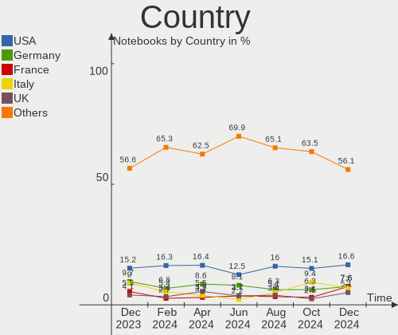
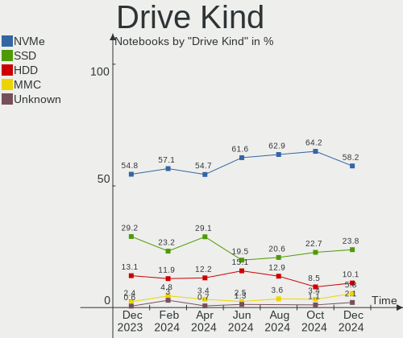
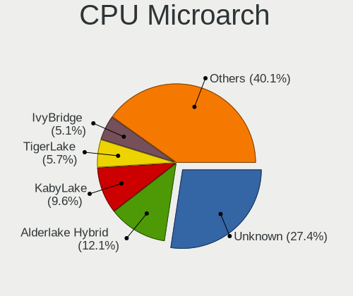
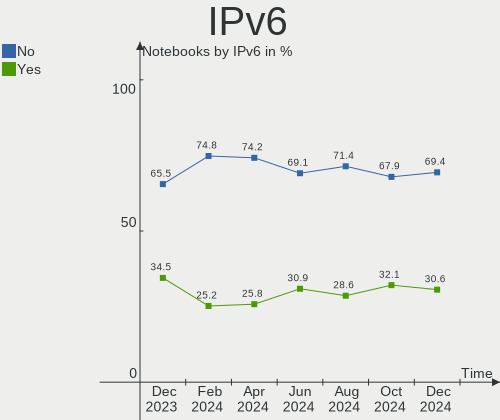
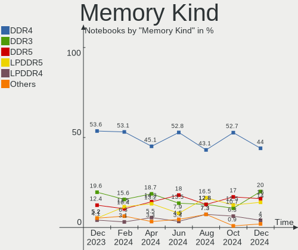

Arch - Hardware Trends (Notebooks)
----------------------------------

A project to identify most popular hardware characteristics and track their change
over time based on data collected by Linux users at https://Linux-Hardware.org.

Anyone can contribute to this report by the [hw-probe](https://github.com/linuxhw/hw-probe) tool:

    sudo -E hw-probe -all -upload

This report is for one last month. Overall report since the beginning of time: [TestDays](https://github.com/linuxhw/TestDays)

Period: Dec, 2023.

Contents
--------

* [ System ](#system)
  - [ OS                       ](#os)
  - [ OS Family                ](#os-family)
  - [ Kernel                   ](#kernel)
  - [ Kernel Family            ](#kernel-family)
  - [ Kernel Major Ver.        ](#kernel-major-ver)
  - [ Arch                     ](#arch)
  - [ DE                       ](#de)
  - [ Display Server           ](#display-server)
  - [ Display Manager          ](#display-manager)
  - [ OS Lang                  ](#os-lang)
  - [ Boot Mode                ](#boot-mode)
  - [ Filesystem               ](#filesystem)
  - [ Part. scheme             ](#part-scheme)
  - [ Dual Boot with Linux/BSD ](#dual-boot-with-linuxbsd)
  - [ Dual Boot (Win)          ](#dual-boot-win)

* [ Board ](#board)
  - [ Vendor                   ](#vendor)
  - [ Model                    ](#model)
  - [ Model Family             ](#model-family)
  - [ MFG Year                 ](#mfg-year)
  - [ Form Factor              ](#form-factor)
  - [ Secure Boot              ](#secure-boot)
  - [ Coreboot                 ](#coreboot)
  - [ RAM Size                 ](#ram-size)
  - [ RAM Used                 ](#ram-used)
  - [ Total Drives             ](#total-drives)
  - [ Has CD-ROM               ](#has-cd-rom)
  - [ Has Ethernet             ](#has-ethernet)
  - [ Has WiFi                 ](#has-wifi)
  - [ Has Bluetooth            ](#has-bluetooth)

* [ Location ](#location)
  - [ Country                  ](#country)
  - [ City                     ](#city)

* [ Drives ](#drives)
  - [ Drive Vendor             ](#drive-vendor)
  - [ Drive Model              ](#drive-model)
  - [ HDD Vendor               ](#hdd-vendor)
  - [ SSD Vendor               ](#ssd-vendor)
  - [ Drive Kind               ](#drive-kind)
  - [ Drive Connector          ](#drive-connector)
  - [ Drive Size               ](#drive-size)
  - [ Space Total              ](#space-total)
  - [ Space Used               ](#space-used)
  - [ Malfunc. Drives          ](#malfunc-drives)
  - [ Malfunc. Drive Vendor    ](#malfunc-drive-vendor)
  - [ Malfunc. HDD Vendor      ](#malfunc-hdd-vendor)
  - [ Malfunc. Drive Kind      ](#malfunc-drive-kind)
  - [ Failed Drives            ](#failed-drives)
  - [ Failed Drive Vendor      ](#failed-drive-vendor)
  - [ Drive Status             ](#drive-status)

* [ Storage controller ](#storage-controller)
  - [ Storage Vendor           ](#storage-vendor)
  - [ Storage Model            ](#storage-model)
  - [ Storage Kind             ](#storage-kind)

* [ Processor ](#processor)
  - [ CPU Vendor               ](#cpu-vendor)
  - [ CPU Model                ](#cpu-model)
  - [ CPU Model Family         ](#cpu-model-family)
  - [ CPU Cores                ](#cpu-cores)
  - [ CPU Sockets              ](#cpu-sockets)
  - [ CPU Threads              ](#cpu-threads)
  - [ CPU Op-Modes             ](#cpu-op-modes)
  - [ CPU Microcode            ](#cpu-microcode)
  - [ CPU Microarch            ](#cpu-microarch)

* [ Graphics ](#graphics)
  - [ GPU Vendor               ](#gpu-vendor)
  - [ GPU Model                ](#gpu-model)
  - [ GPU Combo                ](#gpu-combo)
  - [ GPU Driver               ](#gpu-driver)
  - [ GPU Memory               ](#gpu-memory)

* [ Monitor ](#monitor)
  - [ Monitor Vendor           ](#monitor-vendor)
  - [ Monitor Model            ](#monitor-model)
  - [ Monitor Resolution       ](#monitor-resolution)
  - [ Monitor Diagonal         ](#monitor-diagonal)
  - [ Monitor Width            ](#monitor-width)
  - [ Aspect Ratio             ](#aspect-ratio)
  - [ Monitor Area             ](#monitor-area)
  - [ Pixel Density            ](#pixel-density)
  - [ Multiple Monitors        ](#multiple-monitors)

* [ Network ](#network)
  - [ Net Controller Vendor    ](#net-controller-vendor)
  - [ Net Controller Model     ](#net-controller-model)
  - [ Wireless Vendor          ](#wireless-vendor)
  - [ Wireless Model           ](#wireless-model)
  - [ Ethernet Vendor          ](#ethernet-vendor)
  - [ Ethernet Model           ](#ethernet-model)
  - [ Net Controller Kind      ](#net-controller-kind)
  - [ Used Controller          ](#used-controller)
  - [ NICs                     ](#nics)
  - [ IPv6                     ](#ipv6)

* [ Bluetooth ](#bluetooth)
  - [ Bluetooth Vendor         ](#bluetooth-vendor)
  - [ Bluetooth Model          ](#bluetooth-model)

* [ Sound ](#sound)
  - [ Sound Vendor             ](#sound-vendor)
  - [ Sound Model              ](#sound-model)

* [ Memory ](#memory)
  - [ Memory Vendor            ](#memory-vendor)
  - [ Memory Model             ](#memory-model)
  - [ Memory Kind              ](#memory-kind)
  - [ Memory Form Factor       ](#memory-form-factor)
  - [ Memory Size              ](#memory-size)
  - [ Memory Speed             ](#memory-speed)

* [ Printers & scanners ](#printers--scanners)
  - [ Printer Vendor           ](#printer-vendor)
  - [ Printer Model            ](#printer-model)
  - [ Scanner Vendor           ](#scanner-vendor)
  - [ Scanner Model            ](#scanner-model)

* [ Camera ](#camera)
  - [ Camera Vendor            ](#camera-vendor)
  - [ Camera Model             ](#camera-model)

* [ Security ](#security)
  - [ Fingerprint Vendor       ](#fingerprint-vendor)
  - [ Fingerprint Model        ](#fingerprint-model)
  - [ Chipcard Vendor          ](#chipcard-vendor)
  - [ Chipcard Model           ](#chipcard-model)

* [ Unsupported ](#unsupported)
  - [ Unsupported Devices      ](#unsupported-devices)
  - [ Unsupported Device Types ](#unsupported-device-types)

System
------

OS
--

Installed operating systems

| Name         | Notebooks | Percent |
|--------------|-----------|---------|
| Arch Rolling | 145       | 100%    |

OS Family
---------

OS without a version

| Name | Notebooks | Percent |
|------|-----------|---------|
| Arch | 145       | 100%    |

Kernel
------

Version of the Linux kernel

| Version                     | Notebooks | Percent |
|-----------------------------|-----------|---------|
| 6.6.7-arch1-1               | 29        | 20%     |
| 6.6.3-arch1-1               | 20        | 13.79%  |
| 6.6.4-arch1-1               | 19        | 13.1%   |
| 6.6.8-arch1-1               | 17        | 11.72%  |
| 6.6.6-arch1-1               | 6         | 4.14%   |
| 6.6.5-arch1-1               | 5         | 3.45%   |
| 6.6.8-zen1-1-zen            | 4         | 2.76%   |
| 6.6.7-zen1-1-zen            | 4         | 2.76%   |
| 6.6.6-zen1-1-zen            | 4         | 2.76%   |
| 6.6.3-zen1-1-zen            | 3         | 2.07%   |
| 6.6.2-arch1-1               | 3         | 2.07%   |
| 6.6.1-arch1-1               | 3         | 2.07%   |
| 6.1.69-1-lts                | 3         | 2.07%   |
| 6.6.5-zen1-1-zen            | 2         | 1.38%   |
| 6.5.9-arch2-1               | 2         | 1.38%   |
| 6.1.67-1-lts                | 2         | 1.38%   |
| 6.1.65-1-lts                | 2         | 1.38%   |
| 6.1.64-1-lts                | 2         | 1.38%   |
| 6.7.0-rc5-273-tkg-eevdf     | 1         | 0.69%   |
| 6.7.0-rc4-1-git             | 1         | 0.69%   |
| 6.6.8-x64v2-xanmod1-1       | 1         | 0.69%   |
| 6.6.8-1-cachyos-eevdf       | 1         | 0.69%   |
| 6.6.7-lqx1-1-lqx            | 1         | 0.69%   |
| 6.6.6-arch1-1-g14           | 1         | 0.69%   |
| 6.6.4-zen1-1-zen            | 1         | 0.69%   |
| 6.6.2-zen1-1-zen            | 1         | 0.69%   |
| 6.6.0-pf2                   | 1         | 0.69%   |
| 6.5.13-x64v2-xanmod1-1      | 1         | 0.69%   |
| 6.5.13-hardened2-1-hardened | 1         | 0.69%   |
| 6.5.13-hardened1-1-hardened | 1         | 0.69%   |
| 6.5.10-hardened1-1-hardened | 1         | 0.69%   |
| 6.3.2-arch1-1               | 1         | 0.69%   |
| 6.1.63-1-lts                | 1         | 0.69%   |

Kernel Family
-------------

Linux kernel without a distro release

| Version | Notebooks | Percent |
|---------|-----------|---------|
| 6.6.7   | 34        | 23.45%  |
| 6.6.8   | 23        | 15.86%  |
| 6.6.3   | 23        | 15.86%  |
| 6.6.4   | 20        | 13.79%  |
| 6.6.6   | 11        | 7.59%   |
| 6.6.5   | 7         | 4.83%   |
| 6.6.2   | 4         | 2.76%   |
| 6.6.1   | 3         | 2.07%   |
| 6.5.13  | 3         | 2.07%   |
| 6.1.69  | 3         | 2.07%   |
| 6.7.0   | 2         | 1.38%   |
| 6.5.9   | 2         | 1.38%   |
| 6.1.67  | 2         | 1.38%   |
| 6.1.65  | 2         | 1.38%   |
| 6.1.64  | 2         | 1.38%   |
| 6.6.0   | 1         | 0.69%   |
| 6.5.10  | 1         | 0.69%   |
| 6.3.2   | 1         | 0.69%   |
| 6.1.63  | 1         | 0.69%   |

Kernel Major Ver.
-----------------

Linux kernel major version

| Version | Notebooks | Percent |
|---------|-----------|---------|
| 6.6     | 126       | 86.9%   |
| 6.1     | 10        | 6.9%    |
| 6.5     | 6         | 4.14%   |
| 6.7     | 2         | 1.38%   |
| 6.3     | 1         | 0.69%   |

Arch
----

OS architecture (x86_64, i586, etc.)

| Name   | Notebooks | Percent |
|--------|-----------|---------|
| x86_64 | 145       | 100%    |

DE
--

Desktop Environment

| Name          | Notebooks | Percent |
|---------------|-----------|---------|
| KDE5          | 54        | 37.24%  |
| GNOME         | 45        | 31.03%  |
| XFCE          | 11        | 7.59%   |
| i3            | 7         | 4.83%   |
| Hyprland      | 7         | 4.83%   |
| Unknown       | 7         | 4.83%   |
| MATE          | 2         | 1.38%   |
| KDE6          | 2         | 1.38%   |
| Budgie        | 2         | 1.38%   |
| xmonad        | 1         | 0.69%   |
| X-Cinnamon    | 1         | 0.69%   |
| LXQt          | 1         | 0.69%   |
| GNOME Classic | 1         | 0.69%   |
| dwm           | 1         | 0.69%   |
| Deepin        | 1         | 0.69%   |
| Cinnamon      | 1         | 0.69%   |
| bspwm         | 1         | 0.69%   |

Display Server
--------------

X11 or Wayland

| Name    | Notebooks | Percent |
|---------|-----------|---------|
| X11     | 65        | 44.83%  |
| Wayland | 62        | 42.76%  |
| Tty     | 12        | 8.28%   |
| Unknown | 6         | 4.14%   |

Display Manager
---------------

SDDM, LightDM, etc.

| Name    | Notebooks | Percent |
|---------|-----------|---------|
| Unknown | 64        | 44.14%  |
| SDDM    | 40        | 27.59%  |
| LightDM | 25        | 17.24%  |
| GDM     | 13        | 8.97%   |
| LY-DM   | 1         | 0.69%   |
| GREETD  | 1         | 0.69%   |
| EMPTTY  | 1         | 0.69%   |

OS Lang
-------

Language

| Lang    | Notebooks | Percent |
|---------|-----------|---------|
| en_US   | 83        | 57.24%  |
| it_IT   | 11        | 7.59%   |
| C       | 11        | 7.59%   |
| en_GB   | 9         | 6.21%   |
| ru_RU   | 8         | 5.52%   |
| de_DE   | 6         | 4.14%   |
| fr_FR   | 3         | 2.07%   |
| es_MX   | 2         | 1.38%   |
| en_IN   | 2         | 1.38%   |
| zh_CN   | 1         | 0.69%   |
| tr_TR   | 1         | 0.69%   |
| pl_PL   | 1         | 0.69%   |
| es_UY   | 1         | 0.69%   |
| es_PE   | 1         | 0.69%   |
| es_ES   | 1         | 0.69%   |
| es_CL   | 1         | 0.69%   |
| en_ZA   | 1         | 0.69%   |
| en_CA   | 1         | 0.69%   |
| Unknown | 1         | 0.69%   |

Boot Mode
---------

EFI or BIOS

| Mode | Notebooks | Percent |
|------|-----------|---------|
| EFI  | 82        | 56.55%  |
| BIOS | 63        | 43.45%  |

Filesystem
----------

Type of filesystem

| Type     | Notebooks | Percent |
|----------|-----------|---------|
| Ext4     | 92        | 63.45%  |
| Btrfs    | 41        | 28.28%  |
| Tmpfs    | 3         | 2.07%   |
| Zfs      | 2         | 1.38%   |
| F2fs     | 2         | 1.38%   |
| Xfs      | 1         | 0.69%   |
| Overlay  | 1         | 0.69%   |
| Ext3     | 1         | 0.69%   |
| Bcachefs | 1         | 0.69%   |
| Unknown  | 1         | 0.69%   |

Part. scheme
------------

Scheme of partitioning

| Type    | Notebooks | Percent |
|---------|-----------|---------|
| GPT     | 91        | 62.76%  |
| Unknown | 48        | 33.1%   |
| MBR     | 6         | 4.14%   |

Dual Boot with Linux/BSD
------------------------

Hosting more than one Linux/BSD

| Dual boot | Notebooks | Percent |
|-----------|-----------|---------|
| No        | 131       | 90.34%  |
| Yes       | 14        | 9.66%   |

Dual Boot (Win)
---------------

Hosting Linux and Windows

| Dual boot | Notebooks | Percent |
|-----------|-----------|---------|
| No        | 114       | 78.62%  |
| Yes       | 31        | 21.38%  |

Board
-----

Vendor
------

Motherboard manufacturer

| Name                 | Notebooks | Percent |
|----------------------|-----------|---------|
| Lenovo               | 38        | 26.21%  |
| ASUSTek Computer     | 29        | 20%     |
| Hewlett-Packard      | 22        | 15.17%  |
| Dell                 | 14        | 9.66%   |
| Acer                 | 10        | 6.9%    |
| Razer                | 4         | 2.76%   |
| Framework            | 4         | 2.76%   |
| Samsung Electronics  | 3         | 2.07%   |
| Apple                | 3         | 2.07%   |
| HUAWEI               | 2         | 1.38%   |
| Gigabyte Technology  | 2         | 1.38%   |
| Alienware            | 2         | 1.38%   |
| VPU Company          | 1         | 0.69%   |
| TUXEDO               | 1         | 0.69%   |
| TrekStor             | 1         | 0.69%   |
| Timi                 | 1         | 0.69%   |
| TECNO Mobile Limited | 1         | 0.69%   |
| System76             | 1         | 0.69%   |
| Sony                 | 1         | 0.69%   |
| Monster              | 1         | 0.69%   |
| Maibenben            | 1         | 0.69%   |
| GPD                  | 1         | 0.69%   |
| Google               | 1         | 0.69%   |
| Casper               | 1         | 0.69%   |

Model
-----

Motherboard model

| Name                                       | Notebooks | Percent |
|--------------------------------------------|-----------|---------|
| Razer Blade 17 (2022) - RZ09-0423          | 2         | 1.38%   |
| Lenovo Legion 5 15ACH6H 82JU               | 2         | 1.38%   |
| Framework Laptop 13 (AMD Ryzen 7040Series) | 2         | 1.38%   |
| Acer Nitro AN515-58                        | 2         | 1.38%   |
| VPU Company VWNC71429-S                    | 1         | 0.69%   |
| TUXEDO Pulse 14 Gen3                       | 1         | 0.69%   |
| TrekStor Notebook Slim S130                | 1         | 0.69%   |
| Timi TM1604                                | 1         | 0.69%   |
| TECNO Mobile Limited MEGABOOK T15DA        | 1         | 0.69%   |
| System76 Lemur Pro                         | 1         | 0.69%   |
| Sony VPCCA3X1R                             | 1         | 0.69%   |
| Samsung RF511/RF411/RF711                  | 1         | 0.69%   |
| Samsung QX311/QX411/QX412/QX511            | 1         | 0.69%   |
| Samsung 750XDA                             | 1         | 0.69%   |
| Razer Blade 15 (2022) - RZ09-0421          | 1         | 0.69%   |
| Razer Blade                                | 1         | 0.69%   |
| Monster TULPAR T5 V23.2                    | 1         | 0.69%   |
| Maibenben MaiBook X series                 | 1         | 0.69%   |
| Lenovo Yoga Slim 7 Pro 14ACH5 OD 82NK      | 1         | 0.69%   |
| Lenovo V15 G2 ALC 82KD                     | 1         | 0.69%   |
| Lenovo ThinkPad X280 20KEA00SUK            | 1         | 0.69%   |
| Lenovo ThinkPad X1 Carbon Gen 8 20U9005KUS | 1         | 0.69%   |
| Lenovo ThinkPad T480s 20L7001LMX           | 1         | 0.69%   |
| Lenovo ThinkPad T480 20L6SH3L2D            | 1         | 0.69%   |
| Lenovo ThinkPad T480 20L50004MX            | 1         | 0.69%   |
| Lenovo ThinkPad T470p 20J6CTO1WW           | 1         | 0.69%   |
| Lenovo ThinkPad T440s 20ARS1RS00           | 1         | 0.69%   |
| Lenovo ThinkPad T440s 20AQ005TUS           | 1         | 0.69%   |
| Lenovo ThinkPad T440p 20AWS02800           | 1         | 0.69%   |
| Lenovo ThinkPad T440p                      | 1         | 0.69%   |
| Lenovo ThinkPad T15 Gen 2i 20W5S2PN00      | 1         | 0.69%   |
| Lenovo ThinkPad T14s Gen 2a 20XGCTO1WW     | 1         | 0.69%   |
| Lenovo ThinkPad T14 Gen 2i 20W1S2VN00      | 1         | 0.69%   |
| Lenovo ThinkPad SL 2746E9G                 | 1         | 0.69%   |
| Lenovo ThinkPad P14s Gen 4 21K50009CK      | 1         | 0.69%   |
| Lenovo ThinkPad P1 Gen 3 20TH000QSP        | 1         | 0.69%   |
| Lenovo ThinkPad Mini10 3507A31             | 1         | 0.69%   |
| Lenovo ThinkPad L450 20DSS1G63Q            | 1         | 0.69%   |
| Lenovo ThinkPad E16 Gen 1 21JT001VCK       | 1         | 0.69%   |
| Lenovo ThinkPad E14 Gen 2 20TA004MUS       | 1         | 0.69%   |

Model Family
------------

Motherboard model prefix

| Name                          | Notebooks | Percent |
|-------------------------------|-----------|---------|
| Lenovo ThinkPad               | 20        | 13.79%  |
| ASUS VivoBook                 | 9         | 6.21%   |
| ASUS ASUS                     | 8         | 5.52%   |
| Lenovo Legion                 | 6         | 4.14%   |
| Dell Latitude                 | 6         | 4.14%   |
| Dell Inspiron                 | 6         | 4.14%   |
| HP Pavilion                   | 5         | 3.45%   |
| Acer Aspire                   | 5         | 3.45%   |
| Razer Blade                   | 4         | 2.76%   |
| HP ProBook                    | 4         | 2.76%   |
| Framework Laptop              | 4         | 2.76%   |
| ASUS ROG                      | 4         | 2.76%   |
| Acer Nitro                    | 4         | 2.76%   |
| Lenovo IdeaPad                | 3         | 2.07%   |
| HP Laptop                     | 3         | 2.07%   |
| Lenovo ThinkBook              | 2         | 1.38%   |
| HP ZBook                      | 2         | 1.38%   |
| HP ENVY                       | 2         | 1.38%   |
| Gigabyte AERO                 | 2         | 1.38%   |
| Dell Precision                | 2         | 1.38%   |
| VPU Company VWNC71429-S       | 1         | 0.69%   |
| TUXEDO Pulse                  | 1         | 0.69%   |
| TrekStor Notebook             | 1         | 0.69%   |
| Timi TM1604                   | 1         | 0.69%   |
| TECNO Mobile Limited MEGABOOK | 1         | 0.69%   |
| System76 Lemur                | 1         | 0.69%   |
| Sony VPCCA3X1R                | 1         | 0.69%   |
| Samsung RF511                 | 1         | 0.69%   |
| Samsung QX311                 | 1         | 0.69%   |
| Samsung 750XDA                | 1         | 0.69%   |
| Monster TULPAR                | 1         | 0.69%   |
| Maibenben MaiBook             | 1         | 0.69%   |
| Lenovo Yoga                   | 1         | 0.69%   |
| Lenovo V15                    | 1         | 0.69%   |
| Lenovo Slim                   | 1         | 0.69%   |
| Lenovo G500                   | 1         | 0.69%   |
| Lenovo G50-80                 | 1         | 0.69%   |
| Lenovo B5400                  | 1         | 0.69%   |
| Lenovo 14w                    | 1         | 0.69%   |
| HUAWEI NBLL-WXX9              | 1         | 0.69%   |

MFG Year
--------

Motherboard manufacture year

| Year | Notebooks | Percent |
|------|-----------|---------|
| 2023 | 26        | 17.93%  |
| 2021 | 26        | 17.93%  |
| 2022 | 20        | 13.79%  |
| 2020 | 12        | 8.28%   |
| 2015 | 10        | 6.9%    |
| 2018 | 8         | 5.52%   |
| 2013 | 8         | 5.52%   |
| 2012 | 6         | 4.14%   |
| 2017 | 5         | 3.45%   |
| 2016 | 5         | 3.45%   |
| 2014 | 5         | 3.45%   |
| 2011 | 5         | 3.45%   |
| 2019 | 4         | 2.76%   |
| 2010 | 4         | 2.76%   |
| 2008 | 1         | 0.69%   |

Form Factor
-----------

Physical design of the computer

| Name     | Notebooks | Percent |
|----------|-----------|---------|
| Notebook | 145       | 100%    |

Secure Boot
-----------

Enabled or disabled

| State    | Notebooks | Percent |
|----------|-----------|---------|
| Disabled | 143       | 98.62%  |
| Enabled  | 2         | 1.38%   |

Coreboot
--------

Have coreboot on board

| Used | Notebooks | Percent |
|------|-----------|---------|
| No   | 142       | 97.93%  |
| Yes  | 3         | 2.07%   |

RAM Size
--------

Total RAM memory

| Size in GB  | Notebooks | Percent |
|-------------|-----------|---------|
| 8.01-16.0   | 41        | 28.28%  |
| 4.01-8.0    | 35        | 24.14%  |
| 16.01-24.0  | 25        | 17.24%  |
| 32.01-64.0  | 16        | 11.03%  |
| 3.01-4.0    | 11        | 7.59%   |
| 24.01-32.0  | 9         | 6.21%   |
| 64.01-256.0 | 4         | 2.76%   |
| 2.01-3.0    | 2         | 1.38%   |
| 1.01-2.0    | 2         | 1.38%   |

RAM Used
--------

Used RAM memory

| Used GB    | Notebooks | Percent |
|------------|-----------|---------|
| 4.01-8.0   | 45        | 31.03%  |
| 1.01-2.0   | 26        | 17.93%  |
| 3.01-4.0   | 25        | 17.24%  |
| 2.01-3.0   | 24        | 16.55%  |
| 8.01-16.0  | 16        | 11.03%  |
| 0.51-1.0   | 7         | 4.83%   |
| 16.01-24.0 | 2         | 1.38%   |

Total Drives
------------

Number of drives on board

| Drives | Notebooks | Percent |
|--------|-----------|---------|
| 1      | 102       | 70.34%  |
| 2      | 38        | 26.21%  |
| 3      | 5         | 3.45%   |

Has CD-ROM
----------

Has CD-ROM on board

| Presented | Notebooks | Percent |
|-----------|-----------|---------|
| No        | 120       | 82.76%  |
| Yes       | 25        | 17.24%  |

Has Ethernet
------------

Has Ethernet on board

| Presented | Notebooks | Percent |
|-----------|-----------|---------|
| Yes       | 106       | 73.1%   |
| No        | 39        | 26.9%   |

Has WiFi
--------

Has WiFi module

| Presented | Notebooks | Percent |
|-----------|-----------|---------|
| Yes       | 144       | 99.31%  |
| No        | 1         | 0.69%   |

Has Bluetooth
-------------

Has Bluetooth module

| Presented | Notebooks | Percent |
|-----------|-----------|---------|
| Yes       | 138       | 95.17%  |
| No        | 7         | 4.83%   |

Location
--------

Country
-------

Geographic location (country)

| Country      | Notebooks | Percent |
|--------------|-----------|---------|
| USA          | 22        | 15.17%  |
| Germany      | 14        | 9.66%   |
| Russia       | 13        | 8.97%   |
| Italy        | 13        | 8.97%   |
| Poland       | 8         | 5.52%   |
| France       | 8         | 5.52%   |
| UK           | 6         | 4.14%   |
| India        | 6         | 4.14%   |
| Canada       | 5         | 3.45%   |
| Spain        | 4         | 2.76%   |
| Brazil       | 3         | 2.07%   |
| Australia    | 3         | 2.07%   |
| Vietnam      | 2         | 1.38%   |
| Turkey       | 2         | 1.38%   |
| Switzerland  | 2         | 1.38%   |
| Sweden       | 2         | 1.38%   |
| South Africa | 2         | 1.38%   |
| Netherlands  | 2         | 1.38%   |
| Chile        | 2         | 1.38%   |
| Belarus      | 2         | 1.38%   |
| Bangladesh   | 2         | 1.38%   |
| Austria      | 2         | 1.38%   |
| Uruguay      | 1         | 0.69%   |
| Ukraine      | 1         | 0.69%   |
| Thailand     | 1         | 0.69%   |
| Sri Lanka    | 1         | 0.69%   |
| Slovakia     | 1         | 0.69%   |
| Romania      | 1         | 0.69%   |
| Portugal     | 1         | 0.69%   |
| Peru         | 1         | 0.69%   |
| Morocco      | 1         | 0.69%   |
| Mexico       | 1         | 0.69%   |
| Madagascar   | 1         | 0.69%   |
| Lithuania    | 1         | 0.69%   |
| Kazakhstan   | 1         | 0.69%   |
| Iran         | 1         | 0.69%   |
| Iceland      | 1         | 0.69%   |
| Estonia      | 1         | 0.69%   |
| Czechia      | 1         | 0.69%   |
| China        | 1         | 0.69%   |

City
----

Geographic location (city)

| City           | Notebooks | Percent |
|----------------|-----------|---------|
| St Petersburg  | 4         | 2.76%   |
| Poznan         | 3         | 2.07%   |
| Zurich         | 2         | 1.38%   |
| Warsaw         | 2         | 1.38%   |
| Strasbourg     | 2         | 1.38%   |
| Sindelfingen   | 2         | 1.38%   |
| Portland       | 2         | 1.38%   |
| Novoshakhtinsk | 2         | 1.38%   |
| Moscow         | 2         | 1.38%   |
| Minsk          | 2         | 1.38%   |
| Johannesburg   | 2         | 1.38%   |
| Berlin         | 2         | 1.38%   |
| Zapopan        | 1         | 0.69%   |
| Yorktown       | 1         | 0.69%   |
| Winchester     | 1         | 0.69%   |
| Westchester    | 1         | 0.69%   |
| Waukesha       | 1         | 0.69%   |
| Vienna         | 1         | 0.69%   |
| Valga          | 1         | 0.69%   |
| Turin          | 1         | 0.69%   |
| Trelissac      | 1         | 0.69%   |
| Trebisacce     | 1         | 0.69%   |
| Tongi          | 1         | 0.69%   |
| Tignale        | 1         | 0.69%   |
| Tehran         | 1         | 0.69%   |
| Tangier        | 1         | 0.69%   |
| Sydney         | 1         | 0.69%   |
| Surgut         | 1         | 0.69%   |
| Suhl           | 1         | 0.69%   |
| Slough         | 1         | 0.69%   |
| Seville        | 1         | 0.69%   |
| Sergiyev Posad | 1         | 0.69%   |
| Scorzè        | 1         | 0.69%   |
| Schallstadt    | 1         | 0.69%   |
| Sapiranga      | 1         | 0.69%   |
| Sapezal        | 1         | 0.69%   |
| Santiago       | 1         | 0.69%   |
| Salt Lake City | 1         | 0.69%   |
| Sala           | 1         | 0.69%   |
| Rome           | 1         | 0.69%   |

Drives
------

Drive Vendor
------------

Hard drive vendors

| Vendor                       | Notebooks | Drives | Percent |
|------------------------------|-----------|--------|---------|
| Samsung Electronics          | 38        | 42     | 20.77%  |
| Sandisk                      | 16        | 18     | 8.74%   |
| Kingston                     | 15        | 16     | 8.2%    |
| SK hynix                     | 14        | 14     | 7.65%   |
| Micron Technology            | 14        | 15     | 7.65%   |
| WDC                          | 11        | 11     | 6.01%   |
| Intel                        | 10        | 10     | 5.46%   |
| Unknown                      | 8         | 8      | 4.37%   |
| Toshiba                      | 7         | 7      | 3.83%   |
| Micron/Crucial Technology    | 4         | 5      | 2.19%   |
| Crucial                      | 4         | 4      | 2.19%   |
| ASMT                         | 4         | 4      | 2.19%   |
| Seagate                      | 3         | 3      | 1.64%   |
| KIOXIA                       | 3         | 3      | 1.64%   |
| Shenzhen Longsys Electronics | 2         | 2      | 1.09%   |
| Phison Electronics           | 2         | 2      | 1.09%   |
| LITEON                       | 2         | 2      | 1.09%   |
| Kingston Technology Company  | 2         | 2      | 1.09%   |
| Hitachi                      | 2         | 2      | 1.09%   |
| Apacer                       | 2         | 2      | 1.09%   |
| Verbatim                     | 1         | 1      | 0.55%   |
| USB                          | 1         | 1      | 0.55%   |
| Union Memory                 | 1         | 1      | 0.55%   |
| SSK                          | 1         | 1      | 0.55%   |
| SPCC                         | 1         | 1      | 0.55%   |
| Silicon Motion               | 1         | 1      | 0.55%   |
| SATA SSD                     | 1         | 1      | 0.55%   |
| NGFF                         | 1         | 1      | 0.55%   |
| Netac                        | 1         | 1      | 0.55%   |
| MAXIO Technology (Hangzhou)  | 1         | 1      | 0.55%   |
| KingSpec                     | 1         | 1      | 0.55%   |
| JMicron Technology           | 1         | 1      | 0.55%   |
| HS-SSD-E100                  | 1         | 1      | 0.55%   |
| HGST                         | 1         | 1      | 0.55%   |
| Generic-                     | 1         | 1      | 0.55%   |
| Fujitsu                      | 1         | 1      | 0.55%   |
| Drevo                        | 1         | 1      | 0.55%   |
| China                        | 1         | 1      | 0.55%   |
| Biwin Storage Technology     | 1         | 1      | 0.55%   |
| Apple                        | 1         | 1      | 0.55%   |

Drive Model
-----------

Hard drive models

| Model                                               | Notebooks | Percent |
|-----------------------------------------------------|-----------|---------|
| Samsung NVMe SSD Controller SM981/PM981/PM983 512GB | 10        | 5.26%   |
| Samsung NVMe SSD Controller PM9A1/PM9A3/980PRO 2TB  | 8         | 4.21%   |
| Intel SSDPEKNU512GZ 512GB                           | 5         | 2.63%   |
| Kingston SA400S37240G 240GB SSD                     | 4         | 2.11%   |
| Sandisk WD Black SN850 1024GB                       | 3         | 1.58%   |
| Sandisk WD Black SN750 / PC SN730 NVMe SSD 2TB      | 3         | 1.58%   |
| Kingston SA400S37960G 960GB SSD                     | 3         | 1.58%   |
| Unknown NVMe SSD Drive 1TB                          | 2         | 1.05%   |
| Unknown MMC Card  128GB                             | 2         | 1.05%   |
| Toshiba XG6 NVMe SSD Controller 512GB               | 2         | 1.05%   |
| SK hynix SHPP41-1000GM 1TB                          | 2         | 1.05%   |
| SK hynix HFM512GD3JX013N 512GB                      | 2         | 1.05%   |
| SK hynix BC511 512GB                                | 2         | 1.05%   |
| Seagate ST500LT012-1DG142 500GB                     | 2         | 1.05%   |
| Sandisk WD PC SN740 SDDPMQD-1T00-1101 1TB           | 2         | 1.05%   |
| Sandisk WD Blue SN550 NVMe SSD 1TB                  | 2         | 1.05%   |
| Samsung SSD 990 PRO 1TB                             | 2         | 1.05%   |
| Micron/Crucial P2 NVMe PCIe SSD 4TB                 | 2         | 1.05%   |
| Micron 2400_MTFDKBA512QFM 512GB                     | 2         | 1.05%   |
| Micron 2400_MTFDKBA1T0QFM 1024GB                    | 2         | 1.05%   |
| Kingston SA400S37480G 480GB SSD                     | 2         | 1.05%   |
| Intel SSD 660P Series 1TB                           | 2         | 1.05%   |
| Crucial CT240BX500SSD1 240GB                        | 2         | 1.05%   |
| ASMT USB 3.0 Destop H 1TB                           | 2         | 1.05%   |
| WDC WDS500G2B0B-00YS70 500GB SSD                    | 1         | 0.53%   |
| WDC WDS240G2G0A-00JH30 240GB SSD                    | 1         | 0.53%   |
| WDC WDS120G1G0A-00SS50 120GB SSD                    | 1         | 0.53%   |
| WDC WDS100T2B0B 1TB SSD                             | 1         | 0.53%   |
| WDC WDBNCE0010PNC 1TB SSD                           | 1         | 0.53%   |
| WDC WD7500BPVT-60HXZT3 752GB                        | 1         | 0.53%   |
| WDC WD7500BPKX-60HPJT0 752GB                        | 1         | 0.53%   |
| WDC WD5000LPVX-22V0TT0 500GB                        | 1         | 0.53%   |
| WDC WD10SPZX-75Z10T2 1TB                            | 1         | 0.53%   |
| WDC WD10JPVX-60JC3T1 1TB                            | 1         | 0.53%   |
| WDC WD10JPVX-22JC3T0 1TB                            | 1         | 0.53%   |
| Verbatim Vi550 S3 512GB                             | 1         | 0.53%   |
| USB 3.1 1TB                                         | 1         | 0.53%   |
| Unknown xD/SD/M.S.                                  | 1         | 0.53%   |
| Unknown NVMe SSD Drive 1024GB                       | 1         | 0.53%   |
| Unknown MMC Card  8GB                               | 1         | 0.53%   |

HDD Vendor
----------

Hard disk drive vendors

| Vendor              | Notebooks | Drives | Percent |
|---------------------|-----------|--------|---------|
| WDC                 | 6         | 6      | 27.27%  |
| Toshiba             | 4         | 4      | 18.18%  |
| Seagate             | 3         | 3      | 13.64%  |
| Hitachi             | 2         | 2      | 9.09%   |
| ASMT                | 2         | 2      | 9.09%   |
| USB                 | 1         | 1      | 4.55%   |
| Samsung Electronics | 1         | 1      | 4.55%   |
| HGST                | 1         | 1      | 4.55%   |
| Generic-            | 1         | 1      | 4.55%   |
| Fujitsu             | 1         | 1      | 4.55%   |

SSD Vendor
----------

Solid state drive vendors

| Vendor              | Notebooks | Drives | Percent |
|---------------------|-----------|--------|---------|
| Kingston            | 11        | 12     | 21.57%  |
| Samsung Electronics | 9         | 9      | 17.65%  |
| WDC                 | 5         | 5      | 9.8%    |
| Crucial             | 4         | 4      | 7.84%   |
| Intel               | 3         | 3      | 5.88%   |
| SanDisk             | 2         | 2      | 3.92%   |
| LITEON              | 2         | 2      | 3.92%   |
| Apacer              | 2         | 2      | 3.92%   |
| Verbatim            | 1         | 1      | 1.96%   |
| Toshiba             | 1         | 1      | 1.96%   |
| SPCC                | 1         | 1      | 1.96%   |
| SK hynix            | 1         | 1      | 1.96%   |
| NGFF                | 1         | 1      | 1.96%   |
| Netac               | 1         | 1      | 1.96%   |
| KingSpec            | 1         | 1      | 1.96%   |
| JMicron Technology  | 1         | 1      | 1.96%   |
| HS-SSD-E100         | 1         | 1      | 1.96%   |
| Drevo               | 1         | 1      | 1.96%   |
| China               | 1         | 1      | 1.96%   |
| ASMT                | 1         | 1      | 1.96%   |
| Apple               | 1         | 1      | 1.96%   |

Drive Kind
----------

HDD or SSD

| Kind    | Notebooks | Drives | Percent |
|---------|-----------|--------|---------|
| NVMe    | 92        | 112    | 55.42%  |
| SSD     | 47        | 52     | 28.31%  |
| HDD     | 21        | 22     | 12.65%  |
| MMC     | 4         | 4      | 2.41%   |
| Unknown | 2         | 2      | 1.2%    |

Drive Connector
---------------

SATA, SAS, NVMe, etc.

| Type | Notebooks | Drives | Percent |
|------|-----------|--------|---------|
| NVMe | 92        | 110    | 56.79%  |
| SATA | 57        | 68     | 35.19%  |
| SAS  | 9         | 10     | 5.56%   |
| MMC  | 4         | 4      | 2.47%   |

Drive Size
----------

Size of hard drive

| Size in TB | Notebooks | Drives | Percent |
|------------|-----------|--------|---------|
| 0.01-0.5   | 42        | 46     | 60.87%  |
| 0.51-1.0   | 24        | 25     | 34.78%  |
| 1.01-2.0   | 3         | 3      | 4.35%   |

Space Total
-----------

Amount of disk space available on the file system

| Size in GB     | Notebooks | Percent |
|----------------|-----------|---------|
| 501-1000       | 32        | 22.07%  |
| 101-250        | 30        | 20.69%  |
| 251-500        | 29        | 20%     |
| 1001-2000      | 19        | 13.1%   |
| More than 3000 | 16        | 11.03%  |
| 2001-3000      | 7         | 4.83%   |
| 51-100         | 7         | 4.83%   |
| 1-20           | 3         | 2.07%   |
| 21-50          | 1         | 0.69%   |
| Unknown        | 1         | 0.69%   |

Space Used
----------

Amount of used disk space

| Used GB        | Notebooks | Percent |
|----------------|-----------|---------|
| 1-20           | 39        | 26.9%   |
| 101-250        | 28        | 19.31%  |
| 21-50          | 20        | 13.79%  |
| 51-100         | 18        | 12.41%  |
| 251-500        | 15        | 10.34%  |
| 501-1000       | 13        | 8.97%   |
| 1001-2000      | 7         | 4.83%   |
| More than 3000 | 2         | 1.38%   |
| 2001-3000      | 2         | 1.38%   |
| Unknown        | 1         | 0.69%   |

Malfunc. Drives
---------------

Drive models with a malfunction

| Model                                       | Notebooks | Drives | Percent |
|---------------------------------------------|-----------|--------|---------|
| WDC WDS240G2G0A-00JH30 240GB SSD            | 1         | 1      | 16.67%  |
| WDC WD7500BPVT-60HXZT3 752GB                | 1         | 1      | 16.67%  |
| WDC WD10SPZX-75Z10T2 1TB                    | 1         | 1      | 16.67%  |
| Micron Technology 2200V_MTFDHBA512TCK 512GB | 1         | 1      | 16.67%  |
| Kingston SA400S37960G 960GB SSD             | 1         | 1      | 16.67%  |
| HGST HTS725050A7E630 500GB                  | 1         | 1      | 16.67%  |

Malfunc. Drive Vendor
---------------------

Vendors of faulty drives

| Vendor            | Notebooks | Drives | Percent |
|-------------------|-----------|--------|---------|
| WDC               | 3         | 3      | 50%     |
| Micron Technology | 1         | 1      | 16.67%  |
| Kingston          | 1         | 1      | 16.67%  |
| HGST              | 1         | 1      | 16.67%  |

Malfunc. HDD Vendor
-------------------

Vendors of faulty HDD drives

| Vendor | Notebooks | Drives | Percent |
|--------|-----------|--------|---------|
| WDC    | 2         | 2      | 66.67%  |
| HGST   | 1         | 1      | 33.33%  |

Malfunc. Drive Kind
-------------------

Kinds of faulty drives

| Kind | Notebooks | Drives | Percent |
|------|-----------|--------|---------|
| HDD  | 3         | 3      | 50%     |
| SSD  | 2         | 2      | 33.33%  |
| NVMe | 1         | 1      | 16.67%  |

Failed Drives
-------------

Failed drive models

Zero info for selected period =(

Failed Drive Vendor
-------------------

Failed drive vendors

Zero info for selected period =(

Drive Status
------------

Number of failed and malfunc. drives

| Status   | Notebooks | Drives | Percent |
|----------|-----------|--------|---------|
| Detected | 76        | 98     | 50%     |
| Works    | 70        | 88     | 46.05%  |
| Malfunc  | 6         | 6      | 3.95%   |

Storage controller
------------------

Storage Vendor
--------------

Storage controller vendors

| Vendor                       | Notebooks | Percent |
|------------------------------|-----------|---------|
| Intel                        | 76        | 40.86%  |
| Samsung Electronics          | 30        | 16.13%  |
| SanDisk                      | 15        | 8.06%   |
| Micron Technology            | 14        | 7.53%   |
| SK hynix                     | 13        | 6.99%   |
| AMD                          | 11        | 5.91%   |
| Kingston Technology Company  | 6         | 3.23%   |
| Micron/Crucial Technology    | 4         | 2.15%   |
| KIOXIA                       | 3         | 1.61%   |
| Toshiba America Info Systems | 2         | 1.08%   |
| Solidigm                     | 2         | 1.08%   |
| Shenzhen Longsys Electronics | 2         | 1.08%   |
| Phison Electronics           | 2         | 1.08%   |
| Union Memory (Shenzhen)      | 1         | 0.54%   |
| Silicon Motion               | 1         | 0.54%   |
| Nvidia                       | 1         | 0.54%   |
| MAXIO Technology (Hangzhou)  | 1         | 0.54%   |
| INNOGRIT                     | 1         | 0.54%   |
| Biwin Storage Technology     | 1         | 0.54%   |

Storage Model
-------------

Storage controller models

| Model                                                                            | Notebooks | Percent |
|----------------------------------------------------------------------------------|-----------|---------|
| AMD FCH SATA Controller [AHCI mode]                                              | 11        | 5.53%   |
| Samsung NVMe SSD Controller SM981/PM981/PM983                                    | 10        | 5.03%   |
| Samsung NVMe SSD Controller 980 (DRAM-less)                                      | 10        | 5.03%   |
| Intel Sunrise Point-LP SATA Controller [AHCI mode]                               | 10        | 5.03%   |
| Intel Volume Management Device NVMe RAID Controller                              | 9         | 4.52%   |
| Samsung NVMe SSD Controller PM9A1/PM9A3/980PRO                                   | 8         | 4.02%   |
| Intel 8 Series SATA Controller 1 [AHCI mode]                                     | 8         | 4.02%   |
| Intel 7 Series Chipset Family 6-port SATA Controller [AHCI mode]                 | 8         | 4.02%   |
| SK hynix Platinum P41/PC801 NVMe Solid State Drive                               | 6         | 3.02%   |
| Intel 8 Series/C220 Series Chipset Family 6-port SATA Controller 1 [AHCI mode]   | 6         | 3.02%   |
| Micron 2400 NVMe SSD (DRAM-less)                                                 | 5         | 2.51%   |
| Intel SSD 670p Series [Keystone Harbor]                                          | 5         | 2.51%   |
| Micron 3400 NVMe SSD [Hendrix]                                                   | 4         | 2.01%   |
| Intel Volume Management Device NVMe RAID Controller Intel Corporation            | 4         | 2.01%   |
| Intel 6 Series/C200 Series Chipset Family 6 port Mobile SATA AHCI Controller     | 4         | 2.01%   |
| SK hynix Gold P31/BC711/PC711 NVMe Solid State Drive                             | 3         | 1.51%   |
| SK hynix BC511 NVMe SSD                                                          | 3         | 1.51%   |
| SanDisk WD PC SN810 / Black SN850 NVMe SSD                                       | 3         | 1.51%   |
| SanDisk Extreme Pro / WD Black SN750 / PC SN730 / Red SN700 NVMe SSD             | 3         | 1.51%   |
| Micron 2300 NVMe SSD [Santana]                                                   | 3         | 1.51%   |
| Intel Wildcat Point-LP SATA Controller [AHCI Mode]                               | 3         | 1.51%   |
| Intel HM170/QM170 Chipset SATA Controller [AHCI Mode]                            | 3         | 1.51%   |
| Intel Alder Lake-P SATA AHCI Controller                                          | 3         | 1.51%   |
| Intel 82801 Mobile SATA Controller [RAID mode]                                   | 3         | 1.51%   |
| Intel 400 Series Chipset Family SATA AHCI Controller                             | 3         | 1.51%   |
| Toshiba America Info Systems XG6 NVMe SSD Controller                             | 2         | 1.01%   |
| Sandisk WD PC SN740 NVMe SSD 512GB (DRAM-less)                                   | 2         | 1.01%   |
| SanDisk WD PC SN540 / Green SN350 NVMe SSD 1 TB (DRAM-less)                      | 2         | 1.01%   |
| SanDisk WD Black SN770 / PC SN740 256GB / PC SN560 (DRAM-less) NVMe SSD          | 2         | 1.01%   |
| SanDisk Ultra 3D / WD Blue SN550 NVMe SSD                                        | 2         | 1.01%   |
| Samsung NVMe SSD Controller S4LV008[Pascal]                                      | 2         | 1.01%   |
| Micron/Crucial P2 [Nick P2] / P3 / P3 Plus NVMe PCIe SSD (DRAM-less)             | 2         | 1.01%   |
| Micron 2210 NVMe SSD [Cobain]                                                    | 2         | 1.01%   |
| Kingston Company KC3000/FURY Renegade NVMe SSD E18                               | 2         | 1.01%   |
| Intel Tiger Lake-LP SATA Controller                                              | 2         | 1.01%   |
| Intel SSD 660P Series                                                            | 2         | 1.01%   |
| Intel NM10/ICH7 Family SATA Controller [AHCI mode]                               | 2         | 1.01%   |
| Intel Atom/Celeron/Pentium Processor x5-E8000/J3xxx/N3xxx Series SATA Controller | 2         | 1.01%   |
| Union Memory (Shenzhen) AM620 PCIe 3.0 NVMe SSD 128GB                            | 1         | 0.5%    |
| Solidigm P44 Pro NVMe SSD [Hollywood Beach]                                      | 1         | 0.5%    |

Storage Kind
------------

Kind of storage controller (IDE, SATA, NVMe, SAS, ...)

| Kind | Notebooks | Percent |
|------|-----------|---------|
| NVMe | 92        | 50.83%  |
| SATA | 72        | 39.78%  |
| RAID | 16        | 8.84%   |
| IDE  | 1         | 0.55%   |

Processor
---------

CPU Vendor
----------

Processor vendors

| Vendor | Notebooks | Percent |
|--------|-----------|---------|
| Intel  | 101       | 69.66%  |
| AMD    | 44        | 30.34%  |

CPU Model
---------

Processor models

| Model                                      | Notebooks | Percent |
|--------------------------------------------|-----------|---------|
| Intel Core i5-3230M CPU @ 2.60GHz          | 4         | 2.76%   |
| AMD Ryzen 7 5800H with Radeon Graphics     | 4         | 2.76%   |
| Intel Core i7-8550U CPU @ 1.80GHz          | 3         | 2.07%   |
| Intel Core i7-10750H CPU @ 2.60GHz         | 3         | 2.07%   |
| Intel Core i5-8250U CPU @ 1.60GHz          | 3         | 2.07%   |
| Intel Core i5-4300U CPU @ 1.90GHz          | 3         | 2.07%   |
| Intel 12th Gen Core i9-12900H              | 3         | 2.07%   |
| Intel 11th Gen Core i7-11800H @ 2.30GHz    | 3         | 2.07%   |
| Intel 11th Gen Core i5-1135G7 @ 2.40GHz    | 3         | 2.07%   |
| AMD Ryzen 9 7940HS w/ Radeon 780M Graphics | 3         | 2.07%   |
| AMD Ryzen 7 7730U with Radeon Graphics     | 3         | 2.07%   |
| AMD Ryzen 5 5600H with Radeon Graphics     | 3         | 2.07%   |
| AMD Ryzen 5 4600H with Radeon Graphics     | 3         | 2.07%   |
| Intel Core i7-9750H CPU @ 2.60GHz          | 2         | 1.38%   |
| Intel Core i5-8350U CPU @ 1.70GHz          | 2         | 1.38%   |
| Intel Core i5-7200U CPU @ 2.50GHz          | 2         | 1.38%   |
| Intel Core i5-6200U CPU @ 2.30GHz          | 2         | 1.38%   |
| Intel Core i5-4300M CPU @ 2.60GHz          | 2         | 1.38%   |
| Intel Core i5-3210M CPU @ 2.50GHz          | 2         | 1.38%   |
| Intel Core i5-10300H CPU @ 2.50GHz         | 2         | 1.38%   |
| Intel Core i3-4005U CPU @ 1.70GHz          | 2         | 1.38%   |
| Intel 13th Gen Core i9-13900H              | 2         | 1.38%   |
| Intel 12th Gen Core i5-12500H              | 2         | 1.38%   |
| Intel 11th Gen Core i7-1195G7 @ 2.90GHz    | 2         | 1.38%   |
| Intel 11th Gen Core i7-1185G7 @ 3.00GHz    | 2         | 1.38%   |
| Intel 11th Gen Core i7-1165G7 @ 2.80GHz    | 2         | 1.38%   |
| Intel 11th Gen Core i3-1115G4 @ 3.00GHz    | 2         | 1.38%   |
| AMD Ryzen 9 7945HX with Radeon Graphics    | 2         | 1.38%   |
| AMD Ryzen 7 7840U w/ Radeon 780M Graphics  | 2         | 1.38%   |
| AMD Ryzen 7 7840HS w/ Radeon 780M Graphics | 2         | 1.38%   |
| AMD Ryzen 5 7530U with Radeon Graphics     | 2         | 1.38%   |
| AMD Ryzen 5 5500U with Radeon Graphics     | 2         | 1.38%   |
| AMD Ryzen 5 4500U with Radeon Graphics     | 2         | 1.38%   |
| Intel Pentium CPU N3700 @ 1.60GHz          | 1         | 0.69%   |
| Intel Pentium CPU 2020M @ 2.40GHz          | 1         | 0.69%   |
| Intel Core M-5Y10c CPU @ 0.80GHz           | 1         | 0.69%   |
| Intel Core i7-8750H CPU @ 2.20GHz          | 1         | 0.69%   |
| Intel Core i7-7700HQ CPU @ 2.80GHz         | 1         | 0.69%   |
| Intel Core i7-7500U CPU @ 2.70GHz          | 1         | 0.69%   |
| Intel Core i7-6700HQ CPU @ 2.60GHz         | 1         | 0.69%   |

CPU Model Family
----------------

Processor model prefix

| Model            | Notebooks | Percent |
|------------------|-----------|---------|
| Intel Core i5    | 38        | 26.21%  |
| Other            | 32        | 22.07%  |
| Intel Core i7    | 18        | 12.41%  |
| AMD Ryzen 7      | 17        | 11.72%  |
| AMD Ryzen 5      | 14        | 9.66%   |
| AMD Ryzen 9      | 8         | 5.52%   |
| Intel Core i3    | 4         | 2.76%   |
| Intel Atom       | 3         | 2.07%   |
| Intel Pentium    | 2         | 1.38%   |
| Intel Core 2 Duo | 2         | 1.38%   |
| Intel Celeron    | 2         | 1.38%   |
| AMD Ryzen 7 PRO  | 2         | 1.38%   |
| AMD Ryzen 3      | 2         | 1.38%   |
| Intel Core M     | 1         | 0.69%   |

CPU Cores
---------

Number of processor cores

| Number | Notebooks | Percent |
|--------|-----------|---------|
| 2      | 44        | 30.34%  |
| 4      | 35        | 24.14%  |
| 8      | 28        | 19.31%  |
| 6      | 19        | 13.1%   |
| 14     | 8         | 5.52%   |
| 12     | 5         | 3.45%   |
| 16     | 2         | 1.38%   |
| 10     | 2         | 1.38%   |
| 24     | 1         | 0.69%   |
| 1      | 1         | 0.69%   |

CPU Sockets
-----------

Number of sockets

| Number | Notebooks | Percent |
|--------|-----------|---------|
| 1      | 145       | 100%    |

CPU Threads
-----------

Threads per core (Hyper-Threading)

| Number | Notebooks | Percent |
|--------|-----------|---------|
| 2      | 133       | 91.72%  |
| 1      | 12        | 8.28%   |

CPU Op-Modes
------------

CPU Operation Modes (32-bit, 64-bit)

| Op mode        | Notebooks | Percent |
|----------------|-----------|---------|
| 32-bit, 64-bit | 145       | 100%    |

CPU Microcode
-------------

Microcode number

| Number     | Notebooks | Percent |
|------------|-----------|---------|
| Unknown    | 116       | 80%     |
| 0x0a50000d | 7         | 4.83%   |
| 0x0a704103 | 3         | 2.07%   |
| 0x0a50000c | 3         | 2.07%   |
| 0x0a704104 | 2         | 1.38%   |
| 0x0a601203 | 2         | 1.38%   |
| 0x08608103 | 2         | 1.38%   |
| 0x08600106 | 2         | 1.38%   |
| 0xa0652    | 1         | 0.69%   |
| 0x906ea    | 1         | 0.69%   |
| 0x806ea    | 1         | 0.69%   |
| 0x406c3    | 1         | 0.69%   |
| 0x0a601206 | 1         | 0.69%   |
| 0x0a50000b | 1         | 0.69%   |
| 0x0a404102 | 1         | 0.69%   |
| 0x08608104 | 1         | 0.69%   |

CPU Microarch
-------------

Microarchitecture

| Name             | Notebooks | Percent |
|------------------|-----------|---------|
| Unknown          | 21        | 14.48%  |
| KabyLake         | 19        | 13.1%   |
| Zen 3            | 16        | 11.03%  |
| Haswell          | 14        | 9.66%   |
| TigerLake        | 13        | 8.97%   |
| Alderlake Hybrid | 13        | 8.97%   |
| IvyBridge        | 8         | 5.52%   |
| Zen 2            | 6         | 4.14%   |
| CometLake        | 6         | 4.14%   |
| SandyBridge      | 5         | 3.45%   |
| IceLake          | 4         | 2.76%   |
| Broadwell        | 4         | 2.76%   |
| Skylake          | 3         | 2.07%   |
| Silvermont       | 3         | 2.07%   |
| Zen              | 2         | 1.38%   |
| Westmere         | 2         | 1.38%   |
| Bonnell          | 2         | 1.38%   |
| Zen+             | 1         | 0.69%   |
| Penryn           | 1         | 0.69%   |
| Goldmont plus    | 1         | 0.69%   |
| Core             | 1         | 0.69%   |

Graphics
--------

GPU Vendor
----------

Vendors of graphics cards

| Vendor | Notebooks | Percent |
|--------|-----------|---------|
| Intel  | 97        | 46.63%  |
| Nvidia | 61        | 29.33%  |
| AMD    | 50        | 24.04%  |

GPU Model
---------

Graphics card models

| Model                                                                                    | Notebooks | Percent |
|------------------------------------------------------------------------------------------|-----------|---------|
| Intel TigerLake-LP GT2 [Iris Xe Graphics]                                                | 11        | 5.19%   |
| AMD Cezanne [Radeon Vega Series / Radeon Vega Mobile Series]                             | 11        | 5.19%   |
| AMD Phoenix1                                                                             | 10        | 4.72%   |
| Intel UHD Graphics 620                                                                   | 8         | 3.77%   |
| Intel Haswell-ULT Integrated Graphics Controller                                         | 8         | 3.77%   |
| Intel 3rd Gen Core processor Graphics Controller                                         | 8         | 3.77%   |
| Intel Alder Lake-P GT2 [Iris Xe Graphics]                                                | 7         | 3.3%    |
| Nvidia TU117M [GeForce GTX 1650 Mobile / Max-Q]                                          | 6         | 2.83%   |
| AMD Renoir [Radeon RX Vega 6 (Ryzen 4000/5000 Mobile Series)]                            | 6         | 2.83%   |
| Nvidia GA106M [GeForce RTX 3060 Mobile / Max-Q]                                          | 5         | 2.36%   |
| Nvidia AD107M [GeForce RTX 4060 Max-Q / Mobile]                                          | 5         | 2.36%   |
| Intel 4th Gen Core Processor Integrated Graphics Controller                              | 5         | 2.36%   |
| Intel 2nd Generation Core Processor Family Integrated Graphics Controller                | 5         | 2.36%   |
| AMD Barcelo                                                                              | 5         | 2.36%   |
| Nvidia GA104M [GeForce RTX 3070 Mobile / Max-Q]                                          | 4         | 1.89%   |
| Intel Raptor Lake-P [Iris Xe Graphics]                                                   | 4         | 1.89%   |
| Intel HD Graphics 620                                                                    | 4         | 1.89%   |
| Intel CometLake-H GT2 [UHD Graphics]                                                     | 4         | 1.89%   |
| AMD Lucienne                                                                             | 4         | 1.89%   |
| Nvidia TU117M [GeForce GTX 1650 Ti Mobile]                                               | 3         | 1.42%   |
| Nvidia GF117M [GeForce 610M/710M/810M/820M / GT 620M/625M/630M/720M]                     | 3         | 1.42%   |
| Intel TigerLake-H GT1 [UHD Graphics]                                                     | 3         | 1.42%   |
| Intel CoffeeLake-H GT2 [UHD Graphics 630]                                                | 3         | 1.42%   |
| AMD Raphael                                                                              | 3         | 1.42%   |
| Nvidia TU117M [GeForce MX450]                                                            | 2         | 0.94%   |
| Nvidia GP107M [GeForce GTX 1050 Mobile]                                                  | 2         | 0.94%   |
| Nvidia GA107M [GeForce RTX 3050 Ti Mobile]                                               | 2         | 0.94%   |
| Nvidia GA107M [GeForce RTX 3050 Mobile]                                                  | 2         | 0.94%   |
| Nvidia GA104 [Geforce RTX 3070 Ti Laptop GPU]                                            | 2         | 0.94%   |
| Intel Tiger Lake-LP GT2 [UHD Graphics G4]                                                | 2         | 0.94%   |
| Intel Skylake GT2 [HD Graphics 520]                                                      | 2         | 0.94%   |
| Intel HD Graphics 630                                                                    | 2         | 0.94%   |
| Intel HD Graphics 5500                                                                   | 2         | 0.94%   |
| Intel Core Processor Integrated Graphics Controller                                      | 2         | 0.94%   |
| Intel CometLake-U GT2 [UHD Graphics]                                                     | 2         | 0.94%   |
| Intel Atom/Celeron/Pentium Processor x5-E8000/J3xxx/N3xxx Integrated Graphics Controller | 2         | 0.94%   |
| AMD Sun XT [Radeon HD 8670A/8670M/8690M / R5 M330 / M430 / Radeon 520 Mobile]            | 2         | 0.94%   |
| AMD Rembrandt [Radeon 680M]                                                              | 2         | 0.94%   |
| AMD Picasso/Raven 2 [Radeon Vega Series / Radeon Vega Mobile Series]                     | 2         | 0.94%   |
| AMD Navi 33 [Radeon RX 7700S/7600/7600S/7600M XT/PRO W7600]                              | 2         | 0.94%   |

GPU Combo
---------

Combinations of graphics cards

| Name           | Notebooks | Percent |
|----------------|-----------|---------|
| 1 x Intel      | 50        | 34.48%  |
| Intel + Nvidia | 39        | 26.9%   |
| 1 x AMD        | 23        | 15.86%  |
| AMD + Nvidia   | 18        | 12.41%  |
| Intel + AMD    | 6         | 4.14%   |
| 2 x AMD        | 3         | 2.07%   |
| 1 x Nvidia     | 3         | 2.07%   |
| 2 x Intel      | 2         | 1.38%   |
| 2 x Nvidia     | 1         | 0.69%   |

GPU Driver
----------

Free vs proprietary

| Driver      | Notebooks | Percent |
|-------------|-----------|---------|
| Free        | 113       | 77.93%  |
| Proprietary | 32        | 22.07%  |

GPU Memory
----------

Total video memory

| Size in GB | Notebooks | Percent |
|------------|-----------|---------|
| Unknown    | 97        | 66.9%   |
| 0.01-0.5   | 15        | 10.34%  |
| 1.01-2.0   | 10        | 6.9%    |
| 3.01-4.0   | 7         | 4.83%   |
| 7.01-8.0   | 6         | 4.14%   |
| 0.51-1.0   | 6         | 4.14%   |
| 5.01-6.0   | 4         | 2.76%   |

Monitor
-------

Monitor Vendor
--------------

Monitor vendors

| Vendor                  | Notebooks | Percent |
|-------------------------|-----------|---------|
| BOE                     | 34        | 20.24%  |
| Chimei Innolux          | 30        | 17.86%  |
| AU Optronics            | 26        | 15.48%  |
| Samsung Electronics     | 19        | 11.31%  |
| LG Display              | 13        | 7.74%   |
| CSO                     | 6         | 3.57%   |
| Sharp                   | 5         | 2.98%   |
| Chi Mei Optoelectronics | 4         | 2.38%   |
| Apple                   | 4         | 2.38%   |
| PANDA                   | 3         | 1.79%   |
| Goldstar                | 3         | 1.79%   |
| Acer                    | 3         | 1.79%   |
| ViewSonic               | 2         | 1.19%   |
| TMX                     | 2         | 1.19%   |
| Lenovo                  | 2         | 1.19%   |
| InfoVision              | 2         | 1.19%   |
| BenQ                    | 2         | 1.19%   |
| TMA                     | 1         | 0.6%    |
| RTK                     | 1         | 0.6%    |
| NEC Computers           | 1         | 0.6%    |
| Iiyama                  | 1         | 0.6%    |
| Hewlett-Packard         | 1         | 0.6%    |
| ASUSTek Computer        | 1         | 0.6%    |
| AOC                     | 1         | 0.6%    |
| Ancor Communications    | 1         | 0.6%    |

Monitor Model
-------------

Monitor models

| Model                                                                   | Notebooks | Percent |
|-------------------------------------------------------------------------|-----------|---------|
| Samsung Electronics LCD Monitor SDC4161 1920x1080 344x194mm 15.5-inch   | 3         | 1.78%   |
| PANDA LCD Monitor NCP004D 1920x1080 344x194mm 15.5-inch                 | 2         | 1.18%   |
| CSO LCD Monitor CSO161B 2560x1600 344x215mm 16.0-inch                   | 2         | 1.18%   |
| Chimei Innolux LCD Monitor CMN15E7 1920x1080 344x193mm 15.5-inch        | 2         | 1.18%   |
| Chimei Innolux LCD Monitor CMN14F5 1920x1080 309x173mm 13.9-inch        | 2         | 1.18%   |
| Chimei Innolux LCD Monitor CMN14D4 1920x1080 309x173mm 13.9-inch        | 2         | 1.18%   |
| Chimei Innolux LCD Monitor CMN14C9 1920x1080 309x173mm 13.9-inch        | 2         | 1.18%   |
| BOE LCD Monitor BOE0BCA 2256x1504 285x190mm 13.5-inch                   | 2         | 1.18%   |
| BOE LCD Monitor BOE095F 2256x1504 285x190mm 13.5-inch                   | 2         | 1.18%   |
| BOE LCD Monitor BOE0877 1920x1080 309x173mm 13.9-inch                   | 2         | 1.18%   |
| AU Optronics LCD Monitor AUO749D 3840x2160 381x214mm 17.2-inch          | 2         | 1.18%   |
| AU Optronics LCD Monitor AUO45EC 1366x768 344x193mm 15.5-inch           | 2         | 1.18%   |
| AU Optronics LCD Monitor AUO123D 1920x1080 309x173mm 13.9-inch          | 2         | 1.18%   |
| ViewSonic VX3276-FHD VSCE735 1920x1080 698x393mm 31.5-inch              | 1         | 0.59%   |
| ViewSonic VG2719-2K VSC1935 2560x1440 600x340mm 27.2-inch               | 1         | 0.59%   |
| TMX TL160ADMP03-0 TMX1603 2560x1600 345x215mm 16.0-inch                 | 1         | 0.59%   |
| TMX TL140ADXP22-0 TMX2002 2880x1800 300x190mm 14.0-inch                 | 1         | 0.59%   |
| TMA TL140ADXP24-0 TMA2004 2880x1800 300x190mm 14.0-inch                 | 1         | 0.59%   |
| Sharp LQ173M1JW03 SHP14DC 1920x1080 382x215mm 17.3-inch                 | 1         | 0.59%   |
| Sharp LQ156T1JW03 SHP1529 2560x1440 344x194mm 15.5-inch                 | 1         | 0.59%   |
| Sharp LQ156M1JW25 SHP152C 1920x1080 344x194mm 15.5-inch                 | 1         | 0.59%   |
| Sharp LQ140Z1JW01 SHP1401 3200x1800 310x174mm 14.0-inch                 | 1         | 0.59%   |
| Sharp LCD Monitor SHP141F 1920x1080 294x165mm 13.3-inch                 | 1         | 0.59%   |
| Samsung Electronics SyncMaster SAM00A1 1280x1024 338x270mm 17.0-inch    | 1         | 0.59%   |
| Samsung Electronics SME1720NR SAM0696 1280x1024 338x270mm 17.0-inch     | 1         | 0.59%   |
| Samsung Electronics SMBX2231 SAM076D 1920x1080 477x268mm 21.5-inch      | 1         | 0.59%   |
| Samsung Electronics S24F350 SAM0D20 1920x1080 521x293mm 23.5-inch       | 1         | 0.59%   |
| Samsung Electronics Odyssey G52A SAM7180 2560x1440 600x340mm 27.2-inch  | 1         | 0.59%   |
| Samsung Electronics LS34A650U SAM7145 3440x1440 798x334mm 34.1-inch     | 1         | 0.59%   |
| Samsung Electronics LCD Monitor SEC3959 1366x768 344x194mm 15.5-inch    | 1         | 0.59%   |
| Samsung Electronics LCD Monitor SEC3859 1366x768 293x165mm 13.2-inch    | 1         | 0.59%   |
| Samsung Electronics LCD Monitor SEC3659 1600x900 344x194mm 15.5-inch    | 1         | 0.59%   |
| Samsung Electronics LCD Monitor SEC3449 1366x768 309x174mm 14.0-inch    | 1         | 0.59%   |
| Samsung Electronics LCD Monitor SEC3354 1600x900 382x215mm 17.3-inch    | 1         | 0.59%   |
| Samsung Electronics LCD Monitor SEC334D 1600x900 382x214mm 17.2-inch    | 1         | 0.59%   |
| Samsung Electronics LCD Monitor SDC4852 1366x768 344x194mm 15.5-inch    | 1         | 0.59%   |
| Samsung Electronics LCD Monitor SDC4178 3200x2000 344x215mm 16.0-inch   | 1         | 0.59%   |
| Samsung Electronics LCD Monitor SDC4152 2880x1800 302x189mm 14.0-inch   | 1         | 0.59%   |
| Samsung Electronics LCD Monitor SDC4143 3840x2160 344x194mm 15.5-inch   | 1         | 0.59%   |
| Samsung Electronics LCD Monitor SAM71B4 3840x2160 1872x1053mm 84.6-inch | 1         | 0.59%   |

Monitor Resolution
------------------

Monitor screen resolution

| Resolution         | Notebooks | Percent |
|--------------------|-----------|---------|
| 1920x1080 (FHD)    | 71        | 44.65%  |
| 1366x768 (WXGA)    | 23        | 14.47%  |
| 2560x1440 (QHD)    | 10        | 6.29%   |
| 1920x1200 (WUXGA)  | 10        | 6.29%   |
| 3840x2160 (4K)     | 8         | 5.03%   |
| 2560x1600          | 8         | 5.03%   |
| 1600x900 (HD+)     | 8         | 5.03%   |
| 2256x1504          | 4         | 2.52%   |
| 1280x1024 (SXGA)   | 4         | 2.52%   |
| 2880x1800          | 3         | 1.89%   |
| 3440x1440          | 1         | 0.63%   |
| 3200x2000          | 1         | 0.63%   |
| 3200x1800 (QHD+)   | 1         | 0.63%   |
| 3072x1920          | 1         | 0.63%   |
| 2560x1080          | 1         | 0.63%   |
| 1680x1050 (WSXGA+) | 1         | 0.63%   |
| 1440x900 (WXGA+)   | 1         | 0.63%   |
| 1280x800 (WXGA)    | 1         | 0.63%   |
| 1280x720 (HD)      | 1         | 0.63%   |
| 1024x600           | 1         | 0.63%   |

Monitor Diagonal
----------------

Diagonal size in inches

| Inches | Notebooks | Percent |
|--------|-----------|---------|
| 15     | 61        | 36.75%  |
| 13     | 29        | 17.47%  |
| 14     | 20        | 12.05%  |
| 17     | 18        | 10.84%  |
| 16     | 13        | 7.83%   |
| 27     | 8         | 4.82%   |
| 24     | 3         | 1.81%   |
| 21     | 3         | 1.81%   |
| 10     | 3         | 1.81%   |
| 34     | 2         | 1.2%    |
| 23     | 2         | 1.2%    |
| 84     | 1         | 0.6%    |
| 31     | 1         | 0.6%    |
| 19     | 1         | 0.6%    |
| 12     | 1         | 0.6%    |

Monitor Width
-------------

Physical width

| Width in mm | Notebooks | Percent |
|-------------|-----------|---------|
| 301-350     | 112       | 67.47%  |
| 351-400     | 19        | 11.45%  |
| 201-300     | 15        | 9.04%   |
| 501-600     | 13        | 7.83%   |
| 401-500     | 3         | 1.81%   |
| 701-800     | 2         | 1.2%    |
| 601-700     | 1         | 0.6%    |
| 1501-2000   | 1         | 0.6%    |

Aspect Ratio
------------

Proportional relationship between the width and the height

| Ratio | Notebooks | Percent |
|-------|-----------|---------|
| 16/9  | 117       | 76.47%  |
| 16/10 | 26        | 16.99%  |
| 5/4   | 4         | 2.61%   |
| 3/2   | 4         | 2.61%   |
| 21/9  | 2         | 1.31%   |

Monitor Area
------------

Area in inch²

| Area in inch² | Notebooks | Percent |
|----------------|-----------|---------|
| 101-110        | 61        | 36.53%  |
| 81-90          | 43        | 25.75%  |
| 121-130        | 15        | 8.98%   |
| 111-120        | 12        | 7.19%   |
| 301-350        | 8         | 4.79%   |
| 201-250        | 5         | 2.99%   |
| 71-80          | 4         | 2.4%    |
| 351-500        | 3         | 1.8%    |
| 41-50          | 3         | 1.8%    |
| 141-150        | 3         | 1.8%    |
| 251-300        | 2         | 1.2%    |
| 151-200        | 2         | 1.2%    |
| 131-140        | 2         | 1.2%    |
| 91-100         | 2         | 1.2%    |
| More than 1000 | 1         | 0.6%    |
| 61-70          | 1         | 0.6%    |

Pixel Density
-------------

Pixels per inch

| Density       | Notebooks | Percent |
|---------------|-----------|---------|
| 121-160       | 72        | 42.86%  |
| 101-120       | 37        | 22.02%  |
| 161-240       | 26        | 15.48%  |
| 51-100        | 21        | 12.5%   |
| More than 240 | 12        | 7.14%   |

Multiple Monitors
-----------------

Total monitors connected

| Total | Notebooks | Percent |
|-------|-----------|---------|
| 1     | 122       | 84.14%  |
| 2     | 20        | 13.79%  |
| 3     | 3         | 2.07%   |

Network
-------

Net Controller Vendor
---------------------

Controller vendors

| Vendor                          | Notebooks | Percent |
|---------------------------------|-----------|---------|
| Realtek Semiconductor           | 86        | 37.89%  |
| Intel                           | 72        | 31.72%  |
| MediaTek                        | 24        | 10.57%  |
| Qualcomm Atheros                | 16        | 7.05%   |
| Broadcom                        | 6         | 2.64%   |
| ASIX Electronics                | 3         | 1.32%   |
| Ralink                          | 2         | 0.88%   |
| Lenovo                          | 2         | 0.88%   |
| D-Link                          | 2         | 0.88%   |
| Xiaomi                          | 1         | 0.44%   |
| TP-Link                         | 1         | 0.44%   |
| Samsung Electronics             | 1         | 0.44%   |
| Qualcomm Technologies           | 1         | 0.44%   |
| Qualcomm Atheros Communications | 1         | 0.44%   |
| Qualcomm                        | 1         | 0.44%   |
| Nvidia                          | 1         | 0.44%   |
| Motorola PCS                    | 1         | 0.44%   |
| MicroPython                     | 1         | 0.44%   |
| Hewlett-Packard                 | 1         | 0.44%   |
| Google                          | 1         | 0.44%   |
| Fibocom                         | 1         | 0.44%   |
| DisplayLink                     | 1         | 0.44%   |
| Broadcom Limited                | 1         | 0.44%   |

Net Controller Model
--------------------

Controller models

| Model                                                             | Notebooks | Percent |
|-------------------------------------------------------------------|-----------|---------|
| Realtek RTL8111/8168/8411 PCI Express Gigabit Ethernet Controller | 50        | 18.59%  |
| Realtek RTL810xE PCI Express Fast Ethernet controller             | 11        | 4.09%   |
| MediaTek MT7921 802.11ax PCI Express Wireless Network Adapter     | 10        | 3.72%   |
| Intel Alder Lake-P PCH CNVi WiFi                                  | 9         | 3.35%   |
| MediaTek MT7922 802.11ax PCI Express Wireless Network Adapter     | 8         | 2.97%   |
| Intel Wi-Fi 6 AX201                                               | 8         | 2.97%   |
| Realtek RTL8125 2.5GbE Controller                                 | 7         | 2.6%    |
| Intel Wireless 8265 / 8275                                        | 7         | 2.6%    |
| Realtek RTL8852AE 802.11ax PCIe Wireless Network Adapter          | 6         | 2.23%   |
| Realtek RTL8153 Gigabit Ethernet Adapter                          | 6         | 2.23%   |
| Intel Wireless 7265                                               | 6         | 2.23%   |
| Intel Wireless 7260                                               | 6         | 2.23%   |
| Qualcomm Atheros QCA9565 / AR9565 Wireless Network Adapter        | 5         | 1.86%   |
| Qualcomm Atheros AR9485 Wireless Network Adapter                  | 5         | 1.86%   |
| Intel Wireless 3165                                               | 5         | 1.86%   |
| Intel Wi-Fi 6 AX210/AX211/AX411 160MHz                            | 5         | 1.86%   |
| Intel Wi-Fi 6 AX200                                               | 5         | 1.86%   |
| Realtek RTL8852BE PCIe 802.11ax Wireless Network Controller       | 4         | 1.49%   |
| Realtek RTL8821CE 802.11ac PCIe Wireless Network Adapter          | 4         | 1.49%   |
| Realtek Killer E2600 Gigabit Ethernet Controller                  | 4         | 1.49%   |
| MediaTek Wi-Fi 6E MT7902 Wireless Network Adapter                 | 4         | 1.49%   |
| Intel Ethernet Connection I217-LM                                 | 4         | 1.49%   |
| Intel Comet Lake PCH CNVi WiFi                                    | 4         | 1.49%   |
| Realtek RTL8822CE 802.11ac PCIe Wireless Network Adapter          | 3         | 1.12%   |
| Qualcomm Atheros QCA9377 802.11ac Wireless Network Adapter        | 3         | 1.12%   |
| Intel Ethernet Connection I218-LM                                 | 3         | 1.12%   |
| Intel Ethernet Connection (4) I219-V                              | 3         | 1.12%   |
| Intel Ethernet Connection (4) I219-LM                             | 3         | 1.12%   |
| Realtek RTL8723BE PCIe Wireless Network Adapter                   | 2         | 0.74%   |
| Ralink RT3290 Wireless 802.11n 1T/1R PCIe                         | 2         | 0.74%   |
| Qualcomm Atheros AR8151 v2.0 Gigabit Ethernet                     | 2         | 0.74%   |
| MediaTek MT7921K (RZ608) Wi-Fi 6E 80MHz                           | 2         | 0.74%   |
| Intel Raptor Lake PCH CNVi WiFi                                   | 2         | 0.74%   |
| Intel PRO/Wireless 5100 AGN [Shiloh] Network Connection           | 2         | 0.74%   |
| Intel Comet Lake PCH-LP CNVi WiFi                                 | 2         | 0.74%   |
| Intel Cannon Lake PCH CNVi WiFi                                   | 2         | 0.74%   |
| Broadcom BCM4313 802.11bgn Wireless Network Adapter               | 2         | 0.74%   |
| ASIX AX88179 Gigabit Ethernet                                     | 2         | 0.74%   |
| Xiaomi Mi/Redmi series (RNDIS)                                    | 1         | 0.37%   |
| TP-Link 802.11ac WLAN Adapter                                     | 1         | 0.37%   |

Wireless Vendor
---------------

Wireless vendors

| Vendor                          | Notebooks | Percent |
|---------------------------------|-----------|---------|
| Intel                           | 71        | 47.02%  |
| Realtek Semiconductor           | 25        | 16.56%  |
| MediaTek                        | 24        | 15.89%  |
| Qualcomm Atheros                | 14        | 9.27%   |
| Broadcom                        | 6         | 3.97%   |
| Ralink                          | 2         | 1.32%   |
| D-Link                          | 2         | 1.32%   |
| TP-Link                         | 1         | 0.66%   |
| Qualcomm Technologies           | 1         | 0.66%   |
| Qualcomm Atheros Communications | 1         | 0.66%   |
| Qualcomm                        | 1         | 0.66%   |
| Hewlett-Packard                 | 1         | 0.66%   |
| Fibocom                         | 1         | 0.66%   |
| Broadcom Limited                | 1         | 0.66%   |

Wireless Model
--------------

Wireless models

| Model                                                                                         | Notebooks | Percent |
|-----------------------------------------------------------------------------------------------|-----------|---------|
| MediaTek MT7921 802.11ax PCI Express Wireless Network Adapter                                 | 10        | 6.58%   |
| Intel Alder Lake-P PCH CNVi WiFi                                                              | 9         | 5.92%   |
| MediaTek MT7922 802.11ax PCI Express Wireless Network Adapter                                 | 8         | 5.26%   |
| Intel Wi-Fi 6 AX201                                                                           | 8         | 5.26%   |
| Intel Wireless 8265 / 8275                                                                    | 7         | 4.61%   |
| Realtek RTL8852AE 802.11ax PCIe Wireless Network Adapter                                      | 6         | 3.95%   |
| Intel Wireless 7265                                                                           | 6         | 3.95%   |
| Intel Wireless 7260                                                                           | 6         | 3.95%   |
| Qualcomm Atheros QCA9565 / AR9565 Wireless Network Adapter                                    | 5         | 3.29%   |
| Qualcomm Atheros AR9485 Wireless Network Adapter                                              | 5         | 3.29%   |
| Intel Wireless 3165                                                                           | 5         | 3.29%   |
| Intel Wi-Fi 6 AX210/AX211/AX411 160MHz                                                        | 5         | 3.29%   |
| Intel Wi-Fi 6 AX200                                                                           | 5         | 3.29%   |
| Realtek RTL8852BE PCIe 802.11ax Wireless Network Controller                                   | 4         | 2.63%   |
| Realtek RTL8821CE 802.11ac PCIe Wireless Network Adapter                                      | 4         | 2.63%   |
| MediaTek Wi-Fi 6E MT7902 Wireless Network Adapter                                             | 4         | 2.63%   |
| Intel Comet Lake PCH CNVi WiFi                                                                | 4         | 2.63%   |
| Realtek RTL8822CE 802.11ac PCIe Wireless Network Adapter                                      | 3         | 1.97%   |
| Qualcomm Atheros QCA9377 802.11ac Wireless Network Adapter                                    | 3         | 1.97%   |
| Realtek RTL8723BE PCIe Wireless Network Adapter                                               | 2         | 1.32%   |
| Ralink RT3290 Wireless 802.11n 1T/1R PCIe                                                     | 2         | 1.32%   |
| MediaTek MT7921K (RZ608) Wi-Fi 6E 80MHz                                                       | 2         | 1.32%   |
| Intel Raptor Lake PCH CNVi WiFi                                                               | 2         | 1.32%   |
| Intel PRO/Wireless 5100 AGN [Shiloh] Network Connection                                       | 2         | 1.32%   |
| Intel Comet Lake PCH-LP CNVi WiFi                                                             | 2         | 1.32%   |
| Intel Cannon Lake PCH CNVi WiFi                                                               | 2         | 1.32%   |
| Broadcom BCM4313 802.11bgn Wireless Network Adapter                                           | 2         | 1.32%   |
| TP-Link 802.11ac WLAN Adapter                                                                 | 1         | 0.66%   |
| Realtek RTL8822BE 802.11a/b/g/n/ac WiFi adapter                                               | 1         | 0.66%   |
| Realtek RTL8191SEvA Wireless LAN Controller                                                   | 1         | 0.66%   |
| Realtek RTL8188EUS 802.11n Wireless Network Adapter                                           | 1         | 0.66%   |
| Realtek RTL8188EE Wireless Network Adapter                                                    | 1         | 0.66%   |
| Realtek Realtek WLAN controller                                                               | 1         | 0.66%   |
| Realtek Realtek 8812AU/8821AU 802.11ac WLAN Adapter [USB Wireless Dual-Band Adapter 2.4/5Ghz] | 1         | 0.66%   |
| Realtek 802.11ac NIC                                                                          | 1         | 0.66%   |
| Qualcomm QCNFA765 Wireless Network Adapter                                                    | 1         | 0.66%   |
| Qualcomm QCNFA765 Wireless Network Adapter                                                    | 1         | 0.66%   |
| Qualcomm Atheros QCA6174 802.11ac Wireless Network Adapter                                    | 1         | 0.66%   |
| Qualcomm Atheros AR9271 802.11n                                                               | 1         | 0.66%   |
| Intel Wireless-AC 9260                                                                        | 1         | 0.66%   |

Ethernet Vendor
---------------

Ethernet vendors

| Vendor                | Notebooks | Percent |
|-----------------------|-----------|---------|
| Realtek Semiconductor | 76        | 68.47%  |
| Intel                 | 20        | 18.02%  |
| Qualcomm Atheros      | 5         | 4.5%    |
| ASIX Electronics      | 3         | 2.7%    |
| Xiaomi                | 1         | 0.9%    |
| Nvidia                | 1         | 0.9%    |
| Motorola PCS          | 1         | 0.9%    |
| Lenovo                | 1         | 0.9%    |
| Google                | 1         | 0.9%    |
| DisplayLink           | 1         | 0.9%    |
| Broadcom              | 1         | 0.9%    |

Ethernet Model
--------------

Ethernet models

| Model                                                             | Notebooks | Percent |
|-------------------------------------------------------------------|-----------|---------|
| Realtek RTL8111/8168/8411 PCI Express Gigabit Ethernet Controller | 50        | 43.86%  |
| Realtek RTL810xE PCI Express Fast Ethernet controller             | 11        | 9.65%   |
| Realtek RTL8125 2.5GbE Controller                                 | 7         | 6.14%   |
| Realtek RTL8153 Gigabit Ethernet Adapter                          | 6         | 5.26%   |
| Realtek Killer E2600 Gigabit Ethernet Controller                  | 4         | 3.51%   |
| Intel Ethernet Connection I217-LM                                 | 4         | 3.51%   |
| Intel Ethernet Connection I218-LM                                 | 3         | 2.63%   |
| Intel Ethernet Connection (4) I219-V                              | 3         | 2.63%   |
| Intel Ethernet Connection (4) I219-LM                             | 3         | 2.63%   |
| Qualcomm Atheros AR8151 v2.0 Gigabit Ethernet                     | 2         | 1.75%   |
| ASIX AX88179 Gigabit Ethernet                                     | 2         | 1.75%   |
| Xiaomi Mi/Redmi series (RNDIS)                                    | 1         | 0.88%   |
| Realtek RTL8152 Fast Ethernet Adapter                             | 1         | 0.88%   |
| Qualcomm Atheros QCA8172 Fast Ethernet                            | 1         | 0.88%   |
| Qualcomm Atheros Killer E2500 Gigabit Ethernet Controller         | 1         | 0.88%   |
| Qualcomm Atheros AR8161 Gigabit Ethernet                          | 1         | 0.88%   |
| Nvidia MCP79 Ethernet                                             | 1         | 0.88%   |
| Motorola PCS motorola edge 40                                     | 1         | 0.88%   |
| Lenovo Thinkpad LAN                                               | 1         | 0.88%   |
| Intel Ethernet Connection (5) I219-V                              | 1         | 0.88%   |
| Intel Ethernet Connection (3) I218-LM                             | 1         | 0.88%   |
| Intel Ethernet Connection (13) I219-V                             | 1         | 0.88%   |
| Intel Ethernet Connection (10) I219-LM                            | 1         | 0.88%   |
| Intel 82579V Gigabit Network Connection                           | 1         | 0.88%   |
| Intel 82579LM Gigabit Network Connection (Lewisville)             | 1         | 0.88%   |
| Intel 82577LC Gigabit Network Connection                          | 1         | 0.88%   |
| Google Nexus/Pixel Device (tether+ debug)                         | 1         | 0.88%   |
| DisplayLink USB 3.0 Dual Video Dock                               | 1         | 0.88%   |
| Broadcom NetXtreme BCM57765 Gigabit Ethernet PCIe                 | 1         | 0.88%   |
| ASIX AX88772B                                                     | 1         | 0.88%   |

Net Controller Kind
-------------------

Ethernet, WiFi or modem

| Kind     | Notebooks | Percent |
|----------|-----------|---------|
| WiFi     | 144       | 56.92%  |
| Ethernet | 106       | 41.9%   |
| Modem    | 3         | 1.19%   |

Used Controller
---------------

Currently used network controller

| Kind     | Notebooks | Percent |
|----------|-----------|---------|
| WiFi     | 124       | 82.12%  |
| Ethernet | 27        | 17.88%  |

NICs
----

Total network controllers on board

| Total | Notebooks | Percent |
|-------|-----------|---------|
| 2     | 99        | 68.28%  |
| 1     | 44        | 30.34%  |
| 0     | 2         | 1.38%   |

IPv6
----

IPv6 vs IPv4

| Used | Notebooks | Percent |
|------|-----------|---------|
| No   | 95        | 65.52%  |
| Yes  | 50        | 34.48%  |

Bluetooth
---------

Bluetooth Vendor
----------------

Controller vendors

| Vendor                          | Notebooks | Percent |
|---------------------------------|-----------|---------|
| Intel                           | 66        | 47.48%  |
| IMC Networks                    | 19        | 13.67%  |
| Realtek Semiconductor           | 15        | 10.79%  |
| Foxconn / Hon Hai               | 11        | 7.91%   |
| Qualcomm Atheros Communications | 5         | 3.6%    |
| MediaTek                        | 4         | 2.88%   |
| Broadcom                        | 4         | 2.88%   |
| Lite-On Technology              | 3         | 2.16%   |
| Apple                           | 3         | 2.16%   |
| Ralink                          | 2         | 1.44%   |
| Dell                            | 2         | 1.44%   |
| USI                             | 1         | 0.72%   |
| Realtek                         | 1         | 0.72%   |
| Hewlett-Packard                 | 1         | 0.72%   |
| Cambridge Silicon Radio         | 1         | 0.72%   |
| ASUSTek Computer                | 1         | 0.72%   |

Bluetooth Model
---------------

Controller models

| Model                                               | Notebooks | Percent |
|-----------------------------------------------------|-----------|---------|
| Intel Bluetooth Device                              | 26        | 18.71%  |
| Intel Bluetooth wireless interface                  | 24        | 17.27%  |
| Realtek Bluetooth Radio                             | 12        | 8.63%   |
| IMC Networks Wireless_Device                        | 11        | 7.91%   |
| Intel AX210 Bluetooth                               | 5         | 3.6%    |
| Intel AX200 Bluetooth                               | 5         | 3.6%    |
| MediaTek Wireless_Device                            | 4         | 2.88%   |
| IMC Networks Bluetooth Radio                        | 4         | 2.88%   |
| Intel Bluetooth 9460/9560 Jefferson Peak (JfP)      | 3         | 2.16%   |
| IMC Networks Bluetooth Device                       | 3         | 2.16%   |
| Foxconn / Hon Hai Wireless_Device                   | 3         | 2.16%   |
| Foxconn / Hon Hai MediaTek Bluetooth Adapter        | 3         | 2.16%   |
| Foxconn / Hon Hai Bluetooth Adapter                 | 3         | 2.16%   |
| Apple Bluetooth Host Controller                     | 3         | 2.16%   |
| Realtek  Bluetooth 4.2 Adapter                      | 2         | 1.44%   |
| Ralink RT3290 Bluetooth                             | 2         | 1.44%   |
| Qualcomm Atheros  Bluetooth Device                  | 2         | 1.44%   |
| Qualcomm Atheros AR3012 Bluetooth 4.0               | 2         | 1.44%   |
| Broadcom Broadcom BCM2070 Bluetooth Device          | 2         | 1.44%   |
| USI Bluetooth Device                                | 1         | 0.72%   |
| Realtek RTL8723B Bluetooth                          | 1         | 0.72%   |
| Realtek Bluetooth Radio                             | 1         | 0.72%   |
| Qualcomm Atheros QCA61x4 Bluetooth 4.0              | 1         | 0.72%   |
| Lite-On Qualcomm Atheros QCA9377 Bluetooth          | 1         | 0.72%   |
| Lite-On Atheros Bluetooth                           | 1         | 0.72%   |
| Lite-On Atheros AR3012 Bluetooth                    | 1         | 0.72%   |
| Intel Wireless-AC 9260 Bluetooth Adapter            | 1         | 0.72%   |
| Intel Wireless-AC 3168 Bluetooth                    | 1         | 0.72%   |
| Intel Centrino Bluetooth Wireless Transceiver       | 1         | 0.72%   |
| IMC Networks Atheros AR3012 Bluetooth 4.0 Adapter   | 1         | 0.72%   |
| HP Broadcom 2070 Bluetooth Combo                    | 1         | 0.72%   |
| Foxconn / Hon Hai Bluetooth USB Host Controller     | 1         | 0.72%   |
| Foxconn / Hon Hai Bluetooth Device                  | 1         | 0.72%   |
| Dell DW375 Bluetooth Module                         | 1         | 0.72%   |
| Dell Broadcom BCM20702A0 Bluetooth                  | 1         | 0.72%   |
| Cambridge Silicon Radio Bluetooth Dongle (HCI mode) | 1         | 0.72%   |
| Broadcom HP Portable SoftSailing                    | 1         | 0.72%   |
| Broadcom BCM2045B (BDC-2.1)                         | 1         | 0.72%   |
| ASUS Broadcom BCM20702A0 Bluetooth                  | 1         | 0.72%   |

Sound
-----

Sound Vendor
------------

Sound card vendors

| Vendor                 | Notebooks | Percent |
|------------------------|-----------|---------|
| Intel                  | 99        | 49.01%  |
| AMD                    | 45        | 22.28%  |
| Nvidia                 | 42        | 20.79%  |
| C-Media Electronics    | 2         | 0.99%   |
| YSTEK Technology       | 1         | 0.5%    |
| Texas Instruments      | 1         | 0.5%    |
| SteelSeries ApS        | 1         | 0.5%    |
| Silicon Motion         | 1         | 0.5%    |
| Samson Technologies    | 1         | 0.5%    |
| M-Audio                | 1         | 0.5%    |
| Logitech               | 1         | 0.5%    |
| Lenovo                 | 1         | 0.5%    |
| JMTek                  | 1         | 0.5%    |
| GN Netcom              | 1         | 0.5%    |
| Corsair                | 1         | 0.5%    |
| BR23                   | 1         | 0.5%    |
| Apple                  | 1         | 0.5%    |
| AKAI Professional M.I. | 1         | 0.5%    |

Sound Model
-----------

Sound card models

| Model                                                                                             | Notebooks | Percent |
|---------------------------------------------------------------------------------------------------|-----------|---------|
| AMD Family 17h/19h HD Audio Controller                                                            | 44        | 17.05%  |
| AMD Renoir Radeon High Definition Audio Controller                                                | 22        | 8.53%   |
| Intel Sunrise Point-LP HD Audio                                                                   | 14        | 5.43%   |
| Intel Tiger Lake-LP Smart Sound Technology Audio Controller                                       | 13        | 5.04%   |
| Nvidia Audio device                                                                               | 12        | 4.65%   |
| AMD Rembrandt Radeon High Definition Audio Controller                                             | 12        | 4.65%   |
| Intel Alder Lake PCH-P High Definition Audio Controller                                           | 10        | 3.88%   |
| Nvidia TU107 GeForce GTX 1650 High Definition Audio Controller                                    | 8         | 3.1%    |
| Intel Haswell-ULT HD Audio Controller                                                             | 8         | 3.1%    |
| Intel 8 Series HD Audio Controller                                                                | 8         | 3.1%    |
| Intel 7 Series/C216 Chipset Family High Definition Audio Controller                               | 8         | 3.1%    |
| Nvidia GA104 High Definition Audio Controller                                                     | 6         | 2.33%   |
| Intel Comet Lake PCH cAVS                                                                         | 6         | 2.33%   |
| Intel 8 Series/C220 Series Chipset High Definition Audio Controller                               | 6         | 2.33%   |
| Nvidia GA106 High Definition Audio Controller                                                     | 5         | 1.94%   |
| Intel 6 Series/C200 Series Chipset Family High Definition Audio Controller                        | 5         | 1.94%   |
| Intel Xeon E3-1200 v3/4th Gen Core Processor HD Audio Controller                                  | 4         | 1.55%   |
| Intel Raptor Lake-P/U/H cAVS                                                                      | 4         | 1.55%   |
| Intel Broadwell-U Audio Controller                                                                | 4         | 1.55%   |
| Intel Wildcat Point-LP High Definition Audio Controller                                           | 3         | 1.16%   |
| Intel Tiger Lake-H HD Audio Controller                                                            | 3         | 1.16%   |
| Intel Cannon Lake PCH cAVS                                                                        | 3         | 1.16%   |
| AMD Raven/Raven2/Fenghuang HDMI/DP Audio Controller                                               | 3         | 1.16%   |
| Nvidia GK208 HDMI/DP Audio Controller                                                             | 2         | 0.78%   |
| Nvidia GK107 HDMI Audio Controller                                                                | 2         | 0.78%   |
| Intel NM10/ICH7 Family High Definition Audio Controller                                           | 2         | 0.78%   |
| Intel Comet Lake PCH-LP cAVS                                                                      | 2         | 0.78%   |
| Intel CM238 HD Audio Controller                                                                   | 2         | 0.78%   |
| Intel Atom/Celeron/Pentium Processor x5-E8000/J3xxx/N3xxx Series High Definition Audio Controller | 2         | 0.78%   |
| Intel 5 Series/3400 Series Chipset High Definition Audio                                          | 2         | 0.78%   |
| AMD Navi 31 HDMI/DP Audio                                                                         | 2         | 0.78%   |
| YSTEK Technology USB-UAC AP                                                                       | 1         | 0.39%   |
| Texas Instruments PCM2902 Audio Codec                                                             | 1         | 0.39%   |
| SteelSeries ApS SteelSeries Arctis 7                                                              | 1         | 0.39%   |
| Silicon Motion SMI USB Display                                                                    | 1         | 0.39%   |
| Samson Technologies GoMic compact condenser mic                                                   | 1         | 0.39%   |
| Nvidia TU106 High Definition Audio Controller                                                     | 1         | 0.39%   |
| Nvidia TU104 HD Audio Controller                                                                  | 1         | 0.39%   |
| Nvidia MCP79 High Definition Audio                                                                | 1         | 0.39%   |
| Nvidia GP107GL High Definition Audio Controller                                                   | 1         | 0.39%   |

Memory
------

Memory Vendor
-------------

Memory module vendors

| Vendor              | Notebooks | Percent |
|---------------------|-----------|---------|
| Samsung Electronics | 35        | 31.25%  |
| SK hynix            | 23        | 20.54%  |
| Micron Technology   | 13        | 11.61%  |
| Kingston            | 8         | 7.14%   |
| Crucial             | 8         | 7.14%   |
| Ramaxel Technology  | 7         | 6.25%   |
| A-DATA Technology   | 4         | 3.57%   |
| Unknown             | 3         | 2.68%   |
| Unknown             | 3         | 2.68%   |
| TwinMOS             | 1         | 0.89%   |
| Team                | 1         | 0.89%   |
| Sesame              | 1         | 0.89%   |
| GOODRAM             | 1         | 0.89%   |
| G.Skill             | 1         | 0.89%   |
| Elpida              | 1         | 0.89%   |
| CSX                 | 1         | 0.89%   |
| Acer                | 1         | 0.89%   |

Memory Model
------------

Memory module models

| Model                                                            | Notebooks | Percent |
|------------------------------------------------------------------|-----------|---------|
| SK hynix RAM HMA81GS6AFR8N-UH 8GB SODIMM DDR4 2667MT/s           | 3         | 2.52%   |
| Samsung RAM M471A1K43CB1-CRC 8GB SODIMM DDR4 2667MT/s            | 3         | 2.52%   |
| Samsung RAM M471A1G44BB0-CWE 8GB SODIMM DDR4 3200MT/s            | 3         | 2.52%   |
| Samsung RAM M471A1G44AB0-CWE 8GB SODIMM DDR4 3200MT/s            | 3         | 2.52%   |
| Unknown                                                          | 3         | 2.52%   |
| Samsung RAM U6E3S4AA-MGCR 1GB Row Of Chips LPDDR4 4267MT/s       | 2         | 1.68%   |
| Samsung RAM M471B5173QH0-YK0 4GB SODIMM DDR3 1600MT/s            | 2         | 1.68%   |
| Samsung RAM M471A5244CB0-CWE 4GB SODIMM DDR4 3200MT/s            | 2         | 1.68%   |
| Samsung RAM M471A1K43EB1-CWE 8GB SODIMM DDR4 3200MT/s            | 2         | 1.68%   |
| Samsung RAM M471A1K43DB1-CWE 8GB SODIMM DDR4 3200MT/s            | 2         | 1.68%   |
| Samsung RAM M425R2GA3BB0-CQKOL 16GB SODIMM DDR5 4800MT/s         | 2         | 1.68%   |
| Ramaxel RAM RMSA3330MJ78HBF-3200 16GB SODIMM DDR4 3200MT/s       | 2         | 1.68%   |
| Micron RAM 4ATF1G64HZ-3G2F1 8GB SODIMM DDR4 3200MT/s             | 2         | 1.68%   |
| Crucial RAM CT8G4SFS832A.M8FR 8GB SODIMM DDR4 3200MT/s           | 2         | 1.68%   |
| Unknown RAM Module 4GB SODIMM DDR4 2400MT/s                      | 1         | 0.84%   |
| Unknown RAM Module 4GB SODIMM DDR3                               | 1         | 0.84%   |
| Unknown RAM Module 2GB SODIMM DDR2 667MT/s                       | 1         | 0.84%   |
| Unknown RAM Module 1GB SODIMM DDR2 667MT/s                       | 1         | 0.84%   |
| TwinMOS RAM TM08GB3200N 8GB SODIMM DDR4 3200MT/s                 | 1         | 0.84%   |
| Team RAM TEAMGROUP-SD4-3200 16GB SODIMM DDR4 3200MT/s            | 1         | 0.84%   |
| SK hynix RAM Module 8GB Row Of Chips LPDDR3 2133MT/s             | 1         | 0.84%   |
| SK hynix RAM Module 2GB SODIMM DDR3 1066MT/s                     | 1         | 0.84%   |
| SK hynix RAM Module 16GB SODIMM DDR5 4800MT/s                    | 1         | 0.84%   |
| SK hynix RAM HMT851S6AMR6A-PB 4GB Chip DDR3 1600MT/s             | 1         | 0.84%   |
| SK hynix RAM HMT451S6CFR6A-PB 4GB SODIMM DDR3 1600MT/s           | 1         | 0.84%   |
| SK hynix RAM HMT425S6AFR6R-PB 2GB Chip DDR3 1600MT/s             | 1         | 0.84%   |
| SK hynix RAM HMT41GS6BFR8A-PB 8GB SODIMM DDR3 1600MT/s           | 1         | 0.84%   |
| SK hynix RAM HMT351S6BFR8C-H9 4GB SODIMM DDR3 1333MT/s           | 1         | 0.84%   |
| SK hynix RAM HMCG78MEBSA092N 16GB SODIMM DDR5 4800MT/s           | 1         | 0.84%   |
| SK hynix RAM HMCG78AGBSA095N 16GB SODIMM DDR5 5600MT/s           | 1         | 0.84%   |
| SK hynix RAM HMCG78AGBSA092N 16GB SODIMM DDR5 5600MT/s           | 1         | 0.84%   |
| SK hynix RAM HMAG68EXNSA051N 8GB SODIMM DDR4 3200MT/s            | 1         | 0.84%   |
| SK hynix RAM HMAA2GS6CJR8N-XN 16GB SODIMM DDR4 3200MT/s          | 1         | 0.84%   |
| SK hynix RAM HMAA1GS6CJR6N-XN 8GB SODIMM DDR4 3200MT/s           | 1         | 0.84%   |
| SK hynix RAM HMAA1GS6CJR6N-XN 8GB Row Of Chips DDR4 3200MT/s     | 1         | 0.84%   |
| SK hynix RAM HMA851S6CJR6N-VK 4GB SODIMM DDR4 2667MT/s           | 1         | 0.84%   |
| SK hynix RAM HMA81GS6CJR8N-VK 8GB SODIMM DDR4 2667MT/s           | 1         | 0.84%   |
| SK hynix RAM HMA41GS6AFR8N-TF 8GB SODIMM DDR4 2667MT/s           | 1         | 0.84%   |
| SK hynix RAM H9HCNNNCPMMLXR-NEE 8GB SODIMM LPDDR4 4266MT/s       | 1         | 0.84%   |
| SK hynix RAM H9CCNNNBJTALAR-NVD 4GB Row Of Chips LPDDR3 2133MT/s | 1         | 0.84%   |

Memory Kind
-----------

Memory module kinds

| Kind    | Notebooks | Percent |
|---------|-----------|---------|
| DDR4    | 52        | 53.61%  |
| DDR3    | 19        | 19.59%  |
| DDR5    | 12        | 12.37%  |
| LPDDR5  | 5         | 5.15%   |
| LPDDR4  | 4         | 4.12%   |
| LPDDR3  | 2         | 2.06%   |
| SDRAM   | 1         | 1.03%   |
| DDR2    | 1         | 1.03%   |
| Unknown | 1         | 1.03%   |

Memory Form Factor
------------------

Physical design of the memory module

| Name         | Notebooks | Percent |
|--------------|-----------|---------|
| SODIMM       | 84        | 86.6%   |
| Row Of Chips | 11        | 11.34%  |
| Chip         | 2         | 2.06%   |

Memory Size
-----------

Memory module size

| Size  | Notebooks | Percent |
|-------|-----------|---------|
| 8192  | 43        | 40.57%  |
| 4096  | 26        | 24.53%  |
| 16384 | 20        | 18.87%  |
| 32768 | 8         | 7.55%   |
| 2048  | 8         | 7.55%   |
| 1024  | 1         | 0.94%   |

Memory Speed
------------

Memory module speed

| Speed   | Notebooks | Percent |
|---------|-----------|---------|
| 3200    | 39        | 38.61%  |
| 2667    | 13        | 12.87%  |
| 1600    | 11        | 10.89%  |
| 4800    | 7         | 6.93%   |
| 5600    | 5         | 4.95%   |
| 6400    | 4         | 3.96%   |
| 2133    | 3         | 2.97%   |
| 4267    | 2         | 1.98%   |
| 4266    | 2         | 1.98%   |
| 2400    | 2         | 1.98%   |
| 1334    | 2         | 1.98%   |
| 1067    | 2         | 1.98%   |
| 667     | 2         | 1.98%   |
| 8400    | 1         | 0.99%   |
| 7500    | 1         | 0.99%   |
| 4199    | 1         | 0.99%   |
| 1867    | 1         | 0.99%   |
| 1333    | 1         | 0.99%   |
| 1066    | 1         | 0.99%   |
| Unknown | 1         | 0.99%   |

Printers & scanners
-------------------

Printer Vendor
--------------

Printer device vendors

Zero info for selected period =(

Printer Model
-------------

Printer device models

Zero info for selected period =(

Scanner Vendor
--------------

Scanner device vendors

Zero info for selected period =(

Scanner Model
-------------

Scanner device models

Zero info for selected period =(

Camera
------

Camera Vendor
-------------

Camera device vendors

| Vendor                                 | Notebooks | Percent |
|----------------------------------------|-----------|---------|
| Chicony Electronics                    | 22        | 16.79%  |
| IMC Networks                           | 21        | 16.03%  |
| Realtek Semiconductor                  | 17        | 12.98%  |
| Sunplus Innovation Technology          | 10        | 7.63%   |
| Quanta                                 | 9         | 6.87%   |
| Sonix Technology                       | 8         | 6.11%   |
| Luxvisions Innotech Limited            | 7         | 5.34%   |
| Bison Electronics                      | 7         | 5.34%   |
| Apple                                  | 4         | 3.05%   |
| Syntek                                 | 3         | 2.29%   |
| Suyin                                  | 3         | 2.29%   |
| Lite-On Technology                     | 3         | 2.29%   |
| SunplusIT                              | 2         | 1.53%   |
| Silicon Motion                         | 2         | 1.53%   |
| Microdia                               | 2         | 1.53%   |
| Logitech                               | 2         | 1.53%   |
| Cheng Uei Precision Industry (Foxlink) | 2         | 1.53%   |
| Acer                                   | 2         | 1.53%   |
| ShineTech                              | 1         | 0.76%   |
| Shine-optics                           | 1         | 0.76%   |
| Ricoh                                  | 1         | 0.76%   |
| Alpha Imaging Technology               | 1         | 0.76%   |
| Alcor Micro                            | 1         | 0.76%   |

Camera Model
------------

Camera device models

| Model                                                | Notebooks | Percent |
|------------------------------------------------------|-----------|---------|
| IMC Networks USB2.0 HD UVC WebCam                    | 9         | 6.87%   |
| Sonix USB2.0 HD UVC WebCam                           | 7         | 5.34%   |
| Chicony Integrated Camera                            | 7         | 5.34%   |
| IMC Networks Integrated Camera                       | 5         | 3.82%   |
| Bison Integrated Camera                              | 5         | 3.82%   |
| Realtek Integrated_Webcam_HD                         | 4         | 3.05%   |
| IMC Networks Integrated RGB Camera                   | 4         | 3.05%   |
| Syntek Integrated Camera                             | 3         | 2.29%   |
| Sunplus HD WebCam                                    | 3         | 2.29%   |
| Sunplus Laptop Integrated WebCam HD                  | 2         | 1.53%   |
| Silicon Motion WebCam SCB-1100N                      | 2         | 1.53%   |
| Realtek USB2.0 VGA UVC WebCam                        | 2         | 1.53%   |
| Realtek Integrated Webcam HD                         | 2         | 1.53%   |
| Luxvisions Innotech Limited Integrated RGB Camera    | 2         | 1.53%   |
| Luxvisions Innotech Limited HP Wide Vision HD Camera | 2         | 1.53%   |
| Lite-On Integrated Camera                            | 2         | 1.53%   |
| Chicony USB2.0 Camera                                | 2         | 1.53%   |
| Chicony HP Truevision HD                             | 2         | 1.53%   |
| Chicony ACER HD User Facing                          | 2         | 1.53%   |
| Suyin UVC HD Webcam                                  | 1         | 0.76%   |
| Suyin Lenovo Integrated Webcam                       | 1         | 0.76%   |
| Suyin HP Webcam-101                                  | 1         | 0.76%   |
| SunplusIT USB Camera                                 | 1         | 0.76%   |
| SunplusIT PC Camera                                  | 1         | 0.76%   |
| Sunplus USB Video Device                             | 1         | 0.76%   |
| Sunplus Integrated_Webcam_HD                         | 1         | 0.76%   |
| Sunplus Integrated_Webcam_FHD                        | 1         | 0.76%   |
| Sunplus Integrated Camera                            | 1         | 0.76%   |
| Sunplus ASUS USB2.0 Webcam                           | 1         | 0.76%   |
| Sonix USB2.0 FHD UVC WebCam                          | 1         | 0.76%   |
| ShineTech USB2.0 HD UVC WebCam                       | 1         | 0.76%   |
| Shine-optics USB2.0 HD UVC WebCam                    | 1         | 0.76%   |
| Ricoh USB2.0 Camera                                  | 1         | 0.76%   |
| Realtek USB2.0 HD UVC WebCam                         | 1         | 0.76%   |
| Realtek USB Camera                                   | 1         | 0.76%   |
| Realtek Lenovo EasyCamera                            | 1         | 0.76%   |
| Realtek Laptop Camera                                | 1         | 0.76%   |
| Realtek Integrated_Webcam_FHD                        | 1         | 0.76%   |
| Realtek Integrated Webcam_HD                         | 1         | 0.76%   |
| Realtek Integrated Camera                            | 1         | 0.76%   |

Security
--------

Fingerprint Vendor
------------------

Fingerprint sensor vendors

| Vendor                     | Notebooks | Percent |
|----------------------------|-----------|---------|
| Synaptics                  | 9         | 34.62%  |
| Validity Sensors           | 8         | 30.77%  |
| Elan Microelectronics      | 4         | 15.38%  |
| Shenzhen Goodix Technology | 3         | 11.54%  |
| HOLTEK                     | 2         | 7.69%   |

Fingerprint Model
-----------------

Fingerprint sensor models

| Model                                                    | Notebooks | Percent |
|----------------------------------------------------------|-----------|---------|
| Synaptics Metallica MIS Touch Fingerprint Reader         | 4         | 15.38%  |
| Validity Sensors VFS495 Fingerprint Reader               | 3         | 11.54%  |
| Synaptics Prometheus MIS Touch Fingerprint Reader        | 3         | 11.54%  |
| Shenzhen Goodix  Fingerprint Device                      | 3         | 11.54%  |
| HOLTEK FocalTech Fingerprint Device                      | 2         | 7.69%   |
| Elan ELAN:Fingerprint                                    | 2         | 7.69%   |
| Elan ELAN:ARM-M4                                         | 2         | 7.69%   |
| Validity Sensors VFS5011 Fingerprint Reader              | 1         | 3.85%   |
| Validity Sensors VFS491                                  | 1         | 3.85%   |
| Validity Sensors VFS 5011 fingerprint sensor             | 1         | 3.85%   |
| Validity Sensors Synaptics WBDI                          | 1         | 3.85%   |
| Validity Sensors Swipe Fingerprint Sensor                | 1         | 3.85%   |
| Synaptics WBDI                                           | 1         | 3.85%   |
| Synaptics FS7604 Touch Fingerprint Sensor with PurePrint | 1         | 3.85%   |

Chipcard Vendor
---------------

Chipcard module vendors

| Vendor           | Notebooks | Percent |
|------------------|-----------|---------|
| Alcor Micro      | 7         | 50%     |
| Broadcom         | 6         | 42.86%  |
| SCM Microsystems | 1         | 7.14%   |

Chipcard Model
--------------

Chipcard module models

| Model                                                                        | Notebooks | Percent |
|------------------------------------------------------------------------------|-----------|---------|
| Alcor Micro AU9540 Smartcard Reader                                          | 7         | 50%     |
| Broadcom BCM5880 Secure Applications Processor with fingerprint swipe sensor | 3         | 21.43%  |
| Broadcom 58200                                                               | 2         | 14.29%  |
| SCM Microsystems SCR3340 - ExpressCard54 Smart Card Reader                   | 1         | 7.14%   |
| Broadcom 5880                                                                | 1         | 7.14%   |

Unsupported
-----------

Unsupported Devices
-------------------

Total unsupported devices on board

| Total | Notebooks | Percent |
|-------|-----------|---------|
| 0     | 85        | 58.62%  |
| 1     | 52        | 35.86%  |
| 2     | 6         | 4.14%   |
| 3     | 2         | 1.38%   |

Unsupported Device Types
------------------------

Types of unsupported devices

| Type                  | Notebooks | Percent |
|-----------------------|-----------|---------|
| Fingerprint reader    | 26        | 37.14%  |
| Graphics card         | 16        | 22.86%  |
| Chipcard              | 12        | 17.14%  |
| Net/wireless          | 5         | 7.14%   |
| Multimedia controller | 5         | 7.14%   |
| Card reader           | 2         | 2.86%   |
| Bluetooth             | 2         | 2.86%   |
| Storage               | 1         | 1.43%   |
| Camera                | 1         | 1.43%   |

