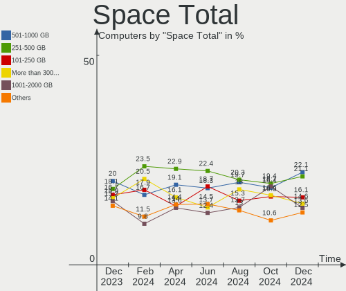
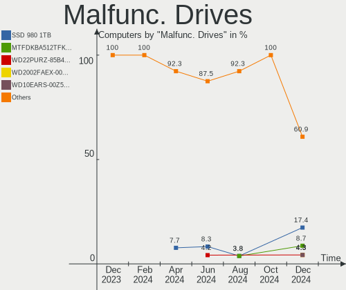
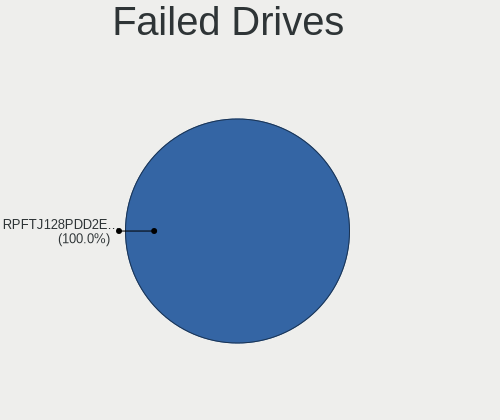
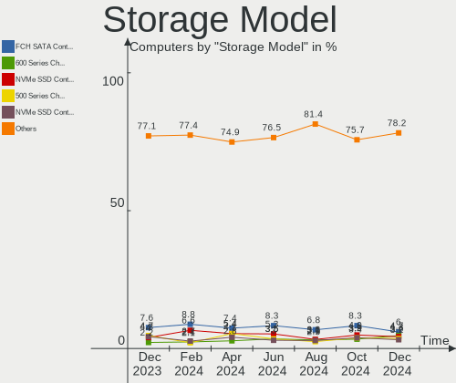
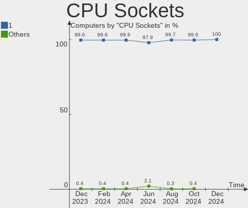
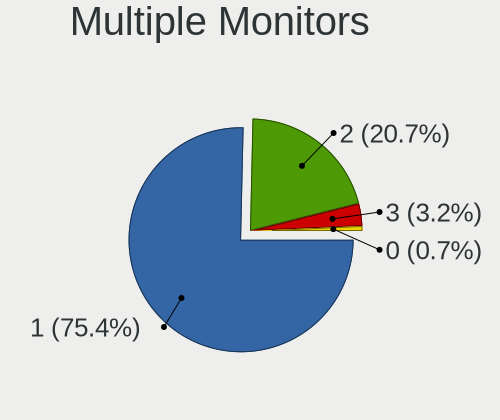

Arch Hardware Trends
--------------------

A project to identify most popular hardware characteristics and track their change
over time based on data collected by Arch users at https://Linux-Hardware.org.

Anyone can contribute to the study by uploading probes of their computers by
the [hw-probe](https://github.com/linuxhw/hw-probe) tool:

    sudo -E hw-probe -all -upload

This is a report for all computer types. See also reports for [desktops](/Dist/Arch/Desktop/README.md) and [notebooks](/Dist/Arch/Notebook/README.md).

Full-feature report is available here: https://linux-hardware.org/?view=trends

Period: Jun, 2021.

Contents
--------

- [ OS                       ](#os)
- [ OS Family                ](#os-family)
- [ Kernel                   ](#kernel)
- [ Kernel Family            ](#kernel-family)
- [ Kernel Major Ver.        ](#kernel-major-ver)
- [ Arch                     ](#arch)
- [ DE                       ](#de)
- [ Display Server           ](#display-server)
- [ Display Manager          ](#display-manager)
- [ OS Lang                  ](#os-lang)
- [ Boot Mode                ](#boot-mode)
- [ Filesystem               ](#filesystem)
- [ Part. scheme             ](#part-scheme)
- [ Dual Boot with Linux/BSD ](#dual-boot-with-linux/bsd)
- [ Dual Boot (Win)          ](#dual-boot-win)
- [ Country                  ](#country)
- [ City                     ](#city)
- [ Vendor                   ](#vendor)
- [ Model                    ](#model)
- [ Model Family             ](#model-family)
- [ MFG Year                 ](#mfg-year)
- [ Form Factor              ](#form-factor)
- [ Secure Boot              ](#secure-boot)
- [ Coreboot                 ](#coreboot)
- [ RAM Size                 ](#ram-size)
- [ RAM Used                 ](#ram-used)
- [ Has CD-ROM               ](#has-cd-rom)
- [ Total Drives             ](#total-drives)
- [ Has Ethernet             ](#has-ethernet)
- [ Has WiFi                 ](#has-wifi)
- [ Has Bluetooth            ](#has-bluetooth)
- [ Drive Vendor             ](#drive-vendor)
- [ Drive Model              ](#drive-model)
- [ HDD Vendor               ](#hdd-vendor)
- [ SSD Vendor               ](#ssd-vendor)
- [ Drive Kind               ](#drive-kind)
- [ Drive Connector          ](#drive-connector)
- [ Drive Size               ](#drive-size)
- [ Space Total              ](#space-total)
- [ Space Used               ](#space-used)
- [ Malfunc. Drives          ](#malfunc-drives)
- [ Malfunc. Drive Vendor    ](#malfunc-drive-vendor)
- [ Malfunc. HDD Vendor      ](#malfunc-hdd-vendor)
- [ Malfunc. Drive Kind      ](#malfunc-drive-kind)
- [ Failed Drives            ](#failed-drives)
- [ Failed Drive Vendor      ](#failed-drive-vendor)
- [ Drive Status             ](#drive-status)
- [ Storage Vendor           ](#storage-vendor)
- [ Storage Model            ](#storage-model)
- [ Storage Kind             ](#storage-kind)
- [ CPU Vendor               ](#cpu-vendor)
- [ CPU Model                ](#cpu-model)
- [ CPU Model Family         ](#cpu-model-family)
- [ CPU Cores                ](#cpu-cores)
- [ CPU Sockets              ](#cpu-sockets)
- [ CPU Threads              ](#cpu-threads)
- [ CPU Op-Modes             ](#cpu-op-modes)
- [ CPU Microcode            ](#cpu-microcode)
- [ CPU Microarch            ](#cpu-microarch)
- [ GPU Vendor               ](#gpu-vendor)
- [ GPU Model                ](#gpu-model)
- [ GPU Combo                ](#gpu-combo)
- [ GPU Driver               ](#gpu-driver)
- [ GPU Memory               ](#gpu-memory)
- [ Monitor Vendor           ](#monitor-vendor)
- [ Monitor Model            ](#monitor-model)
- [ Monitor Resolution       ](#monitor-resolution)
- [ Monitor Diagonal         ](#monitor-diagonal)
- [ Monitor Width            ](#monitor-width)
- [ Aspect Ratio             ](#aspect-ratio)
- [ Monitor Area             ](#monitor-area)
- [ Pixel Density            ](#pixel-density)
- [ Multiple Monitors        ](#multiple-monitors)
- [ Net Controller Vendor    ](#net-controller-vendor)
- [ Net Controller Model     ](#net-controller-model)
- [ Wireless Vendor          ](#wireless-vendor)
- [ Wireless Model           ](#wireless-model)
- [ Ethernet Vendor          ](#ethernet-vendor)
- [ Ethernet Model           ](#ethernet-model)
- [ Net Controller Kind      ](#net-controller-kind)
- [ Used Controller          ](#used-controller)
- [ NICs                     ](#nics)
- [ IPv6                     ](#ipv6)
- [ Memory Vendor            ](#memory-vendor)
- [ Memory Model             ](#memory-model)
- [ Memory Kind              ](#memory-kind)
- [ Memory Form Factor       ](#memory-form-factor)
- [ Memory Size              ](#memory-size)
- [ Memory Speed             ](#memory-speed)
- [ Sound Vendor             ](#sound-vendor)
- [ Sound Model              ](#sound-model)
- [ Camera Vendor            ](#camera-vendor)
- [ Camera Model             ](#camera-model)
- [ Fingerprint Vendor       ](#fingerprint-vendor)
- [ Fingerprint Model        ](#fingerprint-model)
- [ Chipcard Vendor          ](#chipcard-vendor)
- [ Chipcard Model           ](#chipcard-model)
- [ Printer Vendor           ](#printer-vendor)
- [ Printer Model            ](#printer-model)
- [ Scanner Vendor           ](#scanner-vendor)
- [ Scanner Model            ](#scanner-model)
- [ Bluetooth Vendor         ](#bluetooth-vendor)
- [ Bluetooth Model          ](#bluetooth-model)
- [ Unsupported Devices      ](#unsupported-devices)
- [ Unsupported Device Types ](#unsupported-device-types)

OS
--

Installed operating systems

| Name         | Computers | Percent |
|--------------|-----------|---------|
| Arch         | 74        | 57.36%  |
| Arch Rolling | 55        | 42.64%  |

OS Family
---------

OS without a version

| Name | Computers | Percent |
|------|-----------|---------|
| Arch | 129       | 100%    |

Kernel
------

Version of the Linux kernel

| Version                      | Computers | Percent |
|------------------------------|-----------|---------|
| 5.12.9-arch1-1               | 26        | 20.16%  |
| 5.12.8-arch1-1               | 17        | 13.18%  |
| 5.12.13-arch1-2              | 9         | 6.98%   |
| 5.12.10-arch1-1              | 9         | 6.98%   |
| 5.12.9-zen1-1-zen            | 7         | 5.43%   |
| 5.12.11-arch1-1              | 7         | 5.43%   |
| 5.12.12-arch1-1              | 6         | 4.65%   |
| 5.12.10-zen1-1-zen           | 5         | 3.88%   |
| 5.12.8-zen1-1-zen            | 3         | 2.33%   |
| 5.10.39-1-lts                | 3         | 2.33%   |
| 5.12.7-hardened1-1-hardened  | 2         | 1.55%   |
| 5.12.13-zen1-2-zen           | 2         | 1.55%   |
| 5.12.11-zen1-1-zen           | 2         | 1.55%   |
| 5.10.45-1-lts                | 2         | 1.55%   |
| 5.10.43-1-lts                | 2         | 1.55%   |
| 5.10.41-1-lts                | 2         | 1.55%   |
| 5.8.9-arch2-1                | 1         | 0.78%   |
| 5.4.72-1-lts                 | 1         | 0.78%   |
| 5.4.114-1-lts54              | 1         | 0.78%   |
| 5.13.0-rc5-1-mainline        | 1         | 0.78%   |
| 5.12.9-xanmod1-1             | 1         | 0.78%   |
| 5.12.9-arch1-1-surface       | 1         | 0.78%   |
| 5.12.9-2-clear               | 1         | 0.78%   |
| 5.12.9-1-ck-haswell          | 1         | 0.78%   |
| 5.12.8.ll46-1-lin-git+       | 1         | 0.78%   |
| 5.12.8-163-tkg-cacule        | 1         | 0.78%   |
| 5.12.8-1-ck-zen2             | 1         | 0.78%   |
| 5.12.6-zen1-1-zen            | 1         | 0.78%   |
| 5.12.6-arch1-1               | 1         | 0.78%   |
| 5.12.5-arch1-1               | 1         | 0.78%   |
| 5.12.3-xanmod1-1             | 1         | 0.78%   |
| 5.12.13-arch1-1              | 1         | 0.78%   |
| 5.12.13-172-tkg-pds          | 1         | 0.78%   |
| 5.12.13-172-tkg-bmq          | 1         | 0.78%   |
| 5.12.12-zen1-1-zen           | 1         | 0.78%   |
| 5.12.12-xanmod1-1            | 1         | 0.78%   |
| 5.11.16-arch1-1              | 1         | 0.78%   |
| 5.10.46-1-lts                | 1         | 0.78%   |
| 5.10.45-rt42-1-cacule-rdb-rt | 1         | 0.78%   |
| 5.10.42-1-lts                | 1         | 0.78%   |
| 5.10.33-1mbp-16.1-linux-wifi | 1         | 0.78%   |

Kernel Family
-------------

Linux kernel without a distro release

| Version | Computers | Percent |
|---------|-----------|---------|
| 5.12.9  | 37        | 28.68%  |
| 5.12.8  | 23        | 17.83%  |
| 5.12.13 | 14        | 10.85%  |
| 5.12.10 | 14        | 10.85%  |
| 5.12.11 | 9         | 6.98%   |
| 5.12.12 | 8         | 6.2%    |
| 5.10.45 | 3         | 2.33%   |
| 5.10.39 | 3         | 2.33%   |
| 5.12.7  | 2         | 1.55%   |
| 5.12.6  | 2         | 1.55%   |
| 5.10.43 | 2         | 1.55%   |
| 5.10.41 | 2         | 1.55%   |
| 5.8.9   | 1         | 0.78%   |
| 5.4.72  | 1         | 0.78%   |
| 5.4.114 | 1         | 0.78%   |
| 5.13.0  | 1         | 0.78%   |
| 5.12.5  | 1         | 0.78%   |
| 5.12.3  | 1         | 0.78%   |
| 5.11.16 | 1         | 0.78%   |
| 5.10.46 | 1         | 0.78%   |
| 5.10.42 | 1         | 0.78%   |
| 5.10.33 | 1         | 0.78%   |

Kernel Major Ver.
-----------------

Linux kernel major version

| Version | Computers | Percent |
|---------|-----------|---------|
| 5.12    | 111       | 86.05%  |
| 5.10    | 13        | 10.08%  |
| 5.4     | 2         | 1.55%   |
| 5.8     | 1         | 0.78%   |
| 5.13    | 1         | 0.78%   |
| 5.11    | 1         | 0.78%   |

Arch
----

OS architecture (x86_64, i586, etc.)

| Name   | Computers | Percent |
|--------|-----------|---------|
| x86_64 | 129       | 100%    |

DE
--

Desktop Environment

| Name           | Computers | Percent |
|----------------|-----------|---------|
| GNOME          | 43        | 33.33%  |
| KDE5           | 26        | 20.16%  |
| KDE            | 13        | 10.08%  |
| Unknown        | 12        | 9.3%    |
| XFCE           | 10        | 7.75%   |
| i3             | 7         | 5.43%   |
| X-Cinnamon     | 4         | 3.1%    |
| sway           | 2         | 1.55%   |
| MATE           | 2         | 1.55%   |
| Budgie         | 2         | 1.55%   |
| sway:Unity     | 1         | 0.78%   |
| qtile          | 1         | 0.78%   |
| LXQt           | 1         | 0.78%   |
| i3-with-shmlog | 1         | 0.78%   |
| DWM            | 1         | 0.78%   |
| Cinnamon       | 1         | 0.78%   |
| bspwm          | 1         | 0.78%   |
| awesome        | 1         | 0.78%   |

Display Server
--------------

X11 or Wayland

| Name    | Computers | Percent |
|---------|-----------|---------|
| X11     | 85        | 65.89%  |
| Wayland | 23        | 17.83%  |
| Unknown | 13        | 10.08%  |
| Tty     | 8         | 6.2%    |

Display Manager
---------------

SDDM, LightDM, etc.

| Name    | Computers | Percent |
|---------|-----------|---------|
| Unknown | 57        | 44.19%  |
| SDDM    | 30        | 23.26%  |
| GDM     | 19        | 14.73%  |
| TDM     | 16        | 12.4%   |
| Ly      | 3         | 2.33%   |
| LightDM | 3         | 2.33%   |
| LXDM    | 1         | 0.78%   |

OS Lang
-------

Language

| Lang    | Computers | Percent |
|---------|-----------|---------|
| en_US   | 67        | 51.94%  |
| en_GB   | 11        | 8.53%   |
| C       | 8         | 6.2%    |
| zh_CN   | 5         | 3.88%   |
| de_DE   | 5         | 3.88%   |
| pt_BR   | 4         | 3.1%    |
| ru_RU   | 3         | 2.33%   |
| pl_PL   | 3         | 2.33%   |
| Unknown | 3         | 2.33%   |
| it_IT   | 2         | 1.55%   |
| es_MX   | 2         | 1.55%   |
| en_DK   | 2         | 1.55%   |
| uk_UA   | 1         | 0.78%   |
| ru_UA   | 1         | 0.78%   |
| ja_JP   | 1         | 0.78%   |
| hu_HU   | 1         | 0.78%   |
| fr_FR   | 1         | 0.78%   |
| fi_FI   | 1         | 0.78%   |
| et_EE   | 1         | 0.78%   |
| en_ZA   | 1         | 0.78%   |
| en_PH   | 1         | 0.78%   |
| en_IN   | 1         | 0.78%   |
| en_IL   | 1         | 0.78%   |
| en_IE   | 1         | 0.78%   |
| en_DE   | 1         | 0.78%   |
| en_AU   | 1         | 0.78%   |

Boot Mode
---------

EFI or BIOS

| Mode | Computers | Percent |
|------|-----------|---------|
| EFI  | 80        | 62.02%  |
| BIOS | 49        | 37.98%  |

Filesystem
----------

Type of filesystem

| Type    | Computers | Percent |
|---------|-----------|---------|
| Ext4    | 96        | 74.42%  |
| Btrfs   | 28        | 21.71%  |
| Xfs     | 2         | 1.55%   |
| Zfs     | 1         | 0.78%   |
| F2fs    | 1         | 0.78%   |
| Unknown | 1         | 0.78%   |

Part. scheme
------------

Scheme of partitioning

| Type    | Computers | Percent |
|---------|-----------|---------|
| GPT     | 86        | 66.67%  |
| Unknown | 37        | 28.68%  |
| MBR     | 6         | 4.65%   |

Dual Boot with Linux/BSD
------------------------

Hosting more than one Linux/BSD

| Dual boot | Computers | Percent |
|-----------|-----------|---------|
| No        | 118       | 91.47%  |
| Yes       | 11        | 8.53%   |

Dual Boot (Win)
---------------

Hosting Linux and Windows

| Dual boot | Computers | Percent |
|-----------|-----------|---------|
| No        | 87        | 67.44%  |
| Yes       | 42        | 32.56%  |

Country
-------

Geographic location (country)

| Country      | Computers | Percent |
|--------------|-----------|---------|
| USA          | 20        | 15.5%   |
| Germany      | 13        | 10.08%  |
| Poland       | 9         | 6.98%   |
| Brazil       | 8         | 6.2%    |
| UK           | 7         | 5.43%   |
| Russia       | 7         | 5.43%   |
| France       | 4         | 3.1%    |
| Finland      | 4         | 3.1%    |
| Romania      | 3         | 2.33%   |
| Netherlands  | 3         | 2.33%   |
| Mexico       | 3         | 2.33%   |
| India        | 3         | 2.33%   |
| Ukraine      | 2         | 1.55%   |
| Thailand     | 2         | 1.55%   |
| Sweden       | 2         | 1.55%   |
| Norway       | 2         | 1.55%   |
| New Zealand  | 2         | 1.55%   |
| Lithuania    | 2         | 1.55%   |
| Japan        | 2         | 1.55%   |
| Italy        | 2         | 1.55%   |
| China        | 2         | 1.55%   |
| Canada       | 2         | 1.55%   |
| Belgium      | 2         | 1.55%   |
| Australia    | 2         | 1.55%   |
| Vietnam      | 1         | 0.78%   |
| Uzbekistan   | 1         | 0.78%   |
| Tunisia      | 1         | 0.78%   |
| Switzerland  | 1         | 0.78%   |
| Spain        | 1         | 0.78%   |
| South Africa | 1         | 0.78%   |
| Slovakia     | 1         | 0.78%   |
| Singapore    | 1         | 0.78%   |
| Réunion     | 1         | 0.78%   |
| Qatar        | 1         | 0.78%   |
| Portugal     | 1         | 0.78%   |
| Philippines  | 1         | 0.78%   |
| Paraguay     | 1         | 0.78%   |
| Nepal        | 1         | 0.78%   |
| Israel       | 1         | 0.78%   |
| Iran         | 1         | 0.78%   |
| Hungary      | 1         | 0.78%   |
| Hong Kong    | 1         | 0.78%   |
| Denmark      | 1         | 0.78%   |
| Belarus      | 1         | 0.78%   |
| Argentina    | 1         | 0.78%   |

City
----

Geographic location (city)

| City                  | Computers | Percent |
|-----------------------|-----------|---------|
| Warsaw                | 4         | 3.1%    |
| Seattle               | 3         | 2.33%   |
| Zalău                | 2         | 1.55%   |
| São Paulo            | 2         | 1.55%   |
| Paris                 | 2         | 1.55%   |
| Nuremberg             | 2         | 1.55%   |
| London                | 2         | 1.55%   |
| Lodz                  | 2         | 1.55%   |
| Helsinki              | 2         | 1.55%   |
| Chennai               | 2         | 1.55%   |
| Zurich                | 1         | 0.78%   |
| Wimbledon             | 1         | 0.78%   |
| White Lake            | 1         | 0.78%   |
| Wellington            | 1         | 0.78%   |
| Vilnius               | 1         | 0.78%   |
| Veracruz              | 1         | 0.78%   |
| Ufa                   | 1         | 0.78%   |
| Tunis                 | 1         | 0.78%   |
| Toronto               | 1         | 0.78%   |
| Toluca                | 1         | 0.78%   |
| Thames Ditton         | 1         | 0.78%   |
| Tashkent              | 1         | 0.78%   |
| Tajrīsh              | 1         | 0.78%   |
| Sydney                | 1         | 0.78%   |
| Sutton                | 1         | 0.78%   |
| Stockholm             | 1         | 0.78%   |
| St Petersburg         | 1         | 0.78%   |
| Springville           | 1         | 0.78%   |
| Singapore             | 1         | 0.78%   |
| Severodvinsk          | 1         | 0.78%   |
| Scunthorpe            | 1         | 0.78%   |
| Santo Tirso           | 1         | 0.78%   |
| Santa Isabel          | 1         | 0.78%   |
| Sangruda              | 1         | 0.78%   |
| Sainte-Clotilde       | 1         | 0.78%   |
| Rosbach vor der Hoehe | 1         | 0.78%   |
| Richmond              | 1         | 0.78%   |
| Ratchathewi           | 1         | 0.78%   |
| Ramat Gan             | 1         | 0.78%   |
| Pulheim               | 1         | 0.78%   |
| Potsdam               | 1         | 0.78%   |
| Porirua               | 1         | 0.78%   |
| Perth Amboy           | 1         | 0.78%   |
| Overland Park         | 1         | 0.78%   |
| Novovolynsk           | 1         | 0.78%   |
| North Wales           | 1         | 0.78%   |
| Nijmegen              | 1         | 0.78%   |
| Munich                | 1         | 0.78%   |
| Moscow                | 1         | 0.78%   |
| Mooresville           | 1         | 0.78%   |
| Mogilev               | 1         | 0.78%   |
| Mississippi Mills     | 1         | 0.78%   |
| Milton Keynes         | 1         | 0.78%   |
| Miami                 | 1         | 0.78%   |
| Menen                 | 1         | 0.78%   |
| Memphis               | 1         | 0.78%   |
| Markaryd              | 1         | 0.78%   |
| Maringá              | 1         | 0.78%   |
| Mably                 | 1         | 0.78%   |
| Ludhiana              | 1         | 0.78%   |

Vendor
------

Motherboard manufacturer

| Name                 | Computers | Percent |
|----------------------|-----------|---------|
| ASUSTek Computer     | 28        | 21.71%  |
| Lenovo               | 23        | 17.83%  |
| Hewlett-Packard      | 14        | 10.85%  |
| MSI                  | 13        | 10.08%  |
| Gigabyte Technology  | 11        | 8.53%   |
| Acer                 | 10        | 7.75%   |
| ASRock               | 9         | 6.98%   |
| Dell                 | 8         | 6.2%    |
| Samsung Electronics  | 2         | 1.55%   |
| Timi                 | 1         | 0.78%   |
| System76             | 1         | 0.78%   |
| Sony                 | 1         | 0.78%   |
| Schenker             | 1         | 0.78%   |
| Positivo             | 1         | 0.78%   |
| Microsoft            | 1         | 0.78%   |
| LattePanda           | 1         | 0.78%   |
| KLLISRE              | 1         | 0.78%   |
| Intel Client Systems | 1         | 0.78%   |
| Intel                | 1         | 0.78%   |
| Apple                | 1         | 0.78%   |

Model
-----

Motherboard model

| Name                                     | Computers | Percent |
|------------------------------------------|-----------|---------|
| MSI MS-7C37                              | 3         | 2.33%   |
| ASUS X751LJ                              | 2         | 1.55%   |
| ASUS All Series                          | 2         | 1.55%   |
| Timi RedmiBook 13 R                      | 1         | 0.78%   |
| System76 Oryx Pro                        | 1         | 0.78%   |
| Sony SVS13112FXB                         | 1         | 0.78%   |
| Schenker XMG CORE (REN/E21)              | 1         | 0.78%   |
| Samsung RV411/RV511/E3511/S3511          | 1         | 0.78%   |
| Samsung 900X3G                           | 1         | 0.78%   |
| Positivo S14CT01                         | 1         | 0.78%   |
| MSI MS-7C95                              | 1         | 0.78%   |
| MSI MS-7C52                              | 1         | 0.78%   |
| MSI MS-7B89                              | 1         | 0.78%   |
| MSI MS-7B86                              | 1         | 0.78%   |
| MSI MS-7978                              | 1         | 0.78%   |
| MSI MS-7918                              | 1         | 0.78%   |
| MSI MS-7850                              | 1         | 0.78%   |
| MSI GL75 Leopard 10SER                   | 1         | 0.78%   |
| MSI GF65 Thin 10UE                       | 1         | 0.78%   |
| MSI B85M-E45                             | 1         | 0.78%   |
| Microsoft Surface Pro 6                  | 1         | 0.78%   |
| Lenovo Yoga 720-15IKB 80X7               | 1         | 0.78%   |
| Lenovo Yoga 14sARH 2021 82LB             | 1         | 0.78%   |
| Lenovo Y520-15IKBN 80WK                  | 1         | 0.78%   |
| Lenovo ThinkPad X240 20AMS1RR0L          | 1         | 0.78%   |
| Lenovo ThinkPad X220 4291LR8             | 1         | 0.78%   |
| Lenovo ThinkPad X1 Extreme 20MF000BUS    | 1         | 0.78%   |
| Lenovo ThinkPad X1 Carbon 7th 20QD003CRT | 1         | 0.78%   |
| Lenovo ThinkPad T490 20N2CT01WW          | 1         | 0.78%   |
| Lenovo ThinkPad T480 20L5CTO1WW          | 1         | 0.78%   |
| Lenovo ThinkPad T460s 20F90043GE         | 1         | 0.78%   |
| Lenovo ThinkPad T440p 20AWA08500         | 1         | 0.78%   |
| Lenovo ThinkPad T420 4236PFG             | 1         | 0.78%   |
| Lenovo ThinkPad T15 Gen 1 20S6001XMH     | 1         | 0.78%   |
| Lenovo ThinkPad T14s Gen 1 20UH001ART    | 1         | 0.78%   |
| Lenovo ThinkPad T14 Gen 1 20S0CTO1WW     | 1         | 0.78%   |
| Lenovo ThinkPad P14s Gen 1 20Y2CTO1WW    | 1         | 0.78%   |
| Lenovo ThinkPad P14s Gen 1 20S40017RT    | 1         | 0.78%   |
| Lenovo Legion Y530-15ICH 81FV            | 1         | 0.78%   |
| Lenovo Legion 5 15IMH05 82AU             | 1         | 0.78%   |
| Lenovo IdeaPad Gaming 3 15IMH05 81Y4     | 1         | 0.78%   |
| Lenovo IdeaPad FLEX-14API 81SS           | 1         | 0.78%   |
| Lenovo IdeaPad 5 15ITL05 82FG            | 1         | 0.78%   |
| Lenovo IdeaPad 320S-14IKB 80X4           | 1         | 0.78%   |
| LattePanda Alpha                         | 1         | 0.78%   |
| KLLISRE X79 V2.72S                       | 1         | 0.78%   |
| Intel NUC10i3FNK                         | 1         | 0.78%   |
| Intel Client Systems LAPBC710            | 1         | 0.78%   |
| HP ProBook 430 G7                        | 1         | 0.78%   |
| HP Pavilion Laptop 13-an0xxx             | 1         | 0.78%   |
| HP Pavilion Gaming Laptop 15-dk0xxx      | 1         | 0.78%   |
| HP Pavilion dv5                          | 1         | 0.78%   |
| HP OMEN by HP Desktop PC 880-p0xx        | 1         | 0.78%   |
| HP OMEN 30L Desktop GT13-0xxx            | 1         | 0.78%   |
| HP Laptop 15-da0xxx                      | 1         | 0.78%   |
| HP Laptop 15-bw0xx                       | 1         | 0.78%   |
| HP Laptop 14-dk0xxx                      | 1         | 0.78%   |
| HP Laptop 14-cm0xxx                      | 1         | 0.78%   |
| HP ENVY x360 Convertible 15-ds0xxx       | 1         | 0.78%   |
| HP ENVY x360 Convertible 13-ay0xxx       | 1         | 0.78%   |

Model Family
------------

Motherboard model prefix

| Name                          | Computers | Percent |
|-------------------------------|-----------|---------|
| Lenovo ThinkPad               | 14        | 10.85%  |
| Acer Aspire                   | 6         | 4.65%   |
| ASUS ROG                      | 5         | 3.88%   |
| Lenovo IdeaPad                | 4         | 3.1%    |
| HP Laptop                     | 4         | 3.1%    |
| ASUS PRIME                    | 4         | 3.1%    |
| MSI MS-7C37                   | 3         | 2.33%   |
| HP Pavilion                   | 3         | 2.33%   |
| Dell XPS                      | 3         | 2.33%   |
| ASUS TUF                      | 3         | 2.33%   |
| Lenovo Yoga                   | 2         | 1.55%   |
| Lenovo Legion                 | 2         | 1.55%   |
| HP OMEN                       | 2         | 1.55%   |
| HP ENVY                       | 2         | 1.55%   |
| Gigabyte X570                 | 2         | 1.55%   |
| Dell Precision                | 2         | 1.55%   |
| Dell Inspiron                 | 2         | 1.55%   |
| ASUS X751LJ                   | 2         | 1.55%   |
| ASUS All                      | 2         | 1.55%   |
| Acer Nitro                    | 2         | 1.55%   |
| Timi RedmiBook                | 1         | 0.78%   |
| System76 Oryx                 | 1         | 0.78%   |
| Sony SVS13112FXB              | 1         | 0.78%   |
| Schenker XMG                  | 1         | 0.78%   |
| Samsung RV411                 | 1         | 0.78%   |
| Samsung 900X3G                | 1         | 0.78%   |
| Positivo S14CT01              | 1         | 0.78%   |
| MSI MS-7C95                   | 1         | 0.78%   |
| MSI MS-7C52                   | 1         | 0.78%   |
| MSI MS-7B89                   | 1         | 0.78%   |
| MSI MS-7B86                   | 1         | 0.78%   |
| MSI MS-7978                   | 1         | 0.78%   |
| MSI MS-7918                   | 1         | 0.78%   |
| MSI MS-7850                   | 1         | 0.78%   |
| MSI GL75                      | 1         | 0.78%   |
| MSI GF65                      | 1         | 0.78%   |
| MSI B85M-E45                  | 1         | 0.78%   |
| Microsoft Surface             | 1         | 0.78%   |
| Lenovo Y520-15IKBN            | 1         | 0.78%   |
| LattePanda Alpha              | 1         | 0.78%   |
| KLLISRE X79                   | 1         | 0.78%   |
| Intel NUC10i3FNK              | 1         | 0.78%   |
| Intel Client Systems LAPBC710 | 1         | 0.78%   |
| HP ProBook                    | 1         | 0.78%   |
| HP 290                        | 1         | 0.78%   |
| HP 250                        | 1         | 0.78%   |
| Gigabyte Z87X-UD3H            | 1         | 0.78%   |
| Gigabyte Z270X-Gaming         | 1         | 0.78%   |
| Gigabyte Z170-HD3P            | 1         | 0.78%   |
| Gigabyte GB-BRR7H-4800        | 1         | 0.78%   |
| Gigabyte GA-MA770T-UD3P       | 1         | 0.78%   |
| Gigabyte F2A88XM-HD3P         | 1         | 0.78%   |
| Gigabyte B550M                | 1         | 0.78%   |
| Gigabyte B450M                | 1         | 0.78%   |
| Gigabyte B150N                | 1         | 0.78%   |
| Dell Latitude                 | 1         | 0.78%   |
| ASUS Z170-DELUXE              | 1         | 0.78%   |
| ASUS WS                       | 1         | 0.78%   |
| ASUS VivoBook                 | 1         | 0.78%   |
| ASUS SABERTOOTH               | 1         | 0.78%   |

MFG Year
--------

Motherboard manufacture year

| Year | Computers | Percent |
|------|-----------|---------|
| 2020 | 33        | 25.58%  |
| 2021 | 30        | 23.26%  |
| 2019 | 20        | 15.5%   |
| 2018 | 10        | 7.75%   |
| 2017 | 8         | 6.2%    |
| 2014 | 8         | 6.2%    |
| 2015 | 6         | 4.65%   |
| 2012 | 5         | 3.88%   |
| 2013 | 3         | 2.33%   |
| 2011 | 3         | 2.33%   |
| 2010 | 1         | 0.78%   |
| 2009 | 1         | 0.78%   |
| 2007 | 1         | 0.78%   |

Form Factor
-----------

Physical design of the computer

| Name        | Computers | Percent |
|-------------|-----------|---------|
| Notebook    | 65        | 50.39%  |
| Desktop     | 59        | 45.74%  |
| Convertible | 3         | 2.33%   |
| Tablet      | 1         | 0.78%   |
| Mini pc     | 1         | 0.78%   |

Secure Boot
-----------

Enabled or disabled

| State    | Computers | Percent |
|----------|-----------|---------|
| Disabled | 129       | 100%    |

Coreboot
--------

Have coreboot on board

| Used | Computers | Percent |
|------|-----------|---------|
| No   | 129       | 100%    |

RAM Size
--------

Total RAM memory

| Size in GB | Computers | Percent |
|------------|-----------|---------|
| 16.01-24.0 | 34        | 26.36%  |
| 8.01-16.0  | 34        | 26.36%  |
| 32.01-64.0 | 26        | 20.16%  |
| 4.01-8.0   | 19        | 14.73%  |
| 3.01-4.0   | 10        | 7.75%   |
| 24.01-32.0 | 4         | 3.1%    |
| 2.01-3.0   | 1         | 0.78%   |
| 1.01-2.0   | 1         | 0.78%   |

RAM Used
--------

Used RAM memory

| Used GB    | Computers | Percent |
|------------|-----------|---------|
| 2.01-3.0   | 30        | 23.26%  |
| 4.01-8.0   | 28        | 21.71%  |
| 1.01-2.0   | 28        | 21.71%  |
| 3.01-4.0   | 21        | 16.28%  |
| 8.01-16.0  | 15        | 11.63%  |
| 0.51-1.0   | 3         | 2.33%   |
| 16.01-24.0 | 2         | 1.55%   |
| 24.01-32.0 | 1         | 0.78%   |
| 0.01-0.5   | 1         | 0.78%   |

Has CD-ROM
----------

Has CD-ROM on board

| Presented | Computers | Percent |
|-----------|-----------|---------|
| No        | 103       | 79.84%  |
| Yes       | 26        | 20.16%  |

Total Drives
------------

Number of drives on board

| Drives | Computers | Percent |
|--------|-----------|---------|
| 1      | 57        | 44.19%  |
| 2      | 34        | 26.36%  |
| 3      | 18        | 13.95%  |
| 4      | 12        | 9.3%    |
| 6      | 3         | 2.33%   |
| 0      | 3         | 2.33%   |
| 8      | 1         | 0.78%   |
| 5      | 1         | 0.78%   |

Has Ethernet
------------

Has Ethernet on board

| Presented | Computers | Percent |
|-----------|-----------|---------|
| Yes       | 111       | 86.05%  |
| No        | 18        | 13.95%  |

Has WiFi
--------

Has WiFi module

| Presented | Computers | Percent |
|-----------|-----------|---------|
| Yes       | 96        | 74.42%  |
| No        | 33        | 25.58%  |

Has Bluetooth
-------------

Has Bluetooth module

| Presented | Computers | Percent |
|-----------|-----------|---------|
| Yes       | 88        | 68.22%  |
| No        | 41        | 31.78%  |

Drive Vendor
------------

Hard drive vendors

| Vendor                | Computers | Drives | Percent |
|-----------------------|-----------|--------|---------|
| Samsung Electronics   | 49        | 67     | 22.37%  |
| WDC                   | 38        | 53     | 17.35%  |
| Seagate               | 25        | 30     | 11.42%  |
| Toshiba               | 21        | 23     | 9.59%   |
| Sandisk               | 12        | 15     | 5.48%   |
| Crucial               | 12        | 16     | 5.48%   |
| SK Hynix              | 7         | 8      | 3.2%    |
| Unknown               | 6         | 6      | 2.74%   |
| Intel                 | 6         | 6      | 2.74%   |
| A-DATA Technology     | 6         | 6      | 2.74%   |
| Kingston              | 5         | 5      | 2.28%   |
| SPCC                  | 4         | 4      | 1.83%   |
| Realtek Semiconductor | 2         | 2      | 0.91%   |
| Phison                | 2         | 2      | 0.91%   |
| Micron Technology     | 2         | 2      | 0.91%   |
| LITEON                | 2         | 2      | 0.91%   |
| GOODRAM               | 2         | 2      | 0.91%   |
| Yangtze Memory        | 1         | 1      | 0.46%   |
| Silicon Motion        | 1         | 1      | 0.46%   |
| SHGS31-5              | 1         | 1      | 0.46%   |
| ROG                   | 1         | 1      | 0.46%   |
| Radeon                | 1         | 1      | 0.46%   |
| Patriot               | 1         | 1      | 0.46%   |
| Netac                 | 1         | 1      | 0.46%   |
| Lexar                 | 1         | 1      | 0.46%   |
| Lenovo                | 1         | 1      | 0.46%   |
| KIOXIA                | 1         | 1      | 0.46%   |
| HGST                  | 1         | 1      | 0.46%   |
| Hewlett-Packard       | 1         | 1      | 0.46%   |
| Gigabyte Technology   | 1         | 1      | 0.46%   |
| Fujitsu               | 1         | 1      | 0.46%   |
| Corsair               | 1         | 1      | 0.46%   |
| BHT                   | 1         | 1      | 0.46%   |
| Apple                 | 1         | 1      | 0.46%   |
| ADATA Technology      | 1         | 1      | 0.46%   |

Drive Model
-----------

Hard drive models

| Model                                     | Computers | Percent |
|-------------------------------------------|-----------|---------|
| Samsung SSD 860 EVO 1TB                   | 5         | 1.94%   |
| Samsung SSD 850 EVO 250GB                 | 5         | 1.94%   |
| WDC WDS100T3X0C-00SJG0 1TB                | 3         | 1.16%   |
| Toshiba MQ04ABF100 1TB                    | 3         | 1.16%   |
| SPCC Solid State Disk 512GB               | 3         | 1.16%   |
| Samsung SSD 970 EVO Plus 500GB            | 3         | 1.16%   |
| Samsung SSD 860 EVO 500GB                 | 3         | 1.16%   |
| Samsung NVMe SSD Drive 500GB              | 3         | 1.16%   |
| Samsung NVMe SSD Drive 1TB                | 3         | 1.16%   |
| Intel SSDPEKNW010T8 1TB                   | 3         | 1.16%   |
| Crucial CT1000MX500SSD1 1TB               | 3         | 1.16%   |
| WDC WDS250G3X0C-00SJG0 250GB              | 2         | 0.78%   |
| WDC WDS240G2G0B-00EPW0 240GB SSD          | 2         | 0.78%   |
| WDC WD5000AAKX-60U6AA0 500GB              | 2         | 0.78%   |
| WDC WD20EZRZ-00Z5HB0 2TB                  | 2         | 0.78%   |
| WDC WD20EZAZ-00GGJB0 2TB                  | 2         | 0.78%   |
| WDC WD10EZRZ-00HTKB0 1TB                  | 2         | 0.78%   |
| WDC WD10EZEX-00BN5A0 1TB                  | 2         | 0.78%   |
| Unknown SD/MMC/MS PRO 128GB               | 2         | 0.78%   |
| Unknown MMC Card  32GB                    | 2         | 0.78%   |
| Toshiba NVMe SSD Drive 256GB              | 2         | 0.78%   |
| Toshiba DT01ACA200 2TB                    | 2         | 0.78%   |
| Toshiba DT01ACA100 1TB                    | 2         | 0.78%   |
| Toshiba DT01ACA050 500GB                  | 2         | 0.78%   |
| SK Hynix SKHynix_HFS256GD9TNI-L2B0B 256GB | 2         | 0.78%   |
| Seagate ST1000LM014-SSHD-8GB              | 2         | 0.78%   |
| Seagate ST1000DM003-1CH162 1TB            | 2         | 0.78%   |
| Sandisk NVMe SSD Drive 512GB              | 2         | 0.78%   |
| Sandisk NVMe SSD Drive 500GB              | 2         | 0.78%   |
| Samsung SSD 970 EVO Plus 1TB              | 2         | 0.78%   |
| Samsung SSD 970 EVO 500GB                 | 2         | 0.78%   |
| Samsung SSD 960 EVO 500GB                 | 2         | 0.78%   |
| Samsung SSD 850 EVO 500GB                 | 2         | 0.78%   |
| Samsung NVMe SSD Drive 512GB              | 2         | 0.78%   |
| Samsung NVMe SSD Drive 256GB              | 2         | 0.78%   |
| Samsung NVMe SSD Drive 1024GB             | 2         | 0.78%   |
| Crucial CT500MX500SSD1 500GB              | 2         | 0.78%   |
| Crucial CT480BX500SSD1 480GB              | 2         | 0.78%   |
| Crucial CT240BX500SSD1 240GB              | 2         | 0.78%   |
| Crucial CT1000MX500SSD4 1TB               | 2         | 0.78%   |
| Yangtze Memory ZHITAI PC005 Active 1TB    | 1         | 0.39%   |
| WDC WDS240G2G0A-00JH30 240GB SSD          | 1         | 0.39%   |
| WDC WDS100T2G0A-00JH30 1TB SSD            | 1         | 0.39%   |
| WDC WDS100T2B0C-00PXH0 1TB                | 1         | 0.39%   |
| WDC WDS100T2B0B-00YS70 1TB SSD            | 1         | 0.39%   |
| WDC WDS100T2B0B 1TB SSD                   | 1         | 0.39%   |
| WDC WDS100T2B0A-00SM50 1TB SSD            | 1         | 0.39%   |
| WDC WDBRPG0010BNC-WRSN 1TB                | 1         | 0.39%   |
| WDC WD60EZAZ-00ZGHB0 6TB                  | 1         | 0.39%   |
| WDC WD50EZRX-00MVLB1 5TB                  | 1         | 0.39%   |
| WDC WD5000LPVX-22V0TT0 500GB              | 1         | 0.39%   |
| WDC WD5000BPVT-60HXZT3 500GB              | 1         | 0.39%   |
| WDC WD5000BEVT-75A0RT0 500GB              | 1         | 0.39%   |
| WDC WD5000AAVS-00ZTB0 500GB               | 1         | 0.39%   |
| WDC WD5000AAKX-75U6AA0 500GB              | 1         | 0.39%   |
| WDC WD5000AAKX-00ERMA0 500GB              | 1         | 0.39%   |
| WDC WD5000AAKX-001CA0 500GB               | 1         | 0.39%   |
| WDC WD40EZRX-00SPEB0 4TB                  | 1         | 0.39%   |
| WDC WD40EFRX-68WT0N0 4TB                  | 1         | 0.39%   |
| WDC WD4005FZBX-00K5WB0 4TB                | 1         | 0.39%   |

HDD Vendor
----------

Hard disk drive vendors

| Vendor              | Computers | Drives | Percent |
|---------------------|-----------|--------|---------|
| WDC                 | 29        | 36     | 41.43%  |
| Seagate             | 24        | 26     | 34.29%  |
| Toshiba             | 11        | 11     | 15.71%  |
| Samsung Electronics | 4         | 4      | 5.71%   |
| HGST                | 1         | 1      | 1.43%   |
| Fujitsu             | 1         | 1      | 1.43%   |

SSD Vendor
----------

Solid state drive vendors

| Vendor              | Computers | Drives | Percent |
|---------------------|-----------|--------|---------|
| Samsung Electronics | 29        | 32     | 35.8%   |
| Crucial             | 11        | 14     | 13.58%  |
| WDC                 | 7         | 7      | 8.64%   |
| SanDisk             | 6         | 7      | 7.41%   |
| SPCC                | 4         | 4      | 4.94%   |
| A-DATA Technology   | 4         | 4      | 4.94%   |
| Toshiba             | 3         | 3      | 3.7%    |
| Kingston            | 3         | 3      | 3.7%    |
| SK Hynix            | 2         | 2      | 2.47%   |
| LITEON              | 2         | 2      | 2.47%   |
| GOODRAM             | 2         | 2      | 2.47%   |
| Unknown             | 1         | 1      | 1.23%   |
| Radeon              | 1         | 1      | 1.23%   |
| Patriot             | 1         | 1      | 1.23%   |
| Lexar               | 1         | 1      | 1.23%   |
| Intel               | 1         | 1      | 1.23%   |
| Hewlett-Packard     | 1         | 1      | 1.23%   |
| Corsair             | 1         | 1      | 1.23%   |
| BHT                 | 1         | 1      | 1.23%   |

Drive Kind
----------

HDD or SSD

| Kind    | Computers | Drives | Percent |
|---------|-----------|--------|---------|
| NVMe    | 67        | 89     | 34.18%  |
| SSD     | 66        | 88     | 33.67%  |
| HDD     | 56        | 79     | 28.57%  |
| Unknown | 4         | 8      | 2.04%   |
| MMC     | 3         | 3      | 1.53%   |

Drive Connector
---------------

SATA, SAS, NVMe, etc.

| Type | Computers | Drives | Percent |
|------|-----------|--------|---------|
| SATA | 90        | 166    | 54.55%  |
| NVMe | 67        | 89     | 40.61%  |
| SAS  | 5         | 9      | 3.03%   |
| MMC  | 3         | 3      | 1.82%   |

Drive Size
----------

Size of hard drive

| Size in TB | Computers | Drives | Percent |
|------------|-----------|--------|---------|
| 0.01-0.5   | 61        | 83     | 45.86%  |
| 0.51-1.0   | 46        | 55     | 34.59%  |
| 1.01-2.0   | 13        | 16     | 9.77%   |
| 3.01-4.0   | 6         | 6      | 4.51%   |
| 4.01-10.0  | 4         | 4      | 3.01%   |
| 2.01-3.0   | 3         | 3      | 2.26%   |

Space Total
-----------

Amount of disk space available on the file system

| Size in GB     | Computers | Percent |
|----------------|-----------|---------|
| 101-250        | 32        | 24.81%  |
| 501-1000       | 28        | 21.71%  |
| 251-500        | 20        | 15.5%   |
| 1001-2000      | 18        | 13.95%  |
| More than 3000 | 15        | 11.63%  |
| 2001-3000      | 7         | 5.43%   |
| 51-100         | 5         | 3.88%   |
| 21-50          | 3         | 2.33%   |
| Unknown        | 1         | 0.78%   |

Space Used
----------

Amount of used disk space

| Used GB        | Computers | Percent |
|----------------|-----------|---------|
| 101-250        | 23        | 17.83%  |
| 1-20           | 23        | 17.83%  |
| 251-500        | 17        | 13.18%  |
| 51-100         | 17        | 13.18%  |
| 21-50          | 15        | 11.63%  |
| 501-1000       | 13        | 10.08%  |
| 1001-2000      | 10        | 7.75%   |
| 2001-3000      | 8         | 6.2%    |
| More than 3000 | 2         | 1.55%   |
| Unknown        | 1         | 0.78%   |

Malfunc. Drives
---------------

Drive models with a malfunction

| Model                                 | Computers | Drives | Percent |
|---------------------------------------|-----------|--------|---------|
| WDC WD5000BEVT-75A0RT0 500GB          | 1         | 1      | 9.09%   |
| WDC WD5000AAVS-00ZTB0 500GB           | 1         | 1      | 9.09%   |
| WDC WD30EZRX-00D8PB0 3TB              | 1         | 1      | 9.09%   |
| WDC WD10EZRZ-00HTKB0 1TB              | 1         | 1      | 9.09%   |
| SK Hynix HFS128G39TND-N210A 128GB SSD | 1         | 1      | 9.09%   |
| Seagate ST3250823AS 250GB             | 1         | 1      | 9.09%   |
| Seagate ST1000LM014-SSHD-8GB          | 1         | 1      | 9.09%   |
| SanDisk SSD PLUS 480GB                | 1         | 1      | 9.09%   |
| Samsung Electronics SSD 960 EVO 250GB | 1         | 1      | 9.09%   |
| LITEON CV8-8E128-HP 128GB SSD         | 1         | 1      | 9.09%   |
| Crucial CT480M500SSD3 480GB           | 1         | 1      | 9.09%   |

Malfunc. Drive Vendor
---------------------

Vendors of faulty drives

| Vendor              | Computers | Drives | Percent |
|---------------------|-----------|--------|---------|
| WDC                 | 3         | 4      | 30%     |
| Seagate             | 2         | 2      | 20%     |
| SK Hynix            | 1         | 1      | 10%     |
| SanDisk             | 1         | 1      | 10%     |
| Samsung Electronics | 1         | 1      | 10%     |
| LITEON              | 1         | 1      | 10%     |
| Crucial             | 1         | 1      | 10%     |

Malfunc. HDD Vendor
-------------------

Vendors of faulty HDD drives

| Vendor  | Computers | Drives | Percent |
|---------|-----------|--------|---------|
| WDC     | 3         | 4      | 60%     |
| Seagate | 2         | 2      | 40%     |

Malfunc. Drive Kind
-------------------

Kinds of faulty drives

| Kind | Computers | Drives | Percent |
|------|-----------|--------|---------|
| SSD  | 4         | 4      | 44.44%  |
| HDD  | 4         | 6      | 44.44%  |
| NVMe | 1         | 1      | 11.11%  |

Failed Drives
-------------

Failed drive models

| Model                                        | Computers | Drives | Percent |
|----------------------------------------------|-----------|--------|---------|
| Samsung Electronics MZVLW128HEGR-000L2 128GB | 1         | 1      | 100%    |

Failed Drive Vendor
-------------------

Failed drive vendors

| Vendor              | Computers | Drives | Percent |
|---------------------|-----------|--------|---------|
| Samsung Electronics | 1         | 1      | 100%    |

Drive Status
------------

Number of failed and malfunc. drives

| Status   | Computers | Drives | Percent |
|----------|-----------|--------|---------|
| Works    | 72        | 139    | 50.35%  |
| Detected | 61        | 116    | 42.66%  |
| Malfunc  | 9         | 11     | 6.29%   |
| Failed   | 1         | 1      | 0.7%    |

Storage Vendor
--------------

Storage controller vendors

| Vendor                       | Computers | Percent |
|------------------------------|-----------|---------|
| Intel                        | 69        | 35.94%  |
| AMD                          | 38        | 19.79%  |
| Samsung Electronics          | 25        | 13.02%  |
| Sandisk                      | 15        | 7.81%   |
| ASMedia Technology           | 11        | 5.73%   |
| Toshiba America Info Systems | 7         | 3.65%   |
| SK Hynix                     | 5         | 2.6%    |
| Phison Electronics           | 3         | 1.56%   |
| Silicon Motion               | 2         | 1.04%   |
| Realtek Semiconductor        | 2         | 1.04%   |
| Micron Technology            | 2         | 1.04%   |
| Marvell Technology Group     | 2         | 1.04%   |
| KIOXIA                       | 2         | 1.04%   |
| Kingston Technology Company  | 2         | 1.04%   |
| ADATA Technology             | 2         | 1.04%   |
| Yangtze Memory Technologies  | 1         | 0.52%   |
| Micron/Crucial Technology    | 1         | 0.52%   |
| LSI Logic / Symbios Logic    | 1         | 0.52%   |
| Lenovo                       | 1         | 0.52%   |
| Apple                        | 1         | 0.52%   |

Storage Model
-------------

Storage controller models

| Model                                                                            | Computers | Percent |
|----------------------------------------------------------------------------------|-----------|---------|
| AMD FCH SATA Controller [AHCI mode]                                              | 31        | 14.55%  |
| Samsung NVMe SSD Controller SM981/PM981/PM983                                    | 17        | 7.98%   |
| ASMedia ASM1062 Serial ATA Controller                                            | 11        | 5.16%   |
| AMD 400 Series Chipset SATA Controller                                           | 10        | 4.69%   |
| Intel Q170/Q150/B150/H170/H110/Z170/CM236 Chipset SATA Controller [AHCI Mode]    | 6         | 2.82%   |
| Sandisk WD Black 2018/SN750 / PC SN720 NVMe SSD                                  | 5         | 2.35%   |
| Samsung NVMe SSD Controller SM961/PM961/SM963                                    | 5         | 2.35%   |
| Intel Sunrise Point-LP SATA Controller [AHCI mode]                               | 5         | 2.35%   |
| Intel 8 Series/C220 Series Chipset Family 6-port SATA Controller 1 [AHCI mode]   | 5         | 2.35%   |
| Sandisk WD Black SN750 / PC SN730 NVMe SSD                                       | 4         | 1.88%   |
| Intel 82801 Mobile SATA Controller [RAID mode]                                   | 4         | 1.88%   |
| Intel 6 Series/C200 Series Chipset Family 6 port Mobile SATA AHCI Controller     | 4         | 1.88%   |
| AMD Starship/Matisse Chipset SATA Controller [AHCI mode]                         | 4         | 1.88%   |
| SK Hynix Non-Volatile memory controller                                          | 3         | 1.41%   |
| Samsung NVMe SSD Controller PM9A1/PM9A3/980PRO                                   | 3         | 1.41%   |
| Intel SSD 660P Series                                                            | 3         | 1.41%   |
| Intel Cannon Point-LP SATA Controller [AHCI Mode]                                | 3         | 1.41%   |
| Intel Cannon Lake PCH SATA AHCI Controller                                       | 3         | 1.41%   |
| Intel 9 Series Chipset Family SATA Controller [AHCI Mode]                        | 3         | 1.41%   |
| Intel 8 Series SATA Controller 1 [AHCI mode]                                     | 3         | 1.41%   |
| Intel 6 Series/C200 Series Chipset Family 6 port Desktop SATA AHCI Controller    | 3         | 1.41%   |
| Intel 400 Series Chipset Family SATA AHCI Controller                             | 3         | 1.41%   |
| Toshiba America Info Systems XG6 NVMe SSD Controller                             | 2         | 0.94%   |
| Toshiba America Info Systems Toshiba America Info Non-Volatile memory controller | 2         | 0.94%   |
| Toshiba America Info Systems BG3 NVMe SSD Controller                             | 2         | 0.94%   |
| SK Hynix BC501 NVMe Solid State Drive                                            | 2         | 0.94%   |
| Silicon Motion SM2263EN/SM2263XT SSD Controller                                  | 2         | 0.94%   |
| Sandisk WD Blue SN550 NVMe SSD                                                   | 2         | 0.94%   |
| Sandisk WD Blue SN500 / PC SN520 NVMe SSD                                        | 2         | 0.94%   |
| Realtek RTS5763DL NVMe SSD Controller                                            | 2         | 0.94%   |
| Phison PS5013 E13 NVMe Controller                                                | 2         | 0.94%   |
| Micron Non-Volatile memory controller                                            | 2         | 0.94%   |
| KIOXIA Non-Volatile memory controller                                            | 2         | 0.94%   |
| Intel Wildcat Point-LP SATA Controller [AHCI Mode]                               | 2         | 0.94%   |
| Intel SSD 600P Series                                                            | 2         | 0.94%   |
| Intel NM10/ICH7 Family SATA Controller [IDE mode]                                | 2         | 0.94%   |
| Intel HM170/QM170 Chipset SATA Controller [AHCI Mode]                            | 2         | 0.94%   |
| Intel Comet Lake SATA AHCI Controller                                            | 2         | 0.94%   |
| Intel Cannon Lake Mobile PCH SATA AHCI Controller                                | 2         | 0.94%   |
| Intel C610/X99 series chipset sSATA Controller [AHCI mode]                       | 2         | 0.94%   |
| Intel C600/X79 series chipset 6-Port SATA AHCI Controller                        | 2         | 0.94%   |
| Intel 82801G (ICH7 Family) IDE Controller                                        | 2         | 0.94%   |
| Intel 5 Series/3400 Series Chipset 4 port SATA AHCI Controller                   | 2         | 0.94%   |
| Intel 200 Series PCH SATA controller [AHCI mode]                                 | 2         | 0.94%   |
| AMD X370 Series Chipset SATA Controller                                          | 2         | 0.94%   |
| Yangtze Memory Non-Volatile memory controller                                    | 1         | 0.47%   |
| Toshiba America Info Systems XG4 NVMe SSD Controller                             | 1         | 0.47%   |
| SK Hynix NVMe SSD Controller                                                     | 1         | 0.47%   |
| Sandisk WD Black SN850                                                           | 1         | 0.47%   |
| Sandisk Non-Volatile memory controller                                           | 1         | 0.47%   |
| Samsung NVMe Controller                                                          | 1         | 0.47%   |
| Phison E16 PCIe4 NVMe Controller                                                 | 1         | 0.47%   |
| Micron/Crucial P2 NVMe PCIe SSD                                                  | 1         | 0.47%   |
| Marvell Group 88SE9172 SATA 6Gb/s Controller                                     | 1         | 0.47%   |
| Marvell Group 88SE9128 PCIe SATA 6 Gb/s RAID controller with HyperDuo            | 1         | 0.47%   |
| LSI Logic / Symbios Logic SAS2004 PCI-Express Fusion-MPT SAS-2 [Spitfire]        | 1         | 0.47%   |
| Lenovo Non-Volatile memory controller                                            | 1         | 0.47%   |
| Kingston Company KC2000 NVMe SSD                                                 | 1         | 0.47%   |
| Kingston Company A2000 NVMe SSD                                                  | 1         | 0.47%   |
| Intel Volume Management Device NVMe RAID Controller                              | 1         | 0.47%   |

Storage Kind
------------

Kind of storage controller (IDE, SATA, NVMe, SAS, ...)

| Kind | Computers | Percent |
|------|-----------|---------|
| SATA | 96        | 55.49%  |
| NVMe | 67        | 38.73%  |
| RAID | 6         | 3.47%   |
| IDE  | 3         | 1.73%   |
| SAS  | 1         | 0.58%   |

CPU Vendor
----------

Processor vendors

| Vendor | Computers | Percent |
|--------|-----------|---------|
| Intel  | 83        | 64.34%  |
| AMD    | 46        | 35.66%  |

CPU Model
---------

Processor models

| Model                                         | Computers | Percent |
|-----------------------------------------------|-----------|---------|
| AMD Ryzen 7 3700X 8-Core Processor            | 5         | 3.88%   |
| Intel Core i7-8565U CPU @ 1.80GHz             | 4         | 3.1%    |
| Intel Core i7-6700K CPU @ 4.00GHz             | 4         | 3.1%    |
| Intel Core i9-9900K CPU @ 3.60GHz             | 3         | 2.33%   |
| Intel Core i7-10750H CPU @ 2.60GHz            | 3         | 2.33%   |
| Intel Core i7-10510U CPU @ 1.80GHz            | 3         | 2.33%   |
| AMD Ryzen 7 2700X Eight-Core Processor        | 3         | 2.33%   |
| AMD Ryzen 5 3500U with Radeon Vega Mobile Gfx | 3         | 2.33%   |
| AMD Ryzen 5 2600X Six-Core Processor          | 3         | 2.33%   |
| Intel Core i7-8750H CPU @ 2.20GHz             | 2         | 1.55%   |
| Intel Core i7-8650U CPU @ 1.90GHz             | 2         | 1.55%   |
| Intel Core i7-7700HQ CPU @ 2.80GHz            | 2         | 1.55%   |
| Intel Core i5-8250U CPU @ 1.60GHz             | 2         | 1.55%   |
| Intel Core i5-5200U CPU @ 2.20GHz             | 2         | 1.55%   |
| Intel Core i5-10210U CPU @ 1.60GHz            | 2         | 1.55%   |
| AMD Ryzen 7 PRO 4750U with Radeon Graphics    | 2         | 1.55%   |
| AMD Ryzen 7 5800X 8-Core Processor            | 2         | 1.55%   |
| AMD Ryzen 7 4800H with Radeon Graphics        | 2         | 1.55%   |
| AMD Ryzen 7 4700U with Radeon Graphics        | 2         | 1.55%   |
| AMD Ryzen 5 1600 Six-Core Processor           | 2         | 1.55%   |
| Intel Xeon CPU E5-2620 v2 @ 2.10GHz           | 1         | 0.78%   |
| Intel Xeon CPU E5-1650 v4 @ 3.60GHz           | 1         | 0.78%   |
| Intel Xeon CPU E5-1650 v3 @ 3.50GHz           | 1         | 0.78%   |
| Intel Xeon CPU E31240 @ 3.30GHz               | 1         | 0.78%   |
| Intel Pentium Dual-Core CPU T4300 @ 2.10GHz   | 1         | 0.78%   |
| Intel Pentium CPU G3258 @ 3.20GHz             | 1         | 0.78%   |
| Intel Core m3-8100Y CPU @ 1.10GHz             | 1         | 0.78%   |
| Intel Core i7-9750H CPU @ 2.60GHz             | 1         | 0.78%   |
| Intel Core i7-8550U CPU @ 1.80GHz             | 1         | 0.78%   |
| Intel Core i7-7700K CPU @ 4.20GHz             | 1         | 0.78%   |
| Intel Core i7-6700HQ CPU @ 2.60GHz            | 1         | 0.78%   |
| Intel Core i7-6600U CPU @ 2.60GHz             | 1         | 0.78%   |
| Intel Core i7-6500U CPU @ 2.50GHz             | 1         | 0.78%   |
| Intel Core i7-4930K CPU @ 3.40GHz             | 1         | 0.78%   |
| Intel Core i7-4800MQ CPU @ 2.70GHz            | 1         | 0.78%   |
| Intel Core i7-4790K CPU @ 4.00GHz             | 1         | 0.78%   |
| Intel Core i7-4770K CPU @ 3.50GHz             | 1         | 0.78%   |
| Intel Core i7-2670QM CPU @ 2.20GHz            | 1         | 0.78%   |
| Intel Core i7-2640M CPU @ 2.80GHz             | 1         | 0.78%   |
| Intel Core i7-2630QM CPU @ 2.00GHz            | 1         | 0.78%   |
| Intel Core i7-10875H CPU @ 2.30GHz            | 1         | 0.78%   |
| Intel Core i5-9300H CPU @ 2.40GHz             | 1         | 0.78%   |
| Intel Core i5-8400 CPU @ 2.80GHz              | 1         | 0.78%   |
| Intel Core i5-8300H CPU @ 2.30GHz             | 1         | 0.78%   |
| Intel Core i5-8265U CPU @ 1.60GHz             | 1         | 0.78%   |
| Intel Core i5-7300HQ CPU @ 2.50GHz            | 1         | 0.78%   |
| Intel Core i5-7200U CPU @ 2.50GHz             | 1         | 0.78%   |
| Intel Core i5-6600 CPU @ 3.30GHz              | 1         | 0.78%   |
| Intel Core i5-6440HQ CPU @ 2.60GHz            | 1         | 0.78%   |
| Intel Core i5-6200U CPU @ 2.30GHz             | 1         | 0.78%   |
| Intel Core i5-4690K CPU @ 3.50GHz             | 1         | 0.78%   |
| Intel Core i5-4670 CPU @ 3.40GHz              | 1         | 0.78%   |
| Intel Core i5-4430 CPU @ 3.00GHz              | 1         | 0.78%   |
| Intel Core i5-4300U CPU @ 1.90GHz             | 1         | 0.78%   |
| Intel Core i5-4300M CPU @ 2.60GHz             | 1         | 0.78%   |
| Intel Core i5-4200U CPU @ 1.60GHz             | 1         | 0.78%   |
| Intel Core i5-3210M CPU @ 2.50GHz             | 1         | 0.78%   |
| Intel Core i5-2520M CPU @ 2.50GHz             | 1         | 0.78%   |
| Intel Core i5-2500K CPU @ 3.30GHz             | 1         | 0.78%   |
| Intel Core i5-10600K CPU @ 4.10GHz            | 1         | 0.78%   |

CPU Model Family
----------------

Processor model prefix

| Model                   | Computers | Percent |
|-------------------------|-----------|---------|
| Intel Core i7           | 34        | 26.36%  |
| Intel Core i5           | 26        | 20.16%  |
| AMD Ryzen 7             | 19        | 14.73%  |
| AMD Ryzen 5             | 12        | 9.3%    |
| Intel Core i3           | 8         | 6.2%    |
| Other                   | 4         | 3.1%    |
| Intel Xeon              | 4         | 3.1%    |
| AMD Ryzen 3             | 4         | 3.1%    |
| Intel Core i9           | 3         | 2.33%   |
| AMD Ryzen 9             | 3         | 2.33%   |
| AMD Ryzen 7 PRO         | 2         | 1.55%   |
| Intel Pentium Dual-Core | 1         | 0.78%   |
| Intel Pentium           | 1         | 0.78%   |
| Intel Core m3           | 1         | 0.78%   |
| Intel Core 2 Duo        | 1         | 0.78%   |
| Intel Celeron           | 1         | 0.78%   |
| Intel Atom              | 1         | 0.78%   |
| AMD Phenom II X4        | 1         | 0.78%   |
| AMD Athlon              | 1         | 0.78%   |
| AMD A8                  | 1         | 0.78%   |
| AMD A4                  | 1         | 0.78%   |

CPU Cores
---------

Number of processor cores

| Number | Computers | Percent |
|--------|-----------|---------|
| 4      | 54        | 41.86%  |
| 2      | 28        | 21.71%  |
| 8      | 23        | 17.83%  |
| 6      | 20        | 15.5%   |
| 16     | 2         | 1.55%   |
| 12     | 1         | 0.78%   |
| 1      | 1         | 0.78%   |

CPU Sockets
-----------

Number of sockets

| Number | Computers | Percent |
|--------|-----------|---------|
| 1      | 129       | 100%    |

CPU Threads
-----------

Threads per core (Hyper-Threading)

| Number | Computers | Percent |
|--------|-----------|---------|
| 2      | 105       | 81.4%   |
| 1      | 24        | 18.6%   |

CPU Op-Modes
------------

CPU Operation Modes (32-bit, 64-bit)

| Op mode        | Computers | Percent |
|----------------|-----------|---------|
| 32-bit, 64-bit | 129       | 100%    |

CPU Microcode
-------------

Microcode number

| Number     | Computers | Percent |
|------------|-----------|---------|
| Unknown    | 50        | 38.76%  |
| 0x806ec    | 8         | 6.2%    |
| 0x306c3    | 5         | 3.88%   |
| 0x08701021 | 5         | 3.88%   |
| 0x806ea    | 4         | 3.1%    |
| 0x08600106 | 4         | 3.1%    |
| 0x906ea    | 3         | 2.33%   |
| 0x906e9    | 3         | 2.33%   |
| 0x506e3    | 3         | 2.33%   |
| 0x206a7    | 3         | 2.33%   |
| 0x0800820d | 3         | 2.33%   |
| 0xa0652    | 2         | 1.55%   |
| 0x806c1    | 2         | 1.55%   |
| 0x306e4    | 2         | 1.55%   |
| 0x306d4    | 2         | 1.55%   |
| 0x20655    | 2         | 1.55%   |
| 0x0a201009 | 2         | 1.55%   |
| 0x08108109 | 2         | 1.55%   |
| 0x08108102 | 2         | 1.55%   |
| 0x08001138 | 2         | 1.55%   |
| 0x906ed    | 1         | 0.78%   |
| 0x906eb    | 1         | 0.78%   |
| 0x806eb    | 1         | 0.78%   |
| 0x406f1    | 1         | 0.78%   |
| 0x406e3    | 1         | 0.78%   |
| 0x40651    | 1         | 0.78%   |
| 0x306f2    | 1         | 0.78%   |
| 0x306a9    | 1         | 0.78%   |
| 0x1067a    | 1         | 0.78%   |
| 0x10661    | 1         | 0.78%   |
| 0x0a201016 | 1         | 0.78%   |
| 0x08701013 | 1         | 0.78%   |
| 0x08600104 | 1         | 0.78%   |
| 0x08600103 | 1         | 0.78%   |
| 0x08200103 | 1         | 0.78%   |
| 0x0810100b | 1         | 0.78%   |
| 0x08001129 | 1         | 0.78%   |
| 0x06006705 | 1         | 0.78%   |
| 0x06003106 | 1         | 0.78%   |
| 0x010000db | 1         | 0.78%   |

CPU Microarch
-------------

Microarchitecture

| Name        | Computers | Percent |
|-------------|-----------|---------|
| KabyLake    | 32        | 24.81%  |
| Zen 2       | 17        | 13.18%  |
| Zen+        | 14        | 10.85%  |
| Haswell     | 12        | 9.3%    |
| Skylake     | 11        | 8.53%   |
| Zen         | 6         | 4.65%   |
| SandyBridge | 6         | 4.65%   |
| CometLake   | 6         | 4.65%   |
| Zen 3       | 4         | 3.1%    |
| IvyBridge   | 4         | 3.1%    |
| Westmere    | 3         | 2.33%   |
| Broadwell   | 3         | 2.33%   |
| TigerLake   | 2         | 1.55%   |
| Penryn      | 2         | 1.55%   |
| Excavator   | 2         | 1.55%   |
| Steamroller | 1         | 0.78%   |
| Silvermont  | 1         | 0.78%   |
| K10         | 1         | 0.78%   |
| Jaguar      | 1         | 0.78%   |
| Core        | 1         | 0.78%   |

GPU Vendor
----------

Vendors of graphics cards

| Vendor | Computers | Percent |
|--------|-----------|---------|
| Nvidia | 62        | 38.04%  |
| Intel  | 58        | 35.58%  |
| AMD    | 43        | 26.38%  |

GPU Model
---------

Graphics card models

| Model                                                                     | Computers | Percent |
|---------------------------------------------------------------------------|-----------|---------|
| AMD Ellesmere [Radeon RX 470/480/570/570X/580/580X/590]                   | 10        | 6.02%   |
| AMD Renoir                                                                | 8         | 4.82%   |
| AMD Picasso                                                               | 8         | 4.82%   |
| Intel CometLake-U GT2 [UHD Graphics]                                      | 6         | 3.61%   |
| Intel WhiskeyLake-U GT2 [UHD Graphics 620]                                | 5         | 3.01%   |
| Intel UHD Graphics 620                                                    | 5         | 3.01%   |
| Nvidia GP107M [GeForce GTX 1050 Mobile]                                   | 4         | 2.41%   |
| Nvidia GP104 [GeForce GTX 1070]                                           | 4         | 2.41%   |
| Intel Skylake GT2 [HD Graphics 520]                                       | 4         | 2.41%   |
| Intel HD Graphics 630                                                     | 4         | 2.41%   |
| Intel CometLake-H GT2 [UHD Graphics]                                      | 4         | 2.41%   |
| Intel CoffeeLake-H GT2 [UHD Graphics 630]                                 | 4         | 2.41%   |
| Intel 2nd Generation Core Processor Family Integrated Graphics Controller | 4         | 2.41%   |
| AMD Navi 10 [Radeon RX 5600 OEM/5600 XT / 5700/5700 XT]                   | 4         | 2.41%   |
| Nvidia GP104 [GeForce GTX 1080]                                           | 3         | 1.81%   |
| Intel HD Graphics 530                                                     | 3         | 1.81%   |
| Intel Haswell-ULT Integrated Graphics Controller                          | 3         | 1.81%   |
| Intel CoffeeLake-S GT2 [UHD Graphics 630]                                 | 3         | 1.81%   |
| Nvidia TU117M [GeForce GTX 1650 Mobile / Max-Q]                           | 2         | 1.2%    |
| Nvidia TU106 [GeForce RTX 2060 Rev. A]                                    | 2         | 1.2%    |
| Nvidia GP106 [GeForce GTX 1060 6GB]                                       | 2         | 1.2%    |
| Nvidia GP102 [GeForce GTX 1080 Ti]                                        | 2         | 1.2%    |
| Nvidia GM204 [GeForce GTX 970]                                            | 2         | 1.2%    |
| Nvidia GM107 [GeForce GTX 750 Ti]                                         | 2         | 1.2%    |
| Nvidia GK208BM [GeForce 920M]                                             | 2         | 1.2%    |
| Nvidia GK208B [GeForce GT 710]                                            | 2         | 1.2%    |
| Nvidia GA106M [GeForce RTX 3060 Mobile / Max-Q]                           | 2         | 1.2%    |
| Intel TigerLake-LP GT2 [Iris Xe Graphics]                                 | 2         | 1.2%    |
| Intel HD Graphics 5500                                                    | 2         | 1.2%    |
| Intel 4th Gen Core Processor Integrated Graphics Controller               | 2         | 1.2%    |
| AMD Stoney [Radeon R2/R3/R4/R5 Graphics]                                  | 2         | 1.2%    |
| AMD Navi 14 [Radeon RX 5500/5500M / Pro 5500M]                            | 2         | 1.2%    |
| AMD Lexa PRO [Radeon 540/540X/550/550X / RX 540X/550/550X]                | 2         | 1.2%    |
| AMD Baffin [Radeon RX 460/560D / Pro 450/455/460/555/555X/560/560X]       | 2         | 1.2%    |
| Nvidia TU117M [GeForce GTX 1650 Ti Mobile]                                | 1         | 0.6%    |
| Nvidia TU117M                                                             | 1         | 0.6%    |
| Nvidia TU116 [GeForce GTX 1660]                                           | 1         | 0.6%    |
| Nvidia TU116 [GeForce GTX 1660 SUPER]                                     | 1         | 0.6%    |
| Nvidia TU116 [GeForce GTX 1650 SUPER]                                     | 1         | 0.6%    |
| Nvidia TU106M [GeForce RTX 2070 Mobile]                                   | 1         | 0.6%    |
| Nvidia TU106M [GeForce RTX 2060 Mobile]                                   | 1         | 0.6%    |
| Nvidia TU106 [GeForce RTX 2070 Rev. A]                                    | 1         | 0.6%    |
| Nvidia TU104BM [GeForce RTX 2080 SUPER Mobile / Max-Q]                    | 1         | 0.6%    |
| Nvidia TU104 [GeForce RTX 2070 SUPER]                                     | 1         | 0.6%    |
| Nvidia TU102 [GeForce RTX 2080 Ti Rev. A]                                 | 1         | 0.6%    |
| Nvidia GT218M [GeForce 315M]                                              | 1         | 0.6%    |
| Nvidia GP108M [GeForce MX250]                                             | 1         | 0.6%    |
| Nvidia GP108M [GeForce MX150]                                             | 1         | 0.6%    |
| Nvidia GP108GLM [Quadro P520]                                             | 1         | 0.6%    |
| Nvidia GP107M [GeForce GTX 1050 Ti Mobile]                                | 1         | 0.6%    |
| Nvidia GP107M [GeForce GTX 1050 3 GB Max-Q]                               | 1         | 0.6%    |
| Nvidia GP107 [GeForce GTX 1050]                                           | 1         | 0.6%    |
| Nvidia GP104 [GeForce GTX 1060 6GB]                                       | 1         | 0.6%    |
| Nvidia GM206 [GeForce GTX 960]                                            | 1         | 0.6%    |
| Nvidia GM200 [GeForce GTX TITAN X]                                        | 1         | 0.6%    |
| Nvidia GM200 [GeForce GTX 980 Ti]                                         | 1         | 0.6%    |
| Nvidia GM108M [GeForce MX130]                                             | 1         | 0.6%    |
| Nvidia GM108M [GeForce MX110]                                             | 1         | 0.6%    |
| Nvidia GM108M [GeForce 940M]                                              | 1         | 0.6%    |
| Nvidia GM108M [GeForce 920MX]                                             | 1         | 0.6%    |

GPU Combo
---------

Combinations of graphics cards

| Name           | Computers | Percent |
|----------------|-----------|---------|
| 1 x AMD        | 34        | 26.36%  |
| 1 x Nvidia     | 31        | 24.03%  |
| 1 x Intel      | 29        | 22.48%  |
| Intel + Nvidia | 25        | 19.38%  |
| AMD + Nvidia   | 5         | 3.88%   |
| Intel + AMD    | 3         | 2.33%   |
| 2 x Nvidia     | 1         | 0.78%   |
| 2 x AMD        | 1         | 0.78%   |

GPU Driver
----------

Free vs proprietary

| Driver      | Computers | Percent |
|-------------|-----------|---------|
| Free        | 85        | 65.89%  |
| Proprietary | 44        | 34.11%  |

GPU Memory
----------

Total video memory

| Size in GB | Computers | Percent |
|------------|-----------|---------|
| Unknown    | 73        | 56.59%  |
| 1.01-2.0   | 16        | 12.4%   |
| 7.01-8.0   | 14        | 10.85%  |
| 3.01-4.0   | 9         | 6.98%   |
| 5.01-6.0   | 8         | 6.2%    |
| 0.01-0.5   | 5         | 3.88%   |
| 0.51-1.0   | 3         | 2.33%   |
| 8.01-16.0  | 1         | 0.78%   |

Monitor Vendor
--------------

Monitor vendors

| Vendor               | Computers | Percent |
|----------------------|-----------|---------|
| AU Optronics         | 22        | 12.43%  |
| Samsung Electronics  | 16        | 9.04%   |
| BOE                  | 16        | 9.04%   |
| Goldstar             | 14        | 7.91%   |
| Dell                 | 13        | 7.34%   |
| LG Display           | 11        | 6.21%   |
| Chimei Innolux       | 10        | 5.65%   |
| Hewlett-Packard      | 7         | 3.95%   |
| AOC                  | 7         | 3.95%   |
| Acer                 | 7         | 3.95%   |
| Philips              | 6         | 3.39%   |
| BenQ                 | 5         | 2.82%   |
| Ancor Communications | 5         | 2.82%   |
| ViewSonic            | 3         | 1.69%   |
| Sharp                | 3         | 1.69%   |
| Iiyama               | 3         | 1.69%   |
| ASUSTek Computer     | 3         | 1.69%   |
| Vizio                | 2         | 1.13%   |
| Lenovo               | 2         | 1.13%   |
| CSO                  | 2         | 1.13%   |
| Unknown              | 1         | 0.56%   |
| Sceptre Tech         | 1         | 0.56%   |
| Panasonic            | 1         | 0.56%   |
| Packard Bell         | 1         | 0.56%   |
| NEC Computers        | 1         | 0.56%   |
| MStar                | 1         | 0.56%   |
| Medion               | 1         | 0.56%   |
| LG Electronics       | 1         | 0.56%   |
| KTC                  | 1         | 0.56%   |
| IPS                  | 1         | 0.56%   |
| InfoVision           | 1         | 0.56%   |
| HKC                  | 1         | 0.56%   |
| Hitachi              | 1         | 0.56%   |
| HannStar             | 1         | 0.56%   |
| Gigabyte Technology  | 1         | 0.56%   |
| GDH                  | 1         | 0.56%   |
| Fujitsu Siemens      | 1         | 0.56%   |
| CHI                  | 1         | 0.56%   |
| Belinea              | 1         | 0.56%   |
| Apple                | 1         | 0.56%   |

Monitor Model
-------------

Monitor models

| Model                                                                  | Computers | Percent |
|------------------------------------------------------------------------|-----------|---------|
| Goldstar IPS FULLHD GSM5AB8 1920x1080 480x270mm 21.7-inch              | 4         | 2.19%   |
| AU Optronics LCD Monitor AUO21ED 1920x1080 344x194mm 15.5-inch         | 3         | 1.64%   |
| Samsung Electronics S22D300 SAM0B3F 1920x1080 477x268mm 21.5-inch      | 2         | 1.09%   |
| LG Display LCD Monitor LGD04BA 1600x900 382x215mm 17.3-inch            | 2         | 1.09%   |
| Dell U2412M DELA07B 1920x1200 518x324mm 24.1-inch                      | 2         | 1.09%   |
| Chimei Innolux LCD Monitor CMN14D4 1920x1080 309x173mm 13.9-inch       | 2         | 1.09%   |
| BOE LCD Monitor BOE0852 1920x1080 344x194mm 15.5-inch                  | 2         | 1.09%   |
| AU Optronics LCD Monitor AUO38ED 1920x1080 340x190mm 15.3-inch         | 2         | 1.09%   |
| AOC 27G2G4 AOC2702 1920x1080 598x336mm 27.0-inch                       | 2         | 1.09%   |
| AOC 2350 AOC2350 1920x1080 509x286mm 23.0-inch                         | 2         | 1.09%   |
| Vizio VW32L HDTV20A VIZ0027 1280x720 700x390mm 31.5-inch               | 1         | 0.55%   |
| Vizio D58u-D3 VIZ1021 3840x2160 1270x721mm 57.5-inch                   | 1         | 0.55%   |
| ViewSonic VX2758-P-MHD VSC5538 1920x1080 598x336mm 27.0-inch           | 1         | 0.55%   |
| ViewSonic VA2248 SERIES VSC0E28 1920x1080 477x268mm 21.5-inch          | 1         | 0.55%   |
| ViewSonic LCD Monitor VSCEF2D 1920x1080 520x290mm 23.4-inch            | 1         | 0.55%   |
| Unknown LCD Monitor Dell AW2521HFL 1920x1080                           | 1         | 0.55%   |
| Sharp LQ156M1JW26 SHP1532 1920x1080 344x194mm 15.5-inch                | 1         | 0.55%   |
| Sharp LCD Monitor SHP148B 3840x2160 294x165mm 13.3-inch                | 1         | 0.55%   |
| Sharp LCD Monitor SHP143E 3840x2160 346x194mm 15.6-inch                | 1         | 0.55%   |
| Sceptre Tech Sceptre T27 SPT0AD7 1920x1080 600x330mm 27.0-inch         | 1         | 0.55%   |
| Samsung Electronics T28D310 SAM0B1F 1366x768 610x350mm 27.7-inch       | 1         | 0.55%   |
| Samsung Electronics SyncMaster SAM04E4 1600x900 443x249mm 20.0-inch    | 1         | 0.55%   |
| Samsung Electronics SyncMaster SAM03E5 1680x1050 470x300mm 22.0-inch   | 1         | 0.55%   |
| Samsung Electronics S24R35x SAM100E 1920x1080 530x300mm 24.0-inch      | 1         | 0.55%   |
| Samsung Electronics S24F350 SAM0D20 1920x1080 521x293mm 23.5-inch      | 1         | 0.55%   |
| Samsung Electronics S24D390 SAM0B65 1920x1080 520x290mm 23.4-inch      | 1         | 0.55%   |
| Samsung Electronics S22F350 SAM0D1A 1920x1080 480x270mm 21.7-inch      | 1         | 0.55%   |
| Samsung Electronics LCD Monitor SMB1930N                               | 1         | 0.55%   |
| Samsung Electronics LCD Monitor SEC5441 1366x768 344x194mm 15.5-inch   | 1         | 0.55%   |
| Samsung Electronics LCD Monitor SEC4154 1366x768 322x181mm 14.5-inch   | 1         | 0.55%   |
| Samsung Electronics LCD Monitor SAM0FBE 3840x2160 950x540mm 43.0-inch  | 1         | 0.55%   |
| Samsung Electronics LCD Monitor SAM0A7D 1920x1080 1060x626mm 48.5-inch | 1         | 0.55%   |
| Samsung Electronics C27JG5x SAM0FDB 2560x1440 597x336mm 27.0-inch      | 1         | 0.55%   |
| Samsung Electronics C27F390 SAM0D32 1920x1080 600x340mm 27.2-inch      | 1         | 0.55%   |
| Samsung Electronics C24FG7x SAM0E44 1920x1080 530x300mm 24.0-inch      | 1         | 0.55%   |
| Philips PHL 273V7 PHLC156 1920x1080 598x336mm 27.0-inch                | 1         | 0.55%   |
| Philips PHL 272E1GZ PHLC24D 1920x1080 598x336mm 27.0-inch              | 1         | 0.55%   |
| Philips PHL 272B7QPJ PHL0900 2560x1440 597x336mm 27.0-inch             | 1         | 0.55%   |
| Philips PHL 240V5A PHLC10C 1920x1080 527x296mm 23.8-inch               | 1         | 0.55%   |
| Philips PHL 230B8Q PHL0936 1920x1200 488x297mm 22.5-inch               | 1         | 0.55%   |
| Philips 200VW PHL0852 1680x1050 474x296mm 22.0-inch                    | 1         | 0.55%   |
| Panasonic TV MEIA296 1920x1080 1280x720mm 57.8-inch                    | 1         | 0.55%   |
| Packard Bell Viseo243D PKB0386 1920x1080 531x299mm 24.0-inch           | 1         | 0.55%   |
| NEC Computers EA244WMi NEC68D6 1920x1200 519x324mm 24.1-inch           | 1         | 0.55%   |
| MStar 27DOG MST2700 2560x1440 597x336mm 27.0-inch                      | 1         | 0.55%   |
| Medion MD9462AD MED11A7 1024x768 307x230mm 15.1-inch                   | 1         | 0.55%   |
| LG Electronics LCD Monitor LG Ultra HD 7680x2160                       | 1         | 0.55%   |
| LG Electronics LCD Monitor LG HDR 4K 7680x2160                         | 1         | 0.55%   |
| LG Display LCD Monitor LGD065A 1920x1080 344x194mm 15.5-inch           | 1         | 0.55%   |
| LG Display LCD Monitor LGD0608 1920x1080 309x174mm 14.0-inch           | 1         | 0.55%   |
| LG Display LCD Monitor LGD05EE 2560x1440 309x174mm 14.0-inch           | 1         | 0.55%   |
| LG Display LCD Monitor LGD05E5 1920x1080 344x194mm 15.5-inch           | 1         | 0.55%   |
| LG Display LCD Monitor LGD0590 1920x1080 344x194mm 15.5-inch           | 1         | 0.55%   |
| LG Display LCD Monitor LGD0555 2736x1824 260x173mm 12.3-inch           | 1         | 0.55%   |
| LG Display LCD Monitor LGD0533 1920x1080 344x194mm 15.5-inch           | 1         | 0.55%   |
| LG Display LCD Monitor LGD04FF 1920x1080 309x174mm 14.0-inch           | 1         | 0.55%   |
| LG Display LCD Monitor LGD02D3 1366x768 277x156mm 12.5-inch            | 1         | 0.55%   |
| Lenovo LEN L24q-30 LEN65FB 2560x1440 527x296mm 23.8-inch               | 1         | 0.55%   |
| Lenovo LCD Monitor LEN40BA 1920x1080 344x194mm 15.5-inch               | 1         | 0.55%   |
| KTC 40'TV KTC4000 1920x1080 890x500mm 40.2-inch                        | 1         | 0.55%   |

Monitor Resolution
------------------

Monitor screen resolution

| Resolution         | Computers | Percent |
|--------------------|-----------|---------|
| 1920x1080 (FHD)    | 80        | 49.69%  |
| 1366x768 (WXGA)    | 17        | 10.56%  |
| 3840x2160 (4K)     | 16        | 9.94%   |
| 2560x1440 (QHD)    | 14        | 8.7%    |
| 1600x900 (HD+)     | 6         | 3.73%   |
| 1920x1200 (WUXGA)  | 4         | 2.48%   |
| 3440x1440          | 3         | 1.86%   |
| 1680x1050 (WSXGA+) | 3         | 1.86%   |
| 3840x1600          | 2         | 1.24%   |
| 2560x1080          | 2         | 1.24%   |
| 1280x1024 (SXGA)   | 2         | 1.24%   |
| Unknown            | 2         | 1.24%   |
| 7680x2160          | 1         | 0.62%   |
| 6400x2160          | 1         | 0.62%   |
| 3840x1100          | 1         | 0.62%   |
| 3286x1080          | 1         | 0.62%   |
| 3072x1920          | 1         | 0.62%   |
| 2880x1800          | 1         | 0.62%   |
| 2736x1824          | 1         | 0.62%   |
| 1440x900 (WXGA+)   | 1         | 0.62%   |
| 1280x720 (HD)      | 1         | 0.62%   |
| 1024x768 (XGA)     | 1         | 0.62%   |

Monitor Diagonal
----------------

Diagonal size in inches

| Inches  | Computers | Percent |
|---------|-----------|---------|
| 15      | 32        | 18.39%  |
| 24      | 26        | 14.94%  |
| 27      | 22        | 12.64%  |
| 13      | 17        | 9.77%   |
| 14      | 13        | 7.47%   |
| 21      | 11        | 6.32%   |
| 23      | 7         | 4.02%   |
| 17      | 7         | 4.02%   |
| Unknown | 6         | 3.45%   |
| 34      | 5         | 2.87%   |
| 31      | 4         | 2.3%    |
| 22      | 3         | 1.72%   |
| 20      | 3         | 1.72%   |
| 12      | 3         | 1.72%   |
| 84      | 2         | 1.15%   |
| 37      | 2         | 1.15%   |
| 57      | 1         | 0.57%   |
| 48      | 1         | 0.57%   |
| 43      | 1         | 0.57%   |
| 40      | 1         | 0.57%   |
| 39      | 1         | 0.57%   |
| 32      | 1         | 0.57%   |
| 26      | 1         | 0.57%   |
| 25      | 1         | 0.57%   |
| 19      | 1         | 0.57%   |
| 18      | 1         | 0.57%   |
| 16      | 1         | 0.57%   |

Monitor Width
-------------

Physical width

| Width in mm | Computers | Percent |
|-------------|-----------|---------|
| 301-350     | 53        | 31.93%  |
| 501-600     | 51        | 30.72%  |
| 401-500     | 18        | 10.84%  |
| 201-300     | 12        | 7.23%   |
| 701-800     | 6         | 3.61%   |
| 351-400     | 6         | 3.61%   |
| Unknown     | 6         | 3.61%   |
| 601-700     | 5         | 3.01%   |
| 801-900     | 4         | 2.41%   |
| 1501-2000   | 2         | 1.2%    |
| 1001-1500   | 2         | 1.2%    |
| 901-1000    | 1         | 0.6%    |

Aspect Ratio
------------

Proportional relationship between the width and the height

| Ratio   | Computers | Percent |
|---------|-----------|---------|
| 16/9    | 114       | 80.28%  |
| 16/10   | 9         | 6.34%   |
| 21/9    | 7         | 4.93%   |
| Unknown | 6         | 4.23%   |
| 5/4     | 2         | 1.41%   |
| 4/3     | 2         | 1.41%   |
| 3/2     | 1         | 0.7%    |
| 3.40    | 1         | 0.7%    |

Monitor Area
------------

Area in inch²

| Area in inch² | Computers | Percent |
|----------------|-----------|---------|
| 201-250        | 40        | 23.26%  |
| 101-110        | 30        | 17.44%  |
| 301-350        | 23        | 13.37%  |
| 81-90          | 20        | 11.63%  |
| 71-80          | 10        | 5.81%   |
| 351-500        | 10        | 5.81%   |
| 251-300        | 6         | 3.49%   |
| Unknown        | 6         | 3.49%   |
| 151-200        | 5         | 2.91%   |
| 501-1000       | 5         | 2.91%   |
| More than 1000 | 4         | 2.33%   |
| 121-130        | 4         | 2.33%   |
| 141-150        | 3         | 1.74%   |
| 61-70          | 2         | 1.16%   |
| 91-100         | 2         | 1.16%   |
| 51-60          | 1         | 0.58%   |
| 111-120        | 1         | 0.58%   |

Pixel Density
-------------

Pixels per inch

| Density       | Computers | Percent |
|---------------|-----------|---------|
| 51-100        | 54        | 33.96%  |
| 121-160       | 44        | 27.67%  |
| 101-120       | 36        | 22.64%  |
| 161-240       | 12        | 7.55%   |
| Unknown       | 6         | 3.77%   |
| More than 240 | 5         | 3.14%   |
| 1-50          | 2         | 1.26%   |

Multiple Monitors
-----------------

Total monitors connected

| Total | Computers | Percent |
|-------|-----------|---------|
| 1     | 79        | 61.24%  |
| 2     | 41        | 31.78%  |
| 3     | 6         | 4.65%   |
| 0     | 2         | 1.55%   |
| 4     | 1         | 0.78%   |

Net Controller Vendor
---------------------

Controller vendors

| Vendor                            | Computers | Percent |
|-----------------------------------|-----------|---------|
| Realtek Semiconductor             | 73        | 36.68%  |
| Intel                             | 71        | 35.68%  |
| Qualcomm Atheros                  | 24        | 12.06%  |
| Broadcom                          | 4         | 2.01%   |
| TP-Link                           | 3         | 1.51%   |
| Lenovo                            | 3         | 1.51%   |
| Sierra Wireless                   | 2         | 1.01%   |
| Ralink Technology                 | 2         | 1.01%   |
| Apple                             | 2         | 1.01%   |
| Xiaomi                            | 1         | 0.5%    |
| SEGGER                            | 1         | 0.5%    |
| Ralink                            | 1         | 0.5%    |
| Microsoft                         | 1         | 0.5%    |
| Marvell Technology Group          | 1         | 0.5%    |
| Holtek Semiconductor              | 1         | 0.5%    |
| Google                            | 1         | 0.5%    |
| Fitbit                            | 1         | 0.5%    |
| Exar                              | 1         | 0.5%    |
| Ericsson Business Mobile Networks | 1         | 0.5%    |
| Edimax Technology                 | 1         | 0.5%    |
| DisplayLink                       | 1         | 0.5%    |
| Broadcom Limited                  | 1         | 0.5%    |
| ASIX Electronics                  | 1         | 0.5%    |
| Aquantia                          | 1         | 0.5%    |

Net Controller Model
--------------------

Controller models

| Model                                                             | Computers | Percent |
|-------------------------------------------------------------------|-----------|---------|
| Realtek RTL8111/8168/8411 PCI Express Gigabit Ethernet Controller | 60        | 25.64%  |
| Intel Wi-Fi 6 AX200                                               | 12        | 5.13%   |
| Intel I211 Gigabit Network Connection                             | 12        | 5.13%   |
| Qualcomm Atheros QCA6174 802.11ac Wireless Network Adapter        | 8         | 3.42%   |
| Intel Ethernet Connection (2) I219-V                              | 5         | 2.14%   |
| Intel Dual Band Wireless-AC 3168NGW [Stone Peak]                  | 5         | 2.14%   |
| Intel Comet Lake PCH-LP CNVi WiFi                                 | 5         | 2.14%   |
| Intel Comet Lake PCH CNVi WiFi                                    | 5         | 2.14%   |
| Realtek RTL8822BE 802.11a/b/g/n/ac WiFi adapter                   | 4         | 1.71%   |
| Realtek RTL8125 2.5GbE Controller                                 | 4         | 1.71%   |
| Realtek RTL810xE PCI Express Fast Ethernet controller             | 4         | 1.71%   |
| Intel Ethernet Connection (10) I219-V                             | 4         | 1.71%   |
| Intel Cannon Point-LP CNVi [Wireless-AC]                          | 4         | 1.71%   |
| Intel Cannon Lake PCH CNVi WiFi                                   | 4         | 1.71%   |
| Qualcomm Atheros QCA9377 802.11ac Wireless Network Adapter        | 3         | 1.28%   |
| Intel Wireless 8260                                               | 3         | 1.28%   |
| Intel Wireless 7260                                               | 3         | 1.28%   |
| Intel Ethernet Connection I217-LM                                 | 3         | 1.28%   |
| Intel Ethernet Connection (2) I218-V                              | 3         | 1.28%   |
| TP-Link Archer T3U [Realtek RTL8812BU]                            | 2         | 0.85%   |
| Realtek RTL8822CE 802.11ac PCIe Wireless Network Adapter          | 2         | 0.85%   |
| Realtek RTL8821CE 802.11ac PCIe Wireless Network Adapter          | 2         | 0.85%   |
| Realtek RTL8153 Gigabit Ethernet Adapter                          | 2         | 0.85%   |
| Qualcomm Atheros QCA9565 / AR9565 Wireless Network Adapter        | 2         | 0.85%   |
| Qualcomm Atheros AR9485 Wireless Network Adapter                  | 2         | 0.85%   |
| Qualcomm Atheros AR9285 Wireless Network Adapter (PCI-Express)    | 2         | 0.85%   |
| Lenovo ThinkPad TBT 3 Dock                                        | 2         | 0.85%   |
| Intel Wireless 8265 / 8275                                        | 2         | 0.85%   |
| Intel Wireless 7265                                               | 2         | 0.85%   |
| Intel Wi-Fi 6 AX201                                               | 2         | 0.85%   |
| Intel Ethernet Connection (7) I219-V                              | 2         | 0.85%   |
| Intel Ethernet Connection (6) I219-V                              | 2         | 0.85%   |
| Intel Centrino Ultimate-N 6300                                    | 2         | 0.85%   |
| Intel 82579LM Gigabit Network Connection (Lewisville)             | 2         | 0.85%   |
| Broadcom BCM4360 802.11ac Wireless Network Adapter                | 2         | 0.85%   |
| Xiaomi Mi/Redmi series (RNDIS)                                    | 1         | 0.43%   |
| TP-Link 802.11ac NIC                                              | 1         | 0.43%   |
| Sierra Wireless EM7455                                            | 1         | 0.43%   |
| Sierra Wireless EM7345 4G LTE                                     | 1         | 0.43%   |
| SEGGER J-Link Ultra                                               | 1         | 0.43%   |
| Realtek RTL8723DE Wireless Network Adapter                        | 1         | 0.43%   |
| Realtek RTL8192EU 802.11b/g/n WLAN Adapter                        | 1         | 0.43%   |
| Realtek RTL8188EUS 802.11n Wireless Network Adapter               | 1         | 0.43%   |
| Realtek RTL8188EE Wireless Network Adapter                        | 1         | 0.43%   |
| Ralink RT5370 Wireless Adapter                                    | 1         | 0.43%   |
| Ralink RT3572 Wireless Adapter                                    | 1         | 0.43%   |
| Ralink RT2561/RT61 802.11g PCI                                    | 1         | 0.43%   |
| Qualcomm Atheros Killer E2500 Gigabit Ethernet Controller         | 1         | 0.43%   |
| Qualcomm Atheros Killer E2400 Gigabit Ethernet Controller         | 1         | 0.43%   |
| Qualcomm Atheros Killer E220x Gigabit Ethernet Controller         | 1         | 0.43%   |
| Qualcomm Atheros Attansic L2 Fast Ethernet                        | 1         | 0.43%   |
| Qualcomm Atheros AR9462 Wireless Network Adapter                  | 1         | 0.43%   |
| Qualcomm Atheros AR928X Wireless Network Adapter (PCI-Express)    | 1         | 0.43%   |
| Qualcomm Atheros AR922X Wireless Network Adapter                  | 1         | 0.43%   |
| Qualcomm Atheros AR8131 Gigabit Ethernet                          | 1         | 0.43%   |
| Microsoft Xbox 360 Wireless Adapter                               | 1         | 0.43%   |
| Marvell Group 88W8897 [AVASTAR] 802.11ac Wireless                 | 1         | 0.43%   |
| Lenovo USB-C Dock Ethernet                                        | 1         | 0.43%   |
| Intel Wireless 3165                                               | 1         | 0.43%   |
| Intel I210 Gigabit Network Connection                             | 1         | 0.43%   |

Wireless Vendor
---------------

Wireless vendors

| Vendor                   | Computers | Percent |
|--------------------------|-----------|---------|
| Intel                    | 53        | 52.48%  |
| Qualcomm Atheros         | 20        | 19.8%   |
| Realtek Semiconductor    | 12        | 11.88%  |
| Broadcom                 | 4         | 3.96%   |
| TP-Link                  | 3         | 2.97%   |
| Sierra Wireless          | 2         | 1.98%   |
| Ralink Technology        | 2         | 1.98%   |
| Ralink                   | 1         | 0.99%   |
| Microsoft                | 1         | 0.99%   |
| Marvell Technology Group | 1         | 0.99%   |
| Edimax Technology        | 1         | 0.99%   |
| Broadcom Limited         | 1         | 0.99%   |

Wireless Model
--------------

Wireless models

| Model                                                          | Computers | Percent |
|----------------------------------------------------------------|-----------|---------|
| Intel Wi-Fi 6 AX200                                            | 12        | 11.88%  |
| Qualcomm Atheros QCA6174 802.11ac Wireless Network Adapter     | 8         | 7.92%   |
| Intel Dual Band Wireless-AC 3168NGW [Stone Peak]               | 5         | 4.95%   |
| Intel Comet Lake PCH-LP CNVi WiFi                              | 5         | 4.95%   |
| Intel Comet Lake PCH CNVi WiFi                                 | 5         | 4.95%   |
| Realtek RTL8822BE 802.11a/b/g/n/ac WiFi adapter                | 4         | 3.96%   |
| Intel Cannon Point-LP CNVi [Wireless-AC]                       | 4         | 3.96%   |
| Intel Cannon Lake PCH CNVi WiFi                                | 4         | 3.96%   |
| Qualcomm Atheros QCA9377 802.11ac Wireless Network Adapter     | 3         | 2.97%   |
| Intel Wireless 8260                                            | 3         | 2.97%   |
| Intel Wireless 7260                                            | 3         | 2.97%   |
| TP-Link Archer T3U [Realtek RTL8812BU]                         | 2         | 1.98%   |
| Realtek RTL8822CE 802.11ac PCIe Wireless Network Adapter       | 2         | 1.98%   |
| Realtek RTL8821CE 802.11ac PCIe Wireless Network Adapter       | 2         | 1.98%   |
| Qualcomm Atheros QCA9565 / AR9565 Wireless Network Adapter     | 2         | 1.98%   |
| Qualcomm Atheros AR9485 Wireless Network Adapter               | 2         | 1.98%   |
| Qualcomm Atheros AR9285 Wireless Network Adapter (PCI-Express) | 2         | 1.98%   |
| Intel Wireless 8265 / 8275                                     | 2         | 1.98%   |
| Intel Wireless 7265                                            | 2         | 1.98%   |
| Intel Wi-Fi 6 AX201                                            | 2         | 1.98%   |
| Intel Centrino Ultimate-N 6300                                 | 2         | 1.98%   |
| Broadcom BCM4360 802.11ac Wireless Network Adapter             | 2         | 1.98%   |
| TP-Link 802.11ac NIC                                           | 1         | 0.99%   |
| Sierra Wireless EM7455                                         | 1         | 0.99%   |
| Sierra Wireless EM7345 4G LTE                                  | 1         | 0.99%   |
| Realtek RTL8723DE Wireless Network Adapter                     | 1         | 0.99%   |
| Realtek RTL8192EU 802.11b/g/n WLAN Adapter                     | 1         | 0.99%   |
| Realtek RTL8188EUS 802.11n Wireless Network Adapter            | 1         | 0.99%   |
| Realtek RTL8188EE Wireless Network Adapter                     | 1         | 0.99%   |
| Ralink RT5370 Wireless Adapter                                 | 1         | 0.99%   |
| Ralink RT3572 Wireless Adapter                                 | 1         | 0.99%   |
| Ralink RT2561/RT61 802.11g PCI                                 | 1         | 0.99%   |
| Qualcomm Atheros AR9462 Wireless Network Adapter               | 1         | 0.99%   |
| Qualcomm Atheros AR928X Wireless Network Adapter (PCI-Express) | 1         | 0.99%   |
| Qualcomm Atheros AR922X Wireless Network Adapter               | 1         | 0.99%   |
| Microsoft Xbox 360 Wireless Adapter                            | 1         | 0.99%   |
| Marvell Group 88W8897 [AVASTAR] 802.11ac Wireless              | 1         | 0.99%   |
| Intel Wireless 3165                                            | 1         | 0.99%   |
| Intel Dual Band Wireless-AC 3165 Plus Bluetooth                | 1         | 0.99%   |
| Intel Centrino Advanced-N 6235                                 | 1         | 0.99%   |
| Intel Centrino Advanced-N 6205 [Taylor Peak]                   | 1         | 0.99%   |
| Edimax EW-7811Un 802.11n Wireless Adapter [Realtek RTL8188CUS] | 1         | 0.99%   |
| Broadcom Limited BCM4352 802.11ac Wireless Network Adapter     | 1         | 0.99%   |
| Broadcom BCM4364 802.11ac Wireless Network Adapter             | 1         | 0.99%   |
| Broadcom BCM43602 802.11ac Wireless LAN SoC                    | 1         | 0.99%   |

Ethernet Vendor
---------------

Ethernet vendors

| Vendor                | Computers | Percent |
|-----------------------|-----------|---------|
| Realtek Semiconductor | 70        | 56.45%  |
| Intel                 | 40        | 32.26%  |
| Qualcomm Atheros      | 5         | 4.03%   |
| Lenovo                | 3         | 2.42%   |
| Apple                 | 2         | 1.61%   |
| Xiaomi                | 1         | 0.81%   |
| DisplayLink           | 1         | 0.81%   |
| ASIX Electronics      | 1         | 0.81%   |
| Aquantia              | 1         | 0.81%   |

Ethernet Model
--------------

Ethernet models

| Model                                                             | Computers | Percent |
|-------------------------------------------------------------------|-----------|---------|
| Realtek RTL8111/8168/8411 PCI Express Gigabit Ethernet Controller | 60        | 47.24%  |
| Intel I211 Gigabit Network Connection                             | 12        | 9.45%   |
| Intel Ethernet Connection (2) I219-V                              | 5         | 3.94%   |
| Realtek RTL8125 2.5GbE Controller                                 | 4         | 3.15%   |
| Realtek RTL810xE PCI Express Fast Ethernet controller             | 4         | 3.15%   |
| Intel Ethernet Connection (10) I219-V                             | 4         | 3.15%   |
| Intel Ethernet Connection I217-LM                                 | 3         | 2.36%   |
| Intel Ethernet Connection (2) I218-V                              | 3         | 2.36%   |
| Realtek RTL8153 Gigabit Ethernet Adapter                          | 2         | 1.57%   |
| Lenovo ThinkPad TBT 3 Dock                                        | 2         | 1.57%   |
| Intel Ethernet Connection (7) I219-V                              | 2         | 1.57%   |
| Intel Ethernet Connection (6) I219-V                              | 2         | 1.57%   |
| Intel 82579LM Gigabit Network Connection (Lewisville)             | 2         | 1.57%   |
| Xiaomi Mi/Redmi series (RNDIS)                                    | 1         | 0.79%   |
| Qualcomm Atheros Killer E2500 Gigabit Ethernet Controller         | 1         | 0.79%   |
| Qualcomm Atheros Killer E2400 Gigabit Ethernet Controller         | 1         | 0.79%   |
| Qualcomm Atheros Killer E220x Gigabit Ethernet Controller         | 1         | 0.79%   |
| Qualcomm Atheros Attansic L2 Fast Ethernet                        | 1         | 0.79%   |
| Qualcomm Atheros AR8131 Gigabit Ethernet                          | 1         | 0.79%   |
| Lenovo USB-C Dock Ethernet                                        | 1         | 0.79%   |
| Intel I210 Gigabit Network Connection                             | 1         | 0.79%   |
| Intel Ethernet Controller I225-V                                  | 1         | 0.79%   |
| Intel Ethernet Connection I219-LM                                 | 1         | 0.79%   |
| Intel Ethernet Connection I218-LM                                 | 1         | 0.79%   |
| Intel Ethernet Connection I217-V                                  | 1         | 0.79%   |
| Intel Ethernet Connection (7) I219-LM                             | 1         | 0.79%   |
| Intel Ethernet Connection (4) I219-LM                             | 1         | 0.79%   |
| Intel Ethernet Connection (2) I219-LM                             | 1         | 0.79%   |
| Intel Ethernet Connection (14) I219-V                             | 1         | 0.79%   |
| Intel 82575EB Gigabit Network Connection                          | 1         | 0.79%   |
| DisplayLink USB3.0 Dual Video Dock                                | 1         | 0.79%   |
| ASIX AX88772B Fast Ethernet Controller                            | 1         | 0.79%   |
| Aquantia AQC111 NBase-T/IEEE 802.3bz Ethernet Controller [AQtion] | 1         | 0.79%   |
| Apple iBridge                                                     | 1         | 0.79%   |
| Apple Ethernet Adapter [A1277]                                    | 1         | 0.79%   |

Net Controller Kind
-------------------

Ethernet, WiFi or modem

| Kind     | Computers | Percent |
|----------|-----------|---------|
| Ethernet | 111       | 52.11%  |
| WiFi     | 96        | 45.07%  |
| Modem    | 5         | 2.35%   |
| Unknown  | 1         | 0.47%   |

Used Controller
---------------

Currently used network controller

| Kind     | Computers | Percent |
|----------|-----------|---------|
| Ethernet | 85        | 53.13%  |
| WiFi     | 75        | 46.88%  |

NICs
----

Total network controllers on board

| Total | Computers | Percent |
|-------|-----------|---------|
| 2     | 69        | 53.49%  |
| 1     | 53        | 41.09%  |
| 3     | 5         | 3.88%   |
| 0     | 2         | 1.55%   |

IPv6
----

IPv6 vs IPv4

| Used | Computers | Percent |
|------|-----------|---------|
| No   | 97        | 75.19%  |
| Yes  | 32        | 24.81%  |

Memory Vendor
-------------

Memory module vendors

| Vendor              | Computers | Percent |
|---------------------|-----------|---------|
| Samsung Electronics | 19        | 16.81%  |
| Kingston            | 18        | 15.93%  |
| SK Hynix            | 16        | 14.16%  |
| Corsair             | 12        | 10.62%  |
| Micron Technology   | 11        | 9.73%   |
| Crucial             | 9         | 7.96%   |
| Unknown             | 6         | 5.31%   |
| G.Skill             | 6         | 5.31%   |
| A-DATA Technology   | 5         | 4.42%   |
| Smart               | 2         | 1.77%   |
| Ramaxel Technology  | 2         | 1.77%   |
| Patriot             | 2         | 1.77%   |
| Unknown (08C8)      | 1         | 0.88%   |
| Team                | 1         | 0.88%   |
| Nanya Technology    | 1         | 0.88%   |
| Goldkey             | 1         | 0.88%   |
| Apacer              | 1         | 0.88%   |

Memory Model
------------

Memory module models

| Model                                                            | Computers | Percent |
|------------------------------------------------------------------|-----------|---------|
| SK Hynix RAM HMT451S6BFR8A-PB 4GB SODIMM DDR3 1600MT/s           | 3         | 2.4%    |
| Kingston RAM KHX3200C16D4/8GX 8192MB DIMM DDR4 3533MT/s          | 3         | 2.4%    |
| Unknown RAM Module 4GB DIMM DDR3 1333MT/s                        | 2         | 1.6%    |
| SK Hynix RAM HMAB2GS6AMR6N-XN 16GB SODIMM DDR4 3200MT/s          | 2         | 1.6%    |
| Micron RAM 8ATF1G64HZ-2G6E1 8GB SODIMM DDR4 2667MT/s             | 2         | 1.6%    |
| G.Skill RAM F4-3200C16-8GVKB 8GB DIMM DDR4 3200MT/s              | 2         | 1.6%    |
| Corsair RAM CMX4GX3M2A1600C9 2GB DIMM DDR3 1600MT/s              | 2         | 1.6%    |
| Corsair RAM CMSO8GX3M1C1600C11 8GB SODIMM DDR3 1600MT/s          | 2         | 1.6%    |
| Corsair RAM CMK16GX4M2B3000C15 8GB DIMM DDR4 3466MT/s            | 2         | 1.6%    |
| A-DATA RAM Module 8GB SODIMM DDR4 2667MT/s                       | 2         | 1.6%    |
| Unknown RAM Module 4GB SODIMM DDR3                               | 1         | 0.8%    |
| Unknown RAM Module 4GB DIMM 1333MT/s                             | 1         | 0.8%    |
| Unknown RAM Module 2GB DIMM SDRAM                                | 1         | 0.8%    |
| Unknown RAM Module 2GB DIMM DDR2                                 | 1         | 0.8%    |
| Unknown RAM Module 2GB DIMM 1333MT/s                             | 1         | 0.8%    |
| Unknown RAM Module 1GB DIMM SDRAM                                | 1         | 0.8%    |
| Unknown RAM Module 1GB DIMM DDR2                                 | 1         | 0.8%    |
| Unknown (08C8) RAM Module 8GB DIMM DDR4 2666MT/s                 | 1         | 0.8%    |
| Team RAM TEAMGROUP-UD4-3000 8GB DIMM DDR4 3000MT/s               | 1         | 0.8%    |
| Smart RAM SH564568FH8NZPHSCG 2GB SODIMM DDR3 1333MT/s            | 1         | 0.8%    |
| Smart RAM SH564568FH8NWPHSFG 2GB SODIMM DDR3 1067MT/s            | 1         | 0.8%    |
| Smart RAM SH564568FH8N6 2GB DIMM DDR3 1333MT/s                   | 1         | 0.8%    |
| SK Hynix RAM Module 8GB Row Of Chips LPDDR3 2133MT/s             | 1         | 0.8%    |
| SK Hynix RAM HMT351S6CFR8C-PB 4GB SODIMM DDR3 1600MT/s           | 1         | 0.8%    |
| SK Hynix RAM HMAA51S6AMR6N-UH 8GB SODIMM DDR4 2400MT/s           | 1         | 0.8%    |
| SK Hynix RAM HMAA1GS6CMR6N-XN 8192MB Row Of Chips DDR4 3200MT/s  | 1         | 0.8%    |
| SK Hynix RAM HMA851S6JJR6N-VK 4GB SODIMM DDR4 2400MT/s           | 1         | 0.8%    |
| SK Hynix RAM HMA851S6CJR6N-VK 4GB SODIMM DDR4 2667MT/s           | 1         | 0.8%    |
| SK Hynix RAM HMA82GS6AFR8N-UH 16384MB SODIMM DDR4 2667MT/s       | 1         | 0.8%    |
| SK Hynix RAM HMA81GS6JJR8N-VK 8192MB SODIMM DDR4 2667MT/s        | 1         | 0.8%    |
| SK Hynix RAM HMA81GR7AFR8N-VK 8GB RIMM DDR4 2667MT/s             | 1         | 0.8%    |
| SK Hynix RAM H9CCNNNBJTALAR-NVD 4GB Row Of Chips LPDDR3 2133MT/s | 1         | 0.8%    |
| SK Hynix RAM DMT125U6BFR8C-H9 2GB DIMM DDR3 1333MT/s             | 1         | 0.8%    |
| Samsung RAM Module 8GB DIMM DDR4 2666MT/s                        | 1         | 0.8%    |
| Samsung RAM Module 4GB SODIMM DDR3 1600MT/s                      | 1         | 0.8%    |
| Samsung RAM Module 4GB Row Of Chips LPDDR3 1867MT/s              | 1         | 0.8%    |
| Samsung RAM Module 4GB DIMM DDR4 2666MT/s                        | 1         | 0.8%    |
| Samsung RAM M471B5273DH0-CH9 4096MB SODIMM DDR3 1334MT/s         | 1         | 0.8%    |
| Samsung RAM M471B5173DB0-YK0 4096MB SODIMM DDR3 1600MT/s         | 1         | 0.8%    |
| Samsung RAM M471B1G73EB0-YK0 8192MB SODIMM DDR3 1600MT/s         | 1         | 0.8%    |
| Samsung RAM M471B1G73BH0-YK0 8GB SODIMM DDR3 1600MT/s            | 1         | 0.8%    |
| Samsung RAM M471A5244CB0-CWE 4GB Row Of Chips DDR4 3200MT/s      | 1         | 0.8%    |
| Samsung RAM M471A5244CB0-CTD 4096MB SODIMM DDR4 2667MT/s         | 1         | 0.8%    |
| Samsung RAM M471A5244BB0-CRC 4GB SODIMM DDR4 2400MT/s            | 1         | 0.8%    |
| Samsung RAM M471A2K43DB1-CWE 16GB SODIMM DDR4 3200MT/s           | 1         | 0.8%    |
| Samsung RAM M471A2K43CB1-CTD 16384MB SODIMM DDR4 2667MT/s        | 1         | 0.8%    |
| Samsung RAM M471A2G44AM0-CWE 16GB SODIMM DDR4 3200MT/s           | 1         | 0.8%    |
| Samsung RAM M471A1K43DB1-CWE 8GB SODIMM DDR4 3200MT/s            | 1         | 0.8%    |
| Samsung RAM M471A1K43CB1-CRC 8192MB SODIMM DDR4 2667MT/s         | 1         | 0.8%    |
| Samsung RAM M471A1K43BB1-CTD 8GB SODIMM DDR4 2667MT/s            | 1         | 0.8%    |
| Samsung RAM M471A1G44AB0-CWE 8GB SODIMM DDR4 3200MT/s            | 1         | 0.8%    |
| Samsung RAM M471A1G44AB0-CTD 8GB SODIMM DDR4 2667MT/s            | 1         | 0.8%    |
| Samsung RAM M378B5273DH0-CH9 4GB DIMM DDR3 2133MT/s              | 1         | 0.8%    |
| Samsung RAM M378A1K43CB2-CTD 8GB DIMM DDR4 3200MT/s              | 1         | 0.8%    |
| Ramaxel RAM RMSA3320MJ78HAF-3200 8192MB SODIMM DDR4 3200MT/s     | 1         | 0.8%    |
| Ramaxel RAM RMSA3260MD78HAF-2666 8GB SODIMM DDR4 2667MT/s        | 1         | 0.8%    |
| Patriot RAM 3200 C16 Series 8192MB DIMM DDR4 3200MT/s            | 1         | 0.8%    |
| Patriot RAM 2800 C16 Series 16GB DIMM DDR4 3466MT/s              | 1         | 0.8%    |
| Nanya RAM NT4GC64B8HB0NS-CG 4GB SODIMM DDR3 1334MT/s             | 1         | 0.8%    |
| Micron RAM MT40A1G16RC-062E:B 8GB Row Of Chips DDR4 3200MT/s     | 1         | 0.8%    |

Memory Kind
-----------

Memory module kinds

| Kind    | Computers | Percent |
|---------|-----------|---------|
| DDR4    | 64        | 68.82%  |
| DDR3    | 22        | 23.66%  |
| LPDDR3  | 3         | 3.23%   |
| SDRAM   | 1         | 1.08%   |
| LPDDR4  | 1         | 1.08%   |
| DDR2    | 1         | 1.08%   |
| Unknown | 1         | 1.08%   |

Memory Form Factor
------------------

Physical design of the memory module

| Name         | Computers | Percent |
|--------------|-----------|---------|
| SODIMM       | 45        | 48.39%  |
| DIMM         | 39        | 41.94%  |
| Row Of Chips | 8         | 8.6%    |
| RIMM         | 1         | 1.08%   |

Memory Size
-----------

Memory module size

| Size  | Computers | Percent |
|-------|-----------|---------|
| 8192  | 50        | 47.17%  |
| 4096  | 24        | 22.64%  |
| 16384 | 16        | 15.09%  |
| 2048  | 11        | 10.38%  |
| 32768 | 3         | 2.83%   |
| 1024  | 2         | 1.89%   |

Memory Speed
------------

Memory module speed

| Speed   | Computers | Percent |
|---------|-----------|---------|
| 2667    | 22        | 21.57%  |
| 3200    | 17        | 16.67%  |
| 1600    | 15        | 14.71%  |
| 2400    | 9         | 8.82%   |
| 2133    | 7         | 6.86%   |
| 1333    | 7         | 6.86%   |
| 3600    | 4         | 3.92%   |
| 3533    | 3         | 2.94%   |
| 3466    | 3         | 2.94%   |
| Unknown | 3         | 2.94%   |
| 3000    | 2         | 1.96%   |
| 2666    | 2         | 1.96%   |
| 1334    | 2         | 1.96%   |
| 4267    | 1         | 0.98%   |
| 3733    | 1         | 0.98%   |
| 3400    | 1         | 0.98%   |
| 2933    | 1         | 0.98%   |
| 1867    | 1         | 0.98%   |
| 1866    | 1         | 0.98%   |

Sound Vendor
------------

Sound card vendors

| Vendor                      | Computers | Percent |
|-----------------------------|-----------|---------|
| Intel                       | 81        | 36.32%  |
| AMD                         | 54        | 24.22%  |
| Nvidia                      | 49        | 21.97%  |
| C-Media Electronics         | 6         | 2.69%   |
| Razer USA                   | 3         | 1.35%   |
| Lenovo                      | 3         | 1.35%   |
| SAVITECH                    | 2         | 0.9%    |
| Focusrite-Novation          | 2         | 0.9%    |
| FiiO Electronics Technology | 2         | 0.9%    |
| Elan Microelectronics       | 2         | 0.9%    |
| Blue Microphones            | 2         | 0.9%    |
| Turtle Beach                | 1         | 0.45%   |
| Texas Instruments           | 1         | 0.45%   |
| SteelSeries ApS             | 1         | 0.45%   |
| Sony                        | 1         | 0.45%   |
| Shenzhen Riitek Technology  | 1         | 0.45%   |
| Realtek Semiconductor       | 1         | 0.45%   |
| Micronas                    | 1         | 0.45%   |
| Logitech                    | 1         | 0.45%   |
| JMTek                       | 1         | 0.45%   |
| GN Netcom                   | 1         | 0.45%   |
| Generalplus Technology      | 1         | 0.45%   |
| FIFINE Microphones          | 1         | 0.45%   |
| Dell                        | 1         | 0.45%   |
| Corsair                     | 1         | 0.45%   |
| Asahi Kasei Microsystems    | 1         | 0.45%   |
| Apple                       | 1         | 0.45%   |
| AlfaPlus Semiconductor      | 1         | 0.45%   |

Sound Model
-----------

Sound card models

| Model                                                                      | Computers | Percent |
|----------------------------------------------------------------------------|-----------|---------|
| AMD Family 17h (Models 10h-1fh) HD Audio Controller                        | 16        | 6.08%   |
| AMD Starship/Matisse HD Audio Controller                                   | 13        | 4.94%   |
| Intel Sunrise Point-LP HD Audio                                            | 11        | 4.18%   |
| AMD Family 17h (Models 00h-0fh) HD Audio Controller                        | 10        | 3.8%    |
| AMD Ellesmere HDMI Audio [Radeon RX 470/480 / 570/580/590]                 | 10        | 3.8%    |
| Nvidia GP104 High Definition Audio Controller                              | 8         | 3.04%   |
| Intel Cannon Lake PCH cAVS                                                 | 8         | 3.04%   |
| AMD Raven/Raven2/Fenghuang HDMI/DP Audio Controller                        | 8         | 3.04%   |
| Intel 6 Series/C200 Series Chipset Family High Definition Audio Controller | 7         | 2.66%   |
| Intel 100 Series/C230 Series Chipset Family HD Audio Controller            | 7         | 2.66%   |
| AMD Renoir Radeon High Definition Audio Controller                         | 7         | 2.66%   |
| Intel Comet Lake PCH-LP cAVS                                               | 6         | 2.28%   |
| AMD Navi 10 HDMI Audio                                                     | 6         | 2.28%   |
| Nvidia TU106 High Definition Audio Controller                              | 5         | 1.9%    |
| Nvidia GP107GL High Definition Audio Controller                            | 5         | 1.9%    |
| Intel Comet Lake PCH cAVS                                                  | 5         | 1.9%    |
| Intel Cannon Point-LP High Definition Audio Controller                     | 5         | 1.9%    |
| Intel 8 Series/C220 Series Chipset High Definition Audio Controller        | 5         | 1.9%    |
| AMD Baffin HDMI/DP Audio [Radeon RX 550 640SP / RX 560/560X]               | 5         | 1.9%    |
| Nvidia GK208 HDMI/DP Audio Controller                                      | 4         | 1.52%   |
| Nvidia TU116 High Definition Audio Controller                              | 3         | 1.14%   |
| Nvidia GF108 High Definition Audio Controller                              | 3         | 1.14%   |
| Intel Xeon E3-1200 v3/4th Gen Core Processor HD Audio Controller           | 3         | 1.14%   |
| Intel Haswell-ULT HD Audio Controller                                      | 3         | 1.14%   |
| Intel CM238 HD Audio Controller                                            | 3         | 1.14%   |
| Intel 9 Series Chipset Family HD Audio Controller                          | 3         | 1.14%   |
| Intel 8 Series HD Audio Controller                                         | 3         | 1.14%   |
| Intel 5 Series/3400 Series Chipset High Definition Audio                   | 3         | 1.14%   |
| SAVITECH SA9023 audio controller                                           | 2         | 0.76%   |
| Nvidia TU107 GeForce GTX 1650 High Definition Audio Controller             | 2         | 0.76%   |
| Nvidia TU104 HD Audio Controller                                           | 2         | 0.76%   |
| Nvidia GP106 High Definition Audio Controller                              | 2         | 0.76%   |
| Nvidia GP102 HDMI Audio Controller                                         | 2         | 0.76%   |
| Nvidia GM204 High Definition Audio Controller                              | 2         | 0.76%   |
| Nvidia GM200 High Definition Audio                                         | 2         | 0.76%   |
| Nvidia GM107 High Definition Audio Controller [GeForce 940MX]              | 2         | 0.76%   |
| Nvidia Audio device                                                        | 2         | 0.76%   |
| Lenovo ThinkPad Thunderbolt 3 Dock USB Audio                               | 2         | 0.76%   |
| Intel Wildcat Point-LP High Definition Audio Controller                    | 2         | 0.76%   |
| Intel Tiger Lake-LP Smart Sound Technology Audio Controller                | 2         | 0.76%   |
| Intel NM10/ICH7 Family High Definition Audio Controller                    | 2         | 0.76%   |
| Intel C610/X99 series chipset HD Audio Controller                          | 2         | 0.76%   |
| Intel C600/X79 series chipset High Definition Audio Controller             | 2         | 0.76%   |
| Intel Broadwell-U Audio Controller                                         | 2         | 0.76%   |
| Intel 200 Series PCH HD Audio                                              | 2         | 0.76%   |
| FiiO Electronics Technology K5 Pro                                         | 2         | 0.76%   |
| Elan Microelectronics USB Audio                                            | 2         | 0.76%   |
| C-Media Electronics Blue Snowball                                          | 2         | 0.76%   |
| C-Media Electronics Audio Adapter (Unitek Y-247A)                          | 2         | 0.76%   |
| Blue Microphones Yeti Stereo Microphone                                    | 2         | 0.76%   |
| AMD High Definition Audio Controller                                       | 2         | 0.76%   |
| AMD FCH Azalia Controller                                                  | 2         | 0.76%   |
| AMD Family 15h (Models 60h-6fh) Audio Controller                           | 2         | 0.76%   |
| Turtle Beach Recon 60P                                                     | 1         | 0.38%   |
| Texas Instruments Sabaj A3 AMP                                             | 1         | 0.38%   |
| SteelSeries ApS SteelSeries Arctis 5                                       | 1         | 0.38%   |
| Sony Wireless Controller                                                   | 1         | 0.38%   |
| Shenzhen Riitek Technology Multimedia Air Mouse Keyboard                   | 1         | 0.38%   |
| Realtek Semiconductor Realtek Audio USB                                    | 1         | 0.38%   |
| Razer USA Razer Seiren X                                                   | 1         | 0.38%   |

Camera Vendor
-------------

Camera device vendors

| Vendor                                 | Computers | Percent |
|----------------------------------------|-----------|---------|
| Chicony Electronics                    | 15        | 19.48%  |
| Logitech                               | 10        | 12.99%  |
| IMC Networks                           | 8         | 10.39%  |
| Realtek Semiconductor                  | 7         | 9.09%   |
| Quanta                                 | 6         | 7.79%   |
| Microdia                               | 6         | 7.79%   |
| Acer                                   | 5         | 6.49%   |
| Syntek                                 | 4         | 5.19%   |
| Silicon Motion                         | 2         | 2.6%    |
| Cheng Uei Precision Industry (Foxlink) | 2         | 2.6%    |
| Apple                                  | 2         | 2.6%    |
| YGTek                                  | 1         | 1.3%    |
| Suyin                                  | 1         | 1.3%    |
| Sunplus Innovation Technology          | 1         | 1.3%    |
| Razer USA                              | 1         | 1.3%    |
| Microsoft                              | 1         | 1.3%    |
| MACROSILICON                           | 1         | 1.3%    |
| Luxvisions Innotech Limited            | 1         | 1.3%    |
| Lite-On Technology                     | 1         | 1.3%    |
| Lenovo                                 | 1         | 1.3%    |
| ARC International                      | 1         | 1.3%    |

Camera Model
------------

Camera device models

| Model                                                                      | Computers | Percent |
|----------------------------------------------------------------------------|-----------|---------|
| IMC Networks Integrated Camera                                             | 6         | 7.79%   |
| Chicony Integrated Camera                                                  | 5         | 6.49%   |
| Realtek Integrated_Webcam_HD                                               | 3         | 3.9%    |
| Chicony HD WebCam                                                          | 3         | 3.9%    |
| Syntek Integrated Camera                                                   | 2         | 2.6%    |
| Realtek USB Camera                                                         | 2         | 2.6%    |
| Quanta HP TrueVision HD Camera                                             | 2         | 2.6%    |
| Quanta HD Webcam                                                           | 2         | 2.6%    |
| Microdia Integrated_Webcam_HD                                              | 2         | 2.6%    |
| Logitech StreamCam                                                         | 2         | 2.6%    |
| Logitech C922 Pro Stream Webcam                                            | 2         | 2.6%    |
| Chicony EasyCamera                                                         | 2         | 2.6%    |
| YGTek Webcam                                                               | 1         | 1.3%    |
| Syntek USB Video Device                                                    | 1         | 1.3%    |
| Syntek HP Webcam                                                           | 1         | 1.3%    |
| Suyin Acer/HP Integrated Webcam [CN0314]                                   | 1         | 1.3%    |
| Sunplus USB2.0 Camera                                                      | 1         | 1.3%    |
| Silicon Motion WebCam SCB-0385N                                            | 1         | 1.3%    |
| Silicon Motion WebCam SC-10HDL13824N                                       | 1         | 1.3%    |
| Realtek HP Webcam                                                          | 1         | 1.3%    |
| Realtek HD Webcam - Realtek                                                | 1         | 1.3%    |
| Razer USA Gaming Webcam [Kiyo]                                             | 1         | 1.3%    |
| Quanta VGA WebCam                                                          | 1         | 1.3%    |
| Quanta HD User Facing                                                      | 1         | 1.3%    |
| Microsoft LifeCam VX-2000                                                  | 1         | 1.3%    |
| Microdia Webcam Vitade AF                                                  | 1         | 1.3%    |
| Microdia Laptop_Integrated_Webcam_FHD                                      | 1         | 1.3%    |
| Microdia Dell Integrated HD Webcam                                         | 1         | 1.3%    |
| Microdia Camera                                                            | 1         | 1.3%    |
| MACROSILICON USB Video                                                     | 1         | 1.3%    |
| Luxvisions Innotech Limited Integrated Camera                              | 1         | 1.3%    |
| Logitech Webcam C930e                                                      | 1         | 1.3%    |
| Logitech Webcam C925e                                                      | 1         | 1.3%    |
| Logitech Webcam C310                                                       | 1         | 1.3%    |
| Logitech Webcam C300                                                       | 1         | 1.3%    |
| Logitech Webcam C270                                                       | 1         | 1.3%    |
| Logitech BRIO Ultra HD Webcam                                              | 1         | 1.3%    |
| Lite-On Integrated Camera                                                  | 1         | 1.3%    |
| Lenovo 500 RGB Camera                                                      | 1         | 1.3%    |
| IMC Networks USB2.0 HD UVC WebCam                                          | 1         | 1.3%    |
| IMC Networks 2M Integrated Webcam                                          | 1         | 1.3%    |
| Chicony USB2.0 Camera                                                      | 1         | 1.3%    |
| Chicony ThinkPad T490 Webcam                                               | 1         | 1.3%    |
| Chicony Integrated Camera (1280x720@30)                                    | 1         | 1.3%    |
| Chicony HP Wide Vision HD Camera                                           | 1         | 1.3%    |
| Chicony HP HD Camera                                                       | 1         | 1.3%    |
| Cheng Uei Precision Industry (Foxlink) HP Wide Vision HD Integrated Webcam | 1         | 1.3%    |
| Cheng Uei Precision Industry (Foxlink) HP TrueVision HD Camera             | 1         | 1.3%    |
| ARC International Camera                                                   | 1         | 1.3%    |
| Apple iPhone 5/5C/5S/6/SE                                                  | 1         | 1.3%    |
| Apple FaceTime HD Camera (Built-in)                                        | 1         | 1.3%    |
| Acer VGA WebCam                                                            | 1         | 1.3%    |
| Acer ThinkPad P50 Integrated Camera                                        | 1         | 1.3%    |
| Acer Integrated Camera                                                     | 1         | 1.3%    |
| Acer HD Webcam                                                             | 1         | 1.3%    |
| Acer EasyCamera                                                            | 1         | 1.3%    |

Fingerprint Vendor
------------------

Fingerprint sensor vendors

| Vendor                     | Computers | Percent |
|----------------------------|-----------|---------|
| Synaptics                  | 11        | 57.89%  |
| Shenzhen Goodix Technology | 3         | 15.79%  |
| Elan Microelectronics      | 2         | 10.53%  |
| Validity Sensors           | 1         | 5.26%   |
| Upek                       | 1         | 5.26%   |
| LighTuning Technology      | 1         | 5.26%   |

Fingerprint Model
-----------------

Fingerprint sensor models

| Model                                                  | Computers | Percent |
|--------------------------------------------------------|-----------|---------|
| Synaptics Prometheus MIS Touch Fingerprint Reader      | 5         | 26.32%  |
| Unknown                                                | 3         | 15.79%  |
| Synaptics Metallica MIS Touch Fingerprint Reader       | 2         | 10.53%  |
| Shenzhen Goodix Fingerprint Reader                     | 2         | 10.53%  |
| Elan ELAN:Fingerprint                                  | 2         | 10.53%  |
| Validity Sensors VFS7500 Touch Fingerprint Sensor      | 1         | 5.26%   |
| Upek Biometric Touchchip/Touchstrip Fingerprint Sensor | 1         | 5.26%   |
| Synaptics  WBDI                                        | 1         | 5.26%   |
| Shenzhen Goodix  FingerPrint Device                    | 1         | 5.26%   |
| LighTuning EgisTec Touch Fingerprint Sensor            | 1         | 5.26%   |

Chipcard Vendor
---------------

Chipcard module vendors

| Vendor           | Computers | Percent |
|------------------|-----------|---------|
| Alcor Micro      | 6         | 75%     |
| SCM Microsystems | 1         | 12.5%   |
| Broadcom         | 1         | 12.5%   |

Chipcard Model
--------------

Chipcard module models

| Model                                                                        | Computers | Percent |
|------------------------------------------------------------------------------|-----------|---------|
| Alcor Micro AU9540 Smartcard Reader                                          | 6         | 75%     |
| SCM Microsystems SCR3340 - ExpressCard54 Smart Card Reader                   | 1         | 12.5%   |
| Broadcom BCM5880 Secure Applications Processor with fingerprint swipe sensor | 1         | 12.5%   |

Printer Vendor
--------------

Printer device vendors

| Vendor          | Computers | Percent |
|-----------------|-----------|---------|
| Hewlett-Packard | 1         | 50%     |
| Canon           | 1         | 50%     |

Printer Model
-------------

Printer device models

| Model            | Computers | Percent |
|------------------|-----------|---------|
| HP LaserJet 1020 | 1         | 50%     |
| Canon MF4410     | 1         | 50%     |

Scanner Vendor
--------------

Scanner device vendors

Zero info for selected period =(

Scanner Model
-------------

Scanner device models

Zero info for selected period =(

Bluetooth Vendor
----------------

Controller vendors

| Vendor                          | Computers | Percent |
|---------------------------------|-----------|---------|
| Intel                           | 47        | 53.41%  |
| Lite-On Technology              | 8         | 9.09%   |
| Realtek Semiconductor           | 7         | 7.95%   |
| ASUSTek Computer                | 7         | 7.95%   |
| Cambridge Silicon Radio         | 6         | 6.82%   |
| Qualcomm Atheros Communications | 5         | 5.68%   |
| Broadcom                        | 4         | 4.55%   |
| Marvell Semiconductor           | 1         | 1.14%   |
| IMC Networks                    | 1         | 1.14%   |
| Foxconn / Hon Hai               | 1         | 1.14%   |
| Dell                            | 1         | 1.14%   |

Bluetooth Model
---------------

Controller models

| Model                                                 | Computers | Percent |
|-------------------------------------------------------|-----------|---------|
| Intel Bluetooth wireless interface                    | 12        | 13.64%  |
| Intel Bluetooth Device                                | 11        | 12.5%   |
| Intel AX200 Bluetooth                                 | 11        | 12.5%   |
| Intel Bluetooth 9460/9560 Jefferson Peak (JfP)        | 7         | 7.95%   |
| Cambridge Silicon Radio Bluetooth Dongle (HCI mode)   | 6         | 6.82%   |
| Lite-On Bluetooth Device                              | 5         | 5.68%   |
| Intel Wireless-AC 3168 Bluetooth                      | 5         | 5.68%   |
| Realtek  Bluetooth 4.2 Adapter                        | 3         | 3.41%   |
| Realtek Bluetooth Radio                               | 3         | 3.41%   |
| ASUS Broadcom BCM20702A0 Bluetooth                    | 3         | 3.41%   |
| Qualcomm Atheros  Bluetooth Device                    | 2         | 2.27%   |
| Broadcom BCM2045B (BDC-2.1)                           | 2         | 2.27%   |
| ASUS Broadcom BCM20702 Single-Chip Bluetooth 4.0 + LE | 2         | 2.27%   |
| Realtek RTL8822BE Bluetooth 4.2 Adapter               | 1         | 1.14%   |
| Qualcomm Atheros QCA61x4 Bluetooth 4.0                | 1         | 1.14%   |
| Qualcomm Atheros AR3012 Bluetooth 4.0                 | 1         | 1.14%   |
| Qualcomm Atheros AR3011 Bluetooth                     | 1         | 1.14%   |
| Marvell Bluetooth and Wireless LAN Composite          | 1         | 1.14%   |
| Lite-On Qualcomm Atheros QCA9377 Bluetooth            | 1         | 1.14%   |
| Lite-On Qualcomm Atheros Bluetooth                    | 1         | 1.14%   |
| Lite-On Atheros AR3012 Bluetooth                      | 1         | 1.14%   |
| Intel Centrino Bluetooth Wireless Transceiver         | 1         | 1.14%   |
| IMC Networks Bluetooth Radio                          | 1         | 1.14%   |
| Foxconn / Hon Hai Bluetooth Device                    | 1         | 1.14%   |
| Dell Broadcom BCM20702A0 Bluetooth                    | 1         | 1.14%   |
| Broadcom BCM20703A1 Bluetooth 4.1 + LE                | 1         | 1.14%   |
| Broadcom BCM20702A0 Bluetooth 4.0                     | 1         | 1.14%   |
| ASUS Qualcomm Bluetooth 4.1                           | 1         | 1.14%   |
| ASUS Bluetooth Radio                                  | 1         | 1.14%   |

Unsupported Devices
-------------------

Total unsupported devices on board

| Total | Computers | Percent |
|-------|-----------|---------|
| 0     | 87        | 67.44%  |
| 1     | 34        | 26.36%  |
| 2     | 5         | 3.88%   |
| 3     | 3         | 2.33%   |

Unsupported Device Types
------------------------

Types of unsupported devices

| Type                     | Computers | Percent |
|--------------------------|-----------|---------|
| Fingerprint reader       | 19        | 35.85%  |
| Chipcard                 | 8         | 15.09%  |
| Net/wireless             | 7         | 13.21%  |
| Graphics card            | 5         | 9.43%   |
| Multimedia controller    | 4         | 7.55%   |
| Unassigned class         | 3         | 5.66%   |
| Communication controller | 2         | 3.77%   |
| Bluetooth                | 2         | 3.77%   |
| Storage/raid             | 1         | 1.89%   |
| Sound                    | 1         | 1.89%   |
| Camera                   | 1         | 1.89%   |

