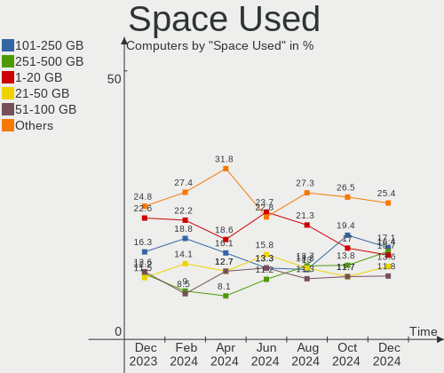
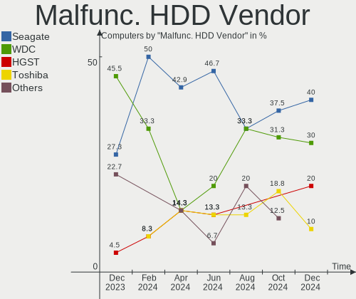
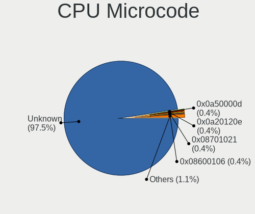

Arch Hardware Trends
--------------------

A project to identify most popular hardware characteristics and track their change
over time based on data collected by Arch users at https://Linux-Hardware.org.

Anyone can contribute to the study by uploading probes of their computers by
the [hw-probe](https://github.com/linuxhw/hw-probe) tool:

    sudo -E hw-probe -all -upload

This is a report for all computer types. See also reports for [desktops](/Dist/Arch/Desktop/README.md) and [notebooks](/Dist/Arch/Notebook/README.md).

Full-feature report is available here: https://linux-hardware.org/?view=trends

Period: May, 2020.

Contents
--------

- [ OS                       ](#os)
- [ OS Family                ](#os-family)
- [ Kernel                   ](#kernel)
- [ Kernel Family            ](#kernel-family)
- [ Kernel Major Ver.        ](#kernel-major-ver)
- [ Arch                     ](#arch)
- [ DE                       ](#de)
- [ Display Server           ](#display-server)
- [ Display Manager          ](#display-manager)
- [ OS Lang                  ](#os-lang)
- [ Boot Mode                ](#boot-mode)
- [ Filesystem               ](#filesystem)
- [ Part. scheme             ](#part-scheme)
- [ Dual Boot with Linux/BSD ](#dual-boot-with-linux/bsd)
- [ Dual Boot (Win)          ](#dual-boot-win)
- [ Country                  ](#country)
- [ City                     ](#city)
- [ Vendor                   ](#vendor)
- [ Model                    ](#model)
- [ Model Family             ](#model-family)
- [ MFG Year                 ](#mfg-year)
- [ Form Factor              ](#form-factor)
- [ Secure Boot              ](#secure-boot)
- [ Coreboot                 ](#coreboot)
- [ RAM Size                 ](#ram-size)
- [ RAM Used                 ](#ram-used)
- [ Drive Vendor             ](#drive-vendor)
- [ Drive Model              ](#drive-model)
- [ Drive Kind               ](#drive-kind)
- [ Drive Connector          ](#drive-connector)
- [ Drive Size               ](#drive-size)
- [ Space Total              ](#space-total)
- [ Space Used               ](#space-used)
- [ Malfunc. Drives          ](#malfunc-drives)
- [ Malfunc. Drive Vendor    ](#malfunc-drive-vendor)
- [ Malfunc. HDD Vendor      ](#malfunc-hdd-vendor)
- [ Malfunc. Drive Kind      ](#malfunc-drive-kind)
- [ Failed Drives            ](#failed-drives)
- [ Failed Drive Vendor      ](#failed-drive-vendor)
- [ Drive Status             ](#drive-status)
- [ Storage Vendor           ](#storage-vendor)
- [ Storage Model            ](#storage-model)
- [ Storage Kind             ](#storage-kind)
- [ CPU Vendor               ](#cpu-vendor)
- [ CPU Model                ](#cpu-model)
- [ CPU Model Family         ](#cpu-model-family)
- [ CPU Cores                ](#cpu-cores)
- [ CPU Sockets              ](#cpu-sockets)
- [ CPU Threads              ](#cpu-threads)
- [ CPU Op-Modes             ](#cpu-op-modes)
- [ CPU Microcode            ](#cpu-microcode)
- [ CPU Microarch            ](#cpu-microarch)
- [ GPU Vendor               ](#gpu-vendor)
- [ GPU Model                ](#gpu-model)
- [ GPU Combo                ](#gpu-combo)
- [ GPU Driver               ](#gpu-driver)
- [ GPU Memory               ](#gpu-memory)
- [ Monitor Vendor           ](#monitor-vendor)
- [ Monitor Model            ](#monitor-model)
- [ Monitor Resolution       ](#monitor-resolution)
- [ Monitor Diagonal         ](#monitor-diagonal)
- [ Monitor Width            ](#monitor-width)
- [ Aspect Ratio             ](#aspect-ratio)
- [ Monitor Area             ](#monitor-area)
- [ Pixel Density            ](#pixel-density)
- [ Multiple Monitors        ](#multiple-monitors)
- [ Net Controller Vendor    ](#net-controller-vendor)
- [ Net Controller Model     ](#net-controller-model)
- [ Wireless Vendor          ](#wireless-vendor)
- [ Wireless Model           ](#wireless-model)
- [ Ethernet Vendor          ](#ethernet-vendor)
- [ Ethernet Model           ](#ethernet-model)
- [ Net Controller Kind      ](#net-controller-kind)
- [ Used Controller          ](#used-controller)
- [ NICs                     ](#nics)
- [ Bluetooth Vendor         ](#bluetooth-vendor)
- [ Bluetooth Model          ](#bluetooth-model)
- [ Unsupported Devices      ](#unsupported-devices)
- [ Unsupported Device Types ](#unsupported-device-types)

OS
--

Installed operating systems

| Name         | Computers | Percent |
|--------------|-----------|---------|
| Arch         | 108       | 77.14%  |
| Arch Rolling | 31        | 22.14%  |
| Arch V20.3.4 | 1         | 0.71%   |

OS Family
---------

OS without a version

| Name | Computers | Percent |
|------|-----------|---------|
| Arch | 140       | 100%    |

Kernel
------

Version of the Linux kernel

| Version                | Computers | Percent |
|------------------------|-----------|---------|
| 5.6.13-arch1-1         | 27        | 19.29%  |
| 5.6.11-arch1-1         | 24        | 17.14%  |
| 5.6.14-arch1-1         | 18        | 12.86%  |
| 5.6.10-arch1-1         | 10        | 7.14%   |
| 5.6.8-arch1-1          | 9         | 6.43%   |
| 5.6.12-arch1-1         | 5         | 3.57%   |
| 5.6.7-arch1-1          | 4         | 2.86%   |
| 5.6.6-arch1-1          | 4         | 2.86%   |
| 5.6.15-arch1-1         | 3         | 2.14%   |
| 5.6.14-zen1-1-zen      | 3         | 2.14%   |
| 5.6.13-zen1-1-zen      | 3         | 2.14%   |
| 5.6.11-zen1-1-zen      | 3         | 2.14%   |
| 5.6.8-zen1-1-zen       | 2         | 1.43%   |
| 5.6.12-zen1-1-zen      | 2         | 1.43%   |
| 5.6.10-zen1-1-zen      | 2         | 1.43%   |
| 5.4.38-1-lts           | 2         | 1.43%   |
| 5.4.36-1-lts           | 2         | 1.43%   |
| 5.7.0-rc3-paulyx       | 1         | 0.71%   |
| 5.6.7-arch1-1-vfio     | 1         | 0.71%   |
| 5.6.3-arch1-1          | 1         | 0.71%   |
| 5.6.14.a-1-hardened    | 1         | 0.71%   |
| 5.6.14-nitrous+        | 1         | 0.71%   |
| 5.6.13.a-1-hardened    | 1         | 0.71%   |
| 5.6.13-zen1-1-zencjk   | 1         | 0.71%   |
| 5.6.13-1-ck-nehalem    | 1         | 0.71%   |
| 5.6.11.ll32-1-lingruby | 1         | 0.71%   |
| 5.6.11-1-ck-haswell    | 1         | 0.71%   |
| 5.6.0-pf8-pf+          | 1         | 0.71%   |
| 5.5.7-zen1-1-zen       | 1         | 0.71%   |
| 5.4.42-1-lts           | 1         | 0.71%   |
| 5.4.41-1-lts           | 1         | 0.71%   |
| 5.4.39-1-lts           | 1         | 0.71%   |
| 5.4.32-1-lts           | 1         | 0.71%   |
| 5.4.15-arch1-1         | 1         | 0.71%   |

Kernel Family
-------------

Linux kernel without a distro release

| Version | Computers | Percent |
|---------|-----------|---------|
| 5.6.13  | 33        | 23.57%  |
| 5.6.11  | 29        | 20.71%  |
| 5.6.14  | 23        | 16.43%  |
| 5.6.10  | 12        | 8.57%   |
| 5.6.8   | 11        | 7.86%   |
| 5.6.12  | 7         | 5%      |
| 5.6.7   | 5         | 3.57%   |
| 5.6.6   | 4         | 2.86%   |
| 5.6.15  | 3         | 2.14%   |
| 5.4.38  | 2         | 1.43%   |
| 5.4.36  | 2         | 1.43%   |
| 5.7.0   | 1         | 0.71%   |
| 5.6.3   | 1         | 0.71%   |
| 5.6.0   | 1         | 0.71%   |
| 5.5.7   | 1         | 0.71%   |
| 5.4.42  | 1         | 0.71%   |
| 5.4.41  | 1         | 0.71%   |
| 5.4.39  | 1         | 0.71%   |
| 5.4.32  | 1         | 0.71%   |
| 5.4.15  | 1         | 0.71%   |

Kernel Major Ver.
-----------------

Linux kernel major version

| Version | Computers | Percent |
|---------|-----------|---------|
| 5.6     | 129       | 92.14%  |
| 5.4     | 9         | 6.43%   |
| 5.7     | 1         | 0.71%   |
| 5.5     | 1         | 0.71%   |

Arch
----

OS architecture (x86_64, i586, etc.)

| Name   | Computers | Percent |
|--------|-----------|---------|
| x86_64 | 140       | 100%    |

DE
--

Desktop Environment

| Name            | Computers | Percent |
|-----------------|-----------|---------|
| GNOME           | 77        | 55%     |
| KDE5            | 15        | 10.71%  |
| KDE             | 13        | 9.29%   |
| Unknown         | 10        | 7.14%   |
| XFCE            | 7         | 5%      |
| i3              | 6         | 4.29%   |
| MATE            | 3         | 2.14%   |
| Budgie          | 3         | 2.14%   |
| X-Cinnamon      | 1         | 0.71%   |
| LXQt            | 1         | 0.71%   |
| GNOME Flashback | 1         | 0.71%   |
| GNOME Classic   | 1         | 0.71%   |
| Deepin          | 1         | 0.71%   |
| Cinnamon        | 1         | 0.71%   |

Display Server
--------------

X11 or Wayland

| Name    | Computers | Percent |
|---------|-----------|---------|
| X11     | 88        | 62.86%  |
| Wayland | 36        | 25.71%  |
| Tty     | 12        | 8.57%   |
| Unknown | 4         | 2.86%   |

Display Manager
---------------

SDDM, LightDM, etc.

| Name    | Computers | Percent |
|---------|-----------|---------|
| Unknown | 97        | 69.29%  |
| GDM     | 14        | 10%     |
| SDDM    | 13        | 9.29%   |
| LightDM | 12        | 8.57%   |
| XDM     | 2         | 1.43%   |
| Ly      | 1         | 0.71%   |
| LXDM    | 1         | 0.71%   |

OS Lang
-------

Language

| Lang       | Computers | Percent |
|------------|-----------|---------|
| en_US      | 68        | 48.57%  |
| C          | 9         | 6.43%   |
| de_DE      | 6         | 4.29%   |
| ru_RU      | 5         | 3.57%   |
| fr_FR      | 5         | 3.57%   |
| en_GB      | 5         | 3.57%   |
| Unknown    | 5         | 3.57%   |
| pt_BR      | 4         | 2.86%   |
| pl_PL      | 3         | 2.14%   |
| it_IT      | 3         | 2.14%   |
| en_US.utf8 | 3         | 2.14%   |
| en_IN      | 3         | 2.14%   |
| en_CA      | 2         | 1.43%   |
| en_AU      | 2         | 1.43%   |
| zh_CN      | 1         | 0.71%   |
| ru_UA      | 1         | 0.71%   |
| pl_PL.utf8 | 1         | 0.71%   |
| osa_US     | 1         | 0.71%   |
| it_IT.utf8 | 1         | 0.71%   |
| hu_HU      | 1         | 0.71%   |
| es_US      | 1         | 0.71%   |
| es_ES.utf8 | 1         | 0.71%   |
| es_CR.utf8 | 1         | 0.71%   |
| es_CL      | 1         | 0.71%   |
| en_NZ      | 1         | 0.71%   |
| en_IL      | 1         | 0.71%   |
| en_BE      | 1         | 0.71%   |
| de_CH      | 1         | 0.71%   |
| de_AT      | 1         | 0.71%   |
| da_DK      | 1         | 0.71%   |
| bg_BG      | 1         | 0.71%   |

Boot Mode
---------

EFI or BIOS

| Mode | Computers | Percent |
|------|-----------|---------|
| EFI  | 80        | 57.14%  |
| BIOS | 60        | 42.86%  |

Filesystem
----------

Type of filesystem

| Type    | Computers | Percent |
|---------|-----------|---------|
| Ext4    | 117       | 83.57%  |
| Btrfs   | 15        | 10.71%  |
| Xfs     | 4         | 2.86%   |
| F2fs    | 2         | 1.43%   |
| Zfs     | 1         | 0.71%   |
| Overlay | 1         | 0.71%   |

Part. scheme
------------

Scheme of partitioning

| Type    | Computers | Percent |
|---------|-----------|---------|
| Unknown | 103       | 73.57%  |
| GPT     | 32        | 22.86%  |
| MBR     | 5         | 3.57%   |

Dual Boot with Linux/BSD
------------------------

Hosting more than one Linux/BSD

| Dual boot | Computers | Percent |
|-----------|-----------|---------|
| No        | 124       | 88.57%  |
| Yes       | 16        | 11.43%  |

Dual Boot (Win)
---------------

Hosting Linux and Windows

| Dual boot | Computers | Percent |
|-----------|-----------|---------|
| No        | 103       | 73.57%  |
| Yes       | 37        | 26.43%  |

Country
-------

Geographic location (country)

| Country             | Computers | Percent |
|---------------------|-----------|---------|
| USA                 | 37        | 26.43%  |
| Germany             | 11        | 7.86%   |
| Russia              | 9         | 6.43%   |
| Brazil              | 9         | 6.43%   |
| Ukraine             | 7         | 5%      |
| Canada              | 7         | 5%      |
| UK                  | 6         | 4.29%   |
| Poland              | 6         | 4.29%   |
| France              | 6         | 4.29%   |
| Italy               | 4         | 2.86%   |
| Switzerland         | 3         | 2.14%   |
| India               | 3         | 2.14%   |
| Chile               | 3         | 2.14%   |
| Sweden              | 2         | 1.43%   |
| New Zealand         | 2         | 1.43%   |
| Hungary             | 2         | 1.43%   |
| Finland             | 2         | 1.43%   |
| Bulgaria            | 2         | 1.43%   |
| Turkey              | 1         | 0.71%   |
| Trinidad and Tobago | 1         | 0.71%   |
| Sri Lanka           | 1         | 0.71%   |
| Spain               | 1         | 0.71%   |
| South Africa        | 1         | 0.71%   |
| Nepal               | 1         | 0.71%   |
| Lithuania           | 1         | 0.71%   |
| Korea, Republic of  | 1         | 0.71%   |
| Indonesia           | 1         | 0.71%   |
| Greece              | 1         | 0.71%   |
| Ghana               | 1         | 0.71%   |
| Denmark             | 1         | 0.71%   |
| Czech Republic      | 1         | 0.71%   |
| Costa Rica          | 1         | 0.71%   |
| Colombia            | 1         | 0.71%   |
| China               | 1         | 0.71%   |
| Belgium             | 1         | 0.71%   |
| Austria             | 1         | 0.71%   |
| Australia           | 1         | 0.71%   |

City
----

Geographic location (city)

| City               | Computers | Percent |
|--------------------|-----------|---------|
| Kyiv               | 5         | 3.57%   |
| Moscow             | 4         | 2.86%   |
| San Antonio        | 3         | 2.14%   |
| Zurich             | 2         | 1.43%   |
| Warrington         | 2         | 1.43%   |
| Porto Alegre       | 2         | 1.43%   |
| Oak Harbor         | 2         | 1.43%   |
| Montreal           | 2         | 1.43%   |
| Mannheim           | 2         | 1.43%   |
| Las Condes         | 2         | 1.43%   |
| Helsinki           | 2         | 1.43%   |
| Germantown         | 2         | 1.43%   |
| Asenovgrad         | 2         | 1.43%   |
| Wrocław           | 1         | 0.71%   |
| Wilmslow           | 1         | 0.71%   |
| Weiden             | 1         | 0.71%   |
| Wattala            | 1         | 0.71%   |
| Warsaw             | 1         | 0.71%   |
| Vilnius            | 1         | 0.71%   |
| Vienna             | 1         | 0.71%   |
| Victoria           | 1         | 0.71%   |
| Topeka             | 1         | 0.71%   |
| Titahari           | 1         | 0.71%   |
| Thalfingen         | 1         | 0.71%   |
| São Paulo         | 1         | 0.71%   |
| Sydney             | 1         | 0.71%   |
| Stockholm          | 1         | 0.71%   |
| Springs            | 1         | 0.71%   |
| Sesto San Giovanni | 1         | 0.71%   |
| Seoul              | 1         | 0.71%   |
| Saumur             | 1         | 0.71%   |
| Santos             | 1         | 0.71%   |
| San Jose           | 1         | 0.71%   |
| Salvador           | 1         | 0.71%   |
| Salamanca          | 1         | 0.71%   |
| Saint Paul         | 1         | 0.71%   |
| Rostov-on-Don      | 1         | 0.71%   |
| Raleigh            | 1         | 0.71%   |
| Poznan             | 1         | 0.71%   |
| Portishead         | 1         | 0.71%   |
| Port of Spain      | 1         | 0.71%   |
| Port Allen         | 1         | 0.71%   |
| Plettenberg        | 1         | 0.71%   |
| Petrozavodsk       | 1         | 0.71%   |
| Palestro           | 1         | 0.71%   |
| Overijse           | 1         | 0.71%   |
| Ottawa             | 1         | 0.71%   |
| Oakman             | 1         | 0.71%   |
| North Fort Myers   | 1         | 0.71%   |
| Nice               | 1         | 0.71%   |
| Neckarsulm         | 1         | 0.71%   |
| Nanning            | 1         | 0.71%   |
| Nacka              | 1         | 0.71%   |
| Münster           | 1         | 0.71%   |
| Murcia             | 1         | 0.71%   |
| Mumbai             | 1         | 0.71%   |
| Montgomery         | 1         | 0.71%   |
| Mitchell           | 1         | 0.71%   |
| Minneapolis        | 1         | 0.71%   |
| Mesquite           | 1         | 0.71%   |

Vendor
------

Motherboard manufacturer

| Name                | Computers | Percent |
|---------------------|-----------|---------|
| Lenovo              | 30        | 21.43%  |
| ASUSTek Computer    | 26        | 18.57%  |
| Dell                | 14        | 10%     |
| Hewlett-Packard     | 11        | 7.86%   |
| Gigabyte Technology | 11        | 7.86%   |
| MSI                 | 9         | 6.43%   |
| Apple               | 7         | 5%      |
| Intel               | 5         | 3.57%   |
| Acer                | 5         | 3.57%   |
| ASRock              | 4         | 2.86%   |
| Toshiba             | 3         | 2.14%   |
| Sony                | 2         | 1.43%   |
| Samsung Electronics | 2         | 1.43%   |
| WEIBU               | 1         | 0.71%   |
| Timi                | 1         | 0.71%   |
| Positivo            | 1         | 0.71%   |
| Notebook            | 1         | 0.71%   |
| Microsoft           | 1         | 0.71%   |
| HUAWEI              | 1         | 0.71%   |
| HIGRADED            | 1         | 0.71%   |
| Foxconn             | 1         | 0.71%   |
| Dream Machines      | 1         | 0.71%   |
| Alienware           | 1         | 0.71%   |
| Unknown             | 1         | 0.71%   |

Model
-----

Motherboard model

| Name                                       | Computers | Percent |
|--------------------------------------------|-----------|---------|
| Lenovo ThinkPad X1 Carbon 6th 20KG0022US   | 2         | 1.43%   |
| Lenovo Legion Y530-15ICH 81FV              | 2         | 1.43%   |
| HP Pavilion Gaming Laptop 15-cx0xxx        | 2         | 1.43%   |
| Gigabyte Z390 AORUS PRO                    | 2         | 1.43%   |
| Dell XPS 15 9570                           | 2         | 1.43%   |
| ASUS TUF GAMING X570-PLUS                  | 2         | 1.43%   |
| ASUS ROG STRIX B450-F GAMING               | 2         | 1.43%   |
| Apple MacBookPro8,1                        | 2         | 1.43%   |
| Acer Aspire E5-571                         | 2         | 1.43%   |
| WEIBU PSB133S01ZFP                         | 1         | 0.71%   |
| Toshiba Satellite L875D                    | 1         | 0.71%   |
| Toshiba Satellite L750D                    | 1         | 0.71%   |
| Toshiba Satellite C50-B                    | 1         | 0.71%   |
| Timi TM1613                                | 1         | 0.71%   |
| Sony VPCEH28FG                             | 1         | 0.71%   |
| Sony VGN-CR590E                            | 1         | 0.71%   |
| Samsung Electronics RC530/RC730            | 1         | 0.71%   |
| Samsung Electronics 700Z3C/700Z5C          | 1         | 0.71%   |
| Positivo MOBILE                            | 1         | 0.71%   |
| Notebook NJ50GU                            | 1         | 0.71%   |
| MSI MS-7C37                                | 1         | 0.71%   |
| MSI MS-7C02                                | 1         | 0.71%   |
| MSI MS-7B86                                | 1         | 0.71%   |
| MSI MS-7A74                                | 1         | 0.71%   |
| MSI MS-7A34                                | 1         | 0.71%   |
| MSI MS-7850                                | 1         | 0.71%   |
| MSI MS-7693                                | 1         | 0.71%   |
| MSI MS-7592                                | 1         | 0.71%   |
| MSI GP62 7QF                               | 1         | 0.71%   |
| Microsoft Surface Book                     | 1         | 0.71%   |
| Lenovo Yoga C930-13IKB                     | 1         | 0.71%   |
| Lenovo Yoga 520-14IKB 80YM                 | 1         | 0.71%   |
| Lenovo ThinkPad X131e 3368A77              | 1         | 0.71%   |
| Lenovo ThinkPad X1 Yoga 1st 20FQS09M00     | 1         | 0.71%   |
| Lenovo ThinkPad X1 Carbon 4th 20FB006BGE   | 1         | 0.71%   |
| Lenovo ThinkPad X1 Carbon 2nd 20A8S0ET00   | 1         | 0.71%   |
| Lenovo ThinkPad T60 2623KEU                | 1         | 0.71%   |
| Lenovo ThinkPad T495s 20QKA008CL           | 1         | 0.71%   |
| Lenovo ThinkPad T495 20NJ000XIX            | 1         | 0.71%   |
| Lenovo ThinkPad T480s 20L8S2SD00           | 1         | 0.71%   |
| Lenovo ThinkPad T440p 20AWS0Y800           | 1         | 0.71%   |
| Lenovo ThinkPad T430 2349K63               | 1         | 0.71%   |
| Lenovo ThinkPad T430 2347H76               | 1         | 0.71%   |
| Lenovo ThinkPad T420 4180WA4               | 1         | 0.71%   |
| Lenovo ThinkPad L470 20J5S00C00            | 1         | 0.71%   |
| Lenovo ThinkPad E490 20N8S0WY00            | 1         | 0.71%   |
| Lenovo ThinkPad E490 20N8CTO1WW            | 1         | 0.71%   |
| Lenovo IdeaPad Y510P 20217                 | 1         | 0.71%   |
| Lenovo IdeaPad S400 Touch 20283            | 1         | 0.71%   |
| Lenovo IdeaPad L340-17API 81LY             | 1         | 0.71%   |
| Lenovo IdeaPad 720-15IKB 81C7              | 1         | 0.71%   |
| Lenovo IdeaPad 310-14ISK 80SL              | 1         | 0.71%   |
| Lenovo IdeaCentre AIO 520-24IKU F0D200E2LD | 1         | 0.71%   |
| Lenovo IdeaCentre 510S-08ISH 90FN007MGF    | 1         | 0.71%   |
| Lenovo G40-80 80JE                         | 1         | 0.71%   |
| Lenovo Flex 2-14 20404                     | 1         | 0.71%   |
| Intel NUC6i7KYB H90766-406                 | 1         | 0.71%   |
| Intel H55                                  | 1         | 0.71%   |
| Intel DX79SR AAG57199-200                  | 1         | 0.71%   |
| Intel DH87RL AAG74240-401                  | 1         | 0.71%   |

Model Family
------------

Motherboard model prefix

| Name                       | Computers | Percent |
|----------------------------|-----------|---------|
| Lenovo ThinkPad            | 17        | 12.14%  |
| Lenovo IdeaPad             | 5         | 3.57%   |
| ASUS TUF                   | 5         | 3.57%   |
| ASUS ROG                   | 5         | 3.57%   |
| Dell XPS                   | 4         | 2.86%   |
| Dell Inspiron              | 4         | 2.86%   |
| ASUS PRIME                 | 4         | 2.86%   |
| Toshiba Satellite          | 3         | 2.14%   |
| HP Pavilion                | 3         | 2.14%   |
| HP ENVY                    | 3         | 2.14%   |
| Acer Aspire                | 3         | 2.14%   |
| Lenovo Yoga                | 2         | 1.43%   |
| Lenovo Legion              | 2         | 1.43%   |
| Lenovo IdeaCentre          | 2         | 1.43%   |
| HP Compaq                  | 2         | 1.43%   |
| Gigabyte Z390              | 2         | 1.43%   |
| Dell Latitude              | 2         | 1.43%   |
| ASUS Strix                 | 2         | 1.43%   |
| ASUS Maximus               | 2         | 1.43%   |
| Apple MacBookPro8          | 2         | 1.43%   |
| Acer Swift                 | 2         | 1.43%   |
| WEIBU PSB133S01ZFP         | 1         | 0.71%   |
| Timi TM1613                | 1         | 0.71%   |
| Sony VPCEH28FG             | 1         | 0.71%   |
| Sony VGN-CR590E            | 1         | 0.71%   |
| Samsung Electronics RC530  | 1         | 0.71%   |
| Samsung Electronics 700Z3C | 1         | 0.71%   |
| Positivo MOBILE            | 1         | 0.71%   |
| Notebook NJ50GU            | 1         | 0.71%   |
| MSI MS-7C37                | 1         | 0.71%   |
| MSI MS-7C02                | 1         | 0.71%   |
| MSI MS-7B86                | 1         | 0.71%   |
| MSI MS-7A74                | 1         | 0.71%   |
| MSI MS-7A34                | 1         | 0.71%   |
| MSI MS-7850                | 1         | 0.71%   |
| MSI MS-7693                | 1         | 0.71%   |
| MSI MS-7592                | 1         | 0.71%   |
| MSI GP62                   | 1         | 0.71%   |
| Microsoft Surface          | 1         | 0.71%   |
| Lenovo G40-80              | 1         | 0.71%   |
| Lenovo Flex                | 1         | 0.71%   |
| Intel NUC6i7KYB            | 1         | 0.71%   |
| Intel H55                  | 1         | 0.71%   |
| Intel DX79SR               | 1         | 0.71%   |
| Intel DH87RL               | 1         | 0.71%   |
| Intel D53427RKE            | 1         | 0.71%   |
| HUAWEI BOHK-WAX9X          | 1         | 0.71%   |
| HIGRADED M7x0S             | 1         | 0.71%   |
| HP Z240                    | 1         | 0.71%   |
| HP OMEN                    | 1         | 0.71%   |
| HP EliteBook               | 1         | 0.71%   |
| Gigabyte Z170XP-SLI        | 1         | 0.71%   |
| Gigabyte X79-UD3           | 1         | 0.71%   |
| Gigabyte X58A-UD3R         | 1         | 0.71%   |
| Gigabyte X470              | 1         | 0.71%   |
| Gigabyte H97-Gaming        | 1         | 0.71%   |
| Gigabyte H110M-S2V         | 1         | 0.71%   |
| Gigabyte GA-970A-UD3       | 1         | 0.71%   |
| Gigabyte B450              | 1         | 0.71%   |
| Gigabyte AB350M-DS3H       | 1         | 0.71%   |

MFG Year
--------

Motherboard manufacture year

| Year    | Computers | Percent |
|---------|-----------|---------|
| 2019    | 55        | 39.29%  |
| 2018    | 19        | 13.57%  |
| 2020    | 11        | 7.86%   |
| 2017    | 11        | 7.86%   |
| 2016    | 7         | 5%      |
| 2012    | 7         | 5%      |
| 2015    | 6         | 4.29%   |
| 2013    | 6         | 4.29%   |
| 2014    | 5         | 3.57%   |
| 2011    | 5         | 3.57%   |
| 2010    | 2         | 1.43%   |
| 2009    | 2         | 1.43%   |
| 2008    | 2         | 1.43%   |
| 2006    | 1         | 0.71%   |
| Unknown | 1         | 0.71%   |

Form Factor
-----------

Physical design of the computer

| Name        | Computers | Percent |
|-------------|-----------|---------|
| Notebook    | 76        | 54.29%  |
| Desktop     | 54        | 38.57%  |
| Convertible | 4         | 2.86%   |
| Mini pc     | 3         | 2.14%   |
| All in one  | 2         | 1.43%   |
| Tablet      | 1         | 0.71%   |

Secure Boot
-----------

Enabled or disabled

| State    | Computers | Percent |
|----------|-----------|---------|
| Disabled | 140       | 100%    |

Coreboot
--------

Have coreboot on board

| Used | Computers | Percent |
|------|-----------|---------|
| No   | 140       | 100%    |

RAM Size
--------

Total RAM memory

| Size in GB  | Computers | Percent |
|-------------|-----------|---------|
| 16.01-24.0  | 38        | 27.14%  |
| 4.01-8.0    | 34        | 24.29%  |
| 8.01-16.0   | 28        | 20%     |
| 32.01-64.0  | 18        | 12.86%  |
| 3.01-4.0    | 11        | 7.86%   |
| 24.01-32.0  | 5         | 3.57%   |
| 64.01-256.0 | 4         | 2.86%   |
| 2.01-3.0    | 1         | 0.71%   |
| 1.01-2.0    | 1         | 0.71%   |

RAM Used
--------

Used RAM memory

| Used GB    | Computers | Percent |
|------------|-----------|---------|
| 1.01-2.0   | 44        | 31.43%  |
| 2.01-3.0   | 39        | 27.86%  |
| 4.01-8.0   | 29        | 20.71%  |
| 3.01-4.0   | 16        | 11.43%  |
| 8.01-16.0  | 5         | 3.57%   |
| 0.01-1.0   | 5         | 3.57%   |
| 16.01-24.0 | 2         | 1.43%   |

Drive Vendor
------------

Hard drive vendors

| Vendor              | Computers | Drives  | Percent |
|---------------------|-----------|---------|---------|
| WDC                 | 33        | 38      | 16.1%   |
| Samsung Electronics | 28        | 34      | 13.66%  |
| Seagate             | 26        | 34      | 12.68%  |
| Toshiba             | 20        | 20      | 9.76%   |
| SanDisk             | 14        | 15      | 6.83%   |
| Crucial             | 13        | 13      | 6.34%   |
| Kingston            | 9         | 10      | 4.39%   |
| Unknown             | 8         | 8       | 3.9%    |
| Intel               | 6         | 6       | 2.93%   |
| Hitachi             | 5         | 5       | 2.44%   |
| A-DATA Technology   | 5         | 5       | 2.44%   |
| Transcend           | 4         | 4       | 1.95%   |
| HGST                | 4         | 5       | 1.95%   |
| Apple               | 3         | 3       | 1.46%   |
| SPCC                | 2         | 2       | 0.98%   |
| OCZ                 | 2         | 2       | 0.98%   |
| Corsair             | 2         | 2       | 0.98%   |
| China               | 2         | 3       | 0.98%   |
| ZOTAC               | 1         | 1       | 0.49%   |
| XPG                 | 1         | 1       | 0.49%   |
| WDC WD50            | 1         | 1       | 0.49%   |
| USB30               | 1         | 2       | 0.49%   |
| Team                | 1         | 1       | 0.49%   |
| SK Hynix            | 1         | 1       | 0.49%   |
| SABRENT             | 1         | 1       | 0.49%   |
| PNY                 | 1         | 1       | 0.49%   |
| PLEXTOR             | 1         | 1       | 0.49%   |
| Phison              | 1         | 1       | 0.49%   |
| OCZ-AGIL            | 1         | 1       | 0.49%   |
| Mushkin             | 1         | 1       | 0.49%   |
| Micron Technology   | 1         | 1       | 0.49%   |
| MGS                 | 1         | 1       | 0.49%   |
| KingDian            | 1         | 1       | 0.49%   |
| HL-DT-ST            | 1         | Unknown | 0.49%   |
| Hewlett-Packard     | 1         | 1       | 0.49%   |
| Fujitsu             | 1         | 1       | 0.49%   |
| ASMT                | 1         | 2       | 0.49%   |

Drive Model
-----------

Hard drive models

| Model                        | Computers | Percent |
|------------------------------|-----------|---------|
| SSD 850 EVO 500GB            | 6         | 2.63%   |
| ST1000LM035-1RK172 1TB       | 4         | 1.75%   |
| HDWD110 1TB                  | 3         | 1.32%   |
| WDS100T2B0A-00SM50 1TB SSD   | 2         | 0.88%   |
| WD6400AAKS-22A7B2 640GB      | 2         | 0.88%   |
| WD10EZEX-08WN4A0 1TB         | 2         | 0.88%   |
| TS256GSSD370S 256GB          | 2         | 0.88%   |
| TR200 480GB SSD              | 2         | 0.88%   |
| SUV500480G 480GB SSD         | 2         | 0.88%   |
| ST500LT012-1DG142 500GB      | 2         | 0.88%   |
| ST2000DM006-2DM164 2TB       | 2         | 0.88%   |
| ST2000DM001-1CH164 2TB       | 2         | 0.88%   |
| ST1000LX015-1U7172 1TB       | 2         | 0.88%   |
| ST1000DM003-9YN162 1TB       | 2         | 0.88%   |
| SSDSC2KW256G8 256GB          | 2         | 0.88%   |
| SSD 970 EVO Plus 500GB       | 2         | 0.88%   |
| SSD 860 EVO 500GB            | 2         | 0.88%   |
| SSD 860 EVO 1TB              | 2         | 0.88%   |
| SSD 850 EVO 120GB            | 2         | 0.88%   |
| SSD 840 EVO 250GB            | 2         | 0.88%   |
| SDSSDHP128G 128GB            | 2         | 0.88%   |
| SDSSDA240G 240GB             | 2         | 0.88%   |
| SDSSDA120G 120GB             | 2         | 0.88%   |
| SA400S37480G 480GB SSD       | 2         | 0.88%   |
| SA400S37240G 240GB SSD       | 2         | 0.88%   |
| SA400S37120G 120GB SSD       | 2         | 0.88%   |
| HTS721010A9E630 1TB          | 2         | 0.88%   |
| CT480BX500SSD1 480GB         | 2         | 0.88%   |
| CT1000MX500SSD1 1TB          | 2         | 0.88%   |
| ZTSSD-S11-120G-MD 120GB      | 1         | 0.44%   |
| X400 M.2 2280 256GB SSD      | 1         | 0.44%   |
| WDS100T2X0C-00L350 1TB       | 1         | 0.44%   |
| WDS100T2B0B-00YS70 1TB SSD   | 1         | 0.44%   |
| WDBNCE5000PNC 500GB SSD      | 1         | 0.44%   |
| WDBNCE2500PNC-WRSN 250GB SSD | 1         | 0.44%   |
| WDBNCE2500PNC 250GB SSD      | 1         | 0.44%   |
| WD7500BPKX-75HPJT0 752GB     | 1         | 0.44%   |
| WD6001FZWX-00A2VA0 6TB       | 1         | 0.44%   |
| WD5001AALS-00E3A0 500GB      | 1         | 0.44%   |
| WD5000LPVX-22V0TT0 500GB     | 1         | 0.44%   |
| WD5000LPVX-00V0TT0 500GB     | 1         | 0.44%   |
| WD5000AAKX-60U6AA0 500GB     | 1         | 0.44%   |
| WD5000AAKS-65A7B0 500GB      | 1         | 0.44%   |
| WD5000AAKS-00YGA0 500GB      | 1         | 0.44%   |
| WD40EFRX-68WT0N0 4TB         | 1         | 0.44%   |
| WD4003FZEX-00Z4SA0 4TB       | 1         | 0.44%   |
| WD3200BEVT-11ZCT0 320GB      | 1         | 0.44%   |
| WD3200BEKX-75B7WT0 320GB     | 1         | 0.44%   |
| WD30EZRZ-00GXCB0 3TB         | 1         | 0.44%   |
| WD2500BEVT-22A23T0 250GB     | 1         | 0.44%   |
| WD10SPZX-24Z10 1TB           | 1         | 0.44%   |
| WD10JPVX-22JC3T0 1TB         | 1         | 0.44%   |
| WD10EZRZ-00HTKB0 1TB         | 1         | 0.44%   |
| WD10EZEX-75M2NA0 1TB         | 1         | 0.44%   |
| WD10EZEX-22BN5A0 1TB         | 1         | 0.44%   |
| WD10EZEX-00ZF5A0 1TB         | 1         | 0.44%   |
| WD10EZEX-00BN5A0 1TB         | 1         | 0.44%   |
| WD10EALX-009BA0 1TB          | 1         | 0.44%   |
| WD10EACS-00ZJB0 1TB          | 1         | 0.44%   |
| WD1003FZEX-00MK2A0 1TB       | 1         | 0.44%   |

Drive Kind
----------

HDD or SSD

| Kind    | Computers | Drives  | Percent |
|---------|-----------|---------|---------|
| SSD     | 81        | 107     | 46.55%  |
| HDD     | 70        | 99      | 40.23%  |
| NVMe    | 15        | 16      | 8.62%   |
| MMC     | 7         | 7       | 4.02%   |
| Unknown | 1         | Unknown | 0.57%   |

Drive Connector
---------------

SATA, SAS, NVMe, etc.

| Type | Computers | Drives | Percent |
|------|-----------|--------|---------|
| SATA | 114       | 195    | 78.62%  |
| NVMe | 15        | 16     | 10.34%  |
| SAS  | 9         | 11     | 6.21%   |
| MMC  | 7         | 7      | 4.83%   |

Drive Size
----------

Size of hard drive

| Size in TB | Computers | Drives | Percent |
|------------|-----------|--------|---------|
| 0.01-0.5   | 90        | 124    | 52.33%  |
| 0.51-1.0   | 54        | 69     | 31.4%   |
| 1.01-2.0   | 14        | 19     | 8.14%   |
| 2.01-3.0   | 7         | 7      | 4.07%   |
| 3.01-4.0   | 4         | 6      | 2.33%   |
| 4.01-10.0  | 3         | 4      | 1.74%   |

Space Total
-----------

Amount of disk space available on the file system

| Size in GB     | Computers | Percent |
|----------------|-----------|---------|
| 251-500        | 45        | 32.14%  |
| 101-250        | 31        | 22.14%  |
| 501-1000       | 27        | 19.29%  |
| More than 3000 | 10        | 7.14%   |
| 1001-2000      | 10        | 7.14%   |
| Unknown        | 7         | 5%      |
| 51-100         | 4         | 2.86%   |
| 2001-3000      | 3         | 2.14%   |
| 21-50          | 2         | 1.43%   |
| 1-20           | 1         | 0.71%   |

Space Used
----------

Amount of used disk space

| Used GB        | Computers | Percent |
|----------------|-----------|---------|
| 1-20           | 28        | 20%     |
| 21-50          | 24        | 17.14%  |
| 251-500        | 20        | 14.29%  |
| 51-100         | 20        | 14.29%  |
| 101-250        | 19        | 13.57%  |
| 501-1000       | 12        | 8.57%   |
| Unknown        | 7         | 5%      |
| 1001-2000      | 5         | 3.57%   |
| More than 3000 | 3         | 2.14%   |
| 2001-3000      | 2         | 1.43%   |

Malfunc. Drives
---------------

Drive models with a malfunction

| Model                  | Computers | Drives | Percent |
|------------------------|-----------|--------|---------|
| WD1002FAEX-00Y9A0 1TB  | 1         | 1      | 10%     |
| ST31000528AS 1TB       | 1         | 1      | 10%     |
| ST2000DM001-1CH164 2TB | 1         | 1      | 10%     |
| ST1000LM035-1RK172 1TB | 1         | 1      | 10%     |
| ST1000DM003-9YN162 1TB | 1         | 1      | 10%     |
| SSDSA2M080G2GC 80GB    | 1         | 1      | 10%     |
| MG03ACA300 3TB         | 1         | 1      | 10%     |
| HTS721010A9E630 1TB    | 1         | 1      | 10%     |
| CT512MX100SSD1 512GB   | 1         | 1      | 10%     |
| ASM1156-PM 3TB         | 1         | 1      | 10%     |

Malfunc. Drive Vendor
---------------------

Vendors of faulty drives

| Vendor  | Computers | Drives | Percent |
|---------|-----------|--------|---------|
| Seagate | 3         | 4      | 33.33%  |
| WDC     | 1         | 1      | 11.11%  |
| Toshiba | 1         | 1      | 11.11%  |
| Intel   | 1         | 1      | 11.11%  |
| HGST    | 1         | 1      | 11.11%  |
| Crucial | 1         | 1      | 11.11%  |
| ASMT    | 1         | 1      | 11.11%  |

Malfunc. HDD Vendor
-------------------

Vendors of faulty HDD drives

| Vendor  | Computers | Drives | Percent |
|---------|-----------|--------|---------|
| Seagate | 3         | 4      | 42.86%  |
| WDC     | 1         | 1      | 14.29%  |
| Toshiba | 1         | 1      | 14.29%  |
| HGST    | 1         | 1      | 14.29%  |
| ASMT    | 1         | 1      | 14.29%  |

Malfunc. Drive Kind
-------------------

Kinds of faulty drives

| Kind | Computers | Drives | Percent |
|------|-----------|--------|---------|
| HDD  | 6         | 8      | 75%     |
| SSD  | 2         | 2      | 25%     |

Failed Drives
-------------

Failed drive models

Zero info for selected period =(

Failed Drive Vendor
-------------------

Failed drive vendors

Zero info for selected period =(

Drive Status
------------

Number of failed and malfunc. drives

| Status   | Computers | Drives | Percent |
|----------|-----------|--------|---------|
| Detected | 79        | 130    | 58.52%  |
| Works    | 48        | 89     | 35.56%  |
| Malfunc  | 8         | 10     | 5.93%   |

Storage Vendor
--------------

Storage controller vendors

| Vendor                           | Computers | Percent |
|----------------------------------|-----------|---------|
| Intel                            | 98        | 53.85%  |
| AMD                              | 27        | 14.84%  |
| Samsung Electronics              | 24        | 13.19%  |
| SK Hynix                         | 4         | 2.2%    |
| Sandisk                          | 4         | 2.2%    |
| Marvell Technology Group         | 4         | 2.2%    |
| ASMedia Technology               | 4         | 2.2%    |
| JMicron Technology               | 3         | 1.65%   |
| Toshiba America Info Systems     | 2         | 1.1%    |
| Phison Electronics               | 2         | 1.1%    |
| ADATA Technology                 | 2         | 1.1%    |
| Union Memory (Shenzhen)          | 1         | 0.55%   |
| Silicon Motion                   | 1         | 0.55%   |
| Silicon Integrated Systems [SiS] | 1         | 0.55%   |
| Seagate Technology               | 1         | 0.55%   |
| Realtek Semiconductor            | 1         | 0.55%   |
| Micron/Crucial Technology        | 1         | 0.55%   |
| Lenovo                           | 1         | 0.55%   |
| Kingston Technology Company      | 1         | 0.55%   |

Storage Model
-------------

Storage controller models

| Model                                                                    | Computers | Percent |
|--------------------------------------------------------------------------|-----------|---------|
| FCH SATA Controller [AHCI mode]                                          | 22        | 10.95%  |
| NVMe SSD Controller SM981/PM981/PM983                                    | 16        | 7.96%   |
| Cannon Lake Mobile PCH SATA AHCI Controller                              | 10        | 4.98%   |
| Sunrise Point-LP SATA Controller [AHCI mode]                             | 9         | 4.48%   |
| Non-Volatile memory controller                                           | 9         | 4.48%   |
| 7 Series Chipset Family 6-port SATA Controller [AHCI mode]               | 9         | 4.48%   |
| 400 Series Chipset SATA Controller                                       | 8         | 3.98%   |
| NVMe SSD Controller SM961/PM961                                          | 7         | 3.48%   |
| 8 Series/C220 Series Chipset Family 6-port SATA Controller 1 [AHCI mode] | 7         | 3.48%   |
| 8 Series SATA Controller 1 [AHCI mode]                                   | 7         | 3.48%   |
| Q170/Q150/B150/H170/H110/Z170/CM236 Chipset SATA Controller [AHCI Mode]  | 6         | 2.99%   |
| SB7x0/SB8x0/SB9x0 SATA Controller [AHCI mode]                            | 5         | 2.49%   |
| 82801 Mobile SATA Controller [RAID mode]                                 | 5         | 2.49%   |
| 6 Series/C200 Series Chipset Family 6 port Mobile SATA AHCI Controller   | 5         | 2.49%   |
| HM170/QM170 Chipset SATA Controller [AHCI Mode]                          | 4         | 1.99%   |
| Cannon Lake PCH SATA AHCI Controller                                     | 4         | 1.99%   |
| ASM1062 Serial ATA Controller                                            | 4         | 1.99%   |
| 7 Series/C210 Series Chipset Family 6-port SATA Controller [AHCI mode]   | 4         | 1.99%   |
| 200 Series PCH SATA controller [AHCI mode]                               | 4         | 1.99%   |
| Wildcat Point-LP SATA Controller [AHCI Mode]                             | 3         | 1.49%   |
| 9 Series Chipset Family SATA Controller [AHCI Mode]                      | 3         | 1.49%   |
| 300 Series Chipset SATA Controller                                       | 3         | 1.49%   |
| XPG SX8200 Pro PCIe Gen3x4 M.2 2280 Solid State Drive                    | 2         | 1%      |
| WD Black 2018/PC SN720 NVMe SSD                                          | 2         | 1%      |
| JMB363 SATA/IDE Controller                                               | 2         | 1%      |
| E12 NVMe Controller                                                      | 2         | 1%      |
| 82801JI (ICH10 Family) SATA AHCI Controller                              | 2         | 1%      |
| 5 Series/3400 Series Chipset 6 port SATA AHCI Controller                 | 2         | 1%      |
| 5 Series/3400 Series Chipset 4 port SATA AHCI Controller                 | 2         | 1%      |
| X399 Series Chipset SATA Controller                                      | 1         | 0.5%    |
| WD Black 2018/PC SN520 NVMe SSD                                          | 1         | 0.5%    |
| Toshiba America Info Non-Volatile memory controller                      | 1         | 0.5%    |
| SSD Pro 7600p/760p/E 6100p Series                                        | 1         | 0.5%    |
| SSD 660P Series                                                          | 1         | 0.5%    |
| SSD 600P Series                                                          | 1         | 0.5%    |
| SB7x0/SB8x0/SB9x0 IDE Controller                                         | 1         | 0.5%    |
| SATA Controller [RAID mode]                                              | 1         | 0.5%    |
| SATA Controller / IDE mode                                               | 1         | 0.5%    |
| SATA controller                                                          | 1         | 0.5%    |
| Realtek Non-Volatile memory controller                                   | 1         | 0.5%    |
| P1 NVMe PCIe SSD                                                         | 1         | 0.5%    |
| NVMe SSD Controller SM951/PM951                                          | 1         | 0.5%    |
| NM10/ICH7 Family SATA Controller [IDE mode]                              | 1         | 0.5%    |
| JMB361 AHCI/IDE                                                          | 1         | 0.5%    |
| Electronics SATA controller                                              | 1         | 0.5%    |
| Celeron N3350/Pentium N4200/Atom E3900 Series SATA AHCI Controller       | 1         | 0.5%    |
| C600/X79 series chipset 6-Port SATA AHCI Controller                      | 1         | 0.5%    |
| C600/X79 series chipset 4-Port SATA IDE Controller                       | 1         | 0.5%    |
| C600/X79 series chipset 2-Port SATA IDE Controller                       | 1         | 0.5%    |
| BG3 NVMe SSD Controller                                                  | 1         | 0.5%    |
| BC501 NVMe Solid State Drive 512GB                                       | 1         | 0.5%    |
| 88SE9172 SATA 6Gb/s Controller                                           | 1         | 0.5%    |
| 88SE912x SATA 6Gb/s Controller [IDE mode]                                | 1         | 0.5%    |
| 88SE9128 PCIe SATA 6 Gb/s RAID controller with HyperDuo                  | 1         | 0.5%    |
| 88SE9128 PCIe SATA 6 Gb/s RAID controller                                | 1         | 0.5%    |
| 82801HR/HO/HH (ICH8R/DO/DH) 6 port SATA Controller [AHCI mode]           | 1         | 0.5%    |
| 82801HM/HEM (ICH8M/ICH8M-E) SATA Controller [IDE mode]                   | 1         | 0.5%    |
| 82801GBM/GHM (ICH7-M Family) SATA Controller [AHCI mode]                 | 1         | 0.5%    |
| 82801G (ICH7 Family) IDE Controller                                      | 1         | 0.5%    |
| 5513 IDE Controller                                                      | 1         | 0.5%    |

Storage Kind
------------

Kind of storage controller (IDE, SATA, NVMe, SAS, ...)

| Kind | Computers | Percent |
|------|-----------|---------|
| SATA | 115       | 64.61%  |
| NVMe | 47        | 26.4%   |
| IDE  | 10        | 5.62%   |
| RAID | 6         | 3.37%   |

CPU Vendor
----------

Processor vendors

| Vendor | Computers | Percent |
|--------|-----------|---------|
| Intel  | 109       | 77.86%  |
| AMD    | 31        | 22.14%  |

CPU Model
---------

Processor models

| Model                                         | Computers | Percent |
|-----------------------------------------------|-----------|---------|
| Intel Core i7-8550U CPU @ 1.80GHz             | 6         | 4.29%   |
| Intel Core i5-8300H CPU @ 2.30GHz             | 5         | 3.57%   |
| Intel Core i7-8750H CPU @ 2.20GHz             | 4         | 2.86%   |
| Intel Core i7-9700K CPU @ 3.60GHz             | 3         | 2.14%   |
| Intel Core i5-7200U CPU @ 2.50GHz             | 3         | 2.14%   |
| Intel Core i3-4005U CPU @ 1.70GHz             | 3         | 2.14%   |
| AMD Ryzen 7 3800X 8-Core Processor            | 3         | 2.14%   |
| AMD Ryzen 7 2700X Eight-Core Processor        | 3         | 2.14%   |
| AMD Ryzen 5 3500U with Radeon Vega Mobile Gfx | 3         | 2.14%   |
| Intel Core i7-9750H CPU @ 2.60GHz             | 2         | 1.43%   |
| Intel Core i7-8700K CPU @ 3.70GHz             | 2         | 1.43%   |
| Intel Core i7-7700HQ CPU @ 2.80GHz            | 2         | 1.43%   |
| Intel Core i7-6600U CPU @ 2.60GHz             | 2         | 1.43%   |
| Intel Core i7-6500U CPU @ 2.50GHz             | 2         | 1.43%   |
| Intel Core i7-4700MQ CPU @ 2.40GHz            | 2         | 1.43%   |
| Intel Core i5-9600K CPU @ 3.70GHz             | 2         | 1.43%   |
| Intel Core i5-7300HQ CPU @ 2.50GHz            | 2         | 1.43%   |
| Intel Core i5-5200U CPU @ 2.20GHz             | 2         | 1.43%   |
| Intel Core i5-4570 CPU @ 3.20GHz              | 2         | 1.43%   |
| Intel Core i5-4210U CPU @ 1.70GHz             | 2         | 1.43%   |
| Intel Core i5-3320M CPU @ 2.60GHz             | 2         | 1.43%   |
| Intel Core i5-2430M CPU @ 2.40GHz             | 2         | 1.43%   |
| Intel Core i3-3227U CPU @ 1.90GHz             | 2         | 1.43%   |
| AMD Ryzen 7 3700X 8-Core Processor            | 2         | 1.43%   |
| AMD Ryzen 5 1600 Six-Core Processor           | 2         | 1.43%   |
| Intel Xeon CPU X5690 @ 3.47GHz                | 1         | 0.71%   |
| Intel Xeon CPU E3-1240 v3 @ 3.40GHz           | 1         | 0.71%   |
| Intel Xeon CPU E3-1225 v5 @ 3.30GHz           | 1         | 0.71%   |
| Intel Pentium Silver N5000 CPU @ 1.10GHz      | 1         | 0.71%   |
| Intel Core i7-8650U CPU @ 1.90GHz             | 1         | 0.71%   |
| Intel Core i7-8565U CPU @ 1.80GHz             | 1         | 0.71%   |
| Intel Core i7-7700K CPU @ 4.20GHz             | 1         | 0.71%   |
| Intel Core i7-7700 CPU @ 3.60GHz              | 1         | 0.71%   |
| Intel Core i7-7500U CPU @ 2.70GHz             | 1         | 0.71%   |
| Intel Core i7-6770HQ CPU @ 2.60GHz            | 1         | 0.71%   |
| Intel Core i7-6700K CPU @ 4.00GHz             | 1         | 0.71%   |
| Intel Core i7-5557U CPU @ 3.10GHz             | 1         | 0.71%   |
| Intel Core i7-5500U CPU @ 2.40GHz             | 1         | 0.71%   |
| Intel Core i7-4930K CPU @ 3.40GHz             | 1         | 0.71%   |
| Intel Core i7-4770 CPU @ 3.40GHz              | 1         | 0.71%   |
| Intel Core i7-4600U CPU @ 2.10GHz             | 1         | 0.71%   |
| Intel Core i7-4600M CPU @ 2.90GHz             | 1         | 0.71%   |
| Intel Core i7-4510U CPU @ 2.00GHz             | 1         | 0.71%   |
| Intel Core i7-3820 CPU @ 3.60GHz              | 1         | 0.71%   |
| Intel Core i7-3770S CPU @ 3.10GHz             | 1         | 0.71%   |
| Intel Core i7-3770 CPU @ 3.40GHz              | 1         | 0.71%   |
| Intel Core i7-3635QM CPU @ 2.40GHz            | 1         | 0.71%   |
| Intel Core i7-3520M CPU @ 2.90GHz             | 1         | 0.71%   |
| Intel Core i7 CPU 930 @ 2.80GHz               | 1         | 0.71%   |
| Intel Core i5-9300H CPU @ 2.40GHz             | 1         | 0.71%   |
| Intel Core i5-8265U CPU @ 1.60GHz             | 1         | 0.71%   |
| Intel Core i5-8250U CPU @ 1.60GHz             | 1         | 0.71%   |
| Intel Core i5-7400 CPU @ 3.00GHz              | 1         | 0.71%   |
| Intel Core i5-6600K CPU @ 3.50GHz             | 1         | 0.71%   |
| Intel Core i5-6300U CPU @ 2.40GHz             | 1         | 0.71%   |
| Intel Core i5-6300HQ CPU @ 2.30GHz            | 1         | 0.71%   |
| Intel Core i5-6200U CPU @ 2.30GHz             | 1         | 0.71%   |
| Intel Core i5-4690K CPU @ 3.50GHz             | 1         | 0.71%   |
| Intel Core i5-4690 CPU @ 3.50GHz              | 1         | 0.71%   |
| Intel Core i5-4310M CPU @ 2.70GHz             | 1         | 0.71%   |

CPU Model Family
----------------

Processor model prefix

| Model                  | Computers | Percent |
|------------------------|-----------|---------|
| Intel Core i7          | 45        | 32.14%  |
| Intel Core i5          | 44        | 31.43%  |
| AMD Ryzen 7            | 10        | 7.14%   |
| AMD Ryzen 5            | 10        | 7.14%   |
| Intel Core i3          | 9         | 6.43%   |
| Intel Xeon             | 3         | 2.14%   |
| Intel Core 2 Quad      | 2         | 1.43%   |
| Intel Core 2 Duo       | 2         | 1.43%   |
| Intel Celeron          | 2         | 1.43%   |
| AMD FX                 | 2         | 1.43%   |
| AMD A6                 | 2         | 1.43%   |
| Intel Pentium Silver   | 1         | 0.71%   |
| Intel Core 2           | 1         | 0.71%   |
| AMD Ryzen Threadripper | 1         | 0.71%   |
| AMD Ryzen 9            | 1         | 0.71%   |
| AMD Ryzen 7 PRO        | 1         | 0.71%   |
| AMD Ryzen 5 PRO        | 1         | 0.71%   |
| AMD Phenom             | 1         | 0.71%   |
| AMD Athlon X2          | 1         | 0.71%   |
| AMD Athlon II X4       | 1         | 0.71%   |

CPU Cores
---------

Number of processor cores

| Number | Computers | Percent |
|--------|-----------|---------|
| 4      | 57        | 40.71%  |
| 2      | 49        | 35%     |
| 6      | 17        | 12.14%  |
| 8      | 13        | 9.29%   |
| 12     | 2         | 1.43%   |
| 3      | 1         | 0.71%   |
| 1      | 1         | 0.71%   |

CPU Sockets
-----------

Number of sockets

| Number | Computers | Percent |
|--------|-----------|---------|
| 1      | 140       | 100%    |

CPU Threads
-----------

Threads per core (Hyper-Threading)

| Number | Computers | Percent |
|--------|-----------|---------|
| 2      | 107       | 76.43%  |
| 1      | 33        | 23.57%  |

CPU Op-Modes
------------

CPU Operation Modes (32-bit, 64-bit)

| Op mode        | Computers | Percent |
|----------------|-----------|---------|
| 32-bit, 64-bit | 140       | 100%    |

CPU Microcode
-------------

Microcode number

| Number     | Computers | Percent |
|------------|-----------|---------|
| Unknown    | 22        | 15.71%  |
| 0x906ea    | 13        | 9.29%   |
| 0x306a9    | 9         | 6.43%   |
| 0x906e9    | 8         | 5.71%   |
| 0x406e3    | 7         | 5%      |
| 0x306c3    | 7         | 5%      |
| 0x0800820d | 7         | 5%      |
| 0x40651    | 6         | 4.29%   |
| 0x08701013 | 6         | 4.29%   |
| 0x806ea    | 5         | 3.57%   |
| 0x206a7    | 5         | 3.57%   |
| 0x906ec    | 4         | 2.86%   |
| 0x506e3    | 4         | 2.86%   |
| 0x20655    | 4         | 2.86%   |
| 0x08108102 | 4         | 2.86%   |
| 0x806e9    | 3         | 2.14%   |
| 0x306d4    | 3         | 2.14%   |
| 0x6fb      | 2         | 1.43%   |
| 0x10676    | 2         | 1.43%   |
| 0x806ec    | 1         | 0.71%   |
| 0x706a1    | 1         | 0.71%   |
| 0x506c9    | 1         | 0.71%   |
| 0x206d7    | 1         | 0.71%   |
| 0x206c2    | 1         | 0.71%   |
| 0x20652    | 1         | 0.71%   |
| 0x106a5    | 1         | 0.71%   |
| 0x08701011 | 1         | 0.71%   |
| 0x08600102 | 1         | 0.71%   |
| 0x08108109 | 1         | 0.71%   |
| 0x08101016 | 1         | 0.71%   |
| 0x08101007 | 1         | 0.71%   |
| 0x08001137 | 1         | 0.71%   |
| 0x06001116 | 1         | 0.71%   |
| 0x06000852 | 1         | 0.71%   |
| 0x03000027 | 1         | 0.71%   |
| 0x02000057 | 1         | 0.71%   |
| 0x010000c8 | 1         | 0.71%   |
| 0x01000065 | 1         | 0.71%   |

CPU Microarch
-------------

Microarchitecture

| Name            | Computers | Percent |
|-----------------|-----------|---------|
| Skylake         | 40        | 28.57%  |
| Haswell         | 17        | 12.14%  |
| KabyLake        | 14        | 10%     |
| IvyBridge       | 14        | 10%     |
| Zen+            | 12        | 8.57%   |
| Zen 2           | 7         | 5%      |
| Westmere        | 6         | 4.29%   |
| SandyBridge     | 6         | 4.29%   |
| Core            | 5         | 3.57%   |
| Zen             | 4         | 2.86%   |
| Broadwell       | 4         | 2.86%   |
| Piledriver      | 3         | 2.14%   |
| K10             | 2         | 1.43%   |
| Nehalem         | 1         | 0.71%   |
| K8 & K10 hybrid | 1         | 0.71%   |
| K10 Llano       | 1         | 0.71%   |
| Goldmont plus   | 1         | 0.71%   |
| Goldmont        | 1         | 0.71%   |
| Unknown         | 1         | 0.71%   |

GPU Vendor
----------

Vendors of graphics cards

| Vendor                           | Computers | Percent |
|----------------------------------|-----------|---------|
| Intel                            | 82        | 46.59%  |
| Nvidia                           | 56        | 31.82%  |
| AMD                              | 37        | 21.02%  |
| Silicon Integrated Systems [SiS] | 1         | 0.57%   |

GPU Model
---------

Graphics card models

| Model                                                                     | Computers | Percent |
|---------------------------------------------------------------------------|-----------|---------|
| UHD Graphics 630 (Mobile)                                                 | 11        | 6.08%   |
| 3rd Gen Core processor Graphics Controller                                | 9         | 4.97%   |
| UHD Graphics 620                                                          | 8         | 4.42%   |
| GP107M [GeForce GTX 1050 Ti Mobile]                                       | 8         | 4.42%   |
| Ellesmere [Radeon RX 470/480/570/570X/580/580X/590]                       | 8         | 4.42%   |
| Haswell-ULT Integrated Graphics Controller                                | 7         | 3.87%   |
| Skylake GT2 [HD Graphics 520]                                             | 6         | 3.31%   |
| Picasso                                                                   | 5         | 2.76%   |
| HD Graphics 630                                                           | 5         | 2.76%   |
| GP107 [GeForce GTX 1050 Ti]                                               | 5         | 2.76%   |
| HD Graphics 620                                                           | 4         | 2.21%   |
| Core Processor Integrated Graphics Controller                             | 4         | 2.21%   |
| 4th Gen Core Processor Integrated Graphics Controller                     | 4         | 2.21%   |
| 2nd Generation Core Processor Family Integrated Graphics Controller       | 4         | 2.21%   |
| UHD Graphics 630 (Desktop 9 Series)                                       | 3         | 1.66%   |
| HD Graphics 5500                                                          | 3         | 1.66%   |
| GP107M [GeForce GTX 1050 Mobile]                                          | 3         | 1.66%   |
| Xeon E3-1200 v2/3rd Gen Core processor Graphics Controller                | 2         | 1.1%    |
| UHD Graphics 620 (Whiskey Lake)                                           | 2         | 1.1%    |
| TU104 [GeForce RTX 2080 Rev. A]                                           | 2         | 1.1%    |
| TU104 [GeForce RTX 2070 SUPER]                                            | 2         | 1.1%    |
| Tahiti PRO [Radeon HD 7950/8950 OEM / R9 280]                             | 2         | 1.1%    |
| Raven Ridge [Radeon Vega Series / Radeon Vega Mobile Series]              | 2         | 1.1%    |
| Navi 10 [Radeon RX 5600 OEM/5600 XT / 5700/5700 XT]                       | 2         | 1.1%    |
| GM204 [GeForce GTX 970]                                                   | 2         | 1.1%    |
| GM108M [GeForce 940M]                                                     | 2         | 1.1%    |
| GM108M [GeForce 940MX]                                                    | 2         | 1.1%    |
| GM107M [GeForce GTX 960M]                                                 | 2         | 1.1%    |
| GF108M [GeForce GT 540M]                                                  | 2         | 1.1%    |
| Baffin [Radeon RX 460/560D / Pro 450/455/460/555/555X/560/560X]           | 2         | 1.1%    |
| Xeon E3-1200 v3/4th Gen Core Processor Integrated Graphics Controller     | 1         | 0.55%   |
| Vega 10 XL/XT [Radeon RX Vega 56/64]                                      | 1         | 0.55%   |
| UHD Graphics 605                                                          | 1         | 0.55%   |
| TU117M [GeForce GTX 1650 Mobile / Max-Q]                                  | 1         | 0.55%   |
| TU116 [GeForce GTX 1660]                                                  | 1         | 0.55%   |
| TU106 [GeForce RTX 2070 Rev. A]                                           | 1         | 0.55%   |
| Trinity 2 [Radeon HD 7520G]                                               | 1         | 0.55%   |
| Tahiti XT [Radeon HD 7970/8970 OEM / R9 280X]                             | 1         | 0.55%   |
| Sun XT [Radeon HD 8670A/8670M/8690M / R5 M330 / M430 / Radeon 520 Mobile] | 1         | 0.55%   |
| Sumo [Radeon HD 6520G]                                                    | 1         | 0.55%   |
| Seymour [Radeon HD 6400M/7400M Series]                                    | 1         | 0.55%   |
| RV730 XT [Radeon HD 4670]                                                 | 1         | 0.55%   |
| RV515/M52 [Mobility Radeon X1300]                                         | 1         | 0.55%   |
| RS880 [Radeon HD 4200]                                                    | 1         | 0.55%   |
| RS780M [Mobility Radeon HD 3200]                                          | 1         | 0.55%   |
| RS780 [Radeon HD 3200]                                                    | 1         | 0.55%   |
| Renoir                                                                    | 1         | 0.55%   |
| Redwood PRO [Radeon HD 5550/5570/5630/6510/6610/7570]                     | 1         | 0.55%   |
| Mobile GM965/GL960 Integrated Graphics Controller (secondary)             | 1         | 0.55%   |
| Mobile GM965/GL960 Integrated Graphics Controller (primary)               | 1         | 0.55%   |
| Lexa XT [Radeon PRO WX 3200]                                              | 1         | 0.55%   |
| Lexa PRO [Radeon 540/540X/550/550X / RX 540X/550/550X]                    | 1         | 0.55%   |
| Juniper XT [Radeon HD 5770]                                               | 1         | 0.55%   |
| Iris Pro Graphics 580                                                     | 1         | 0.55%   |
| Iris Graphics 6100                                                        | 1         | 0.55%   |
| HD Graphics P530                                                          | 1         | 0.55%   |
| HD Graphics 530                                                           | 1         | 0.55%   |
| HD Graphics 520                                                           | 1         | 0.55%   |
| HD Graphics 510                                                           | 1         | 0.55%   |
| HD Graphics 500                                                           | 1         | 0.55%   |

GPU Combo
---------

Combinations of graphics cards

| Name           | Computers | Percent |
|----------------|-----------|---------|
| 1 x Intel      | 49        | 35%     |
| 1 x AMD        | 28        | 20%     |
| Intel + Nvidia | 27        | 19.29%  |
| 1 x Nvidia     | 25        | 17.86%  |
| Intel + AMD    | 4         | 2.86%   |
| AMD + Nvidia   | 3         | 2.14%   |
| 2 x AMD        | 2         | 1.43%   |
| 2 x Nvidia     | 1         | 0.71%   |
| 1 x SiS        | 1         | 0.71%   |

GPU Driver
----------

Free vs proprietary

| Driver      | Computers | Percent |
|-------------|-----------|---------|
| Free        | 100       | 71.43%  |
| Proprietary | 39        | 27.86%  |
| Unknown     | 1         | 0.71%   |

GPU Memory
----------

Total video memory

| Size in GB | Computers | Percent |
|------------|-----------|---------|
| Unknown    | 72        | 51.43%  |
| 1.01-2.0   | 18        | 12.86%  |
| 7.01-8.0   | 13        | 9.29%   |
| 3.01-4.0   | 13        | 9.29%   |
| 0.51-1.0   | 11        | 7.86%   |
| 0.01-0.5   | 7         | 5%      |
| 5.01-6.0   | 3         | 2.14%   |
| 2.01-3.0   | 2         | 1.43%   |
| 8.01-16.0  | 1         | 0.71%   |

Monitor Vendor
--------------

Monitor vendors

| Vendor               | Computers | Percent |
|----------------------|-----------|---------|
| Samsung Electronics  | 20        | 12.5%   |
| AU Optronics         | 18        | 11.25%  |
| BOE                  | 16        | 10%     |
| LG Display           | 12        | 7.5%    |
| Chimei Innolux       | 10        | 6.25%   |
| Dell                 | 7         | 4.38%   |
| Ancor Communications | 7         | 4.38%   |
| Acer                 | 7         | 4.38%   |
| Sharp                | 6         | 3.75%   |
| Hewlett-Packard      | 6         | 3.75%   |
| AOC                  | 6         | 3.75%   |
| LG Electronics       | 5         | 3.13%   |
| Goldstar             | 5         | 3.13%   |
| Apple                | 5         | 3.13%   |
| NEC Computers        | 4         | 2.5%    |
| BenQ                 | 4         | 2.5%    |
| Panasonic            | 3         | 1.88%   |
| ViewSonic            | 2         | 1.25%   |
| Lenovo               | 2         | 1.25%   |
| CPT                  | 2         | 1.25%   |
| XMI                  | 1         | 0.63%   |
| Vizio                | 1         | 0.63%   |
| Unknown              | 1         | 0.63%   |
| Toshiba              | 1         | 0.63%   |
| Sony                 | 1         | 0.63%   |
| Philips              | 1         | 0.63%   |
| ONN                  | 1         | 0.63%   |
| MStar                | 1         | 0.63%   |
| LTM                  | 1         | 0.63%   |
| Lenovo Group Limited | 1         | 0.63%   |
| Hitachi              | 1         | 0.63%   |
| HannStar             | 1         | 0.63%   |
| FQV                  | 1         | 0.63%   |

Monitor Model
-------------

Monitor models

| Model                                              | Computers | Percent |
|----------------------------------------------------|-----------|---------|
| VVX13F009G00 MEI96A2 1920x1080 290x170mm 13.2-inch | 3         | 1.85%   |
| VE228 ACI22FA 1920x1080 477x268mm 21.5-inch        | 2         | 1.23%   |
| LCD Monitor SHP148D 3840x2160 344x194mm 15.5-inch  | 2         | 1.23%   |
| LCD Monitor LGD05E5 1920x1080 344x194mm 15.5-inch  | 2         | 1.23%   |
| LCD Monitor LG IPS FULLHD 1920x1080                | 2         | 1.23%   |
| LCD Monitor CMN15BF 1366x768 344x193mm 15.5-inch   | 2         | 1.23%   |
| LCD Monitor BOE0742 1920x1080 309x173mm 13.9-inch  | 2         | 1.23%   |
| LCD Monitor BOE06DF 1920x1080 309x173mm 13.9-inch  | 2         | 1.23%   |
| LCD Monitor AUO61ED 1920x1080 340x190mm 15.3-inch  | 2         | 1.23%   |
| LCD Monitor AUO403D 1920x1080 309x173mm 13.9-inch  | 2         | 1.23%   |
| LCD Monitor AUO21ED 1920x1080 344x194mm 15.5-inch  | 2         | 1.23%   |
| XF270H B ACR064D 1920x1080 598x336mm 27.0-inch     | 1         | 0.62%   |
| W240D DVI HIT7D03 1920x1200 520x320mm 24.0-inch    | 1         | 0.62%   |
| W2353 GSM56F0 1920x1080 510x290mm 23.1-inch        | 1         | 0.62%   |
| W1943 GSM4BAD 1024x768 410x230mm 18.5-inch         | 1         | 0.62%   |
| VX2433wm VSC3822 1920x1080 520x290mm 23.4-inch     | 1         | 0.62%   |
| VW2430 BNQ7B2E 1920x1080 530x300mm 24.0-inch       | 1         | 0.62%   |
| VH226 ACI22F2 1920x1080 477x268mm 21.5-inch        | 1         | 0.62%   |
| V505-G9 VIZ1033 3840x2160 1096x616mm 49.5-inch     | 1         | 0.62%   |
| V246HL ACR0336 1920x1080 531x299mm 24.0-inch       | 1         | 0.62%   |
| V2400Eco BNQ7D02 1920x1080 531x299mm 24.0-inch     | 1         | 0.62%   |
| V22b HPN353A 1920x1080 476x268mm 21.5-inch         | 1         | 0.62%   |
| U28E850 SAM0CCB 3840x2160 607x345mm 27.5-inch      | 1         | 0.62%   |
| U28E590 SAM0C4D 3840x2160 607x345mm 27.5-inch      | 1         | 0.62%   |
| U2719D DEL415A 2560x1440 597x336mm 27.0-inch       | 1         | 0.62%   |
| U2713HM DEL407E 2560x1440 597x336mm 27.0-inch      | 1         | 0.62%   |
| U2415 DELA0BA 1920x1080 518x324mm 24.1-inch        | 1         | 0.62%   |
| U2413 DELF048 1920x1200 518x324mm 24.1-inch        | 1         | 0.62%   |
| TV_MONITOR MST0030 1440x900 1150x650mm 52.0-inch   | 1         | 0.62%   |
| TV TSB0206 1920x1080 886x498mm 40.0-inch           | 1         | 0.62%   |
| SyncMaster SAM04D5 1920x540                        | 1         | 0.62%   |
| SyncMaster SAM021D 1680x1050 433x271mm 20.1-inch   | 1         | 0.62%   |
| SMEX2220 SAM0686 1920x1080 477x268mm 21.5-inch     | 1         | 0.62%   |
| SDM-HS74P SNY3170 1280x1024 338x270mm 17.0-inch    | 1         | 0.62%   |
| SA300/SA350 SAM0793 1920x1080 531x299mm 24.0-inch  | 1         | 0.62%   |
| S27E390 SAM0C1C 1920x1080 598x336mm 27.0-inch      | 1         | 0.62%   |
| S2719DGF DELD0E6 2560x1440 597x336mm 27.0-inch     | 1         | 0.62%   |
| S24F350 SAM0D20 1920x1080 521x293mm 23.5-inch      | 1         | 0.62%   |
| S240HL ACR0289 1920x1080 531x299mm 24.0-inch       | 1         | 0.62%   |
| S2331 HWP2907 1920x1080 509x286mm 23.0-inch        | 1         | 0.62%   |
| S220HQL ACR0347 1920x1080 477x268mm 21.5-inch      | 1         | 0.62%   |
| ROG PG27AQ ACI27B3 3840x2160 598x336mm 27.0-inch   | 1         | 0.62%   |
| ROG PG279Q ACI27EC 2560x1440 598x336mm 27.0-inch   | 1         | 0.62%   |
| RG240Y ACR061D 1920x1080 527x296mm 23.8-inch       | 1         | 0.62%   |
| PHL 243V7 PHLC155 1920x1080 530x300mm 24.0-inch    | 1         | 0.62%   |
| P2719H DEL4185 1920x1080 598x336mm 27.0-inch       | 1         | 0.62%   |
| P2415Q DELA0BE 2048x1280 530x300mm 24.0-inch       | 1         | 0.62%   |
| P221 HWP3058 1920x1080 476x268mm 21.5-inch         | 1         | 0.62%   |
| P201 HWP3055 1600x900 443x249mm 20.0-inch          | 1         | 0.62%   |
| ONA18HO015 ONN0101 1920x1080 698x393mm 31.5-inch   | 1         | 0.62%   |
| Mi Monitor XMI3444 3440x1440 797x334mm 34.0-inch   | 1         | 0.62%   |
| LP2475w HWP26F7 1920x1200 546x352mm 25.6-inch      | 1         | 0.62%   |
| LG FULL HD GSM5AB9 1680x1050 480x270mm 21.7-inch   | 1         | 0.62%   |
| LEN-24AST-B LEN1206 1920x1080 527x296mm 23.8-inch  | 1         | 0.62%   |
| LED Cinema APP9226 2560x1440 600x340mm 27.2-inch   | 1         | 0.62%   |
| LCD_VGA LTM0956 1920x1080 880x500mm 39.8-inch      | 1         | 0.62%   |
| LCD Monitor VX2458-mhd 3286x1080                   | 1         | 0.62%   |
| LCD Monitor SMBX2250 1920x1080                     | 1         | 0.62%   |
| LCD Monitor SHP14BA 1920x1080 344x194mm 15.5-inch  | 1         | 0.62%   |
| LCD Monitor SHP1484 1920x1080 294x165mm 13.3-inch  | 1         | 0.62%   |

Monitor Resolution
------------------

Monitor screen resolution

| Resolution         | Computers | Percent |
|--------------------|-----------|---------|
| 1920x1080 (FHD)    | 79        | 51.3%   |
| 1366x768 (WXGA)    | 18        | 11.69%  |
| 3840x2160 (4K)     | 9         | 5.84%   |
| 2560x1440 (QHD)    | 9         | 5.84%   |
| 1600x900 (HD+)     | 8         | 5.19%   |
| 1920x1200 (WUXGA)  | 6         | 3.9%    |
| 1360x768           | 4         | 2.6%    |
| 3000x2000          | 3         | 1.95%   |
| 1680x1050 (WSXGA+) | 3         | 1.95%   |
| Unknown            | 3         | 1.95%   |
| 2560x1600          | 2         | 1.3%    |
| 1280x800 (WXGA)    | 2         | 1.3%    |
| 1280x1024 (SXGA)   | 2         | 1.3%    |
| 4880x2560          | 1         | 0.65%   |
| 3440x1440          | 1         | 0.65%   |
| 3286x1080          | 1         | 0.65%   |
| 1920x540           | 1         | 0.65%   |
| 1680x945           | 1         | 0.65%   |
| 1400x1050          | 1         | 0.65%   |

Monitor Diagonal
----------------

Diagonal size in inches

| Inches  | Computers | Percent |
|---------|-----------|---------|
| 15      | 34        | 21.66%  |
| 13      | 23        | 14.65%  |
| 24      | 15        | 9.55%   |
| 14      | 13        | 8.28%   |
| 27      | 12        | 7.64%   |
| Unknown | 12        | 7.64%   |
| 23      | 11        | 7.01%   |
| 17      | 9         | 5.73%   |
| 21      | 8         | 5.1%    |
| 31      | 3         | 1.91%   |
| 20      | 3         | 1.91%   |
| 18      | 3         | 1.91%   |
| 48      | 2         | 1.27%   |
| 32      | 2         | 1.27%   |
| 74      | 1         | 0.64%   |
| 49      | 1         | 0.64%   |
| 34      | 1         | 0.64%   |
| 26      | 1         | 0.64%   |
| 25      | 1         | 0.64%   |
| 22      | 1         | 0.64%   |
| 11      | 1         | 0.64%   |

Monitor Width
-------------

Physical width

| Width in mm | Computers | Percent |
|-------------|-----------|---------|
| 301-350     | 61        | 39.87%  |
| 501-600     | 34        | 22.22%  |
| 401-500     | 15        | 9.8%    |
| 201-300     | 12        | 7.84%   |
| Unknown     | 12        | 7.84%   |
| 351-400     | 7         | 4.58%   |
| 601-700     | 5         | 3.27%   |
| 701-800     | 3         | 1.96%   |
| 1001-1500   | 3         | 1.96%   |
| 1501-2000   | 1         | 0.65%   |

Aspect Ratio
------------

Proportional relationship between the width and the height

| Ratio   | Computers | Percent |
|---------|-----------|---------|
| 16/9    | 109       | 76.76%  |
| 16/10   | 14        | 9.86%   |
| Unknown | 11        | 7.75%   |
| 3/2     | 3         | 2.11%   |
| 5/4     | 2         | 1.41%   |
| 4/3     | 1         | 0.7%    |
| 32/9    | 1         | 0.7%    |
| 21/9    | 1         | 0.7%    |

Monitor Area
------------

Area in inch²

| Area in inch² | Computers | Percent |
|----------------|-----------|---------|
| 101-110        | 34        | 21.94%  |
| 81-90          | 28        | 18.06%  |
| 201-250        | 22        | 14.19%  |
| 301-350        | 12        | 7.74%   |
| Unknown        | 12        | 7.74%   |
| 151-200        | 9         | 5.81%   |
| 71-80          | 7         | 4.52%   |
| 251-300        | 7         | 4.52%   |
| 121-130        | 7         | 4.52%   |
| 351-500        | 6         | 3.87%   |
| 141-150        | 5         | 3.23%   |
| More than 1000 | 4         | 2.58%   |
| 51-60          | 1         | 0.65%   |
| 91-100         | 1         | 0.65%   |

Pixel Density
-------------

Pixels per inch

| Density       | Computers | Percent |
|---------------|-----------|---------|
| 121-160       | 43        | 28.29%  |
| 51-100        | 39        | 25.66%  |
| 101-120       | 37        | 24.34%  |
| Unknown       | 12        | 7.89%   |
| 161-240       | 9         | 5.92%   |
| More than 240 | 7         | 4.61%   |
| 1-50          | 5         | 3.29%   |

Multiple Monitors
-----------------

Total monitors connected

| Total | Computers | Percent |
|-------|-----------|---------|
| 1     | 111       | 79.29%  |
| 2     | 27        | 19.29%  |
| 0     | 2         | 1.43%   |

Net Controller Vendor
---------------------

Controller vendors

| Vendor                            | Computers | Percent |
|-----------------------------------|-----------|---------|
| Intel                             | 82        | 37.96%  |
| Realtek Semiconductor             | 72        | 33.33%  |
| Qualcomm Atheros                  | 26        | 12.04%  |
| Broadcom Inc. and subsidiaries    | 8         | 3.7%    |
| TP-Link                           | 4         | 1.85%   |
| Marvell Technology Group          | 3         | 1.39%   |
| Qualcomm Atheros Communications   | 2         | 0.93%   |
| NetGear                           | 2         | 0.93%   |
| Wilocity                          | 1         | 0.46%   |
| Silicon Integrated Systems [SiS]  | 1         | 0.46%   |
| Sierra Wireless                   | 1         | 0.46%   |
| Realtek                           | 1         | 0.46%   |
| Ralink Technology                 | 1         | 0.46%   |
| Ralink                            | 1         | 0.46%   |
| Netchip Technology                | 1         | 0.46%   |
| Microsoft                         | 1         | 0.46%   |
| Linksys                           | 1         | 0.46%   |
| Lenovo                            | 1         | 0.46%   |
| JMicron Technology                | 1         | 0.46%   |
| Ericsson Business Mobile Networks | 1         | 0.46%   |
| Edimax Technology                 | 1         | 0.46%   |
| DisplayLink                       | 1         | 0.46%   |
| Dell                              | 1         | 0.46%   |
| Broadcom Limited                  | 1         | 0.46%   |
| Belkin Components                 | 1         | 0.46%   |

Net Controller Model
--------------------

Controller models

| Model                                                          | Computers | Percent |
|----------------------------------------------------------------|-----------|---------|
| RTL8111/8168/8411 PCI Express Gigabit Ethernet Controller      | 52        | 20.16%  |
| RTL810xE PCI Express Fast Ethernet controller                  | 9         | 3.49%   |
| 82579LM Gigabit Network Connection (Lewisville)                | 8         | 3.1%    |
| Wireless-AC 9260                                               | 7         | 2.71%   |
| I211 Gigabit Network Connection                                | 7         | 2.71%   |
| Wireless 8260                                                  | 6         | 2.33%   |
| Ethernet Connection (2) I219-V                                 | 6         | 2.33%   |
| Wireless-AC 9560 [Jefferson Peak]                              | 5         | 1.94%   |
| Wireless 8265 / 8275                                           | 5         | 1.94%   |
| Wireless 3165                                                  | 5         | 1.94%   |
| Wi-Fi 6 AX200                                                  | 5         | 1.94%   |
| Ethernet Connection (7) I219-V                                 | 5         | 1.94%   |
| RTL8822BE 802.11a/b/g/n/ac WiFi adapter                        | 4         | 1.55%   |
| QCA9565 / AR9565 Wireless Network Adapter                      | 4         | 1.55%   |
| QCA9377 802.11ac Wireless Network Adapter                      | 4         | 1.55%   |
| QCA6174 802.11ac Wireless Network Adapter                      | 4         | 1.55%   |
| Dual Band Wireless-AC 3165 Plus Bluetooth                      | 4         | 1.55%   |
| BCM4331 802.11a/b/g/n                                          | 4         | 1.55%   |
| Wireless 7265                                                  | 3         | 1.16%   |
| Wireless 7260                                                  | 3         | 1.16%   |
| Killer E220x Gigabit Ethernet Controller                       | 3         | 1.16%   |
| Ethernet Connection (4) I219-V                                 | 3         | 1.16%   |
| Centrino Advanced-N 6205 [Taylor Peak]                         | 3         | 1.16%   |
| Wireless 3160                                                  | 2         | 0.78%   |
| RTL8821CE 802.11ac PCIe Wireless Network Adapter               | 2         | 0.78%   |
| RTL8153 Gigabit Ethernet Adapter                               | 2         | 0.78%   |
| NetXtreme BCM57766 Gigabit Ethernet PCIe                       | 2         | 0.78%   |
| NetXtreme BCM57765 Gigabit Ethernet PCIe                       | 2         | 0.78%   |
| I210 Gigabit Network Connection                                | 2         | 0.78%   |
| Ethernet Connection I219-LM                                    | 2         | 0.78%   |
| Ethernet Connection I217-LM                                    | 2         | 0.78%   |
| Ethernet Connection (2) I219-LM                                | 2         | 0.78%   |
| Dual Band Wireless-AC 3168NGW [Stone Peak]                     | 2         | 0.78%   |
| Centrino Wireless-N 2230                                       | 2         | 0.78%   |
| Centrino Advanced-N 6235                                       | 2         | 0.78%   |
| AR9485 Wireless Network Adapter                                | 2         | 0.78%   |
| AR93xx Wireless Network Adapter                                | 2         | 0.78%   |
| AR9287 Wireless Network Adapter (PCI-Express)                  | 2         | 0.78%   |
| AR9285 Wireless Network Adapter (PCI-Express)                  | 2         | 0.78%   |
| AR9271 802.11n                                                 | 2         | 0.78%   |
| A6100 AC600 DB Wireless Adapter [Realtek RTL8811AU]            | 2         | 0.78%   |
| 82579V Gigabit Network Connection                              | 2         | 0.78%   |
| 82574L Gigabit Network Connection                              | 2         | 0.78%   |
| 802.11ac WLAN Adapter                                          | 2         | 0.78%   |
| WUSB6300 802.11a/b/g/n/ac Wireless Adapter [Realtek RTL8812AU] | 1         | 0.39%   |
| Wireless-AC 1550i Wireless Network Adapter (9560NGW)           | 1         | 0.39%   |
| Wil6200 802.11ad Wireless Network Adapter                      | 1         | 0.39%   |
| USB3.0 802.11ac 1200M Adapter                                  | 1         | 0.39%   |
| TL-WN722N v2                                                   | 1         | 0.39%   |
| RTL8822CE 802.11ac PCIe Wireless Network Adapter               | 1         | 0.39%   |
| RTL8821AE 802.11ac PCIe Wireless Network Adapter               | 1         | 0.39%   |
| RTL8812AE 802.11ac PCIe Wireless Network Adapter               | 1         | 0.39%   |
| RTL8192EE PCIe Wireless Network Adapter                        | 1         | 0.39%   |
| RTL8191SEvB Wireless LAN Controller                            | 1         | 0.39%   |
| RTL8188SU 802.11n WLAN Adapter                                 | 1         | 0.39%   |
| RTL8188CE 802.11b/g/n WiFi Adapter                             | 1         | 0.39%   |
| RTL8187B Wireless 802.11g 54Mbps Network Adapter               | 1         | 0.39%   |
| RTL-8100/8101L/8139 PCI Fast Ethernet Adapter                  | 1         | 0.39%   |
| RT3290 Wireless 802.11n 1T/1R PCIe                             | 1         | 0.39%   |
| RT2870/RT3070 Wireless Adapter                                 | 1         | 0.39%   |

Wireless Vendor
---------------

Wireless vendors

| Vendor                          | Computers | Percent |
|---------------------------------|-----------|---------|
| Intel                           | 60        | 49.59%  |
| Qualcomm Atheros                | 20        | 16.53%  |
| Realtek Semiconductor           | 16        | 13.22%  |
| Broadcom Inc. and subsidiaries  | 8         | 6.61%   |
| TP-Link                         | 4         | 3.31%   |
| Qualcomm Atheros Communications | 2         | 1.65%   |
| NetGear                         | 2         | 1.65%   |
| Wilocity                        | 1         | 0.83%   |
| Sierra Wireless                 | 1         | 0.83%   |
| Realtek                         | 1         | 0.83%   |
| Ralink Technology               | 1         | 0.83%   |
| Ralink                          | 1         | 0.83%   |
| Marvell Technology Group        | 1         | 0.83%   |
| Linksys                         | 1         | 0.83%   |
| Edimax Technology               | 1         | 0.83%   |
| Belkin Components               | 1         | 0.83%   |

Wireless Model
--------------

Wireless models

| Model                                                          | Computers | Percent |
|----------------------------------------------------------------|-----------|---------|
| Wireless-AC 9260                                               | 7         | 5.79%   |
| Wireless 8260                                                  | 6         | 4.96%   |
| Wireless-AC 9560 [Jefferson Peak]                              | 5         | 4.13%   |
| Wireless 8265 / 8275                                           | 5         | 4.13%   |
| Wireless 3165                                                  | 5         | 4.13%   |
| Wi-Fi 6 AX200                                                  | 5         | 4.13%   |
| RTL8822BE 802.11a/b/g/n/ac WiFi adapter                        | 4         | 3.31%   |
| QCA9565 / AR9565 Wireless Network Adapter                      | 4         | 3.31%   |
| QCA9377 802.11ac Wireless Network Adapter                      | 4         | 3.31%   |
| QCA6174 802.11ac Wireless Network Adapter                      | 4         | 3.31%   |
| Dual Band Wireless-AC 3165 Plus Bluetooth                      | 4         | 3.31%   |
| BCM4331 802.11a/b/g/n                                          | 4         | 3.31%   |
| Wireless 7265                                                  | 3         | 2.48%   |
| Wireless 7260                                                  | 3         | 2.48%   |
| Centrino Advanced-N 6205 [Taylor Peak]                         | 3         | 2.48%   |
| Wireless 3160                                                  | 2         | 1.65%   |
| RTL8821CE 802.11ac PCIe Wireless Network Adapter               | 2         | 1.65%   |
| Dual Band Wireless-AC 3168NGW [Stone Peak]                     | 2         | 1.65%   |
| Centrino Wireless-N 2230                                       | 2         | 1.65%   |
| Centrino Advanced-N 6235                                       | 2         | 1.65%   |
| AR9485 Wireless Network Adapter                                | 2         | 1.65%   |
| AR93xx Wireless Network Adapter                                | 2         | 1.65%   |
| AR9287 Wireless Network Adapter (PCI-Express)                  | 2         | 1.65%   |
| AR9285 Wireless Network Adapter (PCI-Express)                  | 2         | 1.65%   |
| AR9271 802.11n                                                 | 2         | 1.65%   |
| A6100 AC600 DB Wireless Adapter [Realtek RTL8811AU]            | 2         | 1.65%   |
| 802.11ac WLAN Adapter                                          | 2         | 1.65%   |
| WUSB6300 802.11a/b/g/n/ac Wireless Adapter [Realtek RTL8812AU] | 1         | 0.83%   |
| Wireless-AC 1550i Wireless Network Adapter (9560NGW)           | 1         | 0.83%   |
| Wil6200 802.11ad Wireless Network Adapter                      | 1         | 0.83%   |
| USB3.0 802.11ac 1200M Adapter                                  | 1         | 0.83%   |
| TL-WN722N v2                                                   | 1         | 0.83%   |
| RTL8822CE 802.11ac PCIe Wireless Network Adapter               | 1         | 0.83%   |
| RTL8821AE 802.11ac PCIe Wireless Network Adapter               | 1         | 0.83%   |
| RTL8812AE 802.11ac PCIe Wireless Network Adapter               | 1         | 0.83%   |
| RTL8192EE PCIe Wireless Network Adapter                        | 1         | 0.83%   |
| RTL8191SEvB Wireless LAN Controller                            | 1         | 0.83%   |
| RTL8188SU 802.11n WLAN Adapter                                 | 1         | 0.83%   |
| RTL8188CE 802.11b/g/n WiFi Adapter                             | 1         | 0.83%   |
| RTL8187B Wireless 802.11g 54Mbps Network Adapter               | 1         | 0.83%   |
| RT3290 Wireless 802.11n 1T/1R PCIe                             | 1         | 0.83%   |
| RT2870/RT3070 Wireless Adapter                                 | 1         | 0.83%   |
| PRO/Wireless 4965 AG or AGN [Kedron] Network Connection        | 1         | 0.83%   |
| PRO/Wireless 3945ABG [Golan] Network Connection                | 1         | 0.83%   |
| F5D7050 Wireless G Adapter v3000 [Ralink RT2571W]              | 1         | 0.83%   |
| EM7455 Qualcomm Snapdragon X7 LTE-A                            | 1         | 0.83%   |
| Centrino Wireless-N 130                                        | 1         | 0.83%   |
| Centrino Ultimate-N 6300                                       | 1         | 0.83%   |
| Centrino Advanced-N 6200                                       | 1         | 0.83%   |
| BCM43602 802.11ac Wireless LAN SoC                             | 1         | 0.83%   |
| BCM4360 802.11ac Wireless Network Adapter                      | 1         | 0.83%   |
| BCM4322 802.11a/b/g/n Wireless LAN Controller                  | 1         | 0.83%   |
| BCM4312 802.11b/g LP-PHY                                       | 1         | 0.83%   |
| AC1750 USB                                                     | 1         | 0.83%   |
| 88W8897 [AVASTAR] 802.11ac Wireless                            | 1         | 0.83%   |
| 802.11n WLAN Adapter                                           | 1         | 0.83%   |
| 802.11n NIC                                                    | 1         | 0.83%   |
| 802.11ac NIC                                                   | 1         | 0.83%   |

Ethernet Vendor
---------------

Ethernet vendors

| Vendor                           | Computers | Percent |
|----------------------------------|-----------|---------|
| Realtek Semiconductor            | 64        | 50%     |
| Intel                            | 45        | 35.16%  |
| Qualcomm Atheros                 | 7         | 5.47%   |
| Broadcom Inc. and subsidiaries   | 5         | 3.91%   |
| Marvell Technology Group         | 2         | 1.56%   |
| Silicon Integrated Systems [SiS] | 1         | 0.78%   |
| Lenovo                           | 1         | 0.78%   |
| JMicron Technology               | 1         | 0.78%   |
| DisplayLink                      | 1         | 0.78%   |
| Broadcom Limited                 | 1         | 0.78%   |

Ethernet Model
--------------

Ethernet models

| Model                                                     | Computers | Percent |
|-----------------------------------------------------------|-----------|---------|
| RTL8111/8168/8411 PCI Express Gigabit Ethernet Controller | 52        | 39.39%  |
| RTL810xE PCI Express Fast Ethernet controller             | 9         | 6.82%   |
| 82579LM Gigabit Network Connection (Lewisville)           | 8         | 6.06%   |
| I211 Gigabit Network Connection                           | 7         | 5.3%    |
| Ethernet Connection (2) I219-V                            | 6         | 4.55%   |
| Ethernet Connection (7) I219-V                            | 5         | 3.79%   |
| Killer E220x Gigabit Ethernet Controller                  | 3         | 2.27%   |
| Ethernet Connection (4) I219-V                            | 3         | 2.27%   |
| RTL8153 Gigabit Ethernet Adapter                          | 2         | 1.52%   |
| NetXtreme BCM57766 Gigabit Ethernet PCIe                  | 2         | 1.52%   |
| NetXtreme BCM57765 Gigabit Ethernet PCIe                  | 2         | 1.52%   |
| I210 Gigabit Network Connection                           | 2         | 1.52%   |
| Ethernet Connection I219-LM                               | 2         | 1.52%   |
| Ethernet Connection I217-LM                               | 2         | 1.52%   |
| Ethernet Connection (2) I219-LM                           | 2         | 1.52%   |
| 82579V Gigabit Network Connection                         | 2         | 1.52%   |
| 82574L Gigabit Network Connection                         | 2         | 1.52%   |
| RTL-8100/8101L/8139 PCI Fast Ethernet Adapter             | 1         | 0.76%   |
| QCA8171 Gigabit Ethernet                                  | 1         | 0.76%   |
| OneLink+ Giga                                             | 1         | 0.76%   |
| NetXtreme BCM57762 Gigabit Ethernet PCIe                  | 1         | 0.76%   |
| NetLink BCM57780 Gigabit Ethernet PCIe                    | 1         | 0.76%   |
| LAPDOCK                                                   | 1         | 0.76%   |
| Killer E2500 Gigabit Ethernet Controller                  | 1         | 0.76%   |
| JMC250 PCI Express Gigabit Ethernet Controller            | 1         | 0.76%   |
| Ethernet Connection I218-LM                               | 1         | 0.76%   |
| Ethernet Connection I217-V                                | 1         | 0.76%   |
| Ethernet Connection (7) I219-LM                           | 1         | 0.76%   |
| Ethernet Connection (4) I219-LM                           | 1         | 0.76%   |
| Ethernet Connection (2) I218-V                            | 1         | 0.76%   |
| AR8152 v2.0 Fast Ethernet                                 | 1         | 0.76%   |
| AR8131 Gigabit Ethernet                                   | 1         | 0.76%   |
| 88E8056 PCI-E Gigabit Ethernet Controller                 | 1         | 0.76%   |
| 88E8042 PCI-E Fast Ethernet Controller                    | 1         | 0.76%   |
| 88E8001 Gigabit Ethernet Controller                       | 1         | 0.76%   |
| 82577LM Gigabit Network Connection                        | 1         | 0.76%   |
| 82573L Gigabit Ethernet Controller                        | 1         | 0.76%   |
| 191 Gigabit Ethernet Adapter                              | 1         | 0.76%   |

Net Controller Kind
-------------------

Ethernet, WiFi or modem

| Kind     | Computers | Percent |
|----------|-----------|---------|
| Ethernet | 125       | 51.87%  |
| WiFi     | 111       | 46.06%  |
| Modem    | 3         | 1.24%   |
| Unknown  | 2         | 0.83%   |

Used Controller
---------------

Currently used network controller

| Kind     | Computers | Percent |
|----------|-----------|---------|
| WiFi     | 84        | 57.53%  |
| Ethernet | 62        | 42.47%  |

NICs
----

Total network controllers on board

| Total | Computers | Percent |
|-------|-----------|---------|
| 2     | 82        | 58.57%  |
| 1     | 51        | 36.43%  |
| 3     | 6         | 4.29%   |
| 0     | 1         | 0.71%   |

Bluetooth Vendor
----------------

Controller vendors

| Vendor                          | Computers | Percent |
|---------------------------------|-----------|---------|
| Intel                           | 49        | 48.51%  |
| Cambridge Silicon Radio         | 9         | 8.91%   |
| ASUSTek Computer                | 7         | 6.93%   |
| Apple                           | 7         | 6.93%   |
| Realtek Semiconductor           | 6         | 5.94%   |
| Qualcomm Atheros Communications | 6         | 5.94%   |
| Lite-On Technology              | 4         | 3.96%   |
| Broadcom                        | 3         | 2.97%   |
| Toshiba                         | 1         | 0.99%   |
| Realtek                         | 1         | 0.99%   |
| Ralink                          | 1         | 0.99%   |
| Marvell Semiconductor           | 1         | 0.99%   |
| Integrated System Solution      | 1         | 0.99%   |
| IMC Networks                    | 1         | 0.99%   |
| Hewlett-Packard                 | 1         | 0.99%   |
| Dynex                           | 1         | 0.99%   |
| Dell                            | 1         | 0.99%   |
| Alps Electric                   | 1         | 0.99%   |

Bluetooth Model
---------------

Controller models

| Model                                       | Computers | Percent |
|---------------------------------------------|-----------|---------|
| Bluetooth Device                            | 54        | 53.47%  |
| Bluetooth Dongle (HCI mode)                 | 9         | 8.91%   |
| Bluetooth Radio                             | 8         | 7.92%   |
| Broadcom BCM20702A0 Bluetooth               | 5         | 4.95%   |
| Bluetooth Host Controller                   | 4         | 3.96%   |
| Qualcomm Atheros Bluetooth Device           | 3         | 2.97%   |
| Bluetooth USB Host Controller               | 2         | 1.98%   |
| Atheros AR3012 Bluetooth                    | 2         | 1.98%   |
| AR3011 Bluetooth                            | 2         | 1.98%   |
| RT3290 Bluetooth                            | 1         | 0.99%   |
| KY-BT100 Bluetooth Adapter                  | 1         | 0.99%   |
| HP Portable SoftSailing                     | 1         | 0.99%   |
| DW375 Bluetooth Module                      | 1         | 0.99%   |
| Built-in Bluetooth 2.0+EDR HCI              | 1         | 0.99%   |
| Broadcom 2070 Bluetooth Combo               | 1         | 0.99%   |
| Bluetooth and Wireless LAN Composite Device | 1         | 0.99%   |
| Bluetooth Adapter                           | 1         | 0.99%   |
| BCM20702A0 Bluetooth 4.0                    | 1         | 0.99%   |
| BCM20702A0                                  | 1         | 0.99%   |
| BCM20702 Bluetooth 4.0 [ThinkPad]           | 1         | 0.99%   |
| AR3012 Bluetooth 4.0                        | 1         | 0.99%   |

Unsupported Devices
-------------------

Total unsupported devices on board

| Total | Computers | Percent |
|-------|-----------|---------|
| 0     | 96        | 68.57%  |
| 1     | 34        | 24.29%  |
| 2     | 9         | 6.43%   |
| 3     | 1         | 0.71%   |

Unsupported Device Types
------------------------

Types of unsupported devices

| Type                     | Computers | Percent |
|--------------------------|-----------|---------|
| Fingerprint reader       | 18        | 33.96%  |
| Net/wireless             | 11        | 20.75%  |
| Graphics card            | 7         | 13.21%  |
| Chipcard                 | 6         | 11.32%  |
| Multimedia controller    | 5         | 9.43%   |
| Net/ethernet             | 2         | 3.77%   |
| Communication controller | 2         | 3.77%   |
| Network                  | 1         | 1.89%   |
| Flash memory             | 1         | 1.89%   |

