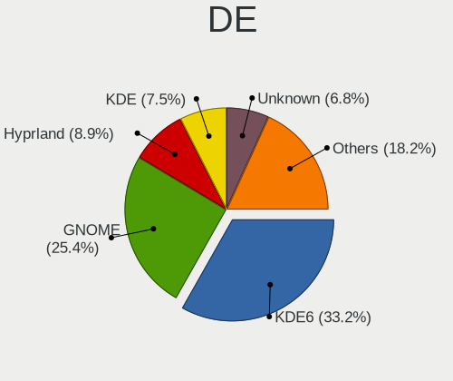
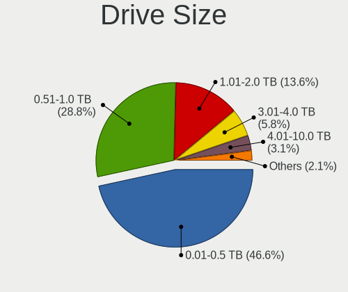

Arch Hardware Trends
--------------------

A project to identify most popular hardware characteristics and track their change
over time based on data collected by Arch users at https://Linux-Hardware.org.

Anyone can contribute to the study by uploading probes of their computers by
the [hw-probe](https://github.com/linuxhw/hw-probe) tool:

    sudo hw-probe -all -upload

This is a report for all computer types. See also reports for [desktops](/Dist/Arch/Desktop/README.md) and [notebooks](/Dist/Arch/Notebook/README.md).

Full-feature report is available here: https://linux-hardware.org/?view=trends

Period: Mar, 2020.

Contents
--------

- [ OS                       ](#os)
- [ OS Family                ](#os-family)
- [ Kernel                   ](#kernel)
- [ Kernel Family            ](#kernel-family)
- [ Kernel Major Ver.        ](#kernel-major-ver)
- [ Arch                     ](#arch)
- [ DE                       ](#de)
- [ Display Server           ](#display-server)
- [ OS Lang                  ](#os-lang)
- [ Boot Mode                ](#boot-mode)
- [ Filesystem               ](#filesystem)
- [ Dual Boot with Linux     ](#dual-boot-with-linux)
- [ Dual Boot (Win)          ](#dual-boot-win)
- [ Country                  ](#country)
- [ City                     ](#city)
- [ Vendor                   ](#vendor)
- [ Model                    ](#model)
- [ Model Family             ](#model-family)
- [ MFG Year                 ](#mfg-year)
- [ Form Factor              ](#form-factor)
- [ Secure Boot              ](#secure-boot)
- [ Coreboot                 ](#coreboot)
- [ RAM Size                 ](#ram-size)
- [ RAM Used                 ](#ram-used)
- [ Drive Vendor             ](#drive-vendor)
- [ Drive Model              ](#drive-model)
- [ Drive Kind               ](#drive-kind)
- [ Drive Connector          ](#drive-connector)
- [ Drive Size               ](#drive-size)
- [ Space Total              ](#space-total)
- [ Space Used               ](#space-used)
- [ Malfunc. Drives          ](#malfunc-drives)
- [ Malfunc. Drive Vendor    ](#malfunc-drive-vendor)
- [ Malfunc. Drive Kind      ](#malfunc-drive-kind)
- [ Failed Drives            ](#failed-drives)
- [ Failed Drive Vendor      ](#failed-drive-vendor)
- [ Drive Status             ](#drive-status)
- [ Storage Vendor           ](#storage-vendor)
- [ Storage Model            ](#storage-model)
- [ Storage Kind             ](#storage-kind)
- [ CPU Vendor               ](#cpu-vendor)
- [ CPU Model                ](#cpu-model)
- [ CPU Model Family         ](#cpu-model-family)
- [ CPU Cores                ](#cpu-cores)
- [ CPU Sockets              ](#cpu-sockets)
- [ CPU Threads              ](#cpu-threads)
- [ CPU Op-Modes             ](#cpu-op-modes)
- [ CPU Microarch            ](#cpu-microarch)
- [ CPU Microcode            ](#cpu-microcode)
- [ GPU Vendor               ](#gpu-vendor)
- [ GPU Model                ](#gpu-model)
- [ GPU Combo                ](#gpu-combo)
- [ GPU Driver               ](#gpu-driver)
- [ GPU Memory               ](#gpu-memory)
- [ Monitor Vendor           ](#monitor-vendor)
- [ Monitor Model            ](#monitor-model)
- [ Monitor Resolution       ](#monitor-resolution)
- [ Monitor Diagonal         ](#monitor-diagonal)
- [ Monitor Width            ](#monitor-width)
- [ Aspect Ratio             ](#aspect-ratio)
- [ Monitor Area             ](#monitor-area)
- [ Pixel Density            ](#pixel-density)
- [ Multiple Monitors        ](#multiple-monitors)
- [ Net Controller Vendor    ](#net-controller-vendor)
- [ Net Controller Model     ](#net-controller-model)
- [ Net Controller Kind      ](#net-controller-kind)
- [ Used Controller          ](#used-controller)
- [ NICs                     ](#nics)
- [ Unsupported Devices      ](#unsupported-devices)
- [ Unsupported Device Types ](#unsupported-device-types)

OS
--

Installed operating systems

| Name         | Computers | Percent |
|--------------|-----------|---------|
| Arch         | 71        | 78.89%  |
| Arch Rolling | 19        | 21.11%  |

OS Family
---------

OS without a version

| Name | Computers | Percent |
|------|-----------|---------|
| Arch | 90        | 100%    |

Kernel
------

Version of the Linux kernel

| Version                  | Computers | Percent |
|--------------------------|-----------|---------|
| 5.5.8-arch1-1            | 15        | 16.67%  |
| 5.5.10-arch1-1           | 10        | 11.11%  |
| 5.5.9-arch1-2            | 9         | 10%     |
| 5.5.7-arch1-1            | 8         | 8.89%   |
| 5.5.11-arch1-1           | 8         | 8.89%   |
| 5.5.6-arch1-1            | 5         | 5.56%   |
| 5.5.13-arch1-1           | 5         | 5.56%   |
| 5.5.8-zen1-1-zen         | 4         | 4.44%   |
| 5.4.23-1-lts             | 4         | 4.44%   |
| 5.4.25-2-lts             | 3         | 3.33%   |
| 5.5.9-zen1-2-zen         | 2         | 2.22%   |
| 5.5.13-zen1-1-zen        | 2         | 2.22%   |
| 5.5.13-arch2-1           | 2         | 2.22%   |
| 5.4.24-1-lts             | 2         | 2.22%   |
| 5.6.0-rc4-1-tkg-pds      | 1         | 1.11%   |
| 5.5.7-zen1-1-zen         | 1         | 1.11%   |
| 5.5.6-zen1-1-zen         | 1         | 1.11%   |
| 5.5.4-arch1-1            | 1         | 1.11%   |
| 5.5.11-AMD               | 1         | 1.11%   |
| 5.5.10-zen1-1-zen        | 1         | 1.11%   |
| 5.5.10-nitrous+          | 1         | 1.11%   |
| 5.5.0-1-pb               | 1         | 1.11%   |
| 5.4.26-rt17-1-rt         | 1         | 1.11%   |
| 5.4.26-1-lts             | 1         | 1.11%   |
| 4.20.14-1-ck-sandybridge | 1         | 1.11%   |

Kernel Family
-------------

Linux kernel without a distro release

| Version | Computers | Percent |
|---------|-----------|---------|
| 5.5.8   | 19        | 21.11%  |
| 5.5.10  | 12        | 13.33%  |
| 5.5.9   | 11        | 12.22%  |
| 5.5.7   | 9         | 10%     |
| 5.5.13  | 9         | 10%     |
| 5.5.11  | 9         | 10%     |
| 5.5.6   | 6         | 6.67%   |
| 5.4.23  | 4         | 4.44%   |
| 5.4.25  | 3         | 3.33%   |
| 5.4.26  | 2         | 2.22%   |
| 5.4.24  | 2         | 2.22%   |
| 5.6.0   | 1         | 1.11%   |
| 5.5.4   | 1         | 1.11%   |
| 5.5.0   | 1         | 1.11%   |
| 4.20.14 | 1         | 1.11%   |

Kernel Major Ver.
-----------------

Linux kernel major version

| Version | Computers | Percent |
|---------|-----------|---------|
| 5.5     | 77        | 85.56%  |
| 5.4     | 11        | 12.22%  |
| 5.6     | 1         | 1.11%   |
| 4.20    | 1         | 1.11%   |

Arch
----

OS architecture (x86_64, i586, etc.)

| Name   | Computers | Percent |
|--------|-----------|---------|
| x86_64 | 90        | 100%    |

DE
--

Desktop Environment

| Name            | Computers | Percent |
|-----------------|-----------|---------|
| GNOME           | 45        | 50%     |
| KDE             | 12        | 13.33%  |
| KDE5            | 9         | 10%     |
| Unknown         | 7         | 7.78%   |
| XFCE            | 5         | 5.56%   |
| Budgie          | 4         | 4.44%   |
| i3              | 3         | 3.33%   |
| Deepin          | 2         | 2.22%   |
| GNOME Flashback | 1         | 1.11%   |
| GNOME Classic   | 1         | 1.11%   |
| Cinnamon        | 1         | 1.11%   |

Display Server
--------------

X11 or Wayland

| Name    | Computers | Percent |
|---------|-----------|---------|
| X11     | 53        | 58.89%  |
| Wayland | 31        | 34.44%  |
| Tty     | 5         | 5.56%   |
| Unknown | 1         | 1.11%   |

OS Lang
-------

Language

| Lang       | Computers | Percent |
|------------|-----------|---------|
| en_US      | 39        | 43.33%  |
| de_DE      | 9         | 10%     |
| pl_PL      | 5         | 5.56%   |
| C          | 4         | 4.44%   |
| Unknown    | 4         | 4.44%   |
| it_IT      | 3         | 3.33%   |
| fr_FR      | 3         | 3.33%   |
| en_GB      | 3         | 3.33%   |
| pt_BR      | 2         | 2.22%   |
| hu_HU      | 2         | 2.22%   |
| en_US.utf8 | 2         | 2.22%   |
| en_AU      | 2         | 2.22%   |
| zh_CN      | 1         | 1.11%   |
| ru_RU      | 1         | 1.11%   |
| pl_PL.utf8 | 1         | 1.11%   |
| nl_NL.utf8 | 1         | 1.11%   |
| nl_NL      | 1         | 1.11%   |
| fi_FI      | 1         | 1.11%   |
| es_ES      | 1         | 1.11%   |
| es_CL      | 1         | 1.11%   |
| es_AR      | 1         | 1.11%   |
| en_NZ      | 1         | 1.11%   |
| de_AT      | 1         | 1.11%   |
| cs_CZ      | 1         | 1.11%   |

Boot Mode
---------

EFI or BIOS

| Mode | Computers | Percent |
|------|-----------|---------|
| EFI  | 51        | 56.67%  |
| BIOS | 39        | 43.33%  |

Filesystem
----------

Type of filesystem

| Type    | Computers | Percent |
|---------|-----------|---------|
| Ext4    | 71        | 78.89%  |
| Btrfs   | 9         | 10%     |
| Xfs     | 4         | 4.44%   |
| F2fs    | 4         | 4.44%   |
| Zfs     | 1         | 1.11%   |
| Overlay | 1         | 1.11%   |

Dual Boot with Linux
--------------------

Hosting more than one Linux

| Dual boot | Computers | Percent |
|-----------|-----------|---------|
| No        | 83        | 92.22%  |
| Yes       | 7         | 7.78%   |

Dual Boot (Win)
---------------

Hosting Linux and Windows

| Dual boot | Computers | Percent |
|-----------|-----------|---------|
| No        | 74        | 82.22%  |
| Yes       | 16        | 17.78%  |

Country
-------

Geographic location (country)

| Country            | Computers | Percent |
|--------------------|-----------|---------|
| USA                | 14        | 15.56%  |
| Germany            | 10        | 11.11%  |
| France             | 7         | 7.78%   |
| Russia             | 6         | 6.67%   |
| Italy              | 6         | 6.67%   |
| Poland             | 5         | 5.56%   |
| Netherlands        | 3         | 3.33%   |
| Finland            | 3         | 3.33%   |
| Brazil             | 3         | 3.33%   |
| Australia          | 3         | 3.33%   |
| New Zealand        | 2         | 2.22%   |
| Hungary            | 2         | 2.22%   |
| Greece             | 2         | 2.22%   |
| Canada             | 2         | 2.22%   |
| Bulgaria           | 2         | 2.22%   |
| Vietnam            | 1         | 1.11%   |
| UK                 | 1         | 1.11%   |
| Taiwan             | 1         | 1.11%   |
| Spain              | 1         | 1.11%   |
| Saudi Arabia       | 1         | 1.11%   |
| Romania            | 1         | 1.11%   |
| Portugal           | 1         | 1.11%   |
| Philippines        | 1         | 1.11%   |
| Japan              | 1         | 1.11%   |
| Israel             | 1         | 1.11%   |
| India              | 1         | 1.11%   |
| Ecuador            | 1         | 1.11%   |
| Dominican Republic | 1         | 1.11%   |
| Czech Republic     | 1         | 1.11%   |
| China              | 1         | 1.11%   |
| Chile              | 1         | 1.11%   |
| Belarus            | 1         | 1.11%   |
| Austria            | 1         | 1.11%   |
| Armenia            | 1         | 1.11%   |
| Argentina          | 1         | 1.11%   |

City
----

Geographic location (city)

| City                       | Computers | Percent |
|----------------------------|-----------|---------|
| Oulu                       | 3         | 3.33%   |
| Warsaw                     | 2         | 2.22%   |
| Vladivostok                | 2         | 2.22%   |
| Moscow                     | 2         | 2.22%   |
| Cologne                    | 2         | 2.22%   |
| Budapest                   | 2         | 2.22%   |
| Auckland                   | 2         | 2.22%   |
| Athens                     | 2         | 2.22%   |
| Zwolle                     | 1         | 1.11%   |
| Yerevan                    | 1         | 1.11%   |
| Xi'an                      | 1         | 1.11%   |
| Wollongong                 | 1         | 1.11%   |
| Varna                      | 1         | 1.11%   |
| Uithoorn                   | 1         | 1.11%   |
| Tver                       | 1         | 1.11%   |
| Taipei                     | 1         | 1.11%   |
| Sydney                     | 1         | 1.11%   |
| Sertolovo                  | 1         | 1.11%   |
| Santiago de los Caballeros | 1         | 1.11%   |
| Santiago                   | 1         | 1.11%   |
| Sant'Angelo Lodigiano      | 1         | 1.11%   |
| San Miniato                | 1         | 1.11%   |
| Salzburg                   | 1         | 1.11%   |
| Rome                       | 1         | 1.11%   |
| Riyadh                     | 1         | 1.11%   |
| Reims                      | 1         | 1.11%   |
| Redwood City               | 1         | 1.11%   |
| Ramat Gan                  | 1         | 1.11%   |
| Quito                      | 1         | 1.11%   |
| Prague                     | 1         | 1.11%   |
| Pisa                       | 1         | 1.11%   |
| Pietrowice Wielkie         | 1         | 1.11%   |
| Parnamirim                 | 1         | 1.11%   |
| Paraná                    | 1         | 1.11%   |
| Pannes                     | 1         | 1.11%   |
| Odolanow                   | 1         | 1.11%   |
| Oakhurst                   | 1         | 1.11%   |
| Norderstedt                | 1         | 1.11%   |
| Nishiwaki                  | 1         | 1.11%   |
| New York                   | 1         | 1.11%   |
| Nashville                  | 1         | 1.11%   |
| Naperville                 | 1         | 1.11%   |
| Murcia                     | 1         | 1.11%   |
| Munich                     | 1         | 1.11%   |
| Muhr am See                | 1         | 1.11%   |
| Morristown                 | 1         | 1.11%   |
| Melbourne                  | 1         | 1.11%   |
| Maastricht                 | 1         | 1.11%   |
| Lisbon                     | 1         | 1.11%   |
| Lawrence                   | 1         | 1.11%   |
| Lappersdorf                | 1         | 1.11%   |
| Laatzen                    | 1         | 1.11%   |
| Krakow                     | 1         | 1.11%   |
| Huntersville               | 1         | 1.11%   |
| Homosassa                  | 1         | 1.11%   |
| Hof                        | 1         | 1.11%   |
| Hanover                    | 1         | 1.11%   |
| Grundy Center              | 1         | 1.11%   |
| Gravelines                 | 1         | 1.11%   |
| Gradignan                  | 1         | 1.11%   |

Vendor
------

Motherboard manufacturer

| Name                | Computers | Percent |
|---------------------|-----------|---------|
| Lenovo              | 21        | 23.33%  |
| ASUSTek Computer    | 18        | 20%     |
| Hewlett-Packard     | 9         | 10%     |
| Dell                | 9         | 10%     |
| MSI                 | 7         | 7.78%   |
| ASRock              | 6         | 6.67%   |
| Acer                | 4         | 4.44%   |
| Gigabyte Technology | 3         | 3.33%   |
| Sony                | 2         | 2.22%   |
| Fujitsu             | 2         | 2.22%   |
| XFX                 | 1         | 1.11%   |
| Toshiba             | 1         | 1.11%   |
| Notebook            | 1         | 1.11%   |
| Medion              | 1         | 1.11%   |
| MECHREVO            | 1         | 1.11%   |
| Jumper              | 1         | 1.11%   |
| Intel               | 1         | 1.11%   |
| AAEON               | 1         | 1.11%   |
| Unknown             | 1         | 1.11%   |

Model
-----

Motherboard model

| Name                                     | Computers | Percent |
|------------------------------------------|-----------|---------|
| Lenovo ThinkPad E480 20KN005CBM          | 2         | 2.22%   |
| Lenovo IdeaPad S145-15AST 81N3           | 2         | 2.22%   |
| HP EliteBook 840 G6                      | 2         | 2.22%   |
| ASUS ZenBook UX434FAC_UX433FAC           | 2         | 2.22%   |
| Unknown                                  | 2         | 2.22%   |
| XFX nForce 790i Ultra 3-Way SLI          | 1         | 1.11%   |
| Toshiba Satellite C50D-B                 | 1         | 1.11%   |
| Sony VPCEB42EG                           | 1         | 1.11%   |
| Sony SVP13215CDB                         | 1         | 1.11%   |
| Notebook N141CU                          | 1         | 1.11%   |
| MSI MS-7C02                              | 1         | 1.11%   |
| MSI MS-7B79                              | 1         | 1.11%   |
| MSI MS-7808                              | 1         | 1.11%   |
| MSI MS-7522                              | 1         | 1.11%   |
| MSI Modern 14 A10M                       | 1         | 1.11%   |
| MSI GS75 Stealth 9SF                     | 1         | 1.11%   |
| MSI GE70 2PE                             | 1         | 1.11%   |
| Medion Erazer P6679 MD60262              | 1         | 1.11%   |
| MECHREVO X9Ti-R Series GK7CP0S           | 1         | 1.11%   |
| Lenovo Z50-75 80EC                       | 1         | 1.11%   |
| Lenovo Yoga 530-14IKB 81EK               | 1         | 1.11%   |
| Lenovo ThinkPad X230 23255B2             | 1         | 1.11%   |
| Lenovo ThinkPad X1 Carbon 7th 20QD00KTMX | 1         | 1.11%   |
| Lenovo ThinkPad W540 20BG0016US          | 1         | 1.11%   |
| Lenovo ThinkPad T540p 20BFS20600         | 1         | 1.11%   |
| Lenovo ThinkPad T490 20N2000BRT          | 1         | 1.11%   |
| Lenovo ThinkPad T480 20L5A063CD          | 1         | 1.11%   |
| Lenovo ThinkPad T440s 20AQ004GUS         | 1         | 1.11%   |
| Lenovo ThinkPad T430s 23571A3            | 1         | 1.11%   |
| Lenovo ThinkPad E490 20N8002ART          | 1         | 1.11%   |
| Lenovo ThinkPad E480 20KN001QRT          | 1         | 1.11%   |
| Lenovo IdeaPad S940-14IWL 81R0           | 1         | 1.11%   |
| Lenovo IdeaPad FLEX-14API 81SS           | 1         | 1.11%   |
| Lenovo IdeaPad 320-15IAP 80XR            | 1         | 1.11%   |
| Lenovo G710 20252                        | 1         | 1.11%   |
| Jumper EZbook                            | 1         | 1.11%   |
| Intel NUC8i5BEK                          | 1         | 1.11%   |
| HP ZBook Studio G5                       | 1         | 1.11%   |
| HP Spectre Laptop 13-af0xx               | 1         | 1.11%   |
| HP Pavilion dm4                          | 1         | 1.11%   |
| HP Laptop 15-da0xxx                      | 1         | 1.11%   |
| HP ENVY m7 Notebook                      | 1         | 1.11%   |
| HP EliteBook x360 1030 G2                | 1         | 1.11%   |
| HP EliteBook 840 G2                      | 1         | 1.11%   |
| Gigabyte Z87X-UD3H                       | 1         | 1.11%   |
| Gigabyte GA-990X-Gaming SLI-CF           | 1         | 1.11%   |
| Gigabyte 970A-UD3P                       | 1         | 1.11%   |
| Fujitsu LIFEBOOK S710                    | 1         | 1.11%   |
| Fujitsu LIFEBOOK E752                    | 1         | 1.11%   |
| Dell XPS L502X                           | 1         | 1.11%   |
| Dell XPS 15 9570                         | 1         | 1.11%   |
| Dell XPS 13 9380                         | 1         | 1.11%   |
| Dell XPS 13 9360                         | 1         | 1.11%   |
| Dell Precision 7510                      | 1         | 1.11%   |
| Dell Precision 5520                      | 1         | 1.11%   |
| Dell Latitude E7450                      | 1         | 1.11%   |
| Dell Latitude 5480                       | 1         | 1.11%   |
| Dell Inspiron 5559                       | 1         | 1.11%   |
| ASUS Zephyrus M GU502GV_GU502GV          | 1         | 1.11%   |
| ASUS X580VD                              | 1         | 1.11%   |

Model Family
------------

Motherboard model prefix

| Name                    | Computers | Percent |
|-------------------------|-----------|---------|
| Lenovo ThinkPad         | 12        | 13.33%  |
| Lenovo IdeaPad          | 5         | 5.56%   |
| HP EliteBook            | 4         | 4.44%   |
| Dell XPS                | 4         | 4.44%   |
| ASUS PRIME              | 3         | 3.33%   |
| Acer Aspire             | 3         | 3.33%   |
| Fujitsu LIFEBOOK        | 2         | 2.22%   |
| Dell Precision          | 2         | 2.22%   |
| Dell Latitude           | 2         | 2.22%   |
| ASUS ZenBook            | 2         | 2.22%   |
| ASUS TUF                | 2         | 2.22%   |
| ASUS P8Z77-V            | 2         | 2.22%   |
| Unknown                 | 2         | 2.22%   |
| XFX nForce              | 1         | 1.11%   |
| Toshiba Satellite       | 1         | 1.11%   |
| Sony VPCEB42EG          | 1         | 1.11%   |
| Sony SVP13215CDB        | 1         | 1.11%   |
| Notebook N141CU         | 1         | 1.11%   |
| MSI MS-7C02             | 1         | 1.11%   |
| MSI MS-7B79             | 1         | 1.11%   |
| MSI MS-7808             | 1         | 1.11%   |
| MSI MS-7522             | 1         | 1.11%   |
| MSI Modern              | 1         | 1.11%   |
| MSI GS75                | 1         | 1.11%   |
| MSI GE70                | 1         | 1.11%   |
| Medion Erazer           | 1         | 1.11%   |
| MECHREVO X9Ti-R         | 1         | 1.11%   |
| Lenovo Z50-75           | 1         | 1.11%   |
| Lenovo Yoga             | 1         | 1.11%   |
| Lenovo G710             | 1         | 1.11%   |
| Jumper EZbook           | 1         | 1.11%   |
| Intel NUC8i5BEK         | 1         | 1.11%   |
| HP ZBook                | 1         | 1.11%   |
| HP Spectre              | 1         | 1.11%   |
| HP Pavilion             | 1         | 1.11%   |
| HP Laptop               | 1         | 1.11%   |
| HP ENVY                 | 1         | 1.11%   |
| Gigabyte Z87X-UD3H      | 1         | 1.11%   |
| Gigabyte GA-990X-Gaming | 1         | 1.11%   |
| Gigabyte 970A-UD3P      | 1         | 1.11%   |
| Dell Inspiron           | 1         | 1.11%   |
| ASUS Zephyrus           | 1         | 1.11%   |
| ASUS X580VD             | 1         | 1.11%   |
| ASUS WS                 | 1         | 1.11%   |
| ASUS V230IC-DDR4        | 1         | 1.11%   |
| ASUS P7P55D-E           | 1         | 1.11%   |
| ASUS P6T                | 1         | 1.11%   |
| ASUS P453UA             | 1         | 1.11%   |
| ASUS M5A97              | 1         | 1.11%   |
| ASUS All                | 1         | 1.11%   |
| ASRock X570             | 1         | 1.11%   |
| ASRock Q1900-ITX        | 1         | 1.11%   |
| ASRock H110M-HDV        | 1         | 1.11%   |
| ASRock D1800M           | 1         | 1.11%   |
| ASRock 970              | 1         | 1.11%   |
| ASRock 960GM-VGS3       | 1         | 1.11%   |
| Acer Switch             | 1         | 1.11%   |
| AAEON MF-001            | 1         | 1.11%   |

MFG Year
--------

Motherboard manufacture year

| Year | Computers | Percent |
|------|-----------|---------|
| 2019 | 36        | 40%     |
| 2018 | 13        | 14.44%  |
| 2014 | 7         | 7.78%   |
| 2016 | 6         | 6.67%   |
| 2020 | 5         | 5.56%   |
| 2013 | 5         | 5.56%   |
| 2015 | 4         | 4.44%   |
| 2012 | 4         | 4.44%   |
| 2017 | 3         | 3.33%   |
| 2011 | 3         | 3.33%   |
| 2010 | 3         | 3.33%   |
| 2009 | 1         | 1.11%   |

Form Factor
-----------

Physical design of the computer

| Name        | Computers | Percent |
|-------------|-----------|---------|
| Notebook    | 58        | 64.44%  |
| Desktop     | 27        | 30%     |
| Convertible | 2         | 2.22%   |
| Tablet      | 1         | 1.11%   |
| Mini pc     | 1         | 1.11%   |
| All in one  | 1         | 1.11%   |

Secure Boot
-----------

Enabled or disabled

| State    | Computers | Percent |
|----------|-----------|---------|
| Disabled | 90        | 100%    |

Coreboot
--------

Have coreboot on board

| Used | Computers | Percent |
|------|-----------|---------|
| No   | 90        | 100%    |

RAM Size
--------

Total RAM memory

| Size in GB  | Computers | Percent |
|-------------|-----------|---------|
| 16.01-24.0  | 31        | 34.44%  |
| 4.01-8.0    | 20        | 22.22%  |
| 8.01-16.0   | 17        | 18.89%  |
| 32.01-64.0  | 10        | 11.11%  |
| 3.01-4.0    | 7         | 7.78%   |
| 24.01-32.0  | 2         | 2.22%   |
| 1.01-2.0    | 2         | 2.22%   |
| 64.01-256.0 | 1         | 1.11%   |

RAM Used
--------

Used RAM memory

| Used GB    | Computers | Percent |
|------------|-----------|---------|
| 1.01-2.0   | 30        | 33.33%  |
| 4.01-8.0   | 19        | 21.11%  |
| 2.01-3.0   | 19        | 21.11%  |
| 3.01-4.0   | 13        | 14.44%  |
| 8.01-16.0  | 5         | 5.56%   |
| 0.01-1.0   | 3         | 3.33%   |
| 16.01-24.0 | 1         | 1.11%   |

Drive Vendor
------------

Hard drive vendors

| Vendor              | Computers | Drives  | Percent |
|---------------------|-----------|---------|---------|
| Samsung Electronics | 22        | 23      | 16.79%  |
| WDC                 | 21        | 29      | 16.03%  |
| Seagate             | 17        | 21      | 12.98%  |
| Crucial             | 9         | 9       | 6.87%   |
| Unknown             | 8         | 9       | 6.11%   |
| Intel               | 7         | 7       | 5.34%   |
| Toshiba             | 6         | 6       | 4.58%   |
| SanDisk             | 5         | 9       | 3.82%   |
| A-DATA Technology   | 5         | 5       | 3.82%   |
| HGST                | 4         | 4       | 3.05%   |
| OCZ                 | 3         | 3       | 2.29%   |
| Kingston            | 3         | 3       | 2.29%   |
| Hitachi             | 3         | 3       | 2.29%   |
| PLEXTOR             | 2         | 2       | 1.53%   |
| Patriot             | 2         | 2       | 1.53%   |
| LITEON              | 2         | 2       | 1.53%   |
| XPG                 | 1         | 1       | 0.76%   |
| Transcend           | 1         | 1       | 0.76%   |
| SK Hynix            | 1         | 1       | 0.76%   |
| PNY                 | 1         | 1       | 0.76%   |
| MGS                 | 1         | 1       | 0.76%   |
| Maxtor              | 1         | 1       | 0.76%   |
| INTEL SS            | 1         | 1       | 0.76%   |
| Integral            | 1         | 1       | 0.76%   |
| HL-DT-ST            | 1         | Unknown | 0.76%   |
| Gigabyte Technology | 1         | 1       | 0.76%   |
| FORESEE             | 1         | 1       | 0.76%   |
| External            | 1         | 1       | 0.76%   |

Drive Model
-----------

Hard drive models

| Model                        | Computers | Percent |
|------------------------------|-----------|---------|
| ST1000LM035-1RK172 1TB       | 3         | 2.07%   |
| HTS721010A9E630 1TB          | 3         | 2.07%   |
| ST500LT012-1DG142 500GB      | 2         | 1.38%   |
| ST2000DM001-1CH164 2TB       | 2         | 1.38%   |
| SSDPEKNW512G8 512GB          | 2         | 1.38%   |
| SSD 850 EVO 500GB            | 2         | 1.38%   |
| SDSSDA240G 240GB             | 2         | 1.38%   |
| HDWE140 4TB                  | 2         | 1.38%   |
| WDS500G2B0B-00YS70 500GB SSD | 1         | 0.69%   |
| WDS120G1G0A-00SS50 120GB SSD | 1         | 0.69%   |
| WDS100T2B0B 1TB SSD          | 1         | 0.69%   |
| WD80EFAX-68KNBN0 8TB         | 1         | 0.69%   |
| WD800BB-00DKA0 80GB          | 1         | 0.69%   |
| WD7500BPVT-22HXZT3 752GB     | 1         | 0.69%   |
| WD6400BPVT-60HXZT1 640GB     | 1         | 0.69%   |
| WD6400AAKS-65Z7B0 640GB      | 1         | 0.69%   |
| WD6400AAKS-22A7B0 640GB      | 1         | 0.69%   |
| WD60EZAZ-00ZGHB0 6TB         | 1         | 0.69%   |
| WD5000AAVS-00ZTB0 500GB      | 1         | 0.69%   |
| WD40EFRX-68WT0N0 4TB         | 1         | 0.69%   |
| WD30EFRX-68AX9N0 3TB         | 1         | 0.69%   |
| WD20SPZX-00CRAT0 2TB         | 1         | 0.69%   |
| WD20EZRZ-00Z5HB0 2TB         | 1         | 0.69%   |
| WD20EZRX-00D8PB0 2TB         | 1         | 0.69%   |
| WD2003FZEX-00Z4SA0 2TB       | 1         | 0.69%   |
| WD15EARS-00MVWB0 1TB         | 1         | 0.69%   |
| WD15EADS-00P8B0 1TB          | 1         | 0.69%   |
| WD10SPZX-24Z10T0 1TB         | 1         | 0.69%   |
| WD10SPZX-22Z10T1 1TB         | 1         | 0.69%   |
| WD10SPZX-21Z10T0 1TB         | 1         | 0.69%   |
| WD10SPZX-08Z10 1TB           | 1         | 0.69%   |
| WD10EZRX-00D8PB0 1TB         | 1         | 0.69%   |
| WD10EZEX-08WN4A0 1TB         | 1         | 0.69%   |
| WD10EZEX-00ZF5A0 1TB         | 1         | 0.69%   |
| WD10EADS-00P8B0 1TB          | 1         | 0.69%   |
| WD10EADS-00M2B0 1TB          | 1         | 0.69%   |
| WD1002FAEX-00Z3A0 1TB        | 1         | 0.69%   |
| VERTEX4 128GB SSD            | 1         | 0.69%   |
| VERTEX3 240GB SSD            | 1         | 0.69%   |
| V Series SATA SSD 240GB      | 1         | 0.69%   |
| USB3.0 960GB                 | 1         | 0.69%   |
| TS120GMTS420S 120GB SSD      | 1         | 0.69%   |
| SU800 512GB SSD              | 1         | 0.69%   |
| SU800 256GB SSD              | 1         | 0.69%   |
| SU800 1024GB SSD             | 1         | 0.69%   |
| SU650 480GB SSD              | 1         | 0.69%   |
| ST9750420AS 752GB            | 1         | 0.69%   |
| ST9500420AS 500GB            | 1         | 0.69%   |
| ST500LM021-1KJ152 500GB      | 1         | 0.69%   |
| ST500LM000-1EJ162 500GB      | 1         | 0.69%   |
| ST500DM002-1BD142 500GB      | 1         | 0.69%   |
| ST320LT007-9ZV142 320GB      | 1         | 0.69%   |
| ST3160815AS 160GB            | 1         | 0.69%   |
| ST3160023A 160GB             | 1         | 0.69%   |
| ST3000DM008-2DM166 3TB       | 1         | 0.69%   |
| ST2000DM006-2DM164 2TB       | 1         | 0.69%   |
| ST2000DL003-9VT166 2TB       | 1         | 0.69%   |
| ST1000DM003-9YN162 1TB       | 1         | 0.69%   |
| SSDSC2CW240A3 192GB          | 1         | 0.69%   |
| SSDSC2BW180A3L 180GB         | 1         | 0.69%   |

Drive Kind
----------

HDD or SSD

| Kind    | Computers | Drives | Percent |
|---------|-----------|--------|---------|
| SSD     | 46        | 62     | 42.2%   |
| HDD     | 41        | 62     | 37.61%  |
| NVMe    | 14        | 16     | 12.84%  |
| MMC     | 6         | 7      | 5.5%    |
| Unknown | 2         | 1      | 1.83%   |

Drive Connector
---------------

SATA, SAS, NVMe, etc.

| Type | Computers | Drives | Percent |
|------|-----------|--------|---------|
| SATA | 67        | 120    | 72.83%  |
| NVMe | 14        | 16     | 15.22%  |
| MMC  | 6         | 7      | 6.52%   |
| SAS  | 5         | 5      | 5.43%   |

Drive Size
----------

Size of hard drive

| Size in TB | Computers | Drives | Percent |
|------------|-----------|--------|---------|
| 0.01-0.5   | 51        | 74     | 45.95%  |
| 0.51-1.0   | 41        | 54     | 36.94%  |
| 1.01-2.0   | 11        | 12     | 9.91%   |
| 3.01-4.0   | 3         | 3      | 2.7%    |
| 2.01-3.0   | 3         | 3      | 2.7%    |
| 4.01-10.0  | 2         | 2      | 1.8%    |

Space Total
-----------

Amount of disk space available on the file system

| Size in GB     | Computers | Percent |
|----------------|-----------|---------|
| 251-500        | 26        | 28.89%  |
| 501-1000       | 21        | 23.33%  |
| 101-250        | 15        | 16.67%  |
| 1001-2000      | 9         | 10%     |
| More than 3000 | 5         | 5.56%   |
| 2001-3000      | 4         | 4.44%   |
| 21-50          | 3         | 3.33%   |
| 51-100         | 3         | 3.33%   |
| 1-20           | 2         | 2.22%   |
| Unknown        | 2         | 2.22%   |

Space Used
----------

Amount of used disk space

| Used GB        | Computers | Percent |
|----------------|-----------|---------|
| 1-20           | 19        | 21.11%  |
| 21-50          | 15        | 16.67%  |
| 101-250        | 14        | 15.56%  |
| 501-1000       | 13        | 14.44%  |
| 51-100         | 12        | 13.33%  |
| 251-500        | 10        | 11.11%  |
| 1001-2000      | 4         | 4.44%   |
| Unknown        | 2         | 2.22%   |
| More than 3000 | 1         | 1.11%   |

Malfunc. Drives
---------------

Drive models with a malfunction

| Model                | Computers | Drives | Percent |
|----------------------|-----------|--------|---------|
| WD20EZRZ-00Z5HB0 2TB | 1         | 1      | 16.67%  |
| WD15EARS-00MVWB0 1TB | 1         | 1      | 16.67%  |
| SU650 480GB SSD      | 1         | 1      | 16.67%  |
| MK3265GSXN 320GB     | 1         | 1      | 16.67%  |
| HUA723030ALA640 3TB  | 1         | 1      | 16.67%  |
| HTS721010A9E630 1TB  | 1         | 1      | 16.67%  |

Malfunc. Drive Vendor
---------------------

Vendors of faulty drives

| Vendor            | Computers | Drives | Percent |
|-------------------|-----------|--------|---------|
| WDC               | 2         | 2      | 33.33%  |
| Toshiba           | 1         | 1      | 16.67%  |
| Hitachi           | 1         | 1      | 16.67%  |
| HGST              | 1         | 1      | 16.67%  |
| A-DATA Technology | 1         | 1      | 16.67%  |

Malfunc. Drive Kind
-------------------

Kinds of faulty drives

| Kind | Computers | Drives | Percent |
|------|-----------|--------|---------|
| HDD  | 5         | 5      | 83.33%  |
| SSD  | 1         | 1      | 16.67%  |

Failed Drives
-------------

Failed drive models

Zero info for selected period =(

Failed Drive Vendor
-------------------

Failed drive vendors

Zero info for selected period =(

Drive Status
------------

Number of failed and malfunc. drives

| Status   | Computers | Drives | Percent |
|----------|-----------|--------|---------|
| Detected | 51        | 95     | 62.2%   |
| Works    | 26        | 47     | 31.71%  |
| Malfunc  | 5         | 6      | 6.1%    |

Storage Vendor
--------------

Storage controller vendors

| Vendor                       | Computers | Percent |
|------------------------------|-----------|---------|
| Intel                        | 59        | 51.3%   |
| Samsung Electronics          | 18        | 15.65%  |
| AMD                          | 15        | 13.04%  |
| SK Hynix                     | 5         | 4.35%   |
| Toshiba America Info Systems | 4         | 3.48%   |
| Marvell Technology Group     | 3         | 2.61%   |
| ASMedia Technology           | 3         | 2.61%   |
| Micron/Crucial Technology    | 2         | 1.74%   |
| JMicron Technology           | 2         | 1.74%   |
| VIA Technologies             | 1         | 0.87%   |
| Phison Electronics           | 1         | 0.87%   |
| Nvidia                       | 1         | 0.87%   |
| ADATA Technology             | 1         | 0.87%   |

Storage Model
-------------

Storage controller models

| Model                                                                    | Computers | Percent |
|--------------------------------------------------------------------------|-----------|---------|
| NVMe SSD Controller SM981/PM981/PM983                                    | 16        | 12.7%   |
| FCH SATA Controller [AHCI mode]                                          | 10        | 7.94%   |
| Sunrise Point-LP SATA Controller [AHCI mode]                             | 9         | 7.14%   |
| Q170/Q150/B150/H170/H110/Z170/CM236 Chipset SATA Controller [AHCI Mode]  | 5         | 3.97%   |
| 8 Series/C220 Series Chipset Family 6-port SATA Controller 1 [AHCI mode] | 5         | 3.97%   |
| Non-Volatile memory controller                                           | 4         | 3.17%   |
| Cannon Lake Mobile PCH SATA AHCI Controller                              | 4         | 3.17%   |
| SB7x0/SB8x0/SB9x0 SATA Controller [AHCI mode]                            | 3         | 2.38%   |
| SB7x0/SB8x0/SB9x0 IDE Controller                                         | 3         | 2.38%   |
| ASM1062 Serial ATA Controller                                            | 3         | 2.38%   |
| 82801 Mobile SATA Controller [RAID mode]                                 | 3         | 2.38%   |
| 8 Series SATA Controller 1 [AHCI mode]                                   | 3         | 2.38%   |
| 7 Series/C210 Series Chipset Family 6-port SATA Controller [AHCI mode]   | 3         | 2.38%   |
| 7 Series Chipset Family 6-port SATA Controller [AHCI mode]               | 3         | 2.38%   |
| 6 Series/C200 Series Chipset Family 6 port Mobile SATA AHCI Controller   | 3         | 2.38%   |
| 400 Series Chipset SATA Controller                                       | 3         | 2.38%   |
| 200 Series PCH SATA controller [AHCI mode]                               | 3         | 2.38%   |
| Wildcat Point-LP SATA Controller [AHCI Mode]                             | 2         | 1.59%   |
| Toshiba America Info Non-Volatile memory controller                      | 2         | 1.59%   |
| SSD Pro 7600p/760p/E 6100p Series                                        | 2         | 1.59%   |
| SSD 660P Series                                                          | 2         | 1.59%   |
| SB7x0/SB8x0/SB9x0 SATA Controller [IDE mode]                             | 2         | 1.59%   |
| P1 NVMe PCIe SSD                                                         | 2         | 1.59%   |
| NVMe Controller                                                          | 2         | 1.59%   |
| Celeron N3350/Pentium N4200/Atom E3900 Series SATA AHCI Controller       | 2         | 1.59%   |
| Atom Processor E3800 Series SATA AHCI Controller                         | 2         | 1.59%   |
| XPG SX8200 Pro PCIe Gen3x4 M.2 2280 Solid State Drive                    | 1         | 0.79%   |
| X370 Series Chipset SATA Controller                                      | 1         | 0.79%   |
| VT6421 IDE/SATA Controller                                               | 1         | 0.79%   |
| SSD 600P Series                                                          | 1         | 0.79%   |
| NVMe SSD Controller SM961/PM961                                          | 1         | 0.79%   |
| MCP55 SATA Controller                                                    | 1         | 0.79%   |
| MCP55 IDE                                                                | 1         | 0.79%   |
| Marvell Non-Volatile memory controller                                   | 1         | 0.79%   |
| JMB363 SATA/IDE Controller                                               | 1         | 0.79%   |
| JMB361 AHCI/IDE                                                          | 1         | 0.79%   |
| Electronics Non-Volatile memory controller                               | 1         | 0.79%   |
| E12 NVMe Controller                                                      | 1         | 0.79%   |
| Comet Lake SATA AHCI Controller                                          | 1         | 0.79%   |
| Cannon Point-LP SATA Controller [AHCI Mode]                              | 1         | 0.79%   |
| BC501 NVMe Solid State Drive 512GB                                       | 1         | 0.79%   |
| 9 Series Chipset Family SATA Controller [AHCI Mode]                      | 1         | 0.79%   |
| 88SE9172 SATA 6Gb/s Controller                                           | 1         | 0.79%   |
| 88SE912x SATA 6Gb/s Controller [IDE mode]                                | 1         | 0.79%   |
| 82801JI (ICH10 Family) SATA AHCI Controller                              | 1         | 0.79%   |
| 82801JI (ICH10 Family) 4 port SATA IDE Controller #1                     | 1         | 0.79%   |
| 82801JI (ICH10 Family) 2 port SATA IDE Controller #2                     | 1         | 0.79%   |
| 5 Series/3400 Series Chipset PT IDER Controller                          | 1         | 0.79%   |
| 5 Series/3400 Series Chipset 6 port SATA AHCI Controller                 | 1         | 0.79%   |
| 5 Series/3400 Series Chipset 4 port SATA IDE Controller                  | 1         | 0.79%   |
| 5 Series/3400 Series Chipset 4 port SATA AHCI Controller                 | 1         | 0.79%   |

Storage Kind
------------

Kind of storage controller (IDE, SATA, NVMe, SAS, ...)

| Kind | Computers | Percent |
|------|-----------|---------|
| SATA | 66        | 59.46%  |
| NVMe | 34        | 30.63%  |
| IDE  | 7         | 6.31%   |
| RAID | 4         | 3.6%    |

CPU Vendor
----------

Processor vendors

| Vendor | Computers | Percent |
|--------|-----------|---------|
| Intel  | 74        | 82.22%  |
| AMD    | 16        | 17.78%  |

CPU Model
---------

Processor models

| Model                                         | Computers | Percent |
|-----------------------------------------------|-----------|---------|
| Intel Core i5-8250U CPU @ 1.60GHz             | 6         | 6.67%   |
| Intel Core i5-8265U CPU @ 1.60GHz             | 5         | 5.56%   |
| Intel Core i7-7500U CPU @ 2.70GHz             | 4         | 4.44%   |
| Intel Core i7-10510U CPU @ 1.80GHz            | 4         | 4.44%   |
| Intel Core i7-9750H CPU @ 2.60GHz             | 3         | 3.33%   |
| Intel Core i7-8565U CPU @ 1.80GHz             | 3         | 3.33%   |
| Intel Core i5-3320M CPU @ 2.60GHz             | 3         | 3.33%   |
| Intel Core i7-7820HQ CPU @ 2.90GHz            | 2         | 2.22%   |
| Intel Core i7-4800MQ CPU @ 2.70GHz            | 2         | 2.22%   |
| AMD Ryzen 7 3700X 8-Core Processor            | 2         | 2.22%   |
| AMD A4-9125 RADEON R3, 4 COMPUTE CORES 2C+2G  | 2         | 2.22%   |
| Intel Xeon W-2125 CPU @ 4.00GHz               | 1         | 1.11%   |
| Intel Pentium CPU N4200 @ 1.10GHz             | 1         | 1.11%   |
| Intel Pentium CPU G4560 @ 3.50GHz             | 1         | 1.11%   |
| Intel Core i9-8950HK CPU @ 2.90GHz            | 1         | 1.11%   |
| Intel Core i7-8750H CPU @ 2.20GHz             | 1         | 1.11%   |
| Intel Core i7-8700K CPU @ 3.70GHz             | 1         | 1.11%   |
| Intel Core i7-8550U CPU @ 1.80GHz             | 1         | 1.11%   |
| Intel Core i7-7600U CPU @ 2.80GHz             | 1         | 1.11%   |
| Intel Core i7-6920HQ CPU @ 2.90GHz            | 1         | 1.11%   |
| Intel Core i7-6500U CPU @ 2.50GHz             | 1         | 1.11%   |
| Intel Core i7-4790K CPU @ 4.00GHz             | 1         | 1.11%   |
| Intel Core i7-4770 CPU @ 3.40GHz              | 1         | 1.11%   |
| Intel Core i7-4700HQ CPU @ 2.40GHz            | 1         | 1.11%   |
| Intel Core i7-3770K CPU @ 3.50GHz             | 1         | 1.11%   |
| Intel Core i7-2670QM CPU @ 2.20GHz            | 1         | 1.11%   |
| Intel Core i7 CPU 950 @ 3.07GHz               | 1         | 1.11%   |
| Intel Core i7 CPU 920 @ 2.67GHz               | 1         | 1.11%   |
| Intel Core i5-8259U CPU @ 2.30GHz             | 1         | 1.11%   |
| Intel Core i5-7500 CPU @ 3.40GHz              | 1         | 1.11%   |
| Intel Core i5-7300HQ CPU @ 2.50GHz            | 1         | 1.11%   |
| Intel Core i5-7200U CPU @ 2.50GHz             | 1         | 1.11%   |
| Intel Core i5-6400T CPU @ 2.20GHz             | 1         | 1.11%   |
| Intel Core i5-6200U CPU @ 2.30GHz             | 1         | 1.11%   |
| Intel Core i5-5300U CPU @ 2.30GHz             | 1         | 1.11%   |
| Intel Core i5-5200U CPU @ 2.20GHz             | 1         | 1.11%   |
| Intel Core i5-4300U CPU @ 1.90GHz             | 1         | 1.11%   |
| Intel Core i5-4200U CPU @ 1.60GHz             | 1         | 1.11%   |
| Intel Core i5-3570K CPU @ 3.40GHz             | 1         | 1.11%   |
| Intel Core i5-3470 CPU @ 3.20GHz              | 1         | 1.11%   |
| Intel Core i5-2430M CPU @ 2.40GHz             | 1         | 1.11%   |
| Intel Core i5 CPU M 560 @ 2.67GHz             | 1         | 1.11%   |
| Intel Core i3-4005U CPU @ 1.70GHz             | 1         | 1.11%   |
| Intel Core i3-4000M CPU @ 2.40GHz             | 1         | 1.11%   |
| Intel Core i3-2310M CPU @ 2.10GHz             | 1         | 1.11%   |
| Intel Core i3 CPU M 380 @ 2.53GHz             | 1         | 1.11%   |
| Intel Core i3 CPU 540 @ 3.07GHz               | 1         | 1.11%   |
| Intel Core 2 Quad CPU Q9400 @ 2.66GHz         | 1         | 1.11%   |
| Intel Celeron CPU N3450 @ 1.10GHz             | 1         | 1.11%   |
| Intel Celeron CPU N2830 @ 2.16GHz             | 1         | 1.11%   |
| Intel Celeron CPU J1900 @ 1.99GHz             | 1         | 1.11%   |
| Intel Celeron CPU J1800 @ 2.41GHz             | 1         | 1.11%   |
| Intel Atom x5-Z8350 CPU @ 1.44GHz             | 1         | 1.11%   |
| AMD Ryzen 7 2700X Eight-Core Processor        | 1         | 1.11%   |
| AMD Ryzen 7 1700 Eight-Core Processor         | 1         | 1.11%   |
| AMD Ryzen 5 3500U with Radeon Vega Mobile Gfx | 1         | 1.11%   |
| AMD Ryzen 5 2600X Six-Core Processor          | 1         | 1.11%   |
| AMD Ryzen 5 2600 Six-Core Processor           | 1         | 1.11%   |
| AMD FX-8350 Eight-Core Processor              | 1         | 1.11%   |
| AMD FX-8320 Eight-Core Processor              | 1         | 1.11%   |

CPU Model Family
----------------

Processor model prefix

| Model             | Computers | Percent |
|-------------------|-----------|---------|
| Intel Core i7     | 31        | 34.44%  |
| Intel Core i5     | 28        | 31.11%  |
| Intel Core i3     | 5         | 5.56%   |
| Intel Celeron     | 4         | 4.44%   |
| AMD Ryzen 7       | 4         | 4.44%   |
| AMD FX            | 4         | 4.44%   |
| AMD Ryzen 5       | 3         | 3.33%   |
| AMD A4            | 3         | 3.33%   |
| Intel Pentium     | 2         | 2.22%   |
| Intel Xeon        | 1         | 1.11%   |
| Intel Core i9     | 1         | 1.11%   |
| Intel Core 2 Quad | 1         | 1.11%   |
| Intel Atom        | 1         | 1.11%   |
| AMD Athlon II X2  | 1         | 1.11%   |
| AMD A10           | 1         | 1.11%   |

CPU Cores
---------

Number of processor cores

| Number | Computers | Percent |
|--------|-----------|---------|
| 4      | 47        | 52.22%  |
| 2      | 30        | 33.33%  |
| 6      | 8         | 8.89%   |
| 8      | 4         | 4.44%   |
| 3      | 1         | 1.11%   |

CPU Sockets
-----------

Number of sockets

| Number | Computers | Percent |
|--------|-----------|---------|
| 1      | 90        | 100%    |

CPU Threads
-----------

Threads per core (Hyper-Threading)

| Number | Computers | Percent |
|--------|-----------|---------|
| 2      | 73        | 81.11%  |
| 1      | 17        | 18.89%  |

CPU Op-Modes
------------

CPU Operation Modes (32-bit, 64-bit)

| Op mode        | Computers | Percent |
|----------------|-----------|---------|
| 32-bit, 64-bit | 90        | 100%    |

CPU Microarch
-------------

Microarchitecture

| Name        | Computers | Percent |
|-------------|-----------|---------|
| Skylake     | 24        | 26.67%  |
| KabyLake    | 18        | 20%     |
| Haswell     | 9         | 10%     |
| IvyBridge   | 6         | 6.67%   |
| Zen+        | 4         | 4.44%   |
| Silvermont  | 4         | 4.44%   |
| Piledriver  | 4         | 4.44%   |
| Westmere    | 3         | 3.33%   |
| SandyBridge | 3         | 3.33%   |
| Zen 2       | 2         | 2.22%   |
| Nehalem     | 2         | 2.22%   |
| Goldmont    | 2         | 2.22%   |
| Excavator   | 2         | 2.22%   |
| Broadwell   | 2         | 2.22%   |
| Zen         | 1         | 1.11%   |
| Steamroller | 1         | 1.11%   |
| Puma        | 1         | 1.11%   |
| K10         | 1         | 1.11%   |
| Core        | 1         | 1.11%   |

CPU Microcode
-------------

Microcode number

| Number     | Computers | Percent |
|------------|-----------|---------|
| Unknown    | 19        | 21.11%  |
| 0x806ec    | 6         | 6.67%   |
| 0x306a9    | 5         | 5.56%   |
| 0x906ea    | 4         | 4.44%   |
| 0x906e9    | 4         | 4.44%   |
| 0x806ea    | 4         | 4.44%   |
| 0x306c3    | 4         | 4.44%   |
| 0x806eb    | 3         | 3.33%   |
| 0x806e9    | 3         | 3.33%   |
| 0x40651    | 3         | 3.33%   |
| 0x20655    | 3         | 3.33%   |
| 0x0800820d | 3         | 3.33%   |
| 0x506e3    | 2         | 2.22%   |
| 0x506c9    | 2         | 2.22%   |
| 0x306d4    | 2         | 2.22%   |
| 0x30678    | 2         | 2.22%   |
| 0x206a7    | 2         | 2.22%   |
| 0x06006705 | 2         | 2.22%   |
| 0x06000822 | 2         | 2.22%   |
| 0x50654    | 1         | 1.11%   |
| 0x406e3    | 1         | 1.11%   |
| 0x406c4    | 1         | 1.11%   |
| 0x30673    | 1         | 1.11%   |
| 0x106a5    | 1         | 1.11%   |
| 0x106a4    | 1         | 1.11%   |
| 0x1067a    | 1         | 1.11%   |
| 0x08701013 | 1         | 1.11%   |
| 0x08108102 | 1         | 1.11%   |
| 0x08001138 | 1         | 1.11%   |
| 0x07030105 | 1         | 1.11%   |
| 0x06003106 | 1         | 1.11%   |
| 0x06000852 | 1         | 1.11%   |
| 0x06000817 | 1         | 1.11%   |
| 0x010000c7 | 1         | 1.11%   |

GPU Vendor
----------

Vendors of graphics cards

| Vendor | Computers | Percent |
|--------|-----------|---------|
| Intel  | 63        | 56.25%  |
| Nvidia | 32        | 28.57%  |
| AMD    | 17        | 15.18%  |

GPU Model
---------

Graphics card models

| Model                                                                             | Computers | Percent |
|-----------------------------------------------------------------------------------|-----------|---------|
| UHD Graphics 620 (Whiskey Lake)                                                   | 8         | 7.08%   |
| UHD Graphics 620                                                                  | 7         | 6.19%   |
| HD Graphics 620                                                                   | 6         | 5.31%   |
| UHD Graphics 630 (Mobile)                                                         | 5         | 4.42%   |
| UHD Graphics                                                                      | 4         | 3.54%   |
| HD Graphics 630                                                                   | 4         | 3.54%   |
| 4th Gen Core Processor Integrated Graphics Controller                             | 4         | 3.54%   |
| Haswell-ULT Integrated Graphics Controller                                        | 3         | 2.65%   |
| GM108M [GeForce MX130]                                                            | 3         | 2.65%   |
| Ellesmere [Radeon RX 470/480/570/570X/580/580X/590]                               | 3         | 2.65%   |
| Atom Processor Z36xxx/Z37xxx Series Graphics & Display                            | 3         | 2.65%   |
| 3rd Gen Core processor Graphics Controller                                        | 3         | 2.65%   |
| 2nd Generation Core Processor Family Integrated Graphics Controller               | 3         | 2.65%   |
| TU106M [GeForce RTX 2060 Mobile]                                                  | 2         | 1.77%   |
| Stoney [Radeon R2/R3/R4/R5 Graphics]                                              | 2         | 1.77%   |
| Skylake GT2 [HD Graphics 520]                                                     | 2         | 1.77%   |
| Navi 10 [Radeon RX 5600 OEM/5600 XT / 5700/5700 XT]                               | 2         | 1.77%   |
| HD Graphics 5500                                                                  | 2         | 1.77%   |
| Core Processor Integrated Graphics Controller                                     | 2         | 1.77%   |
| Xeon E3-1200 v2/3rd Gen Core processor Graphics Controller                        | 1         | 0.88%   |
| Vega 10 XTX [Radeon Vega Frontier Edition]                                        | 1         | 0.88%   |
| Vega 10 XL/XT [Radeon RX Vega 56/64]                                              | 1         | 0.88%   |
| TU116 [GeForce GTX 1660 SUPER]                                                    | 1         | 0.88%   |
| TU106M [GeForce RTX 2070 Mobile]                                                  | 1         | 0.88%   |
| TU104 [GeForce RTX 2070 SUPER]                                                    | 1         | 0.88%   |
| Topaz XT [Radeon R7 M260/M265 / M340/M360 / M440/M445 / 530/535 / 620/625 Mobile] | 1         | 0.88%   |
| Tahiti XT [Radeon HD 7970/8970 OEM / R9 280X]                                     | 1         | 0.88%   |
| Sun XT [Radeon HD 8670A/8670M/8690M / R5 M330 / M430 / Radeon 520 Mobile]         | 1         | 0.88%   |
| RV670 [Radeon HD 3690/3850]                                                       | 1         | 0.88%   |
| Picasso                                                                           | 1         | 0.88%   |
| Mullins [Radeon R3 Graphics]                                                      | 1         | 0.88%   |
| Kaveri [Radeon R6 Graphics]                                                       | 1         | 0.88%   |
| Jet PRO [Radeon R5 M230 / R7 M260DX / Radeon 520 Mobile]                          | 1         | 0.88%   |
| Iris Plus Graphics 655                                                            | 1         | 0.88%   |
| HD Graphics 610                                                                   | 1         | 0.88%   |
| HD Graphics 530                                                                   | 1         | 0.88%   |
| HD Graphics 500                                                                   | 1         | 0.88%   |
| GP107M [GeForce GTX 1050 Ti Mobile]                                               | 1         | 0.88%   |
| GP107M [GeForce GTX 1050 Mobile]                                                  | 1         | 0.88%   |
| GP107GLM [Quadro P2000 Mobile]                                                    | 1         | 0.88%   |
| GP104 [GeForce GTX 1080]                                                          | 1         | 0.88%   |
| GP104 [GeForce GTX 1070 Ti]                                                       | 1         | 0.88%   |
| GM206 [GeForce GTX 960]                                                           | 1         | 0.88%   |
| GM204 [GeForce GTX 970]                                                           | 1         | 0.88%   |
| GM108M [GeForce 940MX]                                                            | 1         | 0.88%   |
| GM108M [GeForce 930MX]                                                            | 1         | 0.88%   |
| GM107M [GeForce GTX 950M]                                                         | 1         | 0.88%   |
| GM107M [GeForce GTX 860M]                                                         | 1         | 0.88%   |
| GM107GLM [Quadro M1200 Mobile]                                                    | 1         | 0.88%   |
| GM107GLM [Quadro M1000M]                                                          | 1         | 0.88%   |
| GK208M [GeForce GT 730M]                                                          | 1         | 0.88%   |
| GK208B [GeForce GT 730]                                                           | 1         | 0.88%   |
| GK110 [GeForce GTX TITAN]                                                         | 1         | 0.88%   |
| GK107 [GeForce GT 740]                                                            | 1         | 0.88%   |
| GK107 [GeForce GT 640]                                                            | 1         | 0.88%   |
| GK106GLM [Quadro K2100M]                                                          | 1         | 0.88%   |
| GF119 [GeForce GT 520]                                                            | 1         | 0.88%   |
| GF117M [GeForce 610M/710M/810M/820M / GT 620M/625M/630M/720M]                     | 1         | 0.88%   |
| GF108M [GeForce GT 525M]                                                          | 1         | 0.88%   |
| GF108M [GeForce GT 520M]                                                          | 1         | 0.88%   |

GPU Combo
---------

Combinations of graphics cards

| Name           | Computers | Percent |
|----------------|-----------|---------|
| 1 x Intel      | 41        | 45.56%  |
| Intel + Nvidia | 19        | 21.11%  |
| 1 x AMD        | 14        | 15.56%  |
| 1 x Nvidia     | 13        | 14.44%  |
| Intel + AMD    | 2         | 2.22%   |
| 2 x AMD        | 1         | 1.11%   |

GPU Driver
----------

Free vs proprietary

| Driver      | Computers | Percent |
|-------------|-----------|---------|
| Free        | 76        | 84.44%  |
| Proprietary | 12        | 13.33%  |
| Unknown     | 2         | 2.22%   |

GPU Memory
----------

Total video memory

| Size in GB | Computers | Percent |
|------------|-----------|---------|
| Unknown    | 62        | 68.89%  |
| 1.01-2.0   | 9         | 10%     |
| 7.01-8.0   | 5         | 5.56%   |
| 3.01-4.0   | 4         | 4.44%   |
| 0.51-1.0   | 3         | 3.33%   |
| 0.01-0.5   | 3         | 3.33%   |
| 5.01-6.0   | 2         | 2.22%   |
| 2.01-3.0   | 1         | 1.11%   |
| 8.01-16.0  | 1         | 1.11%   |

Monitor Vendor
--------------

Monitor vendors

| Vendor               | Computers | Percent |
|----------------------|-----------|---------|
| AU Optronics         | 19        | 17.92%  |
| Chimei Innolux       | 12        | 11.32%  |
| BOE                  | 12        | 11.32%  |
| Samsung Electronics  | 11        | 10.38%  |
| Dell                 | 6         | 5.66%   |
| Acer                 | 6         | 5.66%   |
| LG Display           | 5         | 4.72%   |
| Goldstar             | 5         | 4.72%   |
| BenQ                 | 5         | 4.72%   |
| Sharp                | 3         | 2.83%   |
| Panasonic            | 2         | 1.89%   |
| LG Electronics       | 2         | 1.89%   |
| Lenovo               | 2         | 1.89%   |
| Hewlett-Packard      | 2         | 1.89%   |
| AOC                  | 2         | 1.89%   |
| Ancor Communications | 2         | 1.89%   |
| WST                  | 1         | 0.94%   |
| ViewSonic            | 1         | 0.94%   |
| Vestel Elektronik    | 1         | 0.94%   |
| Unknown              | 1         | 0.94%   |
| Philips              | 1         | 0.94%   |
| Iiyama               | 1         | 0.94%   |
| Idek Iiyama          | 1         | 0.94%   |
| HYO                  | 1         | 0.94%   |
| Fujitsu Siemens      | 1         | 0.94%   |
| Belinea              | 1         | 0.94%   |

Monitor Model
-------------

Monitor models

| Model                                              | Computers | Percent |
|----------------------------------------------------|-----------|---------|
| VVX13F009G00 MEI96A2 1920x1080 290x170mm 13.2-inch | 2         | 1.87%   |
| LCD Monitor CMN15DC 1366x768 344x193mm 15.5-inch   | 2         | 1.87%   |
| LCD Monitor CMN15D5 1920x1080 340x190mm 15.3-inch  | 2         | 1.87%   |
| LCD Monitor CMN14D4 1920x1080 309x173mm 13.9-inch  | 2         | 1.87%   |
| LCD Monitor BOE0868 1920x1080 309x174mm 14.0-inch  | 2         | 1.87%   |
| LCD Monitor BOE0742 1920x1080 309x173mm 13.9-inch  | 2         | 1.87%   |
| LCD Monitor AUO5B2D 1920x1080 293x162mm 13.2-inch  | 2         | 1.87%   |
| LCD Monitor AUO422D 1920x1080 293x165mm 13.2-inch  | 2         | 1.87%   |
| LCD Monitor AUO11ED 1920x1080 344x193mm 15.5-inch  | 2         | 1.87%   |
| X34 P ACR054F 3440x1440 798x335mm 34.1-inch        | 1         | 0.93%   |
| X223W ACR000D 1680x1050 474x296mm 22.0-inch        | 1         | 0.93%   |
| VX912 VSC8D1A 1280x1024 376x301mm 19.0-inch        | 1         | 0.93%   |
| VG271U ACR06D7 2560x1440 597x336mm 27.0-inch       | 1         | 0.93%   |
| U2515H DELD070 2560x1440 553x311mm 25.0-inch       | 1         | 0.93%   |
| T2200HDA BNQ7725 1920x1080 477x268mm 21.5-inch     | 1         | 0.93%   |
| S27A950D SAM079E 1920x1080 598x336mm 27.0-inch     | 1         | 0.93%   |
| S24F350 SAM0D20 1920x1080 521x293mm 23.5-inch      | 1         | 0.93%   |
| S24B300 SAM08CC 1920x1080 521x293mm 23.5-inch      | 1         | 0.93%   |
| S22D390 SAM0B62 1920x1080 477x268mm 21.5-inch      | 1         | 0.93%   |
| PL2409HD IVM560C 1920x1080 521x293mm 23.5-inch     | 1         | 0.93%   |
| PHL 272P7VU PHL093A 3840x2160 597x336mm 27.0-inch  | 1         | 0.93%   |
| PD2700U BNQ802E 3840x2160 600x340mm 27.2-inch      | 1         | 0.93%   |
| P27T-7 LED FUS0823 2560x1440 596x335mm 26.9-inch   | 1         | 0.93%   |
| P2419H DELD0D9 1920x1080 527x296mm 23.8-inch       | 1         | 0.93%   |
| LG FULL HD GSM5AB9 1680x1050 480x270mm 21.7-inch   | 1         | 0.93%   |
| LEN D24-10 LEN65E2 1920x1080 521x293mm 23.5-inch   | 1         | 0.93%   |
| LCD Monitor WST4416 2160x1440 254x169mm 12.0-inch  | 1         | 0.93%   |
| LCD Monitor SHP148D 3840x2160 344x194mm 15.5-inch  | 1         | 0.93%   |
| LCD Monitor SHP1476 3840x2160 346x194mm 15.6-inch  | 1         | 0.93%   |
| LCD Monitor SHP144A 3200x1800 294x165mm 13.3-inch  | 1         | 0.93%   |
| LCD Monitor SEC5441 1366x768 344x194mm 15.5-inch   | 1         | 0.93%   |
| LCD Monitor SEC4256 1600x900 382x215mm 17.3-inch   | 1         | 0.93%   |
| LCD Monitor SEC3942 1366x768 309x174mm 14.0-inch   | 1         | 0.93%   |
| LCD Monitor SDC4347 1366x768 340x190mm 15.3-inch   | 1         | 0.93%   |
| LCD Monitor SAMSUNG 1920x1080                      | 1         | 0.93%   |
| LCD Monitor S24B300 1920x1080                      | 1         | 0.93%   |
| LCD Monitor PLE2607WS                              | 1         | 0.93%   |
| LCD Monitor LP2475w 1920x1200                      | 1         | 0.93%   |
| LCD Monitor LGD0625 1920x1080 344x194mm 15.5-inch  | 1         | 0.93%   |
| LCD Monitor LGD046E 1920x1080 380x210mm 17.1-inch  | 1         | 0.93%   |
| LCD Monitor LGD02DC 1366x768 344x194mm 15.5-inch   | 1         | 0.93%   |
| LCD Monitor LGD02D8 1366x768 277x156mm 12.5-inch   | 1         | 0.93%   |
| LCD Monitor LGD01B5 1366x768 310x174mm 14.0-inch   | 1         | 0.93%   |
| LCD Monitor LG FULL HD 1920x1080                   | 1         | 0.93%   |
| LCD Monitor LEN40B1 1600x900 344x194mm 15.5-inch   | 1         | 0.93%   |
| LCD Monitor CMN1735 1920x1080 382x215mm 17.3-inch  | 1         | 0.93%   |
| LCD Monitor CMN15F5 1920x1080 344x193mm 15.5-inch  | 1         | 0.93%   |
| LCD Monitor CMN15BF 1366x768 344x193mm 15.5-inch   | 1         | 0.93%   |
| LCD Monitor CMN14A3 1600x900 309x174mm 14.0-inch   | 1         | 0.93%   |
| LCD Monitor CMN1492 1366x768 309x173mm 13.9-inch   | 1         | 0.93%   |
| LCD Monitor CMN1471 1366x768 309x174mm 14.0-inch   | 1         | 0.93%   |
| LCD Monitor BOE07E9 1920x1080 309x174mm 14.0-inch  | 1         | 0.93%   |
| LCD Monitor BOE07C8 3840x2160 309x174mm 14.0-inch  | 1         | 0.93%   |
| LCD Monitor BOE07B6 1920x1080 382x215mm 17.3-inch  | 1         | 0.93%   |
| LCD Monitor BOE0791 1920x1080 309x173mm 13.9-inch  | 1         | 0.93%   |
| LCD Monitor BOE06ED 1920x1080 344x193mm 15.5-inch  | 1         | 0.93%   |
| LCD Monitor BOE06E2 1920x1080 309x173mm 13.9-inch  | 1         | 0.93%   |
| LCD Monitor BOE06DF 1920x1080 309x173mm 13.9-inch  | 1         | 0.93%   |
| LCD Monitor BOE0610 1920x1080 344x193mm 15.5-inch  | 1         | 0.93%   |
| LCD Monitor AUO643D 1920x1080 309x174mm 14.0-inch  | 1         | 0.93%   |

Monitor Resolution
------------------

Monitor screen resolution

| Resolution         | Computers | Percent |
|--------------------|-----------|---------|
| 1920x1080 (FHD)    | 55        | 56.7%   |
| 1366x768 (WXGA)    | 13        | 13.4%   |
| 3840x2160 (4K)     | 7         | 7.22%   |
| 2560x1440 (QHD)    | 5         | 5.15%   |
| 1680x1050 (WSXGA+) | 4         | 4.12%   |
| 1600x900 (HD+)     | 3         | 3.09%   |
| 3440x1440          | 2         | 2.06%   |
| 3000x2000          | 2         | 2.06%   |
| 1280x1024 (SXGA)   | 2         | 2.06%   |
| 3200x1800 (QHD+)   | 1         | 1.03%   |
| 2160x1440          | 1         | 1.03%   |
| 1920x1200 (WUXGA)  | 1         | 1.03%   |
| Unknown            | 1         | 1.03%   |

Monitor Diagonal
----------------

Diagonal size in inches

| Inches  | Computers | Percent |
|---------|-----------|---------|
| 15      | 21        | 20%     |
| 13      | 18        | 17.14%  |
| 14      | 13        | 12.38%  |
| 23      | 11        | 10.48%  |
| 27      | 8         | 7.62%   |
| Unknown | 6         | 5.71%   |
| 21      | 5         | 4.76%   |
| 17      | 5         | 4.76%   |
| 24      | 4         | 3.81%   |
| 22      | 4         | 3.81%   |
| 34      | 2         | 1.9%    |
| 19      | 2         | 1.9%    |
| 12      | 2         | 1.9%    |
| 57      | 1         | 0.95%   |
| 31      | 1         | 0.95%   |
| 25      | 1         | 0.95%   |
| 18      | 1         | 0.95%   |

Monitor Width
-------------

Physical width

| Width in mm | Computers | Percent |
|-------------|-----------|---------|
| 301-350     | 45        | 43.27%  |
| 501-600     | 23        | 22.12%  |
| 401-500     | 10        | 9.62%   |
| 201-300     | 9         | 8.65%   |
| 351-400     | 7         | 6.73%   |
| Unknown     | 6         | 5.77%   |
| 701-800     | 2         | 1.92%   |
| 601-700     | 1         | 0.96%   |
| 1001-1500   | 1         | 0.96%   |

Aspect Ratio
------------

Proportional relationship between the width and the height

| Ratio   | Computers | Percent |
|---------|-----------|---------|
| 16/9    | 75        | 81.52%  |
| Unknown | 6         | 6.52%   |
| 16/10   | 4         | 4.35%   |
| 3/2     | 3         | 3.26%   |
| 5/4     | 2         | 2.17%   |
| 21/9    | 2         | 2.17%   |

Monitor Area
------------

Area in inch²

| Area in inch² | Computers | Percent |
|----------------|-----------|---------|
| 81-90          | 26        | 24.76%  |
| 101-110        | 21        | 20%     |
| 201-250        | 19        | 18.1%   |
| 301-350        | 8         | 7.62%   |
| 151-200        | 6         | 5.71%   |
| Unknown        | 6         | 5.71%   |
| 71-80          | 5         | 4.76%   |
| 121-130        | 5         | 4.76%   |
| 351-500        | 3         | 2.86%   |
| 61-70          | 2         | 1.9%    |
| 251-300        | 2         | 1.9%    |
| More than 1000 | 1         | 0.95%   |
| 141-150        | 1         | 0.95%   |

Pixel Density
-------------

Pixels per inch

| Density       | Computers | Percent |
|---------------|-----------|---------|
| 121-160       | 33        | 32.35%  |
| 51-100        | 23        | 22.55%  |
| 101-120       | 22        | 21.57%  |
| 161-240       | 10        | 9.8%    |
| More than 240 | 7         | 6.86%   |
| Unknown       | 6         | 5.88%   |
| 1-50          | 1         | 0.98%   |

Multiple Monitors
-----------------

Total monitors connected

| Total | Computers | Percent |
|-------|-----------|---------|
| 1     | 69        | 76.67%  |
| 2     | 17        | 18.89%  |
| 4     | 2         | 2.22%   |
| 0     | 2         | 2.22%   |

Net Controller Vendor
---------------------

Controller vendors

| Vendor                            | Computers | Percent |
|-----------------------------------|-----------|---------|
| Intel                             | 14        | 60.87%  |
| Realtek Semiconductor             | 3         | 13.04%  |
| Sierra Wireless                   | 1         | 4.35%   |
| Nvidia                            | 1         | 4.35%   |
| Lenovo                            | 1         | 4.35%   |
| Ericsson Business Mobile Networks | 1         | 4.35%   |
| ASIX Electronics                  | 1         | 4.35%   |
| Apple                             | 1         | 4.35%   |

Net Controller Model
--------------------

Controller models

| Model                                           | Computers | Percent |
|-------------------------------------------------|-----------|---------|
| Wi-Fi 6 AX200                                   | 4         | 14.29%  |
| I211 Gigabit Network Connection                 | 4         | 14.29%  |
| Centrino Advanced-N 6205 [Taylor Peak]          | 3         | 10.71%  |
| RTL8153 Gigabit Ethernet Adapter                | 2         | 7.14%   |
| 82579V Gigabit Network Connection               | 2         | 7.14%   |
| 82579LM Gigabit Network Connection (Lewisville) | 2         | 7.14%   |
| Wireless 8265 / 8275                            | 1         | 3.57%   |
| ThinkPad TBT 3 Dock                             | 1         | 3.57%   |
| RTL8187 Wireless LAN Adapter                    | 1         | 3.57%   |
| MCP55 Ethernet                                  | 1         | 3.57%   |
| MC8305                                          | 1         | 3.57%   |
| iPad 4/Mini1                                    | 1         | 3.57%   |
| I210 Gigabit Network Connection                 | 1         | 3.57%   |
| H5321 gw Mobile Broadband Driver                | 1         | 3.57%   |
| Centrino Advanced-N 6200                        | 1         | 3.57%   |
| AX88179 Gigabit Ethernet                        | 1         | 3.57%   |
| 82577LM Gigabit Network Connection              | 1         | 3.57%   |

Net Controller Kind
-------------------

Ethernet, WiFi or modem

| Kind     | Computers | Percent |
|----------|-----------|---------|
| Ethernet | 16        | 61.54%  |
| WiFi     | 10        | 38.46%  |

Used Controller
---------------

Currently used network controller

| Kind     | Computers | Percent |
|----------|-----------|---------|
| Ethernet | 10        | 58.82%  |
| WiFi     | 7         | 41.18%  |

NICs
----

Total network controllers on board

| Total | Computers | Percent |
|-------|-----------|---------|
| 2     | 54        | 60%     |
| 1     | 35        | 38.89%  |
| 0     | 1         | 1.11%   |

Unsupported Devices
-------------------

Total unsupported devices on board

| Total | Computers | Percent |
|-------|-----------|---------|
| 0     | 55        | 61.11%  |
| 1     | 31        | 34.44%  |
| 2     | 4         | 4.44%   |

Unsupported Device Types
------------------------

Types of unsupported devices

| Type                  | Computers | Percent |
|-----------------------|-----------|---------|
| Fingerprint reader    | 16        | 41.03%  |
| Graphics card         | 11        | 28.21%  |
| Chipcard              | 6         | 15.38%  |
| Net/wireless          | 2         | 5.13%   |
| Dvb card              | 2         | 5.13%   |
| Storage               | 1         | 2.56%   |
| Multimedia controller | 1         | 2.56%   |

