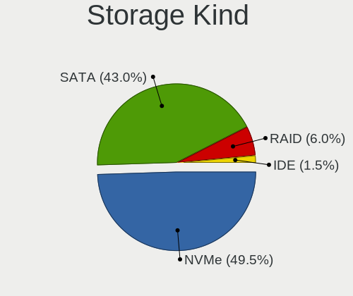
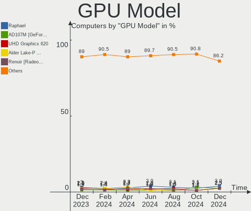
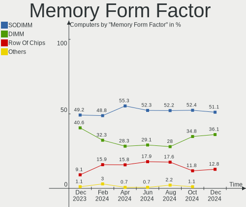
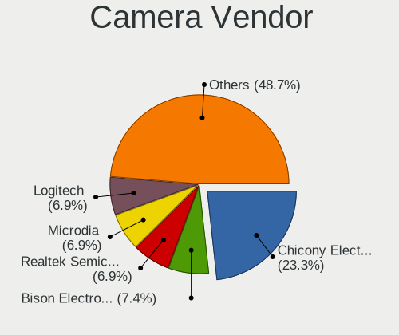

Arch Hardware Trends
--------------------

A project to identify most popular hardware characteristics and track their change
over time based on data collected by Arch users at https://Linux-Hardware.org.

Anyone can contribute to the study by uploading probes of their computers by
the [hw-probe](https://github.com/linuxhw/hw-probe) tool:

    sudo -E hw-probe -all -upload

This is a report for all computer types. See also reports for [desktops](/Dist/Arch/Desktop/README.md) and [notebooks](/Dist/Arch/Notebook/README.md).

Full-feature report is available here: https://linux-hardware.org/?view=trends

Period: Dec, 2020.

Contents
--------

- [ OS                       ](#os)
- [ OS Family                ](#os-family)
- [ Kernel                   ](#kernel)
- [ Kernel Family            ](#kernel-family)
- [ Kernel Major Ver.        ](#kernel-major-ver)
- [ Arch                     ](#arch)
- [ DE                       ](#de)
- [ Display Server           ](#display-server)
- [ Display Manager          ](#display-manager)
- [ OS Lang                  ](#os-lang)
- [ Boot Mode                ](#boot-mode)
- [ Filesystem               ](#filesystem)
- [ Part. scheme             ](#part-scheme)
- [ Dual Boot with Linux/BSD ](#dual-boot-with-linux/bsd)
- [ Dual Boot (Win)          ](#dual-boot-win)
- [ Country                  ](#country)
- [ City                     ](#city)
- [ Vendor                   ](#vendor)
- [ Model                    ](#model)
- [ Model Family             ](#model-family)
- [ MFG Year                 ](#mfg-year)
- [ Form Factor              ](#form-factor)
- [ Secure Boot              ](#secure-boot)
- [ Coreboot                 ](#coreboot)
- [ RAM Size                 ](#ram-size)
- [ RAM Used                 ](#ram-used)
- [ Has CD-ROM               ](#has-cd-rom)
- [ Total Drives             ](#total-drives)
- [ Has Ethernet             ](#has-ethernet)
- [ Drive Vendor             ](#drive-vendor)
- [ Drive Model              ](#drive-model)
- [ HDD Vendor               ](#hdd-vendor)
- [ SSD Vendor               ](#ssd-vendor)
- [ Drive Kind               ](#drive-kind)
- [ Drive Connector          ](#drive-connector)
- [ Drive Size               ](#drive-size)
- [ Space Total              ](#space-total)
- [ Space Used               ](#space-used)
- [ Malfunc. Drives          ](#malfunc-drives)
- [ Malfunc. Drive Vendor    ](#malfunc-drive-vendor)
- [ Malfunc. HDD Vendor      ](#malfunc-hdd-vendor)
- [ Malfunc. Drive Kind      ](#malfunc-drive-kind)
- [ Failed Drives            ](#failed-drives)
- [ Failed Drive Vendor      ](#failed-drive-vendor)
- [ Drive Status             ](#drive-status)
- [ Storage Vendor           ](#storage-vendor)
- [ Storage Model            ](#storage-model)
- [ Storage Kind             ](#storage-kind)
- [ CPU Vendor               ](#cpu-vendor)
- [ CPU Model                ](#cpu-model)
- [ CPU Model Family         ](#cpu-model-family)
- [ CPU Cores                ](#cpu-cores)
- [ CPU Sockets              ](#cpu-sockets)
- [ CPU Threads              ](#cpu-threads)
- [ CPU Op-Modes             ](#cpu-op-modes)
- [ CPU Microcode            ](#cpu-microcode)
- [ CPU Microarch            ](#cpu-microarch)
- [ GPU Vendor               ](#gpu-vendor)
- [ GPU Model                ](#gpu-model)
- [ GPU Combo                ](#gpu-combo)
- [ GPU Driver               ](#gpu-driver)
- [ GPU Memory               ](#gpu-memory)
- [ Monitor Vendor           ](#monitor-vendor)
- [ Monitor Model            ](#monitor-model)
- [ Monitor Resolution       ](#monitor-resolution)
- [ Monitor Diagonal         ](#monitor-diagonal)
- [ Monitor Width            ](#monitor-width)
- [ Aspect Ratio             ](#aspect-ratio)
- [ Monitor Area             ](#monitor-area)
- [ Pixel Density            ](#pixel-density)
- [ Multiple Monitors        ](#multiple-monitors)
- [ Net Controller Vendor    ](#net-controller-vendor)
- [ Net Controller Model     ](#net-controller-model)
- [ Wireless Vendor          ](#wireless-vendor)
- [ Wireless Model           ](#wireless-model)
- [ Ethernet Vendor          ](#ethernet-vendor)
- [ Ethernet Model           ](#ethernet-model)
- [ Net Controller Kind      ](#net-controller-kind)
- [ Used Controller          ](#used-controller)
- [ NICs                     ](#nics)
- [ Memory Vendor            ](#memory-vendor)
- [ Memory Model             ](#memory-model)
- [ Memory Kind              ](#memory-kind)
- [ Memory Form Factor       ](#memory-form-factor)
- [ Memory Size              ](#memory-size)
- [ Memory Speed             ](#memory-speed)
- [ Sound Vendor             ](#sound-vendor)
- [ Sound Model              ](#sound-model)
- [ Camera Vendor            ](#camera-vendor)
- [ Camera Model             ](#camera-model)
- [ Fingerprint Vendor       ](#fingerprint-vendor)
- [ Fingerprint Model        ](#fingerprint-model)
- [ Chipcard Vendor          ](#chipcard-vendor)
- [ Chipcard Model           ](#chipcard-model)
- [ Printer Vendor           ](#printer-vendor)
- [ Printer Model            ](#printer-model)
- [ Scanner Vendor           ](#scanner-vendor)
- [ Scanner Model            ](#scanner-model)
- [ Bluetooth Vendor         ](#bluetooth-vendor)
- [ Bluetooth Model          ](#bluetooth-model)
- [ Unsupported Devices      ](#unsupported-devices)
- [ Unsupported Device Types ](#unsupported-device-types)

OS
--

Installed operating systems

| Name         | Computers | Percent |
|--------------|-----------|---------|
| Arch         | 121       | 67.6%   |
| Arch Rolling | 58        | 32.4%   |

OS Family
---------

OS without a version

| Name | Computers | Percent |
|------|-----------|---------|
| Arch | 179       | 100%    |

Kernel
------

Version of the Linux kernel

| Version                | Computers | Percent |
|------------------------|-----------|---------|
| 5.9.14-arch1-1         | 54        | 30.17%  |
| 5.9.11-arch2-1         | 31        | 17.32%  |
| 5.9.13-arch1-1         | 22        | 12.29%  |
| 5.9.12-arch1-1         | 10        | 5.59%   |
| 5.9.10-arch1-1         | 8         | 4.47%   |
| 5.9.14-zen1-1-zen      | 7         | 3.91%   |
| 5.9.11-zen2-1-zen      | 5         | 2.79%   |
| 5.9.13-zen1-1-zen      | 4         | 2.23%   |
| 5.4.82-1-lts           | 4         | 2.23%   |
| 5.4.85-1-lts           | 3         | 1.68%   |
| 5.4.80-2-lts           | 3         | 1.68%   |
| 5.10.1-xanmod1-1       | 3         | 1.68%   |
| 5.9.9-arch1-1          | 2         | 1.12%   |
| 5.10.1-arch1-1         | 2         | 1.12%   |
| 5.9.8-arch1-1          | 1         | 0.56%   |
| 5.9.6.a-1-hardened     | 1         | 0.56%   |
| 5.9.14.ll72-1-lingruby | 1         | 0.56%   |
| 5.9.14-99-tkg-bmq      | 1         | 0.56%   |
| 5.9.13-98-tkg-pds      | 1         | 0.56%   |
| 5.9.12-arch1-1-surface | 1         | 0.56%   |
| 5.9.12-1-blueperil     | 1         | 0.56%   |
| 5.9.11-1-clear         | 1         | 0.56%   |
| 5.9.1-zen1-1-zen       | 1         | 0.56%   |
| 5.9.1-arch1-1          | 1         | 0.56%   |
| 5.9.1-4-tkg-pds        | 1         | 0.56%   |
| 5.8.1-arch1-1          | 1         | 0.56%   |
| 5.7.9-arch1-1          | 1         | 0.56%   |
| 5.7.6-arch1-1          | 1         | 0.56%   |
| 5.7.4-arch1-1          | 1         | 0.56%   |
| 5.6.10-arch1-1         | 1         | 0.56%   |
| 5.4.84-1-lts           | 1         | 0.56%   |
| 5.4.83-1-lts           | 1         | 0.56%   |
| 5.4.77-1-lts           | 1         | 0.56%   |
| 5.10.3-zen1-1-zen      | 1         | 0.56%   |
| 5.10.2-arch1-1         | 1         | 0.56%   |

Kernel Family
-------------

Linux kernel without a distro release

| Version | Computers | Percent |
|---------|-----------|---------|
| 5.9.14  | 63        | 35.2%   |
| 5.9.11  | 37        | 20.67%  |
| 5.9.13  | 27        | 15.08%  |
| 5.9.12  | 12        | 6.7%    |
| 5.9.10  | 8         | 4.47%   |
| 5.10.1  | 5         | 2.79%   |
| 5.4.82  | 4         | 2.23%   |
| 5.9.1   | 3         | 1.68%   |
| 5.4.85  | 3         | 1.68%   |
| 5.4.80  | 3         | 1.68%   |
| 5.9.9   | 2         | 1.12%   |
| 5.9.8   | 1         | 0.56%   |
| 5.9.6   | 1         | 0.56%   |
| 5.8.1   | 1         | 0.56%   |
| 5.7.9   | 1         | 0.56%   |
| 5.7.6   | 1         | 0.56%   |
| 5.7.4   | 1         | 0.56%   |
| 5.6.10  | 1         | 0.56%   |
| 5.4.84  | 1         | 0.56%   |
| 5.4.83  | 1         | 0.56%   |
| 5.4.77  | 1         | 0.56%   |
| 5.10.3  | 1         | 0.56%   |
| 5.10.2  | 1         | 0.56%   |

Kernel Major Ver.
-----------------

Linux kernel major version

| Version | Computers | Percent |
|---------|-----------|---------|
| 5.9     | 154       | 86.03%  |
| 5.4     | 13        | 7.26%   |
| 5.10    | 7         | 3.91%   |
| 5.7     | 3         | 1.68%   |
| 5.8     | 1         | 0.56%   |
| 5.6     | 1         | 0.56%   |

Arch
----

OS architecture (x86_64, i586, etc.)

| Name   | Computers | Percent |
|--------|-----------|---------|
| x86_64 | 179       | 100%    |

DE
--

Desktop Environment

| Name            | Computers | Percent |
|-----------------|-----------|---------|
| GNOME           | 81        | 45.25%  |
| KDE5            | 26        | 14.53%  |
| KDE             | 17        | 9.5%    |
| XFCE            | 14        | 7.82%   |
| Unknown         | 9         | 5.03%   |
| X-Cinnamon      | 8         | 4.47%   |
| i3              | 8         | 4.47%   |
| GNOME Flashback | 2         | 1.12%   |
| DWM             | 2         | 1.12%   |
| Deepin          | 2         | 1.12%   |
| awesome         | 2         | 1.12%   |
| xmonad          | 1         | 0.56%   |
| Unity           | 1         | 0.56%   |
| sway            | 1         | 0.56%   |
| MATE            | 1         | 0.56%   |
| LXDE            | 1         | 0.56%   |
| default         | 1         | 0.56%   |
| Budgie          | 1         | 0.56%   |
| bspwm           | 1         | 0.56%   |

Display Server
--------------

X11 or Wayland

| Name    | Computers | Percent |
|---------|-----------|---------|
| X11     | 118       | 65.92%  |
| Wayland | 45        | 25.14%  |
| Tty     | 11        | 6.15%   |
| Unknown | 4         | 2.23%   |
| Web     | 1         | 0.56%   |

Display Manager
---------------

SDDM, LightDM, etc.

| Name    | Computers | Percent |
|---------|-----------|---------|
| Unknown | 98        | 54.75%  |
| SDDM    | 29        | 16.2%   |
| GDM     | 23        | 12.85%  |
| TDM     | 18        | 10.06%  |
| LightDM | 7         | 3.91%   |
| XDM     | 2         | 1.12%   |
| LXDM    | 2         | 1.12%   |

OS Lang
-------

Language

| Lang       | Computers | Percent |
|------------|-----------|---------|
| en_US      | 100       | 55.87%  |
| en_GB      | 16        | 8.94%   |
| C          | 10        | 5.59%   |
| pt_BR      | 7         | 3.91%   |
| de_DE      | 6         | 3.35%   |
| zh_CN      | 3         | 1.68%   |
| ru_RU      | 3         | 1.68%   |
| pl_PL      | 3         | 1.68%   |
| fr_FR      | 3         | 1.68%   |
| en_US.utf8 | 3         | 1.68%   |
| en_CA      | 3         | 1.68%   |
| ru_UA      | 2         | 1.12%   |
| fr_CA      | 2         | 1.12%   |
| es_ES      | 2         | 1.12%   |
| es_AR      | 2         | 1.12%   |
| Unknown    | 2         | 1.12%   |
| tr_TR      | 1         | 0.56%   |
| pt_PT      | 1         | 0.56%   |
| pl_PL.utf8 | 1         | 0.56%   |
| nl_NL      | 1         | 0.56%   |
| hr_HR.utf8 | 1         | 0.56%   |
| es_SV      | 1         | 0.56%   |
| es_CR.utf8 | 1         | 0.56%   |
| es_CO      | 1         | 0.56%   |
| en_ZA      | 1         | 0.56%   |
| en_NZ      | 1         | 0.56%   |
| de_AT      | 1         | 0.56%   |
| co_FR      | 1         | 0.56%   |

Boot Mode
---------

EFI or BIOS

| Mode | Computers | Percent |
|------|-----------|---------|
| EFI  | 123       | 68.72%  |
| BIOS | 56        | 31.28%  |

Filesystem
----------

Type of filesystem

| Type    | Computers | Percent |
|---------|-----------|---------|
| Ext4    | 149       | 83.24%  |
| Btrfs   | 19        | 10.61%  |
| Xfs     | 7         | 3.91%   |
| Unknown | 2         | 1.12%   |
| Jfs     | 1         | 0.56%   |
| F2fs    | 1         | 0.56%   |

Part. scheme
------------

Scheme of partitioning

| Type    | Computers | Percent |
|---------|-----------|---------|
| GPT     | 96        | 53.63%  |
| Unknown | 71        | 39.66%  |
| MBR     | 12        | 6.7%    |

Dual Boot with Linux/BSD
------------------------

Hosting more than one Linux/BSD

| Dual boot | Computers | Percent |
|-----------|-----------|---------|
| No        | 155       | 86.59%  |
| Yes       | 24        | 13.41%  |

Dual Boot (Win)
---------------

Hosting Linux and Windows

| Dual boot | Computers | Percent |
|-----------|-----------|---------|
| No        | 128       | 71.51%  |
| Yes       | 51        | 28.49%  |

Country
-------

Geographic location (country)

| Country             | Computers | Percent |
|---------------------|-----------|---------|
| USA                 | 33        | 18.44%  |
| Germany             | 15        | 8.38%   |
| Canada              | 10        | 5.59%   |
| Brazil              | 10        | 5.59%   |
| France              | 8         | 4.47%   |
| UK                  | 7         | 3.91%   |
| Russia              | 7         | 3.91%   |
| Austria             | 7         | 3.91%   |
| India               | 6         | 3.35%   |
| Poland              | 5         | 2.79%   |
| Italy               | 5         | 2.79%   |
| China               | 5         | 2.79%   |
| Ukraine             | 4         | 2.23%   |
| Belgium             | 4         | 2.23%   |
| Sweden              | 3         | 1.68%   |
| Serbia              | 3         | 1.68%   |
| Netherlands         | 3         | 1.68%   |
| Turkey              | 2         | 1.12%   |
| Trinidad and Tobago | 2         | 1.12%   |
| Thailand            | 2         | 1.12%   |
| Spain               | 2         | 1.12%   |
| Romania             | 2         | 1.12%   |
| Mexico              | 2         | 1.12%   |
| Japan               | 2         | 1.12%   |
| Hungary             | 2         | 1.12%   |
| Greece              | 2         | 1.12%   |
| Finland             | 2         | 1.12%   |
| Argentina           | 2         | 1.12%   |
| Vietnam             | 1         | 0.56%   |
| South Africa        | 1         | 0.56%   |
| Singapore           | 1         | 0.56%   |
| New Zealand         | 1         | 0.56%   |
| Luxembourg          | 1         | 0.56%   |
| Lithuania           | 1         | 0.56%   |
| Kenya               | 1         | 0.56%   |
| Israel              | 1         | 0.56%   |
| Iran                | 1         | 0.56%   |
| Indonesia           | 1         | 0.56%   |
| Guatemala           | 1         | 0.56%   |
| Estonia             | 1         | 0.56%   |
| Denmark             | 1         | 0.56%   |
| Czech Republic      | 1         | 0.56%   |
| Croatia             | 1         | 0.56%   |
| Costa Rica          | 1         | 0.56%   |
| Colombia            | 1         | 0.56%   |
| Bulgaria            | 1         | 0.56%   |
| Belarus             | 1         | 0.56%   |
| Bahrain             | 1         | 0.56%   |
| Armenia             | 1         | 0.56%   |
| Angola              | 1         | 0.56%   |

City
----

Geographic location (city)

| City                    | Computers | Percent |
|-------------------------|-----------|---------|
| Moscow                  | 5         | 2.79%   |
| Vienna                  | 2         | 1.12%   |
| Stuttgart               | 2         | 1.12%   |
| Seattle                 | 2         | 1.12%   |
| San Diego               | 2         | 1.12%   |
| Longueuil               | 2         | 1.12%   |
| Linz                    | 2         | 1.12%   |
| Forio                   | 2         | 1.12%   |
| Dnipro                  | 2         | 1.12%   |
| Chesapeake              | 2         | 1.12%   |
| Buenos Aires            | 2         | 1.12%   |
| Łódź                 | 1         | 0.56%   |
| Zrenjanin               | 1         | 0.56%   |
| Zagreb                  | 1         | 0.56%   |
| Yaroslavl               | 1         | 0.56%   |
| Yaocheng                | 1         | 0.56%   |
| Woodstock               | 1         | 0.56%   |
| Wilmington              | 1         | 0.56%   |
| Washington              | 1         | 0.56%   |
| Vilnius                 | 1         | 0.56%   |
| Versailles              | 1         | 0.56%   |
| Valencia                | 1         | 0.56%   |
| Tuusula                 | 1         | 0.56%   |
| Toulouse                | 1         | 0.56%   |
| Tobelbad                | 1         | 0.56%   |
| Thunder Bay             | 1         | 0.56%   |
| Thrissur                | 1         | 0.56%   |
| The Hague               | 1         | 0.56%   |
| Tervuren                | 1         | 0.56%   |
| Tel Aviv                | 1         | 0.56%   |
| Tehran                  | 1         | 0.56%   |
| Tarnów                 | 1         | 0.56%   |
| Tamaqua                 | 1         | 0.56%   |
| Tallinn                 | 1         | 0.56%   |
| Taboao da Serra         | 1         | 0.56%   |
| São Paulo              | 1         | 0.56%   |
| São Bernardo do Campo  | 1         | 0.56%   |
| Szydlowiec              | 1         | 0.56%   |
| Stockholm               | 1         | 0.56%   |
| Sorocaba                | 1         | 0.56%   |
| Sofia                   | 1         | 0.56%   |
| Singapore               | 1         | 0.56%   |
| Shūnan                 | 1         | 0.56%   |
| Shawinigan              | 1         | 0.56%   |
| Semarang                | 1         | 0.56%   |
| Secunda                 | 1         | 0.56%   |
| Secaucus                | 1         | 0.56%   |
| Santa Clara             | 1         | 0.56%   |
| San Ramon               | 1         | 0.56%   |
| San José               | 1         | 0.56%   |
| Samara                  | 1         | 0.56%   |
| Sainte-Julienne         | 1         | 0.56%   |
| Sainte-Agathe-des-Monts | 1         | 0.56%   |
| Saint-Raphaël          | 1         | 0.56%   |
| Roubaix                 | 1         | 0.56%   |
| Rajkot                  | 1         | 0.56%   |
| Radziechowy             | 1         | 0.56%   |
| Prague                  | 1         | 0.56%   |
| Poços de Caldas        | 1         | 0.56%   |
| Poysbrunn               | 1         | 0.56%   |

Vendor
------

Motherboard manufacturer

| Name                | Computers | Percent |
|---------------------|-----------|---------|
| ASUSTek Computer    | 40        | 22.35%  |
| Lenovo              | 26        | 14.53%  |
| Dell                | 23        | 12.85%  |
| Hewlett-Packard     | 18        | 10.06%  |
| Gigabyte Technology | 15        | 8.38%   |
| MSI                 | 12        | 6.7%    |
| ASRock              | 9         | 5.03%   |
| Acer                | 6         | 3.35%   |
| Apple               | 4         | 2.23%   |
| HUAWEI              | 3         | 1.68%   |
| Fujitsu             | 3         | 1.68%   |
| Unknown             | 3         | 1.68%   |
| Schenker            | 2         | 1.12%   |
| Samsung Electronics | 2         | 1.12%   |
| Toshiba             | 1         | 0.56%   |
| Timi                | 1         | 0.56%   |
| Positivo            | 1         | 0.56%   |
| Packard Bell        | 1         | 0.56%   |
| Microsoft           | 1         | 0.56%   |
| LG Electronics      | 1         | 0.56%   |
| Intel               | 1         | 0.56%   |
| EUROCOM             | 1         | 0.56%   |
| Eluktronics         | 1         | 0.56%   |
| Cube                | 1         | 0.56%   |
| Biostar             | 1         | 0.56%   |
| ASRockRack          | 1         | 0.56%   |
| Acidanthera         | 1         | 0.56%   |

Model
-----

Motherboard model

| Name                                     | Computers | Percent |
|------------------------------------------|-----------|---------|
| Unknown                                  | 4         | 2.23%   |
| ASUS All Series                          | 3         | 1.68%   |
| ASUS TUF GAMING X570-PLUS                | 2         | 1.12%   |
| ASUS ROG CROSSHAIR VII HERO              | 2         | 1.12%   |
| ASUS PRIME B450M-A                       | 2         | 1.12%   |
| Timi RedmiBook 16                        | 1         | 0.56%   |
| Schenker XMG FUSION 15 (XFU15L19)        | 1         | 0.56%   |
| Schenker SCHENKER VIA 15 Pro             | 1         | 0.56%   |
| Samsung 340XAA/350XAA/550XAA             | 1         | 0.56%   |
| Samsung 300E5M/300E5L                    | 1         | 0.56%   |
| Positivo Master D570a                    | 1         | 0.56%   |
| Packard Bell EasyNote TH36               | 1         | 0.56%   |
| MSI PE70 6QE                             | 1         | 0.56%   |
| MSI MS-7C95                              | 1         | 0.56%   |
| MSI MS-7C02                              | 1         | 0.56%   |
| MSI MS-7B86                              | 1         | 0.56%   |
| MSI MS-7B22                              | 1         | 0.56%   |
| MSI MS-7A38                              | 1         | 0.56%   |
| MSI MS-7A20                              | 1         | 0.56%   |
| MSI MS-7917                              | 1         | 0.56%   |
| MSI MS-7529                              | 1         | 0.56%   |
| MSI GP60 2PE                             | 1         | 0.56%   |
| MSI GE70 2OC\2OE                         | 1         | 0.56%   |
| MSI GE62MVR 7RG                          | 1         | 0.56%   |
| Microsoft Surface Pro 4                  | 1         | 0.56%   |
| LG 22V280-L.BJ31P1                       | 1         | 0.56%   |
| Lenovo Y520-15IKBN 80WK                  | 1         | 0.56%   |
| Lenovo ThinkPad X1 Carbon 7th 20QES1RP00 | 1         | 0.56%   |
| Lenovo ThinkPad X1 Carbon 6th 20KH002RUS | 1         | 0.56%   |
| Lenovo ThinkPad X1 Carbon 3rd 20BSCTO1WW | 1         | 0.56%   |
| Lenovo ThinkPad X1 Carbon 2nd 20A8S0ET00 | 1         | 0.56%   |
| Lenovo ThinkPad T490 20N3S2WY00          | 1         | 0.56%   |
| Lenovo ThinkPad T470s 20HGS6PF09         | 1         | 0.56%   |
| Lenovo ThinkPad T460s 20F9003UPB         | 1         | 0.56%   |
| Lenovo ThinkPad T440p 20AWS5AD00         | 1         | 0.56%   |
| Lenovo ThinkPad T440p 20AN00C1GE         | 1         | 0.56%   |
| Lenovo ThinkPad T14 Gen 1 20UES00L00     | 1         | 0.56%   |
| Lenovo ThinkPad P70 20ER000EGE           | 1         | 0.56%   |
| Lenovo ThinkPad L380 20M5CTO1WW          | 1         | 0.56%   |
| Lenovo ThinkPad Edge E545 20B20011US     | 1         | 0.56%   |
| Lenovo ThinkPad E495 20NE0001US          | 1         | 0.56%   |
| Lenovo ThinkPad E14 Gen 2 20T6000SIX     | 1         | 0.56%   |
| Lenovo ThinkCentre xxx 7339AL2           | 1         | 0.56%   |
| Lenovo ThinkCentre Edge71 1607P9G        | 1         | 0.56%   |
| Lenovo Legion Y545 81Q6                  | 1         | 0.56%   |
| Lenovo Legion 5 15ARH05H 82B1            | 1         | 0.56%   |
| Lenovo IdeaPad S145-15IIL 82DJ           | 1         | 0.56%   |
| Lenovo IdeaPad S145-15API 81UT           | 1         | 0.56%   |
| Lenovo IdeaPad 5 14ARE05 81YM            | 1         | 0.56%   |
| Lenovo IdeaPad 3 15IIL05 81WE            | 1         | 0.56%   |
| Lenovo IdeaCentre 3 07ADA05 90MV009QTX   | 1         | 0.56%   |
| Lenovo B5400 20278                       | 1         | 0.56%   |
| Intel NUC6i7KYB H90766-406               | 1         | 0.56%   |
| HUAWEI NBLK-WAX9X                        | 1         | 0.56%   |
| HUAWEI HLY-WX9XX                         | 1         | 0.56%   |
| HUAWEI BOHK-WAX9X                        | 1         | 0.56%   |
| HP ZBook Studio G5                       | 1         | 0.56%   |
| HP Spectre x360 Convertible 13-ac0XX     | 1         | 0.56%   |
| HP ProBook 640 G2                        | 1         | 0.56%   |
| HP ProBook 440 G3                        | 1         | 0.56%   |

Model Family
------------

Motherboard model prefix

| Name                  | Computers | Percent |
|-----------------------|-----------|---------|
| Lenovo ThinkPad       | 15        | 8.38%   |
| Dell XPS              | 8         | 4.47%   |
| ASUS ROG              | 7         | 3.91%   |
| Dell Inspiron         | 6         | 3.35%   |
| ASUS TUF              | 5         | 2.79%   |
| ASUS PRIME            | 5         | 2.79%   |
| Acer Aspire           | 5         | 2.79%   |
| Lenovo IdeaPad        | 4         | 2.23%   |
| ASUS VivoBook         | 4         | 2.23%   |
| Unknown               | 4         | 2.23%   |
| HP EliteBook          | 3         | 1.68%   |
| Gigabyte X570         | 3         | 1.68%   |
| Dell Precision        | 3         | 1.68%   |
| Dell Latitude         | 3         | 1.68%   |
| ASUS All              | 3         | 1.68%   |
| Lenovo ThinkCentre    | 2         | 1.12%   |
| Lenovo Legion         | 2         | 1.12%   |
| HP ProBook            | 2         | 1.12%   |
| HP Laptop             | 2         | 1.12%   |
| HP ENVY               | 2         | 1.12%   |
| Fujitsu LIFEBOOK      | 2         | 1.12%   |
| ASRock Z390           | 2         | 1.12%   |
| ASRock X570           | 2         | 1.12%   |
| Timi RedmiBook        | 1         | 0.56%   |
| Schenker XMG          | 1         | 0.56%   |
| Schenker SCHENKER     | 1         | 0.56%   |
| Samsung 340XAA        | 1         | 0.56%   |
| Samsung 300E5M        | 1         | 0.56%   |
| Positivo Master       | 1         | 0.56%   |
| Packard Bell EasyNote | 1         | 0.56%   |
| MSI PE70              | 1         | 0.56%   |
| MSI MS-7C95           | 1         | 0.56%   |
| MSI MS-7C02           | 1         | 0.56%   |
| MSI MS-7B86           | 1         | 0.56%   |
| MSI MS-7B22           | 1         | 0.56%   |
| MSI MS-7A38           | 1         | 0.56%   |
| MSI MS-7A20           | 1         | 0.56%   |
| MSI MS-7917           | 1         | 0.56%   |
| MSI MS-7529           | 1         | 0.56%   |
| MSI GP60              | 1         | 0.56%   |
| MSI GE70              | 1         | 0.56%   |
| MSI GE62MVR           | 1         | 0.56%   |
| Microsoft Surface     | 1         | 0.56%   |
| LG 22V280-L.BJ31P1    | 1         | 0.56%   |
| Lenovo Y520-15IKBN    | 1         | 0.56%   |
| Lenovo IdeaCentre     | 1         | 0.56%   |
| Lenovo B5400          | 1         | 0.56%   |
| Intel NUC6i7KYB       | 1         | 0.56%   |
| HUAWEI NBLK-WAX9X     | 1         | 0.56%   |
| HUAWEI HLY-WX9XX      | 1         | 0.56%   |
| HUAWEI BOHK-WAX9X     | 1         | 0.56%   |
| HP ZBook              | 1         | 0.56%   |
| HP Spectre            | 1         | 0.56%   |
| HP Pavilion           | 1         | 0.56%   |
| HP OMEN               | 1         | 0.56%   |
| HP EliteDesk          | 1         | 0.56%   |
| HP Elite              | 1         | 0.56%   |
| HP Compaq             | 1         | 0.56%   |
| HP 251-152l           | 1         | 0.56%   |
| HP 15                 | 1         | 0.56%   |

MFG Year
--------

Motherboard manufacture year

| Year | Computers | Percent |
|------|-----------|---------|
| 2020 | 64        | 35.75%  |
| 2019 | 44        | 24.58%  |
| 2018 | 19        | 10.61%  |
| 2017 | 8         | 4.47%   |
| 2016 | 8         | 4.47%   |
| 2014 | 8         | 4.47%   |
| 2013 | 8         | 4.47%   |
| 2015 | 7         | 3.91%   |
| 2012 | 5         | 2.79%   |
| 2010 | 4         | 2.23%   |
| 2008 | 2         | 1.12%   |
| 2011 | 1         | 0.56%   |
| 2009 | 1         | 0.56%   |

Form Factor
-----------

Physical design of the computer

| Name        | Computers | Percent |
|-------------|-----------|---------|
| Notebook    | 100       | 55.87%  |
| Desktop     | 69        | 38.55%  |
| Convertible | 4         | 2.23%   |
| Tablet      | 2         | 1.12%   |
| All in one  | 2         | 1.12%   |
| Mini pc     | 1         | 0.56%   |
| Server      | 1         | 0.56%   |

Secure Boot
-----------

Enabled or disabled

| State    | Computers | Percent |
|----------|-----------|---------|
| Disabled | 178       | 99.44%  |
| Enabled  | 1         | 0.56%   |

Coreboot
--------

Have coreboot on board

| Used | Computers | Percent |
|------|-----------|---------|
| No   | 179       | 100%    |

RAM Size
--------

Total RAM memory

| Size in GB  | Computers | Percent |
|-------------|-----------|---------|
| 16.01-24.0  | 46        | 25.7%   |
| 4.01-8.0    | 42        | 23.46%  |
| 32.01-64.0  | 28        | 15.64%  |
| 8.01-16.0   | 28        | 15.64%  |
| 3.01-4.0    | 14        | 7.82%   |
| 64.01-256.0 | 9         | 5.03%   |
| 24.01-32.0  | 7         | 3.91%   |
| 2.01-3.0    | 2         | 1.12%   |
| 0.51-1.0    | 2         | 1.12%   |
| 1.01-2.0    | 1         | 0.56%   |

RAM Used
--------

Used RAM memory

| Used GB    | Computers | Percent |
|------------|-----------|---------|
| 1.01-2.0   | 47        | 26.26%  |
| 2.01-3.0   | 41        | 22.91%  |
| 4.01-8.0   | 38        | 21.23%  |
| 3.01-4.0   | 25        | 13.97%  |
| 8.01-16.0  | 16        | 8.94%   |
| 0.51-1.0   | 9         | 5.03%   |
| 24.01-32.0 | 1         | 0.56%   |
| 16.01-24.0 | 1         | 0.56%   |
| 0.01-0.5   | 1         | 0.56%   |

Has CD-ROM
----------

Has CD-ROM on board

| Presented | Computers | Percent |
|-----------|-----------|---------|
| No        | 137       | 76.54%  |
| Yes       | 42        | 23.46%  |

Total Drives
------------

Number of drives on board

| Drives | Computers | Percent |
|--------|-----------|---------|
| 1      | 89        | 49.72%  |
| 2      | 48        | 26.82%  |
| 3      | 23        | 12.85%  |
| 4      | 9         | 5.03%   |
| 5      | 5         | 2.79%   |
| 7      | 2         | 1.12%   |
| 9      | 1         | 0.56%   |
| 8      | 1         | 0.56%   |
| 6      | 1         | 0.56%   |

Has Ethernet
------------

Has Ethernet on board

| Presented | Computers | Percent |
|-----------|-----------|---------|
| Yes       | 152       | 84.92%  |
| No        | 27        | 15.08%  |

Drive Vendor
------------

Hard drive vendors

| Vendor                    | Computers | Drives | Percent |
|---------------------------|-----------|--------|---------|
| Samsung Electronics       | 59        | 84     | 20%     |
| WDC                       | 51        | 60     | 17.29%  |
| Seagate                   | 33        | 39     | 11.19%  |
| Toshiba                   | 24        | 26     | 8.14%   |
| SanDisk                   | 21        | 26     | 7.12%   |
| Unknown                   | 11        | 12     | 3.73%   |
| Kingston                  | 10        | 10     | 3.39%   |
| Crucial                   | 9         | 18     | 3.05%   |
| SK Hynix                  | 8         | 8      | 2.71%   |
| Intel                     | 8         | 8      | 2.71%   |
| A-DATA Technology         | 7         | 7      | 2.37%   |
| Hitachi                   | 5         | 6      | 1.69%   |
| Micron Technology         | 4         | 4      | 1.36%   |
| HGST                      | 4         | 5      | 1.36%   |
| XPG                       | 2         | 2      | 0.68%   |
| Transcend                 | 2         | 2      | 0.68%   |
| Phison                    | 2         | 2      | 0.68%   |
| OCZ                       | 2         | 2      | 0.68%   |
| Mushkin                   | 2         | 2      | 0.68%   |
| China                     | 2         | 2      | 0.68%   |
| ADATA Technology          | 2         | 2      | 0.68%   |
| ZOTAC                     | 1         | 1      | 0.34%   |
| Yangtze Memory            | 1         | 1      | 0.34%   |
| USB3.0                    | 1         | 1      | 0.34%   |
| Union Memory              | 1         | 1      | 0.34%   |
| SPCC                      | 1         | 1      | 0.34%   |
| Solid State Storage       | 1         | 1      | 0.34%   |
| Silicon Motion            | 1         | 1      | 0.34%   |
| ShanDianZhe               | 1         | 1      | 0.34%   |
| Realtek Semiconductor     | 1         | 1      | 0.34%   |
| PNY                       | 1         | 1      | 0.34%   |
| PLEXTOR                   | 1         | 1      | 0.34%   |
| Patriot                   | 1         | 1      | 0.34%   |
| MidasForce                | 1         | 1      | 0.34%   |
| Micron/Crucial Technology | 1         | 1      | 0.34%   |
| Maxtor                    | 1         | 1      | 0.34%   |
| LITEONIT                  | 1         | 1      | 0.34%   |
| KIOXIA                    | 1         | 1      | 0.34%   |
| KESU                      | 1         | 1      | 0.34%   |
| Intenso                   | 1         | 1      | 0.34%   |
| GALAX                     | 1         | 1      | 0.34%   |
| FORESEE                   | 1         | 1      | 0.34%   |
| CT500P2S                  | 1         | 1      | 0.34%   |
| Corsair                   | 1         | 1      | 0.34%   |
| CalDigit                  | 1         | 1      | 0.34%   |
| Biostar                   | 1         | 1      | 0.34%   |
| ASMT                      | 1         | 1      | 0.34%   |
| Apple                     | 1         | 1      | 0.34%   |

Drive Model
-----------

Hard drive models

| Model                                  | Computers | Percent |
|----------------------------------------|-----------|---------|
| Samsung SSD 850 EVO 500GB              | 10        | 2.92%   |
| Toshiba NVMe SSD Drive 512GB           | 4         | 1.17%   |
| Seagate ST1000DM010-2EP102 1TB         | 4         | 1.17%   |
| Sandisk NVMe SSD Drive 256GB           | 4         | 1.17%   |
| Samsung SSD 970 EVO Plus 500GB         | 4         | 1.17%   |
| Samsung SSD 860 EVO 250GB              | 4         | 1.17%   |
| Samsung NVMe SSD Drive 500GB           | 4         | 1.17%   |
| Samsung NVMe SSD Drive 1TB             | 4         | 1.17%   |
| Crucial CT500MX500SSD1 500GB           | 4         | 1.17%   |
| WDC WD10EZEX-08WN4A0 1TB               | 3         | 0.88%   |
| Seagate ST1000LM035-1RK172 1TB         | 3         | 0.88%   |
| SanDisk SDSSDA240G 240GB               | 3         | 0.88%   |
| Sandisk NVMe SSD Drive 512GB           | 3         | 0.88%   |
| Samsung SSD 970 EVO Plus 1TB           | 3         | 0.88%   |
| Samsung SSD 860 QVO 1TB                | 3         | 0.88%   |
| Samsung SSD 860 EVO 500GB              | 3         | 0.88%   |
| Samsung NVMe SSD Drive 512GB           | 3         | 0.88%   |
| WDC WDS240G2G0B-00EPW0 240GB SSD       | 2         | 0.58%   |
| WDC WD20EZRZ-00Z5HB0 2TB               | 2         | 0.58%   |
| WDC WD20EZRX-00D8PB0 2TB               | 2         | 0.58%   |
| WDC WD20EARS-00MVWB0 2TB               | 2         | 0.58%   |
| WDC WD10JPVX-22JC3T0 1TB               | 2         | 0.58%   |
| WDC WD10EZEX-00WN4A0 1TB               | 2         | 0.58%   |
| Unknown SD/MMC/MS PRO 128GB            | 2         | 0.58%   |
| Toshiba MQ04ABF100 1TB                 | 2         | 0.58%   |
| Toshiba MQ01ABD100 1TB                 | 2         | 0.58%   |
| Toshiba HDWE160 6TB                    | 2         | 0.58%   |
| Toshiba DT01ACA100 1TB                 | 2         | 0.58%   |
| SK Hynix NVMe SSD Drive 1TB            | 2         | 0.58%   |
| Seagate ST2000DM008-2FR102 2TB         | 2         | 0.58%   |
| Seagate Expansion+ 4TB                 | 2         | 0.58%   |
| SanDisk SDSSDH31024G 1TB               | 2         | 0.58%   |
| Sandisk NVMe SSD Drive 1TB             | 2         | 0.58%   |
| Samsung SSD 970 EVO Plus 250GB         | 2         | 0.58%   |
| Samsung SSD 860 EVO 1TB                | 2         | 0.58%   |
| Samsung SSD 850 EVO 250GB              | 2         | 0.58%   |
| Samsung SSD 840 EVO 250GB              | 2         | 0.58%   |
| Samsung NVMe SSD Drive 256GB           | 2         | 0.58%   |
| Mushkin MKNSSDCR240GB-7                | 2         | 0.58%   |
| Intel SSDPEKNW512G8 512GB              | 2         | 0.58%   |
| Intel SSDPEKKW128G8 128GB              | 2         | 0.58%   |
| Intel NVMe SSD Drive 1024GB            | 2         | 0.58%   |
| Crucial CT525MX300SSD1 528GB           | 2         | 0.58%   |
| ZOTAC ZTSSD-S11-120G-MD 120GB          | 1         | 0.29%   |
| Yangtze Memory ZHITAI PC005 Active 1TB | 1         | 0.29%   |
| XPG NVMe SSD Drive 512GB               | 1         | 0.29%   |
| XPG NVMe SSD Drive 1024GB              | 1         | 0.29%   |
| WDC WDS500G2B0B-00YS70 500GB SSD       | 1         | 0.29%   |
| WDC WDS500G2B0A-00SM50 500GB SSD       | 1         | 0.29%   |
| WDC WDS250G1B0B-00AS40 250GB SSD       | 1         | 0.29%   |
| WDC WDS120G2G0B-00EPW0 120GB SSD       | 1         | 0.29%   |
| WDC WDS100T2B0C-00PXH0 1TB             | 1         | 0.29%   |
| WDC WDS100T2B0B-00YS70 1TB SSD         | 1         | 0.29%   |
| WDC WDS100T1X0E-00AFY0 1TB             | 1         | 0.29%   |
| WDC WDBNCE5000PNC 500GB SSD            | 1         | 0.29%   |
| WDC WD5001AALS-00E3A0 500GB            | 1         | 0.29%   |
| WDC WD5000LUCT-63RC2Y0 500GB           | 1         | 0.29%   |
| WDC WD5000LPLX-75ZNTT0 500GB           | 1         | 0.29%   |
| WDC WD5000BPVT-22HXZT3 500GB           | 1         | 0.29%   |
| WDC WD5000BEVT-22A0RT0 500GB           | 1         | 0.29%   |

HDD Vendor
----------

Hard disk drive vendors

| Vendor              | Computers | Drives | Percent |
|---------------------|-----------|--------|---------|
| WDC                 | 37        | 43     | 36.27%  |
| Seagate             | 31        | 37     | 30.39%  |
| Toshiba             | 17        | 18     | 16.67%  |
| Hitachi             | 5         | 6      | 4.9%    |
| Samsung Electronics | 4         | 5      | 3.92%   |
| HGST                | 4         | 5      | 3.92%   |
| USB3.0              | 1         | 1      | 0.98%   |
| Maxtor              | 1         | 1      | 0.98%   |
| KESU                | 1         | 1      | 0.98%   |
| ASMT                | 1         | 1      | 0.98%   |

SSD Vendor
----------

Solid state drive vendors

| Vendor              | Computers | Drives | Percent |
|---------------------|-----------|--------|---------|
| Samsung Electronics | 35        | 42     | 33.65%  |
| SanDisk             | 11        | 15     | 10.58%  |
| Crucial             | 9         | 16     | 8.65%   |
| WDC                 | 8         | 8      | 7.69%   |
| Kingston            | 7         | 7      | 6.73%   |
| A-DATA Technology   | 5         | 5      | 4.81%   |
| Micron Technology   | 3         | 3      | 2.88%   |
| Transcend           | 2         | 2      | 1.92%   |
| SK Hynix            | 2         | 2      | 1.92%   |
| Seagate             | 2         | 2      | 1.92%   |
| OCZ                 | 2         | 2      | 1.92%   |
| Mushkin             | 2         | 2      | 1.92%   |
| Intel               | 2         | 2      | 1.92%   |
| China               | 2         | 2      | 1.92%   |
| ZOTAC               | 1         | 1      | 0.96%   |
| Unknown             | 1         | 1      | 0.96%   |
| Toshiba             | 1         | 1      | 0.96%   |
| PNY                 | 1         | 1      | 0.96%   |
| Patriot             | 1         | 1      | 0.96%   |
| MidasForce          | 1         | 1      | 0.96%   |
| LITEONIT            | 1         | 1      | 0.96%   |
| Intenso             | 1         | 1      | 0.96%   |
| GALAX               | 1         | 1      | 0.96%   |
| FORESEE             | 1         | 1      | 0.96%   |
| Corsair             | 1         | 1      | 0.96%   |
| Biostar             | 1         | 1      | 0.96%   |

Drive Kind
----------

HDD or SSD

| Kind    | Computers | Drives | Percent |
|---------|-----------|--------|---------|
| NVMe    | 89        | 100    | 32.96%  |
| SSD     | 86        | 122    | 31.85%  |
| HDD     | 82        | 118    | 30.37%  |
| MMC     | 7         | 8      | 2.59%   |
| Unknown | 6         | 6      | 2.22%   |

Drive Connector
---------------

SATA, SAS, NVMe, etc.

| Type | Computers | Drives | Percent |
|------|-----------|--------|---------|
| SATA | 122       | 233    | 53.04%  |
| NVMe | 89        | 100    | 38.7%   |
| SAS  | 12        | 13     | 5.22%   |
| MMC  | 7         | 8      | 3.04%   |

Drive Size
----------

Size of hard drive

| Size in TB | Computers | Drives | Percent |
|------------|-----------|--------|---------|
| 0.01-0.5   | 97        | 134    | 53.3%   |
| 0.51-1.0   | 56        | 74     | 30.77%  |
| 1.01-2.0   | 16        | 17     | 8.79%   |
| 3.01-4.0   | 6         | 6      | 3.3%    |
| 2.01-3.0   | 4         | 5      | 2.2%    |
| 4.01-10.0  | 3         | 4      | 1.65%   |

Space Total
-----------

Amount of disk space available on the file system

| Size in GB     | Computers | Percent |
|----------------|-----------|---------|
| 251-500        | 44        | 24.58%  |
| 101-250        | 40        | 22.35%  |
| 501-1000       | 40        | 22.35%  |
| 1001-2000      | 18        | 10.06%  |
| More than 3000 | 16        | 8.94%   |
| 51-100         | 11        | 6.15%   |
| 2001-3000      | 4         | 2.23%   |
| 21-50          | 2         | 1.12%   |
| 1-20           | 2         | 1.12%   |
| Unknown        | 2         | 1.12%   |

Space Used
----------

Amount of used disk space

| Used GB        | Computers | Percent |
|----------------|-----------|---------|
| 101-250        | 38        | 21.23%  |
| 1-20           | 32        | 17.88%  |
| 251-500        | 28        | 15.64%  |
| 21-50          | 23        | 12.85%  |
| 51-100         | 22        | 12.29%  |
| 501-1000       | 16        | 8.94%   |
| 1001-2000      | 13        | 7.26%   |
| More than 3000 | 3         | 1.68%   |
| 2001-3000      | 2         | 1.12%   |
| Unknown        | 2         | 1.12%   |

Malfunc. Drives
---------------

Drive models with a malfunction

| Model                               | Computers | Drives | Percent |
|-------------------------------------|-----------|--------|---------|
| WDC WDS240G2G0B-00EPW0 240GB SSD    | 1         | 1      | 5.56%   |
| WDC WD5000AAKX-08ERMA0 500GB        | 1         | 1      | 5.56%   |
| WDC WD5000AAKX-001CA0 500GB         | 1         | 1      | 5.56%   |
| WDC WD20EZRZ-00Z5HB0 2TB            | 1         | 1      | 5.56%   |
| WDC WD20EARS-00MVWB0 2TB            | 1         | 1      | 5.56%   |
| WDC WD10EZEX-60WN4A1 1TB            | 1         | 1      | 5.56%   |
| WDC WD10EADS-65M2B1 1TB             | 1         | 1      | 5.56%   |
| Seagate ST9120817AS 120GB           | 1         | 1      | 5.56%   |
| Seagate ST3250410AS 250GB           | 1         | 1      | 5.56%   |
| SanDisk SD7UB3Q256G1001 256GB SSD   | 1         | 1      | 5.56%   |
| Samsung Electronics SSD 970 EVO 2TB | 1         | 1      | 5.56%   |
| Samsung Electronics HD250HJ 250GB   | 1         | 1      | 5.56%   |
| Samsung Electronics HD103UJ 1TB     | 1         | 1      | 5.56%   |
| PLEXTOR PX-1TM8SeG 1TB              | 1         | 1      | 5.56%   |
| OCZ VERTEX3 240GB SSD               | 1         | 1      | 5.56%   |
| Intel SSDSC2BW240A4 240GB           | 1         | 1      | 5.56%   |
| Hitachi HTS545050A7E380 500GB       | 1         | 1      | 5.56%   |
| Crucial CT525MX300SSD1 528GB        | 1         | 1      | 5.56%   |

Malfunc. Drive Vendor
---------------------

Vendors of faulty drives

| Vendor              | Computers | Drives | Percent |
|---------------------|-----------|--------|---------|
| WDC                 | 7         | 7      | 38.89%  |
| Samsung Electronics | 3         | 3      | 16.67%  |
| Seagate             | 2         | 2      | 11.11%  |
| SanDisk             | 1         | 1      | 5.56%   |
| PLEXTOR             | 1         | 1      | 5.56%   |
| OCZ                 | 1         | 1      | 5.56%   |
| Intel               | 1         | 1      | 5.56%   |
| Hitachi             | 1         | 1      | 5.56%   |
| Crucial             | 1         | 1      | 5.56%   |

Malfunc. HDD Vendor
-------------------

Vendors of faulty HDD drives

| Vendor              | Computers | Drives | Percent |
|---------------------|-----------|--------|---------|
| WDC                 | 6         | 6      | 54.55%  |
| Seagate             | 2         | 2      | 18.18%  |
| Samsung Electronics | 2         | 2      | 18.18%  |
| Hitachi             | 1         | 1      | 9.09%   |

Malfunc. Drive Kind
-------------------

Kinds of faulty drives

| Kind | Computers | Drives | Percent |
|------|-----------|--------|---------|
| HDD  | 10        | 11     | 58.82%  |
| SSD  | 5         | 5      | 29.41%  |
| NVMe | 2         | 2      | 11.76%  |

Failed Drives
-------------

Failed drive models

| Model                                        | Computers | Drives | Percent |
|----------------------------------------------|-----------|--------|---------|
| Samsung Electronics MZVLW128HEGR-000L2 128GB | 1         | 1      | 100%    |

Failed Drive Vendor
-------------------

Failed drive vendors

| Vendor              | Computers | Drives | Percent |
|---------------------|-----------|--------|---------|
| Samsung Electronics | 1         | 1      | 100%    |

Drive Status
------------

Number of failed and malfunc. drives

| Status   | Computers | Drives | Percent |
|----------|-----------|--------|---------|
| Detected | 108       | 192    | 54%     |
| Works    | 75        | 143    | 37.5%   |
| Malfunc  | 16        | 18     | 8%      |
| Failed   | 1         | 1      | 0.5%    |

Storage Vendor
--------------

Storage controller vendors

| Vendor                         | Computers | Percent |
|--------------------------------|-----------|---------|
| Intel                          | 104       | 41.43%  |
| AMD                            | 50        | 19.92%  |
| Samsung Electronics            | 33        | 13.15%  |
| Sandisk                        | 19        | 7.57%   |
| Toshiba America Info Systems   | 6         | 2.39%   |
| SK Hynix                       | 6         | 2.39%   |
| ADATA Technology               | 5         | 1.99%   |
| Marvell Technology Group       | 4         | 1.59%   |
| ASMedia Technology             | 4         | 1.59%   |
| Micron/Crucial Technology      | 3         | 1.2%    |
| Kingston Technology Company    | 3         | 1.2%    |
| Silicon Motion                 | 2         | 0.8%    |
| Realtek Semiconductor          | 2         | 0.8%    |
| Phison Electronics             | 2         | 0.8%    |
| Yangtze Memory Technologies    | 1         | 0.4%    |
| Union Memory (Shenzhen)        | 1         | 0.4%    |
| Solid State Storage Technology | 1         | 0.4%    |
| Micron Technology              | 1         | 0.4%    |
| Lite-On Technology             | 1         | 0.4%    |
| KIOXIA                         | 1         | 0.4%    |
| JMicron Technology             | 1         | 0.4%    |
| Apple                          | 1         | 0.4%    |

Storage Model
-------------

Storage controller models

| Model                                                                            | Computers | Percent |
|----------------------------------------------------------------------------------|-----------|---------|
| AMD FCH SATA Controller [AHCI mode]                                              | 40        | 14.55%  |
| Samsung NVMe SSD Controller SM981/PM981/PM983                                    | 27        | 9.82%   |
| Intel Sunrise Point-LP SATA Controller [AHCI mode]                               | 13        | 4.73%   |
| AMD 400 Series Chipset SATA Controller                                           | 12        | 4.36%   |
| Intel 8 Series/C220 Series Chipset Family 6-port SATA Controller 1 [AHCI mode]   | 10        | 3.64%   |
| Sandisk WD Black SN750 / PC SN730 NVMe SSD                                       | 8         | 2.91%   |
| Intel Cannon Lake Mobile PCH SATA AHCI Controller                                | 8         | 2.91%   |
| Intel 7 Series Chipset Family 6-port SATA Controller [AHCI mode]                 | 8         | 2.91%   |
| Intel Q170/Q150/B150/H170/H110/Z170/CM236 Chipset SATA Controller [AHCI Mode]    | 7         | 2.55%   |
| Intel 82801 Mobile SATA Controller [RAID mode]                                   | 7         | 2.55%   |
| Samsung NVMe SSD Controller SM961/PM961/SM963                                    | 5         | 1.82%   |
| Intel Cannon Lake PCH SATA AHCI Controller                                       | 5         | 1.82%   |
| AMD SATA controller                                                              | 5         | 1.82%   |
| Intel HM170/QM170 Chipset SATA Controller [AHCI Mode]                            | 4         | 1.45%   |
| Intel Cannon Point-LP SATA Controller [AHCI Mode]                                | 4         | 1.45%   |
| Intel 8 Series SATA Controller 1 [AHCI mode]                                     | 4         | 1.45%   |
| ASMedia ASM1062 Serial ATA Controller                                            | 4         | 1.45%   |
| Toshiba America Info Systems XG6 NVMe SSD Controller                             | 3         | 1.09%   |
| SK Hynix Non-Volatile memory controller                                          | 3         | 1.09%   |
| Sandisk WD Blue SN500 / PC SN520 NVMe SSD                                        | 3         | 1.09%   |
| Sandisk Non-Volatile memory controller                                           | 3         | 1.09%   |
| Intel SSD 660P Series                                                            | 3         | 1.09%   |
| Intel 7 Series/C210 Series Chipset Family 6-port SATA Controller [AHCI mode]     | 3         | 1.09%   |
| Intel 200 Series PCH SATA controller [AHCI mode]                                 | 3         | 1.09%   |
| AMD SB7x0/SB8x0/SB9x0 SATA Controller [AHCI mode]                                | 3         | 1.09%   |
| AMD SB7x0/SB8x0/SB9x0 IDE Controller                                             | 3         | 1.09%   |
| ADATA XPG SX8200 Pro PCIe Gen3x4 M.2 2280 Solid State Drive                      | 3         | 1.09%   |
| Toshiba America Info Systems Toshiba America Info Non-Volatile memory controller | 2         | 0.73%   |
| SK Hynix BC501 NVMe Solid State Drive 512GB                                      | 2         | 0.73%   |
| Silicon Motion SM2263EN/SM2263XT SSD Controller                                  | 2         | 0.73%   |
| Sandisk WD Black 2018 / PC SN720 NVMe SSD                                        | 2         | 0.73%   |
| Sandisk PC SN520 NVMe SSD                                                        | 2         | 0.73%   |
| Micron/Crucial P1 NVMe PCIe SSD                                                  | 2         | 0.73%   |
| Kingston Company A2000 NVMe SSD                                                  | 2         | 0.73%   |
| Intel SSD Pro 7600p/760p/E 6100p Series                                          | 2         | 0.73%   |
| Intel Ice Lake-LP SATA Controller [AHCI mode]                                    | 2         | 0.73%   |
| Intel Celeron N3350/Pentium N4200/Atom E3900 Series SATA AHCI Controller         | 2         | 0.73%   |
| Intel 82801JI (ICH10 Family) 4 port SATA IDE Controller #1                       | 2         | 0.73%   |
| Intel 82801JI (ICH10 Family) 2 port SATA IDE Controller #2                       | 2         | 0.73%   |
| Intel 82801IBM/IEM (ICH9M/ICH9M-E) 4 port SATA Controller [AHCI mode]            | 2         | 0.73%   |
| Intel 6 Series/C200 Series Chipset Family 6 port Mobile SATA AHCI Controller     | 2         | 0.73%   |
| Intel 6 Series/C200 Series Chipset Family 6 port Desktop SATA AHCI Controller    | 2         | 0.73%   |
| AMD X370 Series Chipset SATA Controller                                          | 2         | 0.73%   |
| AMD FCH SATA Controller D                                                        | 2         | 0.73%   |
| ADATA Non-Volatile memory controller                                             | 2         | 0.73%   |
| Yangtze Memory Non-Volatile memory controller                                    | 1         | 0.36%   |
| Union Memory (Shenzhen) Non-Volatile memory controller                           | 1         | 0.36%   |
| Toshiba America Info Systems XG4 NVMe SSD Controller                             | 1         | 0.36%   |
| Solid State Storage Non-Volatile memory controller                               | 1         | 0.36%   |
| SK Hynix PC401 NVMe Solid State Drive 256GB                                      | 1         | 0.36%   |
| Sandisk WD Blue SN550 NVMe SSD                                                   | 1         | 0.36%   |
| Samsung NVMe SSD Controller SM951/PM951                                          | 1         | 0.36%   |
| Realtek RTS5763DL NVMe SSD Controller                                            | 1         | 0.36%   |
| Realtek Realtek Non-Volatile memory controller                                   | 1         | 0.36%   |
| Phison E16 PCIe4 NVMe Controller                                                 | 1         | 0.36%   |
| Phison E12 NVMe Controller                                                       | 1         | 0.36%   |
| Micron/Crucial Non-Volatile memory controller                                    | 1         | 0.36%   |
| Micron Non-Volatile memory controller                                            | 1         | 0.36%   |
| Marvell Group 88SE9128 PCIe SATA 6 Gb/s RAID controller with HyperDuo            | 1         | 0.36%   |
| Marvell Group 88SE9128 PCIe SATA 6 Gb/s RAID controller                          | 1         | 0.36%   |

Storage Kind
------------

Kind of storage controller (IDE, SATA, NVMe, SAS, ...)

| Kind | Computers | Percent |
|------|-----------|---------|
| SATA | 136       | 55.97%  |
| NVMe | 89        | 36.63%  |
| RAID | 9         | 3.7%    |
| IDE  | 9         | 3.7%    |

CPU Vendor
----------

Processor vendors

| Vendor | Computers | Percent |
|--------|-----------|---------|
| Intel  | 118       | 65.92%  |
| AMD    | 61        | 34.08%  |

CPU Model
---------

Processor models

| Model                                         | Computers | Percent |
|-----------------------------------------------|-----------|---------|
| Intel Core i7-8550U CPU @ 1.80GHz             | 5         | 2.79%   |
| Intel Core i7-9750H CPU @ 2.60GHz             | 4         | 2.23%   |
| Intel Core i7-7700HQ CPU @ 2.80GHz            | 4         | 2.23%   |
| Intel Core i5-7200U CPU @ 2.50GHz             | 4         | 2.23%   |
| AMD Ryzen 7 3700X 8-Core Processor            | 4         | 2.23%   |
| AMD Ryzen 5 3600 6-Core Processor             | 4         | 2.23%   |
| AMD Ryzen 5 3500U with Radeon Vega Mobile Gfx | 4         | 2.23%   |
| Intel Core i5-6200U CPU @ 2.30GHz             | 3         | 1.68%   |
| AMD Ryzen 7 4800H with Radeon Graphics        | 3         | 1.68%   |
| AMD Ryzen 7 3700U with Radeon Vega Mobile Gfx | 3         | 1.68%   |
| AMD Ryzen 7 2700X Eight-Core Processor        | 3         | 1.68%   |
| Intel Core i7-8850H CPU @ 2.60GHz             | 2         | 1.12%   |
| Intel Core i7-8750H CPU @ 2.20GHz             | 2         | 1.12%   |
| Intel Core i7-8665U CPU @ 1.90GHz             | 2         | 1.12%   |
| Intel Core i7-8565U CPU @ 1.80GHz             | 2         | 1.12%   |
| Intel Core i7-7700K CPU @ 4.20GHz             | 2         | 1.12%   |
| Intel Core i7-6500U CPU @ 2.50GHz             | 2         | 1.12%   |
| Intel Core i7-4790 CPU @ 3.60GHz              | 2         | 1.12%   |
| Intel Core i7-4710MQ CPU @ 2.50GHz            | 2         | 1.12%   |
| Intel Core i7-3770K CPU @ 3.50GHz             | 2         | 1.12%   |
| Intel Core i7-10875H CPU @ 2.30GHz            | 2         | 1.12%   |
| Intel Core i5-8265U CPU @ 1.60GHz             | 2         | 1.12%   |
| Intel Core i5-6300U CPU @ 2.40GHz             | 2         | 1.12%   |
| Intel Core i3-3217U CPU @ 1.80GHz             | 2         | 1.12%   |
| AMD Ryzen 7 PRO 4750U with Radeon Graphics    | 2         | 1.12%   |
| AMD Ryzen 7 4700U with Radeon Graphics        | 2         | 1.12%   |
| AMD Ryzen 7 3800X 8-Core Processor            | 2         | 1.12%   |
| AMD Ryzen 7 2700 Eight-Core Processor         | 2         | 1.12%   |
| AMD Ryzen 5 4500U with Radeon Graphics        | 2         | 1.12%   |
| AMD Ryzen 5 2600 Six-Core Processor           | 2         | 1.12%   |
| AMD Ryzen 5 1600X Six-Core Processor          | 2         | 1.12%   |
| Intel Xeon CPU X5690 @ 3.47GHz                | 1         | 0.56%   |
| Intel Xeon CPU E3-1220 v3 @ 3.10GHz           | 1         | 0.56%   |
| Intel Pentium Gold G5400 CPU @ 3.70GHz        | 1         | 0.56%   |
| Intel Pentium Dual-Core CPU T4500 @ 2.30GHz   | 1         | 0.56%   |
| Intel Pentium Dual-Core CPU E6700 @ 3.20GHz   | 1         | 0.56%   |
| Intel Pentium Dual CPU T3200 @ 2.00GHz        | 1         | 0.56%   |
| Intel Pentium CPU B970 @ 2.30GHz              | 1         | 0.56%   |
| Intel Pentium 3558U @ 1.70GHz                 | 1         | 0.56%   |
| Intel Genuine CPU @ 2.00GHz                   | 1         | 0.56%   |
| Intel Core m3-7Y30 CPU @ 1.00GHz              | 1         | 0.56%   |
| Intel Core m3-6Y30 CPU @ 0.90GHz              | 1         | 0.56%   |
| Intel Core i9-9900KS CPU @ 4.00GHz            | 1         | 0.56%   |
| Intel Core i9-9900K CPU @ 3.60GHz             | 1         | 0.56%   |
| Intel Core i9-8950HK CPU @ 2.90GHz            | 1         | 0.56%   |
| Intel Core i7-9850H CPU @ 2.60GHz             | 1         | 0.56%   |
| Intel Core i7-9700F CPU @ 3.00GHz             | 1         | 0.56%   |
| Intel Core i7-8700 CPU @ 3.20GHz              | 1         | 0.56%   |
| Intel Core i7-8650U CPU @ 1.90GHz             | 1         | 0.56%   |
| Intel Core i7-7700 CPU @ 3.60GHz              | 1         | 0.56%   |
| Intel Core i7-7600U CPU @ 2.80GHz             | 1         | 0.56%   |
| Intel Core i7-7500U CPU @ 2.70GHz             | 1         | 0.56%   |
| Intel Core i7-6820HQ CPU @ 2.70GHz            | 1         | 0.56%   |
| Intel Core i7-6770HQ CPU @ 2.60GHz            | 1         | 0.56%   |
| Intel Core i7-6700K CPU @ 4.00GHz             | 1         | 0.56%   |
| Intel Core i7-6700HQ CPU @ 2.60GHz            | 1         | 0.56%   |
| Intel Core i7-6700 CPU @ 3.40GHz              | 1         | 0.56%   |
| Intel Core i7-5820K CPU @ 3.30GHz             | 1         | 0.56%   |
| Intel Core i7-5600U CPU @ 2.60GHz             | 1         | 0.56%   |
| Intel Core i7-4720HQ CPU @ 2.60GHz            | 1         | 0.56%   |

CPU Model Family
----------------

Processor model prefix

| Model                   | Computers | Percent |
|-------------------------|-----------|---------|
| Intel Core i7           | 54        | 30.17%  |
| Intel Core i5           | 35        | 19.55%  |
| AMD Ryzen 7             | 23        | 12.85%  |
| AMD Ryzen 5             | 19        | 10.61%  |
| Intel Core i3           | 9         | 5.03%   |
| AMD Ryzen 9             | 5         | 2.79%   |
| Intel Core i9           | 3         | 1.68%   |
| Intel Celeron           | 3         | 1.68%   |
| AMD Ryzen 3             | 3         | 1.68%   |
| Intel Xeon              | 2         | 1.12%   |
| Intel Pentium Dual-Core | 2         | 1.12%   |
| Intel Pentium           | 2         | 1.12%   |
| Intel Core m3           | 2         | 1.12%   |
| AMD Ryzen 7 PRO         | 2         | 1.12%   |
| AMD FX                  | 2         | 1.12%   |
| Other                   | 1         | 0.56%   |
| Intel Pentium Gold      | 1         | 0.56%   |
| Intel Pentium Dual      | 1         | 0.56%   |
| Intel Genuine           | 1         | 0.56%   |
| Intel Core 2 Quad       | 1         | 0.56%   |
| Intel Core 2 Duo        | 1         | 0.56%   |
| Intel Atom              | 1         | 0.56%   |
| AMD Ryzen Threadripper  | 1         | 0.56%   |
| AMD Phenom II X4        | 1         | 0.56%   |
| AMD E1                  | 1         | 0.56%   |
| AMD Athlon              | 1         | 0.56%   |
| AMD A6                  | 1         | 0.56%   |
| AMD A10                 | 1         | 0.56%   |

CPU Cores
---------

Number of processor cores

| Number | Computers | Percent |
|--------|-----------|---------|
| 4      | 69        | 38.55%  |
| 2      | 49        | 27.37%  |
| 8      | 26        | 14.53%  |
| 6      | 26        | 14.53%  |
| 12     | 5         | 2.79%   |
| 16     | 3         | 1.68%   |
| 1      | 1         | 0.56%   |

CPU Sockets
-----------

Number of sockets

| Number | Computers | Percent |
|--------|-----------|---------|
| 1      | 178       | 99.44%  |
| 2      | 1         | 0.56%   |

CPU Threads
-----------

Threads per core (Hyper-Threading)

| Number | Computers | Percent |
|--------|-----------|---------|
| 2      | 145       | 81.01%  |
| 1      | 34        | 18.99%  |

CPU Op-Modes
------------

CPU Operation Modes (32-bit, 64-bit)

| Op mode        | Computers | Percent |
|----------------|-----------|---------|
| 32-bit, 64-bit | 179       | 100%    |

CPU Microcode
-------------

Microcode number

| Number     | Computers | Percent |
|------------|-----------|---------|
| Unknown    | 23        | 12.85%  |
| 0x906ea    | 12        | 6.7%    |
| 0x306c3    | 12        | 6.7%    |
| 0x08701021 | 10        | 5.59%   |
| 0x0800820d | 8         | 4.47%   |
| 0x806ec    | 7         | 3.91%   |
| 0x806ea    | 7         | 3.91%   |
| 0x406e3    | 7         | 3.91%   |
| 0x206a7    | 7         | 3.91%   |
| 0x806e9    | 6         | 3.35%   |
| 0x306a9    | 6         | 3.35%   |
| 0x08108102 | 6         | 3.35%   |
| 0x906e9    | 5         | 2.79%   |
| 0x0a201009 | 4         | 2.23%   |
| 0x08600106 | 4         | 2.23%   |
| 0x08600103 | 4         | 2.23%   |
| 0x08108109 | 4         | 2.23%   |
| 0x08001138 | 4         | 2.23%   |
| 0x906ed    | 3         | 1.68%   |
| 0x706e5    | 3         | 1.68%   |
| 0x506e3    | 3         | 1.68%   |
| 0x40651    | 3         | 1.68%   |
| 0x1067a    | 3         | 1.68%   |
| 0x506c9    | 2         | 1.12%   |
| 0x306d4    | 2         | 1.12%   |
| 0x08701013 | 2         | 1.12%   |
| 0x08600104 | 2         | 1.12%   |
| 0x0810100b | 2         | 1.12%   |
| 0x06001119 | 2         | 1.12%   |
| 0xa0652    | 1         | 0.56%   |
| 0x906ec    | 1         | 0.56%   |
| 0x806eb    | 1         | 0.56%   |
| 0x6fd      | 1         | 0.56%   |
| 0x406c4    | 1         | 0.56%   |
| 0x306f2    | 1         | 0.56%   |
| 0x306f1    | 1         | 0.56%   |
| 0x20655    | 1         | 0.56%   |
| 0x106a5    | 1         | 0.56%   |
| 0x10676    | 1         | 0.56%   |
| 0x0800820b | 1         | 0.56%   |
| 0x08001137 | 1         | 0.56%   |
| 0x0700010b | 1         | 0.56%   |
| 0x0600063e | 1         | 0.56%   |
| 0x010000db | 1         | 0.56%   |
| 0x010000c8 | 1         | 0.56%   |

CPU Microarch
-------------

Microarchitecture

| Name          | Computers | Percent |
|---------------|-----------|---------|
| KabyLake      | 48        | 26.82%  |
| Zen 2         | 23        | 12.85%  |
| Zen+          | 20        | 11.17%  |
| Haswell       | 18        | 10.06%  |
| Skylake       | 16        | 8.94%   |
| IvyBridge     | 9         | 5.03%   |
| Zen           | 7         | 3.91%   |
| SandyBridge   | 7         | 3.91%   |
| Penryn        | 4         | 2.23%   |
| Unknown       | 4         | 2.23%   |
| Piledriver    | 3         | 1.68%   |
| IceLake       | 3         | 1.68%   |
| CometLake     | 3         | 1.68%   |
| Westmere      | 2         | 1.12%   |
| K10           | 2         | 1.12%   |
| Goldmont      | 2         | 1.12%   |
| Broadwell     | 2         | 1.12%   |
| Silvermont    | 1         | 0.56%   |
| Nehalem       | 1         | 0.56%   |
| Jaguar        | 1         | 0.56%   |
| Goldmont plus | 1         | 0.56%   |
| Core          | 1         | 0.56%   |
| Bulldozer     | 1         | 0.56%   |

GPU Vendor
----------

Vendors of graphics cards

| Vendor            | Computers | Percent |
|-------------------|-----------|---------|
| Intel             | 94        | 42.15%  |
| Nvidia            | 69        | 30.94%  |
| AMD               | 58        | 26.01%  |
| ASPEED Technology | 2         | 0.9%    |

GPU Model
---------

Graphics card models

| Model                                                                                 | Computers | Percent |
|---------------------------------------------------------------------------------------|-----------|---------|
| Intel UHD Graphics 630 (Mobile)                                                       | 10        | 4.42%   |
| AMD Picasso                                                                           | 10        | 4.42%   |
| AMD Renoir                                                                            | 9         | 3.98%   |
| AMD Ellesmere [Radeon RX 470/480/570/570X/580/580X/590]                               | 9         | 3.98%   |
| Nvidia GP107 [GeForce GTX 1050 Ti]                                                    | 7         | 3.1%    |
| Intel UHD Graphics 620 (Whiskey Lake)                                                 | 7         | 3.1%    |
| Intel UHD Graphics 620                                                                | 7         | 3.1%    |
| Intel Skylake GT2 [HD Graphics 520]                                                   | 7         | 3.1%    |
| Intel HD Graphics 630                                                                 | 6         | 2.65%   |
| Intel HD Graphics 620                                                                 | 6         | 2.65%   |
| Intel 3rd Gen Core processor Graphics Controller                                      | 6         | 2.65%   |
| Intel 4th Gen Core Processor Integrated Graphics Controller                           | 5         | 2.21%   |
| Intel 2nd Generation Core Processor Family Integrated Graphics Controller             | 5         | 2.21%   |
| AMD Navi 10 [Radeon RX 5600 OEM/5600 XT / 5700/5700 XT]                               | 5         | 2.21%   |
| Nvidia TU117M [GeForce GTX 1650 Mobile / Max-Q]                                       | 4         | 1.77%   |
| Nvidia GP107M [GeForce GTX 1050 Mobile]                                               | 4         | 1.77%   |
| Intel UHD Graphics                                                                    | 4         | 1.77%   |
| Intel HD Graphics 530                                                                 | 4         | 1.77%   |
| Intel Haswell-ULT Integrated Graphics Controller                                      | 4         | 1.77%   |
| Intel Xeon E3-1200 v3/4th Gen Core Processor Integrated Graphics Controller           | 3         | 1.33%   |
| Intel Mobile 4 Series Chipset Integrated Graphics Controller                          | 3         | 1.33%   |
| AMD Vega 10 XL/XT [Radeon RX Vega 56/64]                                              | 3         | 1.33%   |
| AMD Lexa PRO [Radeon 540/540X/550/550X / RX 540X/550/550X]                            | 3         | 1.33%   |
| Nvidia TU117M [GeForce GTX 1650 Ti Mobile]                                            | 2         | 0.88%   |
| Nvidia TU104 [GeForce RTX 2070 SUPER]                                                 | 2         | 0.88%   |
| Nvidia GP108M [GeForce MX250]                                                         | 2         | 0.88%   |
| Nvidia GP108 [GeForce GT 1030]                                                        | 2         | 0.88%   |
| Nvidia GP107M [GeForce GTX 1050 Ti Mobile]                                            | 2         | 0.88%   |
| Nvidia GP106 [GeForce GTX 1060 6GB]                                                   | 2         | 0.88%   |
| Nvidia GP104M [GeForce GTX 1070 Mobile]                                               | 2         | 0.88%   |
| Nvidia GP104 [GeForce GTX 1080]                                                       | 2         | 0.88%   |
| Nvidia GM206 [GeForce GTX 960]                                                        | 2         | 0.88%   |
| Nvidia GK208B [GeForce GT 730]                                                        | 2         | 0.88%   |
| Intel Xeon E3-1200 v2/3rd Gen Core processor Graphics Controller                      | 2         | 0.88%   |
| Intel UHD Graphics 630 (Desktop)                                                      | 2         | 0.88%   |
| Intel Iris Plus Graphics G1 (Ice Lake)                                                | 2         | 0.88%   |
| Intel HD Graphics 500                                                                 | 2         | 0.88%   |
| ASPEED Technology ASPEED Graphics Family                                              | 2         | 0.88%   |
| AMD Topaz XT [Radeon R7 M260/M265 / M340/M360 / M440/M445 / 530/535 / 620/625 Mobile] | 2         | 0.88%   |
| AMD Raven Ridge [Radeon Vega Series / Radeon Vega Mobile Series]                      | 2         | 0.88%   |
| Nvidia TU117M                                                                         | 1         | 0.44%   |
| Nvidia TU116M [GeForce GTX 1660 Ti Mobile]                                            | 1         | 0.44%   |
| Nvidia TU116 [GeForce GTX 1660 SUPER]                                                 | 1         | 0.44%   |
| Nvidia TU116 [GeForce GTX 1650]                                                       | 1         | 0.44%   |
| Nvidia TU106M [GeForce RTX 2070 Mobile]                                               | 1         | 0.44%   |
| Nvidia TU106M [GeForce RTX 2060 Mobile]                                               | 1         | 0.44%   |
| Nvidia TU106M [GeForce RTX 2060 Max-Q]                                                | 1         | 0.44%   |
| Nvidia TU106 [GeForce RTX 2060 SUPER]                                                 | 1         | 0.44%   |
| Nvidia TU106 [GeForce RTX 2060 Rev. A]                                                | 1         | 0.44%   |
| Nvidia TU104GLM [Quadro RTX 4000 Mobile / Max-Q]                                      | 1         | 0.44%   |
| Nvidia TU102 [GeForce RTX 2080 Ti Rev. A]                                             | 1         | 0.44%   |
| Nvidia GT200 [GeForce GTX 260]                                                        | 1         | 0.44%   |
| Nvidia GP108M [GeForce MX150]                                                         | 1         | 0.44%   |
| Nvidia GP107GL [Quadro P400]                                                          | 1         | 0.44%   |
| Nvidia GP106M [GeForce GTX 1060 Mobile]                                               | 1         | 0.44%   |
| Nvidia GP106 [GeForce GTX 1060 3GB]                                                   | 1         | 0.44%   |
| Nvidia GP104 [GeForce GTX 1070]                                                       | 1         | 0.44%   |
| Nvidia GM204GLM [Quadro M3000M]                                                       | 1         | 0.44%   |
| Nvidia GM204 [GeForce GTX 970]                                                        | 1         | 0.44%   |
| Nvidia GM200 [GeForce GTX TITAN X]                                                    | 1         | 0.44%   |

GPU Combo
---------

Combinations of graphics cards

| Name            | Computers | Percent |
|-----------------|-----------|---------|
| 1 x Intel       | 56        | 31.28%  |
| 1 x AMD         | 46        | 25.7%   |
| 1 x Nvidia      | 31        | 17.32%  |
| Intel + Nvidia  | 31        | 17.32%  |
| Intel + AMD     | 5         | 2.79%   |
| AMD + Nvidia    | 5         | 2.79%   |
| 2 x AMD         | 2         | 1.12%   |
| 2 x Nvidia      | 1         | 0.56%   |
| Nvidia + ASPEED | 1         | 0.56%   |
| 1 x ASPEED      | 1         | 0.56%   |

GPU Driver
----------

Free vs proprietary

| Driver      | Computers | Percent |
|-------------|-----------|---------|
| Free        | 124       | 69.27%  |
| Proprietary | 54        | 30.17%  |
| Unknown     | 1         | 0.56%   |

GPU Memory
----------

Total video memory

| Size in GB | Computers | Percent |
|------------|-----------|---------|
| Unknown    | 82        | 45.81%  |
| 1.01-2.0   | 26        | 14.53%  |
| 7.01-8.0   | 23        | 12.85%  |
| 3.01-4.0   | 17        | 9.5%    |
| 0.01-0.5   | 13        | 7.26%   |
| 5.01-6.0   | 7         | 3.91%   |
| 0.51-1.0   | 7         | 3.91%   |
| 8.01-16.0  | 3         | 1.68%   |
| 2.01-3.0   | 1         | 0.56%   |

Monitor Vendor
--------------

Monitor vendors

| Vendor                  | Computers | Percent |
|-------------------------|-----------|---------|
| AU Optronics            | 21        | 10%     |
| Samsung Electronics     | 19        | 9.05%   |
| LG Display              | 18        | 8.57%   |
| Chimei Innolux          | 16        | 7.62%   |
| BOE                     | 13        | 6.19%   |
| Acer                    | 13        | 6.19%   |
| Dell                    | 11        | 5.24%   |
| Sharp                   | 10        | 4.76%   |
| Goldstar                | 9         | 4.29%   |
| AOC                     | 7         | 3.33%   |
| ViewSonic               | 6         | 2.86%   |
| Philips                 | 6         | 2.86%   |
| Hewlett-Packard         | 6         | 2.86%   |
| BenQ                    | 6         | 2.86%   |
| Ancor Communications    | 6         | 2.86%   |
| PANDA                   | 5         | 2.38%   |
| LG Electronics          | 4         | 1.9%    |
| InfoVision              | 4         | 1.9%    |
| Chi Mei Optoelectronics | 4         | 1.9%    |
| Apple                   | 3         | 1.43%   |
| Unknown                 | 2         | 0.95%   |
| MSI                     | 2         | 0.95%   |
| Lenovo                  | 2         | 0.95%   |
| Iiyama                  | 2         | 0.95%   |
| Yakumo                  | 1         | 0.48%   |
| Sony                    | 1         | 0.48%   |
| SKY                     | 1         | 0.48%   |
| RTK                     | 1         | 0.48%   |
| Panasonic               | 1         | 0.48%   |
| NEC Computers           | 1         | 0.48%   |
| MStar                   | 1         | 0.48%   |
| LGD                     | 1         | 0.48%   |
| Idek Iiyama             | 1         | 0.48%   |
| HVR                     | 1         | 0.48%   |
| Hitachi                 | 1         | 0.48%   |
| Eizo                    | 1         | 0.48%   |
| BOE Technology Group    | 1         | 0.48%   |
| AUS                     | 1         | 0.48%   |
| ASUSTek Computer        | 1         | 0.48%   |

Monitor Model
-------------

Monitor models

| Model                                                                     | Computers | Percent |
|---------------------------------------------------------------------------|-----------|---------|
| ViewSonic VX2758-Series VSCA738 2560x1440 598x336mm 27.0-inch             | 2         | 0.93%   |
| Sharp LQ156M1JW01 SHP14C3 1920x1080 344x194mm 15.5-inch                   | 2         | 0.93%   |
| Samsung Electronics S24F350 SAM0D20 1920x1080 521x293mm 23.5-inch         | 2         | 0.93%   |
| Philips PHL 246E9Q PHLC17C 1920x1080 527x296mm 23.8-inch                  | 2         | 0.93%   |
| PANDA LCD Monitor NCP0036 1920x1080 344x194mm 15.5-inch                   | 2         | 0.93%   |
| LG Display LCD Monitor LGD04F0 2560x1440 310x174mm 14.0-inch              | 2         | 0.93%   |
| LG Display LCD Monitor LGD046D 1920x1080 309x174mm 14.0-inch              | 2         | 0.93%   |
| Chimei Innolux LCD Monitor CMN15F5 1920x1080 344x193mm 15.5-inch          | 2         | 0.93%   |
| Chi Mei Optoelectronics LCD Monitor CMO1720 1920x1080 382x215mm 17.3-inch | 2         | 0.93%   |
| BOE LCD Monitor BOE07F6 1920x1080 309x174mm 14.0-inch                     | 2         | 0.93%   |
| BenQ G900HD BNQ7816 1366x768 430x254mm 19.7-inch                          | 2         | 0.93%   |
| AU Optronics LCD Monitor AUO71EC 1366x768 340x190mm 15.3-inch             | 2         | 0.93%   |
| AU Optronics LCD Monitor AUO38ED 1920x1080 340x190mm 15.3-inch            | 2         | 0.93%   |
| AU Optronics LCD Monitor AUO139D 1920x1080 381x214mm 17.2-inch            | 2         | 0.93%   |
| Acer V246HL ACR0336 1920x1080 531x299mm 24.0-inch                         | 2         | 0.93%   |
| Yakumo 19WJT YAK1FB1 1440x900 410x260mm 19.1-inch                         | 1         | 0.47%   |
| ViewSonic VG2719-2K VSC1935 2560x1440 597x336mm 27.0-inch                 | 1         | 0.47%   |
| ViewSonic VA2759 Series VSC6832 1920x1080 598x336mm 27.0-inch             | 1         | 0.47%   |
| ViewSonic VA1912 SERIES VSCBA2B 1366x768 410x230mm 18.5-inch              | 1         | 0.47%   |
| ViewSonic LCD Monitor VX2458-mhd 3286x1080                                | 1         | 0.47%   |
| Unknown LCD Monitor SAMSUNG                                               | 1         | 0.47%   |
| Unknown LCD Monitor AAA HDTV 3286x1080                                    | 1         | 0.47%   |
| Sony LCD Monitor AVSYSTEM                                                 | 1         | 0.47%   |
| SKY TV-monitor SKY0001 1920x1080 697x392mm 31.5-inch                      | 1         | 0.47%   |
| Sharp LCD Monitor SHP14D6 3840x2400 366x229mm 17.0-inch                   | 1         | 0.47%   |
| Sharp LCD Monitor SHP14D0 3840x2400 336x210mm 15.6-inch                   | 1         | 0.47%   |
| Sharp LCD Monitor SHP14CB 1920x1200 288x180mm 13.4-inch                   | 1         | 0.47%   |
| Sharp LCD Monitor SHP14BA 1920x1080 344x194mm 15.5-inch                   | 1         | 0.47%   |
| Sharp LCD Monitor SHP149A 1920x1080 344x194mm 15.5-inch                   | 1         | 0.47%   |
| Sharp LCD Monitor SHP148B 3840x2160 294x165mm 13.3-inch                   | 1         | 0.47%   |
| Sharp LCD Monitor SHP1476 3840x2160 346x194mm 15.6-inch                   | 1         | 0.47%   |
| Sharp LCD Monitor SHP144A 3200x1800 294x165mm 13.3-inch                   | 1         | 0.47%   |
| Samsung Electronics SyncMaster SAM0657 1920x1080                          | 1         | 0.47%   |
| Samsung Electronics SyncMaster SAM037B 1680x1050 474x296mm 22.0-inch      | 1         | 0.47%   |
| Samsung Electronics SMT27A950 SAM080F 1920x1080 598x336mm 27.0-inch       | 1         | 0.47%   |
| Samsung Electronics SMBX2440 SAM068B 1920x1080 530x300mm 24.0-inch        | 1         | 0.47%   |
| Samsung Electronics S24D330 SAM0D92 1920x1080 531x299mm 24.0-inch         | 1         | 0.47%   |
| Samsung Electronics S24B300 SAM08B4 1920x1080 521x293mm 23.5-inch         | 1         | 0.47%   |
| Samsung Electronics LCD Monitor SyncMaster 1920x1200                      | 1         | 0.47%   |
| Samsung Electronics LCD Monitor SEC5443 1920x1200 367x230mm 17.1-inch     | 1         | 0.47%   |
| Samsung Electronics LCD Monitor SEC4145 1366x768 309x174mm 14.0-inch      | 1         | 0.47%   |
| Samsung Electronics LCD Monitor SEC3242 1920x1080 230x130mm 10.4-inch     | 1         | 0.47%   |
| Samsung Electronics LCD Monitor SEC315A 1366x768 344x194mm 15.5-inch      | 1         | 0.47%   |
| Samsung Electronics LCD Monitor SDC3853 2736x1824 260x173mm 12.3-inch     | 1         | 0.47%   |
| Samsung Electronics LCD Monitor SDC3452 1366x768 344x194mm 15.5-inch      | 1         | 0.47%   |
| Samsung Electronics LCD Monitor SAM0F3E 3840x2160 1872x1053mm 84.6-inch   | 1         | 0.47%   |
| Samsung Electronics LCD Monitor SAM0AC6 1920x1080 700x390mm 31.5-inch     | 1         | 0.47%   |
| Samsung Electronics LCD Monitor S19D300                                   | 1         | 0.47%   |
| Samsung Electronics LC49G95T SAM7053 3840x1080 1193x336mm 48.8-inch       | 1         | 0.47%   |
| Samsung Electronics C34H89x SAM0E26 3440x1440 797x333mm 34.0-inch         | 1         | 0.47%   |
| RTK LCD Monitor RTK2136 1280x800 473x296mm 22.0-inch                      | 1         | 0.47%   |
| Philips PHL 326M6V PHLC193 3840x2160 698x398mm 31.6-inch                  | 1         | 0.47%   |
| Philips PHL 240V5A PHLC10C 1920x1080 527x296mm 23.8-inch                  | 1         | 0.47%   |
| Philips PHL 231B4Q PHL08EB 1920x1080 509x286mm 23.0-inch                  | 1         | 0.47%   |
| Philips LCD Monitor PHL 278E1 1920x1080                                   | 1         | 0.47%   |
| PANDA LM156LF1L03 NCP001C 1920x1080 344x194mm 15.5-inch                   | 1         | 0.47%   |
| PANDA LCD Monitor NCP0040 1920x1080 344x194mm 15.5-inch                   | 1         | 0.47%   |
| PANDA LCD Monitor NCP0035 1920x1080 309x174mm 14.0-inch                   | 1         | 0.47%   |
| Panasonic VVX13F009G00 MEI96A2 1920x1080 290x170mm 13.2-inch              | 1         | 0.47%   |
| NEC Computers LCD2490WUXi NEC66CE 1920x1200 520x320mm 24.0-inch           | 1         | 0.47%   |

Monitor Resolution
------------------

Monitor screen resolution

| Resolution         | Computers | Percent |
|--------------------|-----------|---------|
| 1920x1080 (FHD)    | 102       | 51.78%  |
| 1366x768 (WXGA)    | 25        | 12.69%  |
| 2560x1440 (QHD)    | 13        | 6.6%    |
| 3840x2160 (4K)     | 11        | 5.58%   |
| 1920x1200 (WUXGA)  | 7         | 3.55%   |
| 1600x900 (HD+)     | 6         | 3.05%   |
| Unknown            | 6         | 3.05%   |
| 3440x1440          | 3         | 1.52%   |
| 2560x1080          | 3         | 1.52%   |
| 3840x2400          | 2         | 1.02%   |
| 3840x1080          | 2         | 1.02%   |
| 3286x1080          | 2         | 1.02%   |
| 1440x900 (WXGA+)   | 2         | 1.02%   |
| 7680x2160          | 1         | 0.51%   |
| 5760x1440          | 1         | 0.51%   |
| 4240x1440          | 1         | 0.51%   |
| 3840x1600          | 1         | 0.51%   |
| 3200x1800 (QHD+)   | 1         | 0.51%   |
| 3000x2000          | 1         | 0.51%   |
| 2880x1800          | 1         | 0.51%   |
| 2736x1824          | 1         | 0.51%   |
| 2560x1600          | 1         | 0.51%   |
| 2160x1200          | 1         | 0.51%   |
| 1680x1050 (WSXGA+) | 1         | 0.51%   |
| 1280x800 (WXGA)    | 1         | 0.51%   |
| 1152x864           | 1         | 0.51%   |

Monitor Diagonal
----------------

Diagonal size in inches

| Inches  | Computers | Percent |
|---------|-----------|---------|
| 15      | 53        | 26.11%  |
| 24      | 25        | 12.32%  |
| 13      | 20        | 9.85%   |
| 27      | 18        | 8.87%   |
| 14      | 17        | 8.37%   |
| Unknown | 17        | 8.37%   |
| 23      | 9         | 4.43%   |
| 17      | 9         | 4.43%   |
| 21      | 8         | 3.94%   |
| 19      | 6         | 2.96%   |
| 34      | 4         | 1.97%   |
| 84      | 2         | 0.99%   |
| 40      | 2         | 0.99%   |
| 22      | 2         | 0.99%   |
| 16      | 2         | 0.99%   |
| 52      | 1         | 0.49%   |
| 48      | 1         | 0.49%   |
| 42      | 1         | 0.49%   |
| 38      | 1         | 0.49%   |
| 31      | 1         | 0.49%   |
| 20      | 1         | 0.49%   |
| 18      | 1         | 0.49%   |
| 12      | 1         | 0.49%   |
| 10      | 1         | 0.49%   |

Monitor Width
-------------

Physical width

| Width in mm | Computers | Percent |
|-------------|-----------|---------|
| 301-350     | 79        | 39.7%   |
| 501-600     | 47        | 23.62%  |
| 401-500     | 17        | 8.54%   |
| Unknown     | 17        | 8.54%   |
| 201-300     | 13        | 6.53%   |
| 351-400     | 11        | 5.53%   |
| 701-800     | 4         | 2.01%   |
| 801-900     | 3         | 1.51%   |
| 601-700     | 3         | 1.51%   |
| 1501-2000   | 2         | 1.01%   |
| 1001-1500   | 2         | 1.01%   |
| 901-1000    | 1         | 0.5%    |

Aspect Ratio
------------

Proportional relationship between the width and the height

| Ratio   | Computers | Percent |
|---------|-----------|---------|
| 16/9    | 143       | 78.57%  |
| 16/10   | 15        | 8.24%   |
| Unknown | 15        | 8.24%   |
| 21/9    | 5         | 2.75%   |
| 3/2     | 2         | 1.1%    |
| 4/3     | 1         | 0.55%   |
| 32/9    | 1         | 0.55%   |

Monitor Area
------------

Area in inch²

| Area in inch² | Computers | Percent |
|----------------|-----------|---------|
| 101-110        | 54        | 26.73%  |
| 201-250        | 36        | 17.82%  |
| 81-90          | 28        | 13.86%  |
| 301-350        | 18        | 8.91%   |
| Unknown        | 17        | 8.42%   |
| 71-80          | 9         | 4.46%   |
| 151-200        | 8         | 3.96%   |
| 121-130        | 8         | 3.96%   |
| 251-300        | 6         | 2.97%   |
| 351-500        | 5         | 2.48%   |
| 501-1000       | 5         | 2.48%   |
| More than 1000 | 3         | 1.49%   |
| 61-70          | 1         | 0.5%    |
| 41-50          | 1         | 0.5%    |
| 141-150        | 1         | 0.5%    |
| 131-140        | 1         | 0.5%    |
| 111-120        | 1         | 0.5%    |

Pixel Density
-------------

Pixels per inch

| Density       | Computers | Percent |
|---------------|-----------|---------|
| 51-100        | 56        | 28.28%  |
| 121-160       | 55        | 27.78%  |
| 101-120       | 45        | 22.73%  |
| Unknown       | 17        | 8.59%   |
| 161-240       | 13        | 6.57%   |
| More than 240 | 10        | 5.05%   |
| 1-50          | 2         | 1.01%   |

Multiple Monitors
-----------------

Total monitors connected

| Total | Computers | Percent |
|-------|-----------|---------|
| 1     | 138       | 77.09%  |
| 2     | 29        | 16.2%   |
| 3     | 8         | 4.47%   |
| 0     | 4         | 2.23%   |

Net Controller Vendor
---------------------

Controller vendors

| Vendor                                        | Computers | Percent |
|-----------------------------------------------|-----------|---------|
| Intel                                         | 100       | 39.06%  |
| Realtek Semiconductor                         | 82        | 32.03%  |
| Qualcomm Atheros                              | 35        | 13.67%  |
| Broadcom Inc. and subsidiaries                | 9         | 3.52%   |
| Sierra Wireless                               | 4         | 1.56%   |
| TP-Link                                       | 3         | 1.17%   |
| Ralink                                        | 3         | 1.17%   |
| Lenovo                                        | 3         | 1.17%   |
| Ralink Technology                             | 2         | 0.78%   |
| Microchip Technology                          | 2         | 0.78%   |
| Marvell Technology Group                      | 2         | 0.78%   |
| ZTE WCDMA Technologies MSM                    | 1         | 0.39%   |
| Xiaomi                                        | 1         | 0.39%   |
| OnePlus Technology (Shenzhen)                 | 1         | 0.39%   |
| Microsoft                                     | 1         | 0.39%   |
| Mercucys                                      | 1         | 0.39%   |
| Linux 2.6.35.3-571-gcca29a0 with fsl-usb2-udc | 1         | 0.39%   |
| HMD Global                                    | 1         | 0.39%   |
| D-Link System                                 | 1         | 0.39%   |
| D-Link                                        | 1         | 0.39%   |
| ASIX Electronics                              | 1         | 0.39%   |
| Aquantia                                      | 1         | 0.39%   |

Net Controller Model
--------------------

Controller models

| Model                                                                 | Computers | Percent |
|-----------------------------------------------------------------------|-----------|---------|
| Realtek RTL8111/8168/8411 PCI Express Gigabit Ethernet Controller     | 57        | 18.57%  |
| Intel Wi-Fi 6 AX200                                                   | 16        | 5.21%   |
| Intel I211 Gigabit Network Connection                                 | 16        | 5.21%   |
| Qualcomm Atheros QCA9377 802.11ac Wireless Network Adapter            | 11        | 3.58%   |
| Realtek RTL810xE PCI Express Fast Ethernet controller                 | 9         | 2.93%   |
| Intel Wireless 8265 / 8275                                            | 8         | 2.61%   |
| Intel Ethernet Connection (2) I219-V                                  | 8         | 2.61%   |
| Qualcomm Atheros QCA6174 802.11ac Wireless Network Adapter            | 7         | 2.28%   |
| Intel Wireless 8260                                                   | 7         | 2.28%   |
| Realtek RTL8153 Gigabit Ethernet Adapter                              | 6         | 1.95%   |
| Intel Wireless-AC 9560 [Jefferson Peak]                               | 6         | 1.95%   |
| Intel Cannon Point-LP CNVi [Wireless-AC]                              | 6         | 1.95%   |
| Intel 82579LM Gigabit Network Connection (Lewisville)                 | 6         | 1.95%   |
| Realtek RTL8822CE 802.11ac PCIe Wireless Network Adapter              | 5         | 1.63%   |
| Intel Wireless-AC 9260                                                | 5         | 1.63%   |
| Realtek RTL8821CE 802.11ac PCIe Wireless Network Adapter              | 4         | 1.3%    |
| Intel Ethernet Controller I225-V                                      | 4         | 1.3%    |
| Intel Ethernet Connection (7) I219-V                                  | 4         | 1.3%    |
| Sierra Wireless EM7345 4G LTE                                         | 3         | 0.98%   |
| Qualcomm Atheros QCA9565 / AR9565 Wireless Network Adapter            | 3         | 0.98%   |
| Qualcomm Atheros Killer E220x Gigabit Ethernet Controller             | 3         | 0.98%   |
| Qualcomm Atheros AR9485 Wireless Network Adapter                      | 3         | 0.98%   |
| Intel Wireless 7265                                                   | 3         | 0.98%   |
| Intel Wireless 7260                                                   | 3         | 0.98%   |
| Intel Wireless 3165                                                   | 3         | 0.98%   |
| Intel Ethernet Connection (6) I219-LM                                 | 3         | 0.98%   |
| Intel Ethernet Connection (2) I219-LM                                 | 3         | 0.98%   |
| Realtek RTL8822BE 802.11a/b/g/n/ac WiFi adapter                       | 2         | 0.65%   |
| Realtek RTL8723AE PCIe Wireless Network Adapter                       | 2         | 0.65%   |
| Realtek RTL-8100/8101L/8139 PCI Fast Ethernet Adapter                 | 2         | 0.65%   |
| Ralink MT7601U Wireless Adapter                                       | 2         | 0.65%   |
| Ralink RT3290 Wireless 802.11n 1T/1R PCIe                             | 2         | 0.65%   |
| Qualcomm Atheros AR8161 Gigabit Ethernet                              | 2         | 0.65%   |
| Intel Wireless 3160                                                   | 2         | 0.65%   |
| Intel Killer Wi-Fi 6 AX1650i 160MHz Wireless Network Adapter (201NGW) | 2         | 0.65%   |
| Intel I210 Gigabit Network Connection                                 | 2         | 0.65%   |
| Intel Ethernet Connection I219-LM                                     | 2         | 0.65%   |
| Intel Ethernet Connection I217-LM                                     | 2         | 0.65%   |
| Intel Ethernet Connection (7) I219-LM                                 | 2         | 0.65%   |
| Intel Ethernet Connection (4) I219-LM                                 | 2         | 0.65%   |
| Intel Ethernet Connection (2) I218-V                                  | 2         | 0.65%   |
| Intel Comet Lake PCH CNVi WiFi                                        | 2         | 0.65%   |
| Intel Centrino Ultimate-N 6300                                        | 2         | 0.65%   |
| Intel Centrino Advanced-N 6205 [Taylor Peak]                          | 2         | 0.65%   |
| ZTE WCDMA MSM USB SCSI CD-ROM                                         | 1         | 0.33%   |
| Xiaomi Mi/Redmi series (RNDIS)                                        | 1         | 0.33%   |
| TP-Link TL-WN722N v2/v3 [Realtek RTL8188EUS]                          | 1         | 0.33%   |
| TP-Link Archer T2U PLUS [RTL8821AU]                                   | 1         | 0.33%   |
| TP-Link AC600 wireless Realtek RTL8811AU [Archer T2U Nano]            | 1         | 0.33%   |
| Sierra Wireless EM7455                                                | 1         | 0.33%   |
| Realtek RTL8812AU 802.11a/b/g/n/ac 2T2R DB WLAN Adapter               | 1         | 0.33%   |
| Realtek RTL8812AE 802.11ac PCIe Wireless Network Adapter              | 1         | 0.33%   |
| Realtek RTL8723BE PCIe Wireless Network Adapter                       | 1         | 0.33%   |
| Realtek RTL8188EE Wireless Network Adapter                            | 1         | 0.33%   |
| Realtek RTL8125 2.5GbE Controller                                     | 1         | 0.33%   |
| Ralink RT2561/RT61 802.11g PCI                                        | 1         | 0.33%   |
| Qualcomm Atheros Killer E2500 Gigabit Ethernet Controller             | 1         | 0.33%   |
| Qualcomm Atheros Killer E2400 Gigabit Ethernet Controller             | 1         | 0.33%   |
| Qualcomm Atheros AR93xx Wireless Network Adapter                      | 1         | 0.33%   |
| Qualcomm Atheros AR928X Wireless Network Adapter (PCI-Express)        | 1         | 0.33%   |

Wireless Vendor
---------------

Wireless vendors

| Vendor                         | Computers | Percent |
|--------------------------------|-----------|---------|
| Intel                          | 72        | 51.8%   |
| Qualcomm Atheros               | 27        | 19.42%  |
| Realtek Semiconductor          | 17        | 12.23%  |
| Broadcom Inc. and subsidiaries | 9         | 6.47%   |
| Sierra Wireless                | 4         | 2.88%   |
| TP-Link                        | 3         | 2.16%   |
| Ralink                         | 3         | 2.16%   |
| Ralink Technology              | 2         | 1.44%   |
| Mercucys                       | 1         | 0.72%   |
| Marvell Technology Group       | 1         | 0.72%   |

Wireless Model
--------------

Wireless models

| Model                                                                        | Computers | Percent |
|------------------------------------------------------------------------------|-----------|---------|
| Intel Wi-Fi 6 AX200                                                          | 16        | 11.51%  |
| Qualcomm Atheros QCA9377 802.11ac Wireless Network Adapter                   | 11        | 7.91%   |
| Intel Wireless 8265 / 8275                                                   | 8         | 5.76%   |
| Qualcomm Atheros QCA6174 802.11ac Wireless Network Adapter                   | 7         | 5.04%   |
| Intel Wireless 8260                                                          | 7         | 5.04%   |
| Intel Wireless-AC 9560 [Jefferson Peak]                                      | 6         | 4.32%   |
| Intel Cannon Point-LP CNVi [Wireless-AC]                                     | 6         | 4.32%   |
| Realtek RTL8822CE 802.11ac PCIe Wireless Network Adapter                     | 5         | 3.6%    |
| Intel Wireless-AC 9260                                                       | 5         | 3.6%    |
| Realtek RTL8821CE 802.11ac PCIe Wireless Network Adapter                     | 4         | 2.88%   |
| Sierra Wireless EM7345 4G LTE                                                | 3         | 2.16%   |
| Qualcomm Atheros QCA9565 / AR9565 Wireless Network Adapter                   | 3         | 2.16%   |
| Qualcomm Atheros AR9485 Wireless Network Adapter                             | 3         | 2.16%   |
| Intel Wireless 7265                                                          | 3         | 2.16%   |
| Intel Wireless 7260                                                          | 3         | 2.16%   |
| Intel Wireless 3165                                                          | 3         | 2.16%   |
| Realtek RTL8822BE 802.11a/b/g/n/ac WiFi adapter                              | 2         | 1.44%   |
| Realtek RTL8723AE PCIe Wireless Network Adapter                              | 2         | 1.44%   |
| Ralink MT7601U Wireless Adapter                                              | 2         | 1.44%   |
| Ralink RT3290 Wireless 802.11n 1T/1R PCIe                                    | 2         | 1.44%   |
| Intel Wireless 3160                                                          | 2         | 1.44%   |
| Intel Killer Wi-Fi 6 AX1650i 160MHz Wireless Network Adapter (201NGW)        | 2         | 1.44%   |
| Intel Comet Lake PCH CNVi WiFi                                               | 2         | 1.44%   |
| Intel Centrino Ultimate-N 6300                                               | 2         | 1.44%   |
| Intel Centrino Advanced-N 6205 [Taylor Peak]                                 | 2         | 1.44%   |
| TP-Link TL-WN722N v2/v3 [Realtek RTL8188EUS]                                 | 1         | 0.72%   |
| TP-Link Archer T2U PLUS [RTL8821AU]                                          | 1         | 0.72%   |
| TP-Link AC600 wireless Realtek RTL8811AU [Archer T2U Nano]                   | 1         | 0.72%   |
| Sierra Wireless EM7455                                                       | 1         | 0.72%   |
| Realtek RTL8812AU 802.11a/b/g/n/ac 2T2R DB WLAN Adapter                      | 1         | 0.72%   |
| Realtek RTL8812AE 802.11ac PCIe Wireless Network Adapter                     | 1         | 0.72%   |
| Realtek RTL8723BE PCIe Wireless Network Adapter                              | 1         | 0.72%   |
| Realtek RTL8188EE Wireless Network Adapter                                   | 1         | 0.72%   |
| Ralink RT2561/RT61 802.11g PCI                                               | 1         | 0.72%   |
| Qualcomm Atheros AR93xx Wireless Network Adapter                             | 1         | 0.72%   |
| Qualcomm Atheros AR928X Wireless Network Adapter (PCI-Express)               | 1         | 0.72%   |
| Qualcomm Atheros AR9287 Wireless Network Adapter (PCI-Express)               | 1         | 0.72%   |
| Mercucys 802.11n NIC                                                         | 1         | 0.72%   |
| Marvell Group 88W8897 [AVASTAR] 802.11ac Wireless                            | 1         | 0.72%   |
| Intel WiFi Link 5100                                                         | 1         | 0.72%   |
| Intel Dual Band Wireless-AC 3168NGW [Stone Peak]                             | 1         | 0.72%   |
| Intel Comet Lake PCH-LP CNVi WiFi                                            | 1         | 0.72%   |
| Intel Centrino Wireless-N 2230                                               | 1         | 0.72%   |
| Intel Centrino Advanced-N 6200                                               | 1         | 0.72%   |
| Broadcom Inc. and subsidiaries Network controller                            | 1         | 0.72%   |
| Broadcom Inc. and subsidiaries BCM4364 802.11ac Wireless Network Adapter     | 1         | 0.72%   |
| Broadcom Inc. and subsidiaries BCM43602 802.11ac Wireless LAN SoC            | 1         | 0.72%   |
| Broadcom Inc. and subsidiaries BCM4350 802.11ac Wireless Network Adapter     | 1         | 0.72%   |
| Broadcom Inc. and subsidiaries BCM4331 802.11a/b/g/n                         | 1         | 0.72%   |
| Broadcom Inc. and subsidiaries BCM43227 802.11b/g/n                          | 1         | 0.72%   |
| Broadcom Inc. and subsidiaries BCM43225 802.11b/g/n                          | 1         | 0.72%   |
| Broadcom Inc. and subsidiaries BCM4322 802.11a/b/g/n Wireless LAN Controller | 1         | 0.72%   |
| Broadcom Inc. and subsidiaries BCM43142 802.11b/g/n                          | 1         | 0.72%   |

Ethernet Vendor
---------------

Ethernet vendors

| Vendor                                        | Computers | Percent |
|-----------------------------------------------|-----------|---------|
| Realtek Semiconductor                         | 75        | 45.73%  |
| Intel                                         | 62        | 37.8%   |
| Qualcomm Atheros                              | 11        | 6.71%   |
| Lenovo                                        | 3         | 1.83%   |
| Broadcom Inc. and subsidiaries                | 2         | 1.22%   |
| ZTE WCDMA Technologies MSM                    | 1         | 0.61%   |
| Xiaomi                                        | 1         | 0.61%   |
| OnePlus Technology (Shenzhen)                 | 1         | 0.61%   |
| Microsoft                                     | 1         | 0.61%   |
| Marvell Technology Group                      | 1         | 0.61%   |
| Linux 2.6.35.3-571-gcca29a0 with fsl-usb2-udc | 1         | 0.61%   |
| HMD Global                                    | 1         | 0.61%   |
| D-Link System                                 | 1         | 0.61%   |
| D-Link                                        | 1         | 0.61%   |
| ASIX Electronics                              | 1         | 0.61%   |
| Aquantia                                      | 1         | 0.61%   |

Ethernet Model
--------------

Ethernet models

| Model                                                                   | Computers | Percent |
|-------------------------------------------------------------------------|-----------|---------|
| Realtek RTL8111/8168/8411 PCI Express Gigabit Ethernet Controller       | 57        | 34.34%  |
| Intel I211 Gigabit Network Connection                                   | 16        | 9.64%   |
| Realtek RTL810xE PCI Express Fast Ethernet controller                   | 9         | 5.42%   |
| Intel Ethernet Connection (2) I219-V                                    | 8         | 4.82%   |
| Realtek RTL8153 Gigabit Ethernet Adapter                                | 6         | 3.61%   |
| Intel 82579LM Gigabit Network Connection (Lewisville)                   | 6         | 3.61%   |
| Intel Ethernet Controller I225-V                                        | 4         | 2.41%   |
| Intel Ethernet Connection (7) I219-V                                    | 4         | 2.41%   |
| Qualcomm Atheros Killer E220x Gigabit Ethernet Controller               | 3         | 1.81%   |
| Intel Ethernet Connection (6) I219-LM                                   | 3         | 1.81%   |
| Intel Ethernet Connection (2) I219-LM                                   | 3         | 1.81%   |
| Realtek RTL-8100/8101L/8139 PCI Fast Ethernet Adapter                   | 2         | 1.2%    |
| Qualcomm Atheros AR8161 Gigabit Ethernet                                | 2         | 1.2%    |
| Intel I210 Gigabit Network Connection                                   | 2         | 1.2%    |
| Intel Ethernet Connection I219-LM                                       | 2         | 1.2%    |
| Intel Ethernet Connection I217-LM                                       | 2         | 1.2%    |
| Intel Ethernet Connection (7) I219-LM                                   | 2         | 1.2%    |
| Intel Ethernet Connection (4) I219-LM                                   | 2         | 1.2%    |
| Intel Ethernet Connection (2) I218-V                                    | 2         | 1.2%    |
| ZTE WCDMA MSM USB SCSI CD-ROM                                           | 1         | 0.6%    |
| Xiaomi Mi/Redmi series (RNDIS)                                          | 1         | 0.6%    |
| Realtek RTL8125 2.5GbE Controller                                       | 1         | 0.6%    |
| Qualcomm Atheros Killer E2500 Gigabit Ethernet Controller               | 1         | 0.6%    |
| Qualcomm Atheros Killer E2400 Gigabit Ethernet Controller               | 1         | 0.6%    |
| Qualcomm Atheros AR8162 Fast Ethernet                                   | 1         | 0.6%    |
| Qualcomm Atheros AR8152 v2.0 Fast Ethernet                              | 1         | 0.6%    |
| Qualcomm Atheros AR8132 Fast Ethernet                                   | 1         | 0.6%    |
| Qualcomm Atheros AR8121/AR8113/AR8114 Gigabit or Fast Ethernet          | 1         | 0.6%    |
| OnePlus (Shenzhen) AC2001                                               | 1         | 0.6%    |
| Microsoft RTL8153 GigE [Surface Dock Ethernet]                          | 1         | 0.6%    |
| Marvell Group 88E8071 PCI-E Gigabit Ethernet Controller                 | 1         | 0.6%    |
| Linux 2.6.35.3-571-gcca29a0 with fsl-usb2-udc Ethernet Gadget           | 1         | 0.6%    |
| Lenovo ThinkPad Lan                                                     | 1         | 0.6%    |
| Lenovo ThinkPad Dock Ethernet [Realtek RTL8153B]                        | 1         | 0.6%    |
| Lenovo RTL8153 Gigabit Ethernet [ThinkPad OneLink Pro Dock]             | 1         | 0.6%    |
| Intel Ethernet Connection I219-V                                        | 1         | 0.6%    |
| Intel Ethernet Connection I218-LM                                       | 1         | 0.6%    |
| Intel Ethernet Connection (4) I219-V                                    | 1         | 0.6%    |
| Intel Ethernet Connection (3) I218-LM                                   | 1         | 0.6%    |
| Intel 82579V Gigabit Network Connection                                 | 1         | 0.6%    |
| Intel 82577LM Gigabit Network Connection                                | 1         | 0.6%    |
| Intel 82574L Gigabit Network Connection                                 | 1         | 0.6%    |
| Intel 82567LM Gigabit Network Connection                                | 1         | 0.6%    |
| HMD Global Nokia7.2                                                     | 1         | 0.6%    |
| D-Link System DGE-528T Gigabit Ethernet Adapter                         | 1         | 0.6%    |
| D-Link DUB-E100 Fast Ethernet Adapter(rev.C1) [ASIX AX88772]            | 1         | 0.6%    |
| Broadcom Inc. and subsidiaries NetXtreme BCM57765 Gigabit Ethernet PCIe | 1         | 0.6%    |
| Broadcom Inc. and subsidiaries NetLink BCM57785 Gigabit Ethernet PCIe   | 1         | 0.6%    |
| ASIX AX88179 Gigabit Ethernet                                           | 1         | 0.6%    |
| Aquantia AQC107 NBase-T/IEEE 802.3bz Ethernet Controller [AQtion]       | 1         | 0.6%    |

Net Controller Kind
-------------------

Ethernet, WiFi or modem

| Kind     | Computers | Percent |
|----------|-----------|---------|
| Ethernet | 151       | 52.8%   |
| WiFi     | 133       | 46.5%   |
| Modem    | 2         | 0.7%    |

Used Controller
---------------

Currently used network controller

| Kind     | Computers | Percent |
|----------|-----------|---------|
| WiFi     | 120       | 50.85%  |
| Ethernet | 116       | 49.15%  |

NICs
----

Total network controllers on board

| Total | Computers | Percent |
|-------|-----------|---------|
| 2     | 91        | 50.84%  |
| 1     | 83        | 46.37%  |
| 3     | 4         | 2.23%   |
| 4     | 1         | 0.56%   |

Memory Vendor
-------------

Memory module vendors

| Vendor              | Computers | Percent |
|---------------------|-----------|---------|
| Samsung Electronics | 28        | 22.76%  |
| SK Hynix            | 20        | 16.26%  |
| Corsair             | 14        | 11.38%  |
| Kingston            | 13        | 10.57%  |
| Unknown             | 11        | 8.94%   |
| G.Skill             | 8         | 6.5%    |
| Crucial             | 8         | 6.5%    |
| Micron Technology   | 5         | 4.07%   |
| Ramaxel Technology  | 4         | 3.25%   |
| Patriot             | 2         | 1.63%   |
| Elpida              | 2         | 1.63%   |
| A-DATA Technology   | 2         | 1.63%   |
| Unknown (0A94)      | 1         | 0.81%   |
| Spectek             | 1         | 0.81%   |
| Smart Brazil        | 1         | 0.81%   |
| PNY                 | 1         | 0.81%   |
| Avant               | 1         | 0.81%   |
| 0770000080AD        | 1         | 0.81%   |

Memory Model
------------

Memory module models

| Model                                                                 | Computers | Percent |
|-----------------------------------------------------------------------|-----------|---------|
| Corsair RAM CMK32GX4M2B3200C16 16GB DIMM DDR4 3400MT/s                | 3         | 2.27%   |
| SK Hynix RAM HMA851S6CJR6N-XN 4096MB SODIMM DDR4 3200MT/s             | 2         | 1.52%   |
| SK Hynix RAM HMA81GS6CJR8N-VK 8192MB SODIMM DDR4 2667MT/s             | 2         | 1.52%   |
| Samsung RAM M471A1K43CB1-CRC 8192MB SODIMM DDR4 2667MT/s              | 2         | 1.52%   |
| Unknown RAM Module 8GB Row Of Chips LPDDR4 4267MT/s                   | 1         | 0.76%   |
| Unknown RAM Module 8GB DIMM DDR4 2133MT/s                             | 1         | 0.76%   |
| Unknown RAM Module 8192MB SODIMM DDR3 1600MT/s                        | 1         | 0.76%   |
| Unknown RAM Module 512MB DIMM SDRAM 667MT/s                           | 1         | 0.76%   |
| Unknown RAM Module 512MB DIMM DDR2 333MT/s                            | 1         | 0.76%   |
| Unknown RAM Module 4GB Chip DDR4 2133MT/s                             | 1         | 0.76%   |
| Unknown RAM Module 4096MB DIMM DDR3 1600MT/s                          | 1         | 0.76%   |
| Unknown RAM Module 2GB SODIMM DDR3 1600MT/s                           | 1         | 0.76%   |
| Unknown RAM Module 2GB DIMM DDR3 1600MT/s                             | 1         | 0.76%   |
| Unknown RAM GR3200S464L22/16G 16GB SODIMM DDR4 3200MT/s               | 1         | 0.76%   |
| Unknown RAM 4000 C19 Series 8192MB DIMM DDR4 4000MT/s                 | 1         | 0.76%   |
| Unknown (0A94) RAM D4R8GS24A8R 8GB SODIMM DDR4 2400MT/s               | 1         | 0.76%   |
| Spectek RAM Module 2GB Row Of Chips LPDDR3 1333MT/s                   | 1         | 0.76%   |
| SMART Brazil RAM SMS4TDC3C0K0446SCG 4096MB SODIMM DDR4 2667MT/s       | 1         | 0.76%   |
| Smart Brazil RAM SMS4TDC3C0K0446SCG 4096MB Row Of Chips DDR4 2667MT/s | 1         | 0.76%   |
| SK Hynix RAM Module 8GB SODIMM DDR4 3200MT/s                          | 1         | 0.76%   |
| SK Hynix RAM Module 4GB Row Of Chips LPDDR3 2133MT/s                  | 1         | 0.76%   |
| SK Hynix RAM HYMP125S64CP8-S6 2GB SODIMM DDR2 975MT/s                 | 1         | 0.76%   |
| SK Hynix RAM HMT451S6BFR8A-PB 4096MB SODIMM DDR3 1600MT/s             | 1         | 0.76%   |
| SK Hynix RAM HMT351S6CFR8C-PB 4096MB SODIMM DDR3 1600MT/s             | 1         | 0.76%   |
| SK Hynix RAM HMT325S6BFR8C-PB 2GB SODIMM DDR3 1600MT/s                | 1         | 0.76%   |
| SK Hynix RAM HMAA1GS6C.R8N-VK 8GB SODIMM DDR4 2667MT/s                | 1         | 0.76%   |
| SK Hynix RAM HMA851S6CJR6N-VK 4GB SODIMM DDR4 2667MT/s                | 1         | 0.76%   |
| SK Hynix RAM HMA851S6CJR6N-VK 4096MB Row Of Chips DDR4 2667MT/s       | 1         | 0.76%   |
| SK Hynix RAM HMA82GS6JJR8N-VK 16GB SODIMM DDR4 2667MT/s               | 1         | 0.76%   |
| SK Hynix RAM HMA82GS6DJR8N-XN 16384MB SODIMM DDR4 3200MT/s            | 1         | 0.76%   |
| SK Hynix RAM HMA82GS6AFR8N-UH 16GB SODIMM DDR4 2400MT/s               | 1         | 0.76%   |
| SK Hynix RAM HMA81GS6JJR8N-VK 8192MB SODIMM DDR4 2667MT/s             | 1         | 0.76%   |
| SK Hynix RAM HMA81GS6AFR8N-UH 8GB SODIMM DDR4 2667MT/s                | 1         | 0.76%   |
| SK Hynix RAM HMA451S6AFR8N-TF 4096MB SODIMM DDR4 2133MT/s             | 1         | 0.76%   |
| SK Hynix RAM HMA41GS6AFR8N-TF 8GB SODIMM DDR4 2133MT/s                | 1         | 0.76%   |
| SK Hynix RAM H9CCNNNCLGALAR-NVD 8GB Row Of Chips LPDDR3 2133MT/s      | 1         | 0.76%   |
| Samsung RAM Module 8GB Row Of Chips LPDDR3 2133MT/s                   | 1         | 0.76%   |
| Samsung RAM Module 8GB DIMM DDR3 1333MT/s                             | 1         | 0.76%   |
| Samsung RAM Module 4GB DIMM DDR3 1333MT/s                             | 1         | 0.76%   |
| Samsung RAM Module 16GB SODIMM DDR4 2667MT/s                          | 1         | 0.76%   |
| Samsung RAM Module 16GB DIMM DDR4 2667MT/s                            | 1         | 0.76%   |
| Samsung RAM M471B5773CHS-CK0 2GB SODIMM DDR3 1600MT/s                 | 1         | 0.76%   |
| Samsung RAM M471B5674-M0-YK0 4GB Chip DDR3 1600MT/s                   | 1         | 0.76%   |
| Samsung RAM M471B5674-H0-YK0--- 4GB Chip DDR3 1600MT/s                | 1         | 0.76%   |
| Samsung RAM M471B5673FH0-CH9 2GB SODIMM 1333MT/s                      | 1         | 0.76%   |
| Samsung RAM M471B5173QH0-YK0 4096MB SODIMM DDR3 1600MT/s              | 1         | 0.76%   |
| Samsung RAM M471B1G73EB0-YK0 8GB SODIMM DDR3 1600MT/s                 | 1         | 0.76%   |
| Samsung RAM M471B1G73BH0-YK0 8192MB SODIMM DDR3 1600MT/s              | 1         | 0.76%   |
| Samsung RAM M471A5244CB0-CWE 4096MB SODIMM DDR4 3200MT/s              | 1         | 0.76%   |
| Samsung RAM M471A5244CB0-CTD 4096MB SODIMM DDR4 2667MT/s              | 1         | 0.76%   |
| Samsung RAM M471A5244CB0-CRC 4096MB SODIMM DDR4 2667MT/s              | 1         | 0.76%   |
| Samsung RAM M471A5143EB0-CPB 4096MB SODIMM DDR4 2133MT/s              | 1         | 0.76%   |
| Samsung RAM M471A4G43MB1-CTD 32GB SODIMM DDR4 2667MT/s                | 1         | 0.76%   |
| Samsung RAM M471A2G44AM0-CTD 16GB SODIMM DDR4 2667MT/s                | 1         | 0.76%   |
| Samsung RAM M471A1K43CB1-CTD 8GB SODIMM DDR4 2667MT/s                 | 1         | 0.76%   |
| Samsung RAM M471A1K43BB1-CRC 8192MB SODIMM DDR4 2667MT/s              | 1         | 0.76%   |
| Samsung RAM M471A1G44AB0-CWE 8GB SODIMM DDR4 3200MT/s                 | 1         | 0.76%   |
| Samsung RAM M471A1G44AB0-CTD 8GB SODIMM DDR4 2667MT/s                 | 1         | 0.76%   |
| Samsung RAM M471A1G43DB0-CPB 8192MB SODIMM DDR4 2133MT/s              | 1         | 0.76%   |
| Samsung RAM M378A4G43MB1-CTD 32GB DIMM DDR4 2667MT/s                  | 1         | 0.76%   |

Memory Kind
-----------

Memory module kinds

| Kind   | Computers | Percent |
|--------|-----------|---------|
| DDR4   | 72        | 67.92%  |
| DDR3   | 24        | 22.64%  |
| LPDDR3 | 6         | 5.66%   |
| DDR2   | 2         | 1.89%   |
| SDRAM  | 1         | 0.94%   |
| LPDDR4 | 1         | 0.94%   |

Memory Form Factor
------------------

Physical design of the memory module

| Name         | Computers | Percent |
|--------------|-----------|---------|
| SODIMM       | 53        | 49.07%  |
| DIMM         | 43        | 39.81%  |
| Row Of Chips | 8         | 7.41%   |
| Chip         | 4         | 3.7%    |

Memory Size
-----------

Memory module size

| Size  | Computers | Percent |
|-------|-----------|---------|
| 8192  | 47        | 43.12%  |
| 4096  | 26        | 23.85%  |
| 16384 | 22        | 20.18%  |
| 32768 | 6         | 5.5%    |
| 2048  | 6         | 5.5%    |
| 512   | 2         | 1.83%   |

Memory Speed
------------

Memory module speed

| Speed | Computers | Percent |
|-------|-----------|---------|
| 2667  | 26        | 22.41%  |
| 1600  | 18        | 15.52%  |
| 3200  | 17        | 14.66%  |
| 2133  | 12        | 10.34%  |
| 2400  | 9         | 7.76%   |
| 3600  | 5         | 4.31%   |
| 1333  | 5         | 4.31%   |
| 3400  | 4         | 3.45%   |
| 1867  | 4         | 3.45%   |
| 3000  | 2         | 1.72%   |
| 1334  | 2         | 1.72%   |
| 667   | 2         | 1.72%   |
| 4267  | 1         | 0.86%   |
| 4200  | 1         | 0.86%   |
| 4000  | 1         | 0.86%   |
| 3533  | 1         | 0.86%   |
| 3266  | 1         | 0.86%   |
| 2933  | 1         | 0.86%   |
| 2800  | 1         | 0.86%   |
| 2666  | 1         | 0.86%   |
| 975   | 1         | 0.86%   |
| 333   | 1         | 0.86%   |

Sound Vendor
------------

Sound card vendors

| Vendor                        | Computers | Percent |
|-------------------------------|-----------|---------|
| Intel                         | 114       | 40.57%  |
| AMD                           | 71        | 25.27%  |
| Nvidia                        | 49        | 17.44%  |
| C-Media Electronics           | 7         | 2.49%   |
| Focusrite-Novation            | 4         | 1.42%   |
| Creative Labs                 | 4         | 1.42%   |
| Realtek Semiconductor         | 3         | 1.07%   |
| Logitech                      | 3         | 1.07%   |
| Texas Instruments             | 2         | 0.71%   |
| Samson Technologies           | 2         | 0.71%   |
| Plantronics                   | 2         | 0.71%   |
| Lenovo                        | 2         | 0.71%   |
| Kingston Technology           | 2         | 0.71%   |
| Creative Technology           | 2         | 0.71%   |
| Yamaha                        | 1         | 0.36%   |
| SteelSeries ApS               | 1         | 0.36%   |
| Samsung Electronics           | 1         | 0.36%   |
| Razer USA                     | 1         | 0.36%   |
| OnePlus Technology (Shenzhen) | 1         | 0.36%   |
| JMTek                         | 1         | 0.36%   |
| Hewlett-Packard               | 1         | 0.36%   |
| GYROCOM C&C                   | 1         | 0.36%   |
| GN Netcom                     | 1         | 0.36%   |
| ClearOne Communications       | 1         | 0.36%   |
| Blue Microphones              | 1         | 0.36%   |
| BEHRINGER International       | 1         | 0.36%   |
| Apple                         | 1         | 0.36%   |
| Antlion Audio                 | 1         | 0.36%   |

Sound Model
-----------

Sound card models

| Model                                                                             | Computers | Percent |
|-----------------------------------------------------------------------------------|-----------|---------|
| AMD Family 17h (Models 10h-1fh) HD Audio Controller                               | 23        | 6.85%   |
| Intel Sunrise Point-LP HD Audio                                                   | 22        | 6.55%   |
| Intel Cannon Lake PCH cAVS                                                        | 16        | 4.76%   |
| AMD Starship/Matisse HD Audio Controller                                          | 16        | 4.76%   |
| AMD Family 17h (Models 00h-0fh) HD Audio Controller                               | 13        | 3.87%   |
| Intel 7 Series/C216 Chipset Family High Definition Audio Controller               | 11        | 3.27%   |
| AMD Raven/Raven2/Fenghuang HDMI/DP Audio Controller                               | 11        | 3.27%   |
| Intel 8 Series/C220 Series Chipset High Definition Audio Controller               | 10        | 2.98%   |
| Nvidia GP107GL High Definition Audio Controller                                   | 9         | 2.68%   |
| Intel 100 Series/C230 Series Chipset Family HD Audio Controller                   | 9         | 2.68%   |
| AMD Ellesmere HDMI Audio [Radeon RX 470/480 / 570/580/590]                        | 9         | 2.68%   |
| Intel Xeon E3-1200 v3/4th Gen Core Processor HD Audio Controller                  | 8         | 2.38%   |
| AMD Renoir Radeon High Definition Audio Controller                                | 8         | 2.38%   |
| Intel Cannon Point-LP High Definition Audio Controller                            | 7         | 2.08%   |
| AMD Navi 10 HDMI Audio                                                            | 6         | 1.79%   |
| Nvidia GP104 High Definition Audio Controller                                     | 5         | 1.49%   |
| Intel 6 Series/C200 Series Chipset Family High Definition Audio Controller        | 5         | 1.49%   |
| AMD Baffin HDMI/DP Audio [Radeon RX 550 640SP / RX 560/560X]                      | 5         | 1.49%   |
| Nvidia TU107 GeForce GTX 1650 High Definition Audio Controller                    | 4         | 1.19%   |
| Nvidia GP106 High Definition Audio Controller                                     | 4         | 1.19%   |
| Nvidia GK208 HDMI/DP Audio Controller                                             | 4         | 1.19%   |
| Intel Haswell-ULT HD Audio Controller                                             | 4         | 1.19%   |
| Intel CM238 HD Audio Controller                                                   | 4         | 1.19%   |
| Intel 8 Series HD Audio Controller                                                | 4         | 1.19%   |
| AMD SBx00 Azalia (Intel HDA)                                                      | 4         | 1.19%   |
| Realtek Semiconductor USB Audio                                                   | 3         | 0.89%   |
| Nvidia TU116 High Definition Audio Controller                                     | 3         | 0.89%   |
| Nvidia TU106 High Definition Audio Controller                                     | 3         | 0.89%   |
| Nvidia TU104 HD Audio Controller                                                  | 3         | 0.89%   |
| Intel Ice Lake-LP Smart Sound Technology Audio Controller                         | 3         | 0.89%   |
| Intel Comet Lake PCH cAVS                                                         | 3         | 0.89%   |
| Intel 82801JI (ICH10 Family) HD Audio Controller                                  | 3         | 0.89%   |
| Intel 82801I (ICH9 Family) HD Audio Controller                                    | 3         | 0.89%   |
| Intel 200 Series PCH HD Audio                                                     | 3         | 0.89%   |
| Creative Labs Sound Core3D [Sound Blaster Recon3D / Z-Series]                     | 3         | 0.89%   |
| C-Media Electronics Blue Snowball                                                 | 3         | 0.89%   |
| AMD Vega 10 HDMI Audio [Radeon Vega 56/64]                                        | 3         | 0.89%   |
| AMD FCH Azalia Controller                                                         | 3         | 0.89%   |
| Samson Technologies GoMic compact condenser mic                                   | 2         | 0.6%    |
| Nvidia GP108 High Definition Audio Controller                                     | 2         | 0.6%    |
| Nvidia GM206 High Definition Audio Controller                                     | 2         | 0.6%    |
| Nvidia GM204 High Definition Audio Controller                                     | 2         | 0.6%    |
| Nvidia GK104 HDMI Audio Controller                                                | 2         | 0.6%    |
| Kingston Technology HyperX 7.1 Audio                                              | 2         | 0.6%    |
| Intel Wildcat Point-LP High Definition Audio Controller                           | 2         | 0.6%    |
| Intel Celeron N3350/Pentium N4200/Atom E3900 Series Audio Cluster                 | 2         | 0.6%    |
| Intel C610/X99 series chipset HD Audio Controller                                 | 2         | 0.6%    |
| Intel Broadwell-U Audio Controller                                                | 2         | 0.6%    |
| AMD Caicos HDMI Audio [Radeon HD 6450 / 7450/8450/8490 OEM / R5 230/235/235X OEM] | 2         | 0.6%    |
| Yamaha Steinberg UR22mkII                                                         | 1         | 0.3%    |
| Texas Instruments PCM2904 Audio Codec                                             | 1         | 0.3%    |
| Texas Instruments PCM2902 Audio Codec                                             | 1         | 0.3%    |
| SteelSeries ApS SteelSeries Arctis 5                                              | 1         | 0.3%    |
| Samsung Electronics USBC Headset                                                  | 1         | 0.3%    |
| Razer USA Razer Kraken X USB                                                      | 1         | 0.3%    |
| Plantronics C320-M                                                                | 1         | 0.3%    |
| Plantronics Blackwire 3220 Series                                                 | 1         | 0.3%    |
| OnePlus Technology (Shenzhen) ED117                                               | 1         | 0.3%    |
| Nvidia TU102 High Definition Audio Controller                                     | 1         | 0.3%    |
| Nvidia GM200 High Definition Audio                                                | 1         | 0.3%    |

Camera Vendor
-------------

Camera device vendors

| Vendor                                 | Computers | Percent |
|----------------------------------------|-----------|---------|
| Chicony Electronics                    | 26        | 22.03%  |
| IMC Networks                           | 15        | 12.71%  |
| Logitech                               | 13        | 11.02%  |
| Microdia                               | 12        | 10.17%  |
| Realtek Semiconductor                  | 8         | 6.78%   |
| Acer                                   | 7         | 5.93%   |
| Quanta                                 | 5         | 4.24%   |
| Suyin                                  | 3         | 2.54%   |
| Silicon Motion                         | 3         | 2.54%   |
| Samsung Electronics                    | 3         | 2.54%   |
| Lite-On Technology                     | 3         | 2.54%   |
| Cheng Uei Precision Industry (Foxlink) | 3         | 2.54%   |
| Sunplus Innovation Technology          | 2         | 1.69%   |
| Microsoft                              | 2         | 1.69%   |
| Apple                                  | 2         | 1.69%   |
| Z-Star Microelectronics                | 1         | 0.85%   |
| Syntek                                 | 1         | 0.85%   |
| Razer USA                              | 1         | 0.85%   |
| Magic Control Technology               | 1         | 0.85%   |
| Luxvisions Innotech Limited            | 1         | 0.85%   |
| Intel                                  | 1         | 0.85%   |
| Google                                 | 1         | 0.85%   |
| AVer Information                       | 1         | 0.85%   |
| Aveo Technology                        | 1         | 0.85%   |
| ARC International                      | 1         | 0.85%   |
| Alcor Micro                            | 1         | 0.85%   |

Camera Model
------------

Camera device models

| Model                                                           | Computers | Percent |
|-----------------------------------------------------------------|-----------|---------|
| Chicony Integrated Camera                                       | 10        | 8.4%    |
| Microdia Integrated_Webcam_HD                                   | 9         | 7.56%   |
| IMC Networks USB2.0 HD UVC WebCam                               | 8         | 6.72%   |
| Realtek Integrated_Webcam_HD                                    | 5         | 4.2%    |
| Logitech HD Pro Webcam C920                                     | 5         | 4.2%    |
| Chicony HD Webcam                                               | 4         | 3.36%   |
| Samsung Galaxy A5 (MTP)                                         | 3         | 2.52%   |
| Logitech Webcam C270                                            | 3         | 2.52%   |
| Acer BisonCam, NB Pro                                           | 3         | 2.52%   |
| Sunplus Integrated_Webcam_HD                                    | 2         | 1.68%   |
| Silicon Motion Web Camera                                       | 2         | 1.68%   |
| Quanta VGA WebCam                                               | 2         | 1.68%   |
| Logitech Webcam C930e                                           | 2         | 1.68%   |
| Lite-On Integrated Camera                                       | 2         | 1.68%   |
| IMC Networks USB2.0 VGA UVC WebCam                              | 2         | 1.68%   |
| IMC Networks ov9734_azurewave_camera                            | 2         | 1.68%   |
| IMC Networks Integrated Camera                                  | 2         | 1.68%   |
| Acer Integrated Camera                                          | 2         | 1.68%   |
| Z-Star Venus USB2.0 Camera                                      | 1         | 0.84%   |
| Syntek Integrated Camera                                        | 1         | 0.84%   |
| Suyin HP TrueVision FHD RGB-IR                                  | 1         | 0.84%   |
| Suyin Acer/HP Integrated Webcam [CN0314]                        | 1         | 0.84%   |
| Suyin 1.3M WebCam (notebook emachines E730, Acer sub-brand)     | 1         | 0.84%   |
| Silicon Motion Silicon Motion Camera                            | 1         | 0.84%   |
| Realtek HP Wide Vision HD Camera                                | 1         | 0.84%   |
| Realtek HP Truevision HD                                        | 1         | 0.84%   |
| Realtek FJ Camera                                               | 1         | 0.84%   |
| Razer USA Gaming Webcam [Kiyo]                                  | 1         | 0.84%   |
| Quanta HP Wide Vision HD Camera                                 | 1         | 0.84%   |
| Quanta HP TrueVision HD Camera                                  | 1         | 0.84%   |
| Quanta HP HD Camera                                             | 1         | 0.84%   |
| Microsoft Microsoft LifeCam HD-6000 for Notebooks             | 1         | 0.84%   |
| Microsoft LifeCam HD-3000                                       | 1         | 0.84%   |
| Microdia USB 2.0 Camera                                         | 1         | 0.84%   |
| Microdia Sonix USB 2.0 Camera                                   | 1         | 0.84%   |
| Microdia HP Integrated Webcam                                   | 1         | 0.84%   |
| Magic Control j5 WebCam JVCU100                                 | 1         | 0.84%   |
| Luxvisions Innotech Limited HP HD Camera                        | 1         | 0.84%   |
| Logitech Webcam C925e                                           | 1         | 0.84%   |
| Logitech C922 Pro Stream Webcam                                 | 1         | 0.84%   |
| Logitech BRIO                                                   | 1         | 0.84%   |
| Lite-On HP Webcam                                               | 1         | 0.84%   |
| Intel RealSense 3D Camera (Front F200)                          | 1         | 0.84%   |
| IMC Networks HD Camera                                          | 1         | 0.84%   |
| Google Nexus/Pixel Device (MTP + debug)                         | 1         | 0.84%   |
| Chicony VGA WebCam                                              | 1         | 0.84%   |
| Chicony USB2.0 VGA UVC WebCam                                   | 1         | 0.84%   |
| Chicony USB2.0 HD UVC WebCam                                    | 1         | 0.84%   |
| Chicony TOSHIBA Web Camera - HD                                 | 1         | 0.84%   |
| Chicony LG HD WebCam                                            | 1         | 0.84%   |
| Chicony Integrated IR Camera                                    | 1         | 0.84%   |
| Chicony Integrated HP HD Webcam                                 | 1         | 0.84%   |
| Chicony Integrated Camera (1280x720@30)                         | 1         | 0.84%   |
| Chicony HP HD Webcam [Fixed]                                    | 1         | 0.84%   |
| Chicony HP HD Camera                                            | 1         | 0.84%   |
| Chicony FJ Camera                                               | 1         | 0.84%   |
| Chicony EasyCamera                                              | 1         | 0.84%   |
| Chicony 1.3M HD WebCam                                          | 1         | 0.84%   |
| Cheng Uei Precision Industry (Foxlink) Webcam                   | 1         | 0.84%   |
| Cheng Uei Precision Industry (Foxlink) HP Wide Vision HD Camera | 1         | 0.84%   |

Fingerprint Vendor
------------------

Fingerprint sensor vendors

| Vendor                     | Computers | Percent |
|----------------------------|-----------|---------|
| Validity Sensors           | 11        | 45.83%  |
| Synaptics                  | 6         | 25%     |
| Shenzhen Goodix Technology | 4         | 16.67%  |
| AuthenTec                  | 2         | 8.33%   |
| Elan Microelectronics      | 1         | 4.17%   |

Fingerprint Model
-----------------

Fingerprint sensor models

| Model                                                                      | Computers | Percent |
|----------------------------------------------------------------------------|-----------|---------|
| Validity Sensors VFS 5011 fingerprint sensor                               | 3         | 12.5%   |
| Synaptics Prometheus MIS Touch Fingerprint Reader                          | 3         | 12.5%   |
| Shenzhen Goodix  Fingerprint Device                                        | 3         | 12.5%   |
| Validity Sensors VFS7500 Touch Fingerprint Sensor                          | 2         | 8.33%   |
| Validity Sensors VFS495 Fingerprint Reader                                 | 2         | 8.33%   |
| Unknown                                                                    | 2         | 8.33%   |
| Validity Sensors VFS5011 Fingerprint Reader                                | 1         | 4.17%   |
| Validity Sensors VFS491                                                    | 1         | 4.17%   |
| Validity Sensors VFS471 Fingerprint Reader                                 | 1         | 4.17%   |
| Validity Sensors Synaptics VFS7552 Touch Fingerprint Sensor with PurePrint | 1         | 4.17%   |
| Synaptics WBDI Device                                                      | 1         | 4.17%   |
| Shenzhen Goodix Fingerprint Reader                                         | 1         | 4.17%   |
| Elan ELAN:Fingerprint                                                      | 1         | 4.17%   |
| AuthenTec Fingerprint Sensor                                               | 1         | 4.17%   |
| AuthenTec AES2550 Fingerprint Sensor                                       | 1         | 4.17%   |

Chipcard Vendor
---------------

Chipcard module vendors

| Vendor           | Computers | Percent |
|------------------|-----------|---------|
| Broadcom         | 4         | 36.36%  |
| Alcor Micro      | 4         | 36.36%  |
| Yubico.com       | 1         | 9.09%   |
| SCM Microsystems | 1         | 9.09%   |
| Aladdin R.D.     | 1         | 9.09%   |

Chipcard Model
--------------

Chipcard module models

| Model                                          | Computers | Percent |
|------------------------------------------------|-----------|---------|
| Alcor Micro AU9540 Smartcard Reader            | 4         | 36.36%  |
| Broadcom BCM5880 Secure Applications Processor | 2         | 18.18%  |
| Yubico.com Yubikey 4/5 U2F+CCID                | 1         | 9.09%   |
| SCM Microsystems SCR3500 C Contact Reader      | 1         | 9.09%   |
| Broadcom 5880                                  | 1         | 9.09%   |
| Broadcom 58200                                 | 1         | 9.09%   |
| Aladdin R.D. JaCarta                           | 1         | 9.09%   |

Printer Vendor
--------------

Printer device vendors

| Vendor          | Computers | Percent |
|-----------------|-----------|---------|
| Hewlett-Packard | 2         | 66.67%  |
| Zebra           | 1         | 33.33%  |

Printer Model
-------------

Printer device models

| Model                  | Computers | Percent |
|------------------------|-----------|---------|
| Zebra LP2844 Printer   | 1         | 33.33%  |
| HP ENVY 5000 series    | 1         | 33.33%  |
| HP DeskJet 2130 series | 1         | 33.33%  |

Scanner Vendor
--------------

Scanner device vendors

Zero info for selected period =(

Scanner Model
-------------

Scanner device models

Zero info for selected period =(

Bluetooth Vendor
----------------

Controller vendors

| Vendor                          | Computers | Percent |
|---------------------------------|-----------|---------|
| Intel                           | 60        | 46.88%  |
| Cambridge Silicon Radio         | 15        | 11.72%  |
| Qualcomm Atheros Communications | 14        | 10.94%  |
| Realtek Semiconductor           | 6         | 4.69%   |
| IMC Networks                    | 6         | 4.69%   |
| Broadcom                        | 5         | 3.91%   |
| Lite-On Technology              | 4         | 3.13%   |
| Realtek                         | 3         | 2.34%   |
| Apple                           | 3         | 2.34%   |
| Ralink                          | 2         | 1.56%   |
| Foxconn / Hon Hai               | 2         | 1.56%   |
| ASUSTek Computer                | 2         | 1.56%   |
| Unknown                         | 1         | 0.78%   |
| Toshiba                         | 1         | 0.78%   |
| Marvell Semiconductor           | 1         | 0.78%   |
| HTC (High Tech Computer)        | 1         | 0.78%   |
| Foxconn International           | 1         | 0.78%   |
| Askey Computer                  | 1         | 0.78%   |

Bluetooth Model
---------------

Controller models

| Model                                                                | Computers | Percent |
|----------------------------------------------------------------------|-----------|---------|
| Intel Bluetooth Device                                               | 29        | 22.66%  |
| Cambridge Silicon Radio Bluetooth Dongle (HCI mode)                  | 15        | 11.72%  |
| Intel Bluetooth 9460/9560 Jefferson Peak (JfP)                       | 13        | 10.16%  |
| Intel Bluetooth wireless interface                                   | 11        | 8.59%   |
| Qualcomm Atheros  Bluetooth Device                                   | 7         | 5.47%   |
| Qualcomm Atheros QCA61x4 Bluetooth 4.0                               | 5         | 3.91%   |
| Intel Wireless-AC 9260 Bluetooth Adapter                             | 5         | 3.91%   |
| Realtek Bluetooth Radio                                              | 3         | 2.34%   |
| Realtek Bluetooth Radio                                              | 3         | 2.34%   |
| IMC Networks Bluetooth Radio                                         | 3         | 2.34%   |
| Broadcom BCM20702A0 Bluetooth 4.0                                    | 3         | 2.34%   |
| Realtek  Bluetooth 4.2 Adapter                                       | 2         | 1.56%   |
| Ralink RT3290 Bluetooth                                              | 2         | 1.56%   |
| Lite-On Qualcomm Atheros QCA9377 Bluetooth                           | 2         | 1.56%   |
| IMC Networks Bluetooth Device                                        | 2         | 1.56%   |
| Unknown Bluetooth Device                                             | 1         | 0.78%   |
| Toshiba Bluetooth USB Host Controller                                | 1         | 0.78%   |
| Realtek RT Bluetooth Radio                                           | 1         | 0.78%   |
| Qualcomm Atheros Bluetooth USB Host Controller                       | 1         | 0.78%   |
| Qualcomm Atheros AR9462 Bluetooth                                    | 1         | 0.78%   |
| Marvell Bluetooth and Wireless LAN Composite                         | 1         | 0.78%   |
| Lite-On Bluetooth Device                                             | 1         | 0.78%   |
| Lite-On Atheros AR3012 Bluetooth                                     | 1         | 0.78%   |
| Intel Wireless-AC 3168 Bluetooth                                     | 1         | 0.78%   |
| Intel Centrino Bluetooth Wireless Transceiver                        | 1         | 0.78%   |
| IMC Networks Bluetooth                                               | 1         | 0.78%   |
| HTC (High Tech Computer) Vive Hub Bluetooth 4.1 (Broadcom BCM920703) | 1         | 0.78%   |
| Foxconn International BCM43142A0 Bluetooth module                    | 1         | 0.78%   |
| Foxconn / Hon Hai Bluetooth Device                                   | 1         | 0.78%   |
| Foxconn / Hon Hai Acer Module                                        | 1         | 0.78%   |
| Broadcom HP Portable SoftSailing                                     | 1         | 0.78%   |
| Broadcom BCM2045A0                                                   | 1         | 0.78%   |
| ASUS Broadcom BCM20702A0 Bluetooth                                   | 1         | 0.78%   |
| ASUS Bluetooth Radio                                                 | 1         | 0.78%   |
| Askey Bluetooth Device                                               | 1         | 0.78%   |
| Apple Built-in Bluetooth 2.0+EDR HCI                                 | 1         | 0.78%   |
| Apple Bluetooth USB Host Controller                                  | 1         | 0.78%   |
| Apple Bluetooth Host Controller                                      | 1         | 0.78%   |

Unsupported Devices
-------------------

Total unsupported devices on board

| Total | Computers | Percent |
|-------|-----------|---------|
| 0     | 134       | 74.86%  |
| 1     | 33        | 18.44%  |
| 2     | 11        | 6.15%   |
| 3     | 1         | 0.56%   |

Unsupported Device Types
------------------------

Types of unsupported devices

| Type                     | Computers | Percent |
|--------------------------|-----------|---------|
| Fingerprint reader       | 23        | 39.66%  |
| Graphics card            | 9         | 15.52%  |
| Chipcard                 | 9         | 15.52%  |
| Multimedia controller    | 5         | 8.62%   |
| Unassigned class         | 2         | 3.45%   |
| Storage                  | 2         | 3.45%   |
| Communication controller | 2         | 3.45%   |
| Bluetooth                | 2         | 3.45%   |
| Sound                    | 1         | 1.72%   |
| Network                  | 1         | 1.72%   |
| Net/wireless             | 1         | 1.72%   |
| Camera                   | 1         | 1.72%   |

