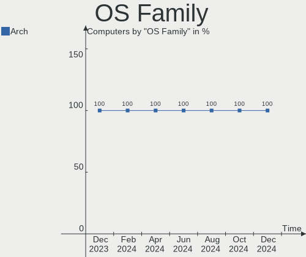
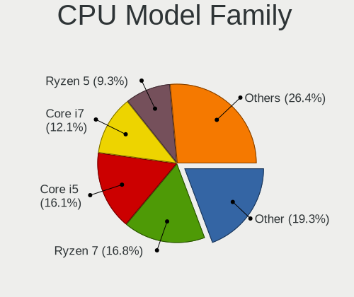
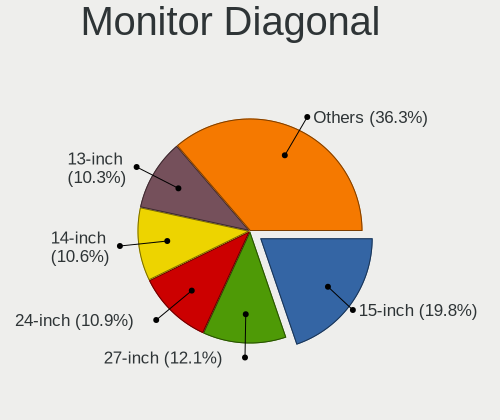
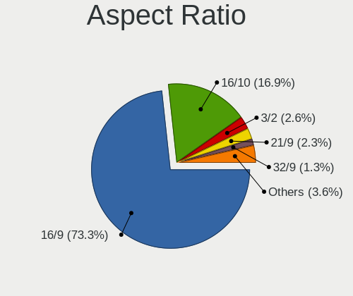

Arch Hardware Trends
--------------------

A project to identify most popular hardware characteristics and track their change
over time based on data collected by Arch users at https://Linux-Hardware.org.

Anyone can contribute to the study by uploading probes of their computers by
the [hw-probe](https://github.com/linuxhw/hw-probe) tool:

    sudo hw-probe -all -upload

This is a report for all computer types. See also reports for [desktops](/Dist/Arch/Desktop/README.md) and [notebooks](/Dist/Arch/Notebook/README.md).

Full-feature report is available here: https://linux-hardware.org/?view=trends

Period: Apr, 2020.

Contents
--------

- [ OS                       ](#os)
- [ OS Family                ](#os-family)
- [ Kernel                   ](#kernel)
- [ Kernel Family            ](#kernel-family)
- [ Kernel Major Ver.        ](#kernel-major-ver)
- [ Arch                     ](#arch)
- [ DE                       ](#de)
- [ Display Server           ](#display-server)
- [ Display Manager          ](#display-manager)
- [ OS Lang                  ](#os-lang)
- [ Boot Mode                ](#boot-mode)
- [ Filesystem               ](#filesystem)
- [ Dual Boot with Linux/BSD ](#dual-boot-with-linux/bsd)
- [ Dual Boot (Win)          ](#dual-boot-win)
- [ Country                  ](#country)
- [ City                     ](#city)
- [ Vendor                   ](#vendor)
- [ Model                    ](#model)
- [ Model Family             ](#model-family)
- [ MFG Year                 ](#mfg-year)
- [ Form Factor              ](#form-factor)
- [ Secure Boot              ](#secure-boot)
- [ Coreboot                 ](#coreboot)
- [ RAM Size                 ](#ram-size)
- [ RAM Used                 ](#ram-used)
- [ Drive Vendor             ](#drive-vendor)
- [ Drive Model              ](#drive-model)
- [ Drive Kind               ](#drive-kind)
- [ Drive Connector          ](#drive-connector)
- [ Drive Size               ](#drive-size)
- [ Space Total              ](#space-total)
- [ Space Used               ](#space-used)
- [ Malfunc. Drives          ](#malfunc-drives)
- [ Malfunc. Drive Vendor    ](#malfunc-drive-vendor)
- [ Malfunc. Drive Kind      ](#malfunc-drive-kind)
- [ Failed Drives            ](#failed-drives)
- [ Failed Drive Vendor      ](#failed-drive-vendor)
- [ Drive Status             ](#drive-status)
- [ Storage Vendor           ](#storage-vendor)
- [ Storage Model            ](#storage-model)
- [ Storage Kind             ](#storage-kind)
- [ CPU Vendor               ](#cpu-vendor)
- [ CPU Model                ](#cpu-model)
- [ CPU Model Family         ](#cpu-model-family)
- [ CPU Cores                ](#cpu-cores)
- [ CPU Sockets              ](#cpu-sockets)
- [ CPU Threads              ](#cpu-threads)
- [ CPU Op-Modes             ](#cpu-op-modes)
- [ CPU Microarch            ](#cpu-microarch)
- [ CPU Microcode            ](#cpu-microcode)
- [ GPU Vendor               ](#gpu-vendor)
- [ GPU Model                ](#gpu-model)
- [ GPU Combo                ](#gpu-combo)
- [ GPU Driver               ](#gpu-driver)
- [ GPU Memory               ](#gpu-memory)
- [ Monitor Vendor           ](#monitor-vendor)
- [ Monitor Model            ](#monitor-model)
- [ Monitor Resolution       ](#monitor-resolution)
- [ Monitor Diagonal         ](#monitor-diagonal)
- [ Monitor Width            ](#monitor-width)
- [ Aspect Ratio             ](#aspect-ratio)
- [ Monitor Area             ](#monitor-area)
- [ Pixel Density            ](#pixel-density)
- [ Multiple Monitors        ](#multiple-monitors)
- [ Net Controller Vendor    ](#net-controller-vendor)
- [ Net Controller Model     ](#net-controller-model)
- [ Net Controller Kind      ](#net-controller-kind)
- [ Used Controller          ](#used-controller)
- [ NICs                     ](#nics)
- [ Unsupported Devices      ](#unsupported-devices)
- [ Unsupported Device Types ](#unsupported-device-types)

OS
--

Installed operating systems

| Name         | Computers | Percent |
|--------------|-----------|---------|
| Arch         | 92        | 71.88%  |
| Arch Rolling | 36        | 28.13%  |

OS Family
---------

OS without a version

| Name | Computers | Percent |
|------|-----------|---------|
| Arch | 128       | 100%    |

Kernel
------

Version of the Linux kernel

| Version                   | Computers | Percent |
|---------------------------|-----------|---------|
| 5.6.4-arch1-1             | 24        | 18.75%  |
| 5.6.3-arch1-1             | 16        | 12.5%   |
| 5.6.6-arch1-1             | 15        | 11.72%  |
| 5.5.13-arch2-1            | 15        | 11.72%  |
| 5.6.7-arch1-1             | 12        | 9.38%   |
| 5.6.5-arch3-1             | 7         | 5.47%   |
| 5.4.28-2-lts              | 5         | 3.91%   |
| 5.6.2-arch1-2             | 4         | 3.13%   |
| 5.6.7-zen1-1-zen          | 3         | 2.34%   |
| 5.6.3-zen1-1-zen          | 3         | 2.34%   |
| 5.4.31-1-lts              | 3         | 2.34%   |
| 5.5.7-arch1-1             | 2         | 1.56%   |
| 5.4.32-1-lts              | 2         | 1.56%   |
| 5.6.8-arch1-1             | 1         | 0.78%   |
| 5.6.4-arch1-1-vfio        | 1         | 0.78%   |
| 5.6.2-5-tkg-pds           | 1         | 0.78%   |
| 5.5.9-arch1-2             | 1         | 0.78%   |
| 5.5.19-1-ck-zen2          | 1         | 0.78%   |
| 5.5.18-1-ck-zen2          | 1         | 0.78%   |
| 5.5.15-1-ck               | 1         | 0.78%   |
| 5.5.13.ll53-1-lingruby-ll | 1         | 0.78%   |
| 5.5.13-zen2-1-zen         | 1         | 0.78%   |
| 5.5.11-arch1-1            | 1         | 0.78%   |
| 5.4.34-1-lts              | 1         | 0.78%   |
| 5.4.33-3-lts              | 1         | 0.78%   |
| 5.4.30-1-lts              | 1         | 0.78%   |
| 5.4.28-1-lts              | 1         | 0.78%   |
| 5.4.27-1-lts              | 1         | 0.78%   |
| 5.4.14-arch1-1            | 1         | 0.78%   |
| 4.8.13-1-ARCH             | 1         | 0.78%   |

Kernel Family
-------------

Linux kernel without a distro release

| Version | Computers | Percent |
|---------|-----------|---------|
| 5.6.4   | 25        | 19.53%  |
| 5.6.3   | 19        | 14.84%  |
| 5.5.13  | 17        | 13.28%  |
| 5.6.7   | 15        | 11.72%  |
| 5.6.6   | 15        | 11.72%  |
| 5.6.5   | 7         | 5.47%   |
| 5.4.28  | 6         | 4.69%   |
| 5.6.2   | 5         | 3.91%   |
| 5.4.31  | 3         | 2.34%   |
| 5.5.7   | 2         | 1.56%   |
| 5.4.32  | 2         | 1.56%   |
| 5.6.8   | 1         | 0.78%   |
| 5.5.9   | 1         | 0.78%   |
| 5.5.19  | 1         | 0.78%   |
| 5.5.18  | 1         | 0.78%   |
| 5.5.15  | 1         | 0.78%   |
| 5.5.11  | 1         | 0.78%   |
| 5.4.34  | 1         | 0.78%   |
| 5.4.33  | 1         | 0.78%   |
| 5.4.30  | 1         | 0.78%   |
| 5.4.27  | 1         | 0.78%   |
| 5.4.14  | 1         | 0.78%   |
| 4.8.13  | 1         | 0.78%   |

Kernel Major Ver.
-----------------

Linux kernel major version

| Version | Computers | Percent |
|---------|-----------|---------|
| 5.6     | 87        | 67.97%  |
| 5.5     | 24        | 18.75%  |
| 5.4     | 16        | 12.5%   |
| 4.8     | 1         | 0.78%   |

Arch
----

OS architecture (x86_64, i586, etc.)

| Name   | Computers | Percent |
|--------|-----------|---------|
| x86_64 | 128       | 100%    |

DE
--

Desktop Environment

| Name          | Computers | Percent |
|---------------|-----------|---------|
| GNOME         | 67        | 52.34%  |
| KDE5          | 14        | 10.94%  |
| KDE           | 14        | 10.94%  |
| XFCE          | 10        | 7.81%   |
| Unknown       | 6         | 4.69%   |
| Deepin        | 4         | 3.13%   |
| X-Cinnamon    | 3         | 2.34%   |
| Cinnamon      | 3         | 2.34%   |
| Budgie        | 3         | 2.34%   |
| i3            | 2         | 1.56%   |
| LXDE          | 1         | 0.78%   |
| GNOME Classic | 1         | 0.78%   |

Display Server
--------------

X11 or Wayland

| Name    | Computers | Percent |
|---------|-----------|---------|
| X11     | 86        | 67.19%  |
| Wayland | 35        | 27.34%  |
| Tty     | 6         | 4.69%   |
| Unknown | 1         | 0.78%   |

Display Manager
---------------

SDDM, LightDM, etc.

| Name    | Computers | Percent |
|---------|-----------|---------|
| Unknown | 78        | 60.94%  |
| LightDM | 21        | 16.41%  |
| SDDM    | 14        | 10.94%  |
| GDM     | 12        | 9.38%   |
| XDM     | 1         | 0.78%   |
| SLiM    | 1         | 0.78%   |
| KDM     | 1         | 0.78%   |

OS Lang
-------

Language

| Lang       | Computers | Percent |
|------------|-----------|---------|
| en_US      | 55        | 42.97%  |
| de_DE      | 11        | 8.59%   |
| pt_BR      | 7         | 5.47%   |
| en_GB      | 7         | 5.47%   |
| ru_RU      | 6         | 4.69%   |
| C          | 5         | 3.91%   |
| pl_PL      | 4         | 3.13%   |
| fr_FR      | 4         | 3.13%   |
| en_AU      | 3         | 2.34%   |
| Unknown    | 3         | 2.34%   |
| es_MX      | 2         | 1.56%   |
| es_ES      | 2         | 1.56%   |
| en_US.utf8 | 2         | 1.56%   |
| sv_SE      | 1         | 0.78%   |
| ru_RU.utf8 | 1         | 0.78%   |
| ro_RO      | 1         | 0.78%   |
| pl_PL.utf8 | 1         | 0.78%   |
| nb_NO      | 1         | 0.78%   |
| lv_LV      | 1         | 0.78%   |
| it_IT      | 1         | 0.78%   |
| hu_HU      | 1         | 0.78%   |
| fr_CH      | 1         | 0.78%   |
| fr_CA      | 1         | 0.78%   |
| es_CO      | 1         | 0.78%   |
| en_NL      | 1         | 0.78%   |
| en_GB.utf8 | 1         | 0.78%   |
| en_DK      | 1         | 0.78%   |
| en_CA.utf8 | 1         | 0.78%   |
| en_CA      | 1         | 0.78%   |
| de_AT      | 1         | 0.78%   |

Boot Mode
---------

EFI or BIOS

| Mode | Computers | Percent |
|------|-----------|---------|
| EFI  | 70        | 54.69%  |
| BIOS | 58        | 45.31%  |

Filesystem
----------

Type of filesystem

| Type    | Computers | Percent |
|---------|-----------|---------|
| Ext4    | 108       | 84.38%  |
| Btrfs   | 10        | 7.81%   |
| Xfs     | 5         | 3.91%   |
| F2fs    | 2         | 1.56%   |
| Zfs     | 1         | 0.78%   |
| Ext3    | 1         | 0.78%   |
| Unknown | 1         | 0.78%   |

Dual Boot with Linux/BSD
------------------------

Hosting more than one Linux/BSD

| Dual boot | Computers | Percent |
|-----------|-----------|---------|
| No        | 112       | 87.5%   |
| Yes       | 16        | 12.5%   |

Dual Boot (Win)
---------------

Hosting Linux and Windows

| Dual boot | Computers | Percent |
|-----------|-----------|---------|
| No        | 103       | 80.47%  |
| Yes       | 25        | 19.53%  |

Country
-------

Geographic location (country)

| Country      | Computers | Percent |
|--------------|-----------|---------|
| USA          | 24        | 18.75%  |
| Germany      | 13        | 10.16%  |
| Russia       | 10        | 7.81%   |
| Canada       | 9         | 7.03%   |
| UK           | 8         | 6.25%   |
| Brazil       | 7         | 5.47%   |
| Spain        | 5         | 3.91%   |
| Poland       | 5         | 3.91%   |
| France       | 5         | 3.91%   |
| Australia    | 4         | 3.13%   |
| Switzerland  | 3         | 2.34%   |
| Netherlands  | 3         | 2.34%   |
| Italy        | 3         | 2.34%   |
| Austria      | 3         | 2.34%   |
| Qatar        | 2         | 1.56%   |
| Mexico       | 2         | 1.56%   |
| Colombia     | 2         | 1.56%   |
| Belgium      | 2         | 1.56%   |
| Turkey       | 1         | 0.78%   |
| Thailand     | 1         | 0.78%   |
| Taiwan       | 1         | 0.78%   |
| Sweden       | 1         | 0.78%   |
| Sri Lanka    | 1         | 0.78%   |
| South Africa | 1         | 0.78%   |
| Romania      | 1         | 0.78%   |
| Norway       | 1         | 0.78%   |
| Latvia       | 1         | 0.78%   |
| Kazakhstan   | 1         | 0.78%   |
| Indonesia    | 1         | 0.78%   |
| India        | 1         | 0.78%   |
| Hungary      | 1         | 0.78%   |
| Hong Kong    | 1         | 0.78%   |
| Greece       | 1         | 0.78%   |
| Egypt        | 1         | 0.78%   |
| Cyprus       | 1         | 0.78%   |
| Bulgaria     | 1         | 0.78%   |

City
----

Geographic location (city)

| City                     | Computers | Percent |
|--------------------------|-----------|---------|
| Barcelona                | 3         | 2.34%   |
| Waren                    | 2         | 1.56%   |
| Tallahassee              | 2         | 1.56%   |
| St Petersburg            | 2         | 1.56%   |
| Sanford                  | 2         | 1.56%   |
| Penrith                  | 2         | 1.56%   |
| Munich                   | 2         | 1.56%   |
| Moscow                   | 2         | 1.56%   |
| Montreal                 | 2         | 1.56%   |
| Juiz de Fora             | 2         | 1.56%   |
| Hanover                  | 2         | 1.56%   |
| Durham                   | 2         | 1.56%   |
| Doha                     | 2         | 1.56%   |
| Bogotá                  | 2         | 1.56%   |
| Austin                   | 2         | 1.56%   |
| Zoetermeer               | 1         | 0.78%   |
| Zell unter Aichelberg    | 1         | 0.78%   |
| Yukon                    | 1         | 0.78%   |
| Yoshkar-Ola              | 1         | 0.78%   |
| Wrocław                 | 1         | 0.78%   |
| Werdohl                  | 1         | 0.78%   |
| Warsaw                   | 1         | 0.78%   |
| Waiblingen               | 1         | 0.78%   |
| Vladivostok              | 1         | 0.78%   |
| Villefranche-de-Rouergue | 1         | 0.78%   |
| Villars                  | 1         | 0.78%   |
| Vienna                   | 1         | 0.78%   |
| Victoria                 | 1         | 0.78%   |
| Uppsala                  | 1         | 0.78%   |
| Tsuen Wan                | 1         | 0.78%   |
| Topeka                   | 1         | 0.78%   |
| Taipei                   | 1         | 0.78%   |
| São Paulo               | 1         | 0.78%   |
| Sydney                   | 1         | 0.78%   |
| Sofiemyr                 | 1         | 0.78%   |
| Sibiu                    | 1         | 0.78%   |
| Sherbrooke               | 1         | 0.78%   |
| Schweinfurt              | 1         | 0.78%   |
| Sao Jose                 | 1         | 0.78%   |
| Santa Monica             | 1         | 0.78%   |
| Rotherhithe              | 1         | 0.78%   |
| Regina                   | 1         | 0.78%   |
| Reggio Calabria          | 1         | 0.78%   |
| Pune                     | 1         | 0.78%   |
| Puerto del Rosario       | 1         | 0.78%   |
| Poznan                   | 1         | 0.78%   |
| Portola Valley           | 1         | 0.78%   |
| Plouharnel               | 1         | 0.78%   |
| Parndorf                 | 1         | 0.78%   |
| Pahrump                  | 1         | 0.78%   |
| Orenburg                 | 1         | 0.78%   |
| Novosibirsk              | 1         | 0.78%   |
| Nieuwendijk              | 1         | 0.78%   |
| New Bedford              | 1         | 0.78%   |
| Montes Claros            | 1         | 0.78%   |
| Mira                     | 1         | 0.78%   |
| Mexicali                 | 1         | 0.78%   |
| Merksem                  | 1         | 0.78%   |
| Mercier                  | 1         | 0.78%   |
| March                    | 1         | 0.78%   |

Vendor
------

Motherboard manufacturer

| Name                | Computers | Percent |
|---------------------|-----------|---------|
| ASUSTek Computer    | 22        | 17.19%  |
| Lenovo              | 21        | 16.41%  |
| Dell                | 18        | 14.06%  |
| Hewlett-Packard     | 13        | 10.16%  |
| MSI                 | 12        | 9.38%   |
| Gigabyte Technology | 9         | 7.03%   |
| Acer                | 9         | 7.03%   |
| ASRock              | 5         | 3.91%   |
| Sony                | 3         | 2.34%   |
| Notebook            | 3         | 2.34%   |
| Intel               | 3         | 2.34%   |
| Samsung Electronics | 2         | 1.56%   |
| Apple               | 2         | 1.56%   |
| Unknown             | 2         | 1.56%   |
| Microsoft           | 1         | 0.78%   |
| Mediacom            | 1         | 0.78%   |
| ECS                 | 1         | 0.78%   |
| Biostar             | 1         | 0.78%   |

Model
-----

Motherboard model

| Name                                     | Computers | Percent |
|------------------------------------------|-----------|---------|
| MSI MS-7C37                              | 2         | 1.56%   |
| MSI MS-7B86                              | 2         | 1.56%   |
| Lenovo 1S7033H45MJDMVVK                  | 2         | 1.56%   |
| HP ProBook 6470b                         | 2         | 1.56%   |
| Dell Studio 1558                         | 2         | 1.56%   |
| ASUS PRIME A320M-K                       | 2         | 1.56%   |
| ASUS Maximus VIII RANGER                 | 2         | 1.56%   |
| Acer Aspire E5-571                       | 2         | 1.56%   |
| Unknown                                  | 2         | 1.56%   |
| Sony VPCEJ2Z1E                           | 1         | 0.78%   |
| Sony VGN-CR590E                          | 1         | 0.78%   |
| Sony SVP13215CDB                         | 1         | 0.78%   |
| Samsung Electronics RF511/RF411/RF711    | 1         | 0.78%   |
| Samsung Electronics 530U4E/540U4E        | 1         | 0.78%   |
| Notebook W65_67SZ                        | 1         | 0.78%   |
| Notebook W54_55_94_95_97AU,AUQ           | 1         | 0.78%   |
| Notebook P65_P67RGRERA                   | 1         | 0.78%   |
| MSI MS-7B79                              | 1         | 0.78%   |
| MSI MS-7B49                              | 1         | 0.78%   |
| MSI MS-7B25                              | 1         | 0.78%   |
| MSI MS-7B17                              | 1         | 0.78%   |
| MSI MS-7A64                              | 1         | 0.78%   |
| MSI MS-7693                              | 1         | 0.78%   |
| MSI GX720                                | 1         | 0.78%   |
| MSI GE70 2PE                             | 1         | 0.78%   |
| Microsoft Surface Book                   | 1         | 0.78%   |
| Mediacom SmartBook 14 FullHD - SB14UC    | 1         | 0.78%   |
| Lenovo Z50-70 20354                      | 1         | 0.78%   |
| Lenovo ThinkPad X390 Yoga 20NNCTO1WW     | 1         | 0.78%   |
| Lenovo ThinkPad X260 20F5S5MQ00          | 1         | 0.78%   |
| Lenovo ThinkPad X230 232578G             | 1         | 0.78%   |
| Lenovo ThinkPad X1 Carbon 2nd 20A8S0ET00 | 1         | 0.78%   |
| Lenovo ThinkPad T490 20N2000BRT          | 1         | 0.78%   |
| Lenovo ThinkPad T430 2349PT4             | 1         | 0.78%   |
| Lenovo ThinkPad T420 4236A72             | 1         | 0.78%   |
| Lenovo ThinkPad S1 Yoga 12 20DK001XMZ    | 1         | 0.78%   |
| Lenovo ThinkPad P53 20QNCTO1WW           | 1         | 0.78%   |
| Lenovo ThinkPad E480 20KN005CBM          | 1         | 0.78%   |
| Lenovo ThinkPad E470 20H2S00700          | 1         | 0.78%   |
| Lenovo Legion Y540-15IRH-PG0 81SY        | 1         | 0.78%   |
| Lenovo IdeaPad Z575 12992PU              | 1         | 0.78%   |
| Lenovo IdeaPad Y510P 20217               | 1         | 0.78%   |
| Lenovo IdeaPad FLEX 6-14ARR 81HA         | 1         | 0.78%   |
| Lenovo IdeaPad 330-15ARR 81D2            | 1         | 0.78%   |
| Lenovo G700 20251                        | 1         | 0.78%   |
| Lenovo Flex 3-1480                       | 1         | 0.78%   |
| Intel NUC6CAYB J23203-402                | 1         | 0.78%   |
| Intel DX79SR AAG57199-200                | 1         | 0.78%   |
| Intel D54250WYK H13922-304               | 1         | 0.78%   |
| HP Z400 Workstation                      | 1         | 0.78%   |
| HP Stream Laptop 14-cb0XX                | 1         | 0.78%   |
| HP Pro x2 612 G2                         | 1         | 0.78%   |
| HP Pavilion Notebook                     | 1         | 0.78%   |
| HP Pavilion Gaming Laptop 15-dk0xxx      | 1         | 0.78%   |
| HP Pavilion Gaming Laptop 15-cx0xxx      | 1         | 0.78%   |
| HP Mini 110-3100                         | 1         | 0.78%   |
| HP ENVY Laptop 13-aq0xxx                 | 1         | 0.78%   |
| HP EliteBook 840 G6                      | 1         | 0.78%   |
| HP EliteBook 830 G6                      | 1         | 0.78%   |
| HP 250 G6 Notebook PC                    | 1         | 0.78%   |

Model Family
------------

Motherboard model prefix

| Name                       | Computers | Percent |
|----------------------------|-----------|---------|
| Lenovo ThinkPad            | 11        | 8.59%   |
| Acer Aspire                | 8         | 6.25%   |
| Lenovo IdeaPad             | 4         | 3.13%   |
| Dell Inspiron              | 4         | 3.13%   |
| ASUS ROG                   | 4         | 3.13%   |
| HP Pavilion                | 3         | 2.34%   |
| Dell XPS                   | 3         | 2.34%   |
| Dell Precision             | 3         | 2.34%   |
| Dell Latitude              | 3         | 2.34%   |
| ASUS PRIME                 | 3         | 2.34%   |
| MSI MS-7C37                | 2         | 1.56%   |
| MSI MS-7B86                | 2         | 1.56%   |
| Lenovo 1S7033H45MJDMVVK    | 2         | 1.56%   |
| HP ProBook                 | 2         | 1.56%   |
| HP EliteBook               | 2         | 1.56%   |
| Gigabyte AX370-Gaming      | 2         | 1.56%   |
| Dell Studio                | 2         | 1.56%   |
| ASUS TUF                   | 2         | 1.56%   |
| ASUS P8Z77-V               | 2         | 1.56%   |
| ASUS Maximus               | 2         | 1.56%   |
| ASRock X570                | 2         | 1.56%   |
| Unknown                    | 2         | 1.56%   |
| Sony VPCEJ2Z1E             | 1         | 0.78%   |
| Sony VGN-CR590E            | 1         | 0.78%   |
| Sony SVP13215CDB           | 1         | 0.78%   |
| Samsung Electronics RF511  | 1         | 0.78%   |
| Samsung Electronics 530U4E | 1         | 0.78%   |
| Notebook W65               | 1         | 0.78%   |
| Notebook W54               | 1         | 0.78%   |
| Notebook P65               | 1         | 0.78%   |
| MSI MS-7B79                | 1         | 0.78%   |
| MSI MS-7B49                | 1         | 0.78%   |
| MSI MS-7B25                | 1         | 0.78%   |
| MSI MS-7B17                | 1         | 0.78%   |
| MSI MS-7A64                | 1         | 0.78%   |
| MSI MS-7693                | 1         | 0.78%   |
| MSI GX720                  | 1         | 0.78%   |
| MSI GE70                   | 1         | 0.78%   |
| Microsoft Surface          | 1         | 0.78%   |
| Mediacom SmartBook         | 1         | 0.78%   |
| Lenovo Z50-70              | 1         | 0.78%   |
| Lenovo Legion              | 1         | 0.78%   |
| Lenovo G700                | 1         | 0.78%   |
| Lenovo Flex                | 1         | 0.78%   |
| Intel NUC6CAYB             | 1         | 0.78%   |
| Intel DX79SR               | 1         | 0.78%   |
| Intel D54250WYK            | 1         | 0.78%   |
| HP Z400                    | 1         | 0.78%   |
| HP Stream                  | 1         | 0.78%   |
| HP Pro                     | 1         | 0.78%   |
| HP Mini                    | 1         | 0.78%   |
| HP ENVY                    | 1         | 0.78%   |
| HP 250                     | 1         | 0.78%   |
| Gigabyte Z87X-UD3H         | 1         | 0.78%   |
| Gigabyte Z77X-UD5H         | 1         | 0.78%   |
| Gigabyte X470              | 1         | 0.78%   |
| Gigabyte H110M-S2V         | 1         | 0.78%   |
| Gigabyte B250-HD3          | 1         | 0.78%   |
| Gigabyte AB350-Gaming      | 1         | 0.78%   |
| Gigabyte 970A-UD3P         | 1         | 0.78%   |

MFG Year
--------

Motherboard manufacture year

| Year | Computers | Percent |
|------|-----------|---------|
| 2019 | 39        | 30.47%  |
| 2018 | 16        | 12.5%   |
| 2014 | 13        | 10.16%  |
| 2017 | 11        | 8.59%   |
| 2013 | 9         | 7.03%   |
| 2016 | 7         | 5.47%   |
| 2015 | 7         | 5.47%   |
| 2020 | 6         | 4.69%   |
| 2012 | 6         | 4.69%   |
| 2011 | 4         | 3.13%   |
| 2010 | 3         | 2.34%   |
| 2008 | 3         | 2.34%   |
| 2009 | 2         | 1.56%   |
| 2007 | 2         | 1.56%   |

Form Factor
-----------

Physical design of the computer

| Name        | Computers | Percent |
|-------------|-----------|---------|
| Notebook    | 69        | 53.91%  |
| Desktop     | 54        | 42.19%  |
| Tablet      | 2         | 1.56%   |
| Convertible | 2         | 1.56%   |
| Mini pc     | 1         | 0.78%   |

Secure Boot
-----------

Enabled or disabled

| State    | Computers | Percent |
|----------|-----------|---------|
| Disabled | 128       | 100%    |

Coreboot
--------

Have coreboot on board

| Used | Computers | Percent |
|------|-----------|---------|
| No   | 128       | 100%    |

RAM Size
--------

Total RAM memory

| Size in GB  | Computers | Percent |
|-------------|-----------|---------|
| 16.01-24.0  | 39        | 30.47%  |
| 8.01-16.0   | 33        | 25.78%  |
| 4.01-8.0    | 25        | 19.53%  |
| 3.01-4.0    | 11        | 8.59%   |
| 32.01-64.0  | 10        | 7.81%   |
| 64.01-256.0 | 5         | 3.91%   |
| 1.01-2.0    | 3         | 2.34%   |
| 24.01-32.0  | 2         | 1.56%   |

RAM Used
--------

Used RAM memory

| Used GB   | Computers | Percent |
|-----------|-----------|---------|
| 1.01-2.0  | 44        | 34.38%  |
| 2.01-3.0  | 29        | 22.66%  |
| 3.01-4.0  | 27        | 21.09%  |
| 4.01-8.0  | 19        | 14.84%  |
| 8.01-16.0 | 5         | 3.91%   |
| 0.01-1.0  | 4         | 3.13%   |

Drive Vendor
------------

Hard drive vendors

| Vendor              | Computers | Drives  | Percent |
|---------------------|-----------|---------|---------|
| Seagate             | 42        | 49      | 19.91%  |
| Samsung Electronics | 31        | 38      | 14.69%  |
| WDC                 | 30        | 37      | 14.22%  |
| Toshiba             | 12        | 13      | 5.69%   |
| SanDisk             | 11        | 15      | 5.21%   |
| Crucial             | 11        | 11      | 5.21%   |
| Unknown             | 10        | 10      | 4.74%   |
| Kingston            | 10        | 10      | 4.74%   |
| A-DATA Technology   | 8         | 8       | 3.79%   |
| Intel               | 6         | 6       | 2.84%   |
| HGST                | 6         | 6       | 2.84%   |
| SK Hynix            | 4         | 4       | 1.9%    |
| Corsair             | 4         | 4       | 1.9%    |
| Hitachi             | 3         | 3       | 1.42%   |
| DREVO               | 3         | 3       | 1.42%   |
| China               | 3         | 3       | 1.42%   |
| HL-DT-ST            | 2         | Unknown | 0.95%   |
| ASMT                | 2         | 2       | 0.95%   |
| Silicon Motion      | 1         | 1       | 0.47%   |
| S3U3                | 1         | 1       | 0.47%   |
| Phison              | 1         | 1       | 0.47%   |
| Patriot             | 1         | 1       | 0.47%   |
| OCZ                 | 1         | 1       | 0.47%   |
| Mushkin             | 1         | 1       | 0.47%   |
| MARVELL             | 1         | 1       | 0.47%   |
| LITEON              | 1         | 1       | 0.47%   |
| INDMEM              | 1         | 1       | 0.47%   |
| GOODRAM             | 1         | 1       | 0.47%   |
| Gigabyte Technology | 1         | 1       | 0.47%   |
| Generic-            | 1         | 1       | 0.47%   |
| Fujitsu             | 1         | 1       | 0.47%   |

Drive Model
-----------

Hard drive models

| Model                        | Computers | Percent |
|------------------------------|-----------|---------|
| ST1000LM024 HN-M101MBB 1TB   | 4         | 1.7%    |
| X1 SSD 120GB                 | 3         | 1.28%   |
| SV300S37A120G 120GB SSD      | 3         | 1.28%   |
| ST500LT012-1DG142 500GB      | 3         | 1.28%   |
| ST2000LM015-2E8174 2TB       | 3         | 1.28%   |
| ST2000DM006-2DM164 2TB       | 3         | 1.28%   |
| ST1000LM048-2E7172 1TB       | 3         | 1.28%   |
| ST1000LM035-1RK172 1TB       | 3         | 1.28%   |
| SH00R480GB SSD               | 3         | 1.28%   |
| SA400S37120G 120GB SSD       | 3         | 1.28%   |
| MMC Card  32GB               | 3         | 1.28%   |
| HTS721010A9E630 1TB          | 3         | 1.28%   |
| WD5000AAKX-001CA0 500GB      | 2         | 0.85%   |
| WD40EZRZ-00GXCB0 4TB         | 2         | 0.85%   |
| WD3200AAKS-75L9A0 320GB      | 2         | 0.85%   |
| WD20EURX-57T0FY0 2TB         | 2         | 0.85%   |
| ST750LX003-1AC154 752GB      | 2         | 0.85%   |
| ST500DM005 HD502HJ 500GB     | 2         | 0.85%   |
| SSD 970 EVO Plus 500GB       | 2         | 0.85%   |
| SSD 970 EVO 250GB            | 2         | 0.85%   |
| SSD 850 EVO 250GB            | 2         | 0.85%   |
| SSD 850 EVO 1TB              | 2         | 0.85%   |
| SSD 850 EVO 120GB            | 2         | 0.85%   |
| SDSSDA240G 240GB             | 2         | 0.85%   |
| SA400S37240G 240GB SSD       | 2         | 0.85%   |
| MZ7TY256HDHP-000L7 256GB SSD | 2         | 0.85%   |
| MQ01ABD100 1TB               | 2         | 0.85%   |
| HDWE160 6TB                  | 2         | 0.85%   |
| DVDRAM GUC0N 1GB             | 2         | 0.85%   |
| CT500MX500SSD1 500GB         | 2         | 0.85%   |
| CT1000MX500SSD1 1TB          | 2         | 0.85%   |
| WDS500G2B0B-00YS70 500GB SSD | 1         | 0.43%   |
| WDS480G2G0B-00EPW0 480GB SSD | 1         | 0.43%   |
| WDS240G2G0A-00JH30 240GB SSD | 1         | 0.43%   |
| WDS200T3X0C-00SJG0 2TB       | 1         | 0.43%   |
| WDBNCE2500PNC-WRSN 250GB SSD | 1         | 0.43%   |
| WD8000AARS-00Y5B1 800GB      | 1         | 0.43%   |
| WD7500BPVX-22JC3T0 752GB     | 1         | 0.43%   |
| WD7500BPKX-00HPJT0 752GB     | 1         | 0.43%   |
| WD50EFRX-68MYMN1 5TB         | 1         | 0.43%   |
| WD5000BPVT-24HXZT3 500GB     | 1         | 0.43%   |
| WD5000BEKT-00KA9T0 500GB     | 1         | 0.43%   |
| WD5000AAKS-75V0A0 500GB      | 1         | 0.43%   |
| WD5000AAKS-00YGA0 500GB      | 1         | 0.43%   |
| WD30EZRX-00D8PB0 3TB         | 1         | 0.43%   |
| WD20NPVT-00Z2TT0 2TB         | 1         | 0.43%   |
| WD20EZRZ-00Z5HB0 2TB         | 1         | 0.43%   |
| WD20EARX-008FB0 2TB          | 1         | 0.43%   |
| WD1600JS-08MHB0 160GB        | 1         | 0.43%   |
| WD10SPZX-21Z10T0 1TB         | 1         | 0.43%   |
| WD10JPVX-22JC3T0 1TB         | 1         | 0.43%   |
| WD10EZRX-00A8LB0 1TB         | 1         | 0.43%   |
| WD10EZEX-08WN4A0 1TB         | 1         | 0.43%   |
| WD10EZEX-00WN4A0 1TB         | 1         | 0.43%   |
| WD10EZEX-00BN5A0 1TB         | 1         | 0.43%   |
| WD10EARX-22N0YB0 1TB         | 1         | 0.43%   |
| WD1003FZEX-00K3CA0 1TB       | 1         | 0.43%   |
| WD1001FAES-75W7A0 1TB        | 1         | 0.43%   |
| VERTEX3 240GB SSD            | 1         | 0.43%   |
| Ultra II 480GB SSD           | 1         | 0.43%   |

Drive Kind
----------

HDD or SSD

| Kind    | Computers | Drives  | Percent |
|---------|-----------|---------|---------|
| HDD     | 73        | 104     | 41.71%  |
| SSD     | 68        | 96      | 38.86%  |
| NVMe    | 23        | 26      | 13.14%  |
| MMC     | 9         | 9       | 5.14%   |
| Unknown | 2         | Unknown | 1.14%   |

Drive Connector
---------------

SATA, SAS, NVMe, etc.

| Type | Computers | Drives | Percent |
|------|-----------|--------|---------|
| SATA | 107       | 197    | 74.83%  |
| NVMe | 23        | 26     | 16.08%  |
| MMC  | 9         | 9      | 6.29%   |
| SAS  | 4         | 3      | 2.8%    |

Drive Size
----------

Size of hard drive

| Size in TB | Computers | Drives | Percent |
|------------|-----------|--------|---------|
| 0.01-0.5   | 95        | 140    | 54.29%  |
| 0.51-1.0   | 49        | 59     | 28%     |
| 1.01-2.0   | 20        | 23     | 11.43%  |
| 3.01-4.0   | 6         | 7      | 3.43%   |
| 4.01-10.0  | 3         | 3      | 1.71%   |
| 2.01-3.0   | 2         | 3      | 1.14%   |

Space Total
-----------

Amount of disk space available on the file system

| Size in GB     | Computers | Percent |
|----------------|-----------|---------|
| 101-250        | 45        | 35.16%  |
| 251-500        | 23        | 17.97%  |
| 501-1000       | 23        | 17.97%  |
| 1001-2000      | 15        | 11.72%  |
| More than 3000 | 8         | 6.25%   |
| 2001-3000      | 7         | 5.47%   |
| 21-50          | 5         | 3.91%   |
| 51-100         | 1         | 0.78%   |
| Unknown        | 1         | 0.78%   |

Space Used
----------

Amount of used disk space

| Used GB        | Computers | Percent |
|----------------|-----------|---------|
| 1-20           | 27        | 21.09%  |
| 21-50          | 24        | 18.75%  |
| 51-100         | 20        | 15.63%  |
| 101-250        | 15        | 11.72%  |
| 501-1000       | 15        | 11.72%  |
| 1001-2000      | 12        | 9.38%   |
| 251-500        | 10        | 7.81%   |
| More than 3000 | 2         | 1.56%   |
| 2001-3000      | 2         | 1.56%   |
| Unknown        | 1         | 0.78%   |

Malfunc. Drives
---------------

Drive models with a malfunction

| Model                        | Computers | Drives | Percent |
|------------------------------|-----------|--------|---------|
| X1 SSD 120GB                 | 3         | 3      | 17.65%  |
| SV300S37A120G 120GB SSD      | 1         | 1      | 5.88%   |
| SU635 480GB SSD              | 1         | 1      | 5.88%   |
| ST9250315AS 250GB            | 1         | 1      | 5.88%   |
| ST3640323AS 640GB            | 1         | 1      | 5.88%   |
| ST3500312CS 500GB            | 1         | 1      | 5.88%   |
| ST3160318AS 160GB            | 1         | 1      | 5.88%   |
| ST2000LX001-1RG174 2TB       | 1         | 1      | 5.88%   |
| SSDSA2M080G2GC 80GB          | 1         | 1      | 5.88%   |
| SH103S3240G 240GB SSD        | 1         | 1      | 5.88%   |
| SD7SB3Q128G1001 128GB SSD    | 1         | 1      | 5.88%   |
| MK3276GSX 320GB              | 1         | 1      | 5.88%   |
| HFS128G39TND-N210A 128GB SSD | 1         | 1      | 5.88%   |
| Force GT 240GB SSD           | 1         | 1      | 5.88%   |
| Force 3 SSD 120GB            | 1         | 1      | 5.88%   |

Malfunc. Drive Vendor
---------------------

Vendors of faulty drives

| Vendor            | Computers | Drives | Percent |
|-------------------|-----------|--------|---------|
| Seagate           | 5         | 5      | 29.41%  |
| DREVO             | 3         | 3      | 17.65%  |
| Kingston          | 2         | 2      | 11.76%  |
| Corsair           | 2         | 2      | 11.76%  |
| Toshiba           | 1         | 1      | 5.88%   |
| SK Hynix          | 1         | 1      | 5.88%   |
| SanDisk           | 1         | 1      | 5.88%   |
| Intel             | 1         | 1      | 5.88%   |
| A-DATA Technology | 1         | 1      | 5.88%   |

Malfunc. Drive Kind
-------------------

Kinds of faulty drives

| Kind | Computers | Drives | Percent |
|------|-----------|--------|---------|
| SSD  | 9         | 11     | 60%     |
| HDD  | 6         | 6      | 40%     |

Failed Drives
-------------

Failed drive models

Zero info for selected period =(

Failed Drive Vendor
-------------------

Failed drive vendors

Zero info for selected period =(

Drive Status
------------

Number of failed and malfunc. drives

| Status   | Computers | Drives | Percent |
|----------|-----------|--------|---------|
| Detected | 72        | 130    | 54.14%  |
| Works    | 46        | 88     | 34.59%  |
| Malfunc  | 15        | 17     | 11.28%  |

Storage Vendor
--------------

Storage controller vendors

| Vendor                       | Computers | Percent |
|------------------------------|-----------|---------|
| Intel                        | 91        | 53.53%  |
| AMD                          | 26        | 15.29%  |
| Samsung Electronics          | 17        | 10%     |
| ASMedia Technology           | 6         | 3.53%   |
| Marvell Technology Group     | 5         | 2.94%   |
| Toshiba America Info Systems | 4         | 2.35%   |
| Sandisk                      | 4         | 2.35%   |
| Phison Electronics           | 3         | 1.76%   |
| SK Hynix                     | 2         | 1.18%   |
| Silicon Motion               | 2         | 1.18%   |
| Nvidia                       | 2         | 1.18%   |
| JMicron Technology           | 2         | 1.18%   |
| ADATA Technology             | 2         | 1.18%   |
| Micron/Crucial Technology    | 1         | 0.59%   |
| Micron Technology            | 1         | 0.59%   |
| Kingston Technology Company  | 1         | 0.59%   |
| Adaptec                      | 1         | 0.59%   |

Storage Model
-------------

Storage controller models

| Model                                                                    | Computers | Percent |
|--------------------------------------------------------------------------|-----------|---------|
| FCH SATA Controller [AHCI mode]                                          | 20        | 10.42%  |
| NVMe SSD Controller SM981/PM981/PM983                                    | 13        | 6.77%   |
| Sunrise Point-LP SATA Controller [AHCI mode]                             | 9         | 4.69%   |
| 7 Series Chipset Family 6-port SATA Controller [AHCI mode]               | 9         | 4.69%   |
| 8 Series SATA Controller 1 [AHCI mode]                                   | 8         | 4.17%   |
| Wildcat Point-LP SATA Controller [AHCI Mode]                             | 6         | 3.13%   |
| Non-Volatile memory controller                                           | 6         | 3.13%   |
| Cannon Lake Mobile PCH SATA AHCI Controller                              | 6         | 3.13%   |
| 400 Series Chipset SATA Controller                                       | 6         | 3.13%   |
| SB7x0/SB8x0/SB9x0 SATA Controller [AHCI mode]                            | 5         | 2.6%    |
| Q170/Q150/B150/H170/H110/Z170/CM236 Chipset SATA Controller [AHCI Mode]  | 5         | 2.6%    |
| ASM1062 Serial ATA Controller                                            | 5         | 2.6%    |
| 8 Series/C220 Series Chipset Family 6-port SATA Controller 1 [AHCI mode] | 5         | 2.6%    |
| 200 Series PCH SATA controller [AHCI mode]                               | 5         | 2.6%    |
| 7 Series/C210 Series Chipset Family 6-port SATA Controller [AHCI mode]   | 4         | 2.08%   |
| WD Black 2018/PC SN720 NVMe SSD                                          | 3         | 1.56%   |
| SSD 660P Series                                                          | 3         | 1.56%   |
| NVMe SSD Controller SM961/PM961                                          | 3         | 1.56%   |
| Cannon Lake PCH SATA AHCI Controller                                     | 3         | 1.56%   |
| 82801JI (ICH10 Family) SATA AHCI Controller                              | 3         | 1.56%   |
| 82801 Mobile SATA Controller [RAID mode]                                 | 3         | 1.56%   |
| 6 Series/C200 Series Chipset Family 6 port Mobile SATA AHCI Controller   | 3         | 1.56%   |
| XPG SX8200 Pro PCIe Gen3x4 M.2 2280 Solid State Drive                    | 2         | 1.04%   |
| X370 Series Chipset SATA Controller                                      | 2         | 1.04%   |
| SSD Pro 7600p/760p/E 6100p Series                                        | 2         | 1.04%   |
| NVMe SSD Controller SM951/PM951                                          | 2         | 1.04%   |
| MCP61 SATA Controller                                                    | 2         | 1.04%   |
| MCP61 IDE                                                                | 2         | 1.04%   |
| HM170/QM170 Chipset SATA Controller [AHCI Mode]                          | 2         | 1.04%   |
| FCH SATA Controller D                                                    | 2         | 1.04%   |
| E12 NVMe Controller                                                      | 2         | 1.04%   |
| Celeron N3350/Pentium N4200/Atom E3900 Series SATA AHCI Controller       | 2         | 1.04%   |
| 88SE9172 SATA 6Gb/s Controller                                           | 2         | 1.04%   |
| 6 Series/C200 Series Chipset Family 6 port Desktop SATA AHCI Controller  | 2         | 1.04%   |
| 5 Series/3400 Series Chipset 4 port SATA AHCI Controller                 | 2         | 1.04%   |
| 300 Series Chipset SATA Controller                                       | 2         | 1.04%   |
| XG4 NVMe SSD Controller                                                  | 1         | 0.52%   |
| Toshiba America Info Non-Volatile memory controller                      | 1         | 0.52%   |
| SB7x0/SB8x0/SB9x0 SATA Controller [IDE mode]                             | 1         | 0.52%   |
| SB7x0/SB8x0/SB9x0 IDE Controller                                         | 1         | 0.52%   |
| SATA Controller [RAID mode]                                              | 1         | 0.52%   |
| PC300 NVMe Solid State Drive 512GB                                       | 1         | 0.52%   |
| P1 NVMe PCIe SSD                                                         | 1         | 0.52%   |
| NVMe Storage Controller                                                  | 1         | 0.52%   |
| NVMe Controller                                                          | 1         | 0.52%   |
| NM10/ICH7 Family SATA Controller [IDE mode]                              | 1         | 0.52%   |
| NM10/ICH7 Family SATA Controller [AHCI mode]                             | 1         | 0.52%   |
| JMB368 IDE controller                                                    | 1         | 0.52%   |
| JMB363 SATA/IDE Controller                                               | 1         | 0.52%   |
| C610/X99 series chipset sSATA Controller [AHCI mode]                     | 1         | 0.52%   |
| C610/X99 series chipset 6-Port SATA Controller [AHCI mode]               | 1         | 0.52%   |
| C600/X79 series chipset 4-Port SATA IDE Controller                       | 1         | 0.52%   |
| C600/X79 series chipset 2-Port SATA IDE Controller                       | 1         | 0.52%   |
| BG3 NVMe SSD Controller                                                  | 1         | 0.52%   |
| ASM1061 SATA IDE Controller                                              | 1         | 0.52%   |
| AAC-RAID                                                                 | 1         | 0.52%   |
| 88SE9230 PCIe SATA 6Gb/s Controller                                      | 1         | 0.52%   |
| 88SE9128 PCIe SATA 6 Gb/s RAID controller with HyperDuo                  | 1         | 0.52%   |
| 88SE6111/6121 SATA II / PATA Controller                                  | 1         | 0.52%   |
| 82801JI (ICH10 Family) 4 port SATA IDE Controller #1                     | 1         | 0.52%   |

Storage Kind
------------

Kind of storage controller (IDE, SATA, NVMe, SAS, ...)

| Kind | Computers | Percent |
|------|-----------|---------|
| SATA | 105       | 66.04%  |
| NVMe | 38        | 23.9%   |
| IDE  | 11        | 6.92%   |
| RAID | 5         | 3.14%   |

CPU Vendor
----------

Processor vendors

| Vendor | Computers | Percent |
|--------|-----------|---------|
| Intel  | 99        | 77.34%  |
| AMD    | 29        | 22.66%  |

CPU Model
---------

Processor models

| Model                                         | Computers | Percent |
|-----------------------------------------------|-----------|---------|
| Intel Core i5-5200U CPU @ 2.20GHz             | 5         | 3.91%   |
| AMD Ryzen 3 2200G with Radeon Vega Graphics   | 4         | 3.13%   |
| Intel Core i7-9750H CPU @ 2.60GHz             | 3         | 2.34%   |
| Intel Core i7-8750H CPU @ 2.20GHz             | 2         | 1.56%   |
| Intel Core i7-8700K CPU @ 3.70GHz             | 2         | 1.56%   |
| Intel Core i7-8565U CPU @ 1.80GHz             | 2         | 1.56%   |
| Intel Core i7-8550U CPU @ 1.80GHz             | 2         | 1.56%   |
| Intel Core i7-6700K CPU @ 4.00GHz             | 2         | 1.56%   |
| Intel Core i7-3770K CPU @ 3.50GHz             | 2         | 1.56%   |
| Intel Core i7-3520M CPU @ 2.90GHz             | 2         | 1.56%   |
| Intel Core i5-9600K CPU @ 3.70GHz             | 2         | 1.56%   |
| Intel Core i5-8265U CPU @ 1.60GHz             | 2         | 1.56%   |
| Intel Core i5-8250U CPU @ 1.60GHz             | 2         | 1.56%   |
| Intel Core i5-6300U CPU @ 2.40GHz             | 2         | 1.56%   |
| Intel Core i5-3320M CPU @ 2.60GHz             | 2         | 1.56%   |
| Intel Core i5-3230M CPU @ 2.60GHz             | 2         | 1.56%   |
| Intel Core i5-2400 CPU @ 3.10GHz              | 2         | 1.56%   |
| Intel Core i3-4005U CPU @ 1.70GHz             | 2         | 1.56%   |
| AMD Ryzen 9 3950X 16-Core Processor           | 2         | 1.56%   |
| AMD Ryzen 7 3700X 8-Core Processor            | 2         | 1.56%   |
| AMD Ryzen 7 2700X Eight-Core Processor        | 2         | 1.56%   |
| AMD Ryzen 3 2200U with Radeon Vega Mobile Gfx | 2         | 1.56%   |
| AMD FX-8350 Eight-Core Processor              | 2         | 1.56%   |
| AMD FX-6300 Six-Core Processor                | 2         | 1.56%   |
| Intel Xeon E-2286M CPU @ 2.40GHz              | 1         | 0.78%   |
| Intel Xeon CPU X5690 @ 3.47GHz                | 1         | 0.78%   |
| Intel Xeon CPU W3565 @ 3.20GHz                | 1         | 0.78%   |
| Intel Xeon CPU W3550 @ 3.07GHz                | 1         | 0.78%   |
| Intel Xeon CPU E3-1505M v5 @ 2.80GHz          | 1         | 0.78%   |
| Intel Pentium Dual CPU E2140 @ 1.60GHz        | 1         | 0.78%   |
| Intel Pentium CPU B970 @ 2.30GHz              | 1         | 0.78%   |
| Intel Pentium 3556U @ 1.70GHz                 | 1         | 0.78%   |
| Intel Core i9-9880H CPU @ 2.30GHz             | 1         | 0.78%   |
| Intel Core i7-8665U CPU @ 1.90GHz             | 1         | 0.78%   |
| Intel Core i7-8650U CPU @ 1.90GHz             | 1         | 0.78%   |
| Intel Core i7-7700K CPU @ 4.20GHz             | 1         | 0.78%   |
| Intel Core i7-7700HQ CPU @ 2.80GHz            | 1         | 0.78%   |
| Intel Core i7-7500U CPU @ 2.70GHz             | 1         | 0.78%   |
| Intel Core i7-6700HQ CPU @ 2.60GHz            | 1         | 0.78%   |
| Intel Core i7-6700 CPU @ 3.40GHz              | 1         | 0.78%   |
| Intel Core i7-6500U CPU @ 2.50GHz             | 1         | 0.78%   |
| Intel Core i7-5820K CPU @ 3.30GHz             | 1         | 0.78%   |
| Intel Core i7-5500U CPU @ 2.40GHz             | 1         | 0.78%   |
| Intel Core i7-4770 CPU @ 3.40GHz              | 1         | 0.78%   |
| Intel Core i7-4712MQ CPU @ 2.30GHz            | 1         | 0.78%   |
| Intel Core i7-4702MQ CPU @ 2.20GHz            | 1         | 0.78%   |
| Intel Core i7-4700MQ CPU @ 2.40GHz            | 1         | 0.78%   |
| Intel Core i7-4700HQ CPU @ 2.40GHz            | 1         | 0.78%   |
| Intel Core i7-4600U CPU @ 2.10GHz             | 1         | 0.78%   |
| Intel Core i7-4510U CPU @ 2.00GHz             | 1         | 0.78%   |
| Intel Core i7-3820 CPU @ 3.60GHz              | 1         | 0.78%   |
| Intel Core i7-3770S CPU @ 3.10GHz             | 1         | 0.78%   |
| Intel Core i7-2640M CPU @ 2.80GHz             | 1         | 0.78%   |
| Intel Core i7 CPU Q 720 @ 1.60GHz             | 1         | 0.78%   |
| Intel Core i5-8400 CPU @ 2.80GHz              | 1         | 0.78%   |
| Intel Core i5-8300H CPU @ 2.30GHz             | 1         | 0.78%   |
| Intel Core i5-7Y54 CPU @ 1.20GHz              | 1         | 0.78%   |
| Intel Core i5-7600K CPU @ 3.80GHz             | 1         | 0.78%   |
| Intel Core i5-7400 CPU @ 3.00GHz              | 1         | 0.78%   |
| Intel Core i5-7200U CPU @ 2.50GHz             | 1         | 0.78%   |

CPU Model Family
----------------

Processor model prefix

| Model              | Computers | Percent |
|--------------------|-----------|---------|
| Intel Core i7      | 38        | 29.69%  |
| Intel Core i5      | 36        | 28.13%  |
| AMD Ryzen 7        | 7         | 5.47%   |
| AMD Ryzen 3        | 7         | 5.47%   |
| Intel Xeon         | 5         | 3.91%   |
| Intel Celeron      | 5         | 3.91%   |
| Intel Core i3      | 4         | 3.13%   |
| AMD FX             | 4         | 3.13%   |
| Intel Core 2 Quad  | 3         | 2.34%   |
| AMD Ryzen 9        | 3         | 2.34%   |
| AMD Ryzen 5        | 3         | 2.34%   |
| Intel Pentium      | 2         | 1.56%   |
| Intel Core 2 Duo   | 2         | 1.56%   |
| Intel Atom         | 2         | 1.56%   |
| Intel Pentium Dual | 1         | 0.78%   |
| Intel Core i9      | 1         | 0.78%   |
| AMD Phenom II X4   | 1         | 0.78%   |
| AMD Phenom II      | 1         | 0.78%   |
| AMD Phenom         | 1         | 0.78%   |
| AMD Athlon 64 X2   | 1         | 0.78%   |
| AMD A6             | 1         | 0.78%   |

CPU Cores
---------

Number of processor cores

| Number | Computers | Percent |
|--------|-----------|---------|
| 4      | 51        | 39.84%  |
| 2      | 47        | 36.72%  |
| 6      | 15        | 11.72%  |
| 8      | 9         | 7.03%   |
| 16     | 2         | 1.56%   |
| 3      | 2         | 1.56%   |
| 12     | 1         | 0.78%   |
| 1      | 1         | 0.78%   |

CPU Sockets
-----------

Number of sockets

| Number | Computers | Percent |
|--------|-----------|---------|
| 1      | 128       | 100%    |

CPU Threads
-----------

Threads per core (Hyper-Threading)

| Number | Computers | Percent |
|--------|-----------|---------|
| 2      | 93        | 72.66%  |
| 1      | 35        | 27.34%  |

CPU Op-Modes
------------

CPU Operation Modes (32-bit, 64-bit)

| Op mode        | Computers | Percent |
|----------------|-----------|---------|
| 32-bit, 64-bit | 128       | 100%    |

CPU Microarch
-------------

Microarchitecture

| Name        | Computers | Percent |
|-------------|-----------|---------|
| Skylake     | 31        | 24.22%  |
| Haswell     | 14        | 10.94%  |
| IvyBridge   | 12        | 9.38%   |
| KabyLake    | 10        | 7.81%   |
| Zen         | 9         | 7.03%   |
| SandyBridge | 9         | 7.03%   |
| Zen 2       | 7         | 5.47%   |
| Core        | 6         | 4.69%   |
| Broadwell   | 6         | 4.69%   |
| Zen+        | 4         | 3.13%   |
| Piledriver  | 4         | 3.13%   |
| Silvermont  | 3         | 2.34%   |
| Nehalem     | 3         | 2.34%   |
| K10         | 3         | 2.34%   |
| Westmere    | 2         | 1.56%   |
| Goldmont    | 2         | 1.56%   |
| K8 Hammer   | 1         | 0.78%   |
| K10 Llano   | 1         | 0.78%   |
| Bonnell     | 1         | 0.78%   |

CPU Microcode
-------------

Microcode number

| Number     | Computers | Percent |
|------------|-----------|---------|
| Unknown    | 22        | 17.19%  |
| 0x306a9    | 9         | 7.03%   |
| 0x906ea    | 8         | 6.25%   |
| 0x40651    | 6         | 4.69%   |
| 0x206a7    | 6         | 4.69%   |
| 0x906e9    | 5         | 3.91%   |
| 0x806ec    | 5         | 3.91%   |
| 0x306d4    | 5         | 3.91%   |
| 0x08701013 | 5         | 3.91%   |
| 0x406e3    | 4         | 3.13%   |
| 0x306c3    | 4         | 3.13%   |
| 0x08101016 | 4         | 3.13%   |
| 0x806ea    | 3         | 2.34%   |
| 0x0800820d | 3         | 2.34%   |
| 0x06000822 | 3         | 2.34%   |
| 0x906ed    | 2         | 1.56%   |
| 0x906ec    | 2         | 1.56%   |
| 0x506c9    | 2         | 1.56%   |
| 0x406c3    | 2         | 1.56%   |
| 0x106a5    | 2         | 1.56%   |
| 0x1067a    | 2         | 1.56%   |
| 0x0810100b | 2         | 1.56%   |
| 0x08001138 | 2         | 1.56%   |
| 0x806e9    | 1         | 0.78%   |
| 0x6fd      | 1         | 0.78%   |
| 0x6fb      | 1         | 0.78%   |
| 0x506e3    | 1         | 0.78%   |
| 0x406c4    | 1         | 0.78%   |
| 0x306f2    | 1         | 0.78%   |
| 0x206d7    | 1         | 0.78%   |
| 0x206c2    | 1         | 0.78%   |
| 0x20652    | 1         | 0.78%   |
| 0x106e5    | 1         | 0.78%   |
| 0x106ca    | 1         | 0.78%   |
| 0x10677    | 1         | 0.78%   |
| 0x10676    | 1         | 0.78%   |
| 0x08701012 | 1         | 0.78%   |
| 0x0800820c | 1         | 0.78%   |
| 0x08001126 | 1         | 0.78%   |
| 0x03000027 | 1         | 0.78%   |
| 0x010000c8 | 1         | 0.78%   |
| 0x010000b6 | 1         | 0.78%   |
| 0x01000065 | 1         | 0.78%   |

GPU Vendor
----------

Vendors of graphics cards

| Vendor | Computers | Percent |
|--------|-----------|---------|
| Intel  | 76        | 49.03%  |
| Nvidia | 50        | 32.26%  |
| AMD    | 29        | 18.71%  |

GPU Model
---------

Graphics card models

| Model                                                                              | Computers | Percent |
|------------------------------------------------------------------------------------|-----------|---------|
| UHD Graphics 630 (Mobile)                                                          | 8         | 4.94%   |
| Haswell-ULT Integrated Graphics Controller                                         | 8         | 4.94%   |
| 3rd Gen Core processor Graphics Controller                                         | 8         | 4.94%   |
| Raven Ridge [Radeon Vega Series / Radeon Vega Mobile Series]                       | 6         | 3.7%    |
| HD Graphics 5500                                                                   | 6         | 3.7%    |
| 2nd Generation Core Processor Family Integrated Graphics Controller                | 6         | 3.7%    |
| UHD Graphics 620 (Whiskey Lake)                                                    | 5         | 3.09%   |
| UHD Graphics 620                                                                   | 5         | 3.09%   |
| Skylake GT2 [HD Graphics 520]                                                      | 4         | 2.47%   |
| Navi 10 [Radeon RX 5600 OEM/5600 XT / 5700/5700 XT]                                | 4         | 2.47%   |
| Ellesmere [Radeon RX 470/480/570/570X/580/580X/590]                                | 4         | 2.47%   |
| 4th Gen Core Processor Integrated Graphics Controller                              | 4         | 2.47%   |
| Xeon E3-1200 v2/3rd Gen Core processor Graphics Controller                         | 3         | 1.85%   |
| TU117M [GeForce GTX 1650 Mobile / Max-Q]                                           | 3         | 1.85%   |
| Tahiti PRO [Radeon HD 7950/8950 OEM / R9 280]                                      | 3         | 1.85%   |
| GP107M [GeForce GTX 1050 Ti Mobile]                                                | 3         | 1.85%   |
| GP107 [GeForce GTX 1050 Ti]                                                        | 3         | 1.85%   |
| GM204 [GeForce GTX 970]                                                            | 3         | 1.85%   |
| Atom/Celeron/Pentium Processor x5-E8000/J3xxx/N3xxx Integrated Graphics Controller | 3         | 1.85%   |
| UHD Graphics 630 (Desktop 9 Series)                                                | 2         | 1.23%   |
| TU104GLM [Quadro RTX 4000 Mobile / Max-Q]                                          | 2         | 1.23%   |
| Park [Mobility Radeon HD 5430/5450/5470]                                           | 2         | 1.23%   |
| HD Graphics 620                                                                    | 2         | 1.23%   |
| HD Graphics 500                                                                    | 2         | 1.23%   |
| GP104 [GeForce GTX 1080]                                                           | 2         | 1.23%   |
| GK208BM [GeForce 920M]                                                             | 2         | 1.23%   |
| GF117M [GeForce 610M/710M/810M/820M / GT 620M/625M/630M/720M]                      | 2         | 1.23%   |
| Baffin [Radeon RX 550 640SP / RX 560/560X]                                         | 2         | 1.23%   |
| Vega 20 [Radeon VII]                                                               | 1         | 0.62%   |
| Vega 10 XL/XT [Radeon RX Vega 56/64]                                               | 1         | 0.62%   |
| UHD Graphics 630 (Desktop)                                                         | 1         | 0.62%   |
| UHD Graphics                                                                       | 1         | 0.62%   |
| TU117 [GeForce GTX 1650]                                                           | 1         | 0.62%   |
| TU116 [GeForce GTX 1660]                                                           | 1         | 0.62%   |
| TU106 [GeForce RTX 2070 Rev. A]                                                    | 1         | 0.62%   |
| TU106 [GeForce RTX 2060 SUPER]                                                     | 1         | 0.62%   |
| TU104 [GeForce RTX 2070 SUPER]                                                     | 1         | 0.62%   |
| Topaz XT [Radeon R7 M260/M265 / M340/M360 / M440/M445 / 530/535 / 620/625 Mobile]  | 1         | 0.62%   |
| Tahiti XT [Radeon HD 7970/8970 OEM / R9 280X]                                      | 1         | 0.62%   |
| Sumo [Radeon HD 6520G]                                                             | 1         | 0.62%   |
| RV635 [Radeon HD 3650/3750/4570/4580]                                              | 1         | 0.62%   |
| Redwood PRO [Radeon HD 5550/5570/5630/6510/6610/7570]                              | 1         | 0.62%   |
| Navi 14 [Radeon RX 5500/5500M / Pro 5500M]                                         | 1         | 0.62%   |
| Mobile GM965/GL960 Integrated Graphics Controller (secondary)                      | 1         | 0.62%   |
| Mobile GM965/GL960 Integrated Graphics Controller (primary)                        | 1         | 0.62%   |
| HD Graphics P530                                                                   | 1         | 0.62%   |
| HD Graphics 630                                                                    | 1         | 0.62%   |
| HD Graphics 615                                                                    | 1         | 0.62%   |
| HD Graphics 530                                                                    | 1         | 0.62%   |
| GT216 [GeForce GT 220]                                                             | 1         | 0.62%   |
| GP108 [GeForce GT 1030]                                                            | 1         | 0.62%   |
| GP107 [GeForce GTX 1050]                                                           | 1         | 0.62%   |
| GP106M [GeForce GTX 1060 Mobile]                                                   | 1         | 0.62%   |
| GP104 [GeForce GTX 1070]                                                           | 1         | 0.62%   |
| GP104 [GeForce GTX 1070 Ti]                                                        | 1         | 0.62%   |
| GM206 [GeForce GTX 950]                                                            | 1         | 0.62%   |
| GM204M [GeForce GTX 970M]                                                          | 1         | 0.62%   |
| GM200GL [Quadro M6000]                                                             | 1         | 0.62%   |
| GM200 [GeForce GTX 980 Ti]                                                         | 1         | 0.62%   |
| GM108M [GeForce 940MX]                                                             | 1         | 0.62%   |

GPU Combo
---------

Combinations of graphics cards

| Name           | Computers | Percent |
|----------------|-----------|---------|
| 1 x Intel      | 51        | 39.84%  |
| 1 x Nvidia     | 24        | 18.75%  |
| 1 x AMD        | 23        | 17.97%  |
| Intel + Nvidia | 22        | 17.19%  |
| 2 x AMD        | 3         | 2.34%   |
| 2 x Nvidia     | 2         | 1.56%   |
| AMD + Nvidia   | 2         | 1.56%   |
| Intel + AMD    | 1         | 0.78%   |

GPU Driver
----------

Free vs proprietary

| Driver      | Computers | Percent |
|-------------|-----------|---------|
| Free        | 94        | 73.44%  |
| Proprietary | 33        | 25.78%  |
| Unknown     | 1         | 0.78%   |

GPU Memory
----------

Total video memory

| Size in GB | Computers | Percent |
|------------|-----------|---------|
| Unknown    | 71        | 55.47%  |
| 1.01-2.0   | 14        | 10.94%  |
| 7.01-8.0   | 12        | 9.38%   |
| 3.01-4.0   | 10        | 7.81%   |
| 0.01-0.5   | 8         | 6.25%   |
| 2.01-3.0   | 5         | 3.91%   |
| 0.51-1.0   | 4         | 3.13%   |
| 5.01-6.0   | 3         | 2.34%   |
| 8.01-16.0  | 1         | 0.78%   |

Monitor Vendor
--------------

Monitor vendors

| Vendor               | Computers | Percent |
|----------------------|-----------|---------|
| AU Optronics         | 19        | 12.58%  |
| LG Display           | 17        | 11.26%  |
| Samsung Electronics  | 16        | 10.6%   |
| Chimei Innolux       | 14        | 9.27%   |
| Goldstar             | 10        | 6.62%   |
| BOE                  | 7         | 4.64%   |
| Dell                 | 6         | 3.97%   |
| BenQ                 | 5         | 3.31%   |
| AOC                  | 5         | 3.31%   |
| Ancor Communications | 5         | 3.31%   |
| Acer                 | 5         | 3.31%   |
| Sharp                | 3         | 1.99%   |
| Iiyama               | 3         | 1.99%   |
| Hewlett-Packard      | 3         | 1.99%   |
| ViewSonic            | 2         | 1.32%   |
| Unknown              | 2         | 1.32%   |
| Philips              | 2         | 1.32%   |
| Panasonic            | 2         | 1.32%   |
| NEC Computers        | 2         | 1.32%   |
| LG Electronics       | 2         | 1.32%   |
| Hitachi              | 2         | 1.32%   |
| Apple                | 2         | 1.32%   |
| Vizio                | 1         | 0.66%   |
| Unknown (AAA)        | 1         | 0.66%   |
| Toshiba              | 1         | 0.66%   |
| Sony                 | 1         | 0.66%   |
| Sceptre              | 1         | 0.66%   |
| PANDA                | 1         | 0.66%   |
| Orion                | 1         | 0.66%   |
| ONN                  | 1         | 0.66%   |
| Lenovo               | 1         | 0.66%   |
| ITE                  | 1         | 0.66%   |
| Insignia             | 1         | 0.66%   |
| InnoLux Display      | 1         | 0.66%   |
| InfoVision           | 1         | 0.66%   |
| HannStar             | 1         | 0.66%   |
| GRUNDIG              | 1         | 0.66%   |
| CPT                  | 1         | 0.66%   |
| ASUSTek Computer     | 1         | 0.66%   |

Monitor Model
-------------

Monitor models

| Model                                               | Computers | Percent |
|-----------------------------------------------------|-----------|---------|
| LG FULL HD GSM5AB9 1680x1050 480x270mm 21.7-inch    | 3         | 1.95%   |
| 2260WG5 AOC2260 1920x1080 477x268mm 21.5-inch       | 3         | 1.95%   |
| ZOWIE XL LCD BNQ7F31 1920x1080 531x298mm 24.0-inch  | 2         | 1.3%    |
| X93S D-sub HIT7009 1280x1024 376x301mm 19.0-inch    | 2         | 1.3%    |
| VVX13F009G00 MEI96A2 1920x1080 290x170mm 13.2-inch  | 2         | 1.3%    |
| Ultra HD GSM5B09 3840x2160 600x340mm 27.2-inch      | 2         | 1.3%    |
| LCD Monitor LGD033A 1366x768 340x190mm 15.3-inch    | 2         | 1.3%    |
| LCD Monitor CMN15BF 1366x768 344x193mm 15.5-inch    | 2         | 1.3%    |
| LCD Monitor CMN14C9 1920x1080 309x173mm 13.9-inch   | 2         | 1.3%    |
| LCD Monitor AUO423D 1920x1080 309x173mm 13.9-inch   | 2         | 1.3%    |
| LCD Monitor AUO40EC 1366x768 340x190mm 15.3-inch    | 2         | 1.3%    |
| LCD Monitor AUO213E 1600x900 309x174mm 14.0-inch    | 2         | 1.3%    |
| C27F390 SAM0D32 1920x1080 600x340mm 27.2-inch       | 2         | 1.3%    |
| W2043 GSM4E9E 1600x900 443x249mm 20.0-inch          | 1         | 0.65%   |
| VX2776 Series VSC3E32 1920x1080 598x336mm 27.0-inch | 1         | 0.65%   |
| VX2453 Series VSC0C28 1920x1080 520x290mm 23.4-inch | 1         | 0.65%   |
| VE247 ACI2493 1920x1080 531x299mm 24.0-inch         | 1         | 0.65%   |
| VC279 ACI27C4 1920x1080 598x336mm 27.0-inch         | 1         | 0.65%   |
| V246HL ACR0336 1920x1080 531x299mm 24.0-inch        | 1         | 0.65%   |
| ULTRAWIDE GSM76FC 3840x1600 874x366mm 37.3-inch     | 1         | 0.65%   |
| ULTRAWIDE GSM5AFB 2560x1080 798x334mm 34.1-inch     | 1         | 0.65%   |
| U28E590 SAM0C4E 3840x2160 608x345mm 27.5-inch       | 1         | 0.65%   |
| U28E590 SAM0C4D 3840x2160 607x345mm 27.5-inch       | 1         | 0.65%   |
| U2412M DELA07B 1920x1200 518x324mm 24.1-inch        | 1         | 0.65%   |
| U2212HM DELD047 1920x1080 475x267mm 21.5-inch       | 1         | 0.65%   |
| TV TSB0105 1920x1080 708x398mm 32.0-inch            | 1         | 0.65%   |
| TV SNYE903 1920x1080 1600x900mm 72.3-inch           | 1         | 0.65%   |
| SyncMaster SAM041D 1920x1200 459x296mm 21.5-inch    | 1         | 0.65%   |
| SyncMaster SAM02B6 1920x1200 518x324mm 24.1-inch    | 1         | 0.65%   |
| SMB2430L SAM0645 1920x1080 521x293mm 23.5-inch      | 1         | 0.65%   |
| S27F350 SAM0D22 1920x1080 598x336mm 27.0-inch       | 1         | 0.65%   |
| S24D300 SAM0B43 1920x1080 531x299mm 24.0-inch       | 1         | 0.65%   |
| ROG PG278QR AUS27B1 2560x1440 600x340mm 27.2-inch   | 1         | 0.65%   |
| PLX2283H IVM5638 1920x1080 477x268mm 21.5-inch      | 1         | 0.65%   |
| PL2474H IVM6137 1920x1080 521x293mm 23.5-inch       | 1         | 0.65%   |
| PL2409HD IVM560C 1920x1080 521x293mm 23.5-inch      | 1         | 0.65%   |
| P221 HWP3058 1920x1080 476x268mm 21.5-inch          | 1         | 0.65%   |
| ORION ORN1208 1920x540                              | 1         | 0.65%   |
| ONA18HO015 ONN0101 1920x1080 698x393mm 31.5-inch    | 1         | 0.65%   |
| LM05 HSP0013 1440x900 408x255mm 18.9-inch           | 1         | 0.65%   |
| LEN LT2223zwC LEN60A2 1920x1080 477x268mm 21.5-inch | 1         | 0.65%   |
| LED Cinema APP9226 2560x1440 600x340mm 27.2-inch    | 1         | 0.65%   |
| LCDTV AAA3393 1360x768 890x500mm 40.2-inch          | 1         | 0.65%   |
| LCD Monitor X34 3440x1440                           | 1         | 0.65%   |
| LCD Monitor WUXGA                                   | 1         | 0.65%   |
| LCD Monitor W2340 3840x1080                         | 1         | 0.65%   |
| LCD Monitor U28E590 3840x2160                       | 1         | 0.65%   |
| LCD Monitor SHP148D 3840x2160 344x194mm 15.5-inch   | 1         | 0.65%   |
| LCD Monitor SHP1453 1920x1080 346x194mm 15.6-inch   | 1         | 0.65%   |
| LCD Monitor SEC4256 1600x900 382x215mm 17.3-inch    | 1         | 0.65%   |
| LCD Monitor SEC3847 1440x900 367x230mm 17.1-inch    | 1         | 0.65%   |
| LCD Monitor SEC334D 1600x900 382x214mm 17.2-inch    | 1         | 0.65%   |
| LCD Monitor SDC4852 3840x2160 340x190mm 15.3-inch   | 1         | 0.65%   |
| LCD Monitor SDC334D 1920x1080 309x174mm 14.0-inch   | 1         | 0.65%   |
| LCD Monitor S24B300 1920x1080                       | 1         | 0.65%   |
| LCD Monitor PHL BDM4065 3840x2160                   | 1         | 0.65%   |
| LCD Monitor NCP0036 1920x1080 344x194mm 15.5-inch   | 1         | 0.65%   |
| LCD Monitor LGD05EA 1920x1080 294x165mm 13.3-inch   | 1         | 0.65%   |
| LCD Monitor LGD05E5 1920x1080 344x194mm 15.5-inch   | 1         | 0.65%   |
| LCD Monitor LGD0590 1920x1080 344x194mm 15.5-inch   | 1         | 0.65%   |

Monitor Resolution
------------------

Monitor screen resolution

| Resolution         | Computers | Percent |
|--------------------|-----------|---------|
| 1920x1080 (FHD)    | 62        | 44.29%  |
| 1366x768 (WXGA)    | 31        | 22.14%  |
| 3840x2160 (4K)     | 11        | 7.86%   |
| 1600x900 (HD+)     | 6         | 4.29%   |
| 2560x1440 (QHD)    | 5         | 3.57%   |
| 3840x1080          | 3         | 2.14%   |
| 1920x1200 (WUXGA)  | 3         | 2.14%   |
| 1680x1050 (WSXGA+) | 3         | 2.14%   |
| 1280x1024 (SXGA)   | 3         | 2.14%   |
| Unknown            | 3         | 2.14%   |
| 1440x900 (WXGA+)   | 2         | 1.43%   |
| 1360x768           | 2         | 1.43%   |
| 3840x1600          | 1         | 0.71%   |
| 3440x1440          | 1         | 0.71%   |
| 2560x1080          | 1         | 0.71%   |
| 1920x540           | 1         | 0.71%   |
| 1920x1280          | 1         | 0.71%   |
| 1280x800 (WXGA)    | 1         | 0.71%   |

Monitor Diagonal
----------------

Diagonal size in inches

| Inches  | Computers | Percent |
|---------|-----------|---------|
| 15      | 32        | 21.77%  |
| 13      | 20        | 13.61%  |
| 27      | 15        | 10.2%   |
| Unknown | 14        | 9.52%   |
| 21      | 11        | 7.48%   |
| 24      | 10        | 6.8%    |
| 14      | 10        | 6.8%    |
| 23      | 9         | 6.12%   |
| 17      | 5         | 3.4%    |
| 12      | 4         | 2.72%   |
| 19      | 3         | 2.04%   |
| 72      | 2         | 1.36%   |
| 22      | 2         | 1.36%   |
| 20      | 2         | 1.36%   |
| 40      | 1         | 0.68%   |
| 37      | 1         | 0.68%   |
| 34      | 1         | 0.68%   |
| 32      | 1         | 0.68%   |
| 31      | 1         | 0.68%   |
| 26      | 1         | 0.68%   |
| 18      | 1         | 0.68%   |
| 11      | 1         | 0.68%   |

Monitor Width
-------------

Physical width

| Width in mm | Computers | Percent |
|-------------|-----------|---------|
| 301-350     | 53        | 36.3%   |
| 501-600     | 32        | 21.92%  |
| 401-500     | 16        | 10.96%  |
| 201-300     | 14        | 9.59%   |
| Unknown     | 14        | 9.59%   |
| 351-400     | 8         | 5.48%   |
| 601-700     | 3         | 2.05%   |
| 801-900     | 2         | 1.37%   |
| 701-800     | 2         | 1.37%   |
| 1501-2000   | 2         | 1.37%   |

Aspect Ratio
------------

Proportional relationship between the width and the height

| Ratio   | Computers | Percent |
|---------|-----------|---------|
| 16/9    | 105       | 78.36%  |
| Unknown | 13        | 9.7%    |
| 16/10   | 9         | 6.72%   |
| 5/4     | 3         | 2.24%   |
| 21/9    | 2         | 1.49%   |
| 32/9    | 1         | 0.75%   |
| 3/2     | 1         | 0.75%   |

Monitor Area
------------

Area in inch²

| Area in inch² | Computers | Percent |
|----------------|-----------|---------|
| 101-110        | 32        | 21.33%  |
| 201-250        | 23        | 15.33%  |
| 81-90          | 21        | 14%     |
| 301-350        | 15        | 10%     |
| 151-200        | 14        | 9.33%   |
| Unknown        | 14        | 9.33%   |
| 71-80          | 9         | 6%      |
| 251-300        | 5         | 3.33%   |
| 61-70          | 4         | 2.67%   |
| 351-500        | 4         | 2.67%   |
| 121-130        | 3         | 2%      |
| More than 1000 | 2         | 1.33%   |
| 131-140        | 2         | 1.33%   |
| 51-60          | 1         | 0.67%   |
| 501-1000       | 1         | 0.67%   |

Pixel Density
-------------

Pixels per inch

| Density       | Computers | Percent |
|---------------|-----------|---------|
| 101-120       | 47        | 32.87%  |
| 51-100        | 34        | 23.78%  |
| 121-160       | 29        | 20.28%  |
| 161-240       | 14        | 9.79%   |
| Unknown       | 14        | 9.79%   |
| 1-50          | 3         | 2.1%    |
| More than 240 | 2         | 1.4%    |

Multiple Monitors
-----------------

Total monitors connected

| Total | Computers | Percent |
|-------|-----------|---------|
| 1     | 102       | 79.69%  |
| 2     | 24        | 18.75%  |
| 3     | 1         | 0.78%   |
| 0     | 1         | 0.78%   |

Net Controller Vendor
---------------------

Controller vendors

| Vendor                            | Computers | Percent |
|-----------------------------------|-----------|---------|
| Intel                             | 27        | 72.97%  |
| Realtek Semiconductor             | 4         | 10.81%  |
| Nvidia                            | 2         | 5.41%   |
| NetGear                           | 1         | 2.7%    |
| Microchip Technology              | 1         | 2.7%    |
| FIBOCOM                           | 1         | 2.7%    |
| Ericsson Business Mobile Networks | 1         | 2.7%    |

Net Controller Model
--------------------

Controller models

| Model                                                     | Computers | Percent |
|-----------------------------------------------------------|-----------|---------|
| 82579LM Gigabit Network Connection (Lewisville)           | 9         | 20%     |
| I211 Gigabit Network Connection                           | 8         | 17.78%  |
| Wi-Fi 6 AX200                                             | 7         | 15.56%  |
| Centrino Advanced-N 6205 [Taylor Peak]                    | 5         | 11.11%  |
| 82579V Gigabit Network Connection                         | 4         | 8.89%   |
| RTL8153 Gigabit Ethernet Adapter                          | 3         | 6.67%   |
| MCP61 Ethernet                                            | 2         | 4.44%   |
| 82574L Gigabit Network Connection                         | 2         | 4.44%   |
| RTL8111/8168/8411 PCI Express Gigabit Ethernet Controller | 1         | 2.22%   |
| L830-EB-00                                                | 1         | 2.22%   |
| HTC Hub Controller                                        | 1         | 2.22%   |
| H5321 gw Mobile Broadband Driver                          | 1         | 2.22%   |
| A6210                                                     | 1         | 2.22%   |

Net Controller Kind
-------------------

Ethernet, WiFi or modem

| Kind     | Computers | Percent |
|----------|-----------|---------|
| Ethernet | 28        | 65.12%  |
| WiFi     | 14        | 32.56%  |
| Modem    | 1         | 2.33%   |

Used Controller
---------------

Currently used network controller

| Kind     | Computers | Percent |
|----------|-----------|---------|
| Ethernet | 13        | 61.9%   |
| WiFi     | 8         | 38.1%   |

NICs
----

Total network controllers on board

| Total | Computers | Percent |
|-------|-----------|---------|
| 2     | 69        | 53.91%  |
| 1     | 51        | 39.84%  |
| 3     | 6         | 4.69%   |
| 0     | 2         | 1.56%   |

Unsupported Devices
-------------------

Total unsupported devices on board

| Total | Computers | Percent |
|-------|-----------|---------|
| 0     | 92        | 71.88%  |
| 1     | 29        | 22.66%  |
| 2     | 6         | 4.69%   |
| 3     | 1         | 0.78%   |

Unsupported Device Types
------------------------

Types of unsupported devices

| Type                     | Computers | Percent |
|--------------------------|-----------|---------|
| Fingerprint reader       | 10        | 22.73%  |
| Graphics card            | 8         | 18.18%  |
| Chipcard                 | 7         | 15.91%  |
| Camera                   | 6         | 13.64%  |
| Net/wireless             | 3         | 6.82%   |
| Communication controller | 3         | 6.82%   |
| Unassigned class         | 1         | 2.27%   |
| Storage/ide              | 1         | 2.27%   |
| Storage                  | 1         | 2.27%   |
| Sound                    | 1         | 2.27%   |
| Net/ethernet             | 1         | 2.27%   |
| Dvb card                 | 1         | 2.27%   |
| Card reader              | 1         | 2.27%   |

