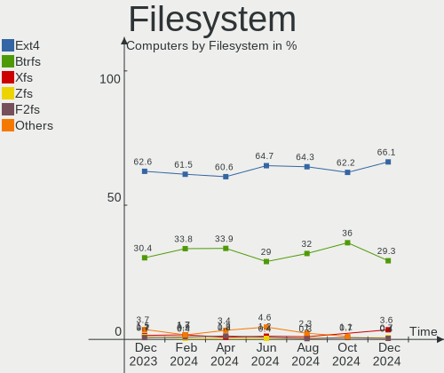
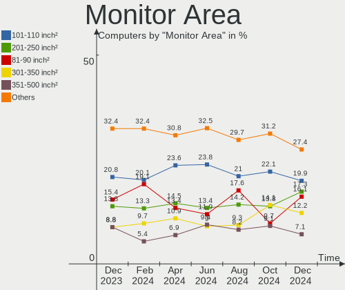
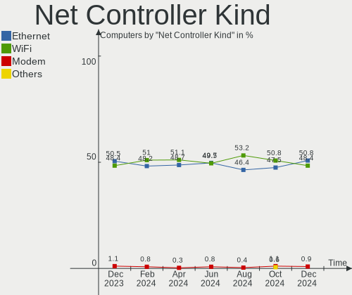
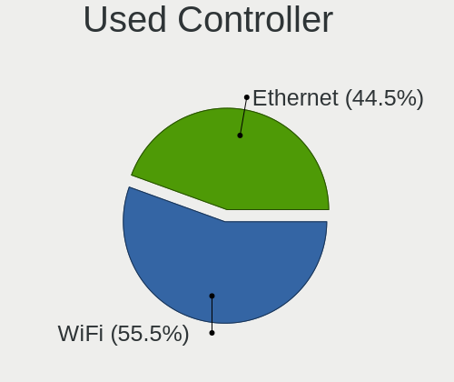

Arch - Hardware Trends
----------------------

A project to identify most popular hardware characteristics and track their change
over time based on data collected by Linux users at https://Linux-Hardware.org.

Anyone can contribute to this report by the [hw-probe](https://github.com/linuxhw/hw-probe) tool:

    sudo -E hw-probe -all -upload

This is a report for all computer types. See also reports for [desktops](/Dist/Arch/Desktop/README.md) and [notebooks](/Dist/Arch/Notebook/README.md).

This report is for one last month. Overall report since the beginning of time: [TestCoverage](https://github.com/linuxhw/TestCoverage)

Period: Aug, 2022.

Contents
--------

* [ System ](#system)
  - [ OS                       ](#os)
  - [ OS Family                ](#os-family)
  - [ Kernel                   ](#kernel)
  - [ Kernel Family            ](#kernel-family)
  - [ Kernel Major Ver.        ](#kernel-major-ver)
  - [ Arch                     ](#arch)
  - [ DE                       ](#de)
  - [ Display Server           ](#display-server)
  - [ Display Manager          ](#display-manager)
  - [ OS Lang                  ](#os-lang)
  - [ Boot Mode                ](#boot-mode)
  - [ Filesystem               ](#filesystem)
  - [ Part. scheme             ](#part-scheme)
  - [ Dual Boot with Linux/BSD ](#dual-boot-with-linuxbsd)
  - [ Dual Boot (Win)          ](#dual-boot-win)

* [ Board ](#board)
  - [ Vendor                   ](#vendor)
  - [ Model                    ](#model)
  - [ Model Family             ](#model-family)
  - [ MFG Year                 ](#mfg-year)
  - [ Form Factor              ](#form-factor)
  - [ Secure Boot              ](#secure-boot)
  - [ Coreboot                 ](#coreboot)
  - [ RAM Size                 ](#ram-size)
  - [ RAM Used                 ](#ram-used)
  - [ Total Drives             ](#total-drives)
  - [ Has CD-ROM               ](#has-cd-rom)
  - [ Has Ethernet             ](#has-ethernet)
  - [ Has WiFi                 ](#has-wifi)
  - [ Has Bluetooth            ](#has-bluetooth)

* [ Location ](#location)
  - [ Country                  ](#country)
  - [ City                     ](#city)

* [ Drives ](#drives)
  - [ Drive Vendor             ](#drive-vendor)
  - [ Drive Model              ](#drive-model)
  - [ HDD Vendor               ](#hdd-vendor)
  - [ SSD Vendor               ](#ssd-vendor)
  - [ Drive Kind               ](#drive-kind)
  - [ Drive Connector          ](#drive-connector)
  - [ Drive Size               ](#drive-size)
  - [ Space Total              ](#space-total)
  - [ Space Used               ](#space-used)
  - [ Malfunc. Drives          ](#malfunc-drives)
  - [ Malfunc. Drive Vendor    ](#malfunc-drive-vendor)
  - [ Malfunc. HDD Vendor      ](#malfunc-hdd-vendor)
  - [ Malfunc. Drive Kind      ](#malfunc-drive-kind)
  - [ Failed Drives            ](#failed-drives)
  - [ Failed Drive Vendor      ](#failed-drive-vendor)
  - [ Drive Status             ](#drive-status)

* [ Storage controller ](#storage-controller)
  - [ Storage Vendor           ](#storage-vendor)
  - [ Storage Model            ](#storage-model)
  - [ Storage Kind             ](#storage-kind)

* [ Processor ](#processor)
  - [ CPU Vendor               ](#cpu-vendor)
  - [ CPU Model                ](#cpu-model)
  - [ CPU Model Family         ](#cpu-model-family)
  - [ CPU Cores                ](#cpu-cores)
  - [ CPU Sockets              ](#cpu-sockets)
  - [ CPU Threads              ](#cpu-threads)
  - [ CPU Op-Modes             ](#cpu-op-modes)
  - [ CPU Microcode            ](#cpu-microcode)
  - [ CPU Microarch            ](#cpu-microarch)

* [ Graphics ](#graphics)
  - [ GPU Vendor               ](#gpu-vendor)
  - [ GPU Model                ](#gpu-model)
  - [ GPU Combo                ](#gpu-combo)
  - [ GPU Driver               ](#gpu-driver)
  - [ GPU Memory               ](#gpu-memory)

* [ Monitor ](#monitor)
  - [ Monitor Vendor           ](#monitor-vendor)
  - [ Monitor Model            ](#monitor-model)
  - [ Monitor Resolution       ](#monitor-resolution)
  - [ Monitor Diagonal         ](#monitor-diagonal)
  - [ Monitor Width            ](#monitor-width)
  - [ Aspect Ratio             ](#aspect-ratio)
  - [ Monitor Area             ](#monitor-area)
  - [ Pixel Density            ](#pixel-density)
  - [ Multiple Monitors        ](#multiple-monitors)

* [ Network ](#network)
  - [ Net Controller Vendor    ](#net-controller-vendor)
  - [ Net Controller Model     ](#net-controller-model)
  - [ Wireless Vendor          ](#wireless-vendor)
  - [ Wireless Model           ](#wireless-model)
  - [ Ethernet Vendor          ](#ethernet-vendor)
  - [ Ethernet Model           ](#ethernet-model)
  - [ Net Controller Kind      ](#net-controller-kind)
  - [ Used Controller          ](#used-controller)
  - [ NICs                     ](#nics)
  - [ IPv6                     ](#ipv6)

* [ Bluetooth ](#bluetooth)
  - [ Bluetooth Vendor         ](#bluetooth-vendor)
  - [ Bluetooth Model          ](#bluetooth-model)

* [ Sound ](#sound)
  - [ Sound Vendor             ](#sound-vendor)
  - [ Sound Model              ](#sound-model)

* [ Memory ](#memory)
  - [ Memory Vendor            ](#memory-vendor)
  - [ Memory Model             ](#memory-model)
  - [ Memory Kind              ](#memory-kind)
  - [ Memory Form Factor       ](#memory-form-factor)
  - [ Memory Size              ](#memory-size)
  - [ Memory Speed             ](#memory-speed)

* [ Printers & scanners ](#printers--scanners)
  - [ Printer Vendor           ](#printer-vendor)
  - [ Printer Model            ](#printer-model)
  - [ Scanner Vendor           ](#scanner-vendor)
  - [ Scanner Model            ](#scanner-model)

* [ Camera ](#camera)
  - [ Camera Vendor            ](#camera-vendor)
  - [ Camera Model             ](#camera-model)

* [ Security ](#security)
  - [ Fingerprint Vendor       ](#fingerprint-vendor)
  - [ Fingerprint Model        ](#fingerprint-model)
  - [ Chipcard Vendor          ](#chipcard-vendor)
  - [ Chipcard Model           ](#chipcard-model)

* [ Unsupported ](#unsupported)
  - [ Unsupported Devices      ](#unsupported-devices)
  - [ Unsupported Device Types ](#unsupported-device-types)

System
------

OS
--

Installed operating systems

| Name         | Computers | Percent |
|--------------|-----------|---------|
| Arch         | 121       | 64.02%  |
| Arch Rolling | 68        | 35.98%  |

OS Family
---------

OS without a version

| Name | Computers | Percent |
|------|-----------|---------|
| Arch | 189       | 100%    |

Kernel
------

Version of the Linux kernel

| Version                     | Computers | Percent |
|-----------------------------|-----------|---------|
| 5.18.16-arch1-1             | 35        | 18.52%  |
| 5.19.2-arch1-1              | 17        | 8.99%   |
| 5.19.1-arch2-1              | 17        | 8.99%   |
| 5.19.3-arch1-1              | 16        | 8.47%   |
| 5.19.4-arch1-1              | 8         | 4.23%   |
| 5.18.15-arch1-1             | 8         | 4.23%   |
| 5.19.5-arch1-1              | 6         | 3.17%   |
| 5.18.16-zen1-1-zen          | 6         | 3.17%   |
| 5.15.60-1-lts               | 6         | 3.17%   |
| 5.15.59-2-lts               | 6         | 3.17%   |
| 5.19.3-zen1-1-zen           | 5         | 2.65%   |
| 5.19.2-arch1-2              | 5         | 2.65%   |
| 5.19.1-zen1-1-zen           | 4         | 2.12%   |
| 5.18.15-arch1-2             | 4         | 2.12%   |
| 5.18.14-arch1-1             | 4         | 2.12%   |
| 5.15.59-1-lts               | 3         | 1.59%   |
| 5.19.5-zen1-1-zen           | 2         | 1.06%   |
| 5.19.2-zen1-2-zen           | 2         | 1.06%   |
| 5.18.15-zen1-1-zen          | 2         | 1.06%   |
| 5.15.63-1-lts               | 2         | 1.06%   |
| 5.15.62-1-lts               | 2         | 1.06%   |
| 5.15.55-2-lts               | 2         | 1.06%   |
| 5.19.4-zen1-1-zen           | 1         | 0.53%   |
| 5.19.3-arch1-1.1            | 1         | 0.53%   |
| 5.19.2-zen1-1-zen           | 1         | 0.53%   |
| 5.19.2-arch1-1-surface      | 1         | 0.53%   |
| 5.19.2-1-cachyos-lto        | 1         | 0.53%   |
| 5.19.2                      | 1         | 0.53%   |
| 5.19.1-2-cachyos-bore       | 1         | 0.53%   |
| 5.19.0-xanmod2-2-x64v2      | 1         | 0.53%   |
| 5.19.0-xanmod2-2-native_amd | 1         | 0.53%   |
| 5.19.0-xanmod1-1-zen2       | 1         | 0.53%   |
| 5.19.0-AMD-ThinkPad         | 1         | 0.53%   |
| 5.18.9-zen1-1-zen           | 1         | 0.53%   |
| 5.18.7-arch1-1              | 1         | 0.53%   |
| 5.18.2-arch1-1              | 1         | 0.53%   |
| 5.18.16-xanmod1-1           | 1         | 0.53%   |
| 5.18.15-zen1-2-zen          | 1         | 0.53%   |
| 5.18.14-zen1-1-zen          | 1         | 0.53%   |
| 5.18.12-zen1-1-zen          | 1         | 0.53%   |
| 5.18.12-arch1-g14-1         | 1         | 0.53%   |
| 5.17.9-arch1-1              | 1         | 0.53%   |
| 5.16.10-arch1-1-surface     | 1         | 0.53%   |
| 5.15.61-2-lts               | 1         | 0.53%   |
| 5.15.61-1-lts               | 1         | 0.53%   |
| 5.15.58-2-lts               | 1         | 0.53%   |
| 5.15.53-2-lts               | 1         | 0.53%   |
| 5.15.52-1-lts               | 1         | 0.53%   |
| 5.15.14-1-lts               | 1         | 0.53%   |

Kernel Family
-------------

Linux kernel without a distro release

| Version | Computers | Percent |
|---------|-----------|---------|
| 5.18.16 | 42        | 22.22%  |
| 5.19.2  | 28        | 14.81%  |
| 5.19.3  | 22        | 11.64%  |
| 5.19.1  | 22        | 11.64%  |
| 5.18.15 | 15        | 7.94%   |
| 5.19.4  | 9         | 4.76%   |
| 5.15.59 | 9         | 4.76%   |
| 5.19.5  | 8         | 4.23%   |
| 5.15.60 | 6         | 3.17%   |
| 5.18.14 | 5         | 2.65%   |
| 5.19.0  | 4         | 2.12%   |
| 5.18.12 | 2         | 1.06%   |
| 5.15.63 | 2         | 1.06%   |
| 5.15.62 | 2         | 1.06%   |
| 5.15.61 | 2         | 1.06%   |
| 5.15.55 | 2         | 1.06%   |
| 5.18.9  | 1         | 0.53%   |
| 5.18.7  | 1         | 0.53%   |
| 5.18.2  | 1         | 0.53%   |
| 5.17.9  | 1         | 0.53%   |
| 5.16.10 | 1         | 0.53%   |
| 5.15.58 | 1         | 0.53%   |
| 5.15.53 | 1         | 0.53%   |
| 5.15.52 | 1         | 0.53%   |
| 5.15.14 | 1         | 0.53%   |

Kernel Major Ver.
-----------------

Linux kernel major version

| Version | Computers | Percent |
|---------|-----------|---------|
| 5.19    | 93        | 49.21%  |
| 5.18    | 67        | 35.45%  |
| 5.15    | 27        | 14.29%  |
| 5.17    | 1         | 0.53%   |
| 5.16    | 1         | 0.53%   |

Arch
----

OS architecture (x86_64, i586, etc.)

| Name   | Computers | Percent |
|--------|-----------|---------|
| x86_64 | 189       | 100%    |

DE
--

Desktop Environment

| Name          | Computers | Percent |
|---------------|-----------|---------|
| KDE5          | 70        | 37.04%  |
| GNOME         | 54        | 28.57%  |
| XFCE          | 19        | 10.05%  |
| Unknown       | 19        | 10.05%  |
| i3            | 7         | 3.7%    |
| X-Cinnamon    | 5         | 2.65%   |
| LXQt          | 3         | 1.59%   |
| sway          | 2         | 1.06%   |
| qtile         | 2         | 1.06%   |
| LXDE          | 2         | 1.06%   |
| X-Generic     | 1         | 0.53%   |
| Enlightenment | 1         | 0.53%   |
| dusk          | 1         | 0.53%   |
| Deepin        | 1         | 0.53%   |
| bspwm         | 1         | 0.53%   |
| awesome       | 1         | 0.53%   |

Display Server
--------------

X11 or Wayland

| Name    | Computers | Percent |
|---------|-----------|---------|
| X11     | 109       | 57.67%  |
| Wayland | 49        | 25.93%  |
| Tty     | 16        | 8.47%   |
| Unknown | 15        | 7.94%   |

Display Manager
---------------

SDDM, LightDM, etc.

| Name    | Computers | Percent |
|---------|-----------|---------|
| Unknown | 82        | 43.39%  |
| SDDM    | 45        | 23.81%  |
| LightDM | 35        | 18.52%  |
| GDM     | 19        | 10.05%  |
| Ly      | 4         | 2.12%   |
| XDM     | 2         | 1.06%   |
| LXDM    | 1         | 0.53%   |
| GREETD  | 1         | 0.53%   |

OS Lang
-------

Language

| Lang       | Computers | Percent |
|------------|-----------|---------|
| en_US      | 113       | 59.79%  |
| C          | 10        | 5.29%   |
| en_GB      | 9         | 4.76%   |
| pt_BR      | 8         | 4.23%   |
| ru_RU      | 5         | 2.65%   |
| de_DE      | 5         | 2.65%   |
| Unknown    | 5         | 2.65%   |
| fr_FR      | 4         | 2.12%   |
| es_ES      | 4         | 2.12%   |
| zh_CN      | 3         | 1.59%   |
| pl_PL      | 3         | 1.59%   |
| it_IT      | 3         | 1.59%   |
| es_MX      | 2         | 1.06%   |
| es_AR      | 2         | 1.06%   |
| en_NZ      | 2         | 1.06%   |
| sv_SE      | 1         | 0.53%   |
| ko_KR      | 1         | 0.53%   |
| fi_FI      | 1         | 0.53%   |
| es_MX.UTF8 | 1         | 0.53%   |
| es_CL      | 1         | 0.53%   |
| en_IN      | 1         | 0.53%   |
| en_IE      | 1         | 0.53%   |
| en_DE      | 1         | 0.53%   |
| en_CA      | 1         | 0.53%   |
| en_150     | 1         | 0.53%   |
| Default    | 1         | 0.53%   |

Boot Mode
---------

EFI or BIOS

| Mode | Computers | Percent |
|------|-----------|---------|
| EFI  | 103       | 54.5%   |
| BIOS | 86        | 45.5%   |

Filesystem
----------

Type of filesystem

| Type    | Computers | Percent |
|---------|-----------|---------|
| Ext4    | 124       | 65.61%  |
| Btrfs   | 53        | 28.04%  |
| Xfs     | 6         | 3.17%   |
| F2fs    | 3         | 1.59%   |
| XXXXX   | 1         | 0.53%   |
| Overlay | 1         | 0.53%   |
| Unknown | 1         | 0.53%   |

Part. scheme
------------

Scheme of partitioning

| Type    | Computers | Percent |
|---------|-----------|---------|
| GPT     | 112       | 59.26%  |
| Unknown | 60        | 31.75%  |
| MBR     | 17        | 8.99%   |

Dual Boot with Linux/BSD
------------------------

Hosting more than one Linux/BSD

| Dual boot | Computers | Percent |
|-----------|-----------|---------|
| No        | 171       | 90.48%  |
| Yes       | 18        | 9.52%   |

Dual Boot (Win)
---------------

Hosting Linux and Windows

| Dual boot | Computers | Percent |
|-----------|-----------|---------|
| No        | 139       | 73.54%  |
| Yes       | 50        | 26.46%  |

Board
-----

Vendor
------

Motherboard manufacturer

| Name                | Computers | Percent |
|---------------------|-----------|---------|
| Lenovo              | 37        | 19.58%  |
| ASUSTek Computer    | 36        | 19.05%  |
| Hewlett-Packard     | 26        | 13.76%  |
| MSI                 | 16        | 8.47%   |
| Dell                | 16        | 8.47%   |
| ASRock              | 12        | 6.35%   |
| Gigabyte Technology | 10        | 5.29%   |
| Acer                | 9         | 4.76%   |
| Framework           | 3         | 1.59%   |
| Toshiba             | 2         | 1.06%   |
| Microsoft           | 2         | 1.06%   |
| MECHREVO            | 2         | 1.06%   |
| HUAWEI              | 2         | 1.06%   |
| TUXEDO              | 1         | 0.53%   |
| TPVAOC              | 1         | 0.53%   |
| SLIMBOOK            | 1         | 0.53%   |
| Samsung Electronics | 1         | 0.53%   |
| realme              | 1         | 0.53%   |
| Notebook            | 1         | 0.53%   |
| MACHINIST           | 1         | 0.53%   |
| LG Electronics      | 1         | 0.53%   |
| Intel               | 1         | 0.53%   |
| Fujitsu Siemens     | 1         | 0.53%   |
| ECS                 | 1         | 0.53%   |
| BBEN                | 1         | 0.53%   |
| Apple               | 1         | 0.53%   |
| Alienware           | 1         | 0.53%   |
| Acidanthera         | 1         | 0.53%   |
| 16512-2316-22801    | 1         | 0.53%   |

Model
-----

Motherboard model

| Name                                     | Computers | Percent |
|------------------------------------------|-----------|---------|
| Lenovo IdeaPad 5 Pro 14ACN6 82L7         | 3         | 1.59%   |
| MSI MS-7C52                              | 2         | 1.06%   |
| MSI MS-7C37                              | 2         | 1.06%   |
| Gigabyte B450 AORUS PRO WIFI             | 2         | 1.06%   |
| Framework Laptop                         | 2         | 1.06%   |
| ASRock B450M Steel Legend                | 2         | 1.06%   |
| TUXEDO Pulse 15 Gen2                     | 1         | 0.53%   |
| TPVAOC AA183M                            | 1         | 0.53%   |
| Toshiba TECRA S5                         | 1         | 0.53%   |
| Toshiba Satellite P55t-C                 | 1         | 0.53%   |
| SLIMBOOK PROX14-AMD                      | 1         | 0.53%   |
| Samsung 730QAA                           | 1         | 0.53%   |
| realme RMNBXXXX                          | 1         | 0.53%   |
| Notebook NH5xAx                          | 1         | 0.53%   |
| MSI MS-7D42                              | 1         | 0.53%   |
| MSI MS-7C95                              | 1         | 0.53%   |
| MSI MS-7C70                              | 1         | 0.53%   |
| MSI MS-7C35                              | 1         | 0.53%   |
| MSI MS-7B86                              | 1         | 0.53%   |
| MSI MS-7845                              | 1         | 0.53%   |
| MSI MS-7758                              | 1         | 0.53%   |
| MSI Modern 14 B5M                        | 1         | 0.53%   |
| MSI Modern 14 B10MW                      | 1         | 0.53%   |
| MSI GS73VR 6RF                           | 1         | 0.53%   |
| MSI GP66 Leopard 11UH                    | 1         | 0.53%   |
| MSI GL75 Leopard 10SDK                   | 1         | 0.53%   |
| Microsoft Surface Pro 4                  | 1         | 0.53%   |
| Microsoft Surface Laptop 3               | 1         | 0.53%   |
| MECHREVO Code01 Ver2.0                   | 1         | 0.53%   |
| MECHREVO Code 01 Series PF5NU1G          | 1         | 0.53%   |
| MACHINIST X99-RS9 V2.0                   | 1         | 0.53%   |
| LG S430-G.BC33P1                         | 1         | 0.53%   |
| Lenovo Yoga C940-14IIL 81Q9              | 1         | 0.53%   |
| Lenovo Yoga 9 14IAP7 82LU                | 1         | 0.53%   |
| Lenovo Yoga 720-15IKB                    | 1         | 0.53%   |
| Lenovo Y70-70 Touch 80DU                 | 1         | 0.53%   |
| Lenovo ThinkPad X1 Carbon 7th 20R1A009AU | 1         | 0.53%   |
| Lenovo ThinkPad X1 Carbon 5th 20HR002MMX | 1         | 0.53%   |
| Lenovo ThinkPad T61 6457VE6              | 1         | 0.53%   |
| Lenovo ThinkPad T440p 20AWS1C001         | 1         | 0.53%   |
| Lenovo ThinkPad T430 2344BMU             | 1         | 0.53%   |
| Lenovo ThinkPad T420 4180LN1             | 1         | 0.53%   |
| Lenovo ThinkPad T14s Gen 1 20UH001ART    | 1         | 0.53%   |
| Lenovo ThinkPad L15 Gen 2a 20X7CTO1WW    | 1         | 0.53%   |
| Lenovo ThinkPad L14 Gen 1 20U2S5EV00     | 1         | 0.53%   |
| Lenovo ThinkPad Edge E431 62771K6        | 1         | 0.53%   |
| Lenovo ThinkPad E15 Gen 2 20TD004YIV     | 1         | 0.53%   |
| Lenovo ThinkPad E15 Gen 2 20T9S0B500     | 1         | 0.53%   |
| Lenovo ThinkPad E14 20RAS0KX00           | 1         | 0.53%   |
| Lenovo ThinkPad E14 20RA004WUS           | 1         | 0.53%   |
| Lenovo ThinkBook 15 G2 ITL 20VE          | 1         | 0.53%   |
| Lenovo ThinkBook 14s-IWL 20RM            | 1         | 0.53%   |
| Lenovo ThinkBook 13s G3 ACN 20YA         | 1         | 0.53%   |
| Lenovo Slim 7 ProX 14ARH7 82V2           | 1         | 0.53%   |
| Lenovo Legion R70002021 82JW             | 1         | 0.53%   |
| Lenovo Legion 5 15ARH05 82B5             | 1         | 0.53%   |
| Lenovo Legion 5 15ACH6H 82JU             | 1         | 0.53%   |
| Lenovo IdeaPad Y410P 20216               | 1         | 0.53%   |
| Lenovo IdeaPad S145-15IWL 81S9           | 1         | 0.53%   |
| Lenovo IdeaPad Gaming 3 15IMH05 81Y4     | 1         | 0.53%   |

Model Family
------------

Motherboard model prefix

| Name                | Computers | Percent |
|---------------------|-----------|---------|
| Lenovo ThinkPad     | 14        | 7.41%   |
| Lenovo IdeaPad      | 12        | 6.35%   |
| ASUS TUF            | 8         | 4.23%   |
| ASUS PRIME          | 7         | 3.7%    |
| ASUS ROG            | 6         | 3.17%   |
| HP ENVY             | 5         | 2.65%   |
| Dell Latitude       | 5         | 2.65%   |
| HP Laptop           | 4         | 2.12%   |
| HP EliteBook        | 4         | 2.12%   |
| Dell XPS            | 4         | 2.12%   |
| ASUS VivoBook       | 4         | 2.12%   |
| Lenovo Yoga         | 3         | 1.59%   |
| Lenovo ThinkBook    | 3         | 1.59%   |
| Lenovo Legion       | 3         | 1.59%   |
| HP Pavilion         | 3         | 1.59%   |
| Framework Laptop    | 3         | 1.59%   |
| Dell PowerEdge      | 3         | 1.59%   |
| ASRock B450M        | 3         | 1.59%   |
| Acer Predator       | 3         | 1.59%   |
| Acer Aspire         | 3         | 1.59%   |
| MSI MS-7C52         | 2         | 1.06%   |
| MSI MS-7C37         | 2         | 1.06%   |
| MSI Modern          | 2         | 1.06%   |
| Microsoft Surface   | 2         | 1.06%   |
| HP Spectre          | 2         | 1.06%   |
| HP EliteDesk        | 2         | 1.06%   |
| Gigabyte B450       | 2         | 1.06%   |
| Dell Vostro         | 2         | 1.06%   |
| Dell Inspiron       | 2         | 1.06%   |
| ASUS ASUS           | 2         | 1.06%   |
| TUXEDO Pulse        | 1         | 0.53%   |
| TPVAOC AA183M       | 1         | 0.53%   |
| Toshiba TECRA       | 1         | 0.53%   |
| Toshiba Satellite   | 1         | 0.53%   |
| SLIMBOOK PROX14-AMD | 1         | 0.53%   |
| Samsung 730QAA      | 1         | 0.53%   |
| realme RMNBXXXX     | 1         | 0.53%   |
| Notebook NH5xAx     | 1         | 0.53%   |
| MSI MS-7D42         | 1         | 0.53%   |
| MSI MS-7C95         | 1         | 0.53%   |
| MSI MS-7C70         | 1         | 0.53%   |
| MSI MS-7C35         | 1         | 0.53%   |
| MSI MS-7B86         | 1         | 0.53%   |
| MSI MS-7845         | 1         | 0.53%   |
| MSI MS-7758         | 1         | 0.53%   |
| MSI GS73VR          | 1         | 0.53%   |
| MSI GP66            | 1         | 0.53%   |
| MSI GL75            | 1         | 0.53%   |
| MECHREVO Code01     | 1         | 0.53%   |
| MECHREVO Code       | 1         | 0.53%   |
| MACHINIST X99-RS9   | 1         | 0.53%   |
| LG S430-G.BC33P1    | 1         | 0.53%   |
| Lenovo Y70-70       | 1         | 0.53%   |
| Lenovo Slim         | 1         | 0.53%   |
| Intel X79           | 1         | 0.53%   |
| HUAWEI KLVL-WXX9    | 1         | 0.53%   |
| HUAWEI CREM-WXX9    | 1         | 0.53%   |
| HP ZBook            | 1         | 0.53%   |
| HP Stream           | 1         | 0.53%   |
| HP ProBook          | 1         | 0.53%   |

MFG Year
--------

Motherboard manufacture year

| Year | Computers | Percent |
|------|-----------|---------|
| 2020 | 33        | 17.46%  |
| 2021 | 29        | 15.34%  |
| 2019 | 29        | 15.34%  |
| 2018 | 21        | 11.11%  |
| 2022 | 16        | 8.47%   |
| 2015 | 10        | 5.29%   |
| 2013 | 10        | 5.29%   |
| 2017 | 9         | 4.76%   |
| 2016 | 9         | 4.76%   |
| 2014 | 7         | 3.7%    |
| 2012 | 6         | 3.17%   |
| 2011 | 3         | 1.59%   |
| 2007 | 3         | 1.59%   |
| 2010 | 2         | 1.06%   |
| 2009 | 1         | 0.53%   |
| 2008 | 1         | 0.53%   |

Form Factor
-----------

Physical design of the computer

| Name        | Computers | Percent |
|-------------|-----------|---------|
| Notebook    | 114       | 60.32%  |
| Desktop     | 60        | 31.75%  |
| Convertible | 9         | 4.76%   |
| Server      | 3         | 1.59%   |
| Tablet      | 2         | 1.06%   |
| Mini pc     | 1         | 0.53%   |

Secure Boot
-----------

Enabled or disabled

| State    | Computers | Percent |
|----------|-----------|---------|
| Disabled | 186       | 98.41%  |
| Enabled  | 3         | 1.59%   |

Coreboot
--------

Have coreboot on board

| Used | Computers | Percent |
|------|-----------|---------|
| No   | 189       | 100%    |

RAM Size
--------

Total RAM memory

| Size in GB      | Computers | Percent |
|-----------------|-----------|---------|
| 16.01-24.0      | 55        | 29.1%   |
| 8.01-16.0       | 42        | 22.22%  |
| 4.01-8.0        | 40        | 21.16%  |
| 32.01-64.0      | 24        | 12.7%   |
| 3.01-4.0        | 10        | 5.29%   |
| 64.01-256.0     | 10        | 5.29%   |
| 24.01-32.0      | 3         | 1.59%   |
| More than 256.0 | 2         | 1.06%   |
| 1.01-2.0        | 2         | 1.06%   |
| 2.01-3.0        | 1         | 0.53%   |

RAM Used
--------

Used RAM memory

| Used GB    | Computers | Percent |
|------------|-----------|---------|
| 4.01-8.0   | 60        | 31.75%  |
| 2.01-3.0   | 43        | 22.75%  |
| 1.01-2.0   | 35        | 18.52%  |
| 3.01-4.0   | 28        | 14.81%  |
| 8.01-16.0  | 14        | 7.41%   |
| 0.51-1.0   | 5         | 2.65%   |
| 16.01-24.0 | 3         | 1.59%   |
| 24.01-32.0 | 1         | 0.53%   |

Total Drives
------------

Number of drives on board

| Drives | Computers | Percent |
|--------|-----------|---------|
| 1      | 95        | 50.26%  |
| 2      | 59        | 31.22%  |
| 3      | 18        | 9.52%   |
| 4      | 10        | 5.29%   |
| 6      | 3         | 1.59%   |
| 5      | 3         | 1.59%   |
| 7      | 1         | 0.53%   |

Has CD-ROM
----------

Has CD-ROM on board

| Presented | Computers | Percent |
|-----------|-----------|---------|
| No        | 157       | 83.07%  |
| Yes       | 32        | 16.93%  |

Has Ethernet
------------

Has Ethernet on board

| Presented | Computers | Percent |
|-----------|-----------|---------|
| Yes       | 145       | 76.72%  |
| No        | 44        | 23.28%  |

Has WiFi
--------

Has WiFi module

| Presented | Computers | Percent |
|-----------|-----------|---------|
| Yes       | 164       | 86.77%  |
| No        | 25        | 13.23%  |

Has Bluetooth
-------------

Has Bluetooth module

| Presented | Computers | Percent |
|-----------|-----------|---------|
| Yes       | 156       | 82.54%  |
| No        | 33        | 17.46%  |

Location
--------

Country
-------

Geographic location (country)

| Country         | Computers | Percent |
|-----------------|-----------|---------|
| USA             | 50        | 26.46%  |
| Russia          | 11        | 5.82%   |
| Germany         | 9         | 4.76%   |
| Brazil          | 9         | 4.76%   |
| UK              | 7         | 3.7%    |
| Italy           | 6         | 3.17%   |
| India           | 6         | 3.17%   |
| China           | 6         | 3.17%   |
| Vietnam         | 5         | 2.65%   |
| Spain           | 5         | 2.65%   |
| France          | 5         | 2.65%   |
| Poland          | 4         | 2.12%   |
| Mexico          | 4         | 2.12%   |
| Austria         | 4         | 2.12%   |
| Argentina       | 4         | 2.12%   |
| Sweden          | 3         | 1.59%   |
| Romania         | 3         | 1.59%   |
| Finland         | 3         | 1.59%   |
| Canada          | 3         | 1.59%   |
| Bulgaria        | 3         | 1.59%   |
| Taiwan          | 2         | 1.06%   |
| Saudi Arabia    | 2         | 1.06%   |
| Philippines     | 2         | 1.06%   |
| New Zealand     | 2         | 1.06%   |
| Israel          | 2         | 1.06%   |
| Iran            | 2         | 1.06%   |
| Denmark         | 2         | 1.06%   |
| Czechia         | 2         | 1.06%   |
| Chile           | 2         | 1.06%   |
| Bangladesh      | 2         | 1.06%   |
| Turkey          | 1         | 0.53%   |
| Switzerland     | 1         | 0.53%   |
| South Korea     | 1         | 0.53%   |
| Slovakia        | 1         | 0.53%   |
| Puerto Rico     | 1         | 0.53%   |
| Portugal        | 1         | 0.53%   |
| Norway          | 1         | 0.53%   |
| North Macedonia | 1         | 0.53%   |
| Netherlands     | 1         | 0.53%   |
| Moldova         | 1         | 0.53%   |
| Kenya           | 1         | 0.53%   |
| Japan           | 1         | 0.53%   |
| Ireland         | 1         | 0.53%   |
| Hungary         | 1         | 0.53%   |
| Hong Kong       | 1         | 0.53%   |
| Egypt           | 1         | 0.53%   |
| Belgium         | 1         | 0.53%   |
| Australia       | 1         | 0.53%   |
| Armenia         | 1         | 0.53%   |

City
----

Geographic location (city)

| City                  | Computers | Percent |
|-----------------------|-----------|---------|
| Moscow                | 5         | 2.65%   |
| Vienna                | 3         | 1.59%   |
| Gaithersburg          | 3         | 1.59%   |
| Dallas                | 3         | 1.59%   |
| Bucharest             | 3         | 1.59%   |
| Bengaluru             | 3         | 1.59%   |
| Taipei                | 2         | 1.06%   |
| Shanghai              | 2         | 1.06%   |
| Rome                  | 2         | 1.06%   |
| Mar del Plata         | 2         | 1.06%   |
| Madrid                | 2         | 1.06%   |
| Krakow                | 2         | 1.06%   |
| Jeddah                | 2         | 1.06%   |
| Helsinki              | 2         | 1.06%   |
| Hanoi                 | 2         | 1.06%   |
| Dhaka                 | 2         | 1.06%   |
| Culver City           | 2         | 1.06%   |
| Buenos Aires          | 2         | 1.06%   |
| Beijing               | 2         | 1.06%   |
| Zurich                | 1         | 0.53%   |
| Zapopan               | 1         | 0.53%   |
| Yerevan               | 1         | 0.53%   |
| Yakutsk               | 1         | 0.53%   |
| Wilmington            | 1         | 0.53%   |
| West Palm Beach       | 1         | 0.53%   |
| Watsonville           | 1         | 0.53%   |
| Warsaw                | 1         | 0.53%   |
| Warrington            | 1         | 0.53%   |
| Wappingers Falls      | 1         | 0.53%   |
| Wanchai               | 1         | 0.53%   |
| Viña del Mar         | 1         | 0.53%   |
| Várzea Grande        | 1         | 0.53%   |
| Varna                 | 1         | 0.53%   |
| Van Buren             | 1         | 0.53%   |
| Valencia              | 1         | 0.53%   |
| Ulm                   | 1         | 0.53%   |
| Uccle                 | 1         | 0.53%   |
| Uberlândia           | 1         | 0.53%   |
| Tulsa                 | 1         | 0.53%   |
| Trondheim             | 1         | 0.53%   |
| Tel Aviv              | 1         | 0.53%   |
| Tehran                | 1         | 0.53%   |
| Tauranga              | 1         | 0.53%   |
| Tampere               | 1         | 0.53%   |
| Taiyuan               | 1         | 0.53%   |
| Sydney                | 1         | 0.53%   |
| Stockholm             | 1         | 0.53%   |
| Stara Zagora          | 1         | 0.53%   |
| St Petersburg         | 1         | 0.53%   |
| Sofia                 | 1         | 0.53%   |
| Shtip                 | 1         | 0.53%   |
| Semily                | 1         | 0.53%   |
| Seattle               | 1         | 0.53%   |
| Santiago da Guarda    | 1         | 0.53%   |
| Santa Clara           | 1         | 0.53%   |
| San Pablo City        | 1         | 0.53%   |
| San Luis Potosí City | 1         | 0.53%   |
| San Juan              | 1         | 0.53%   |
| Salt Lake City        | 1         | 0.53%   |
| Salamanca             | 1         | 0.53%   |

Drives
------

Drive Vendor
------------

Hard drive vendors

| Vendor                      | Computers | Drives | Percent |
|-----------------------------|-----------|--------|---------|
| Samsung Electronics         | 65        | 81     | 22.18%  |
| WDC                         | 35        | 47     | 11.95%  |
| Seagate                     | 34        | 39     | 11.6%   |
| Sandisk                     | 28        | 31     | 9.56%   |
| Kingston                    | 16        | 18     | 5.46%   |
| Toshiba                     | 13        | 15     | 4.44%   |
| SK hynix                    | 13        | 14     | 4.44%   |
| Crucial                     | 12        | 14     | 4.1%    |
| Micron Technology           | 8         | 9      | 2.73%   |
| Intel                       | 8         | 10     | 2.73%   |
| Unknown                     | 7         | 7      | 2.39%   |
| Kingston Technology Company | 5         | 5      | 1.71%   |
| Silicon Motion              | 4         | 5      | 1.37%   |
| Hitachi                     | 4         | 5      | 1.37%   |
| HGST                        | 4         | 4      | 1.37%   |
| Phison Electronics          | 3         | 4      | 1.02%   |
| LITEON                      | 3         | 3      | 1.02%   |
| Netac                       | 2         | 2      | 0.68%   |
| Micron/Crucial Technology   | 2         | 2      | 0.68%   |
| China                       | 2         | 2      | 0.68%   |
| ADATA Technology            | 2         | 2      | 0.68%   |
| ZHITAI                      | 1         | 1      | 0.34%   |
| XPG                         | 1         | 1      | 0.34%   |
| Transcend                   | 1         | 1      | 0.34%   |
| SPCC                        | 1         | 1      | 0.34%   |
| PUSKILL                     | 1         | 1      | 0.34%   |
| PNY                         | 1         | 1      | 0.34%   |
| Plextor                     | 1         | 1      | 0.34%   |
| Phison                      | 1         | 2      | 0.34%   |
| Patriot                     | 1         | 1      | 0.34%   |
| OCZ                         | 1         | 1      | 0.34%   |
| Maxone                      | 1         | 1      | 0.34%   |
| LITEONIT                    | 1         | 1      | 0.34%   |
| Lenovo                      | 1         | 1      | 0.34%   |
| KIOXIA                      | 1         | 4      | 0.34%   |
| JMicron Technology          | 1         | 1      | 0.34%   |
| HIKSEMI                     | 1         | 1      | 0.34%   |
| GOODRAM                     | 1         | 1      | 0.34%   |
| Gigabyte Technology         | 1         | 1      | 0.34%   |
| BHT                         | 1         | 1      | 0.34%   |
| Apple                       | 1         | 1      | 0.34%   |
| Apacer                      | 1         | 1      | 0.34%   |
| A-DATA Technology           | 1         | 1      | 0.34%   |
| Unknown                     | 1         | 1      | 0.34%   |

Drive Model
-----------

Hard drive models

| Model                                               | Computers | Percent |
|-----------------------------------------------------|-----------|---------|
| Samsung NVMe SSD Controller SM981/PM981/PM983 1TB   | 12        | 3.72%   |
| Samsung NVMe SSD Drive 512GB                        | 7         | 2.17%   |
| Samsung NVMe SSD Controller PM9A1/PM9A3/980PRO 1TB  | 6         | 1.86%   |
| Seagate ST1000LM035-1RK172 1TB                      | 5         | 1.55%   |
| Sandisk WD Blue SN550 NVMe SSD 256GB                | 5         | 1.55%   |
| SanDisk NVMe SSD Drive 1TB                          | 5         | 1.55%   |
| Kingston SA400S37120G 120GB SSD                     | 5         | 1.55%   |
| Samsung NVMe SSD Drive 1TB                          | 4         | 1.24%   |
| Crucial CT1000MX500SSD1 1TB                         | 4         | 1.24%   |
| Unknown SD/MMC/MS PRO 128GB                         | 3         | 0.93%   |
| Seagate ST1000LM024 HN-M101MBB 1TB                  | 3         | 0.93%   |
| Samsung SSD 850 EVO 250GB                           | 3         | 0.93%   |
| Samsung MZALQ512HALU-000L2 512GB                    | 3         | 0.93%   |
| Kingston Company OM3PDP3 NVMe SSD 128GB             | 3         | 0.93%   |
| Kingston SA400S37240G 240GB SSD                     | 3         | 0.93%   |
| Unknown MMC Card  256GB                             | 2         | 0.62%   |
| Toshiba XG6 NVMe SSD Controller 1TB                 | 2         | 0.62%   |
| Toshiba HDWD110 1TB                                 | 2         | 0.62%   |
| SK hynix PC401 NVMe Solid State Drive 256GB         | 2         | 0.62%   |
| SK hynix BC501 NVMe Solid State Drive 512GB         | 2         | 0.62%   |
| Silicon Motion NVMe SSD Drive 512GB                 | 2         | 0.62%   |
| Seagate ST2000DM008-2FR102 2TB                      | 2         | 0.62%   |
| Seagate ST2000DM006-2DM164 2TB                      | 2         | 0.62%   |
| Seagate ST2000DM001-1CH164 2TB                      | 2         | 0.62%   |
| Seagate ST1000DM010-2EP102 1TB                      | 2         | 0.62%   |
| Seagate Expansion 500GB                             | 2         | 0.62%   |
| Sandisk WD Black SN750 / PC SN730 NVMe SSD 512GB    | 2         | 0.62%   |
| SanDisk NVMe SSD Drive 256GB                        | 2         | 0.62%   |
| Samsung SSD 970 EVO Plus 500GB                      | 2         | 0.62%   |
| Samsung SSD 870 QVO 1TB                             | 2         | 0.62%   |
| Samsung SSD 870 EVO 1TB                             | 2         | 0.62%   |
| Samsung SSD 860 EVO 500GB                           | 2         | 0.62%   |
| Samsung SSD 860 EVO 1TB                             | 2         | 0.62%   |
| Samsung SSD 850 EVO 500GB                           | 2         | 0.62%   |
| Samsung Portable SSD T5 1TB                         | 2         | 0.62%   |
| Samsung NVMe SSD Drive 250GB                        | 2         | 0.62%   |
| Samsung NVMe SSD Controller SM961/PM961/SM963 256GB | 2         | 0.62%   |
| Phison E12 NVMe Controller 1TB                      | 2         | 0.62%   |
| Kingston SA400S37480G 480GB SSD                     | 2         | 0.62%   |
| HGST HTS721010A9E630 1TB                            | 2         | 0.62%   |
| Crucial CT500MX500SSD1 500GB                        | 2         | 0.62%   |
| Crucial CT480BX500SSD1 480GB                        | 2         | 0.62%   |
| Crucial CT240BX500SSD1 240GB                        | 2         | 0.62%   |
| ZHITAI SC001 Active 256GB SSD                       | 1         | 0.31%   |
| XPG NVMe SSD Drive 1024GB                           | 1         | 0.31%   |
| WDC WDS500G2B0B-00YS70 500GB SSD                    | 1         | 0.31%   |
| WDC WDS500G2B0A-00SM50 500GB SSD                    | 1         | 0.31%   |
| WDC WDS500G1B0B-00AS40 500GB SSD                    | 1         | 0.31%   |
| WDC WDS250G2B0B-00YS70 250GB SSD                    | 1         | 0.31%   |
| WDC WDS250G2B0A-00SM50 250GB SSD                    | 1         | 0.31%   |
| WDC WDS240G2G0B-00EPW0 240GB SSD                    | 1         | 0.31%   |
| WDC WDS120G2G0B-00EPW0 120GB SSD                    | 1         | 0.31%   |
| WDC WDS100T2B0C-00PXH0 1TB                          | 1         | 0.31%   |
| WDC WDS100T2B0C 1TB                                 | 1         | 0.31%   |
| WDC WDS100T2B0A-00SM50 1TB SSD                      | 1         | 0.31%   |
| WDC WD800JD-75JNC0 80GB                             | 1         | 0.31%   |
| WDC WD60EZRZ-00GZ5B1 6TB                            | 1         | 0.31%   |
| WDC WD60EZAZ-00ZGHB0 6TB                            | 1         | 0.31%   |
| WDC WD5000LUCT-63Y8HY0 500GB                        | 1         | 0.31%   |
| WDC WD5000LPVX-80V0TT0 500GB                        | 1         | 0.31%   |

HDD Vendor
----------

Hard disk drive vendors

| Vendor              | Computers | Drives | Percent |
|---------------------|-----------|--------|---------|
| Seagate             | 32        | 37     | 40.51%  |
| WDC                 | 25        | 35     | 31.65%  |
| Toshiba             | 8         | 9      | 10.13%  |
| Hitachi             | 4         | 5      | 5.06%   |
| HGST                | 4         | 4      | 5.06%   |
| Unknown             | 3         | 3      | 3.8%    |
| Samsung Electronics | 2         | 2      | 2.53%   |
| Maxone              | 1         | 1      | 1.27%   |

SSD Vendor
----------

Solid state drive vendors

| Vendor              | Computers | Drives | Percent |
|---------------------|-----------|--------|---------|
| Samsung Electronics | 23        | 25     | 24.47%  |
| Kingston            | 13        | 15     | 13.83%  |
| Crucial             | 12        | 13     | 12.77%  |
| WDC                 | 8         | 8      | 8.51%   |
| SanDisk             | 6         | 6      | 6.38%   |
| SK hynix            | 4         | 5      | 4.26%   |
| Micron Technology   | 4         | 5      | 4.26%   |
| LITEON              | 3         | 3      | 3.19%   |
| China               | 2         | 2      | 2.13%   |
| ZHITAI              | 1         | 1      | 1.06%   |
| Transcend           | 1         | 1      | 1.06%   |
| Toshiba             | 1         | 1      | 1.06%   |
| SPCC                | 1         | 1      | 1.06%   |
| PUSKILL             | 1         | 1      | 1.06%   |
| PNY                 | 1         | 1      | 1.06%   |
| Plextor             | 1         | 1      | 1.06%   |
| Patriot             | 1         | 1      | 1.06%   |
| OCZ                 | 1         | 1      | 1.06%   |
| Netac               | 1         | 1      | 1.06%   |
| LITEONIT            | 1         | 1      | 1.06%   |
| JMicron Technology  | 1         | 1      | 1.06%   |
| Intel               | 1         | 1      | 1.06%   |
| GOODRAM             | 1         | 1      | 1.06%   |
| Gigabyte Technology | 1         | 1      | 1.06%   |
| BHT                 | 1         | 1      | 1.06%   |
| Apple               | 1         | 1      | 1.06%   |
| Apacer              | 1         | 1      | 1.06%   |
| A-DATA Technology   | 1         | 1      | 1.06%   |

Drive Kind
----------

HDD or SSD

| Kind    | Computers | Drives | Percent |
|---------|-----------|--------|---------|
| NVMe    | 114       | 144    | 43.02%  |
| SSD     | 79        | 101    | 29.81%  |
| HDD     | 67        | 96     | 25.28%  |
| MMC     | 4         | 4      | 1.51%   |
| Unknown | 1         | 1      | 0.38%   |

Drive Connector
---------------

SATA, SAS, NVMe, etc.

| Type | Computers | Drives | Percent |
|------|-----------|--------|---------|
| NVMe | 114       | 143    | 47.5%   |
| SATA | 110       | 186    | 45.83%  |
| SAS  | 12        | 13     | 5%      |
| MMC  | 4         | 4      | 1.67%   |

Drive Size
----------

Size of hard drive

| Size in TB | Computers | Drives | Percent |
|------------|-----------|--------|---------|
| 0.01-0.5   | 72        | 102    | 48.65%  |
| 0.51-1.0   | 52        | 61     | 35.14%  |
| 1.01-2.0   | 16        | 20     | 10.81%  |
| 3.01-4.0   | 3         | 4      | 2.03%   |
| 2.01-3.0   | 3         | 6      | 2.03%   |
| 10.01-20.0 | 1         | 2      | 0.68%   |
| 4.01-10.0  | 1         | 2      | 0.68%   |

Space Total
-----------

Amount of disk space available on the file system

| Size in GB     | Computers | Percent |
|----------------|-----------|---------|
| 251-500        | 44        | 23.28%  |
| 1001-2000      | 36        | 19.05%  |
| 101-250        | 35        | 18.52%  |
| 501-1000       | 35        | 18.52%  |
| More than 3000 | 19        | 10.05%  |
| 2001-3000      | 8         | 4.23%   |
| 51-100         | 7         | 3.7%    |
| 21-50          | 2         | 1.06%   |
| Unknown        | 2         | 1.06%   |
| 1-20           | 1         | 0.53%   |

Space Used
----------

Amount of used disk space

| Used GB        | Computers | Percent |
|----------------|-----------|---------|
| 1-20           | 45        | 23.81%  |
| 101-250        | 37        | 19.58%  |
| 251-500        | 25        | 13.23%  |
| 51-100         | 23        | 12.17%  |
| 21-50          | 20        | 10.58%  |
| 501-1000       | 15        | 7.94%   |
| 1001-2000      | 14        | 7.41%   |
| More than 3000 | 5         | 2.65%   |
| 2001-3000      | 3         | 1.59%   |
| Unknown        | 2         | 1.06%   |

Malfunc. Drives
---------------

Drive models with a malfunction

| Model                                            | Computers | Drives | Percent |
|--------------------------------------------------|-----------|--------|---------|
| WDC WD5000AAKX-001CA0 500GB                      | 1         | 1      | 7.14%   |
| WDC WD10EZEX-07WN4A0 1TB                         | 1         | 1      | 7.14%   |
| SK hynix HFS256G39TND-N210A 256GB SSD            | 1         | 1      | 7.14%   |
| Seagate ST2000LM007-1R8174 2TB                   | 1         | 1      | 7.14%   |
| Seagate ST1000LM024 HN-M101MBB 1TB               | 1         | 1      | 7.14%   |
| Samsung Electronics MZNLH128HBHQ-000H1 128GB SSD | 1         | 1      | 7.14%   |
| Samsung Electronics HD105SI 1TB                  | 1         | 1      | 7.14%   |
| OCZ INTREPID 3700 240GB SSD                      | 1         | 1      | 7.14%   |
| Kingston SKC400S371T 1TB SSD                     | 1         | 1      | 7.14%   |
| Intel SSDSC2BF240A5L 240GB                       | 1         | 1      | 7.14%   |
| Hitachi HTS543232L9A300 320GB                    | 1         | 1      | 7.14%   |
| Hitachi HCC543232A7A380 320GB                    | 1         | 1      | 7.14%   |
| HGST HTS721010A9E630 1TB                         | 1         | 1      | 7.14%   |
| HGST HTS545050A7E680 500GB                       | 1         | 1      | 7.14%   |

Malfunc. Drive Vendor
---------------------

Vendors of faulty drives

| Vendor              | Computers | Drives | Percent |
|---------------------|-----------|--------|---------|
| WDC                 | 2         | 2      | 14.29%  |
| Seagate             | 2         | 2      | 14.29%  |
| Samsung Electronics | 2         | 2      | 14.29%  |
| Hitachi             | 2         | 2      | 14.29%  |
| HGST                | 2         | 2      | 14.29%  |
| SK hynix            | 1         | 1      | 7.14%   |
| OCZ                 | 1         | 1      | 7.14%   |
| Kingston            | 1         | 1      | 7.14%   |
| Intel               | 1         | 1      | 7.14%   |

Malfunc. HDD Vendor
-------------------

Vendors of faulty HDD drives

| Vendor              | Computers | Drives | Percent |
|---------------------|-----------|--------|---------|
| WDC                 | 2         | 2      | 22.22%  |
| Seagate             | 2         | 2      | 22.22%  |
| Hitachi             | 2         | 2      | 22.22%  |
| HGST                | 2         | 2      | 22.22%  |
| Samsung Electronics | 1         | 1      | 11.11%  |

Malfunc. Drive Kind
-------------------

Kinds of faulty drives

| Kind | Computers | Drives | Percent |
|------|-----------|--------|---------|
| HDD  | 9         | 9      | 64.29%  |
| SSD  | 5         | 5      | 35.71%  |

Failed Drives
-------------

Failed drive models

| Model                          | Computers | Drives | Percent |
|--------------------------------|-----------|--------|---------|
| Phison ESO128GTLC9-E8C-2 128GB | 1         | 1      | 100%    |

Failed Drive Vendor
-------------------

Failed drive vendors

| Vendor | Computers | Drives | Percent |
|--------|-----------|--------|---------|
| Phison | 1         | 1      | 100%    |

Drive Status
------------

Number of failed and malfunc. drives

| Status   | Computers | Drives | Percent |
|----------|-----------|--------|---------|
| Detected | 96        | 168    | 46.83%  |
| Works    | 94        | 163    | 45.85%  |
| Malfunc  | 14        | 14     | 6.83%   |
| Failed   | 1         | 1      | 0.49%   |

Storage controller
------------------

Storage Vendor
--------------

Storage controller vendors

| Vendor                       | Computers | Percent |
|------------------------------|-----------|---------|
| Intel                        | 93        | 33.33%  |
| AMD                          | 58        | 20.79%  |
| Samsung Electronics          | 47        | 16.85%  |
| SanDisk                      | 26        | 9.32%   |
| SK hynix                     | 9         | 3.23%   |
| Kingston Technology Company  | 8         | 2.87%   |
| ASMedia Technology           | 7         | 2.51%   |
| Silicon Motion               | 5         | 1.79%   |
| Toshiba America Info Systems | 4         | 1.43%   |
| Phison Electronics           | 4         | 1.43%   |
| Micron Technology            | 4         | 1.43%   |
| Micron/Crucial Technology    | 3         | 1.08%   |
| Broadcom / LSI               | 3         | 1.08%   |
| ADATA Technology             | 3         | 1.08%   |
| Seagate Technology           | 2         | 0.72%   |
| Lenovo                       | 1         | 0.36%   |
| KIOXIA                       | 1         | 0.36%   |
| JMicron Technology           | 1         | 0.36%   |

Storage Model
-------------

Storage controller models

| Model                                                                          | Computers | Percent |
|--------------------------------------------------------------------------------|-----------|---------|
| AMD FCH SATA Controller [AHCI mode]                                            | 44        | 14.15%  |
| Samsung NVMe SSD Controller SM981/PM981/PM983                                  | 23        | 7.4%    |
| AMD 400 Series Chipset SATA Controller                                         | 13        | 4.18%   |
| Samsung NVMe SSD Controller 980                                                | 11        | 3.54%   |
| Intel Sunrise Point-LP SATA Controller [AHCI mode]                             | 10        | 3.22%   |
| SanDisk WD Blue SN550 NVMe SSD                                                 | 9         | 2.89%   |
| SanDisk Non-Volatile memory controller                                         | 9         | 2.89%   |
| Intel Volume Management Device NVMe RAID Controller                            | 9         | 2.89%   |
| Samsung NVMe SSD Controller PM9A1/PM9A3/980PRO                                 | 8         | 2.57%   |
| Intel HM170/QM170 Chipset SATA Controller [AHCI Mode]                          | 8         | 2.57%   |
| Intel 8 Series/C220 Series Chipset Family 6-port SATA Controller 1 [AHCI mode] | 8         | 2.57%   |
| ASMedia ASM1062 Serial ATA Controller                                          | 7         | 2.25%   |
| AMD 500 Series Chipset SATA Controller                                         | 7         | 2.25%   |
| Intel 82801 Mobile SATA Controller [RAID mode]                                 | 6         | 1.93%   |
| SanDisk WD Black SN750 / PC SN730 NVMe SSD                                     | 5         | 1.61%   |
| Intel 7 Series Chipset Family 6-port SATA Controller [AHCI mode]               | 5         | 1.61%   |
| SK hynix Gold P31 SSD                                                          | 4         | 1.29%   |
| Silicon Motion SM2263EN/SM2263XT SSD Controller                                | 4         | 1.29%   |
| Micron Non-Volatile memory controller                                          | 4         | 1.29%   |
| Kingston Company OM3PDP3 NVMe SSD                                              | 4         | 1.29%   |
| Intel SSD 660P Series                                                          | 4         | 1.29%   |
| Intel Q170/Q150/B150/H170/H110/Z170/CM236 Chipset SATA Controller [AHCI Mode]  | 4         | 1.29%   |
| Intel Cannon Lake Mobile PCH SATA AHCI Controller                              | 4         | 1.29%   |
| Toshiba America Info Systems XG6 NVMe SSD Controller                           | 3         | 0.96%   |
| Phison E12 NVMe Controller                                                     | 3         | 0.96%   |
| Intel Wildcat Point-LP SATA Controller [AHCI Mode]                             | 3         | 0.96%   |
| Intel Tiger Lake-LP SATA Controller                                            | 3         | 0.96%   |
| Intel Comet Lake SATA AHCI Controller                                          | 3         | 0.96%   |
| Intel Cannon Point-LP SATA Controller [AHCI Mode]                              | 3         | 0.96%   |
| Intel 400 Series Chipset Family SATA AHCI Controller                           | 3         | 0.96%   |
| AMD FCH SATA Controller D                                                      | 3         | 0.96%   |
| SK hynix PC401 NVMe Solid State Drive 256GB                                    | 2         | 0.64%   |
| SK hynix BC501 NVMe Solid State Drive                                          | 2         | 0.64%   |
| SanDisk WD PC SN810 / Black SN850 NVMe SSD                                     | 2         | 0.64%   |
| SanDisk WD Black 2018/SN750 / PC SN720 NVMe SSD                                | 2         | 0.64%   |
| Samsung NVMe SSD Controller SM961/PM961/SM963                                  | 2         | 0.64%   |
| Samsung NVMe SSD Controller SM951/PM951                                        | 2         | 0.64%   |
| Kingston Company A2000 NVMe SSD                                                | 2         | 0.64%   |
| Intel SATA Controller [RAID mode]                                              | 2         | 0.64%   |
| Intel NM10/ICH7 Family SATA Controller [IDE mode]                              | 2         | 0.64%   |
| Intel Cannon Lake PCH SATA AHCI Controller                                     | 2         | 0.64%   |
| Intel Alder Lake-S PCH SATA Controller [AHCI Mode]                             | 2         | 0.64%   |
| Intel 82801HM/HEM (ICH8M/ICH8M-E) SATA Controller [AHCI mode]                  | 2         | 0.64%   |
| Intel 82801HM/HEM (ICH8M/ICH8M-E) IDE Controller                               | 2         | 0.64%   |
| Intel 8 Series SATA Controller 1 [AHCI mode]                                   | 2         | 0.64%   |
| Intel 7 Series/C210 Series Chipset Family 6-port SATA Controller [AHCI mode]   | 2         | 0.64%   |
| AMD X370 Series Chipset SATA Controller                                        | 2         | 0.64%   |
| ADATA XPG SX8200 Pro PCIe Gen3x4 M.2 2280 Solid State Drive                    | 2         | 0.64%   |
| Toshiba America Info Systems NVMe Controller                                   | 1         | 0.32%   |
| SK hynix BC511                                                                 | 1         | 0.32%   |
| Silicon Motion SM2262/SM2262EN SSD Controller                                  | 1         | 0.32%   |
| Seagate FireCuda 530 SSD                                                       | 1         | 0.32%   |
| Seagate FireCuda 520 SSD                                                       | 1         | 0.32%   |
| SanDisk WD Blue SN500 / PC SN520 NVMe SSD                                      | 1         | 0.32%   |
| Samsung NVMe SSD Controller PM173X                                             | 1         | 0.32%   |
| Samsung Electronics SATA controller                                            | 1         | 0.32%   |
| Phison E18 PCIe4 NVMe Controller                                               | 1         | 0.32%   |
| Micron/Crucial P1 NVMe PCIe SSD                                                | 1         | 0.32%   |
| Micron/Crucial NVMe Controller                                                 | 1         | 0.32%   |
| Micron/Crucial Non-Volatile memory controller                                  | 1         | 0.32%   |

Storage Kind
------------

Kind of storage controller (IDE, SATA, NVMe, SAS, ...)

| Kind | Computers | Percent |
|------|-----------|---------|
| SATA | 133       | 48.19%  |
| NVMe | 114       | 41.3%   |
| RAID | 18        | 6.52%   |
| IDE  | 9         | 3.26%   |
| SAS  | 2         | 0.72%   |

Processor
---------

CPU Vendor
----------

Processor vendors

| Vendor | Computers | Percent |
|--------|-----------|---------|
| Intel  | 113       | 59.79%  |
| AMD    | 76        | 40.21%  |

CPU Model
---------

Processor models

| Model                                         | Computers | Percent |
|-----------------------------------------------|-----------|---------|
| Intel 11th Gen Core i5-1135G7 @ 2.40GHz       | 7         | 3.7%    |
| AMD Ryzen 7 3700X 8-Core Processor            | 6         | 3.17%   |
| Intel Core i7-6700HQ CPU @ 2.60GHz            | 4         | 2.12%   |
| Intel Core i5-10210U CPU @ 1.60GHz            | 4         | 2.12%   |
| Intel Core i7-8565U CPU @ 1.80GHz             | 3         | 1.59%   |
| Intel Core i7-7700HQ CPU @ 2.80GHz            | 3         | 1.59%   |
| Intel Core i7-10750H CPU @ 2.60GHz            | 3         | 1.59%   |
| Intel 12th Gen Core i7-1260P                  | 3         | 1.59%   |
| Intel 11th Gen Core i7-1165G7 @ 2.80GHz       | 3         | 1.59%   |
| AMD Ryzen 9 5950X 16-Core Processor           | 3         | 1.59%   |
| AMD Ryzen 9 5900X 12-Core Processor           | 3         | 1.59%   |
| AMD Ryzen 7 5800U with Radeon Graphics        | 3         | 1.59%   |
| AMD Ryzen 7 5800H with Radeon Graphics        | 3         | 1.59%   |
| AMD Ryzen 5 5500U with Radeon Graphics        | 3         | 1.59%   |
| AMD Ryzen 5 4600H with Radeon Graphics        | 3         | 1.59%   |
| AMD Ryzen 5 3600 6-Core Processor             | 3         | 1.59%   |
| Intel Core i7-9750H CPU @ 2.60GHz             | 2         | 1.06%   |
| Intel Core i7-8750H CPU @ 2.20GHz             | 2         | 1.06%   |
| Intel Core i7-6700 CPU @ 3.40GHz              | 2         | 1.06%   |
| Intel Core i7-1065G7 CPU @ 1.30GHz            | 2         | 1.06%   |
| Intel Core i5-8365U CPU @ 1.60GHz             | 2         | 1.06%   |
| Intel Core i5-8265U CPU @ 1.60GHz             | 2         | 1.06%   |
| Intel Core i5-8250U CPU @ 1.60GHz             | 2         | 1.06%   |
| Intel Core i5-7300HQ CPU @ 2.50GHz            | 2         | 1.06%   |
| Intel Core i5-6200U CPU @ 2.30GHz             | 2         | 1.06%   |
| Intel Core i5-4460 CPU @ 3.20GHz              | 2         | 1.06%   |
| Intel Core i5-3470 CPU @ 3.20GHz              | 2         | 1.06%   |
| Intel Core i3-3110M CPU @ 2.40GHz             | 2         | 1.06%   |
| Intel 11th Gen Core i7-11800H @ 2.30GHz       | 2         | 1.06%   |
| AMD Ryzen 7 5700U with Radeon Graphics        | 2         | 1.06%   |
| AMD Ryzen 7 4800H with Radeon Graphics        | 2         | 1.06%   |
| AMD Ryzen 7 4700U with Radeon Graphics        | 2         | 1.06%   |
| AMD Ryzen 7 3800X 8-Core Processor            | 2         | 1.06%   |
| AMD Ryzen 5 3500U with Radeon Vega Mobile Gfx | 2         | 1.06%   |
| AMD Ryzen 5 3400G with Radeon Vega Graphics   | 2         | 1.06%   |
| AMD Ryzen 5 2600 Six-Core Processor           | 2         | 1.06%   |
| Intel Xeon CPU E5440 @ 2.83GHz                | 1         | 0.53%   |
| Intel Xeon CPU E5-2697 v3 @ 2.60GHz           | 1         | 0.53%   |
| Intel Xeon CPU E5-2666 v3 @ 2.90GHz           | 1         | 0.53%   |
| Intel Xeon CPU E5-2450 0 @ 2.10GHz            | 1         | 0.53%   |
| Intel Pentium Silver N5030 CPU @ 1.10GHz      | 1         | 0.53%   |
| Intel Core M-5Y10c CPU @ 0.80GHz              | 1         | 0.53%   |
| Intel Core i9-9900K CPU @ 3.60GHz             | 1         | 0.53%   |
| Intel Core i9-10900KF CPU @ 3.70GHz           | 1         | 0.53%   |
| Intel Core i7-9700K CPU @ 3.60GHz             | 1         | 0.53%   |
| Intel Core i7-8700K CPU @ 3.70GHz             | 1         | 0.53%   |
| Intel Core i7-8650U CPU @ 1.90GHz             | 1         | 0.53%   |
| Intel Core i7-8550U CPU @ 1.80GHz             | 1         | 0.53%   |
| Intel Core i7-7700 CPU @ 3.60GHz              | 1         | 0.53%   |
| Intel Core i7-7560U CPU @ 2.40GHz             | 1         | 0.53%   |
| Intel Core i7-7500U CPU @ 2.70GHz             | 1         | 0.53%   |
| Intel Core i7-6650U CPU @ 2.20GHz             | 1         | 0.53%   |
| Intel Core i7-5500U CPU @ 2.40GHz             | 1         | 0.53%   |
| Intel Core i7-4712MQ CPU @ 2.30GHz            | 1         | 0.53%   |
| Intel Core i7-4710HQ CPU @ 2.50GHz            | 1         | 0.53%   |
| Intel Core i7-4702MQ CPU @ 2.20GHz            | 1         | 0.53%   |
| Intel Core i7-4700MQ CPU @ 2.40GHz            | 1         | 0.53%   |
| Intel Core i5-8350U CPU @ 1.70GHz             | 1         | 0.53%   |
| Intel Core i5-7500 CPU @ 3.40GHz              | 1         | 0.53%   |
| Intel Core i5-6300U CPU @ 2.40GHz             | 1         | 0.53%   |

CPU Model Family
----------------

Processor model prefix

| Model                  | Computers | Percent |
|------------------------|-----------|---------|
| Intel Core i5          | 35        | 18.52%  |
| Intel Core i7          | 34        | 17.99%  |
| AMD Ryzen 7            | 27        | 14.29%  |
| AMD Ryzen 5            | 26        | 13.76%  |
| Other                  | 20        | 10.58%  |
| AMD Ryzen 9            | 10        | 5.29%   |
| Intel Core i3          | 8         | 4.23%   |
| Intel Xeon             | 4         | 2.12%   |
| Intel Core 2 Duo       | 3         | 1.59%   |
| Intel Celeron          | 3         | 1.59%   |
| AMD Ryzen 7 PRO        | 3         | 1.59%   |
| AMD Ryzen 3            | 3         | 1.59%   |
| Intel Core i9          | 2         | 1.06%   |
| AMD EPYC               | 2         | 1.06%   |
| Intel Pentium Silver   | 1         | 0.53%   |
| Intel Core M           | 1         | 0.53%   |
| Intel Core 2 Quad      | 1         | 0.53%   |
| Intel Atom             | 1         | 0.53%   |
| AMD Turion Neo X2      | 1         | 0.53%   |
| AMD Ryzen Threadripper | 1         | 0.53%   |
| AMD Athlon             | 1         | 0.53%   |
| AMD A8                 | 1         | 0.53%   |
| AMD A4                 | 1         | 0.53%   |

CPU Cores
---------

Number of processor cores

| Number | Computers | Percent |
|--------|-----------|---------|
| 4      | 71        | 37.57%  |
| 8      | 38        | 20.11%  |
| 2      | 34        | 17.99%  |
| 6      | 27        | 14.29%  |
| 12     | 9         | 4.76%   |
| 16     | 3         | 1.59%   |
| 10     | 3         | 1.59%   |
| 32     | 2         | 1.06%   |
| 28     | 1         | 0.53%   |
| 24     | 1         | 0.53%   |

CPU Sockets
-----------

Number of sockets

| Number | Computers | Percent |
|--------|-----------|---------|
| 1      | 188       | 99.47%  |
| 2      | 1         | 0.53%   |

CPU Threads
-----------

Threads per core (Hyper-Threading)

| Number | Computers | Percent |
|--------|-----------|---------|
| 2      | 156       | 82.54%  |
| 1      | 33        | 17.46%  |

CPU Op-Modes
------------

CPU Operation Modes (32-bit, 64-bit)

| Op mode        | Computers | Percent |
|----------------|-----------|---------|
| 32-bit, 64-bit | 189       | 100%    |

CPU Microcode
-------------

Microcode number

| Number     | Computers | Percent |
|------------|-----------|---------|
| Unknown    | 86        | 45.5%   |
| 0x806ec    | 9         | 4.76%   |
| 0x806c1    | 5         | 2.65%   |
| 0x306a9    | 5         | 2.65%   |
| 0x0a50000c | 5         | 2.65%   |
| 0x08701013 | 5         | 2.65%   |
| 0x906ea    | 4         | 2.12%   |
| 0x306c3    | 4         | 2.12%   |
| 0x906e9    | 3         | 1.59%   |
| 0x806d1    | 3         | 1.59%   |
| 0x506e3    | 3         | 1.59%   |
| 0x08701021 | 3         | 1.59%   |
| 0x08108109 | 3         | 1.59%   |
| 0xa0652    | 2         | 1.06%   |
| 0x906a3    | 2         | 1.06%   |
| 0x90672    | 2         | 1.06%   |
| 0x806ea    | 2         | 1.06%   |
| 0x806e9    | 2         | 1.06%   |
| 0x406e3    | 2         | 1.06%   |
| 0x206a7    | 2         | 1.06%   |
| 0x0a50000d | 2         | 1.06%   |
| 0x0a404101 | 2         | 1.06%   |
| 0x0a201016 | 2         | 1.06%   |
| 0x0a00115d | 2         | 1.06%   |
| 0x08608103 | 2         | 1.06%   |
| 0x08608102 | 2         | 1.06%   |
| 0x08600106 | 2         | 1.06%   |
| 0x08600103 | 2         | 1.06%   |
| 0x08108102 | 2         | 1.06%   |
| 0x0800820d | 2         | 1.06%   |
| 0x806eb    | 1         | 0.53%   |
| 0x6fb      | 1         | 0.53%   |
| 0x406c4    | 1         | 0.53%   |
| 0x40651    | 1         | 0.53%   |
| 0x306d4    | 1         | 0.53%   |
| 0x30661    | 1         | 0.53%   |
| 0x206d7    | 1         | 0.53%   |
| 0x1067a    | 1         | 0.53%   |
| 0x10676    | 1         | 0.53%   |
| 0x0a404102 | 1         | 0.53%   |
| 0x0a201205 | 1         | 0.53%   |
| 0x0a201204 | 1         | 0.53%   |
| 0x0a201009 | 1         | 0.53%   |
| 0x08600104 | 1         | 0.53%   |
| 0x08101016 | 1         | 0.53%   |
| 0x0810100b | 1         | 0.53%   |
| 0x08001137 | 1         | 0.53%   |

CPU Microarch
-------------

Microarchitecture

| Name             | Computers | Percent |
|------------------|-----------|---------|
| KabyLake         | 34        | 17.99%  |
| Zen 2            | 23        | 12.17%  |
| Zen 3            | 21        | 11.11%  |
| Zen+             | 14        | 7.41%   |
| Haswell          | 14        | 7.41%   |
| Unknown          | 14        | 7.41%   |
| Skylake          | 12        | 6.35%   |
| TigerLake        | 11        | 5.82%   |
| IvyBridge        | 8         | 4.23%   |
| Icelake          | 6         | 3.17%   |
| Zen              | 4         | 2.12%   |
| SandyBridge      | 4         | 2.12%   |
| CometLake        | 4         | 2.12%   |
| Silvermont       | 3         | 1.59%   |
| Penryn           | 3         | 1.59%   |
| Broadwell        | 3         | 1.59%   |
| Alderlake Hybrid | 3         | 1.59%   |
| Core             | 2         | 1.06%   |
| Westmere         | 1         | 0.53%   |
| K8 Hammer        | 1         | 0.53%   |
| K10 Llano        | 1         | 0.53%   |
| Goldmont plus    | 1         | 0.53%   |
| Excavator        | 1         | 0.53%   |
| Bonnell          | 1         | 0.53%   |

Graphics
--------

GPU Vendor
----------

Vendors of graphics cards

| Vendor                     | Computers | Percent |
|----------------------------|-----------|---------|
| Intel                      | 95        | 39.58%  |
| Nvidia                     | 76        | 31.67%  |
| AMD                        | 66        | 27.5%   |
| Matrox Electronics Systems | 3         | 1.25%   |

GPU Model
---------

Graphics card models

| Model                                                                                 | Computers | Percent |
|---------------------------------------------------------------------------------------|-----------|---------|
| Intel TigerLake-LP GT2 [Iris Xe Graphics]                                             | 11        | 4.55%   |
| AMD Renoir                                                                            | 10        | 4.13%   |
| AMD Cezanne                                                                           | 10        | 4.13%   |
| AMD Picasso/Raven 2 [Radeon Vega Series / Radeon Vega Mobile Series]                  | 8         | 3.31%   |
| Intel WhiskeyLake-U GT2 [UHD Graphics 620]                                            | 7         | 2.89%   |
| AMD Navi 10 [Radeon RX 5600 OEM/5600 XT / 5700/5700 XT]                               | 6         | 2.48%   |
| Intel UHD Graphics 620                                                                | 5         | 2.07%   |
| Intel Skylake GT2 [HD Graphics 520]                                                   | 5         | 2.07%   |
| Intel HD Graphics 630                                                                 | 5         | 2.07%   |
| Intel HD Graphics 530                                                                 | 5         | 2.07%   |
| Intel CometLake-U GT2 [UHD Graphics]                                                  | 5         | 2.07%   |
| Intel 3rd Gen Core processor Graphics Controller                                      | 5         | 2.07%   |
| AMD Lucienne                                                                          | 5         | 2.07%   |
| Intel CoffeeLake-H GT2 [UHD Graphics 630]                                             | 4         | 1.65%   |
| Intel Alder Lake-P Integrated Graphics Controller                                     | 4         | 1.65%   |
| Intel 4th Gen Core Processor Integrated Graphics Controller                           | 4         | 1.65%   |
| AMD Rembrandt [Radeon 680M]                                                           | 4         | 1.65%   |
| Nvidia TU116M [GeForce GTX 1660 Ti Mobile]                                            | 3         | 1.24%   |
| Nvidia TU106 [GeForce RTX 2060 SUPER]                                                 | 3         | 1.24%   |
| Nvidia GP107M [GeForce GTX 1050 Mobile]                                               | 3         | 1.24%   |
| Nvidia GP106M [GeForce GTX 1060 Mobile]                                               | 3         | 1.24%   |
| Nvidia GF117M [GeForce 610M/710M/810M/820M / GT 620M/625M/630M/720M]                  | 3         | 1.24%   |
| Nvidia GA106M [GeForce RTX 3060 Mobile / Max-Q]                                       | 3         | 1.24%   |
| Intel Xeon E3-1200 v3/4th Gen Core Processor Integrated Graphics Controller           | 3         | 1.24%   |
| Intel TigerLake-H GT1 [UHD Graphics]                                                  | 3         | 1.24%   |
| Intel Iris Plus Graphics G7                                                           | 3         | 1.24%   |
| Intel Haswell-ULT Integrated Graphics Controller                                      | 3         | 1.24%   |
| Intel CometLake-H GT2 [UHD Graphics]                                                  | 3         | 1.24%   |
| AMD Lexa PRO [Radeon 540/540X/550/550X / RX 540X/550/550X]                            | 3         | 1.24%   |
| AMD Ellesmere [Radeon RX 470/480/570/570X/580/580X/590]                               | 3         | 1.24%   |
| Nvidia TU117M [GeForce GTX 1650 Ti Mobile]                                            | 2         | 0.83%   |
| Nvidia TU117M                                                                         | 2         | 0.83%   |
| Nvidia GP108 [GeForce GT 1030]                                                        | 2         | 0.83%   |
| Nvidia GP107M [GeForce GTX 1050 Ti Mobile]                                            | 2         | 0.83%   |
| Nvidia GP107 [GeForce GTX 1050 Ti]                                                    | 2         | 0.83%   |
| Nvidia GP106 [GeForce GTX 1060 6GB]                                                   | 2         | 0.83%   |
| Nvidia GM107M [GeForce GTX 950M]                                                      | 2         | 0.83%   |
| Nvidia GA107BM [GeForce RTX 3050 Mobile]                                              | 2         | 0.83%   |
| Nvidia GA104 [GeForce RTX 3070 Lite Hash Rate]                                        | 2         | 0.83%   |
| Matrox Electronics Systems Integrated Matrox G200eW3 Graphics Controller              | 2         | 0.83%   |
| Intel Xeon E3-1200 v2/3rd Gen Core processor Graphics Controller                      | 2         | 0.83%   |
| Intel HD Graphics 620                                                                 | 2         | 0.83%   |
| Intel HD Graphics 5500                                                                | 2         | 0.83%   |
| Intel Atom Processor Z36xxx/Z37xxx Series Graphics & Display                          | 2         | 0.83%   |
| Intel 2nd Generation Core Processor Family Integrated Graphics Controller             | 2         | 0.83%   |
| AMD Topaz XT [Radeon R7 M260/M265 / M340/M360 / M440/M445 / 530/535 / 620/625 Mobile] | 2         | 0.83%   |
| AMD Raven Ridge [Radeon Vega Series / Radeon Vega Mobile Series]                      | 2         | 0.83%   |
| AMD Navi 22 [Radeon RX 6700/6700 XT/6750 XT / 6800M]                                  | 2         | 0.83%   |
| AMD Navi 21 [Radeon RX 6800/6800 XT / 6900 XT]                                        | 2         | 0.83%   |
| Nvidia TU117M [GeForce GTX 1650 Mobile / Max-Q]                                       | 1         | 0.41%   |
| Nvidia TU117GLM [Quadro T1000 Mobile]                                                 | 1         | 0.41%   |
| Nvidia TU117 [GeForce GTX 1650]                                                       | 1         | 0.41%   |
| Nvidia TU116 [GeForce GTX 1660 Ti]                                                    | 1         | 0.41%   |
| Nvidia TU106M [GeForce RTX 2070 Mobile / Max-Q Refresh]                               | 1         | 0.41%   |
| Nvidia TU104 [GeForce RTX 2080 SUPER]                                                 | 1         | 0.41%   |
| Nvidia TU104 [GeForce RTX 2080 Rev. A]                                                | 1         | 0.41%   |
| Nvidia TU104 [GeForce RTX 2070 SUPER]                                                 | 1         | 0.41%   |
| Nvidia GT218 [GeForce 8400 GS Rev. 3]                                                 | 1         | 0.41%   |
| Nvidia GP108M [GeForce MX250]                                                         | 1         | 0.41%   |
| Nvidia GP107M [GeForce MX350]                                                         | 1         | 0.41%   |

GPU Combo
---------

Combinations of graphics cards

| Name           | Computers | Percent |
|----------------|-----------|---------|
| 1 x Intel      | 53        | 28.04%  |
| 1 x AMD        | 51        | 26.98%  |
| Intel + Nvidia | 37        | 19.58%  |
| 1 x Nvidia     | 30        | 15.87%  |
| AMD + Nvidia   | 9         | 4.76%   |
| Intel + AMD    | 4         | 2.12%   |
| 1 x Matrox     | 3         | 1.59%   |
| 2 x AMD        | 2         | 1.06%   |

GPU Driver
----------

Free vs proprietary

| Driver      | Computers | Percent |
|-------------|-----------|---------|
| Free        | 132       | 69.84%  |
| Proprietary | 57        | 30.16%  |

GPU Memory
----------

Total video memory

| Size in GB | Computers | Percent |
|------------|-----------|---------|
| Unknown    | 119       | 62.96%  |
| 0.01-0.5   | 18        | 9.52%   |
| 7.01-8.0   | 13        | 6.88%   |
| 1.01-2.0   | 12        | 6.35%   |
| 3.01-4.0   | 11        | 5.82%   |
| 5.01-6.0   | 8         | 4.23%   |
| 8.01-16.0  | 4         | 2.12%   |
| 0.51-1.0   | 4         | 2.12%   |

Monitor
-------

Monitor Vendor
--------------

Monitor vendors

| Vendor               | Computers | Percent |
|----------------------|-----------|---------|
| AU Optronics         | 31        | 13.96%  |
| Chimei Innolux       | 27        | 12.16%  |
| BOE                  | 25        | 11.26%  |
| Samsung Electronics  | 23        | 10.36%  |
| LG Display           | 15        | 6.76%   |
| Goldstar             | 13        | 5.86%   |
| Hewlett-Packard      | 11        | 4.95%   |
| Dell                 | 9         | 4.05%   |
| Acer                 | 9         | 4.05%   |
| Sharp                | 5         | 2.25%   |
| Lenovo               | 4         | 1.8%    |
| ASUSTek Computer     | 4         | 1.8%    |
| Ancor Communications | 4         | 1.8%    |
| PANDA                | 3         | 1.35%   |
| CSO                  | 3         | 1.35%   |
| BenQ                 | 3         | 1.35%   |
| AOC                  | 3         | 1.35%   |
| ViewSonic            | 2         | 0.9%    |
| Sceptre Tech         | 2         | 0.9%    |
| Philips              | 2         | 0.9%    |
| MSI                  | 2         | 0.9%    |
| InfoVision           | 2         | 0.9%    |
| Wacom                | 1         | 0.45%   |
| Vizio                | 1         | 0.45%   |
| Unknown              | 1         | 0.45%   |
| UGD                  | 1         | 0.45%   |
| Toshiba              | 1         | 0.45%   |
| TMX                  | 1         | 0.45%   |
| Sony                 | 1         | 0.45%   |
| Pixio                | 1         | 0.45%   |
| Panasonic            | 1         | 0.45%   |
| Mi                   | 1         | 0.45%   |
| LG Electronics       | 1         | 0.45%   |
| Lenovo Group Limited | 1         | 0.45%   |
| LEC                  | 1         | 0.45%   |
| InnoLux Display      | 1         | 0.45%   |
| Iiyama               | 1         | 0.45%   |
| IBM                  | 1         | 0.45%   |
| Gigabyte Technology  | 1         | 0.45%   |
| Fujitsu Siemens      | 1         | 0.45%   |
| Eizo                 | 1         | 0.45%   |
| Unknown              | 1         | 0.45%   |

Monitor Model
-------------

Monitor models

| Model                                                                   | Computers | Percent |
|-------------------------------------------------------------------------|-----------|---------|
| Chimei Innolux LCD Monitor CMN14D4 1920x1080 309x173mm 13.9-inch        | 3         | 1.28%   |
| BOE LCD Monitor BOE095F 2256x1504 285x190mm 13.5-inch                   | 3         | 1.28%   |
| Samsung Electronics C49RG9x SAM0F9C 3840x1080 1193x336mm 48.8-inch      | 2         | 0.85%   |
| PANDA LCD Monitor NCP004D 1920x1080 344x194mm 15.5-inch                 | 2         | 0.85%   |
| Goldstar LCD Monitor GSM5AB8 1920x1080 480x270mm 21.7-inch              | 2         | 0.85%   |
| Goldstar 27GL850 GSM5B7F 2560x1440 597x336mm 27.0-inch                  | 2         | 0.85%   |
| Chimei Innolux LCD Monitor CMN15E7 1920x1080 344x193mm 15.5-inch        | 2         | 0.85%   |
| Chimei Innolux LCD Monitor CMN14FF 1920x1080 309x173mm 13.9-inch        | 2         | 0.85%   |
| AU Optronics LCD Monitor AUO403D 1920x1080 309x173mm 13.9-inch          | 2         | 0.85%   |
| Ancor Communications ASUS VS247 ACI249A 1920x1080 521x293mm 23.5-inch   | 2         | 0.85%   |
| Acer XB271HU A ACR052F 2560x1440 600x340mm 27.2-inch                    | 2         | 0.85%   |
| Wacom One 13 WAC1070 1920x1080 294x166mm 13.3-inch                      | 1         | 0.43%   |
| Vizio E241-A1 VIZ0098 1920x1080 520x290mm 23.4-inch                     | 1         | 0.43%   |
| ViewSonic VX2476 Series VSCD332 1920x1080 527x296mm 23.8-inch           | 1         | 0.43%   |
| ViewSonic VA2456 Series VSC3236 1920x1080 527x296mm 23.8-inch           | 1         | 0.43%   |
| Unknown LCD Monitor SAMSUNG                                             | 1         | 0.43%   |
| UGD LCD Monitor UGD1503 1920x1080 340x190mm 15.3-inch                   | 1         | 0.43%   |
| Toshiba LCD Monitor LCD58E1 1280x800 261x163mm 12.1-inch                | 1         | 0.43%   |
| TMX TL140BDXP01-0 TMX1400 2560x1440 310x174mm 14.0-inch                 | 1         | 0.43%   |
| Sony TV SNY7001 1920x1080                                               | 1         | 0.43%   |
| Sharp LQ156M1JW01 SHP14C3 1920x1080 344x194mm 15.5-inch                 | 1         | 0.43%   |
| Sharp LQ135P1JX51 SHP14B3 2256x1504 285x190mm 13.5-inch                 | 1         | 0.43%   |
| Sharp LCD Monitor SHP148D 3840x2160 344x194mm 15.5-inch                 | 1         | 0.43%   |
| Sharp LCD Monitor SHP1449 1920x1080 294x165mm 13.3-inch                 | 1         | 0.43%   |
| Sharp LCD Monitor SHP141F 1920x1080 294x165mm 13.3-inch                 | 1         | 0.43%   |
| Sceptre Tech Sceptre J20 SPT080D 1600x900 435x237mm 19.5-inch           | 1         | 0.43%   |
| Sceptre Tech C24 SPT09A7 1920x1080 598x336mm 27.0-inch                  | 1         | 0.43%   |
| Samsung Electronics T24B300 SAM0930 1920x1080 521x293mm 23.5-inch       | 1         | 0.43%   |
| Samsung Electronics SyncMaster SAM04F3 1360x768 410x230mm 18.5-inch     | 1         | 0.43%   |
| Samsung Electronics SA300/SA350 SAM0789 1366x768 410x230mm 18.5-inch    | 1         | 0.43%   |
| Samsung Electronics S34J55x SAM0F70 3440x1440 797x333mm 34.0-inch       | 1         | 0.43%   |
| Samsung Electronics S24H85x SAM0E0C 2560x1440 527x296mm 23.8-inch       | 1         | 0.43%   |
| Samsung Electronics S22F350 SAM0D1A 1920x1080 480x270mm 21.7-inch       | 1         | 0.43%   |
| Samsung Electronics LCD Monitor SyncMaster 1280x1024                    | 1         | 0.43%   |
| Samsung Electronics LCD Monitor SEC324C 1600x900 310x174mm 14.0-inch    | 1         | 0.43%   |
| Samsung Electronics LCD Monitor SDC4C46 3840x2160 344x194mm 15.5-inch   | 1         | 0.43%   |
| Samsung Electronics LCD Monitor SDC4171 2880x1800 302x189mm 14.0-inch   | 1         | 0.43%   |
| Samsung Electronics LCD Monitor SDC4152 2880x1800 302x189mm 14.0-inch   | 1         | 0.43%   |
| Samsung Electronics LCD Monitor SDC4149 3840x2160 294x165mm 13.3-inch   | 1         | 0.43%   |
| Samsung Electronics LCD Monitor SDC4141 3840x2160 344x194mm 15.5-inch   | 1         | 0.43%   |
| Samsung Electronics LCD Monitor SDC3853 2736x1824 260x173mm 12.3-inch   | 1         | 0.43%   |
| Samsung Electronics LCD Monitor SAM0F14 3840x2160 1872x1053mm 84.6-inch | 1         | 0.43%   |
| Samsung Electronics LCD Monitor SAM0C3F 3840x2160 890x500mm 40.2-inch   | 1         | 0.43%   |
| Samsung Electronics LCD Monitor SAM0C3C 1366x768 609x347mm 27.6-inch    | 1         | 0.43%   |
| Samsung Electronics LCD Monitor SAM0A7A 1920x1080 1060x626mm 48.5-inch  | 1         | 0.43%   |
| Samsung Electronics LC49G95T SAM7052 3840x1080 1190x340mm 48.7-inch     | 1         | 0.43%   |
| Samsung Electronics LC34G55T SAM711A 3440x1440 798x334mm 34.1-inch      | 1         | 0.43%   |
| Samsung Electronics LC27G5xT SAM707A 2560x1440 698x393mm 31.5-inch      | 1         | 0.43%   |
| Samsung Electronics EPSON PJ SECA609 1920x1080                          | 1         | 0.43%   |
| Samsung Electronics C27F390 SAM0D32 1920x1080 600x340mm 27.2-inch       | 1         | 0.43%   |
| Pixio MN24-ALT01 WAM2500 1920x1080 500x390mm 25.0-inch                  | 1         | 0.43%   |
| Philips PHL 240i5 PHLC111 1920x1080 527x296mm 23.8-inch                 | 1         | 0.43%   |
| Philips 227E4LH PHLC0AC 1920x1080 477x268mm 21.5-inch                   | 1         | 0.43%   |
| PANDA LC133LF5L01 NCP000E 1920x1080 294x165mm 13.3-inch                 | 1         | 0.43%   |
| Panasonic TV MEIC328 1920x1080 698x392mm 31.5-inch                      | 1         | 0.43%   |
| MSI MAG301CR2 MSI3CB4 2560x1080 690x291mm 29.5-inch                     | 1         | 0.43%   |
| MSI G27C4 MSI3CA9 1920x1080 600x340mm 27.2-inch                         | 1         | 0.43%   |
| Mi Monitor XMI23C3 1920x1080 530x290mm 23.8-inch                        | 1         | 0.43%   |
| LG Electronics LCD Monitor LG ULTRAGEAR                                 | 1         | 0.43%   |
| LG Display LCD Monitor LGD0637 1920x1080 344x194mm 15.5-inch            | 1         | 0.43%   |

Monitor Resolution
------------------

Monitor screen resolution

| Resolution         | Computers | Percent |
|--------------------|-----------|---------|
| 1920x1080 (FHD)    | 103       | 47.47%  |
| 1366x768 (WXGA)    | 21        | 9.68%   |
| 3840x2160 (4K)     | 19        | 8.76%   |
| 2560x1440 (QHD)    | 16        | 7.37%   |
| 1600x900 (HD+)     | 7         | 3.23%   |
| 3440x1440          | 5         | 2.3%    |
| 3840x1080          | 4         | 1.84%   |
| 2880x1800          | 4         | 1.84%   |
| 2560x1080          | 4         | 1.84%   |
| 2256x1504          | 4         | 1.84%   |
| 1920x1200 (WUXGA)  | 4         | 1.84%   |
| 1440x900 (WXGA+)   | 4         | 1.84%   |
| 1280x1024 (SXGA)   | 4         | 1.84%   |
| 1680x1050 (WSXGA+) | 3         | 1.38%   |
| 1360x768           | 3         | 1.38%   |
| 2560x1600          | 2         | 0.92%   |
| 2160x1440          | 2         | 0.92%   |
| Unknown            | 2         | 0.92%   |
| 6400x1440          | 1         | 0.46%   |
| 3072x1920          | 1         | 0.46%   |
| 2736x1824          | 1         | 0.46%   |
| 2520x1680          | 1         | 0.46%   |
| 2240x1400          | 1         | 0.46%   |
| 1280x800 (WXGA)    | 1         | 0.46%   |

Monitor Diagonal
----------------

Diagonal size in inches

| Inches  | Computers | Percent |
|---------|-----------|---------|
| 15      | 52        | 22.81%  |
| 14      | 32        | 14.04%  |
| 13      | 24        | 10.53%  |
| 27      | 20        | 8.77%   |
| 24      | 13        | 5.7%    |
| 23      | 13        | 5.7%    |
| 21      | 12        | 5.26%   |
| 17      | 10        | 4.39%   |
| 34      | 8         | 3.51%   |
| 31      | 7         | 3.07%   |
| 19      | 6         | 2.63%   |
| Unknown | 6         | 2.63%   |
| 48      | 4         | 1.75%   |
| 18      | 4         | 1.75%   |
| 16      | 3         | 1.32%   |
| 12      | 3         | 1.32%   |
| 84      | 2         | 0.88%   |
| 22      | 2         | 0.88%   |
| 11      | 2         | 0.88%   |
| 72      | 1         | 0.44%   |
| 42      | 1         | 0.44%   |
| 32      | 1         | 0.44%   |
| 29      | 1         | 0.44%   |
| 28      | 1         | 0.44%   |

Monitor Width
-------------

Physical width

| Width in mm | Computers | Percent |
|-------------|-----------|---------|
| 301-350     | 95        | 42.99%  |
| 501-600     | 41        | 18.55%  |
| 201-300     | 21        | 9.5%    |
| 401-500     | 20        | 9.05%   |
| 351-400     | 11        | 4.98%   |
| 601-700     | 10        | 4.52%   |
| 701-800     | 9         | 4.07%   |
| Unknown     | 6         | 2.71%   |
| 1001-1500   | 4         | 1.81%   |
| 1501-2000   | 3         | 1.36%   |
| 901-1000    | 1         | 0.45%   |

Aspect Ratio
------------

Proportional relationship between the width and the height

| Ratio   | Computers | Percent |
|---------|-----------|---------|
| 16/9    | 150       | 75%     |
| 16/10   | 21        | 10.5%   |
| 21/9    | 9         | 4.5%    |
| 3/2     | 8         | 4%      |
| Unknown | 5         | 2.5%    |
| 5/4     | 4         | 2%      |
| 32/9    | 3         | 1.5%    |

Monitor Area
------------

Area in inch²

| Area in inch² | Computers | Percent |
|----------------|-----------|---------|
| 101-110        | 52        | 23.32%  |
| 81-90          | 45        | 20.18%  |
| 201-250        | 31        | 13.9%   |
| 301-350        | 22        | 9.87%   |
| 351-500        | 15        | 6.73%   |
| 71-80          | 10        | 4.48%   |
| 151-200        | 8         | 3.59%   |
| 121-130        | 7         | 3.14%   |
| Unknown        | 6         | 2.69%   |
| 141-150        | 5         | 2.24%   |
| More than 1000 | 4         | 1.79%   |
| 251-300        | 4         | 1.79%   |
| 501-1000       | 4         | 1.79%   |
| 61-70          | 3         | 1.35%   |
| 51-60          | 2         | 0.9%    |
| 111-120        | 2         | 0.9%    |
| 91-100         | 2         | 0.9%    |
| 131-140        | 1         | 0.45%   |

Pixel Density
-------------

Pixels per inch

| Density       | Computers | Percent |
|---------------|-----------|---------|
| 121-160       | 76        | 34.86%  |
| 51-100        | 58        | 26.61%  |
| 101-120       | 37        | 16.97%  |
| 161-240       | 26        | 11.93%  |
| More than 240 | 12        | 5.5%    |
| Unknown       | 6         | 2.75%   |
| 1-50          | 3         | 1.38%   |

Multiple Monitors
-----------------

Total monitors connected

| Total | Computers | Percent |
|-------|-----------|---------|
| 1     | 144       | 76.19%  |
| 2     | 32        | 16.93%  |
| 3     | 9         | 4.76%   |
| 0     | 3         | 1.59%   |
| 4     | 1         | 0.53%   |

Network
-------

Net Controller Vendor
---------------------

Controller vendors

| Vendor                            | Computers | Percent |
|-----------------------------------|-----------|---------|
| Realtek Semiconductor             | 118       | 40.41%  |
| Intel                             | 109       | 37.33%  |
| Qualcomm Atheros                  | 23        | 7.88%   |
| MediaTek                          | 7         | 2.4%    |
| Broadcom                          | 7         | 2.4%    |
| Microsoft                         | 3         | 1.03%   |
| Ralink                            | 2         | 0.68%   |
| Marvell Technology Group          | 2         | 0.68%   |
| D-Link                            | 2         | 0.68%   |
| Broadcom Limited                  | 2         | 0.68%   |
| ASIX Electronics                  | 2         | 0.68%   |
| Xiaomi                            | 1         | 0.34%   |
| Wilocity                          | 1         | 0.34%   |
| U-Blox                            | 1         | 0.34%   |
| TP-Link                           | 1         | 0.34%   |
| Sierra Wireless                   | 1         | 0.34%   |
| Samsung Electronics               | 1         | 0.34%   |
| Realtek                           | 1         | 0.34%   |
| Ralink Technology                 | 1         | 0.34%   |
| Qualcomm                          | 1         | 0.34%   |
| Mercucys                          | 1         | 0.34%   |
| Google                            | 1         | 0.34%   |
| Ericsson Business Mobile Networks | 1         | 0.34%   |
| Dell                              | 1         | 0.34%   |
| AVM                               | 1         | 0.34%   |
| Aquantia                          | 1         | 0.34%   |

Net Controller Model
--------------------

Controller models

| Model                                                                                         | Computers | Percent |
|-----------------------------------------------------------------------------------------------|-----------|---------|
| Realtek RTL8111/8168/8411 PCI Express Gigabit Ethernet Controller                             | 80        | 24.46%  |
| Intel Wi-Fi 6 AX200                                                                           | 23        | 7.03%   |
| Qualcomm Atheros QCA6174 802.11ac Wireless Network Adapter                                    | 10        | 3.06%   |
| Realtek RTL8125 2.5GbE Controller                                                             | 9         | 2.75%   |
| Intel Dual Band Wireless-AC 3168NGW [Stone Peak]                                              | 9         | 2.75%   |
| Realtek RTL8153 Gigabit Ethernet Adapter                                                      | 8         | 2.45%   |
| Intel Wi-Fi 6 AX210/AX211/AX411 160MHz                                                        | 8         | 2.45%   |
| Realtek RTL8822CE 802.11ac PCIe Wireless Network Adapter                                      | 7         | 2.14%   |
| Intel Wi-Fi 6 AX201                                                                           | 7         | 2.14%   |
| Realtek RTL8821CE 802.11ac PCIe Wireless Network Adapter                                      | 6         | 1.83%   |
| Intel Wireless 7265                                                                           | 6         | 1.83%   |
| Intel I211 Gigabit Network Connection                                                         | 6         | 1.83%   |
| Realtek RTL810xE PCI Express Fast Ethernet controller                                         | 5         | 1.53%   |
| MediaTek MT7921 802.11ax PCI Express Wireless Network Adapter                                 | 5         | 1.53%   |
| Intel Wireless 8265 / 8275                                                                    | 5         | 1.53%   |
| Intel Comet Lake PCH CNVi WiFi                                                                | 4         | 1.22%   |
| Intel Cannon Point-LP CNVi [Wireless-AC]                                                      | 4         | 1.22%   |
| Realtek RTL8821AE 802.11ac PCIe Wireless Network Adapter                                      | 3         | 0.92%   |
| Qualcomm Atheros QCA9377 802.11ac Wireless Network Adapter                                    | 3         | 0.92%   |
| Intel Wireless 8260                                                                           | 3         | 0.92%   |
| Intel Ice Lake-LP PCH CNVi WiFi                                                               | 3         | 0.92%   |
| Intel Ethernet Controller I225-V                                                              | 3         | 0.92%   |
| Intel Comet Lake PCH-LP CNVi WiFi                                                             | 3         | 0.92%   |
| Intel Cannon Lake PCH CNVi WiFi                                                               | 3         | 0.92%   |
| Intel Alder Lake-P PCH CNVi WiFi                                                              | 3         | 0.92%   |
| Realtek RTL8852AE 802.11ax PCIe Wireless Network Adapter                                      | 2         | 0.61%   |
| Realtek RTL8822BE 802.11a/b/g/n/ac WiFi adapter                                               | 2         | 0.61%   |
| Realtek Killer E2600 Gigabit Ethernet Controller                                              | 2         | 0.61%   |
| Qualcomm Atheros AR8151 v2.0 Gigabit Ethernet                                                 | 2         | 0.61%   |
| Microsoft Xbox 360 Wireless Adapter                                                           | 2         | 0.61%   |
| Intel Wireless 7260                                                                           | 2         | 0.61%   |
| Intel Wireless 3165                                                                           | 2         | 0.61%   |
| Intel Wireless 3160                                                                           | 2         | 0.61%   |
| Intel Ethernet Connection I217-LM                                                             | 2         | 0.61%   |
| Intel Ethernet Connection (7) I219-V                                                          | 2         | 0.61%   |
| Intel Ethernet Connection (6) I219-LM                                                         | 2         | 0.61%   |
| Intel Ethernet Connection (4) I219-V                                                          | 2         | 0.61%   |
| Intel Ethernet Connection (4) I219-LM                                                         | 2         | 0.61%   |
| Intel Ethernet Connection (2) I219-V                                                          | 2         | 0.61%   |
| Intel Ethernet Connection (10) I219-V                                                         | 2         | 0.61%   |
| Intel Dual Band Wireless-AC 3165 Plus Bluetooth                                               | 2         | 0.61%   |
| Intel Centrino Advanced-N 6205 [Taylor Peak]                                                  | 2         | 0.61%   |
| Intel 82579LM Gigabit Network Connection (Lewisville)                                         | 2         | 0.61%   |
| Intel 82566MM Gigabit Network Connection                                                      | 2         | 0.61%   |
| Broadcom BCM57414 NetXtreme-E 10Gb/25Gb RDMA Ethernet Controller                              | 2         | 0.61%   |
| Broadcom BCM43142 802.11b/g/n                                                                 | 2         | 0.61%   |
| ASIX AX88179 Gigabit Ethernet                                                                 | 2         | 0.61%   |
| Xiaomi Mi/Redmi series (RNDIS + ADB)                                                          | 1         | 0.31%   |
| Wilocity Wil6200 802.11ad Wireless Network Adapter                                            | 1         | 0.31%   |
| U-Blox [u-blox 7]                                                                             | 1         | 0.31%   |
| TP-Link Archer T2U PLUS [RTL8821AU]                                                           | 1         | 0.31%   |
| Sierra Wireless EM7455                                                                        | 1         | 0.31%   |
| Samsung GT-I9070 (network tethering, USB debugging enabled)                                   | 1         | 0.31%   |
| Realtek RTL8812AU 802.11a/b/g/n/ac 2T2R DB WLAN Adapter                                       | 1         | 0.31%   |
| Realtek RTL8812AE 802.11ac PCIe Wireless Network Adapter                                      | 1         | 0.31%   |
| Realtek RTL8188FTV 802.11b/g/n 1T1R 2.4G WLAN Adapter                                         | 1         | 0.31%   |
| Realtek RTL8188EUS 802.11n Wireless Network Adapter                                           | 1         | 0.31%   |
| Realtek Realtek 8812AU/8821AU 802.11ac WLAN Adapter [USB Wireless Dual-Band Adapter 2.4/5Ghz] | 1         | 0.31%   |
| Realtek 8821CE Wireless LAN 802.11ac PCIe NIC                                                 | 1         | 0.31%   |
| Realtek 802.11ac NIC                                                                          | 1         | 0.31%   |

Wireless Vendor
---------------

Wireless vendors

| Vendor                            | Computers | Percent |
|-----------------------------------|-----------|---------|
| Intel                             | 96        | 56.47%  |
| Realtek Semiconductor             | 26        | 15.29%  |
| Qualcomm Atheros                  | 19        | 11.18%  |
| MediaTek                          | 7         | 4.12%   |
| Broadcom                          | 3         | 1.76%   |
| Ralink                            | 2         | 1.18%   |
| Microsoft                         | 2         | 1.18%   |
| D-Link                            | 2         | 1.18%   |
| Broadcom Limited                  | 2         | 1.18%   |
| Wilocity                          | 1         | 0.59%   |
| TP-Link                           | 1         | 0.59%   |
| Sierra Wireless                   | 1         | 0.59%   |
| Realtek                           | 1         | 0.59%   |
| Ralink Technology                 | 1         | 0.59%   |
| Qualcomm                          | 1         | 0.59%   |
| Mercucys                          | 1         | 0.59%   |
| Marvell Technology Group          | 1         | 0.59%   |
| Ericsson Business Mobile Networks | 1         | 0.59%   |
| Dell                              | 1         | 0.59%   |
| AVM                               | 1         | 0.59%   |

Wireless Model
--------------

Wireless models

| Model                                                                                         | Computers | Percent |
|-----------------------------------------------------------------------------------------------|-----------|---------|
| Intel Wi-Fi 6 AX200                                                                           | 23        | 13.53%  |
| Qualcomm Atheros QCA6174 802.11ac Wireless Network Adapter                                    | 10        | 5.88%   |
| Intel Dual Band Wireless-AC 3168NGW [Stone Peak]                                              | 9         | 5.29%   |
| Intel Wi-Fi 6 AX210/AX211/AX411 160MHz                                                        | 8         | 4.71%   |
| Realtek RTL8822CE 802.11ac PCIe Wireless Network Adapter                                      | 7         | 4.12%   |
| Intel Wi-Fi 6 AX201                                                                           | 7         | 4.12%   |
| Realtek RTL8821CE 802.11ac PCIe Wireless Network Adapter                                      | 6         | 3.53%   |
| Intel Wireless 7265                                                                           | 6         | 3.53%   |
| MediaTek MT7921 802.11ax PCI Express Wireless Network Adapter                                 | 5         | 2.94%   |
| Intel Wireless 8265 / 8275                                                                    | 5         | 2.94%   |
| Intel Comet Lake PCH CNVi WiFi                                                                | 4         | 2.35%   |
| Intel Cannon Point-LP CNVi [Wireless-AC]                                                      | 4         | 2.35%   |
| Realtek RTL8821AE 802.11ac PCIe Wireless Network Adapter                                      | 3         | 1.76%   |
| Qualcomm Atheros QCA9377 802.11ac Wireless Network Adapter                                    | 3         | 1.76%   |
| Intel Wireless 8260                                                                           | 3         | 1.76%   |
| Intel Ice Lake-LP PCH CNVi WiFi                                                               | 3         | 1.76%   |
| Intel Comet Lake PCH-LP CNVi WiFi                                                             | 3         | 1.76%   |
| Intel Cannon Lake PCH CNVi WiFi                                                               | 3         | 1.76%   |
| Intel Alder Lake-P PCH CNVi WiFi                                                              | 3         | 1.76%   |
| Realtek RTL8852AE 802.11ax PCIe Wireless Network Adapter                                      | 2         | 1.18%   |
| Realtek RTL8822BE 802.11a/b/g/n/ac WiFi adapter                                               | 2         | 1.18%   |
| Microsoft Xbox 360 Wireless Adapter                                                           | 2         | 1.18%   |
| Intel Wireless 7260                                                                           | 2         | 1.18%   |
| Intel Wireless 3165                                                                           | 2         | 1.18%   |
| Intel Wireless 3160                                                                           | 2         | 1.18%   |
| Intel Dual Band Wireless-AC 3165 Plus Bluetooth                                               | 2         | 1.18%   |
| Intel Centrino Advanced-N 6205 [Taylor Peak]                                                  | 2         | 1.18%   |
| Broadcom BCM43142 802.11b/g/n                                                                 | 2         | 1.18%   |
| Wilocity Wil6200 802.11ad Wireless Network Adapter                                            | 1         | 0.59%   |
| TP-Link Archer T2U PLUS [RTL8821AU]                                                           | 1         | 0.59%   |
| Sierra Wireless EM7455                                                                        | 1         | 0.59%   |
| Realtek RTL8812AU 802.11a/b/g/n/ac 2T2R DB WLAN Adapter                                       | 1         | 0.59%   |
| Realtek RTL8812AE 802.11ac PCIe Wireless Network Adapter                                      | 1         | 0.59%   |
| Realtek RTL8188FTV 802.11b/g/n 1T1R 2.4G WLAN Adapter                                         | 1         | 0.59%   |
| Realtek RTL8188EUS 802.11n Wireless Network Adapter                                           | 1         | 0.59%   |
| Realtek Realtek 8812AU/8821AU 802.11ac WLAN Adapter [USB Wireless Dual-Band Adapter 2.4/5Ghz] | 1         | 0.59%   |
| Realtek 8821CE Wireless LAN 802.11ac PCIe NIC                                                 | 1         | 0.59%   |
| Realtek 802.11ac NIC                                                                          | 1         | 0.59%   |
| Ralink RT5370 Wireless Adapter                                                                | 1         | 0.59%   |
| Ralink RT3290 Wireless 802.11n 1T/1R PCIe                                                     | 1         | 0.59%   |
| Ralink RT3090 Wireless 802.11n 1T/1R PCIe                                                     | 1         | 0.59%   |
| Qualcomm QCNFA765 Wireless Network Adapter                                                    | 1         | 0.59%   |
| Qualcomm Atheros QCA9565 / AR9565 Wireless Network Adapter                                    | 1         | 0.59%   |
| Qualcomm Atheros AR9485 Wireless Network Adapter                                              | 1         | 0.59%   |
| Qualcomm Atheros AR93xx Wireless Network Adapter                                              | 1         | 0.59%   |
| Qualcomm Atheros AR9285 Wireless Network Adapter (PCI-Express)                                | 1         | 0.59%   |
| Qualcomm Atheros AR5418 Wireless Network Adapter [AR5008E 802.11(a)bgn] (PCI-Express)         | 1         | 0.59%   |
| Qualcomm Atheros AR242x / AR542x Wireless Network Adapter (PCI-Express)                       | 1         | 0.59%   |
| Mercucys MW300UM RTL8192EU wifi                                                               | 1         | 0.59%   |
| MediaTek WLAN controller                                                                      | 1         | 0.59%   |
| MediaTek MT7921K (RZ608) Wi-Fi 6E 80MHz                                                       | 1         | 0.59%   |
| Marvell Group 88W8897 [AVASTAR] 802.11ac Wireless                                             | 1         | 0.59%   |
| Intel Wireless-AC 9260                                                                        | 1         | 0.59%   |
| Intel PRO/Wireless 4965 AG or AGN [Kedron] Network Connection                                 | 1         | 0.59%   |
| Intel Centrino Wireless-N 2230                                                                | 1         | 0.59%   |
| Intel Centrino Advanced-N 6235                                                                | 1         | 0.59%   |
| Intel Alder Lake-S PCH CNVi WiFi                                                              | 1         | 0.59%   |
| Ericsson Business Mobile Networks N5321 gw                                                    | 1         | 0.59%   |
| Dell Hub of E-Port Replicator                                                                 | 1         | 0.59%   |
| D-Link DWA-125 Wireless N 150 Adapter(rev.B1) [Ralink RT5370]                                 | 1         | 0.59%   |

Ethernet Vendor
---------------

Ethernet vendors

| Vendor                   | Computers | Percent |
|--------------------------|-----------|---------|
| Realtek Semiconductor    | 103       | 66.45%  |
| Intel                    | 34        | 21.94%  |
| Qualcomm Atheros         | 6         | 3.87%   |
| Broadcom                 | 4         | 2.58%   |
| ASIX Electronics         | 2         | 1.29%   |
| Xiaomi                   | 1         | 0.65%   |
| Samsung Electronics      | 1         | 0.65%   |
| Microsoft                | 1         | 0.65%   |
| Marvell Technology Group | 1         | 0.65%   |
| Google                   | 1         | 0.65%   |
| Aquantia                 | 1         | 0.65%   |

Ethernet Model
--------------

Ethernet models

| Model                                                             | Computers | Percent |
|-------------------------------------------------------------------|-----------|---------|
| Realtek RTL8111/8168/8411 PCI Express Gigabit Ethernet Controller | 80        | 51.28%  |
| Realtek RTL8125 2.5GbE Controller                                 | 9         | 5.77%   |
| Realtek RTL8153 Gigabit Ethernet Adapter                          | 8         | 5.13%   |
| Intel I211 Gigabit Network Connection                             | 6         | 3.85%   |
| Realtek RTL810xE PCI Express Fast Ethernet controller             | 5         | 3.21%   |
| Intel Ethernet Controller I225-V                                  | 3         | 1.92%   |
| Realtek Killer E2600 Gigabit Ethernet Controller                  | 2         | 1.28%   |
| Qualcomm Atheros AR8151 v2.0 Gigabit Ethernet                     | 2         | 1.28%   |
| Intel Ethernet Connection I217-LM                                 | 2         | 1.28%   |
| Intel Ethernet Connection (7) I219-V                              | 2         | 1.28%   |
| Intel Ethernet Connection (6) I219-LM                             | 2         | 1.28%   |
| Intel Ethernet Connection (4) I219-V                              | 2         | 1.28%   |
| Intel Ethernet Connection (4) I219-LM                             | 2         | 1.28%   |
| Intel Ethernet Connection (2) I219-V                              | 2         | 1.28%   |
| Intel Ethernet Connection (10) I219-V                             | 2         | 1.28%   |
| Intel 82579LM Gigabit Network Connection (Lewisville)             | 2         | 1.28%   |
| Intel 82566MM Gigabit Network Connection                          | 2         | 1.28%   |
| Broadcom BCM57414 NetXtreme-E 10Gb/25Gb RDMA Ethernet Controller  | 2         | 1.28%   |
| ASIX AX88179 Gigabit Ethernet                                     | 2         | 1.28%   |
| Xiaomi Mi/Redmi series (RNDIS + ADB)                              | 1         | 0.64%   |
| Samsung GT-I9070 (network tethering, USB debugging enabled)       | 1         | 0.64%   |
| Qualcomm Atheros QCA8171 Gigabit Ethernet                         | 1         | 0.64%   |
| Qualcomm Atheros Killer E2500 Gigabit Ethernet Controller         | 1         | 0.64%   |
| Qualcomm Atheros Killer E2400 Gigabit Ethernet Controller         | 1         | 0.64%   |
| Qualcomm Atheros Killer E220x Gigabit Ethernet Controller         | 1         | 0.64%   |
| Microsoft RTL8153 GigE [Surface Ethernet Adapter]                 | 1         | 0.64%   |
| Marvell Group 88E8056 PCI-E Gigabit Ethernet Controller           | 1         | 0.64%   |
| Intel Ethernet Connection I219-LM                                 | 1         | 0.64%   |
| Intel Ethernet Connection I218-LM                                 | 1         | 0.64%   |
| Intel Ethernet Connection (7) I219-LM                             | 1         | 0.64%   |
| Intel Ethernet Connection (2) I219-LM                             | 1         | 0.64%   |
| Intel Ethernet Connection (2) I218-V                              | 1         | 0.64%   |
| Intel 82580 Gigabit Network Connection                            | 1         | 0.64%   |
| Intel 82567LF Gigabit Network Connection                          | 1         | 0.64%   |
| Google Pixel 6                                                    | 1         | 0.64%   |
| Broadcom NetXtreme II BCM57800 1/10 Gigabit Ethernet              | 1         | 0.64%   |
| Broadcom NetXtreme BCM57766 Gigabit Ethernet PCIe                 | 1         | 0.64%   |
| Aquantia AQC107 NBase-T/IEEE 802.3bz Ethernet Controller [AQtion] | 1         | 0.64%   |

Net Controller Kind
-------------------

Ethernet, WiFi or modem

| Kind     | Computers | Percent |
|----------|-----------|---------|
| WiFi     | 164       | 52.9%   |
| Ethernet | 145       | 46.77%  |
| Modem    | 1         | 0.32%   |

Used Controller
---------------

Currently used network controller

| Kind     | Computers | Percent |
|----------|-----------|---------|
| WiFi     | 122       | 60.7%   |
| Ethernet | 79        | 39.3%   |

NICs
----

Total network controllers on board

| Total | Computers | Percent |
|-------|-----------|---------|
| 2     | 99        | 52.38%  |
| 1     | 83        | 43.92%  |
| 3     | 4         | 2.12%   |
| 4     | 2         | 1.06%   |
| 5     | 1         | 0.53%   |

IPv6
----

IPv6 vs IPv4

| Used | Computers | Percent |
|------|-----------|---------|
| No   | 124       | 65.61%  |
| Yes  | 65        | 34.39%  |

Bluetooth
---------

Bluetooth Vendor
----------------

Controller vendors

| Vendor                          | Computers | Percent |
|---------------------------------|-----------|---------|
| Intel                           | 89        | 57.05%  |
| Realtek Semiconductor           | 15        | 9.62%   |
| Qualcomm Atheros Communications | 9         | 5.77%   |
| Broadcom                        | 8         | 5.13%   |
| IMC Networks                    | 7         | 4.49%   |
| Cambridge Silicon Radio         | 7         | 4.49%   |
| Foxconn / Hon Hai               | 5         | 3.21%   |
| Realtek                         | 4         | 2.56%   |
| Lite-On Technology              | 3         | 1.92%   |
| ASUSTek Computer                | 3         | 1.92%   |
| Ralink                          | 1         | 0.64%   |
| MediaTek                        | 1         | 0.64%   |
| Marvell Semiconductor           | 1         | 0.64%   |
| Foxconn International           | 1         | 0.64%   |
| Edimax Technology               | 1         | 0.64%   |
| Apple                           | 1         | 0.64%   |

Bluetooth Model
---------------

Controller models

| Model                                               | Computers | Percent |
|-----------------------------------------------------|-----------|---------|
| Intel Bluetooth wireless interface                  | 21        | 13.46%  |
| Intel AX200 Bluetooth                               | 21        | 13.46%  |
| Intel AX201 Bluetooth                               | 15        | 9.62%   |
| Realtek Bluetooth Radio                             | 9         | 5.77%   |
| Intel Wireless-AC 3168 Bluetooth                    | 9         | 5.77%   |
| Intel Bluetooth 9460/9560 Jefferson Peak (JfP)      | 9         | 5.77%   |
| Intel AX210 Bluetooth                               | 8         | 5.13%   |
| Cambridge Silicon Radio Bluetooth Dongle (HCI mode) | 7         | 4.49%   |
| Qualcomm Atheros QCA61x4 Bluetooth 4.0              | 6         | 3.85%   |
| Realtek  Bluetooth 4.2 Adapter                      | 5         | 3.21%   |
| Realtek Bluetooth Radio                             | 4         | 2.56%   |
| Intel Bluetooth Device                              | 3         | 1.92%   |
| IMC Networks Bluetooth Radio                        | 3         | 1.92%   |
| Foxconn / Hon Hai Wireless_Device                   | 3         | 1.92%   |
| Qualcomm Atheros  Bluetooth Device                  | 2         | 1.28%   |
| Intel Centrino Bluetooth Wireless Transceiver       | 2         | 1.28%   |
| IMC Networks Wireless_Device                        | 2         | 1.28%   |
| IMC Networks Bluetooth Device                       | 2         | 1.28%   |
| Foxconn / Hon Hai Bluetooth Device                  | 2         | 1.28%   |
| Broadcom BCM20702A0 Bluetooth 4.0                   | 2         | 1.28%   |
| ASUS Broadcom BCM20702A0 Bluetooth                  | 2         | 1.28%   |
| Realtek RTL8821A Bluetooth                          | 1         | 0.64%   |
| Ralink RT3290 Bluetooth                             | 1         | 0.64%   |
| Qualcomm Atheros Bluetooth                          | 1         | 0.64%   |
| MediaTek Wireless_Device                            | 1         | 0.64%   |
| Marvell Bluetooth and Wireless LAN Composite        | 1         | 0.64%   |
| Lite-On Wireless_Device                             | 1         | 0.64%   |
| Lite-On Qualcomm Atheros QCA9377 Bluetooth          | 1         | 0.64%   |
| Lite-On Bluetooth Device                            | 1         | 0.64%   |
| Intel Wireless-AC 9260 Bluetooth Adapter            | 1         | 0.64%   |
| Foxconn International BCM43142A0 Bluetooth module   | 1         | 0.64%   |
| Edimax Bluetooth Adapter                            | 1         | 0.64%   |
| Broadcom Bluetooth Device                           | 1         | 0.64%   |
| Broadcom Bluetooth 2.0+eDR dongle                   | 1         | 0.64%   |
| Broadcom BCM43142 Bluetooth 4.0                     | 1         | 0.64%   |
| Broadcom BCM20702A0 Bluetooth                       | 1         | 0.64%   |
| Broadcom BCM20702 Bluetooth 4.0 [ThinkPad]          | 1         | 0.64%   |
| Broadcom BCM2045B (BDC-2.1)                         | 1         | 0.64%   |
| ASUS Bluetooth Device                               | 1         | 0.64%   |
| Apple Bluetooth Host Controller                     | 1         | 0.64%   |

Sound
-----

Sound Vendor
------------

Sound card vendors

| Vendor                               | Computers | Percent |
|--------------------------------------|-----------|---------|
| Intel                                | 109       | 37.72%  |
| AMD                                  | 77        | 26.64%  |
| Nvidia                               | 54        | 18.69%  |
| C-Media Electronics                  | 5         | 1.73%   |
| Logitech                             | 4         | 1.38%   |
| SAVITECH                             | 3         | 1.04%   |
| Razer USA                            | 3         | 1.04%   |
| JMTek                                | 3         | 1.04%   |
| Shure                                | 2         | 0.69%   |
| Samson Technologies                  | 2         | 0.69%   |
| Creative Technology                  | 2         | 0.69%   |
| Creative Labs                        | 2         | 0.69%   |
| Corsair                              | 2         | 0.69%   |
| Valve Software                       | 1         | 0.35%   |
| Thesycon Systemsoftware & Consulting | 1         | 0.35%   |
| Texas Instruments                    | 1         | 0.35%   |
| Solid State System                   | 1         | 0.35%   |
| Realtek Semiconductor                | 1         | 0.35%   |
| Oculus VR                            | 1         | 0.35%   |
| Medeli Electronics                   | 1         | 0.35%   |
| Lenovo                               | 1         | 0.35%   |
| Kingston Technology                  | 1         | 0.35%   |
| JBL                                  | 1         | 0.35%   |
| Generalplus Technology               | 1         | 0.35%   |
| Focusrite-Novation                   | 1         | 0.35%   |
| FIFINE Microphones                   | 1         | 0.35%   |
| Elgato Systems                       | 1         | 0.35%   |
| Cooler Master                        | 1         | 0.35%   |
| Cambridge Silicon Radio              | 1         | 0.35%   |
| Bose                                 | 1         | 0.35%   |
| Blue Microphones                     | 1         | 0.35%   |
| Audio-Technica                       | 1         | 0.35%   |
| Apple                                | 1         | 0.35%   |
| Alesis                               | 1         | 0.35%   |

Sound Model
-----------

Sound card models

| Model                                                                      | Computers | Percent |
|----------------------------------------------------------------------------|-----------|---------|
| AMD Family 17h/19h HD Audio Controller                                     | 43        | 12.01%  |
| AMD Starship/Matisse HD Audio Controller                                   | 22        | 6.15%   |
| AMD Renoir Radeon High Definition Audio Controller                         | 22        | 6.15%   |
| Intel Sunrise Point-LP HD Audio                                            | 14        | 3.91%   |
| Intel Tiger Lake-LP Smart Sound Technology Audio Controller                | 11        | 3.07%   |
| AMD Raven/Raven2/Fenghuang HDMI/DP Audio Controller                        | 9         | 2.51%   |
| Intel 8 Series/C220 Series Chipset High Definition Audio Controller        | 8         | 2.23%   |
| Nvidia TU107 GeForce GTX 1650 High Definition Audio Controller             | 7         | 1.96%   |
| Intel Xeon E3-1200 v3/4th Gen Core Processor HD Audio Controller           | 7         | 1.96%   |
| Intel Cannon Point-LP High Definition Audio Controller                     | 7         | 1.96%   |
| Intel 7 Series/C216 Chipset Family High Definition Audio Controller        | 7         | 1.96%   |
| Intel 100 Series/C230 Series Chipset Family HD Audio Controller            | 7         | 1.96%   |
| Intel Cannon Lake PCH cAVS                                                 | 6         | 1.68%   |
| AMD Navi 21/23 HDMI/DP Audio Controller                                    | 6         | 1.68%   |
| AMD Navi 10 HDMI Audio                                                     | 6         | 1.68%   |
| AMD Family 17h (Models 00h-0fh) HD Audio Controller                        | 6         | 1.68%   |
| Nvidia GP106 High Definition Audio Controller                              | 5         | 1.4%    |
| Nvidia GA104 High Definition Audio Controller                              | 5         | 1.4%    |
| Intel Comet Lake PCH-LP cAVS                                               | 5         | 1.4%    |
| Intel CM238 HD Audio Controller                                            | 5         | 1.4%    |
| Nvidia TU116 High Definition Audio Controller                              | 4         | 1.12%   |
| Nvidia TU106 High Definition Audio Controller                              | 4         | 1.12%   |
| Nvidia GA106 High Definition Audio Controller                              | 4         | 1.12%   |
| Intel Comet Lake PCH cAVS                                                  | 4         | 1.12%   |
| Intel Alder Lake PCH-P High Definition Audio Controller                    | 4         | 1.12%   |
| Intel 6 Series/C200 Series Chipset Family High Definition Audio Controller | 4         | 1.12%   |
| AMD Rembrandt Radeon High Definition Audio Controller                      | 4         | 1.12%   |
| Nvidia TU104 HD Audio Controller                                           | 3         | 0.84%   |
| Nvidia GP107GL High Definition Audio Controller                            | 3         | 0.84%   |
| Nvidia GP104 High Definition Audio Controller                              | 3         | 0.84%   |
| JMTek USB PnP Audio Device                                                 | 3         | 0.84%   |
| Intel Tiger Lake-H HD Audio Controller                                     | 3         | 0.84%   |
| Intel Ice Lake-LP Smart Sound Technology Audio Controller                  | 3         | 0.84%   |
| Intel Haswell-ULT HD Audio Controller                                      | 3         | 0.84%   |
| Intel Broadwell-U Audio Controller                                         | 3         | 0.84%   |
| Intel 8 Series HD Audio Controller                                         | 3         | 0.84%   |
| C-Media Electronics Blue Snowball                                          | 3         | 0.84%   |
| AMD Ellesmere HDMI Audio [Radeon RX 470/480 / 570/580/590]                 | 3         | 0.84%   |
| AMD Baffin HDMI/DP Audio [Radeon RX 550 640SP / RX 560/560X]               | 3         | 0.84%   |
| Shure MV7                                                                  | 2         | 0.56%   |
| Nvidia GP108 High Definition Audio Controller                              | 2         | 0.56%   |
| Nvidia GM204 High Definition Audio Controller                              | 2         | 0.56%   |
| Nvidia GA102 High Definition Audio Controller                              | 2         | 0.56%   |
| Nvidia Audio device                                                        | 2         | 0.56%   |
| Logitech G432 Gaming Headset                                               | 2         | 0.56%   |
| Intel Wildcat Point-LP High Definition Audio Controller                    | 2         | 0.56%   |
| Intel NM10/ICH7 Family High Definition Audio Controller                    | 2         | 0.56%   |
| Intel Atom Processor Z36xxx/Z37xxx Series High Definition Audio Controller | 2         | 0.56%   |
| Intel Alder Lake-S HD Audio Controller                                     | 2         | 0.56%   |
| Intel 9 Series Chipset Family HD Audio Controller                          | 2         | 0.56%   |
| Intel 82801H (ICH8 Family) HD Audio Controller                             | 2         | 0.56%   |
| Corsair VOID PRO Wireless Gaming Headset                                   | 2         | 0.56%   |
| C-Media Electronics Anua Mic CM 900                                        | 2         | 0.56%   |
| Valve Software Valve VR Radio & HMD Mic                                    | 1         | 0.28%   |
| Thesycon Systemsoftware & Consulting SMSL USB AUDIO                        | 1         | 0.28%   |
| Texas Instruments PCM2902 Audio Codec                                      | 1         | 0.28%   |
| Solid State System FIFINE K669 Microphone                                  | 1         | 0.28%   |
| SAVITECH SA9123 USB Audio                                                  | 1         | 0.28%   |
| SAVITECH SA9023 audio controller                                           | 1         | 0.28%   |
| SAVITECH NuForce USB Audio                                                 | 1         | 0.28%   |

Memory
------

Memory Vendor
-------------

Memory module vendors

| Vendor              | Computers | Percent |
|---------------------|-----------|---------|
| Samsung Electronics | 40        | 27.03%  |
| SK hynix            | 25        | 16.89%  |
| Kingston            | 17        | 11.49%  |
| Micron Technology   | 16        | 10.81%  |
| Crucial             | 12        | 8.11%   |
| Corsair             | 10        | 6.76%   |
| G.Skill             | 7         | 4.73%   |
| Unknown             | 4         | 2.7%    |
| Team                | 3         | 2.03%   |
| A-DATA Technology   | 3         | 2.03%   |
| Transcend           | 2         | 1.35%   |
| Elpida              | 2         | 1.35%   |
| Smart Brazil        | 1         | 0.68%   |
| Smart               | 1         | 0.68%   |
| Ramaxel Technology  | 1         | 0.68%   |
| KLEVV               | 1         | 0.68%   |
| Hewlett-Packard     | 1         | 0.68%   |
| GOODRAM             | 1         | 0.68%   |
| Apacer              | 1         | 0.68%   |

Memory Model
------------

Memory module models

| Model                                                            | Computers | Percent |
|------------------------------------------------------------------|-----------|---------|
| Samsung RAM M471A1G44AB0-CWE 8GB SODIMM DDR4 3200MT/s            | 5         | 3.21%   |
| Samsung RAM M471A1K43DB1-CWE 8GB SODIMM DDR4 3200MT/s            | 3         | 1.92%   |
| SK hynix RAM HMT451S6CFR6A-PB 4GB SODIMM DDR3 1600MT/s           | 2         | 1.28%   |
| SK hynix RAM HMAA1GS6CJR6N-XN 8GB SODIMM DDR4 3200MT/s           | 2         | 1.28%   |
| SK hynix RAM HMA81GS6JJR8N-VK 8GB SODIMM DDR4 2667MT/s           | 2         | 1.28%   |
| SK hynix RAM HMA81GS6DJR8N-XN 8GB SODIMM DDR4 3200MT/s           | 2         | 1.28%   |
| Samsung RAM M471B1G73EB0-YK0 8GB SODIMM DDR3 1600MT/s            | 2         | 1.28%   |
| Samsung RAM M471A5244CB0-CTD 4096MB SODIMM DDR4 3266MT/s         | 2         | 1.28%   |
| Samsung RAM M471A1K43EB1-CWE 8GB SODIMM DDR4 3200MT/s            | 2         | 1.28%   |
| Kingston RAM KF3200C20S4/32GX 32GB SODIMM DDR4 3200MT/s          | 2         | 1.28%   |
| Crucial RAM CT16G4SFD832A.M16FRS 16GB SODIMM DDR4 3200MT/s       | 2         | 1.28%   |
| Unknown RAM Module 4GB SODIMM DDR2 667MT/s                       | 1         | 0.64%   |
| Unknown RAM Module 2GB SODIMM DDR2 667MT/s                       | 1         | 0.64%   |
| Unknown RAM Module 2GB DIMM DDR2 400MT/s                         | 1         | 0.64%   |
| Unknown RAM Module 2GB DIMM DDR 667MT/s                          | 1         | 0.64%   |
| Unknown RAM Module 1GB DIMM DDR2 400MT/s                         | 1         | 0.64%   |
| Transcend RAM Module 8GB SODIMM DDR4 2133MT/s                    | 1         | 0.64%   |
| Transcend RAM JM1333KSN-2G 2GB SODIMM DDR3 1333MT/s              | 1         | 0.64%   |
| Team RAM TEAMGROUP-UD4-3200 32GB DIMM DDR4 3200MT/s              | 1         | 0.64%   |
| Team RAM TEAMGROUP-SD4-3200 32GB SODIMM DDR4 3200MT/s            | 1         | 0.64%   |
| Team RAM Elite-1333 4GB DIMM DDR3 1333MT/s                       | 1         | 0.64%   |
| Smart RAM SH564128FH8NZQNSCG 4GB SODIMM DDR3 1600MT/s            | 1         | 0.64%   |
| Smart RAM SH564128FH8NZPHSCG 4GB SODIMM DDR3 1334MT/s            | 1         | 0.64%   |
| Smart Brazil RAM SMS4TDC3C0K0446SCG 4GB SODIMM DDR4 2667MT/s     | 1         | 0.64%   |
| SK hynix RAM Module 8GB SODIMM DDR4 2400MT/s                     | 1         | 0.64%   |
| SK hynix RAM HMT451S6AFR8C-PB 4GB SODIMM DDR3 1600MT/s           | 1         | 0.64%   |
| SK hynix RAM HMT425S6AFR6R-PB 2GB Chip DDR3 1600MT/s             | 1         | 0.64%   |
| SK hynix RAM HMT425S6AFR6A-PB 2GB SODIMM DDR3 3200MT/s           | 1         | 0.64%   |
| SK hynix RAM HMT41GS6AFR8A-PB 8GB SODIMM DDR3 1600MT/s           | 1         | 0.64%   |
| SK hynix RAM HMAB2GS6AMR6N-XN 16GB Row Of Chips DDR4 3200MT/s    | 1         | 0.64%   |
| SK hynix RAM HMAA1GS6CJR6N-XN 8GB Row Of Chips DDR4 3200MT/s     | 1         | 0.64%   |
| SK hynix RAM HMAA1GS6CJR6N-XN 8192MB Row Of Chips DDR4 3200MT/s  | 1         | 0.64%   |
| SK hynix RAM HMA84GR7DJR4N-XN 32GB DIMM DDR4 3200MT/s            | 1         | 0.64%   |
| SK hynix RAM HMA82GS6CJR8N-VK 16GB SODIMM DDR4 2667MT/s          | 1         | 0.64%   |
| SK hynix RAM HMA81GU6AFR8N-UH 8GB DIMM DDR4 2400MT/s             | 1         | 0.64%   |
| SK hynix RAM HMA81GS6CJR8N-XN 8GB SODIMM DDR4 3200MT/s           | 1         | 0.64%   |
| SK hynix RAM HMA81GS6AFR8N-UH 8GB SODIMM DDR4 2667MT/s           | 1         | 0.64%   |
| SK hynix RAM HMA41GS6AFR8N-TF 8GB SODIMM DDR4 2667MT/s           | 1         | 0.64%   |
| SK hynix RAM H9JCNNNBK3MLYR-N6E 1GB Row Of Chips LPDDR5 6400MT/s | 1         | 0.64%   |
| SK hynix RAM H9HCNNNBKNALHR-NEE 4GB Row Of Chips LPDDR4 3733MT/s | 1         | 0.64%   |
| SK hynix RAM CB8GS2400.C8ET 8GB SODIMM DDR4 2400MT/s             | 1         | 0.64%   |
| SK hynix RAM 8ATF1G64HZ-2G3H1 8GB SODIMM DDR4 2400MT/s           | 1         | 0.64%   |
| Samsung RAM Module 8GB SODIMM DDR4 2667MT/s                      | 1         | 0.64%   |
| Samsung RAM Module 8GB SODIMM DDR4 2400MT/s                      | 1         | 0.64%   |
| Samsung RAM Module 4GB SODIMM DDR3 1600MT/s                      | 1         | 0.64%   |
| Samsung RAM Module 4GB Row Of Chips LPDDR3 2133MT/s              | 1         | 0.64%   |
| Samsung RAM M471B5173QH0-YK0 4GB SODIMM DDR3 1600MT/s            | 1         | 0.64%   |
| Samsung RAM M471B5173DB0-YK0 4096MB SODIMM DDR3 1600MT/s         | 1         | 0.64%   |
| Samsung RAM M471B1G73QH0-YK0 8GB SODIMM DDR3 1600MT/s            | 1         | 0.64%   |
| Samsung RAM M471B1G73DB0-YK0 8GB SODIMM DDR3 1600MT/s            | 1         | 0.64%   |
| Samsung RAM M471A5244CB0-CWE 4GB SODIMM DDR4 3200MT/s            | 1         | 0.64%   |
| Samsung RAM M471A5244CB0-CRC 4GB SODIMM DDR4 2667MT/s            | 1         | 0.64%   |
| Samsung RAM M471A4G43AB1-CWE 32GB SODIMM DDR4 3200MT/s           | 1         | 0.64%   |
| Samsung RAM M471A2K43CB1-CTD 16GB SODIMM DDR4 8400MT/s           | 1         | 0.64%   |
| Samsung RAM M471A2G44AM0-CWE 16GB SODIMM DDR4 3200MT/s           | 1         | 0.64%   |
| Samsung RAM M471A1K43CB1-CRC 8GB SODIMM DDR4 2667MT/s            | 1         | 0.64%   |
| Samsung RAM M471A1K43BB1-CRC 8GB SODIMM DDR4 2667MT/s            | 1         | 0.64%   |
| Samsung RAM M471A1K43BB0-CPB 8GB SODIMM DDR4 2133MT/s            | 1         | 0.64%   |
| Samsung RAM M471A1G44AB0-CWE 8GB Row Of Chips DDR4 3200MT/s      | 1         | 0.64%   |
| Samsung RAM M471A1G44AB0-CTD 8GB Row Of Chips DDR4 2667MT/s      | 1         | 0.64%   |

Memory Kind
-----------

Memory module kinds

| Kind   | Computers | Percent |
|--------|-----------|---------|
| DDR4   | 88        | 67.18%  |
| DDR3   | 23        | 17.56%  |
| LPDDR4 | 4         | 3.05%   |
| LPDDR3 | 4         | 3.05%   |
| DDR2   | 4         | 3.05%   |
| LPDDR5 | 3         | 2.29%   |
| DDR5   | 3         | 2.29%   |
| SDRAM  | 1         | 0.76%   |
| DDR    | 1         | 0.76%   |

Memory Form Factor
------------------

Physical design of the memory module

| Name         | Computers | Percent |
|--------------|-----------|---------|
| SODIMM       | 79        | 60.31%  |
| DIMM         | 35        | 26.72%  |
| Row Of Chips | 16        | 12.21%  |
| Chip         | 1         | 0.76%   |

Memory Size
-----------

Memory module size

| Size  | Computers | Percent |
|-------|-----------|---------|
| 8192  | 67        | 47.52%  |
| 4096  | 27        | 19.15%  |
| 16384 | 25        | 17.73%  |
| 32768 | 10        | 7.09%   |
| 2048  | 8         | 5.67%   |
| 1024  | 3         | 2.13%   |
| 65536 | 1         | 0.71%   |

Memory Speed
------------

Memory module speed

| Speed | Computers | Percent |
|-------|-----------|---------|
| 3200  | 47        | 33.33%  |
| 1600  | 18        | 12.77%  |
| 2667  | 17        | 12.06%  |
| 2400  | 11        | 7.8%    |
| 2133  | 9         | 6.38%   |
| 3600  | 6         | 4.26%   |
| 667   | 4         | 2.84%   |
| 6400  | 3         | 2.13%   |
| 4800  | 3         | 2.13%   |
| 3000  | 3         | 2.13%   |
| 1867  | 3         | 2.13%   |
| 4267  | 2         | 1.42%   |
| 3733  | 2         | 1.42%   |
| 3400  | 2         | 1.42%   |
| 3266  | 2         | 1.42%   |
| 1333  | 2         | 1.42%   |
| 8400  | 1         | 0.71%   |
| 4266  | 1         | 0.71%   |
| 3151  | 1         | 0.71%   |
| 2933  | 1         | 0.71%   |
| 2800  | 1         | 0.71%   |
| 1334  | 1         | 0.71%   |
| 400   | 1         | 0.71%   |

Printers & scanners
-------------------

Printer Vendor
--------------

Printer device vendors

| Vendor             | Computers | Percent |
|--------------------|-----------|---------|
| Hewlett-Packard    | 1         | 50%     |
| Brother Industries | 1         | 50%     |

Printer Model
-------------

Printer device models

| Model                  | Computers | Percent |
|------------------------|-----------|---------|
| HP DeskJet 4100 series | 1         | 50%     |
| Brother MFC-7420       | 1         | 50%     |

Scanner Vendor
--------------

Scanner device vendors

Zero info for selected period =(

Scanner Model
-------------

Scanner device models

Zero info for selected period =(

Camera
------

Camera Vendor
-------------

Camera device vendors

| Vendor                                 | Computers | Percent |
|----------------------------------------|-----------|---------|
| Chicony Electronics                    | 29        | 21.64%  |
| IMC Networks                           | 20        | 14.93%  |
| Realtek Semiconductor                  | 14        | 10.45%  |
| Acer                                   | 11        | 8.21%   |
| Logitech                               | 10        | 7.46%   |
| Quanta                                 | 8         | 5.97%   |
| Sunplus Innovation Technology          | 6         | 4.48%   |
| Microdia                               | 6         | 4.48%   |
| Cheng Uei Precision Industry (Foxlink) | 6         | 4.48%   |
| Luxvisions Innotech Limited            | 4         | 2.99%   |
| Syntek                                 | 3         | 2.24%   |
| Lite-On Technology                     | 3         | 2.24%   |
| Suyin                                  | 2         | 1.49%   |
| Microsoft                              | 2         | 1.49%   |
| Valve Software                         | 1         | 0.75%   |
| SunplusIT                              | 1         | 0.75%   |
| SN0002                                 | 1         | 0.75%   |
| Silicon Motion                         | 1         | 0.75%   |
| ShineTech                              | 1         | 0.75%   |
| Samsung Electronics                    | 1         | 0.75%   |
| Lenovo                                 | 1         | 0.75%   |
| Arkmicro Technologies                  | 1         | 0.75%   |
| Alpha Imaging Technology               | 1         | 0.75%   |
| Alcor Micro                            | 1         | 0.75%   |

Camera Model
------------

Camera device models

| Model                                                | Computers | Percent |
|------------------------------------------------------|-----------|---------|
| IMC Networks USB2.0 HD UVC WebCam                    | 9         | 6.67%   |
| Chicony Integrated Camera                            | 9         | 6.67%   |
| IMC Networks Integrated Camera                       | 7         | 5.19%   |
| Acer Integrated Camera                               | 5         | 3.7%    |
| Chicony HD Webcam                                    | 4         | 2.96%   |
| Syntek Integrated Camera                             | 3         | 2.22%   |
| Sunplus Integrated_Webcam_HD                         | 3         | 2.22%   |
| Realtek Integrated_Webcam_HD                         | 3         | 2.22%   |
| Logitech C922 Pro Stream Webcam                      | 3         | 2.22%   |
| Chicony HD User Facing                               | 3         | 2.22%   |
| Realtek Streaming Webcam                             | 2         | 1.48%   |
| Realtek Laptop Camera                                | 2         | 1.48%   |
| Quanta HP True Vision HD Camera                      | 2         | 1.48%   |
| Microdia USB 2.0 Camera                              | 2         | 1.48%   |
| Microdia Laptop_Integrated_Webcam_HD                 | 2         | 1.48%   |
| Microdia Integrated_Webcam_HD                        | 2         | 1.48%   |
| Logitech Webcam C270                                 | 2         | 1.48%   |
| Logitech BRIO Ultra HD Webcam                        | 2         | 1.48%   |
| Chicony USB2.0 HD UVC WebCam                         | 2         | 1.48%   |
| Chicony HP Truevision HD                             | 2         | 1.48%   |
| Chicony EasyCamera                                   | 2         | 1.48%   |
| Acer HD Webcam                                       | 2         | 1.48%   |
| Valve Software 3D Camera                             | 1         | 0.74%   |
| Suyin Integrated_Webcam_HD                           | 1         | 0.74%   |
| Suyin HP Truevision HD                               | 1         | 0.74%   |
| SunplusIT 720p HD Camera                             | 1         | 0.74%   |
| Sunplus Laptop_Integrated_Webcam_1.3M                | 1         | 0.74%   |
| Sunplus HP HD Webcam [Fixed]                         | 1         | 0.74%   |
| Sunplus 5Mega Webcam                                 | 1         | 0.74%   |
| SN0002 2K USB Camera                                 | 1         | 0.74%   |
| Silicon Motion Web Camera                            | 1         | 0.74%   |
| ShineTech HD Camera                                  | 1         | 0.74%   |
| Samsung Galaxy series, misc. (MTP mode)              | 1         | 0.74%   |
| Realtek USB2.0 VGA UVC WebCam                        | 1         | 0.74%   |
| Realtek USB Camera                                   | 1         | 0.74%   |
| Realtek Lenovo EasyCamera                            | 1         | 0.74%   |
| Realtek Integrated_Webcam_FHD                        | 1         | 0.74%   |
| Realtek HP Webcam                                    | 1         | 0.74%   |
| Realtek HK 2M CAM                                    | 1         | 0.74%   |
| Realtek HD WebCam                                    | 1         | 0.74%   |
| Quanta VGA WebCam                                    | 1         | 0.74%   |
| Quanta HP Wide Vision HD Camera                      | 1         | 0.74%   |
| Quanta HP Webcam                                     | 1         | 0.74%   |
| Quanta HP Full-HD Camera                             | 1         | 0.74%   |
| Quanta HD Webcam                                     | 1         | 0.74%   |
| Quanta HD User Facing                                | 1         | 0.74%   |
| Microsoft Surface Camera Front                       | 1         | 0.74%   |
| Microsoft LifeCam Cinema                             | 1         | 0.74%   |
| Luxvisions Innotech Limited Integrated RGB Camera    | 1         | 0.74%   |
| Luxvisions Innotech Limited Integrated Camera        | 1         | 0.74%   |
| Luxvisions Innotech Limited HP Wide Vision HD Camera | 1         | 0.74%   |
| Luxvisions Innotech Limited HP TrueVision HD Camera  | 1         | 0.74%   |
| Logitech Logitech Webcam C100                        | 1         | 0.74%   |
| Logitech HD Webcam C525                              | 1         | 0.74%   |
| Logitech HD Pro Webcam C920                          | 1         | 0.74%   |
| Logitech C920 PRO HD Webcam                          | 1         | 0.74%   |
| Lite-On Integrated Camera                            | 1         | 0.74%   |
| Lite-On HP Wide Vision HD Camera                     | 1         | 0.74%   |
| Lite-On HP HD Webcam                                 | 1         | 0.74%   |
| Lenovo 500 RGB Camera                                | 1         | 0.74%   |

Security
--------

Fingerprint Vendor
------------------

Fingerprint sensor vendors

| Vendor                     | Computers | Percent |
|----------------------------|-----------|---------|
| Synaptics                  | 13        | 43.33%  |
| Validity Sensors           | 6         | 20%     |
| Shenzhen Goodix Technology | 6         | 20%     |
| STMicroelectronics         | 2         | 6.67%   |
| Upek                       | 1         | 3.33%   |
| Samsung Electronics        | 1         | 3.33%   |
| Elan Microelectronics      | 1         | 3.33%   |

Fingerprint Model
-----------------

Fingerprint sensor models

| Model                                                      | Computers | Percent |
|------------------------------------------------------------|-----------|---------|
| Shenzhen Goodix  Fingerprint Device                        | 6         | 20%     |
| Unknown                                                    | 6         | 20%     |
| Synaptics  VFS7552 Touch Fingerprint Sensor with PurePrint | 3         | 10%     |
| Synaptics Prometheus MIS Touch Fingerprint Reader          | 3         | 10%     |
| Validity Sensors VFS495 Fingerprint Reader                 | 2         | 6.67%   |
| STMicroelectronics Fingerprint Reader                      | 2         | 6.67%   |
| Validity Sensors VFS491                                    | 1         | 3.33%   |
| Validity Sensors VFS 5011 fingerprint sensor               | 1         | 3.33%   |
| Validity Sensors Synaptics WBDI                            | 1         | 3.33%   |
| Validity Sensors Swipe Fingerprint Sensor                  | 1         | 3.33%   |
| Upek Biometric Touchchip/Touchstrip Fingerprint Sensor     | 1         | 3.33%   |
| Synaptics  WBDI                                            | 1         | 3.33%   |
| Samsung Fingerprint Device                                 | 1         | 3.33%   |
| Elan fingerprint sensor [FeinTech FPS00200]                | 1         | 3.33%   |

Chipcard Vendor
---------------

Chipcard module vendors

| Vendor                   | Computers | Percent |
|--------------------------|-----------|---------|
| Broadcom                 | 3         | 25%     |
| Alcor Micro              | 3         | 25%     |
| O2 Micro                 | 2         | 16.67%  |
| Yubico.com               | 1         | 8.33%   |
| Upek                     | 1         | 8.33%   |
| Reiner SCT Kartensysteme | 1         | 8.33%   |
| Clay Logic               | 1         | 8.33%   |

Chipcard Model
--------------

Chipcard module models

| Model                                                                        | Computers | Percent |
|------------------------------------------------------------------------------|-----------|---------|
| Alcor Micro AU9540 Smartcard Reader                                          | 3         | 25%     |
| O2 Micro OZ776 CCID Smartcard Reader                                         | 2         | 16.67%  |
| Broadcom 5880                                                                | 2         | 16.67%  |
| Yubico.com Yubikey 4 U2F+CCID                                                | 1         | 8.33%   |
| Upek TouchChip Fingerprint Coprocessor (WBF advanced mode)                   | 1         | 8.33%   |
| Reiner SCT Kartensysteme tanJack USB                                         | 1         | 8.33%   |
| Clay Logic CanoKey Pigeon                                                    | 1         | 8.33%   |
| Broadcom BCM5880 Secure Applications Processor with fingerprint swipe sensor | 1         | 8.33%   |

Unsupported
-----------

Unsupported Devices
-------------------

Total unsupported devices on board

| Total | Computers | Percent |
|-------|-----------|---------|
| 0     | 128       | 67.72%  |
| 1     | 51        | 26.98%  |
| 2     | 8         | 4.23%   |
| 3     | 2         | 1.06%   |

Unsupported Device Types
------------------------

Types of unsupported devices

| Type                     | Computers | Percent |
|--------------------------|-----------|---------|
| Fingerprint reader       | 29        | 40.85%  |
| Chipcard                 | 9         | 12.68%  |
| Graphics card            | 7         | 9.86%   |
| Net/wireless             | 6         | 8.45%   |
| Camera                   | 6         | 8.45%   |
| Multimedia controller    | 5         | 7.04%   |
| Bluetooth                | 3         | 4.23%   |
| Communication controller | 2         | 2.82%   |
| Unassigned class         | 1         | 1.41%   |
| Sound                    | 1         | 1.41%   |
| Network                  | 1         | 1.41%   |
| Modem                    | 1         | 1.41%   |

