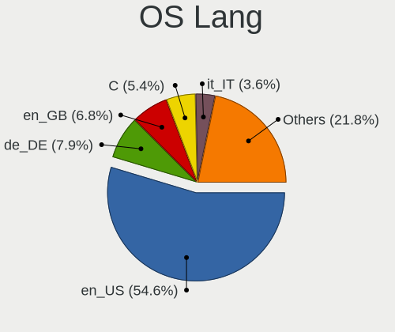
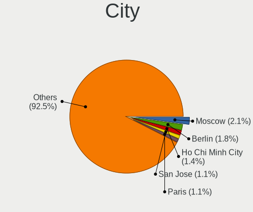
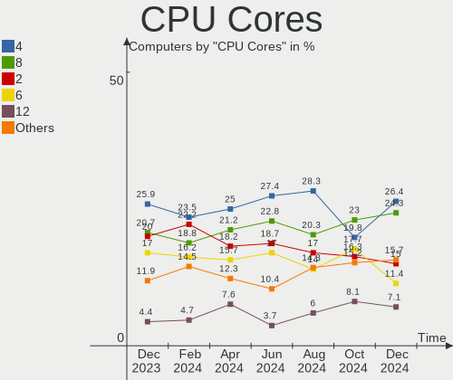
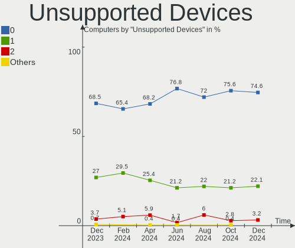

Arch - Hardware Trends
----------------------

A project to identify most popular hardware characteristics and track their change
over time based on data collected by Linux users at https://Linux-Hardware.org.

Anyone can contribute to this report by the [hw-probe](https://github.com/linuxhw/hw-probe) tool:

    sudo -E hw-probe -all -upload

This is a report for all computer types. See also reports for [desktops](/Dist/Arch/Desktop/README.md) and [notebooks](/Dist/Arch/Notebook/README.md).

This report is for one last month. Overall report since the beginning of time: [TestCoverage](https://github.com/linuxhw/TestCoverage)

Period: May, 2022.

Contents
--------

* [ System ](#system)
  - [ OS                       ](#os)
  - [ OS Family                ](#os-family)
  - [ Kernel                   ](#kernel)
  - [ Kernel Family            ](#kernel-family)
  - [ Kernel Major Ver.        ](#kernel-major-ver)
  - [ Arch                     ](#arch)
  - [ DE                       ](#de)
  - [ Display Server           ](#display-server)
  - [ Display Manager          ](#display-manager)
  - [ OS Lang                  ](#os-lang)
  - [ Boot Mode                ](#boot-mode)
  - [ Filesystem               ](#filesystem)
  - [ Part. scheme             ](#part-scheme)
  - [ Dual Boot with Linux/BSD ](#dual-boot-with-linuxbsd)
  - [ Dual Boot (Win)          ](#dual-boot-win)

* [ Board ](#board)
  - [ Vendor                   ](#vendor)
  - [ Model                    ](#model)
  - [ Model Family             ](#model-family)
  - [ MFG Year                 ](#mfg-year)
  - [ Form Factor              ](#form-factor)
  - [ Secure Boot              ](#secure-boot)
  - [ Coreboot                 ](#coreboot)
  - [ RAM Size                 ](#ram-size)
  - [ RAM Used                 ](#ram-used)
  - [ Total Drives             ](#total-drives)
  - [ Has CD-ROM               ](#has-cd-rom)
  - [ Has Ethernet             ](#has-ethernet)
  - [ Has WiFi                 ](#has-wifi)
  - [ Has Bluetooth            ](#has-bluetooth)

* [ Location ](#location)
  - [ Country                  ](#country)
  - [ City                     ](#city)

* [ Drives ](#drives)
  - [ Drive Vendor             ](#drive-vendor)
  - [ Drive Model              ](#drive-model)
  - [ HDD Vendor               ](#hdd-vendor)
  - [ SSD Vendor               ](#ssd-vendor)
  - [ Drive Kind               ](#drive-kind)
  - [ Drive Connector          ](#drive-connector)
  - [ Drive Size               ](#drive-size)
  - [ Space Total              ](#space-total)
  - [ Space Used               ](#space-used)
  - [ Malfunc. Drives          ](#malfunc-drives)
  - [ Malfunc. Drive Vendor    ](#malfunc-drive-vendor)
  - [ Malfunc. HDD Vendor      ](#malfunc-hdd-vendor)
  - [ Malfunc. Drive Kind      ](#malfunc-drive-kind)
  - [ Failed Drives            ](#failed-drives)
  - [ Failed Drive Vendor      ](#failed-drive-vendor)
  - [ Drive Status             ](#drive-status)

* [ Storage controller ](#storage-controller)
  - [ Storage Vendor           ](#storage-vendor)
  - [ Storage Model            ](#storage-model)
  - [ Storage Kind             ](#storage-kind)

* [ Processor ](#processor)
  - [ CPU Vendor               ](#cpu-vendor)
  - [ CPU Model                ](#cpu-model)
  - [ CPU Model Family         ](#cpu-model-family)
  - [ CPU Cores                ](#cpu-cores)
  - [ CPU Sockets              ](#cpu-sockets)
  - [ CPU Threads              ](#cpu-threads)
  - [ CPU Op-Modes             ](#cpu-op-modes)
  - [ CPU Microcode            ](#cpu-microcode)
  - [ CPU Microarch            ](#cpu-microarch)

* [ Graphics ](#graphics)
  - [ GPU Vendor               ](#gpu-vendor)
  - [ GPU Model                ](#gpu-model)
  - [ GPU Combo                ](#gpu-combo)
  - [ GPU Driver               ](#gpu-driver)
  - [ GPU Memory               ](#gpu-memory)

* [ Monitor ](#monitor)
  - [ Monitor Vendor           ](#monitor-vendor)
  - [ Monitor Model            ](#monitor-model)
  - [ Monitor Resolution       ](#monitor-resolution)
  - [ Monitor Diagonal         ](#monitor-diagonal)
  - [ Monitor Width            ](#monitor-width)
  - [ Aspect Ratio             ](#aspect-ratio)
  - [ Monitor Area             ](#monitor-area)
  - [ Pixel Density            ](#pixel-density)
  - [ Multiple Monitors        ](#multiple-monitors)

* [ Network ](#network)
  - [ Net Controller Vendor    ](#net-controller-vendor)
  - [ Net Controller Model     ](#net-controller-model)
  - [ Wireless Vendor          ](#wireless-vendor)
  - [ Wireless Model           ](#wireless-model)
  - [ Ethernet Vendor          ](#ethernet-vendor)
  - [ Ethernet Model           ](#ethernet-model)
  - [ Net Controller Kind      ](#net-controller-kind)
  - [ Used Controller          ](#used-controller)
  - [ NICs                     ](#nics)
  - [ IPv6                     ](#ipv6)

* [ Bluetooth ](#bluetooth)
  - [ Bluetooth Vendor         ](#bluetooth-vendor)
  - [ Bluetooth Model          ](#bluetooth-model)

* [ Sound ](#sound)
  - [ Sound Vendor             ](#sound-vendor)
  - [ Sound Model              ](#sound-model)

* [ Memory ](#memory)
  - [ Memory Vendor            ](#memory-vendor)
  - [ Memory Model             ](#memory-model)
  - [ Memory Kind              ](#memory-kind)
  - [ Memory Form Factor       ](#memory-form-factor)
  - [ Memory Size              ](#memory-size)
  - [ Memory Speed             ](#memory-speed)

* [ Printers & scanners ](#printers--scanners)
  - [ Printer Vendor           ](#printer-vendor)
  - [ Printer Model            ](#printer-model)
  - [ Scanner Vendor           ](#scanner-vendor)
  - [ Scanner Model            ](#scanner-model)

* [ Camera ](#camera)
  - [ Camera Vendor            ](#camera-vendor)
  - [ Camera Model             ](#camera-model)

* [ Security ](#security)
  - [ Fingerprint Vendor       ](#fingerprint-vendor)
  - [ Fingerprint Model        ](#fingerprint-model)
  - [ Chipcard Vendor          ](#chipcard-vendor)
  - [ Chipcard Model           ](#chipcard-model)

* [ Unsupported ](#unsupported)
  - [ Unsupported Devices      ](#unsupported-devices)
  - [ Unsupported Device Types ](#unsupported-device-types)

System
------

OS
--

Installed operating systems

| Name         | Computers | Percent |
|--------------|-----------|---------|
| Arch         | 109       | 61.58%  |
| Arch Rolling | 68        | 38.42%  |

OS Family
---------

OS without a version

| Name | Computers | Percent |
|------|-----------|---------|
| Arch | 177       | 100%    |

Kernel
------

Version of the Linux kernel

| Version                      | Computers | Percent |
|------------------------------|-----------|---------|
| 5.17.5-arch1-1               | 44        | 24.86%  |
| 5.17.9-arch1-1               | 41        | 23.16%  |
| 5.18.0-arch1-1               | 8         | 4.52%   |
| 5.17.9-zen1-1-zen            | 8         | 4.52%   |
| 5.17.5-zen1-1-zen            | 8         | 4.52%   |
| 5.17.7-zen1-1-zen            | 7         | 3.95%   |
| 5.17.7-arch1-1               | 7         | 3.95%   |
| 5.17.6-arch1-1               | 6         | 3.39%   |
| 5.17.8-arch1-1               | 5         | 2.82%   |
| 5.17.7-arch1-2               | 4         | 2.26%   |
| 5.17.4-arch1-1               | 4         | 2.26%   |
| 5.17.3-arch1-1               | 4         | 2.26%   |
| 5.18.1-arch1-1               | 3         | 1.69%   |
| 5.15.43-1-lts                | 3         | 1.69%   |
| 5.15.41-1-lts                | 3         | 1.69%   |
| 5.18.0-zen1-1-zen            | 2         | 1.13%   |
| 5.17.7-zen1-2-zen            | 2         | 1.13%   |
| 5.17.5-arch1-2               | 2         | 1.13%   |
| 5.15.37-1-lts                | 2         | 1.13%   |
| 5.18.0-259-tkg-pds           | 1         | 0.56%   |
| 5.17.8-zen1-1-zen            | 1         | 0.56%   |
| 5.17.6-zen1-1-zen            | 1         | 0.56%   |
| 5.17.5-zen1-2-zen            | 1         | 0.56%   |
| 5.17.5-xanmod1-1-v4          | 1         | 0.56%   |
| 5.17.5-hardened1-1-hardened  | 1         | 0.56%   |
| 5.17.4-zen1-1-zen            | 1         | 0.56%   |
| 5.17.11-xanmod1-1-zen3-zen3  | 1         | 0.56%   |
| 5.17.11-hardened2-1-hardened | 1         | 0.56%   |
| 5.17.1-arch1-1               | 1         | 0.56%   |
| 5.16.5                       | 1         | 0.56%   |
| 5.16.0-arch1-1               | 1         | 0.56%   |
| 5.15.38-1-lts                | 1         | 0.56%   |
| 5.15.35-1-lts                | 1         | 0.56%   |

Kernel Family
-------------

Linux kernel without a distro release

| Version | Computers | Percent |
|---------|-----------|---------|
| 5.17.5  | 57        | 32.2%   |
| 5.17.9  | 49        | 27.68%  |
| 5.17.7  | 20        | 11.3%   |
| 5.18.0  | 11        | 6.21%   |
| 5.17.6  | 7         | 3.95%   |
| 5.17.8  | 6         | 3.39%   |
| 5.17.4  | 5         | 2.82%   |
| 5.17.3  | 4         | 2.26%   |
| 5.18.1  | 3         | 1.69%   |
| 5.15.43 | 3         | 1.69%   |
| 5.15.41 | 3         | 1.69%   |
| 5.17.11 | 2         | 1.13%   |
| 5.15.37 | 2         | 1.13%   |
| 5.17.1  | 1         | 0.56%   |
| 5.16.5  | 1         | 0.56%   |
| 5.16.0  | 1         | 0.56%   |
| 5.15.38 | 1         | 0.56%   |
| 5.15.35 | 1         | 0.56%   |

Kernel Major Ver.
-----------------

Linux kernel major version

| Version | Computers | Percent |
|---------|-----------|---------|
| 5.17    | 151       | 85.31%  |
| 5.18    | 14        | 7.91%   |
| 5.15    | 10        | 5.65%   |
| 5.16    | 2         | 1.13%   |

Arch
----

OS architecture (x86_64, i586, etc.)

| Name   | Computers | Percent |
|--------|-----------|---------|
| x86_64 | 177       | 100%    |

DE
--

Desktop Environment

| Name       | Computers | Percent |
|------------|-----------|---------|
| GNOME      | 65        | 36.72%  |
| KDE5       | 50        | 28.25%  |
| Unknown    | 21        | 11.86%  |
| XFCE       | 19        | 10.73%  |
| i3         | 9         | 5.08%   |
| sway       | 3         | 1.69%   |
| X-Cinnamon | 2         | 1.13%   |
| qtile      | 2         | 1.13%   |
| MATE       | 2         | 1.13%   |
| LXQt       | 1         | 0.56%   |
| Deepin     | 1         | 0.56%   |
| bspwm      | 1         | 0.56%   |
| awesome    | 1         | 0.56%   |

Display Server
--------------

X11 or Wayland

| Name    | Computers | Percent |
|---------|-----------|---------|
| X11     | 96        | 54.24%  |
| Wayland | 50        | 28.25%  |
| Tty     | 22        | 12.43%  |
| Unknown | 9         | 5.08%   |

Display Manager
---------------

SDDM, LightDM, etc.

| Name    | Computers | Percent |
|---------|-----------|---------|
| Unknown | 88        | 49.72%  |
| SDDM    | 35        | 19.77%  |
| LightDM | 26        | 14.69%  |
| GDM     | 20        | 11.3%   |
| Ly      | 4         | 2.26%   |
| LXDM    | 4         | 2.26%   |

OS Lang
-------

Language

| Lang       | Computers | Percent |
|------------|-----------|---------|
| en_US      | 107       | 60.45%  |
| C          | 9         | 5.08%   |
| Unknown    | 7         | 3.95%   |
| pt_BR      | 6         | 3.39%   |
| fr_FR      | 6         | 3.39%   |
| en_IE      | 5         | 2.82%   |
| en_GB      | 5         | 2.82%   |
| en_IN      | 4         | 2.26%   |
| de_DE      | 4         | 2.26%   |
| ru_RU      | 3         | 1.69%   |
| en_AU      | 3         | 1.69%   |
| en_DK      | 2         | 1.13%   |
| zh_TW      | 1         | 0.56%   |
| uk_UA      | 1         | 0.56%   |
| tr_TR      | 1         | 0.56%   |
| pt_PT      | 1         | 0.56%   |
| it_IT      | 1         | 0.56%   |
| hu_HU      | 1         | 0.56%   |
| es_PE      | 1         | 0.56%   |
| es_ES.UTF8 | 1         | 0.56%   |
| es_CL.UTF8 | 1         | 0.56%   |
| es_AR      | 1         | 0.56%   |
| en_US.UTF8 | 1         | 0.56%   |
| en_GB.UTF8 | 1         | 0.56%   |
| de_CH      | 1         | 0.56%   |
| de_AT      | 1         | 0.56%   |
| Default    | 1         | 0.56%   |
| cs_CZ      | 1         | 0.56%   |

Boot Mode
---------

EFI or BIOS

| Mode | Computers | Percent |
|------|-----------|---------|
| EFI  | 105       | 59.32%  |
| BIOS | 72        | 40.68%  |

Filesystem
----------

Type of filesystem

| Type    | Computers | Percent |
|---------|-----------|---------|
| Ext4    | 130       | 73.45%  |
| Btrfs   | 37        | 20.9%   |
| Xfs     | 4         | 2.26%   |
| F2fs    | 3         | 1.69%   |
| Zfs     | 1         | 0.56%   |
| XXX4    | 1         | 0.56%   |
| Overlay | 1         | 0.56%   |

Part. scheme
------------

Scheme of partitioning

| Type    | Computers | Percent |
|---------|-----------|---------|
| GPT     | 112       | 63.28%  |
| Unknown | 50        | 28.25%  |
| MBR     | 15        | 8.47%   |

Dual Boot with Linux/BSD
------------------------

Hosting more than one Linux/BSD

| Dual boot | Computers | Percent |
|-----------|-----------|---------|
| No        | 163       | 92.09%  |
| Yes       | 14        | 7.91%   |

Dual Boot (Win)
---------------

Hosting Linux and Windows

| Dual boot | Computers | Percent |
|-----------|-----------|---------|
| No        | 120       | 67.8%   |
| Yes       | 57        | 32.2%   |

Board
-----

Vendor
------

Motherboard manufacturer

| Name                | Computers | Percent |
|---------------------|-----------|---------|
| ASUSTek Computer    | 46        | 25.99%  |
| Lenovo              | 28        | 15.82%  |
| Dell                | 27        | 15.25%  |
| Hewlett-Packard     | 16        | 9.04%   |
| MSI                 | 12        | 6.78%   |
| Gigabyte Technology | 10        | 5.65%   |
| Acer                | 8         | 4.52%   |
| ASRock              | 5         | 2.82%   |
| Intel               | 3         | 1.69%   |
| Apple               | 3         | 1.69%   |
| Timi                | 2         | 1.13%   |
| System76            | 2         | 1.13%   |
| Google              | 2         | 1.13%   |
| Toshiba             | 1         | 0.56%   |
| SLIMBOOK            | 1         | 0.56%   |
| Schenker            | 1         | 0.56%   |
| Samsung Electronics | 1         | 0.56%   |
| Notebook            | 1         | 0.56%   |
| MAXSUN              | 1         | 0.56%   |
| HUAWEI              | 1         | 0.56%   |
| Huanan              | 1         | 0.56%   |
| Fujitsu Siemens     | 1         | 0.56%   |
| Framework           | 1         | 0.56%   |
| eMachines           | 1         | 0.56%   |
| Compal              | 1         | 0.56%   |
| Unknown             | 1         | 0.56%   |

Model
-----

Motherboard model

| Name                                       | Computers | Percent |
|--------------------------------------------|-----------|---------|
| Timi TM1604                                | 2         | 1.13%   |
| MSI MS-7C91                                | 2         | 1.13%   |
| HP EliteBook 8470p                         | 2         | 1.13%   |
| HP Desktop M01-F0xxx                       | 2         | 1.13%   |
| Dell OptiPlex 9020                         | 2         | 1.13%   |
| Dell OptiPlex 7020                         | 2         | 1.13%   |
| Dell Latitude E6430                        | 2         | 1.13%   |
| Dell Inspiron 5567                         | 2         | 1.13%   |
| ASUS ROG STRIX X570-E GAMING               | 2         | 1.13%   |
| ASUS ROG Strix G513QY_G513QY               | 2         | 1.13%   |
| ASUS PRIME B550M-A                         | 2         | 1.13%   |
| ASUS PRIME B450M-A                         | 2         | 1.13%   |
| Unknown                                    | 2         | 1.13%   |
| Toshiba Satellite C55-A-1N0                | 1         | 0.56%   |
| System76 Oryx Pro                          | 1         | 0.56%   |
| System76 Lemur Pro                         | 1         | 0.56%   |
| SLIMBOOK TITAN                             | 1         | 0.56%   |
| Schenker XMG FUSION 15 (XFU15L19)          | 1         | 0.56%   |
| Samsung 730QCJ/730QCR                      | 1         | 0.56%   |
| Notebook P65xHP                            | 1         | 0.56%   |
| MSI Stealth 15M A11SDK                     | 1         | 0.56%   |
| MSI MS-7D43                                | 1         | 0.56%   |
| MSI MS-7D32                                | 1         | 0.56%   |
| MSI MS-7C31                                | 1         | 0.56%   |
| MSI MS-7B17                                | 1         | 0.56%   |
| MSI MS-7A40                                | 1         | 0.56%   |
| MSI MS-7100                                | 1         | 0.56%   |
| MSI Modern 14 B5M                          | 1         | 0.56%   |
| MSI GF75 Thin 9SC                          | 1         | 0.56%   |
| MSI Alpha 15 B5EEK                         | 1         | 0.56%   |
| MAXSUN MS-M3A78EL                          | 1         | 0.56%   |
| Lenovo Yoga Duet IML 2020 82E9             | 1         | 0.56%   |
| Lenovo Yoga Duet 7 13IML05 82AS            | 1         | 0.56%   |
| Lenovo YangTianT4900c-00 90ETCTO1WW        | 1         | 0.56%   |
| Lenovo ThinkPad X230 23257Y1               | 1         | 0.56%   |
| Lenovo ThinkPad X200s 74663RG              | 1         | 0.56%   |
| Lenovo ThinkPad X1 Carbon Gen 8 20U90046PB | 1         | 0.56%   |
| Lenovo ThinkPad W510 4318CTO               | 1         | 0.56%   |
| Lenovo ThinkPad T490 20N2CTO1WW            | 1         | 0.56%   |
| Lenovo ThinkPad T460p 20FW0005AU           | 1         | 0.56%   |
| Lenovo ThinkPad E15 Gen 3 20YG0041RT       | 1         | 0.56%   |
| Lenovo ThinkPad E15 20RD0011GE             | 1         | 0.56%   |
| Lenovo ThinkBook 15 G2 ITL 20VE            | 1         | 0.56%   |
| Lenovo Legion Y7000P2020H 82AX             | 1         | 0.56%   |
| Lenovo Legion 5 15ACH6H 82JU               | 1         | 0.56%   |
| Lenovo IdeaPad Z580                        | 1         | 0.56%   |
| Lenovo IdeaPad U430p 20269                 | 1         | 0.56%   |
| Lenovo IdeaPad S145-15IWL 81S9             | 1         | 0.56%   |
| Lenovo IdeaPad Gaming 3 15IMH05 81Y4       | 1         | 0.56%   |
| Lenovo IdeaPad Gaming 3 15ACH6 82K2        | 1         | 0.56%   |
| Lenovo IdeaPad Flex-14API 81SS             | 1         | 0.56%   |
| Lenovo IdeaPad C340-15IML 81TL             | 1         | 0.56%   |
| Lenovo IdeaPad 5 15ALC05 82LN              | 1         | 0.56%   |
| Lenovo IdeaPad 5 14ARE05 81YM              | 1         | 0.56%   |
| Lenovo IdeaPad 310-14ISK 80UG              | 1         | 0.56%   |
| Lenovo IdeaPad 110-15IBR 80T7              | 1         | 0.56%   |
| Lenovo IdeaPad 100-15IBY 80MJ              | 1         | 0.56%   |
| Lenovo B590 37613LG                        | 1         | 0.56%   |
| Intel NUC8i3BEH                            | 1         | 0.56%   |
| Intel DH61BF AAG81311-101                  | 1         | 0.56%   |

Model Family
------------

Motherboard model prefix

| Name                     | Computers | Percent |
|--------------------------|-----------|---------|
| Lenovo IdeaPad           | 12        | 6.78%   |
| ASUS ROG                 | 9         | 5.08%   |
| Lenovo ThinkPad          | 8         | 4.52%   |
| Dell Inspiron            | 7         | 3.95%   |
| Dell OptiPlex            | 6         | 3.39%   |
| Dell Latitude            | 6         | 3.39%   |
| ASUS TUF                 | 6         | 3.39%   |
| ASUS PRIME               | 6         | 3.39%   |
| Acer Aspire              | 6         | 3.39%   |
| Dell XPS                 | 5         | 2.82%   |
| ASUS VivoBook            | 5         | 2.82%   |
| ASUS ASUS                | 4         | 2.26%   |
| HP ProBook               | 3         | 1.69%   |
| HP EliteBook             | 3         | 1.69%   |
| Timi TM1604              | 2         | 1.13%   |
| MSI MS-7C91              | 2         | 1.13%   |
| Lenovo Yoga              | 2         | 1.13%   |
| Lenovo Legion            | 2         | 1.13%   |
| HP Pavilion              | 2         | 1.13%   |
| HP Desktop               | 2         | 1.13%   |
| Gigabyte X570            | 2         | 1.13%   |
| Gigabyte TRX40           | 2         | 1.13%   |
| Acer Nitro               | 2         | 1.13%   |
| Unknown                  | 2         | 1.13%   |
| Toshiba Satellite        | 1         | 0.56%   |
| System76 Oryx            | 1         | 0.56%   |
| System76 Lemur           | 1         | 0.56%   |
| SLIMBOOK TITAN           | 1         | 0.56%   |
| Schenker XMG             | 1         | 0.56%   |
| Samsung 730QCJ           | 1         | 0.56%   |
| Notebook P65xHP          | 1         | 0.56%   |
| MSI Stealth              | 1         | 0.56%   |
| MSI MS-7D43              | 1         | 0.56%   |
| MSI MS-7D32              | 1         | 0.56%   |
| MSI MS-7C31              | 1         | 0.56%   |
| MSI MS-7B17              | 1         | 0.56%   |
| MSI MS-7A40              | 1         | 0.56%   |
| MSI MS-7100              | 1         | 0.56%   |
| MSI Modern               | 1         | 0.56%   |
| MSI GF75                 | 1         | 0.56%   |
| MSI Alpha                | 1         | 0.56%   |
| MAXSUN MS-M3A78EL        | 1         | 0.56%   |
| Lenovo YangTianT4900c-00 | 1         | 0.56%   |
| Lenovo ThinkBook         | 1         | 0.56%   |
| Lenovo B590              | 1         | 0.56%   |
| Intel NUC8i3BEH          | 1         | 0.56%   |
| Intel DH61BF             | 1         | 0.56%   |
| Intel D54250WYK          | 1         | 0.56%   |
| HUAWEI BOD-WXX9          | 1         | 0.56%   |
| Huanan X99-TF            | 1         | 0.56%   |
| HP rp5700                | 1         | 0.56%   |
| HP ProDesk               | 1         | 0.56%   |
| HP OMEN                  | 1         | 0.56%   |
| HP Laptop                | 1         | 0.56%   |
| HP ENVY                  | 1         | 0.56%   |
| HP 20-e018cn             | 1         | 0.56%   |
| Google Quawks            | 1         | 0.56%   |
| Google Caroline          | 1         | 0.56%   |
| Gigabyte Z97P-D3         | 1         | 0.56%   |
| Gigabyte X299            | 1         | 0.56%   |

MFG Year
--------

Motherboard manufacture year

| Year | Computers | Percent |
|------|-----------|---------|
| 2021 | 36        | 20.34%  |
| 2020 | 32        | 18.08%  |
| 2019 | 24        | 13.56%  |
| 2016 | 14        | 7.91%   |
| 2018 | 11        | 6.21%   |
| 2012 | 11        | 6.21%   |
| 2017 | 8         | 4.52%   |
| 2015 | 8         | 4.52%   |
| 2014 | 8         | 4.52%   |
| 2011 | 7         | 3.95%   |
| 2013 | 5         | 2.82%   |
| 2010 | 4         | 2.26%   |
| 2022 | 3         | 1.69%   |
| 2009 | 2         | 1.13%   |
| 2007 | 2         | 1.13%   |
| 2008 | 1         | 0.56%   |
| 2006 | 1         | 0.56%   |

Form Factor
-----------

Physical design of the computer

| Name        | Computers | Percent |
|-------------|-----------|---------|
| Notebook    | 95        | 53.67%  |
| Desktop     | 72        | 40.68%  |
| Convertible | 6         | 3.39%   |
| Tablet      | 2         | 1.13%   |
| Mini pc     | 1         | 0.56%   |
| All in one  | 1         | 0.56%   |

Secure Boot
-----------

Enabled or disabled

| State    | Computers | Percent |
|----------|-----------|---------|
| Disabled | 175       | 98.87%  |
| Enabled  | 2         | 1.13%   |

Coreboot
--------

Have coreboot on board

| Used | Computers | Percent |
|------|-----------|---------|
| No   | 173       | 97.74%  |
| Yes  | 4         | 2.26%   |

RAM Size
--------

Total RAM memory

| Size in GB      | Computers | Percent |
|-----------------|-----------|---------|
| 16.01-24.0      | 49        | 27.68%  |
| 4.01-8.0        | 39        | 22.03%  |
| 8.01-16.0       | 35        | 19.77%  |
| 32.01-64.0      | 25        | 14.12%  |
| 3.01-4.0        | 13        | 7.34%   |
| 64.01-256.0     | 10        | 5.65%   |
| 1.01-2.0        | 3         | 1.69%   |
| More than 256.0 | 1         | 0.56%   |
| 24.01-32.0      | 1         | 0.56%   |
| 2.01-3.0        | 1         | 0.56%   |

RAM Used
--------

Used RAM memory

| Used GB    | Computers | Percent |
|------------|-----------|---------|
| 2.01-3.0   | 52        | 29.38%  |
| 1.01-2.0   | 35        | 19.77%  |
| 4.01-8.0   | 34        | 19.21%  |
| 3.01-4.0   | 29        | 16.38%  |
| 8.01-16.0  | 13        | 7.34%   |
| 0.51-1.0   | 6         | 3.39%   |
| 16.01-24.0 | 3         | 1.69%   |
| 0.01-0.5   | 3         | 1.69%   |
| 32.01-64.0 | 2         | 1.13%   |

Total Drives
------------

Number of drives on board

| Drives | Computers | Percent |
|--------|-----------|---------|
| 1      | 90        | 50.85%  |
| 2      | 58        | 32.77%  |
| 3      | 13        | 7.34%   |
| 4      | 9         | 5.08%   |
| 8      | 2         | 1.13%   |
| 7      | 2         | 1.13%   |
| 5      | 2         | 1.13%   |
| 6      | 1         | 0.56%   |

Has CD-ROM
----------

Has CD-ROM on board

| Presented | Computers | Percent |
|-----------|-----------|---------|
| No        | 133       | 75.14%  |
| Yes       | 44        | 24.86%  |

Has Ethernet
------------

Has Ethernet on board

| Presented | Computers | Percent |
|-----------|-----------|---------|
| Yes       | 148       | 83.62%  |
| No        | 29        | 16.38%  |

Has WiFi
--------

Has WiFi module

| Presented | Computers | Percent |
|-----------|-----------|---------|
| Yes       | 149       | 84.18%  |
| No        | 28        | 15.82%  |

Has Bluetooth
-------------

Has Bluetooth module

| Presented | Computers | Percent |
|-----------|-----------|---------|
| Yes       | 139       | 78.53%  |
| No        | 38        | 21.47%  |

Location
--------

Country
-------

Geographic location (country)

| Country      | Computers | Percent |
|--------------|-----------|---------|
| USA          | 41        | 23.16%  |
| Germany      | 15        | 8.47%   |
| Russia       | 10        | 5.65%   |
| Poland       | 9         | 5.08%   |
| France       | 8         | 4.52%   |
| India        | 6         | 3.39%   |
| Brazil       | 6         | 3.39%   |
| Peru         | 5         | 2.82%   |
| Canada       | 5         | 2.82%   |
| Turkey       | 4         | 2.26%   |
| Thailand     | 4         | 2.26%   |
| Italy        | 4         | 2.26%   |
| China        | 4         | 2.26%   |
| Austria      | 4         | 2.26%   |
| UK           | 3         | 1.69%   |
| Spain        | 3         | 1.69%   |
| Nepal        | 3         | 1.69%   |
| Ireland      | 3         | 1.69%   |
| Chile        | 3         | 1.69%   |
| Australia    | 3         | 1.69%   |
| Morocco      | 2         | 1.13%   |
| Kenya        | 2         | 1.13%   |
| Indonesia    | 2         | 1.13%   |
| Bangladesh   | 2         | 1.13%   |
| Vietnam      | 1         | 0.56%   |
| Ukraine      | 1         | 0.56%   |
| Taiwan       | 1         | 0.56%   |
| Switzerland  | 1         | 0.56%   |
| Sweden       | 1         | 0.56%   |
| South Korea  | 1         | 0.56%   |
| South Africa | 1         | 0.56%   |
| Somalia      | 1         | 0.56%   |
| Slovakia     | 1         | 0.56%   |
| Serbia       | 1         | 0.56%   |
| Portugal     | 1         | 0.56%   |
| Panama       | 1         | 0.56%   |
| Pakistan     | 1         | 0.56%   |
| New Zealand  | 1         | 0.56%   |
| Myanmar      | 1         | 0.56%   |
| Japan        | 1         | 0.56%   |
| Hungary      | 1         | 0.56%   |
| Hong Kong    | 1         | 0.56%   |
| Finland      | 1         | 0.56%   |
| Egypt        | 1         | 0.56%   |
| Ecuador      | 1         | 0.56%   |
| Czechia      | 1         | 0.56%   |
| Cambodia     | 1         | 0.56%   |
| Belgium      | 1         | 0.56%   |
| Belarus      | 1         | 0.56%   |
| Argentina    | 1         | 0.56%   |

City
----

Geographic location (city)

| City                        | Computers | Percent |
|-----------------------------|-----------|---------|
| Lima                        | 5         | 2.82%   |
| Vienna                      | 3         | 1.69%   |
| Valencia                    | 3         | 1.69%   |
| Sao Paulo                   | 3         | 1.69%   |
| Frankfurt am Main           | 3         | 1.69%   |
| Warsaw                      | 2         | 1.13%   |
| Oranmore                    | 2         | 1.13%   |
| Moscow                      | 2         | 1.13%   |
| Krakow                      | 2         | 1.13%   |
| Kathmandu                   | 2         | 1.13%   |
| Fes                         | 2         | 1.13%   |
| Dallas                      | 2         | 1.13%   |
| Ban Yang Sam Ton            | 2         | 1.13%   |
| Atlanta                     | 2         | 1.13%   |
| Ankara                      | 2         | 1.13%   |
| Zurich                      | 1         | 0.56%   |
| Zschopau                    | 1         | 0.56%   |
| Ziemetshausen               | 1         | 0.56%   |
| Yangon                      | 1         | 0.56%   |
| Xiamen                      | 1         | 0.56%   |
| Xi'an                       | 1         | 0.56%   |
| Voisins-le-Bretonneux       | 1         | 0.56%   |
| Vila do Conde               | 1         | 0.56%   |
| Uberlândia                 | 1         | 0.56%   |
| Třebíč                   | 1         | 0.56%   |
| Thung Song                  | 1         | 0.56%   |
| Taganrog                    | 1         | 0.56%   |
| Syracuse                    | 1         | 0.56%   |
| Surrey                      | 1         | 0.56%   |
| Sundbyberg                  | 1         | 0.56%   |
| Sultanpur                   | 1         | 0.56%   |
| Sterling                    | 1         | 0.56%   |
| St Petersburg               | 1         | 0.56%   |
| Spoleto                     | 1         | 0.56%   |
| South Tangerang             | 1         | 0.56%   |
| Smiths Falls                | 1         | 0.56%   |
| Shanghai                    | 1         | 0.56%   |
| Setagaya-ku                 | 1         | 0.56%   |
| Sertolovo                   | 1         | 0.56%   |
| Seoul                       | 1         | 0.56%   |
| Seattle                     | 1         | 0.56%   |
| Sattahip                    | 1         | 0.56%   |
| Saskatoon                   | 1         | 0.56%   |
| Santiago                    | 1         | 0.56%   |
| San Cristóbal de La Laguna | 1         | 0.56%   |
| Sammamish                   | 1         | 0.56%   |
| Salt Lake City              | 1         | 0.56%   |
| Saint-Paul-les-Dax          | 1         | 0.56%   |
| Saint-Leu-la-Foret          | 1         | 0.56%   |
| Saint Paul                  | 1         | 0.56%   |
| Sacramento                  | 1         | 0.56%   |
| Royal Oak                   | 1         | 0.56%   |
| Rennes                      | 1         | 0.56%   |
| Regina                      | 1         | 0.56%   |
| Recife                      | 1         | 0.56%   |
| Rawalpindi                  | 1         | 0.56%   |
| Rancagua                    | 1         | 0.56%   |
| Racine                      | 1         | 0.56%   |
| Poznan                      | 1         | 0.56%   |
| Pilisvorosvar               | 1         | 0.56%   |

Drives
------

Drive Vendor
------------

Hard drive vendors

| Vendor                       | Computers | Drives | Percent |
|------------------------------|-----------|--------|---------|
| Samsung Electronics          | 54        | 76     | 19.64%  |
| WDC                          | 44        | 51     | 16%     |
| Seagate                      | 39        | 49     | 14.18%  |
| Kingston                     | 17        | 19     | 6.18%   |
| Crucial                      | 15        | 18     | 5.45%   |
| Toshiba                      | 13        | 17     | 4.73%   |
| SK Hynix                     | 13        | 13     | 4.73%   |
| SanDisk                      | 10        | 11     | 3.64%   |
| Unknown                      | 8         | 9      | 2.91%   |
| Intel                        | 8         | 8      | 2.91%   |
| KIOXIA                       | 5         | 5      | 1.82%   |
| Hitachi                      | 5         | 5      | 1.82%   |
| Phison                       | 4         | 4      | 1.45%   |
| Micron Technology            | 4         | 4      | 1.45%   |
| HGST                         | 3         | 3      | 1.09%   |
| Corsair                      | 3         | 3      | 1.09%   |
| KingSpec                     | 2         | 2      | 0.73%   |
| GOODRAM                      | 2         | 2      | 0.73%   |
| Gigabyte Technology          | 2         | 2      | 0.73%   |
| Fujitsu                      | 2         | 2      | 0.73%   |
| China                        | 2         | 2      | 0.73%   |
| walram                       | 1         | 1      | 0.36%   |
| Union Memory (Shenzhen)      | 1         | 1      | 0.36%   |
| UMIS                         | 1         | 1      | 0.36%   |
| Transcend                    | 1         | 1      | 0.36%   |
| Team                         | 1         | 1      | 0.36%   |
| SPCC                         | 1         | 1      | 0.36%   |
| Shenzhen Longsys Electronics | 1         | 1      | 0.36%   |
| sage                         | 1         | 1      | 0.36%   |
| PHD 3.0                      | 1         | 1      | 0.36%   |
| Patriot                      | 1         | 1      | 0.36%   |
| Micron/Crucial Technology    | 1         | 2      | 0.36%   |
| LITEONIT                     | 1         | 1      | 0.36%   |
| Lexar                        | 1         | 1      | 0.36%   |
| KIOXIA-EXCERIA               | 1         | 1      | 0.36%   |
| Intenso                      | 1         | 1      | 0.36%   |
| HS-SSD-C100                  | 1         | 1      | 0.36%   |
| Eluktro                      | 1         | 1      | 0.36%   |
| Apple                        | 1         | 1      | 0.36%   |
| A-DATA Technology            | 1         | 1      | 0.36%   |
| 2.5                          | 1         | 1      | 0.36%   |

Drive Model
-----------

Hard drive models

| Model                            | Computers | Percent |
|----------------------------------|-----------|---------|
| Samsung NVMe SSD Drive 1TB       | 6         | 1.95%   |
| Crucial CT500MX500SSD1 500GB     | 5         | 1.62%   |
| SK Hynix NVMe SSD Drive 512GB    | 4         | 1.3%    |
| Seagate ST1000LM035-1RK172 1TB   | 4         | 1.3%    |
| Samsung SSD 970 EVO Plus 1TB     | 4         | 1.3%    |
| Samsung NVMe SSD Drive 500GB     | 4         | 1.3%    |
| Kingston SA400S37240G 240GB SSD  | 4         | 1.3%    |
| Seagate ST2000DM008-2FR102 2TB   | 3         | 0.97%   |
| Seagate ST1000LM048-2E7172 1TB   | 3         | 0.97%   |
| Samsung SSD 970 EVO Plus 2TB     | 3         | 0.97%   |
| Samsung SSD 860 EVO 1TB          | 3         | 0.97%   |
| Samsung NVMe SSD Drive 250GB     | 3         | 0.97%   |
| Crucial CT1000MX500SSD1 1TB      | 3         | 0.97%   |
| WDC WDS500G2B0A-00SM50 500GB SSD | 2         | 0.65%   |
| WDC WDS250G2B0B-00YS70 250GB SSD | 2         | 0.65%   |
| WDC WDS240G2G0B-00EPW0 240GB SSD | 2         | 0.65%   |
| WDC WDS240G2G0A-00JH30 240GB SSD | 2         | 0.65%   |
| WDC WD10SPZX-21Z10T0 1TB         | 2         | 0.65%   |
| WDC WD10EZEX-00BN5A0 1TB         | 2         | 0.65%   |
| Toshiba MQ01ABD100 1TB           | 2         | 0.65%   |
| Toshiba DT01ACA100 1TB           | 2         | 0.65%   |
| Seagate ST8000DM004-2CX188 8TB   | 2         | 0.65%   |
| Seagate ST500DM002-1BD142 500GB  | 2         | 0.65%   |
| Seagate ST2000DM006-2DM164 2TB   | 2         | 0.65%   |
| Seagate ST1000DM010-2EP102 1TB   | 2         | 0.65%   |
| SanDisk SSD PLUS 480GB           | 2         | 0.65%   |
| Sandisk NVMe SSD Drive 500GB     | 2         | 0.65%   |
| Samsung SSD 980 PRO 250GB        | 2         | 0.65%   |
| Samsung SSD 980 PRO 1TB          | 2         | 0.65%   |
| Samsung SSD 970 EVO 1TB          | 2         | 0.65%   |
| Samsung SSD 870 EVO 1TB          | 2         | 0.65%   |
| Samsung SSD 860 EVO 500GB        | 2         | 0.65%   |
| Samsung SSD 860 EVO 250GB        | 2         | 0.65%   |
| Samsung SSD 850 EVO 500GB        | 2         | 0.65%   |
| Samsung SSD 850 EVO 250GB        | 2         | 0.65%   |
| Samsung NVMe SSD Drive 512GB     | 2         | 0.65%   |
| Phison Sabrent 1TB               | 2         | 0.65%   |
| Micron NVMe SSD Drive 1TB        | 2         | 0.65%   |
| Kingston NVMe SSD Drive 512GB    | 2         | 0.65%   |
| Kingston NVMe SSD Drive 500GB    | 2         | 0.65%   |
| Intel NVMe SSD Drive 512GB       | 2         | 0.65%   |
| Hitachi HDS721010CLA332 1TB      | 2         | 0.65%   |
| HGST HTS541010A9E680 1TB         | 2         | 0.65%   |
| Gigabyte GP-GSM2NE3512GNTD 512GB | 2         | 0.65%   |
| Crucial CT525MX300SSD1 528GB     | 2         | 0.65%   |
| WDC WDS500G3X0C-00SJG0 500GB     | 1         | 0.32%   |
| WDC WDS500G1X0E-00AFY0 500GB     | 1         | 0.32%   |
| WDC WDS250G2B0A-00SM50 250GB SSD | 1         | 0.32%   |
| WDC WDS250G2B0A 250GB SSD        | 1         | 0.32%   |
| WDC WDS120G2G0B-00EPW0 120GB SSD | 1         | 0.32%   |
| WDC WDS120G1G0A-00SS50 120GB SSD | 1         | 0.32%   |
| WDC WDS100T2G0A-00JH30 1TB SSD   | 1         | 0.32%   |
| WDC WDS100T2B0C-00PXH0 1TB       | 1         | 0.32%   |
| WDC WDBRPG0010BNC-WRSN 1TB       | 1         | 0.32%   |
| WDC WDBNCE5000PNC 500GB SSD      | 1         | 0.32%   |
| WDC WD6400BPVT-60HXZT1 640GB     | 1         | 0.32%   |
| WDC WD5000LPLX-00ZNTT0 500GB     | 1         | 0.32%   |
| WDC WD5000LPCX-00VHAT0 500GB     | 1         | 0.32%   |
| WDC WD5000AAKX-08U6AA0 500GB     | 1         | 0.32%   |
| WDC WD5000AAKX-001CA0 500GB      | 1         | 0.32%   |

HDD Vendor
----------

Hard disk drive vendors

| Vendor              | Computers | Drives | Percent |
|---------------------|-----------|--------|---------|
| Seagate             | 37        | 47     | 42.53%  |
| WDC                 | 26        | 31     | 29.89%  |
| Toshiba             | 10        | 13     | 11.49%  |
| Hitachi             | 5         | 5      | 5.75%   |
| HGST                | 3         | 3      | 3.45%   |
| Fujitsu             | 2         | 2      | 2.3%    |
| Unknown             | 1         | 1      | 1.15%   |
| Samsung Electronics | 1         | 1      | 1.15%   |
| sage                | 1         | 1      | 1.15%   |
| PHD 3.0             | 1         | 1      | 1.15%   |

SSD Vendor
----------

Solid state drive vendors

| Vendor              | Computers | Drives | Percent |
|---------------------|-----------|--------|---------|
| Samsung Electronics | 22        | 26     | 26.19%  |
| WDC                 | 14        | 14     | 16.67%  |
| Crucial             | 13        | 15     | 15.48%  |
| Kingston            | 9         | 11     | 10.71%  |
| SanDisk             | 5         | 5      | 5.95%   |
| Intel               | 3         | 3      | 3.57%   |
| KingSpec            | 2         | 2      | 2.38%   |
| China               | 2         | 2      | 2.38%   |
| walram              | 1         | 1      | 1.19%   |
| Transcend           | 1         | 1      | 1.19%   |
| SPCC                | 1         | 1      | 1.19%   |
| SK Hynix            | 1         | 1      | 1.19%   |
| Patriot             | 1         | 1      | 1.19%   |
| LITEONIT            | 1         | 1      | 1.19%   |
| Lexar               | 1         | 1      | 1.19%   |
| KIOXIA-EXCERIA      | 1         | 1      | 1.19%   |
| Intenso             | 1         | 1      | 1.19%   |
| GOODRAM             | 1         | 1      | 1.19%   |
| Eluktro             | 1         | 1      | 1.19%   |
| Apple               | 1         | 1      | 1.19%   |
| A-DATA Technology   | 1         | 1      | 1.19%   |
| 2.5                 | 1         | 1      | 1.19%   |

Drive Kind
----------

HDD or SSD

| Kind    | Computers | Drives | Percent |
|---------|-----------|--------|---------|
| NVMe    | 94        | 117    | 37.15%  |
| HDD     | 75        | 105    | 29.64%  |
| SSD     | 74        | 92     | 29.25%  |
| MMC     | 5         | 6      | 1.98%   |
| Unknown | 5         | 6      | 1.98%   |

Drive Connector
---------------

SATA, SAS, NVMe, etc.

| Type | Computers | Drives | Percent |
|------|-----------|--------|---------|
| SATA | 114       | 195    | 51.82%  |
| NVMe | 94        | 117    | 42.73%  |
| SAS  | 7         | 8      | 3.18%   |
| MMC  | 5         | 6      | 2.27%   |

Drive Size
----------

Size of hard drive

| Size in TB | Computers | Drives | Percent |
|------------|-----------|--------|---------|
| 0.01-0.5   | 78        | 93     | 48.75%  |
| 0.51-1.0   | 54        | 68     | 33.75%  |
| 1.01-2.0   | 17        | 18     | 10.63%  |
| 4.01-10.0  | 5         | 6      | 3.13%   |
| 3.01-4.0   | 3         | 4      | 1.88%   |
| 2.01-3.0   | 2         | 4      | 1.25%   |
| 10.01-20.0 | 1         | 4      | 0.63%   |

Space Total
-----------

Amount of disk space available on the file system

| Size in GB     | Computers | Percent |
|----------------|-----------|---------|
| 251-500        | 41        | 23.16%  |
| 101-250        | 33        | 18.64%  |
| 501-1000       | 31        | 17.51%  |
| 1001-2000      | 24        | 13.56%  |
| More than 3000 | 19        | 10.73%  |
| 2001-3000      | 11        | 6.21%   |
| 51-100         | 9         | 5.08%   |
| Unknown        | 5         | 2.82%   |
| 1-20           | 3         | 1.69%   |
| 21-50          | 1         | 0.56%   |

Space Used
----------

Amount of used disk space

| Used GB        | Computers | Percent |
|----------------|-----------|---------|
| 1-20           | 45        | 25.42%  |
| 21-50          | 26        | 14.69%  |
| 51-100         | 22        | 12.43%  |
| 251-500        | 20        | 11.3%   |
| 101-250        | 19        | 10.73%  |
| 501-1000       | 18        | 10.17%  |
| 1001-2000      | 14        | 7.91%   |
| More than 3000 | 6         | 3.39%   |
| Unknown        | 5         | 2.82%   |
| 2001-3000      | 2         | 1.13%   |

Malfunc. Drives
---------------

Drive models with a malfunction

| Model                                 | Computers | Drives | Percent |
|---------------------------------------|-----------|--------|---------|
| WDC WD5000AAKS-22A7B0 500GB           | 1         | 1      | 9.09%   |
| WDC WD10EZEX-60ZF5A0 1TB              | 1         | 1      | 9.09%   |
| SK Hynix HFS128G39TND-N210A 128GB SSD | 1         | 1      | 9.09%   |
| Seagate ST9500325AS 500GB             | 1         | 1      | 9.09%   |
| Seagate ST500LT012-9WS142 500GB       | 1         | 1      | 9.09%   |
| Seagate ST500DM002-1BD142 500GB       | 1         | 2      | 9.09%   |
| Seagate ST4000VN008-2DR166 4TB        | 1         | 1      | 9.09%   |
| Seagate ST31000528AS 1TB              | 1         | 1      | 9.09%   |
| Seagate ST2000DM008-2FR102 2TB        | 1         | 1      | 9.09%   |
| Seagate ST2000DM001-9YN164 2TB        | 1         | 1      | 9.09%   |
| HGST HTS541010A9E680 1TB              | 1         | 1      | 9.09%   |

Malfunc. Drive Vendor
---------------------

Vendors of faulty drives

| Vendor   | Computers | Drives | Percent |
|----------|-----------|--------|---------|
| Seagate  | 7         | 8      | 63.64%  |
| WDC      | 2         | 2      | 18.18%  |
| SK Hynix | 1         | 1      | 9.09%   |
| HGST     | 1         | 1      | 9.09%   |

Malfunc. HDD Vendor
-------------------

Vendors of faulty HDD drives

| Vendor  | Computers | Drives | Percent |
|---------|-----------|--------|---------|
| Seagate | 7         | 8      | 70%     |
| WDC     | 2         | 2      | 20%     |
| HGST    | 1         | 1      | 10%     |

Malfunc. Drive Kind
-------------------

Kinds of faulty drives

| Kind | Computers | Drives | Percent |
|------|-----------|--------|---------|
| HDD  | 10        | 11     | 90.91%  |
| SSD  | 1         | 1      | 9.09%   |

Failed Drives
-------------

Failed drive models

Zero info for selected period =(

Failed Drive Vendor
-------------------

Failed drive vendors

Zero info for selected period =(

Drive Status
------------

Number of failed and malfunc. drives

| Status   | Computers | Drives | Percent |
|----------|-----------|--------|---------|
| Detected | 94        | 153    | 48.7%   |
| Works    | 88        | 161    | 45.6%   |
| Malfunc  | 11        | 12     | 5.7%    |

Storage controller
------------------

Storage Vendor
--------------

Storage controller vendors

| Vendor                       | Computers | Percent |
|------------------------------|-----------|---------|
| Intel                        | 102       | 40.8%   |
| AMD                          | 46        | 18.4%   |
| Samsung Electronics          | 38        | 15.2%   |
| SK Hynix                     | 12        | 4.8%    |
| Sandisk                      | 10        | 4%      |
| Phison Electronics           | 9         | 3.6%    |
| Kingston Technology Company  | 8         | 3.2%    |
| KIOXIA                       | 5         | 2%      |
| Micron Technology            | 4         | 1.6%    |
| Toshiba America Info Systems | 3         | 1.2%    |
| ASMedia Technology           | 3         | 1.2%    |
| Union Memory (Shenzhen)      | 2         | 0.8%    |
| Micron/Crucial Technology    | 2         | 0.8%    |
| Silicon Motion               | 1         | 0.4%    |
| Silicon Image                | 1         | 0.4%    |
| Shenzhen Longsys Electronics | 1         | 0.4%    |
| Nvidia                       | 1         | 0.4%    |
| Marvell Technology Group     | 1         | 0.4%    |
| Broadcom / LSI               | 1         | 0.4%    |

Storage Model
-------------

Storage controller models

| Model                                                                            | Computers | Percent |
|----------------------------------------------------------------------------------|-----------|---------|
| AMD FCH SATA Controller [AHCI mode]                                              | 33        | 11.91%  |
| Samsung NVMe SSD Controller SM981/PM981/PM983                                    | 22        | 7.94%   |
| AMD 500 Series Chipset SATA Controller                                           | 10        | 3.61%   |
| Intel Sunrise Point-LP SATA Controller [AHCI mode]                               | 9         | 3.25%   |
| AMD 400 Series Chipset SATA Controller                                           | 9         | 3.25%   |
| Samsung NVMe SSD Controller PM9A1/PM9A3/980PRO                                   | 8         | 2.89%   |
| SK Hynix Gold P31 SSD                                                            | 7         | 2.53%   |
| Samsung NVMe SSD Controller 980                                                  | 7         | 2.53%   |
| Intel Volume Management Device NVMe RAID Controller                              | 7         | 2.53%   |
| Intel 8 Series/C220 Series Chipset Family 6-port SATA Controller 1 [AHCI mode]   | 7         | 2.53%   |
| Intel 7 Series Chipset Family 6-port SATA Controller [AHCI mode]                 | 7         | 2.53%   |
| Intel 200 Series PCH SATA controller [AHCI mode]                                 | 6         | 2.17%   |
| Sandisk WD Black SN750 / PC SN730 NVMe SSD                                       | 5         | 1.81%   |
| Intel SATA Controller [RAID mode]                                                | 5         | 1.81%   |
| Phison PS5013 E13 NVMe Controller                                                | 4         | 1.44%   |
| Phison E12 NVMe Controller                                                       | 4         | 1.44%   |
| Micron Non-Volatile memory controller                                            | 4         | 1.44%   |
| KIOXIA Non-Volatile memory controller                                            | 4         | 1.44%   |
| Kingston Company A2000 NVMe SSD                                                  | 4         | 1.44%   |
| Intel SSD 660P Series                                                            | 4         | 1.44%   |
| Intel Cannon Point-LP SATA Controller [AHCI Mode]                                | 4         | 1.44%   |
| Intel Cannon Lake Mobile PCH SATA AHCI Controller                                | 4         | 1.44%   |
| Intel 82801 Mobile SATA Controller [RAID mode]                                   | 4         | 1.44%   |
| Intel 8 Series SATA Controller 1 [AHCI mode]                                     | 4         | 1.44%   |
| Intel 400 Series Chipset Family SATA AHCI Controller                             | 4         | 1.44%   |
| Kingston Company OM3PDP3 NVMe SSD                                                | 3         | 1.08%   |
| Intel Tiger Lake-LP SATA Controller [AHCI mode]                                  | 3         | 1.08%   |
| Intel HM170/QM170 Chipset SATA Controller [AHCI Mode]                            | 3         | 1.08%   |
| Intel Comet Lake SATA AHCI Controller                                            | 3         | 1.08%   |
| Intel Cannon Lake PCH SATA AHCI Controller                                       | 3         | 1.08%   |
| Intel 6 Series/C200 Series Chipset Family 6 port Mobile SATA AHCI Controller     | 3         | 1.08%   |
| ASMedia ASM1062 Serial ATA Controller                                            | 3         | 1.08%   |
| Union Memory (Shenzhen) Non-Volatile memory controller                           | 2         | 0.72%   |
| SK Hynix BC511                                                                   | 2         | 0.72%   |
| SK Hynix BC501 NVMe Solid State Drive                                            | 2         | 0.72%   |
| Sandisk WD PC SN810 / Black SN850 NVMe SSD                                       | 2         | 0.72%   |
| Sandisk WD Blue SN550 NVMe SSD                                                   | 2         | 0.72%   |
| Phison E16 PCIe4 NVMe Controller                                                 | 2         | 0.72%   |
| Micron/Crucial P2 NVMe PCIe SSD                                                  | 2         | 0.72%   |
| Intel Wildcat Point-LP SATA Controller [AHCI Mode]                               | 2         | 0.72%   |
| Intel Q170/Q150/B150/H170/H110/Z170/CM236 Chipset SATA Controller [AHCI Mode]    | 2         | 0.72%   |
| Intel Atom/Celeron/Pentium Processor x5-E8000/J3xxx/N3xxx Series SATA Controller | 2         | 0.72%   |
| Intel Alder Lake-S PCH SATA Controller [AHCI Mode]                               | 2         | 0.72%   |
| Intel 7 Series/C210 Series Chipset Family 6-port SATA Controller [AHCI mode]     | 2         | 0.72%   |
| Intel 6 Series/C200 Series Chipset Family 6 port Desktop SATA AHCI Controller    | 2         | 0.72%   |
| Intel 500 Series Chipset Family SATA AHCI Controller                             | 2         | 0.72%   |
| Intel 5 Series/3400 Series Chipset 6 port SATA AHCI Controller                   | 2         | 0.72%   |
| AMD SB7x0/SB8x0/SB9x0 SATA Controller [IDE mode]                                 | 2         | 0.72%   |
| AMD SB7x0/SB8x0/SB9x0 IDE Controller                                             | 2         | 0.72%   |
| Toshiba America Info Systems XG6 NVMe SSD Controller                             | 1         | 0.36%   |
| Toshiba America Info Systems Toshiba America Info Non-Volatile memory controller | 1         | 0.36%   |
| Toshiba America Info Systems BG3 NVMe SSD Controller                             | 1         | 0.36%   |
| SK Hynix Non-Volatile memory controller                                          | 1         | 0.36%   |
| Silicon Motion SM2263EN/SM2263XT SSD Controller                                  | 1         | 0.36%   |
| Silicon Image SiI 3132 Serial ATA Raid II Controller                             | 1         | 0.36%   |
| Shenzhen Longsys Electronics Non-Volatile memory controller                      | 1         | 0.36%   |
| Sandisk WD Blue SN500 / PC SN520 NVMe SSD                                        | 1         | 0.36%   |
| Sandisk Non-Volatile memory controller                                           | 1         | 0.36%   |
| Samsung NVMe SSD Controller SM961/PM961/SM963                                    | 1         | 0.36%   |
| Samsung NVMe SSD Controller SM951/PM951                                          | 1         | 0.36%   |

Storage Kind
------------

Kind of storage controller (IDE, SATA, NVMe, SAS, ...)

| Kind | Computers | Percent |
|------|-----------|---------|
| SATA | 133       | 52.99%  |
| NVMe | 94        | 37.45%  |
| RAID | 18        | 7.17%   |
| IDE  | 6         | 2.39%   |

Processor
---------

CPU Vendor
----------

Processor vendors

| Vendor | Computers | Percent |
|--------|-----------|---------|
| Intel  | 115       | 64.97%  |
| AMD    | 62        | 35.03%  |

CPU Model
---------

Processor models

| Model                                          | Computers | Percent |
|------------------------------------------------|-----------|---------|
| AMD Ryzen 7 5800H with Radeon Graphics         | 8         | 4.52%   |
| Intel Core i7-10510U CPU @ 1.80GHz             | 6         | 3.39%   |
| Intel Core i5-3320M CPU @ 2.60GHz              | 4         | 2.26%   |
| Intel 11th Gen Core i5-1135G7 @ 2.40GHz        | 4         | 2.26%   |
| AMD Ryzen 9 5900HX with Radeon Graphics        | 4         | 2.26%   |
| AMD Ryzen 5 3600 6-Core Processor              | 4         | 2.26%   |
| Intel Core i7-7700K CPU @ 4.20GHz              | 3         | 1.69%   |
| Intel Core i5-7200U CPU @ 2.50GHz              | 3         | 1.69%   |
| Intel Core i5-3470 CPU @ 3.20GHz               | 3         | 1.69%   |
| Intel Core i3-6006U CPU @ 2.00GHz              | 3         | 1.69%   |
| Intel 11th Gen Core i7-11800H @ 2.30GHz        | 3         | 1.69%   |
| AMD Ryzen 9 5950X 16-Core Processor            | 3         | 1.69%   |
| AMD Ryzen 5 5600G with Radeon Graphics         | 3         | 1.69%   |
| Intel Core i7-9750H CPU @ 2.60GHz              | 2         | 1.13%   |
| Intel Core i7-8565U CPU @ 1.80GHz              | 2         | 1.13%   |
| Intel Core i7-7700HQ CPU @ 2.80GHz             | 2         | 1.13%   |
| Intel Core i7-7500U CPU @ 2.70GHz              | 2         | 1.13%   |
| Intel Core i7-10875H CPU @ 2.30GHz             | 2         | 1.13%   |
| Intel Core i5-9400F CPU @ 2.90GHz              | 2         | 1.13%   |
| Intel Core i5-8265U CPU @ 1.60GHz              | 2         | 1.13%   |
| Intel Core i5-5200U CPU @ 2.20GHz              | 2         | 1.13%   |
| Intel Core i5-4590 CPU @ 3.30GHz               | 2         | 1.13%   |
| Intel Core i3-4150 CPU @ 3.50GHz               | 2         | 1.13%   |
| Intel 11th Gen Core i7-1165G7 @ 2.80GHz        | 2         | 1.13%   |
| AMD Ryzen Threadripper 3990X 64-Core Processor | 2         | 1.13%   |
| AMD Ryzen 9 5900X 12-Core Processor            | 2         | 1.13%   |
| AMD Ryzen 7 5800X 8-Core Processor             | 2         | 1.13%   |
| AMD Ryzen 7 3800X 8-Core Processor             | 2         | 1.13%   |
| AMD Ryzen 5 4500U with Radeon Graphics         | 2         | 1.13%   |
| AMD Ryzen 5 3600X 6-Core Processor             | 2         | 1.13%   |
| AMD Ryzen 5 3400G with Radeon Vega Graphics    | 2         | 1.13%   |
| AMD Ryzen 5 2600 Six-Core Processor            | 2         | 1.13%   |
| AMD Ryzen 3 3200G with Radeon Vega Graphics    | 2         | 1.13%   |
| Intel Xeon E-2276M CPU @ 2.80GHz               | 1         | 0.56%   |
| Intel Xeon CPU E5-2678 v3 @ 2.50GHz            | 1         | 0.56%   |
| Intel Pentium Dual-Core CPU E5500 @ 2.80GHz    | 1         | 0.56%   |
| Intel Pentium Dual-Core CPU E5200 @ 2.50GHz    | 1         | 0.56%   |
| Intel Pentium CPU B970 @ 2.30GHz               | 1         | 0.56%   |
| Intel Pentium CPU 2020M @ 2.40GHz              | 1         | 0.56%   |
| Intel Genuine CPU T1500 @ 1.86GHz              | 1         | 0.56%   |
| Intel Core m3-6Y30 CPU @ 0.90GHz               | 1         | 0.56%   |
| Intel Core i9-9900X CPU @ 3.50GHz              | 1         | 0.56%   |
| Intel Core i9-9900K CPU @ 3.60GHz              | 1         | 0.56%   |
| Intel Core i7-9700K CPU @ 3.60GHz              | 1         | 0.56%   |
| Intel Core i7-8750H CPU @ 2.20GHz              | 1         | 0.56%   |
| Intel Core i7-8500Y CPU @ 1.50GHz              | 1         | 0.56%   |
| Intel Core i7-7600U CPU @ 2.80GHz              | 1         | 0.56%   |
| Intel Core i7-6850K CPU @ 3.60GHz              | 1         | 0.56%   |
| Intel Core i7-6500U CPU @ 2.50GHz              | 1         | 0.56%   |
| Intel Core i7-4790 CPU @ 3.60GHz               | 1         | 0.56%   |
| Intel Core i7-4770 CPU @ 3.40GHz               | 1         | 0.56%   |
| Intel Core i7-4700HQ CPU @ 2.40GHz             | 1         | 0.56%   |
| Intel Core i7-4500U CPU @ 1.80GHz              | 1         | 0.56%   |
| Intel Core i7-3820 CPU @ 3.60GHz               | 1         | 0.56%   |
| Intel Core i7-10850H CPU @ 2.70GHz             | 1         | 0.56%   |
| Intel Core i7-10750H CPU @ 2.60GHz             | 1         | 0.56%   |
| Intel Core i7-1065G7 CPU @ 1.30GHz             | 1         | 0.56%   |
| Intel Core i7 CPU X 920 @ 2.00GHz              | 1         | 0.56%   |
| Intel Core i5-8500T CPU @ 2.10GHz              | 1         | 0.56%   |
| Intel Core i5-8400 CPU @ 2.80GHz               | 1         | 0.56%   |

CPU Model Family
----------------

Processor model prefix

| Model                   | Computers | Percent |
|-------------------------|-----------|---------|
| Intel Core i5           | 37        | 20.9%   |
| Intel Core i7           | 34        | 19.21%  |
| AMD Ryzen 5             | 22        | 12.43%  |
| AMD Ryzen 7             | 17        | 9.6%    |
| Other                   | 15        | 8.47%   |
| Intel Core i3           | 10        | 5.65%   |
| AMD Ryzen 9             | 10        | 5.65%   |
| Intel Celeron           | 6         | 3.39%   |
| AMD Ryzen 3             | 5         | 2.82%   |
| Intel Xeon              | 2         | 1.13%   |
| Intel Pentium Dual-Core | 2         | 1.13%   |
| Intel Pentium           | 2         | 1.13%   |
| Intel Core i9           | 2         | 1.13%   |
| Intel Core 2 Duo        | 2         | 1.13%   |
| AMD Ryzen Threadripper  | 2         | 1.13%   |
| Intel Genuine           | 1         | 0.56%   |
| Intel Core m3           | 1         | 0.56%   |
| Intel Atom              | 1         | 0.56%   |
| AMD FX                  | 1         | 0.56%   |
| AMD Athlon II X4        | 1         | 0.56%   |
| AMD Athlon II X2        | 1         | 0.56%   |
| AMD Athlon 64 X2        | 1         | 0.56%   |
| AMD A4                  | 1         | 0.56%   |
| AMD A10                 | 1         | 0.56%   |

CPU Cores
---------

Number of processor cores

| Number | Computers | Percent |
|--------|-----------|---------|
| 2      | 53        | 29.94%  |
| 4      | 52        | 29.38%  |
| 6      | 30        | 16.95%  |
| 8      | 29        | 16.38%  |
| 12     | 5         | 2.82%   |
| 16     | 3         | 1.69%   |
| 64     | 2         | 1.13%   |
| 10     | 1         | 0.56%   |
| 3      | 1         | 0.56%   |
| 1      | 1         | 0.56%   |

CPU Sockets
-----------

Number of sockets

| Number | Computers | Percent |
|--------|-----------|---------|
| 1      | 177       | 100%    |

CPU Threads
-----------

Threads per core (Hyper-Threading)

| Number | Computers | Percent |
|--------|-----------|---------|
| 2      | 136       | 76.84%  |
| 1      | 41        | 23.16%  |

CPU Op-Modes
------------

CPU Operation Modes (32-bit, 64-bit)

| Op mode        | Computers | Percent |
|----------------|-----------|---------|
| 32-bit, 64-bit | 177       | 100%    |

CPU Microcode
-------------

Microcode number

| Number     | Computers | Percent |
|------------|-----------|---------|
| Unknown    | 62        | 35.03%  |
| 0x0a50000c | 13        | 7.34%   |
| 0x08701021 | 7         | 3.95%   |
| 0x08108109 | 7         | 3.95%   |
| 0x806ec    | 6         | 3.39%   |
| 0x306c3    | 6         | 3.39%   |
| 0x306a9    | 6         | 3.39%   |
| 0x206a7    | 5         | 2.82%   |
| 0x906e9    | 4         | 2.26%   |
| 0x806e9    | 4         | 2.26%   |
| 0x806c1    | 4         | 2.26%   |
| 0xa0652    | 3         | 1.69%   |
| 0x906ea    | 3         | 1.69%   |
| 0x406e3    | 3         | 1.69%   |
| 0x40651    | 3         | 1.69%   |
| 0x306d4    | 3         | 1.69%   |
| 0x0a201016 | 3         | 1.69%   |
| 0x30678    | 2         | 1.13%   |
| 0x08608103 | 2         | 1.13%   |
| 0x08600106 | 2         | 1.13%   |
| 0x08600104 | 2         | 1.13%   |
| 0xa0671    | 1         | 0.56%   |
| 0x906ec    | 1         | 0.56%   |
| 0x90672    | 1         | 0.56%   |
| 0x806d1    | 1         | 0.56%   |
| 0x706e5    | 1         | 0.56%   |
| 0x6fd      | 1         | 0.56%   |
| 0x506e3    | 1         | 0.56%   |
| 0x50654    | 1         | 0.56%   |
| 0x406f1    | 1         | 0.56%   |
| 0x406c3    | 1         | 0.56%   |
| 0x306f2    | 1         | 0.56%   |
| 0x20652    | 1         | 0.56%   |
| 0x106e5    | 1         | 0.56%   |
| 0x1067a    | 1         | 0.56%   |
| 0x0a20120a | 1         | 0.56%   |
| 0x0a201009 | 1         | 0.56%   |
| 0x08701013 | 1         | 0.56%   |
| 0x08608102 | 1         | 0.56%   |
| 0x08301055 | 1         | 0.56%   |
| 0x08301039 | 1         | 0.56%   |
| 0x0800820d | 1         | 0.56%   |
| 0x08001138 | 1         | 0.56%   |
| 0x06006705 | 1         | 0.56%   |
| 0x06001119 | 1         | 0.56%   |
| 0x06000822 | 1         | 0.56%   |
| 0x010000b6 | 1         | 0.56%   |
| 0x00000000 | 1         | 0.56%   |

CPU Microarch
-------------

Microarchitecture

| Name             | Computers | Percent |
|------------------|-----------|---------|
| KabyLake         | 37        | 20.9%   |
| Zen 3            | 24        | 13.56%  |
| Zen 2            | 17        | 9.6%    |
| Haswell          | 15        | 8.47%   |
| IvyBridge        | 11        | 6.21%   |
| Zen+             | 10        | 5.65%   |
| TigerLake        | 8         | 4.52%   |
| Skylake          | 8         | 4.52%   |
| Unknown          | 8         | 4.52%   |
| SandyBridge      | 6         | 3.39%   |
| Broadwell        | 5         | 2.82%   |
| Silvermont       | 4         | 2.26%   |
| Penryn           | 4         | 2.26%   |
| CometLake        | 4         | 2.26%   |
| Icelake          | 3         | 1.69%   |
| Zen              | 2         | 1.13%   |
| Piledriver       | 2         | 1.13%   |
| K10              | 2         | 1.13%   |
| Westmere         | 1         | 0.56%   |
| Nehalem          | 1         | 0.56%   |
| K8 Hammer        | 1         | 0.56%   |
| Excavator        | 1         | 0.56%   |
| Core             | 1         | 0.56%   |
| Bonnell          | 1         | 0.56%   |
| Alderlake Hybrid | 1         | 0.56%   |

Graphics
--------

GPU Vendor
----------

Vendors of graphics cards

| Vendor            | Computers | Percent |
|-------------------|-----------|---------|
| Intel             | 95        | 43.78%  |
| Nvidia            | 65        | 29.95%  |
| AMD               | 56        | 25.81%  |
| ASPEED Technology | 1         | 0.46%   |

GPU Model
---------

Graphics card models

| Model                                                                                    | Computers | Percent |
|------------------------------------------------------------------------------------------|-----------|---------|
| AMD Cezanne                                                                              | 14        | 6.25%   |
| Intel TigerLake-LP GT2 [Iris Xe Graphics]                                                | 7         | 3.13%   |
| Intel CometLake-U GT2 [UHD Graphics]                                                     | 7         | 3.13%   |
| Intel 3rd Gen Core processor Graphics Controller                                         | 7         | 3.13%   |
| AMD Picasso/Raven 2 [Radeon Vega Series / Radeon Vega Mobile Series]                     | 7         | 3.13%   |
| AMD Navi 23 [Radeon RX 6600/6600 XT/6600M]                                               | 7         | 3.13%   |
| Intel HD Graphics 620                                                                    | 6         | 2.68%   |
| Nvidia GA107M [GeForce RTX 3050 Ti Mobile]                                               | 5         | 2.23%   |
| Intel Xeon E3-1200 v3/4th Gen Core Processor Integrated Graphics Controller              | 5         | 2.23%   |
| Intel WhiskeyLake-U GT2 [UHD Graphics 620]                                               | 5         | 2.23%   |
| Intel 2nd Generation Core Processor Family Integrated Graphics Controller                | 5         | 2.23%   |
| AMD Renoir                                                                               | 5         | 2.23%   |
| AMD Ellesmere [Radeon RX 470/480/570/570X/580/580X/590]                                  | 5         | 2.23%   |
| Nvidia GP106 [GeForce GTX 1060 6GB]                                                      | 4         | 1.79%   |
| Nvidia GA106M [GeForce RTX 3060 Mobile / Max-Q]                                          | 4         | 1.79%   |
| Intel TigerLake-H GT1 [UHD Graphics]                                                     | 4         | 1.79%   |
| Intel Haswell-ULT Integrated Graphics Controller                                         | 4         | 1.79%   |
| Intel CoffeeLake-H GT2 [UHD Graphics 630]                                                | 4         | 1.79%   |
| Nvidia TU116 [GeForce GTX 1660 SUPER]                                                    | 3         | 1.34%   |
| Nvidia GA104M [GeForce RTX 3070 Mobile / Max-Q]                                          | 3         | 1.34%   |
| Intel Skylake GT2 [HD Graphics 520]                                                      | 3         | 1.34%   |
| Intel HD Graphics 5500                                                                   | 3         | 1.34%   |
| Intel CometLake-H GT2 [UHD Graphics]                                                     | 3         | 1.34%   |
| Intel CoffeeLake-S GT2 [UHD Graphics 630]                                                | 3         | 1.34%   |
| AMD Navi 22 [Radeon RX 6700/6700 XT/6750 XT / 6800M]                                     | 3         | 1.34%   |
| AMD Navi 10 [Radeon RX 5600 OEM/5600 XT / 5700/5700 XT]                                  | 3         | 1.34%   |
| AMD Lucienne                                                                             | 3         | 1.34%   |
| Nvidia TU117M [GeForce GTX 1650 Ti Mobile]                                               | 2         | 0.89%   |
| Nvidia GP108M [GeForce MX150]                                                            | 2         | 0.89%   |
| Nvidia GP104 [GeForce GTX 1080]                                                          | 2         | 0.89%   |
| Nvidia GM206 [GeForce GTX 960]                                                           | 2         | 0.89%   |
| Nvidia GM108M [GeForce MX110]                                                            | 2         | 0.89%   |
| Nvidia GM108M [GeForce 940MX]                                                            | 2         | 0.89%   |
| Nvidia GA104 [GeForce RTX 3070 Ti]                                                       | 2         | 0.89%   |
| Intel Mobile 4 Series Chipset Integrated Graphics Controller                             | 2         | 0.89%   |
| Intel HD Graphics 530                                                                    | 2         | 0.89%   |
| Intel Atom/Celeron/Pentium Processor x5-E8000/J3xxx/N3xxx Integrated Graphics Controller | 2         | 0.89%   |
| Intel Atom Processor Z36xxx/Z37xxx Series Graphics & Display                             | 2         | 0.89%   |
| Intel 4th Generation Core Processor Family Integrated Graphics Controller                | 2         | 0.89%   |
| Nvidia TU117M [GeForce GTX 1650 Mobile / Max-Q]                                          | 1         | 0.45%   |
| Nvidia TU117GLM [Quadro T2000 Mobile / Max-Q]                                            | 1         | 0.45%   |
| Nvidia TU116 [GeForce GTX 1660]                                                          | 1         | 0.45%   |
| Nvidia TU116 [GeForce GTX 1650 SUPER]                                                    | 1         | 0.45%   |
| Nvidia TU106M [GeForce RTX 2070 Mobile]                                                  | 1         | 0.45%   |
| Nvidia TU106M [GeForce RTX 2070 Mobile / Max-Q Refresh]                                  | 1         | 0.45%   |
| Nvidia TU106M [GeForce RTX 2060 Mobile]                                                  | 1         | 0.45%   |
| Nvidia TU106 [GeForce RTX 2060 SUPER]                                                    | 1         | 0.45%   |
| Nvidia TU104 [GeForce RTX 2080 SUPER]                                                    | 1         | 0.45%   |
| Nvidia TU104 [GeForce RTX 2070 SUPER]                                                    | 1         | 0.45%   |
| Nvidia TU102 [GeForce RTX 2080 Ti Rev. A]                                                | 1         | 0.45%   |
| Nvidia GT216GLM [Quadro FX 880M]                                                         | 1         | 0.45%   |
| Nvidia GP108M [GeForce MX230]                                                            | 1         | 0.45%   |
| Nvidia GP107M [GeForce MX350]                                                            | 1         | 0.45%   |
| Nvidia GP107M [GeForce GTX 1050 Ti Mobile]                                               | 1         | 0.45%   |
| Nvidia GP107 [GeForce GTX 1050 Ti]                                                       | 1         | 0.45%   |
| Nvidia GP106M [GeForce GTX 1060 Mobile]                                                  | 1         | 0.45%   |
| Nvidia GP106 [GeForce GTX 1060 3GB]                                                      | 1         | 0.45%   |
| Nvidia GP104BM [GeForce GTX 1070 Mobile]                                                 | 1         | 0.45%   |
| Nvidia GP104 [GeForce GTX 1070 Ti]                                                       | 1         | 0.45%   |
| Nvidia GP104 [GeForce GTX 1060 6GB]                                                      | 1         | 0.45%   |

GPU Combo
---------

Combinations of graphics cards

| Name           | Computers | Percent |
|----------------|-----------|---------|
| 1 x Intel      | 62        | 35.03%  |
| 1 x AMD        | 37        | 20.9%   |
| 1 x Nvidia     | 29        | 16.38%  |
| Intel + Nvidia | 26        | 14.69%  |
| AMD + Nvidia   | 9         | 5.08%   |
| 2 x AMD        | 5         | 2.82%   |
| Intel + AMD    | 5         | 2.82%   |
| 2 x Intel      | 2         | 1.13%   |
| 2 x Nvidia     | 1         | 0.56%   |
| 1 x ASPEED     | 1         | 0.56%   |

GPU Driver
----------

Free vs proprietary

| Driver      | Computers | Percent |
|-------------|-----------|---------|
| Free        | 132       | 74.58%  |
| Proprietary | 44        | 24.86%  |
| Unknown     | 1         | 0.56%   |

GPU Memory
----------

Total video memory

| Size in GB | Computers | Percent |
|------------|-----------|---------|
| Unknown    | 103       | 58.19%  |
| 7.01-8.0   | 20        | 11.3%   |
| 0.01-0.5   | 17        | 9.6%    |
| 1.01-2.0   | 12        | 6.78%   |
| 3.01-4.0   | 9         | 5.08%   |
| 5.01-6.0   | 7         | 3.95%   |
| 2.01-3.0   | 3         | 1.69%   |
| 8.01-16.0  | 3         | 1.69%   |
| 0.51-1.0   | 3         | 1.69%   |

Monitor
-------

Monitor Vendor
--------------

Monitor vendors

| Vendor                  | Computers | Percent |
|-------------------------|-----------|---------|
| Dell                    | 19        | 9.27%   |
| Chimei Innolux          | 19        | 9.27%   |
| BOE                     | 19        | 9.27%   |
| AU Optronics            | 18        | 8.78%   |
| Samsung Electronics     | 16        | 7.8%    |
| LG Display              | 16        | 7.8%    |
| Goldstar                | 15        | 7.32%   |
| Hewlett-Packard         | 8         | 3.9%    |
| Acer                    | 8         | 3.9%    |
| Sharp                   | 6         | 2.93%   |
| BenQ                    | 6         | 2.93%   |
| PANDA                   | 5         | 2.44%   |
| Lenovo                  | 5         | 2.44%   |
| Ancor Communications    | 5         | 2.44%   |
| ASUSTek Computer        | 4         | 1.95%   |
| AOC                     | 4         | 1.95%   |
| Philips                 | 3         | 1.46%   |
| InfoVision              | 3         | 1.46%   |
| Iiyama                  | 3         | 1.46%   |
| Gigabyte Technology     | 3         | 1.46%   |
| Apple                   | 3         | 1.46%   |
| MSI                     | 2         | 0.98%   |
| CSO                     | 2         | 0.98%   |
| Chi Mei Optoelectronics | 2         | 0.98%   |
| Unknown (XXX)           | 1         | 0.49%   |
| TMX                     | 1         | 0.49%   |
| TFK                     | 1         | 0.49%   |
| Tech Concepts           | 1         | 0.49%   |
| Sony                    | 1         | 0.49%   |
| Sceptre Tech            | 1         | 0.49%   |
| ONKYO                   | 1         | 0.49%   |
| NEC Computers           | 1         | 0.49%   |
| LOS                     | 1         | 0.49%   |
| GER                     | 1         | 0.49%   |
| ADI                     | 1         | 0.49%   |

Monitor Model
-------------

Monitor models

| Model                                                                  | Computers | Percent |
|------------------------------------------------------------------------|-----------|---------|
| PANDA LCD Monitor NCP004D 1920x1080 344x194mm 15.5-inch                | 3         | 1.4%    |
| Gigabyte Technology M27Q GBT270D 2560x1440 596x335mm 26.9-inch         | 3         | 1.4%    |
| Chimei Innolux LCD Monitor CMN14D4 1920x1080 309x173mm 13.9-inch       | 3         | 1.4%    |
| Samsung Electronics S24F350 SAM0D20 1920x1080 521x293mm 23.5-inch      | 2         | 0.93%   |
| LG Display LCD Monitor LGD0306 1600x900 310x174mm 14.0-inch            | 2         | 0.93%   |
| Hewlett-Packard Z24i HWP309E 1920x1200 520x320mm 24.0-inch             | 2         | 0.93%   |
| Goldstar ULTRAWIDE GSM59F1 2560x1080 673x284mm 28.8-inch               | 2         | 0.93%   |
| Dell S2716DG DELA0D1 2560x1440 598x336mm 27.0-inch                     | 2         | 0.93%   |
| Dell P2014H DEL4097 1600x900 434x236mm 19.4-inch                       | 2         | 0.93%   |
| AU Optronics LCD Monitor AUO8294 1920x1080 382x215mm 17.3-inch         | 2         | 0.93%   |
| Unknown (XXX) Beyond TV XXX2851 3840x2160 1210x680mm 54.6-inch         | 1         | 0.47%   |
| TMX TL156VDXP01 TMX1560 1920x1080 344x194mm 15.5-inch                  | 1         | 0.47%   |
| TFK TELEFUNKEN TFK0030 1920x1080 708x398mm 32.0-inch                   | 1         | 0.47%   |
| Tech Concepts LCD Monitor 32S331 7680x3996                             | 1         | 0.47%   |
| Sony SDM-HS75 SNY2400 1280x1024 338x270mm 17.0-inch                    | 1         | 0.47%   |
| Sharp LQ123P1JX31 SHP1471 2400x1600 259x173mm 12.3-inch                | 1         | 0.47%   |
| Sharp LCD Monitor SHP1517 3840x2400 366x229mm 17.0-inch                | 1         | 0.47%   |
| Sharp LCD Monitor SHP14AF 1920x1200 288x180mm 13.4-inch                | 1         | 0.47%   |
| Sharp LCD Monitor SHP146B 3200x1800 294x165mm 13.3-inch                | 1         | 0.47%   |
| Sharp LCD Monitor SHP1447 1920x1080 294x165mm 13.3-inch                | 1         | 0.47%   |
| Sharp HDMI SHP110F 1920x1080 700x390mm 31.5-inch                       | 1         | 0.47%   |
| Sceptre Tech X505BV-FMQR SPT13C0 1920x1080                             | 1         | 0.47%   |
| Samsung Electronics SMS24A350H SAM07D6 1920x1080 531x299mm 24.0-inch   | 1         | 0.47%   |
| Samsung Electronics S24D332 SAM0F5E 1920x1080 531x299mm 24.0-inch      | 1         | 0.47%   |
| Samsung Electronics S24D330 SAM0D92 1920x1080 531x299mm 24.0-inch      | 1         | 0.47%   |
| Samsung Electronics S23B300 SAM08AF 1920x1080 510x287mm 23.0-inch      | 1         | 0.47%   |
| Samsung Electronics S19C450 SAM09C1 1440x900 408x255mm 18.9-inch       | 1         | 0.47%   |
| Samsung Electronics LF22T35 SAM707B 1920x1080 477x268mm 21.5-inch      | 1         | 0.47%   |
| Samsung Electronics LCD Monitor SEC4545 1280x800 331x207mm 15.4-inch   | 1         | 0.47%   |
| Samsung Electronics LCD Monitor SEC4542 1366x768 309x174mm 14.0-inch   | 1         | 0.47%   |
| Samsung Electronics LCD Monitor SEC3152 1366x768 344x194mm 15.5-inch   | 1         | 0.47%   |
| Samsung Electronics LCD Monitor SDCA029 3840x2160 344x194mm 15.5-inch  | 1         | 0.47%   |
| Samsung Electronics LCD Monitor SDC4A52 1366x768 344x194mm 15.5-inch   | 1         | 0.47%   |
| Samsung Electronics LCD Monitor SDC4347 1366x768 344x193mm 15.5-inch   | 1         | 0.47%   |
| Samsung Electronics LCD Monitor SDC415D 3840x2400 344x215mm 16.0-inch  | 1         | 0.47%   |
| Samsung Electronics LCD Monitor SAM0C26 1920x1080 1209x680mm 54.6-inch | 1         | 0.47%   |
| Samsung Electronics C27F390 SAM0D32 1920x1080 598x336mm 27.0-inch      | 1         | 0.47%   |
| Philips PHL 288E2 PHLC231 3840x2160 621x341mm 27.9-inch                | 1         | 0.47%   |
| Philips PHL 273V7 PHLC156 1920x1080 598x336mm 27.0-inch                | 1         | 0.47%   |
| Philips PHL 223V5 PHLC0CF 1920x1080 480x270mm 21.7-inch                | 1         | 0.47%   |
| PANDA LCD Monitor NCP0046 1920x1080 344x194mm 15.5-inch                | 1         | 0.47%   |
| PANDA LCD Monitor NCP002D 1920x1080 344x194mm 15.5-inch                | 1         | 0.47%   |
| ONKYO LCD Monitor AV Receiver                                          | 1         | 0.47%   |
| NEC Computers EA244WMi NEC68D6 1920x1200 520x320mm 24.0-inch           | 1         | 0.47%   |
| MSI Optix MAG27CQ MSI1462 2560x1440 597x336mm 27.0-inch                | 1         | 0.47%   |
| MSI G24C4 MSI3BA0 1920x1080 521x293mm 23.5-inch                        | 1         | 0.47%   |
| LOS DP2-2714UD LOS0027 3840x2160 600x330mm 27.0-inch                   | 1         | 0.47%   |
| LG Display LCD Monitor LGD06B3 1920x1200 336x210mm 15.6-inch           | 1         | 0.47%   |
| LG Display LCD Monitor LGD066B 1920x1080 382x215mm 17.3-inch           | 1         | 0.47%   |
| LG Display LCD Monitor LGD0657 1920x1080 344x194mm 15.5-inch           | 1         | 0.47%   |
| LG Display LCD Monitor LGD0620 1920x1080 382x215mm 17.3-inch           | 1         | 0.47%   |
| LG Display LCD Monitor LGD060F 1920x1080 309x174mm 14.0-inch           | 1         | 0.47%   |
| LG Display LCD Monitor LGD05E5 1920x1080 344x194mm 15.5-inch           | 1         | 0.47%   |
| LG Display LCD Monitor LGD0563 1920x1080 344x194mm 15.5-inch           | 1         | 0.47%   |
| LG Display LCD Monitor LGD04FC 1366x768 344x194mm 15.5-inch            | 1         | 0.47%   |
| LG Display LCD Monitor LGD0484 1366x768 344x194mm 15.5-inch            | 1         | 0.47%   |
| LG Display LCD Monitor LGD046F 1920x1080 344x194mm 15.5-inch           | 1         | 0.47%   |
| LG Display LCD Monitor LGD03F0 1366x768 310x174mm 14.0-inch            | 1         | 0.47%   |
| LG Display LCD Monitor LGD039F 1366x768 345x194mm 15.6-inch            | 1         | 0.47%   |
| LG Display LCD Monitor LGD033A 1366x768 344x194mm 15.5-inch            | 1         | 0.47%   |

Monitor Resolution
------------------

Monitor screen resolution

| Resolution         | Computers | Percent |
|--------------------|-----------|---------|
| 1920x1080 (FHD)    | 98        | 49.49%  |
| 1366x768 (WXGA)    | 25        | 12.63%  |
| 2560x1440 (QHD)    | 16        | 8.08%   |
| 3840x2160 (4K)     | 15        | 7.58%   |
| 1600x900 (HD+)     | 7         | 3.54%   |
| 1920x1200 (WUXGA)  | 6         | 3.03%   |
| 1280x800 (WXGA)    | 4         | 2.02%   |
| 3440x1440          | 3         | 1.52%   |
| 2560x1080          | 3         | 1.52%   |
| 1280x1024 (SXGA)   | 3         | 1.52%   |
| 3840x2400          | 2         | 1.01%   |
| 2160x1350          | 2         | 1.01%   |
| 1680x1050 (WSXGA+) | 2         | 1.01%   |
| 1440x900 (WXGA+)   | 2         | 1.01%   |
| Unknown            | 2         | 1.01%   |
| 7680x3996          | 1         | 0.51%   |
| 3840x1200          | 1         | 0.51%   |
| 3840x1080          | 1         | 0.51%   |
| 3200x2000          | 1         | 0.51%   |
| 3200x1800 (QHD+)   | 1         | 0.51%   |
| 2400x1600          | 1         | 0.51%   |
| 2256x1504          | 1         | 0.51%   |
| 1024x600           | 1         | 0.51%   |

Monitor Diagonal
----------------

Diagonal size in inches

| Inches  | Computers | Percent |
|---------|-----------|---------|
| 15      | 49        | 24.14%  |
| 13      | 26        | 12.81%  |
| 27      | 20        | 9.85%   |
| 24      | 16        | 7.88%   |
| 23      | 15        | 7.39%   |
| 14      | 13        | 6.4%    |
| 31      | 12        | 5.91%   |
| 21      | 12        | 5.91%   |
| 17      | 10        | 4.93%   |
| 34      | 5         | 2.46%   |
| 19      | 4         | 1.97%   |
| 12      | 4         | 1.97%   |
| 18      | 3         | 1.48%   |
| 22      | 2         | 0.99%   |
| 16      | 2         | 0.99%   |
| Unknown | 2         | 0.99%   |
| 60      | 1         | 0.49%   |
| 54      | 1         | 0.49%   |
| 49      | 1         | 0.49%   |
| 40      | 1         | 0.49%   |
| 35      | 1         | 0.49%   |
| 32      | 1         | 0.49%   |
| 26      | 1         | 0.49%   |
| 10      | 1         | 0.49%   |

Monitor Width
-------------

Physical width

| Width in mm | Computers | Percent |
|-------------|-----------|---------|
| 301-350     | 74        | 37.37%  |
| 501-600     | 46        | 23.23%  |
| 201-300     | 22        | 11.11%  |
| 401-500     | 20        | 10.1%   |
| 601-700     | 15        | 7.58%   |
| 351-400     | 8         | 4.04%   |
| 701-800     | 6         | 3.03%   |
| 1001-1500   | 3         | 1.52%   |
| 801-900     | 2         | 1.01%   |
| Unknown     | 2         | 1.01%   |

Aspect Ratio
------------

Proportional relationship between the width and the height

| Ratio   | Computers | Percent |
|---------|-----------|---------|
| 16/9    | 150       | 81.08%  |
| 16/10   | 21        | 11.35%  |
| 21/9    | 6         | 3.24%   |
| 5/4     | 3         | 1.62%   |
| 3/2     | 2         | 1.08%   |
| Unknown | 2         | 1.08%   |
| 32/9    | 1         | 0.54%   |

Monitor Area
------------

Area in inch²

| Area in inch² | Computers | Percent |
|----------------|-----------|---------|
| 101-110        | 50        | 24.75%  |
| 201-250        | 35        | 17.33%  |
| 81-90          | 24        | 11.88%  |
| 301-350        | 20        | 9.9%    |
| 351-500        | 19        | 9.41%   |
| 71-80          | 16        | 7.92%   |
| 251-300        | 8         | 3.96%   |
| 151-200        | 7         | 3.47%   |
| 121-130        | 7         | 3.47%   |
| 141-150        | 5         | 2.48%   |
| 61-70          | 3         | 1.49%   |
| More than 1000 | 2         | 0.99%   |
| 501-1000       | 2         | 0.99%   |
| Unknown        | 2         | 0.99%   |
| 41-50          | 1         | 0.5%    |
| 111-120        | 1         | 0.5%    |

Pixel Density
-------------

Pixels per inch

| Density       | Computers | Percent |
|---------------|-----------|---------|
| 51-100        | 60        | 31.41%  |
| 121-160       | 59        | 30.89%  |
| 101-120       | 43        | 22.51%  |
| 161-240       | 20        | 10.47%  |
| More than 240 | 6         | 3.14%   |
| Unknown       | 2         | 1.05%   |
| 1-50          | 1         | 0.52%   |

Multiple Monitors
-----------------

Total monitors connected

| Total | Computers | Percent |
|-------|-----------|---------|
| 1     | 141       | 79.66%  |
| 2     | 26        | 14.69%  |
| 3     | 6         | 3.39%   |
| 0     | 3         | 1.69%   |
| 4     | 1         | 0.56%   |

Network
-------

Net Controller Vendor
---------------------

Controller vendors

| Vendor                   | Computers | Percent |
|--------------------------|-----------|---------|
| Intel                    | 111       | 41.57%  |
| Realtek Semiconductor    | 102       | 38.2%   |
| Qualcomm Atheros         | 20        | 7.49%   |
| Broadcom                 | 9         | 3.37%   |
| MEDIATEK                 | 8         | 3%      |
| Ralink Technology        | 3         | 1.12%   |
| Ralink                   | 2         | 0.75%   |
| Lenovo                   | 2         | 0.75%   |
| Broadcom Limited         | 2         | 0.75%   |
| ASIX Electronics         | 2         | 0.75%   |
| Samsung Electronics      | 1         | 0.37%   |
| Nvidia                   | 1         | 0.37%   |
| NetGear                  | 1         | 0.37%   |
| Marvell Technology Group | 1         | 0.37%   |
| Google                   | 1         | 0.37%   |
| Dell                     | 1         | 0.37%   |

Net Controller Model
--------------------

Controller models

| Model                                                             | Computers | Percent |
|-------------------------------------------------------------------|-----------|---------|
| Realtek RTL8111/8168/8411 PCI Express Gigabit Ethernet Controller | 62        | 19.87%  |
| Intel Wi-Fi 6 AX200                                               | 25        | 8.01%   |
| Realtek RTL810xE PCI Express Fast Ethernet controller             | 13        | 4.17%   |
| Realtek RTL8125 2.5GbE Controller                                 | 12        | 3.85%   |
| Intel I211 Gigabit Network Connection                             | 9         | 2.88%   |
| MEDIATEK MT7921 802.11ax PCI Express Wireless Network Adapter     | 7         | 2.24%   |
| Intel Comet Lake PCH-LP CNVi WiFi                                 | 7         | 2.24%   |
| Realtek RTL8821CE 802.11ac PCIe Wireless Network Adapter          | 6         | 1.92%   |
| Intel Wi-Fi 6 AX201                                               | 6         | 1.92%   |
| Realtek RTL8153 Gigabit Ethernet Adapter                          | 5         | 1.6%    |
| Intel Ethernet Connection (2) I219-V                              | 5         | 1.6%    |
| Intel Cannon Lake PCH CNVi WiFi                                   | 5         | 1.6%    |
| Intel 82579LM Gigabit Network Connection (Lewisville)             | 5         | 1.6%    |
| Qualcomm Atheros QCA9377 802.11ac Wireless Network Adapter        | 4         | 1.28%   |
| Intel Wireless 8265 / 8275                                        | 4         | 1.28%   |
| Intel Tiger Lake PCH CNVi WiFi                                    | 4         | 1.28%   |
| Intel Ethernet Controller I225-V                                  | 4         | 1.28%   |
| Intel Ethernet Connection I217-LM                                 | 4         | 1.28%   |
| Intel Comet Lake PCH CNVi WiFi                                    | 4         | 1.28%   |
| Realtek RTL8822CE 802.11ac PCIe Wireless Network Adapter          | 3         | 0.96%   |
| Qualcomm Atheros QCA9565 / AR9565 Wireless Network Adapter        | 3         | 0.96%   |
| Qualcomm Atheros QCA6174 802.11ac Wireless Network Adapter        | 3         | 0.96%   |
| Intel Wireless 7265                                               | 3         | 0.96%   |
| Intel Wireless 7260                                               | 3         | 0.96%   |
| Intel Wireless 3165                                               | 3         | 0.96%   |
| Intel Wireless 3160                                               | 3         | 0.96%   |
| Intel Wi-Fi 6 AX210/AX211/AX411 160MHz                            | 3         | 0.96%   |
| Intel Centrino Advanced-N 6205 [Taylor Peak]                      | 3         | 0.96%   |
| Intel Cannon Point-LP CNVi [Wireless-AC]                          | 3         | 0.96%   |
| Broadcom BCM4313 802.11bgn Wireless Network Adapter               | 3         | 0.96%   |
| Realtek RTL8822BE 802.11a/b/g/n/ac WiFi adapter                   | 2         | 0.64%   |
| Realtek RTL8821AE 802.11ac PCIe Wireless Network Adapter          | 2         | 0.64%   |
| Realtek RTL8723BE PCIe Wireless Network Adapter                   | 2         | 0.64%   |
| Realtek Killer E2600 Gigabit Ethernet Controller                  | 2         | 0.64%   |
| Realtek 802.11ac NIC                                              | 2         | 0.64%   |
| Ralink RT5370 Wireless Adapter                                    | 2         | 0.64%   |
| Qualcomm Atheros AR9485 Wireless Network Adapter                  | 2         | 0.64%   |
| Qualcomm Atheros AR9285 Wireless Network Adapter (PCI-Express)    | 2         | 0.64%   |
| Intel Wireless 8260                                               | 2         | 0.64%   |
| Intel Ethernet Connection (7) I219-V                              | 2         | 0.64%   |
| Intel Ethernet Connection (6) I219-V                              | 2         | 0.64%   |
| Intel Ethernet Connection (2) I218-V                              | 2         | 0.64%   |
| Intel Dual Band Wireless-AC 3168NGW [Stone Peak]                  | 2         | 0.64%   |
| Intel Centrino Ultimate-N 6300                                    | 2         | 0.64%   |
| Intel Alder Lake-S PCH CNVi WiFi                                  | 2         | 0.64%   |
| Intel 82579V Gigabit Network Connection                           | 2         | 0.64%   |
| Intel 82567LM Gigabit Network Connection                          | 2         | 0.64%   |
| Broadcom BCM43142 802.11b/g/n                                     | 2         | 0.64%   |
| ASIX AX88179 Gigabit Ethernet                                     | 2         | 0.64%   |
| Samsung GT-I9070 (network tethering, USB debugging enabled)       | 1         | 0.32%   |
| Realtek USB 10/100/1G/2.5G LAN                                    | 1         | 0.32%   |
| Realtek RTL88x2bu [AC1200 Techkey]                                | 1         | 0.32%   |
| Realtek RTL8852AE 802.11ax PCIe Wireless Network Adapter          | 1         | 0.32%   |
| Realtek RTL8192EE PCIe Wireless Network Adapter                   | 1         | 0.32%   |
| Realtek RTL8188EUS 802.11n Wireless Network Adapter               | 1         | 0.32%   |
| Realtek RTL8188CUS 802.11n WLAN Adapter                           | 1         | 0.32%   |
| Realtek RTL8188CE 802.11b/g/n WiFi Adapter                        | 1         | 0.32%   |
| Realtek RTL8187 Wireless Adapter                                  | 1         | 0.32%   |
| Realtek Realtek Ethernet controller                               | 1         | 0.32%   |
| Ralink MT7601U Wireless Adapter                                   | 1         | 0.32%   |

Wireless Vendor
---------------

Wireless vendors

| Vendor                | Computers | Percent |
|-----------------------|-----------|---------|
| Intel                 | 89        | 58.55%  |
| Realtek Semiconductor | 24        | 15.79%  |
| Qualcomm Atheros      | 17        | 11.18%  |
| MEDIATEK              | 8         | 5.26%   |
| Broadcom              | 7         | 4.61%   |
| Ralink Technology     | 3         | 1.97%   |
| Ralink                | 2         | 1.32%   |
| Broadcom Limited      | 2         | 1.32%   |

Wireless Model
--------------

Wireless models

| Model                                                                   | Computers | Percent |
|-------------------------------------------------------------------------|-----------|---------|
| Intel Wi-Fi 6 AX200                                                     | 25        | 16.45%  |
| MEDIATEK MT7921 802.11ax PCI Express Wireless Network Adapter           | 7         | 4.61%   |
| Intel Comet Lake PCH-LP CNVi WiFi                                       | 7         | 4.61%   |
| Realtek RTL8821CE 802.11ac PCIe Wireless Network Adapter                | 6         | 3.95%   |
| Intel Wi-Fi 6 AX201                                                     | 6         | 3.95%   |
| Intel Cannon Lake PCH CNVi WiFi                                         | 5         | 3.29%   |
| Qualcomm Atheros QCA9377 802.11ac Wireless Network Adapter              | 4         | 2.63%   |
| Intel Wireless 8265 / 8275                                              | 4         | 2.63%   |
| Intel Tiger Lake PCH CNVi WiFi                                          | 4         | 2.63%   |
| Intel Comet Lake PCH CNVi WiFi                                          | 4         | 2.63%   |
| Realtek RTL8822CE 802.11ac PCIe Wireless Network Adapter                | 3         | 1.97%   |
| Qualcomm Atheros QCA9565 / AR9565 Wireless Network Adapter              | 3         | 1.97%   |
| Qualcomm Atheros QCA6174 802.11ac Wireless Network Adapter              | 3         | 1.97%   |
| Intel Wireless 7265                                                     | 3         | 1.97%   |
| Intel Wireless 7260                                                     | 3         | 1.97%   |
| Intel Wireless 3165                                                     | 3         | 1.97%   |
| Intel Wireless 3160                                                     | 3         | 1.97%   |
| Intel Wi-Fi 6 AX210/AX211/AX411 160MHz                                  | 3         | 1.97%   |
| Intel Centrino Advanced-N 6205 [Taylor Peak]                            | 3         | 1.97%   |
| Intel Cannon Point-LP CNVi [Wireless-AC]                                | 3         | 1.97%   |
| Broadcom BCM4313 802.11bgn Wireless Network Adapter                     | 3         | 1.97%   |
| Realtek RTL8822BE 802.11a/b/g/n/ac WiFi adapter                         | 2         | 1.32%   |
| Realtek RTL8821AE 802.11ac PCIe Wireless Network Adapter                | 2         | 1.32%   |
| Realtek RTL8723BE PCIe Wireless Network Adapter                         | 2         | 1.32%   |
| Realtek 802.11ac NIC                                                    | 2         | 1.32%   |
| Ralink RT5370 Wireless Adapter                                          | 2         | 1.32%   |
| Qualcomm Atheros AR9485 Wireless Network Adapter                        | 2         | 1.32%   |
| Qualcomm Atheros AR9285 Wireless Network Adapter (PCI-Express)          | 2         | 1.32%   |
| Intel Wireless 8260                                                     | 2         | 1.32%   |
| Intel Dual Band Wireless-AC 3168NGW [Stone Peak]                        | 2         | 1.32%   |
| Intel Centrino Ultimate-N 6300                                          | 2         | 1.32%   |
| Intel Alder Lake-S PCH CNVi WiFi                                        | 2         | 1.32%   |
| Broadcom BCM43142 802.11b/g/n                                           | 2         | 1.32%   |
| Realtek RTL88x2bu [AC1200 Techkey]                                      | 1         | 0.66%   |
| Realtek RTL8852AE 802.11ax PCIe Wireless Network Adapter                | 1         | 0.66%   |
| Realtek RTL8192EE PCIe Wireless Network Adapter                         | 1         | 0.66%   |
| Realtek RTL8188EUS 802.11n Wireless Network Adapter                     | 1         | 0.66%   |
| Realtek RTL8188CUS 802.11n WLAN Adapter                                 | 1         | 0.66%   |
| Realtek RTL8188CE 802.11b/g/n WiFi Adapter                              | 1         | 0.66%   |
| Realtek RTL8187 Wireless Adapter                                        | 1         | 0.66%   |
| Ralink MT7601U Wireless Adapter                                         | 1         | 0.66%   |
| Ralink RT3290 Wireless 802.11n 1T/1R PCIe                               | 1         | 0.66%   |
| Ralink RT3062 Wireless 802.11n 2T/2R                                    | 1         | 0.66%   |
| Qualcomm Atheros AR93xx Wireless Network Adapter                        | 1         | 0.66%   |
| Qualcomm Atheros AR9287 Wireless Network Adapter (PCI-Express)          | 1         | 0.66%   |
| Qualcomm Atheros AR242x / AR542x Wireless Network Adapter (PCI-Express) | 1         | 0.66%   |
| MEDIATEK MT7921K (RZ608) Wi-Fi 6E 80MHz                                 | 1         | 0.66%   |
| Intel Wireless-AC 9260                                                  | 1         | 0.66%   |
| Intel Ultimate N WiFi Link 5300                                         | 1         | 0.66%   |
| Intel Ice Lake-LP PCH CNVi WiFi                                         | 1         | 0.66%   |
| Intel Dual Band Wireless-AC 3165 Plus Bluetooth                         | 1         | 0.66%   |
| Intel Centrino Advanced-N + WiMAX 6250 [Kilmer Peak]                    | 1         | 0.66%   |
| Broadcom Limited BCM4360 802.11ac Wireless Network Adapter              | 1         | 0.66%   |
| Broadcom Limited BCM4312 802.11b/g LP-PHY                               | 1         | 0.66%   |
| Broadcom BCM4352 802.11ac Wireless Network Adapter                      | 1         | 0.66%   |
| Broadcom BCM4331 802.11a/b/g/n                                          | 1         | 0.66%   |

Ethernet Vendor
---------------

Ethernet vendors

| Vendor                   | Computers | Percent |
|--------------------------|-----------|---------|
| Realtek Semiconductor    | 95        | 60.9%   |
| Intel                    | 47        | 30.13%  |
| Qualcomm Atheros         | 4         | 2.56%   |
| Lenovo                   | 2         | 1.28%   |
| Broadcom                 | 2         | 1.28%   |
| ASIX Electronics         | 2         | 1.28%   |
| Samsung Electronics      | 1         | 0.64%   |
| Nvidia                   | 1         | 0.64%   |
| NetGear                  | 1         | 0.64%   |
| Marvell Technology Group | 1         | 0.64%   |

Ethernet Model
--------------

Ethernet models

| Model                                                             | Computers | Percent |
|-------------------------------------------------------------------|-----------|---------|
| Realtek RTL8111/8168/8411 PCI Express Gigabit Ethernet Controller | 62        | 39.24%  |
| Realtek RTL810xE PCI Express Fast Ethernet controller             | 13        | 8.23%   |
| Realtek RTL8125 2.5GbE Controller                                 | 12        | 7.59%   |
| Intel I211 Gigabit Network Connection                             | 9         | 5.7%    |
| Realtek RTL8153 Gigabit Ethernet Adapter                          | 5         | 3.16%   |
| Intel Ethernet Connection (2) I219-V                              | 5         | 3.16%   |
| Intel 82579LM Gigabit Network Connection (Lewisville)             | 5         | 3.16%   |
| Intel Ethernet Controller I225-V                                  | 4         | 2.53%   |
| Intel Ethernet Connection I217-LM                                 | 4         | 2.53%   |
| Realtek Killer E2600 Gigabit Ethernet Controller                  | 2         | 1.27%   |
| Intel Ethernet Connection (7) I219-V                              | 2         | 1.27%   |
| Intel Ethernet Connection (6) I219-V                              | 2         | 1.27%   |
| Intel Ethernet Connection (2) I218-V                              | 2         | 1.27%   |
| Intel 82579V Gigabit Network Connection                           | 2         | 1.27%   |
| Intel 82567LM Gigabit Network Connection                          | 2         | 1.27%   |
| ASIX AX88179 Gigabit Ethernet                                     | 2         | 1.27%   |
| Samsung GT-I9070 (network tethering, USB debugging enabled)       | 1         | 0.63%   |
| Realtek USB 10/100/1G/2.5G LAN                                    | 1         | 0.63%   |
| Realtek Realtek Ethernet controller                               | 1         | 0.63%   |
| Qualcomm Atheros QCA8172 Fast Ethernet                            | 1         | 0.63%   |
| Qualcomm Atheros QCA8171 Gigabit Ethernet                         | 1         | 0.63%   |
| Qualcomm Atheros AR8152 v1.1 Fast Ethernet                        | 1         | 0.63%   |
| Qualcomm Atheros AR8132 Fast Ethernet                             | 1         | 0.63%   |
| Nvidia CK804 Ethernet Controller                                  | 1         | 0.63%   |
| NetGear LB1120-100NAS                                             | 1         | 0.63%   |
| Marvell Group 88E8053 PCI-E Gigabit Ethernet Controller           | 1         | 0.63%   |
| Lenovo USB-C Dock Ethernet                                        | 1         | 0.63%   |
| Lenovo Powered Hub                                                | 1         | 0.63%   |
| Intel I210 Gigabit Network Connection                             | 1         | 0.63%   |
| Intel Ethernet Controller X550                                    | 1         | 0.63%   |
| Intel Ethernet Connection I218-V                                  | 1         | 0.63%   |
| Intel Ethernet Connection I218-LM                                 | 1         | 0.63%   |
| Intel Ethernet Connection (7) I219-LM                             | 1         | 0.63%   |
| Intel Ethernet Connection (2) I219-LM                             | 1         | 0.63%   |
| Intel Ethernet Connection (11) I219-LM                            | 1         | 0.63%   |
| Intel Ethernet Connection (10) I219-V                             | 1         | 0.63%   |
| Intel Centrino Advanced-N + WiMAX 6250                            | 1         | 0.63%   |
| Intel 82577LM Gigabit Network Connection                          | 1         | 0.63%   |
| Intel 82567V-2 Gigabit Network Connection                         | 1         | 0.63%   |
| Broadcom NetXtreme BCM57765 Gigabit Ethernet PCIe                 | 1         | 0.63%   |
| Broadcom NetXtreme BCM5755 Gigabit Ethernet PCI Express           | 1         | 0.63%   |

Net Controller Kind
-------------------

Ethernet, WiFi or modem

| Kind     | Computers | Percent |
|----------|-----------|---------|
| WiFi     | 148       | 49.66%  |
| Ethernet | 148       | 49.66%  |
| Modem    | 2         | 0.67%   |

Used Controller
---------------

Currently used network controller

| Kind     | Computers | Percent |
|----------|-----------|---------|
| WiFi     | 98        | 53.85%  |
| Ethernet | 84        | 46.15%  |

NICs
----

Total network controllers on board

| Total | Computers | Percent |
|-------|-----------|---------|
| 2     | 103       | 58.19%  |
| 1     | 70        | 39.55%  |
| 3     | 4         | 2.26%   |

IPv6
----

IPv6 vs IPv4

| Used | Computers | Percent |
|------|-----------|---------|
| No   | 135       | 76.27%  |
| Yes  | 42        | 23.73%  |

Bluetooth
---------

Bluetooth Vendor
----------------

Controller vendors

| Vendor                          | Computers | Percent |
|---------------------------------|-----------|---------|
| Intel                           | 80        | 56.34%  |
| Realtek Semiconductor           | 12        | 8.45%   |
| IMC Networks                    | 9         | 6.34%   |
| Qualcomm Atheros Communications | 7         | 4.93%   |
| ASUSTek Computer                | 7         | 4.93%   |
| Cambridge Silicon Radio         | 6         | 4.23%   |
| Broadcom                        | 5         | 3.52%   |
| Apple                           | 3         | 2.11%   |
| Lite-On Technology              | 2         | 1.41%   |
| Foxconn / Hon Hai               | 2         | 1.41%   |
| Dell                            | 2         | 1.41%   |
| TP-Link                         | 1         | 0.7%    |
| Ralink                          | 1         | 0.7%    |
| MediaTek                        | 1         | 0.7%    |
| Foxconn International           | 1         | 0.7%    |
| Edimax Technology               | 1         | 0.7%    |
| Corsair                         | 1         | 0.7%    |
| Chicony Electronics             | 1         | 0.7%    |

Bluetooth Model
---------------

Controller models

| Model                                               | Computers | Percent |
|-----------------------------------------------------|-----------|---------|
| Intel AX200 Bluetooth                               | 25        | 17.61%  |
| Intel AX201 Bluetooth                               | 23        | 16.2%   |
| Intel Bluetooth wireless interface                  | 18        | 12.68%  |
| Intel Bluetooth 9460/9560 Jefferson Peak (JfP)      | 8         | 5.63%   |
| Realtek Bluetooth Radio                             | 7         | 4.93%   |
| Cambridge Silicon Radio Bluetooth Dongle (HCI mode) | 6         | 4.23%   |
| IMC Networks Wireless_Device                        | 5         | 3.52%   |
| Qualcomm Atheros  Bluetooth Device                  | 4         | 2.82%   |
| Realtek  Bluetooth 4.2 Adapter                      | 3         | 2.11%   |
| Intel AX210 Bluetooth                               | 3         | 2.11%   |
| IMC Networks Bluetooth Radio                        | 3         | 2.11%   |
| ASUS Qualcomm Bluetooth 4.1                         | 3         | 2.11%   |
| Qualcomm Atheros AR3011 Bluetooth                   | 2         | 1.41%   |
| Lite-On Qualcomm Atheros QCA9377 Bluetooth          | 2         | 1.41%   |
| Intel Wireless-AC 3168 Bluetooth                    | 2         | 1.41%   |
| Foxconn / Hon Hai Wireless_Device                   | 2         | 1.41%   |
| Dell BCM20702A0 Bluetooth Module                    | 2         | 1.41%   |
| Broadcom HP Portable SoftSailing                    | 2         | 1.41%   |
| ASUS Broadcom BCM20702A0 Bluetooth                  | 2         | 1.41%   |
| ASUS ASUS USB-BT500                                 | 2         | 1.41%   |
| TP-Link UB500 Adapter                               | 1         | 0.7%    |
| Realtek RTL8822BE Bluetooth 4.2 Adapter             | 1         | 0.7%    |
| Realtek 802.11ac WLAN Adapter                       | 1         | 0.7%    |
| Ralink RT3290 Bluetooth                             | 1         | 0.7%    |
| Qualcomm Atheros Bluetooth USB Host Controller      | 1         | 0.7%    |
| MediaTek Wireless_Device                            | 1         | 0.7%    |
| Intel Wireless-AC 9260 Bluetooth Adapter            | 1         | 0.7%    |
| IMC Networks BCM20702A0                             | 1         | 0.7%    |
| Foxconn International BCM43142A0 Bluetooth module   | 1         | 0.7%    |
| Edimax Wi-Fi N150 Bluetooth4.0 USB Adapter          | 1         | 0.7%    |
| Corsair HS70 BLUETOOTH Gaming Headset               | 1         | 0.7%    |
| Chicony Bluetooth Radio                             | 1         | 0.7%    |
| Broadcom BCM43142A0 Bluetooth 4.0                   | 1         | 0.7%    |
| Broadcom BCM20702 Bluetooth 4.0 [ThinkPad]          | 1         | 0.7%    |
| Broadcom BCM2045B (BDC-2.1)                         | 1         | 0.7%    |
| Apple Built-in Bluetooth 2.0+EDR HCI                | 1         | 0.7%    |
| Apple Bluetooth USB Host Controller                 | 1         | 0.7%    |
| Apple Bluetooth Host Controller                     | 1         | 0.7%    |

Sound
-----

Sound Vendor
------------

Sound card vendors

| Vendor                   | Computers | Percent |
|--------------------------|-----------|---------|
| Intel                    | 114       | 41.3%   |
| AMD                      | 65        | 23.55%  |
| Nvidia                   | 49        | 17.75%  |
| C-Media Electronics      | 5         | 1.81%   |
| Logitech                 | 4         | 1.45%   |
| Focusrite-Novation       | 4         | 1.45%   |
| SteelSeries ApS          | 3         | 1.09%   |
| Razer USA                | 3         | 1.09%   |
| Creative Labs            | 3         | 1.09%   |
| Realtek Semiconductor    | 2         | 0.72%   |
| Kingston Technology      | 2         | 0.72%   |
| Giga-Byte Technology     | 2         | 0.72%   |
| BEHRINGER International  | 2         | 0.72%   |
| Yamaha                   | 1         | 0.36%   |
| XMOS                     | 1         | 0.36%   |
| Texas Instruments        | 1         | 0.36%   |
| Schiit Audio             | 1         | 0.36%   |
| Samson Technologies      | 1         | 0.36%   |
| Plantronics              | 1         | 0.36%   |
| Nektar                   | 1         | 0.36%   |
| Microsoft                | 1         | 0.36%   |
| Micro Star International | 1         | 0.36%   |
| Lenovo                   | 1         | 0.36%   |
| JMTek                    | 1         | 0.36%   |
| Jieli Technology         | 1         | 0.36%   |
| HiFiBerry                | 1         | 0.36%   |
| Generalplus Technology   | 1         | 0.36%   |
| Drop                     | 1         | 0.36%   |
| Blue Microphones         | 1         | 0.36%   |
| Audinate                 | 1         | 0.36%   |
| Unknown                  | 1         | 0.36%   |

Sound Model
-----------

Sound card models

| Model                                                                                             | Computers | Percent |
|---------------------------------------------------------------------------------------------------|-----------|---------|
| AMD Family 17h/19h HD Audio Controller                                                            | 33        | 9.68%   |
| AMD Renoir Radeon High Definition Audio Controller                                                | 20        | 5.87%   |
| AMD Starship/Matisse HD Audio Controller                                                          | 18        | 5.28%   |
| Intel Sunrise Point-LP HD Audio                                                                   | 12        | 3.52%   |
| AMD Navi 21/23 HDMI/DP Audio Controller                                                           | 11        | 3.23%   |
| Intel 7 Series/C216 Chipset Family High Definition Audio Controller                               | 10        | 2.93%   |
| Intel Xeon E3-1200 v3/4th Gen Core Processor HD Audio Controller                                  | 8         | 2.35%   |
| Intel Tiger Lake-LP Smart Sound Technology Audio Controller                                       | 8         | 2.35%   |
| Intel Cannon Lake PCH cAVS                                                                        | 8         | 2.35%   |
| Intel 8 Series/C220 Series Chipset High Definition Audio Controller                               | 8         | 2.35%   |
| AMD Raven/Raven2/Fenghuang HDMI/DP Audio Controller                                               | 8         | 2.35%   |
| Nvidia GA104 High Definition Audio Controller                                                     | 7         | 2.05%   |
| Intel Comet Lake PCH-LP cAVS                                                                      | 7         | 2.05%   |
| Intel 200 Series PCH HD Audio                                                                     | 7         | 2.05%   |
| Nvidia GP106 High Definition Audio Controller                                                     | 6         | 1.76%   |
| Nvidia Audio device                                                                               | 6         | 1.76%   |
| Intel Cannon Point-LP High Definition Audio Controller                                            | 6         | 1.76%   |
| Intel 6 Series/C200 Series Chipset Family High Definition Audio Controller                        | 6         | 1.76%   |
| Nvidia TU116 High Definition Audio Controller                                                     | 5         | 1.47%   |
| Nvidia GP104 High Definition Audio Controller                                                     | 5         | 1.47%   |
| Intel Tiger Lake-H HD Audio Controller                                                            | 5         | 1.47%   |
| AMD Ellesmere HDMI Audio [Radeon RX 470/480 / 570/580/590]                                        | 5         | 1.47%   |
| Nvidia TU106 High Definition Audio Controller                                                     | 4         | 1.17%   |
| Intel Wildcat Point-LP High Definition Audio Controller                                           | 4         | 1.17%   |
| Intel Haswell-ULT HD Audio Controller                                                             | 4         | 1.17%   |
| Intel Comet Lake PCH cAVS                                                                         | 4         | 1.17%   |
| Intel Broadwell-U Audio Controller                                                                | 4         | 1.17%   |
| Intel 8 Series HD Audio Controller                                                                | 4         | 1.17%   |
| Intel 100 Series/C230 Series Chipset Family HD Audio Controller                                   | 3         | 0.88%   |
| Focusrite-Novation Scarlett Solo (3rd Gen.)                                                       | 3         | 0.88%   |
| AMD SBx00 Azalia (Intel HDA)                                                                      | 3         | 0.88%   |
| AMD Navi 10 HDMI Audio                                                                            | 3         | 0.88%   |
| AMD Family 17h (Models 00h-0fh) HD Audio Controller                                               | 3         | 0.88%   |
| SteelSeries ApS Arctis Pro Wireless                                                               | 2         | 0.59%   |
| Razer USA RZ19-0229 Gaming Microphone                                                             | 2         | 0.59%   |
| Nvidia TU107 GeForce GTX 1650 High Definition Audio Controller                                    | 2         | 0.59%   |
| Nvidia TU104 HD Audio Controller                                                                  | 2         | 0.59%   |
| Nvidia GP107GL High Definition Audio Controller                                                   | 2         | 0.59%   |
| Nvidia GM206 High Definition Audio Controller                                                     | 2         | 0.59%   |
| Nvidia GM107 High Definition Audio Controller [GeForce 940MX]                                     | 2         | 0.59%   |
| Logitech PRO X                                                                                    | 2         | 0.59%   |
| Logitech Blue Microphones                                                                         | 2         | 0.59%   |
| Kingston Technology HyperX 7.1 Audio                                                              | 2         | 0.59%   |
| Intel CM238 HD Audio Controller                                                                   | 2         | 0.59%   |
| Intel C610/X99 series chipset HD Audio Controller                                                 | 2         | 0.59%   |
| Intel Atom/Celeron/Pentium Processor x5-E8000/J3xxx/N3xxx Series High Definition Audio Controller | 2         | 0.59%   |
| Intel Atom Processor Z36xxx/Z37xxx Series High Definition Audio Controller                        | 2         | 0.59%   |
| Intel 9 Series Chipset Family HD Audio Controller                                                 | 2         | 0.59%   |
| Intel 82801I (ICH9 Family) HD Audio Controller                                                    | 2         | 0.59%   |
| Intel 82801H (ICH8 Family) HD Audio Controller                                                    | 2         | 0.59%   |
| Intel 5 Series/3400 Series Chipset High Definition Audio                                          | 2         | 0.59%   |
| Giga-Byte Technology USB Audio                                                                    | 2         | 0.59%   |
| Creative Labs EMU20k2 [Sound Blaster X-Fi Titanium Series]                                        | 2         | 0.59%   |
| AMD Baffin HDMI/DP Audio [Radeon RX 550 640SP / RX 560/560X]                                      | 2         | 0.59%   |
| Yamaha AG06/AG03                                                                                  | 1         | 0.29%   |
| XMOS iFi (by AMR) HD USB Audio                                                                    | 1         | 0.29%   |
| Texas Instruments PCM2704C stereo audio DAC                                                       | 1         | 0.29%   |
| SteelSeries ApS SteelSeries Arctis 7                                                              | 1         | 0.29%   |
| Schiit Audio I'm Fulla Schiit                                                                     | 1         | 0.29%   |
| Samson Technologies GoMic compact condenser mic                                                   | 1         | 0.29%   |

Memory
------

Memory Vendor
-------------

Memory module vendors

| Vendor              | Computers | Percent |
|---------------------|-----------|---------|
| Samsung Electronics | 38        | 25%     |
| SK Hynix            | 25        | 16.45%  |
| Micron Technology   | 16        | 10.53%  |
| Kingston            | 16        | 10.53%  |
| G.Skill             | 11        | 7.24%   |
| Corsair             | 11        | 7.24%   |
| Crucial             | 9         | 5.92%   |
| Unknown             | 5         | 3.29%   |
| Team                | 3         | 1.97%   |
| Ramaxel Technology  | 3         | 1.97%   |
| GOODRAM             | 3         | 1.97%   |
| Elpida              | 2         | 1.32%   |
| Unknown             | 2         | 1.32%   |
| Wilk Elektronik     | 1         | 0.66%   |
| Transcend           | 1         | 0.66%   |
| SMART Brazil        | 1         | 0.66%   |
| PNY                 | 1         | 0.66%   |
| Patriot             | 1         | 0.66%   |
| Neo Forza           | 1         | 0.66%   |
| Hewlett-Packard     | 1         | 0.66%   |
| A-DATA Technology   | 1         | 0.66%   |

Memory Model
------------

Memory module models

| Model                                                           | Computers | Percent |
|-----------------------------------------------------------------|-----------|---------|
| SK Hynix RAM HMA81GS6DJR8N-XN 8GB SODIMM DDR4 3200MT/s          | 5         | 3.16%   |
| Samsung RAM M471A1G44AB0-CWE 8GB SODIMM DDR4 3200MT/s           | 4         | 2.53%   |
| Micron RAM 8ATF2G64HZ-3G2E2 16GB SODIMM DDR4 3200MT/s           | 3         | 1.9%    |
| Team RAM TEAMGROUP-UD4-3200 16GB DIMM DDR4 3733MT/s             | 2         | 1.27%   |
| SK Hynix RAM HMT451S6AFR8A-PB 4GB SODIMM DDR3 1600MT/s          | 2         | 1.27%   |
| SK Hynix RAM HMT351S6CFR8C-PB 4GB SODIMM DDR3 1600MT/s          | 2         | 1.27%   |
| SK Hynix RAM HMA851S6AFR6N-UH 4GB SODIMM DDR4 2667MT/s          | 2         | 1.27%   |
| Samsung RAM M471B5173DB0-YK0 4GB SODIMM DDR3 1600MT/s           | 2         | 1.27%   |
| Samsung RAM M471A5244CB0-CTD 4GB SODIMM DDR4 3266MT/s           | 2         | 1.27%   |
| Samsung RAM M471A1K43DB1-CTD 8GB SODIMM DDR4 2667MT/s           | 2         | 1.27%   |
| Ramaxel RAM RMSA3300ME78HBF-2666 16GB SODIMM DDR4 2667MT/s      | 2         | 1.27%   |
| Micron RAM 4ATF51264HZ-2G6E1 4GB SODIMM DDR4 2667MT/s           | 2         | 1.27%   |
| Micron RAM 16KTF51264HZ-1G6M1 4GB SODIMM DDR3 1600MT/s          | 2         | 1.27%   |
| Corsair RAM CMSX16GX4M2A2400C16 8GB SODIMM DDR4 2400MT/s        | 2         | 1.27%   |
| Unknown                                                         | 2         | 1.27%   |
| Wilk Elektronik RAM IRP3600D4V64L18/16G 16GB DIMM DDR4 3600MT/s | 1         | 0.63%   |
| Unknown RAM Module 8GB SODIMM DDR4 3200MT/s                     | 1         | 0.63%   |
| Unknown RAM Module 8GB DIMM DDR3 800MT/s                        | 1         | 0.63%   |
| Unknown RAM Module 512MB DIMM                                   | 1         | 0.63%   |
| Unknown RAM Module 2GB SODIMM DDR2 533MT/s                      | 1         | 0.63%   |
| Unknown RAM Module 2GB DIMM 1333MT/s                            | 1         | 0.63%   |
| Unknown RAM Module 1GB DIMM                                     | 1         | 0.63%   |
| Transcend RAM JM2666HSD-4G 4GB SODIMM DDR4 2667MT/s             | 1         | 0.63%   |
| Team RAM TEAMGROUP-SD3-1600 4GB SODIMM DDR3 1600MT/s            | 1         | 0.63%   |
| SMART Brazil RAM SMS4TDC3C0K0446SCG 4GB SODIMM DDR4 2667MT/s    | 1         | 0.63%   |
| SK Hynix RAM Module 8GB SODIMM DDR4 3200MT/s                    | 1         | 0.63%   |
| SK Hynix RAM Module 2GB SODIMM DDR3 1333MT/s                    | 1         | 0.63%   |
| SK Hynix RAM HMT451U6BFR8A-PB 4GB DIMM DDR3 1600MT/s            | 1         | 0.63%   |
| SK Hynix RAM HMT451S6BFR8A-PB 4GB SODIMM DDR3 1600MT/s          | 1         | 0.63%   |
| SK Hynix RAM HMT425S6AFR6A-PB 2GB SODIMM DDR3 1600MT/s          | 1         | 0.63%   |
| SK Hynix RAM HMT351U6CFR8C-PB 4096MB DIMM DDR3 1800MT/s         | 1         | 0.63%   |
| SK Hynix RAM HMAA1GS6CMR6N-XN 8GB Row Of Chips DDR4 3200MT/s    | 1         | 0.63%   |
| SK Hynix RAM HMAA1GS6CJR6N-XN 8GB SODIMM DDR4 3200MT/s          | 1         | 0.63%   |
| SK Hynix RAM HMAA1GS6CJR6N-XN 8GB Row Of Chips DDR4 3200MT/s    | 1         | 0.63%   |
| SK Hynix RAM HMAA1GS6CJR6N-XN 8192MB SODIMM DDR4 3200MT/s       | 1         | 0.63%   |
| SK Hynix RAM HMA851S6JJR6N-VK 4GB SODIMM DDR4 2667MT/s          | 1         | 0.63%   |
| SK Hynix RAM HMA82GS6DJR8N-XN 16GB SODIMM DDR4 3200MT/s         | 1         | 0.63%   |
| SK Hynix RAM HMA82GS6CJR8N-VK 16GB SODIMM DDR4 2667MT/s         | 1         | 0.63%   |
| SK Hynix RAM HMA81GS6AFR8N-UH 8GB SODIMM DDR4 2667MT/s          | 1         | 0.63%   |
| Samsung RAM Module 8GB Row Of Chips LPDDR3 2133MT/s             | 1         | 0.63%   |
| Samsung RAM Module 4GB SODIMM DDR3 1333MT/s                     | 1         | 0.63%   |
| Samsung RAM Module 2GB SODIMM DDR3 1333MT/s                     | 1         | 0.63%   |
| Samsung RAM M471B5673FH0-CH9 2GB SODIMM DDR3 1334MT/s           | 1         | 0.63%   |
| Samsung RAM M471B5273EB0-YK0 4GB SODIMM DDR3 1600MT/s           | 1         | 0.63%   |
| Samsung RAM M471B5273DH0-CK0 4096MB SODIMM DDR3 1600MT/s        | 1         | 0.63%   |
| Samsung RAM M471B5273CH0-CH9 4GB SODIMM DDR3 1334MT/s           | 1         | 0.63%   |
| Samsung RAM M471B5173QH0-YK0 4GB SODIMM DDR3 1600MT/s           | 1         | 0.63%   |
| Samsung RAM M471B5173EB0-YK0 4GB SODIMM DDR3 1600MT/s           | 1         | 0.63%   |
| Samsung RAM M471B1G73DB0-YK0 8192MB SODIMM DDR3 1600MT/s        | 1         | 0.63%   |
| Samsung RAM M471A5244CB0-CTD 4GB Row Of Chips DDR4 2667MT/s     | 1         | 0.63%   |
| Samsung RAM M471A5244BB0-CPB 4GB SODIMM DDR4 2400MT/s           | 1         | 0.63%   |
| Samsung RAM M471A2K43EB1-CWE 16GB SODIMM DDR4 3200MT/s          | 1         | 0.63%   |
| Samsung RAM M471A2K43CB1-CTD 16GB SODIMM DDR4 2667MT/s          | 1         | 0.63%   |
| Samsung RAM M471A2G44AM0-CWE 16GB SODIMM DDR4 3200MT/s          | 1         | 0.63%   |
| Samsung RAM M471A2G44AM0-CWE 16GB Row Of Chips DDR4 3200MT/s    | 1         | 0.63%   |
| Samsung RAM M471A1K43EB1-CWE 8GB SODIMM DDR4 3200MT/s           | 1         | 0.63%   |
| Samsung RAM M471A1K43DB1-CWE 8GB SODIMM DDR4 3200MT/s           | 1         | 0.63%   |
| Samsung RAM M471A1K43CB1-CRC 8GB SODIMM DDR4 2667MT/s           | 1         | 0.63%   |
| Samsung RAM M471A1K43BB0-CPB 8GB SODIMM DDR4 2133MT/s           | 1         | 0.63%   |
| Samsung RAM M393B5170GB0-CK0 4GB DIMM DDR3 1600MT/s             | 1         | 0.63%   |

Memory Kind
-----------

Memory module kinds

| Kind    | Computers | Percent |
|---------|-----------|---------|
| DDR4    | 86        | 65.65%  |
| DDR3    | 36        | 27.48%  |
| LPDDR4  | 3         | 2.29%   |
| Unknown | 3         | 2.29%   |
| LPDDR3  | 2         | 1.53%   |
| DDR2    | 1         | 0.76%   |

Memory Form Factor
------------------

Physical design of the memory module

| Name         | Computers | Percent |
|--------------|-----------|---------|
| SODIMM       | 69        | 53.49%  |
| DIMM         | 51        | 39.53%  |
| Row Of Chips | 8         | 6.2%    |
| Unknown      | 1         | 0.78%   |

Memory Size
-----------

Memory module size

| Size  | Computers | Percent |
|-------|-----------|---------|
| 8192  | 57        | 40.71%  |
| 4096  | 37        | 26.43%  |
| 16384 | 24        | 17.14%  |
| 32768 | 10        | 7.14%   |
| 2048  | 10        | 7.14%   |
| 1024  | 1         | 0.71%   |
| 512   | 1         | 0.71%   |

Memory Speed
------------

Memory module speed

| Speed   | Computers | Percent |
|---------|-----------|---------|
| 3200    | 39        | 27.86%  |
| 1600    | 24        | 17.14%  |
| 2667    | 20        | 14.29%  |
| 2400    | 9         | 6.43%   |
| 1333    | 6         | 4.29%   |
| 2133    | 5         | 3.57%   |
| 3733    | 4         | 2.86%   |
| 3266    | 4         | 2.86%   |
| 3000    | 3         | 2.14%   |
| 1334    | 3         | 2.14%   |
| 3600    | 2         | 1.43%   |
| 1867    | 2         | 1.43%   |
| 1866    | 2         | 1.43%   |
| 533     | 2         | 1.43%   |
| 4267    | 1         | 0.71%   |
| 4133    | 1         | 0.71%   |
| 4000    | 1         | 0.71%   |
| 3800    | 1         | 0.71%   |
| 3666    | 1         | 0.71%   |
| 3533    | 1         | 0.71%   |
| 3466    | 1         | 0.71%   |
| 3333    | 1         | 0.71%   |
| 2933    | 1         | 0.71%   |
| 2733    | 1         | 0.71%   |
| 2666    | 1         | 0.71%   |
| 2448    | 1         | 0.71%   |
| 1800    | 1         | 0.71%   |
| 800     | 1         | 0.71%   |
| Unknown | 1         | 0.71%   |

Printers & scanners
-------------------

Printer Vendor
--------------

Printer device vendors

| Vendor             | Computers | Percent |
|--------------------|-----------|---------|
| Brother Industries | 1         | 100%    |

Printer Model
-------------

Printer device models

| Model            | Computers | Percent |
|------------------|-----------|---------|
| Brother DCP-1510 | 1         | 100%    |

Scanner Vendor
--------------

Scanner device vendors

Zero info for selected period =(

Scanner Model
-------------

Scanner device models

Zero info for selected period =(

Camera
------

Camera Vendor
-------------

Camera device vendors

| Vendor                                 | Computers | Percent |
|----------------------------------------|-----------|---------|
| Logitech                               | 16        | 13.91%  |
| Chicony Electronics                    | 16        | 13.91%  |
| IMC Networks                           | 15        | 13.04%  |
| Microdia                               | 14        | 12.17%  |
| Realtek Semiconductor                  | 9         | 7.83%   |
| Quanta                                 | 6         | 5.22%   |
| Acer                                   | 6         | 5.22%   |
| Cheng Uei Precision Industry (Foxlink) | 5         | 4.35%   |
| Sunplus Innovation Technology          | 4         | 3.48%   |
| Apple                                  | 4         | 3.48%   |
| Syntek                                 | 3         | 2.61%   |
| Sonix Technology                       | 3         | 2.61%   |
| Primax Electronics                     | 2         | 1.74%   |
| Lenovo                                 | 2         | 1.74%   |
| Unknown                                | 1         | 0.87%   |
| Suyin                                  | 1         | 0.87%   |
| Silicon Motion                         | 1         | 0.87%   |
| Samsung Electronics                    | 1         | 0.87%   |
| Microsoft                              | 1         | 0.87%   |
| Luxvisions Innotech Limited            | 1         | 0.87%   |
| Jieli Technology                       | 1         | 0.87%   |
| DLUPCA1RSFZKI5                         | 1         | 0.87%   |
| Arkmicro Technologies                  | 1         | 0.87%   |
| ALi                                    | 1         | 0.87%   |

Camera Model
------------

Camera device models

| Model                                                                      | Computers | Percent |
|----------------------------------------------------------------------------|-----------|---------|
| IMC Networks USB2.0 HD UVC WebCam                                          | 6         | 5.17%   |
| Chicony Integrated Camera                                                  | 6         | 5.17%   |
| Microdia Integrated_Webcam_HD                                              | 5         | 4.31%   |
| IMC Networks Integrated Camera                                             | 5         | 4.31%   |
| Quanta HD User Facing                                                      | 4         | 3.45%   |
| Realtek Integrated_Webcam_HD                                               | 3         | 2.59%   |
| Microdia Integrated Webcam                                                 | 3         | 2.59%   |
| Logitech Webcam C270                                                       | 3         | 2.59%   |
| Chicony HD Webcam                                                          | 3         | 2.59%   |
| Acer HD Webcam                                                             | 3         | 2.59%   |
| Sunplus Integrated RGB Camera                                              | 2         | 1.72%   |
| Sonix USB2.0 HD UVC WebCam                                                 | 2         | 1.72%   |
| Realtek Intergrated Rear Camera                                            | 2         | 1.72%   |
| Primax HP HD Webcam [Fixed]                                                | 2         | 1.72%   |
| Microdia USB 2.0 Camera                                                    | 2         | 1.72%   |
| Logitech Logi Webcam C920e                                                 | 2         | 1.72%   |
| Logitech HD Pro Webcam C920                                                | 2         | 1.72%   |
| Logitech C922 Pro Stream Webcam                                            | 2         | 1.72%   |
| Logitech C920 PRO HD Webcam                                                | 2         | 1.72%   |
| IMC Networks USB2.0 UVC HD Webcam                                          | 2         | 1.72%   |
| Chicony HP Wide Vision HD Camera                                           | 2         | 1.72%   |
| Cheng Uei Precision Industry (Foxlink) XiaoMi USB 2.0 Webcam               | 2         | 1.72%   |
| Cheng Uei Precision Industry (Foxlink) HP Wide Vision HD Integrated Webcam | 2         | 1.72%   |
| Apple iPhone 5/5C/5S/6/SE                                                  | 2         | 1.72%   |
| Unknown 720p HD Camera                                                     | 1         | 0.86%   |
| Syntek USB Video Device                                                    | 1         | 0.86%   |
| Syntek Lenovo EasyCamera                                                   | 1         | 0.86%   |
| Syntek Integrated Camera                                                   | 1         | 0.86%   |
| Suyin HP Truevision HD                                                     | 1         | 0.86%   |
| Sunplus Lenovo EasyCamera                                                  | 1         | 0.86%   |
| Sunplus Integrated Webcam                                                  | 1         | 0.86%   |
| Sonix FHD Webcam                                                           | 1         | 0.86%   |
| Silicon Motion 720p HD Camera                                              | 1         | 0.86%   |
| Samsung Galaxy A5 (MTP)                                                    | 1         | 0.86%   |
| Realtek USB2.0 HD UVC WebCam                                               | 1         | 0.86%   |
| Realtek Lenovo EasyCamera                                                  | 1         | 0.86%   |
| Realtek Laptop Camera                                                      | 1         | 0.86%   |
| Realtek Integrated Webcam                                                  | 1         | 0.86%   |
| Quanta USB2.0 HD UVC WebCam                                                | 1         | 0.86%   |
| Quanta HD Camera                                                           | 1         | 0.86%   |
| Microsoft Xbox NUI Camera                                                  | 1         | 0.86%   |
| Microdia Webcam Vitade AF                                                  | 1         | 0.86%   |
| Microdia Laptop_Integrated_Webcam_1.3M                                     | 1         | 0.86%   |
| Microdia HP Integrated Webcam                                              | 1         | 0.86%   |
| Microdia Dell Integrated HD Webcam                                         | 1         | 0.86%   |
| Luxvisions Innotech Limited HP TrueVision HD Camera                        | 1         | 0.86%   |
| Logitech Webcam C930e                                                      | 1         | 0.86%   |
| Logitech Webcam C310                                                       | 1         | 0.86%   |
| Logitech QuickCam Pro 9000                                                 | 1         | 0.86%   |
| Logitech HD Webcam C910                                                    | 1         | 0.86%   |
| Logitech HD Webcam C615                                                    | 1         | 0.86%   |
| Lenovo Integrated Webcam [R5U877]                                          | 1         | 0.86%   |
| Lenovo Integrated Webcam                                                   | 1         | 0.86%   |
| Jieli USB PHY 2.0                                                          | 1         | 0.86%   |
| IMC Networks USB2.0 VGA UVC WebCam                                         | 1         | 0.86%   |
| IMC Networks EasyCamera                                                    | 1         | 0.86%   |
| DLUPCA1RSFZKI5 HP HD Camera                                                | 1         | 0.86%   |
| Chicony VGA WebCam                                                         | 1         | 0.86%   |
| Chicony USB2.0 VGA UVC WebCam                                              | 1         | 0.86%   |
| Chicony USB 2.0 Camera                                                     | 1         | 0.86%   |

Security
--------

Fingerprint Vendor
------------------

Fingerprint sensor vendors

| Vendor                     | Computers | Percent |
|----------------------------|-----------|---------|
| Shenzhen Goodix Technology | 5         | 25%     |
| Validity Sensors           | 4         | 20%     |
| Synaptics                  | 3         | 15%     |
| Elan Microelectronics      | 3         | 15%     |
| AuthenTec                  | 2         | 10%     |
| Upek                       | 1         | 5%      |
| Samsung Electronics        | 1         | 5%      |
| LighTuning Technology      | 1         | 5%      |

Fingerprint Model
-----------------

Fingerprint sensor models

| Model                                                       | Computers | Percent |
|-------------------------------------------------------------|-----------|---------|
| Shenzhen Goodix  FingerPrint Device                         | 3         | 15%     |
| Synaptics Prometheus MIS Touch Fingerprint Reader           | 2         | 10%     |
| Shenzhen Goodix Fingerprint Reader                          | 2         | 10%     |
| Elan ELAN:Fingerprint                                       | 2         | 10%     |
| Validity Sensors VFS7552 Touch Fingerprint Sensor           | 1         | 5%      |
| Validity Sensors VFS7500 Touch Fingerprint Sensor           | 1         | 5%      |
| Validity Sensors VFS491                                     | 1         | 5%      |
| Validity Sensors Synaptics VFS7552 Touch Fingerprint Sensor | 1         | 5%      |
| Upek Biometric Touchchip/Touchstrip Fingerprint Sensor      | 1         | 5%      |
| Samsung Fingerprint Sensor Device - 730B                    | 1         | 5%      |
| LighTuning ES603 Swipe Fingerprint Sensor                   | 1         | 5%      |
| Elan ELAN:ARM-M4                                            | 1         | 5%      |
| AuthenTec AES2810                                           | 1         | 5%      |
| AuthenTec AES1660 Fingerprint Sensor                        | 1         | 5%      |
| Unknown                                                     | 1         | 5%      |

Chipcard Vendor
---------------

Chipcard module vendors

| Vendor      | Computers | Percent |
|-------------|-----------|---------|
| Broadcom    | 4         | 80%     |
| Alcor Micro | 1         | 20%     |

Chipcard Model
--------------

Chipcard module models

| Model                                                                        | Computers | Percent |
|------------------------------------------------------------------------------|-----------|---------|
| Broadcom BCM5880 Secure Applications Processor with fingerprint swipe sensor | 3         | 60%     |
| Broadcom 58200                                                               | 1         | 20%     |
| Alcor Micro AU9540 Smartcard Reader                                          | 1         | 20%     |

Unsupported
-----------

Unsupported Devices
-------------------

Total unsupported devices on board

| Total | Computers | Percent |
|-------|-----------|---------|
| 0     | 129       | 72.88%  |
| 1     | 37        | 20.9%   |
| 2     | 9         | 5.08%   |
| 3     | 2         | 1.13%   |

Unsupported Device Types
------------------------

Types of unsupported devices

| Type                  | Computers | Percent |
|-----------------------|-----------|---------|
| Fingerprint reader    | 20        | 32.79%  |
| Graphics card         | 14        | 22.95%  |
| Net/wireless          | 6         | 9.84%   |
| Multimedia controller | 6         | 9.84%   |
| Chipcard              | 5         | 8.2%    |
| Bluetooth             | 4         | 6.56%   |
| Camera                | 3         | 4.92%   |
| Unassigned class      | 2         | 3.28%   |
| Network               | 1         | 1.64%   |

