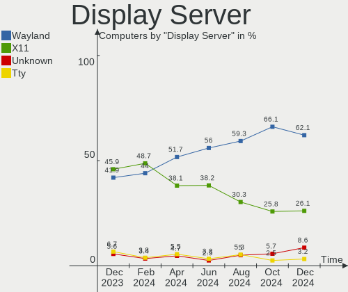
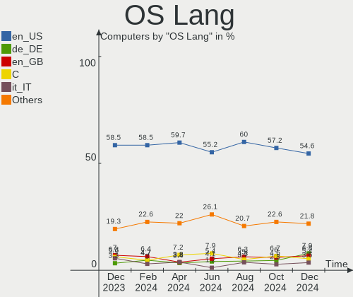
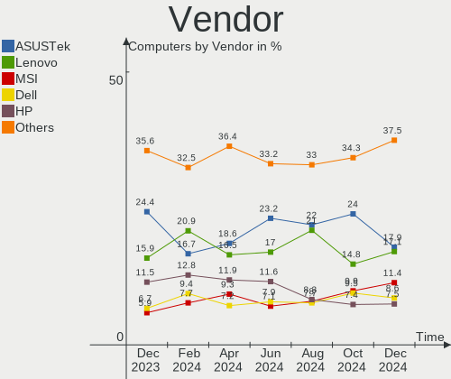
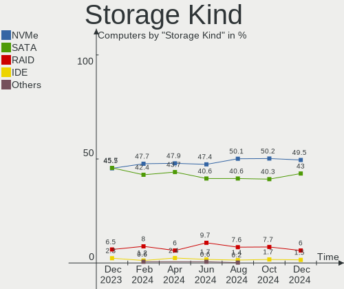

Arch Hardware Trends
--------------------

A project to identify most popular hardware characteristics and track their change
over time based on data collected by Arch users at https://Linux-Hardware.org.

Anyone can contribute to the study by uploading probes of their computers by
the [hw-probe](https://github.com/linuxhw/hw-probe) tool:

    sudo -E hw-probe -all -upload

This is a report for all computer types. See also reports for [desktops](/Dist/Arch/Desktop/README.md) and [notebooks](/Dist/Arch/Notebook/README.md).

Full-feature report is available here: https://linux-hardware.org/?view=trends

Period: Oct, 2020.

Contents
--------

- [ OS                       ](#os)
- [ OS Family                ](#os-family)
- [ Kernel                   ](#kernel)
- [ Kernel Family            ](#kernel-family)
- [ Kernel Major Ver.        ](#kernel-major-ver)
- [ Arch                     ](#arch)
- [ DE                       ](#de)
- [ Display Server           ](#display-server)
- [ Display Manager          ](#display-manager)
- [ OS Lang                  ](#os-lang)
- [ Boot Mode                ](#boot-mode)
- [ Filesystem               ](#filesystem)
- [ Part. scheme             ](#part-scheme)
- [ Dual Boot with Linux/BSD ](#dual-boot-with-linux/bsd)
- [ Dual Boot (Win)          ](#dual-boot-win)
- [ Country                  ](#country)
- [ City                     ](#city)
- [ Vendor                   ](#vendor)
- [ Model                    ](#model)
- [ Model Family             ](#model-family)
- [ MFG Year                 ](#mfg-year)
- [ Form Factor              ](#form-factor)
- [ Secure Boot              ](#secure-boot)
- [ Coreboot                 ](#coreboot)
- [ RAM Size                 ](#ram-size)
- [ RAM Used                 ](#ram-used)
- [ Has CD-ROM               ](#has-cd-rom)
- [ Total Drives             ](#total-drives)
- [ Has Ethernet             ](#has-ethernet)
- [ Drive Vendor             ](#drive-vendor)
- [ HDD Vendor               ](#hdd-vendor)
- [ SSD Vendor               ](#ssd-vendor)
- [ Drive Model              ](#drive-model)
- [ Drive Kind               ](#drive-kind)
- [ Drive Connector          ](#drive-connector)
- [ Drive Size               ](#drive-size)
- [ Space Total              ](#space-total)
- [ Space Used               ](#space-used)
- [ Malfunc. Drives          ](#malfunc-drives)
- [ Malfunc. Drive Vendor    ](#malfunc-drive-vendor)
- [ Malfunc. HDD Vendor      ](#malfunc-hdd-vendor)
- [ Malfunc. Drive Kind      ](#malfunc-drive-kind)
- [ Failed Drives            ](#failed-drives)
- [ Failed Drive Vendor      ](#failed-drive-vendor)
- [ Drive Status             ](#drive-status)
- [ Storage Vendor           ](#storage-vendor)
- [ Storage Model            ](#storage-model)
- [ Storage Kind             ](#storage-kind)
- [ CPU Vendor               ](#cpu-vendor)
- [ CPU Model                ](#cpu-model)
- [ CPU Model Family         ](#cpu-model-family)
- [ CPU Cores                ](#cpu-cores)
- [ CPU Sockets              ](#cpu-sockets)
- [ CPU Threads              ](#cpu-threads)
- [ CPU Op-Modes             ](#cpu-op-modes)
- [ CPU Microcode            ](#cpu-microcode)
- [ CPU Microarch            ](#cpu-microarch)
- [ GPU Vendor               ](#gpu-vendor)
- [ GPU Model                ](#gpu-model)
- [ GPU Combo                ](#gpu-combo)
- [ GPU Driver               ](#gpu-driver)
- [ GPU Memory               ](#gpu-memory)
- [ Monitor Vendor           ](#monitor-vendor)
- [ Monitor Model            ](#monitor-model)
- [ Monitor Resolution       ](#monitor-resolution)
- [ Monitor Diagonal         ](#monitor-diagonal)
- [ Monitor Width            ](#monitor-width)
- [ Aspect Ratio             ](#aspect-ratio)
- [ Monitor Area             ](#monitor-area)
- [ Pixel Density            ](#pixel-density)
- [ Multiple Monitors        ](#multiple-monitors)
- [ Net Controller Vendor    ](#net-controller-vendor)
- [ Net Controller Model     ](#net-controller-model)
- [ Wireless Vendor          ](#wireless-vendor)
- [ Wireless Model           ](#wireless-model)
- [ Ethernet Vendor          ](#ethernet-vendor)
- [ Ethernet Model           ](#ethernet-model)
- [ Net Controller Kind      ](#net-controller-kind)
- [ Used Controller          ](#used-controller)
- [ NICs                     ](#nics)
- [ Memory Vendor            ](#memory-vendor)
- [ Memory Model             ](#memory-model)
- [ Memory Kind              ](#memory-kind)
- [ Memory Form Factor       ](#memory-form-factor)
- [ Memory Size              ](#memory-size)
- [ Memory Speed             ](#memory-speed)
- [ Sound Vendor             ](#sound-vendor)
- [ Sound Model              ](#sound-model)
- [ Camera Vendor            ](#camera-vendor)
- [ Camera Model             ](#camera-model)
- [ Fingerprint Vendor       ](#fingerprint-vendor)
- [ Fingerprint Model        ](#fingerprint-model)
- [ Chipcard Vendor          ](#chipcard-vendor)
- [ Chipcard Model           ](#chipcard-model)
- [ Printer Vendor           ](#printer-vendor)
- [ Printer Model            ](#printer-model)
- [ Scanner Vendor           ](#scanner-vendor)
- [ Scanner Model            ](#scanner-model)
- [ Bluetooth Vendor         ](#bluetooth-vendor)
- [ Bluetooth Model          ](#bluetooth-model)
- [ Unsupported Devices      ](#unsupported-devices)
- [ Unsupported Device Types ](#unsupported-device-types)

OS
--

Installed operating systems

| Name            | Computers | Percent |
|-----------------|-----------|---------|
| Arch            | 127       | 56.19%  |
| Arch Rolling    | 98        | 43.36%  |
| Arch 2020.09.05 | 1         | 0.44%   |

OS Family
---------

OS without a version

| Name | Computers | Percent |
|------|-----------|---------|
| Arch | 226       | 100%    |

Kernel
------

Version of the Linux kernel

| Version               | Computers | Percent |
|-----------------------|-----------|---------|
| 5.9.1-arch1-1         | 54        | 23.89%  |
| 5.8.14-arch1-1        | 47        | 20.8%   |
| 5.8.12-arch1-1        | 24        | 10.62%  |
| 5.8.13-arch1-1        | 20        | 8.85%   |
| 5.9.1-zen2-1-zen      | 13        | 5.75%   |
| 5.4.72-1-lts          | 8         | 3.54%   |
| 5.8.14-zen1-1-zen     | 7         | 3.1%    |
| 5.4.70-1-lts          | 4         | 1.77%   |
| 5.4.68-1-lts          | 4         | 1.77%   |
| 5.9.1-zen1-1-zen      | 3         | 1.33%   |
| 5.8.13-zen1-2-zen     | 3         | 1.33%   |
| 5.9.2-arch1-1         | 2         | 0.88%   |
| 5.8.16.a-1-hardened   | 2         | 0.88%   |
| 5.8.13-21-tkg-pds     | 2         | 0.88%   |
| 5.8.12-zen1-1-zen     | 2         | 0.88%   |
| 5.9.2-zen1-1-zen      | 1         | 0.44%   |
| 5.9.1-xanmod1-1       | 1         | 0.44%   |
| 5.9.0-S               | 1         | 0.44%   |
| 5.9.0-1-clear         | 1         | 0.44%   |
| 5.9.0                 | 1         | 0.44%   |
| 5.8.9-zen2-1-zencjk   | 1         | 0.44%   |
| 5.8.9-arch2-1         | 1         | 0.44%   |
| 5.8.4-arch1-1-berg    | 1         | 0.44%   |
| 5.8.15-xanmod1-1      | 1         | 0.44%   |
| 5.8.14.a-1-hardened   | 1         | 0.44%   |
| 5.8.14-lqx1-1-lqx     | 1         | 0.44%   |
| 5.8.14-arch1-5-g14    | 1         | 0.44%   |
| 5.8.14-23-tkg-upds    | 1         | 0.44%   |
| 5.8.14-22-tkg-upds    | 1         | 0.44%   |
| 5.8.13-zen1-1-zen     | 1         | 0.44%   |
| 5.8.13-21-tkg-upds    | 1         | 0.44%   |
| 5.8.13                | 1         | 0.44%   |
| 5.8.12-arch1-1-pds    | 1         | 0.44%   |
| 5.8.12-20-tkg-upds    | 1         | 0.44%   |
| 5.8.10-zen1-1-zen     | 1         | 0.44%   |
| 5.8.10-arch1-1-vfio   | 1         | 0.44%   |
| 5.8.10-arch1-1        | 1         | 0.44%   |
| 5.8.1-arch1-1         | 1         | 0.44%   |
| 5.8.0-arch1-2-custom  | 1         | 0.44%   |
| 5.5.3-arch1-1         | 1         | 0.44%   |
| 5.4.71-1-lts          | 1         | 0.44%   |
| 5.4.68-RAVEN          | 1         | 0.44%   |
| 5.4.66-1-lts          | 1         | 0.44%   |
| 5.3.13-arch1-1        | 1         | 0.44%   |
| 5.10.0-rc1-1-mainline | 1         | 0.44%   |
| Unknown               | 1         | 0.44%   |

Kernel Family
-------------

Linux kernel without a distro release

| Version | Computers | Percent |
|---------|-----------|---------|
| 5.9.1   | 71        | 31.42%  |
| 5.8.14  | 59        | 26.11%  |
| 5.8.13  | 28        | 12.39%  |
| 5.8.12  | 28        | 12.39%  |
| 5.4.72  | 8         | 3.54%   |
| 5.4.68  | 5         | 2.21%   |
| 5.4.70  | 4         | 1.77%   |
| 5.9.2   | 3         | 1.33%   |
| 5.9.0   | 3         | 1.33%   |
| 5.8.10  | 3         | 1.33%   |
| 5.8.9   | 2         | 0.88%   |
| 5.8.16  | 2         | 0.88%   |
| 5.8.4   | 1         | 0.44%   |
| 5.8.15  | 1         | 0.44%   |
| 5.8.1   | 1         | 0.44%   |
| 5.8.0   | 1         | 0.44%   |
| 5.5.3   | 1         | 0.44%   |
| 5.4.71  | 1         | 0.44%   |
| 5.4.66  | 1         | 0.44%   |
| 5.3.13  | 1         | 0.44%   |
| 5.10.0  | 1         | 0.44%   |
| Unknown | 1         | 0.44%   |

Kernel Major Ver.
-----------------

Linux kernel major version

| Version | Computers | Percent |
|---------|-----------|---------|
| 5.8     | 126       | 55.75%  |
| 5.9     | 77        | 34.07%  |
| 5.4     | 19        | 8.41%   |
| 5.5     | 1         | 0.44%   |
| 5.3     | 1         | 0.44%   |
| 5.10    | 1         | 0.44%   |
| Unknown | 1         | 0.44%   |

Arch
----

OS architecture (x86_64, i586, etc.)

| Name   | Computers | Percent |
|--------|-----------|---------|
| x86_64 | 226       | 100%    |

DE
--

Desktop Environment

| Name       | Computers | Percent |
|------------|-----------|---------|
| GNOME      | 100       | 44.25%  |
| KDE5       | 42        | 18.58%  |
| XFCE       | 23        | 10.18%  |
| KDE        | 20        | 8.85%   |
| Unknown    | 13        | 5.75%   |
| Cinnamon   | 9         | 3.98%   |
| i3         | 7         | 3.1%    |
| Budgie     | 5         | 2.21%   |
| Deepin     | 4         | 1.77%   |
| X-Cinnamon | 1         | 0.44%   |
| MATE       | 1         | 0.44%   |
| LXQt       | 1         | 0.44%   |

Display Server
--------------

X11 or Wayland

| Name    | Computers | Percent |
|---------|-----------|---------|
| X11     | 157       | 69.47%  |
| Wayland | 45        | 19.91%  |
| Tty     | 19        | 8.41%   |
| Unknown | 5         | 2.21%   |

Display Manager
---------------

SDDM, LightDM, etc.

| Name    | Computers | Percent |
|---------|-----------|---------|
| Unknown | 94        | 41.59%  |
| SDDM    | 44        | 19.47%  |
| GDM     | 39        | 17.26%  |
| TDM     | 36        | 15.93%  |
| Ly      | 4         | 1.77%   |
| XDM     | 3         | 1.33%   |
| LightDM | 3         | 1.33%   |
| LXDM    | 2         | 0.88%   |
| SLiM    | 1         | 0.44%   |

OS Lang
-------

Language

| Lang       | Computers | Percent |
|------------|-----------|---------|
| en_US      | 101       | 44.69%  |
| en_GB      | 24        | 10.62%  |
| C          | 16        | 7.08%   |
| de_DE      | 11        | 4.87%   |
| Unknown    | 9         | 3.98%   |
| en_US.utf8 | 7         | 3.1%    |
| pt_BR      | 6         | 2.65%   |
| es_MX      | 5         | 2.21%   |
| en_AU      | 4         | 1.77%   |
| ru_RU      | 3         | 1.33%   |
| pl_PL      | 3         | 1.33%   |
| fr_FR      | 3         | 1.33%   |
| en_CA      | 3         | 1.33%   |
| de_DE.utf8 | 3         | 1.33%   |
| zh_CN      | 2         | 0.88%   |
| ru_UA      | 2         | 0.88%   |
| nl_NL      | 2         | 0.88%   |
| es_ES      | 2         | 0.88%   |
| en_GB.UTF8 | 2         | 0.88%   |
| en_CA.utf8 | 2         | 0.88%   |
| de_AT      | 2         | 0.88%   |
| ru_RU.utf8 | 1         | 0.44%   |
| it_IT.utf8 | 1         | 0.44%   |
| it_IT      | 1         | 0.44%   |
| fr_CH      | 1         | 0.44%   |
| es_ES.utf8 | 1         | 0.44%   |
| es_CO      | 1         | 0.44%   |
| es_AR      | 1         | 0.44%   |
| en_IN      | 1         | 0.44%   |
| en_FI      | 1         | 0.44%   |
| en_AU.utf8 | 1         | 0.44%   |
| en_AG      | 1         | 0.44%   |
| da_DK      | 1         | 0.44%   |
| cs_CZ      | 1         | 0.44%   |
| ca_ES      | 1         | 0.44%   |

Boot Mode
---------

EFI or BIOS

| Mode | Computers | Percent |
|------|-----------|---------|
| EFI  | 143       | 63.27%  |
| BIOS | 83        | 36.73%  |

Filesystem
----------

Type of filesystem

| Type     | Computers | Percent |
|----------|-----------|---------|
| Ext4     | 173       | 76.55%  |
| Btrfs    | 36        | 15.93%  |
| Xfs      | 8         | 3.54%   |
| F2fs     | 5         | 2.21%   |
| Zfs      | 2         | 0.88%   |
| Reiserfs | 1         | 0.44%   |
| Unknown  | 1         | 0.44%   |

Part. scheme
------------

Scheme of partitioning

| Type    | Computers | Percent |
|---------|-----------|---------|
| GPT     | 132       | 58.41%  |
| Unknown | 70        | 30.97%  |
| MBR     | 24        | 10.62%  |

Dual Boot with Linux/BSD
------------------------

Hosting more than one Linux/BSD

| Dual boot | Computers | Percent |
|-----------|-----------|---------|
| No        | 191       | 84.51%  |
| Yes       | 35        | 15.49%  |

Dual Boot (Win)
---------------

Hosting Linux and Windows

| Dual boot | Computers | Percent |
|-----------|-----------|---------|
| No        | 137       | 60.62%  |
| Yes       | 89        | 39.38%  |

Country
-------

Geographic location (country)

| Country                      | Computers | Percent |
|------------------------------|-----------|---------|
| USA                          | 48        | 21.24%  |
| Germany                      | 19        | 8.41%   |
| Russia                       | 11        | 4.87%   |
| Brazil                       | 11        | 4.87%   |
| Spain                        | 9         | 3.98%   |
| UK                           | 8         | 3.54%   |
| Canada                       | 8         | 3.54%   |
| Netherlands                  | 7         | 3.1%    |
| Italy                        | 6         | 2.65%   |
| Austria                      | 6         | 2.65%   |
| Australia                    | 6         | 2.65%   |
| Sweden                       | 5         | 2.21%   |
| Mexico                       | 5         | 2.21%   |
| India                        | 5         | 2.21%   |
| France                       | 5         | 2.21%   |
| Ukraine                      | 4         | 1.77%   |
| Poland                       | 4         | 1.77%   |
| Greece                       | 4         | 1.77%   |
| Switzerland                  | 3         | 1.33%   |
| Japan                        | 3         | 1.33%   |
| Hungary                      | 3         | 1.33%   |
| Finland                      | 3         | 1.33%   |
| Egypt                        | 3         | 1.33%   |
| Thailand                     | 2         | 0.88%   |
| Romania                      | 2         | 0.88%   |
| Norway                       | 2         | 0.88%   |
| Kazakhstan                   | 2         | 0.88%   |
| Denmark                      | 2         | 0.88%   |
| Bangladesh                   | 2         | 0.88%   |
| Argentina                    | 2         | 0.88%   |
| UAE                          | 1         | 0.44%   |
| Turkey                       | 1         | 0.44%   |
| Tunisia                      | 1         | 0.44%   |
| Tanzania, United Republic of | 1         | 0.44%   |
| Sri Lanka                    | 1         | 0.44%   |
| Slovakia                     | 1         | 0.44%   |
| Serbia                       | 1         | 0.44%   |
| Portugal                     | 1         | 0.44%   |
| Palestine                    | 1         | 0.44%   |
| Nicaragua                    | 1         | 0.44%   |
| New Zealand                  | 1         | 0.44%   |
| Nepal                        | 1         | 0.44%   |
| Myanmar                      | 1         | 0.44%   |
| Malta                        | 1         | 0.44%   |
| Kenya                        | 1         | 0.44%   |
| Israel                       | 1         | 0.44%   |
| Iran                         | 1         | 0.44%   |
| Indonesia                    | 1         | 0.44%   |
| Honduras                     | 1         | 0.44%   |
| Guatemala                    | 1         | 0.44%   |
| Ethiopia                     | 1         | 0.44%   |
| Czech Republic               | 1         | 0.44%   |
| Cote D'Ivoire                | 1         | 0.44%   |
| Colombia                     | 1         | 0.44%   |
| China                        | 1         | 0.44%   |
| Bolivia                      | 1         | 0.44%   |

City
----

Geographic location (city)

| City                        | Computers | Percent |
|-----------------------------|-----------|---------|
| Moscow                      | 6         | 2.65%   |
| Vienna                      | 4         | 1.77%   |
| Seattle                     | 4         | 1.77%   |
| Salt Lake City              | 3         | 1.33%   |
| Paris                       | 3         | 1.33%   |
| Paducah                     | 3         | 1.33%   |
| Melbourne                   | 3         | 1.33%   |
| Athens                      | 3         | 1.33%   |
| Tlalnepantla                | 2         | 0.88%   |
| Thrissur                    | 2         | 0.88%   |
| Taranto                     | 2         | 0.88%   |
| Nagoya                      | 2         | 0.88%   |
| Montreal                    | 2         | 0.88%   |
| Madrid                      | 2         | 0.88%   |
| Los Angeles                 | 2         | 0.88%   |
| Kyiv                        | 2         | 0.88%   |
| Irvine                      | 2         | 0.88%   |
| Enschede                    | 2         | 0.88%   |
| Dhaka                       | 2         | 0.88%   |
| Cairo                       | 2         | 0.88%   |
| Basingstoke                 | 2         | 0.88%   |
| Amsterdam                   | 2         | 0.88%   |
| Almaty                      | 2         | 0.88%   |
| Zwolle                      | 1         | 0.44%   |
| Zurich                      | 1         | 0.44%   |
| Yangon                      | 1         | 0.44%   |
| Yala                        | 1         | 0.44%   |
| Xining                      | 1         | 0.44%   |
| Wokingham                   | 1         | 0.44%   |
| West Valley City            | 1         | 0.44%   |
| Wellington                  | 1         | 0.44%   |
| Warsaw                      | 1         | 0.44%   |
| Walce                       | 1         | 0.44%   |
| Vologda                     | 1         | 0.44%   |
| Viersen                     | 1         | 0.44%   |
| Verona                      | 1         | 0.44%   |
| Vejbystrand                 | 1         | 0.44%   |
| Vancouver                   | 1         | 0.44%   |
| Vaesterhankmo               | 1         | 0.44%   |
| Uberaba                     | 1         | 0.44%   |
| Tuusula                     | 1         | 0.44%   |
| Tunis                       | 1         | 0.44%   |
| Trollhättan                | 1         | 0.44%   |
| Thessaloniki                | 1         | 0.44%   |
| Ternopil                    | 1         | 0.44%   |
| Tel Aviv                    | 1         | 0.44%   |
| Tehran                      | 1         | 0.44%   |
| Tegucigalpa                 | 1         | 0.44%   |
| Sunnyvale                   | 1         | 0.44%   |
| Stuttgart                   | 1         | 0.44%   |
| Stockholm                   | 1         | 0.44%   |
| St Petersburg               | 1         | 0.44%   |
| Skanderborg                 | 1         | 0.44%   |
| Sintra                      | 1         | 0.44%   |
| Semarang                    | 1         | 0.44%   |
| Scotts Valley               | 1         | 0.44%   |
| Sanford                     | 1         | 0.44%   |
| San Sebastián de La Gomera | 1         | 0.44%   |
| San Ramon                   | 1         | 0.44%   |
| Samara                      | 1         | 0.44%   |

Vendor
------

Motherboard manufacturer

| Name                | Computers | Percent |
|---------------------|-----------|---------|
| ASUSTek Computer    | 49        | 21.68%  |
| Lenovo              | 32        | 14.16%  |
| Dell                | 28        | 12.39%  |
| MSI                 | 27        | 11.95%  |
| Gigabyte Technology | 24        | 10.62%  |
| Hewlett-Packard     | 19        | 8.41%   |
| ASRock              | 19        | 8.41%   |
| Acer                | 7         | 3.1%    |
| Apple               | 3         | 1.33%   |
| Intel               | 2         | 0.88%   |
| TUXEDO              | 1         | 0.44%   |
| Timi                | 1         | 0.44%   |
| Schenker            | 1         | 0.44%   |
| Samsung Electronics | 1         | 0.44%   |
| Packard Bell        | 1         | 0.44%   |
| NOVATECH            | 1         | 0.44%   |
| Notebook            | 1         | 0.44%   |
| MECHREVO            | 1         | 0.44%   |
| Lanix               | 1         | 0.44%   |
| Google              | 1         | 0.44%   |
| Fujitsu             | 1         | 0.44%   |
| Eluktronics         | 1         | 0.44%   |
| ELSA                | 1         | 0.44%   |
| Biostar             | 1         | 0.44%   |
| ASRockRack          | 1         | 0.44%   |
| 51nb                | 1         | 0.44%   |

Model
-----

Motherboard model

| Name                                            | Computers | Percent |
|-------------------------------------------------|-----------|---------|
| Gigabyte B450M DS3H                             | 3         | 1.33%   |
| MSI MS-7C35                                     | 2         | 0.88%   |
| MSI MS-7C02                                     | 2         | 0.88%   |
| MSI MS-7B85                                     | 2         | 0.88%   |
| Dell XPS 13 9380                                | 2         | 0.88%   |
| ASUS X556UQK                                    | 2         | 0.88%   |
| ASUS TUF GAMING X570-PLUS                       | 2         | 0.88%   |
| ASUS STRIX Z270E GAMING                         | 2         | 0.88%   |
| ASUS PRIME Z370-A                               | 2         | 0.88%   |
| ASUS All Series                                 | 2         | 0.88%   |
| ASRock X570 Taichi                              | 2         | 0.88%   |
| ASRock B450M Pro4                               | 2         | 0.88%   |
| TUXEDO Book BA1510                              | 1         | 0.44%   |
| Timi TM1604                                     | 1         | 0.44%   |
| Schenker XMG CORE 17(M20, RTX 2060)             | 1         | 0.44%   |
| Samsung Electronics 350V5C/351V5C/3540VC/3440VC | 1         | 0.44%   |
| Packard Bell EasyNote MZ45                      | 1         | 0.44%   |
| NOVATECH A15A/HE/HC                             | 1         | 0.44%   |
| Notebook N8xEJEK                                | 1         | 0.44%   |
| MSI PE70 6QE                                    | 1         | 0.44%   |
| MSI MS-7C95                                     | 1         | 0.44%   |
| MSI MS-7C92                                     | 1         | 0.44%   |
| MSI MS-7B98                                     | 1         | 0.44%   |
| MSI MS-7B89                                     | 1         | 0.44%   |
| MSI MS-7B86                                     | 1         | 0.44%   |
| MSI MS-7B58                                     | 1         | 0.44%   |
| MSI MS-7A38                                     | 1         | 0.44%   |
| MSI MS-7A34                                     | 1         | 0.44%   |
| MSI MS-7971                                     | 1         | 0.44%   |
| MSI MS-7850                                     | 1         | 0.44%   |
| MSI MS-7821                                     | 1         | 0.44%   |
| MSI MS-7818                                     | 1         | 0.44%   |
| MSI MS-7815                                     | 1         | 0.44%   |
| MSI MS-7693                                     | 1         | 0.44%   |
| MSI MS-7676                                     | 1         | 0.44%   |
| MSI MS-7576                                     | 1         | 0.44%   |
| MSI Modern 14 B10MW                             | 1         | 0.44%   |
| MSI GL62 7RD                                    | 1         | 0.44%   |
| MSI GE62VR 6RF                                  | 1         | 0.44%   |
| MSI Bravo 15 A4DDR                              | 1         | 0.44%   |
| MECHREVO Code 01 Series PF5NU1G                 | 1         | 0.44%   |
| Lenovo Z50-70 20354                             | 1         | 0.44%   |
| Lenovo V330-14ARR 81B1                          | 1         | 0.44%   |
| Lenovo ThinkPad X250 20CMS09M00                 | 1         | 0.44%   |
| Lenovo ThinkPad X230 Tablet 34372S3             | 1         | 0.44%   |
| Lenovo ThinkPad X230 2325SSF                    | 1         | 0.44%   |
| Lenovo ThinkPad X1 Carbon 7th 20QD00L1MX        | 1         | 0.44%   |
| Lenovo ThinkPad X1 Carbon 6th 20KH002RUS        | 1         | 0.44%   |
| Lenovo ThinkPad X1 Carbon 6th 20KG0022US        | 1         | 0.44%   |
| Lenovo ThinkPad X1 Carbon 3rd 20BSCTO1WW        | 1         | 0.44%   |
| Lenovo ThinkPad T580 20L90026RT                 | 1         | 0.44%   |
| Lenovo ThinkPad T480s 20L8S7PP06                | 1         | 0.44%   |
| Lenovo ThinkPad T480s 20L8S2SD00                | 1         | 0.44%   |
| Lenovo ThinkPad T480 20L5000BRT                 | 1         | 0.44%   |
| Lenovo ThinkPad T460p 20FWCTO1WW                | 1         | 0.44%   |
| Lenovo ThinkPad T460p 20FW0044AU                | 1         | 0.44%   |
| Lenovo ThinkPad T430 23501K0                    | 1         | 0.44%   |
| Lenovo ThinkPad T420s 4170CTO                   | 1         | 0.44%   |
| Lenovo ThinkPad T14 Gen 1 20UD0013GE            | 1         | 0.44%   |
| Lenovo ThinkPad Helix .MFG_IN                   | 1         | 0.44%   |

Model Family
------------

Motherboard model prefix

| Name                       | Computers | Percent |
|----------------------------|-----------|---------|
| Lenovo ThinkPad            | 18        | 7.96%   |
| ASUS PRIME                 | 12        | 5.31%   |
| Lenovo IdeaPad             | 9         | 3.98%   |
| Dell XPS                   | 8         | 3.54%   |
| Dell Inspiron              | 8         | 3.54%   |
| ASUS TUF                   | 6         | 2.65%   |
| HP EliteBook               | 5         | 2.21%   |
| Dell Latitude              | 5         | 2.21%   |
| ASUS STRIX                 | 4         | 1.77%   |
| Acer Aspire                | 4         | 1.77%   |
| HP ENVY                    | 3         | 1.33%   |
| Gigabyte X570              | 3         | 1.33%   |
| Gigabyte B450M             | 3         | 1.33%   |
| Gigabyte AX370-Gaming      | 3         | 1.33%   |
| ASUS VivoBook              | 3         | 1.33%   |
| ASRock X570                | 3         | 1.33%   |
| MSI MS-7C35                | 2         | 0.88%   |
| MSI MS-7C02                | 2         | 0.88%   |
| MSI MS-7B85                | 2         | 0.88%   |
| HP ProBook                 | 2         | 0.88%   |
| HP Pavilion                | 2         | 0.88%   |
| Dell Precision             | 2         | 0.88%   |
| Dell G3                    | 2         | 0.88%   |
| ASUS X556UQK               | 2         | 0.88%   |
| ASUS ROG                   | 2         | 0.88%   |
| ASUS P8H61-M               | 2         | 0.88%   |
| ASUS Crosshair             | 2         | 0.88%   |
| ASUS All                   | 2         | 0.88%   |
| ASRock Z87                 | 2         | 0.88%   |
| ASRock B450M               | 2         | 0.88%   |
| Acer Predator              | 2         | 0.88%   |
| TUXEDO Book                | 1         | 0.44%   |
| Timi TM1604                | 1         | 0.44%   |
| Schenker XMG               | 1         | 0.44%   |
| Samsung Electronics 350V5C | 1         | 0.44%   |
| Packard Bell EasyNote      | 1         | 0.44%   |
| NOVATECH A15A              | 1         | 0.44%   |
| Notebook N8xEJEK           | 1         | 0.44%   |
| MSI PE70                   | 1         | 0.44%   |
| MSI MS-7C95                | 1         | 0.44%   |
| MSI MS-7C92                | 1         | 0.44%   |
| MSI MS-7B98                | 1         | 0.44%   |
| MSI MS-7B89                | 1         | 0.44%   |
| MSI MS-7B86                | 1         | 0.44%   |
| MSI MS-7B58                | 1         | 0.44%   |
| MSI MS-7A38                | 1         | 0.44%   |
| MSI MS-7A34                | 1         | 0.44%   |
| MSI MS-7971                | 1         | 0.44%   |
| MSI MS-7850                | 1         | 0.44%   |
| MSI MS-7821                | 1         | 0.44%   |
| MSI MS-7818                | 1         | 0.44%   |
| MSI MS-7815                | 1         | 0.44%   |
| MSI MS-7693                | 1         | 0.44%   |
| MSI MS-7676                | 1         | 0.44%   |
| MSI MS-7576                | 1         | 0.44%   |
| MSI Modern                 | 1         | 0.44%   |
| MSI GL62                   | 1         | 0.44%   |
| MSI GE62VR                 | 1         | 0.44%   |
| MSI Bravo                  | 1         | 0.44%   |
| MECHREVO Code              | 1         | 0.44%   |

MFG Year
--------

Motherboard manufacture year

| Year | Computers | Percent |
|------|-----------|---------|
| 2020 | 69        | 30.53%  |
| 2019 | 60        | 26.55%  |
| 2018 | 22        | 9.73%   |
| 2014 | 15        | 6.64%   |
| 2013 | 11        | 4.87%   |
| 2017 | 9         | 3.98%   |
| 2016 | 9         | 3.98%   |
| 2011 | 7         | 3.1%    |
| 2010 | 7         | 3.1%    |
| 2015 | 6         | 2.65%   |
| 2012 | 6         | 2.65%   |
| 2009 | 4         | 1.77%   |
| 2007 | 1         | 0.44%   |

Form Factor
-----------

Physical design of the computer

| Name        | Computers | Percent |
|-------------|-----------|---------|
| Notebook    | 112       | 49.56%  |
| Desktop     | 106       | 46.9%   |
| Convertible | 5         | 2.21%   |
| Tablet      | 1         | 0.44%   |
| Mini pc     | 1         | 0.44%   |
| All in one  | 1         | 0.44%   |

Secure Boot
-----------

Enabled or disabled

| State    | Computers | Percent |
|----------|-----------|---------|
| Disabled | 223       | 98.67%  |
| Enabled  | 3         | 1.33%   |

Coreboot
--------

Have coreboot on board

| Used | Computers | Percent |
|------|-----------|---------|
| No   | 224       | 99.12%  |
| Yes  | 2         | 0.88%   |

RAM Size
--------

Total RAM memory

| Size in GB      | Computers | Percent |
|-----------------|-----------|---------|
| 16.01-24.0      | 68        | 30.09%  |
| 32.01-64.0      | 43        | 19.03%  |
| 4.01-8.0        | 40        | 17.7%   |
| 8.01-16.0       | 38        | 16.81%  |
| 3.01-4.0        | 17        | 7.52%   |
| 24.01-32.0      | 8         | 3.54%   |
| 64.01-256.0     | 7         | 3.1%    |
| 1.01-2.0        | 4         | 1.77%   |
| More than 256.0 | 1         | 0.44%   |

RAM Used
--------

Used RAM memory

| Used GB    | Computers | Percent |
|------------|-----------|---------|
| 4.01-8.0   | 62        | 27.43%  |
| 1.01-2.0   | 55        | 24.34%  |
| 2.01-3.0   | 47        | 20.8%   |
| 3.01-4.0   | 26        | 11.5%   |
| 8.01-16.0  | 24        | 10.62%  |
| 0.01-1.0   | 7         | 3.1%    |
| 16.01-24.0 | 3         | 1.33%   |
| 24.01-32.0 | 2         | 0.88%   |

Has CD-ROM
----------

Has CD-ROM on board

| Presented | Computers | Percent |
|-----------|-----------|---------|
| No        | 176       | 77.88%  |
| Yes       | 50        | 22.12%  |

Total Drives
------------

Number of drives on board

| Drives | Computers | Percent |
|--------|-----------|---------|
| 1      | 95        | 42.04%  |
| 2      | 76        | 33.63%  |
| 3      | 29        | 12.83%  |
| 4      | 13        | 5.75%   |
| 5      | 9         | 3.98%   |
| 7      | 2         | 0.88%   |
| 8      | 1         | 0.44%   |
| 6      | 1         | 0.44%   |

Has Ethernet
------------

Has Ethernet on board

| Presented | Computers | Percent |
|-----------|-----------|---------|
| Yes       | 194       | 85.84%  |
| No        | 32        | 14.16%  |

Drive Vendor
------------

Hard drive vendors

| Vendor                    | Computers | Drives | Percent |
|---------------------------|-----------|--------|---------|
| Samsung Electronics       | 87        | 115    | 22.25%  |
| Seagate                   | 65        | 78     | 16.62%  |
| WDC                       | 52        | 66     | 13.3%   |
| Toshiba                   | 30        | 36     | 7.67%   |
| Kingston                  | 24        | 26     | 6.14%   |
| Sandisk                   | 20        | 22     | 5.12%   |
| Crucial                   | 15        | 16     | 3.84%   |
| HGST                      | 10        | 11     | 2.56%   |
| SK Hynix                  | 8         | 8      | 2.05%   |
| Intel                     | 8         | 9      | 2.05%   |
| A-DATA Technology         | 8         | 8      | 2.05%   |
| Phison                    | 7         | 8      | 1.79%   |
| Unknown                   | 5         | 5      | 1.28%   |
| Hitachi                   | 5         | 5      | 1.28%   |
| SPCC                      | 3         | 3      | 0.77%   |
| PNY                       | 3         | 3      | 0.77%   |
| Patriot                   | 3         | 3      | 0.77%   |
| Apple                     | 3         | 4      | 0.77%   |
| Union Memory              | 2         | 2      | 0.51%   |
| Transcend                 | 2         | 2      | 0.51%   |
| Mushkin                   | 2         | 2      | 0.51%   |
| Micron/Crucial Technology | 2         | 2      | 0.51%   |
| Micron Technology         | 2         | 2      | 0.51%   |
| Lexar                     | 2         | 2      | 0.51%   |
| Lenovo                    | 2         | 2      | 0.51%   |
| China                     | 2         | 2      | 0.51%   |
| XPG                       | 1         | 1      | 0.26%   |
| Verbatim                  | 1         | 1      | 0.26%   |
| Team                      | 1         | 3      | 0.26%   |
| TCSUNBOW                  | 1         | 1      | 0.26%   |
| Silicon Motion            | 1         | 1      | 0.26%   |
| SABRENT                   | 1         | 1      | 0.26%   |
| Realtek Semiconductor     | 1         | 1      | 0.26%   |
| PLEXTOR                   | 1         | 1      | 0.26%   |
| OCZ                       | 1         | 1      | 0.26%   |
| LITEON                    | 1         | 1      | 0.26%   |
| LaCie                     | 1         | 1      | 0.26%   |
| KingSpec                  | 1         | 1      | 0.26%   |
| KingDian                  | 1         | 1      | 0.26%   |
| JMicron                   | 1         | 1      | 0.26%   |
| Intenso                   | 1         | 1      | 0.26%   |
| HS-SSD-C100               | 1         | 1      | 0.26%   |
| Dogfish                   | 1         | 1      | 0.26%   |
| Dell                      | 1         | 1      | 0.26%   |
| Corsair                   | 1         | 1      | 0.26%   |

HDD Vendor
----------

Hard disk drive vendors

| Vendor              | Computers | Drives | Percent |
|---------------------|-----------|--------|---------|
| Seagate             | 64        | 77     | 44.44%  |
| WDC                 | 39        | 51     | 27.08%  |
| Toshiba             | 19        | 24     | 13.19%  |
| HGST                | 10        | 11     | 6.94%   |
| Samsung Electronics | 5         | 5      | 3.47%   |
| Hitachi             | 5         | 5      | 3.47%   |
| Intenso             | 1         | 1      | 0.69%   |
| Apple               | 1         | 1      | 0.69%   |

SSD Vendor
----------

Solid state drive vendors

| Vendor              | Computers | Drives | Percent |
|---------------------|-----------|--------|---------|
| Samsung Electronics | 48        | 58     | 32.43%  |
| Kingston            | 21        | 22     | 14.19%  |
| Crucial             | 14        | 15     | 9.46%   |
| SanDisk             | 13        | 14     | 8.78%   |
| WDC                 | 7         | 7      | 4.73%   |
| A-DATA Technology   | 6         | 6      | 4.05%   |
| Toshiba             | 5         | 5      | 3.38%   |
| SPCC                | 3         | 3      | 2.03%   |
| PNY                 | 3         | 3      | 2.03%   |
| Patriot             | 3         | 3      | 2.03%   |
| Intel               | 3         | 3      | 2.03%   |
| Transcend           | 2         | 2      | 1.35%   |
| Mushkin             | 2         | 2      | 1.35%   |
| Micron Technology   | 2         | 2      | 1.35%   |
| Lexar               | 2         | 2      | 1.35%   |
| China               | 2         | 2      | 1.35%   |
| Verbatim            | 1         | 1      | 0.68%   |
| TCSUNBOW            | 1         | 1      | 0.68%   |
| SABRENT             | 1         | 1      | 0.68%   |
| OCZ                 | 1         | 1      | 0.68%   |
| LITEON              | 1         | 1      | 0.68%   |
| KingSpec            | 1         | 1      | 0.68%   |
| KingDian            | 1         | 1      | 0.68%   |
| JMicron             | 1         | 1      | 0.68%   |
| HS-SSD-C100         | 1         | 1      | 0.68%   |
| Dogfish             | 1         | 1      | 0.68%   |
| Dell                | 1         | 1      | 0.68%   |
| Apple               | 1         | 1      | 0.68%   |

Drive Model
-----------

Hard drive models

| Model                        | Computers | Percent |
|------------------------------|-----------|---------|
| NVMe SSD Drive 512GB         | 10        | 2.23%   |
| NVMe SSD Drive 1TB           | 9         | 2%      |
| SSD 850 EVO 500GB            | 8         | 1.78%   |
| NVMe SSD Drive 500GB         | 7         | 1.56%   |
| NVMe SSD Drive 256GB         | 6         | 1.34%   |
| ST2000DM008-2FR102 2TB       | 5         | 1.11%   |
| SSD 970 EVO Plus 500GB       | 5         | 1.11%   |
| SSD 860 QVO 1TB              | 5         | 1.11%   |
| SSD 860 EVO 500GB            | 5         | 1.11%   |
| SA400S37120G 120GB SSD       | 5         | 1.11%   |
| ST1000LM035-1RK172 1TB       | 4         | 0.89%   |
| ST1000DM010-2EP102 1TB       | 4         | 0.89%   |
| ST1000DM003-1ER162 1TB       | 4         | 0.89%   |
| SSD 860 EVO 1TB              | 4         | 0.89%   |
| SA400S37240G 240GB SSD       | 4         | 0.89%   |
| NVMe SSD Drive 1024GB        | 4         | 0.89%   |
| ST2000DM006-2DM164 2TB       | 3         | 0.67%   |
| ST1000LM024 HN-M101MBB 1TB   | 3         | 0.67%   |
| ST1000DM003-1SB102 1TB       | 3         | 0.67%   |
| SSD 970 PRO 512GB            | 3         | 0.67%   |
| SSD 970 EVO Plus 1TB         | 3         | 0.67%   |
| SSD 970 EVO 500GB            | 3         | 0.67%   |
| SSD 970 EVO 250GB            | 3         | 0.67%   |
| SSD 960 EVO 250GB            | 3         | 0.67%   |
| SSD 860 EVO M.2 500GB        | 3         | 0.67%   |
| SSD 850 PRO 256GB            | 3         | 0.67%   |
| SA400S37480G 480GB SSD       | 3         | 0.67%   |
| HTS545050A7E680 500GB        | 3         | 0.67%   |
| DT01ACA100 1TB               | 3         | 0.67%   |
| CT500MX500SSD1 500GB         | 3         | 0.67%   |
| BUP Slim BK 1TB              | 3         | 0.67%   |
| WDS120G2G0B-00EPW0 120GB SSD | 2         | 0.45%   |
| WD5000LPLX-75ZNTT0 500GB     | 2         | 0.45%   |
| WD40EFRX-68WT0N0 4TB         | 2         | 0.45%   |
| WD40EFRX-68N32N0 4TB         | 2         | 0.45%   |
| WD20EZRZ-00Z5HB0 2TB         | 2         | 0.45%   |
| WD10SPZX-75Z10T1 1TB         | 2         | 0.45%   |
| WD10EZRX-00L4HB0 1TB         | 2         | 0.45%   |
| WD10EZEX-08WN4A0 1TB         | 2         | 0.45%   |
| SV300S37A240G 240GB SSD      | 2         | 0.45%   |
| ST500DM002-1SB10A 500GB      | 2         | 0.45%   |
| ST500DM002-1BD142 500GB      | 2         | 0.45%   |
| ST2000LX001-1RG174 2TB       | 2         | 0.45%   |
| ST2000DX002-2DV164 2TB       | 2         | 0.45%   |
| ST2000DM001-1ER164 2TB       | 2         | 0.45%   |
| ST1000LX015-1U7172 1TB       | 2         | 0.45%   |
| ST1000DM003-1CH162 1TB       | 2         | 0.45%   |
| ST1000DL002-9TT153 1TB       | 2         | 0.45%   |
| SSD 970 EVO 1TB              | 2         | 0.45%   |
| SSD 850 PRO 512GB            | 2         | 0.45%   |
| SSD 840 EVO 250GB            | 2         | 0.45%   |
| SSD 840 EVO 120GB            | 2         | 0.45%   |
| SSD 750 EVO 250GB            | 2         | 0.45%   |
| SHFS37A120G 120GB SSD        | 2         | 0.45%   |
| NVMe SSD Drive 480GB         | 2         | 0.45%   |
| NVMe SSD Drive 250GB         | 2         | 0.45%   |
| MQ04ABF100 1TB               | 2         | 0.45%   |
| HTS541010A9E680 1TB          | 2         | 0.45%   |
| HDWD130 3TB                  | 2         | 0.45%   |
| HDWD120 2TB                  | 2         | 0.45%   |

Drive Kind
----------

HDD or SSD

| Kind    | Computers | Drives | Percent |
|---------|-----------|--------|---------|
| HDD     | 124       | 175    | 35.53%  |
| SSD     | 119       | 161    | 34.1%   |
| NVMe    | 100       | 121    | 28.65%  |
| MMC     | 4         | 4      | 1.15%   |
| Unknown | 2         | 2      | 0.57%   |

Drive Connector
---------------

SATA, SAS, NVMe, etc.

| Type | Computers | Drives | Percent |
|------|-----------|--------|---------|
| SATA | 174       | 327    | 60.21%  |
| NVMe | 100       | 121    | 34.6%   |
| SAS  | 11        | 11     | 3.81%   |
| MMC  | 4         | 4      | 1.38%   |

Drive Size
----------

Size of hard drive

| Size in TB | Computers | Drives | Percent |
|------------|-----------|--------|---------|
| 0.01-0.5   | 126       | 171    | 48.28%  |
| 0.51-1.0   | 84        | 103    | 32.18%  |
| 1.01-2.0   | 30        | 33     | 11.49%  |
| 2.01-3.0   | 10        | 11     | 3.83%   |
| 4.01-10.0  | 6         | 11     | 2.3%    |
| 3.01-4.0   | 5         | 7      | 1.92%   |

Space Total
-----------

Amount of disk space available on the file system

| Size in GB     | Computers | Percent |
|----------------|-----------|---------|
| 251-500        | 53        | 23.45%  |
| 101-250        | 45        | 19.91%  |
| 501-1000       | 36        | 15.93%  |
| 1001-2000      | 34        | 15.04%  |
| More than 3000 | 21        | 9.29%   |
| 2001-3000      | 18        | 7.96%   |
| 51-100         | 8         | 3.54%   |
| Unknown        | 6         | 2.65%   |
| 21-50          | 4         | 1.77%   |
| 1-20           | 1         | 0.44%   |

Space Used
----------

Amount of used disk space

| Used GB        | Computers | Percent |
|----------------|-----------|---------|
| 101-250        | 38        | 16.81%  |
| 1-20           | 34        | 15.04%  |
| 501-1000       | 34        | 15.04%  |
| 21-50          | 32        | 14.16%  |
| 251-500        | 29        | 12.83%  |
| 51-100         | 24        | 10.62%  |
| 1001-2000      | 16        | 7.08%   |
| 2001-3000      | 8         | 3.54%   |
| Unknown        | 6         | 2.65%   |
| More than 3000 | 5         | 2.21%   |

Malfunc. Drives
---------------

Drive models with a malfunction

| Model                     | Computers | Drives | Percent |
|---------------------------|-----------|--------|---------|
| SSD 960 EVO 250GB         | 2         | 2      | 6.45%   |
| WD740GD-00FLC0 74GB       | 1         | 1      | 3.23%   |
| WD5000AAKX-001CA0 500GB   | 1         | 1      | 3.23%   |
| WD40EFRX-68N32N0 4TB      | 1         | 1      | 3.23%   |
| WD1600AVVS-63L2B0 160GB   | 1         | 1      | 3.23%   |
| WD15EARS-00MVWB0 1TB      | 1         | 1      | 3.23%   |
| WD10EADS-65M2B1 1TB       | 1         | 1      | 3.23%   |
| SV300S37A120G 120GB SSD   | 1         | 1      | 3.23%   |
| ST9640320AS 640GB         | 1         | 1      | 3.23%   |
| ST95005620AS 500GB        | 1         | 2      | 3.23%   |
| ST9320325AS 320GB         | 1         | 1      | 3.23%   |
| ST500LT012-9WS142 500GB   | 1         | 1      | 3.23%   |
| ST500DM002-1BD142 500GB   | 1         | 1      | 3.23%   |
| ST3000DM001-1CH166 3TB    | 1         | 1      | 3.23%   |
| ST2000DX002-2DV164 2TB    | 1         | 1      | 3.23%   |
| ST2000DM006-2DM164 2TB    | 1         | 1      | 3.23%   |
| ST1000LM035-1RK172 1TB    | 1         | 1      | 3.23%   |
| ST1000DM010-2EP102 1TB    | 1         | 1      | 3.23%   |
| ST1000DM003-1ER162 1TB    | 1         | 1      | 3.23%   |
| SSD2SC240GC2DH16T-T 240GB | 1         | 1      | 3.23%   |
| SSD PLUS 480GB            | 1         | 1      | 3.23%   |
| SSD 970 EVO 2TB           | 1         | 1      | 3.23%   |
| Solid State Disk 512GB    | 1         | 1      | 3.23%   |
| PX-1TM8SeG 1TB            | 1         | 1      | 3.23%   |
| P200 1TB SSD              | 1         | 1      | 3.23%   |
| HTS545050B9A300 500GB     | 1         | 1      | 3.23%   |
| HTS545050A7E680 500GB     | 1         | 1      | 3.23%   |
| HTS541010A9E680 1TB       | 1         | 1      | 3.23%   |
| HDWF180 8TB               | 1         | 1      | 3.23%   |
| CT128MX100SSD1 128GB      | 1         | 1      | 3.23%   |

Malfunc. Drive Vendor
---------------------

Vendors of faulty drives

| Vendor              | Computers | Drives | Percent |
|---------------------|-----------|--------|---------|
| Seagate             | 10        | 12     | 33.33%  |
| WDC                 | 6         | 6      | 20%     |
| Samsung Electronics | 3         | 3      | 10%     |
| HGST                | 2         | 2      | 6.67%   |
| Toshiba             | 1         | 1      | 3.33%   |
| SPCC                | 1         | 1      | 3.33%   |
| SanDisk             | 1         | 1      | 3.33%   |
| PNY                 | 1         | 1      | 3.33%   |
| PLEXTOR             | 1         | 1      | 3.33%   |
| Patriot             | 1         | 1      | 3.33%   |
| Kingston            | 1         | 1      | 3.33%   |
| Hitachi             | 1         | 1      | 3.33%   |
| Crucial             | 1         | 1      | 3.33%   |

Malfunc. HDD Vendor
-------------------

Vendors of faulty HDD drives

| Vendor  | Computers | Drives | Percent |
|---------|-----------|--------|---------|
| Seagate | 10        | 12     | 50%     |
| WDC     | 6         | 6      | 30%     |
| HGST    | 2         | 2      | 10%     |
| Toshiba | 1         | 1      | 5%      |
| Hitachi | 1         | 1      | 5%      |

Malfunc. Drive Kind
-------------------

Kinds of faulty drives

| Kind | Computers | Drives | Percent |
|------|-----------|--------|---------|
| HDD  | 19        | 22     | 65.52%  |
| SSD  | 6         | 6      | 20.69%  |
| NVMe | 4         | 4      | 13.79%  |

Failed Drives
-------------

Failed drive models

Zero info for selected period =(

Failed Drive Vendor
-------------------

Failed drive vendors

Zero info for selected period =(

Drive Status
------------

Number of failed and malfunc. drives

| Status   | Computers | Drives | Percent |
|----------|-----------|--------|---------|
| Works    | 117       | 221    | 45%     |
| Detected | 115       | 210    | 44.23%  |
| Malfunc  | 28        | 32     | 10.77%  |

Storage Vendor
--------------

Storage controller vendors

| Vendor                        | Computers | Percent |
|-------------------------------|-----------|---------|
| Intel                         | 135       | 41.93%  |
| AMD                           | 68        | 21.12%  |
| Samsung Electronics           | 45        | 13.98%  |
| Sandisk                       | 14        | 4.35%   |
| Phison Electronics            | 10        | 3.11%   |
| SK Hynix                      | 8         | 2.48%   |
| ASMedia Technology            | 7         | 2.17%   |
| Toshiba America Info Systems  | 6         | 1.86%   |
| Marvell Technology Group      | 6         | 1.86%   |
| Micron/Crucial Technology     | 3         | 0.93%   |
| Kingston Technology Company   | 3         | 0.93%   |
| JMicron Technology            | 3         | 0.93%   |
| Union Memory (Shenzhen)       | 2         | 0.62%   |
| Realtek Semiconductor         | 2         | 0.62%   |
| Lenovo                        | 2         | 0.62%   |
| Integrated Technology Express | 2         | 0.62%   |
| ADATA Technology              | 2         | 0.62%   |
| Silicon Motion                | 1         | 0.31%   |
| Lite-On Technology            | 1         | 0.31%   |
| KIOXIA                        | 1         | 0.31%   |
| Apple                         | 1         | 0.31%   |

Storage Model
-------------

Storage controller models

| Model                                                                             | Computers | Percent |
|-----------------------------------------------------------------------------------|-----------|---------|
| FCH SATA Controller [AHCI mode]                                                   | 57        | 15.32%  |
| NVMe SSD Controller SM981/PM981/PM983                                             | 33        | 8.87%   |
| 400 Series Chipset SATA Controller                                                | 17        | 4.57%   |
| Non-Volatile memory controller                                                    | 15        | 4.03%   |
| Sunrise Point-LP SATA Controller [AHCI mode]                                      | 12        | 3.23%   |
| Q170/Q150/B150/H170/H110/Z170/CM236 Chipset SATA Controller [AHCI Mode]           | 11        | 2.96%   |
| 200 Series PCH SATA controller [AHCI mode]                                        | 11        | 2.96%   |
| 7 Series Chipset Family 6-port SATA Controller [AHCI mode]                        | 10        | 2.69%   |
| HM170/QM170 Chipset SATA Controller [AHCI Mode]                                   | 9         | 2.42%   |
| 82801 Mobile SATA Controller [RAID mode]                                          | 9         | 2.42%   |
| NVMe SSD Controller SM961/PM961                                                   | 8         | 2.15%   |
| 8 Series/C220 Series Chipset Family 6-port SATA Controller 1 [AHCI mode]          | 8         | 2.15%   |
| E12 NVMe Controller                                                               | 7         | 1.88%   |
| ASM1062 Serial ATA Controller                                                     | 7         | 1.88%   |
| Electronics Non-Volatile memory controller                                        | 6         | 1.61%   |
| X370 Series Chipset SATA Controller                                               | 5         | 1.34%   |
| WD Black 2019/PC SN750 NVMe SSD                                                   | 5         | 1.34%   |
| Cannon Lake PCH SATA AHCI Controller                                              | 5         | 1.34%   |
| 9 Series Chipset Family SATA Controller [AHCI Mode]                               | 5         | 1.34%   |
| 6 Series/C200 Series Chipset Family 6 port Mobile SATA AHCI Controller            | 5         | 1.34%   |
| Toshiba America Info Non-Volatile memory controller                               | 4         | 1.08%   |
| SB7x0/SB8x0/SB9x0 SATA Controller [AHCI mode]                                     | 4         | 1.08%   |
| SB7x0/SB8x0/SB9x0 IDE Controller                                                  | 4         | 1.08%   |
| Cannon Lake Mobile PCH SATA AHCI Controller                                       | 4         | 1.08%   |
| 6 Series/C200 Series Chipset Family Desktop SATA Controller (IDE mode, ports 4-5) | 4         | 1.08%   |
| 6 Series/C200 Series Chipset Family Desktop SATA Controller (IDE mode, ports 0-3) | 4         | 1.08%   |
| Wildcat Point-LP SATA Controller [AHCI Mode]                                      | 3         | 0.81%   |
| WD Black 2018 / PC SN720 NVMe SSD                                                 | 3         | 0.81%   |
| WD Black 2018 / PC SN520 NVMe SSD                                                 | 3         | 0.81%   |
| SB7x0/SB8x0/SB9x0 SATA Controller [IDE mode]                                      | 3         | 0.81%   |
| SATA Controller [RAID mode]                                                       | 3         | 0.81%   |
| SATA controller                                                                   | 3         | 0.81%   |
| JMB363 SATA/IDE Controller                                                        | 3         | 0.81%   |
| Cannon Point-LP SATA Controller [AHCI Mode]                                       | 3         | 0.81%   |
| A2000, M.2, 500GB                                                                 | 3         | 0.81%   |
| 82801IBM/IEM (ICH9M/ICH9M-E) 4 port SATA Controller [AHCI mode]                   | 3         | 0.81%   |
| 8 Series SATA Controller 1 [AHCI mode]                                            | 3         | 0.81%   |
| 7 Series/C210 Series Chipset Family 6-port SATA Controller [AHCI mode]            | 3         | 0.81%   |
| 400 Series Chipset Family SATA AHCI Controller                                    | 3         | 0.81%   |
| XPG SX8200 Pro PCIe Gen3x4 M.2 2280 Solid State Drive                             | 2         | 0.54%   |
| X399 Series Chipset SATA Controller                                               | 2         | 0.54%   |
| SSD Pro 7600p/760p/E 6100p Series                                                 | 2         | 0.54%   |
| SSD 660P Series                                                                   | 2         | 0.54%   |
| Realtek Non-Volatile memory controller                                            | 2         | 0.54%   |
| NM10/ICH7 Family SATA Controller [IDE mode]                                       | 2         | 0.54%   |
| FCH SATA Controller D                                                             | 2         | 0.54%   |
| E16 PCIe4 NVMe Controller                                                         | 2         | 0.54%   |
| BC501 NVMe Solid State Drive 512GB                                                | 2         | 0.54%   |
| 88SE91A3 SATA-600 Controller                                                      | 2         | 0.54%   |
| 88SE9172 SATA 6Gb/s Controller                                                    | 2         | 0.54%   |
| 88SE912x IDE Controller                                                           | 2         | 0.54%   |
| 82801JI (ICH10 Family) 4 port SATA IDE Controller #1                              | 2         | 0.54%   |
| 82801JI (ICH10 Family) 2 port SATA IDE Controller #2                              | 2         | 0.54%   |
| 5 Series/3400 Series Chipset PT IDER Controller                                   | 2         | 0.54%   |
| 5 Series/3400 Series Chipset 6 port SATA AHCI Controller                          | 2         | 0.54%   |
| 5 Series/3400 Series Chipset 4 port SATA IDE Controller                           | 2         | 0.54%   |
| 300 Series Chipset SATA Controller                                                | 2         | 0.54%   |
| WD Blue SN550 NVMe SSD                                                            | 1         | 0.27%   |
| SM2262/SM2262EN SSD Controller                                                    | 1         | 0.27%   |
| SB600 Non-Raid-5 SATA                                                             | 1         | 0.27%   |

Storage Kind
------------

Kind of storage controller (IDE, SATA, NVMe, SAS, ...)

| Kind | Computers | Percent |
|------|-----------|---------|
| SATA | 174       | 55.95%  |
| NVMe | 101       | 32.48%  |
| IDE  | 23        | 7.4%    |
| RAID | 13        | 4.18%   |

CPU Vendor
----------

Processor vendors

| Vendor | Computers | Percent |
|--------|-----------|---------|
| Intel  | 154       | 68.14%  |
| AMD    | 72        | 31.86%  |

CPU Model
---------

Processor models

| Model                                         | Computers | Percent |
|-----------------------------------------------|-----------|---------|
| AMD Ryzen 5 3600 6-Core Processor             | 11        | 4.87%   |
| Intel Core i7-8550U CPU @ 1.80GHz             | 9         | 3.98%   |
| Intel Core i7-8565U CPU @ 1.80GHz             | 7         | 3.1%    |
| Intel Core i7-7500U CPU @ 2.70GHz             | 5         | 2.21%   |
| AMD Ryzen 5 3500U with Radeon Vega Mobile Gfx | 5         | 2.21%   |
| Intel Core i7-8700K CPU @ 3.70GHz             | 4         | 1.77%   |
| Intel Core i7-7700K CPU @ 4.20GHz             | 4         | 1.77%   |
| Intel Core i7-7700HQ CPU @ 2.80GHz            | 4         | 1.77%   |
| Intel Core i5-8250U CPU @ 1.60GHz             | 4         | 1.77%   |
| Intel Core i5-3320M CPU @ 2.60GHz             | 4         | 1.77%   |
| AMD Ryzen 7 4800H with Radeon Graphics        | 4         | 1.77%   |
| AMD Ryzen 7 3700X 8-Core Processor            | 4         | 1.77%   |
| Intel Core i7-8750H CPU @ 2.20GHz             | 3         | 1.33%   |
| Intel Core i7-8650U CPU @ 1.90GHz             | 3         | 1.33%   |
| Intel Core i7-6700K CPU @ 4.00GHz             | 3         | 1.33%   |
| Intel Core i7-6700HQ CPU @ 2.60GHz            | 3         | 1.33%   |
| Intel Core i7-6700 CPU @ 3.40GHz              | 3         | 1.33%   |
| Intel Core i7-1065G7 CPU @ 1.30GHz            | 3         | 1.33%   |
| Intel Core i5-1035G1 CPU @ 1.00GHz            | 3         | 1.33%   |
| AMD Ryzen 7 2700X Eight-Core Processor        | 3         | 1.33%   |
| AMD Ryzen 5 2600 Six-Core Processor           | 3         | 1.33%   |
| AMD Ryzen 5 2500U with Radeon Vega Mobile Gfx | 3         | 1.33%   |
| Intel Core i7-8705G CPU @ 3.10GHz             | 2         | 0.88%   |
| Intel Core i7-4790K CPU @ 4.00GHz             | 2         | 0.88%   |
| Intel Core i7-4790 CPU @ 3.60GHz              | 2         | 0.88%   |
| Intel Core i7-4770K CPU @ 3.50GHz             | 2         | 0.88%   |
| Intel Core i7-2640M CPU @ 2.80GHz             | 2         | 0.88%   |
| Intel Core i5-8300H CPU @ 2.30GHz             | 2         | 0.88%   |
| Intel Core i5-6200U CPU @ 2.30GHz             | 2         | 0.88%   |
| Intel Core i5-3570K CPU @ 3.40GHz             | 2         | 0.88%   |
| Intel Core i5-3337U CPU @ 1.80GHz             | 2         | 0.88%   |
| Intel Core i5-2450M CPU @ 2.50GHz             | 2         | 0.88%   |
| Intel Core i3-4030U CPU @ 1.90GHz             | 2         | 0.88%   |
| AMD Ryzen 9 3900X 12-Core Processor           | 2         | 0.88%   |
| AMD Ryzen 7 4700U with Radeon Graphics        | 2         | 0.88%   |
| AMD Ryzen 7 3800X 8-Core Processor            | 2         | 0.88%   |
| AMD Ryzen 7 1700X Eight-Core Processor        | 2         | 0.88%   |
| AMD Ryzen 5 2600X Six-Core Processor          | 2         | 0.88%   |
| AMD Ryzen 5 1600 Six-Core Processor           | 2         | 0.88%   |
| AMD FX-6300 Six-Core Processor                | 2         | 0.88%   |
| Intel Xeon E-2174G CPU @ 3.80GHz              | 1         | 0.44%   |
| Intel Xeon CPU X3440 @ 2.53GHz                | 1         | 0.44%   |
| Intel Xeon CPU E3-1225 v5 @ 3.30GHz           | 1         | 0.44%   |
| Intel Pentium Silver J5005 CPU @ 1.50GHz      | 1         | 0.44%   |
| Intel Pentium Gold G5400 CPU @ 3.70GHz        | 1         | 0.44%   |
| Intel Pentium Dual-Core CPU E6500 @ 2.93GHz   | 1         | 0.44%   |
| Intel Pentium CPU N3710 @ 1.60GHz             | 1         | 0.44%   |
| Intel Core i9-10885H CPU @ 2.40GHz            | 1         | 0.44%   |
| Intel Core i7-9750H CPU @ 2.60GHz             | 1         | 0.44%   |
| Intel Core i7-9700 CPU @ 3.00GHz              | 1         | 0.44%   |
| Intel Core i7-8850H CPU @ 2.60GHz             | 1         | 0.44%   |
| Intel Core i7-8086K CPU @ 4.00GHz             | 1         | 0.44%   |
| Intel Core i7-7820HQ CPU @ 2.90GHz            | 1         | 0.44%   |
| Intel Core i7-6820HQ CPU @ 2.70GHz            | 1         | 0.44%   |
| Intel Core i7-5820K CPU @ 3.30GHz             | 1         | 0.44%   |
| Intel Core i7-5600U CPU @ 2.60GHz             | 1         | 0.44%   |
| Intel Core i7-4770 CPU @ 3.40GHz              | 1         | 0.44%   |
| Intel Core i7-4510U CPU @ 2.00GHz             | 1         | 0.44%   |
| Intel Core i7-3770 CPU @ 3.40GHz              | 1         | 0.44%   |
| Intel Core i7-3610QM CPU @ 2.30GHz            | 1         | 0.44%   |

CPU Model Family
----------------

Processor model prefix

| Model                   | Computers | Percent |
|-------------------------|-----------|---------|
| Intel Core i7           | 81        | 35.84%  |
| Intel Core i5           | 47        | 20.8%   |
| AMD Ryzen 5             | 31        | 13.72%  |
| AMD Ryzen 7             | 20        | 8.85%   |
| Intel Core i3           | 7         | 3.1%    |
| Intel Core 2 Duo        | 7         | 3.1%    |
| AMD FX                  | 4         | 1.77%   |
| Intel Xeon              | 3         | 1.33%   |
| AMD Ryzen Threadripper  | 3         | 1.33%   |
| AMD Ryzen 9             | 3         | 1.33%   |
| Intel Celeron           | 2         | 0.88%   |
| AMD Ryzen 3             | 2         | 0.88%   |
| AMD Phenom II X4        | 2         | 0.88%   |
| Intel Pentium Silver    | 1         | 0.44%   |
| Intel Pentium Gold      | 1         | 0.44%   |
| Intel Pentium Dual-Core | 1         | 0.44%   |
| Intel Pentium           | 1         | 0.44%   |
| Intel Core i9           | 1         | 0.44%   |
| Intel Core 2 Quad       | 1         | 0.44%   |
| Intel Core 2            | 1         | 0.44%   |
| AMD Ryzen 7 PRO         | 1         | 0.44%   |
| AMD Phenom              | 1         | 0.44%   |
| AMD E1                  | 1         | 0.44%   |
| AMD Athlon II X4        | 1         | 0.44%   |
| AMD A8                  | 1         | 0.44%   |
| AMD A6                  | 1         | 0.44%   |
| AMD A4                  | 1         | 0.44%   |

CPU Cores
---------

Number of processor cores

| Number | Computers | Percent |
|--------|-----------|---------|
| 4      | 103       | 45.58%  |
| 2      | 52        | 23.01%  |
| 6      | 38        | 16.81%  |
| 8      | 25        | 11.06%  |
| 16     | 3         | 1.33%   |
| 12     | 2         | 0.88%   |
| 3      | 2         | 0.88%   |
| 64     | 1         | 0.44%   |

CPU Sockets
-----------

Number of sockets

| Number | Computers | Percent |
|--------|-----------|---------|
| 1      | 226       | 100%    |

CPU Threads
-----------

Threads per core (Hyper-Threading)

| Number | Computers | Percent |
|--------|-----------|---------|
| 2      | 178       | 78.76%  |
| 1      | 48        | 21.24%  |

CPU Op-Modes
------------

CPU Operation Modes (32-bit, 64-bit)

| Op mode        | Computers | Percent |
|----------------|-----------|---------|
| 32-bit, 64-bit | 226       | 100%    |

CPU Microcode
-------------

Microcode number

| Number     | Computers | Percent |
|------------|-----------|---------|
| Unknown    | 43        | 19.03%  |
| 0x906ea    | 13        | 5.75%   |
| 0x806ea    | 12        | 5.31%   |
| 0x306c3    | 12        | 5.31%   |
| 0x506e3    | 11        | 4.87%   |
| 0x08701013 | 9         | 3.98%   |
| 0x306a9    | 8         | 3.54%   |
| 0x08701021 | 8         | 3.54%   |
| 0x0800820d | 8         | 3.54%   |
| 0x906e9    | 7         | 3.1%    |
| 0x806e9    | 7         | 3.1%    |
| 0x206a7    | 7         | 3.1%    |
| 0x806ec    | 6         | 2.65%   |
| 0x08108102 | 6         | 2.65%   |
| 0x08001138 | 5         | 2.21%   |
| 0x1067a    | 4         | 1.77%   |
| 0xa0652    | 3         | 1.33%   |
| 0x706e5    | 3         | 1.33%   |
| 0x40651    | 3         | 1.33%   |
| 0x306d4    | 3         | 1.33%   |
| 0x08600103 | 3         | 1.33%   |
| 0xa0655    | 2         | 0.88%   |
| 0x806eb    | 2         | 0.88%   |
| 0x406e3    | 2         | 0.88%   |
| 0x20655    | 2         | 0.88%   |
| 0x08600106 | 2         | 0.88%   |
| 0x08600104 | 2         | 0.88%   |
| 0x08600102 | 2         | 0.88%   |
| 0x08108109 | 2         | 0.88%   |
| 0x0810100b | 2         | 0.88%   |
| 0xa0653    | 1         | 0.44%   |
| 0x706a1    | 1         | 0.44%   |
| 0x6fd      | 1         | 0.44%   |
| 0x6fb      | 1         | 0.44%   |
| 0x6f6      | 1         | 0.44%   |
| 0x406c4    | 1         | 0.44%   |
| 0x306f2    | 1         | 0.44%   |
| 0x30673    | 1         | 0.44%   |
| 0x20652    | 1         | 0.44%   |
| 0x106e5    | 1         | 0.44%   |
| 0x106a5    | 1         | 0.44%   |
| 0x10676    | 1         | 0.44%   |
| 0x08301039 | 1         | 0.44%   |
| 0x08101007 | 1         | 0.44%   |
| 0x0800820b | 1         | 0.44%   |
| 0x08008206 | 1         | 0.44%   |
| 0x08001137 | 1         | 0.44%   |
| 0x08001129 | 1         | 0.44%   |
| 0x0700010f | 1         | 0.44%   |
| 0x0600611a | 1         | 0.44%   |
| 0x06000852 | 1         | 0.44%   |
| 0x06000822 | 1         | 0.44%   |
| 0x03000027 | 1         | 0.44%   |
| 0x010000c8 | 1         | 0.44%   |
| 0x010000c6 | 1         | 0.44%   |
| 0x010000b6 | 1         | 0.44%   |
| 0x01000095 | 1         | 0.44%   |

CPU Microarch
-------------

Microarchitecture

| Name          | Computers | Percent |
|---------------|-----------|---------|
| KabyLake      | 64        | 28.32%  |
| Zen 2         | 32        | 14.16%  |
| Zen+          | 18        | 7.96%   |
| Skylake       | 18        | 7.96%   |
| Haswell       | 17        | 7.52%   |
| IvyBridge     | 14        | 6.19%   |
| Zen           | 10        | 4.42%   |
| SandyBridge   | 8         | 3.54%   |
| Penryn        | 7         | 3.1%    |
| IceLake       | 6         | 2.65%   |
| CometLake     | 6         | 2.65%   |
| Piledriver    | 4         | 1.77%   |
| K10           | 4         | 1.77%   |
| Westmere      | 3         | 1.33%   |
| Core          | 3         | 1.33%   |
| Broadwell     | 3         | 1.33%   |
| Silvermont    | 2         | 0.88%   |
| Nehalem       | 2         | 0.88%   |
| Excavator     | 2         | 0.88%   |
| K10 Llano     | 1         | 0.44%   |
| Jaguar        | 1         | 0.44%   |
| Goldmont plus | 1         | 0.44%   |

GPU Vendor
----------

Vendors of graphics cards

| Vendor            | Computers | Percent |
|-------------------|-----------|---------|
| Intel             | 110       | 39.01%  |
| Nvidia            | 96        | 34.04%  |
| AMD               | 73        | 25.89%  |
| ATI Technologies  | 2         | 0.71%   |
| ASPEED Technology | 1         | 0.35%   |

GPU Model
---------

Graphics card models

| Model                                                                 | Computers | Percent |
|-----------------------------------------------------------------------|-----------|---------|
| UHD Graphics 620                                                      | 16        | 5.5%    |
| Ellesmere [Radeon RX 470/480/570/570X/580/580X/590]                   | 16        | 5.5%    |
| Navi 10 [Radeon RX 5600 OEM/5600 XT / 5700/5700 XT]                   | 11        | 3.78%   |
| Renoir                                                                | 10        | 3.44%   |
| HD Graphics 630                                                       | 9         | 3.09%   |
| 3rd Gen Core processor Graphics Controller                            | 9         | 3.09%   |
| UHD Graphics 620 (Whiskey Lake)                                       | 8         | 2.75%   |
| Picasso                                                               | 8         | 2.75%   |
| HD Graphics 620                                                       | 7         | 2.41%   |
| GP106 [GeForce GTX 1060 6GB]                                          | 7         | 2.41%   |
| HD Graphics 530                                                       | 6         | 2.06%   |
| GP108M [GeForce MX150]                                                | 6         | 2.06%   |
| GP107 [GeForce GTX 1050 Ti]                                           | 6         | 2.06%   |
| GP104 [GeForce GTX 1080]                                              | 6         | 2.06%   |
| 2nd Generation Core Processor Family Integrated Graphics Controller   | 6         | 2.06%   |
| UHD Graphics 630 (Mobile)                                             | 5         | 1.72%   |
| GP107M [GeForce GTX 1050 Mobile]                                      | 5         | 1.72%   |
| UHD Graphics                                                          | 4         | 1.37%   |
| TU106 [GeForce RTX 2060 Rev. A]                                       | 4         | 1.37%   |
| GM206 [GeForce GTX 960]                                               | 4         | 1.37%   |
| GM204 [GeForce GTX 970]                                               | 4         | 1.37%   |
| GM108M [GeForce 940MX]                                                | 4         | 1.37%   |
| Vega 10 XL/XT [Radeon RX Vega 56/64]                                  | 3         | 1.03%   |
| Raven Ridge [Radeon Vega Series / Radeon Vega Mobile Series]          | 3         | 1.03%   |
| Navi 14 [Radeon RX 5500/5500M / Pro 5500M]                            | 3         | 1.03%   |
| Mobile 4 Series Chipset Integrated Graphics Controller                | 3         | 1.03%   |
| Iris Plus Graphics G7                                                 | 3         | 1.03%   |
| Iris Plus Graphics G1 (Ice Lake)                                      | 3         | 1.03%   |
| HD Graphics 5500                                                      | 3         | 1.03%   |
| Haswell-ULT Integrated Graphics Controller                            | 3         | 1.03%   |
| GP107M [GeForce GTX 1050 Ti Mobile]                                   | 3         | 1.03%   |
| Core Processor Integrated Graphics Controller                         | 3         | 1.03%   |
| Baffin [Radeon RX 550 640SP / RX 560/560X]                            | 3         | 1.03%   |
| Xeon E3-1200 v3/4th Gen Core Processor Integrated Graphics Controller | 2         | 0.69%   |
| Xeon E3-1200 v2/3rd Gen Core processor Graphics Controller            | 2         | 0.69%   |
| UHD Graphics 630 (Desktop 9 Series)                                   | 2         | 0.69%   |
| TU117M [GeForce GTX 1650 Ti Mobile]                                   | 2         | 0.69%   |
| TU117M [GeForce GTX 1650 Mobile / Max-Q]                              | 2         | 0.69%   |
| TU117M                                                                | 2         | 0.69%   |
| Skylake GT2 [HD Graphics 520]                                         | 2         | 0.69%   |
| Polaris 22 XL [Radeon RX Vega M GL]                                   | 2         | 0.69%   |
| GP108 [GeForce GT 1030]                                               | 2         | 0.69%   |
| GP106M [GeForce GTX 1060 Mobile]                                      | 2         | 0.69%   |
| GP102 [GeForce GTX 1080 Ti]                                           | 2         | 0.69%   |
| GM200 [GeForce GTX 980 Ti]                                            | 2         | 0.69%   |
| GF117M [GeForce 610M/710M/810M/820M / GT 620M/625M/630M/720M]         | 2         | 0.69%   |
| Fiji [Radeon R9 FURY / NANO Series]                                   | 2         | 0.69%   |
| Baffin [Radeon RX 460/560D / Pro 450/455/460/555/555X/560/560X]       | 2         | 0.69%   |
| 4 Series Chipset Integrated Graphics Controller                       | 2         | 0.69%   |
| Wani [Radeon R5/R6/R7 Graphics]                                       | 1         | 0.34%   |
| UHD Graphics 630 (Desktop)                                            | 1         | 0.34%   |
| UHD Graphics 630                                                      | 1         | 0.34%   |
| UHD Graphics 605                                                      | 1         | 0.34%   |
| TU117 [GeForce GTX 1650]                                              | 1         | 0.34%   |
| TU116M [GeForce GTX 1660 Ti Mobile]                                   | 1         | 0.34%   |
| TU116 [GeForce GTX 1660]                                              | 1         | 0.34%   |
| TU116 [GeForce GTX 1660 Ti]                                           | 1         | 0.34%   |
| TU116 [GeForce GTX 1660 SUPER]                                        | 1         | 0.34%   |
| TU106M [GeForce RTX 2060 Mobile]                                      | 1         | 0.34%   |
| TU106M [GeForce RTX 2060 Max-Q]                                       | 1         | 0.34%   |

GPU Combo
---------

Combinations of graphics cards

| Name                 | Computers | Percent |
|----------------------|-----------|---------|
| 1 x Intel            | 61        | 26.99%  |
| 1 x AMD              | 58        | 25.66%  |
| 1 x Nvidia           | 47        | 20.8%   |
| Intel + Nvidia       | 39        | 17.26%  |
| Intel + AMD          | 6         | 2.65%   |
| AMD + Nvidia         | 6         | 2.65%   |
| 2 x AMD              | 4         | 1.77%   |
| 2 x Nvidia           | 3         | 1.33%   |
| 2 x AMD + 1 x Nvidia | 1         | 0.44%   |
| 1 x ASPEED           | 1         | 0.44%   |

GPU Driver
----------

Free vs proprietary

| Driver      | Computers | Percent |
|-------------|-----------|---------|
| Free        | 155       | 68.58%  |
| Proprietary | 69        | 30.53%  |
| Unknown     | 2         | 0.88%   |

GPU Memory
----------

Total video memory

| Size in GB | Computers | Percent |
|------------|-----------|---------|
| Unknown    | 112       | 49.56%  |
| 7.01-8.0   | 29        | 12.83%  |
| 3.01-4.0   | 28        | 12.39%  |
| 1.01-2.0   | 20        | 8.85%   |
| 5.01-6.0   | 14        | 6.19%   |
| 0.01-0.5   | 14        | 6.19%   |
| 0.51-1.0   | 4         | 1.77%   |
| 2.01-3.0   | 2         | 0.88%   |
| 8.01-16.0  | 2         | 0.88%   |
| 16.01-24.0 | 1         | 0.44%   |

Monitor Vendor
--------------

Monitor vendors

| Vendor                  | Computers | Percent |
|-------------------------|-----------|---------|
| Samsung Electronics     | 29        | 10.55%  |
| AU Optronics            | 25        | 9.09%   |
| LG Display              | 23        | 8.36%   |
| Goldstar                | 21        | 7.64%   |
| Dell                    | 18        | 6.55%   |
| Chimei Innolux          | 18        | 6.55%   |
| Acer                    | 18        | 6.55%   |
| BOE                     | 17        | 6.18%   |
| Ancor Communications    | 14        | 5.09%   |
| Sharp                   | 10        | 3.64%   |
| BenQ                    | 10        | 3.64%   |
| AOC                     | 9         | 3.27%   |
| Philips                 | 6         | 2.18%   |
| PANDA                   | 5         | 1.82%   |
| ViewSonic               | 4         | 1.45%   |
| LG Electronics          | 4         | 1.45%   |
| Hewlett-Packard         | 4         | 1.45%   |
| Iiyama                  | 3         | 1.09%   |
| ASUSTek Computer        | 3         | 1.09%   |
| Apple                   | 3         | 1.09%   |
| Unknown                 | 2         | 0.73%   |
| Toshiba                 | 2         | 0.73%   |
| InfoVision              | 2         | 0.73%   |
| HPN                     | 2         | 0.73%   |
| Fujitsu Siemens         | 2         | 0.73%   |
| CPT                     | 2         | 0.73%   |
| YSP                     | 1         | 0.36%   |
| Vizio                   | 1         | 0.36%   |
| Viotek                  | 1         | 0.36%   |
| Vestel Elektronik       | 1         | 0.36%   |
| Sony                    | 1         | 0.36%   |
| SKY                     | 1         | 0.36%   |
| Sceptre Tech            | 1         | 0.36%   |
| Quanta Display          | 1         | 0.36%   |
| Pixio                   | 1         | 0.36%   |
| Panasonic               | 1         | 0.36%   |
| LG Philips              | 1         | 0.36%   |
| Lenovo                  | 1         | 0.36%   |
| Insignia                | 1         | 0.36%   |
| InnoLux Display         | 1         | 0.36%   |
| IBM                     | 1         | 0.36%   |
| HannStar Display        | 1         | 0.36%   |
| Gigabyte Technology     | 1         | 0.36%   |
| eMachines               | 1         | 0.36%   |
| Chi Mei Optoelectronics | 1         | 0.36%   |

Monitor Model
-------------

Monitor models

| Model                                               | Computers | Percent |
|-----------------------------------------------------|-----------|---------|
| S24F350 SAM0D20 1920x1080 521x293mm 23.5-inch       | 3         | 1.05%   |
| LCD Monitor CMN14D4 1920x1080 309x173mm 13.9-inch   | 3         | 1.05%   |
| VS278 ACI27A1 1920x1080 598x336mm 27.0-inch         | 2         | 0.7%    |
| PA248 ACI24B1 1920x1080 550x350mm 25.7-inch         | 2         | 0.7%    |
| LQ156M1JW01 SHP14C3 1920x1080 344x194mm 15.5-inch   | 2         | 0.7%    |
| LCD Monitor SEC324C 1366x768 353x198mm 15.9-inch    | 2         | 0.7%    |
| LCD Monitor SDC364D 1920x1080 309x174mm 14.0-inch   | 2         | 0.7%    |
| LCD Monitor NCP0035 1920x1080 309x174mm 14.0-inch   | 2         | 0.7%    |
| LCD Monitor LGD058B 2560x1440 309x174mm 14.0-inch   | 2         | 0.7%    |
| LCD Monitor LGD0456 1366x768 344x194mm 15.5-inch    | 2         | 0.7%    |
| LCD Monitor CMN15E8 1920x1080 344x193mm 15.5-inch   | 2         | 0.7%    |
| LCD Monitor CMN15AB 1366x768 350x190mm 15.7-inch    | 2         | 0.7%    |
| LCD Monitor BOE0812 1920x1080 344x194mm 15.5-inch   | 2         | 0.7%    |
| LCD Monitor BOE07F6 1920x1080 309x174mm 14.0-inch   | 2         | 0.7%    |
| LCD Monitor AUO63ED 1920x1080 344x193mm 15.5-inch   | 2         | 0.7%    |
| LCD Monitor AUO61ED 1920x1080 340x190mm 15.3-inch   | 2         | 0.7%    |
| LCD Monitor AUO573D 1920x1080 309x174mm 14.0-inch   | 2         | 0.7%    |
| LCD Monitor AUO38ED 1920x1080 340x190mm 15.3-inch   | 2         | 0.7%    |
| LCD Monitor AUO23ED 1920x1080 344x193mm 15.5-inch   | 2         | 0.7%    |
| HDR 4K GSM7707 3840x2160 600x340mm 27.2-inch        | 2         | 0.7%    |
| FULL HD GSM5B55 1920x1080 480x270mm 21.7-inch       | 2         | 0.7%    |
| ASUS VC239 ACI23C4 1920x1080 510x290mm 23.1-inch    | 2         | 0.7%    |
| ASUS PB277 ACI27B5 2560x1440 600x340mm 27.2-inch    | 2         | 0.7%    |
| 24f HPN3545 1920x1080 527x296mm 23.8-inch           | 2         | 0.7%    |
| ZR2440w HWP2956 1920x1200 518x324mm 24.1-inch       | 1         | 0.35%   |
| XV272U ACR06C1 2560x1440 597x336mm 27.0-inch        | 1         | 0.35%   |
| XL2720T BNQ7F15 1920x1080 600x340mm 27.2-inch       | 1         | 0.35%   |
| X2483_2481 IVM6128 1920x1080 527x296mm 23.8-inch    | 1         | 0.35%   |
| X223W ACR0011 1680x1050 473x296mm 22.0-inch         | 1         | 0.35%   |
| X223HQ ACR0098 1920x1080 470x270mm 21.3-inch        | 1         | 0.35%   |
| W3000H GSM75EA 2560x1600 641x401mm 29.8-inch        | 1         | 0.35%   |
| W2253 GSM56DC 1920x1080 477x268mm 21.5-inch         | 1         | 0.35%   |
| W2042 GSM4E7E 1680x1050 434x270mm 20.1-inch         | 1         | 0.35%   |
| VX279 AUS27E4 1920x1080 598x336mm 27.0-inch         | 1         | 0.35%   |
| VX238 ACI23C1 1920x1080 510x290mm 23.1-inch         | 1         | 0.35%   |
| VX2263 Series VSC692F 1920x1080 476x268mm 21.5-inch | 1         | 0.35%   |
| VX2260WM VSCFC21 1920x1080 477x268mm 21.5-inch      | 1         | 0.35%   |
| VP247 AUS24CA 1920x1080 521x293mm 23.5-inch         | 1         | 0.35%   |
| VP2458 VSC5337 1920x1080 527x296mm 23.8-inch        | 1         | 0.35%   |
| VIOTEKNB32C VTK3200 1920x1080 698x393mm 31.5-inch   | 1         | 0.35%   |
| VG27WQ AUS272B 2560x1440 597x336mm 27.0-inch        | 1         | 0.35%   |
| VG272 P ACR0767 1920x1080 597x336mm 27.0-inch       | 1         | 0.35%   |
| VG271U ACR06D7 2560x1440 597x336mm 27.0-inch        | 1         | 0.35%   |
| VG248 ACI24A4 1920x1080 530x300mm 24.0-inch         | 1         | 0.35%   |
| VG240Y ACR0673 1920x1080 527x296mm 23.8-inch        | 1         | 0.35%   |
| VA1903a VSC8A31 1280x720 410x230mm 18.5-inch        | 1         | 0.35%   |
| V246HL ACR0336 1920x1080 531x299mm 24.0-inch        | 1         | 0.35%   |
| V226HQL ACR03F3 1920x1080 480x270mm 21.7-inch       | 1         | 0.35%   |
| ULTRAWIDE GSM76F9 2560x1080 531x298mm 24.0-inch     | 1         | 0.35%   |
| ULTRAWIDE GSM76E3 3440x1440 800x335mm 34.1-inch     | 1         | 0.35%   |
| U3417W DELA0DE 3440x1440 800x330mm 34.1-inch        | 1         | 0.35%   |
| U2715H DELD066 1920x1080 600x340mm 27.2-inch        | 1         | 0.35%   |
| U2715H DELD065 2560x1440 597x336mm 27.0-inch        | 1         | 0.35%   |
| U2713HM DEL407F 1920x1080 600x340mm 27.2-inch       | 1         | 0.35%   |
| U2414H DELA0B2 1920x1080 530x300mm 24.0-inch        | 1         | 0.35%   |
| U2412M DELA07A 1920x1200 518x324mm 24.1-inch        | 1         | 0.35%   |
| TV-monitor SKY0001 1920x1080 697x392mm 31.5-inch    | 1         | 0.35%   |
| TV TSB0108 1920x1080 890x500mm 40.2-inch            | 1         | 0.35%   |
| TV SNY8200 1920x1080 560x420mm 27.6-inch            | 1         | 0.35%   |
| TV MEIA296 1920x1080 1280x720mm 57.8-inch           | 1         | 0.35%   |

Monitor Resolution
------------------

Monitor screen resolution

| Resolution         | Computers | Percent |
|--------------------|-----------|---------|
| 1920x1080 (FHD)    | 128       | 48.3%   |
| 1366x768 (WXGA)    | 29        | 10.94%  |
| 2560x1440 (QHD)    | 28        | 10.57%  |
| 3840x2160 (4K)     | 25        | 9.43%   |
| 1920x1200 (WUXGA)  | 6         | 2.26%   |
| 1600x900 (HD+)     | 6         | 2.26%   |
| 1280x1024 (SXGA)   | 6         | 2.26%   |
| 1680x1050 (WSXGA+) | 5         | 1.89%   |
| 3440x1440          | 4         | 1.51%   |
| 2560x1080          | 4         | 1.51%   |
| 1280x800 (WXGA)    | 4         | 1.51%   |
| Unknown            | 4         | 1.51%   |
| 1440x900 (WXGA+)   | 3         | 1.13%   |
| 3840x2400          | 2         | 0.75%   |
| 3840x1080          | 2         | 0.75%   |
| 7680x2160          | 1         | 0.38%   |
| 6400x2160          | 1         | 0.38%   |
| 4480x1080          | 1         | 0.38%   |
| 3000x2000          | 1         | 0.38%   |
| 2880x1800          | 1         | 0.38%   |
| 2560x1700          | 1         | 0.38%   |
| 2560x1600          | 1         | 0.38%   |
| 2048x1152          | 1         | 0.38%   |
| 1920x540           | 1         | 0.38%   |

Monitor Diagonal
----------------

Diagonal size in inches

| Inches  | Computers | Percent |
|---------|-----------|---------|
| 15      | 60        | 21.51%  |
| 27      | 31        | 11.11%  |
| 24      | 29        | 10.39%  |
| 13      | 24        | 8.6%    |
| 23      | 23        | 8.24%   |
| 14      | 19        | 6.81%   |
| 21      | 16        | 5.73%   |
| Unknown | 11        | 3.94%   |
| 31      | 10        | 3.58%   |
| 34      | 8         | 2.87%   |
| 17      | 8         | 2.87%   |
| 22      | 5         | 1.79%   |
| 19      | 5         | 1.79%   |
| 12      | 5         | 1.79%   |
| 18      | 4         | 1.43%   |
| 84      | 3         | 1.08%   |
| 25      | 3         | 1.08%   |
| 20      | 2         | 0.72%   |
| 11      | 2         | 0.72%   |
| 72      | 1         | 0.36%   |
| 49      | 1         | 0.36%   |
| 47      | 1         | 0.36%   |
| 43      | 1         | 0.36%   |
| 42      | 1         | 0.36%   |
| 40      | 1         | 0.36%   |
| 33      | 1         | 0.36%   |
| 30      | 1         | 0.36%   |
| 29      | 1         | 0.36%   |
| 28      | 1         | 0.36%   |
| 26      | 1         | 0.36%   |

Monitor Width
-------------

Physical width

| Width in mm | Computers | Percent |
|-------------|-----------|---------|
| 301-350     | 91        | 34.21%  |
| 501-600     | 76        | 28.57%  |
| 401-500     | 28        | 10.53%  |
| 201-300     | 19        | 7.14%   |
| 601-700     | 13        | 4.89%   |
| Unknown     | 11        | 4.14%   |
| 351-400     | 10        | 3.76%   |
| 701-800     | 9         | 3.38%   |
| 1501-2000   | 4         | 1.5%    |
| 1001-1500   | 2         | 0.75%   |
| 901-1000    | 2         | 0.75%   |
| 801-900     | 1         | 0.38%   |

Aspect Ratio
------------

Proportional relationship between the width and the height

| Ratio   | Computers | Percent |
|---------|-----------|---------|
| 16/9    | 187       | 77.59%  |
| 16/10   | 27        | 11.2%   |
| Unknown | 11        | 4.56%   |
| 21/9    | 7         | 2.9%    |
| 5/4     | 6         | 2.49%   |
| 3/2     | 2         | 0.83%   |
| 4/3     | 1         | 0.41%   |

Monitor Area
------------

Area in inch²

| Area in inch² | Computers | Percent |
|----------------|-----------|---------|
| 101-110        | 59        | 21.69%  |
| 201-250        | 54        | 19.85%  |
| 301-350        | 33        | 12.13%  |
| 81-90          | 31        | 11.4%   |
| 351-500        | 20        | 7.35%   |
| 71-80          | 13        | 4.78%   |
| 151-200        | 12        | 4.41%   |
| 251-300        | 11        | 4.04%   |
| Unknown        | 11        | 4.04%   |
| 141-150        | 6         | 2.21%   |
| More than 1000 | 5         | 1.84%   |
| 501-1000       | 5         | 1.84%   |
| 61-70          | 4         | 1.47%   |
| 121-130        | 4         | 1.47%   |
| 51-60          | 2         | 0.74%   |
| 131-140        | 1         | 0.37%   |
| 91-100         | 1         | 0.37%   |

Pixel Density
-------------

Pixels per inch

| Density       | Computers | Percent |
|---------------|-----------|---------|
| 51-100        | 88        | 34.78%  |
| 121-160       | 71        | 28.06%  |
| 101-120       | 55        | 21.74%  |
| 161-240       | 17        | 6.72%   |
| Unknown       | 11        | 4.35%   |
| More than 240 | 7         | 2.77%   |
| 1-50          | 4         | 1.58%   |

Multiple Monitors
-----------------

Total monitors connected

| Total | Computers | Percent |
|-------|-----------|---------|
| 1     | 159       | 70.35%  |
| 2     | 58        | 25.66%  |
| 3     | 5         | 2.21%   |
| 0     | 3         | 1.33%   |
| 4     | 1         | 0.44%   |

Net Controller Vendor
---------------------

Controller vendors

| Vendor                            | Computers | Percent |
|-----------------------------------|-----------|---------|
| Intel                             | 130       | 39.76%  |
| Realtek Semiconductor             | 113       | 34.56%  |
| Qualcomm Atheros                  | 46        | 14.07%  |
| Broadcom Inc. and subsidiaries    | 7         | 2.14%   |
| TP-Link                           | 4         | 1.22%   |
| Microsoft                         | 4         | 1.22%   |
| Ralink Technology                 | 2         | 0.61%   |
| Lenovo                            | 2         | 0.61%   |
| Fibocom                           | 2         | 0.61%   |
| Broadcom Limited                  | 2         | 0.61%   |
| ASIX Electronics                  | 2         | 0.61%   |
| Aquantia                          | 2         | 0.61%   |
| Zoom Telephonics                  | 1         | 0.31%   |
| Texas Instruments                 | 1         | 0.31%   |
| Sierra Wireless                   | 1         | 0.31%   |
| Ralink                            | 1         | 0.31%   |
| QNAP System                       | 1         | 0.31%   |
| NetGear                           | 1         | 0.31%   |
| Marvell Technology Group          | 1         | 0.31%   |
| Linksys                           | 1         | 0.31%   |
| Ericsson Business Mobile Networks | 1         | 0.31%   |
| DisplayLink                       | 1         | 0.31%   |
| Broadcom                          | 1         | 0.31%   |

Net Controller Model
--------------------

Controller models

| Model                                                           | Computers | Percent |
|-----------------------------------------------------------------|-----------|---------|
| RTL8111/8168/8411 PCI Express Gigabit Ethernet Controller       | 88        | 22.86%  |
| Wi-Fi 6 AX200                                                   | 21        | 5.45%   |
| I211 Gigabit Network Connection                                 | 19        | 4.94%   |
| Wireless 8265 / 8275                                            | 17        | 4.42%   |
| Ethernet Connection (2) I219-V                                  | 13        | 3.38%   |
| QCA6174 802.11ac Wireless Network Adapter                       | 9         | 2.34%   |
| Wireless-AC 9560 [Jefferson Peak]                               | 6         | 1.56%   |
| RTL8153 Gigabit Ethernet Adapter                                | 6         | 1.56%   |
| RTL810xE PCI Express Fast Ethernet controller                   | 6         | 1.56%   |
| QCA9565 / AR9565 Wireless Network Adapter                       | 6         | 1.56%   |
| Killer Wi-Fi 6 AX1650i 160MHz Wireless Network Adapter (201NGW) | 6         | 1.56%   |
| Wireless 7265                                                   | 5         | 1.3%    |
| RTL8125 2.5GbE Controller                                       | 5         | 1.3%    |
| Killer E220x Gigabit Ethernet Controller                        | 5         | 1.3%    |
| Ethernet Connection (4) I219-V                                  | 5         | 1.3%    |
| Dual Band Wireless-AC 3168NGW [Stone Peak]                      | 5         | 1.3%    |
| Centrino Advanced-N 6205 [Taylor Peak]                          | 5         | 1.3%    |
| Cannon Point-LP CNVi [Wireless-AC]                              | 5         | 1.3%    |
| AR8151 v2.0 Gigabit Ethernet                                    | 5         | 1.3%    |
| 82579LM Gigabit Network Connection (Lewisville)                 | 5         | 1.3%    |
| Wireless 3165                                                   | 4         | 1.04%   |
| QCA9377 802.11ac Wireless Network Adapter                       | 4         | 1.04%   |
| Killer E2500 Gigabit Ethernet Controller                        | 4         | 1.04%   |
| Killer E2400 Gigabit Ethernet Controller                        | 4         | 1.04%   |
| Ethernet Connection (4) I219-LM                                 | 4         | 1.04%   |
| AR9485 Wireless Network Adapter                                 | 4         | 1.04%   |
| Wireless-AC 9260                                                | 3         | 0.78%   |
| RTL8822CE 802.11ac PCIe Wireless Network Adapter                | 3         | 0.78%   |
| RTL8822BE 802.11a/b/g/n/ac WiFi adapter                         | 3         | 0.78%   |
| RTL8192CE PCIe Wireless Network Adapter                         | 3         | 0.78%   |
| Ethernet Connection (7) I219-V                                  | 3         | 0.78%   |
| Ethernet Connection (2) I219-LM                                 | 3         | 0.78%   |
| Dual Band Wireless-AC 3165 Plus Bluetooth                       | 3         | 0.78%   |
| Centrino Wireless-N 2230                                        | 3         | 0.78%   |
| AR9285 Wireless Network Adapter (PCI-Express)                   | 3         | 0.78%   |
| 802.11ac NIC                                                    | 3         | 0.78%   |
| Xbox 360 Wireless Adapter                                       | 2         | 0.52%   |
| Wireless 8260                                                   | 2         | 0.52%   |
| Wireless 7260                                                   | 2         | 0.52%   |
| UE300 10/100/1000 LAN (ethernet mode) [Realtek RTL8153]         | 2         | 0.52%   |
| RTL8723BE PCIe Wireless Network Adapter                         | 2         | 0.52%   |
| PRO/Wireless 5100 AGN [Shiloh] Network Connection               | 2         | 0.52%   |
| NetLink BCM5784M Gigabit Ethernet PCIe                          | 2         | 0.52%   |
| L830-EB-00 LTE WWAN Modem                                       | 2         | 0.52%   |
| I210 Gigabit Network Connection                                 | 2         | 0.52%   |
| Ethernet Connection (6) I219-V                                  | 2         | 0.52%   |
| Ethernet Connection (3) I218-LM                                 | 2         | 0.52%   |
| Ethernet Connection (11) I219-V                                 | 2         | 0.52%   |
| Comet Lake PCH CNVi WiFi                                        | 2         | 0.52%   |
| BCM4364 802.11ac Wireless Network Adapter                       | 2         | 0.52%   |
| AR9462 Wireless Network Adapter                                 | 2         | 0.52%   |
| AQC107 NBase-T/IEEE 802.3bz Ethernet Controller [AQtion]        | 2         | 0.52%   |
| 82567LM Gigabit Network Connection                              | 2         | 0.52%   |
| WUSB6300 802.11a/b/g/n/ac Wireless Adapter [Realtek RTL8812AU]  | 1         | 0.26%   |
| Wireless XBox Controller Dongle                                 | 1         | 0.26%   |
| WiFi Link 5100                                                  | 1         | 0.26%   |
| V.92 56K Mini External Modem Model 3095                         | 1         | 0.26%   |
| TL-WN821N v5/v6 [RTL8192EU]                                     | 1         | 0.26%   |
| ThinkPad Lan                                                    | 1         | 0.26%   |
| RTL8821CE 802.11ac PCIe Wireless Network Adapter                | 1         | 0.26%   |

Wireless Vendor
---------------

Wireless vendors

| Vendor                         | Computers | Percent |
|--------------------------------|-----------|---------|
| Intel                          | 99        | 58.24%  |
| Qualcomm Atheros               | 29        | 17.06%  |
| Realtek Semiconductor          | 23        | 13.53%  |
| Broadcom Inc. and subsidiaries | 5         | 2.94%   |
| Microsoft                      | 3         | 1.76%   |
| TP-Link                        | 2         | 1.18%   |
| Ralink Technology              | 2         | 1.18%   |
| Fibocom                        | 2         | 1.18%   |
| Sierra Wireless                | 1         | 0.59%   |
| Ralink                         | 1         | 0.59%   |
| NetGear                        | 1         | 0.59%   |
| Linksys                        | 1         | 0.59%   |
| Broadcom Limited               | 1         | 0.59%   |

Wireless Model
--------------

Wireless models

| Model                                                           | Computers | Percent |
|-----------------------------------------------------------------|-----------|---------|
| Wi-Fi 6 AX200                                                   | 21        | 12.35%  |
| Wireless 8265 / 8275                                            | 17        | 10%     |
| QCA6174 802.11ac Wireless Network Adapter                       | 9         | 5.29%   |
| Wireless-AC 9560 [Jefferson Peak]                               | 6         | 3.53%   |
| QCA9565 / AR9565 Wireless Network Adapter                       | 6         | 3.53%   |
| Killer Wi-Fi 6 AX1650i 160MHz Wireless Network Adapter (201NGW) | 6         | 3.53%   |
| Wireless 7265                                                   | 5         | 2.94%   |
| Dual Band Wireless-AC 3168NGW [Stone Peak]                      | 5         | 2.94%   |
| Centrino Advanced-N 6205 [Taylor Peak]                          | 5         | 2.94%   |
| Cannon Point-LP CNVi [Wireless-AC]                              | 5         | 2.94%   |
| Wireless 3165                                                   | 4         | 2.35%   |
| QCA9377 802.11ac Wireless Network Adapter                       | 4         | 2.35%   |
| AR9485 Wireless Network Adapter                                 | 4         | 2.35%   |
| Wireless-AC 9260                                                | 3         | 1.76%   |
| RTL8822CE 802.11ac PCIe Wireless Network Adapter                | 3         | 1.76%   |
| RTL8822BE 802.11a/b/g/n/ac WiFi adapter                         | 3         | 1.76%   |
| RTL8192CE PCIe Wireless Network Adapter                         | 3         | 1.76%   |
| Dual Band Wireless-AC 3165 Plus Bluetooth                       | 3         | 1.76%   |
| Centrino Wireless-N 2230                                        | 3         | 1.76%   |
| AR9285 Wireless Network Adapter (PCI-Express)                   | 3         | 1.76%   |
| 802.11ac NIC                                                    | 3         | 1.76%   |
| Xbox 360 Wireless Adapter                                       | 2         | 1.18%   |
| Wireless 8260                                                   | 2         | 1.18%   |
| Wireless 7260                                                   | 2         | 1.18%   |
| RTL8723BE PCIe Wireless Network Adapter                         | 2         | 1.18%   |
| PRO/Wireless 5100 AGN [Shiloh] Network Connection               | 2         | 1.18%   |
| L830-EB-00 LTE WWAN Modem                                       | 2         | 1.18%   |
| Comet Lake PCH CNVi WiFi                                        | 2         | 1.18%   |
| BCM4364 802.11ac Wireless Network Adapter                       | 2         | 1.18%   |
| AR9462 Wireless Network Adapter                                 | 2         | 1.18%   |
| WUSB6300 802.11a/b/g/n/ac Wireless Adapter [Realtek RTL8812AU]  | 1         | 0.59%   |
| Wireless XBox Controller Dongle                                 | 1         | 0.59%   |
| WiFi Link 5100                                                  | 1         | 0.59%   |
| TL-WN821N v5/v6 [RTL8192EU]                                     | 1         | 0.59%   |
| RTL8821CE 802.11ac PCIe Wireless Network Adapter                | 1         | 0.59%   |
| RTL8821AE 802.11ac PCIe Wireless Network Adapter                | 1         | 0.59%   |
| RTL8812AE 802.11ac PCIe Wireless Network Adapter                | 1         | 0.59%   |
| RTL8192EU 802.11b/g/n WLAN Adapter                              | 1         | 0.59%   |
| RTL8192EE PCIe Wireless Network Adapter                         | 1         | 0.59%   |
| RTL8192CU 802.11n WLAN Adapter                                  | 1         | 0.59%   |
| RTL8188EE Wireless Network Adapter                              | 1         | 0.59%   |
| RTL8188CUS 802.11n WLAN Adapter                                 | 1         | 0.59%   |
| RTL8188CE 802.11b/g/n WiFi Adapter                              | 1         | 0.59%   |
| RT3090 Wireless 802.11n 1T/1R PCIe                              | 1         | 0.59%   |
| PRO/Wireless 4965 AG or AGN [Kedron] Network Connection         | 1         | 0.59%   |
| Network controller                                              | 1         | 0.59%   |
| MT7610U ("Archer T2U" 2.4G+5G WLAN Adapter                      | 1         | 0.59%   |
| MT7601U Wireless Adapter                                        | 1         | 0.59%   |
| EM7345 4G LTE                                                   | 1         | 0.59%   |
| Comet Lake PCH-LP CNVi WiFi                                     | 1         | 0.59%   |
| Centrino Wireless-N 1030 [Rainbow Peak]                         | 1         | 0.59%   |
| Centrino Ultimate-N 6300                                        | 1         | 0.59%   |
| Centrino Advanced-N 6235                                        | 1         | 0.59%   |
| Centrino Advanced-N 6200                                        | 1         | 0.59%   |
| BCM43224 802.11a/b/g/n                                          | 1         | 0.59%   |
| BCM4313 802.11bgn Wireless Network Adapter                      | 1         | 0.59%   |
| BCM4312 802.11b/g LP-PHY                                        | 1         | 0.59%   |
| AR2413/AR2414 Wireless Network Adapter [AR5005G(S) 802.11bg]    | 1         | 0.59%   |
| AC 1550i Wireless                                               | 1         | 0.59%   |
| A6150                                                           | 1         | 0.59%   |

Ethernet Vendor
---------------

Ethernet vendors

| Vendor                         | Computers | Percent |
|--------------------------------|-----------|---------|
| Realtek Semiconductor          | 104       | 50%     |
| Intel                          | 67        | 32.21%  |
| Qualcomm Atheros               | 20        | 9.62%   |
| Broadcom Inc. and subsidiaries | 3         | 1.44%   |
| TP-Link                        | 2         | 0.96%   |
| Lenovo                         | 2         | 0.96%   |
| ASIX Electronics               | 2         | 0.96%   |
| Aquantia                       | 2         | 0.96%   |
| QNAP System                    | 1         | 0.48%   |
| Microsoft                      | 1         | 0.48%   |
| Marvell Technology Group       | 1         | 0.48%   |
| DisplayLink                    | 1         | 0.48%   |
| Broadcom Limited               | 1         | 0.48%   |
| Broadcom                       | 1         | 0.48%   |

Ethernet Model
--------------

Ethernet models

| Model                                                     | Computers | Percent |
|-----------------------------------------------------------|-----------|---------|
| RTL8111/8168/8411 PCI Express Gigabit Ethernet Controller | 88        | 41.51%  |
| I211 Gigabit Network Connection                           | 19        | 8.96%   |
| Ethernet Connection (2) I219-V                            | 13        | 6.13%   |
| RTL8153 Gigabit Ethernet Adapter                          | 6         | 2.83%   |
| RTL810xE PCI Express Fast Ethernet controller             | 6         | 2.83%   |
| RTL8125 2.5GbE Controller                                 | 5         | 2.36%   |
| Killer E220x Gigabit Ethernet Controller                  | 5         | 2.36%   |
| Ethernet Connection (4) I219-V                            | 5         | 2.36%   |
| AR8151 v2.0 Gigabit Ethernet                              | 5         | 2.36%   |
| 82579LM Gigabit Network Connection (Lewisville)           | 5         | 2.36%   |
| Killer E2500 Gigabit Ethernet Controller                  | 4         | 1.89%   |
| Killer E2400 Gigabit Ethernet Controller                  | 4         | 1.89%   |
| Ethernet Connection (4) I219-LM                           | 4         | 1.89%   |
| Ethernet Connection (7) I219-V                            | 3         | 1.42%   |
| Ethernet Connection (2) I219-LM                           | 3         | 1.42%   |
| UE300 10/100/1000 LAN (ethernet mode) [Realtek RTL8153]   | 2         | 0.94%   |
| NetLink BCM5784M Gigabit Ethernet PCIe                    | 2         | 0.94%   |
| I210 Gigabit Network Connection                           | 2         | 0.94%   |
| Ethernet Connection (6) I219-V                            | 2         | 0.94%   |
| Ethernet Connection (3) I218-LM                           | 2         | 0.94%   |
| Ethernet Connection (11) I219-V                           | 2         | 0.94%   |
| AQC107 NBase-T/IEEE 802.3bz Ethernet Controller [AQtion]  | 2         | 0.94%   |
| 82567LM Gigabit Network Connection                        | 2         | 0.94%   |
| ThinkPad Lan                                              | 1         | 0.47%   |
| RTL8153 GigE [Surface Dock Ethernet]                      | 1         | 0.47%   |
| RTL8153 Gigabit Ethernet [ThinkPad OneLink Pro Dock]      | 1         | 0.47%   |
| RTL-8100/8101L/8139 PCI Fast Ethernet Adapter             | 1         | 0.47%   |
| QCA8171 Gigabit Ethernet                                  | 1         | 0.47%   |
| Pacific                                                   | 1         | 0.47%   |
| NetXtreme BCM57766 Gigabit Ethernet PCIe                  | 1         | 0.47%   |
| NetXtreme BCM5752 Gigabit Ethernet PCI Express            | 1         | 0.47%   |
| NetLink BCM57780 Gigabit Ethernet PCIe                    | 1         | 0.47%   |
| Ethernet Connection I217-V                                | 1         | 0.47%   |
| Ethernet Connection (7) I219-LM                           | 1         | 0.47%   |
| Ethernet Connection (2) I218-V                            | 1         | 0.47%   |
| Dell Universal Dock D6000                                 | 1         | 0.47%   |
| AX88772A Fast Ethernet                                    | 1         | 0.47%   |
| AX88179 Gigabit Ethernet                                  | 1         | 0.47%   |
| AR8161 Gigabit Ethernet                                   | 1         | 0.47%   |
| 88E8039 PCI-E Fast Ethernet Controller                    | 1         | 0.47%   |
| 82583V Gigabit Network Connection                         | 1         | 0.47%   |
| 82578DC Gigabit Network Connection                        | 1         | 0.47%   |
| 82577LM Gigabit Network Connection                        | 1         | 0.47%   |
| 82567V-2 Gigabit Network Connection                       | 1         | 0.47%   |

Net Controller Kind
-------------------

Ethernet, WiFi or modem

| Kind     | Computers | Percent |
|----------|-----------|---------|
| Ethernet | 194       | 53.59%  |
| WiFi     | 165       | 45.58%  |
| Modem    | 3         | 0.83%   |

Used Controller
---------------

Currently used network controller

| Kind     | Computers | Percent |
|----------|-----------|---------|
| Ethernet | 150       | 51.19%  |
| WiFi     | 143       | 48.81%  |

NICs
----

Total network controllers on board

| Total | Computers | Percent |
|-------|-----------|---------|
| 2     | 115       | 50.88%  |
| 1     | 101       | 44.69%  |
| 3     | 7         | 3.1%    |
| 0     | 3         | 1.33%   |

Memory Vendor
-------------

Memory module vendors

| Vendor              | Computers | Percent |
|---------------------|-----------|---------|
| Samsung Electronics | 34        | 18.48%  |
| SK Hynix            | 29        | 15.76%  |
| Kingston            | 24        | 13.04%  |
| Corsair             | 23        | 12.5%   |
| G.Skill             | 15        | 8.15%   |
| Crucial             | 14        | 7.61%   |
| Unknown             | 13        | 7.07%   |
| Micron Technology   | 12        | 6.52%   |
| Ramaxel Technology  | 4         | 2.17%   |
| Patriot             | 3         | 1.63%   |
| A-DATA Technology   | 3         | 1.63%   |
| Team                | 2         | 1.09%   |
| Transcend           | 1         | 0.54%   |
| PNY                 | 1         | 0.54%   |
| Nanya Technology    | 1         | 0.54%   |
| Klevv               | 1         | 0.54%   |
| Goldkey             | 1         | 0.54%   |
| Golden Empire       | 1         | 0.54%   |
| Elpida              | 1         | 0.54%   |
| 0161000080AD        | 1         | 0.54%   |

Memory Model
------------

Memory module models

| Model                                                | Computers | Percent |
|------------------------------------------------------|-----------|---------|
| RAM M471B5173QH0-YK0 4096MB SODIMM DDR3 1600MT/s     | 3         | 1.54%   |
| RAM HMA81GS6AFR8N-UH 8GB SODIMM DDR4 2667MT/s        | 3         | 1.54%   |
| RAM CMK16GX4M2B3000C15 8GB DIMM DDR4 3466MT/s        | 3         | 1.54%   |
| RAM RMSA3270ME86H9F-2666 4096MB SODIMM DDR4 2667MT/s | 2         | 1.03%   |
| RAM Module 8GB SODIMM DDR4 2400MT/s                  | 2         | 1.03%   |
| RAM M471B5273DH0-CK0 4GB SODIMM DDR3 1600MT/s        | 2         | 1.03%   |
| RAM M471A5244CB0-CTD 4096MB SODIMM DDR4 2667MT/s     | 2         | 1.03%   |
| RAM M471A5244CB0-CRC 4GB SODIMM DDR4 2667MT/s        | 2         | 1.03%   |
| RAM M471A1K43DB1-CWE 8GB SODIMM DDR4 3200MT/s        | 2         | 1.03%   |
| RAM M471A1K43BB0-CPB 8192MB SODIMM DDR4 2133MT/s     | 2         | 1.03%   |
| RAM KHX2666C16/8G 8192MB DIMM DDR4 2800MT/s          | 2         | 1.03%   |
| RAM KHX2400C15/8G 8192MB DIMM DDR4 2933MT/s          | 2         | 1.03%   |
| RAM KHX2400C14S4/16G 16384MB SODIMM DDR4 2667MT/s    | 2         | 1.03%   |
| RAM HMT351S6CFR8C-PB 4GB SODIMM DDR3 1600MT/s        | 2         | 1.03%   |
| RAM CMK8GX4M1D3000C16 8192MB DIMM DDR4 3200MT/s      | 2         | 1.03%   |
| RAM CMK16GX4M2B3200C16 8192MB DIMM DDR4 3266MT/s     | 2         | 1.03%   |
| RAM 99U5428-063.A00LF 8GB SODIMM DDR3 1600MT/s       | 2         | 1.03%   |
| RAM 4ATF51264HZ-2G6E1 4GB SODIMM DDR4 2667MT/s       | 2         | 1.03%   |
| SODIMM 1GB SODIMM DDR2 667MT/s                       | 1         | 0.51%   |
| RAM V02D4LF8GB5285282400 8192MB DIMM DDR4 2400MT/s   | 1         | 0.51%   |
| RAM TS1GSH64V1H 8192MB SODIMM DDR4 2133MT/s          | 1         | 0.51%   |
| RAM TEAMGROUP-UD4-3000 8192MB DIMM DDR4 3000MT/s     | 1         | 0.51%   |
| RAM RMT3160ED58E9W1600 4096MB SODIMM DDR3 1600MT/s   | 1         | 0.51%   |
| RAM RMSA3260ME78HAF-2666 8GB SODIMM DDR4 2667MT/s    | 1         | 0.51%   |
| RAM PSD44G240081 4GB DIMM DDR4 2400MT/s              | 1         | 0.51%   |
| RAM PSD44G240041 4096MB DIMM DDR4 2400MT/s           | 1         | 0.51%   |
| RAM Module 8GB SODIMM DDR4 2667MT/s                  | 1         | 0.51%   |
| RAM Module 8GB SODIMM DDR3 667MT/s                   | 1         | 0.51%   |
| RAM Module 8GB DIMM SDRAM 1333MT/s                   | 1         | 0.51%   |
| RAM Module 8192MB SODIMM DDR4 3200MT/s               | 1         | 0.51%   |
| RAM Module 8192MB SODIMM DDR4 2667MT/s               | 1         | 0.51%   |
| RAM Module 8192MB SODIMM DDR4 2400MT/s               | 1         | 0.51%   |
| RAM Module 8192MB Row Of Chips LPDDR3 2133MT/s       | 1         | 0.51%   |
| RAM Module 8192MB DIMM DDR4 2400MT/s                 | 1         | 0.51%   |
| RAM Module 8192MB DIMM DDR3 1600MT/s                 | 1         | 0.51%   |
| RAM Module 8192MB DIMM 1066MT/s                      | 1         | 0.51%   |
| RAM Module 4GB SODIMM DDR3 1333MT/s                  | 1         | 0.51%   |
| RAM Module 4096MB Row Of Chips LPDDR4 4267MT/s       | 1         | 0.51%   |
| RAM Module 4096MB DIMM DDR3 1333MT/s                 | 1         | 0.51%   |
| RAM Module 4096MB DIMM 400MT/s                       | 1         | 0.51%   |
| RAM Module 4096MB DIMM 2020MT/s                      | 1         | 0.51%   |
| RAM Module 4096MB DIMM 1333MT/s                      | 1         | 0.51%   |
| RAM Module 4096MB DIMM 1066MT/s                      | 1         | 0.51%   |
| RAM Module 2GB DIMM DDR2 667MT/s                     | 1         | 0.51%   |
| RAM Module 2GB DIMM 400MT/s                          | 1         | 0.51%   |
| RAM Module 2GB DDR3 1600MT/s                         | 1         | 0.51%   |
| RAM Module 2048MB SODIMM DDR3 1333MT/s               | 1         | 0.51%   |
| RAM Module 2048MB DIMM DDR2 800MT/s                  | 1         | 0.51%   |
| RAM Module 16384MB SODIMM DDR4 3200MT/s              | 1         | 0.51%   |
| RAM M471B5674QH0-YK0 2048MB Chip DDR3 1600MT/s       | 1         | 0.51%   |
| RAM M471B5674-M0-YK0 4GB Chip DDR3 1600MT/s          | 1         | 0.51%   |
| RAM M471B5173EB0-YK0 4GB SODIMM DDR3 1600MT/s        | 1         | 0.51%   |
| RAM M471B5173BH0-CH9 4096MB SODIMM DDR3 1334MT/s     | 1         | 0.51%   |
| RAM M471A5244BB0-CRC 4096MB SODIMM DDR4 2400MT/s     | 1         | 0.51%   |
| RAM M471A5143SB1-CRC 4096MB SODIMM DDR4 2400MT/s     | 1         | 0.51%   |
| RAM M471A5143DB0-CPB 4GB SODIMM DDR4 2133MT/s        | 1         | 0.51%   |
| RAM M471A4G43MB1-CTD 32GB SODIMM DDR4 2667MT/s       | 1         | 0.51%   |
| RAM M471A2K43DB1-CWE 16384MB SODIMM DDR4 3200MT/s    | 1         | 0.51%   |
| RAM M471A2K43CB1-CTD 16384MB SODIMM DDR4 2667MT/s    | 1         | 0.51%   |
| RAM M471A2K43CB1-CRC 16384MB SODIMM DDR4 2667MT/s    | 1         | 0.51%   |

Memory Kind
-----------

Memory module kinds

| Kind    | Computers | Percent |
|---------|-----------|---------|
| DDR4    | 100       | 64.1%   |
| DDR3    | 39        | 25%     |
| Unknown | 5         | 3.21%   |
| LPDDR3  | 4         | 2.56%   |
| DDR2    | 4         | 2.56%   |
| LPDDR4  | 3         | 1.92%   |
| SDRAM   | 1         | 0.64%   |

Memory Form Factor
------------------

Physical design of the memory module

| Name         | Computers | Percent |
|--------------|-----------|---------|
| DIMM         | 73        | 47.1%   |
| SODIMM       | 71        | 45.81%  |
| Row Of Chips | 8         | 5.16%   |
| Chip         | 2         | 1.29%   |
| Unknown      | 1         | 0.65%   |

Memory Size
-----------

Memory module size

| Size  | Computers | Percent |
|-------|-----------|---------|
| 8192  | 78        | 46.15%  |
| 4096  | 48        | 28.4%   |
| 16384 | 25        | 14.79%  |
| 2048  | 11        | 6.51%   |
| 32768 | 5         | 2.96%   |
| 1024  | 2         | 1.18%   |

Memory Speed
------------

Memory module speed

| Speed | Computers | Percent |
|-------|-----------|---------|
| 2667  | 26        | 15.66%  |
| 1600  | 25        | 15.06%  |
| 3200  | 21        | 12.65%  |
| 2400  | 20        | 12.05%  |
| 2133  | 14        | 8.43%   |
| 1333  | 12        | 7.23%   |
| 3600  | 6         | 3.61%   |
| 2933  | 4         | 2.41%   |
| 667   | 4         | 2.41%   |
| 3466  | 3         | 1.81%   |
| 3000  | 3         | 1.81%   |
| 2800  | 3         | 1.81%   |
| 2666  | 3         | 1.81%   |
| 1066  | 3         | 1.81%   |
| 4267  | 2         | 1.2%    |
| 3266  | 2         | 1.2%    |
| 1867  | 2         | 1.2%    |
| 1334  | 2         | 1.2%    |
| 400   | 2         | 1.2%    |
| 4000  | 1         | 0.6%    |
| 3733  | 1         | 0.6%    |
| 3533  | 1         | 0.6%    |
| 3400  | 1         | 0.6%    |
| 3333  | 1         | 0.6%    |
| 2465  | 1         | 0.6%    |
| 2020  | 1         | 0.6%    |
| 1866  | 1         | 0.6%    |
| 800   | 1         | 0.6%    |

Sound Vendor
------------

Sound card vendors

| Vendor                | Computers | Percent |
|-----------------------|-----------|---------|
| Intel                 | 152       | 40.75%  |
| AMD                   | 88        | 23.59%  |
| Nvidia                | 71        | 19.03%  |
| C-Media Electronics   | 13        | 3.49%   |
| Kingston Technology   | 8         | 2.14%   |
| Logitech              | 4         | 1.07%   |
| Focusrite-Novation    | 4         | 1.07%   |
| JMTek                 | 3         | 0.8%    |
| Creative Technology   | 3         | 0.8%    |
| Corsair               | 3         | 0.8%    |
| Texas Instruments     | 2         | 0.54%   |
| SteelSeries ApS       | 2         | 0.54%   |
| Sony                  | 2         | 0.54%   |
| Realtek Semiconductor | 2         | 0.54%   |
| Razer USA             | 2         | 0.54%   |
| Blue Microphones      | 2         | 0.54%   |
| Unknown               | 1         | 0.27%   |
| Samson Technologies   | 1         | 0.27%   |
| RODE Microphones      | 1         | 0.27%   |
| No brand              | 1         | 0.27%   |
| Native Instruments    | 1         | 0.27%   |
| Lenovo                | 1         | 0.27%   |
| GYROCOM C&C           | 1         | 0.27%   |
| FiiO                  | 1         | 0.27%   |
| Creative Labs         | 1         | 0.27%   |
| ATI Technologies      | 1         | 0.27%   |
| Astro Gaming          | 1         | 0.27%   |
| Apple                 | 1         | 0.27%   |

Sound Model
-----------

Sound card models

| Model                                                                | Computers | Percent |
|----------------------------------------------------------------------|-----------|---------|
| Sunrise Point-LP HD Audio                                            | 25        | 5.72%   |
| Starship/Matisse HD Audio Controller                                 | 21        | 4.81%   |
| Family 17h (Models 10h-1fh) HD Audio Controller                      | 21        | 4.81%   |
| Family 17h (Models 00h-0fh) HD Audio Controller                      | 16        | 3.66%   |
| Ellesmere HDMI Audio [Radeon RX 470/480 / 570/580/590]               | 16        | 3.66%   |
| 100 Series/C230 Series Chipset Family HD Audio Controller            | 15        | 3.43%   |
| Navi 10 HDMI Audio                                                   | 14        | 3.2%    |
| 200 Series PCH HD Audio                                              | 14        | 3.2%    |
| 7 Series/C216 Chipset Family High Definition Audio Controller        | 13        | 2.97%   |
| GP107GL High Definition Audio Controller                             | 11        | 2.52%   |
| Cannon Lake PCH cAVS                                                 | 11        | 2.52%   |
| Raven/Raven2/Fenghuang HDMI/DP Audio Controller                      | 10        | 2.29%   |
| GP106 High Definition Audio Controller                               | 10        | 2.29%   |
| 6 Series/C200 Series Chipset Family High Definition Audio Controller | 9         | 2.06%   |
| SBx00 Azalia (Intel HDA)                                             | 8         | 1.83%   |
| Renoir Radeon High Definition Audio Controller                       | 8         | 1.83%   |
| Cannon Point-LP High Definition Audio Controller                     | 8         | 1.83%   |
| TU106 High Definition Audio Controller                               | 7         | 1.6%    |
| CM238 HD Audio Controller                                            | 7         | 1.6%    |
| Blue Snowball                                                        | 7         | 1.6%    |
| 8 Series/C220 Series Chipset High Definition Audio Controller        | 7         | 1.6%    |
| TU107 GeForce GTX 1650 High Definition Audio Controller              | 6         | 1.37%   |
| Smart Sound Technology Audio Controller                              | 6         | 1.37%   |
| GP104 High Definition Audio Controller                               | 6         | 1.37%   |
| GM206 High Definition Audio Controller                               | 5         | 1.14%   |
| GM204 High Definition Audio Controller                               | 5         | 1.14%   |
| Comet Lake PCH cAVS                                                  | 5         | 1.14%   |
| Baffin HDMI/DP Audio [Radeon RX 550 640SP / RX 560/560X]             | 5         | 1.14%   |
| 9 Series Chipset Family HD Audio Controller                          | 5         | 1.14%   |
| 82801I (ICH9 Family) HD Audio Controller                             | 5         | 1.14%   |
| TU116 High Definition Audio Controller                               | 4         | 0.92%   |
| TU104 HD Audio Controller                                            | 4         | 0.92%   |
| 5 Series/3400 Series Chipset High Definition Audio                   | 4         | 0.92%   |
| Xeon E3-1200 v3/4th Gen Core Processor HD Audio Controller           | 3         | 0.69%   |
| Wildcat Point-LP High Definition Audio Controller                    | 3         | 0.69%   |
| Vega 10 HDMI Audio [Radeon Vega 56/64]                               | 3         | 0.69%   |
| USB Audio                                                            | 3         | 0.69%   |
| NM10/ICH7 Family High Definition Audio Controller                    | 3         | 0.69%   |
| Haswell-ULT HD Audio Controller                                      | 3         | 0.69%   |
| Broadwell-U Audio Controller                                         | 3         | 0.69%   |
| Audio device                                                         | 3         | 0.69%   |
| Audio Adapter (Unitek Y-247A)                                        | 3         | 0.69%   |
| 8 Series HD Audio Controller                                         | 3         | 0.69%   |
| Yeti Stereo Microphone                                               | 2         | 0.46%   |
| VOID PRO Wireless Gaming Headset                                     | 2         | 0.46%   |
| USB Audio Device                                                     | 2         | 0.46%   |
| Scarlett 2i4 USB                                                     | 2         | 0.46%   |
| PCM2902 Audio Codec                                                  | 2         | 0.46%   |
| Kabini HDMI/DP Audio                                                 | 2         | 0.46%   |
| HyperX Cloud Flight Wireless Headset                                 | 2         | 0.46%   |
| HyperX 7.1 Audio                                                     | 2         | 0.46%   |
| High Definition Audio Controller                                     | 2         | 0.46%   |
| GP108 High Definition Audio Controller                               | 2         | 0.46%   |
| GP102 HDMI Audio Controller                                          | 2         | 0.46%   |
| GM200 High Definition Audio                                          | 2         | 0.46%   |
| Fiji HDMI/DP Audio [Radeon R9 Nano / FURY/FURY X]                    | 2         | 0.46%   |
| FCH Azalia Controller                                                | 2         | 0.46%   |
| Family 15h (Models 60h-6fh) Audio Controller                         | 2         | 0.46%   |
| DualShock 4 [CUH-ZCT2x]                                              | 2         | 0.46%   |
| CMI8788 [Oxygen HD Audio]                                            | 2         | 0.46%   |

Camera Vendor
-------------

Camera device vendors

| Vendor                                 | Computers | Percent |
|----------------------------------------|-----------|---------|
| Chicony Electronics                    | 33        | 25.98%  |
| IMC Networks                           | 15        | 11.81%  |
| Microdia                               | 12        | 9.45%   |
| Logitech                               | 11        | 8.66%   |
| Acer                                   | 11        | 8.66%   |
| Realtek Semiconductor                  | 6         | 4.72%   |
| Lite-On Technology                     | 6         | 4.72%   |
| Cheng Uei Precision Industry (Foxlink) | 5         | 3.94%   |
| Sunplus Innovation Technology          | 4         | 3.15%   |
| Quanta                                 | 4         | 3.15%   |
| Samsung Electronics                    | 3         | 2.36%   |
| Apple                                  | 3         | 2.36%   |
| Syntek                                 | 2         | 1.57%   |
| Suyin                                  | 2         | 1.57%   |
| Silicon Motion                         | 2         | 1.57%   |
| Microsoft                              | 2         | 1.57%   |
| Huawei Technologies                    | 2         | 1.57%   |
| Z-Star Microelectronics                | 1         | 0.79%   |
| TerraTec Electronic                    | 1         | 0.79%   |
| HTC (High Tech Computer)               | 1         | 0.79%   |
| Holitech                               | 1         | 0.79%   |

Camera Model
------------

Camera device models

| Model                                     | Computers | Percent |
|-------------------------------------------|-----------|---------|
| Integrated Camera                         | 20        | 15.04%  |
| Integrated_Webcam_HD                      | 13        | 9.77%   |
| HD WebCam                                 | 9         | 6.77%   |
| USB2.0 HD UVC WebCam                      | 8         | 6.02%   |
| Integrated IR Camera                      | 5         | 3.76%   |
| HP HD Camera                              | 5         | 3.76%   |
| USB2.0 VGA UVC WebCam                     | 4         | 3.01%   |
| HD Webcam C525                            | 4         | 3.01%   |
| HP Wide Vision HD Integrated Webcam       | 3         | 2.26%   |
| HD Pro Webcam C920                        | 3         | 2.26%   |
| Galaxy series, misc. (MTP mode)           | 3         | 2.26%   |
| Webcam C270                               | 2         | 1.5%    |
| UVC Camera                                | 2         | 1.5%    |
| SunplusIT Integrated Camera               | 2         | 1.5%    |
| Lenovo EasyCamera                         | 2         | 1.5%    |
| Integrated_Webcam_2M                      | 2         | 1.5%    |
| Integrated Webcam HD                      | 2         | 1.5%    |
| Integrated Webcam                         | 2         | 1.5%    |
| HP Wide Vision HD Camera                  | 2         | 1.5%    |
| HP Wide Vision FHD Camera                 | 2         | 1.5%    |
| HP Truevision HD                          | 2         | 1.5%    |
| XiaoMi USB 2.0 Webcam                     | 1         | 0.75%   |
| WebCam SC-03FFL11939N                     | 1         | 0.75%   |
| Webcam C310                               | 1         | 0.75%   |
| VGA Webcam                                | 1         | 0.75%   |
| VGA UVC WebCam                            | 1         | 0.75%   |
| USB2.0 VGA Webcam                         | 1         | 0.75%   |
| USB2.0 UVC 1.3M Webcam                    | 1         | 0.75%   |
| USB2.0 Camera                             | 1         | 0.75%   |
| USB Webcam                                | 1         | 0.75%   |
| USB 2.0 Webcam Device                     | 1         | 0.75%   |
| USB 2.0 Camera                            | 1         | 0.75%   |
| thinkpad t430s camera                     | 1         | 0.75%   |
| ThinkPad Integrated Camera                | 1         | 0.75%   |
| TerraCam X2                               | 1         | 0.75%   |
| Sonix 1.3 MP Laptop Integrated Webcam     | 1         | 0.75%   |
| RGB-IR Camera                             | 1         | 0.75%   |
| Microsoft LifeCam HD-6000 for Notebooks | 1         | 0.75%   |
| M7_UL [HTC One]                           | 1         | 0.75%   |
| LifeCam Cinema                            | 1         | 0.75%   |
| Lenovo USB2.0 UVC Camera                  | 1         | 0.75%   |
| Laptop_Integrated_Webcam_HD               | 1         | 0.75%   |
| iPhone 5/5C/5S/6/SE                       | 1         | 0.75%   |
| Integrated Rear Camera                    | 1         | 0.75%   |
| Integrated Camera (1280x720@30)           | 1         | 0.75%   |
| HP TrueVision HD Camera                   | 1         | 0.75%   |
| HP HD Webcam [Fixed]                      | 1         | 0.75%   |
| HP Full-HD Camera                         | 1         | 0.75%   |
| HD User Facing                            | 1         | 0.75%   |
| FaceTime HD Camera (Built-in)             | 1         | 0.75%   |
| FaceTime Camera                           | 1         | 0.75%   |
| EasyCamera                                | 1         | 0.75%   |
| Chromebook HD WebCam                      | 1         | 0.75%   |
| Camera                                    | 1         | 0.75%   |
| C922 Pro Stream Webcam                    | 1         | 0.75%   |
| BisonCam, NB Pro                          | 1         | 0.75%   |
| Asus 720p CMOS webcam                     | 1         | 0.75%   |

Fingerprint Vendor
------------------

Fingerprint sensor vendors

| Vendor                     | Computers | Percent |
|----------------------------|-----------|---------|
| Synaptics                  | 14        | 40%     |
| Validity Sensors           | 11        | 31.43%  |
| Shenzhen Goodix Technology | 3         | 8.57%   |
| LighTuning Technology      | 3         | 8.57%   |
| Elan Microelectronics      | 3         | 8.57%   |
| AuthenTec                  | 1         | 2.86%   |

Fingerprint Model
-----------------

Fingerprint sensor models

| Model                                                     | Computers | Percent |
|-----------------------------------------------------------|-----------|---------|
| Metallica MIS Touch Fingerprint Reader                    | 5         | 14.29%  |
| Synaptics VFS7552 Touch Fingerprint Sensor with PurePrint | 4         | 11.43%  |
| Fingerprint Reader                                        | 3         | 8.57%   |
| ELAN:Fingerprint                                          | 3         | 8.57%   |
| VFS7500 Touch Fingerprint Sensor                          | 2         | 5.71%   |
| VFS 5011 fingerprint sensor                               | 2         | 5.71%   |
| Synaptics WBDI                                            | 2         | 5.71%   |
| Prometheus MIS Touch Fingerprint Reader                   | 2         | 5.71%   |
| Unknown                                                   | 2         | 5.71%   |
| VFS495 Fingerprint Reader                                 | 1         | 2.86%   |
| VFS491                                                    | 1         | 2.86%   |
| VFS Fingerprint sensor                                    | 1         | 2.86%   |
| Synaptics WBDI Fingerprint Reader - USB 052               | 1         | 2.86%   |
| Metallica MOH Touch Fingerprint Reader                    | 1         | 2.86%   |
| Goodix FingerPrint Device                                 | 1         | 2.86%   |
| Fingerprint scanner                                       | 1         | 2.86%   |
| ES603 Swipe Fingerprint Sensor                            | 1         | 2.86%   |
| EgisTec Touch Fingerprint Sensor                          | 1         | 2.86%   |
| AES2810                                                   | 1         | 2.86%   |

Chipcard Vendor
---------------

Chipcard module vendors

| Vendor                | Computers | Percent |
|-----------------------|-----------|---------|
| Alcor Micro           | 4         | 28.57%  |
| Upek                  | 2         | 14.29%  |
| Broadcom              | 2         | 14.29%  |
| SCM Microsystems      | 1         | 7.14%   |
| OmniKey               | 1         | 7.14%   |
| O2 Micro              | 1         | 7.14%   |
| Lenovo                | 1         | 7.14%   |
| Clay Logic            | 1         | 7.14%   |
| Advanced Card Systems | 1         | 7.14%   |

Chipcard Model
--------------

Chipcard module models

| Model                                                 | Computers | Percent |
|-------------------------------------------------------|-----------|---------|
| AU9540 Smartcard Reader                               | 4         | 28.57%  |
| TouchChip Fingerprint Coprocessor (WBF advanced mode) | 2         | 14.29%  |
| Smart Card Reader USB                                 | 1         | 7.14%   |
| SCR3500 C Contact Reader                              | 1         | 7.14%   |
| Oz776 SmartCard Reader                                | 1         | 7.14%   |
| Nitrokey Pro                                          | 1         | 7.14%   |
| Integrated Smart Card Reader                          | 1         | 7.14%   |
| BCM5880 Secure Applications Processor                 | 1         | 7.14%   |
| ACR39U                                                | 1         | 7.14%   |
| 5880                                                  | 1         | 7.14%   |

Printer Vendor
--------------

Printer device vendors

| Vendor             | Computers | Percent |
|--------------------|-----------|---------|
| Hewlett-Packard    | 1         | 33.33%  |
| Canon              | 1         | 33.33%  |
| Brother Industries | 1         | 33.33%  |

Printer Model
-------------

Printer device models

| Model             | Computers | Percent |
|-------------------|-----------|---------|
| MFC-9142CDN       | 1         | 33.33%  |
| LBP151            | 1         | 33.33%  |
| Deskjet 2050 J510 | 1         | 33.33%  |

Scanner Vendor
--------------

Scanner device vendors

Zero info for selected period =(

Scanner Model
-------------

Scanner device models

Zero info for selected period =(

Bluetooth Vendor
----------------

Controller vendors

| Vendor                          | Computers | Percent |
|---------------------------------|-----------|---------|
| Intel                           | 81        | 56.64%  |
| Qualcomm Atheros Communications | 12        | 8.39%   |
| Cambridge Silicon Radio         | 12        | 8.39%   |
| Realtek Semiconductor           | 9         | 6.29%   |
| Broadcom                        | 7         | 4.9%    |
| Foxconn / Hon Hai               | 5         | 3.5%    |
| Lite-On Technology              | 4         | 2.8%    |
| IMC Networks                    | 4         | 2.8%    |
| ASUSTek Computer                | 3         | 2.1%    |
| Edimax Technology               | 2         | 1.4%    |
| Hewlett-Packard                 | 1         | 0.7%    |
| Dell                            | 1         | 0.7%    |
| Askey Computer                  | 1         | 0.7%    |
| Apple                           | 1         | 0.7%    |

Bluetooth Model
---------------

Controller models

| Model                                            | Computers | Percent |
|--------------------------------------------------|-----------|---------|
| Bluetooth wireless interface                     | 29        | 20.28%  |
| Bluetooth Device                                 | 20        | 13.99%  |
| AX200 Bluetooth                                  | 20        | 13.99%  |
| Bluetooth Dongle (HCI mode)                      | 12        | 8.39%   |
| Bluetooth 9460/9560 Jefferson Peak (JfP)         | 12        | 8.39%   |
| Qualcomm Atheros Bluetooth Device                | 7         | 4.9%    |
| Bluetooth Radio                                  | 7         | 4.9%    |
| Wireless-AC 3168 Bluetooth                       | 4         | 2.8%    |
| Centrino Bluetooth Wireless Transceiver          | 4         | 2.8%    |
| BCM20702 Bluetooth 4.0 [ThinkPad]                | 3         | 2.1%    |
| Realtek Bluetooth 4.2 Adapter                    | 2         | 1.4%    |
| Qualcomm Bluetooth 4.1                           | 2         | 1.4%    |
| QCA61x4 Bluetooth 4.0                            | 2         | 1.4%    |
| EW-7611ULB 802.11b/g/n and Bluetooth 4.0 Adapter | 2         | 1.4%    |
| BCM20702A0 Bluetooth 4.0                         | 2         | 1.4%    |
| AR3012 Bluetooth 4.0                             | 2         | 1.4%    |
| Wireless 360 Bluetooth                           | 1         | 0.7%    |
| RTL8822BE Bluetooth 4.2 Adapter                  | 1         | 0.7%    |
| RTL8821A Bluetooth                               | 1         | 0.7%    |
| Qualcomm Atheros Bluetooth                       | 1         | 0.7%    |
| HP Portable SoftSailing                          | 1         | 0.7%    |
| Centrino Advanced-N 6230 Bluetooth adapter       | 1         | 0.7%    |
| Built-in Bluetooth 2.0+EDR HCI                   | 1         | 0.7%    |
| Broadcom BCM20702A0 Bluetooth                    | 1         | 0.7%    |
| Bluetooth 2.0 Interface [Broadcom BCM2045]       | 1         | 0.7%    |
| BCM2046 Bluetooth Device                         | 1         | 0.7%    |
| Atheros AR3012 Bluetooth                         | 1         | 0.7%    |
| Asus Integrated Bluetooth module [AR3011]        | 1         | 0.7%    |
| AR3011 Bluetooth                                 | 1         | 0.7%    |

Unsupported Devices
-------------------

Total unsupported devices on board

| Total | Computers | Percent |
|-------|-----------|---------|
| 0     | 162       | 71.68%  |
| 1     | 54        | 23.89%  |
| 2     | 9         | 3.98%   |
| 3     | 1         | 0.44%   |

Unsupported Device Types
------------------------

Types of unsupported devices

| Type                     | Computers | Percent |
|--------------------------|-----------|---------|
| Fingerprint reader       | 35        | 46.67%  |
| Graphics card            | 14        | 18.67%  |
| Chipcard                 | 9         | 12%     |
| Net/wireless             | 5         | 6.67%   |
| Multimedia controller    | 5         | 6.67%   |
| Camera                   | 2         | 2.67%   |
| Unassigned class         | 1         | 1.33%   |
| Storage/nvme             | 1         | 1.33%   |
| Storage                  | 1         | 1.33%   |
| Sound                    | 1         | 1.33%   |
| Communication controller | 1         | 1.33%   |

