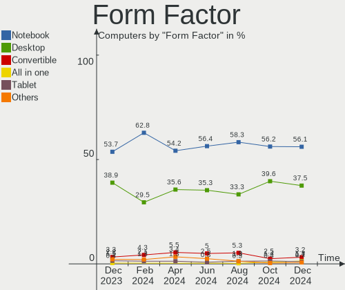
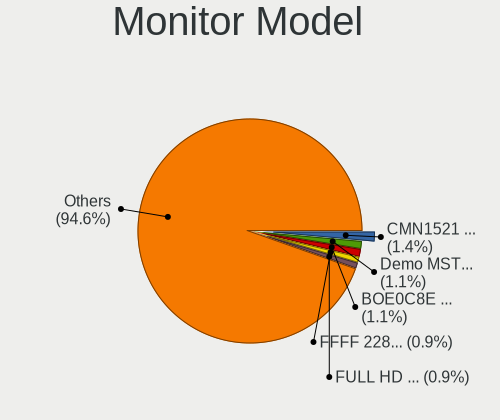
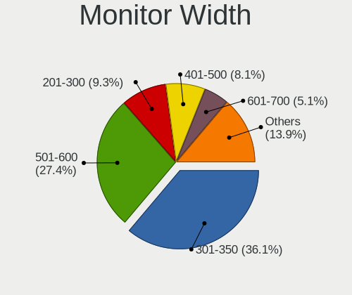
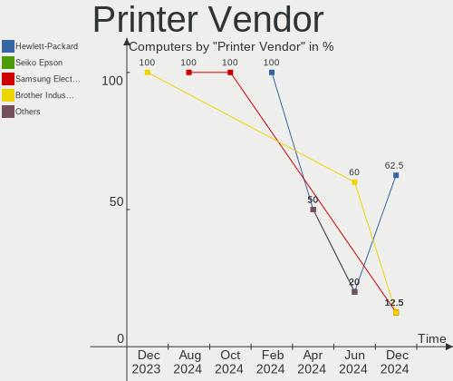

Arch - Hardware Trends
----------------------

A project to identify most popular hardware characteristics and track their change
over time based on data collected by Linux users at https://Linux-Hardware.org.

Anyone can contribute to this report by the [hw-probe](https://github.com/linuxhw/hw-probe) tool:

    sudo -E hw-probe -all -upload

This is a report for all computer types. See also reports for [desktops](/Dist/Arch/Desktop/README.md) and [notebooks](/Dist/Arch/Notebook/README.md).

This report is for one last month. Overall report since the beginning of time: [TestDays](https://github.com/linuxhw/TestDays)

Period: May, 2023.

Contents
--------

* [ System ](#system)
  - [ OS                       ](#os)
  - [ OS Family                ](#os-family)
  - [ Kernel                   ](#kernel)
  - [ Kernel Family            ](#kernel-family)
  - [ Kernel Major Ver.        ](#kernel-major-ver)
  - [ Arch                     ](#arch)
  - [ DE                       ](#de)
  - [ Display Server           ](#display-server)
  - [ Display Manager          ](#display-manager)
  - [ OS Lang                  ](#os-lang)
  - [ Boot Mode                ](#boot-mode)
  - [ Filesystem               ](#filesystem)
  - [ Part. scheme             ](#part-scheme)
  - [ Dual Boot with Linux/BSD ](#dual-boot-with-linuxbsd)
  - [ Dual Boot (Win)          ](#dual-boot-win)

* [ Board ](#board)
  - [ Vendor                   ](#vendor)
  - [ Model                    ](#model)
  - [ Model Family             ](#model-family)
  - [ MFG Year                 ](#mfg-year)
  - [ Form Factor              ](#form-factor)
  - [ Secure Boot              ](#secure-boot)
  - [ Coreboot                 ](#coreboot)
  - [ RAM Size                 ](#ram-size)
  - [ RAM Used                 ](#ram-used)
  - [ Total Drives             ](#total-drives)
  - [ Has CD-ROM               ](#has-cd-rom)
  - [ Has Ethernet             ](#has-ethernet)
  - [ Has WiFi                 ](#has-wifi)
  - [ Has Bluetooth            ](#has-bluetooth)

* [ Location ](#location)
  - [ Country                  ](#country)
  - [ City                     ](#city)

* [ Drives ](#drives)
  - [ Drive Vendor             ](#drive-vendor)
  - [ Drive Model              ](#drive-model)
  - [ HDD Vendor               ](#hdd-vendor)
  - [ SSD Vendor               ](#ssd-vendor)
  - [ Drive Kind               ](#drive-kind)
  - [ Drive Connector          ](#drive-connector)
  - [ Drive Size               ](#drive-size)
  - [ Space Total              ](#space-total)
  - [ Space Used               ](#space-used)
  - [ Malfunc. Drives          ](#malfunc-drives)
  - [ Malfunc. Drive Vendor    ](#malfunc-drive-vendor)
  - [ Malfunc. HDD Vendor      ](#malfunc-hdd-vendor)
  - [ Malfunc. Drive Kind      ](#malfunc-drive-kind)
  - [ Failed Drives            ](#failed-drives)
  - [ Failed Drive Vendor      ](#failed-drive-vendor)
  - [ Drive Status             ](#drive-status)

* [ Storage controller ](#storage-controller)
  - [ Storage Vendor           ](#storage-vendor)
  - [ Storage Model            ](#storage-model)
  - [ Storage Kind             ](#storage-kind)

* [ Processor ](#processor)
  - [ CPU Vendor               ](#cpu-vendor)
  - [ CPU Model                ](#cpu-model)
  - [ CPU Model Family         ](#cpu-model-family)
  - [ CPU Cores                ](#cpu-cores)
  - [ CPU Sockets              ](#cpu-sockets)
  - [ CPU Threads              ](#cpu-threads)
  - [ CPU Op-Modes             ](#cpu-op-modes)
  - [ CPU Microcode            ](#cpu-microcode)
  - [ CPU Microarch            ](#cpu-microarch)

* [ Graphics ](#graphics)
  - [ GPU Vendor               ](#gpu-vendor)
  - [ GPU Model                ](#gpu-model)
  - [ GPU Combo                ](#gpu-combo)
  - [ GPU Driver               ](#gpu-driver)
  - [ GPU Memory               ](#gpu-memory)

* [ Monitor ](#monitor)
  - [ Monitor Vendor           ](#monitor-vendor)
  - [ Monitor Model            ](#monitor-model)
  - [ Monitor Resolution       ](#monitor-resolution)
  - [ Monitor Diagonal         ](#monitor-diagonal)
  - [ Monitor Width            ](#monitor-width)
  - [ Aspect Ratio             ](#aspect-ratio)
  - [ Monitor Area             ](#monitor-area)
  - [ Pixel Density            ](#pixel-density)
  - [ Multiple Monitors        ](#multiple-monitors)

* [ Network ](#network)
  - [ Net Controller Vendor    ](#net-controller-vendor)
  - [ Net Controller Model     ](#net-controller-model)
  - [ Wireless Vendor          ](#wireless-vendor)
  - [ Wireless Model           ](#wireless-model)
  - [ Ethernet Vendor          ](#ethernet-vendor)
  - [ Ethernet Model           ](#ethernet-model)
  - [ Net Controller Kind      ](#net-controller-kind)
  - [ Used Controller          ](#used-controller)
  - [ NICs                     ](#nics)
  - [ IPv6                     ](#ipv6)

* [ Bluetooth ](#bluetooth)
  - [ Bluetooth Vendor         ](#bluetooth-vendor)
  - [ Bluetooth Model          ](#bluetooth-model)

* [ Sound ](#sound)
  - [ Sound Vendor             ](#sound-vendor)
  - [ Sound Model              ](#sound-model)

* [ Memory ](#memory)
  - [ Memory Vendor            ](#memory-vendor)
  - [ Memory Model             ](#memory-model)
  - [ Memory Kind              ](#memory-kind)
  - [ Memory Form Factor       ](#memory-form-factor)
  - [ Memory Size              ](#memory-size)
  - [ Memory Speed             ](#memory-speed)

* [ Printers & scanners ](#printers--scanners)
  - [ Printer Vendor           ](#printer-vendor)
  - [ Printer Model            ](#printer-model)
  - [ Scanner Vendor           ](#scanner-vendor)
  - [ Scanner Model            ](#scanner-model)

* [ Camera ](#camera)
  - [ Camera Vendor            ](#camera-vendor)
  - [ Camera Model             ](#camera-model)

* [ Security ](#security)
  - [ Fingerprint Vendor       ](#fingerprint-vendor)
  - [ Fingerprint Model        ](#fingerprint-model)
  - [ Chipcard Vendor          ](#chipcard-vendor)
  - [ Chipcard Model           ](#chipcard-model)

* [ Unsupported ](#unsupported)
  - [ Unsupported Devices      ](#unsupported-devices)
  - [ Unsupported Device Types ](#unsupported-device-types)

System
------

OS
--

Installed operating systems

| Name         | Computers | Percent |
|--------------|-----------|---------|
| Arch Rolling | 221       | 99.55%  |
| Arch 22.10   | 1         | 0.45%   |

OS Family
---------

OS without a version

| Name | Computers | Percent |
|------|-----------|---------|
| Arch | 222       | 100%    |

Kernel
------

Version of the Linux kernel

| Version                             | Computers | Percent |
|-------------------------------------|-----------|---------|
| 6.3.2-arch1-1                       | 33        | 14.86%  |
| 6.3.1-arch1-1                       | 33        | 14.86%  |
| 6.2.13-arch1-1                      | 21        | 9.46%   |
| 6.3.4-arch1-1                       | 20        | 9.01%   |
| 6.3.1-arch2-1                       | 18        | 8.11%   |
| 6.3.3-arch1-1                       | 10        | 4.5%    |
| 6.3.2-zen1-1-zen                    | 10        | 4.5%    |
| 6.3.1-zen1-1-zen                    | 7         | 3.15%   |
| 6.2.12-arch1-1                      | 7         | 3.15%   |
| 6.3.4-zen1-1-zen                    | 5         | 2.25%   |
| 6.1.27-1-lts                        | 5         | 2.25%   |
| 6.2.13-zen-1-zen                    | 4         | 1.8%    |
| 6.3.4-zen2-1-zen                    | 3         | 1.35%   |
| 6.3.1-zen2-1-zen                    | 3         | 1.35%   |
| 6.1.30-1-lts                        | 3         | 1.35%   |
| 6.1.29-1-lts                        | 3         | 1.35%   |
| 6.3.5-arch1-1                       | 2         | 0.9%    |
| 6.3.4-arch2-1                       | 2         | 0.9%    |
| 6.3.3-zen1-1-zen                    | 2         | 0.9%    |
| 6.2.9-arch1-1                       | 2         | 0.9%    |
| 6.2.11-arch1-1                      | 2         | 0.9%    |
| 6.1.28-1-lts                        | 2         | 0.9%    |
| 6.4.0-rc3-1-git-00008-gae8373a5add4 | 1         | 0.45%   |
| 6.3.5-zen1-1-zen                    | 1         | 0.45%   |
| 6.3.4-zen1-1.1-zen                  | 1         | 0.45%   |
| 6.3.4-x64v1-xanmod1-1               | 1         | 0.45%   |
| 6.3.2-zen1-1.1-zen                  | 1         | 0.45%   |
| 6.3.2-Painoko-T2-xanmod1-1-t2       | 1         | 0.45%   |
| 6.3.2-AMD                           | 1         | 0.45%   |
| 6.3.1-arch1-1-custom                | 1         | 0.45%   |
| 6.3.0-x64v1-xanmod1-2               | 1         | 0.45%   |
| 6.3.0-AMD-znver2                    | 1         | 0.45%   |
| 6.3.0-273-tkg-tt-llvm               | 1         | 0.45%   |
| 6.3.0                               | 1         | 0.45%   |
| 6.2.8-arch1-1                       | 1         | 0.45%   |
| 6.2.7-arch1-1                       | 1         | 0.45%   |
| 6.2.6-arch1-1                       | 1         | 0.45%   |
| 6.2.2-arch2-1                       | 1         | 0.45%   |
| 6.2.12-zen1-1-zen                   | 1         | 0.45%   |
| 6.2.10-x64v1-xanmod1-1              | 1         | 0.45%   |

Kernel Family
-------------

Linux kernel without a distro release

| Version | Computers | Percent |
|---------|-----------|---------|
| 6.3.1   | 62        | 27.93%  |
| 6.3.2   | 46        | 20.72%  |
| 6.3.4   | 32        | 14.41%  |
| 6.2.13  | 25        | 11.26%  |
| 6.3.3   | 12        | 5.41%   |
| 6.2.12  | 8         | 3.6%    |
| 6.1.27  | 5         | 2.25%   |
| 6.3.0   | 4         | 1.8%    |
| 6.3.5   | 3         | 1.35%   |
| 6.1.30  | 3         | 1.35%   |
| 6.1.29  | 3         | 1.35%   |
| 6.1.28  | 3         | 1.35%   |
| 6.2.9   | 2         | 0.9%    |
| 6.2.11  | 2         | 0.9%    |
| 6.4.0   | 1         | 0.45%   |
| 6.2.8   | 1         | 0.45%   |
| 6.2.7   | 1         | 0.45%   |
| 6.2.6   | 1         | 0.45%   |
| 6.2.2   | 1         | 0.45%   |
| 6.2.10  | 1         | 0.45%   |
| 6.1.26  | 1         | 0.45%   |
| 6.1.24  | 1         | 0.45%   |
| 6.1.12  | 1         | 0.45%   |
| 6.0.12  | 1         | 0.45%   |
| 5.18.12 | 1         | 0.45%   |
| 5.15.95 | 1         | 0.45%   |

Kernel Major Ver.
-----------------

Linux kernel major version

| Version | Computers | Percent |
|---------|-----------|---------|
| 6.3     | 159       | 71.62%  |
| 6.2     | 42        | 18.92%  |
| 6.1     | 17        | 7.66%   |
| 6.4     | 1         | 0.45%   |
| 6.0     | 1         | 0.45%   |
| 5.18    | 1         | 0.45%   |
| 5.15    | 1         | 0.45%   |

Arch
----

OS architecture (x86_64, i586, etc.)

| Name    | Computers | Percent |
|---------|-----------|---------|
| x86_64  | 221       | 99.55%  |
| riscv64 | 1         | 0.45%   |

DE
--

Desktop Environment

| Name           | Computers | Percent |
|----------------|-----------|---------|
| KDE5           | 79        | 35.59%  |
| GNOME          | 62        | 27.93%  |
| Unknown        | 19        | 8.56%   |
| XFCE           | 15        | 6.76%   |
| i3             | 11        | 4.95%   |
| Hyprland       | 10        | 4.5%    |
| sway           | 4         | 1.8%    |
| X-Cinnamon     | 3         | 1.35%   |
| dwm            | 3         | 1.35%   |
| LXQt           | 2         | 0.9%    |
| KDE            | 2         | 0.9%    |
| Cinnamon       | 2         | 0.9%    |
| bspwm          | 2         | 0.9%    |
| awesome        | 2         | 0.9%    |
| xmonad         | 1         | 0.45%   |
| qtile          | 1         | 0.45%   |
| MATE           | 1         | 0.45%   |
| LXDE           | 1         | 0.45%   |
| i3-with-shmlog | 1         | 0.45%   |
| chadwm         | 1         | 0.45%   |

Display Server
--------------

X11 or Wayland

| Name    | Computers | Percent |
|---------|-----------|---------|
| X11     | 105       | 47.3%   |
| Wayland | 82        | 36.94%  |
| Tty     | 19        | 8.56%   |
| Unknown | 16        | 7.21%   |

Display Manager
---------------

SDDM, LightDM, etc.

| Name    | Computers | Percent |
|---------|-----------|---------|
| Unknown | 84        | 37.84%  |
| SDDM    | 70        | 31.53%  |
| GDM     | 32        | 14.41%  |
| LightDM | 31        | 13.96%  |
| SLiM    | 1         | 0.45%   |
| LY-DM   | 1         | 0.45%   |
| Ly      | 1         | 0.45%   |
| LXDM    | 1         | 0.45%   |
| GREETD  | 1         | 0.45%   |

OS Lang
-------

Language

| Lang    | Computers | Percent |
|---------|-----------|---------|
| en_US   | 113       | 50.9%   |
| en_GB   | 15        | 6.76%   |
| C       | 15        | 6.76%   |
| de_DE   | 10        | 4.5%    |
| it_IT   | 9         | 4.05%   |
| ru_RU   | 7         | 3.15%   |
| fr_FR   | 6         | 2.7%    |
| en_CA   | 6         | 2.7%    |
| Unknown | 6         | 2.7%    |
| pt_PT   | 4         | 1.8%    |
| pt_BR   | 4         | 1.8%    |
| zh_CN   | 3         | 1.35%   |
| es_MX   | 3         | 1.35%   |
| es_ES   | 3         | 1.35%   |
| en_AU   | 2         | 0.9%    |
| de_AT   | 2         | 0.9%    |
| cs_CZ   | 2         | 0.9%    |
| zh_TW   | 1         | 0.45%   |
| sv_SE   | 1         | 0.45%   |
| pl_PL   | 1         | 0.45%   |
| lv_LV   | 1         | 0.45%   |
| hu_HU   | 1         | 0.45%   |
| ga_IE   | 1         | 0.45%   |
| es_GT   | 1         | 0.45%   |
| en_ZA   | 1         | 0.45%   |
| en_IE   | 1         | 0.45%   |
| en_AG   | 1         | 0.45%   |
| en-US   | 1         | 0.45%   |
| bg_BG   | 1         | 0.45%   |

Boot Mode
---------

EFI or BIOS

| Mode | Computers | Percent |
|------|-----------|---------|
| EFI  | 147       | 66.22%  |
| BIOS | 75        | 33.78%  |

Filesystem
----------

Type of filesystem

| Type    | Computers | Percent |
|---------|-----------|---------|
| Ext4    | 133       | 59.91%  |
| Btrfs   | 79        | 35.59%  |
| Xfs     | 3         | 1.35%   |
| F2fs    | 3         | 1.35%   |
| Zfs     | 1         | 0.45%   |
| Tmpfs   | 1         | 0.45%   |
| Jfs     | 1         | 0.45%   |
| Unknown | 1         | 0.45%   |

Part. scheme
------------

Scheme of partitioning

| Type    | Computers | Percent |
|---------|-----------|---------|
| GPT     | 151       | 68.02%  |
| Unknown | 58        | 26.13%  |
| MBR     | 13        | 5.86%   |

Dual Boot with Linux/BSD
------------------------

Hosting more than one Linux/BSD

| Dual boot | Computers | Percent |
|-----------|-----------|---------|
| No        | 187       | 84.23%  |
| Yes       | 35        | 15.77%  |

Dual Boot (Win)
---------------

Hosting Linux and Windows

| Dual boot | Computers | Percent |
|-----------|-----------|---------|
| No        | 173       | 77.93%  |
| Yes       | 49        | 22.07%  |

Board
-----

Vendor
------

Motherboard manufacturer

| Name                | Computers | Percent |
|---------------------|-----------|---------|
| Lenovo              | 42        | 18.92%  |
| ASUSTek Computer    | 41        | 18.47%  |
| Hewlett-Packard     | 32        | 14.41%  |
| Dell                | 25        | 11.26%  |
| MSI                 | 16        | 7.21%   |
| Gigabyte Technology | 14        | 6.31%   |
| ASRock              | 12        | 5.41%   |
| Acer                | 11        | 4.95%   |
| Apple               | 3         | 1.35%   |
| TUXEDO              | 2         | 0.9%    |
| Toshiba             | 2         | 0.9%    |
| Microsoft           | 2         | 0.9%    |
| HUAWEI              | 2         | 0.9%    |
| Huanan              | 2         | 0.9%    |
| Timi                | 1         | 0.45%   |
| Samsung Electronics | 1         | 0.45%   |
| realme              | 1         | 0.45%   |
| Razer               | 1         | 0.45%   |
| Quanta              | 1         | 0.45%   |
| Medion              | 1         | 0.45%   |
| Intel               | 1         | 0.45%   |
| HONOR               | 1         | 0.45%   |
| HASEE Computer      | 1         | 0.45%   |
| GPD                 | 1         | 0.45%   |
| Google              | 1         | 0.45%   |
| Framework           | 1         | 0.45%   |
| Emdoor              | 1         | 0.45%   |
| Digma               | 1         | 0.45%   |
| Cincoze             | 1         | 0.45%   |
| Unknown             | 1         | 0.45%   |

Model
-----

Motherboard model

| Name                                                  | Computers | Percent |
|-------------------------------------------------------|-----------|---------|
| MSI MS-7C95                                           | 2         | 0.9%    |
| Lenovo Yoga 6 13ALC7 82UD                             | 2         | 0.9%    |
| Lenovo MIIX 310-10ICR 80SG                            | 2         | 0.9%    |
| HP OMEN by Laptop 15-dc1xxx                           | 2         | 0.9%    |
| Gigabyte X570S AERO G                                 | 2         | 0.9%    |
| Dell XPS 17 9700                                      | 2         | 0.9%    |
| ASUS PRIME X570-PRO                                   | 2         | 0.9%    |
| Acer Nitro AN515-45                                   | 2         | 0.9%    |
| Unknown                                               | 2         | 0.9%    |
| TUXEDO Polaris Intel Gen3 (TGL)                       | 1         | 0.45%   |
| TUXEDO Aura 15 Gen1                                   | 1         | 0.45%   |
| Toshiba Satellite C855                                | 1         | 0.45%   |
| Toshiba Satellite C645D                               | 1         | 0.45%   |
| Timi Xiaomi Book Air 13 2022                          | 1         | 0.45%   |
| Samsung 750XDA                                        | 1         | 0.45%   |
| realme RMNBXXXX                                       | 1         | 0.45%   |
| Razer Blade 15 Studio Edition (Early 2020) - RZ09-033 | 1         | 0.45%   |
| Quanta UW3                                            | 1         | 0.45%   |
| MSI PS42 Modern 8RA                                   | 1         | 0.45%   |
| MSI MS-7D91                                           | 1         | 0.45%   |
| MSI MS-7D75                                           | 1         | 0.45%   |
| MSI MS-7C81                                           | 1         | 0.45%   |
| MSI MS-7C56                                           | 1         | 0.45%   |
| MSI MS-7B98                                           | 1         | 0.45%   |
| MSI MS-7B86                                           | 1         | 0.45%   |
| MSI MS-7A71                                           | 1         | 0.45%   |
| MSI MS-7A38                                           | 1         | 0.45%   |
| MSI MS-7A20                                           | 1         | 0.45%   |
| MSI MS-7693                                           | 1         | 0.45%   |
| MSI Modern 14 B4MW                                    | 1         | 0.45%   |
| MSI GV63 8SE                                          | 1         | 0.45%   |
| MSI GF63 Thin 11UC                                    | 1         | 0.45%   |
| Microsoft Surface Laptop Go                           | 1         | 0.45%   |
| Microsoft Surface Book 2                              | 1         | 0.45%   |
| Medion Crawler E40                                    | 1         | 0.45%   |
| Lenovo Yoga Slim 7 proX 14ARH7 82TL                   | 1         | 0.45%   |
| Lenovo ThinkPad X61 7673V4Q                           | 1         | 0.45%   |
| Lenovo ThinkPad X240 20AMA21D00                       | 1         | 0.45%   |
| Lenovo ThinkPad X230 Tablet 3438G17                   | 1         | 0.45%   |
| Lenovo ThinkPad X230 23301E0                          | 1         | 0.45%   |

Model Family
------------

Motherboard model prefix

| Name              | Computers | Percent |
|-------------------|-----------|---------|
| Lenovo ThinkPad   | 19        | 8.56%   |
| Lenovo IdeaPad    | 11        | 4.95%   |
| ASUS ROG          | 11        | 4.95%   |
| Dell Latitude     | 10        | 4.5%    |
| HP EliteBook      | 7         | 3.15%   |
| HP Laptop         | 6         | 2.7%    |
| Dell Inspiron     | 6         | 2.7%    |
| ASUS TUF          | 6         | 2.7%    |
| ASUS PRIME        | 5         | 2.25%   |
| Acer Aspire       | 5         | 2.25%   |
| HP Pavilion       | 4         | 1.8%    |
| HP OMEN           | 4         | 1.8%    |
| Dell Precision    | 4         | 1.8%    |
| ASUS ASUS         | 4         | 1.8%    |
| Acer Swift        | 4         | 1.8%    |
| Lenovo Yoga       | 3         | 1.35%   |
| HP ENVY           | 3         | 1.35%   |
| ASUS VivoBook     | 3         | 1.35%   |
| Toshiba Satellite | 2         | 0.9%    |
| MSI MS-7C95       | 2         | 0.9%    |
| Microsoft Surface | 2         | 0.9%    |
| Lenovo MIIX       | 2         | 0.9%    |
| Lenovo Legion     | 2         | 0.9%    |
| HP Spectre        | 2         | 0.9%    |
| Gigabyte X570S    | 2         | 0.9%    |
| Gigabyte X570     | 2         | 0.9%    |
| Dell XPS          | 2         | 0.9%    |
| Dell OptiPlex     | 2         | 0.9%    |
| ASUS Zenbook      | 2         | 0.9%    |
| ASRock B450M      | 2         | 0.9%    |
| Acer Nitro        | 2         | 0.9%    |
| Unknown           | 2         | 0.9%    |
| TUXEDO Polaris    | 1         | 0.45%   |
| TUXEDO Aura       | 1         | 0.45%   |
| Timi Xiaomi       | 1         | 0.45%   |
| Samsung 750XDA    | 1         | 0.45%   |
| realme RMNBXXXX   | 1         | 0.45%   |
| Razer Blade       | 1         | 0.45%   |
| Quanta UW3        | 1         | 0.45%   |
| MSI PS42          | 1         | 0.45%   |

MFG Year
--------

Motherboard manufacture year

| Year    | Computers | Percent |
|---------|-----------|---------|
| 2021    | 37        | 16.67%  |
| 2020    | 34        | 15.32%  |
| 2022    | 30        | 13.51%  |
| 2019    | 26        | 11.71%  |
| 2018    | 15        | 6.76%   |
| 2023    | 11        | 4.95%   |
| 2017    | 11        | 4.95%   |
| 2013    | 11        | 4.95%   |
| 2012    | 10        | 4.5%    |
| 2014    | 9         | 4.05%   |
| 2015    | 7         | 3.15%   |
| 2016    | 6         | 2.7%    |
| 2010    | 5         | 2.25%   |
| 2011    | 4         | 1.8%    |
| 2009    | 2         | 0.9%    |
| 2007    | 2         | 0.9%    |
| 2008    | 1         | 0.45%   |
| Unknown | 1         | 0.45%   |

Form Factor
-----------

Physical design of the computer

| Name           | Computers | Percent |
|----------------|-----------|---------|
| Notebook       | 131       | 59.01%  |
| Desktop        | 73        | 32.88%  |
| Convertible    | 11        | 4.95%   |
| Tablet         | 4         | 1.8%    |
| System on chip | 1         | 0.45%   |
| Mini pc        | 1         | 0.45%   |
| All in one     | 1         | 0.45%   |

Secure Boot
-----------

Enabled or disabled

| State    | Computers | Percent |
|----------|-----------|---------|
| Disabled | 216       | 97.3%   |
| Enabled  | 6         | 2.7%    |

Coreboot
--------

Have coreboot on board

| Used | Computers | Percent |
|------|-----------|---------|
| No   | 219       | 98.65%  |
| Yes  | 3         | 1.35%   |

RAM Size
--------

Total RAM memory

| Size in GB  | Computers | Percent |
|-------------|-----------|---------|
| 16.01-24.0  | 54        | 24.32%  |
| 8.01-16.0   | 45        | 20.27%  |
| 4.01-8.0    | 40        | 18.02%  |
| 32.01-64.0  | 38        | 17.12%  |
| 64.01-256.0 | 17        | 7.66%   |
| 3.01-4.0    | 13        | 5.86%   |
| 24.01-32.0  | 11        | 4.95%   |
| 2.01-3.0    | 2         | 0.9%    |
| 1.01-2.0    | 1         | 0.45%   |
| 0.51-1.0    | 1         | 0.45%   |

RAM Used
--------

Used RAM memory

| Used GB    | Computers | Percent |
|------------|-----------|---------|
| 4.01-8.0   | 55        | 24.77%  |
| 2.01-3.0   | 53        | 23.87%  |
| 3.01-4.0   | 38        | 17.12%  |
| 8.01-16.0  | 30        | 13.51%  |
| 1.01-2.0   | 28        | 12.61%  |
| 0.51-1.0   | 11        | 4.95%   |
| 0.01-0.5   | 4         | 1.8%    |
| 32.01-64.0 | 2         | 0.9%    |
| 16.01-24.0 | 1         | 0.45%   |

Total Drives
------------

Number of drives on board

| Drives | Computers | Percent |
|--------|-----------|---------|
| 1      | 128       | 57.66%  |
| 2      | 52        | 23.42%  |
| 3      | 14        | 6.31%   |
| 4      | 12        | 5.41%   |
| 6      | 7         | 3.15%   |
| 5      | 7         | 3.15%   |
| 9      | 1         | 0.45%   |
| 7      | 1         | 0.45%   |

Has CD-ROM
----------

Has CD-ROM on board

| Presented | Computers | Percent |
|-----------|-----------|---------|
| No        | 194       | 87.39%  |
| Yes       | 28        | 12.61%  |

Has Ethernet
------------

Has Ethernet on board

| Presented | Computers | Percent |
|-----------|-----------|---------|
| Yes       | 169       | 76.13%  |
| No        | 53        | 23.87%  |

Has WiFi
--------

Has WiFi module

| Presented | Computers | Percent |
|-----------|-----------|---------|
| Yes       | 192       | 86.49%  |
| No        | 30        | 13.51%  |

Has Bluetooth
-------------

Has Bluetooth module

| Presented | Computers | Percent |
|-----------|-----------|---------|
| Yes       | 178       | 80.18%  |
| No        | 44        | 19.82%  |

Location
--------

Country
-------

Geographic location (country)

| Country      | Computers | Percent |
|--------------|-----------|---------|
| USA          | 40        | 18.02%  |
| Germany      | 21        | 9.46%   |
| Italy        | 16        | 7.21%   |
| Russia       | 15        | 6.76%   |
| France       | 12        | 5.41%   |
| UK           | 10        | 4.5%    |
| Brazil       | 10        | 4.5%    |
| Canada       | 9         | 4.05%   |
| Poland       | 5         | 2.25%   |
| Spain        | 4         | 1.8%    |
| Romania      | 4         | 1.8%    |
| Portugal     | 4         | 1.8%    |
| Finland      | 4         | 1.8%    |
| Austria      | 4         | 1.8%    |
| Argentina    | 4         | 1.8%    |
| Slovenia     | 3         | 1.35%   |
| Netherlands  | 3         | 1.35%   |
| Czechia      | 3         | 1.35%   |
| China        | 3         | 1.35%   |
| Chile        | 3         | 1.35%   |
| Australia    | 3         | 1.35%   |
| Taiwan       | 2         | 0.9%    |
| Switzerland  | 2         | 0.9%    |
| Peru         | 2         | 0.9%    |
| Mexico       | 2         | 0.9%    |
| Indonesia    | 2         | 0.9%    |
| Hungary      | 2         | 0.9%    |
| Estonia      | 2         | 0.9%    |
| Denmark      | 2         | 0.9%    |
| Bulgaria     | 2         | 0.9%    |
| Belgium      | 2         | 0.9%    |
| Ukraine      | 1         | 0.45%   |
| Togo         | 1         | 0.45%   |
| Thailand     | 1         | 0.45%   |
| Sweden       | 1         | 0.45%   |
| Sri Lanka    | 1         | 0.45%   |
| South Korea  | 1         | 0.45%   |
| South Africa | 1         | 0.45%   |
| Singapore    | 1         | 0.45%   |
| Norway       | 1         | 0.45%   |

City
----

Geographic location (city)

| City                   | Computers | Percent |
|------------------------|-----------|---------|
| Toulouse               | 3         | 1.35%   |
| Toronto                | 3         | 1.35%   |
| Prague                 | 3         | 1.35%   |
| Berlin                 | 3         | 1.35%   |
| Wolfurt                | 2         | 0.9%    |
| Wellingborough         | 2         | 0.9%    |
| Warsaw                 | 2         | 0.9%    |
| Vienna                 | 2         | 0.9%    |
| Trzin                  | 2         | 0.9%    |
| Tallinn                | 2         | 0.9%    |
| Seattle                | 2         | 0.9%    |
| Raleigh                | 2         | 0.9%    |
| Moscow                 | 2         | 0.9%    |
| Melbourne              | 2         | 0.9%    |
| Los Angeles            | 2         | 0.9%    |
| London                 | 2         | 0.9%    |
| Lima                   | 2         | 0.9%    |
| Kudrovo                | 2         | 0.9%    |
| Helsinki               | 2         | 0.9%    |
| Guadalajara            | 2         | 0.9%    |
| Düsseldorf            | 2         | 0.9%    |
| Buenos Aires           | 2         | 0.9%    |
| Antofagasta            | 2         | 0.9%    |
| Zurich                 | 1         | 0.45%   |
| Yogyakarta             | 1         | 0.45%   |
| Yablonitsy             | 1         | 0.45%   |
| Wuhan                  | 1         | 0.45%   |
| Witney                 | 1         | 0.45%   |
| Wetzlar                | 1         | 0.45%   |
| Wermelskirchen         | 1         | 0.45%   |
| Weatherford            | 1         | 0.45%   |
| Volgograd              | 1         | 0.45%   |
| Vladivostok            | 1         | 0.45%   |
| Viña del Mar          | 1         | 0.45%   |
| Villingen-Schwenningen | 1         | 0.45%   |
| Verona                 | 1         | 0.45%   |
| Veliky Novgorod        | 1         | 0.45%   |
| Uberlândia            | 1         | 0.45%   |
| Turku                  | 1         | 0.45%   |
| Tuoro sul Trasimeno    | 1         | 0.45%   |

Drives
------

Drive Vendor
------------

Hard drive vendors

| Vendor                         | Computers | Drives | Percent |
|--------------------------------|-----------|--------|---------|
| Samsung Electronics            | 71        | 92     | 20%     |
| WDC                            | 30        | 37     | 8.45%   |
| Sandisk                        | 30        | 37     | 8.45%   |
| Seagate                        | 27        | 36     | 7.61%   |
| Kingston                       | 22        | 29     | 6.2%    |
| Toshiba                        | 17        | 21     | 4.79%   |
| SK hynix                       | 16        | 16     | 4.51%   |
| Micron Technology              | 15        | 15     | 4.23%   |
| Phison Electronics             | 14        | 15     | 3.94%   |
| Crucial                        | 13        | 14     | 3.66%   |
| Unknown                        | 11        | 11     | 3.1%    |
| Intel                          | 11        | 11     | 3.1%    |
| KIOXIA                         | 7         | 7      | 1.97%   |
| Micron/Crucial Technology      | 6         | 7      | 1.69%   |
| China                          | 6         | 6      | 1.69%   |
| ADATA Technology               | 5         | 6      | 1.41%   |
| A-DATA Technology              | 5         | 5      | 1.41%   |
| Kingston Technology Company    | 3         | 3      | 0.85%   |
| HGST                           | 3         | 3      | 0.85%   |
| Apple                          | 3         | 4      | 0.85%   |
| Transcend                      | 2         | 2      | 0.56%   |
| Solid State Storage Technology | 2         | 2      | 0.56%   |
| PNY                            | 2         | 2      | 0.56%   |
| Phison                         | 2         | 2      | 0.56%   |
| KingFast                       | 2         | 2      | 0.56%   |
| Hitachi                        | 2         | 2      | 0.56%   |
| Hewlett-Packard                | 2         | 2      | 0.56%   |
| GOODRAM                        | 2         | 3      | 0.56%   |
| Unknown                        | 2         | 2      | 0.56%   |
| VNYEZ                          | 1         | 1      | 0.28%   |
| Union Memory                   | 1         | 1      | 0.28%   |
| StoreJet                       | 1         | 1      | 0.28%   |
| StarTech                       | 1         | 1      | 0.28%   |
| SPCC                           | 1         | 1      | 0.28%   |
| Shenzhen Longsys Electronics   | 1         | 1      | 0.28%   |
| Seagate Technology             | 1         | 1      | 0.28%   |
| Realtek Semiconductor          | 1         | 1      | 0.28%   |
| Plextor                        | 1         | 1      | 0.28%   |
| Patriot                        | 1         | 1      | 0.28%   |
| Netac                          | 1         | 2      | 0.28%   |

Drive Model
-----------

Hard drive models

| Model                                                           | Computers | Percent |
|-----------------------------------------------------------------|-----------|---------|
| Samsung NVMe SSD Controller SM981/PM981/PM983 256GB             | 22        | 5.76%   |
| Samsung NVMe SSD Controller PM9A1/PM9A3/980PRO 1TB              | 13        | 3.4%    |
| Unknown MMC Card  32GB                                          | 5         | 1.31%   |
| Sandisk WD Black SN750 / PC SN730 NVMe SSD 256GB                | 5         | 1.31%   |
| Samsung SSD 980 500GB                                           | 5         | 1.31%   |
| Kingston SA400S37240G 240GB SSD                                 | 5         | 1.31%   |
| ADATA XPG SX8200 Pro PCIe Gen3x4 M.2 2280 Solid State Drive 1TB | 5         | 1.31%   |
| SK hynix BC511 256GB                                            | 4         | 1.05%   |
| Sandisk WD Blue SN550 NVMe SSD 512GB                            | 4         | 1.05%   |
| Samsung SSD 980 1TB                                             | 4         | 1.05%   |
| Samsung NVMe SSD Controller SM961/PM961/SM963 256GB             | 4         | 1.05%   |
| Phison E12 NVMe Controller 256GB                                | 4         | 1.05%   |
| Micron/Crucial P2 NVMe PCIe SSD 1TB                             | 4         | 1.05%   |
| Intel SSDPEKNU512GZ 512GB                                       | 4         | 1.05%   |
| Unknown MMC Card  64GB                                          | 3         | 0.79%   |
| Seagate ST4000DM004-2CV104 4TB                                  | 3         | 0.79%   |
| Sandisk WD Black 2018/SN750 / PC SN720 NVMe SSD 1TB             | 3         | 0.79%   |
| SanDisk SSD PLUS 240GB                                          | 3         | 0.79%   |
| Samsung SSD 860 EVO 1TB                                         | 3         | 0.79%   |
| Phison PS5013 E13 NVMe Controller 512GB                         | 3         | 0.79%   |
| Phison E16 PCIe4 NVMe Controller 1TB                            | 3         | 0.79%   |
| Intel SSD 660P Series 512GB                                     | 3         | 0.79%   |
| Crucial CT480BX500SSD1 480GB                                    | 3         | 0.79%   |
| Crucial CT1000MX500SSD1 1TB                                     | 3         | 0.79%   |
| WDC WD10SPZX-21Z10T0 1TB                                        | 2         | 0.52%   |
| WDC WD10EZEX-08WN4A0 1TB                                        | 2         | 0.52%   |
| WDC WD10EFRX-68FYTN0 1TB                                        | 2         | 0.52%   |
| Unknown MMC Card  128GB                                         | 2         | 0.52%   |
| Toshiba XG6 NVMe SSD Controller 256GB                           | 2         | 0.52%   |
| Toshiba HDWD110 1TB                                             | 2         | 0.52%   |
| SK hynix BC501 NVMe Solid State Drive 512GB                     | 2         | 0.52%   |
| Seagate ST8000DM004-2CX188 8TB                                  | 2         | 0.52%   |
| Seagate ST2000DM008-2FR102 2TB                                  | 2         | 0.52%   |
| Sandisk WD_BLACK SN770 1TB                                      | 2         | 0.52%   |
| Sandisk WD Blue SN570 1TB                                       | 2         | 0.52%   |
| Sandisk WD Black SN850 500GB                                    | 2         | 0.52%   |
| Samsung SSD 860 EVO 500GB                                       | 2         | 0.52%   |
| Samsung SSD 850 PRO 256GB                                       | 2         | 0.52%   |
| Samsung SSD 850 EVO 500GB                                       | 2         | 0.52%   |
| Samsung NVMe SSD Controller SM951/PM951 128GB                   | 2         | 0.52%   |

HDD Vendor
----------

Hard disk drive vendors

| Vendor              | Computers | Drives | Percent |
|---------------------|-----------|--------|---------|
| WDC                 | 28        | 35     | 36.84%  |
| Seagate             | 27        | 36     | 35.53%  |
| Toshiba             | 12        | 14     | 15.79%  |
| HGST                | 3         | 3      | 3.95%   |
| Samsung Electronics | 2         | 2      | 2.63%   |
| Hitachi             | 2         | 2      | 2.63%   |
| Unknown             | 1         | 1      | 1.32%   |
| Fujitsu             | 1         | 1      | 1.32%   |

SSD Vendor
----------

Solid state drive vendors

| Vendor              | Computers | Drives | Percent |
|---------------------|-----------|--------|---------|
| Samsung Electronics | 20        | 24     | 21.74%  |
| Crucial             | 13        | 14     | 14.13%  |
| Kingston            | 12        | 14     | 13.04%  |
| SanDisk             | 6         | 9      | 6.52%   |
| China               | 6         | 6      | 6.52%   |
| A-DATA Technology   | 5         | 5      | 5.43%   |
| Intel               | 4         | 4      | 4.35%   |
| WDC                 | 2         | 2      | 2.17%   |
| Transcend           | 2         | 2      | 2.17%   |
| PNY                 | 2         | 2      | 2.17%   |
| Hewlett-Packard     | 2         | 2      | 2.17%   |
| GOODRAM             | 2         | 3      | 2.17%   |
| VNYEZ               | 1         | 1      | 1.09%   |
| Toshiba             | 1         | 3      | 1.09%   |
| SPCC                | 1         | 1      | 1.09%   |
| Plextor             | 1         | 1      | 1.09%   |
| Patriot             | 1         | 1      | 1.09%   |
| Mushkin             | 1         | 1      | 1.09%   |
| Micron Technology   | 1         | 1      | 1.09%   |
| LITEON C            | 1         | 1      | 1.09%   |
| LITEON              | 1         | 1      | 1.09%   |
| Lexar               | 1         | 1      | 1.09%   |
| KingFast            | 1         | 1      | 1.09%   |
| Gigabyte Technology | 1         | 1      | 1.09%   |
| BIWIN               | 1         | 1      | 1.09%   |
| Apple               | 1         | 1      | 1.09%   |
| Acer                | 1         | 1      | 1.09%   |
| 2.5"                | 1         | 1      | 1.09%   |

Drive Kind
----------

HDD or SSD

| Kind    | Computers | Drives | Percent |
|---------|-----------|--------|---------|
| NVMe    | 152       | 202    | 49.35%  |
| SSD     | 78        | 105    | 25.32%  |
| HDD     | 62        | 94     | 20.13%  |
| MMC     | 11        | 11     | 3.57%   |
| Unknown | 5         | 5      | 1.62%   |

Drive Connector
---------------

SATA, SAS, NVMe, etc.

| Type | Computers | Drives | Percent |
|------|-----------|--------|---------|
| NVMe | 152       | 202    | 54.09%  |
| SATA | 108       | 194    | 38.43%  |
| MMC  | 11        | 11     | 3.91%   |
| SAS  | 10        | 10     | 3.56%   |

Drive Size
----------

Size of hard drive

| Size in TB | Computers | Drives | Percent |
|------------|-----------|--------|---------|
| 0.01-0.5   | 82        | 108    | 55.03%  |
| 0.51-1.0   | 36        | 49     | 24.16%  |
| 1.01-2.0   | 15        | 15     | 10.07%  |
| 3.01-4.0   | 8         | 14     | 5.37%   |
| 4.01-10.0  | 5         | 6      | 3.36%   |
| 2.01-3.0   | 2         | 2      | 1.34%   |
| 10.01-20.0 | 1         | 5      | 0.67%   |

Space Total
-----------

Amount of disk space available on the file system

| Size in GB     | Computers | Percent |
|----------------|-----------|---------|
| 251-500        | 49        | 22.07%  |
| 101-250        | 41        | 18.47%  |
| 501-1000       | 36        | 16.22%  |
| More than 3000 | 35        | 15.77%  |
| 1001-2000      | 29        | 13.06%  |
| 2001-3000      | 13        | 5.86%   |
| 51-100         | 9         | 4.05%   |
| 1-20           | 4         | 1.8%    |
| 21-50          | 3         | 1.35%   |
| Unknown        | 3         | 1.35%   |

Space Used
----------

Amount of used disk space

| Used GB        | Computers | Percent |
|----------------|-----------|---------|
| 1-20           | 48        | 21.62%  |
| 101-250        | 39        | 17.57%  |
| 51-100         | 35        | 15.77%  |
| 21-50          | 29        | 13.06%  |
| 251-500        | 18        | 8.11%   |
| 501-1000       | 18        | 8.11%   |
| 1001-2000      | 15        | 6.76%   |
| More than 3000 | 12        | 5.41%   |
| 2001-3000      | 5         | 2.25%   |
| Unknown        | 3         | 1.35%   |

Malfunc. Drives
---------------

Drive models with a malfunction

| Model                                                           | Computers | Drives | Percent |
|-----------------------------------------------------------------|-----------|--------|---------|
| WDC WD5000AAKX-001CA0 500GB                                     | 1         | 1      | 5%      |
| WDC WD5000AAKS-00UU3A0 500GB                                    | 1         | 1      | 5%      |
| WDC WD40EZRZ-00WN9B0 4TB                                        | 1         | 1      | 5%      |
| WDC WD10EADS-11M2B3 1TB                                         | 1         | 1      | 5%      |
| VNYEZ SSD MSATA 128GB                                           | 1         | 1      | 5%      |
| Transcend TS1TSSD230S 1TB                                       | 1         | 1      | 5%      |
| Toshiba MK2561GSYN 250GB                                        | 1         | 1      | 5%      |
| Seagate ST320LT007-9ZV142 320GB                                 | 1         | 1      | 5%      |
| Seagate ST3160815AS 160GB                                       | 1         | 1      | 5%      |
| Seagate ST1000LM035-1RK172 1TB                                  | 1         | 1      | 5%      |
| SanDisk SSD PLUS 240GB                                          | 1         | 1      | 5%      |
| Samsung Electronics SSD 870 EVO 1TB                             | 1         | 1      | 5%      |
| Samsung Electronics SSD 840 PRO Series 230GB                    | 1         | 1      | 5%      |
| Samsung Electronics NVMe SSD Controller SM981/PM981/PM983 256GB | 1         | 1      | 5%      |
| Intel SSDSC2KW480H6 480GB                                       | 1         | 1      | 5%      |
| Hitachi HTS545032B9SA02 320GB                                   | 1         | 1      | 5%      |
| HGST HTS541075A9E680 752GB                                      | 1         | 1      | 5%      |
| Fujitsu MHZ2320BH G1 320GB                                      | 1         | 1      | 5%      |
| Crucial CT525MX300SSD1 528GB                                    | 1         | 1      | 5%      |
| China SSD 128GB                                                 | 1         | 1      | 5%      |

Malfunc. Drive Vendor
---------------------

Vendors of faulty drives

| Vendor              | Computers | Drives | Percent |
|---------------------|-----------|--------|---------|
| WDC                 | 4         | 4      | 20%     |
| Seagate             | 3         | 3      | 15%     |
| Samsung Electronics | 3         | 3      | 15%     |
| VNYEZ               | 1         | 1      | 5%      |
| Transcend           | 1         | 1      | 5%      |
| Toshiba             | 1         | 1      | 5%      |
| SanDisk             | 1         | 1      | 5%      |
| Intel               | 1         | 1      | 5%      |
| Hitachi             | 1         | 1      | 5%      |
| HGST                | 1         | 1      | 5%      |
| Fujitsu             | 1         | 1      | 5%      |
| Crucial             | 1         | 1      | 5%      |
| China               | 1         | 1      | 5%      |

Malfunc. HDD Vendor
-------------------

Vendors of faulty HDD drives

| Vendor  | Computers | Drives | Percent |
|---------|-----------|--------|---------|
| WDC     | 4         | 4      | 36.36%  |
| Seagate | 3         | 3      | 27.27%  |
| Toshiba | 1         | 1      | 9.09%   |
| Hitachi | 1         | 1      | 9.09%   |
| HGST    | 1         | 1      | 9.09%   |
| Fujitsu | 1         | 1      | 9.09%   |

Malfunc. Drive Kind
-------------------

Kinds of faulty drives

| Kind | Computers | Drives | Percent |
|------|-----------|--------|---------|
| HDD  | 10        | 11     | 55.56%  |
| SSD  | 7         | 8      | 38.89%  |
| NVMe | 1         | 1      | 5.56%   |

Failed Drives
-------------

Failed drive models

| Model                       | Computers | Drives | Percent |
|-----------------------------|-----------|--------|---------|
| WDC WD3200BEKT-60V5T1 320GB | 1         | 1      | 100%    |

Failed Drive Vendor
-------------------

Failed drive vendors

| Vendor | Computers | Drives | Percent |
|--------|-----------|--------|---------|
| WDC    | 1         | 1      | 100%    |

Drive Status
------------

Number of failed and malfunc. drives

| Status   | Computers | Drives | Percent |
|----------|-----------|--------|---------|
| Works    | 127       | 223    | 51.42%  |
| Detected | 103       | 173    | 41.7%   |
| Malfunc  | 16        | 20     | 6.48%   |
| Failed   | 1         | 1      | 0.4%    |

Storage controller
------------------

Storage Vendor
--------------

Storage controller vendors

| Vendor                         | Computers | Percent |
|--------------------------------|-----------|---------|
| Intel                          | 100       | 29.76%  |
| Samsung Electronics            | 57        | 16.96%  |
| AMD                            | 56        | 16.67%  |
| SanDisk                        | 24        | 7.14%   |
| SK hynix                       | 16        | 4.76%   |
| Phison Electronics             | 16        | 4.76%   |
| Micron Technology              | 14        | 4.17%   |
| Kingston Technology Company    | 13        | 3.87%   |
| KIOXIA                         | 7         | 2.08%   |
| Micron/Crucial Technology      | 6         | 1.79%   |
| ASMedia Technology             | 6         | 1.79%   |
| ADATA Technology               | 5         | 1.49%   |
| Toshiba America Info Systems   | 4         | 1.19%   |
| Solid State Storage Technology | 2         | 0.6%    |
| Nvidia                         | 2         | 0.6%    |
| Union Memory (Shenzhen)        | 1         | 0.3%    |
| Shenzhen Longsys Electronics   | 1         | 0.3%    |
| Seagate Technology             | 1         | 0.3%    |
| Realtek Semiconductor          | 1         | 0.3%    |
| Netac Technology               | 1         | 0.3%    |
| Marvell Technology Group       | 1         | 0.3%    |
| Lite-On Technology             | 1         | 0.3%    |
| Apple                          | 1         | 0.3%    |

Storage Model
-------------

Storage controller models

| Model                                                                          | Computers | Percent |
|--------------------------------------------------------------------------------|-----------|---------|
| AMD FCH SATA Controller [AHCI mode]                                            | 42        | 11.67%  |
| Samsung NVMe SSD Controller SM981/PM981/PM983                                  | 22        | 6.11%   |
| Samsung NVMe SSD Controller 980                                                | 17        | 4.72%   |
| Samsung NVMe SSD Controller PM9A1/PM9A3/980PRO                                 | 13        | 3.61%   |
| Micron NVMe Storage Controller                                                 | 13        | 3.61%   |
| AMD 400 Series Chipset SATA Controller                                         | 10        | 2.78%   |
| Kingston Company Company Non-Volatile memory controller                        | 9         | 2.5%    |
| Intel Volume Management Device NVMe RAID Controller                            | 9         | 2.5%    |
| Intel 7 Series Chipset Family 6-port SATA Controller [AHCI mode]               | 9         | 2.5%    |
| Intel 500 Series Chipset Family SATA AHCI Controller                           | 7         | 1.94%   |
| SK hynix Gold P31/PC711 NVMe Solid State Drive                                 | 6         | 1.67%   |
| Intel Sunrise Point-LP SATA Controller [AHCI mode]                             | 6         | 1.67%   |
| Intel 82801 Mobile SATA Controller [RAID mode]                                 | 6         | 1.67%   |
| Intel 8 Series/C220 Series Chipset Family 6-port SATA Controller 1 [AHCI mode] | 6         | 1.67%   |
| AMD 500 Series Chipset SATA Controller                                         | 6         | 1.67%   |
| SanDisk WD Black SN750 / PC SN730 NVMe SSD                                     | 5         | 1.39%   |
| Intel 8 Series SATA Controller 1 [AHCI mode]                                   | 5         | 1.39%   |
| ASMedia ASM1062 Serial ATA Controller                                          | 5         | 1.39%   |
| ADATA XPG SX8200 Pro PCIe Gen3x4 M.2 2280 Solid State Drive                    | 5         | 1.39%   |
| SK hynix BC511                                                                 | 4         | 1.11%   |
| SanDisk WD Blue SN550 NVMe SSD                                                 | 4         | 1.11%   |
| SanDisk WD Black SN770 NVMe SSD                                                | 4         | 1.11%   |
| Samsung NVMe SSD Controller SM961/PM961/SM963                                  | 4         | 1.11%   |
| Phison Electronics Non-Volatile memory controller                              | 4         | 1.11%   |
| Phison E12 NVMe Controller                                                     | 4         | 1.11%   |
| Micron/Crucial P2 NVMe PCIe SSD                                                | 4         | 1.11%   |
| KIOXIA NVMe SSD Controller BG4                                                 | 4         | 1.11%   |
| Intel Q170/Q150/B150/H170/H110/Z170/CM236 Chipset SATA Controller [AHCI Mode]  | 4         | 1.11%   |
| Intel Non-Volatile memory controller                                           | 4         | 1.11%   |
| SanDisk WD Black 2018/SN750 / PC SN720 NVMe SSD                                | 3         | 0.83%   |
| Sandisk Non-Volatile memory controller                                         | 3         | 0.83%   |
| Phison PS5013 E13 NVMe Controller                                              | 3         | 0.83%   |
| Phison E16 PCIe4 NVMe Controller                                               | 3         | 0.83%   |
| KIOXIA Non-Volatile memory controller                                          | 3         | 0.83%   |
| Intel Wildcat Point-LP SATA Controller [AHCI Mode]                             | 3         | 0.83%   |
| Intel Tiger Lake-LP SATA Controller                                            | 3         | 0.83%   |
| Intel SSD 660P Series                                                          | 3         | 0.83%   |
| Intel Cannon Lake PCH SATA AHCI Controller                                     | 3         | 0.83%   |
| Intel Cannon Lake Mobile PCH SATA AHCI Controller                              | 3         | 0.83%   |
| Intel C610/X99 series chipset 6-Port SATA Controller [AHCI mode]               | 3         | 0.83%   |

Storage Kind
------------

Kind of storage controller (IDE, SATA, NVMe, SAS, ...)

| Kind | Computers | Percent |
|------|-----------|---------|
| NVMe | 151       | 48.24%  |
| SATA | 141       | 45.05%  |
| RAID | 16        | 5.11%   |
| IDE  | 5         | 1.6%    |

Processor
---------

CPU Vendor
----------

Processor vendors

| Vendor     | Computers | Percent |
|------------|-----------|---------|
| Intel      | 131       | 59.01%  |
| AMD        | 90        | 40.54%  |
| thead,c906 | 1         | 0.45%   |

CPU Model
---------

Processor models

| Model                                      | Computers | Percent |
|--------------------------------------------|-----------|---------|
| AMD Ryzen 5 5500U with Radeon Graphics     | 7         | 3.15%   |
| Intel 11th Gen Core i5-1135G7 @ 2.40GHz    | 6         | 2.7%    |
| AMD Ryzen 7 4700U with Radeon Graphics     | 5         | 2.25%   |
| Intel Core i7-9750H CPU @ 2.60GHz          | 3         | 1.35%   |
| Intel Core i7-8700K CPU @ 3.70GHz          | 3         | 1.35%   |
| Intel Core i7-10750H CPU @ 2.60GHz         | 3         | 1.35%   |
| Intel Core i5-8350U CPU @ 1.70GHz          | 3         | 1.35%   |
| Intel Core i5-3320M CPU @ 2.60GHz          | 3         | 1.35%   |
| AMD Ryzen 9 7900X 12-Core Processor        | 3         | 1.35%   |
| AMD Ryzen 9 5950X 16-Core Processor        | 3         | 1.35%   |
| AMD Ryzen 9 3900X 12-Core Processor        | 3         | 1.35%   |
| AMD Ryzen 7 PRO 5850U with Radeon Graphics | 3         | 1.35%   |
| AMD Ryzen 7 6800H with Radeon Graphics     | 3         | 1.35%   |
| AMD Ryzen 5 5600X 6-Core Processor         | 3         | 1.35%   |
| AMD Ryzen 5 5600H with Radeon Graphics     | 3         | 1.35%   |
| Intel Core i9-10885H CPU @ 2.40GHz         | 2         | 0.9%    |
| Intel Core i7-8750H CPU @ 2.20GHz          | 2         | 0.9%    |
| Intel Core i7-7600U CPU @ 2.80GHz          | 2         | 0.9%    |
| Intel Core i7-6700K CPU @ 4.00GHz          | 2         | 0.9%    |
| Intel Core i7-5820K CPU @ 3.30GHz          | 2         | 0.9%    |
| Intel Core i7-4770 CPU @ 3.40GHz           | 2         | 0.9%    |
| Intel Core i7-1065G7 CPU @ 1.30GHz         | 2         | 0.9%    |
| Intel Core i5-8265U CPU @ 1.60GHz          | 2         | 0.9%    |
| Intel Core i5-7200U CPU @ 2.50GHz          | 2         | 0.9%    |
| Intel Core i5-5200U CPU @ 2.20GHz          | 2         | 0.9%    |
| Intel Core i5-4200U CPU @ 1.60GHz          | 2         | 0.9%    |
| Intel Atom x5-Z8350 CPU @ 1.44GHz          | 2         | 0.9%    |
| Intel 12th Gen Core i5-12450H              | 2         | 0.9%    |
| Intel 11th Gen Core i7-1185G7 @ 3.00GHz    | 2         | 0.9%    |
| AMD Ryzen 9 7945HX with Radeon Graphics    | 2         | 0.9%    |
| AMD Ryzen 7 6800HS Creator Edition         | 2         | 0.9%    |
| AMD Ryzen 7 5825U with Radeon Graphics     | 2         | 0.9%    |
| AMD Ryzen 7 5800X3D 8-Core Processor       | 2         | 0.9%    |
| AMD Ryzen 7 5800X 8-Core Processor         | 2         | 0.9%    |
| AMD Ryzen 7 5700U with Radeon Graphics     | 2         | 0.9%    |
| AMD Ryzen 7 5700G with Radeon Graphics     | 2         | 0.9%    |
| AMD Ryzen 7 4800H with Radeon Graphics     | 2         | 0.9%    |
| AMD Ryzen 7 2700X Eight-Core Processor     | 2         | 0.9%    |
| AMD Ryzen 5 5625U with Radeon Graphics     | 2         | 0.9%    |
| AMD Ryzen 5 3600 6-Core Processor          | 2         | 0.9%    |

CPU Model Family
----------------

Processor model prefix

| Model                   | Computers | Percent |
|-------------------------|-----------|---------|
| Intel Core i7           | 40        | 18.02%  |
| Intel Core i5           | 33        | 14.86%  |
| Other                   | 32        | 14.41%  |
| AMD Ryzen 7             | 30        | 13.51%  |
| AMD Ryzen 5             | 26        | 11.71%  |
| AMD Ryzen 9             | 15        | 6.76%   |
| Intel Core i3           | 8         | 3.6%    |
| Intel Core 2 Duo        | 4         | 1.8%    |
| Intel Atom              | 4         | 1.8%    |
| AMD Ryzen 7 PRO         | 4         | 1.8%    |
| Intel Xeon              | 3         | 1.35%   |
| Intel Celeron           | 3         | 1.35%   |
| Intel Core i9           | 2         | 0.9%    |
| AMD Ryzen Threadripper  | 2         | 0.9%    |
| AMD Ryzen 3             | 2         | 0.9%    |
| AMD FX                  | 2         | 0.9%    |
| Intel Pentium Silver    | 1         | 0.45%   |
| Intel Pentium Dual-Core | 1         | 0.45%   |
| Intel Pentium           | 1         | 0.45%   |
| AMD V120                | 1         | 0.45%   |
| AMD Ryzen 5 PRO         | 1         | 0.45%   |
| AMD Phenom II X4        | 1         | 0.45%   |
| AMD E2                  | 1         | 0.45%   |
| AMD Athlon              | 1         | 0.45%   |
| AMD A6                  | 1         | 0.45%   |
| AMD A4                  | 1         | 0.45%   |
| AMD A12                 | 1         | 0.45%   |
| AMD A10                 | 1         | 0.45%   |

CPU Cores
---------

Number of processor cores

| Number  | Computers | Percent |
|---------|-----------|---------|
| 4       | 58        | 26.13%  |
| 2       | 47        | 21.17%  |
| 6       | 44        | 19.82%  |
| 8       | 41        | 18.47%  |
| 12      | 12        | 5.41%   |
| 16      | 7         | 3.15%   |
| 10      | 4         | 1.8%    |
| 24      | 2         | 0.9%    |
| 14      | 2         | 0.9%    |
| 3       | 2         | 0.9%    |
| 22      | 1         | 0.45%   |
| 1       | 1         | 0.45%   |
| Unknown | 1         | 0.45%   |

CPU Sockets
-----------

Number of sockets

| Number  | Computers | Percent |
|---------|-----------|---------|
| 1       | 221       | 99.55%  |
| Unknown | 1         | 0.45%   |

CPU Threads
-----------

Threads per core (Hyper-Threading)

| Number  | Computers | Percent |
|---------|-----------|---------|
| 2       | 194       | 87.39%  |
| 1       | 27        | 12.16%  |
| Unknown | 1         | 0.45%   |

CPU Op-Modes
------------

CPU Operation Modes (32-bit, 64-bit)

| Op mode        | Computers | Percent |
|----------------|-----------|---------|
| 32-bit, 64-bit | 221       | 99.55%  |
| Unknown        | 1         | 0.45%   |

CPU Microcode
-------------

Microcode number

| Number     | Computers | Percent |
|------------|-----------|---------|
| Unknown    | 147       | 66.22%  |
| 0x0a50000c | 7         | 3.15%   |
| 0x0a601203 | 6         | 2.7%    |
| 0x08608103 | 6         | 2.7%    |
| 0x0a50000d | 5         | 2.25%   |
| 0x0a404102 | 4         | 1.8%    |
| 0x08701030 | 4         | 1.8%    |
| 0x08108109 | 4         | 1.8%    |
| 0x0a201025 | 3         | 1.35%   |
| 0x0a201016 | 3         | 1.35%   |
| 0x08701021 | 3         | 1.35%   |
| 0x08600106 | 3         | 1.35%   |
| 0x08600104 | 3         | 1.35%   |
| 0x0a404101 | 2         | 0.9%    |
| 0x08600103 | 2         | 0.9%    |
| 0x0800820d | 2         | 0.9%    |
| 0x906ea    | 1         | 0.45%   |
| 0x806ea    | 1         | 0.45%   |
| 0x806e9    | 1         | 0.45%   |
| 0x806c1    | 1         | 0.45%   |
| 0x6fd      | 1         | 0.45%   |
| 0x506e3    | 1         | 0.45%   |
| 0x306c3    | 1         | 0.45%   |
| 0x206a7    | 1         | 0.45%   |
| 0x0a20120a | 1         | 0.45%   |
| 0x0a201205 | 1         | 0.45%   |
| 0x08108102 | 1         | 0.45%   |
| 0x08001137 | 1         | 0.45%   |
| 0x06006705 | 1         | 0.45%   |
| 0x0600611a | 1         | 0.45%   |
| 0x06001119 | 1         | 0.45%   |
| 0x06000822 | 1         | 0.45%   |
| 0x05000119 | 1         | 0.45%   |
| 0x03000027 | 1         | 0.45%   |

CPU Microarch
-------------

Microarchitecture

| Name             | Computers | Percent |
|------------------|-----------|---------|
| KabyLake         | 30        | 13.51%  |
| Unknown          | 30        | 13.51%  |
| Zen 3            | 26        | 11.71%  |
| Zen 2            | 18        | 8.11%   |
| Haswell          | 17        | 7.66%   |
| TigerLake        | 13        | 5.86%   |
| Zen+             | 11        | 4.95%   |
| IvyBridge        | 11        | 4.95%   |
| CometLake        | 10        | 4.5%    |
| Alderlake Hybrid | 9         | 4.05%   |
| Skylake          | 7         | 3.15%   |
| IceLake          | 7         | 3.15%   |
| Silvermont       | 4         | 1.8%    |
| Broadwell        | 4         | 1.8%    |
| Piledriver       | 3         | 1.35%   |
| Core             | 3         | 1.35%   |
| Zen              | 2         | 0.9%    |
| Westmere         | 2         | 0.9%    |
| SandyBridge      | 2         | 0.9%    |
| Penryn           | 2         | 0.9%    |
| K10              | 2         | 0.9%    |
| Goldmont plus    | 2         | 0.9%    |
| Excavator        | 2         | 0.9%    |
| Tremont          | 1         | 0.45%   |
| Nehalem          | 1         | 0.45%   |
| K10 Llano        | 1         | 0.45%   |
| Bonnell          | 1         | 0.45%   |
| Bobcat           | 1         | 0.45%   |

Graphics
--------

GPU Vendor
----------

Vendors of graphics cards

| Vendor | Computers | Percent |
|--------|-----------|---------|
| Intel  | 108       | 39.42%  |
| AMD    | 84        | 30.66%  |
| Nvidia | 82        | 29.93%  |

GPU Model
---------

Graphics card models

| Model                                                                                    | Computers | Percent |
|------------------------------------------------------------------------------------------|-----------|---------|
| Intel TigerLake-LP GT2 [Iris Xe Graphics]                                                | 12        | 4.18%   |
| AMD Renoir                                                                               | 11        | 3.83%   |
| AMD Cezanne [Radeon Vega Series / Radeon Vega Mobile Series]                             | 10        | 3.48%   |
| AMD Lucienne                                                                             | 9         | 3.14%   |
| Intel 3rd Gen Core processor Graphics Controller                                         | 8         | 2.79%   |
| AMD Raphael                                                                              | 8         | 2.79%   |
| Intel CometLake-H GT2 [UHD Graphics]                                                     | 7         | 2.44%   |
| AMD Picasso/Raven 2 [Radeon Vega Series / Radeon Vega Mobile Series]                     | 7         | 2.44%   |
| Intel UHD Graphics 620                                                                   | 6         | 2.09%   |
| Intel Haswell-ULT Integrated Graphics Controller                                         | 6         | 2.09%   |
| AMD Rembrandt [Radeon 680M]                                                              | 6         | 2.09%   |
| Nvidia GA106M [GeForce RTX 3060 Mobile / Max-Q]                                          | 5         | 1.74%   |
| Intel WhiskeyLake-U GT2 [UHD Graphics 620]                                               | 5         | 1.74%   |
| Intel HD Graphics 620                                                                    | 5         | 1.74%   |
| AMD Barcelo                                                                              | 5         | 1.74%   |
| Intel CoffeeLake-H GT2 [UHD Graphics 630]                                                | 4         | 1.39%   |
| Intel Alder Lake-P Integrated Graphics Controller                                        | 4         | 1.39%   |
| AMD Navi 10 [Radeon RX 5600 OEM/5600 XT / 5700/5700 XT]                                  | 4         | 1.39%   |
| AMD Ellesmere [Radeon RX 470/480/570/570X/580/580X/590]                                  | 4         | 1.39%   |
| Nvidia TU117M [GeForce GTX 1650 Mobile / Max-Q]                                          | 3         | 1.05%   |
| Nvidia TU116M [GeForce GTX 1660 Ti Mobile]                                               | 3         | 1.05%   |
| Nvidia GA107M [GeForce RTX 3050 Mobile]                                                  | 3         | 1.05%   |
| Intel Xeon E3-1200 v3/4th Gen Core Processor Integrated Graphics Controller              | 3         | 1.05%   |
| Intel Mobile GM965/GL960 Integrated Graphics Controller (secondary)                      | 3         | 1.05%   |
| Intel Mobile GM965/GL960 Integrated Graphics Controller (primary)                        | 3         | 1.05%   |
| Intel HD Graphics 5500                                                                   | 3         | 1.05%   |
| Intel HD Graphics 530                                                                    | 3         | 1.05%   |
| Intel Atom/Celeron/Pentium Processor x5-E8000/J3xxx/N3xxx Integrated Graphics Controller | 3         | 1.05%   |
| Intel 4th Gen Core Processor Integrated Graphics Controller                              | 3         | 1.05%   |
| AMD Navi 23 [Radeon RX 6600/6600 XT/6600M]                                               | 3         | 1.05%   |
| AMD Navi 21 [Radeon RX 6800/6800 XT / 6900 XT]                                           | 3         | 1.05%   |
| Nvidia TU117M [GeForce GTX 1650 Ti Mobile]                                               | 2         | 0.7%    |
| Nvidia TU116 [GeForce GTX 1660]                                                          | 2         | 0.7%    |
| Nvidia TU106M [GeForce RTX 2060 Mobile]                                                  | 2         | 0.7%    |
| Nvidia TU106 [GeForce RTX 2060 SUPER]                                                    | 2         | 0.7%    |
| Nvidia GP108M [GeForce MX230]                                                            | 2         | 0.7%    |
| Nvidia GP107 [GeForce GTX 1050 Ti]                                                       | 2         | 0.7%    |
| Nvidia GP104 [GeForce GTX 1080]                                                          | 2         | 0.7%    |
| Nvidia GM204 [GeForce GTX 970]                                                           | 2         | 0.7%    |
| Nvidia GM107M [GeForce GTX 850M]                                                         | 2         | 0.7%    |

GPU Combo
---------

Combinations of graphics cards

| Name                 | Computers | Percent |
|----------------------|-----------|---------|
| 1 x Intel            | 64        | 28.83%  |
| 1 x AMD              | 59        | 26.58%  |
| Intel + Nvidia       | 36        | 16.22%  |
| 1 x Nvidia           | 33        | 14.86%  |
| AMD + Nvidia         | 12        | 5.41%   |
| 2 x AMD              | 8         | 3.6%    |
| 2 x Intel            | 4         | 1.8%    |
| Intel + AMD          | 4         | 1.8%    |
| Other                | 1         | 0.45%   |
| 2 x AMD + 1 x Nvidia | 1         | 0.45%   |

GPU Driver
----------

Free vs proprietary

| Driver      | Computers | Percent |
|-------------|-----------|---------|
| Free        | 165       | 74.32%  |
| Proprietary | 54        | 24.32%  |
| Unknown     | 3         | 1.35%   |

GPU Memory
----------

Total video memory

| Size in GB | Computers | Percent |
|------------|-----------|---------|
| Unknown    | 124       | 55.86%  |
| 0.01-0.5   | 30        | 13.51%  |
| 7.01-8.0   | 17        | 7.66%   |
| 3.01-4.0   | 14        | 6.31%   |
| 5.01-6.0   | 12        | 5.41%   |
| 1.01-2.0   | 11        | 4.95%   |
| 8.01-16.0  | 8         | 3.6%    |
| 0.51-1.0   | 5         | 2.25%   |
| 16.01-24.0 | 1         | 0.45%   |

Monitor
-------

Monitor Vendor
--------------

Monitor vendors

| Vendor               | Computers | Percent |
|----------------------|-----------|---------|
| Chimei Innolux       | 31        | 11.23%  |
| AU Optronics         | 31        | 11.23%  |
| BOE                  | 28        | 10.14%  |
| Samsung Electronics  | 26        | 9.42%   |
| LG Display           | 22        | 7.97%   |
| Dell                 | 20        | 7.25%   |
| Goldstar             | 13        | 4.71%   |
| Acer                 | 8         | 2.9%    |
| Gigabyte Technology  | 7         | 2.54%   |
| ASUSTek Computer     | 7         | 2.54%   |
| Hewlett-Packard      | 6         | 2.17%   |
| BenQ                 | 6         | 2.17%   |
| AOC                  | 6         | 2.17%   |
| Ancor Communications | 6         | 2.17%   |
| Philips              | 5         | 1.81%   |
| PANDA                | 5         | 1.81%   |
| Lenovo               | 4         | 1.45%   |
| Apple                | 4         | 1.45%   |
| Sharp                | 3         | 1.09%   |
| Eizo                 | 3         | 1.09%   |
| Unknown              | 3         | 1.09%   |
| Panasonic            | 2         | 0.72%   |
| MSI                  | 2         | 0.72%   |
| InfoVision           | 2         | 0.72%   |
| Fujitsu Siemens      | 2         | 0.72%   |
| Yamaha               | 1         | 0.36%   |
| Xiaomi               | 1         | 0.36%   |
| Wacom                | 1         | 0.36%   |
| Valve                | 1         | 0.36%   |
| UpStar               | 1         | 0.36%   |
| Sony                 | 1         | 0.36%   |
| Sceptre Tech         | 1         | 0.36%   |
| Planar               | 1         | 0.36%   |
| Pixio                | 1         | 0.36%   |
| MiTAC                | 1         | 0.36%   |
| LG Philips           | 1         | 0.36%   |
| LG Electronics       | 1         | 0.36%   |
| KDC                  | 1         | 0.36%   |
| Iiyama               | 1         | 0.36%   |
| HVR                  | 1         | 0.36%   |

Monitor Model
-------------

Monitor models

| Model                                                                 | Computers | Percent |
|-----------------------------------------------------------------------|-----------|---------|
| Sharp LCD Monitor SHP14D6 3840x2400 370x230mm 17.2-inch               | 3         | 1.06%   |
| Unknown                                                               | 3         | 1.06%   |
| PANDA LCD Monitor NCP004D 1920x1080 344x194mm 15.5-inch               | 2         | 0.7%    |
| Hewlett-Packard LP2475w HWP26F7 1920x1200 546x352mm 25.6-inch         | 2         | 0.7%    |
| Gigabyte Technology G27Q GBT2709 2560x1440 600x330mm 27.0-inch        | 2         | 0.7%    |
| Dell U2412M DELA07B 1920x1200 518x324mm 24.1-inch                     | 2         | 0.7%    |
| Chimei Innolux LCD Monitor CMN15F5 1920x1080 344x193mm 15.5-inch      | 2         | 0.7%    |
| Chimei Innolux LCD Monitor CMN1540 2560x1440 344x193mm 15.5-inch      | 2         | 0.7%    |
| Chimei Innolux LCD Monitor CMN1521 1920x1080 344x193mm 15.5-inch      | 2         | 0.7%    |
| Chimei Innolux LCD Monitor CMN150D 1920x1080 344x193mm 15.5-inch      | 2         | 0.7%    |
| Chimei Innolux LCD Monitor CMN14D5 1920x1080 309x173mm 13.9-inch      | 2         | 0.7%    |
| Chimei Innolux LCD Monitor CMN1406 1920x1080 309x173mm 13.9-inch      | 2         | 0.7%    |
| Yamaha RX-V473 YMH3171 1920x540                                       | 1         | 0.35%   |
| Xiaomi Mi TV XMD0076 3840x2160 800x450mm 36.1-inch                    | 1         | 0.35%   |
| Wacom One 13 WAC1070 1920x1080 294x166mm 13.3-inch                    | 1         | 0.35%   |
| Valve Index HMD VLV91A8                                               | 1         | 0.35%   |
| UpStar M240A1 UPS2360 1920x1080 409x230mm 18.5-inch                   | 1         | 0.35%   |
| Sony TV *00 SNY7C04 3840x2160 1218x685mm 55.0-inch                    | 1         | 0.35%   |
| Sceptre Tech Sceptre N55 SPT15BC 3840x2160 575x323mm 26.0-inch        | 1         | 0.35%   |
| Samsung Electronics SyncMaster SAM05CD 1920x1080                      | 1         | 0.35%   |
| Samsung Electronics SMBX2431 SAM0771 1920x1080 531x299mm 24.0-inch    | 1         | 0.35%   |
| Samsung Electronics SMB1630N SAM0630 1366x768 344x194mm 15.5-inch     | 1         | 0.35%   |
| Samsung Electronics S24C450 SAM0A02 1920x1080 520x290mm 23.4-inch     | 1         | 0.35%   |
| Samsung Electronics S22C150 SAM0AE5 1920x1080 477x268mm 21.5-inch     | 1         | 0.35%   |
| Samsung Electronics S22B300 SAM08A9 1600x900 443x249mm 20.0-inch      | 1         | 0.35%   |
| Samsung Electronics LS27AG32x SAM71DC 1920x1080 597x336mm 27.0-inch   | 1         | 0.35%   |
| Samsung Electronics LS24A40xU SAM71D1 1920x1080 527x296mm 23.8-inch   | 1         | 0.35%   |
| Samsung Electronics LCD Monitor SEC524D 1366x768 353x198mm 15.9-inch  | 1         | 0.35%   |
| Samsung Electronics LCD Monitor SEC3642 1024x600 223x125mm 10.1-inch  | 1         | 0.35%   |
| Samsung Electronics LCD Monitor SEC3358 1280x800 331x207mm 15.4-inch  | 1         | 0.35%   |
| Samsung Electronics LCD Monitor SEC3150 1366x768 344x193mm 15.5-inch  | 1         | 0.35%   |
| Samsung Electronics LCD Monitor SDCA029 3840x2160 344x194mm 15.5-inch | 1         | 0.35%   |
| Samsung Electronics LCD Monitor SDC4852 1920x1080 344x194mm 15.5-inch | 1         | 0.35%   |
| Samsung Electronics LCD Monitor SDC4175 2880x1800 286x179mm 13.3-inch | 1         | 0.35%   |
| Samsung Electronics LCD Monitor SDC4171 2880x1800 302x189mm 14.0-inch | 1         | 0.35%   |
| Samsung Electronics LCD Monitor SDC416C 1920x1080 344x194mm 15.5-inch | 1         | 0.35%   |
| Samsung Electronics LCD Monitor SDC4161 1920x1080 344x194mm 15.5-inch | 1         | 0.35%   |
| Samsung Electronics LCD Monitor SDC415C 3840x2400 344x215mm 16.0-inch | 1         | 0.35%   |
| Samsung Electronics LCD Monitor SAM0902 1920x1080 890x500mm 40.2-inch | 1         | 0.35%   |
| Samsung Electronics LCD Monitor SAM04FB 1920x1080                     | 1         | 0.35%   |

Monitor Resolution
------------------

Monitor screen resolution

| Resolution         | Computers | Percent |
|--------------------|-----------|---------|
| 1920x1080 (FHD)    | 123       | 47.86%  |
| 1366x768 (WXGA)    | 26        | 10.12%  |
| 2560x1440 (QHD)    | 24        | 9.34%   |
| 3840x2160 (4K)     | 22        | 8.56%   |
| 1920x1200 (WUXGA)  | 7         | 2.72%   |
| 2560x1600          | 6         | 2.33%   |
| 3440x1440          | 5         | 1.95%   |
| 2560x1080          | 5         | 1.95%   |
| 1600x900 (HD+)     | 5         | 1.95%   |
| 3840x2400          | 4         | 1.56%   |
| 2880x1800          | 4         | 1.56%   |
| 1280x1024 (SXGA)   | 4         | 1.56%   |
| 1920x540           | 3         | 1.17%   |
| Unknown            | 3         | 1.17%   |
| 3840x1080          | 2         | 0.78%   |
| 1360x768           | 2         | 0.78%   |
| 1280x800 (WXGA)    | 2         | 0.78%   |
| 3840x1100          | 1         | 0.39%   |
| 3072x1920          | 1         | 0.39%   |
| 2736x1824          | 1         | 0.39%   |
| 2560x2880          | 1         | 0.39%   |
| 2256x1504          | 1         | 0.39%   |
| 2160x1440          | 1         | 0.39%   |
| 2160x1200          | 1         | 0.39%   |
| 1680x1050 (WSXGA+) | 1         | 0.39%   |
| 1440x900 (WXGA+)   | 1         | 0.39%   |
| 1024x600           | 1         | 0.39%   |

Monitor Diagonal
----------------

Diagonal size in inches

| Inches  | Computers | Percent |
|---------|-----------|---------|
| 15      | 61        | 22.02%  |
| 27      | 31        | 11.19%  |
| 13      | 31        | 11.19%  |
| 14      | 29        | 10.47%  |
| 24      | 21        | 7.58%   |
| Unknown | 14        | 5.05%   |
| 23      | 13        | 4.69%   |
| 17      | 12        | 4.33%   |
| 31      | 10        | 3.61%   |
| 21      | 10        | 3.61%   |
| 34      | 8         | 2.89%   |
| 16      | 5         | 1.81%   |
| 32      | 4         | 1.44%   |
| 12      | 4         | 1.44%   |
| 65      | 2         | 0.72%   |
| 54      | 2         | 0.72%   |
| 25      | 2         | 0.72%   |
| 22      | 2         | 0.72%   |
| 20      | 2         | 0.72%   |
| 19      | 2         | 0.72%   |
| 18      | 2         | 0.72%   |
| 11      | 2         | 0.72%   |
| 57      | 1         | 0.36%   |
| 48      | 1         | 0.36%   |
| 40      | 1         | 0.36%   |
| 39      | 1         | 0.36%   |
| 33      | 1         | 0.36%   |
| 29      | 1         | 0.36%   |
| 26      | 1         | 0.36%   |
| 10      | 1         | 0.36%   |

Monitor Width
-------------

Physical width

| Width in mm | Computers | Percent |
|-------------|-----------|---------|
| 301-350     | 106       | 40%     |
| 501-600     | 53        | 20%     |
| 201-300     | 24        | 9.06%   |
| 401-500     | 17        | 6.42%   |
| 351-400     | 16        | 6.04%   |
| 601-700     | 14        | 5.28%   |
| Unknown     | 14        | 5.28%   |
| 701-800     | 13        | 4.91%   |
| 1001-1500   | 6         | 2.26%   |
| 801-900     | 2         | 0.75%   |

Aspect Ratio
------------

Proportional relationship between the width and the height

| Ratio   | Computers | Percent |
|---------|-----------|---------|
| 16/9    | 174       | 75%     |
| 16/10   | 29        | 12.5%   |
| 21/9    | 9         | 3.88%   |
| Unknown | 9         | 3.88%   |
| 5/4     | 4         | 1.72%   |
| 3/2     | 3         | 1.29%   |
| 32/9    | 2         | 0.86%   |
| 3.40    | 1         | 0.43%   |
| 0.89    | 1         | 0.43%   |

Monitor Area
------------

Area in inch²

| Area in inch² | Computers | Percent |
|----------------|-----------|---------|
| 101-110        | 63        | 23.08%  |
| 81-90          | 44        | 16.12%  |
| 201-250        | 36        | 13.19%  |
| 301-350        | 31        | 11.36%  |
| 351-500        | 24        | 8.79%   |
| 71-80          | 15        | 5.49%   |
| Unknown        | 14        | 5.13%   |
| 121-130        | 8         | 2.93%   |
| 151-200        | 7         | 2.56%   |
| 251-300        | 6         | 2.2%    |
| More than 1000 | 5         | 1.83%   |
| 61-70          | 3         | 1.1%    |
| 51-60          | 3         | 1.1%    |
| 141-150        | 3         | 1.1%    |
| 131-140        | 3         | 1.1%    |
| 111-120        | 3         | 1.1%    |
| 501-1000       | 3         | 1.1%    |
| 41-50          | 1         | 0.37%   |
| 91-100         | 1         | 0.37%   |

Pixel Density
-------------

Pixels per inch

| Density       | Computers | Percent |
|---------------|-----------|---------|
| 121-160       | 91        | 35%     |
| 51-100        | 64        | 24.62%  |
| 101-120       | 48        | 18.46%  |
| 161-240       | 28        | 10.77%  |
| Unknown       | 14        | 5.38%   |
| More than 240 | 12        | 4.62%   |
| 1-50          | 3         | 1.15%   |

Multiple Monitors
-----------------

Total monitors connected

| Total | Computers | Percent |
|-------|-----------|---------|
| 1     | 160       | 72.07%  |
| 2     | 44        | 19.82%  |
| 3     | 10        | 4.5%    |
| 0     | 7         | 3.15%   |
| 4     | 1         | 0.45%   |

Network
-------

Net Controller Vendor
---------------------

Controller vendors

| Vendor                          | Computers | Percent |
|---------------------------------|-----------|---------|
| Intel                           | 122       | 37.54%  |
| Realtek Semiconductor           | 118       | 36.31%  |
| Qualcomm Atheros                | 22        | 6.77%   |
| MediaTek                        | 19        | 5.85%   |
| Broadcom                        | 7         | 2.15%   |
| Sierra Wireless                 | 4         | 1.23%   |
| Broadcom Limited                | 4         | 1.23%   |
| Ralink Technology               | 2         | 0.62%   |
| Qualcomm                        | 2         | 0.62%   |
| NetGear                         | 2         | 0.62%   |
| Microsoft                       | 2         | 0.62%   |
| Marvell Technology Group        | 2         | 0.62%   |
| Google                          | 2         | 0.62%   |
| Dell                            | 2         | 0.62%   |
| D-Link                          | 2         | 0.62%   |
| ZTE WCDMA Technologies MSM      | 1         | 0.31%   |
| Yoctopuce Sarl                  | 1         | 0.31%   |
| Xiaomi                          | 1         | 0.31%   |
| STMicroelectronics              | 1         | 0.31%   |
| Ralink                          | 1         | 0.31%   |
| Qualcomm Atheros Communications | 1         | 0.31%   |
| Nvidia                          | 1         | 0.31%   |
| Huawei Technologies             | 1         | 0.31%   |
| Holtek Semiconductor            | 1         | 0.31%   |
| D-Link System                   | 1         | 0.31%   |
| ASIX Electronics                | 1         | 0.31%   |
| Aquantia                        | 1         | 0.31%   |
| Apple                           | 1         | 0.31%   |

Net Controller Model
--------------------

Controller models

| Model                                                             | Computers | Percent |
|-------------------------------------------------------------------|-----------|---------|
| Realtek RTL8111/8168/8411 PCI Express Gigabit Ethernet Controller | 65        | 16.17%  |
| Intel Wi-Fi 6 AX200                                               | 16        | 3.98%   |
| Realtek RTL8125 2.5GbE Controller                                 | 14        | 3.48%   |
| Realtek RTL8822CE 802.11ac PCIe Wireless Network Adapter          | 12        | 2.99%   |
| Realtek RTL8153 Gigabit Ethernet Adapter                          | 12        | 2.99%   |
| Intel Wi-Fi 6 AX210/AX211/AX411 160MHz                            | 12        | 2.99%   |
| Intel I211 Gigabit Network Connection                             | 12        | 2.99%   |
| MediaTek MT7922 802.11ax PCI Express Wireless Network Adapter     | 11        | 2.74%   |
| Intel Wi-Fi 6 AX201                                               | 11        | 2.74%   |
| Intel Wireless 8265 / 8275                                        | 9         | 2.24%   |
| Realtek RTL8821CE 802.11ac PCIe Wireless Network Adapter          | 8         | 1.99%   |
| Realtek RTL810xE PCI Express Fast Ethernet controller             | 8         | 1.99%   |
| Intel Alder Lake-P PCH CNVi WiFi                                  | 8         | 1.99%   |
| Intel Ethernet Controller I225-V                                  | 7         | 1.74%   |
| Intel 82579LM Gigabit Network Connection (Lewisville)             | 7         | 1.74%   |
| MediaTek MT7921 802.11ax PCI Express Wireless Network Adapter     | 6         | 1.49%   |
| Intel Ethernet Connection (4) I219-LM                             | 6         | 1.49%   |
| Intel Comet Lake PCH CNVi WiFi                                    | 6         | 1.49%   |
| Realtek RTL8852AE 802.11ax PCIe Wireless Network Adapter          | 5         | 1.24%   |
| Qualcomm Atheros QCA9565 / AR9565 Wireless Network Adapter        | 5         | 1.24%   |
| Intel Wireless 7265                                               | 5         | 1.24%   |
| Intel Dual Band Wireless-AC 3168NGW [Stone Peak]                  | 5         | 1.24%   |
| Realtek RTL8852BE PCIe 802.11ax Wireless Network Controller       | 4         | 1%      |
| Qualcomm Atheros QCA9377 802.11ac Wireless Network Adapter        | 4         | 1%      |
| Qualcomm Atheros AR9285 Wireless Network Adapter (PCI-Express)    | 4         | 1%      |
| Intel Centrino Advanced-N 6205 [Taylor Peak]                      | 4         | 1%      |
| Intel Cannon Lake PCH CNVi WiFi                                   | 4         | 1%      |
| Realtek RTL88x2bu [AC1200 Techkey]                                | 3         | 0.75%   |
| Intel Wireless 8260                                               | 3         | 0.75%   |
| Intel Tiger Lake PCH CNVi WiFi                                    | 3         | 0.75%   |
| Intel Ethernet Connection I217-LM                                 | 3         | 0.75%   |
| Intel Cannon Point-LP CNVi [Wireless-AC]                          | 3         | 0.75%   |
| Sierra Wireless EM7345 4G LTE                                     | 2         | 0.5%    |
| Realtek Killer E2600 Gigabit Ethernet Controller                  | 2         | 0.5%    |
| Qualcomm Atheros Killer E220x Gigabit Ethernet Controller         | 2         | 0.5%    |
| Qualcomm Atheros AR93xx Wireless Network Adapter                  | 2         | 0.5%    |
| MediaTek MT7921K (RZ608) Wi-Fi 6E 80MHz                           | 2         | 0.5%    |
| Intel Ice Lake-LP PCH CNVi WiFi                                   | 2         | 0.5%    |
| Intel Ethernet Controller I226-V                                  | 2         | 0.5%    |
| Intel Ethernet Controller I219-V                                  | 2         | 0.5%    |

Wireless Vendor
---------------

Wireless vendors

| Vendor                          | Computers | Percent |
|---------------------------------|-----------|---------|
| Intel                           | 102       | 49.76%  |
| Realtek Semiconductor           | 39        | 19.02%  |
| MediaTek                        | 19        | 9.27%   |
| Qualcomm Atheros                | 17        | 8.29%   |
| Broadcom                        | 5         | 2.44%   |
| Sierra Wireless                 | 4         | 1.95%   |
| Broadcom Limited                | 3         | 1.46%   |
| Ralink Technology               | 2         | 0.98%   |
| Qualcomm                        | 2         | 0.98%   |
| NetGear                         | 2         | 0.98%   |
| Microsoft                       | 2         | 0.98%   |
| Dell                            | 2         | 0.98%   |
| D-Link                          | 2         | 0.98%   |
| Yoctopuce Sarl                  | 1         | 0.49%   |
| Ralink                          | 1         | 0.49%   |
| Qualcomm Atheros Communications | 1         | 0.49%   |
| Marvell Technology Group        | 1         | 0.49%   |

Wireless Model
--------------

Wireless models

| Model                                                          | Computers | Percent |
|----------------------------------------------------------------|-----------|---------|
| Intel Wi-Fi 6 AX200                                            | 16        | 7.77%   |
| Realtek RTL8822CE 802.11ac PCIe Wireless Network Adapter       | 12        | 5.83%   |
| Intel Wi-Fi 6 AX210/AX211/AX411 160MHz                         | 12        | 5.83%   |
| MediaTek MT7922 802.11ax PCI Express Wireless Network Adapter  | 11        | 5.34%   |
| Intel Wi-Fi 6 AX201                                            | 11        | 5.34%   |
| Intel Wireless 8265 / 8275                                     | 9         | 4.37%   |
| Realtek RTL8821CE 802.11ac PCIe Wireless Network Adapter       | 8         | 3.88%   |
| Intel Alder Lake-P PCH CNVi WiFi                               | 8         | 3.88%   |
| MediaTek MT7921 802.11ax PCI Express Wireless Network Adapter  | 6         | 2.91%   |
| Intel Comet Lake PCH CNVi WiFi                                 | 6         | 2.91%   |
| Realtek RTL8852AE 802.11ax PCIe Wireless Network Adapter       | 5         | 2.43%   |
| Qualcomm Atheros QCA9565 / AR9565 Wireless Network Adapter     | 5         | 2.43%   |
| Intel Wireless 7265                                            | 5         | 2.43%   |
| Intel Dual Band Wireless-AC 3168NGW [Stone Peak]               | 5         | 2.43%   |
| Realtek RTL8852BE PCIe 802.11ax Wireless Network Controller    | 4         | 1.94%   |
| Qualcomm Atheros QCA9377 802.11ac Wireless Network Adapter     | 4         | 1.94%   |
| Qualcomm Atheros AR9285 Wireless Network Adapter (PCI-Express) | 4         | 1.94%   |
| Intel Centrino Advanced-N 6205 [Taylor Peak]                   | 4         | 1.94%   |
| Intel Cannon Lake PCH CNVi WiFi                                | 4         | 1.94%   |
| Realtek RTL88x2bu [AC1200 Techkey]                             | 3         | 1.46%   |
| Intel Wireless 8260                                            | 3         | 1.46%   |
| Intel Tiger Lake PCH CNVi WiFi                                 | 3         | 1.46%   |
| Intel Cannon Point-LP CNVi [Wireless-AC]                       | 3         | 1.46%   |
| Sierra Wireless EM7345 4G LTE                                  | 2         | 0.97%   |
| Qualcomm Atheros AR93xx Wireless Network Adapter               | 2         | 0.97%   |
| MediaTek MT7921K (RZ608) Wi-Fi 6E 80MHz                        | 2         | 0.97%   |
| Intel Ice Lake-LP PCH CNVi WiFi                                | 2         | 0.97%   |
| Intel Centrino Ultimate-N 6300                                 | 2         | 0.97%   |
| Intel 700 Series Chipset Family Wi-Fi                          | 2         | 0.97%   |
| Dell DW5811e Snapdragon™ X7 LTE                           | 2         | 0.97%   |
| Broadcom Limited BCM4360 802.11ac Wireless Network Adapter     | 2         | 0.97%   |
| Yoctopuce Sarl Yocto-Pictor-Wifi                               | 1         | 0.49%   |
| Sierra Wireless MC7700                                         | 1         | 0.49%   |
| Sierra Wireless EM7455                                         | 1         | 0.49%   |
| Realtek RTL8822BE 802.11a/b/g/n/ac WiFi adapter                | 1         | 0.49%   |
| Realtek RTL8821AE 802.11ac PCIe Wireless Network Adapter       | 1         | 0.49%   |
| Realtek RTL8814AU 802.11a/b/g/n/ac Wireless Adapter            | 1         | 0.49%   |
| Realtek RTL8723BE PCIe Wireless Network Adapter                | 1         | 0.49%   |
| Realtek RTL8188EE Wireless Network Adapter                     | 1         | 0.49%   |
| Realtek RTL8188CE 802.11b/g/n WiFi Adapter                     | 1         | 0.49%   |

Ethernet Vendor
---------------

Ethernet vendors

| Vendor                     | Computers | Percent |
|----------------------------|-----------|---------|
| Realtek Semiconductor      | 102       | 53.97%  |
| Intel                      | 65        | 34.39%  |
| Qualcomm Atheros           | 7         | 3.7%    |
| Broadcom                   | 3         | 1.59%   |
| Google                     | 2         | 1.06%   |
| ZTE WCDMA Technologies MSM | 1         | 0.53%   |
| Xiaomi                     | 1         | 0.53%   |
| Nvidia                     | 1         | 0.53%   |
| Marvell Technology Group   | 1         | 0.53%   |
| Huawei Technologies        | 1         | 0.53%   |
| D-Link System              | 1         | 0.53%   |
| Broadcom Limited           | 1         | 0.53%   |
| ASIX Electronics           | 1         | 0.53%   |
| Aquantia                   | 1         | 0.53%   |
| Apple                      | 1         | 0.53%   |

Ethernet Model
--------------

Ethernet models

| Model                                                             | Computers | Percent |
|-------------------------------------------------------------------|-----------|---------|
| Realtek RTL8111/8168/8411 PCI Express Gigabit Ethernet Controller | 65        | 33.51%  |
| Realtek RTL8125 2.5GbE Controller                                 | 14        | 7.22%   |
| Realtek RTL8153 Gigabit Ethernet Adapter                          | 12        | 6.19%   |
| Intel I211 Gigabit Network Connection                             | 12        | 6.19%   |
| Realtek RTL810xE PCI Express Fast Ethernet controller             | 8         | 4.12%   |
| Intel Ethernet Controller I225-V                                  | 7         | 3.61%   |
| Intel 82579LM Gigabit Network Connection (Lewisville)             | 7         | 3.61%   |
| Intel Ethernet Connection (4) I219-LM                             | 6         | 3.09%   |
| Intel Ethernet Connection I217-LM                                 | 3         | 1.55%   |
| Realtek Killer E2600 Gigabit Ethernet Controller                  | 2         | 1.03%   |
| Qualcomm Atheros Killer E220x Gigabit Ethernet Controller         | 2         | 1.03%   |
| Intel Ethernet Controller I226-V                                  | 2         | 1.03%   |
| Intel Ethernet Controller I219-V                                  | 2         | 1.03%   |
| Intel Ethernet Connection (7) I219-V                              | 2         | 1.03%   |
| Intel Ethernet Connection (2) I219-V                              | 2         | 1.03%   |
| Intel Ethernet Connection (2) I218-V                              | 2         | 1.03%   |
| Intel Ethernet Connection (16) I219-V                             | 2         | 1.03%   |
| ZTE WCDMA MSM DEMO Mobile Boardband                               | 1         | 0.52%   |
| Xiaomi Mi/Redmi series (RNDIS + ADB)                              | 1         | 0.52%   |
| Realtek RTL8169 PCI Gigabit Ethernet Controller                   | 1         | 0.52%   |
| Realtek RTL8152 Fast Ethernet Adapter                             | 1         | 0.52%   |
| Realtek PCIe GbE Family Controller                                | 1         | 0.52%   |
| Realtek Killer E2500 Gigabit Ethernet Controller                  | 1         | 0.52%   |
| Qualcomm Atheros QCA8172 Fast Ethernet                            | 1         | 0.52%   |
| Qualcomm Atheros Killer E2400 Gigabit Ethernet Controller         | 1         | 0.52%   |
| Qualcomm Atheros AR8162 Fast Ethernet                             | 1         | 0.52%   |
| Qualcomm Atheros AR8152 v1.1 Fast Ethernet                        | 1         | 0.52%   |
| Qualcomm Atheros AR8131 Gigabit Ethernet                          | 1         | 0.52%   |
| Nvidia MCP77 Ethernet                                             | 1         | 0.52%   |
| Marvell Group 88E8040 PCI-E Fast Ethernet Controller              | 1         | 0.52%   |
| Intel I210 Gigabit Network Connection                             | 1         | 0.52%   |
| Intel Ethernet Controller I225-LM                                 | 1         | 0.52%   |
| Intel Ethernet Controller I219-LM                                 | 1         | 0.52%   |
| Intel Ethernet Connection I219-LM                                 | 1         | 0.52%   |
| Intel Ethernet Connection I218-LM                                 | 1         | 0.52%   |
| Intel Ethernet Connection (6) I219-LM                             | 1         | 0.52%   |
| Intel Ethernet Connection (5) I219-LM                             | 1         | 0.52%   |
| Intel Ethernet Connection (4) I219-V                              | 1         | 0.52%   |
| Intel Ethernet Connection (3) I218-LM                             | 1         | 0.52%   |
| Intel Ethernet Connection (16) I219-LM                            | 1         | 0.52%   |

Net Controller Kind
-------------------

Ethernet, WiFi or modem

| Kind     | Computers | Percent |
|----------|-----------|---------|
| WiFi     | 192       | 52.75%  |
| Ethernet | 170       | 46.7%   |
| Modem    | 1         | 0.27%   |
| Unknown  | 1         | 0.27%   |

Used Controller
---------------

Currently used network controller

| Kind     | Computers | Percent |
|----------|-----------|---------|
| WiFi     | 144       | 62.61%  |
| Ethernet | 86        | 37.39%  |

NICs
----

Total network controllers on board

| Total | Computers | Percent |
|-------|-----------|---------|
| 2     | 120       | 54.05%  |
| 1     | 87        | 39.19%  |
| 3     | 10        | 4.5%    |
| 0     | 3         | 1.35%   |
| 9     | 1         | 0.45%   |
| 4     | 1         | 0.45%   |

IPv6
----

IPv6 vs IPv4

| Used | Computers | Percent |
|------|-----------|---------|
| No   | 166       | 74.77%  |
| Yes  | 56        | 25.23%  |

Bluetooth
---------

Bluetooth Vendor
----------------

Controller vendors

| Vendor                          | Computers | Percent |
|---------------------------------|-----------|---------|
| Intel                           | 94        | 52.22%  |
| Realtek Semiconductor           | 24        | 13.33%  |
| IMC Networks                    | 11        | 6.11%   |
| Foxconn / Hon Hai               | 10        | 5.56%   |
| Qualcomm Atheros Communications | 6         | 3.33%   |
| Lite-On Technology              | 5         | 2.78%   |
| Cambridge Silicon Radio         | 5         | 2.78%   |
| Broadcom                        | 5         | 2.78%   |
| MediaTek                        | 4         | 2.22%   |
| ASUSTek Computer                | 3         | 1.67%   |
| Apple                           | 3         | 1.67%   |
| Realtek                         | 2         | 1.11%   |
| Hewlett-Packard                 | 2         | 1.11%   |
| TP-Link                         | 1         | 0.56%   |
| Smart Modular Technologies      | 1         | 0.56%   |
| Marvell Semiconductor           | 1         | 0.56%   |
| HTC (High Tech Computer)        | 1         | 0.56%   |
| Foxconn International           | 1         | 0.56%   |
| Dell                            | 1         | 0.56%   |

Bluetooth Model
---------------

Controller models

| Model                                                                | Computers | Percent |
|----------------------------------------------------------------------|-----------|---------|
| Realtek Bluetooth Radio                                              | 20        | 11.11%  |
| Intel AX201 Bluetooth                                                | 20        | 11.11%  |
| Intel Bluetooth wireless interface                                   | 18        | 10%     |
| Intel AX200 Bluetooth                                                | 16        | 8.89%   |
| Intel Bluetooth 9460/9560 Jefferson Peak (JfP)                       | 12        | 6.67%   |
| Intel AX210 Bluetooth                                                | 11        | 6.11%   |
| Intel Bluetooth Device                                               | 10        | 5.56%   |
| Foxconn / Hon Hai Wireless_Device                                    | 8         | 4.44%   |
| Qualcomm Atheros  Bluetooth Device                                   | 5         | 2.78%   |
| Intel Wireless-AC 3168 Bluetooth                                     | 5         | 2.78%   |
| IMC Networks Wireless_Device                                         | 5         | 2.78%   |
| Cambridge Silicon Radio Bluetooth Dongle (HCI mode)                  | 5         | 2.78%   |
| MediaTek Wireless_Device                                             | 4         | 2.22%   |
| IMC Networks Bluetooth Radio                                         | 4         | 2.22%   |
| Realtek  Bluetooth 4.2 Adapter                                       | 3         | 1.67%   |
| Broadcom BCM20702 Bluetooth 4.0 [ThinkPad]                           | 3         | 1.67%   |
| Apple Bluetooth Host Controller                                      | 3         | 1.67%   |
| Realtek Bluetooth Radio                                              | 2         | 1.11%   |
| Lite-On Wireless_Device                                              | 2         | 1.11%   |
| HP Broadcom 2070 Bluetooth Combo                                     | 2         | 1.11%   |
| Foxconn / Hon Hai Bluetooth Device                                   | 2         | 1.11%   |
| ASUS ASUS USB-BT500                                                  | 2         | 1.11%   |
| TP-Link UB500 Adapter                                                | 1         | 0.56%   |
| Smart Modular Bluetooth Device                                       | 1         | 0.56%   |
| Realtek Bluetooth 5.1 Radio                                          | 1         | 0.56%   |
| Qualcomm Atheros AR3012 Bluetooth 4.0                                | 1         | 0.56%   |
| Marvell Bluetooth and Wireless LAN Composite                         | 1         | 0.56%   |
| Lite-On Qualcomm Atheros QCA9377 Bluetooth                           | 1         | 0.56%   |
| Lite-On Broadcom BCM43142A0 Bluetooth Device                         | 1         | 0.56%   |
| Lite-On Bluetooth Radio                                              | 1         | 0.56%   |
| Intel Wireless-AC 9260 Bluetooth Adapter                             | 1         | 0.56%   |
| Intel Centrino Bluetooth Wireless Transceiver                        | 1         | 0.56%   |
| IMC Networks Bluetooth USB Host Controller                           | 1         | 0.56%   |
| IMC Networks Bluetooth Device                                        | 1         | 0.56%   |
| HTC (High Tech Computer) Vive Hub Bluetooth 4.1 (Broadcom BCM920703) | 1         | 0.56%   |
| Foxconn International BCM43142A0 Bluetooth module                    | 1         | 0.56%   |
| Dell Wireless 360 Bluetooth                                          | 1         | 0.56%   |
| Broadcom HP Portable SoftSailing                                     | 1         | 0.56%   |
| Broadcom BCM2070 Bluetooth Device                                    | 1         | 0.56%   |
| ASUS Broadcom BCM20702A0 Bluetooth                                   | 1         | 0.56%   |

Sound
-----

Sound Vendor
------------

Sound card vendors

| Vendor                   | Computers | Percent |
|--------------------------|-----------|---------|
| Intel                    | 130       | 37.46%  |
| AMD                      | 93        | 26.8%   |
| Nvidia                   | 66        | 19.02%  |
| Logitech                 | 6         | 1.73%   |
| C-Media Electronics      | 5         | 1.44%   |
| Razer USA                | 4         | 1.15%   |
| Realtek Semiconductor    | 3         | 0.86%   |
| Focusrite-Novation       | 3         | 0.86%   |
| ASUSTek Computer         | 3         | 0.86%   |
| Texas Instruments        | 2         | 0.58%   |
| RODE Microphones         | 2         | 0.58%   |
| Micro Star International | 2         | 0.58%   |
| DCMT Technology          | 2         | 0.58%   |
| Creative Technology      | 2         | 0.58%   |
| Blue Microphones         | 2         | 0.58%   |
| BEHRINGER International  | 2         | 0.58%   |
| XMOS                     | 1         | 0.29%   |
| Valve Software           | 1         | 0.29%   |
| SteelSeries ApS          | 1         | 0.29%   |
| SAVITECH                 | 1         | 0.29%   |
| Samson Technologies      | 1         | 0.29%   |
| OPPO Electronics         | 1         | 0.29%   |
| M-Audio                  | 1         | 0.29%   |
| Kingston Technology      | 1         | 0.29%   |
| JBL                      | 1         | 0.29%   |
| Hewlett-Packard          | 1         | 0.29%   |
| Guillemot                | 1         | 0.29%   |
| GN Netcom                | 1         | 0.29%   |
| Fnatic Gear              | 1         | 0.29%   |
| Ensoniq                  | 1         | 0.29%   |
| DSEA A/S                 | 1         | 0.29%   |
| Corsair                  | 1         | 0.29%   |
| Conexant Systems         | 1         | 0.29%   |
| Cambridge Silicon Radio  | 1         | 0.29%   |
| Bose                     | 1         | 0.29%   |
| Apple                    | 1         | 0.29%   |

Sound Model
-----------

Sound card models

| Model                                                               | Computers | Percent |
|---------------------------------------------------------------------|-----------|---------|
| AMD Family 17h/19h HD Audio Controller                              | 53        | 12.3%   |
| AMD Renoir Radeon High Definition Audio Controller                  | 30        | 6.96%   |
| AMD Starship/Matisse HD Audio Controller                            | 17        | 3.94%   |
| Intel Sunrise Point-LP HD Audio                                     | 14        | 3.25%   |
| Intel Tiger Lake-LP Smart Sound Technology Audio Controller         | 13        | 3.02%   |
| AMD Rembrandt Radeon High Definition Audio Controller               | 12        | 2.78%   |
| Intel 7 Series/C216 Chipset Family High Definition Audio Controller | 11        | 2.55%   |
| AMD Navi 21/23 HDMI/DP Audio Controller                             | 11        | 2.55%   |
| Nvidia TU116 High Definition Audio Controller                       | 8         | 1.86%   |
| Nvidia TU106 High Definition Audio Controller                       | 8         | 1.86%   |
| Intel Cannon Lake PCH cAVS                                          | 8         | 1.86%   |
| Intel Alder Lake PCH-P High Definition Audio Controller             | 8         | 1.86%   |
| Intel Comet Lake PCH cAVS                                           | 7         | 1.62%   |
| Intel 8 Series/C220 Series Chipset High Definition Audio Controller | 7         | 1.62%   |
| Nvidia GA106 High Definition Audio Controller                       | 6         | 1.39%   |
| Nvidia Audio device                                                 | 6         | 1.39%   |
| Intel Xeon E3-1200 v3/4th Gen Core Processor HD Audio Controller    | 6         | 1.39%   |
| Intel Haswell-ULT HD Audio Controller                               | 6         | 1.39%   |
| Intel Cannon Point-LP High Definition Audio Controller              | 6         | 1.39%   |
| Intel 8 Series HD Audio Controller                                  | 6         | 1.39%   |
| AMD Raven/Raven2/Fenghuang HDMI/DP Audio Controller                 | 6         | 1.39%   |
| Nvidia TU107 GeForce GTX 1650 High Definition Audio Controller      | 5         | 1.16%   |
| Intel Tiger Lake-H HD Audio Controller                              | 5         | 1.16%   |
| AMD Navi 10 HDMI Audio                                              | 5         | 1.16%   |
| AMD Family 17h (Models 00h-0fh) HD Audio Controller                 | 5         | 1.16%   |
| Nvidia TU104 HD Audio Controller                                    | 4         | 0.93%   |
| Nvidia GA104 High Definition Audio Controller                       | 4         | 0.93%   |
| Intel C610/X99 series chipset HD Audio Controller                   | 4         | 0.93%   |
| AMD Ellesmere HDMI Audio [Radeon RX 470/480 / 570/580/590]          | 4         | 0.93%   |
| Nvidia GP107GL High Definition Audio Controller                     | 3         | 0.7%    |
| Nvidia GP104 High Definition Audio Controller                       | 3         | 0.7%    |
| Nvidia GF108 High Definition Audio Controller                       | 3         | 0.7%    |
| Nvidia GA102 High Definition Audio Controller                       | 3         | 0.7%    |
| Intel Wildcat Point-LP High Definition Audio Controller             | 3         | 0.7%    |
| Intel Ice Lake-LP Smart Sound Technology Audio Controller           | 3         | 0.7%    |
| Intel Broadwell-U Audio Controller                                  | 3         | 0.7%    |
| Intel 82801H (ICH8 Family) HD Audio Controller                      | 3         | 0.7%    |
| Intel 200 Series PCH HD Audio                                       | 3         | 0.7%    |
| Intel 100 Series/C230 Series Chipset Family HD Audio Controller     | 3         | 0.7%    |
| ASUSTek Computer USB Audio                                          | 3         | 0.7%    |

Memory
------

Memory Vendor
-------------

Memory module vendors

| Vendor              | Computers | Percent |
|---------------------|-----------|---------|
| SK hynix            | 42        | 21.88%  |
| Samsung Electronics | 42        | 21.88%  |
| Kingston            | 22        | 11.46%  |
| Corsair             | 22        | 11.46%  |
| Micron Technology   | 18        | 9.38%   |
| G.Skill             | 13        | 6.77%   |
| Crucial             | 10        | 5.21%   |
| Unknown             | 5         | 2.6%    |
| A-DATA Technology   | 4         | 2.08%   |
| Team                | 2         | 1.04%   |
| GOODRAM             | 2         | 1.04%   |
| Unknown             | 2         | 1.04%   |
| Smart               | 1         | 0.52%   |
| Patriot             | 1         | 0.52%   |
| Nanya Technology    | 1         | 0.52%   |
| Hyundai lnc         | 1         | 0.52%   |
| Elpida              | 1         | 0.52%   |
| d09                 | 1         | 0.52%   |
| AMD                 | 1         | 0.52%   |
| A Force             | 1         | 0.52%   |

Memory Model
------------

Memory module models

| Model                                                      | Computers | Percent |
|------------------------------------------------------------|-----------|---------|
| Samsung RAM M471A1G44AB0-CWE 8GB SODIMM DDR4 3200MT/s      | 5         | 2.53%   |
| SK hynix RAM HMA81GS6DJR8N-XN 8GB SODIMM DDR4 3200MT/s     | 3         | 1.52%   |
| Samsung RAM M471A4G43AB1-CWE 32GB SODIMM DDR4 3200MT/s     | 3         | 1.52%   |
| Corsair RAM CMK32GX4M2B3200C16 16GB DIMM DDR4 3400MT/s     | 3         | 1.52%   |
| Unknown RAM Module 4GB SODIMM DDR3 1600MT/s                | 2         | 1.01%   |
| SK hynix RAM HMT451S6AFR8A-PB 4GB SODIMM DDR3 1600MT/s     | 2         | 1.01%   |
| SK hynix RAM HMAA1GS6CJR6N-XN 8192MB SODIMM DDR4 3200MT/s  | 2         | 1.01%   |
| SK hynix RAM HMA82GS6JJR8N-VK 16GB SODIMM DDR4 2667MT/s    | 2         | 1.01%   |
| SK hynix RAM HMA81GS6CJR8N-VK 8GB SODIMM DDR4 2667MT/s     | 2         | 1.01%   |
| Samsung RAM U6E3S4AA-MGCR 1GB Row Of Chips LPDDR4 4267MT/s | 2         | 1.01%   |
| Samsung RAM Module 8GB SODIMM DDR4 2400MT/s                | 2         | 1.01%   |
| Samsung RAM M471B5173QH0-YK0 4GB SODIMM DDR3 1600MT/s      | 2         | 1.01%   |
| Samsung RAM M471A5244CB0-CWE 4GB SODIMM DDR4 3200MT/s      | 2         | 1.01%   |
| Samsung RAM M471A2G43AB2-CWE 16GB SODIMM DDR4 3200MT/s     | 2         | 1.01%   |
| Samsung RAM M471A1K43DB1-CWE 8GB SODIMM DDR4 3200MT/s      | 2         | 1.01%   |
| Micron RAM MTC8C1084S1SC48BA1 16GB SODIMM DDR5 4800MT/s    | 2         | 1.01%   |
| Micron RAM 4ATF51264HZ-3G2R1 4GB SODIMM DDR4 3200MT/s      | 2         | 1.01%   |
| Kingston RAM KF3200C20S4/8G 8GB SODIMM DDR4 3200MT/s       | 2         | 1.01%   |
| Corsair RAM CMK16GX4M2B3000C15 8GB DIMM DDR4 3533MT/s      | 2         | 1.01%   |
| Corsair RAM CMH16GX4M2E3200C16 8GB DIMM DDR4 3200MT/s      | 2         | 1.01%   |
| Unknown                                                    | 2         | 1.01%   |
| Unknown RAM Module 2GB SODIMM DDR2 667MT/s                 | 1         | 0.51%   |
| Unknown RAM Module 2GB DIMM DDR3 1333MT/s                  | 1         | 0.51%   |
| Unknown RAM 1866 CL10 Series 8192MB DIMM DDR3 933MT/s      | 1         | 0.51%   |
| Team RAM TEAMGROUP-UD4-3600 8GB DIMM DDR4 3600MT/s         | 1         | 0.51%   |
| Team RAM TEAMGROUP-UD4-3200 16GB DIMM DDR4 3800MT/s        | 1         | 0.51%   |
| Smart RAM SH5641G8FJ8NWRNSQG 8GB SODIMM DDR3 1600MT/s      | 1         | 0.51%   |
| SK hynix RAM Module 8GB SODIMM DDR4 2400MT/s               | 1         | 0.51%   |
| SK hynix RAM Module 4GB SODIMM DDR3 1600MT/s               | 1         | 0.51%   |
| SK hynix RAM Module 16GB SODIMM DDR4 3200MT/s              | 1         | 0.51%   |
| SK hynix RAM HYMP125S64CP8-Y5 2GB SODIMM DDR2 667MT/s      | 1         | 0.51%   |
| SK hynix RAM HMT425U6AFR6A-PB 2GB DIMM DDR3 1600MT/s       | 1         | 0.51%   |
| SK hynix RAM HMT425S6CFR6A-PB 2GB SODIMM DDR3 1600MT/s     | 1         | 0.51%   |
| SK hynix RAM HMT41GU6AFR8A-PB 8GB DIMM DDR3 1600MT/s       | 1         | 0.51%   |
| SK hynix RAM HMT41GS6BFR8A-PB 8GB SODIMM DDR3 1600MT/s     | 1         | 0.51%   |
| SK hynix RAM HMT41GS6BFR8A-PB 8GB Chip DDR3 1600MT/s       | 1         | 0.51%   |
| SK hynix RAM HMCG88MEBSA095N 32GB SODIMM DDR5 4800MT/s     | 1         | 0.51%   |
| SK hynix RAM HMCG78MEBSA095N 16GB SODIMM DDR5 4800MT/s     | 1         | 0.51%   |
| SK hynix RAM HMCG78MEBSA092N 16GB SODIMM DDR5 4800MT/s     | 1         | 0.51%   |
| SK hynix RAM HMCG66MEBSA092N 8GB SODIMM DDR5 4800MT/s      | 1         | 0.51%   |

Memory Kind
-----------

Memory module kinds

| Kind   | Computers | Percent |
|--------|-----------|---------|
| DDR4   | 102       | 62.2%   |
| DDR3   | 30        | 18.29%  |
| DDR5   | 14        | 8.54%   |
| LPDDR4 | 7         | 4.27%   |
| LPDDR5 | 4         | 2.44%   |
| LPDDR3 | 4         | 2.44%   |
| DDR2   | 2         | 1.22%   |
| SDRAM  | 1         | 0.61%   |

Memory Form Factor
------------------

Physical design of the memory module

| Name         | Computers | Percent |
|--------------|-----------|---------|
| SODIMM       | 91        | 55.15%  |
| DIMM         | 53        | 32.12%  |
| Row Of Chips | 19        | 11.52%  |
| Chip         | 2         | 1.21%   |

Memory Size
-----------

Memory module size

| Size  | Computers | Percent |
|-------|-----------|---------|
| 8192  | 74        | 41.81%  |
| 16384 | 42        | 23.73%  |
| 4096  | 35        | 19.77%  |
| 32768 | 15        | 8.47%   |
| 2048  | 10        | 5.65%   |
| 1024  | 1         | 0.56%   |

Memory Speed
------------

Memory module speed

| Speed | Computers | Percent |
|-------|-----------|---------|
| 3200  | 52        | 29.38%  |
| 1600  | 23        | 12.99%  |
| 2667  | 18        | 10.17%  |
| 4800  | 11        | 6.21%   |
| 3600  | 10        | 5.65%   |
| 2400  | 10        | 5.65%   |
| 6400  | 5         | 2.82%   |
| 4267  | 5         | 2.82%   |
| 1333  | 5         | 2.82%   |
| 2133  | 4         | 2.26%   |
| 3400  | 3         | 1.69%   |
| 1867  | 3         | 1.69%   |
| 1334  | 3         | 1.69%   |
| 6000  | 2         | 1.13%   |
| 3800  | 2         | 1.13%   |
| 3533  | 2         | 1.13%   |
| 2933  | 2         | 1.13%   |
| 2666  | 2         | 1.13%   |
| 667   | 2         | 1.13%   |
| 5600  | 1         | 0.56%   |
| 4266  | 1         | 0.56%   |
| 4199  | 1         | 0.56%   |
| 4000  | 1         | 0.56%   |
| 3733  | 1         | 0.56%   |
| 3666  | 1         | 0.56%   |
| 3466  | 1         | 0.56%   |
| 3333  | 1         | 0.56%   |
| 3266  | 1         | 0.56%   |
| 3007  | 1         | 0.56%   |
| 3000  | 1         | 0.56%   |
| 1866  | 1         | 0.56%   |
| 800   | 1         | 0.56%   |

Printers & scanners
-------------------

Printer Vendor
--------------

Printer device vendors

| Vendor              | Computers | Percent |
|---------------------|-----------|---------|
| Prolific Technology | 1         | 33.33%  |
| Hewlett-Packard     | 1         | 33.33%  |
| Canon               | 1         | 33.33%  |

Printer Model
-------------

Printer device models

| Model                         | Computers | Percent |
|-------------------------------|-----------|---------|
| Prolific PL2305 Parallel Port | 1         | 33.33%  |
| HP LaserJet 2420              | 1         | 33.33%  |
| Canon LiDE 400                | 1         | 33.33%  |

Scanner Vendor
--------------

Scanner device vendors

Zero info for selected period =(

Scanner Model
-------------

Scanner device models

Zero info for selected period =(

Camera
------

Camera Vendor
-------------

Camera device vendors

| Vendor                                 | Computers | Percent |
|----------------------------------------|-----------|---------|
| IMC Networks                           | 21        | 14.58%  |
| Chicony Electronics                    | 17        | 11.81%  |
| Quanta                                 | 14        | 9.72%   |
| Bison Electronics                      | 11        | 7.64%   |
| Sunplus Innovation Technology          | 10        | 6.94%   |
| Realtek Semiconductor                  | 9         | 6.25%   |
| Microdia                               | 9         | 6.25%   |
| Logitech                               | 7         | 4.86%   |
| Luxvisions Innotech Limited            | 6         | 4.17%   |
| Syntek                                 | 5         | 3.47%   |
| Acer                                   | 5         | 3.47%   |
| Sonix Technology                       | 4         | 2.78%   |
| Cheng Uei Precision Industry (Foxlink) | 4         | 2.78%   |
| Microsoft                              | 3         | 2.08%   |
| Apple                                  | 3         | 2.08%   |
| Samsung Electronics                    | 2         | 1.39%   |
| Jieli Technology                       | 2         | 1.39%   |
| Importek                               | 2         | 1.39%   |
| Valve Software                         | 1         | 0.69%   |
| Suyin                                  | 1         | 0.69%   |
| SunplusIT                              | 1         | 0.69%   |
| Silicon Motion                         | 1         | 0.69%   |
| Ricoh                                  | 1         | 0.69%   |
| Razer USA                              | 1         | 0.69%   |
| OmniVision Technologies                | 1         | 0.69%   |
| MacroSilicon                           | 1         | 0.69%   |
| Generalplus Technology                 | 1         | 0.69%   |
| Alcor Micro                            | 1         | 0.69%   |

Camera Model
------------

Camera device models

| Model                                               | Computers | Percent |
|-----------------------------------------------------|-----------|---------|
| Chicony Integrated Camera                           | 9         | 6.25%   |
| IMC Networks USB2.0 HD UVC WebCam                   | 7         | 4.86%   |
| IMC Networks Integrated Camera                      | 6         | 4.17%   |
| Syntek Integrated Camera                            | 5         | 3.47%   |
| Sunplus Integrated_Webcam_HD                        | 5         | 3.47%   |
| Microdia Integrated_Webcam_HD                       | 5         | 3.47%   |
| Realtek Integrated_Webcam_HD                        | 4         | 2.78%   |
| Bison Integrated Camera                             | 4         | 2.78%   |
| Quanta HD User Facing                               | 3         | 2.08%   |
| Logitech BRIO Ultra HD Webcam                       | 3         | 2.08%   |
| Acer HD Webcam                                      | 3         | 2.08%   |
| Sonix USB2.0 FHD UVC WebCam                         | 2         | 1.39%   |
| Samsung Galaxy series, misc. (MTP mode)             | 2         | 1.39%   |
| Realtek HD WebCam                                   | 2         | 1.39%   |
| Quanta USB2.0 HD UVC WebCam                         | 2         | 1.39%   |
| Quanta HP Wide Vision HD Camera                     | 2         | 1.39%   |
| Quanta HP HD Camera                                 | 2         | 1.39%   |
| Microdia Integrated_Webcam_FHD                      | 2         | 1.39%   |
| Luxvisions Innotech Limited Integrated RGB Camera   | 2         | 1.39%   |
| Luxvisions Innotech Limited HP TrueVision HD Camera | 2         | 1.39%   |
| Logitech HD Pro Webcam C920                         | 2         | 1.39%   |
| Jieli USB PHY 2.0                                   | 2         | 1.39%   |
| IMC Networks ov9734_azurewave_camera                | 2         | 1.39%   |
| IMC Networks HD Camera                              | 2         | 1.39%   |
| Chicony HD WebCam                                   | 2         | 1.39%   |
| Bison ThinkPad Integrated Camera                    | 2         | 1.39%   |
| Bison Lenovo Integrated Webcam                      | 2         | 1.39%   |
| Acer BisonCam,NB Pro                                | 2         | 1.39%   |
| Valve Software 3D Camera                            | 1         | 0.69%   |
| Suyin USB Webcam                                    | 1         | 0.69%   |
| SunplusIT 720p HD Camera                            | 1         | 0.69%   |
| Sunplus Laptop_Integrated_Webcam_HD                 | 1         | 0.69%   |
| Sunplus HP Universal Camera                         | 1         | 0.69%   |
| Sunplus HP Truevision Full HD                       | 1         | 0.69%   |
| Sunplus HD WebCam                                   | 1         | 0.69%   |
| Sunplus FHD Camera Microphone                       | 1         | 0.69%   |
| Sonix USB2.0 HD UVC WebCam                          | 1         | 0.69%   |
| Sonix FHD Webcam                                    | 1         | 0.69%   |
| Silicon Motion Lenovo EasyCamera                    | 1         | 0.69%   |
| Ricoh Laptop_Integrated_Webcam_FHD                  | 1         | 0.69%   |

Security
--------

Fingerprint Vendor
------------------

Fingerprint sensor vendors

| Vendor                     | Computers | Percent |
|----------------------------|-----------|---------|
| Synaptics                  | 9         | 26.47%  |
| Validity Sensors           | 8         | 23.53%  |
| Shenzhen Goodix Technology | 8         | 23.53%  |
| Elan Microelectronics      | 4         | 11.76%  |
| LighTuning Technology      | 2         | 5.88%   |
| Upek                       | 1         | 2.94%   |
| STMicroelectronics         | 1         | 2.94%   |
| HOLTEK                     | 1         | 2.94%   |

Fingerprint Model
-----------------

Fingerprint sensor models

| Model                                                                      | Computers | Percent |
|----------------------------------------------------------------------------|-----------|---------|
| Validity Sensors Synaptics WBDI                                            | 3         | 8.82%   |
| Synaptics Prometheus MIS Touch Fingerprint Reader                          | 3         | 8.82%   |
| Shenzhen Goodix  Fingerprint Device                                        | 3         | 8.82%   |
| Shenzhen Goodix Fingerprint Reader                                         | 3         | 8.82%   |
| Validity Sensors VFS 5011 fingerprint sensor                               | 2         | 5.88%   |
| Validity Sensors Synaptics VFS7552 Touch Fingerprint Sensor with PurePrint | 2         | 5.88%   |
| Synaptics FS7604 Touch Fingerprint Sensor with PurePrint                   | 2         | 5.88%   |
| Shenzhen Goodix FingerPrint                                                | 2         | 5.88%   |
| LighTuning EgisTec Touch Fingerprint Sensor                                | 2         | 5.88%   |
| Elan ELAN:Fingerprint                                                      | 2         | 5.88%   |
| Elan ELAN:ARM-M4                                                           | 2         | 5.88%   |
| Validity Sensors VFS451 Fingerprint Reader                                 | 1         | 2.94%   |
| Upek Biometric Touchchip/Touchstrip Fingerprint Sensor                     | 1         | 2.94%   |
| Synaptics WBDI Fingerprint Reader USB 086                                  | 1         | 2.94%   |
| Synaptics WBDI                                                             | 1         | 2.94%   |
| Synaptics UWP WBDI Device                                                  | 1         | 2.94%   |
| Synaptics  FS7604 Touch Fingerprint Sensor with PurePrint                  | 1         | 2.94%   |
| STMicroelectronics Fingerprint Reader                                      | 1         | 2.94%   |
| HOLTEK FocalTech Fingerprint Device                                        | 1         | 2.94%   |

Chipcard Vendor
---------------

Chipcard module vendors

| Vendor                | Computers | Percent |
|-----------------------|-----------|---------|
| Broadcom              | 6         | 31.58%  |
| Alcor Micro           | 6         | 31.58%  |
| Upek                  | 3         | 15.79%  |
| Gemalto (was Gemplus) | 2         | 10.53%  |
| O2 Micro              | 1         | 5.26%   |
| Lenovo                | 1         | 5.26%   |

Chipcard Model
--------------

Chipcard module models

| Model                                                                        | Computers | Percent |
|------------------------------------------------------------------------------|-----------|---------|
| Alcor Micro AU9540 Smartcard Reader                                          | 6         | 31.58%  |
| Upek TouchChip Fingerprint Coprocessor (WBF advanced mode)                   | 3         | 15.79%  |
| Broadcom 58200                                                               | 3         | 15.79%  |
| Gemalto (was Gemplus) Compact Smart Card Reader Writer                       | 2         | 10.53%  |
| O2 Micro OZ776 CCID Smartcard Reader                                         | 1         | 5.26%   |
| Lenovo Integrated Smart Card Reader                                          | 1         | 5.26%   |
| Broadcom BCM5880 Secure Applications Processor with fingerprint swipe sensor | 1         | 5.26%   |
| Broadcom BCM5880 Secure Applications Processor                               | 1         | 5.26%   |
| Broadcom 5880                                                                | 1         | 5.26%   |

Unsupported
-----------

Unsupported Devices
-------------------

Total unsupported devices on board

| Total | Computers | Percent |
|-------|-----------|---------|
| 0     | 141       | 63.51%  |
| 1     | 61        | 27.48%  |
| 2     | 13        | 5.86%   |
| 3     | 6         | 2.7%    |
| 6     | 1         | 0.45%   |

Unsupported Device Types
------------------------

Types of unsupported devices

| Type                     | Computers | Percent |
|--------------------------|-----------|---------|
| Fingerprint reader       | 33        | 32.35%  |
| Graphics card            | 21        | 20.59%  |
| Chipcard                 | 16        | 15.69%  |
| Net/wireless             | 11        | 10.78%  |
| Multimedia controller    | 9         | 8.82%   |
| Unassigned class         | 4         | 3.92%   |
| Camera                   | 2         | 1.96%   |
| Storage                  | 1         | 0.98%   |
| Sound                    | 1         | 0.98%   |
| Network                  | 1         | 0.98%   |
| Dvb card                 | 1         | 0.98%   |
| Communication controller | 1         | 0.98%   |
| Bluetooth                | 1         | 0.98%   |

