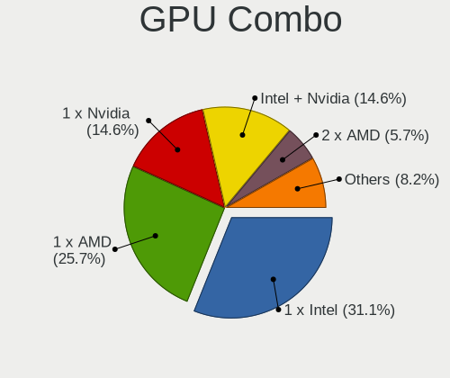
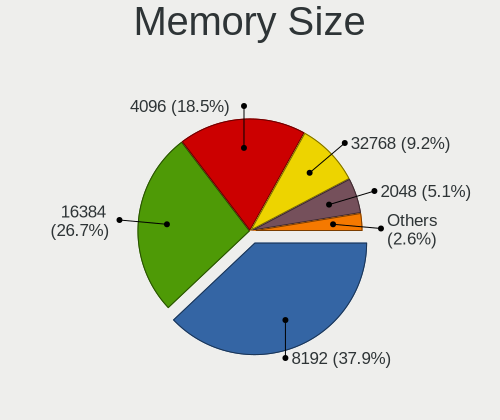
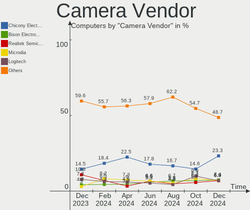

Arch Hardware Trends
--------------------

A project to identify most popular hardware characteristics and track their change
over time based on data collected by Arch users at https://Linux-Hardware.org.

Anyone can contribute to this report by the [hw-probe](https://github.com/linuxhw/hw-probe) tool:

    sudo -E hw-probe -all -upload

This is a report for all computer types. See also reports for [desktops](/Dist/Arch/Desktop/README.md) and [notebooks](/Dist/Arch/Notebook/README.md).

Full-feature report is available here: https://linux-hardware.org/?view=trends

Period: Feb, 2022.

Contents
--------

* [ System ](#system)
  - [ OS                       ](#os)
  - [ OS Family                ](#os-family)
  - [ Kernel                   ](#kernel)
  - [ Kernel Family            ](#kernel-family)
  - [ Kernel Major Ver.        ](#kernel-major-ver)
  - [ Arch                     ](#arch)
  - [ DE                       ](#de)
  - [ Display Server           ](#display-server)
  - [ Display Manager          ](#display-manager)
  - [ OS Lang                  ](#os-lang)
  - [ Boot Mode                ](#boot-mode)
  - [ Filesystem               ](#filesystem)
  - [ Part. scheme             ](#part-scheme)
  - [ Dual Boot with Linux/BSD ](#dual-boot-with-linuxbsd)
  - [ Dual Boot (Win)          ](#dual-boot-win)

* [ Board ](#board)
  - [ Vendor                   ](#vendor)
  - [ Model                    ](#model)
  - [ Model Family             ](#model-family)
  - [ MFG Year                 ](#mfg-year)
  - [ Form Factor              ](#form-factor)
  - [ Secure Boot              ](#secure-boot)
  - [ Coreboot                 ](#coreboot)
  - [ RAM Size                 ](#ram-size)
  - [ RAM Used                 ](#ram-used)
  - [ Total Drives             ](#total-drives)
  - [ Has CD-ROM               ](#has-cd-rom)
  - [ Has Ethernet             ](#has-ethernet)
  - [ Has WiFi                 ](#has-wifi)
  - [ Has Bluetooth            ](#has-bluetooth)

* [ Location ](#location)
  - [ Country                  ](#country)
  - [ City                     ](#city)

* [ Drives ](#drives)
  - [ Drive Vendor             ](#drive-vendor)
  - [ Drive Model              ](#drive-model)
  - [ HDD Vendor               ](#hdd-vendor)
  - [ SSD Vendor               ](#ssd-vendor)
  - [ Drive Kind               ](#drive-kind)
  - [ Drive Connector          ](#drive-connector)
  - [ Drive Size               ](#drive-size)
  - [ Space Total              ](#space-total)
  - [ Space Used               ](#space-used)
  - [ Malfunc. Drives          ](#malfunc-drives)
  - [ Malfunc. Drive Vendor    ](#malfunc-drive-vendor)
  - [ Malfunc. HDD Vendor      ](#malfunc-hdd-vendor)
  - [ Malfunc. Drive Kind      ](#malfunc-drive-kind)
  - [ Failed Drives            ](#failed-drives)
  - [ Failed Drive Vendor      ](#failed-drive-vendor)
  - [ Drive Status             ](#drive-status)

* [ Storage controller ](#storage-controller)
  - [ Storage Vendor           ](#storage-vendor)
  - [ Storage Model            ](#storage-model)
  - [ Storage Kind             ](#storage-kind)

* [ Processor ](#processor)
  - [ CPU Vendor               ](#cpu-vendor)
  - [ CPU Model                ](#cpu-model)
  - [ CPU Model Family         ](#cpu-model-family)
  - [ CPU Cores                ](#cpu-cores)
  - [ CPU Sockets              ](#cpu-sockets)
  - [ CPU Threads              ](#cpu-threads)
  - [ CPU Op-Modes             ](#cpu-op-modes)
  - [ CPU Microcode            ](#cpu-microcode)
  - [ CPU Microarch            ](#cpu-microarch)

* [ Graphics ](#graphics)
  - [ GPU Vendor               ](#gpu-vendor)
  - [ GPU Model                ](#gpu-model)
  - [ GPU Combo                ](#gpu-combo)
  - [ GPU Driver               ](#gpu-driver)
  - [ GPU Memory               ](#gpu-memory)

* [ Monitor ](#monitor)
  - [ Monitor Vendor           ](#monitor-vendor)
  - [ Monitor Model            ](#monitor-model)
  - [ Monitor Resolution       ](#monitor-resolution)
  - [ Monitor Diagonal         ](#monitor-diagonal)
  - [ Monitor Width            ](#monitor-width)
  - [ Aspect Ratio             ](#aspect-ratio)
  - [ Monitor Area             ](#monitor-area)
  - [ Pixel Density            ](#pixel-density)
  - [ Multiple Monitors        ](#multiple-monitors)

* [ Network ](#network)
  - [ Net Controller Vendor    ](#net-controller-vendor)
  - [ Net Controller Model     ](#net-controller-model)
  - [ Wireless Vendor          ](#wireless-vendor)
  - [ Wireless Model           ](#wireless-model)
  - [ Ethernet Vendor          ](#ethernet-vendor)
  - [ Ethernet Model           ](#ethernet-model)
  - [ Net Controller Kind      ](#net-controller-kind)
  - [ Used Controller          ](#used-controller)
  - [ NICs                     ](#nics)
  - [ IPv6                     ](#ipv6)

* [ Bluetooth ](#bluetooth)
  - [ Bluetooth Vendor         ](#bluetooth-vendor)
  - [ Bluetooth Model          ](#bluetooth-model)

* [ Sound ](#sound)
  - [ Sound Vendor             ](#sound-vendor)
  - [ Sound Model              ](#sound-model)

* [ Memory ](#memory)
  - [ Memory Vendor            ](#memory-vendor)
  - [ Memory Model             ](#memory-model)
  - [ Memory Kind              ](#memory-kind)
  - [ Memory Form Factor       ](#memory-form-factor)
  - [ Memory Size              ](#memory-size)
  - [ Memory Speed             ](#memory-speed)

* [ Printers & scanners ](#printers--scanners)
  - [ Printer Vendor           ](#printer-vendor)
  - [ Printer Model            ](#printer-model)
  - [ Scanner Vendor           ](#scanner-vendor)
  - [ Scanner Model            ](#scanner-model)

* [ Camera ](#camera)
  - [ Camera Vendor            ](#camera-vendor)
  - [ Camera Model             ](#camera-model)

* [ Security ](#security)
  - [ Fingerprint Vendor       ](#fingerprint-vendor)
  - [ Fingerprint Model        ](#fingerprint-model)
  - [ Chipcard Vendor          ](#chipcard-vendor)
  - [ Chipcard Model           ](#chipcard-model)

* [ Unsupported ](#unsupported)
  - [ Unsupported Devices      ](#unsupported-devices)
  - [ Unsupported Device Types ](#unsupported-device-types)

System
------

OS
--

Installed operating systems

| Name         | Computers | Percent |
|--------------|-----------|---------|
| Arch         | 91        | 60.26%  |
| Arch Rolling | 60        | 39.74%  |

OS Family
---------

OS without a version

| Name | Computers | Percent |
|------|-----------|---------|
| Arch | 151       | 100%    |

Kernel
------

Version of the Linux kernel

| Version                      | Computers | Percent |
|------------------------------|-----------|---------|
| 5.16.10-arch1-1              | 16        | 10.6%   |
| 5.16.5-arch1-1               | 15        | 9.93%   |
| 5.16.8-arch1-1               | 14        | 9.27%   |
| 5.16.4-arch1-1               | 12        | 7.95%   |
| 5.16.11-arch1-1              | 10        | 6.62%   |
| 5.16.9-arch1-1               | 6         | 3.97%   |
| 5.16.8-zen1-1-zen            | 6         | 3.97%   |
| 5.16.7-arch1-1               | 6         | 3.97%   |
| 5.16.10-zen1-1-zen           | 6         | 3.97%   |
| 5.15.21-1-lts                | 5         | 3.31%   |
| 5.16.3-arch1-1               | 4         | 2.65%   |
| 5.15.22-1-lts                | 4         | 2.65%   |
| 5.16.5-zen1-1-zen            | 3         | 1.99%   |
| 5.16.4-zen1-1-zen            | 3         | 1.99%   |
| 5.16.2-arch1-1               | 3         | 1.99%   |
| 5.16.9-zen1-1-zen            | 2         | 1.32%   |
| 5.16.11-zen1-1-zen           | 2         | 1.32%   |
| 5.15.7-arch1-1               | 2         | 1.32%   |
| 5.15.23-2-lts                | 2         | 1.32%   |
| 5.15.19-1-lts                | 2         | 1.32%   |
| 5.15.18-1-lts                | 2         | 1.32%   |
| 5.15.10-arch1-1              | 2         | 1.32%   |
| 5.14.16-arch1-1              | 2         | 1.32%   |
| 5.3.7-gentoo-gb08f327-dirty  | 1         | 0.66%   |
| 5.17.0-rc5-246-tkg-pds       | 1         | 0.66%   |
| 5.16.9-247-tkg-bmq           | 1         | 0.66%   |
| 5.16.9-246-tkg-bmq           | 1         | 0.66%   |
| 5.16.9-1-ck-generic-v4       | 1         | 0.66%   |
| 5.16.9-1-blueperil           | 1         | 0.66%   |
| 5.16.7-zen1-1-zen            | 1         | 0.66%   |
| 5.16.4-242-tkg-pds           | 1         | 0.66%   |
| 5.16.3-zen1-1-zen            | 1         | 0.66%   |
| 5.16.11-1-cachyos-bmq-lto    | 1         | 0.66%   |
| 5.16.10-xanmod1-1            | 1         | 0.66%   |
| 5.15.25-1-lts                | 1         | 0.66%   |
| 5.15.24-2-lts                | 1         | 0.66%   |
| 5.15.24-1-lts                | 1         | 0.66%   |
| 5.15.22-xanmod1-tt-1         | 1         | 0.66%   |
| 5.15.22-xanmod1-1            | 1         | 0.66%   |
| 5.15.21-hardened1-1-hardened | 1         | 0.66%   |
| 5.15.13-zen1-1-zen           | 1         | 0.66%   |
| 5.15.13-arch1-1              | 1         | 0.66%   |
| 5.15.11                      | 1         | 0.66%   |
| 5.13.2-180-tkg-pds           | 1         | 0.66%   |
| 4.19.226-1-lts419            | 1         | 0.66%   |

Kernel Family
-------------

Linux kernel without a distro release

| Version  | Computers | Percent |
|----------|-----------|---------|
| 5.16.10  | 23        | 15.23%  |
| 5.16.8   | 20        | 13.25%  |
| 5.16.5   | 18        | 11.92%  |
| 5.16.4   | 16        | 10.6%   |
| 5.16.11  | 13        | 8.61%   |
| 5.16.9   | 12        | 7.95%   |
| 5.16.7   | 7         | 4.64%   |
| 5.15.22  | 6         | 3.97%   |
| 5.15.21  | 6         | 3.97%   |
| 5.16.3   | 5         | 3.31%   |
| 5.16.2   | 3         | 1.99%   |
| 5.15.7   | 2         | 1.32%   |
| 5.15.24  | 2         | 1.32%   |
| 5.15.23  | 2         | 1.32%   |
| 5.15.19  | 2         | 1.32%   |
| 5.15.18  | 2         | 1.32%   |
| 5.15.13  | 2         | 1.32%   |
| 5.15.10  | 2         | 1.32%   |
| 5.14.16  | 2         | 1.32%   |
| 5.3.7    | 1         | 0.66%   |
| 5.17.0   | 1         | 0.66%   |
| 5.15.25  | 1         | 0.66%   |
| 5.15.11  | 1         | 0.66%   |
| 5.13.2   | 1         | 0.66%   |
| 4.19.226 | 1         | 0.66%   |

Kernel Major Ver.
-----------------

Linux kernel major version

| Version | Computers | Percent |
|---------|-----------|---------|
| 5.16    | 117       | 77.48%  |
| 5.15    | 28        | 18.54%  |
| 5.14    | 2         | 1.32%   |
| 5.3     | 1         | 0.66%   |
| 5.17    | 1         | 0.66%   |
| 5.13    | 1         | 0.66%   |
| 4.19    | 1         | 0.66%   |

Arch
----

OS architecture (x86_64, i586, etc.)

| Name   | Computers | Percent |
|--------|-----------|---------|
| x86_64 | 151       | 100%    |

DE
--

Desktop Environment

| Name          | Computers | Percent |
|---------------|-----------|---------|
| KDE5          | 53        | 35.1%   |
| GNOME         | 43        | 28.48%  |
| XFCE          | 16        | 10.6%   |
| Unknown       | 13        | 8.61%   |
| i3            | 10        | 6.62%   |
| X-Cinnamon    | 3         | 1.99%   |
| sway          | 2         | 1.32%   |
| Cinnamon      | 2         | 1.32%   |
| Budgie        | 2         | 1.32%   |
| awesome       | 2         | 1.32%   |
| openbox       | 1         | 0.66%   |
| LXQt          | 1         | 0.66%   |
| LXDE          | 1         | 0.66%   |
| Enlightenment | 1         | 0.66%   |
| bspwm         | 1         | 0.66%   |

Display Server
--------------

X11 or Wayland

| Name    | Computers | Percent |
|---------|-----------|---------|
| X11     | 92        | 60.93%  |
| Wayland | 32        | 21.19%  |
| Tty     | 16        | 10.6%   |
| Unknown | 11        | 7.28%   |

Display Manager
---------------

SDDM, LightDM, etc.

| Name    | Computers | Percent |
|---------|-----------|---------|
| Unknown | 49        | 32.45%  |
| SDDM    | 37        | 24.5%   |
| LightDM | 27        | 17.88%  |
| GDM     | 27        | 17.88%  |
| Ly      | 7         | 4.64%   |
| LXDM    | 3         | 1.99%   |
| GREETD  | 1         | 0.66%   |

OS Lang
-------

Language

| Lang         | Computers | Percent |
|--------------|-----------|---------|
| en_US        | 85        | 56.29%  |
| de_DE        | 15        | 9.93%   |
| C            | 6         | 3.97%   |
| pt_BR        | 5         | 3.31%   |
| it_IT        | 5         | 3.31%   |
| Unknown      | 5         | 3.31%   |
| en_IN        | 4         | 2.65%   |
| en_GB        | 3         | 1.99%   |
| zh_CN        | 2         | 1.32%   |
| ru_RU        | 2         | 1.32%   |
| pl_PL        | 2         | 1.32%   |
| fr_FR        | 2         | 1.32%   |
| es_MX        | 2         | 1.32%   |
| en_AU        | 2         | 1.32%   |
| zh_TW        | 1         | 0.66%   |
| tr_TR        | 1         | 0.66%   |
| nb_NO        | 1         | 0.66%   |
| lv_LV        | 1         | 0.66%   |
| ja_JP        | 1         | 0.66%   |
| it_IT.UTF -8 | 1         | 0.66%   |
| es_ES        | 1         | 0.66%   |
| en_ZA        | 1         | 0.66%   |
| en_SG        | 1         | 0.66%   |
| en_DE        | 1         | 0.66%   |
| de_AT        | 1         | 0.66%   |

Boot Mode
---------

EFI or BIOS

| Mode | Computers | Percent |
|------|-----------|---------|
| EFI  | 98        | 64.9%   |
| BIOS | 53        | 35.1%   |

Filesystem
----------

Type of filesystem

| Type    | Computers | Percent |
|---------|-----------|---------|
| Ext4    | 100       | 66.23%  |
| Btrfs   | 44        | 29.14%  |
| Xfs     | 4         | 2.65%   |
| Overlay | 2         | 1.32%   |
| Zfs     | 1         | 0.66%   |

Part. scheme
------------

Scheme of partitioning

| Type    | Computers | Percent |
|---------|-----------|---------|
| GPT     | 103       | 68.21%  |
| Unknown | 34        | 22.52%  |
| MBR     | 14        | 9.27%   |

Dual Boot with Linux/BSD
------------------------

Hosting more than one Linux/BSD

| Dual boot | Computers | Percent |
|-----------|-----------|---------|
| No        | 132       | 87.42%  |
| Yes       | 19        | 12.58%  |

Dual Boot (Win)
---------------

Hosting Linux and Windows

| Dual boot | Computers | Percent |
|-----------|-----------|---------|
| No        | 96        | 63.58%  |
| Yes       | 55        | 36.42%  |

Board
-----

Vendor
------

Motherboard manufacturer

| Name                   | Computers | Percent |
|------------------------|-----------|---------|
| Lenovo                 | 25        | 16.56%  |
| ASUSTek Computer       | 23        | 15.23%  |
| Dell                   | 20        | 13.25%  |
| Hewlett-Packard        | 14        | 9.27%   |
| MSI                    | 11        | 7.28%   |
| Gigabyte Technology    | 10        | 6.62%   |
| ASRock                 | 10        | 6.62%   |
| Acer                   | 6         | 3.97%   |
| Samsung Electronics    | 5         | 3.31%   |
| Toshiba                | 2         | 1.32%   |
| Razer                  | 2         | 1.32%   |
| LG Electronics         | 2         | 1.32%   |
| Fujitsu                | 2         | 1.32%   |
| Avell High Performance | 2         | 1.32%   |
| Unknown                | 2         | 1.32%   |
| Timi                   | 1         | 0.66%   |
| Teclast                | 1         | 0.66%   |
| System76               | 1         | 0.66%   |
| Supermicro             | 1         | 0.66%   |
| Star Labs              | 1         | 0.66%   |
| Notebook               | 1         | 0.66%   |
| IT Channel Pty         | 1         | 0.66%   |
| IP3 Tech               | 1         | 0.66%   |
| HUAWEI                 | 1         | 0.66%   |
| HONOR                  | 1         | 0.66%   |
| GPD                    | 1         | 0.66%   |
| Google                 | 1         | 0.66%   |
| GHIA                   | 1         | 0.66%   |
| Framework              | 1         | 0.66%   |
| CJSCOPE                | 1         | 0.66%   |

Model
-----

Motherboard model

| Name                                       | Computers | Percent |
|--------------------------------------------|-----------|---------|
| Samsung RV415/RV515                        | 2         | 1.32%   |
| Razer Blade                                | 2         | 1.32%   |
| Lenovo IdeaPad 5 14ALC05 82LM              | 2         | 1.32%   |
| Avell High Performance B.ON                | 2         | 1.32%   |
| ASRock B450M-HDV R4.0                      | 2         | 1.32%   |
| Acer Swift SF314-43                        | 2         | 1.32%   |
| Unknown                                    | 2         | 1.32%   |
| Toshiba Satellite P500                     | 1         | 0.66%   |
| Toshiba Satellite C870-19R                 | 1         | 0.66%   |
| Timi TM1701                                | 1         | 0.66%   |
| Teclast F15 Plus                           | 1         | 0.66%   |
| System76 Oryx Pro                          | 1         | 0.66%   |
| Supermicro H8DG6/H8DGi                     | 1         | 0.66%   |
| Star Labs StarBook                         | 1         | 0.66%   |
| Samsung R530/R730                          | 1         | 0.66%   |
| Samsung 550XDA                             | 1         | 0.66%   |
| Samsung 300E4A/300E5A/300E7A/3430EA/3530EA | 1         | 0.66%   |
| Notebook P15SM-A                           | 1         | 0.66%   |
| MSI MS-7D14                                | 1         | 0.66%   |
| MSI MS-7D08                                | 1         | 0.66%   |
| MSI MS-7C91                                | 1         | 0.66%   |
| MSI MS-7C82                                | 1         | 0.66%   |
| MSI MS-7C56                                | 1         | 0.66%   |
| MSI MS-7B89                                | 1         | 0.66%   |
| MSI MS-7B86                                | 1         | 0.66%   |
| MSI MS-7A38                                | 1         | 0.66%   |
| MSI MS-7721                                | 1         | 0.66%   |
| MSI GP73 Leopard 8RE                       | 1         | 0.66%   |
| MSI GL75 Leopard 10SDK                     | 1         | 0.66%   |
| LG S425-G.BC31P1                           | 1         | 0.66%   |
| LG 17UD70P-PX76K                           | 1         | 0.66%   |
| Lenovo Yoga Slim 7 14ARE05 82A2            | 1         | 0.66%   |
| Lenovo Yoga Creator 7 15IMH05 82DS         | 1         | 0.66%   |
| Lenovo Yoga C640-13IML 81UE                | 1         | 0.66%   |
| Lenovo Yoga 14cACN 2021 82N7               | 1         | 0.66%   |
| Lenovo XiaoXinPro 14IHU 2021 82NC          | 1         | 0.66%   |
| Lenovo ThinkPad X220 42912WU               | 1         | 0.66%   |
| Lenovo ThinkPad W500 40624DG               | 1         | 0.66%   |
| Lenovo ThinkPad T460 20FMS2TG0D            | 1         | 0.66%   |
| Lenovo ThinkPad T15 Gen 2i 20W4002KUS      | 1         | 0.66%   |
| Lenovo ThinkPad P15v Gen 2i 21A9003WGE     | 1         | 0.66%   |
| Lenovo ThinkPad P14s Gen 1 20Y10038RT      | 1         | 0.66%   |
| Lenovo ThinkPad P1 Gen 3 20TJS2KM00        | 1         | 0.66%   |
| Lenovo ThinkPad Mini10 3507A31             | 1         | 0.66%   |
| Lenovo ThinkPad L420 7829BH2               | 1         | 0.66%   |
| Lenovo ThinkPad L15 Gen 2a 20X7CTO1WW      | 1         | 0.66%   |
| Lenovo ThinkPad L13 Yoga Gen 2 20VLA033CD  | 1         | 0.66%   |
| Lenovo ThinkBook 14-IIL 20SL               | 1         | 0.66%   |
| Lenovo ThinkBook 13s G2 ITL 20V9           | 1         | 0.66%   |
| Lenovo Legion 5 15ARH05H 82B1              | 1         | 0.66%   |
| Lenovo IdeaPadFlex 5 15ALC05 82HV          | 1         | 0.66%   |
| Lenovo IdeaPadFlex 5 14ARE05 81X2          | 1         | 0.66%   |
| Lenovo G40-80 80JE                         | 1         | 0.66%   |
| Lenovo B50-30 80ES                         | 1         | 0.66%   |
| IT Channel Pty P95xER                      | 1         | 0.66%   |
| IP3 Tech HeroBox                           | 1         | 0.66%   |
| HUAWEI BOHB-WAX9                           | 1         | 0.66%   |
| HONOR NMH-WCX9                             | 1         | 0.66%   |
| HP Z840 Workstation                        | 1         | 0.66%   |
| HP Pavilion x360 Convertible 14-dw1xxx     | 1         | 0.66%   |

Model Family
------------

Motherboard model prefix

| Name                        | Computers | Percent |
|-----------------------------|-----------|---------|
| Lenovo ThinkPad             | 11        | 7.28%   |
| Dell Inspiron               | 6         | 3.97%   |
| ASUS ASUS                   | 5         | 3.31%   |
| Lenovo Yoga                 | 4         | 2.65%   |
| Dell Latitude               | 4         | 2.65%   |
| ASUS PRIME                  | 4         | 2.65%   |
| Dell Precision              | 3         | 1.99%   |
| Dell OptiPlex               | 3         | 1.99%   |
| ASUS ROG                    | 3         | 1.99%   |
| Toshiba Satellite           | 2         | 1.32%   |
| Samsung RV415               | 2         | 1.32%   |
| Razer Blade                 | 2         | 1.32%   |
| Lenovo ThinkBook            | 2         | 1.32%   |
| Lenovo IdeaPadFlex          | 2         | 1.32%   |
| Lenovo IdeaPad              | 2         | 1.32%   |
| HP Pavilion                 | 2         | 1.32%   |
| HP Laptop                   | 2         | 1.32%   |
| HP EliteBook                | 2         | 1.32%   |
| Fujitsu LIFEBOOK            | 2         | 1.32%   |
| Dell XPS                    | 2         | 1.32%   |
| Avell High Performance B.ON | 2         | 1.32%   |
| ASRock B450M-HDV            | 2         | 1.32%   |
| Acer Swift                  | 2         | 1.32%   |
| Acer Aspire                 | 2         | 1.32%   |
| Unknown                     | 2         | 1.32%   |
| Timi TM1701                 | 1         | 0.66%   |
| Teclast F15                 | 1         | 0.66%   |
| System76 Oryx               | 1         | 0.66%   |
| Supermicro H8DG6            | 1         | 0.66%   |
| Star Labs StarBook          | 1         | 0.66%   |
| Samsung R530                | 1         | 0.66%   |
| Samsung 550XDA              | 1         | 0.66%   |
| Samsung 300E4A              | 1         | 0.66%   |
| Notebook P15SM-A            | 1         | 0.66%   |
| MSI MS-7D14                 | 1         | 0.66%   |
| MSI MS-7D08                 | 1         | 0.66%   |
| MSI MS-7C91                 | 1         | 0.66%   |
| MSI MS-7C82                 | 1         | 0.66%   |
| MSI MS-7C56                 | 1         | 0.66%   |
| MSI MS-7B89                 | 1         | 0.66%   |
| MSI MS-7B86                 | 1         | 0.66%   |
| MSI MS-7A38                 | 1         | 0.66%   |
| MSI MS-7721                 | 1         | 0.66%   |
| MSI GP73                    | 1         | 0.66%   |
| MSI GL75                    | 1         | 0.66%   |
| LG S425-G.BC31P1            | 1         | 0.66%   |
| LG 17UD70P-PX76K            | 1         | 0.66%   |
| Lenovo XiaoXinPro           | 1         | 0.66%   |
| Lenovo Legion               | 1         | 0.66%   |
| Lenovo G40-80               | 1         | 0.66%   |
| Lenovo B50-30               | 1         | 0.66%   |
| IT Channel Pty P95xER       | 1         | 0.66%   |
| IP3 Tech HeroBox            | 1         | 0.66%   |
| HUAWEI BOHB-WAX9            | 1         | 0.66%   |
| HONOR NMH-WCX9              | 1         | 0.66%   |
| HP Z840                     | 1         | 0.66%   |
| HP OMEN                     | 1         | 0.66%   |
| HP Notebook                 | 1         | 0.66%   |
| HP EliteDesk                | 1         | 0.66%   |
| HP Desktop                  | 1         | 0.66%   |

MFG Year
--------

Motherboard manufacture year

| Year | Computers | Percent |
|------|-----------|---------|
| 2021 | 39        | 25.83%  |
| 2020 | 23        | 15.23%  |
| 2018 | 19        | 12.58%  |
| 2019 | 15        | 9.93%   |
| 2017 | 12        | 7.95%   |
| 2011 | 8         | 5.3%    |
| 2012 | 7         | 4.64%   |
| 2016 | 6         | 3.97%   |
| 2013 | 6         | 3.97%   |
| 2015 | 5         | 3.31%   |
| 2014 | 5         | 3.31%   |
| 2010 | 3         | 1.99%   |
| 2009 | 2         | 1.32%   |
| 2008 | 1         | 0.66%   |

Form Factor
-----------

Physical design of the computer

| Name        | Computers | Percent |
|-------------|-----------|---------|
| Notebook    | 86        | 56.95%  |
| Desktop     | 52        | 34.44%  |
| Convertible | 8         | 5.3%    |
| Mini pc     | 2         | 1.32%   |
| Tablet      | 1         | 0.66%   |
| All in one  | 1         | 0.66%   |
| Server      | 1         | 0.66%   |

Secure Boot
-----------

Enabled or disabled

| State    | Computers | Percent |
|----------|-----------|---------|
| Disabled | 149       | 98.68%  |
| Enabled  | 2         | 1.32%   |

Coreboot
--------

Have coreboot on board

| Used | Computers | Percent |
|------|-----------|---------|
| No   | 148       | 98.01%  |
| Yes  | 3         | 1.99%   |

RAM Size
--------

Total RAM memory

| Size in GB      | Computers | Percent |
|-----------------|-----------|---------|
| 16.01-24.0      | 42        | 27.81%  |
| 4.01-8.0        | 32        | 21.19%  |
| 8.01-16.0       | 28        | 18.54%  |
| 32.01-64.0      | 20        | 13.25%  |
| 3.01-4.0        | 15        | 9.93%   |
| 64.01-256.0     | 6         | 3.97%   |
| 24.01-32.0      | 4         | 2.65%   |
| 1.01-2.0        | 3         | 1.99%   |
| More than 256.0 | 1         | 0.66%   |

RAM Used
--------

Used RAM memory

| Used GB    | Computers | Percent |
|------------|-----------|---------|
| 2.01-3.0   | 38        | 25.17%  |
| 1.01-2.0   | 34        | 22.52%  |
| 4.01-8.0   | 33        | 21.85%  |
| 3.01-4.0   | 24        | 15.89%  |
| 8.01-16.0  | 13        | 8.61%   |
| 0.51-1.0   | 5         | 3.31%   |
| 0.01-0.5   | 2         | 1.32%   |
| 24.01-32.0 | 1         | 0.66%   |
| 16.01-24.0 | 1         | 0.66%   |

Total Drives
------------

Number of drives on board

| Drives | Computers | Percent |
|--------|-----------|---------|
| 1      | 80        | 52.98%  |
| 2      | 44        | 29.14%  |
| 3      | 15        | 9.93%   |
| 4      | 4         | 2.65%   |
| 7      | 2         | 1.32%   |
| 6      | 2         | 1.32%   |
| 5      | 2         | 1.32%   |
| 11     | 1         | 0.66%   |
| 9      | 1         | 0.66%   |

Has CD-ROM
----------

Has CD-ROM on board

| Presented | Computers | Percent |
|-----------|-----------|---------|
| No        | 121       | 80.13%  |
| Yes       | 30        | 19.87%  |

Has Ethernet
------------

Has Ethernet on board

| Presented | Computers | Percent |
|-----------|-----------|---------|
| Yes       | 118       | 78.15%  |
| No        | 33        | 21.85%  |

Has WiFi
--------

Has WiFi module

| Presented | Computers | Percent |
|-----------|-----------|---------|
| Yes       | 120       | 79.47%  |
| No        | 31        | 20.53%  |

Has Bluetooth
-------------

Has Bluetooth module

| Presented | Computers | Percent |
|-----------|-----------|---------|
| Yes       | 115       | 76.16%  |
| No        | 36        | 23.84%  |

Location
--------

Country
-------

Geographic location (country)

| Country      | Computers | Percent |
|--------------|-----------|---------|
| USA          | 23        | 15.23%  |
| Germany      | 20        | 13.25%  |
| Brazil       | 11        | 7.28%   |
| Russia       | 9         | 5.96%   |
| Italy        | 9         | 5.96%   |
| Poland       | 5         | 3.31%   |
| Australia    | 5         | 3.31%   |
| UK           | 4         | 2.65%   |
| India        | 4         | 2.65%   |
| Turkey       | 3         | 1.99%   |
| Mexico       | 3         | 1.99%   |
| Lithuania    | 3         | 1.99%   |
| Iran         | 3         | 1.99%   |
| France       | 3         | 1.99%   |
| China        | 3         | 1.99%   |
| Canada       | 3         | 1.99%   |
| Belgium      | 3         | 1.99%   |
| Vietnam      | 2         | 1.32%   |
| Ukraine      | 2         | 1.32%   |
| Sweden       | 2         | 1.32%   |
| Spain        | 2         | 1.32%   |
| South Korea  | 2         | 1.32%   |
| South Africa | 2         | 1.32%   |
| Romania      | 2         | 1.32%   |
| Japan        | 2         | 1.32%   |
| Cyprus       | 2         | 1.32%   |
| Bangladesh   | 2         | 1.32%   |
| Thailand     | 1         | 0.66%   |
| Taiwan       | 1         | 0.66%   |
| Slovakia     | 1         | 0.66%   |
| Singapore    | 1         | 0.66%   |
| Serbia       | 1         | 0.66%   |
| Saudi Arabia | 1         | 0.66%   |
| Norway       | 1         | 0.66%   |
| Netherlands  | 1         | 0.66%   |
| Myanmar      | 1         | 0.66%   |
| Latvia       | 1         | 0.66%   |
| Kazakhstan   | 1         | 0.66%   |
| Hungary      | 1         | 0.66%   |
| Greece       | 1         | 0.66%   |
| Finland      | 1         | 0.66%   |
| Chile        | 1         | 0.66%   |
| Bulgaria     | 1         | 0.66%   |
| Austria      | 1         | 0.66%   |

City
----

Geographic location (city)

| City                 | Computers | Percent |
|----------------------|-----------|---------|
| Berlin               | 4         | 2.65%   |
| Kaunas               | 3         | 1.99%   |
| Vinh Phuc            | 2         | 1.32%   |
| Uberlândia        | 2         | 1.32%   |
| Tehran               | 2         | 1.32%   |
| Sydney               | 2         | 1.32%   |
| Seoul                | 2         | 1.32%   |
| Praia Grande         | 2         | 1.32%   |
| Perth                | 2         | 1.32%   |
| Munster              | 2         | 1.32%   |
| Moscow               | 2         | 1.32%   |
| Mococa               | 2         | 1.32%   |
| Milan                | 2         | 1.32%   |
| Mielec               | 2         | 1.32%   |
| Istanbul             | 2         | 1.32%   |
| Dhaka                | 2         | 1.32%   |
| Zaragoza             | 1         | 0.66%   |
| Zapopan              | 1         | 0.66%   |
| Yekaterinburg        | 1         | 0.66%   |
| Yangon               | 1         | 0.66%   |
| Wiesbaden            | 1         | 0.66%   |
| Volgograd            | 1         | 0.66%   |
| Valencia             | 1         | 0.66%   |
| Vadodara             | 1         | 0.66%   |
| Turtleford           | 1         | 0.66%   |
| Tokyo                | 1         | 0.66%   |
| Surgut               | 1         | 0.66%   |
| South Bank           | 1         | 0.66%   |
| Somerville           | 1         | 0.66%   |
| Sofia                | 1         | 0.66%   |
| Skellefteå        | 1         | 0.66%   |
| Sioux City           | 1         | 0.66%   |
| Singapore            | 1         | 0.66%   |
| Sindelfingen         | 1         | 0.66%   |
| Sheffield            | 1         | 0.66%   |
| Shanghai             | 1         | 0.66%   |
| Sesto San Giovanni   | 1         | 0.66%   |
| Seattle              | 1         | 0.66%   |
| São Paulo         | 1         | 0.66%   |
| Sao Joaquim da Barra | 1         | 0.66%   |
| Santo André       | 1         | 0.66%   |
| Santiago             | 1         | 0.66%   |
| San Diego            | 1         | 0.66%   |
| Rzeszów           | 1         | 0.66%   |
| Ryazan               | 1         | 0.66%   |
| Rome                 | 1         | 0.66%   |
| Roeselare            | 1         | 0.66%   |
| Riyadh               | 1         | 0.66%   |
| Ris-Orangis          | 1         | 0.66%   |
| Riga                 | 1         | 0.66%   |
| Raipur               | 1         | 0.66%   |
| Pretoria             | 1         | 0.66%   |
| Phoenix              | 1         | 0.66%   |
| Penzberg             | 1         | 0.66%   |
| Pattaya              | 1         | 0.66%   |
| Oslo                 | 1         | 0.66%   |
| Orlando              | 1         | 0.66%   |
| Orenburg             | 1         | 0.66%   |
| Olympia              | 1         | 0.66%   |
| Oldham               | 1         | 0.66%   |

Drives
------

Drive Vendor
------------

Hard drive vendors

| Vendor                | Computers | Drives | Percent |
|-----------------------|-----------|--------|---------|
| Samsung Electronics   | 49        | 62     | 20.08%  |
| Seagate               | 36        | 52     | 14.75%  |
| WDC                   | 31        | 35     | 12.7%   |
| SanDisk               | 16        | 22     | 6.56%   |
| Kingston              | 16        | 16     | 6.56%   |
| Toshiba               | 12        | 12     | 4.92%   |
| Unknown               | 10        | 10     | 4.1%    |
| SK Hynix              | 10        | 11     | 4.1%    |
| Crucial               | 10        | 10     | 4.1%    |
| Intel                 | 9         | 9      | 3.69%   |
| Micron Technology     | 8         | 8      | 3.28%   |
| A-DATA Technology     | 7         | 7      | 2.87%   |
| Phison                | 4         | 4      | 1.64%   |
| Hitachi               | 3         | 3      | 1.23%   |
| KIOXIA                | 2         | 2      | 0.82%   |
| Intenso               | 2         | 2      | 0.82%   |
| GOODRAM               | 2         | 2      | 0.82%   |
| Corsair               | 2         | 2      | 0.82%   |
| ZHITAI                | 1         | 1      | 0.41%   |
| XPG                   | 1         | 1      | 0.41%   |
| Transcend             | 1         | 1      | 0.41%   |
| TEUTONS               | 1         | 1      | 0.41%   |
| Teclast               | 1         | 1      | 0.41%   |
| Star Drive            | 1         | 1      | 0.41%   |
| Realtek Semiconductor | 1         | 1      | 0.41%   |
| PNY                   | 1         | 1      | 0.41%   |
| PLEXTOR               | 1         | 1      | 0.41%   |
| Lexar                 | 1         | 1      | 0.41%   |
| KingSpec              | 1         | 1      | 0.41%   |
| HGST                  | 1         | 2      | 0.41%   |
| Fujitsu               | 1         | 1      | 0.41%   |
| Biwin                 | 1         | 1      | 0.41%   |
| ADATA Technology      | 1         | 1      | 0.41%   |

Drive Model
-----------

Hard drive models

| Model                                  | Computers | Percent |
|----------------------------------------|-----------|---------|
| SK Hynix NVMe SSD Drive 512GB          | 4         | 1.49%   |
| Seagate ST2000DM008-2FR102 2TB         | 4         | 1.49%   |
| Seagate ST1000DM010-2EP102 1TB         | 4         | 1.49%   |
| Sandisk NVMe SSD Drive 512GB           | 4         | 1.49%   |
| Seagate ST500DM002-1BD142 500GB        | 3         | 1.12%   |
| Samsung SSD 970 EVO Plus 2TB           | 3         | 1.12%   |
| Samsung SSD 970 EVO Plus 1TB           | 3         | 1.12%   |
| Samsung SSD 860 EVO 1TB                | 3         | 1.12%   |
| Kingston SV300S37A120G 120GB SSD       | 3         | 1.12%   |
| Kingston SA400S37120G 120GB SSD        | 3         | 1.12%   |
| WDC WD20EFRX-68EUZN0 2TB               | 2         | 0.74%   |
| WDC WD10EZEX-08WN4A0 1TB               | 2         | 0.74%   |
| WDC WD10EARS-00Y5B1 1TB                | 2         | 0.74%   |
| WDC WD10EADS-00M2B0 1TB                | 2         | 0.74%   |
| Toshiba HDWD110 1TB                    | 2         | 0.74%   |
| SK Hynix HFM512GD3JX013N 512GB         | 2         | 0.74%   |
| Seagate ST9500325AS 500GB              | 2         | 0.74%   |
| Seagate ST2000LX001-1RG174 2TB         | 2         | 0.74%   |
| Seagate ST1000LM035-1RK172 1TB         | 2         | 0.74%   |
| Seagate ST1000LM024 HN-M101MBB 1TB     | 2         | 0.74%   |
| Seagate ST1000DM003-1CH162 1TB         | 2         | 0.74%   |
| Sandisk NVMe SSD Drive 1TB             | 2         | 0.74%   |
| Samsung SSD 980 500GB                  | 2         | 0.74%   |
| Samsung SSD 980 1TB                    | 2         | 0.74%   |
| Samsung SSD 970 EVO Plus 250GB         | 2         | 0.74%   |
| Samsung SSD 860 EVO 500GB              | 2         | 0.74%   |
| Samsung SSD 860 EVO 250GB              | 2         | 0.74%   |
| Samsung SM963 2.5" NVMe PCIe SSD 256GB | 2         | 0.74%   |
| Samsung NVMe SSD Drive 500GB           | 2         | 0.74%   |
| Samsung NVMe SSD Drive 1TB             | 2         | 0.74%   |
| Samsung HD502HJ 500GB                  | 2         | 0.74%   |
| Phison Sabrent Rocket nano 1TB         | 2         | 0.74%   |
| Micron MTFDHBA512QFD 512GB             | 2         | 0.74%   |
| Kingston SA400S37480G 480GB SSD        | 2         | 0.74%   |
| Intenso SSD SATAIII 480GB              | 2         | 0.74%   |
| Intel NVMe SSD Drive 512GB             | 2         | 0.74%   |
| Crucial CT1000MX500SSD1 1TB            | 2         | 0.74%   |
| ZHITAI PC005 Active 1TB                | 1         | 0.37%   |
| XPG GAMMIX S11 Pro 1TB                 | 1         | 0.37%   |
| WDC WDS500G3X0C-00SJG0 500GB           | 1         | 0.37%   |
| WDC WDS500G2X0C-00L350 500GB           | 1         | 0.37%   |
| WDC WDS500G2B0A-00SM50 500GB SSD       | 1         | 0.37%   |
| WDC WDS120G2G0A-00JH30 120GB SSD       | 1         | 0.37%   |
| WDC WDS100T2X0C-00L350 1TB             | 1         | 0.37%   |
| WDC WDS100T2B0B-00YS70 1TB SSD         | 1         | 0.37%   |
| WDC WD6400BEVT-22A0RT0 640GB           | 1         | 0.37%   |
| WDC WD60EZAZ-00SF3B0 6TB               | 1         | 0.37%   |
| WDC WD5000LPVX-22V0TT0 500GB           | 1         | 0.37%   |
| WDC WD5000AZLX-75K2TA0 500GB           | 1         | 0.37%   |
| WDC WD5000AAKX-75U6AA0 500GB           | 1         | 0.37%   |
| WDC WD40EZRZ-00WN9B0 4TB               | 1         | 0.37%   |
| WDC WD20EZRX-19D8PB0 2TB               | 1         | 0.37%   |
| WDC WD20EZRX-00D8PB0 2TB               | 1         | 0.37%   |
| WDC WD20EZAZ-00L9GB0 2TB               | 1         | 0.37%   |
| WDC WD20EURS-63S48Y0 2TB               | 1         | 0.37%   |
| WDC WD10SPZX-35Z10T0 1TB               | 1         | 0.37%   |
| WDC WD10SPZX-17Z10T1 1TB               | 1         | 0.37%   |
| WDC WD10JPVX-75JC3T0 1TB               | 1         | 0.37%   |
| WDC WD10JPCX-24UE4T0 1TB               | 1         | 0.37%   |
| WDC WD10EZEX-08M2NA0 1TB               | 1         | 0.37%   |

HDD Vendor
----------

Hard disk drive vendors

| Vendor              | Computers | Drives | Percent |
|---------------------|-----------|--------|---------|
| Seagate             | 35        | 49     | 46.67%  |
| WDC                 | 21        | 24     | 28%     |
| Toshiba             | 8         | 8      | 10.67%  |
| Samsung Electronics | 6         | 7      | 8%      |
| Hitachi             | 3         | 3      | 4%      |
| HGST                | 1         | 2      | 1.33%   |
| Fujitsu             | 1         | 1      | 1.33%   |

SSD Vendor
----------

Solid state drive vendors

| Vendor              | Computers | Drives | Percent |
|---------------------|-----------|--------|---------|
| Samsung Electronics | 19        | 21     | 26.03%  |
| Kingston            | 13        | 13     | 17.81%  |
| SanDisk             | 8         | 14     | 10.96%  |
| Crucial             | 8         | 8      | 10.96%  |
| A-DATA Technology   | 5         | 5      | 6.85%   |
| Intel               | 4         | 4      | 5.48%   |
| WDC                 | 3         | 3      | 4.11%   |
| Micron Technology   | 2         | 2      | 2.74%   |
| Intenso             | 2         | 2      | 2.74%   |
| Transcend           | 1         | 1      | 1.37%   |
| Toshiba             | 1         | 1      | 1.37%   |
| TEUTONS             | 1         | 1      | 1.37%   |
| Teclast             | 1         | 1      | 1.37%   |
| Seagate             | 1         | 1      | 1.37%   |
| PNY                 | 1         | 1      | 1.37%   |
| Lexar               | 1         | 1      | 1.37%   |
| GOODRAM             | 1         | 1      | 1.37%   |
| Corsair             | 1         | 1      | 1.37%   |

Drive Kind
----------

HDD or SSD

| Kind    | Computers | Drives | Percent |
|---------|-----------|--------|---------|
| NVMe    | 82        | 97     | 37.61%  |
| SSD     | 63        | 81     | 28.9%   |
| HDD     | 61        | 94     | 27.98%  |
| MMC     | 10        | 11     | 4.59%   |
| Unknown | 2         | 2      | 0.92%   |

Drive Connector
---------------

SATA, SAS, NVMe, etc.

| Type | Computers | Drives | Percent |
|------|-----------|--------|---------|
| SATA | 93        | 172    | 48.95%  |
| NVMe | 82        | 97     | 43.16%  |
| MMC  | 10        | 11     | 5.26%   |
| SAS  | 5         | 5      | 2.63%   |

Drive Size
----------

Size of hard drive

| Size in TB | Computers | Drives | Percent |
|------------|-----------|--------|---------|
| 0.01-0.5   | 65        | 88     | 50.78%  |
| 0.51-1.0   | 37        | 50     | 28.91%  |
| 1.01-2.0   | 17        | 22     | 13.28%  |
| 4.01-10.0  | 5         | 9      | 3.91%   |
| 3.01-4.0   | 2         | 2      | 1.56%   |
| 2.01-3.0   | 1         | 3      | 0.78%   |
| 10.01-20.0 | 1         | 1      | 0.78%   |

Space Total
-----------

Amount of disk space available on the file system

| Size in GB     | Computers | Percent |
|----------------|-----------|---------|
| 101-250        | 33        | 21.85%  |
| 251-500        | 32        | 21.19%  |
| 501-1000       | 28        | 18.54%  |
| 1001-2000      | 23        | 15.23%  |
| More than 3000 | 12        | 7.95%   |
| 2001-3000      | 10        | 6.62%   |
| 51-100         | 6         | 3.97%   |
| Unknown        | 6         | 3.97%   |
| 1-20           | 1         | 0.66%   |

Space Used
----------

Amount of used disk space

| Used GB        | Computers | Percent |
|----------------|-----------|---------|
| 101-250        | 30        | 19.87%  |
| 251-500        | 21        | 13.91%  |
| 21-50          | 21        | 13.91%  |
| 51-100         | 21        | 13.91%  |
| 1-20           | 19        | 12.58%  |
| 501-1000       | 18        | 11.92%  |
| 1001-2000      | 8         | 5.3%    |
| Unknown        | 6         | 3.97%   |
| More than 3000 | 5         | 3.31%   |
| 2001-3000      | 2         | 1.32%   |

Malfunc. Drives
---------------

Drive models with a malfunction

| Model                             | Computers | Drives | Percent |
|-----------------------------------|-----------|--------|---------|
| WDC WD20EFRX-68EUZN0 2TB          | 1         | 2      | 8.33%   |
| WDC WD10JPCX-24UE4T0 1TB          | 1         | 1      | 8.33%   |
| WDC WD10EADS-00M2B0 1TB           | 1         | 1      | 8.33%   |
| Toshiba MK5055GSX 500GB           | 1         | 1      | 8.33%   |
| Seagate ST9500325AS 500GB         | 1         | 1      | 8.33%   |
| Seagate ST9160821AS 160GB         | 1         | 1      | 8.33%   |
| Seagate ST3500418AS 500GB         | 1         | 2      | 8.33%   |
| Seagate ST2000LM007-1R8174 2TB    | 1         | 1      | 8.33%   |
| Samsung Electronics HD502HI 500GB | 1         | 1      | 8.33%   |
| PLEXTOR PX-1TM8SeG 1TB            | 1         | 1      | 8.33%   |
| Intel SSDSCKKF180H6H 180GB        | 1         | 1      | 8.33%   |
| Hitachi HTS541680J9SA00 80GB      | 1         | 1      | 8.33%   |

Malfunc. Drive Vendor
---------------------

Vendors of faulty drives

| Vendor              | Computers | Drives | Percent |
|---------------------|-----------|--------|---------|
| Seagate             | 4         | 5      | 33.33%  |
| WDC                 | 3         | 4      | 25%     |
| Toshiba             | 1         | 1      | 8.33%   |
| Samsung Electronics | 1         | 1      | 8.33%   |
| PLEXTOR             | 1         | 1      | 8.33%   |
| Intel               | 1         | 1      | 8.33%   |
| Hitachi             | 1         | 1      | 8.33%   |

Malfunc. HDD Vendor
-------------------

Vendors of faulty HDD drives

| Vendor              | Computers | Drives | Percent |
|---------------------|-----------|--------|---------|
| Seagate             | 4         | 5      | 40%     |
| WDC                 | 3         | 4      | 30%     |
| Toshiba             | 1         | 1      | 10%     |
| Samsung Electronics | 1         | 1      | 10%     |
| Hitachi             | 1         | 1      | 10%     |

Malfunc. Drive Kind
-------------------

Kinds of faulty drives

| Kind | Computers | Drives | Percent |
|------|-----------|--------|---------|
| HDD  | 8         | 12     | 80%     |
| NVMe | 1         | 1      | 10%     |
| SSD  | 1         | 1      | 10%     |

Failed Drives
-------------

Failed drive models

Zero info for selected period =(

Failed Drive Vendor
-------------------

Failed drive vendors

Zero info for selected period =(

Drive Status
------------

Number of failed and malfunc. drives

| Status   | Computers | Drives | Percent |
|----------|-----------|--------|---------|
| Works    | 85        | 153    | 51.52%  |
| Detected | 70        | 118    | 42.42%  |
| Malfunc  | 10        | 14     | 6.06%   |

Storage controller
------------------

Storage Vendor
--------------

Storage controller vendors

| Vendor                       | Computers | Percent |
|------------------------------|-----------|---------|
| Intel                        | 86        | 39.63%  |
| AMD                          | 38        | 17.51%  |
| Samsung Electronics          | 28        | 12.9%   |
| Sandisk                      | 14        | 6.45%   |
| SK Hynix                     | 9         | 4.15%   |
| Micron Technology            | 7         | 3.23%   |
| Phison Electronics           | 6         | 2.76%   |
| Toshiba America Info Systems | 4         | 1.84%   |
| Marvell Technology Group     | 4         | 1.84%   |
| ASMedia Technology           | 4         | 1.84%   |
| Kingston Technology Company  | 3         | 1.38%   |
| ADATA Technology             | 3         | 1.38%   |
| Realtek Semiconductor        | 2         | 0.92%   |
| Broadcom / LSI               | 2         | 0.92%   |
| Yangtze Memory Technologies  | 1         | 0.46%   |
| Shenzhen Longsys Electronics | 1         | 0.46%   |
| Seagate Technology           | 1         | 0.46%   |
| Micron/Crucial Technology    | 1         | 0.46%   |
| Lite-On Technology           | 1         | 0.46%   |
| KIOXIA                       | 1         | 0.46%   |
| Biwin Storage Technology     | 1         | 0.46%   |

Storage Model
-------------

Storage controller models

| Model                                                                          | Computers | Percent |
|--------------------------------------------------------------------------------|-----------|---------|
| AMD FCH SATA Controller [AHCI mode]                                            | 23        | 9.87%   |
| Samsung NVMe SSD Controller SM981/PM981/PM983                                  | 17        | 7.3%    |
| AMD 400 Series Chipset SATA Controller                                         | 13        | 5.58%   |
| Samsung NVMe SSD Controller 980                                                | 8         | 3.43%   |
| Intel Sunrise Point-LP SATA Controller [AHCI mode]                             | 8         | 3.43%   |
| Micron Non-Volatile memory controller                                          | 7         | 3%      |
| Intel 6 Series/C200 Series Chipset Family 6 port Mobile SATA AHCI Controller   | 6         | 2.58%   |
| Intel 400 Series Chipset Family SATA AHCI Controller                           | 6         | 2.58%   |
| Sandisk WD Black SN750 / PC SN730 NVMe SSD                                     | 5         | 2.15%   |
| Intel SSD 660P Series                                                          | 5         | 2.15%   |
| Intel Cannon Lake Mobile PCH SATA AHCI Controller                              | 5         | 2.15%   |
| Intel 8 Series/C220 Series Chipset Family 6-port SATA Controller 1 [AHCI mode] | 5         | 2.15%   |
| Intel 7 Series Chipset Family 6-port SATA Controller [AHCI mode]               | 5         | 2.15%   |
| AMD Starship/Matisse Chipset SATA Controller [AHCI mode]                       | 5         | 2.15%   |
| SK Hynix Gold P31 SSD                                                          | 4         | 1.72%   |
| Sandisk Non-Volatile memory controller                                         | 4         | 1.72%   |
| Samsung NVMe SSD Controller SM961/PM961/SM963                                  | 4         | 1.72%   |
| Phison E12 NVMe Controller                                                     | 4         | 1.72%   |
| Intel Volume Management Device NVMe RAID Controller                            | 4         | 1.72%   |
| Intel Q170/Q150/B150/H170/H110/Z170/CM236 Chipset SATA Controller [AHCI Mode]  | 4         | 1.72%   |
| Intel Celeron/Pentium Silver Processor SATA Controller                         | 4         | 1.72%   |
| Toshiba America Info Systems XG6 NVMe SSD Controller                           | 3         | 1.29%   |
| Sandisk WD Black 2018/SN750 / PC SN720 NVMe SSD                                | 3         | 1.29%   |
| Intel Wildcat Point-LP SATA Controller [AHCI Mode]                             | 3         | 1.29%   |
| Intel Ice Lake-LP SATA Controller [AHCI mode]                                  | 3         | 1.29%   |
| Intel 500 Series Chipset Family SATA AHCI Controller                           | 3         | 1.29%   |
| ASMedia ASM1062 Serial ATA Controller                                          | 3         | 1.29%   |
| AMD SB7x0/SB8x0/SB9x0 SATA Controller [AHCI mode]                              | 3         | 1.29%   |
| SK Hynix Non-Volatile memory controller                                        | 2         | 0.86%   |
| SK Hynix BC511                                                                 | 2         | 0.86%   |
| Sandisk WD Blue SN550 NVMe SSD                                                 | 2         | 0.86%   |
| Realtek RTS5763DL NVMe SSD Controller                                          | 2         | 0.86%   |
| Phison PS5013 E13 NVMe Controller                                              | 2         | 0.86%   |
| Intel Cannon Lake PCH SATA AHCI Controller                                     | 2         | 0.86%   |
| Intel 9 Series Chipset Family SATA Controller [AHCI Mode]                      | 2         | 0.86%   |
| Intel 82801IBM/IEM (ICH9M/ICH9M-E) 4 port SATA Controller [AHCI mode]          | 2         | 0.86%   |
| Intel 82801 Mobile SATA Controller [RAID mode]                                 | 2         | 0.86%   |
| Intel 7 Series/C210 Series Chipset Family 6-port SATA Controller [AHCI mode]   | 2         | 0.86%   |
| Intel 5 Series/3400 Series Chipset 4 port SATA AHCI Controller                 | 2         | 0.86%   |
| Intel 200 Series PCH SATA controller [AHCI mode]                               | 2         | 0.86%   |
| ADATA Non-Volatile memory controller                                           | 2         | 0.86%   |
| Yangtze Memory Non-Volatile memory controller                                  | 1         | 0.43%   |
| Toshiba America Info Systems BG3 NVMe SSD Controller                           | 1         | 0.43%   |
| SK Hynix BC501 NVMe Solid State Drive                                          | 1         | 0.43%   |
| Shenzhen Longsys SM2263EN/SM2263XT-based OEM SSD                               | 1         | 0.43%   |
| Seagate FireCuda 530 SSD                                                       | 1         | 0.43%   |
| Samsung NVMe SSD Controller SM951/PM951                                        | 1         | 0.43%   |
| Samsung NVMe SSD Controller PM9A1/PM9A3/980PRO                                 | 1         | 0.43%   |
| Micron/Crucial P2 NVMe PCIe SSD                                                | 1         | 0.43%   |
| Marvell Group 88SE9230 PCIe 2.0 x2 4-port SATA 6 Gb/s RAID Controller          | 1         | 0.43%   |
| Marvell Group 88SE9172 SATA 6Gb/s Controller                                   | 1         | 0.43%   |
| Marvell Group 88SE9128 PCIe SATA 6 Gb/s RAID controller with HyperDuo          | 1         | 0.43%   |
| Marvell Group 88SE9128 PCIe SATA 6 Gb/s RAID controller                        | 1         | 0.43%   |
| Lite-On Non-Volatile memory controller                                         | 1         | 0.43%   |
| KIOXIA Non-Volatile memory controller                                          | 1         | 0.43%   |
| Kingston Company Company Non-Volatile memory controller                        | 1         | 0.43%   |
| Kingston Company OM3PDP3 NVMe SSD                                              | 1         | 0.43%   |
| Kingston Company A2000 NVMe SSD                                                | 1         | 0.43%   |
| Intel Tiger Lake-LP SATA Controller [AHCI mode]                                | 1         | 0.43%   |
| Intel NM10/ICH7 Family SATA Controller [IDE mode]                              | 1         | 0.43%   |

Storage Kind
------------

Kind of storage controller (IDE, SATA, NVMe, SAS, ...)

| Kind | Computers | Percent |
|------|-----------|---------|
| SATA | 113       | 55.12%  |
| NVMe | 81        | 39.51%  |
| RAID | 8         | 3.9%    |
| IDE  | 2         | 0.98%   |
| SAS  | 1         | 0.49%   |

Processor
---------

CPU Vendor
----------

Processor vendors

| Vendor | Computers | Percent |
|--------|-----------|---------|
| Intel  | 106       | 70.2%   |
| AMD    | 45        | 29.8%   |

CPU Model
---------

Processor models

| Model                                   | Computers | Percent |
|-----------------------------------------|-----------|---------|
| Intel 11th Gen Core i7-1165G7 @ 2.80GHz | 8         | 5.3%    |
| AMD Ryzen 5 3600 6-Core Processor       | 5         | 3.31%   |
| Intel Core i7-8750H CPU @ 2.20GHz       | 4         | 2.65%   |
| Intel Core i7-10750H CPU @ 2.60GHz      | 4         | 2.65%   |
| AMD Ryzen 7 5700U with Radeon Graphics  | 4         | 2.65%   |
| AMD Ryzen 5 5600X 6-Core Processor      | 4         | 2.65%   |
| Intel Core i7-8550U CPU @ 1.80GHz       | 3         | 1.99%   |
| Intel Core i5-6300U CPU @ 2.40GHz       | 3         | 1.99%   |
| Intel Core i7-9750H CPU @ 2.60GHz       | 2         | 1.32%   |
| Intel Core i7-7500U CPU @ 2.70GHz       | 2         | 1.32%   |
| Intel Core i5-8250U CPU @ 1.60GHz       | 2         | 1.32%   |
| Intel Core i5-3210M CPU @ 2.50GHz       | 2         | 1.32%   |
| Intel Core i5-1035G1 CPU @ 1.00GHz      | 2         | 1.32%   |
| Intel Core i3-5005U CPU @ 2.00GHz       | 2         | 1.32%   |
| Intel Core i3-2350M CPU @ 2.30GHz       | 2         | 1.32%   |
| Intel Celeron N4020 CPU @ 1.10GHz       | 2         | 1.32%   |
| Intel 11th Gen Core i7-1185G7 @ 3.00GHz | 2         | 1.32%   |
| Intel 11th Gen Core i5-1135G7 @ 2.40GHz | 2         | 1.32%   |
| AMD Ryzen 7 4800H with Radeon Graphics  | 2         | 1.32%   |
| AMD Ryzen 7 3700X 8-Core Processor      | 2         | 1.32%   |
| AMD Ryzen 5 5500U with Radeon Graphics  | 2         | 1.32%   |
| AMD Ryzen 5 4500U with Radeon Graphics  | 2         | 1.32%   |
| AMD E-300 APU with Radeon HD Graphics   | 2         | 1.32%   |
| Intel Xeon W-11955M CPU @ 2.60GHz       | 1         | 0.66%   |
| Intel Xeon CPU E5-2699 v3 @ 2.30GHz     | 1         | 0.66%   |
| Intel Xeon CPU E5-2683 v4 @ 2.10GHz     | 1         | 0.66%   |
| Intel Xeon CPU E5-1650 0 @ 3.20GHz      | 1         | 0.66%   |
| Intel Pentium Silver N6000 @ 1.10GHz    | 1         | 0.66%   |
| Intel Pentium CPU J4205 @ 1.50GHz       | 1         | 0.66%   |
| Intel Pentium CPU G4560 @ 3.50GHz       | 1         | 0.66%   |
| Intel Pentium CPU B980 @ 2.40GHz        | 1         | 0.66%   |
| Intel Core i9-10885H CPU @ 2.40GHz      | 1         | 0.66%   |
| Intel Core i9-10850K CPU @ 3.60GHz      | 1         | 0.66%   |
| Intel Core i7-7700 CPU @ 3.60GHz        | 1         | 0.66%   |
| Intel Core i7-6700T CPU @ 2.80GHz       | 1         | 0.66%   |
| Intel Core i7-4790K CPU @ 4.00GHz       | 1         | 0.66%   |
| Intel Core i7-4770 CPU @ 3.40GHz        | 1         | 0.66%   |
| Intel Core i7-4710MQ CPU @ 2.50GHz      | 1         | 0.66%   |
| Intel Core i7-3770 CPU @ 3.40GHz        | 1         | 0.66%   |
| Intel Core i7-2640M CPU @ 2.80GHz       | 1         | 0.66%   |
| Intel Core i7-10875H CPU @ 2.30GHz      | 1         | 0.66%   |
| Intel Core i7-10870H CPU @ 2.20GHz      | 1         | 0.66%   |
| Intel Core i7-10700 CPU @ 2.90GHz       | 1         | 0.66%   |
| Intel Core i7-1065G7 CPU @ 1.30GHz      | 1         | 0.66%   |
| Intel Core i7 CPU Q 720 @ 1.60GHz       | 1         | 0.66%   |
| Intel Core i5-9600K CPU @ 3.70GHz       | 1         | 0.66%   |
| Intel Core i5-8500 CPU @ 3.00GHz        | 1         | 0.66%   |
| Intel Core i5-8300H CPU @ 2.30GHz       | 1         | 0.66%   |
| Intel Core i5-7500 CPU @ 3.40GHz        | 1         | 0.66%   |
| Intel Core i5-7440HQ CPU @ 2.80GHz      | 1         | 0.66%   |
| Intel Core i5-7400 CPU @ 3.00GHz        | 1         | 0.66%   |
| Intel Core i5-7300HQ CPU @ 2.50GHz      | 1         | 0.66%   |
| Intel Core i5-7200U CPU @ 2.50GHz       | 1         | 0.66%   |
| Intel Core i5-6200U CPU @ 2.30GHz       | 1         | 0.66%   |
| Intel Core i5-5200U CPU @ 2.20GHz       | 1         | 0.66%   |
| Intel Core i5-4590 CPU @ 3.30GHz        | 1         | 0.66%   |
| Intel Core i5-4570 CPU @ 3.20GHz        | 1         | 0.66%   |
| Intel Core i5-4460S CPU @ 2.90GHz       | 1         | 0.66%   |
| Intel Core i5-4460 CPU @ 3.20GHz        | 1         | 0.66%   |
| Intel Core i5-4210U CPU @ 1.70GHz       | 1         | 0.66%   |

CPU Model Family
----------------

Processor model prefix

| Model                | Computers | Percent |
|----------------------|-----------|---------|
| Intel Core i5        | 30        | 19.87%  |
| Intel Core i7        | 27        | 17.88%  |
| Other                | 19        | 12.58%  |
| AMD Ryzen 7          | 16        | 10.6%   |
| AMD Ryzen 5          | 15        | 9.93%   |
| Intel Core i3        | 9         | 5.96%   |
| Intel Celeron        | 7         | 4.64%   |
| Intel Xeon           | 4         | 2.65%   |
| Intel Pentium        | 3         | 1.99%   |
| AMD Ryzen 9          | 3         | 1.99%   |
| Intel Core i9        | 2         | 1.32%   |
| Intel Core 2 Duo     | 2         | 1.32%   |
| Intel Atom           | 2         | 1.32%   |
| AMD Ryzen 7 PRO      | 2         | 1.32%   |
| AMD E                | 2         | 1.32%   |
| AMD A8               | 2         | 1.32%   |
| Intel Pentium Silver | 1         | 0.66%   |
| Intel Core 2 Quad    | 1         | 0.66%   |
| AMD Ryzen 3          | 1         | 0.66%   |
| AMD Opteron          | 1         | 0.66%   |
| AMD Athlon           | 1         | 0.66%   |
| AMD A4               | 1         | 0.66%   |

CPU Cores
---------

Number of processor cores

| Number | Computers | Percent |
|--------|-----------|---------|
| 4      | 52        | 34.44%  |
| 2      | 37        | 24.5%   |
| 6      | 29        | 19.21%  |
| 8      | 26        | 17.22%  |
| 16     | 2         | 1.32%   |
| 32     | 1         | 0.66%   |
| 18     | 1         | 0.66%   |
| 12     | 1         | 0.66%   |
| 10     | 1         | 0.66%   |
| 1      | 1         | 0.66%   |

CPU Sockets
-----------

Number of sockets

| Number | Computers | Percent |
|--------|-----------|---------|
| 1      | 149       | 98.68%  |
| 2      | 2         | 1.32%   |

CPU Threads
-----------

Threads per core (Hyper-Threading)

| Number | Computers | Percent |
|--------|-----------|---------|
| 2      | 116       | 76.82%  |
| 1      | 35        | 23.18%  |

CPU Op-Modes
------------

CPU Operation Modes (32-bit, 64-bit)

| Op mode        | Computers | Percent |
|----------------|-----------|---------|
| 32-bit, 64-bit | 151       | 100%    |

CPU Microcode
-------------

Microcode number

| Number     | Computers | Percent |
|------------|-----------|---------|
| Unknown    | 45        | 29.8%   |
| 0x806c1    | 10        | 6.62%   |
| 0x906ea    | 7         | 4.64%   |
| 0x206a7    | 7         | 4.64%   |
| 0x906e9    | 5         | 3.31%   |
| 0xa0652    | 4         | 2.65%   |
| 0x806ea    | 4         | 2.65%   |
| 0x306c3    | 4         | 2.65%   |
| 0x08600104 | 4         | 2.65%   |
| 0x706a8    | 3         | 1.99%   |
| 0x0a50000c | 3         | 1.99%   |
| 0x0a201016 | 3         | 1.99%   |
| 0x08600106 | 3         | 1.99%   |
| 0xa0671    | 2         | 1.32%   |
| 0x806e9    | 2         | 1.32%   |
| 0x706e5    | 2         | 1.32%   |
| 0x406e3    | 2         | 1.32%   |
| 0x406c4    | 2         | 1.32%   |
| 0x306d4    | 2         | 1.32%   |
| 0x306a9    | 2         | 1.32%   |
| 0x08701021 | 2         | 1.32%   |
| 0x08701013 | 2         | 1.32%   |
| 0x08608103 | 2         | 1.32%   |
| 0x0800820d | 2         | 1.32%   |
| 0x05000119 | 2         | 1.32%   |
| 0xa0655    | 1         | 0.66%   |
| 0xa0653    | 1         | 0.66%   |
| 0x906c0    | 1         | 0.66%   |
| 0x806ec    | 1         | 0.66%   |
| 0x806d1    | 1         | 0.66%   |
| 0x806c2    | 1         | 0.66%   |
| 0x706a1    | 1         | 0.66%   |
| 0x406f1    | 1         | 0.66%   |
| 0x306f2    | 1         | 0.66%   |
| 0x20655    | 1         | 0.66%   |
| 0x106e5    | 1         | 0.66%   |
| 0x106ca    | 1         | 0.66%   |
| 0x1067a    | 1         | 0.66%   |
| 0x10676    | 1         | 0.66%   |
| 0x0a50000b | 1         | 0.66%   |
| 0x0a201009 | 1         | 0.66%   |
| 0x0a201006 | 1         | 0.66%   |
| 0x08608102 | 1         | 0.66%   |
| 0x08108109 | 1         | 0.66%   |
| 0x08108102 | 1         | 0.66%   |
| 0x08101016 | 1         | 0.66%   |
| 0x08001138 | 1         | 0.66%   |
| 0x07043001 | 1         | 0.66%   |
| 0x0700010f | 1         | 0.66%   |
| 0x06000852 | 1         | 0.66%   |

CPU Microarch
-------------

Microarchitecture

| Name          | Computers | Percent |
|---------------|-----------|---------|
| KabyLake      | 25        | 16.56%  |
| Zen 2         | 16        | 10.6%   |
| TigerLake     | 15        | 9.93%   |
| Zen 3         | 10        | 6.62%   |
| SandyBridge   | 10        | 6.62%   |
| CometLake     | 10        | 6.62%   |
| Haswell       | 9         | 5.96%   |
| Unknown       | 8         | 5.3%    |
| IceLake       | 6         | 3.97%   |
| Skylake       | 5         | 3.31%   |
| IvyBridge     | 5         | 3.31%   |
| Goldmont plus | 5         | 3.31%   |
| Zen+          | 4         | 2.65%   |
| Broadwell     | 4         | 2.65%   |
| Silvermont    | 3         | 1.99%   |
| Penryn        | 3         | 1.99%   |
| Zen           | 2         | 1.32%   |
| Piledriver    | 2         | 1.32%   |
| Bobcat        | 2         | 1.32%   |
| Westmere      | 1         | 0.66%   |
| Tremont       | 1         | 0.66%   |
| Nehalem       | 1         | 0.66%   |
| K10 Llano     | 1         | 0.66%   |
| Jaguar        | 1         | 0.66%   |
| Goldmont      | 1         | 0.66%   |
| Bonnell       | 1         | 0.66%   |

Graphics
--------

GPU Vendor
----------

Vendors of graphics cards

| Vendor                     | Computers | Percent |
|----------------------------|-----------|---------|
| Intel                      | 89        | 46.35%  |
| Nvidia                     | 53        | 27.6%   |
| AMD                        | 49        | 25.52%  |
| Matrox Electronics Systems | 1         | 0.52%   |

GPU Model
---------

Graphics card models

| Model                                                                                    | Computers | Percent |
|------------------------------------------------------------------------------------------|-----------|---------|
| Intel TigerLake-LP GT2 [Iris Xe Graphics]                                                | 14        | 7.25%   |
| Intel 2nd Generation Core Processor Family Integrated Graphics Controller                | 8         | 4.15%   |
| AMD Renoir                                                                               | 8         | 4.15%   |
| Intel CoffeeLake-H GT2 [UHD Graphics 630]                                                | 7         | 3.63%   |
| Intel CometLake-H GT2 [UHD Graphics]                                                     | 6         | 3.11%   |
| AMD Lucienne                                                                             | 6         | 3.11%   |
| Intel UHD Graphics 620                                                                   | 5         | 2.59%   |
| Intel GeminiLake [UHD Graphics 600]                                                      | 5         | 2.59%   |
| Intel Skylake GT2 [HD Graphics 520]                                                      | 4         | 2.07%   |
| Intel 3rd Gen Core processor Graphics Controller                                         | 4         | 2.07%   |
| AMD Vega 10 XL/XT [Radeon RX Vega 56/64]                                                 | 4         | 2.07%   |
| AMD Navi 10 [Radeon RX 5600 OEM/5600 XT / 5700/5700 XT]                                  | 4         | 2.07%   |
| AMD Ellesmere [Radeon RX 470/480/570/570X/580/580X/590]                                  | 4         | 2.07%   |
| AMD Cezanne                                                                              | 4         | 2.07%   |
| Nvidia TU116M [GeForce GTX 1660 Ti Mobile]                                               | 3         | 1.55%   |
| Nvidia TU106M [GeForce RTX 2060 Mobile]                                                  | 3         | 1.55%   |
| Intel HD Graphics 630                                                                    | 3         | 1.55%   |
| Intel HD Graphics 620                                                                    | 3         | 1.55%   |
| Intel HD Graphics 5500                                                                   | 3         | 1.55%   |
| Intel CometLake-S GT2 [UHD Graphics 630]                                                 | 3         | 1.55%   |
| Nvidia TU117M                                                                            | 2         | 1.04%   |
| Nvidia GP108M [GeForce MX150]                                                            | 2         | 1.04%   |
| Nvidia GP108 [GeForce GT 1030]                                                           | 2         | 1.04%   |
| Nvidia GP107 [GeForce GTX 1050 Ti]                                                       | 2         | 1.04%   |
| Nvidia GP104M [GeForce GTX 1070 Mobile]                                                  | 2         | 1.04%   |
| Nvidia GK106 [GeForce GTX 660]                                                           | 2         | 1.04%   |
| Nvidia GF108M [GeForce GT 635M]                                                          | 2         | 1.04%   |
| Nvidia GA104M [GeForce RTX 3070 Mobile / Max-Q]                                          | 2         | 1.04%   |
| Intel Xeon E3-1200 v3/4th Gen Core Processor Integrated Graphics Controller              | 2         | 1.04%   |
| Intel Iris Plus Graphics G1 (Ice Lake)                                                   | 2         | 1.04%   |
| Intel CometLake-U GT2 [UHD Graphics]                                                     | 2         | 1.04%   |
| Intel Atom/Celeron/Pentium Processor x5-E8000/J3xxx/N3xxx Integrated Graphics Controller | 2         | 1.04%   |
| AMD Wrestler [Radeon HD 6310]                                                            | 2         | 1.04%   |
| AMD Caicos XT [Radeon HD 7470/8470 / R5 235/310 OEM]                                     | 2         | 1.04%   |
| Nvidia TU117M [GeForce GTX 1650 Ti Mobile]                                               | 1         | 0.52%   |
| Nvidia TU117M [GeForce GTX 1650 Mobile / Max-Q]                                          | 1         | 0.52%   |
| Nvidia TU117GLM [Quadro T2000 Mobile / Max-Q]                                            | 1         | 0.52%   |
| Nvidia TU116 [GeForce GTX 1660]                                                          | 1         | 0.52%   |
| Nvidia TU116 [GeForce GTX 1660 SUPER]                                                    | 1         | 0.52%   |
| Nvidia TU106 [GeForce RTX 2060 SUPER]                                                    | 1         | 0.52%   |
| Nvidia TU104M [GeForce RTX 2080 SUPER Mobile / Max-Q]                                    | 1         | 0.52%   |
| Nvidia TU104M [GeForce RTX 2080 Mobile]                                                  | 1         | 0.52%   |
| Nvidia TU104 [GeForce RTX 2060]                                                          | 1         | 0.52%   |
| Nvidia GT218M [GeForce 310M]                                                             | 1         | 0.52%   |
| Nvidia GT216M [GeForce GT 330M]                                                          | 1         | 0.52%   |
| Nvidia GP108M [GeForce MX230]                                                            | 1         | 0.52%   |
| Nvidia GP107M [GeForce GTX 1050 Mobile]                                                  | 1         | 0.52%   |
| Nvidia GP107M [GeForce GTX 1050 3 GB Max-Q]                                              | 1         | 0.52%   |
| Nvidia GP107GLM [Quadro P600 Mobile]                                                     | 1         | 0.52%   |
| Nvidia GP107 [GeForce GTX 1050]                                                          | 1         | 0.52%   |
| Nvidia GP106M [GeForce GTX 1060 Mobile]                                                  | 1         | 0.52%   |
| Nvidia GP104 [GeForce GTX 1070]                                                          | 1         | 0.52%   |
| Nvidia GP104 [GeForce GTX 1070 Ti]                                                       | 1         | 0.52%   |
| Nvidia GM206 [GeForce GTX 960]                                                           | 1         | 0.52%   |
| Nvidia GM200GL [Quadro M6000]                                                            | 1         | 0.52%   |
| Nvidia GM108M [GeForce 930MX]                                                            | 1         | 0.52%   |
| Nvidia GM107GLM [Quadro M620 Mobile]                                                     | 1         | 0.52%   |
| Nvidia GM107 [GeForce GTX 750 Ti]                                                        | 1         | 0.52%   |
| Nvidia GK107GL [Quadro K2000]                                                            | 1         | 0.52%   |
| Nvidia GK104M [GeForce GTX 870M]                                                         | 1         | 0.52%   |

GPU Combo
---------

Combinations of graphics cards

| Name           | Computers | Percent |
|----------------|-----------|---------|
| 1 x Intel      | 55        | 36.42%  |
| 1 x AMD        | 34        | 22.52%  |
| Intel + Nvidia | 26        | 17.22%  |
| 1 x Nvidia     | 21        | 13.91%  |
| Intel + AMD    | 7         | 4.64%   |
| AMD + Nvidia   | 6         | 3.97%   |
| 2 x AMD        | 1         | 0.66%   |
| AMD + Matrox   | 1         | 0.66%   |

GPU Driver
----------

Free vs proprietary

| Driver      | Computers | Percent |
|-------------|-----------|---------|
| Free        | 109       | 72.19%  |
| Proprietary | 41        | 27.15%  |
| Unknown     | 1         | 0.66%   |

GPU Memory
----------

Total video memory

| Size in GB | Computers | Percent |
|------------|-----------|---------|
| Unknown    | 86        | 56.95%  |
| 1.01-2.0   | 18        | 11.92%  |
| 7.01-8.0   | 14        | 9.27%   |
| 0.01-0.5   | 12        | 7.95%   |
| 5.01-6.0   | 8         | 5.3%    |
| 3.01-4.0   | 5         | 3.31%   |
| 0.51-1.0   | 4         | 2.65%   |
| 2.01-3.0   | 2         | 1.32%   |
| 8.01-16.0  | 2         | 1.32%   |

Monitor
-------

Monitor Vendor
--------------

Monitor vendors

| Vendor                  | Computers | Percent |
|-------------------------|-----------|---------|
| AU Optronics            | 26        | 14.53%  |
| BOE                     | 22        | 12.29%  |
| Samsung Electronics     | 19        | 10.61%  |
| Goldstar                | 19        | 10.61%  |
| LG Display              | 12        | 6.7%    |
| Dell                    | 12        | 6.7%    |
| Chimei Innolux          | 9         | 5.03%   |
| PANDA                   | 5         | 2.79%   |
| Hewlett-Packard         | 5         | 2.79%   |
| BenQ                    | 5         | 2.79%   |
| Acer                    | 4         | 2.23%   |
| Sharp                   | 3         | 1.68%   |
| Philips                 | 3         | 1.68%   |
| Chi Mei Optoelectronics | 3         | 1.68%   |
| ViewSonic               | 2         | 1.12%   |
| Lenovo                  | 2         | 1.12%   |
| CSO                     | 2         | 1.12%   |
| ASUSTek Computer        | 2         | 1.12%   |
| AOC                     | 2         | 1.12%   |
| Ancor Communications    | 2         | 1.12%   |
| Toshiba                 | 1         | 0.56%   |
| Sony                    | 1         | 0.56%   |
| SKY                     | 1         | 0.56%   |
| SGT                     | 1         | 0.56%   |
| Princeton               | 1         | 0.56%   |
| Optoma                  | 1         | 0.56%   |
| Olevia                  | 1         | 0.56%   |
| OEM                     | 1         | 0.56%   |
| MSI                     | 1         | 0.56%   |
| MIT                     | 1         | 0.56%   |
| Medion                  | 1         | 0.56%   |
| LOS                     | 1         | 0.56%   |
| LG Electronics          | 1         | 0.56%   |
| InfoVision              | 1         | 0.56%   |
| HJW                     | 1         | 0.56%   |
| HannStar Display        | 1         | 0.56%   |
| Gigabyte Technology     | 1         | 0.56%   |
| Gateway                 | 1         | 0.56%   |
| Element                 | 1         | 0.56%   |
| AGO                     | 1         | 0.56%   |

Monitor Model
-------------

Monitor models

| Model                                                                   | Computers | Percent |
|-------------------------------------------------------------------------|-----------|---------|
| PANDA LCD Monitor NCP004D 1920x1080 344x194mm 15.5-inch                 | 3         | 1.67%   |
| AU Optronics LCD Monitor AUO403D 1920x1080 309x174mm 14.0-inch          | 3         | 1.67%   |
| Goldstar ULTRAWIDE GSM59F1 2560x1080 673x284mm 28.8-inch                | 2         | 1.11%   |
| Goldstar Ultra HD GSM5B09 3840x2160 600x340mm 27.2-inch                 | 2         | 1.11%   |
| BOE LCD Monitor BOE08F5 1920x1080 344x194mm 15.5-inch                   | 2         | 1.11%   |
| AU Optronics LCD Monitor AUO21ED 1920x1080 344x194mm 15.5-inch          | 2         | 1.11%   |
| ViewSonic VX3276-QHD VSCE635 2560x1440 698x393mm 31.5-inch              | 1         | 0.56%   |
| ViewSonic VX3211-2K VSCF634 2560x1440 698x392mm 31.5-inch               | 1         | 0.56%   |
| ViewSonic VX2363 Series VSC6B2F 1920x1080 509x286mm 23.0-inch           | 1         | 0.56%   |
| Toshiba TV TSB0108 1920x1080 700x390mm 31.5-inch                        | 1         | 0.56%   |
| Sony TV SNY4B03 1920x1080 1107x623mm 50.0-inch                          | 1         | 0.56%   |
| SKY TV-monitor SKY1601 1920x1080 885x498mm 40.0-inch                    | 1         | 0.56%   |
| Sharp LQ156M1JW26 SHP1532 1920x1080 344x194mm 15.5-inch                 | 1         | 0.56%   |
| Sharp LQ156M1JW08 SHP14D4 1920x1080 344x194mm 15.5-inch                 | 1         | 0.56%   |
| Sharp LQ133M1JW48A SHP1531 1920x1080 294x165mm 13.3-inch                | 1         | 0.56%   |
| SGT HDMI SGT2383 1280x1024 360x250mm 17.3-inch                          | 1         | 0.56%   |
| Samsung Electronics U28E590 SAM0C4C 3840x2160 608x345mm 27.5-inch       | 1         | 0.56%   |
| Samsung Electronics SyncMaster SAM05EC 1920x1080 597x336mm 27.0-inch    | 1         | 0.56%   |
| Samsung Electronics SMXL2270HD SAM072B 1920x1080 476x268mm 21.5-inch    | 1         | 0.56%   |
| Samsung Electronics S27H85x SAM0E0F 2560x1440 597x336mm 27.0-inch       | 1         | 0.56%   |
| Samsung Electronics S27D590 SAM0BE9 1920x1080 598x336mm 27.0-inch       | 1         | 0.56%   |
| Samsung Electronics S24H85x SAM0E0C 2560x1440 527x296mm 23.8-inch       | 1         | 0.56%   |
| Samsung Electronics S24D332 SAM0F5E 1920x1080 530x300mm 24.0-inch       | 1         | 0.56%   |
| Samsung Electronics S24D330 SAM0D92 1920x1080 531x299mm 24.0-inch       | 1         | 0.56%   |
| Samsung Electronics LCD Monitor SEC4449 1366x768 309x174mm 14.0-inch    | 1         | 0.56%   |
| Samsung Electronics LCD Monitor SEC4249 1366x768 309x174mm 14.0-inch    | 1         | 0.56%   |
| Samsung Electronics LCD Monitor SEC324B 1680x945 409x230mm 18.5-inch    | 1         | 0.56%   |
| Samsung Electronics LCD Monitor SDCA029 3840x2160 344x194mm 15.5-inch   | 1         | 0.56%   |
| Samsung Electronics LCD Monitor SDC5A58 3840x2160 344x194mm 15.5-inch   | 1         | 0.56%   |
| Samsung Electronics LCD Monitor SDC4141 3840x2160 344x194mm 15.5-inch   | 1         | 0.56%   |
| Samsung Electronics LCD Monitor SDC3652 1366x768 344x194mm 15.5-inch    | 1         | 0.56%   |
| Samsung Electronics LCD Monitor SAM0E83 3840x2160 1872x1053mm 84.6-inch | 1         | 0.56%   |
| Samsung Electronics LCD Monitor LU28R55 640x480                         | 1         | 0.56%   |
| Samsung Electronics LC32G7xT SAM7058 2560x1440 700x400mm 31.7-inch      | 1         | 0.56%   |
| Samsung Electronics C27F390 SAM0D32 1920x1080 598x336mm 27.0-inch       | 1         | 0.56%   |
| Princeton VL 1716 PGS030C 1280x1024 338x270mm 17.0-inch                 | 1         | 0.56%   |
| Philips PHL 275E1 PHLC20C 2560x1440 597x336mm 27.0-inch                 | 1         | 0.56%   |
| Philips PHL 246E9Q PHLC17C 1920x1080 527x296mm 23.8-inch                | 1         | 0.56%   |
| Philips LCD Monitor PHL 243V5 1920x1080                                 | 1         | 0.56%   |
| PANDA LCD Monitor NCP005F 1920x1080 344x194mm 15.5-inch                 | 1         | 0.56%   |
| PANDA LCD Monitor NCP004B 1920x1080 344x194mm 15.5-inch                 | 1         | 0.56%   |
| Optoma UHD OTM0076 3840x2160 1220x680mm 55.0-inch                       | 1         | 0.56%   |
| Olevia Non-PnP SYN3000 1920x1080 530x290mm 23.8-inch                    | 1         | 0.56%   |
| OEM 22_LCD_TV OEM3700 1920x540                                          | 1         | 0.56%   |
| MSI G241V E2 MSI3BA7 1920x1080 527x296mm 23.8-inch                      | 1         | 0.56%   |
| MIT LCD Monitor MIT2501 1920x1080 300x200mm 14.2-inch                   | 1         | 0.56%   |
| Medion MD20830 MEA5104 1920x1080 527x296mm 23.8-inch                    | 1         | 0.56%   |
| LOS DP1-2714UD LOS0027 3840x2160 600x330mm 27.0-inch                    | 1         | 0.56%   |
| LG Electronics LCD Monitor LG IPS FULLHD 1920x1080                      | 1         | 0.56%   |
| LG Display LCD Monitor LGD0615 1920x1080 382x215mm 17.3-inch            | 1         | 0.56%   |
| LG Display LCD Monitor LGD05F8 2560x1600 366x229mm 17.0-inch            | 1         | 0.56%   |
| LG Display LCD Monitor LGD0555 2736x1824 260x173mm 12.3-inch            | 1         | 0.56%   |
| LG Display LCD Monitor LGD0550 1920x1080 344x194mm 15.5-inch            | 1         | 0.56%   |
| LG Display LCD Monitor LGD0540 1920x1080 344x194mm 15.5-inch            | 1         | 0.56%   |
| LG Display LCD Monitor LGD0521 1920x1080 309x174mm 14.0-inch            | 1         | 0.56%   |
| LG Display LCD Monitor LGD048F 1366x768 344x194mm 15.5-inch             | 1         | 0.56%   |
| LG Display LCD Monitor LGD0396 1600x900 382x215mm 17.3-inch             | 1         | 0.56%   |
| LG Display LCD Monitor LGD033C 1366x768 309x174mm 14.0-inch             | 1         | 0.56%   |
| LG Display LCD Monitor LGD033A 1366x768 344x194mm 15.5-inch             | 1         | 0.56%   |
| LG Display LCD Monitor LGD02EB 1366x768 309x174mm 14.0-inch             | 1         | 0.56%   |

Monitor Resolution
------------------

Monitor screen resolution

| Resolution        | Computers | Percent |
|-------------------|-----------|---------|
| 1920x1080 (FHD)   | 87        | 54.04%  |
| 1366x768 (WXGA)   | 22        | 13.66%  |
| 3840x2160 (4K)    | 12        | 7.45%   |
| 2560x1440 (QHD)   | 11        | 6.83%   |
| 1600x900 (HD+)    | 5         | 3.11%   |
| 1920x1200 (WUXGA) | 3         | 1.86%   |
| 2560x1600         | 2         | 1.24%   |
| 2560x1080         | 2         | 1.24%   |
| 1920x540          | 2         | 1.24%   |
| 1280x1024 (SXGA)  | 2         | 1.24%   |
| 640x480           | 1         | 0.62%   |
| 3840x1080         | 1         | 0.62%   |
| 3440x1440         | 1         | 0.62%   |
| 2880x1800         | 1         | 0.62%   |
| 2736x1824         | 1         | 0.62%   |
| 2256x1504         | 1         | 0.62%   |
| 1680x945          | 1         | 0.62%   |
| 1440x900 (WXGA+)  | 1         | 0.62%   |
| 1400x1050         | 1         | 0.62%   |
| 1360x768          | 1         | 0.62%   |
| 1280x960          | 1         | 0.62%   |
| 1280x720 (HD)     | 1         | 0.62%   |
| Unknown           | 1         | 0.62%   |

Monitor Diagonal
----------------

Diagonal size in inches

| Inches  | Computers | Percent |
|---------|-----------|---------|
| 15      | 41        | 23.56%  |
| 27      | 21        | 12.07%  |
| 14      | 21        | 12.07%  |
| 13      | 17        | 9.77%   |
| 24      | 14        | 8.05%   |
| 23      | 12        | 6.9%    |
| 17      | 11        | 6.32%   |
| 21      | 9         | 5.17%   |
| Unknown | 5         | 2.87%   |
| 31      | 4         | 2.3%    |
| 34      | 3         | 1.72%   |
| 18      | 3         | 1.72%   |
| 12      | 3         | 1.72%   |
| 72      | 2         | 1.15%   |
| 20      | 2         | 1.15%   |
| 84      | 1         | 0.57%   |
| 50      | 1         | 0.57%   |
| 40      | 1         | 0.57%   |
| 19      | 1         | 0.57%   |
| 11      | 1         | 0.57%   |
| 10      | 1         | 0.57%   |

Monitor Width
-------------

Physical width

| Width in mm | Computers | Percent |
|-------------|-----------|---------|
| 301-350     | 71        | 41.76%  |
| 501-600     | 42        | 24.71%  |
| 401-500     | 15        | 8.82%   |
| 201-300     | 13        | 7.65%   |
| 351-400     | 10        | 5.88%   |
| 601-700     | 6         | 3.53%   |
| Unknown     | 5         | 2.94%   |
| 701-800     | 3         | 1.76%   |
| 1501-2000   | 3         | 1.76%   |
| 801-900     | 1         | 0.59%   |
| 1001-1500   | 1         | 0.59%   |

Aspect Ratio
------------

Proportional relationship between the width and the height

| Ratio   | Computers | Percent |
|---------|-----------|---------|
| 16/9    | 131       | 85.62%  |
| 16/10   | 9         | 5.88%   |
| Unknown | 4         | 2.61%   |
| 3/2     | 3         | 1.96%   |
| 21/9    | 3         | 1.96%   |
| 4/3     | 2         | 1.31%   |
| 5/4     | 1         | 0.65%   |

Monitor Area
------------

Area in inch²

| Area in inch² | Computers | Percent |
|----------------|-----------|---------|
| 101-110        | 41        | 23.56%  |
| 81-90          | 30        | 17.24%  |
| 201-250        | 30        | 17.24%  |
| 301-350        | 21        | 12.07%  |
| 71-80          | 8         | 4.6%    |
| 351-500        | 7         | 4.02%   |
| 121-130        | 7         | 4.02%   |
| 251-300        | 5         | 2.87%   |
| Unknown        | 5         | 2.87%   |
| More than 1000 | 4         | 2.3%    |
| 151-200        | 4         | 2.3%    |
| 141-150        | 4         | 2.3%    |
| 131-140        | 3         | 1.72%   |
| 61-70          | 1         | 0.57%   |
| 51-60          | 1         | 0.57%   |
| 41-50          | 1         | 0.57%   |
| 501-1000       | 1         | 0.57%   |
| 91-100         | 1         | 0.57%   |

Pixel Density
-------------

Pixels per inch

| Density       | Computers | Percent |
|---------------|-----------|---------|
| 121-160       | 60        | 35.71%  |
| 51-100        | 43        | 25.6%   |
| 101-120       | 37        | 22.02%  |
| 161-240       | 16        | 9.52%   |
| Unknown       | 5         | 2.98%   |
| More than 240 | 4         | 2.38%   |
| 1-50          | 3         | 1.79%   |

Multiple Monitors
-----------------

Total monitors connected

| Total | Computers | Percent |
|-------|-----------|---------|
| 1     | 116       | 76.82%  |
| 2     | 28        | 18.54%  |
| 3     | 4         | 2.65%   |
| 0     | 2         | 1.32%   |
| 4     | 1         | 0.66%   |

Network
-------

Net Controller Vendor
---------------------

Controller vendors

| Vendor                            | Computers | Percent |
|-----------------------------------|-----------|---------|
| Realtek Semiconductor             | 90        | 41.1%   |
| Intel                             | 81        | 36.99%  |
| Qualcomm Atheros                  | 23        | 10.5%   |
| MEDIATEK                          | 6         | 2.74%   |
| Ralink Technology                 | 3         | 1.37%   |
| ASIX Electronics                  | 2         | 0.91%   |
| TP-Link                           | 1         | 0.46%   |
| Sierra Wireless                   | 1         | 0.46%   |
| Samsung Electronics               | 1         | 0.46%   |
| Qualcomm                          | 1         | 0.46%   |
| Microsoft                         | 1         | 0.46%   |
| Marvell Technology Group          | 1         | 0.46%   |
| Lenovo                            | 1         | 0.46%   |
| JMicron Technology                | 1         | 0.46%   |
| ICS Advent                        | 1         | 0.46%   |
| HMD Global                        | 1         | 0.46%   |
| Ericsson Business Mobile Networks | 1         | 0.46%   |
| Broadcom Limited                  | 1         | 0.46%   |
| Broadcom                          | 1         | 0.46%   |
| AVM                               | 1         | 0.46%   |

Net Controller Model
--------------------

Controller models

| Model                                                             | Computers | Percent |
|-------------------------------------------------------------------|-----------|---------|
| Realtek RTL8111/8168/8411 PCI Express Gigabit Ethernet Controller | 63        | 24.9%   |
| Intel Wi-Fi 6 AX200                                               | 12        | 4.74%   |
| Intel Wi-Fi 6 AX201                                               | 10        | 3.95%   |
| Realtek RTL8822CE 802.11ac PCIe Wireless Network Adapter          | 7         | 2.77%   |
| Realtek RTL810xE PCI Express Fast Ethernet controller             | 7         | 2.77%   |
| Intel Wi-Fi 6 AX210/AX211/AX411 160MHz                            | 7         | 2.77%   |
| Realtek RTL8821CE 802.11ac PCIe Wireless Network Adapter          | 6         | 2.37%   |
| Qualcomm Atheros QCA9565 / AR9565 Wireless Network Adapter        | 6         | 2.37%   |
| Intel Wireless 8265 / 8275                                        | 6         | 2.37%   |
| Intel Comet Lake PCH CNVi WiFi                                    | 6         | 2.37%   |
| Realtek RTL8125 2.5GbE Controller                                 | 5         | 1.98%   |
| Qualcomm Atheros AR9285 Wireless Network Adapter (PCI-Express)    | 5         | 1.98%   |
| MEDIATEK MT7921 802.11ax PCI Express Wireless Network Adapter     | 4         | 1.58%   |
| Intel Wireless-AC 9260                                            | 4         | 1.58%   |
| Intel I211 Gigabit Network Connection                             | 4         | 1.58%   |
| Realtek RTL8852AE 802.11ax PCIe Wireless Network Adapter          | 3         | 1.19%   |
| Realtek RTL8188EE Wireless Network Adapter                        | 3         | 1.19%   |
| Realtek RTL8153 Gigabit Ethernet Adapter                          | 3         | 1.19%   |
| Qualcomm Atheros QCA9377 802.11ac Wireless Network Adapter        | 3         | 1.19%   |
| Intel Wireless 3165                                               | 3         | 1.19%   |
| Intel Wireless 3160                                               | 3         | 1.19%   |
| Intel Cannon Lake PCH CNVi WiFi                                   | 3         | 1.19%   |
| Intel 82579LM Gigabit Network Connection (Lewisville)             | 3         | 1.19%   |
| Ralink MT7601U Wireless Adapter                                   | 2         | 0.79%   |
| Qualcomm Atheros Killer E2500 Gigabit Ethernet Controller         | 2         | 0.79%   |
| Qualcomm Atheros AR9485 Wireless Network Adapter                  | 2         | 0.79%   |
| Qualcomm Atheros AR8151 v2.0 Gigabit Ethernet                     | 2         | 0.79%   |
| Intel Wireless 8260                                               | 2         | 0.79%   |
| Intel Ethernet Controller I225-V                                  | 2         | 0.79%   |
| Intel Ethernet Connection I217-LM                                 | 2         | 0.79%   |
| Intel Ethernet Connection (4) I219-LM                             | 2         | 0.79%   |
| Intel Ethernet Connection (2) I218-V                              | 2         | 0.79%   |
| Intel Ethernet Connection (14) I219-V                             | 2         | 0.79%   |
| Intel Ethernet Connection (13) I219-V                             | 2         | 0.79%   |
| Intel Dual Band Wireless-AC 3168NGW [Stone Peak]                  | 2         | 0.79%   |
| Intel Comet Lake PCH-LP CNVi WiFi                                 | 2         | 0.79%   |
| Intel Centrino Advanced-N 6205 [Taylor Peak]                      | 2         | 0.79%   |
| ASIX AX88179 Gigabit Ethernet                                     | 2         | 0.79%   |
| TP-Link UE300 10/100/1000 LAN (ethernet mode) [Realtek RTL8153]   | 1         | 0.4%    |
| Sierra Wireless EM7421                                            | 1         | 0.4%    |
| Samsung Galaxy series, misc. (tethering mode)                     | 1         | 0.4%    |
| Realtek RTL8814AU 802.11a/b/g/n/ac Wireless Adapter               | 1         | 0.4%    |
| Realtek RTL8723BE PCIe Wireless Network Adapter                   | 1         | 0.4%    |
| Realtek RTL8723AE PCIe Wireless Network Adapter                   | 1         | 0.4%    |
| Realtek RTL8191SEvB Wireless LAN Controller                       | 1         | 0.4%    |
| Realtek RTL8188EUS 802.11n Wireless Network Adapter               | 1         | 0.4%    |
| Realtek Killer E2500 Gigabit Ethernet Controller                  | 1         | 0.4%    |
| Realtek 802.11ac NIC                                              | 1         | 0.4%    |
| Ralink RT5372 Wireless Adapter                                    | 1         | 0.4%    |
| Qualcomm FP3                                                      | 1         | 0.4%    |
| Qualcomm Atheros Killer E2400 Gigabit Ethernet Controller         | 1         | 0.4%    |
| Qualcomm Atheros AR93xx Wireless Network Adapter                  | 1         | 0.4%    |
| Qualcomm Atheros AR8131 Gigabit Ethernet                          | 1         | 0.4%    |
| Microsoft XBOX ACC                                                | 1         | 0.4%    |
| MediaTek Wiko U316AT                                              | 1         | 0.4%    |
| MEDIATEK Network controller                                       | 1         | 0.4%    |
| Marvell Group 88E8040 PCI-E Fast Ethernet Controller              | 1         | 0.4%    |
| Lenovo ThinkPad Lan                                               | 1         | 0.4%    |
| JMicron JMC250 PCI Express Gigabit Ethernet Controller            | 1         | 0.4%    |
| Intel Wireless 7265                                               | 1         | 0.4%    |

Wireless Vendor
---------------

Wireless vendors

| Vendor                | Computers | Percent |
|-----------------------|-----------|---------|
| Intel                 | 69        | 55.65%  |
| Realtek Semiconductor | 25        | 20.16%  |
| Qualcomm Atheros      | 17        | 13.71%  |
| MEDIATEK              | 5         | 4.03%   |
| Ralink Technology     | 3         | 2.42%   |
| Sierra Wireless       | 1         | 0.81%   |
| Microsoft             | 1         | 0.81%   |
| Broadcom Limited      | 1         | 0.81%   |
| Broadcom              | 1         | 0.81%   |
| AVM                   | 1         | 0.81%   |

Wireless Model
--------------

Wireless models

| Model                                                          | Computers | Percent |
|----------------------------------------------------------------|-----------|---------|
| Intel Wi-Fi 6 AX200                                            | 12        | 9.68%   |
| Intel Wi-Fi 6 AX201                                            | 10        | 8.06%   |
| Realtek RTL8822CE 802.11ac PCIe Wireless Network Adapter       | 7         | 5.65%   |
| Intel Wi-Fi 6 AX210/AX211/AX411 160MHz                         | 7         | 5.65%   |
| Realtek RTL8821CE 802.11ac PCIe Wireless Network Adapter       | 6         | 4.84%   |
| Qualcomm Atheros QCA9565 / AR9565 Wireless Network Adapter     | 6         | 4.84%   |
| Intel Wireless 8265 / 8275                                     | 6         | 4.84%   |
| Intel Comet Lake PCH CNVi WiFi                                 | 6         | 4.84%   |
| Qualcomm Atheros AR9285 Wireless Network Adapter (PCI-Express) | 5         | 4.03%   |
| MEDIATEK MT7921 802.11ax PCI Express Wireless Network Adapter  | 4         | 3.23%   |
| Intel Wireless-AC 9260                                         | 4         | 3.23%   |
| Realtek RTL8852AE 802.11ax PCIe Wireless Network Adapter       | 3         | 2.42%   |
| Realtek RTL8188EE Wireless Network Adapter                     | 3         | 2.42%   |
| Qualcomm Atheros QCA9377 802.11ac Wireless Network Adapter     | 3         | 2.42%   |
| Intel Wireless 3165                                            | 3         | 2.42%   |
| Intel Wireless 3160                                            | 3         | 2.42%   |
| Intel Cannon Lake PCH CNVi WiFi                                | 3         | 2.42%   |
| Ralink MT7601U Wireless Adapter                                | 2         | 1.61%   |
| Qualcomm Atheros AR9485 Wireless Network Adapter               | 2         | 1.61%   |
| Intel Wireless 8260                                            | 2         | 1.61%   |
| Intel Dual Band Wireless-AC 3168NGW [Stone Peak]               | 2         | 1.61%   |
| Intel Comet Lake PCH-LP CNVi WiFi                              | 2         | 1.61%   |
| Intel Centrino Advanced-N 6205 [Taylor Peak]                   | 2         | 1.61%   |
| Sierra Wireless EM7421                                         | 1         | 0.81%   |
| Realtek RTL8814AU 802.11a/b/g/n/ac Wireless Adapter            | 1         | 0.81%   |
| Realtek RTL8723BE PCIe Wireless Network Adapter                | 1         | 0.81%   |
| Realtek RTL8723AE PCIe Wireless Network Adapter                | 1         | 0.81%   |
| Realtek RTL8191SEvB Wireless LAN Controller                    | 1         | 0.81%   |
| Realtek RTL8188EUS 802.11n Wireless Network Adapter            | 1         | 0.81%   |
| Realtek 802.11ac NIC                                           | 1         | 0.81%   |
| Ralink RT5372 Wireless Adapter                                 | 1         | 0.81%   |
| Qualcomm Atheros AR93xx Wireless Network Adapter               | 1         | 0.81%   |
| Microsoft XBOX ACC                                             | 1         | 0.81%   |
| MEDIATEK Network controller                                    | 1         | 0.81%   |
| Intel Wireless 7265                                            | 1         | 0.81%   |
| Intel Wi-Fi 6 AX201 160MHz                                     | 1         | 0.81%   |
| Intel Ultimate N WiFi Link 5300                                | 1         | 0.81%   |
| Intel Tiger Lake PCH CNVi WiFi                                 | 1         | 0.81%   |
| Intel PRO/Wireless 5100 AGN [Shiloh] Network Connection        | 1         | 0.81%   |
| Intel Ice Lake-LP PCH CNVi WiFi                                | 1         | 0.81%   |
| Intel Gemini Lake PCH CNVi WiFi                                | 1         | 0.81%   |
| Broadcom Limited BCM4313 802.11bgn Wireless Network Adapter    | 1         | 0.81%   |
| Broadcom BCM43142 802.11b/g/n                                  | 1         | 0.81%   |
| AVM FRITZ!WLAN AC 860                                          | 1         | 0.81%   |

Ethernet Vendor
---------------

Ethernet vendors

| Vendor                   | Computers | Percent |
|--------------------------|-----------|---------|
| Realtek Semiconductor    | 77        | 62.1%   |
| Intel                    | 30        | 24.19%  |
| Qualcomm Atheros         | 6         | 4.84%   |
| ASIX Electronics         | 2         | 1.61%   |
| TP-Link                  | 1         | 0.81%   |
| Samsung Electronics      | 1         | 0.81%   |
| Qualcomm                 | 1         | 0.81%   |
| MediaTek                 | 1         | 0.81%   |
| Marvell Technology Group | 1         | 0.81%   |
| Lenovo                   | 1         | 0.81%   |
| JMicron Technology       | 1         | 0.81%   |
| ICS Advent               | 1         | 0.81%   |
| HMD Global               | 1         | 0.81%   |

Ethernet Model
--------------

Ethernet models

| Model                                                             | Computers | Percent |
|-------------------------------------------------------------------|-----------|---------|
| Realtek RTL8111/8168/8411 PCI Express Gigabit Ethernet Controller | 63        | 49.22%  |
| Realtek RTL810xE PCI Express Fast Ethernet controller             | 7         | 5.47%   |
| Realtek RTL8125 2.5GbE Controller                                 | 5         | 3.91%   |
| Intel I211 Gigabit Network Connection                             | 4         | 3.13%   |
| Realtek RTL8153 Gigabit Ethernet Adapter                          | 3         | 2.34%   |
| Intel 82579LM Gigabit Network Connection (Lewisville)             | 3         | 2.34%   |
| Qualcomm Atheros Killer E2500 Gigabit Ethernet Controller         | 2         | 1.56%   |
| Qualcomm Atheros AR8151 v2.0 Gigabit Ethernet                     | 2         | 1.56%   |
| Intel Ethernet Controller I225-V                                  | 2         | 1.56%   |
| Intel Ethernet Connection I217-LM                                 | 2         | 1.56%   |
| Intel Ethernet Connection (4) I219-LM                             | 2         | 1.56%   |
| Intel Ethernet Connection (2) I218-V                              | 2         | 1.56%   |
| Intel Ethernet Connection (14) I219-V                             | 2         | 1.56%   |
| Intel Ethernet Connection (13) I219-V                             | 2         | 1.56%   |
| ASIX AX88179 Gigabit Ethernet                                     | 2         | 1.56%   |
| TP-Link UE300 10/100/1000 LAN (ethernet mode) [Realtek RTL8153]   | 1         | 0.78%   |
| Samsung Galaxy series, misc. (tethering mode)                     | 1         | 0.78%   |
| Realtek Killer E2500 Gigabit Ethernet Controller                  | 1         | 0.78%   |
| Qualcomm FP3                                                      | 1         | 0.78%   |
| Qualcomm Atheros Killer E2400 Gigabit Ethernet Controller         | 1         | 0.78%   |
| Qualcomm Atheros AR8131 Gigabit Ethernet                          | 1         | 0.78%   |
| MediaTek Wiko U316AT                                              | 1         | 0.78%   |
| Marvell Group 88E8040 PCI-E Fast Ethernet Controller              | 1         | 0.78%   |
| Lenovo ThinkPad Lan                                               | 1         | 0.78%   |
| JMicron JMC250 PCI Express Gigabit Ethernet Controller            | 1         | 0.78%   |
| Intel I210 Gigabit Network Connection                             | 1         | 0.78%   |
| Intel Ethernet Connection I219-V                                  | 1         | 0.78%   |
| Intel Ethernet Connection I219-LM                                 | 1         | 0.78%   |
| Intel Ethernet Connection (7) I219-V                              | 1         | 0.78%   |
| Intel Ethernet Connection (7) I219-LM                             | 1         | 0.78%   |
| Intel Ethernet Connection (5) I219-V                              | 1         | 0.78%   |
| Intel Ethernet Connection (5) I219-LM                             | 1         | 0.78%   |
| Intel Ethernet Connection (2) I218-LM                             | 1         | 0.78%   |
| Intel Ethernet Connection (14) I219-LM                            | 1         | 0.78%   |
| Intel Ethernet Connection (13) I219-LM                            | 1         | 0.78%   |
| Intel 82599ES 10-Gigabit SFI/SFP+ Network Connection              | 1         | 0.78%   |
| Intel 82576 Gigabit Network Connection                            | 1         | 0.78%   |
| Intel 82567LF Gigabit Network Connection                          | 1         | 0.78%   |
| ICS Advent DM9601 Fast Ethernet Adapter                           | 1         | 0.78%   |
| HMD Global SDM439-QRD _SN:13A316C0                                | 1         | 0.78%   |

Net Controller Kind
-------------------

Ethernet, WiFi or modem

| Kind     | Computers | Percent |
|----------|-----------|---------|
| WiFi     | 120       | 50.42%  |
| Ethernet | 117       | 49.16%  |
| Modem    | 1         | 0.42%   |

Used Controller
---------------

Currently used network controller

| Kind     | Computers | Percent |
|----------|-----------|---------|
| WiFi     | 106       | 55.79%  |
| Ethernet | 83        | 43.68%  |
| Modem    | 1         | 0.53%   |

NICs
----

Total network controllers on board

| Total | Computers | Percent |
|-------|-----------|---------|
| 2     | 78        | 51.66%  |
| 1     | 67        | 44.37%  |
| 3     | 4         | 2.65%   |
| 0     | 2         | 1.32%   |

IPv6
----

IPv6 vs IPv4

| Used | Computers | Percent |
|------|-----------|---------|
| No   | 112       | 74.17%  |
| Yes  | 39        | 25.83%  |

Bluetooth
---------

Bluetooth Vendor
----------------

Controller vendors

| Vendor                          | Computers | Percent |
|---------------------------------|-----------|---------|
| Intel                           | 61        | 53.04%  |
| Realtek Semiconductor           | 16        | 13.91%  |
| IMC Networks                    | 9         | 7.83%   |
| Cambridge Silicon Radio         | 8         | 6.96%   |
| Broadcom                        | 7         | 6.09%   |
| Qualcomm Atheros Communications | 3         | 2.61%   |
| Lite-On Technology              | 3         | 2.61%   |
| Toshiba                         | 2         | 1.74%   |
| Qualcomm Atheros                | 2         | 1.74%   |
| MediaTek                        | 1         | 0.87%   |
| Foxconn / Hon Hai               | 1         | 0.87%   |
| Dell                            | 1         | 0.87%   |
| Belkin Components               | 1         | 0.87%   |

Bluetooth Model
---------------

Controller models

| Model                                                 | Computers | Percent |
|-------------------------------------------------------|-----------|---------|
| Intel Bluetooth Device                                | 21        | 18.26%  |
| Intel AX201 Bluetooth                                 | 16        | 13.91%  |
| Realtek Bluetooth Radio                               | 13        | 11.3%   |
| Intel AX200 Bluetooth                                 | 11        | 9.57%   |
| Cambridge Silicon Radio Bluetooth Dongle (HCI mode)   | 8         | 6.96%   |
| Intel Bluetooth wireless interface                    | 7         | 6.09%   |
| Intel Wireless-AC 9260 Bluetooth Adapter              | 4         | 3.48%   |
| Realtek  Bluetooth 4.2 Adapter                        | 3         | 2.61%   |
| IMC Networks Bluetooth Radio                          | 3         | 2.61%   |
| Qualcomm Atheros  Bluetooth Device                    | 2         | 1.74%   |
| Qualcomm Atheros AR3012 Bluetooth 4.0                 | 2         | 1.74%   |
| Lite-On Wireless_Device                               | 2         | 1.74%   |
| Intel Wireless-AC 3168 Bluetooth                      | 2         | 1.74%   |
| IMC Networks Wireless_Device                          | 2         | 1.74%   |
| IMC Networks Bluetooth Device                         | 2         | 1.74%   |
| Broadcom BCM20702A0 Bluetooth 4.0                     | 2         | 1.74%   |
| Broadcom BCM2045B (BDC-2.1)                           | 2         | 1.74%   |
| Toshiba RT Bluetooth Radio                            | 1         | 0.87%   |
| Toshiba Integrated Bluetooth HCI                      | 1         | 0.87%   |
| Qualcomm Atheros AR3012 Bluetooth                     | 1         | 0.87%   |
| MediaTek Wireless_Device                              | 1         | 0.87%   |
| Lite-On Bluetooth Device                              | 1         | 0.87%   |
| IMC Networks Atheros AR3012 Bluetooth 4.0 Adapter     | 1         | 0.87%   |
| IMC Networks 802.11ac WLAN Adapter                    | 1         | 0.87%   |
| Foxconn / Hon Hai Bluetooth Device                    | 1         | 0.87%   |
| Dell DW375 Bluetooth Module                           | 1         | 0.87%   |
| Broadcom BCM92045B3 ROM                               | 1         | 0.87%   |
| Broadcom BCM43142 Bluetooth 4.0                       | 1         | 0.87%   |
| Broadcom BCM2045B (BDC-2.1) [Bluetooth Controller]    | 1         | 0.87%   |
| Belkin Components F8T065BF Mini Bluetooth 4.0 Adapter | 1         | 0.87%   |

Sound
-----

Sound Vendor
------------

Sound card vendors

| Vendor                   | Computers | Percent |
|--------------------------|-----------|---------|
| Intel                    | 103       | 44.98%  |
| AMD                      | 49        | 21.4%   |
| Nvidia                   | 43        | 18.78%  |
| C-Media Electronics      | 6         | 2.62%   |
| Logitech                 | 3         | 1.31%   |
| JMTek                    | 3         | 1.31%   |
| Generalplus Technology   | 3         | 1.31%   |
| BEHRINGER International  | 3         | 1.31%   |
| Texas Instruments        | 2         | 0.87%   |
| Razer USA                | 2         | 0.87%   |
| Thermaltake              | 1         | 0.44%   |
| Sony                     | 1         | 0.44%   |
| Samson Technologies      | 1         | 0.44%   |
| Micro Star International | 1         | 0.44%   |
| Kingston Technology      | 1         | 0.44%   |
| Focusrite-Novation       | 1         | 0.44%   |
| Creative Labs            | 1         | 0.44%   |
| Corsair                  | 1         | 0.44%   |
| Audio-Technica           | 1         | 0.44%   |
| Audient                  | 1         | 0.44%   |
| ASUSTek Computer         | 1         | 0.44%   |
| Apple                    | 1         | 0.44%   |

Sound Model
-----------

Sound card models

| Model                                                                             | Computers | Percent |
|-----------------------------------------------------------------------------------|-----------|---------|
| AMD Family 17h/19h HD Audio Controller                                            | 21        | 7.78%   |
| AMD Renoir Radeon High Definition Audio Controller                                | 17        | 6.3%    |
| Intel Tiger Lake-LP Smart Sound Technology Audio Controller                       | 15        | 5.56%   |
| Intel Sunrise Point-LP HD Audio                                                   | 12        | 4.44%   |
| AMD Starship/Matisse HD Audio Controller                                          | 12        | 4.44%   |
| Intel Cannon Lake PCH cAVS                                                        | 9         | 3.33%   |
| Intel Comet Lake PCH cAVS                                                         | 7         | 2.59%   |
| Intel 7 Series/C216 Chipset Family High Definition Audio Controller               | 7         | 2.59%   |
| Intel 6 Series/C200 Series Chipset Family High Definition Audio Controller        | 7         | 2.59%   |
| Nvidia TU116 High Definition Audio Controller                                     | 5         | 1.85%   |
| Intel Celeron/Pentium Silver Processor High Definition Audio                      | 5         | 1.85%   |
| Intel 8 Series/C220 Series Chipset High Definition Audio Controller               | 5         | 1.85%   |
| Nvidia TU106 High Definition Audio Controller                                     | 4         | 1.48%   |
| Nvidia GP107GL High Definition Audio Controller                                   | 4         | 1.48%   |
| Nvidia GP104 High Definition Audio Controller                                     | 4         | 1.48%   |
| Intel Tiger Lake-H HD Audio Controller                                            | 4         | 1.48%   |
| AMD Vega 10 HDMI Audio [Radeon Vega 56/64]                                        | 4         | 1.48%   |
| AMD Navi 10 HDMI Audio                                                            | 4         | 1.48%   |
| AMD Ellesmere HDMI Audio [Radeon RX 470/480 / 570/580/590]                        | 4         | 1.48%   |
| Nvidia TU107 GeForce GTX 1650 High Definition Audio Controller                    | 3         | 1.11%   |
| Nvidia TU104 HD Audio Controller                                                  | 3         | 1.11%   |
| Nvidia GF108 High Definition Audio Controller                                     | 3         | 1.11%   |
| Nvidia GA104 High Definition Audio Controller                                     | 3         | 1.11%   |
| JMTek USB PnP Audio Device                                                        | 3         | 1.11%   |
| Intel Xeon E3-1200 v3/4th Gen Core Processor HD Audio Controller                  | 3         | 1.11%   |
| Intel Wildcat Point-LP High Definition Audio Controller                           | 3         | 1.11%   |
| Intel Ice Lake-LP Smart Sound Technology Audio Controller                         | 3         | 1.11%   |
| Intel Broadwell-U Audio Controller                                                | 3         | 1.11%   |
| Intel 100 Series/C230 Series Chipset Family HD Audio Controller                   | 3         | 1.11%   |
| Generalplus Technology USB Audio Device                                           | 3         | 1.11%   |
| AMD Family 17h (Models 00h-0fh) HD Audio Controller                               | 3         | 1.11%   |
| Texas Instruments PCM2902 Audio Codec                                             | 2         | 0.74%   |
| Nvidia GP108 High Definition Audio Controller                                     | 2         | 0.74%   |
| Nvidia GK106 HDMI Audio Controller                                                | 2         | 0.74%   |
| Intel NM10/ICH7 Family High Definition Audio Controller                           | 2         | 0.74%   |
| Intel Comet Lake PCH-V cAVS                                                       | 2         | 0.74%   |
| Intel Comet Lake PCH-LP cAVS                                                      | 2         | 0.74%   |
| Intel CM238 HD Audio Controller                                                   | 2         | 0.74%   |
| Intel 82801I (ICH9 Family) HD Audio Controller                                    | 2         | 0.74%   |
| Intel 5 Series/3400 Series Chipset High Definition Audio                          | 2         | 0.74%   |
| Intel 200 Series PCH HD Audio                                                     | 2         | 0.74%   |
| BEHRINGER International UMC202HD 192k                                             | 2         | 0.74%   |
| AMD Wrestler HDMI Audio                                                           | 2         | 0.74%   |
| AMD SBx00 Azalia (Intel HDA)                                                      | 2         | 0.74%   |
| AMD Raven/Raven2/Fenghuang HDMI/DP Audio Controller                               | 2         | 0.74%   |
| AMD Navi 21 HDMI Audio [Radeon RX 6800/6800 XT / 6900 XT]                         | 2         | 0.74%   |
| AMD FCH Azalia Controller                                                         | 2         | 0.74%   |
| AMD Caicos HDMI Audio [Radeon HD 6450 / 7450/8450/8490 OEM / R5 230/235/235X OEM] | 2         | 0.74%   |
| Thermaltake Tt eSPORTS CRONOS Riing RGB 7.1                                       | 1         | 0.37%   |
| Sony DualSense wireless controller (PS5)                                          | 1         | 0.37%   |
| Samson Technologies GoMic compact condenser mic                                   | 1         | 0.37%   |
| Razer USA Nari Ultimate                                                           | 1         | 0.37%   |
| Razer USA Kraken 7.1 V2                                                           | 1         | 0.37%   |
| Nvidia High Definition Audio Controller                                           | 1         | 0.37%   |
| Nvidia GT216 HDMI Audio Controller                                                | 1         | 0.37%   |
| Nvidia GP106 High Definition Audio Controller                                     | 1         | 0.37%   |
| Nvidia GM206 High Definition Audio Controller                                     | 1         | 0.37%   |
| Nvidia GM200 High Definition Audio                                                | 1         | 0.37%   |
| Nvidia GM107 High Definition Audio Controller [GeForce 940MX]                     | 1         | 0.37%   |
| Nvidia GK107 HDMI Audio Controller                                                | 1         | 0.37%   |

Memory
------

Memory Vendor
-------------

Memory module vendors

| Vendor              | Computers | Percent |
|---------------------|-----------|---------|
| Samsung Electronics | 33        | 23.24%  |
| SK Hynix            | 21        | 14.79%  |
| Micron Technology   | 16        | 11.27%  |
| Kingston            | 15        | 10.56%  |
| Crucial             | 10        | 7.04%   |
| Corsair             | 10        | 7.04%   |
| G.Skill             | 7         | 4.93%   |
| Unknown             | 6         | 4.23%   |
| A-DATA Technology   | 4         | 2.82%   |
| Unknown (ABCD)      | 3         | 2.11%   |
| Team                | 3         | 2.11%   |
| Patriot             | 3         | 2.11%   |
| Smart               | 2         | 1.41%   |
| High Bridge         | 2         | 1.41%   |
| Neo Forza           | 1         | 0.7%    |
| Nanya Technology    | 1         | 0.7%    |
| Lexar Co Limited    | 1         | 0.7%    |
| GSkill              | 1         | 0.7%    |
| Goldkey             | 1         | 0.7%    |
| Atermiter           | 1         | 0.7%    |
| Apacer              | 1         | 0.7%    |

Memory Model
------------

Memory module models

| Model                                                            | Computers | Percent |
|------------------------------------------------------------------|-----------|---------|
| Micron RAM 8ATF1G64HZ-2G3B1 8192MB SODIMM DDR4 2400MT/s          | 3         | 1.97%   |
| Unknown (ABCD) RAM 123456789012345678 4GB DIMM DDR4 2400MT/s     | 2         | 1.32%   |
| SK Hynix RAM HMT351S6CFR8C-PB 4GB SODIMM DDR3 1600MT/s           | 2         | 1.32%   |
| SK Hynix RAM HMT325S6BFR8C-H9 2GB SODIMM DDR3 1600MT/s           | 2         | 1.32%   |
| Samsung RAM UBE3D4AA-MGCR 2GB Row Of Chips LPDDR4 4267MT/s       | 2         | 1.32%   |
| Samsung RAM M471B5273CH0-CH9 4GB SODIMM DDR3 1334MT/s            | 2         | 1.32%   |
| Samsung RAM M471A2K43DB1-CWE 16GB SODIMM DDR4 3200MT/s           | 2         | 1.32%   |
| Samsung RAM M471A1K43CB1-CTD 8192MB SODIMM DDR4 2667MT/s         | 2         | 1.32%   |
| Micron RAM 53E1G32D4NQ-046 2GB Row Of Chips LPDDR4 4267MT/s      | 2         | 1.32%   |
| Micron RAM 4ATF1G64HZ-3G2E1 8192MB SODIMM DDR4 3200MT/s          | 2         | 1.32%   |
| Corsair RAM CMK8GX4M1E3200C16 8GB DIMM DDR4 3200MT/s             | 2         | 1.32%   |
| Unknown RAM Module 8GB SODIMM DDR3 1333MT/s                      | 1         | 0.66%   |
| Unknown RAM Module 8GB Row Of Chips LPDDR4 4266MT/s              | 1         | 0.66%   |
| Unknown RAM Module 4GB SODIMM DDR3 1600MT/s                      | 1         | 0.66%   |
| Unknown RAM Module 4GB DIMM DDR3 1333MT/s                        | 1         | 0.66%   |
| Unknown RAM Module 2GB Row Of Chips LPDDR4 4267MT/s              | 1         | 0.66%   |
| Unknown RAM Module 2048MB DIMM 800MT/s                           | 1         | 0.66%   |
| Unknown (ABCD) RAM 123456789012345678 2GB SODIMM LPDDR4 2400MT/s | 1         | 0.66%   |
| Team RAM TEAMGROUP-UD4-3200 16GB DIMM DDR4 3200MT/s              | 1         | 0.66%   |
| Team RAM TEAMGROUP-UD4-3000 8GB DIMM DDR4 3067MT/s               | 1         | 0.66%   |
| Team RAM TEAMGROUP-SD3-1600 8GB DIMM DDR3 1600MT/s               | 1         | 0.66%   |
| Smart RAM SH564568FH8NZPHSCR 2GB SODIMM DDR3 1333MT/s            | 1         | 0.66%   |
| Smart RAM SH564128FJ8NZRNSDG 4096MB SODIMM DDR3 1600MT/s         | 1         | 0.66%   |
| SK Hynix RAM Module 8GB SODIMM DDR4 2400MT/s                     | 1         | 0.66%   |
| SK Hynix RAM HMT425S6AFR6A-PB 2GB SODIMM DDR3 1600MT/s           | 1         | 0.66%   |
| SK Hynix RAM HMT41GU6BFR8C-PB 8GB DIMM DDR3 1600MT/s             | 1         | 0.66%   |
| SK Hynix RAM HMT351U6BFR8C-H9 4GB DIMM DDR3 1333MT/s             | 1         | 0.66%   |
| SK Hynix RAM HMAB2GS6AMR6N-XN 16GB SODIMM DDR4 3200MT/s          | 1         | 0.66%   |
| SK Hynix RAM HMA851U6AFR6N-UH 4GB DIMM DDR4 2400MT/s             | 1         | 0.66%   |
| SK Hynix RAM HMA851S6CJR6N-XN 4GB SODIMM DDR4 3200MT/s           | 1         | 0.66%   |
| SK Hynix RAM HMA851S6AFR6N-UH 4GB SODIMM DDR4 2667MT/s           | 1         | 0.66%   |
| SK Hynix RAM HMA82GS6JJR8N-VK 16GB SODIMM DDR4 2667MT/s          | 1         | 0.66%   |
| SK Hynix RAM HMA82GS6DJR8N-VK 16GB SODIMM DDR4 2667MT/s          | 1         | 0.66%   |
| SK Hynix RAM HMA81GS6MFR8N-UH 8GB SODIMM DDR4 2400MT/s           | 1         | 0.66%   |
| SK Hynix RAM HMA81GS6DJR8N-VK 8GB SODIMM DDR4 2667MT/s           | 1         | 0.66%   |
| SK Hynix RAM HMA81GS6AFR8N-UH 8GB SODIMM DDR4 2400MT/s           | 1         | 0.66%   |
| SK Hynix RAM HMA81GS6AFR8N-UH 8192MB SODIMM DDR4 2667MT/s        | 1         | 0.66%   |
| SK Hynix RAM HMA451S6AFR8N-TF 4GB SODIMM DDR4 2133MT/s           | 1         | 0.66%   |
| SK Hynix RAM HCNNNCPMMLXR-NEE 2GB Row Of Chips LPDDR4 4267MT/s   | 1         | 0.66%   |
| SK Hynix RAM 53D512M64D4RQ-046 4GB Row Of Chips LPDDR4 4267MT/s  | 1         | 0.66%   |
| Samsung RAM Module 4GB SODIMM DDR4 2133MT/s                      | 1         | 0.66%   |
| Samsung RAM Module 4GB SODIMM DDR3 1600MT/s                      | 1         | 0.66%   |
| Samsung RAM Module 2GB SODIMM 667MT/s                            | 1         | 0.66%   |
| Samsung RAM M471B5773DH0-CH9 2GB SODIMM DDR3 1600MT/s            | 1         | 0.66%   |
| Samsung RAM M471B5773CHS-CH9 2GB SODIMM DDR3 4199MT/s            | 1         | 0.66%   |
| Samsung RAM M471B5673EH1-CF8 2048MB SODIMM DDR3 4199MT/s         | 1         | 0.66%   |
| Samsung RAM M471B5273DH0-CK0 4GB SODIMM DDR3 1600MT/s            | 1         | 0.66%   |
| Samsung RAM M471B5273DH0-CH9 4GB SODIMM DDR3 1334MT/s            | 1         | 0.66%   |
| Samsung RAM M471B5173EB0-YK0 4GB SODIMM DDR3 1600MT/s            | 1         | 0.66%   |
| Samsung RAM M471B1G73EB0-YK0 8192MB SODIMM DDR3 1600MT/s         | 1         | 0.66%   |
| Samsung RAM M471A5244CB0-CWE 4GB SODIMM DDR4 3200MT/s            | 1         | 0.66%   |
| Samsung RAM M471A5244CB0-CTD 4096MB SODIMM DDR4 3266MT/s         | 1         | 0.66%   |
| Samsung RAM M471A4G43AB1-CWE 32GB SODIMM DDR4 3200MT/s           | 1         | 0.66%   |
| Samsung RAM M471A2K43EB1-CWE 16GB SODIMM DDR4 3200MT/s           | 1         | 0.66%   |
| Samsung RAM M471A1K43DB1-CWE 8GB SODIMM DDR4 3200MT/s            | 1         | 0.66%   |
| Samsung RAM M471A1K43CB1-CRC 8192MB SODIMM DDR4 2667MT/s         | 1         | 0.66%   |
| Samsung RAM M471A1G44AB0-CWE 8GB SODIMM DDR4 3200MT/s            | 1         | 0.66%   |
| Samsung RAM M471A1G44AB0-CWE 8GB Row Of Chips DDR4 3200MT/s      | 1         | 0.66%   |
| Samsung RAM M393A4K40CB1-CRC 32GB DIMM DDR4 2400MT/s             | 1         | 0.66%   |
| Samsung RAM M393A4K40BB1-CRC 32GB DIMM DDR4 2400MT/s             | 1         | 0.66%   |

Memory Kind
-----------

Memory module kinds

| Kind    | Computers | Percent |
|---------|-----------|---------|
| DDR4    | 74        | 61.16%  |
| DDR3    | 27        | 22.31%  |
| LPDDR4  | 16        | 13.22%  |
| SDRAM   | 2         | 1.65%   |
| Unknown | 2         | 1.65%   |

Memory Form Factor
------------------

Physical design of the memory module

| Name         | Computers | Percent |
|--------------|-----------|---------|
| SODIMM       | 66        | 55%     |
| DIMM         | 39        | 32.5%   |
| Row Of Chips | 14        | 11.67%  |
| Unknown      | 1         | 0.83%   |

Memory Size
-----------

Memory module size

| Size  | Computers | Percent |
|-------|-----------|---------|
| 8192  | 54        | 40.3%   |
| 4096  | 30        | 22.39%  |
| 16384 | 27        | 20.15%  |
| 2048  | 14        | 10.45%  |
| 32768 | 8         | 5.97%   |
| 1024  | 1         | 0.75%   |

Memory Speed
------------

Memory module speed

| Speed | Computers | Percent |
|-------|-----------|---------|
| 3200  | 30        | 21.9%   |
| 2400  | 24        | 17.52%  |
| 2667  | 17        | 12.41%  |
| 1600  | 16        | 11.68%  |
| 4267  | 8         | 5.84%   |
| 1334  | 5         | 3.65%   |
| 1333  | 5         | 3.65%   |
| 3000  | 4         | 2.92%   |
| 2133  | 4         | 2.92%   |
| 4266  | 3         | 2.19%   |
| 4199  | 2         | 1.46%   |
| 3600  | 2         | 1.46%   |
| 1867  | 2         | 1.46%   |
| 1067  | 2         | 1.46%   |
| 800   | 2         | 1.46%   |
| 3533  | 1         | 0.73%   |
| 3466  | 1         | 0.73%   |
| 3266  | 1         | 0.73%   |
| 3100  | 1         | 0.73%   |
| 3067  | 1         | 0.73%   |
| 3066  | 1         | 0.73%   |
| 2666  | 1         | 0.73%   |
| 2600  | 1         | 0.73%   |
| 1866  | 1         | 0.73%   |
| 1800  | 1         | 0.73%   |
| 667   | 1         | 0.73%   |

Printers & scanners
-------------------

Printer Vendor
--------------

Printer device vendors

| Vendor              | Computers | Percent |
|---------------------|-----------|---------|
| Prolific Technology | 1         | 50%     |
| Hewlett-Packard     | 1         | 50%     |

Printer Model
-------------

Printer device models

| Model                         | Computers | Percent |
|-------------------------------|-----------|---------|
| Prolific PL2305 Parallel Port | 1         | 50%     |
| HP LaserJet P2015 series      | 1         | 50%     |

Scanner Vendor
--------------

Scanner device vendors

Zero info for selected period =(

Scanner Model
-------------

Scanner device models

Zero info for selected period =(

Camera
------

Camera Vendor
-------------

Camera device vendors

| Vendor                                 | Computers | Percent |
|----------------------------------------|-----------|---------|
| IMC Networks                           | 14        | 13.21%  |
| Chicony Electronics                    | 14        | 13.21%  |
| Acer                                   | 11        | 10.38%  |
| Microdia                               | 10        | 9.43%   |
| Realtek Semiconductor                  | 7         | 6.6%    |
| Quanta                                 | 7         | 6.6%    |
| Logitech                               | 6         | 5.66%   |
| Sunplus Innovation Technology          | 5         | 4.72%   |
| Cheng Uei Precision Industry (Foxlink) | 5         | 4.72%   |
| Syntek                                 | 3         | 2.83%   |
| Silicon Motion                         | 3         | 2.83%   |
| Microsoft                              | 3         | 2.83%   |
| Suyin                                  | 2         | 1.89%   |
| Samsung Electronics                    | 2         | 1.89%   |
| Trust                                  | 1         | 0.94%   |
| Sony Ericsson Mobile Communications AB | 1         | 0.94%   |
| Sonix Technology                       | 1         | 0.94%   |
| MacroSilicon                           | 1         | 0.94%   |
| Lite-On Technology                     | 1         | 0.94%   |
| Lenovo                                 | 1         | 0.94%   |
| Leap Motion                            | 1         | 0.94%   |
| icSpring                               | 1         | 0.94%   |
| Goodong Industry                       | 1         | 0.94%   |
| Generalplus Technology                 | 1         | 0.94%   |
| DigiTech                               | 1         | 0.94%   |
| Arkmicro Technologies                  | 1         | 0.94%   |
| Apple                                  | 1         | 0.94%   |
| Alcor Micro                            | 1         | 0.94%   |

Camera Model
------------

Camera device models

| Model                                       | Computers | Percent |
|---------------------------------------------|-----------|---------|
| IMC Networks Integrated Camera              | 7         | 6.42%   |
| Microdia Integrated_Webcam_HD               | 5         | 4.59%   |
| Chicony Integrated Camera                   | 5         | 4.59%   |
| Acer Integrated Camera                      | 5         | 4.59%   |
| Sunplus Integrated_Webcam_HD                | 4         | 3.67%   |
| IMC Networks USB2.0 HD UVC WebCam           | 4         | 3.67%   |
| Syntek Integrated Camera                    | 3         | 2.75%   |
| Quanta HD User Facing                       | 3         | 2.75%   |
| Silicon Motion WebCam SC-0311139N           | 2         | 1.83%   |
| Samsung Galaxy A5 (MTP)                     | 2         | 1.83%   |
| Realtek Integrated_Webcam_HD                | 2         | 1.83%   |
| Realtek Integrated Webcam                   | 2         | 1.83%   |
| Microsoft LifeCam HD-3000                   | 2         | 1.83%   |
| Chicony FJ Camera                           | 2         | 1.83%   |
| Acer Lenovo EasyCamera                      | 2         | 1.83%   |
| Acer HD Webcam                              | 2         | 1.83%   |
| Trust 17676 Webcam                          | 1         | 0.92%   |
| Suyin Lenovo Integrated Webcam              | 1         | 0.92%   |
| Suyin HP TrueVision HD Integrated Webcam    | 1         | 0.92%   |
| Sunplus Laptop Integrated Webcam FHD        | 1         | 0.92%   |
| Sony Ericsson Mobile AB XQ-BQ72             | 1         | 0.92%   |
| Sonix USB2.0 HD UVC WebCam                  | 1         | 0.92%   |
| Silicon Motion WebCam SCB-1100N             | 1         | 0.92%   |
| Realtek USB Camera                          | 1         | 0.92%   |
| Realtek Thronmax Stream Go Pro Webcam       | 1         | 0.92%   |
| Realtek HD WebCam                           | 1         | 0.92%   |
| Realtek FJ 5M Camera                        | 1         | 0.92%   |
| Quanta VGA WebCam                           | 1         | 0.92%   |
| Quanta HP Wide Vision HD Camera             | 1         | 0.92%   |
| Quanta HP TrueVision HD Camera              | 1         | 0.92%   |
| Quanta HD Camera                            | 1         | 0.92%   |
| Microsoft LifeCam Cinema                    | 1         | 0.92%   |
| Microdia Webcam Vitade AF                   | 1         | 0.92%   |
| Microdia USB 2.0 Camera                     | 1         | 0.92%   |
| Microdia Laptop_Integrated_Webcam_E4HD      | 1         | 0.92%   |
| Microdia HP Webcam                          | 1         | 0.92%   |
| Microdia Defender G-Lens 2577 HD720p Camera | 1         | 0.92%   |
| MacroSilicon USB Video                      | 1         | 0.92%   |
| Logitech Webcam C930e                       | 1         | 0.92%   |
| Logitech Webcam C310                        | 1         | 0.92%   |
| Logitech Webcam C270                        | 1         | 0.92%   |
| Logitech Webcam C170                        | 1         | 0.92%   |
| Logitech HD Webcam C525                     | 1         | 0.92%   |
| Logitech BRIO Ultra HD Webcam               | 1         | 0.92%   |
| Lite-On HP Full-HD Camera                   | 1         | 0.92%   |
| Lenovo UVC Camera                           | 1         | 0.92%   |
| Leap Motion Controller                      | 1         | 0.92%   |
| IMC Networks USB2.0 VGA UVC WebCam          | 1         | 0.92%   |
| IMC Networks USB2.0 5M AF UVC WebCam        | 1         | 0.92%   |
| IMC Networks LG HD WebCam                   | 1         | 0.92%   |
| IMC Networks HD Camera                      | 1         | 0.92%   |
| icSpring camera                             | 1         | 0.92%   |
| Goodong Industry USB2.0 HD UVC WebCam       | 1         | 0.92%   |
| Generalplus GENERAL WEBCAM                  | 1         | 0.92%   |
| DigiTech USB 2.0 PC Camera                  | 1         | 0.92%   |
| Chicony USB2.0 UVC WebCam                   | 1         | 0.92%   |
| Chicony USB2.0 Camera                       | 1         | 0.92%   |
| Chicony USB 2.0 Camera                      | 1         | 0.92%   |
| Chicony TOSHIBA Web Camera - HD             | 1         | 0.92%   |
| Chicony Lenovo Integrated Camera (0.3MP)    | 1         | 0.92%   |

Security
--------

Fingerprint Vendor
------------------

Fingerprint sensor vendors

| Vendor                     | Computers | Percent |
|----------------------------|-----------|---------|
| Synaptics                  | 7         | 31.82%  |
| Shenzhen Goodix Technology | 7         | 31.82%  |
| Validity Sensors           | 3         | 13.64%  |
| Upek                       | 2         | 9.09%   |
| AuthenTec                  | 2         | 9.09%   |
| Elan Microelectronics      | 1         | 4.55%   |

Fingerprint Model
-----------------

Fingerprint sensor models

| Model                                                                      | Computers | Percent |
|----------------------------------------------------------------------------|-----------|---------|
| Synaptics Prometheus MIS Touch Fingerprint Reader                          | 5         | 22.73%  |
| Shenzhen Goodix Fingerprint Reader                                         | 4         | 18.18%  |
| Shenzhen Goodix  FingerPrint Device                                        | 3         | 13.64%  |
| Upek Biometric Touchchip/Touchstrip Fingerprint Sensor                     | 2         | 9.09%   |
| Validity Sensors Synaptics VFS7552 Touch Fingerprint Sensor with PurePrint | 1         | 4.55%   |
| Validity Sensors Synaptics VFS7552 Touch Fingerprint Sensor                | 1         | 4.55%   |
| Validity Sensors Swipe Fingerprint Sensor                                  | 1         | 4.55%   |
| Synaptics WBDI Device                                                      | 1         | 4.55%   |
| Elan ELAN:Fingerprint                                                      | 1         | 4.55%   |
| AuthenTec AES2810                                                          | 1         | 4.55%   |
| AuthenTec AES2550 Fingerprint Sensor                                       | 1         | 4.55%   |
| Unknown                                                                    | 1         | 4.55%   |

Chipcard Vendor
---------------

Chipcard module vendors

| Vendor      | Computers | Percent |
|-------------|-----------|---------|
| Broadcom    | 7         | 63.64%  |
| Alcor Micro | 4         | 36.36%  |

Chipcard Model
--------------

Chipcard module models

| Model                                          | Computers | Percent |
|------------------------------------------------|-----------|---------|
| Broadcom 5880                                  | 4         | 36.36%  |
| Alcor Micro AU9540 Smartcard Reader            | 4         | 36.36%  |
| Broadcom 58200                                 | 2         | 18.18%  |
| Broadcom BCM5880 Secure Applications Processor | 1         | 9.09%   |

Unsupported
-----------

Unsupported Devices
-------------------

Total unsupported devices on board

| Total | Computers | Percent |
|-------|-----------|---------|
| 0     | 103       | 68.21%  |
| 1     | 38        | 25.17%  |
| 2     | 10        | 6.62%   |

Unsupported Device Types
------------------------

Types of unsupported devices

| Type                  | Computers | Percent |
|-----------------------|-----------|---------|
| Fingerprint reader    | 21        | 36.21%  |
| Chipcard              | 9         | 15.52%  |
| Camera                | 8         | 13.79%  |
| Multimedia controller | 7         | 12.07%  |
| Graphics card         | 5         | 8.62%   |
| Unassigned class      | 2         | 3.45%   |
| Storage               | 2         | 3.45%   |
| Net/wireless          | 2         | 3.45%   |
| Network               | 1         | 1.72%   |
| Bluetooth             | 1         | 1.72%   |

