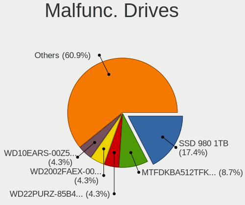
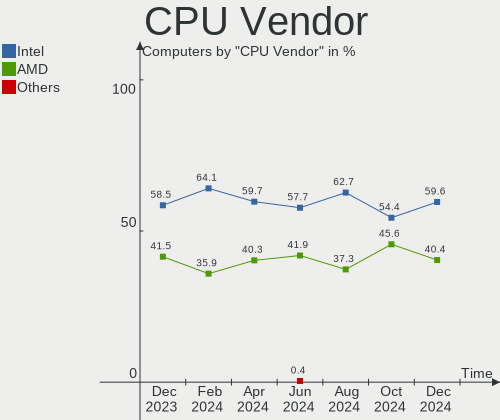

Arch - Hardware Trends
----------------------

A project to identify most popular hardware characteristics and track their change
over time based on data collected by Linux users at https://Linux-Hardware.org.

Anyone can contribute to this report by the [hw-probe](https://github.com/linuxhw/hw-probe) tool:

    sudo -E hw-probe -all -upload

This is a report for all computer types. See also reports for [desktops](/Dist/Arch/Desktop/README.md) and [notebooks](/Dist/Arch/Notebook/README.md).

This report is for one last month. Overall report since the beginning of time: [TestDays](https://github.com/linuxhw/TestDays)

Period: Dec, 2024.

Contents
--------

* [ System ](#system)
  - [ OS                       ](#os)
  - [ OS Family                ](#os-family)
  - [ Kernel                   ](#kernel)
  - [ Kernel Family            ](#kernel-family)
  - [ Kernel Major Ver.        ](#kernel-major-ver)
  - [ Arch                     ](#arch)
  - [ DE                       ](#de)
  - [ Display Server           ](#display-server)
  - [ Display Manager          ](#display-manager)
  - [ OS Lang                  ](#os-lang)
  - [ Boot Mode                ](#boot-mode)
  - [ Filesystem               ](#filesystem)
  - [ Part. scheme             ](#part-scheme)
  - [ Dual Boot with Linux/BSD ](#dual-boot-with-linuxbsd)
  - [ Dual Boot (Win)          ](#dual-boot-win)

* [ Board ](#board)
  - [ Vendor                   ](#vendor)
  - [ Model                    ](#model)
  - [ Model Family             ](#model-family)
  - [ MFG Year                 ](#mfg-year)
  - [ Form Factor              ](#form-factor)
  - [ Secure Boot              ](#secure-boot)
  - [ Coreboot                 ](#coreboot)
  - [ RAM Size                 ](#ram-size)
  - [ RAM Used                 ](#ram-used)
  - [ Total Drives             ](#total-drives)
  - [ Has CD-ROM               ](#has-cd-rom)
  - [ Has Ethernet             ](#has-ethernet)
  - [ Has WiFi                 ](#has-wifi)
  - [ Has Bluetooth            ](#has-bluetooth)

* [ Location ](#location)
  - [ Country                  ](#country)
  - [ City                     ](#city)

* [ Drives ](#drives)
  - [ Drive Vendor             ](#drive-vendor)
  - [ Drive Model              ](#drive-model)
  - [ HDD Vendor               ](#hdd-vendor)
  - [ SSD Vendor               ](#ssd-vendor)
  - [ Drive Kind               ](#drive-kind)
  - [ Drive Connector          ](#drive-connector)
  - [ Drive Size               ](#drive-size)
  - [ Space Total              ](#space-total)
  - [ Space Used               ](#space-used)
  - [ Malfunc. Drives          ](#malfunc-drives)
  - [ Malfunc. Drive Vendor    ](#malfunc-drive-vendor)
  - [ Malfunc. HDD Vendor      ](#malfunc-hdd-vendor)
  - [ Malfunc. Drive Kind      ](#malfunc-drive-kind)
  - [ Failed Drives            ](#failed-drives)
  - [ Failed Drive Vendor      ](#failed-drive-vendor)
  - [ Drive Status             ](#drive-status)

* [ Storage controller ](#storage-controller)
  - [ Storage Vendor           ](#storage-vendor)
  - [ Storage Model            ](#storage-model)
  - [ Storage Kind             ](#storage-kind)

* [ Processor ](#processor)
  - [ CPU Vendor               ](#cpu-vendor)
  - [ CPU Model                ](#cpu-model)
  - [ CPU Model Family         ](#cpu-model-family)
  - [ CPU Cores                ](#cpu-cores)
  - [ CPU Sockets              ](#cpu-sockets)
  - [ CPU Threads              ](#cpu-threads)
  - [ CPU Op-Modes             ](#cpu-op-modes)
  - [ CPU Microcode            ](#cpu-microcode)
  - [ CPU Microarch            ](#cpu-microarch)

* [ Graphics ](#graphics)
  - [ GPU Vendor               ](#gpu-vendor)
  - [ GPU Model                ](#gpu-model)
  - [ GPU Combo                ](#gpu-combo)
  - [ GPU Driver               ](#gpu-driver)
  - [ GPU Memory               ](#gpu-memory)

* [ Monitor ](#monitor)
  - [ Monitor Vendor           ](#monitor-vendor)
  - [ Monitor Model            ](#monitor-model)
  - [ Monitor Resolution       ](#monitor-resolution)
  - [ Monitor Diagonal         ](#monitor-diagonal)
  - [ Monitor Width            ](#monitor-width)
  - [ Aspect Ratio             ](#aspect-ratio)
  - [ Monitor Area             ](#monitor-area)
  - [ Pixel Density            ](#pixel-density)
  - [ Multiple Monitors        ](#multiple-monitors)

* [ Network ](#network)
  - [ Net Controller Vendor    ](#net-controller-vendor)
  - [ Net Controller Model     ](#net-controller-model)
  - [ Wireless Vendor          ](#wireless-vendor)
  - [ Wireless Model           ](#wireless-model)
  - [ Ethernet Vendor          ](#ethernet-vendor)
  - [ Ethernet Model           ](#ethernet-model)
  - [ Net Controller Kind      ](#net-controller-kind)
  - [ Used Controller          ](#used-controller)
  - [ NICs                     ](#nics)
  - [ IPv6                     ](#ipv6)

* [ Bluetooth ](#bluetooth)
  - [ Bluetooth Vendor         ](#bluetooth-vendor)
  - [ Bluetooth Model          ](#bluetooth-model)

* [ Sound ](#sound)
  - [ Sound Vendor             ](#sound-vendor)
  - [ Sound Model              ](#sound-model)

* [ Memory ](#memory)
  - [ Memory Vendor            ](#memory-vendor)
  - [ Memory Model             ](#memory-model)
  - [ Memory Kind              ](#memory-kind)
  - [ Memory Form Factor       ](#memory-form-factor)
  - [ Memory Size              ](#memory-size)
  - [ Memory Speed             ](#memory-speed)

* [ Printers & scanners ](#printers--scanners)
  - [ Printer Vendor           ](#printer-vendor)
  - [ Printer Model            ](#printer-model)
  - [ Scanner Vendor           ](#scanner-vendor)
  - [ Scanner Model            ](#scanner-model)

* [ Camera ](#camera)
  - [ Camera Vendor            ](#camera-vendor)
  - [ Camera Model             ](#camera-model)

* [ Security ](#security)
  - [ Fingerprint Vendor       ](#fingerprint-vendor)
  - [ Fingerprint Model        ](#fingerprint-model)
  - [ Chipcard Vendor          ](#chipcard-vendor)
  - [ Chipcard Model           ](#chipcard-model)

* [ Unsupported ](#unsupported)
  - [ Unsupported Devices      ](#unsupported-devices)
  - [ Unsupported Device Types ](#unsupported-device-types)

System
------

OS
--

Installed operating systems

| Name         | Computers | Percent |
|--------------|-----------|---------|
| Arch Rolling | 280       | 100%    |

OS Family
---------

OS without a version

| Name | Computers | Percent |
|------|-----------|---------|
| Arch | 280       | 100%    |

Kernel
------

Version of the Linux kernel

| Version                   | Computers | Percent |
|---------------------------|-----------|---------|
| 6.12.4-arch1-1            | 66        | 23.57%  |
| 6.12.1-arch1-1            | 64        | 22.86%  |
| 6.12.6-arch1-1            | 31        | 11.07%  |
| 6.12.7-arch1-1            | 25        | 8.93%   |
| 6.12.1-zen1-1-zen         | 22        | 7.86%   |
| 6.6.63-1-lts              | 6         | 2.14%   |
| 6.12.3-arch1-1            | 6         | 2.14%   |
| 6.6.65-1-lts              | 5         | 1.79%   |
| 6.12.4-zen1-1-zen         | 4         | 1.43%   |
| 6.12.7-zen1-1-zen         | 3         | 1.07%   |
| 6.12.6-zen1-1-zen         | 3         | 1.07%   |
| 6.11.9-arch1-1            | 3         | 1.07%   |
| 6.10.6-arch1-1            | 3         | 1.07%   |
| 6.12.6-1-cachyos          | 2         | 0.71%   |
| 6.12.1-arch1-1.1-g14      | 2         | 0.71%   |
| 6.11.7-arch1-1            | 2         | 0.71%   |
| 6.9.7-arch1-1             | 1         | 0.36%   |
| 6.6.7-arch1-1             | 1         | 0.36%   |
| 6.6.67-1-lts              | 1         | 0.36%   |
| 6.6.64-1-lts              | 1         | 0.36%   |
| 6.6.63-0-evil-lts         | 1         | 0.36%   |
| 6.6.54-1-lts              | 1         | 0.36%   |
| 6.13.0-rc4-1-mainline     | 1         | 0.36%   |
| 6.12.6-lqx1-1-lqx         | 1         | 0.36%   |
| 6.12.6-273-linux-tkg      | 1         | 0.36%   |
| 6.12.6-1-cachyos-bore     | 1         | 0.36%   |
| 6.12.5-arch1-1-61205-01   | 1         | 0.36%   |
| 6.12.5-2-cachyos          | 1         | 0.36%   |
| 6.12.5-1-cachyos          | 1         | 0.36%   |
| 6.12.4-2-cachyos          | 1         | 0.36%   |
| 6.12.4-1-cachyos          | 1         | 0.36%   |
| 6.12.3-zen1-custom        | 1         | 0.36%   |
| 6.12.3-zen1-1-zen         | 1         | 0.36%   |
| 6.12.3-273-tkg-pds        | 1         | 0.36%   |
| 6.12.1-rc1-1home          | 1         | 0.36%   |
| 6.12.1-273-tkg-eevdf-llvm | 1         | 0.36%   |
| 6.12.1-2-cachyos          | 1         | 0.36%   |
| 6.12.1-1-cachyos-bore     | 1         | 0.36%   |
| 6.11.8-arch1-2            | 1         | 0.36%   |
| 6.11.4-zen2-1-zen         | 1         | 0.36%   |

Kernel Family
-------------

Linux kernel without a distro release

| Version | Computers | Percent |
|---------|-----------|---------|
| 6.12.1  | 92        | 32.86%  |
| 6.12.4  | 72        | 25.71%  |
| 6.12.6  | 39        | 13.93%  |
| 6.12.7  | 28        | 10%     |
| 6.12.3  | 9         | 3.21%   |
| 6.6.63  | 7         | 2.5%    |
| 6.6.65  | 5         | 1.79%   |
| 6.12.5  | 3         | 1.07%   |
| 6.11.9  | 3         | 1.07%   |
| 6.10.6  | 3         | 1.07%   |
| 6.11.7  | 2         | 0.71%   |
| 6.11.11 | 2         | 0.71%   |
| 6.10.10 | 2         | 0.71%   |
| 6.9.7   | 1         | 0.36%   |
| 6.6.7   | 1         | 0.36%   |
| 6.6.67  | 1         | 0.36%   |
| 6.6.64  | 1         | 0.36%   |
| 6.6.54  | 1         | 0.36%   |
| 6.13.0  | 1         | 0.36%   |
| 6.11.8  | 1         | 0.36%   |
| 6.11.4  | 1         | 0.36%   |
| 6.11.3  | 1         | 0.36%   |
| 6.11.2  | 1         | 0.36%   |
| 6.11.10 | 1         | 0.36%   |
| 6.10.2  | 1         | 0.36%   |
| 6.1.0   | 1         | 0.36%   |

Kernel Major Ver.
-----------------

Linux kernel major version

| Version | Computers | Percent |
|---------|-----------|---------|
| 6.12    | 243       | 86.79%  |
| 6.6     | 16        | 5.71%   |
| 6.11    | 12        | 4.29%   |
| 6.10    | 6         | 2.14%   |
| 6.9     | 1         | 0.36%   |
| 6.13    | 1         | 0.36%   |
| 6.1     | 1         | 0.36%   |

Arch
----

OS architecture (x86_64, i586, etc.)

| Name   | Computers | Percent |
|--------|-----------|---------|
| x86_64 | 280       | 100%    |

DE
--

Desktop Environment

| Name          | Computers | Percent |
|---------------|-----------|---------|
| KDE6          | 93        | 33.21%  |
| GNOME         | 71        | 25.36%  |
| Hyprland      | 25        | 8.93%   |
| KDE           | 21        | 7.5%    |
| Unknown       | 19        | 6.79%   |
| XFCE          | 14        | 5%      |
| i3            | 13        | 4.64%   |
| sway          | 5         | 1.79%   |
| X-Cinnamon    | 4         | 1.43%   |
| LXQt          | 3         | 1.07%   |
| MATE          | 2         | 0.71%   |
| Cinnamon      | 2         | 0.71%   |
| Budgie        | 2         | 0.71%   |
| xmonad        | 1         | 0.36%   |
| openbox       | 1         | 0.36%   |
| LXDE          | 1         | 0.36%   |
| gtk           | 1         | 0.36%   |
| GNOME Classic | 1         | 0.36%   |
| awesome       | 1         | 0.36%   |

Display Server
--------------

X11 or Wayland

| Name    | Computers | Percent |
|---------|-----------|---------|
| Wayland | 174       | 62.14%  |
| X11     | 73        | 26.07%  |
| Unknown | 24        | 8.57%   |
| Tty     | 9         | 3.21%   |

Display Manager
---------------

SDDM, LightDM, etc.

| Name    | Computers | Percent |
|---------|-----------|---------|
| Unknown | 130       | 46.43%  |
| SDDM    | 81        | 28.93%  |
| GDM     | 29        | 10.36%  |
| LightDM | 26        | 9.29%   |
| GREETD  | 6         | 2.14%   |
| LY-DM   | 5         | 1.79%   |
| XDM     | 1         | 0.36%   |
| Ly      | 1         | 0.36%   |
| LXDM    | 1         | 0.36%   |

OS Lang
-------

Language

| Lang        | Computers | Percent |
|-------------|-----------|---------|
| en_US       | 153       | 54.64%  |
| de_DE       | 22        | 7.86%   |
| en_GB       | 19        | 6.79%   |
| C           | 15        | 5.36%   |
| it_IT       | 10        | 3.57%   |
| ru_RU       | 9         | 3.21%   |
| fr_FR       | 9         | 3.21%   |
| es_ES       | 7         | 2.5%    |
| pt_BR       | 4         | 1.43%   |
| en_CA       | 4         | 1.43%   |
| Unknown     | 4         | 1.43%   |
| pl_PL       | 3         | 1.07%   |
| en_NZ       | 3         | 1.07%   |
| en_AU       | 3         | 1.07%   |
| zh_CN       | 2         | 0.71%   |
| es_MX       | 2         | 0.71%   |
| es_CL       | 2         | 0.71%   |
| tr_TR       | 1         | 0.36%   |
| sv_SE       | 1         | 0.36%   |
| ro_RO       | 1         | 0.36%   |
| nl_NL       | 1         | 0.36%   |
| fi_FI       | 1         | 0.36%   |
| es_AR       | 1         | 0.36%   |
| en_US.UFT-8 | 1         | 0.36%   |
| de_AT       | 1         | 0.36%   |
| cs_CZ       | 1         | 0.36%   |

Boot Mode
---------

EFI or BIOS

| Mode | Computers | Percent |
|------|-----------|---------|
| EFI  | 152       | 54.29%  |
| BIOS | 128       | 45.71%  |

Filesystem
----------

Type of filesystem

| Type  | Computers | Percent |
|-------|-----------|---------|
| Ext4  | 185       | 66.07%  |
| Btrfs | 82        | 29.29%  |
| Xfs   | 10        | 3.57%   |
| Zfs   | 2         | 0.71%   |
| F2fs  | 1         | 0.36%   |

Part. scheme
------------

Scheme of partitioning

| Type    | Computers | Percent |
|---------|-----------|---------|
| GPT     | 164       | 58.57%  |
| Unknown | 103       | 36.79%  |
| MBR     | 13        | 4.64%   |

Dual Boot with Linux/BSD
------------------------

Hosting more than one Linux/BSD

| Dual boot | Computers | Percent |
|-----------|-----------|---------|
| No        | 242       | 86.43%  |
| Yes       | 38        | 13.57%  |

Dual Boot (Win)
---------------

Hosting Linux and Windows

| Dual boot | Computers | Percent |
|-----------|-----------|---------|
| No        | 209       | 74.64%  |
| Yes       | 71        | 25.36%  |

Board
-----

Vendor
------

Motherboard manufacturer

| Name                                 | Computers | Percent |
|--------------------------------------|-----------|---------|
| ASUSTek Computer                     | 50        | 17.86%  |
| Lenovo                               | 48        | 17.14%  |
| MSI                                  | 32        | 11.43%  |
| Dell                                 | 24        | 8.57%   |
| Hewlett-Packard                      | 21        | 7.5%    |
| Gigabyte Technology                  | 21        | 7.5%    |
| ASRock                               | 17        | 6.07%   |
| Acer                                 | 16        | 5.71%   |
| Apple                                | 9         | 3.21%   |
| TUXEDO                               | 5         | 1.79%   |
| HUAWEI                               | 5         | 1.79%   |
| XIAOMI                               | 2         | 0.71%   |
| Samsung Electronics                  | 2         | 0.71%   |
| Maibenben                            | 2         | 0.71%   |
| Google                               | 2         | 0.71%   |
| Fujitsu                              | 2         | 0.71%   |
| Framework                            | 2         | 0.71%   |
| System76                             | 1         | 0.36%   |
| Shenzhen Meigao Electronic Equipment | 1         | 0.36%   |
| PELADN                               | 1         | 0.36%   |
| Notebook                             | 1         | 0.36%   |
| Microsoft                            | 1         | 0.36%   |
| Micro Computer (HK) Tech Limited     | 1         | 0.36%   |
| Medion                               | 1         | 0.36%   |
| MECHREVO                             | 1         | 0.36%   |
| JGINYUE                              | 1         | 0.36%   |
| HASEE Computer                       | 1         | 0.36%   |
| GMKtec                               | 1         | 0.36%   |
| Foxconn                              | 1         | 0.36%   |
| ECS                                  | 1         | 0.36%   |
| CyberPowerPC                         | 1         | 0.36%   |
| Compumax Computer                    | 1         | 0.36%   |
| Colorful Technology                  | 1         | 0.36%   |
| Chuwi                                | 1         | 0.36%   |
| AZW                                  | 1         | 0.36%   |
| Avell                                | 1         | 0.36%   |
| AMI                                  | 1         | 0.36%   |

Model
-----

Motherboard model

| Name                                                  | Computers | Percent |
|-------------------------------------------------------|-----------|---------|
| XIAOMI Redmi Book Pro 15 2023                         | 2         | 0.71%   |
| TUXEDO Stellaris Slim 15 Intel Gen6                   | 2         | 0.71%   |
| TUXEDO InfinityBook Pro AMD Gen9                      | 2         | 0.71%   |
| MSI Prestige 15 A12SC                                 | 2         | 0.71%   |
| MSI MS-7C95                                           | 2         | 0.71%   |
| MSI MS-7C02                                           | 2         | 0.71%   |
| Lenovo LOQ 15IRH8 82XV                                | 2         | 0.71%   |
| HUAWEI FLMH-XX                                        | 2         | 0.71%   |
| Gigabyte B550 GAMING X V2                             | 2         | 0.71%   |
| Dell OptiPlex 7010                                    | 2         | 0.71%   |
| ASUS ROG Zephyrus G14 GA402RJ_GA402RJ                 | 2         | 0.71%   |
| ASUS All Series                                       | 2         | 0.71%   |
| ASRock B550M Pro4                                     | 2         | 0.71%   |
| Apple MacBookAir7,2                                   | 2         | 0.71%   |
| Apple iMac18,3                                        | 2         | 0.71%   |
| Acer Predator PHN16-71                                | 2         | 0.71%   |
| TUXEDO InfinityBook S 15 Gen6                         | 1         | 0.36%   |
| System76 Darter Pro                                   | 1         | 0.36%   |
| Shenzhen Meigao Electronic Equipment AtomMan G Series | 1         | 0.36%   |
| Samsung 750XGK                                        | 1         | 0.36%   |
| Samsung 700Z3C/700Z5C                                 | 1         | 0.36%   |
| PELADN WI-6                                           | 1         | 0.36%   |
| Notebook L2x0TU                                       | 1         | 0.36%   |
| MSI Thin GF63 12UC                                    | 1         | 0.36%   |
| MSI Prestige 13 AI+ Evo A2VMG                         | 1         | 0.36%   |
| MSI MS-7E51                                           | 1         | 0.36%   |
| MSI MS-7E49                                           | 1         | 0.36%   |
| MSI MS-7E24                                           | 1         | 0.36%   |
| MSI MS-7D89                                           | 1         | 0.36%   |
| MSI MS-7D77                                           | 1         | 0.36%   |
| MSI MS-7D75                                           | 1         | 0.36%   |
| MSI MS-7D25                                           | 1         | 0.36%   |
| MSI MS-7D22                                           | 1         | 0.36%   |
| MSI MS-7D15                                           | 1         | 0.36%   |
| MSI MS-7C94                                           | 1         | 0.36%   |
| MSI MS-7C84                                           | 1         | 0.36%   |
| MSI MS-7C56                                           | 1         | 0.36%   |
| MSI MS-7C37                                           | 1         | 0.36%   |
| MSI MS-7B89                                           | 1         | 0.36%   |
| MSI MS-7B84                                           | 1         | 0.36%   |

Model Family
------------

Motherboard model prefix

| Name                | Computers | Percent |
|---------------------|-----------|---------|
| Lenovo ThinkPad     | 31        | 11.07%  |
| ASUS ROG            | 10        | 3.57%   |
| Dell Inspiron       | 8         | 2.86%   |
| ASUS VivoBook       | 7         | 2.5%    |
| Acer Aspire         | 7         | 2.5%    |
| Dell OptiPlex       | 6         | 2.14%   |
| Lenovo IdeaPad      | 5         | 1.79%   |
| ASUS TUF            | 5         | 1.79%   |
| ASUS ASUS           | 5         | 1.79%   |
| HP EliteBook        | 4         | 1.43%   |
| Gigabyte B550M      | 4         | 1.43%   |
| ASUS PRIME          | 4         | 1.43%   |
| TUXEDO InfinityBook | 3         | 1.07%   |
| MSI Prestige        | 3         | 1.07%   |
| Lenovo ThinkBook    | 3         | 1.07%   |
| Lenovo LOQ          | 3         | 1.07%   |
| Dell Precision      | 3         | 1.07%   |
| ASRock B650M        | 3         | 1.07%   |
| Acer Predator       | 3         | 1.07%   |
| Acer Nitro          | 3         | 1.07%   |
| XIAOMI Redmi        | 2         | 0.71%   |
| TUXEDO Stellaris    | 2         | 0.71%   |
| MSI MS-7C95         | 2         | 0.71%   |
| MSI MS-7C02         | 2         | 0.71%   |
| HUAWEI FLMH-XX      | 2         | 0.71%   |
| HP ProBook          | 2         | 0.71%   |
| HP Pavilion         | 2         | 0.71%   |
| HP EliteDesk        | 2         | 0.71%   |
| HP 240              | 2         | 0.71%   |
| Gigabyte B650       | 2         | 0.71%   |
| Gigabyte B550       | 2         | 0.71%   |
| Gigabyte B450M      | 2         | 0.71%   |
| Framework Laptop    | 2         | 0.71%   |
| Dell XPS            | 2         | 0.71%   |
| Dell Vostro         | 2         | 0.71%   |
| Dell Latitude       | 2         | 0.71%   |
| ASUS Zenbook        | 2         | 0.71%   |
| ASUS All            | 2         | 0.71%   |
| ASRock X570         | 2         | 0.71%   |
| ASRock B550M        | 2         | 0.71%   |

MFG Year
--------

Motherboard manufacture year

| Year | Computers | Percent |
|------|-----------|---------|
| 2020 | 42        | 15%     |
| 2023 | 37        | 13.21%  |
| 2024 | 36        | 12.86%  |
| 2022 | 33        | 11.79%  |
| 2021 | 28        | 10%     |
| 2018 | 21        | 7.5%    |
| 2014 | 16        | 5.71%   |
| 2019 | 13        | 4.64%   |
| 2017 | 10        | 3.57%   |
| 2013 | 8         | 2.86%   |
| 2011 | 8         | 2.86%   |
| 2012 | 7         | 2.5%    |
| 2010 | 6         | 2.14%   |
| 2016 | 5         | 1.79%   |
| 2015 | 3         | 1.07%   |
| 2008 | 3         | 1.07%   |
| 2009 | 2         | 0.71%   |
| 2007 | 2         | 0.71%   |

Form Factor
-----------

Physical design of the computer

| Name        | Computers | Percent |
|-------------|-----------|---------|
| Notebook    | 157       | 56.07%  |
| Desktop     | 105       | 37.5%   |
| Convertible | 9         | 3.21%   |
| All in one  | 4         | 1.43%   |
| Tablet      | 3         | 1.07%   |
| Mini pc     | 1         | 0.36%   |
| Server      | 1         | 0.36%   |

Secure Boot
-----------

Enabled or disabled

| State    | Computers | Percent |
|----------|-----------|---------|
| Disabled | 273       | 97.5%   |
| Enabled  | 7         | 2.5%    |

Coreboot
--------

Have coreboot on board

| Used | Computers | Percent |
|------|-----------|---------|
| No   | 276       | 98.57%  |
| Yes  | 4         | 1.43%   |

RAM Size
--------

Total RAM memory

| Size in GB  | Computers | Percent |
|-------------|-----------|---------|
| 16.01-24.0  | 76        | 27.14%  |
| 32.01-64.0  | 52        | 18.57%  |
| 8.01-16.0   | 50        | 17.86%  |
| 4.01-8.0    | 40        | 14.29%  |
| 64.01-256.0 | 27        | 9.64%   |
| 24.01-32.0  | 24        | 8.57%   |
| 3.01-4.0    | 9         | 3.21%   |
| 2.01-3.0    | 1         | 0.36%   |
| 1.01-2.0    | 1         | 0.36%   |

RAM Used
--------

Used RAM memory

| Used GB    | Computers | Percent |
|------------|-----------|---------|
| 4.01-8.0   | 104       | 37.14%  |
| 2.01-3.0   | 51        | 18.21%  |
| 3.01-4.0   | 50        | 17.86%  |
| 1.01-2.0   | 36        | 12.86%  |
| 8.01-16.0  | 22        | 7.86%   |
| 16.01-24.0 | 8         | 2.86%   |
| 0.51-1.0   | 4         | 1.43%   |
| 24.01-32.0 | 2         | 0.71%   |
| 0.01-0.5   | 2         | 0.71%   |
| 32.01-64.0 | 1         | 0.36%   |

Total Drives
------------

Number of drives on board

| Drives | Computers | Percent |
|--------|-----------|---------|
| 1      | 144       | 51.43%  |
| 2      | 87        | 31.07%  |
| 3      | 23        | 8.21%   |
| 4      | 14        | 5%      |
| 5      | 6         | 2.14%   |
| 6      | 3         | 1.07%   |
| 9      | 1         | 0.36%   |
| 8      | 1         | 0.36%   |
| 0      | 1         | 0.36%   |

Has CD-ROM
----------

Has CD-ROM on board

| Presented | Computers | Percent |
|-----------|-----------|---------|
| No        | 229       | 81.79%  |
| Yes       | 51        | 18.21%  |

Has Ethernet
------------

Has Ethernet on board

| Presented | Computers | Percent |
|-----------|-----------|---------|
| Yes       | 232       | 82.86%  |
| No        | 48        | 17.14%  |

Has WiFi
--------

Has WiFi module

| Presented | Computers | Percent |
|-----------|-----------|---------|
| Yes       | 221       | 78.93%  |
| No        | 59        | 21.07%  |

Has Bluetooth
-------------

Has Bluetooth module

| Presented | Computers | Percent |
|-----------|-----------|---------|
| Yes       | 224       | 80%     |
| No        | 56        | 20%     |

Location
--------

Country
-------

Geographic location (country)

| Country     | Computers | Percent |
|-------------|-----------|---------|
| USA         | 54        | 19.29%  |
| Germany     | 28        | 10%     |
| France      | 19        | 6.79%   |
| Russia      | 16        | 5.71%   |
| UK          | 15        | 5.36%   |
| Canada      | 14        | 5%      |
| Italy       | 13        | 4.64%   |
| India       | 10        | 3.57%   |
| Spain       | 8         | 2.86%   |
| Brazil      | 8         | 2.86%   |
| Norway      | 6         | 2.14%   |
| Vietnam     | 5         | 1.79%   |
| Switzerland | 5         | 1.79%   |
| Poland      | 5         | 1.79%   |
| Netherlands | 5         | 1.79%   |
| Sweden      | 4         | 1.43%   |
| Japan       | 4         | 1.43%   |
| New Zealand | 3         | 1.07%   |
| Mexico      | 3         | 1.07%   |
| Belgium     | 3         | 1.07%   |
| Australia   | 3         | 1.07%   |
| Slovakia    | 2         | 0.71%   |
| Philippines | 2         | 0.71%   |
| Malaysia    | 2         | 0.71%   |
| Lithuania   | 2         | 0.71%   |
| Iran        | 2         | 0.71%   |
| Indonesia   | 2         | 0.71%   |
| Hong Kong   | 2         | 0.71%   |
| Finland     | 2         | 0.71%   |
| Colombia    | 2         | 0.71%   |
| China       | 2         | 0.71%   |
| Chile       | 2         | 0.71%   |
| Bangladesh  | 2         | 0.71%   |
| Austria     | 2         | 0.71%   |
| Argentina   | 2         | 0.71%   |
| UAE         | 1         | 0.36%   |
| Turkey      | 1         | 0.36%   |
| Thailand    | 1         | 0.36%   |
| Sri Lanka   | 1         | 0.36%   |
| South Korea | 1         | 0.36%   |

City
----

Geographic location (city)

| City              | Computers | Percent |
|-------------------|-----------|---------|
| Moscow            | 6         | 2.14%   |
| Berlin            | 5         | 1.79%   |
| Ho Chi Minh City  | 4         | 1.43%   |
| San Jose          | 3         | 1.07%   |
| Paris             | 3         | 1.07%   |
| Los Angeles       | 3         | 1.07%   |
| Windsor           | 2         | 0.71%   |
| Warsaw            | 2         | 0.71%   |
| Toulouse          | 2         | 0.71%   |
| Thornhill         | 2         | 0.71%   |
| Scandolara Ravara | 2         | 0.71%   |
| Sarlat-la-Canéda | 2         | 0.71%   |
| Rostock           | 2         | 0.71%   |
| Montreal          | 2         | 0.71%   |
| Mexico City       | 2         | 0.71%   |
| Melbourne         | 2         | 0.71%   |
| Martorell         | 2         | 0.71%   |
| London            | 2         | 0.71%   |
| Drammen           | 2         | 0.71%   |
| Denver            | 2         | 0.71%   |
| Delhi             | 2         | 0.71%   |
| Charlotte         | 2         | 0.71%   |
| Cedar Rapids      | 2         | 0.71%   |
| Brasília         | 2         | 0.71%   |
| Bogor             | 2         | 0.71%   |
| Bengaluru         | 2         | 0.71%   |
| Auckland          | 2         | 0.71%   |
| Amsterdam         | 2         | 0.71%   |
| Žilina           | 1         | 0.36%   |
| Zaragoza          | 1         | 0.36%   |
| Zajecov           | 1         | 0.36%   |
| York              | 1         | 0.36%   |
| Winter Springs    | 1         | 0.36%   |
| Wiener Neustadt   | 1         | 0.36%   |
| Whitby            | 1         | 0.36%   |
| West Chester      | 1         | 0.36%   |
| Wellington        | 1         | 0.36%   |
| Wari              | 1         | 0.36%   |
| Wandsworth        | 1         | 0.36%   |
| Wallenhorst       | 1         | 0.36%   |

Drives
------

Drive Vendor
------------

Hard drive vendors

| Vendor                       | Computers | Drives | Percent |
|------------------------------|-----------|--------|---------|
| Samsung Electronics          | 79        | 108    | 17.95%  |
| Sandisk                      | 47        | 50     | 10.68%  |
| WDC                          | 34        | 44     | 7.73%   |
| Seagate                      | 31        | 40     | 7.05%   |
| Kingston                     | 31        | 31     | 7.05%   |
| SK hynix                     | 20        | 21     | 4.55%   |
| Unknown                      | 16        | 18     | 3.64%   |
| Toshiba                      | 15        | 16     | 3.41%   |
| Intel                        | 15        | 15     | 3.41%   |
| Micron Technology            | 13        | 13     | 2.95%   |
| Micron/Crucial Technology    | 12        | 13     | 2.73%   |
| Crucial                      | 12        | 13     | 2.73%   |
| Kingston Technology Company  | 9         | 10     | 2.05%   |
| Phison Electronics           | 8         | 8      | 1.82%   |
| Hitachi                      | 8         | 8      | 1.82%   |
| KIOXIA                       | 7         | 7      | 1.59%   |
| ADATA Technology             | 7         | 9      | 1.59%   |
| HGST                         | 6         | 6      | 1.36%   |
| Apple                        | 5         | 6      | 1.14%   |
| A-DATA Technology            | 5         | 5      | 1.14%   |
| Shenzhen Longsys Electronics | 4         | 4      | 0.91%   |
| Patriot                      | 4         | 4      | 0.91%   |
| Realtek Semiconductor        | 3         | 3      | 0.68%   |
| GOODRAM                      | 3         | 3      | 0.68%   |
| Fanxiang                     | 3         | 3      | 0.68%   |
| China                        | 3         | 4      | 0.68%   |
| T-FORCE                      | 2         | 2      | 0.45%   |
| Silicon Motion               | 2         | 2      | 0.45%   |
| Netac                        | 2         | 2      | 0.45%   |
| MAXIO Technology (Hangzhou)  | 2         | 2      | 0.45%   |
| LITEON                       | 2         | 2      | 0.45%   |
| Yangtze Memory Technologies  | 1         | 2      | 0.23%   |
| Union Memory (Shenzhen)      | 1         | 1      | 0.23%   |
| Union Memory                 | 1         | 1      | 0.23%   |
| Transcend                    | 1         | 1      | 0.23%   |
| TEXTORM                      | 1         | 1      | 0.23%   |
| Team                         | 1         | 1      | 0.23%   |
| TCSUNBOW                     | 1         | 1      | 0.23%   |
| TARGET                       | 1         | 1      | 0.23%   |
| SPCC                         | 1         | 1      | 0.23%   |

Drive Model
-----------

Hard drive models

| Model                                                 | Computers | Percent |
|-------------------------------------------------------|-----------|---------|
| Samsung NVMe SSD Controller SM981/PM981/PM983 512GB   | 20        | 4.09%   |
| Samsung NVMe SSD Controller PM9A1/PM9A3/980PRO 512GB  | 15        | 3.07%   |
| Samsung SSD 980 1TB                                   | 8         | 1.64%   |
| Unknown MMC Card  64GB                                | 7         | 1.43%   |
| Seagate ST1000DM010-2EP102 1TB                        | 7         | 1.43%   |
| Samsung SSD 840 EVO 250GB                             | 6         | 1.23%   |
| Micron/Crucial P2 NVMe PCIe SSD 500GB                 | 6         | 1.23%   |
| Kingston SA400S37480G 480GB SSD                       | 6         | 1.23%   |
| Kingston SA400S37240G 240GB SSD                       | 6         | 1.23%   |
| Seagate ST2000DM008-2FR102 2TB                        | 5         | 1.02%   |
| Sandisk WD_BLACK SN850X 2000GB                        | 5         | 1.02%   |
| Samsung SSD 990 PRO 1TB                               | 5         | 1.02%   |
| Intel SSDPEKNU512GZ 512GB                             | 5         | 1.02%   |
| Toshiba HDWD110 1TB                                   | 4         | 0.82%   |
| Sandisk WD_BLACK SN770 1TB                            | 4         | 0.82%   |
| Samsung SSD 990 PRO 2TB                               | 4         | 0.82%   |
| Samsung SSD 860 EVO 500GB                             | 4         | 0.82%   |
| Samsung NVMe SSD Controller SM961/PM961/SM963 256GB   | 4         | 0.82%   |
| Kingston Company SNV2S1000G 1TB                       | 4         | 0.82%   |
| WDC WDS100T2B0A-00SM50 1TB SSD                        | 3         | 0.61%   |
| Unknown MMC Card  512GB                               | 3         | 0.61%   |
| SK hynix SHPP41-2000GM 2TB                            | 3         | 0.61%   |
| Sandisk WD Black SN850 2TB                            | 3         | 0.61%   |
| Sandisk WD Black 2018/SN750 / PC SN720 NVMe SSD 512GB | 3         | 0.61%   |
| Samsung SSD 870 EVO 2TB                               | 3         | 0.61%   |
| Samsung SSD 860 EVO 1TB                               | 3         | 0.61%   |
| Patriot Burst 240GB SSD                               | 3         | 0.61%   |
| Micron/Crucial CT2000P3PSSD8 2TB                      | 3         | 0.61%   |
| Crucial CT500MX500SSD1 500GB                          | 3         | 0.61%   |
| WDC WDBNCE0010PNC 1TB SSD                             | 2         | 0.41%   |
| WDC WD2003FZEX-00SRLA0 2TB                            | 2         | 0.41%   |
| Unknown NVMe SSD Drive 1024GB                         | 2         | 0.41%   |
| Unknown MMC Card  16GB                                | 2         | 0.41%   |
| SK hynix PC801 NVMe 1TB                               | 2         | 0.41%   |
| SK hynix HFS512GEJ9X125N 512GB                        | 2         | 0.41%   |
| SK hynix BC511 512GB                                  | 2         | 0.41%   |
| SK hynix BC501 NVMe Solid State Drive 512GB           | 2         | 0.41%   |
| Silicon Motion SM2263EN/SM2263XT SSD Controller 256GB | 2         | 0.41%   |
| Seagate ST6000DM003-2CY186 6TB                        | 2         | 0.41%   |
| Seagate ST4000DM004-2CV104 4TB                        | 2         | 0.41%   |

HDD Vendor
----------

Hard disk drive vendors

| Vendor              | Computers | Drives | Percent |
|---------------------|-----------|--------|---------|
| Seagate             | 31        | 39     | 35.23%  |
| WDC                 | 26        | 34     | 29.55%  |
| Toshiba             | 12        | 13     | 13.64%  |
| Hitachi             | 8         | 8      | 9.09%   |
| HGST                | 6         | 6      | 6.82%   |
| Samsung Electronics | 2         | 2      | 2.27%   |
| SABRENT             | 1         | 2      | 1.14%   |
| Maxone              | 1         | 1      | 1.14%   |
| Apple               | 1         | 1      | 1.14%   |

SSD Vendor
----------

Solid state drive vendors

| Vendor              | Computers | Drives | Percent |
|---------------------|-----------|--------|---------|
| Samsung Electronics | 31        | 37     | 25%     |
| Kingston            | 21        | 21     | 16.94%  |
| Crucial             | 12        | 13     | 9.68%   |
| WDC                 | 9         | 10     | 7.26%   |
| SanDisk             | 9         | 9      | 7.26%   |
| A-DATA Technology   | 5         | 5      | 4.03%   |
| Patriot             | 4         | 4      | 3.23%   |
| GOODRAM             | 3         | 3      | 2.42%   |
| China               | 3         | 4      | 2.42%   |
| Apple               | 3         | 3      | 2.42%   |
| LITEON              | 2         | 2      | 1.61%   |
| Intel               | 2         | 2      | 1.61%   |
| TEXTORM             | 1         | 1      | 0.81%   |
| Team                | 1         | 1      | 0.81%   |
| TCSUNBOW            | 1         | 1      | 0.81%   |
| T-FORCE             | 1         | 1      | 0.81%   |
| SPCC                | 1         | 1      | 0.81%   |
| Smartbuy            | 1         | 1      | 0.81%   |
| SK hynix            | 1         | 1      | 0.81%   |
| Seagate             | 1         | 1      | 0.81%   |
| Pioneer             | 1         | 1      | 0.81%   |
| PELADN              | 1         | 1      | 0.81%   |
| Origin              | 1         | 1      | 0.81%   |
| ORICO               | 1         | 1      | 0.81%   |
| OCZ                 | 1         | 1      | 0.81%   |
| Netac               | 1         | 1      | 0.81%   |
| Lite-On             | 1         | 1      | 0.81%   |
| Lexar               | 1         | 1      | 0.81%   |
| KingSpec            | 1         | 1      | 0.81%   |
| Fanxiang            | 1         | 1      | 0.81%   |
| Drevo               | 1         | 1      | 0.81%   |
| Apacer              | 1         | 1      | 0.81%   |

Drive Kind
----------

HDD or SSD

| Kind    | Computers | Drives | Percent |
|---------|-----------|--------|---------|
| NVMe    | 198       | 244    | 49.87%  |
| SSD     | 108       | 133    | 27.2%   |
| HDD     | 71        | 106    | 17.88%  |
| MMC     | 13        | 14     | 3.27%   |
| Unknown | 7         | 7      | 1.76%   |

Drive Connector
---------------

SATA, SAS, NVMe, etc.

| Type | Computers | Drives | Percent |
|------|-----------|--------|---------|
| NVMe | 198       | 244    | 55.46%  |
| SATA | 138       | 236    | 38.66%  |
| MMC  | 13        | 14     | 3.64%   |
| SAS  | 8         | 10     | 2.24%   |

Drive Size
----------

Size of hard drive

| Size in TB | Computers | Drives | Percent |
|------------|-----------|--------|---------|
| 0.01-0.5   | 89        | 110    | 46.6%   |
| 0.51-1.0   | 55        | 70     | 28.8%   |
| 1.01-2.0   | 26        | 31     | 13.61%  |
| 3.01-4.0   | 11        | 16     | 5.76%   |
| 4.01-10.0  | 6         | 6      | 3.14%   |
| 10.01-20.0 | 3         | 5      | 1.57%   |
| 2.01-3.0   | 1         | 1      | 0.52%   |

Space Total
-----------

Amount of disk space available on the file system

| Size in GB     | Computers | Percent |
|----------------|-----------|---------|
| 501-1000       | 62        | 22.14%  |
| 251-500        | 59        | 21.07%  |
| 101-250        | 45        | 16.07%  |
| More than 3000 | 41        | 14.64%  |
| 1001-2000      | 38        | 13.57%  |
| 2001-3000      | 22        | 7.86%   |
| 51-100         | 6         | 2.14%   |
| 1-20           | 4         | 1.43%   |
| Unknown        | 3         | 1.07%   |

Space Used
----------

Amount of used disk space

| Used GB        | Computers | Percent |
|----------------|-----------|---------|
| 101-250        | 48        | 17.14%  |
| 251-500        | 46        | 16.43%  |
| 1-20           | 44        | 15.71%  |
| 21-50          | 38        | 13.57%  |
| 51-100         | 33        | 11.79%  |
| 501-1000       | 24        | 8.57%   |
| 1001-2000      | 22        | 7.86%   |
| More than 3000 | 18        | 6.43%   |
| 2001-3000      | 4         | 1.43%   |
| Unknown        | 3         | 1.07%   |

Malfunc. Drives
---------------

Drive models with a malfunction

| Model                                                           | Computers | Drives | Percent |
|-----------------------------------------------------------------|-----------|--------|---------|
| Samsung Electronics SSD 980 1TB                                 | 4         | 4      | 17.39%  |
| Micron Technology MTFDKBA512TFK-1BC1AABHA 512GB                 | 2         | 2      | 8.7%    |
| WDC WD22PURZ-85B4ZY0 2TB                                        | 1         | 1      | 4.35%   |
| WDC WD2002FAEX-007BA0 2TB                                       | 1         | 1      | 4.35%   |
| WDC WD10EARS-00Z5B1 1TB                                         | 1         | 1      | 4.35%   |
| WDC WD Green 2.5 1000GB SSD                                     | 1         | 1      | 4.35%   |
| Toshiba MG04ACA400N 4TB                                         | 1         | 1      | 4.35%   |
| Seagate ST500DM002-1BD142 500GB                                 | 1         | 1      | 4.35%   |
| Seagate ST3320418AS 320GB                                       | 1         | 1      | 4.35%   |
| Seagate ST2000DM008-2FR102 2TB                                  | 1         | 1      | 4.35%   |
| Seagate ST1000DM010-2EP102 1TB                                  | 1         | 1      | 4.35%   |
| Samsung Electronics SSD 870 EVO 1TB                             | 1         | 1      | 4.35%   |
| Samsung Electronics SSD 840 EVO 250GB                           | 1         | 1      | 4.35%   |
| Samsung Electronics NVMe SSD Controller SM981/PM981/PM983 512GB | 1         | 1      | 4.35%   |
| Kingston SA400S37120G 120GB SSD                                 | 1         | 1      | 4.35%   |
| HGST HTS721010A9E630 1TB                                        | 1         | 1      | 4.35%   |
| HGST HTS545050A7E680 500GB                                      | 1         | 1      | 4.35%   |
| Apple SSD SD0256F 256GB                                         | 1         | 1      | 4.35%   |
| A-DATA Technology SU750 1TB SSD                                 | 1         | 1      | 4.35%   |

Malfunc. Drive Vendor
---------------------

Vendors of faulty drives

| Vendor              | Computers | Drives | Percent |
|---------------------|-----------|--------|---------|
| Samsung Electronics | 7         | 7      | 30.43%  |
| WDC                 | 4         | 4      | 17.39%  |
| Seagate             | 4         | 4      | 17.39%  |
| Micron Technology   | 2         | 2      | 8.7%    |
| HGST                | 2         | 2      | 8.7%    |
| Toshiba             | 1         | 1      | 4.35%   |
| Kingston            | 1         | 1      | 4.35%   |
| Apple               | 1         | 1      | 4.35%   |
| A-DATA Technology   | 1         | 1      | 4.35%   |

Malfunc. HDD Vendor
-------------------

Vendors of faulty HDD drives

| Vendor  | Computers | Drives | Percent |
|---------|-----------|--------|---------|
| Seagate | 4         | 4      | 40%     |
| WDC     | 3         | 3      | 30%     |
| HGST    | 2         | 2      | 20%     |
| Toshiba | 1         | 1      | 10%     |

Malfunc. Drive Kind
-------------------

Kinds of faulty drives

| Kind | Computers | Drives | Percent |
|------|-----------|--------|---------|
| NVMe | 7         | 7      | 36.84%  |
| HDD  | 7         | 10     | 36.84%  |
| SSD  | 5         | 6      | 26.32%  |

Failed Drives
-------------

Failed drive models

Zero info for selected period =(

Failed Drive Vendor
-------------------

Failed drive vendors

Zero info for selected period =(

Drive Status
------------

Number of failed and malfunc. drives

| Status   | Computers | Drives | Percent |
|----------|-----------|--------|---------|
| Works    | 151       | 260    | 50.67%  |
| Detected | 130       | 221    | 43.62%  |
| Malfunc  | 17        | 23     | 5.7%    |

Storage controller
------------------

Storage Vendor
--------------

Storage controller vendors

| Vendor                                  | Computers | Percent |
|-----------------------------------------|-----------|---------|
| Intel                                   | 125       | 29.34%  |
| AMD                                     | 74        | 17.37%  |
| Samsung Electronics                     | 62        | 14.55%  |
| Sandisk                                 | 39        | 9.15%   |
| SK hynix                                | 19        | 4.46%   |
| Kingston Technology Company             | 19        | 4.46%   |
| Micron Technology                       | 13        | 3.05%   |
| Micron/Crucial Technology               | 12        | 2.82%   |
| Phison Electronics                      | 9         | 2.11%   |
| ASMedia Technology                      | 9         | 2.11%   |
| KIOXIA                                  | 7         | 1.64%   |
| ADATA Technology                        | 7         | 1.64%   |
| Shenzhen Longsys Electronics            | 4         | 0.94%   |
| Toshiba America Info Systems            | 3         | 0.7%    |
| Realtek Semiconductor                   | 3         | 0.7%    |
| Transcend                               | 2         | 0.47%   |
| Solid State Storage Technology          | 2         | 0.47%   |
| Silicon Motion                          | 2         | 0.47%   |
| MAXIO Technology (Hangzhou)             | 2         | 0.47%   |
| INNOGRIT                                | 2         | 0.47%   |
| Yangtze Memory Technologies             | 1         | 0.23%   |
| Union Memory (Shenzhen)                 | 1         | 0.23%   |
| Solidigm                                | 1         | 0.23%   |
| Shenzhen Unionmemory Information System | 1         | 0.23%   |
| Nvidia                                  | 1         | 0.23%   |
| Netac Technology                        | 1         | 0.23%   |
| Marvell Technology Group                | 1         | 0.23%   |
| Lenovo                                  | 1         | 0.23%   |
| JMicron Technology                      | 1         | 0.23%   |
| Apple                                   | 1         | 0.23%   |
| Unknown                                 | 1         | 0.23%   |

Storage Model
-------------

Storage controller models

| Model                                                                          | Computers | Percent |
|--------------------------------------------------------------------------------|-----------|---------|
| AMD FCH SATA Controller [AHCI mode]                                            | 28        | 6%      |
| AMD 600 Series Chipset SATA Controller                                         | 22        | 4.71%   |
| Samsung NVMe SSD Controller SM981/PM981/PM983                                  | 20        | 4.28%   |
| AMD 500 Series Chipset SATA Controller                                         | 17        | 3.64%   |
| Samsung NVMe SSD Controller PM9A1/PM9A3/980PRO                                 | 15        | 3.21%   |
| Samsung NVMe SSD Controller 980 (DRAM-less)                                    | 14        | 3%      |
| Intel Volume Management Device NVMe RAID Controller                            | 14        | 3%      |
| AMD 400 Series Chipset SATA Controller                                         | 11        | 2.36%   |
| SanDisk WD Black SN770 / PC SN740 256GB / PC SN560 (DRAM-less) NVMe SSD        | 9         | 1.93%   |
| Samsung NVMe SSD Controller S4LV008[Pascal]                                    | 9         | 1.93%   |
| SK hynix Platinum P41/PC801 NVMe Solid State Drive                             | 8         | 1.71%   |
| Intel Q170/Q150/B150/H170/H110/Z170/CM236 Chipset SATA Controller [AHCI Mode]  | 8         | 1.71%   |
| Intel 7 Series Chipset Family 6-port SATA Controller [AHCI mode]               | 8         | 1.71%   |
| Intel SSD 670p Series [Keystone Harbor]                                        | 7         | 1.5%    |
| Intel 8 Series/C220 Series Chipset Family 6-port SATA Controller 1 [AHCI mode] | 7         | 1.5%    |
| Intel 6 Series/C200 Series Chipset Family 6 port Mobile SATA AHCI Controller   | 7         | 1.5%    |
| ASMedia ASM1061/ASM1062 Serial ATA Controller                                  | 7         | 1.5%    |
| Micron/Crucial P2 [Nick P2] / P3 / P3 Plus NVMe PCIe SSD (DRAM-less)           | 6         | 1.28%   |
| Intel Wildcat Point-LP SATA Controller [AHCI Mode]                             | 6         | 1.28%   |
| Sandisk WD Black SN850X NVMe SSD                                               | 5         | 1.07%   |
| Micron 2450 NVMe SSD [HendrixV] (DRAM-less)                                    | 5         | 1.07%   |
| Intel Volume Management Device NVMe RAID Controller Intel Corporation          | 5         | 1.07%   |
| Intel Sunrise Point-LP SATA Controller [AHCI mode]                             | 5         | 1.07%   |
| Intel Raptor Lake SATA AHCI Controller                                         | 5         | 1.07%   |
| Intel Alder Lake-P SATA AHCI Controller                                        | 5         | 1.07%   |
| SK hynix Gold P31/BC711/PC711 NVMe Solid State Drive                           | 4         | 0.86%   |
| Samsung NVMe SSD Controller SM961/PM961/SM963                                  | 4         | 0.86%   |
| Micron 2400 NVMe SSD (DRAM-less)                                               | 4         | 0.86%   |
| Micron 2210 NVMe SSD [Cobain]                                                  | 4         | 0.86%   |
| Intel Cannon Lake PCH SATA AHCI Controller                                     | 4         | 0.86%   |
| Intel 500 Series Chipset Family SATA AHCI Controller                           | 4         | 0.86%   |
| Intel 5 Series/3400 Series Chipset 4 port SATA IDE Controller                  | 4         | 0.86%   |
| Intel 5 Series/3400 Series Chipset 2 port SATA IDE Controller                  | 4         | 0.86%   |
| SanDisk WD PC SN810 / Black SN850 NVMe SSD                                     | 3         | 0.64%   |
| SanDisk PC SN735 / WD_BLACK SN750 SE NVMe SSD (DRAM-less)                      | 3         | 0.64%   |
| SanDisk Extreme Pro / WD Black 2018/SN750/PC SN720 NVMe SSD                    | 3         | 0.64%   |
| Phison PS5021-E21 PCIe4 NVMe Controller (DRAM-less)                            | 3         | 0.64%   |
| Micron/Crucial P3 Plus NVMe PCIe SSD (DRAM-less)                               | 3         | 0.64%   |
| KIOXIA NVMe SSD Controller XG8                                                 | 3         | 0.64%   |
| Kingston Company NV2 NVMe SSD [TC2200] (DRAM-less)                             | 3         | 0.64%   |

Storage Kind
------------

Kind of storage controller (IDE, SATA, NVMe, SAS, ...)

| Kind | Computers | Percent |
|------|-----------|---------|
| NVMe | 198       | 49.5%   |
| SATA | 172       | 43%     |
| RAID | 24        | 6%      |
| IDE  | 6         | 1.5%    |

Processor
---------

CPU Vendor
----------

Processor vendors

| Vendor | Computers | Percent |
|--------|-----------|---------|
| Intel  | 167       | 59.64%  |
| AMD    | 113       | 40.36%  |

CPU Model
---------

Processor models

| Model                                      | Computers | Percent |
|--------------------------------------------|-----------|---------|
| AMD Ryzen 7 7840HS w/ Radeon 780M Graphics | 6         | 2.14%   |
| AMD Ryzen 7 5700U with Radeon Graphics     | 6         | 2.14%   |
| Intel Core i5-1035G1 CPU @ 1.00GHz         | 4         | 1.43%   |
| Intel 12th Gen Core i7-12700H              | 4         | 1.43%   |
| Intel 11th Gen Core i7-1165G7 @ 2.80GHz    | 4         | 1.43%   |
| AMD Ryzen 7 5800X 8-Core Processor         | 4         | 1.43%   |
| AMD Ryzen 7 5700G with Radeon Graphics     | 4         | 1.43%   |
| Intel N100                                 | 3         | 1.07%   |
| Intel Core i9-14900HX                      | 3         | 1.07%   |
| Intel Core i7-8650U CPU @ 1.90GHz          | 3         | 1.07%   |
| Intel Core i5-3210M CPU @ 2.50GHz          | 3         | 1.07%   |
| Intel 11th Gen Core i5-1135G7 @ 2.40GHz    | 3         | 1.07%   |
| AMD Ryzen 9 7950X3D 16-Core Processor      | 3         | 1.07%   |
| AMD Ryzen 9 7950X 16-Core Processor        | 3         | 1.07%   |
| AMD Ryzen 9 7900X3D 12-Core Processor      | 3         | 1.07%   |
| AMD Ryzen 9 6900HS with Radeon Graphics    | 3         | 1.07%   |
| AMD Ryzen 7 9700X 8-Core Processor         | 3         | 1.07%   |
| AMD Ryzen 7 7700X 8-Core Processor         | 3         | 1.07%   |
| AMD Ryzen 7 5700X 8-Core Processor         | 3         | 1.07%   |
| AMD Ryzen 5 5500U with Radeon Graphics     | 3         | 1.07%   |
| AMD Ryzen 5 4600H with Radeon Graphics     | 3         | 1.07%   |
| AMD Ryzen 5 3600 6-Core Processor          | 3         | 1.07%   |
| Intel Core Ultra 5 125H                    | 2         | 0.71%   |
| Intel Core i7-8550U CPU @ 1.80GHz          | 2         | 0.71%   |
| Intel Core i7-7820HQ CPU @ 2.90GHz         | 2         | 0.71%   |
| Intel Core i7-4710HQ CPU @ 2.50GHz         | 2         | 0.71%   |
| Intel Core i7-10700 CPU @ 2.90GHz          | 2         | 0.71%   |
| Intel Core i5-8350U CPU @ 1.70GHz          | 2         | 0.71%   |
| Intel Core i5-8250U CPU @ 1.60GHz          | 2         | 0.71%   |
| Intel Core i5-7600K CPU @ 3.80GHz          | 2         | 0.71%   |
| Intel Core i5-6500 CPU @ 3.20GHz           | 2         | 0.71%   |
| Intel Core i5-6200U CPU @ 2.30GHz          | 2         | 0.71%   |
| Intel Core i5-5300U CPU @ 2.30GHz          | 2         | 0.71%   |
| Intel Core i5-5250U CPU @ 1.60GHz          | 2         | 0.71%   |
| Intel Core i5-5200U CPU @ 2.20GHz          | 2         | 0.71%   |
| Intel Core i5-3470 CPU @ 3.20GHz           | 2         | 0.71%   |
| Intel Core i5-2430M CPU @ 2.40GHz          | 2         | 0.71%   |
| Intel Core i5-10300H CPU @ 2.50GHz         | 2         | 0.71%   |
| Intel 13th Gen Core i7-13620H              | 2         | 0.71%   |
| Intel 13th Gen Core i5-13420H              | 2         | 0.71%   |

CPU Model Family
----------------

Processor model prefix

| Model                   | Computers | Percent |
|-------------------------|-----------|---------|
| Other                   | 54        | 19.29%  |
| AMD Ryzen 7             | 47        | 16.79%  |
| Intel Core i5           | 45        | 16.07%  |
| Intel Core i7           | 34        | 12.14%  |
| AMD Ryzen 5             | 26        | 9.29%   |
| AMD Ryzen 9             | 21        | 7.5%    |
| Intel Core i3           | 7         | 2.5%    |
| Intel Core              | 7         | 2.5%    |
| Intel Celeron           | 6         | 2.14%   |
| AMD Ryzen 5 PRO         | 6         | 2.14%   |
| Intel Xeon              | 4         | 1.43%   |
| Intel Core i9           | 4         | 1.43%   |
| AMD Ryzen 7 PRO         | 4         | 1.43%   |
| AMD Ryzen 3             | 4         | 1.43%   |
| Intel Pentium           | 3         | 1.07%   |
| Intel Pentium Silver    | 1         | 0.36%   |
| Intel Pentium Gold      | 1         | 0.36%   |
| Intel Pentium Dual-Core | 1         | 0.36%   |
| Intel Core 2 Duo        | 1         | 0.36%   |
| Intel Atom              | 1         | 0.36%   |
| AMD FX                  | 1         | 0.36%   |
| AMD A6                  | 1         | 0.36%   |
| AMD A4                  | 1         | 0.36%   |

CPU Cores
---------

Number of processor cores

| Number | Computers | Percent |
|--------|-----------|---------|
| 4      | 74        | 26.43%  |
| 8      | 68        | 24.29%  |
| 2      | 42        | 15%     |
| 6      | 32        | 11.43%  |
| 12     | 20        | 7.14%   |
| 14     | 14        | 5%      |
| 16     | 12        | 4.29%   |
| 10     | 11        | 3.93%   |
| 24     | 4         | 1.43%   |
| 1      | 2         | 0.71%   |
| 20     | 1         | 0.36%   |

CPU Sockets
-----------

Number of sockets

| Number | Computers | Percent |
|--------|-----------|---------|
| 1      | 280       | 100%    |

CPU Threads
-----------

Threads per core (Hyper-Threading)

| Number | Computers | Percent |
|--------|-----------|---------|
| 2      | 245       | 87.5%   |
| 1      | 35        | 12.5%   |

CPU Op-Modes
------------

CPU Operation Modes (32-bit, 64-bit)

| Op mode        | Computers | Percent |
|----------------|-----------|---------|
| 32-bit, 64-bit | 280       | 100%    |

CPU Microcode
-------------

Microcode number

| Number     | Computers | Percent |
|------------|-----------|---------|
| Unknown    | 273       | 97.5%   |
| 0x0a50000d | 1         | 0.36%   |
| 0x0a20120e | 1         | 0.36%   |
| 0x08701021 | 1         | 0.36%   |
| 0x08600106 | 1         | 0.36%   |
| 0x08600104 | 1         | 0.36%   |
| 0x08101016 | 1         | 0.36%   |
| 0x07030106 | 1         | 0.36%   |

CPU Microarch
-------------

Microarchitecture

| Name              | Computers | Percent |
|-------------------|-----------|---------|
| Unknown           | 77        | 27.5%   |
| KabyLake          | 27        | 9.64%   |
| Alderlake Hybrid  | 24        | 8.57%   |
| Zen 3             | 23        | 8.21%   |
| Zen 2             | 20        | 7.14%   |
| IvyBridge         | 13        | 4.64%   |
| Haswell           | 13        | 4.64%   |
| Zen+              | 9         | 3.21%   |
| TigerLake         | 9         | 3.21%   |
| Broadwell         | 9         | 3.21%   |
| SandyBridge       | 8         | 2.86%   |
| CometLake         | 7         | 2.5%    |
| Zen               | 6         | 2.14%   |
| Skylake           | 6         | 2.14%   |
| Meteorlake Hybrid | 5         | 1.79%   |
| IceLake           | 5         | 1.79%   |
| Penryn            | 4         | 1.43%   |
| Westmere          | 3         | 1.07%   |
| Nehalem           | 3         | 1.07%   |
| Goldmont plus     | 3         | 1.07%   |
| Gracemont         | 2         | 0.71%   |
| Puma              | 1         | 0.36%   |
| Piledriver        | 1         | 0.36%   |
| Goldmont          | 1         | 0.36%   |
| Excavator         | 1         | 0.36%   |

Graphics
--------

GPU Vendor
----------

Vendors of graphics cards

| Vendor                     | Computers | Percent |
|----------------------------|-----------|---------|
| Intel                      | 136       | 39.65%  |
| AMD                        | 107       | 31.2%   |
| Nvidia                     | 99        | 28.86%  |
| Matrox Electronics Systems | 1         | 0.29%   |

GPU Model
---------

Graphics card models

| Model                                                                     | Computers | Percent |
|---------------------------------------------------------------------------|-----------|---------|
| AMD Raphael                                                               | 14        | 3.86%   |
| Nvidia AD107M [GeForce RTX 4060 Max-Q / Mobile]                           | 9         | 2.48%   |
| Intel UHD Graphics 620                                                    | 9         | 2.48%   |
| Intel Alder Lake-P GT2 [Iris Xe Graphics]                                 | 9         | 2.48%   |
| AMD Renoir [Radeon Vega Series / Radeon Vega Mobile Series]               | 9         | 2.48%   |
| AMD Lucienne                                                              | 9         | 2.48%   |
| Intel TigerLake-LP GT2 [Iris Xe Graphics]                                 | 8         | 2.2%    |
| Intel 3rd Gen Core processor Graphics Controller                          | 8         | 2.2%    |
| AMD Phoenix1                                                              | 8         | 2.2%    |
| Nvidia TU117M [GeForce GTX 1650 Mobile / Max-Q]                           | 7         | 1.93%   |
| Intel Raptor Lake-P [Iris Xe Graphics]                                    | 6         | 1.65%   |
| Intel HD Graphics 5500                                                    | 6         | 1.65%   |
| Intel 2nd Generation Core Processor Family Integrated Graphics Controller | 6         | 1.65%   |
| AMD Phoenix3                                                              | 6         | 1.65%   |
| AMD Navi 31 [Radeon RX 7900 XT/7900 XTX/7900 GRE/7900M]                   | 6         | 1.65%   |
| AMD Navi 23 [Radeon RX 6600/6600 XT/6600M]                                | 6         | 1.65%   |
| AMD Ellesmere [Radeon RX 470/480/570/570X/580/580X/590]                   | 6         | 1.65%   |
| AMD Picasso/Raven 2 [Radeon Vega Series / Radeon Vega Mobile Series]      | 5         | 1.38%   |
| AMD Navi 22 [Radeon RX 6700/6700 XT/6750 XT / 6800M/6850M XT]             | 5         | 1.38%   |
| AMD Cezanne [Radeon Vega Series / Radeon Vega Mobile Series]              | 5         | 1.38%   |
| Nvidia AD107 [GeForce RTX 4060]                                           | 4         | 1.1%    |
| Intel Raptor Lake-S UHD Graphics                                          | 4         | 1.1%    |
| Intel Raptor Lake-P [UHD Graphics]                                        | 4         | 1.1%    |
| Intel Meteor Lake-P [Intel Arc Graphics]                                  | 4         | 1.1%    |
| Intel Iris Plus Graphics G1 (Ice Lake)                                    | 4         | 1.1%    |
| Intel Haswell-ULT Integrated Graphics Controller                          | 4         | 1.1%    |
| Intel CoffeeLake-S GT2 [UHD Graphics 630]                                 | 4         | 1.1%    |
| AMD Rembrandt [Radeon 680M]                                               | 4         | 1.1%    |
| AMD Navi 32 [Radeon RX 7700 XT / 7800 XT]                                 | 4         | 1.1%    |
| AMD Navi 23 [Radeon RX 6650 XT / 6700S / 6800S]                           | 4         | 1.1%    |
| AMD Granite Ridge [Radeon Graphics]                                       | 4         | 1.1%    |
| Nvidia TU106 [GeForce RTX 2060 Rev. A]                                    | 3         | 0.83%   |
| Nvidia TU104 [GeForce RTX 2070 SUPER]                                     | 3         | 0.83%   |
| Nvidia GP107 [GeForce GTX 1050 Ti]                                        | 3         | 0.83%   |
| Nvidia GK208B [GeForce GT 710]                                            | 3         | 0.83%   |
| Nvidia GA106M [GeForce RTX 3060 Mobile / Max-Q]                           | 3         | 0.83%   |
| Intel TigerLake-H GT1 [UHD Graphics]                                      | 3         | 0.83%   |
| Intel GeminiLake [UHD Graphics 600]                                       | 3         | 0.83%   |
| Intel Alder Lake-N [UHD Graphics]                                         | 3         | 0.83%   |
| AMD Navi 24 [Radeon RX 6400/6500 XT/6500M]                                | 3         | 0.83%   |

GPU Combo
---------

Combinations of graphics cards

| Name                     | Computers | Percent |
|--------------------------|-----------|---------|
| 1 x Intel                | 87        | 31.07%  |
| 1 x AMD                  | 72        | 25.71%  |
| 1 x Nvidia               | 41        | 14.64%  |
| Intel + Nvidia           | 41        | 14.64%  |
| 2 x AMD                  | 16        | 5.71%   |
| AMD + Nvidia             | 15        | 5.36%   |
| 2 x Intel                | 3         | 1.07%   |
| Intel + AMD              | 3         | 1.07%   |
| 1 x Matrox               | 1         | 0.36%   |
| Intel + AMD + 1 x Nvidia | 1         | 0.36%   |

GPU Driver
----------

Free vs proprietary

| Driver      | Computers | Percent |
|-------------|-----------|---------|
| Free        | 177       | 63.21%  |
| Proprietary | 73        | 26.07%  |
| Unknown     | 30        | 10.71%  |

GPU Memory
----------

Total video memory

| Size in GB | Computers | Percent |
|------------|-----------|---------|
| Unknown    | 179       | 63.93%  |
| 7.01-8.0   | 24        | 8.57%   |
| 0.01-0.5   | 20        | 7.14%   |
| 8.01-16.0  | 16        | 5.71%   |
| 3.01-4.0   | 12        | 4.29%   |
| 1.01-2.0   | 12        | 4.29%   |
| 5.01-6.0   | 6         | 2.14%   |
| 0.51-1.0   | 5         | 1.79%   |
| 16.01-24.0 | 4         | 1.43%   |
| 2.01-3.0   | 2         | 0.71%   |

Monitor
-------

Monitor Vendor
--------------

Monitor vendors

| Vendor                  | Computers | Percent |
|-------------------------|-----------|---------|
| Samsung Electronics     | 38        | 10.98%  |
| BOE                     | 34        | 9.83%   |
| AU Optronics            | 32        | 9.25%   |
| Chimei Innolux          | 29        | 8.38%   |
| Goldstar                | 21        | 6.07%   |
| LG Display              | 19        | 5.49%   |
| Dell                    | 15        | 4.34%   |
| Acer                    | 14        | 4.05%   |
| Hewlett-Packard         | 10        | 2.89%   |
| Philips                 | 9         | 2.6%    |
| BenQ                    | 9         | 2.6%    |
| AOC                     | 9         | 2.6%    |
| Apple                   | 8         | 2.31%   |
| Ancor Communications    | 8         | 2.31%   |
| Lenovo                  | 7         | 2.02%   |
| ASUSTek Computer        | 7         | 2.02%   |
| Sharp                   | 6         | 1.73%   |
| TMX                     | 5         | 1.45%   |
| Iiyama                  | 5         | 1.45%   |
| MStar                   | 4         | 1.16%   |
| Mi                      | 4         | 1.16%   |
| InfoVision              | 4         | 1.16%   |
| Gigabyte Technology     | 4         | 1.16%   |
| Unknown                 | 3         | 0.87%   |
| Sony                    | 3         | 0.87%   |
| Sceptre Tech            | 3         | 0.87%   |
| MSI                     | 3         | 0.87%   |
| ViewSonic               | 2         | 0.58%   |
| PANDA                   | 2         | 0.58%   |
| HKC                     | 2         | 0.58%   |
| EDO                     | 2         | 0.58%   |
| CSO                     | 2         | 0.58%   |
| Chi Mei Optoelectronics | 2         | 0.58%   |
| VXN                     | 1         | 0.29%   |
| Viotek                  | 1         | 0.29%   |
| Unknown (AAA)           | 1         | 0.29%   |
| Toshiba                 | 1         | 0.29%   |
| TMA                     | 1         | 0.29%   |
| TBD                     | 1         | 0.29%   |
| SKG                     | 1         | 0.29%   |

Monitor Model
-------------

Monitor models

| Model                                                                 | Computers | Percent |
|-----------------------------------------------------------------------|-----------|---------|
| Chimei Innolux LCD Monitor CMN1521 1920x1080 344x193mm 15.5-inch      | 5         | 1.42%   |
| MStar Demo MST0030 1920x1080 708x398mm 32.0-inch                      | 4         | 1.14%   |
| BOE LCD Monitor BOE0C8E 2560x1600 329x206mm 15.3-inch                 | 4         | 1.14%   |
| Unknown LCD Monitor FFFF 2288x1287 2550x2550mm 142.0-inch             | 3         | 0.85%   |
| Goldstar FULL HD GSM5B55 1920x1080 480x270mm 21.7-inch                | 3         | 0.85%   |
| BOE LCD Monitor BOE095F 2256x1504 285x190mm 13.5-inch                 | 3         | 0.85%   |
| TMX TL156MDMP31-0 TMX2005 3200x2000 336x210mm 15.6-inch               | 2         | 0.57%   |
| Samsung Electronics T24C370 SAM0ADB 1920x1080 521x293mm 23.5-inch     | 2         | 0.57%   |
| Samsung Electronics LF24T35 SAM707D 1920x1080 528x297mm 23.9-inch     | 2         | 0.57%   |
| Samsung Electronics LCD Monitor SDC416D 2880x1800 312x195mm 14.5-inch | 2         | 0.57%   |
| Philips PHL 243V7 PHLC155 1920x1080 527x296mm 23.8-inch               | 2         | 0.57%   |
| Mi monitor XMI2001 3440x1440 810x350mm 34.7-inch                      | 2         | 0.57%   |
| LG Display LCD Monitor LGD02DC 1366x768 344x194mm 15.5-inch           | 2         | 0.57%   |
| Goldstar Ultra HD GSM5B09 3840x2160 600x340mm 27.2-inch               | 2         | 0.57%   |
| EDO EDO142 EDO0142                                                    | 2         | 0.57%   |
| Dell P2418HZm DELD0C5 1920x1080 527x296mm 23.8-inch                   | 2         | 0.57%   |
| Chimei Innolux LCD Monitor CMN152D 1920x1080 344x193mm 15.5-inch      | 2         | 0.57%   |
| Chimei Innolux LCD Monitor CMN14D4 1920x1080 309x173mm 13.9-inch      | 2         | 0.57%   |
| BOE LCD Monitor BOE0AE3 1920x1080 344x194mm 15.5-inch                 | 2         | 0.57%   |
| BOE LCD Monitor BOE08D7 1920x1080 309x174mm 14.0-inch                 | 2         | 0.57%   |
| BOE LCD Monitor BOE0791 1920x1080 309x173mm 13.9-inch                 | 2         | 0.57%   |
| Apple LCD Monitor APP9CC5 1280x800 286x179mm 13.3-inch                | 2         | 0.57%   |
| Apple iMac APPAE11 3840x2160 597x336mm 27.0-inch                      | 2         | 0.57%   |
| Apple Color LCD APP9CF0 1440x900 290x180mm 13.4-inch                  | 2         | 0.57%   |
| Acer EK241Y H ACR0AD8 1920x1080 527x296mm 23.8-inch                   | 2         | 0.57%   |
| VXN VisN236HUZ15 VXN1421                                              | 1         | 0.28%   |
| Viotek GN24CB VTK0236 1920x1080 522x293mm 23.6-inch                   | 1         | 0.28%   |
| ViewSonic VX3268-PC-mhd VSC0A3A 1920x1080 698x393mm 31.5-inch         | 1         | 0.28%   |
| ViewSonic VG2719-2K VSC1935 2560x1440 597x336mm 27.0-inch             | 1         | 0.28%   |
| Unknown (AAA) CR340HDU AAA8542 3440x1440 797x334mm 34.0-inch          | 1         | 0.28%   |
| Toshiba TV TSB0112 1920x1080 1036x585mm 46.8-inch                     | 1         | 0.28%   |
| TMX TL140ADXP01 TMX1481 2560x1600 301x188mm 14.0-inch                 | 1         | 0.28%   |
| TMX TL134ADXP01-0 TMX0001 2560x1600 288x180mm 13.4-inch               | 1         | 0.28%   |
| TMX LCD Monitor TMX1430 2520x1680 300x200mm 14.2-inch                 | 1         | 0.28%   |
| TMA TL140ADXP24-0 TMA2004 2880x1800 300x190mm 14.0-inch               | 1         | 0.28%   |
| TBD VGA TBD3120 1366x768 344x193mm 15.5-inch                          | 1         | 0.28%   |
| Sony TV SNYD301 1360x768                                              | 1         | 0.28%   |
| Sony TV SNY3002 1920x1080 886x498mm 40.0-inch                         | 1         | 0.28%   |
| Sony TV *30 SNY6007 3840x2160                                         | 1         | 0.28%   |
| SKG AF27H1 SKG2722 1920x1080 600x330mm 27.0-inch                      | 1         | 0.28%   |

Monitor Resolution
------------------

Monitor screen resolution

| Resolution         | Computers | Percent |
|--------------------|-----------|---------|
| 1920x1080 (FHD)    | 156       | 47.27%  |
| 2560x1440 (QHD)    | 31        | 9.39%   |
| 1366x768 (WXGA)    | 30        | 9.09%   |
| 3840x2160 (4K)     | 28        | 8.48%   |
| 2560x1600          | 11        | 3.33%   |
| 1920x1200 (WUXGA)  | 11        | 3.33%   |
| 2880x1800          | 10        | 3.03%   |
| 3440x1440          | 7         | 2.12%   |
| 1440x900 (WXGA+)   | 7         | 2.12%   |
| Unknown            | 4         | 1.21%   |
| 3840x1080          | 3         | 0.91%   |
| 2288x1287          | 3         | 0.91%   |
| 2256x1504          | 3         | 0.91%   |
| 1600x900 (HD+)     | 3         | 0.91%   |
| 1280x1024 (SXGA)   | 3         | 0.91%   |
| 3200x2000          | 2         | 0.61%   |
| 1680x1050 (WSXGA+) | 2         | 0.61%   |
| 1280x800 (WXGA)    | 2         | 0.61%   |
| 3840x2400          | 1         | 0.3%    |
| 3200x1800 (QHD+)   | 1         | 0.3%    |
| 3072x1920          | 1         | 0.3%    |
| 3000x2000          | 1         | 0.3%    |
| 2880x1920          | 1         | 0.3%    |
| 2880x1620          | 1         | 0.3%    |
| 2520x1680          | 1         | 0.3%    |
| 2304x1440          | 1         | 0.3%    |
| 2160x1440          | 1         | 0.3%    |
| 1920x540           | 1         | 0.3%    |
| 1920x1280          | 1         | 0.3%    |
| 1680x945           | 1         | 0.3%    |
| 1400x1050          | 1         | 0.3%    |
| 1360x768           | 1         | 0.3%    |

Monitor Diagonal
----------------

Diagonal size in inches

| Inches  | Computers | Percent |
|---------|-----------|---------|
| 15      | 67        | 19.76%  |
| 27      | 41        | 12.09%  |
| 24      | 37        | 10.91%  |
| 14      | 36        | 10.62%  |
| 13      | 35        | 10.32%  |
| 23      | 20        | 5.9%    |
| 21      | 19        | 5.6%    |
| 31      | 15        | 4.42%   |
| 34      | 7         | 2.06%   |
| 17      | 7         | 2.06%   |
| 16      | 7         | 2.06%   |
| Unknown | 7         | 2.06%   |
| 19      | 6         | 1.77%   |
| 52      | 4         | 1.18%   |
| 48      | 4         | 1.18%   |
| 12      | 4         | 1.18%   |
| 142     | 3         | 0.88%   |
| 49      | 3         | 0.88%   |
| 18      | 3         | 0.88%   |
| 11      | 3         | 0.88%   |
| 72      | 2         | 0.59%   |
| 46      | 2         | 0.59%   |
| 32      | 2         | 0.59%   |
| 22      | 2         | 0.59%   |
| 40      | 1         | 0.29%   |
| 25      | 1         | 0.29%   |
| 20      | 1         | 0.29%   |

Monitor Width
-------------

Physical width

| Width in mm    | Computers | Percent |
|----------------|-----------|---------|
| 301-350        | 120       | 36.14%  |
| 501-600        | 91        | 27.41%  |
| 201-300        | 31        | 9.34%   |
| 401-500        | 27        | 8.13%   |
| 601-700        | 17        | 5.12%   |
| 1001-1500      | 13        | 3.92%   |
| 351-400        | 11        | 3.31%   |
| 701-800        | 7         | 2.11%   |
| Unknown        | 7         | 2.11%   |
| More than 2000 | 3         | 0.9%    |
| 801-900        | 3         | 0.9%    |
| 1501-2000      | 2         | 0.6%    |

Aspect Ratio
------------

Proportional relationship between the width and the height

| Ratio   | Computers | Percent |
|---------|-----------|---------|
| 16/9    | 225       | 73.29%  |
| 16/10   | 52        | 16.94%  |
| 3/2     | 8         | 2.61%   |
| 21/9    | 7         | 2.28%   |
| 32/9    | 4         | 1.3%    |
| Unknown | 4         | 1.3%    |
| 5/4     | 3         | 0.98%   |
| 1.00    | 3         | 0.98%   |
| 1.96    | 1         | 0.33%   |

Monitor Area
------------

Area in inch²

| Area in inch² | Computers | Percent |
|----------------|-----------|---------|
| 101-110        | 67        | 19.94%  |
| 201-250        | 58        | 17.26%  |
| 81-90          | 54        | 16.07%  |
| 301-350        | 41        | 12.2%   |
| 351-500        | 24        | 7.14%   |
| 71-80          | 13        | 3.87%   |
| 251-300        | 13        | 3.87%   |
| 151-200        | 13        | 3.87%   |
| More than 1000 | 11        | 3.27%   |
| 501-1000       | 8         | 2.38%   |
| 111-120        | 7         | 2.08%   |
| Unknown        | 7         | 2.08%   |
| 121-130        | 6         | 1.79%   |
| 61-70          | 4         | 1.19%   |
| 91-100         | 4         | 1.19%   |
| 51-60          | 3         | 0.89%   |
| 141-150        | 2         | 0.6%    |
| 131-140        | 1         | 0.3%    |

Pixel Density
-------------

Pixels per inch

| Density       | Computers | Percent |
|---------------|-----------|---------|
| 51-100        | 96        | 29.27%  |
| 121-160       | 88        | 26.83%  |
| 101-120       | 66        | 20.12%  |
| 161-240       | 42        | 12.8%   |
| More than 240 | 15        | 4.57%   |
| 1-50          | 14        | 4.27%   |
| Unknown       | 7         | 2.13%   |

Multiple Monitors
-----------------

Total monitors connected

| Total | Computers | Percent |
|-------|-----------|---------|
| 1     | 211       | 75.36%  |
| 2     | 58        | 20.71%  |
| 3     | 9         | 3.21%   |
| 0     | 2         | 0.71%   |

Network
-------

Net Controller Vendor
---------------------

Controller vendors

| Vendor                                 | Computers | Percent |
|----------------------------------------|-----------|---------|
| Realtek Semiconductor                  | 169       | 40.24%  |
| Intel                                  | 138       | 32.86%  |
| MediaTek                               | 37        | 8.81%   |
| Qualcomm Atheros                       | 23        | 5.48%   |
| Broadcom                               | 10        | 2.38%   |
| Broadcom Limited                       | 6         | 1.43%   |
| ASIX Electronics                       | 6         | 1.43%   |
| Suzhou Motorcomm Electronic Technology | 4         | 0.95%   |
| TP-Link                                | 3         | 0.71%   |
| Microsoft                              | 2         | 0.48%   |
| Lenovo                                 | 2         | 0.48%   |
| Aquantia                               | 2         | 0.48%   |
| Unknown                                | 2         | 0.48%   |
| ZTE WCDMA Technologies MSM             | 1         | 0.24%   |
| VIA Technologies                       | 1         | 0.24%   |
| Sierra Wireless                        | 1         | 0.24%   |
| Ralink                                 | 1         | 0.24%   |
| Qualcomm                               | 1         | 0.24%   |
| QinHeng Electronics                    | 1         | 0.24%   |
| OPPO Electronics                       | 1         | 0.24%   |
| Nvidia                                 | 1         | 0.24%   |
| Motorola PCS                           | 1         | 0.24%   |
| Marvell Technology Group               | 1         | 0.24%   |
| Linksys                                | 1         | 0.24%   |
| Huawei Technologies                    | 1         | 0.24%   |
| Fibocom                                | 1         | 0.24%   |
| Ericsson Business Mobile Networks      | 1         | 0.24%   |
| D-Link                                 | 1         | 0.24%   |
| American Future Technology             | 1         | 0.24%   |

Net Controller Model
--------------------

Controller models

| Model                                                                  | Computers | Percent |
|------------------------------------------------------------------------|-----------|---------|
| Realtek RTL8111/8168/8211/8411 PCI Express Gigabit Ethernet Controller | 107       | 21.49%  |
| Realtek RTL8125 2.5GbE Controller                                      | 28        | 5.62%   |
| Intel Wi-Fi 6 AX200                                                    | 17        | 3.41%   |
| Realtek RTL8153 Gigabit Ethernet Adapter                               | 16        | 3.21%   |
| MediaTek MT7922 802.11ax PCI Express Wireless Network Adapter          | 16        | 3.21%   |
| Intel Wireless 8265 / 8275                                             | 14        | 2.81%   |
| Intel Wi-Fi 6E(802.11ax) AX210/AX1675* 2x2 [Typhoon Peak]              | 14        | 2.81%   |
| Intel Alder Lake-P PCH CNVi WiFi                                       | 13        | 2.61%   |
| MediaTek MT7921 802.11ax PCI Express Wireless Network Adapter          | 12        | 2.41%   |
| Realtek RTL8822CE 802.11ac PCIe Wireless Network Adapter               | 10        | 2.01%   |
| Realtek RTL8821CE 802.11ac PCIe Wireless Network Adapter               | 10        | 2.01%   |
| Realtek RTL8852BE PCIe 802.11ax Wireless Network Controller            | 8         | 1.61%   |
| Intel Ethernet Controller I225-V                                       | 8         | 1.61%   |
| Intel Wireless 7265                                                    | 7         | 1.41%   |
| Intel Raptor Lake PCH CNVi WiFi                                        | 7         | 1.41%   |
| Intel 82579LM Gigabit Network Connection (Lewisville)                  | 7         | 1.41%   |
| Qualcomm Atheros QCA9377 802.11ac Wireless Network Adapter             | 6         | 1.2%    |
| Intel Wi-Fi 6 AX201                                                    | 6         | 1.2%    |
| Intel Raptor Lake-S PCH CNVi WiFi                                      | 6         | 1.2%    |
| Realtek RTL810xE PCI Express Fast Ethernet controller                  | 5         | 1%      |
| Realtek Killer E2600 GbE Controller                                    | 5         | 1%      |
| Intel I211 Gigabit Network Connection                                  | 5         | 1%      |
| ASIX AX88179 Gigabit Ethernet                                          | 5         | 1%      |
| Suzhou Motorcomm Electronic YT6801 Gigabit Ethernet Controller         | 4         | 0.8%    |
| Realtek RTL8852AE 802.11ax PCIe Wireless Network Adapter               | 4         | 0.8%    |
| Qualcomm Atheros QCA9565 / AR9565 Wireless Network Adapter             | 4         | 0.8%    |
| Qualcomm Atheros AR9485 Wireless Network Adapter                       | 4         | 0.8%    |
| MediaTek WLAN controller                                               | 4         | 0.8%    |
| Intel Wireless 7260                                                    | 4         | 0.8%    |
| Intel Meteor Lake PCH CNVi WiFi                                        | 4         | 0.8%    |
| Intel Wi-Fi 5(802.11ac) Wireless-AC 9x6x [Thunder Peak]                | 3         | 0.6%    |
| Intel Ethernet Connection I217-LM                                      | 3         | 0.6%    |
| Intel Ethernet Connection (7) I219-V                                   | 3         | 0.6%    |
| Intel Ethernet Connection (4) I219-V                                   | 3         | 0.6%    |
| Intel Ethernet Connection (4) I219-LM                                  | 3         | 0.6%    |
| Intel Ethernet Connection (3) I218-LM                                  | 3         | 0.6%    |
| Intel Ethernet Connection (2) I219-V                                   | 3         | 0.6%    |
| Intel Comet Lake PCH CNVi WiFi                                         | 3         | 0.6%    |
| Broadcom Limited BCM4360 802.11ac Dual Band Wireless Network Adapter   | 3         | 0.6%    |
| TP-Link AC600 wireless Realtek RTL8811AU [Archer T2U Nano]             | 2         | 0.4%    |

Wireless Vendor
---------------

Wireless vendors

| Vendor                | Computers | Percent |
|-----------------------|-----------|---------|
| Intel                 | 113       | 48.92%  |
| Realtek Semiconductor | 40        | 17.32%  |
| MediaTek              | 32        | 13.85%  |
| Qualcomm Atheros      | 20        | 8.66%   |
| Broadcom              | 9         | 3.9%    |
| Broadcom Limited      | 5         | 2.16%   |
| TP-Link               | 3         | 1.3%    |
| Microsoft             | 2         | 0.87%   |
| VIA Technologies      | 1         | 0.43%   |
| Sierra Wireless       | 1         | 0.43%   |
| Ralink                | 1         | 0.43%   |
| Qualcomm              | 1         | 0.43%   |
| Linksys               | 1         | 0.43%   |
| Fibocom               | 1         | 0.43%   |
| D-Link                | 1         | 0.43%   |

Wireless Model
--------------

Wireless models

| Model                                                                | Computers | Percent |
|----------------------------------------------------------------------|-----------|---------|
| Intel Wi-Fi 6 AX200                                                  | 17        | 7.36%   |
| Intel Wireless 8265 / 8275                                           | 14        | 6.06%   |
| Intel Wi-Fi 6E(802.11ax) AX210/AX1675* 2x2 [Typhoon Peak]            | 14        | 6.06%   |
| MediaTek MT7922 802.11ax PCI Express Wireless Network Adapter        | 13        | 5.63%   |
| Intel Alder Lake-P PCH CNVi WiFi                                     | 13        | 5.63%   |
| MediaTek MT7921 802.11ax PCI Express Wireless Network Adapter        | 12        | 5.19%   |
| Realtek RTL8822CE 802.11ac PCIe Wireless Network Adapter             | 10        | 4.33%   |
| Realtek RTL8821CE 802.11ac PCIe Wireless Network Adapter             | 10        | 4.33%   |
| Realtek RTL8852BE PCIe 802.11ax Wireless Network Controller          | 7         | 3.03%   |
| Intel Wireless 7265                                                  | 7         | 3.03%   |
| Intel Raptor Lake PCH CNVi WiFi                                      | 7         | 3.03%   |
| Qualcomm Atheros QCA9377 802.11ac Wireless Network Adapter           | 6         | 2.6%    |
| Intel Wi-Fi 6 AX201                                                  | 6         | 2.6%    |
| Intel Raptor Lake-S PCH CNVi WiFi                                    | 6         | 2.6%    |
| Realtek RTL8852AE 802.11ax PCIe Wireless Network Adapter             | 4         | 1.73%   |
| Qualcomm Atheros QCA9565 / AR9565 Wireless Network Adapter           | 4         | 1.73%   |
| Qualcomm Atheros AR9485 Wireless Network Adapter                     | 4         | 1.73%   |
| Intel Wireless 7260                                                  | 4         | 1.73%   |
| Intel Meteor Lake PCH CNVi WiFi                                      | 4         | 1.73%   |
| Intel Wi-Fi 5(802.11ac) Wireless-AC 9x6x [Thunder Peak]              | 3         | 1.3%    |
| Intel Comet Lake PCH CNVi WiFi                                       | 3         | 1.3%    |
| Broadcom Limited BCM4360 802.11ac Dual Band Wireless Network Adapter | 3         | 1.3%    |
| TP-Link AC600 wireless Realtek RTL8811AU [Archer T2U Nano]           | 2         | 0.87%   |
| Realtek RTL88x2bu [AC1200 Techkey]                                   | 2         | 0.87%   |
| Qualcomm Atheros QCA6174 802.11ac Wireless Network Adapter           | 2         | 0.87%   |
| Qualcomm Atheros AR9285 Wireless Network Adapter (PCI-Express)       | 2         | 0.87%   |
| Microsoft Xbox Wireless Adapter for Windows                          | 2         | 0.87%   |
| MediaTek WLAN controller                                             | 2         | 0.87%   |
| MediaTek MT7921K (RZ608) Wi-Fi 6E 80MHz                              | 2         | 0.87%   |
| MediaTek MT7630e 802.11bgn Wireless Network Adapter                  | 2         | 0.87%   |
| Intel Centrino Advanced-N 6235                                       | 2         | 0.87%   |
| Intel Centrino Advanced-N 6205 [Taylor Peak]                         | 2         | 0.87%   |
| Broadcom Limited BCM4312 802.11b/g LP-PHY                            | 2         | 0.87%   |
| Broadcom BCM43602 802.11ac Wireless LAN SoC                          | 2         | 0.87%   |
| Broadcom BCM4331 802.11a/b/g/n                                       | 2         | 0.87%   |
| VIA VIA USB2.0 WLAN                                                  | 1         | 0.43%   |
| TP-Link 802.11ac NIC                                                 | 1         | 0.43%   |
| Sierra Wireless EM7455                                               | 1         | 0.43%   |
| Realtek RTL8852CE PCIe 802.11ax Wireless Network Controller          | 1         | 0.43%   |
| Realtek RTL8812AU 802.11a/b/g/n/ac 2T2R DB WLAN Adapter              | 1         | 0.43%   |

Ethernet Vendor
---------------

Ethernet vendors

| Vendor                                 | Computers | Percent |
|----------------------------------------|-----------|---------|
| Realtek Semiconductor                  | 157       | 63.05%  |
| Intel                                  | 55        | 22.09%  |
| ASIX Electronics                       | 6         | 2.41%   |
| Qualcomm Atheros                       | 5         | 2.01%   |
| MediaTek                               | 5         | 2.01%   |
| Broadcom                               | 5         | 2.01%   |
| Suzhou Motorcomm Electronic Technology | 4         | 1.61%   |
| Lenovo                                 | 2         | 0.8%    |
| Aquantia                               | 2         | 0.8%    |
| Unknown                                | 2         | 0.8%    |
| OPPO Electronics                       | 1         | 0.4%    |
| Nvidia                                 | 1         | 0.4%    |
| Motorola PCS                           | 1         | 0.4%    |
| Marvell Technology Group               | 1         | 0.4%    |
| Huawei Technologies                    | 1         | 0.4%    |
| Broadcom Limited                       | 1         | 0.4%    |

Ethernet Model
--------------

Ethernet models

| Model                                                                  | Computers | Percent |
|------------------------------------------------------------------------|-----------|---------|
| Realtek RTL8111/8168/8211/8411 PCI Express Gigabit Ethernet Controller | 107       | 40.68%  |
| Realtek RTL8125 2.5GbE Controller                                      | 28        | 10.65%  |
| Realtek RTL8153 Gigabit Ethernet Adapter                               | 16        | 6.08%   |
| Intel Ethernet Controller I225-V                                       | 8         | 3.04%   |
| Intel 82579LM Gigabit Network Connection (Lewisville)                  | 7         | 2.66%   |
| Realtek RTL810xE PCI Express Fast Ethernet controller                  | 5         | 1.9%    |
| Realtek Killer E2600 GbE Controller                                    | 5         | 1.9%    |
| Intel I211 Gigabit Network Connection                                  | 5         | 1.9%    |
| ASIX AX88179 Gigabit Ethernet                                          | 5         | 1.9%    |
| Suzhou Motorcomm Electronic YT6801 Gigabit Ethernet Controller         | 4         | 1.52%   |
| MediaTek MT7922 802.11ax PCI Express Wireless Network Adapter          | 3         | 1.14%   |
| Intel Ethernet Connection I217-LM                                      | 3         | 1.14%   |
| Intel Ethernet Connection (7) I219-V                                   | 3         | 1.14%   |
| Intel Ethernet Connection (4) I219-V                                   | 3         | 1.14%   |
| Intel Ethernet Connection (4) I219-LM                                  | 3         | 1.14%   |
| Intel Ethernet Connection (3) I218-LM                                  | 3         | 1.14%   |
| Intel Ethernet Connection (2) I219-V                                   | 3         | 1.14%   |
| Realtek USB 10/100/1G/2.5G LAN                                         | 2         | 0.76%   |
| Realtek RT8126 PCIe Ethernet Controller                                | 2         | 0.76%   |
| MediaTek WLAN controller                                               | 2         | 0.76%   |
| Intel Ethernet Controller I226-V                                       | 2         | 0.76%   |
| Broadcom NetXtreme BCM57766 Gigabit Ethernet PCIe                      | 2         | 0.76%   |
| Broadcom NetXtreme BCM57765 Gigabit Ethernet PCIe                      | 2         | 0.76%   |
| Unknown                                                                | 2         | 0.76%   |
| Realtek RTL8852CE PCIe 802.11ax Wireless Network Controller            | 1         | 0.38%   |
| Realtek RTL8852BE PCIe 802.11ax Wireless Network Controller [1T1R]     | 1         | 0.38%   |
| Realtek RTL8852BE PCIe 802.11ax Wireless Network Controller            | 1         | 0.38%   |
| Realtek RTL8152 Fast Ethernet Adapter                                  | 1         | 0.38%   |
| Realtek Realtek Network controller                                     | 1         | 0.38%   |
| Qualcomm Atheros Killer E2500 Gigabit Ethernet Controller              | 1         | 0.38%   |
| Qualcomm Atheros Killer E2400 Gigabit Ethernet Controller              | 1         | 0.38%   |
| Qualcomm Atheros Killer E220x Gigabit Ethernet Controller              | 1         | 0.38%   |
| Qualcomm Atheros Attansic L2 Fast Ethernet                             | 1         | 0.38%   |
| Qualcomm Atheros AR8151 v2.0 Gigabit Ethernet                          | 1         | 0.38%   |
| OPPO OnePlus Nord 4                                                    | 1         | 0.38%   |
| Nvidia MCP79 Ethernet                                                  | 1         | 0.38%   |
| Motorola PCS moto g play - 2023                                        | 1         | 0.38%   |
| Marvell Group 88E8040 PCI-E Fast Ethernet Controller                   | 1         | 0.38%   |
| Lenovo USB-C Hub                                                       | 1         | 0.38%   |
| Lenovo ThinkPad TBT 3 Dock                                             | 1         | 0.38%   |

Net Controller Kind
-------------------

Ethernet, WiFi or modem

| Kind     | Computers | Percent |
|----------|-----------|---------|
| Ethernet | 232       | 50.77%  |
| WiFi     | 221       | 48.36%  |
| Modem    | 4         | 0.88%   |

Used Controller
---------------

Currently used network controller

| Kind     | Computers | Percent |
|----------|-----------|---------|
| WiFi     | 166       | 55.52%  |
| Ethernet | 133       | 44.48%  |

NICs
----

Total network controllers on board

| Total | Computers | Percent |
|-------|-----------|---------|
| 2     | 163       | 58.21%  |
| 1     | 108       | 38.57%  |
| 3     | 7         | 2.5%    |
| 0     | 2         | 0.71%   |

IPv6
----

IPv6 vs IPv4

| Used | Computers | Percent |
|------|-----------|---------|
| No   | 184       | 65.71%  |
| Yes  | 96        | 34.29%  |

Bluetooth
---------

Bluetooth Vendor
----------------

Controller vendors

| Vendor                          | Computers | Percent |
|---------------------------------|-----------|---------|
| Intel                           | 108       | 46.35%  |
| Realtek Semiconductor           | 27        | 11.59%  |
| IMC Networks                    | 21        | 9.01%   |
| MediaTek                        | 16        | 6.87%   |
| Foxconn / Hon Hai               | 16        | 6.87%   |
| Qualcomm Atheros Communications | 8         | 3.43%   |
| Apple                           | 8         | 3.43%   |
| Lite-On Technology              | 6         | 2.58%   |
| Cambridge Silicon Radio         | 6         | 2.58%   |
| TP-Link                         | 5         | 2.15%   |
| Broadcom                        | 4         | 1.72%   |
| ASUSTek Computer                | 3         | 1.29%   |
| USI                             | 1         | 0.43%   |
| SINO WEALTH                     | 1         | 0.43%   |
| Realtek                         | 1         | 0.43%   |
| Ralink Technology               | 1         | 0.43%   |
| Hewlett-Packard                 | 1         | 0.43%   |

Bluetooth Model
---------------

Controller models

| Model                                               | Computers | Percent |
|-----------------------------------------------------|-----------|---------|
| Intel Bluetooth wireless interface                  | 22        | 9.44%   |
| Intel AX201 Bluetooth                               | 22        | 9.44%   |
| Intel AX211 Bluetooth                               | 20        | 8.58%   |
| Realtek Bluetooth Radio                             | 18        | 7.73%   |
| Intel AX200 Bluetooth                               | 17        | 7.3%    |
| MediaTek Wireless_Device                            | 16        | 6.87%   |
| Intel AX210 Bluetooth                               | 15        | 6.44%   |
| IMC Networks Wireless_Device                        | 10        | 4.29%   |
| IMC Networks Bluetooth Radio                        | 9         | 3.86%   |
| Foxconn / Hon Hai Wireless_Device                   | 8         | 3.43%   |
| Realtek 802.11ac WLAN Adapter                       | 6         | 2.58%   |
| Cambridge Silicon Radio Bluetooth Dongle (HCI mode) | 6         | 2.58%   |
| Apple Bluetooth USB Host Controller                 | 6         | 2.58%   |
| TP-Link TP-Link Bluetooth USB Adapter               | 5         | 2.15%   |
| Qualcomm Atheros  Bluetooth Device                  | 4         | 1.72%   |
| Intel Bluetooth Device                              | 3         | 1.29%   |
| Intel Bluetooth 9460/9560 Jefferson Peak (JfP)      | 3         | 1.29%   |
| Foxconn / Hon Hai MediaTek Bluetooth Adapter        | 3         | 1.29%   |
| ASUS Broadcom BCM20702A0 Bluetooth                  | 3         | 1.29%   |
| Realtek  Bluetooth 4.2 Adapter                      | 2         | 0.86%   |
| Qualcomm Atheros QCA61x4 Bluetooth 4.0              | 2         | 0.86%   |
| Lite-On Wireless_Device                             | 2         | 0.86%   |
| Lite-On Qualcomm Atheros QCA9377 Bluetooth          | 2         | 0.86%   |
| Intel Wireless-AC 9260 Bluetooth Adapter            | 2         | 0.86%   |
| Intel Centrino Bluetooth Wireless Transceiver       | 2         | 0.86%   |
| Foxconn / Hon Hai BT                                | 2         | 0.86%   |
| Foxconn / Hon Hai Bluetooth Device                  | 2         | 0.86%   |
| Broadcom BCM2045B (BDC-2.1)                         | 2         | 0.86%   |
| USI Bluetooth Device                                | 1         | 0.43%   |
| SINO WEALTH RK Bluetooth Keyboar                    | 1         | 0.43%   |
| Realtek Bluetooth 5.3 Radio                         | 1         | 0.43%   |
| Realtek Bluetooth Radio                             | 1         | 0.43%   |
| Ralink Motorola BC4 Bluetooth 3.0+HS Adapter        | 1         | 0.43%   |
| Qualcomm Atheros AR9462 Bluetooth                   | 1         | 0.43%   |
| Qualcomm Atheros AR3011 Bluetooth                   | 1         | 0.43%   |
| Lite-On Qualcomm Atheros Bluetooth                  | 1         | 0.43%   |
| Lite-On Atheros AR3012 Bluetooth                    | 1         | 0.43%   |
| Intel Wireless-AC 3168 Bluetooth                    | 1         | 0.43%   |
| Intel Centrino Advanced-N 6230 Bluetooth adapter    | 1         | 0.43%   |
| IMC Networks Bluetooth USB Host Controller          | 1         | 0.43%   |

Sound
-----

Sound Vendor
------------

Sound card vendors

| Vendor                               | Computers | Percent |
|--------------------------------------|-----------|---------|
| Intel                                | 165       | 36.75%  |
| AMD                                  | 125       | 27.84%  |
| Nvidia                               | 86        | 19.15%  |
| C-Media Electronics                  | 10        | 2.23%   |
| Logitech                             | 5         | 1.11%   |
| Micro Star International             | 4         | 0.89%   |
| Focusrite-Novation                   | 4         | 0.89%   |
| SteelSeries ApS                      | 3         | 0.67%   |
| Realtek Semiconductor                | 3         | 0.67%   |
| Razer USA                            | 3         | 0.67%   |
| Kingston Technology                  | 3         | 0.67%   |
| Hewlett-Packard                      | 3         | 0.67%   |
| Texas Instruments                    | 2         | 0.45%   |
| Sony                                 | 2         | 0.45%   |
| RODE Microphones                     | 2         | 0.45%   |
| Generalplus Technology               | 2         | 0.45%   |
| Corsair                              | 2         | 0.45%   |
| Conexant Systems                     | 2         | 0.45%   |
| ASUSTek Computer                     | 2         | 0.45%   |
| Unknown                              | 2         | 0.45%   |
| Turtle Beach                         | 1         | 0.22%   |
| Trust                                | 1         | 0.22%   |
| Thesycon Systemsoftware & Consulting | 1         | 0.22%   |
| Synaptics                            | 1         | 0.22%   |
| PreSonus Audio Electronics           | 1         | 0.22%   |
| Lenovo                               | 1         | 0.22%   |
| JMTek                                | 1         | 0.22%   |
| Jieli Technology                     | 1         | 0.22%   |
| fifine Microphones                   | 1         | 0.22%   |
| Elitegroup Computer Systems (ECS)    | 1         | 0.22%   |
| Dell                                 | 1         | 0.22%   |
| Creative Technology                  | 1         | 0.22%   |
| Creative Labs                        | 1         | 0.22%   |
| Cooler Master                        | 1         | 0.22%   |
| bestechnic                           | 1         | 0.22%   |
| BEHRINGER International              | 1         | 0.22%   |
| Apple                                | 1         | 0.22%   |
| Afatech                              | 1         | 0.22%   |
| - KTMicro -                          | 1         | 0.22%   |

Sound Model
-----------

Sound card models

| Model                                                                      | Computers | Percent |
|----------------------------------------------------------------------------|-----------|---------|
| AMD Family 17h/19h/1ah HD Audio Controller                                 | 75        | 13.18%  |
| AMD Rembrandt Radeon High Definition Audio Controller                      | 39        | 6.85%   |
| AMD Renoir Radeon High Definition Audio Controller                         | 24        | 4.22%   |
| AMD Starship/Matisse HD Audio Controller                                   | 23        | 4.04%   |
| AMD Navi 21/23 HDMI/DP Audio Controller                                    | 21        | 3.69%   |
| Intel Alder Lake PCH-P High Definition Audio Controller                    | 17        | 2.99%   |
| Nvidia AD107 High Definition Audio Controller                              | 14        | 2.46%   |
| Intel Sunrise Point-LP HD Audio                                            | 14        | 2.46%   |
| AMD Navi 31 HDMI/DP Audio                                                  | 12        | 2.11%   |
| Intel Raptor Lake-P/U/H cAVS                                               | 11        | 1.93%   |
| Intel Raptor Lake High Definition Audio Controller                         | 11        | 1.93%   |
| Intel 7 Series/C216 Chipset Family High Definition Audio Controller        | 11        | 1.93%   |
| Intel 6 Series/C200 Series Chipset Family High Definition Audio Controller | 10        | 1.76%   |
| Intel Tiger Lake-LP Smart Sound Technology Audio Controller                | 9         | 1.58%   |
| Intel Wildcat Point-LP High Definition Audio Controller                    | 8         | 1.41%   |
| Intel Broadwell-U Audio Controller                                         | 8         | 1.41%   |
| Intel 8 Series/C220 Series Chipset High Definition Audio Controller        | 7         | 1.23%   |
| AMD Raven/Raven2/Fenghuang HDMI/DP Audio Controller                        | 7         | 1.23%   |
| AMD Family 17h (Models 00h-0fh) HD Audio Controller                        | 7         | 1.23%   |
| Nvidia TU116 High Definition Audio Controller                              | 6         | 1.05%   |
| Nvidia TU107 GeForce GTX 1650 High Definition Audio Controller             | 6         | 1.05%   |
| Nvidia GA104 High Definition Audio Controller                              | 6         | 1.05%   |
| Intel Cannon Lake PCH cAVS                                                 | 6         | 1.05%   |
| Intel 100 Series/C230 Series Chipset Family HD Audio Controller            | 6         | 1.05%   |
| AMD Ellesmere HDMI Audio [Radeon RX 470/480 / 570/580/590]                 | 6         | 1.05%   |
| Nvidia TU106 High Definition Audio Controller                              | 5         | 0.88%   |
| Nvidia GK208 HDMI/DP Audio Controller                                      | 5         | 0.88%   |
| Nvidia GA106 High Definition Audio Controller                              | 5         | 0.88%   |
| Intel Tiger Lake-H HD Audio Controller                                     | 5         | 0.88%   |
| Intel Meteor Lake-P HD Audio Controller                                    | 5         | 0.88%   |
| Intel 5 Series/3400 Series Chipset High Definition Audio                   | 5         | 0.88%   |
| AMD Navi 10 HDMI Audio                                                     | 5         | 0.88%   |
| Nvidia GP107GL High Definition Audio Controller                            | 4         | 0.7%    |
| Nvidia GP106 High Definition Audio Controller                              | 4         | 0.7%    |
| Nvidia AD104 High Definition Audio Controller                              | 4         | 0.7%    |
| Micro Star International USB Audio                                         | 4         | 0.7%    |
| Intel Ice Lake-LP Smart Sound Technology Audio Controller                  | 4         | 0.7%    |
| Intel Haswell-ULT HD Audio Controller                                      | 4         | 0.7%    |
| Intel Comet Lake PCH cAVS                                                  | 4         | 0.7%    |
| Intel 8 Series HD Audio Controller                                         | 4         | 0.7%    |

Memory
------

Memory Vendor
-------------

Memory module vendors

| Vendor                                  | Computers | Percent |
|-----------------------------------------|-----------|---------|
| Samsung Electronics                     | 43        | 20.09%  |
| SK hynix                                | 30        | 14.02%  |
| Micron Technology                       | 30        | 14.02%  |
| Kingston                                | 25        | 11.68%  |
| Corsair                                 | 18        | 8.41%   |
| G.Skill                                 | 13        | 6.07%   |
| Crucial                                 | 13        | 6.07%   |
| Unknown                                 | 13        | 6.07%   |
| Unknown                                 | 7         | 3.27%   |
| Team                                    | 4         | 1.87%   |
| Ramaxel Technology                      | 4         | 1.87%   |
| Smart                                   | 2         | 0.93%   |
| Elpida                                  | 2         | 0.93%   |
| A-DATA Technology                       | 2         | 0.93%   |
| Wilk                                    | 1         | 0.47%   |
| Unknown (0x0F94)                        | 1         | 0.47%   |
| Unknown (0x0CC7)                        | 1         | 0.47%   |
| Silicon Power Computer & Communications | 1         | 0.47%   |
| Nanya Technology                        | 1         | 0.47%   |
| Lexar                                   | 1         | 0.47%   |
| Hyundai lnc                             | 1         | 0.47%   |
| Hikvision                               | 1         | 0.47%   |

Memory Model
------------

Memory module models

| Model                                                            | Computers | Percent |
|------------------------------------------------------------------|-----------|---------|
| Unknown                                                          | 13        | 5.75%   |
| Team RAM TEAMGROUP-UD4-3200 8GB DIMM DDR4 3800MT/s               | 3         | 1.33%   |
| SK hynix RAM HMAA1GS6CJR6N-XN 8GB SODIMM DDR4 3200MT/s           | 3         | 1.33%   |
| Samsung RAM M471B5173EB0-YK0 4GB SODIMM DDR3 1600MT/s            | 3         | 1.33%   |
| Samsung RAM M425R1GB4BB0-CQKOD 8GB SODIMM DDR5 4800MT/s          | 3         | 1.33%   |
| Micron RAM 4ATF1G64HZ-3G2E1 8GB SODIMM DDR4 3200MT/s             | 3         | 1.33%   |
| SK hynix RAM Module 4GB SODIMM DDR3 1600MT/s                     | 2         | 0.88%   |
| SK hynix RAM HMT451S6BFR8A-PB 4096MB SODIMM DDR3 1600MT/s        | 2         | 0.88%   |
| SK hynix RAM HMA81GS6DJR8N-XN 8GB SODIMM DDR4 3200MT/s           | 2         | 0.88%   |
| Samsung RAM M471B1G73DB0-YK0 8GB SODIMM DDR3 1600MT/s            | 2         | 0.88%   |
| Samsung RAM M471A5244CB0-CWE 4096MB Row Of Chips DDR4 3200MT/s   | 2         | 0.88%   |
| Samsung RAM M471A2K43CB1-CRC 16GB SODIMM DDR4 2667MT/s           | 2         | 0.88%   |
| Samsung RAM M425R2GA3PB0-CWMOL 16GB SODIMM DDR5 5600MT/s         | 2         | 0.88%   |
| Samsung RAM M425R2GA3BB0-CQKOL 16GB SODIMM DDR5 4800MT/s         | 2         | 0.88%   |
| Samsung RAM K3KL9L90CM-MGCT 8GB SODIMM LPDDR5 7500MT/s           | 2         | 0.88%   |
| Micron RAM MTC4C10163S1SC48BA1 8GB SODIMM DDR5 4800MT/s          | 2         | 0.88%   |
| Kingston RAM KF3200C16D4/16GX 16GB DIMM DDR4 3200MT/s            | 2         | 0.88%   |
| Kingston RAM 99U5428-040.A01LF 4GB SODIMM DDR3 1334MT/s          | 2         | 0.88%   |
| G.Skill RAM F5-6400J3239G16G 16GB DIMM DDR5 7000MT/s             | 2         | 0.88%   |
| G.Skill RAM F5-6000J3038F16G 16GB DIMM DDR5 6000MT/s             | 2         | 0.88%   |
| G.Skill RAM F4-3200C16-16GVK 16GB DIMM DDR4 3600MT/s             | 2         | 0.88%   |
| Crucial RAM CT16G56C46S5.M8G1 16GB SODIMM DDR5 5600MT/s          | 2         | 0.88%   |
| Corsair RAM CMK16GX4M2B3200C16 8GB DIMM DDR4 3600MT/s            | 2         | 0.88%   |
| Corsair RAM CMK16GX4M2B3000C15 8GB DIMM DDR4 3600MT/s            | 2         | 0.88%   |
| Wilk RAM IR2400D464L17S/4G 4GB DIMM DDR4 2400MT/s                | 1         | 0.44%   |
| Unknown RAM Module 8GB SODIMM DDR4 2400MT/s                      | 1         | 0.44%   |
| Unknown RAM Module 8GB SODIMM DDR3 1600MT/s                      | 1         | 0.44%   |
| Unknown RAM Module 8GB DIMM SDRAM                                | 1         | 0.44%   |
| Unknown RAM Module 8GB DIMM 1600MT/s                             | 1         | 0.44%   |
| Unknown RAM Module 4GB DIMM DDR3 1333MT/s                        | 1         | 0.44%   |
| Unknown RAM Module 2GB Row Of Chips LPDDR4 4267MT/s              | 1         | 0.44%   |
| Unknown RAM Module 2GB DIMM SDRAM                                | 1         | 0.44%   |
| Unknown (0x0F94) RAM SMS4WEC3C1J0446SAG 8GB SODIMM DDR4 3200MT/s | 1         | 0.44%   |
| Unknown (0x0CC7) RAM Module 16GB SODIMM DDR4 3200MT/s            | 1         | 0.44%   |
| Team RAM UD5-5600 16GB DIMM DDR5 12800MT/s                       | 1         | 0.44%   |
| Smart RAM SMS4WEC8C1K0446FCG 8GB SODIMM DDR4 3200MT/s            | 1         | 0.44%   |
| Smart RAM SH564128FJ8NWRNSQR 4GB SODIMM DDR3 1600MT/s            | 1         | 0.44%   |
| Smart RAM SF564128CJ8NWMNSEG 4GB SODIMM DDR3 1600MT/s            | 1         | 0.44%   |
| SK hynix RAM Module 8GB SODIMM DDR3 1333MT/s                     | 1         | 0.44%   |
| SK hynix RAM HYMP112S64CP6-S6 1GB SODIMM DDR 975MT/s             | 1         | 0.44%   |

Memory Kind
-----------

Memory module kinds

| Kind    | Computers | Percent |
|---------|-----------|---------|
| DDR4    | 84        | 47.46%  |
| DDR5    | 36        | 20.34%  |
| DDR3    | 28        | 15.82%  |
| LPDDR5  | 17        | 9.6%    |
| LPDDR4  | 5         | 2.82%   |
| SDRAM   | 2         | 1.13%   |
| LPDDR3  | 2         | 1.13%   |
| DDR2    | 2         | 1.13%   |
| Unknown | 1         | 0.56%   |

Memory Form Factor
------------------

Physical design of the memory module

| Name         | Computers | Percent |
|--------------|-----------|---------|
| SODIMM       | 92        | 51.11%  |
| DIMM         | 65        | 36.11%  |
| Row Of Chips | 23        | 12.78%  |

Memory Size
-----------

Memory module size

| Size  | Computers | Percent |
|-------|-----------|---------|
| 8192  | 74        | 37.95%  |
| 16384 | 52        | 26.67%  |
| 4096  | 36        | 18.46%  |
| 32768 | 18        | 9.23%   |
| 2048  | 10        | 5.13%   |
| 1024  | 2         | 1.03%   |
| 49152 | 1         | 0.51%   |
| 12288 | 1         | 0.51%   |
| 3072  | 1         | 0.51%   |

Memory Speed
------------

Memory module speed

| Speed   | Computers | Percent |
|---------|-----------|---------|
| 3200    | 42        | 22.58%  |
| 1600    | 21        | 11.29%  |
| 2667    | 17        | 9.14%   |
| 4800    | 12        | 6.45%   |
| 3600    | 11        | 5.91%   |
| 5600    | 9         | 4.84%   |
| 2400    | 9         | 4.84%   |
| 6400    | 7         | 3.76%   |
| 6000    | 6         | 3.23%   |
| 3800    | 6         | 3.23%   |
| 7500    | 5         | 2.69%   |
| 4267    | 5         | 2.69%   |
| 1334    | 5         | 2.69%   |
| 8533    | 4         | 2.15%   |
| 5200    | 4         | 2.15%   |
| 2133    | 4         | 2.15%   |
| 1333    | 3         | 1.61%   |
| 7000    | 2         | 1.08%   |
| Unknown | 2         | 1.08%   |
| 12800   | 1         | 0.54%   |
| 7467    | 1         | 0.54%   |
| 7200    | 1         | 0.54%   |
| 5808    | 1         | 0.54%   |
| 3733    | 1         | 0.54%   |
| 3534    | 1         | 0.54%   |
| 3466    | 1         | 0.54%   |
| 3400    | 1         | 0.54%   |
| 2666    | 1         | 0.54%   |
| 1067    | 1         | 0.54%   |
| 975     | 1         | 0.54%   |
| 800     | 1         | 0.54%   |

Printers & scanners
-------------------

Printer Vendor
--------------

Printer device vendors

| Vendor              | Computers | Percent |
|---------------------|-----------|---------|
| Hewlett-Packard     | 5         | 62.5%   |
| Seiko Epson         | 1         | 12.5%   |
| Samsung Electronics | 1         | 12.5%   |
| Brother Industries  | 1         | 12.5%   |

Printer Model
-------------

Printer device models

| Model                              | Computers | Percent |
|------------------------------------|-----------|---------|
| Seiko Epson ET-2810 Series         | 1         | 12.5%   |
| Samsung ML-1660 Series             | 1         | 12.5%   |
| HP LaserJet P1005                  | 1         | 12.5%   |
| HP LaserJet 1320                   | 1         | 12.5%   |
| HP DeskJet F4200 series            | 1         | 12.5%   |
| HP DeskJet 2700 series             | 1         | 12.5%   |
| HP DeskJet 2620 All-in-One Printer | 1         | 12.5%   |
| Brother DCP-L2660DW                | 1         | 12.5%   |

Scanner Vendor
--------------

Scanner device vendors

Zero info for selected period =(

Scanner Model
-------------

Scanner device models

Zero info for selected period =(

Camera
------

Camera Vendor
-------------

Camera device vendors

| Vendor                                 | Computers | Percent |
|----------------------------------------|-----------|---------|
| Chicony Electronics                    | 44        | 23.28%  |
| Bison Electronics                      | 14        | 7.41%   |
| Realtek Semiconductor                  | 13        | 6.88%   |
| Microdia                               | 13        | 6.88%   |
| Logitech                               | 13        | 6.88%   |
| IMC Networks                           | 12        | 6.35%   |
| Luxvisions Innotech Limited            | 9         | 4.76%   |
| Sonix Technology                       | 8         | 4.23%   |
| Quanta                                 | 8         | 4.23%   |
| Apple                                  | 7         | 3.7%    |
| Cheng Uei Precision Industry (Foxlink) | 6         | 3.17%   |
| kingcome                               | 5         | 2.65%   |
| Sunplus Innovation Technology          | 4         | 2.12%   |
| Shinetech                              | 3         | 1.59%   |
| Lite-On Technology                     | 3         | 1.59%   |
| Acer                                   | 3         | 1.59%   |
| Unknown (3000595910700011708)          | 2         | 1.06%   |
| Syntek                                 | 2         | 1.06%   |
| Suyin                                  | 2         | 1.06%   |
| SunplusIT                              | 2         | 1.06%   |
| MacroSilicon                           | 2         | 1.06%   |
| Y Media                                | 1         | 0.53%   |
| Silicon Motion                         | 1         | 0.53%   |
| Samsung Electronics                    | 1         | 0.53%   |
| Ricoh                                  | 1         | 0.53%   |
| Remo Tech                              | 1         | 0.53%   |
| Razer USA                              | 1         | 0.53%   |
| Qtech                                  | 1         | 0.53%   |
| Image+                                 | 1         | 0.53%   |
| Generalplus Technology                 | 1         | 0.53%   |
| eMeet                                  | 1         | 0.53%   |
| Dell                                   | 1         | 0.53%   |
| Creative Technology                    | 1         | 0.53%   |
| Anker PowerConf C200                   | 1         | 0.53%   |
| Allwinner Technology                   | 1         | 0.53%   |

Camera Model
------------

Camera device models

| Model                                         | Computers | Percent |
|-----------------------------------------------|-----------|---------|
| Chicony Integrated Camera                     | 13        | 6.84%   |
| Luxvisions Innotech Limited Integrated Camera | 6         | 3.16%   |
| IMC Networks USB2.0 HD UVC WebCam             | 6         | 3.16%   |
| Microdia Integrated_Webcam_HD                 | 5         | 2.63%   |
| IMC Networks Integrated Camera                | 5         | 2.63%   |
| Bison Integrated Camera                       | 5         | 2.63%   |
| Sonix USB2.0 HD UVC WebCam                    | 4         | 2.11%   |
| Realtek Integrated_Webcam_HD                  | 4         | 2.11%   |
| kingcome FHD WebCam                           | 4         | 2.11%   |
| Bison HD Webcam                               | 4         | 2.11%   |
| Logitech HD Pro Webcam C920                   | 3         | 1.58%   |
| Chicony Integrated IR Camera                  | 3         | 1.58%   |
| Chicony Integrated Camera (1280x720@30)       | 3         | 1.58%   |
| Chicony Chicony USB2.0 Camera                 | 3         | 1.58%   |
| Unknown (3000595910700011708) FHD Camera      | 2         | 1.05%   |
| SunplusIT XiaoMi USB 2.0 Webcam               | 2         | 1.05%   |
| Sunplus HD WebCam                             | 2         | 1.05%   |
| Sonix USB2.0 FHD UVC WebCam                   | 2         | 1.05%   |
| Sonix ASUS FHD webcam                         | 2         | 1.05%   |
| Realtek Dell_Monitor_IR_Webcam                | 2         | 1.05%   |
| Quanta HD User Facing                         | 2         | 1.05%   |
| Quanta ACER HD User Facing                    | 2         | 1.05%   |
| Microdia Webcam Vitade AF                     | 2         | 1.05%   |
| Microdia USB 2.0 Camera                       | 2         | 1.05%   |
| MacroSilicon USB Video                        | 2         | 1.05%   |
| Logitech Webcam C270                          | 2         | 1.05%   |
| Logitech C922 Pro Stream Webcam               | 2         | 1.05%   |
| Logitech BRIO Ultra HD Webcam                 | 2         | 1.05%   |
| Logitech BRIO 4K Stream Edition               | 2         | 1.05%   |
| Chicony USB2.0 HD UVC WebCam                  | 2         | 1.05%   |
| Chicony HP TrueVision HD Camera               | 2         | 1.05%   |
| Chicony HD User Facing                        | 2         | 1.05%   |
| Bison HD Camera                               | 2         | 1.05%   |
| Apple iPhone 5/5C/5S/6/SE/7/8/X/XR            | 2         | 1.05%   |
| Apple FaceTime HD Camera (Built-in)           | 2         | 1.05%   |
| Apple FaceTime HD Camera                      | 2         | 1.05%   |
| Acer Integrated Camera                        | 2         | 1.05%   |
| Y Media USB Camera                            | 1         | 0.53%   |
| Syntek USB Video Device                       | 1         | 0.53%   |
| Syntek Integrated Camera                      | 1         | 0.53%   |

Security
--------

Fingerprint Vendor
------------------

Fingerprint sensor vendors

| Vendor                             | Computers | Percent |
|------------------------------------|-----------|---------|
| Synaptics                          | 12        | 44.44%  |
| Validity Sensors                   | 7         | 25.93%  |
| Shenzhen Goodix Technology         | 7         | 25.93%  |
| Realtek USB2.0 Finger Print Bridge | 1         | 3.7%    |

Fingerprint Model
-----------------

Fingerprint sensor models

| Model                                                                      | Computers | Percent |
|----------------------------------------------------------------------------|-----------|---------|
| Shenzhen Goodix  Fingerprint Device                                        | 5         | 18.52%  |
| Synaptics Metallica MIS Touch Fingerprint Reader                           | 4         | 14.81%  |
| Synaptics Prometheus MIS Touch Fingerprint Reader                          | 3         | 11.11%  |
| Validity Sensors VFS 5011 fingerprint sensor                               | 2         | 7.41%   |
| Synaptics WBDI Fingerprint Reader USB 086                                  | 2         | 7.41%   |
| Shenzhen Goodix Fingerprint Reader                                         | 2         | 7.41%   |
| Validity Sensors VFS495 Fingerprint Reader                                 | 1         | 3.7%    |
| Validity Sensors VFS491                                                    | 1         | 3.7%    |
| Validity Sensors VFS471 Fingerprint Reader                                 | 1         | 3.7%    |
| Validity Sensors VFS451 Fingerprint Reader                                 | 1         | 3.7%    |
| Validity Sensors Synaptics VFS7552 Touch Fingerprint Sensor with PurePrint | 1         | 3.7%    |
| Synaptics WBDI                                                             | 1         | 3.7%    |
| Synaptics UWP WBDI Device                                                  | 1         | 3.7%    |
| Synaptics Prometheus Fingerprint Reader                                    | 1         | 3.7%    |
| Realtek USB2.0 Finger Print Bridge FocalTech Fingerprint Device            | 1         | 3.7%    |

Chipcard Vendor
---------------

Chipcard module vendors

| Vendor      | Computers | Percent |
|-------------|-----------|---------|
| Alcor Micro | 4         | 50%     |
| Broadcom    | 2         | 25%     |
| Upek        | 1         | 12.5%   |
| Aktiv       | 1         | 12.5%   |

Chipcard Model
--------------

Chipcard module models

| Model                                                      | Computers | Percent |
|------------------------------------------------------------|-----------|---------|
| Alcor Micro AU9540 Smartcard Reader                        | 4         | 50%     |
| Broadcom 58200                                             | 2         | 25%     |
| Upek TouchChip Fingerprint Coprocessor (WBF advanced mode) | 1         | 12.5%   |
| Aktiv Rutoken lite                                         | 1         | 12.5%   |

Unsupported
-----------

Unsupported Devices
-------------------

Total unsupported devices on board

| Total | Computers | Percent |
|-------|-----------|---------|
| 0     | 209       | 74.64%  |
| 1     | 62        | 22.14%  |
| 2     | 9         | 3.21%   |

Unsupported Device Types
------------------------

Types of unsupported devices

| Type                     | Computers | Percent |
|--------------------------|-----------|---------|
| Fingerprint reader       | 27        | 34.18%  |
| Graphics card            | 16        | 20.25%  |
| Multimedia controller    | 7         | 8.86%   |
| Chipcard                 | 7         | 8.86%   |
| Net/wireless             | 6         | 7.59%   |
| Net/ethernet             | 6         | 7.59%   |
| Bluetooth                | 3         | 3.8%    |
| Communication controller | 2         | 2.53%   |
| Unassigned class         | 1         | 1.27%   |
| Storage/raid             | 1         | 1.27%   |
| Sound                    | 1         | 1.27%   |
| Network                  | 1         | 1.27%   |
| Camera                   | 1         | 1.27%   |

