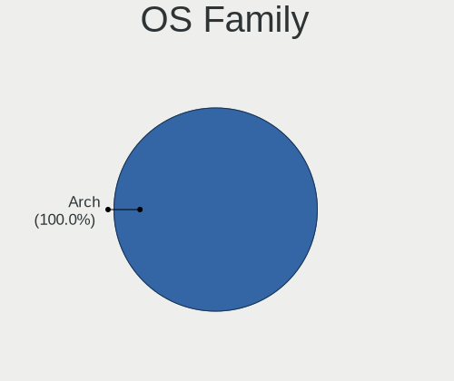
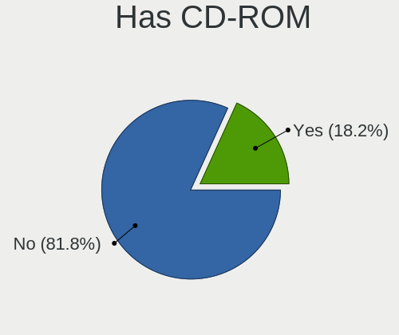
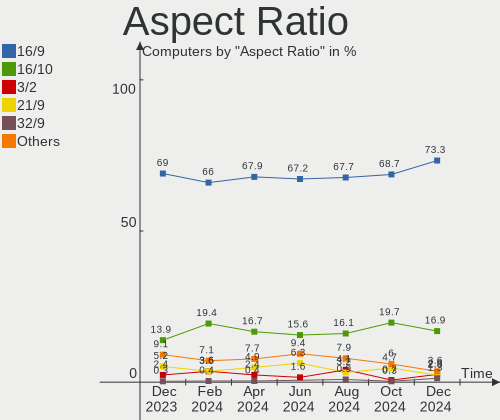
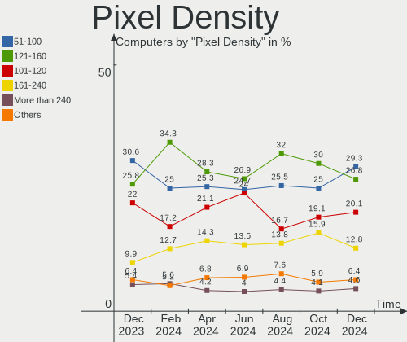
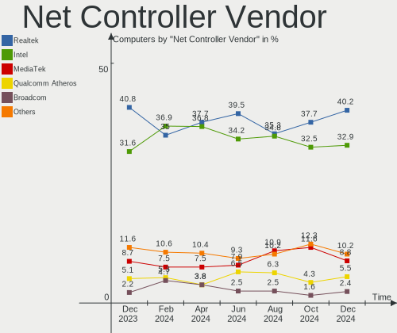

Arch - Hardware Trends
----------------------

A project to identify most popular hardware characteristics and track their change
over time based on data collected by Linux users at https://Linux-Hardware.org.

Anyone can contribute to this report by the [hw-probe](https://github.com/linuxhw/hw-probe) tool:

    sudo -E hw-probe -all -upload

This is a report for all computer types. See also reports for [desktops](/Dist/Arch/Desktop/README.md) and [notebooks](/Dist/Arch/Notebook/README.md).

This report is for one last month. Overall report since the beginning of time: [TestDays](https://github.com/linuxhw/TestDays)

Period: Nov, 2023.

Contents
--------

* [ System ](#system)
  - [ OS                       ](#os)
  - [ OS Family                ](#os-family)
  - [ Kernel                   ](#kernel)
  - [ Kernel Family            ](#kernel-family)
  - [ Kernel Major Ver.        ](#kernel-major-ver)
  - [ Arch                     ](#arch)
  - [ DE                       ](#de)
  - [ Display Server           ](#display-server)
  - [ Display Manager          ](#display-manager)
  - [ OS Lang                  ](#os-lang)
  - [ Boot Mode                ](#boot-mode)
  - [ Filesystem               ](#filesystem)
  - [ Part. scheme             ](#part-scheme)
  - [ Dual Boot with Linux/BSD ](#dual-boot-with-linuxbsd)
  - [ Dual Boot (Win)          ](#dual-boot-win)

* [ Board ](#board)
  - [ Vendor                   ](#vendor)
  - [ Model                    ](#model)
  - [ Model Family             ](#model-family)
  - [ MFG Year                 ](#mfg-year)
  - [ Form Factor              ](#form-factor)
  - [ Secure Boot              ](#secure-boot)
  - [ Coreboot                 ](#coreboot)
  - [ RAM Size                 ](#ram-size)
  - [ RAM Used                 ](#ram-used)
  - [ Total Drives             ](#total-drives)
  - [ Has CD-ROM               ](#has-cd-rom)
  - [ Has Ethernet             ](#has-ethernet)
  - [ Has WiFi                 ](#has-wifi)
  - [ Has Bluetooth            ](#has-bluetooth)

* [ Location ](#location)
  - [ Country                  ](#country)
  - [ City                     ](#city)

* [ Drives ](#drives)
  - [ Drive Vendor             ](#drive-vendor)
  - [ Drive Model              ](#drive-model)
  - [ HDD Vendor               ](#hdd-vendor)
  - [ SSD Vendor               ](#ssd-vendor)
  - [ Drive Kind               ](#drive-kind)
  - [ Drive Connector          ](#drive-connector)
  - [ Drive Size               ](#drive-size)
  - [ Space Total              ](#space-total)
  - [ Space Used               ](#space-used)
  - [ Malfunc. Drives          ](#malfunc-drives)
  - [ Malfunc. Drive Vendor    ](#malfunc-drive-vendor)
  - [ Malfunc. HDD Vendor      ](#malfunc-hdd-vendor)
  - [ Malfunc. Drive Kind      ](#malfunc-drive-kind)
  - [ Failed Drives            ](#failed-drives)
  - [ Failed Drive Vendor      ](#failed-drive-vendor)
  - [ Drive Status             ](#drive-status)

* [ Storage controller ](#storage-controller)
  - [ Storage Vendor           ](#storage-vendor)
  - [ Storage Model            ](#storage-model)
  - [ Storage Kind             ](#storage-kind)

* [ Processor ](#processor)
  - [ CPU Vendor               ](#cpu-vendor)
  - [ CPU Model                ](#cpu-model)
  - [ CPU Model Family         ](#cpu-model-family)
  - [ CPU Cores                ](#cpu-cores)
  - [ CPU Sockets              ](#cpu-sockets)
  - [ CPU Threads              ](#cpu-threads)
  - [ CPU Op-Modes             ](#cpu-op-modes)
  - [ CPU Microcode            ](#cpu-microcode)
  - [ CPU Microarch            ](#cpu-microarch)

* [ Graphics ](#graphics)
  - [ GPU Vendor               ](#gpu-vendor)
  - [ GPU Model                ](#gpu-model)
  - [ GPU Combo                ](#gpu-combo)
  - [ GPU Driver               ](#gpu-driver)
  - [ GPU Memory               ](#gpu-memory)

* [ Monitor ](#monitor)
  - [ Monitor Vendor           ](#monitor-vendor)
  - [ Monitor Model            ](#monitor-model)
  - [ Monitor Resolution       ](#monitor-resolution)
  - [ Monitor Diagonal         ](#monitor-diagonal)
  - [ Monitor Width            ](#monitor-width)
  - [ Aspect Ratio             ](#aspect-ratio)
  - [ Monitor Area             ](#monitor-area)
  - [ Pixel Density            ](#pixel-density)
  - [ Multiple Monitors        ](#multiple-monitors)

* [ Network ](#network)
  - [ Net Controller Vendor    ](#net-controller-vendor)
  - [ Net Controller Model     ](#net-controller-model)
  - [ Wireless Vendor          ](#wireless-vendor)
  - [ Wireless Model           ](#wireless-model)
  - [ Ethernet Vendor          ](#ethernet-vendor)
  - [ Ethernet Model           ](#ethernet-model)
  - [ Net Controller Kind      ](#net-controller-kind)
  - [ Used Controller          ](#used-controller)
  - [ NICs                     ](#nics)
  - [ IPv6                     ](#ipv6)

* [ Bluetooth ](#bluetooth)
  - [ Bluetooth Vendor         ](#bluetooth-vendor)
  - [ Bluetooth Model          ](#bluetooth-model)

* [ Sound ](#sound)
  - [ Sound Vendor             ](#sound-vendor)
  - [ Sound Model              ](#sound-model)

* [ Memory ](#memory)
  - [ Memory Vendor            ](#memory-vendor)
  - [ Memory Model             ](#memory-model)
  - [ Memory Kind              ](#memory-kind)
  - [ Memory Form Factor       ](#memory-form-factor)
  - [ Memory Size              ](#memory-size)
  - [ Memory Speed             ](#memory-speed)

* [ Printers & scanners ](#printers--scanners)
  - [ Printer Vendor           ](#printer-vendor)
  - [ Printer Model            ](#printer-model)
  - [ Scanner Vendor           ](#scanner-vendor)
  - [ Scanner Model            ](#scanner-model)

* [ Camera ](#camera)
  - [ Camera Vendor            ](#camera-vendor)
  - [ Camera Model             ](#camera-model)

* [ Security ](#security)
  - [ Fingerprint Vendor       ](#fingerprint-vendor)
  - [ Fingerprint Model        ](#fingerprint-model)
  - [ Chipcard Vendor          ](#chipcard-vendor)
  - [ Chipcard Model           ](#chipcard-model)

* [ Unsupported ](#unsupported)
  - [ Unsupported Devices      ](#unsupported-devices)
  - [ Unsupported Device Types ](#unsupported-device-types)

System
------

OS
--

Installed operating systems

| Name         | Computers | Percent |
|--------------|-----------|---------|
| Arch Rolling | 289       | 100%    |

OS Family
---------

OS without a version

| Name | Computers | Percent |
|------|-----------|---------|
| Arch | 289       | 100%    |

Kernel
------

Version of the Linux kernel

| Version                                | Computers | Percent |
|----------------------------------------|-----------|---------|
| 6.6.1-arch1-1                          | 81        | 28.03%  |
| 6.5.9-arch2-1                          | 59        | 20.42%  |
| 6.6.2-arch1-1                          | 40        | 13.84%  |
| 6.6.1-zen1-1-zen                       | 32        | 11.07%  |
| 6.5.9-zen2-1-zen                       | 15        | 5.19%   |
| 6.6.2-zen1-1-zen                       | 11        | 3.81%   |
| 6.5.7-arch1-1                          | 6         | 2.08%   |
| 6.1.62-1-lts                           | 6         | 2.08%   |
| 6.6.3-arch1-1                          | 4         | 1.38%   |
| 6.5.4-arch2-1                          | 3         | 1.04%   |
| 6.1.63-1-lts                           | 3         | 1.04%   |
| 6.5.8-arch1-1                          | 2         | 0.69%   |
| 6.7.0-rc3-1-mainline                   | 1         | 0.35%   |
| 6.6.3-zen1-1-zen                       | 1         | 0.35%   |
| 6.6.2-arch1-1-custom                   | 1         | 0.35%   |
| 6.6.1-zen1-1.1-zen                     | 1         | 0.35%   |
| 6.6.1-lqx1-1-lqx                       | 1         | 0.35%   |
| 6.6.1-arch1-1-flowx13                  | 1         | 0.35%   |
| 6.6.1-1-MANJARO                        | 1         | 0.35%   |
| 6.6.1-1-clear                          | 1         | 0.35%   |
| 6.6.0.15.realtime1-1-rt                | 1         | 0.35%   |
| 6.6.0-zen4-xanmod1-1-edge              | 1         | 0.35%   |
| 6.6.0-arch1-1                          | 1         | 0.35%   |
| 6.6.0-AMD                              | 1         | 0.35%   |
| 6.6.0-273-tkg-eevdf                    | 1         | 0.35%   |
| 6.6.0-1-cachyos-bore-lto               | 1         | 0.35%   |
| 6.5.9-301.fsync.fc39.x86_64            | 1         | 0.35%   |
| 6.5.8-273-tkg-linux-tkg-pds-generic_v3 | 1         | 0.35%   |
| 6.5.6-zen2-1-zen                       | 1         | 0.35%   |
| 6.5.5-native_amd-xanmod1-1             | 1         | 0.35%   |
| 6.4.4-arch1-1                          | 1         | 0.35%   |
| 6.4.3-arch1-2                          | 1         | 0.35%   |
| 6.4.12-arch1-1                         | 1         | 0.35%   |
| 6.4.10-arch1-1                         | 1         | 0.35%   |
| 6.1.7-HONOR-MGB-v3                     | 1         | 0.35%   |
| 6.1.61-1-lts                           | 1         | 0.35%   |
| 6.1.60-1-lts                           | 1         | 0.35%   |
| 6.1.58-1-lts                           | 1         | 0.35%   |
| 5.18.12-arch1-1                        | 1         | 0.35%   |

Kernel Family
-------------

Linux kernel without a distro release

| Version  | Computers | Percent |
|----------|-----------|---------|
| 6.6.1    | 118       | 40.83%  |
| 6.5.9    | 75        | 25.95%  |
| 6.6.2    | 52        | 17.99%  |
| 6.5.7    | 6         | 2.08%   |
| 6.1.62   | 6         | 2.08%   |
| 6.6.3    | 5         | 1.73%   |
| 6.6.0    | 5         | 1.73%   |
| 6.5.8    | 3         | 1.04%   |
| 6.5.4    | 3         | 1.04%   |
| 6.1.63   | 3         | 1.04%   |
| 6.7.0    | 1         | 0.35%   |
| 6.6.0.15 | 1         | 0.35%   |
| 6.5.6    | 1         | 0.35%   |
| 6.5.5    | 1         | 0.35%   |
| 6.4.4    | 1         | 0.35%   |
| 6.4.3    | 1         | 0.35%   |
| 6.4.12   | 1         | 0.35%   |
| 6.4.10   | 1         | 0.35%   |
| 6.1.7    | 1         | 0.35%   |
| 6.1.61   | 1         | 0.35%   |
| 6.1.60   | 1         | 0.35%   |
| 6.1.58   | 1         | 0.35%   |
| 5.18.12  | 1         | 0.35%   |

Kernel Major Ver.
-----------------

Linux kernel major version

| Version | Computers | Percent |
|---------|-----------|---------|
| 6.6     | 180       | 62.28%  |
| 6.5     | 89        | 30.8%   |
| 6.1     | 13        | 4.5%    |
| 6.4     | 4         | 1.38%   |
| 6.7     | 1         | 0.35%   |
| 6.6.0   | 1         | 0.35%   |
| 5.18    | 1         | 0.35%   |

Arch
----

OS architecture (x86_64, i586, etc.)

| Name   | Computers | Percent |
|--------|-----------|---------|
| x86_64 | 289       | 100%    |

DE
--

Desktop Environment

| Name                    | Computers | Percent |
|-------------------------|-----------|---------|
| KDE5                    | 117       | 40.48%  |
| GNOME                   | 86        | 29.76%  |
| XFCE                    | 19        | 6.57%   |
| i3                      | 15        | 5.19%   |
| Unknown                 | 15        | 5.19%   |
| Hyprland                | 12        | 4.15%   |
| sway                    | 7         | 2.42%   |
| X-Cinnamon              | 3         | 1.04%   |
| MATE                    | 2         | 0.69%   |
| i3-with-shmlog          | 2         | 0.69%   |
| wayland                 | 1         | 0.35%   |
| Wayfire:wayfire:wlroots | 1         | 0.35%   |
| LXQt                    | 1         | 0.35%   |
| LXDE                    | 1         | 0.35%   |
| KDE                     | 1         | 0.35%   |
| Enlightenment           | 1         | 0.35%   |
| dwm                     | 1         | 0.35%   |
| Deepin                  | 1         | 0.35%   |
| DDE                     | 1         | 0.35%   |
| Cinnamon                | 1         | 0.35%   |
| bspwm                   | 1         | 0.35%   |

Display Server
--------------

X11 or Wayland

| Name    | Computers | Percent |
|---------|-----------|---------|
| Wayland | 134       | 46.37%  |
| X11     | 118       | 40.83%  |
| Tty     | 23        | 7.96%   |
| Unknown | 14        | 4.84%   |

Display Manager
---------------

SDDM, LightDM, etc.

| Name    | Computers | Percent |
|---------|-----------|---------|
| Unknown | 109       | 37.72%  |
| SDDM    | 93        | 32.18%  |
| LightDM | 42        | 14.53%  |
| GDM     | 36        | 12.46%  |
| LY-DM   | 5         | 1.73%   |
| LXDM    | 2         | 0.69%   |
| Ly      | 1         | 0.35%   |
| EMPTTY  | 1         | 0.35%   |

OS Lang
-------

Language

| Lang       | Computers | Percent |
|------------|-----------|---------|
| en_US      | 169       | 58.48%  |
| en_GB      | 20        | 6.92%   |
| it_IT      | 18        | 6.23%   |
| C          | 17        | 5.88%   |
| pt_BR      | 9         | 3.11%   |
| de_DE      | 9         | 3.11%   |
| ru_RU      | 7         | 2.42%   |
| fr_FR      | 6         | 2.08%   |
| Unknown    | 4         | 1.38%   |
| pl_PL      | 3         | 1.04%   |
| es_MX      | 3         | 1.04%   |
| es_ES      | 3         | 1.04%   |
| es_CL      | 2         | 0.69%   |
| es_AR      | 2         | 0.69%   |
| en_IN      | 2         | 0.69%   |
| en_CA      | 2         | 0.69%   |
| zh_CN      | 1         | 0.35%   |
| uk_UA      | 1         | 0.35%   |
| tr_TR      | 1         | 0.35%   |
| sv_SE      | 1         | 0.35%   |
| es_ES.UTF8 | 1         | 0.35%   |
| es_DO      | 1         | 0.35%   |
| es_CO      | 1         | 0.35%   |
| en_IE      | 1         | 0.35%   |
| en_DK      | 1         | 0.35%   |
| en_CH      | 1         | 0.35%   |
| en_AU      | 1         | 0.35%   |
| en-US      | 1         | 0.35%   |
| de_AT      | 1         | 0.35%   |

Boot Mode
---------

EFI or BIOS

| Mode | Computers | Percent |
|------|-----------|---------|
| EFI  | 190       | 65.74%  |
| BIOS | 99        | 34.26%  |

Filesystem
----------

Type of filesystem

| Type    | Computers | Percent |
|---------|-----------|---------|
| Ext4    | 180       | 62.28%  |
| Btrfs   | 90        | 31.14%  |
| F2fs    | 7         | 2.42%   |
| Xfs     | 6         | 2.08%   |
| Unknown | 3         | 1.04%   |
| Overlay | 2         | 0.69%   |
| Zfs     | 1         | 0.35%   |

Part. scheme
------------

Scheme of partitioning

| Type    | Computers | Percent |
|---------|-----------|---------|
| GPT     | 201       | 69.55%  |
| Unknown | 75        | 25.95%  |
| MBR     | 13        | 4.5%    |

Dual Boot with Linux/BSD
------------------------

Hosting more than one Linux/BSD

| Dual boot | Computers | Percent |
|-----------|-----------|---------|
| No        | 246       | 85.12%  |
| Yes       | 43        | 14.88%  |

Dual Boot (Win)
---------------

Hosting Linux and Windows

| Dual boot | Computers | Percent |
|-----------|-----------|---------|
| No        | 212       | 73.36%  |
| Yes       | 77        | 26.64%  |

Board
-----

Vendor
------

Motherboard manufacturer

| Name                | Computers | Percent |
|---------------------|-----------|---------|
| ASUSTek Computer    | 57        | 19.72%  |
| Lenovo              | 50        | 17.3%   |
| Hewlett-Packard     | 36        | 12.46%  |
| Dell                | 31        | 10.73%  |
| MSI                 | 30        | 10.38%  |
| Gigabyte Technology | 17        | 5.88%   |
| Acer                | 13        | 4.5%    |
| ASRock              | 11        | 3.81%   |
| Apple               | 8         | 2.77%   |
| HUAWEI              | 4         | 1.38%   |
| Samsung Electronics | 3         | 1.04%   |
| Notebook            | 3         | 1.04%   |
| Google              | 2         | 0.69%   |
| Fujitsu             | 2         | 0.69%   |
| AZW                 | 2         | 0.69%   |
| AMI                 | 2         | 0.69%   |
| Valve               | 1         | 0.35%   |
| Timi                | 1         | 0.35%   |
| System76            | 1         | 0.35%   |
| Semp Toshiba        | 1         | 0.35%   |
| Schenker            | 1         | 0.35%   |
| Microsoft           | 1         | 0.35%   |
| Intel               | 1         | 0.35%   |
| Huanan              | 1         | 0.35%   |
| HONOR               | 1         | 0.35%   |
| Hardkernel          | 1         | 0.35%   |
| Grupo Nucleo        | 1         | 0.35%   |
| GEO                 | 1         | 0.35%   |
| Framework           | 1         | 0.35%   |
| Colorful Technology | 1         | 0.35%   |
| Chuwi               | 1         | 0.35%   |
| Alienware           | 1         | 0.35%   |
| A14CR               | 1         | 0.35%   |
| Unknown             | 1         | 0.35%   |

Model
-----

Motherboard model

| Name                                  | Computers | Percent |
|---------------------------------------|-----------|---------|
| MSI MS-7D75                           | 4         | 1.38%   |
| MSI MS-7C37                           | 3         | 1.04%   |
| MSI MS-7C02                           | 3         | 1.04%   |
| MSI MS-7C91                           | 2         | 0.69%   |
| MSI MS-7B79                           | 2         | 0.69%   |
| Lenovo ThinkPad T14s Gen 3 21CQCTO1WW | 2         | 0.69%   |
| Lenovo ThinkPad P14s Gen 4 21K5CTO1WW | 2         | 0.69%   |
| Lenovo IdeaPad 3 15ITL6 82H8          | 2         | 0.69%   |
| HP Laptop 15s-eq2xxx                  | 2         | 0.69%   |
| HP 255 G8 Notebook PC                 | 2         | 0.69%   |
| Dell OptiPlex 3080                    | 2         | 0.69%   |
| ASUS TUF Gaming X570-PRO              | 2         | 0.69%   |
| ASUS PRIME Z390-P                     | 2         | 0.69%   |
| ASUS All Series                       | 2         | 0.69%   |
| Acer Nitro AN515-54                   | 2         | 0.69%   |
| Unknown                               | 2         | 0.69%   |
| Valve Jupiter                         | 1         | 0.35%   |
| Timi TM1604                           | 1         | 0.35%   |
| System76 Pangolin                     | 1         | 0.35%   |
| Semp Toshiba STI                      | 1         | 0.35%   |
| Schenker XMG FUSION 15 (XFU15M22)     | 1         | 0.35%   |
| Samsung QX311/QX411/QX412/QX511       | 1         | 0.35%   |
| Samsung 750XDA                        | 1         | 0.35%   |
| Samsung 300E5M/300E5L                 | 1         | 0.35%   |
| Notebook NJ50_70CU                    | 1         | 0.35%   |
| Notebook N85_N87,HJ,HJ1,HK1           | 1         | 0.35%   |
| Notebook N141CU                       | 1         | 0.35%   |
| MSI MS-7D91                           | 1         | 0.35%   |
| MSI MS-7D54                           | 1         | 0.35%   |
| MSI MS-7D52                           | 1         | 0.35%   |
| MSI MS-7D46                           | 1         | 0.35%   |
| MSI MS-7C96                           | 1         | 0.35%   |
| MSI MS-7C95                           | 1         | 0.35%   |
| MSI MS-7C94                           | 1         | 0.35%   |
| MSI MS-7C56                           | 1         | 0.35%   |
| MSI MS-7B89                           | 1         | 0.35%   |
| MSI MS-7A33                           | 1         | 0.35%   |
| MSI MS-7817                           | 1         | 0.35%   |
| MSI MS-7816                           | 1         | 0.35%   |
| MSI MS-7583                           | 1         | 0.35%   |

Model Family
------------

Motherboard model prefix

| Name               | Computers | Percent |
|--------------------|-----------|---------|
| Lenovo ThinkPad    | 24        | 8.3%    |
| Lenovo IdeaPad     | 13        | 4.5%    |
| ASUS ROG           | 13        | 4.5%    |
| ASUS VivoBook      | 11        | 3.81%   |
| Dell Latitude      | 10        | 3.46%   |
| ASUS PRIME         | 8         | 2.77%   |
| HP Laptop          | 6         | 2.08%   |
| HP EliteBook       | 6         | 2.08%   |
| Dell OptiPlex      | 6         | 2.08%   |
| Dell Inspiron      | 6         | 2.08%   |
| Lenovo Legion      | 5         | 1.73%   |
| HP Pavilion        | 5         | 1.73%   |
| ASUS TUF           | 5         | 1.73%   |
| Acer Nitro         | 5         | 1.73%   |
| Acer Aspire        | 5         | 1.73%   |
| MSI MS-7D75        | 4         | 1.38%   |
| MSI MS-7C37        | 3         | 1.04%   |
| MSI MS-7C02        | 3         | 1.04%   |
| HP ENVY            | 3         | 1.04%   |
| MSI MS-7C91        | 2         | 0.69%   |
| MSI MS-7B79        | 2         | 0.69%   |
| Lenovo Yoga        | 2         | 0.69%   |
| Lenovo ThinkCentre | 2         | 0.69%   |
| HP ProBook         | 2         | 0.69%   |
| HP Compaq          | 2         | 0.69%   |
| HP 255             | 2         | 0.69%   |
| Gigabyte Z390      | 2         | 0.69%   |
| Gigabyte X570      | 2         | 0.69%   |
| Dell Precision     | 2         | 0.69%   |
| Dell G3            | 2         | 0.69%   |
| ASUS ZenBook       | 2         | 0.69%   |
| ASUS ProArt        | 2         | 0.69%   |
| ASUS ASUS          | 2         | 0.69%   |
| ASUS All           | 2         | 0.69%   |
| ASRock B550M       | 2         | 0.69%   |
| Apple MacBookPro11 | 2         | 0.69%   |
| Acer Swift         | 2         | 0.69%   |
| Unknown            | 2         | 0.69%   |
| Valve Jupiter      | 1         | 0.35%   |
| Timi TM1604        | 1         | 0.35%   |

MFG Year
--------

Motherboard manufacture year

| Year | Computers | Percent |
|------|-----------|---------|
| 2022 | 48        | 16.61%  |
| 2021 | 39        | 13.49%  |
| 2020 | 39        | 13.49%  |
| 2023 | 31        | 10.73%  |
| 2018 | 27        | 9.34%   |
| 2019 | 23        | 7.96%   |
| 2017 | 21        | 7.27%   |
| 2016 | 10        | 3.46%   |
| 2012 | 10        | 3.46%   |
| 2014 | 9         | 3.11%   |
| 2013 | 9         | 3.11%   |
| 2011 | 9         | 3.11%   |
| 2015 | 6         | 2.08%   |
| 2007 | 3         | 1.04%   |
| 2010 | 2         | 0.69%   |
| 2009 | 2         | 0.69%   |
| 2008 | 1         | 0.35%   |

Form Factor
-----------

Physical design of the computer

| Name        | Computers | Percent |
|-------------|-----------|---------|
| Notebook    | 156       | 53.98%  |
| Desktop     | 113       | 39.1%   |
| Convertible | 12        | 4.15%   |
| Mini pc     | 4         | 1.38%   |
| Tablet      | 2         | 0.69%   |
| All in one  | 2         | 0.69%   |

Secure Boot
-----------

Enabled or disabled

| State    | Computers | Percent |
|----------|-----------|---------|
| Disabled | 284       | 98.27%  |
| Enabled  | 5         | 1.73%   |

Coreboot
--------

Have coreboot on board

| Used | Computers | Percent |
|------|-----------|---------|
| No   | 287       | 99.31%  |
| Yes  | 2         | 0.69%   |

RAM Size
--------

Total RAM memory

| Size in GB  | Computers | Percent |
|-------------|-----------|---------|
| 16.01-24.0  | 72        | 24.91%  |
| 32.01-64.0  | 65        | 22.49%  |
| 4.01-8.0    | 54        | 18.69%  |
| 8.01-16.0   | 42        | 14.53%  |
| 64.01-256.0 | 22        | 7.61%   |
| 3.01-4.0    | 16        | 5.54%   |
| 24.01-32.0  | 15        | 5.19%   |
| 2.01-3.0    | 2         | 0.69%   |
| 1.01-2.0    | 1         | 0.35%   |

RAM Used
--------

Used RAM memory

| Used GB    | Computers | Percent |
|------------|-----------|---------|
| 4.01-8.0   | 99        | 34.26%  |
| 2.01-3.0   | 55        | 19.03%  |
| 3.01-4.0   | 53        | 18.34%  |
| 8.01-16.0  | 32        | 11.07%  |
| 1.01-2.0   | 31        | 10.73%  |
| 16.01-24.0 | 7         | 2.42%   |
| 0.51-1.0   | 6         | 2.08%   |
| 0.01-0.5   | 3         | 1.04%   |
| 24.01-32.0 | 2         | 0.69%   |
| 32.01-64.0 | 1         | 0.35%   |

Total Drives
------------

Number of drives on board

| Drives | Computers | Percent |
|--------|-----------|---------|
| 1      | 152       | 52.6%   |
| 2      | 68        | 23.53%  |
| 3      | 33        | 11.42%  |
| 4      | 15        | 5.19%   |
| 5      | 11        | 3.81%   |
| 6      | 5         | 1.73%   |
| 8      | 3         | 1.04%   |
| 7      | 1         | 0.35%   |
| 0      | 1         | 0.35%   |

Has CD-ROM
----------

Has CD-ROM on board

| Presented | Computers | Percent |
|-----------|-----------|---------|
| No        | 250       | 86.51%  |
| Yes       | 39        | 13.49%  |

Has Ethernet
------------

Has Ethernet on board

| Presented | Computers | Percent |
|-----------|-----------|---------|
| Yes       | 227       | 78.55%  |
| No        | 62        | 21.45%  |

Has WiFi
--------

Has WiFi module

| Presented | Computers | Percent |
|-----------|-----------|---------|
| Yes       | 243       | 84.08%  |
| No        | 46        | 15.92%  |

Has Bluetooth
-------------

Has Bluetooth module

| Presented | Computers | Percent |
|-----------|-----------|---------|
| Yes       | 231       | 79.93%  |
| No        | 58        | 20.07%  |

Location
--------

Country
-------

Geographic location (country)

| Country                | Computers | Percent |
|------------------------|-----------|---------|
| USA                    | 61        | 21.11%  |
| Italy                  | 28        | 9.69%   |
| Germany                | 26        | 9%      |
| Russia                 | 16        | 5.54%   |
| France                 | 14        | 4.84%   |
| Brazil                 | 13        | 4.5%    |
| India                  | 12        | 4.15%   |
| Poland                 | 10        | 3.46%   |
| Mexico                 | 10        | 3.46%   |
| UK                     | 8         | 2.77%   |
| Netherlands            | 5         | 1.73%   |
| Spain                  | 4         | 1.38%   |
| Czechia                | 4         | 1.38%   |
| Canada                 | 4         | 1.38%   |
| Turkey                 | 3         | 1.04%   |
| Thailand               | 3         | 1.04%   |
| Lithuania              | 3         | 1.04%   |
| Hungary                | 3         | 1.04%   |
| China                  | 3         | 1.04%   |
| Chile                  | 3         | 1.04%   |
| Austria                | 3         | 1.04%   |
| Australia              | 3         | 1.04%   |
| Ukraine                | 2         | 0.69%   |
| UAE                    | 2         | 0.69%   |
| Taiwan                 | 2         | 0.69%   |
| Switzerland            | 2         | 0.69%   |
| Sweden                 | 2         | 0.69%   |
| Romania                | 2         | 0.69%   |
| Portugal               | 2         | 0.69%   |
| Norway                 | 2         | 0.69%   |
| New Zealand            | 2         | 0.69%   |
| Iran                   | 2         | 0.69%   |
| Indonesia              | 2         | 0.69%   |
| Dominican Republic     | 2         | 0.69%   |
| Bosnia and Herzegovina | 2         | 0.69%   |
| Argentina              | 2         | 0.69%   |
| Venezuela              | 1         | 0.35%   |
| Sri Lanka              | 1         | 0.35%   |
| South Korea            | 1         | 0.35%   |
| Slovenia               | 1         | 0.35%   |

City
----

Geographic location (city)

| City                   | Computers | Percent |
|------------------------|-----------|---------|
| Rome                   | 7         | 2.42%   |
| Moscow                 | 6         | 2.08%   |
| La Broque              | 4         | 1.38%   |
| Chennai                | 4         | 1.38%   |
| Seattle                | 3         | 1.04%   |
| Bellevue               | 3         | 1.04%   |
| Xalapa                 | 2         | 0.69%   |
| Winchester             | 2         | 0.69%   |
| Vilnius                | 2         | 0.69%   |
| Villingen-Schwenningen | 2         | 0.69%   |
| Vienna                 | 2         | 0.69%   |
| Tlalnepantla           | 2         | 0.69%   |
| Tehran                 | 2         | 0.69%   |
| Taoyuan District       | 2         | 0.69%   |
| St Petersburg          | 2         | 0.69%   |
| Sinzig                 | 2         | 0.69%   |
| Sao Paulo              | 2         | 0.69%   |
| Santiago               | 2         | 0.69%   |
| Rio de Janeiro         | 2         | 0.69%   |
| Portland               | 2         | 0.69%   |
| Nizhniy Novgorod       | 2         | 0.69%   |
| Munich                 | 2         | 0.69%   |
| Milan                  | 2         | 0.69%   |
| Melbourne              | 2         | 0.69%   |
| Los Angeles            | 2         | 0.69%   |
| Krakow                 | 2         | 0.69%   |
| Istanbul               | 2         | 0.69%   |
| Frankfurt am Main      | 2         | 0.69%   |
| Essen                  | 2         | 0.69%   |
| Delhi                  | 2         | 0.69%   |
| Budapest               | 2         | 0.69%   |
| Borlänge              | 2         | 0.69%   |
| Berlin                 | 2         | 0.69%   |
| Zurich                 | 1         | 0.35%   |
| Yerevan                | 1         | 0.35%   |
| Wroclaw                | 1         | 0.35%   |
| Witten                 | 1         | 0.35%   |
| Wichita                | 1         | 0.35%   |
| Wetzlar                | 1         | 0.35%   |
| West Lebanon           | 1         | 0.35%   |

Drives
------

Drive Vendor
------------

Hard drive vendors

| Vendor                       | Computers | Drives | Percent |
|------------------------------|-----------|--------|---------|
| Samsung Electronics          | 95        | 125    | 19.51%  |
| SanDisk                      | 58        | 66     | 11.91%  |
| WDC                          | 50        | 65     | 10.27%  |
| Seagate                      | 41        | 47     | 8.42%   |
| SK hynix                     | 24        | 24     | 4.93%   |
| Kingston                     | 23        | 28     | 4.72%   |
| Toshiba                      | 20        | 22     | 4.11%   |
| Intel                        | 17        | 17     | 3.49%   |
| Micron/Crucial Technology    | 16        | 16     | 3.29%   |
| Crucial                      | 16        | 19     | 3.29%   |
| Micron Technology            | 14        | 14     | 2.87%   |
| A-DATA Technology            | 8         | 8      | 1.64%   |
| Unknown                      | 7         | 7      | 1.44%   |
| KIOXIA                       | 6         | 7      | 1.23%   |
| Silicon Motion               | 5         | 5      | 1.03%   |
| MAXIO Technology (Hangzhou)  | 5         | 5      | 1.03%   |
| Kingston Technology Company  | 5         | 5      | 1.03%   |
| China                        | 5         | 6      | 1.03%   |
| PNY                          | 4         | 4      | 0.82%   |
| Hitachi                      | 4         | 4      | 0.82%   |
| Apple                        | 4         | 4      | 0.82%   |
| Solid State Storage          | 3         | 3      | 0.62%   |
| Shenzhen Longsys Electronics | 3         | 3      | 0.62%   |
| Realtek Semiconductor        | 3         | 3      | 0.62%   |
| Phison Electronics           | 3         | 3      | 0.62%   |
| Netac                        | 3         | 4      | 0.62%   |
| ADATA Technology             | 3         | 4      | 0.62%   |
| sobetter                     | 2         | 2      | 0.41%   |
| LITEON                       | 2         | 2      | 0.41%   |
| HGST                         | 2         | 2      | 0.41%   |
| X12                          | 1         | 1      | 0.21%   |
| WD MediaMax                  | 1         | 1      | 0.21%   |
| Verbatim                     | 1         | 1      | 0.21%   |
| Union Memory (Shenzhen)      | 1         | 1      | 0.21%   |
| Transcend                    | 1         | 1      | 0.21%   |
| Team                         | 1         | 1      | 0.21%   |
| Supersonic                   | 1         | 1      | 0.21%   |
| SSK                          | 1         | 1      | 0.21%   |
| SPCC                         | 1         | 1      | 0.21%   |
| SABRENT                      | 1         | 1      | 0.21%   |

Drive Model
-----------

Hard drive models

| Model                                                 | Computers | Percent |
|-------------------------------------------------------|-----------|---------|
| Samsung NVMe SSD Controller SM981/PM981/PM983 250GB   | 27        | 4.98%   |
| Samsung NVMe SSD Controller PM9A1/PM9A3/980PRO 2TB    | 21        | 3.87%   |
| Micron/Crucial P2 NVMe PCIe SSD 1TB                   | 9         | 1.66%   |
| Sandisk WD Black SN750 / PC SN730 NVMe SSD 500GB      | 7         | 1.29%   |
| Kingston SA400S37240G 240GB SSD                       | 7         | 1.29%   |
| Samsung SSD 860 EVO 500GB                             | 6         | 1.11%   |
| Seagate ST1000LM035-1RK172 1TB                        | 5         | 0.92%   |
| Sandisk WD Blue SN550 NVMe SSD 512GB                  | 5         | 0.92%   |
| Sandisk WD Black SN850 1024GB                         | 5         | 0.92%   |
| Samsung SSD 990 PRO 1TB                               | 5         | 0.92%   |
| Samsung SSD 850 EVO 500GB                             | 5         | 0.92%   |
| WDC WD10EZEX-08WN4A0 1TB                              | 4         | 0.74%   |
| Silicon Motion SM2263EN/SM2263XT SSD Controller 256GB | 4         | 0.74%   |
| Sandisk WD_BLACK SN770 2TB                            | 4         | 0.74%   |
| Samsung SSD 870 QVO 1TB                               | 4         | 0.74%   |
| Samsung SSD 860 EVO 1TB                               | 4         | 0.74%   |
| Samsung NVMe SSD Controller SM961/PM961/SM963 256GB   | 4         | 0.74%   |
| MAXIO (Hangzhou) NVMe SSD Controller MAP1202 1024GB   | 4         | 0.74%   |
| Intel SSDPEKNU512GZ 512GB                             | 4         | 0.74%   |
| Intel SSD 660P Series 512GB                           | 4         | 0.74%   |
| Toshiba MQ01ABD100 1TB                                | 3         | 0.55%   |
| Toshiba HDWD110 1TB                                   | 3         | 0.55%   |
| SK hynix BC501 NVMe Solid State Drive 512GB           | 3         | 0.55%   |
| Seagate ST500LT012-1DG142 500GB                       | 3         | 0.55%   |
| SanDisk SSD PLUS 240GB                                | 3         | 0.55%   |
| Samsung SSD 980 1TB                                   | 3         | 0.55%   |
| Samsung SSD 850 EVO 250GB                             | 3         | 0.55%   |
| Micron/Crucial P1 NVMe PCIe SSD 1TB                   | 3         | 0.55%   |
| Kingston Company A2000 NVMe SSD 250GB                 | 3         | 0.55%   |
| Kingston SV300S37A240G 240GB SSD                      | 3         | 0.55%   |
| Kingston SKC3000S1024G 1024GB                         | 3         | 0.55%   |
| Crucial CT500MX500SSD1 500GB                          | 3         | 0.55%   |
| Crucial CT480BX500SSD1 480GB                          | 3         | 0.55%   |
| Crucial CT1000MX500SSD1 1TB                           | 3         | 0.55%   |
| WDC WDS100T2G0A-00JH30 1TB SSD                        | 2         | 0.37%   |
| WDC WDS100T2B0A-00SM50 1TB SSD                        | 2         | 0.37%   |
| WDC WD5000LPVX-22V0TT0 500GB                          | 2         | 0.37%   |
| WDC WD40EFRX-68N32N0 4TB                              | 2         | 0.37%   |
| WDC WD10EZEX-00BN5A0 1TB                              | 2         | 0.37%   |
| WDC WD10EARS-00Y5B1 1TB                               | 2         | 0.37%   |

HDD Vendor
----------

Hard disk drive vendors

| Vendor              | Computers | Drives | Percent |
|---------------------|-----------|--------|---------|
| WDC                 | 44        | 57     | 39.29%  |
| Seagate             | 40        | 46     | 35.71%  |
| Toshiba             | 14        | 16     | 12.5%   |
| Hitachi             | 4         | 4      | 3.57%   |
| Samsung Electronics | 2         | 2      | 1.79%   |
| HGST                | 2         | 2      | 1.79%   |
| WD MediaMax         | 1         | 1      | 0.89%   |
| SABRENT             | 1         | 1      | 0.89%   |
| NeoTech             | 1         | 1      | 0.89%   |
| Fujitsu             | 1         | 1      | 0.89%   |
| Apple               | 1         | 1      | 0.89%   |
| ACASIS              | 1         | 2      | 0.89%   |

SSD Vendor
----------

Solid state drive vendors

| Vendor              | Computers | Drives | Percent |
|---------------------|-----------|--------|---------|
| Samsung Electronics | 33        | 44     | 24.26%  |
| SanDisk             | 17        | 21     | 12.5%   |
| Kingston            | 16        | 20     | 11.76%  |
| Crucial             | 16        | 19     | 11.76%  |
| WDC                 | 7         | 7      | 5.15%   |
| A-DATA Technology   | 6         | 6      | 4.41%   |
| China               | 5         | 5      | 3.68%   |
| PNY                 | 4         | 4      | 2.94%   |
| Apple               | 3         | 3      | 2.21%   |
| SK hynix            | 2         | 2      | 1.47%   |
| Netac               | 2         | 3      | 1.47%   |
| LITEON              | 2         | 2      | 1.47%   |
| X12                 | 1         | 1      | 0.74%   |
| Verbatim            | 1         | 1      | 0.74%   |
| Transcend           | 1         | 1      | 0.74%   |
| Toshiba             | 1         | 1      | 0.74%   |
| Team                | 1         | 1      | 0.74%   |
| Supersonic          | 1         | 1      | 0.74%   |
| SPCC                | 1         | 1      | 0.74%   |
| Patriot             | 1         | 1      | 0.74%   |
| OCZ                 | 1         | 1      | 0.74%   |
| Mushkin             | 1         | 2      | 0.74%   |
| Lexar               | 1         | 1      | 0.74%   |
| Leven               | 1         | 1      | 0.74%   |
| Intenso             | 1         | 1      | 0.74%   |
| Intel               | 1         | 1      | 0.74%   |
| HS-SSD-E100         | 1         | 1      | 0.74%   |
| Hewlett-Packard     | 1         | 1      | 0.74%   |
| GOODRAM             | 1         | 1      | 0.74%   |
| Fanxiang            | 1         | 1      | 0.74%   |
| Dogfish             | 1         | 1      | 0.74%   |
| Corsair             | 1         | 1      | 0.74%   |
| Apacer              | 1         | 1      | 0.74%   |
| AMD                 | 1         | 1      | 0.74%   |
| Acer                | 1         | 1      | 0.74%   |

Drive Kind
----------

HDD or SSD

| Kind    | Computers | Drives | Percent |
|---------|-----------|--------|---------|
| NVMe    | 206       | 255    | 48.93%  |
| SSD     | 112       | 160    | 26.6%   |
| HDD     | 90        | 134    | 21.38%  |
| MMC     | 7         | 7      | 1.66%   |
| Unknown | 6         | 5      | 1.43%   |

Drive Connector
---------------

SATA, SAS, NVMe, etc.

| Type | Computers | Drives | Percent |
|------|-----------|--------|---------|
| NVMe | 205       | 252    | 53.52%  |
| SATA | 156       | 286    | 40.73%  |
| SAS  | 15        | 16     | 3.92%   |
| MMC  | 7         | 7      | 1.83%   |

Drive Size
----------

Size of hard drive

| Size in TB | Computers | Drives | Percent |
|------------|-----------|--------|---------|
| 0.01-0.5   | 105       | 148    | 47.09%  |
| 0.51-1.0   | 71        | 92     | 31.84%  |
| 1.01-2.0   | 20        | 22     | 8.97%   |
| 3.01-4.0   | 14        | 17     | 6.28%   |
| 4.01-10.0  | 6         | 8      | 2.69%   |
| 2.01-3.0   | 5         | 5      | 2.24%   |
| 10.01-20.0 | 2         | 2      | 0.9%    |

Space Total
-----------

Amount of disk space available on the file system

| Size in GB     | Computers | Percent |
|----------------|-----------|---------|
| 251-500        | 65        | 22.49%  |
| 501-1000       | 64        | 22.15%  |
| More than 3000 | 52        | 17.99%  |
| 101-250        | 38        | 13.15%  |
| 1001-2000      | 36        | 12.46%  |
| 2001-3000      | 19        | 6.57%   |
| 51-100         | 7         | 2.42%   |
| 21-50          | 3         | 1.04%   |
| Unknown        | 3         | 1.04%   |
| 1-20           | 2         | 0.69%   |

Space Used
----------

Amount of used disk space

| Used GB        | Computers | Percent |
|----------------|-----------|---------|
| 101-250        | 57        | 19.72%  |
| 501-1000       | 42        | 14.53%  |
| 1-20           | 41        | 14.19%  |
| 251-500        | 33        | 11.42%  |
| 21-50          | 33        | 11.42%  |
| 51-100         | 32        | 11.07%  |
| More than 3000 | 20        | 6.92%   |
| 1001-2000      | 19        | 6.57%   |
| 2001-3000      | 9         | 3.11%   |
| Unknown        | 3         | 1.04%   |

Malfunc. Drives
---------------

Drive models with a malfunction

| Model                                                          | Computers | Drives | Percent |
|----------------------------------------------------------------|-----------|--------|---------|
| Seagate ST3500418AS 500GB                                      | 2         | 2      | 5.41%   |
| SanDisk SSD PLUS 240GB                                         | 2         | 2      | 5.41%   |
| WDC WD60EDAZ-11U78B0 6TB                                       | 1         | 1      | 2.7%    |
| WDC WD5000AAKX-00ERMA0 500GB                                   | 1         | 1      | 2.7%    |
| WDC WD2500BEVS-11VAT0 250GB                                    | 1         | 1      | 2.7%    |
| WDC WD20SPZX-75UA7T0 2TB                                       | 1         | 1      | 2.7%    |
| WDC WD20EARS-00MVWB0 2TB                                       | 1         | 1      | 2.7%    |
| WDC WD10EZEX-08M2NA0 1TB                                       | 1         | 1      | 2.7%    |
| WDC WD10EARS-00Y5B1 1TB                                        | 1         | 1      | 2.7%    |
| WDC WD10EADS-65L5B1 1TB                                        | 1         | 1      | 2.7%    |
| WD MediaMax WL4000GSA6472B 4TB                                 | 1         | 1      | 2.7%    |
| Silicon Motion SM2263EN/SM2263XT SSD Controller 256GB          | 1         | 1      | 2.7%    |
| Seagate ST95005620AS 500GB                                     | 1         | 2      | 2.7%    |
| Seagate ST9250315AS 250GB                                      | 1         | 1      | 2.7%    |
| Seagate ST3320813AS 320GB                                      | 1         | 1      | 2.7%    |
| Seagate ST33000651NS 3TB                                       | 1         | 1      | 2.7%    |
| Seagate ST2000DX001-1NS164 2TB                                 | 1         | 1      | 2.7%    |
| Seagate ST1000LM035-1RK172 1TB                                 | 1         | 1      | 2.7%    |
| Seagate ST1000LM024 HN-M101MBB 1TB                             | 1         | 1      | 2.7%    |
| Seagate ST1000DM010-2EP102 1TB                                 | 1         | 1      | 2.7%    |
| SanDisk SSD U100 24GB                                          | 1         | 1      | 2.7%    |
| SanDisk SSD PLUS 480GB                                         | 1         | 1      | 2.7%    |
| SanDisk SDSSDP128G 128GB                                       | 1         | 1      | 2.7%    |
| Samsung Electronics SSD 860 EVO 500GB                          | 1         | 1      | 2.7%    |
| Samsung Electronics NVMe SSD Controller PM9A1/PM9A3/980PRO 2TB | 1         | 1      | 2.7%    |
| Realtek Semiconductor RTS5763DL NVMe SSD Controller 512GB      | 1         | 1      | 2.7%    |
| Kingston SV300S37A240G 240GB SSD                               | 1         | 1      | 2.7%    |
| Kingston SKC400S371T 1TB SSD                                   | 1         | 1      | 2.7%    |
| Kingston SA400S37240G 240GB SSD                                | 1         | 1      | 2.7%    |
| Hitachi HUA721010KLA330 1TB                                    | 1         | 1      | 2.7%    |
| Hitachi HTS723216L9A360 160GB                                  | 1         | 1      | 2.7%    |
| Hitachi HDS721016CLA382 160GB                                  | 1         | 1      | 2.7%    |
| Fujitsu MHW2080BH PL 80GB                                      | 1         | 1      | 2.7%    |
| Crucial CT525MX300SSD1 528GB                                   | 1         | 2      | 2.7%    |
| Corsair Force GT 240GB SSD                                     | 1         | 1      | 2.7%    |

Malfunc. Drive Vendor
---------------------

Vendors of faulty drives

| Vendor                | Computers | Drives | Percent |
|-----------------------|-----------|--------|---------|
| Seagate               | 9         | 11     | 25%     |
| WDC                   | 8         | 8      | 22.22%  |
| SanDisk               | 5         | 5      | 13.89%  |
| Kingston              | 3         | 3      | 8.33%   |
| Hitachi               | 3         | 3      | 8.33%   |
| Samsung Electronics   | 2         | 2      | 5.56%   |
| WD MediaMax           | 1         | 1      | 2.78%   |
| Silicon Motion        | 1         | 1      | 2.78%   |
| Realtek Semiconductor | 1         | 1      | 2.78%   |
| Fujitsu               | 1         | 1      | 2.78%   |
| Crucial               | 1         | 2      | 2.78%   |
| Corsair               | 1         | 1      | 2.78%   |

Malfunc. HDD Vendor
-------------------

Vendors of faulty HDD drives

| Vendor      | Computers | Drives | Percent |
|-------------|-----------|--------|---------|
| Seagate     | 9         | 11     | 40.91%  |
| WDC         | 8         | 8      | 36.36%  |
| Hitachi     | 3         | 3      | 13.64%  |
| WD MediaMax | 1         | 1      | 4.55%   |
| Fujitsu     | 1         | 1      | 4.55%   |

Malfunc. Drive Kind
-------------------

Kinds of faulty drives

| Kind | Computers | Drives | Percent |
|------|-----------|--------|---------|
| HDD  | 18        | 24     | 56.25%  |
| SSD  | 11        | 12     | 34.38%  |
| NVMe | 3         | 3      | 9.38%   |

Failed Drives
-------------

Failed drive models

Zero info for selected period =(

Failed Drive Vendor
-------------------

Failed drive vendors

Zero info for selected period =(

Drive Status
------------

Number of failed and malfunc. drives

| Status   | Computers | Drives | Percent |
|----------|-----------|--------|---------|
| Works    | 174       | 312    | 53.7%   |
| Detected | 121       | 210    | 37.35%  |
| Malfunc  | 29        | 39     | 8.95%   |

Storage controller
------------------

Storage Vendor
--------------

Storage controller vendors

| Vendor                         | Computers | Percent |
|--------------------------------|-----------|---------|
| Intel                          | 151       | 32.54%  |
| AMD                            | 70        | 15.09%  |
| Samsung Electronics            | 68        | 14.66%  |
| SanDisk                        | 44        | 9.48%   |
| SK hynix                       | 22        | 4.74%   |
| Micron/Crucial Technology      | 16        | 3.45%   |
| ASMedia Technology             | 16        | 3.45%   |
| Micron Technology              | 14        | 3.02%   |
| Kingston Technology Company    | 13        | 2.8%    |
| KIOXIA                         | 6         | 1.29%   |
| Toshiba America Info Systems   | 5         | 1.08%   |
| Silicon Motion                 | 5         | 1.08%   |
| MAXIO Technology (Hangzhou)    | 5         | 1.08%   |
| ADATA Technology               | 5         | 1.08%   |
| Solid State Storage Technology | 3         | 0.65%   |
| Shenzhen Longsys Electronics   | 3         | 0.65%   |
| Realtek Semiconductor          | 3         | 0.65%   |
| Phison Electronics             | 3         | 0.65%   |
| JMicron Technology             | 2         | 0.43%   |
| Union Memory (Shenzhen)        | 1         | 0.22%   |
| Solidigm                       | 1         | 0.22%   |
| Seagate Technology             | 1         | 0.22%   |
| O2 Micro                       | 1         | 0.22%   |
| Netac Technology               | 1         | 0.22%   |
| Marvell Technology Group       | 1         | 0.22%   |
| Lenovo                         | 1         | 0.22%   |
| INNOGRIT                       | 1         | 0.22%   |
| Broadcom / LSI                 | 1         | 0.22%   |
| Biwin Storage Technology       | 1         | 0.22%   |

Storage Model
-------------

Storage controller models

| Model                                                                         | Computers | Percent |
|-------------------------------------------------------------------------------|-----------|---------|
| AMD FCH SATA Controller [AHCI mode]                                           | 47        | 9.2%    |
| Samsung NVMe SSD Controller SM981/PM981/PM983                                 | 28        | 5.48%   |
| Samsung NVMe SSD Controller PM9A1/PM9A3/980PRO                                | 22        | 4.31%   |
| Intel Volume Management Device NVMe RAID Controller                           | 16        | 3.13%   |
| ASMedia ASM1062 Serial ATA Controller                                         | 14        | 2.74%   |
| AMD 500 Series Chipset SATA Controller                                        | 14        | 2.74%   |
| Intel Sunrise Point-LP SATA Controller [AHCI mode]                            | 12        | 2.35%   |
| Intel 82801 Mobile SATA Controller [RAID mode]                                | 12        | 2.35%   |
| AMD 400 Series Chipset SATA Controller                                        | 12        | 2.35%   |
| SanDisk WD Black SN770 / PC SN740 256GB / PC SN560 (DRAM-less) NVMe SSD       | 11        | 2.15%   |
| Micron/Crucial P2 [Nick P2] / P3 / P3 Plus NVMe PCIe SSD (DRAM-less)          | 9         | 1.76%   |
| Samsung NVMe SSD Controller 980 (DRAM-less)                                   | 8         | 1.57%   |
| Intel SSD 670p Series [Keystone Harbor]                                       | 8         | 1.57%   |
| Intel Q170/Q150/B150/H170/H110/Z170/CM236 Chipset SATA Controller [AHCI Mode] | 8         | 1.57%   |
| SK hynix Platinum P41/PC801 NVMe Solid State Drive                            | 7         | 1.37%   |
| SK hynix Gold P31/BC711/PC711 NVMe Solid State Drive                          | 7         | 1.37%   |
| SanDisk Extreme Pro / WD Black SN750 / PC SN730 / Red SN700 NVMe SSD          | 7         | 1.37%   |
| Samsung NVMe SSD Controller S4LV008[Pascal]                                   | 7         | 1.37%   |
| Intel Comet Lake SATA AHCI Controller                                         | 7         | 1.37%   |
| Intel 7 Series Chipset Family 6-port SATA Controller [AHCI mode]              | 7         | 1.37%   |
| Micron 2450 NVMe SSD [HendrixV] (DRAM-less)                                   | 6         | 1.17%   |
| Intel 6 Series/C200 Series Chipset Family 6 port Desktop SATA AHCI Controller | 6         | 1.17%   |
| SanDisk WD PC SN810 / Black SN850 NVMe SSD                                    | 5         | 0.98%   |
| SanDisk Ultra 3D / WD Blue SN550 NVMe SSD                                     | 5         | 0.98%   |
| Intel HM170/QM170 Chipset SATA Controller [AHCI Mode]                         | 5         | 0.98%   |
| Intel Cannon Lake PCH SATA AHCI Controller                                    | 5         | 0.98%   |
| Intel Cannon Lake Mobile PCH SATA AHCI Controller                             | 5         | 0.98%   |
| Intel Alder Lake-S PCH SATA Controller [AHCI Mode]                            | 5         | 0.98%   |
| Intel 400 Series Chipset Family SATA AHCI Controller                          | 5         | 0.98%   |
| Intel 200 Series PCH SATA controller [AHCI mode]                              | 5         | 0.98%   |
| Silicon Motion SM2263EN/SM2263XT (DRAM-less) NVMe SSD Controllers             | 4         | 0.78%   |
| Samsung NVMe SSD Controller SM961/PM961/SM963                                 | 4         | 0.78%   |
| MAXIO (Hangzhou) NVMe SSD Controller MAP1202                                  | 4         | 0.78%   |
| Kingston Company KC3000/FURY Renegade NVMe SSD E18                            | 4         | 0.78%   |
| Intel Volume Management Device NVMe RAID Controller Intel Corporation         | 4         | 0.78%   |
| Intel Tiger Lake-LP SATA Controller                                           | 4         | 0.78%   |
| Intel SSD 660P Series                                                         | 4         | 0.78%   |
| Intel 9 Series Chipset Family SATA Controller [AHCI Mode]                     | 4         | 0.78%   |
| Intel 8 Series SATA Controller 1 [AHCI mode]                                  | 4         | 0.78%   |
| Intel 700 Series Chipset Family SATA AHCI Controller                          | 4         | 0.78%   |

Storage Kind
------------

Kind of storage controller (IDE, SATA, NVMe, SAS, ...)

| Kind | Computers | Percent |
|------|-----------|---------|
| NVMe | 206       | 46.92%  |
| SATA | 186       | 42.37%  |
| RAID | 35        | 7.97%   |
| IDE  | 10        | 2.28%   |
| SAS  | 2         | 0.46%   |

Processor
---------

CPU Vendor
----------

Processor vendors

| Vendor | Computers | Percent |
|--------|-----------|---------|
| Intel  | 180       | 62.28%  |
| AMD    | 109       | 37.72%  |

CPU Model
---------

Processor models

| Model                                         | Computers | Percent |
|-----------------------------------------------|-----------|---------|
| Intel 11th Gen Core i5-1135G7 @ 2.40GHz       | 7         | 2.42%   |
| AMD Ryzen 5 3600 6-Core Processor             | 7         | 2.42%   |
| Intel 11th Gen Core i7-1165G7 @ 2.80GHz       | 5         | 1.73%   |
| AMD Ryzen 7 5700G with Radeon Graphics        | 5         | 1.73%   |
| AMD Ryzen 5 5500U with Radeon Graphics        | 5         | 1.73%   |
| Intel Core i5-8250U CPU @ 1.60GHz             | 4         | 1.38%   |
| AMD Ryzen 9 5900X 12-Core Processor           | 4         | 1.38%   |
| AMD Ryzen 9 3900X 12-Core Processor           | 4         | 1.38%   |
| AMD Ryzen 5 5600G with Radeon Graphics        | 4         | 1.38%   |
| Intel Core i7-7700 CPU @ 3.60GHz              | 3         | 1.04%   |
| Intel Core i7-10510U CPU @ 1.80GHz            | 3         | 1.04%   |
| Intel Core i5-7300U CPU @ 2.60GHz             | 3         | 1.04%   |
| Intel Core i5-7300HQ CPU @ 2.50GHz            | 3         | 1.04%   |
| Intel 12th Gen Core i7-1255U                  | 3         | 1.04%   |
| Intel 11th Gen Core i7-11800H @ 2.30GHz       | 3         | 1.04%   |
| AMD Ryzen 9 7950X 16-Core Processor           | 3         | 1.04%   |
| AMD Ryzen 7 PRO 7840U w/ Radeon 780M Graphics | 3         | 1.04%   |
| AMD Ryzen 7 PRO 6850U with Radeon Graphics    | 3         | 1.04%   |
| AMD Ryzen 7 5700U with Radeon Graphics        | 3         | 1.04%   |
| AMD Ryzen 5 7600X 6-Core Processor            | 3         | 1.04%   |
| AMD Ryzen 5 5600X 6-Core Processor            | 3         | 1.04%   |
| Intel Pentium Silver N6005 @ 2.00GHz          | 2         | 0.69%   |
| Intel Core m5-6Y57 CPU @ 1.10GHz              | 2         | 0.69%   |
| Intel Core i9-9900K CPU @ 3.60GHz             | 2         | 0.69%   |
| Intel Core i7-9750H CPU @ 2.60GHz             | 2         | 0.69%   |
| Intel Core i7-8565U CPU @ 1.80GHz             | 2         | 0.69%   |
| Intel Core i7-8550U CPU @ 1.80GHz             | 2         | 0.69%   |
| Intel Core i7-7700HQ CPU @ 2.80GHz            | 2         | 0.69%   |
| Intel Core i7-7500U CPU @ 2.70GHz             | 2         | 0.69%   |
| Intel Core i7-6700 CPU @ 3.40GHz              | 2         | 0.69%   |
| Intel Core i7-6500U CPU @ 2.50GHz             | 2         | 0.69%   |
| Intel Core i7-4790K CPU @ 4.00GHz             | 2         | 0.69%   |
| Intel Core i7-4790 CPU @ 3.60GHz              | 2         | 0.69%   |
| Intel Core i7-3632QM CPU @ 2.20GHz            | 2         | 0.69%   |
| Intel Core i5-9300H CPU @ 2.40GHz             | 2         | 0.69%   |
| Intel Core i5-10500T CPU @ 2.30GHz            | 2         | 0.69%   |
| Intel Core i5-10400F CPU @ 2.90GHz            | 2         | 0.69%   |
| Intel Core i3-3217U CPU @ 1.80GHz             | 2         | 0.69%   |
| Intel Core i3-1005G1 CPU @ 1.20GHz            | 2         | 0.69%   |
| Intel 13th Gen Core i9-13900H                 | 2         | 0.69%   |

CPU Model Family
----------------

Processor model prefix

| Model                | Computers | Percent |
|----------------------|-----------|---------|
| Intel Core i5        | 49        | 16.96%  |
| Other                | 48        | 16.61%  |
| Intel Core i7        | 47        | 16.26%  |
| AMD Ryzen 5          | 37        | 12.8%   |
| AMD Ryzen 7          | 30        | 10.38%  |
| AMD Ryzen 9          | 20        | 6.92%   |
| Intel Core i3        | 10        | 3.46%   |
| AMD Ryzen 7 PRO      | 9         | 3.11%   |
| Intel Celeron        | 8         | 2.77%   |
| Intel Xeon           | 4         | 1.38%   |
| Intel Core i9        | 4         | 1.38%   |
| Intel Pentium        | 3         | 1.04%   |
| Intel Core 2 Duo     | 3         | 1.04%   |
| AMD FX               | 3         | 1.04%   |
| AMD A10              | 3         | 1.04%   |
| Intel Pentium Silver | 2         | 0.69%   |
| Intel Core m5        | 2         | 0.69%   |
| AMD Ryzen 5 PRO      | 2         | 0.69%   |
| AMD Ryzen 3          | 2         | 0.69%   |
| Intel Pentium Gold   | 1         | 0.35%   |
| AMD Athlon           | 1         | 0.35%   |
| AMD A6               | 1         | 0.35%   |

CPU Cores
---------

Number of processor cores

| Number | Computers | Percent |
|--------|-----------|---------|
| 4      | 84        | 29.07%  |
| 6      | 55        | 19.03%  |
| 8      | 52        | 17.99%  |
| 2      | 50        | 17.3%   |
| 12     | 17        | 5.88%   |
| 16     | 10        | 3.46%   |
| 14     | 9         | 3.11%   |
| 10     | 8         | 2.77%   |
| 24     | 3         | 1.04%   |
| 3      | 1         | 0.35%   |

CPU Sockets
-----------

Number of sockets

| Number | Computers | Percent |
|--------|-----------|---------|
| 1      | 287       | 99.31%  |
| 2      | 2         | 0.69%   |

CPU Threads
-----------

Threads per core (Hyper-Threading)

| Number | Computers | Percent |
|--------|-----------|---------|
| 2      | 255       | 88.24%  |
| 1      | 34        | 11.76%  |

CPU Op-Modes
------------

CPU Operation Modes (32-bit, 64-bit)

| Op mode        | Computers | Percent |
|----------------|-----------|---------|
| 32-bit, 64-bit | 289       | 100%    |

CPU Microcode
-------------

Microcode number

| Number     | Computers | Percent |
|------------|-----------|---------|
| Unknown    | 197       | 68.17%  |
| 0x0a601203 | 10        | 3.46%   |
| 0x0a50000d | 10        | 3.46%   |
| 0x0a50000c | 6         | 2.08%   |
| 0x0a404102 | 6         | 2.08%   |
| 0x08701021 | 6         | 2.08%   |
| 0x08701030 | 5         | 1.73%   |
| 0x0800820d | 5         | 1.73%   |
| 0x0a704103 | 3         | 1.04%   |
| 0x0a601206 | 3         | 1.04%   |
| 0x0a20120a | 3         | 1.04%   |
| 0x08608103 | 3         | 1.04%   |
| 0x08600106 | 3         | 1.04%   |
| 0x906a3    | 2         | 0.69%   |
| 0x0a20102b | 2         | 0.69%   |
| 0x0a201025 | 2         | 0.69%   |
| 0x0a201016 | 2         | 0.69%   |
| 0x08608104 | 2         | 0.69%   |
| 0x08600109 | 2         | 0.69%   |
| 0x08108109 | 2         | 0.69%   |
| 0x906a4    | 1         | 0.35%   |
| 0x90675    | 1         | 0.35%   |
| 0x806ea    | 1         | 0.35%   |
| 0x806e9    | 1         | 0.35%   |
| 0x306a9    | 1         | 0.35%   |
| 0x0a704101 | 1         | 0.35%   |
| 0x0a50000f | 1         | 0.35%   |
| 0x0a201204 | 1         | 0.35%   |
| 0x08a00006 | 1         | 0.35%   |
| 0x08701013 | 1         | 0.35%   |
| 0x08600104 | 1         | 0.35%   |
| 0x06006118 | 1         | 0.35%   |
| 0x06003106 | 1         | 0.35%   |
| 0x06000852 | 1         | 0.35%   |
| 0x06000822 | 1         | 0.35%   |

CPU Microarch
-------------

Microarchitecture

| Name             | Computers | Percent |
|------------------|-----------|---------|
| KabyLake         | 48        | 16.61%  |
| Unknown          | 48        | 16.61%  |
| Zen 3            | 32        | 11.07%  |
| Alderlake Hybrid | 25        | 8.65%   |
| Zen 2            | 21        | 7.27%   |
| TigerLake        | 16        | 5.54%   |
| Skylake          | 13        | 4.5%    |
| Haswell          | 13        | 4.5%    |
| CometLake        | 13        | 4.5%    |
| SandyBridge      | 11        | 3.81%   |
| IvyBridge        | 11        | 3.81%   |
| Zen+             | 8         | 2.77%   |
| Icelake          | 7         | 2.42%   |
| Tremont          | 3         | 1.04%   |
| Piledriver       | 3         | 1.04%   |
| Broadwell        | 3         | 1.04%   |
| Silvermont       | 2         | 0.69%   |
| Penryn           | 2         | 0.69%   |
| Goldmont plus    | 2         | 0.69%   |
| Excavator        | 2         | 0.69%   |
| Core             | 2         | 0.69%   |
| Westmere         | 1         | 0.35%   |
| Steamroller      | 1         | 0.35%   |
| Nehalem          | 1         | 0.35%   |
| K10 Llano        | 1         | 0.35%   |

Graphics
--------

GPU Vendor
----------

Vendors of graphics cards

| Vendor                     | Computers | Percent |
|----------------------------|-----------|---------|
| Intel                      | 145       | 41.43%  |
| AMD                        | 106       | 30.29%  |
| Nvidia                     | 98        | 28%     |
| Matrox Electronics Systems | 1         | 0.29%   |

GPU Model
---------

Graphics card models

| Model                                                                                 | Computers | Percent |
|---------------------------------------------------------------------------------------|-----------|---------|
| Intel TigerLake-LP GT2 [Iris Xe Graphics]                                             | 14        | 3.8%    |
| AMD Cezanne [Radeon Vega Series / Radeon Vega Mobile Series]                          | 12        | 3.26%   |
| AMD Rembrandt [Radeon 680M]                                                           | 11        | 2.99%   |
| AMD Raphael                                                                           | 11        | 2.99%   |
| Nvidia TU117M [GeForce GTX 1650 Mobile / Max-Q]                                       | 9         | 2.45%   |
| Intel UHD Graphics 620                                                                | 9         | 2.45%   |
| Intel HD Graphics 630                                                                 | 9         | 2.45%   |
| AMD Ellesmere [Radeon RX 470/480/570/570X/580/580X/590]                               | 9         | 2.45%   |
| Intel 3rd Gen Core processor Graphics Controller                                      | 8         | 2.17%   |
| Intel 2nd Generation Core Processor Family Integrated Graphics Controller             | 8         | 2.17%   |
| AMD Lucienne                                                                          | 8         | 2.17%   |
| AMD Navi 22 [Radeon RX 6700/6700 XT/6750 XT / 6800M/6850M XT]                         | 7         | 1.9%    |
| Nvidia GA106 [GeForce RTX 3060 Lite Hash Rate]                                        | 6         | 1.63%   |
| Intel Raptor Lake-P [Iris Xe Graphics]                                                | 6         | 1.63%   |
| Intel HD Graphics 620                                                                 | 6         | 1.63%   |
| Intel CometLake-S GT2 [UHD Graphics 630]                                              | 6         | 1.63%   |
| Intel Alder Lake-P GT2 [Iris Xe Graphics]                                             | 6         | 1.63%   |
| AMD Renoir [Radeon RX Vega 6 (Ryzen 4000/5000 Mobile Series)]                         | 6         | 1.63%   |
| Intel Skylake GT2 [HD Graphics 520]                                                   | 5         | 1.36%   |
| Intel CometLake-U GT2 [UHD Graphics]                                                  | 5         | 1.36%   |
| AMD Phoenix1                                                                          | 5         | 1.36%   |
| AMD Navi 31 [Radeon RX 7900 XT/7900 XTX]                                              | 5         | 1.36%   |
| AMD Navi 23 [Radeon RX 6600/6600 XT/6600M]                                            | 5         | 1.36%   |
| Intel JasperLake [UHD Graphics]                                                       | 4         | 1.09%   |
| Intel HD Graphics 530                                                                 | 4         | 1.09%   |
| Intel Haswell-ULT Integrated Graphics Controller                                      | 4         | 1.09%   |
| Intel CoffeeLake-H GT2 [UHD Graphics 630]                                             | 4         | 1.09%   |
| Intel Alder Lake-UP3 GT2 [Iris Xe Graphics]                                           | 4         | 1.09%   |
| AMD Navi 24 [Radeon RX 6400/6500 XT/6500M]                                            | 4         | 1.09%   |
| Nvidia GP108M [GeForce MX150]                                                         | 3         | 0.82%   |
| Nvidia GP107M [GeForce GTX 1050 Mobile]                                               | 3         | 0.82%   |
| Nvidia GA106M [GeForce RTX 3060 Mobile / Max-Q]                                       | 3         | 0.82%   |
| Nvidia GA104 [GeForce RTX 3070]                                                       | 3         | 0.82%   |
| Nvidia AD107M [GeForce RTX 4060 Max-Q / Mobile]                                       | 3         | 0.82%   |
| Intel WhiskeyLake-U GT2 [UHD Graphics 620]                                            | 3         | 0.82%   |
| Intel TigerLake-H GT1 [UHD Graphics]                                                  | 3         | 0.82%   |
| Intel Iris Plus Graphics G1 (Ice Lake)                                                | 3         | 0.82%   |
| Intel CometLake-H GT2 [UHD Graphics]                                                  | 3         | 0.82%   |
| Intel CoffeeLake-S GT2 [UHD Graphics 630]                                             | 3         | 0.82%   |
| AMD Topaz XT [Radeon R7 M260/M265 / M340/M360 / M440/M445 / 530/535 / 620/625 Mobile] | 3         | 0.82%   |

GPU Combo
---------

Combinations of graphics cards

| Name                     | Computers | Percent |
|--------------------------|-----------|---------|
| 1 x Intel                | 98        | 33.91%  |
| 1 x AMD                  | 72        | 24.91%  |
| 1 x Nvidia               | 44        | 15.22%  |
| Intel + Nvidia           | 40        | 13.84%  |
| 2 x AMD                  | 15        | 5.19%   |
| AMD + Nvidia             | 12        | 4.15%   |
| Intel + AMD              | 5         | 1.73%   |
| 1 x Matrox               | 1         | 0.35%   |
| Intel + AMD + 1 x Nvidia | 1         | 0.35%   |
| AMD + 2 x Nvidia         | 1         | 0.35%   |

GPU Driver
----------

Free vs proprietary

| Driver      | Computers | Percent |
|-------------|-----------|---------|
| Free        | 210       | 72.66%  |
| Proprietary | 77        | 26.64%  |
| Unknown     | 2         | 0.69%   |

GPU Memory
----------

Total video memory

| Size in GB | Computers | Percent |
|------------|-----------|---------|
| Unknown    | 171       | 59.17%  |
| 7.01-8.0   | 25        | 8.65%   |
| 0.01-0.5   | 24        | 8.3%    |
| 3.01-4.0   | 20        | 6.92%   |
| 8.01-16.0  | 19        | 6.57%   |
| 1.01-2.0   | 11        | 3.81%   |
| 5.01-6.0   | 7         | 2.42%   |
| 16.01-24.0 | 6         | 2.08%   |
| 0.51-1.0   | 6         | 2.08%   |

Monitor
-------

Monitor Vendor
--------------

Monitor vendors

| Vendor                  | Computers | Percent |
|-------------------------|-----------|---------|
| BOE                     | 45        | 12.5%   |
| Samsung Electronics     | 43        | 11.94%  |
| AU Optronics            | 41        | 11.39%  |
| Chimei Innolux          | 26        | 7.22%   |
| Goldstar                | 24        | 6.67%   |
| Dell                    | 22        | 6.11%   |
| LG Display              | 17        | 4.72%   |
| Acer                    | 17        | 4.72%   |
| Hewlett-Packard         | 12        | 3.33%   |
| BenQ                    | 8         | 2.22%   |
| Philips                 | 7         | 1.94%   |
| Gigabyte Technology     | 7         | 1.94%   |
| AOC                     | 7         | 1.94%   |
| Ancor Communications    | 7         | 1.94%   |
| Sharp                   | 6         | 1.67%   |
| MSI                     | 6         | 1.67%   |
| ASUSTek Computer        | 6         | 1.67%   |
| Apple                   | 6         | 1.67%   |
| Unknown                 | 5         | 1.39%   |
| CSO                     | 5         | 1.39%   |
| PANDA                   | 4         | 1.11%   |
| Lenovo                  | 4         | 1.11%   |
| Sceptre Tech            | 3         | 0.83%   |
| Sony                    | 2         | 0.56%   |
| NEC Computers           | 2         | 0.56%   |
| InfoVision              | 2         | 0.56%   |
| Denver                  | 2         | 0.56%   |
| Chi Mei Optoelectronics | 2         | 0.56%   |
| ___                     | 1         | 0.28%   |
| Vita                    | 1         | 0.28%   |
| Valve                   | 1         | 0.28%   |
| SKY                     | 1         | 0.28%   |
| SAC                     | 1         | 0.28%   |
| Panasonic               | 1         | 0.28%   |
| Onkyo                   | 1         | 0.28%   |
| NCS                     | 1         | 0.28%   |
| LG Philips              | 1         | 0.28%   |
| Iiyama                  | 1         | 0.28%   |
| HKC                     | 1         | 0.28%   |
| HEY                     | 1         | 0.28%   |

Monitor Model
-------------

Monitor models

| Model                                                                 | Computers | Percent |
|-----------------------------------------------------------------------|-----------|---------|
| Unknown LCD Monitor FFFF 2288x1287 2550x2550mm 142.0-inch             | 4         | 1.1%    |
| AU Optronics LCD Monitor AUO21ED 1920x1080 344x194mm 15.5-inch        | 4         | 1.1%    |
| Samsung Electronics U28E590 SAM0C4D 3840x2160 610x350mm 27.7-inch     | 3         | 0.82%   |
| Samsung Electronics S24F350 SAM0D20 1920x1080 521x293mm 23.5-inch     | 3         | 0.82%   |
| Chimei Innolux LCD Monitor CMN1618 1920x1200 344x215mm 16.0-inch      | 3         | 0.82%   |
| AU Optronics LCD Monitor AUO573D 1920x1080 309x174mm 14.0-inch        | 3         | 0.82%   |
| Sharp LCD Monitor SHP1447 1920x1080 294x165mm 13.3-inch               | 2         | 0.55%   |
| Samsung Electronics LF24T35 SAM707D 1920x1080 528x297mm 23.9-inch     | 2         | 0.55%   |
| Samsung Electronics LCD Monitor SDC4193 2880x1800 302x189mm 14.0-inch | 2         | 0.55%   |
| Samsung Electronics LCD Monitor SDC4161 1920x1080 344x194mm 15.5-inch | 2         | 0.55%   |
| Goldstar ULTRAWIDE GSM59F1 2560x1080 798x334mm 34.1-inch              | 2         | 0.55%   |
| Gigabyte Technology M32QC GBT3205 2560x1440 697x392mm 31.5-inch       | 2         | 0.55%   |
| Gigabyte Technology G27QC GBT270B 2560x1440 597x336mm 27.0-inch       | 2         | 0.55%   |
| Denver 27C1R LHC2700 2560x1440 597x336mm 27.0-inch                    | 2         | 0.55%   |
| CSO LCD Monitor CSO1404 1920x1200 302x189mm 14.0-inch                 | 2         | 0.55%   |
| Chimei Innolux LCD Monitor CMN1738 1920x1080 381x214mm 17.2-inch      | 2         | 0.55%   |
| Chimei Innolux LCD Monitor CMN1406 1920x1080 309x173mm 13.9-inch      | 2         | 0.55%   |
| BOE LCD Monitor BOE0B02 1920x1080 344x194mm 15.5-inch                 | 2         | 0.55%   |
| BOE LCD Monitor BOE08E2 1920x1080 344x194mm 15.5-inch                 | 2         | 0.55%   |
| BOE LCD Monitor BOE0872 1920x1080 344x194mm 15.5-inch                 | 2         | 0.55%   |
| BenQ GW2780 BNQ78E6 1920x1080 598x336mm 27.0-inch                     | 2         | 0.55%   |
| AU Optronics LCD Monitor AUODA91 1920x1080 309x174mm 14.0-inch        | 2         | 0.55%   |
| AU Optronics LCD Monitor AUO978F 1920x1080 382x215mm 17.3-inch        | 2         | 0.55%   |
| AU Optronics LCD Monitor AUO453D 1920x1080 309x174mm 14.0-inch        | 2         | 0.55%   |
| AOC 27V2G5 AOC2702 1920x1080 598x336mm 27.0-inch                      | 2         | 0.55%   |
| Acer XV272U V ACR09E6 2560x1440 597x336mm 27.0-inch                   | 2         | 0.55%   |
| ___ LCDTV16 ___9000 1360x768                                          | 1         | 0.27%   |
| Vita V195EW-W VIT1950 1600x900 432x240mm 19.5-inch                    | 1         | 0.27%   |
| Valve Index HMD VLV91A8                                               | 1         | 0.27%   |
| Unknown LCDTV16 9000 1360x768 1600x900mm 72.3-inch                    | 1         | 0.27%   |
| Sony TV SNYE903 1920x1080                                             | 1         | 0.27%   |
| Sony AVAMP SNY8B02 1920x1080 708x398mm 32.0-inch                      | 1         | 0.27%   |
| SKY TV-monitor SKY1202 1920x1080 885x498mm 40.0-inch                  | 1         | 0.27%   |
| Sharp LQ134N1JW54 SHP154F 1920x1200 288x180mm 13.4-inch               | 1         | 0.27%   |
| Sharp LQ134N1JW52 SHP151E 1920x1200 288x180mm 13.4-inch               | 1         | 0.27%   |
| Sharp LCD Monitor SHP1460 1920x1080 294x165mm 13.3-inch               | 1         | 0.27%   |
| Sharp LCD Monitor SHP1453 1920x1080 346x194mm 15.6-inch               | 1         | 0.27%   |
| Sceptre Tech Sceptre M25 SPT0A05 1920x1080 597x336mm 27.0-inch        | 1         | 0.27%   |
| Sceptre Tech F27 SPT0ABF 1920x1080 409x230mm 18.5-inch                | 1         | 0.27%   |
| Sceptre Tech E225W-1920 SPT08D5 1920x1080 443x249mm 20.0-inch         | 1         | 0.27%   |

Monitor Resolution
------------------

Monitor screen resolution

| Resolution         | Computers | Percent |
|--------------------|-----------|---------|
| 1920x1080 (FHD)    | 152       | 45.24%  |
| 2560x1440 (QHD)    | 35        | 10.42%  |
| 3840x2160 (4K)     | 27        | 8.04%   |
| 1366x768 (WXGA)    | 24        | 7.14%   |
| 1920x1200 (WUXGA)  | 20        | 5.95%   |
| 2560x1600          | 10        | 2.98%   |
| 3440x1440          | 8         | 2.38%   |
| 1680x1050 (WSXGA+) | 7         | 2.08%   |
| 1600x900 (HD+)     | 6         | 1.79%   |
| 2880x1800          | 5         | 1.49%   |
| 2560x1080          | 5         | 1.49%   |
| 2288x1287          | 4         | 1.19%   |
| 1440x900 (WXGA+)   | 4         | 1.19%   |
| 1280x1024 (SXGA)   | 4         | 1.19%   |
| Unknown            | 4         | 1.19%   |
| 1360x768           | 3         | 0.89%   |
| 1280x800 (WXGA)    | 3         | 0.89%   |
| 3840x1600          | 2         | 0.6%    |
| 2880x1620          | 2         | 0.6%    |
| 8320x2160          | 1         | 0.3%    |
| 4480x1440          | 1         | 0.3%    |
| 3840x2400          | 1         | 0.3%    |
| 3840x1200          | 1         | 0.3%    |
| 3840x1080          | 1         | 0.3%    |
| 2256x1504          | 1         | 0.3%    |
| 2240x1400          | 1         | 0.3%    |
| 2160x1440          | 1         | 0.3%    |
| 1920x540           | 1         | 0.3%    |
| 1920x1280          | 1         | 0.3%    |
| 1600x1200          | 1         | 0.3%    |

Monitor Diagonal
----------------

Diagonal size in inches

| Inches  | Computers | Percent |
|---------|-----------|---------|
| 15      | 72        | 20.69%  |
| 27      | 40        | 11.49%  |
| 14      | 39        | 11.21%  |
| 13      | 29        | 8.33%   |
| 24      | 25        | 7.18%   |
| 23      | 24        | 6.9%    |
| 21      | 14        | 4.02%   |
| 17      | 13        | 3.74%   |
| 31      | 12        | 3.45%   |
| 16      | 12        | 3.45%   |
| 34      | 10        | 2.87%   |
| Unknown | 8         | 2.3%    |
| 22      | 6         | 1.72%   |
| 19      | 5         | 1.44%   |
| 142     | 4         | 1.15%   |
| 72      | 4         | 1.15%   |
| 20      | 4         | 1.15%   |
| 32      | 3         | 0.86%   |
| 25      | 3         | 0.86%   |
| 18      | 3         | 0.86%   |
| 12      | 3         | 0.86%   |
| 84      | 2         | 0.57%   |
| 65      | 2         | 0.57%   |
| 40      | 2         | 0.57%   |
| 37      | 2         | 0.57%   |
| 11      | 2         | 0.57%   |
| 54      | 1         | 0.29%   |
| 43      | 1         | 0.29%   |
| 42      | 1         | 0.29%   |
| 38      | 1         | 0.29%   |
| 36      | 1         | 0.29%   |

Monitor Width
-------------

Physical width

| Width in mm    | Computers | Percent |
|----------------|-----------|---------|
| 301-350        | 132       | 39.05%  |
| 501-600        | 78        | 23.08%  |
| 401-500        | 29        | 8.58%   |
| 201-300        | 24        | 7.1%    |
| 351-400        | 17        | 5.03%   |
| 601-700        | 16        | 4.73%   |
| 701-800        | 14        | 4.14%   |
| Unknown        | 8         | 2.37%   |
| 1501-2000      | 6         | 1.78%   |
| 801-900        | 5         | 1.48%   |
| More than 2000 | 4         | 1.18%   |
| 1001-1500      | 4         | 1.18%   |
| 901-1000       | 1         | 0.3%    |

Aspect Ratio
------------

Proportional relationship between the width and the height

| Ratio   | Computers | Percent |
|---------|-----------|---------|
| 16/9    | 226       | 72.44%  |
| 16/10   | 53        | 16.99%  |
| 21/9    | 12        | 3.85%   |
| Unknown | 7         | 2.24%   |
| 5/4     | 4         | 1.28%   |
| 1.00    | 4         | 1.28%   |
| 3/2     | 3         | 0.96%   |
| 4/3     | 2         | 0.64%   |
| 3.20    | 1         | 0.32%   |

Monitor Area
------------

Area in inch²

| Area in inch² | Computers | Percent |
|----------------|-----------|---------|
| 101-110        | 73        | 21.16%  |
| 201-250        | 59        | 17.1%   |
| 81-90          | 51        | 14.78%  |
| 301-350        | 40        | 11.59%  |
| 351-500        | 25        | 7.25%   |
| 71-80          | 18        | 5.22%   |
| More than 1000 | 13        | 3.77%   |
| 151-200        | 12        | 3.48%   |
| 121-130        | 12        | 3.48%   |
| 111-120        | 11        | 3.19%   |
| 501-1000       | 8         | 2.32%   |
| Unknown        | 8         | 2.32%   |
| 251-300        | 7         | 2.03%   |
| 141-150        | 4         | 1.16%   |
| 61-70          | 2         | 0.58%   |
| 51-60          | 2         | 0.58%   |

Pixel Density
-------------

Pixels per inch

| Density       | Computers | Percent |
|---------------|-----------|---------|
| 121-160       | 99        | 29.46%  |
| 51-100        | 96        | 28.57%  |
| 101-120       | 67        | 19.94%  |
| 161-240       | 49        | 14.58%  |
| 1-50          | 11        | 3.27%   |
| Unknown       | 8         | 2.38%   |
| More than 240 | 6         | 1.79%   |

Multiple Monitors
-----------------

Total monitors connected

| Total | Computers | Percent |
|-------|-----------|---------|
| 1     | 211       | 73.01%  |
| 2     | 65        | 22.49%  |
| 3     | 9         | 3.11%   |
| 4     | 2         | 0.69%   |
| 0     | 2         | 0.69%   |

Network
-------

Net Controller Vendor
---------------------

Controller vendors

| Vendor                | Computers | Percent |
|-----------------------|-----------|---------|
| Intel                 | 161       | 37.1%   |
| Realtek Semiconductor | 158       | 36.41%  |
| MediaTek              | 33        | 7.6%    |
| Qualcomm Atheros      | 17        | 3.92%   |
| Broadcom              | 12        | 2.76%   |
| TP-Link               | 9         | 2.07%   |
| Qualcomm              | 8         | 1.84%   |
| Microsoft             | 7         | 1.61%   |
| ASIX Electronics      | 5         | 1.15%   |
| Xiaomi                | 3         | 0.69%   |
| Broadcom Limited      | 3         | 0.69%   |
| Aquantia              | 3         | 0.69%   |
| Ralink                | 2         | 0.46%   |
| Lenovo                | 2         | 0.46%   |
| Fibocom               | 2         | 0.46%   |
| Samsung Electronics   | 1         | 0.23%   |
| Ralink Technology     | 1         | 0.23%   |
| OPPO Electronics      | 1         | 0.23%   |
| NetGear               | 1         | 0.23%   |
| Mellanox Technologies | 1         | 0.23%   |
| JMicron Technology    | 1         | 0.23%   |
| Hewlett-Packard       | 1         | 0.23%   |
| Google                | 1         | 0.23%   |
| DisplayLink           | 1         | 0.23%   |

Net Controller Model
--------------------

Controller models

| Model                                                             | Computers | Percent |
|-------------------------------------------------------------------|-----------|---------|
| Realtek RTL8111/8168/8411 PCI Express Gigabit Ethernet Controller | 102       | 20%     |
| Realtek RTL8125 2.5GbE Controller                                 | 21        | 4.12%   |
| Intel Wi-Fi 6 AX200                                               | 21        | 4.12%   |
| Intel Ethernet Controller I225-V                                  | 15        | 2.94%   |
| MediaTek MT7922 802.11ax PCI Express Wireless Network Adapter     | 14        | 2.75%   |
| Intel Wireless 8265 / 8275                                        | 14        | 2.75%   |
| Intel Wi-Fi 6 AX201                                               | 13        | 2.55%   |
| Intel Alder Lake-P PCH CNVi WiFi                                  | 12        | 2.35%   |
| Realtek RTL8153 Gigabit Ethernet Adapter                          | 11        | 2.16%   |
| Intel Wi-Fi 6 AX210/AX211/AX411 160MHz                            | 10        | 1.96%   |
| Realtek RTL8821CE 802.11ac PCIe Wireless Network Adapter          | 9         | 1.76%   |
| Qualcomm QCNFA765 Wireless Network Adapter                        | 8         | 1.57%   |
| MediaTek MT7921K (RZ608) Wi-Fi 6E 80MHz                           | 7         | 1.37%   |
| MediaTek MT7921 802.11ax PCI Express Wireless Network Adapter     | 7         | 1.37%   |
| Intel I211 Gigabit Network Connection                             | 7         | 1.37%   |
| Realtek RTL8822CE 802.11ac PCIe Wireless Network Adapter          | 6         | 1.18%   |
| Microsoft XBOX ACC                                                | 6         | 1.18%   |
| Intel Comet Lake PCH CNVi WiFi                                    | 6         | 1.18%   |
| Intel 700 Series Chipset Family Wi-Fi                             | 6         | 1.18%   |
| Realtek RTL8852AE 802.11ax PCIe Wireless Network Adapter          | 5         | 0.98%   |
| Qualcomm Atheros QCA9377 802.11ac Wireless Network Adapter        | 5         | 0.98%   |
| Intel Wireless 8260                                               | 5         | 0.98%   |
| Intel Wireless 7265                                               | 5         | 0.98%   |
| Intel Wireless 3165                                               | 5         | 0.98%   |
| Intel Ethernet Connection (4) I219-LM                             | 5         | 0.98%   |
| Intel Dual Band Wireless-AC 3168NGW [Stone Peak]                  | 5         | 0.98%   |
| Intel Cannon Lake PCH CNVi WiFi                                   | 5         | 0.98%   |
| Intel 82579LM Gigabit Network Connection (Lewisville)             | 5         | 0.98%   |
| Realtek RTL810xE PCI Express Fast Ethernet controller             | 4         | 0.78%   |
| MediaTek Wi-Fi 6E MT7902 Wireless Network Adapter                 | 4         | 0.78%   |
| Intel Wireless 7260                                               | 4         | 0.78%   |
| Intel Ethernet Connection (2) I219-V                              | 4         | 0.78%   |
| ASIX AX88179 Gigabit Ethernet                                     | 4         | 0.78%   |
| Realtek RTL8188EUS 802.11n Wireless Network Adapter               | 3         | 0.59%   |
| Realtek RTL8152 Fast Ethernet Adapter                             | 3         | 0.59%   |
| Realtek Killer E2600 Gigabit Ethernet Controller                  | 3         | 0.59%   |
| Intel Wireless-AC 9260                                            | 3         | 0.59%   |
| Intel Raptor Lake PCH CNVi WiFi                                   | 3         | 0.59%   |
| Intel Ice Lake-LP PCH CNVi WiFi                                   | 3         | 0.59%   |
| Intel Ethernet Connection (7) I219-V                              | 3         | 0.59%   |

Wireless Vendor
---------------

Wireless vendors

| Vendor                | Computers | Percent |
|-----------------------|-----------|---------|
| Intel                 | 133       | 52.16%  |
| Realtek Semiconductor | 38        | 14.9%   |
| MediaTek              | 33        | 12.94%  |
| Qualcomm Atheros      | 12        | 4.71%   |
| Qualcomm              | 8         | 3.14%   |
| Broadcom              | 8         | 3.14%   |
| TP-Link               | 7         | 2.75%   |
| Microsoft             | 7         | 2.75%   |
| Broadcom Limited      | 3         | 1.18%   |
| Ralink                | 2         | 0.78%   |
| Fibocom               | 2         | 0.78%   |
| Ralink Technology     | 1         | 0.39%   |
| NetGear               | 1         | 0.39%   |

Wireless Model
--------------

Wireless models

| Model                                                                                         | Computers | Percent |
|-----------------------------------------------------------------------------------------------|-----------|---------|
| Intel Wi-Fi 6 AX200                                                                           | 21        | 8.2%    |
| MediaTek MT7922 802.11ax PCI Express Wireless Network Adapter                                 | 14        | 5.47%   |
| Intel Wireless 8265 / 8275                                                                    | 14        | 5.47%   |
| Intel Wi-Fi 6 AX201                                                                           | 13        | 5.08%   |
| Intel Alder Lake-P PCH CNVi WiFi                                                              | 12        | 4.69%   |
| Intel Wi-Fi 6 AX210/AX211/AX411 160MHz                                                        | 10        | 3.91%   |
| Realtek RTL8821CE 802.11ac PCIe Wireless Network Adapter                                      | 9         | 3.52%   |
| Qualcomm QCNFA765 Wireless Network Adapter                                                    | 8         | 3.13%   |
| MediaTek MT7921K (RZ608) Wi-Fi 6E 80MHz                                                       | 7         | 2.73%   |
| MediaTek MT7921 802.11ax PCI Express Wireless Network Adapter                                 | 7         | 2.73%   |
| Realtek RTL8822CE 802.11ac PCIe Wireless Network Adapter                                      | 6         | 2.34%   |
| Microsoft XBOX ACC                                                                            | 6         | 2.34%   |
| Intel Comet Lake PCH CNVi WiFi                                                                | 6         | 2.34%   |
| Intel 700 Series Chipset Family Wi-Fi                                                         | 6         | 2.34%   |
| Realtek RTL8852AE 802.11ax PCIe Wireless Network Adapter                                      | 5         | 1.95%   |
| Qualcomm Atheros QCA9377 802.11ac Wireless Network Adapter                                    | 5         | 1.95%   |
| Intel Wireless 8260                                                                           | 5         | 1.95%   |
| Intel Wireless 7265                                                                           | 5         | 1.95%   |
| Intel Wireless 3165                                                                           | 5         | 1.95%   |
| Intel Dual Band Wireless-AC 3168NGW [Stone Peak]                                              | 5         | 1.95%   |
| Intel Cannon Lake PCH CNVi WiFi                                                               | 5         | 1.95%   |
| MediaTek Wi-Fi 6E MT7902 Wireless Network Adapter                                             | 4         | 1.56%   |
| Intel Wireless 7260                                                                           | 4         | 1.56%   |
| Realtek RTL8188EUS 802.11n Wireless Network Adapter                                           | 3         | 1.17%   |
| Intel Wireless-AC 9260                                                                        | 3         | 1.17%   |
| Intel Raptor Lake PCH CNVi WiFi                                                               | 3         | 1.17%   |
| Intel Ice Lake-LP PCH CNVi WiFi                                                               | 3         | 1.17%   |
| Broadcom Limited BCM4360 802.11ac Dual Band Wireless Network Adapter                          | 3         | 1.17%   |
| TP-Link TL-WN722N v2/v3 [Realtek RTL8188EUS]                                                  | 2         | 0.78%   |
| TP-Link Archer T2U PLUS [RTL8821AU]                                                           | 2         | 0.78%   |
| Realtek RTL88x2bu [AC1200 Techkey]                                                            | 2         | 0.78%   |
| Realtek RTL8852BE PCIe 802.11ax Wireless Network Controller                                   | 2         | 0.78%   |
| Realtek RTL8821AE 802.11ac PCIe Wireless Network Adapter                                      | 2         | 0.78%   |
| Realtek RTL8723BE PCIe Wireless Network Adapter                                               | 2         | 0.78%   |
| Realtek RTL8188FTV 802.11b/g/n 1T1R 2.4G WLAN Adapter                                         | 2         | 0.78%   |
| Realtek RTL8188CE 802.11b/g/n WiFi Adapter                                                    | 2         | 0.78%   |
| Realtek Realtek 8812AU/8821AU 802.11ac WLAN Adapter [USB Wireless Dual-Band Adapter 2.4/5Ghz] | 2         | 0.78%   |
| Qualcomm Atheros QCA9565 / AR9565 Wireless Network Adapter                                    | 2         | 0.78%   |
| Qualcomm Atheros QCA6174 802.11ac Wireless Network Adapter                                    | 2         | 0.78%   |
| Qualcomm Atheros AR9485 Wireless Network Adapter                                              | 2         | 0.78%   |

Ethernet Vendor
---------------

Ethernet vendors

| Vendor                | Computers | Percent |
|-----------------------|-----------|---------|
| Realtek Semiconductor | 137       | 56.38%  |
| Intel                 | 71        | 29.22%  |
| Broadcom              | 7         | 2.88%   |
| Qualcomm Atheros      | 6         | 2.47%   |
| ASIX Electronics      | 5         | 2.06%   |
| Xiaomi                | 3         | 1.23%   |
| Aquantia              | 3         | 1.23%   |
| TP-Link               | 2         | 0.82%   |
| Lenovo                | 2         | 0.82%   |
| Samsung Electronics   | 1         | 0.41%   |
| OPPO Electronics      | 1         | 0.41%   |
| Mellanox Technologies | 1         | 0.41%   |
| JMicron Technology    | 1         | 0.41%   |
| Hewlett-Packard       | 1         | 0.41%   |
| Google                | 1         | 0.41%   |
| DisplayLink           | 1         | 0.41%   |

Ethernet Model
--------------

Ethernet models

| Model                                                               | Computers | Percent |
|---------------------------------------------------------------------|-----------|---------|
| Realtek RTL8111/8168/8411 PCI Express Gigabit Ethernet Controller   | 102       | 40.16%  |
| Realtek RTL8125 2.5GbE Controller                                   | 21        | 8.27%   |
| Intel Ethernet Controller I225-V                                    | 15        | 5.91%   |
| Realtek RTL8153 Gigabit Ethernet Adapter                            | 11        | 4.33%   |
| Intel I211 Gigabit Network Connection                               | 7         | 2.76%   |
| Intel Ethernet Connection (4) I219-LM                               | 5         | 1.97%   |
| Intel 82579LM Gigabit Network Connection (Lewisville)               | 5         | 1.97%   |
| Realtek RTL810xE PCI Express Fast Ethernet controller               | 4         | 1.57%   |
| Intel Ethernet Connection (2) I219-V                                | 4         | 1.57%   |
| ASIX AX88179 Gigabit Ethernet                                       | 4         | 1.57%   |
| Realtek RTL8152 Fast Ethernet Adapter                               | 3         | 1.18%   |
| Realtek Killer E2600 Gigabit Ethernet Controller                    | 3         | 1.18%   |
| Intel Ethernet Connection (7) I219-V                                | 3         | 1.18%   |
| Xiaomi Mi/Redmi series (RNDIS + ADB)                                | 2         | 0.79%   |
| Qualcomm Atheros Killer E220x Gigabit Ethernet Controller           | 2         | 0.79%   |
| Lenovo USB-C Dock Ethernet                                          | 2         | 0.79%   |
| Intel Ethernet Controller I226-V                                    | 2         | 0.79%   |
| Intel Ethernet Connection I218-LM                                   | 2         | 0.79%   |
| Intel Ethernet Connection (7) I219-LM                               | 2         | 0.79%   |
| Intel Ethernet Connection (5) I219-LM                               | 2         | 0.79%   |
| Intel Ethernet Connection (4) I219-V                                | 2         | 0.79%   |
| Intel Ethernet Connection (2) I219-LM                               | 2         | 0.79%   |
| Intel Ethernet Connection (2) I218-V                                | 2         | 0.79%   |
| Intel Ethernet Connection (17) I219-LM                              | 2         | 0.79%   |
| Intel 82579V Gigabit Network Connection                             | 2         | 0.79%   |
| Aquantia AQC113CS NBase-T/IEEE 802.3bz Ethernet Controller [AQtion] | 2         | 0.79%   |
| Xiaomi Mi/Redmi series (RNDIS)                                      | 1         | 0.39%   |
| TP-Link USB 10/100 LAN                                              | 1         | 0.39%   |
| TP-Link UE300 10/100/1000 LAN (ethernet mode) [Realtek RTL8153]     | 1         | 0.39%   |
| Samsung Galaxy series, misc. (tethering mode)                       | 1         | 0.39%   |
| Realtek Killer E2500 Gigabit Ethernet Controller                    | 1         | 0.39%   |
| Qualcomm Atheros QCA8171 Gigabit Ethernet                           | 1         | 0.39%   |
| Qualcomm Atheros Killer E2500 Gigabit Ethernet Controller           | 1         | 0.39%   |
| Qualcomm Atheros AR8162 Fast Ethernet                               | 1         | 0.39%   |
| Qualcomm Atheros AR8151 v2.0 Gigabit Ethernet                       | 1         | 0.39%   |
| OPPO RMX3623                                                        | 1         | 0.39%   |
| Mellanox MT27500 Family [ConnectX-3]                                | 1         | 0.39%   |
| JMicron JMC250 PCI Express Gigabit Ethernet Controller              | 1         | 0.39%   |
| Intel Ethernet Controller I219-V                                    | 1         | 0.39%   |
| Intel Ethernet Connection I219-V                                    | 1         | 0.39%   |

Net Controller Kind
-------------------

Ethernet, WiFi or modem

| Kind     | Computers | Percent |
|----------|-----------|---------|
| WiFi     | 243       | 51.81%  |
| Ethernet | 226       | 48.19%  |

Used Controller
---------------

Currently used network controller

| Kind     | Computers | Percent |
|----------|-----------|---------|
| WiFi     | 189       | 63.64%  |
| Ethernet | 108       | 36.36%  |

NICs
----

Total network controllers on board

| Total | Computers | Percent |
|-------|-----------|---------|
| 2     | 150       | 51.9%   |
| 1     | 129       | 44.64%  |
| 3     | 7         | 2.42%   |
| 4     | 2         | 0.69%   |
| 5     | 1         | 0.35%   |

IPv6
----

IPv6 vs IPv4

| Used | Computers | Percent |
|------|-----------|---------|
| No   | 203       | 70.24%  |
| Yes  | 86        | 29.76%  |

Bluetooth
---------

Bluetooth Vendor
----------------

Controller vendors

| Vendor                          | Computers | Percent |
|---------------------------------|-----------|---------|
| Intel                           | 123       | 52.56%  |
| Realtek Semiconductor           | 22        | 9.4%    |
| IMC Networks                    | 14        | 5.98%   |
| MediaTek                        | 13        | 5.56%   |
| Foxconn / Hon Hai               | 12        | 5.13%   |
| Cambridge Silicon Radio         | 11        | 4.7%    |
| Apple                           | 7         | 2.99%   |
| Qualcomm Atheros Communications | 6         | 2.56%   |
| USI                             | 5         | 2.14%   |
| Lite-On Technology              | 5         | 2.14%   |
| TP-Link                         | 4         | 1.71%   |
| ASUSTek Computer                | 4         | 1.71%   |
| Realtek                         | 3         | 1.28%   |
| Broadcom                        | 3         | 1.28%   |
| Hewlett-Packard                 | 1         | 0.43%   |
| Dell                            | 1         | 0.43%   |

Bluetooth Model
---------------

Controller models

| Model                                               | Computers | Percent |
|-----------------------------------------------------|-----------|---------|
| Intel Bluetooth wireless interface                  | 31        | 13.25%  |
| Intel AX201 Bluetooth                               | 28        | 11.97%  |
| Realtek Bluetooth Radio                             | 18        | 7.69%   |
| Intel AX200 Bluetooth                               | 18        | 7.69%   |
| Intel Bluetooth Device                              | 15        | 6.41%   |
| MediaTek Wireless_Device                            | 13        | 5.56%   |
| Cambridge Silicon Radio Bluetooth Dongle (HCI mode) | 11        | 4.7%    |
| Intel Bluetooth 9460/9560 Jefferson Peak (JfP)      | 10        | 4.27%   |
| Intel AX210 Bluetooth                               | 10        | 4.27%   |
| IMC Networks Wireless_Device                        | 8         | 3.42%   |
| Foxconn / Hon Hai Wireless_Device                   | 6         | 2.56%   |
| USI Bluetooth Device                                | 5         | 2.14%   |
| Intel Wireless-AC 3168 Bluetooth                    | 5         | 2.14%   |
| Apple Bluetooth Host Controller                     | 5         | 2.14%   |
| TP-Link TP-Cdj+ UB5A Adapter                        | 4         | 1.71%   |
| Qualcomm Atheros  Bluetooth Device                  | 4         | 1.71%   |
| IMC Networks Bluetooth Radio                        | 4         | 1.71%   |
| ASUS ASUS USB-BT500                                 | 4         | 1.71%   |
| Realtek 802.11ac WLAN Adapter                       | 3         | 1.28%   |
| Intel Wireless-AC 9260 Bluetooth Adapter            | 3         | 1.28%   |
| Realtek  Bluetooth 4.2 Adapter                      | 2         | 0.85%   |
| Qualcomm Atheros QCA61x4 Bluetooth 4.0              | 2         | 0.85%   |
| Intel Centrino Bluetooth Wireless Transceiver       | 2         | 0.85%   |
| Foxconn / Hon Hai MediaTek Bluetooth Adapter        | 2         | 0.85%   |
| Foxconn / Hon Hai Bluetooth Adapter                 | 2         | 0.85%   |
| Apple Bluetooth USB Host Controller                 | 2         | 0.85%   |
| Realtek RTL8723B Bluetooth                          | 1         | 0.43%   |
| Realtek Bluetooth 5.1 Radio                         | 1         | 0.43%   |
| Lite-On Wireless_Device                             | 1         | 0.43%   |
| Lite-On Qualcomm Atheros QCA9377 Bluetooth          | 1         | 0.43%   |
| Lite-On Broadcom BCM43142A0 Bluetooth Device        | 1         | 0.43%   |
| Lite-On Atheros Bluetooth                           | 1         | 0.43%   |
| Lite-On Atheros AR3012 Bluetooth                    | 1         | 0.43%   |
| Intel Centrino Advanced-N 6230 Bluetooth adapter    | 1         | 0.43%   |
| IMC Networks Bluetooth Device                       | 1         | 0.43%   |
| IMC Networks Atheros AR3012 Bluetooth 4.0 Adapter   | 1         | 0.43%   |
| HP Bluetooth 2.0 Interface [Broadcom BCM2045]       | 1         | 0.43%   |
| Foxconn / Hon Hai BT                                | 1         | 0.43%   |
| Foxconn / Hon Hai Bluetooth Device                  | 1         | 0.43%   |
| Dell BCM20702A0 Bluetooth Module                    | 1         | 0.43%   |

Sound
-----

Sound Vendor
------------

Sound card vendors

| Vendor                               | Computers | Percent |
|--------------------------------------|-----------|---------|
| Intel                                | 178       | 38.61%  |
| AMD                                  | 120       | 26.03%  |
| Nvidia                               | 75        | 16.27%  |
| Micro Star International             | 7         | 1.52%   |
| Logitech                             | 6         | 1.3%    |
| C-Media Electronics                  | 6         | 1.3%    |
| SteelSeries ApS                      | 5         | 1.08%   |
| ASUSTek Computer                     | 5         | 1.08%   |
| GN Netcom                            | 4         | 0.87%   |
| Blue Microphones                     | 4         | 0.87%   |
| Texas Instruments                    | 3         | 0.65%   |
| Lenovo                               | 3         | 0.65%   |
| JMTek                                | 3         | 0.65%   |
| Thesycon Systemsoftware & Consulting | 2         | 0.43%   |
| Realtek Semiconductor                | 2         | 0.43%   |
| M-Audio                              | 2         | 0.43%   |
| Kingston Technology                  | 2         | 0.43%   |
| Hewlett-Packard                      | 2         | 0.43%   |
| Generalplus Technology               | 2         | 0.43%   |
| DCMT Technology                      | 2         | 0.43%   |
| Creative Technology                  | 2         | 0.43%   |
| Creative Labs                        | 2         | 0.43%   |
| Corsair                              | 2         | 0.43%   |
| XMOS                                 | 1         | 0.22%   |
| Veho                                 | 1         | 0.22%   |
| Valve Software                       | 1         | 0.22%   |
| TC Electronic                        | 1         | 0.22%   |
| Sony                                 | 1         | 0.22%   |
| Silicon Motion                       | 1         | 0.22%   |
| Sennheiser electronic                | 1         | 0.22%   |
| SAVITECH                             | 1         | 0.22%   |
| Samson Technologies                  | 1         | 0.22%   |
| RME                                  | 1         | 0.22%   |
| Razer USA                            | 1         | 0.22%   |
| Polycom                              | 1         | 0.22%   |
| Native Instruments                   | 1         | 0.22%   |
| NAETechnologies                     | 1         | 0.22%   |
| Microsoft                            | 1         | 0.22%   |
| KTMicro                              | 1         | 0.22%   |
| IFKB                                 | 1         | 0.22%   |

Sound Model
-----------

Sound card models

| Model                                                                      | Computers | Percent |
|----------------------------------------------------------------------------|-----------|---------|
| AMD Family 17h/19h HD Audio Controller                                     | 61        | 10.72%  |
| AMD Renoir Radeon High Definition Audio Controller                         | 32        | 5.62%   |
| AMD Rembrandt Radeon High Definition Audio Controller                      | 29        | 5.1%    |
| AMD Starship/Matisse HD Audio Controller                                   | 26        | 4.57%   |
| Intel Sunrise Point-LP HD Audio                                            | 23        | 4.04%   |
| AMD Navi 21/23 HDMI/DP Audio Controller                                    | 22        | 3.87%   |
| Intel Tiger Lake-LP Smart Sound Technology Audio Controller                | 16        | 2.81%   |
| Nvidia Audio device                                                        | 13        | 2.28%   |
| Intel Alder Lake PCH-P High Definition Audio Controller                    | 13        | 2.28%   |
| Intel Cannon Lake PCH cAVS                                                 | 11        | 1.93%   |
| Intel 6 Series/C200 Series Chipset Family High Definition Audio Controller | 11        | 1.93%   |
| Nvidia GA106 High Definition Audio Controller                              | 10        | 1.76%   |
| AMD Ellesmere HDMI Audio [Radeon RX 470/480 / 570/580/590]                 | 10        | 1.76%   |
| Intel 7 Series/C216 Chipset Family High Definition Audio Controller        | 9         | 1.58%   |
| Intel 100 Series/C230 Series Chipset Family HD Audio Controller            | 9         | 1.58%   |
| Nvidia GA104 High Definition Audio Controller                              | 8         | 1.41%   |
| Intel Comet Lake PCH cAVS                                                  | 8         | 1.41%   |
| Nvidia TU116 High Definition Audio Controller                              | 7         | 1.23%   |
| Nvidia TU107 GeForce GTX 1650 High Definition Audio Controller             | 7         | 1.23%   |
| Micro Star International USB Audio                                         | 7         | 1.23%   |
| AMD Navi 31 HDMI/DP Audio                                                  | 7         | 1.23%   |
| Intel Raptor Lake-P/U/H cAVS                                               | 6         | 1.05%   |
| Intel 700 Series Chipset Family Precise Touch and Stylus Port #1           | 6         | 1.05%   |
| Intel Haswell-ULT HD Audio Controller                                      | 5         | 0.88%   |
| Intel Comet Lake PCH-LP cAVS                                               | 5         | 0.88%   |
| Intel CM238 HD Audio Controller                                            | 5         | 0.88%   |
| Intel Alder Lake-S HD Audio Controller                                     | 5         | 0.88%   |
| Intel 8 Series/C220 Series Chipset High Definition Audio Controller        | 5         | 0.88%   |
| Intel 8 Series HD Audio Controller                                         | 5         | 0.88%   |
| Intel 200 Series PCH HD Audio                                              | 5         | 0.88%   |
| AMD Family 17h (Models 00h-0fh) HD Audio Controller                        | 5         | 0.88%   |
| Intel Jasper Lake HD Audio                                                 | 4         | 0.7%    |
| Intel Ice Lake-LP Smart Sound Technology Audio Controller                  | 4         | 0.7%    |
| Blue Microphones Yeti Stereo Microphone                                    | 4         | 0.7%    |
| AMD Navi 10 HDMI Audio                                                     | 4         | 0.7%    |
| Nvidia GP106 High Definition Audio Controller                              | 3         | 0.53%   |
| Nvidia GM204 High Definition Audio Controller                              | 3         | 0.53%   |
| Nvidia GM107 High Definition Audio Controller [GeForce 940MX]              | 3         | 0.53%   |
| Nvidia GK107 HDMI Audio Controller                                         | 3         | 0.53%   |
| JMTek USB PnP Audio Device                                                 | 3         | 0.53%   |

Memory
------

Memory Vendor
-------------

Memory module vendors

| Vendor              | Computers | Percent |
|---------------------|-----------|---------|
| Samsung Electronics | 51        | 20%     |
| SK hynix            | 39        | 15.29%  |
| Micron Technology   | 30        | 11.76%  |
| Kingston            | 30        | 11.76%  |
| Corsair             | 24        | 9.41%   |
| Crucial             | 17        | 6.67%   |
| G.Skill             | 15        | 5.88%   |
| Unknown             | 12        | 4.71%   |
| Unknown             | 8         | 3.14%   |
| A-DATA Technology   | 6         | 2.35%   |
| Team                | 4         | 1.57%   |
| Elpida              | 3         | 1.18%   |
| Silicon Power       | 2         | 0.78%   |
| Unknown (ABCD)      | 1         | 0.39%   |
| Unknown (0x0B92)    | 1         | 0.39%   |
| Transcend           | 1         | 0.39%   |
| Timetec             | 1         | 0.39%   |
| Smart               | 1         | 0.39%   |
| Ramaxel Technology  | 1         | 0.39%   |
| Nanya Technology    | 1         | 0.39%   |
| Lexar Co Limited    | 1         | 0.39%   |
| Lexar               | 1         | 0.39%   |
| Lenovo              | 1         | 0.39%   |
| KLEVV               | 1         | 0.39%   |
| Kingmax             | 1         | 0.39%   |
| Hewlett-Packard     | 1         | 0.39%   |
| AMD                 | 1         | 0.39%   |

Memory Model
------------

Memory module models

| Model                                                       | Computers | Percent |
|-------------------------------------------------------------|-----------|---------|
| Unknown                                                     | 8         | 2.99%   |
| SK hynix RAM HMA81GS6AFR8N-UH 8GB SODIMM DDR4 2667MT/s      | 5         | 1.87%   |
| Samsung RAM M471A5244CB0-CWE 4GB SODIMM DDR4 3200MT/s       | 4         | 1.49%   |
| Samsung RAM M471A1G44AB0-CWE 8GB SODIMM DDR4 3200MT/s       | 4         | 1.49%   |
| SK hynix RAM HMA81GS6DJR8N-XN 8GB SODIMM DDR4 3200MT/s      | 3         | 1.12%   |
| SK hynix RAM H9JCNNNFA5MLYR-N6E 8GB SODIMM LPDDR5 6400MT/s  | 3         | 1.12%   |
| Samsung RAM M471A1G44BB0-CWE 8GB SODIMM DDR4 3200MT/s       | 3         | 1.12%   |
| Micron RAM 4ATF1G64HZ-3G2F1 8GB SODIMM DDR4 3200MT/s        | 3         | 1.12%   |
| Unknown RAM Module 4GB DIMM DDR3 1333MT/s                   | 2         | 0.75%   |
| SK hynix RAM HMAG68EXNSA051N 8GB SODIMM DDR4 3200MT/s       | 2         | 0.75%   |
| SK hynix RAM HMAA1GS6CJR6N-XN 8GB SODIMM DDR4 3200MT/s      | 2         | 0.75%   |
| Samsung RAM UBE3D4AA-MGCR 2GB Row Of Chips LPDDR4 4267MT/s  | 2         | 0.75%   |
| Samsung RAM M471A5244CB0-CTD 4GB SODIMM DDR4 3266MT/s       | 2         | 0.75%   |
| Samsung RAM M471A5244CB0-CTD 4GB Row Of Chips DDR4 2667MT/s | 2         | 0.75%   |
| Samsung RAM M471A2K43EB1-CWE 16GB SODIMM DDR4 3200MT/s      | 2         | 0.75%   |
| Samsung RAM M471A2K43CB1-CRC 16GB SODIMM DDR4 2667MT/s      | 2         | 0.75%   |
| Samsung RAM M471A1K43EB1-CWE 8GB SODIMM DDR4 3200MT/s       | 2         | 0.75%   |
| Samsung RAM M471A1K43BB0-CPB 8GB SODIMM DDR4 2133MT/s       | 2         | 0.75%   |
| Samsung RAM M425R1GB4BB0-CQKOD 8GB SODIMM DDR5 4800MT/s     | 2         | 0.75%   |
| Micron RAM 8ATF1G64HZ-3G2R1 8GB SODIMM DDR4 3200MT/s        | 2         | 0.75%   |
| Micron RAM 4ATF1G64HZ-3G2E1 8GB Row Of Chips DDR4 3200MT/s  | 2         | 0.75%   |
| Kingston RAM KHX1866C10D3/8G 8GB DIMM DDR3 2133MT/s         | 2         | 0.75%   |
| Kingston RAM KF560C36-16 16GB DIMM DDR5 6000MT/s            | 2         | 0.75%   |
| Kingston RAM KF3200C16D4/32GX 32GB DIMM DDR4 3933MT/s       | 2         | 0.75%   |
| Kingston RAM KF3200C16D4/16GX 16GB DIMM DDR4 3200MT/s       | 2         | 0.75%   |
| G.Skill RAM F4-3200C16-16GVK 16GB DIMM DDR4 3600MT/s        | 2         | 0.75%   |
| Crucial RAM CT16G48C40S5.M8A1 16GB SODIMM DDR5 4800MT/s     | 2         | 0.75%   |
| Corsair RAM CMW16GX4M2C3200C16 8GB DIMM DDR4 3733MT/s       | 2         | 0.75%   |
| Corsair RAM CMK32GX4M2E3200C16 16GB DIMM DDR4 3534MT/s      | 2         | 0.75%   |
| Unknown RAM Module 8GB SODIMM DDR3 1600MT/s                 | 1         | 0.37%   |
| Unknown RAM Module 8GB DIMM 1600MT/s                        | 1         | 0.37%   |
| Unknown RAM Module 4GB SODIMM LPDDR3 1867MT/s               | 1         | 0.37%   |
| Unknown RAM Module 4GB SODIMM DDR3 1333MT/s                 | 1         | 0.37%   |
| Unknown RAM Module 2GB SODIMM DDR2 667MT/s                  | 1         | 0.37%   |
| Unknown RAM Module 2GB DIMM DDR3 1600MT/s                   | 1         | 0.37%   |
| Unknown RAM Module 1GB SODIMM DDR2 667MT/s                  | 1         | 0.37%   |
| Unknown RAM Module 16GB DIMM DDR4 2400MT/s                  | 1         | 0.37%   |
| Unknown RAM DDR4 NB 8G 2666 8GB SODIMM DDR4 2667MT/s        | 1         | 0.37%   |
| Unknown RAM 3600 C18 Series 16GB DIMM DDR4 2933MT/s         | 1         | 0.37%   |
| Unknown RAM 3200 C18 Series 16384MB DIMM DDR4 2400MT/s      | 1         | 0.37%   |

Memory Kind
-----------

Memory module kinds

| Kind    | Computers | Percent |
|---------|-----------|---------|
| DDR4    | 129       | 59.17%  |
| DDR3    | 32        | 14.68%  |
| DDR5    | 27        | 12.39%  |
| LPDDR5  | 13        | 5.96%   |
| LPDDR4  | 8         | 3.67%   |
| LPDDR3  | 4         | 1.83%   |
| SDRAM   | 2         | 0.92%   |
| DDR2    | 2         | 0.92%   |
| Unknown | 1         | 0.46%   |

Memory Form Factor
------------------

Physical design of the memory module

| Name         | Computers | Percent |
|--------------|-----------|---------|
| SODIMM       | 118       | 53.64%  |
| DIMM         | 82        | 37.27%  |
| Row Of Chips | 19        | 8.64%   |
| FB-DIMM      | 1         | 0.45%   |

Memory Size
-----------

Memory module size

| Size  | Computers | Percent |
|-------|-----------|---------|
| 8192  | 105       | 44.3%   |
| 16384 | 58        | 24.47%  |
| 4096  | 34        | 14.35%  |
| 32768 | 26        | 10.97%  |
| 2048  | 11        | 4.64%   |
| 1024  | 2         | 0.84%   |
| 49152 | 1         | 0.42%   |

Memory Speed
------------

Memory module speed

| Speed | Computers | Percent |
|-------|-----------|---------|
| 3200  | 59        | 24.58%  |
| 2667  | 27        | 11.25%  |
| 1600  | 19        | 7.92%   |
| 2400  | 14        | 5.83%   |
| 6400  | 13        | 5.42%   |
| 5600  | 11        | 4.58%   |
| 4800  | 11        | 4.58%   |
| 3600  | 10        | 4.17%   |
| 1333  | 10        | 4.17%   |
| 2133  | 9         | 3.75%   |
| 4267  | 6         | 2.5%    |
| 2666  | 6         | 2.5%    |
| 6000  | 5         | 2.08%   |
| 3800  | 4         | 1.67%   |
| 3733  | 3         | 1.25%   |
| 1867  | 3         | 1.25%   |
| 3933  | 2         | 0.83%   |
| 3666  | 2         | 0.83%   |
| 3534  | 2         | 0.83%   |
| 3400  | 2         | 0.83%   |
| 3266  | 2         | 0.83%   |
| 3000  | 2         | 0.83%   |
| 1866  | 2         | 0.83%   |
| 1334  | 2         | 0.83%   |
| 667   | 2         | 0.83%   |
| 7500  | 1         | 0.42%   |
| 5200  | 1         | 0.42%   |
| 4266  | 1         | 0.42%   |
| 4000  | 1         | 0.42%   |
| 3866  | 1         | 0.42%   |
| 3533  | 1         | 0.42%   |
| 3466  | 1         | 0.42%   |
| 3334  | 1         | 0.42%   |
| 3066  | 1         | 0.42%   |
| 2933  | 1         | 0.42%   |
| 2465  | 1         | 0.42%   |
| 2048  | 1         | 0.42%   |

Printers & scanners
-------------------

Printer Vendor
--------------

Printer device vendors

| Vendor              | Computers | Percent |
|---------------------|-----------|---------|
| Prolific Technology | 1         | 100%    |

Printer Model
-------------

Printer device models

| Model                         | Computers | Percent |
|-------------------------------|-----------|---------|
| Prolific PL2305 Parallel Port | 1         | 100%    |

Scanner Vendor
--------------

Scanner device vendors

Zero info for selected period =(

Scanner Model
-------------

Scanner device models

Zero info for selected period =(

Camera
------

Camera Vendor
-------------

Camera device vendors

| Vendor                                 | Computers | Percent |
|----------------------------------------|-----------|---------|
| Chicony Electronics                    | 38        | 20.21%  |
| IMC Networks                           | 23        | 12.23%  |
| Logitech                               | 17        | 9.04%   |
| Sunplus Innovation Technology          | 13        | 6.91%   |
| Quanta                                 | 13        | 6.91%   |
| Luxvisions Innotech Limited            | 13        | 6.91%   |
| Realtek Semiconductor                  | 9         | 4.79%   |
| Microdia                               | 8         | 4.26%   |
| Syntek                                 | 7         | 3.72%   |
| Bison Electronics                      | 6         | 3.19%   |
| Acer                                   | 5         | 2.66%   |
| Sonix Technology                       | 4         | 2.13%   |
| Cheng Uei Precision Industry (Foxlink) | 4         | 2.13%   |
| Apple                                  | 4         | 2.13%   |
| Suyin                                  | 2         | 1.06%   |
| Silicon Motion                         | 2         | 1.06%   |
| Microsoft                              | 2         | 1.06%   |
| MacroSilicon                           | 2         | 1.06%   |
| Alcor Micro                            | 2         | 1.06%   |
| Valve Software                         | 1         | 0.53%   |
| Tobii Technology AB                    | 1         | 0.53%   |
| SunplusIT                              | 1         | 0.53%   |
| ShineTech                              | 1         | 0.53%   |
| Samsung Electronics                    | 1         | 0.53%   |
| Ricoh                                  | 1         | 0.53%   |
| Lenovo                                 | 1         | 0.53%   |
| Hewlett-Packard                        | 1         | 0.53%   |
| Generalplus Technology                 | 1         | 0.53%   |
| Creative Technology                    | 1         | 0.53%   |
| ARC International                      | 1         | 0.53%   |
| ANYKA                                  | 1         | 0.53%   |
| Anker PowerConf C200                   | 1         | 0.53%   |
| Alpha Imaging Technology               | 1         | 0.53%   |

Camera Model
------------

Camera device models

| Model                                               | Computers | Percent |
|-----------------------------------------------------|-----------|---------|
| Chicony Integrated Camera                           | 16        | 8.51%   |
| IMC Networks USB2.0 HD UVC WebCam                   | 11        | 5.85%   |
| Sunplus Integrated_Webcam_HD                        | 7         | 3.72%   |
| Syntek Integrated Camera                            | 6         | 3.19%   |
| Luxvisions Innotech Limited HP TrueVision HD Camera | 5         | 2.66%   |
| IMC Networks Integrated Camera                      | 5         | 2.66%   |
| Sonix USB2.0 HD UVC WebCam                          | 4         | 2.13%   |
| Realtek Integrated_Webcam_HD                        | 4         | 2.13%   |
| Luxvisions Innotech Limited Integrated Camera       | 4         | 2.13%   |
| Chicony HD User Facing                              | 4         | 2.13%   |
| Logitech C922 Pro Stream Webcam                     | 3         | 1.6%    |
| Logitech C920 PRO HD Webcam                         | 3         | 1.6%    |
| Chicony HP HD Camera                                | 3         | 1.6%    |
| Bison Integrated Camera                             | 3         | 1.6%    |
| Sunplus FHD Camera Microphone                       | 2         | 1.06%   |
| Quanta ov9734_techfront_camera                      | 2         | 1.06%   |
| Quanta HP HD Camera                                 | 2         | 1.06%   |
| Quanta ACER HD User Facing                          | 2         | 1.06%   |
| Quanta ACER FHD User Facing                         | 2         | 1.06%   |
| Microdia Integrated_Webcam_HD                       | 2         | 1.06%   |
| Microdia Integrated Webcam                          | 2         | 1.06%   |
| MacroSilicon USB Video                              | 2         | 1.06%   |
| Logitech HD Webcam C615                             | 2         | 1.06%   |
| Logitech BRIO 4K Stream Edition                     | 2         | 1.06%   |
| IMC Networks EasyCamera                             | 2         | 1.06%   |
| Chicony USB2.0 VGA UVC WebCam                       | 2         | 1.06%   |
| Chicony HP Wide Vision HD Camera                    | 2         | 1.06%   |
| Apple iPhone 5/5C/5S/6/SE/7/8/X/XR                  | 2         | 1.06%   |
| Acer BisonCam,NB Pro                                | 2         | 1.06%   |
| Valve Software 3D Camera                            | 1         | 0.53%   |
| Tobii AB EyeChip                                    | 1         | 0.53%   |
| Syntek EasyCamera                                   | 1         | 0.53%   |
| Suyin HP Wide Vision FHD Camera                     | 1         | 0.53%   |
| Suyin Acer CrystalEye Webcam                        | 1         | 0.53%   |
| SunplusIT 720p HD Camera                            | 1         | 0.53%   |
| Sunplus MTD camera                                  | 1         | 0.53%   |
| Sunplus Laptop Integrated Webcam HD                 | 1         | 0.53%   |
| Sunplus HP TrueVision HD Camera                     | 1         | 0.53%   |
| Sunplus 5Mega Webcam                                | 1         | 0.53%   |
| Silicon Motion WebCam SCB-1100N                     | 1         | 0.53%   |

Security
--------

Fingerprint Vendor
------------------

Fingerprint sensor vendors

| Vendor                             | Computers | Percent |
|------------------------------------|-----------|---------|
| Synaptics                          | 11        | 32.35%  |
| Shenzhen Goodix Technology         | 8         | 23.53%  |
| Validity Sensors                   | 7         | 20.59%  |
| Elan Microelectronics              | 4         | 11.76%  |
| LighTuning Technology              | 2         | 5.88%   |
| Realtek USB2.0 Finger Print Bridge | 1         | 2.94%   |
| Microsoft                          | 1         | 2.94%   |

Fingerprint Model
-----------------

Fingerprint sensor models

| Model                                                                      | Computers | Percent |
|----------------------------------------------------------------------------|-----------|---------|
| Shenzhen Goodix  Fingerprint Device                                        | 5         | 14.71%  |
| Validity Sensors Synaptics WBDI                                            | 3         | 8.82%   |
| Shenzhen Goodix Fingerprint Reader                                         | 3         | 8.82%   |
| Synaptics Prometheus MIS Touch Fingerprint Reader                          | 2         | 5.88%   |
| Synaptics FS7604 Touch Fingerprint Sensor with PurePrint                   | 2         | 5.88%   |
| Elan ELAN:Fingerprint                                                      | 2         | 5.88%   |
| Elan ELAN:ARM-M4                                                           | 2         | 5.88%   |
| Validity Sensors VFS7500 Touch Fingerprint Sensor                          | 1         | 2.94%   |
| Validity Sensors VFS5011 Fingerprint Reader                                | 1         | 2.94%   |
| Validity Sensors VFS495 Fingerprint Reader                                 | 1         | 2.94%   |
| Validity Sensors Synaptics VFS7552 Touch Fingerprint Sensor with PurePrint | 1         | 2.94%   |
| Synaptics WBDI                                                             | 1         | 2.94%   |
| Synaptics UWP WBDI Device                                                  | 1         | 2.94%   |
| Synaptics UWP WBDI                                                         | 1         | 2.94%   |
| Synaptics  FS7604 Touch Fingerprint Sensor with PurePrint                  | 1         | 2.94%   |
| Synaptics Metallica MOH Touch Fingerprint Reader                           | 1         | 2.94%   |
| Synaptics Metallica MIS Touch Fingerprint Reader                           | 1         | 2.94%   |
| Synaptics Fingerprint reader [HP G6]                                       | 1         | 2.94%   |
| Realtek USB2.0 Finger Print Bridge FocalTech Fingerprint Device            | 1         | 2.94%   |
| Microsoft Fingerprint Reader                                               | 1         | 2.94%   |
| LighTuning Fingerprint Sensor                                              | 1         | 2.94%   |
| LighTuning ES603 Swipe Fingerprint Sensor                                  | 1         | 2.94%   |

Chipcard Vendor
---------------

Chipcard module vendors

| Vendor               | Computers | Percent |
|----------------------|-----------|---------|
| Broadcom             | 8         | 47.06%  |
| Alcor Micro          | 7         | 41.18%  |
| Yubico.com           | 1         | 5.88%   |
| Microchip Technology | 1         | 5.88%   |

Chipcard Model
--------------

Chipcard module models

| Model                                                                        | Computers | Percent |
|------------------------------------------------------------------------------|-----------|---------|
| Alcor Micro AU9540 Smartcard Reader                                          | 7         | 41.18%  |
| Broadcom BCM5880 Secure Applications Processor with fingerprint swipe sensor | 2         | 11.76%  |
| Broadcom BCM5880 Secure Applications Processor                               | 2         | 11.76%  |
| Broadcom 5880                                                                | 2         | 11.76%  |
| Broadcom 58200                                                               | 2         | 11.76%  |
| Yubico.com Yubikey 4/5 U2F+CCID                                              | 1         | 5.88%   |
| Microchip Technology SMSC USX101x Reader                                     | 1         | 5.88%   |

Unsupported
-----------

Unsupported Devices
-------------------

Total unsupported devices on board

| Total | Computers | Percent |
|-------|-----------|---------|
| 0     | 207       | 71.63%  |
| 1     | 69        | 23.88%  |
| 2     | 11        | 3.81%   |
| 3     | 2         | 0.69%   |

Unsupported Device Types
------------------------

Types of unsupported devices

| Type                     | Computers | Percent |
|--------------------------|-----------|---------|
| Fingerprint reader       | 33        | 34.74%  |
| Graphics card            | 15        | 15.79%  |
| Chipcard                 | 15        | 15.79%  |
| Net/wireless             | 8         | 8.42%   |
| Multimedia controller    | 7         | 7.37%   |
| Camera                   | 6         | 6.32%   |
| Bluetooth                | 4         | 4.21%   |
| Communication controller | 2         | 2.11%   |
| Card reader              | 2         | 2.11%   |
| Storage                  | 1         | 1.05%   |
| Sound                    | 1         | 1.05%   |
| Net/ethernet             | 1         | 1.05%   |

