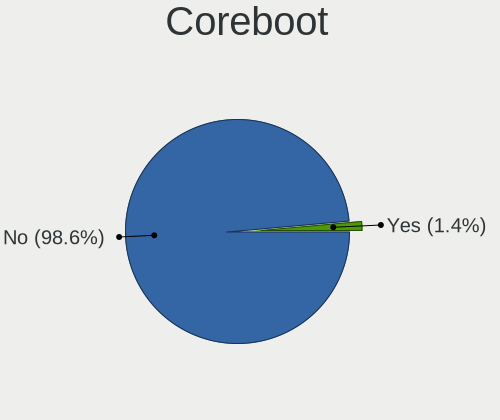
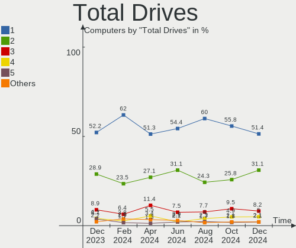
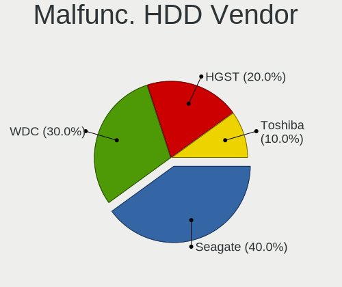
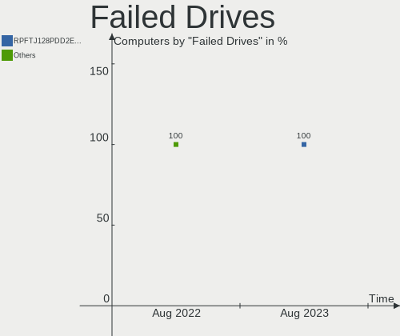
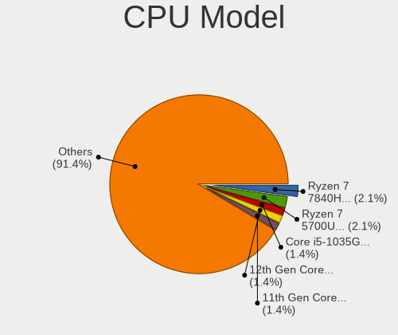

Arch - Hardware Trends
----------------------

A project to identify most popular hardware characteristics and track their change
over time based on data collected by Linux users at https://Linux-Hardware.org.

Anyone can contribute to this report by the [hw-probe](https://github.com/linuxhw/hw-probe) tool:

    sudo -E hw-probe -all -upload

This is a report for all computer types. See also reports for [desktops](/Dist/Arch/Desktop/README.md) and [notebooks](/Dist/Arch/Notebook/README.md).

This report is for one last month. Overall report since the beginning of time: [TestDays](https://github.com/linuxhw/TestDays)

Period: Aug, 2023.

Contents
--------

* [ System ](#system)
  - [ OS                       ](#os)
  - [ OS Family                ](#os-family)
  - [ Kernel                   ](#kernel)
  - [ Kernel Family            ](#kernel-family)
  - [ Kernel Major Ver.        ](#kernel-major-ver)
  - [ Arch                     ](#arch)
  - [ DE                       ](#de)
  - [ Display Server           ](#display-server)
  - [ Display Manager          ](#display-manager)
  - [ OS Lang                  ](#os-lang)
  - [ Boot Mode                ](#boot-mode)
  - [ Filesystem               ](#filesystem)
  - [ Part. scheme             ](#part-scheme)
  - [ Dual Boot with Linux/BSD ](#dual-boot-with-linuxbsd)
  - [ Dual Boot (Win)          ](#dual-boot-win)

* [ Board ](#board)
  - [ Vendor                   ](#vendor)
  - [ Model                    ](#model)
  - [ Model Family             ](#model-family)
  - [ MFG Year                 ](#mfg-year)
  - [ Form Factor              ](#form-factor)
  - [ Secure Boot              ](#secure-boot)
  - [ Coreboot                 ](#coreboot)
  - [ RAM Size                 ](#ram-size)
  - [ RAM Used                 ](#ram-used)
  - [ Total Drives             ](#total-drives)
  - [ Has CD-ROM               ](#has-cd-rom)
  - [ Has Ethernet             ](#has-ethernet)
  - [ Has WiFi                 ](#has-wifi)
  - [ Has Bluetooth            ](#has-bluetooth)

* [ Location ](#location)
  - [ Country                  ](#country)
  - [ City                     ](#city)

* [ Drives ](#drives)
  - [ Drive Vendor             ](#drive-vendor)
  - [ Drive Model              ](#drive-model)
  - [ HDD Vendor               ](#hdd-vendor)
  - [ SSD Vendor               ](#ssd-vendor)
  - [ Drive Kind               ](#drive-kind)
  - [ Drive Connector          ](#drive-connector)
  - [ Drive Size               ](#drive-size)
  - [ Space Total              ](#space-total)
  - [ Space Used               ](#space-used)
  - [ Malfunc. Drives          ](#malfunc-drives)
  - [ Malfunc. Drive Vendor    ](#malfunc-drive-vendor)
  - [ Malfunc. HDD Vendor      ](#malfunc-hdd-vendor)
  - [ Malfunc. Drive Kind      ](#malfunc-drive-kind)
  - [ Failed Drives            ](#failed-drives)
  - [ Failed Drive Vendor      ](#failed-drive-vendor)
  - [ Drive Status             ](#drive-status)

* [ Storage controller ](#storage-controller)
  - [ Storage Vendor           ](#storage-vendor)
  - [ Storage Model            ](#storage-model)
  - [ Storage Kind             ](#storage-kind)

* [ Processor ](#processor)
  - [ CPU Vendor               ](#cpu-vendor)
  - [ CPU Model                ](#cpu-model)
  - [ CPU Model Family         ](#cpu-model-family)
  - [ CPU Cores                ](#cpu-cores)
  - [ CPU Sockets              ](#cpu-sockets)
  - [ CPU Threads              ](#cpu-threads)
  - [ CPU Op-Modes             ](#cpu-op-modes)
  - [ CPU Microcode            ](#cpu-microcode)
  - [ CPU Microarch            ](#cpu-microarch)

* [ Graphics ](#graphics)
  - [ GPU Vendor               ](#gpu-vendor)
  - [ GPU Model                ](#gpu-model)
  - [ GPU Combo                ](#gpu-combo)
  - [ GPU Driver               ](#gpu-driver)
  - [ GPU Memory               ](#gpu-memory)

* [ Monitor ](#monitor)
  - [ Monitor Vendor           ](#monitor-vendor)
  - [ Monitor Model            ](#monitor-model)
  - [ Monitor Resolution       ](#monitor-resolution)
  - [ Monitor Diagonal         ](#monitor-diagonal)
  - [ Monitor Width            ](#monitor-width)
  - [ Aspect Ratio             ](#aspect-ratio)
  - [ Monitor Area             ](#monitor-area)
  - [ Pixel Density            ](#pixel-density)
  - [ Multiple Monitors        ](#multiple-monitors)

* [ Network ](#network)
  - [ Net Controller Vendor    ](#net-controller-vendor)
  - [ Net Controller Model     ](#net-controller-model)
  - [ Wireless Vendor          ](#wireless-vendor)
  - [ Wireless Model           ](#wireless-model)
  - [ Ethernet Vendor          ](#ethernet-vendor)
  - [ Ethernet Model           ](#ethernet-model)
  - [ Net Controller Kind      ](#net-controller-kind)
  - [ Used Controller          ](#used-controller)
  - [ NICs                     ](#nics)
  - [ IPv6                     ](#ipv6)

* [ Bluetooth ](#bluetooth)
  - [ Bluetooth Vendor         ](#bluetooth-vendor)
  - [ Bluetooth Model          ](#bluetooth-model)

* [ Sound ](#sound)
  - [ Sound Vendor             ](#sound-vendor)
  - [ Sound Model              ](#sound-model)

* [ Memory ](#memory)
  - [ Memory Vendor            ](#memory-vendor)
  - [ Memory Model             ](#memory-model)
  - [ Memory Kind              ](#memory-kind)
  - [ Memory Form Factor       ](#memory-form-factor)
  - [ Memory Size              ](#memory-size)
  - [ Memory Speed             ](#memory-speed)

* [ Printers & scanners ](#printers--scanners)
  - [ Printer Vendor           ](#printer-vendor)
  - [ Printer Model            ](#printer-model)
  - [ Scanner Vendor           ](#scanner-vendor)
  - [ Scanner Model            ](#scanner-model)

* [ Camera ](#camera)
  - [ Camera Vendor            ](#camera-vendor)
  - [ Camera Model             ](#camera-model)

* [ Security ](#security)
  - [ Fingerprint Vendor       ](#fingerprint-vendor)
  - [ Fingerprint Model        ](#fingerprint-model)
  - [ Chipcard Vendor          ](#chipcard-vendor)
  - [ Chipcard Model           ](#chipcard-model)

* [ Unsupported ](#unsupported)
  - [ Unsupported Devices      ](#unsupported-devices)
  - [ Unsupported Device Types ](#unsupported-device-types)

System
------

OS
--

Installed operating systems

| Name         | Computers | Percent |
|--------------|-----------|---------|
| Arch Rolling | 210       | 100%    |

OS Family
---------

OS without a version

| Name | Computers | Percent |
|------|-----------|---------|
| Arch | 210       | 100%    |

Kernel
------

Version of the Linux kernel

| Version                       | Computers | Percent |
|-------------------------------|-----------|---------|
| 6.4.10-arch1-1                | 31        | 14.76%  |
| 6.4.8-arch1-1                 | 24        | 11.43%  |
| 6.4.12-arch1-1                | 21        | 10%     |
| 6.4.11-arch2-1                | 21        | 10%     |
| 6.4.9-arch1-1                 | 19        | 9.05%   |
| 6.4.7-arch1-1                 | 11        | 5.24%   |
| 6.4.7-arch1-2                 | 9         | 4.29%   |
| 6.4.10-zen2-1-zen             | 9         | 4.29%   |
| 6.4.11-zen2-1-zen             | 7         | 3.33%   |
| 6.4.7-arch1-3                 | 6         | 2.86%   |
| 6.4.8-zen1-1-zen              | 4         | 1.9%    |
| 6.4.4-arch1-1                 | 4         | 1.9%    |
| 6.1.46-1-lts                  | 4         | 1.9%    |
| 6.4.7-zen1-1-zen              | 3         | 1.43%   |
| 6.4.11-arch1-1                | 3         | 1.43%   |
| 6.1.44-1-lts                  | 3         | 1.43%   |
| 6.4.9-zen1-1-zen              | 2         | 0.95%   |
| 6.4.12-zen1-1-zen             | 2         | 0.95%   |
| 6.1.39-1-lts                  | 2         | 0.95%   |
| 6.5.0-rc7-00164-g382d4cd18475 | 1         | 0.48%   |
| 6.5.0-rc6-1-mainline          | 1         | 0.48%   |
| 6.4.9-arch1-1-g14             | 1         | 0.48%   |
| 6.4.9-1-cachyos-cfs-lto       | 1         | 0.48%   |
| 6.4.7-zen1-2-zen              | 1         | 0.48%   |
| 6.4.6-arch1-1-g14             | 1         | 0.48%   |
| 6.4.6-arch1-1                 | 1         | 0.48%   |
| 6.4.5-arch1-1                 | 1         | 0.48%   |
| 6.4.4-zen1-1-zen              | 1         | 0.48%   |
| 6.4.3-zen1-1-zen              | 1         | 0.48%   |
| 6.4.3-arch1-1                 | 1         | 0.48%   |
| 6.4.11-x64v3-xanmod1          | 1         | 0.48%   |
| 6.4.10-zen1-1-zen             | 1         | 0.48%   |
| 6.4.10-2-cachyos              | 1         | 0.48%   |
| 6.4.1-arch1-1-custom          | 1         | 0.48%   |
| 6.3.7-arch1-1                 | 1         | 0.48%   |
| 6.3.1-arch2-1                 | 1         | 0.48%   |
| 6.1.8-arch1-1                 | 1         | 0.48%   |
| 6.1.50-1-lts                  | 1         | 0.48%   |
| 6.1.48-1-lts                  | 1         | 0.48%   |
| 6.1.47-1-lts                  | 1         | 0.48%   |

Kernel Family
-------------

Linux kernel without a distro release

| Version | Computers | Percent |
|---------|-----------|---------|
| 6.4.10  | 42        | 20%     |
| 6.4.11  | 32        | 15.24%  |
| 6.4.7   | 30        | 14.29%  |
| 6.4.8   | 28        | 13.33%  |
| 6.4.9   | 23        | 10.95%  |
| 6.4.12  | 23        | 10.95%  |
| 6.4.4   | 5         | 2.38%   |
| 6.1.46  | 4         | 1.9%    |
| 6.1.44  | 3         | 1.43%   |
| 6.1.39  | 3         | 1.43%   |
| 6.5.0   | 2         | 0.95%   |
| 6.4.6   | 2         | 0.95%   |
| 6.4.3   | 2         | 0.95%   |
| 6.4.5   | 1         | 0.48%   |
| 6.4.1   | 1         | 0.48%   |
| 6.3.7   | 1         | 0.48%   |
| 6.3.1   | 1         | 0.48%   |
| 6.1.8   | 1         | 0.48%   |
| 6.1.50  | 1         | 0.48%   |
| 6.1.48  | 1         | 0.48%   |
| 6.1.47  | 1         | 0.48%   |
| 6.1.45  | 1         | 0.48%   |
| 6.1.27  | 1         | 0.48%   |
| 6.0.2   | 1         | 0.48%   |

Kernel Major Ver.
-----------------

Linux kernel major version

| Version | Computers | Percent |
|---------|-----------|---------|
| 6.4     | 189       | 90%     |
| 6.1     | 16        | 7.62%   |
| 6.5     | 2         | 0.95%   |
| 6.3     | 2         | 0.95%   |
| 6.0     | 1         | 0.48%   |

Arch
----

OS architecture (x86_64, i586, etc.)

| Name   | Computers | Percent |
|--------|-----------|---------|
| x86_64 | 210       | 100%    |

DE
--

Desktop Environment

| Name       | Computers | Percent |
|------------|-----------|---------|
| KDE5       | 92        | 43.81%  |
| GNOME      | 59        | 28.1%   |
| XFCE       | 14        | 6.67%   |
| Unknown    | 12        | 5.71%   |
| i3         | 9         | 4.29%   |
| Hyprland   | 9         | 4.29%   |
| sway       | 4         | 1.9%    |
| X-Cinnamon | 2         | 0.95%   |
| Unity      | 1         | 0.48%   |
| OPENBOX    | 1         | 0.48%   |
| MATE       | 1         | 0.48%   |
| KDE        | 1         | 0.48%   |
| dwm        | 1         | 0.48%   |
| Deepin     | 1         | 0.48%   |
| Budgie     | 1         | 0.48%   |
| bspwm      | 1         | 0.48%   |
| awesome    | 1         | 0.48%   |

Display Server
--------------

X11 or Wayland

| Name    | Computers | Percent |
|---------|-----------|---------|
| X11     | 101       | 48.1%   |
| Wayland | 79        | 37.62%  |
| Unknown | 17        | 8.1%    |
| Tty     | 13        | 6.19%   |

Display Manager
---------------

SDDM, LightDM, etc.

| Name    | Computers | Percent |
|---------|-----------|---------|
| Unknown | 88        | 41.9%   |
| SDDM    | 63        | 30%     |
| GDM     | 30        | 14.29%  |
| LightDM | 26        | 12.38%  |
| EMPTTY  | 2         | 0.95%   |
| SLiM    | 1         | 0.48%   |

OS Lang
-------

Language

| Lang    | Computers | Percent |
|---------|-----------|---------|
| en_US   | 111       | 52.86%  |
| C       | 15        | 7.14%   |
| en_GB   | 14        | 6.67%   |
| ru_RU   | 10        | 4.76%   |
| Unknown | 10        | 4.76%   |
| zh_CN   | 8         | 3.81%   |
| fr_FR   | 8         | 3.81%   |
| pt_BR   | 7         | 3.33%   |
| it_IT   | 7         | 3.33%   |
| de_DE   | 5         | 2.38%   |
| es_ES   | 3         | 1.43%   |
| en_IN   | 3         | 1.43%   |
| tr_TR   | 1         | 0.48%   |
| pt_PT   | 1         | 0.48%   |
| pl_PL   | 1         | 0.48%   |
| es_DO   | 1         | 0.48%   |
| en_HK   | 1         | 0.48%   |
| en_DK   | 1         | 0.48%   |
| en_CA   | 1         | 0.48%   |
| en_Au   | 1         | 0.48%   |
| de_IT   | 1         | 0.48%   |

Boot Mode
---------

EFI or BIOS

| Mode | Computers | Percent |
|------|-----------|---------|
| EFI  | 135       | 64.29%  |
| BIOS | 75        | 35.71%  |

Filesystem
----------

Type of filesystem

| Type  | Computers | Percent |
|-------|-----------|---------|
| Ext4  | 147       | 70%     |
| Btrfs | 56        | 26.67%  |
| Xfs   | 3         | 1.43%   |
| Zfs   | 2         | 0.95%   |
| Tmpfs | 1         | 0.48%   |
| F2fs  | 1         | 0.48%   |

Part. scheme
------------

Scheme of partitioning

| Type    | Computers | Percent |
|---------|-----------|---------|
| GPT     | 143       | 68.1%   |
| Unknown | 58        | 27.62%  |
| MBR     | 9         | 4.29%   |

Dual Boot with Linux/BSD
------------------------

Hosting more than one Linux/BSD

| Dual boot | Computers | Percent |
|-----------|-----------|---------|
| No        | 177       | 84.29%  |
| Yes       | 33        | 15.71%  |

Dual Boot (Win)
---------------

Hosting Linux and Windows

| Dual boot | Computers | Percent |
|-----------|-----------|---------|
| No        | 152       | 72.38%  |
| Yes       | 58        | 27.62%  |

Board
-----

Vendor
------

Motherboard manufacturer

| Name                                 | Computers | Percent |
|--------------------------------------|-----------|---------|
| ASUSTek Computer                     | 47        | 22.38%  |
| Lenovo                               | 39        | 18.57%  |
| Gigabyte Technology                  | 20        | 9.52%   |
| Dell                                 | 20        | 9.52%   |
| Hewlett-Packard                      | 18        | 8.57%   |
| MSI                                  | 15        | 7.14%   |
| Acer                                 | 12        | 5.71%   |
| ASRock                               | 6         | 2.86%   |
| HUAWEI                               | 4         | 1.9%    |
| Intel                                | 3         | 1.43%   |
| Timi                                 | 2         | 0.95%   |
| Shenzhen Meigao Electronic Equipment | 2         | 0.95%   |
| Chuwi                                | 2         | 0.95%   |
| Alienware                            | 2         | 0.95%   |
| Valve                                | 1         | 0.48%   |
| TYAN Computer                        | 1         | 0.48%   |
| Schenker                             | 1         | 0.48%   |
| QIYIDA                               | 1         | 0.48%   |
| PC Specialist                        | 1         | 0.48%   |
| Packard Bell                         | 1         | 0.48%   |
| NZXT                                 | 1         | 0.48%   |
| Notebook                             | 1         | 0.48%   |
| MECHREVO                             | 1         | 0.48%   |
| LG Electronics                       | 1         | 0.48%   |
| Intel Client Systems                 | 1         | 0.48%   |
| Huanan                               | 1         | 0.48%   |
| HONOR                                | 1         | 0.48%   |
| GEO                                  | 1         | 0.48%   |
| ECS                                  | 1         | 0.48%   |
| CWWK                                 | 1         | 0.48%   |
| AZW                                  | 1         | 0.48%   |
| Apple                                | 1         | 0.48%   |

Model
-----

Motherboard model

| Name                                                         | Computers | Percent |
|--------------------------------------------------------------|-----------|---------|
| Shenzhen Meigao Electronic Equipment F7BSC                   | 2         | 0.95%   |
| Lenovo Legion Y530-15ICH 81FV                                | 2         | 0.95%   |
| HP Pavilion Gaming Laptop 15-dk0xxx                          | 2         | 0.95%   |
| Gigabyte B450M DS3H WIFI                                     | 2         | 0.95%   |
| Gigabyte B365M DS3H                                          | 2         | 0.95%   |
| Dell XPS 15 9500                                             | 2         | 0.95%   |
| Chuwi GemiBook Pro                                           | 2         | 0.95%   |
| ASUS X555LAB                                                 | 2         | 0.95%   |
| ASUS ROG STRIX B550-F GAMING                                 | 2         | 0.95%   |
| ASRock B365 Pro4                                             | 2         | 0.95%   |
| Valve Jupiter                                                | 1         | 0.48%   |
| TYAN S8010                                                   | 1         | 0.48%   |
| Timi RedmiBook Pro 15S                                       | 1         | 0.48%   |
| Timi A35S                                                    | 1         | 0.48%   |
| Schenker XMG FUSION 15 (XFU15M22)                            | 1         | 0.48%   |
| QIYIDA X79 (INTEL Xeon E5/Corei7 DMI2 - C600/C200 Cipset V32 | 1         | 0.48%   |
| PC Specialist Lafite Pro III 17                              | 1         | 0.48%   |
| Packard Bell EasyNote TJ65                                   | 1         | 0.48%   |
| NZXT N7 B550                                                 | 1         | 0.48%   |
| Notebook NS50MU                                              | 1         | 0.48%   |
| MSI MS-7E06                                                  | 1         | 0.48%   |
| MSI MS-7D73                                                  | 1         | 0.48%   |
| MSI MS-7D70                                                  | 1         | 0.48%   |
| MSI MS-7C91                                                  | 1         | 0.48%   |
| MSI MS-7C13                                                  | 1         | 0.48%   |
| MSI MS-7C02                                                  | 1         | 0.48%   |
| MSI MS-7B98                                                  | 1         | 0.48%   |
| MSI MS-7B93                                                  | 1         | 0.48%   |
| MSI MS-7B89                                                  | 1         | 0.48%   |
| MSI MS-7B79                                                  | 1         | 0.48%   |
| MSI MS-7B24                                                  | 1         | 0.48%   |
| MSI MS-7B18                                                  | 1         | 0.48%   |
| MSI MS-7A68                                                  | 1         | 0.48%   |
| MSI GF75 Thin 9SCSR                                          | 1         | 0.48%   |
| MSI GF75 Thin 10SC                                           | 1         | 0.48%   |
| MECHREVO Code01 Ver2.0                                       | 1         | 0.48%   |
| LG 16Z90R-K.ADB9U1                                           | 1         | 0.48%   |
| Lenovo Yoga 6 13ARE05 82FN                                   | 1         | 0.48%   |
| Lenovo ThinkPad X120e 0611AN2                                | 1         | 0.48%   |
| Lenovo ThinkPad X1 Yoga Gen 8 21HQCTO1WW                     | 1         | 0.48%   |

Model Family
------------

Motherboard model prefix

| Name                                       | Computers | Percent |
|--------------------------------------------|-----------|---------|
| Lenovo ThinkPad                            | 19        | 9.05%   |
| ASUS ROG                                   | 10        | 4.76%   |
| Lenovo Legion                              | 7         | 3.33%   |
| Lenovo IdeaPad                             | 7         | 3.33%   |
| Dell Inspiron                              | 7         | 3.33%   |
| ASUS PRIME                                 | 7         | 3.33%   |
| HP Pavilion                                | 5         | 2.38%   |
| Dell Latitude                              | 5         | 2.38%   |
| ASUS TUF                                   | 5         | 2.38%   |
| ASUS ASUS                                  | 5         | 2.38%   |
| Gigabyte B450M                             | 4         | 1.9%    |
| Dell XPS                                   | 4         | 1.9%    |
| ASUS ZenBook                               | 4         | 1.9%    |
| ASUS VivoBook                              | 4         | 1.9%    |
| Acer Aspire                                | 4         | 1.9%    |
| Lenovo ThinkBook                           | 3         | 1.43%   |
| HP Laptop                                  | 3         | 1.43%   |
| HP EliteBook                               | 3         | 1.43%   |
| Acer Swift                                 | 3         | 1.43%   |
| Acer Nitro                                 | 3         | 1.43%   |
| Shenzhen Meigao Electronic Equipment F7BSC | 2         | 0.95%   |
| MSI GF75                                   | 2         | 0.95%   |
| Gigabyte B550M                             | 2         | 0.95%   |
| Gigabyte B365M                             | 2         | 0.95%   |
| Dell Precision                             | 2         | 0.95%   |
| Chuwi GemiBook                             | 2         | 0.95%   |
| ASUS X555LAB                               | 2         | 0.95%   |
| ASRock B365                                | 2         | 0.95%   |
| Valve Jupiter                              | 1         | 0.48%   |
| TYAN S8010                                 | 1         | 0.48%   |
| Timi RedmiBook                             | 1         | 0.48%   |
| Timi A35S                                  | 1         | 0.48%   |
| Schenker XMG                               | 1         | 0.48%   |
| QIYIDA X79                                 | 1         | 0.48%   |
| PC Specialist Lafite                       | 1         | 0.48%   |
| Packard Bell EasyNote                      | 1         | 0.48%   |
| NZXT N7                                    | 1         | 0.48%   |
| Notebook NS50MU                            | 1         | 0.48%   |
| MSI MS-7E06                                | 1         | 0.48%   |
| MSI MS-7D73                                | 1         | 0.48%   |

MFG Year
--------

Motherboard manufacture year

| Year | Computers | Percent |
|------|-----------|---------|
| 2019 | 35        | 16.67%  |
| 2021 | 33        | 15.71%  |
| 2022 | 31        | 14.76%  |
| 2020 | 23        | 10.95%  |
| 2018 | 21        | 10%     |
| 2023 | 15        | 7.14%   |
| 2017 | 13        | 6.19%   |
| 2011 | 9         | 4.29%   |
| 2015 | 6         | 2.86%   |
| 2016 | 5         | 2.38%   |
| 2014 | 5         | 2.38%   |
| 2013 | 5         | 2.38%   |
| 2012 | 5         | 2.38%   |
| 2009 | 3         | 1.43%   |
| 2008 | 1         | 0.48%   |

Form Factor
-----------

Physical design of the computer

| Name        | Computers | Percent |
|-------------|-----------|---------|
| Notebook    | 121       | 57.62%  |
| Desktop     | 78        | 37.14%  |
| Convertible | 8         | 3.81%   |
| Tablet      | 1         | 0.48%   |
| Mini pc     | 1         | 0.48%   |
| Server      | 1         | 0.48%   |

Secure Boot
-----------

Enabled or disabled

| State    | Computers | Percent |
|----------|-----------|---------|
| Disabled | 204       | 97.14%  |
| Enabled  | 6         | 2.86%   |

Coreboot
--------

Have coreboot on board

| Used | Computers | Percent |
|------|-----------|---------|
| No   | 209       | 99.52%  |
| Yes  | 1         | 0.48%   |

RAM Size
--------

Total RAM memory

| Size in GB      | Computers | Percent |
|-----------------|-----------|---------|
| 16.01-24.0      | 54        | 25.71%  |
| 4.01-8.0        | 40        | 19.05%  |
| 32.01-64.0      | 40        | 19.05%  |
| 8.01-16.0       | 38        | 18.1%   |
| 64.01-256.0     | 15        | 7.14%   |
| 24.01-32.0      | 12        | 5.71%   |
| 3.01-4.0        | 9         | 4.29%   |
| More than 256.0 | 1         | 0.48%   |
| 1.01-2.0        | 1         | 0.48%   |

RAM Used
--------

Used RAM memory

| Used GB    | Computers | Percent |
|------------|-----------|---------|
| 4.01-8.0   | 68        | 32.38%  |
| 3.01-4.0   | 45        | 21.43%  |
| 2.01-3.0   | 38        | 18.1%   |
| 1.01-2.0   | 24        | 11.43%  |
| 8.01-16.0  | 19        | 9.05%   |
| 0.51-1.0   | 9         | 4.29%   |
| 16.01-24.0 | 3         | 1.43%   |
| 0.01-0.5   | 2         | 0.95%   |
| 32.01-64.0 | 1         | 0.48%   |
| 24.01-32.0 | 1         | 0.48%   |

Total Drives
------------

Number of drives on board

| Drives | Computers | Percent |
|--------|-----------|---------|
| 1      | 105       | 50%     |
| 2      | 68        | 32.38%  |
| 3      | 19        | 9.05%   |
| 4      | 10        | 4.76%   |
| 5      | 4         | 1.9%    |
| 9      | 1         | 0.48%   |
| 7      | 1         | 0.48%   |
| 6      | 1         | 0.48%   |
| 0      | 1         | 0.48%   |

Has CD-ROM
----------

Has CD-ROM on board

| Presented | Computers | Percent |
|-----------|-----------|---------|
| No        | 182       | 86.67%  |
| Yes       | 28        | 13.33%  |

Has Ethernet
------------

Has Ethernet on board

| Presented | Computers | Percent |
|-----------|-----------|---------|
| Yes       | 164       | 78.1%   |
| No        | 46        | 21.9%   |

Has WiFi
--------

Has WiFi module

| Presented | Computers | Percent |
|-----------|-----------|---------|
| Yes       | 170       | 80.95%  |
| No        | 40        | 19.05%  |

Has Bluetooth
-------------

Has Bluetooth module

| Presented | Computers | Percent |
|-----------|-----------|---------|
| Yes       | 156       | 74.29%  |
| No        | 54        | 25.71%  |

Location
--------

Country
-------

Geographic location (country)

| Country         | Computers | Percent |
|-----------------|-----------|---------|
| USA             | 38        | 18.1%   |
| Germany         | 17        | 8.1%    |
| Russia          | 15        | 7.14%   |
| Italy           | 10        | 4.76%   |
| France          | 10        | 4.76%   |
| India           | 9         | 4.29%   |
| China           | 9         | 4.29%   |
| Brazil          | 9         | 4.29%   |
| Spain           | 7         | 3.33%   |
| UK              | 5         | 2.38%   |
| Austria         | 5         | 2.38%   |
| Chile           | 4         | 1.9%    |
| Canada          | 4         | 1.9%    |
| Australia       | 4         | 1.9%    |
| Turkey          | 3         | 1.43%   |
| Namibia         | 3         | 1.43%   |
| Indonesia       | 3         | 1.43%   |
| Hong Kong       | 3         | 1.43%   |
| Finland         | 3         | 1.43%   |
| Thailand        | 2         | 0.95%   |
| Sweden          | 2         | 0.95%   |
| Sri Lanka       | 2         | 0.95%   |
| South Korea     | 2         | 0.95%   |
| Slovenia        | 2         | 0.95%   |
| Poland          | 2         | 0.95%   |
| Netherlands     | 2         | 0.95%   |
| Malaysia        | 2         | 0.95%   |
| Japan           | 2         | 0.95%   |
| Hungary         | 2         | 0.95%   |
| Argentina       | 2         | 0.95%   |
| Venezuela       | 1         | 0.48%   |
| Uzbekistan      | 1         | 0.48%   |
| UAE             | 1         | 0.48%   |
| Taiwan          | 1         | 0.48%   |
| Singapore       | 1         | 0.48%   |
| Serbia          | 1         | 0.48%   |
| Romania         | 1         | 0.48%   |
| Portugal        | 1         | 0.48%   |
| Peru            | 1         | 0.48%   |
| North Macedonia | 1         | 0.48%   |

City
----

Geographic location (city)

| City              | Computers | Percent |
|-------------------|-----------|---------|
| Moscow            | 5         | 2.38%   |
| Pine Island       | 4         | 1.9%    |
| Swakopmund        | 3         | 1.43%   |
| Shenzhen          | 3         | 1.43%   |
| Los Angeles       | 3         | 1.43%   |
| Berlin            | 3         | 1.43%   |
| Vienna            | 2         | 0.95%   |
| Sydney            | 2         | 0.95%   |
| Shanghai          | 2         | 0.95%   |
| Santiago          | 2         | 0.95%   |
| Rouen             | 2         | 0.95%   |
| Paris             | 2         | 0.95%   |
| Munich            | 2         | 0.95%   |
| Madrid            | 2         | 0.95%   |
| Lambeth           | 2         | 0.95%   |
| Kuala Lumpur      | 2         | 0.95%   |
| Istanbul          | 2         | 0.95%   |
| Eheliyagoda       | 2         | 0.95%   |
| Dallas            | 2         | 0.95%   |
| Curitiba          | 2         | 0.95%   |
| Central           | 2         | 0.95%   |
| Budapest          | 2         | 0.95%   |
| Antofagasta       | 2         | 0.95%   |
| Zwickau           | 1         | 0.48%   |
| Zagreb            | 1         | 0.48%   |
| Yuen Long San Hui | 1         | 0.48%   |
| Yogyakarta        | 1         | 0.48%   |
| Yekaterinburg     | 1         | 0.48%   |
| Wilkes-Barre      | 1         | 0.48%   |
| Weston            | 1         | 0.48%   |
| West Lebanon      | 1         | 0.48%   |
| Washington        | 1         | 0.48%   |
| Warsaw            | 1         | 0.48%   |
| Volgograd         | 1         | 0.48%   |
| Viborg            | 1         | 0.48%   |
| Vercelli          | 1         | 0.48%   |
| Veldhoven         | 1         | 0.48%   |
| Vantaa            | 1         | 0.48%   |
| Valencia          | 1         | 0.48%   |
| Valdemoro         | 1         | 0.48%   |

Drives
------

Drive Vendor
------------

Hard drive vendors

| Vendor                      | Computers | Drives | Percent |
|-----------------------------|-----------|--------|---------|
| Samsung Electronics         | 75        | 95     | 23.08%  |
| Seagate                     | 38        | 46     | 11.69%  |
| Sandisk                     | 36        | 40     | 11.08%  |
| WDC                         | 30        | 42     | 9.23%   |
| SK hynix                    | 17        | 18     | 5.23%   |
| Kingston                    | 17        | 17     | 5.23%   |
| Toshiba                     | 10        | 13     | 3.08%   |
| Micron Technology           | 10        | 10     | 3.08%   |
| Crucial                     | 10        | 11     | 3.08%   |
| Intel                       | 7         | 8      | 2.15%   |
| Silicon Motion              | 5         | 5      | 1.54%   |
| HGST                        | 5         | 5      | 1.54%   |
| China                       | 5         | 6      | 1.54%   |
| A-DATA Technology           | 5         | 5      | 1.54%   |
| Phison Electronics          | 4         | 4      | 1.23%   |
| Micron/Crucial Technology   | 4         | 4      | 1.23%   |
| Kingston Technology Company | 4         | 4      | 1.23%   |
| PNY                         | 3         | 3      | 0.92%   |
| KIOXIA                      | 3         | 3      | 0.92%   |
| Unknown                     | 2         | 2      | 0.62%   |
| Union Memory (Shenzhen)     | 2         | 2      | 0.62%   |
| Patriot                     | 2         | 2      | 0.62%   |
| MAXIO Technology (Hangzhou) | 2         | 2      | 0.62%   |
| Yangtze Memory Technologies | 1         | 1      | 0.31%   |
| XSTAR SS                    | 1         | 1      | 0.31%   |
| XrayDisk                    | 1         | 1      | 0.31%   |
| Team                        | 1         | 1      | 0.31%   |
| Supersonic                  | 1         | 1      | 0.31%   |
| Solid State Storage         | 1         | 2      | 0.31%   |
| SABRENT                     | 1         | 1      | 0.31%   |
| Realtek Semiconductor       | 1         | 1      | 0.31%   |
| MidasForce                  | 1         | 1      | 0.31%   |
| LITEON                      | 1         | 1      | 0.31%   |
| LIO-ORG                     | 1         | 3      | 0.31%   |
| Lexar                       | 1         | 1      | 0.31%   |
| LaCie                       | 1         | 1      | 0.31%   |
| Kingchuxing                 | 1         | 1      | 0.31%   |
| JMicron Technology          | 1         | 1      | 0.31%   |
| Intenso                     | 1         | 1      | 0.31%   |
| HS-SSD-E100                 | 1         | 1      | 0.31%   |

Drive Model
-----------

Hard drive models

| Model                                                 | Computers | Percent |
|-------------------------------------------------------|-----------|---------|
| Samsung NVMe SSD Controller SM981/PM981/PM983 500GB   | 23        | 6.39%   |
| Samsung NVMe SSD Controller PM9A1/PM9A3/980PRO 1024GB | 16        | 4.44%   |
| Sandisk WD Black SN750 / PC SN730 NVMe SSD 1024GB     | 6         | 1.67%   |
| Toshiba HDWD110 1TB                                   | 5         | 1.39%   |
| Seagate ST1000DM010-2EP102 1TB                        | 5         | 1.39%   |
| Samsung SSD 860 EVO 500GB                             | 5         | 1.39%   |
| Sandisk WD Blue SN550 NVMe SSD 250GB                  | 4         | 1.11%   |
| Samsung SSD 980 1TB                                   | 4         | 1.11%   |
| Samsung NVMe SSD Controller SM961/PM961/SM963 1024GB  | 4         | 1.11%   |
| Micron/Crucial P2 NVMe PCIe SSD 1TB                   | 4         | 1.11%   |
| Intel SSD 660P Series 512GB                           | 4         | 1.11%   |
| WDC WD10EZEX-08WN4A0 1TB                              | 3         | 0.83%   |
| Toshiba DT01ACA100 1TB                                | 3         | 0.83%   |
| Seagate ST2000DM008-2FR102 2TB                        | 3         | 0.83%   |
| Sandisk WD PC SN560 SDDPNQE-1T00-1002 1TB             | 3         | 0.83%   |
| Samsung SSD 870 EVO 500GB                             | 3         | 0.83%   |
| Samsung SSD 860 EVO 1TB                               | 3         | 0.83%   |
| Kingston SA400S37480G 480GB SSD                       | 3         | 0.83%   |
| Crucial CT1000MX500SSD1 1TB                           | 3         | 0.83%   |
| WDC WDS240G2G0A-00JH30 240GB SSD                      | 2         | 0.56%   |
| WDC WD10EZEX-22MFCA0 1TB                              | 2         | 0.56%   |
| SK hynix SHPP41-2000GM 2TB                            | 2         | 0.56%   |
| SK hynix BC511 512GB                                  | 2         | 0.56%   |
| SK hynix BC501 NVMe Solid State Drive 512GB           | 2         | 0.56%   |
| Silicon Motion SM2263EN/SM2263XT SSD Controller 256GB | 2         | 0.56%   |
| Silicon Motion SM2262/SM2262EN SSD Controller 1024GB  | 2         | 0.56%   |
| Seagate ST9500325AS 500GB                             | 2         | 0.56%   |
| Seagate ST500LM021-1KJ152 500GB                       | 2         | 0.56%   |
| Seagate ST500DM002-1BD142 500GB                       | 2         | 0.56%   |
| Seagate ST4000NE001-2MA101 4TB                        | 2         | 0.56%   |
| Seagate ST31000524AS 1TB                              | 2         | 0.56%   |
| Seagate ST2000DM008-2UB102 2TB                        | 2         | 0.56%   |
| Seagate ST1000LM035-1RK172 1TB                        | 2         | 0.56%   |
| Seagate Expansion HDD 8TB                             | 2         | 0.56%   |
| Sandisk WD_BLACK SN770 2TB                            | 2         | 0.56%   |
| Sandisk WD_BLACK SN770 1TB                            | 2         | 0.56%   |
| Sandisk WD PC SN735 SDBPNHH-1T00-1002 1TB             | 2         | 0.56%   |
| Sandisk WD Blue SN570 1TB                             | 2         | 0.56%   |
| SanDisk SDSSDA480G 480GB                              | 2         | 0.56%   |
| Sandisk PC SN520 NVMe SSD 256GB                       | 2         | 0.56%   |

HDD Vendor
----------

Hard disk drive vendors

| Vendor              | Computers | Drives | Percent |
|---------------------|-----------|--------|---------|
| Seagate             | 38        | 46     | 43.68%  |
| WDC                 | 26        | 35     | 29.89%  |
| Toshiba             | 10        | 13     | 11.49%  |
| HGST                | 5         | 5      | 5.75%   |
| Samsung Electronics | 1         | 1      | 1.15%   |
| SABRENT             | 1         | 1      | 1.15%   |
| LaCie               | 1         | 1      | 1.15%   |
| Hitachi             | 1         | 1      | 1.15%   |
| Generic-            | 1         | 1      | 1.15%   |
| DELLBOSS            | 1         | 1      | 1.15%   |
| ASUSTOR             | 1         | 1      | 1.15%   |
| ASMT                | 1         | 2      | 1.15%   |

SSD Vendor
----------

Solid state drive vendors

| Vendor              | Computers | Drives | Percent |
|---------------------|-----------|--------|---------|
| Samsung Electronics | 20        | 23     | 23.26%  |
| Kingston            | 13        | 13     | 15.12%  |
| Crucial             | 10        | 11     | 11.63%  |
| WDC                 | 6         | 6      | 6.98%   |
| China               | 5         | 6      | 5.81%   |
| A-DATA Technology   | 5         | 5      | 5.81%   |
| SanDisk             | 4         | 4      | 4.65%   |
| SK hynix            | 3         | 3      | 3.49%   |
| PNY                 | 3         | 3      | 3.49%   |
| Patriot             | 2         | 2      | 2.33%   |
| XrayDisk            | 1         | 1      | 1.16%   |
| Team                | 1         | 1      | 1.16%   |
| MidasForce          | 1         | 1      | 1.16%   |
| Micron Technology   | 1         | 1      | 1.16%   |
| LITEON              | 1         | 1      | 1.16%   |
| LIO-ORG             | 1         | 3      | 1.16%   |
| Lexar               | 1         | 1      | 1.16%   |
| JMicron Technology  | 1         | 1      | 1.16%   |
| Intenso             | 1         | 1      | 1.16%   |
| HS-SSD-E100         | 1         | 1      | 1.16%   |
| Emtec               | 1         | 1      | 1.16%   |
| CT500MX5            | 1         | 1      | 1.16%   |
| Corsair             | 1         | 1      | 1.16%   |
| BHT                 | 1         | 1      | 1.16%   |
| Acer                | 1         | 1      | 1.16%   |

Drive Kind
----------

HDD or SSD

| Kind    | Computers | Drives | Percent |
|---------|-----------|--------|---------|
| NVMe    | 142       | 174    | 47.65%  |
| HDD     | 76        | 108    | 25.5%   |
| SSD     | 74        | 93     | 24.83%  |
| Unknown | 4         | 4      | 1.34%   |
| MMC     | 2         | 2      | 0.67%   |

Drive Connector
---------------

SATA, SAS, NVMe, etc.

| Type | Computers | Drives | Percent |
|------|-----------|--------|---------|
| NVMe | 142       | 174    | 52.59%  |
| SATA | 115       | 192    | 42.59%  |
| SAS  | 11        | 13     | 4.07%   |
| MMC  | 2         | 2      | 0.74%   |

Drive Size
----------

Size of hard drive

| Size in TB | Computers | Drives | Percent |
|------------|-----------|--------|---------|
| 0.01-0.5   | 70        | 92     | 44.87%  |
| 0.51-1.0   | 56        | 74     | 35.9%   |
| 1.01-2.0   | 16        | 16     | 10.26%  |
| 3.01-4.0   | 6         | 11     | 3.85%   |
| 4.01-10.0  | 6         | 6      | 3.85%   |
| 2.01-3.0   | 1         | 1      | 0.64%   |
| 10.01-20.0 | 1         | 1      | 0.64%   |

Space Total
-----------

Amount of disk space available on the file system

| Size in GB     | Computers | Percent |
|----------------|-----------|---------|
| 501-1000       | 37        | 17.62%  |
| 251-500        | 36        | 17.14%  |
| 101-250        | 35        | 16.67%  |
| 1001-2000      | 34        | 16.19%  |
| More than 3000 | 33        | 15.71%  |
| 2001-3000      | 14        | 6.67%   |
| 51-100         | 8         | 3.81%   |
| 21-50          | 6         | 2.86%   |
| Unknown        | 4         | 1.9%    |
| 1-20           | 3         | 1.43%   |

Space Used
----------

Amount of used disk space

| Used GB        | Computers | Percent |
|----------------|-----------|---------|
| 1-20           | 42        | 20%     |
| 101-250        | 35        | 16.67%  |
| 251-500        | 32        | 15.24%  |
| 21-50          | 25        | 11.9%   |
| 51-100         | 21        | 10%     |
| 501-1000       | 19        | 9.05%   |
| 1001-2000      | 18        | 8.57%   |
| More than 3000 | 11        | 5.24%   |
| Unknown        | 4         | 1.9%    |
| 2001-3000      | 3         | 1.43%   |

Malfunc. Drives
---------------

Drive models with a malfunction

| Model                                                     | Computers | Drives | Percent |
|-----------------------------------------------------------|-----------|--------|---------|
| Seagate ST500LM021-1KJ152 500GB                           | 2         | 2      | 6.67%   |
| Seagate ST1000DM010-2EP102 1TB                            | 2         | 2      | 6.67%   |
| WDC WD60EDAZ-11U78B0 6TB                                  | 1         | 1      | 3.33%   |
| WDC WD5000BPVT-60HXZT3 500GB                              | 1         | 1      | 3.33%   |
| WDC WD40PURZ-85TTDY0 4TB                                  | 1         | 1      | 3.33%   |
| WDC WD2500BEVT-80A23T0 250GB                              | 1         | 1      | 3.33%   |
| WDC WD10EZEX-08WN4A0 1TB                                  | 1         | 1      | 3.33%   |
| WDC WD10EZEX-08M2NA0 1TB                                  | 1         | 1      | 3.33%   |
| WDC WD10EAVS-00D7B0 1TB                                   | 1         | 1      | 3.33%   |
| WDC WD1003FZEX-00MK2A0 1TB                                | 1         | 1      | 3.33%   |
| WDC WD1002FAEX-00Z3A0 1TB                                 | 1         | 1      | 3.33%   |
| WDC WD Green M.2 2280 480GB SSD                           | 1         | 1      | 3.33%   |
| Toshiba MG04ACA100N 1TB                                   | 1         | 1      | 3.33%   |
| Toshiba DT01ACA100 1TB                                    | 1         | 1      | 3.33%   |
| Seagate ST9500325AS 500GB                                 | 1         | 1      | 3.33%   |
| Seagate ST3500418AS 500GB                                 | 1         | 1      | 3.33%   |
| Seagate ST31000524AS 1TB                                  | 1         | 1      | 3.33%   |
| Seagate ST1000LM035-1RK172 1TB                            | 1         | 1      | 3.33%   |
| Seagate ST1000LM014-1EJ164 1TB                            | 1         | 1      | 3.33%   |
| Seagate ST1000LM010-9YH146 1TB                            | 1         | 1      | 3.33%   |
| Samsung Electronics SSD 980 1TB                           | 1         | 1      | 3.33%   |
| Samsung Electronics SSD 860 EVO 500GB                     | 1         | 1      | 3.33%   |
| Samsung Electronics HM160HI 160GB                         | 1         | 1      | 3.33%   |
| Realtek Semiconductor RTS5763DL NVMe SSD Controller 512GB | 1         | 1      | 3.33%   |
| Kingston SKC400S371T 1TB SSD                              | 1         | 1      | 3.33%   |
| HGST HTS721010A9E630 1TB                                  | 1         | 1      | 3.33%   |
| HGST HTS541010A7E630 1TB                                  | 1         | 1      | 3.33%   |
| A-DATA Technology SU900 256GB SSD                         | 1         | 1      | 3.33%   |

Malfunc. Drive Vendor
---------------------

Vendors of faulty drives

| Vendor                | Computers | Drives | Percent |
|-----------------------|-----------|--------|---------|
| WDC                   | 9         | 10     | 33.33%  |
| Seagate               | 8         | 10     | 29.63%  |
| Samsung Electronics   | 3         | 3      | 11.11%  |
| Toshiba               | 2         | 2      | 7.41%   |
| HGST                  | 2         | 2      | 7.41%   |
| Realtek Semiconductor | 1         | 1      | 3.7%    |
| Kingston              | 1         | 1      | 3.7%    |
| A-DATA Technology     | 1         | 1      | 3.7%    |

Malfunc. HDD Vendor
-------------------

Vendors of faulty HDD drives

| Vendor              | Computers | Drives | Percent |
|---------------------|-----------|--------|---------|
| WDC                 | 8         | 9      | 38.1%   |
| Seagate             | 8         | 10     | 38.1%   |
| Toshiba             | 2         | 2      | 9.52%   |
| HGST                | 2         | 2      | 9.52%   |
| Samsung Electronics | 1         | 1      | 4.76%   |

Malfunc. Drive Kind
-------------------

Kinds of faulty drives

| Kind | Computers | Drives | Percent |
|------|-----------|--------|---------|
| HDD  | 17        | 24     | 73.91%  |
| SSD  | 4         | 4      | 17.39%  |
| NVMe | 2         | 2      | 8.7%    |

Failed Drives
-------------

Failed drive models

| Model                                         | Computers | Drives | Percent |
|-----------------------------------------------|-----------|--------|---------|
| Union Memory (Shenzhen) RPFTJ128PDD2EWX 128GB | 1         | 1      | 100%    |

Failed Drive Vendor
-------------------

Failed drive vendors

| Vendor                  | Computers | Drives | Percent |
|-------------------------|-----------|--------|---------|
| Union Memory (Shenzhen) | 1         | 1      | 100%    |

Drive Status
------------

Number of failed and malfunc. drives

| Status   | Computers | Drives | Percent |
|----------|-----------|--------|---------|
| Works    | 119       | 198    | 50.21%  |
| Detected | 94        | 152    | 39.66%  |
| Malfunc  | 23        | 30     | 9.7%    |
| Failed   | 1         | 1      | 0.42%   |

Storage controller
------------------

Storage Vendor
--------------

Storage controller vendors

| Vendor                         | Computers | Percent |
|--------------------------------|-----------|---------|
| Intel                          | 103       | 33.23%  |
| Samsung Electronics            | 62        | 20%     |
| AMD                            | 52        | 16.77%  |
| SanDisk                        | 32        | 10.32%  |
| SK hynix                       | 14        | 4.52%   |
| Micron Technology              | 9         | 2.9%    |
| Kingston Technology Company    | 8         | 2.58%   |
| Silicon Motion                 | 5         | 1.61%   |
| Phison Electronics             | 4         | 1.29%   |
| Micron/Crucial Technology      | 4         | 1.29%   |
| KIOXIA                         | 3         | 0.97%   |
| Union Memory (Shenzhen)        | 2         | 0.65%   |
| MAXIO Technology (Hangzhou)    | 2         | 0.65%   |
| Broadcom / LSI                 | 2         | 0.65%   |
| Yangtze Memory Technologies    | 1         | 0.32%   |
| Solid State Storage Technology | 1         | 0.32%   |
| Realtek Semiconductor          | 1         | 0.32%   |
| Nvidia                         | 1         | 0.32%   |
| Marvell Technology Group       | 1         | 0.32%   |
| ASMedia Technology             | 1         | 0.32%   |
| Apple                          | 1         | 0.32%   |
| ADATA Technology               | 1         | 0.32%   |

Storage Model
-------------

Storage controller models

| Model                                                                         | Computers | Percent |
|-------------------------------------------------------------------------------|-----------|---------|
| AMD FCH SATA Controller [AHCI mode]                                           | 38        | 11.01%  |
| Samsung NVMe SSD Controller SM981/PM981/PM983                                 | 23        | 6.67%   |
| Samsung NVMe SSD Controller 980                                               | 17        | 4.93%   |
| Samsung NVMe SSD Controller PM9A1/PM9A3/980PRO                                | 16        | 4.64%   |
| Intel Volume Management Device NVMe RAID Controller                           | 11        | 3.19%   |
| Intel 200 Series PCH SATA controller [AHCI mode]                              | 9         | 2.61%   |
| AMD 500 Series Chipset SATA Controller                                        | 9         | 2.61%   |
| AMD 400 Series Chipset SATA Controller                                        | 9         | 2.61%   |
| SanDisk WD Black SN770 / PC SN740 256GB / PC SN560 (DRAM-less) NVMe SSD       | 8         | 2.32%   |
| Intel 82801 Mobile SATA Controller [RAID mode]                                | 8         | 2.32%   |
| SanDisk WD Black SN750 / PC SN730 NVMe SSD                                    | 6         | 1.74%   |
| Intel Cannon Lake PCH SATA AHCI Controller                                    | 6         | 1.74%   |
| Intel Cannon Lake Mobile PCH SATA AHCI Controller                             | 6         | 1.74%   |
| Intel Alder Lake-S PCH SATA Controller [AHCI Mode]                            | 6         | 1.74%   |
| Samsung NVMe SSD Controller SM961/PM961/SM963                                 | 5         | 1.45%   |
| Intel Wildcat Point-LP SATA Controller [AHCI Mode]                            | 5         | 1.45%   |
| Intel Sunrise Point-LP SATA Controller [AHCI mode]                            | 5         | 1.45%   |
| Intel Comet Lake SATA AHCI Controller                                         | 5         | 1.45%   |
| SK hynix Gold P31/BC711/PC711 NVMe Solid State Drive                          | 4         | 1.16%   |
| SanDisk WD Blue SN570 NVMe SSD 1TB                                            | 4         | 1.16%   |
| SanDisk WD Blue SN550 NVMe SSD                                                | 4         | 1.16%   |
| Micron/Crucial P2 [Nick P2] / P3 / P3 Plus NVMe PCIe SSD (DRAM-less)          | 4         | 1.16%   |
| Intel SSD 660P Series                                                         | 4         | 1.16%   |
| Intel HM170/QM170 Chipset SATA Controller [AHCI Mode]                         | 4         | 1.16%   |
| Intel 7 Series Chipset Family 6-port SATA Controller [AHCI mode]              | 4         | 1.16%   |
| Intel 6 Series/C200 Series Chipset Family 6 port Mobile SATA AHCI Controller  | 4         | 1.16%   |
| Intel 6 Series/C200 Series Chipset Family 6 port Desktop SATA AHCI Controller | 4         | 1.16%   |
| SK hynix Platinum P41/PC801 NVMe Solid State Drive                            | 3         | 0.87%   |
| Kingston Company KC3000/Renegade NVMe SSD                                     | 3         | 0.87%   |
| Intel Cannon Point-LP SATA Controller [AHCI Mode]                             | 3         | 0.87%   |
| Intel 700 Series Chipset Family SATA AHCI Controller                          | 3         | 0.87%   |
| AMD SB7x0/SB8x0/SB9x0 SATA Controller [AHCI mode]                             | 3         | 0.87%   |
| AMD SB7x0/SB8x0/SB9x0 IDE Controller                                          | 3         | 0.87%   |
| SK hynix BC511 NVMe SSD                                                       | 2         | 0.58%   |
| SK hynix BC501 NVMe Solid State Drive                                         | 2         | 0.58%   |
| Silicon Motion SM2263EN/SM2263XT (DRAM-less) NVMe SSD Controllers             | 2         | 0.58%   |
| Silicon Motion SM2262/SM2262EN SSD Controller                                 | 2         | 0.58%   |
| Sandisk Western Digital WD Black SN850X NVMe SSD                              | 2         | 0.58%   |
| Sandisk PC SN740 NVMe SSD (DRAM-less)                                         | 2         | 0.58%   |
| SanDisk PC SN735 NVMe SSD (DRAM-less)                                         | 2         | 0.58%   |

Storage Kind
------------

Kind of storage controller (IDE, SATA, NVMe, SAS, ...)

| Kind | Computers | Percent |
|------|-----------|---------|
| NVMe | 142       | 46.25%  |
| SATA | 134       | 43.65%  |
| RAID | 23        | 7.49%   |
| IDE  | 7         | 2.28%   |
| SAS  | 1         | 0.33%   |

Processor
---------

CPU Vendor
----------

Processor vendors

| Vendor | Computers | Percent |
|--------|-----------|---------|
| Intel  | 125       | 59.52%  |
| AMD    | 85        | 40.48%  |

CPU Model
---------

Processor models

| Model                                         | Computers | Percent |
|-----------------------------------------------|-----------|---------|
| AMD Ryzen 9 7940HS w/ Radeon 780M Graphics    | 5         | 2.38%   |
| Intel Core i5-9400F CPU @ 2.90GHz             | 4         | 1.9%    |
| Intel Core i5-9300H CPU @ 2.40GHz             | 4         | 1.9%    |
| AMD Ryzen 5 5600X 6-Core Processor            | 4         | 1.9%    |
| AMD Ryzen 5 3600 6-Core Processor             | 4         | 1.9%    |
| Intel Core i7-8565U CPU @ 1.80GHz             | 3         | 1.43%   |
| Intel Core i7-10750H CPU @ 2.60GHz            | 3         | 1.43%   |
| AMD Ryzen 7 5800H with Radeon Graphics        | 3         | 1.43%   |
| AMD Ryzen 7 5700U with Radeon Graphics        | 3         | 1.43%   |
| AMD Ryzen 5 5500U with Radeon Graphics        | 3         | 1.43%   |
| Intel Core i7-9750H CPU @ 2.60GHz             | 2         | 0.95%   |
| Intel Core i7-8700 CPU @ 3.20GHz              | 2         | 0.95%   |
| Intel Core i7-7820HQ CPU @ 2.90GHz            | 2         | 0.95%   |
| Intel Core i7-6700HQ CPU @ 2.60GHz            | 2         | 0.95%   |
| Intel Core i7-2670QM CPU @ 2.20GHz            | 2         | 0.95%   |
| Intel Core i7-10510U CPU @ 1.80GHz            | 2         | 0.95%   |
| Intel Core i5-8250U CPU @ 1.60GHz             | 2         | 0.95%   |
| Intel Core i5-7300U CPU @ 2.60GHz             | 2         | 0.95%   |
| Intel Core i5-5200U CPU @ 2.20GHz             | 2         | 0.95%   |
| Intel Core i5-3230M CPU @ 2.60GHz             | 2         | 0.95%   |
| Intel Core i5-2400 CPU @ 3.10GHz              | 2         | 0.95%   |
| Intel Core i3-2100 CPU @ 3.10GHz              | 2         | 0.95%   |
| Intel Core i3-10110U CPU @ 2.10GHz            | 2         | 0.95%   |
| Intel Celeron N5100 @ 1.10GHz                 | 2         | 0.95%   |
| Intel Celeron CPU N3050 @ 1.60GHz             | 2         | 0.95%   |
| Intel 13th Gen Core i7-1360P                  | 2         | 0.95%   |
| Intel 12th Gen Core i7-12700K                 | 2         | 0.95%   |
| Intel 12th Gen Core i5-12500H                 | 2         | 0.95%   |
| Intel 11th Gen Core i7-11850H @ 2.50GHz       | 2         | 0.95%   |
| Intel 11th Gen Core i5-1135G7 @ 2.40GHz       | 2         | 0.95%   |
| AMD Ryzen 9 5900X 12-Core Processor           | 2         | 0.95%   |
| AMD Ryzen 9 5900HX with Radeon Graphics       | 2         | 0.95%   |
| AMD Ryzen 7 6800H with Radeon Graphics        | 2         | 0.95%   |
| AMD Ryzen 7 5700G with Radeon Graphics        | 2         | 0.95%   |
| AMD Ryzen 7 4700U with Radeon Graphics        | 2         | 0.95%   |
| AMD Ryzen 5 7600X 6-Core Processor            | 2         | 0.95%   |
| AMD Ryzen 5 4600H with Radeon Graphics        | 2         | 0.95%   |
| AMD Ryzen 5 3500U with Radeon Vega Mobile Gfx | 2         | 0.95%   |
| AMD A8-7410 APU with AMD Radeon R5 Graphics   | 2         | 0.95%   |
| Intel Xeon Silver 4215R CPU @ 3.20GHz         | 1         | 0.48%   |

CPU Model Family
----------------

Processor model prefix

| Model                   | Computers | Percent |
|-------------------------|-----------|---------|
| Intel Core i7           | 37        | 17.62%  |
| Intel Core i5           | 34        | 16.19%  |
| Other                   | 30        | 14.29%  |
| AMD Ryzen 7             | 26        | 12.38%  |
| AMD Ryzen 5             | 25        | 11.9%   |
| AMD Ryzen 9             | 14        | 6.67%   |
| Intel Core i3           | 9         | 4.29%   |
| Intel Celeron           | 5         | 2.38%   |
| Intel Xeon              | 4         | 1.9%    |
| AMD Ryzen 7 PRO         | 3         | 1.43%   |
| AMD A8                  | 3         | 1.43%   |
| Intel Core i9           | 2         | 0.95%   |
| AMD Ryzen 5 PRO         | 2         | 0.95%   |
| AMD FX                  | 2         | 0.95%   |
| Intel Xeon Silver       | 1         | 0.48%   |
| Intel Pentium Silver    | 1         | 0.48%   |
| Intel Pentium Dual-Core | 1         | 0.48%   |
| Intel Core 2 Duo        | 1         | 0.48%   |
| Intel Atom              | 1         | 0.48%   |
| AMD Ryzen Threadripper  | 1         | 0.48%   |
| AMD Ryzen 3 PRO         | 1         | 0.48%   |
| AMD Ryzen 3             | 1         | 0.48%   |
| AMD Opteron             | 1         | 0.48%   |
| AMD E2                  | 1         | 0.48%   |
| AMD E                   | 1         | 0.48%   |
| AMD Athlon II X4        | 1         | 0.48%   |
| AMD A4                  | 1         | 0.48%   |
| AMD A10                 | 1         | 0.48%   |

CPU Cores
---------

Number of processor cores

| Number | Computers | Percent |
|--------|-----------|---------|
| 4      | 59        | 28.1%   |
| 8      | 49        | 23.33%  |
| 6      | 40        | 19.05%  |
| 2      | 37        | 17.62%  |
| 12     | 9         | 4.29%   |
| 16     | 6         | 2.86%   |
| 14     | 5         | 2.38%   |
| 10     | 2         | 0.95%   |
| 28     | 1         | 0.48%   |
| 24     | 1         | 0.48%   |
| 3      | 1         | 0.48%   |

CPU Sockets
-----------

Number of sockets

| Number | Computers | Percent |
|--------|-----------|---------|
| 1      | 209       | 99.52%  |
| 2      | 1         | 0.48%   |

CPU Threads
-----------

Threads per core (Hyper-Threading)

| Number | Computers | Percent |
|--------|-----------|---------|
| 2      | 175       | 83.33%  |
| 1      | 35        | 16.67%  |

CPU Op-Modes
------------

CPU Operation Modes (32-bit, 64-bit)

| Op mode        | Computers | Percent |
|----------------|-----------|---------|
| 32-bit, 64-bit | 210       | 100%    |

CPU Microcode
-------------

Microcode number

| Number     | Computers | Percent |
|------------|-----------|---------|
| Unknown    | 142       | 67.62%  |
| 0x0a50000c | 9         | 4.29%   |
| 0x0a704101 | 6         | 2.86%   |
| 0x0a404102 | 5         | 2.38%   |
| 0x0a601203 | 3         | 1.43%   |
| 0x0a201025 | 3         | 1.43%   |
| 0x08608103 | 3         | 1.43%   |
| 0x08600109 | 3         | 1.43%   |
| 0x08600106 | 3         | 1.43%   |
| 0x08001138 | 3         | 1.43%   |
| 0x0a50000d | 2         | 0.95%   |
| 0x08701030 | 2         | 0.95%   |
| 0x08701021 | 2         | 0.95%   |
| 0x06006705 | 2         | 0.95%   |
| 0x06000852 | 2         | 0.95%   |
| 0x906a4    | 1         | 0.48%   |
| 0x806ec    | 1         | 0.48%   |
| 0x50657    | 1         | 0.48%   |
| 0x406f1    | 1         | 0.48%   |
| 0x406c3    | 1         | 0.48%   |
| 0x306a9    | 1         | 0.48%   |
| 0x206a7    | 1         | 0.48%   |
| 0x0a404101 | 1         | 0.48%   |
| 0x0a20120a | 1         | 0.48%   |
| 0x0a201016 | 1         | 0.48%   |
| 0x08900201 | 1         | 0.48%   |
| 0x08701013 | 1         | 0.48%   |
| 0x08608104 | 1         | 0.48%   |
| 0x08600103 | 1         | 0.48%   |
| 0x08108109 | 1         | 0.48%   |
| 0x08108102 | 1         | 0.48%   |
| 0x08101016 | 1         | 0.48%   |
| 0x07030106 | 1         | 0.48%   |
| 0x06003104 | 1         | 0.48%   |
| 0x05000029 | 1         | 0.48%   |

CPU Microarch
-------------

Microarchitecture

| Name             | Computers | Percent |
|------------------|-----------|---------|
| KabyLake         | 44        | 20.95%  |
| Unknown          | 30        | 14.29%  |
| Zen 3            | 22        | 10.48%  |
| Alderlake Hybrid | 16        | 7.62%   |
| Zen 2            | 15        | 7.14%   |
| SandyBridge      | 12        | 5.71%   |
| Zen+             | 7         | 3.33%   |
| Skylake          | 7         | 3.33%   |
| Broadwell        | 7         | 3.33%   |
| TigerLake        | 6         | 2.86%   |
| IceLake          | 6         | 2.86%   |
| CometLake        | 6         | 2.86%   |
| Zen              | 4         | 1.9%    |
| IvyBridge        | 4         | 1.9%    |
| Haswell          | 4         | 1.9%    |
| Silvermont       | 3         | 1.43%   |
| Puma             | 3         | 1.43%   |
| Piledriver       | 3         | 1.43%   |
| Penryn           | 2         | 0.95%   |
| Excavator        | 2         | 0.95%   |
| Tremont          | 1         | 0.48%   |
| Steamroller      | 1         | 0.48%   |
| Nehalem          | 1         | 0.48%   |
| K10              | 1         | 0.48%   |
| Goldmont plus    | 1         | 0.48%   |
| Goldmont         | 1         | 0.48%   |
| Bobcat           | 1         | 0.48%   |

Graphics
--------

GPU Vendor
----------

Vendors of graphics cards

| Vendor                     | Computers | Percent |
|----------------------------|-----------|---------|
| Nvidia                     | 93        | 34.83%  |
| Intel                      | 91        | 34.08%  |
| AMD                        | 81        | 30.34%  |
| Matrox Electronics Systems | 1         | 0.37%   |
| ASPEED Technology          | 1         | 0.37%   |

GPU Model
---------

Graphics card models

| Model                                                                                    | Computers | Percent |
|------------------------------------------------------------------------------------------|-----------|---------|
| AMD Cezanne [Radeon Vega Series / Radeon Vega Mobile Series]                             | 9         | 3.28%   |
| Intel CoffeeLake-H GT2 [UHD Graphics 630]                                                | 8         | 2.92%   |
| AMD Rembrandt [Radeon 680M]                                                              | 8         | 2.92%   |
| Nvidia TU117M [GeForce GTX 1650 Mobile / Max-Q]                                          | 6         | 2.19%   |
| Intel HD Graphics 5500                                                                   | 6         | 2.19%   |
| AMD Renoir                                                                               | 6         | 2.19%   |
| AMD Phoenix1                                                                             | 6         | 2.19%   |
| AMD Navi 22 [Radeon RX 6700/6700 XT/6750 XT / 6800M/6850M XT]                            | 6         | 2.19%   |
| AMD Lucienne                                                                             | 6         | 2.19%   |
| Nvidia TU117M [GeForce GTX 1650 Ti Mobile]                                               | 5         | 1.82%   |
| Intel TigerLake-LP GT2 [Iris Xe Graphics]                                                | 5         | 1.82%   |
| Intel CometLake-H GT2 [UHD Graphics]                                                     | 5         | 1.82%   |
| AMD Picasso/Raven 2 [Radeon Vega Series / Radeon Vega Mobile Series]                     | 5         | 1.82%   |
| AMD Ellesmere [Radeon RX 470/480/570/570X/580/580X/590]                                  | 5         | 1.82%   |
| Nvidia GA106 [GeForce RTX 3060 Lite Hash Rate]                                           | 4         | 1.46%   |
| Nvidia GA104M [GeForce RTX 3070 Mobile / Max-Q]                                          | 4         | 1.46%   |
| Intel WhiskeyLake-U GT2 [UHD Graphics 620]                                               | 4         | 1.46%   |
| Intel HD Graphics 630                                                                    | 4         | 1.46%   |
| Intel HD Graphics 620                                                                    | 4         | 1.46%   |
| Intel CometLake-U GT2 [UHD Graphics]                                                     | 4         | 1.46%   |
| Intel 3rd Gen Core processor Graphics Controller                                         | 4         | 1.46%   |
| AMD Raphael                                                                              | 4         | 1.46%   |
| Nvidia TU106 [GeForce RTX 2070]                                                          | 3         | 1.09%   |
| Nvidia GP107 [GeForce GTX 1050 Ti]                                                       | 3         | 1.09%   |
| Nvidia GP106 [GeForce GTX 1060 6GB]                                                      | 3         | 1.09%   |
| Nvidia GA106M [GeForce RTX 3060 Mobile / Max-Q]                                          | 3         | 1.09%   |
| Nvidia GA104 [GeForce RTX 3060 Ti Lite Hash Rate]                                        | 3         | 1.09%   |
| Intel UHD Graphics 620                                                                   | 3         | 1.09%   |
| Intel TigerLake-H GT1 [UHD Graphics]                                                     | 3         | 1.09%   |
| Intel Skylake GT2 [HD Graphics 520]                                                      | 3         | 1.09%   |
| Intel Raptor Lake-P [Iris Xe Graphics]                                                   | 3         | 1.09%   |
| Intel HD Graphics 530                                                                    | 3         | 1.09%   |
| Intel Atom/Celeron/Pentium Processor x5-E8000/J3xxx/N3xxx Integrated Graphics Controller | 3         | 1.09%   |
| Intel Alder Lake-P Integrated Graphics Controller                                        | 3         | 1.09%   |
| Intel 2nd Generation Core Processor Family Integrated Graphics Controller                | 3         | 1.09%   |
| AMD Navi 21 [Radeon RX 6800/6800 XT / 6900 XT]                                           | 3         | 1.09%   |
| AMD Mullins [Radeon R4/R5 Graphics]                                                      | 3         | 1.09%   |
| Nvidia TU106 [GeForce RTX 2060 Rev. A]                                                   | 2         | 0.73%   |
| Nvidia GP108M [GeForce MX250]                                                            | 2         | 0.73%   |
| Nvidia GP108M [GeForce MX150]                                                            | 2         | 0.73%   |

GPU Combo
---------

Combinations of graphics cards

| Name            | Computers | Percent |
|-----------------|-----------|---------|
| 1 x AMD         | 54        | 25.71%  |
| 1 x Intel       | 50        | 23.81%  |
| 1 x Nvidia      | 42        | 20%     |
| Intel + Nvidia  | 35        | 16.67%  |
| AMD + Nvidia    | 15        | 7.14%   |
| 2 x AMD         | 6         | 2.86%   |
| Intel + AMD     | 6         | 2.86%   |
| Nvidia + Matrox | 1         | 0.48%   |
| 1 x ASPEED      | 1         | 0.48%   |

GPU Driver
----------

Free vs proprietary

| Driver      | Computers | Percent |
|-------------|-----------|---------|
| Free        | 129       | 61.43%  |
| Proprietary | 72        | 34.29%  |
| Unknown     | 9         | 4.29%   |

GPU Memory
----------

Total video memory

| Size in GB | Computers | Percent |
|------------|-----------|---------|
| Unknown    | 118       | 56.19%  |
| 0.01-0.5   | 21        | 10%     |
| 7.01-8.0   | 16        | 7.62%   |
| 3.01-4.0   | 14        | 6.67%   |
| 1.01-2.0   | 13        | 6.19%   |
| 8.01-16.0  | 12        | 5.71%   |
| 0.51-1.0   | 9         | 4.29%   |
| 5.01-6.0   | 4         | 1.9%    |
| 32.01-64.0 | 1         | 0.48%   |
| 2.01-3.0   | 1         | 0.48%   |
| 16.01-24.0 | 1         | 0.48%   |

Monitor
-------

Monitor Vendor
--------------

Monitor vendors

| Vendor               | Computers | Percent |
|----------------------|-----------|---------|
| BOE                  | 38        | 15.45%  |
| AU Optronics         | 34        | 13.82%  |
| Samsung Electronics  | 27        | 10.98%  |
| Chimei Innolux       | 18        | 7.32%   |
| Goldstar             | 16        | 6.5%    |
| Dell                 | 13        | 5.28%   |
| LG Display           | 8         | 3.25%   |
| AOC                  | 8         | 3.25%   |
| Acer                 | 8         | 3.25%   |
| BenQ                 | 7         | 2.85%   |
| MSI                  | 6         | 2.44%   |
| ASUSTek Computer     | 6         | 2.44%   |
| Sharp                | 5         | 2.03%   |
| Unknown              | 4         | 1.63%   |
| Philips              | 4         | 1.63%   |
| Lenovo               | 4         | 1.63%   |
| CSO                  | 4         | 1.63%   |
| Iiyama               | 3         | 1.22%   |
| Hewlett-Packard      | 3         | 1.22%   |
| TMX                  | 2         | 0.81%   |
| PANDA                | 2         | 0.81%   |
| HKC                  | 2         | 0.81%   |
| Ancor Communications | 2         | 0.81%   |
| Unknown              | 2         | 0.81%   |
| ___                  | 1         | 0.41%   |
| Vizio                | 1         | 0.41%   |
| ViewSonic            | 1         | 0.41%   |
| Valve                | 1         | 0.41%   |
| Sony                 | 1         | 0.41%   |
| SKG                  | 1         | 0.41%   |
| SGT                  | 1         | 0.41%   |
| Sceptre Tech         | 1         | 0.41%   |
| RTK                  | 1         | 0.41%   |
| Pixio                | 1         | 0.41%   |
| Packard Bell         | 1         | 0.41%   |
| Microstep            | 1         | 0.41%   |
| Konka                | 1         | 0.41%   |
| InfoVision           | 1         | 0.41%   |
| Gigabyte Technology  | 1         | 0.41%   |
| Fujitsu Siemens      | 1         | 0.41%   |

Monitor Model
-------------

Monitor models

| Model                                                                 | Computers | Percent |
|-----------------------------------------------------------------------|-----------|---------|
| Unknown LCD Monitor FFFF 2288x1287 2550x2550mm 142.0-inch             | 3         | 1.18%   |
| Sharp LCD Monitor SHP14D1 1920x1200 336x210mm 15.6-inch               | 2         | 0.79%   |
| Samsung Electronics LCD Monitor SDC4171 2880x1800 302x189mm 14.0-inch | 2         | 0.79%   |
| MSI Optix MAG27C MSI1462 1920x1080 598x336mm 27.0-inch                | 2         | 0.79%   |
| Goldstar IPS FULLHD GSM5AB8 1920x1080 480x270mm 21.7-inch             | 2         | 0.79%   |
| Goldstar HDR 4K GSM7707 3840x2160 600x340mm 27.2-inch                 | 2         | 0.79%   |
| Goldstar HD GSM5ACD 1366x768 410x230mm 18.5-inch                      | 2         | 0.79%   |
| Goldstar FULL HD GSM5B55 1920x1080 480x270mm 21.7-inch                | 2         | 0.79%   |
| CSO LCD Monitor CSO1603 2560x1600 344x215mm 16.0-inch                 | 2         | 0.79%   |
| BOE LCD Monitor BOE0A9B 2560x1600 344x215mm 16.0-inch                 | 2         | 0.79%   |
| BOE LCD Monitor BOE08D7 1920x1080 309x174mm 14.0-inch                 | 2         | 0.79%   |
| BOE LCD Monitor BOE0893 2160x1440 296x197mm 14.0-inch                 | 2         | 0.79%   |
| BOE LCD Monitor BOE0877 1920x1080 309x173mm 13.9-inch                 | 2         | 0.79%   |
| BenQ GW2480 BNQ78E7 1920x1080 530x300mm 24.0-inch                     | 2         | 0.79%   |
| AU Optronics LCD Monitor AUO978F 1920x1080 382x215mm 17.3-inch        | 2         | 0.79%   |
| AU Optronics LCD Monitor AUO8294 1920x1080 382x215mm 17.3-inch        | 2         | 0.79%   |
| AU Optronics LCD Monitor AUO61ED 1920x1080 344x194mm 15.5-inch        | 2         | 0.79%   |
| AU Optronics LCD Monitor AUO573D 1920x1080 309x174mm 14.0-inch        | 2         | 0.79%   |
| AU Optronics LCD Monitor AUO21ED 1920x1080 344x193mm 15.5-inch        | 2         | 0.79%   |
| AOC 24B1W1 AOC2401 1920x1080 527x296mm 23.8-inch                      | 2         | 0.79%   |
| Unknown                                                               | 2         | 0.79%   |
| ___ LCDTV16 ___9000 1360x768                                          | 1         | 0.39%   |
| Vizio E420VO VIZ0070 1920x1080 930x523mm 42.0-inch                    | 1         | 0.39%   |
| ViewSonic VX2451 SERIES VSC2528 1920x1080 521x293mm 23.5-inch         | 1         | 0.39%   |
| Valve ANX7530 U VLV3001 800x1280 100x150mm 7.1-inch                   | 1         | 0.39%   |
| Unknown LCDTV16 9000 1360x768 1600x900mm 72.3-inch                    | 1         | 0.39%   |
| TMX TL160ADMP03-0 TMX1603 2560x1600 345x215mm 16.0-inch               | 1         | 0.39%   |
| TMX TL156MDMP01-1 TMX1560 3200x2000 336x210mm 15.6-inch               | 1         | 0.39%   |
| Sony TV *00 SNY8004 3840x2160 1218x685mm 55.0-inch                    | 1         | 0.39%   |
| SKG AF27H1 SKG2722 1920x1080 600x330mm 27.0-inch                      | 1         | 0.39%   |
| Sharp LQ156M1JW01 SHP14C3 1920x1080 344x194mm 15.5-inch               | 1         | 0.39%   |
| Sharp LCD Monitor SHP14F9 1920x1200 288x180mm 13.4-inch               | 1         | 0.39%   |
| Sharp LCD Monitor SHP1453 1920x1080 346x194mm 15.6-inch               | 1         | 0.39%   |
| SGT Sculptor SGT0168 1920x1080 345x194mm 15.6-inch                    | 1         | 0.39%   |
| Sceptre Tech E225W-1920 SPT08D5 1920x1080 443x249mm 20.0-inch         | 1         | 0.39%   |
| Samsung Electronics U28E590 SAM0C4D 3840x2160 607x345mm 27.5-inch     | 1         | 0.39%   |
| Samsung Electronics T23D310 SAM0B1E 1920x1080 510x287mm 23.0-inch     | 1         | 0.39%   |
| Samsung Electronics T22E390 SAM0C1D 1920x1080 477x268mm 21.5-inch     | 1         | 0.39%   |
| Samsung Electronics SyncMaster SAM05CD 1920x1080                      | 1         | 0.39%   |
| Samsung Electronics SyncMaster SAM03D0 1440x900 410x257mm 19.1-inch   | 1         | 0.39%   |

Monitor Resolution
------------------

Monitor screen resolution

| Resolution         | Computers | Percent |
|--------------------|-----------|---------|
| 1920x1080 (FHD)    | 116       | 49.36%  |
| 1366x768 (WXGA)    | 22        | 9.36%   |
| 2560x1440 (QHD)    | 20        | 8.51%   |
| 3840x2160 (4K)     | 15        | 6.38%   |
| 2560x1600          | 13        | 5.53%   |
| 1920x1200 (WUXGA)  | 8         | 3.4%    |
| 1600x900 (HD+)     | 6         | 2.55%   |
| 3440x1440          | 5         | 2.13%   |
| 1440x900 (WXGA+)   | 5         | 2.13%   |
| 2880x1800          | 3         | 1.28%   |
| 2288x1287          | 3         | 1.28%   |
| 2160x1440          | 3         | 1.28%   |
| 1680x1050 (WSXGA+) | 3         | 1.28%   |
| 1280x1024 (SXGA)   | 3         | 1.28%   |
| 3840x2400          | 2         | 0.85%   |
| 1360x768           | 2         | 0.85%   |
| 800x1280           | 1         | 0.43%   |
| 3840x1080          | 1         | 0.43%   |
| 3456x2160          | 1         | 0.43%   |
| 3200x2000          | 1         | 0.43%   |
| 2880x1620          | 1         | 0.43%   |
| 1600x1200          | 1         | 0.43%   |

Monitor Diagonal
----------------

Diagonal size in inches

| Inches  | Computers | Percent |
|---------|-----------|---------|
| 15      | 56        | 22.58%  |
| 14      | 26        | 10.48%  |
| 27      | 25        | 10.08%  |
| 24      | 22        | 8.87%   |
| 13      | 21        | 8.47%   |
| 23      | 14        | 5.65%   |
| 21      | 14        | 5.65%   |
| 17      | 11        | 4.44%   |
| 16      | 11        | 4.44%   |
| 19      | 7         | 2.82%   |
| Unknown | 7         | 2.82%   |
| 34      | 4         | 1.61%   |
| 22      | 4         | 1.61%   |
| 18      | 4         | 1.61%   |
| 142     | 3         | 1.21%   |
| 31      | 3         | 1.21%   |
| 48      | 2         | 0.81%   |
| 26      | 2         | 0.81%   |
| 25      | 2         | 0.81%   |
| 20      | 2         | 0.81%   |
| 72      | 1         | 0.4%    |
| 65      | 1         | 0.4%    |
| 54      | 1         | 0.4%    |
| 52      | 1         | 0.4%    |
| 43      | 1         | 0.4%    |
| 42      | 1         | 0.4%    |
| 11      | 1         | 0.4%    |
| 7       | 1         | 0.4%    |

Monitor Width
-------------

Physical width

| Width in mm    | Computers | Percent |
|----------------|-----------|---------|
| 301-350        | 104       | 43.7%   |
| 501-600        | 56        | 23.53%  |
| 401-500        | 26        | 10.92%  |
| 351-400        | 14        | 5.88%   |
| 201-300        | 10        | 4.2%    |
| Unknown        | 7         | 2.94%   |
| 601-700        | 5         | 2.1%    |
| 1001-1500      | 5         | 2.1%    |
| 701-800        | 4         | 1.68%   |
| More than 2000 | 3         | 1.26%   |
| 901-1000       | 2         | 0.84%   |
| 1501-2000      | 1         | 0.42%   |
| 1-100          | 1         | 0.42%   |

Aspect Ratio
------------

Proportional relationship between the width and the height

| Ratio   | Computers | Percent |
|---------|-----------|---------|
| 16/9    | 166       | 73.45%  |
| 16/10   | 39        | 17.26%  |
| Unknown | 5         | 2.21%   |
| 21/9    | 4         | 1.77%   |
| 3/2     | 3         | 1.33%   |
| 1.00    | 3         | 1.33%   |
| 5/4     | 2         | 0.88%   |
| 6/5     | 1         | 0.44%   |
| 4/3     | 1         | 0.44%   |
| 32/9    | 1         | 0.44%   |
| 0.67    | 1         | 0.44%   |

Monitor Area
------------

Area in inch

| Area in inch | Computers | Percent |
|----------------|-----------|---------|
| 101-110        | 52        | 21.14%  |
| 81-90          | 41        | 16.67%  |
| 201-250        | 41        | 16.67%  |
| 301-350        | 26        | 10.57%  |
| 111-120        | 13        | 5.28%   |
| 251-300        | 11        | 4.47%   |
| 151-200        | 11        | 4.47%   |
| 121-130        | 11        | 4.47%   |
| More than 1000 | 8         | 3.25%   |
| 351-500        | 7         | 2.85%   |
| Unknown        | 7         | 2.85%   |
| 71-80          | 6         | 2.44%   |
| 141-150        | 4         | 1.63%   |
| 501-1000       | 3         | 1.22%   |
| 91-100         | 3         | 1.22%   |
| 51-60          | 1         | 0.41%   |
| 1-40           | 1         | 0.41%   |

Pixel Density
-------------

Pixels per inch

| Density       | Computers | Percent |
|---------------|-----------|---------|
| 121-160       | 76        | 31.67%  |
| 51-100        | 64        | 26.67%  |
| 101-120       | 46        | 19.17%  |
| 161-240       | 32        | 13.33%  |
| More than 240 | 8         | 3.33%   |
| 1-50          | 7         | 2.92%   |
| Unknown       | 7         | 2.92%   |

Multiple Monitors
-----------------

Total monitors connected

| Total | Computers | Percent |
|-------|-----------|---------|
| 1     | 152       | 72.38%  |
| 2     | 45        | 21.43%  |
| 3     | 7         | 3.33%   |
| 0     | 6         | 2.86%   |

Network
-------

Net Controller Vendor
---------------------

Controller vendors

| Vendor                                | Computers | Percent |
|---------------------------------------|-----------|---------|
| Intel                                 | 121       | 39.54%  |
| Realtek Semiconductor                 | 113       | 36.93%  |
| MediaTek                              | 16        | 5.23%   |
| Qualcomm Atheros                      | 12        | 3.92%   |
| Broadcom                              | 10        | 3.27%   |
| ASIX Electronics                      | 4         | 1.31%   |
| TP-Link                               | 3         | 0.98%   |
| Samsung Electronics                   | 3         | 0.98%   |
| Ralink Technology                     | 3         | 0.98%   |
| Qualcomm                              | 3         | 0.98%   |
| Lenovo                                | 3         | 0.98%   |
| Ralink                                | 2         | 0.65%   |
| Mellanox Technologies                 | 2         | 0.65%   |
| Sierra Wireless                       | 1         | 0.33%   |
| Oculus VR                             | 1         | 0.33%   |
| Nvidia                                | 1         | 0.33%   |
| Motorola PCS                          | 1         | 0.33%   |
| Microsoft                             | 1         | 0.33%   |
| Ericsson Business Mobile Networks     | 1         | 0.33%   |
| DisplayLink                           | 1         | 0.33%   |
| Dell                                  | 1         | 0.33%   |
| ASUSTek Computer                      | 1         | 0.33%   |
| Aquantia                              | 1         | 0.33%   |
| 802.11g Adapter [Linksys WUSB54GC v3] | 1         | 0.33%   |

Net Controller Model
--------------------

Controller models

| Model                                                             | Computers | Percent |
|-------------------------------------------------------------------|-----------|---------|
| Realtek RTL8111/8168/8411 PCI Express Gigabit Ethernet Controller | 74        | 20.56%  |
| Intel Wi-Fi 6 AX200                                               | 21        | 5.83%   |
| Realtek RTL8125 2.5GbE Controller                                 | 18        | 5%      |
| Intel Wi-Fi 6 AX210/AX211/AX411 160MHz                            | 11        | 3.06%   |
| Realtek RTL8153 Gigabit Ethernet Adapter                          | 9         | 2.5%    |
| MediaTek MT7922 802.11ax PCI Express Wireless Network Adapter     | 9         | 2.5%    |
| Intel Wireless 8265 / 8275                                        | 9         | 2.5%    |
| Realtek RTL810xE PCI Express Fast Ethernet controller             | 8         | 2.22%   |
| Intel Ethernet Controller I225-V                                  | 8         | 2.22%   |
| MediaTek MT7921 802.11ax PCI Express Wireless Network Adapter     | 6         | 1.67%   |
| Intel I211 Gigabit Network Connection                             | 6         | 1.67%   |
| Realtek RTL8822CE 802.11ac PCIe Wireless Network Adapter          | 5         | 1.39%   |
| Realtek RTL8822BE 802.11a/b/g/n/ac WiFi adapter                   | 5         | 1.39%   |
| Intel Cannon Lake PCH CNVi WiFi                                   | 5         | 1.39%   |
| Intel Alder Lake-P PCH CNVi WiFi                                  | 5         | 1.39%   |
| Intel Wireless-AC 9260                                            | 4         | 1.11%   |
| Intel Wireless 8260                                               | 4         | 1.11%   |
| Intel Wireless 3165                                               | 4         | 1.11%   |
| Intel Wi-Fi 6 AX201                                               | 4         | 1.11%   |
| Intel Dual Band Wireless-AC 3168NGW [Stone Peak]                  | 4         | 1.11%   |
| Intel 700 Series Chipset Family Wi-Fi                             | 4         | 1.11%   |
| Realtek RTL8821CE 802.11ac PCIe Wireless Network Adapter          | 3         | 0.83%   |
| Qualcomm Atheros QCA9377 802.11ac Wireless Network Adapter        | 3         | 0.83%   |
| Qualcomm Atheros QCA6174 802.11ac Wireless Network Adapter        | 3         | 0.83%   |
| Qualcomm Atheros AR8151 v2.0 Gigabit Ethernet                     | 3         | 0.83%   |
| Intel Wireless 7265                                               | 3         | 0.83%   |
| Intel Raptor Lake PCH CNVi WiFi                                   | 3         | 0.83%   |
| Intel Ethernet Connection (7) I219-V                              | 3         | 0.83%   |
| Intel Ethernet Connection (5) I219-LM                             | 3         | 0.83%   |
| Intel Ethernet Connection (4) I219-LM                             | 3         | 0.83%   |
| Intel Comet Lake PCH-LP CNVi WiFi                                 | 3         | 0.83%   |
| Intel Comet Lake PCH CNVi WiFi                                    | 3         | 0.83%   |
| Intel Centrino Advanced-N 6205 [Taylor Peak]                      | 3         | 0.83%   |
| Intel 82579LM Gigabit Network Connection (Lewisville)             | 3         | 0.83%   |
| Samsung GT-I9070 (network tethering, USB debugging enabled)       | 2         | 0.56%   |
| Realtek RTL8852AE 802.11ax PCIe Wireless Network Adapter          | 2         | 0.56%   |
| Realtek RTL8821AE 802.11ac PCIe Wireless Network Adapter          | 2         | 0.56%   |
| Realtek RTL8723BU 802.11b/g/n WLAN Adapter                        | 2         | 0.56%   |
| Realtek RTL8188CE 802.11b/g/n WiFi Adapter                        | 2         | 0.56%   |
| Realtek Killer E2600 Gigabit Ethernet Controller                  | 2         | 0.56%   |

Wireless Vendor
---------------

Wireless vendors

| Vendor                                | Computers | Percent |
|---------------------------------------|-----------|---------|
| Intel                                 | 103       | 58.52%  |
| Realtek Semiconductor                 | 27        | 15.34%  |
| MediaTek                              | 16        | 9.09%   |
| Qualcomm Atheros                      | 9         | 5.11%   |
| Broadcom                              | 5         | 2.84%   |
| TP-Link                               | 3         | 1.7%    |
| Ralink Technology                     | 3         | 1.7%    |
| Qualcomm                              | 3         | 1.7%    |
| Ralink                                | 2         | 1.14%   |
| Sierra Wireless                       | 1         | 0.57%   |
| Microsoft                             | 1         | 0.57%   |
| Dell                                  | 1         | 0.57%   |
| ASUSTek Computer                      | 1         | 0.57%   |
| 802.11g Adapter [Linksys WUSB54GC v3] | 1         | 0.57%   |

Wireless Model
--------------

Wireless models

| Model                                                         | Computers | Percent |
|---------------------------------------------------------------|-----------|---------|
| Intel Wi-Fi 6 AX200                                           | 21        | 11.93%  |
| Intel Wi-Fi 6 AX210/AX211/AX411 160MHz                        | 11        | 6.25%   |
| MediaTek MT7922 802.11ax PCI Express Wireless Network Adapter | 9         | 5.11%   |
| Intel Wireless 8265 / 8275                                    | 9         | 5.11%   |
| MediaTek MT7921 802.11ax PCI Express Wireless Network Adapter | 6         | 3.41%   |
| Realtek RTL8822CE 802.11ac PCIe Wireless Network Adapter      | 5         | 2.84%   |
| Realtek RTL8822BE 802.11a/b/g/n/ac WiFi adapter               | 5         | 2.84%   |
| Intel Cannon Lake PCH CNVi WiFi                               | 5         | 2.84%   |
| Intel Alder Lake-P PCH CNVi WiFi                              | 5         | 2.84%   |
| Intel Wireless-AC 9260                                        | 4         | 2.27%   |
| Intel Wireless 8260                                           | 4         | 2.27%   |
| Intel Wireless 3165                                           | 4         | 2.27%   |
| Intel Wi-Fi 6 AX201                                           | 4         | 2.27%   |
| Intel Dual Band Wireless-AC 3168NGW [Stone Peak]              | 4         | 2.27%   |
| Intel 700 Series Chipset Family Wi-Fi                         | 4         | 2.27%   |
| Realtek RTL8821CE 802.11ac PCIe Wireless Network Adapter      | 3         | 1.7%    |
| Qualcomm Atheros QCA9377 802.11ac Wireless Network Adapter    | 3         | 1.7%    |
| Qualcomm Atheros QCA6174 802.11ac Wireless Network Adapter    | 3         | 1.7%    |
| Intel Wireless 7265                                           | 3         | 1.7%    |
| Intel Raptor Lake PCH CNVi WiFi                               | 3         | 1.7%    |
| Intel Comet Lake PCH-LP CNVi WiFi                             | 3         | 1.7%    |
| Intel Comet Lake PCH CNVi WiFi                                | 3         | 1.7%    |
| Intel Centrino Advanced-N 6205 [Taylor Peak]                  | 3         | 1.7%    |
| Realtek RTL8852AE 802.11ax PCIe Wireless Network Adapter      | 2         | 1.14%   |
| Realtek RTL8821AE 802.11ac PCIe Wireless Network Adapter      | 2         | 1.14%   |
| Realtek RTL8723BU 802.11b/g/n WLAN Adapter                    | 2         | 1.14%   |
| Realtek RTL8188CE 802.11b/g/n WiFi Adapter                    | 2         | 1.14%   |
| Qualcomm QCNFA765 Wireless Network Adapter                    | 2         | 1.14%   |
| Qualcomm Atheros AR9485 Wireless Network Adapter              | 2         | 1.14%   |
| Intel Wi-Fi 6 AX201 160MHz                                    | 2         | 1.14%   |
| Intel Cannon Point-LP CNVi [Wireless-AC]                      | 2         | 1.14%   |
| Intel Alder Lake-S PCH CNVi WiFi                              | 2         | 1.14%   |
| TP-Link TL-WN823N v2/v3 [Realtek RTL8192EU]                   | 1         | 0.57%   |
| TP-Link 802.11n NIC                                           | 1         | 0.57%   |
| TP-Link 802.11ac WLAN Adapter                                 | 1         | 0.57%   |
| Sierra Wireless EM7455                                        | 1         | 0.57%   |
| Realtek RTL88x2bu [AC1200 Techkey]                            | 1         | 0.57%   |
| Realtek RTL8852BE PCIe 802.11ax Wireless Network Controller   | 1         | 0.57%   |
| Realtek RTL8814AU 802.11a/b/g/n/ac Wireless Adapter           | 1         | 0.57%   |
| Realtek RTL8723DE Wireless Network Adapter                    | 1         | 0.57%   |

Ethernet Vendor
---------------

Ethernet vendors

| Vendor                | Computers | Percent |
|-----------------------|-----------|---------|
| Realtek Semiconductor | 107       | 61.14%  |
| Intel                 | 44        | 25.14%  |
| Broadcom              | 6         | 3.43%   |
| Qualcomm Atheros      | 5         | 2.86%   |
| ASIX Electronics      | 4         | 2.29%   |
| Samsung Electronics   | 3         | 1.71%   |
| Lenovo                | 2         | 1.14%   |
| Nvidia                | 1         | 0.57%   |
| Motorola PCS          | 1         | 0.57%   |
| DisplayLink           | 1         | 0.57%   |
| Aquantia              | 1         | 0.57%   |

Ethernet Model
--------------

Ethernet models

| Model                                                                 | Computers | Percent |
|-----------------------------------------------------------------------|-----------|---------|
| Realtek RTL8111/8168/8411 PCI Express Gigabit Ethernet Controller     | 74        | 41.34%  |
| Realtek RTL8125 2.5GbE Controller                                     | 18        | 10.06%  |
| Realtek RTL8153 Gigabit Ethernet Adapter                              | 9         | 5.03%   |
| Realtek RTL810xE PCI Express Fast Ethernet controller                 | 8         | 4.47%   |
| Intel Ethernet Controller I225-V                                      | 8         | 4.47%   |
| Intel I211 Gigabit Network Connection                                 | 6         | 3.35%   |
| Qualcomm Atheros AR8151 v2.0 Gigabit Ethernet                         | 3         | 1.68%   |
| Intel Ethernet Connection (7) I219-V                                  | 3         | 1.68%   |
| Intel Ethernet Connection (5) I219-LM                                 | 3         | 1.68%   |
| Intel Ethernet Connection (4) I219-LM                                 | 3         | 1.68%   |
| Intel 82579LM Gigabit Network Connection (Lewisville)                 | 3         | 1.68%   |
| Samsung GT-I9070 (network tethering, USB debugging enabled)           | 2         | 1.12%   |
| Realtek Killer E2600 Gigabit Ethernet Controller                      | 2         | 1.12%   |
| Intel Ethernet Connection I219-LM                                     | 2         | 1.12%   |
| Intel Ethernet Connection I218-LM                                     | 2         | 1.12%   |
| Intel Ethernet Connection (4) I219-V                                  | 2         | 1.12%   |
| Intel Ethernet Connection (3) I218-LM                                 | 2         | 1.12%   |
| Intel Ethernet Connection (2) I219-V                                  | 2         | 1.12%   |
| Broadcom NetXtreme BCM5761 Gigabit Ethernet PCIe                      | 2         | 1.12%   |
| ASIX AX88179 Gigabit Ethernet                                         | 2         | 1.12%   |
| Samsung Galaxy series, misc. (tethering mode)                         | 1         | 0.56%   |
| Qualcomm Atheros Killer E220x Gigabit Ethernet Controller             | 1         | 0.56%   |
| Qualcomm Atheros Attansic L2 Fast Ethernet                            | 1         | 0.56%   |
| Nvidia MCP61 Ethernet                                                 | 1         | 0.56%   |
| Motorola PCS motorola edge 20 lite                                    | 1         | 0.56%   |
| Lenovo USB-C Dock Ethernet                                            | 1         | 0.56%   |
| Lenovo ThinkPad TBT 3 Dock                                            | 1         | 0.56%   |
| Intel Killer E3100X 2.5 Gigabit Ethernet Controller                   | 1         | 0.56%   |
| Intel Ethernet Controller I226-V                                      | 1         | 0.56%   |
| Intel Ethernet Connection (6) I219-LM                                 | 1         | 0.56%   |
| Intel Ethernet Connection (2) I218-V                                  | 1         | 0.56%   |
| Intel Ethernet Connection (16) I219-LM                                | 1         | 0.56%   |
| Intel Ethernet Connection (14) I219-V                                 | 1         | 0.56%   |
| Intel Ethernet Connection (11) I219-V                                 | 1         | 0.56%   |
| Intel 82574L Gigabit Network Connection                               | 1         | 0.56%   |
| DisplayLink USB 3.0 Dual 4K Displayport adapter                       | 1         | 0.56%   |
| Broadcom NetXtreme BCM5718 Gigabit Ethernet PCIe                      | 1         | 0.56%   |
| Broadcom NetLink BCM5784M Gigabit Ethernet PCIe                       | 1         | 0.56%   |
| Broadcom NetLink BCM57785 Gigabit Ethernet PCIe                       | 1         | 0.56%   |
| Broadcom BCM57416 NetXtreme-E Dual-Media 10G RDMA Ethernet Controller | 1         | 0.56%   |

Net Controller Kind
-------------------

Ethernet, WiFi or modem

| Kind     | Computers | Percent |
|----------|-----------|---------|
| WiFi     | 170       | 50.15%  |
| Ethernet | 164       | 48.38%  |
| Modem    | 3         | 0.88%   |
| Unknown  | 2         | 0.59%   |

Used Controller
---------------

Currently used network controller

| Kind     | Computers | Percent |
|----------|-----------|---------|
| WiFi     | 132       | 59.46%  |
| Ethernet | 90        | 40.54%  |

NICs
----

Total network controllers on board

| Total | Computers | Percent |
|-------|-----------|---------|
| 2     | 102       | 48.57%  |
| 1     | 95        | 45.24%  |
| 3     | 8         | 3.81%   |
| 0     | 3         | 1.43%   |
| 4     | 2         | 0.95%   |

IPv6
----

IPv6 vs IPv4

| Used | Computers | Percent |
|------|-----------|---------|
| No   | 158       | 75.24%  |
| Yes  | 52        | 24.76%  |

Bluetooth
---------

Bluetooth Vendor
----------------

Controller vendors

| Vendor                          | Computers | Percent |
|---------------------------------|-----------|---------|
| Intel                           | 96        | 60%     |
| Realtek Semiconductor           | 15        | 9.38%   |
| IMC Networks                    | 9         | 5.63%   |
| Foxconn / Hon Hai               | 8         | 5%      |
| Cambridge Silicon Radio         | 8         | 5%      |
| Qualcomm Atheros Communications | 4         | 2.5%    |
| MediaTek                        | 4         | 2.5%    |
| Broadcom                        | 3         | 1.88%   |
| TP-Link                         | 2         | 1.25%   |
| Realtek                         | 2         | 1.25%   |
| Lite-On Technology              | 2         | 1.25%   |
| ASUSTek Computer                | 2         | 1.25%   |
| USI                             | 1         | 0.63%   |
| SINO WEALTH                     | 1         | 0.63%   |
| Edimax Technology               | 1         | 0.63%   |
| Dynex                           | 1         | 0.63%   |
| Dell                            | 1         | 0.63%   |

Bluetooth Model
---------------

Controller models

| Model                                                    | Computers | Percent |
|----------------------------------------------------------|-----------|---------|
| Intel AX200 Bluetooth                                    | 22        | 13.75%  |
| Intel Bluetooth wireless interface                       | 20        | 12.5%   |
| Intel AX201 Bluetooth                                    | 17        | 10.63%  |
| Intel Bluetooth Device                                   | 12        | 7.5%    |
| Intel Bluetooth 9460/9560 Jefferson Peak (JfP)           | 11        | 6.88%   |
| Intel AX210 Bluetooth                                    | 10        | 6.25%   |
| Realtek Bluetooth Radio                                  | 8         | 5%      |
| Cambridge Silicon Radio Bluetooth Dongle (HCI mode)      | 8         | 5%      |
| IMC Networks Wireless_Device                             | 6         | 3.75%   |
| Foxconn / Hon Hai Wireless_Device                        | 5         | 3.13%   |
| MediaTek Wireless_Device                                 | 4         | 2.5%    |
| Intel Wireless-AC 9260 Bluetooth Adapter                 | 4         | 2.5%    |
| Realtek RTL8822BE Bluetooth 4.2 Adapter                  | 3         | 1.88%   |
| Realtek  Bluetooth 4.2 Adapter                           | 3         | 1.88%   |
| Qualcomm Atheros  Bluetooth Device                       | 3         | 1.88%   |
| IMC Networks Bluetooth Radio                             | 3         | 1.88%   |
| TP-Link UB5A Adapter                                     | 2         | 1.25%   |
| Foxconn / Hon Hai Bluetooth Device                       | 2         | 1.25%   |
| USI Bluetooth Device                                     | 1         | 0.63%   |
| SINO WEALTH RK Bluetooth Keyboar                         | 1         | 0.63%   |
| Realtek RTL8821A Bluetooth                               | 1         | 0.63%   |
| Realtek Bluetooth Radio                                  | 1         | 0.63%   |
| Realtek 802.11ac WLAN Adapter                            | 1         | 0.63%   |
| Qualcomm Atheros QCA61x4 Bluetooth 4.0                   | 1         | 0.63%   |
| Lite-On Wireless_Device                                  | 1         | 0.63%   |
| Lite-On Bluetooth Device                                 | 1         | 0.63%   |
| Foxconn / Hon Hai MediaTek Bluetooth Adapter             | 1         | 0.63%   |
| Edimax Bluetooth Adapter                                 | 1         | 0.63%   |
| Dynex Bluetooth 4.0 Adapter [Broadcom, 1.12, BCM20702A0] | 1         | 0.63%   |
| Dell BCM20702A0 Bluetooth Module                         | 1         | 0.63%   |
| Broadcom HP Portable Bumble Bee                          | 1         | 0.63%   |
| Broadcom BCM43142A0 Bluetooth 4.0                        | 1         | 0.63%   |
| Broadcom BCM2045B (BDC-2.1)                              | 1         | 0.63%   |
| ASUS Bluetooth Radio                                     | 1         | 0.63%   |
| ASUS ASUS USB-BT500                                      | 1         | 0.63%   |

Sound
-----

Sound Vendor
------------

Sound card vendors

| Vendor                   | Computers | Percent |
|--------------------------|-----------|---------|
| Intel                    | 122       | 34.76%  |
| AMD                      | 94        | 26.78%  |
| Nvidia                   | 72        | 20.51%  |
| C-Media Electronics      | 8         | 2.28%   |
| Kingston Technology      | 5         | 1.42%   |
| Realtek Semiconductor    | 4         | 1.14%   |
| Logitech                 | 4         | 1.14%   |
| GN Netcom                | 4         | 1.14%   |
| Texas Instruments        | 3         | 0.85%   |
| Lenovo                   | 3         | 0.85%   |
| Generalplus Technology   | 3         | 0.85%   |
| Focusrite-Novation       | 3         | 0.85%   |
| SteelSeries ApS          | 2         | 0.57%   |
| Razer USA                | 2         | 0.57%   |
| Micro Star International | 2         | 0.57%   |
| JMTek                    | 2         | 0.57%   |
| ASUSTek Computer         | 2         | 0.57%   |
| Yamaha                   | 1         | 0.28%   |
| Xilinx                   | 1         | 0.28%   |
| Turtle Beach             | 1         | 0.28%   |
| Sony                     | 1         | 0.28%   |
| Samson Technologies      | 1         | 0.28%   |
| RME                      | 1         | 0.28%   |
| Plantronics              | 1         | 0.28%   |
| Native Instruments       | 1         | 0.28%   |
| Medeli Electronics       | 1         | 0.28%   |
| HECATE G2 GAMING HEADSET | 1         | 0.28%   |
| Creative Technology      | 1         | 0.28%   |
| Corsair                  | 1         | 0.28%   |
| Cambridge Silicon Radio  | 1         | 0.28%   |
| Blue Microphones         | 1         | 0.28%   |
| AVerMedia Technologies   | 1         | 0.28%   |
| Unknown                  | 1         | 0.28%   |

Sound Model
-----------

Sound card models

| Model                                                                      | Computers | Percent |
|----------------------------------------------------------------------------|-----------|---------|
| AMD Family 17h/19h HD Audio Controller                                     | 53        | 12.41%  |
| AMD Renoir Radeon High Definition Audio Controller                         | 24        | 5.62%   |
| AMD Rembrandt Radeon High Definition Audio Controller                      | 19        | 4.45%   |
| Intel Cannon Lake PCH cAVS                                                 | 14        | 3.28%   |
| AMD Starship/Matisse HD Audio Controller                                   | 14        | 3.28%   |
| AMD Navi 21/23 HDMI/DP Audio Controller                                    | 13        | 3.04%   |
| Nvidia GA104 High Definition Audio Controller                              | 12        | 2.81%   |
| Intel Sunrise Point-LP HD Audio                                            | 12        | 2.81%   |
| Intel 6 Series/C200 Series Chipset Family High Definition Audio Controller | 11        | 2.58%   |
| Intel 200 Series PCH HD Audio                                              | 9         | 2.11%   |
| Nvidia GP107GL High Definition Audio Controller                            | 8         | 1.87%   |
| Nvidia GA106 High Definition Audio Controller                              | 7         | 1.64%   |
| Nvidia Audio device                                                        | 7         | 1.64%   |
| Nvidia TU107 GeForce GTX 1650 High Definition Audio Controller             | 6         | 1.41%   |
| Nvidia TU106 High Definition Audio Controller                              | 6         | 1.41%   |
| Intel Wildcat Point-LP High Definition Audio Controller                    | 6         | 1.41%   |
| Intel Tiger Lake-LP Smart Sound Technology Audio Controller                | 6         | 1.41%   |
| Intel Comet Lake PCH cAVS                                                  | 6         | 1.41%   |
| Intel Broadwell-U Audio Controller                                         | 6         | 1.41%   |
| Intel CM238 HD Audio Controller                                            | 5         | 1.17%   |
| Intel Alder Lake-S HD Audio Controller                                     | 5         | 1.17%   |
| Intel Alder Lake PCH-P High Definition Audio Controller                    | 5         | 1.17%   |
| Intel 7 Series/C216 Chipset Family High Definition Audio Controller        | 5         | 1.17%   |
| AMD Raven/Raven2/Fenghuang HDMI/DP Audio Controller                        | 5         | 1.17%   |
| AMD Family 17h (Models 00h-0fh) HD Audio Controller                        | 5         | 1.17%   |
| AMD Ellesmere HDMI Audio [Radeon RX 470/480 / 570/580/590]                 | 5         | 1.17%   |
| Nvidia GP106 High Definition Audio Controller                              | 4         | 0.94%   |
| Intel Tiger Lake-H HD Audio Controller                                     | 4         | 0.94%   |
| Intel Raptor Lake-P/U/H cAVS                                               | 4         | 0.94%   |
| Intel Comet Lake PCH-LP cAVS                                               | 4         | 0.94%   |
| Intel Cannon Point-LP High Definition Audio Controller                     | 4         | 0.94%   |
| Intel 700 Series Chipset Family Precise Touch and Stylus Port #1           | 4         | 0.94%   |
| AMD FCH Azalia Controller                                                  | 4         | 0.94%   |
| Realtek Semiconductor USB Audio                                            | 3         | 0.7%    |
| Nvidia GM206 High Definition Audio Controller                              | 3         | 0.7%    |
| Nvidia GF108 High Definition Audio Controller                              | 3         | 0.7%    |
| Nvidia GA102 High Definition Audio Controller                              | 3         | 0.7%    |
| Generalplus Technology USB Audio Device                                    | 3         | 0.7%    |
| C-Media Electronics Blue Snowball                                          | 3         | 0.7%    |
| AMD SBx00 Azalia (Intel HDA)                                               | 3         | 0.7%    |

Memory
------

Memory Vendor
-------------

Memory module vendors

| Vendor              | Computers | Percent |
|---------------------|-----------|---------|
| Samsung Electronics | 34        | 19.54%  |
| Micron Technology   | 27        | 15.52%  |
| SK hynix            | 26        | 14.94%  |
| Kingston            | 16        | 9.2%    |
| Crucial             | 16        | 9.2%    |
| Corsair             | 14        | 8.05%   |
| G.Skill             | 11        | 6.32%   |
| Unknown             | 5         | 2.87%   |
| Ramaxel Technology  | 4         | 2.3%    |
| A-DATA Technology   | 4         | 2.3%    |
| Unknown             | 3         | 1.72%   |
| Team                | 2         | 1.15%   |
| Elpida              | 2         | 1.15%   |
| AMD                 | 2         | 1.15%   |
| ZIFEI               | 1         | 0.57%   |
| Transcend           | 1         | 0.57%   |
| PNY                 | 1         | 0.57%   |
| Patriot             | 1         | 0.57%   |
| Nanya Technology    | 1         | 0.57%   |
| Kingmax             | 1         | 0.57%   |
| Golden Empire       | 1         | 0.57%   |
| ChangXin Memory     | 1         | 0.57%   |

Memory Model
------------

Memory module models

| Model                                                        | Computers | Percent |
|--------------------------------------------------------------|-----------|---------|
| SK hynix RAM HMT451S6BFR8A-PB 4GB SODIMM DDR3 1600MT/s       | 3         | 1.62%   |
| Samsung RAM M471A2K43DB1-CWE 16GB SODIMM DDR4 3200MT/s       | 3         | 1.62%   |
| Samsung RAM M425R2GA3BB0-CQKOL 16GB SODIMM DDR5 4800MT/s     | 3         | 1.62%   |
| Corsair RAM CMK16GX4M2B3200C16 8GB DIMM DDR4 3600MT/s        | 3         | 1.62%   |
| Unknown                                                      | 3         | 1.62%   |
| SK hynix RAM HMT351S6CFR8C-PB 4GB SODIMM DDR3 1600MT/s       | 2         | 1.08%   |
| SK hynix RAM HMAA1GS6CJR6N-XN 8GB SODIMM DDR4 3200MT/s       | 2         | 1.08%   |
| SK hynix RAM HMA81GS6AFR8N-UH 8GB SODIMM DDR4 2667MT/s       | 2         | 1.08%   |
| Samsung RAM M471B1G73EB0-YK0 8GB SODIMM DDR3 1600MT/s        | 2         | 1.08%   |
| Samsung RAM M471A2G44AM0-CWE 16GB Row Of Chips DDR4 3200MT/s | 2         | 1.08%   |
| Samsung RAM M471A1K43CB1-CTD 8GB SODIMM DDR4 2667MT/s        | 2         | 1.08%   |
| Samsung RAM M471A1K43BB1-CRC 8GB SODIMM DDR4 2667MT/s        | 2         | 1.08%   |
| Samsung RAM M471A1G44AB0-CWE 8GB Row Of Chips DDR4 3200MT/s  | 2         | 1.08%   |
| Samsung RAM M425R1GB4BB0-CQKOL 8GB SODIMM DDR5 4800MT/s      | 2         | 1.08%   |
| Samsung RAM K4UBE3D4AA-MGCR 8GB SODIMM LPDDR4 4266MT/s       | 2         | 1.08%   |
| Micron RAM MTC8C1084S1SC48BA1 16GB SODIMM DDR5 4800MT/s      | 2         | 1.08%   |
| Micron RAM MTC4C10163S1SC48BA1 8GB SODIMM DDR5 4800MT/s      | 2         | 1.08%   |
| Micron RAM 4ATF1G64HZ-3G2E1 8GB SODIMM DDR4 3200MT/s         | 2         | 1.08%   |
| Crucial RAM CT32G48C40S5.C16A1 32GB SODIMM DDR5 4800MT/s     | 2         | 1.08%   |
| ZIFEI RAM ZFNB8G1333LSEC 8GB SODIMM DDR3 1333MT/s            | 1         | 0.54%   |
| Unknown RAM Module 8GB SODIMM DDR4 2133MT/s                  | 1         | 0.54%   |
| Unknown RAM Module 4GB SODIMM DDR4 2400MT/s                  | 1         | 0.54%   |
| Unknown RAM Module 4GB SODIMM DDR3 1600MT/s                  | 1         | 0.54%   |
| Unknown RAM Module 2GB Row Of Chips LPDDR4 4267MT/s          | 1         | 0.54%   |
| Unknown RAM Module 2GB DIMM SDRAM                            | 1         | 0.54%   |
| Transcend RAM JM1600KLN-4GK 2GB DIMM DDR3 1600MT/s           | 1         | 0.54%   |
| Team RAM TEAMGROUP-UD4-3200 8GB DIMM DDR4 3800MT/s           | 1         | 0.54%   |
| Team RAM TEAMGROUP-UD4-2666 8GB DIMM DDR4 2933MT/s           | 1         | 0.54%   |
| SK hynix RAM Module 8GB SODIMM LPDDR3 2133MT/s               | 1         | 0.54%   |
| SK hynix RAM Module 8GB DIMM DDR4 2666MT/s                   | 1         | 0.54%   |
| SK hynix RAM Module 16GB DIMM DDR4 2667MT/s                  | 1         | 0.54%   |
| SK hynix RAM HMT451U7AFR8C-RD 4GB DIMM DDR3 1866MT/s         | 1         | 0.54%   |
| SK hynix RAM HMT41GS6BFR8A-PB 8GB DIMM DDR3 1600MT/s         | 1         | 0.54%   |
| SK hynix RAM HMT41GS6BFR8A-PB 8192MB SODIMM DDR3 1600MT/s    | 1         | 0.54%   |
| SK hynix RAM HMA851S6DJR6N-XN 4GB SODIMM DDR4 3200MT/s       | 1         | 0.54%   |
| SK hynix RAM HMA84GL7MMR4N-TF 32GB DIMM DDR4 2133MT/s        | 1         | 0.54%   |
| SK hynix RAM HMA84GL7AMR4N-TF 32GB DIMM DDR4 2133MT/s        | 1         | 0.54%   |
| SK hynix RAM HMA82GS6CJR8N-VK 16GB SODIMM DDR4 2667MT/s      | 1         | 0.54%   |
| SK hynix RAM HMA82GS6AFR8N-UH 16GB SODIMM DDR4 2667MT/s      | 1         | 0.54%   |
| SK hynix RAM HMA81GS6DJR8N-VK 8GB SODIMM DDR4 2667MT/s       | 1         | 0.54%   |

Memory Kind
-----------

Memory module kinds

| Kind   | Computers | Percent |
|--------|-----------|---------|
| DDR4   | 87        | 58%     |
| DDR3   | 26        | 17.33%  |
| DDR5   | 19        | 12.67%  |
| LPDDR5 | 7         | 4.67%   |
| LPDDR4 | 6         | 4%      |
| LPDDR3 | 3         | 2%      |
| SDRAM  | 2         | 1.33%   |

Memory Form Factor
------------------

Physical design of the memory module

| Name         | Computers | Percent |
|--------------|-----------|---------|
| SODIMM       | 81        | 53.64%  |
| DIMM         | 53        | 35.1%   |
| Row Of Chips | 17        | 11.26%  |

Memory Size
-----------

Memory module size

| Size  | Computers | Percent |
|-------|-----------|---------|
| 8192  | 67        | 41.88%  |
| 16384 | 42        | 26.25%  |
| 4096  | 29        | 18.13%  |
| 32768 | 14        | 8.75%   |
| 2048  | 6         | 3.75%   |
| 65536 | 1         | 0.63%   |
| 1024  | 1         | 0.63%   |

Memory Speed
------------

Memory module speed

| Speed   | Computers | Percent |
|---------|-----------|---------|
| 3200    | 36        | 21.95%  |
| 2667    | 19        | 11.59%  |
| 1600    | 19        | 11.59%  |
| 4800    | 12        | 7.32%   |
| 3600    | 12        | 7.32%   |
| 6400    | 9         | 5.49%   |
| 2400    | 9         | 5.49%   |
| 2133    | 8         | 4.88%   |
| 1333    | 5         | 3.05%   |
| 1867    | 4         | 2.44%   |
| 5600    | 3         | 1.83%   |
| 1866    | 3         | 1.83%   |
| 6000    | 2         | 1.22%   |
| 4267    | 2         | 1.22%   |
| 4266    | 2         | 1.22%   |
| 3866    | 2         | 1.22%   |
| 3800    | 2         | 1.22%   |
| 3733    | 2         | 1.22%   |
| 3333    | 2         | 1.22%   |
| 3000    | 2         | 1.22%   |
| 2933    | 2         | 1.22%   |
| 3400    | 1         | 0.61%   |
| 3266    | 1         | 0.61%   |
| 2800    | 1         | 0.61%   |
| 2666    | 1         | 0.61%   |
| 1334    | 1         | 0.61%   |
| 666     | 1         | 0.61%   |
| Unknown | 1         | 0.61%   |

Printers & scanners
-------------------

Printer Vendor
--------------

Printer device vendors

| Vendor             | Computers | Percent |
|--------------------|-----------|---------|
| Hewlett-Packard    | 2         | 50%     |
| Canon              | 1         | 25%     |
| Brother Industries | 1         | 25%     |

Printer Model
-------------

Printer device models

| Model                   | Computers | Percent |
|-------------------------|-----------|---------|
| HP LaserJet 1018        | 1         | 25%     |
| HP DeskJet F4200 series | 1         | 25%     |
| Canon G4010 series      | 1         | 25%     |
| Brother DCP-1510        | 1         | 25%     |

Scanner Vendor
--------------

Scanner device vendors

Zero info for selected period =(

Scanner Model
-------------

Scanner device models

Zero info for selected period =(

Camera
------

Camera Vendor
-------------

Camera device vendors

| Vendor                                 | Computers | Percent |
|----------------------------------------|-----------|---------|
| Chicony Electronics                    | 37        | 24.34%  |
| Logitech                               | 20        | 13.16%  |
| IMC Networks                           | 17        | 11.18%  |
| Microdia                               | 11        | 7.24%   |
| Realtek Semiconductor                  | 10        | 6.58%   |
| Quanta                                 | 8         | 5.26%   |
| Bison Electronics                      | 7         | 4.61%   |
| Sunplus Innovation Technology          | 6         | 3.95%   |
| Sonix Technology                       | 6         | 3.95%   |
| Syntek                                 | 4         | 2.63%   |
| Cheng Uei Precision Industry (Foxlink) | 4         | 2.63%   |
| Microsoft                              | 3         | 1.97%   |
| Lite-On Technology                     | 3         | 1.97%   |
| Luxvisions Innotech Limited            | 2         | 1.32%   |
| Lenovo                                 | 2         | 1.32%   |
| Xiaomi                                 | 1         | 0.66%   |
| Unknown                                | 1         | 0.66%   |
| Shinetech                              | 1         | 0.66%   |
| Samsung Electronics                    | 1         | 0.66%   |
| MacroSilicon                           | 1         | 0.66%   |
| Genesys Logic                          | 1         | 0.66%   |
| Fifine K420                            | 1         | 0.66%   |
| AVerMedia Technologies                 | 1         | 0.66%   |
| ARC International                      | 1         | 0.66%   |
| Alcor Micro                            | 1         | 0.66%   |
| Acer                                   | 1         | 0.66%   |
| Unknown                                | 1         | 0.66%   |

Camera Model
------------

Camera device models

| Model                                   | Computers | Percent |
|-----------------------------------------|-----------|---------|
| Chicony Integrated Camera               | 13        | 8.5%    |
| IMC Networks USB2.0 HD UVC WebCam       | 8         | 5.23%   |
| Logitech HD Pro Webcam C920             | 7         | 4.58%   |
| Realtek Integrated_Webcam_HD            | 6         | 3.92%   |
| Microdia Integrated_Webcam_HD           | 6         | 3.92%   |
| Syntek Integrated Camera                | 4         | 2.61%   |
| Sonix USB2.0 HD UVC WebCam              | 4         | 2.61%   |
| IMC Networks Integrated Camera          | 4         | 2.61%   |
| Bison Integrated Camera                 | 4         | 2.61%   |
| Sunplus Integrated_Webcam_HD            | 3         | 1.96%   |
| Microdia Webcam Vitade AF               | 3         | 1.96%   |
| Chicony HD WebCam                       | 3         | 1.96%   |
| Sonix USB2.0 FHD UVC WebCam             | 2         | 1.31%   |
| Realtek USB Camera                      | 2         | 1.31%   |
| Realtek Integrated Webcam HD            | 2         | 1.31%   |
| Quanta ov9734_techfront_camera          | 2         | 1.31%   |
| Quanta HD User Facing                   | 2         | 1.31%   |
| Lenovo 500 RGB Camera                   | 2         | 1.31%   |
| Chicony USB2.0 HD UVC WebCam            | 2         | 1.31%   |
| Chicony USB2.0 Camera                   | 2         | 1.31%   |
| Chicony Integrated IR Camera            | 2         | 1.31%   |
| Chicony HP Truevision HD                | 2         | 1.31%   |
| Chicony HD User Facing                  | 2         | 1.31%   |
| Xiaomi POCO X3 Pro                      | 1         | 0.65%   |
| Unknown HD camera                       | 1         | 0.65%   |
| Sunplus XiaoMi USB 2.0 Webcam           | 1         | 0.65%   |
| Sunplus PC Camera                       | 1         | 0.65%   |
| Sunplus FHD Camera Microphone           | 1         | 0.65%   |
| Shinetech USB2.0 FHD UVC WebCam         | 1         | 0.65%   |
| Samsung Galaxy series, misc. (MTP mode) | 1         | 0.65%   |
| Quanta USB2.0 HD UVC WebCam             | 1         | 0.65%   |
| Quanta HP Wide Vision HD Camera         | 1         | 0.65%   |
| Quanta hm1091_techfront                 | 1         | 0.65%   |
| Quanta ACER HD User Facing              | 1         | 0.65%   |
| Microsoft Xbox NUI Camera               | 1         | 0.65%   |
| Microsoft LifeCam VX-800                | 1         | 0.65%   |
| Microsoft LifeCam HD-3000               | 1         | 0.65%   |
| Microdia Sonix USB 2.0 Camera           | 1         | 0.65%   |
| Microdia Lumina Camera - Raw            | 1         | 0.65%   |
| Microdia Integrated Webcam              | 1         | 0.65%   |

Security
--------

Fingerprint Vendor
------------------

Fingerprint sensor vendors

| Vendor                             | Computers | Percent |
|------------------------------------|-----------|---------|
| Shenzhen Goodix Technology         | 11        | 40.74%  |
| Synaptics                          | 7         | 25.93%  |
| Validity Sensors                   | 5         | 18.52%  |
| LighTuning Technology              | 2         | 7.41%   |
| Realtek USB2.0 Finger Print Bridge | 1         | 3.7%    |
| Elan Microelectronics              | 1         | 3.7%    |

Fingerprint Model
-----------------

Fingerprint sensor models

| Model                                                           | Computers | Percent |
|-----------------------------------------------------------------|-----------|---------|
| Shenzhen Goodix  Fingerprint Device                             | 6         | 22.22%  |
| Validity Sensors Synaptics WBDI                                 | 4         | 14.81%  |
| Synaptics UWP WBDI Device                                       | 3         | 11.11%  |
| Shenzhen Goodix FingerPrint                                     | 3         | 11.11%  |
| Synaptics Prometheus MIS Touch Fingerprint Reader               | 2         | 7.41%   |
| Shenzhen Goodix Fingerprint Reader                              | 2         | 7.41%   |
| Validity Sensors VFS 5011 fingerprint sensor                    | 1         | 3.7%    |
| Synaptics  FS7604 Touch Fingerprint Sensor with PurePrint       | 1         | 3.7%    |
| Synaptics Metallica MIS Touch Fingerprint Reader                | 1         | 3.7%    |
| Realtek USB2.0 Finger Print Bridge FocalTech Fingerprint Device | 1         | 3.7%    |
| LighTuning Fingerprint Sensor                                   | 1         | 3.7%    |
| LighTuning EgisTec Touch Fingerprint Sensor                     | 1         | 3.7%    |
| Elan ELAN:ARM-M4                                                | 1         | 3.7%    |

Chipcard Vendor
---------------

Chipcard module vendors

| Vendor                | Computers | Percent |
|-----------------------|-----------|---------|
| Alcor Micro           | 5         | 45.45%  |
| Broadcom              | 2         | 18.18%  |
| Upek                  | 1         | 9.09%   |
| O2 Micro              | 1         | 9.09%   |
| Gemalto (was Gemplus) | 1         | 9.09%   |
| Aktiv                 | 1         | 9.09%   |

Chipcard Model
--------------

Chipcard module models

| Model                                                      | Computers | Percent |
|------------------------------------------------------------|-----------|---------|
| Alcor Micro AU9540 Smartcard Reader                        | 5         | 45.45%  |
| Upek TouchChip Fingerprint Coprocessor (WBF advanced mode) | 1         | 9.09%   |
| O2 Micro OZ776 CCID Smartcard Reader                       | 1         | 9.09%   |
| Gemalto (was Gemplus) GemPC Twin SmartCard Reader          | 1         | 9.09%   |
| Broadcom 5880                                              | 1         | 9.09%   |
| Broadcom 58200                                             | 1         | 9.09%   |
| Aktiv Rutoken lite                                         | 1         | 9.09%   |

Unsupported
-----------

Unsupported Devices
-------------------

Total unsupported devices on board

| Total | Computers | Percent |
|-------|-----------|---------|
| 0     | 141       | 67.14%  |
| 1     | 56        | 26.67%  |
| 2     | 11        | 5.24%   |
| 3     | 2         | 0.95%   |

Unsupported Device Types
------------------------

Types of unsupported devices

| Type                     | Computers | Percent |
|--------------------------|-----------|---------|
| Fingerprint reader       | 26        | 31.71%  |
| Graphics card            | 20        | 24.39%  |
| Multimedia controller    | 10        | 12.2%   |
| Chipcard                 | 9         | 10.98%  |
| Net/wireless             | 4         | 4.88%   |
| Camera                   | 4         | 4.88%   |
| Communication controller | 3         | 3.66%   |
| Unassigned class         | 2         | 2.44%   |
| Bluetooth                | 2         | 2.44%   |
| Net/ethernet             | 1         | 1.22%   |
| Card reader              | 1         | 1.22%   |

