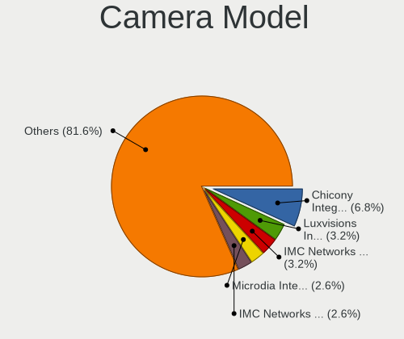

Arch Hardware Trends
--------------------

A project to identify most popular hardware characteristics and track their change
over time based on data collected by Arch users at https://Linux-Hardware.org.

Anyone can contribute to this report by the [hw-probe](https://github.com/linuxhw/hw-probe) tool:

    sudo -E hw-probe -all -upload

This is a report for all computer types. See also reports for [desktops](/Dist/Arch/Desktop/README.md) and [notebooks](/Dist/Arch/Notebook/README.md).

Full-feature report is available here: https://linux-hardware.org/?view=trends

Period: Jan, 2022.

Contents
--------

* [ System ](#system)
  - [ OS                       ](#os)
  - [ OS Family                ](#os-family)
  - [ Kernel                   ](#kernel)
  - [ Kernel Family            ](#kernel-family)
  - [ Kernel Major Ver.        ](#kernel-major-ver)
  - [ Arch                     ](#arch)
  - [ DE                       ](#de)
  - [ Display Server           ](#display-server)
  - [ Display Manager          ](#display-manager)
  - [ OS Lang                  ](#os-lang)
  - [ Boot Mode                ](#boot-mode)
  - [ Filesystem               ](#filesystem)
  - [ Part. scheme             ](#part-scheme)
  - [ Dual Boot with Linux/BSD ](#dual-boot-with-linuxbsd)
  - [ Dual Boot (Win)          ](#dual-boot-win)

* [ Board ](#board)
  - [ Vendor                   ](#vendor)
  - [ Model                    ](#model)
  - [ Model Family             ](#model-family)
  - [ MFG Year                 ](#mfg-year)
  - [ Form Factor              ](#form-factor)
  - [ Secure Boot              ](#secure-boot)
  - [ Coreboot                 ](#coreboot)
  - [ RAM Size                 ](#ram-size)
  - [ RAM Used                 ](#ram-used)
  - [ Total Drives             ](#total-drives)
  - [ Has CD-ROM               ](#has-cd-rom)
  - [ Has Ethernet             ](#has-ethernet)
  - [ Has WiFi                 ](#has-wifi)
  - [ Has Bluetooth            ](#has-bluetooth)

* [ Location ](#location)
  - [ Country                  ](#country)
  - [ City                     ](#city)

* [ Drives ](#drives)
  - [ Drive Vendor             ](#drive-vendor)
  - [ Drive Model              ](#drive-model)
  - [ HDD Vendor               ](#hdd-vendor)
  - [ SSD Vendor               ](#ssd-vendor)
  - [ Drive Kind               ](#drive-kind)
  - [ Drive Connector          ](#drive-connector)
  - [ Drive Size               ](#drive-size)
  - [ Space Total              ](#space-total)
  - [ Space Used               ](#space-used)
  - [ Malfunc. Drives          ](#malfunc-drives)
  - [ Malfunc. Drive Vendor    ](#malfunc-drive-vendor)
  - [ Malfunc. HDD Vendor      ](#malfunc-hdd-vendor)
  - [ Malfunc. Drive Kind      ](#malfunc-drive-kind)
  - [ Failed Drives            ](#failed-drives)
  - [ Failed Drive Vendor      ](#failed-drive-vendor)
  - [ Drive Status             ](#drive-status)

* [ Storage controller ](#storage-controller)
  - [ Storage Vendor           ](#storage-vendor)
  - [ Storage Model            ](#storage-model)
  - [ Storage Kind             ](#storage-kind)

* [ Processor ](#processor)
  - [ CPU Vendor               ](#cpu-vendor)
  - [ CPU Model                ](#cpu-model)
  - [ CPU Model Family         ](#cpu-model-family)
  - [ CPU Cores                ](#cpu-cores)
  - [ CPU Sockets              ](#cpu-sockets)
  - [ CPU Threads              ](#cpu-threads)
  - [ CPU Op-Modes             ](#cpu-op-modes)
  - [ CPU Microcode            ](#cpu-microcode)
  - [ CPU Microarch            ](#cpu-microarch)

* [ Graphics ](#graphics)
  - [ GPU Vendor               ](#gpu-vendor)
  - [ GPU Model                ](#gpu-model)
  - [ GPU Combo                ](#gpu-combo)
  - [ GPU Driver               ](#gpu-driver)
  - [ GPU Memory               ](#gpu-memory)

* [ Monitor ](#monitor)
  - [ Monitor Vendor           ](#monitor-vendor)
  - [ Monitor Model            ](#monitor-model)
  - [ Monitor Resolution       ](#monitor-resolution)
  - [ Monitor Diagonal         ](#monitor-diagonal)
  - [ Monitor Width            ](#monitor-width)
  - [ Aspect Ratio             ](#aspect-ratio)
  - [ Monitor Area             ](#monitor-area)
  - [ Pixel Density            ](#pixel-density)
  - [ Multiple Monitors        ](#multiple-monitors)

* [ Network ](#network)
  - [ Net Controller Vendor    ](#net-controller-vendor)
  - [ Net Controller Model     ](#net-controller-model)
  - [ Wireless Vendor          ](#wireless-vendor)
  - [ Wireless Model           ](#wireless-model)
  - [ Ethernet Vendor          ](#ethernet-vendor)
  - [ Ethernet Model           ](#ethernet-model)
  - [ Net Controller Kind      ](#net-controller-kind)
  - [ Used Controller          ](#used-controller)
  - [ NICs                     ](#nics)
  - [ IPv6                     ](#ipv6)

* [ Bluetooth ](#bluetooth)
  - [ Bluetooth Vendor         ](#bluetooth-vendor)
  - [ Bluetooth Model          ](#bluetooth-model)

* [ Sound ](#sound)
  - [ Sound Vendor             ](#sound-vendor)
  - [ Sound Model              ](#sound-model)

* [ Memory ](#memory)
  - [ Memory Vendor            ](#memory-vendor)
  - [ Memory Model             ](#memory-model)
  - [ Memory Kind              ](#memory-kind)
  - [ Memory Form Factor       ](#memory-form-factor)
  - [ Memory Size              ](#memory-size)
  - [ Memory Speed             ](#memory-speed)

* [ Printers & scanners ](#printers--scanners)
  - [ Printer Vendor           ](#printer-vendor)
  - [ Printer Model            ](#printer-model)
  - [ Scanner Vendor           ](#scanner-vendor)
  - [ Scanner Model            ](#scanner-model)

* [ Camera ](#camera)
  - [ Camera Vendor            ](#camera-vendor)
  - [ Camera Model             ](#camera-model)

* [ Security ](#security)
  - [ Fingerprint Vendor       ](#fingerprint-vendor)
  - [ Fingerprint Model        ](#fingerprint-model)
  - [ Chipcard Vendor          ](#chipcard-vendor)
  - [ Chipcard Model           ](#chipcard-model)

* [ Unsupported ](#unsupported)
  - [ Unsupported Devices      ](#unsupported-devices)
  - [ Unsupported Device Types ](#unsupported-device-types)

System
------

OS
--

Installed operating systems

| Name         | Computers | Percent |
|--------------|-----------|---------|
| Arch Rolling | 78        | 53.06%  |
| Arch         | 69        | 46.94%  |

OS Family
---------

OS without a version

| Name | Computers | Percent |
|------|-----------|---------|
| Arch | 147       | 100%    |

Kernel
------

Version of the Linux kernel

| Version                      | Computers | Percent |
|------------------------------|-----------|---------|
| 5.16.2-arch1-1               | 22        | 14.97%  |
| 5.15.12-arch1-1              | 21        | 14.29%  |
| 5.15.13-arch1-1              | 15        | 10.2%   |
| 5.16.0-arch1-1               | 14        | 9.52%   |
| 5.16.1-arch1-1               | 12        | 8.16%   |
| 5.15.12-zen1-1-zen           | 7         | 4.76%   |
| 5.16.2-zen1-1-zen            | 5         | 3.4%    |
| 5.16.1-zen1-1-zen            | 5         | 3.4%    |
| 5.16.0-zen1-1-zen            | 5         | 3.4%    |
| 5.16.3-arch1-1               | 4         | 2.72%   |
| 5.15.16-1-lts                | 3         | 2.04%   |
| 5.16.2-1-ck-generic-v3       | 2         | 1.36%   |
| 5.15.14-1-lts                | 2         | 1.36%   |
| 5.15.13-zen1-1-zen           | 2         | 1.36%   |
| 5.15.11-arch2-1              | 2         | 1.36%   |
| 5.15.10-arch1-1              | 2         | 1.36%   |
| 5.10.90-1-lts                | 2         | 1.36%   |
| 5.10.88-2-lts                | 2         | 1.36%   |
| 5.16.4-arch1-1               | 1         | 0.68%   |
| 5.16.3-zen1-1-zen            | 1         | 0.68%   |
| 5.16.3-1-ck-generic-v3       | 1         | 0.68%   |
| 5.16.2-zen1-1.1-zen          | 1         | 0.68%   |
| 5.16.2-jg                    | 1         | 0.68%   |
| 5.16.2-1-ck                  | 1         | 0.68%   |
| 5.16.2-1-aufs                | 1         | 0.68%   |
| 5.16.2                       | 1         | 0.68%   |
| 5.16.1-arch1-g14-1           | 1         | 0.68%   |
| 5.16.0-arch1-1-surface       | 1         | 0.68%   |
| 5.15.5-arch1-1               | 1         | 0.68%   |
| 5.15.17-xanmod2-tt-2         | 1         | 0.68%   |
| 5.15.16-hardened1-1-hardened | 1         | 0.68%   |
| 5.15.16-237-tkg-cacule       | 1         | 0.68%   |
| 5.15.13-xanmod1-1            | 1         | 0.68%   |
| 5.15.13-lqx1-1-lqx           | 1         | 0.68%   |
| 5.15.11-arch2-1-surface      | 1         | 0.68%   |
| 5.15.11-230-tkg-pds          | 1         | 0.68%   |
| 5.15.10-xanmod1-rog-1        | 1         | 0.68%   |
| 5.14.6-arch1-1-surface       | 1         | 0.68%   |

Kernel Family
-------------

Linux kernel without a distro release

| Version | Computers | Percent |
|---------|-----------|---------|
| 5.16.2  | 34        | 23.13%  |
| 5.15.12 | 28        | 19.05%  |
| 5.16.0  | 20        | 13.61%  |
| 5.15.13 | 19        | 12.93%  |
| 5.16.1  | 18        | 12.24%  |
| 5.16.3  | 6         | 4.08%   |
| 5.15.16 | 5         | 3.4%    |
| 5.15.11 | 4         | 2.72%   |
| 5.15.10 | 3         | 2.04%   |
| 5.15.14 | 2         | 1.36%   |
| 5.10.90 | 2         | 1.36%   |
| 5.10.88 | 2         | 1.36%   |
| 5.16.4  | 1         | 0.68%   |
| 5.15.5  | 1         | 0.68%   |
| 5.15.17 | 1         | 0.68%   |
| 5.14.6  | 1         | 0.68%   |

Kernel Major Ver.
-----------------

Linux kernel major version

| Version | Computers | Percent |
|---------|-----------|---------|
| 5.16    | 79        | 53.74%  |
| 5.15    | 63        | 42.86%  |
| 5.10    | 4         | 2.72%   |
| 5.14    | 1         | 0.68%   |

Arch
----

OS architecture (x86_64, i586, etc.)

| Name   | Computers | Percent |
|--------|-----------|---------|
| x86_64 | 147       | 100%    |

DE
--

Desktop Environment

| Name                     | Computers | Percent |
|--------------------------|-----------|---------|
| KDE5                     | 55        | 37.41%  |
| GNOME                    | 37        | 25.17%  |
| Unknown                  | 16        | 10.88%  |
| XFCE                     | 12        | 8.16%   |
| i3                       | 8         | 5.44%   |
| awesome                  | 8         | 5.44%   |
| sway                     | 4         | 2.72%   |
| xmonad                   | 1         | 0.68%   |
| river                    | 1         | 0.68%   |
| qtile                    | 1         | 0.68%   |
| Openbox                  | 1         | 0.68%   |
| GNOME Flashback          | 1         | 0.68%   |
| Budgie                   | 1         | 0.68%   |
| /usr/bin/openbox-session | 1         | 0.68%   |

Display Server
--------------

X11 or Wayland

| Name    | Computers | Percent |
|---------|-----------|---------|
| X11     | 89        | 60.54%  |
| Wayland | 34        | 23.13%  |
| Tty     | 18        | 12.24%  |
| Unknown | 6         | 4.08%   |

Display Manager
---------------

SDDM, LightDM, etc.

| Name    | Computers | Percent |
|---------|-----------|---------|
| SDDM    | 57        | 38.78%  |
| Unknown | 39        | 26.53%  |
| LightDM | 25        | 17.01%  |
| GDM     | 21        | 14.29%  |
| Ly      | 2         | 1.36%   |
| LXDM    | 2         | 1.36%   |
| GREETD  | 1         | 0.68%   |

OS Lang
-------

Language

| Lang    | Computers | Percent |
|---------|-----------|---------|
| en_US   | 89        | 60.54%  |
| de_DE   | 9         | 6.12%   |
| C       | 9         | 6.12%   |
| pt_BR   | 6         | 4.08%   |
| fr_FR   | 4         | 2.72%   |
| en_GB   | 4         | 2.72%   |
| Unknown | 4         | 2.72%   |
| zh_CN   | 3         | 2.04%   |
| ru_RU   | 3         | 2.04%   |
| it_IT   | 3         | 2.04%   |
| en_DK   | 2         | 1.36%   |
| en_AU   | 2         | 1.36%   |
| de_CH   | 2         | 1.36%   |
| mn_CN   | 1         | 0.68%   |
| hu_HU   | 1         | 0.68%   |
| en_SE   | 1         | 0.68%   |
| en_NZ   | 1         | 0.68%   |
| en_IN   | 1         | 0.68%   |
| de_AT   | 1         | 0.68%   |
| cs_CZ   | 1         | 0.68%   |

Boot Mode
---------

EFI or BIOS

| Mode | Computers | Percent |
|------|-----------|---------|
| EFI  | 114       | 77.55%  |
| BIOS | 33        | 22.45%  |

Filesystem
----------

Type of filesystem

| Type    | Computers | Percent |
|---------|-----------|---------|
| Ext4    | 102       | 69.39%  |
| Btrfs   | 30        | 20.41%  |
| Xfs     | 9         | 6.12%   |
| F2fs    | 4         | 2.72%   |
| Overlay | 1         | 0.68%   |
| Aufs    | 1         | 0.68%   |

Part. scheme
------------

Scheme of partitioning

| Type    | Computers | Percent |
|---------|-----------|---------|
| GPT     | 123       | 83.67%  |
| Unknown | 15        | 10.2%   |
| MBR     | 9         | 6.12%   |

Dual Boot with Linux/BSD
------------------------

Hosting more than one Linux/BSD

| Dual boot | Computers | Percent |
|-----------|-----------|---------|
| No        | 133       | 90.48%  |
| Yes       | 14        | 9.52%   |

Dual Boot (Win)
---------------

Hosting Linux and Windows

| Dual boot | Computers | Percent |
|-----------|-----------|---------|
| No        | 82        | 55.78%  |
| Yes       | 65        | 44.22%  |

Board
-----

Vendor
------

Motherboard manufacturer

| Name                 | Computers | Percent |
|----------------------|-----------|---------|
| Lenovo               | 28        | 19.05%  |
| ASUSTek Computer     | 28        | 19.05%  |
| Hewlett-Packard      | 19        | 12.93%  |
| MSI                  | 16        | 10.88%  |
| Dell                 | 12        | 8.16%   |
| Acer                 | 10        | 6.8%    |
| Gigabyte Technology  | 6         | 4.08%   |
| ASRock               | 3         | 2.04%   |
| Unknown              | 3         | 2.04%   |
| Samsung Electronics  | 2         | 1.36%   |
| Microsoft            | 2         | 1.36%   |
| Medion               | 2         | 1.36%   |
| Intel Client Systems | 2         | 1.36%   |
| Intel                | 2         | 1.36%   |
| Apple                | 2         | 1.36%   |
| Semp Toshiba         | 1         | 0.68%   |
| Multilaser           | 1         | 0.68%   |
| Linx                 | 1         | 0.68%   |
| LG Electronics       | 1         | 0.68%   |
| Jetway               | 1         | 0.68%   |
| HUAWEI               | 1         | 0.68%   |
| Fujitsu              | 1         | 0.68%   |
| Framework            | 1         | 0.68%   |
| Eluktronics          | 1         | 0.68%   |
| Alienware            | 1         | 0.68%   |

Model
-----

Motherboard model

| Name                                      | Computers | Percent |
|-------------------------------------------|-----------|---------|
| MSI MS-7C37                               | 3         | 2.04%   |
| Unknown                                   | 3         | 2.04%   |
| Intel Client Systems LAPBC710             | 2         | 1.36%   |
| Dell Latitude E5570                       | 2         | 1.36%   |
| Semp Toshiba STI                          | 1         | 0.68%   |
| Samsung 935XDB                            | 1         | 0.68%   |
| Samsung 300E5M/300E5L                     | 1         | 0.68%   |
| Multilaser UB32X                          | 1         | 0.68%   |
| MSI MS-7D22                               | 1         | 0.68%   |
| MSI MS-7D18                               | 1         | 0.68%   |
| MSI MS-7C91                               | 1         | 0.68%   |
| MSI MS-7C84                               | 1         | 0.68%   |
| MSI MS-7C35                               | 1         | 0.68%   |
| MSI MS-7C02                               | 1         | 0.68%   |
| MSI MS-7918                               | 1         | 0.68%   |
| MSI MS-7788                               | 1         | 0.68%   |
| MSI MS-7721                               | 1         | 0.68%   |
| MSI Modern 14 B5M                         | 1         | 0.68%   |
| MSI GS66 Stealth 10UH                     | 1         | 0.68%   |
| MSI GS66 Stealth 10SFS                    | 1         | 0.68%   |
| MSI GP73 Leopard 8RE                      | 1         | 0.68%   |
| Microsoft Surface Pro 7                   | 1         | 0.68%   |
| Microsoft Surface Go 2                    | 1         | 0.68%   |
| Medion S4216                              | 1         | 0.68%   |
| Medion P6685 MD61138                      | 1         | 0.68%   |
| Linx LAMINALTT8W4G-HBN                    | 1         | 0.68%   |
| LG 17UD70P-PX76K                          | 1         | 0.68%   |
| Lenovo Yoga Duet IML 2020 82E9            | 1         | 0.68%   |
| Lenovo V155-15API 81V5                    | 1         | 0.68%   |
| Lenovo U310                               | 1         | 0.68%   |
| Lenovo ThinkPad X395 20NL000HMC           | 1         | 0.68%   |
| Lenovo ThinkPad X260 20F5S08P00           | 1         | 0.68%   |
| Lenovo ThinkPad T480 20L5001DUS           | 1         | 0.68%   |
| Lenovo ThinkPad T420 4236WR1              | 1         | 0.68%   |
| Lenovo ThinkPad T420 423664U              | 1         | 0.68%   |
| Lenovo ThinkPad P50 20EQS2AB00            | 1         | 0.68%   |
| Lenovo ThinkPad P14s Gen 2a 21A1S00D00    | 1         | 0.68%   |
| Lenovo ThinkPad L15 Gen 2a 20X7CTO1WW     | 1         | 0.68%   |
| Lenovo ThinkPad L13 Yoga Gen 2 20VLA033CD | 1         | 0.68%   |
| Lenovo ThinkPad E15 Gen 3 20YG004QMX      | 1         | 0.68%   |
| Lenovo ThinkPad A485 20MVS0FH00           | 1         | 0.68%   |
| Lenovo ThinkCentre M93p 10A8S1K403        | 1         | 0.68%   |
| Lenovo ThinkBook 13s G3 ACN 20YA          | 1         | 0.68%   |
| Lenovo S145-15API 81UT                    | 1         | 0.68%   |
| Lenovo Legion Y540-15IRH-PG0 81SY         | 1         | 0.68%   |
| Lenovo Legion T5 28IMB05 90NC00QNUL       | 1         | 0.68%   |
| Lenovo Legion R9000P2021H 82JQ            | 1         | 0.68%   |
| Lenovo IdeaPad S145-15IWL 81S9            | 1         | 0.68%   |
| Lenovo IdeaPad S145-15IIL 82DJ            | 1         | 0.68%   |
| Lenovo IdeaPad Gaming 3 15ARH05 82EY      | 1         | 0.68%   |
| Lenovo IdeaPad 5 14ALC05 82LM             | 1         | 0.68%   |
| Lenovo IdeaPad 330S-15IKB 81F5            | 1         | 0.68%   |
| Lenovo IdeaPad 330-15IKB 81DE             | 1         | 0.68%   |
| Lenovo IdeaPad 320S-14IKB 80X4            | 1         | 0.68%   |
| Lenovo IdeaPad 305-14IBD 80R1             | 1         | 0.68%   |
| Jetway 1.0                                | 1         | 0.68%   |
| Intel NUC8i7BEH                           | 1         | 0.68%   |
| Intel NUC7i7DNKE                          | 1         | 0.68%   |
| HUAWEI BOHK-WAX9X                         | 1         | 0.68%   |
| HP ProBook 6460b                          | 1         | 0.68%   |

Model Family
------------

Motherboard model prefix

| Name                          | Computers | Percent |
|-------------------------------|-----------|---------|
| Lenovo ThinkPad               | 11        | 7.48%   |
| Lenovo IdeaPad                | 8         | 5.44%   |
| ASUS ROG                      | 7         | 4.76%   |
| HP Pavilion                   | 5         | 3.4%    |
| HP ProBook                    | 4         | 2.72%   |
| ASUS TUF                      | 4         | 2.72%   |
| Acer Nitro                    | 4         | 2.72%   |
| MSI MS-7C37                   | 3         | 2.04%   |
| Lenovo Legion                 | 3         | 2.04%   |
| HP EliteBook                  | 3         | 2.04%   |
| Dell Latitude                 | 3         | 2.04%   |
| ASUS VivoBook                 | 3         | 2.04%   |
| Acer Swift                    | 3         | 2.04%   |
| Acer Aspire                   | 3         | 2.04%   |
| Unknown                       | 3         | 2.04%   |
| MSI GS66                      | 2         | 1.36%   |
| Microsoft Surface             | 2         | 1.36%   |
| Intel Client Systems LAPBC710 | 2         | 1.36%   |
| HP ENVY                       | 2         | 1.36%   |
| Dell XPS                      | 2         | 1.36%   |
| Dell Precision                | 2         | 1.36%   |
| Dell Inspiron                 | 2         | 1.36%   |
| Dell G3                       | 2         | 1.36%   |
| ASUS PRIME                    | 2         | 1.36%   |
| ASUS Maximus                  | 2         | 1.36%   |
| ASUS ASUS                     | 2         | 1.36%   |
| Semp Toshiba STI              | 1         | 0.68%   |
| Samsung 935XDB                | 1         | 0.68%   |
| Samsung 300E5M                | 1         | 0.68%   |
| Multilaser UB32X              | 1         | 0.68%   |
| MSI MS-7D22                   | 1         | 0.68%   |
| MSI MS-7D18                   | 1         | 0.68%   |
| MSI MS-7C91                   | 1         | 0.68%   |
| MSI MS-7C84                   | 1         | 0.68%   |
| MSI MS-7C35                   | 1         | 0.68%   |
| MSI MS-7C02                   | 1         | 0.68%   |
| MSI MS-7918                   | 1         | 0.68%   |
| MSI MS-7788                   | 1         | 0.68%   |
| MSI MS-7721                   | 1         | 0.68%   |
| MSI Modern                    | 1         | 0.68%   |
| MSI GP73                      | 1         | 0.68%   |
| Medion S4216                  | 1         | 0.68%   |
| Medion P6685                  | 1         | 0.68%   |
| Linx LAMINALTT8W4G-HBN        | 1         | 0.68%   |
| LG 17UD70P-PX76K              | 1         | 0.68%   |
| Lenovo Yoga                   | 1         | 0.68%   |
| Lenovo V155-15API             | 1         | 0.68%   |
| Lenovo U310                   | 1         | 0.68%   |
| Lenovo ThinkCentre            | 1         | 0.68%   |
| Lenovo ThinkBook              | 1         | 0.68%   |
| Lenovo S145-15API             | 1         | 0.68%   |
| Jetway 1.0                    | 1         | 0.68%   |
| Intel NUC8i7BEH               | 1         | 0.68%   |
| Intel NUC7i7DNKE              | 1         | 0.68%   |
| HUAWEI BOHK-WAX9X             | 1         | 0.68%   |
| HP OMEN                       | 1         | 0.68%   |
| HP Notebook                   | 1         | 0.68%   |
| HP Laptop                     | 1         | 0.68%   |
| HP Elite                      | 1         | 0.68%   |
| HP Compaq                     | 1         | 0.68%   |

MFG Year
--------

Motherboard manufacture year

| Year | Computers | Percent |
|------|-----------|---------|
| 2021 | 30        | 20.41%  |
| 2020 | 29        | 19.73%  |
| 2019 | 27        | 18.37%  |
| 2018 | 20        | 13.61%  |
| 2016 | 11        | 7.48%   |
| 2017 | 7         | 4.76%   |
| 2011 | 6         | 4.08%   |
| 2015 | 5         | 3.4%    |
| 2013 | 4         | 2.72%   |
| 2014 | 3         | 2.04%   |
| 2012 | 3         | 2.04%   |
| 2010 | 2         | 1.36%   |

Form Factor
-----------

Physical design of the computer

| Name        | Computers | Percent |
|-------------|-----------|---------|
| Notebook    | 91        | 61.9%   |
| Desktop     | 43        | 29.25%  |
| Convertible | 6         | 4.08%   |
| Tablet      | 4         | 2.72%   |
| Mini pc     | 2         | 1.36%   |
| Server      | 1         | 0.68%   |

Secure Boot
-----------

Enabled or disabled

| State    | Computers | Percent |
|----------|-----------|---------|
| Disabled | 140       | 95.24%  |
| Enabled  | 7         | 4.76%   |

Coreboot
--------

Have coreboot on board

| Used | Computers | Percent |
|------|-----------|---------|
| No   | 147       | 100%    |

RAM Size
--------

Total RAM memory

| Size in GB  | Computers | Percent |
|-------------|-----------|---------|
| 8.01-16.0   | 39        | 26.53%  |
| 16.01-24.0  | 37        | 25.17%  |
| 4.01-8.0    | 27        | 18.37%  |
| 32.01-64.0  | 23        | 15.65%  |
| 3.01-4.0    | 14        | 9.52%   |
| 64.01-256.0 | 6         | 4.08%   |
| 24.01-32.0  | 1         | 0.68%   |

RAM Used
--------

Used RAM memory

| Used GB    | Computers | Percent |
|------------|-----------|---------|
| 2.01-3.0   | 39        | 26.53%  |
| 1.01-2.0   | 31        | 21.09%  |
| 4.01-8.0   | 29        | 19.73%  |
| 3.01-4.0   | 26        | 17.69%  |
| 8.01-16.0  | 14        | 9.52%   |
| 0.51-1.0   | 4         | 2.72%   |
| 0.01-0.5   | 2         | 1.36%   |
| 24.01-32.0 | 1         | 0.68%   |
| 16.01-24.0 | 1         | 0.68%   |

Total Drives
------------

Number of drives on board

| Drives | Computers | Percent |
|--------|-----------|---------|
| 1      | 84        | 57.14%  |
| 2      | 41        | 27.89%  |
| 3      | 12        | 8.16%   |
| 6      | 4         | 2.72%   |
| 5      | 3         | 2.04%   |
| 4      | 2         | 1.36%   |
| 7      | 1         | 0.68%   |

Has CD-ROM
----------

Has CD-ROM on board

| Presented | Computers | Percent |
|-----------|-----------|---------|
| No        | 122       | 82.99%  |
| Yes       | 25        | 17.01%  |

Has Ethernet
------------

Has Ethernet on board

| Presented | Computers | Percent |
|-----------|-----------|---------|
| Yes       | 114       | 77.55%  |
| No        | 33        | 22.45%  |

Has WiFi
--------

Has WiFi module

| Presented | Computers | Percent |
|-----------|-----------|---------|
| Yes       | 126       | 85.71%  |
| No        | 21        | 14.29%  |

Has Bluetooth
-------------

Has Bluetooth module

| Presented | Computers | Percent |
|-----------|-----------|---------|
| Yes       | 118       | 80.27%  |
| No        | 29        | 19.73%  |

Location
--------

Country
-------

Geographic location (country)

| Country     | Computers | Percent |
|-------------|-----------|---------|
| USA         | 23        | 15.65%  |
| Germany     | 16        | 10.88%  |
| Brazil      | 10        | 6.8%    |
| India       | 9         | 6.12%   |
| France      | 7         | 4.76%   |
| Italy       | 5         | 3.4%    |
| Indonesia   | 5         | 3.4%    |
| Russia      | 4         | 2.72%   |
| Czechia     | 4         | 2.72%   |
| Bangladesh  | 4         | 2.72%   |
| Australia   | 4         | 2.72%   |
| UK          | 3         | 2.04%   |
| Sweden      | 3         | 2.04%   |
| Romania     | 3         | 2.04%   |
| Norway      | 3         | 2.04%   |
| New Zealand | 3         | 2.04%   |
| Netherlands | 3         | 2.04%   |
| Hungary     | 3         | 2.04%   |
| Finland     | 3         | 2.04%   |
| China       | 3         | 2.04%   |
| Vietnam     | 2         | 1.36%   |
| Ukraine     | 2         | 1.36%   |
| Thailand    | 2         | 1.36%   |
| Switzerland | 2         | 1.36%   |
| South Korea | 2         | 1.36%   |
| Greece      | 2         | 1.36%   |
| Belgium     | 2         | 1.36%   |
| Turkey      | 1         | 0.68%   |
| Singapore   | 1         | 0.68%   |
| Qatar       | 1         | 0.68%   |
| Poland      | 1         | 0.68%   |
| Philippines | 1         | 0.68%   |
| Malaysia    | 1         | 0.68%   |
| Luxembourg  | 1         | 0.68%   |
| Iran        | 1         | 0.68%   |
| Hong Kong   | 1         | 0.68%   |
| Guatemala   | 1         | 0.68%   |
| Egypt       | 1         | 0.68%   |
| Canada      | 1         | 0.68%   |
| Azerbaijan  | 1         | 0.68%   |
| Austria     | 1         | 0.68%   |
| Argentina   | 1         | 0.68%   |

City
----

Geographic location (city)

| City                  | Computers | Percent |
|-----------------------|-----------|---------|
| San Francisco         | 4         | 2.72%   |
| Helsinki              | 3         | 2.04%   |
| Sydney                | 2         | 1.36%   |
| Surabaya              | 2         | 1.36%   |
| S??o Paulo            | 2         | 1.36%   |
| Ribeir??o Preto       | 2         | 1.36%   |
| Rangpur City          | 2         | 1.36%   |
| Phoenix               | 2         | 1.36%   |
| Frankfurt am Main     | 2         | 1.36%   |
| Chicago               | 2         | 1.36%   |
| Chennai               | 2         | 1.36%   |
| Brussels              | 2         | 1.36%   |
| Zurich                | 1         | 0.68%   |
| Wooster               | 1         | 0.68%   |
| Wellington            | 1         | 0.68%   |
| Waffenbrunn           | 1         | 0.68%   |
| Vlasikha              | 1         | 0.68%   |
| Villeurbanne          | 1         | 0.68%   |
| Vigasio               | 1         | 0.68%   |
| Velbert               | 1         | 0.68%   |
| Vaxjo                 | 1         | 0.68%   |
| Uberl??ndia           | 1         | 0.68%   |
| Turda                 | 1         | 0.68%   |
| Tukwila               | 1         | 0.68%   |
| Tuen Mun              | 1         | 0.68%   |
| Thrissur              | 1         | 0.68%   |
| Tampa                 | 1         | 0.68%   |
| Stuttgart             | 1         | 0.68%   |
| Stockholm             | 1         | 0.68%   |
| Stavanger             | 1         | 0.68%   |
| St Petersburg         | 1         | 0.68%   |
| Southampton           | 1         | 0.68%   |
| Singapore             | 1         | 0.68%   |
| Shantou               | 1         | 0.68%   |
| Seongdong-gu          | 1         | 0.68%   |
| Samarinda             | 1         | 0.68%   |
| Saint-Martin-d'H??res | 1         | 0.68%   |
| Roubaix               | 1         | 0.68%   |
| Rotterdam             | 1         | 0.68%   |
| Rockhampton           | 1         | 0.68%   |
| Recife                | 1         | 0.68%   |
| Rayong                | 1         | 0.68%   |
| Prague                | 1         | 0.68%   |
| Poznan                | 1         | 0.68%   |
| Port Huron            | 1         | 0.68%   |
| Pontianak             | 1         | 0.68%   |
| Plauen                | 1         | 0.68%   |
| Pittsburgh            | 1         | 0.68%   |
| Petaling Jaya         | 1         | 0.68%   |
| P??trai               | 1         | 0.68%   |
| Parnamirim            | 1         | 0.68%   |
| Paris                 | 1         | 0.68%   |
| Palakkad              | 1         | 0.68%   |
| Oslo                  | 1         | 0.68%   |
| Oroquieta             | 1         | 0.68%   |
| Oradea                | 1         | 0.68%   |
| Novy Jicin            | 1         | 0.68%   |
| Northampton           | 1         | 0.68%   |
| Nijmegen              | 1         | 0.68%   |
| Niddatal              | 1         | 0.68%   |

Drives
------

Drive Vendor
------------

Hard drive vendors

| Vendor                         | Computers | Drives | Percent |
|--------------------------------|-----------|--------|---------|
| Samsung Electronics            | 45        | 62     | 19.57%  |
| WDC                            | 34        | 37     | 14.78%  |
| Seagate                        | 26        | 29     | 11.3%   |
| Toshiba                        | 19        | 20     | 8.26%   |
| Sandisk                        | 16        | 18     | 6.96%   |
| SK Hynix                       | 12        | 13     | 5.22%   |
| Kingston                       | 9         | 10     | 3.91%   |
| Crucial                        | 8         | 8      | 3.48%   |
| Unknown                        | 6         | 7      | 2.61%   |
| Intel                          | 6         | 6      | 2.61%   |
| Corsair                        | 5         | 5      | 2.17%   |
| A-DATA Technology              | 5         | 5      | 2.17%   |
| KIOXIA                         | 4         | 4      | 1.74%   |
| HGST                           | 4         | 4      | 1.74%   |
| ZHITAI                         | 2         | 2      | 0.87%   |
| Silicon Motion                 | 2         | 3      | 0.87%   |
| Micron Technology              | 2         | 2      | 0.87%   |
| Intenso                        | 2         | 2      | 0.87%   |
| China                          | 2         | 2      | 0.87%   |
| XPG                            | 1         | 2      | 0.43%   |
| UMIS                           | 1         | 1      | 0.43%   |
| Team                           | 1         | 1      | 0.43%   |
| TCSUNBOW                       | 1         | 1      | 0.43%   |
| SYNOLOGY                       | 1         | 1      | 0.43%   |
| Solid State Storage Technology | 1         | 1      | 0.43%   |
| Realtek Semiconductor          | 1         | 1      | 0.43%   |
| PLEXTOR                        | 1         | 1      | 0.43%   |
| Phison Electronics             | 1         | 1      | 0.43%   |
| Phison                         | 1         | 1      | 0.43%   |
| Patriot                        | 1         | 1      | 0.43%   |
| MidasForce                     | 1         | 1      | 0.43%   |
| Micron/Crucial Technology      | 1         | 1      | 0.43%   |
| Lenovo                         | 1         | 1      | 0.43%   |
| LaCie                          | 1         | 1      | 0.43%   |
| JMicron                        | 1         | 1      | 0.43%   |
| HUAWEI                         | 1         | 1      | 0.43%   |
| HS-SSD-E100                    | 1         | 1      | 0.43%   |
| Hitachi                        | 1         | 1      | 0.43%   |
| GOODRAM                        | 1         | 1      | 0.43%   |
| Apple                          | 1         | 1      | 0.43%   |

Drive Model
-----------

Hard drive models

| Model                                   | Computers | Percent |
|-----------------------------------------|-----------|---------|
| Seagate ST2000DM008-2FR102 2TB          | 7         | 2.76%   |
| Toshiba MQ04ABF100 1TB                  | 4         | 1.57%   |
| Samsung SSD 860 EVO 1TB                 | 4         | 1.57%   |
| WDC PC SN520 SDAPNUW-512G-1014 512GB    | 3         | 1.18%   |
| Toshiba NVMe SSD Drive 512GB            | 3         | 1.18%   |
| Seagate ST1000LM035-1RK172 1TB          | 3         | 1.18%   |
| Sandisk NVMe SSD Drive 512GB            | 3         | 1.18%   |
| Sandisk NVMe SSD Drive 500GB            | 3         | 1.18%   |
| Samsung SSD 970 EVO Plus 1TB            | 3         | 1.18%   |
| Samsung SSD 870 EVO 500GB               | 3         | 1.18%   |
| WDC WDS100T2B0C 1TB                     | 2         | 0.79%   |
| Unknown SC128  128GB                    | 2         | 0.79%   |
| Toshiba KSG60ZMV256G M.2 2280 256GB SSD | 2         | 0.79%   |
| Toshiba HDWE140 4TB                     | 2         | 0.79%   |
| Toshiba HDWD110 1TB                     | 2         | 0.79%   |
| Toshiba DT01ACA100 1TB                  | 2         | 0.79%   |
| SK Hynix HFS128G39TND-N210A 128GB SSD   | 2         | 0.79%   |
| Silicon Motion NVMe SSD Drive 1TB       | 2         | 0.79%   |
| Seagate ST500DM002-1BD142 500GB         | 2         | 0.79%   |
| Seagate ST4000DM004-2CV104 4TB          | 2         | 0.79%   |
| Seagate ST1000LX015-1U7172 1TB          | 2         | 0.79%   |
| SanDisk SSD G5 BICS4 1TB                | 2         | 0.79%   |
| Sandisk NVMe SSD Drive 256GB            | 2         | 0.79%   |
| Sandisk NVMe SSD Drive 1TB              | 2         | 0.79%   |
| Samsung SSD 980 1TB                     | 2         | 0.79%   |
| Samsung SSD 970 EVO Plus 2TB            | 2         | 0.79%   |
| Samsung SSD 860 EVO 500GB               | 2         | 0.79%   |
| Samsung SSD 850 EVO 500GB               | 2         | 0.79%   |
| Samsung NVMe SSD Drive 500GB            | 2         | 0.79%   |
| Samsung NVMe SSD Drive 2TB              | 2         | 0.79%   |
| Samsung NVMe SSD Drive 1TB              | 2         | 0.79%   |
| Kingston SA400S37480G 480GB SSD         | 2         | 0.79%   |
| Intel SSDPEKNW512G8L 512GB              | 2         | 0.79%   |
| HGST HTS725032A7E630 320GB              | 2         | 0.79%   |
| Crucial CT480BX500SSD1 480GB            | 2         | 0.79%   |
| China SATA SSD 120GB                    | 2         | 0.79%   |
| ZHITAI SC001 Active 1TB SSD             | 1         | 0.39%   |
| ZHITAI PC005 Active 1TB                 | 1         | 0.39%   |
| XPG NVMe SSD Drive 512GB                | 1         | 0.39%   |
| XPG NVMe SSD Drive 1TB                  | 1         | 0.39%   |
| WDC WDS500G2B0A-00SM50 500GB SSD        | 1         | 0.39%   |
| WDC WDS500G1X0E-00AFY0 500GB            | 1         | 0.39%   |
| WDC WDS250G2B0C-00PXH0 250GB            | 1         | 0.39%   |
| WDC WDS100T2G0A-00JH30 1TB SSD          | 1         | 0.39%   |
| WDC WDS100T2B0B 1TB SSD                 | 1         | 0.39%   |
| WDC WDS100T2B0A-00SM50 1TB SSD          | 1         | 0.39%   |
| WDC WDS100T1X0E-00AFY0 1TB              | 1         | 0.39%   |
| WDC WD6400BEVT-22A0RT0 640GB            | 1         | 0.39%   |
| WDC WD60EZAZ-00SF3B0 6TB                | 1         | 0.39%   |
| WDC WD5000LPLX-08ZNTT0 500GB            | 1         | 0.39%   |
| WDC WD5000LPCX-35VHAT0 500GB            | 1         | 0.39%   |
| WDC WD5000AAKX-22ERMA0 500GB            | 1         | 0.39%   |
| WDC WD5000AAKX-001CA0 500GB             | 1         | 0.39%   |
| WDC WD5000AAKS-22A7B0 500GB             | 1         | 0.39%   |
| WDC WD5000AAKS-00UU3A0 500GB            | 1         | 0.39%   |
| WDC WD50 EZRX-00MVLB1 5TB               | 1         | 0.39%   |
| WDC WD4004FZWX-00GBGB0 4TB              | 1         | 0.39%   |
| WDC WD20EZAZ-00GGJB0 2TB                | 1         | 0.39%   |
| WDC WD20EFRX-68EUZN0 2TB                | 1         | 0.39%   |
| WDC WD2003FYYS-18W0B0 2TB               | 1         | 0.39%   |

HDD Vendor
----------

Hard disk drive vendors

| Vendor              | Computers | Drives | Percent |
|---------------------|-----------|--------|---------|
| Seagate             | 25        | 28     | 38.46%  |
| WDC                 | 17        | 20     | 26.15%  |
| Toshiba             | 11        | 12     | 16.92%  |
| Samsung Electronics | 4         | 4      | 6.15%   |
| HGST                | 4         | 4      | 6.15%   |
| Unknown             | 1         | 1      | 1.54%   |
| SYNOLOGY            | 1         | 1      | 1.54%   |
| LaCie               | 1         | 1      | 1.54%   |
| Hitachi             | 1         | 1      | 1.54%   |

SSD Vendor
----------

Solid state drive vendors

| Vendor              | Computers | Drives | Percent |
|---------------------|-----------|--------|---------|
| Samsung Electronics | 17        | 23     | 26.56%  |
| SanDisk             | 6         | 7      | 9.38%   |
| Kingston            | 6         | 6      | 9.38%   |
| WDC                 | 5         | 5      | 7.81%   |
| Crucial             | 5         | 5      | 7.81%   |
| SK Hynix            | 4         | 4      | 6.25%   |
| A-DATA Technology   | 3         | 3      | 4.69%   |
| Toshiba             | 2         | 2      | 3.13%   |
| Intenso             | 2         | 2      | 3.13%   |
| Intel               | 2         | 2      | 3.13%   |
| China               | 2         | 2      | 3.13%   |
| ZHITAI              | 1         | 1      | 1.56%   |
| TCSUNBOW            | 1         | 1      | 1.56%   |
| Seagate             | 1         | 1      | 1.56%   |
| PLEXTOR             | 1         | 1      | 1.56%   |
| Patriot             | 1         | 1      | 1.56%   |
| MidasForce          | 1         | 1      | 1.56%   |
| HS-SSD-E100         | 1         | 1      | 1.56%   |
| GOODRAM             | 1         | 1      | 1.56%   |
| Corsair             | 1         | 1      | 1.56%   |
| Apple               | 1         | 1      | 1.56%   |

Drive Kind
----------

HDD or SSD

| Kind    | Computers | Drives | Percent |
|---------|-----------|--------|---------|
| NVMe    | 94        | 111    | 44.55%  |
| SSD     | 55        | 71     | 26.07%  |
| HDD     | 55        | 72     | 26.07%  |
| MMC     | 6         | 6      | 2.84%   |
| Unknown | 1         | 1      | 0.47%   |

Drive Connector
---------------

SATA, SAS, NVMe, etc.

| Type | Computers | Drives | Percent |
|------|-----------|--------|---------|
| NVMe | 94        | 110    | 49.21%  |
| SATA | 85        | 136    | 44.5%   |
| SAS  | 6         | 9      | 3.14%   |
| MMC  | 6         | 6      | 3.14%   |

Drive Size
----------

Size of hard drive

| Size in TB | Computers | Drives | Percent |
|------------|-----------|--------|---------|
| 0.01-0.5   | 54        | 65     | 44.26%  |
| 0.51-1.0   | 39        | 44     | 31.97%  |
| 1.01-2.0   | 17        | 21     | 13.93%  |
| 3.01-4.0   | 7         | 8      | 5.74%   |
| 4.01-10.0  | 4         | 4      | 3.28%   |
| 2.01-3.0   | 1         | 1      | 0.82%   |

Space Total
-----------

Amount of disk space available on the file system

| Size in GB     | Computers | Percent |
|----------------|-----------|---------|
| 251-500        | 40        | 27.21%  |
| 101-250        | 32        | 21.77%  |
| 501-1000       | 25        | 17.01%  |
| More than 3000 | 20        | 13.61%  |
| 1001-2000      | 15        | 10.2%   |
| 2001-3000      | 6         | 4.08%   |
| 51-100         | 5         | 3.4%    |
| Unknown        | 3         | 2.04%   |
| 1-20           | 1         | 0.68%   |

Space Used
----------

Amount of used disk space

| Used GB        | Computers | Percent |
|----------------|-----------|---------|
| 101-250        | 31        | 21.09%  |
| 1-20           | 26        | 17.69%  |
| 21-50          | 20        | 13.61%  |
| 251-500        | 18        | 12.24%  |
| 51-100         | 18        | 12.24%  |
| 501-1000       | 13        | 8.84%   |
| 1001-2000      | 8         | 5.44%   |
| More than 3000 | 5         | 3.4%    |
| 2001-3000      | 5         | 3.4%    |
| Unknown        | 3         | 2.04%   |

Malfunc. Drives
---------------

Drive models with a malfunction

| Model                                   | Computers | Drives | Percent |
|-----------------------------------------|-----------|--------|---------|
| Toshiba KSG60ZMV256G M.2 2280 256GB SSD | 2         | 2      | 10.53%  |
| WDC WD5000AAKX-001CA0 500GB             | 1         | 1      | 5.26%   |
| WDC WD5000AAKS-22A7B0 500GB             | 1         | 1      | 5.26%   |
| WDC WD5000AAKS-00UU3A0 500GB            | 1         | 1      | 5.26%   |
| WDC WD50 EZRX-00MVLB1 5TB               | 1         | 1      | 5.26%   |
| WDC WD10JPVX-60JC3T0 1TB                | 1         | 1      | 5.26%   |
| WDC WD10EZEX-60WN4A0 1TB                | 1         | 1      | 5.26%   |
| Toshiba HDWE140 4TB                     | 1         | 1      | 5.26%   |
| SK Hynix HFS128G39TND-N210A 128GB SSD   | 1         | 1      | 5.26%   |
| SK Hynix BC501 HFM512GDJTNG-8310A 512GB | 1         | 1      | 5.26%   |
| Seagate ST3250312AS 250GB               | 1         | 1      | 5.26%   |
| Seagate ST2000LX001-1RG174 2TB          | 1         | 1      | 5.26%   |
| Seagate ST2000DM008-2FR102 2TB          | 1         | 1      | 5.26%   |
| SanDisk SD7SB3Q256G1002 256GB SSD       | 1         | 1      | 5.26%   |
| Samsung Electronics HD161HJ 160GB       | 1         | 1      | 5.26%   |
| JMicron Generic 128GB                   | 1         | 1      | 5.26%   |
| HGST HTS725032A7E630 320GB              | 1         | 1      | 5.26%   |
| HGST HTS545050A7E680 500GB              | 1         | 1      | 5.26%   |

Malfunc. Drive Vendor
---------------------

Vendors of faulty drives

| Vendor              | Computers | Drives | Percent |
|---------------------|-----------|--------|---------|
| WDC                 | 6         | 6      | 31.58%  |
| Toshiba             | 3         | 3      | 15.79%  |
| Seagate             | 3         | 3      | 15.79%  |
| SK Hynix            | 2         | 2      | 10.53%  |
| HGST                | 2         | 2      | 10.53%  |
| SanDisk             | 1         | 1      | 5.26%   |
| Samsung Electronics | 1         | 1      | 5.26%   |
| JMicron             | 1         | 1      | 5.26%   |

Malfunc. HDD Vendor
-------------------

Vendors of faulty HDD drives

| Vendor              | Computers | Drives | Percent |
|---------------------|-----------|--------|---------|
| WDC                 | 6         | 6      | 46.15%  |
| Seagate             | 3         | 3      | 23.08%  |
| HGST                | 2         | 2      | 15.38%  |
| Toshiba             | 1         | 1      | 7.69%   |
| Samsung Electronics | 1         | 1      | 7.69%   |

Malfunc. Drive Kind
-------------------

Kinds of faulty drives

| Kind | Computers | Drives | Percent |
|------|-----------|--------|---------|
| HDD  | 13        | 13     | 68.42%  |
| SSD  | 4         | 4      | 21.05%  |
| NVMe | 2         | 2      | 10.53%  |

Failed Drives
-------------

Failed drive models

Zero info for selected period =(

Failed Drive Vendor
-------------------

Failed drive vendors

Zero info for selected period =(

Drive Status
------------

Number of failed and malfunc. drives

| Status   | Computers | Drives | Percent |
|----------|-----------|--------|---------|
| Works    | 94        | 153    | 56.29%  |
| Detected | 54        | 89     | 32.34%  |
| Malfunc  | 19        | 19     | 11.38%  |

Storage controller
------------------

Storage Vendor
--------------

Storage controller vendors

| Vendor                         | Computers | Percent |
|--------------------------------|-----------|---------|
| Intel                          | 76        | 36.19%  |
| AMD                            | 36        | 17.14%  |
| Samsung Electronics            | 31        | 14.76%  |
| Sandisk                        | 19        | 9.05%   |
| SK Hynix                       | 8         | 3.81%   |
| Phison Electronics             | 7         | 3.33%   |
| Toshiba America Info Systems   | 5         | 2.38%   |
| Micron/Crucial Technology      | 4         | 1.9%    |
| KIOXIA                         | 4         | 1.9%    |
| ASMedia Technology             | 4         | 1.9%    |
| Kingston Technology Company    | 3         | 1.43%   |
| ADATA Technology               | 3         | 1.43%   |
| Silicon Motion                 | 2         | 0.95%   |
| Micron Technology              | 2         | 0.95%   |
| Yangtze Memory Technologies    | 1         | 0.48%   |
| Union Memory (Shenzhen)        | 1         | 0.48%   |
| Solid State Storage Technology | 1         | 0.48%   |
| Realtek Semiconductor          | 1         | 0.48%   |
| LSI Logic / Symbios Logic      | 1         | 0.48%   |
| Lenovo                         | 1         | 0.48%   |

Storage Model
-------------

Storage controller models

| Model                                                                                   | Computers | Percent |
|-----------------------------------------------------------------------------------------|-----------|---------|
| AMD FCH SATA Controller [AHCI mode]                                                     | 31        | 13.66%  |
| Samsung NVMe SSD Controller SM981/PM981/PM983                                           | 16        | 7.05%   |
| Intel Sunrise Point-LP SATA Controller [AHCI mode]                                      | 12        | 5.29%   |
| Samsung NVMe SSD Controller 980                                                         | 11        | 4.85%   |
| Sandisk WD Blue SN550 NVMe SSD                                                          | 8         | 3.52%   |
| Intel 82801 Mobile SATA Controller [RAID mode]                                          | 7         | 3.08%   |
| SK Hynix Gold P31 SSD                                                                   | 6         | 2.64%   |
| Intel Q170/Q150/B150/H170/H110/Z170/CM236 Chipset SATA Controller [AHCI Mode]           | 5         | 2.2%    |
| Intel Cannon Lake Mobile PCH SATA AHCI Controller                                       | 5         | 2.2%    |
| AMD 400 Series Chipset SATA Controller                                                  | 5         | 2.2%    |
| Samsung NVMe SSD Controller PM9A1/PM9A3/980PRO                                          | 4         | 1.76%   |
| Phison E12 NVMe Controller                                                              | 4         | 1.76%   |
| KIOXIA Non-Volatile memory controller                                                   | 4         | 1.76%   |
| Intel SSD 660P Series                                                                   | 4         | 1.76%   |
| ASMedia ASM1062 Serial ATA Controller                                                   | 4         | 1.76%   |
| Sandisk WD PC SN810 / Black SN850 NVMe SSD                                              | 3         | 1.32%   |
| Sandisk WD Blue SN500 / PC SN520 NVMe SSD                                               | 3         | 1.32%   |
| Sandisk WD Black SN750 / PC SN730 NVMe SSD                                              | 3         | 1.32%   |
| Intel Wildcat Point-LP SATA Controller [AHCI Mode]                                      | 3         | 1.32%   |
| Intel Volume Management Device NVMe RAID Controller                                     | 3         | 1.32%   |
| Intel Cannon Point-LP SATA Controller [AHCI Mode]                                       | 3         | 1.32%   |
| Intel 8 Series/C220 Series Chipset Family 6-port SATA Controller 1 [AHCI mode]          | 3         | 1.32%   |
| Intel 7 Series Chipset Family 6-port SATA Controller [AHCI mode]                        | 3         | 1.32%   |
| Intel 6 Series/C200 Series Chipset Family 6 port Mobile SATA AHCI Controller            | 3         | 1.32%   |
| Intel 6 Series/C200 Series Chipset Family 6 port Desktop SATA AHCI Controller           | 3         | 1.32%   |
| Intel 500 Series Chipset Family SATA AHCI Controller                                    | 3         | 1.32%   |
| AMD Starship/Matisse Chipset SATA Controller [AHCI mode]                                | 3         | 1.32%   |
| ADATA XPG SX8200 Pro PCIe Gen3x4 M.2 2280 Solid State Drive                             | 3         | 1.32%   |
| Toshiba America Info Systems XG6 NVMe SSD Controller                                    | 2         | 0.88%   |
| Toshiba America Info Systems XG4 NVMe SSD Controller                                    | 2         | 0.88%   |
| SK Hynix BC501 NVMe Solid State Drive                                                   | 2         | 0.88%   |
| Silicon Motion SM2262/SM2262EN SSD Controller                                           | 2         | 0.88%   |
| Phison E16 PCIe4 NVMe Controller                                                        | 2         | 0.88%   |
| Micron/Crucial P1 NVMe PCIe SSD                                                         | 2         | 0.88%   |
| Micron Non-Volatile memory controller                                                   | 2         | 0.88%   |
| Kingston Company A2000 NVMe SSD                                                         | 2         | 0.88%   |
| Intel SATA Controller [RAID mode]                                                       | 2         | 0.88%   |
| Intel HM170/QM170 Chipset SATA Controller [AHCI Mode]                                   | 2         | 0.88%   |
| Intel Celeron/Pentium Silver Processor SATA Controller                                  | 2         | 0.88%   |
| Intel Cannon Lake PCH SATA AHCI Controller                                              | 2         | 0.88%   |
| Intel 6 Series/C200 Series Chipset Family Desktop SATA Controller (IDE mode, ports 4-5) | 2         | 0.88%   |
| Intel 6 Series/C200 Series Chipset Family Desktop SATA Controller (IDE mode, ports 0-3) | 2         | 0.88%   |
| Intel 400 Series Chipset Family SATA AHCI Controller                                    | 2         | 0.88%   |
| AMD SB7x0/SB8x0/SB9x0 SATA Controller [AHCI mode]                                       | 2         | 0.88%   |
| AMD SB7x0/SB8x0/SB9x0 IDE Controller                                                    | 2         | 0.88%   |
| AMD 300 Series Chipset SATA Controller                                                  | 2         | 0.88%   |
| Yangtze Memory Non-Volatile memory controller                                           | 1         | 0.44%   |
| Union Memory (Shenzhen) Non-Volatile memory controller                                  | 1         | 0.44%   |
| Toshiba America Info Systems Toshiba America Info Non-Volatile memory controller        | 1         | 0.44%   |
| Solid State Storage Non-Volatile memory controller                                      | 1         | 0.44%   |
| SK Hynix BC511                                                                          | 1         | 0.44%   |
| Sandisk WD Blue SN570 NVMe SSD                                                          | 1         | 0.44%   |
| Sandisk PC SN520 NVMe SSD                                                               | 1         | 0.44%   |
| Sandisk Non-Volatile memory controller                                                  | 1         | 0.44%   |
| Samsung Electronics SATA controller                                                     | 1         | 0.44%   |
| Realtek RTS5763DL NVMe SSD Controller                                                   | 1         | 0.44%   |
| Phison E7 NVMe Controller                                                               | 1         | 0.44%   |
| Micron/Crucial P2 NVMe PCIe SSD                                                         | 1         | 0.44%   |
| Micron/Crucial NVMe Controller                                                          | 1         | 0.44%   |
| LSI Logic / Symbios Logic SAS2004 PCI-Express Fusion-MPT SAS-2 [Spitfire]               | 1         | 0.44%   |

Storage Kind
------------

Kind of storage controller (IDE, SATA, NVMe, SAS, ...)

| Kind | Computers | Percent |
|------|-----------|---------|
| SATA | 97        | 46.86%  |
| NVMe | 94        | 45.41%  |
| RAID | 11        | 5.31%   |
| IDE  | 4         | 1.93%   |
| SAS  | 1         | 0.48%   |

Processor
---------

CPU Vendor
----------

Processor vendors

| Vendor | Computers | Percent |
|--------|-----------|---------|
| Intel  | 94        | 63.95%  |
| AMD    | 53        | 36.05%  |

CPU Model
---------

Processor models

| Model                                         | Computers | Percent |
|-----------------------------------------------|-----------|---------|
| AMD Ryzen 7 5700U with Radeon Graphics        | 4         | 2.72%   |
| AMD Ryzen 5 3500U with Radeon Vega Mobile Gfx | 4         | 2.72%   |
| Intel Core i7-9750H CPU @ 2.60GHz             | 3         | 2.04%   |
| Intel Core i7-8550U CPU @ 1.80GHz             | 3         | 2.04%   |
| Intel Core i5-6440HQ CPU @ 2.60GHz            | 3         | 2.04%   |
| Intel Core i5-10210U CPU @ 1.60GHz            | 3         | 2.04%   |
| Intel Core i3-3217U CPU @ 1.80GHz             | 3         | 2.04%   |
| Intel 11th Gen Core i7-1165G7 @ 2.80GHz       | 3         | 2.04%   |
| Intel 11th Gen Core i5-1135G7 @ 2.40GHz       | 3         | 2.04%   |
| AMD Ryzen 7 3700X 8-Core Processor            | 3         | 2.04%   |
| AMD Ryzen 5 4500U with Radeon Graphics        | 3         | 2.04%   |
| Intel Core i7-7500U CPU @ 2.70GHz             | 2         | 1.36%   |
| Intel Core i5-8350U CPU @ 1.70GHz             | 2         | 1.36%   |
| Intel Core i5-8300H CPU @ 2.30GHz             | 2         | 1.36%   |
| Intel Core i5-8265U CPU @ 1.60GHz             | 2         | 1.36%   |
| Intel Core i5-6600K CPU @ 3.50GHz             | 2         | 1.36%   |
| Intel Core i5-5200U CPU @ 2.20GHz             | 2         | 1.36%   |
| Intel 11th Gen Core i7-1185G7 @ 3.00GHz       | 2         | 1.36%   |
| AMD Ryzen 9 5950X 16-Core Processor           | 2         | 1.36%   |
| AMD Ryzen 9 5900HX with Radeon Graphics       | 2         | 1.36%   |
| AMD Ryzen 7 PRO 5850U with Radeon Graphics    | 2         | 1.36%   |
| AMD Ryzen 7 5800X 8-Core Processor            | 2         | 1.36%   |
| AMD Ryzen 7 5800H with Radeon Graphics        | 2         | 1.36%   |
| AMD Ryzen 7 4800H with Radeon Graphics        | 2         | 1.36%   |
| AMD Ryzen 7 4700U with Radeon Graphics        | 2         | 1.36%   |
| AMD Ryzen 5 5500U with Radeon Graphics        | 2         | 1.36%   |
| Intel Xeon CPU E5-1650 v4 @ 3.60GHz           | 1         | 0.68%   |
| Intel Xeon CPU E5-1650 0 @ 3.20GHz            | 1         | 0.68%   |
| Intel Xeon CPU E3-1230 V2 @ 3.30GHz           | 1         | 0.68%   |
| Intel Pentium Silver N5000 CPU @ 1.10GHz      | 1         | 0.68%   |
| Intel Pentium CPU J3710 @ 1.60GHz             | 1         | 0.68%   |
| Intel Pentium CPU G630 @ 2.70GHz              | 1         | 0.68%   |
| Intel Pentium CPU G620 @ 2.60GHz              | 1         | 0.68%   |
| Intel Pentium CPU G3240 @ 3.10GHz             | 1         | 0.68%   |
| Intel Core m5-6Y57 CPU @ 1.10GHz              | 1         | 0.68%   |
| Intel Core m3-8100Y CPU @ 1.10GHz             | 1         | 0.68%   |
| Intel Core i9-9900KF CPU @ 3.60GHz            | 1         | 0.68%   |
| Intel Core i9-10980HK CPU @ 2.40GHz           | 1         | 0.68%   |
| Intel Core i9-10885H CPU @ 2.40GHz            | 1         | 0.68%   |
| Intel Core i7-9700K CPU @ 3.60GHz             | 1         | 0.68%   |
| Intel Core i7-8750H CPU @ 2.20GHz             | 1         | 0.68%   |
| Intel Core i7-8650U CPU @ 1.90GHz             | 1         | 0.68%   |
| Intel Core i7-8565U CPU @ 1.80GHz             | 1         | 0.68%   |
| Intel Core i7-8559U CPU @ 2.70GHz             | 1         | 0.68%   |
| Intel Core i7-7700HQ CPU @ 2.80GHz            | 1         | 0.68%   |
| Intel Core i7-6820HQ CPU @ 2.70GHz            | 1         | 0.68%   |
| Intel Core i7-6700K CPU @ 4.00GHz             | 1         | 0.68%   |
| Intel Core i7-6700HQ CPU @ 2.60GHz            | 1         | 0.68%   |
| Intel Core i7-6500U CPU @ 2.50GHz             | 1         | 0.68%   |
| Intel Core i7-4870HQ CPU @ 2.50GHz            | 1         | 0.68%   |
| Intel Core i7-4790 CPU @ 3.60GHz              | 1         | 0.68%   |
| Intel Core i7-4771 CPU @ 3.50GHz              | 1         | 0.68%   |
| Intel Core i7-3520M CPU @ 2.90GHz             | 1         | 0.68%   |
| Intel Core i7-2760QM CPU @ 2.40GHz            | 1         | 0.68%   |
| Intel Core i7-10870H CPU @ 2.20GHz            | 1         | 0.68%   |
| Intel Core i7-10750H CPU @ 2.60GHz            | 1         | 0.68%   |
| Intel Core i5-8250U CPU @ 1.60GHz             | 1         | 0.68%   |
| Intel Core i5-7200U CPU @ 2.50GHz             | 1         | 0.68%   |
| Intel Core i5-6300U CPU @ 2.40GHz             | 1         | 0.68%   |
| Intel Core i5-6200U CPU @ 2.30GHz             | 1         | 0.68%   |

CPU Model Family
----------------

Processor model prefix

| Model                | Computers | Percent |
|----------------------|-----------|---------|
| Intel Core i5        | 31        | 21.09%  |
| Intel Core i7        | 25        | 17.01%  |
| AMD Ryzen 7          | 20        | 13.61%  |
| AMD Ryzen 5          | 17        | 11.56%  |
| Other                | 15        | 10.2%   |
| Intel Core i3        | 7         | 4.76%   |
| AMD Ryzen 9          | 5         | 3.4%    |
| Intel Pentium        | 4         | 2.72%   |
| AMD Ryzen 7 PRO      | 4         | 2.72%   |
| Intel Xeon           | 3         | 2.04%   |
| Intel Core i9        | 3         | 2.04%   |
| Intel Celeron        | 2         | 1.36%   |
| AMD Ryzen 3          | 2         | 1.36%   |
| Intel Pentium Silver | 1         | 0.68%   |
| Intel Core m5        | 1         | 0.68%   |
| Intel Core m3        | 1         | 0.68%   |
| Intel Atom           | 1         | 0.68%   |
| AMD Ryzen 5 PRO      | 1         | 0.68%   |
| AMD Phenom II X6     | 1         | 0.68%   |
| AMD FX               | 1         | 0.68%   |
| AMD A8               | 1         | 0.68%   |
| AMD A12              | 1         | 0.68%   |

CPU Cores
---------

Number of processor cores

| Number | Computers | Percent |
|--------|-----------|---------|
| 4      | 58        | 39.46%  |
| 8      | 33        | 22.45%  |
| 2      | 28        | 19.05%  |
| 6      | 23        | 15.65%  |
| 16     | 2         | 1.36%   |
| 12     | 1         | 0.68%   |
| 3      | 1         | 0.68%   |
| 1      | 1         | 0.68%   |

CPU Sockets
-----------

Number of sockets

| Number | Computers | Percent |
|--------|-----------|---------|
| 1      | 147       | 100%    |

CPU Threads
-----------

Threads per core (Hyper-Threading)

| Number | Computers | Percent |
|--------|-----------|---------|
| 2      | 120       | 81.63%  |
| 1      | 27        | 18.37%  |

CPU Op-Modes
------------

CPU Operation Modes (32-bit, 64-bit)

| Op mode        | Computers | Percent |
|----------------|-----------|---------|
| 32-bit, 64-bit | 147       | 100%    |

CPU Microcode
-------------

Microcode number

| Number     | Computers | Percent |
|------------|-----------|---------|
| Unknown    | 26        | 17.69%  |
| 0x806ea    | 8         | 5.44%   |
| 0x806c1    | 8         | 5.44%   |
| 0x206a7    | 6         | 4.08%   |
| 0x906ea    | 5         | 3.4%    |
| 0x0a50000c | 5         | 3.4%    |
| 0x08701021 | 5         | 3.4%    |
| 0x08608103 | 5         | 3.4%    |
| 0x08108102 | 5         | 3.4%    |
| 0x806ec    | 4         | 2.72%   |
| 0x506e3    | 4         | 2.72%   |
| 0x306c3    | 4         | 2.72%   |
| 0x306a9    | 4         | 2.72%   |
| 0x08600106 | 4         | 2.72%   |
| 0xa0671    | 3         | 2.04%   |
| 0xa0652    | 3         | 2.04%   |
| 0x406e3    | 3         | 2.04%   |
| 0x0a201016 | 3         | 2.04%   |
| 0x08600103 | 3         | 2.04%   |
| 0x806eb    | 2         | 1.36%   |
| 0x806e9    | 2         | 1.36%   |
| 0x806d1    | 2         | 1.36%   |
| 0x706e5    | 2         | 1.36%   |
| 0x706a1    | 2         | 1.36%   |
| 0x406c4    | 2         | 1.36%   |
| 0x306d4    | 2         | 1.36%   |
| 0x0a50000b | 2         | 1.36%   |
| 0x0a201009 | 2         | 1.36%   |
| 0x08600104 | 2         | 1.36%   |
| 0x08108109 | 2         | 1.36%   |
| 0xa0653    | 1         | 0.68%   |
| 0x906ed    | 1         | 0.68%   |
| 0x906ec    | 1         | 0.68%   |
| 0x906e9    | 1         | 0.68%   |
| 0x406f1    | 1         | 0.68%   |
| 0x40661    | 1         | 0.68%   |
| 0x20655    | 1         | 0.68%   |
| 0x08701013 | 1         | 0.68%   |
| 0x08101016 | 1         | 0.68%   |
| 0x0810100b | 1         | 0.68%   |
| 0x0800820d | 1         | 0.68%   |
| 0x08001138 | 1         | 0.68%   |
| 0x08001137 | 1         | 0.68%   |
| 0x0600611a | 1         | 0.68%   |
| 0x06001119 | 1         | 0.68%   |
| 0x06000822 | 1         | 0.68%   |
| 0x010000bf | 1         | 0.68%   |

CPU Microarch
-------------

Microarchitecture

| Name          | Computers | Percent |
|---------------|-----------|---------|
| KabyLake      | 29        | 19.73%  |
| Zen 2         | 16        | 10.88%  |
| Zen 3         | 15        | 10.2%   |
| Skylake       | 13        | 8.84%   |
| TigerLake     | 10        | 6.8%    |
| Zen+          | 8         | 5.44%   |
| SandyBridge   | 8         | 5.44%   |
| CometLake     | 7         | 4.76%   |
| Unknown       | 7         | 4.76%   |
| IvyBridge     | 6         | 4.08%   |
| Icelake       | 6         | 4.08%   |
| Haswell       | 5         | 3.4%    |
| Zen           | 4         | 2.72%   |
| Broadwell     | 4         | 2.72%   |
| Silvermont    | 2         | 1.36%   |
| Piledriver    | 2         | 1.36%   |
| Goldmont plus | 2         | 1.36%   |
| Westmere      | 1         | 0.68%   |
| K10           | 1         | 0.68%   |
| Excavator     | 1         | 0.68%   |

Graphics
--------

GPU Vendor
----------

Vendors of graphics cards

| Vendor | Computers | Percent |
|--------|-----------|---------|
| Intel  | 78        | 40.63%  |
| Nvidia | 57        | 29.69%  |
| AMD    | 57        | 29.69%  |

GPU Model
---------

Graphics card models

| Model                                                                                    | Computers | Percent |
|------------------------------------------------------------------------------------------|-----------|---------|
| Intel TigerLake-LP GT2 [Iris Xe Graphics]                                                | 9         | 4.66%   |
| AMD Renoir                                                                               | 9         | 4.66%   |
| AMD Cezanne                                                                              | 9         | 4.66%   |
| Intel UHD Graphics 620                                                                   | 7         | 3.63%   |
| AMD Picasso/Raven 2 [Radeon Vega Series / Radeon Vega Mobile Series]                     | 7         | 3.63%   |
| AMD Ellesmere [Radeon RX 470/480/570/570X/580/580X/590]                                  | 7         | 3.63%   |
| Intel CoffeeLake-H GT2 [UHD Graphics 630]                                                | 6         | 3.11%   |
| AMD Lucienne                                                                             | 6         | 3.11%   |
| Intel HD Graphics 530                                                                    | 5         | 2.59%   |
| Intel CometLake-H GT2 [UHD Graphics]                                                     | 5         | 2.59%   |
| Intel 2nd Generation Core Processor Family Integrated Graphics Controller                | 5         | 2.59%   |
| Nvidia TU117M [GeForce GTX 1650 Mobile / Max-Q]                                          | 4         | 2.07%   |
| Nvidia GA106M [GeForce RTX 3060 Mobile / Max-Q]                                          | 4         | 2.07%   |
| Intel HD Graphics 620                                                                    | 4         | 2.07%   |
| Intel 3rd Gen Core processor Graphics Controller                                         | 4         | 2.07%   |
| AMD Navi 10 [Radeon RX 5600 OEM/5600 XT / 5700/5700 XT]                                  | 4         | 2.07%   |
| Nvidia GP108M [GeForce MX150]                                                            | 3         | 1.55%   |
| Nvidia GP107M [GeForce GTX 1050 Mobile]                                                  | 3         | 1.55%   |
| Intel Xeon E3-1200 v3/4th Gen Core Processor Integrated Graphics Controller              | 3         | 1.55%   |
| Intel WhiskeyLake-U GT2 [UHD Graphics 620]                                               | 3         | 1.55%   |
| Intel Skylake GT2 [HD Graphics 520]                                                      | 3         | 1.55%   |
| Intel HD Graphics 5500                                                                   | 3         | 1.55%   |
| Intel CometLake-U GT2 [UHD Graphics]                                                     | 3         | 1.55%   |
| Nvidia TU117M [GeForce GTX 1650 Ti Mobile]                                               | 2         | 1.04%   |
| Nvidia GP106 [GeForce GTX 1060 6GB]                                                      | 2         | 1.04%   |
| Nvidia GM108M [GeForce 940M]                                                             | 2         | 1.04%   |
| Nvidia GA104M [GeForce RTX 3080 Mobile / Max-Q 8GB/16GB]                                 | 2         | 1.04%   |
| Nvidia GA104M [GeForce RTX 3070 Mobile / Max-Q]                                          | 2         | 1.04%   |
| Intel TigerLake-H GT1 [UHD Graphics]                                                     | 2         | 1.04%   |
| Intel Iris Plus Graphics G1 (Ice Lake)                                                   | 2         | 1.04%   |
| Intel Atom/Celeron/Pentium Processor x5-E8000/J3xxx/N3xxx Integrated Graphics Controller | 2         | 1.04%   |
| AMD Sun XT [Radeon HD 8670A/8670M/8690M / R5 M330 / M430 / Radeon 520 Mobile]            | 2         | 1.04%   |
| AMD Raven Ridge [Radeon Vega Series / Radeon Vega Mobile Series]                         | 2         | 1.04%   |
| AMD Baffin [Radeon RX 550 640SP / RX 560/560X]                                           | 2         | 1.04%   |
| Nvidia TU117M                                                                            | 1         | 0.52%   |
| Nvidia TU117GLM [Quadro T2000 Mobile / Max-Q]                                            | 1         | 0.52%   |
| Nvidia TU116M [GeForce GTX 1660 Ti Mobile]                                               | 1         | 0.52%   |
| Nvidia TU116 [GeForce GTX 1660 SUPER]                                                    | 1         | 0.52%   |
| Nvidia TU116 [GeForce GTX 1650]                                                          | 1         | 0.52%   |
| Nvidia TU106 [GeForce RTX 2060 SUPER]                                                    | 1         | 0.52%   |
| Nvidia TU106 [GeForce RTX 2060 Rev. A]                                                   | 1         | 0.52%   |
| Nvidia TU104M [GeForce RTX 2070 SUPER Mobile / Max-Q]                                    | 1         | 0.52%   |
| Nvidia TU104 [GeForce RTX 2080 SUPER]                                                    | 1         | 0.52%   |
| Nvidia TU102 [GeForce RTX 2080 Ti Rev. A]                                                | 1         | 0.52%   |
| Nvidia GT218 [GeForce 210]                                                               | 1         | 0.52%   |
| Nvidia GP108M [GeForce MX250]                                                            | 1         | 0.52%   |
| Nvidia GP108BM [GeForce MX250]                                                           | 1         | 0.52%   |
| Nvidia GP108 [GeForce GT 1030]                                                           | 1         | 0.52%   |
| Nvidia GP107M [GeForce GTX 1050 3 GB Max-Q]                                              | 1         | 0.52%   |
| Nvidia GP107 [GeForce GTX 1050 Ti]                                                       | 1         | 0.52%   |
| Nvidia GP106M [GeForce GTX 1060 Mobile]                                                  | 1         | 0.52%   |
| Nvidia GP106BM [GeForce GTX 1060 Mobile 6GB]                                             | 1         | 0.52%   |
| Nvidia GP104 [GeForce GTX 1070]                                                          | 1         | 0.52%   |
| Nvidia GP102 [GeForce GTX 1080 Ti]                                                       | 1         | 0.52%   |
| Nvidia GM206 [GeForce GTX 960]                                                           | 1         | 0.52%   |
| Nvidia GM204 [GeForce GTX 970]                                                           | 1         | 0.52%   |
| Nvidia GM108M [GeForce MX130]                                                            | 1         | 0.52%   |
| Nvidia GM108M [GeForce MX110]                                                            | 1         | 0.52%   |
| Nvidia GM108M [GeForce 940MX]                                                            | 1         | 0.52%   |
| Nvidia GM108M [GeForce 920MX]                                                            | 1         | 0.52%   |

GPU Combo
---------

Combinations of graphics cards

| Name           | Computers | Percent |
|----------------|-----------|---------|
| 1 x Intel      | 43        | 29.25%  |
| 1 x AMD        | 42        | 28.57%  |
| Intel + Nvidia | 30        | 20.41%  |
| 1 x Nvidia     | 17        | 11.56%  |
| AMD + Nvidia   | 10        | 6.8%    |
| Intel + AMD    | 4         | 2.72%   |
| 2 x AMD        | 1         | 0.68%   |

GPU Driver
----------

Free vs proprietary

| Driver      | Computers | Percent |
|-------------|-----------|---------|
| Free        | 106       | 72.11%  |
| Proprietary | 41        | 27.89%  |

GPU Memory
----------

Total video memory

| Size in GB | Computers | Percent |
|------------|-----------|---------|
| Unknown    | 77        | 52.38%  |
| 0.01-0.5   | 18        | 12.24%  |
| 1.01-2.0   | 13        | 8.84%   |
| 0.51-1.0   | 12        | 8.16%   |
| 7.01-8.0   | 11        | 7.48%   |
| 3.01-4.0   | 9         | 6.12%   |
| 5.01-6.0   | 5         | 3.4%    |
| 8.01-16.0  | 2         | 1.36%   |

Monitor
-------

Monitor Vendor
--------------

Monitor vendors

| Vendor               | Computers | Percent |
|----------------------|-----------|---------|
| BOE                  | 28        | 16.09%  |
| Chimei Innolux       | 22        | 12.64%  |
| AU Optronics         | 18        | 10.34%  |
| Samsung Electronics  | 14        | 8.05%   |
| Goldstar             | 12        | 6.9%    |
| LG Display           | 11        | 6.32%   |
| Dell                 | 8         | 4.6%    |
| Sharp                | 6         | 3.45%   |
| Hewlett-Packard      | 6         | 3.45%   |
| AOC                  | 6         | 3.45%   |
| Acer                 | 5         | 2.87%   |
| Lenovo               | 4         | 2.3%    |
| BenQ                 | 4         | 2.3%    |
| PANDA                | 3         | 1.72%   |
| Ancor Communications | 3         | 1.72%   |
| RTK                  | 2         | 1.15%   |
| Philips              | 2         | 1.15%   |
| Eizo                 | 2         | 1.15%   |
| ASUSTek Computer     | 2         | 1.15%   |
| Apple                | 2         | 1.15%   |
| Wacom                | 1         | 0.57%   |
| ViewSonic            | 1         | 0.57%   |
| Sony                 | 1         | 0.57%   |
| SLD                  | 1         | 0.57%   |
| Pixio                | 1         | 0.57%   |
| MSI                  | 1         | 0.57%   |
| LG Electronics       | 1         | 0.57%   |
| InfoVision           | 1         | 0.57%   |
| Iiyama               | 1         | 0.57%   |
| HVR                  | 1         | 0.57%   |
| HannStar             | 1         | 0.57%   |
| Gigabyte Technology  | 1         | 0.57%   |
| Elgato               | 1         | 0.57%   |
| CSO                  | 1         | 0.57%   |

Monitor Model
-------------

Monitor models

| Model                                                                 | Computers | Percent |
|-----------------------------------------------------------------------|-----------|---------|
| Chimei Innolux LCD Monitor CMN15C5 1366x768 344x193mm 15.5-inch       | 3         | 1.69%   |
| Samsung Electronics C24F390 SAM0D2C 1920x1080 521x293mm 23.5-inch     | 2         | 1.13%   |
| Chimei Innolux LCD Monitor CMN15F5 1920x1080 344x193mm 15.5-inch      | 2         | 1.13%   |
| Chimei Innolux LCD Monitor CMN1521 1920x1080 344x193mm 15.5-inch      | 2         | 1.13%   |
| BOE LCD Monitor BOE08F5 1920x1080 344x194mm 15.5-inch                 | 2         | 1.13%   |
| BOE LCD Monitor BOE07F6 1920x1080 309x174mm 14.0-inch                 | 2         | 1.13%   |
| AU Optronics LCD Monitor AUO8294 1920x1080 382x215mm 17.3-inch        | 2         | 1.13%   |
| AU Optronics LCD Monitor AUO313C 1366x768 309x173mm 13.9-inch         | 2         | 1.13%   |
| Wacom CintiqPro24P WAC1063 3840x2160 530x300mm 24.0-inch              | 1         | 0.56%   |
| ViewSonic VX2435wm VSCBD1E 1920x1200 520x320mm 24.0-inch              | 1         | 0.56%   |
| Sony TV SNY02A2 1360x768                                              | 1         | 0.56%   |
| SLD LCD Monitor SLD003C 1366x768 309x173mm 13.9-inch                  | 1         | 0.56%   |
| Sharp LQ156M1JW23 SHP1514 1920x1080 344x194mm 15.5-inch               | 1         | 0.56%   |
| Sharp LQ156M1JW03 SHP14C5 1920x1080 344x194mm 15.5-inch               | 1         | 0.56%   |
| Sharp LQ156M1JW01 SHP14C3 1920x1080 344x194mm 15.5-inch               | 1         | 0.56%   |
| Sharp LQ133M1JW48A SHP1531 1920x1080 294x165mm 13.3-inch              | 1         | 0.56%   |
| Sharp LCD Monitor SHP14BA 1920x1080 344x194mm 15.5-inch               | 1         | 0.56%   |
| Sharp LCD Monitor SHP144A 3200x1800 294x165mm 13.3-inch               | 1         | 0.56%   |
| Samsung Electronics U32R59x SAM0F96 3840x2160 697x392mm 31.5-inch     | 1         | 0.56%   |
| Samsung Electronics SyncMaster SAM05CC 1920x1080 530x300mm 24.0-inch  | 1         | 0.56%   |
| Samsung Electronics SyncMaster SAM0302 1680x1050 459x296mm 21.5-inch  | 1         | 0.56%   |
| Samsung Electronics S27B350 SAM08DC 1920x1080 600x340mm 27.2-inch     | 1         | 0.56%   |
| Samsung Electronics S22D300 SAM0B3F 1920x1080 477x268mm 21.5-inch     | 1         | 0.56%   |
| Samsung Electronics LCD Monitor SEC5842 1366x768 309x174mm 14.0-inch  | 1         | 0.56%   |
| Samsung Electronics LCD Monitor SEC3849 1366x768 309x174mm 14.0-inch  | 1         | 0.56%   |
| Samsung Electronics LCD Monitor SDC4E51 1366x768 344x194mm 15.5-inch  | 1         | 0.56%   |
| Samsung Electronics LCD Monitor SDC4156 1920x1080 294x165mm 13.3-inch | 1         | 0.56%   |
| Samsung Electronics LCD Monitor SDC364A 3200x1800 293x165mm 13.2-inch | 1         | 0.56%   |
| Samsung Electronics C34H89x SAM0E25 3440x1440 797x333mm 34.0-inch     | 1         | 0.56%   |
| Samsung Electronics C27R50x SAM0F9D 1920x1080 600x340mm 27.2-inch     | 1         | 0.56%   |
| RTK LCD Monitor RTK1D1A 1920x1080 1020x570mm 46.0-inch                | 1         | 0.56%   |
| RTK FHD HDR RTKBC32 1920x1080 597x336mm 27.0-inch                     | 1         | 0.56%   |
| Pixio PXC243 PNS0243 1920x1080 521x297mm 23.6-inch                    | 1         | 0.56%   |
| Philips PHL 436M6VBP PHLC179 3840x2160 941x529mm 42.5-inch            | 1         | 0.56%   |
| Philips LCD Monitor PHL 243V5 1920x1080                               | 1         | 0.56%   |
| PANDA LCD Monitor NCP0054 1920x1080 344x194mm 15.5-inch               | 1         | 0.56%   |
| PANDA LCD Monitor NCP004D 1920x1080 344x194mm 15.5-inch               | 1         | 0.56%   |
| PANDA LCD Monitor NCP0029 1920x1080 340x190mm 15.3-inch               | 1         | 0.56%   |
| MSI MP241 MSI3BA9 1920x1080 527x296mm 23.8-inch                       | 1         | 0.56%   |
| LG Electronics LCD Monitor 34GL750 2560x1080                          | 1         | 0.56%   |
| LG Display LCD Monitor LGD0684 1920x1080 344x194mm 15.5-inch          | 1         | 0.56%   |
| LG Display LCD Monitor LGD065A 1920x1080 344x194mm 15.5-inch          | 1         | 0.56%   |
| LG Display LCD Monitor LGD060F 1920x1080 309x174mm 14.0-inch          | 1         | 0.56%   |
| LG Display LCD Monitor LGD060A 1920x1080 294x165mm 13.3-inch          | 1         | 0.56%   |
| LG Display LCD Monitor LGD05F8 2560x1600 366x229mm 17.0-inch          | 1         | 0.56%   |
| LG Display LCD Monitor LGD0590 1920x1080 344x194mm 15.5-inch          | 1         | 0.56%   |
| LG Display LCD Monitor LGD0570 1920x1080 344x194mm 15.5-inch          | 1         | 0.56%   |
| LG Display LCD Monitor LGD0563 1920x1080 344x194mm 15.5-inch          | 1         | 0.56%   |
| LG Display LCD Monitor LGD0555 2736x1824 260x173mm 12.3-inch          | 1         | 0.56%   |
| LG Display LCD Monitor LGD04A7 1920x1080 344x194mm 15.5-inch          | 1         | 0.56%   |
| LG Display LCD Monitor LGD04A5 1920x1280 253x169mm 12.0-inch          | 1         | 0.56%   |
| Lenovo LEN S24q-10 LEN61E7 2560x1440 527x296mm 23.8-inch              | 1         | 0.56%   |
| Lenovo LEN LT2423wC LEN60A8 1920x1080 531x299mm 24.0-inch             | 1         | 0.56%   |
| Lenovo LEN LT1913pA LEN60AA 1280x1024 376x301mm 19.0-inch             | 1         | 0.56%   |
| Lenovo LCD Monitor LEN40A3 1920x1080 309x175mm 14.0-inch              | 1         | 0.56%   |
| InfoVision LCD Monitor IVO057D 1920x1080 309x174mm 14.0-inch          | 1         | 0.56%   |
| Iiyama PL2288H IVM5634 1920x1080 477x268mm 21.5-inch                  | 1         | 0.56%   |
| HVR VIVE Pro 2 HVRAA04                                                | 1         | 0.56%   |
| Hewlett-Packard w1907 HWP26A3 1440x900 408x255mm 18.9-inch            | 1         | 0.56%   |
| Hewlett-Packard V194 HWP3346 1366x768 410x230mm 18.5-inch             | 1         | 0.56%   |

Monitor Resolution
------------------

Monitor screen resolution

| Resolution         | Computers | Percent |
|--------------------|-----------|---------|
| 1920x1080 (FHD)    | 92        | 57.5%   |
| 1366x768 (WXGA)    | 18        | 11.25%  |
| 3840x2160 (4K)     | 12        | 7.5%    |
| 2560x1440 (QHD)    | 8         | 5%      |
| 3440x1440          | 3         | 1.88%   |
| 2560x1600          | 3         | 1.88%   |
| 1680x1050 (WSXGA+) | 3         | 1.88%   |
| 1600x900 (HD+)     | 3         | 1.88%   |
| 3200x1800 (QHD+)   | 2         | 1.25%   |
| 2560x1080          | 2         | 1.25%   |
| 1920x1280          | 2         | 1.25%   |
| 1440x900 (WXGA+)   | 2         | 1.25%   |
| 1280x1024 (SXGA)   | 2         | 1.25%   |
| 2880x1800          | 1         | 0.63%   |
| 2736x1824          | 1         | 0.63%   |
| 2256x1504          | 1         | 0.63%   |
| 2160x1350          | 1         | 0.63%   |
| 1920x1200 (WUXGA)  | 1         | 0.63%   |
| 1360x768           | 1         | 0.63%   |
| 1280x800 (WXGA)    | 1         | 0.63%   |
| Unknown            | 1         | 0.63%   |

Monitor Diagonal
----------------

Diagonal size in inches

| Inches  | Computers | Percent |
|---------|-----------|---------|
| 15      | 52        | 30.23%  |
| 13      | 23        | 13.37%  |
| 27      | 14        | 8.14%   |
| 24      | 14        | 8.14%   |
| 14      | 13        | 7.56%   |
| 21      | 10        | 5.81%   |
| 23      | 8         | 4.65%   |
| 17      | 7         | 4.07%   |
| 31      | 5         | 2.91%   |
| 19      | 5         | 2.91%   |
| Unknown | 5         | 2.91%   |
| 34      | 4         | 2.33%   |
| 18      | 3         | 1.74%   |
| 22      | 2         | 1.16%   |
| 12      | 2         | 1.16%   |
| 46      | 1         | 0.58%   |
| 42      | 1         | 0.58%   |
| 20      | 1         | 0.58%   |
| 16      | 1         | 0.58%   |
| 10      | 1         | 0.58%   |

Monitor Width
-------------

Physical width

| Width in mm | Computers | Percent |
|-------------|-----------|---------|
| 301-350     | 75        | 44.12%  |
| 501-600     | 33        | 19.41%  |
| 401-500     | 17        | 10%     |
| 201-300     | 17        | 10%     |
| 351-400     | 10        | 5.88%   |
| 601-700     | 7         | 4.12%   |
| Unknown     | 5         | 2.94%   |
| 701-800     | 4         | 2.35%   |
| 1001-1500   | 1         | 0.59%   |
| 901-1000    | 1         | 0.59%   |

Aspect Ratio
------------

Proportional relationship between the width and the height

| Ratio   | Computers | Percent |
|---------|-----------|---------|
| 16/9    | 126       | 81.82%  |
| 16/10   | 13        | 8.44%   |
| 3/2     | 5         | 3.25%   |
| 21/9    | 4         | 2.6%    |
| 5/4     | 3         | 1.95%   |
| Unknown | 3         | 1.95%   |

Monitor Area
------------

Area in inch

| Area in inch | Computers | Percent |
|----------------|-----------|---------|
| 101-110        | 52        | 31.14%  |
| 201-250        | 26        | 15.57%  |
| 81-90          | 24        | 14.37%  |
| 301-350        | 14        | 8.38%   |
| 71-80          | 13        | 7.78%   |
| 351-500        | 9         | 5.39%   |
| 151-200        | 6         | 3.59%   |
| 121-130        | 5         | 2.99%   |
| Unknown        | 5         | 2.99%   |
| 251-300        | 3         | 1.8%    |
| 141-150        | 3         | 1.8%    |
| 131-140        | 2         | 1.2%    |
| 501-1000       | 2         | 1.2%    |
| 61-70          | 1         | 0.6%    |
| 51-60          | 1         | 0.6%    |
| 111-120        | 1         | 0.6%    |

Pixel Density
-------------

Pixels per inch

| Density       | Computers | Percent |
|---------------|-----------|---------|
| 121-160       | 65        | 39.63%  |
| 51-100        | 37        | 22.56%  |
| 101-120       | 32        | 19.51%  |
| 161-240       | 21        | 12.8%   |
| Unknown       | 5         | 3.05%   |
| More than 240 | 3         | 1.83%   |
| 1-50          | 1         | 0.61%   |

Multiple Monitors
-----------------

Total monitors connected

| Total | Computers | Percent |
|-------|-----------|---------|
| 1     | 116       | 78.91%  |
| 2     | 27        | 18.37%  |
| 3     | 3         | 2.04%   |
| 0     | 1         | 0.68%   |

Network
-------

Net Controller Vendor
---------------------

Controller vendors

| Vendor                   | Computers | Percent |
|--------------------------|-----------|---------|
| Intel                    | 88        | 41.12%  |
| Realtek Semiconductor    | 79        | 36.92%  |
| Qualcomm Atheros         | 20        | 9.35%   |
| MEDIATEK                 | 6         | 2.8%    |
| Broadcom                 | 5         | 2.34%   |
| Samsung Electronics      | 2         | 0.93%   |
| Ralink Technology        | 2         | 0.93%   |
| Hewlett-Packard          | 2         | 0.93%   |
| TP-Link                  | 1         | 0.47%   |
| Sierra Wireless          | 1         | 0.47%   |
| Qualcomm                 | 1         | 0.47%   |
| Motorola PCS             | 1         | 0.47%   |
| Microsoft                | 1         | 0.47%   |
| Microchip Technology     | 1         | 0.47%   |
| Marvell Technology Group | 1         | 0.47%   |
| Lenovo                   | 1         | 0.47%   |
| Huawei Technologies      | 1         | 0.47%   |
| D-Link                   | 1         | 0.47%   |

Net Controller Model
--------------------

Controller models

| Model                                                             | Computers | Percent |
|-------------------------------------------------------------------|-----------|---------|
| Realtek RTL8111/8168/8411 PCI Express Gigabit Ethernet Controller | 57        | 22.62%  |
| Intel Wi-Fi 6 AX200                                               | 22        | 8.73%   |
| Qualcomm Atheros QCA9377 802.11ac Wireless Network Adapter        | 7         | 2.78%   |
| Intel Wi-Fi 6 AX201                                               | 7         | 2.78%   |
| Realtek RTL8153 Gigabit Ethernet Adapter                          | 6         | 2.38%   |
| Realtek RTL8125 2.5GbE Controller                                 | 6         | 2.38%   |
| Realtek RTL8822CE 802.11ac PCIe Wireless Network Adapter          | 5         | 1.98%   |
| MEDIATEK MT7921 802.11ax PCI Express Wireless Network Adapter     | 5         | 1.98%   |
| Intel Wireless 8265 / 8275                                        | 5         | 1.98%   |
| Intel Wireless 8260                                               | 5         | 1.98%   |
| Intel Wi-Fi 6 AX210/AX211/AX411 160MHz                            | 5         | 1.98%   |
| Intel Cannon Lake PCH CNVi WiFi                                   | 5         | 1.98%   |
| Realtek RTL810xE PCI Express Fast Ethernet controller             | 4         | 1.59%   |
| Qualcomm Atheros QCA6174 802.11ac Wireless Network Adapter        | 4         | 1.59%   |
| Intel I211 Gigabit Network Connection                             | 4         | 1.59%   |
| Intel Ethernet Connection I217-LM                                 | 4         | 1.59%   |
| Intel Comet Lake PCH CNVi WiFi                                    | 4         | 1.59%   |
| Realtek RTL8852AE 802.11ax PCIe Wireless Network Adapter          | 3         | 1.19%   |
| Realtek RTL8821CE 802.11ac PCIe Wireless Network Adapter          | 3         | 1.19%   |
| Intel Wireless 7265                                               | 3         | 1.19%   |
| Intel Ethernet Connection (2) I219-LM                             | 3         | 1.19%   |
| Intel Dual Band Wireless-AC 3168NGW [Stone Peak]                  | 3         | 1.19%   |
| Intel 82579LM Gigabit Network Connection (Lewisville)             | 3         | 1.19%   |
| Realtek RTL8822BE 802.11a/b/g/n/ac WiFi adapter                   | 2         | 0.79%   |
| Realtek Killer E2600 Gigabit Ethernet Controller                  | 2         | 0.79%   |
| Ralink MT7601U Wireless Adapter                                   | 2         | 0.79%   |
| Qualcomm Atheros QCA9565 / AR9565 Wireless Network Adapter        | 2         | 0.79%   |
| Qualcomm Atheros AR9285 Wireless Network Adapter (PCI-Express)    | 2         | 0.79%   |
| Intel Wireless 3165                                               | 2         | 0.79%   |
| Intel Tiger Lake PCH CNVi WiFi                                    | 2         | 0.79%   |
| Intel Ice Lake-LP PCH CNVi WiFi                                   | 2         | 0.79%   |
| Intel Gemini Lake PCH CNVi WiFi                                   | 2         | 0.79%   |
| Intel Ethernet controller                                         | 2         | 0.79%   |
| Intel Ethernet Connection I219-LM                                 | 2         | 0.79%   |
| Intel Ethernet Connection (4) I219-LM                             | 2         | 0.79%   |
| Intel Ethernet Connection (2) I219-V                              | 2         | 0.79%   |
| Intel Dual Band Wireless-AC 3165 Plus Bluetooth                   | 2         | 0.79%   |
| Intel Comet Lake PCH-LP CNVi WiFi                                 | 2         | 0.79%   |
| Intel Centrino Advanced-N 6205 [Taylor Peak]                      | 2         | 0.79%   |
| Intel Cannon Point-LP CNVi [Wireless-AC]                          | 2         | 0.79%   |
| Broadcom BCM4360 802.11ac Wireless Network Adapter                | 2         | 0.79%   |
| TP-Link TL-WN823N v2/v3 [Realtek RTL8192EU]                       | 1         | 0.4%    |
| Sierra Wireless EM7421                                            | 1         | 0.4%    |
| Samsung GT-I9070 (network tethering, USB debugging enabled)       | 1         | 0.4%    |
| Samsung Galaxy series, misc. (tethering mode)                     | 1         | 0.4%    |
| Realtek RTL8188EE Wireless Network Adapter                        | 1         | 0.4%    |
| Realtek RTL8152 Fast Ethernet Adapter                             | 1         | 0.4%    |
| Realtek Killer E2500 Gigabit Ethernet Controller                  | 1         | 0.4%    |
| Realtek 802.11n WLAN Adapter                                      | 1         | 0.4%    |
| Realtek 802.11ac NIC                                              | 1         | 0.4%    |
| Qualcomm Atheros QCNFA765                                         | 1         | 0.4%    |
| Qualcomm Atheros Killer E2400 Gigabit Ethernet Controller         | 1         | 0.4%    |
| Qualcomm Atheros Killer E220x Gigabit Ethernet Controller         | 1         | 0.4%    |
| Qualcomm Atheros AR9485 Wireless Network Adapter                  | 1         | 0.4%    |
| Qualcomm Atheros AR93xx Wireless Network Adapter                  | 1         | 0.4%    |
| Qualcomm Atheros AR8151 v2.0 Gigabit Ethernet                     | 1         | 0.4%    |
| Motorola PCS Moto G (4)                                           | 1         | 0.4%    |
| Microsoft Xbox 360 Wireless Adapter                               | 1         | 0.4%    |
| Microchip HTC Hub Controller                                      | 1         | 0.4%    |
| MEDIATEK Network controller                                       | 1         | 0.4%    |

Wireless Vendor
---------------

Wireless vendors

| Vendor                   | Computers | Percent |
|--------------------------|-----------|---------|
| Intel                    | 78        | 60.47%  |
| Qualcomm Atheros         | 17        | 13.18%  |
| Realtek Semiconductor    | 16        | 12.4%   |
| MEDIATEK                 | 6         | 4.65%   |
| Broadcom                 | 4         | 3.1%    |
| Ralink Technology        | 2         | 1.55%   |
| TP-Link                  | 1         | 0.78%   |
| Sierra Wireless          | 1         | 0.78%   |
| Qualcomm                 | 1         | 0.78%   |
| Microsoft                | 1         | 0.78%   |
| Marvell Technology Group | 1         | 0.78%   |
| D-Link                   | 1         | 0.78%   |

Wireless Model
--------------

Wireless models

| Model                                                          | Computers | Percent |
|----------------------------------------------------------------|-----------|---------|
| Intel Wi-Fi 6 AX200                                            | 22        | 17.05%  |
| Qualcomm Atheros QCA9377 802.11ac Wireless Network Adapter     | 7         | 5.43%   |
| Intel Wi-Fi 6 AX201                                            | 7         | 5.43%   |
| Realtek RTL8822CE 802.11ac PCIe Wireless Network Adapter       | 5         | 3.88%   |
| MEDIATEK MT7921 802.11ax PCI Express Wireless Network Adapter  | 5         | 3.88%   |
| Intel Wireless 8265 / 8275                                     | 5         | 3.88%   |
| Intel Wireless 8260                                            | 5         | 3.88%   |
| Intel Wi-Fi 6 AX210/AX211/AX411 160MHz                         | 5         | 3.88%   |
| Intel Cannon Lake PCH CNVi WiFi                                | 5         | 3.88%   |
| Qualcomm Atheros QCA6174 802.11ac Wireless Network Adapter     | 4         | 3.1%    |
| Intel Comet Lake PCH CNVi WiFi                                 | 4         | 3.1%    |
| Realtek RTL8852AE 802.11ax PCIe Wireless Network Adapter       | 3         | 2.33%   |
| Realtek RTL8821CE 802.11ac PCIe Wireless Network Adapter       | 3         | 2.33%   |
| Intel Wireless 7265                                            | 3         | 2.33%   |
| Intel Dual Band Wireless-AC 3168NGW [Stone Peak]               | 3         | 2.33%   |
| Realtek RTL8822BE 802.11a/b/g/n/ac WiFi adapter                | 2         | 1.55%   |
| Ralink MT7601U Wireless Adapter                                | 2         | 1.55%   |
| Qualcomm Atheros QCA9565 / AR9565 Wireless Network Adapter     | 2         | 1.55%   |
| Qualcomm Atheros AR9285 Wireless Network Adapter (PCI-Express) | 2         | 1.55%   |
| Intel Wireless 3165                                            | 2         | 1.55%   |
| Intel Tiger Lake PCH CNVi WiFi                                 | 2         | 1.55%   |
| Intel Ice Lake-LP PCH CNVi WiFi                                | 2         | 1.55%   |
| Intel Gemini Lake PCH CNVi WiFi                                | 2         | 1.55%   |
| Intel Dual Band Wireless-AC 3165 Plus Bluetooth                | 2         | 1.55%   |
| Intel Comet Lake PCH-LP CNVi WiFi                              | 2         | 1.55%   |
| Intel Centrino Advanced-N 6205 [Taylor Peak]                   | 2         | 1.55%   |
| Intel Cannon Point-LP CNVi [Wireless-AC]                       | 2         | 1.55%   |
| Broadcom BCM4360 802.11ac Wireless Network Adapter             | 2         | 1.55%   |
| TP-Link TL-WN823N v2/v3 [Realtek RTL8192EU]                    | 1         | 0.78%   |
| Sierra Wireless EM7421                                         | 1         | 0.78%   |
| Realtek RTL8188EE Wireless Network Adapter                     | 1         | 0.78%   |
| Realtek 802.11n WLAN Adapter                                   | 1         | 0.78%   |
| Realtek 802.11ac NIC                                           | 1         | 0.78%   |
| Qualcomm Atheros QCNFA765                                      | 1         | 0.78%   |
| Qualcomm Atheros AR9485 Wireless Network Adapter               | 1         | 0.78%   |
| Qualcomm Atheros AR93xx Wireless Network Adapter               | 1         | 0.78%   |
| Microsoft Xbox 360 Wireless Adapter                            | 1         | 0.78%   |
| MEDIATEK Network controller                                    | 1         | 0.78%   |
| Marvell Group 88W8897 [AVASTAR] 802.11ac Wireless              | 1         | 0.78%   |
| Intel Wireless-AC 9260                                         | 1         | 0.78%   |
| Intel Centrino Wireless-N 2230                                 | 1         | 0.78%   |
| Intel Centrino Ultimate-N 6300                                 | 1         | 0.78%   |
| D-Link DWA-171                                                 | 1         | 0.78%   |
| Broadcom BCM43602 802.11ac Wireless LAN SoC                    | 1         | 0.78%   |
| Broadcom BCM4331 802.11a/b/g/n                                 | 1         | 0.78%   |

Ethernet Vendor
---------------

Ethernet vendors

| Vendor                | Computers | Percent |
|-----------------------|-----------|---------|
| Realtek Semiconductor | 75        | 63.56%  |
| Intel                 | 33        | 27.97%  |
| Qualcomm Atheros      | 3         | 2.54%   |
| Samsung Electronics   | 2         | 1.69%   |
| Broadcom              | 2         | 1.69%   |
| Motorola PCS          | 1         | 0.85%   |
| Lenovo                | 1         | 0.85%   |
| Hewlett-Packard       | 1         | 0.85%   |

Ethernet Model
--------------

Ethernet models

| Model                                                             | Computers | Percent |
|-------------------------------------------------------------------|-----------|---------|
| Realtek RTL8111/8168/8411 PCI Express Gigabit Ethernet Controller | 57        | 47.5%   |
| Realtek RTL8153 Gigabit Ethernet Adapter                          | 6         | 5%      |
| Realtek RTL8125 2.5GbE Controller                                 | 6         | 5%      |
| Realtek RTL810xE PCI Express Fast Ethernet controller             | 4         | 3.33%   |
| Intel I211 Gigabit Network Connection                             | 4         | 3.33%   |
| Intel Ethernet Connection I217-LM                                 | 4         | 3.33%   |
| Intel Ethernet Connection (2) I219-LM                             | 3         | 2.5%    |
| Intel 82579LM Gigabit Network Connection (Lewisville)             | 3         | 2.5%    |
| Realtek Killer E2600 Gigabit Ethernet Controller                  | 2         | 1.67%   |
| Intel Ethernet controller                                         | 2         | 1.67%   |
| Intel Ethernet Connection I219-LM                                 | 2         | 1.67%   |
| Intel Ethernet Connection (4) I219-LM                             | 2         | 1.67%   |
| Intel Ethernet Connection (2) I219-V                              | 2         | 1.67%   |
| Samsung GT-I9070 (network tethering, USB debugging enabled)       | 1         | 0.83%   |
| Samsung Galaxy series, misc. (tethering mode)                     | 1         | 0.83%   |
| Realtek RTL8152 Fast Ethernet Adapter                             | 1         | 0.83%   |
| Realtek Killer E2500 Gigabit Ethernet Controller                  | 1         | 0.83%   |
| Qualcomm Atheros Killer E2400 Gigabit Ethernet Controller         | 1         | 0.83%   |
| Qualcomm Atheros Killer E220x Gigabit Ethernet Controller         | 1         | 0.83%   |
| Qualcomm Atheros AR8151 v2.0 Gigabit Ethernet                     | 1         | 0.83%   |
| Motorola PCS Moto G (4)                                           | 1         | 0.83%   |
| Lenovo ThinkPad Lan                                               | 1         | 0.83%   |
| Intel I210 Gigabit Network Connection                             | 1         | 0.83%   |
| Intel Ethernet Controller I225-V                                  | 1         | 0.83%   |
| Intel Ethernet Connection (7) I219-V                              | 1         | 0.83%   |
| Intel Ethernet Connection (6) I219-V                              | 1         | 0.83%   |
| Intel Ethernet Connection (13) I219-V                             | 1         | 0.83%   |
| Intel Ethernet Connection (13) I219-LM                            | 1         | 0.83%   |
| Intel Ethernet Connection (11) I219-V                             | 1         | 0.83%   |
| Intel Ethernet Connection (11) I219-LM                            | 1         | 0.83%   |
| Intel Ethernet Connection (10) I219-V                             | 1         | 0.83%   |
| Intel 82579V Gigabit Network Connection                           | 1         | 0.83%   |
| Intel 82574L Gigabit Network Connection                           | 1         | 0.83%   |
| HP lt4120 Snapdragon X5 LTE                                       | 1         | 0.83%   |
| Broadcom NetXtreme BCM57765 Gigabit Ethernet PCIe                 | 1         | 0.83%   |
| Broadcom NetLink BCM57780 Gigabit Ethernet PCIe                   | 1         | 0.83%   |

Net Controller Kind
-------------------

Ethernet, WiFi or modem

| Kind     | Computers | Percent |
|----------|-----------|---------|
| WiFi     | 126       | 52.07%  |
| Ethernet | 114       | 47.11%  |
| Modem    | 2         | 0.83%   |

Used Controller
---------------

Currently used network controller

| Kind     | Computers | Percent |
|----------|-----------|---------|
| WiFi     | 109       | 63.01%  |
| Ethernet | 64        | 36.99%  |

NICs
----

Total network controllers on board

| Total | Computers | Percent |
|-------|-----------|---------|
| 2     | 81        | 55.1%   |
| 1     | 61        | 41.5%   |
| 3     | 3         | 2.04%   |
| 0     | 2         | 1.36%   |

IPv6
----

IPv6 vs IPv4

| Used | Computers | Percent |
|------|-----------|---------|
| No   | 103       | 70.07%  |
| Yes  | 44        | 29.93%  |

Bluetooth
---------

Bluetooth Vendor
----------------

Controller vendors

| Vendor                          | Computers | Percent |
|---------------------------------|-----------|---------|
| Intel                           | 72        | 61.02%  |
| Realtek Semiconductor           | 11        | 9.32%   |
| Qualcomm Atheros Communications | 10        | 8.47%   |
| IMC Networks                    | 8         | 6.78%   |
| Apple                           | 3         | 2.54%   |
| Lite-On Technology              | 2         | 1.69%   |
| HTC (High Tech Computer)        | 2         | 1.69%   |
| Broadcom                        | 2         | 1.69%   |
| TP-Link                         | 1         | 0.85%   |
| Realtek                         | 1         | 0.85%   |
| MediaTek                        | 1         | 0.85%   |
| Marvell Semiconductor           | 1         | 0.85%   |
| Hewlett-Packard                 | 1         | 0.85%   |
| Foxconn / Hon Hai               | 1         | 0.85%   |
| Cambridge Silicon Radio         | 1         | 0.85%   |
| Unknown                         | 1         | 0.85%   |

Bluetooth Model
---------------

Controller models

| Model                                                                | Computers | Percent |
|----------------------------------------------------------------------|-----------|---------|
| Intel Bluetooth Device                                               | 45        | 38.14%  |
| Intel Bluetooth 9460/9560 Jefferson Peak (JfP)                       | 10        | 8.47%   |
| Intel Bluetooth wireless interface                                   | 9         | 7.63%   |
| Realtek Bluetooth Radio                                              | 7         | 5.93%   |
| Qualcomm Atheros  Bluetooth Device                                   | 6         | 5.08%   |
| Intel AX210 Bluetooth                                                | 4         | 3.39%   |
| IMC Networks Wireless_Device                                         | 4         | 3.39%   |
| Realtek  Bluetooth 4.2 Adapter                                       | 3         | 2.54%   |
| IMC Networks Bluetooth Device                                        | 3         | 2.54%   |
| Qualcomm Atheros QCA61x4 Bluetooth 4.0                               | 2         | 1.69%   |
| Lite-On Bluetooth Device                                             | 2         | 1.69%   |
| Intel Wireless-AC 3168 Bluetooth                                     | 2         | 1.69%   |
| HTC (High Tech Computer) Vive Hub Bluetooth 4.1 (Broadcom BCM920703) | 2         | 1.69%   |
| Broadcom BCM2045B (BDC-2.1)                                          | 2         | 1.69%   |
| Apple Bluetooth USB Host Controller                                  | 2         | 1.69%   |
| TP-Link UB500 Adapter                                                | 1         | 0.85%   |
| Realtek RTL8822BE Bluetooth 4.2 Adapter                              | 1         | 0.85%   |
| Realtek Bluetooth Radio                                              | 1         | 0.85%   |
| Qualcomm Atheros AR3012 Bluetooth 4.0                                | 1         | 0.85%   |
| Qualcomm Atheros AR3011 Bluetooth                                    | 1         | 0.85%   |
| MediaTek Wireless_Device                                             | 1         | 0.85%   |
| Marvell Bluetooth and Wireless LAN Composite Device                  | 1         | 0.85%   |
| Intel Wireless-AC 9260 Bluetooth Adapter                             | 1         | 0.85%   |
| Intel Centrino Bluetooth Wireless Transceiver                        | 1         | 0.85%   |
| IMC Networks Bluetooth Radio                                         | 1         | 0.85%   |
| HP Broadcom 2070 Bluetooth Combo                                     | 1         | 0.85%   |
| Foxconn / Hon Hai Wireless_Device                                    | 1         | 0.85%   |
| Cambridge Silicon Radio Bluetooth Dongle (HCI mode)                  | 1         | 0.85%   |
| Apple Bluetooth Host Controller                                      | 1         | 0.85%   |
| Unknown                                                              | 1         | 0.85%   |

Sound
-----

Sound Vendor
------------

Sound card vendors

| Vendor                    | Computers | Percent |
|---------------------------|-----------|---------|
| Intel                     | 93        | 39.91%  |
| AMD                       | 59        | 25.32%  |
| Nvidia                    | 42        | 18.03%  |
| C-Media Electronics       | 6         | 2.58%   |
| Realtek Semiconductor     | 4         | 1.72%   |
| Creative Technology       | 3         | 1.29%   |
| Corsair                   | 3         | 1.29%   |
| Samson Technologies       | 2         | 0.86%   |
| Razer USA                 | 2         | 0.86%   |
| JMTek                     | 2         | 0.86%   |
| Generalplus Technology    | 2         | 0.86%   |
| Focusrite-Novation        | 2         | 0.86%   |
| XMOS                      | 1         | 0.43%   |
| SlrTek                    | 1         | 0.43%   |
| Sennheiser Communications | 1         | 0.43%   |
| SAVITECH                  | 1         | 0.43%   |
| Other World Computing     | 1         | 0.43%   |
| Kingston Technology       | 1         | 0.43%   |
| HTC (High Tech Computer)  | 1         | 0.43%   |
| Hewlett-Packard           | 1         | 0.43%   |
| Dell                      | 1         | 0.43%   |
| DCMT Technology           | 1         | 0.43%   |
| Comtrue                   | 1         | 0.43%   |
| BEHRINGER International   | 1         | 0.43%   |
| Unknown                   | 1         | 0.43%   |

Sound Model
-----------

Sound card models

| Model                                                                      | Computers | Percent |
|----------------------------------------------------------------------------|-----------|---------|
| AMD Family 17h (Models 10h-1fh) HD Audio Controller                        | 33        | 11.66%  |
| AMD Renoir Radeon High Definition Audio Controller                         | 21        | 7.42%   |
| Intel Sunrise Point-LP HD Audio                                            | 18        | 6.36%   |
| AMD Starship/Matisse HD Audio Controller                                   | 13        | 4.59%   |
| Intel Tiger Lake-LP Smart Sound Technology Audio Controller                | 10        | 3.53%   |
| Intel Cannon Lake PCH cAVS                                                 | 8         | 2.83%   |
| Intel 100 Series/C230 Series Chipset Family HD Audio Controller            | 8         | 2.83%   |
| AMD Raven/Raven2/Fenghuang HDMI/DP Audio Controller                        | 8         | 2.83%   |
| Intel 6 Series/C200 Series Chipset Family High Definition Audio Controller | 7         | 2.47%   |
| AMD Ellesmere HDMI Audio [Radeon RX 470/480 / 570/580/590]                 | 7         | 2.47%   |
| Intel Comet Lake PCH cAVS                                                  | 6         | 2.12%   |
| Nvidia TU107 GeForce GTX 1650 High Definition Audio Controller             | 5         | 1.77%   |
| Nvidia GA104 High Definition Audio Controller                              | 5         | 1.77%   |
| Nvidia Audio device                                                        | 5         | 1.77%   |
| Intel Tiger Lake-H HD Audio Controller                                     | 5         | 1.77%   |
| Intel 7 Series/C216 Chipset Family High Definition Audio Controller        | 5         | 1.77%   |
| Realtek Semiconductor USB Audio                                            | 4         | 1.41%   |
| Nvidia GP107GL High Definition Audio Controller                            | 4         | 1.41%   |
| Nvidia GP106 High Definition Audio Controller                              | 4         | 1.41%   |
| Intel Cannon Point-LP High Definition Audio Controller                     | 4         | 1.41%   |
| Intel 8 Series/C220 Series Chipset High Definition Audio Controller        | 4         | 1.41%   |
| AMD Navi 10 HDMI Audio                                                     | 4         | 1.41%   |
| Nvidia TU116 High Definition Audio Controller                              | 3         | 1.06%   |
| Intel Xeon E3-1200 v3/4th Gen Core Processor HD Audio Controller           | 3         | 1.06%   |
| Intel Wildcat Point-LP High Definition Audio Controller                    | 3         | 1.06%   |
| Intel Comet Lake PCH-LP cAVS                                               | 3         | 1.06%   |
| Intel Broadwell-U Audio Controller                                         | 3         | 1.06%   |
| Nvidia TU106 High Definition Audio Controller                              | 2         | 0.71%   |
| Nvidia TU104 HD Audio Controller                                           | 2         | 0.71%   |
| Nvidia GK104 HDMI Audio Controller                                         | 2         | 0.71%   |
| JMTek USB PnP Audio Device                                                 | 2         | 0.71%   |
| Intel Ice Lake-LP Smart Sound Technology Audio Controller                  | 2         | 0.71%   |
| Intel Celeron/Pentium Silver Processor High Definition Audio               | 2         | 0.71%   |
| Generalplus Technology Usb Audio Device                                    | 2         | 0.71%   |
| C-Media Electronics USB Audio Device                                       | 2         | 0.71%   |
| AMD SBx00 Azalia (Intel HDA)                                               | 2         | 0.71%   |
| AMD Oland/Hainan/Cape Verde/Pitcairn HDMI Audio [Radeon HD 7000 Series]    | 2         | 0.71%   |
| AMD Navi 21 HDMI Audio [Radeon RX 6800/6800 XT / 6900 XT]                  | 2         | 0.71%   |
| AMD Family 17h (Models 00h-0fh) HD Audio Controller                        | 2         | 0.71%   |
| AMD Baffin HDMI/DP Audio [Radeon RX 550 640SP / RX 560/560X]               | 2         | 0.71%   |
| XMOS iFi (by AMR) HD USB Audio                                             | 1         | 0.35%   |
| SlrTek Usb_Audio                                                           | 1         | 0.35%   |
| Sennheiser Communications Sennheiser USB headset                           | 1         | 0.35%   |
| SAVITECH SA9023 audio controller                                           | 1         | 0.35%   |
| Samson Technologies Meteor condenser microphone                            | 1         | 0.35%   |
| Samson Technologies GoMic compact condenser mic                            | 1         | 0.35%   |
| Razer USA Razer Kraken X USB                                               | 1         | 0.35%   |
| Razer USA Nommo Chroma                                                     | 1         | 0.35%   |
| Other World Computing OWC Thunderbolt 3 Audio Device                       | 1         | 0.35%   |
| Nvidia TU102 High Definition Audio Controller                              | 1         | 0.35%   |
| Nvidia High Definition Audio Controller                                    | 1         | 0.35%   |
| Nvidia GP108 High Definition Audio Controller                              | 1         | 0.35%   |
| Nvidia GP104 High Definition Audio Controller                              | 1         | 0.35%   |
| Nvidia GP102 HDMI Audio Controller                                         | 1         | 0.35%   |
| Nvidia GM206 High Definition Audio Controller                              | 1         | 0.35%   |
| Nvidia GM204 High Definition Audio Controller                              | 1         | 0.35%   |
| Nvidia GM107 High Definition Audio Controller [GeForce 940MX]              | 1         | 0.35%   |
| Nvidia GF119 HDMI Audio Controller                                         | 1         | 0.35%   |
| Nvidia GF104 High Definition Audio Controller                              | 1         | 0.35%   |
| Kingston Technology HyperX 7.1 Audio                                       | 1         | 0.35%   |

Memory
------

Memory Vendor
-------------

Memory module vendors

| Vendor              | Computers | Percent |
|---------------------|-----------|---------|
| Samsung Electronics | 36        | 22.22%  |
| SK Hynix            | 26        | 16.05%  |
| Micron Technology   | 23        | 14.2%   |
| Kingston            | 16        | 9.88%   |
| Crucial             | 16        | 9.88%   |
| G.Skill             | 9         | 5.56%   |
| Corsair             | 9         | 5.56%   |
| Ramaxel Technology  | 5         | 3.09%   |
| Unknown             | 4         | 2.47%   |
| A-DATA Technology   | 3         | 1.85%   |
| Team                | 2         | 1.23%   |
| SMART Brazil        | 2         | 1.23%   |
| Smart               | 2         | 1.23%   |
| Unknown (ABCD)      | 1         | 0.62%   |
| Unknown (0x0C26)    | 1         | 0.62%   |
| Transcend           | 1         | 0.62%   |
| SHARETRONIC         | 1         | 0.62%   |
| Nanya Technology    | 1         | 0.62%   |
| Kingmax             | 1         | 0.62%   |
| GeIL                | 1         | 0.62%   |
| Elpida              | 1         | 0.62%   |
| Unknown             | 1         | 0.62%   |

Memory Model
------------

Memory module models

| Model                                                               | Computers | Percent |
|---------------------------------------------------------------------|-----------|---------|
| Samsung RAM M471A1G44AB0-CWE 8192MB SODIMM DDR4 3200MT/s            | 4         | 2.38%   |
| Micron RAM 4ATF1G64HZ-3G2E1 8GB SODIMM DDR4 3200MT/s                | 3         | 1.79%   |
| Team RAM TEAMGROUP-SD4-2666 8GB SODIMM DDR4 2667MT/s                | 2         | 1.19%   |
| SK Hynix RAM Module 8GB SODIMM DDR4 3200MT/s                        | 2         | 1.19%   |
| SK Hynix RAM HMA851S6CJR6N-XN 4GB SODIMM DDR4 3200MT/s              | 2         | 1.19%   |
| SK Hynix RAM HMA851S6CJR6N-VK 4GB SODIMM DDR4 2667MT/s              | 2         | 1.19%   |
| SK Hynix RAM HMA81GS6AFR8N-UH 8192MB SODIMM DDR4 2667MT/s           | 2         | 1.19%   |
| Samsung RAM M471B5173DB0-YK0 4GB SODIMM DDR3 1600MT/s               | 2         | 1.19%   |
| Samsung RAM M471A5244CB0-CTD 4GB SODIMM DDR4 3266MT/s               | 2         | 1.19%   |
| Samsung RAM M471A5244CB0-CRC 4096MB SODIMM DDR4 2667MT/s            | 2         | 1.19%   |
| Samsung RAM M471A1K43EB1-CWE 8192MB SODIMM DDR4 3200MT/s            | 2         | 1.19%   |
| Samsung RAM M471A1K43DB1-CWE 8GB SODIMM DDR4 3200MT/s               | 2         | 1.19%   |
| Samsung RAM M471A1K43DB1-CTD 8GB SODIMM DDR4 2667MT/s               | 2         | 1.19%   |
| Samsung RAM M471A1K43CB1-CTD 8GB SODIMM DDR4 2667MT/s               | 2         | 1.19%   |
| Samsung RAM M471A1K43BB0-CPB 8192MB SODIMM DDR4 2133MT/s            | 2         | 1.19%   |
| Samsung RAM M471A1G43DB0-CPB 8GB SODIMM DDR4 2400MT/s               | 2         | 1.19%   |
| Micron RAM 53E1G32D4NQ-046 2GB Row Of Chips LPDDR4 4267MT/s         | 2         | 1.19%   |
| Micron RAM 4ATF1G64HZ-3G2E2 8GB SODIMM DDR4 3200MT/s                | 2         | 1.19%   |
| Kingston RAM KHX2666C16/16G 16GB DIMM DDR4 3200MT/s                 | 2         | 1.19%   |
| Kingston RAM ACR26D4S9S8ME-8 8GB SODIMM DDR4 2667MT/s               | 2         | 1.19%   |
| G.Skill RAM F4-3000C16-8GISB 8GB DIMM DDR4 3200MT/s                 | 2         | 1.19%   |
| Corsair RAM CMK32GX4M2B3200C16 16384MB DIMM DDR4 3400MT/s           | 2         | 1.19%   |
| Unknown RAM Module 4GB SODIMM DDR4 2400MT/s                         | 1         | 0.6%    |
| Unknown RAM Module 2GB SODIMM DDR3 1600MT/s                         | 1         | 0.6%    |
| Unknown RAM Module 2GB SODIMM DDR3                                  | 1         | 0.6%    |
| Unknown RAM Module 2GB DIMM 1333MT/s                                | 1         | 0.6%    |
| Unknown (ABCD) RAM 123456789012345678 4GB SODIMM LPDDR3 2400MT/s    | 1         | 0.6%    |
| Unknown (0x0C26) RAM Timetec 32NUS2R8-32G 32GB SODIMM DDR4 2667MT/s | 1         | 0.6%    |
| Transcend RAM JM1600KLN-4GK 2048MB DIMM DDR3 1600MT/s               | 1         | 0.6%    |
| Smart RAM SMS4WEC8C1K0446FCG 8GB SODIMM DDR4 3200MT/s               | 1         | 0.6%    |
| Smart RAM SH564128FH8N0QNSCG 4GB DIMM DDR3 1600MT/s                 | 1         | 0.6%    |
| SMART Brazil RAM SMS4TDC3C0K0446SCG 4096MB SODIMM DDR4 2667MT/s     | 1         | 0.6%    |
| Smart Brazil RAM SF4641G8CK8IWGKSEG 8GB SODIMM DDR4 2400MT/s        | 1         | 0.6%    |
| SK Hynix RAM Module 8GB SODIMM DDR3 1066MT/s                        | 1         | 0.6%    |
| SK Hynix RAM Module 4GB SODIMM LPDDR3 1867MT/s                      | 1         | 0.6%    |
| SK Hynix RAM Module 16GB SODIMM DDR4 3200MT/s                       | 1         | 0.6%    |
| SK Hynix RAM HMT325S6CFR8C-PB 2GB SODIMM DDR3 1600MT/s              | 1         | 0.6%    |
| SK Hynix RAM HMAB2GS6AMR6N-XN 16GB SODIMM DDR4 3200MT/s             | 1         | 0.6%    |
| SK Hynix RAM HMAB2GS6AMR6N-XN 16GB Row Of Chips DDR4 3200MT/s       | 1         | 0.6%    |
| SK Hynix RAM HMAA1GS6CMR6N-VK 8GB SODIMM DDR4 2667MT/s              | 1         | 0.6%    |
| SK Hynix RAM HMAA1GS6CJR6N-XN 8GB SODIMM DDR4 3200MT/s              | 1         | 0.6%    |
| SK Hynix RAM HMAA1GS6CJR6N-XN 8192MB SODIMM DDR4 3200MT/s           | 1         | 0.6%    |
| SK Hynix RAM HMA851S6CJR6N-VK 4096MB Row Of Chips DDR4 2667MT/s     | 1         | 0.6%    |
| SK Hynix RAM HMA82GS6MFR8N-TF 16GB SODIMM DDR4 2133MT/s             | 1         | 0.6%    |
| SK Hynix RAM HMA82GS6AFR8N-UH 16GB SODIMM DDR4 2667MT/s             | 1         | 0.6%    |
| SK Hynix RAM HMA81GU6DJR8N-XN 8GB DIMM DDR4 3200MT/s                | 1         | 0.6%    |
| SK Hynix RAM HMA81GS6JJR8N-VK 8GB SODIMM DDR4 2667MT/s              | 1         | 0.6%    |
| SK Hynix RAM HMA81GS6JJR8N-VK 8192MB SODIMM DDR4 2667MT/s           | 1         | 0.6%    |
| SK Hynix RAM HMA81GS6DJR8N-XN 8GB SODIMM DDR4 3200MT/s              | 1         | 0.6%    |
| SK Hynix RAM HMA81GR7AFR8N-VK 8GB RIMM DDR4 2667MT/s                | 1         | 0.6%    |
| SK Hynix RAM H9HCNNNBKNALHR-NEE 2GB Row Of Chips LPDDR4 3733MT/s    | 1         | 0.6%    |
| SK Hynix RAM H9CCNNNCPTALBR-NUD 4096MB Row Of Chips LPDDR3 1867MT/s | 1         | 0.6%    |
| SHARETRONIC RAM Module 4GB SODIMM DDR3 1600MT/s                     | 1         | 0.6%    |
| Samsung RAM U7H704AM-JGCR 2048MB Row Of Chips LPDDR4 4267MT/s       | 1         | 0.6%    |
| Samsung RAM Module 8GB SODIMM DDR4 3200MT/s                         | 1         | 0.6%    |
| Samsung RAM Module 4096MB SODIMM DDR4 2133MT/s                      | 1         | 0.6%    |
| Samsung RAM M471B5773DH0-CH9 2GB SODIMM DDR3 1600MT/s               | 1         | 0.6%    |
| Samsung RAM M471B5273CH0-CH9 4GB SODIMM DDR3 1334MT/s               | 1         | 0.6%    |
| Samsung RAM M471B5173QH0-YK0 4GB SODIMM DDR3 1600MT/s               | 1         | 0.6%    |
| Samsung RAM M471B5173EB0-YK0 4GB SODIMM DDR3 1600MT/s               | 1         | 0.6%    |

Memory Kind
-----------

Memory module kinds

| Kind    | Computers | Percent |
|---------|-----------|---------|
| DDR4    | 100       | 75.19%  |
| DDR3    | 23        | 17.29%  |
| LPDDR4  | 7         | 5.26%   |
| LPDDR3  | 2         | 1.5%    |
| Unknown | 1         | 0.75%   |

Memory Form Factor
------------------

Physical design of the memory module

| Name         | Computers | Percent |
|--------------|-----------|---------|
| SODIMM       | 85        | 63.43%  |
| DIMM         | 38        | 28.36%  |
| Row Of Chips | 10        | 7.46%   |
| RIMM         | 1         | 0.75%   |

Memory Size
-----------

Memory module size

| Size  | Computers | Percent |
|-------|-----------|---------|
| 8192  | 66        | 45.52%  |
| 4096  | 33        | 22.76%  |
| 16384 | 26        | 17.93%  |
| 2048  | 12        | 8.28%   |
| 32768 | 8         | 5.52%   |

Memory Speed
------------

Memory module speed

| Speed   | Computers | Percent |
|---------|-----------|---------|
| 3200    | 42        | 27.63%  |
| 2667    | 35        | 23.03%  |
| 2400    | 17        | 11.18%  |
| 1600    | 17        | 11.18%  |
| 2133    | 7         | 4.61%   |
| 3600    | 5         | 3.29%   |
| 4267    | 4         | 2.63%   |
| 1333    | 4         | 2.63%   |
| 3266    | 3         | 1.97%   |
| 1867    | 3         | 1.97%   |
| 3400    | 2         | 1.32%   |
| 1334    | 2         | 1.32%   |
| 4266    | 1         | 0.66%   |
| 4000    | 1         | 0.66%   |
| 3800    | 1         | 0.66%   |
| 3733    | 1         | 0.66%   |
| 3466    | 1         | 0.66%   |
| 3000    | 1         | 0.66%   |
| 2933    | 1         | 0.66%   |
| 2134    | 1         | 0.66%   |
| 1067    | 1         | 0.66%   |
| 1066    | 1         | 0.66%   |
| Unknown | 1         | 0.66%   |

Printers & scanners
-------------------

Printer Vendor
--------------

Printer device vendors

| Vendor              | Computers | Percent |
|---------------------|-----------|---------|
| Prolific Technology | 1         | 100%    |

Printer Model
-------------

Printer device models

| Model                         | Computers | Percent |
|-------------------------------|-----------|---------|
| Prolific PL2305 Parallel Port | 1         | 100%    |

Scanner Vendor
--------------

Scanner device vendors

Zero info for selected period =(

Scanner Model
-------------

Scanner device models

Zero info for selected period =(

Camera
------

Camera Vendor
-------------

Camera device vendors

| Vendor                                 | Computers | Percent |
|----------------------------------------|-----------|---------|
| Chicony Electronics                    | 20        | 20.62%  |
| IMC Networks                           | 14        | 14.43%  |
| Realtek Semiconductor                  | 10        | 10.31%  |
| Quanta                                 | 8         | 8.25%   |
| Acer                                   | 6         | 6.19%   |
| Microdia                               | 5         | 5.15%   |
| Syntek                                 | 4         | 4.12%   |
| Lite-On Technology                     | 4         | 4.12%   |
| Suyin                                  | 3         | 3.09%   |
| Logitech                               | 3         | 3.09%   |
| Cheng Uei Precision Industry (Foxlink) | 3         | 3.09%   |
| Sunplus Innovation Technology          | 2         | 2.06%   |
| Sonix Technology                       | 2         | 2.06%   |
| YGTek                                  | 1         | 1.03%   |
| Unknown                                | 1         | 1.03%   |
| SN0002                                 | 1         | 1.03%   |
| Silicon Motion                         | 1         | 1.03%   |
| Microsoft                              | 1         | 1.03%   |
| MacroSilicon                           | 1         | 1.03%   |
| Luxvisions Innotech Limited            | 1         | 1.03%   |
| HTC (High Tech Computer)               | 1         | 1.03%   |
| DLUPCA1UIFL9ZS                         | 1         | 1.03%   |
| Creative Technology                    | 1         | 1.03%   |
| Apple                                  | 1         | 1.03%   |
| ALi                                    | 1         | 1.03%   |
| Alcor Micro                            | 1         | 1.03%   |

Camera Model
------------

Camera device models

| Model                                                           | Computers | Percent |
|-----------------------------------------------------------------|-----------|---------|
| IMC Networks Integrated Camera                                  | 5         | 5.15%   |
| Chicony Integrated Camera                                       | 5         | 5.15%   |
| Syntek Integrated Camera                                        | 4         | 4.12%   |
| Realtek Integrated_Webcam_HD                                    | 4         | 4.12%   |
| Microdia Integrated_Webcam_HD                                   | 4         | 4.12%   |
| IMC Networks USB2.0 HD UVC WebCam                               | 4         | 4.12%   |
| Chicony HD Webcam                                               | 4         | 4.12%   |
| Quanta HD User Facing                                           | 3         | 3.09%   |
| Suyin Asus Integrated Webcam                                    | 2         | 2.06%   |
| Sonix USB2.0 HD UVC WebCam                                      | 2         | 2.06%   |
| Quanta HD Webcam                                                | 2         | 2.06%   |
| Lite-On Integrated Camera                                       | 2         | 2.06%   |
| Lite-On HP HD Camera                                            | 2         | 2.06%   |
| IMC Networks Lenovo EasyCamera                                  | 2         | 2.06%   |
| Chicony HP Wide Vision HD Camera                                | 2         | 2.06%   |
| Chicony EasyCamera                                              | 2         | 2.06%   |
| Cheng Uei Precision Industry (Foxlink) HP Wide Vision HD Camera | 2         | 2.06%   |
| Acer Integrated Camera                                          | 2         | 2.06%   |
| Acer HD Webcam                                                  | 2         | 2.06%   |
| YGTek Webcam                                                    | 1         | 1.03%   |
| Unknown 720p HD Camera                                          | 1         | 1.03%   |
| Suyin HP TrueVision HD                                          | 1         | 1.03%   |
| Sunplus Integrated RGB Camera                                   | 1         | 1.03%   |
| Sunplus Full HD webcam                                          | 1         | 1.03%   |
| SN0002 HIK 2K Camera                                            | 1         | 1.03%   |
| Silicon Motion Web Camera                                       | 1         | 1.03%   |
| Realtek USB2.0 VGA UVC WebCam                                   | 1         | 1.03%   |
| Realtek USB2.0 HD UVC WebCam                                    | 1         | 1.03%   |
| Realtek USB Camera                                              | 1         | 1.03%   |
| Realtek Intergrated Rear Camera                                 | 1         | 1.03%   |
| Realtek Integrated Webcam                                       | 1         | 1.03%   |
| Realtek FJ 5M Camera                                            | 1         | 1.03%   |
| Quanta HP Wide Vision HD Camera                                 | 1         | 1.03%   |
| Quanta HP Webcam                                                | 1         | 1.03%   |
| Quanta HP HD Camera                                             | 1         | 1.03%   |
| Microsoft Xbox NUI Camera                                       | 1         | 1.03%   |
| Microdia Webcam Vitade AF                                       | 1         | 1.03%   |
| MacroSilicon MiraBox Capture                                    | 1         | 1.03%   |
| Luxvisions Innotech Limited HP HD Camera                        | 1         | 1.03%   |
| Logitech StreamCam                                              | 1         | 1.03%   |
| Logitech C922 Pro Stream Webcam                                 | 1         | 1.03%   |
| Logitech B525 HD Webcam                                         | 1         | 1.03%   |
| IMC Networks VGA UVC WebCam                                     | 1         | 1.03%   |
| IMC Networks USB2.0 HD IR UVC WebCam                            | 1         | 1.03%   |
| IMC Networks ov9734_azurewave_camera                            | 1         | 1.03%   |
| HTC (High Tech Computer) VIVE Pro Multimedia Camera             | 1         | 1.03%   |
| DLUPCA1UIFL9ZS HP HD Camera                                     | 1         | 1.03%   |
| Creative Live! Cam Sync 1080p V2                                | 1         | 1.03%   |
| Chicony USB2.0 HD UVC WebCam                                    | 1         | 1.03%   |
| Chicony LG HD WebCam                                            | 1         | 1.03%   |
| Chicony Integrated HP HD Webcam                                 | 1         | 1.03%   |
| Chicony Integrated Camera (1280x720@30)                         | 1         | 1.03%   |
| Chicony HP HD Camera                                            | 1         | 1.03%   |
| Chicony HD User Facing                                          | 1         | 1.03%   |
| Chicony FJ Camera                                               | 1         | 1.03%   |
| Cheng Uei Precision Industry (Foxlink) HP Full HD Camera        | 1         | 1.03%   |
| Apple FaceTime HD Camera                                        | 1         | 1.03%   |
| ALi Gateway Webcam                                              | 1         | 1.03%   |
| Alcor Micro USB 2.0 Web Camera                                  | 1         | 1.03%   |
| Acer SunplusIT Integrated Camera                                | 1         | 1.03%   |

Security
--------

Fingerprint Vendor
------------------

Fingerprint sensor vendors

| Vendor                     | Computers | Percent |
|----------------------------|-----------|---------|
| Synaptics                  | 7         | 36.84%  |
| Validity Sensors           | 3         | 15.79%  |
| Shenzhen Goodix Technology | 3         | 15.79%  |
| LighTuning Technology      | 3         | 15.79%  |
| Elan Microelectronics      | 2         | 10.53%  |
| Upek                       | 1         | 5.26%   |

Fingerprint Model
-----------------

Fingerprint sensor models

| Model                                                                      | Computers | Percent |
|----------------------------------------------------------------------------|-----------|---------|
| Synaptics Prometheus MIS Touch Fingerprint Reader                          | 3         | 15.79%  |
| LighTuning EgisTec Touch Fingerprint Sensor                                | 3         | 15.79%  |
| Synaptics Metallica MIS Touch Fingerprint Reader                           | 2         | 10.53%  |
| Shenzhen Goodix  FingerPrint Device                                        | 2         | 10.53%  |
| Elan ELAN:Fingerprint                                                      | 2         | 10.53%  |
| Validity Sensors VFS7500 Touch Fingerprint Sensor                          | 1         | 5.26%   |
| Validity Sensors VFS495 Fingerprint Reader                                 | 1         | 5.26%   |
| Validity Sensors Synaptics VFS7552 Touch Fingerprint Sensor with PurePrint | 1         | 5.26%   |
| Upek Biometric Touchchip/Touchstrip Fingerprint Sensor                     | 1         | 5.26%   |
| Synaptics  FS7604 Touch Fingerprint Sensor with PurePrint                  | 1         | 5.26%   |
| Shenzhen Goodix Fingerprint Reader                                         | 1         | 5.26%   |
| Unknown                                                                    | 1         | 5.26%   |

Chipcard Vendor
---------------

Chipcard module vendors

| Vendor                   | Computers | Percent |
|--------------------------|-----------|---------|
| Alcor Micro              | 4         | 57.14%  |
| Reiner SCT Kartensysteme | 1         | 14.29%  |
| Lenovo                   | 1         | 14.29%  |
| Broadcom                 | 1         | 14.29%  |

Chipcard Model
--------------

Chipcard module models

| Model                                  | Computers | Percent |
|----------------------------------------|-----------|---------|
| Alcor Micro AU9540 Smartcard Reader    | 4         | 57.14%  |
| Reiner SCT Kartensysteme cyberJack one | 1         | 14.29%  |
| Lenovo Integrated Smart Card Reader    | 1         | 14.29%  |
| Broadcom 58200                         | 1         | 14.29%  |

Unsupported
-----------

Unsupported Devices
-------------------

Total unsupported devices on board

| Total | Computers | Percent |
|-------|-----------|---------|
| 0     | 109       | 74.15%  |
| 1     | 31        | 21.09%  |
| 2     | 6         | 4.08%   |
| 3     | 1         | 0.68%   |

Unsupported Device Types
------------------------

Types of unsupported devices

| Type                  | Computers | Percent |
|-----------------------|-----------|---------|
| Fingerprint reader    | 19        | 41.3%   |
| Graphics card         | 8         | 17.39%  |
| Net/wireless          | 6         | 13.04%  |
| Multimedia controller | 5         | 10.87%  |
| Chipcard              | 5         | 10.87%  |
| Unassigned class      | 1         | 2.17%   |
| Network               | 1         | 2.17%   |
| Bluetooth             | 1         | 2.17%   |

